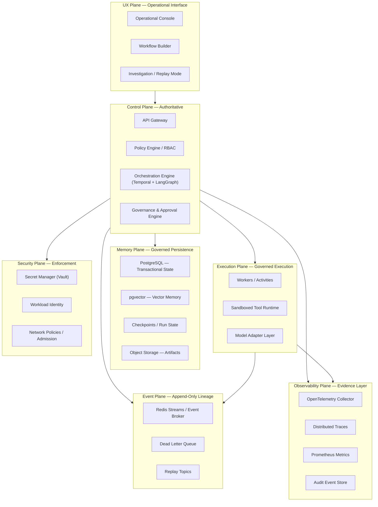

# MYCELIA — 00 Vision & Foundational Manifesto

---

## Document Metadata

| Field | Value |
|---|---|
| Document Series | MYCELIA Architecture Constitution |
| Document Number | 00 |
| Version | v2.0 |
| Status | Canonical |
| Classification | Foundational — All Engineering and Product Disciplines |
| Canonical Role | Platform constitution; root doctrine for all subsequent architecture documents |
| Primary Audience | Architects, Engineering Leads, Product Leadership, Codex, Enterprise Governance |
| Last Updated | May 2026 |

---

## Table of Contents

1. [Executive Summary](#1-executive-summary)
2. [Foundational Vision](#2-foundational-vision)
3. [What MYCELIA Is](#3-what-mycelia-is)
4. [What MYCELIA Is Not](#4-what-mycelia-is-not)
5. [The Fundamental Problem: Cognitive Operational Chaos](#5-the-fundamental-problem-cognitive-operational-chaos)
6. [Foundational Thesis](#6-foundational-thesis)
7. [Core Architectural Principles](#7-core-architectural-principles)
8. [Control Plane Doctrine](#8-control-plane-doctrine)
9. [Runtime Trust Model](#9-runtime-trust-model)
10. [Autonomy Boundaries](#10-autonomy-boundaries)
11. [Memory and Context Doctrine](#11-memory-and-context-doctrine)
12. [Governance and Human Supervision Doctrine](#12-governance-and-human-supervision-doctrine)
13. [Observability, Replay and Evidence Doctrine](#13-observability-replay-and-evidence-doctrine)
14. [Multi-Tenant and Organizational Boundary Doctrine](#14-multi-tenant-and-organizational-boundary-doctrine)
15. [Strategic Differentiation](#15-strategic-differentiation)
16. [Foundational Invariants](#16-foundational-invariants)
17. [Foundational Anti-Patterns](#17-foundational-anti-patterns)
18. [Relationship to the Remaining Constitution](#18-relationship-to-the-remaining-constitution)
19. [MVP Implications](#19-mvp-implications)
20. [Codex Alignment Notes](#20-codex-alignment-notes)
21. [Final Foundational Statement](#21-final-foundational-statement)

---

## 1. Executive Summary

MYCELIA is the cognitive operations runtime for enterprises that need AI to be more than capable — they need it to be governable.

### Canonical Definition

MYCELIA is a **governed cognitive operations infrastructure platform**. It is the control plane through which cognitive execution — the orchestration of AI agents, workflows, tools, memory, decisions, and human supervision — becomes deterministic, observable, auditable, recoverable, and organizationally safe.

The unit of value in MYCELIA is not the model response. It is the **governed run**: a workflow execution whose inputs are contextualized, whose tools are contracted, whose side effects are recorded, whose state is durable, whose governance decisions are attributable, and whose entire history can be replayed.

### Why MYCELIA Is Not a Chatbot or Prompt Wrapper

A chatbot processes inputs and produces outputs. It does not coordinate specialists. It does not pause for human approval. It does not durably persist state across restarts. It does not enforce tenant boundaries. It does not record what it did for inspection six months later.

A prompt wrapper dresses a model call in application code. It inherits all the fragility of direct model invocation: no durable state, no governance, no audit lineage, no replay, no safe failure.

MYCELIA is neither. It is the operational substrate on which enterprise-grade cognitive execution becomes possible.

### Foundational Thesis

> AI enterprise systems fail when they become operational before they become governable.

The intelligence exists. The models work. The capability is real. What breaks enterprise AI at scale is not model performance — it is operational governance. Without structured orchestration, durable state, policy enforcement, observable side effects, auditable decisions, and human supervision primitives, cognitive systems become unpredictable, unaccountable, and irreversible.

MYCELIA is the architectural answer to that failure mode.

### Governing Authority of This Document

Document 00 is the constitutional root of the MYCELIA Architecture. Every subsequent document in the series — from domain model to SRE runbooks — derives its architectural authority from this foundation. Documents may specialize, extend, and implement the principles defined here. They MUST NOT contradict them.

---

## 2. Foundational Vision

### 2.1 The Strategic Shift: From Model-Centric to Runtime-Centric AI

The first generation of enterprise AI adoption treated models as products. An organization subscribed to a model API, wrapped it in application logic, and called the result an AI feature. This approach works for narrow, self-contained tasks. It fails for anything that requires:

- multi-step reasoning across external systems;
- coordination between specialized agents;
- durable state that survives restarts;
- side effects that can be audited and reversed;
- human judgment at defined points;
- the ability to reconstruct what happened and why.

The strategic shift that MYCELIA embodies is from model-centric AI (where the model is the system) to **runtime-centric AI** (where the runtime governs how models, agents, tools, memory, and humans coordinate). The model becomes a bounded, replaceable component inside a governed execution substrate. The runtime is the defensible layer.

### 2.2 Why Enterprise AI Requires More Than Models

Enterprise AI requirements that model APIs alone cannot satisfy:

- **Orchestration:** Multi-step, multi-agent workflows require deterministic coordination, not ad hoc prompt chaining.
- **State:** Operations that span minutes, hours, or days cannot rely on in-context ephemeral state. State must be durable, versioned, and replayable.
- **Identity:** Every execution must carry organizational identity (tenant, workspace, actor, policy scope) from origin to output.
- **Approvals:** High-impact actions — financial, legal, destructive — require human authorization before execution.
- **Tools:** External system access must be governed by contracts, not arbitrary function calls.
- **Memory:** Long-running cognition requires structured memory, not transcript accumulation.
- **Observability:** Every operation must be traceable, attributable, and inspectable without instrumenting each feature individually.
- **Replay:** The ability to reconstruct any historical execution is an operational and compliance necessity.
- **Tenant Safety:** Data, context, and execution must be organizationally bounded.

MYCELIA exists because no combination of model API + application code provides all of these properties by default. They must be designed into the runtime itself.

### 2.3 Why Ungoverned Cognitive Execution Becomes Dangerous

An AI system that operates without governance does not stay harmless as it scales. It accumulates risk:

- Side effects that cannot be reversed because they were not recorded.
- State that cannot be reconstructed because it lived only in prompts.
- Actions that cannot be attributed because identity was not propagated.
- Decisions that cannot be explained because no rationale was preserved.
- Data that bleeds across organizational boundaries because tenancy was not enforced.
- Errors that cannot be reproduced because execution was not replayable.

At small scale, these problems are annoying. At enterprise scale, they are compliance failures, security incidents, and operational crises. MYCELIA treats governance not as a constraint added to AI after the fact, but as a design property of the execution substrate from the first line of architecture.

### 2.4 The Mycelial Metaphor

The name MYCELIA is deliberate. Mycelium — the underground network that connects and feeds an ecosystem — is the hidden infrastructure that makes surface-level activity possible. It carries nutrients, signals, and memory across distances. It is adaptive, distributed, and invisible to the operations it enables.

MYCELIA the platform is the same: invisible operational infrastructure that makes cognitive work possible at organizational scale. It does not generate the intelligence. It carries context, coordinates execution, enforces boundaries, persists memory, records evidence, and makes the cognitive ecosystem above it safe, governable, and recoverable.

---

## 3. What MYCELIA Is

### 3.1 Canonical Definitions

| Dimension | MYCELIA Definition |
|---|---|
| Nature | Governed cognitive operations infrastructure platform |
| Unit of execution | The governed workflow run: a deterministic execution with identity, state, policy, tools, memory, and audit lineage |
| Unit of trust | Execution lineage: the append-only record of what happened, under what policy, with what authorization, producing what effects |
| Control model | Control plane of cognitive execution — governs orchestration, memory, tools, governance, and observability |
| Execution model | Deterministic orchestration containing probabilistic cognition inside runtime envelopes |
| Memory model | Operational memory hierarchy: working, checkpoint, episodic, semantic, organizational — all governed and provenance-bearing |
| Governance model | Policy is executable, approval is a runtime state, humans are formal participants in workflow graphs |
| Observability model | Full execution lineage through append-only events, distributed traces, structured telemetry, and replay artifacts |
| Tenancy model | Tenant as execution boundary: all state, memory, telemetry, tools, and credentials are tenant-scoped |
| Agent model | Agents are specialized planning and reasoning units operating under runtime authority — they request, the runtime governs |
| Tool model | Tools are governed execution surfaces with contracts, credentials, side-effect classification, and replay behavior |
| Recovery model | Replay-safe, rollback-ready, backup-restored, with every recovery action audited and causation-traced |

### 3.2 What MYCELIA Does

MYCELIA governs:

- **Workflow orchestration** — deterministic graph execution with durable state, retry policies, and approval gates.
- **Agent coordination** — multi-agent task decomposition, delegation, and result aggregation under explicit ownership.
- **Context management** — assembly and propagation of structured working sets, not transcript accumulation.
- **Memory operations** — governed writes to and reads from a multi-tier memory hierarchy with provenance.
- **Tool execution** — contracted, sandboxed, idempotent, replay-safe execution of external operations.
- **Governance and approvals** — policy evaluation, approval routing, human authorization, and compliance evidence.
- **Observability** — distributed tracing, structured logging, metrics, and replay artifacts for every execution.
- **Tenant isolation** — organizational boundaries enforced at every layer: state, memory, tools, telemetry, and credentials.
- **Operational recovery** — rollback, restore, failover, and replay under structured, audited procedures.

---

## 4. What MYCELIA Is Not

### 4.1 Non-Goals

| Misinterpretation | Why It Is Wrong | MYCELIA Position |
|---|---|---|
| A chatbot | Chatbots process single-turn or multi-turn conversations without durable state, governance, or organizational boundaries | MYCELIA orchestrates durable, governed, multi-step workflows that may use conversational interfaces as one input surface |
| A prompt wrapper | Prompt wrappers delegate all logic, state, and policy to model context — making the system fragile and unauditable | MYCELIA treats prompts as artifacts, not authority. State, policy, and governance live in the runtime |
| A model provider | MYCELIA does not produce, host, or fine-tune models. It routes to models through a vendor-agnostic adapter layer | Model selection is a runtime configuration, not a platform feature |
| A generic AI assistant | Generic assistants prioritize ease of response. MYCELIA prioritizes governed execution, auditability, and organizational safety | MYCELIA is operational infrastructure, not a productivity tool |
| A prompt marketplace | Prompt templates are not governance. Sharing prompts does not constitute a governance layer | MYCELIA governs execution; prompt collections are content, not runtime |
| An unconstrained autonomous agent platform | Autonomous agents without governance become unpredictable and unaccountable at scale | MYCELIA bounds every agent with identity, policy, approval gates, and execution contracts |
| A no-code automation toy | Visual workflow tools that lack durable state, audit lineage, and governance cannot meet enterprise requirements | MYCELIA is enterprise cognitive infrastructure with a visual operational layer — not a form builder |
| A replacement for transactional systems | MYCELIA governs cognitive execution, not financial ledgers, inventory management, or ERP systems | MYCELIA integrates with transactional systems through governed tool contracts |
| A black-box workflow engine | Black-box systems cannot be replayed, audited, or explained | MYCELIA's execution is fully observable, replayable, and attributable |
| A single-vendor AI framework | Framework lock-in creates dependency on a model vendor's execution semantics | MYCELIA abstracts over model providers and cognitive frameworks through vendor-agnostic runtime design |

---

## 5. The Fundamental Problem: Cognitive Operational Chaos

### 5.1 Definition

**Cognitive Operational Chaos** is the failure mode that emerges when AI systems become operationally active before they become governable.

It is not a single failure. It is the compounding accumulation of structural weaknesses that, individually, are manageable, but collectively make an AI-operated enterprise system ungovernable, unauditable, and unsafe.

### 5.2 Fracture Map

| Fracture | Immediate Effect | Organizational Consequence | MYCELIA Response |
|---|---|---|---|
| Variable model behavior | Outputs are non-deterministic across runs | Cannot build reliable workflows on non-deterministic outputs | Deterministic orchestration; model output is bounded inside execution contracts |
| Fragile prompt chains | A single prompt change breaks downstream behavior | Silent regressions in business-critical processes | Workflow versioning; state outside prompts; deterministic control flow |
| Finite context windows | Long operations lose context as window fills | Decisions made on incomplete or hallucinated context | Multi-tier memory hierarchy; structured context assembly; checkpoint persistence |
| Hidden side effects | External mutations occur without records | Compliance failures; irrecoverable state corruption | Observable side effects through tool contracts; ToolSideEffect registry |
| Missing memory | Each run starts from zero | Context gaps produce inconsistent behavior at scale | Operational memory: episodic, semantic, organizational, checkpoint |
| Missing ownership | Nobody knows who authorized what | Accountability gaps in regulated environments | Actor identity propagated through every runtime envelope; approval records |
| Excessive agency | Agents perform actions beyond their intended scope | Unexpected external mutations; security incidents | Policy-bound execution; least-privilege tool access; approval gates |
| Unobservable tool use | Tool calls are invisible to the audit record | Cannot reconstruct what the system did | Mandatory tool telemetry; ToolInvocation audit records; execution traces |
| Missing replay | Failed runs cannot be reproduced | Debugging requires speculation; compliance cannot be demonstrated | Append-only event lineage; replay-safe execution; ToolReplayRecords |
| Cross-tenant leakage | Context from one organization reaches another | Data breach; regulatory violation; trust collapse | Tenant boundaries enforced at state, memory, tool, telemetry, and credential layers |
| Policy in prompts | Governance lives in natural language inside model context | Policy is unenforceable, unversionable, and unauditable | Policy as executable code outside model context; runtime policy evaluation |
| No human approval gates | High-impact actions execute without authorization | Irreversible external mutations without organizational consent | Approval as a formal runtime state; explicit gates in workflow graph |
| Inability to reconstruct execution | What the system did cannot be explained | Regulatory exposure; inability to learn from failure | Append-only event store; rationale preservation; replay artifacts |

### 5.3 The Compounding Dynamic

The fractures above do not occur in isolation. They compound. A prompt chain that loses context (fragile) also has no memory (missing memory), produces side effects (hidden), cannot be replayed (no replay), and attributes nothing to any actor (missing ownership). The result is an AI system that operates at scale while being functionally unobservable and unaccountable.

MYCELIA's architecture addresses each fracture systematically and structurally — not through application-layer workarounds, but through runtime primitives.

---

## 6. Foundational Thesis

### 6.1 The Core Thesis

> AI enterprise systems fail when they become operational before they become governable.

The intelligence exists. Models are capable, increasingly powerful, and rapidly commoditizing. The bottleneck is not capability — it is operational discipline. Organizations that deploy AI at scale without governance infrastructure discover that:

- They cannot audit what their systems did.
- They cannot reproduce failures.
- They cannot contain side effects.
- They cannot demonstrate compliance.
- They cannot assign accountability.
- They cannot roll back incorrect decisions.

The problem is not the model. The problem is the absence of a runtime that makes the model's execution governable.

### 6.2 Expanding the Thesis

**Intelligence is not enough.** A system that can generate correct answers but cannot record what it did, cannot be audited, and cannot be contained is not safe to operate in an enterprise. Capability without governance is risk.

**Coordination is the scarce asset.** At scale, the hard problem is not generating individual correct outputs — it is coordinating many agents, tools, approvals, and systems such that the aggregate behavior is deterministic, auditable, and recoverable. Coordination infrastructure is the strategic layer.

**Runtime is the source of trust.** Trust in an AI system is not produced by the model's benchmark scores. It is produced by the evidence that the system operated within its declared boundaries, under the correct policy, with the correct authorization, producing recorded effects. That evidence is produced by the runtime.

**Memory is an operational substrate.** Memory in MYCELIA is not the chatbot's ability to remember your name. It is the structured, governed, multi-tier operational fabric that ensures long-running cognition can access the correct context, preserve its working state, and reconstruct its history. Memory is infrastructure.

**Policy must be executable.** A governance policy that exists only as a document, a process description, or a system prompt is not enforceable. Policy must be evaluated at runtime, recorded at execution time, versioned alongside the execution it governed, and replayable alongside the run it authorized.

**Observability is evidence.** Telemetry in MYCELIA is not operational hygiene — it is compliance evidence. The trace that records which tool was called, with what authorization, producing what side effect, for which tenant, at what time is the artifact that makes accountability possible.

**Replay is accountability.** The ability to replay a historical run and reconstruct exactly what happened — which policy was active, which approval was granted, which tool was invoked, what was written to memory — is the operational form of accountability. Replay transforms "what did the system do?" from a question into a verifiable answer.

**Human supervision is architecture.** Human approval is not a fallback for when AI fails. It is a first-class runtime primitive. High-impact actions pause for authorization. Oversight is designed in, not added on.

**Tenant isolation is organizational safety.** An organization that shares a cognitive runtime with other organizations and trusts application-layer filtering to prevent data exposure is accepting unacceptable risk. Tenant isolation must be enforced at every layer: state, memory, tool execution, telemetry, credentials, and event lineage.

---

## 7. Core Architectural Principles

### 7.1 Principle 1 — Context First

**Definition:** Context is a structured, typed working set assembled deterministically from identity, scope, state, memory, policies, and operational budget. It is not a transcript.

**Architectural meaning:** Every run begins with explicit context construction. Context carries tenant_id, workspace_id, actor identity, policy scope, relevant memory artifacts, and current state references. Nothing enters the model's execution surface that has not been deliberately assembled.

**Implementation implication:** Context construction is a governed runtime operation. Context is assembled from typed sources, not accumulated from conversation history. Long-running context uses the memory hierarchy, not window accumulation.

**Forbidden interpretation:** Context as raw transcript accumulation. Context as model conversation history. Context as anything-goes input to a model prompt.

---

### 7.2 Principle 2 — Observability by Default

**Definition:** Every execution of cognitive relevance produces structured telemetry: trace, span, metrics, structured log, and lineage record. Observability is not instrumented after the fact.

**Architectural meaning:** The runtime emits telemetry for every significant operation — workflow step, tool invocation, memory access, policy evaluation, approval decision, and recovery action. The observability stack is part of the runtime, not an external monitoring bolt-on.

**Implementation implication:** No execution path exists in MYCELIA that does not emit telemetry. Adding a new operation requires adding telemetry as part of its definition, not as an afterthought.

**Forbidden interpretation:** "We'll add monitoring later." Observability as optional dashboards. Telemetry that drops under pressure. Security and governance events treated as operational noise.

---

### 7.3 Principle 3 — Explicit State Management

**Definition:** Critical operational state is persisted, versioned, and reconstructible. State that exists only in a model's context window is not state — it is ephemeral computation.

**Architectural meaning:** Workflow state, run state, memory state, and approval state are durable records stored outside the model context. State transitions are events in an append-only log. State can be inspected, replayed, and restored.

**Implementation implication:** No important state may exist only in a prompt. Every state transition emits an event. Checkpoints are created at meaningful workflow boundaries.

**Forbidden interpretation:** Using prompt summarization as the primary state persistence mechanism. Trusting model recall for operational continuity. Discarding intermediate state for efficiency.

---

### 7.4 Principle 4 — Memory Before Autonomy

**Definition:** An agent that operates without structured, reliable memory is not autonomous — it is amnesic at scale. Memory infrastructure precedes autonomous capability.

**Architectural meaning:** The memory hierarchy (working, checkpoint, episodic, semantic, organizational) is operational infrastructure. Memory access is governed. Memory writes carry provenance. Long-running agents retrieve from memory rather than reconstructing from context.

**Implementation implication:** Memory services are foundational infrastructure. Agent capabilities that require reliable recall are built on top of the memory fabric, not on model-internal representations.

**Forbidden interpretation:** Agent autonomy without memory infrastructure. Model context as the only memory. Memory that does not carry provenance or classification.

---

### 7.5 Principle 5 — Deterministic Orchestration

**Definition:** Workflow control flow is deterministic. Given the same execution history, the orchestration engine produces the same control decisions. Side effects are isolated in activities and tools; they do not contaminate the orchestration layer.

**Architectural meaning:** The orchestration engine does not perform external I/O directly. It schedules, coordinates, and records. Nondeterminism is bounded inside worker execution and model inference. The workflow graph and its control logic can be replayed from event history.

**Implementation implication:** No external API calls inside workflow orchestration code. No random number generators in control flow logic. No time-dependent branching without explicit time capture.

**Forbidden interpretation:** Workflow code that calls external systems directly. Orchestration logic that produces different control decisions given the same event history. Hidden nondeterminism in workflow definitions.

---

### 7.6 Principle 6 — Bounded Probabilistic Cognition

**Definition:** Model inference — inherently probabilistic — executes inside defined execution boundaries. The runtime constrains what the model can observe, what it can affect, and what authority its output carries.

**Architectural meaning:** The model reasons inside a runtime envelope that defines input scope, output schema, tool access, memory permissions, and execution budget. Model output is data; it requires validation before it can affect state, memory, or external systems.

**Implementation implication:** Model output validation is mandatory. Models receive typed context, not arbitrary input. Model-selected tool calls are evaluated by the policy engine before execution. Output schemas are contracts.

**Forbidden interpretation:** Treating model output as authoritative instructions. Allowing models to select and execute high-impact tools without policy evaluation. Letting model context carry credentials or governance decisions.

---

### 7.7 Principle 7 — Human Supervision as Runtime Primitive

**Definition:** Human oversight is a first-class execution capability, not a fallback. Approval, override, rejection, and escalation are formal states in workflow graphs.

**Architectural meaning:** The approval engine is platform infrastructure. Approval requirements are declared in governance configuration. Workflows can pause, block, and resume based on human decisions. Human decisions are recorded as immutable approval artifacts.

**Implementation implication:** Approval nodes appear in workflow graphs as peers to computation nodes. The platform routes approval requests to appropriate authorizers. Approval decisions are part of the replay artifact.

**Forbidden interpretation:** Human review as a post-execution process. Approval as an informal side channel. High-impact actions that execute without any human authorization path.

---

### 7.8 Principle 8 — Policy Outside Prompts

**Definition:** Governance policy is executable code evaluated at runtime by the policy engine. It is not a natural language instruction in a system prompt.

**Architectural meaning:** Policy lives in the governance layer as versioned, structured rules evaluated against runtime context. Policy evaluation produces structured decisions that are recorded alongside the execution they governed. Policy cannot be overridden by prompt manipulation.

**Implementation implication:** The policy engine evaluates every tool invocation, memory write, and state transition against active policy. Policy snapshots are bound to execution records for replay. Prompt content cannot elevate or override policy decisions.

**Forbidden interpretation:** "Follow the instructions in the system prompt" as governance. Policy that lives in a README. Policy that changes without version control. Policy that can be bypassed by prompt crafting.

---

### 7.9 Principle 9 — Vendor-Agnostic Runtime

**Definition:** MYCELIA abstracts over model providers, cognitive frameworks, and infrastructure vendors. Platform guarantees do not depend on a specific provider's implementation.

**Architectural meaning:** The model adapter layer accepts multiple providers (OpenAI, Anthropic, Google, Ollama, OpenRouter, and others). Workflow definitions are framework-portable. Infrastructure is cloud-agnostic through IaC.

**Implementation implication:** Provider-specific behavior is isolated in adapter code. Workflow logic does not reference provider-specific APIs. Model selection is a runtime configuration, not a code change.

**Forbidden interpretation:** Workflows that only work with a specific model. State persistence that requires a specific provider's memory feature. Governance that depends on a provider's content policy.

---

### 7.10 Principle 10 — Least-Privilege Execution

**Definition:** Every execution principal — agent, worker, tool, SDK client — operates with the minimum permissions necessary for its declared purpose.

**Architectural meaning:** Permissions are scoped to the specific run, the specific workflow step, and the specific declared capability. Workers do not accumulate permissions across runs. Tools do not access resources outside their declared scope. Credentials are leased for execution windows, not owned permanently.

**Implementation implication:** Permission sets are declared as part of tool manifests and workflow definitions. The runtime evaluates minimum permissions at execution time. Privilege elevation requires explicit approval.

**Forbidden interpretation:** Service accounts with wildcard permissions. Workers with persistent access to all credentials. Tools that can access any external system regardless of declared scope.

---

### 7.11 Principle 11 — Replay-Safe Execution

**Definition:** Every workflow run is replayable. Side effects are suppressible during replay. Original lineage is immutable.

**Architectural meaning:** Tool executions that produce side effects record their outputs as replay artifacts. During replay, those artifacts are returned without re-executing the side effect. The original event history is never modified.

**Implementation implication:** Replay behavior is declared in every tool's execution contract. Replay environments are isolated from production credentials and production event streams. Replay divergence is detected and reported.

**Forbidden interpretation:** Replay that re-executes external writes automatically. Replay that modifies the original event store. Replay that uses production credentials.

---

### 7.12 Principle 12 — Tenant-Native Isolation

**Definition:** Tenant isolation is a foundational runtime property, not an application-layer filter. Tenant boundaries are enforced at state, memory, tool execution, telemetry, and credential layers.

**Architectural meaning:** Tenant_id is present in every runtime operation. State is stored in tenant-scoped namespaces. Memory is tenant-partitioned. Tool artifacts are tenant-prefixed. Telemetry is tenant-attributed. Credentials are tenant-leased, not globally shared.

**Implementation implication:** Cross-tenant access is architecturally prevented, not policy-controlled. Tenant boundary violations are security incidents, not access errors.

**Forbidden interpretation:** Row-level security as the only tenant boundary. Filtering as the sole isolation mechanism. Shared credentials serving multiple tenants. Telemetry that aggregates across tenants without explicit authorization.

---

### 7.13 Principle 13 — Explainable Agent Chains

**Definition:** Explainability means that any historical execution can be reconstructed: what policy was applied, what tools were used, what evidence was considered, what rationale was recorded, what decisions were made, and what effects were produced.

**Architectural meaning:** Every execution records a rationale summary, the policy snapshot under which it operated, the tool invocations it performed, the artifacts it produced, and the governance decisions it received. Explainability is a consequence of operational discipline, not a separate feature.

**Implementation implication:** Rationale records are produced by workflow execution, not by model chain-of-thought. Execution reconstruction is available through the replay and investigation system.

**Forbidden interpretation:** Exposing raw model chain-of-thought as the explainability mechanism. Explainability that requires access to the model's internal state. Post-hoc reconstructions that do not match actual execution history.

---

### 7.14 Principle 14 — No Hidden Side Effects

**Definition:** Every external mutation produced by a MYCELIA execution is declared, recorded, and associated with a specific invocation, actor, and policy context.

**Architectural meaning:** Side effects are classified in tool manifests. Side effect records are persisted as part of the execution audit. Side effects are suppressible during replay. Hidden side effects are architectural violations.

**Implementation implication:** Tool execution that produces an undeclared side effect is a contract violation. The runtime monitors for side effects inconsistent with declared classifications and flags them as security events.

**Forbidden interpretation:** Tool implementations that produce external mutations without declaring them. Orchestration code that directly calls external APIs. Workers that accumulate side effects without registering them.

---

### 7.15 Principle 15 — Runtime Before Autonomy

**Definition:** Autonomous capability is built on top of governance infrastructure — never below it. No capability is deployed that operates without the runtime's oversight.

**Architectural meaning:** The sequence of platform maturity is: observability → state → governance → memory → distribution → autonomy. Autonomous capability is a late-stage property of a platform that has already demonstrated reliable, governed operation.

**Implementation implication:** Features that increase autonomy are introduced after their governance infrastructure is in place. The MVP proves governed execution before it proves autonomous capability.

**Forbidden interpretation:** Deploying autonomous agents before governance infrastructure is operational. Using autonomy as a marketing feature without underlying governance. "We'll govern it later."

You are acting as a Principal Platform Architect, Enterprise AI Runtime Strategist, Cognitive Operations Architect, Technical Constitution Editor and Foundational Product Architect.

Your task is to refactor and canonize ONLY the official MYCELIA foundation document:

# MYCELIA — 00 Vision & Foundational Manifesto

File name:

00-vision-and-foundational-manifesto.md

PDF file name:

00-vision-and-foundational-manifesto.pdf

============================================================
CRITICAL SCOPE WARNING
============================================================

This is DOCUMENT 00.

Do NOT create Document 01.
Do NOT create Document 02.
Do NOT create Document 03.
Do NOT create any other document.

Your task is NOT to write a PRD.
Your task is NOT to define detailed runtime architecture.
Your task is NOT to define infrastructure.
Your task is NOT to define SRE.
Your task is NOT to define SDK/tool runtime.
Your task is NOT to define UX.
Your task is NOT to define APIs.

Your task is to produce the canonical foundational manifesto for MYCELIA.

This document must define:

- what MYCELIA is;
- what MYCELIA is not;
- why MYCELIA exists;
- what problem it solves;
- what architectural philosophy guides it;
- what principles govern the entire platform;
- what boundaries must never be violated;
- what strategic thesis makes MYCELIA defensible;
- how all future documents must remain aligned with this foundation.

This document is the philosophical and architectural constitution of the platform.

============================================================
SOURCE MATERIAL
============================================================

Use the existing uploaded document:

00-vision-and-foundational-manifesto.md

as the primary source of truth.

Preserve all useful ideas from the original document, including but not limited to:

- MYCELIA as cognitive operational infrastructure;
- MYCELIA as control plane for cognitive execution;
- not a chatbot;
- not a prompt wrapper;
- not a generic copilot;
- not a generic SaaS automation tool;
- cognitive operational chaos;
- deterministic orchestration;
- governed cognitive execution;
- durable runtime;
- workflows;
- agents;
- memory;
- context;
- approvals;
- tracing;
- telemetry;
- replay;
- human supervision;
- vendor-agnostic model runtime;
- control plane vs execution plane;
- context first;
- observability by default;
- memory before autonomy;
- explicit state management;
- explainable agent chains;
- least-privilege execution;
- prompts are not policy;
- models are not source of truth;
- agents are not sovereign authorities.

Also use Documents 15, 16 and 17 only as style and maturity references.

Use Document 01 only to avoid overlap with PRD content.

Do not copy large technical sections from later documents into this one.

Document 00 must remain foundational, not operationally bloated.

============================================================
DELIVERABLE REQUIREMENT
============================================================

You MUST produce TWO final deliverables:

1. A complete Markdown file:

00-vision-and-foundational-manifesto.md

2. A complete PDF file:

00-vision-and-foundational-manifesto.pdf

The PDF MUST be generated from the same Markdown content.

The PDF MUST NOT be:
- a summary;
- a shortened version;
- a slide deck;
- a reduced executive brief.

The PDF must preserve:
- all sections;
- all tables;
- all diagrams;
- all principles;
- all invariants;
- all anti-patterns.

If binary PDF generation is not available, generate:
- the full Markdown document;
- a PDF-ready HTML version;
- exact export instructions to convert it into PDF without content loss.

However, your primary goal is to provide both final files directly.

============================================================
OUTPUT FORMAT RULES
============================================================

Write the final document directly in Markdown.

Do NOT generate:
- a prompt;
- an outline only;
- a template;
- placeholders;
- TODOs;
- generic AI manifesto;
- startup pitch;
- marketing copy;
- blog article;
- shallow vision document;
- product requirements document;
- implementation plan;
- technical architecture document.

Start the Markdown exactly with:

# MYCELIA — 00 Vision & Foundational Manifesto

Do not include any text before the title.

Do not include commentary after the document.

============================================================
PROJECT CONTEXT
============================================================

MYCELIA is a governed cognitive operations infrastructure platform.

MYCELIA is NOT:
- a chatbot;
- a prompt wrapper;
- a generic copilot;
- a generic SaaS workflow app;
- a whiteboard;
- a shallow automation tool;
- a playground of autonomous agents;
- a model provider;
- a prompt marketplace;
- a cosmetic AI interface.

MYCELIA is:
- a runtime for governed cognitive operations;
- a control plane for cognitive execution;
- an orchestration-aware execution substrate;
- a replayable workflow runtime;
- a memory and context operating layer;
- a governance-aware AI execution platform;
- a multi-tenant operational control plane;
- an event-driven coordination system;
- an observable, auditable and policy-enforced runtime;
- an infrastructure layer for operational cognition.

============================================================
CANONICAL DOCUMENT LIST
============================================================

The MYCELIA Architecture Constitution contains the following documents:

FOUNDATION

00 — Vision & Foundational Manifesto  
00-vision-and-foundational-manifesto.md

01 — Product Requirements & Operational Scope  
01-product-requirements-and-operational-scope.md

02 — Core Runtime Architecture  
02-core-runtime-architecture.md

03 — Canonical Domain Model  
03-canonical-domain-model.md

04 — Cognitive Execution Model  
04-cognitive-execution-model.md

05 — Agent Runtime & Coordination  
05-agent-runtime-and-coordination.md

06 — State, Checkpoint & Persistence Architecture  
06-state-checkpoint-and-persistence-architecture.md

07 — Event & Messaging Contracts  
07-event-and-messaging-contracts.md

08 — Event Runtime Deep Technical Specification  
08-event-runtime-deep-technical-specification.md

ORCHESTRATION LAYER

09 — Workflow Orchestration Engine Specification  
09-workflow-orchestration-engine-specification.md

10 — Memory & Context Architecture  
10-memory-and-context-architecture.md

11 — Governance, Policy & Approval Engine  
11-governance-policy-and-approval-engine.md

12 — Observability & Telemetry Platform  
12-observability-and-telemetry-platform.md

13 — Security & Trust Architecture  
13-security-and-trust-architecture.md

14 — Multi-Tenant Isolation & Organizational Boundaries  
14-multi-tenant-isolation-and-organizational-boundaries.md

EXECUTION & TOOLING

15 — SDK, Tool Runtime & Execution Contracts  
15-sdk-tool-runtime-and-execution-contracts.md

16 — Infrastructure & Deployment Architecture  
16-infrastructure-and-deployment-architecture.md

17 — SRE, Operational Recovery & Runbooks  
17-sre-operational-recovery-and-runbooks.md

18 — External APIs & Integration Contracts  
18-external-apis-and-integration-contracts.md

THE CODEX BRAIN

19 — Codex Operational Alignment & Engineering Constitution  
19-codex-operational-alignment-and-engineering-constitution.md

VISUAL & UX

20 — Operational UX & Runtime Visualization System  
20-operational-ux-and-runtime-visualization-system.md

21 — Workflow Builder & Graph Editing Semantics  
21-workflow-builder-and-graph-editing-semantics.md

22 — Investigation Mode, Replay & Runtime Diff UX  
22-investigation-mode-replay-and-runtime-diff-ux.md

23 — Evaluation, Benchmark & AI Quality Framework  
23-evaluation-benchmark-and-ai-quality-framework.md

24 — Enterprise Scaling & Distributed Runtime Evolution  
24-enterprise-scaling-and-distributed-runtime-evolution.md

25 — Architectural Decision Records Index  
25-architectural-decision-records-index.md

Document 00 must establish the principles that all later documents obey.

============================================================
ARCHITECTURAL LANGUAGE TO PRESERVE
============================================================

This document MUST preserve MYCELIA’s architectural language:

- deterministic orchestration;
- probabilistic cognition contained inside execution boundaries;
- append-only event lineage;
- replay-safe execution;
- tenant isolation;
- workspace isolation;
- runtime envelopes;
- governance-aware execution;
- policy-enforced tools;
- observable side effects;
- immutable auditability;
- context and memory isolation;
- explicit approval gates;
- no hidden execution;
- no invisible side effects;
- no agent-owned authority;
- no prompt-only state;
- no cross-tenant cognition;
- no replay mutation of original lineage;
- no live credentials during replay;
- no tool execution without contract;
- no memory mutation without lineage;
- no governance bypass without audit;
- no infrastructure change without traceability;
- no production deployment without rollback path;
- no incident response without evidence;
- no recovery action without causation record.

============================================================
DOCUMENT PURPOSE
============================================================

This document must become the canonical manifesto for MYCELIA.

It should answer:

- Why does MYCELIA exist?
- What failure mode does it solve?
- Why are prompts insufficient as system architecture?
- Why are agents insufficient without runtime?
- Why is governance part of execution?
- Why must memory be explicit?
- Why must state be durable?
- Why must side effects be observable?
- Why must replay be native?
- Why must tenant isolation be foundational?
- Why must human supervision be a runtime primitive?
- Why is MYCELIA a platform layer, not an application feature?
- What architectural promises must every future document preserve?

Core thesis:

AI enterprise systems fail when they become operational before they become governable.

MYCELIA exists to make cognitive execution governable, observable, recoverable and safe.

============================================================
MANDATORY STYLE
============================================================

Use serious enterprise architecture language.

The document must feel like:
- a foundational technical manifesto;
- an architecture constitution;
- a strategic platform doctrine;
- an internal founding document for a major enterprise runtime platform.

It must NOT feel like:
- marketing copy;
- startup landing page;
- investor pitch;
- motivational essay;
- generic AI manifesto;
- shallow product vision.

Use normative language when appropriate:

- MUST;
- MUST NOT;
- SHOULD;
- MAY;
- REQUIRED;
- FORBIDDEN.

But do not overuse normative language in poetic/philosophical sections.

The tone should be:
- precise;
- strategic;
- architectural;
- visionary but grounded;
- canonical;
- intellectually serious;
- implementation-aware.

============================================================
MANDATORY STRUCTURE
============================================================

## Document Metadata

Include:

- Document Series;
- Document Number;
- Version;
- Status;
- Classification;
- Canonical Role;
- Primary Audience;
- Last Updated.

## Table of Contents

Generate a complete table of contents.

## 1. Executive Summary

Define MYCELIA in one strong canonical formulation.

Explain:
- MYCELIA as cognitive operational infrastructure;
- MYCELIA as control plane for cognitive execution;
- why MYCELIA is not a chatbot or prompt wrapper;
- why the unit of value is governed execution, not model response;
- why runtime, memory, policy, observability and recovery matter;
- why this document governs all subsequent architecture documents.

Include one strong thesis statement.

## 2. Foundational Vision

Explain:
- the strategic shift from model-centric AI to runtime-centric AI;
- why enterprise AI requires orchestration, state, identity, approvals, tools and replay;
- why cognitive execution becomes dangerous without governance;
- why MYCELIA exists as a coordination substrate;
- why the mycelial metaphor matters: distributed, hidden, adaptive, memory-bearing infrastructure.

Do not become poetic without architecture.

## 3. What MYCELIA Is

Define MYCELIA as:

- governed cognitive operations runtime;
- operational intelligence infrastructure;
- control plane for agentic execution;
- memory and context substrate;
- workflow and orchestration substrate;
- governance and approval substrate;
- observability and replay substrate;
- multi-tenant operational boundary system.

Include a table:

| Dimension | MYCELIA Definition |
|---|---|

## 4. What MYCELIA Is Not

Explicitly define non-goals:

- not a chatbot;
- not a prompt wrapper;
- not a model provider;
- not a generic AI assistant;
- not a prompt marketplace;
- not an unconstrained autonomous agent platform;
- not a generic no-code automation toy;
- not a replacement for transactional systems;
- not a black-box workflow engine;
- not a single-vendor framework.

Include:

| Misinterpretation | Why It Is Wrong | MYCELIA Position |
|---|---|---|

## 5. The Fundamental Problem: Cognitive Operational Chaos

Define “cognitive operational chaos” as the core failure mode.

Explain how chaos emerges from:

- variable model behavior;
- fragile prompt chains;
- finite context windows;
- hidden side effects;
- missing memory;
- missing ownership;
- excessive agency;
- unobservable tool use;
- missing replay;
- cross-tenant leakage;
- policy in prompts;
- lack of human approval gates;
- inability to reconstruct execution.

Include a table:

| Fracture | Immediate Effect | Organizational Consequence | MYCELIA Response |
|---|---|---|---|

## 6. Foundational Thesis

State and explain the core thesis:

AI enterprise systems fail when they become operational before they become governable.

Then expand:

- intelligence is not enough;
- coordination is the scarce asset;
- runtime is the source of trust;
- memory is an operational substrate;
- policy must be executable;
- observability is evidence;
- replay is accountability;
- human supervision is architecture;
- tenant isolation is organizational safety.

## 7. Core Architectural Principles

Define the canonical principles:

1. Context First
2. Observability by Default
3. Explicit State Management
4. Memory Before Autonomy
5. Deterministic Orchestration
6. Bounded Probabilistic Cognition
7. Human Supervision as Runtime Primitive
8. Policy Outside Prompts
9. Vendor-Agnostic Runtime
10. Least-Privilege Execution
11. Replay-Safe Execution
12. Tenant-Native Isolation
13. Explainable Agent Chains
14. No Hidden Side Effects
15. Runtime Before Autonomy

For each principle include:
- definition;
- architectural meaning;
- implementation implication;
- forbidden interpretation.

Use a table or subsections.

## 8. Control Plane Doctrine

Explain MYCELIA as the control plane of cognitive execution.

Define:
- control plane;
- execution plane;
- memory plane;
- event plane;
- governance plane;
- observability plane;
- security plane;
- UX plane.

Explain why:
- models execute inside boundaries;
- agents request, but runtime governs;
- tools are contracts, not freedoms;
- prompts are artifacts, not authority;
- workflows are durable execution structures;
- state belongs to the runtime.

Include Mermaid diagram showing canonical planes at a high level.

## 9. Runtime Trust Model

Define the trust model:

- trust is not produced by model quality alone;
- trust is produced by lineage, policy, approval, telemetry, replay and isolation;
- runtime trust requires evidence;
- every important operation must be attributable;
- every side effect must be observable;
- every governance decision must be reconstructable.

Include a trust equation style formulation, for example:

Operational Trust = Identity + Policy + State + Memory + Trace + Replay + Approval + Isolation

## 10. Autonomy Boundaries

Explain:
- autonomy is bounded;
- agents are not sovereign;
- tools are not arbitrary;
- policies constrain execution;
- approvals gate high-impact actions;
- model outputs are not authoritative;
- human supervision is not optional fallback.

Include forbidden patterns:

- autonomous agents with unrestricted tools;
- prompt-only governance;
- invisible side effects;
- unbounded loops;
- hidden retries;
- unapproved external mutations;
- cross-tenant reasoning.

## 11. Memory and Context Doctrine

Explain:
- context is not transcript accumulation;
- memory is not chatbot memory;
- memory is operational infrastructure;
- context windows must be assembled deterministically;
- memory must preserve provenance;
- memory writes must be governed;
- replay requires context snapshots;
- long-running cognition requires memory hierarchy.

Do not design Document 10 in detail. Stay at doctrine level.

## 12. Governance and Human Supervision Doctrine

Explain:
- governance is runtime infrastructure;
- policy is executable;
- approval is a runtime state;
- humans participate as formal actors;
- high-impact actions require gates;
- governance must be replay-safe;
- policy cannot live only in prompts.

Do not redesign Document 11. Stay at doctrine level.

## 13. Observability, Replay and Evidence Doctrine

Explain:
- observability is not monitoring only;
- telemetry is operational evidence;
- traces represent execution lineage;
- replay is not retry;
- replay is investigation and accountability;
- original execution lineage must never be mutated;
- audit evidence must survive failure.

Do not redesign Document 12 or 17. Stay at doctrine level.

## 14. Multi-Tenant and Organizational Boundary Doctrine

Explain:
- tenancy is not billing metadata;
- tenant is an execution boundary;
- workspace is organizational segmentation;
- no cross-tenant cognition;
- no shared memory;
- no shared telemetry lineage;
- no implicit federation;
- boundary violations are security incidents.

Do not redesign Document 14. Stay at doctrine level.

## 15. Strategic Differentiation

Explain what makes MYCELIA defensible:

- control plane around AI execution;
- memory and context fabric;
- replay-safe cognitive workflows;
- governed tool execution;
- operational visualization;
- tenant-safe cognitive infrastructure;
- vendor-agnostic model routing;
- audit-grade execution lineage;
- enterprise trust through runtime discipline.

Avoid marketing fluff.

## 16. Foundational Invariants

Generate at least 60 foundational invariants.

These should be platform-level principles, not implementation-specific details.

Examples:
- No prompt may be treated as policy authority.
- No model output may become authoritative state without validation.
- No agent may own unrestricted tool authority.
- No execution may occur without lineage.
- No side effect may be invisible.
- No tenant boundary may be crossed implicitly.
- No replay may mutate original lineage.
- No approval-required action may bypass approval.
- No memory mutation may occur without provenance.
- No workflow execution may exist without traceability.

## 17. Foundational Anti-Patterns

Explicitly prohibit at least 40 anti-patterns.

Examples:
- prompt-as-policy;
- agent-as-authority;
- chatbot-as-runtime;
- hidden tool execution;
- opaque multi-agent chains;
- shared cross-tenant memory;
- replay as re-execution;
- unbounded autonomy;
- governance as documentation only;
- observability after production;
- state inside prompts;
- secrets inside context;
- no approval gates;
- vendor lock-in at runtime layer.

## 18. Relationship to the Remaining Constitution

Explain how Document 00 governs the later documents:

- Document 01 turns vision into product scope;
- Document 02 turns doctrine into runtime architecture;
- Document 03 defines canonical entities;
- Document 04 defines cognitive execution;
- Document 05 defines agents;
- Document 06 defines state/checkpoint/persistence;
- Document 07–08 define events;
- Document 09–14 define orchestration, memory, governance, observability, security and tenancy;
- Document 15–18 define execution, tooling, infrastructure, operations and integrations;
- Document 19 defines Codex engineering alignment;
- Document 20–22 define operational UX;
- Document 23–25 define evaluation, scaling and architectural decisions.

Make clear:

Later documents may specialize Document 00, but must not contradict it.

## 19. MVP Implications

Keep this brief.

Explain how the manifesto affects MVP:

- MVP must be narrow;
- MVP must prove governed execution;
- MVP must prove replayable workflows;
- MVP must prove memory/context discipline;
- MVP must prove approval gates;
- MVP must prove observability;
- MVP must not attempt unrestricted autonomy.

Do not write a detailed MVP plan. That belongs to Document 01/02.

## 20. Codex Alignment Notes

Briefly define how Codex should use Document 00:

- treat it as architectural constitution;
- do not optimize against its principles;
- do not implement shortcuts that violate invariants;
- prefer explicit state over hidden behavior;
- prefer governed execution over autonomous shortcuts;
- preserve tenant boundaries;
- preserve replay safety;
- preserve auditability.

Do not write full Codex constitution. That belongs to Document 19.

## 21. Final Foundational Statement

End with a strong final statement.

The final sentence should be:

In MYCELIA, intelligence is not trusted because it answers.

It is trusted because it can be governed, observed, replayed and contained.

============================================================
QUALITY BAR
============================================================

The final document must be:

- more mature than the current 00;
- faithful to the current 00;
- cleaner than the current 00;
- less mixed with PRD than the current 00;
- more canonical and constitutional;
- aligned with the style maturity of Documents 15, 16 and 17;
- suitable for Codex as the root architectural doctrine;
- suitable for PDF export;
- free of generic AI hype;
- free of shallow startup language.

Do not lose useful information from the original document.

Do not dilute the vision.

Make it sharper, cleaner, more canonical and more implementation-aware.

---

## 8. Control Plane Doctrine

### 8.1 MYCELIA as Control Plane

The control plane / execution plane distinction is fundamental to MYCELIA's architecture. The control plane decides what happens. The execution plane does what the control plane directs.

In MYCELIA:

- **Control plane** governs orchestration, policy, identity, state, memory, governance, and observability.
- **Execution plane** contains workers, tool runtimes, sandboxes, and model inference.

The execution plane is where nondeterminism is permitted and contained. The control plane remains deterministic, auditable, and authoritative.

### 8.2 Plane Definitions

| Plane | Role | Governance Position |
|---|---|---|
| Control Plane | API gateway, orchestration engine, policy engine, tenant resolution, workflow management | Authoritative — governs all other planes |
| Execution Plane | Workers, tool runtimes, sandboxed execution, model adapter layer | Governed — executes under control plane authority |
| Memory Plane | PostgreSQL, pgvector, object storage, memory indexing, context snapshots | Governed — writes require control plane permission |
| Event Plane | Event brokers, streams, DLQ, replay topics, event lineage | Append-only — governed by runtime; never mutated in place |
| Governance Plane | Policy engine, approval engine, audit records | Authoritative — evaluates all policy decisions |
| Observability Plane | OTel collectors, traces, logs, metrics, dashboards | Passive-recording — receives all execution evidence |
| Security Plane | Secret manager, workload identity, admission controls, network policies | Enforcing — validates all execution contexts |
| UX Plane | Operational console, workflow builder, investigation mode, runtime visualization | Representing — displays runtime state; does not govern it |

### 8.3 Control Plane Axioms

- Models execute inside execution boundaries. They do not govern.
- Agents request. The runtime governs.
- Tools are contracts. They are not freedoms granted to agents.
- Prompts are artifacts assembled by the runtime. They are not authority.
- Workflows are durable execution structures. They are not ephemeral conversations.
- State belongs to the runtime. It does not belong to the model.

### 8.4 Canonical Runtime Architecture



---

## 9. Runtime Trust Model

### 9.1 What Produces Operational Trust

Trust in a cognitive runtime is not produced by model quality alone. A model that produces correct outputs in a system that cannot record what it did, cannot be audited, and cannot be replayed does not produce organizational trust. It produces individual impressions.

Operational trust requires verifiable evidence of governed execution.

### 9.2 The Trust Equation

```
Operational Trust =
  Identity        (who acted)
+ Policy          (under what rules)
+ State           (starting from what context)
+ Memory          (informed by what knowledge)
+ Trace           (producing what observable lineage)
+ Replay          (reconstructible how and why)
+ Approval        (authorized by whom)
+ Isolation       (without affecting whom else)
```

Each term in the equation is necessary. An execution with identity but without trace is unverifiable. An execution with trace but without isolation is a shared liability. An execution with approval but without replay cannot be reconstructed if challenged. All eight properties are required for full operational trust.

### 9.3 Trust Properties per Execution

Every governed run in MYCELIA MUST produce:

- A recorded identity: tenant_id, workspace_id, actor_id, workflow_id, run_id.
- A policy snapshot: the versioned policy state under which the run was evaluated.
- A state record: what the run began with, what checkpoints it created.
- A memory provenance record: what it read from and wrote to memory.
- A trace: the full distributed execution lineage with span hierarchy.
- A replay artifact: the record enabling the run to be replayed without re-executing side effects.
- An approval record: for any governance decision made during the run.
- An isolation boundary: confirmed tenant scope for all state, artifacts, and telemetry produced.

---

## 10. Autonomy Boundaries

### 10.1 The Nature of Bounded Autonomy

MYCELIA is not anti-autonomy. Autonomous cognitive execution is the goal. The constraint is sequencing: autonomy is earned, not assumed. It is built on top of governance infrastructure that already works.

A system where agents can plan and execute without constraints is not an autonomous system — it is an uncontrolled system. The distinction matters operationally.

### 10.2 What Agents Are and Are Not

| Agents Are | Agents Are Not |
|---|---|
| Planning and reasoning units | Autonomous authorities |
| Specialized execution participants | Owners of unrestricted tool access |
| Requestors of runtime operations | Governors of their own execution |
| Bounded probabilistic systems | Sources of authoritative state |
| Participants in governed workflows | Owners of credentials or permissions |

### 10.3 Forbidden Autonomy Patterns

The following autonomy patterns are architecturally FORBIDDEN in MYCELIA:

- **Autonomous agents with unrestricted tools.** Every tool a model can invoke must be declared in the workflow's execution contract, evaluated by the policy engine, and bounded by a side-effect class.
- **Prompt-only governance.** A system prompt instruction is not a governance policy. It cannot be enforced, versioned, audited, or replayed.
- **Invisible side effects.** Any external mutation not declared, recorded, and attributed is a governance failure.
- **Unbounded execution loops.** Every agent execution must operate within declared iteration budgets, time budgets, and cost budgets.
- **Hidden retries.** Retry attempts that are not recorded in the execution lineage are hidden executions.
- **Unapproved external mutations.** Actions that modify external systems, financial positions, legal records, or destructive state must pass through approval gates.
- **Cross-tenant reasoning.** Cognitive execution for one tenant must not observe, reference, or reason over another tenant's data.
- **Model-selected credential access.** A model cannot select which credentials to use. Credentials are leased by the runtime based on declared tool requirements.
- **Agent self-modification.** Agents cannot modify their own execution parameters, policy scope, or memory permissions.
- **Autonomous recovery actions.** Recovery operations (rollback, restore, credential revocation) are human-authorized, audited operations — not autonomous agent capabilities.

---

## 11. Memory and Context Doctrine

### 11.1 Memory as Infrastructure

Memory in MYCELIA is not model state. It is operational infrastructure. Like a database in a transactional system, memory serves as the authoritative, governed, persistent substrate for contextual knowledge.

MYCELIA's memory hierarchy has five tiers:

1. **Working Memory:** The typed context assembled for a specific execution step. Ephemeral within the step; captured in checkpoints at boundaries.
2. **Checkpoint Memory:** Durable state snapshots at meaningful workflow boundaries. The authoritative record of run state.
3. **Episodic Memory:** Records of past executions, interactions, and events available for retrieval by future runs.
4. **Semantic Memory:** Vector-indexed knowledge accessible through similarity search, governed by classification and policy.
5. **Organizational Memory:** Persistent, tenant-scoped knowledge that accumulates across runs and is explicitly managed.

### 11.2 Memory Doctrine Rules

- Context is assembled deterministically, not accumulated as transcript.
- Memory writes require explicit permission and carry provenance records.
- Memory reads are governed operations that produce audit entries when they access sensitive classifications.
- The checkpoint is the authoritative state record. Summarization and compaction are conveniences, not canonical state.
- Memory entries are tenant-scoped and workspace-scoped. Cross-tenant memory access is forbidden.
- Replay requires memory snapshots from the original execution context.

### 11.3 What Context Is Not

Context is not raw transcript. It is not everything ever said to the model. It is not an ever-growing window of accumulated interactions. Context is a deliberately assembled, typed working set that contains exactly what the current execution step needs, retrieved from the appropriate memory tier, validated against policy, and bounded by the declared execution envelope.

---

## 12. Governance and Human Supervision Doctrine

### 12.1 Governance as Runtime Property

Governance in MYCELIA is not a compliance checklist applied after the fact. It is a property of the execution substrate. Policy is evaluated at runtime, at every operation that requires authorization. The result of policy evaluation is a versioned, recorded artifact — not a runtime assumption.

### 12.2 The Governance Stack

- **Policy layer:** Executable rules evaluated by the policy engine against runtime context. Versioned, auditable, replayable.
- **Approval layer:** Human authorization as a formal workflow state. Approval requests route to authorized principals. Decisions are immutable records.
- **Audit layer:** Append-only records of every governance decision, every policy evaluation, and every human authorization. Tamper-evident. Retained per compliance policy.

### 12.3 Human Supervision Principles

- Human approval is not a fallback for when AI fails. It is a first-class runtime capability.
- High-impact actions (financial, legal, destructive, security-modifying) MUST pause for human authorization.
- Escalation, override, and rejection are formal workflow states, not informal processes.
- Human decisions are recorded with actor identity, timestamp, and justification.
- Break-glass access is governed access, not ungoverned access — it is incident-linked, time-limited, and fully audited.

### 12.4 Policy Cannot Live in Prompts

A prompt that instructs a model to "behave ethically" or "follow our company's policies" is not governance. It is an aspiration expressed in a format that cannot be enforced, versioned, or audited. The organizational response when that prompt fails to constrain behavior cannot be "we told the model to be good." Governance must be executable.

---

## 13. Observability, Replay and Evidence Doctrine

### 13.1 Observability as Evidence Layer

MYCELIA's observability stack is not a monitoring layer. It is an evidence layer. The traces, spans, logs, and metrics it produces are the artifacts that make accountability possible. An execution that cannot be observed cannot be governed.

Every significant operation in MYCELIA produces:

- A **trace** that records the execution hierarchy from run to step to tool invocation.
- A **structured log** that records operational events with typed fields and tenant attribution.
- A **metric** that measures the operational properties of the execution.
- An **audit event** that records governance-relevant decisions and human authorizations.

### 13.2 Replay Is Not Retry

Retry and replay are fundamentally different operations.

**Retry** is the runtime's attempt to re-execute a failed operation. It produces new side effects. It is governed by retry policy and idempotency semantics.

**Replay** is the reconstruction of a historical execution from its recorded lineage. It does not re-execute external side effects. It substitutes recorded outputs for live executions. It does not use production credentials. It does not emit to the production telemetry namespace.

Replay is the primary investigation, debugging, and accountability tool in MYCELIA's operational model. It is how operators answer "what did the system do?" with evidence rather than speculation.

### 13.3 Evidence Preservation Principles

- Execution lineage is append-only. It is never modified.
- Audit records are immutable. They are never deleted within retention periods.
- Replay artifacts are retained as long as the corresponding run is within the replay retention window.
- Incident evidence (trace_ids, run_ids, audit records, tool artifacts) is preserved beyond incident close.
- Evidence survives system failures. The audit store is designed for durability, not performance.

---

## 14. Multi-Tenant and Organizational Boundary Doctrine

### 14.1 Tenancy as Execution Boundary

Tenant in MYCELIA is not a billing category. It is an execution boundary. The tenant_id is the root organizational scope that governs:

- what state a run can access;
- what memory a run can read or write;
- what tools a run can invoke;
- what credentials are available;
- what telemetry namespace receives the run's events;
- what policy scope governs the run's authorization.

### 14.2 The Organizational Hierarchy

- **Tenant** is the root boundary — the organization.
- **Workspace** is an organizational subdivision — a team, department, or project.
- **Project** is a scoped workflow context within a workspace.

Boundaries are hierarchical and nested. Workspace context cannot access state outside its parent tenant. Cross-tenant access — regardless of technical capability — is FORBIDDEN.

### 14.3 Boundary Violation Doctrine

A tenant boundary violation is not an access error. It is a security incident. The system that detects a cross-tenant access attempt does not return an authorization error and continue. It:

1. Immediately aborts the violating execution.
2. Emits a critical security alert.
3. Quarantines the affected execution context.
4. Initiates the security incident response process.

### 14.4 Isolation Requirements

No single isolation mechanism is sufficient. Tenant isolation in MYCELIA is enforced at multiple independent layers:

- **State layer:** Database Row-Level Security; tenant-scoped namespace prefixes in object storage.
- **Memory layer:** Memory namespaces are tenant-partitioned; cross-namespace reads are policy-controlled.
- **Event layer:** Event streams are tenant-partitioned; consumer groups are tenant-scoped.
- **Execution layer:** Worker envelopes carry and validate tenant_id; shared workers perform envelope-level isolation.
- **Credential layer:** Credential leases are tenant-scoped; cross-tenant credential sharing is prohibited.
- **Telemetry layer:** All spans carry tenant_id; telemetry query APIs enforce tenant filtering.
- **Network layer:** Kubernetes NetworkPolicies and namespace-level isolation restrict cross-tenant traffic.

Application-layer filtering is a supplement to these controls, not a substitute for them.

---

## 15. Strategic Differentiation

### 15.1 What Makes MYCELIA Defensible

The defensible strategic position in enterprise AI is not model capability — it is the operational layer above models. Models are commoditizing. The scarce, hard-to-replicate layer is the infrastructure that makes model-powered operations governable at enterprise scale.

MYCELIA's defensible assets:

**Control plane around AI execution.** MYCELIA provides the orchestration, policy, state management, and audit infrastructure that sits between business processes and model inference. This layer is operationally complex, integration-heavy, and takes time to mature — it cannot be replicated by an API call.

**Memory and context fabric.** The multi-tier, governed, provenance-bearing memory infrastructure that enables long-running cognitive operations is qualitatively different from model-context memory. Building it correctly requires architectural depth.

**Replay-safe cognitive workflows.** The ability to replay any historical workflow run — for debugging, compliance, policy validation, or investigation — without re-executing side effects is an operational capability that requires architectural design from day one.

**Governed tool execution.** The tool runtime with execution contracts, idempotency, side-effect classification, approval gates, and audit records is a governance layer that generic function-calling APIs do not provide.

**Operational visualization.** The runtime map — a live, explorable view of running and historical workflow execution — is a UX capability that makes the invisible visible and operationally actionable.

**Tenant-safe cognitive infrastructure.** Multi-tenant cognitive operations with organizational isolation at state, memory, execution, telemetry, and credential layers is a non-trivial operational property that most AI platforms do not design for.

**Vendor-agnostic model routing.** The ability to route cognitive operations to any model provider through a uniform interface makes MYCELIA independent of model vendor dynamics.

**Audit-grade execution lineage.** An append-only event history that satisfies compliance, legal, and operational accountability requirements is infrastructure, not a feature.

**Enterprise trust through runtime discipline.** The cumulative effect of all the above — observable, governable, recoverable, isolated, auditable execution — is operational trust. Trust that an enterprise can justify to its board, its regulators, and its customers.

---

## 16. Foundational Invariants

The following invariants are platform-level constitutional requirements. They apply to every document in the MYCELIA Architecture Constitution and to every implementation of the platform. They MUST NOT be violated.

### 16.1 Execution Invariants (1–15)

1. No prompt may be treated as policy authority.
2. No model output may become authoritative state without validation.
3. No agent may own unrestricted tool authority.
4. No execution may occur without lineage.
5. No side effect may be invisible.
6. No execution may occur without tenant_id.
7. No execution may occur outside a runtime envelope.
8. No tool execution may occur without an execution contract.
9. No workflow execution may exist without a deterministic event history.
10. No external I/O may occur inside deterministic orchestration code.
11. No execution may produce an unregistered side effect.
12. No execution principal may accumulate permissions across runs.
13. No execution may occur in replay context that produces new external side effects automatically.
14. No execution may begin without context construction from governed sources.
15. No execution budget (time, cost, iteration) may be unlimited.

### 16.2 State and Memory Invariants (16–25)

16. No critical state may exist only in a prompt.
17. No critical state may be irretrievable.
18. No state transition may be unrecorded.
19. No memory write may occur without provenance.
20. No memory read of sensitive classification may occur without audit.
21. No context may be assembled from unverified sources without classification.
22. No checkpoint may be overwritten; only new checkpoints are created.
23. No memory entry may be written without tenant_id and workspace_id.
24. No model context may carry production credential values.
25. No compaction may be treated as the canonical state record.

### 16.3 Governance and Approval Invariants (26–35)

26. No approval-required action may execute without a recorded approval.
27. No policy may exist only in natural language prompt text.
28. No policy change may occur without version control and audit.
29. No policy evaluation may be skipped for performance reasons.
30. No policy snapshot may be lost; it is required for replay.
31. No governance bypass may occur without an audit record.
32. No human supervision may be classified as an optional fallback.
33. No high-impact tool may execute without policy evaluation.
34. No approval may be granted anonymously.
35. No break-glass authorization may have unlimited duration.

### 16.4 Observability and Audit Invariants (36–45)

36. No significant operation may be untraced.
37. No audit event may be deleted within its retention window.
38. No audit record may be modified after creation.
39. No telemetry emission failure may be treated as a non-event; it must be logged.
40. No execution may produce a side effect that is not reflected in telemetry.
41. No span may be created without tenant_id attribute.
42. No incident may close without an EvidenceBundle.
43. No compliance-critical telemetry may be subject to sampling that risks loss.
44. No security event may be routed only to operational channels.
45. No observability stack may be optional in production.

### 16.5 Tenant Isolation Invariants (46–55)

46. No tenant boundary may be crossed implicitly.
47. No tenant boundary violation may be classified as an access error; it is a security incident.
48. No tenant data may appear in another tenant's telemetry.
49. No tenant credential may serve another tenant's execution.
50. No cross-tenant artifact access may be permitted.
51. No shared memory namespace may be used for tenant-private state.
52. No tenant isolation may rely solely on application-layer filtering.
53. No tenant may observe another tenant's execution lineage.
54. No tenant data may be restored into another tenant's context.
55. No event stream may carry events from multiple tenants without tenant-level partitioning.

### 16.6 Replay and Recovery Invariants (56–65)

56. No replay may mutate original event lineage.
57. No replay may use production credentials.
58. No replay may emit to the production telemetry namespace.
59. No replay may re-execute external side effects automatically.
60. No original run may be retroactively altered.
61. No recovery action may omit audit event emission.
62. No restore may proceed without tenant scope validation.
63. No rollback may delete event history.
64. No disaster recovery activation may violate data residency requirements.
65. No backup may be stored unencrypted.

---

## 17. Foundational Anti-Patterns

The following anti-patterns represent architectural violations in MYCELIA. Each is explicitly prohibited.

### 17.1 Execution Anti-Patterns (1–15)

1. **Prompt-as-policy.** Using a system prompt to define governance rules that should exist in the policy engine.
2. **Agent-as-authority.** Treating an agent's reasoning or output as authoritative without runtime validation.
3. **Chatbot-as-runtime.** Treating a conversational interface as the execution runtime for complex, multi-step operations.
4. **Hidden tool execution.** Invoking tools without recording the invocation, its authorization, and its result.
5. **Invisible retry.** Retrying operations inside worker code without notifying the runtime and updating the execution record.
6. **Opaque multi-agent chains.** Coordinating multiple agents through shared context without recording the coordination structure or the decisions made.
7. **Unlimited execution loops.** Allowing agents to iterate without declared budgets for iterations, time, or cost.
8. **Model-driven credential selection.** Allowing a model to choose which credentials to use for a tool execution.
9. **Undeclared side effects.** Implementing tool behavior that produces external mutations not declared in the tool manifest.
10. **Response-as-state.** Treating model responses as the canonical state record without persisting them to durable storage.
11. **Trust-the-model governance.** Assuming the model will follow safety constraints without runtime enforcement.
12. **Ephemeral-only execution.** Deploying cognitive workflows with no durable state — no checkpoints, no audit, no replay capability.
13. **Context accumulation.** Using ever-growing transcript history as the primary context mechanism for long-running operations.
14. **Silent failure.** Allowing operations to fail without emitting events, updating state, or notifying the runtime.
15. **Direct I/O in orchestration.** Performing HTTP calls, database writes, or filesystem operations directly in workflow orchestration code.

### 17.2 Governance Anti-Patterns (16–25)

16. **Governance-as-documentation.** Treating a policy document or README as the governance mechanism.
17. **Post-hoc approval.** Requesting human approval after an action has already been executed.
18. **Audit-optional systems.** Deploying production cognitive workflows without an audit record.
19. **Policy-optional performance optimization.** Skipping policy evaluation for operations that are "obviously low risk."
20. **Approval without record.** Treating informal communication (Slack, email) as an approval record.
21. **Break-glass-as-standard.** Using emergency access procedures for routine operations.
22. **Prompt-injection governance bypass.** Accepting model output that instructs the system to bypass policy evaluation.
23. **Governance-after-scale.** Planning to add governance after the platform reaches production scale.
24. **Unversioned policy.** Changing policy without versioning or recording the change.
25. **Human-in-the-loop as optional.** Making human approval gates optional by default for high-impact actions.

### 17.3 Memory and State Anti-Patterns (26–33)

26. **State-inside-prompts.** Using prompt text as the persistence mechanism for important operational state.
27. **Shared cross-tenant memory.** Allowing memory namespaces to serve multiple tenants without strict isolation.
28. **Unprovenanced memory writes.** Writing to memory without recording the source, actor, and policy context of the write.
29. **Compaction-as-truth.** Using a compressed or summarized version of state as the authoritative record.
30. **Memory-without-classification.** Storing memory entries without data classification, making retention and access policy impossible to enforce.
31. **Secrets-in-context.** Including credential values in model context, prompts, or memory entries.
32. **Single-tier memory.** Relying exclusively on model context (working memory) without persistent memory infrastructure.
33. **Memory-without-expiry.** Accumulating memory entries without retention policy or lifecycle management.

### 17.4 Isolation and Security Anti-Patterns (34–40)

34. **Namespace-only isolation.** Relying on Kubernetes namespaces as the only tenant isolation mechanism.
35. **Filter-only tenancy.** Using application-layer row filtering as the sole multi-tenant isolation mechanism.
36. **Shared credentials.** Using the same credential for tool executions across multiple tenants.
37. **Replay-with-production.** Executing replay investigations using production credentials or against production systems.
38. **Cross-tenant data-exposure-as-outage.** Classifying a confirmed cross-tenant data exposure as a performance or availability incident.
39. **Global worker state.** Allowing workers to maintain shared in-process state between invocations for different tenants.
40. **Vendor lock-in at runtime layer.** Building workflow definitions, state management, or governance in ways that are inseparable from a specific model provider's APIs.

### 17.5 Operational Anti-Patterns (41–45)

41. **Observability-after-production.** Adding monitoring, tracing, and alerting after the system is operating at scale.
42. **Replay-as-re-execution.** Treating replay as simply "running the workflow again" without side-effect suppression and lineage preservation.
43. **DR-plan-never-tested.** Maintaining a disaster recovery plan that has never been executed.
44. **Backup-never-restored.** Maintaining backups that have never been validated through a restore test.
45. **Runtime-before-governance.** Deploying autonomous cognitive capability before the governance infrastructure that bounds it is operational.

---

## 18. Relationship to the Remaining Constitution

Document 00 establishes the philosophical and architectural foundation that all subsequent documents implement, specialize, and operate within. Later documents may define specific mechanisms, entities, and procedures. They MUST NOT define mechanisms that contradict the principles in this document.

| Document | Relationship to Document 00 |
|---|---|
| 01 — Product Requirements & Operational Scope | Translates the foundational vision into product scope, target users, and MVP boundaries |
| 02 — Core Runtime Architecture | Implements the control plane doctrine as a concrete runtime system design |
| 03 — Canonical Domain Model | Defines the entities through which MYCELIA's principles are operationalized |
| 04 — Cognitive Execution Model | Implements bounded probabilistic cognition and deterministic orchestration at the execution layer |
| 05 — Agent Runtime & Coordination | Defines how agents operate within the autonomy boundaries established in §10 |
| 06 — State, Checkpoint & Persistence Architecture | Implements the explicit state management and memory-before-autonomy principles |
| 07–08 — Event & Messaging Contracts | Implements append-only event lineage as a concrete event system design |
| 09 — Workflow Orchestration Engine | Implements deterministic orchestration and replay-safe execution as an engine specification |
| 10 — Memory & Context Architecture | Implements the memory and context doctrine of §11 as a full memory system design |
| 11 — Governance, Policy & Approval Engine | Implements the governance doctrine of §12, including policy-as-code and approval primitives |
| 12 — Observability & Telemetry Platform | Implements the observability and evidence doctrine of §13 |
| 13 — Security & Trust Architecture | Implements the trust model of §9 and least-privilege execution of §10 |
| 14 — Multi-Tenant Isolation & Organizational Boundaries | Implements the tenant boundary doctrine of §14 |
| 15 — SDK, Tool Runtime & Execution Contracts | Implements tool execution governance, contracts, and the bounded execution surface for tools |
| 16 — Infrastructure & Deployment Architecture | Implements the infrastructure layer that enforces runtime guarantees operationally |
| 17 — SRE, Operational Recovery & Runbooks | Implements the operational discipline that preserves runtime guarantees under failure |
| 18 — External APIs & Integration Contracts | Defines how external integrations connect to MYCELIA within the trust and governance model |
| 19 — Codex Operational Alignment & Engineering Constitution | Translates Document 00 into implementation directives for Codex |
| 20–22 — Operational UX Documents | Implement the operational visualization layer that makes the runtime visible and actionable |
| 23 — Evaluation, Benchmark & AI Quality Framework | Defines how MYCELIA's cognitive quality is measured within its governance model |
| 24 — Enterprise Scaling & Distributed Runtime Evolution | Defines how MYCELIA's architecture scales without compromising its foundational properties |
| 25 — Architectural Decision Records | Records the decisions made in implementing this constitution |

**Constitutional authority:** Documents 01–25 may extend Document 00 with specificity. They MUST NOT override, dilute, or contradict it. When a later document appears to conflict with Document 00, Document 00 prevails. The resolution is to update the later document to preserve the foundational principle, not to weaken the foundation.

### 18.1 Constitutional Interpretation & Conflict Resolution

Document 00 is the root constitutional authority for MYCELIA.

However, Document 00 is not an implementation substitute. Later documents specialize its principles into concrete architecture, contracts, procedures and operational rules.

### Interpretation Rules

When interpreting the MYCELIA Architecture Constitution:

1. Document 00 defines the foundational doctrine.
2. Specialized documents define implementation detail within their scope.
3. A specialized document MAY strengthen a Document 00 principle.
4. A specialized document MUST NOT weaken a Document 00 principle.
5. A later document MUST NOT use implementation specificity to bypass foundational doctrine.
6. Document 00 MUST NOT be used to ignore stricter rules defined by specialized documents.
7. Any apparent conflict MUST be resolved through an Architectural Decision Record.

### Conflict Resolution Order

| Conflict Type | Resolution |
|---|---|
| Later document contradicts Document 00 | Later document must be corrected |
| Later document is stricter than Document 00 | Stricter rule applies within that document's scope |
| Two specialized documents conflict | Create ADR and update both documents |
| Implementation conflicts with architecture | Implementation must change |
| MVP shortcut conflicts with invariant | Shortcut is rejected |
| Operational emergency conflicts with normal process | Break-glass protocol applies, with audit |

### Forbidden Behavior

FORBIDDEN:

- cherry-picking Document 00 to bypass specialized controls;
- using ambiguity to weaken tenant isolation;
- treating manifesto language as less authoritative than implementation convenience;
- allowing Codex to resolve architectural conflicts silently;
- accepting contradictions as “temporary” without ADR.

### 18.2 Constitutional Amendment Protocol

Document 00 may evolve, but it MUST NOT change casually.

Any amendment to Document 00 changes the root doctrine of MYCELIA and therefore may affect every downstream architecture document.

### Amendment Requirements

A proposed amendment MUST include:

- amendment_id;
- requesting_actor;
- reason for change;
- affected principles;
- affected invariants;
- affected anti-patterns;
- affected downstream documents;
- implementation impact;
- migration impact;
- security impact;
- tenant isolation impact;
- replay impact;
- governance impact;
- required ADR reference;
- approval record.

### Amendment Classes

| Class | Meaning | Approval Required |
|---|---|---|
| Editorial | Grammar, formatting, clarity without semantic change | Architecture owner |
| Clarifying | Makes existing doctrine more explicit | Architecture owner + affected doc owner |
| Strengthening | Adds stricter invariant, boundary or anti-pattern | Architecture review |
| Weakening | Reduces or removes a constitutional constraint | Exceptional review only |
| Reframing | Changes core doctrine or platform interpretation | Full constitutional review |

### Rule

Weakening amendments SHOULD be treated as architectural risk events.

### Forbidden Behavior

FORBIDDEN:

- changing Document 00 without ADR;
- removing invariants for implementation convenience;
- weakening governance because MVP is difficult;
- silently changing the meaning of “governed execution”;
- editing Document 00 to justify already-written code;
- changing foundational doctrine without reviewing affected documents.

---

## 19. MVP Implications

The foundational principles of Document 00 directly constrain the MVP.

The MVP MUST prove:

- **Governed execution.** At least one complete workflow run that is policy-evaluated, telemetry-emitting, and audit-recorded.
- **Replayable workflows.** At least one workflow class that can be replayed from its event history without re-executing side effects.
- **Memory and context discipline.** Context assembled from typed sources, not transcript accumulation. At least checkpoint-level state persistence.
- **Approval gates.** At least one workflow step that pauses for human authorization before proceeding.
- **Tenant isolation.** At least namespace-level and database-level tenant separation from the first deployment.
- **Observability.** Distributed traces from API through workflow through worker, emitted before scale.

The MVP MUST NOT:

- Deploy autonomous capability before governance infrastructure is operational.
- Attempt multi-region, multi-cluster, or enterprise-scale architecture before core runtime guarantees are proven.
- Ship features that violate foundational invariants as "temporary" shortcuts.
- Treat "we'll add governance later" as a valid MVP strategy.

The sequence is: observability → state → governance → memory → distribution → autonomy.

### 19.1 Foundational Delivery Gates

Every MYCELIA capability MUST pass foundational delivery gates before it can be considered production-eligible.

These gates translate the manifesto into release discipline.

### Required Gates

| Gate | Required Evidence |
|---|---|
| Identity Gate | Every execution has tenant_id, workspace_id, actor_id and run_id |
| State Gate | Critical state is persisted outside prompts |
| Event Gate | State transitions emit append-only events |
| Observability Gate | Traces, logs and metrics exist for critical execution paths |
| Governance Gate | Policy evaluation exists for governed actions |
| Approval Gate | High-impact actions pause for human approval |
| Tool Gate | Tool execution uses contracts, side-effect classification and idempotency |
| Memory Gate | Memory reads/writes preserve provenance and tenant scope |
| Replay Gate | Replay does not mutate original lineage or re-execute side effects |
| Security Gate | Credentials are leased, scoped and excluded from replay |
| Tenant Gate | Cross-tenant access is structurally prevented |
| Recovery Gate | Rollback or recovery path exists for production behavior |

### Rule

A feature that fails any applicable foundational gate remains experimental, regardless of product urgency.

### MVP Rule

The MVP may be narrow, but it MUST NOT be constitutionally false.

It may implement fewer capabilities, but the capabilities it does implement must preserve:

- lineage;
- tenant scope;
- explicit state;
- auditability;
- replay safety;
- governance boundaries.

### Forbidden Behavior

FORBIDDEN:

- shipping a feature as MVP while violating foundational invariants;
- calling a capability “governed” without policy evaluation;
- calling a workflow “replayable” if it re-executes side effects;
- calling a system “multi-tenant” if isolation is only UI-level;
- calling a tool “safe” without execution contract;
- calling memory “operational” without provenance.

---

## 20. Codex Alignment Notes

Codex is the engineering intelligence that implements MYCELIA. Document 00 is Codex's architectural constitution.

Codex MUST:

- Treat Document 00 as the root architectural authority. When facing a design decision, the first check is whether the choice preserves the foundational principles.
- Prefer explicit state over hidden behavior. If in doubt about whether to persist state, persist it.
- Prefer governed execution over autonomous shortcuts. If a shortcut bypasses a governance layer, it is not a shortcut — it is a defect.
- Preserve tenant boundaries in every implementation choice. Tenant_id is never optional.
- Preserve replay safety in every stateful operation. Operations that break replay are not acceptable.
- Preserve auditability in every execution path. Every significant operation emits telemetry.
- Implement the invariants of §16 as compile-time or test-time constraints where possible.
- Reject implementation patterns listed in §17 regardless of short-term convenience.

Codex MUST NOT:

- Optimize against the foundational principles for performance or development speed.
- Treat invariants as aspirational guidelines rather than hard constraints.
- Implement "temporary" shortcuts that violate foundational principles without an explicit architectural review.
- Implement autonomous capability without the governance infrastructure that bounds it.

Full Codex implementation guidance is documented in Document 19 — Codex Operational Alignment & Engineering Constitution.

---

## 21. Final Foundational Statement

MYCELIA exists because enterprise AI, deployed without operational discipline, does not produce enterprise trust.

The intelligence is real. The models work. The capability is here. But capability without governance produces systems that organizations cannot audit, cannot contain, cannot repair, and cannot justify to the people whose work and data they govern.

The architectural principles in this document — deterministic orchestration, bounded probabilistic cognition, append-only lineage, tenant-native isolation, explicit state, governed memory, policy-enforced execution, replay-safe operation, human supervision as runtime primitive — are not constraints on intelligence. They are the conditions under which intelligence becomes organizationally trustworthy.

A model that answers correctly but cannot be governed is a liability. A runtime that governs correctly is an asset.

MYCELIA is that runtime.

---

In MYCELIA, intelligence is not trusted because it answers.

It is trusted because it can be governed, observed, replayed and contained.

---

## Document Metadata — Footer

| Field | Value |
|---|---|
| Document | 00 — Vision & Foundational Manifesto |
| Version | v2.0 |
| Status | Canonical |
| Date | May 2026 |
| Part of | MYCELIA Architecture Constitution |
| Supersedes | 00-vision-and-foundational-manifesto.md v1.0 |
| Governed by | None — this is the root document |
| Governs | All MYCELIA Architecture Constitution documents (01–25) |
| Invariant count | 65 |
| Anti-pattern count | 45 |
| Section count | 21 |
