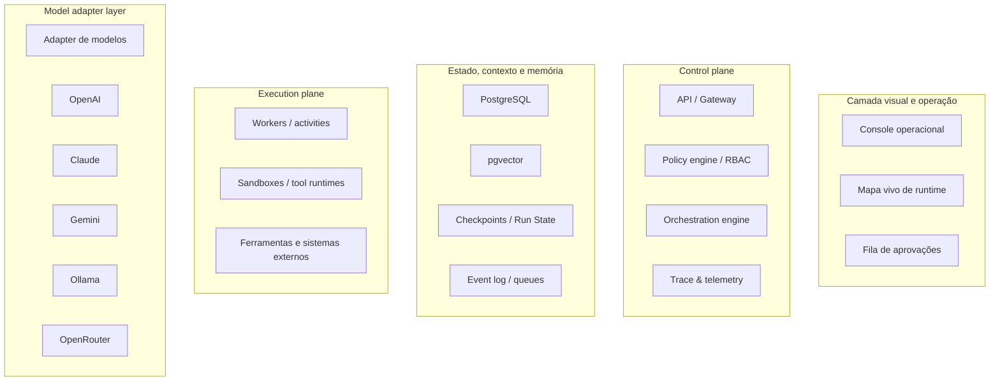
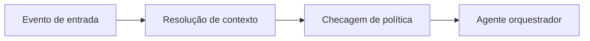
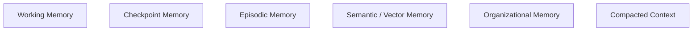

# MYCELIA

> Infraestrutura operacional inteligente para coordenação, governança, execução e observabilidade de agentes cognitivos distribuídos.

---

# Sumário Executivo

MYCELIA deve ser definido, desde o seu documento fundador, como um **runtime cognitivo distribuído**: uma camada operacional que governa modelos, agentes, workflows, memória, aprovações, ferramentas e telemetria.

Essa definição é consistente com a direção tomada pelos runtimes modernos de agentes, nos quais o valor deixa de estar apenas na inferência e passa a residir em:

- orquestração;
- estado;
- aprovações;
- recuperação;
- tracing;
- execução durável.

OpenAI descreve agentes como aplicações que planejam, chamam ferramentas, colaboram entre especialistas e preservam estado. Temporal trata workflow execution como unidade central de execução durável. LangGraph trata persistência, checkpoints e retomada como propriedades nativas do runtime.

---

## Tese Fundadora

> IA enterprise falha quando se torna operacional antes de se tornar governável.

Em sistemas reais, o problema não é apenas responder bem.

É:

- preservar contexto;
- conter risco;
- distribuir trabalho;
- interromper quando necessário;
- retomar sem corrupção de estado;
- auditar efeitos colaterais;
- explicar decisões.

O documento fundador do MYCELIA não promete autonomia mágica.

Ele estabelece uma constituição operacional:

- prompt não é política;
- modelo não é fonte de verdade;
- resumo não é estado canônico;
- autonomia não substitui governança;
- agente não é autoridade soberana.

---

## Formulação Fundadora

| Dimensão | Formulação |
|---|---|
| Natureza do sistema | MYCELIA é uma infraestrutura operacional cognitiva, não um chatbot, um modelo ou um copiloto. |
| Unidade de valor | O valor está na coordenação operacional da inteligência, não apenas na geração de respostas. |
| Unidade de execução | A unidade básica é o run governado por workflow, estado, memória, políticas e observabilidade. |
| Unidade de confiança | Confiança é produzida por tracing, checkpoints, aprovações, replay e controle de permissões. |
| Vantagem estratégica | A camada defensável está no control plane, no tecido de memória, na política, na visualização operacional e na disciplina de execução. |

---

# 1. Visão e Problema Fundamental

## 1.1 Conversas Isoladas Não São Suficientes

MYCELIA existe porque conversas isoladas não constituem um modelo operacional robusto.

Quando um sistema precisa:

- coordenar especialistas;
- consultar recursos;
- operar arquivos;
- chamar ferramentas;
- pausar para aprovação;
- manipular contexto longo;
- retomar execuções;
- registrar efeitos colaterais;

...a abstração correta deixa de ser uma sessão de chat e passa a ser um workflow governado.

---

## 1.2 Caos Operacional Cognitivo

O problema estrutural resolvido pelo MYCELIA pode ser definido como:

# Caos Operacional Cognitivo

Estado em que:

- comportamento variável de modelos;
- janelas de contexto finitas;
- cadeias de prompt frágeis;
- side effects invisíveis;
- memória inadequada;
- permissões excessivas;
- ausência de replay;

...se combinam mais rápido do que a organização consegue explicar, inspecionar ou conter.

---

## 1.3 Formas do Caos Cognitivo

### Fragmentação de agentes
Divisão prematura de tarefas multiplica prompts, custos, latência e falhas.

### Dependência de prompts
Política e estado vivendo apenas em texto eliminam auditabilidade.

### Perda de contexto
Interações longas degradam sem compaction e memória tipada.

### Side effects invisíveis
Ações externas tornam-se difíceis de rastrear.

### Autonomia sem contenção
Agentes operam sem limites claros.

### Impossibilidade de replay
Execuções não podem ser reproduzidas com fidelidade.

---

## 1.4 Posicionamento do MYCELIA

MYCELIA deve se posicionar como:

# Control Plane da Execução Cognitiva

E não como:

- interface conversacional;
- chatbot;
- copiloto;
- agente mágico.

Seu papel é coordenar:

- contexto;
- política;
- estado;
- memória;
- execução;
- supervisão humana;
- telemetria;
- recuperação.

---

# 2. Arquitetura-Alvo



---

# 3. Princípios Arquiteturais

## 3.1 Context First

Contexto não é transcrição acumulada.

É um working set tipado contendo:

- identidade;
- escopo organizacional;
- estado atual;
- artefatos;
- evidências;
- políticas;
- orçamento operacional.

---

## 3.2 Observability by Default

Toda execução cognitiva relevante deve nascer com:

- tracing;
- logs estruturados;
- métricas;
- custo;
- lineage.

> Se um fluxo cognitivo não puder ser observado integralmente, ele ainda não está apto a operar em ambiente enterprise.

---

## 3.3 Human Supervision Layer

Supervisão humana não é fallback.

É capacidade nativa do runtime.

Aprovação, override, reset, rejeição e escalonamento devem existir como nós formais do grafo.

---

## 3.4 Vendor Agnostic Runtime

O runtime deve abstrair:

- texto;
- visão;
- tool use;
- structured output;
- retenção;
- localidade de execução.

Não nomes de modelos.

---

## 3.5 Distributed Cognitive Execution

O sistema aceita:

- decomposição;
- paralelismo;
- especialização;
- delegação;

...mas sempre com ownership explícito.

---

## 3.6 Memory Before Autonomy

> Um agente sem memória confiável não é autônomo. É apenas esquecido em escala.

---

## 3.7 Explicit State Management

Estado crítico não pode viver apenas em:

- prompts;
- summaries;
- raciocínio implícito.

Ele deve ser:

- persistido;
- versionado;
- reconstituível;
- replayable.

---

## 3.8 Explainable Agent Chains

Explicabilidade não significa expor chain-of-thought.

Significa tornar reconstruível:

- política aplicada;
- ferramentas usadas;
- evidências;
- rationale summary;
- outputs;
- efeitos produzidos.

---

# 4. Entidades Fundamentais

| Entidade | Papel |
|---|---|
| Agent | Unidade operacional especializada |
| Workflow | Constituição executável do trabalho |
| Runtime | Coordenação, retomada e distribuição |
| Context | Working set tipado |
| Memory | Continuidade entre runs |
| Observation | Superfície operacional de verdade |
| Human Layer | Supervisão formal do runtime |

---

## Regra de Não Ambiguidade

- Agent não é Workflow
- Workflow não é Runtime
- Context não é Memory
- Observation não é logging ad hoc
- Human Layer não é suporte manual

---

## Identidade Operacional Mínima

Todo run deve portar:

```txt
tenant_id
workspace_id
workflow_id
run_id
thread_id
policy_scope
actor_id
trace_id
```

---

# 5. Runtime Cognitivo

O runtime do MYCELIA deve operar como:

# Execution Graph

Não como conversa invisível.

---

## Fluxo Operacional



---

## Regras Operacionais

### Contexto circula por referência

Não por transcrição acumulada.

### Side effects devem ser encapsulados

Activities e sandboxes devem ser isoladas.

### Mensagens operacionais são eventos auditáveis

---

## Contenção de Deriva Cognitiva

O runtime deve possuir:

- budgets por iteração;
- orçamento financeiro por run;
- timeout por tarefa;
- deduplicação;
- retries classificados;
- fallback humano automático.

---

# 6. Sistema de Memória

## Arquitetura Hierárquica



---

## Regra de Ouro

> Compactação não é fonte de verdade.

A fonte autoritativa deve permanecer em:

- checkpoints;
- estado versionado;
- event history;
- artefatos auditáveis.

---

## Memória Vetorial

A memória vetorial deve coexistir com:

- política;
- estado relacional;
- classificação de sensibilidade;
- versionamento.

---

# 7. Observabilidade, Escalabilidade e Governança

## Observabilidade

Cada run deve expor:

- identidade;
- duração;
- custo;
- ferramenta;
- etapa;
- política;
- aprovação;
- erro;
- retry;
- lineage.

---

## Replay Operacional

Replay deve permitir:

- investigação;
- comparação de execuções;
- debugging;
- validação de políticas;
- aprendizado operacional.

---

## Explainability

MYCELIA deve registrar:

- rationale summary;
- evidências;
- política aplicada;
- decisão;
- efeito produzido.

Não chain-of-thought bruto.

---

## Escalabilidade

A arquitetura deve ser:

- event-driven;
- observável;
- multitenant;
- baseada em filas.

---

## Segurança

O baseline assume hostilidade potencial em:

- prompts;
- documentos;
- ferramentas;
- agentes.

Governança mínima:

- permissão mínima;
- política fora do prompt;
- aprovação humana;
- sandboxing;
- validação downstream;
- budgets de autonomia;
- auditoria obrigatória.

---

# 8. Camada Visual

A camada visual do MYCELIA deve ser:

# mapa operacional vivo

E não:

- whiteboard;
- canvas livre;
- ferramenta de brainstorming.

---

## Modos de Operação

### Operational Design
Definição de workflows e topologia.

### Runtime Mode
Visualização viva de execução.

### Investigation Mode
Replay, diff e inspeção.

---

# 9. Arquitetura Tecnológica

| Camada | Recomendação |
|---|---|
| Frontend | Next.js App Router + React |
| Runtime visual | React Flow |
| UI | Tailwind CSS |
| API | FastAPI |
| Runtime cognitivo | LangGraph |
| Orquestração durável | Temporal |
| Banco transacional | PostgreSQL |
| Memória vetorial | pgvector |
| Barramento operacional | Redis Streams |
| Observabilidade | OpenTelemetry |
| Models | OpenAI, Claude, Gemini, Ollama, OpenRouter |

---

## Diretriz Estratégica

A recomendação inicial é:

# LangGraph + Temporal

E não construir runtime proprietário cedo demais.

---

# 10. Roadmap Evolutivo

| Fase | Objetivo |
|---|---|
| Foundation Runtime | Estado explícito e tracing |
| Operational MVP | Builder e runtime visual |
| Governed Execution | Guardrails e políticas |
| Memory Fabric | Memória multicamada |
| Distributed Runtime | Workers e filas |
| Multi-tenant Enterprise | Isolamento e auditoria |
| Reusable Cognitive Modules | Templates e catálogo |
| Supervised Autonomy | Autonomia graduada |

---

## Ordem Estratégica

A sequência correta é:

1. observabilidade;
2. estado;
3. governança;
4. memória;
5. distribuição;
6. autonomia.

Nunca o contrário.

---

# 11. Metadados do Documento

| Campo | Valor |
|---|---|
| Título | MYCELIA — Manifesto Arquitetural Fundador |
| Idioma | Português (Brasil) |
| Data | 19 de maio de 2026 |
| Versão | v1.0 |
| Assunto | Cognitive operations runtime |

---

# Definição Final

MYCELIA não é um chatbot.

MYCELIA é:

# uma infraestrutura operacional cognitiva.

Seu objetivo não é gerar respostas.

Seu objetivo é:

- coordenar inteligência;
- preservar estado;
- governar execução;
- tornar workflows cognitivos observáveis;
- criar confiança operacional em sistemas de IA.