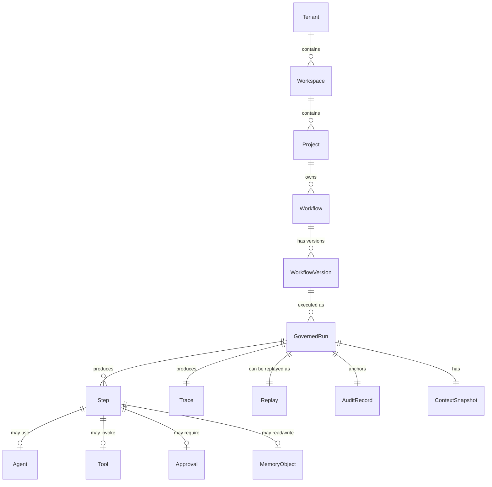

# MYCELIA — 01 Product Requirements & Operational Scope

---

## Document Metadata

| Field | Value |
|---|---|
| Document Series | MYCELIA Architecture Constitution |
| Document Number | 01 |
| Version | v2.0 |
| Status | Canonical |
| Classification | Product & Engineering — All Implementation Disciplines |
| Canonical Role | Product requirements and operational scope; implementation bridge between manifesto and architecture |
| Primary Audience | Product Leadership, Engineering Leads, Codex, Compliance, SRE, UX |
| Last Updated | May 2026 |

---

## Table of Contents

1. [Executive Summary](#1-executive-summary)
2. [Product Vision](#2-product-vision)
3. [Product Problem](#3-product-problem)
4. [Target Users and Stakeholders](#4-target-users-and-stakeholders)
5. [Target Organizations and Use Cases](#5-target-organizations-and-use-cases)
6. [Product Scope](#6-product-scope)
7. [Explicit Non-Goals](#7-explicit-non-goals)
8. [Product Operating Model](#8-product-operating-model)
9. [Core User Journeys](#9-core-user-journeys)
10. [Functional Requirements](#10-functional-requirements)
11. [Non-Functional Requirements](#11-non-functional-requirements)
12. [Operational Requirements](#12-operational-requirements)
13. [Governance, Risk and Compliance Requirements](#13-governance-risk-and-compliance-requirements)
14. [Security and Trust Requirements](#14-security-and-trust-requirements)
15. [Memory and Context Requirements](#15-memory-and-context-requirements)
16. [Observability and Replay Requirements](#16-observability-and-replay-requirements)
17. [MVP Scope](#17-mvp-scope)
18. [Post-MVP Roadmap](#18-post-mvp-roadmap)
19. [Success Metrics](#19-success-metrics)
20. [Acceptance Criteria](#20-acceptance-criteria)
21. [Risks, Assumptions and Constraints](#21-risks-assumptions-and-constraints)
22. [Product Boundaries and Decision Rules](#22-product-boundaries-and-decision-rules)
23. [Codex Implementation Guidance](#23-codex-implementation-guidance)
24. [Product Invariants](#24-product-invariants)
25. [Product Anti-Patterns](#25-product-anti-patterns)
26. [Relationship to Other Documents](#26-relationship-to-other-documents)
27. [Final Product Statement](#27-final-product-statement)

---

## 1. Executive Summary

### What MYCELIA Delivers as a Product

MYCELIA is a governed cognitive operations platform. It allows organizations to design, deploy, run, supervise, audit, replay, and govern AI-assisted workflows — where every execution step carries organizational identity, operates under policy, can request human approval, produces observable side effects, and can be reconstructed from its audit record.

The fundamental product unit is the **governed run**: a workflow execution that starts with an explicit context, executes under an active policy, may invoke tools under contract, may pause for human authorization, persists its state durably, emits telemetry throughout, and produces an immutable audit record at every step.

### Why MYCELIA Is Not a Chatbot or Productivity Assistant

Chatbots answer questions. Productivity assistants generate content. Neither coordinates specialists across multi-step processes, enforces organizational policy at runtime, pauses for approval, records side effects for compliance, or allows an organization to replay exactly what happened and why.

MYCELIA is the product that organizations reach for when AI needs to be accountable — not just capable.

### What the MVP Must Prove

The MVP does not attempt to prove the full product vision. It proves one thing: that a governed cognitive workflow can be reliably executed, monitored, approved, recorded, and replayed in a multi-tenant environment. If the MVP proves this narrowly and correctly, the architecture for broader capability exists.

### Document Relationships

Document 00 defines why MYCELIA exists — the platform doctrine, foundational thesis, and constitutional invariants.

Document 01 defines what MYCELIA must deliver — the product requirements, operational scope, MVP boundaries, and implementation direction for Codex.

Documents 02–18 define how each architectural domain is designed and implemented.

Document 01 does not replace any of them. It scopes what gets built.

---

## 2. Product Vision

### 2.1 The Product Promise

MYCELIA enables organizations to run AI-assisted operations at enterprise scale with the governance discipline that operations require: deterministic control flow, durable state, policy-enforced execution, human approval gates, observable side effects, and the ability to reconstruct any execution for compliance, investigation, or learning.

### 2.2 The Product Bet

The strategic product bet is this: as AI becomes operational — not just assistive — the scarce, defensible layer is not the model. It is the infrastructure that makes AI operations governable. Every organization that deploys AI workflows at scale will eventually need what MYCELIA provides. The question is whether they build it themselves (expensive, inconsistent) or adopt a purpose-built platform.

MYCELIA is that platform.

### 2.3 Target Market

MYCELIA targets organizations that:

- are deploying AI to assist or automate multi-step operational processes;
- require audit trails for AI-assisted decisions;
- operate in regulated industries or under compliance frameworks;
- coordinate work across multiple teams, tools, and approval chains;
- cannot afford invisible AI behavior at operational scale.

### 2.4 Product Category

MYCELIA creates a new product category: **governed cognitive operations infrastructure**. It is not an RPA tool. It is not a workflow automation SaaS. It is not a model API wrapper. It is the control plane layer above models and tools, below the business process — the layer that makes cognitive execution organizational rather than individual.

### 2.5 Canonical Product Formulation

> MYCELIA exists to let organizations design, run, supervise, replay and govern cognitive workflows with explicit state, memory, policy, tools, telemetry and human approval.

---

## 3. Product Problem

### 3.1 Cognitive Operational Chaos

When organizations deploy AI at operational scale without the required infrastructure, they encounter a predictable compounding failure: cognitive operational chaos. The chaos is not a single bug — it is the accumulated effect of structural gaps in how AI execution is managed, recorded, and governed.

| Problem | User Pain | Business Risk | MYCELIA Product Response |
|---|---|---|---|
| Fragmented AI agents | Teams use disconnected AI tools for parts of a process; outputs cannot be coordinated | Inconsistent decisions; no shared state across steps | Workflow orchestration connecting agents into governed execution graphs |
| Prompt-only state | Critical operational state lives in prompt text; lost on context rollover or session end | Silent data loss; inability to resume; no audit record | Durable run state, checkpoints, and memory objects outside the prompt |
| Invisible side effects | Tools write files, call APIs, and send emails without records | Compliance failures; irrecoverable mutations; no accountability | Tool execution contracts requiring declared, recorded, auditable side effects |
| Missing replay | Failed or incorrect AI runs cannot be reproduced faithfully | Cannot debug or explain; compliance cannot be demonstrated | Append-only event lineage; replay-safe execution with recorded artifacts |
| No approval gates | High-impact AI-recommended actions execute without human authorization | Unauthorized external mutations; financial and legal exposure | First-class approval primitives as formal workflow states |
| Weak tenant boundaries | Multiple teams share AI context; organizational data leaks across divisions | Data breach; regulatory violation; loss of customer trust | Tenant isolation enforced at state, memory, tool, telemetry, and credential layers |
| Lack of operational visibility | Nobody can see what the AI system is doing in real time | Incidents discovered late; no intervention point | Runtime visualization with live execution state; step-level trace |
| Ungoverned tool execution | AI freely calls external APIs; no permission model | Runaway API usage; unexpected charges; security incidents | Tool registry with execution contracts; policy-evaluated invocations |
| Inability to prove what happened | No audit record of AI-assisted decisions | Cannot demonstrate compliance; cannot resolve disputes | Immutable audit records for every governed action |
| Weak context management | Long-running processes lose context; summaries become the state | Decisions made on incomplete or incorrect context | Multi-tier memory hierarchy; context assembled from governed sources |
| No multi-step state | AI handles individual queries; no workflow-level state | Cannot coordinate work across steps or sessions | Workflow state machine with versioning and durable run state |
| Agent autonomy without bounds | AI agents operate without declared scope, budget, or limits | Infinite loops; cost overruns; uncontrolled external access | Execution budgets, iteration limits, and approval gates at declared risk thresholds |

---

## 4. Target Users and Stakeholders

### 4.1 Stakeholder Matrix

| Stakeholder | Role | Pain Points | MYCELIA Value | Primary Surfaces |
|---|---|---|---|---|
| Operations Manager | Owns business process delivery | Cannot see AI-assisted work in progress; cannot intervene; cannot prove compliance | Live runtime map; approval queue; run history | Dashboard, approval console |
| Automation Lead | Designs and maintains AI workflows | No structured way to define multi-step AI workflows; agents break outside their scope | Workflow builder; tool registry; governance config | Workflow builder, tool admin |
| AI Operations Architect | Designs runtime infrastructure for cognitive systems | Has to build governance, state, and observability from scratch for every project | Complete governed runtime; pluggable architecture | All planes |
| Workflow Designer | Designs process logic | No visual environment for defining AI-assisted multi-step processes | Workflow graph editor; step palette; approval node placement | Workflow builder |
| Compliance/Governance Officer | Ensures regulatory alignment | AI decisions are opaque; cannot demonstrate what policy was applied or who authorized actions | Policy binding UI; audit export; approval records; evidence bundle | Governance console, audit view |
| SRE/Platform Operator | Runs the platform in production | No runbooks for cognitive operations; no structured incident response for AI failures | Production runbooks; SLOs; incident procedures (Document 17) | Dashboards, ops console |
| Security Administrator | Controls access and trust | AI tools have excessive permissions; credentials are scattered | RBAC admin; tool permission model; tenant isolation enforcement | Security admin |
| Developer/Integrator | Builds tools and integrations | No structured runtime contract for tool development; no testing framework for governed tools | Tool SDK; execution contract API; replay SDK; testing sandbox | API, SDK |
| Executive Sponsor | Owns AI strategy and risk | Cannot prove AI operations are governed; cannot present compliance evidence | Reliability dashboard; audit summary; risk register | Executive dashboard |
| Auditor | Verifies compliance and governance | Cannot access AI execution records; no structured evidence format | Audit export; evidence bundle; immutable audit records | Audit console |
| Human Approver | Authorizes high-impact AI actions | No structured approval interface; approvals happen out-of-band | Approval inbox; approval record with context; mobile-accessible | Approval console |

### 4.2 Product Role & Capability Matrix

MYCELIA MUST define product capabilities by role before implementation.

Stakeholders describe who uses the platform. Roles define what each user may do inside the product.

| Product Role | Core Capabilities | Forbidden Capabilities | MVP |
|---|---|---|---:|
| Tenant Admin | Manage tenant users, workspaces, tenant policies and access boundaries | Cannot access another tenant; cannot bypass audit | Yes |
| Workspace Admin | Manage projects, workspace members and workspace-scoped workflows | Cannot alter tenant-level policy; cannot access other workspaces without permission | Yes |
| Project Owner | Manage workflows, tools and operational configuration within a project | Cannot change tenant policy; cannot approve own restricted actions unless policy allows | Yes |
| Workflow Designer | Create, edit and publish workflow drafts | Cannot mutate published workflow versions; cannot bypass approval gates | Yes |
| Run Operator | Trigger runs, monitor active runs and inspect allowed run results | Cannot alter workflow definitions or policy | Yes |
| Human Approver | Review and approve/reject assigned approval requests | Cannot approve requests outside assigned scope; cannot modify run history | Yes |
| Auditor | Read audit evidence, traces, approvals and replay records | Cannot mutate runtime state; cannot trigger production runs | Yes |
| Security Administrator | Manage security policy, review security events and credential references | Cannot view raw secrets unless explicitly authorized by break-glass policy | Later |
| SRE Operator | View platform health, incidents, operational traces and runbooks | Cannot alter tenant data outside incident-linked procedures | Later |
| Developer/Integrator | Register tools, configure webhooks and use APIs within allowed scope | Cannot enable high-risk tools without review | Yes, basic |
| Executive Viewer | View high-level reliability, governance and adoption dashboards | Cannot inspect sensitive run artifacts by default | Later |

### Rules

- Every user-facing action MUST map to a product role.
- Every product role MUST be tenant-scoped.
- Role permissions MUST be testable.
- Role permissions MUST NOT rely only on UI hiding.
- Administrative roles MUST still produce audit events.
- No role may grant itself broader authority without governance review.

### Forbidden Behavior

FORBIDDEN:

- implementing UI features before role boundaries exist;
- allowing workflow authors to mutate published workflow versions;
- allowing approvers to approve actions outside their assigned scope;
- allowing auditors to mutate evidence;
- allowing tenant admins to access another tenant;
- treating “admin” as an unrestricted superuser.

---

## 5. Target Organizations and Use Cases

### 5.1 Target Organization Profiles

**Mid-market operational teams** — 50–500 person organizations using AI to assist with operational tasks: document processing, customer communications, research synthesis, internal approvals. These teams need governed execution without enterprise complexity.

**Enterprise shared service centers** — Large organizations running centralized services (finance, legal, HR, compliance) using AI at scale across multiple internal clients. Require tenant isolation, audit trails, and governance for each business unit.

**Regulated operations** — Healthcare, financial services, legal, insurance, government. Require audit evidence, human authorization for consequential decisions, and the ability to demonstrate exactly what happened in any AI-assisted operation.

**Document-heavy workflows** — Organizations where AI is used to process, classify, route, and act on documents. Require structured context, tool execution (extraction, classification, routing), and approval gates before downstream actions.

**Financial and approval-heavy processes** — Purchase approval, invoice processing, contract review, expense authorization. Require human approval gates, policy enforcement, and audit records that satisfy internal controls.

**Multi-team operational environments** — Operations that span multiple teams and require coordinated, sequential AI-assisted work. Require workspace isolation, cross-team handoffs, and full execution visibility.

**AI-enabled internal platforms** — Organizations building internal AI platforms for their own teams. Require multi-tenancy, developer APIs, and the ability to offer governed AI operations as a service to internal consumers.

### 5.2 Initial Use Cases

| Use Case | Scope | Key Product Capabilities |
|---|---|---|
| Document intake and triage | Ingest documents, classify, extract, route to appropriate queue or workflow | Tool execution (extraction), memory (context), approvals (routing decisions), trace |
| Operational workflow automation | Multi-step AI-assisted operations across tools, systems, and human reviewers | Full workflow orchestration, agent steps, approval gates, tool execution |
| Approval-heavy workflows | Workflows where every significant action requires authorization | Approval engine, policy binding, actor identity, audit record |
| Investigation and replay | Replay a historical AI-assisted decision for compliance or debugging | Replay system, execution diff, evidence bundle |
| Governed tool execution | AI-assisted operations invoking external APIs under permission models | Tool registry, execution contracts, idempotency, side-effect classification |
| Knowledge-assisted operations | Long-running operations using organizational knowledge for context | Memory hierarchy, vector search, context snapshots |
| Multi-tenant AI operations | Service providers running governed AI operations for multiple client organizations | Tenant isolation, workspace management, per-tenant policy, per-tenant audit |

---

## 6. Product Scope

### 6.1 Scope Matrix

| Capability Area | Product Capability | User Value | Required Behavior | MVP | Later Evolution |
|---|---|---|---|---|---|
| Workflow orchestration | Define, version, and execute multi-step cognitive workflows | Structured, auditable cognitive operations | Deterministic control flow; durable state; event-driven steps | P0 | Advanced branching, dynamic graphs, cross-workflow composition |
| Agent-assisted execution | Incorporate LLM-powered agent steps into workflows | AI-assisted work within governed boundaries | Agent steps execute under policy; outputs are typed and validated | P0 | Multi-agent coordination, specialized agent types, adaptive routing |
| Context and memory | Assemble typed context for each step; persist working state across steps | Long-running cognition with reliable context | Context assembled from governed sources; checkpoints at step boundaries | P0 | Full memory hierarchy; organizational memory; vector search |
| Tool execution | Invoke external systems and APIs under contract and with audit | Safe external interaction with records | Tool registry; execution contracts; side-effect declaration; audit | P0 | Marketplace; advanced sandbox classes; third-party tool publishing |
| Human approvals | Route specific workflow steps to human authorizers | Human judgment at the right places | Approval inbox; actor-recorded decisions; workflow pause/resume | P0 | Multi-level approvals; delegation; SLA-based escalation |
| Governance and policy | Evaluate policy at runtime; bind policies to tools and workflows | Compliance evidence and runtime enforcement | Policy engine; policy snapshot binding; governance audit record | P0 | Advanced policy-as-code; dynamic policy; regulatory packs |
| Observability and visualization | See running and historical workflow executions | Operational visibility; incident diagnosis | Trace; step-level timeline; live status; event log | P0 | Live runtime graph; execution diff; operator interventions |
| Replay and investigation | Reconstruct historical runs without re-executing side effects | Debugging; compliance; postmortem evidence | Replay from event history; side-effect suppression; replay isolation | P0 basic, P1 full | Advanced diff; policy comparison; regression analysis |
| Tenant/workspace/project | Organize work by organizational scope | Organizational safety and separation | Tenant isolation at all layers; workspace permissions; project scoping | P0 | Advanced org hierarchy; cross-workspace collaboration with governance |
| Operational administration | Manage platform configuration, users, and service health | Operational control | Admin console; user management; system health; audit access | P0 | Self-service tenant admin; automated compliance reporting |
| Integrations and API surface | Connect MYCELIA to external systems | Automation and data flow | Webhook support; REST API for workflow triggers and results | P0 basic | Full developer API; SDK; integration marketplace |
| Security and access control | Control who can do what within and across tenants | Organizational trust and safety | RBAC; tenant-scoped service accounts; credential references | P0 | ABAC; SAML/OIDC; advanced permission groups |

---

## 7. Explicit Non-Goals

| Non-Goal | Reason | Where It May Appear Later |
|---|---|---|
| Foundation model training or fine-tuning | MYCELIA governs execution; it does not produce models | Never — MYCELIA is a consumer, not a producer, of models |
| General chatbot interface as primary product | Conversational UI is a surface, not a runtime | May surface as an interaction mode in specific workflow steps |
| Unconstrained autonomous agents with unrestricted tools | Violates foundational invariants of Document 00 | Graduated autonomy with governance bounds — Document 04/05 |
| Prompt marketplace | MYCELIA governs execution; sharing prompts is not governance | MAY appear as template library with governed execution in Phase 3 |
| No-code automation without runtime guarantees | Generic automation without audit/replay/governance is not MYCELIA | Not applicable — governance is core, not optional |
| ERP replacement | MYCELIA integrates with business systems via tool contracts; it does not replace them | Never |
| Full external developer marketplace in MVP | Requires trust infrastructure, supply-chain review, and economics | Phase 3+ |
| Multi-region enterprise deployment in MVP | Complexity exceeds MVP validation requirements | Phase 3 — Document 24 |
| Advanced agent swarm / emergent multi-agent behavior | Not governable without foundational primitives first | Phase 3+ after governance infrastructure is proven |
| Unrestricted tool execution | Every tool must operate under contract | Never — tool contracts are constitutional |
| Black-box automation | Every execution must be observable, auditable, and replayable | Never — Document 00 invariants |
| AI model evaluation and benchmarking platform | Specialized capability beyond operational scope | Document 23 — evaluation framework |
| Customer-facing chatbot product | Different product category | Not applicable |

---

## 8. Product Operating Model

### 8.1 Core Product Objects

| Object | Definition |
|---|---|
| Tenant | The root organizational scope. Isolates all state, memory, tools, credentials, telemetry, and users. A company, a business unit, or an organizational client. |
| Workspace | An organizational subdivision within a tenant. A team, department, or product group. Scopes workflows, memory, and access within the tenant. |
| Project | A scoped operational context within a workspace. Groups related workflows, tools, and resources for a specific purpose. |
| Workflow | A versioned, deterministic definition of a multi-step cognitive operation. Contains the control graph, agent steps, tool invocations, approval nodes, and memory references. |
| Workflow Version | An immutable snapshot of a workflow definition. New executions use the declared version. Old versions are retained for replay. |
| Governed Run | A single execution instance of a workflow version. Carries full identity (tenant, workspace, project, actor, run_id), operates under an active policy snapshot, and produces an immutable audit record. |
| Step | A node in the workflow execution graph. May be an agent step, a tool invocation, an approval gate, a branching decision, or a memory operation. |
| Agent | A specialized LLM-powered execution participant. Plans and produces outputs within a declared scope. Does not own tool authority. |
| Tool | A governed external capability invoked by a workflow step. Declared in the Tool Registry with an execution contract defining inputs, outputs, side-effect class, and replay behavior. |
| Approval | A formal workflow state in which a human authorizer must act before the run proceeds. Records the authorizer's identity, decision, and timestamp. |
| Memory Object | A governed, provenance-bearing data artifact stored in the memory hierarchy. Written by explicit workflow steps. Readable by authorized runs within the tenant scope. |
| Context Snapshot | A point-in-time capture of the assembled working context for a step or run. Used for checkpoint and replay. |
| Trace | The full distributed execution record of a run, capturing span hierarchy from API call through workflow step through tool invocation. |
| Replay | The reconstruction of a historical run from its event lineage. Uses recorded tool outputs; does not re-execute external side effects; operates in an isolated environment. |
| Investigation | An operator-initiated replay session for debugging, compliance verification, or postmortem evidence production. |

### 8.2 Product Object Model



---

## 9. Core User Journeys

### Journey 1 — Create Workspace and Project

**Actor:** Operations Manager or Automation Lead
**Goal:** Set up an organizational scope for a new AI-assisted operation
**Preconditions:** Tenant exists; actor has workspace creation permission
**Steps:** Create workspace → set workspace name and access policy → create project → configure project scope and tool access
**Expected Result:** Workspace and project exist, scoped correctly within the tenant
**Acceptance Criteria:** Workspace appears only within its tenant. Project inherits workspace policy. No other tenant can see the workspace.

### Journey 2 — Define or Import a Workflow

**Actor:** Workflow Designer or Automation Lead
**Goal:** Create a versioned workflow definition
**Preconditions:** Project exists; actor has workflow authoring permission
**Steps:** Open workflow builder → define entry trigger → add agent step → add tool invocation → add approval gate → add output step → publish workflow version
**Expected Result:** Workflow version published; immutable after publication
**Acceptance Criteria:** Workflow version ID assigned. Version cannot be modified after publication. Workflow appears in project scope only.

### Journey 3 — Configure Governance and Approval Gates

**Actor:** Compliance Officer or Automation Lead
**Goal:** Bind a policy to a workflow; configure which steps require approval
**Preconditions:** Workflow version exists; policy defined in governance system
**Steps:** Bind policy to workflow version → mark specific steps as approval-required → configure approver roles → set approval timeout
**Expected Result:** Policy snapshot bound to workflow version. Approval requirement recorded in workflow definition.
**Acceptance Criteria:** Policy binding is recorded with version and timestamp. Steps marked approval-required block at runtime until authorized.

### Journey 4 — Register or Select Tools

**Actor:** Automation Lead or Developer/Integrator
**Goal:** Make a specific external capability available to a workflow
**Preconditions:** Tool manifest exists or developer creates one; security review completed
**Steps:** Submit tool manifest → security review → operator enables tool → bind tool to project/workspace
**Expected Result:** Tool available for use in workflow steps within the authorized scope
**Acceptance Criteria:** Tool appears in Tool Registry. Tool requires policy evaluation before invocation. Tool execution contract immutable after registration.

### Journey 5 — Run a Governed Workflow

**Actor:** Operations Manager or automated trigger
**Goal:** Execute a workflow run with full governance
**Preconditions:** Workflow version published; tools registered; policy bound
**Steps:** Trigger run → context assembled → policy evaluated → steps execute in order → tool invocations occur under contract → approval gates pause if required → run completes
**Expected Result:** Run completed; audit record created; artifacts persisted; trace complete
**Acceptance Criteria:** Run has unique run_id. Every step produces an event. Trace spans are complete. Audit record is immutable. Run is replayable.

### Journey 6 — Monitor Execution in Real Time

**Actor:** Operations Manager or SRE
**Goal:** See what a running workflow is doing right now
**Preconditions:** Run in progress
**Steps:** Open runtime dashboard → select active run → view step-level execution state → see current step, pending approvals, recent tool results
**Expected Result:** Live execution state visible; pending approvals surfaced
**Acceptance Criteria:** Dashboard updates within 10 seconds of state change. Step status is accurate. No other tenant's runs are visible.

### Journey 7 — Approve or Reject a Human Approval Step

**Actor:** Human Approver
**Goal:** Review and decide on an approval-required workflow step
**Preconditions:** Run blocked at approval gate; approver has required role
**Steps:** Receive approval notification → open approval request → review context, tool outputs, and step purpose → approve or reject with optional comment
**Expected Result:** Approval decision recorded; run resumes (approved) or terminates (rejected)
**Acceptance Criteria:** Approval records approver identity, timestamp, and decision. Rejection produces ToolInvocationRejected event. Decision is immutable. Run state updates within 30 seconds.

### Journey 8 — Inspect Tool Outputs and Artifacts

**Actor:** Operations Manager, Compliance Officer, or Auditor
**Goal:** Review what a tool produced in a specific run step
**Preconditions:** Run completed or in progress; actor has access within tenant
**Steps:** Navigate to run → select tool invocation step → view tool output → inspect artifact with provenance record
**Expected Result:** Tool output visible with schema validation status; artifact with content hash and provenance
**Acceptance Criteria:** Artifact is tenant-scoped. Provenance shows tool_id, version, invocation_id, and policy_snapshot_id. No other tenant's artifacts visible.

### Journey 9 — Replay a Run for Investigation

**Actor:** SRE, Compliance Officer, or Operations Manager
**Goal:** Reconstruct what happened in a specific historical run
**Preconditions:** Run completed; replay artifacts available; actor has replay permission
**Steps:** Select historical run → initiate replay → replay executes in isolated environment → review reconstructed execution → note any divergence
**Expected Result:** Replay reconstructs the execution from event history; no production side effects
**Acceptance Criteria:** Replay uses recorded tool outputs, not live executions. Replay telemetry routes to isolated namespace. Replay divergence is detected and reported. Production state is not modified.

### Journey 10 — Review Audit and Trace Evidence

**Actor:** Auditor or Compliance Officer
**Goal:** Produce compliance evidence for a specific run or time period
**Preconditions:** Run completed; actor has audit access within tenant
**Steps:** Open audit console → filter by run, tenant, date range → export evidence bundle → verify immutability of records
**Expected Result:** Structured audit export with run_id, actor_id, policy_snapshot_id, approval records, tool invocation records, and trace_ids
**Acceptance Criteria:** Evidence bundle includes all required fields. Records are immutable. Export is tenant-scoped.

### Journey 11 — Manage Tenant and Workspace Boundaries

**Actor:** Security Administrator or Operations Manager
**Goal:** Adjust team access and workspace policies
**Preconditions:** Tenant admin rights
**Steps:** Open admin console → manage workspace membership → adjust workspace permissions → review tenant boundary settings
**Expected Result:** Updated permissions active within 60 seconds; previous access revoked
**Acceptance Criteria:** Permission changes recorded in audit log. No cross-tenant permissions possible.

### Journey 12 — Export or Integrate Execution Results

**Actor:** Developer/Integrator or Operations Manager
**Goal:** Pass a governed run's results to an external system
**Preconditions:** Run completed; output artifact available
**Steps:** Configure outbound webhook or API call in workflow → result artifact published → external system receives notification
**Expected Result:** External system notified with structured result payload
**Acceptance Criteria:** Webhook signed. Tenant_id present in payload header. No other tenant's data included.

---

## 10. Functional Requirements

### 10.1 Tenant, Workspace and Project Management

| ID | Requirement | Priority | MVP | Acceptance Criteria |
|---|---|---|---|---|
| TW-001 | System MUST support multiple independent tenants with isolated state, memory, telemetry, and credentials | P0 | Yes | No cross-tenant data access possible at any layer |
| TW-002 | Each tenant MUST support multiple workspaces | P0 | Yes | Workspace isolated within tenant; no cross-workspace leakage |
| TW-003 | Each workspace MUST support multiple projects | P0 | Yes | Project scoped within workspace |
| TW-004 | Tenant MUST NOT be visible to or accessible by other tenants | P0 | Yes | Tenant isolation verified by isolation test suite |
| TW-005 | Tenant creation MUST produce an audit record | P0 | Yes | Audit record with actor, timestamp, and tenant_id |
| TW-006 | Workspace membership MUST be configurable per tenant admin | P0 | Yes | Membership changes recorded in audit log |
| TW-007 | Project MUST inherit workspace policy unless explicitly overridden | P1 | No | Policy inheritance validated in governance tests |
| TW-008 | Tenant MUST support at least two infrastructure isolation profiles (Standard, Enterprise) | P2 | No | Isolation profile matrix documented in Document 14 |
| TW-009 | Tenant movement between isolation profiles MUST be audited | P2 | No | Tenant migration audit record |

### 10.2 Workflow Definition and Versioning

| ID | Requirement | Priority | MVP | Acceptance Criteria |
|---|---|---|---|---|
| WF-001 | System MUST support defining multi-step workflows as versioned, immutable definitions | P0 | Yes | Workflow version_id assigned on publication; version unmodifiable |
| WF-002 | Workflow version MUST include: entry trigger, steps, step types, approval nodes, tool references, memory references | P0 | Yes | All required fields validated at publication |
| WF-003 | Published workflow version MUST be immutable | P0 | Yes | API rejects any mutation of published version |
| WF-004 | Workflow MUST support sequential and branching control flow | P0 | Yes | Branching step type with condition evaluation |
| WF-005 | Workflow MUST support agent steps, tool steps, approval steps, and memory steps | P0 | Yes | All four step types execute correctly |
| WF-006 | Workflow definition MUST be tenant-scoped | P0 | Yes | Workflow not visible outside tenant |
| WF-007 | System MUST retain old workflow versions for replay | P0 | Yes | Old versions accessible in replay context |
| WF-008 | Workflow MUST support declaring iteration budgets, time budgets, and cost budgets | P1 | No | Budget declarations honored at runtime |

### 10.3 Governed Run Execution

| ID | Requirement | Priority | MVP | Acceptance Criteria |
|---|---|---|---|---|
| RN-001 | Every workflow execution MUST produce a globally unique run_id | P0 | Yes | run_id present in all downstream records |
| RN-002 | Every run MUST carry: tenant_id, workspace_id, project_id, workflow_id, workflow_version_id, actor_id, trace_id | P0 | Yes | All fields present in run record |
| RN-003 | Every run MUST operate under an active policy snapshot | P0 | Yes | Policy snapshot recorded on run creation |
| RN-004 | Run state MUST be persisted durably and survive process restart | P0 | Yes | Run resumes correctly after simulated worker restart |
| RN-005 | Run MUST emit events for all state transitions | P0 | Yes | All transitions produce events in event store |
| RN-006 | Run MUST produce an immutable audit record on completion | P0 | Yes | Audit record present; update attempts rejected |
| RN-007 | Run status MUST be visible to authorized users within the tenant in real time | P0 | Yes | Status updates within 10 seconds |
| RN-008 | Run MUST support pause, resume, cancel, and retry within declared policy | P0 | Yes | Each state transition produces event and audit record |

### 10.4 Agent-Assisted Steps

| ID | Requirement | Priority | MVP | Acceptance Criteria |
|---|---|---|---|---|
| AG-001 | Agent steps MUST execute within declared scope (tool access, memory access, iteration budget) | P0 | Yes | Agent cannot access tools or memory outside declaration |
| AG-002 | Agent outputs MUST be typed and validated against declared output schema | P0 | Yes | Schema mismatch fails the step with a structured error |
| AG-003 | Agent MUST NOT directly execute tools; it MUST request tool invocations through the runtime | P0 | Yes | Direct tool access from agent code is rejected |
| AG-004 | Agent step MUST record rationale summary as a structured artifact | P1 | No | Rationale record present in step artifacts |
| AG-005 | Agent step MUST support multiple model providers through a vendor-agnostic adapter | P0 | Yes | Step succeeds with at least two different provider configurations |
| AG-006 | Agent step MUST operate within declared token and cost budget | P1 | No | Budget exceeded → step fails with budget error |

### 10.5 Tool Execution

| ID | Requirement | Priority | MVP | Acceptance Criteria |
|---|---|---|---|---|
| TL-001 | All tools MUST be registered in the Tool Registry with a signed manifest | P0 | Yes | Unregistered tool invocation rejected |
| TL-002 | Tool execution MUST be governed by an immutable ExecutionContract | P0 | Yes | Contract present; invocation fails without valid contract |
| TL-003 | Tool execution MUST produce an audit record with invocation_id, tool_version_id, actor_id, side_effect_class | P0 | Yes | Audit record present for every invocation |
| TL-004 | Side-effectful tools MUST require idempotency key | P0 | Yes | Invocation rejected if idempotency key absent for side-effectful class |
| TL-005 | Tool results MUST pass output schema validation before being returned to the workflow | P0 | Yes | Schema mismatch → ToolOutputSchemaMismatch event; step fails |
| TL-006 | Tools with side-effect class ExternalWrite or higher MUST be suppressed during replay | P0 | Yes | Replay test confirms no external call during suppressed execution |
| TL-007 | Tool artifacts MUST be tenant-scoped and include content hash and provenance | P0 | Yes | Artifact not accessible outside tenant; provenance fields present |
| TL-008 | Credential references MUST be resolved by the runtime; tools never receive raw secrets | P0 | Yes | Secret value absent from tool input, logs, and telemetry |
| TL-009 | Approval-required tools MUST block until approval is granted or timeout elapses | P0 | Yes | Step remains in ApprovalRequired state until decision |
| TL-010 | Tool manifests MUST NOT contain secret values | P0 | Yes | Registry rejects manifest containing credential value pattern |

### 10.6 Human Approval

| ID | Requirement | Priority | MVP | Acceptance Criteria |
|---|---|---|---|---|
| AP-001 | Approval gates MUST be first-class workflow nodes that block execution until resolved | P0 | Yes | Run in ApprovalRequired state; no further steps execute |
| AP-002 | Approval decisions MUST record: approver identity, timestamp, decision, optional justification | P0 | Yes | All fields present in ApprovalRecord |
| AP-003 | Approval decision MUST be immutable after submission | P0 | Yes | API rejects modification of submitted approval |
| AP-004 | Approval timeout MUST terminate the approval gate with a recorded timeout event | P0 | Yes | Timeout produces ApprovalTimedOut event; run terminates or escalates |
| AP-005 | Approval routing MUST only offer the request to authorized approvers for the tenant | P0 | Yes | Approval not visible to unauthorized users or other tenants |
| AP-006 | Approval context MUST include relevant step context, tool outputs, and run identity | P0 | Yes | Approver can see what they are authorizing |
| AP-007 | Approval records MUST be included in run audit evidence | P0 | Yes | ApprovalRecord present in EvidenceBundle |
| AP-008 | Break-glass approval bypass MUST require incident linkage and produce an audit record | P1 | No | Break-glass audit record present; expires after TTL |

### 10.7 Memory and Context

| ID | Requirement | Priority | MVP | Acceptance Criteria |
|---|---|---|---|---|
| MC-001 | Context MUST be assembled from typed, governed sources — not accumulated transcript | P0 | Yes | Context assembly produces typed working set |
| MC-002 | Run state MUST be persisted as checkpoints at declared boundaries | P0 | Yes | Checkpoints created and retrievable; run can resume from checkpoint |
| MC-003 | Memory writes MUST carry: writer_id, run_id, tenant_id, timestamp, data_classification | P0 | Yes | All fields present in memory write record |
| MC-004 | Memory reads MUST be tenant-scoped | P0 | Yes | Cross-tenant read returns error; no data leakage |
| MC-005 | Memory entries MUST have explicit retention policy and classification | P1 | No | Classification present; expired entries purged on schedule |
| MC-006 | Replay MUST use context snapshots from the original run | P0 | Yes | Replay uses original context; not current state |
| MC-007 | Vector/semantic memory MUST support similarity-based retrieval within tenant scope | P1 | No | Vector search returns only tenant-scoped results |
| MC-008 | Memory writes from tool output MUST require explicit permission in execution contract | P0 | Yes | Memory write blocked when contract does not permit |

### 10.8 Observability and Runtime Visualization

| ID | Requirement | Priority | MVP | Acceptance Criteria |
|---|---|---|---|---|
| OB-001 | Every significant operation MUST emit a structured telemetry event | P0 | Yes | Event present in event store for every step, tool, approval |
| OB-002 | Every run MUST produce a distributed trace with span hierarchy | P0 | Yes | Trace present in observability system; spans link correctly |
| OB-003 | Run status MUST be visible in real time to authorized tenant users | P0 | Yes | Dashboard reflects status within 10 seconds |
| OB-004 | Step-level execution state MUST be visible from the run detail view | P0 | Yes | Each step shows: status, start_time, end_time, outputs, errors |
| OB-005 | Tool execution visibility MUST include: invocation_id, side_effect_class, result_summary, artifact_ref | P0 | Yes | All fields visible in step detail |
| OB-006 | Approval visibility MUST include: pending approvals, approval history, decision records | P0 | Yes | Approval state visible in real time |
| OB-007 | Critical telemetry (audit events, security events) MUST NOT be sampled or dropped | P0 | Yes | 100% of audit events persisted in audit store |
| OB-008 | Telemetry MUST be tenant-scoped; no cross-tenant telemetry access | P0 | Yes | Query APIs enforce tenant_id filter |

### 10.9 Replay and Investigation

| ID | Requirement | Priority | MVP | Acceptance Criteria |
|---|---|---|---|---|
| RP-001 | System MUST support replaying any historical run from its event lineage | P0 | Yes (basic) | Replay reconstructs step sequence without re-executing side effects |
| RP-002 | Replay MUST suppress side-effectful tool executions | P0 | Yes | No external API calls during replay; recorded outputs used |
| RP-003 | Replay MUST operate in an isolated environment with no production egress | P0 | Yes | Replay environment blocked from production credentials and streams |
| RP-004 | Replay telemetry MUST be isolated from production observability namespace | P0 | Yes | Replay spans appear in replay namespace only |
| RP-005 | Replay divergence MUST be detected and reported | P1 | No | Divergence event produced and visible to operator |
| RP-006 | Replay MUST use the workflow version and policy snapshot from the original run | P0 | Yes | Replay uses original version_id and policy_snapshot_id |
| RP-007 | Replay MUST NOT modify the original event lineage | P0 | Yes | Original event store unchanged after replay |
| RP-008 | Investigation mode MUST allow step-by-step navigation of the replayed run | P1 | No | Step navigation and output inspection available in investigation mode |

### 10.10 Governance and Policy

| ID | Requirement | Priority | MVP | Acceptance Criteria |
|---|---|---|---|---|
| GV-001 | Policy MUST be evaluated by the policy engine at runtime — not derived from prompt text | P0 | Yes | Policy engine evaluates every tool invocation |
| GV-002 | Policy evaluation result MUST be recorded as an immutable snapshot bound to the run | P0 | Yes | Policy snapshot present in run record |
| GV-003 | Policy changes MUST be versioned | P0 | Yes | Policy version_id changes on modification; history retained |
| GV-004 | Governance bypass MUST produce an audit record | P0 | Yes | Break-glass event present in audit store |
| GV-005 | Policy engine outage MUST result in fail-closed behavior | P0 | Yes | All governed operations blocked when policy engine unavailable |

### 10.11 Security and Access Control

| ID | Requirement | Priority | MVP | Acceptance Criteria |
|---|---|---|---|---|
| SC-001 | RBAC MUST be enforced for all product operations | P0 | Yes | Unauthorized operations return structured error |
| SC-002 | Credentials MUST be referenced, not stored, in tool manifests and run records | P0 | Yes | No credential values in manifests, records, or telemetry |
| SC-003 | Cross-tenant access MUST be architecturally prevented | P0 | Yes | Cross-tenant access attempt produces security event; access denied |
| SC-004 | Security events MUST be routed to a security-specific audit channel | P0 | Yes | Security events present in security audit log |
| SC-005 | Replay environments MUST be isolated from production credentials | P0 | Yes | Replay cannot obtain production credential lease |

### 10.12 External Integrations

| ID | Requirement | Priority | MVP | Acceptance Criteria |
|---|---|---|---|---|
| IN-001 | System MUST provide a REST API for triggering governed workflow runs | P0 | Yes | API returns run_id on trigger; run executes with full governance |
| IN-002 | Inbound webhooks MUST be signed and tenant-resolved | P0 | Yes | Unsigned webhooks rejected; tenant resolved from endpoint |
| IN-003 | Outbound webhooks MUST include workflow/run identity and be signed | P0 | Yes | Signed webhook with run_id and tenant_id delivered to registered endpoint |
| IN-004 | API MUST support run status query, artifact retrieval, and approval decision submission | P0 | Yes | All three operations return correct tenant-scoped results |

### 10.13 Administration and Audit

| ID | Requirement | Priority | MVP | Acceptance Criteria |
|---|---|---|---|---|
| AD-001 | System MUST provide an admin console for tenant, user, and policy management | P0 | Yes | Admin console operations produce audit records |
| AD-002 | Audit records MUST be immutable and retained per compliance policy | P0 | Yes | Audit records cannot be modified or deleted within retention window |
| AD-003 | Audit evidence MUST be exportable in structured format | P1 | No | Export includes all required EvidenceBundle fields |
| AD-004 | System health MUST be visible to platform operators with SLO status | P0 | Yes | Operational dashboard shows current SLO compliance |

---

## 11. Non-Functional Requirements

| NFR ID | Requirement | Target | Rationale | Validation Method |
|---|---|---|---|---|
| NFR-001 | API availability (production) | 99.9% over 28 days | Multi-tenant platform; downtime affects all tenants | SLO tracking via Prometheus burn-rate alerts |
| NFR-002 | API p99 latency | < 2 seconds (95% of windows) | Operator-interactive workflows require responsive APIs | Prometheus histogram; SLO dashboard |
| NFR-003 | Workflow start latency (p95) | < 5 seconds | Operator expectation for interactive trigger | Prometheus histogram |
| NFR-004 | Tool execution audit record write latency | < 500ms | Audit records must not become the critical path | Audit service metrics |
| NFR-005 | Audit event durability | 100% (no loss acceptable) | Legal and compliance requirement | Audit SLO monitoring; SEV0 if violated |
| NFR-006 | Tenant isolation correctness | Zero cross-tenant violations per 28 days | Trust and compliance; any violation is a security incident | Automated isolation test suite; security monitoring |
| NFR-007 | Replay success rate | > 98% for runs within retention window | Compliance investigations require reliable replay | Replay service metrics |
| NFR-008 | PostgreSQL availability | 99.95% | All state depends on database availability | Prometheus blackbox monitoring |
| NFR-009 | Approval routing latency (p95) | < 30 seconds | Human approvers need timely notification | Governance service metrics |
| NFR-010 | Concurrent tenant isolation | Executions for different tenants MUST NOT interfere | Multi-tenant safety | Worker envelope validation; automated tenant isolation test |
| NFR-011 | Event lineage durability | 100% of events persisted durably | Replay and audit require complete lineage | Event store durability verification |
| NFR-012 | Backup restore (RTO) | < 30 minutes for PostgreSQL primary | DR and data protection | DR drill results (Document 17) |
| NFR-013 | Deployment rollback time | < 15 minutes | Deployment safety | Rollback procedure timing (Document 16) |
| NFR-014 | Vendor independence | No single model provider dependency for core platform function | Strategic resilience | Provider failover test |
| NFR-015 | Scalability | MVP: support 10 concurrent tenants with 100 concurrent runs; Later: 1000+ tenants | Platform growth | Load test results |

---

## 12. Operational Requirements

| OR ID | Requirement | Priority | Notes |
|---|---|---|---|
| OR-001 | Every service MUST have a runbook for its primary failure modes before entering production | P0 | Document 17 defines runbook format |
| OR-002 | Every service MUST have at least one SLO with burn-rate alerting before entering production | P0 | Document 17 defines SLO framework |
| OR-003 | Every service MUST have an operational dashboard with key health panels | P0 | Document 17 defines dashboard requirements |
| OR-004 | System MUST support rollback to previous deployment within 15 minutes | P0 | Document 16 defines rollback procedures |
| OR-005 | Database backups MUST be encrypted and tested quarterly | P0 | Document 17 defines backup procedures |
| OR-006 | Tenant impact MUST be assessable per incident | P0 | TenantImpactAssessment must be producible for any incident |
| OR-007 | All deployment changes MUST produce an audit record with deployment version and actor | P0 | Document 16 defines deployment auditability |
| OR-008 | DR plan MUST be documented and tested at minimum quarterly | P1 | Document 17 defines DR drills |
| OR-009 | System MUST surface incident evidence (traces, run_ids, tenant_ids) to SRE operators | P0 | Evidence bundle accessible from incident management |

---

## 13. Governance, Risk and Compliance Requirements

| GRC ID | Requirement | Priority | Notes |
|---|---|---|---|
| GRC-001 | Policy MUST be evaluated at runtime for all governed operations | P0 | Policy engine is non-optional |
| GRC-002 | Policy snapshots MUST be bound immutably to the run or invocation they governed | P0 | Required for replay and compliance evidence |
| GRC-003 | Every high-impact action MUST have an approval requirement configurable at policy level | P0 | Tool manifests declare approval requirements; policy can escalate |
| GRC-004 | Audit records MUST be immutable, tamper-evident, and retained per compliance policy | P0 | Minimum 7 years for regulated contexts |
| GRC-005 | Data MUST be classifiable (public, internal, confidential, restricted) at memory and artifact level | P1 | Required for compliance in regulated industries |
| GRC-006 | Evidence bundle MUST be producible for any governed run on demand | P0 | Required for incident response and compliance investigation |
| GRC-007 | Governance bypass (break-glass) MUST produce time-limited, incident-linked, fully audited access | P1 | Document 17 defines break-glass procedures |
| GRC-008 | Compliance evidence MUST be exportable in structured format | P1 | Export for auditors; EvidenceBundle format |
| GRC-009 | Policy changes MUST be versioned and effective date recorded | P0 | Policy store must retain version history |

---

## 14. Security and Trust Requirements

| SEC ID | Requirement | Priority | Notes |
|---|---|---|---|
| SEC-001 | Authentication MUST be required for all product API operations | P0 | No unauthenticated access |
| SEC-002 | Authorization MUST be evaluated per operation, per tenant | P0 | RBAC evaluated against current role and tenant context |
| SEC-003 | All service-to-service communication MUST be authenticated | P0 | mTLS or equivalent; no unauthenticated internal calls |
| SEC-004 | Credentials MUST be managed by the secret manager; never stored in code, config, or manifests | P0 | Document 16 defines secret management |
| SEC-005 | Replay environments MUST be excluded from production credential access | P0 | Replay credential exclusion is architecturally enforced |
| SEC-006 | Security events MUST be routed to a durable, separate security audit channel | P0 | Not sampled; not merged with operational telemetry |
| SEC-007 | Tenant boundary violations MUST be classified as security incidents immediately | P0 | TenantBoundaryViolation → SEV0/1 per Document 17 |
| SEC-008 | All production access (human) MUST require MFA and produce access audit records | P1 | Enforced from Phase 2 |
| SEC-009 | Tool supply-chain integrity MUST be verified before tool enablement | P1 | Manifest signing, SBOM, security review per Document 15 |

---

## 15. Memory and Context Requirements

| MEM ID | Requirement | Priority | Notes |
|---|---|---|---|
| MEM-001 | Context MUST be assembled from typed, governed sources per step | P0 | Context assembly is a runtime operation, not transcript accumulation |
| MEM-002 | Working memory (per-step context) MUST be scoped to the step and not leak into adjacent steps | P0 | Step isolation validated in tests |
| MEM-003 | Checkpoint memory MUST be persisted durably at declared boundaries | P0 | Checkpoint survives process restart |
| MEM-004 | All memory writes MUST carry: tenant_id, writer identity, run_id, classification, timestamp | P0 | All fields required in memory write record |
| MEM-005 | Memory reads MUST be tenant-scoped; cross-tenant memory access is forbidden | P0 | Cross-tenant memory read returns error |
| MEM-006 | Compaction and summarization artifacts MUST NOT be the canonical state record | P0 | Checkpoint is canonical; summary is informational |
| MEM-007 | Context snapshots used for replay MUST be taken from the original execution context | P0 | Replay does not use current state |
| MEM-008 | Semantic/vector memory MUST be tenant-scoped | P1 | Vector search returns only tenant-scoped embeddings |

---

## 16. Observability and Replay Requirements

| ORP ID | Requirement | Priority | Notes |
|---|---|---|---|
| ORP-001 | Every run MUST produce a complete, navigable execution timeline | P0 | Timeline shows all steps, events, and decisions in order |
| ORP-002 | Trace spans MUST link from run to step to tool invocation to external call | P0 | Full span hierarchy in distributed trace |
| ORP-003 | Workflow graph state MUST be visualizable at a step level | P0 | Graph shows current execution position |
| ORP-004 | Replay MUST be identifiable as distinct from live execution | P0 | Replay runs tagged is_replay=true throughout |
| ORP-005 | Replay safety MUST be enforced: no production side effects, no production credentials | P0 | Replay isolation enforced at runtime level |
| ORP-006 | Audit evidence view MUST be accessible to authorized auditors without requiring SRE involvement | P1 | Self-service audit console |

---

## 17. MVP Scope

### 17.1 MVP Product Thesis

The MVP exists to prove one thing: that MYCELIA can execute a governed cognitive workflow in a multi-tenant environment with verifiable policy enforcement, human approval, tool execution under contract, durable state, observable execution, and a replayable audit record.

The MVP does not attempt to prove breadth. It proves depth of governance on a narrow workflow path.

### 17.1.1 Canonical MVP Walking Skeleton

The MVP MUST implement one complete end-to-end governed workflow before expanding breadth.

This walking skeleton is the minimum product path that proves MYCELIA is real.

### Canonical MVP Scenario

A tenant runs a document intake workflow that:

1. receives a document or structured payload;
2. creates a governed run;
3. assembles typed context;
4. executes one agent-assisted classification step;
5. invokes one registered tool under ExecutionContract;
6. persists a checkpoint;
7. pauses at one human approval gate;
8. resumes after approval;
9. persists one artifact with provenance;
10. emits trace, events and audit records;
11. completes the run;
12. allows replay without re-executing side effects.

### Required Proof

The MVP walking skeleton MUST prove:

| Proof Area | Required Evidence |
|---|---|
| Tenant Scope | run, workflow, memory, artifact and audit records carry tenant_id |
| Workflow Versioning | run references immutable workflow_version_id |
| Agent Boundary | agent cannot call tool directly |
| Tool Contract | tool executes only through registered ToolManifest and ExecutionContract |
| Approval Gate | run blocks until authorized approver acts |
| Memory/Checkpoint | checkpoint persists and can restore run state |
| Observability | trace spans exist from trigger to completion |
| Auditability | audit record exists for run, tool invocation and approval |
| Replay Safety | replay uses recorded tool output and does not call external system |
| Security | credentials are not visible in logs, prompts, telemetry or audit |

### MVP Rule

The MVP is successful only when this complete path works.

Partial features do not prove MYCELIA.

### Forbidden MVP Substitutes

FORBIDDEN:

- chatbot-only MVP;
- workflow without approval;
- tool execution without contract;
- replay implemented as rerun;
- memory implemented as raw prompt history;
- observability implemented only as dashboard status;
- tenant isolation implemented only in UI;
- audit implemented as console logs.

### 17.2 MVP Must Include

| Capability | Description |
|---|---|
| Tenant and workspace model | At least one tenant with workspaces; verified isolation between tenants |
| Workflow definition | At least one workflow type definable by the operator; versioned; immutable after publication |
| Governed run execution | Run with run_id, tenant_id, actor_id, policy snapshot; persisted state |
| Basic agent step | One LLM-powered step producing typed output against a declared schema |
| Basic tool execution | At least one tool registered with manifest and execution contract; invoked under governance |
| Approval gate | At least one step type that pauses for human authorization; approval recorded with actor identity |
| Context/memory snapshot | Checkpoint persisted at workflow boundary; run resumable from checkpoint |
| Basic observability | Distributed trace from API call through workflow step; step timeline visible in dashboard |
| Basic replay | Replay of a historical run from event lineage; side-effectful tools suppressed |
| Basic audit record | Immutable audit record created on run completion; includes all required identity fields |
| Tenant isolation | Cross-tenant access architecturally prevented; verified by test suite |
| Admin view | Basic tenant/user/workflow administration |

### 17.3 MVP Must Not Include

| Item | Reason |
|---|---|
| Unconstrained autonomous agents | Governance infrastructure must be proven first |
| Tool marketplace | Supply-chain review infrastructure not yet mature |
| Multi-region deployment | Adds infrastructure complexity before core is proven |
| Advanced visual workflow editor | Basic definition path sufficient for MVP proof |
| External developer platform | SDK and API documentation sufficient; marketplace deferred |
| Full AI evaluation suite | Document 23 scope; not required for governance proof |
| All possible integrations | One or two reference integrations sufficient for MVP |
| Enterprise SSO / SAML | Basic auth sufficient for MVP; enterprise auth in Phase 2 |
| Active-active runtime | Single-region, HA within region sufficient for MVP |
| Advanced agent coordination | Single agent per step sufficient for MVP |

### 17.4 MVP Acceptance Criteria

| MVP Capability | Acceptance Criteria | Evidence |
|---|---|---|
| Tenant isolation | Tenant A user cannot access tenant B resources through any API, UI, or query | Cross-tenant access test suite passes with 0 violations |
| Governed run execution | Run completes with run_id, policy snapshot, and audit record present | Run record includes all required fields; audit record immutable |
| Tool execution | Tool invoked with contract; output validated against schema; audit record produced | Tool audit record present; schema mismatch test fails correctly |
| Approval gate | Workflow blocks at approval node; resumes on approval; decision recorded with actor identity | Approval record present; blocking confirmed by automated test |
| Replay | Historical run replayed without re-executing side effects; no production state change | Side-effect suppression test passes; replay telemetry in isolated namespace |
| Audit record | Immutable audit record created; update attempt rejected by API | Audit API returns 409 or equivalent on modification attempt |
| Observability | Trace spans present for all steps; step timeline visible in dashboard | Trace query returns complete span hierarchy; dashboard shows run state |
| Memory/checkpoint | Run resumes correctly from checkpoint after simulated restart | Checkpoint present after step boundary; resumed run produces correct output |

---

## 18. Post-MVP Roadmap

### Phase 1 — MVP Hardening

**Goals:** Stabilize core governed execution; improve developer experience; add observability depth.
**Additions:** Advanced burn-rate alerting; richer step-level trace; workflow import/export; improved approval UX; basic SDK for external developers; PITR-tested backup/restore.
**Risks:** Core architecture is still young; unforeseen edge cases in multi-tenant isolation.
**Exit Criteria:** Three external tenants operating successfully with governed workflows; SLOs met for 30 days.

### Phase 2 — Operational Platform

**Goals:** Prove MYCELIA as a multi-team, multi-use-case operational platform.
**Additions:** Full investigation mode (Document 22); advanced replay diff; memory hierarchy (episodic + semantic); vector search; enterprise SSO; full RBAC; advanced tool sandbox classes; multi-level approval; governance reporting.
**Risks:** Memory architecture complexity; UX complexity of investigation mode.
**Exit Criteria:** 10+ active tenants; at least three distinct use case types proven; first compliance evidence export used in a real audit.

### Phase 3 — Enterprise Readiness

**Goals:** Meet enterprise deployment requirements for regulated industries.
**Additions:** Multi-region deployment readiness; advanced data residency enforcement; tool marketplace (Document 15); full developer API and SDK; advanced organizational memory; customer-managed keys; compliance export packs.
**Risks:** Multi-region operational complexity; supply-chain review process for external tool publishers.
**Exit Criteria:** First regulated industry deployment; DR drill passed; compliance evidence accepted by external auditor.

### Phase 4 — Distributed Runtime Evolution

**Goals:** Scale to large enterprise deployments; enable advanced agent coordination.
**Additions:** Active-active runtime; multi-region orchestration; advanced agent coordination (Document 24); cognitive evaluation framework (Document 23); enterprise reliability scorecards; federated governance.
**Risks:** Distributed consistency; cross-region data residency; agent coordination governance complexity.
**Exit Criteria:** 100+ tenant deployment operational; first public ADR (Document 25) published.

---

## 19. Success Metrics

| Metric | Definition | Target for MVP | Target (Phase 2) | Source |
|---|---|---|---|---|
| Tenant activation | Tenants with at least one governed run completed | 3 tenants | 25 tenants | Run records |
| Governed runs per day | Active workflow executions completing successfully | 10/day | 500/day | Run metrics |
| Approval gate utilization | % of deployed workflows with at least one approval gate | 80% | 90% | Workflow definition audit |
| Replay success rate | % of historical runs successfully replayed | > 95% | > 98% | Replay service metrics |
| Cross-tenant violations | Confirmed cross-tenant access events per 28 days | 0 | 0 | Security monitoring |
| Audit event durability | % of audit events persisted without loss | 100% | 100% | Audit SLO |
| Tool contract compliance | % of tool invocations with valid execution contract | 100% | 100% | Tool registry metrics |
| API availability (28d) | % of successful API requests | 99.5% (MVP) | 99.9% | SLO dashboard |
| Approval routing latency (p95) | Time from approval required to approver notification | < 60s | < 30s | Governance metrics |
| Mean time to replay | Time to initiate and complete a historical run replay | < 5 min | < 2 min | Replay service metrics |
| Operator visibility coverage | % of active runs visible in real-time dashboard | 100% | 100% | Observability metrics |
| Governance bypass rate | % of governed operations that used break-glass | < 1% | < 0.5% | Break-glass audit log |

---

## 20. Acceptance Criteria

### Platform Setup

- Tenant created with correct isolation; workspace and project scope correctly nested.
- Admin console operations produce audit records.
- RBAC enforcement validated for all defined roles.

### Workflow Execution

- Workflow version published; immutable after publication.
- Run produces run_id with all required identity fields.
- Run state persists across process restart.
- All state transitions emit events.

### Governance

- Policy snapshot bound to every run at creation.
- Policy engine fail-closed behavior validated.
- Policy change versioned and recorded.

### Approval

- Workflow blocks at approval gate; no further steps execute until decision.
- Approval decision records actor identity, timestamp, and decision.
- Approval timeout produces event and terminates or escalates appropriately.

### Memory and Context

- Context assembled from typed sources; not accumulated transcript.
- Checkpoint persisted at declared boundary; run resumes correctly.
- Memory writes blocked when contract does not permit.

### Tools

- Tool registered only with signed manifest.
- Tool invocation produces audit record.
- Side-effectful tool suppressed in replay.
- Credential absent from tool input, logs, and telemetry.

### Observability

- Trace spans complete for all steps.
- Dashboard shows correct run status within 10 seconds.
- Critical telemetry (audit, security) not sampled.

### Replay

- Replay reconstructs execution from event lineage.
- No production side effects during replay.
- Replay uses original workflow version and policy snapshot.

### Multi-Tenancy

- Cross-tenant access test suite passes with 0 violations.
- All run records tenant-scoped; no leakage in API responses.

### Security

- Credential values absent from all records, logs, and telemetry.
- Security events present in security audit channel within 30 seconds.

### Operations

- Runbooks present for all P0 failure modes before production.
- SLO dashboards operational before production.
- Backup and restore tested in staging.

### Codex Implementation Readiness

- All P0 functional requirements have corresponding implemented tests.
- Requirement IDs traceable to implementation code or issues.
- No P1+ requirements implemented in MVP without explicit approval.

## 20.1 Requirement Traceability Contract

Every product requirement in Document 01 MUST remain traceable from product definition to implementation evidence.

MYCELIA does not treat requirements as narrative text. Requirements are implementation contracts.

### Traceability Chain

Each requirement SHOULD maintain the following chain:

```text
Requirement ID
  -> Product capability
  -> Architecture document reference
  -> Domain entity / service
  -> Implementation issue
  -> Pull request
  -> Test case
  -> Runtime evidence
  -> Acceptance evidence
``` 
## 20.2 Product Release Gates

A MYCELIA capability may be built before it is product-ready.

A capability becomes product-ready only when it passes the appropriate release gates.

### Product Readiness Gates

| Gate | Required For | Evidence |
|---|---|---|
| Scope Gate | All features | Requirement ID exists and priority is defined |
| Tenant Gate | Any tenant-scoped feature | Cross-tenant denial test passes |
| Workflow Gate | Any workflow feature | Workflow versioning and run trace verified |
| Governance Gate | Governed actions | Policy evaluation and audit record verified |
| Approval Gate | Human authorization features | Approval record immutable and actor-bound |
| Tool Gate | Tool execution features | ToolManifest and ExecutionContract verified |
| Memory Gate | Memory/context features | Provenance and tenant scope verified |
| Replay Gate | Replayable features | Side-effect suppression verified |
| Observability Gate | Production features | Trace, logs, metrics and audit event verified |
| Security Gate | Credential/tool/security features | Secret redaction and authorization tests pass |
| UX Truth Gate | User-facing runtime state | UI accurately reflects runtime state and evidence |
| Operations Gate | Production features | Runbook, dashboard and alert coverage exist |

### MVP Production Eligibility

The MVP may be narrow, but every included capability MUST pass its applicable gates.

### Rules

- A capability that fails a gate remains experimental.
- Experimental capabilities MUST NOT be enabled for production tenants.
- P0 features MUST pass gates before MVP acceptance.
- Gate failure MUST produce tracked product/engineering work.
- Product leadership may defer a capability, but MUST NOT waive constitutional gates silently.

### Forbidden Behavior

FORBIDDEN:

- shipping workflow execution without observability gate;
- shipping tool execution without tool gate;
- shipping approvals without approval gate;
- shipping replay without replay gate;
- shipping tenant-scoped features without tenant gate;
- hiding incomplete gates behind beta labels without risk disclosure.
---

## 21. Risks, Assumptions and Constraints

### 21.1 Risk Register

| Risk | Impact | Likelihood | Mitigation | Owner |
|---|---|---|---|---|
| Governance complexity overwhelms MVP delivery | Scope creep delays first working prototype | Medium | Strict P0/P1 separation; MVP must prove governance on narrow path | Product Lead |
| Temporal/LangGraph version incompatibility | Core orchestration fails; replay breaks | Low-Medium | Pin versions; document in ADR; test upgrade path before switching | Engineering |
| Multi-tenant isolation defect | Cross-tenant data exposure; SEV0 incident | Low | Automated cross-tenant test suite runs in CI; mandatory before any production deployment | Security |
| Model provider instability | Workflows fail unpredictably | Medium | Vendor-agnostic model adapter with fallback; degraded mode documented | Platform |
| Replay architecture complexity | Replay system unreliable; compliance use case fails | Medium | Replay built before side-effect expansion; tested with every new tool class | Engineering |
| Audit record loss | Compliance failure; SEV0 incident | Low | Audit SLO at 100%; alert on any loss; durable storage with replication | Platform |
| Key person dependency on architecture knowledge | Implementation drift from constitutional principles | Medium | Document 00/01 as onboarding requirement; ADR process for deviations | Engineering Lead |
| UX complexity of governance features | Operators find platform too complex to adopt | Medium | Start with simple linear workflows; add complexity incrementally | UX |
| Tool supply-chain defects | Malicious or broken tools in registry | Medium | Security review gate before enablement; manifest signing required from day one | Security |
| Scope creep into adjacent product categories | Platform becomes unfocused; delayed delivery | High | Decision matrix in §22; explicit non-goals enforced by product lead | Product Lead |

### 21.2 Assumptions

- The LangGraph + Temporal stack is the primary runtime framework for MVP.
- A single cloud region is sufficient for MVP and Phase 1.
- PostgreSQL (with pgvector) covers relational and vector memory requirements for MVP.
- Redis Streams is sufficient for the MVP event bus.
- MYCELIA will operate as a managed platform initially; customer-hosted deployment deferred to Phase 3.
- OpenAI, Anthropic, and Ollama model adapters are sufficient for MVP model provider coverage.

### 21.3 Constraints

- MVP MUST be deployable by a small engineering team (< 10 engineers).
- MVP MUST NOT require multi-region infrastructure.
- All architectural decisions that deviate from Document 00 invariants require an ADR.
- No production release without the Operational Readiness Gate defined in Document 17.

---

## 22. Product Boundaries and Decision Rules

### 22.1 Decision Matrix

| Proposed Feature | Accept for MVP? | Defer? | Reject? | Decision Rule |
|---|---|---|---|---|
| Governed run execution | ✓ | | | Core product unit |
| Basic approval gate | ✓ | | | Required to prove human supervision primitive |
| Basic tool execution | ✓ | | | Required to prove governed side effects |
| Replay (basic) | ✓ | | | Required to prove audit capability |
| Tenant isolation | ✓ | | | Document 00 constitutional invariant; cannot defer |
| Tool marketplace | | Defer (Phase 3) | | Supply-chain infrastructure not mature at MVP |
| Advanced visual workflow editor | | Defer (Phase 2) | | Basic definition sufficient for MVP proof |
| Multi-region deployment | | Defer (Phase 3) | | Adds infrastructure complexity before core is proven |
| Enterprise SSO / SAML | | Defer (Phase 2) | | Basic auth sufficient for MVP |
| General chatbot interface | | | Reject | Not MYCELIA's product category |
| Unconstrained agent tools | | | Reject | Document 00 constitutional invariant violation |
| Prompt-only governance | | | Reject | Document 00 constitutional invariant violation |
| ERP replacement features | | | Reject | Not MYCELIA's product category |
| Foundation model training | | | Reject | Out of scope permanently |
| Any feature that bypasses audit | | | Reject | Document 00 constitutional invariant violation |

### 22.2 When to Require ADR

An Architectural Decision Record (Document 25) is required when:
- A technical decision deviates from a Document 00 invariant.
- A third-party library replaces a core platform capability.
- A schema change breaks the replay contract.
- A new tool class requires a new side-effect classification.
- Infrastructure changes materially affect the tenant isolation model.

### 22.3 When to Require Governance Review

Governance review is required when:
- A new feature grants additional authority to agents or tools.
- A compliance-visible feature changes behavior without a policy version bump.
- A tenant isolation mechanism is relaxed or replaced.
- An emergency bypass procedure is formalized.

---

## 23. Codex Implementation Guidance

### 23.1 How Codex Uses Document 01

Document 01 is Codex's implementation scope document. Document 00 defines the constitutional constraints. Document 01 defines what to build and in what order.

**Implementation sequence:** Implement P0 requirements before any P1. Never implement P2/P3 in the MVP without explicit product instruction. The core implementation sequence:

1. Tenant and workspace model (TW-001 through TW-006) — everything else depends on tenant context.
2. Workflow definition and versioning (WF-001 through WF-007) — the execution unit.
3. Governed run execution (RN-001 through RN-008) — the core product experience.
4. Basic observability (OB-001, OB-002, OB-003) — must exist before any production feature.
5. Tool execution basics (TL-001 through TL-008) — before any tool invocations are built.
6. Human approval (AP-001 through AP-007) — human supervision primitive.
7. Memory/context (MC-001 through MC-004, MC-006, MC-008) — context assembly before agent steps.
8. Agent-assisted steps (AG-001 through AG-005) — built on top of above primitives.
9. Replay basics (RP-001 through RP-004, RP-006, RP-007) — built after tool execution.
10. Audit and compliance (GV-001 through GV-005, AD-001, AD-002) — concurrent with above.

**Traceability:** Every implemented function or module MUST be traceable to at least one requirement ID from this document. Implementation tasks MUST reference requirement IDs.

### 23.2 Forbidden Codex Shortcuts

- **Do not skip the tenant model.** Tenant_id is never optional. Every record, every API call, every event carries tenant context from the first line of implementation.
- **Do not skip audit trails.** An operation without an audit record is not a governed operation. Audit emission is not optional for P0 features.
- **Do not skip workflow versioning.** Workflow definitions that are mutable after deployment cannot support replay or compliance. Version from day one.
- **Do not implement agents without runtime boundaries.** Agent steps are executed under policy, within declared scope. An agent that can freely call any tool is not a governed agent.
- **Do not implement tools without contracts.** Tool invocation without an execution contract is ungoverned execution. Contracts are built before any tool is callable.
- **Do not implement approvals as informal comments.** Approval is a formal workflow state with actor identity, timestamp, decision, and immutable record. A Slack message is not an approval.
- **Do not implement memory as raw prompt history.** Memory is governed, provenance-bearing, tenant-scoped infrastructure. It is not a conversation transcript.
- **Do not implement replay as simple rerun.** Replay does not re-execute side effects. It uses recorded artifacts. Side-effect suppression must be implemented before replay is callable.
- **Do not implement observability later.** Observability is required before any feature enters production. Adding monitoring after production scale is not MYCELIA's model.
- **Do not defer cross-tenant isolation testing.** The cross-tenant test suite runs in CI from day one. It blocks production if it fails.

---

## 24. Product Invariants

### 24.1 Run and Execution Invariants (1–20)

1. No governed run may exist without a unique run_id.
2. No governed run may execute without tenant_id.
3. No governed run may execute without an active policy snapshot.
4. No governed run may produce a result without an audit record.
5. No step may execute without the run_id of its parent run.
6. No tool invocation may occur without a registered, enabled tool version.
7. No tool invocation may occur without an execution contract.
8. No tool invocation may occur without an idempotency key for side-effectful classes.
9. No tool invocation may return a result that failed output schema validation.
10. No agent step may directly invoke a tool without passing through the tool runtime.
11. No workflow execution may produce an invisible side effect.
12. No workflow version may be mutated after publication.
13. No run may execute under a workflow version that has not been published.
14. No run may reference a tool version that has been archived or deleted.
15. No agent may operate outside its declared scope (tool access, memory access, iteration budget).
16. No run may complete without its trace being persisted.
17. No run in ApprovalRequired state may advance to the next step without a recorded approval decision.
18. No approval decision may be submitted by an unauthorized approver.
19. No run may be restarted from a checkpoint that does not exist.
20. No run may produce an event without tenant_id in the event record.

### 24.2 Tenant and Isolation Invariants (21–40)

21. No tenant user may see another tenant's runs.
22. No tenant user may see another tenant's workflows.
23. No tenant user may see another tenant's memory objects.
24. No tenant user may see another tenant's artifacts.
25. No tenant user may see another tenant's approvals.
26. No tenant user may see another tenant's telemetry.
27. No API response may contain data from a tenant other than the authenticated caller's tenant.
28. No cross-tenant tool execution may be permitted.
29. No cross-tenant memory read may be permitted.
30. No cross-tenant credential access may be permitted.
31. No tenant boundary violation may be treated as an access error; it is always a security event.
32. No tenant isolation mechanism may rely solely on UI-layer filtering.
33. No event record may be stored without tenant_id.
34. No audit record may be stored without tenant_id.
35. No artifact may be stored outside the tenant-scoped storage path.
36. No workspace user may access another workspace's resources within the same tenant without explicit permission.
37. No tenant data may be restored into another tenant's environment.
38. No replay investigation may access another tenant's artifacts.
39. No telemetry query may return results from a tenant other than the caller's tenant.
40. No service account may be created with cross-tenant permissions.

### 24.3 Governance and Audit Invariants (41–55)

41. No governance bypass may occur without an audit record.
42. No audit record may be deleted within its retention window.
43. No audit record may be modified after creation.
44. No policy may exist only in prompt text.
45. No policy change may occur without a version increment.
46. No policy snapshot bound to a run may be modifiable after binding.
47. No approval record may be modified after submission.
48. No approval record may omit the approver's identity.
49. No audit evidence export may include data from outside the requesting tenant.
50. No compliance-critical operation may be performed without an audit record.
51. No break-glass authorization may remain active beyond its TTL.
52. No break-glass session may operate without an incident linkage.
53. No governance decision may be made by the model; governance is evaluated by the policy engine.
54. No tool invocation for a high-impact side-effect class may proceed without policy evaluation.
55. No workflow may be deployed that bypasses the governance model.

### 24.4 Replay and Observability Invariants (56–65)

56. No replay action may be confused with or treated as production execution.
57. No replay may mutate the original event lineage.
58. No replay may access production credentials.
59. No replay may emit telemetry to the production observability namespace.
60. No replay telemetry may be mixed with production telemetry in any query result.
61. No tool with side-effect class ExternalWrite or higher may execute live during replay.
62. No replay may complete without recording whether divergence was detected.
63. No run may complete without its audit record being written.
64. No critical telemetry (audit events, security events) may be sampled or dropped.
65. No observability gap may be introduced for active production runs.

### 24.5 Memory and Tool Invariants (66–80)

66. No memory object may be written without a provenance record.
67. No memory object may be read by a user outside the tenant scope.
68. No memory write may occur from a tool invocation unless the execution contract permits it.
69. No tool result may be shown without its provenance (tool_id, version, invocation_id).
70. No tool manifest may be published without a cryptographic signature.
71. No tool may be enabled without completing the security review process.
72. No credential value may appear in tool invocation logs.
73. No credential value may appear in telemetry.
74. No credential value may appear in audit records.
75. No credential value may be stored in a tool manifest.
76. No tool execution may be retried silently without a runtime-visible event.
77. No context snapshot may be used for replay if it is from a different run.
78. No memory entry may be created without tenant_id.
79. No memory entry may be read by a replay session using current state instead of original snapshots.
80. No tool artifact may be accessible outside the tenant scope.

---

## 25. Product Anti-Patterns

**Generic chatbot MVP.** Building a conversational AI assistant as the MVP conflates the interaction surface with the runtime. MYCELIA's value is in the governance infrastructure below any UI, not in the conversational interface above it.

**Workflow without audit.** A workflow that executes without producing an immutable audit record is not a governed workflow. It is an automation script.

**Approval via Slack message only.** An approval that exists only as a Slack message has no actor record, no timestamp in the system, no linkage to the run, and no replay artifact. It is not an approval in MYCELIA's product model.

**Replay as rerun.** "Replaying" a run by simply triggering a new run with the same inputs re-executes all side effects, produces new artifacts, and is entirely unrelated to the historical execution. MYCELIA's replay uses recorded outputs and event lineage.

**Memory as chat history.** Storing the model's conversation transcript as the memory layer inherits all of its fragility: it is lost on context rollover, it has no provenance, it is not tenant-scoped, and it cannot be governed.

**Tenant isolation only in UI.** An isolation model where the UI filters results for each tenant but the underlying API and database return cross-tenant data is a security defect waiting to be exploited.

**Tool execution without visible result.** If operators cannot see what a tool did, inspect its output, and verify its compliance with its declared contract, tool execution is a black box. MYCELIA makes every tool invocation inspectable.

**Agents without scope.** An agent that can invoke any registered tool, read any memory, and produce any side effect without a declared scope is not a governed agent. It is an unrestricted executor.

**Governance hidden in prompts.** System prompts that contain instructions like "always check with a manager before making financial decisions" are not governance. They are suggestions expressed in a format that cannot be audited, versioned, or enforced.

**Observability postponed.** "We'll add monitoring in Phase 2" is a product anti-pattern. MYCELIA's observability is required before any production deployment. Without trace, the system cannot be governed.

**UX hiding runtime truth.** A UX that shows approvals as "completed" without surfacing whether the approval record exists, who approved, and when creates the illusion of governance without the substance.

**MVP trying to be everything.** The MVP that includes tool marketplace, multi-region deployment, advanced agent swarms, and a visual workflow editor ships nothing. The MVP proves governance on a narrow path.

**Prompt injection-susceptible workflow.** A workflow that accepts untrusted content and passes it directly to the model as system instruction allows adversarial inputs to override governance. Tool outputs are data, not instructions.

**Shared credentials across tenants.** Using the same external API key for tool executions across multiple tenants blurs accountability and creates cross-tenant risk.

**Context accumulation as strategy.** Building context by appending every previous interaction creates fragile, expensive, and eventually incorrect context. Context is assembled deterministically from typed memory sources.

**Treating replay divergence as acceptable.** A replay that diverges from the original execution without being flagged provides false assurance to compliance investigators.

**Approval in a different system.** Managing approvals in a separate tool (JIRA, DocuSign, email) without recording the decision in MYCELIA's audit store means the audit trail is fragmented and the replay record is incomplete.

**Dashboard as the only monitoring.** Dashboards aggregate; they hide individual failure modes. Operational response requires direct log and trace access in addition to dashboard visibility.

**Error messages that expose tenant data.** Error messages that include tenant-specific data (tenant IDs, user names, workflow names from another tenant) are information leakage vectors.

**Building for the last 10% of enterprise requirements first.** Multi-region, customer-managed keys, SAML, and advanced compliance packs are enterprise Phase 3 requirements. Implementing them before the core governance proof delays the MVP with complexity that does not prove the product thesis.

**Background jobs without governance.** Scheduled tasks and background jobs that trigger workflow executions without run_id, tenant_id, or policy evaluation are ungoverned executions running inside a governed platform.

**Status without lineage.** A run status of "Completed" without the trace, audit record, and tool invocation history to support it is a status without evidence. MYCELIA always produces the lineage, not just the status.

**Informal deprecation.** Removing a tool version or workflow version without formal deprecation, sunset timeline, and tenant notification breaks in-flight and replay-dependent operations.

**Tool result as system instruction.** Passing raw tool output directly into the system prompt as an instruction source enables prompt injection from external systems.

**Approval-as-policy-substitute.** Adding approval gates to make up for a missing policy model delays governance without replacing it. Approval gates and policy evaluation are complementary, not alternatives.

**Forgetting the auditor.** Building product features that create activity without considering how an auditor will verify compliance after the fact produces systems that look governed but cannot be proven to be.

**Generic SaaS multi-tenancy.** Implementing tenancy as a `tenant_id` column in every table without tenant-scoped storage, network isolation, and credential separation is insufficient for MYCELIA's trust model.

**Missing context snapshot for replay.** A replay that cannot access the original context snapshot will either fail or use current state — producing a replay that does not reflect the original execution.

**Deferring the tenant isolation test suite.** Automated cross-tenant isolation testing must run in CI from the first deployment of the multi-tenant model, not after a breach is discovered.

## 25.1 Additional Product Anti-Patterns

The following additional anti-patterns extend the product anti-pattern catalog.

31. **Feature-first platform design.** Building isolated features before the governed run lifecycle exists. This creates a collection of screens, not a runtime.

32. **Approval without context.** Asking a human to approve without showing the run, step, tool output, policy reason and expected side effect.

33. **Trace without usability.** Capturing telemetry that operators cannot navigate from the product UI when investigating a run.

34. **Audit export as afterthought.** Storing audit records but failing to provide usable evidence bundles for compliance and incident review.

35. **Replay hidden from product users.** Implementing replay as an internal developer tool only, rather than a governed investigation capability.

36. **Tool onboarding without review.** Allowing users to register or enable tools without security, side-effect and permission review.

37. **Unclear run ownership.** Allowing runs to exist without a visible actor, trigger source or owning workflow.

38. **Workflow drafts confused with published versions.** Letting users accidentally run mutable drafts in production.

39. **Overbuilding the workflow builder before runtime proof.** Investing in a rich visual editor before governed execution, approval, replay and telemetry are proven.

40. **Metrics without product decisions.** Tracking usage metrics that do not influence roadmap, reliability, governance or customer value decisions.

41. **MVP with too many integrations.** Adding many shallow integrations instead of one deeply governed, replay-safe integration.

42. **Tenant admin as god mode.** Giving tenant admins unrestricted authority that bypasses policy, audit or approval gates.

43. **Human approval as UX decoration.** Showing an approval button without enforcing a true runtime block.

44. **Memory shown without provenance.** Displaying remembered context without source, classification, timestamp or writer identity.

45. **Runtime graph as animation only.** Showing a beautiful graph that does not correspond to actual runtime state, event lineage or trace spans.

46. **Compliance mode as separate product.** Treating governance, audit and replay as premium add-ons rather than foundational platform properties.

47. **Error handling without user recovery path.** Showing failures without explaining whether the run can retry, resume, replay, cancel or escalate.

48. **Product analytics without tenant separation.** Aggregating customer usage in a way that risks exposing tenant behavior or operational metadata.

49. **No clear boundary between live run and replay.** Allowing users to confuse replay output with production execution output.

50. **Roadmap by excitement instead of proof.** Prioritizing advanced autonomy, marketplaces or multi-region deployment before the MVP proves governed execution.

---

## 26. Relationship to Other Documents

| Document | Relationship to Document 01 |
|---|---|
| 00 — Vision & Foundational Manifesto | The constitutional doctrine; Document 01 translates it into product requirements. Document 01 must not contradict Document 00. |
| 02 — Core Runtime Architecture | Implements the workflow execution and control plane capabilities required by §10.2, §10.3, and §10.8. Document 01 defines what to build; Document 02 defines how. |
| 03 — Canonical Domain Model | Defines the full entity model for the product objects described in §8. Document 01 names the objects; Document 03 specifies them completely. |
| 04 — Cognitive Execution Model | Implements the agent-assisted execution requirements of §10.4. |
| 05 — Agent Runtime & Coordination | Implements the agent scope constraints and multi-agent coordination required by AG-001 through AG-006. |
| 06 — State, Checkpoint & Persistence | Implements the checkpoint and state durability requirements of §15 and §10.3. |
| 07–08 — Event & Messaging Contracts | Implements the event emission requirements of RN-005, OB-001, and the event lineage required for replay (RP-001 through RP-007). |
| 09 — Workflow Orchestration Engine | Implements workflow execution requirements WF-001 through WF-008 and RN-001 through RN-008. |
| 10 — Memory & Context Architecture | Implements all memory requirements in §15 and MC-001 through MC-008. |
| 11 — Governance, Policy & Approval Engine | Implements all governance requirements in §13 and GV-001 through GV-005, and approval requirements AP-001 through AP-008. |
| 12 — Observability & Telemetry Platform | Implements all observability requirements in §16 and OB-001 through OB-008. |
| 13 — Security & Trust Architecture | Implements all security requirements in §14 and SEC-001 through SEC-009. |
| 14 — Multi-Tenant Isolation | Implements all tenant isolation requirements in TW-001 through TW-009 and tenant invariants 21–40. |
| 15 — SDK, Tool Runtime & Execution Contracts | Implements all tool execution requirements in §10.5 and TL-001 through TL-010. |
| 16 — Infrastructure & Deployment Architecture | Implements operational requirements in §12 and NFRs for availability, latency, and scalability. |
| 17 — SRE, Operational Recovery & Runbooks | Implements operational requirements OR-001 through OR-009 and the SLOs from §11. |
| 18 — External APIs & Integration Contracts | Implements integration requirements IN-001 through IN-004. |
| 19 — Codex Operational Alignment | Translates §23 into a full engineering constitution for Codex. |
| 20–22 — UX Documents | Implement the observability visualization, workflow builder, and investigation mode UX implied by OB-003, OB-004, OB-006, and RP-008. |
| 23–25 — Evaluation, Scaling, ADR | Implement post-MVP capabilities and architectural record-keeping for decisions that deviate from this document. |

Document 01 defines product scope. It does not replace specialized architecture documents. When a requirement in Document 01 conflicts with a constraint in Document 00, Document 00 prevails. When a specialized architecture document proposes a design that violates a product requirement in Document 01, this document prevails unless an ADR is filed and approved.

---

## 27. Final Product Statement

MYCELIA is not built for organizations that need AI to be faster.

It is built for organizations that need AI to be accountable — to their auditors, their compliance teams, their customers, and themselves.

The governed run is the product unit. The audit record is the product evidence. The replay is the product accountability mechanism. The approval gate is the product trust mechanism.

MYCELIA does not sell AI responses.

It delivers governed cognitive operations that organizations can run, inspect, approve, replay and trust.

---

## Document Metadata — Footer

| Field | Value |
|---|---|
| Document | 01 — Product Requirements & Operational Scope |
| Version | v2.0 |
| Status | Canonical |
| Date | May 2026 |
| Part of | MYCELIA Architecture Constitution |
| Supersedes | 01-product-requirements-and-operational-scope.md v1.0 |
| Governed by | Document 00 — Vision & Foundational Manifesto |
| Implemented by | Documents 02–18 |
| Codex guidance | Document 19 — Codex Operational Alignment |
| Functional requirements | 68 requirements across 13 domains |
| Non-functional requirements | 15 NFRs |
| Product invariants | 80 |
| Product anti-patterns | 30 |
| Section count | 27 |
