# MYCELIA — 02 Core Runtime Architecture

---

## Document Metadata

| Field | Value |
|---|---|
| Document Series | MYCELIA Architecture Constitution |
| Document Number | 02 |
| Version | v1.1 |
| Status | Canonical Hardened Baseline |
| Classification | Core Architecture — Engineering |
| Canonical Role | Structural definition of the MYCELIA runtime: planes, components, lifecycle, envelopes, and boundary contracts |
| Primary Audience | Platform Architects, Engineering Leads, Codex |
| Last Updated | June 2026 |

---

## Table of Contents

1. [Executive Summary](#1-executive-summary)
2. [Core Runtime Philosophy](#2-core-runtime-philosophy)
3. [Runtime Scope and Non-Scope](#3-runtime-scope-and-non-scope)
4. [Canonical Runtime Planes](#4-canonical-runtime-planes)
5. [Canonical Runtime Component Model](#5-canonical-runtime-component-model)
6. [Core Runtime Topology](#6-core-runtime-topology)
7. [Governed Run Lifecycle](#7-governed-run-lifecycle)
8. [Runtime Envelope Architecture](#8-runtime-envelope-architecture)
9. [Request-to-Run Pipeline](#9-request-to-run-pipeline)
10. [Control Plane Architecture](#10-control-plane-architecture)
11. [Execution Plane Boundary](#11-execution-plane-boundary)
12. [Orchestration Integration](#12-orchestration-integration)
13. [Cognitive Execution Boundary](#13-cognitive-execution-boundary)
14. [Agent Runtime Integration Boundary](#14-agent-runtime-integration-boundary)
15. [State, Checkpoint and Persistence Boundary](#15-state-checkpoint-and-persistence-boundary)
16. [Event Spine Integration](#16-event-spine-integration)
17. [Memory and Context Integration](#17-memory-and-context-integration)
18. [Governance, Policy and Approval Integration](#18-governance-policy-and-approval-integration)
19. [Observability and Telemetry Integration](#19-observability-and-telemetry-integration)
20. [Security and Trust Integration](#20-security-and-trust-integration)
21. [Multi-Tenant Boundary Integration](#21-multi-tenant-boundary-integration)
22. [Tool Runtime and SDK Integration Boundary](#22-tool-runtime-and-sdk-integration-boundary)
23. [Runtime API Boundaries](#23-runtime-api-boundaries)
24. [Runtime Failure Model](#24-runtime-failure-model)
25. [Runtime Scaling and Capacity Model](#25-runtime-scaling-and-capacity-model)
26. [Runtime Data Flow Diagrams](#26-runtime-data-flow-diagrams)
27. [MVP Runtime Architecture](#27-mvp-runtime-architecture)
28. [Runtime Invariants](#28-runtime-invariants)
29. [Runtime Anti-Patterns](#29-runtime-anti-patterns)
30. [Codex Implementation Guidance](#30-codex-implementation-guidance)
31. [Relationship to Other Documents](#31-relationship-to-other-documents)
32. [Final Runtime Principles](#32-final-runtime-principles)
33. [Runtime Hardening Baseline](#33-runtime-hardening-baseline)

---

## 1. Executive Summary

### What the MYCELIA Core Runtime Is

The MYCELIA Core Runtime is the governed execution substrate where product requirements become enforceable runtime behavior. It is the structural layer between the product's organizational intent — the tenant, the workflow, the governance policy, the human supervisor — and the technical substrate of agents, workers, tools, and models.

The Core Runtime is not the backend of an application. It is the constitutional machinery that enforces MYCELIA's architectural invariants: no hidden execution, no ungoverned side effects, no stateless runs, no tenant boundary crossings, no untraced operations, no policy bypass. These invariants are not asserted by documentation — they are enforced by runtime structure.

### Why It Exists

Document 00 establishes the foundational thesis: AI enterprise systems fail when they become operational before they become governable. Document 01 specifies what must be delivered: organizations must be able to design, run, supervise, replay and govern cognitive workflows with explicit state, memory, policy, tools, telemetry and human approval.

The Core Runtime is the layer that makes those requirements enforceable. Without a runtime that owns governance enforcement, every service that touches a workflow can produce a governance gap. Without a runtime that owns state propagation, every service that touches a run can produce a state gap. Without a runtime that owns event lineage, replay is impossible. The Core Runtime exists so that governance, state, lineage, and tenant safety cannot be bypassed by any component.

### Why It Is Not Merely Backend Architecture

Generic backend architectures route requests, persist data, and return responses. The MYCELIA Core Runtime does something qualitatively different: it enforces a behavioral contract on every operation that touches cognitive execution. Every run carries a policy snapshot. Every step emits an event. Every tool invocation produces an audit record. Every side effect is classified. Every replay reconstructs without touching production. These are not backend behaviors — they are governance behaviors expressed through runtime structure.

### Document Position

Document 02 defines the core runtime structure. Documents 03–18 deepen each specialized subsystem. Document 02 does not replace them — it names the planes, components, and boundaries that those documents implement. When there is a structural question about how MYCELIA's runtime is organized, Document 02 is the answer.

---

## 2. Core Runtime Philosophy

### 2.1 Runtime as Enforcement Substrate

The runtime does not merely execute code. It enforces contracts. Every component of the runtime exists to make a specific guarantee enforceable: that the run carries identity, that the policy has been evaluated, that the side effect has been recorded, that the tenant boundary has not been crossed. These are not post-hoc checks — they are structural preconditions baked into the request-to-run pipeline.

### 2.2 Governed Run as Runtime Unit

The fundamental unit of MYCELIA's runtime is not the request, not the agent response, and not the API call. It is the **governed run**: a workflow execution that carries full identity, operates under an active policy snapshot, persists its state durably, emits events for every transition, records every side effect, and can be replayed from its history. Everything the runtime does is in service of creating, progressing, observing, and recovering governed runs.

### 2.3 Deterministic Control Flow

The control flow of a workflow — which step executes next, whether an approval gate fires, whether a branch condition is met — is deterministic. Given the same event history, the orchestration engine produces the same execution decisions. This determinism is the precondition for replay. If control flow were nondeterministic, no amount of event history would reproduce the original execution.

### 2.4 Bounded Nondeterministic Cognition

Model inference, tool execution, and external API calls are inherently nondeterministic. They are permitted only inside the execution plane, bounded by declared contracts. The boundary between the deterministic control plane and the nondeterministic execution plane is one of the most important structural lines in the MYCELIA runtime. It must be architecturally enforced, not merely documented.

### 2.5 Side-Effect Isolation

A side effect is any observable mutation of state outside the runtime — a file written, an API called, an email sent, a database record created in an external system. Side effects are not forbidden in MYCELIA; they are classified, contracted, recorded, and isolated. Every side effect must pass through a declared execution contract, produce a ToolSideEffect record, and be suppressible during replay.

### 2.6 Event Lineage as Runtime Skeleton

Events are not just telemetry. They are the append-only structural record of everything the runtime has done. The event history is what makes replay possible, what makes audit evidence credible, and what makes governance provable. Every significant state transition in the runtime MUST emit an event before it is considered complete.

### 2.7 Runtime Envelopes

A RuntimeEnvelope is the complete propagation context that follows every runtime operation from its origin to its completion. It carries tenant identity, workflow identity, run identity, policy context, trace context, memory scope, tool scope, and replay flags. No runtime operation executes outside a RuntimeEnvelope. This is not a recommendation — it is a structural invariant.

### 2.8 Context Propagation

Trace context (trace_id, span_id), tenant context (tenant_id, workspace_id), causation context (correlation_id, causation_id), and policy context (policy_snapshot_id) all propagate through the runtime via the RuntimeEnvelope. No runtime operation creates these identifiers ad hoc. They are established at run creation and propagated through every subsequent operation.

### 2.9 Policy-First Execution

The policy engine is not an optional compliance layer. It is a structural gatekeeper that sits between the control plane's decision to execute a step and the execution plane's ability to do so. If the policy engine is unavailable, the runtime fails closed. Execution does not proceed without a recorded policy evaluation.

### 2.10 Observability-First Execution

Every runtime operation that matters emits a telemetry span and a structured event. Observability is not added after the fact. It is structurally required by the runtime architecture. A step that does not emit telemetry is architecturally incomplete, not merely unmonitored.

### 2.11 Replay as Architectural Capability

Replay is not a debugging convenience. It is a first-class runtime capability that requires:

- immutable event lineage (events can never be retroactively modified);
- recorded tool outputs (ToolReplayRecords) that can substitute for live execution;
- isolation from production credentials and event streams;
- the ability to reconstruct context snapshots from the original execution.

These requirements are not features to be added later. They are constraints that shape the runtime from the beginning.

### 2.12 Tenant Context as Non-Optional

`tenant_id` is the first field resolved in the request-to-run pipeline. Every runtime record, event, artifact, and telemetry span carries `tenant_id`. A runtime operation that begins without a resolved tenant context is aborted. This is not enforced by application-layer validation — it is the runtime kernel's responsibility.

### 2.13 Conceptual Distinctions

| Left Concept | Right Concept | Governing Rule |
|---|---|---|
| Product scope | Runtime architecture | Document 01 says what; Document 02 says how the runtime is structured |
| Control plane | Execution plane | Control plane decides and records; execution plane works |
| Workflow definition | Workflow execution | Definitions are immutable; executions are stateful instances |
| Run | Replay | A run produces new side effects; a replay uses recorded outputs |
| Agent intent | Runtime authority | Agents express intent; the runtime evaluates, authorizes, and dispatches |
| Tool request | Tool execution | The control plane receives the request; the execution plane does the work |
| Memory reference | Memory mutation | References are reads; mutations require explicit permission and lineage |
| Event emission | State mutation | Events record what happened; state mutations change what is stored |
| Audit record | Telemetry event | Audit records are governance artifacts; telemetry events are operational evidence |
| RuntimeEnvelope | HTTP request context | Envelopes carry runtime governance context; HTTP context carries transport metadata |

---

## 3. Runtime Scope and Non-Scope

### 3.1 What the Core Runtime Owns

| Responsibility | Description |
|---|---|
| Run creation | Creating the GovernedRun record with all required identity fields |
| Runtime identity propagation | Ensuring tenant_id, actor_id, and runtime_identity_id are present and validated on every operation |
| RuntimeEnvelope construction | Building and signing the envelope before any operation executes |
| Workflow scheduling boundary | Deciding when and how workflow steps are dispatched for execution |
| State transition coordination | Authorizing and recording every run/step state transition |
| Event emission | Emitting the required events for every significant state transition |
| Policy enforcement points | Calling the policy engine at every operation that requires authorization |
| Approval blocking points | Blocking step execution when approval is required; resuming on grant |
| Tool invocation boundary | Receiving tool requests from orchestration and forwarding through the ToolInvocationGateway |
| Memory access boundary | Receiving memory read/write requests and routing through the MemoryAccessGateway with permission checks |
| Telemetry emission contract | Ensuring spans are created and spans are closed for every runtime operation |
| Replay coordination | Managing replay context; suppressing side effects; hydrating recorded outputs |
| Tenant boundary propagation | Enforcing that all operations carry and respect tenant_id from first resolution through all downstream components |
| Runtime failure containment | Routing errors through the RuntimeErrorRouter; ensuring failures emit events and produce audit records |

### 3.2 What the Core Runtime Does NOT Own

| Non-Responsibility | Belongs To |
|---|---|
| Detailed UX screens and interaction design | Documents 20–22 |
| External API contract specifications | Document 18 |
| Tool implementation internals | Document 15 |
| Model provider internals and adapter logic | Document 04 |
| Infrastructure deployment topology (K8s, Helm, Terraform) | Document 16 |
| SRE runbooks and incident response | Document 17 |
| Full domain model field specification | Document 03 |
| Marketplace logic | Future scope |
| Business-specific workflow definitions | Customer/operator scope |
| Detailed agent coordination algorithms | Document 05 |
| Detailed memory indexing and vector search | Document 10 |
| Detailed event schema definitions | Documents 07–08 |

### 3.3 Runtime Ownership Matrix

| Domain | Core Runtime Role | Specialized Document |
|---|---|---|
| Domain model | Names core runtime entities | Document 03 |
| Cognitive execution | Defines the boundary where cognition enters runtime | Document 04 |
| Agent coordination | Defines agent runtime integration points | Document 05 |
| State/checkpoint/persistence | Defines state responsibilities at runtime level | Document 06 |
| Event contracts | Defines event spine integration | Documents 07–08 |
| Workflow orchestration | Defines orchestration placement and boundary | Document 09 |
| Memory/context | Defines memory access gateway role | Document 10 |
| Governance/approval | Defines policy enforcement points | Document 11 |
| Observability | Defines telemetry emission requirements | Document 12 |
| Security/trust | Defines runtime trust boundaries | Document 13 |
| Multi-tenancy | Defines tenant context propagation | Document 14 |
| Tool runtime | Defines tool invocation boundary | Document 15 |
| Infrastructure | Defines deployment-neutral topology | Document 16 |
| SRE/operations | Defines runtime recoverability primitives | Document 17 |
| External API | Defines internal runtime API boundaries | Document 18 |

---

## 4. Canonical Runtime Planes

MYCELIA's runtime is organized into 15 functional planes. Each plane has defined authority, owned services, and explicit behavioral constraints.

| Plane | Responsibility | Authority Level | Tenant Implications | Replay Implications |
|---|---|---|---|---|
| **Control Plane** | Runtime authority; orchestration decisions; policy enforcement; state transition authority | Highest — governs all other planes | Tenant context mandatory; cross-tenant operations forbidden | Deterministic; replay retraces control plane decisions from event history |
| **Execution Plane** | Workers; tool runtime; model execution; sandboxed operations; external I/O | Governed — executes under control plane authority | Tenant context validated via envelope; workers cannot cross tenant boundaries | Workers do not re-execute during replay; recorded outputs returned |
| **Orchestration Plane** | Workflow graph execution; step scheduling; activity dispatch; event history management | Structural — enforces workflow definition | Workflow instances are tenant-scoped | Replay traverses orchestration plane using event history |
| **Cognitive Plane** | Model inference boundaries; output validation; token/cost budgets; prompt assembly | Bounded — cognition is nondeterministic, bounded by contract | Model calls are tenant-attributed | Model calls are suppressed in replay; recorded outputs returned |
| **Agent Coordination Plane** | Agent scope; multi-agent handoffs; agent budget enforcement; agent intent mediation | Participant — agents request, runtime governs | Agent scope is tenant/workspace-scoped | Agent steps use recorded outputs during replay |
| **State and Persistence Plane** | Run state; step state; checkpoints; schema versioning; persistence triggers | Authoritative — canonical state record | All state records carry tenant_id | Replay hydrates state from original checkpoints |
| **Event Plane** | Event broker; streams; DLQ; replay topics; event lineage | Append-only — events never deleted or modified | All events carry tenant_id | Replay reads from event history; does not modify it |
| **Memory and Context Plane** | Memory read/write; context assembly; provenance; classification; vector search | Governed — writes require explicit permission | Memory namespace is tenant-partitioned | Replay uses context snapshots from original execution |
| **Governance and Approval Plane** | Policy evaluation; approval routing; audit records; governance snapshots | Gating — governs all policy-required operations | Policy evaluation is tenant-contexted | Replay uses historical policy snapshots |
| **Observability Plane** | OTel traces; spans; logs; metrics; dashboards | Passive-recording — receives all runtime evidence | Telemetry carries tenant_id; query APIs are tenant-scoped | Replay telemetry routes to isolated namespace |
| **Security and Trust Plane** | Workload identity; secret leases; admission controls; trust validation | Enforcing — validates all security contexts | Credentials are tenant-scoped | Replay excludes production credentials |
| **Tenant Boundary Plane** | Tenant resolution; boundary enforcement; isolation validation | Structural — foundational to all other planes | IS the tenant isolation mechanism | Replay preserves original tenant context |
| **Tool Runtime Plane** | Tool registry; execution contracts; worker dispatch; artifact persistence | Governed — tools execute under declared contracts | Tool artifacts are tenant-scoped | Tool side effects suppressed in replay; artifacts returned |
| **Replay and Investigation Plane** | Replay orchestration; side-effect suppression; replay telemetry isolation; divergence detection | Isolated — no production authority | Replay context carries original tenant scope | Defines replay behavior across all other planes |
| **UX Interaction Plane** | API surface; status feeds; approval inbox; runtime visualization | Representing — displays runtime state; does not govern it | UX enforces tenant scope via API authentication | Investigation mode reads replay artifacts |

---

## 5. Canonical Runtime Component Model

### 5.1 Component Definitions

**RuntimeKernel**
- *Purpose:* The root coordinator of all runtime operations. Owns the request intake path and ensures all operations begin with a valid RuntimeEnvelope.
- *Owned responsibilities:* Envelope validation; routing to correct plane; startup sequencing; graceful shutdown.
- *Forbidden responsibilities:* Tool execution; model inference; UI rendering.
- *Failure behavior:* Fails closed on startup if required dependencies (policy engine, tenant resolver) are unavailable.

**RuntimeAPI**
- *Purpose:* The internal interface through which the control plane receives requests and emits responses. Not the public HTTP API (Document 18) — the internal routing surface.
- *Owned responsibilities:* Request deserialization; authentication validation; initial tenant resolution; routing to RunManager.
- *Forbidden responsibilities:* Workflow logic; direct database access; tool execution.

**TenantBoundaryResolver**
- *Purpose:* Resolves the tenant and workspace scope for every incoming request. The first operational step in the request-to-run pipeline.
- *Owned responsibilities:* Tenant resolution from credential; workspace validation; project scope resolution; boundary violation detection.
- *Forbidden responsibilities:* Any operation before tenant is resolved; proceeding on resolution failure.
- *Failure behavior:* Any resolution failure immediately aborts the operation and emits a TenantResolutionFailed event.

**RuntimeIdentityService**
- *Purpose:* Resolves and validates the runtime identity of the actor and the executing principal.
- *Owned responsibilities:* Actor identity resolution; service account validation; runtime identity record creation.
- *Forbidden responsibilities:* Authorization decisions (those belong to PolicyDecisionGateway).

**RuntimeEnvelopeBuilder**
- *Purpose:* Constructs the RuntimeEnvelope from resolved context. The envelope is the governance propagation artifact.
- *Owned responsibilities:* Assembling all required envelope fields; signing the envelope; ensuring completeness before dispatch.
- *Forbidden responsibilities:* Executing any operation before envelope is complete; allowing partial envelopes to propagate.

**RunManager**
- *Purpose:* The authoritative manager of GovernedRun records. Creates runs, manages their lifecycle state machine, and persists all transitions.
- *Owned responsibilities:* Run record creation; state machine transitions; run suspension/resumption/cancellation; run archival.
- *Forbidden responsibilities:* Tool execution; workflow definition logic; direct telemetry emission.
- *State ownership:* Authoritative owner of the GovernedRun record.

**WorkflowVersionResolver**
- *Purpose:* Resolves the correct, immutable workflow version for a run.
- *Owned responsibilities:* Version lookup; version compatibility check; replay version resolution (historical version).
- *Forbidden responsibilities:* Modifying workflow versions; creating new workflow definitions.

**WorkflowScheduler**
- *Purpose:* Decides which step executes next based on the orchestration engine's deterministic control flow.
- *Owned responsibilities:* Step selection; dispatch preparation; branching evaluation; iteration budget enforcement.
- *Forbidden responsibilities:* Executing steps directly; bypassing policy check before dispatch.

**StepCoordinator**
- *Purpose:* Manages the execution of a single workflow step from dispatch through completion or failure.
- *Owned responsibilities:* Step record creation; step state transitions; coordination between policy check, execution dispatch, and result recording.
- *Forbidden responsibilities:* Direct tool invocation; model calls; memory mutation without gateway.

**StateTransitionCoordinator**
- *Purpose:* Authorizes and persists every state transition for runs and steps. The gatekeeper of state mutation.
- *Owned responsibilities:* Transition validation (is this a valid transition from the current state?); state persistence; event emission after persistence.
- *Forbidden responsibilities:* Persisting state without emitting the corresponding event.
- *Critical rule:* Event MUST be emitted after successful state persistence, not before.

**CheckpointCoordinator**
- *Purpose:* Triggers and persists checkpoints at declared workflow boundaries.
- *Owned responsibilities:* Checkpoint timing; context snapshot capture; checkpoint record persistence; checkpoint retrieval for replay.
- *Forbidden responsibilities:* Using checkpoints as the execution state (checkpoints are recovery artifacts, not the live state).

**EventPublisher**
- *Purpose:* The single authoritative emitter of runtime events to the Event Plane.
- *Owned responsibilities:* Event construction; envelope field propagation into events; idempotent event delivery; DLQ routing on failure.
- *Forbidden responsibilities:* Event schema modification; event deletion; event modification after publication.
- *Critical rule:* All events are append-only after publication.

**PolicyDecisionGateway**
- *Purpose:* The structural interface between the runtime and the policy engine. Every policy-governed operation routes through this component.
- *Owned responsibilities:* Policy evaluation requests; policy snapshot binding to operations; policy decision recording; fail-closed behavior when engine unavailable.
- *Forbidden responsibilities:* Policy evaluation logic (that belongs to the policy engine in Document 11); bypassing policy for performance.
- *Failure behavior:* MUST fail closed. If the policy engine is unavailable, the gateway blocks the operation and emits a PolicyEngineUnavailable event.

**ApprovalGateCoordinator**
- *Purpose:* Manages workflow steps that require human authorization. Blocks execution until a valid approval decision is received.
- *Owned responsibilities:* Approval request submission; approval state management; blocking/resuming workflow; approval timeout enforcement.
- *Forbidden responsibilities:* Self-approving operations; routing approvals to unauthorized principals; bypassing approval based on policy pressure.

**ContextAssemblyGateway**
- *Purpose:* The structured interface for assembling the typed working context for each step.
- *Owned responsibilities:* Context assembly from memory, checkpoint, and run state; context snapshot creation; context propagation into step envelope.
- *Forbidden responsibilities:* Transcript accumulation as context; cross-tenant context access; unclassified memory reads.

**MemoryAccessGateway**
- *Purpose:* The controlled interface between the runtime and the Memory Plane. All memory reads and writes route through this component.
- *Owned responsibilities:* Memory access authorization (via PolicyDecisionGateway); provenance record creation on writes; tenant-scoped access enforcement; read classification enforcement.
- *Forbidden responsibilities:* Unmediated memory writes; cross-tenant memory access; writes without provenance.

**AgentExecutionGateway**
- *Purpose:* The boundary between the control plane and agent execution. Receives agent step requests, validates scope, and dispatches to the Cognitive Plane.
- *Owned responsibilities:* Agent scope validation; budget enforcement; output schema validation; agent-to-tool-request mediation.
- *Forbidden responsibilities:* Direct tool execution from agent code; agent-owned credentials; agent-owned memory mutations.

**ToolInvocationGateway**
- *Purpose:* The boundary between the control plane and tool execution. All tool invocations route through this component.
- *Owned responsibilities:* Tool manifest resolution; execution contract loading; side-effect classification enforcement; idempotency key management; invocation record creation; result schema validation.
- *Forbidden responsibilities:* Direct external I/O; bypassing execution contract; skipping idempotency for side-effectful tools.

**ExecutionDispatcher**
- *Purpose:* Routes execution requests from the control plane to the appropriate worker or execution environment.
- *Owned responsibilities:* Worker pool selection; sandbox class determination; RuntimeEnvelope transmission to worker; worker health monitoring.
- *Forbidden responsibilities:* Direct execution; bypassing worker contract; cross-tenant worker assignment.

**WorkerGateway**
- *Purpose:* The protocol interface through which the control plane communicates with workers in the execution plane.
- *Owned responsibilities:* Worker registration; task assignment; heartbeat monitoring; result reception; worker failure detection.
- *Forbidden responsibilities:* Allowing workers to mutate run state directly; accepting results without envelope validation.

**ModelProviderGateway**
- *Purpose:* The vendor-agnostic interface through which model inference enters the runtime.
- *Owned responsibilities:* Provider routing; token budget enforcement; output reception; output schema validation before runtime promotion; cost recording.
- *Forbidden responsibilities:* Model provider selection from model output; treating raw model output as authoritative state.

**TelemetryEmitter**
- *Purpose:* The structural emission point for all runtime telemetry.
- *Owned responsibilities:* Span creation; span closure; tenant_id and run_id attribute injection; metric emission; structured log emission.
- *Forbidden responsibilities:* Sampling critical telemetry (audit, security events); emitting telemetry without run_id and tenant_id.

**AuditRecorder**
- *Purpose:* The authoritative writer of immutable audit records for all governance-relevant operations.
- *Owned responsibilities:* Audit record construction; immutable persistence; retention policy enforcement.
- *Forbidden responsibilities:* Audit record modification; audit record deletion; creating audit records without full identity fields.

**ReplayCoordinator**
- *Purpose:* Manages replay execution, side-effect suppression, and replay telemetry isolation.
- *Owned responsibilities:* Replay context flag propagation; ToolReplayRecord lookup and hydration; production credential exclusion; replay telemetry namespace routing; divergence detection.
- *Forbidden responsibilities:* Modifying original event lineage; using production credentials in replay context; routing replay telemetry to production namespace.

**RecoveryCoordinator**
- *Purpose:* Coordinates runtime recovery from partial failures. Works with state persistence and event replay to restore correct runtime state.
- *Owned responsibilities:* Run state recovery from event history; checkpoint-based resumption; worker failure recovery; retry orchestration within budget.
- *Forbidden responsibilities:* Recovery actions that bypass policy; recovery that deletes event history.

**RuntimeErrorRouter**
- *Purpose:* Routes runtime errors to the correct handler and ensures failures produce the required events and audit records.
- *Owned responsibilities:* Error classification; fail-closed routing for governance failures; DLQ routing for event failures; error event emission.
- *Forbidden responsibilities:* Silently swallowing errors; error handling that bypasses telemetry.

**RuntimeQuotaManager**
- *Purpose:* Enforces per-tenant and per-run resource quotas.
- *Owned responsibilities:* Run concurrency limits; tool execution quotas; event throughput quotas; per-tenant budget enforcement.
- *Forbidden responsibilities:* Allowing quota bypasses without explicit operator override and audit.

**RuntimeBudgetManager**
- *Purpose:* Enforces per-run execution budgets (iteration, time, cost).
- *Owned responsibilities:* Budget tracking; budget exceeded detection; budget exceeded event emission; run pause/termination on budget exhaustion.
- *Forbidden responsibilities:* Silent budget exhaustion; continuing execution after budget exceeded.

**RuntimeConfigurationService**
- *Purpose:* Provides runtime configuration to all components. The authoritative source of runtime operational parameters.
- *Owned responsibilities:* Configuration resolution; hot reload where permitted; configuration version tracking.
- *Forbidden responsibilities:* Configuration overrides that bypass governance; configuration mutation without audit.

### 5.2 Component Interaction Diagram

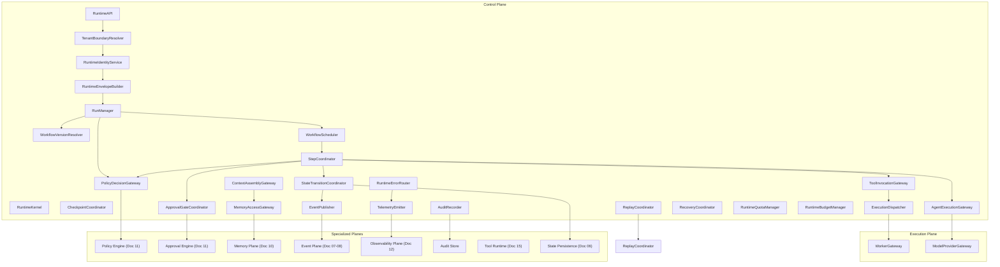

---

## 6. Core Runtime Topology

### 6.1 High-Level Logical Topology

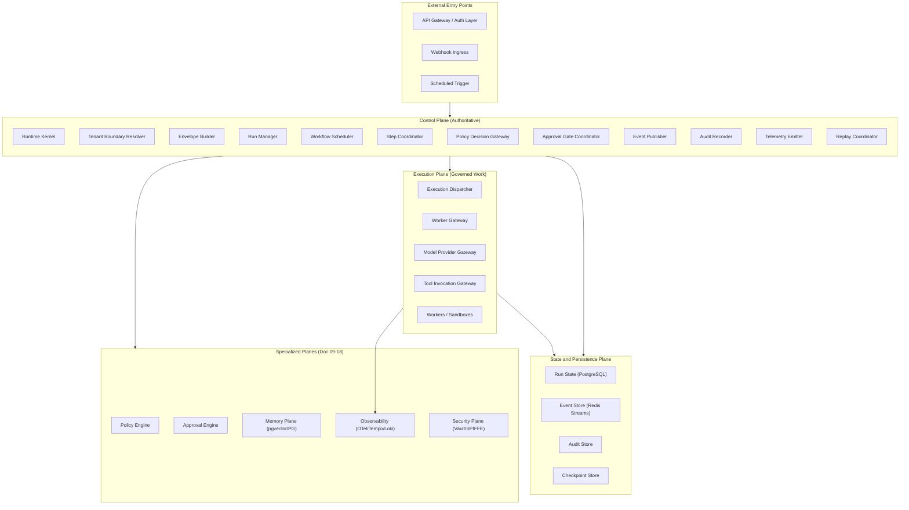

### 6.2 Control Plane to Execution Plane Boundary Diagram

```mermaid
sequenceDiagram
    participant CP as Control Plane (StepCoordinator)
    participant PDG as PolicyDecisionGateway
    participant TIG as ToolInvocationGateway
    participant ED as ExecutionDispatcher
    participant WG as WorkerGateway
    participant W as Worker (Execution Plane)

    CP->>PDG: Evaluate policy for tool invocation
    PDG-->>CP: Policy snapshot + decision
    CP->>TIG: Request tool invocation (with envelope)
    TIG->>TIG: Validate contract; create ToolInvocation record; create idempotency key
    TIG->>ED: Dispatch invocation to worker pool
    ED->>WG: Assign to worker with RuntimeEnvelope
    WG->>W: Transmit signed RuntimeEnvelope
    W->>W: Validate envelope; execute in sandbox
    W-->>WG: Return result
    WG-->>ED: Report result
    ED-->>TIG: Result received
    TIG->>TIG: Validate output schema; persist artifact; register side effect
    TIG-->>CP: ToolInvocationSucceeded
    CP->>CP: Emit event; update step state; emit telemetry
```

### 6.3 Request-to-Run Topology

```mermaid
flowchart LR
    Request["External Request"] --> Auth["Authentication Validation"]
    Auth --> TBR["Tenant Boundary Resolution"]
    TBR --> RIS["Runtime Identity Service"]
    RIS --> REB["Envelope Builder"]
    REB --> PDG["Policy Evaluation"]
    PDG --> RM["Run Manager (Run Created)"]
    RM --> CAG["Context Assembly"]
    CAG --> WS["Workflow Scheduler"]
    WS --> SC["Step Coordinator → Execution"]
```

---

## 7. Governed Run Lifecycle

### 7.1 Lifecycle State Definitions

| State | Description | Entry Condition | Exit Conditions |
|---|---|---|---|
| `RunRequested` | A request to create a run has been received | External trigger or internal scheduler | Tenant resolved (→ TenantResolved) or resolution failed (terminal) |
| `TenantResolved` | Tenant, workspace, and project scope have been validated | Tenant resolution succeeded | Envelope created (→ RuntimeEnvelopeCreated) |
| `RuntimeEnvelopeCreated` | Full RuntimeEnvelope constructed and signed | Envelope builder completed | Workflow version resolved (→ WorkflowVersionResolved) |
| `WorkflowVersionResolved` | Immutable workflow version bound to run | Version lookup succeeded | Policy snapshot bound (→ PolicySnapshotBound) |
| `PolicySnapshotBound` | Active policy snapshot recorded in run record | Policy engine returned snapshot | Context initialized (→ ContextInitialized) |
| `ContextInitialized` | Initial context assembled for first step | Context assembly completed | Run record created (→ RunCreated) |
| `RunCreated` | GovernedRun record persisted; audit record created | State persistence succeeded | Scheduled (→ RunScheduled) |
| `RunScheduled` | First step scheduled; trace created | Scheduler dispatched | First step executing (→ StepReady) |
| `StepReady` | Step record created; policy evaluated for step | Step coordinator initialized | Step dispatched (→ StepRunning) or approval required (→ ApprovalRequired) |
| `StepRunning` | Step dispatched to execution plane; worker executing | Dispatch confirmed | Step succeeded (→ StepSucceeded) or failed (→ StepFailed) or tool invocation |
| `ToolInvocationRequested` | Tool invocation requested from step | ToolInvocationGateway received request | Authorized (→ Authorized) or rejected |
| `ApprovalRequired` | Workflow blocked at approval gate | Policy determined approval required | Approval granted (→ ApprovalGranted) or denied or timeout |
| `ApprovalGranted` | Human authorizer approved the gate | ApprovalRecord created | Step resumed (→ StepRunning) |
| `StepSucceeded` | Step completed; output validated and recorded | Worker returned valid result | Next step scheduled (→ StepReady) or run terminal |
| `StepFailed` | Step execution failed | Worker returned error or timeout | Retry (→ StepReady) within budget or run failed (→ RunFailed) |
| `RunPaused` | Run execution suspended | Operator or policy action | Resumed (→ RunResumed) or cancelled |
| `RunResumed` | Paused run resumed | Operator action with audit | Next step scheduled (→ StepReady) |
| `RunSucceeded` | All steps completed successfully | Final step succeeded | Archived after retention window |
| `RunFailed` | Run terminated in error | Unrecoverable failure or budget exhausted | Archived after retention window |
| `RunCancelled` | Run terminated by operator action | Explicit cancellation with audit | Archived after retention window |
| `ReplayRequested` | A replay of a historical run has been requested | Operator or investigation trigger | Replay context initialized (→ ReplayHydrated) |
| `ReplayHydrated` | Replay context loaded from event history | Event history loaded; snapshots resolved | Replay executing (→ StepReady with is_replay=true) |
| `ReplayCompleted` | Replay execution finished | All replay steps traversed | Evidence bundle updated |
| `RunArchived` | Run record archived per retention policy | Retention window elapsed | Permanent record for audit |

### 7.2 Run Lifecycle State Machine

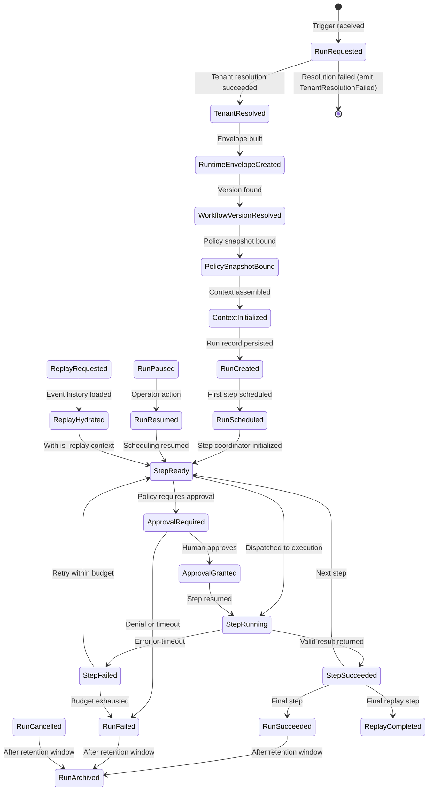

### 7.3 Emitted Events per Transition

| Transition | Emitted Event | Required Fields |
|---|---|---|
| → RunRequested | RunRequested | run_id, tenant_id, actor_id, workflow_id, trace_id |
| → TenantResolved | TenantResolved | run_id, tenant_id, workspace_id, project_id |
| → RunCreated | RunCreated | run_id, tenant_id, workflow_version_id, policy_snapshot_id, actor_id |
| → RunScheduled | RunScheduled | run_id, tenant_id, scheduled_at |
| → StepReady | StepReady | run_id, step_id, step_type, tenant_id |
| → StepRunning | StepStarted | run_id, step_id, tenant_id, worker_id, started_at |
| → ApprovalRequired | ApprovalRequired | run_id, step_id, tenant_id, approval_request_id |
| → ApprovalGranted | ApprovalGranted | approval_id, approver_id, run_id, step_id, decided_at |
| → StepSucceeded | StepSucceeded | run_id, step_id, tenant_id, duration_ms, output_hash |
| → StepFailed | StepFailed | run_id, step_id, tenant_id, error_class, attempt_number |
| → RunSucceeded | RunSucceeded | run_id, tenant_id, duration_ms, step_count |
| → RunFailed | RunFailed | run_id, tenant_id, failure_reason, last_step_id |
| → RunCancelled | RunCancelled | run_id, tenant_id, cancelled_by, reason |
| → ReplayCompleted | ReplayCompleted | original_run_id, replay_run_id, divergence_detected |

### 7.4 Canonical Lifecycle Correction

The canonical GovernedRun lifecycle contains 24 states.

The footer, tests and implementation references MUST use `24` as the lifecycle state count unless a later ADR explicitly changes the state model.

### Canonical State Count

| Category | States |
|---|---:|
| Request and initialization states | 8 |
| Step execution states | 6 |
| Approval states | 2 |
| Pause, resume and cancellation states | 3 |
| Terminal states | 3 |
| Replay states | 3 |
| Archive state | 1 |
| **Total unique states** | **24** |

### Corrected Lifecycle State Machine

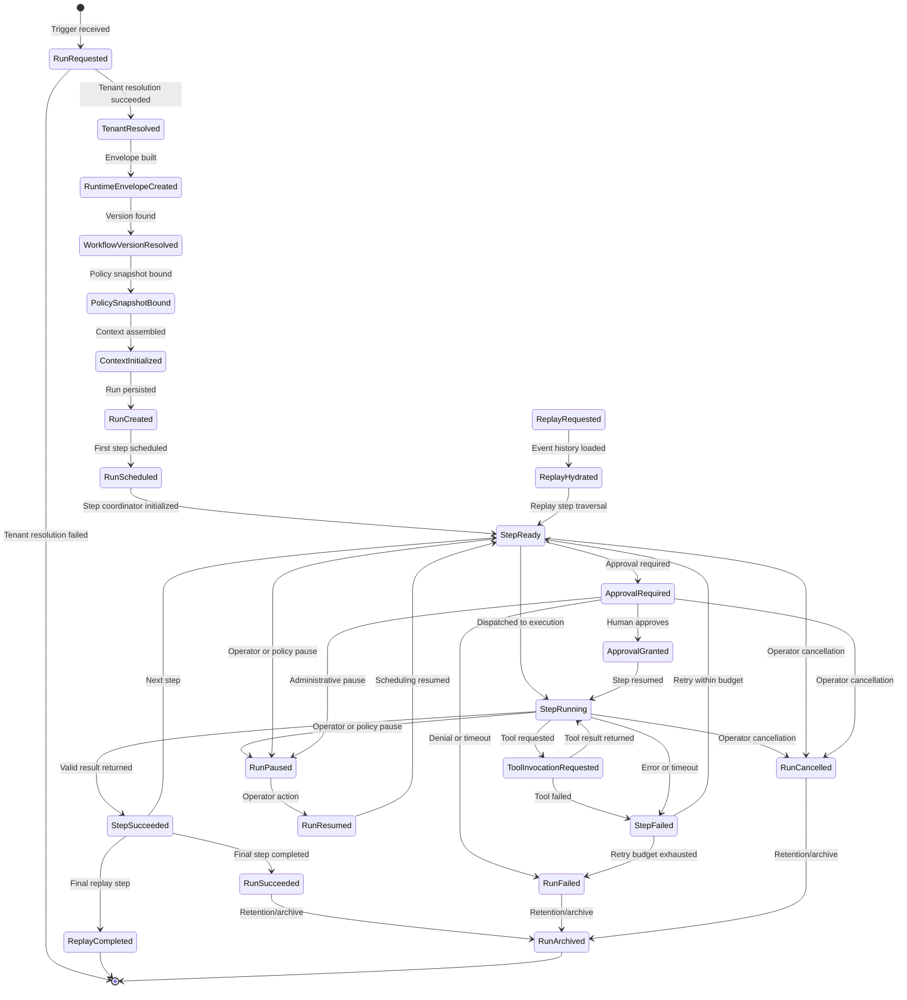

### Implementation Rule

The lifecycle state machine, lifecycle table, tests, footer metadata and Codex implementation guidance MUST agree on the same canonical state count.

### Required Footer Correction

Update the footer field:

```md
| Lifecycle state count | 24 |
```

### Required Test Correction

Update any acceptance or test text that references lifecycle count to use:

```md
All 24 lifecycle states are reachable through valid paths; invalid transitions are rejected by StateTransitionCoordinator.
```

### Forbidden Behavior

FORBIDDEN:

- documenting a state that is unreachable in the state machine;
- implementing a lifecycle count different from the canonical lifecycle table;
- allowing pause, cancellation or tool invocation states to exist only as informal events;
- allowing Codex to infer lifecycle transitions not present in the state machine;
- allowing footer metadata to contradict the canonical state model.

---

## 8. Runtime Envelope Architecture

### 8.1 Purpose and Authority

The RuntimeEnvelope is the governance propagation artifact. It is the data structure that ensures every runtime operation — from a step dispatch to a tool invocation to a memory write — carries the complete context required to enforce tenant boundaries, evaluate policy, maintain audit lineage, and support replay.

The RuntimeEnvelope is not an HTTP header set. It is a structured, signed artifact constructed by the RuntimeEnvelopeBuilder from resolved runtime context and transmitted with every cross-component operation.

### 8.2 Required Fields

```json
{
  "envelope_id": "env-01HXYZ...",
  "envelope_version": "1.0",
  "created_at": "2026-05-20T10:00:00Z",
  "expires_at": "2026-05-20T11:00:00Z",

  "tenant_id": "tenant-abc123",
  "workspace_id": "ws-def456",
  "project_id": "proj-ghi789",

  "workflow_id": "wf-jkl012",
  "workflow_version_id": "wf-jkl012@3.1.0",
  "run_id": "run-mno345",
  "step_id": "step-pqr678",

  "actor_id": "user-stu901",
  "runtime_identity_id": "spiffe://mycelia/ns/mycelia-execution/sa/worker-pool-std",

  "correlation_id": "corr-vwx234",
  "causation_id": "cause-yz0567",
  "trace_id": "4bf92f3577b34da6a3ce929d0e0e4736",
  "span_id": "00f067aa0ba902b7",

  "policy_snapshot_id": "policy-snap-abc123",
  "approval_context_id": null,

  "memory_scope": {
    "tenant_id": "tenant-abc123",
    "workspace_id": "ws-def456",
    "allowed_namespaces": ["ns-proj-ghi789"],
    "write_permitted": false
  },

  "tool_scope": {
    "allowed_tools": ["mycelia.tools.web-search@2.3.1"],
    "max_side_effect_class": "ReadOnlyExternal"
  },

  "data_classification": "internal",

  "runtime_budget": {
    "max_iterations": 10,
    "max_cost_usd": 0.50,
    "max_duration_ms": 300000
  },

  "replay_context": {
    "is_replay": false,
    "original_run_id": null,
    "replay_suppression_active": false
  },

  "security_context": {
    "sandbox_class": "standard",
    "network_policy": "egress_controlled",
    "data_classification_max": "confidential"
  },

  "observability_context": {
    "trace_id": "4bf92f3577b34da6a3ce929d0e0e4736",
    "span_id": "00f067aa0ba902b7",
    "otel_endpoint": "otel-collector.mycelia-observability.svc:4317"
  },

  "idempotency_context": {
    "run_idempotency_key": "idem-run-mno345",
    "step_idempotency_key": "idem-run-mno345:step-pqr678"
  },

  "failure_policy": {
    "max_retries": 3,
    "backoff_strategy": "exponential",
    "fail_closed_on_policy_error": true
  },

  "tenant_boundary_context": {
    "enforcement_level": "strict",
    "cross_tenant_access": false,
    "violation_action": "abort_and_alert"
  },

  "envelope_signature": "sig-base64-..."
}
```

### 8.3 Envelope Construction and Propagation Rules

- The RuntimeEnvelopeBuilder MUST construct the envelope from resolved runtime context before any downstream operation is dispatched.
- The envelope MUST be signed. Components MUST verify the signature before processing.
- `tenant_id`, `workspace_id`, `run_id`, `workflow_version_id`, `policy_snapshot_id`, `trace_id`, and `correlation_id` are immutable after construction.
- `step_id` and `span_id` are updated as execution progresses through workflow steps.
- `replay_context.is_replay` is set at replay initiation and propagated to all subsequent operations.
- Envelopes have an expiry (`expires_at`). Components MUST reject expired envelopes.
- The envelope is transmitted over authenticated, encrypted channels only.
- No component may create or modify an envelope except RuntimeEnvelopeBuilder.

### 8.4 Envelope Invariants

- No runtime operation may execute without a valid RuntimeEnvelope.
- No envelope may omit `tenant_id`.
- No envelope may omit `policy_snapshot_id`.
- No envelope may omit `trace_id`.
- No envelope may omit `correlation_id`.
- An envelope with `replay_context.is_replay = true` MUST have `replay_suppression_active = true` for any operation with side effects.
- An expired envelope MUST be rejected immediately, not after execution begins.


---

## 9. Request-to-Run Pipeline

### 9.1 Canonical Pipeline

Every governed run flows through the following canonical pipeline. No stage may be skipped.

```mermaid
sequenceDiagram
    participant Client
    participant RAPI as RuntimeAPI
    participant TBR as TenantBoundaryResolver
    participant RIS as RuntimeIdentityService
    participant REB as RuntimeEnvelopeBuilder
    participant WVR as WorkflowVersionResolver
    participant PDG as PolicyDecisionGateway
    participant CAG as ContextAssemblyGateway
    participant RM as RunManager
    participant EP as EventPublisher
    participant TE as TelemetryEmitter
    participant WS as WorkflowScheduler
    participant SC as StepCoordinator
    participant AR as AuditRecorder

    Client->>RAPI: POST /runs (authenticated request)
    RAPI->>TBR: Resolve tenant from credential
    TBR-->>RAPI: {tenant_id, workspace_id, project_id}
    RAPI->>RIS: Resolve actor identity
    RIS-->>RAPI: {actor_id, runtime_identity_id}
    RAPI->>WVR: Resolve workflow version
    WVR-->>RAPI: {workflow_version_id, workflow definition}
    RAPI->>PDG: Evaluate run creation policy
    PDG-->>RAPI: {policy_snapshot_id, permitted: true}
    RAPI->>REB: Build RuntimeEnvelope
    REB-->>RAPI: Signed RuntimeEnvelope
    RAPI->>RM: createRun(envelope, workflow_version)
    RM->>CAG: Assemble initial context
    CAG-->>RM: {context_snapshot_id}
    RM->>EP: Emit RunCreated event
    RM->>AR: Write audit record (RunCreated)
    RM->>TE: Create trace; emit RunScheduled span
    RM->>WS: Schedule first step
    WS->>SC: Dispatch step with envelope
    SC->>PDG: Evaluate step policy
    SC->>SC: Execute or wait for approval
    SC->>EP: Emit step events
    SC->>TE: Emit step spans
    SC->>AR: Write step audit record
    RM-->>Client: {run_id, status: RunScheduled}
```

### 9.2 Pipeline Stage Rules

- Stages 1–9 (authentication through envelope construction) MUST complete before any run record is created.
- Policy evaluation (stage 7) MUST precede envelope construction (stage 8).
- Run record creation (stage 10) MUST precede event emission (stage 11).
- Trace creation (stage 12) MUST precede execution dispatch (stage 13).
- Any failure in stages 1–9 MUST abort without creating a partial run record.
- Any failure in stages 10–18 MUST result in a terminal run state with events emitted.

---

## 10. Control Plane Architecture

### 10.1 Runtime Authority

The control plane is the authoritative decision-making layer of the MYCELIA runtime. It decides:

- whether a run may be created;
- which workflow version executes;
- which policy applies;
- when each step executes;
- whether a step requires approval;
- what a step is permitted to do (memory scope, tool scope, budget);
- whether execution should be halted, retried, or failed;
- how replay is coordinated;
- how recovery is orchestrated.

The control plane MUST NOT delegate these decisions to the execution plane. The execution plane receives decisions and executes them; it does not make them.

### 10.2 Control Plane Design Rules

- The control plane is **deterministic**. Given the same event history, the control plane's decisions are reproducible.
- The control plane **never performs external I/O directly**. External I/O is dispatched to the execution plane through typed gateways.
- The control plane **records every transition**. A state change that is not recorded in the event store has not occurred.
- The control plane **fails closed** when policy or tenant resolution fails. It does not degrade to a "best effort" mode.
- The control plane **owns run state**. Workers in the execution plane may not mutate run state directly; they return results to the control plane, which updates state.

### 10.3 Orchestration Decisions

Control plane orchestration decisions:

| Decision | Made By | Basis |
|---|---|---|
| Which step executes next | WorkflowScheduler | Current run state + deterministic workflow graph |
| Whether approval is required | ApprovalGateCoordinator | Policy decision + tool side-effect class |
| Whether a tool invocation is permitted | PolicyDecisionGateway + ToolInvocationGateway | Policy snapshot + tool manifest |
| Whether a retry is permitted | RunManager + StepCoordinator | Current attempt count vs. retry budget |
| Whether context may include a memory item | ContextAssemblyGateway + PolicyDecisionGateway | Policy + data classification |
| Whether a run has exceeded its budget | RuntimeBudgetManager | Accumulated cost/iterations vs. declared budget |

### 10.4 Tenant Boundary Authority

The control plane is the authoritative enforcer of tenant boundaries. At every decision point, the current `tenant_id` is validated against the operation's target. Any operation that would cross a tenant boundary is:

1. Immediately aborted by RuntimeErrorRouter.
2. Recorded as a TenantBoundaryViolation event.
3. Escalated to the security alert pipeline.

This enforcement is not advisory. It is the control plane's first-class responsibility.

---

## 11. Execution Plane Boundary

### 11.1 What Belongs in the Execution Plane

The execution plane contains all operations that are inherently nondeterministic, side-effectful, or dependent on external systems:

- **Workers:** The execution agents that receive RuntimeEnvelopes and execute tool implementations in sandboxes.
- **Activities:** Temporal-style activity functions that perform single, idempotent operations.
- **Tool runtime:** The sandboxed execution environment for registered tools.
- **Model execution:** Model inference via vendor-agnostic provider adapters.
- **Sandboxed execution:** Process-isolated, filesystem-isolated, network-controlled execution environments.
- **External API calls:** All calls to external systems, APIs, databases outside the MYCELIA memory plane.
- **File operations:** Filesystem reads/writes, object storage reads/writes.
- **Provider calls:** Model provider API calls, external authentication, credential fetches.

### 11.2 Execution Plane Rules

- Nondeterminism belongs exclusively in the execution plane. The control plane must remain deterministic.
- Side effects belong behind typed contracts (tool execution contracts). The execution plane cannot produce undeclared side effects.
- The execution plane CANNOT mutate run state directly. It returns results to the control plane via WorkerGateway.
- The execution plane MUST validate the RuntimeEnvelope signature before beginning execution.
- The execution plane CANNOT bypass policy. Every operation begins from a policy-evaluated envelope.
- Workers MUST NOT hold state between invocations for different runs or different tenants.

### 11.3 Execution Plane Isolation

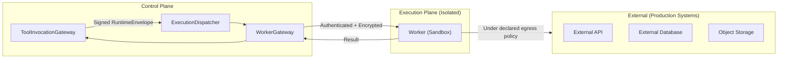

---

## 12. Orchestration Integration

### 12.1 Orchestration Engine Placement

The workflow orchestration engine (detailed in Document 09) is the implementation of deterministic control flow within the Orchestration Plane. MYCELIA uses Temporal as the durable execution engine and LangGraph for stateful cognitive graph execution.

The Core Runtime's relationship to the orchestration engine:

- The WorkflowScheduler dispatches to the orchestration engine's task queue.
- The orchestration engine executes the deterministic workflow graph.
- All non-deterministic operations (tool calls, model inference) are dispatched as activities to the execution plane.
- The orchestration engine's event history IS the append-only lineage for that workflow run.
- Replay traverses the orchestration engine's event history deterministically.

### 12.2 Orchestration Boundary

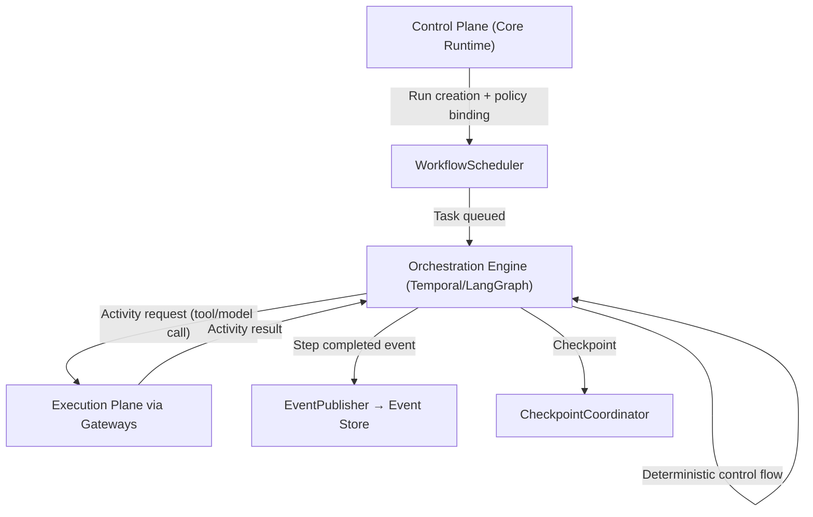

### 12.3 Rules

- Workflow orchestration code MUST NOT contain external I/O.
- Workflow orchestration code MUST produce the same control decisions for the same event history.
- Activities are the only mechanism through which orchestration code can interact with the external world.
- The orchestration engine's event history is the authoritative replay artifact.

---

## 13. Cognitive Execution Boundary

### 13.1 Where Cognition Enters the Runtime

Model inference enters the runtime through the AgentExecutionGateway and then the ModelProviderGateway. The cognitive execution boundary enforces that model inference is:

- **Bounded:** Token budget, cost budget, and iteration limit are enforced before any model call.
- **Scoped:** The model receives only the context assembled by ContextAssemblyGateway — not arbitrary access to memory or run state.
- **Validated:** Model output passes schema validation before the runtime accepts it.
- **Non-authoritative:** Raw model output is data, not instruction. It does not become runtime state without explicit validation and promotion.

### 13.2 Cognitive Execution Rules

- No model output may become workflow state without passing output schema validation.
- No model call may carry production credential values.
- No model may select tools without the AgentExecutionGateway mediating the tool request through the control plane.
- No model output may inject workflow control decisions (e.g., "skip the approval gate").
- Model provider selection is a runtime configuration, not a model decision.

### 13.3 Output Validation Chain

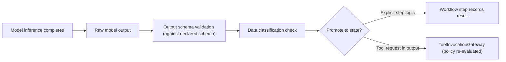

---

## 14. Agent Runtime Integration Boundary

### 14.1 Agents as Runtime Participants

Agents are planning and reasoning units that participate in workflow steps. They are not autonomous executors. The Core Runtime's contract with agents:

- Agents receive context assembled by ContextAssemblyGateway.
- Agents may express intent to invoke tools; the AgentExecutionGateway mediates the actual invocation.
- Agents operate within declared scope: specific tool set, memory namespace, iteration budget, cost budget.
- Agent output is validated before the runtime accepts it.
- Agents do not own runtime authority. They request; the runtime governs.

### 14.2 Agent Scope Declaration

Agent scope is declared in the workflow definition and enforced by AgentExecutionGateway:

```json
{
  "agent_scope": {
    "allowed_tools": ["mycelia.tools.web-search", "mycelia.tools.document-extract"],
    "memory_namespaces": ["ns-proj-ghi789"],
    "memory_write_permitted": false,
    "max_iterations": 5,
    "max_cost_usd": 0.25,
    "output_schema_ref": "schemas/research-step-output-v1.json"
  }
}
```

### 14.3 Multi-Agent Boundary

When multiple agents coordinate:

- Each agent step executes within its own declared scope.
- Inter-agent communication routes through workflow state, not shared memory or shared context.
- Each agent step has its own RuntimeEnvelope with scoped memory and tool access.
- No agent may access another agent's execution context directly.

---

## 15. State, Checkpoint and Persistence Boundary

### 15.1 Core Runtime State Responsibilities

The Core Runtime is responsible for:

- **Run state:** The GovernedRun record and its lifecycle state machine. Owned by RunManager.
- **Step state:** The WorkflowStep record and its lifecycle. Owned by StepCoordinator.
- **Workflow version state:** The immutable WorkflowVersion record. Owned by WorkflowVersionResolver.
- **Checkpoint triggers:** Deciding when checkpoints should be created. Owned by CheckpointCoordinator.
- **State transition events:** Emitting the event corresponding to every state transition. Owned by StateTransitionCoordinator.

The Core Runtime does NOT own:

- Detailed schema design for state records (Document 03 and Document 06).
- Database query optimization (Document 06).
- Backup and restore procedures (Document 17).

### 15.2 State Mutation Rules

- State MUST be persisted before the corresponding event is emitted. An event without a persisted state change is inconsistent.
- No execution plane worker may mutate run or step state directly. Workers return results to the control plane.
- State transitions MUST be validated against the state machine before persistence. Invalid transitions are rejected.
- Replay MUST hydrate state from original checkpoints and event history, not from current state.

### 15.3 Checkpoint Trigger Points

| Trigger Point | Description |
|---|---|
| After every completed step | Captures run state at step boundary; supports resumption on failure |
| Before approval gate | Captures state before blocking; required for correct resumption after approval |
| Before destructive tool invocation | Captures state before an irreversible side effect |
| At declared workflow checkpoints | Workflow definition may declare explicit checkpoint nodes |
| Before replay | Captures current state before replay begins (replay is isolated) |

---

## 16. Event Spine Integration

### 16.1 Why Events Are the Runtime Skeleton

Events are not supplementary telemetry. They are the backbone of MYCELIA's runtime guarantees:

- **Replay:** The orchestration engine replays from event history. If events are incomplete or mutable, replay is impossible.
- **Audit:** Event records are the primary evidence of what the system did. If events are lossy, audit is degraded.
- **Recovery:** The RecoveryCoordinator uses event history to determine where a run stopped and how to resume it.
- **Observability:** Events drive dashboards, alerts, and SLO measurements.

### 16.2 Event Emission Points

Every significant operation in the runtime MUST emit an event AFTER the corresponding state change is persisted. The emission is synchronous from the runtime's perspective — the operation is not considered complete until the event is emitted.

| Operation | Emitted Event | Emitter |
|---|---|---|
| Run created | RunCreated | RunManager → EventPublisher |
| Run scheduled | RunScheduled | WorkflowScheduler → EventPublisher |
| Step started | StepStarted | StepCoordinator → EventPublisher |
| Tool invocation requested | ToolInvocationRequested | ToolInvocationGateway → EventPublisher |
| Tool invocation succeeded | ToolExecutionSucceeded | ToolInvocationGateway → EventPublisher |
| Approval required | ApprovalRequired | ApprovalGateCoordinator → EventPublisher |
| Run succeeded | RunSucceeded | RunManager → EventPublisher |
| Run failed | RunFailed | RunManager → EventPublisher |
| Tenant boundary violation | TenantBoundaryViolation | RuntimeErrorRouter → EventPublisher → Security |
| Policy evaluation failed | PolicyEvaluationFailed | PolicyDecisionGateway → EventPublisher |

### 16.3 Event Spine Properties

- All events carry: `tenant_id`, `run_id`, `correlation_id`, `causation_id`, `trace_id`, `timestamp`.
- Events are append-only. The runtime MUST NOT modify or delete events.
- Critical events (audit, security) route to durable stores that are not subject to sampling.
- The DLQ captures events that fail delivery for retry; event loss triggers a SEV0 alert per Document 17.

### 16.4 Transactional State/Event Commit Boundary

MYCELIA MUST use a transactional state/event commit boundary for every governed state transition.

The runtime MUST NOT rely on best-effort event publication after state persistence. A persisted state transition without a durable event intent creates replay, audit and recovery risk.

### Transactional Outbox Rule

Every governed state transition MUST commit the following in the same database transaction or equivalent atomic persistence boundary:

- state transition record;
- event outbox record;
- causation_id;
- correlation_id;
- tenant_id;
- run_id;
- transition metadata;
- audit intent when applicable.

The EventPublisher MAY publish asynchronously from the outbox, but the event intent MUST be durably recorded before the state transition is considered committed.

### Commit Model

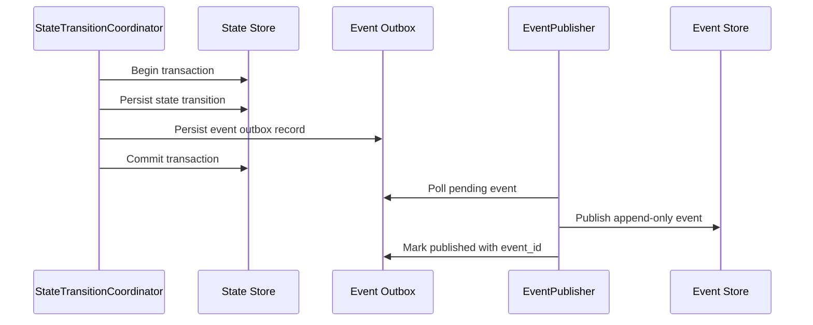

### Completion Semantics

A state transition has three possible durability stages:

| Stage | Meaning | Runtime Status |
|---|---|---|
| `state_pending` | Transition requested but not committed | Not authoritative |
| `state_committed_event_pending` | State and outbox committed, event not yet published | Authoritative but operationally degraded |
| `state_committed_event_published` | State, outbox and event store publication complete | Fully complete |

### Rules

- No governed state transition may commit without an event outbox record.
- Event publication failure MUST NOT erase the state transition.
- Event publication failure MUST leave an outbox record for retry.
- Replay MUST prefer published event history, but recovery MAY reconcile from committed outbox records.
- Persistent outbox backlog for critical events MUST trigger an incident according to Document 17.
- Critical audit and security events MUST have priority publication behavior.
- Outbox records MUST preserve tenant_id, run_id, correlation_id and causation_id.
- Outbox records MUST be idempotently publishable.

### Forbidden Behavior

FORBIDDEN:

- persisting state and attempting event publication only in memory;
- treating event publication failure as invisible telemetry degradation;
- deleting outbox records before successful event publication;
- allowing replay-critical transitions to exist without outbox evidence;
- emitting events directly from business logic without StateTransitionCoordinator;
- allowing Codex to implement state persistence and event publication as unrelated operations.

---

## 17. Memory and Context Integration

### 17.1 Context Assembly Gateway Role

Every step begins with context assembly. The ContextAssemblyGateway:

1. Receives the current RuntimeEnvelope with memory scope.
2. Retrieves relevant memory items from the Memory Plane within the declared namespace scope.
3. Retrieves the current checkpoint state.
4. Assembles the typed working context for the step.
5. Creates a context snapshot before executing the step.
6. Returns the assembled context (not raw transcript).

Context is a typed working set, not accumulated conversation history. The gateway enforces this by assembling from typed sources.

### 17.2 Memory Write Rules at Runtime Level

- Memory writes MUST be declared in the tool execution contract or workflow step definition.
- Memory writes MUST route through the MemoryAccessGateway.
- The gateway MUST call PolicyDecisionGateway before executing the write.
- Every write MUST produce a provenance record: `{writer_id, run_id, step_id, tenant_id, classification, timestamp}`.
- Memory writes from tool output require `memory_write_behavior.allowed = true` in the execution contract.

### 17.3 Memory Isolation Enforcement

- The MemoryAccessGateway enforces tenant scope: reads and writes are bounded to the `tenant_id` in the RuntimeEnvelope.
- Cross-tenant memory access is rejected and produces a TenantBoundaryViolation event.
- Replay context MUST use memory snapshots from the original execution, not current memory state.

---

## 18. Governance, Policy and Approval Integration

### 18.1 Policy Enforcement Points

The PolicyDecisionGateway is called at every operation that requires authorization. The policy engine is not optional infrastructure — it is a structural gatekeeper.

| Enforcement Point | Called By | Fail-Closed Behavior |
|---|---|---|
| Run creation | RunManager | Reject run creation; emit RunRejected event |
| Step dispatch | StepCoordinator | Block step; emit StepPolicyDenied event |
| Tool invocation | ToolInvocationGateway | Reject tool invocation; emit ToolInvocationRejected |
| Memory write | MemoryAccessGateway | Reject write; emit MemoryWriteRejected |
| Memory read (sensitive) | MemoryAccessGateway | Reject read; emit MemoryReadRejected |
| Approval gate | ApprovalGateCoordinator | Block step until approval; auto-deny on timeout |
| Run cancellation | RunManager | Reject unauthorized cancellation |
| Replay initiation | ReplayCoordinator | Reject unauthorized replay |

### 18.2 Policy Snapshot Binding

When a policy snapshot is bound at run creation:

- The snapshot captures the full active policy state at that moment.
- The `policy_snapshot_id` is recorded in the GovernedRun record.
- Every subsequent operation in the run carries the same `policy_snapshot_id`.
- Replay uses the historical `policy_snapshot_id` — not the current policy state.
- Policy changes after run creation do NOT affect in-flight runs (snapshot isolation).

### 18.3 Approval as Runtime State

Approval is a formal state in the run lifecycle, not an out-of-band process:

- When a step reaches an approval gate: StepCoordinator transitions to ApprovalRequired; execution blocks.
- ApprovalGateCoordinator routes the request to authorized approvers.
- On approval grant: ApprovalRecord is created; StepCoordinator transitions to ApprovalGranted; execution resumes.
- On denial or timeout: RunFailed with ApprovalDenied or ApprovalTimedOut reason.
- No approval may be self-granted by the system. Break-glass requires incident linkage and TTL.

### 18.4 Policy Enforcement Matrix

| Operation | Policy Required | Approval Eligible | Fail-Closed | Audit Required |
|---|---|---|---|---|
| Run creation | Yes | No | Yes | Yes |
| Agent step dispatch | Yes | No | Yes | Yes |
| Tool invocation (any) | Yes | By side-effect class | Yes | Yes |
| Memory write | Yes | Conditional | Yes | Yes |
| Run cancellation | Yes | No | Yes | Yes |
| Replay initiation | Yes | No | Yes | Yes |
| Break-glass access | Yes | Yes (incident-linked) | Yes | Yes (priority) |

---

## 19. Observability and Telemetry Integration

### 19.1 Trace Creation and Hierarchy

Every run begins with a new trace. The TelemetryEmitter creates and manages the trace hierarchy:

```
RunTrace (trace_id)
└── RunSpan (run_id)
    ├── PolicyEvaluationSpan
    ├── ContextAssemblySpan
    └── StepSpan (step_id)
        ├── PolicyEvaluationSpan (step-level)
        ├── ToolInvocationSpan (invocation_id)
        │   ├── CredentialLeaseSpan
        │   ├── SandboxExecutionSpan
        │   └── ArtifactPersistenceSpan
        └── ApprovalSpan (if required)
```

### 19.2 Required Telemetry per Operation

| Operation | Span Required | Event Required | Metric Required | Audit Required |
|---|---|---|---|---|
| Run creation | Yes | Yes (RunCreated) | run_started_total | Yes |
| Step dispatch | Yes | Yes (StepStarted) | step_started_total | Yes |
| Tool invocation | Yes | Yes (ToolInvocationRequested) | tool_invocations_total | Yes |
| Policy evaluation | Yes | On denial | policy_evaluations_total | On denial |
| Approval gate | Yes | Yes (ApprovalRequired) | approvals_required_total | Yes |
| Memory write | Yes | On sensitive classification | memory_writes_total | Yes |
| Run completion | Yes | Yes (RunSucceeded/RunFailed) | run_completed_total | Yes |
| Tenant boundary violation | Yes | Yes (critical) | boundary_violations_total | Yes (priority) |

### 19.3 Telemetry Rules

- Every span MUST include `tenant_id`, `run_id`, and `step_id` (where applicable) as span attributes.
- Critical telemetry (audit events, security events) MUST NOT be sampled.
- Telemetry emission failure MUST be logged but MUST NOT fail the operation.
- Replay telemetry MUST route to an isolated namespace (not the production namespace).

---

## 20. Security and Trust Integration

### 20.1 Runtime Identity

Every execution principal in MYCELIA carries a runtime identity. The RuntimeIdentityService resolves and validates:

- **Actor identity:** The human or system that initiated the run.
- **Worker identity:** The SPIFFE SVID or equivalent workload credential of the executing worker.
- **Service identity:** The mTLS certificate of each runtime service.

### 20.2 Trust Boundary Validation

```mermaid
flowchart LR
    Request["Incoming request"] --> AuthN["Authentication: Validate credential"]
    AuthN --> AuthZ["Authorization: RBAC via PolicyDecisionGateway"]
    AuthZ --> TrustVal["Trust boundary: Validate tenant_id scope"]
    TrustVal --> EnvelopeSign["Envelope: Signed before dispatch"]
    EnvelopeSign --> WorkerAttest["Worker: Attestation verified before execution"]
    WorkerAttest --> CredLease["Credentials: Leased from Vault for execution window"]
    CredLease --> ExecBounded["Execution: Bounded by envelope scope"]
```

### 20.3 Security Rules at Runtime Level

- Service-to-service communication MUST be authenticated (mTLS or SPIFFE SVID).
- Credentials MUST be fetched via lease from the secret manager; they MUST NOT appear in run state, events, or telemetry.
- Workers MUST NOT hold credentials between invocations.
- Replay environments MUST be excluded from production credential access.
- Tenant boundary violations MUST trigger immediate security alert escalation.

---

## 21. Multi-Tenant Boundary Integration

### 21.1 Tenant Context as Non-Optional

`tenant_id` is mandatory in every runtime record, event, telemetry span, state record, and artifact. The TenantBoundaryResolver is the first component invoked in the pipeline. If resolution fails, the operation is aborted.

### 21.2 Tenant Boundary Enforcement Map

| Layer | Enforcement Mechanism | Component |
|---|---|---|
| API layer | Credential-bound tenant resolution | TenantBoundaryResolver |
| Runtime envelope | `tenant_id` in every envelope; signed | RuntimeEnvelopeBuilder |
| State persistence | All state records carry `tenant_id`; DB RLS | StateTransitionCoordinator + DB |
| Event emission | All events carry `tenant_id` | EventPublisher |
| Memory access | `tenant_id` validated before every read/write | MemoryAccessGateway |
| Tool execution | Envelope `tenant_id` validated by worker | WorkerGateway + Worker |
| Telemetry | All spans carry `tenant_id` attribute | TelemetryEmitter |
| Audit records | All records carry `tenant_id` | AuditRecorder |
| Credential access | Credentials tenant-scoped in Vault | RuntimeEnvelope + Vault |

### 21.3 Tenant Boundary Violation Response

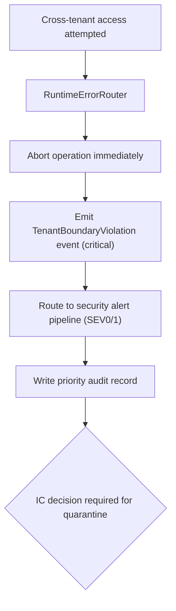

---

## 22. Tool Runtime and SDK Integration Boundary

### 22.1 Tool Invocation Entry Point

Tool invocations enter the Core Runtime through the ToolInvocationGateway. This gateway is the boundary between the control plane's authorization authority and the execution plane's execution capability.

The gateway sequence:

1. Receive tool request from StepCoordinator (with RuntimeEnvelope).
2. Load tool manifest and execution contract from Tool Registry.
3. Validate contract: input schema, side-effect class, tenant scope.
4. Call PolicyDecisionGateway: evaluate tool invocation policy.
5. Check approval requirement (if side-effect class requires approval).
6. Create IdempotencyKey.
7. Create ToolInvocation record.
8. Request credential lease from Security Plane.
9. Dispatch to ExecutionDispatcher.
10. Receive result from WorkerGateway.
11. Validate output schema.
12. Persist artifact with provenance.
13. Register side effects.
14. Emit events and telemetry.
15. Return ToolInvocationSucceeded to StepCoordinator.

### 22.2 SDK Calls as Runtime Requests

External SDK calls (from Document 15) become runtime requests at the RuntimeAPI boundary. The SDK carries:

- Authentication credential (resolves to tenant_id).
- Correlation_id (propagated by caller's SDK).
- Requested operation.

The runtime validates, resolves context, builds the RuntimeEnvelope, and proceeds through the standard pipeline. The SDK does not bypass any runtime governance layer.

---

## 23. Runtime API Boundaries

### 23.1 Internal Runtime API Definitions

These are internal API contracts between runtime components, not the public-facing API (Document 18).

| API | Caller | Required Envelope Fields | Output | Failure Behavior | Audit Required |
|---|---|---|---|---|---|
| `createRun` | External trigger / RunManager | `tenant_id`, `workspace_id`, `workflow_id`, `actor_id` | `{run_id, status}` | Emit RunCreationFailed; abort | Yes |
| `scheduleStep` | WorkflowScheduler | Full RuntimeEnvelope | `{step_id, scheduled_at}` | Emit StepSchedulingFailed; retry | Yes |
| `transitionState` | StateTransitionCoordinator | `run_id`, `step_id`, `from_state`, `to_state`, `tenant_id` | `{new_state, event_id}` | Reject invalid transition; emit error event | Yes |
| `emitEvent` | EventPublisher | `tenant_id`, `run_id`, `correlation_id`, `causation_id`, `event_type` | `{event_id}` | Buffer; DLQ on persistent failure | No (itself IS audit) |
| `requestToolInvocation` | StepCoordinator | Full RuntimeEnvelope + tool_id + input | `{invocation_id}` | Emit ToolInvocationFailed | Yes |
| `requestApproval` | ApprovalGateCoordinator | `run_id`, `step_id`, `tenant_id`, `approval_type`, `context_ref` | `{approval_request_id}` | Emit ApprovalRoutingFailed; run blocks | Yes |
| `assembleContext` | ContextAssemblyGateway | `run_id`, `step_id`, `memory_scope`, `tenant_id` | `{context_snapshot_id}` | Emit ContextAssemblyFailed; step fails | No |
| `readMemory` | MemoryAccessGateway | `tenant_id`, `namespace`, `key/query` | `{items: [...]}` | Emit MemoryReadFailed; step may proceed with partial context | Conditional |
| `writeMemory` | MemoryAccessGateway | `tenant_id`, `namespace`, `key`, `value`, `writer_id` | `{memory_id, provenance_id}` | Emit MemoryWriteFailed | Yes |
| `recordAudit` | AuditRecorder | Full identity fields + operation + result | `{audit_id}` | Buffer; escalate on persistent failure | N/A |
| `startReplay` | ReplayCoordinator | `original_run_id`, `tenant_id`, `actor_id`, `reason` | `{replay_run_id}` | Emit ReplayStartFailed | Yes |
| `cancelRun` | RunManager | `run_id`, `tenant_id`, `actor_id`, `reason` | `{status: RunCancelled}` | Emit CancellationFailed | Yes |
| `resumeRun` | RunManager | `run_id`, `tenant_id`, `actor_id`, `approval_id` | `{status: RunResumed, next_step_id}` | Emit ResumptionFailed | Yes |

---

## 24. Runtime Failure Model

### 24.1 Failure Catalog

| Failure Mode | Detection | Runtime Behavior | Fail-Open/Closed | Emitted Events | Recovery | Replay Implication |
|---|---|---|---|---|---|---|
| Tenant resolution failure | TenantBoundaryResolver returns error | Abort immediately; no partial run | Closed | TenantResolutionFailed | None; client receives error | Replay records resolution failure |
| Policy engine unavailable | PDG health check; timeout | Block all policy-gated operations | Closed | PolicyEngineUnavailable | Retry PDG; queue operations if brief | Replay uses historical snapshot |
| Workflow version missing | WVR returns NotFound | Reject run creation | Closed | WorkflowVersionNotFound | Operator must register version | Replay fails if version is archived |
| State persistence failure | DB write error | Retry 3x; then fail run with event | Closed | StatePersistenceFailed | Recovery from checkpoint/event history | Replay hydrates from event history |
| Event emission failure | EventPublisher returns error | Buffer events; DLQ on persistent failure | Open (buffered) | InternalEventEmissionFailed | Buffer drain; operator alert | May degrade replay completeness |
| Telemetry failure | OTel collector unreachable | Log locally; continue execution | Open | None (by definition) | Buffer drain | May degrade replay evidence |
| Worker dispatch failure | ExecutionDispatcher timeout | Retry within budget; fail step on exhaustion | Closed | WorkerDispatchFailed | Retry with new worker | Step retry with new attempt |
| Tool runtime unavailable | ToolInvocationGateway timeout | Fail invocation; retry within budget | Closed | ToolExecutionFailed | Retry; tool kill switch if sustained | Replay hydrates from recorded result |
| Memory gateway unavailable | MemoryAccessGateway timeout | Fail context assembly; block step | Closed | MemoryGatewayUnavailable | Retry; degraded mode with partial context | Replay uses checkpoint context |
| Approval engine unavailable | AGC health check timeout | Block approval-required operations | Closed | ApprovalEngineUnavailable | Retry; manual approval path | Replay uses historical approval record |
| Replay hydration failure | ReplayCoordinator: missing ToolReplayRecord | Suppress step; emit divergence event | Closed | ReplayHydrationFailed | Investigate missing artifacts | Replay records suppression |
| Tenant boundary violation | Cross-tenant access detected | Abort; escalate immediately | Closed | TenantBoundaryViolation | Security incident response | Halt replay; require security review |
| Duplicate run request | Idempotency key conflict | Return existing run_id | Closed (deduplicated) | None (dedup) | None | Replay uses original run |
| Idempotency conflict | Different payload + same key | Reject with IdempotencyConflict error | Closed | IdempotencyConflict | Client must use unique key | N/A |
| Poisoned event | Event fails processing repeatedly | Route to DLQ; alert operator | Closed (DLQ) | PoisonEventDetected | Operator investigation | May affect replay completeness |
| Partial step failure | Worker returned partial result | Fail step; retry within budget | Closed | StepFailed | Retry from last checkpoint | Retry attempt in replay |


---

## 25. Runtime Scaling and Capacity Model

### 25.1 Scaling Dimensions

| Dimension | Scaling Unit | Primary Constraint | Backpressure Mechanism |
|---|---|---|---|
| Run concurrency | Runs per tenant per cluster | State persistence throughput; policy evaluation throughput | Per-tenant quota; RuntimeQuotaManager |
| Step concurrency | Steps across all active runs | Worker pool capacity; tool invocation throughput | Worker pool scaling; KEDA queue-based scale |
| Worker capacity | Worker replicas | Node pool capacity; tool execution latency | KEDA HPA on task queue depth |
| Event throughput | Events per second | Event broker (Redis Streams) throughput | Stream retention; consumer group lag monitoring |
| State persistence load | Writes per second | PostgreSQL write capacity | Connection pool limits; replica routing for reads |
| Memory retrieval load | Vector queries per second | pgvector index; PostgreSQL connection pool | Query timeout; index optimization |
| Policy evaluation load | Policy evaluations per second | OPA engine throughput | OPA horizontal scaling |
| Tool invocation load | Tool invocations per second | Worker pool; external API rate limits | Per-tool rate limits; circuit breaker |
| Per-tenant quotas | Runs/steps/tool calls per tenant | Platform capacity; tenant contract | RuntimeQuotaManager; API 429 responses |

### 25.2 Degradation Behavior

When capacity is under pressure, MYCELIA degrades in a defined order to preserve governance:

1. **First:** Rate-limit new run creation (429 with retry-after).
2. **Second:** Slow down new step dispatch (increase queue depth; KEDA scales workers).
3. **Third:** Activate per-tenant quotas more aggressively.
4. **Fourth:** Activate degraded mode for non-critical capabilities (vector search, complex context assembly).
5. **Never:** Degrade governance enforcement (policy evaluation, tenant isolation, audit records).

### 25.3 Backpressure Visibility

Backpressure MUST be observable. The following metrics MUST be monitored and alerted:

- `task_queue_depth` by worker pool.
- `run_creation_rate_limited_total` by tenant.
- `policy_evaluation_latency_p99` — alert if approaching SLO threshold.
- `event_stream_consumer_lag` by stream.
- `tool_invocation_queue_depth` by tool.

---

## 26. Runtime Data Flow Diagrams

### 26.1 End-to-End Governed Run

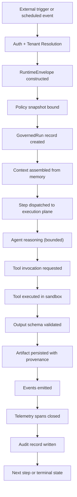

### 26.2 Approval-Gated Run

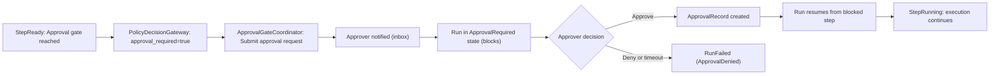

### 26.3 Tool Invocation Path

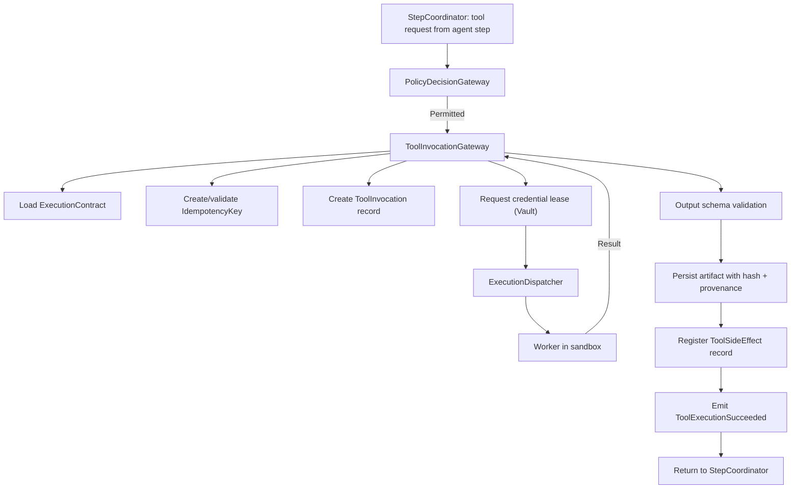

### 26.4 Replay Path

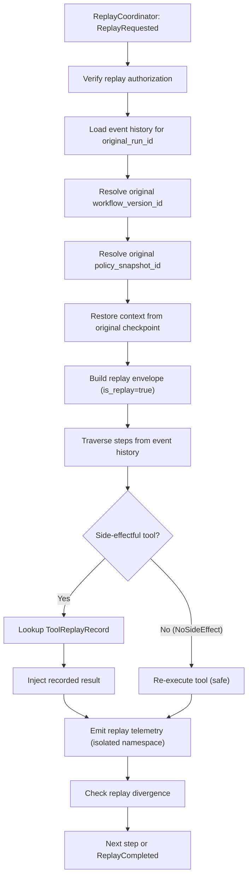

### 26.5 Event and Telemetry Emission Path

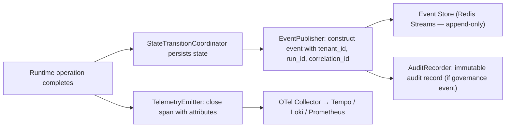

---

## 27. MVP Runtime Architecture

### 27.1 MVP Runtime Component Inclusion

The MVP runtime MUST include the following components in their basic forms:

| Component | MVP Implementation |
|---|---|
| TenantBoundaryResolver | Resolves tenant_id from API credential; validates workspace and project |
| RuntimeEnvelopeBuilder | Builds and signs envelopes with all required fields |
| RunManager | Creates and manages GovernedRun lifecycle state machine |
| WorkflowVersionResolver | Resolves immutable workflow version; validates version is published |
| WorkflowScheduler | Basic sequential step scheduling |
| StateTransitionCoordinator | Persists state transitions; validates against state machine |
| EventPublisher | Emits all required events to Redis Streams |
| PolicyDecisionGateway | Calls OPA policy engine; fails closed when unavailable |
| ApprovalGateCoordinator | Blocks step at approval gate; routes to approval inbox; resumes on decision |
| ContextAssemblyGateway | Assembles typed context from checkpoint and basic memory |
| ToolInvocationGateway | Full invocation pipeline including contract loading, idempotency, artifact persistence |
| TelemetryEmitter | OTel span creation/closure with tenant_id and run_id attributes |
| AuditRecorder | Immutable audit records for all governance events |
| ReplayCoordinator | Basic replay from event history with side-effect suppression |

### 27.2 MVP Runtime Walking Skeleton

The MVP must prove the following end-to-end path:

1. **Trigger:** External API request received with tenant credential.
2. **Tenant resolution:** TenantBoundaryResolver validates tenant, workspace, project.
3. **Envelope creation:** RuntimeEnvelopeBuilder creates signed envelope with all required fields.
4. **Workflow version resolution:** WorkflowVersionResolver loads the declared workflow version.
5. **Policy snapshot binding:** PolicyDecisionGateway evaluates run creation policy; snapshot bound to run.
6. **Run creation:** RunManager creates GovernedRun record; RunCreated event emitted.
7. **Context assembly:** ContextAssemblyGateway assembles context from checkpoint (empty for first run) and memory scope.
8. **Agent step:** AgentExecutionGateway dispatches to model; output validated against schema.
9. **Tool invocation through gateway:** Agent requests tool; ToolInvocationGateway validates contract, evaluates policy, creates invocation record, dispatches to worker, receives result, validates output schema, persists artifact.
10. **Approval gate:** StepCoordinator hits approval node; ApprovalGateCoordinator blocks; human approves; ApprovalRecord created; run resumes.
11. **Checkpoint:** CheckpointCoordinator captures run state at declared boundary.
12. **Audit record:** AuditRecorder writes immutable records for run creation, tool invocation, approval decision.
13. **Telemetry:** TelemetryEmitter closes spans; trace complete from API call through tool execution.
14. **Replay with side-effect suppression:** ReplayCoordinator initiates replay; tool invocations with ExternalWrite class suppressed; recorded artifacts returned; replay telemetry to isolated namespace.

### 27.3 MVP Runtime Acceptance Criteria

| Criterion | Verification |
|---|---|
| Envelope completeness | RuntimeEnvelope creation test fails if any required field is absent |
| Tenant isolation | Cross-tenant access test returns error and emits TenantBoundaryViolation event |
| Run lifecycle | All 24 lifecycle states reachable; invalid transitions rejected by StateTransitionCoordinator |
| Policy fail-closed | When OPA is unavailable, all policy-gated operations block; no execution proceeds |
| Approval blocking | Step in ApprovalRequired state: no further steps execute until approval granted |
| Tool contract enforcement | Tool invocation without registered manifest is rejected |
| Idempotency | Second invocation with same idempotency key returns cached result |
| Replay suppression | Tool with ExternalWrite class does not reach execution plane during replay |
| Audit immutability | Audit record update attempt returns error |
| Telemetry completeness | Trace contains complete span hierarchy from run start to terminal state |
| Worker isolation | Worker cannot mutate run state directly; only through WorkerGateway |

---

## 28. Runtime Invariants

### 28.1 Envelope Invariants (1–15)

1. No runtime operation may execute without a valid RuntimeEnvelope.
2. No RuntimeEnvelope may omit `tenant_id`.
3. No RuntimeEnvelope may omit `workflow_version_id`.
4. No RuntimeEnvelope may omit `run_id` after run creation.
5. No RuntimeEnvelope may omit `policy_snapshot_id`.
6. No RuntimeEnvelope may omit `trace_id` and `correlation_id`.
7. No RuntimeEnvelope may be constructed without all required fields being present and validated.
8. No RuntimeEnvelope may be transmitted without a cryptographic signature.
9. No component except RuntimeEnvelopeBuilder may construct a RuntimeEnvelope.
10. No expired RuntimeEnvelope may be accepted.
11. A RuntimeEnvelope with `replay_context.is_replay = true` MUST have side-effect suppression active.
12. No RuntimeEnvelope may carry raw credential values.
13. `tenant_id` in the RuntimeEnvelope MUST match the `tenant_id` resolved from the caller's credential.
14. No RuntimeEnvelope field that is declared immutable may be modified after construction.
15. No replay envelope may carry a production credential lease reference.

### 28.2 Run Lifecycle Invariants (16–30)

16. No run may start without a resolved `workflow_version_id`.
17. No run may start without a bound `policy_snapshot_id`.
18. No run record may exist without `tenant_id`.
19. No run record may exist without `actor_id`.
20. No run may advance past RunCreated without emitting a RunCreated event.
21. No state transition may occur without the corresponding event being emitted after successful persistence.
22. No invalid state transition may be accepted by StateTransitionCoordinator.
23. No run may have two simultaneous terminal states.
24. No run may transition from RunSucceeded or RunFailed back to an active state.
25. No run may be archived before its retention window unless explicitly overridden.
26. A RunFailed state MUST record the failure reason.
27. A RunCancelled state MUST record the actor who cancelled and the reason.
28. No run may resume from a checkpoint that does not exist.
29. No replay run may create new events in the production event store.
30. No replay run may use a workflow version different from the original run's version.

### 28.3 Control Plane Invariants (31–45)

31. The control plane MUST NOT perform external I/O directly.
32. The control plane MUST remain deterministic: same event history → same control decisions.
33. The control plane MUST record every state transition before considering it complete.
34. The control plane MUST fail closed when policy engine is unavailable.
35. The control plane MUST fail closed when tenant resolution fails.
36. The control plane MUST NOT delegate governance decisions to the execution plane.
37. Workers MUST NOT mutate run state or step state directly.
38. No execution dispatch may occur without a policy evaluation record.
39. No step may be dispatched without a valid RuntimeEnvelope.
40. The control plane MUST NOT allow run state to diverge from event history.
41. Policy snapshot binding MUST occur before run record creation.
42. Workflow version resolution MUST occur before policy snapshot binding.
43. No control plane component may bypass TenantBoundaryResolver.
44. No run may be created without an audit record being produced.
45. The control plane MUST NOT treat telemetry failure as a reason to fail operations (telemetry is non-fatal; audit is not).

### 28.4 Execution Plane Invariants (46–55)

46. The execution plane MUST validate RuntimeEnvelope signature before executing.
47. Workers MUST NOT access resources outside the scope declared in the RuntimeEnvelope.
48. Workers MUST NOT hold credentials beyond the execution window.
49. Workers MUST NOT emit telemetry without `tenant_id` and `run_id` attributes.
50. Workers MUST NOT re-execute side-effectful operations in replay context.
51. Workers MUST NOT maintain shared state between invocations for different tenants.
52. Workers MUST NOT access the host node's cloud metadata service.
53. The execution plane MUST NOT bypass the ToolInvocationGateway for tool calls.
54. The execution plane MUST NOT bypass the AgentExecutionGateway for agent-to-tool requests.
55. Worker execution MUST operate within the declared sandbox class.

### 28.5 State Invariants (56–65)

56. No state mutation may occur without a corresponding event emission.
57. State MUST be persisted before the corresponding event is emitted.
58. No checkpoint may be the sole copy of canonical run state (checkpoints are recovery artifacts).
59. No state record may omit `tenant_id`.
60. No state may be modified by the execution plane directly.
61. Replay MUST use state from original checkpoints, not current state.
62. No step state transition may skip intermediate states without emitting events for each.
63. No state persistence failure may result in a state that differs from the last persisted state without detection.
64. The canonical run state is the last successfully persisted state transition record.
65. Recovery MUST reconstruct run state from event history, not from worker reports.

### 28.6 Event Invariants (66–75)

66. All events MUST carry: `tenant_id`, `run_id`, `correlation_id`, `causation_id`, `trace_id`, `timestamp`.
67. Events MUST be emitted in append-only fashion; no event may be modified or deleted.
68. State transitions MUST emit their corresponding event before the operation is considered complete.
69. Critical events (audit, security, governance) MUST NOT be subject to sampling.
70. No event may be emitted without `tenant_id`.
71. Event emission failure MUST NOT cause the corresponding state transition to be rolled back unless it is a persistence failure.
72. All events produced during replay MUST be routed to the replay telemetry namespace.
73. DLQ events MUST be retained and not discarded without operator review.
74. The event store MUST be append-only; no delete or update operations are permitted on event records.
75. `causation_id` MUST reference the event that caused the current event, preserving the causal chain.

### 28.7 Policy Invariants (76–85)

76. No policy-governed operation may proceed when the policy engine is unavailable.
77. Every policy evaluation MUST produce a persisted policy snapshot record.
78. Policy snapshots bound to a run MUST NOT be modified after binding.
79. Replay MUST use the historical policy snapshot from the original run.
80. No policy change may affect in-flight runs (policy snapshot isolation).
81. Policy evaluation denial MUST emit a denial event and produce an audit record.
82. No component may call an external system before policy evaluation for that operation has completed.
83. Policy fail-closed behavior MUST apply uniformly; no "last resort" fail-open mode.
84. Break-glass policy bypass MUST be incident-linked, time-limited, and produce a priority audit record.
85. No governance bypass of any kind may occur without an audit record.

### 28.8 Approval Invariants (86–92)

86. No approval-required step may advance without an ApprovalRecord.
87. ApprovalRecord MUST include: approver_id, timestamp, decision, optional justification.
88. ApprovalRecord is immutable after creation.
89. Approval timeout MUST produce a recorded termination event.
90. No system component may self-grant an approval.
91. Approval routing MUST only reach authorized approvers for the tenant.
92. Replay MUST use the original ApprovalRecord; approval re-decision is not part of replay.

### 28.9 Memory and Context Invariants (93–100)

93. No memory write may occur without a provenance record.
94. No memory write may occur without explicit permission from the execution contract.
95. No memory read may cross tenant boundaries.
96. Context MUST be assembled from typed sources; transcript accumulation is forbidden.
97. Context snapshots used in replay MUST be from the original execution, not current state.
98. No memory entry may be written without `tenant_id`.
99. Memory classification MUST be set at write time; defaulting to unclassified is forbidden.
100. No memory write from tool output may occur if the execution contract does not permit it.

### 28.10 Observability Invariants (101–107)

101. Every span MUST include `tenant_id`, `run_id` (where applicable), and `step_id` (where applicable) as attributes.
102. Critical telemetry (audit events, security events) MUST NOT be sampled or dropped.
103. Telemetry failure MUST NOT cause corresponding operations to fail (telemetry is non-fatal).
104. Replay telemetry MUST be routed to an isolated namespace, not the production namespace.
105. No trace may be created without a `trace_id` that links the entire run lifecycle.
106. Spans MUST be closed (success or error) before the corresponding operation is reported as complete.
107. Telemetry spans MUST capture duration and outcome for every tool invocation, step, and run.

### 28.11 Security Invariants (108–112)

108. Service-to-service communication MUST be authenticated.
109. Credentials MUST NOT appear in run state, events, logs, or telemetry.
110. Workers MUST present a valid runtime identity before receiving execution assignments.
111. Tenant boundary violations MUST trigger immediate security alert escalation.
112. Replay environments MUST be excluded from production credential access.

### 28.12 Tenant Invariants (113–120)

113. `tenant_id` MUST be present in every runtime record, event, artifact, and telemetry span.
114. No runtime operation may target resources outside the `tenant_id` in the active RuntimeEnvelope.
115. Tenant resolution MUST be the first step in the pipeline; no operation precedes it.
116. Cross-tenant access MUST be treated as a security incident, not an access error.
117. Tenant-scoped storage paths MUST be enforced at the storage layer, not only at the application layer.
118. Telemetry query APIs MUST enforce tenant_id filtering.
119. No tenant data may be restored into another tenant's scope.
120. Worker pools serving multiple tenants MUST validate tenant_id from the envelope before every operation.

### 28.13 Replay Invariants (121–130)

121. Replay MUST NOT execute side-effectful tools against live systems.
122. Replay MUST use recorded ToolReplayRecords for side-effectful tool steps.
123. Replay MUST use the workflow version from the original run.
124. Replay MUST use the policy snapshot from the original run.
125. Replay MUST NOT modify the original event lineage.
126. Replay telemetry MUST route to an isolated namespace.
127. Replay divergence MUST be detected and recorded.
128. Replay MUST use context snapshots from the original execution.
129. Any replay attempt to access production credentials MUST be blocked and logged as a security event.
130. Replay environments MUST be network-isolated from production systems.


### 28.14 Hardening Invariants (131–160)

131. No value derived from untrusted content may raise the authority, capability, tool scope, memory scope, credential scope, network scope, approval scope, or side-effect ceiling of a run.

132. Tool output, RAG content, memory reads, uploaded documents, web content, email content, ticket content, file content, and inter-agent messages are untrusted unless explicitly labeled otherwise by a trusted provenance process.

133. Prompt injection is not mitigated by prompting alone. Structural runtime mediation is mandatory.

134. A model may propose intent, but only deterministic runtime components may authorize execution.

135. Every side-effecting tool call is authorized by PolicyDecisionGateway per call against the run's capability grant.

136. The LLM never self-authorizes.

137. The LLM never grants itself tools, memory writes, credentials, external communication, or approval bypass.

138. Any run combining private data access, untrusted content exposure, and external communication or mutation is approval-gated or structurally decomposed.

139. Every worker, agent, service, and tool call carries verifiable workload identity.

140. Standing credentials are forbidden in the Execution Plane and Tool Runtime Plane.

141. Tool credentials are leased just-in-time, scoped, short-lived, and revoked.

142. Replay never receives production credentials, production network egress, or live side-effecting tools.

143. Replay cannot mutate production state.

144. Every tool manifest is signed, hash-pinned, version-pinned, and re-approved on capability-affecting change.

145. Tool identity is cryptographic. Tool name is not identity.

146. Memory writes require provenance before persistence.

147. Memory and RAG content cannot become trusted instructions without explicit trusted provenance.

148. Inter-agent communication is authenticated, integrity-protected, and mediated.

149. Agent collaboration never implies implicit trust.

150. Orchestration enforces delegation depth, fan-out, circuit-breaker, and blast-radius limits.

151. Every run executes under hard token, cost, time, tool-call, and iteration ceilings.

152. Budget exhaustion stops execution before additional model or tool dispatch.

153. Event lineage is cryptographically tamper-evident.

154. Audit records are signed and independently verifiable.

155. Security and audit telemetry is never sampled.

156. Worker admission requires sandbox/container hardening.

157. Network egress is denied by default and opened only by declared execution contract.

158. Break-glass access is incident-linked, time-bounded, approved, audited, and revocable.

159. Kill-switch controls exist for unacceptable runtime risk.

160. Policy is evaluated per request, per step, and per tool call where applicable. Session trust is never sufficient.


---

## 29. Runtime Anti-Patterns

**Backend-as-runtime.** Treating a FastAPI application with database reads and writes as the MYCELIA runtime misses the entire governance layer. The runtime is not an API server — it is the structural machinery that enforces governance contracts on every operation.

**Prompt-as-state.** Using a model's context window as the only state persistence mechanism produces a system where state is lost on every new session, cannot be replayed, cannot be audited, and cannot support checkpoint-based resumption.

**Mutable workflow versions.** A workflow version that can be edited after publication breaks the replay contract. Replay uses historical versions. If those versions can change, replay becomes unreliable.

**External I/O inside orchestration.** Workflow orchestration code that directly calls HTTP endpoints, writes to databases, or reads from external systems is not deterministic. It violates the control plane / execution plane separation and makes replay impossible.

**Event-after-state mutation without persistence.** Emitting an event about a state change that was not successfully persisted produces an inconsistent system. Events record what happened; if the state change did not survive, the event is wrong.

**Invisible side effects.** Tool execution that produces external mutations without declaring them in the execution contract, registering a ToolSideEffect record, or emitting an event is a governance failure.

**Tenantless run.** A GovernedRun record created without `tenant_id` is an untrackable execution. Tenant context cannot be added retroactively.

**Tool execution outside gateway.** Calling a tool implementation directly from workflow orchestration code bypasses the ToolInvocationGateway's contract validation, policy evaluation, idempotency management, artifact persistence, and audit recording.

**Model-owned authority.** Accepting model output as a direct workflow control instruction — "the model said to skip the approval gate" — allows adversarial inputs to override governance. Model output is data; workflow control decisions are the control plane's responsibility.

**Approval as comment.** Recording an approval as a Slack message or email thread without creating an ApprovalRecord in the runtime produces a system where the audit trail has a gap and replay cannot reconstruct the governance decision.

**Replay as rerun.** Triggering a new run with the same inputs as a "replay" re-executes all side effects, produces new artifacts, and bears no relationship to the original execution. MYCELIA's replay uses event history and recorded artifacts.

**Telemetry later.** Adding observability instrumentation after the initial implementation produces a system where the early production incidents are the hardest to investigate. Telemetry is required for every operation from day one.

**Policy bypass for speed.** Skipping policy evaluation for "obviously safe" operations under load creates an inconsistent governance posture. Every policy-governed operation requires evaluation; the policy engine scales horizontally.

**Worker-owned state.** Workers in the execution plane that maintain in-process state between invocations can produce cross-run or cross-tenant data leakage. Workers are stateless between invocations.

**Shared execution context.** Two tenants' workflow steps sharing an execution context (same worker process state, same in-memory cache, same temporary filesystem) violates tenant isolation.

**Global runtime cache without tenant scope.** An in-memory cache at the runtime level that stores objects from multiple tenants without tenant-keyed partitioning is a tenant isolation defect.

**Hidden retries.** Tool retries executed inside worker code without notifying the runtime through a new ToolExecutionAttempt record produce an invisible execution history. The runtime cannot audit what it cannot see.

**Unbounded agent loops.** An agent step with no declared iteration budget and no timeout can run indefinitely, consuming resources and producing uncontrolled costs.

**State mutation without causation_id.** A state transition record that does not carry a `causation_id` breaks the causal chain. The event history cannot be fully reconstructed for replay or audit.

**Running approval gates on separate system.** Managing approval workflows in a separate tool (JIRA, DocuSign, email) without recording the decision in the ApprovalGateCoordinator means the run's audit record is incomplete and replay cannot reconstruct the governance gate.

**Skipping audit records for performance.** Treating audit records as optional during high-throughput periods produces compliance gaps. Audit records are non-optional for governance events.

**Mixing replay and production telemetry.** Allowing replay spans to appear in the production Grafana Tempo instance makes it impossible to distinguish investigation artifacts from operational evidence.

**Missing idempotency on side-effectful tools.** A tool with ExternalWrite class that lacks an idempotency key may execute its external mutation multiple times on retry. This is a data integrity failure.

**Workflow version resolution from current state during replay.** Resolving the "latest" workflow version during replay instead of the historical version produces a replay that reflects a different workflow definition than what originally ran.

**Control plane performing external I/O for convenience.** Adding an HTTP call in the WorkflowScheduler "just for this case" breaks the determinism contract and makes the control plane unreplayable.

**Anonymous run creation.** A run that is created without a resolved actor_id has no accountability. Even automated triggers must carry a service account identity.

**Step dispatch before policy evaluation.** Dispatching a step to the execution plane before the PolicyDecisionGateway has evaluated and recorded its decision allows ungoverned execution.

**Tenantless events.** Events without `tenant_id` cannot be attributed to a tenant, cannot be used in tenant-scoped queries, and break the audit trail.

**Breaking envelope immutability.** Allowing downstream components to modify the `tenant_id`, `policy_snapshot_id`, or `workflow_version_id` fields of the RuntimeEnvelope after construction enables governance bypass.

**Persisting ToolReplayRecords in the production artifact store without namespace separation.** If replay artifacts are co-mingled with production artifacts, replay results can contaminate production evidence.

### 29.1 Hardening Anti-Patterns

- Treating prompt injection as a content-filtering problem instead of an authority and information-flow problem.
- Relying on a system prompt as the only injection defense.
- Relying on a prompt-injection classifier as the only injection defense.
- Allowing retrieved content, memory content, tool output, or inter-agent messages to carry authoritative instructions.
- Allowing model output to increase tool scope, memory scope, credential scope, network scope, side-effect scope, or approval scope.
- Allowing an LLM to self-authorize tool use.
- Trusting tool manifests by name without signature and content-hash verification.
- Loading tools whose description, command, schema, capability, or side-effect class changed without re-approval.
- Treating session-level authentication as sufficient authorization for later tool calls.
- Replaying against live credentials, live tools, live external APIs, or production state.
- Running code-interpreter or tool-execution workers without sandboxing.
- Running workers as root or privileged containers.
- Allowing unrestricted worker egress.
- Persisting memory without provenance.
- Trusting vector search results as instructions.
- Allowing inter-agent communication outside runtime mediation.
- Allowing delegation chains without depth or fan-out limits.
- Treating token budgets as finance-only rather than security controls.
- Logging credentials, tokens, secret material, prompts containing secrets, or raw sensitive model/tool output.
- Sampling security and audit telemetry.
- Storing audit/event logs without tamper evidence.
- Bypassing approval gates because the model output says the action is safe.
- Using standing tool credentials for agentic execution.
- Baking credentials into images, environment variables, prompts, tool manifests, or workflow definitions.
- Allowing break-glass access without incident linkage, TTL, approval, and audit.
- Deploying unsigned worker, tool, or model artifacts.
- Ignoring critical vulnerabilities in worker/tool dependencies without VEX or formal risk acceptance.

### 29.2 Documented Agentic Attack Patterns for Review and Red-Team Planning

- EchoLeak, CVE-2025-32711.
- Amazon Q VS Code extension wiper-prompt, CVE-2025-8217.
- Langflow unauthenticated RCE, CVE-2025-34291.
- MCP rug-pull / MCPoison, CVE-2025-54136.
- mcp-remote RCE, CVE-2025-6514.
- Flowise CustomMCP RCE, CVE-2025-59528.
- n8n expression-injection RCE, CVE-2025-68613.
- LangChain LangGrinch serialization injection, CVE-2025-68664.
- LlamaIndex SQL injection, CVE-2025-1793.
- ServiceNow Now Assist BodySnatcher, CVE-2025-12420.
- Anthropic-reported GTG-1002 AI-orchestrated espionage campaign, November 2025.


---

## 30. Codex Implementation Guidance

### 30.1 Implementation Order

1. **RuntimeEnvelope type.** Define the RuntimeEnvelope as a typed, immutable data structure. Include all required fields. Implement validation that rejects construction with missing required fields. Implement signature generation and verification.

2. **Tenant boundary resolver.** Implement TenantBoundaryResolver: resolves tenant_id from credential, validates workspace_id and project_id, returns structured result. Implement fail-hard on resolution failure.

3. **Run record schema.** Define the GovernedRun database schema with all required fields: run_id, tenant_id, workspace_id, project_id, workflow_version_id, actor_id, policy_snapshot_id, status, created_at, updated_at. Implement Row-Level Security for tenant isolation.

4. **Workflow version resolver.** Implement WorkflowVersionResolver: loads immutable workflow version from registry, validates version is in Enabled state, returns typed workflow definition. Implement replay version resolution (historical lookup).

5. **Run lifecycle state machine.** Implement the GovernedRun state machine with all 23 states. Implement transition validation: reject invalid transitions. Return structured error on invalid transition.

6. **State transition coordinator.** Implement StateTransitionCoordinator: validate transition, persist new state, emit event via EventPublisher, emit telemetry via TelemetryEmitter. State MUST be persisted before event emission.

7. **Event publisher.** Implement EventPublisher: construct event with all required fields (including tenant_id, run_id, correlation_id, causation_id, trace_id), publish to Redis Streams. Implement DLQ routing on persistent failure. Implement idempotent delivery.

8. **Audit recorder.** Implement AuditRecorder: create immutable audit record with all identity fields. Implement rejection of modification attempts. Implement retention policy enforcement.

9. **Telemetry emitter.** Implement TelemetryEmitter: create OpenTelemetry spans with required attributes (tenant_id, run_id, step_id). Close spans on completion or error. Emit metrics. Implement structured logging.

10. **Basic workflow scheduler.** Implement WorkflowScheduler: determine next step from workflow definition and current run state. Implement sequential scheduling for MVP. Implement branching condition evaluation.

11. **Policy decision gateway.** Implement PolicyDecisionGateway: call OPA policy engine with operation context. Record policy snapshot reference. Implement fail-closed on OPA unavailability. Return structured decision with snapshot_id.

12. **Approval gate coordinator.** Implement ApprovalGateCoordinator: transition step to ApprovalRequired, submit approval request to approval engine, block workflow execution, resume on ApprovalGranted event, terminate on denial or timeout.

13. **Context assembly gateway.** Implement ContextAssemblyGateway: assemble typed context from checkpoint state, memory reads (within declared namespace scope), and run state. Return context snapshot. Never accumulate raw transcript.

14. **Tool invocation gateway.** Implement ToolInvocationGateway: full pipeline from contract loading through artifact persistence. Include idempotency key management, policy evaluation, credential lease request, dispatch, result validation, side-effect registration, event emission.

15. **Execution dispatcher.** Implement ExecutionDispatcher: route to appropriate worker pool based on sandbox class. Transmit signed RuntimeEnvelope to worker. Manage worker assignment and health monitoring.

16. **Replay coordinator.** Implement ReplayCoordinator: load event history, resolve historical versions and policy snapshots, construct replay envelope with is_replay=true, suppress side-effectful tools, hydrate from ToolReplayRecords, route telemetry to replay namespace.

17. **Runtime failure router.** Implement RuntimeErrorRouter: classify errors, route to appropriate handler, emit error events, ensure failures produce audit records, implement DLQ routing for event failures.

18. **Tests.** Implement all required tests (§30.3).

### 30.2 Forbidden Codex Shortcuts

- **Do not treat backend request handlers as runtime architecture.** FastAPI route handlers are entry points, not the runtime. The runtime begins at TenantBoundaryResolver.
- **Do not execute tool calls directly from workflow code.** All tool calls route through ToolInvocationGateway. Bypassing this gateway bypasses governance.
- **Do not persist state only in prompts.** Prompts are model inputs assembled from state. They are not the state itself.
- **Do not skip event emission.** Every significant state transition emits an event. No exceptions.
- **Do not create runs without tenant_id.** tenant_id is mandatory from run creation through archival.
- **Do not create mutable workflow versions.** Workflow versions are immutable after publication. Build the schema and API to enforce this.
- **Do not implement replay as rerun.** Replay uses event history and recorded artifacts. Implement ReplayCoordinator before any replay feature is exposed.
- **Do not allow workers to mutate run state directly.** Workers return results to WorkerGateway. StateTransitionCoordinator owns all state changes.
- **Do not add observability later.** TelemetryEmitter and AuditRecorder are implemented in steps 8 and 9, before workflow scheduling (step 10). This is the correct order.
- **Do not implement agent autonomy before runtime envelopes.** AgentExecutionGateway depends on a valid RuntimeEnvelope with declared agent scope. Build the envelope before the agent.

### 30.3 Required Tests

| Test | What It Verifies |
|---|---|
| RuntimeEnvelope creation test | Envelope with missing required field fails construction |
| Tenant resolution test | Invalid credential returns TenantResolutionFailed; valid credential returns correct tenant_id |
| Run lifecycle transition test | Valid transitions succeed; all 23 states reachable through valid paths |
| Invalid transition rejection test | StateTransitionCoordinator rejects transitions not valid from current state |
| Event emission test | Every state transition produces the correct event with required fields in the event store |
| Audit emission test | Every governance event produces an immutable audit record |
| Workflow version immutability test | Published workflow version cannot be modified via any API |
| Policy fail-closed test | When OPA is unavailable, all policy-gated operations return PolicyEngineUnavailable error |
| Approval blocking test | Step in ApprovalRequired state: no execution dispatched; execution resumes only after approval grant |
| Tool boundary test | Tool invocation without registered manifest rejected by ToolInvocationGateway |
| Memory boundary test | Memory read request with tenant_id mismatch rejected; TenantBoundaryViolation event emitted |
| Replay side-effect suppression test | Tool with ExternalWrite class in replay context: execution not dispatched; ToolReplayRecord returned |
| Tenant isolation test | Request for tenant A cannot read or mutate tenant B's run records or events |
| Telemetry span test | Completed run has trace with complete span hierarchy linking all steps |
| Worker cannot mutate run state test | Direct state update from worker bypassing WorkerGateway is rejected |

---

## 31. Relationship to Other Documents

| Document | Relationship to Document 02 |
|---|---|
| 00 — Vision & Foundational Manifesto | Document 00 is the constitutional doctrine. Document 02 implements the control plane doctrine, the runtime trust model, and the autonomy boundaries of Document 00 as concrete architecture. |
| 01 — Product Requirements & Operational Scope | Document 01 defines what the product must deliver. Document 02 defines the runtime structure that makes those requirements enforceable. Document 02 does not repeat product requirements; it translates them into architectural structure. |
| 03 — Canonical Domain Model | Document 03 defines the full entity model for the objects that Document 02 names (GovernedRun, WorkflowVersion, RuntimeEnvelope, etc.). Document 02 names; Document 03 specifies in full. |
| 04 — Cognitive Execution Model | Document 04 deepens the cognitive execution boundary defined in §13. Model inference, context window management, output validation, and model budget enforcement are Document 04 territory. |
| 05 — Agent Runtime & Coordination | Document 05 deepens the agent runtime integration defined in §14. Multi-agent coordination algorithms, agent specialization, handoff patterns, and agent memory models are Document 05 territory. |
| 06 — State, Checkpoint & Persistence Architecture | Document 06 deepens the state and persistence boundary defined in §15. Database schemas, checkpoint strategies, point-in-time recovery, and schema versioning are Document 06 territory. |
| 07–08 — Event & Messaging Contracts | Documents 07–08 deepen the event spine integration defined in §16. Event schemas, stream topology, DLQ semantics, and event registry are Documents 07–08 territory. |
| 09 — Workflow Orchestration Engine | Document 09 deepens the orchestration integration defined in §12. Temporal workflow definitions, task queue design, worker pool configuration, and workflow versioning are Document 09 territory. |
| 10 — Memory & Context Architecture | Document 10 deepens the memory and context integration defined in §17. Memory tier design, vector indexing, episodic memory, organizational memory, and context snapshot management are Document 10 territory. |
| 11 — Governance, Policy & Approval Engine | Document 11 deepens the governance integration defined in §18. Policy-as-code, OPA rule authoring, approval routing logic, and compliance export are Document 11 territory. |
| 12 — Observability & Telemetry Platform | Document 12 deepens the observability integration defined in §19. OTel semantic conventions, dashboard design, SLO measurement, and alert rule definitions are Document 12 territory. |
| 13 — Security & Trust Architecture | Document 13 deepens the security integration defined in §20. SPIFFE/SPIRE workload identity, Vault lease models, admission controls, and supply-chain trust are Document 13 territory. |
| 14 — Multi-Tenant Isolation & Organizational Boundaries | Document 14 deepens the tenant boundary integration defined in §21. Kubernetes namespace strategy, database RLS, storage path isolation, and tenant profiles are Document 14 territory. |
| 15 — SDK, Tool Runtime & Execution Contracts | Document 15 deepens the tool runtime integration defined in §22. Tool manifests, execution contracts, sandbox classes, worker attestation, and tool supply-chain are Document 15 territory. |
| 16 — Infrastructure & Deployment Architecture | Document 16 defines the deployment topology that hosts the runtime defined in Document 02. Kubernetes cluster strategy, Helm charts, CI/CD, and Terraform are Document 16 territory. Document 02 is deployment-neutral. |
| 17 — SRE, Operational Recovery & Runbooks | Document 17 defines the operational procedures for operating the runtime defined in Document 02. SLOs, incident runbooks, DR procedures, and on-call processes are Document 17 territory. |
| 18 — External APIs & Integration Contracts | Document 18 defines the public API surface that exposes the runtime defined in Document 02. REST/gRPC contracts, webhook specifications, and SDK documentation are Document 18 territory. |

**Constitutional authority:** Document 02 must not contradict Document 00. If an architectural decision in Document 02 conflicts with a Document 00 invariant, Document 00 prevails. Later specialized documents (03–18) must implement the structural boundaries defined here without contradicting them.

---

## 32. Final Runtime Principles

The MYCELIA Core Runtime rests on the following organizational principles. Every implementation decision, every component interaction, and every architectural trade-off must be evaluated against them.

**Runtime makes governance enforceable.** Governance that exists only in documentation is not governance — it is aspiration. The runtime's structural design is what transforms governance requirements into operational reality.

**Control plane owns authority.** The control plane decides what executes, under what policy, with what identity, within what tenant scope. The execution plane has no authority to override these decisions.

**Execution plane owns work.** The execution plane does the actual work: model inference, tool execution, external API calls, sandboxed computation. It receives decisions from the control plane and returns results.

**Events own lineage.** The append-only event store is the authoritative record of what the runtime has done. If a state change is not reflected in the event store, it did not happen from the audit perspective.

**State owns continuity.** Run state and checkpoint records are what allow the runtime to resume after failure. They are the operational continuity of a workflow across time, restarts, and partial failures.

**Memory owns context.** The memory hierarchy is the substrate that allows long-running cognition to access the right information at each step. Context assembly from typed memory sources is the alternative to fragile transcript accumulation.

**Policy owns permission.** No execution proceeds without policy evaluation. Policy is not advisory — it is the structural permission system of the runtime.

**Approval owns human authorization.** Human approval is a first-class runtime state, not an out-of-band process. High-impact operations pause for human judgment. That judgment is recorded as an immutable governance artifact.

**Telemetry owns evidence.** The distributed traces, structured logs, and metrics that the runtime emits are the operational evidence that makes governance claims verifiable. Evidence that only exists in aggregate dashboards is not sufficient.

**Replay owns accountability.** The ability to reconstruct any historical run from its event lineage — without re-executing side effects, without touching production credentials — is the runtime's mechanism for operational accountability.

**Tenancy owns organizational containment.** Tenant_id is the first field resolved and the last field validated. Tenant isolation is not a feature of the application layer — it is a structural property of the runtime.

---

In MYCELIA, the runtime is not the backend behind cognition.

It is the constitutional machinery that makes cognition governable.

---

## 33. Runtime Hardening Baseline

### 33.1 Purpose

The Runtime Hardening Baseline defines the minimum enterprise-grade security posture required for MYCELIA runtime components before they may participate in governed execution.

This section does not replace the Security and Trust Architecture, Multi-Tenant Boundary Architecture, Tool Runtime Architecture, Observability Architecture, or SRE documents. It establishes the runtime-level admission conditions that those specialized documents must implement in depth.

A component that does not satisfy this baseline MUST NOT receive RuntimeEnvelopes, execute workflow steps, invoke tools, access memory, emit authoritative events, handle tenant-scoped artifacts, or participate in replay.

The baseline exists because the dominant threat class for agentic enterprise runtimes is not merely malicious input. It is authority confusion: untrusted content causing a model, agent, tool, worker, or operator workflow to perform actions outside the authority originally granted by the runtime.

### 33.2 Hardening Source Map

The hardening requirements in this section are mapped to the following named references and threat classes:

- OWASP LLM Top 10 2025:
  - LLM01 Prompt Injection.
  - LLM02 Sensitive Information Disclosure.
  - LLM03 Supply Chain.
  - LLM04 Data and Model Poisoning.
  - LLM05 Improper Output Handling.
  - LLM06 Excessive Agency.
  - LLM07 System Prompt Leakage.
  - LLM08 Vector and Embedding Weaknesses.
  - LLM09 Misinformation.
  - LLM10 Unbounded Consumption.

- OWASP Top 10 for Agentic Applications 2026:
  - ASI01 Agent Goal Hijack.
  - ASI02 Tool Misuse and Exploitation.
  - ASI03 Identity and Privilege Abuse.
  - ASI04 Agentic Supply Chain Vulnerabilities.
  - ASI05 Unexpected Code Execution.
  - ASI06 Memory and Context Poisoning.
  - ASI07 Insecure Inter-Agent Communication.
  - ASI08 Cascading Failures.
  - ASI09 Human-Agent Trust Exploitation.
  - ASI10 Rogue Agents.

- NIST AI RMF 1.0 and NIST AI 600-1.
- NIST SP 800-218A.
- NIST SP 800-207 and SP 800-207A.
- CIS Kubernetes Benchmark.
- Kubernetes Pod Security Standards Restricted profile.
- SLSA v1.0 Build Level 3.
- Sigstore, cosign, Fulcio and Rekor supply-chain signing patterns.
- SPIFFE/SPIRE workload identity.
- HashiCorp Vault dynamic secret leasing patterns.
- FIPS 140-2/3 cryptographic validation where required by regulated deployments.

The following runtime controls are the highest-load hardening points:

1. PolicyDecisionGateway MUST evaluate policy per request, per step, and per tool call when applicable. Session-level trust is insufficient.
2. ToolInvocationGateway MUST enforce least-agency, signed and hash-pinned tool manifests, side-effect classification, per-call authorization, and short-TTL dynamic credentials.
3. EventPublisher, AuditRecorder, and the Event Plane MUST make append-only event lineage cryptographically tamper-evident through hash chains, Merkle roots, signed checkpoints, and independent verification.

### 33.2.1 Normative vs Informative Security References

Security references in this document are divided into two classes:

1. Normative MYCELIA Controls.
2. Informative Threat Intelligence References.

This distinction prevents Codex, auditors or implementers from treating unverified external threat references as direct implementation requirements.

### Normative Controls

A requirement is normative when it is expressed by MYCELIA using:

- MUST;
- MUST NOT;
- REQUIRED;
- FORBIDDEN.

Normative controls are enforceable by architecture, tests, policy, runtime behavior or operational procedure.

Examples:

- RuntimeEnvelope signature verification.
- PolicyDecisionGateway fail-closed behavior.
- ToolManifest signature verification.
- Replay side-effect suppression.
- Credential lease exclusion from replay.
- Tenant boundary enforcement.
- Audit and event tamper-evidence.
- Worker sandbox admission.
- Tool capability and side-effect enforcement.

### Informative References

Informative references include:

- external framework names;
- external attack names;
- CVE references;
- vendor incident names;
- research attack names;
- emerging threat classes;
- watchlist items;
- mappings to standards that require later verification.

Informative references guide review, red-team planning and control validation, but they are not themselves runtime requirements unless converted into explicit MYCELIA controls.

### Conversion Rule

An informative reference becomes normative only when MYCELIA expresses it as a control with:

- enforcing component;
- runtime behavior;
- testable acceptance criterion;
- failure behavior;
- audit evidence;
- owning document.

### External Verification Rule

Before external publication, regulated deployment, security audit or investor/customer distribution, the following MUST be re-verified:

- CVE identifiers;
- framework versions;
- OWASP and NIST mappings;
- vendor-reported incidents;
- research attack status;
- in-the-wild exploitation claims;
- standard names and control references.

### Forbidden Behavior

FORBIDDEN:

- treating a CVE list as a substitute for controls;
- treating a framework mapping as evidence of compliance;
- allowing Codex to implement vague “OWASP compliance” without concrete tests;
- claiming external validation without verification;
- presenting research attack names as production breach statistics;
- using external references to weaken MYCELIA's stricter runtime controls;
- letting informative threat intelligence override normative MYCELIA invariants.

### 33.3 Prompt Injection and Information-Flow Hardening

Prompt injection MUST be treated as a structural certainty, not as a filterable anomaly.

The runtime MUST NOT assume that retrieved content, tool output, memory content, files, web pages, emails, tickets, documents, inter-agent messages, or user-provided text are benign merely because they entered through an approved channel.

The runtime MUST enforce the following rules:

- All tool outputs, RAG/retrieved content, memory reads, uploaded documents, external content, and inter-agent messages MUST be treated as untrusted data by default.
- Untrusted data MUST NOT carry instructions with runtime authority.
- Untrusted data MUST NOT expand the authority, tool scope, memory scope, credential scope, network scope, approval scope, or side-effect class of a run.
- Provenance labels, trust labels, source classification, and content origin MUST travel through the RuntimeEnvelope or through a referenced context snapshot bound to the RuntimeEnvelope.
- PolicyDecisionGateway MUST enforce provenance and trust labels before allowing tool invocation, memory write, external communication, or side-effect execution.
- ContextAssemblyGateway MUST structurally separate trusted instructions from untrusted content before model invocation.
- The runtime MUST apply structural isolation of untrusted content before it enters model context. Acceptable patterns include delimiting, datamarking, encoding, quarantined context blocks, capability-separated planning, and restricted execution programs.
- The runtime SHOULD adopt a capability/information-flow design for high-risk runs. In this model, privileged planning and untrusted content processing are separated so that untrusted content cannot alter program flow or capability grants.
- The runtime MUST NOT rely on system prompts, prompt-injection classifiers, moderation filters, or model self-discipline as the only injection defense.
- Injection classifiers MAY be used as defense-in-depth signals, but they MUST NOT replace deterministic controls at RuntimeEnvelope, PolicyDecisionGateway, AgentExecutionGateway, ToolInvocationGateway, MemoryAccessGateway, and ApprovalGateCoordinator.
- Retrieved instructions embedded inside external content MUST be treated as data, not as runtime commands.
- Model output MUST be treated as untrusted until validated, classified, and promoted by deterministic runtime logic.
- No model output may skip, weaken, or reinterpret an approval gate.
- No model output may request broader authority than the RuntimeEnvelope already grants.
- No model output may instruct the runtime to ignore policy, tenant boundaries, replay controls, audit controls, security controls, or tool contracts.

The runtime MUST enforce a lethal-trifecta guard. A single run that simultaneously has:

1. access to private, sensitive, regulated, tenant-confidential, or privileged data;
2. exposure to untrusted content; and
3. ability to communicate externally or mutate external state;

MUST either require ApprovalGateCoordinator authorization or be structurally decomposed into separate runs that do not combine all three properties.

### 33.4 Cognitive Boundary Hardening

The Cognitive Plane is nondeterministic and therefore non-authoritative.

The runtime MUST enforce the following rules:

- Model output that flows into an interpreter, shell, SQL engine, browser, workflow expression engine, templating engine, code runner, API request builder, infrastructure controller, or file writer MUST be treated as hostile.
- Model output MUST be schema-validated before downstream use.
- Model output MUST NOT be executed through `eval`, dynamic import, shell interpolation, SQL string concatenation, template injection, or equivalent unsafe execution.
- Any model-generated tool argument MUST pass typed schema validation.
- Tool arguments SHOULD use allowlisted enums, bounded strings, typed objects, and explicit confirmation fields where applicable.
- Structured output SHOULD be mandatory for tool-argument generation.
- High-risk model outputs SHOULD include explicit sufficiency fields, such as `have_enough_information`, `requires_approval`, `requires_human_review`, or equivalent workflow-specific signals.
- Raw model output MUST NOT become workflow state without validation and promotion by deterministic runtime logic.
- Raw model output MUST NOT become policy input unless classified as untrusted and explicitly mediated.

### 33.5 Tool Invocation and Least-Agency Hardening

The ToolInvocationGateway is the primary enforcement point for least-agency.

The runtime MUST enforce the following rules:

- Autonomy MUST be granted per capability and per run, never by default.
- Tool access MUST be deny-by-default.
- Every tool invocation MUST be authorized against the active RuntimeEnvelope and policy snapshot.
- Every side-effecting tool call MUST be authorized by PolicyDecisionGateway per call.
- Side-effecting, irreversible, externally visible, regulated, financial, destructive, identity-affecting, production-mutating, or high-impact operations MUST require human-in-the-loop approval unless an explicit policy exception exists with audit evidence.
- Authorization MUST be enforced in deterministic runtime systems and downstream service boundaries. Authorization MUST NOT be delegated to the LLM's judgment.
- ToolInvocationGateway MUST enforce side-effect classification before dispatch.
- ToolInvocationGateway MUST enforce idempotency for side-effecting tools.
- ToolInvocationGateway MUST reject tool calls that exceed the RuntimeEnvelope's tool_scope.
- ToolInvocationGateway MUST reject tool calls whose input schema, output schema, side-effect class, network scope, credential scope, or approval requirements do not match the signed tool manifest.
- A tool call proposed by an agent MUST be revalidated by AgentExecutionGateway and ToolInvocationGateway.
- Agents may request tool use. Agents do not own tool authority.
- The runtime MUST NOT allow tool output to request or grant broader tool authority.
- The runtime MUST NOT allow tool descriptions, examples, hidden instructions, or manifest metadata to override policy.
- The runtime MUST NOT trust a tool by name alone. Tool identity requires signed manifest verification, exact version pinning, and content hash verification.
- Tool description, command, schema, capability, side-effect class, network policy, credential scope, or runtime image changes MUST trigger re-approval before the tool can be used in production.

### 33.6 Memory Poisoning, RAG and Context Integrity Hardening

Memory and context are authority-adjacent surfaces. Poisoned memory can become delayed prompt injection.

The runtime MUST enforce the following rules:

- Memory reads MUST be treated as untrusted content unless the memory item carries a verified trusted provenance label.
- Memory writes MUST be authorized before persistence, not merely filtered on later read.
- Memory writes derived from model output, tool output, retrieved documents, user input, or inter-agent messages MUST carry provenance, trust classification, source reference, writer identity, run_id, step_id, tenant_id, timestamp, and data classification.
- MemoryAccessGateway MUST reject memory writes that do not declare provenance.
- MemoryAccessGateway MUST reject cross-tenant memory access.
- Vector stores MUST enforce per-tenant namespace segregation.
- For mutually untrusted tenants or regulated deployments, memory namespaces SHOULD be cryptographically segregated with tenant-scoped keys.
- RAG corpora MUST use integrity validation and source allowlisting where the corpus can influence tool use, workflow decisions, user-facing claims, or memory writes.
- Retrieved context MUST preserve source identity and trust level through ContextAssemblyGateway.
- ContextAssemblyGateway MUST distinguish trusted instructions, system policy, workflow state, retrieved evidence, memory items, tool outputs, and user-provided content.
- ContextAssemblyGateway MUST NOT assemble raw transcript accumulation as authoritative context.
- Context snapshots MUST preserve provenance and trust labels for replay.
- Replay MUST use original context snapshots, not current memory state.
- Deferred-attack classes such as memory poisoning, query-only poisoning, and RAG poisoning MUST be covered by security tests.

### 33.7 Inter-Agent Communication and Cascading Failure Hardening

Agents are runtime participants, not trusted peers.

The runtime MUST enforce the following rules:

- Inter-agent messages MUST be authenticated and integrity-protected.
- Inter-agent messages MUST carry source agent identity, runtime_identity_id, tenant_id, run_id, step_id, correlation_id, causation_id, and trust classification.
- The runtime MUST NOT implicitly trust collaborating agents.
- Agent-to-agent communication MUST route through workflow state, evented message channels, or approved runtime mediation. Agents MUST NOT share hidden mutable context.
- No agent may directly access another agent's execution context.
- Agent handoffs MUST preserve RuntimeEnvelope constraints.
- Orchestration MUST enforce delegation depth limits.
- Orchestration MUST enforce fan-out limits.
- Orchestration MUST enforce blast-radius caps.
- Orchestration MUST implement circuit breakers for repeated agent failure, anomalous tool requests, budget acceleration, policy denials, or suspicious inter-agent message patterns.
- A hijacked sub-agent MUST NOT be able to trigger cascading multi-agent failure.
- Rogue-agent behavior MUST route to RuntimeErrorRouter and security telemetry.

### 33.8 RuntimeEnvelope Cryptographic Hardening

The RuntimeEnvelope is a signed governance propagation artifact and MUST be hardened against tampering, replay, authority confusion, and stale reuse.

The runtime MUST enforce the following rules:

- RuntimeEnvelope signatures MUST include `key_id`, `issued_at`, `expires_at`, and a unique nonce or `jti`.
- RuntimeEnvelope receivers MUST reject unsigned, tampered, expired, stale, or duplicate envelopes.
- RuntimeEnvelope receivers MUST validate the envelope signature before processing.
- RuntimeEnvelope receivers MUST validate the envelope tenant_id against the authenticated service identity and execution context.
- RuntimeEnvelope receivers MUST validate that runtime_identity_id is authorized to act within the envelope scope.
- RuntimeEnvelope receivers MUST reject duplicate nonce or `jti` values using a server-side replay cache for the acceptance window.
- Envelope signing keys MUST be stored in KMS/HSM or an equivalent managed key system.
- Envelope key rotation MUST be supported without permitting stale or forged envelopes.
- Replay envelopes MUST be cryptographically distinguishable from production execution envelopes.
- Replay envelopes MUST carry `replay_context.is_replay = true`.
- Replay envelopes MUST carry `replay_suppression_active = true` for any operation that could otherwise produce side effects.
- RuntimeEnvelope MUST carry or reference provenance/trust labels for context sources that influence model input, tool invocation, memory write, or external communication.
- RuntimeEnvelope MUST carry authority scope explicitly: allowed tools, side-effect ceiling, memory scope, network scope, credential scope, approval context, runtime budget, and replay status.
- RuntimeEnvelope MUST NOT be modified by workers, agents, models, tools, or external services.
- RuntimeEnvelope MUST NOT inherit authority from model output, retrieved content, memory content, tool output, or user-provided natural language.

### 33.9 Worker, Sandbox and Kubernetes Hardening

Workers are hostile-boundary components because they execute nondeterministic, side-effectful, or external operations.

The runtime MUST enforce the following rules:

- Workers MUST run as non-root processes.
- Workers MUST NOT run privileged containers.
- Workers MUST drop all unnecessary Linux capabilities. In Kubernetes, worker pods MUST drop ALL capabilities unless a narrowly justified exception exists.
- Workers MUST set `allowPrivilegeEscalation: false`.
- Workers MUST use `seccompProfile: RuntimeDefault` or a stricter profile.
- Workers SHOULD use AppArmor, SELinux, gVisor policy, Kata isolation, or equivalent runtime confinement where applicable.
- Workers SHOULD use read-only root filesystems wherever possible.
- Workers MUST NOT mount hostPath volumes.
- Workers MUST use restricted volume types.
- Workers MUST enforce CPU, memory, disk, network, and execution-time limits.
- Worker filesystem access MUST be scoped to a per-run ephemeral workspace.
- Workers MUST NOT persist state across tenants, runs, or invocations.
- Workers MUST NOT hold credentials between invocations.
- Workers MUST validate RuntimeEnvelope signature before execution.
- Workers MUST execute under a declared sandbox_class.
- Tool-executing and code-interpreter workers MUST run in a sandboxed RuntimeClass such as gVisor or Kata Containers, or an equivalent isolation boundary.
- High-risk workers SHOULD run on tainted, dedicated node pools.
- Worker namespaces MUST enforce Kubernetes Pod Security Standards Restricted profile.
- Pod Security Admission MUST use `enforce=restricted` for worker namespaces, with `audit` and `warn` modes during progressive rollout.
- Default-deny ingress and egress NetworkPolicies MUST be applied to worker namespaces.
- DNS exceptions MUST be explicit when egress is default-denied.
- Network egress MUST be deny-by-default and opened only by declared tool execution contracts.
- Multi-tenant execution SHOULD use namespace-per-tenant isolation when tenants are mutually untrusted.
- Service mesh STRICT mTLS SHOULD be used for service-to-service traffic where operationally feasible.
- AuthorizationPolicy or equivalent service-mesh policy SHOULD default deny cross-namespace access and allow access only by verified SPIFFE principal.
- Admission control MUST verify image signatures and provenance before worker pods are admitted.
- Worker workloads SHOULD be benchmarked against CIS Kubernetes Benchmark.

### 33.10 Supply Chain and Tool Manifest Hardening

Tool and model supply chain integrity is a runtime safety requirement.

The runtime MUST enforce the following rules:

- Runtime, worker, tool, and model container artifacts MUST be signed.
- Tool manifests MUST be signed.
- Tool manifests MUST be pinned by exact version and content hash.
- Tool manifests MUST declare command, schema, side-effect class, network scope, credential scope, sandbox class, approval requirements, artifact persistence behavior, and memory write behavior.
- ToolInvocationGateway MUST reject unsigned tools.
- ToolInvocationGateway MUST reject tools whose signature fails verification.
- ToolInvocationGateway MUST reject tools whose content hash does not match the approved manifest.
- ToolInvocationGateway MUST reject tools whose manifest has changed without re-approval.
- Tool description, command, schema, capability, side-effect class, network policy, credential scope, runtime image, or dependency changes MUST trigger re-approval.
- Tool, worker, and model artifacts SHOULD meet SLSA Build Level 3 for production use.
- Provenance MUST be verified before any tool, worker, or model artifact is admitted to the registry or loaded at runtime.
- SBOMs MUST exist for every tool dependency and worker image.
- Deployments MUST be blocked when a component has a critical vulnerability without a VEX `not affected` justification or explicit risk acceptance.
- Model artifacts MUST have provenance and integrity verification before load.
- Model weights and configuration MUST be protected using least privilege, encryption, cryptographic hashes, digital signatures, and multi-party authorization where required.
- Tool package provenance MUST be recorded as audit evidence.
- The runtime MUST be resilient to tool rug-pull behavior, manifest poisoning, package substitution, dependency confusion, malicious schema changes, and post-approval capability drift.

### 33.11 Secrets and Credential Leasing Hardening

Standing credentials are incompatible with governed agentic execution.

The runtime MUST enforce the following rules:

- Tool credentials MUST be dynamic or just-in-time leased.
- Tool credentials MUST NOT be standing/static credentials.
- Tool credentials MUST be scoped per tenant, per run, per tool, and per side-effect class where possible.
- Default tool credential lease TTL SHOULD be no more than one hour.
- Credential `max_ttl` MUST be tightly bounded.
- Agentic tool execution MUST NOT use broad default secret-manager TTLs such as multi-day leases.
- Credential leases MUST be revoked at run completion, worker termination, cancellation, failure, or timeout.
- Credential leases MUST be excluded from replay contexts.
- Replay MUST NOT receive live Vault leases or production credentials.
- Worker identity MUST be workload-attested using SPIFFE/SPIRE or an equivalent workload identity mechanism.
- Worker identity SHOULD use X.509-SVID for mTLS and JWT-SVID where appropriate.
- Worker identities MUST be short-lived and automatically rotated.
- The runtime MUST NOT rely on bootstrap "secret zero" embedded in images, environment variables, source code, workflow definitions, prompts, memory, or tool manifests.
- Credentials, tokens, and secret material MUST NOT be logged.
- Credentials, tokens, and secret material MUST NOT be persisted in run state, events, telemetry, memory, model prompts, tool artifacts, or replay bundles.
- Observability pipelines MUST apply secret redaction before persistence.
- Tool outputs MUST be scanned for credential or secret leakage before persistence.
- User-to-agent-to-tool authorization SHOULD use OAuth2 On-Behalf-Of token exchange or an equivalent pattern where user-scoped downstream authorization is required.
- Dynamic credentials SHOULD be scoped to the invoking user's entitlements where downstream systems support it.

### 33.12 Zero Trust Runtime Enforcement

The runtime MUST enforce Zero Trust principles at runtime boundaries.

The runtime MUST enforce the following rules:

- PolicyDecisionGateway MUST evaluate policy per request, per step, and per tool call where applicable.
- Session-level trust MUST NOT authorize future resource access without re-evaluation.
- Authentication to one resource MUST NOT imply authorization to another.
- Authorization MUST be dynamic and context-aware.
- Policy decisions SHOULD incorporate behavioral signals, anomaly state, risk score, workload identity, tenant context, data classification, side-effect class, and replay state.
- ToolInvocationGateway, TenantBoundaryResolver, MemoryAccessGateway, RuntimeAPI, and ApprovalGateCoordinator act as Policy Enforcement Points.
- PolicyDecisionGateway acts as the Policy Decision Point interface.
- Service-to-service identity MUST be cryptographic.
- Service-to-service authentication SHOULD use SPIFFE identities for mutual authentication and authorization during each service request and response.
- Cognitive, Execution, Tool Runtime, Memory, Event, Observability, and Control planes MUST be micro-segmented.
- A compromised worker MUST NOT be able to reach control-plane services, other tenants, unrelated memory namespaces, production credentials, or unrelated event streams.
- Agentic systems MUST be operated under the assumption that agents may behave unexpectedly.
- High-impact, regulated, irreversible, financial, operational technology, or production-destructive actions MUST include human approval or a formally approved exception with audit evidence.

### 33.13 Event, Audit and Telemetry Tamper-Evidence

Event lineage is runtime evidence and MUST be defensible.

The runtime MUST enforce the following rules:

- Append-only event stores MUST be cryptographically tamper-evident.
- Each event SHOULD be hash-chained to its predecessor using SHA-256 or a stronger approved hash.
- Event batches SHOULD be represented in Merkle trees.
- Merkle roots MUST be periodically signed as checkpoints.
- Signed checkpoints SHOULD be anchored to an independent timestamp authority, external ledger, or equivalent independent verification surface.
- Audit records MUST be digitally signed.
- Ed25519 or an equivalent modern digital signature scheme SHOULD be used where permitted.
- FIPS 140-2/3 validated cryptographic modules SHOULD be used for regulated deployments.
- WORM semantics or an audit-trail alternative based on hash chains, digital signatures, and Merkle trees MUST be supported where regulatory obligations require tamper-proof logging.
- Security and audit events MUST NOT be sampled, dropped, downgraded, or silently buffered without alerting.
- Every governed state transition MUST emit a tamper-evident event.
- Every invariant check that materially affects execution authority SHOULD emit audit evidence.
- Every policy denial, approval decision, break-glass access, tenant boundary violation, credential lease, credential revocation, tool invocation, side effect, replay initiation, replay divergence, and runtime halt MUST produce audit evidence.
- Logs, traces, metrics, events, audit records, and replay bundles MUST apply sensitive-data redaction before persistence or export.
- Correlation IDs MUST NOT expose tenant identifiers, user identifiers, credentials, or sensitive business data.
- Access to logs, traces, event streams, and audit records MUST be tenant-scoped and role-scoped.
- Independent verifiers SHOULD be able to reproduce event inclusion proofs and detect tampering.

### 33.14 Rate Limiting, Token Budget and Abuse Hardening

Budgets are security boundaries, not only cost controls.

The runtime MUST enforce the following rules:

- Token, cost, tool-call, execution-time, memory-access, event-throughput, and concurrency budgets MUST be enforced per tenant.
- Token, cost, tool-call, execution-time, and iteration budgets MUST be enforced per run.
- Token, cost, tool-call, and iteration budgets SHOULD be enforced per agent step where applicable.
- Budget checks MUST occur before model dispatch and before tool dispatch.
- RuntimeBudgetManager MUST prevent execution from continuing after hard budget exhaustion.
- The runtime MUST NOT rely on request-rate limits alone.
- Cost-aware limiting SHOULD be implemented using budget-unit token buckets and hard daily or weekly ceilings.
- Distributed budget counters MUST be atomic.
- Denial-of-wallet behavior MUST be treated as abuse even when request-per-second limits are not exceeded.
- Webhook and UX ingress MUST be authenticated and rate-limited.
- Webhook and UX ingress SHOULD have DDoS protection.
- Backpressure MUST be treated as a security mechanism.
- Bounded queues, admission control, and graceful rejection SHOULD prevent model DoS, tool DoS, event floods, and worker exhaustion.

### 33.15 Replay Safety and Temporal Attack Hardening

Replay is an investigation capability, not a second chance to mutate the world.

The runtime MUST enforce the following rules:

- Replay MUST run in an isolated environment.
- Replay MUST NOT use production network egress.
- Replay MUST NOT receive live production credentials.
- Replay MUST NOT receive live Vault leases.
- Replay MUST NOT call live side-effecting tools.
- Replay MUST NOT mutate production state.
- Replay MUST NOT emit authoritative production events.
- Replay MUST use mocked, stubbed, recorded, quarantined, or read-only versions of side-effecting tools.
- Replay data access MUST be read-only against snapshotted or quarantined data.
- Replay MUST preserve the original tenant boundary exactly as live execution did.
- Replay MUST use historical policy snapshots, context snapshots, tool outputs, approval records, and event history.
- Replay MUST route telemetry to an isolated replay namespace.
- Replay divergence MUST emit a ReplayDivergenceDetected or equivalent event.
- Replay hydration failure MUST fail closed and produce audit evidence.
- Replay envelopes MUST be distinguishable from production envelopes.
- Replay MUST NOT become a mechanism for signed RuntimeEnvelope replay attacks.

### 33.16 Governance, Kill-Switch, Incident and Break-Glass Hardening

The runtime MUST be stoppable, explainable, and recoverable under security stress.

The runtime MUST enforce the following rules:

- RuntimeKernel MUST support deactivation or kill-switch capability.
- RuntimeKernel SHOULD support global halt.
- RuntimeKernel SHOULD support per-tenant halt.
- RuntimeKernel SHOULD support per-workflow, per-tool, per-model-provider, and per-worker-pool kill switches.
- Kill-switch criteria MUST be defined and regularly reviewed according to risk tolerance.
- The runtime MUST be able to monitor outputs and performance, detect security anomalies, recover from errors, and repair or halt affected execution.
- Security anomaly handling MUST route through RuntimeErrorRouter.
- Incident escalation fields MUST be captured in audit records.
- Incident records MUST include severity, affected tenant, affected run, affected workflow, affected component, detection source, decision authority, containment action, and after-action linkage where applicable.
- Break-glass access MUST require incident linkage.
- Break-glass access MUST require TTL.
- Break-glass access MUST require elevated audit priority.
- Break-glass access MUST NOT be self-approved by the system.
- Break-glass access MUST be revoked automatically at TTL expiry.
- Break-glass access SHOULD require multi-party approval for regulated or high-impact environments.
- Risk-management authority escalation MUST be supported for unacceptable negative risk.
- Rollback or stop-use criteria MUST exist for model, tool, workflow, worker, and policy versions.
- Runtime changes following an incident MUST be attributable to an actor and auditable.

### 33.17 AI Governance and Risk Dimension Mapping

The Governance and Approval Plane SHOULD explicitly enumerate the following generative AI risk dimensions for policy mapping:

- Information Security.
- Information Integrity.
- Data Privacy.
- Confabulation.
- Human-AI Configuration.
- Value Chain and Component Integration.
- Harmful Bias or Homogenization.
- Intellectual Property.
- Obscene, Degrading, and/or Abusive Content.
- Dangerous, Violent, or Hateful Content.
- Environmental Impacts.
- CBRN Information or Capabilities, where applicable.

The runtime SHOULD support assessments aligned to:

- AI 600-1 security assessment actions covering backdoors, compromised dependencies, data breaches, autonomous agents, model theft or exposure of model weights, inference attacks, bypass, and extraction.
- AI 600-1 red-teaming actions covering prompt injection, adversarial prompts, data poisoning, membership inference, model extraction, and sponge examples.
- Content authentication and model integrity verification.
- Real-time provenance monitoring.
- Value-chain testing for poisoning and malware.
- Third-party AI component inventory and incident response.
- Monitoring and analysis of model inputs and outputs for security issues.
- Continuous execution monitoring with risk-threshold alerts.
- Criteria for stopping use of an AI model or rolling back to a previous version.
- Ensuring that AI models are not placed in a critical path for significant security decisions without human-in-the-loop control.

SP 800-218A controls apply primarily to AI model development, build, MLOps, and supply-chain surfaces. Deployment/runtime use MUST pair these controls with AI 600-1 monitoring, incident, and manage actions.

### 33.18 Security Testing and Hardening Acceptance Criteria

The runtime MUST include tests proving that hardening controls are enforceable.

Minimum acceptance criteria:

- There is no path by which RAG content, tool output, memory content, uploaded documents, or inter-agent messages can increase a run's authority without PolicyDecisionGateway mediation.
- There is no path by which model output can authorize a side-effecting tool call.
- There is no path by which a model can skip, suppress, or self-approve an approval gate.
- PolicyDecisionGateway evaluation is enforced per request, per step, and per tool call where applicable.
- Zero session-scoped trust decisions are accepted for tool calls.
- ToolInvocationGateway rejects unsigned tools.
- ToolInvocationGateway rejects tools with invalid signatures.
- ToolInvocationGateway rejects tools with mismatched content hashes.
- ToolInvocationGateway rejects changed tool manifests without re-approval.
- 100% of production tool loads verify signature and content hash.
- No static secrets exist in Execution Plane or Tool Runtime Plane.
- Tool credentials are dynamically leased with TTL no greater than one hour unless formally risk-accepted.
- Credential leases are revoked at run completion.
- Replay cannot obtain production credentials.
- Replay cannot reach production network egress.
- Replay cannot invoke live side-effecting tools.
- Replay cannot mutate production state.
- Worker namespaces enforce Pod Security Standards Restricted profile.
- Code-interpreter and tool-executing workers use sandboxed RuntimeClass or equivalent isolation.
- Worker namespaces apply default-deny ingress and egress NetworkPolicies.
- All worker images verify signature and provenance at admission.
- Event tampering is detected by independent verification of hash chain and Merkle inclusion proof.
- Audit records are digitally signed.
- Security and audit telemetry is not sampled.
- Token and cost budgets are enforced before model dispatch.
- A single run or agent cannot exceed its declared ceiling regardless of request rate.
- Memory writes require provenance.
- RAG corpus entries that influence execution require source identity and integrity metadata.
- Inter-agent communication requires authenticated identity and integrity protection.
- Delegation depth, fan-out limits, blast-radius caps, and circuit breakers are tested.
- Break-glass requires incident linkage, TTL, approval, and audit.
- Kill-switch behavior is tested for global halt, per-tenant halt, and per-tool disablement.
- Red-team tests cover prompt injection, indirect prompt injection, memory poisoning, RAG poisoning, tool misuse, excessive agency, credential leakage, replay side effects, event tampering, and denial-of-wallet.

### 33.19 Runtime Invariant Integration Record

The hardening invariants extracted from the security review have been integrated into `28.14 Hardening Invariants (131–160)`. This subsection remains as the integration record for the Runtime Hardening Baseline.

Integration requirements:

- Section 28 is the canonical location for runtime invariants.
- Invariants 131–160 are part of the canonical runtime invariant set.
- No hardening invariant from the review was removed.
- Section 33 remains the explanatory baseline that gives the operational and security rationale for those invariants.

### 33.20 Runtime Anti-Pattern Integration Record

The hardening anti-patterns extracted from the security review have been integrated into `29.1 Hardening Anti-Patterns`, and documented agentic attack patterns have been integrated into `29.2 Documented Agentic Attack Patterns for Review and Red-Team Planning`.

Integration requirements:

- Section 29 is the canonical location for runtime anti-patterns.
- Hardening anti-patterns remain part of the canonical runtime anti-pattern catalog.
- Documented 2024–2025 agentic attack patterns remain preserved for security review and red-team planning.
- Section 33 remains the explanatory baseline that gives the operational and security rationale for those anti-patterns.

### 33.21 Codex Implementation Guidance Additions

Codex MUST implement hardening as enforceable runtime behavior, not documentation-only checks.

Codex MUST NOT:

- add tool access without a signed manifest path;
- accept tool manifests without hash verification;
- implement policy checks only at run creation when tool-call policy is required;
- implement memory writes without provenance;
- implement replay by reusing live tool code paths without side-effect suppression;
- implement worker execution without RuntimeEnvelope verification;
- place credentials in environment variables, prompts, workflow state, memory, logs, or telemetry;
- allow raw model output to become executable code;
- allow raw model output to become workflow authority;
- omit budget checks before model or tool dispatch;
- sample security or audit telemetry;
- omit event tamper-evidence for governance-relevant events;
- implement break-glass without TTL, incident linkage, approval, and audit.

Codex MUST add tests for:

- direct prompt injection;
- indirect prompt injection;
- RAG poisoning;
- memory poisoning;
- tool manifest substitution;
- tool manifest drift after approval;
- unsigned tool rejection;
- credential leak prevention;
- replay side-effect suppression;
- replay envelope distinction;
- duplicate RuntimeEnvelope nonce rejection;
- expired RuntimeEnvelope rejection;
- cross-tenant memory read/write rejection;
- worker egress denial;
- per-call policy enforcement;
- budget exhaustion halt;
- approval gate enforcement;
- event tamper detection;
- audit signature verification;
- kill-switch behavior;
- break-glass expiration and revocation.

### 33.22 Staged Hardening Recommendations

**Stage 0 — Immediate**

1. Make the no-authority-escalation-from-untrusted-content invariant explicit and enforce provenance labels end-to-end.
2. Eliminate standing tool credentials through dynamic secrets, TTL no greater than one hour, and revoke-on-completion.
3. Require signed and hash-pinned tool manifests with mandatory re-approval on capability-affecting change.

Stage 0 benchmarks:

- Zero paths by which RAG, tool, memory, or uploaded content can authorize a side-effecting call without PolicyDecisionGateway mediation.
- Zero static secrets in Execution Plane and Tool Runtime Plane.
- 100% of tool loads verify signature and content hash.

**Stage 1 — Near-Term Enterprise Baseline**

4. Enforce Pod Security Standards Restricted, sandboxed RuntimeClass, and default-deny egress NetworkPolicy for all workers.
5. Implement per-request and per-tool-call PDP/PEP policy and mesh STRICT mTLS with SPIFFE identity where feasible.
6. Implement hash-chain, Merkle root, and signed-checkpoint audit store with independent verification.
7. Enforce per-tenant, per-run, and per-agent token/cost budgets.

Stage 1 benchmarks:

- Pod Security Admission `enforce=restricted` on all worker namespaces.
- All code-interpreter workers run on sandboxed RuntimeClass or equivalent.
- Zero session-scoped trust decisions for tool calls.
- Independent verifier can reproduce event inclusion proof.
- A single run or agent cannot exceed its budget ceiling regardless of request rate.

**Stage 2 — Maturity and Provable Assurance**

8. Adopt CaMeL-style dual-LLM or equivalent capability/information-flow separation for high-risk runs.
9. Gate lethal-trifecta runs via ApprovalGateCoordinator.
10. Achieve SLSA Build Level 3, SBOM, VEX gating, and admission-controller provenance verification for tool/model artifacts.
11. Map every hardening control to AI 600-1 suggested-action IDs and SP 800-218A task IDs where applicable.
12. Run continuous red-teaming for prompt injection, poisoning, extraction, tool misuse, replay attacks, credential leakage, and denial-of-wallet.

Thresholds that strengthen requirements:

- If the runtime executes irreversible external actions such as payments, infrastructure changes, production data mutation, legal submissions, identity changes, or operational technology control, ApprovalGateCoordinator becomes mandatory for those action classes.
- If a run has untrusted input, sensitive-data access, and external state change capability, the runtime should hard-cap autonomy so no session combines all three without approval.
- If the deployment is regulated finance, health, government, or critical infrastructure, FIPS 140-3 signing and WORM or audit-trail alternative logging become mandatory.
- If tenants are mutually untrusted, VM-level isolation such as Kata should be preferred over process-level sandboxing, and per-tenant key and namespace isolation become mandatory.

### 33.23 Caveats and Review Notes

The following caveats MUST be preserved when publishing or operationalizing this hardening baseline:

- Recent threat references, including OWASP Agentic Top 10 2026 and newly assigned CVEs, should be re-verified before external publication.
- NIST AI 600-1 suggested actions are voluntary, non-exhaustive guidance and not a complete control catalog.
- SP 800-218A focuses on AI model development and supply-chain surfaces, not the full runtime operation lifecycle. It must be paired with AI 600-1 Measure and Manage actions for operational coverage.
- Research attacks such as PoisonedRAG, MINJA, MemoryGraft, Phantom, and AgentPoison demonstrate feasibility under research or lab conditions. They should inform testing, but they should not be represented as confirmed production breach rates unless independently verified.
- EchoLeak had no observed in-the-wild exploitation according to the reviewed report, but it remains a relevant failure class for zero-click exfiltration through indirect prompt injection.
- Spotlighting and injection classifiers reduce risk but do not eliminate it.
- CaMeL-style approaches provide stronger guarantees against dangerous outcomes from prompt injection, but they do not prevent models from being semantically misled.
- Section mappings from the security review should be validated against the current source document when section numbering changes.

### 33.24 Hardening Maintenance and Drift Control

Runtime hardening is not a one-time state. It is a continuously governed baseline that must remain aligned with emerging threats, framework updates, dependency changes, tool evolution, infrastructure drift, and incident findings.

The Core Runtime MUST enforce the following maintenance controls:

- The Runtime Hardening Baseline MUST be reviewed on a defined cadence, at minimum quarterly for enterprise deployments and immediately after any critical agentic AI, supply-chain, runtime isolation, credential, or tenant-boundary incident.
- Any change to tool execution semantics, worker isolation, RuntimeEnvelope fields, policy enforcement points, replay behavior, credential leasing, event integrity, audit retention, or tenant isolation MUST trigger a hardening impact review.
- Hardening controls MUST be mapped to verifiable evidence artifacts, including tests, policies, configuration snapshots, admission-controller rules, audit samples, event-integrity proofs, credential lease records, and red-team results.
- Security exceptions MUST be time-bound, risk-accepted, attributable to an approving authority, linked to a compensating control, and recorded in the audit trail.
- Expired exceptions MUST fail closed unless renewed through the governance process.
- Threat references, CVEs, OWASP mappings, NIST mappings, Kubernetes hardening assumptions, SLSA levels, signing mechanisms, and cryptographic requirements MUST be revalidated before external publication, regulated deployment, or major release.
- Control drift MUST be detectable. Runtime configuration, worker policies, tool manifests, admission rules, network policies, and audit-integrity settings MUST be continuously compared against the approved hardening baseline.
- Any detected hardening drift affecting execution authority, tenant isolation, credential exposure, replay safety, audit integrity, or tool side effects MUST emit a security event and route to the incident or governance workflow.
- Red-team findings MUST be converted into either a new invariant, anti-pattern, acceptance criterion, runtime control, or documented risk acceptance.
- The hardening baseline MUST NOT be weakened by implementation convenience, performance pressure, customer-specific shortcuts, or model capability assumptions.

Hardening maintenance is owned by the RuntimeKernel, PolicyDecisionGateway, ToolInvocationGateway, Security and Trust Plane, Observability Plane, and SRE/Operations processes defined in Document 17.

## Document Metadata — Footer

| Field | Value |
|---|---|
| Document | 02 — Core Runtime Architecture |
| Version | v1.1 |
| Status | Canonical Hardened Baseline |
| Date | June 2026 |
| Part of | MYCELIA Architecture Constitution |
| Governed by | Document 00 — Vision & Foundational Manifesto |
| Product scope | Document 01 — Product Requirements & Operational Scope |
| Specialized by | Documents 03–18 |
| Runtime invariant count | 160 |
| Anti-pattern count | 59 |
| Component count | 28 |
| Lifecycle state count | 24 |
| Section count | 33 |
