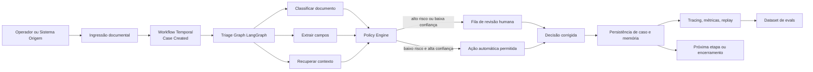
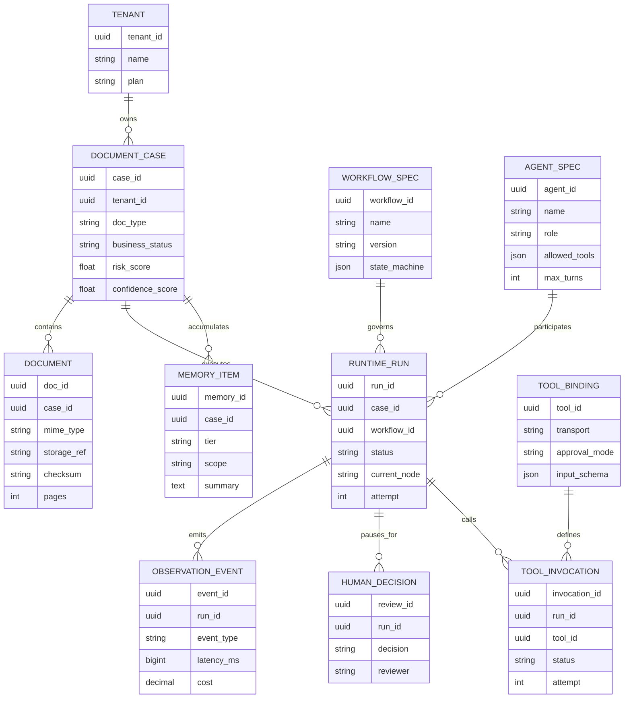
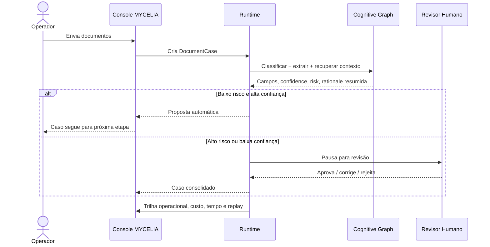
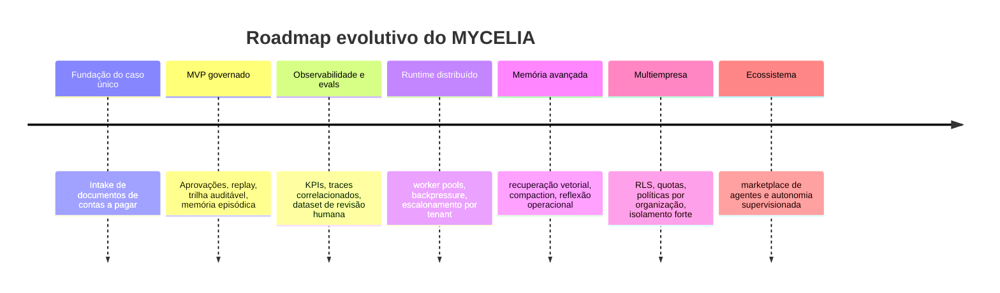

# MYCELIA manifesto arquitetural e PRD do MVP

## Resumo executivo

MYCELIA deve ser tratado como **infraestrutura operacional inteligente** para coordenar, governar, executar e observar agentes cognitivos distribuídos. Ele não é um modelo, nem um chatbot, nem um copiloto. É a camada que decide **como** modelos, ferramentas, políticas, memória e supervisão humana compõem trabalho real em produção. Essa formulação é consistente com a definição da OpenAI para agentes como aplicações que planejam, chamam ferramentas, colaboram entre especialistas e mantêm estado suficiente para trabalho em múltiplas etapas, e com a distinção da Anthropic entre *workflows* com caminhos predefinidos e agentes que dirigem dinamicamente o próprio processo. citeturn28view0turn13view0turn13view1

O problema que MYCELIA resolve não é “fazer IA responder”, mas impedir que inteligência distribuída degrade em **caos operacional cognitivo**. Em produção, isso aparece quando há agentes fragmentados, memória efêmera, lógica enterrada em prompts, ausência de observabilidade, falta de governança e autonomia sem limites. O NIST coloca governança como função transversal de qualquer sistema confiável de IA; a OWASP aponta *prompt injection* e *excessive agency* como riscos estruturais; Temporal e LangGraph mostram, cada um à sua maneira, que checkpoints, histórico de eventos e reexecução controlada são indispensáveis para sistemas longos, stateful e auditáveis. citeturn18view0turn18view1turn18view2turn18view3turn14view0turn25view0

Este documento propõe um desenho fundador para MYCELIA com duas decisões centrais. A primeira é separar **coordenação determinística de processo** de **execução cognitiva probabilística**. A segunda é começar por um escopo deliberadamente estreito, porque a própria Anthropic recomenda o caminho mais simples possível antes de aumentar complexidade e autonomia. O MVP assumido aqui é um único fluxo enterprise: **intake e triagem governada de documentos de contas a pagar**, com classificação, extração estruturada, validação contextual, fila de aprovação humana e trilha completa de execução. citeturn13view0turn26view1

> **Tese de projeto:** inteligência útil em produção não é uma propriedade do modelo; é uma propriedade do runtime, da memória, da política e da supervisão.

## Tese fundacional e problema estrutural

Agentes sem runtime durável não formam um sistema; formam um agregado frágil de chamadas a modelo. A Anthropic é explícita ao diferenciar *workflows*, nos quais LLMs e ferramentas são orquestrados por caminhos de código predefinidos, de agentes, nos quais o modelo dirige seu próprio processo. A OpenAI formula o mesmo ponto por outro vetor: o caminho de SDK é o apropriado quando a aplicação precisa ser dona de orquestração, execução de ferramentas, aprovações e estado. O erro arquitetural mais comum é pular essa camada e tentar fazer do prompt uma máquina de processo. citeturn13view0turn28view0

Quando isso acontece, o sistema perde exatamente as superfícies de continuidade que produção exige: histórico local, fronteira de *handoff*, último agente responsável, interrupções pendentes e estado retomável. Em paralelo, o contexto de inferência continua limitado por janela de contexto, que inclui tokens de entrada, saída e raciocínio; à medida que o histórico cresce, custo, latência e risco de truncamento crescem junto. É por isso que compaction, checkpointing e separação entre contexto operacional e contexto visível ao modelo são mecanismos arquiteturais, não otimizações tardias. citeturn17view1turn17view7turn17view6turn17view0turn25view0

Esse cenário se agrava quando agentes recebem permissões amplas e interagem com ferramentas ou sistemas externos sem filtros claros. A OWASP observa que *prompt injection* não é plenamente mitigado por RAG ou *fine-tuning*, e que *excessive agency* emerge de funcionalidade excessiva, permissões excessivas e autonomia excessiva. O MCP, por sua vez, recomenda que haja sempre humano no circuito para negar invocações de ferramentas quando necessário, e a OpenAI formaliza isso via guardrails e pausas de revisão humana que decidem se uma execução continua, pausa ou para. citeturn18view2turn18view3turn21view1turn17view5

A expressão **caos operacional cognitivo** sintetiza essas falhas estruturais:

| Fratura | Efeito imediato | Consequência organizacional | Resposta estrutural em MYCELIA |
|---|---|---|---|
| Especialistas sem ownership explícito | Hand-offs implícitos e inconsistentes | Casos sem responsável claro | Ownership explícito por agente e por etapa |
| Memória efêmera | Perda de contexto entre turnos | Retrabalho e decisões contraditórias | Memória hierárquica e resumida |
| Lógica em prompts | Fluxos quebradiços | Difícil versionar, testar e auditar | Estado, políticas e grafos explícitos |
| Falta de observabilidade | Não se sabe por que algo falhou | Incidentes sem causa raiz | Tracing, replay e custo por execução |
| Autonomia ampla | Ações laterais indevidas | Risco de compliance e segurança | Guardrails, aprovação humana e least privilege |
| Side effects sem idempotência | Duplicidade de ações | Custos, inconsistência e disputa operacional | Activities idempotentes e chaves de deduplicação |
| Loops invisíveis | Consumo infinito de tokens e retries | Explosão de custo e fila | Orçamentos, max-turns, timeouts e circuit breakers |

Em outras palavras: MYCELIA existe porque **coordenação operacional é o ativo escasso**. O modelo gera possibilidades; o sistema precisa transformá-las em execução controlada, recuperável, compreensível e economicamente gerenciável. Esse é o salto entre “IA funcional” e “infraestrutura cognitiva”. citeturn18view0turn14view0turn14view2turn25view0turn26view0

## Princípios arquiteturais

Os princípios abaixo não são slogans de produto; são restrições de projeto derivadas de documentação primária de runtimes, padrões de integração, práticas de avaliação e *risk management* para IA. citeturn18view0turn13view0turn14view0turn25view0turn27view2

| Princípio | Decisão arquitetural | Implicação prática |
|---|---|---|
| **Context First** | Separar contexto operacional do contexto visível ao modelo; controlar orçamento de contexto e resumir continuamente. | Identidade do usuário, clientes de banco, políticas internas e segredos vivem fora do prompt; o modelo recebe apenas o que precisa para decidir a próxima ação. |
| **Observability by Default** | Toda execução emite traces, spans, eventos de ferramenta, custos, tempos e mudanças de estado. | Se algo aconteceu, precisa poder ser reconstruído por timeline, replay e diff de estado. |
| **Human Supervision Layer** | Ações sensíveis não são “funções” normais; são operações aprováveis. | Cancelamentos, mutações, escrita em sistemas de terceiros e aprovações financeiras pausam o run e retornam ao mesmo estado depois da decisão humana. |
| **Vendor-Agnostic Runtime** | O runtime fala com múltiplos provedores por contratos estáveis, com *fallback*, políticas de privacidade e roteamento. | Modelos são intercambiáveis; a topologia do sistema não muda quando um fornecedor muda. |
| **Memory Before Autonomy** | Nenhum agente decide em vazio contextual. | Curto prazo, longo prazo, memória episódica e memória vetorial precisam ser explícitas, versionadas e recuperáveis. |
| **Explicit State Management** | Estado pertence ao runtime, não à “lembrança” do modelo. | Processo, checkpoints, aprovações, retries, custo e ownership são serializados em superfícies auditáveis. |
| **Explainable Agent Chains** | Explicabilidade vem de registros de decisão, ferramenta, política e estado, não de dependência em raciocínio oculto. | O operador vê “o que foi tentado, com que insumos, por qual política, com qual resultado”. |
| **Least-Privilege Execution** | Ferramentas, dados e tenancy são expostos ao mínimo necessário. | Cada agente recebe escopo reduzido, allowlists por ferramenta, aprovações por política e isolamento por tenant. |

Esses princípios derivam diretamente de algumas convergências fortes. A OpenAI recomenda separar contexto local do contexto do modelo, tratar pausas como *runs* interrompidos e manter tracing ligado por padrão; LangGraph trata memória, interrupções e checkpoints como primitivos do runtime; Temporal exige determinismo para o workflow e empurra operações não determinísticas para activities; OpenRouter oferece roteamento com *fallback* e políticas de retenção/coleção de dados; Gemini e MCP reforçam a utilidade de uma camada padronizada para ferramentas e contexto; Ollama oferece superfícies locais para *tool calling* e execução mais soberana. citeturn17view0turn17view2turn27view2turn25view0turn13view2turn14view2turn16view1turn15view10turn15view6turn21view0turn15view7turn15view8

Em termos operacionais, o princípio mais importante é este: **prompts não são o lugar da soberania do sistema**. Prompt é um artefato de execução. Soberania reside em grafo, política, estado, memória, observação e aprovação. Sem isso, MYCELIA seria apenas mais uma superfície bonita sobre comportamento probabilístico não governado. citeturn13view0turn28view0turn18view0turn18view3

## Runtime, entidades e escalabilidade

A forma correta de construir MYCELIA é assumir que existem **duas máquinas** convivendo no mesmo sistema. A primeira é uma máquina de processo, determinística, durável, orientada a eventos, responsável por SLAs, ownership, filas, retries, timeouts, aprovações e mudanças de estado de negócio. A segunda é uma máquina cognitiva, stateful, orientada a grafo, responsável por classificação, extração, recuperação de contexto, composição de raciocínio com ferramentas e geração de propostas. Temporal foi desenhado para a primeira; LangGraph foi desenhado para a segunda. citeturn14view0turn14view2turn14view3turn25view4turn25view0

A documentação do Temporal é particularmente útil aqui porque ela dá a regra arquitetural que muitos times tentam contornar: workflows precisam ser determinísticos, e operações falhas ou não determinísticas — chamadas de API, invocações de LLM, I/O externo — devem ser isoladas em *Activities*, que têm retry declarativo. Já o LangGraph se posiciona como infraestrutura de baixo nível para workflows e agentes stateful e de longa duração, com execução durável, checkpoint por superstep, memória, time travel e *human in the loop*. O desenho recomendado para MYCELIA, portanto, é simples e forte: **Temporal por fora, LangGraph por dentro**. citeturn14view2turn14view0turn13view3turn25view0turn25view4

Essa separação também permite uma leitura visual madura. O BPMN diferencia *Process*, *Choreography* e *Collaboration* como partes de um núcleo extensível. MYCELIA deve herdar essa semântica — processo interno, diálogo entre participantes, colaboração entre componentes — sem ficar prisioneiro da notação clássica. O grafo vivo do runtime é mais importante do que o diagrama estático. citeturn19view1turn18view4

O grafo acima materializa os conceitos pedidos para o runtime cognitivo: **execution graph**, **cognitive pipelines**, **orchestration engine** e **event-driven coordination**. O workflow externo cria e governa o caso; o subgrafo cognitivo opera em passos limitados; a política decide se o resultado pode produzir efeito; a camada humana corrige ou aprova; observabilidade e memória tornam a execução acumulativa em vez de efêmera. citeturn14view3turn25view4turn13view2turn17view5

A seguir, as entidades fundamentais recomendadas para o núcleo do sistema. A tabela combina os conceitos solicitados no manifesto com superfícies concretas de runtime, dados e governança.

| Entidade | Atributos essenciais | Papel no sistema |
|---|---|---|
| **AgentSpec** | `agent_id`, `name`, `role`, `instructions_version`, `allowed_tools`, `guardrail_profile`, `max_turns`, `cost_budget`, `owner_team` | Define identidade, papel, limites, ferramentas e orçamento operacional do agente. |
| **WorkflowSpec** | `workflow_id`, `name`, `version`, `states`, `transitions`, `fallback_rules`, `approval_points`, `sla_policy` | Define a máquina de processo e as transições permitidas. |
| **RuntimeRun** | `run_id`, `workflow_id`, `case_id`, `status`, `current_node`, `attempt`, `started_at`, `ended_at`, `continuation_token` | Representa uma execução concreta, pausável e retomável. |
| **ContextEnvelope** | `case_snapshot`, `retrieved_docs`, `policy_snapshot`, `working_memory`, `local_context_refs`, `token_budget` | Empacota o contexto disponível para a próxima decisão. |
| **MemoryItem** | `memory_id`, `tier`, `scope`, `source`, `embedding`, `summary`, `freshness`, `confidence`, `retention_policy` | Armazena fatos, resumos, episódios, vetores e artefatos de contexto. |
| **ObservationEvent** | `span_id`, `trace_id`, `run_id`, `event_type`, `latency_ms`, `model`, `provider`, `tool_name`, `input_hash`, `output_hash`, `cost` | Materializa logs cognitivos, tracing, custo e auditoria. |
| **HumanDecision** | `review_id`, `run_id`, `decision`, `reason`, `edited_payload`, `reviewer`, `timestamp` | Mantém aprovação, intervenção, override e correção humana. |
| **ToolBinding** | `tool_id`, `transport`, `schema`, `permission_scope`, `approval_mode`, `timeout_ms` | Modela ferramenta, contrato, transporte e política de uso. |
| **DocumentCase** | `case_id`, `tenant_id`, `doc_ids`, `doc_type`, `priority`, `risk_score`, `confidence_score`, `business_status` | Agrega o caso de negócio a partir do qual o runtime opera. |

Escalabilidade, aqui, não é apenas “adicionar workers”. Temporal suporta muitos workflows concorrentes, mas impõe limites importantes de histórico de eventos e operações pendentes; Redis Streams expõe `lag` e `pending`, que devem virar alertas de *backpressure*; PostgreSQL oferece particionamento declarativo, RLS e replicação lógica para isolar tenants e separar plano transacional de leitura; pgvector oferece HNSW e IVFFlat com trade-offs explícitos entre *recall*, memória e tempo de construção. Em termos de desenho, isso implica: particionar observabilidade por tenant e tempo, usar RLS por `tenant_id`, manter Redis como camada efêmera de coordenação e nunca como fonte de verdade, e escolher HNSW como padrão para recuperação contextual de leitura mais intensiva, reservando IVFFlat para cenários onde custo de memória e build pesem mais que o melhor trade-off de busca. citeturn14view1turn14view4turn14view5turn23view2turn14view6turn14view7turn23view1turn31view0turn31view2

## Memória, observabilidade e governança

Memória não pode ser tratada como um apêndice de RAG. Em sistemas agentic, janela de contexto é finita, compaction existe para reduzir custo/latência preservando estado útil, e memória precisa operar em camadas com diferentes taxas de atualização, retenção e criticidade. LangGraph formaliza curto e longo prazo; OpenAI formaliza gerenciamento de contexto e compaction; MemGPT propõe explicitamente uma hierarquia inspirada em sistemas operacionais para lidar com contextos além da janela corrente; o trabalho de *Generative Agents* mostra que observação, reflexão e planejamento dependem de memória dinâmica e recuperável. citeturn17view7turn17view6turn25view3turn30search0turn29search1

A hierarquia recomendada para MYCELIA é a seguinte:

| Camada de memória | Conteúdo | Armazenamento principal | Regra de recuperação | Retenção |
|---|---|---|---|---|
| **Working memory** | Estado do run, mensagens, resultados recentes de ferramentas, tokens de orçamento | Checkpoint do LangGraph + estado do workflow | Sempre carregada no run atual | Minutos a horas |
| **Episodic memory** | Aprovações, correções humanas, falhas, decisões tomadas, resumos por caso | PostgreSQL JSONB | Recuperada por `case_id`, `workflow_id`, similaridade e recência | Meses |
| **Semantic memory** | Embeddings de documentos, políticas, taxonomias, exemplos de caso | PostgreSQL + pgvector | Busca vetorial com filtros por tenant, tipo e frescor | Longa duração |
| **Procedural memory** | Templates, instruções, manifests de ferramenta, políticas de roteamento | Repositório versionado + banco relacional | Recuperada por versão da execução | Permanente e versionada |
| **Organizational memory** | Políticas corporativas, cadastros, regras fiscais, contratos de integração | Base canônica interna / conectores MCP | Leitura sob autorização explícita | Permanente |
| **Reflective memory** | Casos usados para eval, padrões de erro, difs entre decisão automática e revisão humana | PostgreSQL analítico | Usada para melhoria contínua e comparação entre versões | Permanente |

Memória ruim destrói agentes de duas maneiras. A primeira é por **omissão**: o agente não sabe o que deveria lembrar e repete trabalho. A segunda é por **contaminação**: o agente recebe contexto demais, contexto velho ou contexto sem proveniência. O resultado é custo maior, latência pior e decisões menos confiáveis. Em MYCELIA, todo item de memória precisa carregar ao menos fonte, escopo, versão, frescor, confiança e política de retenção; resumir é obrigatório, mas resumir sem proveniência é inadmissível. citeturn17view6turn17view7turn25view3turn30search0

Observabilidade também precisa ser tratada como requisito fundacional. A OpenAI registra tracing por padrão no caminho server-side do Agents SDK e expõe, em cada run, ferramentas, handoffs, guardrails e spans personalizados; OpenTelemetry define convenções semânticas comuns para traces, metrics, logs e resources; OpenAI também enfatiza que evals são a forma correta de lidar com a variabilidade intrínseca dos modelos. Em MYCELIA, isso leva a uma regra operacional simples: **IA sem observabilidade não é enterprise**. citeturn27view2turn15view0turn26view0

Essa observabilidade, porém, não deve depender de “ver raciocínio oculto”. As superfícies úteis e estáveis para operação são histórico, estado retomável, interrupções pendentes, registros de ferramenta, resultados de guardrails, uso e spans. A própria OpenAI observa que o artefato de compaction é opaco e não destinado a interpretação humana. Portanto, a explicabilidade de MYCELIA deve se apoiar em **resumos de decisão**, entradas e saídas de ferramenta, políticas aplicadas, mudanças de estado e replay operacional — não em exigir acesso a cadeias privadas de raciocínio. citeturn17view1turn17view6turn27view2

Governança é a camada que fecha o sistema. O AI RMF do NIST organiza risco em Govern, Map, Measure e Manage; a OWASP alerta que *prompt injection* altera comportamento do modelo e que *excessive agency* nasce de funcionalidade, permissões e autonomia excessivas; MCP recomenda capacidades com consentimento e revisão humana; a OpenAI separa guardrails automáticos de revisão humana explícita; PostgreSQL oferece RLS e privilégios granulares para que isolamento organizacional seja enforced no plano de dados. MYCELIA deve traduzir tudo isso em política executável. citeturn18view0turn18view1turn18view2turn18view3turn21view0turn21view1turn17view5turn14view6turn4search4

Os controles mínimos são estes:

| Controle | Onde atua | Fail-safe esperado |
|---|---|---|
| Allowlist de ferramentas por agente | Tool layer | Chamada negada |
| Política de aprovação por operação | Runtime | Run pausa e volta para fila humana |
| Limite de turns e orçamento por caso | AgentSpec / RuntimeRun | Execução interrompida e escalada |
| Guardrails de entrada, saída e ferramenta | Antes e depois de chamadas | Bloqueio ou sanitização |
| Idempotência por side effect | Activities / integrações | Reprocessamento seguro |
| Isolamento por tenant | Banco, filas e contexto | Vazamento bloqueado |
| Kill switch por workflow/tenant | Control plane | Interrupção imediata |
| Replay e auditoria versionada | Observability | RCA possível sem suposição |

## PRD do MVP e camada visual

O primeiro produto do MYCELIA não deve tentar ser um “sistema operacional geral de agentes”. Ele deve resolver um processo empresarial único e repetitivo, com valor visível e risco controlável. O recorte recomendado é **triagem governada de documentos de contas a pagar**: receber documentos por upload, API ou ingestão de e-mail; classificá-los; extrair campos críticos; validar contra regras e cadastros; decidir se o caso pode seguir automaticamente; pausar para revisão quando confiança ou política exigirem. Essa escolha preserva o conselho da Anthropic de começar pelo desenho mais simples possível e conversa diretamente com a lógica de *eval-driven system design* proposta pela OpenAI para fluxos documentais e de auditoria. citeturn13view0turn26view1

O MVP precisa provar uma tese operacional específica: que o runtime de MYCELIA consegue transformar trabalho documental em **casos governados**, com contexto persistente, aprovação configurável e visibilidade integral de cada decisão. O objetivo não é substituir toda a operação; é tornar automação cognitiva auditável e escalável em um domínio de alto volume. citeturn26view1turn18view0

A priorização recomendada para o MVP é:

| Escopo | Capacidades |
|---|---|
| **MUST** | criação de caso por upload/API/e-mail; classificação documental; extração estruturada de campos obrigatórios; score de risco e confiança; fila de aprovação humana; trilha completa de execução; replay do caso; políticas por tenant; memória episódica do caso; logs de ferramenta e custo por execução |
| **SHOULD** | validação cruzada com cadastro, PO ou regra fiscal; paralelização de extração e validação; operação em lote; console de diffs entre decisão automática e correção humana; dataset de evals gerado a partir das revisões; SLA e escalonamento automático |
| **FUTURE** | múltiplos workflows por tenant; marketplace de agentes; política declarativa versionada por domínio; aprendizado ativo com feedback humano; autonomia supervisionada multiagente entre processos |

As jornadas principais são três:

| Persona | Objetivo | Jornada crítica | Resultado esperado |
|---|---|---|---|
| **Operador de intake** | Submeter documentos e acompanhar status | envia arquivo, recebe criação de caso, vê classificação inicial e próximos passos | o caso entra no runtime com ownership e SLA definidos |
| **Analista de AP** | Validar ou corrigir casos ambíguos | acessa fila de revisão, vê proposta do sistema, edita campos, aprova ou rejeita | a correção humana retroalimenta memória episódica e evals |
| **Administrador de processo** | Governar políticas e versões | ajusta thresholds, approval modes, templates e observabilidade | mudanças são versionadas, comparáveis e auditáveis |

A camada visual do MYCELIA precisa refletir essa natureza runtime-native. Ela não deve se parecer com uma linha de chat, mas com um **mapa vivo de execução**. React Flow é apropriado porque foi projetado para editores baseados em nós e diagramas interativos; os nós podem representar caso, agente, ferramenta, memória e aprovação; as arestas representam dependências, handoffs e estados de bloqueio. A semântica de processo pode se inspirar em BPMN — especialmente na distinção entre processo, colaboração e orquestração — mas a interface precisa ser operacional, não apenas diagramática: mapear estado atual, fila, custo, aprovações, difs e replay. Next.js App Router, por sua adoção de Server Components e Suspense, favorece uma console que combine leitura eficiente do estado servidor com componentes interativos densos no cliente. citeturn15view2turn19view1turn15view1

As superfícies visuais mínimas do produto devem ser: **canvas de runtime**, **timeline do caso**, **inspetor de contexto**, **fila de revisão humana**, **painel de políticas** e **visor de replay**. O detalhe importante é que cada uma delas deve ser navegável a partir de `case_id`, `run_id` e `trace_id`, para que operação, engenharia e auditoria consigam falar sobre o mesmo objeto. Isso reduz a distância entre execução e governança. citeturn27view2turn17view1turn15view0

As métricas de sucesso do MVP devem ser explícitas desde o primeiro dia:

| Métrica | Definição | Meta recomendada para MVP | Sinal de alerta |
|---|---|---|---|
| **Precisão de classificação** | tipo documental correto | ≥ 97% | < 94% |
| **Acurácia de extração** | campos obrigatórios corretos | ≥ 95% | < 92% |
| **Straight-through processing** | casos que seguem sem revisão | 55–70% após calibração | < 40% |
| **Reversal rate** | decisões automáticas revertidas por humanos | < 5% | > 10% |
| **P95 de primeira decisão** | da entrada à proposta inicial | < 90 s para docs padrão | > 180 s |
| **Cobertura de trace** | casos com trace e replay completos | 100% | qualquer lacuna |
| **Custo por caso útil** | custo até decisão final | dentro do orçamento do domínio | crescimento sem ganho |
| **Tempo médio de fila humana** | pausa até revisão | < 30 min em horário útil | > 2 h |

Essas metas não são “KPIs de dashboard”; elas também definem o contrato do produto. Se a automação tem boa acurácia, mas baixa *trace completeness*, o sistema ainda não está pronto. Se tem boa visibilidade, mas *reversal rate* alto, ainda está aprendendo em produção. Em MYCELIA, qualidade cognitiva e qualidade operacional são inseparáveis. citeturn26view0turn27view2

## Arquitetura tecnológica e roadmap

A stack pedida para MYCELIA é adequada, desde que cada tecnologia tenha uma responsabilidade estrutural clara. No frontend, **Next.js App Router** oferece roteamento baseado em sistema de arquivos e suporta Server Components, Suspense e funções de servidor; **React Flow** é explicitamente desenhado para UIs baseadas em nós e diagramas interativos; **Tailwind** constrói componentes a partir de classes utilitárias diretamente no markup, o que é útil para uma console densa, responsiva e altamente iterável. citeturn15view1turn15view2turn24search0

No plano de API e aplicação, **FastAPI** combina alta performance com *type hints* do Python, além de um sistema de dependências desenhado para compartilhar lógica, conexões de banco, autenticação e requisitos de papel. O ecossistema assíncrono de Python, baseado em **asyncio**, fornece o alicerce para I/O concorrente, filas, sincronização e integração com workers e serviços externos. No plano de dados, **Prisma** traz schema declarativo, migrations e cliente tipado, o que ajuda a manter o modelo relacional estável e versionável do lado TypeScript. citeturn15view4turn23view3turn23view4turn15view3

Na infraestrutura, o papel de cada peça precisa ser estrito. **PostgreSQL** é a fonte de verdade transacional, com RLS para isolamento e particionamento declarativo para crescimento por tenant e tempo; replicação lógica permite separar planos de leitura, analytics ou contingência com granularidade maior que replicação física. **pgvector** adiciona busca vetorial no mesmo banco: HNSW oferece melhor trade-off de consulta e *recall* para leitura intensiva, enquanto IVFFlat constrói mais rápido e usa menos memória às custas de performance de busca. **Redis Streams** serve como camada efêmera de coordenação e controle de pressão, com `lag` e `pending` monitoráveis e exigência de consumidores idempotentes. citeturn14view6turn14view7turn23view1turn31view0turn31view2turn14view4turn14view5turn23view2

No runtime, a composição recomendada é inequívoca. **Temporal** governa o workflow de negócio, porque tem histórico de eventos como fonte de verdade, mensagens por Signals/Queries/Updates, workflow resiliente e retries declarativos em Activities. **LangGraph** governa o subgrafo cognitivo, porque oferece execução stateful, checkpoints, interrupções, time travel, memória e durabilidade configurável. **OpenTelemetry** padroniza nomes e atributos de traces, métricas, logs e recursos, permitindo que a observabilidade do runtime cognitivo não vire um dialeto interno. citeturn14view0turn14view2turn14view3turn25view0turn25view1turn25view4turn15view0

No plano de modelos e conectores, o desenho deve ser **pluggable por contrato**. **OpenRouter** oferece uma API unificada, normaliza o schema entre modelos e suporte a *fallbacks* e preferências de provedor, além de Zero Data Retention por request, guardrail ou grupo de modelos. **Gemini** oferece *function calling* com saída estruturada e suporte embutido a MCP nos SDKs. **Ollama** fornece API local padrão, *tool calling* e superfícies locais para cenários de soberania e futuro suporte a modelos on-prem. **MCP** fecha o desenho como protocolo aberto para expor recursos, prompts e ferramentas, com ênfase explícita em consentimento e revisão humana. citeturn15view9turn16view0turn16view1turn15view10turn15view6turn15view7turn15view8turn21view0turn21view1turn21view2turn22search0

Há também uma consequência de privacidade importante. OpenRouter permite negar coleta de dados por preferências de provedor e aplicar ZDR; a OpenAI permite `store=false` para evitar retenção padrão de respostas, e compaction pode continuar compatível com ZDR quando essa flag é usada. Em um produto enterprise, retenção, residência e logging não podem ser deixados como “configuração posterior”; precisam ser parte do contrato de execução. citeturn16view2turn15view10turn17view7turn17view6

A síntese operacional da stack é:

| Camada | Tecnologias principais | Decisão de desenho |
|---|---|---|
| **Console operacional** | Next.js, React Flow, Tailwind, TypeScript | UI densa, node-based e pronta para operação em tempo real |
| **BFF / APIs de produto** | FastAPI, Python | API do control plane e integração com runtime |
| **Modelo de dados de aplicação** | Prisma, PostgreSQL | Schema explícito, migrations e acesso tipado |
| **Workflow determinístico** | Temporal | Processo, SLA, retries, pausas e retomada |
| **Runtime cognitivo** | LangGraph | Agentes, subgrafos, memória e HITL |
| **Fila efêmera / pressão operacional** | Redis Streams, workers | distribuição, buffering e sinais de capacidade |
| **Memória vetorial e relacional** | PostgreSQL, pgvector | dados canônicos + recuperação semântica |
| **Observabilidade** | OpenTelemetry | traces, métricas, logs e correlação |
| **Malha de modelos** | OpenRouter, OpenAI, Claude, Gemini, Ollama | pluralidade de provedores e política de roteamento |
| **Integração contextual** | MCP | ferramentas, recursos e prompts com contrato aberto |

O roadmap recomendado por fase é este:

| Fase | Objetivo | Entregáveis | Critérios de aceitação |
|---|---|---|---|
| **Fundação do caso único** | resolver o fluxo único de AP documental | criação de caso, classificação, extração, persistência, console básica | 100% dos casos com `case_id`, `run_id` e histórico mínimo; execução ponta a ponta em ambiente controlado |
| **MVP governado** | tornar o fluxo operável | fila humana, políticas de aprovação, replay, trace completo, memória episódica | toda ação sensível pausa corretamente; todo caso pode ser reaberto e auditado |
| **Observabilidade e evals** | criar disciplina de melhoria | dashboards, tracing correlacionado, dataset de revisão, suíte inicial de evals | acompanhamento diário de acurácia, custo, latência e *reversal rate* |
| **Runtime distribuído** | suportar volume e paralelismo | filas por prioridade, worker pools, alertas de `lag/pending`, circuit breakers | sistema mantém SLA sob carga de referência sem perda de rastreabilidade |
| **Memória avançada** | melhorar qualidade contextual | summaries automáticos, retrieval híbrido, memória semântica versionada | ganho mensurável em acurácia ou redução de custo/latência em benchmark interno |
| **Multiempresa** | operar com governança real | RLS, quotas, separação de políticas, isolamento de configurações | tenant A não acessa artefatos de tenant B sob nenhum caminho de consulta ou replay |
| **Ecossistema e autonomia supervisionada** | ampliar superfície da plataforma | SDK de agentes, registros de capacidades, marketplace interno, autonomia condicionada | novos agentes entram por contrato, observabilidade e aprovação sem quebrar o runtime central |

A forma mais saudável de pensar o futuro do MYCELIA é esta: primeiro ele vira **runtime confiável** para um caso operacional. Depois vira **produto operacional** com visibilidade e governança. Só então pode virar **plataforma**. Inverter essa ordem produziria exatamente aquilo que o projeto pretende evitar: inteligência difusa, cara e opaca. O caminho correto é mais sóbrio — e, por isso mesmo, mais escalável. citeturn13view0turn18view0turn26view0turn14view0turn25view0

# 1. Domain Ownership Boundaries

MYCELIA é dividido em domínios operacionais explícitos para evitar acoplamento excessivo, ambiguidade de responsabilidade e degradação arquitetural.

Cada domínio possui:

- ownership claro;
- fronteiras explícitas;
- persistência definida;
- semântica operacional própria.

| Domínio | Responsabilidade principal | O que controla | O que NÃO controla |
|---|---|---|---|
| Runtime | Execução operacional | Runs, estados, retries, lifecycle, replay | Regras cognitivas do modelo |
| Workflow | Topologia e fluxo | Nós, transições, checkpoints, approval points | Persistência global |
| Memory | Continuidade contextual | Recuperação, summaries, embeddings, episódios | Estado transitório de execução |
| Observability | Investigação operacional | Traces, spans, eventos, métricas, lineage | Decisão cognitiva |
| Policy | Governança | Permissões, budgets, thresholds, approvals | Fluxo visual |
| Human Layer | Supervisão | Aprovação, override, escalonamento | Execução autônoma |
| Tool Layer | Side effects | Integrações, APIs, actions externas | Estado do workflow |
| UI Runtime | Visualização operacional | Graph overlays, timeline, replay viewer | Execução real |
| Tenant Layer | Isolamento organizacional | RBAC, quotas, segregação | Lógica cognitiva |

## Regras de ownership

- Runtime executa, mas não decide política sozinho.
- Policy autoriza, limita e bloqueia, mas não executa workflow.
- Workflow define topologia, mas não armazena memória.
- Memory apoia continuidade, mas não é fonte autoritativa do runtime.
- Observability registra e reconstrói, mas não altera histórico original.
- Human Layer intervém no runtime, mas toda intervenção precisa ser atribuída a um ator.
- Tool Layer encapsula efeitos externos e deve respeitar idempotência, timeout e autorização.

---

# 2. Physical Architecture Structure

A estrutura física do MYCELIA deve refletir os boundaries operacionais do domínio.

A organização do repositório não é apenas conveniência. Ela representa isolamento arquitetural.

Estrutura-alvo futura:

~~~txt
/apps
  /web
  /api
  /worker-runtime
  /worker-tools

/packages
  /domain
  /runtime
  /workflow-engine
  /memory
  /observability
  /policy
  /ui-runtime
  /shared
  /sdk

/services
  /temporal
  /langgraph
  /redis
  /postgres
  /vector-memory

/docs
  /architecture
  /prd
  /runtime
  /adr

/infrastructure
  /docker
  /terraform
  /k8s

/scripts
/tests
~~~

## Dependency Rules

| Camada | Pode depender de |
|---|---|
| apps | packages |
| packages/domain | ninguém |
| packages/runtime | domain, workflow-engine, policy, observability |
| packages/workflow-engine | domain, policy |
| packages/memory | domain, observability |
| packages/ui-runtime | domain, observability |
| services | packages |
| workers | runtime, policy, tools |

## Architectural Rules

- `domain` nunca depende de UI.
- `domain` nunca depende de providers de IA.
- `workflow-engine` nunca chama modelo diretamente.
- `observability` é transversal, mas não deve alterar comportamento de negócio.
- `memory` nunca é source-of-truth do runtime.
- `policy` nunca vive dentro de prompts.
- `tools` devem ser chamadas por contratos explícitos.
- `ui-runtime` apenas visualiza estado. Não executa workflow real.

---

# 3. Runtime State Machine

A execução operacional do MYCELIA é governada por uma máquina de estados explícita.

~~~mermaid
stateDiagram-v2
    [*] --> CREATED
    CREATED --> READY
    READY --> RUNNING

    RUNNING --> WAITING_APPROVAL
    WAITING_APPROVAL --> RUNNING

    RUNNING --> PAUSED
    PAUSED --> RUNNING

    RUNNING --> RETRYING
    RETRYING --> RUNNING

    RUNNING --> FAILED
    RUNNING --> COMPLETED
    RUNNING --> CANCELLED

    FAILED --> REPLAYING
    REPLAYING --> RUNNING

    COMPLETED --> [*]
    CANCELLED --> [*]
~~~

## Runtime State Definitions

| Estado | Significado |
|---|---|
| CREATED | Run criado, mas ainda não preparado |
| READY | Dependências resolvidas e execução apta a iniciar |
| RUNNING | Execução ativa |
| WAITING_APPROVAL | Execução bloqueada aguardando decisão humana |
| PAUSED | Pausa operacional explícita |
| RETRYING | Reexecução controlada de etapa falha |
| FAILED | Falha terminal ou não recuperável |
| COMPLETED | Execução concluída com sucesso |
| CANCELLED | Execução interrompida por ator, política ou sistema |
| REPLAYING | Execução em modo investigação ou rerun controlado |

## Invalid Transitions

| Transição inválida | Motivo |
|---|---|
| COMPLETED → RUNNING | Violaria integridade histórica |
| FAILED → COMPLETED | Requer replay ou novo run |
| CANCELLED → RUNNING | Necessita novo run |
| WAITING_APPROVAL → COMPLETED | Aprovação não finaliza execução automaticamente |
| REPLAYING → COMPLETED original | Replay não pode mutar histórico original |

---

# 4. Replay Semantics

Replay é uma capacidade operacional crítica do MYCELIA.

Replay não significa executar tudo novamente cegamente.

Replay existe para:

- investigação;
- auditoria;
- debugging;
- comparação de comportamento;
- validação de políticas;
- análise de regressão;
- reconstrução visual de execução.

## Tipos de Replay

| Tipo | Comportamento |
|---|---|
| Visual Replay | Reconstrói timeline, estados, eventos e overlays visuais |
| Dry Replay | Reexecuta fluxo sem side effects externos |
| Full Replay | Reexecuta runtime completo sob autorização explícita |
| Fork Replay | Cria branch paralela de execução para comparação |

## Regras de Replay

- Replay nunca muta histórico original.
- Side effects nunca reexecutam automaticamente sem idempotência.
- Tool executions sensíveis exigem confirmação explícita.
- Replay mantém correlation lineage com o run original.
- Replay deve gerar novos traces correlacionados ao original.
- Aprovações humanas podem ser simuladas, mas não sobrescritas.
- Replay deve indicar claramente se está usando outputs cacheados ou recalculando.

## Artefatos Replayable

| Artefato | Replayável |
|---|---|
| Workflow topology | Sim |
| Runtime transitions | Sim |
| Trace timeline | Sim |
| Tool outputs cacheados | Opcional |
| Human approvals | Simulação apenas |
| External mutations | Não automaticamente |
| Memory retrieval | Sim, mas deve registrar versão e timestamp |

---

# 5. RuntimeContext Contract

RuntimeContext é o envelope operacional de contexto usado durante execução.

Ele não é:

- histórico bruto;
- prompt acumulado;
- memória total;
- banco de dados inteiro;
- estado secreto exposto ao modelo.

Ele é:

**working operational context**.

## RuntimeContext Structure

~~~ts
type RuntimeContext = {
  executionState: object
  retrievedArtifacts: object[]
  workingMemory: object[]
  visibleModelContext: object[]
  hiddenOperationalMetadata: object
  policyMetadata: object
  runtimeBudgets: object
  traceReferences: object[]
}
~~~

## Context Visibility Rules

| Tipo de contexto | Modelo vê? |
|---|---|
| Retrieved documents | Sim |
| Working summaries | Sim |
| Runtime budgets | Parcialmente |
| Approval requirements | Parcialmente |
| Internal policy metadata | Não |
| Tenant isolation metadata | Não |
| Hidden operational tracing | Não |
| Secret tokens | Nunca |
| Database clients | Nunca |
| Raw credentials | Nunca |

## Context Propagation Rules

- Contexto propaga por referência sempre que possível.
- Contexto excessivo deve sofrer compaction.
- Contexto persistente não depende de summaries.
- Contexto operacional oculto nunca entra diretamente em prompts.
- Toda recuperação contextual deve possuir provenance.
- Contexto visível ao modelo deve ser mínimo, relevante e versionável.
- Contexto de política deve ser aplicado pelo runtime, não obedecido por prompt.

---

# 6. Operational UX Principles

A interface do MYCELIA deve transmitir:

- confiança;
- clareza;
- estado operacional;
- continuidade;
- controle;
- inspeção;
- serenidade visual.

Ela não deve parecer:

- playground de IA;
- whiteboard criativo;
- dashboard genérico;
- ferramenta de brainstorming;
- chat com bot sofisticado;
- Miro clone.

## UX Principles

| Princípio | Objetivo |
|---|---|
| Operational Calmness | Reduzir caos visual |
| Runtime Visibility | Tornar execução compreensível |
| State Transparency | Mostrar estado real do sistema |
| Cognitive Traceability | Permitir investigação completa |
| Minimal Cognitive Noise | Evitar excesso de informação |
| Layered Detail | Expandir complexidade sob demanda |
| Explainable Actions | Mostrar o que ocorreu e por quê |
| Human Control | Deixar claro onde o humano pode intervir |
| Enterprise Confidence | Evitar estética de brinquedo ou demo frágil |

## Runtime Visual Semantics

| Elemento visual | Significado |
|---|---|
| Node | Unidade operacional |
| Edge | Dependência, fluxo ou handoff |
| Pulse animation | Execução ativa |
| Red state | Falha ou bloqueio crítico |
| Yellow state | Esperando aprovação |
| Purple overlay | Replay ou investigação |
| Timeline marker | Evento crítico |
| Memory indicator | Uso contextual |
| Cost badge | Custo de etapa ou run |
| Lock icon | Política ou permissão aplicada |
| Human marker | Intervenção humana necessária |

---

# 7. Explicit Non-Goals

Para preservar clareza arquitetural, MYCELIA não pretende suportar inicialmente:

- agentes autônomos infinitos;
- sociedades multiagente auto-organizadas;
- auto-modificação de workflows;
- execução invisível;
- memória sem proveniência;
- autonomy-first systems;
- simulação de AI employees;
- whiteboard livre estilo Miro;
- marketplace irrestrito de agentes;
- decisões financeiras sem supervisão;
- policy enforcement via prompt engineering;
- runtime sem tracing obrigatório;
- agentes com acesso irrestrito a ferramentas;
- replay automático de side effects;
- workflows sem versionamento;
- contexto oculto exposto ao modelo;
- execução sem tenant_id, actor_id e trace_id.

## Strategic Principle

> O objetivo do MYCELIA não é maximizar autonomia.
>
> O objetivo é maximizar confiabilidade operacional da inteligência distribuída.

---

# 8. Invariants Added by This Hardening

Estas regras devem ser tratadas como invariantes arquiteturais:

1. Todo Run pertence a exatamente um WorkflowVersion.
2. Todo Run deve possuir trace_id.
3. Toda ApprovalDecision deve possuir actor_id.
4. Nenhum side effect pode ser reexecutado automaticamente sem idempotência.
5. Replay nunca altera o histórico original.
6. RuntimeContext não pode expor secrets ao modelo.
7. Memory não é fonte de verdade do runtime.
8. Policy não pode depender apenas de prompt.
9. Toda ToolExecution deve emitir observabilidade mínima.
10. Todo estado terminal deve ser irreversível sem novo Run ou Fork Replay.
11. Toda visualização runtime deve refletir estado persistido ou evento emitido.
12. Nenhum agente pode chamar ferramenta fora de sua allowlist.
13. Todo caso operacional deve possuir tenant_id, workspace_id, run_id e trace_id.
14. Todo output cognitivo usado em decisão deve ter provenance.
15. Toda intervenção humana deve ser auditável.

---

# 9. Placement Recommendation

Este apêndice pode ser inserido no documento `02-mvp_scope.md` após a seção de arquitetura/runtime ou antes dos Non-Goals.

Recomendação de título no documento principal:

**Hardening Operacional do Escopo MVP**

Objetivo:

- fechar fronteiras;
- impedir dispersão;
- tornar o documento mais útil para Codex;
- proteger o MYCELIA de virar whiteboard, chatbot ou plataforma genérica.
