# MYCELIA — 03 Canonical Domain Model

---

## Document Metadata

| Field | Value |
|---|---|
| Document Series | MYCELIA Architecture Constitution |
| Document Number | 03 |
| Version | v2.0 |
| Status | Canonical |
| Classification | Core Architecture — All Engineering Disciplines |
| Canonical Role | Single source of truth for all entities, their fields, lifecycle, relationships, and domain rules across the MYCELIA platform |
| Primary Audience | Domain Architects, Engineering Leads, Database Engineers, API Engineers, Security Engineers, Codex |
| Last Updated | May 2026 |

---

## Table of Contents

1. [Executive Summary and Modeling Philosophy](#1-executive-summary-and-modeling-philosophy)
2. [Bounded Context Map](#2-bounded-context-map)
3. [Aggregate Root Model](#3-aggregate-root-model)
4. [Canonical Entity Catalog](#4-canonical-entity-catalog)
5. [Canonical Field-Level Model](#5-canonical-field-level-model)
6. [Lifecycle and State Machines](#6-lifecycle-and-state-machines)
7. [Relationship and ER Diagrams](#7-relationship-and-er-diagrams)
8. [Event Model](#8-event-model)
9. [Source of Truth Matrix](#9-source-of-truth-matrix)
10. [Mutability and Persistence Classes](#10-mutability-and-persistence-classes)
11. [Tenant Isolation and Security Semantics](#11-tenant-isolation-and-security-semantics)
12. [Replay Semantics](#12-replay-semantics)
13. [Memory and Context Authority](#13-memory-and-context-authority)
14. [Tool, Connector and Side-Effect Domain Model](#14-tool-connector-and-side-effect-domain-model)
15. [Governance, Policy and Approval Domain Model](#15-governance-policy-and-approval-domain-model)
16. [Observability, Audit and Evidence Model](#16-observability-audit-and-evidence-model)
17. [Domain Invariants](#17-domain-invariants)
18. [Domain Anti-Patterns](#18-domain-anti-patterns)
19. [Codex Implementation Guidance](#19-codex-implementation-guidance)
20. [Acceptance Criteria](#20-acceptance-criteria)
21. [Domain Model Hardening and Drift Control](#21-domain-model-hardening-and-drift-control)

---

## 1. Executive Summary and Modeling Philosophy

### 1.1 Purpose

This document defines the canonical domain model for MYCELIA. It is the single source of truth for all entities, their fields, their lifecycle state machines, their relationships, and their domain invariants. Every database schema, API contract, event schema, and Codex-generated module MUST be derivable from this document.

### 1.2 What This Document Governs

This document governs:
- The bounded contexts of the MYCELIA platform and their allowed dependencies.
- All aggregate roots, their boundaries, invariants, and transaction scope.
- The canonical field-level specification for all critical entities.
- All domain events, their structure, versioning, and integrity requirements.
- Lifecycle state machines for all stateful entities.
- Replay, tenant isolation, memory authority, and audit integrity semantics.
- Codex implementation rules and forbidden shortcuts.

### 1.3 Core Domain Thesis

MYCELIA's domain model is built on three foundational properties:

1. **Every important state change is an event.** The event store is the authoritative history. Projections are derived. Replay is deterministic.
2. **Every entity is scoped to a tenant.** Cross-tenant access is an architectural violation, not a runtime error.
3. **Authority is explicit and traceable.** No prompt, model output, embedding, or retrieved content may become authoritative without explicit validation and promotion through a governance-controlled domain operation.

---

## 2. Bounded Context Map

MYCELIA's domain is organized into 21 bounded contexts. Each context owns its aggregate roots, entities, and events. Cross-context communication uses domain events, orchestration contracts, or approved APIs. Direct cross-context database mutation is FORBIDDEN.

### 2.1 Bounded Context Definitions

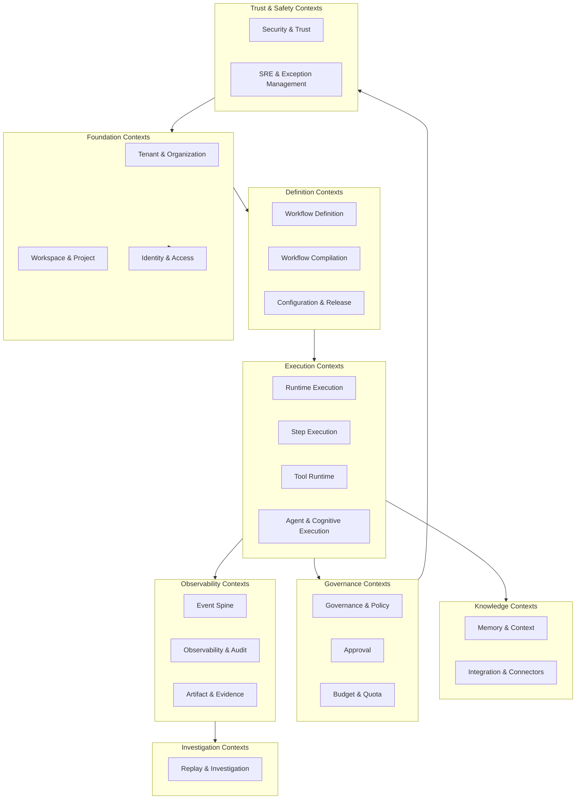
```mermaid
flowchart TB
    subgraph Foundation["Foundation Contexts"]
        TenantCtx["Tenant & Organization"]
        WorkspaceCtx["Workspace & Project"]
        IdentityCtx["Identity & Access"]
    end

    subgraph Definition["Definition Contexts"]
        WFDef["Workflow Definition"]
        WFCompile["Workflow Compilation"]
        ConfigCtx["Configuration & Release"]
    end

    subgraph Execution["Execution Contexts"]
        RuntimeCtx["Runtime Execution"]
        StepCtx["Step Execution"]
        ToolCtx["Tool Runtime"]
        AgentCtx["Agent & Cognitive Execution"]
    end

    subgraph Knowledge["Knowledge Contexts"]
        MemCtx["Memory & Context"]
        IntegCtx["Integration & Connectors"]
    end

    subgraph Governance["Governance Contexts"]
        GovCtx["Governance & Policy"]
        ApprCtx["Approval"]
        BudgetCtx["Budget & Quota"]
    end

    subgraph Observability["Observability Contexts"]
        EventCtx["Event Spine"]
        ObsCtx["Observability & Audit"]
        ArtifactCtx["Artifact & Evidence"]
    end

    subgraph Investigation["Investigation Contexts"]
        ReplayCtx["Replay & Investigation"]
    end

    subgraph Trust["Trust & Safety Contexts"]
        SecCtx["Security & Trust"]
        SRECtx["SRE & Exception Management"]
    end

    Foundation --> Definition
    Foundation --> IdentityCtx
    Definition --> Execution
    Execution --> Knowledge
    Execution --> Governance
    Execution --> Observability
    Observability --> Investigation
    Governance --> Trust
    Trust --> Foundation
```

### 2.2 Bounded Context Detail Table

| Bounded Context | Purpose | Owned Aggregate Roots | Source of Truth | Key Dependencies | Forbidden Dependencies |
|---|---|---|---|---|---|
| Tenant & Organization | Root organizational scope; subscription management | Tenant, Organization | Tenant registry | None | Must not depend on runtime state |
| Workspace & Project | Organizational subdivision; grouping of workflows | Workspace, Project | Config DB | Tenant | Must not depend on execution state |
| Identity & Access | User principals, roles, permissions, memberships | User, Role, Permission, Membership | IAM service | Tenant | Must not depend on workflow definitions |
| Workflow Definition | Immutable workflow versions and graphs | Workflow, WorkflowDraft, WorkflowVersion | Workflow registry | Workspace, Project | Must not depend on GovernedRun |
| Workflow Compilation | Compilation and validation of workflow graphs | WorkflowCompilation | Build artifact store | WorkflowVersion | Must not depend on runtime execution |
| Configuration & Release | Versioned platform and tenant configuration | ConfigurationVersion, FeatureFlag | Config store | Tenant, Workspace | Must not depend on execution state |
| Runtime Execution | GovernedRun lifecycle; orchestration coordination | GovernedRun, RuntimeBudget | Event store + State DB | All definition contexts | Must not perform external I/O |
| Step Execution | Individual step lifecycle; StepExecution attempts | Step, StepExecution | Event store + State DB | GovernedRun, Tool Runtime | Must not bypass policy check |
| Tool Runtime | Tool manifest registry; tool invocation pipeline | Tool, ToolManifest, ToolVersion, ToolInvocation | Tool registry + Event store | Governance, Identity | Must not execute without contract |
| Agent & Cognitive Execution | Agent scope, model calls, output validation | Agent, AgentScope, ModelInvocation | Event store | Tool Runtime, Memory | Must not self-authorize tool calls |
| Memory & Context | Memory fabric; context assembly; retrieval | MemoryObject, RetrievalSession | Memory store + Vector DB | Tenant | Must not cross tenant boundaries |
| Integration & Connectors | External system connections and credential references | Connector, Integration, ExternalSystem | Connector registry | Tenant, Security | Must not store raw credential values |
| Governance & Policy | Policy definitions, versions, snapshots, evaluations | Policy, PolicyVersion, PolicySnapshot | Policy store | Tenant, GovernedRun | Must not be bypassed |
| Approval | Human authorization workflows | ApprovalRequest, ApprovalDecision | Approval store | Governance, Identity | Must not allow self-approval |
| Budget & Quota | Resource consumption tracking and limits | RuntimeBudget, BudgetUsage | Budget ledger | Tenant, GovernedRun | Must not allow silent overconsumption |
| Event Spine | Domain event backbone; integrity proofs | RuntimeEvent, EventEnvelope | Event broker (append-only) | All contexts | Must not allow event modification |
| Observability & Audit | Traces, spans, audit records; tamper evidence | Trace, Span, AuditRecord | Observability store + Audit ledger | All contexts | Must not sample critical audit events |
| Artifact & Evidence | Tool artifacts, evidence bundles, provenance | ToolArtifact, EvidenceBundle | Object storage | Tool Runtime, Observability | Must not be modified after creation |
| Replay & Investigation | Replay orchestration; divergence detection | ReplayRun, ReplayFork, ReplayDivergence | Replay artifact store | Event Spine, Tool Runtime | Must not use production credentials |
| Security & Trust | Workload identity; credential leasing; break-glass | RuntimeIdentity, CredentialLease, SecurityException, BreakGlassSession | Secret manager + Security ledger | All contexts | Must not hold raw credential values |
| SRE & Exception Management | Incident references; risk acceptance; hardening exceptions | IncidentReference, RiskAcceptance | Incident management system | Security, Audit | Must not suppress audit records |

---

## 3. Aggregate Root Model

### 3.1 Aggregate Root Definitions

**Tenant** (Bounded Context: Tenant & Organization)
- Boundary: Tenant, Organization, TenantSubscription
- Invariants: Tenant ID is globally unique and immutable; tenant can only be soft-deleted; all child resources carry tenant_id
- Events emitted: TenantCreated, TenantUpdated, TenantSuspended, TenantReactivated, TenantArchived
- Commands: CreateTenant, UpdateTenantProfile, SuspendTenant, ReactivateTenant
- Transaction boundary: Tenant record + Organization record

**Workspace** (Bounded Context: Workspace & Project)
- Boundary: Workspace, Project
- Invariants: Workspace belongs to exactly one Tenant; Project belongs to exactly one Workspace
- Events emitted: WorkspaceCreated, WorkspaceArchived, ProjectCreated, ProjectArchived
- Commands: CreateWorkspace, ArchiveWorkspace, CreateProject

**User** (Bounded Context: Identity & Access)
- Boundary: User, Principal, Membership, Role, Permission
- Invariants: User belongs to exactly one Tenant; a user may have multiple Memberships in different workspaces within the same tenant; cross-tenant membership is FORBIDDEN
- Events emitted: UserCreated, UserDeactivated, MembershipGranted, MembershipRevoked, RoleAssigned

**Workflow** (Bounded Context: Workflow Definition)
- Boundary: Workflow, WorkflowDraft, WorkflowVersion, WorkflowNode, WorkflowEdge, WorkflowRelease
- Invariants: WorkflowVersion is immutable after publication; no cycles in WorkflowNode/WorkflowEdge graph; WorkflowVersion must have at least one entry node and one terminal node; Workflow belongs to exactly one Project
- Events emitted: WorkflowCreated, WorkflowDraftCreated, WorkflowDraftUpdated, WorkflowVersionPublished, WorkflowReleased, WorkflowDeprecated

**GovernedRun** (Bounded Context: Runtime Execution)
- Boundary: GovernedRun, RunState, RuntimeCheckpoint, RuntimeBudget
- Invariants: Every GovernedRun must have a valid workflow_version_id, tenant_id, actor_id, policy_snapshot_id, trace_id; state transitions must follow the 24-state lifecycle; budget must be enforced before model/tool dispatch; replay_context is immutable after run creation
- Events emitted: RunRequested, RunCreated, RunScheduled, StepReady, RunPaused, RunResumed, RunSucceeded, RunFailed, RunCancelled
- Commands: CreateRun, PauseRun, ResumeRun, CancelRun

**Step** (Bounded Context: Step Execution)
- Boundary: Step, StepExecution
- Invariants: Step belongs to exactly one GovernedRun; StepExecution records are immutable; each retry creates a new StepExecution with incremented attempt_number; predecessor steps must complete before successor dispatches
- Events emitted: StepReady, StepStarted, StepSucceeded, StepFailed, StepRetrying, StepCancelled

**Tool** (Bounded Context: Tool Runtime)
- Boundary: Tool, ToolManifest, ToolVersion, ToolInvocation, ToolExecution, ToolSideEffect, ToolReplayRecord, ToolArtifact
- Invariants: ToolVersion is immutable after publication; ToolManifest must have a cryptographic signature before tool can be enabled; ToolInvocation requires a policy_snapshot_id; side-effectful tools require idempotency_key; ToolReplayRecord must exist before replay can hydrate a suppressed tool step
- Events emitted: ToolRegistered, ToolManifestPublished, ToolVersionEnabled, ToolVersionDeprecated, ToolInvocationRequested, ToolExecutionStarted, ToolExecutionSucceeded, ToolExecutionFailed

**Policy** (Bounded Context: Governance & Policy)
- Boundary: Policy, PolicyVersion, PolicySnapshot, PolicyEvaluation, PolicyDecision
- Invariants: PolicyVersion is immutable after activation; PolicySnapshot is immutable after binding to a GovernedRun; policy evaluation MUST be recorded before any policy-gated operation proceeds; policy engine unavailability MUST produce fail-closed behavior
- Events emitted: PolicyCreated, PolicyVersionActivated, PolicySnapshotCreated, PolicyEvaluated

**ApprovalRequest** (Bounded Context: Approval)
- Boundary: ApprovalRequest, ApprovalStage, ApprovalDecision, ApprovalGrant, ApprovalTimeout
- Invariants: ApprovalDecision requires a valid approver identity; self-approval is FORBIDDEN; ApprovalTimeout auto-denies the request; no approval may be granted after timeout; ApprovalDecision is immutable after submission
- Events emitted: ApprovalRequested, ApprovalStageOpened, ApprovalDecisionMade, ApprovalGranted, ApprovalDenied, ApprovalTimedOut

**MemoryObject** (Bounded Context: Memory & Context)
- Boundary: MemoryObject, MemoryReference, MemoryProvenanceRecord
- Invariants: MemoryObject belongs to exactly one tenant; cross-tenant memory access is FORBIDDEN; MemoryObject created from untrusted content MUST carry data_source_class = Untrusted; embeddings derived from MemoryObject are non-authoritative
- Events emitted: MemoryObjectCreated, MemoryObjectArchived, MemoryObjectPurged (GDPR erasure)

**RuntimeIdentity** (Bounded Context: Security & Trust)
- Boundary: RuntimeIdentity, ServiceIdentity, CredentialLease
- Invariants: RuntimeIdentity MUST have a SPIFFE SVID or equivalent workload attestation; CredentialLease MUST expire; no standing long-lived credentials permitted in the execution plane; CredentialLease MUST be revoked on run completion
- Events emitted: RuntimeIdentityIssued, CredentialLeaseGranted, CredentialLeaseRevoked, CredentialLeaseExpired

**SecurityException** (Bounded Context: Security & Trust)
- Boundary: SecurityException, BreakGlassSession, RiskAcceptance, HardeningException, IncidentReference
- Invariants: BreakGlassSession MUST have a linked incident_reference_id; BreakGlassSession MUST have a TTL; self-approval of break-glass is FORBIDDEN; all commands executed during break-glass MUST be logged; RiskAcceptance MUST have a named risk_owner and accepted_until date
- Events emitted: SecurityExceptionCreated, BreakGlassSessionOpened, BreakGlassSessionExpired, BreakGlassSessionRevoked, RiskAcceptanceRecorded

**ReplayRun** (Bounded Context: Replay & Investigation)
- Boundary: ReplayRun, ReplayFork, ReplayDivergence
- Invariants: ReplayRun MUST NOT use production credentials; ReplayRun MUST NOT produce new side effects without operator approval; original event lineage MUST NOT be modified; ReplayRun telemetry MUST route to isolated namespace; ReplayRun MUST use original workflow_version_id and policy_snapshot_id
- Events emitted: ReplayRequested, ReplayHydrated, ReplayStepCompleted, ReplayCompleted, ReplayDivergenceDetected

**AuditRecord** (Bounded Context: Observability & Audit)
- Boundary: AuditRecord, AuditIntegrityProof
- Invariants: AuditRecord is immutable after creation; AuditRecord MUST be hash-chained to its predecessor; AuditIntegrityProof MUST be periodically anchored externally; no AuditRecord may be deleted within the retention window; every governance-relevant operation MUST produce an AuditRecord
- Events emitted: AuditRecordCreated (self-describing)

---

## 4. Canonical Entity Catalog

### 4.1 Identity and Organization Entities

| Entity | Type | Context | Purpose | Tenant Scope | Mutability | Persistence | Audit Required |
|---|---|---|---|---|---|---|---|
| Tenant | Aggregate Root | Tenant & Org | Root organizational isolation boundary | Global singleton | Mutable Operational | Relational DB | Yes |
| Organization | Entity | Tenant & Org | Legal/commercial entity behind a tenant | Tenant | Mutable Operational | Relational DB | Yes |
| Workspace | Aggregate Root | Workspace & Project | Isolated environment within a tenant | Tenant | Mutable Operational | Relational DB | Yes |
| Project | Entity | Workspace & Project | Grouping of workflows within a workspace | Workspace | Mutable Operational | Relational DB | Yes |
| User | Aggregate Root | Identity & Access | Human principal with authentication credentials | Tenant | Mutable Operational | IAM + Relational DB | Yes |
| Principal | Entity | Identity & Access | Abstract actor (user or service) | Tenant | Mutable Operational | IAM | Yes |
| RuntimeIdentity | Aggregate Root | Security & Trust | Workload/service identity (SPIFFE SVID) | Tenant | Rotatable (immutable per issuance) | Secret manager + Relational DB | Yes |
| ServiceIdentity | Entity | Security & Trust | Service-level workload identity | Tenant | Rotatable | Secret manager | Yes |
| Role | Entity | Identity & Access | Named set of permissions | Tenant | Mutable Operational | Relational DB | Yes |
| Permission | Value Object | Identity & Access | Atomic capability grant | Tenant | Immutable per definition | Relational DB | Yes |
| Membership | Entity | Identity & Access | User-to-Workspace or User-to-Project association | Workspace | Mutable Operational | Relational DB | Yes |

### 4.2 Workflow Definition Entities

| Entity | Type | Context | Purpose | Tenant Scope | Mutability | Persistence | Audit Required |
|---|---|---|---|---|---|---|---|
| Workflow | Aggregate Root | Workflow Definition | Container for workflow versions | Project | Mutable (container) | Relational DB | Yes |
| WorkflowDraft | Entity | Workflow Definition | Mutable work-in-progress workflow definition | Project | Mutable Operational | Relational DB | Yes |
| WorkflowVersion | Entity | Workflow Definition | Published, immutable workflow definition | Project | Immutable Versioned | Relational DB + Artifact store | Yes |
| WorkflowNode | Entity | Workflow Definition | A single step declaration within a WorkflowVersion | Project | Immutable (part of version) | Relational DB | No |
| WorkflowEdge | Entity | Workflow Definition | A directed connection between two WorkflowNodes | Project | Immutable (part of version) | Relational DB | No |
| WorkflowCompilation | Entity | Workflow Compilation | Compiled/validated artifact from a WorkflowVersion | Project | Immutable | Artifact store | Yes |
| WorkflowRelease | Entity | Workflow Definition | A tagged, promoted release of a WorkflowVersion | Project | Immutable | Relational DB | Yes |
| ConfigurationVersion | Aggregate Root | Configuration & Release | Versioned runtime/tenant configuration snapshot | Tenant or Global | Immutable Versioned | Config store | Yes |
| FeatureFlag | Entity | Configuration & Release | Runtime feature toggle | Tenant | Mutable Operational | Config store | Yes |

### 4.3 Runtime Execution Entities

| Entity | Type | Context | Purpose | Tenant Scope | Mutability | Persistence | Audit Required |
|---|---|---|---|---|---|---|---|
| GovernedRun | Aggregate Root | Runtime Execution | A single workflow execution with full governance | Project | Immutable Ledger (events); Mutable State (operational) | Event store + State DB | Yes |
| RunState | Entity | Runtime Execution | Current state machine position of a GovernedRun | Project | Mutable Runtime State | State DB | Yes |
| Step | Entity | Step Execution | A single workflow node instance within a run | Project | Immutable after creation | Event store | Yes |
| StepExecution | Entity | Step Execution | A single execution attempt of a Step | Project | Immutable Ledger | Event store | Yes |
| RuntimeEnvelopeRef | Value Object | Runtime Execution | Reference to the RuntimeEnvelope used for a run or step | Project | Immutable | State DB | Yes |
| RuntimeCheckpoint | Entity | Runtime Execution | Point-in-time durable state snapshot for resume/replay | Project | Immutable | Checkpoint store | Yes |
| RuntimeContext | Value Object | Runtime Execution | Transient assembled context for a step (not persisted directly) | Project | Ephemeral | In-memory | No |
| RuntimeBudget | Entity | Budget & Quota | Per-run resource budget (token, cost, iteration, time) | Project | Mutable Runtime State | State DB | Yes |
| RuntimeQuota | Entity | Budget & Quota | Per-tenant resource quota limits | Tenant | Mutable Operational | Config DB | Yes |

### 4.4 Tool and Agent Execution Entities

| Entity | Type | Context | Purpose | Tenant Scope | Mutability | Persistence | Audit Required |
|---|---|---|---|---|---|---|---|
| Tool | Aggregate Root | Tool Runtime | Registered tool capability | Tenant or Global | Mutable (container) | Tool registry | Yes |
| ToolManifest | Entity | Tool Runtime | Signed, immutable declaration of tool capabilities and contracts | Tenant or Global | Immutable Versioned | Tool registry + Artifact store | Yes |
| ToolVersion | Entity | Tool Runtime | A specific published version of a tool (bound to a manifest) | Tenant or Global | Immutable Versioned | Tool registry | Yes |
| ToolInvocation | Entity | Tool Runtime | Control-plane record of a tool invocation request (authorization) | Project | Immutable Ledger | Event store + State DB | Yes |
| ToolExecution | Entity | Tool Runtime | Execution-plane record of actual tool work | Project | Immutable Ledger | Event store | Yes |
| ToolSideEffect | Entity | Tool Runtime | Record of an observable external mutation produced by a ToolExecution | Project | Immutable Ledger | Audit ledger | Yes |
| ToolReplayRecord | Entity | Tool Runtime | Recorded output used to hydrate suppressed tools during replay | Project | Immutable | Replay artifact store | Yes |
| ToolArtifact | Artifact | Artifact & Evidence | Persisted, provenance-bearing output of a ToolExecution | Project | Immutable | Object storage | Yes |
| CredentialLease | Entity | Security & Trust | Time-bounded reference to a credential (never the value) | Tenant | Mutable (revocable) | Secret manager | Yes |
| Agent | Entity | Agent & Cognitive Execution | Bounded LLM-powered reasoning participant in a workflow step | Project | Mutable Operational | Relational DB | Yes |
| AgentScope | Value Object | Agent & Cognitive Execution | Declared authority limits for an agent (tools, memory, budget) | Project | Immutable per run | State DB | Yes |
| AgentExecution | Entity | Agent & Cognitive Execution | Record of a single agent step execution | Project | Immutable Ledger | Event store | Yes |
| CognitiveInvocation | Entity | Agent & Cognitive Execution | Record of a single LLM API call (prompts, token counts, cost) | Project | Immutable Ledger | Event store | Yes |
| ModelProvider | Entity | Agent & Cognitive Execution | Configuration of a model provider adapter | Tenant or Global | Mutable Operational | Config DB | Yes |
| ModelInvocation | Entity | Agent & Cognitive Execution | Per-request model call record (input hash, token counts, latency, cost) | Project | Immutable Ledger | Event store | Yes |
| ModelOutput | Entity | Agent & Cognitive Execution | Validated model output (schema-validated before promotion) | Project | Immutable Ledger | Event store | Yes |

### 4.5 Governance and Approval Entities

| Entity | Type | Context | Purpose | Tenant Scope | Mutability | Persistence | Audit Required |
|---|---|---|---|---|---|---|---|
| Policy | Aggregate Root | Governance & Policy | Container for policy versions | Tenant | Mutable (container) | Policy store | Yes |
| PolicyVersion | Entity | Governance & Policy | Immutable policy definition after activation | Tenant | Immutable Versioned | Policy store | Yes |
| PolicySnapshot | Entity | Governance & Policy | Immutable binding of PolicyVersions to a GovernedRun | Project | Immutable | State DB | Yes |
| PolicyEvaluation | Entity | Governance & Policy | Record of a single policy check against a runtime context | Project | Immutable Ledger | Audit ledger | Yes |
| PolicyDecision | Value Object | Governance & Policy | The outcome of a PolicyEvaluation (permit/deny/approval-required) | Project | Immutable | Embedded in PolicyEvaluation | Yes |
| ApprovalRequest | Aggregate Root | Approval | Human authorization workflow for a specific operation | Project | Mutable (during workflow) | Relational DB + Event store | Yes |
| ApprovalStage | Entity | Approval | Sequential stage in an ApprovalRequest (multi-level) | Project | Immutable after creation | Relational DB | Yes |
| ApprovalDecision | Entity | Approval | A single authorizer's decision on an ApprovalStage | Project | Immutable Ledger | Audit ledger | Yes |
| ApprovalGrant | Entity | Approval | Final grant record when all stages pass | Project | Immutable | Audit ledger | Yes |
| ApprovalTimeout | Entity | Approval | Record of an auto-denied approval due to timeout | Project | Immutable | Audit ledger | Yes |
| BreakGlassSession | Aggregate Root | Security & Trust | Emergency access session with TTL and full audit | Tenant | Mutable (revocable) | Security ledger | Yes (critical) |
| SecurityException | Entity | Security & Trust | Record of a policy deviation or hardening exception | Tenant | Immutable | Security ledger | Yes (critical) |
| RiskAcceptance | Entity | SRE & Exception | Formal acceptance of a known risk with compensating controls | Tenant | Mutable Operational | Security ledger | Yes |
| HardeningException | Entity | SRE & Exception | Temporary exception to a hardening requirement | Tenant | Mutable (time-bounded) | Security ledger | Yes |
| IncidentReference | Value Object | SRE & Exception | Reference to an external incident management record | Tenant | Immutable | Embedded in security entities | Yes |

### 4.6 Memory and Context Entities

| Entity | Type | Context | Purpose | Tenant Scope | Mutability | Persistence | Audit Required |
|---|---|---|---|---|---|---|---|
| MemoryObject | Aggregate Root | Memory & Context | Persistent knowledge artifact with provenance | Tenant | Immutable after creation (new version on update) | Memory store | Yes |
| MemoryReference | Entity | Memory & Context | Link between an execution context and a MemoryObject | Project | Immutable | Memory store | No |
| MemoryProvenanceRecord | Entity | Memory & Context | Trust classification and origin of a MemoryObject | Tenant | Immutable | Memory store | Yes |
| RetrievalSession | Entity | Memory & Context | Ordered sequence of memory retrieval operations for a step | Project | Immutable Ledger | Event store | No |
| ContextSnapshot | Entity | Memory & Context | Point-in-time capture of assembled context for a step | Project | Immutable | Checkpoint store | No |
| ContextWindow | Value Object | Memory & Context | Transient working context for a model call | Project | Ephemeral | In-memory | No |
| DataRetentionPolicy | Entity | Governance & Policy | Rules for retention, erasure, and pseudonymization | Tenant | Mutable Operational | Policy store | Yes |
| DataClassificationPolicy | Entity | Governance & Policy | Data classification taxonomy and handling rules | Tenant | Mutable Operational | Policy store | Yes |

### 4.7 Event and Observability Entities

| Entity | Type | Context | Purpose | Tenant Scope | Mutability | Persistence | Audit Required |
|---|---|---|---|---|---|---|---|
| RuntimeEvent | Event | Event Spine | Canonical domain event record | Project | Immutable Ledger (append-only) | Event store | N/A (is the audit) |
| EventEnvelope | Value Object | Event Spine | Standardized metadata wrapper for all events | Project | Immutable | Event store | N/A |
| EventStream | Entity | Event Spine | Named ordered sequence of events for an aggregate | Project | Append-only | Event broker | No |
| EventCheckpoint | Entity | Event Spine | Consumer group position in an event stream | Tenant | Mutable Operational | State DB | No |
| EventIntegrityProof | Entity | Event Spine | Hash-chain / Merkle proof for event sequence integrity | Tenant | Immutable Ledger | Audit ledger | Yes |
| Trace | Entity | Observability & Audit | End-to-end execution correlation record | Project | Immutable | Observability store | Yes |
| Span | Entity | Observability & Audit | Atomic operation within a trace | Project | Immutable | Observability store | No |
| ObservationEvent | Entity | Observability & Audit | Operational telemetry event (metric, log, event) | Project | Immutable | Observability store | No |
| AuditRecord | Aggregate Root | Observability & Audit | Governance-relevant action record with tamper evidence | Tenant | Immutable Ledger | Audit ledger | N/A (is the audit) |
| AuditIntegrityProof | Entity | Observability & Audit | Hash-chained tamper-evidence proof for audit records | Tenant | Immutable Ledger | Audit ledger | N/A |
| EvidenceBundle | Aggregate Root | Artifact & Evidence | Assembled forensic artifact set for incident investigation | Tenant | Immutable after assembly | Evidence store | Yes |
| Artifact | Entity | Artifact & Evidence | Generic provenance-bearing, content-hashed artifact | Project | Immutable | Object storage | Yes |
| Snapshot | Entity | Artifact & Evidence | Point-in-time state capture used by replay/DR | Project | Immutable | Snapshot store | No |

### 4.8 Replay and Investigation Entities

| Entity | Type | Context | Purpose | Tenant Scope | Mutability | Persistence | Audit Required |
|---|---|---|---|---|---|---|---|
| ReplayRun | Aggregate Root | Replay & Investigation | Isolated reconstruction of a GovernedRun from event history | Project | Immutable Ledger | Replay store | Yes |
| ReplayFork | Entity | Replay & Investigation | Point where replay execution branches from original | Project | Immutable | Replay store | Yes |
| ReplayDivergence | Entity | Replay & Investigation | Record of a detected divergence between original and replay | Project | Immutable | Replay store | Yes |

### 4.9 Budget, Integration, and Connector Entities

| Entity | Type | Context | Purpose | Tenant Scope | Mutability | Persistence | Audit Required |
|---|---|---|---|---|---|---|---|
| Budget | Entity | Budget & Quota | Configurable resource limit for a tenant or run | Tenant | Mutable Operational | Config DB | Yes |
| BudgetUsage | Entity | Budget & Quota | Append-only record of resource consumption | Project | Immutable Ledger | Budget ledger | Yes |
| Connector | Aggregate Root | Integration & Connectors | Configuration for an external system connection | Tenant | Mutable Operational | Connector registry | Yes |
| Integration | Entity | Integration & Connectors | High-level description of an integration | Tenant | Mutable Operational | Connector registry | Yes |
| ExternalSystem | Entity | Integration & Connectors | External system endpoint and capability declaration | Global or Tenant | Mutable Operational | Connector registry | Yes |


---

## 5. Canonical Field-Level Model

### 5.1 Tenant

| Field | Type | Required | Mutability | Classification | Index | Description | Validation |
|---|---|---|---|---|---|---|---|
| tenant_id | ULID | Yes | Immutable | Internal | PK, Unique | Globally unique tenant identifier | Non-null, format: 01xxx |
| organization_name | string(255) | Yes | Mutable | Internal | N | Legal/commercial name of tenant | Non-empty |
| plan_tier | enum(standard, enterprise) | Yes | Mutable | Internal | N | Subscription tier | Valid enum |
| status | enum(active, suspended, archived) | Yes | Mutable | Internal | Index | Operational status | Valid enum |
| data_region | string(50) | Yes | Immutable | Internal | Index | Primary data residency region | Non-null; set at creation |
| created_at | timestamp(tz) | Yes | Immutable | Internal | Index | Creation timestamp (UTC) | Non-null |
| created_by | ULID | Yes | Immutable | Internal | N | Actor who created the tenant | Non-null; references User.user_id |
| archived_at | timestamp(tz) | No | Set once | Internal | N | Soft-delete timestamp | Non-null when status=archived |
| max_workspaces | int | Yes | Mutable | Internal | N | Max workspace count | >= 1 |
| audit_retention_days | int | Yes | Mutable | Governance | N | Audit record retention | >= 365 for enterprise |
| schema_version | semver string | Yes | Mutable | Internal | N | Entity schema version | Valid semver |

### 5.2 Workspace

| Field | Type | Required | Mutability | Classification | Index | Description |
|---|---|---|---|---|---|---|
| workspace_id | ULID | Yes | Immutable | Internal | PK | Globally unique |
| tenant_id | ULID | Yes | Immutable | Internal | Index (FK) | Owning tenant |
| name | string(255) | Yes | Mutable | Internal | N | Human-readable name |
| status | enum(active, archived) | Yes | Mutable | Internal | Index | Operational status |
| namespace_id | string(64) | Yes | Immutable | Internal | Unique within tenant | Kubernetes-compatible namespace |
| created_at | timestamp(tz) | Yes | Immutable | Internal | N | Creation time |
| created_by | ULID | Yes | Immutable | Internal | N | Creator actor |
| isolation_profile | enum(standard, enhanced, dedicated) | Yes | Mutable | Internal | N | Tenant isolation tier |
| schema_version | semver string | Yes | Mutable | Internal | N | Entity schema version |

### 5.3 WorkflowVersion

| Field | Type | Required | Mutability | Classification | Index | Description | Replay Implication |
|---|---|---|---|---|---|---|---|
| workflow_version_id | ULID | Yes | Immutable | Internal | PK | Globally unique | Replay uses this ID |
| workflow_id | ULID | Yes | Immutable | Internal | Index (FK) | Parent workflow | Preserved in replay |
| tenant_id | ULID | Yes | Immutable | Internal | Index | Owning tenant | Preserved in replay |
| project_id | ULID | Yes | Immutable | Internal | Index | Owning project | Preserved in replay |
| version_number | semver string | Yes | Immutable | Internal | Unique within workflow | Human-readable version | Must match original |
| status | enum(draft, published, deprecated, archived) | Yes | Mutable | Internal | Index | Lifecycle state | published = immutable |
| graph_definition | jsonb | Yes | Immutable | Internal | N | Serialized workflow graph | Frozen on publication |
| content_hash | sha256 string | Yes | Immutable | Internal | N | SHA-256 of graph_definition | Must verify on replay |
| compiled_artifact_ref | string | No | Immutable | Internal | N | Reference to WorkflowCompilation artifact | Available on replay |
| published_at | timestamp(tz) | No | Set once | Internal | Index | Publication timestamp | Preserved |
| published_by | ULID | No | Set once | Internal | N | Publisher actor | Preserved |
| deprecated_at | timestamp(tz) | No | Set once | Internal | N | Deprecation timestamp | — |
| schema_version | semver string | Yes | Mutable | Internal | N | Entity schema version | — |

### 5.4 GovernedRun

| Field | Type | Required | Mutability | Classification | Index | Description | Audit |
|---|---|---|---|---|---|---|---|
| run_id | ULID | Yes | Immutable | Internal | PK | Globally unique run identifier | Yes |
| tenant_id | ULID | Yes | Immutable | Internal | Index | Owning tenant | Yes |
| workspace_id | ULID | Yes | Immutable | Internal | Index | Owning workspace | Yes |
| project_id | ULID | Yes | Immutable | Internal | Index | Owning project | Yes |
| workflow_id | ULID | Yes | Immutable | Internal | Index (FK) | Parent workflow | Yes |
| workflow_version_id | ULID | Yes | Immutable | Internal | Index (FK) | Specific version executed | Yes |
| actor_id | ULID | Yes | Immutable | Internal | Index | Initiating actor | Yes |
| policy_snapshot_id | ULID | Yes | Immutable | Internal | Index | Policy state at run creation | Yes |
| trace_id | string(32) | Yes | Immutable | Internal | Index | OpenTelemetry trace ID | Yes |
| correlation_id | ULID | Yes | Immutable | Internal | Index | Cross-service correlation | Yes |
| status | enum(24 states) | Yes | Mutable | Internal | Index | Current lifecycle state | Yes |
| is_replay | boolean | Yes | Immutable | Internal | Index | True if this is a replay run | Yes |
| original_run_id | ULID | No | Immutable | Internal | Index | If replay, the original run | Yes |
| replay_isolation_verified | boolean | No | Mutable | Internal | N | True when replay isolation confirmed | Yes |
| budget_id | ULID | Yes | Immutable | Internal | FK | Active runtime budget | Yes |
| runtime_envelope_ref | jsonb | Yes | Immutable | Internal | N | Immutable reference to envelope metadata | Yes |
| created_at | timestamp(tz) | Yes | Immutable | Internal | Index | Run creation time | Yes |
| started_at | timestamp(tz) | No | Set once | Internal | Index | First step dispatch time | Yes |
| completed_at | timestamp(tz) | No | Set once | Internal | Index | Terminal state time | Yes |
| failure_reason | string | No | Set once | Internal | N | Structured failure code | Yes |
| schema_version | semver string | Yes | Mutable | Internal | N | Entity schema version | No |

### 5.5 StepExecution

| Field | Type | Required | Mutability | Classification | Index | Description | Replay |
|---|---|---|---|---|---|---|---|
| step_execution_id | ULID | Yes | Immutable | Internal | PK | Unique per attempt | Preserved |
| step_id | ULID | Yes | Immutable | Internal | Index (FK) | Parent step | Preserved |
| run_id | ULID | Yes | Immutable | Internal | Index | Parent run | Preserved |
| tenant_id | ULID | Yes | Immutable | Internal | Index | Tenant | Preserved |
| attempt_number | int | Yes | Immutable | Internal | N | Retry count (1-based) | Preserved |
| causation_id | ULID | Yes | Immutable | Internal | Index | Causing event ID | Preserved |
| worker_id | string | No | Immutable | Internal | N | Worker identity that executed | Preserved |
| started_at | timestamp(tz) | Yes | Immutable | Internal | Index | Start time | Preserved |
| ended_at | timestamp(tz) | No | Set once | Internal | N | End time | Preserved |
| status | enum(queued, running, succeeded, failed, timed_out, cancelled) | Yes | Mutable | Internal | Index | Execution status | Preserved |
| output_schema_validated | boolean | No | Set once | Internal | N | True if output passed schema validation | Required |
| output_artifact_ref | string | No | Set once | Internal | N | Reference to output artifact | Preserved |
| duration_ms | int | No | Set once | Internal | N | Execution duration | Preserved |
| error_class | string | No | Set once | Internal | N | Error classification | Preserved |
| idempotency_key | string | No | Immutable | Internal | Unique within step | For side-effectful steps | Required |
| schema_version | semver string | Yes | Immutable | Internal | N | Schema version | — |

### 5.6 ToolManifest

| Field | Type | Required | Mutability | Classification | Index | Description | Security |
|---|---|---|---|---|---|---|---|
| manifest_id | ULID | Yes | Immutable | Internal | PK | Globally unique | — |
| tool_id | ULID | Yes | Immutable | Internal | Index (FK) | Parent tool | — |
| tool_version_id | ULID | Yes | Immutable | Internal | Index | Bound tool version | — |
| name | string(255) | Yes | Immutable | Internal | N | Human-readable tool name | — |
| description | string | Yes | Immutable | Internal | N | Capability description | — |
| capability_class | enum(computation, read_only_internal, read_only_external, internal_write, external_write, destructive_internal, destructive_external, financial_impact, legal_impact, human_notification, data_export, credential_use, code_execution) | Yes | Immutable | Internal | Index | Capability classification | Enforced at gateway |
| side_effect_class | enum (same as capability_class subset) | Yes | Immutable | Internal | Index | Side effect classification | Replay suppression key |
| input_schema | jsonb | Yes | Immutable | Internal | N | JSON Schema for input | Validated at invocation |
| output_schema | jsonb | Yes | Immutable | Internal | N | JSON Schema for output | Validated at execution |
| approval_required | boolean | Yes | Immutable | Internal | N | Whether approval gate is mandatory | — |
| content_hash | sha256 string | Yes | Immutable | Security | N | SHA-256 of canonical manifest | Must verify before execution |
| signing_key_id | string | Yes | Immutable | Security | N | ID of signing key in key store | Must verify signature |
| signature | base64 string | Yes | Immutable | Security | N | Cryptographic signature (Ed25519) | Must verify before enabling |
| sbom_ref | string | No | Immutable | Security | N | Reference to SBOM artifact | Required for production tools |
| slsa_provenance_ref | string | No | Immutable | Security | N | SLSA Build L3 provenance | Required for regulated tools |
| replay_behavior | enum(execute_freely, suppress_and_hydrate, suppress, operator_approved_reexecution) | Yes | Immutable | Internal | N | Replay handling | Enforced by ReplayCoordinator |
| idempotency_strategy | enum(key_required, idempotent_by_design, none) | Yes | Immutable | Internal | N | Idempotency declaration | Enforced at gateway |
| max_credential_lease_ttl_ms | int | No | Immutable | Internal | N | Maximum credential lease duration | Security control |
| security_review_passed_at | timestamp(tz) | No | Set once | Security | N | When security review was completed | Required before enabling |
| enabled_at | timestamp(tz) | No | Set once | Internal | N | When tool was enabled in registry | — |
| enabled_by | ULID | No | Set once | Internal | N | Operator who enabled the tool | Audit required |
| schema_version | semver string | Yes | Immutable | Internal | N | Manifest schema version | — |

### 5.7 ToolInvocation

| Field | Type | Required | Mutability | Classification | Index | Description | Audit |
|---|---|---|---|---|---|---|---|
| invocation_id | ULID | Yes | Immutable | Internal | PK | Globally unique | Yes |
| tool_id | ULID | Yes | Immutable | Internal | Index (FK) | Tool invoked | Yes |
| tool_version_id | ULID | Yes | Immutable | Internal | Index | Tool version | Yes |
| run_id | ULID | Yes | Immutable | Internal | Index | Parent run | Yes |
| step_id | ULID | Yes | Immutable | Internal | Index | Parent step | Yes |
| tenant_id | ULID | Yes | Immutable | Internal | Index | Tenant | Yes |
| actor_id | ULID | Yes | Immutable | Internal | N | Requesting actor | Yes |
| policy_snapshot_id | ULID | Yes | Immutable | Internal | N | Policy at invocation time | Yes |
| policy_evaluation_id | ULID | Yes | Immutable | Internal | N | Policy evaluation result | Yes |
| approval_id | ULID | No | Immutable | Internal | N | Approval grant if required | Yes |
| credential_lease_id | ULID | No | Immutable | Internal | N | Lease reference (not value) | Yes |
| idempotency_key | string | Yes (side-effectful) | Immutable | Internal | Unique within tenant | Idempotency key | Yes |
| status | enum(requested, authorized, approval_required, approval_granted, approval_denied, leased, queued, running, succeeded, failed, timed_out, retrying, compensating, compensation_failed, cancelled, replay_suppressed, replay_hydrated) | Yes | Mutable | Internal | Index | Lifecycle state | Yes |
| input_schema_validated | boolean | Yes | Set once | Internal | N | Input validation result | Yes |
| requested_at | timestamp(tz) | Yes | Immutable | Internal | Index | Request timestamp | Yes |
| authorized_at | timestamp(tz) | No | Set once | Internal | N | Authorization timestamp | Yes |
| schema_version | semver string | Yes | Immutable | Internal | N | Schema version | No |

### 5.8 ToolSideEffect

| Field | Type | Required | Mutability | Classification | Index | Description | Replay |
|---|---|---|---|---|---|---|---|
| side_effect_id | ULID | Yes | Immutable | Internal | PK | Globally unique | Suppressed in replay |
| invocation_id | ULID | Yes | Immutable | Internal | Index (FK) | Parent invocation | Linked |
| execution_id | ULID | Yes | Immutable | Internal | Index | Parent execution | Linked |
| tenant_id | ULID | Yes | Immutable | Internal | Index | Tenant | Preserved |
| side_effect_class | enum | Yes | Immutable | Internal | Index | Classification | Replay suppression key |
| external_system_id | ULID | No | Immutable | Internal | N | Target external system | — |
| effect_description | string | Yes | Immutable | Internal | N | Human-readable description | — |
| idempotency_key | string | Yes | Immutable | Internal | N | Key for deduplication | Critical |
| suppressed_in_replay | boolean | Yes | Immutable | Internal | Index | Whether suppressed during replay | Core invariant |
| occurred_at | timestamp(tz) | Yes | Immutable | Internal | Index | When side effect occurred | Audit |
| compensated | boolean | No | Mutable | Internal | N | Whether compensated | — |
| compensation_result | string | No | Set once | Internal | N | Compensation outcome | — |

### 5.9 PolicySnapshot

| Field | Type | Required | Mutability | Classification | Index | Description | Replay |
|---|---|---|---|---|---|---|---|
| snapshot_id | ULID | Yes | Immutable | Internal | PK | Globally unique | Must be preserved |
| tenant_id | ULID | Yes | Immutable | Internal | Index | Tenant | Preserved |
| run_id | ULID | Yes | Immutable | Internal | Index | Bound run | Preserved |
| policy_version_ids | ULID[] | Yes | Immutable | Internal | N | All active policy version IDs at snapshot time | Preserved |
| evaluated_at | timestamp(tz) | Yes | Immutable | Internal | Index | Snapshot creation time | Preserved |
| content_hash | sha256 string | Yes | Immutable | Internal | N | Hash of policy content for integrity | Verified on replay |
| schema_version | semver string | Yes | Immutable | Internal | N | Schema version | — |

### 5.10 ApprovalRequest

| Field | Type | Required | Mutability | Classification | Index | Description | Audit |
|---|---|---|---|---|---|---|---|
| approval_request_id | ULID | Yes | Immutable | Internal | PK | Globally unique | Yes |
| tenant_id | ULID | Yes | Immutable | Internal | Index | Tenant | Yes |
| run_id | ULID | Yes | Immutable | Internal | Index | Associated run | Yes |
| step_id | ULID | No | Immutable | Internal | Index | Associated step (if step-level) | Yes |
| invocation_id | ULID | No | Immutable | Internal | Index | Associated tool invocation | Yes |
| requested_by | ULID | Yes | Immutable | Internal | N | Actor requesting approval | Yes |
| approval_type | string | Yes | Immutable | Internal | N | Category of approval | Yes |
| context_ref | string | Yes | Immutable | Internal | N | Reference to context artifact | Yes |
| status | enum(pending, granted, denied, timed_out, cancelled) | Yes | Mutable | Internal | Index | Current status | Yes |
| stages | ULID[] | Yes | Immutable | Internal | N | Ordered list of ApprovalStage IDs | Yes |
| timeout_at | timestamp(tz) | Yes | Immutable | Internal | Index | Auto-deny deadline | Yes |
| resolved_at | timestamp(tz) | No | Set once | Internal | N | Resolution timestamp | Yes |
| resolution_type | enum(granted, denied, timed_out, cancelled) | No | Set once | Internal | N | Resolution outcome | Yes |

### 5.11 ApprovalDecision

| Field | Type | Required | Mutability | Classification | Index | Description | Audit |
|---|---|---|---|---|---|---|---|
| decision_id | ULID | Yes | Immutable | Internal | PK | Globally unique | Yes |
| stage_id | ULID | Yes | Immutable | Internal | Index (FK) | Parent stage | Yes |
| request_id | ULID | Yes | Immutable | Internal | Index | Parent request | Yes |
| tenant_id | ULID | Yes | Immutable | Internal | Index | Tenant | Yes |
| approver_id | ULID | Yes | Immutable | Internal | Index | Approver user | Yes |
| decision | enum(approved, denied) | Yes | Immutable | Internal | N | Decision outcome | Yes |
| justification | string | No | Immutable | Internal | N | Optional justification text | Yes |
| decided_at | timestamp(tz) | Yes | Immutable | Internal | Index | Decision timestamp | Yes |
| is_self_approval | boolean | Yes | Immutable | Internal | N | Must always be false | Invariant check |
| schema_version | semver string | Yes | Immutable | Internal | N | Schema version | No |

### 5.12 AuditRecord

| Field | Type | Required | Mutability | Classification | Index | Description | Tamper Evidence |
|---|---|---|---|---|---|---|---|
| audit_record_id | ULID | Yes | Immutable | Governance | PK | Globally unique | — |
| tenant_id | ULID | Yes | Immutable | Governance | Index | Tenant | — |
| run_id | ULID | No | Immutable | Governance | Index | Associated run | — |
| operation_type | string | Yes | Immutable | Governance | Index | Type of audited operation | — |
| actor_id | ULID | Yes | Immutable | Governance | Index | Actor who performed action | — |
| resource_id | ULID | No | Immutable | Governance | Index | Resource affected | — |
| resource_type | string | No | Immutable | Governance | N | Resource type | — |
| outcome | enum(success, failure, partial) | Yes | Immutable | Governance | N | Outcome | — |
| details | jsonb | No | Immutable | Governance | N | Structured action details | — |
| previous_hash | sha256 string | Yes | Immutable | Governance | N | Hash of previous record (hash-chain) | Chain integrity |
| record_hash | sha256 string | Yes | Immutable | Governance | N | SHA-256 of this record | Self-integrity |
| signature | base64 string | No | Immutable | Governance | N | Ed25519 signature of record | Optional enhanced integrity |
| occurred_at | timestamp(tz) | Yes | Immutable | Governance | Index | When action occurred | — |
| schema_version | semver string | Yes | Immutable | Governance | N | Schema version | — |

### 5.13 CredentialLease

| Field | Type | Required | Mutability | Classification | Index | Description | Security |
|---|---|---|---|---|---|---|---|
| lease_id | ULID | Yes | Immutable | Confidential | PK | Globally unique | — |
| tenant_id | ULID | Yes | Immutable | Confidential | Index | Owning tenant | Cross-tenant access FORBIDDEN |
| credential_ref | string | Yes | Immutable | Confidential | N | Reference path in secret manager (not value) | Never contains secret value |
| credential_type | string | Yes | Immutable | Confidential | N | Type of credential | — |
| runtime_identity_id | ULID | Yes | Immutable | Confidential | Index | Worker identity that holds this lease | SPIFFE SVID bound |
| invocation_id | ULID | No | Immutable | Confidential | Index | Tool invocation using this lease | — |
| issued_at | timestamp(tz) | Yes | Immutable | Confidential | Index | Lease issuance time | — |
| expires_at | timestamp(tz) | Yes | Immutable | Confidential | Index | Lease expiry time | Must be <= max_ttl |
| maximum_ttl_ms | int | Yes | Immutable | Confidential | N | Maximum allowed TTL in ms | <= 3600000 (1 hour) for tool leases |
| revoked_at | timestamp(tz) | No | Set once | Confidential | N | Revocation timestamp | Audit required |
| revocation_reason | string | No | Set once | Confidential | N | Reason for revocation | — |
| status | enum(active, expired, revoked) | Yes | Mutable | Confidential | Index | Current lease status | — |

### 5.14 ReplayRun

| Field | Type | Required | Mutability | Classification | Index | Description |
|---|---|---|---|---|---|---|
| replay_run_id | ULID | Yes | Immutable | Internal | PK | Globally unique |
| original_run_id | ULID | Yes | Immutable | Internal | Index | Source run being replayed |
| tenant_id | ULID | Yes | Immutable | Internal | Index | Same as original run |
| initiated_by | ULID | Yes | Immutable | Internal | N | Actor who initiated replay |
| reason | string | Yes | Immutable | Internal | N | Reason for replay (investigation/postmortem/etc.) |
| workflow_version_id | ULID | Yes | Immutable | Internal | N | Must equal original run's version |
| policy_snapshot_id | ULID | Yes | Immutable | Internal | N | Must equal original run's snapshot |
| status | enum(requested, hydrating, executing, completed, failed) | Yes | Mutable | Internal | Index | Replay status |
| isolation_verified | boolean | Yes | Mutable | Internal | N | True when replay isolation confirmed |
| credential_access_blocked | boolean | Yes | Immutable | Internal | N | Must always be true for standard replay |
| telemetry_namespace | string | Yes | Immutable | Internal | N | Isolated namespace for replay telemetry |
| divergence_count | int | No | Mutable | Internal | N | Number of divergences detected |
| started_at | timestamp(tz) | No | Set once | Internal | N | Replay start time |
| completed_at | timestamp(tz) | No | Set once | Internal | N | Replay completion time |

### 5.15 BreakGlassSession

| Field | Type | Required | Mutability | Classification | Index | Description | Audit |
|---|---|---|---|---|---|---|---|
| session_id | ULID | Yes | Immutable | Security-Critical | PK | Globally unique | Yes (critical) |
| tenant_id | ULID | Yes | Immutable | Security-Critical | Index | Tenant | Yes |
| incident_reference_id | ULID | Yes | Immutable | Security-Critical | Index | Linked incident | Yes |
| requested_by | ULID | Yes | Immutable | Security-Critical | N | Requesting actor | Yes |
| approved_by | ULID | Yes | Immutable | Security-Critical | N | Approving actor (MUST NOT equal requested_by) | Yes |
| approval_recorded_at | timestamp(tz) | Yes | Immutable | Security-Critical | N | Approval timestamp | Yes |
| ttl_seconds | int | Yes | Immutable | Security-Critical | N | Maximum session duration | Yes |
| expires_at | timestamp(tz) | Yes | Immutable | Security-Critical | Index | Hard expiry | Yes |
| status | enum(active, expired, revoked) | Yes | Mutable | Security-Critical | Index | Session status | Yes |
| revoked_at | timestamp(tz) | No | Set once | Security-Critical | N | Revocation timestamp | Yes |
| revoked_by | ULID | No | Set once | Security-Critical | N | Revoking actor | Yes |
| justification | string | Yes | Immutable | Security-Critical | N | Documented reason | Yes |
| command_log_ref | string | No | Mutable | Security-Critical | N | Reference to command audit log | Yes |
| is_self_approved | boolean | Yes | Immutable | Security-Critical | N | Must always be false | Yes (invariant) |

### 5.16 MemoryObject

| Field | Type | Required | Mutability | Classification | Index | Description | Privacy |
|---|---|---|---|---|---|---|---|
| memory_object_id | ULID | Yes | Immutable | (varies) | PK | Globally unique | — |
| tenant_id | ULID | Yes | Immutable | (varies) | Index | Owning tenant | Cross-tenant access FORBIDDEN |
| workspace_id | ULID | Yes | Immutable | (varies) | Index | Owning workspace | — |
| namespace_id | string | Yes | Immutable | (varies) | Index | Memory namespace | — |
| data_source_class | enum(Trusted, Organizational, UserProvided, Unverified, Untrusted, SystemGenerated) | Yes | Immutable | Security | Index | Trust classification of content origin | — |
| data_classification | enum(public, internal, confidential, restricted, highly_restricted) | Yes | Immutable | Security | Index | Sensitivity classification | Drives retention/erasure |
| content_hash | sha256 string | Yes | Immutable | Internal | N | Content integrity hash | — |
| content_ref | string | Yes | Immutable | Internal | N | Reference to content in object storage | — |
| provenance_ref | ULID | Yes | Immutable | Internal | Index (FK) | Reference to MemoryProvenanceRecord | — |
| tags | string[] | No | Mutable | Internal | Index | Semantic tags | — |
| created_at | timestamp(tz) | Yes | Immutable | Internal | Index | Creation time | — |
| created_by | ULID | Yes | Immutable | Internal | N | Creator actor | — |
| archived_at | timestamp(tz) | No | Set once | Internal | N | Soft-delete time | — |
| erasure_requested_at | timestamp(tz) | No | Set once | Privacy | Index | GDPR/LGPD erasure request time | — |
| erasure_completed_at | timestamp(tz) | No | Set once | Privacy | N | Erasure completion time | — |
| schema_version | semver string | Yes | Immutable | Internal | N | Schema version | — |

### 5.17 EventEnvelope

| Field | Type | Required | Mutability | Classification | Index | Description |
|---|---|---|---|---|---|---|
| event_id | ULID | Yes | Immutable | Internal | PK | Globally unique, monotonic |
| event_type | string | Yes | Immutable | Internal | Index | Fully-qualified event type (e.g., mycelia.runtime.GovernedRun.RunCreated) |
| event_schema_version | semver string | Yes | Immutable | Internal | N | Schema version of this event |
| tenant_id | ULID | Yes | Immutable | Internal | Index | Owning tenant |
| source | string | Yes | Immutable | Internal | N | CloudEvents source identifier |
| subject_id | ULID | Yes | Immutable | Internal | Index | Subject entity ID |
| subject_type | string | Yes | Immutable | Internal | N | Subject entity type |
| trace_id | string(32) | Yes | Immutable | Internal | Index | OTel trace ID |
| span_id | string(16) | Yes | Immutable | Internal | N | OTel span ID |
| correlation_id | ULID | Yes | Immutable | Internal | Index | Cross-request correlation |
| causation_id | ULID | Yes | Immutable | Internal | Index | Causing event ID |
| run_id | ULID | No | Immutable | Internal | Index | Associated run (if applicable) |
| is_replay | boolean | Yes | Immutable | Internal | N | True if emitted during replay |
| replay_run_id | ULID | No | Immutable | Internal | N | Replay run ID if is_replay |
| emitted_at | timestamp(tz) | Yes | Immutable | Internal | Index | Emission timestamp (UTC) |
| previous_event_hash | sha256 string | Yes | Immutable | Internal | N | Hash of previous event (hash-chain per stream) |
| event_hash | sha256 string | Yes | Immutable | Internal | N | SHA-256 of this envelope |
| data | jsonb | Yes | Immutable | (varies) | N | Event payload |

### 5.18 BudgetUsage

| Field | Type | Required | Mutability | Classification | Index | Description |
|---|---|---|---|---|---|---|
| usage_id | ULID | Yes | Immutable | Internal | PK | Globally unique |
| tenant_id | ULID | Yes | Immutable | Internal | Index | Owning tenant |
| run_id | ULID | Yes | Immutable | Internal | Index | Source run |
| step_id | ULID | No | Immutable | Internal | Index | Source step |
| invocation_id | ULID | No | Immutable | Internal | Index | Source invocation |
| budget_id | ULID | Yes | Immutable | Internal | Index (FK) | Budget being consumed |
| resource_type | enum(token, cost_usd, iteration, duration_ms, api_call) | Yes | Immutable | Internal | Index | Type of resource consumed |
| quantity | decimal | Yes | Immutable | Internal | N | Amount consumed |
| cumulative_total | decimal | Yes | Immutable | Internal | N | Running total at time of record |
| hard_ceiling_triggered | boolean | Yes | Immutable | Internal | N | True if this record triggered budget halt |
| recorded_at | timestamp(tz) | Yes | Immutable | Internal | Index | Record time |

### 5.19 Field-Level Coverage Policy

The Canonical Field-Level Model is a schema authority layer.

Not every entity must be expanded with a full field table in the first publication of this document, but every critical runtime, security, replay, governance, tenant and side-effect entity MUST eventually have field-level coverage before implementation.

### Required Field-Level Coverage Classes

| Coverage Class | Requirement |
|---|---|
| Critical Runtime Entity | MUST have full field-level specification before implementation |
| Security-Critical Entity | MUST have full field-level specification before implementation |
| Replay-Sensitive Entity | MUST have full field-level specification before implementation |
| Tenant-Boundary Entity | MUST have full field-level specification before implementation |
| Audit/Evidence Entity | MUST have full field-level specification before implementation |
| Tool Side-Effect Entity | MUST have full field-level specification before implementation |
| Derived Projection | MAY have reduced field-level specification |
| Ephemeral Value Object | MAY have conceptual specification only |

### Entities Requiring Full Field-Level Specification Before Implementation

The following entities MUST NOT be implemented until they have complete field-level specifications in this document or a referenced ADR:

- PolicyEvaluation;
- ToolExecution;
- ToolReplayRecord;
- ToolArtifact;
- AgentExecution;
- CognitiveInvocation;
- ModelInvocation;
- ModelOutput;
- RuntimeCheckpoint;
- ContextSnapshot;
- MemoryProvenanceRecord;
- EventIntegrityProof;
- AuditIntegrityProof;
- EvidenceBundle;
- ReplayDivergence;
- SecurityException;
- RiskAcceptance;
- HardeningException;
- ConfigurationVersion;
- FeatureFlag;
- DataRetentionPolicy;
- DataClassificationPolicy.

### Minimum Field Requirements

Every field-level specification MUST include:

- field name;
- type;
- required/optional status;
- mutability;
- classification;
- indexing expectation;
- source of truth;
- replay implication when applicable;
- audit implication when applicable;
- tenant isolation implication when applicable;
- validation rule.

### Rule

Codex MUST NOT invent fields for critical entities that are not represented in the Canonical Field-Level Model or an approved ADR.

### Forbidden Behavior

FORBIDDEN:

- implementing a security-critical entity from name-only description;
- implementing replay-sensitive entities without replay fields;
- implementing audit/evidence entities without integrity fields;
- implementing tenant-scoped entities without tenant_id and isolation semantics;
- treating ORM models as the canonical field model;
- letting database migrations become the source of truth instead of this document.
---

## 6. Lifecycle and State Machines

### 6.1 GovernedRun Lifecycle (24 States)

The canonical GovernedRun lifecycle contains 24 states and MUST remain aligned with Document 02 — Core Runtime Architecture.

Any implementation, test, footer metadata, state machine, event model or Codex-generated enum MUST use the same canonical state set.

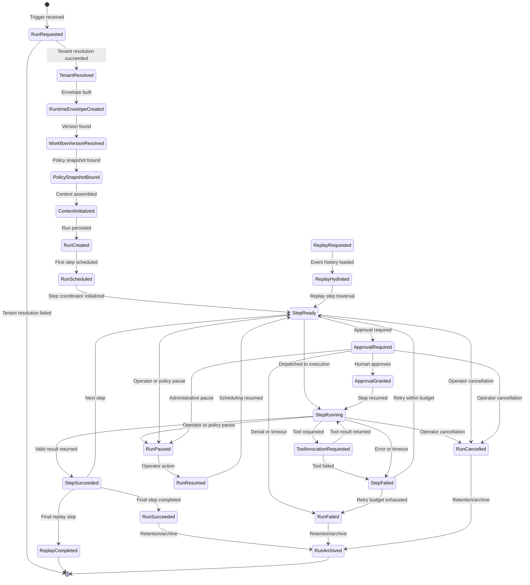
```mermaid
stateDiagram-v2
    [*] --> RunRequested: Trigger received

    RunRequested --> TenantResolved: Tenant resolution succeeded
    RunRequested --> [*]: Tenant resolution failed

    TenantResolved --> RuntimeEnvelopeCreated: Envelope built
    RuntimeEnvelopeCreated --> WorkflowVersionResolved: Version found
    WorkflowVersionResolved --> PolicySnapshotBound: Policy snapshot bound
    PolicySnapshotBound --> ContextInitialized: Context assembled
    ContextInitialized --> RunCreated: Run persisted
    RunCreated --> RunScheduled: First step scheduled
    RunScheduled --> StepReady: Step coordinator initialized

    StepReady --> StepRunning: Dispatched to execution
    StepReady --> ApprovalRequired: Approval required

    StepRunning --> ToolInvocationRequested: Tool requested
    ToolInvocationRequested --> StepRunning: Tool result returned
    ToolInvocationRequested --> StepFailed: Tool failed

    StepRunning --> StepSucceeded: Valid result returned
    StepRunning --> StepFailed: Error or timeout

    ApprovalRequired --> ApprovalGranted: Human approves
    ApprovalRequired --> RunFailed: Denial or timeout
    ApprovalGranted --> StepRunning: Step resumed

    StepSucceeded --> StepReady: Next step
    StepSucceeded --> RunSucceeded: Final step completed

    StepFailed --> StepReady: Retry within budget
    StepFailed --> RunFailed: Retry budget exhausted

    StepRunning --> RunPaused: Operator or policy pause
    StepReady --> RunPaused: Operator or policy pause
    ApprovalRequired --> RunPaused: Administrative pause
    RunPaused --> RunResumed: Operator action
    RunResumed --> StepReady: Scheduling resumed

    StepRunning --> RunCancelled: Operator cancellation
    StepReady --> RunCancelled: Operator cancellation
    ApprovalRequired --> RunCancelled: Operator cancellation

    RunSucceeded --> RunArchived: Retention/archive
    RunFailed --> RunArchived: Retention/archive
    RunCancelled --> RunArchived: Retention/archive

    ReplayRequested --> ReplayHydrated: Event history loaded
    ReplayHydrated --> StepReady: Replay step traversal
    StepSucceeded --> ReplayCompleted: Final replay step
    ReplayCompleted --> [*]

    RunArchived --> [*]
```

### Canonical State Count

| Category | States |
|---|---:|
| Request and initialization states | 8 |
| Step execution states | 6 |
| Approval states | 2 |
| Pause, resume and cancellation states | 3 |
| Terminal states | 3 |
| Replay states | 3 |
| Archive state | 1 |
| **Total unique states** | **24** |

### Required Alignment

The following sections MUST use `24` as the canonical GovernedRun lifecycle count:

- aggregate root invariants;
- field-level enum descriptions;
- lifecycle diagrams;
- domain invariants;
- acceptance criteria;
- footer metadata;
- Codex tests.

### Forbidden Behavior

FORBIDDEN:

- referencing a 23-state GovernedRun lifecycle;
- documenting lifecycle states that are unreachable;
- allowing `RunPaused`, `RunCancelled` or `ToolInvocationRequested` to exist only as informal events;
- allowing Codex to infer transitions not present in the canonical state machine;
- allowing lifecycle diagrams, enum definitions and footer metadata to disagree.

### 6.2 ToolInvocation Lifecycle

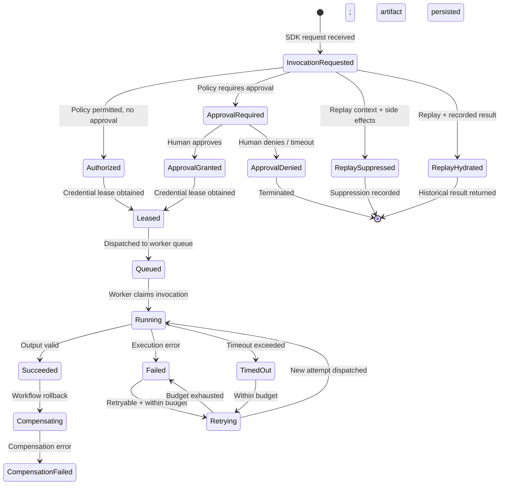
```mermaid
stateDiagram-v2
    [*] --> InvocationRequested: SDK request received
    InvocationRequested --> Authorized: Policy permitted, no approval
    InvocationRequested --> ApprovalRequired: Policy requires approval
    InvocationRequested --> ReplaySuppressed: Replay context + side effects
    InvocationRequested --> ReplayHydrated: Replay + recorded result
    ApprovalRequired --> ApprovalGranted: Human approves
    ApprovalRequired --> ApprovalDenied: Human denies / timeout
    ApprovalDenied --> [*]: Terminated
    Authorized --> Leased: Credential lease obtained
    ApprovalGranted --> Leased: Credential lease obtained
    Leased --> Queued: Dispatched to worker queue
    Queued --> Running: Worker claims invocation
    Running --> Succeeded: Output valid; artifact persisted
    Running --> Failed: Execution error
    Running --> TimedOut: Timeout exceeded
    Failed --> Retrying: Retryable + within budget
    TimedOut --> Retrying: Within budget
    Retrying --> Running: New attempt dispatched
    Retrying --> Failed: Budget exhausted
    Succeeded --> Compensating: Workflow rollback
    Compensating --> CompensationFailed: Compensation error
    ReplaySuppressed --> [*]: Suppression recorded
    ReplayHydrated --> [*]: Historical result returned
```

### 6.3 WorkflowVersion Lifecycle

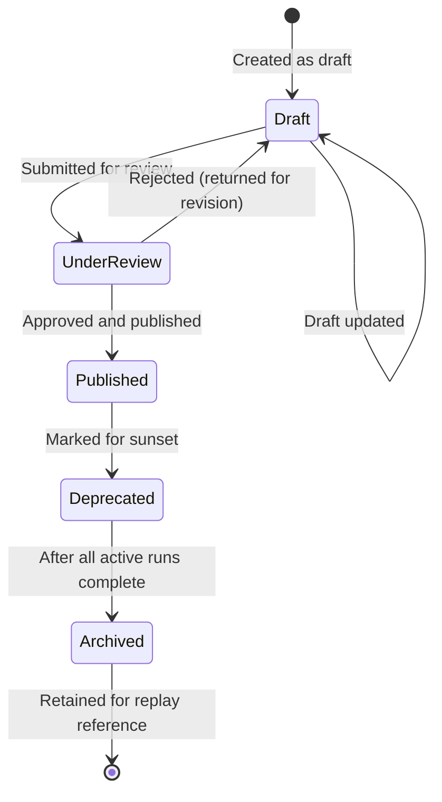
```mermaid
stateDiagram-v2
    [*] --> Draft: Created as draft
    Draft --> Draft: Draft updated
    Draft --> UnderReview: Submitted for review
    UnderReview --> Draft: Rejected (returned for revision)
    UnderReview --> Published: Approved and published
    Published --> Deprecated: Marked for sunset
    Deprecated --> Archived: After all active runs complete
    Archived --> [*]: Retained for replay reference
```

### 6.4 ApprovalRequest Lifecycle

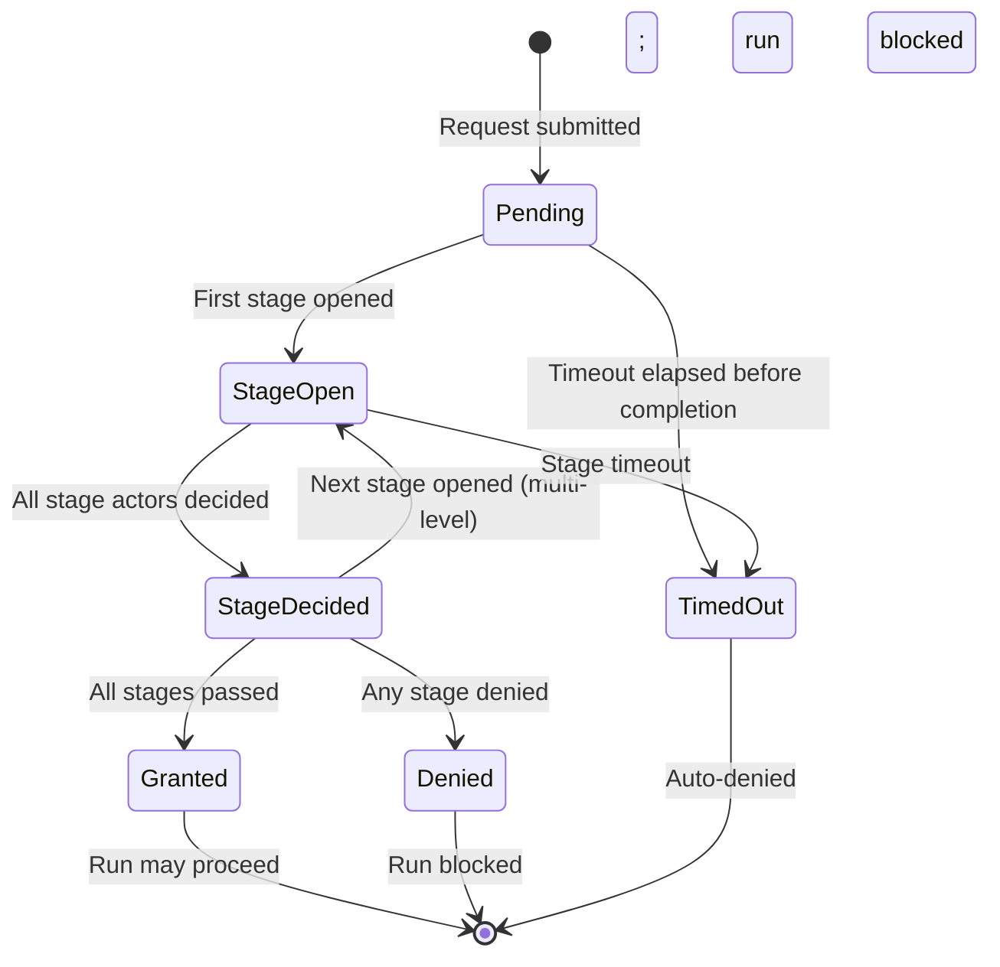
```mermaid
stateDiagram-v2
    [*] --> Pending: Request submitted
    Pending --> StageOpen: First stage opened
    StageOpen --> StageDecided: All stage actors decided
    StageDecided --> StageOpen: Next stage opened (multi-level)
    StageDecided --> Granted: All stages passed
    StageDecided --> Denied: Any stage denied
    Pending --> TimedOut: Timeout elapsed before completion
    StageOpen --> TimedOut: Stage timeout
    Granted --> [*]: Run may proceed
    Denied --> [*]: Run blocked
    TimedOut --> [*]: Auto-denied; run blocked
```

### 6.5 BreakGlassSession Lifecycle

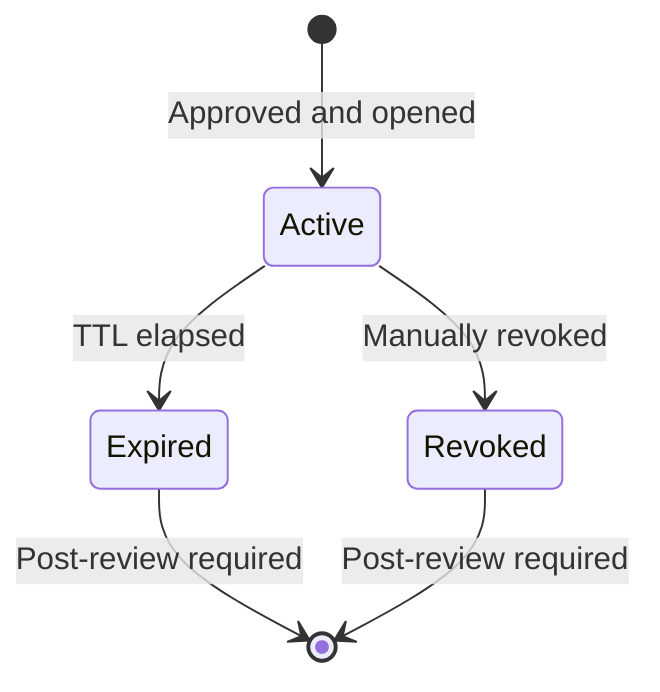
```mermaid
stateDiagram-v2
    [*] --> Active: Approved and opened
    Active --> Expired: TTL elapsed
    Active --> Revoked: Manually revoked
    Expired --> [*]: Post-review required
    Revoked --> [*]: Post-review required
```

### 6.6 CredentialLease Lifecycle

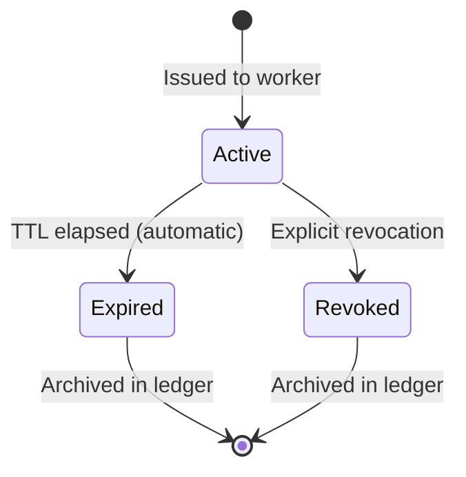
```mermaid
stateDiagram-v2
    [*] --> Active: Issued to worker
    Active --> Expired: TTL elapsed (automatic)
    Active --> Revoked: Explicit revocation
    Expired --> [*]: Archived in ledger
    Revoked --> [*]: Archived in ledger
```

---

## 7. Relationship and ER Diagrams

### 7.1 Tenant / Workspace / Project / Identity

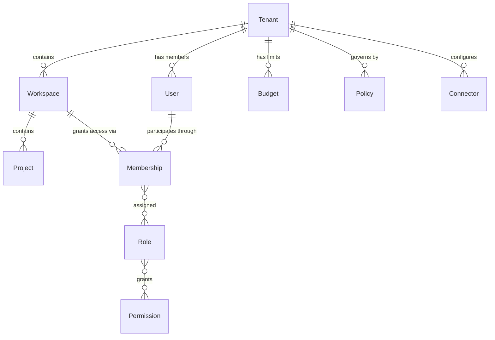
```mermaid
erDiagram
    Tenant ||--o{ Workspace : "contains"
    Tenant ||--o{ User : "has members"
    Workspace ||--o{ Project : "contains"
    Workspace ||--o{ Membership : "grants access via"
    User ||--o{ Membership : "participates through"
    Membership }o--o{ Role : "assigned"
    Role }o--o{ Permission : "grants"
    Tenant ||--o{ Budget : "has limits"
    Tenant ||--o{ Policy : "governs by"
    Tenant ||--o{ Connector : "configures"
```

### 7.2 Workflow Definition

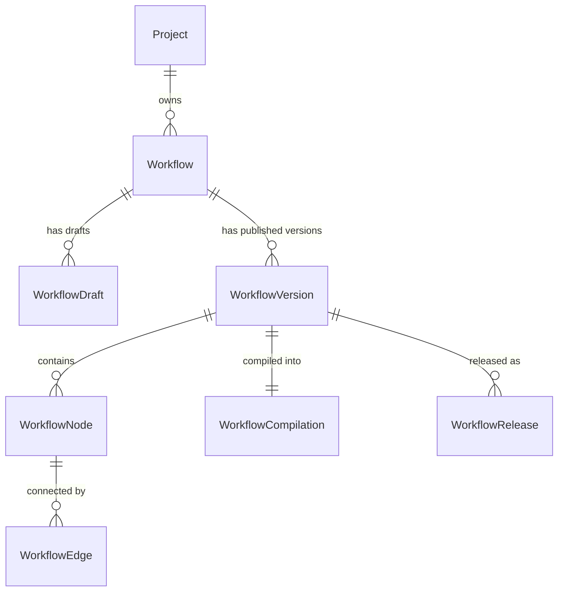
```mermaid
erDiagram
    Workflow ||--o{ WorkflowDraft : "has drafts"
    Workflow ||--o{ WorkflowVersion : "has published versions"
    WorkflowVersion ||--o{ WorkflowNode : "contains"
    WorkflowNode ||--o{ WorkflowEdge : "connected by"
    WorkflowVersion ||--|| WorkflowCompilation : "compiled into"
    WorkflowVersion ||--o{ WorkflowRelease : "released as"
    Project ||--o{ Workflow : "owns"
```

### 7.3 Runtime Execution

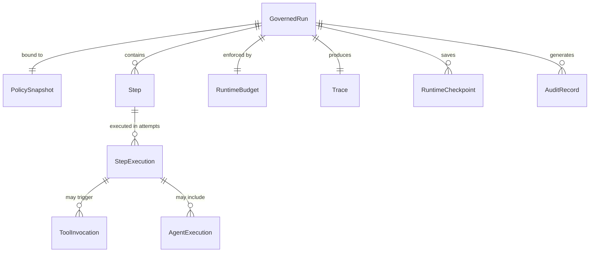
```mermaid
erDiagram
    GovernedRun ||--|| PolicySnapshot : "bound to"
    GovernedRun ||--o{ Step : "contains"
    GovernedRun ||--|| RuntimeBudget : "enforced by"
    GovernedRun ||--|| Trace : "produces"
    GovernedRun ||--o{ RuntimeCheckpoint : "saves"
    Step ||--o{ StepExecution : "executed in attempts"
    StepExecution ||--o{ ToolInvocation : "may trigger"
    StepExecution ||--o{ AgentExecution : "may include"
    GovernedRun ||--o{ AuditRecord : "generates"
```

### 7.4 Tool Runtime and Side Effects

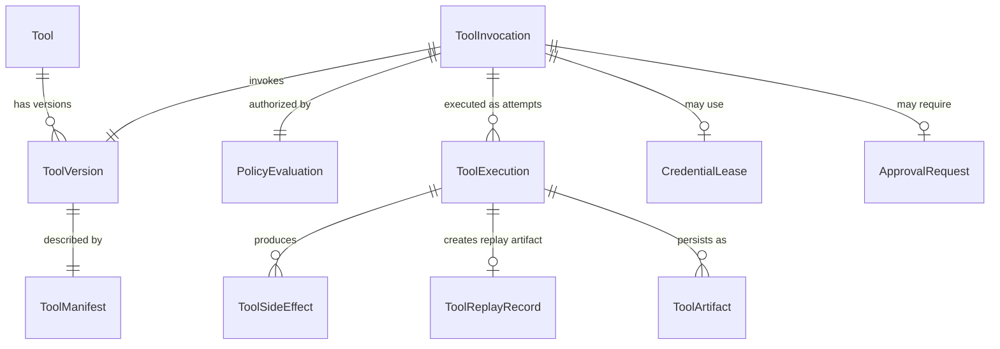
```mermaid
erDiagram
    Tool ||--o{ ToolVersion : "has versions"
    ToolVersion ||--|| ToolManifest : "described by"
    ToolInvocation ||--|| ToolVersion : "invokes"
    ToolInvocation ||--|| PolicyEvaluation : "authorized by"
    ToolInvocation ||--o{ ToolExecution : "executed as attempts"
    ToolExecution ||--o{ ToolSideEffect : "produces"
    ToolExecution ||--o| ToolReplayRecord : "creates replay artifact"
    ToolExecution ||--o{ ToolArtifact : "persists as"
    ToolInvocation ||--o| CredentialLease : "may use"
    ToolInvocation ||--o| ApprovalRequest : "may require"
```

### 7.5 Governance and Approval

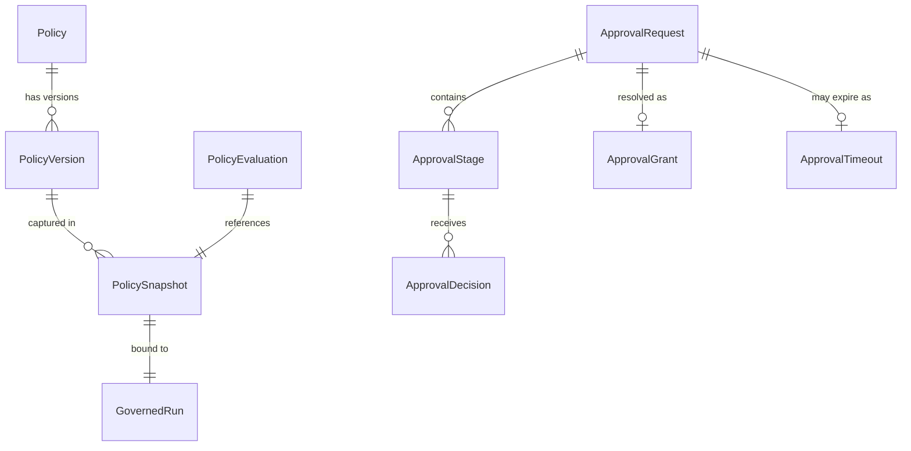
```mermaid
erDiagram
    Policy ||--o{ PolicyVersion : "has versions"
    PolicyVersion ||--o{ PolicySnapshot : "captured in"
    PolicySnapshot ||--|| GovernedRun : "bound to"
    PolicyEvaluation ||--|| PolicySnapshot : "references"
    ApprovalRequest ||--o{ ApprovalStage : "contains"
    ApprovalStage ||--o{ ApprovalDecision : "receives"
    ApprovalRequest ||--o| ApprovalGrant : "resolved as"
    ApprovalRequest ||--o| ApprovalTimeout : "may expire as"
```

### 7.6 Memory and Context

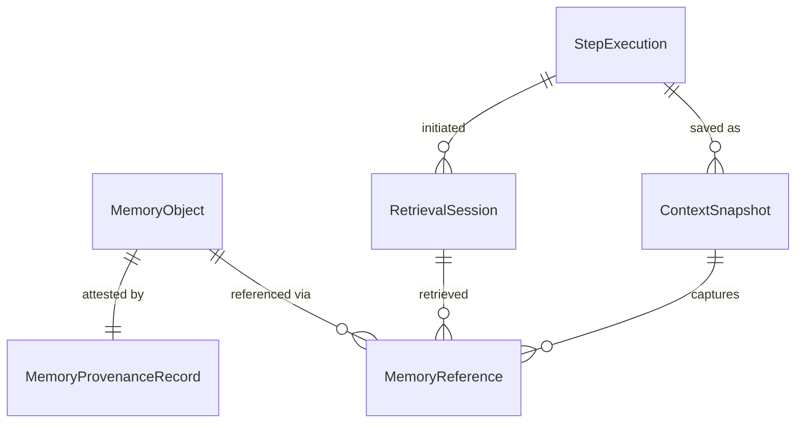
```mermaid
erDiagram
    MemoryObject ||--|| MemoryProvenanceRecord : "attested by"
    MemoryObject ||--o{ MemoryReference : "referenced via"
    RetrievalSession ||--o{ MemoryReference : "retrieved"
    ContextSnapshot ||--o{ MemoryReference : "captures"
    StepExecution ||--o{ RetrievalSession : "initiated"
    StepExecution ||--o{ ContextSnapshot : "saved as"
```

### 7.7 Event / Audit / Observability

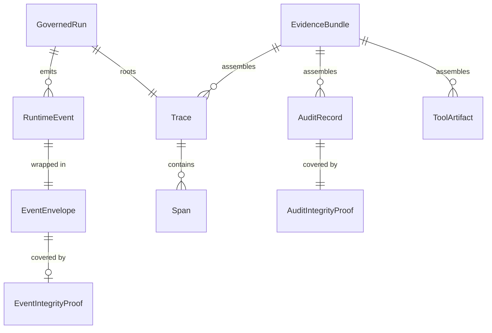
```mermaid
erDiagram
    GovernedRun ||--o{ RuntimeEvent : "emits"
    RuntimeEvent ||--|| EventEnvelope : "wrapped in"
    EventEnvelope ||--o| EventIntegrityProof : "covered by"
    GovernedRun ||--|| Trace : "roots"
    Trace ||--o{ Span : "contains"
    AuditRecord ||--|| AuditIntegrityProof : "covered by"
    EvidenceBundle ||--o{ AuditRecord : "assembles"
    EvidenceBundle ||--o{ Trace : "assembles"
    EvidenceBundle ||--o{ ToolArtifact : "assembles"
```

### 7.8 Replay and Investigation

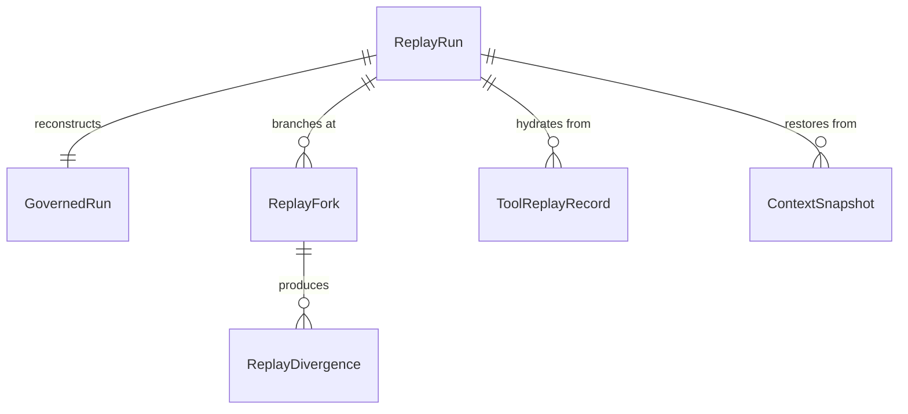
```mermaid
erDiagram
    ReplayRun ||--|| GovernedRun : "reconstructs"
    ReplayRun ||--o{ ReplayFork : "branches at"
    ReplayFork ||--o{ ReplayDivergence : "produces"
    ReplayRun ||--o{ ToolReplayRecord : "hydrates from"
    ReplayRun ||--o{ ContextSnapshot : "restores from"
```

### 7.9 Security Exceptions and Break-Glass

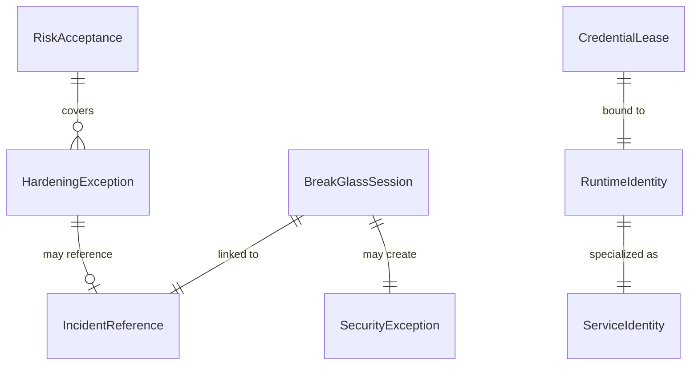
```mermaid
erDiagram
    BreakGlassSession ||--|| IncidentReference : "linked to"
    BreakGlassSession ||--|| SecurityException : "may create"
    RiskAcceptance ||--o{ HardeningException : "covers"
    HardeningException ||--o| IncidentReference : "may reference"
    CredentialLease ||--|| RuntimeIdentity : "bound to"
    RuntimeIdentity ||--|| ServiceIdentity : "specialized as"
```

---

## 8. Event Model

### 8.1 Event Naming Convention

All domain events follow: `{organization}.{bounded_context}.{AggregateRoot}.{EventName}`

Examples:
- `mycelia.runtime.GovernedRun.RunCreated`
- `mycelia.tool.ToolInvocation.ToolExecutionSucceeded`
- `mycelia.governance.ApprovalRequest.ApprovalGranted`
- `mycelia.security.BreakGlassSession.BreakGlassSessionOpened`

### 8.2 EventEnvelope Requirements

Every event MUST be wrapped in an EventEnvelope (see §5.17) containing:
- A unique monotonic event_id (ULID)
- tenant_id (non-nullable)
- trace_id, span_id (OTel propagation)
- correlation_id, causation_id (lineage)
- previous_event_hash + event_hash (hash-chain integrity per stream)
- is_replay flag (replay telemetry isolation)
- event_schema_version (CloudEvents v1.0 compatibility recommended)

### 8.3 Transactional Domain Event Commit Boundary

MYCELIA MUST use a transactional domain event commit boundary for every authoritative aggregate mutation.

A domain mutation is not complete merely because the database row was updated. It is complete only when the corresponding domain event intent has also been durably recorded.

### Transactional Outbox Rule

Every authoritative aggregate mutation MUST commit the following in the same database transaction or equivalent atomic persistence boundary:

- aggregate mutation record;
- domain event outbox record;
- tenant_id;
- aggregate_id;
- aggregate_type;
- event_type;
- correlation_id;
- causation_id;
- trace_id when available;
- schema_version;
- audit intent when applicable.

The EventPublisher MAY publish asynchronously from the outbox, but the domain event intent MUST exist before the mutation is considered committed.

### Commit Model

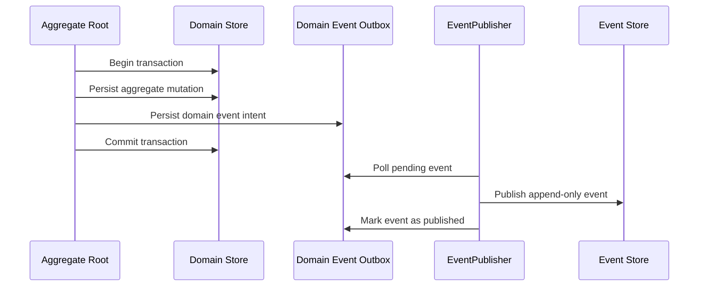
```mermaid
sequenceDiagram
    participant AR as Aggregate Root
    participant DB as Domain Store
    participant OB as Domain Event Outbox
    participant EP as EventPublisher
    participant ES as Event Store

    AR->>DB: Begin transaction
    AR->>DB: Persist aggregate mutation
    AR->>OB: Persist domain event intent
    AR->>DB: Commit transaction
    EP->>OB: Poll pending event
    EP->>ES: Publish append-only event
    EP->>OB: Mark event as published
```

### Completion Semantics

| Stage | Meaning | Domain Status |
|---|---|---|
| `mutation_requested` | Command accepted but not committed | Not authoritative |
| `mutation_committed_event_pending` | Aggregate mutation and outbox intent committed | Authoritative but operationally degraded |
| `mutation_committed_event_published` | Aggregate mutation and event publication complete | Fully complete |

### Rules

- No authoritative aggregate mutation may commit without a domain event outbox record.
- Event publication failure MUST NOT erase the aggregate mutation.
- Event publication failure MUST leave an outbox record for retry.
- Replay MUST prefer published event history, but recovery MAY reconcile from committed outbox records.
- Persistent outbox backlog for critical events MUST trigger an operational incident.
- Critical audit, security, policy and tenant-boundary events MUST have priority publication behavior.
- Outbox records MUST be idempotently publishable.

### Forbidden Behavior

FORBIDDEN:

- mutating aggregate state and publishing the event only in memory;
- treating event publication failure as harmless telemetry degradation;
- deleting outbox records before successful event publication;
- allowing replay-critical mutations to exist without outbox evidence;
- allowing bounded contexts to emit domain events directly without aggregate mutation ownership;
- allowing Codex to implement aggregate mutation and event publication as unrelated operations.

### 8.4 Event Integrity Requirements

Every event in MYCELIA MUST be integrity-verifiable.

Append-only storage is necessary, but it is not sufficient. MYCELIA requires cryptographic integrity metadata so that event tampering, deletion, reordering or replay corruption can be detected.

### Event Hashing Rule

Every EventEnvelope MUST include:

- `previous_event_hash`;
- `event_hash`;
- `event_schema_version`;
- `tenant_id`;
- `event_id`;
- `correlation_id`;
- `causation_id`;
- `emitted_at`.

The `event_hash` MUST be computed from a canonical serialization of the EventEnvelope and payload.

### Event Hash Formula

```text
event_hash = SHA-256(
  previous_event_hash +
  event_id +
  tenant_id +
  event_type +
  event_schema_version +
  subject_id +
  correlation_id +
  causation_id +
  emitted_at +
  canonical_JSON(data)
)
```

### EventIntegrityProof

MYCELIA SHOULD produce periodic EventIntegrityProof records for critical event streams.

An EventIntegrityProof SHOULD include:

- proof_id;
- tenant_id;
- stream_id;
- first_event_id;
- last_event_id;
- event_count;
- hash_chain_head;
- merkle_root;
- generated_at;
- generated_by;
- signature;
- external_anchor_ref when applicable.

### Rules

- RuntimeEvent records MUST NOT be modified after publication.
- Event ordering MUST be deterministic per aggregate stream.
- Missing, duplicated or reordered events MUST fail integrity verification.
- EventIntegrityProof records MUST be immutable after creation.
- Replay MUST verify event integrity before using an event stream as authoritative.
- Critical runtime, security, policy, approval and tool side-effect event streams SHOULD receive integrity proofs.
- Integrity verification failure MUST create a SecurityException or operational incident, depending on impact.

### Forbidden Behavior

FORBIDDEN:

- relying only on database permissions for event integrity;
- allowing events to be updated to “fix” state;
- deleting events from replay-relevant streams;
- reordering events after publication;
- producing ReplayRun from an event stream that failed integrity verification;
- allowing Codex to implement EventEnvelope without hash-chain fields.

### 8.5 Canonical Event Table by Domain

| Change Type | Version Increment | Compatibility | Replay Impact |
|---|---|---|---|
| Add optional field | Minor | Backward-compatible | None |
| Add required field with default | Minor | Backward-compatible | Old events use default |
| Remove field | Major | Breaking | FORBIDDEN before event retention expires |
| Change field type | Major | Breaking | FORBIDDEN if replay-relevant |
| Rename field | Major | Breaking | Provide mapping adapter |
| Change semantic meaning of field | Major | Breaking | Requires migration strategy |

### 8.6 Canonical Event Table by Domain

| Domain | Event | Producer | Replay Behavior | Audit Level |
|---|---|---|---|---|
| Tenant | TenantCreated, TenantSuspended, TenantArchived | RunManager | Not replayed | High |
| Runtime | RunCreated, RunScheduled, RunSucceeded, RunFailed, RunCancelled | RunManager | Replayed from history | Critical |
| Step | StepReady, StepStarted, StepSucceeded, StepFailed, StepRetrying | StepCoordinator | Replayed from history | High |
| Tool | ToolInvocationRequested, ToolExecutionStarted, ToolExecutionSucceeded, ToolExecutionFailed, ToolSideEffectRegistered | ToolInvocationGateway | Suppressed/Hydrated | Critical |
| Governance | PolicySnapshotCreated, PolicyEvaluated, PolicyViolationDetected | PolicyDecisionGateway | Historical snapshot used | Critical |
| Approval | ApprovalRequested, ApprovalDecisionMade, ApprovalGranted, ApprovalDenied, ApprovalTimedOut | ApprovalGateCoordinator | Historical decision preserved | Critical |
| Memory | MemoryObjectCreated, MemoryObjectArchived, MemoryPurgeCompleted | MemoryAccessGateway | Context snapshot used | High |
| Security | CredentialLeaseGranted, CredentialLeaseRevoked, SecurityExceptionCreated, BreakGlassSessionOpened, TenantBoundaryViolation | Security Plane | Preserved; replay excludes credentials | Critical |
| Replay | ReplayRequested, ReplayHydrated, ReplayCompleted, ReplayDivergenceDetected | ReplayCoordinator | N/A (generates replay-namespace events) | High |
| Budget | BudgetUsageRecorded, BudgetCeilingReached, BudgetHaltTriggered | RuntimeBudgetManager | Replay records usage as context | High |
| Audit | AuditRecordCreated | AuditRecorder | Not replayed (is itself the ledger) | Critical |

---

## 9. Source of Truth Matrix

| Entity | Owning Context | Source of Truth | Mutability Class | Persistence | Append-Only | Replay-Authoritative | Tenant Scope | Retention | Deletion Rule | Audit Required |
|---|---|---|---|---|---|---|---|---|---|---|
| Tenant | Tenant & Org | Tenant registry | Mutable Operational | Relational DB | No | No | Global | Indefinite | Soft-delete only | Yes |
| Workspace | Workspace & Project | Config DB | Mutable Operational | Relational DB | No | No | Tenant | Indefinite | Soft-delete only | Yes |
| Project | Workspace & Project | Config DB | Mutable Operational | Relational DB | No | No | Workspace | Indefinite | Soft-delete only | Yes |
| User | Identity & Access | IAM | Mutable Operational | IAM + Relational | No | No | Tenant | Per GDPR/LGPD | Erasure on request | Yes |
| WorkflowVersion | Workflow Definition | Workflow registry | Immutable Versioned | Relational + Artifact | No | Yes | Project | Indefinite (replay) | Archive only | Yes |
| GovernedRun | Runtime Execution | Event store | Immutable Ledger | Event store + State DB | Yes | Yes | Project | 1-7 years | Archive (never delete) | Yes |
| Step | Step Execution | Event store | Immutable Ledger | Event store | Yes | Yes | Project | With run | Archive | Yes |
| StepExecution | Step Execution | Event store | Immutable Ledger | Event store | Yes | Yes | Project | With run | Archive | Yes |
| ToolManifest | Tool Runtime | Tool registry | Immutable Versioned | Relational + Artifact | No | Yes | Tenant/Global | Indefinite | Archive only | Yes |
| ToolInvocation | Tool Runtime | Event store + State | Immutable Ledger | Event store + State | Yes | Yes | Project | With run | Archive | Yes |
| ToolExecution | Tool Runtime | Event store | Immutable Ledger | Event store | Yes | Yes | Project | With run | Archive | Yes |
| ToolSideEffect | Tool Runtime | Audit ledger | Immutable Ledger | Audit store | Yes | Yes | Project | Indefinite | Archive only | Yes |
| ToolReplayRecord | Tool Runtime | Replay store | Replay Artifact | Object storage | No | Yes | Project | Per replay retention | Archive | Yes |
| PolicyVersion | Governance | Policy store | Immutable Versioned | Relational | No | Yes | Tenant | Indefinite | Archive only | Yes |
| PolicySnapshot | Governance | State DB | Immutable Ledger | State DB | No | Yes | Project | With run | Archive | Yes |
| PolicyEvaluation | Governance | Audit ledger | Immutable Ledger | Audit store | Yes | Yes | Project | With run | Archive | Yes |
| ApprovalDecision | Approval | Audit ledger | Immutable Ledger | Audit store | Yes | Yes | Project | Indefinite | Archive only | Yes |
| AuditRecord | Observability & Audit | Audit ledger | Immutable Ledger (hash-chained) | Append-only audit store | Yes | No | Tenant | >= 7 years (regulated) | No deletion permitted | N/A |
| RuntimeEvent | Event Spine | Event store | Immutable Ledger | Event broker | Yes | Yes | Project | Per stream retention | No deletion permitted | N/A |
| MemoryObject | Memory & Context | Memory store | Immutable after creation | Memory store | No | Yes | Tenant | Per DataRetentionPolicy | Erasure on request (GDPR) | Yes |
| ContextSnapshot | Memory & Context | Checkpoint store | Immutable | Checkpoint store | No | Yes | Project | With run | Archive | No |
| CredentialLease | Security & Trust | Secret manager | Revocable Operational | Secret manager ledger | No | No | Tenant | Short-lived | Expire/Revoke | Yes |
| BreakGlassSession | Security & Trust | Security ledger | Immutable Ledger | Security audit store | Yes | No | Tenant | Indefinite | Archive only | Yes |
| ReplayRun | Replay | Replay store | Immutable Ledger | Replay store | Yes | No | Project | Per replay retention | Archive | Yes |
| EvidenceBundle | Artifact & Evidence | Evidence store | Immutable after assembly | Evidence store | No | No | Tenant | Per compliance policy | Archive only | Yes |
| BudgetUsage | Budget & Quota | Budget ledger | Immutable Ledger | Budget store | Yes | Yes | Project | With run | Archive | Yes |

---

## 10. Mutability and Persistence Classes

### 10.1 Immutable Ledger

**Meaning:** Records are written once and never modified. All writes are append-only. No UPDATE or DELETE operations are permitted.

**Examples:** RuntimeEvent, AuditRecord, ToolSideEffect, ToolInvocation, StepExecution, ApprovalDecision, BudgetUsage, PolicyEvaluation, BreakGlassSession

**Allowed mutation:** New records appended. No existing records changed.

**Forbidden:** UPDATE, DELETE, or replacement of existing records.

**Retention:** Configurable per compliance policy; minimum 1 year for audit records; minimum 7 years for regulated industries.

**Replay implication:** Replay-authoritative; replay re-traverses in original event order.

**Audit implication:** Every record is itself an audit artifact. AuditRecord adds hash-chain integrity.

### 10.2 Immutable Versioned Definition

**Meaning:** Once a version is published/activated, the version record is immutable. New versions can be created; old versions are retained.

**Examples:** WorkflowVersion, PolicyVersion, ToolManifest, ToolVersion, ConfigurationVersion

**Allowed mutation:** Status field only (e.g., published → deprecated → archived). Never the content.

**Forbidden:** Content modification of any published version.

**Retention:** Indefinite (required for replay of historical runs).

**Replay implication:** Replay uses the exact version that was active at run creation.

### 10.3 Mutable Operational Configuration

**Meaning:** Records reflect current operational configuration and may be updated as configuration changes. Changes are tracked via versioning or event audit.

**Examples:** Tenant, Workspace, Project, User, Role, Budget, Connector, FeatureFlag

**Allowed mutation:** All fields except primary identifiers.

**Forbidden:** Mutation of primary keys or tenant_id.

**Retention:** Indefinite (soft-delete only).

**Replay implication:** Non-authoritative; replay uses snapshot from original run context.

### 10.4 Mutable Runtime State

**Meaning:** Represents current execution state that changes during active operation. Backed by event sourcing; state is derived from events.

**Examples:** GovernedRun (current status), StepExecution (current status), ToolInvocation (current status)

**Allowed mutation:** Status transitions only, via state machine.

**Forbidden:** Direct state mutation bypassing state machine; backward transitions.

**Replay implication:** Derived from event replay; do not read directly as authoritative.

### 10.5 Derived Projection

**Meaning:** Read models and analytics views computed from authoritative events. Not authoritative.

**Examples:** Run status dashboard, workflow execution analytics, SLO metrics, vector indexes

**Allowed mutation:** Rebuilt from events at any time.

**Forbidden:** Use as input to governance decisions or replay reconstruction.

**Replay implication:** Must be rebuilt from event replay; never used directly.

### 10.6 Ephemeral Runtime State

**Meaning:** Transient state that exists only during active execution and is not persisted beyond the execution window.

**Examples:** RuntimeContext (in-memory), ContextWindow (working context), active worker state

**Allowed mutation:** Any.

**Forbidden:** Using as sole state source (must be backed by checkpoints).

**Replay implication:** Not replayable; replaced by ContextSnapshot on resume/replay.

### 10.7 Audit-Only Ledger

**Meaning:** Written by operations as evidence; never the driver of business logic. Append-only with cryptographic integrity.

**Examples:** AuditRecord (with hash chain), ObservationEvent

**Replay implication:** Not replay-authoritative; preserved as evidence.

### 10.8 Replay Artifact

**Meaning:** Artifacts created to support replay operations. Immutable after creation. Used to hydrate suppressed steps.

**Examples:** ToolReplayRecord, ContextSnapshot (when used for replay), RuntimeCheckpoint

**Retention:** Must be retained as long as any ReplayRun references them.

### 10.9 Security Exception Record

**Meaning:** Records of policy deviations, break-glass sessions, and risk acceptances. Immutable, high-priority retention.

**Examples:** SecurityException, BreakGlassSession, RiskAcceptance

**Retention:** Indefinite; MUST be included in regulatory evidence bundles.

### 10.10 Evidence Artifact

**Meaning:** Assembled forensic artifacts for incident investigation. Immutable after assembly.

**Examples:** EvidenceBundle, ToolArtifact (provenance-bearing), Snapshot

**Retention:** Per compliance and legal hold policy.

---

## 11. Tenant Isolation and Security Semantics

### 11.1 Mandatory tenant_id Rules

- `tenant_id` MUST be present and non-null on every domain entity except explicitly declared global singletons.
- `tenant_id` is immutable after creation on all entities.
- Every API endpoint MUST derive `tenant_id` from the caller's authenticated credential, not from request payload.
- No query may return data across tenant boundaries without explicit and audited cross-tenant authorization.

### 11.2 Database Enforcement

PostgreSQL Row-Level Security (RLS) MUST be enabled on every table containing tenant-scoped data. The RLS policy MUST reject rows where `tenant_id != current_setting('app.current_tenant_id')::uuid`. Service accounts MUST NOT use the database superuser role. Each service MUST connect with a role that has RLS applied.

```sql
-- Example RLS policy
CREATE POLICY tenant_isolation_policy ON governed_runs
  USING (tenant_id = current_setting('app.current_tenant_id')::uuid);
```

Codex MUST generate and verify RLS policies for every tenant-scoped table as part of the migration pipeline.

### 11.3 Workspace and Project Scoping

- Resources scoped to a Workspace are only accessible to users with a valid Membership in that Workspace.
- Resources scoped to a Project are only accessible to users with Project-level access within the parent Workspace.
- Cross-workspace access within the same tenant requires explicit policy binding. It MUST produce an audit record.

### 11.4 Global Entities

The following entities are allowed to exist without a tenant_id and are accessible globally:

- ModelProvider (global catalog of model adapters; tenant-configures but doesn't own)
- ExternalSystem (global catalog of external system types; connector is tenant-scoped)
- FeatureFlag definitions (platform-level flags; enablement is tenant-scoped)

### 11.5 Tenant Boundary Violation Response

Any detected cross-tenant access MUST:
1. Abort the operation immediately.
2. Emit a `TenantBoundaryViolation` event to the security event stream.
3. Create a SecurityException record.
4. Alert the security monitoring pipeline.
5. NOT produce a recoverable error that the caller can retry.

### 11.6 Encryption

- Tenant data MUST be encrypted at rest (AES-256 minimum).
- Tenant data MUST be encrypted in transit (TLS 1.3 minimum).
- For regulated tenants, customer-managed encryption keys (CMEK) SHOULD be supported via the secret manager.

---

## 12. Replay Semantics

### 12.1 Replay-Authoritative Sources

The following are authoritative for replay reconstruction:

| Source | Why Authoritative |
|---|---|
| EventEnvelope stream (original run) | Immutable, hash-chained; the canonical execution record |
| WorkflowVersion (original version_id) | Immutable after publication; determines deterministic control flow |
| PolicySnapshot (original snapshot_id) | Immutable after binding; determines authorization decisions |
| ContextSnapshot (original run checkpoints) | Immutable point-in-time captures of assembled context |
| ToolReplayRecord (recorded tool outputs) | Immutable substitutes for live tool execution |
| ApprovalDecision records | Immutable; replay uses historical decisions |

### 12.2 Replay-Derived (Non-Authoritative)

The following are rebuilt during replay but are not authoritative:

- Vector search results (may differ from original due to index changes)
- ContextWindow (rebuilt from ContextSnapshot)
- RunState projections (rebuilt from events)
- Dashboard metrics (rebuilt from events)

### 12.3 What Must Be Frozen

Before a ReplayRun begins:
- The workflow_version_id MUST be resolved from the original GovernedRun record.
- The policy_snapshot_id MUST be resolved from the original GovernedRun record.
- The original ContextSnapshot references MUST be verified as accessible.
- The ToolReplayRecords for all side-effectful steps MUST be verified as available.

### 12.4 ReplayFork and ReplayDivergence

A ReplayFork is created when the replay execution reaches a point where behavior diverges from the original. A ReplayDivergence records:
- The specific step_id and event where divergence occurred.
- The original outcome vs. the replay outcome.
- The divergence_type (unexpected_output, missing_artifact, policy_change, tool_version_mismatch).

Divergence MUST be detected, recorded, and surfaced to the operator. Replay MUST NOT silently continue through a divergence.

### 12.5 Replay Safety Invariants

- Replay MUST NOT use production credentials. CredentialLease issuance is BLOCKED in replay context.
- Replay MUST NOT produce new persistent side effects in the original event lineage.
- Replay telemetry MUST route to the isolated replay observability namespace.
- Replay events MUST carry `is_replay: true` in their EventEnvelope.
- Replay MUST NOT produce AuditRecords in the production audit ledger (replay audit records go to the replay-scoped evidence store).
- The original GovernedRun record MUST NOT be modified during or after replay.

---

## 13. Memory and Context Authority

### 13.1 Authority Levels

Context information is classified into five authority levels. Lower-authority content MUST NEVER override higher-authority state.

| Level | Name | Examples | May Override | MUST NOT Override |
|---|---|---|---|---|
| 0 | Security-Critical | Policy decisions, approval records, BreakGlassSession records | Nothing | Everything |
| 1 | Canonical Authoritative | GovernedRun state, PolicySnapshot, WorkflowVersion, ApprovalDecision, AuditRecord | Derived projections only | Policy decisions, security records |
| 2 | Replay-Safe Derived | ContextSnapshot (from original run), RuntimeCheckpoint, ToolReplayRecord | Projections, caches | Canonical state |
| 3 | Assistive | Retrieved memory objects (Trusted source), RetrievalSession results, agent rationale | None | Level 1 or Level 2 |
| 4 | Untrusted | Tool output from external systems, user-uploaded documents, web retrieval, RAG corpus content | None | Anything above Level 4 |

### 13.2 Memory Poisoning Protection

MemoryObject records created from untrusted sources (data_source_class = Untrusted or Unverified) MUST:
- Carry an explicit `data_source_class = Untrusted` marker.
- NOT be promoted to Level 1 authority without explicit operator validation.
- Be structurally separated in the context assembly (spotlighting/delimiters) before model consumption per OWASP LLM01:2025 and Hines et al. (arXiv:2403.14720).
- NOT be able to modify workflow state, tool invocation authorization, or approval decisions.

### 13.3 No Embedding as Authority

Vector indexes and embedding-based retrievals are Level 3 Assistive at best. The following are FORBIDDEN:
- Using embedding similarity results to authorize a tool invocation.
- Using RAG-retrieved content as a policy decision input without explicit policy engine evaluation.
- Using semantic search results to modify GovernedRun state.
- Treating hallucinated memory persistence (model claiming to have stored something) as a MemoryObject write.

### 13.4 Context Snapshot Requirements

ContextSnapshot records used for replay MUST:
- Be taken before any external tool call or model invocation that produces side effects.
- Include the exact set of MemoryReference IDs included in the assembled context.
- Include the WorkflowVersion.content_hash and PolicySnapshot.snapshot_id.
- Be immutable after creation.

---

## 14. Tool, Connector and Side-Effect Domain Model

### 14.1 Tool Registry and Trust Chain

Every tool that executes in MYCELIA MUST pass through the trust chain before execution:

```
Tool submission → ToolManifest signing (cosign/Ed25519) → Security review
→ SBOM verification → Operator enablement → ToolVersion.status = enabled
```

A tool that has not completed this chain MUST NOT execute. The ToolInvocationGateway MUST verify the manifest signature and content hash before dispatching.

### 14.2 Side-Effect Classification

Side effects are classified by their operational impact:

| Class | Examples | Approval Required | Idempotency Required | Replay Behavior | Compensation Required |
|---|---|---|---|---|---|
| NoSideEffect | Pure computation, data transformation | No | No | execute_freely | No |
| ReadOnlyInternal | Memory read, run history query | No | Recommended | execute_freely | No |
| ReadOnlyExternal | Web search, public API read | No | Recommended | suppress_and_hydrate | No |
| InternalWrite | Memory write, artifact creation | No | Yes | suppress_and_hydrate | Conditional |
| ExternalWrite | REST API write, email, webhook | Conditional | Yes | suppress_and_hydrate | Yes |
| DestructiveInternal | Purge run data, delete memory | Yes | Yes | suppress | Yes |
| DestructiveExternal | Delete external record | Yes | Yes | suppress | Yes |
| FinancialImpact | Payment, billing, subscription | Yes | Yes | suppress | Yes |
| LegalImpact | Contract, legal filing | Yes | Yes | suppress | Yes |
| HumanNotification | Email, Slack, SMS | No | Yes (dedup) | suppress | Conditional |
| DataExport | Export to external storage | Yes | Yes | suppress | Yes |
| CredentialUse | OAuth, certificate use | No | Yes | suppress_and_hydrate | No |
| CodeExecution | Code interpreter, script runner | Conditional | Yes | suppress_and_hydrate | Conditional |

### CodeExecution Enforcement Rule

`CodeExecution` is not a low-risk capability.

Even when code execution is sandboxed, it MAY read, transform, generate, export or mutate sensitive data depending on its inputs, filesystem access, network access and tool bindings.

Therefore, `CodeExecution` MUST be treated as a conditional approval capability.

Approval, sandbox class and egress controls MUST be determined by:

- tenant policy;
- data classification;
- network access;
- filesystem access;
- credential access;
- side-effect potential;
- artifact export behavior;
- whether generated code can affect runtime state.

### Rules

- CodeExecution MUST run inside an approved sandbox profile.
- CodeExecution MUST NOT access raw credentials.
- CodeExecution MUST NOT perform unrestricted network egress.
- CodeExecution MUST produce auditable artifacts.
- CodeExecution outputs are untrusted until validated.
- CodeExecution used during replay MUST NOT access production systems or live credentials.

### Forbidden Behavior

FORBIDDEN:

- treating CodeExecution as automatically safe because it is sandboxed;
- allowing CodeExecution with unrestricted network access;
- allowing CodeExecution to write memory without explicit permission;
- allowing CodeExecution to mutate runtime state directly;
- allowing CodeExecution artifacts to bypass validation;
- allowing CodeExecution to execute during replay with live credentials.

### 14.3 Idempotency Requirements

For any tool with side_effect_class above ReadOnlyInternal:
- The ToolInvocation MUST carry an idempotency_key before dispatch.
- The idempotency_key is derived from: `sha256(run_id + ":" + step_id + ":" + tool_version_id + ":" + attempt_number)`.
- The ToolInvocationGateway MUST check the idempotency key against the deduplication store before execution.
- On duplicate key detection, the gateway MUST return the cached result without re-execution.

### 14.4 Credential Leasing for Tools

Tools MUST NOT receive raw credential values. The flow is:
1. ToolManifest declares `required_secrets: [{ref: "search_api_key", scope: "tenant"}]`.
2. ToolInvocationGateway requests a CredentialLease from the Security Plane.
3. The CredentialLease carries a reference path and a TTL (max 1 hour for tool execution).
4. The worker fetches the actual credential value via a single-use lease fetch from the secret manager.
5. The worker uses the credential in memory only during execution.
6. On execution completion, the CredentialLease is revoked.

### 14.5 Connector and External System Isolation

- Connectors are tenant-scoped. A connector's credential_lease_ref references a CredentialLease, never a raw credential.
- A connector created for tenant A MUST NOT be accessible by tenant B.
- All external calls made through a Connector MUST produce a ToolSideEffect record.
- ExternalSystem definitions (global catalog) are accessible across tenants; Connector instances (configuration) are tenant-private.

---

## 15. Governance, Policy and Approval Domain Model

### 15.1 Why PolicySnapshot Is Required

PolicyVersion defines what the policy says. PolicySnapshot captures which PolicyVersions were active at the moment a GovernedRun was created. This distinction is critical:

- Policy changes after run creation MUST NOT affect in-flight runs.
- Replay MUST use the historical PolicySnapshot, not current policy state.
- Audit investigations can prove what policy governed a specific run.

The PolicySnapshot is bound immutably to the GovernedRun at creation time and carries a `content_hash` of the included PolicyVersions for integrity verification.

### 15.2 Policy Evaluation Fail-Closed Rule

If the PolicyDecisionGateway is unavailable:
- ALL policy-governed operations MUST block.
- The operation MUST NOT proceed on the assumption of "best effort" permission.
- A `PolicyEngineUnavailable` event MUST be emitted.
- The caller MUST receive a structured `PolicyEvaluationFailed` error.

There is no fail-open mode. A cognitive runtime without policy enforcement is not a governed runtime.

### 15.3 Self-Approval Prohibition

Self-approval is FORBIDDEN at the domain level. The ApprovalDecision entity MUST enforce:
- `approver_id != requester_id` (the person who requested the approval cannot approve it).
- `is_self_approval` field MUST always be `false`.
- The Approval domain service MUST reject any ApprovalDecision where approver_id matches any stage's requester.

### 15.4 Break-Glass Domain Requirements

BreakGlassSession is a formal domain entity because break-glass access MUST be:
1. Linked to an active IncidentReference (MUST NOT be granted without an incident).
2. Time-bounded by a TTL (MUST expire; maximum 4 hours).
3. Approved by a second authorized actor (MUST NOT be self-approved).
4. Logged at command level (all commands executed during the session are recorded).
5. Reviewed post-session (post-review is a domain obligation, not optional).

### 15.5 Policy Ties to RuntimeEnvelope

The `policy_snapshot_id` in the GovernedRun and all child ToolInvocations MUST reference the same PolicySnapshot that was bound at run creation. Downstream operations MUST NOT create new policy snapshots within an in-flight run. The policy_snapshot_id in the RuntimeEnvelope propagates to every gateway decision point.

---

## 16. Observability, Audit and Evidence Model

### 16.1 Trace Hierarchy

```
RunTrace (trace_id)
└── RunSpan (run_id)
    ├── PolicyEvaluationSpan
    ├── ContextAssemblySpan
    └── StepSpan (step_id)
        ├── PolicyEvaluationSpan (step-level)
        ├── AgentExecutionSpan
        │   └── ModelInvocationSpan
        ├── ToolInvocationSpan (invocation_id)
        │   ├── CredentialLeaseSpan
        │   ├── SandboxExecutionSpan
        │   └── ArtifactPersistenceSpan
        └── ApprovalSpan (if required)
```

### 16.2 Required Span Attributes

Every span MUST include:
- `tenant_id` (non-negotiable)
- `run_id` (where applicable)
- `step_id` (where applicable)
- `trace_id`, `span_id`, `parent_span_id`
- `operation_name`
- `started_at`, `ended_at`, `duration_ms`
- `outcome` (success, failure, partial)

### 16.3 Audit Record Tamper Evidence

AuditRecord implements SHA-256 hash-chain integrity:

```
record_hash = SHA-256(
  previous_hash +
  audit_record_id +
  tenant_id +
  operation_type +
  actor_id +
  occurred_at +
  outcome +
  canonical_JSON(details)
)
```

Periodic Merkle-tree checkpoints are produced over batches of AuditRecords. The Merkle root is signed with Ed25519 and anchored to an external timestamp authority. This approach satisfies SEC Rule 17a-4 (2022 amendment) which recognizes "hash chains, digital signatures, and Merkle trees" as equivalent to WORM storage for audit trail purposes.

### 16.4 Sampling Rules

- AuditRecord events: MUST NOT be sampled. 100% durability required.
- SecurityException and TenantBoundaryViolation events: MUST NOT be sampled.
- BreakGlassSession events: MUST NOT be sampled.
- Governance events (PolicyEvaluated, ApprovalDecisionMade): MUST NOT be sampled.
- ToolSideEffect events: MUST NOT be sampled.
- Operational telemetry (ObservationEvent, routine step spans): MAY be sampled at operator-configured rates.

### 16.5 EvidenceBundle Assembly

An EvidenceBundle is assembled when an incident investigation requires forensic evidence. The bundle MUST contain:
- incident_reference_id
- All trace_ids for affected runs
- All run_ids for affected executions
- All relevant AuditRecord IDs (not content directly, for privacy)
- All ToolSideEffect IDs for affected tool executions
- PolicySnapshot IDs in effect during the incident
- ApprovalDecision IDs for any approvals during the incident
- BreakGlassSession IDs if any were active
- All artifact references for tool outputs
- Operator action log from the incident response timeline

The EvidenceBundle is IMMUTABLE after assembly. Additional evidence is added as supplemental bundles, not by modifying the original.

---

## 17. Domain Invariants

### 17.1 Identity Invariants (1–10)

1. Every entity MUST have a globally unique, immutable primary identifier (ULID format recommended).
2. Every runtime entity MUST carry `tenant_id` as a non-nullable, immutable field.
3. No primary identifier may be reused across entities of the same type.
4. A `tenant_id` on a child entity MUST equal the `tenant_id` on its parent entity.
5. A `workspace_id` on a Project MUST reference a Workspace with the same `tenant_id`.
6. A `project_id` on a Workflow MUST reference a Project in the same `tenant_id`.
7. User identity (user_id) MUST be globally unique and immutable for the lifecycle of the user.
8. RuntimeIdentity MUST have a valid SPIFFE SVID or equivalent workload attestation before receiving execution assignments.
9. ServiceIdentity MUST rotate at intervals no greater than 1 hour (SPIFFE SVID default).
10. `actor_id` on any governance action (ApprovalDecision, BreakGlassSession, PolicyEvaluation) MUST reference a resolvable principal.

### 17.2 Tenant Isolation Invariants (11–20)

11. No API response may contain data from a tenant other than the authenticated caller's tenant.
12. No GovernedRun may access MemoryObjects from a different tenant.
13. No ToolExecution may use a CredentialLease issued to a different tenant.
14. No ToolArtifact may be read by a run from a different tenant.
15. No PolicyEvaluation may use PolicyVersions from a different tenant.
16. No ApprovalRequest may be resolved by an approver from a different tenant.
17. Any detected cross-tenant access MUST produce a `TenantBoundaryViolation` SecurityException.
18. Connector configurations MUST NOT be shared between tenants.
19. MemoryObject embeddings MUST be stored in tenant-isolated namespaces in the vector store.
20. All events in an EventStream MUST carry the same `tenant_id`.

### 17.3 Workflow Definition Invariants (21–28)

21. WorkflowVersion is immutable after publication. No content fields may be modified.
22. WorkflowVersion MUST have a content_hash set at publication time.
23. WorkflowVersion MUST have at least one entry node and at least one terminal node.
24. The WorkflowNode/WorkflowEdge graph within a WorkflowVersion MUST be acyclic.
25. WorkflowEdge MUST reference source and target nodes that both exist within the same WorkflowVersion.
26. No GovernedRun may reference a WorkflowVersion with status = archived.
27. WorkflowCompilation MUST reference an existing, published WorkflowVersion.
28. A WorkflowDraft and its parent Workflow MUST share the same `tenant_id` and `project_id`.

### 17.4 Runtime Execution Invariants (29–45)

29. Every GovernedRun MUST have a non-null workflow_version_id, policy_snapshot_id, actor_id, trace_id, and tenant_id.
30. GovernedRun state transitions must follow the 24-state lifecycle machine; invalid transitions MUST be rejected.
31. No GovernedRun may advance past RunCreated without emitting a RunCreated event to the event store.
32. No Step may execute before all predecessor steps in the workflow graph have completed.
33. StepExecution is immutable after creation; status is updated only via a new StepExecution record.
34. Each StepExecution retry MUST increment the attempt_number and carry a new causation_id.
35. A RuntimeBudget ceiling MUST be enforced before any model call or tool dispatch; the GovernedRun MUST be halted if the ceiling is reached.
36. RuntimeCheckpoint MUST be created before any run pause or run completion (not just on request).
37. No GovernedRun in ReplayRequested or later replay states may access production CredentialLeases.
38. A GovernedRun is_replay field is immutable after creation.
39. Every GovernedRun MUST have a corresponding Trace with a matching trace_id.
40. StepExecution MUST emit StepStarted, StepSucceeded/StepFailed events; no silent execution is permitted.
41. A GovernedRun with status RunSucceeded MUST have all Steps in a terminal state.
42. A GovernedRun with status RunFailed MUST record a non-null failure_reason.
43. No GovernedRun may be permanently deleted; only archival is permitted.
44. A paused GovernedRun MUST NOT consume RuntimeBudget while paused.
45. The RuntimeEnvelopeRef on a GovernedRun is immutable after creation and MUST include the policy_snapshot_id.

### 17.5 State and Checkpoint Invariants (46–52)

46. RuntimeCheckpoint is immutable after creation; a new checkpoint creates a new record.
47. No state may be treated as authoritative unless it is derived from the event store or an immutable record.
48. ContextSnapshot is immutable after creation and MUST include the list of MemoryReference IDs used.
49. A GovernedRun resumed from a RuntimeCheckpoint MUST use the context from that checkpoint, not current state.
50. Ephemeral runtime state (RuntimeContext, ContextWindow) MUST be backed by RuntimeCheckpoint at declared boundaries.
51. No worker in the execution plane may maintain shared state between invocations for different tenants.
52. Derived projections MUST NOT be used as input to governance decisions.

### 17.6 Event and Audit Invariants (53–62)

53. Every RuntimeEvent MUST be wrapped in an EventEnvelope carrying tenant_id, trace_id, correlation_id, and causation_id.
54. EventEnvelope MUST include previous_event_hash linking it to its predecessor in the stream.
55. No RuntimeEvent may be modified or deleted after emission.
56. AuditRecord is immutable and MUST include previous_hash linking it to the preceding AuditRecord.
57. AuditRecord MUST NOT be deleted within its retention window.
58. Every governance-relevant operation MUST produce at least one AuditRecord.
59. Critical telemetry (AuditRecord, SecurityException, TenantBoundaryViolation events) MUST NOT be subject to sampling.
60. Every Span MUST have a start timestamp, end timestamp, and link to its parent Trace or Span.
61. Every Trace MUST link to its originating GovernedRun via run_id.
62. Replay events MUST carry `is_replay: true` and MUST route to the replay observability namespace.

### 17.7 Replay Invariants (63–72)

63. ReplayRun MUST use the workflow_version_id from the original GovernedRun record.
64. ReplayRun MUST use the policy_snapshot_id from the original GovernedRun record.
65. No ReplayRun may access production CredentialLeases. `credential_access_blocked` MUST be true.
66. No ReplayRun may produce new events in the original GovernedRun's event stream.
67. No ReplayRun may produce new AuditRecords in the production audit ledger.
68. ReplayRun telemetry MUST route to the `telemetry_namespace` declared on the ReplayRun record.
69. ToolReplayRecord MUST exist for every side-effectful ToolInvocation before replay proceeds.
70. If a ToolReplayRecord is missing, the replay MUST halt with `ReplayHydrationFailed`, not proceed.
71. ReplayDivergence MUST be recorded for every detected divergence; silent divergence is FORBIDDEN.
72. The original GovernedRun record MUST NOT be modified by a ReplayRun.

### 17.8 Memory and Context Invariants (73–82)

73. MemoryObject MUST carry a non-null data_source_class and data_classification at creation.
74. MemoryObject created from Untrusted sources MUST NOT be promoted to Level 1 authority without explicit operator validation.
75. A MemoryObject from tenant A MUST NOT appear in the RetrievalSession of tenant B.
76. ContextSnapshot is immutable after creation.
77. Embedding/vector search results are Level 3 Assistive and MUST NOT be used to authorize tool invocations.
78. Every MemoryObject write from tool output MUST be permitted by the ToolManifest execution contract.
79. MemoryProvenanceRecord MUST be created for every MemoryObject.
80. A MemoryObject erasure (GDPR/LGPD) MUST purge the content_ref in object storage and mark the record as erased; the MemoryObject record itself is retained with erased_at set.
81. No model output may be written to a MemoryObject without passing data classification and validation.
82. Untrusted content MUST be structurally delimited (spotlighting) before model consumption when side-effecting actions are possible.

### 17.9 Tool Execution Invariants (83–97)

83. No tool may execute without a signed ToolManifest whose signature has been verified.
84. No tool may execute if the ToolVersion status is not `enabled`.
85. ToolInvocation MUST record a policy_snapshot_id and policy_evaluation_id before dispatch.
86. A side-effectful tool (class > ReadOnlyInternal) MUST have an idempotency_key before execution.
87. Idempotency_key collision MUST return the cached result without re-execution.
88. ToolSideEffect MUST be created for every external mutation produced by a ToolExecution.
89. ToolSideEffect.suppressed_in_replay MUST be true for all side effects with class > ReadOnlyInternal.
90. CredentialLease MUST expire within max_credential_lease_ttl_ms (max 1 hour for tool leases).
91. CredentialLease MUST be revoked on GovernedRun completion or failure.
92. ToolManifest content_hash MUST be verified at every execution (not just at enablement).
93. No tool output may be written to memory without explicit permission in the ToolManifest.
94. Tool output (ModelOutput) is Level 4 Untrusted until schema-validated; it becomes Level 3 Assistive after validation.
95. No tool may declare a side_effect_class lower than its actual behavior without being flagged as a supply-chain integrity violation.
96. ToolArtifact MUST include a content_hash and provenance_ref.
97. ToolReplayRecord MUST be created from the ToolArtifact of the original ToolExecution.

### 17.10 Policy and Approval Invariants (98–110)

98. PolicyVersion is immutable after activation.
99. PolicySnapshot is immutable after creation and binding to a GovernedRun.
100. PolicyEvaluation MUST record the policy_snapshot_id and decision before any policy-gated operation proceeds.
101. If the PolicyDecisionGateway is unavailable, ALL policy-gated operations MUST fail closed.
102. ApprovalDecision.is_self_approval MUST always be false; self-approval MUST be rejected at the domain level.
103. ApprovalDecision is immutable after submission.
104. ApprovalRequest MUST auto-deny when timeout_at is reached, producing an ApprovalTimeout record.
105. No GovernedRun blocked at ApprovalRequired may advance without a valid ApprovalGrant.
106. BreakGlassSession MUST have a non-null incident_reference_id.
107. BreakGlassSession MUST have an expires_at (TTL-based); maximum 4 hours.
108. BreakGlassSession MUST NOT be self-approved.
109. All commands executed during a BreakGlassSession MUST be logged to the command_log_ref.
110. RiskAcceptance MUST have a named risk_owner and an accepted_until date.

### 17.11 Budget and Quota Invariants (111–117)

111. RuntimeBudget MUST be enforced before any model call or tool dispatch.
112. BudgetUsage records MUST be append-only.
113. A GovernedRun that reaches its budget ceiling MUST be halted; `hard_ceiling_triggered` MUST be set on the final BudgetUsage record.
114. Per-tenant RuntimeQuota MUST be enforced at run creation time.
115. Budget enforcement is a security control (Denial of Wallet prevention) and MUST NOT be disabled for performance reasons.
116. Token budget MUST be enforced per-agent per-step, not only at run level.
117. BudgetUsage records MUST carry run_id and step_id for full attribution.

### 17.12 Integration and Connector Invariants (118–122)

118. Connector MUST NOT store raw credential values; only CredentialLease references.
119. Connector configurations MUST NOT be shared across tenants.
120. All external calls via a Connector MUST produce a ToolSideEffect record.
121. Connector egress destinations MUST be validated against an allowlist (egress_policy).
122. ExternalSystem entries are global catalog items; Connector instances are tenant-scoped bindings.

### 17.13 Security and Break-Glass Invariants (123–130)

123. TenantBoundaryViolation MUST be treated as a security incident, not an access error.
124. SecurityException MUST be immutable after creation.
125. BreakGlassSession MUST expire at expires_at; no extension is permitted without creating a new session with new approval.
126. All BreakGlassSession records MUST be reviewed post-session; unreviewed sessions MUST generate an overdue alert.
127. RuntimeIdentity MUST NOT outlive its SVID expiry without rotation.
128. Credential values MUST NEVER appear in: EventEnvelope, AuditRecord, RuntimeEvent, Span attributes, ToolArtifact, MemoryObject, or log output.
129. A worker that receives a BreakGlassSession credential MUST revoke it at session end; no credential may persist beyond the session TTL.
130. RiskAcceptance records MUST NOT be modified after creation; to extend, a new RiskAcceptance is created with a reference to the superseded record.

---

## 18. Domain Anti-Patterns

The following patterns are explicitly prohibited in MYCELIA. Each represents a domain integrity violation.

**Mutable event history.** RuntimeEvents, AuditRecords, and ToolSideEffects are append-only. Any implementation that allows UPDATE or DELETE on these tables is a domain integrity violation and breaks replay.

**Tenant-less entity.** Any entity without a tenant_id is unattributable, unauditable, and cannot be isolated. This is both a data integrity and a security defect.

**Prompt as state.** Using the text of a model prompt as the authoritative state of a workflow step, approval decision, or policy binding is FORBIDDEN. Prompts are assembled at execution time from authoritative sources; they are not stored as the authority.

**Model output as authority.** Treating raw model output as a governance decision, an authorization grant, or a workflow control instruction without schema validation and explicit promotion violates the cognitive boundary principle.

**Unversioned workflow execution.** Running a workflow without a published, immutable WorkflowVersion makes the execution non-replayable, non-auditable, and non-deterministic.

**Unversioned policy enforcement.** Applying policy rules without a PolicyVersion binding makes it impossible to prove what policy governed a historical run.

**Tool execution without manifest.** A tool that executes without a signed ToolManifest has no declared capabilities, no side-effect class, no idempotency strategy, and cannot be replay-safe.

**Side effect without idempotency key.** A side-effectful tool invocation (class > ReadOnlyInternal) without an idempotency_key can produce duplicate external mutations on retry. This is both a data integrity and operational safety violation.

**Replay with production credentials.** A ReplayRun that accesses production CredentialLeases is not a replay — it is a second live execution with potential real side effects.

**Memory without provenance.** A MemoryObject with no MemoryProvenanceRecord has no trust classification, no origin tracing, and cannot be properly classified for data retention or security review.

**Derived projection as authority.** A read model, analytics view, vector index, or dashboard value used as input to a governance decision, policy evaluation, or replay reconstruction is a classification error that silently corrupts authority.

**Direct cross-domain table mutation.** A service in the Tool Runtime bounded context directly writing to the Governance bounded context's tables bypasses event emission, breaks isolation, and produces hidden state.

**Audit record deletion.** Deleting an AuditRecord within its retention window is a compliance violation and may constitute evidence tampering.

**Embedding-driven state mutation.** Using semantic similarity scores or embedding retrieval results to directly modify GovernedRun state, authorize tool calls, or produce approval decisions bypasses all governance controls.

**Global connector secrets.** A Connector that stores a credential value shared across all tenants is a cross-tenant security risk. Connectors MUST reference CredentialLeases, which are tenant-scoped.

**Silent schema repurposing.** Changing the semantic meaning of an existing field without a major version increment silently breaks historical event interpretation and replay.

**Cross-tenant role reuse.** A Role definition created for tenant A being applied to a user in tenant B without explicit policy grants is a tenant boundary violation.

**Approval outside domain state.** An approval granted via email, Slack, or verbal communication that is not recorded as an ApprovalDecision entity is not a domain-level approval and produces no audit trail.

**Break-glass without TTL or incident reference.** A BreakGlassSession without a time limit or incident link is permanent emergency access — which is not emergency access, it is a privilege escalation.

**Unreviewed break-glass session.** A BreakGlassSession that expires without a post-session review represents unaccountable emergency access.

**ContextWindow as canonical state.** The in-memory ContextWindow is ephemeral. Treating it as the authoritative context for resume or replay produces non-deterministic behavior.

**GovernedRun created without policy evaluation.** A run that starts without a PolicySnapshot binding has no governance record and cannot be audited or replayed with correct policy context.

**Tool output injected as system instruction.** Model output that contains prompt injection payloads being treated as a system instruction allows adversarial external content to override governance controls (OWASP LLM01:2025 / EchoLeak CVE-2025-32711 class).

**Standing long-lived credentials in execution plane.** Workers holding credentials beyond their CredentialLease TTL (or holding credentials between invocations) create credential exposure risks even after the associated GovernedRun completes.

**Shared vector namespace across tenants.** A vector index that stores embeddings from multiple tenants without namespace isolation allows cross-tenant semantic search leakage (PoisonedRAG class, USENIX 2025).

**Replay divergence without record.** A ReplayRun where execution diverges from the original without producing a ReplayDivergence record provides false assurance to investigators.

---

## 19. Codex Implementation Guidance

### 19.1 Implementation Order

1. Entity schemas and database migrations (start with Tenant, Workspace, Project, User, Role, Permission).
2. Row-Level Security policies for all tenant-scoped tables.
3. GovernedRun schema and state machine implementation.
4. EventEnvelope and event emission infrastructure (hash-chain from day one).
5. PolicyDecisionGateway integration (fail-closed behavior before any policy-gated operation).
6. WorkflowVersion schema (immutable after publication; enforce in persistence layer).
7. StepExecution schema and attempt tracking.
8. ToolManifest schema with signing verification.
9. ToolInvocation and ToolExecution schemas.
10. ToolSideEffect schema and idempotency enforcement.
11. CredentialLease schema (no raw values ever stored).
12. AuditRecord schema with hash-chain field.
13. RuntimeCheckpoint schema.
14. ContextSnapshot schema.
15. MemoryObject schema with data_source_class and data_classification.
16. PolicySnapshot schema (bound to GovernedRun at creation).
17. ApprovalRequest, ApprovalDecision schema (self-approval enforcement).
18. ReplayRun schema with isolation flags.
19. BreakGlassSession schema with TTL and incident_reference_id enforcement.
20. Domain invariant tests (full test suite before any API is exposed).

### 19.2 Naming Conventions

- Entity IDs: ULID format (26-character, lexicographically sortable, globally unique).
- Timestamps: UTC, ISO 8601 with timezone (`timestamp with time zone` in PostgreSQL).
- Enum values: snake_case (e.g., `external_write`, `approval_required`).
- Boolean flags: Explicitly named (`is_replay`, `is_self_approval`, `replay_suppressed`).
- Reference fields: Suffix `_id` for entity references; `_ref` for external/opaque references.
- Hash fields: Suffix `_hash` (e.g., `content_hash`, `record_hash`, `previous_hash`).

### 19.3 Module Boundaries

Each bounded context MUST be implemented as an isolated module or service:
- `tenant-service`: Tenant, Workspace, Project
- `identity-service`: User, Role, Permission, Membership, RuntimeIdentity
- `workflow-engine`: WorkflowDraft, WorkflowVersion, WorkflowNode, WorkflowEdge
- `runtime-engine`: GovernedRun, Step, StepExecution, RuntimeCheckpoint, RuntimeBudget
- `tool-runtime`: Tool, ToolManifest, ToolVersion, ToolInvocation, ToolExecution, ToolSideEffect, ToolReplayRecord
- `governance-service`: Policy, PolicyVersion, PolicySnapshot, PolicyEvaluation
- `approval-service`: ApprovalRequest, ApprovalDecision, BreakGlassSession
- `memory-service`: MemoryObject, RetrievalSession, ContextSnapshot
- `observability-service`: Trace, Span, ObservationEvent, AuditRecord
- `replay-service`: ReplayRun, ReplayFork, ReplayDivergence
- `security-service`: CredentialLease, SecurityException, RiskAcceptance
- `budget-service`: RuntimeBudget, BudgetUsage

### 19.4 Forbidden Codex Shortcuts

- Do not create any tenant-scoped entity without a mandatory `tenant_id` column enforced at the database level.
- Do not implement any state machine transition without emitting the corresponding domain event BEFORE marking the transition complete.
- Do not allow WorkflowVersion content to be updated after status = published.
- Do not implement approval without enforcing `approver_id != requester_id` at the domain service level.
- Do not implement BreakGlassSession without a TTL and an incident_reference_id.
- Do not store raw credential values in any domain entity.
- Do not implement tool execution without verifying the ToolManifest content_hash.
- Do not implement replay without first implementing side-effect suppression (ToolReplayRecord lookup before dispatch).
- Do not implement memory writes from tool output without checking the ToolManifest execution contract.
- Do not implement cross-domain table reads without going through the owning service's API.
- Do not implement audit records without hash-chain linkage.
- Do not create RLS policies that use the application superuser role.

### 19.5 Required Tests

| Test | What It Verifies |
|---|---|
| Tenant isolation test | GovernedRun for tenant A cannot access MemoryObjects, Artifacts, or Events from tenant B |
| RLS enforcement test | Database query with wrong current_tenant_id returns zero rows |
| WorkflowVersion immutability test | POST/PUT on a published WorkflowVersion returns 409/403 |
| State machine test | All valid transitions succeed; all invalid transitions return structured error |
| Policy fail-closed test | When PolicyDecisionGateway is unavailable, all policy-gated operations return PolicyEvaluationFailed |
| Self-approval test | ApprovalDecision where approver_id == requester_id is rejected at service layer |
| Idempotency test | Duplicate ToolInvocation with same idempotency_key returns cached result; no re-execution |
| Credential lease test | CredentialLease.expires_at is enforced; expired lease cannot fetch credentials |
| Break-glass TTL test | BreakGlassSession auto-expires at expires_at; no operations possible after expiry |
| Replay isolation test | ReplayRun with credential_access_blocked = false is rejected |
| Memory cross-tenant test | MemoryObject from tenant A is not retrievable in tenant B's RetrievalSession |
| Hash-chain test | AuditRecord chain can be verified; tampered record breaks verification |
| Side-effect suppression test | ToolInvocation with ExternalWrite class in replay context is suppressed |
| Tool manifest signing test | Tool execution rejected when manifest signature fails verification |
| Budget enforcement test | GovernedRun with exceeded RuntimeBudget is halted before model dispatch |
| Event emission test | Every state transition produces the required event in the event store |

---

## 20. Acceptance Criteria

This document is canonical and acceptable only when the following criteria are met:

- Every entity referenced in Document 02 (GovernedRun, RuntimeEnvelope, ToolManifest, ToolInvocation, ToolSideEffect, ToolReplayRecord, PolicySnapshot, CredentialLease, RuntimeIdentity, SecurityException, BreakGlassSession, AuditRecord with hash-chain, EventEnvelope with hash-chain, ReplayRun, ReplayFork, ReplayDivergence, EvidenceBundle) has a domain representation in this document with fields, lifecycle, and invariants.
- Every aggregate root has defined ownership, invariants enforced within the aggregate, events emitted, and transaction boundary.
- Every critical entity (§5) has a field-level specification with type, mutability, classification, indexing, and replay implication.
- Every event has an EventEnvelope wrapper with hash-chain, tenant scope, and schema version.
- Every replay-sensitive entity has explicit replay semantics in §12.
- Every tenant-scoped entity has isolation rules in §11 with database RLS requirements.
- Every security-sensitive entity has data classification and audit requirements in §16.
- All derived state is explicitly marked as non-authoritative in §10 and §9.
- Cross-domain mutations use event/API/orchestration boundaries only (§D.2).
- No prompt, model output, embedding, or retrieved content can become authority without explicit promotion through a domain service (§13, §17.8, §18).
- No section uses vague language like "etc." or "many others can be deduced" for canonical controls.
- Invariant §17 has 130 explicit, testable invariants grouped by domain.
- Anti-patterns §18 explicitly prohibit each pattern with a specific domain consequence.
- Codex guidance §19 includes a complete forbidden-shortcuts list and required test specifications.

## 20.1 Canonical Publication Rule

The published version of Document 03 MUST contain only canonical domain model content.

Research notes, critique ledgers, gap ledgers, preservation ledgers and rewrite verdicts are useful during drafting, but MUST NOT remain inside the canonical document.

### Allowed in Published Document

The final published document MAY include:

- document metadata;
- table of contents;
- modeling principles;
- bounded context map;
- aggregate root model;
- canonical entity catalog;
- field-level model;
- lifecycle state machines;
- ER diagrams;
- event model;
- source of truth matrix;
- mutability classes;
- tenant isolation rules;
- replay semantics;
- memory authority;
- tool domain model;
- governance domain model;
- observability/audit/evidence model;
- invariants;
- anti-patterns;
- Codex guidance;
- acceptance criteria;
- hardening and drift control;
- footer metadata.

### Forbidden in Published Document

The final published document MUST NOT contain:

- “Executive Verdict” about the previous draft;
- “Full Structural Rewrite Required” statements;
- preservation ledger;
- critical gap ledger;
- “Target Section” drafting references;
- references to the document as incomplete;
- notes saying that another section will be rebuilt;
- draft analysis outside canonical architecture content;
- duplicate top-level title;
- an `X. Final Document` wrapper.

### Rule

If drafting analysis must be preserved, it MUST be moved to a separate ADR or internal review note.

### Forbidden Behavior

FORBIDDEN:

- publishing analysis notes inside canonical architecture documents;
- leaving contradictory draft comments in final documents;
- placing canonical content below an `X. Final Document` heading;
- allowing Codex to treat critique ledger text as implementation instruction;
- allowing non-canonical drafting sections to become part of engineering source of truth.

---

## 21. Domain Model Hardening and Drift Control

The Canonical Domain Model is not a static taxonomy. It is a governed source of truth that MUST remain aligned with runtime behavior, database schemas, event contracts, API contracts, security controls, replay semantics, policy enforcement, and Codex-generated implementation.

### 21.1 Purpose

Domain hardening ensures that domain entities do not become documentation-only concepts. Every canonical entity, aggregate root, event, invariant, and field-level rule defined in this document MUST be enforceable through implementation, tests, database constraints, runtime policy, schema validation, audit evidence, or explicit architectural cross-reference.

A domain rule that cannot be enforced, tested, or traced MUST NOT be considered canonical.

### 21.2 Domain-to-Runtime Alignment

The Domain Model MUST remain aligned with the hardened Core Runtime Architecture.

The following mappings MUST be continuously validated:

| Domain Model Entity | Runtime Responsibility |
|---|---|
| GovernedRun | RuntimeKernel, RunManager, WorkflowScheduler |
| RuntimeEnvelopeRef | RuntimeEnvelopeBuilder, RuntimeKernel |
| PolicySnapshot | PolicyDecisionGateway |
| ToolInvocation | ToolInvocationGateway |
| ToolExecution | ExecutionDispatcher, WorkerGateway |
| ToolSideEffect | ToolInvocationGateway, ReplayCoordinator |
| ToolReplayRecord | ReplayCoordinator |
| CredentialLease | Security and Trust Plane |
| RuntimeIdentity | RuntimeIdentityService, WorkerGateway |
| ContextSnapshot | ContextAssemblyGateway, ReplayCoordinator |
| MemoryProvenanceRecord | MemoryAccessGateway |
| AuditRecord | AuditRecorder |
| AuditIntegrityProof | AuditRecorder, Observability Plane |
| EventIntegrityProof | EventPublisher, Event Spine |
| BreakGlassSession | ApprovalGateCoordinator, Security and Trust Plane |
| RiskAcceptance | SRE and Exception Management |
| EvidenceBundle | Replay and Investigation Plane, SRE |

Any change to one side of this mapping MUST trigger a review of the other side.

### 21.3 Domain Drift Detection

Domain drift occurs when the implemented system no longer matches the canonical model.

The platform MUST detect and prevent the following drift classes:

- entity exists in code but not in the Canonical Entity Catalog;
- entity exists in the Canonical Entity Catalog but has no implementation owner;
- field exists in database schema but not in the field-level model;
- field exists in the field-level model but is not implemented or tested;
- domain event exists in code but not in the Canonical Event Table;
- domain event exists in the document but has no schema;
- aggregate root is mutated outside its owning service;
- derived projection becomes authoritative;
- tenant-scoped entity lacks tenant_id enforcement;
- replay-sensitive entity lacks replay behavior;
- security-sensitive entity lacks classification and audit rules;
- Codex-generated code bypasses aggregate boundaries;
- migration changes schema semantics without updating this document.

Domain drift affecting tenant isolation, replay safety, policy enforcement, credential handling, event integrity, audit integrity, or side-effect tracking MUST be treated as a governance defect.

### 21.4 Schema and Migration Hardening

All database migrations generated from this domain model MUST satisfy the following rules:

- Every tenant-scoped table MUST include a non-nullable `tenant_id`.
- Every tenant-scoped table SHOULD have database-level tenant isolation enforcement, such as Row-Level Security where applicable.
- Every immutable entity MUST reject update operations to immutable fields at the database or service layer.
- Every append-only ledger table MUST reject destructive deletes and historical updates except through explicitly governed archival or legal erasure workflows.
- Every event table MUST preserve `event_id`, `tenant_id`, `correlation_id`, `causation_id`, `event_schema_version`, and integrity fields.
- Every audit table MUST preserve hash-chain fields or integrity proof references.
- Every replay-sensitive table MUST include fields required to distinguish original execution from replay execution.
- Every credential-related table MUST store references only, never secret values.
- Every side-effectful operation table MUST include idempotency and side-effect classification fields.
- Every migration that changes replay-relevant schema MUST include a replay compatibility test.

Silent schema drift is FORBIDDEN.

### 21.5 Domain Security Classification

Every entity MUST declare one of the following security classes:

| Security Class | Meaning | Examples |
|---|---|---|
| PublicMetadata | Safe operational metadata | ExternalSystem public catalog |
| Internal | Internal platform data | WorkflowVersion, Project |
| Confidential | Tenant-sensitive or execution-sensitive data | MemoryObject, Connector, CredentialLease reference |
| Restricted | Security-critical or audit-critical data | AuditRecord, PolicySnapshot, BreakGlassSession |
| Regulated | Personal, legal, financial, biometric, or compliance-regulated data | ApprovalDecision, DataRetentionPolicy, user identity data |

Entities classified as `Confidential`, `Restricted`, or `Regulated` MUST define retention, access, audit, and redaction behavior.

### 21.6 Domain Promotion Rules

No data may move from a lower authority class to a higher authority class without explicit promotion.

The following promotions require validation:

| From | To | Required Gate |
|---|---|---|
| ModelOutput | Workflow state | Output schema validation + policy evaluation |
| Tool output | MemoryObject | Tool contract permission + provenance record |
| Retrieved content | ContextSnapshot | ContextAssemblyGateway classification |
| MemoryObject | Prompt context | MemoryAccessGateway authorization |
| External API output | Artifact | ToolExecution provenance + content hash |
| User input | Governance decision | PolicyDecisionGateway evaluation |
| Break-glass action | Runtime authority | Approval + incident reference + TTL + audit |

The following promotions are FORBIDDEN:

- ModelOutput directly becoming PolicyDecision.
- ModelOutput directly becoming ApprovalDecision.
- Retrieved content directly increasing tool scope.
- MemoryObject directly increasing credential scope.
- Embedding/vector similarity directly mutating workflow state.
- Tool output directly bypassing approval.
- Replay output directly mutating original run lineage.

### 21.7 Domain Hardening Acceptance Tests

Codex and engineering implementation MUST include tests proving that this domain model is enforceable.

Minimum required tests:

| Test | Required Proof |
|---|---|
| Canonical entity coverage test | Every implemented entity maps to the Canonical Entity Catalog |
| Field conformance test | Implemented schema fields match the field-level model |
| Tenant column test | Every tenant-scoped entity has non-nullable tenant_id |
| RLS or tenant filter test | Cross-tenant queries fail at storage or repository boundary |
| Immutable field test | Immutable fields cannot be updated after creation/publication |
| Append-only test | Ledger entities cannot be updated or deleted through normal paths |
| Aggregate boundary test | Entities inside an aggregate cannot be mutated outside the aggregate root |
| Event emission test | Every authoritative state transition emits the required domain event |
| Event envelope test | Every event has tenant_id, trace_id, correlation_id, causation_id, schema version, and integrity fields |
| Audit integrity test | AuditRecord hash-chain verification fails after tampering |
| Replay safety test | ReplayRun cannot mutate original run, original events, production state, live tools, or credentials |
| Policy snapshot test | GovernedRun always binds to immutable PolicySnapshot |
| Tool side-effect test | Side-effectful ToolInvocation requires idempotency_key and ToolSideEffect record |
| Credential reference test | No domain entity stores raw credentials or tokens |
| Memory provenance test | MemoryObject cannot be persisted without MemoryProvenanceRecord |
| Approval integrity test | Self-approval is rejected and ApprovalDecision is immutable |
| Break-glass test | BreakGlassSession requires incident reference, TTL, approval, audit, and revocation behavior |
| Schema evolution test | Replay-relevant schema changes require compatibility adapters or migration strategy |
| Derived-state test | Projections, vector indexes, caches, and dashboards cannot become authoritative |
| Privacy retention test | Regulated data follows DataRetentionPolicy and erasure/pseudonymization strategy |

### 21.8 Domain Model Review Cadence

The Canonical Domain Model MUST be reviewed:

- before any major runtime release;
- before any database schema migration affecting canonical entities;
- before any public API version change;
- before any event schema major version change;
- after any tenant isolation incident;
- after any replay integrity incident;
- after any audit integrity incident;
- after any credential leakage incident;
- after any tool supply-chain incident;
- after any red-team finding affecting domain authority, memory, tools, replay, policy, or audit.

Domain review findings MUST result in one of:

- updated entity definition;
- updated field-level model;
- updated invariant;
- updated anti-pattern;
- updated event schema;
- updated acceptance test;
- cross-reference to another MYCELIA document;
- formally recorded RiskAcceptance.

### 21.9 Forbidden Domain Shortcuts

The following shortcuts are FORBIDDEN:

- adding fields directly to implementation without updating this document;
- using database schema as the only source of truth;
- treating ORM models as domain entities without aggregate boundaries;
- allowing Codex to invent domain fields not defined here;
- using prompt text, model output, retrieved content, embeddings, or tool output as domain authority;
- storing raw credentials in any domain entity;
- treating replay as a normal run without domain isolation;
- allowing security exceptions without RiskAcceptance;
- allowing break-glass without TTL and incident reference;
- treating audit immutability as a database permission only;
- treating tenant isolation as an application-layer convention only;
- treating vector indexes as authoritative memory;
- allowing derived projections to drive policy decisions;
- changing event semantics without schema versioning;
- deleting or mutating historical events to “fix” state.

### 21.10 Ownership

Domain model hardening is owned jointly by:

- Domain Architecture;
- Platform Engineering;
- Security Architecture;
- Data Engineering;
- Runtime Engineering;
- SRE and Incident Management;
- Codex Implementation Governance.

No single team may weaken a canonical domain rule without a documented architectural decision, risk acceptance, compensating control, and audit trail.

---

## Document Metadata — Footer

| Field | Value |
|---|---|
| Document | 03 — Canonical Domain Model |
| Version | v2.0 |
| Status | Canonical |
| Date | May 2026 |
| Part of | MYCELIA Architecture Constitution |
| Supersedes | 03-domain_model.md v1.0 (Portuguese) |
| Governed by | Document 00 — Vision & Foundational Manifesto |
| Implemented by | All MYCELIA services and Codex modules |
| Bounded contexts | 21 |
| Aggregate roots | 14 |
| Canonical entities | 87 |
| Field-level specifications | 18 entities in current publication; additional critical entities require full field-level specification before implementation |
| Domain invariants | 130 |
| Domain anti-patterns | 26 |
| Codex required tests | 15 |