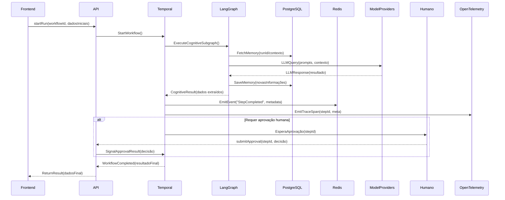

# MYCELIA — 04 Technical Architecture

## 1. Executive Summary  
O **MYCELIA** é um *runtime* cognitivo governado focado na triagem de documentos de contas a pagar, integrando IA com orquestração confiável. Não se trata de um chatbot genérico ou whiteboard livre; o MVP concentra-se em captar documentos, extrair dados e conduzir fluxos de trabalho (workflows) duráveis com agentes baseados em LLM, incluindo aprovações humanas, memória persistente, rastreamento (tracing), replay e visualização em tempo real. A arquitetura usa **Temporal** para orquestração de workflows duráveis (com tolerância a falhas, *timeouts*, *retries* e agendamento interno)【8†L183-L188】, e **LangGraph** para execução dos subgrafos cognitivos internos (chamadas a LLMs, ferramentas, recuperação de memória). Toda execução é observável: cada etapa gera eventos e rastros, e o histórico completo das execuções pode ser inspecionado via interface de administração【8†L193-L200】. A arquitetura é multi-tenant nativa, garantindo isolamento de dados por cliente e aplicações de políticas de forma externa aos prompts. Aprovações humanas são tratadas como primitivas de runtime (nós de aprovação no workflow). Em resumo, MYCELIA combina controle de fluxo robusto (Temporal) com inteligência cognitiva (LangGraph) para automação de processos regulados em contas a pagar, assegurando confiabilidade, auditabilidade e governança.  

## 2. Architecture Principles  
- **Estado explícito:** Todo estado relevante da aplicação é armazenado explicitamente (banco de dados, memória persistente), sem informações ocultas em memória volátil ou prompts. A arquitetura evita manter contexto não registrado; as transições de estado são gravadas em tabelas conceituais.  
- **Workflows duráveis:** Utilizamos um motor de workflow (Temporal) para gerenciar execuções longas de forma resiliente, sobrevivendo a falhas de hardware ou reinicializações, com suporte nativo a timeouts, *retries* e agendamento interno【8†L183-L188】. Cada *Run* de workflow é cronologicamente reconstituível.  
- **Execução observável:** Toda ação no sistema gera eventos e rastros (*traces*). A solução incorpora *logging* e *tracing* detalhados (via OpenTelemetry) e uma UI de execução que mostra o histórico completo das etapas (inputs, outputs, falhas)【8†L193-L200】. Assim, cada *step* e cada chamada de ferramenta são visíveis e auditáveis em tempo real.  
- **Política fora dos prompts:** Regras de negócio (limites de orçamento, políticas internas) são aplicadas pelo sistema antes ou depois das chamadas de LLM, não embutidas nos prompts. Isso assegura consistência de governança e evita confiar na adequação das respostas do modelo para aplicar regras.  
- **Aprovação humana como primitiva:** Nós de fluxo que requerem decisão humana (aprovadores) são elementos de execução nativos. Enquanto o workflow está em espera de aprovação, a execução não prossegue até que um usuário autorizado responda. Essa integração direta simplifica casos de uso regulados.  
- **Abstração de modelo/provedor:** O código é desacoplado dos provedores de modelo (OpenAI, Anthropic, etc.) por meio de interfaces. Permitimos troca de provedor de LLM e ferramentas sem alterar lógica de negócio. Parâmetros de modelo e credenciais ficam configuráveis.  
- **Reprodutibilidade e replay:** Cada execução armazenada pode ser reproduzida sem alterar o histórico original. O replay é tratado como uma nova *run* (ou ramificação), garantindo que a execução original permaneça imutável. Isso permite análise de falhas e investigações forenses.  
- **Isolamento de tenant:** Em uma arquitetura multi-tenant, cada peça do sistema (banco de dados, filas, memória, política) distingue dados por `tenant_id`. Não há compartilhamento implícito de informação entre tenants. Em futuro, usaremos Row-Level Security (RLS) no PostgreSQL para reforçar esse isolamento【34†L107-L114】.  
- **Sem execução oculta:** Todas as decisões do agente ou subfluxos são explícitas e registradas. Não existem trechos de código *"invisíveis"* ou ações fora do fluxo definido. Isso assegura que nada execute sem rastreamento e auditabilidade completa, alinhando-se ao princípio de transparência.  

## 3. System Topology  
A topologia de MYCELIA é dividida em cinco planos: **Control Plane**, **Execution Plane**, **Memory Plane**, **Observability Plane** e **UI Runtime Plane**. O **Control Plane** inclui a camada de API (serviço Next.js/Node) que gerencia autenticação e expõe endpoints para iniciar/workflows e consultas de status. O **Execution Plane** engloba o motor Temporal para orquestração de workflows e o motor LangGraph para execução dos subgrafos cognitivos internos (chamadas a LLMs, lógica de agentes). O **Memory Plane** é composto pelo banco de dados PostgreSQL (source-of-truth) e suas extensões (pgvector para vetores de memória). O **Observability Plane** inclui coletores OpenTelemetry que capturam métricas e traces de cada execução. O **UI Runtime Plane** é a camada de frontend (Next.js com React) que interage em tempo real via API/WebSockets para exibir o estado dos workflows, filas de aprovação, grafo de execução e visualizador de traces. A seguir, diagrama de componentes (Fluxograma Mermaid):

```mermaid
flowchart LR
    subgraph "UI Runtime Plane"
        Frontend[Next.js Frontend] -- API calls --> API[API Server]
        Frontend -- SSE/WebSockets --> Redis[Redis Streams (Eventos)]
        Frontend -- OTel Spans --> OT[OpenTelemetry Collector]
    end

    subgraph "Control Plane"
        API --> Temporal[Temporal (Workflow Engine)]
        API --> LangGraph[LangGraph (Agent Engine)]
        API --> Auth[Auth/Session Service]
    end

    subgraph "Execution Plane"
        Temporal --> PostgreSQL[(PostgreSQL DB)]
        LangGraph --> PostgreSQL
        Temporal --> Redis
        LangGraph --> Redis
        Temporal --> Tools[Tool Sandbox]
        LangGraph --> Tools
        LangGraph --> ModelProviders[Model/Tool Providers]
    end

    subgraph "Observability Plane"
        Temporal --> OT
        LangGraph --> OT
        Tools --> OT
    end

    subgraph "Memory Plane"
        PostgreSQL --> VectorDB[(pgvector)]
    end
```

Cada componente conhece o `tenant_id` do request. Por exemplo, dados de usuário e contexto são carregados do PostgreSQL filtrados por tenant. As filas Redis mantêm streams etiquetados por `tenant_id`. O grafo acima ilustra: o Frontend comunica-se com o *API Server*, que dispara workflows no Temporal. O Temporal dispara *Activities* que invocam LangGraph para lógica cognitiva. Ambos leem/escrevem no Postgres e em Redis Streams. As chamadas a provedores de modelo ou ferramentas externas são tratadas pelo sandbox de ferramentas, também rastreado pelo sistema de observabilidade (OpenTelemetry).

## 4. Repository Architecture  
Sugere-se usar uma *monorepo* modularizada com esta estrutura de pastas:

```
/apps                 # Aplicações executáveis
  /frontend           # App Next.js (UI de triagem, aprovação, visualização)
  /admin-panel        # (Opcional) painel administrativo

/packages             # Bibliotecas compartilhadas
  /core               # Lógica de domínio, clientes API, utilitários
  /ui-components      # Componentes React reutilizáveis (gráfos, formulários)
  /agent-runtime      # Abstrações de agentes/cognição para LangGraph

/services             # Serviços de backend
  /api                # Servidor de API (Autenticação, Runtime API, etc.)
  /workflow-engine    # Workers temporais e agendador (Temporal workers)
  /policy-engine      # (Futuro) serviço de avaliação de políticas

/workers              # Processos assíncronos
  /agents             # Workers de agentes cognitivos (LangGraph execution)
  /tools              # Workers para chamadas de ferramentas externas

/infrastructure       # Infraestrutura como Código (Terraform, Kubernetes, Helm)
/docs                 # Documentação técnica e diagramas de arquitetura
/scripts              # Scripts de automação, migradores de dados, etc.
/tests                # Testes end-to-end, integração, unitários

```

- **/apps:** aplicações finais que podem ser implantadas, como o frontend Next.js de triagem e talvez um painel de administração.  
- **/packages:** código compartilhado (por exemplo, modelos de dados Prisma, funções utilitárias, componentes UI). *Regra de dependência:* Pacotes só podem referenciar outros pacotes ou libs de terceiros, nunca o contrário. Apps e serviços podem importar de packages, mas packages não devem importar apps/services.  
- **/services:** serviços de backend (servidor de API, workers do Temporal, etc.). Esses podem chamar pacotes compartilhados.  
- **/workers:** processos de longa execução acionados por filas/eventos (por exemplo, workers de LangGraph para tarefas cognitivas, workers de execução de ferramentas).  
- **/infrastructure:** arquivos de configuração (ex. Terraform para infra de nuvem, YAML do Kubernetes ou Docker Compose).  
- **/docs, /scripts, /tests:** organização óbvia para documentação, scripts auxiliares e suítes de teste.  

Essa estrutura permite desenvolvimento paralelo por equipes, versionamento unificado e evita dependências cíclicas. Por exemplo, o serviço *api* pode importar lógica de core e consultas do pacote *core*, mas o pacote *core* não conhece o serviço.

## 5. Frontend Architecture  
- **Next.js App Router:** Usamos Next.js (v13+) com App Router, garantindo SSR/SSG para páginas comuns e React no cliente onde preciso. Cada página carrega dados iniciais via *server components* ou API.  
- **React Flow:** Biblioteca para desenhar e interagir com grafos de workflow. A visualização do fluxo de execução (grafo de passos) é montada via React Flow para permitir arrastar, zoom e interatividade.  
- **Tailwind CSS:** Framework de estilos utilitário para UI responsiva e consistente. Classes Tailwind definem estilo de componentes, garantindo design limpo e customizável.  
- **Runtime Graph:** A página de execução exibe o grafo atual do workflow em tempo real. Ele mostra nós e arestas coloridos conforme status (completo, em andamento, erro). React Flow e hooks do Next.js atualizam o estado via SSE/WebSocket.  
- **Approval Queue:** Componentes listam *triggers* de aprovação pendentes. Por exemplo, uma fila de tarefas de aprovação pendentes é consumida via API. Usuários veem a lista e clicam para aprovar/rejeitar.  
- **Trace Viewer & Replay Viewer:** Interfaces gráficas para inspeção de logs e replays. O *Trace Viewer* mostra linha do tempo (timelines) de spans/ações, enquanto o *Replay Viewer* permite comparar execuções original e reexecutada.  
- **Investigation Mode:** Modo especial de UI onde são mostrados metadados de execução (ex.: inputs originais, embeddings de memória, decisões de política). Pode evidenciar divergências em replays.  
- **Estado cliente vs servidor:** O estado crítico de aplicação (usuário logado, runs) é mantido no servidor/API, enquanto o estado UI (elementos de interface, navegação) é local. Usamos React Query ou SWR para cache de dados do servidor. Todos os dados sensíveis/empresariais vêm da API.  
- **SSE/WebSocket:** Para atualizações em tempo real (status de workflow, novas aprovações, eventos de trace), a UI se conecta via Server-Sent Events ou WebSockets ao backend. Exemplo: o backend publica cada evento de execução em um Stream Redis; um serviço envia via SSE os eventos para o browser.  
- **Error Boundaries:** Componentes React envolvem partes críticas para capturar erros inesperados, exibindo fallback de erro amigável sem travar toda a UI.  
- **Estados de Loading/Empty/Error:** Padrões de design: skeletons e *spinners* durante carregamento de dados, mensagens claras para casos vazios (ex.: sem runs) ou erro de fetch. Isso garante boa UX.

## 6. Backend Architecture  
- **API Layer:** Serviço principal (Node.js/TypeScript) expondo endpoints REST/GraphQL para todas as funcionalidades: iniciar runs, consultar status, submeter aprovações, pesquisar memória, obter traces. Usa framework Express/Next API com controllers organizados.  
- **Auth/Session:** Autenticação JWT ou sessão de cookies. Autorização de rotas baseada em RBAC (e.g. roles: admin, approver, user). O token/session carrega `tenant_id` do usuário, usado em todas chamadas.  
- **Runtime API:** Rotas para iniciar um *Run*, pausar/resumir, cancelar, ou recuperar resultados parciais. Encaminham requisições para o *Temporal* starter e leem do banco ou cache para status.  
- **Workflow API:** Endpoints para gerenciar definições de workflow: criar versões, ativar/desativar, listar versões válidas por projeto/tenant. Também exposição de JSON do grafo para UI (usando o LangGraph ou formato customizado).  
- **Approval API:** Fornece lista de tarefas de aprovação pendentes (query ao banco/Redis), e recebe decisões de aprovar/rejeitar via POST. Ao receber decisão, o API sinaliza o Temporal (via *signals*) para prosseguir o workflow.  
- **Memory API:** Permite guardar novos itens de memória (por exemplo, após cada tool call) e consultar históricos de memória (busca vetorial, filtros por tenant/contexto). Pode delegar consultas vetoriais para pgvector.  
- **Trace API:** Consulta de eventos de rastreamento específicos (e.g. por run_id) armazenados no banco. A UI de trace usa essa API para mostrar cada span e metadata.  
- **Policy API:** (Futuro) Expor endpoints que avaliam regras de política ou fornecem parâmetros de negócios (limites de aprovação). As decisões no workflow solicitam checagem aqui.  
- **Tool Execution API:** Se houver interface de usuário para invocar ferramentas manualmente, forneceria endpoints para executar commands em sandbox. Caso contrário, o *API* central coordena via filas (Redis) as chamadas de ferramentas dos workers.  
- **Sincrono vs Assincrono:** Consultas de leitura são síncronas (GETs), já iniciar uma execução ou comando de ferramenta é assíncrono: o client recebe um job ID e monitora progresso por callbacks/events. Aprovações e eventos assíncronos são entregues via SSE/WebSocket ou polling.

## 7. Runtime Orchestration  
O orquestrador do MYCELIA opera em dois níveis: **Temporal** gerencia o macro-fluxo durável, e **LangGraph** gerencia micro-fluxos cognitivos internos. Cada *Workflow* definido no Temporal inclui *Activities* que representam etapas de alto nível (por exemplo, "extrair dados da nota fiscal"). Dentro de uma Activity cognitiva, instanciamos um grafo LangGraph para executar uma sequência de chamadas LLM e ferramentas, manipulando memória e checkpoints. Em suma: **Temporal governa o durável (fora)**, e **LangGraph governa o cognitivo (dentro)**. Temporal cuida de persistência, retries, expiração e logs; LangGraph cuida da lógica de agente (pensamento, memória, chamadas a ferramentas) no tempo de execução.  



Nesse fluxo, cada passo relevante (chamada LLM, tool, decisão) emite eventos (para UI e logs). Se uma etapa requer aprovação, o *Temporal* pausa o workflow e emite um evento de pendência; o humano aprova via API; então o *Temporal* continua usando o resultado. A sequência acima mostra: o Frontend inicia um *run*, o backend dispara o workflow no Temporal, Temporal chama LangGraph para processar cognitivamente, LangGraph interage com memória (PostgreSQL) e modelo externo, retorna dados, então Temporal registra eventos, possivelmente espera aprovação, e finalmente retorna o resultado ao Frontend. A chave é: **Temporal não executa lógica de LLM diretamente** – ele apenas invoca o Grafo LangGraph dentro de atividades, mantendo o controle do estado geral e garantindo durabilidade.

## 8. Event and Queue Architecture  
Empregamos **Redis Streams** como barramento de eventos assíncrono, categorizando mensagens por tipo. As categorias principais de eventos são:  
- *Runtime Events:* notificações de ciclo do workflow (RunStarted, RunFinished, StepStarted, StepCompleted).  
- *Approval Events:* quando um passo bloqueado por aprovação entra/ sai de fila (ApprovalRequested, Approved, Rejected).  
- *Tool Events:* log de chamadas de ferramentas (ToolCallStarted, ToolCallFinished).  
- *Memory Events:* mudanças na memória (MemoryItemCreated, EmbeddingStored).  
- *Observability Events:* geração de spans/metrics enviados ao OpenTelemetry.  

Cada evento é uma entrada em um Stream Redis, carregando `tenant_id`, `run_id`, `step_id`, e payload JSON. Usamos **idempotency** para evitar duplicatas: como Redis 8.6 suporta processamento idempotente nativo em Streams【26†L76-L84】, cada produtor pode reaplicar o mesmo ID sem criar mensagens duplicadas. Em caso de falha ao processar, temos estratégias de *dead-letter queue*: eventos que excedem tentativas de reentrega são desviados a um Stream separado para investigação manual. A correlação entre eventos e objetos de domínio é garantida pelos IDs. Por exemplo, um evento `StepCompleted` incluirá `run_id` e `step_id` para unir com o *TraceEvent* correspondente. Essa arquitetura baseada em filas desacopla componentes: o Frontend e outros consumidores podem subscrever eventos de um Stream (via Pub/Sub), garantindo streaming de atualizações em tempo real. 

## 9. Database Architecture  
O **PostgreSQL** é a fonte única de dados (source-of-truth), acessível via **Prisma ORM**. As principais entidades e tabelas conceituais são:  

- **Tenant** (`tenant_id`, nome, status) – identifica o cliente/empresa.  
- **Workspace** (`workspace_id`, `tenant_id`, nome) – subdivisão lógica (ex.: departamento).  
- **Project** (`project_id`, `workspace_id`, nome) – projeto ou processo específico.  
- **WorkflowVersion** (`workflow_version_id`, `project_id`, definição JSON/DSL, versão, criado_em`) – versão de um fluxo.  
- **Run** (`run_id`, `tenant_id`, `workflow_version_id`, `status`, `created_at`, `completed_at`, `trace_id`) – instância de execução de um workflow. O `trace_id` correlaciona com o rastreamento distribuído.  
- **StepExecution** (`step_id`, `run_id`, nome_etapa, `status`, `started_at`, `ended_at`, `input`, `output`) – cada nó executado no workflow.  
- **ToolExecution** (`tool_execution_id`, `step_id`, `tool_name`, `status`, `started_at`, `ended_at`, `input`, `output`) – chamadas de ferramentas externas dentro de um passo.  
- **Approval** (`approval_id`, `step_id`, `approver_id`, `status`, `decision`, `comment`, `acted_at`) – registro de cada aprovação humana, quem aprovou e decisão (approve/reject).  
- **MemoryItem** (`memory_id`, `run_id`, `type`, `content`, `embedding`, `created_at`, `ttl`, `provenance`) – itens de memória armazenados (texto, vetores). A coluna `embedding` usa extensão *pgvector*.  
- **TraceEvent** (`trace_id`, `run_id`, `timestamp`, `span_id`, `event_type`, `data JSON`) – armazenamento dos dados de rastreamento (eventos de executação, logs estruturados).  
- **Snapshot** (`snapshot_id`, `run_id`, `step_id`, `context JSON`, `created_at`) – pontos de verificação de estado (opcional).  

Índices: criamos índices compostos em campos de junção mais usados (e.g. `(run_id, step_id)`). Particionamento horizontal por data ou tenant é considerado para tabelas de alto volume (e.g. *TraceEvent*). Utilizamos RLS/filtragem por `tenant_id` nas queries para garantir isolamento. A história de cada Run é **imutável**: nenhuma atualização em registros antigos, apenas inserções (append-only), para auditabilidade completa. As extensões do PostgreSQL usadas incluem *pgvector* (para embeddings) e JSONB (para dados flexíveis como `event_type`/`data`).  

## 10. Memory Architecture  
A memória do agente é hierarquizada:  

- **Working Memory:** Estado de curto prazo usado durante um único *Run*. Geralmente mantido em memória ou cache durante a execução; não persiste além do fim do run.  
- **Checkpoint Memory:** Estados intermediários salvos periodicamente durante o *Run*, permitindo resumir execuções paradas. Esses checkpoints são armazenados em tabelas dedicadas ou no próprio sistema de logs.  
- **Episódica:** Memória de eventos passados – por exemplo, transcrições de runs anteriores ou logs de conversas. São gravados como objetos (ex.: `MemoryItem` do tipo conversa) para consulta posterior.  
- **Semântica (Vetorial):** Base de conhecimento persistente. Textos ou fatos relevantes (ex.: histórico de faturas, políticas financeiras) são transformados em embeddings vetoriais e indexados em *pgvector* para recuperação aproximada por similaridade. Essa camada auxilia o agente a fornecer contexto relevante, mas **não é fonte de verdade definitiva**.  
- **Organizacional:** Memória compartilhada pelo tenant/organização, englobando documentos estáticos (manuais, contratos) e aprendizados acumulados.  
- **Compactação de Contexto:** Para otimizar chamadas de modelo, contextos longos podem ser resumidos em vetores ou texto conciso (ex.: resumo de transações do mês).  
- **Proveniência e TTL:** Cada item de memória registra origem (qual run, usuário ou documento) e *TTL* (expiração) para dados temporários. Itens obsoletos são descartados após determinado tempo.  
- **Autoritativa vs Assistiva:** Dados de sistemas corporativos (ERP, fornecedores) são *autoritativos* e consultados diretamente; a memória do agente é *assistiva* – auxilia nas decisões, mas não pode invalidar dados oficiais. Exemplo: saldo de conta está no sistema financeiro (autoridade), enquanto a memória pode ter notas sobre cliente (assistiva). Essa distinção guia o uso da memória nos prompts do LLM.

## 11. Observability Architecture  
Instrumentamos tudo com **OpenTelemetry** para ter métricas, logs e rastreios distribuídos unificados. Cada *Run* gera um *trace* global (identificado por `run_id` ou `trace_id`) com *spans* internos para passos e chamadas de modelo. **Campos obrigatórios** nos spans incluem: `tenant_id`, `run_id`, `workflow_id`, `step_id`, `tool_call_id` etc. Assim podemos correlacionar logs/ráficos com a execução de negócios. Nas chamadas a LLM adicionamos atributos: nome do modelo, provedor, latência e tokens utilizados【17†L250-L258】. Da mesma forma, cada chamada de ferramenta gera spans filhos, registrando parâmetros e resultados.  

Estamos atentos às convenções semânticas emergentes: por exemplo, o OpenTelemetry GenAI SIG define normas para spans de agentes inteligentes【14†L379-L388】. Isso garante interoperabilidade de ferramentas (por exemplo, usando o mesmo padrão de nome de campo). Na prática, adotamos spans semelhantes ao exemplo *claude_code.llm_request/tool* do SDK da Anthropic【17†L250-L258】, mas enriquecendo-os com nossos campos (run, tenant, step etc).  

O visualizador de traces (Trace Viewer) na UI permite filtrar por `run_id` ou `tenant_id` e navegar a árvore de spans. Cada evento armazenado em **TraceEvent** é relacionado ao trace distribuído. Além disso, a UI de workflows (Temporal Web UI) exibe o histórico de eventos completo do run (inputs/outputs e erros)【8†L193-L200】, facilitando debugging. Em resumo, qualquer falha ou desempenho do agente pode ser investigado via esses traces com contexto completo.  

## 12. Approval and Governance Architecture  
Nós de *approval* são passos do workflow onde a execução pausa aguardando intervenção humana. Quando um nó requer aprovação, o workflow emite um evento `ApprovalRequested` e insere uma tarefa na fila. A partir daí, um usuário com permissão (definido por **RBAC**) pode visualizar e decidir aprovar ou rejeitar. Ao tomar ação, o front-end chama a API de aprovação, que sinaliza o *Temporal* para continuar ou interromper o fluxo.  

Características:  
- **Fila de Aprovação:** Cada pedido aparece numa lista de tarefas pendentes, visível ao time de aprovadores. Pode-se incluir escalonamentos: se não há resposta em X horas, notificar supervisores.  
- **Decisão Humana:** O usuário insere a decisão e opcionalmente comentários. Registramos o `actor_id` (quem aprovou) em cada registro de *Approval*. Isso cria um **audit trail** imutável de autorizações.  
- **Override/Conflito:** Um modelo de hierarquia pode permitir que gerentes suplantes façam override (ex.: gerente aprova após recusa do subordinado). Rejeições também podem exigir reanálise do agente.  
- **Políticas e Limites:** Regras de negócio determinam quando cair num nó de aprovação (ex.: valor > $10.000, exceção de política). Essas políticas são carregadas do banco e avaliadas externamente (Policy API) antes de enviar ao agente. Por exemplo, um nó só fica ativo se `invoice.total > limit`.  
- **Segurança:** Somente funções autorizadas podem aprovar. Emilações e logs garantem rastreabilidade de cada ação. Cada instância de approval está vinculada ao `step_id` correspondente para rastreio histórico.  

## 13. Tool Execution Architecture  
As ferramentas externas (APIs ou funções de negócio) são definidas em um **registro de ferramentas** com metadados (nome, escopo de permissão, timeout, etc). Antes de chamar um tool, o sistema checa se ela está autorizada para o contexto atual (e.g. apenas usuários/tenants específicos podem usar). A execução ocorre em um **sandbox** isolado (por exemplo, container ou processo separado) para evitar efeitos colaterais no sistema principal.  

Detalhes de implementação:  
- **Registro de Ferramentas:** JSON ou banco que lista cada ferramenta (ex.: *EmitInvoice*, *SendEmail*, *QueryERP*), com roles permitidos e parâmetros exigidos.  
- **Escopo/Permissões:** Cada chamada verifica se o token de segurança (JWT) possui role apropriada. Ferramentas críticas podem requerer aprovação prévia (e.g. *tool de pagamento* só em modo supervisionado).  
- **Sandboxing:** Ferramentas potencialmente perigosas rodam isoladas. Por exemplo, scripts de manipulação rodam em containers sem rede externa, limitados por recursos (CPU/memória) e tempo.  
- **Secrets:** Valores sensíveis (API keys, credenciais) são injetados de forma segura no ambiente de execução, não passando nos prompts. O código do agente só recebe saída não sensível.  
- **Timeouts:** Cada chamada de ferramenta tem tempo máximo configurado (ex.: max 30s). Se o tempo estoura, consideramos falha da ferramenta.  
- **Retries e Taxas:** Em chamadas a sistemas instáveis (e.g. serviços externos), aplicamos política de retry com backoff. Respeitamos rate limits de cada provedor.  
- **Chaves de Idempotência:** Para efeitos externos (pagamentos, envios), usamos *idempotency keys* para evitar duplicação em replays ou retries. Isso garante que, por exemplo, um pagamento falho não seja cobrado duas vezes.  
- **Efeitos Externos:** Idealmente, tratamos interações com sistemas externos (como débito de conta ou envio de email) dentro de *Activities* do Temporal, permitindo compensação em caso de rollback.  
- **Logs de Auditoria:** Toda execução de ferramenta é registrada: o sistema guarda entrada, saída e status em `ToolExecution` e em logs de auditoria. Isso é crucial para rastrear ações que modificam dados fora.  

## 14. Multi-Tenant Architecture  
O MYCELIA é multi-tenant por design. Cada requisição inclui `tenant_id` e todo dado (contas, runs, memórias) é associado a um tenant. As regras de isolamento incluem:  

- **tenant_id em todos os dados:** Todas as tabelas do banco possuem coluna `tenant_id` (também `workspace_id` e `project_id`). Consultas e APIs filtram por esses campos.  
- **Isolamento de Workspaces:** Um tenant pode ter múltiplos workspaces ou projetos, cada um isolado no nível lógico.  
- **Memória/Vetor:** Itens de memória armazenam `tenant_id`. Se necessário, particionamos as tabelas vetoriais por tenant ou usamos prefílhos de chave, garantindo que buscas vetoriais sejam restritas ao tenant.  
- **Isolamento de Traces:** Spans/telemetria incluem `tenant_id`. Ferramentas de análise só mostram dados referentes ao próprio tenant (ou aos administradores).  
- **Políticas por tenant:** Cada tenant configura suas próprias políticas de aprovação, limites orçamentários e regras; não há compartilhamento de políticas.  
- **Row-Level Security (RLS):** Em fases futuras, habilitaremos RLS no Postgres para que o banco aplique automaticamente cláusulas `WHERE tenant_id = current_tenant()`【34†L107-L114】. Isso evitará até mesmo esquecimentos de filtro no código.  
- **“Nunca cruzar”:** Dados sensíveis, memórias pessoais ou segredos de um tenant não podem vazar a outro. O backend rejeita qualquer tentativa de acessar identificadores de outro tenant.  
- **Recursos Isolados:** Cada tenant pode ter suas quotas (ex.: limite de chamadas à API do modelo). Esse controle é aplicado no nível de API ou proxy.

## 15. Replay and Investigation Architecture  
A arquitetura suporta investigação detalhada de execuções via funcionalidades de **replay**:  

- **Replay Visual:** A UI oferece um modo de passo-a-passo onde o usuário pode “reproduzir” uma execução anterior, vendo o estado em cada etapa. Essa visualização é alimentada pelos logs/Traces armazenados.  
- **Dry Replay (Simulação):** Permite executar o fluxo novamente em modo de simulação, sem realizar efeitos colaterais (as atividades de escrita não são aplicadas ou usam ramos de teste). Bom para debugar sem arriscar dados reais.  
- **Fork Replay:** Possibilita copiar um *Run* em andamento até certo passo e modificar a partir dali (útil para testar cenários “e se?”). Por exemplo, reexecutar fluxo com aprovações diferentes. Cada fork recebe novo `run_id` mas mantém referência de origem.  
- **Autorização:** Replays completos (com impactos) só podem ser iniciados por usuários autorizados, pois alteram histórico de interação. Replays de visualização são mais liberados.  
- **Contenção de Efeitos:** Ferramentas com efeitos externos (e.g., pagamentos) não disparam durante replays *dry-run*. Em replays de produção, obrigamos uso de chaves de idempotência para evitar efeitos duplicados.  
- **Lineage:** Cada run reexecutada ou fork mantém metadados apontando para o run original (`parent_run_id`). Isso permite rastrear a linhagem de execuções no sistema de monitoração.  
- **Snapshots:** Em pontos de verificação (como imediatamente antes/depois de uma aprovação), capturamos snapshots do estado (como memória de trabalho e contexto) para acelerar o replay.  
- **Comparação:** A UI compara valores originais vs. do replay (exibindo diffs em campos-chave), facilitando encontrar divergências.  

## 16. Deployment Architecture  
- **MVP Local/Docker:** Para desenvolvimento e QA, fornecemos um `docker-compose` que inicia Postgres, Redis, Temporal Server e UI, LangGraph worker e aplicação Next.js. Por exemplo, o repositório oficial da Temporal traz um `docker-compose` com Postgres já pronto【38†L100-L108】. Em suma, localmente roda tudo em containers Docker (Postgres, Elasticsearch opcional para visibilidade, Redis, Temporal, API, etc.).  
- **Produção MVP:** Implantação em servidores ou instâncias cloud com containers (ou orquestrados por Docker Swarm). Usamos variáveis de ambiente para configuração (endpoints de banco, chaves de API). Logs e métricas são exportados a um sistema central (Prometheus/Grafana). Deploy via CI/CD (por exemplo, GitHub Actions) que sobe imagens Docker em registros e faz rollout.  
- **Caminho Futuro Kubernetes:** Para escalar, planejamos migrar para K8s: componentes do Control Plane (API, workers) como *Pods*, Temporal usando seu chart oficial, Postgres em *StatefulSet*, Redis em cluster. Helm charts ou operadores podem gerenciar updates. K8s facilita réplicas horizontais de workers e auto-escalonamento.  
- **Variáveis de Ambiente / Segredos:** Configurações (URLs de serviços, credenciais de DB/LLM) são passadas via env vars ou arquivos de segredo. Em Kubernetes, usaremos *Secrets*. Em Docker Compose, .env local. Nunca codificar segredos no código-fonte.  
- **CI/CD:** Pipeline inclui lint, testes unitários, segurança de dependências e deploy automatizado. Para o frontend Next.js, build e deploy em CDN; backend em containers. Migrações do Prisma rodadas como *job*.  
- **Workers e Escalabilidade:** Workers podem aumentar em paralelo. Por exemplo, adicionar mais instâncias de worker Temporal/Agents se filas crescerem. Também replicamos o Postgres (Leitura/Escrita separadas) e escalamos Redis (clustering) conforme necessário.  
- **Monitoramento:** Cada componente (API, workers, DB) exporta métricas customizadas (via OTel ou Prometheus). Alertas disparados para erros críticos (ex.: filas muito longas). O Temporal Server fornece dashboard de workflow health.  

## 17. Security Architecture  
- **Autenticação e RBAC:** Cada usuário pertence a um tenant e possui *roles* (ex.: viewer, operator, approver). Recursos da API exigem tokens JWT. Roles definem permissões (quem pode iniciar runs, quem pode aprovar, etc.).  
- **Princípio do Menor Privilégio:** Serviços e usuários só têm acesso estritamente necessário. Por exemplo, credenciais de modelo (API keys) têm escopo restrito (somente permissões de leitura). Serviços de rede limitam acesso interno (Temporal não fica exposto à internet pública【38†L72-L78】).  
- **Injeção de Prompt:** Sanitizamos e validamos todo dado antes de incorporá-lo a prompts para evitar injeção de instruções maliciosas. Dados do usuário são tratados como texto ou vetores de memória, nunca como parte bruta do prompt.  
- **Risco de Agência Excessiva:** Não permitimos que agentes ajam sem restrições. Ferramentas de alto impacto exigem aprovação. Em cada nó de decisão automática, aplicamos políticas de validação.  
- **Aprovação de Ferramentas:** Ferramentas externas só executam se registradas e permitidas pela configuração do tenant. Agentes não podem invocar comandos arbitrários (não há CLI aberta).  
- **Tratamento de Segredos:** Segredos são armazenados separadamente (Vault, env vars seguras) e nunca aparecem em logs, respostas ou contextos enviados ao LLM. O *RuntimeContext* não inclui tokens secretos.  
- **Auditabilidade:** Todas as ações sensíveis (criação/edição de workflows, decisões de aprovação, chamadas de ferramentas críticas) são registradas com quem e quando. Isso atende requisitos de compliance.  
- **Criptografia:** Dados em trânsito via TLS. Dados em repouso: Postgres e Redis configurados com criptografia. O Telemetry também via canal seguro.  
- **Política fora dos prompts:** Reforçando o princípio anterior, garantimos que a lógica de segurança e regras de negócio não dependa das respostas do modelo, evitando que um LLM mal-intencionado viole políticas.  

## 18. Failure and Recovery  
- **Falha de modelo:** Se uma chamada de LLM falhar (timeout ou erro), aplicamos política de retry automática (com backoff). Em caso de falha persistente, o erro é lançado e capturado no workflow para tratamento (ex.: *try/catch* do Temporal)【37†L241-L245】. Podemos tentar um modelo alternativo ou registrar o erro e aguardar intervenção.  
- **Falha de ferramenta:** Similarmente, ferramentas externas têm retry configurado. Se exaurem retries, geramos evento de erro no step e acionamos fluxos de compensação (sagas) definidos no workflow. Graças ao Temporal, mesmo se o worker cair nesse meio, a compensação será executada no re-start【37†L241-L245】.  
- **Falha de fila/Eventos:** Se a entrega de evento Redis falhar, o sistema de consumo (subscribers) reprocessa. Mensagens falhas vão para dead-letter para análise. Graças à idempotência de mensagens【26†L76-L84】, reenvios não criam efeitos duplicados.  
- **Queda de Worker:** Se um processo (API, worker de agente ou Temporal worker) falha, o Temporal Workflow retoma de onde parou em outra instância (atividade não concluída é reexecutada). A lógica de *catch* no workflow garante execução de rollback conforme escrito【37†L241-L245】.  
- **Deadlock de aprovação:** Se um run ficar pendente em aprovação indefinidamente (por ausência de resposta), usamos *timeouts*. Após limite configurado (ex.: 24h), enviamos alerta ao admin e/ou seguimos padrão de escalonamento programado.  
- **Timeouts gerais:** Definimos prazos máximos por etapa (e.g., tempo máximo de execução de uma atividade). Se atingir, a atividade é abortada com erro e o workflow pode seguir plano de compensação.  
- **Retries e Circuit Breakers:** Uso de políticas de retry do Temporal evita falhas transitórias, mas se uma atividade continuar falhando além do permitido, o workflow pode encaminhar para um ramo de erro. Podemos implementar circuit breakers customizados (monitorando falhas repetidas de um serviço e bloqueando novas chamadas temporariamente).  
- **Dead-Letter e Logs:** Em caso de falhas irrecuperáveis (por exemplo, exceção não tratada), registramos o erro em logs de alta severidade e movemos o run para um estado *failed*. Os administradores podem então usar ferramentas de replay para investigar e corrigir manualmente, se necessário.  

## 19. Scaling Strategy  
- **Workers:** Aumentar paralelamente os workers LangGraph e Temporal para processar mais *runs* simultâneos. Esses componentes são stateless, permitindo réplicas horizontais. Prioridade alta: aumentar *throughput* de execução cognitiva.  
- **Filas e Streams:** Se filas Redis ficarem congestionadas, adicionar nós ao cluster Redis. Mensagens IDMP em Redis 8.x ajudam a escalonar *producers*.  
- **Banco de Dados:** Para leituras de dados e histórico, adicionar réplicas de leitura ou usar *connection pooling*. Aplicar particionamento (ex.: *table partitioning*) para tabelas volumosas (memória, events).  
- **Pesquisa Vetorial:** Consultas pgvector podem ser custosas. Se necessário, migrar para banco vetorial especializado (e.g., Pinecone ou um cluster Postgres otimizado). Limitar número de chamadas de similaridade aumentará escalabilidade.  
- **Observabilidade:** Coletores OpenTelemetry centralizados devem suportar alta cardinalidade. Podemos usar *sampling* para spans muito verbosos.  
- **Frontend Realtime:** O SSE/WebSocket suporta escala linear; se muitos clientes se conectarem, podemos usar gateways de WebSocket gerenciados (p.ex., AWS API Gateway).  
- **O que não otimizar agora:** Não há razão para otimizar UI (esqueleto simples serve); só escalamos elementos críticos (workers, DB) conforme métricas. Primeiro garantir que a lógica e integridade estejam corretas antes de redesenhar para performance.  

## 20. Technical Non-Goals  
- *Sem workflows auto-modificáveis:* Os fluxos são definidos estaticamente (por desenvolvedor) e versionados; agentes não os alteram dinamicamente.  
- *Sem enxames autônomos de agentes:* Cada agente opera sob controle de workflow; não há comunicação livre/independente entre múltiplos agentes criando loops inesperados.  
- *Sem agentes sem restrições:* Nunca deixamos agentes executarem tarefas arbitrárias: todas as ferramentas e ações devem estar pré-registradas e autorizadas.  
- *Sem execução invisível:* Como citado, nada acontece sem logging. Não haverá passos “ocultos” invisíveis ao usuário ou auditor.  
- *Sem políticas definidas em prompt:* Regras de negócio não serão passadas dentro de prompts de LLM, mas sim aplicadas pelo código e pelo motor de políticas.  
- *Sem replay automático de efeitos colaterais:* O replay de uma execução não re-dispara ações externas a menos que explicitamente autorizado (não haverá cobrança ou envio de emails inadvertidos ao reexecutar um fluxo).  
- *Sem quadro livre estilo Miro na MVP:* Não forneceremos uma interface de desenho livre de processos (como Miro); só workflows definidos em YAML/JSON suportados.  
- *Sem marketplace no MVP:* Lançamento inicial não incluirá um marketplace de plugins ou ferramentas de terceiros; a lista de ferramentas é interna/configurada pelo admin.  

## 21. Architecture Invariants  
1. **Run.identificação:** Cada *Run* contém `tenant_id`, `workflow_version_id` e `trace_id`. Esses campos nunca são nulos.  
2. **Versions imutáveis:** Definições de workflow são versionadas e imutáveis; um *Run* se vincula à versão exata usada na criação.  
3. **Replay seguro:** Replays (ou forks) criam novos `run_id` e nunca alteram dados do *Run* original. O histórico original permanece intacto.  
4. **Política externa:** A aplicação das regras de negócio não depende de suposições do modelo, garantindo `policy` sempre verificada fora dos prompts.  
5. **Idempotência:** Toda ação com efeito colateral exige chave de idempotência. Por exemplo, cada `ToolExecution` registrável só é executado uma vez por key.  
6. **Rastreamento completo:** Cada chamada de ferramenta ou LLM dispara um evento/`span` de rastreamento. Nenhuma operação relevante ocorre sem gerar trace.  
7. **Actor nas aprovações:** Cada decisão de aprovação (`Approval`) registra `actor_id` do usuário que aprovou ou rejeitou.  
8. **Memória assistiva:** Memórias (*MemoryItem*) são assistivas, jamais fonte de verdade primária. Decisões críticas usam dados formais do banco.  
9. **Segredos protegidos:** O `RuntimeContext` passado aos agentes nunca contém segredos (apenas dados necessários). Segredos residem fora do contexto do agente.  
10. **Transparência total:** Não há execução oculta: todo resultado de agent-action é auditado. Nenhuma ação é executada “por trás das cortinas”.  
11. **Multi-tenant estrito:** Todos dados armazenados incluem `tenant_id`. Consultas sempre filtram por tenant (futuro: RLS ativo).  
12. **Histórico imutável:** Registros de eventos, passos e rastros são *append-only*. Updates só ocorrem em objetos de estado (e.g. `Run.status`), nunca apagamos logs antigos.  
13. **Chave de correlação:** Cada evento no stream ou na tabela `TraceEvent` inclui `run_id` e `step_id`, permitindo correlacionar logs com execução.  
14. **Fluxo controlado:** Workflows só avançam mediante eventos definidos; aprovação pendente bloqueia o progresso até decisão explícita.  
15. **Ambiente controlado:** Ferramentas só são executadas no sandbox seguro. A aplicação nunca executa código arbitrário não registrado.  
16. **Tempo e orçamento:** Parâmetros de timeout e limites de orçamento são aplicados antes da chamada ao modelo. Um Run não excede limites financeiros configurados.  
17. **Dados financeiros:** Memória ou LLM não alteram valores financeiros no banco; só efetivamos transações após verificação humana.  
18. **Logs de auditoria:** Cada transação de dado crítico (pagamento, ajuste) gera logs imutáveis com referencia a `ToolExecution` e usuário.  
19. **Idempotência de filas:** Cada mensagem de evento tem ID único (use `XADD IDMP` do Redis) para evitar duplicação se reemitida【26†L76-L84】.  
20. **Modelo Auditável:** Cada uso de LLM registra metadados: nome do modelo, provedor, custo (tokens) e latência nos logs.  
21. **Memória versionada:** Esquemas de memória (e.g. tamanho de vetor) são versionados; não misturamos dados de embeddings de versões diferentes de modelos.  
22. **Resposta consistente:** O estado do workflow em execução (run) reflete exatamente os dados persistidos no DB e filas (nunca há “diferença” entre UI e DB).  
23. **Tenant isolado:** Dados entre tenants jamais se misturam. Nem mesmo endpoints públicos retornam dados sem filtrar pelo inquilino do token.  
24. **Erros capturados:** Qualquer exceção não tratada num step faz o workflow ir para estado de erro, acionando os handlers definidos.  
25. **Sem autoexecução:** Um agente nunca reexecuta comandos sem trigger do workflow; não há loops infinitos implícitos.


## 22. MVP Architecture Cut  

**MVP Now:**  
- **Fluxo básico de contas a pagar:** Implementar upload/processamento de faturas, extração de dados por LLM (LangGraph) e preenchimento de workflow.  
- **Temporal & LangGraph:** Pipeline de workflow durável completo com passos de IA. Setup de Temporal local (Docker) com Postgres e Redis.  
- **UI Essencial:** Next.js com visão do grafo de execução simplificada, fila de aprovações e visor de logs básicos. Sem visualizar replays completos ainda.  
- **Aprovações:** Integração de pelo menos um nó de aprovação (ex.: checagem manual de dados).  
- **Banco de dados:** Modelo Prisma inicial com tabelas Run, Step, Approval, MemoryItem. Multitenant básico via `tenant_id` nos inserts.  
- **Eventos & Filas:** Configuração inicial de Redis Streams para eventos de step e aprovações, alimentando SSE na UI.  
- **Segurança mínima:** Autenticação simples (JWT) e RBAC básico (ex.: papel “approver”).  
- **Logs/Observabilidade:** Registro de eventos no banco (sem análise sofisticada); rastreio bruto via JSONB.  
- **Infra Local:** Docker Compose com tudo necessário (Temporla, DB, Redis, API, front).  

**Later:**  
- **Memória avançada:** Adicionar vetorização de memórias (pgvector) e busca semântica nos passos do agente.  
- **UI Completa:** Visor de replay e investigação (comparação original vs replay), dashboard de métricas, search/filter avançado.  
- **Política Configurável:** Sistema de regras externo (Policy API) permitindo definir cenários de aprovação (ex.: limites financeiros).  
- **Multi-tenant robusto:** Habilitar RLS no banco, rotas condicionais e UI de configuração por tenant.  
- **Recuperação Avançada:** Mecanismos de fork/dry-replay na UI, com autorização administrativa.  
- **Escalabilidade:** Migrar para Kubernetes, adicionar autoscaling de workers, otimizações de DB (sharding/replicas).  
- **Auditoria e Compliance:** Aperfeiçoar logs (por exemplo, WORM storage) e relatórios de atividades do usuário para fins de compliance financeiro.  

**Enterprise Future:**  
- **Alta Disponibilidade:** Replicação multi-região do banco e cluster de Temporal com failover.  
- **Segurança Enterprise:** Integração SSO/LDAP, criptografia avançada, simulações de segurança.  
- **Marketplace de Ferramentas:** Permitir que cada tenant integre seus próprios conectores (p.ex. SAP, Salesforce) de forma plugável.  
- **Ecosistema de Workflows:** Gerador gráfico de workflows (como editor low-code) para os clientes definirem seus próprios processos.  
- **Análise Avançada:** Módulos de ML para prever fraudes ou gargalos baseados no histórico.  
- **RLS Total:** Implementar política obrigatória de RLS e compliance (só super-administrador pode desativá-la).  
- **Escala Massiva:** Suporte a milhares de tenants simultâneos, filas e buscas vetoriais distribuídas, limites configuráveis de SLA por cliente.  

## Runtime Ownership Boundaries

Para evitar acoplamento e comportamento imprevisível:

### Temporal é responsável por:
- lifecycle do workflow;
- retries;
- scheduling;
- timers;
- state transitions;
- approvals;
- resumability;
- workflow durability;
- replay coordination;
- event orchestration.

### LangGraph é responsável por:
- cognitive execution;
- agent reasoning;
- memory retrieval;
- tool-selection reasoning;
- local execution graphs;
- interruption checkpoints;
- structured outputs.

### LangGraph NÃO pode:
- persistir estado definitivo;
- controlar retries globais;
- governar lifecycle de workflow;
- executar side effects sem orchestration layer;
- controlar tenancy;
- aplicar políticas globais.

### Temporal NÃO pode:
- conter lógica cognitiva;
- construir prompts;
- realizar reasoning;
- executar memory retrieval sem delegation.

## RuntimeContext Contract

Todo agente executa dentro de um RuntimeContext explícito.

Estrutura mínima:

```ts
type RuntimeContext = {
  tenant_id: string
  workspace_id: string
  project_id: string
  run_id: string
  workflow_version_id: string
  trace_id: string

  execution_state: object
  working_memory: object[]
  retrieved_context: object[]
  policy_metadata: object
  runtime_limits: object
}
```

# HARDENING 3
# Event Taxonomy

## Canonical Event Taxonomy

Todo evento deve pertencer a uma categoria explícita.

### Runtime Events
- RunStarted
- RunCompleted
- RunFailed
- StepStarted
- StepCompleted
- StepFailed

### Approval Events
- ApprovalRequested
- ApprovalGranted
- ApprovalRejected
- ApprovalEscalated

### Tool Events
- ToolExecutionStarted
- ToolExecutionCompleted
- ToolExecutionFailed

### Memory Events
- MemoryRetrieved
- MemoryStored
- EmbeddingGenerated
- ContextCompacted

### Replay Events
- ReplayStarted
- ReplayForked
- ReplayCompleted

### Observability Events
- TraceCreated
- SpanClosed
- MetricCaptured
- CostCalculated

## External Side Effect Policy

Nenhum side effect externo pode ocorrer:
- sem trace_id;
- sem idempotency_key;
- sem tenant_id;
- sem actor attribution;
- sem observabilidade mínima.

### Side effects incluem:
- pagamentos;
- emails;
- webhooks;
- mutações externas;
- ERP updates;
- uploads;
- chamadas third-party.

### Regras
- replay nunca reexecuta side effects automaticamente;
- retries exigem idempotência;
- ferramentas críticas exigem approval gate;
- side effects devem ser isolados do reasoning layer.

## State Persistence Ordering

O runtime deve persistir estado antes de executar side effects externos.

Ordem obrigatória:

1. Persist runtime transition
2. Emit observability events
3. Commit execution checkpoint
4. Execute external side effect
5. Persist side effect result
6. Emit completion event

Essa ordem garante:
- replay seguro;
- recovery consistente;
- rastreabilidade;
- redução de inconsistências.

## Cognitive Runtime Limits

Agentes possuem limites operacionais explícitos.

### Limites mínimos:
- max recursion depth;
- max tool calls per step;
- max tokens per execution;
- max runtime duration;
- max retry attempts;
- max memory retrieval size.

### Objetivo
Evitar:
- loops cognitivos;
- runaway agents;
- custo descontrolado;
- reasoning infinito;
- tool spam.

## Architectural Evolution Policy

O sistema deve evoluir incrementalmente.

Evitar prematuramente:
- microservices excessivos;
- distributed agent swarms;
- autonomous orchestration;
- over-abstraction;
- multi-region complexity;
- excessive event fragmentation.

Prioridade:
- clareza operacional;
- observabilidade;
- confiabilidade;
- replayability;
- governança;
- simplicidade evolutiva.

Em resumo, o **MVP** foca na base operacional: ingestão de faturas, pipeline durável IA+workflow, aprovação e histórico. Recursos adicionais (UI avançada, otimizações, integrações corporativas) ficam para depois. O escopo Enterprise inclui alta escalabilidade, governança extra e expansão do ecossistema de agentes.  

**Fontes:** Componentes como **Temporal** (execução durável, programação de atividades, interface de histórico) e **OpenTelemetry** (monitoramento) fundamentam vários aspectos desta arquitetura【8†L183-L188】【8†L193-L200】【26†L76-L84】【14†L379-L388】【17†L250-L258】【34†L107-L114】【37†L241-L245】. Cada seção acima sintetiza práticas recomendadas e lições aprendidas de casos de uso similares.

