# MYCELIA — 05 Agent Runtime & Coordination

---

## Document Metadata

| Field | Value |
|---|---|
| Document Series | MYCELIA Architecture Constitution |
| Document Number | 05 |
| Version | v1.0 |
| Status | Canonical |
| Classification | Core Architecture — Agent Runtime |
| Canonical Role | Defines agent identity, lifecycle, authority model, coordination patterns, handoff semantics, and the governance contracts under which agents operate as bounded cognitive participants inside MYCELIA workflows |
| Primary Audience | Agent Engineers, AI Runtime Architects, Platform Engineers, Workflow Architects, Security Engineers, Codex |
| Last Updated | June 2026 |

---

## Table of Contents

1. [Executive Summary](#1-executive-summary)
2. [Agent Runtime Philosophy](#2-agent-runtime-philosophy)
3. [Agent Runtime Scope and Non-Scope](#3-agent-runtime-scope-and-non-scope)
4. [Canonical Agent Model](#4-canonical-agent-model)
5. [Agent Types and Roles](#5-agent-types-and-roles)
6. [Agent Lifecycle](#6-agent-lifecycle)
7. [Agent Runtime Envelope](#7-agent-runtime-envelope)
8. [Agent Authority Model](#8-agent-authority-model)
9. [Agent Coordination Architecture](#9-agent-coordination-architecture)
10. [Agent Handoff Semantics](#10-agent-handoff-semantics)
11. [Agent Planning Model](#11-agent-planning-model)
12. [Agent Memory Access Model](#12-agent-memory-access-model)
13. [Agent Tool Access Model](#13-agent-tool-access-model)
14. [Agent Governance and Approval Integration](#14-agent-governance-and-approval-integration)
15. [Agent Observability and Telemetry](#15-agent-observability-and-telemetry)
16. [Agent Output Model](#16-agent-output-model)
17. [Agent Failure Semantics](#17-agent-failure-semantics)
18. [Agent Budget, Quota and Cost Control](#18-agent-budget-quota-and-cost-control)
19. [Agent Replay Semantics](#19-agent-replay-semantics)
20. [Agent Security and Prompt Injection Model](#20-agent-security-and-prompt-injection-model)
21. [Multi-Tenant Agent Isolation](#21-multi-tenant-agent-isolation)
22. [Agent Versioning and Compatibility](#22-agent-versioning-and-compatibility)
23. [Agent Runtime APIs](#23-agent-runtime-apis)
24. [Agent Runtime Data Flows](#24-agent-runtime-data-flows)
25. [MVP Agent Runtime Cut](#25-mvp-agent-runtime-cut)
26. [Agent Runtime Invariants](#26-agent-runtime-invariants)
27. [Agent Runtime Anti-Patterns](#27-agent-runtime-anti-patterns)
28. [Codex Implementation Guidance](#28-codex-implementation-guidance)
29. [Relationship to Other Documents](#29-relationship-to-other-documents)
30. [Final Agent Runtime Principles](#30-final-agent-runtime-principles)

---

## 1. Executive Summary

### 1.1 What the Agent Runtime Is

The MYCELIA Agent Runtime is the governed execution substrate that defines how agents exist, operate, coordinate, and terminate inside MYCELIA workflows. It is not an autonomous agent framework. It is a **bounded participant infrastructure**: a set of contracts, identities, lifecycle rules, coordination protocols, and runtime envelopes that ensure every agent acts within declared authority, under active governance, and with full observability.

Agents in MYCELIA are not superintelligent orchestrators or self-directed entities. They are **cognitive participants** — computational units that reason, classify, extract, plan, and recommend within the structural context of a governed workflow step. An agent's reasoning is nondeterministic. Its authority is not. The authority structure is defined by the workflow definition, the active PolicySnapshot, and the explicit runtime envelope — not by what the agent believes is appropriate.

### 1.2 Why Agents Must Be Bounded Participants

Document 00 establishes the foundational doctrine: AI enterprise systems fail when they become operational before they become governable. Ungoverned agents amplify this risk. An agent that can freely invoke tools, accumulate state, modify its own scope, delegate to other agents without audit, or persist memory without provenance is an agent that has escaped governance. At scale, ungoverned agents produce invisible side effects, cascading failures, cross-tenant data leakage, and audit gaps that make incident investigation impossible.

MYCELIA addresses this architecturally, not through model alignment or prompt engineering. Agents receive explicit runtime envelopes that declare what they may do. The runtime enforces those declarations at every operational boundary. An agent cannot exceed its envelope regardless of what its reasoning recommends.

### 1.3 How Agents Relate to the Broader Runtime

Agents participate in the MYCELIA runtime through the following structural relationships:

- **Workflows (Document 09)** provide the macro control structure. Agents execute inside workflow steps, not alongside them.
- **The Core Runtime (Document 02)** provides the RuntimeEnvelope, PolicyDecisionGateway, ApprovalGateCoordinator, and event lineage that govern every agent operation.
- **The Cognitive Execution Model (Document 04)** defines what happens inside a single cognitive step — model inference, context assembly, prompt construction, output validation, and tool intent mediation. Document 05 defines how agents exist across steps, how they coordinate with other agents, and how their lifecycle, handoffs, and plans are structured.
- **Tool Runtime (Document 15)**, **Memory Architecture (Document 10)**, **Governance Engine (Document 11)**, and **Observability Platform (Document 12)** are specialized subsystems that agents access through declared interfaces — never directly.

### 1.4 Core Thesis

> Agents in MYCELIA may reason, plan, classify, summarize, recommend, and request. They do not own authority, credentials, tools, memory, or state. Every agent operation is bounded by a runtime envelope, governed by policy, observable through telemetry, and reconstructable through replay.

---

## 2. Agent Runtime Philosophy

### 2.1 Agent as Cognitive Participant

An agent in MYCELIA is a **cognitive participant** — a runtime unit that performs reasoning within the boundaries established by a workflow step, a policy snapshot, and an explicit runtime envelope. The agent brings intelligence to the execution. It does not bring authority.

The word "participant" is precise. An agent participates in a process it does not control. The workflow definition controls sequencing. The policy engine controls permissions. The approval system controls authorization of high-impact actions. The runtime envelope controls resource bounds. The agent contributes reasoning capability within that structure.

### 2.2 Runtime as Authority Boundary

The runtime is the locus of authority. All governance decisions — what the agent may do, what tools it may request, what memory it may access, what outputs it may promote — are made by the runtime's policy and governance infrastructure, not by the agent itself.

This separation is the structural solution to a well-documented problem in agentic AI systems: when agents hold or acquire authority, they become unpredictable, ungovernable, and difficult to audit. MYCELIA prevents this by making authority an attribute of the runtime envelope, not an attribute of the agent.

### 2.3 Workflow as Control Structure

Agents do not determine what happens next. Workflows do. A workflow is a deterministic, versioned, governed control structure that specifies which agent steps execute, in what order, under what conditions, and with what declared scope. An agent step is one node in that structure. When the step completes, the workflow — not the agent — decides what happens next.

This design, inherited from Temporal-style durable execution, ensures that the macro control flow of any business process is reproducible, auditable, and operator-comprehensible regardless of what any individual agent does inside a step.

### 2.4 Policy as Permission Source

Agent permissions are not derived from agent capability. A powerful model with extensive training is not more authorized than a constrained model. Permissions are derived from the active PolicySnapshot bound to the GovernedRun. Policies define: which tools the agent may request, what memory namespaces it may read, whether it may write memory, what output schemas apply, what budget limits exist, and which actions require human approval. Policy is evaluated by the PolicyDecisionGateway — external to, and independently of, any agent.

### 2.5 Approval as Human Authorization

Certain agent actions require human authorization. This is not a failure mode — it is a designed control. High-impact tool invocations, external write operations, irreversible actions, and escalated plans require a human approver to grant explicit authorization through the ApprovalGateCoordinator. The agent requests approval; the runtime routes the request; a human decides. The agent cannot approve its own requests.

### 2.6 Canonical Distinctions

| Agent-Owned Concept | Runtime-Owned Concept | Governing Rule |
|---|---|---|
| Agent intent | Runtime authority | Intent is an expression; authority is a grant |
| Agent output | Runtime state | Output becomes state only after validation and promotion |
| Agent recommendation | Approved decision | A recommendation is not a decision until a human or policy approves it |
| Agent memory request | Memory access grant | The agent asks; MemoryAccessGateway grants or denies |
| Agent tool suggestion | Tool invocation | The agent expresses intent; ToolInvocationGateway executes |
| Agent handoff | Runtime-recorded transition | Handoffs are not private messages; they are audited state transitions |
| Multi-agent coordination | Explicit governance graph | Coordination is declared workflow structure, not hidden conversation |
| Agent rationale summary | AuditRecord | A summarized rationale is useful context; the audit record is the authoritative evidence |
| Agent role | User role | Agent roles define execution type; user roles define human authority |
| Agent capability | Permission | Having the capability does not mean having the permission |

---

## 3. Agent Runtime Scope and Non-Scope

### 3.1 What Document 05 Owns

| Responsibility | Description |
|---|---|
| Agent identity model | AgentDefinition, AgentVersion, AgentInstance identity and lifecycle |
| Agent lifecycle | Definition lifecycle, Instance lifecycle, Execution lifecycle, state machines |
| Agent roles and capabilities | PlannerAgent, ExecutorAgent, SupervisorAgent, and all defined roles |
| Agent scopes | AgentScope declaration, enforcement, and violation handling |
| Agent runtime envelope | AgentRuntimeEnvelope structure, creation, propagation, and immutability rules |
| Agent permissions model | Authority matrix; what agents may and may not do |
| Agent coordination patterns | Supervisor, planner/executor/verifier, router, fan-out, sequential, escalation |
| Agent handoffs | Handoff request, acceptance, rejection, timeout, audit, permission inheritance |
| Agent planning model | AgentPlan structure, validation, approval requirements |
| Agent memory access boundary | Memory request, scope, grant/deny, provenance — at the agent boundary |
| Agent tool access boundary | Tool request, scope check, forwarding to ToolInvocationGateway |
| Agent output model | Output classes, validation, trust levels, promotion eligibility |
| Agent telemetry contract | Required events, trace hierarchy, audit importance |
| Agent replay behavior | Replay hydration, suppression, divergence at agent level |
| Agent failure semantics | Failure modes, containment, recovery, escalation |
| Agent budget model | Token, cost, iteration, time, retrieval, handoff budgets |
| Agent security model | Prompt injection at agent boundary, credential exclusion, scope enforcement |
| Multi-tenant agent isolation | Agent instances always tenant-bound; no cross-tenant agent context |
| Agent versioning | AgentVersion immutability, schema evolution, replay compatibility |
| Codex agent implementation guidance | Module order, forbidden shortcuts, required tests |

### 3.2 What Document 05 Does Not Own

| Non-Responsibility | Governing Document |
|---|---|
| Model provider internals, inference details | Document 04 — Cognitive Execution Model |
| Prompt template library and prompt construction | Document 04 — Cognitive Execution Model |
| Full workflow engine and orchestration | Document 09 — Workflow Orchestration Engine |
| Full tool runtime, manifests, sandboxing, idempotency | Document 15 — SDK, Tool Runtime and Execution Contracts |
| Memory storage internals, vector indexing, compaction | Document 10 — Memory and Context Architecture |
| Policy engine internals, OPA evaluation logic | Document 11 — Governance, Policy and Approval Engine |
| Full observability platform design | Document 12 — Observability and Telemetry Platform |
| Security architecture, SPIFFE/SPIRE, credential leasing internals | Document 13 — Security and Trust Architecture |
| Multi-tenant isolation internals, RLS, namespace design | Document 14 — Multi-Tenant Isolation |
| Infrastructure deployment, Kubernetes, Helm | Document 16 — Infrastructure and Deployment Architecture |
| SRE runbooks and incident response procedures | Document 17 — SRE, Operational Recovery and Runbooks |
| External API contract specifications | Document 18 — External APIs and Integration Contracts |
| UX details, approval inbox design, trace viewer | Documents 20–22 — UX documents |

### 3.3 Ownership Matrix

| Domain | Document 05 Role | Specialized Document |
|---|---|---|
| Core runtime | Uses RuntimeEnvelope and control-plane gateways | Document 02 |
| Domain model | Uses AgentExecution, AgentScope, GovernedRun entities | Document 03 |
| Cognitive execution | Defines agent lifecycle around cognitive steps | Document 04 |
| State/checkpoint/persistence | References checkpoints; does not own persistence design | Document 06 |
| Events | Defines required agent events; schema owned elsewhere | Documents 07–08 |
| Workflow orchestration | Agent steps are workflow nodes; orchestration is external | Document 09 |
| Memory | Defines agent memory request contract; internals external | Document 10 |
| Governance/approval | Defines agent policy binding and approval request interface | Document 11 |
| Observability | Defines required agent telemetry events | Document 12 |
| Security | Defines agent-level security constraints | Document 13 |
| Tenancy | Defines agent tenant scope rules | Document 14 |
| Tool runtime | Defines agent tool request interface; tool execution external | Document 15 |

---

## 4. Canonical Agent Model

### 4.1 Entity Definitions

**AgentDefinition**
- *Purpose:* The versioned, tenant-scoped specification of an agent: its role, capabilities, prompt template references, output schemas, allowed tool classes, allowed memory namespaces, and governance bindings.
- *Ownership:* Platform operator or tenant operator.
- *Lifecycle:* Draft → Registered → Validated → Enabled → Disabled → Deprecated → Archived.
- *Source of truth:* Agent registry.
- *Mutability:* Mutable during draft; immutable after validation and publication as an AgentVersion.
- *Persistence:* Permanent (archived versions retained for replay).
- *Relationship to workflow:* Workflow steps reference an AgentDefinition by ID and version.
- *Governance semantics:* AgentDefinition declares AgentPolicyBinding references; policy evaluation occurs at runtime.
- *Replay semantics:* Replay uses the original AgentVersion that was active at execution time.
- *Tenant isolation:* Platform-scoped definitions may be shared across tenants; tenant-scoped definitions are isolated.

**AgentVersion**
- *Purpose:* An immutable snapshot of an AgentDefinition at a specific version. The replay anchor for agent behavior.
- *Ownership:* Owned by the agent registry.
- *Lifecycle:* Published → Active → Deprecated → Archived.
- *Mutability:* Immutable after publication. Breaking changes require a new major version.
- *Persistence:* Permanent (retained for replay retention period).
- *Governance semantics:* Binds prompt template version, output schema version, tool permission version.
- *Replay semantics:* Replay MUST use the original AgentVersion; never the current version.

**AgentInstance**
- *Purpose:* A runtime instantiation of an AgentVersion for a specific workflow step execution. Created per step; not shared across steps.
- *Ownership:* Created by AgentExecutionGateway.
- *Lifecycle:* InstanceRequested → InstanceCreated → Scoped → Running → terminal state.
- *Mutability:* Mutable during execution (state tracking); immutable after terminal state.
- *Persistence:* Persisted for audit and replay; archived after retention window.
- *Relationship to workflow:* One AgentInstance per agent step execution (one StepExecution).
- *Tenant isolation:* Always bound to a specific `tenant_id` from its RuntimeEnvelope.

**AgentRole**
- *Purpose:* The declared functional role of an agent (Planner, Executor, Classifier, etc.). Defines allowed behavior categories.
- *Governance semantics:* Role does not grant authority; policy grants authority within the declared role.
- *Mutability:* Immutable once declared on an AgentVersion.

**AgentCapability**
- *Purpose:* A declared capability offered by an agent definition (e.g., `document_extraction`, `risk_assessment`, `web_search_request`). Capabilities are bounded by the AgentScope.
- *Governance semantics:* Capability declaration is not self-authorization. Policy must permit the capability in context.

**AgentScope** *(canonical definition from Document 04 §9.2; referenced here)*
- *Purpose:* The runtime boundary within which an AgentInstance operates: allowed tools, memory namespaces, model classes, budget limits, output schema, and promotion targets.
- *Immutability:* Immutable for the duration of an AgentExecution. Agents cannot expand scope.
- *Enforcement:* AgentExecutionGateway and CognitiveBudgetManager enforce at every operation.

**AgentRuntimeEnvelope**
- *Purpose:* The complete propagation context for agent execution — an extension of the RuntimeEnvelope (Document 02) with agent-specific fields. See §7.
- *Creation:* Created by AgentExecutionGateway from the parent RuntimeEnvelope plus resolved AgentScope.
- *Immutability:* Core identity fields are immutable; budget fields decrement during execution.

**AgentExecution**
- *Purpose:* The canonical runtime record of a single agent step execution. See Document 04 §9.1 for field-level specification.
- *Source of truth:* Runtime state database + event store.
- *Replay semantics:* Replay hydrates AgentExecution from recorded outputs.

**AgentExecutionAttempt**
- *Purpose:* Records each retry attempt for a failed AgentExecution. One AgentExecution may produce multiple AgentExecutionAttempts.
- *Governance semantics:* Retry budget is enforced; exceeding max retries produces a terminal failure.

**AgentPlan**
- *Purpose:* A structured artifact produced by a PlannerAgent: an ordered sequence of proposed steps, tool requirements, memory requirements, risk assessment, and expected outputs. A plan is a recommendation, not a command.
- *Approval:* High-risk plans require human approval before the workflow can advance to execution.
- *Mutability:* Immutable once submitted. Revised plans are new AgentPlan records.

**AgentTask**
- *Purpose:* An atomic unit of work within an AgentExecution's reasoning loop. A task may involve one model call, one tool request, or one memory request.
- *Persistence:* Recorded in AgentExecution metadata for replay.

**AgentDecision**
- *Purpose:* A recorded point in agent reasoning where the agent selected among alternatives. Decisions are recorded as part of the AgentExecution audit trail.
- *Governance semantics:* Decisions are evidence, not authority. A decision to request a tool does not authorize the tool.

**AgentRecommendation**
- *Purpose:* A structured output where the agent proposes an action or conclusion that requires human or policy review before becoming authoritative state.
- *Trust level:* Always `RECOMMENDATION` — never authoritative by itself.

**AgentOutput**
- *Purpose:* The validated, schema-conformant output produced by an AgentExecution. See §16.
- *Promotion:* An AgentOutput becomes workflow state only after validation and OutputPromotionController approval.

**AgentArtifact**
- *Purpose:* A persisted, versioned, provenance-bearing product of agent execution (extracted document, generated report, classification result).
- *Persistence:* Stored in the artifact store with content_hash and provenance reference.

**AgentHandoff**
- *Purpose:* A governed runtime transition from one agent participant to another within a coordination graph. See §10.
- *Immutability:* Handoff records are immutable after creation.

**AgentMessage**
- *Purpose:* A structured, audited communication between agents in a coordination graph. Not a chat message — a typed, schema-validated coordination signal.
- *Governance semantics:* AgentMessages are not private; they are recorded events. They do not grant permissions.

**AgentMemoryRequest**
- *Purpose:* A formal request from an AgentInstance to read or write memory. Processed by MemoryAccessGateway.
- *Authorization:* Must be within AgentScope.allowed_memory_namespaces; policy-evaluated before grant.

**AgentToolRequest**
- *Purpose:* A formal expression of intent to invoke a specific tool with specific arguments. Processed by ToolIntentMediator.
- *Authorization:* Must be in AgentScope.allowed_tools; policy-evaluated and possibly approval-gated.

**AgentApprovalRequest**
- *Purpose:* A formal request to ApprovalGateCoordinator for human authorization of a proposed action or output.
- *Governance semantics:* The agent cannot approve its own ApprovalRequest. It can only submit and await.

**AgentSupervisor**
- *Purpose:* An agent or runtime component that coordinates multiple subordinate agents within a coordination graph, routes tasks, and collects results.
- *Authority:* A SupervisorAgent has coordinating authority within its declared scope, not general authority over the runtime.

**AgentCoordinator**
- *Purpose:* The runtime component (within the Agent Coordination Plane) that manages multi-agent execution graphs: tracking agent instances, routing handoffs, enforcing coordination budgets, and recording coordination events.
- *Distinction from AgentSupervisor:* AgentCoordinator is a runtime infrastructure component. AgentSupervisor is an agent role (cognitive participant).

**AgentPolicyBinding**
- *Purpose:* A record that binds an AgentDefinition to specific policy rules, permission constraints, and governance requirements.
- *Immutability:* Immutable within a PolicySnapshot. Policy changes create new bindings in the next snapshot.

**AgentBudget**
- *Purpose:* The declared resource limits for an AgentExecution: token budget, cost budget, iteration budget, time budget, tool request budget, memory retrieval budget.
- *Enforcement:* CognitiveBudgetManager (Document 04) enforces budget at every operation. AgentBudget is initialized from the AgentScope + RuntimeBudget at AgentInstance creation.

**AgentGuardrail**
- *Purpose:* A declared safety constraint on agent output or behavior — e.g., output must not contain PII, tool requests must not exceed a spend threshold, recommendations must include confidence scores.
- *Enforcement:* StructuredOutputValidator and PromptInjectionGuard enforce guardrails.

**AgentObservation**
- *Purpose:* A structured record of an input signal the agent processed during a reasoning cycle — retrieved memory items, tool results, human feedback. Observations are recorded for audit.

**AgentReplayRecord**
- *Purpose:* The immutable artifact set used to hydrate an AgentExecution during replay: AgentOutput, ContextSnapshot, ModelOutput, tool results, approved plans.

**AgentFailureRecord**
- *Purpose:* An immutable record of a terminal or non-terminal failure in an AgentExecution, including failure class, detection mechanism, and recovery action.

**AgentEvaluationRecord**
- *Purpose:* A structured quality assessment of an AgentExecution: output correctness, schema compliance, safety evaluation, alignment with declared objective.

**AgentTenantScope**
- *Purpose:* The tenant boundary binding for an AgentInstance — ensuring all memory, tools, telemetry, and artifacts produced by the agent are scoped to the correct `tenant_id`.

### 4.2 Entity Relationship Diagram

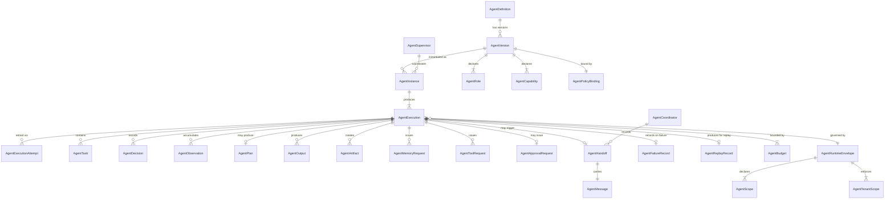

---

## 5. Agent Types and Roles

### 5.1 Principle

Agent role defines what category of cognitive work an agent performs. It does not define what the agent is permitted to do. Permissions derive from the PolicySnapshot and the AgentScope declared in the workflow step. A high-capability PlannerAgent with no tool permissions cannot invoke tools. A constrained ClassifierAgent with read memory permissions can retrieve context. Role and authority are independent.

### 5.2 Defined Agent Roles

**PlannerAgent**
- *Purpose:* Decomposes a high-level objective into a structured sequence of proposed steps (AgentPlan).
- *Allowed responsibilities:* Context analysis, objective decomposition, step sequencing, risk assessment, tool requirement declaration, output schema definition.
- *Forbidden responsibilities:* Executing steps directly; approving its own plan; modifying workflow definitions.
- *Allowed memory access:* Read from declared namespaces; no default write.
- *Tool request class:* ResearchAndLookup; no ExternalWrite by default.
- *Output type:* AgentPlan (requires policy review; high-risk plans require human approval).
- *Approval requirement:* High-risk plans MUST receive human approval before workflow advances.
- *MVP relevance:* Later milestone.

**ExecutorAgent**
- *Purpose:* Carries out a declared task within a workflow step — extraction, transformation, API interaction, content generation.
- *Allowed responsibilities:* Task execution per declared scope; tool invocation requests; memory reads; structured output production.
- *Forbidden responsibilities:* Replanning beyond declared step; self-extending scope; approving own tool requests for restricted tools.
- *Allowed memory access:* Read from declared namespaces; write if `memory_write_permitted = true`.
- *Tool request class:* Per AgentScope.allowed_tools; may include ReadOnlyExternal and conditionally ExternalWrite.
- *Output type:* Extraction, Classification, Transformation, Artifact.
- *MVP relevance:* Core MVP role.

**ClassifierAgent**
- *Purpose:* Assigns categories, labels, or classifications to input data.
- *Allowed responsibilities:* Pattern recognition, label assignment, confidence scoring, exception flagging.
- *Forbidden responsibilities:* Taking action based on classification (routing belongs to RouterAgent or workflow control flow).
- *Allowed memory access:* Read only; typically taxonomy namespace.
- *Tool request class:* NoSideEffect tools only.
- *Output type:* Classification (schema-validated; includes label, confidence, rationale summary).
- *MVP relevance:* Core MVP role.

**ExtractorAgent**
- *Purpose:* Extracts structured data from unstructured or semi-structured input (documents, forms, emails).
- *Allowed responsibilities:* Field extraction, schema mapping, confidence annotation, exception flagging for uncertain extractions.
- *Forbidden responsibilities:* Modifying source documents; deciding what to do with extracted data.
- *Output type:* Extraction (schema-validated; must match declared output schema reference).
- *Tool request class:* NoSideEffect; ReadOnlyExternal for document fetching.
- *MVP relevance:* Core MVP role (accounts payable document extraction).

**ResearchAgent**
- *Purpose:* Gathers information from internal knowledge bases and external sources to enrich context.
- *Allowed responsibilities:* Memory retrieval, knowledge synthesis, source citation, information ranking.
- *Forbidden responsibilities:* Writing to memory without explicit permission; acting on retrieved information directly.
- *Allowed memory access:* Read from multiple declared namespaces.
- *Tool request class:* ReadOnlyExternal (web search, knowledge base query).
- *Output type:* Research result (structured; includes source references, confidence).
- *MVP relevance:* Later milestone.

**ValidatorAgent**
- *Purpose:* Checks whether data, documents, or prior agent outputs meet declared business rules, schema constraints, or policy requirements.
- *Allowed responsibilities:* Rule evaluation, anomaly detection, threshold checking, exception reporting.
- *Forbidden responsibilities:* Overriding validation failures; self-validating its own output.
- *Output type:* ValidationResult (PASS/FAIL/EXCEPTION with field-level detail).
- *MVP relevance:* Core MVP role (invoice validation).

**ReviewerAgent**
- *Purpose:* Reviews a prior agent's output or plan against quality criteria, returning a structured review with recommendations.
- *Allowed responsibilities:* Comparative analysis, quality scoring, gap identification, revision suggestions.
- *Forbidden responsibilities:* Approving actions; self-reviewing; modifying original artifacts.
- *Output type:* ReviewResult (structured; includes score, gaps, recommendations).
- *MVP relevance:* Later milestone.

**SummarizerAgent**
- *Purpose:* Produces concise, structured summaries of documents, agent outputs, or workflow states.
- *Allowed responsibilities:* Content compression, key-point extraction, structured digest production.
- *Forbidden responsibilities:* Drawing conclusions beyond the source material; asserting facts not in source.
- *Output type:* Summary (structured; length-bounded by AgentScope).
- *MVP relevance:* Later milestone.

**RouterAgent**
- *Purpose:* Analyzes input or prior output and selects the next processing path from a declared set of options. Implements content-based routing within a coordination graph.
- *Allowed responsibilities:* Classification of routing signal, selection from declared route options, confidence-annotated routing decision.
- *Forbidden responsibilities:* Creating new routes not declared in the workflow; autonomous delegation.
- *Output type:* RoutingDecision (declares next_route from allowed_routes).
- *MVP relevance:* Later milestone.

**VerifierAgent**
- *Purpose:* Independently verifies a claim, extraction, or conclusion made by another agent using a separate reasoning path.
- *Allowed responsibilities:* Claim verification, cross-check against memory, confidence delta reporting, conflict flagging.
- *Forbidden responsibilities:* Deferring to the agent it is verifying; ignoring contradictions.
- *Output type:* VerificationResult (CONFIRMED/CONTESTED/UNVERIFIABLE with supporting evidence).
- *Approval requirement:* CONTESTED results trigger review workflow.
- *MVP relevance:* Later milestone.

**PolicyAssistantAgent**
- *Purpose:* Interprets natural-language policy queries in the context of a specific operational scenario, returning structured policy guidance (not a policy decision — that belongs to the policy engine).
- *Allowed responsibilities:* Policy document retrieval, scenario analysis, guidance synthesis.
- *Forbidden responsibilities:* Making binding policy decisions; approving actions.
- *Output type:* PolicyGuidance (non-authoritative; marked as advisory).
- *MVP relevance:* Later milestone.

**HumanInterfaceAgent**
- *Purpose:* Formats agent outputs for human presentation, generates human-readable summaries of workflow state, and packages information for approver inboxes.
- *Allowed responsibilities:* Output formatting, approval context preparation, notification assembly.
- *Forbidden responsibilities:* Modifying source outputs during formatting; filtering information from approvers.
- *Output type:* FormattedPresentation.
- *MVP relevance:* Core MVP role (approval queue context).

**SupervisorAgent**
- *Purpose:* Coordinates a set of subordinate agents within a declared coordination graph. Assigns tasks, routes handoffs, reconciles conflicting outputs, and reports aggregate results.
- *Allowed responsibilities:* Task assignment within declared subordinate scope, handoff initiation, result reconciliation, conflict escalation.
- *Forbidden responsibilities:* Bypassing individual agent authority limits; self-assigning approval; creating new agents outside the coordination graph.
- *Output type:* CoordinationResult (aggregate of subordinate outputs with reconciliation record).
- *MVP relevance:* Later milestone.

### 5.3 Agent Role Matrix

| Role | Memory Access | Tool Class | Output Type | Approval Req. | MVP |
|---|---|---|---|---|---|
| PlannerAgent | Read | ResearchAndLookup | AgentPlan | High-risk plans | Later |
| ExecutorAgent | Read + conditional write | Per scope | Extraction/Artifact | For ExternalWrite tools | **Now** |
| ClassifierAgent | Read only | NoSideEffect | Classification | No | **Now** |
| ExtractorAgent | Read only | NoSideEffect / ReadOnly | Extraction | No | **Now** |
| ResearchAgent | Read (multi-namespace) | ReadOnlyExternal | ResearchResult | No | Later |
| ValidatorAgent | Read only | NoSideEffect | ValidationResult | For override decisions | **Now** |
| ReviewerAgent | Read only | NoSideEffect | ReviewResult | No | Later |
| SummarizerAgent | Read only | NoSideEffect | Summary | No | Later |
| RouterAgent | Read only | NoSideEffect | RoutingDecision | No | Later |
| VerifierAgent | Read only | NoSideEffect | VerificationResult | For CONTESTED results | Later |
| PolicyAssistantAgent | Read (policy NS) | NoSideEffect | PolicyGuidance | No | Later |
| HumanInterfaceAgent | Read only | NoSideEffect | FormattedPresentation | No | **Now** |
| SupervisorAgent | Delegated | Delegated | CoordinationResult | For escalations | Later |

### 5.4 Agent Version Certification & Conformance

An AgentVersion MUST pass certification before it can be enabled for production workflow execution.

Certification verifies that the AgentVersion behaves according to its declared role, scope, output schema, memory permissions, tool permissions, budget profile and governance bindings.

### Certification Levels

| Level | Meaning | Allowed Use |
|---|---|---|
| `draft` | Agent definition is incomplete or untested | Not executable |
| `schema_validated` | Required schemas and metadata are valid | Development only |
| `sandbox_tested` | Agent can run in isolated test execution | Internal testing |
| `staging_certified` | Agent passed conformance tests in staging | Non-production tenants only |
| `production_certified` | Agent passed required production readiness checks | Production workflows |
| `restricted` | Agent may run only under explicit policy or approval constraints | Limited production use |
| `quarantined` | AgentVersion is blocked due to safety, security or correctness concern | No new execution |

### Required Conformance Tests

| Test | Purpose | Required |
|---|---|---:|
| Role conformance test | Agent behavior matches declared AgentRole | Yes |
| Output schema test | Agent output matches declared schema | Yes |
| Scope enforcement test | Agent cannot exceed memory/tool scope | Yes |
| Tool request test | Unauthorized tools are denied | Yes |
| Memory request test | Unauthorized namespaces are denied | Yes |
| Budget test | Token, cost, iteration and time budgets are enforced | Yes |
| Prompt injection test | Suspicious input is quarantined or rejected | Yes |
| Replay hydration test | Replay uses recorded artifacts and suppresses live model calls | Yes |
| Tenant isolation test | Agent cannot access another tenant's data | Yes |
| Telemetry test | Required events and spans are emitted | Yes |
| Approval test | Approval-required actions cannot self-authorize | Yes |
| Failure semantics test | Invalid output, timeout and budget exhaustion produce correct failures | Yes |

### AgentConformanceReport

Every certification run MUST produce an AgentConformanceReport containing:

- `agent_id`;
- `agent_version_id`;
- `certification_level`;
- `test_suite_version`;
- `tests_executed`;
- `tests_passed`;
- `tests_failed`;
- `known_limitations`;
- `approved_for_mvp`;
- `approved_for_production`;
- `executed_at`;
- `executed_by`;
- `artifact_hash`;
- `policy_exception_id` when applicable.

### Rules

- An AgentVersion MUST NOT be marked `Enabled` for production unless certification level is `production_certified` or `restricted`.
- `restricted` AgentVersions MUST declare the exact restrictions under which they may execute.
- Certification results MUST be immutable once published.
- Certification failure MUST block enablement.
- Certification MUST be repeated after breaking changes to prompt templates, output schemas, tool permissions, memory permissions or policy bindings.

### Forbidden Behavior

FORBIDDEN:

- enabling uncertified AgentVersions;
- treating successful manual testing as certification;
- certifying an agent without replay tests;
- certifying an agent without tenant isolation tests;
- certifying an agent while output schema is missing;
- allowing Codex to mark an AgentVersion enabled without AgentConformanceReport.

---

## 6. Agent Lifecycle

### 6.1 Three Lifecycle Dimensions

MYCELIA distinguishes three agent lifecycle dimensions that operate independently:

1. **AgentDefinition Lifecycle:** The progression of an agent's specification from draft to archived.
2. **AgentInstance Lifecycle:** The progression of a runtime instantiation from request to terminal state.
3. **AgentExecution Lifecycle:** The progression of a single cognitive execution within an AgentInstance.

### 6.2 AgentDefinition Lifecycle

```mermaid
stateDiagram-v2
    [*] --> Draft: Created by operator
    Draft --> Registered: Schema valid; registered in registry
    Registered --> Validated: Policy binding validated; output schema verified
    Validated --> Enabled: Operator activates
    Enabled --> Disabled: Operator deactivates (runs still reference version)
    Disabled --> Enabled: Operator reactivates
    Enabled --> Deprecated: Superseded by new version
    Deprecated --> Archived: After retention window
    Archived --> [*]
```

| State | Entry Condition | Exit Condition | Emitted Event |
|---|---|---|---|
| Draft | Created by operator | Schema validation passed | AgentDefinitionCreated |
| Registered | Schema valid | Policy binding validated | AgentDefinitionRegistered |
| Validated | Policy binding valid | Operator activation | AgentDefinitionValidated |
| Enabled | Operator activates | Operator deactivates or deprecation | AgentDefinitionEnabled |
| Disabled | Operator deactivates | Operator reactivates | AgentDefinitionDisabled |
| Deprecated | New version supersedes | Retention window elapsed | AgentDefinitionDeprecated |
| Archived | Retention window elapsed | Permanent | AgentDefinitionArchived |

### 6.3 AgentInstance Lifecycle

```mermaid
stateDiagram-v2
    [*] --> InstanceRequested: StepCoordinator requests agent step
    InstanceRequested --> InstanceCreated: AgentExecutionGateway creates instance
    InstanceCreated --> Scoped: AgentScope resolved and validated
    Scoped --> ContextPrepared: ContextAssemblyGateway completes
    ContextPrepared --> Running: AgentRuntime executing
    Running --> AwaitingToolResult: Tool request dispatched
    Running --> AwaitingMemoryResult: Memory request dispatched
    Running --> AwaitingApproval: Approval required for action
    Running --> HandoffRequested: Agent requests coordination handoff
    AwaitingToolResult --> Running: Tool result received
    AwaitingMemoryResult --> Running: Memory result received
    AwaitingApproval --> Running: Approval granted
    AwaitingApproval --> Failed: Approval denied or timeout
    HandoffRequested --> HandoffAccepted: Receiving agent accepts
    HandoffRequested --> Failed: Handoff rejected or timeout
    HandoffAccepted --> Succeeded: Handoff completed; step result produced
    Running --> Succeeded: Execution completed successfully
    Running --> Failed: Execution failed (unrecoverable)
    Running --> TimedOut: Duration budget exceeded
    Running --> BudgetExceeded: Token/cost/iteration budget exhausted
    Running --> Cancelled: Operator cancellation
    Succeeded --> [*]
    Failed --> [*]
    TimedOut --> [*]
    BudgetExceeded --> [*]
    Cancelled --> [*]
    [*] --> ReplayHydrated: Replay initiated; artifacts loaded
    ReplayHydrated --> Running: Replay execution proceeds
    ReplayHydrated --> ReplaySuppressed: Required artifacts missing
    ReplaySuppressed --> [*]
```

### 6.4 Invalid Transition Behavior

Any attempted state transition not shown in the state machine above MUST:
1. Be rejected by the AgentCoordinator.
2. Emit an `AgentInvalidTransitionAttempted` event with the attempted `from_state`, `to_state`, and triggering operation.
3. Leave the AgentInstance in its current state.
4. Create a high-priority AuditRecord.

### 6.5 AgentExecution Lifecycle

The AgentExecution lifecycle mirrors the CognitiveStepLifecycle defined in Document 04 §8. Each AgentInstance drives one AgentExecution. An AgentExecution may produce multiple AgentExecutionAttempts (retries). The AgentExecution is terminal when the AgentInstance reaches a terminal state.

### 6.6 Persisted Artifacts per Lifecycle State

| Terminal State | Required Persisted Artifacts |
|---|---|
| Succeeded | AgentExecution record; AgentOutput; AgentArtifacts; ModelInvocation records; ContextSnapshot; AuditRecords |
| Failed | AgentExecution record; AgentFailureRecord; AuditRecords; partial AgentOutput if exists |
| TimedOut | AgentExecution record; AgentFailureRecord; budget accounting records |
| BudgetExceeded | AgentExecution record; AgentFailureRecord; budget exhaustion event |
| ReplaySuppressed | AgentExecution record; ReplayDivergence record |

---

## 7. Agent Runtime Envelope

### 7.1 Purpose

The `AgentRuntimeEnvelope` is the complete governance propagation context for an agent execution. It extends the core `RuntimeEnvelope` (Document 02 §8) with agent-specific fields. No agent execution may begin without a valid, signed AgentRuntimeEnvelope. Components that receive an AgentRuntimeEnvelope MUST verify its signature before processing.

### 7.2 Required Fields

```typescript
interface AgentRuntimeEnvelope {
  // Core identity (from RuntimeEnvelope)
  envelope_id: string;
  envelope_version: string;
  created_at: string;
  expires_at: string;

  // Tenant and organizational scope
  tenant_id: string;               // MANDATORY; non-nullable
  workspace_id: string;
  project_id: string;

  // Workflow and run binding
  workflow_id: string;
  workflow_version_id: string;
  run_id: string;
  step_id: string;

  // Agent identity
  agent_id: string;                // AgentDefinition identifier
  agent_version_id: string;        // Pinned AgentVersion
  agent_instance_id: string;       // This specific AgentInstance
  agent_execution_id: string;      // This AgentExecution attempt
  agent_role: AgentRole;           // Declared role

  // Principal identity
  actor_id: string;                // Human or system that triggered the run
  triggering_principal: string;    // SPIFFE identity or equivalent of triggering service
  runtime_identity_id: string;     // SPIFFE SVID of the executing worker

  // Distributed trace
  trace_id: string;
  span_id: string;
  correlation_id: string;
  causation_id: string;

  // Governance binding
  policy_snapshot_id: string;      // Immutable; governs this execution
  approval_context_id: string | null; // Present when step is approval-gated

  // Scoped access declarations
  memory_scope: {
    allowed_namespaces: string[];
    write_permitted: boolean;
    max_retrieval_calls: number;
  };
  tool_scope: {
    allowed_tools: string[];        // name@version format; from registered manifests
    max_side_effect_class: SideEffectClass;
    max_tool_calls: number;
  };
  agent_capabilities: AgentCapability[];

  // Data classification
  data_classification: DataClassification;

  // Budget declarations
  runtime_budget: {
    max_cost_usd: number;
    max_duration_ms: number;
  };
  iteration_budget: {
    max_iterations: number;
  };
  token_budget: {
    max_input_tokens: number;
    max_output_tokens: number;
  };
  cost_budget: {
    max_usd: number;
    hard_ceiling: boolean;
  };
  handoff_budget: {
    max_handoffs: number;
  };

  // Replay context
  replay_context: {
    is_replay: boolean;
    original_run_id: string | null;
    original_agent_execution_id: string | null;
    replay_suppression_active: boolean;
  };

  // Security context
  security_context: {
    sandbox_class: SandboxClass;
    network_policy: string;
    data_classification_max: DataClassification;
    prompt_injection_guard_active: boolean;
  };

  // Observability context
  observability_context: {
    trace_id: string;
    span_id: string;
    otel_endpoint: string;
    replay_telemetry_namespace: string | null;
  };

  // Tenant boundary enforcement
  tenant_boundary_context: {
    enforcement_level: 'strict';
    cross_tenant_access: false;      // Always false; hard-coded
    violation_action: 'abort_and_alert';
  };

  // Envelope integrity
  envelope_signature: string;       // Signed by RuntimeEnvelopeBuilder
}
```

### 7.3 Creation and Propagation Rules

- The AgentRuntimeEnvelope is created by AgentExecutionGateway from the parent RuntimeEnvelope plus the resolved AgentScope.
- Envelope creation is the first operation in agent execution. No downstream operation begins before a valid envelope exists.
- `tenant_id`, `run_id`, `agent_id`, `agent_version_id`, `policy_snapshot_id`, and `trace_id` are **immutable** after creation.
- `span_id` is updated as execution progresses to maintain distributed trace hierarchy.
- Budget fields decrement during execution (tracked by CognitiveBudgetManager) but the declared maximums in the envelope are immutable.
- The envelope is signed by RuntimeEnvelopeBuilder. Components MUST verify the signature.
- Envelopes expire at `expires_at`. Expired envelopes MUST be rejected.

### 7.4 Visibility Rules

The AgentRuntimeEnvelope is a **governance artifact**, not a prompt injection vector. The following fields MUST NOT be visible to the model or injected into prompt context:

- `policy_snapshot_id` (internal governance reference)
- `envelope_signature`
- `security_context` details
- `tenant_boundary_context`
- Budget maximums (CognitiveBudgetManager enforces these; the model does not need to know them)
- `runtime_identity_id` and `triggering_principal`

The following fields MAY be made visible to the model in limited, sanitized form as contextual metadata:
- `agent_role` (so the model understands its task type)
- `agent_capabilities` (so the model knows what it can request)
- `allowed_tools` (so the model can express tool intents within scope)

### 7.5 Replay Use

During replay, the AgentRuntimeEnvelope is reconstructed using the original values from the event history:
- `agent_version_id` from the original AgentVersion.
- `policy_snapshot_id` from the original GovernedRun.
- `replay_context.is_replay = true` and `replay_context.replay_suppression_active = true` for side-effectful operations.
- `replay_context.original_agent_execution_id` pointing to the execution being replayed.
- Production credentials are excluded; replay credentials (read-only, scoped to replay namespace) are substituted.

---

## 8. Agent Authority Model

### 8.1 Core Principle

In MYCELIA, **agents hold no intrinsic authority**. Authority over agent actions derives exclusively from three sources:
1. The **workflow definition** — which declares what the agent step is permitted to attempt.
2. The **active PolicySnapshot** — which evaluates whether the declared attempt is permitted in this context, for this tenant, at this time.
3. The **approval system** — which provides human authorization for high-impact actions.

The agent's role, capabilities, and reasoning quality are irrelevant to the authority determination. A PlannerAgent that has reasoned that an ExternalWrite tool is necessary cannot authorize that tool. The PolicyDecisionGateway makes that determination.

### 8.2 What Agents May Do

| Permitted Agent Action | Mechanism | Authority Source |
|---|---|---|
| Propose (produce structured recommendations) | AgentOutput → OutputPromotionController | Policy permits output promotion for this agent role |
| Classify (assign categories) | AgentOutput → OutputPromotionController | Policy permits classification output |
| Extract (pull structured data from input) | AgentOutput → OutputPromotionController | Policy permits extraction output |
| Summarize (produce condensed representations) | AgentOutput → OutputPromotionController | Policy permits summary output |
| Validate (check rules and constraints) | AgentOutput → OutputPromotionController | Policy permits validation output |
| Compare (rank or contrast alternatives) | AgentOutput → OutputPromotionController | Policy permits comparison output |
| Recommend (structured proposal for next action) | AgentRecommendation → review/approval | Policy permits recommendation; approval for high-impact |
| Request tools | AgentToolRequest → ToolIntentMediator | Policy permits tool class in scope |
| Request memory | AgentMemoryRequest → MemoryAccessGateway | Policy permits namespace in scope |
| Request handoff | AgentHandoff request → AgentCoordinator | Policy permits handoff in coordination graph |
| Request approval | AgentApprovalRequest → ApprovalGateCoordinator | Approval request is always permitted (requesting is not approving) |
| Produce artifacts | AgentArtifact → artifact store | Policy permits artifact creation |

### 8.3 What Agents MUST NOT Do

| Forbidden Agent Action | Why Forbidden | Enforcement |
|---|---|---|
| Authorize themselves | Self-authorization defeats governance | PolicyDecisionGateway evaluates; agent cannot call it on its own behalf |
| Execute tools directly | Direct execution bypasses ToolInvocationGateway | AgentRuntime has no direct tool execution path; only ToolIntentMediator |
| Select credentials | Credential selection is a security boundary | CredentialLease is managed by Security Plane; agent never sees secrets |
| Mutate canonical state directly | State mutation is a control-plane function | Agent returns output; StepCoordinator updates state |
| Bypass workflow control flow | Workflow is the authority over sequencing | LangGraph subgraph executes inside Activity; cannot influence Temporal workflow |
| Bypass policy | Policy is external and mandatory | PolicyDecisionGateway is the enforcement point; there is no bypass path |
| Approve high-impact actions | Self-approval is a governance violation | AgentApprovalRequest is submitted; human or delegated approver decides |
| Alter tenant boundaries | Tenant isolation is a security boundary | AgentRuntimeEnvelope tenant_boundary_context is `cross_tenant_access: false` always |
| Modify their own scope | Scope immutability is a core invariant | AgentScopeResolver sets scope at instantiation; no mutation path exists |
| Write memory without permission | Memory writes require explicit policy grant | MemoryAccessGateway checks `memory_scope.write_permitted` |
| Perform hidden retries | Hidden retries create invisible side effects | All retry attempts are AgentExecutionAttempts with distinct IDs and audit records |
| Create side effects without tool runtime | Side effects without contracts are ungoverned | Side effects only occur via ToolInvocationGateway under declared contract |

### 8.4 Authority Matrix

| Action | Agent May Request | Requires Policy Evaluation | Requires Human Approval | Audit Required |
|---|---|---|---|---|
| Produce structured output | Yes | Yes (promotion) | No (standard) | Yes |
| Read memory (declared namespace) | Yes | Yes | No | Conditional |
| Write memory | Yes | Yes | No (conditional) | Yes |
| Request NoSideEffect tool | Yes | Yes | No | Yes |
| Request ReadOnlyExternal tool | Yes | Yes | No | Yes |
| Request ExternalWrite tool | Yes | Yes | Conditional (policy) | Yes |
| Request FinancialTransaction tool | Yes | Yes | Yes (mandatory) | Yes |
| Request IrreversibleAction tool | Yes | Yes | Yes (mandatory) | Yes |
| Request handoff to another agent | Yes | Yes | No | Yes |
| Submit approval request | Yes | No (request always permitted) | N/A | Yes |
| Request plan execution | Yes (via AgentPlan) | Yes | Yes (high-risk) | Yes |

### 8.5 Agent Runtime Admission Control

Before an AgentInstance is created or an AgentExecution begins, MYCELIA MUST perform Agent Runtime Admission Control.

Admission control determines whether an agent is allowed to participate in a specific workflow step, under a specific tenant, policy snapshot, runtime envelope and scope.

### Admission Checks

| Check | Failure Behavior |
|---|---|
| AgentDefinition exists | Reject with `AgentDefinitionNotFound` |
| AgentVersion exists and is enabled | Reject with `AgentVersionUnavailable` |
| AgentVersion is compatible with workflow step | Reject with `AgentStepCompatibilityFailed` |
| AgentRole is allowed for step type | Reject with `AgentRoleNotPermitted` |
| AgentScope is resolved | Reject with `AgentScopeResolutionFailed` |
| AgentScope is policy-compliant | Reject with `AgentScopeViolation` |
| Tenant boundary is valid | Reject with `TenantBoundaryViolation` |
| Workspace and project scope are valid | Reject with `AgentScopeViolation` |
| RuntimeEnvelope is valid and signed | Reject with `InvalidRuntimeEnvelope` |
| AgentRuntimeEnvelope can be built | Reject with `AgentEnvelopeCreationFailed` |
| PolicySnapshot is active for the run | Reject with `PolicySnapshotUnavailable` |
| Budget is initialized | Reject with `AgentBudgetMissing` |
| Output schema exists | Reject with `AgentOutputSchemaMissing` |
| Required tools are available or explicitly optional | Reject or degrade according to step policy |
| Required memory namespaces are available | Reject or continue with reduced context according to policy |
| Replay compatibility is valid when in replay | Suppress, hydrate or reject |

### Admission Result

Agent Runtime Admission Control MUST return one of:

- `admitted`;
- `rejected`;
- `degraded`;
- `approval_required`;
- `replay_hydrated`;
- `replay_suppressed`.

### Rules

- No AgentInstance may be created unless admission returns `admitted` or `replay_hydrated`.
- No AgentExecution may begin if the AgentRuntimeEnvelope is invalid.
- Admission failure MUST NOT be treated as model failure.
- Admission failure MUST emit a structured event.
- Admission decisions MUST be audit-visible for governed workflows.
- Admission checks MUST happen before model invocation, memory access or tool request.

### Forbidden Behavior

FORBIDDEN:

- instantiating agents before tenant validation;
- instantiating agents before AgentVersion validation;
- starting agent execution before budget initialization;
- allowing missing output schema for production AgentVersions;
- treating admission failures as normal agent reasoning failures;
- letting Codex create AgentInstances directly from workflow code without admission control.

---

## 9. Agent Coordination Architecture

### 9.1 Coordination as Explicit Runtime Structure

Multi-agent coordination in MYCELIA is **explicit runtime structure** — declared in workflow definitions, executed under runtime governance, audited through event lineage, and observable through telemetry. It is not hidden agent-to-agent conversation. Agents do not communicate through shared memory pools, direct message queues, or side channels. Every coordination interaction is a recorded runtime event.

### 9.2 Single-Agent Step (Reference Pattern)

The simplest and most common pattern. A single AgentInstance executes one step in a workflow.

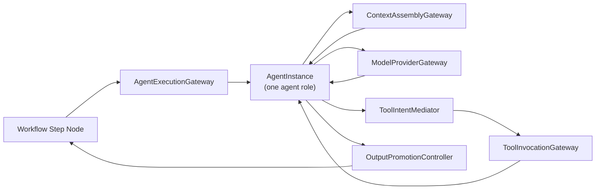

**Governance requirements:** Single AgentRuntimeEnvelope; standard policy evaluation; standard telemetry.
**MVP relevance:** Core MVP pattern.

### 9.3 Supervisor-Directed Coordination

A SupervisorAgent orchestrates a declared set of subordinate agents within a coordination graph. The supervisor assigns tasks, routes results, and produces a reconciled CoordinationResult.

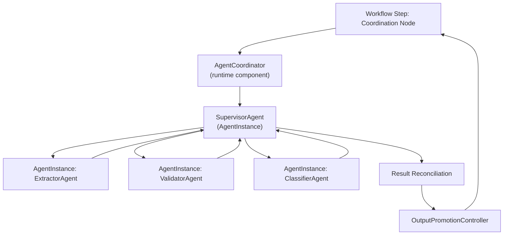

**When to use:** When multiple specialized agents must contribute to a single workflow step outcome.
**Governance requirements:** Each subordinate agent has its own AgentRuntimeEnvelope; SupervisorAgent has separate envelope with coordination scope; all events carry parent_coordination_id.
**Failure behavior:** If a subordinate agent fails, SupervisorAgent receives failure notification and either retries, escalates, or produces a partial result per its declared failure handling policy.
**MVP relevance:** Later milestone.
**Forbidden use:** Supervisor cannot expand subordinate agent permissions beyond their declared scopes.

### 9.4 Planner/Executor/Verifier Coordination

A three-phase coordination pattern: PlannerAgent produces a plan; ExecutorAgent carries it out; VerifierAgent independently verifies the result.

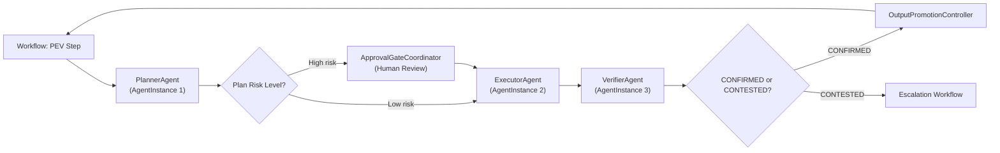

**When to use:** High-stakes cognitive tasks requiring explicit verification (financial processing, document review with legal implications).
**Governance requirements:** Plan requires policy evaluation; high-risk plans require human approval; verifier runs independently with separate context snapshot.
**Failure behavior:** If verifier produces CONTESTED result, workflow escalates — never auto-resolves.
**MVP relevance:** Later milestone.
**Forbidden use:** Executor cannot read verifier output before completion (to prevent anchoring bias). Planner cannot skip verification even if it assesses its own output as high-quality.

### 9.5 Router-Based Coordination

A RouterAgent evaluates input and routes it to one of several declared processing paths.

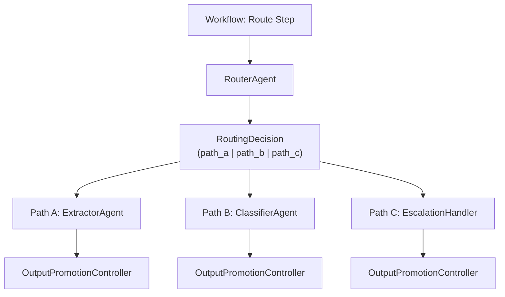

**When to use:** Content-based branching where routing logic requires model intelligence (e.g., document type detection, intent routing).
**Governance requirements:** Allowed routes MUST be declared in the workflow definition; the RouterAgent cannot create new routes.
**MVP relevance:** Later milestone.

### 9.6 Sequential Agent Chain

Agents execute in a declared sequence, each receiving the prior agent's output as part of its context.

**When to use:** Transformation pipelines where each stage builds on the previous result.
**Governance requirements:** Each step in the chain is a separate workflow node with its own AgentRuntimeEnvelope; output from step N is promoted to workflow state before step N+1 begins.
**Forbidden use:** Chaining MUST NOT bypass intermediate validation. Agent N's output must pass OutputPromotionController before agent N+1 receives it.
**MVP relevance:** Core MVP pattern (sequential extraction → validation → routing).

### 9.7 Parallel Agent Fan-Out

Multiple agents execute simultaneously and their results are reconciled.

**When to use:** Independent processing of multiple document sections; parallel research queries.
**Governance requirements:** Each agent instance has its own envelope; fan-out budget (total across all instances) is declared; reconciliation logic is declared in workflow.
**Failure behavior:** If one agent fails, reconciliation logic handles the gap — no silent partial results.
**MVP relevance:** Later milestone.

### 9.8 Human-Supervised Coordination

Agents execute and produce outputs that are held for human review before the workflow advances.

**When to use:** High-stakes decisions where agent output quality cannot be automatically verified; regulated processes requiring human sign-off.
**Governance requirements:** Step is approval-gated; AgentOutput reaches OutputPromotionController but is held pending approval; human approver receives formatted context from HumanInterfaceAgent.
**MVP relevance:** Core MVP pattern.

### 9.9 Escalation-Based Coordination

When an agent exceeds its confidence threshold, exhausts its scope, or detects a high-risk condition, it escalates to a higher-authority agent, a supervisor, or the approval system.

**When to use:** Agent encounters conditions outside its declared scope (e.g., ambiguous document type, anomalous financial values).
**Governance requirements:** Escalation targets are declared in the AgentPolicyBinding; ad hoc escalation paths are forbidden.
**MVP relevance:** Core MVP pattern (exceptions escalate to human approval queue).
---

## 10. Agent Handoff Semantics

### 10.1 What a Handoff Is

An **AgentHandoff** is a governed runtime transition from one AgentInstance to another within a multi-agent coordination graph. It is not a private message between agents. It is a recorded, audited state transition in the AgentCoordinator, producing an immutable AgentHandoff record with all required identity and governance fields.

A handoff occurs when an AgentInstance has completed its portion of a task and needs to transfer work — with a defined payload — to a designated recipient agent. The recipient is declared in the coordination graph, not chosen ad hoc by the transferring agent.

### 10.2 Handoff Lifecycle

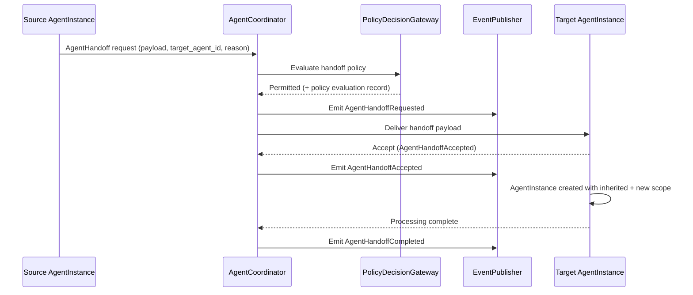

### 10.3 Handoff Request Fields

```typescript
interface AgentHandoffRequest {
  handoff_id: string;                  // ULID
  source_agent_instance_id: string;
  source_agent_execution_id: string;
  target_agent_role: AgentRole;        // Declared in coordination graph
  target_agent_id: string | null;      // If null, AgentCoordinator selects from graph
  handoff_reason: string;              // Structured reason (e.g., 'task_complete', 'scope_exceeded', 'escalation')
  payload_schema_ref: string;          // Schema of the handoff payload
  payload_artifact_id: string;         // Reference to the handed-off content
  run_id: string;
  step_id: string;
  tenant_id: string;
  trace_id: string;
  correlation_id: string;
  policy_snapshot_id: string;
  requested_at: string;
}
```

### 10.4 Handoff Rules

| Rule | Requirement |
|---|---|
| **H-01** | Every handoff MUST emit an `AgentHandoffRequested` event before the payload is transferred |
| **H-02** | Every handoff MUST preserve `run_id`, `trace_id`, and `tenant_id` |
| **H-03** | Handoffs MUST NOT transfer hidden state (working memory, chain-of-thought) that is not included in the explicit payload |
| **H-04** | Handoffs MUST NOT expand permissions beyond what the target agent's declared scope permits |
| **H-05** | Handoffs MUST NOT bypass approval gates that the target agent's scope requires |
| **H-06** | Handoff payload MUST be schema-validated before transfer |
| **H-07** | Handoff to a target outside the declared coordination graph is FORBIDDEN |
| **H-08** | Handoff rejection creates an `AgentHandoffRejected` event and returns control to the source agent or AgentCoordinator |
| **H-09** | Handoff timeout produces an `AgentHandoffTimedOut` event and triggers failure handling |
| **H-10** | Memory visibility for the target agent is determined by the target's AgentScope, not inherited from the source |

### 10.5 Permission Inheritance at Handoff

When an agent hands off to another, the receiving agent gets its own AgentRuntimeEnvelope based on its declared AgentVersion and AgentScope. It does NOT inherit the source agent's permissions. If the source agent had ExternalWrite tool access and the target agent does not, the target agent cannot perform ExternalWrite operations — regardless of what the handoff payload says.

---

## 11. Agent Planning Model

### 11.1 Plans as Artifacts, Not Commands

An `AgentPlan` is a structured recommendation artifact produced by a PlannerAgent. It is not an execution directive. A plan proposes what should happen. The runtime decides whether and how to execute it, subject to policy evaluation, approval requirements, and workflow validation.

Plans are subject to the same output validation chain as all other agent outputs: schema validation, data classification check, policy check, and promotion decision. High-risk plans — those proposing tool operations with ExternalWrite or higher side-effect class, financial transactions, or actions above a configured risk threshold — MUST receive human approval before the workflow advances.

### 11.2 AgentPlan Structure

```typescript
interface AgentPlan {
  plan_id: string;
  agent_execution_id: string;
  tenant_id: string;
  run_id: string;
  step_id: string;

  // Plan content
  objective: string;                    // Statement of what the plan aims to achieve
  proposed_steps: AgentPlanStep[];      // Ordered or partially ordered step proposals
  required_tools: string[];             // tool_id@version format
  required_memory_namespaces: string[]; // Memory namespaces needed
  expected_outputs: OutputSchemaRef[];  // Schema refs for each step's expected output

  // Risk assessment
  risk_level: 'low' | 'medium' | 'high' | 'critical';
  risk_rationale: string;
  confidence: number;                   // 0.0–1.0; advisory; not authoritative

  // Governance
  policy_implications: string[];        // Declared policy impact notes
  approval_required: boolean;           // Computed from risk_level + policy rules
  approval_threshold: string | null;    // Which approval type is required

  // Provenance
  created_at: string;
  schema_version: string;
  is_authoritative: false;             // Always false; a plan is never authoritative
}

interface AgentPlanStep {
  step_number: number;
  description: string;
  agent_role: AgentRole;
  required_tools: string[];
  required_memory: string[];
  estimated_tokens: number | null;
  estimated_cost_usd: number | null;
  side_effect_class: SideEffectClass;
  approval_required: boolean;
}
```

### 11.3 Plan-to-Workflow Relationship

A plan produced by a PlannerAgent does NOT automatically become a workflow. Plans and workflows are distinct concepts:

| AgentPlan | Workflow |
|---|---|
| Produced at runtime by an agent | Defined at design time by an operator |
| A recommendation artifact | An authoritative control structure |
| Subject to approval | Approved plans become workflow proposals |
| Mutable until approved | Immutable after publication as WorkflowVersion |

An approved plan may feed the workflow design process — a platform operator reviews it, validates it against MYCELIA constraints, and creates a new WorkflowVersion from it. This is a human-mediated process. Agents do not automatically create or modify workflow definitions.

---

## 12. Agent Memory Access Model

### 12.1 The Agent Memory Request Contract

An agent's relationship to memory is governed by a strict request/grant model. The agent does not have direct memory access. It issues an `AgentMemoryRequest` to MemoryAccessGateway, which evaluates the request against the AgentScope, the active PolicySnapshot, and the tenant boundary, then grants or denies.

This boundary exists at the agent coordination level (this document) and is implemented by MemoryAccessGateway and ContextAssemblyGateway (Document 10). Document 05 defines the boundary contract; Document 10 defines the implementation.

### 12.2 Memory Request Types

| Request Type | Description | Default Permission |
|---|---|---|
| Context read | Read memory objects for context assembly | Per `AgentScope.allowed_memory_namespaces` |
| Semantic search | Vector similarity search within namespace | Per `AgentScope.allowed_memory_namespaces` |
| Structured lookup | Key-based memory object lookup | Per `AgentScope.allowed_memory_namespaces` |
| Memory write | Persist a new memory object | `AgentScope.memory_write_permitted = true` REQUIRED |
| Memory update | Modify an existing memory object | Requires explicit policy permission; provenance preserved |

### 12.3 Memory Scope Rules

- An agent's memory scope is declared in `AgentRuntimeEnvelope.memory_scope.allowed_namespaces`.
- Agents CANNOT request memory from namespaces outside their declared scope.
- Agents CANNOT browse namespaces globally — they must issue specific queries within their scope.
- Cross-tenant memory access is architecturally impossible: MemoryAccessGateway validates `tenant_id` from the envelope before every operation.
- Retrieval results are always trust-annotated: retrieved content is classified `UNTRUSTED` by default (Document 04 §11.3).
- Memory writes carry a MemoryProvenanceRecord referencing `agent_execution_id`, `run_id`, `step_id`, and `tenant_id`.
- Memory writes that exceed scope produce `MemoryWriteRejected` event and an AuditRecord.

### 12.4 Replay Memory Behavior

During replay, agents do not re-query memory live. The original ContextSnapshot (created at execution time) is used to hydrate the agent's context. If memory content has changed since the original execution, the replay uses the original snapshot and records a ContextHashDivergence in the ReplayDivergence record.

---

## 13. Agent Tool Access Model

### 13.1 The Agent Tool Request Contract

An agent's relationship to tool execution follows the same request/mediation model as memory: the agent expresses intent; the runtime decides. Agents issue `AgentToolRequests` (expressed as structured output tool intent expressions) which are processed by ToolIntentMediator, forwarded to ToolInvocationGateway, and executed by sandboxed workers under declared contracts (Document 15).

### 13.2 Tool Request Validation Steps

| Step | Component | Check |
|---|---|---|
| 1. Intent extraction | AgentRuntime / StructuredOutputValidator | Tool name and arguments are valid JSON per output schema |
| 2. Registry resolution | ToolIntentMediator | Tool name and version exist in ToolRegistry |
| 3. Scope check | ToolIntentMediator | Tool is in `AgentRuntimeEnvelope.tool_scope.allowed_tools` |
| 4. Budget check | CognitiveBudgetManager | `max_tool_calls` not exhausted |
| 5. Policy evaluation | ToolInvocationGateway → PolicyDecisionGateway | Policy permits this tool for this agent in this context |
| 6. Approval gate | ToolInvocationGateway → ApprovalGateCoordinator | If side-effect class requires approval, block until granted |
| 7. Execution | ToolInvocationGateway → Worker | Sandboxed execution under declared contract |
| 8. Result validation | ToolInvocationGateway | Output matches tool's declared output schema |
| 9. Result delivery | ToolIntentMediator → AgentRuntime | Sanitized result returned as AgentObservation |

### 13.3 Tool Output Trust Level

Tool outputs returned to the agent are classified as `data`, not `instruction`. Tool results:
- Are placed in the `untrusted_context` block of the agent's next prompt iteration (Document 04 §12.2).
- MUST NOT be treated as trusted instructions by the model.
- MUST NOT be allowed to override system-level or developer-level prompt blocks.
- Are recorded as AgentObservation events for audit.

### 13.4 Denied Tool Requests

When a tool request is denied (scope violation, policy denial, hallucinated tool):
- `ToolIntentRejected` or `HallucinatedToolDetected` event is emitted.
- The AgentInstance receives a structured denial signal (not the raw policy decision).
- The agent's iteration budget is decremented.
- The denial is recorded in the AgentExecution audit trail.
- The agent may retry with a different tool or conclude without that tool result — subject to remaining iteration budget.

---

## 14. Agent Governance and Approval Integration

### 14.1 Agent Policy Binding

Every AgentVersion carries an `AgentPolicyBinding` reference that links the agent definition to applicable policy rules. At runtime, the PolicyDecisionGateway uses the active PolicySnapshot (bound at GovernedRun creation) to evaluate all policy-gated agent operations.

The PolicyDecisionGateway is called at the following agent execution points:
1. AgentInstance creation (is this agent permitted to be instantiated in this context?)
2. Tool request evaluation (is this tool permitted for this agent in this context?)
3. Memory write request evaluation
4. Output promotion evaluation (does this output class require policy approval?)
5. Handoff evaluation (is this handoff target permitted?)
6. Plan approval evaluation (does this plan require human review?)

### 14.2 Approval-Required Agent Operations

| Operation | Approval Condition | Approver Type |
|---|---|---|
| Tool invocation (ExternalWrite) | Policy declares approval required | Authorized approver (workflow-defined) |
| Tool invocation (FinancialTransaction) | Always | Authorized approver with financial role |
| Tool invocation (IrreversibleAction) | Always | Authorized approver |
| AgentPlan execution (high-risk) | `plan.risk_level = high` or `critical` | Authorized approver with oversight role |
| Agent output promotion (critical data) | Policy triggers on data classification | Authorized approver |
| Break-glass agent execution | Emergency override | Incident-linked operator with time-limited grant |

### 14.3 Agent Cannot Approve Its Own Requests

This is an absolute rule. An AgentApprovalRequest submitted by agent execution A cannot be approved by any output or action from agent execution A (or any subordinate agent in the same execution tree). Approval requires a human principal with the appropriate RBAC role acting through the ApprovalGateCoordinator's designated approver interface.

### 14.4 Governance Is Deterministic

Policy evaluation given the same agent context, the same PolicySnapshot, and the same operation produces the same result. This determinism is the property that makes governance auditable and replayable. Policy changes take effect in the next PolicySnapshot — they do not retroactively change decisions made under prior snapshots.

---

## 15. Agent Observability and Telemetry

### 15.1 Required Agent Events

Every event listed here is mandatory. CognitiveAuditRecorder and CognitiveTraceEmitter produce these events. They MUST NOT be sampled.

| Event | Producer | Required Fields | Audit Importance | Replay |
|---|---|---|---|---|
| **AgentInstanceCreated** | AgentExecutionGateway | agent_instance_id, agent_version_id, tenant_id, run_id, step_id, trace_id, policy_snapshot_id | Standard | Hydrated |
| **AgentExecutionStarted** | AgentExecutionGateway | agent_execution_id, agent_instance_id, budget snapshot, envelope ref | Standard | Hydrated |
| **AgentContextPrepared** | ContextAssemblyGateway | context_snapshot_id, context_hash, memory_namespaces_accessed | Standard | Hydrated |
| **AgentMemoryRequested** | MemoryAccessGateway | retrieval_session_id, namespace_id, query_hash, tenant_id | Standard | Hydrated |
| **AgentMemoryGranted** | MemoryAccessGateway | retrieval_session_id, result_count, trust_levels | Standard | Hydrated |
| **AgentMemoryDenied** | MemoryAccessGateway | namespace_id, denial_reason, tenant_id | High | Hydrated |
| **AgentToolRequested** | ToolIntentMediator | tool_name, tool_version, arguments_schema_ref, agent_execution_id | Standard | Tool execution suppressed |
| **AgentToolApproved** | ToolInvocationGateway | tool_invocation_id, approval_id if applicable | Standard | Tool result hydrated |
| **AgentToolDenied** | ToolIntentMediator | tool_name, denial_reason, agent_execution_id | High | Hydrated |
| **AgentHandoffRequested** | AgentCoordinator | handoff_id, source_agent_id, target_agent_role, payload_schema_ref | High | Hydrated |
| **AgentHandoffAccepted** | AgentCoordinator | handoff_id, target_agent_instance_id | Standard | Hydrated |
| **AgentHandoffRejected** | AgentCoordinator | handoff_id, rejection_reason | High | Hydrated |
| **AgentPlanCreated** | OutputPromotionController | plan_id, risk_level, approval_required | High | Hydrated |
| **AgentOutputValidated** | StructuredOutputValidator | output_validation_status, schema_ref, refusal_detected | Standard | Hydrated |
| **AgentExecutionSucceeded** | AgentExecutionGateway | agent_execution_id, output_artifact_id, token_count, cost_usd, duration_ms | Standard | Hydrated |
| **AgentExecutionFailed** | CognitiveErrorRouter | agent_execution_id, failure_class, failure_reason | High | Hydrated |
| **AgentBudgetExceeded** | CognitiveBudgetManager | agent_execution_id, budget_type, consumed, limit | High | Hydrated |
| **AgentReplayHydrated** | CognitiveReplayAdapter | agent_execution_id, original_execution_id, artifacts_loaded | High | IS the replay entry event |

### 15.2 Canonical Trace Hierarchy

```
RunTrace (trace_id)
└── RunSpan (run_id)
    └── StepSpan (step_id)
        └── AgentExecutionSpan (agent_execution_id)         [invoke_agent]
            ├── ContextAssemblySpan (context_snapshot_id)
            │   └── RetrievalSessionSpan (retrieval_session_id)  [retrieval]
            ├── PromptConstructionSpan
            ├── ModelInvocationSpan (model_invocation_id)   [chat/generate_content]
            ├── OutputValidationSpan
            ├── ToolIntentSpan (tool_name)                  [execute_tool]
            │   └── ToolInvocationSpan (tool_invocation_id)
            └── HandoffSpan (handoff_id)                    [if handoff occurs]
                └── AgentExecutionSpan (target agent)
```

### 15.3 Required Span Attributes

Every AgentExecutionSpan MUST carry:
- `tenant_id`, `run_id`, `step_id`, `agent_execution_id`
- `agent_id`, `agent_version_id`, `agent_role`
- `policy_snapshot_id`, `trace_id`, `correlation_id`
- `gen_ai.operation.name = invoke_agent` (OTel GenAI convention)
- `gen_ai.agent.id`, `gen_ai.agent.name`
- Budget fields: `token_budget_consumed`, `cost_usd_consumed`, `iterations_used`
- `is_replay` flag

### 15.4 Audit Importance Tiers

| Tier | Events | Sampling | Retention |
|---|---|---|---|
| **Critical** | TenantBoundaryViolation, AgentScopeViolation, PromptInjectionSuspected, HallucinatedToolDetected | NEVER sampled | Permanent |
| **High** | AgentMemoryDenied, AgentToolDenied, AgentHandoffRejected, AgentBudgetExceeded, AgentExecutionFailed | NEVER sampled | Minimum 12 months |
| **Standard** | AgentExecutionStarted, AgentExecutionSucceeded, AgentToolApproved, AgentHandoffAccepted | NEVER sampled (audit records) | Per retention policy (minimum 6 months per EU AI Act Art. 12) |

---

## 16. Agent Output Model

### 16.1 Output Classes

Every output produced by an agent must be classified into one of the following output classes. The class determines validation requirements, trust level, persistence behavior, and promotion eligibility.

| Output Class | Description | Schema Required | Trust Level | Approval Required | Promotion Target |
|---|---|---|---|---|---|
| **Recommendation** | Proposed action or conclusion for human or policy review | Yes | ADVISORY | Policy-conditional | Approval inbox / recommendation store |
| **Classification** | Label assignment with confidence annotation | Yes | ASSISTIVE | No | Workflow state (classification field) |
| **Extraction** | Structured data extracted from input | Yes | DATA | No (if schema valid) | Workflow state (extraction fields) |
| **Summary** | Condensed representation of source content | Yes | ASSISTIVE | No | Workflow state or artifact store |
| **ValidationResult** | Pass/fail/exception result with field detail | Yes | DATA | No (for standard) | Workflow state (validation field) |
| **RiskAssessment** | Risk scoring and rationale | Yes | ADVISORY | Policy-conditional | Workflow state / approval inbox |
| **Plan** | Structured AgentPlan artifact | Yes (AgentPlan schema) | ADVISORY | High-risk: Yes | Plan store → workflow proposal |
| **ToolRequest** | Structured tool invocation intent | Yes | INTENT | N/A (routes to ToolIntentMediator) | N/A — consumed by mediator |
| **MemoryWriteProposal** | Structured request to persist a memory object | Yes | REQUEST | Per policy | N/A — consumed by MemoryAccessGateway |
| **ApprovalRequest** | Request for human authorization | Yes | REQUEST | N/A — this IS the approval request | N/A — consumed by ApprovalGateCoordinator |
| **Artifact** | Self-contained produced document or data object | Yes | DATA | Policy-conditional | Artifact store |
| **ErrorReport** | Structured record of agent-detected error or anomaly | Yes | DATA | No | Error log / workflow exception handler |

### 16.2 Output Validation Requirements

All agent outputs pass through the validation chain defined in Document 04 §14.2 (RawModelOutput → SyntaxValidation → SchemaValidation → DataClassificationCheck → PolicyCheck → PromotionDecision). In the agent coordination context, the additional rule is:

- **CONTESTED results from VerifierAgent MUST NOT be automatically promoted.** They MUST trigger an escalation workflow.
- **AgentPlan with risk_level = high or critical MUST NOT be promoted without human approval**, regardless of schema validity.
- **Recommendations are advisory.** They MUST be marked as such in the promotion record. Promoting a Recommendation does not authorize the recommended action.

### 16.3 Output Provenance

Every AgentOutput record carries:
- `agent_execution_id` — the execution that produced it.
- `agent_version_id` — the agent version that produced it.
- `context_snapshot_id` — the context used during production.
- `model_invocation_id` — the model call that generated the raw content.
- `output_hash` — SHA-256 for integrity verification.
- `promoted_at` — timestamp of promotion (null if not yet promoted).
- `is_replay_artifact` — true if produced during replay.

### 16.4 Agent Output Promotion Boundary

Agent output MUST NOT become runtime state merely because it is valid model output.

MYCELIA distinguishes between:

- raw model output;
- validated agent output;
- promoted workflow state;
- approved decision;
- persisted artifact;
- memory write.

Each transition requires explicit validation and authorization.

### Output Promotion Pipeline

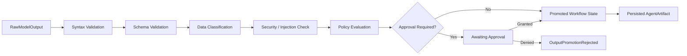

### Promotion Classes

| Output Class | May Become State? | Requires Approval? | Notes |
|---|---:|---:|---|
| Classification | Yes | No by default | Must match schema and confidence policy |
| Extraction | Yes | No by default | Field-level confidence may trigger review |
| ValidationResult | Yes | Conditional | Failed validation may trigger escalation |
| Summary | Yes | No by default | Cannot introduce facts outside source |
| Recommendation | No direct authority | Conditional | Advisory only; cannot authorize action |
| RiskAssessment | Yes | Policy-dependent | High/critical risk may require approval |
| AgentPlan | No direct execution | Yes for high-risk | May become workflow proposal only through review |
| ToolRequest | No | N/A | Consumed by ToolIntentMediator |
| MemoryWriteProposal | No | Policy-dependent | Consumed by MemoryAccessGateway |
| ApprovalRequest | No | N/A | Consumed by ApprovalGateCoordinator |
| Artifact | Yes, as artifact | Policy-dependent | Must preserve provenance |
| ErrorReport | Yes, as error evidence | No | May trigger failure or escalation |

### Rules

- Raw model output MUST NOT be written directly to GovernedRun state.
- Validated AgentOutput MUST NOT become authoritative state without OutputPromotionController.
- Recommendations MUST remain advisory unless separately approved or converted into an authorized workflow action.
- AgentPlan MUST NOT mutate WorkflowDefinition or WorkflowVersion.
- ToolRequest MUST NOT execute directly from model output.
- MemoryWriteProposal MUST NOT write memory directly.
- Every promotion MUST preserve provenance.
- Every rejected promotion MUST emit `OutputPromotionRejected`.

### Forbidden Behavior

FORBIDDEN:

- treating schema-valid output as automatically authoritative;
- promoting recommendations as decisions;
- promoting plans as executable workflows without approval;
- using agent confidence score as authorization;
- writing agent output directly to database tables outside OutputPromotionController;
- allowing Codex to bypass output promotion because the MVP is simple.

---

## 17. Agent Failure Semantics

### 17.1 Failure Catalog

| Failure Mode | Detection | Containment | Recovery | Emitted Events | Retry | Escalation | Replay |
|---|---|---|---|---|---|---|---|
| **Invalid output schema** | StructuredOutputValidator | Block promotion; record failure | Retry with format guidance if budget permits | OutputValidationFailed, AgentExecutionFailed | Yes (within iteration budget) | After max retries | Hydrated from failure record |
| **Hallucinated tool** | ToolIntentMediator: tool not in registry | Block invocation; deny intent | Agent receives denial; may retry with different tool | HallucinatedToolDetected, AgentToolDenied | Per remaining iterations | Security AuditRecord | Hydrated |
| **Unauthorized tool request** | ToolIntentMediator: out-of-scope tool | Block invocation | Agent receives scope-denial signal | AgentToolDenied, AgentScopeViolation | No (scope is immutable) | High-priority audit | Hydrated |
| **Unauthorized memory request** | MemoryAccessGateway: namespace out of scope | Block read | Agent proceeds with reduced context | AgentMemoryDenied | No | Conditional | Hydrated |
| **Budget exceeded (tokens/cost/iterations)** | CognitiveBudgetManager | Halt execution immediately | Step fails; run evaluates fallback | AgentBudgetExceeded, AgentExecutionFailed | No | Alert on threshold breach | Hydrated |
| **Timeout** | CognitiveBudgetManager (wall-clock) | Halt execution | Step fails with TimedOut status | AgentExecutionFailed (TimedOut) | No (new attempt is new execution) | Alert | Hydrated |
| **Loop detected** | CognitiveBudgetManager (iteration spike) | Halt; emit loop alert | Fail step with loop detection | AgentLoopDetected, AgentBudgetExceeded | No | Alert | Hydrated |
| **Handoff rejected** | AgentCoordinator | Handoff fails; source agent receives rejection | Source agent may escalate or fail gracefully | AgentHandoffRejected | Per handoff budget | Escalation workflow | Hydrated |
| **Handoff timeout** | AgentCoordinator (handoff TTL) | Handoff fails | Source agent fails step | AgentHandoffTimedOut | No | Alert | Hydrated |
| **Model provider failure** | ModelProviderGateway | Block model call | Fallback model chain; fail if chain exhausted | ModelProviderUnavailable, AgentExecutionFailed | Yes (fallback chain) | After chain exhaustion | Hydrated from recorded output |
| **Prompt injection detected** | PromptInjectionGuard | Quarantine content | Step fails; security alert | PromptInjectionSuspected, InjectionEscalated | No (security escalation first) | Immediate security alert | Suppressed pending review |
| **Conflicting agent outputs** | VerifierAgent (CONTESTED result) | Block promotion | Escalation workflow | AgentOutputConflicted, EscalationTriggered | No (human resolution required) | Human review required | Hydrated |
| **Supervisor failure** | AgentCoordinator (supervisor non-response) | Subordinate agents suspended | Escalate to human oversight | SupervisorAgentFailed, CoordinationFailed | Per retry budget | Human oversight | Hydrated |
| **Verifier failure** | AgentCoordinator (verifier non-response or invalid output) | Block final promotion | Retry verifier step | VerifierAgentFailed | Yes | After max retries | Hydrated |
| **Replay divergence** | CognitiveReplayAdapter | Record divergence; continue replay with suppression | Divergence report | ReplayDivergenceDetected | N/A | Operator investigation | IS the failure in replay context |
| **Tenant boundary violation** | AgentRuntimeEnvelope validation | Immediate abort | Security incident response | TenantBoundaryViolation | Never | Immediate SEV0/SEV1 | Halt replay; require security review |

---

## 18. Agent Budget, Quota and Cost Control

### 18.1 Budget Types

| Budget Type | Unit | Scope | Enforcement Component | Exhaustion Behavior |
|---|---|---|---|---|
| **Token budget** | Tokens (input + output) | Per AgentExecution | CognitiveBudgetManager | Halt before next model call |
| **Iteration budget** | Reasoning cycles | Per AgentExecution | CognitiveBudgetManager | Halt before next cycle |
| **Time budget** | Milliseconds | Per AgentExecution | CognitiveBudgetManager | Halt execution; emit TimedOut |
| **Cost budget** | USD | Per AgentExecution | CognitiveBudgetManager | Halt before next model call |
| **Tool request budget** | Count | Per AgentExecution | CognitiveBudgetManager | Block next tool request |
| **Memory retrieval budget** | Count | Per AgentExecution | CognitiveBudgetManager | Block next retrieval request |
| **Handoff budget** | Count | Per AgentInstance | AgentCoordinator | Block next handoff request |
| **Per-run budget** | Aggregate across all agent executions | Per GovernedRun | RuntimeBudgetManager | Block new agent step dispatch |
| **Per-tenant daily budget** | Aggregate across all runs | Per Tenant | RuntimeQuotaManager | Rate-limit new run creation |

### 18.2 Budget Hierarchy

```
PlatformQuota (platform-wide ceiling)
  └── TenantQuota (per-tenant daily/monthly limit)
        └── WorkspaceQuota (per-workspace limit)
              └── RuntimeBudget (per-GovernedRun)
                    └── AgentBudget (per-AgentExecution declared in AgentScope)
```

The most restrictive budget at any level applies. An AgentScope that declares `max_cost_usd: 5.00` cannot override a GovernedRun RuntimeBudget of `max_cost_usd: 1.00`.

### 18.3 Budget Enforcement Rules

- **No agent execution may have unlimited budget.** Every AgentExecution MUST have an initialized AgentBudget from its AgentScope.
- **Budget preflight MUST be executed before every model call, tool request, and retrieval call.**
- **Budget exhaustion is fail-closed.** Execution halts immediately; no partial output is promoted.
- **Hidden retries are forbidden.** Every retry attempt is a new AgentExecutionAttempt with its own budget accounting.
- **Budget increases during execution require a policy override** with an AuditRecord referencing the override authorization.
- **All budget decisions are audit-visible.** Budget events carry agent_execution_id, budget_type, consumed, and limit.
- **Denial-of-Wallet prevention:** Per-tenant daily cost budget prevents runaway cost from accumulating across many runs. Cost spike detection (single invocation exceeds threshold) triggers alert without halting unless ceiling is hit.

---

## 19. Agent Replay Semantics

### 19.1 Replay Philosophy for Agents

Agent replay reconstructs what an agent execution did, using the same inputs and recorded outputs, without re-running live model inference or side-effectful tool executions. Replay produces an investigatable reconstruction — it does not re-execute the agent's work.

Replay is not a feature that must "work correctly" by reproducing the original outcome. It is a forensic tool that enables investigation of the original outcome. Divergences between original and replay are expected when conditions have changed, and they are valuable — they reveal what changed.

### 19.2 Replay Hydration Sources

| Original Artifact | Replay Hydration Source | Notes |
|---|---|---|
| AgentOutput | AgentReplayRecord.agent_output_ref | Schema validation still runs on replayed output |
| ContextSnapshot | Original ContextSnapshot record | Memory is NOT re-queried; original snapshot used |
| ModelInvocation result | ModelOutput artifact (recorded at execution time) | Live model call suppressed |
| ToolExecution result | ToolReplayRecord | Side-effectful tool execution suppressed |
| AgentPlan | AgentReplayRecord.plan_ref | Plan not re-created |
| AgentHandoff | Handoff event record | Handoff not re-executed; hydrated from event |
| ApprovalDecision | Original ApprovalRecord | Approval not re-requested |
| PolicySnapshot | Original PolicySnapshot binding on GovernedRun | Current policy NOT used in replay |
| AgentVersion | Original agent_version_id from envelope | Current agent version NOT used |

### 19.3 Replay Suppression Rules

| Operation | Suppressed in Replay? | Condition |
|---|---|---|
| Model inference (live call) | Yes | When recorded ModelOutput exists |
| Tool execution (NoSideEffect) | No | May re-execute; safe |
| Tool execution (ReadOnlyExternal) | Yes | ToolReplayRecord required |
| Tool execution (ExternalWrite, Financial, Irreversible) | Yes | Always suppressed; ToolReplayRecord required |
| Memory write | Suppressed | Memory writes do not replay against production memory |
| AgentHandoff execution | Suppressed | Reconstructed from handoff event record |
| Approval gate decision | Suppressed | Original ApprovalRecord used |
| AgentPlan creation | Suppressed | Original plan artifact hydrated |

### 19.4 Simulation Mode

With explicit operator authorization and an isolated replay environment, simulation mode allows selective re-execution of agent steps with modified inputs (e.g., different tool results, modified context) to test counterfactuals. Simulation mode:
- MUST be explicitly flagged as `simulation_mode: true` in the replay envelope.
- MUST route to an isolated telemetry namespace.
- MUST NOT use production credentials.
- MUST NOT write to production memory or artifact stores.
- MUST create a distinct `simulation_run_id` that does not reference original run lineage as a replay.
- Is a Later/Enterprise milestone.

### 19.5 Replay Flow Diagram

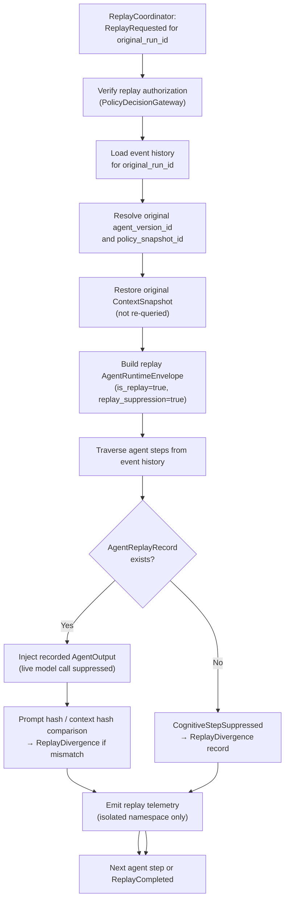
---

## 20. Agent Security and Prompt Injection Model

### 20.1 The Agent Security Boundary

Agent security in MYCELIA is structural, not model-dependent. The security properties that matter — credential exclusion, scope enforcement, output validation, injection containment — are enforced by the runtime infrastructure, not by the model's compliance with instructions. A compromised or manipulated model cannot break these properties because the enforcement is external to the model.

### 20.2 Untrusted Input Handling

All inputs to an agent step that originate from external sources — retrieved documents, tool outputs, user-provided data, prior agent outputs from other workflow runs — are treated as `UNTRUSTED` until validated. They are placed in the untrusted_context block of the prompt (Document 04 §12.2) and annotated as data, not instruction.

### 20.3 Tool Output as Data, Not Instruction

Tool outputs returned to the agent are observations — data items that the agent incorporates into its reasoning. They are NOT system instructions. The runtime enforces this by placing tool outputs in the untrusted context block. An adversarially crafted tool output that contains instruction-like text cannot override the system block or the agent's declared scope.

### 20.4 Memory Poisoning Risk

Persistent memory poisoning — injecting malicious content into the knowledge base to influence future agent sessions — is mitigated at the write path:
- Memory writes require authenticated identity, policy authorization, and provenance recording.
- Retrieved content is always trust-annotated; anomalous patterns are flagged by PromptInjectionGuard.
- ContextSnapshot records enable forensic identification of which memory was used in which execution.
- See Document 04 §16.5 for the complete RAG poisoning control model.

### 20.5 Prompt Injection Detection

PromptInjectionGuard screens:
1. All user-provided inputs before context assembly.
2. All retrieved content before context assembly.
3. All tool outputs before they are added to agent context.
4. Model output for instruction-override patterns before promotion.

When injection is suspected: content is quarantined; `PromptInjectionSuspected` event is emitted; a Critical AuditRecord is created. Execution does not proceed with the quarantined content.

### 20.6 Credential Non-Visibility

Agents NEVER see raw credential values. The credential lifecycle is:
1. CredentialLease is issued by the Security Plane (Vault / SPIFFE) to the executing worker.
2. The worker uses the credential within the sandboxed tool execution.
3. The credential is revoked at the end of the tool execution.
4. The agent receives the tool's output — never the credential used to obtain it.

The AgentRuntimeEnvelope does not carry credential values. It carries `security_context.sandbox_class` and related policy fields, but no secrets.

### 20.7 Scope Enforcement as Security Control

Scope enforcement is both a functional limit and a security control:
- AgentScope restricts tool access to the minimum needed for the task (least privilege for tools — OWASP LLM06 / NIST SP 800-207).
- AgentScope restricts memory access to declared namespaces (limits exfiltration blast radius).
- AgentScope restricts budget (limits denial-of-wallet attacks — OWASP LLM10).
- Scope is immutable at runtime; agents cannot expand scope regardless of reasoning.

### 20.8 Quarantined Output Handling

When an agent output is quarantined (injection suspected, security anomaly detected):
- The output is NOT promoted.
- An `OutputQuarantined` event is emitted.
- A Critical AuditRecord is created.
- The AgentExecution is terminated with a security failure.
- The original AgentOutput artifact is preserved for forensic investigation.
- Replay of the quarantined execution is restricted pending security review.

### 20.9 Agent Kill Switch & Quarantine Protocol

MYCELIA MUST support immediate containment of unsafe AgentDefinitions, AgentVersions and AgentInstances.

Agent containment may be required when runtime behavior, prompt injection, output drift, policy violation, tenant boundary risk, excessive cost, tool misuse or operator review indicates that an agent is unsafe.

### Kill Switch Scopes

| Scope | Effect |
|---|---|
| AgentVersion | Blocks new instances of a specific version |
| AgentDefinition | Blocks all versions of an agent |
| AgentRole | Blocks all agents of a specific role |
| Tenant Agent Binding | Blocks agent for one tenant |
| Workspace Agent Binding | Blocks agent for one workspace |
| Workflow Step Binding | Blocks agent only for a specific workflow step |
| Tool Permission Binding | Removes a tool permission from agents using that binding |
| Memory Namespace Binding | Removes memory access from agents using that namespace |
| Model Provider Route | Blocks agent executions using a specific provider route |

### Quarantine Triggers

An agent MUST be quarantined when:

- prompt injection is confirmed at high severity;
- tenant boundary violation is attempted;
- agent output repeatedly violates schema;
- agent repeatedly requests tools outside scope;
- agent attempts self-approval;
- agent attempts memory access outside scope;
- cost or iteration runaway is detected;
- behavior diverges materially from certified AgentRole;
- AgentVersion integrity hash mismatch is detected;
- policy binding is found invalid;
- operator manually declares containment.

### Quarantine Behavior

When an agent is quarantined:

- new AgentInstances are blocked;
- in-flight AgentInstances are paused, cancelled or allowed to complete according to risk class;
- tool requests from affected agents are denied;
- memory writes from affected agents are blocked;
- certification status changes to `quarantined`;
- replay remains read-only using historical artifacts;
- affected tenants and workflows are identified;
- `AgentQuarantined` event is emitted;
- an AuditRecord is created.

### Required Events

The protocol MUST emit:

- `AgentQuarantineRequested`;
- `AgentQuarantined`;
- `AgentKillSwitchActivated`;
- `AgentInstanceBlocked`;
- `AgentToolRequestsBlocked`;
- `AgentMemoryWritesBlocked`;
- `AgentQuarantineReleased`.

### Rules

- Quarantine MUST be auditable.
- Quarantine MUST NOT delete historical AgentExecution records.
- Quarantine MUST NOT delete AgentReplayRecord artifacts.
- Releasing quarantine MUST require explicit review.
- A quarantined AgentVersion MUST NOT be automatically re-enabled by deployment rollback.
- Quarantine of platform-scoped agents MUST evaluate all affected tenants.

### Forbidden Behavior

FORBIDDEN:

- silently disabling an agent without audit;
- deleting AgentVersions to contain risk;
- allowing quarantined AgentVersions to create new AgentInstances;
- allowing in-flight unsafe agents to continue without risk review;
- letting the publisher of an agent self-unquarantine it;
- deleting historical execution evidence during containment.

---

## 21. Multi-Tenant Agent Isolation

### 21.1 Tenant Binding Is Absolute

Every AgentInstance is bound to exactly one `tenant_id`. This binding is established in the AgentRuntimeEnvelope and validated at every operation. It cannot be changed during execution.

The following are always tenant-scoped and never shared across tenants:
- AgentInstance records
- AgentExecution records and artifacts
- Memory namespace access
- Tool invocations and tool artifacts
- Telemetry spans and audit records
- ContextSnapshot records
- AgentPlan artifacts
- AgentHandoff records

### 21.2 Tenant Isolation Enforcement Points

| Layer | Enforcement Mechanism | Component |
|---|---|---|
| Envelope | tenant_id present and signed | RuntimeEnvelopeBuilder |
| AgentInstance creation | tenant_id from envelope; validated | AgentExecutionGateway |
| Memory access | Namespace filtered by tenant_id | MemoryAccessGateway |
| Tool execution | Envelope tenant_id validated by worker | ToolInvocationGateway + Worker |
| Telemetry | All spans carry tenant_id | CognitiveTraceEmitter |
| Audit records | All records carry tenant_id | CognitiveAuditRecorder |
| Handoff | Handoff record carries tenant_id; cross-tenant handoff forbidden | AgentCoordinator |
| Coordination | Coordination graph is tenant-scoped | AgentCoordinator |

### 21.3 No Cross-Tenant Agent Context

An agent executing in tenant A cannot:
- Read memory from tenant B's namespaces.
- Send handoff to an agent instance in tenant B's workflow.
- Access tool outputs produced by tenant B's executions.
- Share a ContextSnapshot with tenant B.

Any attempt produces an immediate abort, a `TenantBoundaryViolation` event, and a Critical AuditRecord. This is a security incident, not a permission error.

### 21.4 Platform vs Tenant-Scoped Agent Definitions

| Scope Type | Definition Visibility | Instance Scope | Policy |
|---|---|---|---|
| Platform-scoped | Available to all tenants | Always tenant-bound at instantiation | Platform policy applies; tenant policy overlays |
| Tenant-scoped | Available to one tenant | Tenant-bound | Tenant policy applies |

A platform-scoped AgentDefinition (e.g., a standard ClassifierAgent) can be instantiated by multiple tenants, but each instance is isolated. Data from one tenant's instance never touches another tenant's instance.

---

## 22. Agent Versioning and Compatibility

### 22.1 AgentVersion Immutability

Once published, an `AgentVersion` is immutable. It captures:
- Prompt template references (by version).
- Output schema references (by version).
- Tool permission declarations.
- Memory permission declarations.
- Policy binding references.
- AgentCapability declarations.

No post-publication change is permitted. Changes require a new version with an incremented version number.

### 22.2 Version Numbering

| Change Type | Version Component | Allowed for In-Flight Runs |
|---|---|---|
| Breaking: output schema change, removed capability, reduced permissions | Major (2.0 → 3.0) | No; existing runs continue on old version |
| Compatible: added capability, extended permissions, documentation | Minor (2.0 → 2.1) | Yes, for new instances only |
| Non-functional: metadata, description | Patch (2.0.0 → 2.0.1) | Yes |

### 22.3 Replay Compatibility

Replay MUST use the `agent_version_id` recorded at original execution time. If an AgentVersion has been archived, the replay MUST either:
1. Load the archived version from the agent registry (preferred; registry retains all versions within the replay retention window).
2. Produce a `ReplayDivergence` record of type `AgentVersionUnavailable` and suppress the agent step.

### 22.4 Deprecation and Archival

| State | Behavior | Impact on New Runs | Impact on Replay |
|---|---|---|---|
| Active | Normal; available for new instances | Yes | Yes |
| Deprecated | New instances using this version produce a warning | Deprecated version still usable | Yes |
| Archived | Not available for new instances | No | Yes (within retention window) |
| Retention expired | Removed from registry | No | Replay of affected runs produces version-not-found divergence |

---

## 23. Agent Runtime APIs

### 23.1 Internal Agent Runtime API Contracts

These are internal component interfaces, not public external API contracts (see Document 18). All callers MUST hold a valid RuntimeEnvelope. All operations produce AuditRecords.

**createAgentInstance**
- Caller: StepCoordinator (via AgentExecutionGateway)
- Required envelope fields: `tenant_id`, `run_id`, `step_id`, `agent_id`, `agent_version_id`, `policy_snapshot_id`
- Output: `{ agent_instance_id, agent_execution_id, status: InstanceCreated }`
- Events emitted: AgentInstanceCreated
- Failure behavior: If AgentVersion not found or policy denies → AgentInstanceCreationFailed; step fails

**startAgentExecution**
- Caller: AgentExecutionGateway
- Required: Full AgentRuntimeEnvelope with resolved AgentScope and budget
- Output: `{ agent_execution_id, status: Running, budget_snapshot }`
- Events emitted: AgentExecutionStarted
- Failure behavior: If budget preflight fails → BudgetExhausted; if scope invalid → AgentScopeViolation

**prepareAgentContext**
- Caller: AgentRuntime → ContextAssemblyGateway
- Required: `agent_execution_id`, `memory_scope`, `tenant_id`, `run_id`, `step_id`
- Output: `{ context_snapshot_id, context_hash, assembled_context }`
- Events emitted: AgentContextPrepared
- Failure behavior: If context assembly fails → ContextAssemblyFailed; step fails

**requestMemory**
- Caller: AgentRuntime → MemoryAccessGateway
- Required: `agent_execution_id`, `namespace_id` (must be in allowed_namespaces), `query_ref`
- Output: `{ retrieval_session_id, memory_items: ContextMemoryItem[] }`
- Events emitted: AgentMemoryRequested, AgentMemoryGranted or AgentMemoryDenied
- Failure behavior: If namespace out of scope → AgentMemoryDenied; if retrieval fails → RetrievalSessionFailed

**requestTool**
- Caller: AgentRuntime (via ToolIntentMediator)
- Required: Full AgentRuntimeEnvelope, `tool_name`, `tool_version`, `arguments`
- Output: `{ tool_invocation_id, result_artifact_id }` (after ToolInvocationGateway completes)
- Events emitted: AgentToolRequested, AgentToolApproved/Denied
- Failure behavior: If hallucinated → HallucinatedToolDetected; if out of scope → AgentToolDenied; if policy denies → ToolInvocationRejected

**requestHandoff**
- Caller: AgentRuntime → AgentCoordinator
- Required: `agent_execution_id`, `target_agent_role`, `payload_artifact_id`, `handoff_reason`
- Output: `{ handoff_id, status: HandoffAccepted | HandoffRejected }`
- Events emitted: AgentHandoffRequested, AgentHandoffAccepted or AgentHandoffRejected
- Failure behavior: If target not in coordination graph → HandoffRejected; if timeout → AgentHandoffTimedOut

**submitAgentOutput**
- Caller: AgentRuntime → OutputPromotionController
- Required: `agent_execution_id`, `output_class`, `output_artifact_id`, `schema_ref`
- Output: `{ validation_status, promotion_status }`
- Events emitted: AgentOutputValidated, OutputPromoted or OutputPromotionRejected
- Failure behavior: If schema invalid → OutputValidationFailed; if policy blocks → OutputPromotionRejected

**validateAgentOutput**
- Caller: StructuredOutputValidator (internal pipeline step)
- Required: raw model output, `output_schema_ref`
- Output: `{ is_valid, errors, refusal_detected, data_classification }`
- Events emitted: AgentOutputValidated (or OutputValidationFailed)

**failAgentExecution**
- Caller: CognitiveErrorRouter
- Required: `agent_execution_id`, `failure_class`, `failure_reason`
- Output: `{ status: Failed, failure_record_id }`
- Events emitted: AgentExecutionFailed
- Audit: Always; failure_class and reason captured

**hydrateAgentReplay**
- Caller: CognitiveReplayAdapter
- Required: `agent_execution_id`, `original_agent_execution_id`, `is_replay: true`
- Output: `{ hydration_status, artifacts_loaded, divergences_detected }`
- Events emitted: AgentReplayHydrated or ReplayHydrationFailed

**terminateAgentInstance**
- Caller: AgentCoordinator (operator cancellation or workflow termination)
- Required: `agent_instance_id`, `termination_reason`, `actor_id`
- Output: `{ status: Cancelled }`
- Events emitted: AgentExecutionFailed (Cancelled), AuditRecord
- Failure behavior: Idempotent; if already terminal, returns current state

---

## 24. Agent Runtime Data Flows

### 24.1 Single-Agent Workflow Step

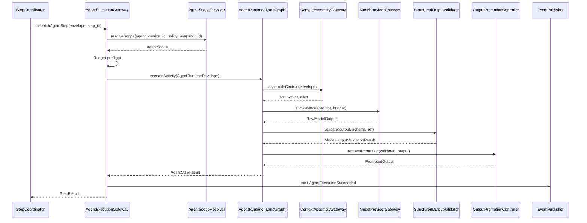

### 24.2 Supervisor-Agent Coordination

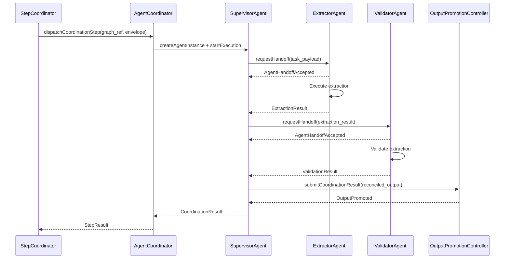

### 24.3 Agent Tool Request Path

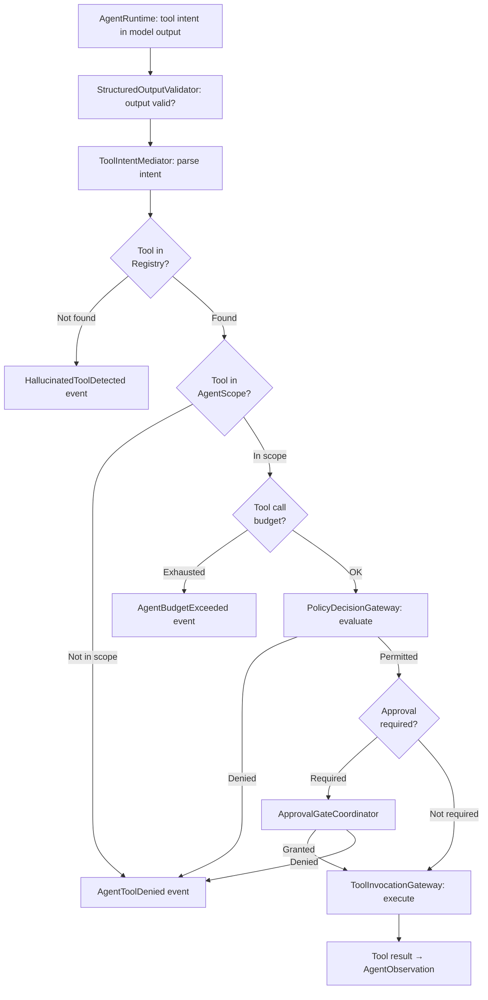

### 24.4 Agent Memory Request Path

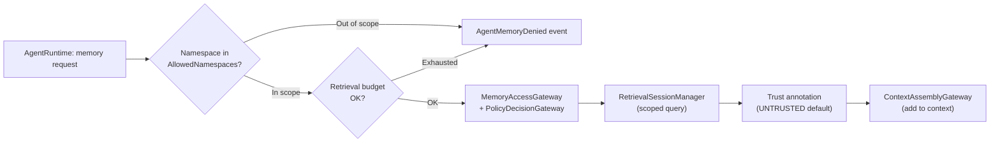

### 24.5 Agent Handoff Path

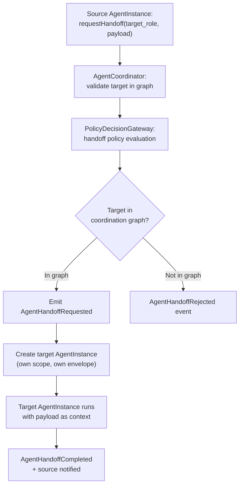

### 24.6 Agent Replay Path

See §19.5 for the complete replay flow diagram.

### 24.7 Agent Failure Path

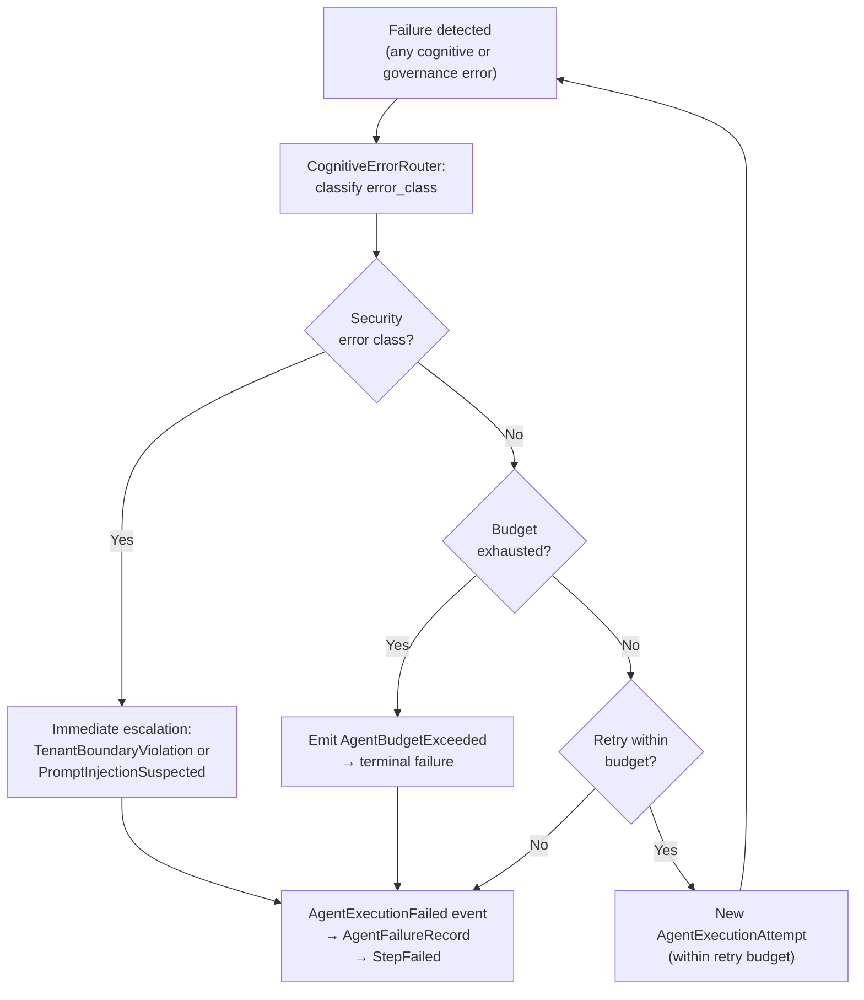

---

## 25. MVP Agent Runtime Cut

### 25.1 MVP Now (Walking Skeleton)

The MVP agent runtime proves end-to-end governed agent execution with the minimum viable feature set. The following MUST be operational for MVP:

| Component | MVP Implementation |
|---|---|
| AgentDefinition | Single definition type (ExtractorAgent); schema validation on creation |
| AgentVersion | One published version; immutability enforced |
| AgentInstance | One instance per agent step; created by AgentExecutionGateway |
| AgentRuntimeEnvelope | Full envelope with all required fields; signed |
| AgentScope validation | allowed_tools and allowed_memory_namespaces checked at instantiation |
| AgentExecution | Full lifecycle state machine; all required events |
| Typed output schema validation | StructuredOutputValidator with declared schema_ref |
| Model adapter boundary | Model call through ModelProviderGateway; output returned to AgentRuntime |
| Memory request gateway stub | ContextAssemblyGateway reads from basic namespace (MVP may stub vector search) |
| Tool request gateway | ToolIntentMediator + ToolInvocationGateway for NoSideEffect and ReadOnlyExternal class tools |
| Basic approval request integration | ApprovalGateCoordinator for ExternalWrite tools; manual approval inbox |
| Basic agent telemetry | AgentExecutionStarted, AgentExecutionSucceeded, AgentExecutionFailed with required attributes |
| Basic replay hydration | ModelOutput hydration; side-effectful tool suppression; prompt_hash comparison |
| Budget enforcement | Token, cost, and iteration budgets; BudgetExhausted halt |
| Single-agent step pattern | Sequential extraction → validation workflow with one agent per step |
| HumanInterfaceAgent | Format agent output for approval inbox context |

**MVP Acceptance Criteria:**
- An agent step dispatched without an AgentRuntimeEnvelope is rejected.
- A tool request for a tool not in `allowed_tools` is rejected with `AgentToolDenied` event.
- A memory request for a namespace not in `allowed_memory_namespaces` is rejected.
- Budget exhaustion terminates execution before the next model call; `AgentBudgetExceeded` is emitted.
- Replay suppresses live model calls; hydrates from recorded ModelOutput.
- All required telemetry events are emitted with correct required attributes.

### 25.1.1 MVP Simplification Rule

The MVP Agent Runtime MUST prove bounded agent execution without implementing the full multi-agent platform.

The MVP should implement the smallest useful agent architecture that preserves the constitutional guarantees.

### MVP Agent Pattern

The MVP SHOULD use:

```text
Single workflow step
  -> one AgentInstance
  -> one AgentRuntimeEnvelope
  -> one model invocation
  -> one structured AgentOutput
  -> one optional ToolRequest
  -> one approval gate when policy requires
  -> one replay hydration path
```

### Required MVP Agent Constraints

| Capability | MVP Decision |
|---|---|
| Multi-agent coordination | Deferred |
| Agent handoff | Deferred unless needed for one specific demo |
| SupervisorAgent | Deferred |
| PlannerAgent | Deferred |
| VerifierAgent | Deferred |
| RouterAgent | Deferred |
| Agent marketplace | Deferred |
| Agent certification UI | Deferred |
| Full agent library | Deferred |
| Single ExtractorAgent / ClassifierAgent | Required |
| AgentRuntimeEnvelope | Required |
| AgentScope validation | Required |
| Output schema validation | Required |
| Tool request mediation | Required |
| Replay hydration | Required |
| Budget enforcement | Required |

### MVP Rule

The MVP may have only one or two agent roles, but those agents MUST obey the full authority, envelope, scope, telemetry, tenant and replay constraints defined in this document.

### Forbidden MVP Shortcut

FORBIDDEN:

- building multi-agent orchestration before single-agent governance works;
- implementing a free-form chat loop and calling it an agent runtime;
- skipping AgentRuntimeEnvelope for the first version;
- skipping AgentScope because there is only one tool;
- skipping replay hydration because there is only one agent;
- skipping budget enforcement because usage is small;
- building SupervisorAgent before AgentExecution lifecycle is stable.

### 25.2 Later

| Capability | Description |
|---|---|
| Multiple agent roles | PlannerAgent, ValidatorAgent, ResearchAgent, RouterAgent |
| SupervisorAgent coordination | Supervisor-directed multi-agent steps with AgentCoordinator |
| AgentHandoff | Structured handoff protocol with events and permission inheritance |
| Planner/Executor/Verifier pattern | Three-phase coordination with CONTESTED escalation |
| Richer memory permissions | Conditional memory write; multi-namespace read |
| AgentEvaluationRecord | Quality scoring per execution |
| Advanced budget controls | Per-role budget profiles; dynamic budget adjustment with policy override |
| Agent performance dashboards | Utilization, cost, error rate dashboards per agent role |
| VerifierAgent integration | Independent verification with conflict detection |
| AgentPlan flow | PlannerAgent → plan review → workflow proposal pipeline |

### 25.3 Enterprise Future

| Capability | Description |
|---|---|
| Multi-agent orchestration patterns | Complex coordination topologies; parallel fan-out with reconciliation |
| Tenant-specific agent libraries | Tenant-customized agent definitions with tenant-scoped prompt templates |
| Advanced policy packs for agents | Fine-grained per-agent capability policy rules |
| Formal agent certification | Validation and certification process for new AgentDefinition publication |
| Adaptive routing | Policy-driven dynamic routing between agent roles based on runtime signals |
| Federated agent coordination | Cross-environment agent coordination with explicit federation contracts |
| Agent marketplace with governance | Curated catalog of pre-certified agent definitions with policy packs |

---

## 26. Agent Runtime Invariants

### 26.1 Agent Identity Invariants

| ID | Invariant |
|---|---|
| AI-01 | Every AgentInstance MUST have a globally unique `agent_instance_id`. |
| AI-02 | Every AgentInstance MUST reference an existing, published `AgentVersion`. |
| AI-03 | Every AgentInstance MUST be bound to exactly one `tenant_id`. |
| AI-04 | `tenant_id` on an AgentInstance is immutable after creation. |
| AI-05 | Every AgentExecution MUST have a unique `agent_execution_id`. |
| AI-06 | Every AgentExecution MUST reference a valid `agent_instance_id`. |
| AI-07 | `agent_version_id` on an AgentExecution is immutable after creation. |
| AI-08 | Every AgentExecutionAttempt MUST have a unique `attempt_id` and increment `attempt_number`. |
| AI-09 | An AgentDefinition in `Draft` state MUST NOT be instantiated. |
| AI-10 | An AgentDefinition in `Disabled` or `Archived` state MUST NOT produce new AgentInstances. |
| AI-11 | AgentRole is immutable within an AgentVersion. |
| AI-12 | AgentCapabilities are immutable within an AgentVersion. |
| AI-13 | An AgentVersion with a breaking output schema change MUST increment the major version. |
| AI-14 | `agent_execution_id` MUST be globally unique across all tenants. |
| AI-15 | An AgentInstance MUST NOT be shared across multiple StepExecutions. |

### 26.2 Envelope Invariants

| ID | Invariant |
|---|---|
| ENV-01 | No agent execution may occur without a valid, signed AgentRuntimeEnvelope. |
| ENV-02 | An AgentRuntimeEnvelope MUST contain `tenant_id`. |
| ENV-03 | An AgentRuntimeEnvelope MUST contain `policy_snapshot_id`. |
| ENV-04 | An AgentRuntimeEnvelope MUST contain `trace_id`. |
| ENV-05 | An AgentRuntimeEnvelope MUST contain `agent_version_id`. |
| ENV-06 | An AgentRuntimeEnvelope MUST contain `runtime_budget` with declared limits. |
| ENV-07 | An AgentRuntimeEnvelope MUST contain `memory_scope.allowed_namespaces`. |
| ENV-08 | An AgentRuntimeEnvelope MUST contain `tool_scope.allowed_tools`. |
| ENV-09 | `tenant_boundary_context.cross_tenant_access` MUST always be `false`. |
| ENV-10 | An expired AgentRuntimeEnvelope MUST be rejected by all components before processing. |
| ENV-11 | An AgentRuntimeEnvelope with an invalid signature MUST be rejected. |
| ENV-12 | `replay_context.is_replay = true` MUST trigger `replay_suppression_active = true` for side-effectful operations. |
| ENV-13 | Core identity fields (`tenant_id`, `run_id`, `agent_version_id`, `policy_snapshot_id`, `trace_id`) are immutable after envelope creation. |
| ENV-14 | The AgentRuntimeEnvelope MUST NOT contain raw credential values. |
| ENV-15 | No component may create or modify an AgentRuntimeEnvelope except AgentExecutionGateway via RuntimeEnvelopeBuilder. |

### 26.3 Lifecycle Invariants

| ID | Invariant |
|---|---|
| LC-01 | An AgentInstance MUST follow the declared lifecycle state machine; invalid transitions are rejected. |
| LC-02 | An invalid lifecycle transition MUST emit `AgentInvalidTransitionAttempted`. |
| LC-03 | A terminal AgentInstance state (Succeeded, Failed, TimedOut, BudgetExceeded, Cancelled) is immutable. |
| LC-04 | Every AgentInstance lifecycle transition MUST emit a corresponding domain event. |
| LC-05 | An AgentExecution MUST NOT begin before the AgentInstance reaches `Scoped` state. |
| LC-06 | An AgentExecution MUST NOT begin before `ContextPrepared` state. |
| LC-07 | An AgentExecution that reaches terminal state MUST persist a terminal AuditRecord. |
| LC-08 | Retry attempts MUST create a new AgentExecutionAttempt record; they MUST NOT overwrite prior attempt records. |
| LC-09 | An AgentDefinition lifecycle state changes MUST emit AgentDefinition events. |
| LC-10 | An AgentVersion MUST NOT be deleted; it MUST be deprecated and then archived. |
| LC-11 | ContextPrepared state MUST create an immutable ContextSnapshot before execution begins. |
| LC-12 | An AgentInstance that reaches BudgetExceeded MUST NOT be retried without a policy override and audit record. |
| LC-13 | An AgentInstance in AwaitingApproval MUST NOT time out silently; AgentApprovalTimedOut event required. |
| LC-14 | HandoffRequested state MUST emit AgentHandoffRequested before the payload is transferred. |
| LC-15 | ReplaySuppressed is a valid terminal state; it MUST produce a ReplayDivergence record. |

### 26.4 Authority Invariants

| ID | Invariant |
|---|---|
| AUTH-01 | No agent may execute a tool directly; all tool execution routes through ToolIntentMediator and ToolInvocationGateway. |
| AUTH-02 | No agent may select credentials; credentials are managed exclusively by the Security Plane via CredentialLease. |
| AUTH-03 | No agent output may become authoritative state without passing the full validation chain. |
| AUTH-04 | No agent may approve its own ApprovalRequest. |
| AUTH-05 | No agent may modify its own AgentScope during execution. |
| AUTH-06 | No agent may create or modify workflow definitions. |
| AUTH-07 | No agent may initiate a GovernedRun. |
| AUTH-08 | No agent may escalate its own permissions through reasoning output. |
| AUTH-09 | AgentRole does not grant authority; only PolicySnapshot grants authority. |
| AUTH-10 | No agent may self-verify its own output (VerifierAgent must be a separate AgentInstance). |
| AUTH-11 | No agent may bypass PolicyDecisionGateway for any policy-gated operation. |
| AUTH-12 | An agent expressing tool intent for a tool not in its allowed_tools MUST be denied. |
| AUTH-13 | An agent expressing tool intent for an unregistered tool MUST produce HallucinatedToolDetected. |
| AUTH-14 | No agent may write to memory without `memory_scope.write_permitted = true` and policy authorization. |
| AUTH-15 | AgentRecommendation output is ADVISORY; it cannot authorize an action without human or policy approval. |

### 26.5 Coordination Invariants

| ID | Invariant |
|---|---|
| COORD-01 | Coordination graphs MUST be declared in workflow definitions; ad hoc coordination is forbidden. |
| COORD-02 | Every AgentCoordinator operation MUST emit a corresponding event. |
| COORD-03 | Subordinate agents in a coordination graph MUST have their own AgentRuntimeEnvelope; they MUST NOT share the supervisor's envelope. |
| COORD-04 | A SupervisorAgent MUST NOT have broader authority than the coordination graph's declared scope. |
| COORD-05 | Conflicting outputs from a VerifierAgent (CONTESTED) MUST NOT be auto-promoted; escalation is mandatory. |
| COORD-06 | Parallel fan-out agents MUST have independent AgentInstances with independent budgets. |
| COORD-07 | A RouterAgent's routing decision MUST select from declared routes only; no new routes. |
| COORD-08 | Sequential chain agents MUST receive only promoted (validated) output from the prior step. |
| COORD-09 | An AgentCoordinator MUST enforce the total coordination budget across all agents in the graph. |
| COORD-10 | A PlannerAgent's plan MUST NOT be executed without plan validation and required approvals. |

### 26.6 Handoff Invariants

| ID | Invariant |
|---|---|
| HO-01 | Every handoff MUST emit AgentHandoffRequested before payload transfer. |
| HO-02 | Handoff MUST preserve `run_id`, `trace_id`, and `tenant_id`. |
| HO-03 | Handoff MUST NOT transfer hidden agent state (chain-of-thought, raw working memory). |
| HO-04 | Handoff MUST NOT expand the receiving agent's permissions beyond its declared AgentScope. |
| HO-05 | Handoff to an agent not in the declared coordination graph is FORBIDDEN. |
| HO-06 | Handoff payload MUST be schema-validated before transfer. |
| HO-07 | A rejected handoff MUST emit AgentHandoffRejected and return control to the source or AgentCoordinator. |
| HO-08 | A timed-out handoff MUST emit AgentHandoffTimedOut and trigger failure handling. |
| HO-09 | Memory visibility for the receiving agent is determined by its own AgentScope, not inherited from the source. |
| HO-10 | Every handoff creates an immutable AgentHandoff record in the AgentCoordinator. |

### 26.7 Memory Invariants

| ID | Invariant |
|---|---|
| MEM-01 | No agent may access memory from outside its declared `allowed_memory_namespaces`. |
| MEM-02 | No agent memory request may bypass MemoryAccessGateway. |
| MEM-03 | All retrieved memory items MUST be trust-annotated before entering agent context. |
| MEM-04 | Retrieved content is classified `UNTRUSTED` by default regardless of similarity score. |
| MEM-05 | Vector similarity score is NOT a trust or authority indicator. |
| MEM-06 | Memory writes MUST carry a MemoryProvenanceRecord with agent_execution_id, run_id, tenant_id. |
| MEM-07 | Memory writes MUST be authorized by PolicyDecisionGateway. |
| MEM-08 | Memory namespace isolation MUST prevent cross-tenant memory access. |
| MEM-09 | Memory compaction MUST preserve provenance lineage; erasing provenance chains is FORBIDDEN. |
| MEM-10 | Replay MUST use original ContextSnapshot; memory MUST NOT be re-queried during replay. |

### 26.8 Tool Invariants

| ID | Invariant |
|---|---|
| TOOL-01 | No agent may invoke a tool that is not in its `tool_scope.allowed_tools`. |
| TOOL-02 | Every tool request MUST pass ToolIntentMediator and ToolInvocationGateway. |
| TOOL-03 | Tool output is classified `data`, not `instruction`. |
| TOOL-04 | Tool output MUST be placed in the untrusted_context block of the next prompt iteration. |
| TOOL-05 | A hallucinated tool (not in registry) MUST produce HallucinatedToolDetected. |
| TOOL-06 | Side-effectful tools (ExternalWrite, Financial, Irreversible) MUST use idempotency keys. |
| TOOL-07 | FinancialTransaction and IrreversibleAction class tools MUST require human approval. |
| TOOL-08 | Tool manifests MUST be cryptographically signed before a tool is enabled. |
| TOOL-09 | Tool execution during replay MUST be suppressed for all side-effectful classes; ToolReplayRecord required. |
| TOOL-10 | Tool scope CANNOT be expanded by agent output. |

### 26.9 Governance Invariants

| ID | Invariant |
|---|---|
| GOV-01 | PolicyDecisionGateway MUST be called before every policy-gated agent operation. |
| GOV-02 | If PolicyDecisionGateway is unavailable, all policy-gated operations MUST fail closed. |
| GOV-03 | PolicySnapshot bound at run creation MUST govern all agent evaluations in that run. |
| GOV-04 | Policy changes MUST NOT retroactively affect evaluations made under prior PolicySnapshots. |
| GOV-05 | ApprovalGateCoordinator MUST block agent execution until approval is granted for required actions. |
| GOV-06 | No agent may self-approve any action. |
| GOV-07 | ApprovalDecisions are immutable once submitted. |
| GOV-08 | Break-glass agent execution MUST reference an incident and carry a TTL. |
| GOV-09 | High-risk AgentPlan MUST NOT be executed without human approval. |
| GOV-10 | AgentPolicyBinding is immutable within a PolicySnapshot. |

### 26.10 Observability Invariants

| ID | Invariant |
|---|---|
| OBS-01 | Every agent execution MUST produce at minimum: AgentExecutionStarted and (AgentExecutionSucceeded or AgentExecutionFailed). |
| OBS-02 | All Critical and High-tier audit events MUST NOT be sampled. |
| OBS-03 | All telemetry spans MUST carry `tenant_id`, `run_id`, `step_id`, `agent_execution_id`. |
| OBS-04 | Replay telemetry MUST route to an isolated namespace; MUST NOT mix with production telemetry. |
| OBS-05 | Model input/output message content MUST NOT be captured in telemetry by default. |

### 26.11 Security Invariants

| ID | Invariant |
|---|---|
| SEC-01 | Agents MUST NOT see raw credential values. |
| SEC-02 | AgentRuntimeEnvelope MUST NOT contain credential values. |
| SEC-03 | Prompt injection detection MUST be active on all external inputs. |
| SEC-04 | PromptInjectionSuspected events MUST NEVER be sampled; they are always Critical AuditRecords. |
| SEC-05 | Quarantined outputs MUST NOT be promoted under any circumstance without human security review. |

### 26.12 Tenant Invariants

| ID | Invariant |
|---|---|
| TEN-01 | No agent may access resources from a different `tenant_id` than its own AgentRuntimeEnvelope. |
| TEN-02 | TenantBoundaryViolation events MUST immediately abort execution and trigger security escalation. |
| TEN-03 | Cross-tenant agent context is architecturally impossible; any attempt MUST fail closed. |
| TEN-04 | All agent artifacts, telemetry, and audit records MUST carry `tenant_id`. |
| TEN-05 | Agent coordination graphs are tenant-scoped; cross-tenant coordination graphs are FORBIDDEN. |

### 26.13 Replay Invariants

| ID | Invariant |
|---|---|
| REP-01 | Replay MUST NOT automatically re-call model API when a recorded AgentOutput exists. |
| REP-02 | Replay MUST NOT execute side-effectful tools. |
| REP-03 | Replay MUST use the original `agent_version_id`. |
| REP-04 | Replay MUST use the original `policy_snapshot_id`. |
| REP-05 | Replay MUST use the original ContextSnapshot; memory MUST NOT be re-queried. |
| REP-06 | Replay telemetry is isolated from production telemetry. |
| REP-07 | Replay MUST NOT modify the original event history. |
| REP-08 | ReplayDivergence records MUST be created for every detected divergence. |
| REP-09 | Replay MUST NOT use production credentials. |
| REP-10 | ReplaySuppressed is a valid outcome when required artifacts are missing; it MUST NOT silently skip. |

### 26.14 Budget Invariants

| ID | Invariant |
|---|---|
| BUD-01 | No agent execution may have unlimited budget; all limits MUST be declared in AgentScope. |
| BUD-02 | Budget exhaustion is fail-closed; no partial output is promoted after exhaustion. |
| BUD-03 | Budget preflight MUST execute before every model call, tool request, and retrieval request. |
| BUD-04 | Budget increases during execution MUST be authorized by policy and produce an AuditRecord. |
| BUD-05 | Hidden retries are FORBIDDEN; every retry is a new AgentExecutionAttempt with distinct ID. |

### 26.15 Versioning Invariants

| ID | Invariant |
|---|---|
| VER-01 | Published AgentVersions are immutable. |
| VER-02 | Breaking schema changes MUST increment the major version number. |
| VER-03 | Replay MUST use the original AgentVersion; the current version MUST NOT substitute. |
| VER-04 | Archived AgentVersions MUST remain available for replay within the retention window. |
| VER-05 | AgentVersions MUST NOT be hard-deleted; they are deprecated and then archived. |

---

## 27. Agent Runtime Anti-Patterns

| ID | Anti-Pattern | Description | Why Dangerous |
|---|---|---|---|
| AP-01 | **Agent-as-authority** | Treating agent output as a governance decision without validation and promotion | Bypasses policy enforcement; creates ungovernable execution |
| AP-02 | **Autonomous swarm** | Running multiple agents without a declared coordination graph, shared context, or governance | No audit trail; cascading failures; no human oversight entry point |
| AP-03 | **Tool access by prompt instruction** | Allowing a model to invoke tools by simply expressing the intent in a system prompt, without ToolIntentMediator | Bypasses scope check, manifest validation, and policy evaluation |
| AP-04 | **Hidden agent conversation** | Agents communicating via shared memory or direct message channels not recorded as events | Invisible coordination; replay impossible; audit gap |
| AP-05 | **Unbounded agent loop** | Running an agent reasoning loop without max_iterations enforcement | Runaway cost; denial of wallet; potential infinite loops |
| AP-06 | **Model-selected credentials** | Allowing the model or agent to choose which credentials to use | Critical security violation; enables credential exfiltration |
| AP-07 | **Agent memory browsing** | Allowing an agent to retrieve from all memory namespaces without scope constraints | Data leakage; cross-project contamination; privilege escalation via memory |
| AP-08 | **Agent self-approval** | Allowing an agent to approve its own tool request, plan, or recommendation | Governance bypass; any sufficiently motivated agent could authorize any action |
| AP-09 | **Agent self-modification** | Allowing an agent to modify its own AgentScope, capabilities, or policy binding | Security perimeter collapse; scope explosion |
| AP-10 | **Prompt-only role definition** | Defining agent authority and permissions purely through system prompt instructions | Bypassed by prompt injection; not enforceable; creates false security |
| AP-11 | **Invisible handoff** | Passing context between agents through shared state or direct memory without an AgentHandoff record | Untraceable coordination; permission inheritance is implicit rather than explicit |
| AP-12 | **Raw chain-of-thought as audit evidence** | Using model chain-of-thought reasoning output as the audit trail for a decision | Chain-of-thought is not authoritative; it is not tamper-evident; it is not structured |
| AP-13 | **Replay by re-inference** | Re-calling the model API during replay when recorded outputs exist | Nondeterminism; different results; cost; cannot compare original vs replay |
| AP-14 | **Shared agent memory across tenants** | Multiple tenants' agents writing to and reading from the same memory namespace | Critical cross-tenant data leakage; security incident |
| AP-15 | **Agent-owned state** | Storing authoritative run state in agent working memory rather than the event store | State is lost on failure; replay is impossible; audit gap |
| AP-16 | **Supervisor without trace** | Running a SupervisorAgent without a distinct span in the trace hierarchy | Coordination operations are invisible; debugging impossible |
| AP-17 | **Verifier ignored** | Running a planner/executor/verifier pattern but not blocking promotion on CONTESTED results | Verification is cosmetic; false assurance of quality |
| AP-18 | **Planner mutates workflow automatically** | A PlannerAgent's output directly modifying a WorkflowVersion | Workflow definitions must go through operator review; automatic mutation is ungoverned |
| AP-19 | **Agent output as policy** | Using agent output to determine what policy rules apply to the run | Policy is immutable in PolicySnapshot; it cannot be changed by agent output |
| AP-20 | **Agent budget omitted** | Creating an AgentExecution without declaring budget limits | Denial of wallet; runaway cost; violates CI-09 from Document 04 |
| AP-21 | **Tool result treated as instruction** | Placing tool output in the trusted instruction block of the prompt | Enables tool output-based injection; tool results are data, not instructions |
| AP-22 | **Cross-tenant coordination** | Agents from different tenants coordinating in the same graph | Tenant isolation violation; security incident |
| AP-23 | **Credentials in AgentMessage** | Passing credential values in AgentHandoff payloads or AgentMessages | Credential exfiltration via coordination channel |
| AP-24 | **Parallel agents with shared budget** | Fan-out agents sharing a single budget counter without per-instance tracking | Race condition on budget; one agent can exhaust budget for others |
| AP-25 | **Skip context snapshot** | Not creating a ContextSnapshot before executing the agent step | Replay is impossible; audit gap; CI-28 violation |
| AP-26 | **Agent capability = permission** | Declaring a capability in AgentDefinition and treating it as an authorization | Capability is a declaration; policy grants permission |
| AP-27 | **Hallucinated tool silent pass** | Ignoring tool requests for unregistered tools without emitting HallucinatedToolDetected | Security event suppressed; injection may be occurring |
| AP-28 | **Single ApprovalRecord for multiple executions** | Reusing a prior approval decision for a new execution | Approval is execution-scoped; reuse bypasses governance |
| AP-29 | **Memory write without provenance** | Persisting memory objects without a MemoryProvenanceRecord | Poisoned memory becomes untraceable; forensic investigation impossible |
| AP-30 | **Agent version aliasing in replay** | Using a "latest" agent version pointer during replay instead of the pinned original version | Replay uses different behavior; divergences are hidden |
| AP-31 | **Budget preflight bypass for "fast" operations** | Skipping budget preflight for tools classified as low-cost | Even small tools consume budget; bypassing creates runaway accumulation |
| AP-32 | **Approval timeout = approval granted** | Treating an expired approval as implicitly approved | Timeout means no decision; it must trigger rejection or escalation |
| AP-33 | **Chain-of-thought in ContextSnapshot** | Including raw model reasoning chains in the ContextSnapshot | Chain-of-thought is volatile; it is not a governance artifact |
| AP-34 | **Unbounded handoff chain** | Allowing agents to keep handing off to each other without a budget limit | Creates infinite coordination loops; denial of service |
| AP-35 | **Policy evaluation cached without TTL** | Reusing a prior PolicyDecisionGateway result without expiry | Policy changes after the cache is set; execution proceeds under stale policy |
| AP-36 | **Secret inference from tool arguments** | Including credential hints in tool arguments that the model generates | Model learns secret patterns; future outputs may reproduce sensitive values |
| AP-37 | **Agent-initiated GovernedRun** | An agent directly creating a new GovernedRun via SDK call | Agents cannot initiate runs; this is operator-level action requiring authentication and policy evaluation |
| AP-38 | **Coordination graph hidden from operators** | Defining coordination graphs only in prompt instructions, not in workflow definitions | Invisible to monitoring; cannot be governed or audited |
| AP-39 | **Ignored AgentOutputConflicted events** | Proceeding to output promotion when CONTESTED events exist | Contradictory outputs become authoritative without resolution |
| AP-40 | **Cross-step agent state accumulation** | Accumulating state across multiple workflow steps in agent working memory without checkpointing | State is lost on failure; creates hidden dependencies between steps |
| AP-41 | **Implicit trust elevation for verified agents** | Automatically granting broader permissions after an agent has "proven" quality | Trust is not earned incrementally; permissions are policy-defined |
| AP-42 | **Tool output injected as new system instructions** | Appending tool output to the system/developer block of the next prompt | Enables indirect injection through tool output |
| AP-43 | **Budget as soft suggestion** | Treating max_cost_usd or max_iterations as warnings rather than hard limits | Budget is an enforcement mechanism; soft limits enable runaway costs |
| AP-44 | **Agent coordination without AgentCoordinator** | Direct peer-to-peer agent handoffs without routing through AgentCoordinator | Events not emitted; coordination is invisible; permission inheritance is unchecked |
| AP-45 | **Model output directly updates GovernedRun state** | An agent's reasoning output bypasses OutputPromotionController and directly writes to run state | State mutation without validation; creates ungovernable side effects |
| AP-46 | **Replay using production credentials** | Executing replay with live production credentials that could trigger real side effects | Replay could produce duplicate payments, emails, API calls |
| AP-47 | **Unlimited agent definitions per tenant** | No quota on the number of AgentDefinitions a tenant can register | Resource exhaustion; platform-level denial of service |
| AP-48 | **AgentVersion with no output schema** | Publishing an AgentVersion without a declared output_schema_ref | Output cannot be validated; promotion is ungoverned |
| AP-49 | **Verifier agent reads executor's working memory** | VerifierAgent accessing the ExecutorAgent's intermediate reasoning to check its own work | Verification is not independent; confirmation bias is structural |
| AP-50 | **Approval request spam** | An agent submitting repeated approval requests for the same action to pressure approvers | Governance harassment; approval system overload |
| AP-51 | **Skipping handoff policy evaluation** | AgentCoordinator passing handoff directly without calling PolicyDecisionGateway | Policy bypass via coordination path |
| AP-52 | **Treating AgentRuntimeEnvelope as prompt content** | Injecting full envelope metadata into model context | Exposes governance structure to potential exfiltration or injection |
| AP-53 | **Agent generates its own policy snapshot** | An agent producing an output that claims to be a PolicySnapshot update | Policy is immutable within a GovernedRun; no agent can change it |
| AP-54 | **Storing step results in model output only** | Not persisting StepExecution results to the event store | Replay is impossible; state is lost on crash |
| AP-55 | **Agent execution without run_id** | Creating an AgentInstance not attached to a GovernedRun | Execution is ungoverned; telemetry is uncorrelated; audit impossible |
| AP-56 | **Tool invocation count not tracked** | Running tool requests without decrementing the tool request budget | Budget invariant violated; unbounded tool use possible |
| AP-57 | **Silent scope violation** | Detecting an agent scope violation but not emitting AgentScopeViolation event | Security events are suppressed; violation goes undetected |
| AP-58 | **Confidential context shared in coordination message** | Including classified data in AgentHandoff payload beyond what the receiving agent is authorized to access | Data classification policy bypassed via coordination channel |
| AP-59 | **Plan execution without scope check** | Executing an AgentPlan's steps without verifying each step's tools are in scope | Plan bypass of scope enforcement |
| AP-60 | **AgentCoordinator as authority** | AgentCoordinator making policy decisions or approving actions | AgentCoordinator is infrastructure; policy decisions belong to PolicyDecisionGateway |
| AP-61 | **Unversioned prompt templates** | Using prompt templates without version references in AgentVersion | Replay uses a different template; behavior diverges; prompt_hash comparison fails |
| AP-62 | **Agent memory write during replay** | Allowing memory writes to execute in replay mode | Contaminates production memory with replay-generated data |
| AP-63 | **AgentHandoff bypasses budget** | Handoff target inherits no budget limit from handoff source | Target agent runs without budget; unlimited cost possible |
| AP-64 | **Multi-agent consensus without escalation path** | Running a consensus pattern with no declared escalation when consensus is not reached | Deadlock; workflow hangs without resolution |
| AP-65 | **Treating VerifierAgent output as cosmetic** | Ignoring CONTESTED VerificationResult when the executor output already looks correct | Verification is substantive; CONTESTED means the claim is disputed |
| AP-66 | **Coordination telemetry in same span as supervisor** | Nesting all subordinate agent spans under the supervisor's span without distinct spans | Coordination is invisible in traces; debugging is impossible |
| AP-67 | **Skipping agent instance creation for "lightweight" agents** | Running model inference without creating an AgentInstance | No lifecycle record; no budget tracking; no telemetry; no replay |
| AP-68 | **Modifying approved plan before execution** | Altering an AgentPlan after approval but before execution | Approval is for the specific plan content; modifications require new approval |
| AP-69 | **Using ULID prefixes as security identifiers** | Using agent_instance_id prefixes to derive tenant scope instead of reading from envelope | Security by obscurity; bypass by ID collision |
| AP-70 | **Treating AgentReplayRecord as mutable** | Updating a replay artifact after creation | Replay records are evidence artifacts; mutation destroys forensic integrity |
| AP-71 | **Agent-to-agent direct message without run_id** | AgentMessages not carrying run_id | Coordination is decoupled from the GovernedRun; replay is impossible |
| AP-72 | **Provider routing by model output** | Allowing a model to suggest which provider to route to | Provider routing is a policy-and-configuration decision; model cannot influence it |

---

## 28. Codex Implementation Guidance

### 28.1 Implementation Order

Codex MUST implement agent runtime components in the following order. Later steps depend on earlier ones being complete and tested.

| Order | Component | Description |
|---|---|---|
| 1 | AgentDefinition schema | TypeScript interface + JSON schema validator |
| 2 | AgentVersion schema | Immutability enforcement; version number validation |
| 3 | AgentRuntimeEnvelope type | Full interface with all required fields; signature validation |
| 4 | AgentInstance model | Lifecycle state machine; state transition validation |
| 5 | AgentExecution model | Full field spec from Document 04 §9.1; budget field initialization |
| 6 | Agent lifecycle state machine | State machine implementation; invalid transition detection; event emission |
| 7 | Agent scope validation | `allowed_tools`, `allowed_memory_namespaces`, `max_*` field enforcement |
| 8 | Agent output schema validation | StructuredOutputValidator integration; refusal detection; promotion gating |
| 9 | Model adapter boundary | AgentRuntime → ModelProviderGateway; budget preflight; output reception |
| 10 | Agent telemetry events | All events from §15.1; OTel span hierarchy from §15.2 |
| 11 | Memory request gateway integration | AgentMemoryRequest → MemoryAccessGateway; namespace scope check |
| 12 | Tool request gateway integration | AgentToolRequest → ToolIntentMediator → ToolInvocationGateway |
| 13 | Approval request integration | AgentApprovalRequest → ApprovalGateCoordinator; awaiting state |
| 14 | Basic replay hydration | ModelOutput hydration; is_replay flag propagation; prompt_hash comparison |
| 15 | Budget enforcement | CognitiveBudgetManager preflight before every model/tool/retrieval call |
| 16 | Tests | All required tests from §28.5 |

### 28.2 Forbidden Codex Shortcuts

| Shortcut | Why Forbidden |
|---|---|
| Implement agents as free-form chat loops | No lifecycle, no scope enforcement, no budget, no telemetry — ungoverned execution |
| Allow agents to call tools directly without ToolIntentMediator | Bypasses manifest validation, scope check, policy evaluation, and idempotency |
| Let agents choose credentials | Critical security violation; credential exfiltration risk |
| Let agents mutate workflow definitions | Workflow definitions require operator review and version management |
| Store agent state only in prompts (prompt-only state) | State is lost on failure; replay is impossible; audit gap |
| Implement handoff as hidden message passing (e.g., shared memory variable) | No event emitted; coordination invisible; permission inheritance unchecked |
| Implement multi-agent coordination before lifecycle and trace exist | Coordination without lifecycle tracking is undebuggable and ungovernable |
| Expose chain-of-thought as audit evidence | Chain-of-thought is not structured, not tamper-evident, not authoritative |
| Implement replay by re-calling the model API | Nondeterminism; different output; fails the replay contract |
| Allow agent execution without tenant_id in envelope | Tenant isolation collapses; cross-tenant leakage possible |
| Skip ContextSnapshot creation for performance | Replay is impossible; CI-28 violation |
| Catch and swallow AgentScopeViolation silently | Security event suppressed; violation undetected |
| Use `any` type on AgentOutput after schema validation | Defeats schema enforcement purpose |
| Store credential values in AgentRuntimeEnvelope or AgentMessage | Credential exfiltration via audit logs and event records |
| Allow budget preflight to be skipped as an optimization | Budget enforcement is mandatory; skipping creates runaway cost risk |

### 28.3 Required Tests

| Test | Description | Pass Condition |
|---|---|---|
| AgentRuntimeEnvelope creation test | Create envelope with all required fields; attempt with missing fields | Valid envelope created; missing field throws validation error |
| Agent scope validation test | Request tool not in allowed_tools; request namespace not in allowed_namespaces | AgentToolDenied / AgentMemoryDenied emitted; execution proceeds without denied resource |
| Unauthorized tool request denied test | Express intent for tool outside allowed_tools | HallucinatedToolDetected (if not in registry) or AgentToolDenied; no execution |
| Unauthorized memory request denied test | Request namespace not in allowed_memory_namespaces | AgentMemoryDenied; execution continues with reduced context |
| Output schema validation test | Submit output that fails declared output_schema_ref | OutputValidationFailed; output not promoted; step fails |
| Budget exceeded test | Simulate token/cost/iteration exhaustion mid-execution | AgentBudgetExceeded emitted immediately; no partial output promoted; step terminates |
| Handoff event emission test | Trigger a valid handoff in coordination graph | AgentHandoffRequested emitted before payload transfer; AgentHandoffAccepted on receipt |
| Telemetry emission test | Execute a single agent step | AgentExecutionStarted and AgentExecutionSucceeded (or Failed) emitted with all required attributes |
| Replay hydration test | Replay a completed agent step with recorded ModelOutput | No live model call; AgentReplayHydrated emitted; prompt_hash matches original |
| Tenant isolation test | Attempt to read memory from another tenant's namespace | TenantBoundaryViolation or AgentMemoryDenied; no cross-tenant data in output |
| Agent cannot approve own recommendation test | Submit AgentApprovalRequest; attempt auto-approval via agent output | Auto-approval has no mechanism; request remains in AwaitingApproval |
| Agent cannot access raw secrets test | Inspect AgentRuntimeEnvelope for credential values | No credential values present; envelope contains only lease references |
| Prompt injection quarantine test | Include injection-like content in retrieved context | PromptInjectionSuspected emitted; content quarantined; step fails |
| Invalid lifecycle transition test | Attempt transition from Succeeded to Running | AgentInvalidTransitionAttempted emitted; state unchanged |
| Hallucinated tool detection test | Produce model output with unregistered tool name | HallucinatedToolDetected; no tool execution attempted |

### 28.4 Module Boundaries

| Module | Contents | Allowed Dependencies |
|---|---|---|
| `agent-lifecycle` | AgentDefinition, AgentVersion, AgentInstance state machines, lifecycle event emission | `agent-observability` |
| `agent-runtime-envelope` | AgentRuntimeEnvelope creation, validation, signature verification | None (leaf module) |
| `agent-scope-resolver` | AgentScope resolution, scope validation, AgentCapability enforcement | `agent-runtime-envelope` |
| `agent-coordinator` | AgentCoordinator, handoff management, coordination graph traversal | `agent-lifecycle`, `agent-observability` |
| `agent-execution` | AgentExecution record management, attempt tracking, budget initialization | `agent-scope-resolver`, `agent-observability` |
| `agent-output` | Output class schemas, StructuredOutputValidator integration, OutputPromotionController interaction | `agent-observability` |
| `agent-observability` | AgentExecutionSpan, all required event emissions, AuditRecord creation | None (leaf module) |
| `agent-replay` | AgentReplayRecord, CognitiveReplayAdapter integration, ReplayDivergence detection | `agent-execution`, `agent-observability` |

---

## 29. Relationship to Other Documents

| Document | Relationship |
|---|---|
| **Document 00 — Vision & Foundational Manifesto** | Document 05 implements the core doctrine from Document 00: agents that fail before they become governable are replaced by agents that become trustworthy because they are bounded. All authority, observability, and replay principles in Document 05 derive from Document 00. |
| **Document 01 — Product Requirements & Operational Scope** | Document 01 defines the operational needs (human approval, memory persistence, tool execution, replay, multi-tenant isolation) that Document 05 satisfies at the agent coordination layer. |
| **Document 02 — Core Runtime Architecture** | Document 02 defines the RuntimeEnvelope, PolicyDecisionGateway, ApprovalGateCoordinator, AgentExecutionGateway, ToolInvocationGateway, and event lineage that Document 05 extends for agent-specific use. Document 05's AgentRuntimeEnvelope is an extension of Document 02's RuntimeEnvelope. |
| **Document 03 — Canonical Domain Model** | Document 03 defines the canonical field-level specifications for AgentExecution, AgentScope, GovernedRun, Step, StepExecution, ModelInvocation, ContextSnapshot, PolicySnapshot, and other entities used in Document 05. Document 05 defines their behavioral contracts in the agent coordination context. |
| **Document 04 — Cognitive Execution Model** | Document 04 defines what happens inside a single cognitive step: context assembly, prompt construction, model inference, output validation, and tool intent mediation. Document 05 defines how agents exist across steps: their lifecycle, roles, coordination patterns, handoffs, plans, and multi-step behavior. Document 05 presupposes Document 04's execution model for each individual agent step. |
| **Document 06 — State, Checkpoint & Persistence Architecture** | Document 06 defines how checkpoints are stored and how state persistence is managed. Document 05 references checkpoints as agent context restoration points and replay anchors. Document 05 does not own checkpoint implementation. |
| **Documents 07–08 — Event & Messaging Contracts** | Documents 07–08 define event schemas and the event spine. Document 05 defines which agent events MUST be emitted; 07–08 define the schemas. All agent events in Document 05 are produced according to the EventEnvelope contracts in Documents 07–08. |
| **Document 09 — Workflow Orchestration Engine** | Document 09 defines Temporal workflow patterns, LangGraph integration at the orchestration level, and workflow lifecycle. Document 05 defines how agent steps plug into that orchestration as Activities, how coordination graphs are declared in workflow definitions, and how handoffs are runtime events within a workflow run. |
| **Document 10 — Memory & Context Architecture** | Document 10 defines the memory fabric, vector indexing, and MemoryAccessGateway internals. Document 05 defines the agent's relationship to memory: request/grant model, scope constraints, trust annotation, replay behavior. Document 05 delegates implementation to Document 10. |
| **Document 11 — Governance, Policy & Approval Engine** | Document 11 defines PolicySnapshot structure, OPA evaluation, and ApprovalGateCoordinator internals. Document 05 defines when agents trigger governance (policy evaluation points, approval request scenarios, self-approval prohibition). |
| **Document 12 — Observability & Telemetry Platform** | Document 12 defines the full telemetry platform. Document 05 defines the agent-specific telemetry contract: required events, trace hierarchy, audit tiers. Document 05 delegates infrastructure to Document 12. |
| **Document 13 — Security & Trust Architecture** | Document 13 defines CredentialLease, SPIFFE/SPIRE, and trust boundaries. Document 05 applies these: agents never see credentials; runtime_identity_id comes from SPIFFE; replay excludes production credentials. |
| **Document 14 — Multi-Tenant Isolation** | Document 14 defines the tenant isolation architecture. Document 05 defines agent-level tenant isolation: every AgentInstance is tenant-bound; cross-tenant access is architecturally impossible; all agent artifacts carry tenant_id. |
| **Document 15 — SDK, Tool Runtime & Execution Contracts** | Document 15 defines the tool manifest, tool execution contracts, sandboxing, and idempotency model. Document 05 defines the agent-to-tool boundary: agent expresses intent via AgentToolRequest; ToolIntentMediator and ToolInvocationGateway execute under Document 15's contracts. |
| **Document 16 — Infrastructure & Deployment Architecture** | Document 16 defines how MYCELIA is deployed. Document 05 references infrastructure only to the extent that AgentRuntime (LangGraph) runs inside Temporal Activities, which are worker processes. Deployment details belong to Document 16. |
| **Document 17 — SRE, Operational Recovery & Runbooks** | Document 17 defines incident response and recovery runbooks. Document 05 defines the AgentFailureRecord and EvidenceBundle structures that SRE runbooks use for cognitive incident investigation. |
| **Document 18 — External APIs & Integration Contracts** | Document 18 defines public-facing API contracts. Document 05 defines internal agent runtime APIs (§23). External API exposure of agent status information is Document 18's responsibility. |

---

## 30. Final Agent Runtime Principles

**Agents reason.** This is their contribution: classification, extraction, planning, summarization, verification, and recommendation. The quality of this reasoning is valuable. It is not a source of authority.

**Runtime governs.** The runtime — through RuntimeEnvelope, PolicyDecisionGateway, AgentExecutionGateway, ToolInvocationGateway, and MemoryAccessGateway — enforces every boundary. Governance is structural, not instructional. It cannot be overridden by reasoning.

**Workflows coordinate.** The macro structure of work is declared, versioned, deterministic, and operator-owned. Agents execute within that structure; they do not define it. Coordination patterns are explicit runtime graphs, not hidden conversations.

**Policy permits.** Permissions derive from PolicySnapshot, not from agent capability or agent request. What the agent can do technically and what the agent is permitted to do operationally are separate concerns. The runtime enforces the distinction.

**Approvals authorize.** High-impact actions require human authorization. The approval system is a first-class runtime primitive, not an escalation path of last resort. Agents request approval; humans authorize; the runtime records the decision immutably.

**Tools execute.** Tools are controlled side-effect boundaries. Every external action passes through a declared contract, under a signed manifest, with an idempotency key, via a sandboxed worker. The agent expresses intent; the tool runtime executes.

**Memory contextualizes.** Retrieved knowledge, episodic context, and semantic embeddings improve agent reasoning. Memory is assistive infrastructure, not an authority substrate. All retrieved content is untrusted by default; every memory write carries provenance.

**Telemetry evidences.** Every agent operation produces structured, immutable, tamper-evident evidence. AuditRecords are not logs — they are governance artifacts. Critical events are never sampled.

**Replay reconstructs.** Any agent execution can be replayed from its recorded artifacts without re-running live model calls or producing real side effects. Replay is the foundation of investigation, audit, and incident response.

**Tenancy contains.** Every agent instance, every artifact, every memory access, every tool invocation, and every telemetry record is scoped to exactly one tenant. Cross-tenant contamination is architecturally prevented, not just policy-prevented.

**Budgets bound.** Every agent execution has declared limits on tokens, cost, iterations, time, tool calls, and memory retrievals. Budgets are hard limits, not advisories. Exhaustion is fail-closed.

**Versions preserve history.** AgentVersions are immutable. Replay uses the original version. History is an append-only record that cannot be retroactively altered.

---

> In MYCELIA, agents do not become powerful because they are free. They become trustworthy because they are bounded, observable, coordinated and governed.
