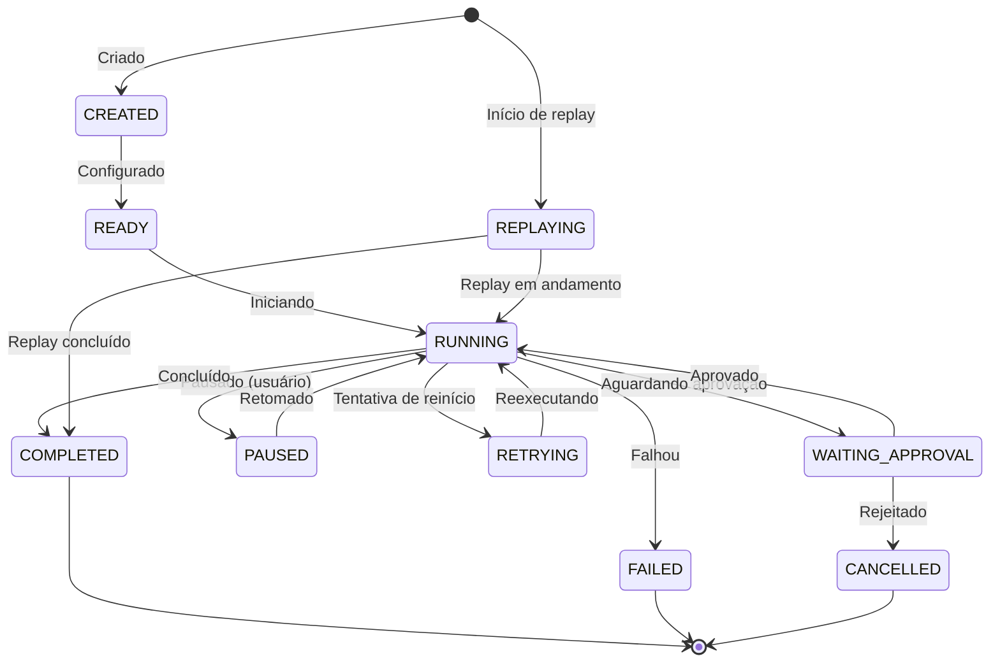
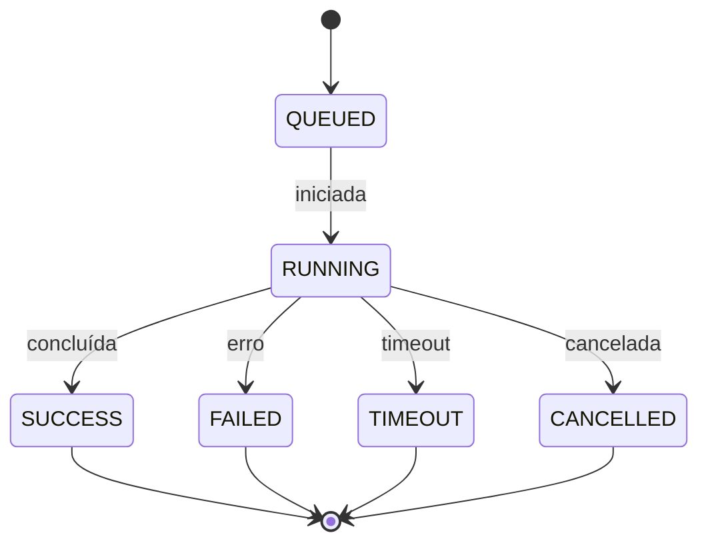

# MYCELIA — 05 Runtime & Execution Model

## 1. Runtime Philosophy

O runtime do Mycelia é um motor cognitivo **governado e audível**. Cada execução é **explícita**, com fluxos de trabalho e etapas claramente definidas, evitando qualquer operação oculta. A orquestração do workflow é **determinística**, seguindo estados previsíveis, enquanto a geração de conteúdo (razonamento de IA) é **probabilística** e contida em etapas delimitadas. Isso garante que toda ação seja auditável e controlada.

O sistema é **durável** e **persistente**: estados intermediários são armazenados e podem ser recuperados, permitindo *replay* fiel e análise retrospectiva. A arquitetura privilegia **transparência** e **observabilidade**: cada evento, passo executado, chamada de ferramenta e decisão de aprovação é registrado e correlacionado. Em suma, o runtime otimiza **resiliência**, **consistência** e **governança**, assegurando reproduzibilidade e confiabilidade. Ele evita execução indeterminística sem rastreio, looping não controlado ou ações automáticas não autorizadas. Políticas de negócio são aplicadas externamente (fora dos prompts), evitando confiar em julgamento arbitrário do modelo.

Evita explicitamente:
- Operações **ocultas** ou sem log.
- Agentes autônomos **irrestritos** (nenhum "swarm" de IA sem supervisão).
- Decisões de negócio embutidas em prompts (política definida fora do modelo).
- Loops infinitos ou recursões ilimitadas.
- Efeitos colaterais não idempotentes sem chave de controle.

## 2. Core Runtime Concepts

- **Run:** Instância única de execução de um *Workflow*. Cada *Run* é gerenciado pelo plano de controle (p.ex. Temporal) e possui identificadores (`run_id`, `tenant_id`, `trace_id`, etc.). O *Run* passa pelos estados do ciclo de vida (Seção 3) e referencia um *WorkflowVersion* imutável. Todo evento e resultado de passos é associado ao *Run*. Em replays, o *Run* original permanece imutável e cria-se novo *Run* para a reexecução.

- **Workflow:** Definição estrutural (grafo de *Steps*) de um processo cognitivo. Cada *Workflow* pertence a um projeto e tem ID (`workflow_id`). Ele descreve sequência de passos, transições e lógica de negócio de alto nível. Mudanças no fluxo exigem nova versão; versões anteriores permanecem disponíveis para reprodutibilidade.

- **WorkflowVersion:** Revisão concreta de um *Workflow*. Contém código/configurações executáveis. Cada versão possui `workflow_version_id` e metadados (timestamp, hash). *Run*s referenciam a versão usada, assegurando auditabilidade. Trabalhar com versões imutáveis garante que reexecuções usem exatamente o mesmo fluxo original.

- **Step:** Nó atômico no grafo do workflow. Representa uma operação unitária (ex.: chamar modelo, executar ferramenta, solicitar aprovação). Cada *Step* define entradas, saídas e possíveis transições. Pode envolver sub-etapas cognitivas e/ou chamadas de ferramentas externas.

- **StepExecution:** Instância de execução de um *Step* em um *Run*. Cada vez que o workflow chega a um passo, inicia-se um *StepExecution*. Ele possui estado próprio (ex.: success, failed), resultado e logs de erro. Gerencia lógica de retry e espera de aprovação. Dados de cada *StepExecution* são persistidos (ex.: tabela `step_executions`) e referenciados no *Run*.

- **ToolExecution:** Representa uma chamada de ferramenta externa dentro de um *StepExecution*. Inclui nome da ferramenta, parâmetros, resposta ou erro. Cada *ToolExecution* tem estado (running, success, failed), `trace_id`/`span_id` para rastreamento e opcionalmente `idempotency_key`. Os custos (latência, tokens) e resultados são registrados. Chamadas de ferramenta podem ser repetidas com nova chave de idempotência. Todo *ToolExecution* é logado em banco para auditoria.

- **ApprovalNode:** Tipo especial de *Step* que requer intervenção humana. Ao atingir esse nó, o *Run* entra em **WAITING_APPROVAL** e o fluxo pausa. O *ApprovalNode* define regras de quem deve decidir e prazos. A decisão (aprovar/rejeitar) é registrada como evento `ApprovalDecision` ligado ao *Run*. Pertence ao workflow, mas sua execução é gerida por sistema de aprovação.

- **RuntimeContext:** Contexto operacional ativo em cada *StepExecution*. Inclui identificadores globais (`tenant_id`, `workspace_id`, `project_id`, `run_id`, `workflow_version_id`, `trace_id`) e estado transitório (`execution_state`, `working_memory`, `retrieved_context`, `policy_metadata`, `runtime_limits`). Mantém dados usados pelo raciocínio e ferramentas. (Veja Seção 5.) É propagado entre etapas, isolado por tenant. Nunca expõe segredos internos.

- **CognitiveExecution:** Subfluxo de raciocínio dentro de um *StepExecution*. Envolve sequências de chamadas ao modelo e transformações, eventualmente invocando ferramentas/memória. Controlado por orquestrador cognitivo (ex.: LangGraph), cada *CognitiveExecution* delimita fronteiras determinísticas para saída do passo. Internamente é probabilística, mas seus efeitos são registrados em `execution_state`.

- **Replay:** Processo de reexecução de um *Run* passado. Cria um novo *Run* derivado do original, restaurando estado a partir de *Snapshots* ou histórico de eventos. Durante replay “dry”, não executam-se chamadas externas reais; usam-se resultados históricos. O *Run* original fica imutável. Replays exigem ação explícita de um operador.

- **Snapshot:** Ponto de verificação persistente do estado de um *Run*. Inclui estados de passos, memória relevante e o contexto. Gravado antes de pontos-chave (ex.: antes de aprovação) ou periodicamente. Permite retomar a execução do mesmo ponto em caso de crash ou replay. Snapshots são imutáveis.

- **RuntimeEvent:** Registro estruturado de ocorrência no runtime (ex.: `StepStarted`, `ToolCompleted`, `ApprovalRequested`). Cada evento inclui timestamp, nível (INFO/ERROR), identificadores correlacionados (run_id, step_id, trace_id) e dados relevantes. Eventos são enviados a sistemas de logging/tracing e filas, constituindo o rastro completo da execução.

- **Trace:** Agregação de eventos relacionados a um *Run*. Em termos de observabilidade, um *Trace* (identificado por `trace_id`) engloba spans e logs deste run. Fornece visão fim-a-fim da execução, incluindo ramificações, latências e falhas. Permite reconstruir a execução completa em ferramentas de visualização.

- **Span:** Unidade de tempo em um *Trace*. Geralmente corresponde a uma operação iniciada (p.ex., um *StepExecution* ou *ToolExecution*). Cada *Span* tem identificador único (`span_id`), vinculado ao `trace_id`. Registra início/fim, duração, status e atributos (tags) como modelo usado, tokens, custo. Spans aninhados evidenciam hierarquia de chamadas.

- **MemoryRetrieval:** Evento de busca em memória durante cognição. Ocorre quando se procura contexto relevante (ex.: documentos antigos). Envolve consulta (texto ou embedding) e retorno de itens. Cada *MemoryRetrieval* loga parâmetros e resultados (IDs de itens encontrados). Os itens são inseridos em `retrieved_context` do *RuntimeContext*.

- **RuntimeCheckpoint:** Evento interno automático de salvamento de estado. Semelhante a *Snapshot*, mas disparado em intervalos regulares ou após sub-fluxos críticos. Marca pontos garantidos de progresso. Cada checkpoint persiste quais passos concluíram e o estado atual, permitindo retomada determinística.

## 3. Runtime Lifecycle

O ciclo de vida de um *Run* no Mycelia é modelado com estados explícitos. O diagrama abaixo descreve as transições:



Estados válidos: **CREATED**, **READY**, **RUNNING**, **WAITING_APPROVAL**, **PAUSED**, **RETRYING**, **FAILED**, **COMPLETED**, **CANCELLED** e **REPLAYING**. Exemplo de transição: um *Run* em **RUNNING** pode avançar para **WAITING_APPROVAL**, **PAUSED**, **FAILED** ou **COMPLETED**. Transições inválidas (ex.: `WAITING_APPROVAL` diretamente para `RUNNING`) não ocorrem. Estados terminais são **COMPLETED**, **FAILED** e **CANCELLED** (fim do run). Os estados **PAUSED** e **RETRYING** são não terminais e podem retornar a **RUNNING**. Em caso de interrupção do serviço, o run é retomado do último checkpoint (estado **READY** ou **RUNNING**). O estado **REPLAYING** é usado quando se reexecuta um *Run* antigo isoladamente; esse sub-run segue seu próprio ciclo e não afeta o original.

## 4. Execution Model

O modelo de execução do Mycelia separa orquestração determinística de raciocínio probabilístico. O **grafo de execução** do *Workflow* é dirigido pela camada de orquestração durável (ex.: Temporal), que é determinística e gerencia estado, retries, timers e paralelismo. Cada *StepExecution* inicia numa atividade gerenciada pelo orquestrador, que aguarda seu fim (sucesso, erro ou aprovação) antes de prosseguir.

Dentro de um *StepExecution* opera a cognição (via LangGraph ou similar), que é **probabilística**. O modelo pode gerar saídas diferentes a cada execução, mas os resultados relevantes são capturados no `execution_state` e retornados ao orquestrador. O orquestrador trata cada *StepExecution* como unitário: ele inicia o passo, espera o resultado final, grava-o e então continua. Isso define fronteiras determinísticas – fora dos prompts – e isola a aleatoriedade do modelo dentro de cada passo.

**Responsabilidades:**  
- *Temporal (Controle):* Garante execução durável do workflow. Persiste estado, dispara timers, coordena *activities* (execução de passos, aprovação, etc) e reenvia tarefas em caso de falha. Mantém determinismo no controle de fluxo; resultados não determinísticos são serializados para histórico.  
- *LangGraph (Cognição):* Gera os prompts, interpreta saídas, seleciona ferramentas e consulta memórias dentro de cada *Step*. Não persiste seu próprio fluxo global; devolve ao controle apenas os resultados finais definidos.  

**Contratos de Execução:** Cada *Step* obedece a: entrada explícita, saída determinística para mesmo contexto, efeitos side-effect registrados, limites definidos de execução e políticas externas aplicadas. Em resumo, o modelo hierárquico define “Temporal fora, cognição dentro”. O orquestrador nunca assume lógica oculta do modelo, e o modelo não altera o fluxo sem passar pelo controle. Isso garante previsibilidade nas fronteiras e flexibilidade dentro dos prompts.

## 5. RuntimeContext Model

O `RuntimeContext` carrega todo o contexto ativo de um *Run*. Sua estrutura tipo é:

```ts
type RuntimeContext = {
  tenant_id: string
  workspace_id: string
  project_id: string
  run_id: string
  workflow_version_id: string
  trace_id: string

  execution_state: object
  working_memory: object[]
  retrieved_context: object[]
  policy_metadata: object
  runtime_limits: object
}
```

- **Propagação de Contexto:** O `RuntimeContext` é repassado a cada *StepExecution*. Começa com IDs globais fixos (tenant, workspace, etc). Conforme o run avança, `execution_state` acumula resultados parciais, `working_memory` armazena itens gerados na execução atual, e `retrieved_context` recebe itens obtidos de memória. Cada *Step* recebe uma cópia atualizada do contexto anterior, garantindo continuidade de estado.

- **Visibilidade:** Nem todos os campos são visíveis a agentes ou ferramentas. Metadados internos (`policy_metadata`, `runtime_limits`) e segredos permanecem ocultos. O modelo apenas “vê” as partes relevantes: valores em `execution_state`, memórias injetadas, parâmetros de input autorizados. O runtime monta prompts filtrando o contexto, de modo a não expor dados sensíveis ou irrelevantes.

- **Metadados Ocultos:** Dados de controle (limites de tokens, contadores de retries, flags de autorização) são mantidos em `policy_metadata` e `runtime_limits`. Esses campos guiam a execução, mas não chegam ao agente cognitivo. Por exemplo, o modelo não sabe quantos tokens restam ou quantos retries já ocorreram.

- **Compactação de Contexto:** Para evitar excessos de tokens, o contexto é compactado. Itens antigos em `working_memory` podem ser resumidos ou descartados. Priorizam-se memórias recentes ou altamente relevantes. Assim, apenas o contexto essencial é injetado nos prompts.

- **Injeção de Memória:** Antes de executar certos passos, o runtime busca informação relevante na memória semântica/episódica. Os itens recuperados são colocados em `retrieved_context`. Por exemplo, fatos de execuções anteriores podem ser recuperados para enriquecer o raciocínio atual. Cada *MemoryRetrieval* salva critérios e resultados, permitindo audit trail das informações usadas.

- **Proveniência:** Cada elemento de contexto carrega metadados de origem (run_id, step_id). Isso permite rastrear exatamente de onde veio qualquer pedaço de informação, essencial para replay e auditoria.

- **Isolamento:** O contexto garante execução segregada por tenant. IDs imutáveis de tenant/workspace isolam dados. Em banco de dados, politicas de RLS podem reforçar isso. Dados de um tenant **jamais** são misturados em outro. O `RuntimeContext` em si só contém dados autorizados para o run em questão.

Assim, o `RuntimeContext` define o que o runtime **pode** ver — informações necessárias à execução atual — e o que **não pode** — segredos, dados de terceiros ou contexto fora do escopo. Ele acompanha cada passo, fornecendo o cenário de execução de maneira controlada.

## 6. Cognitive Execution Model

A execução cognitiva de cada *Step* segue regras rigorosas:

- **Saídas Estruturadas:** O modelo retorna respostas em formato pré-definido (ex.: JSON padronizado). Isso evita ambiguidade e facilita interpretações automáticas.
- **Seleção de Ferramentas:** O modelo pode indicar o uso de ferramentas (por ex.: `"tool": "Search"`). A runtime então invoca a ferramenta correspondente como *ToolExecution*, separando raciocínio de ação externa.
- **Subfluxo Local:** O LangGraph (ou similar) monta localmente um grafo de tarefas para o passo, com possíveis consultas ao modelo e ações. Ele executa esse sub-grafo até conclusão ou até alguma condição de parada (ex.: ponto de decisão ou erro).
- **Recuperação de Memória:** Durante o raciocínio, o modelo pode solicitar informações. Essas são atendidas via *MemoryRetrieval*, injetando contexto relevante no fluxo cognitivo.
- **Interrupções e Checkpoints:** Se ocorrer erro no passo (resposta inválida ou timeout), a execução cognitiva interrompe e retorna ao orquestrador para tratamento. Além disso, há checkpoints (ex.: ao final do passo) para salvar estado.
- **Retries Controlados:** Se um passo cognitivo falha, a runtime pode repetir o passo (dentro do limite de tentativas). Há limite de *retry_count* configurável; ultrapassado, o passo falha de vez.
- **Cognição Limitada:** Cada passo tem limites rígidos (max tokens, tempo máximo, profundidade máxima). Exceder quaisquer limites faz o passo falhar de forma controlada. Isso impede loops internos indefinidos ou consumo excessivo de recursos.
- **Orçamentos de Execução:** Cada passo monitora custo e tempo. Se ultrapassar orçamento configurado (tokens ou tempo), a execução para com erro. Isso assegura controle orçamentário.

**Características chave:**
- **Raciocínio estruturado:** Todo output do modelo segue esquema definido.
- **Ferramentas como subrotina:** O modelo pode delegar ações externas explicitamente.
- **Memória dinâmica:** Contexto adicional é buscado e usado durante a execução.
- **Execução local:** O fluxo cognitivo ocorre dentro de cada *Step*, sem alterações fora até final.
- **Fallback e retries:** Respostas inesperadas podem gerar reformulação de prompt ou uso de lógica alternativa.
- **Limites de segurança:** Iterações, recursões e loops são estritamente limitados.

Em síntese, o agente cognitivo opera como um executor programado: suas chamadas a LLM e manipulação de contexto são controladas. Apesar de probabilístico, cada *Step* termina com um resultado definido ou erro. O sistema garante que o passo cognitivo seja seguro e conforme contrato, mantendo as fronteiras bem definidas entre decisão do modelo e orquestração.

## 7. Tool Execution Runtime

Ferramentas externas seguem contratos rígidos:

- **Registro de Ferramentas:** Ferramentas são definidas num registro central, especificando nome, versão, formato de entrada/saída e permissões. Cada entrada no registro detalha como serializar dados e quais credenciais são necessárias.
- **Isolamento (Sandbox):** Chamadas de ferramentas ocorrem em contêineres ou processos isolados para prevenir impactos no sistema. O ambiente restringe acesso a rede, arquivos e recursos de sistema.
- **Permissões e Escopo:** Antes de executar uma ferramenta, o runtime verifica se o `RuntimeContext` autoriza seu uso. Cada ferramenta declara escopos; a runtime aplica políticas (RBAC) para controlar acesso.
- **Segredos:** Chaves de API e credenciais são mantidas em cofres seguros. Apenas são injetadas no ambiente isolado da ferramenta no momento da execução, nunca aparecem no `RuntimeContext`.
- **Timeouts e Retries:** Cada *ToolExecution* tem limite de tempo configurável. Se exceder, é abortado com erro. Em falhas transitórias (ex.: rede), o runtime pode reexecutar automaticamente (com backoff) até o limite de tentativas.
- **Idempotência:** Operações com efeitos externos (ex.: criação de recurso) exigem `idempotency_key`. O runtime registra resultados por chave, garantindo que replays ou retries não causem duplicação de efeitos.
- **Auditoria:** Cada invocação de ferramenta dispara eventos `ToolInvocation`, `ToolSuccess` ou `ToolFailure`. Entradas/saídas (pós-sanitização) são logadas. Isso cria trilha completa de todos os efeitos colaterais.



O diagrama acima mostra o ciclo de vida de uma *ToolExecution*. Ela transita de **QUEUED** para **RUNNING** e finaliza em **SUCCESS**, **FAILED**, **TIMEOUT** ou **CANCELLED**. Cada transição emite eventos e logs correspondentes, garantindo rastreabilidade.

## 8. Approval Runtime Model

Aprovações humanas operam assim:

- **Fila de Aprovação:** Ao atingir um *ApprovalNode*, o run entra em **WAITING_APPROVAL**. A runtime gera evento `ApprovalRequested` com detalhes (run_id, step_id, descrição) e coloca na fila de aprovação. Interfaces externas (UI) consomem essa fila para notificar o responsável.
- **Pausa do Fluxo:** O *Run* permanece em espera, com estado atual salvo (snapshot). Não avança até decisão, garantindo que nada seja perdido.
- **Escalonamento:** Se ninguém responder em tempo configurado, a runtime pode reatribuir a tarefa ou notificar substitutos (ex.: gestor). Regras de escalonamento são configuráveis por workflow.
- **Prazos:** Cada solicitação tem deadline. Se expirar sem resposta, o run pode ser automaticamente cancelado ou seguir um fluxo de exceção predefinido.
- **Registro de Decisão:** Cada decisão (`ApprovalGranted` ou `ApprovalDenied`) registra `actor_id` (quem decidiu), timestamp e justificativa. Apenas usuários autorizados podem aprovar ou rejeitar.
- **Fluxo de Rejeição:** Se rejeitado, o workflow define caminho alternativo (ex.: cancelar run ou encaminhar para revisão). Essa transição também é logada.
- **Replay:** Em *dry replay*, aprovações originais não são refeitas automaticamente. A runtime pode simular a mesma decisão previamente registrada ou exigir nova autorização. O histórico original de aprovações permanece imutável.

Assim, o runtime pausa sem perder consistência. Após decisão, o run retoma exatamente de onde parou. Todas as ações de aprovação são auditadas, permitindo verificar quem decidiu o quê e quando.

## 9. Replay Execution Model

O *replay* no Mycelia permite reexecutar runs para análise ou correção:

- **Modos de Replay:** Em *Dry Replay*, reexecuta-se o fluxo sem efeitos externos, usando resultados históricos. Em *Fork Replay*, inicia-se um novo *Run* a partir de um ponto de falha (snapshot) para explorar cenário alternativo.
- **Isolamento:** O *Run* original permanece intacto. O replay instancia um novo *Run* com `run_id` diferente e referencia o original. Eventos originais (logs, outputs) guiam a execução.
- **Snapshots:** O replay parte de um *Snapshot* salvo. O estado restaurado garante que o fluxo comece exatamente no mesmo ponto.
- **Supressão de Efeitos:** Chamadas externas não são repetidas; por exemplo, uma API chamada no run original só é simulada no replay.
- **Iniciação Explícita:** Replays só ocorrem via comando (p.ex. investigação). Não são automáticos. Pode exigir autorização especial.
- **Segurança:** Em *Dry Replay*, nenhum side effect real é disparado. Tudo é feito em sandbox ou utilizando dados em cache, mantendo a integridade do sistema original.

```mermaid
flowchart TD
    subgraph Original
      OR[Original Run]
      OR -->|checkpoint| SP[Snapshot]
      SP --> OR2[Continua Execução]
      OR2 --> END1[Original Concluído]
    end
    subgraph Replay
      SP --> RP[Início do Replay]
      RP --> RPStep[Reexecuta Passos (dry)]
      RPStep --> END2[Replay Concluído]
    end
    OR -.fork.-> RP
```

O diagrama acima mostra um *fork replay*: à esquerda o run original, que cria um *Snapshot*; à direita o replay, que reexecuta passos em “dry mode” até conclusão. Após o replay, podemos comparar resultados. Em todos os casos, o *Run* original não é alterado: o replay apenas simula a execução para fins de auditoria ou correção.

## 10. Runtime Memory Model

O Mycelia utiliza vários níveis de memória:

- **Memória de Trabalho:** Contexto de curto prazo no próprio *Run*. Armazena itens gerados temporariamente (por ex. dados extraídos). Não persiste além do run (exceto via snapshots).
- **Memória Episódica:** Histórico de runs anteriores (logs, resultados). Facilita buscar dados passados (ex.: valores de faturas anteriores).
- **Memória Semântica:** Banco vetorial (pgvector) de embeddings de informações úteis (textos, fatos). Permite buscas por similaridade semântica. Cada item é indexado com `tenant_id`.
- **Memória Organizacional:** Conhecimento corporativo específico (políticas, FAQs), indexado separadamente por tenant.
- **Memory Checkpoint:** Snapshots periódicos do estado (Seção 9) usados para retomar execuções.
- **Memória Volátil (Scratch):** Dados temporários dentro de um *Step*, apagados após uso.

**Recuperação:** O runtime executa *MemoryRetrievals* quando necessário: gera embedding de parte do contexto, busca vetorial por `tenant_id`, recupera itens e os injeta em `retrieved_context`. Cada busca é registrada (consulta e IDs retornados).

**Persistência:** Novos dados podem ser salvos na memória vetorial: extrai-se texto, gera embedding e grava com metadados (`tenant_id`, origem). Pode-se configurar TTL para expurgar itens antigos. No MVP inicial, a memória apenas cresce; versões futuras poderão gerenciar ciclos de vida de memórias.

**Autoridade:** O banco de dados relacional é a fonte de verdade. A memória vetorial é **assistiva**, não substitui dados oficiais. Em caso de inconsistência, prevalece o dado do banco (ex.: registros de fatura). Memórias auxiliam a cognição do modelo, mas não alteram a lógica fundamental.

Cada item de memória carrega *proveniência* (run/step de origem), facilitando auditoria. Com esse modelo, o agente tem acesso a contexto amplo (semântico e histórico), enquanto mantém clara a distinção entre fatos oficiais (db) e auxiliar (memória).

## 11. Runtime Event System

Os eventos do sistema são categorizados e roteados:

- **Runtime Events:** Ciclo de vida do run e passos (ex.: `RunCreated`, `StepStarted`, `StepCompleted`, `RunFailed`).
- **Approval Events:** Aprovação humana (ex.: `ApprovalRequested`, `ApprovalGranted`, `ApprovalDenied`).
- **Tool Events:** Execução de ferramentas (ex.: `ToolInvocation`, `ToolSuccess`, `ToolFailure`).
- **Memory Events:** Operações de memória (ex.: `MemoryStored`, `MemoryQueried`, `MemoryExpired`).
- **Observability Events:** Dados de tracing/telemetria (ex.: `TraceStarted`, `TraceEnded`, `SpanStarted`, `SpanEnded`, `MetricLogged`).
- **Replay Events:** Execução de replay (ex.: `ReplayStarted`, `ReplayCompleted`, `ReplayFailed`).

| Categoria       | Exemplos de Eventos                                      |
|-----------------|---------------------------------------------------------|
| **Runtime**     | RunCreated, StepStarted, StepCompleted, RunFailed       |
| **Approval**    | ApprovalRequested, ApprovalGranted, ApprovalDenied      |
| **Tool**        | ToolInvocation, ToolSuccess, ToolFailure               |
| **Memory**      | MemoryStored, MemoryQueried, MemoryExpired             |
| **Observability** | TraceStarted, TraceEnded, SpanStarted, SpanEnded, MetricLogged |
| **Replay**      | ReplayStarted, ReplayCompleted, ReplayFailed           |

Cada evento carrega IDs de correlação: `tenant_id`, `workspace_id`, `run_id`, `workflow_id`, `step_id`, `trace_id`, `span_id`. Isso permite reconstruir a linhagem completa de execução. Por exemplo, um `ToolFailure` inclui run_id e step_id, ligando-o ao fluxo original. Eventos são publicados em streams (ex.: Redis Streams), particionados por tenant para isolamento. **Idempotência:** Cada evento importante possui chave única (ex.: combinação run+step+timestamp) para evitar duplicatas. Se o processamento falhar, o evento vai para uma dead-letter, garantindo que nada seja perdido.

Esse sistema assegura durabilidade e rastreabilidade de todas as operações. Consumidores de eventos podem reconstituir a execução de um run inteiro ao seguir os eventos na ordem publicada. Retries automáticos e DLQs são configurados por categoria de evento, mantendo confiabilidade.

## 12. Observability Runtime Model

O Mycelia é totalmente instrumentado para rastreamento e métricas:

- **Traces e Spans:** Cada *Run* e *StepExecution* inicia spans de tracing. O `trace_id` do run é propagado a cada chamada, ligando todas as etapas. Cada *StepExecution* abre um span pai; cada *ToolExecution* ou chamada de modelo abre spans filhos. Isso revela a hierarquia e duração de cada operação.
- **Campos Obrigatórios:** Em cada span/evento registramos `tenant_id`, `workspace_id`, `project_id`, `run_id`, `workflow_id`, `step_id`, `trace_id`, `span_id`. Esses dados permitem filtrar e correlacionar logs por execução e cliente.
- **Métricas de Custo:** Spans incluem tags como `provider` (modelo usado), `tokens_used`, `latency_ms` e `cost_estimated`. Assim, monitoramos consumo de tokens e custo financeiro de cada passo.
- **Linhagem de Execução:** Spans aninham-se conforme as chamadas. Usamos tags (`is_replay`, `original_run_id`) para marcar execuções de replay, facilitando comparações.
- **Visão de Timeline:** Ferramentas como Jaeger ou Kibana conseguem reconstruir a timeline completa do run. No trace viewer, vemos cada passo, ferramentas e aprovações com tempos e status, identificando gargalos.
- **Métricas Agregadas:** Além de tracing, coletamos contadores (ex.: runs/sec, erros por workflow) e histogramas (latência por passo). Dashboards exibem comportamento em tempo real e históricos.
- **Propagação de Contexto:** O `trace_id` e `span_id` são transmitidos internamente (ex.: via headers HTTP ou parâmetros), garantindo que logs/outros sistemas possam ser correlacionados ao mesmo trace.

Assim, todo comportamento do runtime é auditável. Os campos obrigatórios (run_id, step_id, tenant_id, etc.) permitem sempre saber “quem, onde e quando” de cada operação. Isso possibilita reconstrução precisa da execução, análise de falhas e otimização de performance.

## 13. Failure Semantics

O Mycelia trata falhas de forma controlada:

- **Modelo (LLM) Falha:** Se um LLM retornar erro (timeout, output inválido), o passo falha. A runtime pode tentar refazer o passo (retry) se configurado. Se persistir, o *StepExecution* vai a *FAILED*. O run pode então seguir lógica de exceção ou terminar.
- **Ferramenta Falha:** Erros em APIs ou runtime tools causam *ToolExecution* em *FAILED*. A runtime pode repetir automaticamente conforme configuração. Falhas críticas (ex.: recurso indisponível) fazem o passo falhar.
- **Queue/Event Falha:** Se o sistema de filas falhar, tenta-se reconectar. Mensagens não processadas vão para dead-letter após retries. Não perdemos dados de eventos.
- **Timeout:** Se passo ou ferramenta exceder o limite de tempo, é abortado com erro. Dependendo da configuração, pode ser retryado ou o passo falha.
- **Deadlock de Aprovação:** Se uma solicitação de aprovação não for respondida no prazo, aplica-se política de timeout (ex.: cancelamento ou escalonamento automático).
- **Falha Parcial:** Se um componente falha e é tratado (ex.: dentro de paralelismo), o run continua sem ele. Se não houver tratamento, a falha se propaga e o run pode terminar *FAILED*.
- **Recuperação:** Em caso de erro, o run pode retomar do último checkpoint persistido. Não há rollback automático de efeitos externos; ações compensatórias devem ser definidas no workflow.
- **Recoverable vs Terminal:** Erros transitórios (rede, timeouts) são recuperáveis com retries. Erros de lógica ou violação de política são terminais. O runtime limita tentativas; se esgotadas, o run vai a estado terminal (*FAILED* ou *CANCELLED*).

Em todos os casos, falhas geram eventos (`RunFailed`, `StepFailed`, etc.) e logs detalhados. O estado do run permanece consistente – não deixamos o sistema em um estado indefinido. A estratégia padrão é **“fail-fast ou retry”**: tentamos novamente se faz sentido, senão encerramos o fluxo de forma previsível. Compensações manuais (se necessárias) são feitas fora do runtime, pois não há rollbacks automáticos de side-effects.

## 14. Long-Running Execution

O runtime suporta workflows de longa duração:

- **Persistência Durável:** O estado de cada run é salvo no banco. Mesmo em pausas longas, o estado persiste sem consumo ativo.
- **Timers e Agendamentos:** Workflows podem incluir atrasos ou timers (ex.: “aguarde 2 dias”). O sistema programa timers internos; após disparo, o run retoma automaticamente.
- **Pausas Voluntárias:** É possível suspender um run (estado **PAUSED**) manualmente (para manutenção ou revisão). O run fica parado sem consumo até retomar.
- **Continuação Assíncrona:** Workflows podem esperar sinais externos sem ocupar recursos. Ex.: evento externo ou resposta de usuário reativam o run.
- **Cron/Scheduled Runs:** Podemos agendar execução periódica (CRON). Cada instância é durável e persistida separadamente.

Em resumo, workflows longos (horas, dias ou semanas) são tratados normalmente. O runtime garante que, mesmo após eventos de longo prazo (esperas, aprovações adiadas), o estado seja restaurado do último checkpoint e a execução continue de forma consistente.

## 15. Runtime Isolation Model

O isolamento é aplicado em múltiplos níveis:

- **Tenant:** Todos os dados (runs, memórias, logs) são marcados por `tenant_id`. O banco e índices vetoriais filtram por tenant. Um cliente não vê dados de outro. Em produção, aplicamos RLS no banco para reforçar.
- **Workspace/Projeto:** Dentro do tenant, subgrupos (workspaces, projetos) separam ambientes. `workspace_id` e `project_id` segmentam dados internamente.
- **Memória Vetorial:** Embeddings são armazenados particionados por `tenant_id`. Buscas vetoriais são filtradas por tenant, evitando vazamento de contexto.
- **Traces/Logs:** Serviços de observabilidade etiquetam todos os logs com `tenant_id`, garantindo que visualizadores só vejam dados de seu tenant.
- **Políticas:** Configurações de acesso e orçamentos são definidas por tenant/workspace. Não há política global aplicada sem escopo.
- **Ferramentas:** Instâncias de workers podem ser isoladas (contêiner ou VM) por tenant. Segregamos credenciais e portas de rede conforme tenant.
- **Replay:** Mesmo em replays, mantêm-se os identificadores originais de tenant; não há reexecução cruzada entre clientes.

**Nunca atravessa fronteiras:** Dados ou efeitos de um tenant **nunca** são expostos a outro. Cada elemento do `RuntimeContext` atua como escudo. Isso garante segurança e conformidade multi-tenant. Por exemplo, eventos de auditoria e memórias só são acessíveis dentro do mesmo tenant/workspace.

## 16. Runtime Cost Model

O custo de execução é monitorado:

- **Tokens de LLM:** Somamos todos os tokens enviados/recebidos em cada chamada de modelo. Com a tarifa do provedor (ex.: $X por token), calculamos custo aproximado.
- **Chamada de Modelo:** Registramos o custo em moeda de cada chamada paga (ex.: GPT-4 custa Y por chamada).
- **Ferramentas:** Se ferramentas tiverem custo (ex.: API externa paga), contabilizamos conforme uso.
- **Infraestrutura:** Podemos estimar custos de uso de CPU/RAM nos workers (ex.: tempo de contêiner).
- **Observabilidade:** Volume de logs/traces pode ser medido (ex.: GB de logs).

Cada *Run* acumula esses valores. Definimos **orçamentos** (tokens ou financeiros) por tenant e/ou workflow. Aplicamos:
- **Limite Duro:** Ao ultrapassar, novos runs são bloqueados (estado *CANCELLED*).
- **Limite Suave:** Apenas alerta via logs/metricas (ex.: 80% do orçamento).

| Tipo de Custo        | Descrição                                   |
|----------------------|---------------------------------------------|
| **Tokens (LLM)**     | Total de tokens usados em prompts/respostas |
| **Chamadas de Modelo** | Custo financeiro por uso de modelo         |
| **Ferramentas**      | Tarifas de APIs/serviços externos           |
| **Infraestrutura**   | Uso de CPU/RAM em workers (estimado)        |

Esses dados são reportados em tempo real. O sistema alerta quando limites se aproximam, permitindo ajustes antes de exceder. Assim, clientes mantêm controle sobre recursos e gastos do runtime.

## 17. Runtime Security Model

A segurança do runtime envolve:

- **Sanitização de Prompts:** Inputs externos são sempre validados e sanitizados antes de compor prompts, evitando injeção de código via usuário ou documentos.
- **Política Externa:** Regras de negócio (RBAC, validações legais) são aplicadas pelo sistema, não pelo modelo. O LLM nunca decide ações críticas sozinho.
- **Permissões de Ferramenta:** Ferramentas críticas requerem privilégios explícitos. O runtime verifica scopes de acesso antes de permitir chamadas.
- **Confinamento:** Modelos e ferramentas rodam em sandboxes restritos. Contas de serviço têm permissões mínimas (princípio do menor privilégio).
- **Segredos Protegidos:** Credenciais são injetadas apenas em tempo de execução isolado e não aparecem em logs ou contexto.
- **Auditoria Completa:** Todas as ações de execução (especialmente chamadas de modelo e ferramenta) são logadas. Tentativas suspeitas são detectadas e bloqueadas.
- **Mitigação de Prompt Injection:** Prompts são gerados por templates controlados. Inputs irrelevantes são filtrados. Em suma, o modelo não tem liberdade para forçar ações perigosas.
- **Confiança Limitada:** O runtime considera o modelo como componente de baixo nível de confiança. Cada resposta passa por validações adicionais antes de efeitos externos.

Em resumo, o runtime assume que os componentes de infraestrutura (Autenticação, banco, políticas) são confiáveis, mas os outputs do modelo não são. Ele aplica controles fortes (RBAC, sandboxing, auditoria) para que nenhuma ação do modelo possa comprometer a segurança geral.

## 18. Runtime Invariants

- **Identificação Completa:** Todo *Run* tem `{tenant_id, workspace_id, project_id, run_id, workflow_version_id, trace_id}` fixos desde a criação.
- **Replay Imutável:** Re-execuções (replays) criam novos runs; o histórico original **nunca** é modificado.
- **Idempotência Garantida:** Todo efeito externo exige `idempotency_key` único. Não há duplicação de ações em replays/retries.
- **Trace Contínuo:** Cada *StepExecution* e *ToolExecution* emite spans vinculados ao mesmo `trace_id`.
- **Aprovação Auditada:** Cada decisão de aprovação registra `actor_id`, timestamp e justificativa.
- **Memória Auxiliar:** Dados de memória são apenas auxiliar; não substituem o estado autoritativo no banco.
- **Contexto Seguro:** O `RuntimeContext` não contém segredos nem dados de outros tenants.
- **Transições Atômicas:** Estados só mudam após persistir o evento correspondente no banco.
- **Checkpoint Previo:** Antes de qualquer ação irreversível, um *Snapshot* é criado.
- **WorkflowVersion Fixo:** Um *Run* sempre se refere à mesma versão de workflow; definições não mudam durante execução.
- **Eventos Correlacionados:** Todos eventos incluem `run_id` e `trace_id` para reconstrução completa.
- **Início Explícito:** Nenhum *Run* inicia sem trigger definido (API ou evento externo).
- **Contagem de Retries:** Cada retry de passo incrementa um contador; não há retries ilimitados.
- **Resultado Consistente:** Dado o mesmo contexto, um *Step* retorna sempre a mesma saída (útil para replay).
- **Sanitização Forçada:** Todas as entradas externas são validadas antes do uso em prompts.
- **Sem Loops Infinitos:** Cálculos cognitivos têm profundidade e duração limitadas.
- **Erros Logados:** Toda falha crítica gera evento de erro com contexto completo.
- **Recuperação Fiel:** Em falha/recuperação, o run retoma do último checkpoint salvo.
- **IDs Únicos:** Cada *StepExecution* tem ID único no âmbito do seu run.
- **Concorrência Controlada:** Execuções paralelas sincronizam acesso a recursos compartilhados.
- **Fluxo Predeterminado:** O caminho de execução só muda em resposta a dados de entrada explícitos.
- **Ferramentas Isoladas:** Invocação de ferramenta não altera estado global sem registro explícito.
- **Spans Finalizados:** Todo span iniciado no tracing é finalizado corretamente.
- **Menor Privilégio:** Cada worker roda com privilégios mínimos necessários.
- **Dry Replay Seguro:** Em replays secos, nenhuma chamada externa real é feita.
- **Marcação de Replay:** Eventos de replay incluem referência (`original_run_id`) ao run original.
- **Ações Explicitas:** Toda ação corresponde a um *Step* ou gatilho definido no workflow.
- **API Idempotente:** A API de execução aceita tokens de idempotência para evitar duplicação de runs.

## 19. Runtime Non-Goals

O runtime **não** se propõe a:

- Construir agentes completamente autônomos sem supervisão (nenhum “swarm” autônomo).
- Executar ações ocultas sem registro (tudo é auditado).
- Permitir recursão ou loops descontrolados.
- Chamar ferramentas sem restrições de política ou segurança.
- Suportar workflows que se automodificam em tempo de execução.
- Reter dados indefinidamente sem políticas de expurgo.
- Fornecer interface gráfica livre de fluxo (não é um clone de Miro/whiteboard no MVP).
- Incluir marketplace de agentes/ferramentas no MVP.
- Atuar como chatbot genérico (o foco é workflows governados, não conversação livre).
- Treinar modelos internamente (apenas consumimos modelos externos, não treinamos).

## 20. MVP Runtime Cut

**MVP Now:** Implementar a base mínima operacional:
- Orquestração central (Temporal) com estados básicos (CREATED, RUNNING, WAITING_APPROVAL, etc.).
- Execução de *Steps* e *Tools* definidas estaticamente.
- Armazenamento em PostgreSQL (sem RLS inicial).
- Pipeline básico de memória de trabalho (contexto em RAM/DB).
- Fila simples de aprovação (ex.: Redis) e UI/API mínima para aprovações.
- Logging de eventos e tracing básico (spans para Steps/Tools).
- Suporte a retries e timers básicos.
- APIs/CLI para iniciar runs, monitorar estado e aprovar.

**Later:** Recursos a evoluir:
- Integração de memória vetorial (pgvector) com embeddings e TTL.
- UI detalhada (dashboards de runs, visualizador de trace/replay).
- Suporte real multi-tenant (RLS, autenticação, quotas).
- Escalonamento de workers, filas particionadas.
- Monitoramento avançado (métricas, alertas de custo).
- Ferramentas de replay/investigação visual.
- Conexão com sistemas externos (ERP, webhooks corporativos).
- Políticas configuráveis por tenant (ex.: regras dinâmicas).
- Agendamentos/CRON avançados para workflows.

**Enterprise Future:** Visão de longo prazo:
- Deploy em Kubernetes, alta disponibilidade e multi-região.
- Marketplace de integrações e plugins oficiais.
- APIs de auditoria para SIEM e compliance.
- Versionamento e migração avançada de workflows/banco.
- RBAC granular e controle de acesso refinado.
- Otimizações automáticas de custo (predictive scaling).
- Simuladores de fluxos “what-if” para testes.
- Módulo de governança ampliado (políticas de segurança corporativa, budgets dinâmicos).

Cada parte acima representa o foco incremental do runtime, da versão inicial ao produto corporativo maduro.

## Runtime Transition Correction

A transição `WAITING_APPROVAL → RUNNING` é válida somente quando existe uma decisão humana registrada e autorizada.

### Transições válidas a partir de WAITING_APPROVAL

| Transição | Condição |
|---|---|
| WAITING_APPROVAL → RUNNING | ApprovalGranted com actor_id válido |
| WAITING_APPROVAL → CANCELLED | ApprovalDenied ou política de rejeição |
| WAITING_APPROVAL → FAILED | Timeout sem rota de escalonamento |
| WAITING_APPROVAL → PAUSED | Pausa administrativa |

### Regra

Nenhuma aprovação pode retomar o runtime sem:
- actor_id;
- timestamp;
- approval_id;
- decision;
- trace_id;
- policy reference.

## Deterministic Boundary Rules

MYCELIA separa claramente execução determinística e cognição probabilística.

### Deterministic Layer

Responsável por:
- workflow state transitions;
- retries;
- approvals;
- timers;
- persistence;
- event emission;
- replay coordination;
- policy enforcement.

### Probabilistic Layer

Responsável por:
- extraction;
- classification;
- summarization;
- reasoning;
- tool suggestion;
- memory relevance ranking.

### Boundary Rule

Outputs probabilísticos nunca alteram estado autoritativo diretamente.

Todo output de modelo deve passar por:
1. schema validation;
2. policy validation;
3. confidence/risk evaluation;
4. persistence as artifact;
5. approval gate quando necessário.

## Side Effect Safety Contract

Nenhum side effect externo pode ocorrer sem contrato operacional explícito.

Side effects incluem:
- envio de e-mail;
- chamada a ERP;
- alteração financeira;
- webhook externo;
- gravação em sistema de terceiro;
- criação, alteração ou exclusão de recurso externo.

### Ordem obrigatória

1. Persistir intenção de side effect.
2. Emitir trace/span.
3. Validar policy.
4. Validar idempotency_key.
5. Executar ferramenta.
6. Persistir resultado.
7. Emitir evento final.

### Regra de replay

Replay nunca reexecuta side effects automaticamente.

Em replay:
- Visual Replay apenas reconstrói;
- Dry Replay simula;
- Fork Replay cria novo branch;
- Full Replay exige autorização explícita.