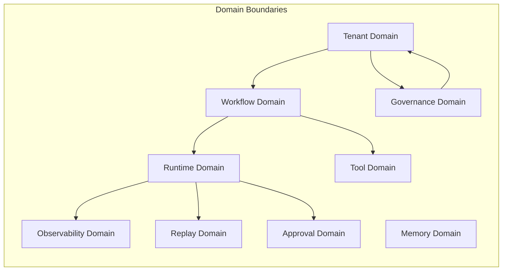
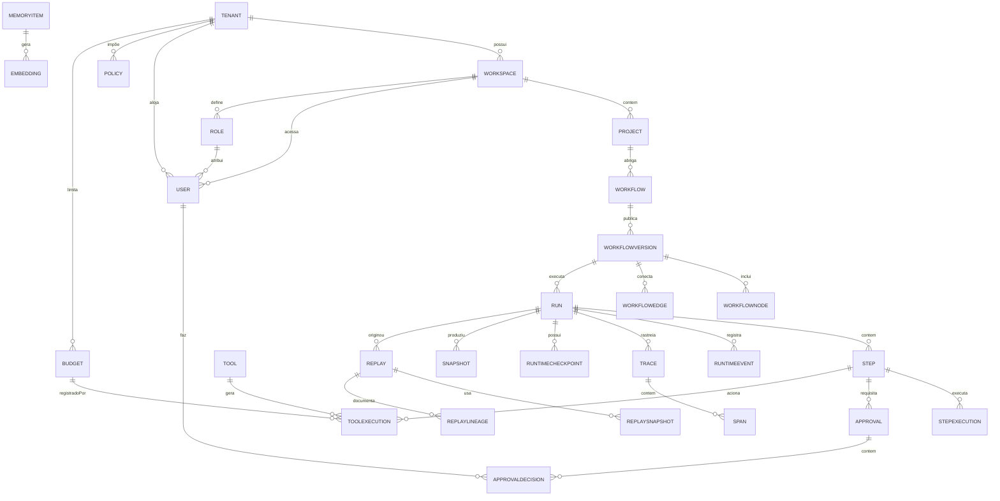
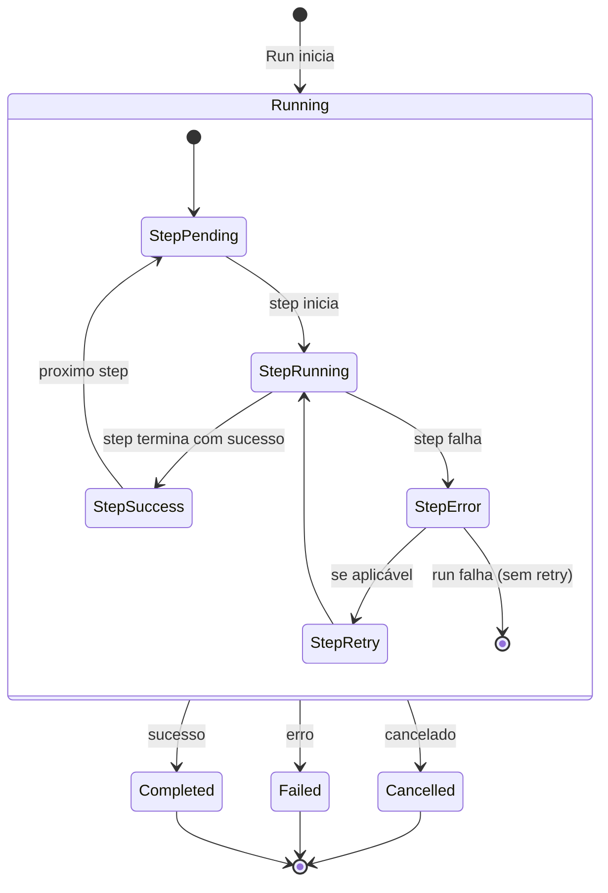
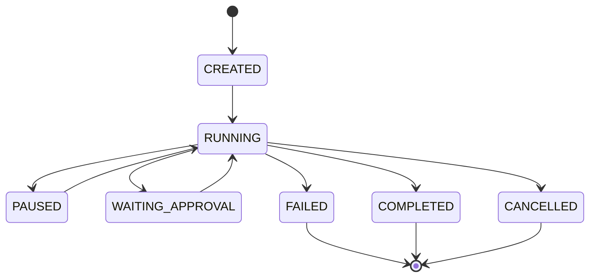
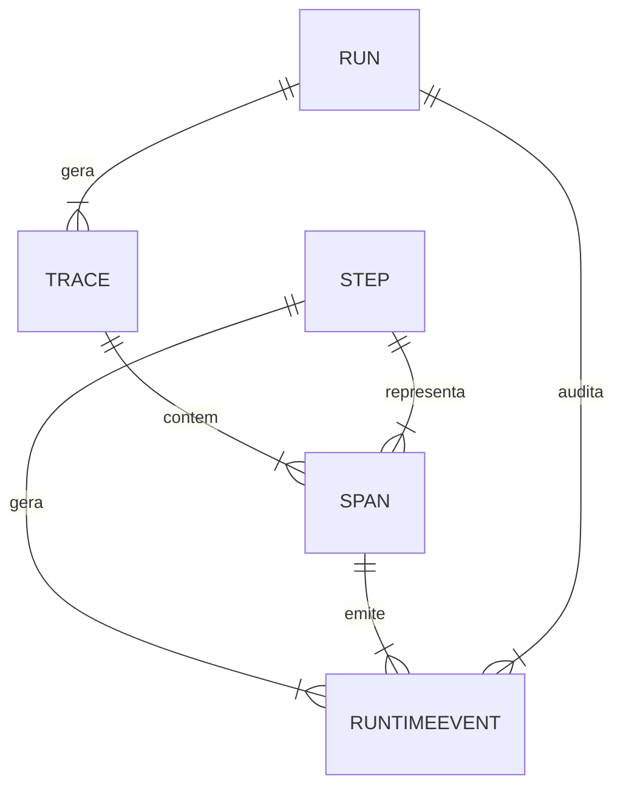

# MYCELIA — 06 Domain Model & Canonical Entities

## 1. Domain Modeling Philosophy

O modelo de domínio do MYCELIA enfatiza **entidades explícitas** com **estado durável** e **histórico append-only**, garantindo que cada alteração relevante seja registrada como um evento imutável (fonte autoritária de verdade). Adota-se Event Sourcing: todas as alterações são armazenadas em um repositório append-only, atuando como _system-of-record_【1†L42-L45】【1†L88-L96】. Essa abordagem melhora a auditabilidade e rastreabilidade (permitindo reconstruir o estado por replay)【1†L50-L56】【28†L100-L108】. Cada evento é visto como um fato “gravado em pedra” que não pode ser alterado após criado【28†L19-L22】.  

- **Entidades Explícitas:** Cada conceito chave do domínio (ex. Workflow, Run, Tenant) é modelado como entidade distinta. Não há estado oculto: todas as informações relevantes são encapsuladas em estruturas canônicas.  
- **Estado Durável & Histórico Append-Only:** Em vez de sobrescrever dados, o sistema grava cada mudança de estado como um evento imutável【1†L42-L45】. O banco de eventos (event store) serve de fonte de verdade autoritária do sistema【1†L88-L96】, permitindo reconstruir qualquer entidade por replay (rehidratação).  
- **Linhagem Imutável e Replayability:** Os eventos formam uma linha do tempo imutável. É possível “replay” para reconstruir histórico, mas não alterar eventos originais. Versões publicadas de entidades (ex. WorkflowVersion) são snapshots imutáveis【18†L99-L102】【21†L174-L181】.  
- **Isolamento Multi-tenant:** O modelo trata o tenancy como dimensão primária do domínio: cada entidade pertence a exatamente um tenant【13†L101-L109】. Todos os acessos (read/write) são executados no contexto de um tenant isolado, garantindo separação completa dos dados de diferentes clientes.  
- **Rastreabilidade em Tempo de Execução:** Cada execução de workflow e passo gera telemetria (traces, spans, eventos) que documentam o que aconteceu. Spans são agrupados em traces (através de trace_id e parent_id) para representar a hierarquia de operações【23†L961-L969】【23†L1002-L1010】. Isso assegura visibilidade completa de cada etapa e chamada de ferramenta.  
- **Design Observability-First:** A telemetria é tratada como cidadã de primeira classe. Logs, eventos e métricas são produzidos continuamente e armazenados de forma append-only. Os observáveis (traces, logs, métricas) são imutáveis e centrados em contexto de execução, facilitando diagnóstico e auditoria a qualquer momento.  
- **Modelagem Consciente de Políticas:** O domínio incorpora políticas de governança e aprovação nativamente. Regras de negócios, limites de orçamento e fluxos de aprovação são refletidos no modelo canônico, evitando violação de políticas em tempo de execução.  

**Otimizações do Modelo:** Este modelo otimiza a **auditabilidade**, **consistência** e **governança**. Facilita o rastreamento completo de linhagem e a reconstrução de estados passados, suportando compliance, rollback e controle de versão de forma natural【1†L50-L56】【28†L19-L22】.  

**Evita-se:** O modelo evita estados mutáveis ocultos, atualizações inesperadas, side-effects não auditáveis e violações de isolamento. Não há “atualizações diretas” de entidades críticas nem dependências de execução fora do fluxo explícito. Cross-tenant data leaks e histórico reescrito são proibidos, garantindo imutabilidade do histórico operacional.

# 1.1 Computational Boundary Philosophy

MYCELIA separates deterministic orchestration from probabilistic cognition.

## Deterministic Layer
Responsible for:
- orchestration;
- runtime state;
- approvals;
- retries;
- persistence;
- governance;
- replay;
- lineage.

## Probabilistic Layer
Responsible for:
- LLM reasoning;
- summarization;
- extraction;
- semantic ranking;
- embeddings;
- contextual assistance.

## Rule

Probabilistic outputs are never authoritative state.

Every probabilistic output must pass:
- schema validation;
- policy validation;
- runtime validation;
- approval gates when required.

## 2. Domain Boundaries

O MYCELIA é organizado em contextos limitados (_bounded contexts_), cada um com responsabilidades e entidades próprias【16†L94-L100】. A seguir definimos os principais domínios:



- **Runtime Domain:** Orquestra a execução de workflows. *Responsabilidades:* Agendador de execução, estado de runs/steps, checkpoints de runtime. *Ownership:* Equipe de Core Engine. *Entidades:* Run, Step, StepExecution, RuntimeContext, RuntimeCheckpoint. *Source of Truth:* Banco de execução de runs e logs de estado. *Invariantes:* Cada Run referencia exatamente uma WorkflowVersion; cada Step pertence a um Run ativo. *Dependências Permitidas:* Lê definições do domínio de Workflow; invoca ferramentas do domínio de Tool. *Dependências Proibidas:* Não modifica definições de workflow nem grava eventos de observabilidade diretamente (apenas via eventos padrão).  

- **Workflow Domain:** Define fluxos de trabalho e versões. *Responsabilidades:* Modelagem de workflows (nós e arestas), controle de versão (draft vs public), editor de gráficos. *Ownership:* Equipe de Modelagem de Workflow. *Entidades:* Workflow, WorkflowVersion, WorkflowNode, WorkflowEdge. *Source of Truth:* Repositório de definições de workflows. *Invariantes:* Versões publicadas são imutáveis【18†L99-L102】; rascunhos podem evoluir até publicação. *Dependências Permitidas:* Depende de domínios de Tool (para nós que usam ferramentas) e Governance (para políticas). *Dependências Proibidas:* Não lê nem escreve dados de execução; não acessa estado de usuários ou memória.  

- **Memory Domain:** Armazena memórias auxiliares. *Responsabilidades:* Persistir e recuperar memórias episódicas, semânticas e organizacionais. *Ownership:* Equipe de Memória. *Entidades:* MemoryItem, Embedding. *Source of Truth:* Banco de dados de vetores ou armazenamento de memória. *Invariantes:* Itens de memória têm identificação única e meta-dados de validade. *Dependências Permitidas:* Lê contexto de execução para indexar memórias; pode servir dados ao Runtime e Observability. *Dependências Proibidas:* Não altera o estado de execução ou workflow; não armazena dados sensíveis sem permissão.  

- **Observability Domain:** Coleta e armazena telemetria. *Responsabilidades:* Capturar eventos de runtime, métricas e traces. *Ownership:* Equipe de Observability/Telemetria. *Entidades:* Trace, Span, RuntimeEvent (logs de execução), CorrelationID. *Source of Truth:* Armazenamento de logs/telemetria (append-only). *Invariantes:* Todos os eventos e spans são imutáveis e relacionados via trace_id【23†L995-L1002】. *Dependências Permitidas:* Lê dados de Runtime (IDs de run, step) para correlação; não interfere em execução. *Dependências Proibidas:* Não altera dados de domínio; não executa lógica de negócios.  

- **Governance Domain:** Garante políticas corporativas. *Responsabilidades:* Gerenciar políticas, orçamentos, regras de aprovação. *Ownership:* Equipe de Compliance/Governança. *Entidades:* Policy, Budget, (e atividades relacionadas). *Source of Truth:* Repositório de políticas e limites. *Invariantes:* Políticas definidas globalmente; orçamentos associados a tenants/workspaces. *Dependências Permitidas:* Aplica regras via RuntimeContext ou eventos de execução. *Dependências Proibidas:* Não persiste dados de workflow nem logs de execução.  

- **Tenant Domain:** Gerencia clientes e isolamento. *Responsabilidades:* Criar e gerenciar tenants, workspaces e usuários. *Ownership:* Equipe de Plataforma. *Entidades:* Tenant, Workspace, User, Role. *Source of Truth:* Banco de dados de usuários e locatários. *Invariantes:* Cada entidade pertence a um tenant【13†L101-L109】; usuários estão associados a roles dentro do tenant. *Dependências Permitidas:* Todas as entidades de domínio carregam tenant_id para segurança. *Dependências Proibidas:* Nenhum dado de um tenant pode ser acessado por outro tenant (isolamento estrito).  

- **Tool Domain:** Catálogo de ferramentas acionáveis. *Responsabilidades:* Registrar ferramentas (agents, funções externas), controlar permissões. *Ownership:* Equipe de Ferramentas. *Entidades:* Tool, ToolExecution, (ResourcePolicy). *Source of Truth:* Repositório de definições de ferramentas. *Invariantes:* Cada Tool tem identificador único e metadados de permissão. *Dependências Permitidas:* Runtime invoca ferramentas pelo nome/versão, gerando ToolExecution. *Dependências Proibidas:* Ferramentas não alteram diretamente o histórico de workflow; não armazenam estado próprio persistente fora de ToolExecution.  

- **Replay Domain:** Suporte a reexecução. *Responsabilidades:* Criar execuções de replay a partir do histórico de runs. *Ownership:* Equipe de Core Engine. *Entidades:* Replay, ReplaySnapshot, ReplayLineage, ReplayFork. *Source of Truth:* Historico original de eventos e snapshots. *Invariantes:* Históricos originais são imutáveis; replays referenciam factualmente o histórico original (criando ramos se divergirem). *Dependências Permitidas:* Acessa runs e eventos do Runtime Domain para reconstrução. *Dependências Proibidas:* Não apaga nem altera o histórico original ao reexecutar.  

- **Approval Domain:** Fluxos de aprovação manuais/automatizados. *Responsabilidades:* Criar solicitações de aprovação, registrar decisões, gerenciar escalonamentos. *Ownership:* Equipe de Segurança/Operações. *Entidades:* Approval, ApprovalDecision, (Escalation). *Source of Truth:* Log imutável de solicitações e decisões de aprovação. *Invariantes:* Cada Approval tem validade temporal (deadline); decisões requerem ator/usuário associado. *Dependências Permitidas:* Pode bloquear/desbloquear a execução em RuntimeDomain. *Dependências Proibidas:* Não altera execuções diretamente sem registro de decisão; não publica versões de workflow.  

## 3. Canonical Core Entities

Para cada entidade canônica definimos formalmente sua função e características:

### Tenant
- **Definição:** Representa uma organização ou cliente isolado. Equivale a um limite de dados e configuração.  
- **Propósito:** Isolar dados e recursos por cliente; facilitar gestão multi-tenant.  
- **Ownership:** Equipe de Plataforma / Administração de tenants.  
- **Ciclo de Vida:** Criado na ativação do cliente. Geralmente imutável exceto meta-dados (status ativo/inativo). Deletado somente após procedimentos de arquivamento.  
- **Persistência:** Armazenado em banco relacional principal (PostgreSQL) com todas as referências apontando ao tenant_id.  
- **Regras de Imutabilidade:** O ID do tenant e data de criação são imutáveis. O nome pode mudar (via operações administrativas), mas cada histórico (logs, runs) continua atrelado ao tenant original.  
- **Semântica de Replay:** Tenants não “replayam” – são contexto estático. Replay cria novos runs para um tenant, sem alterar registros originais.  
- **Semântica de Observabilidade:** Cada ação de tenant (login, mudança de configuração) gera eventos auditáveis e spans correlacionados. Monitoramento e logs são armazenados append-only.  
- **Regras de Isolamento:** Todos os dados da aplicação (workflows, runs, memórias, etc.) incluem tenant_id【13†L101-L109】. Não é permitido acesso cruzado entre tenants. Cada autorização é avaliada dentro do contexto do tenant.  
- **Relacionamentos:** Tenant 1–N Workspace; Tenant 1–N User; Tenant 1–N Policy; Tenant 1–N Budget; (pode ter subdomínios como projetos) 1–N Project.  
- **Fonte da Verdade:** Banco de usuários/tenants é fonte canônica (datasource principal). Dados de tenants são autoritativos.  
- **Campos Derivados:** Ex: contadores de usuários ativos, espaço usado. Derivados de logs/entidades associadas.  
- **Segurança:** Trusted boundary; nunca expor dados de um tenant fora de seu contexto. Criptografia em repouso e em trânsito por tenant. Gestão rígida de credenciais.

### Workspace
- **Definição:** Sub-homem dentro de um tenant, p.ex. unidade de negócio ou departamento.  
- **Propósito:** Agrupar projetos e usuários. Limita escopo de workflows e dados.  
- **Ownership:** Gerente de tenant ou líder de projeto.  
- **Ciclo de Vida:** Criado pelo Tenant Admin; deletado ao encerrar projetos/usuários.  
- **Persistência:** Armazenado no mesmo banco do Tenant, referenciando tenant_id.  
- **Imutabilidade:** ID e relação com o tenant não mudam; nome pode ser atualizado.  
- **Replay:** Sem considerações especiais – herda isolamento do tenant.  
- **Observability:** Alterações de workspace (criação, exclusão) geram eventos de auditoria.  
- **Isolamento:** Funciona dentro do tenant – dados de um workspace não vazam para outro dentro do mesmo tenant (via configuração de auth).  
- **Relacionamentos:** Workspace 1–N Project; Workspace 1–N User (membresia); pertence a 1 Tenant.  
- **Fonte da Verdade:** Banco de configuração empresarial.  
- **Derivados:** Contagem de projetos e usuários.  
- **Segurança:** Hierarquia de isolamento: Tenant > Workspace. Permissões RBAC restritas por workspace.

### Project
- **Definição:** Projeto ou coleção de workflows dentro de um workspace.  
- **Propósito:** Organizar fluxos de trabalho e dados lógicos.  
- **Ownership:** Equipe de desenvolvimento/design de workflow.  
- **Ciclo de Vida:** Criado sob um workspace; removido junto com workflows.  
- **Persistência:** Registro no BD central com workspace_id, tenant_id.  
- **Imutabilidade:** ID fixo; pode renomear.  
- **Replay:** Não se aplica direto – reexecuções usam o workflow version, não alteram projeto.  
- **Observability:** Criação e alterações de projetos auditadas.  
- **Isolamento:** Vinculado a um workspace (e indiretamente a um tenant).  
- **Relacionamentos:** Project 1–N Workflow.  
- **Fonte da Verdade:** BD principal.  
- **Derivados:** Metadados, tags.  
- **Segurança:** Autorização a nível de workspace/tenant.

### Workflow
- **Definição:** Definição genérica de um processo (grafo de passos) em nível conceitual.  
- **Propósito:** Representar o fluxo lógico de operação (semelhante a um “template”).  
- **Ownership:** Equipe de Arquitetura de Processos.  
- **Ciclo de Vida:** Criado em draft e versionado. Várias WorkflowVersion ligadas. Pode ser deletado se nenhum Run associado.  
- **Persistência:** Guardado em DB de definição, mas apenas versões publicadas têm relevância executável.  
- **Imutabilidade:** O identificador do Workflow é imutável. Propriedades de alto nível (nome, descrição) podem evoluir entre versões.  
- **Replay:** O Workflow em si é estático; reexecuções usam a versão específica (ver WorkflowVersion).  
- **Observability:** Ações de criar/versionar/publicar workflow geram eventos de governança.  
- **Isolamento:** Workflow pertence a um workspace/tenant e só é visível internamente.  
- **Relacionamentos:** Workflow 1–N WorkflowVersion. Pode referenciar entidades de domínio (ex. Policy para condições).  
- **Fonte da Verdade:** Repositório de definições de workflows.  
- **Derivados:** Nenhum campo transitório.  
- **Segurança:** Só usuários autorizados do workspace podem criar ou publicar.  

### WorkflowVersion
- **Definição:** Instância versionada de um Workflow (snapshot publicado).  
- **Propósito:** Tornar o workflow imutável após publicação; servir de contrato para execuções e linhas de execução futuras.  
- **Ownership:** Mesma do Workflow, mas uma vez publicada, não é alterada.  
- **Ciclo de Vida:** Inicia como rascunho (draft), pode sofrer iterações até publicação. Ao publicar, torna-se um snapshot imutável【21†L174-L181】. Pode ser arquivado (status inativo) após depreciação.  
- **Persistência:** Armazenado em tabela separada com foreign key para Workflow. Versionamento incremental. Publicado com número sequencial.  
- **Imutabilidade:** **Cada versão publicada é imutável**【18†L99-L102】【21†L174-L181】. Após publicação, nenhuma mudança no grafo (nós/arestas) ou propriedades é permitida. Somente um novo draft (nova versão) pode ser criado.  
- **Replay Semantics:** Execuções registram o workflow_version_id; replays usam o mesmo version_id para consistência. Não se atualiza version_id antigo.  
- **Observability:** Publicação ou alterações em draft geram eventos; o Run aponta para esta versão gerando spans.  
- **Tenant Isolation:** Versões herdam o tenant_id do workspace, e só podem ser executadas naquele escopo.  
- **Relacionamentos:** WorkflowVersion 1–N WorkflowNode; 1–N WorkflowEdge; pertence 1–1 a Workflow; 1–N Run (cada run vincula a versão usada).  
- **Fonte da Verdade:** O registro da versão no DB é autoritário. Código-fonte e metadados do workflow não podem ser alterados fora dele.  
- **Campos Derivados:** Hash de versão (para checagem de integridade).  
- **Segurança:** Só usuários com permissão (ex. admin do projeto) podem publicar. Versões imutáveis evitam que execuções ocorram em definições ‘fantasmas’.

### WorkflowNode
- **Definição:** Nó abstrato de um workflow (ex. passo de ação, condição ou gatilho).  
- **Propósito:** Representar um ponto de decisão ou atividade no grafo.  
- **Ownership:** Workflow Domain.  
- **Ciclo de Vida:** Criado/alterado enquanto a versão está em draft. Deletado ou modificado antes da publicação. Publicação bloqueia alterações.  
- **Persistência:** Tabelas de nós ligadas à WorkflowVersion.  
- **Imutabilidade:** Uma vez versão publicada, a estrutura do nó (id, tipo) e suas propriedades essenciais não mudam. Apenas em rascunho pode-se editar.  
- **Replay:** Os nós têm relações com execuções (qual nó está sendo executado em cada passo). Não se altera nó em históricos antigos.  
- **Observability:** O início/fim de execução de um nó gera spans triplos (espans de nó e de ToolExecution se houver).  
- **Tenant Isolation:** Referencia WorkflowVersion que já está isolada por tenant.  
- **Relacionamentos:** Node 0–N WorkflowEdge (incoming/outgoing); pertence a 1 WorkflowVersion. Quando executado, gera 1–N Step e StepExecution.  
- **Fonte da Verdade:** Definições em WorkflowVersion; não existe outra fonte.  
- **Derivados:** Ordem de execução calculada pelo grafo; propriedades derivadas de labels ou scripts.  
- **Segurança:** Comportamento do nó (scripts, comandos) deve respeitar políticas (ex. não armazenar credenciais em texto puro).

### WorkflowEdge
- **Definição:** Ligação (transição) entre dois WorkflowNodes.  
- **Propósito:** Define fluxo de controle (ordem) ou condições de fluxo.  
- **Ownership:** Workflow Domain.  
- **Ciclo de Vida:** Criado/ajustado em draft; imutável após versão publicada.  
- **Persistência:** Em tabela de arestas referenciando WorkflowVersion e nós de origem/destino.  
- **Imutabilidade:** Não podem ser criadas/removidas após publicação; descrevem a lógica executável.  
- **Replay:** Não aplicável direto; reexecução segue as edges definidas (mesmo em runs passados).  
- **Observability:** Transições não geram eventos por si só, mas servem para reconstruir caminho via logs de execução de nós.  
- **Isolamento:** Vinculadas ao mesmo workflow version e tenant.  
- **Relacionamentos:** Edge 1–1 de um nó origem para nó destino (em 1 WorkflowVersion).  
- **Fonte da Verdade:** Definições no grafos publicados.  
- **Campos Derivados:** Representação textual de condição (se houver).  
- **Segurança:** Validações na edição proíbem loops infinitos não intencionais.

### Run
- **Definição:** Instância de execução de um WorkflowVersion (orquestração em tempo real).  
- **Propósito:** Processar um workflow desde início até fim, registrando estado e resultados.  
- **Ownership:** Runtime Domain.  
- **Ciclo de Vida:** Estado inicial `Running`. Pode passar por `Failed`, `Completed`, `Cancelled`. Possui checkpoints (RuntimeCheckpoint) para pausar/resumir. Pode ser reiniciado ou replicado em replay.  
- **Persistência:** Persistido em banco de runs (append-only): cada mudança de estado (start, finish, erro) gera RuntimeEvent. Checkpoints são armazenados para retomada.  
- **Imutabilidade:** O registro de eventos do run é imutável (audit trail). O estado atual é atualizado, mas registros antigos não são apagados.  
- **Replay Semantics:** Um Replay cria um Run “espelho” usando o histórico de eventos existente. O Run original permanece intacto; os outputs reexecutados são registrados separadamente.  
- **Observabilidade:** Cada Run emite spans (`RunStart`, `RunEnd`) e eventos de estado. Um Trace único (trace_id) cobre todo o run (incluindo Steps e ferramentas).  
- **Tenant Isolation:** Pertence a 1 WorkflowVersion (que pertence a 1 Tenant). Runs só executam dentro de seu tenant.  
- **Relacionamentos:** Run 1–N Step; 1–N RuntimeEvent; 1–N RuntimeCheckpoint; 1–N Trace (principal trace_id). Se for Replay, 1–1 Replay (opcional).  
- **Fonte da Verdade:** Logs e eventos de run armazenados persistentemente (ex. DB ou event store). O run record no banco é a fonte autoritária do estado final.  
- **Campos Derivados:** Duração (calculada de start/end), recursos usados, hashes de outputs (para verificar consistência).  
- **Segurança:** Isolamento rigoroso de contextos; dados sensíveis no contexto de execução (secrets) não são persistidos no RuntimeContext. Permite reexecução segura de forma auditável.

### Step
- **Definição:** Instância de um WorkflowNode dentro de um Run (uma etapa operacional).  
- **Propósito:** Representar a execução de um nó específico no contexto de um run (multiplicidade de instâncias se loops).  
- **Ownership:** Runtime Domain.  
- **Ciclo de Vida:** Criado quando o nó é atingido no run. Passa por estados: `Pending`, `Running`, `Succeeded`/`Failed`. Pode gerar tentativas de reexecução (`retries`).  
- **Persistência:** Registros de início/fim são persistidos (RuntimeEvent) com step_id único. Estado atual (status, resultados) também é salvo em append-only.  
- **Imutabilidade:** Eventos de step (start/end) são imutáveis. O estado final é escrito uma única vez (em `Succeeded/Failed`). Não se alteram registros históricos de step.  
- **Replay:** Em replay, novos Step (com novo ID) são criados conforme histórico original para comparação. O Step original e sua saída permanecem imutáveis.  
- **Observability:** Cada Step cria spans filho do Trace do Run (definindo hierarquia) e eventos (ex. log de output, métricas internas). Permite rastrear fluxo interno de tarefas.  
- **Isolamento:** Vinculado a um Run e WorkflowVersion; mantém o mesmo tenant.  
- **Relacionamentos:** Step 1–N StepExecution; pertence a 1 Run, refere-se a 1 WorkflowNode. Pode ter 0–N Approvals (p. ex. um nó de autorização).  
- **Fonte da Verdade:** O registro do passo em execução (step record) no banco é originador do seu estado.  
- **Campos Derivados:** Tempo decorrido, contagem de tentativas.  
- **Segurança:** Cada Step roda no contexto seguro determinado pelo Workflow (ex. service accounts); logs sensíveis não são expostos; rejeita inputs inseguros.

### StepExecution
- **Definição:** Eventos detalhados da execução de um Step, incluindo sub-tarefas como chamadas de ferramentas.  
- **Propósito:** Registrar granularmente as ações dentro de um step.  
- **Ownership:** Runtime Domain (ou Tool Domain se executado externamente).  
- **Ciclo de Vida:** Cada StepExecution corresponde a uma unidade de trabalho dentro do Step. Emite eventos `Started` e `Finished` (ou erro). Pode ser repetido (retry).  
- **Persistência:** Append-only: cada início/fim/ar failure do step execution é logado em RuntimeEvent.  
- **Imutabilidade:** Registros individuais são imutáveis. Estado acumulado do step se atualiza via logs.  
- **Replay:** Em reexecuções, StepExecutions são re-criados seguindo o histórico original (mesmo número de execuções por step). O histórico original não é sobrescrito.  
- **Observability:** Cada StepExecution gera spans filhos de seu Step e possivelmente sub-steps, incluindo identificação de passo e parâmetros. Logs e métricas de ferramentas estão aninhados.  
- **Isolamento:** Segue isolamento do Step e Run originais.  
- **Relacionamentos:** Pertence a 1 Step; 1–N ToolExecution (se chamar ferramentas externas); 1–N RuntimeEvent (logs gerados).  
- **Fonte da Verdade:** Logs de execução são registrados de forma imutável; são a única fonte sobre o que ocorreu.  
- **Campos Derivados:** Resultado agregado, tempo médio de execução (após conclusão).  
- **Segurança:** Autoridade mínima: cada execução carrega contexto seguro; ex. não propaga variáveis de ambiente sensíveis além do necessário.

### Tool
- **Definição:** Abstração de uma função ou serviço executável (ex.: consulta a LLM, função de dados).  
- **Propósito:** Definir metadados de execução (como invocar, permissões, idempotência).  
- **Ownership:** Equipe de Ferramentas.  
- **Ciclo de Vida:** Registrado no catálogo de ferramentas. Pode ser atualizado, versionado ou removido se obsoleto.  
- **Persistência:** Armazena-se nome, versão, configurações, políticas de acesso no banco de ferramentas.  
- **Imutabilidade:** Metadados (ID, versão) imutáveis após criação; configurações podem mudar gerando nova ferramenta ou versão.  
- **Replay:** Invocações de ferramenta não devem ser re-executadas automaticamente em replay se não idempotentes; cada ToolExecution no histórico original é mantida separada.  
- **Observability:** Cada execução de ferramenta emite spans (ex. `ToolInvoke`) que apontam para o ToolExecution associado. Logs de ferramenta (side-effects) são correlacionados.  
- **Isolamento:** Ferramenta só acessível via step autorizado; não carrega contexto externo de usuário.  
- **Relacionamentos:** Tool 1–N ToolExecution; pode referenciar recursos externos (p. ex. API keys).  
- **Fonte da Verdade:** Catálogo (DB) de ferramentas é fonte de permissão e configurações.  
- **Campos Derivados:** Thumbprint de invocação (ex. hash de entrada para idempotência).  
- **Segurança:** Execução sob contexto sandbox; define escopo de efeitos colaterais permitidos; logs de entrada/saída são auditados.

### ToolExecution
- **Definição:** Registro de uma chamada de uma Tool durante um StepExecution.  
- **Propósito:** Auditar invocações externas e capturar outputs.  
- **Ownership:** Tool Domain.  
- **Ciclo de Vida:** Criado no início da chamada de ferramenta; depois emite `Completed` ou `Failed`.  
- **Persistência:** Append-only logs: tempo de invocação, parâmetros, resultados ou erros. IDs de correlação em spans.  
- **Imutabilidade:** Uma execução de ferramenta concluída não é alterada; apenas novos registros (events) são anexados.  
- **Replay:** Em replays, nova ToolExecution é gerada (com novo ID) para comparação; a original permanece intocada. Não sobrescreve output original.  
- **Observability:** Gera um Span próprio, vinculado ao Trace pai do Step; inclui eventuais eventos internos (ex. logs de API, métricas).  
- **Isolamento:** Scoped ao Step; não armazena dados globais.  
- **Relacionamentos:** Belongs to 1 StepExecution; produz 0–N RuntimeEvent (logs da ferramenta).  
- **Fonte da Verdade:** Logs de resposta da ferramenta. Se a ferramenta tiver seu próprio estado, ele não é controlado por MYCELIA (consistente como entrada→saída).  
- **Campos Derivados:** Latência, custo (p. ex. token count).  
- **Segurança:** Execução isolada; validações de permisão (ex. verificações de acesso à ferramenta).

### Approval
- **Definição:** Solicitação de autorização para prosseguir com determinado ponto do workflow ou mudança no sistema.  
- **Propósito:** Controlar decisões de humanos/sistemas de acordo com políticas definidas.  
- **Ownership:** Governance Domain.  
- **Ciclo de Vida:** Criado quando chega num nó de aprovação; espera decisões até deadline; pode escalonar ou expirar.  
- **Persistência:** Registro imutável da solicitação (quem, o quê, por que). Atualizações de status (`Pending`, `Approved`, `Rejected`, `Escalated`) em append-only.  
- **Imutabilidade:** Os detalhes originais do pedido (quem pediu, data, contexto) não mudam; decisões registradas são finais.  
- **Replay Semantics:** Decisões de aprovação não são refeitas automaticamente em reexecução – devem ser reprovadas manualmente se necessário. Não se reusa a decisão original, pois contexto pode mudar.  
- **Observability:** Cada aprovação gera eventos de criação e decisão (audit trail). Spans correlacionam com o Run/passo que gerou a aprovação.  
- **Isolamento:** Amarrado ao mesmo tenant e workspace do workflow. Somente perfis de mesmo tenant podem aprovar.  
- **Relacionamentos:** 1 Approval 1–N ApprovalDecision. Pode referenciar 1 Run/Step onde foi solicitado.  
- **Fonte da Verdade:** Log de aprovação (data, solicitante, razões) no sistema é final.  
- **Campos Derivados:** Contador de aprovações pendentes; tempos de espera.  
- **Segurança:** Exige identificação do ator (usuário ou sistema) em ApprovalDecision; mantém trilha de auditoria por compliance.

### ApprovalDecision
- **Definição:** Voto/decisão específica de um ator sobre uma solicitação de Approval.  
- **Propósito:** Registrar “approved/rejected” por um usuário ou sistema.  
- **Ownership:** Governance Domain.  
- **Ciclo de Vida:** Criado quando um ator toma ação (`Approve`, `Reject`, `Escalate`). Depois é imutável.  
- **Persistência:** Cada decisão é inserida como novo registro (append-only) com carimbo de tempo e ator_id.  
- **Imutabilidade:** Após gravada, uma decisão não é alterada nem deletada. Novas decisões (mesmo approval) podem ser acrescentadas (por exemplo escalonamento).  
- **Replay Semantics:** Durante replay, decisões originais são referenciadas (como parte do histórico auditado), mas não reevaluadas automaticamente.  
- **Observability:** Gera evento de decisão com detalhes. Correlaciona com o Approval e possivelmente span do Run.  
- **Isolamento:** Segue tenant do Approval (mesmo workspace).  
- **Relacionamentos:** Cada ApprovalDecision pertence a 1 Approval.  
- **Fonte da Verdade:** Registros de decisão no log de auditoria.  
- **Campos Derivados:** Status acumulado do Approval (aprovado ou rejeitado) pode ser calculado.  
- **Segurança:** Requer autenticacao e autorização (actor_id) ao fazer a decisão; vincula usuário com decisão para responsabilização.

### RuntimeEvent
- **Definição:** Evento genérico de sistema emitido durante a execução (ex.: mudança de estado de run/step, logs do sistema, métricas).  
- **Propósito:** Fornecer trilha auditável e métricas para cada passo do Run/Step.  
- **Ownership:** Runtime Domain (producer de eventos) e Observability Domain (arquivista).  
- **Ciclo de Vida:** Imediatamente gravado ao ocorrer; não é modificado após escrito.  
- **Persistência:** Armazenados em data store de eventos ou log (append-only). Exemplos: RunStarted, StepFailed, DataLogged, etc.  
- **Imutabilidade:** Eventos de runtime são imutáveis; servem como fonte histórica dos estados.  
- **Replay:** Replays usam eventos originais para reconstruir estado; não produzem eventos novos automaticamente (exceto de own).  
- **Observability:** Cada event é emitido em contexto de trace/span; todos incluem timestamps.  
- **Isolamento:** Contém tenant_id e run_id para contexto.  
- **Relacionamentos:** Pertence ao Run (e possivelmente a Step/Tool).  
- **Fonte da Verdade:** Logs de runtime são fonte primária do que ocorreu.  
- **Campos Derivados:** Métricas (contagem de eventos por tipo, tempo entre eventos).  
- **Segurança:** Permite rastrear alterações no sistema; não vaza dados sensíveis pois segue política de logging.

### Trace
- **Definição:** Conjunto correlacionado de spans que representam uma execução fim-a-fim de um workflow ou transação.  
- **Propósito:** Rastrear hierarquia temporal de operações distribuídas.  
- **Ownership:** Observability Domain.  
- **Ciclo de Vida:** Criado no início do Run (ou ação externa) e fechado ao término.  
- **Persistência:** Enviado a sistema de traces (append-only). Cada span contém trace_id compartilhado.  
- **Imutabilidade:** Spans dentro do trace são imutáveis; o trace nasce no primeiro span e conclui no último.  
- **Replay Semantics:** Um trace original documenta uma execução; em replay novos spans são emitidos em um trace separado (para não confundir auditorias).  
- **Observability:** Lista de spans com trace_id único; correlaciona com logs usando span_id e parent_id【23†L995-L1002】【23†L1004-L1013】.  
- **Isolamento:** Inclui tenant/workspace no contexto; spans de um trace não vazam para outro tenant.  
- **Relacionamentos:** Trace 1–N Span; 1–1 Run (ou processo) originário.  
- **Fonte da Verdade:** Sistema de telemetria. Não usado para lógicas do domínio, somente para análise.  
- **Campos Derivados:** Duração total, anotações de erro, árvore de spans.  
- **Segurança:** Dados de trace são sensíveis (podem expor estrutura interna); armazenados de forma segura.

### Span
- **Definição:** Unidade atômica de trabalho dentro de um trace (ex.: execução de um step, chamada de API).  
- **Propósito:** Medir duração, status e metadados de uma operação.  
- **Ownership:** Observability Domain.  
- **Ciclo de Vida:** Criado no início da operação, fecha ao fim; tipo `root` para Run e `child` para suboperações.  
- **Persistência:** Enviado junto ao trace (cada span é um documento JSON ou equivalente no trace store).  
- **Imutabilidade:** Assim como trace, spans são imutáveis após encerrados.  
- **Replay:** Não reproduzido automaticamente (cada execução gera novos spans).  
- **Observability:** Contém nome da operação, timestamps, parent_id, atributos e eventos. Permite visualizar hierarquia (cada child referencia parent_id)【23†L961-L969】【23†L1002-L1010】.  
- **Isolamento:** Está atrelado ao mesmo contexto (run, tenant) do trace.  
- **Relacionamentos:** Pertence a 1 Trace; 0–N Span Events; 0–N child Spans.  
- **Fonte da Verdade:** Telemetria capturada.  
- **Campos Derivados:** Tempo de execução, status de sucesso/falha, tags de contexto.  
- **Segurança:** Não deve conter segredos em texto; apenas metadados necessários para debug.

### Snapshot
- **Definição:** Estado completo e imutável de uma execução (ou de uma parte relevante) em um momento específico.  
- **Propósito:** Acelerar inicialização de reexecuções (rehidratação) e permitir auditoria de pontos críticos.  
- **Ownership:** Replay Domain (criação) / Runtime Domain (operação).  
- **Ciclo de Vida:** Criado em checkpoints definidos (ex.: cada X eventos ou no fim de cada run). Uma vez criado, é imutável.  
- **Persistência:** Armazenado em sistema de arquivos ou banco (append-only). Inclui dados suficientes para reconstruir estado futuro sem rebobinar tudo.  
- **Imutabilidade:** Toda snapshot é write-once. Serve como ponto de base para replays.  
- **Replay Semantics:** Replays podem iniciar a partir de um snapshot e aplicar só eventos posteriores (limita tempo de replay). O snapshot original permanece inalterado.  
- **Observability:** A criação de snapshot gera evento de log; conteúdos de snapshot não são parte direta da telemetria usual.  
- **Isolamento:** Snapshots são categorizados por run_id (e version_id se aplicável) do tenant correspondente.  
- **Relacionamentos:** Snapshot 1–1 Run; 0–N Replay (cada replay pode usar um snapshot); 1–1 RuntimeCheckpoint.  
- **Fonte da Verdade:** O conteúdo da snapshot é autoritativo para reidratação rápida (não confiável apenas em logs).  
- **Campos Derivados:** Versão do snapshot (contador de checkpoints), hash de integridade do estado salvo.  
- **Segurança:** Protegido contra adulteração (checksum); não armazenar dados sensíveis não criptografados.

### Replay
- **Definição:** Execução de um Run existente a partir de logs/snapshot, possivelmente gerando um novo branch de histórico.  
- **Propósito:** Permitir validação de resultados, comparação e migração (ex.: executar novo código contra histórico antigo).  
- **Ownership:** Core Engine / Replay Engine.  
- **Ciclo de Vida:** Inicia sob demanda (manual ou automatizado) apontando para Run e eventos/snapshot; produz um novo Run paralelo.  
- **Persistência:** Referencia logs e snapshots originais; registra seu próprio Run e eventos adicionais (não sobrepõe originais).  
- **Imutabilidade:** Todo o histórico original é preservado. O Replay não altera eventos ou outputs originais. Novos eventos são segregados por run_id diferente.  
- **Replay Semantics:** Mantém referência ao lineage original (Run original como parent_id de replay). Pode divergir (fork) se novo código ou aprovações diferentes forem aplicados.  
- **Observability:** O replay gera seus próprios traces e logs, permitindo comparação. Eventos de divergência (ex.: erro novo) são capturados.  
- **Tenant Isolation:** Replay respeita isolamento do tenant do run de origem; novo run de replay permanece no mesmo tenant/workspace.  
- **Relacionamentos:** Cada Replay 1–1 Run (novo run); 1–N ReplayLineage registros (ligando runs). Pode originar ReplayForks em divergências.  
- **Fonte da Verdade:** Logs originais e snapshots são contínuos. O replay em si acrescenta dados que são separados, sem impacto nos originais.  
- **Campos Derivados:** Flag de sucesso (se outputs coincidem).  
- **Segurança:** Replay não injeta dados arbitrários; somente reproduz, mantendo certificação de que originais não sofreram mutações.

### ReplaySnapshot
- **Definição:** Snapshot criado especificamente para facilitar replays (checkpoint no histórico de execução original).  
- **Propósito:** Reduzir custo de replay, servindo como ponto de partida para aplicar eventos subsequentes.  
- **Ownership:** Replay Domain.  
- **Ciclo de Vida:** Criado quando se habilita opção de replay; gravado imutavelmente.  
- **Persistência:** Similares a Snapshots de runtime; referenciado pela Replay.  
- **Imutabilidade:** Não modificável após criação.  
- **Replay Semantics:** Usado para iniciar reexecução; mantém pointer para estado estático.  
- **Observability:** Criar snapshot de replay gera evento de auditoria.  
- **Isolamento:** Relacionado ao run original e tenant.  
- **Relacionamentos:** 1–1 com Replay; 1–1 RuntimeCheckpoint original.  
- **Fonte da Verdade:** O conteúdo estático do snapshot.  
- **Derived:** 
- **Segurança:** Confidencialidade como em Snapshots normais.

### ReplayLineage
- **Definição:** Registro do parentesco entre uma execução original e suas re-execuções (replays).  
- **Propósito:** Manter histórico de derivação de runs e comparação de outputs.  
- **Ownership:** Replay Domain.  
- **Ciclo de Vida:** Criado no mómento de iniciar um replay; imutável após escrito.  
- **Persistência:** Em tabela de relacionamentos: (run_origem_id, run_replay_id, tipo_linhagem).  
- **Imutabilidade:** Cada vínculo de lineage é imutável.  
- **Replay Semantics:** Base para traçar brach e diferenças: um replay novo nunca sobrescreve o original.  
- **Observability:** Linha de descendência e eventos de comparação.  
- **Isolamento:** Dentro do mesmo tenant.  
- **Relacionamentos:** Cada registro liga 1 Run original a 1 Run de replay; pode indicar “sucessor” ou “fork”.  
- **Fonte da Verdade:** Armazena a estrutura de linhagem.  
- **Segurança:** Tamper-proof (auditável). 

### ReplayFork
- **Definição:** Marco indicando que um replay divergiu do histórico original (ex.: outputs diferentes ou alterações manuais).  
- **Propósito:** Sinalizar pontos de comparação e bifurcação.  
- **Ownership:** Replay Domain.  
- **Ciclo de Vida:** Criado durante execuçao de replay, se detectar desvio de comportamento.  
- **Persistência:** Registro em evento ou tabela, apontando onde ocorreu o fork.  
- **Imutabilidade:** Não é alterado após gravado.  
- **Replay Semantics:** Indica que recomparações devem ser feitas a partir deste ponto.  
- **Observability:** Gera evento de alerta em logs.  
- **Isolamento:** Aplicado no contexto de run.  
- **Relacionamentos:** Aponta para o ponto (Step/StepExecution) onde divergiu e o run original.  
- **Fonte da Verdade:** Histórico de execuçao mostra fork.  
- **Segurança:** Marca auditorial de diferencas entre execuçoes.

### MemoryItem
- **Definição:** Elemento de memória armazenado (texto, representação, etc.).  
- **Propósito:** Servir como conhecimento armazenado para uso futuro (associado a tarefas cognitivas ou recuperações).  
- **Ownership:** Memory Domain.  
- **Ciclo de Vida:** Criado ao guardar memória (ex.: resposta de step, nota do usuário). Pode expirar (TTL) ou ser invalidado (quando fica obsoleto).  
- **Persistência:** Guardado em data store (p. ex. vector db ou banco NoSQL) com embed id, contexto, e tenant.  
- **Imutabilidade:** Conteúdo original é imutável; atualizações resultam em novo MemoryItem vinculado (versão/nova data).  
- **Replay Semantics:** Não há replay de memórias de usuário – são data auxiliar, não parte do fluxo de execução de workflow.  
- **Observability:** Criação/invalidação de memória gera evento (para gestão de relevância).  
- **Isolamento:** Tagged com tenant_id; recuperada somente por queries dentro do mesmo tenant.  
- **Relacionamentos:** Pode referenciar 0–N Embeddings; originada por 1 Run/Step/Usuario ou criada manualmente.  
- **Fonte da Verdade:** Armazenamento de memória (DB) é autoritário; embeddings associados são dependentes.  
- **Campos Derivados:** ID de embedding, vetores dimensionais.  
- **Segurança:** Pode conter dados privados; aplica encriptação em repouso e políticas de acesso. TTL automático e permissão de dono para remover.

### Embedding
- **Definição:** Vetor numérico gerado para um MemoryItem (p.ex. BERT embedding).  
- **Propósito:** Facilitar busca e semântica (chave de similaridade).  
- **Ownership:** Memory Domain (parte da persistência de MemoryItem).  
- **Ciclo de Vida:** Criado junto ou logo após o MemoryItem. Pode ser recalculado se o modelo for atualizado.  
- **Persistência:** Armazenado em vector DB ou índice de busca, referenciado por memory_id.  
- **Imutabilidade:** Embeddings são derivados e podem ser re-gerados, mas versions históricas podem ser mantidas (append-only).  
- **Replay:** Não aplicável – embeddings não afetam replay. São auxiliares de contexto.  
- **Observability:** Não tipicamente emitidos como eventos; usam logs de sistema para ação de embedding.  
- **Isolamento:** Scope por tenant e workspace de origem do MemoryItem.  
- **Relacionamentos:** Cada Embedding 1–1 MemoryItem (ou múltiplos se multi-modelo).  
- **Fonte da Verdade:** Embedding é derivado, não autoritativo. Fonte de fato é o MemoryItem original e o modelo de ML usado.  
- **Campos Derivados:** Vetor de features (float[]).  
- **Segurança:** Trata-se de dado derivado; não carregam informação legível diretamente. Contudo, manter índice seguro (acesso controlado).

### Policy
- **Definição:** Conjunto de regras de negócios ou governança aplicadas ao sistema (ex.: permissões, limites).  
- **Propósito:** Impor controles (p.ex. aprovações obrigatórias, orçamento, classificação de dados).  
- **Ownership:** Governance Domain.  
- **Ciclo de Vida:** Criado por analistas de negócio; versões aplicadas ao sistema. Mutável mas alterações são auditadas (cada mudança gera versão histórica).  
- **Persistência:** Tabelas de políticas com metadados (id, escopo, parâmetros).  
- **Imutabilidade:** Referências em histórico (ex.: uma execução diz “assumiu a política X versão Y”). Versões de políticas são fixas após publicação.  
- **Replay Semantics:** Reexecuções aplicam as políticas vigentes no contexto do run original; mudanças posteriores não alteram históricos passados.  
- **Observability:** Aplicação de política em tempo real gera eventos logados (p.ex. “Requisito de aprovação violado”).  
- **Isolamento:** Políticas podem ser globais ou específicas por tenant. Políticas privadas não cruzam tenant boundary.  
- **Relacionamentos:** Pode afetar WorkflowNodes (ex. marcar nós de aprovação obrigatória) e Runs (bloqueia progresso).  
- **Fonte da Verdade:** Repositório de políticas (geralmente gerenciado via UI ou API).  
- **Derivados:** Parâmetros calculados (ex. percentuais de orçamento consumido).  
- **Segurança:** Garantir que políticas críticas (segurança, compliance) sejam auditadas. Não permitir remoção de políticas aplicadas em runs concluídos.

### RuntimeContext
- **Definição:** Estado efêmero de contexto de execução que acompanha uma Run (p.ex. variáveis de ambiente, credenciais temporárias).  
- **Propósito:** Fornecer informações contextuais às tarefas em execução.  
- **Ownership:** Runtime Domain.  
- **Ciclo de Vida:** Criado no início do Run; acumulado durante execução; descartado ou retirado ao final. Não é persistido para além de checkpoints.  
- **Persistência:** Em memória (cache) ou storage leve temporário; não faz parte do histórico permanente.  
- **Imutabilidade:** Mutável durante execução (passa de um estado para outro no curso do run), mas não é registrado integralmente.  
- **Replay Semantics:** Não se regrava; um replay inicia novo contexto independente, possivelmente com estados recalculados.  
- **Observability:** Pode gerar eventos específicos (ex.: “Context loaded secrets”) sem expor conteúdo sensível nos logs.  
- **Isolamento:** Totalmente isolado por tenant/run. Não vaza para outros processos.  
- **Relacionamentos:** Vinculado 1–1 a Run. Pode referenciar Politicas e Memory.  
- **Fonte da Verdade:** Não considerado fonte de verdade (estado transitório).  
- **Derivados:** Dados em cache (por ex. tokens de autenticação).  
- **Segurança:** Não grava segredos; qualquer dado confidencial (chaves, segredos) é referenciado via referência segura, não em plaintext.

### User
- **Definição:** Entidade que representa um ator humano ou serviço autenticado.  
- **Propósito:** Autenticar, autorizar e auditar ações.  
- **Ownership:** Tenant Domain.  
- **Ciclo de Vida:** Criação pelo Admin do Tenant; altera papéis/atribuições; desativação ou deleção na saída da organização.  
- **Persistência:** Banco de usuários com tenant_id; credenciais seguras e metadados pessoais.  
- **Imutabilidade:** ID permanente; atributos de login podem mudar.  
- **Replay:** Decisões de aprovação feitas pelo usuário são registradas, mas nova autenticação no replay é necessária.  
- **Observability:** Login/logout e ações de usuário geram eventos de auditoria.  
- **Isolamento:** Pertence a 1 Tenant e possivelmente a Workspaces específicas.  
- **Relacionamentos:** 1–N ApprovalDecision (cada decisão atrelada a quem deu o voto); 1–N runs iniciadas por ele.  
- **Fonte da Verdade:** Diretório de identidade do tenant (ex.: banco de dados ou LDAP).  
- **Derivados:** Nível de privilégio, sessões ativas.  
- **Segurança:** Senhas salted, MFA, logs de atividade. Nunca executar ação em Run sem autenticação de usuário ou serviço devidamente autorizado.

### Role
- **Definição:** Conjunto de permissões atrelado a usuários para controle de acesso (RBAC).  
- **Propósito:** Facilitar controle de acesso a entidades e operações.  
- **Ownership:** Tenant Domain.  
- **Ciclo de Vida:** Administrado via UI de governança de usuários; roles podem ser criados, modificados, removidos.  
- **Persistência:** Banco de roles e associações (role_membership).  
- **Imutabilidade:** ID e escopo (tenant) fixos; permissões internas podem ser atualizadas (adição/remoção de rights).  
- **Replay:** Sem efeito; apenas afeta autorização no runtime atual.  
- **Observability:** Mudanças de role (grant/revoke) geram eventos de auditoria.  
- **Isolamento:** Definido por tenant (roles locais).  
- **Relacionamentos:** M–N Usuários; 1–N Permissões; muitos domínios usam roles.  
- **Fonte da Verdade:** Sistema de gestão de acesso (IAM) do tenant.  
- **Derivados:** Nível de confiança, heranças de roles.  
- **Segurança:** Estrito: define quem pode fazer o quê. Permissões críticas auditadas.

### Budget
- **Definição:** Limite financeiro ou de recurso alocado para um workspace ou projeto.  
- **Propósito:** Controlar gastos (ex. custo de ferramentas, tokens) para evitar abusos ou sobrecarga.  
- **Ownership:** Tenant/Governance Domain.  
- **Ciclo de Vida:** Definido pelo administrador; decrementa com consumo e reset periódico.  
- **Persistência:** Registro de valor inicial, consumo acumulado, restante.  
- **Imutabilidade:** Valores estatísticos (inicial, consumido) atualizam; histórico de consumos imutável.  
- **Replay:** Reexecuções não regeneram custos reais, mas podem simular para ver diffs.  
- **Observability:** Cada consumo (ex. execução de LLM) emite evento de custo.  
- **Isolamento:** Vinculado ao tenant e, opcionalmente, a workspaces individuais.  
- **Relacionamentos:** Pertence a 1 Tenant/Workspace; referenciado por ToolExecution (cada execução registra custo).  
- **Fonte da Verdade:** Sistema de billing.  
- **Derivados:** Taxa de consumo, media por período.  
- **Segurança:** Garante que limites de recursos não sejam ultrapassados; bloqueia execuções se estourado.

### RuntimeCheckpoint
- **Definição:** Marca de progresso dentro de uma execução (um snapshot de segmento).  
- **Propósito:** Permitir retomar uma execução a partir de um ponto conhecido.  
- **Ownership:** Runtime Domain.  
- **Ciclo de Vida:** Criado sob eventos de interrupção programada (ex.: pausas, timeouts) ou erros. Imutável depois.  
- **Persistência:** Similar a Snapshot, mas ligado a exata posição de step.  
- **Imutabilidade:** Não é alterado após salvo; refere-se a uma versão final de estado.  
- **Replay:** Facilita reexecução pelo ponto salvo; no replay, como snapshot.  
- **Observability:** Criação gera evento (ex.: “Checkpoint saved”).  
- **Isolamento:** Contextual ao Run.  
- **Relacionamentos:** 1–1 com Run; refere-se a 1 StepExecution concluído.  
- **Fonte da Verdade:** O conteúdo salvo (estado parcial da execução).  
- **Derivados:** Dados de progresso.  
- **Segurança:** Protege consistência ao retomar; checkpoint não expõe segredos.

## 4. Canonical Relationships

Este diagrama ER completa ilustra relacionamentos entre as entidades centrais. Ele inclui cardinalidades, dependências de ciclo de vida e ligações de lineage (ex.: Run → Step → StepExecution, Trace → Span). Notamos relacionamentos 1:N, M:N (ex.: User-Role), e indicações de chaves estrangeiras e anotações de append-only onde cabível.



Neste diagrama, seta simples (“1”) indica cardinalidade 1, e “o{” indica muitos (1:N). Relacionamentos append-only são marcados pelo fato de entidades como RuntimeEvent, Trace, Span serem inserções não deletáveis. Soft-delete pode ser implementado em entidades mutáveis (ex.: Workflow) seguindo políticas de arquivamento, mas não mostrado explicitamente.

# 4.1 Canonical Domain Events

MYCELIA adota eventos canônicos como contrato oficial de transição de estado.

Eventos são:
- append-only;
- versionados;
- auditáveis;
- imutáveis;
- correlacionáveis.

## Event Categories

### Workflow Events
- WorkflowCreated
- WorkflowDraftUpdated
- WorkflowPublished
- WorkflowArchived

### Runtime Events
- RunStarted
- RunPaused
- RunResumed
- RunCompleted
- RunFailed

### Step Events
- StepStarted
- StepCompleted
- StepFailed
- StepRetried

### Tool Events
- ToolExecutionStarted
- ToolExecutionCompleted
- ToolExecutionFailed

### Approval Events
- ApprovalRequested
- ApprovalGranted
- ApprovalRejected
- ApprovalExpired

### Replay Events
- ReplayStarted
- ReplayForkCreated
- ReplayCompleted

### Memory Events
- MemoryCreated
- MemoryInvalidated
- EmbeddingGenerated

## Canonical Event Envelope

Every event MUST contain:

- event_id
- event_type
- event_version
- tenant_id
- workspace_id
- run_id
- trace_id
- correlation_id
- actor_id
- timestamp
- payload
- metadata

## Invariants

- events are immutable;
- events are append-only;
- events are globally unique;
- payload schema must be versioned;
- replay never mutates original events.

# 4.2 Canonical Indexing Strategy

## Required Global Indexes

### Runtime
- run_id
- workflow_version_id
- tenant_id
- trace_id
- created_at

### Observability
- trace_id
- span_id
- parent_span_id
- correlation_id

### Memory
- memory_id
- embedding_id
- tenant_id
- ttl_at

### Governance
- approval_id
- actor_id
- policy_id

## Constraints

- all primary identifiers use UUIDv7;
- append-only entities require chronological indexing;
- tenant_id is mandatory in all operational indexes.

## 5. Workflow Domain Model

O submodelo de workflow detalha **Workflow**, **WorkflowVersion**, **WorkflowNode** e **WorkflowEdge**:

- **Versionamento e Publicação:** Usuários editam Workflows em modo rascunho. Ao publicar, cria-se uma **WorkflowVersion** imutável【18†L99-L102】【21†L174-L181】. Essa versão (snapshot) contém os WorkflowNodes e WorkflowEdges correspondentes. Somente novas versões podem ser criadas após publicar (não há edição in-place). Cada publicação registra a versão no linchamento de versões do workflow.  
- **Imutabilidade:** Em uma versão publicada, a estrutura do grafo não muda【18†L99-L102】. Isso assegura que execuções referenciem exatamente o mesmo grafo durante a vida útil da versão.  
- **Draft vs Public:** Enquanto draft, novas edições (inserção/remoção de nós e arestas) são permitidas. Uma vez publicada (com versão serializada), o draft fica congelado. Usuários podem salvar múltiplos drafts, mas apenas um é publicado por vez.  
- **Referência em Execução:** Cada **Run** captura explicitamente o workflow_version_id usado. Durante a execução, **Steps** apontam para os **WorkflowNodes** daquela versão. Em logs, associações (FKs) guardam qual nó foi executado.  
- **Repositório de Linhagem:** Workflows e versões formam linha de tempo de desenvolvimento. Cada WorkflowVersion armazena metadados (autor, timestamp) para auditabilidade.  
- **Constraints de Migração:** Não é permitido remover ou alterar IDs de nós depois de publicados (isso invalidaria histórico). Edits significativos devem ser lançados em nova versão. Ferramentas de migração podem re-mapear nós antigos para novos em execuções manuais se necessário, mas não automaticamente.  
- **Nunca Mutam Após Publicação:** As relações **WorkflowNode** e **WorkflowEdge** de uma versão publicada nunca mudam (acho a mantê-las imutáveis assegura que rúnicos em andamento não encontrem definições diferentes). Isso reforça a integridade do contrato estrutural.  

## 6. Runtime Domain Model

O submodelo de runtime abrange **Run**, **Step**, **StepExecution**, **RuntimeCheckpoint**, **RuntimeContext**:

- **Ciclo de Vida de Run:** Um Run inicia no estado *Running*, avança para *Completed*, *Failed* ou *Cancelled*. Eventos de transição são armazenados como **RuntimeEvent** imutáveis. Pausas e retomadas usam **RuntimeCheckpoint** para persistir estado parcial. Em caso de falha, checkpoints e logs permitem retomar ou investigar posteriormente.  
- **Persistência de Estado:** Estado do Run (status, resultados) é registrado continuamente no data store. Cada mudança (start, end de step, erro) emite evento. Assim, todo o histórico é append-only.  
- **Resumabilidade e Retentividade:** Checkpoints permitem que Runs sejam retomados de onde pararam sem reiniciar do começo. Runs concluídos são imutáveis, mas mantêm histórico completo para auditoria.  
- **Interrupções e Retries:** Em erros transitórios, Steps podem ser re-tentados (retry) conforme política. Cada retry registra novo **StepExecution**. Ou seja, a sequência completa de tentativas é mantida no histórico.  
- **Boundaries Determinísticos:** A execução de cada Step é determinística dado o estado e entradas. Isso permite que replays sejam válidos: lendo o mesmo histórico de RuntimeEvents e reexecutando a lógica pura, obtemos os mesmos resultados em principio.  
- **Lineage:** Cada Run sabe sua WorkflowVersion de origem. Cada Step referencia o nó de workflow originário. Spans e eventos carregam IDs de run/step para correlacionar hierarquia de execução. Isso cria rastreabilidade completa do lineage da execução.  
- **Diagrama de Ciclo de Vida:**  



Neste diagrama, cada passo transita por Pending → Running → Success/Failed. Falhas podem gerar transições para Retry. O Run geral sai de *Running* para *Completed*, *Failed* ou *Cancelled*. Invariantes importantes: um Step pertence exatamente a um Run; após conclusões finais (Completed/Failed) não há retorno de estado.  

# 6.1 Canonical State Machines

## Run State Machine



## 7. Tool Execution Model

As ferramentas (agents/serviços externos) seguem este modelo:

- **Tool e ToolExecution:** Uma **Tool** é identificada por nome e versão, com metadados de invocação e politicas de acesso. Uma **ToolExecution** representa cada chamada de ferramenta durante um step. Ela referencia o StepExecution e registra parâmetros, resultados e status.  
- **Permissões de Ferramenta:** Cada Tool possui políticas de acesso (quais roles de usuário ou contexts podem invocar). Essas politicas são aplicadas no RuntimeContext do Step.  
- **Classificação de Efeitos Colaterais:** Ferramentas são classificadas por idempotência e efeitos latentes. Execuções devem documentar se foram idempotentes (para uso em replay). Ferramentas com efeitos não idempotentes (ex.: cobrança financeira) não são reexecutadas no replay sem intervenção; o sistema sinaliza a necessidade de revisão manual.  
- **Lineage de Ferramentas:** Cada ToolExecution emite um span aninhado à execução do Step. O log de entrada/saída da ferramenta é associado à ToolExecution para rastreamento. Isso cria linhagem: Run → Step → StepExecution → ToolExecution → spans internos.  
- **Retry de Ferramentas:** Se uma chamada falha (timeout, erro transitório), o StepExecution pode tentar novamente (retry). Cada retry cria um novo registro de ToolExecution, mantendo histórico completo.  
- **Semântica de Idempotência:** Ao projetar Tools, espera-se que operações críticas sejam idempotentes ou que o orquestrador evite duplicação no replay. O sistema verifica, com base em logs, se um ToolExecution já ocorreu com os mesmos inputs, prevenindo reenvios acidentais.  
- **Relação com Replay:** Em um replay, novas ToolExecutions são criadas (com novos IDs) mesmo se inputs iguais ocorrerem; isso permite comparar outputs em vez de reusar. **ATENÇÃO:** A saída do replay de uma ferramenta não substitui a saída original - ambas são armazenadas separadamente para auditoria.

## 8. Approval Domain Model

No domínio de aprovação, modelamos:

- **Approval:** Entidade que representa uma requisição de autorização. Ao atingir um nó de aprovação no workflow, cria-se um Approval anexado ao Run e Step correspondentes. Possui status (Pending, Approved, Rejected).  
- **ApprovalDecision:** Cada decisão (approve/reject) é representada por um objeto separado, associado ao Approval. **Invariante:** cada ApprovalDecision deve conter `actor_id` (quem aprovou) e timestamp. Exemplo de invariante: “todo ApprovalDecision requer actor_id” (garante auditabilidade).  
- **Escalonamento:** Se um Approval expira ou é rejeitado sem responsável, pode criar outra Approval ou escalonar a outro usuário. Escalonamentos são tratados como novos Approval ou decisões adicionais vinculadas.  
- **Lineage de Aprovação:** O modelo armazena qual Run/Step originou o Approval. Em um replay, **não** reaplicamos aprovações automaticamente: as aprovações precisam ser refeitas manualmente se o fluxo divergir. O histórico de approvals originais serve apenas como referencia (“o quê foi solicitado e decidido”).  
- **Prazos (Deadlines):** Cada Approval tem deadline. Se expirar sem decisão, pode ser tratado como rejeição. Deadlines e eventos de expiração também são registrados.  
- **Auditabilidade:** Todo evento de aprovação (criação, decisão) é logado. Invariante crítico: “cada ApprovalDecision requer actor_id”. Em caso de replay, esses eventos são marcados para comparações.  

## 9. Replay Domain Model

O subdomínio de replay foca em:

- **Replay:** Representa a reexecução de um Run existente. Contém metadata de qual Run original é base e qual código/políticas nova ouvidas.  
- **ReplaySnapshot:** Snapshot imutável usado especificamente para replays (ponto de partida). Funciona como um checkpoint do estado do run original.  
- **ReplayLineage:** Registra a conexão entre runs originais e runs de replay (quem é filho de quem).  
- **ReplayFork:** Indica desvios (diferencas de resultados) entre original e replay.  

**Histórico Imutável:** O histórico original nunca muda. Um replay sempre cria um novo ramificação no histórico, nunca sobrepõe o anterior. Se no meio do replay há diferença (ex.: uma aprovada diferente), cria-se um fork. Essas linhas de descendência são permanentes.  

**Referências de Replay:** Cada objeto de replay referencia explicitamente o run original e os checkpoints usados. Exemplos de invariantes: “replay never mutates original history” e “cada Replay referencia um Run original imutável”.  

**Divergência e Comparação:** O sistema suporta comparação entre original e replay em nível de run, step e output. Dados de ambos são armazenados separadamente. O modelo garante que as saídas originais não sejam sobrescritas.  

**Segurança de Replay:** O replay não re-executa automaticamente aprovações nem submete ações irreversíveis (ex.: chamadas externas) sem aprovação. É essencial que **nada** seja alterado automaticamente no ambiente de produção original ao se reexecutar.

# 9.1 Lineage Semantics

Lineage is a first-class operational primitive in MYCELIA.

Every execution artifact must preserve ancestry.

## Lineage Relationships

- WorkflowVersion -> Run
- Run -> Step
- Step -> StepExecution
- StepExecution -> ToolExecution
- Run -> Replay
- Replay -> ReplayFork
- Trace -> Span

## Rules

- lineage is immutable;
- lineage cannot be reassigned;
- lineage survives replay;
- lineage survives archival;
- lineage is append-only.

## Replay Lineage

Replay creates a new lineage branch without mutating the original branch.

## 10. Observability Domain Model

As entidades de observabilidade incluem:

- **Trace:** Conjunto de spans correlacionados (share `trace_id`) que representam um workflow end-to-end【23†L961-L969】【23†L995-L1002】. Um trace começa no início do Run e termina no fim. Todos os spans filhos (steps, ferramentas) compartilham esse trace_id.  
- **Span:** Unidade de operação. A cada Step ou chamada de ferramenta cria-se um Span único, com `span_id` e `parent_id` (vide [23])【23†L961-L969】【23†L1002-L1010】. Inclui timestamps, atributos e eventos (log de pontos críticos). Spans aninhados formam árvore hierárquica correlacionada.  
- **RuntimeEvent:** Logs estruturados de eventos de execução. Cada evento relaciona-se a um Run/Step/Span e é imutável (append-only). Logs de erro, início/fim de Step e métricas de sistema são examples.  
- **Correlation IDs:** Além dos IDs de trace/span, usamos IDs de correlação (ex: run_id, step_id) para juntar logs e spans em contexto.  
- **Lineage de Execução:** As referências de trace_id e parent_id fornecem a hierarquia completa: ex. um trace contém spans, cada span tem parent pointers, e associações com runtime events. Isso permite reconstruir sequências de chamada.  
- **Append-only Observability:** A telemetria (traces, logs, métricas) nunca é sobrescrita – existe apenas inserções. Garante invariantes do domínio: “*traces são append-only*”.  



Neste diagrama: Um **Run** origina um **Trace** (1:1, ou 1:N se várias operações paralelas). Um **Trace** contém múltiplos **Span**s (1:N), e cada Step ou ToolExecution corresponde a um ou mais Spans. **RuntimeEvent**s (logs) podem estar associadas tanto a um Step quanto a um Span. Todas essas relações são append-only: eventos jamais são apagados nem sobrescritos.

## 11. Memory Domain Model

Modelamos diferentes tipos de memória:

- **MemoryItem:** Unidades de conhecimento (texto, dados) armazenadas. Podem ser **Episódicas** (ligadas a eventos específicos), **Semânticas** (conceitos gerais), **Organizacionais** (documentação da empresa) ou **Procedimentais**. 
  - *Proveniência:* Cada MemoryItem registra origem (Run/Step ou fonte externa). 
  - *TTL e Invalidação:* Itens podem ter tempo de vida definido ou serem invalidados por atualizações (e.g., dados sensíveis expiram). 
  - *Cycle:* Criação, consulta, atualização (criando novo item) ou deleção (soft-delete) seguindo políticas de privacidade.  
- **Embedding:** Representações vetoriais de MemoryItems. 
  - *Lifecycle:* Criado junto ao MemoryItem. Se o modelo (embedding) é atualizado, recalcula ou marca obsoleto o antigo. Embeddings são armazenados em database especializado (vetorial).  
  - *Recuperação:* Indexadores mantêm referências de similaridade; consultas retornam itens relevantes.  
  - *Autoridade:* **Embeddings não são fonte de verdade;** são auxiliares derivados (invariante: “embeddings nunca são estado autoritário”).
- **Memória Assistiva vs Autoritária:** Memórias assistivas (ex.: texto de aprendizagem) apoiam decisões, mas não substituem dados fonte. Memórias autoritárias (ex.: logs do banco) não são duplicadas aqui. 
- **Referências:** MemoryItems referenciam seu escopo (tenant, workspace), e opcionalmente relacionam-se a versões de workflow ou runs. Ex.: um MemoryItem criado por um run terá foreign key para aquele Run. 
- **Validade:** Invalidações explícitas podem “enterrar” memórias quando incorretas.  
- **Segurança:** Memórias podem conter dados sensíveis; definimos claramente que **dados sensíveis não ficam indiscriminadamente acessíveis**. Políticas de acesso e criptografia são aplicadas. Nunca armazenamos segredos que possam violar isolamento.

## 12. Tenant & Governance Model

Inclui entidades de governança e controle de acesso:

- **Tenant:** Modelado acima, garante isolamento. Invariante forte: “cada registro no sistema está associado a exatamente um tenant”【13†L101-L109】.  
- **Workspace:** Limitação adicional de escopo (ver seção 3).  
- **User:** Associado a um tenant e possivelmente a workspaces. Ex.: “Usuário pertence a exatamente um Tenant e pode ter múltiplas Roles” (1:N com Roles).  
- **Role:** Define um conjunto de permissões. Modelo RBAC padrão: tabela N-N entre User e Role, e Role-Permissions. Roles são de aplicação local (por tenant).  
- **Policy:** Regras (ver seção 11). Cada Policy pode ser global (vale para todos os tenants) ou por tenant. Tendemos a versionar políticas: mudanças geram nova versão (invariante: política aplicada a um run reflete a versão usada).  
- **Budget:** Limitador de recursos. Normalmente ligado ao Tenant ou Workspace. Ex.: “Orçamento se reinicia mensalmente”, “Excesso de orçamento bloqueia execução” são regras gerenciadas aqui.  

**Isolamento:** Como dissemos, nada cruza boundaries de tenant. Invariante: “__nunca__** compartilha dados ou workflows entre tenants**.” As políticas de RBAC e controle garantem que nenhum usuário veja outra locatário. As entidades de governança (Policy, Budget) também têm tenant_id e só se aplicam localmente.  

## 13. Snapshot & Versioning Model

Snapshots e versionamento regem imutabilidade temporal:

- **Snapshots Imutáveis:** Um snapshot (seja de workflow ou de execução) é imutável. Uma vez criado, não se altera. Isso vale para WorkflowVersion (snapshot do grafo) e para snapshots de run.  
- **Versionamento de Workflow:** Um WorkflowVersion é um snapshot imutável do design publicado (ver seção 5). Workflows têm history versionada (append-only de metadados).  
- **Rascunho vs Publicado:** Rascunhos (drafts) são mutáveis até publicação. Após publicado, vira versão somente leitura.  
- **Lineage de Versões:** Cada versão sabe de qual pai veio. Um versionamento típico usa esquema “major.minor” ou sequencial interno. Linhagem guardada para auditoria.  
- **Snapshots de Execução:** Checkpoints de execução são snapshots de estado. Esses também são imutáveis (usados para resume). Cada checkpoint registra um estado completo do run.  
- **Append-only:** A criação de cada snapshot e versão é acumulativa; nunca apagamos histórico de versões. Por exemplo, arquivar um workflow ou versão marca status mas não exclui do banco (soft-delete).  
- **Mutáveis e Arquivo:** Objetos como Workspace e Policy podem mudar (nome, parâmetros), mas alterações são registradas incrementalmente (versões ou logs). Entidades de execução (Run, Step) são efetivamente imutáveis depois de criadas (apenas novos events acrescentados).  
- **Archivamento:** Versões antigas de workflows ou runs podem ser arquivadas (flag) para remoção de consultas ativas, mas *histórico nunca é realmente deletado*.  

## 14. Source of Truth Rules

Definimos o papel de cada fonte de dados:

| Entidade           | Tipo              | Fonte de Verdade (autoritat.)              |
|--------------------|-------------------|-------------------------------------------|
| **Tenant, User, Role, Workspace** | Autoritárias      | Banco de Identidade / IAM (PostgreSQL).  |
| **WorkflowVersion, WorkflowNode, WorkflowEdge** | Autoritárias      | Repositório de Workflow (BD de definições). |
| **Run, Step, StepExecution**     | Autoritárias (execução) | Event store de runtime (append-only logs). |
| **Approval, ApprovalDecision**  | Autoritárias (governança) | Banco de aprovação (append-only).      |
| **Trace, Span, RuntimeEvent**   | Append-only       | Sistema de Telemetria (logs/OTel).       |
| **Snapshot**        | Autoritárias      | Armazenamento de checkpoint.             |
| **Replay, ReplayLineage** | Derivadas         | Construídas a partir de Runs existentes.  |
| **MemoryItem**      | Derivadas/Autoritárias | Armazenamento de memórias (vector DB).  |
| **Embedding**       | Derivadas         | Gerado pelos modelos; não fonte original. |
| **Policy, Budget**  | Autoritárias      | Banco de regras corporativas.            |

Exemplos de regras: PostgreSQL (BD relacional) é fonte autoritativa de entidades core (Tenant, Workflow, Usuários)【6†L184-L193】; mas **embeddings não são fonte de verdade** (são auxiliares)【6†L263-L269】. Traces e eventos são append-only (nunca rewriting)【23†L961-L969】. Saídas de replay não substituem saídas originais – são artefatos distintos para auditoria.  

# 14.2 Storage Topology

MYCELIA separates storage by operational responsibility.

## PostgreSQL
Authoritative storage for:
- tenants;
- workflows;
- runs;
- approvals;
- policies;
- lineage metadata.

## Object Storage
Used for:
- snapshots;
- replay artifacts;
- exports;
- large execution payloads.

## Vector Database
Used for:
- embeddings;
- semantic memory;
- similarity retrieval.

## Telemetry Storage
Used for:
- traces;
- spans;
- runtime events;
- metrics.

## Rules

- telemetry is append-only;
- embeddings are non-authoritative;
- snapshots are immutable;
- replay artifacts are isolated from production history.

## 15. Lifecycle & Retention Policies

Definimos retenção e deleção:

- **Retenção:** Históricos de execução (Run, Step, RuntimeEvent, Trace, Span) são mantidos indefinidamente por default (audit trail). Políticas de retenção configuráveis podem arquivar dados antigos, mas jamais os deletar permanentemente sem primeira cópia arquivada (especialmente para compliance).  
- **Arquivamento:** Workflows e políticas obsoletos são marcados como _archived_ em seus registros (soft-delete). Arquivar não remove dados, apenas os exclui de consultas ativas.  
- **Soft-Delete:** Entidades como Workflow ou User usam flag “deleted”. Dados associados (runs, logs) podem persistir ligados ao ID original.  
- **Imutabilidade Histórica:** NENHUM evento do histórico (dados de execução, logs, spans, approval decisions) é deletado. Até mesmo outputs sensíveis permanecem criptografados no histórico.  
- **Retenção de Eventos:** Logs de eventos e telemetria podem ser resumidos (rollup) após X tempo para redução de custo, mas a informação crítica (erros, falhas, aprovações) é preservada integralmente.  
- **Retenção de Replay:** Snapshots de replay e dados comparativos são guardados enquanto houver interesse de auditoria, mas podem ser limpos após final da análise. Porém, decisões de negócio baseadas em replay (ex. versão aprovada) ficam documentadas na linha do tempo original.  
- **Memória:** MemoryItems têm TTL configurável (ex.: expiram após N dias). Embeddings também expiram ou são re-gerados conforme validade do MemoryItem.  
- **Nunca Deletar:** Logs de audit, fontes autoritativas (entities core), históricos de aprovação e eventos críticos não podem ser deletados. Ex.: “nenhuma aprovação registrada é deletada de fato” é um invariante.  

## 16. Security & Isolation Semantics

Os limites de confiança são:

- **Isolamento de Tenant:** Domínio completo: não há compartilhamento de dados ou execuções entre tenants. As definições de política aplicam-se por tenant, e cada operação inclui tenant_id.   
- **Isolamento de Execução:** Cada Run e seus Steps acontecem em ambiente isolado (processo/container) controlado; memoria e variáveis separadas por Run.  
- **Isolamento de Memória:** Memórias de um tenant não são acessíveis por outro. Em um único tenant, memórias podem ser acessadas por workflows aprovados.  
- **Isolamento de Observabilidade:** Telemetria (traces, logs) contém tags de tenant/run. Analistas podem filtrar, mas não cruzam fronteiras.  
- **Isolamento de Replay:** Replays são executados fora do ambiente de produção real (ex.: cluster separado ou namespace isolado), garantindo que dados de replay não afetem produção.  
- **Isolamento de Approval:** Apenas usuários/roles autorizados no mesmo tenant podem dar approvações; aprovação inválida fora do contexto de um Run é rejeitada.  
- **Trust Boundaries:** Entre o mundo externo (e.g. UI/API) e o core do runtime; entre runtime e ferramentas externas; entre diferentes tenants. Qualquer entrada que cruza fronteira (ex.: inputs do usuário, respostas de ferramentas) deve ser validada e auditada.  
- **Entidades Críticas de Segurança:** Tenant, User, Role, Policy. Estas devem ser protegidas por criptografia e autenticação robusta. Logs de audit e spans de segurança (ex.: autenticação) devem ser tratados como evidência em caso de incidente.  

## 17. Domain Invariants

Alguns invariantes fortes do domínio:

1. Cada **Run** pertence a exatamente uma **WorkflowVersion**.  
2. Uma **WorkflowVersion** imutável não é alterada após publicação【18†L99-L102】.  
3. **Tenants** isolam dados: todo registro possui tenant_id não nulo【13†L101-L109】.  
4. **Replay** nunca modifica histórico original – sempre cria um novo Run【28†L19-L22】.  
5. **ToolExecution** sempre gera pelo menos um **RuntimeEvent** (logs/resultados).  
6. Todo **ApprovalDecision** deve ter `actor_id` (invariante de auditoria).  
7. **RuntimeContext** nunca armazena segredos em texto puro (apenas referências seguras).  
8. Após publicar, **WorkflowVersion** permanece imutável【21†L174-L181】.  
9. **Traces** e **RuntimeEvent**s são append-only (nunca reescrevem dados)【23†L961-L969】.  
10. **Embeddings** não são fonte de verdade (dados de embeddings são derivados).  
11. **MemoryItem** do tipo episódico não ultrapassa tenant boundary.  
12. Um **User** nunca executa operação fora do seu tenant.  
13. **Policy** aplicável a um run é a versão vigente no início daquele run.  
14. Cada **Step** concluído emite exatamente um evento de conclusão (Success ou Fail).  
15. Se um **StepExecution** falha e é reexecutado, cria-se novo registro de ToolExecution (append-only).  
16. **WorkflowNode** removido em draft não afeta versões publicadas anteriores.  
17. Cada **Span** compartilha trace_id com o trace pai【23†L961-L969】.  
18. Ninguém pode ver dados de outro tenant (controle total de acesso).  
19. **Approval** só permite continuar workflow após decisão explícita (não há bypass).  
20. Soft-deletions não removem dados autoritativos; apenas flagam a entidade.  
21. **Budget** nunca cai abaixo de zero; bloqueia execuções ao atingir 0.  
22. **Project** nunca pertence a dois workspaces distintos.  
23. **Role** atribuído a usuário envolve sempre um tenant (roles são locais).  
24. Um **Replay** parte sempre do último **Snapshot** disponível daquele run original.  
25. **User-Role** é um relacionamento muitos-para-muitos (um usuário pode ter várias roles, e roles podem pertencer a muitos usuários).  
26. Toda invocação de **Tool** no runtime emite exatamente um **ToolExecution** associado.  
27. **WorkflowEdge** existe somente dentro do contexto de uma versão de workflow.  
28. **Snapshot** é consistente: reflete precisamente os eventos até aquele ponto (não há gaps).  
29. **Embedding** corresponde sempre a um **MemoryItem** existente (chave estrangeira).  
30. **RuntimeCheckpoint** só é criado após o fim de um **Step**.  
31. Se uma **Approval** expira sem decisão, considera-se como “rejeitado” por inatividade.  
32. Os IDs de entidades (UUIDs) são globais e únicos; não se repetem.  
33. **Budget** consome-se somente através de **ToolExecution** autorizadas.  
34. **MemoryItem** pode ser marcado como “assistivo” ou “autoridade”; agentes treatam autoridade como verdade segura.  
35. A aplicação nunca executa um passo sem um passo anterior configurado (grafo completo).  
36. **User** só pode pertencer a um tenant (um usuário não cruza tenants).  
37. **Trace/span** anotações de erros sempre são associadas a um span existente (não há spans órfãos).  
38. **WorkflowVersion** em um tenant não pode referenciar nós de outro tenant.  
39. **Approval** é criado antes que o passo pausado seja concluído.  
40. **Role** não é compartilhado entre tenants (cada tenant define seu próprio RBAC).  
41. **Run** não entra em estado final (Completed/Failed) sem ter passado por todos os Steps obrigatórios.  
42. **RuntimeEvent**s são auditados em ordem cronológica dentro de cada run.  
43. **Project** 1:N Workflows e não N:N (cada workflow pertence a um projeto).  
44. **Step** sabe sua ordem no grafo (atributo índice); garante execução sequencial determinada.  
45. **Trace/span** nunca são modificados após criados (somente acrescentados).  
46. **ApprovalDecision** não ocorre sem um Approval ativo associado.  
47. **ToolExecution** não pode produzir eventos de tool além de seus próprios (isolamento de processo).  
48. **WorkflowNode** de tipo “start” não possui incoming edges; de tipo “end” não possui outgoing.  
49. **Run** só pode ser reiniciado (retry) se finalizado e se houver licença de budget/approvals.  
50. **Workspace** never crosses tenant boundaries (each workspace belongs to one tenant).

## 18. Domain Anti-Patterns

O modelo **não permite** explicitamente:

- Histórico executável mutável (ex.: direto UPDATE no estado do run/step).  
- Estado de runtime oculto ou volatil (tudo importante deve ter log ou snapshot).  
- Persistir prompts de usuários diretamente (ex: guardar literalmente queries sem metadados).  
- Execução de ferramenta sem logging de seus efeitos (todo ToolExecution deve ter spans e eventos).  
- Memória compartilhada entre tenants (cross-tenant memory é proibido).  
- **Replay mutation:** replays nunca alteram objetos do run original.  
- Workflow sem versionamento (todas as alterações exigem nova versão).  
- Aprovação bypassada: não se avança no workflow sem aprovação definida quando exigida por política.  
- Breadcrumb-less execution: cada run deve ter lineage completo (run_id, trace_id).  
- Invariança de domínio quebrada: ex. criar um Run sem WorkfowVersion válido não é permitido.  
- Ferramentas sem idempotência documentada: cada ferramenta deve declarar seu comportamento em reexecuções ou ter segurança para retry.  

## 19. MVP Domain Cut

**MVP Agora:** Focar no núcleo essencial para operar workflows auditáveis:

- Entidades iniciais: Tenant, Workspace, User, Role, Policy (básico), Workflow, WorkflowVersion, WorkflowNode, WorkflowEdge, Run, Step, StepExecution, Tool, ToolExecution, RuntimeEvent, Trace, Span.  
- Retenção e Invariantes críticas implementadas. V1 incluirá gerenciamento de aprovação mínimo (Approval, ApprovalDecision básicos).  
- Memória e Embeddings podem ficar para posterior (inicialmente, dados em-run servem como memória mínima).  
- Recursos avançados (Budget, Replay avançado, Memory articulada, Expandir RBAC fino) entram nas próximas fases.

**Futuro Próximo:** Adicionar:
- Domain de Replay completo (Snapshots, ReplayLineage, Fork detection).  
- Domain de Memória (MemoryItem, Embedding, TTLs, vetores).  
- Entidades de Governança completas (Budget, granular policies, orçamentos).  
- Antifraude e segurança: entitades de auditoria reforçadas.  

**Visão Enterprise:**  
- Multi-instance e single-tenant para grandes clientes.  
- Memória distribuída / knowledge graph integrados.  
- Observabilidade federada entre clusters.  
- ML-Agents como Tools, evoluindo Policies auto-ajustáveis.


---

# HARDENING 3 — CONSISTENCY MODEL
MUITO importante.

Faltou:
# consistency semantics.

---

## ADICIONE:

```md
# 14.1 Consistency Model

MYCELIA uses mixed consistency semantics.

## Strong Consistency
Applied to:
- workflow publishing;
- approvals;
- policy enforcement;
- tenant boundaries;
- budget validation.

## Eventual Consistency
Applied to:
- observability pipelines;
- embeddings;
- telemetry indexing;
- analytics projections.

## Replay Consistency

Replay must guarantee:
- deterministic ordering;
- immutable original history;
- stable lineage references;
- isolated replay execution.

## Invariants

- authoritative entities require transactional persistence;
- append-only events cannot be overwritten;
- replay outputs never replace authoritative outputs.

## 20. Final Architectural Principles

Em suma, o modelo de domínio do MYCELIA serve de **contrato estrutural** definitivo da plataforma, reforçando:

- **Observability-First:** Toda ação é telemetria; nada é “às cegas”.  
- **Orquestração Determinística:** Workflows definem explicitamente o fluxo; a execução reproduz exatamente o especificado.  
- **Bounded Cognition:** Cada domínio tem responsabilidades claras; evita-se ambiguidade.  
- **Linha do Tempo Imutável:** O histórico de eventos é sagrado – nunca reescrito, sempre auditável.  
- **Replayability:** Cada execução pode ser reconstruída e comparada, assegurando confiança na lógica e facilitando auditoria.  
- **Transparência Operacional:** Não há estado oculto – tudo relevante é visível (logs, logs estruturados, métricas).  
- **Execução Governada:** Políticas e aprovações são primeiras cidadãs no fluxo; a máquina respeita as regras do negócio e compliance em cada passo.  

Este modelo canônico estabelece a base de uma plataforma de infraestrutura cognitiva robusta, garantindo previsibilidade, segurança e auditabilidade em todos os níveis.

**Fontes:** Os conceitos acima derivam de práticas de DDD e event sourcing【1†L42-L45】【28†L19-L22】【16†L94-L100】, adaptados às exigências de multitenancy, observabilidade e governança do MYCELIA. Each cited source above is integrated to reinforce esses princípios fundamentais.
