# MYCELIA — 06 State, Checkpoint & Persistence Architecture

---

## Document Metadata

| Field | Value |
|---|---|
| Document Series | MYCELIA Architecture Constitution |
| Document Number | 06 |
| Version | v1.0 |
| Status | Canonical |
| Classification | Core Architecture — State & Persistence |
| Canonical Role | Defines how runtime state is persisted, transitioned, checkpointed, hydrated, recovered, and replayed across all MYCELIA subsystems |
| Primary Audience | Platform Engineers, State Architecture Engineers, Runtime Engineers, SRE, Security Engineers, Codex |
| Last Updated | June 2026 |

---

## Table of Contents

1. [Executive Summary](#1-executive-summary)
2. [State Architecture Philosophy](#2-state-architecture-philosophy)
3. [State Ownership and Source of Truth](#3-state-ownership-and-source-of-truth)
4. [Persistence Planes](#4-persistence-planes)
5. [Canonical State Entities](#5-canonical-state-entities)
6. [State Classification Model](#6-state-classification-model)
7. [State Transition Architecture](#7-state-transition-architecture)
8. [Canonical State Machines](#8-canonical-state-machines)
9. [Transactional State/Event Commit Boundary](#9-transactional-stateevent-commit-boundary)
10. [Checkpoint Architecture](#10-checkpoint-architecture)
11. [Snapshot Architecture](#11-snapshot-architecture)
12. [Hydration and Rehydration Architecture](#12-hydration-and-rehydration-architecture)
13. [Replay State Architecture](#13-replay-state-architecture)
14. [Persistence Consistency Model](#14-persistence-consistency-model)
15. [Idempotency and Deduplication Architecture](#15-idempotency-and-deduplication-architecture)
16. [Projection and Read Model Architecture](#16-projection-and-read-model-architecture)
17. [Persistence Storage Topology](#17-persistence-storage-topology)
18. [Persistence Security and Isolation](#18-persistence-security-and-isolation)
19. [Persistence Failure Model](#19-persistence-failure-model)
20. [Backup, Restore and Recovery Boundaries](#20-backup-restore-and-recovery-boundaries)
21. [Schema Evolution and Migration Model](#21-schema-evolution-and-migration-model)
22. [Retention and Archival Model](#22-retention-and-archival-model)
23. [MVP State & Persistence Cut](#23-mvp-state--persistence-cut)
24. [State and Persistence Diagrams](#24-state-and-persistence-diagrams)
25. [State & Persistence Invariants](#25-state--persistence-invariants)
26. [State & Persistence Anti-Patterns](#26-state--persistence-anti-patterns)
27. [Codex Implementation Guidance](#27-codex-implementation-guidance)
28. [Relationship to Other Documents](#28-relationship-to-other-documents)
29. [Final State Architecture Principles](#29-final-state-architecture-principles)

---

## 1. Executive Summary

### 1.1 What This Document Defines

Document 06 defines the **State, Checkpoint & Persistence Architecture** for MYCELIA — the canonical specification for how runtime state is created, mutated, persisted, checkpointed, snapshotted, hydrated, recovered, and replayed.

This document does not define what the entities are — that is Document 03 (Canonical Domain Model). This document defines how those entities' **runtime state** is managed durably, safely, and in a manner that supports governance, auditability, failure recovery, and replay.

The distinction is precise:
- **Document 03** answers: *What are GovernedRun, StepExecution, AgentExecution, ToolInvocation?*
- **Document 06** answers: *How are their states persisted? How do transitions commit atomically with events? How are checkpoints created and verified? How does hydration reconstruct state after failure? How does replay use state without mutating original lineage?*

### 1.2 Why State Architecture Is Central to Governance

MYCELIA's core invariant is: **every governance claim is only as good as the state that supports it**. An approval decision that is not durably persisted is not a governance artifact — it is a chat message. A workflow run that has no durable state is not auditable — it is an ephemeral computation. A replay that re-executes live side effects is not forensic reconstruction — it is a dangerous re-run.

The state architecture is the foundation of:
- **Auditability:** every state transition produces immutable evidence.
- **Governance:** policy and approval decisions are durable records, not memory.
- **Replay:** forensic reconstruction requires that original state, events, and context snapshots are available and verifiable.
- **Recovery:** failure recovery depends on durable checkpoints and an append-only event history that can be replayed forward from the last valid state.
- **Tenant isolation:** state without tenant_id is ungovernable state.

### 1.3 Why Prompts and Model Memory Are Not Authoritative State

Language model context, prompt transcripts, chain-of-thought outputs, and model working memory are not authoritative runtime state in MYCELIA. They are:
- **Nondeterministic** — the same prompt does not guarantee the same state representation.
- **Ephemeral** — they exist only for the duration of a model call.
- **Unverifiable** — they cannot be integrity-checked.
- **Tenant-leakable** — without explicit scope enforcement, model context can blend tenant data.

Authoritative state is persisted to durable storage, carries required identity fields (`tenant_id`, `run_id`, `causation_id`, `correlation_id`), is transitioned through StateTransitionCoordinator, and produces an append-only event record. Prompts guide cognition; they do not constitute state.

### 1.4 Relationship to Sibling Documents

Document 06 is the persistence foundation for all MYCELIA runtime systems. It provides state storage contracts to Documents 02 (Core Runtime), 04 (Cognitive Execution), 05 (Agent Runtime), 07–08 (Events), 09 (Workflow Orchestration), 10 (Memory), 11 (Governance), and 15 (Tool Runtime). Each of those documents defines behavioral logic that produces or reads state; Document 06 defines how that state is durably managed.

---

## 2. State Architecture Philosophy

### 2.1 Core Principles

**Explicit state over hidden state.** Every meaningful runtime state must be explicit, typed, named, and persisted. If a state is not in the state store, it does not exist as far as governance is concerned. The MYCELIA runtime does not operate on state that exists only in worker memory, model context, or network buffers.

**Durable state over prompt state.** The runtime state of a GovernedRun is its persisted state machine record, not whatever the most recent model response said. Model outputs are validated and promoted to state through explicit transitions; they do not update state by assertion.

**Append-only lineage over mutable history.** State transitions do not overwrite prior states. They create new state records with causation_id linking them to the transition that caused them. The event history is an append-only ledger. Past events are immutable facts.

**Transactional state/event commit.** A state transition and the event that records it commit atomically through the transactional outbox pattern. There is no scenario where state is updated but no event is produced, or where an event is published without a corresponding committed state change.

**Snapshots as acceleration, not authority replacement.** Checkpoints and snapshots accelerate hydration and recovery by providing a fast-forward starting point. They are not sources of truth. The source of truth is always the append-only event history. A snapshot that cannot be verified against the event history is not trusted.

**Checkpoints as recovery anchors.** A checkpoint marks a known-good state at a specific event offset. Recovery can resume from the nearest verified checkpoint and replay forward, rather than replaying from the beginning of the event history.

**Projections as derived views.** Read models, dashboards, approval inboxes, and workflow visualizations are derived projections of authoritative state. They are ephemeral from a correctness standpoint — they can always be rebuilt from the event history. They MUST NOT become sources of truth.

**Replay as reconstruction, not mutation.** Replay reconstructs what happened using original artifacts. It does not re-execute live operations, does not write to production state, does not use production credentials, and does not mutate original event history.

**Tenant-scoped persistence.** Every persisted record MUST carry `tenant_id` unless explicitly declared platform-scoped. Tenant scoping is a persistence invariant, not a query optimization.

**Deterministic state transitions.** Given the same current state and the same valid transition command, the result is always the same. State transitions are not probabilistic. Nondeterministic outputs from cognitive operations are captured as data (model outputs, tool results) that are then used as inputs to deterministic state transitions.

**Bounded nondeterministic outputs.** Probabilistic cognitive outputs are bounded at the persistence boundary. Before a cognitive output can affect authoritative state, it passes schema validation, policy evaluation, and OutputPromotionController. The state machine transition is deterministic; the input that drives the transition was produced nondeterministically but captured immutably.

### 2.2 State Category Distinctions

| State Category | Description | Persistence Required | Mutation Rules | Audit Required | Replay Eligible |
|---|---|---|---|---|---|
| **Authoritative** | Canonical runtime state (GovernedRun, StepExecution, etc.) | REQUIRED; durable | Via StateTransitionCoordinator only | Always | Yes |
| **Ephemeral** | In-memory worker variables, transient call stacks | NOT persisted | Freely mutable in-memory | No | No (not available) |
| **Derived** | Aggregated projections, search indexes | Rebuildable; SHOULD persist for performance | Rebuilt from events | No | Rebuild from events |
| **Projected** | Read model materialization | Should persist for read performance | Updated by projection workers | No | Rebuild |
| **Cached** | Policy cache, model routing cache, definition cache | MUST NOT be authoritative | Invalidated on source change | No | Must not use cached state for replay |
| **Replay** | State produced during replay execution | REQUIRED; isolated namespace | Never mixed with production | Yes (replay telemetry) | Yes (is the replay itself) |
| **Simulation** | Counterfactual state in isolated simulation environment | REQUIRED in simulation namespace | Isolated; never merged to production | Yes | Yes |
| **Audit** | Immutable governance evidence records | REQUIRED; tamper-evident | Append-only; no mutation | Itself is audit | Hydrated from original |
| **Telemetry** | Traces, spans, metrics | SHOULD persist | Append-only | No (may support) | May support investigation |
| **Memory** | Agent memory objects, embeddings | REQUIRED with provenance | Write requires permission and provenance | Yes (on write) | Use original ContextSnapshot |
| **Artifact** | Produced outputs, documents, evidence | REQUIRED with content_hash | Immutable after promotion | Yes (on create) | Hydrated from artifact store |

---

## 3. State Ownership and Source of Truth

### 3.1 State Ownership Table

| State Category | Source of Truth | Mutable? | Append-only? | Replay Role | Tenant Scope | Owner Document |
|---|---|---|---|---|---|---|
| Core runtime state (GovernedRun) | Relational state store (PostgreSQL) | State machine only | Events: yes; State record: current | Hydration from events | Per tenant | Doc 02, 03 |
| WorkflowVersion state | Workflow definition store | Only draft; immutable when published | Published versions immutable | Replay uses original version | Per tenant | Doc 09 |
| GovernedRun state | Runtime state table | Via StateTransitionCoordinator | Event log: yes | Primary replay anchor | Per tenant | Doc 02, 06 |
| StepExecution state | Runtime state table | Via StateTransitionCoordinator | Event log: yes | Hydrated from checkpoint or events | Per tenant | Doc 02, 06 |
| AgentExecution state | Runtime state table | Via StateTransitionCoordinator | Event log: yes | Hydrated from recorded outputs | Per tenant | Doc 05, 06 |
| CognitiveInvocation state | Runtime state table | Via StateTransitionCoordinator | Event log: yes | Suppressed; hydrated from ModelOutput | Per tenant | Doc 04, 06 |
| ToolExecution state | Runtime state table | Via StateTransitionCoordinator | Event log: yes | Suppressed; hydrated from ToolReplayRecord | Per tenant | Doc 15, 06 |
| Policy/Approval state | Governance state table | Approval: immutable on decision | Yes | Original PolicySnapshot; original ApprovalRecord | Per tenant | Doc 11, 06 |
| Memory/Context state | Memory store + ContextSnapshot | Write requires permission; ContextSnapshot immutable | ContextSnapshot: yes | Original ContextSnapshot used | Per tenant | Doc 10, 06 |
| Event state | Event store (append-only) | IMMUTABLE | Yes | Primary source for replay | Per tenant | Doc 07–08, 06 |
| Audit/Evidence state | Audit/evidence store | IMMUTABLE | Yes | Hydrated for evidence review | Per tenant | Doc 12, 06 |
| Replay state | Replay store (isolated) | Replay run state only | Replay events: yes | IS the replay | Per tenant (original) | Doc 06 |
| Projection state | Projection store | Rebuildable | Rebuilt from events | Not used; rebuild from events | Per tenant | Doc 06 |

### 3.2 Source of Truth Rules

**Rule ST-01.** Runtime state MUST have exactly one source of truth. No state category may be authoritative in more than one persistence plane.

**Rule ST-02.** Derived projections MUST NOT become sources of truth. A dashboard that shows run state has derived that state from the authoritative state table; it does not own it.

**Rule ST-03.** Caches MUST NOT become sources of truth. A policy cache is a performance optimization. If the cache is unavailable, the system reads from the authoritative policy store.

**Rule ST-04.** Prompt context MUST NOT become authoritative state. What the model last said is not a state record.

**Rule ST-05.** Telemetry MAY support investigation but MUST NOT replace authoritative state. A trace that shows a run completed is supporting evidence. The authoritative state record in the state table is the governance fact.

**Rule ST-06.** Read-your-writes operations MUST use the authoritative source, not a projection or cache.

---

## 4. Persistence Planes

### 4.1 Plane Definitions

**Relational State Store**
- Responsibility: Authoritative current-state records for all runtime entities (GovernedRun, StepExecution, AgentExecution, ToolInvocation, ApprovalRequest, etc.).
- Data classes: Current state records; state transition logs; idempotency records; persistence locks.
- Source-of-truth status: PRIMARY — all runtime state decisions read from here.
- Consistency model: SERIALIZABLE for state transitions; READ COMMITTED for reads where stale data is acceptable.
- Retention: Per retention policy; authoritative records retained until explicit archival.
- Tenant isolation: `tenant_id` column on every table; Row Level Security (RLS) for defense in depth.
- Replay implications: Replay reads from this store after hydrating from events; does NOT write back to this store from replay mode.
- Failure implications: State store unavailable → all state transitions fail closed; existing states remain.
- Backup/restore: PITR required; minimum 7-day recovery window.

**Event Store**
- Responsibility: Immutable, append-only ledger of all state-changing events. The authoritative history that enables replay and audit.
- Data classes: RuntimeEvent, StepEvent, AgentEvent, ToolEvent, ApprovalEvent, PolicyEvent, ReplayEvent, SystemEvent.
- Source-of-truth status: PRIMARY for history — the only source that can reconstruct state from scratch.
- Consistency model: Append-only; reads are monotonic.
- Retention: Minimum retention per compliance policy; MUST NOT delete historical events within retention window.
- Tenant isolation: `tenant_id` on every event; stream partitioned by tenant.
- Replay implications: Replay reads events forward from a checkpoint offset.
- Failure implications: Event store unavailable → outbox records accumulate; publication resumes on recovery.
- Backup/restore: Events MUST be recoverable to specific offsets; log-based replication preferred.

**Transactional Outbox**
- Responsibility: Atomically capture event publication intent as part of the state transition database transaction. Bridge between state mutation and event publication.
- Data classes: OutboxRecord (event payload, publication status, retry count, poison flag).
- Source-of-truth status: BRIDGE — authoritative for event intent; consumed by outbox publisher.
- Consistency model: ACID; part of the same transaction as the state mutation.
- Retention: Short-lived; OutboxRecord is deleted or archived after successful publication.
- Tenant isolation: `tenant_id` on every record.
- Replay implications: Outbox replay ensures at-least-once publication; idempotency key prevents duplicates.
- Failure implications: Outbox backlog is observable; publication failure does not erase state.

**Checkpoint Store**
- Responsibility: Persisted recovery anchors at declared event offsets. Enable faster recovery and replay than replaying from event history beginning.
- Data classes: RuntimeCheckpoint, StepCheckpoint, AgentCheckpoint, ContextCheckpoint, ToolCheckpoint, ApprovalCheckpoint.
- Source-of-truth status: ACCELERATION — checkpoints may be used as starting points but cannot override event history.
- Consistency model: Checkpoint write is atomic; checkpoint hash must be verifiable.
- Retention: Per retention policy; MUST NOT delete a checkpoint if the event history for its covered range is also gone.
- Tenant isolation: `tenant_id` on all checkpoints.
- Replay implications: Replay may use checkpoints as fast-forward anchors; checkpoints accelerate hydration.
- Failure implications: Checkpoint write failure does not fail the operation; it reduces recovery efficiency.

**Snapshot Store**
- Responsibility: Full or incremental state snapshots persisted to immutable object storage. The most efficient recovery point for long-running executions.
- Data classes: SnapshotManifest, SnapshotChunk, ContextSnapshot, MemorySnapshot.
- Source-of-truth status: ACCELERATION — snapshots are trusted only after integrity verification.
- Consistency model: Content-addressed (hash-based); immutable after creation.
- Retention: Per retention policy; longer retention for regulated workloads.
- Tenant isolation: Tenant-scoped URI prefix in object storage.
- Replay implications: Replay may hydrate from snapshot; ContextSnapshot is mandatory for cognitive replay.
- Failure implications: Snapshot unavailable → fall back to checkpoint or event replay.

**Artifact Store**
- Responsibility: Persisted produced outputs — extracted data, generated documents, agent outputs, tool results — with content integrity hashes.
- Data classes: AgentArtifact, ToolArtifact, DocumentArtifact, EvidenceBundle.
- Source-of-truth status: PRIMARY for artifacts — content is authoritative once promoted.
- Consistency model: Content-addressed (content_hash); immutable after promotion.
- Tenant isolation: Tenant-scoped object storage prefix; metadata with `tenant_id`.
- Replay implications: Artifact metadata used in replay to hydrate tool results and agent outputs.
- Failure implications: Artifact store failure blocks promotion; step cannot complete.

**Replay Store**
- Responsibility: State and artifacts produced during replay execution, isolated from production namespace.
- Data classes: ReplayState, ReplayHydrationRecord, ReplayDivergence, ReplayOutput, ReplayEvidenceBundle.
- Source-of-truth status: REPLAY ONLY — never mixed with production state.
- Consistency model: Consistent within replay session; isolated from production.
- Tenant isolation: Carries original `tenant_id`; writes go to isolated replay namespace.
- Replay implications: IS the replay state store.
- Failure implications: Replay store failure aborts the replay session; original state unaffected.

**Projection Store**
- Responsibility: Materialized read models for dashboards, approval inboxes, workflow graphs, run timelines, and other derived views.
- Data classes: ProjectionOffset, RunSummaryProjection, ApprovalInboxProjection, WorkflowGraphProjection.
- Source-of-truth status: DERIVED — rebuildable from event history.
- Consistency model: Eventually consistent; projection lag is acceptable and must be observable.
- Tenant isolation: Projections are tenant-scoped.
- Failure implications: Projection corruption → rebuild from event history; critical UI must indicate staleness.

**Memory Store**
- Responsibility: Agent memory objects and semantic embeddings (Document 10).
- Data classes: MemoryObject, MemoryProvenanceRecord, RetrievalSession.
- Source-of-truth status: PRIMARY for memory; provenance is authoritative.
- Consistency model: Strong for write authorization; eventual for retrieval ranking.
- Tenant isolation: Namespace isolation by tenant; vector queries filtered by `tenant_id`.
- Replay implications: Memory is NOT re-queried during replay; original ContextSnapshot used.

**Telemetry Store**
- Responsibility: Traces, spans, metrics, and log streams for operational observability.
- Data classes: Trace, Span, MetricPoint, LogRecord.
- Source-of-truth status: OBSERVABILITY ONLY — not authoritative for governance.
- Consistency model: Append-only; best-effort ordered.
- Tenant isolation: All records carry `tenant_id`.
- Replay implications: Replay telemetry routes to isolated namespace; never mixed with production.

**Audit/Evidence Store**
- Responsibility: Immutable, tamper-evident governance evidence records — AuditRecord, PolicyEvaluation records, ApprovalDecision records, EvidenceBundle.
- Data classes: AuditRecord, PolicyEvaluationRecord, ApprovalDecisionRecord, EvidenceBundle, IntegrityProof.
- Source-of-truth status: GOVERNANCE PRIMARY — these are the records that prove what happened.
- Consistency model: SERIALIZABLE on write; monotonic reads; hash-chained for tamper evidence.
- Retention: Minimum regulatory baseline for high-risk AI logging where applicable; EU AI Act Article 12 requires logging capabilities for high-risk AI systems, while Article 19 establishes that provider-controlled automatically generated logs must be kept for an appropriate period of at least six months unless other applicable law provides otherwise. Sector-specific, contractual or tenant policies may require longer retention; sector rules may require longer.
- Tenant isolation: Full tenant isolation.
- Failure implications: Audit persistence failure → SEV2 alert; operation blocked until audit record is confirmed.

**Configuration Store**
- Responsibility: Platform configuration, tenant configuration, feature flags, routing tables, policy references.
- Data classes: PlatformConfig, TenantConfig, FeatureFlag, RoutingTable.
- Source-of-truth status: PRIMARY for configuration.
- Consistency model: Eventually consistent reads; strongly consistent writes.
- Tenant isolation: Tenant-specific configuration is isolated.

### 4.2 Persistence Planes Architecture Diagram

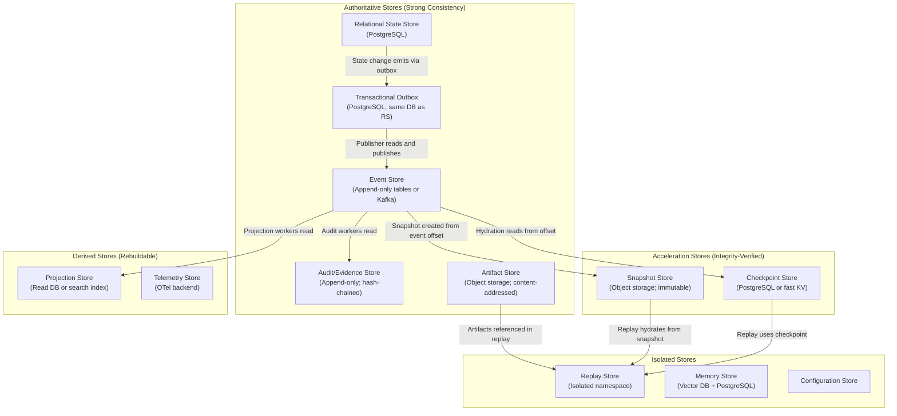

---

## 5. Canonical State Entities

### 5.1 Entity Definitions

**StateTransition**
- Purpose: Record of a single state machine transition applied to a runtime entity.
- Owner: StateTransitionCoordinator.
- Mutability: Immutable after creation.
- Required identifiers: `transition_id`, `entity_type`, `entity_id`, `from_state`, `to_state`, `tenant_id`, `run_id`, `causation_id`, `correlation_id`, `triggered_by`, `transitioned_at`.
- Replay: Transitions are replayed deterministically from the event history.
- Tenant behavior: Strictly scoped.
- Security: No secrets; AuditRecord created on every governance-relevant transition.

**StateTransitionLog**
- Purpose: Append-only log of all StateTransitions for a given entity over its lifetime.
- Owner: StateTransitionCoordinator.
- Mutability: Append-only.
- Required identifiers: `entity_id`, `entity_type`, `tenant_id`, all transitions in order.
- Replay: The StateTransitionLog IS the replay input for an entity's state machine.

**RuntimeStateRecord**
- Purpose: The current-state snapshot of a runtime entity in the relational state store. Updated (replaced) by StateTransitionCoordinator on each valid transition.
- Owner: StateTransitionCoordinator.
- Mutability: Current record is replaced on each transition; prior records preserved in StateTransitionLog.
- Required identifiers: `entity_id`, `entity_type`, `current_state`, `tenant_id`, `version` (optimistic concurrency), `last_transition_id`.

**GovernedRunState**
- Purpose: Current state record for a GovernedRun — the primary execution entity.
- Owner: RunManager via StateTransitionCoordinator.
- Required fields: `run_id`, `tenant_id`, `workspace_id`, `project_id`, `workflow_id`, `workflow_version_id`, `current_state`, `actor_id`, `policy_snapshot_id`, `runtime_budget_snapshot`, `created_at`, `last_transition_at`, `completed_at | null`, `version`.
- Replay: Authoritative anchor for replay; original `run_id` is preserved.

**StepState**
- Purpose: Current state record for a workflow step execution.
- Owner: StepCoordinator via StateTransitionCoordinator.
- Required fields: `step_execution_id`, `step_id`, `run_id`, `tenant_id`, `current_state`, `step_type`, `input_artifact_ref | null`, `output_artifact_ref | null`, `version`.

**AgentExecutionState**
- Purpose: Current state record for an AgentExecution within a step.
- Owner: AgentExecutionGateway via StateTransitionCoordinator.
- Required fields: `agent_execution_id`, `agent_instance_id`, `step_execution_id`, `run_id`, `tenant_id`, `agent_version_id`, `current_state`, `budget_consumed_snapshot`, `version`.

**CognitiveInvocationState**
- Purpose: Current state record for a CognitiveInvocation within an agent execution.
- Owner: AgentRuntime via StateTransitionCoordinator.
- Required fields: `cognitive_invocation_id`, `agent_execution_id`, `run_id`, `tenant_id`, `iteration_number`, `current_state`, `context_snapshot_id`, `prompt_hash`, `version`.

**ToolInvocationState**
- Purpose: Current state record for a ToolInvocation.
- Owner: ToolInvocationGateway via StateTransitionCoordinator.
- Required fields: `tool_invocation_id`, `step_execution_id`, `run_id`, `tenant_id`, `tool_name`, `tool_version`, `side_effect_class`, `idempotency_key`, `current_state`, `version`.

**ApprovalState**
- Purpose: Current state record for an ApprovalRequest.
- Owner: ApprovalGateCoordinator via StateTransitionCoordinator.
- Required fields: `approval_request_id`, `run_id`, `step_execution_id | null`, `tenant_id`, `current_state`, `requested_by`, `decision_by | null`, `decision_at | null`, `decision_record_id | null`, `version`.
- Mutability: Immutable once decision is recorded.

**Checkpoint** (base concept)
- Purpose: A verified recovery anchor at a specific event offset, containing enough state to resume execution without replaying from the beginning.
- Required fields: `checkpoint_id`, `checkpoint_type`, `entity_id`, `entity_type`, `tenant_id`, `run_id`, `workflow_version_id`, `source_event_id`, `event_offset`, `state_hash`, `created_at`, `encryption_key_ref`, `schema_version`, `retention_policy_id`.
- Mutability: IMMUTABLE after creation.
- Security: MUST NOT contain raw secrets.

**RuntimeCheckpoint**
- Purpose: Full checkpoint of an in-flight GovernedRun at a meaningful pause point (pre-approval, pre-step, periodic).
- Contents: GovernedRunState, all active StepStates, pending approvals, active budget snapshot, last event offset covered.
- Excluded: Model prompts, raw credentials, chain-of-thought outputs, telemetry data.

**StepCheckpoint**
- Purpose: Checkpoint of a specific step execution at the start or completion of a cognitive sub-step.
- Contents: StepState, AgentExecutionState, CognitiveInvocationState (if mid-step), context_snapshot_id reference.

**AgentCheckpoint**
- Purpose: Checkpoint of an agent execution at a defined pause point (e.g., between iterations, at a handoff request).
- Contents: AgentExecutionState, budget_consumed_snapshot, last tool result ref, last memory retrieval session ref.

**ContextCheckpoint**
- Purpose: A pointer to the ContextSnapshot used at a specific cognitive invocation, enabling replay to reconstruct exact context.
- Contents: `context_snapshot_id`, `context_hash`, `retrieval_session_ids[]`.

**ToolCheckpoint**
- Purpose: Record of a tool execution's state at completion, including idempotency_key, output artifact ref, and side-effect record.
- Replay usage: Suppresses live re-execution; ToolReplayRecord is derived from ToolCheckpoint.

**ApprovalCheckpoint**
- Purpose: Checkpoint of approval state at the time a GovernedRun entered AwaitingApproval state. Enables recovery after approval system restart.
- Contents: ApprovalState, requester identity, decision timeout, approval context payload reference.

**ReplayCheckpoint**
- Purpose: Checkpoint within a replay session, enabling a replay to resume from a mid-replay pause point without restarting from the beginning.

**RecoveryCheckpoint**
- Purpose: System-generated checkpoint created immediately before a known-risky operation (e.g., a tool with IrreversibleAction class) to establish a rollback anchor.

**Snapshot** (base concept)
- Purpose: A larger-grained, content-addressed state materialization stored in object storage. More complete than a checkpoint; used for long-lived runs and full recovery.
- Mutability: IMMUTABLE after creation.
- Required: Hash verification before hydration.

**SnapshotManifest**
- Purpose: The authoritative metadata record for a snapshot — index to all chunks, integrity hash, creation provenance.
- Fields: `snapshot_id`, `tenant_id`, `run_id`, `workflow_version_id`, `snapshot_type`, `created_at`, `created_by`, `source_event_id`, `event_offset`, `chunk_count`, `snapshot_hash`, `encryption_key_ref`, `object_storage_uri`, `schema_version`, `retention_policy_id`.

**SnapshotChunk**
- Purpose: A single content-addressed fragment of a large snapshot. Enables chunked upload and partial restore.
- Fields: `chunk_id`, `snapshot_id`, `chunk_number`, `byte_offset`, `chunk_hash`, `object_storage_uri`.

**HydrationPlan**
- Purpose: The resolved execution plan for reconstructing runtime state from available artifacts (checkpoint + events, or snapshot + events).
- Owner: HydrationManager.
- Fields: `hydration_plan_id`, `tenant_id`, `run_id`, `hydration_type`, `start_artifact_type` (checkpoint/snapshot/event_origin), `start_artifact_id`, `start_event_offset`, `target_state`, `created_at`.

**HydrationSession**
- Purpose: The runtime record of an active or completed hydration operation.
- Fields: `hydration_session_id`, `hydration_plan_id`, `tenant_id`, `run_id`, `started_at`, `completed_at | null`, `status`, `events_applied_count`, `final_state_hash`, `divergences_detected`.

**ReplayState**
- Purpose: The isolated state of a replay execution — the GovernedRunState equivalent for a replay run.
- Fields: `replay_run_id`, `original_run_id`, `tenant_id`, `hydration_session_id`, `current_state`, `divergences_count`, `is_isolated_from_production: true`.

**ReplayHydrationRecord**
- Purpose: Immutable record of what artifacts were used to hydrate a specific replay step.
- Fields: `record_id`, `replay_run_id`, `original_run_id`, `step_id`, `agent_execution_id | null`, `hydration_source_type`, `artifact_id`, `prompt_hash_match`, `context_hash_match`.

**ReplayDivergence**
- Purpose: Record of a detected divergence between original execution and replay execution. See Document 04 §20.3.

**Projection**
- Purpose: A materialized read model derived from the event stream.
- Owner: Projection workers.
- Fields: `projection_id`, `projection_type`, `tenant_id`, `current_offset`, `last_event_id`, `built_at`, `is_stale`.

**ProjectionOffset**
- Purpose: The last-processed event offset for a specific projection, used by projection workers to maintain position.
- Fields: `projection_id`, `tenant_id`, `partition_key`, `last_processed_event_id`, `last_processed_offset`, `updated_at`.

**OutboxRecord**
- Purpose: A durable record of an event that MUST be published to the event store, created atomically with the state transition.
- Fields: `outbox_id`, `tenant_id`, `run_id`, `entity_type`, `entity_id`, `event_type`, `event_payload_ref`, `causation_id`, `correlation_id`, `created_at`, `publication_status`, `retry_count`, `last_attempt_at`, `poison_flag`, `priority`.

**IdempotencyRecord**
- Purpose: A durable record of a completed idempotent operation, used to detect and handle duplicate requests.
- Fields: `idempotency_key`, `tenant_id`, `operation_type`, `entity_id`, `result_ref`, `created_at`, `expires_at`.

**PersistenceLock**
- Purpose: An optimistic concurrency control record that prevents concurrent mutation of the same entity.
- Fields: `lock_id`, `entity_type`, `entity_id`, `tenant_id`, `lock_holder_id`, `acquired_at`, `expires_at`, `version`.

**RecoveryMarker**
- Purpose: A record that marks a recovery operation in progress, preventing duplicate recovery attempts.
- Fields: `marker_id`, `tenant_id`, `run_id`, `recovery_type`, `started_at`, `completed_at | null`, `status`.

**RetentionRecord**
- Purpose: A durable record of the retention policy applied to a specific entity or event range.
- Fields: `retention_id`, `tenant_id`, `entity_type`, `entity_id`, `policy_id`, `expires_at`, `legal_hold`.

**IntegrityProof**
- Purpose: A cryptographic integrity record (hash, Merkle tree path, or certificate) for a persisted artifact, checkpoint, or snapshot.
- Fields: `proof_id`, `subject_id`, `subject_type`, `tenant_id`, `hash_algorithm`, `hash_value`, `proof_metadata`, `created_at`.

### 5.2 Entity Relationship Diagram

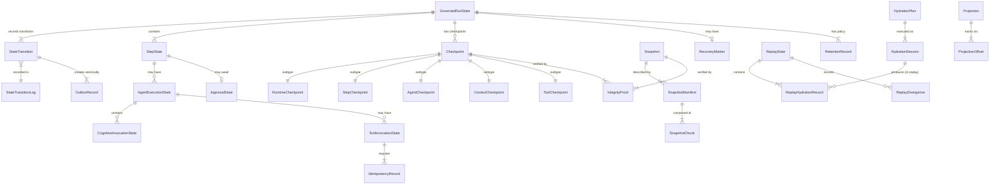

---

## 6. State Classification Model

### 6.1 Authoritative State

Authoritative state is the definitive runtime truth for governance decisions, workflow control, and audit. It MUST be persisted durably before any downstream action depends on it.

| Examples | Persistence Req | Mutation Rule | Audit Req | Replay |
|---|---|---|---|---|
| GovernedRun current_state | REQUIRED | StateTransitionCoordinator only | Always | Yes |
| Step current_state | REQUIRED | StateTransitionCoordinator only | Always | Yes |
| WorkflowVersion reference on run | REQUIRED; immutable after assignment | Immutable | Yes | Original version |
| PolicySnapshot binding | REQUIRED; immutable | Immutable | Yes | Original snapshot |
| ApprovalDecision | REQUIRED; immutable | Immutable | Always | Original decision |
| ToolExecution result artifact | REQUIRED | Immutable after promotion | Yes | ToolReplayRecord |
| Checkpoint manifest | REQUIRED | Immutable | Yes | Hydration anchor |

### 6.2 Ephemeral State

Ephemeral state lives only for the duration of an active computation. It MUST NOT be treated as authoritative, MUST NOT be the basis for governance decisions, and CANNOT be used for replay.

| Examples | Persistence Req | Notes |
|---|---|---|
| In-memory worker call stack | None | Lost on process restart |
| Active Temporal Activity in-memory variables | None | Temporal handles durability; local variables are ephemeral |
| Transient model context during inference | None | Lives for duration of model call |
| Retry backoff counters | None | Managed by orchestration layer |
| Temporary tool process state | None | Lost on tool process completion |

### 6.3 Derived State

Derived state is computed from authoritative events and can be reconstructed. It SHOULD be persisted for read performance but MUST be rebuildable.

| Examples | Persistence Req | Rebuild Source | Staleness Tolerance |
|---|---|---|---|
| Dashboard run summaries | SHOULD | Event history | Minutes |
| Approval inbox projections | SHOULD | Event history | Seconds |
| Workflow graph visualization | SHOULD | WorkflowVersion | Near-zero |
| Analytics aggregates | SHOULD | Event history | Hours |
| Search indexes | SHOULD | Event + artifact stores | Minutes |
| Replay diff summaries | SHOULD | Replay events + original events | Replay-scoped |

### 6.4 Cached State

Cached state is a performance optimization on top of authoritative or derived state. Cache corruption is recoverable by invalidation. Cache absence must not block critical operations.

| Examples | Cache TTL | Fallback | Never Use For |
|---|---|---|---|
| Policy evaluation cache | Short (60s) | PolicyDecisionGateway direct evaluation | Binding governance decisions |
| Workflow definition cache | Medium (5m) | Workflow definition store | Publishing new versions |
| Memory retrieval result cache | Short (30s) | Re-query MemoryAccessGateway | Replay hydration |
| Model provider routing cache | Medium (2m) | ModelRouter re-evaluate | Production routing when data_classification matters |

### 6.5 Replay State

Replay state is isolated, derived from original artifacts, and never merged back to production. It MUST be clearly marked and stored in an isolated namespace.

| Examples | Persistence Req | Notes |
|---|---|---|
| Replay run state | REQUIRED; isolated | `replay_namespace: true` in all records |
| Replay hydration sessions | REQUIRED | References original artifacts |
| ReplayDivergence records | REQUIRED | Evidence for investigation |
| Replay suppression markers | REQUIRED | Records what was suppressed and why |
| Replay agent outputs | REQUIRED | Derived from original; never promoted to production |

**Deletion policy:** Replay state may be deleted after the replay investigation window according to retention policy. Replay divergence records are retained per audit retention rules.

### 6.6 Simulation State

Simulation state extends replay with the ability to modify inputs and test counterfactuals. It MUST be further isolated from even the replay namespace.

| Examples | Notes |
|---|---|
| Counterfactual run state | Uses modified inputs; never authoritative |
| Sandboxed tool execution results | Tools may execute against test environments |
| Simulation divergence records | Records how simulation differed from original |

**Deletion policy:** Simulation state may be deleted at simulation session close unless retained for evaluation purposes (Document 23).

---

## 7. State Transition Architecture

### 7.1 Transition Protocol

Every state mutation in MYCELIA follows a strict protocol enforced by `StateTransitionCoordinator`. There is no mechanism for direct database writes to authoritative state tables from application code; the StateTransitionCoordinator is the exclusive entry point.

**Transition Steps:**

1. **Command validation.** The incoming transition command is validated against its schema. Missing required fields, invalid types, and unsigned commands are rejected before any state is read.

2. **Tenant authorization check.** The command's `tenant_id` is verified against the authenticated caller's identity. Cross-tenant commands fail immediately.

3. **Current state read (with optimistic lock).** The current state record is read with a version number. The version is used for optimistic concurrency control.

4. **Transition eligibility check.** The `(from_state, transition_command)` pair is validated against the entity's state machine. Invalid transitions are rejected with `StateTransitionRejected` event.

5. **Policy check (where applicable).** For governance-sensitive transitions (e.g., RunStarted, ApprovalGranted), the PolicyDecisionGateway is called. Policy denial blocks the transition.

6. **Idempotency check.** If a `causation_id` exists in the IdempotencyRecord for this operation, the original result is returned without re-executing.

7. **Optimistic concurrency check.** The version number from step 3 is compared against the current value. If another process has modified the record, the transition retries with backoff.

8. **State transition record creation.** A `StateTransition` record is created in memory (not yet committed).

9. **Outbox record creation.** An `OutboxRecord` is created in memory with the corresponding event payload and priority.

10. **Audit intent creation.** For audit-required transitions, an `AuditRecord` is created in memory.

11. **Atomic commit boundary.** The StateTransition, updated RuntimeStateRecord, OutboxRecord, and AuditRecord are committed atomically in a single database transaction. If any part fails, the entire transaction rolls back.

12. **Async event publication.** The OutboxPublisher reads the committed OutboxRecord and publishes the event to the Event Store. This is async but guaranteed-delivery due to the durable outbox.

13. **Projection update trigger.** Event publication triggers projection workers to update derived read models.

### 7.2 State Transition Sequence Diagram

```mermaid
sequenceDiagram
    participant Caller as Caller (RunManager/StepCoordinator/etc.)
    participant STC as StateTransitionCoordinator
    participant PDG as PolicyDecisionGateway
    participant DB as Relational State Store
    participant OP as OutboxPublisher
    participant ES as Event Store
    participant PW as Projection Workers

    Caller->>STC: transitionState(command, envelope)
    STC->>STC: Validate command schema
    STC->>DB: Read current state + version (FOR UPDATE)
    STC->>STC: Check transition eligibility
    STC->>PDG: Check policy (if governance-sensitive)
    PDG-->>STC: Permitted
    STC->>STC: Check idempotency (IdempotencyRecord lookup)
    STC->>STC: Check optimistic version
    Note over STC,DB: Atomic Transaction Begin
    STC->>DB: Write StateTransition record
    STC->>DB: Update RuntimeStateRecord (new state + version++)
    STC->>DB: Write OutboxRecord (PENDING)
    STC->>DB: Write AuditRecord (if required)
    Note over STC,DB: Atomic Transaction Commit
    STC-->>Caller: TransitionResult(new_state, transition_id)
    loop Outbox publisher poll
        OP->>DB: Read pending OutboxRecords
        OP->>ES: Publish event
        ES-->>OP: Acknowledged
        OP->>DB: Update OutboxRecord (PUBLISHED)
    end
    ES->>PW: Event stream delivers to projection workers
    PW->>PW: Update ProjectionOffset; update read models
```

### 7.3 State Transition Rules

**Rule TR-01.** No state transition may occur outside StateTransitionCoordinator. Direct database writes to authoritative state tables are FORBIDDEN from application code.

**Rule TR-02.** No state transition may commit without `tenant_id` on both the StateTransition record and the OutboxRecord.

**Rule TR-03.** No state transition may commit without `causation_id`. Every state change must be traceable to a triggering event or command.

**Rule TR-04.** Invalid state machine transitions MUST be rejected with a `StateTransitionRejected` event.

**Rule TR-05.** State transition and outbox event intent MUST commit atomically. There is no scenario where state is committed without an outbox record, or where an outbox record commits without the corresponding state change.

**Rule TR-06.** Optimistic concurrency conflicts MUST be resolved by retry (with bounded backoff), not by force-updating the current state.

**Rule TR-07.** Policy check failures MUST produce a `PolicyDeniedTransition` event before the transaction is abandoned.

---

## 8. Canonical State Machines

This section defines the persistence-level state machines for key runtime entities. These machines MUST align with the canonical lifecycle definitions in Documents 02, 03, and 05.

### 8.1 GovernedRun State Machine

The GovernedRun persistence lifecycle MUST align with the canonical 24-state lifecycle defined in Documents 02 and 03.

Document 06 does not introduce a new GovernedRun lifecycle. It defines the persistence behavior of the canonical lifecycle.

```mermaid
stateDiagram-v2
    [*] --> RunRequested: Trigger received

    RunRequested --> TenantResolved: Tenant resolution succeeded
    RunRequested --> RunFailed: Tenant resolution failed

    TenantResolved --> RuntimeEnvelopeCreated: Envelope built
    RuntimeEnvelopeCreated --> WorkflowVersionResolved: Version found
    WorkflowVersionResolved --> PolicySnapshotBound: Policy snapshot bound
    PolicySnapshotBound --> ContextInitialized: Context assembled
    ContextInitialized --> RunCreated: Run persisted
    RunCreated --> RunScheduled: First step scheduled
    RunScheduled --> StepReady: Step coordinator initialized

    StepReady --> StepRunning: Dispatched to execution
    StepReady --> ApprovalRequired: Approval required

    StepRunning --> ToolInvocationRequested: Tool requested
    ToolInvocationRequested --> StepRunning: Tool result returned
    ToolInvocationRequested --> StepFailed: Tool failed

    StepRunning --> StepSucceeded: Valid result returned
    StepRunning --> StepFailed: Error or timeout

    ApprovalRequired --> ApprovalGranted: Human approves
    ApprovalRequired --> RunFailed: Denial or timeout
    ApprovalGranted --> StepRunning: Step resumed

    StepSucceeded --> StepReady: Next step
    StepSucceeded --> RunSucceeded: Final step completed

    StepFailed --> StepReady: Retry within budget
    StepFailed --> RunFailed: Retry budget exhausted

    StepRunning --> RunPaused: Operator or policy pause
    StepReady --> RunPaused: Operator or policy pause
    ApprovalRequired --> RunPaused: Administrative pause
    RunPaused --> RunResumed: Operator action
    RunResumed --> StepReady: Scheduling resumed

    StepRunning --> RunCancelled: Operator cancellation
    StepReady --> RunCancelled: Operator cancellation
    ApprovalRequired --> RunCancelled: Operator cancellation

    RunSucceeded --> RunArchived: Retention/archive
    RunFailed --> RunArchived: Retention/archive
    RunCancelled --> RunArchived: Retention/archive

    ReplayRequested --> ReplayHydrated: Event history loaded
    ReplayHydrated --> StepReady: Replay step traversal
    StepSucceeded --> ReplayCompleted: Final replay step
    ReplayCompleted --> [*]

    RunArchived --> [*]
```

### Canonical State Set

| Category | States |
|---|---:|
| Request and initialization states | 8 |
| Step execution states | 6 |
| Approval states | 2 |
| Pause, resume and cancellation states | 3 |
| Terminal states | 3 |
| Replay states | 3 |
| Archive state | 1 |
| **Total unique states** | **24** |

### Persistence Rules for GovernedRun Transitions

- Every GovernedRun transition MUST create a `StateTransition` record.
- Every GovernedRun transition MUST create an `OutboxRecord` in the same atomic transaction.
- Every GovernedRun transition MUST carry `tenant_id`, `run_id`, `causation_id`, `correlation_id` and `workflow_version_id`.
- `RunSucceeded`, `RunFailed` and `RunCancelled` are terminal production states.
- `RunArchived` is a retention/archive state and MUST NOT resume production execution.
- `ReplayRequested`, `ReplayHydrated` and `ReplayCompleted` belong to replay lineage and MUST NOT mutate original production lineage.
- A `RuntimeCheckpoint` MUST be created before entering `ApprovalRequired`.
- A `RecoveryCheckpoint` SHOULD be created before dispatching any `IrreversibleAction` tool.

### Forbidden Behavior

FORBIDDEN:

- creating a second GovernedRun lifecycle for persistence;
- using `RunDraft`, `RunPendingValidation`, `RunQueued`, `RunAwaitingTool`, `RunAwaitingCognition` or similar non-canonical states as persisted GovernedRun states;
- allowing Document 06 to define lifecycle states that conflict with Documents 02 and 03;
- allowing Codex to generate a separate `GovernedRunState` enum from this document;
- treating replay states as production states.

### 8.2 Step State Machine

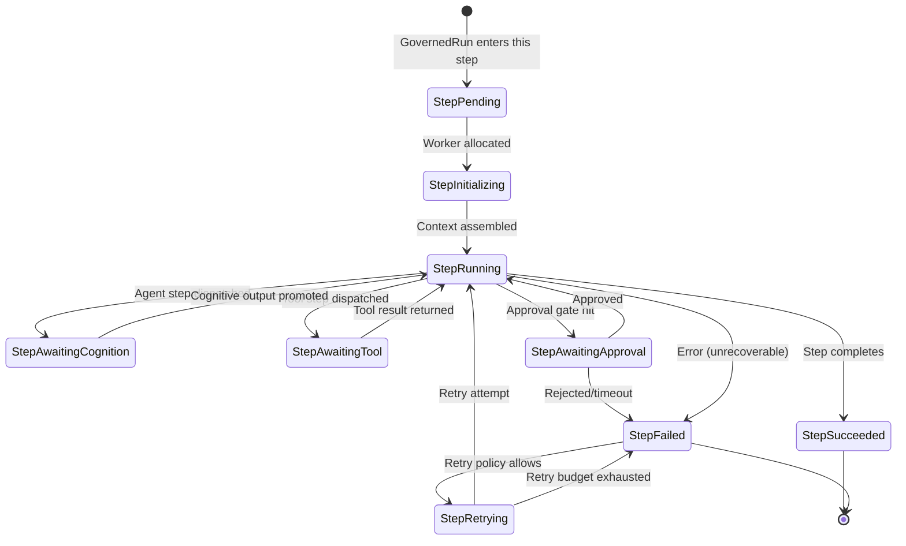

### 8.3 AgentExecution State Machine

See Document 05 §6.3 for the full AgentInstance lifecycle. At the persistence layer:
- Every AgentExecution state transition creates an atomic StateTransition + OutboxRecord.
- Terminal states (Succeeded, Failed, TimedOut, BudgetExceeded, Cancelled, ReplaySuppressed) produce immutable records.
- An AgentCheckpoint SHOULD be created at each iteration completion for executions exceeding 3 iterations.

### 8.4 ToolInvocation State Machine

```mermaid
stateDiagram-v2
    [*] --> ToolIntentExpressed: Model/agent output contains tool intent
    ToolIntentExpressed --> ToolIntentValidated: ToolIntentMediator validates
    ToolIntentExpressed --> ToolIntentRejected: Scope/manifest failure
    ToolIntentValidated --> ToolPendingPolicy: PolicyDecisionGateway evaluating
    ToolPendingPolicy --> ToolPendingApproval: Policy requires approval
    ToolPendingPolicy --> ToolDispatched: Policy permits; dispatched to worker
    ToolPendingApproval --> ToolDispatched: Approval granted
    ToolPendingApproval --> ToolApprovalRejected: Approval denied
    ToolDispatched --> ToolRunning: Worker accepted
    ToolRunning --> ToolSucceeded: Worker completes
    ToolRunning --> ToolFailed: Worker error
    ToolRunning --> ToolTimedOut: Worker timeout
    ToolSucceeded --> ToolResultPromoted: Output promoted
    ToolResultPromoted --> [*]
    ToolIntentRejected --> [*]
    ToolApprovalRejected --> [*]
    ToolFailed --> ToolRetrying: Retry policy allows
    ToolRetrying --> ToolRunning: New attempt
    ToolRetrying --> ToolFailed: Budget exhausted
    ToolFailed --> [*]
    ToolTimedOut --> [*]
```

**Idempotency requirement:** Every ToolInvocation for a side-effectful tool creates an `IdempotencyRecord` before dispatch. Duplicate dispatch attempts return the original result.

### 8.5 Approval State Machine

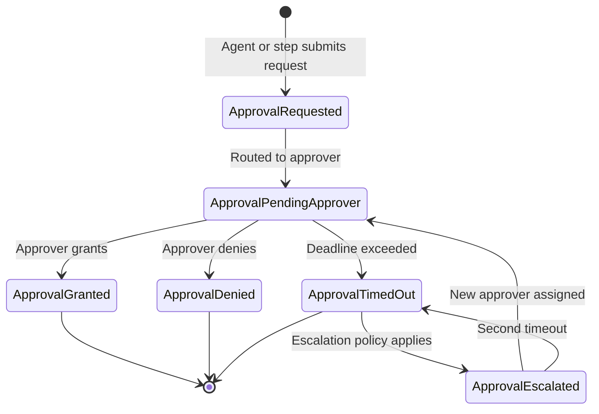

**Immutability rule:** Once `ApprovalGranted` or `ApprovalDenied` is recorded, the decision is immutable.

### 8.5.1 Retryable Failure vs Terminal Failure Semantics

Persistence state machines MUST distinguish retryable failure from terminal failure.

A failure event does not automatically mean that an entity has reached a terminal failed state. Some failures are intermediate states that lead to retry scheduling. Terminal failure occurs only when the applicable retry, budget, timeout or policy limit has been exhausted.

### Failure Classes

| Failure Class | Meaning | Terminal? |
|---|---|---:|
| `RetryableFailure` | Failure occurred, but retry policy allows another attempt | No |
| `PolicyDeniedFailure` | Policy denied the operation | Usually yes |
| `BudgetExceededFailure` | Budget exhausted | Yes |
| `TimeoutFailure` | Operation exceeded timeout | Conditional |
| `ValidationFailure` | Input/output failed schema or runtime validation | Conditional |
| `TerminalFailure` | No further recovery or retry is allowed | Yes |

### Rules

- `StepFailed` MUST NOT be treated as terminal if retry policy allows another attempt.
- `ToolFailed` MUST NOT be treated as terminal if retry policy allows another attempt.
- A retryable failure MUST transition to `StepRetrying` or `ToolRetrying`, not directly to a terminal state.
- Terminal failure MUST record the reason retry is no longer allowed.
- Terminal failure MUST emit an event with `failure_class`, `retry_allowed=false`, and `terminal=true`.
- Retryable failure MUST emit an event with `failure_class`, `retry_allowed=true`, and `terminal=false`.

### Required Fields on Failure Events

Every failure event SHOULD include:

- `failure_class`;
- `failure_reason`;
- `retry_allowed`;
- `retry_policy_id`;
- `attempt_number`;
- `max_attempts`;
- `terminal`;
- `budget_remaining`;
- `causation_id`;
- `correlation_id`.

### Forbidden Behavior

FORBIDDEN:

- using the same persisted state to mean both retryable and terminal failure;
- marking a step terminally failed before retry policy is evaluated;
- retrying after a terminal failure state has been committed;
- allowing Codex to infer retry behavior from state names alone;
- hiding retry exhaustion inside logs instead of persisted failure metadata.

### 8.6 Checkpoint Lifecycle

| State | Entry | Exit | Persistence Action |
|---|---|---|---|
| CheckpointPending | CheckpointCoordinator initiates | State serialized | Nothing committed yet |
| CheckpointCreating | State serialized | Hash computed | Data written to store |
| CheckpointSealed | Hash computed and verified | Published to checkpoint table | IntegrityProof created |
| CheckpointExpired | Retention window elapsed | Retention job runs | Checkpoint archived/deleted |
| CheckpointSuperseded | Newer checkpoint for same entity | — | Marked superseded (not deleted if needed for replay) |

### 8.7 Replay Lifecycle

| State | Description | Persistence Action |
|---|---|---|
| ReplayRequested | Operator initiates replay | ReplayState created; authorization verified |
| ReplayHydrating | HydrationManager loading artifacts | HydrationSession created; events applied |
| ReplayRunning | Replay execution proceeding | Step states written to replay namespace |
| ReplayDivergenceDetected | Divergence found | ReplayDivergence record created |
| ReplaySuppressedStep | Artifact missing; step suppressed | ReplayHydrationRecord (SUPPRESSED) |
| ReplayCompleted | All steps replayed or suppressed | HydrationSession closed; evidence bundle available |
| ReplayFailed | Unrecoverable replay error | ReplayState → FAILED; RecoveryMarker created |

### 8.8 Outbox Record Lifecycle

```mermaid
stateDiagram-v2
    [*] --> OutboxPending: Committed atomically with state transition
    OutboxPending --> OutboxPublishing: OutboxPublisher picks up
    OutboxPublishing --> OutboxPublished: Event store acknowledges
    OutboxPublishing --> OutboxRetrying: Publication fails; retry scheduled
    OutboxRetrying --> OutboxPublishing: Retry attempt
    OutboxRetrying --> OutboxPoison: Max retries exceeded
    OutboxPublished --> [*]: Deleted or archived after confirmation
    OutboxPoison --> OutboxDeadLetter: Moved to dead-letter queue
    OutboxDeadLetter --> [*]: Operator review and manual reconciliation
```

---

## 9. Transactional State/Event Commit Boundary

### 9.1 Why Best-Effort Event Publication Is Forbidden

Best-effort event publication — writing state to the database and then attempting to publish an event to the event broker — creates a fundamental reliability problem: if the event publication fails, the state change has occurred but the downstream world (projections, audit, other services) does not know about it. In a governed runtime, this is not acceptable. An approval decision that was committed to the state store but whose event was silently dropped is an invisible governance gap.

The **transactional outbox pattern** solves this by making the event publication intent part of the same atomic transaction as the state mutation. The event is durably recorded in an outbox table within the same database transaction as the state change. A separate, asynchronous `OutboxPublisher` process reads the outbox and delivers events to the event store with guaranteed-delivery semantics.

### 9.2 Outbox Record Structure

```typescript
interface OutboxRecord {
  outbox_id: string;                    // ULID
  tenant_id: string;                    // REQUIRED
  run_id: string | null;
  entity_type: string;                  // 'GovernedRun' | 'Step' | 'ToolInvocation' | etc.
  entity_id: string;
  event_type: string;                   // e.g., 'GovernedRunStateTransitioned'
  event_schema_version: string;
  event_payload_ref: string;            // Stored separately if large; inline if small
  event_payload_hash: string;           // Integrity check
  causation_id: string;                 // REQUIRED; links to triggering command
  correlation_id: string;               // Distributed trace correlation
  created_at: string;
  priority: 'critical' | 'high' | 'standard';
  publication_status: OutboxStatus;
  retry_count: number;
  last_attempt_at: string | null;
  next_retry_at: string | null;
  poison_flag: boolean;
  poison_reason: string | null;
}

type OutboxStatus =
  | 'PENDING'
  | 'PUBLISHING'
  | 'PUBLISHED'
  | 'RETRYING'
  | 'POISON'
  | 'DEAD_LETTER';
```

### 9.3 Completion Stages

| Stage | Description | Persistence Action |
|---|---|---|
| `transition_requested` | StateTransitionCoordinator receives command | Validation; no write yet |
| `transition_committed_event_pending` | State + OutboxRecord committed | Atomic DB transaction committed |
| `transition_committed_event_published` | OutboxPublisher delivers to event store | OutboxRecord → PUBLISHED |
| `transition_publish_failed` | Publication fails; retry scheduled | OutboxRecord → RETRYING; alert if backlog |
| `transition_reconciled` | Manual or automatic reconciliation of stuck outbox | Operator review; OutboxRecord marked and re-queued |

### 9.4 Outbox Rules

**Rule OB-01.** No authoritative state mutation may commit without a corresponding OutboxRecord in the same transaction.

**Rule OB-02.** Event publication failure MUST NOT erase or rollback committed state.

**Rule OB-03.** Outbox backlog MUST be observable. A metric `mycelia.outbox.pending_count` by `tenant_id` and `priority` MUST be emitted.

**Rule OB-04.** Critical-priority events (governance decisions, security events, budget exhaustion) MUST be prioritized by the OutboxPublisher.

**Rule OB-05.** Poison outbox records (max retries exhausted) MUST NOT be silently deleted. They go to dead-letter status with operator alert.

**Rule OB-06.** Reconciliation MUST preserve `causation_id` and `correlation_id` to maintain lineage integrity.

**Rule OB-07.** The OutboxPublisher MUST use idempotent publication (idempotency key derived from `outbox_id`) to prevent duplicate events if the publisher restarts after delivery but before acknowledging.

### 9.5 Transactional Commit Sequence

```mermaid
sequenceDiagram
    participant STC as StateTransitionCoordinator
    participant DB as PostgreSQL
    participant OP as OutboxPublisher
    participant ES as Event Store

    STC->>DB: BEGIN TRANSACTION
    STC->>DB: UPDATE runtime_state_records SET state=? WHERE id=? AND version=?
    STC->>DB: INSERT INTO state_transitions (...)
    STC->>DB: INSERT INTO outbox_records (status='PENDING', ...)
    STC->>DB: INSERT INTO audit_records (...) [if required]
    STC->>DB: COMMIT

    loop Polling loop (async)
        OP->>DB: SELECT * FROM outbox_records WHERE status='PENDING' ORDER BY priority
        DB-->>OP: OutboxRecord list
        OP->>ES: Publish event (idempotency_key = outbox_id)
        ES-->>OP: ACK
        OP->>DB: UPDATE outbox_records SET status='PUBLISHED'
    end

    alt Publication fails
        OP->>DB: UPDATE outbox_records SET status='RETRYING', retry_count++
        OP->>OP: Schedule next attempt with exponential backoff
        alt Max retries exceeded
            OP->>DB: UPDATE outbox_records SET status='POISON', poison_flag=true
            OP->>OP: Alert on-call; move to dead-letter monitoring
        end
    end
```

### 9.6 Event Integrity at the Persistence Boundary

The transactional outbox guarantees durable event intent. It does not, by itself, guarantee long-term event integrity.

Every event persisted or published from an OutboxRecord MUST be integrity-verifiable so that tampering, deletion, duplication, reordering or replay corruption can be detected.

### Event Integrity Fields

Every event emitted from the persistence boundary MUST include:

- `event_id`;
- `tenant_id`;
- `event_type`;
- `event_schema_version`;
- `subject_type`;
- `subject_id`;
- `run_id` when applicable;
- `correlation_id`;
- `causation_id`;
- `previous_event_hash`;
- `event_hash`;
- `emitted_at`.

### Event Hash Rule

The `event_hash` MUST be computed from canonical serialized event content.

```text
event_hash = SHA-256(
  previous_event_hash +
  event_id +
  tenant_id +
  event_type +
  event_schema_version +
  subject_type +
  subject_id +
  run_id +
  correlation_id +
  causation_id +
  emitted_at +
  canonical_JSON(payload)
)
```

### Event Integrity Rules

- `previous_event_hash` MUST link to the prior event in the same aggregate stream or tenant event stream.
- `event_hash` MUST be verified before events are used for hydration or replay.
- Missing, duplicated or reordered events MUST fail integrity verification.
- Event integrity failure MUST create a `SecurityException` or `RecoveryMarker` depending on impact.
- Event hash verification MUST occur before replay hydration treats an event stream as authoritative.
- Outbox publication MUST store the final `event_id` and `event_hash` back onto the published outbox record or its archival equivalent.

### Forbidden Behavior

FORBIDDEN:

- publishing events without integrity metadata;
- allowing event history to be used for replay without hash verification;
- treating the transactional outbox as a substitute for event integrity;
- deleting published outbox evidence before the event can be reconciled;
- allowing Codex to implement events without `previous_event_hash` and `event_hash`.

---

## 10. Checkpoint Architecture

### 10.1 Checkpoint vs Other State Artifacts

Understanding what a checkpoint is — and is not — is essential to using it correctly.

| Concept | Purpose | Authoritative? | Mutable? | Acceleration? |
|---|---|---|---|---|
| **Checkpoint** | Recovery anchor at a specific event offset | No (event store is authoritative) | No (immutable) | Yes |
| **Snapshot** | Full state materialization in object storage | No (event store is authoritative) | No (immutable) | Yes (faster than checkpoint) |
| **Event** | Immutable state-changing fact | Yes (primary authority) | No | N/A |
| **Cache** | Performance optimization on derived data | Never | Yes | Yes |
| **Projection** | Derived read model | Never | Rebuildable | Yes (read performance) |
| **Artifact** | Produced output (document, model output) | Yes (for its content) | No | N/A |

A checkpoint is not the source of truth. It is a recovery acceleration device. If a checkpoint is corrupted, unavailable, or inconsistent with the event history, the system falls back to replaying from the event history. The event history is the authority; the checkpoint is the shortcut.

### 10.2 Checkpoint Types

**RuntimeCheckpoint**
- Trigger: Pre-approval gate; periodic (every N minutes for long-running runs); pre-IrreversibleAction tool.
- Contents: GovernedRunState, all active StepStates, budget snapshot, pending approvals list, active agent execution IDs, `covered_event_offset`.
- Excluded: Raw credentials, model prompts, chain-of-thought outputs, telemetry data, cached policy evaluations.
- Storage: Checkpoint table (PostgreSQL) + optional object storage for large payloads.
- Encryption: REQUIRED; `encryption_key_ref` references tenant key.
- Integrity: `state_hash` computed from serialized contents; verified before use.
- Retention: As configured; minimum duration of the corresponding run's retention.
- Hydration usage: Primary recovery anchor for a GovernedRun after failure.
- Replay usage: May be used as fast-forward anchor; context_snapshot_id extracted for cognitive replay.

**StepCheckpoint**
- Trigger: Completion of each workflow step; pre-retry of a failed step.
- Contents: StepState, AgentExecutionState (if applicable), tool results so far in the step, `context_snapshot_id` reference.
- Hydration usage: Enables recovery at step granularity without replaying the entire run.

**AgentCheckpoint**
- Trigger: After each reasoning iteration (if `max_iterations > 3`); at handoff boundary.
- Contents: AgentExecutionState, budget_consumed_snapshot, last tool result reference, last memory retrieval session ID.
- Replay usage: Enables replay to resume from a mid-agent-execution state.

**ContextCheckpoint**
- Trigger: Created automatically by ContextSnapshotWriter (this is the ContextSnapshot entity from Document 04).
- Contents: Reference to `context_snapshot_id`, `context_hash`, list of `retrieval_session_id[]`.
- Replay usage: MANDATORY for cognitive replay. Replay cannot proceed without the original ContextSnapshot.

**ToolCheckpoint**
- Trigger: Completion of a ToolInvocation (especially side-effectful tools).
- Contents: `tool_invocation_id`, idempotency_key, output artifact ref, `side_effect_class`, `idempotency_confirmed: true`.
- Replay usage: Basis for ToolReplayRecord creation; suppresses live re-execution.

**ApprovalCheckpoint**
- Trigger: GovernedRun entering AwaitingApproval state.
- Contents: ApprovalState, `requested_by`, decision timeout, approval context artifact ref.
- Hydration usage: Enables ApprovalGateCoordinator to recover pending approval requests after a restart.

**ReplayCheckpoint**
- Trigger: Periodic during a long replay session; before a suppressed step.
- Contents: Current ReplayState, last event offset processed, divergences count, suppression map.
- Replay usage: Enables replay to resume from mid-point.

**RecoveryCheckpoint**
- Trigger: System-generated before high-risk operations.
- Contents: Full GovernedRunState at the pre-operation moment; trigger operation type.
- Recovery usage: Provides the "last known safe state" before an irreversible operation.

### 10.3 Checkpoint Rules

**CP-01.** Checkpoints MUST NOT contain raw secret values, API keys, credentials, or tokens.
**CP-02.** Every checkpoint MUST carry `tenant_id`, `run_id`, `workflow_version_id`, and `state_hash`.
**CP-03.** Checkpoints MUST be immutable after creation. No modification path exists.
**CP-04.** Checkpoints MUST reference the event offset or `event_id` they cover.
**CP-05.** Checkpoints MAY accelerate replay but MUST NOT replace event lineage.
**CP-06.** A checkpoint whose `state_hash` fails verification MUST NOT be used for hydration.
**CP-07.** Checkpoint write failure MUST emit a `CheckpointWriteFailed` event; it does not fail the operation but reduces recovery efficiency.
**CP-08.** RuntimeCheckpoint MUST be created before entering `RunAwaitingApproval` state.
**CP-09.** ContextCheckpoint (ContextSnapshot) is MANDATORY before every cognitive step (Document 04 CI-28).

---

## 11. Snapshot Architecture

### 11.1 When to Use Snapshots

Snapshots are used for long-running executions where replaying from the event history beginning would be impractically slow. A snapshot captures the complete serialized state of a run at a specific event offset, stored in immutable object storage, and can be loaded in a single read operation rather than replaying potentially thousands of events.

### 11.2 Snapshot Types

| Type | Description | When Created |
|---|---|---|
| Full snapshot | Complete serialization of all run state | Periodic milestone; before major decision point |
| Incremental snapshot | Delta since the last full snapshot | Periodic between full snapshots |
| Differential snapshot | Diff between two run states | Replay comparison; diff visualization |
| Artifact snapshot | Archive of all artifacts produced by a run | On run completion |
| Context snapshot (ContextSnapshot) | The assembled context for a cognitive step (Document 04 §11) | Before every cognitive invocation; mandatory |
| Memory snapshot | Snapshot of memory state at a specific point | Pre-replay; memory forensic investigation |
| Replay snapshot | Complete state at the start of a replay session | Replay session initiation |

### 11.3 SnapshotManifest Definition

```typescript
interface SnapshotManifest {
  snapshot_id: string;               // ULID
  tenant_id: string;                 // REQUIRED
  run_id: string;
  workflow_version_id: string;
  snapshot_type: SnapshotType;
  created_at: string;
  created_by: string;                // system or operator identity
  source_event_id: string;           // Last event captured in this snapshot
  event_offset: number;              // Numeric offset in the event stream
  chunk_count: number;
  snapshot_hash: string;             // SHA-256 of all chunks in order
  encryption_key_ref: string;        // Reference to tenant encryption key
  object_storage_uri: string;        // URI to the manifest object in object storage
  schema_version: string;            // e.g., '2026.06.1' — used for migration detection
  retention_policy_id: string;
  is_verified: boolean;              // Set to true after integrity verification
  verified_at: string | null;
}
```

### 11.4 Snapshot Rules

**SS-01.** Snapshots are immutable once created. No path exists to modify snapshot content.
**SS-02.** SnapshotManifest is the authoritative metadata record. The manifest hash covers all chunks.
**SS-03.** Snapshot payloads live in object storage with immutable versioning enabled at the bucket level.
**SS-04.** Snapshot hash MUST be verified before hydration begins.
**SS-05.** Snapshot restore MUST validate that `tenant_id` in the snapshot matches the requesting tenant.
**SS-06.** Snapshots MUST NOT carry live credentials or decryptable secrets.
**SS-07.** `schema_version` MUST be declared; a schema mismatch MUST be detected before hydration and handled per §21.
**SS-08.** Object storage URIs MUST be generated from tenant-scoped prefixes to enforce isolation at the storage layer.

---

## 12. Hydration and Rehydration Architecture

### 12.1 Hydration Types

| Hydration Type | Trigger | Context | Side Effects | Production Write? |
|---|---|---|---|---|
| **Runtime hydration** | Worker starts processing an existing run | Live runtime | Normal execution proceeds | YES |
| **Replay hydration** | Operator initiates replay investigation | Replay session | Suppressed for all side-effectful operations | NO |
| **Recovery hydration** | Worker crashes; run must resume | Live runtime | Resumes normal execution from checkpoint | YES |
| **Worker resume hydration** | Worker process restarts mid-step | Live runtime | Step resumes from last checkpoint | YES |
| **Investigation hydration** | Forensic review of a run | Isolated | No execution; state inspection only | NO |
| **Simulation hydration** | Counterfactual testing | Simulation namespace | May execute against test environments | Simulation NS only |

### 12.2 HydrationPlan and HydrationSession

```typescript
interface HydrationPlan {
  hydration_plan_id: string;
  tenant_id: string;
  run_id: string;
  hydration_type: HydrationType;
  start_artifact_type: 'checkpoint' | 'snapshot' | 'event_origin';
  start_artifact_id: string | null;     // null if starting from event_origin
  start_event_offset: number;
  target_state: string | null;          // null if we hydrate to current state
  created_at: string;
  authorization_record_id: string;      // Who authorized this hydration
}

interface HydrationSession {
  hydration_session_id: string;
  hydration_plan_id: string;
  tenant_id: string;
  run_id: string;
  started_at: string;
  completed_at: string | null;
  status: 'HYDRATING' | 'COMPLETE' | 'FAILED' | 'DIVERGED';
  events_applied_count: number;
  final_state_hash: string | null;
  divergences_detected: number;
  hydration_mode: HydrationType;
  suppression_active: boolean;
}
```

### 12.3 Hydration Algorithm

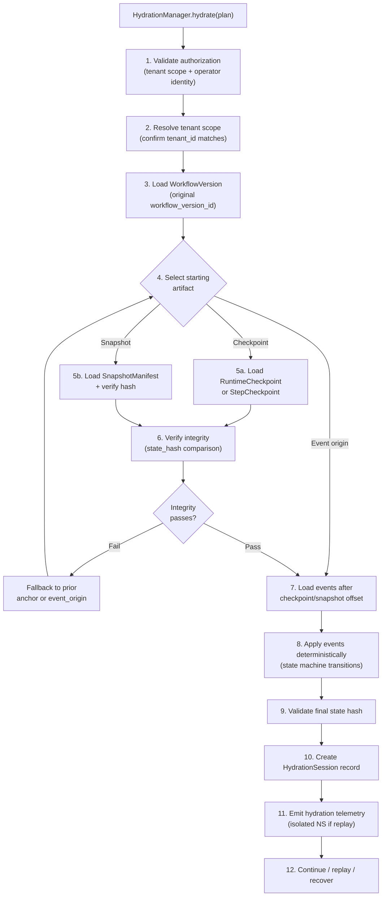

### 12.4 Hydration Rules

**HYD-01.** Hydration MUST verify integrity (state_hash or snapshot_hash) before applying the artifact.

**HYD-02.** Hydration MUST NOT mutate original state. For replay and investigation hydration, all writes go to the isolated namespace.

**HYD-03.** Replay hydration MUST suppress side-effectful operations (ExternalWrite, FinancialTransaction, IrreversibleAction tools, and live model calls where recorded output exists).

**HYD-04.** Hydration failure MUST produce a `RecoveryMarker` (for recovery hydration) or `ReplayDivergence` (for replay hydration), not silent failure.

**HYD-05.** Hydration MUST preserve tenant boundary. A `tenant_id` mismatch between the artifact and the requesting tenant MUST abort with `TenantBoundaryViolation`.

**HYD-06.** Hydration MUST use the original `workflow_version_id` from the run being hydrated.

**HYD-07.** Event application during hydration MUST be deterministic. Given the same event sequence and starting state, the result is always identical.

---

## 13. Replay State Architecture

### 13.1 Replay as Reconstruction

Replay in MYCELIA is a forensic reconstruction operation — it rebuilds what happened during an original execution using the same artifacts: the original event history, the original AgentVersion, the original PolicySnapshot, the original ContextSnapshot, and the recorded model outputs and tool results. Replay does not speculate, does not re-call live systems, and does not modify original state.

### 13.2 Replay State Entities

**ReplayState**
```typescript
interface ReplayState {
  replay_run_id: string;
  original_run_id: string;
  tenant_id: string;
  hydration_session_id: string;
  current_state: ReplayLifecycleState;
  triggered_by: string;                    // Operator identity
  trigger_reason: string;                  // 'investigation' | 'audit' | 'diff' | 'simulation'
  replay_mode: 'dry' | 'simulation';
  original_workflow_version_id: string;
  original_policy_snapshot_id: string;
  divergences_count: number;
  suppression_count: number;
  started_at: string;
  completed_at: string | null;
  is_isolated_from_production: true;       // Always true; hard-coded
}
```

**ReplayHydrationRecord**
- Records exactly which artifacts hydrated each step during replay.
- Required fields: `record_id`, `replay_run_id`, `original_run_id`, `step_id`, `agent_execution_id | null`, `hydration_source_type`, `artifact_id`, `prompt_hash_original`, `prompt_hash_replay`, `context_hash_original`, `context_hash_replay`, `schema_version_match`, `policy_snapshot_match`.

**ReplaySuppressionRecord**
- Records every operation that was suppressed during replay and why.
- Required fields: `suppression_id`, `replay_run_id`, `step_id`, `operation_type`, `suppression_reason`, `replay_artifact_used | null`.

**ReplayDivergence**
- Records a detected difference between the original execution and the replay reconstruction.
- Required fields: `divergence_id`, `replay_run_id`, `original_run_id`, `step_id`, `divergence_type`, `original_hash`, `replay_hash`, `description`, `requires_investigation`.

**ReplayOutput**
- The output produced by a replayed step, stored in the replay namespace.
- MUST NOT be promoted to production state.
- Used for diff visualization and investigation.

**ReplayComparisonRecord**
- Structured comparison between original and replay outputs for a specific step or run.

**ReplayEvidenceBundle**
- An assembled collection of all replay artifacts for a specific investigation.
- References: ReplayState, all ReplayHydrationRecords, ReplayDivergences, ReplaySuppressionRecords, original EvidenceBundle.

### 13.3 Replay State Flow

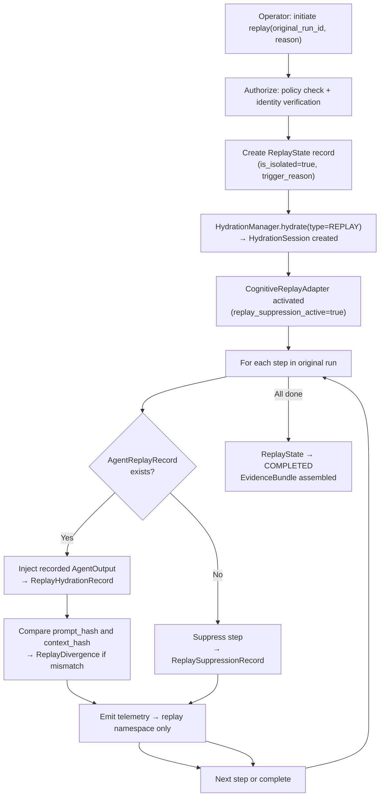

### 13.4 Replay State Rules

**REP-01.** Original event history is immutable. Replay MUST NOT append, modify, or backfill original events.

**REP-02.** Replay creates a separate lineage branch with a distinct `replay_run_id`. The original `run_id` is referenced but not used as the active run ID.

**REP-03.** Replay state MUST carry `original_run_id` on every record.

**REP-04.** Replay MUST NOT use production credentials. Replay credentials are read-only and scoped to the replay namespace.

**REP-05.** Replay MUST NOT write to production memory. Memory writes during replay are discarded or written to the isolated replay namespace.

**REP-06.** Side-effectful tools (ExternalWrite, FinancialTransaction, IrreversibleAction) MUST be suppressed during replay. ToolReplayRecord provides the hydration artifact.

**REP-07.** ReplayDivergences MUST be recorded as evidence artifacts, not treated as errors to be fixed.

**REP-08.** Replay telemetry MUST route to an isolated namespace. Production telemetry MUST NOT contain replay data.

---

## 14. Persistence Consistency Model

### 14.1 Strong Consistency Required For

The following operations require serializable or linearizable consistency:

| Operation | Consistency Requirement | Reason |
|---|---|---|
| Tenant boundary state | Serializable | Cross-tenant leakage would be a security incident |
| Workflow version publishing | Serializable | Publish is immutable; concurrent publishes must be detected |
| GovernedRun state transitions | Serializable (optimistic) | State machine correctness requires ordered transitions |
| Approval decisions | Serializable | Approval is a governance fact; double-approval must be prevented |
| PolicySnapshot binding to run | Serializable | Policy binding is immutable; race condition would allow wrong policy |
| Budget enforcement | Serializable | Budget overrun must be detectable; concurrent enforcement must see accurate totals |
| Tool idempotency records | Serializable | Duplicate invocations of side-effectful tools must be detected |
| Checkpoint manifest creation | Serializable | Concurrent checkpoint creation for same entity must be prevented |
| Outbox commit (with state) | ACID; atomic with state | The outbox record and state change are a single atomic unit |

### 14.2 Eventual Consistency Allowed For

| Operation | Consistency Tolerance | Staleness Acceptable |
|---|---|---|
| Telemetry indexing | Eventual | Minutes |
| Analytics projections | Eventual | Hours |
| Search projections | Eventual | Minutes |
| Dashboard summaries | Eventual | Seconds to minutes |
| Embedding indexes (vector DB) | Eventual | Minutes |
| Non-authoritative replay diff visualization | Eventual | Replay-scoped |

### 14.3 Read-Your-Writes Requirements

The following operations MUST see their own writes immediately:

- Run creation (a caller who creates a run MUST be able to read it immediately)
- Approval decision recording (the decision MUST be visible before the workflow resumes)
- Tool invocation result recording (the result MUST be visible to the requesting step)
- Replay session creation
- Checkpoint creation confirmation

### 14.4 Monotonic Reads Requirements

The following operations MUST see a non-decreasing view of state over time:

- Event stream reads (events MUST NOT appear out of order)
- Replay hydration (events applied in order MUST remain in that order on re-read)
- Audit evidence review (once an audit record is visible, it MUST remain visible)

### 14.5 Forbidden Inconsistencies

| Inconsistency | Why Forbidden |
|---|---|
| Run state updated but no event intent in outbox | Invisible state change; audit gap |
| Approval decision visible in UI but not in audit record | Governance gap |
| Tool side effect executed but idempotency record missing | Duplicate execution on retry |
| Replay output visible as production output | Governance contamination |
| Tenant A projection containing Tenant B data | Security incident |
| Checkpoint visible but not verifiable | Corrupt recovery anchor |

### 14.6 Consistency Summary Table

| Operation | Consistency | Read-Your-Writes | Monotonic Reads |
|---|---|---|---|
| GovernedRun state transition | Serializable | Yes | Yes |
| Step state transition | Serializable | Yes | Yes |
| Approval decision | Serializable | Yes | Yes |
| Tool idempotency check | Serializable | Yes | N/A |
| Budget enforcement | Serializable | Yes | N/A |
| Dashboard projection read | Eventual | No | Yes |
| Audit record read | Strong | Yes | Yes |
| Telemetry read | Eventual | No | Yes |
| Checkpoint read | Strong (hash-verified) | Yes | N/A |
| Snapshot read | Strong (hash-verified) | Yes | N/A |

---

## 15. Idempotency and Deduplication Architecture

### 15.1 Idempotency Key Design

An idempotency key is a durable, deterministic identifier for an operation that allows the system to detect and handle duplicate requests safely. For MYCELIA:

| Operation | Idempotency Key Formula |
|---|---|
| GovernedRun creation | `hash(tenant_id + workflow_id + actor_id + business_ref)` or client-supplied |
| State transition | `hash(entity_id + entity_type + transition_command + causation_id)` |
| Tool invocation (side-effectful) | `hash(run_id + step_id + tool_name + tool_call_id + iteration_number)` — Document 04 §15.6 |
| Approval decision | `hash(approval_request_id + decision_actor_id + decision)` |
| Outbox publication | `outbox_id` — each outbox record is its own idempotency unit |
| Checkpoint creation | `hash(entity_id + event_offset + checkpoint_type)` |

### 15.2 IdempotencyRecord Structure

```typescript
interface IdempotencyRecord {
  idempotency_key: string;           // Computed or client-supplied
  tenant_id: string;
  operation_type: string;            // 'run_create' | 'tool_invoke' | 'state_transition' | etc.
  entity_id: string;                 // The entity this operation targets
  result_ref: string;                // Reference to the persisted result
  status: 'COMPLETED' | 'IN_FLIGHT' | 'FAILED';
  created_at: string;
  expires_at: string;                // Idempotency window; after expiry, key may be reused
  request_hash: string;              // Hash of the original request body for conflict detection
}
```

### 15.3 Idempotency Protocol

1. Compute idempotency_key for the operation.
2. Attempt `INSERT INTO idempotency_records ... ON CONFLICT DO NOTHING`.
3. If insert succeeds: this is a new request; proceed with operation.
4. If insert fails (key exists with COMPLETED): return original result from `result_ref`.
5. If insert fails (key exists with IN_FLIGHT): return 409 Conflict; caller should wait and retry.
6. If insert fails (key exists with FAILED): proceed as new request (failed operations may be retried).

### 15.4 Idempotency Rules

**IDEM-01.** External side effects (ExternalWrite, FinancialTransaction, IrreversibleAction class tools) REQUIRE an idempotency key before invocation.

**IDEM-02.** Tool invocations with side effects MUST have an idempotency key that persists in an IdempotencyRecord BEFORE the tool is dispatched to the worker.

**IDEM-03.** State transitions MUST be idempotently retryable: submitting the same transition command with the same `causation_id` twice returns the original result.

**IDEM-04.** Duplicate commands MUST return the original result or a safe conflict response (409). They MUST NOT produce double state transitions.

**IDEM-05.** Idempotency is tenant-scoped. An idempotency key from Tenant A is only valid for Tenant A's operations.

**IDEM-06.** Replay MUST NOT reuse production idempotency keys for live side effects. Replay uses suppression, not idempotency keys, to handle tools.

**IDEM-07.** Idempotency windows SHOULD be at least as long as the maximum observable retry window for the operation type.

---

## 16. Projection and Read Model Architecture

### 16.1 Projection Principles

Projections are derived, eventually consistent read models built by consuming the event stream. They serve read-heavy use cases — dashboards, approval inboxes, workflow graph visualization, run timelines — that would be expensive to serve from the authoritative state store.

Projections are rebuildable. If a projection is corrupted, stale, or inconsistent, it can always be rebuilt by replaying the event history from offset zero. This rebuild property is critical: it means projection quality never blocks governance, because the authoritative state is always accessible from the relational state store and event store.

### 16.2 Projection Types

| Projection | Description | Staleness Tolerance | Rebuild Source |
|---|---|---|---|
| RunSummaryProjection | Current state, last-updated, owner, workflow name for all runs | 30s | Event store |
| ApprovalInboxProjection | Pending approvals for an approver, grouped by run | 5s | Event store |
| WorkflowGraphRuntimeProjection | Animated workflow graph showing which step is currently active | 5s | Event store |
| RunTimelineProjection | Chronological list of all step transitions for a run | 30s | Event store |
| ReplayDiffProjection | Side-by-side comparison of original vs replay steps | On-demand | Replay store + event store |
| TenantUsageProjection | Token consumption, cost, run counts by tenant | 5min | Event store |
| AgentOutputBrowserProjection | Searchable list of all agent outputs for a tenant | 1min | Artifact store + event store |

### 16.3 ProjectionOffset Management

Each projection maintains a `ProjectionOffset` record:
- `last_processed_event_id`: the last event that was applied to this projection.
- `last_processed_offset`: the numeric offset in the event stream.

Projection workers read events since `last_processed_offset`, apply them to the projection, and update the `ProjectionOffset` atomically with each batch.

### 16.4 Projection Staleness Visibility

Projections MUST expose their staleness to the UI (Documents 20–22). Required mechanisms:
- `built_at` field on projection records; UI shows "last updated X minutes ago."
- `is_stale: true` flag set when the projection lag exceeds a configured threshold.
- Critical UI elements (approval inbox, active run state) MUST visually indicate when the projection is stale.

### 16.5 Projection Rules

**PROJ-01.** Projections are derived and rebuildable. They MUST NOT be source of truth for any governance decision.

**PROJ-02.** Projections MUST NOT be the source for approval decisions. The ApprovalState in the relational state store is authoritative.

**PROJ-03.** Projection lag MUST be visible. `mycelia.projection.lag_seconds` metric by projection type and `tenant_id`.

**PROJ-04.** Projection rebuild MUST preserve tenant scope. A rebuild operation MUST only write projection data for the tenant whose event stream is being consumed.

**PROJ-05.** Projection corruption (detected by rebuild failure or hash mismatch) MUST trigger an automatic rebuild from the event history.

**PROJ-06.** Critical UI elements MUST indicate when a projection is stale (is_stale = true).

---

## 17. Persistence Storage Topology

### 17.1 Logical Storage Topology

This section defines the *logical* storage topology — the roles and characteristics of each storage system. Cloud provider selection and physical deployment belong to Document 16.

**PostgreSQL (Primary Relational Store)**
- Data stored: Authoritative state records (GovernedRunState, StepState, AgentExecutionState, ToolInvocationState, ApprovalState), StateTransition log, OutboxRecord, IdempotencyRecord, PersistenceLock, Checkpoint metadata, ProjectionOffset, RetentionRecord.
- Consistency: SERIALIZABLE for state transitions; READ COMMITTED for non-critical reads.
- Backup: PITR required; minimum 7-day recovery window; per-tenant logical backups.
- Encryption: Data at rest (AES-256 or equivalent); data in transit (TLS 1.3).
- Tenant isolation: `tenant_id` on every table; RLS policies as defense in depth; row partitioning by tenant for large tables.
- Retention: Governed by RetentionRecord; authoritative records retained per legal hold policy.
- Failure behavior: Connection pool exhaustion → queueing with circuit breaker; primary failure → failover to read replica (read-only degraded mode).

**Event Store (Append-Only)**
- Implementation options: PostgreSQL append-only tables (MVP), Apache Kafka / Redpanda (scale).
- Data stored: All RuntimeEvents, StepEvents, AgentEvents, ToolEvents, ApprovalEvents, PolicyEvents, ReplayEvents, SystemEvents.
- Consistency: Append-only; total order per partition (by run_id or tenant_id).
- Backup: Log-based replication; no deletion within retention window.
- Encryption: At rest and in transit.
- Tenant isolation: Partitioned by tenant_id; tenant cannot read other tenant's events.
- Retention: Minimum per compliance baseline; MUST NOT truncate within retention window.
- Failure behavior: Unavailability causes outbox backlog; publication resumes on recovery.

**Object Storage (Immutable)**
- Implementation: S3-compatible with object versioning and deletion protection.
- Data stored: SnapshotManifest + SnapshotChunks, large Artifacts, ToolArtifacts, EvidenceBundle archives, large OutboxRecord payloads (when above inline size limit).
- Consistency: Strong read-after-write for writes; eventual for list operations.
- Backup: Cross-region replication; bucket versioning.
- Encryption: SSE with tenant-specific key references; object-level encryption.
- Tenant isolation: Tenant-scoped URI prefix (`/tenants/{tenant_id}/...`); IAM policy enforcement.
- Retention: Bucket lifecycle policies governed by RetentionRecord; legal hold tags.
- Failure behavior: Read failure → hydration falls back to checkpoint or event replay.

**Vector Database (Memory Store)**
- Data stored: MemoryObject embeddings, semantic search indexes by tenant namespace.
- Consistency: Eventual for retrieval rankings; strong for write authorization checks.
- Backup: Periodic snapshotting; re-indexing is always possible from source documents.
- Encryption: At rest; tenant namespace isolation.
- Tenant isolation: Hard namespace filtering on every query; cross-namespace reads are rejected.
- Retention: Per MemoryObject TTL and tenant policy.
- Failure behavior: Unavailability → ContextAssemblyGateway assembles with partial context; ContextAssemblyPartial event.

**Telemetry Backend (OTel)**
- Data stored: Trace, Span, MetricPoint, LogRecord.
- Consistency: Append-only; best-effort ordering within a trace.
- Backup: Retention window archival; not required for governance.
- Encryption: At rest and in transit.
- Tenant isolation: `tenant_id` attribute on all records; query APIs enforce tenant scoping.
- Failure behavior: Buffered locally; non-blocking; does not affect runtime execution.

**Audit/Evidence Store**
- Implementation: Append-only PostgreSQL table with hash-chaining, or purpose-built audit log store.
- Data stored: AuditRecord, PolicyEvaluationRecord, ApprovalDecisionRecord, EvidenceBundle index.
- Consistency: SERIALIZABLE on write; monotonic reads.
- Backup: PITR; cross-region backup for regulated workloads.
- Encryption: At rest; with key management separate from operational keys.
- Tenant isolation: Full; per-tenant encryption keys where required.
- Retention: Minimum regulatory baseline for high-risk AI logging where applicable; EU AI Act Article 12 requires logging capabilities for high-risk AI systems, while Article 19 establishes that provider-controlled automatically generated logs must be kept for an appropriate period of at least six months unless other applicable law provides otherwise. Sector-specific, contractual or tenant policies may require longer retention.
- Failure behavior: Audit persistence failure → SEV2 alert; operation blocked until audit record confirmed.

**Configuration Store**
- Implementation: Backed by PostgreSQL with caching layer (Redis or in-process).
- Data stored: PlatformConfig, TenantConfig, FeatureFlags, RoutingTables, PolicyVersionPointers.
- Consistency: Strong for writes; cached for reads with short TTL.
- Backup: Part of primary DB backup.
- Encryption: At rest.
- Tenant isolation: Tenant configuration records are scoped.
- Failure behavior: Cache serves stale config; fresh config fetch fails closed for security-critical settings.

**Projection Store (Read Models)**
- Implementation: Dedicated read replica, Redis, Elasticsearch, or purpose-built search backend.
- Data stored: RunSummaryProjection, ApprovalInboxProjection, WorkflowGraphProjection, etc.
- Consistency: Eventual.
- Backup: Rebuild from event history (projections are rebuildable).
- Tenant isolation: Per-projection tenant filtering.
- Failure behavior: Degraded read experience; critical operations fall back to authoritative state store.

### 17.2 Storage Topology Diagram

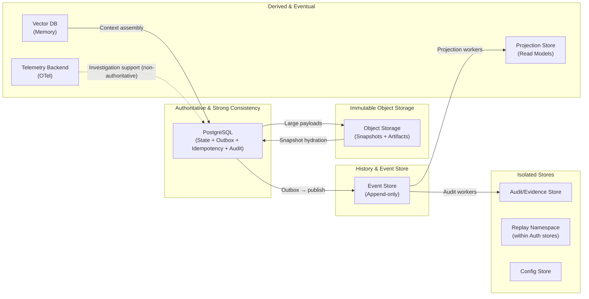

---

## 18. Persistence Security and Isolation

### 18.1 Tenant-Scoped Storage

Every persisted record MUST carry `tenant_id` unless explicitly declared as platform-scoped configuration. Platform-scoped records (e.g., global AgentDefinitions, platform configuration) MUST be explicitly annotated as platform-scoped and MUST NOT contain any tenant-specific data.

### 18.2 Row-Level Isolation

For all relational state stores, Row Level Security (RLS) policies are applied as a defense-in-depth mechanism. RLS enforces that `tenant_id` in the authenticated session context matches the `tenant_id` on every row read or written. Application-level filtering MUST also be present; RLS is a safety net, not the primary enforcement.

### 18.3 Encryption Requirements

| Store | At Rest | In Transit | Key Management |
|---|---|---|---|
| PostgreSQL (state store) | AES-256 (TDE or filesystem) | TLS 1.3 | Platform managed; per-tenant key refs available |
| Event Store | AES-256 | TLS 1.3 | Platform managed |
| Object Storage (snapshots) | SSE with per-tenant key refs | HTTPS/TLS | Key references in SnapshotManifest |
| Checkpoint Store | AES-256 | TLS 1.3 | encryption_key_ref in Checkpoint |
| Audit/Evidence Store | AES-256; tamper-evidence | TLS 1.3 | Separate key hierarchy |
| Vector DB | AES-256 | TLS 1.3 | Namespace-level |
| Telemetry Backend | AES-256 | TLS 1.3 | Platform managed |

### 18.4 Secret Exclusion

No persisted record in any storage plane may contain:
- Raw API keys or service account credentials.
- OAuth client secrets or access tokens.
- Database connection strings with embedded passwords.
- Encryption key material (only key references are stored, never key content).
- User passwords or password hashes (these belong in the identity store, not the runtime state store).
- Prompt content that contains the above (prompt artifacts are stored by reference, with content externalized; see Document 04 §22.7).

### 18.5 PII Handling

Records that contain PII (Personally Identifiable Information) MUST:
- Be classified at the appropriate data_classification level.
- Be subject to the tenant's data retention and right-to-erasure policy.
- Have `pii_present: true` flag where applicable.
- Be omitted from telemetry default capture (Document 04 §21.5).
- Be subject to pseudonymization or redaction before appearing in replay or investigation artifacts where full PII is not required.

### 18.6 Checkpoint and Snapshot Encryption

Every RuntimeCheckpoint and SnapshotManifest MUST reference an `encryption_key_ref` that points to a key in the key management service. The encryption key is tenant-scoped. A snapshot from Tenant A cannot be decrypted with Tenant B's key. This provides cryptographic enforcement of tenant isolation at the object storage layer.

### 18.7 Replay Environment Isolation

Replay MUST operate in an isolated environment with the following properties:
- Separate database schema or namespace (`replay_schema`) for replay state writes.
- Read-only credentials for accessing original authoritative state records.
- No write access to production memory stores.
- No access to production credentials (CredentialLease scoped to replay namespace only).
- Replay telemetry routed to isolated namespace.
- Replay state MUST NOT be visible in production UI without explicit replay mode activation.

### 18.8 Audit Immutability

Audit/evidence records are tamper-evident through hash chaining:
- Each AuditRecord carries a `previous_record_hash` that chains it to the prior record in the tenant's audit log.
- The hash of each record is computed over its content plus the `previous_record_hash`.
- This creates a Merkle-chain structure where any modification to a past record invalidates all subsequent records.
- The chain integrity is verified as part of the EvidenceBundle assembly process.

---

## 19. Persistence Failure Model

### 19.1 Failure Catalog

| Failure Mode | Detection | Runtime Behavior | Fail-Open/Closed | Recovery | Event/Audit | SRE Escalation |
|---|---|---|---|---|---|---|
| **State store unavailable** | Connection timeout; health check | Reject state transitions; return 503 | CLOSED | Wait for recovery; circuit breaker | StateStoreUnavailable event | SEV2 immediately |
| **Event store unavailable** | OutboxPublisher cannot connect | Outbox accumulates; operations continue | OPEN (with backlog) | Resume publication on recovery | EventStoreUnavailable event | SEV2 |
| **Outbox publisher failure** | Publisher health check fails | OutboxRecords accumulate; state is safe | OPEN (with backlog) | Restart publisher; process backlog | OutboxPublisherDown event | SEV2 |
| **Outbox backlog** | `outbox.pending_count` metric threshold | Alert; publication delayed | OPEN | Investigate publisher; scale if needed | OutboxBacklogAlert | SEV3 escalating to SEV2 |
| **Checkpoint write failure** | Checkpoint write returns error | Continue operation; emit warning | OPEN | Reduce recovery efficiency; next attempt | CheckpointWriteFailed event | SEV3 |
| **Snapshot write failure** | Snapshot write returns error | Continue operation; fallback to checkpoint | OPEN | Retry; alert if persistent | SnapshotWriteFailed event | SEV3 |
| **Object storage unavailable** | Health check; write failure | Artifact promotion blocked; step blocked | CLOSED for artifact promotion | Wait for recovery; circuit breaker | ObjectStorageUnavailable | SEV2 |
| **Projection lag** | `projection.lag_seconds` threshold | Projections stale; UI shows warning | OPEN | Projection workers catch up | ProjectionLagExceeded event | SEV3 |
| **Projection corruption** | Hash mismatch on read; rebuild failure | Block reads from corrupted projection | CLOSED for corrupted projection | Rebuild from event history | ProjectionCorrupted event | SEV3 |
| **Cache corruption** | Stale data causes inconsistency | Invalidate and re-fetch | OPEN | Flush cache; rebuild from source | CacheCorruptionDetected event | SEV4 |
| **Hydration failure** | IntegrityProof fails; state mismatch | Block hydration; create RecoveryMarker | CLOSED | Fall back to earlier anchor or event replay | HydrationFailed event | SEV2 |
| **Replay divergence** | Hash mismatch during replay | Record ReplayDivergence; continue | OPEN (replay) | Investigation; divergences are evidence | ReplayDivergenceDetected | SEV3 |
| **Idempotency conflict** | Duplicate key on INSERT | Return original result (COMPLETED) or 409 | CLOSED for duplicate | Normal; idempotency working correctly | IdempotencyConflict (log only) | None |
| **Tenant isolation failure** | Cross-tenant row returned | ABORT immediately; security escalation | CLOSED | Security incident response | TenantIsolationFailure | SEV1 |
| **Partial transaction failure** | Commit partially fails | Full rollback; state unchanged | CLOSED | Retry from clean state | TransactionRollback event | SEV2 if persistent |
| **Schema migration failure** | Migration script error | Migration halted; old schema preserved | CLOSED | Rollback migration; ADR required | SchemaMigrationFailed | SEV2 |
| **Data retention job failure** | Job health check | Retention not enforced; records accumulate | OPEN | Reschedule; alert | RetentionJobFailed | SEV3 |
| **Backup failure** | Backup health check | Data at risk; backup not current | OPEN | Immediate investigation; restart backup | BackupFailed | SEV2 |
| **Restore failure** | Restore validation failure | Block restore; preserve current state | CLOSED | Try alternative restore point | RestoreFailed | SEV1 |
---

## 20. Backup, Restore and Recovery Boundaries

### 20.1 What Must Be Backed Up

| Artifact | Backup Method | Recovery Window | Reason |
|---|---|---|---|
| Relational state store (PostgreSQL) | PITR; logical exports | 7 days PITR minimum | Authoritative current state |
| Event store | Log-based replication; snapshot | Same as state store | Historical lineage; replay anchor |
| Transactional outbox | Part of state store backup | Same as state store | Inflight events at backup time |
| Checkpoint metadata | Part of state store backup | Same as state store | Recovery acceleration |
| Snapshot manifests (object storage) | Cross-region replication | Same retention as run | Full state recovery |
| Artifact store (object storage) | Cross-region replication | Per artifact retention | Produced outputs |
| Audit/evidence store | Separate backup; cross-region | Minimum 6 months; legal hold | Governance evidence |
| Configuration store | Part of state store backup | Same as state store | Platform configuration |

### 20.2 What Can Be Rebuilt

The following artifacts are derived and can be rebuilt from authoritative sources:

| Artifact | Rebuilt From | Rebuild Trigger |
|---|---|---|
| Projection store (all projections) | Event store (replay events from offset 0) | Corruption; staleness; schema change |
| Vector embeddings (semantic memory) | Source documents + embedding model | Re-indexing job |
| Telemetry indexes | Telemetry backend (if archived) | Investigation need |
| Replay diff summaries | Replay store + original event store | Investigation re-run |

### 20.3 What Must Never Be Rebuilt from Projections

The following MUST be recovered from authoritative backups, never rebuilt from projections:

- GovernedRun current state
- Approval decisions
- PolicySnapshot bindings
- Tool idempotency records (rebuilding would allow double execution)
- Audit/evidence records

### 20.4 PITR Expectations

- Relational state store: 7-day PITR minimum; point-in-time recovery to within 1 minute.
- Event store: Log-based replication maintains near-zero lag; recovery to specific event offset.
- Object storage: Versioning enables recovery to specific object version.
- Audit store: 7-day PITR minimum; separate from main state store.

### 20.5 Restore Ordering

When restoring from backup, the following ordering MUST be respected:

1. Restore tenant configuration and schema.
2. Restore event store (ensures lineage is complete before state is restored).
3. Restore relational state store (authoritative current state).
4. Verify event store + state store consistency (last event ID in state matches last event in event store).
5. Restore object storage (snapshots and artifacts).
6. Rebuild projections (derived; built from restored event store).
7. Verify audit store completeness.

### 20.6 Restore Dependency Diagram

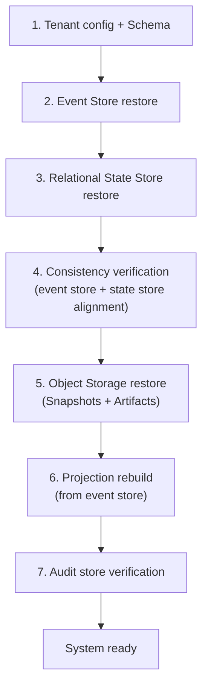

### 20.7 Tenant-Scoped Restore Constraints

- A restore operation MUST restore within the correct tenant's namespace.
- Cross-tenant restore is FORBIDDEN. Restoring Tenant A's state into Tenant B's namespace is a security incident.
- A partial tenant restore (e.g., recovering a specific run) MUST leave other tenants' state unaffected.
- Snapshot restore MUST validate that the snapshot's `tenant_id` matches the restore target tenant.

### 20.8 Replay After Restore

After a restore, replay capability depends on:
- Event store completeness: events from the restored period must be present.
- Checkpoint availability: checkpoints within the restored period must be available.
- ContextSnapshot availability: cognitive replay requires ContextSnapshot records from the restored period.
- AgentReplayRecords availability: cognitive replay requires ModelOutput records from the restored period.

If event history is incomplete after restore, replay of affected periods will produce `CognitiveStepSuppressed` states and `ReplayHydrationFailed` records.

---

## 21. Schema Evolution and Migration Model

### 21.1 Principles

Schema evolution in a governed runtime with immutable event history requires care: once an event schema is published and events are written under it, those events must remain readable indefinitely. Schema changes to projections or state tables are less constrained — they can be rebuilt — but schema changes to events and checkpoints require forward and backward compatibility planning.
### 22.1.1 Regulatory Retention Reference Rule

Retention values in this document are architectural baselines, not legal advice.

MYCELIA MUST distinguish between:

- architectural minimum retention;
- tenant contractual retention;
- sector-specific regulatory retention;
- jurisdiction-specific legal retention;
- legal hold preservation;
- incident preservation.

### EU AI Act Reference

Where MYCELIA is deployed in a context involving high-risk AI systems under the EU AI Act, retention policy SHOULD account for:

- Article 12 logging capability requirements for high-risk AI systems;
- Article 19 requirements for provider-controlled automatically generated logs to be kept for an appropriate period of at least six months, unless other applicable Union or national law provides otherwise;
- any sector-specific retention requirements that override the platform baseline.

### Rules

- Legal references MUST NOT be treated as universal retention rules for all tenants.
- Tenant-specific retention policies MAY be stricter than the architectural default.
- Legal hold MUST override normal retention expiry.
- Regulatory retention mapping MUST be reviewed before external publication, customer contract commitment or regulated deployment.
- MYCELIA MUST store the active `retention_policy_id` on retained artifacts so historical retention decisions can be explained.

### Forbidden Behavior

FORBIDDEN:

- hardcoding one legal retention period as universal for all MYCELIA deployments;
- claiming EU AI Act compliance from retention duration alone;
- deleting audit, event or evidence records while legal hold is active;
- treating architectural retention defaults as legal advice;
- allowing Codex to implement retention without `retention_policy_id`.

### 21.2 Event Schema Evolution

Event schemas MUST follow these rules:

| Change Type | Compatibility | Strategy |
|---|---|---|
| Adding optional field | Backward compatible | Safe; old readers ignore new field |
| Adding required field | BREAKING | Requires new schema version; dual-write transition |
| Removing field | BREAKING | Requires new schema version; old events retain removed field |
| Renaming field | BREAKING | Requires new schema version; migration map required |
| Changing field type | BREAKING | Requires new schema version |

Every event carries `event_schema_version`. Consumers (projection workers, hydration engine) MUST check schema version and apply appropriate deserialization logic per version.

### 21.3 Checkpoint Schema Evolution

Checkpoint schema changes:
- Old checkpoints with an older `schema_version` MUST be readable by the current hydration engine.
- If the schema change is too large to support backward compatibility, old checkpoints MUST be invalidated and the system falls back to event replay from offset zero.
- Checkpoint schema migration markers MUST be created before any migration runs.

### 21.4 Snapshot Schema Evolution

The `schema_version` field in SnapshotManifest is the migration key:
- Before hydrating a snapshot, the hydration engine checks `schema_version` against its supported versions.
- If the snapshot's schema is older than supported, apply a migration adapter.
- If the snapshot's schema is incompatible (too old to migrate), fall back to event replay.

### 21.5 Migration Rules

**SCHEMA-01.** Historical events MUST remain readable. No migration may make a prior event unreadable.

**SCHEMA-02.** Old checkpoints with an older `schema_version` MUST either be migratable or explicitly invalidated with fallback to event replay.

**SCHEMA-03.** Snapshot `schema_version` MUST be explicit and checked before hydration.

**SCHEMA-04.** Replay MUST detect incompatible schema versions and produce `SchemaDivergence` records rather than silently misreading data.

**SCHEMA-05.** Breaking schema changes REQUIRE an ADR (Architectural Decision Record) in Document 25.

**SCHEMA-06.** Dual-write or dual-read strategies MUST be used when transitioning between schema versions in production to maintain consistency during rollout.

**SCHEMA-07.** Migration scripts MUST be idempotent. Running a migration twice MUST produce the same result as running it once.

---

## 22. Retention and Archival Model

### 22.1 Retention by State Category

| State Category | Default Retention | Legal Hold | Deletion Allowed? |
|---|---|---|---|
| GovernedRun authoritative state | Duration of run + N years (configurable) | Blocks deletion | Only after retention expires and no legal hold |
| Event history | Minimum regulatory baseline for high-risk AI logging where applicable; EU AI Act Article 12 requires logging capabilities for high-risk AI systems, while Article 19 establishes that provider-controlled automatically generated logs must be kept for an appropriate period of at least six months unless other applicable law provides otherwise. Sector-specific, contractual or tenant policies may require longer retention. | Blocks deletion | NEVER during retention window |
| Approval decisions | Minimum 6 months; may be longer | Blocks deletion | Only after retention + no hold |
| PolicySnapshot bindings | Lifetime of the run they governed | Blocks deletion | Only after run retention expires |
| Audit/evidence records | Minimum 6 months; sector may require more | Blocks deletion | NEVER during retention window |
| Checkpoints | Same as the run they cover | Follows run | May be deleted if event history covers the same range |
| Snapshots | Same as the run they cover | Follows run | May be deleted if event history covers the same range |
| Artifacts | Per artifact retention policy | Blocks deletion | After retention; PII subject to right-to-erasure |
| Projections | Rebuildable; no inherent retention | N/A | May be deleted at any time; rebuild from events |
| Telemetry | 30–90 days operational; longer for investigation | N/A | Standard rotation |
| Replay state | Configurable investigation window | Follows original run | After investigation window |
| Memory objects | Per tenant TTL policy | N/A | Subject to right-to-erasure |

### 22.2 Archival

Archival moves data from active storage to cold storage (object storage, archival tiers) while preserving access for compliance purposes. Archived data:
- MUST remain accessible for audit and investigation queries.
- MUST retain all required fields including `tenant_id`, `run_id`, `event_id`.
- MUST preserve encryption with the original key reference.
- MUST be logged in a RetentionRecord.

### 22.3 Soft Delete vs Hard Delete

| Operation | When Used | Audit Required | Recoverable? |
|---|---|---|---|
| Soft delete | Marking a run as cancelled or archiving a workflow | Yes | Yes (within retention) |
| Hard delete | Post-retention expiry; GDPR right-to-erasure for PII | Yes | No |
| Legal hold | Block on any deletion | Yes | N/A (prevents deletion) |

### 22.4 Compaction Rules

- Checkpoint compaction (deleting older checkpoints when newer ones exist) is ALLOWED IF the event history covering the older checkpoint's range is still present.
- Snapshot pruning is ALLOWED IF the event history covering the snapshot's range is still present.
- Projection truncation is ALWAYS allowed (projections are rebuildable).
- Event history MUST NOT be compacted within the retention window.
- Audit records MUST NOT be compacted.

---

## 23. MVP State & Persistence Cut

### 23.1 MVP Must Include

The following persistence capabilities are REQUIRED for the MVP runtime to operate:

| Capability | Implementation | Notes |
|---|---|---|
| PostgreSQL state tables | GovernedRunState, StepState, AgentExecutionState, ToolInvocationState, ApprovalState tables | With `tenant_id` on all tables |
| StateTransitionCoordinator | Handles all state mutations | No direct DB writes from application code |
| RuntimeEvent table | Append-only event log (PostgreSQL) | MVP may use PostgreSQL before Kafka migration |
| Transactional outbox table | OutboxRecord in same PostgreSQL DB | With OutboxPublisher worker |
| AuditRecord table | Append-only; tamper-evident | Required for governance |
| ApprovalRequest state | Full state machine | Block workflows at approval gates |
| ToolInvocation state | With IdempotencyRecord | Required for side-effectful tools |
| Artifact metadata table | ArtifactMetadata with content_hash | Object storage integration deferred to Later |
| Basic checkpoint table | RuntimeCheckpoint with state_hash | In PostgreSQL; basic serialization |
| Basic replay | Reconstruct from events; suppress side effects | ContextSnapshot mandatory |
| IdempotencyRecord for tools | Before dispatch of side-effectful tools | Required for safe retry |
| `tenant_id` on all records | Non-nullable; validated | No record may be created without tenant_id |
| WorkflowVersion reference on run | Immutable once assigned | Checked before every transition |
| PolicySnapshot binding on run | Immutable once bound | Checked before governance operations |

### 23.2 MVP May Defer

| Deferred Capability | Deferral Reason | Target Milestone |
|---|---|---|
| Full SnapshotManifest + chunks in object storage | Object storage integration | Later |
| Kafka/Redpanda event store | PostgreSQL append-only tables sufficient for MVP | Scale milestone |
| Full projection engine | Basic read queries sufficient for MVP | Later |
| Vector memory persistence | Memory architecture deferred | Later |
| Multi-region event replication | Single-region for MVP | Enterprise milestone |
| PITR automation | Manual backup scripts acceptable for MVP | SRE milestone |
| Advanced replay diff visualization | CLI-level diff acceptable for MVP | Later |
| Simulation state | Complex; defer until replay is mature | Later |
| Merkle proofs / formal tamper-evidence | Hash chaining sufficient for MVP | Enterprise milestone |
| Legal hold automation | Manual operator flag for MVP | Enterprise milestone |

### 23.3 MVP Acceptance Criteria

| Capability | Acceptance Criteria | Evidence |
|---|---|---|
| State transitions only via StateTransitionCoordinator | No application code writes directly to state tables | Code review; no `INSERT`/`UPDATE` to runtime state tables outside StateTransitionCoordinator |
| Transactional outbox atomicity | State + outbox record always commit together | Test: kill process mid-transaction; verify state and outbox are consistent |
| Event replayability | A run can be fully reconstructed from its event history | Replay test: wipe state table; replay events; compare final state to original |
| Checkpoint integrity | Checkpoint state_hash is verified before hydration | Test: tamper checkpoint; verify hydration is rejected |
| Tenant isolation | No record can be read or written without matching tenant_id | Test: attempt cross-tenant state read with mismatched tenant_id; verify failure |
| Idempotency for tools | Duplicate tool dispatch returns original result | Test: submit identical tool dispatch twice; verify only one execution and one result |
| Audit records for governance | All governance-sensitive transitions produce AuditRecord | Test: approve action; verify AuditRecord created; verify AuditRecord content |
| No secrets in checkpoints | Checkpoint content contains no credential patterns | Static analysis + test: verify checkpoint serialization does not include secret fields |
| Replay suppresses live side effects | Replayed tool invocations do not re-execute | Replay test: verify ToolReplayRecord used; no new ToolExecution worker dispatch |

---

## 24. State and Persistence Diagrams

### 24.1 Logical Persistence Topology (see §17.2)

### 24.2 State Transition with Outbox

See §9.5 for the full transactional commit sequence diagram.

### 24.3 Checkpoint Creation

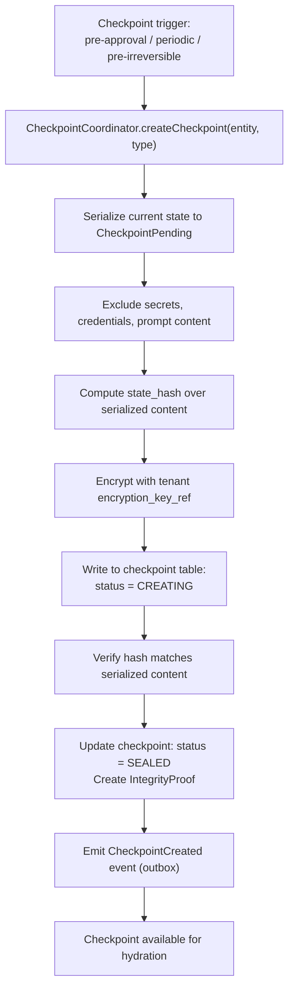

### 24.4 Snapshot Creation

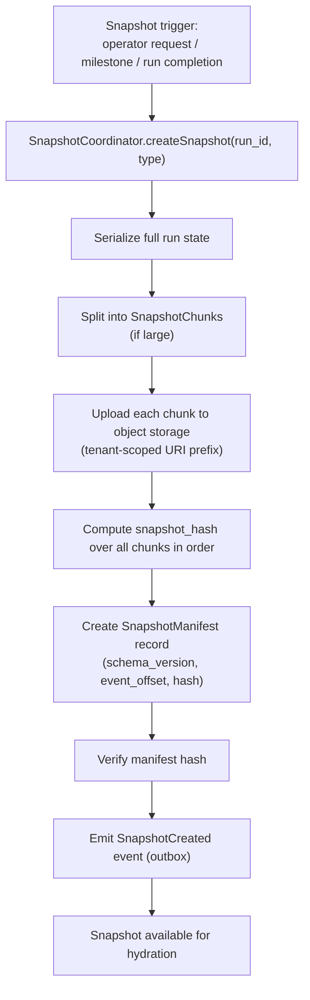

### 24.5 Hydration

See §12.3 for the full Hydration Algorithm diagram.

### 24.6 Replay State Isolation

See §13.3 for the Replay State Flow diagram.

### 24.7 Projection Rebuild

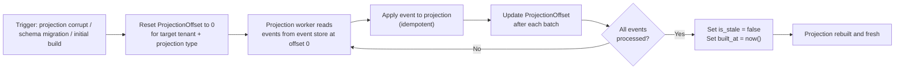

### 24.8 Recovery from Outbox Backlog

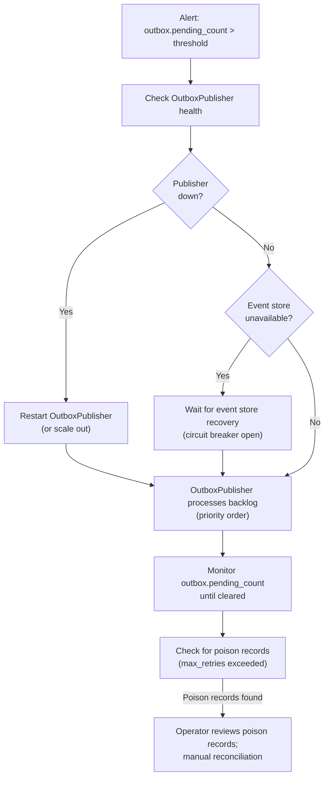

### 24.9 Tenant-Scoped Persistence Boundary

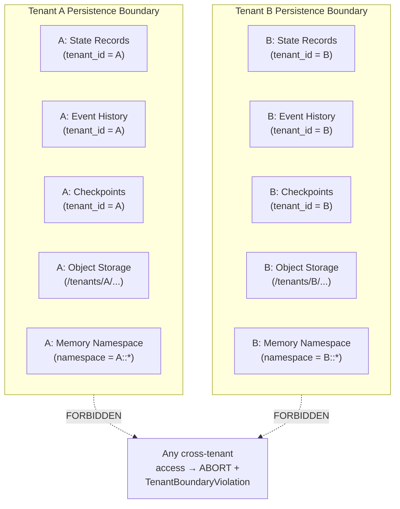

---

## 25. State & Persistence Invariants

### 25.1 State Ownership Invariants

| ID | Invariant |
|---|---|
| SO-01 | Every persisted state record MUST carry `tenant_id`. |
| SO-02 | `tenant_id` on a state record is immutable after creation. |
| SO-03 | Every state record MUST have a single source-of-truth storage plane. |
| SO-04 | No two storage planes may both claim authority for the same state category. |
| SO-05 | Platform-scoped records MUST be explicitly annotated; they MUST NOT contain tenant-specific data. |
| SO-06 | WorkflowVersion reference on a GovernedRun is immutable once assigned. |
| SO-07 | PolicySnapshot binding on a GovernedRun is immutable once assigned. |
| SO-08 | ApprovalDecisions are immutable once recorded. |
| SO-09 | Ephemeral state MUST NOT be treated as authoritative. |
| SO-10 | Model prompt context is NOT authoritative state. |
| SO-11 | Telemetry data MUST NOT replace authoritative state records. |
| SO-12 | Caches MUST NOT be treated as authoritative. |
| SO-13 | Projections MUST NOT be treated as authoritative. |
| SO-14 | Every state record MUST carry `created_at` and `last_modified_at`. |
| SO-15 | Every authoritative state record MUST carry `version` (optimistic concurrency counter). |

### 25.2 Source of Truth Invariants

| ID | Invariant |
|---|---|
| SOT-01 | The event store is the primary source of truth for state history. |
| SOT-02 | The relational state store is the primary source for current runtime state. |
| SOT-03 | Checkpoints are acceleration artifacts; they do not override the event store. |
| SOT-04 | Snapshots are acceleration artifacts; they do not override the event store. |
| SOT-05 | Audit records are immutable evidence; they cannot be updated or deleted within retention. |
| SOT-06 | No projection may be used for a governance decision (approval, policy evaluation, budget). |
| SOT-07 | No cache may substitute for an authoritative read on a governance-critical path. |
| SOT-08 | The state store MUST be consistent with the event store after every committed transition. |
| SOT-09 | A state that exists in a cache but not in the authoritative store does not exist. |
| SOT-10 | Replay output MUST NOT be promoted to production state. |

### 25.3 Transition Invariants

| ID | Invariant |
|---|---|
| TR-01 | No state mutation may bypass StateTransitionCoordinator. |
| TR-02 | Every state transition MUST carry `tenant_id`. |
| TR-03 | Every state transition MUST carry `causation_id`. |
| TR-04 | Every state transition MUST carry `correlation_id`. |
| TR-05 | Invalid state machine transitions MUST be rejected with `StateTransitionRejected`. |
| TR-06 | Terminal state transitions (e.g., RunSucceeded) MUST NOT allow further transitions. |
| TR-07 | Optimistic concurrency failures MUST trigger retry with bounded backoff; not force-overwrite. |
| TR-08 | Policy check failure during a transition MUST produce `PolicyDeniedTransition` before abandoning. |
| TR-09 | Every governance-sensitive transition MUST produce an AuditRecord. |
| TR-10 | State transition and outbox event intent MUST commit atomically. |
| TR-11 | A state transition record MUST reference `from_state` and `to_state`. |
| TR-12 | State transitions MUST be idempotently retryable when the same `causation_id` is presented. |
| TR-13 | No state transition may produce a `from_state` that does not match the current state record. |
| TR-14 | StateTransitionLog MUST preserve all transitions for an entity in append-only order. |
| TR-15 | Direct INSERT/UPDATE to runtime state tables from application code is FORBIDDEN. |

### 25.4 Transactional Outbox Invariants

| ID | Invariant |
|---|---|
| OB-01 | Every authoritative state mutation MUST produce a corresponding OutboxRecord in the same transaction. |
| OB-02 | Event publication failure MUST NOT roll back or erase committed state. |
| OB-03 | `outbox.pending_count` metric MUST be emitted per tenant and priority. |
| OB-04 | Critical-priority events MUST be processed before standard-priority events. |
| OB-05 | Poison OutboxRecords (max retries) MUST NOT be silently deleted; they go to dead-letter. |
| OB-06 | OutboxPublisher MUST use idempotent publication to prevent duplicate events on restart. |
| OB-07 | OutboxRecord MUST carry `causation_id` and `correlation_id`. |
| OB-08 | OutboxRecord MUST carry `tenant_id`. |
| OB-09 | Outbox reconciliation MUST preserve lineage fields (causation_id, correlation_id). |
| OB-10 | OutboxRecord expiry (dead-letter) MUST alert on-call and require operator review. |

### 25.5 Checkpoint Invariants

| ID | Invariant |
|---|---|
| CP-01 | Checkpoints MUST NOT contain raw secrets or credential values. |
| CP-02 | Every checkpoint MUST carry `tenant_id`, `run_id`, `workflow_version_id`, `state_hash`. |
| CP-03 | Checkpoints MUST be immutable after reaching SEALED state. |
| CP-04 | Checkpoints MUST reference the `event_offset` or `event_id` they cover. |
| CP-05 | A checkpoint whose `state_hash` fails verification MUST NOT be used for hydration. |
| CP-06 | Checkpoint write failure MUST emit `CheckpointWriteFailed`; MUST NOT fail the triggering operation. |
| CP-07 | RuntimeCheckpoint MUST be created before entering `RunAwaitingApproval`. |
| CP-08 | ContextCheckpoint (ContextSnapshot) is MANDATORY before every cognitive step. |
| CP-09 | Checkpoint deletion is only permitted if event history covers the deleted checkpoint's range. |
| CP-10 | Checkpoints MUST be encrypted with the tenant's encryption key reference. |

### 25.6 Snapshot Invariants

| ID | Invariant |
|---|---|
| SS-01 | Snapshots are immutable once created. |
| SS-02 | SnapshotManifest is the authoritative metadata for a snapshot. |
| SS-03 | Snapshot hash MUST be verified before hydration begins. |
| SS-04 | Snapshot tenant_id MUST match the restore target tenant. |
| SS-05 | Snapshots MUST NOT contain live credentials or decryptable secrets. |
| SS-06 | Snapshot `schema_version` MUST be declared and checked before hydration. |
| SS-07 | Object storage URIs for snapshots MUST use tenant-scoped prefixes. |
| SS-08 | Snapshot deletion is only permitted if event history covers the deleted snapshot's range. |
| SS-09 | SnapshotChunk hashes MUST be verified individually before manifest hash computation. |
| SS-10 | A snapshot with a hash mismatch MUST be marked invalid and MUST NOT be used. |

### 25.7 Hydration Invariants

| ID | Invariant |
|---|---|
| HYD-01 | Hydration MUST verify integrity before using any artifact. |
| HYD-02 | Hydration MUST NOT mutate original state. |
| HYD-03 | Replay hydration MUST suppress all side-effectful operations. |
| HYD-04 | Hydration failure MUST produce RecoveryMarker or ReplayDivergence. |
| HYD-05 | Hydration MUST preserve tenant boundary. |
| HYD-06 | Hydration MUST use the original workflow_version_id from the run being hydrated. |
| HYD-07 | Event application during hydration MUST be deterministic. |
| HYD-08 | HydrationSession MUST be created before any state is applied. |
| HYD-09 | A HydrationSession with status FAILED MUST produce a RecoveryMarker. |
| HYD-10 | Hydration MUST NOT use cached policy evaluations; policy is re-evaluated from original PolicySnapshot. |

### 25.8 Replay Invariants

| ID | Invariant |
|---|---|
| REP-01 | Original event history is immutable; replay MUST NOT modify, append, or backfill original events. |
| REP-02 | Replay state MUST carry `original_run_id`. |
| REP-03 | Replay MUST NOT use production credentials. |
| REP-04 | Replay MUST NOT write to production memory. |
| REP-05 | Side-effectful tools MUST be suppressed during replay. |
| REP-06 | ReplayDivergence records MUST be created for every detected divergence. |
| REP-07 | Replay telemetry MUST route to an isolated namespace. |
| REP-08 | Replay output MUST NOT be promoted to production state. |
| REP-09 | Replay MUST use the original `agent_version_id` and `policy_snapshot_id`. |
| REP-10 | Replay MUST use the original ContextSnapshot; memory MUST NOT be re-queried. |

### 25.9 Idempotency Invariants

| ID | Invariant |
|---|---|
| IDEM-01 | External side effects REQUIRE an idempotency key. |
| IDEM-02 | IdempotencyRecord MUST be created BEFORE the operation is dispatched. |
| IDEM-03 | Duplicate commands MUST return the original result; they MUST NOT produce double state transitions. |
| IDEM-04 | Idempotency keys are tenant-scoped. |
| IDEM-05 | Replay MUST NOT reuse production idempotency keys for live side effects. |
| IDEM-06 | IdempotencyRecord MUST have an `expires_at` that covers the maximum observable retry window. |
| IDEM-07 | A COMPLETED IdempotencyRecord MUST NOT allow re-execution within its validity window. |

### 25.10 Projection Invariants

| ID | Invariant |
|---|---|
| PROJ-01 | Projections MUST NOT be sources of truth. |
| PROJ-02 | Projection lag MUST be observable via metric. |
| PROJ-03 | Projection corruption MUST trigger rebuild from event history. |
| PROJ-04 | Projection rebuild MUST preserve tenant scope. |
| PROJ-05 | Critical UI elements MUST indicate stale projection state. |
| PROJ-06 | Governance decisions (approvals, policy) MUST NOT read from projections. |
| PROJ-07 | ProjectionOffset MUST be durably persisted; in-memory offsets are FORBIDDEN. |

### 25.11 Tenant Isolation Invariants

| ID | Invariant |
|---|---|
| TEN-01 | Every persisted record MUST carry `tenant_id`. |
| TEN-02 | Cross-tenant state reads MUST fail closed. |
| TEN-03 | TenantBoundaryViolation is a SEV1 incident; MUST abort and alert immediately. |
| TEN-04 | Restore operations MUST validate tenant scope before writing. |
| TEN-05 | Object storage prefixes MUST enforce tenant isolation at the bucket/IAM level. |
| TEN-06 | Projection rebuild MUST only write data for the source tenant's events. |
| TEN-07 | Cross-tenant object storage URIs are FORBIDDEN. |

### 25.12 Security Invariants

| ID | Invariant |
|---|---|
| SEC-01 | No checkpoint or snapshot may contain raw secrets. |
| SEC-02 | No audit record may be deleted within retention. |
| SEC-03 | Audit records MUST be hash-chained; chain integrity MUST be verifiable. |
| SEC-04 | Encryption key references MUST be present on checkpoints, snapshots, and audit records. |
| SEC-05 | PII fields MUST be classified and subject to right-to-erasure policy. |
| SEC-06 | Replay environment MUST use read-only credentials. |
| SEC-07 | No OutboxRecord may expose credential values. |
| SEC-08 | RLS policies MUST be present as defense-in-depth on all tenant-scoped tables. |

### 25.13 Retention Invariants

| ID | Invariant |
|---|---|
| RET-01 | Authoritative history MUST NOT be deleted without a RetentionRecord authorizing it. |
| RET-02 | Audit/evidence retention overrides normal cleanup. |
| RET-03 | Legal hold blocks deletion. |
| RET-04 | Checkpoint compaction is only permitted if event history covers the compacted range. |
| RET-05 | Projection truncation is always permitted (projections are rebuildable). |
| RET-06 | Event history MUST NOT be compacted within the retention window. |

### 25.14 Recovery Invariants

| ID | Invariant |
|---|---|
| REC-01 | Recovery hydration MUST validate state_hash or snapshot_hash before applying artifacts. |
| REC-02 | RecoveryMarker MUST be created when a recovery operation begins. |
| REC-03 | Cross-tenant restore is FORBIDDEN. |
| REC-04 | Restore ordering MUST be: event store first, then state store, then object storage, then projections. |
| REC-05 | A failed restore MUST NOT leave the system in an inconsistent state. |
| REC-06 | What can be rebuilt MUST NOT be restored from backups if the source data is available. |

### 25.15 Schema Evolution Invariants

| ID | Invariant |
|---|---|
| SCHEMA-01 | Historical events MUST remain readable after schema migration. |
| SCHEMA-02 | Old checkpoints MUST be migratable or explicitly invalidated with fallback to event replay. |
| SCHEMA-03 | Snapshot `schema_version` MUST be declared and checked before hydration. |
| SCHEMA-04 | Replay MUST detect incompatible schema versions and produce SchemaDivergence records. |
| SCHEMA-05 | Breaking schema changes REQUIRE an ADR. |
| SCHEMA-06 | Migration scripts MUST be idempotent. |
| SCHEMA-07 | No migration may silently misread a prior schema version. |

---

## 26. State & Persistence Anti-Patterns

| ID | Anti-Pattern | Description | Why Dangerous |
|---|---|---|---|
| AP-01 | **Prompt-as-state** | Using model prompt context or chat transcript as authoritative state | Nondeterministic; ephemeral; not governance-evidence; lost on process restart |
| AP-02 | **Cache-as-source-of-truth** | Reading from a policy cache or state cache as if it were authoritative | Cache may be stale; governance decisions based on stale data |
| AP-03 | **Projection-as-authority** | Using a dashboard projection to approve an action or make a policy decision | Projection lag; wrong decision based on stale data |
| AP-04 | **Best-effort event publication** | Publishing events after state commit without an outbox | State and history diverge on publication failure; invisible governance gap |
| AP-05 | **Direct DB mutation of runtime state** | Application code writing directly to state tables outside StateTransitionCoordinator | Bypasses state machine validation; no event produced; audit gap |
| AP-06 | **Mutable checkpoint** | Updating a checkpoint after it has been sealed | Checkpoints lose integrity; hydration trusts tampered state |
| AP-07 | **Snapshot without source event pointer** | Creating a snapshot without recording the `source_event_id` and `event_offset` | Cannot verify what events the snapshot covers; hydration cannot apply events forward |
| AP-08 | **Replay as rerun** | Re-executing live model calls, tool invocations, or external APIs during replay | Duplicate side effects; non-deterministic results; destroys replay semantics |
| AP-09 | **Replay writes to production** | Replay state being merged into the production state store | Production state contaminated by investigation artifacts |
| AP-10 | **Checkpoint with raw secrets** | Serializing API keys, credentials, or tokens into a checkpoint | Credentials stored in potentially lower-security storage; exfiltration risk |
| AP-11 | **Tenantless persisted records** | Creating state records without `tenant_id` | No tenant isolation; cross-tenant leakage possible |
| AP-12 | **Cross-tenant restore** | Restoring Tenant A's backup into Tenant B's namespace | Critical security incident; data leakage |
| AP-13 | **Hidden state in worker memory** | Workers maintaining authoritative state in process memory | State lost on crash; replay impossible; no audit trail |
| AP-14 | **Non-idempotent tool retry** | Retrying a side-effectful tool without an idempotency key | Duplicate external effects (double payment, duplicate email) |
| AP-15 | **Event deletion to fix history** | Deleting or modifying events to "correct" a mistake | Destroys the append-only guarantee; makes replay unreliable; creates governance gaps |
| AP-16 | **Schema migration without replay test** | Deploying an event schema change without testing that old events can still be replayed | Replay of historical runs fails silently or with misread data |
| AP-17 | **Projection lag hidden from UI** | Not exposing projection staleness to the user | User makes decisions based on stale data without knowing it |
| AP-18 | **Backup without restore test** | Running backups that have never been tested for restore | Backup may be corrupt; restore may fail when needed most |
| AP-19 | **State machine in UI only** | Implementing run lifecycle state transitions only as frontend state, not persisted backend state | State lost on page refresh; state not available for replay or audit |
| AP-20 | **Telemetry-as-audit** | Using OTel traces as the audit trail | Telemetry is eventually consistent, samplable, and not tamper-evident |
| AP-21 | **Dual source of truth** | Two components claiming authority for the same state | Conflicting decisions; split-brain scenarios |
| AP-22 | **State transition without causation_id** | Recording a state change without a causation identifier | Lineage is broken; incident investigation cannot trace the cause |
| AP-23 | **Force-overwrite on optimistic conflict** | Ignoring version conflicts and force-writing new state | Concurrent transitions create inconsistent state |
| AP-24 | **Approval state in projection** | Reading approval state from a projection before routing a workflow | Projection may lag; workflow may proceed before approval is actually granted |
| AP-25 | **Outbox record deletion on failure** | Deleting a failed OutboxRecord instead of moving to dead-letter | Event is permanently lost; history is incomplete |
| AP-26 | **Idempotency window too short** | Setting idempotency key expiry shorter than the maximum retry window | Duplicate side effects possible when retry window exceeds idempotency window |
| AP-27 | **Snapshot migration silent misread** | Reading an old-schema snapshot and silently defaulting missing fields | Wrong state is hydrated; governance operates on incorrect data |
| AP-28 | **Replay using current policy** | Using current PolicySnapshot instead of original for replay evaluation | Replay governance differs from original; divergences are masked |
| AP-29 | **Checkpoint without state_hash** | Creating checkpoints without integrity metadata | Cannot verify checkpoint integrity before hydration |
| AP-30 | **Worker crash = state loss** | Allowing state to exist only in the active worker's memory | State is lost on worker restart; run cannot be recovered |
| AP-31 | **Rebuild projection from another projection** | Using a stale projection as the source for rebuilding another projection | Error propagation; rebuilt projection is also wrong |
| AP-32 | **Skip tenant_id on audit records** | Audit records without tenant_id | Audit records become ungovernable; cross-tenant queries are impossible to filter |
| AP-33 | **Mutable events** | Updating an existing event record to "fix" data | Destroys the append-only contract; replays produce different results |
| AP-34 | **Idempotency key collisions** | Using a non-unique idempotency key formula | Different operations treated as duplicates; wrong result returned |
| AP-35 | **In-memory idempotency** | Tracking idempotency in process memory rather than durably | Duplicate execution on process restart |
| AP-36 | **Checkpoint in wrong storage plane** | Storing checkpoint content in telemetry store or projection store | Wrong consistency model; wrong retention; wrong isolation |
| AP-37 | **State access without tenant scope** | Reading runtime state without filtering by `tenant_id` | Cross-tenant data returned; security incident |
| AP-38 | **Synchronous event publication** | Publishing events inline in the state transition (no outbox) | Event publication failure rolls back valid state; availability coupling |
| AP-39 | **Legal hold ignored** | Deleting records under legal hold | Potential compliance violation; evidence destroyed |
| AP-40 | **Recovery without marker** | Starting recovery without creating a RecoveryMarker | Duplicate recovery attempts; no audit of recovery operations |
| AP-41 | **Snapshot before baseline event** | Creating a snapshot at an offset before the workflow started | Hydration fails; cannot apply events forward from pre-origin |
| AP-42 | **Single encryption key for all tenants** | Using one encryption key for all tenant checkpoints and snapshots | Key compromise exposes all tenant data |
| AP-43 | **Projection offset in memory** | Tracking projection position in worker memory | Projection restarts from beginning on crash; duplicate processing; duplicate projections |
| AP-44 | **State table without version column** | No optimistic concurrency version on state records | Concurrent transitions overwrite each other silently |
| AP-45 | **Compacting events within retention window** | Removing events from the event store before retention expires | Historical reconstruction fails; audit gaps |
| AP-46 | **Replaying without suppression flag** | Running replay without `replay_suppression_active = true` | Side-effectful tools execute against production systems |
| AP-47 | **Large payload inline in state** | Storing large document content inline in the state record | State table performance degradation; state record size limits exceeded |
| AP-48 | **Schema evolution without dual-read** | Switching to new schema without maintaining ability to read old format | Old events or checkpoints become unreadable |
| AP-49 | **Cross-schema projection rebuild** | Rebuilding projections with a different schema version from the events | Projection data is wrong; rebuilt from misread events |
| AP-50 | **Missing archive before delete** | Hard-deleting records without archiving them first | Data loss if deletion was premature |
| AP-51 | **Treating ephemeral state as recoverable** | Designing recovery around in-memory state | Recovery always fails; no durable anchor |
| AP-52 | **Snapshot without encryption** | Storing snapshots in object storage without encryption | Tenant data exposed at storage layer |
| AP-53 | **No retry budget for outbox publisher** | Running OutboxPublisher without retry limits | Runaway retries; poison records block healthy records |
| AP-54 | **State mutation from projection worker** | Projection workers writing back to authoritative state tables | Feedback loop; projection becomes an uncontrolled state modifier |
| AP-55 | **Missing WorkflowVersion pin on run** | Starting a run without binding it to an immutable WorkflowVersion | Run behavior changes if workflow definition is modified during execution |
| AP-56 | **Mixing replay and production telemetry** | Routing replay spans to the production telemetry namespace | Production dashboards show replay data; investigation artifacts contaminate operations |
| AP-57 | **Approval from projection** | Routing workflow forward based on approval projection state | Projection lag may cause workflow to proceed before approval is committed |
| AP-58 | **Schema migration on live event store** | Running a destructive migration on the live event store without maintenance window | Partial migration; events in transition state; hydration failures |
| AP-59 | **No ProjectionOffset persistence** | Tracking projection position only in the projection store | After projection rebuild, offset is also lost; restart from beginning |
| AP-60 | **Per-run snapshots without retention policy** | Creating snapshots without declaring a retention policy | Unlimited snapshot accumulation; storage cost explosion |
| AP-61 | **State read from read replica for approval decision** | Reading approval state from a PostgreSQL read replica | Replication lag; read replica may not have the committed approval decision |
| AP-62 | **Hydration without authorization check** | Loading state artifacts without verifying the requester is authorized | Unauthorized access to historical state |
| AP-63 | **Missing tenant_id on event** | Publishing an event without tenant_id | Cannot partition or scope the event to a tenant |
| AP-64 | **Importing checkpoint from another tenant** | Loading a checkpoint file from Tenant A to restore Tenant B's run | Cross-tenant data leakage; incorrect state |
| AP-65 | **Ignoring outbox poison records** | Not alerting when OutboxRecords become poison | Events permanently lost; history incomplete; silent governance gap |
| AP-66 | **Storing entire prompt in checkpoint** | Serializing full model prompt content into checkpoint records | PII leakage; checkpoint becomes a credential store; privacy violation |
| AP-67 | **Budget enforcement from projection** | Reading a tenant's cost projection to enforce budget | Projection lag allows budget overrun before enforcement catches up |
| AP-68 | **Schema validation skip for historical events** | Not validating event schema version before applying to hydration | Misread old events; hydrated state is incorrect |
| AP-69 | **Replay divergence as error** | Treating replay divergence as a runtime error and aborting replay | Divergences are expected evidence; aborting destroys the investigation |
| AP-70 | **No OutboxRecord backlog alert** | Not monitoring pending outbox record count | Silent accumulation; event history becomes hours stale before detection |
| AP-71 | **State table as projection source** | Rebuilding projections by scanning the current state table | State table only has current state; event history for historical transitions is lost |
| AP-72 | **Checkpoint tied to wall clock, not event offset** | Creating checkpoints based on time intervals without recording event offset | Cannot determine which events the checkpoint covers; hydration may skip events |

---

## 27. Codex Implementation Guidance

### 27.1 Implementation Order

| Order | Component | Description |
|---|---|---|
| 1 | Persistence module boundaries | `state-core`, `event-store`, `outbox`, `checkpoint`, `snapshot`, `hydration`, `replay`, `projection`, `audit` |
| 2 | Base identifiers and tenant types | `TenantScopedRecord` base type; `tenant_id` non-nullable everywhere |
| 3 | StateTransitionCoordinator | The exclusive entry point for all state mutations |
| 4 | GovernedRunState table | With `tenant_id`, `version`, all required fields |
| 5 | StepState table | With foreign key to GovernedRunState |
| 6 | RuntimeEvent table | Append-only; `tenant_id`; `event_schema_version` |
| 7 | TransactionalOutbox table | `OutboxRecord` in same database as state tables |
| 8 | AuditRecord table | Append-only; hash-chaining; `tenant_id` |
| 9 | IdempotencyRecord table | With expiry; before any side-effectful tool dispatch |
| 10 | Checkpoint table | `RuntimeCheckpoint`; with `state_hash` and `encryption_key_ref` |
| 11 | SnapshotManifest table | With `schema_version`, `event_offset`, `snapshot_hash` |
| 12 | Artifact metadata table | `content_hash`; `tenant_id`; promotion status |
| 13 | HydrationSession model | Created before any hydration operation |
| 14 | ReplayState model | In isolated namespace; references original_run_id |
| 15 | ProjectionOffset model | Persisted; tenant-scoped |
| 16 | OutboxPublisher | Polls outbox; idempotent publication; retry; poison detection |
| 17 | Projection workers | Read from event store; update ProjectionOffset atomically |
| 18 | CheckpointCoordinator | Creates, seals, and verifies checkpoints |
| 19 | SnapshotCoordinator | Creates and verifies snapshots; object storage integration |
| 20 | HydrationManager | Loads artifacts; applies events; creates HydrationSession |
| 21 | ReplayHydrationManager | Extends HydrationManager with suppression and divergence detection |
| 22 | Integrity verification | Hash verification for checkpoints, snapshots, and audit chains |
| 23 | Tests | All required tests from §27.3 |

### 27.2 Module Boundaries

| Module | Contents | Forbidden Dependencies |
|---|---|---|
| `state-core` | StateTransitionCoordinator, RuntimeStateRecord, StateTransitionLog | No direct DB access outside this module for state tables |
| `event-store` | Event append; event read by offset | No writes to state tables |
| `outbox` | OutboxRecord, OutboxPublisher | No state mutation |
| `checkpoint` | CheckpointCoordinator, all checkpoint types | Reads state; MUST NOT mutate state |
| `snapshot` | SnapshotCoordinator, SnapshotManifest | Object storage; MUST NOT mutate state |
| `hydration` | HydrationManager, HydrationSession, HydrationPlan | Reads state and events; MUST NOT mutate production state from replay |
| `replay` | ReplayHydrationManager, ReplayState, ReplayDivergence | Isolated namespace writes only |
| `projection` | ProjectionOffset, projection workers | Reads event store; writes projection store only |
| `audit` | AuditRecord, IntegrityProof, EvidenceBundle | Append-only writes; no reads from state tables |

### 27.3 Forbidden Codex Shortcuts

| Shortcut | Why Forbidden |
|---|---|
| Persist runtime state only in memory | State lost on crash; replay impossible |
| Use prompts as state | Nondeterministic; ephemeral; not auditable |
| Skip `tenant_id` on any record | Breaks tenant isolation |
| Update run state directly from API handlers | Bypasses StateTransitionCoordinator; no event produced |
| Emit events best-effort after commit without outbox | State and history diverge on publication failure |
| Use telemetry as authoritative state | Telemetry is eventually consistent and samplable |
| Implement replay by re-running tools | Duplicate side effects; replay semantics violated |
| Store secrets in checkpoints | Security violation; credential exposure |
| Build projections before event lineage | Projections cannot be rebuilt; no source of truth |
| Allow DB migrations to define canonical state without document alignment | Schema changes must be documented and replay-tested |
| Track ProjectionOffset in memory | Projection position lost on restart |
| Implement idempotency check after dispatching the tool | Race condition; duplicate execution possible |
| Force-overwrite on optimistic conflict | Concurrent mutations produce invalid state |

### 27.4 Required Tests

| Test | Description | Pass Condition |
|---|---|---|
| State transition validity test | Submit valid and invalid transitions | Valid transitions succeed; invalid transitions produce `StateTransitionRejected` |
| Invalid transition rejection test | Submit transition from terminal state | Rejected; no state change; event emitted |
| Transactional outbox atomicity test | Kill process mid-transaction | State and outbox are always consistent; no state-without-outbox or outbox-without-state |
| Event publisher retry test | OutboxPublisher fails mid-publish; restarts | Event published exactly once (idempotency); no duplicate |
| Idempotency duplicate command test | Submit same state transition twice with same causation_id | Original result returned; no double transition |
| Checkpoint creation test | Create checkpoint for a running GovernedRun | Checkpoint sealed with valid state_hash; integrity proof created |
| Checkpoint integrity test | Tamper with checkpoint content; attempt hydration | Hydration rejects tampered checkpoint; HydrationFailed event |
| Hydration from checkpoint test | Kill a run mid-execution; hydrate from checkpoint | Run continues from checkpoint; state matches pre-crash state |
| Replay side-effect suppression test | Replay a run with ExternalWrite tools | ToolReplayRecord used; no new ToolExecution dispatched |
| Projection rebuild test | Corrupt projection; trigger rebuild | Projection rebuilt from event history; final state matches authoritative state |
| Tenant isolation persistence test | Attempt cross-tenant state read | TenantBoundaryViolation; no data returned |
| Restore tenant boundary test | Attempt cross-tenant restore | Restore aborted; security event emitted |
| Schema migration replay compatibility test | Migrate event schema; replay old events | Old events deserialized correctly; run state matches original |
| Secrets not persisted test | Create checkpoint for a run with active credentials | Checkpoint content contains no credential values; static analysis confirms |

---

## 28. Relationship to Other Documents

| Document | Relationship |
|---|---|
| **Document 00 — Vision & Foundational Manifesto** | Document 00 establishes that MYCELIA must be governable, auditable, and replayable. Document 06 provides the state architecture that makes those properties implementable. The principle "state is what the runtime can persist, verify, hydrate, replay and prove" is Document 00's doctrine made operational. |
| **Document 01 — Product Requirements & Operational Scope** | Document 01 requires replay, audit, approval, and tenant isolation. Document 06 defines the persistence architecture that satisfies those requirements durably. |
| **Document 02 — Core Runtime Architecture** | Document 02 defines the control plane (StateTransitionCoordinator, RunManager, StepCoordinator, gateways). Document 06 defines how the state those components produce is persisted, transitioned, checkpointed, and recovered. Document 06 is the persistence layer for Document 02's runtime model. |
| **Document 03 — Canonical Domain Model** | Document 03 defines what the entities are (GovernedRun, Step, AgentExecution, etc.) and their field-level specifications. Document 06 defines how their runtime state is stored, transitioned, checkpointed, and replayed. Document 06 does not redefine entity schemas; it defines persistence behavior. |
| **Document 04 — Cognitive Execution Model** | Document 04 defines cognitive execution semantics (ModelInvocation, ContextSnapshot, CognitiveBudget, etc.). Document 06 provides the persistence contracts those records depend on — particularly ContextSnapshot (a subtype of ContextCheckpoint), ModelOutput artifact storage, and cognitive replay hydration. |
| **Document 05 — Agent Runtime & Coordination** | Document 05 defines agent lifecycle and coordination. Document 06 provides the AgentExecutionState persistence, AgentCheckpoint creation triggers, AgentReplayRecord storage, and the rules for recovering agent executions from checkpoints. |
| **Documents 07–08 — Event & Messaging Contracts** | Documents 07–08 define event schemas and broker contracts. Document 06 defines the transactional outbox pattern that bridges state mutations to the event broker, and the rules for event store consistency, append-only guarantees, and event-based hydration. |
| **Document 09 — Workflow Orchestration Engine** | Document 09 defines Temporal workflow behavior, LangGraph integration, and step sequencing. Document 06 provides the persistence contracts for workflow version state, checkpoint creation at workflow boundaries, and run state recovery after orchestration engine restarts. |
| **Document 10 — Memory & Context Architecture** | Document 10 defines the memory fabric and ContextSnapshot model. Document 06 provides the persistence contracts: ContextSnapshot is a checkpoint type; memory objects carry provenance; replay uses original ContextSnapshot (never re-queries). |
| **Document 11 — Governance, Policy & Approval Engine** | Document 11 defines policy evaluation and approval flows. Document 06 provides the persistence contracts: PolicySnapshot binding is immutable on the run; ApprovalState is persisted with strong consistency; ApprovalDecisions are immutable records. |
| **Document 12 — Observability & Telemetry Platform** | Document 12 defines the telemetry platform. Document 06 defines where telemetry fits in the state classification model (OBSERVABILITY, not authoritative), and the rule that telemetry MUST NOT replace authoritative state for governance purposes. |
| **Document 13 — Security & Trust Architecture** | Document 13 defines security, CredentialLease, and trust boundaries. Document 06 applies those: no secrets in checkpoints; tenant isolation in storage; encryption key references on all sensitive artifacts; replay uses isolated credentials. |
| **Document 14 — Multi-Tenant Isolation** | Document 14 defines the multi-tenant isolation architecture. Document 06 implements it at the persistence layer: `tenant_id` on every record, RLS policies, tenant-scoped URI prefixes, tenant-scoped encryption keys. |
| **Document 15 — SDK, Tool Runtime & Execution Contracts** | Document 15 defines tool execution contracts and idempotency. Document 06 defines the ToolCheckpoint, IdempotencyRecord, and ToolReplayRecord that make tool execution recoverable and replay-safe. |
| **Document 16 — Infrastructure & Deployment Architecture** | Document 16 defines physical deployment, cloud provider selection, Kubernetes, and backup infrastructure. Document 06 defines logical storage topology and consistency requirements without specifying cloud providers. Document 16 implements Document 06's requirements. |
| **Document 17 — SRE, Operational Recovery & Runbooks** | Document 17 defines operational runbooks for incidents and recovery. Document 06 defines the architectural recovery model (hydration, checkpoint selection, restore ordering) that Document 17's runbooks implement operationally. |
| **Document 18 — External APIs & Integration Contracts** | Document 18 defines public-facing API contracts. Document 06 defines internal persistence contracts. Document 18 exposes some state information (run status, approval status) through APIs; Document 06 defines the authoritative source for that information. |

---

## 29. Final State Architecture Principles

**State is explicit.** Every meaningful runtime state exists as a named, typed, persisted record in the authoritative state store. Invisible state — in prompts, in model memory, in worker variables — is not MYCELIA state. If it is not persisted, it cannot be governed.

**Transitions are governed.** State changes do not happen spontaneously. They happen through StateTransitionCoordinator, under the authority of the active policy, through the verified state machine. Every change is attributed to a `causation_id` that traces it to a triggering event.

**Events preserve lineage.** The event store is the append-only ledger of everything that happened. Events are not deleted. Events are not modified. The event history is the authoritative reconstruction source for any past state.

**Checkpoints preserve recoverability.** A checkpoint at a specific event offset is a recovery acceleration device. It allows the system to resume from a known-good state without replaying the entire event history. Checkpoints are trusted only after their integrity is verified.

**Snapshots accelerate hydration.** A full-state snapshot in object storage enables fast recovery for long-running executions. Like checkpoints, snapshots are acceleration devices — the event store remains authoritative. Snapshots are trusted only after hash verification.

**Projections serve readers.** Read models, dashboards, and approval inboxes are derived from events. They are eventually consistent, rebuildable, and never authoritative. Governance decisions read from the authoritative state store, not from projections.

**Caches are temporary.** A cache is a performance optimization, not a persistence contract. Cache absence degrades performance; it never corrupts governance.

**Replay reconstructs.** Replay uses original events, original artifacts, and original policy to reconstruct what happened — without re-executing live operations and without modifying the original record. Replay is forensic evidence production, not dangerous re-execution.

**Persistence isolates tenants.** Every record carries `tenant_id`. Every query filters by `tenant_id`. Every object storage object lives under a tenant-scoped prefix. Every encryption key is tenant-scoped. Tenant isolation at the persistence layer is structural, not reliant on application logic alone.

**Outbox binds state to event intent.** A state change and the event that records it commit atomically. There is no scenario in the MYCELIA persistence model where state is updated without a durable record of the intent to publish the corresponding event.

**Recovery depends on durable evidence.** The ability to recover a failed execution depends on the presence of durable checkpoints, a complete event history, and verifiable snapshots. Recovery that depends on reconstructed or estimated state is not reliable recovery.

---

> In MYCELIA, state is not whatever the model remembers.
>
> State is what the runtime can persist, verify, hydrate, replay and prove.
