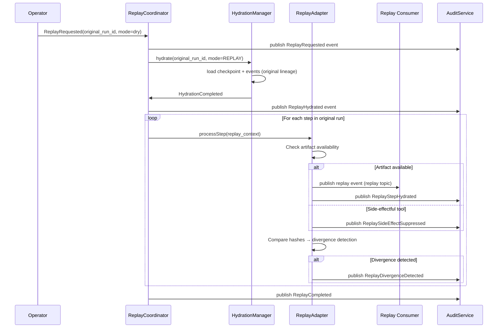
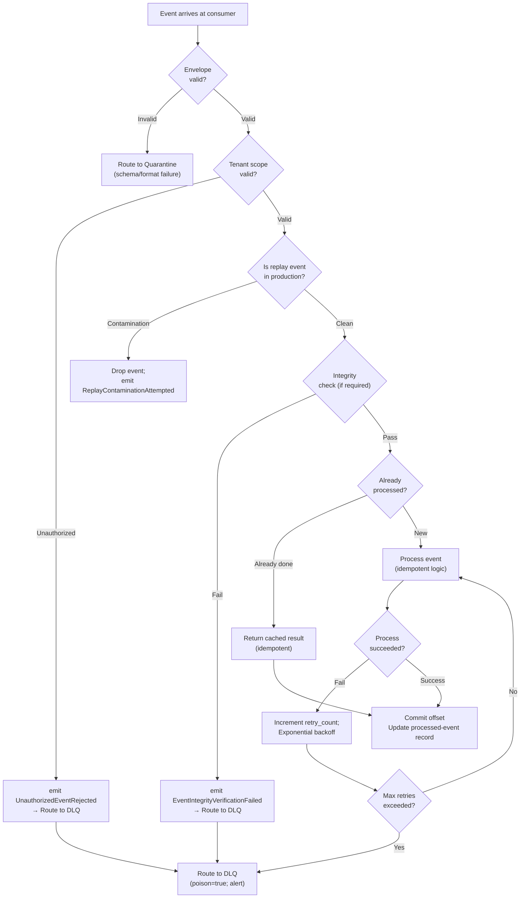
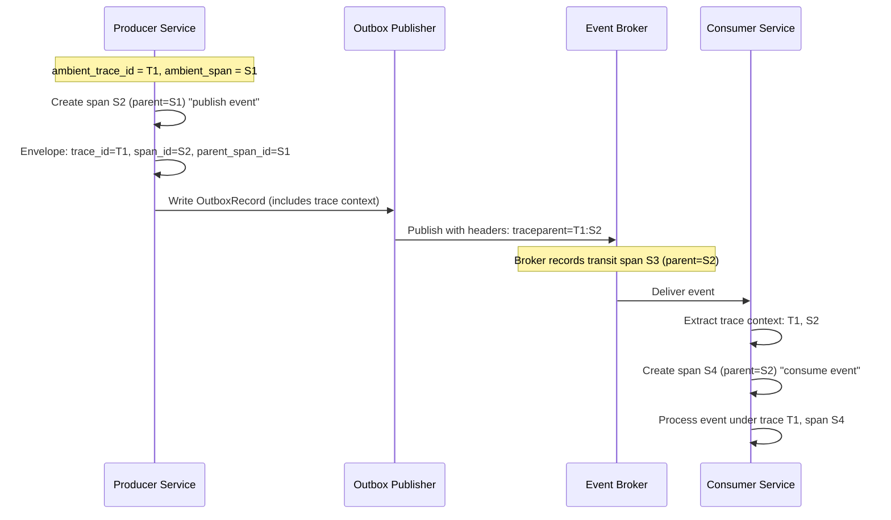
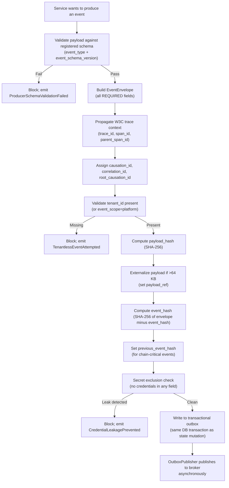
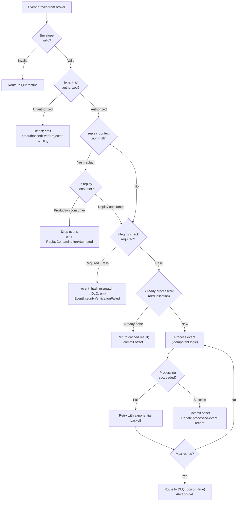
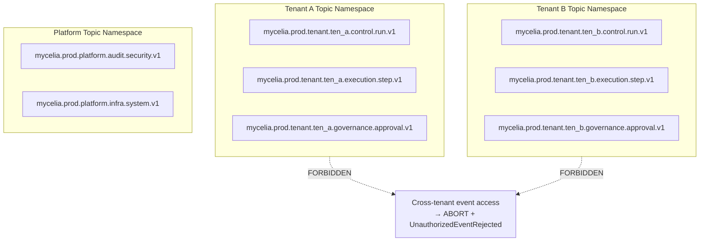
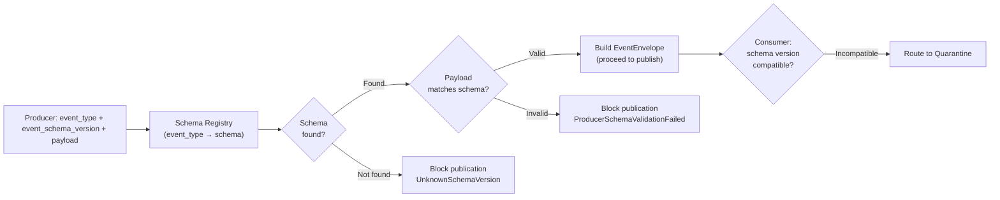

# MYCELIA — 07 Event & Messaging Contracts

---

## Document Metadata

| Field | Value |
|---|---|
| Document Series | MYCELIA Architecture Constitution |
| Document Number | 07 |
| Version | v1.0 |
| Status | Canonical |
| Classification | Core Architecture — Event & Messaging |
| Canonical Role | Defines the canonical event envelope, event categories, event catalog, producer and consumer contracts, delivery semantics, idempotency, replay messaging, DLQ, schema versioning, and integrity contracts for all MYCELIA runtime events |
| Primary Audience | Platform Engineers, Event Architecture Engineers, Runtime Engineers, Integration Engineers, Codex |
| Last Updated | June 2026 |

---

## Table of Contents

1. [Executive Summary](#1-executive-summary)
2. [Event & Messaging Philosophy](#2-event--messaging-philosophy)
3. [Event Contract Scope and Non-Scope](#3-event-contract-scope-and-non-scope)
4. [Canonical Event Envelope](#4-canonical-event-envelope)
5. [Event Identity, Ordering and Causality](#5-event-identity-ordering-and-causality)
6. [Event Categories and Namespaces](#6-event-categories-and-namespaces)
7. [Canonical Event Catalog](#7-canonical-event-catalog)
8. [Producer Contract](#8-producer-contract)
9. [Consumer Contract](#9-consumer-contract)
10. [Messaging Planes and Topics](#10-messaging-planes-and-topics)
11. [Delivery and Processing Semantics](#11-delivery-and-processing-semantics)
12. [Idempotency and Deduplication Semantics](#12-idempotency-and-deduplication-semantics)
13. [Replay Messaging Semantics](#13-replay-messaging-semantics)
14. [Ordering, Partitioning and Causality Rules](#14-ordering-partitioning-and-causality-rules)
15. [DLQ, Quarantine and Poison Event Contract](#15-dlq-quarantine-and-poison-event-contract)
16. [Schema Registry and Versioning Contract](#16-schema-registry-and-versioning-contract)
17. [Event Integrity and Tamper Evidence](#17-event-integrity-and-tamper-evidence)
18. [Observability Context Propagation](#18-observability-context-propagation)
19. [Security and Governance Messaging](#19-security-and-governance-messaging)
20. [Retention, Archival and Compaction](#20-retention-archival-and-compaction)
21. [Event Failure Model](#21-event-failure-model)
22. [MVP Event & Messaging Cut](#22-mvp-event--messaging-cut)
23. [Event & Messaging Diagrams](#23-event--messaging-diagrams)
24. [Event & Messaging Invariants](#24-event--messaging-invariants)
25. [Event & Messaging Anti-Patterns](#25-event--messaging-anti-patterns)
26. [Codex Implementation Guidance](#26-codex-implementation-guidance)
27. [Relationship to Other Documents](#27-relationship-to-other-documents)
28. [Final Event & Messaging Principles](#28-final-event--messaging-principles)

---

## 1. Executive Summary

### 1.1 What Event & Messaging Contracts Define

Document 07 defines the canonical event and messaging contracts for the MYCELIA runtime — the shared operational agreements that govern how every component produces, delivers, receives, and processes events.

An event in MYCELIA is not a log entry, a notification, or a transient signal. An event is an **immutable operational fact** that carries: the identity of what changed, who caused it, when it occurred, under what governance context it was produced, what state transition it represents, and how it relates causally to the events that preceded it. Events are the contract by which the runtime remembers, coordinates, proves, and replays what happened.

This document defines the **contracts** — the shapes, obligations, and invariants — that make events operational rather than informational. The broker topology, partition tuning, throughput benchmarks, and multi-region replication strategies that implement those contracts belong to Document 08.

### 1.2 Why Events Are Operational Contracts, Not Logs

In a governed runtime like MYCELIA, every important state mutation must be represented as a durable, schema-validated, causality-linked event. This is not an architectural preference — it is a structural precondition for:

- **Governance:** A policy decision that is not represented as an event cannot be audited.
- **Replay:** A state transition that did not produce an event cannot be reconstructed.
- **Recovery:** A workflow that has no event history cannot be recovered after failure.
- **Tenant isolation:** A message without `tenant_id` is ungovernable.
- **Observability:** A step execution that did not emit events has no audit trail.

### 1.3 Append-Only Lineage

The MYCELIA event history is append-only. Past events are immutable facts. No event may be modified after publication. No event may be deleted within its retention window. The event history is the authoritative lineage from which any runtime state can be reconstructed.

### 1.4 Relationship to Sibling Documents

Document 07 defines the event contract layer. It depends on: Document 02 (control plane components), Document 03 (domain entities), Document 06 (transactional outbox), Document 12 (observability), Document 14 (tenant isolation), and Document 15 (tool events). Document 07 is consumed by Document 08, which defines the broker topology, partition strategy, backpressure, and operational tuning that implement these contracts.

---

## 2. Event & Messaging Philosophy

### 2.1 Core Concepts

**Event.** An immutable record of a fact that occurred in the runtime. Events represent state transitions that already happened. They cannot be recalled or modified. Publishing an event is a commitment that the described fact occurred.

**Message.** The transport unit that carries an event through the messaging infrastructure. A message is the physical container; the event is the semantic content.

**Command.** An expression of intent to perform an operation. Commands request; events confirm. A command is `StartRun`; the event is `RunCreated`. Commands may be rejected; events record what actually happened.

**Notification.** A non-authoritative signal that something may be of interest. MYCELIA uses events, not notifications, for governance-relevant facts.

**Telemetry event.** An observability signal — trace span, metric point, log line. Telemetry informs operations; it MUST NOT substitute for domain events in governance reasoning.

**Audit record.** A structured, tamper-evident record of a governance-relevant action. Produced from events but persisted in the audit/evidence store (Document 06), not in the event broker alone.

**Transactional outbox.** The mechanism (Document 06 §9) that ensures a state mutation and the intent to publish the corresponding event commit atomically.

### 2.2 Canonical Distinctions

| Concept A | Concept B | Distinction |
|---|---|---|
| **Event** | **Message** | Event = semantic fact; Message = transport envelope |
| **Command** | **Event** | Command = intent/request; Event = fact/result |
| **Domain Event** | **Integration Event** | Domain = internal state change; Integration = external system notification |
| **Runtime Event** | **Telemetry Event** | Runtime = authoritative state change; Telemetry = observability signal |
| **Audit Event** | **Operational Event** | Audit = tamper-evident governance record; Operational = runtime coordination signal |
| **Replay Event** | **Production Event** | Replay = reconstruction in isolated namespace; Production = live system event |
| **Event Payload** | **Artifact Reference** | Payload = embedded data (small); Artifact = content in object storage (large), referenced |
| **Broker Topic** | **Domain Stream** | Topic = broker partition; Domain stream = logical event sequence for an aggregate |
| **Delivery Guarantee** | **Processing Guarantee** | Delivery = broker ensures at-least-once receipt; Processing = consumer ensures exactly-once effect via idempotency |

### 2.3 Why Causality Over Timestamp-Only Ordering

Timestamps alone cannot establish causal order in a distributed system. Clock drift means events from different services may have subtly misordered timestamps while being causally sequential. MYCELIA uses `causation_id` (the event_id of the direct cause) and `correlation_id` (the logical execution group) to establish causal chains independent of clock synchronization.

---

## 3. Event Contract Scope and Non-Scope

### 3.1 What Document 07 Owns

| Responsibility | Description |
|---|---|
| Canonical EventEnvelope | The required structure for all MYCELIA events |
| Event categories | Canonical classification of all event types |
| Event naming convention | How event types are named consistently |
| Event versioning contract | How schemas evolve without breaking consumers |
| Event lifecycle | From intent to publication to consumption to archival |
| Producer obligations | What a producer MUST do before publishing |
| Consumer obligations | What a consumer MUST do before processing |
| Delivery semantics | At-least-once delivery, idempotent processing, exactly-once effects |
| Idempotency semantics | How duplicate events are detected and suppressed |
| Ordering and causality | How causal chains are preserved and reconstructed |
| Replay messaging semantics | How replay events are isolated from production |
| DLQ contract | What happens to events that cannot be processed |
| Schema registry contract | How schemas are registered, versioned, and validated |
| Event integrity | How events are hash-chained for tamper evidence |
| Observability propagation | How trace context flows through event headers |
| Security and governance fields | Required security fields on every event |
| Tenant isolation in messaging | How tenant_id scopes all events |
| MVP messaging contract | What is required for the MVP runtime |
| Messaging invariants and anti-patterns | The normative rules for all event code |

### 3.2 What Document 07 Does Not Own

| Non-Responsibility | Owner Document |
|---|---|
| Broker cluster design, partition count, capacity tuning | Document 08 |
| Multi-region broker replication | Document 08 |
| Throughput benchmarks and performance tuning | Document 08 |
| Backpressure mechanisms | Document 08 / Document 17 |
| Infrastructure deployment | Document 16 |
| SRE runbooks and incident response | Document 17 |
| State persistence and transactional outbox internals | Document 06 |
| Memory event semantics | Document 10 |
| Governance approval internals | Document 11 |
| Observability platform internals | Document 12 |
| Security architecture | Document 13 |
| Tenant isolation design | Document 14 |
| Tool execution contracts | Document 15 |

---

## 4. Canonical Event Envelope

### 4.1 EventEnvelope Field Table

| Field | Type | Required | Nullable | Source | Mutability | Validation Rule |
|---|---|---|---|---|---|---|
| `event_id` | ULID | REQUIRED | No | Producer | Immutable | Globally unique; ULID format preferred |
| `event_type` | String | REQUIRED | No | Producer | Immutable | Registered in schema registry |
| `event_schema_version` | String | REQUIRED | No | Schema registry | Immutable | Semver format (e.g., `1.2.0`) |
| `event_category` | String | REQUIRED | No | Producer | Immutable | Must be a valid EventCategory enum value |
| `event_scope` | String | REQUIRED | No | Producer | Immutable | `tenant` or `platform` |
| `tenant_id` | String | REQUIRED* | No** | Envelope builder | Immutable | *Required unless `event_scope=platform`; **Nullable only for platform-scoped |
| `workspace_id` | String | Conditional | Yes | Envelope builder | Immutable | Required when workspace context exists |
| `project_id` | String | Conditional | Yes | Envelope builder | Immutable | Required when project context exists |
| `workflow_id` | String | Conditional | Yes | Runtime context | Immutable | Required when workflow context exists |
| `workflow_version_id` | String | Conditional | Yes | Runtime context | Immutable | Required when workflow context exists |
| `run_id` | String | Conditional | Yes | GovernedRun | Immutable | Required for all run-scoped events |
| `step_id` | String | Conditional | Yes | StepCoordinator | Immutable | Required for step-scoped events |
| `subject_type` | String | REQUIRED | No | Producer | Immutable | Entity type this event is about |
| `subject_id` | String | REQUIRED | No | Producer | Immutable | Entity ID this event is about |
| `actor_id` | String | REQUIRED | No | Security context | Immutable | Identity that caused this event |
| `producer_service` | String | REQUIRED | No | Producer | Immutable | Service name (e.g., `run-manager`) |
| `producer_version` | String | REQUIRED | No | Producer | Immutable | Semver of producing service |
| `produced_at` | ISO 8601 UTC | REQUIRED | No | Producer | Immutable | When envelope was created |
| `occurred_at` | ISO 8601 UTC | REQUIRED | No | Runtime | Immutable | When the underlying fact occurred |
| `emitted_at` | ISO 8601 UTC | REQUIRED | No | Outbox publisher | Immutable | When published to broker |
| `trace_id` | String | REQUIRED | No | OTel context | Immutable | W3C trace context trace ID |
| `span_id` | String | REQUIRED | No | OTel context | Immutable | W3C trace context span ID |
| `parent_span_id` | String | REQUIRED | Yes | OTel context | Immutable | Parent span; null for root spans |
| `correlation_id` | String | REQUIRED | No | Envelope builder | Immutable | Groups all events in a logical execution |
| `causation_id` | String | REQUIRED | No | Envelope builder | Immutable | event_id of the causing event/command |
| `root_causation_id` | String | REQUIRED | No | Envelope builder | Immutable | event_id of chain origin (e.g., RunRequested) |
| `idempotency_key` | String | REQUIRED | No | Producer | Immutable | Deterministic; based on business context |
| `ordering_key` | String | REQUIRED | No | Producer | Immutable | Defines in-stream ordering (e.g., run_id) |
| `partition_key` | String | REQUIRED | No | Producer | Immutable | Broker partition assignment |
| `data_classification` | String | REQUIRED | No | Security context | Immutable | `public`, `internal`, `confidential`, `restricted` |
| `security_context_ref` | String | REQUIRED | Yes | Security plane | Immutable | Reference ID; NEVER inline secrets |
| `policy_snapshot_id` | String | Conditional | Yes | Policy engine | Immutable | Active PolicySnapshot ID when produced |
| `approval_context_id` | String | Conditional | Yes | Approval engine | Immutable | Approval context reference when relevant |
| `replay_context` | ReplayContext | Conditional | Yes | Replay adapter | Immutable | Non-null only for replay events |
| `payload_ref` | String | Conditional | Yes | Producer | Immutable | Object storage URI for externalized payloads |
| `payload_hash` | String | REQUIRED | No | Producer | Immutable | SHA-256 of payload content |
| `previous_event_hash` | String | Conditional | Yes | Envelope builder | Immutable | Prior event hash for chain-critical events |
| `event_hash` | String | REQUIRED | No | Envelope builder | Immutable | SHA-256 over canonical envelope (excl. itself) |
| `metadata` | Object | REQUIRED | No | Producer | Immutable | Supplementary fields (env, node, flags) |
| `payload` | Object | Conditional | Yes | Producer | Immutable | Inline data; required if payload_ref is absent |

### 4.1.1 Envelope Field Additions and Category Consistency

The EventEnvelope MUST include runtime identity and category consistency fields used by downstream governance, security and audit consumers.

### Required Envelope Addition

Add the following field to the EventEnvelope table:

| Field | Type | Required | Nullable | Source | Mutability | Validation Rule |
|---|---|---|---|---|---|---|
| `runtime_identity_id` | String | REQUIRED | No | RuntimeIdentityService | Immutable | Verified service/workload identity that produced or emitted the event |

### Runtime Identity Rule

`runtime_identity_id` identifies the authenticated workload, service identity or runtime principal responsible for producing or emitting the event.

It is different from:

- `actor_id`, which identifies the user, service actor or triggering principal that caused the action;
- `producer_service`, which identifies the software component name;
- `security_context_ref`, which references the security context record.

### Required Category Addition

Add the following category to the Event Categories and Namespaces table:

| Category | Purpose | Producers | Consumers | Retention | Replay | Ordering Key | Audit | Tenant Scope |
|---|---|---|---|---|---|---|---|---|
| **Audit** | Audit evidence events and evidence bundle lifecycle | AuditService, EvidenceService | AuditStore, ComplianceExport, IncidentReview | Permanent | Yes | tenant_id | Always | Per-tenant |

### Rules

- Every event MUST carry `runtime_identity_id`.
- Security and governance consumers MUST verify `runtime_identity_id` before accepting high-impact events.
- `runtime_identity_id` MUST NOT be user-controlled.
- `actor_id` and `runtime_identity_id` MUST NOT be conflated.
- The `Audit` category MUST be explicit when audit events are referenced in MVP scope, event planes or relationship sections.

### Forbidden Behavior

FORBIDDEN:

- referencing `runtime_identity_id` in security rules without defining it in the EventEnvelope;
- using `producer_service` as a substitute for authenticated runtime identity;
- treating audit events as only a plane without a category;
- allowing Codex to invent separate audit category names such as `AuditEvent`, `Audit/Evidence`, `Evidence`, and `AuditLog` inconsistently.

### 4.2 Envelope Rules

**ENV-01.** No event may be published without `tenant_id` unless `event_scope = platform` is explicitly declared.
**ENV-02.** No event may be published without `event_schema_version`.
**ENV-03.** No event may be published without `correlation_id` and `causation_id`.
**ENV-04.** No event may be published without `event_hash`.
**ENV-05.** Payloads exceeding 64 KB MUST be externalized via `payload_ref`; `payload` MUST be null when `payload_ref` is set.
**ENV-06.** Events MUST NOT contain raw secrets, credentials, API keys, or tokens in any field.
**ENV-07.** `emitted_at` is assigned by the outbox publisher at publication time; it is distinct from `produced_at`.
**ENV-08.** `idempotency_key` MUST be deterministically computable from the event's business context; it MUST NOT be a random value.

### 4.3 ReplayContext Object

When produced in replay mode, `replay_context` MUST be populated:

```typescript
interface ReplayContext {
  replay_id: string;           // ULID of the replay session
  original_run_id: string;     // run_id of the original production run
  original_event_id: string;   // event_id of the corresponding production event
  original_trace_id: string;   // trace_id of the original production trace
  replay_trace_id: string;     // New isolated trace_id for replay
  replay_mode: 'dry' | 'simulation';
  suppression_active: boolean;
}
```

### 4.4 Canonical EventEnvelope — JSON Example

```json
{
  "event_id": "01J3K5M9XBQ4ESNTA2NVWZ8GT7",
  "event_type": "StepSucceeded",
  "event_schema_version": "1.0.0",
  "event_category": "Step",
  "event_scope": "tenant",
  "tenant_id": "trk_01J3K5M9XBQ4ESNTA2NV8G4Z9A",
  "workspace_id": "ws_finance_ops",
  "project_id": "proj_ap_invoicing",
  "workflow_id": "wf_invoice_processing",
  "workflow_version_id": "wfv_invoice_v3",
  "run_id": "run_01J3K5M9XBQ4ESNTA2NV000001",
  "step_id": "step_validate_invoice",
  "subject_type": "StepExecution",
  "subject_id": "stx_01J3K5M9XBQ4ESNTA2NV000042",
  "actor_id": "svc_step-coordinator",
  "producer_service": "step-coordinator",
  "producer_version": "1.4.2",
  "produced_at": "2026-06-03T14:32:18.441Z",
  "occurred_at": "2026-06-03T14:32:18.390Z",
  "emitted_at": "2026-06-03T14:32:18.512Z",
  "trace_id": "4bf92f3577b34da6a3ce929d0e0e4736",
  "span_id": "00f067aa0ba902b7",
  "parent_span_id": "b7ad6b7169203331",
  "correlation_id": "corr_run_01J3K5M9XBQ4ESNTA2NV000001",
  "causation_id": "01J3K5M9XBQ4ESNTA2NVWZ8AA1",
  "root_causation_id": "01J3K5M9XBQ4ESNTA2NVWZ8000",
  "idempotency_key": "stx_01J3K5M9XBQ4ESNTA2NV000042::succeeded",
  "ordering_key": "run_01J3K5M9XBQ4ESNTA2NV000001",
  "partition_key": "run_01J3K5M9XBQ4ESNTA2NV000001",
  "data_classification": "internal",
  "security_context_ref": "sec_ctx_01J3K5M9XBQ4ESNTA2NV000099",
  "policy_snapshot_id": "ps_01J3K5M9XBQ4ESNTA2NV000010",
  "approval_context_id": null,
  "replay_context": null,
  "payload_ref": null,
  "payload_hash": "e3b0c44298fc1c149afbf4c8996fb924...",
  "previous_event_hash": "a665a45920422f9d417e4867efdc4fb8...",
  "event_hash": "2fd4e1c67a2d28fced849ee1bb76e739...",
  "metadata": {
    "environment": "production",
    "runtime_node": "worker-eu-west-03",
    "schema_fingerprint": "sha256:abc123def456..."
  },
  "payload": {
    "step_execution_id": "stx_01J3K5M9XBQ4ESNTA2NV000042",
    "duration_ms": 2847,
    "output_artifact_id": "art_01J3K5M9XBQ4ESNTA2NV000055",
    "output_schema_ref": "schema:invoice-validation-result:1.0",
    "validation_score": 0.98
  }
}
```

---

## 5. Event Identity, Ordering and Causality

### 5.1 Identity Fields

**event_id.** Globally unique identifier for each event. ULID format preferred (lexicographically sortable). UUID v4 acceptable. `event_id` MUST be globally unique across all tenants, environments, and time.

**correlation_id.** Groups all events belonging to a single logical execution flow — typically a GovernedRun. Set at run start and propagated to all events in that run.

**causation_id.** The `event_id` of the event or command that directly caused this event. Enables causal chain traversal backward to any origin.

**root_causation_id.** The `event_id` of the root event that started the entire causal chain — typically `RunRequested`. Groups all causally related events regardless of depth.

**idempotency_key.** A deterministic, business-meaningful key for consumer deduplication. MUST be derivable from business context alone, not from the ULID.

### 5.1.1 Root Causation and Command-Origin Semantics

The first event in a causal chain MUST NOT use its own `event_id` as `causation_id`.

Root events are caused by an external command, API request, scheduler trigger, webhook, operator action or system trigger. That triggering input MUST be represented explicitly.

### Required Root Fields

For root events such as `RunRequested`, MYCELIA MUST include:

| Field | Meaning |
|---|---|
| `trigger_id` | Stable identifier of the external command, request, webhook, scheduler tick or operator action that caused the root event |
| `trigger_type` | Type of root trigger: `api_request`, `scheduler`, `webhook`, `operator_action`, `system_recovery`, `replay_request` |
| `causation_id` | MUST equal `trigger_id` for root events |
| `root_causation_id` | MUST equal the root event's own `event_id` after the event is created |

### Root Event Rule

For the first event in a chain:

```text
causation_id = trigger_id
root_causation_id = event_id
```

For all later events:

```text
causation_id = previous_event.event_id
root_causation_id = root_event.event_id
```

### Required Envelope Addition

The EventEnvelope SHOULD add the following fields:

| Field | Type | Required | Nullable | Source | Mutability | Validation Rule |
|---|---|---|---|---|---|---|
| `trigger_id` | String | Conditional | Yes | RuntimeAPI / Scheduler / Webhook / Operator | Immutable | Required for root events |
| `trigger_type` | String | Conditional | Yes | RuntimeAPI / Scheduler / Webhook / Operator | Immutable | Required for root events; must be enum |

### Rules

- Root events MUST NOT set `causation_id` to their own `event_id`.
- Root events MUST have `trigger_id` and `trigger_type`.
- Non-root events MUST set `causation_id` to the direct causing event_id.
- `root_causation_id` MUST point to the first event in the event chain.
- Causal reconstruction MUST be able to reach either a prior event or an explicit root trigger.

### Diagram Correction

Replace any diagram label that says:

```text
RunRequested
(causation=trigger_id)
```

with:

```text
RunRequested
(causation=trigger_id, root_causation=RunRequested.event_id)
```

### Forbidden Behavior

FORBIDDEN:

- setting `causation_id` equal to the same event's `event_id`;
- creating root events without trigger identity;
- generating a fake causation_id when no trigger is known;
- losing the original API request, webhook, scheduler or operator action that caused the event;
- allowing Codex to represent root causation as circular self-reference.

### 5.2 Temporal Fields

**occurred_at.** When the underlying fact occurred. Set by the component that observed the fact.

**produced_at.** When the producer created the EventEnvelope record.

**emitted_at.** When the outbox publisher sent the event to the broker. Always after `produced_at`.

### 5.3 Causality Diagram

```mermaid
flowchart LR
    RC["RunRequested\n(root_causation=self)"]
    RE["RuntimeEnvelopeCreated\n(causation=RunRequested)"]
    PS["PolicySnapshotBound\n(causation=RuntimeEnvelopeCreated)"]
    CR["RunCreated\n(causation=PolicySnapshotBound)"]
    SR["StepReady\n(causation=RunCreated)"]
    SRun["StepRunning\n(causation=StepReady)"]
    TI["ToolInvocationRequested\n(causation=StepRunning)"]
    TS["ToolSucceeded\n(causation=ToolInvocationRequested)"]
    SS["StepSucceeded\n(causation=ToolSucceeded)"]
    
    RC --> RE --> PS --> CR --> SR --> SRun --> TI --> TS --> SS
```



All events in this chain share the same `correlation_id` and `root_causation_id`.

### 5.4 Rules

**CAU-01.** `event_id` is globally unique.
**CAU-02.** `causation_id` MUST link to the `event_id` of the causing event or command.
**CAU-03.** `correlation_id` groups all events of a logical execution flow.
**CAU-04.** `ordering_key` defines stream-level ordering; events with different ordering_key values are unordered relative to each other.
**CAU-05.** Timestamp alone is NOT sufficient for causal ordering.
**CAU-06.** Event sequence is authoritative only within a partition defined by `ordering_key`.

---

## 6. Event Categories and Namespaces

| Category | Purpose | Producers | Consumers | Retention | Replay | Ordering Key | Audit | Tenant Scope |
|---|---|---|---|---|---|---|---|---|
| **Workflow** | Workflow lifecycle (definition, versioning) | WorkflowService | RuntimeDispatcher, AuditService | Permanent | Yes | workflow_id | Standard | Per-tenant |
| **Runtime** | GovernedRun lifecycle | RunManager | StepCoordinator, Projections | Permanent | Yes | run_id | High | Per-tenant |
| **State Transition** | State machine transitions for all entities | StateTransitionCoordinator | AuditService, Projections | Permanent | Yes | entity_id | Always | Per-tenant |
| **Step** | StepExecution lifecycle | StepCoordinator | RunManager, Projections | Permanent | Yes | run_id | Standard | Per-tenant |
| **Cognitive** | Model invocations, context assembly | AgentRuntime, ContextAssemblyGateway | AuditService, ReplayAdapter | Permanent | Yes | run_id | High | Per-tenant |
| **Agent** | Agent instance and execution lifecycle | AgentExecutionGateway | AgentCoordinator, AuditService | Permanent | Yes | run_id | Standard | Per-tenant |
| **Tool** | Tool invocations, side effects | ToolInvocationGateway | StepCoordinator, AuditService | Permanent | Yes (intent); suppressed (exec) | run_id | Always | Per-tenant |
| **Approval** | Approval requests and decisions | ApprovalGateCoordinator | WorkflowEngine, AuditService | Permanent | Yes | approval_id | Always | Per-tenant |
| **Policy/Governance** | Policy evaluations, budget tracking | PolicyDecisionGateway, BudgetManager | AuditService, ControlPlane | Permanent | Yes | run_id | Always | Per-tenant |
| **Memory/Context** | Context snapshots, memory reads/writes | ContextAssemblyGateway, MemoryAccessGateway | AuditService, ReplayAdapter | Long | Yes (snapshots) | run_id | Conditional | Per-tenant |
| **Replay** | Replay lifecycle and divergences | ReplayCoordinator | ReplayConsumers, AuditService | Medium | N/A | replay_id | High | Per-tenant |
| **Observability** | Operational telemetry signals | All services | ObservabilityPlatform | Operational | Partial | trace_id | No | Per-tenant |
| **Security** | Security incidents, violations | SecurityPlane, AuditService | IncidentResponse | Permanent | Yes | tenant_id | Always | Per-tenant |
| **Budget/Quota** | Token/cost/iteration budgets | CognitiveBudgetManager | PolicyEngine, Alerting | Long | Yes | tenant_id | High | Per-tenant |
| **Integration** | External connector events | Connector workers | IntegrationService | Configurable | Conditional | connector_id | High | Per-tenant |
| **Persistence** | Outbox, checkpoint, snapshot events | StateTransitionCoordinator, CheckpointCoordinator | OutboxPublisher, HydrationManager | Long | Yes | entity_id | Conditional | Per-tenant |
| **System/Infrastructure** | Platform infrastructure events | Platform | Ops, SRE | Operational | No | service_id | Conditional | Platform |

---

## 7. Canonical Event Catalog

### 7.1 Workflow Events

| Event Type | Producer | Consumers | Subject Type | Required Payload Fields | Audit | Replay | Retention |
|---|---|---|---|---|---|---|---|
| `WorkflowDraftCreated` | WorkflowService | AuditService, UI | Workflow | workflow_id, creator_id | Standard | Yes | Permanent |
| `WorkflowVersionPublished` | WorkflowService | RuntimeDispatcher, AuditService | WorkflowVersion | workflow_id, version_id, published_by, schema_hash | High | Yes | Permanent |
| `WorkflowVersionDeprecated` | WorkflowService | RuntimeDispatcher, AuditService | WorkflowVersion | workflow_id, version_id, deprecated_by | High | Yes | Permanent |

### 7.2 GovernedRun Events

| Event Type | Producer | Consumers | Subject Type | Required Payload Fields | Audit | Replay | Retention |
|---|---|---|---|---|---|---|---|
| `RunRequested` | RuntimeAPI | RunManager | RunRequest | workflow_id, workflow_version_id, actor_id | High | Yes | Permanent |
| `TenantResolved` | RunManager | RuntimeEnvelopeBuilder | GovernedRun | run_id, tenant_id | Standard | Yes | Permanent |
| `RuntimeEnvelopeCreated` | RuntimeEnvelopeBuilder | PolicyEngine, RunManager | GovernedRun | run_id, envelope_id, tenant_id, workflow_version_id | High | Yes | Permanent |
| `WorkflowVersionResolved` | RunManager | PolicyEngine | GovernedRun | run_id, workflow_version_id | Standard | Yes | Permanent |
| `PolicySnapshotBound` | PolicyEngine | RunManager | GovernedRun | run_id, policy_snapshot_id, bound_at | Always | Yes | Permanent |
| `ContextInitialized` | ContextAssemblyGateway | RunManager | GovernedRun | run_id, context_snapshot_id, context_hash | Standard | Yes | Permanent |
| `RunCreated` | RunManager | StepCoordinator, AuditService, Projections | GovernedRun | run_id, workflow_version_id, actor_id, policy_snapshot_id | High | Yes | Permanent |
| `RunScheduled` | RuntimeScheduler | Dispatcher | GovernedRun | run_id, scheduled_at, priority | Standard | Yes | Permanent |
| `RunPaused` | ControlPlane | NotificationService, AuditService | GovernedRun | run_id, paused_by, pause_reason | High | Yes | Permanent |
| `RunResumed` | ControlPlane | Dispatcher, AuditService | GovernedRun | run_id, resumed_by | High | Yes | Permanent |
| `RunSucceeded` | RunManager | AuditService, Projections, NotificationService | GovernedRun | run_id, completed_at, output_artifact_ids | High | Yes | Permanent |
| `RunFailed` | RunManager | AuditService, AlertingService, Projections | GovernedRun | run_id, failure_class, failure_reason, last_step_id | Always | Yes | Permanent |
| `RunCancelled` | ControlPlane | AuditService, Projections | GovernedRun | run_id, cancelled_by, cancellation_reason | Always | Yes | Permanent |
| `RunArchived` | RetentionService | AuditService | GovernedRun | run_id, archived_at, archive_location | Standard | No | Permanent |

### 7.3 Step Events

| Event Type | Producer | Consumers | Subject Type | Required Payload Fields | Audit | Replay | Retention |
|---|---|---|---|---|---|---|---|
| `StepReady` | StepCoordinator | Dispatcher | StepExecution | run_id, step_id, step_type | Standard | Yes | Permanent |
| `StepRunning` | StepCoordinator | AuditService, Projections | StepExecution | run_id, step_id, worker_id | Standard | Yes | Permanent |
| `StepSucceeded` | StepCoordinator | RunManager, AuditService, Projections | StepExecution | run_id, step_id, output_artifact_id, duration_ms | High | Yes | Permanent |
| `StepFailed` | StepCoordinator | RunManager, AlertingService, AuditService | StepExecution | run_id, step_id, failure_class, error_detail | Always | Yes | Permanent |
| `StepRetryScheduled` | StepCoordinator | Dispatcher, AuditService | StepExecution | run_id, step_id, attempt_number, retry_at | Standard | Yes | Permanent |

### 7.4 Tool Events

| Event Type | Producer | Consumers | Subject Type | Required Payload Fields | Audit | Replay | Retention |
|---|---|---|---|---|---|---|---|
| `ToolInvocationRequested` | ToolIntentMediator | ToolInvocationGateway | ToolInvocation | tool_name, tool_version, step_id, idempotency_key, side_effect_class | Always | Yes (intent) | Permanent |
| `ToolPolicyEvaluated` | PolicyDecisionGateway | ToolInvocationGateway | ToolInvocation | tool_invocation_id, decision, policy_snapshot_id | Always | Yes | Permanent |
| `ToolApprovalRequired` | ToolInvocationGateway | ApprovalGateCoordinator | ToolInvocation | tool_invocation_id, approval_context_id, side_effect_class | Always | Yes | Permanent |
| `ToolDispatched` | ToolInvocationGateway | ToolWorker, AuditService | ToolInvocation | tool_invocation_id, worker_id, idempotency_key | Always | Suppressed | Permanent |
| `ToolSucceeded` | ToolWorker | StepCoordinator, AuditService | ToolInvocation | tool_invocation_id, output_artifact_id, duration_ms, side_effect_confirmed | Always | Hydrated | Permanent |
| `ToolFailed` | ToolWorker | StepCoordinator, AlertingService | ToolInvocation | tool_invocation_id, failure_class, error_detail | Always | Hydrated | Permanent |
| `ToolReplaySuppressed` | ReplayAdapter | AuditService | ToolInvocation | original_tool_invocation_id, replay_id, suppression_reason | Always | IS replay | Medium |

### 7.5 Agent and Cognitive Events

| Event Type | Producer | Consumers | Subject Type | Required Payload Fields | Audit | Replay | Retention |
|---|---|---|---|---|---|---|---|
| `AgentExecutionStarted` | AgentExecutionGateway | AuditService, Projections | AgentExecution | agent_execution_id, agent_version_id, step_id, budget_snapshot | High | Yes | Permanent |
| `AgentOutputProduced` | AgentRuntime | StructuredOutputValidator | AgentExecution | agent_execution_id, output_schema_ref, output_hash, refusal_detected | Standard | Yes | Permanent |
| `AgentOutputValidated` | StructuredOutputValidator | OutputPromotionController | AgentExecution | agent_execution_id, validation_status, schema_ref | Standard | Yes | Permanent |
| `AgentOutputRejected` | StructuredOutputValidator | CognitiveErrorRouter | AgentExecution | agent_execution_id, rejection_reason, error_class | Always | Yes | Permanent |
| `CognitiveInvocationStarted` | AgentRuntime | AuditService | CognitiveInvocation | cognitive_invocation_id, context_snapshot_id, prompt_hash | High | Yes | Permanent |
| `CognitiveInvocationSucceeded` | ModelProviderGateway | AgentRuntime | CognitiveInvocation | cognitive_invocation_id, model_name, input_tokens, output_tokens, cost_usd | High | Hydrated | Permanent |
| `CognitiveInvocationFailed` | ModelProviderGateway | CognitiveErrorRouter | CognitiveInvocation | cognitive_invocation_id, failure_class, error_detail | Always | Hydrated | Permanent |

### 7.6 Approval Events

| Event Type | Producer | Consumers | Subject Type | Required Payload Fields | Audit | Replay | Retention |
|---|---|---|---|---|---|---|---|
| `ApprovalRequested` | ApprovalGateCoordinator | NotificationService, AuditService | ApprovalRequest | approval_request_id, run_id, step_id, requested_by, deadline | Always | Yes | Permanent |
| `ApprovalGranted` | ApprovalGateCoordinator | WorkflowEngine, AuditService | ApprovalRequest | approval_request_id, granted_by, granted_at, approval_record_id | Always | Yes | Permanent |
| `ApprovalDenied` | ApprovalGateCoordinator | WorkflowEngine, AuditService | ApprovalRequest | approval_request_id, denied_by, denial_reason | Always | Yes | Permanent |
| `ApprovalTimedOut` | ApprovalGateCoordinator | EscalationService, AuditService | ApprovalRequest | approval_request_id, timed_out_at | Always | Yes | Permanent |
| `ApprovalEscalated` | EscalationService | NotificationService, AuditService | ApprovalRequest | approval_request_id, escalated_to, escalated_at | Always | Yes | Permanent |

### 7.7 Policy and Governance Events

| Event Type | Producer | Consumers | Subject Type | Required Payload Fields | Audit | Replay | Retention |
|---|---|---|---|---|---|---|---|
| `PolicyEvaluated` | PolicyDecisionGateway | AuditService | PolicyEvaluation | policy_snapshot_id, subject_type, subject_id, decision | High | Yes | Permanent |
| `PolicyDenied` | PolicyDecisionGateway | AuditService, AlertingService | PolicyEvaluation | policy_snapshot_id, subject_id, denial_reason | Always | Yes | Permanent |
| `BudgetReserved` | CognitiveBudgetManager | AuditService | RuntimeBudget | budget_type, amount, agent_execution_id, run_id | Standard | Yes | Long |
| `BudgetConsumed` | CognitiveBudgetManager | AuditService, QuotaManager | RuntimeBudget | budget_type, amount_consumed, cumulative_consumed | Standard | Yes | Long |
| `BudgetExceeded` | CognitiveBudgetManager | CognitiveErrorRouter, AlertingService | RuntimeBudget | budget_type, limit, consumed, agent_execution_id | Always | Yes | Permanent |

### 7.8 Memory and Context Events

| Event Type | Producer | Consumers | Subject Type | Required Payload Fields | Audit | Replay | Retention |
|---|---|---|---|---|---|---|---|
| `ContextSnapshotCreated` | ContextSnapshotWriter | AuditService, ReplayAdapter | ContextSnapshot | context_snapshot_id, context_hash, step_id, run_id | High | Yes | Permanent |
| `MemoryReadRequested` | MemoryAccessGateway | AuditService | RetrievalSession | retrieval_session_id, namespace_id, query_hash, tenant_id | Conditional | Yes | Long |
| `MemoryReadGranted` | MemoryAccessGateway | ContextAssemblyGateway | RetrievalSession | retrieval_session_id, result_count | Standard | Yes | Long |
| `MemoryWriteRequested` | MemoryAccessGateway | PolicyDecisionGateway | MemoryObject | memory_object_id, namespace_id, tenant_id | High | Suppressed | Long |
| `MemoryWriteCommitted` | MemoryAccessGateway | AuditService | MemoryObject | memory_object_id, provenance_record_id, content_hash | High | Yes | Long |
| `MemoryWriteDenied` | MemoryAccessGateway | AuditService, AlertingService | MemoryObject | namespace_id, denial_reason | Always | Yes | Long |

### 7.9 Replay Events

| Event Type | Producer | Consumers | Subject Type | Required Payload Fields | Audit | Replay | Retention |
|---|---|---|---|---|---|---|---|
| `ReplayRequested` | ReplayCoordinator | HydrationManager, AuditService | ReplayState | replay_id, original_run_id, triggered_by, replay_mode | Always | N/A | Medium |
| `ReplayHydrated` | HydrationManager | ReplayExecutor, AuditService | ReplayState | replay_id, hydration_session_id, events_applied_count | High | N/A | Medium |
| `ReplayStepHydrated` | CognitiveReplayAdapter | AuditService | ReplayHydrationRecord | replay_id, step_id, artifact_source, prompt_hash_match | Standard | N/A | Medium |
| `ReplaySideEffectSuppressed` | CognitiveReplayAdapter | AuditService | ReplaySuppressionRecord | replay_id, step_id, operation_type, suppression_reason | Always | N/A | Medium |
| `ReplayDivergenceDetected` | CognitiveReplayAdapter | AuditService, AlertingService | ReplayDivergence | replay_id, step_id, divergence_type, original_hash, replay_hash | Always | N/A | Medium |
| `ReplayCompleted` | ReplayCoordinator | AuditService | ReplayState | replay_id, total_divergences, evidence_bundle_id | Always | N/A | Medium |
| `ReplayFailed` | ReplayCoordinator | AuditService, AlertingService | ReplayState | replay_id, failure_class, failure_reason | Always | N/A | Medium |

### 7.10 Security Events

| Event Type | Producer | Consumers | Subject Type | Required Payload Fields | Audit | Replay | Retention |
|---|---|---|---|---|---|---|---|
| `TenantBoundaryViolationDetected` | Any enforcement component | SecurityIncidentService, AuditService | SecurityIncident | violating_entity_id, source_tenant_id, target_tenant_id | Always | N/A | Permanent |
| `UnauthorizedEventRejected` | Event consumer | AuditService | RejectedEvent | rejected_event_id, rejection_reason, detecting_consumer | Always | N/A | Permanent |
| `EventIntegrityVerificationFailed` | HydrationManager / Consumer | AuditService, AlertingService | EventIntegrity | event_id, expected_hash, computed_hash | Always | N/A | Permanent |
| `CredentialLeakagePrevented` | PromptPolicyFilter | SecurityIncidentService | SecurityIncident | detection_context, detection_rule, agent_execution_id | Always | N/A | Permanent |

### 7.11 Persistence Events

| Event Type | Producer | Consumers | Subject Type | Required Payload Fields | Audit | Replay | Retention |
|---|---|---|---|---|---|---|---|
| `StateTransitionCommitted` | StateTransitionCoordinator | OutboxPublisher, AuditService | StateTransition | entity_type, entity_id, from_state, to_state, causation_id | High | Yes | Permanent |
| `OutboxRecordCreated` | StateTransitionCoordinator | OutboxPublisher | OutboxRecord | outbox_id, event_type, priority, tenant_id | Standard | N/A | Short |
| `OutboxRecordPublished` | OutboxPublisher | AuditService | OutboxRecord | outbox_id, published_at, broker_offset | Standard | N/A | Short |
| `OutboxRecordPoisoned` | OutboxPublisher | AlertingService, AuditService | OutboxRecord | outbox_id, failure_reason, retry_count | Always | N/A | Long |
| `CheckpointCreated` | CheckpointCoordinator | AuditService, HydrationService | Checkpoint | checkpoint_id, entity_id, event_offset, state_hash | Standard | Yes | Long |
| `SnapshotCreated` | SnapshotCoordinator | AuditService, HydrationService | SnapshotManifest | snapshot_id, run_id, event_offset, snapshot_hash | High | Yes | Long |
| `HydrationStarted` | HydrationManager | AuditService | HydrationSession | hydration_session_id, run_id, hydration_type | Standard | N/A | Medium |
| `HydrationFailed` | HydrationManager | AlertingService, AuditService | HydrationSession | hydration_session_id, failure_class | Always | N/A | Medium |
| `HydrationCompleted` | HydrationManager | AuditService | HydrationSession | hydration_session_id, events_applied, final_state_hash | High | N/A | Medium |

---

## 8. Producer Contract

### 8.1 Producer Protocol

Every event producer MUST comply with the following protocol:

1. **Schema validation.** Validate event payload against registered schema BEFORE envelope construction. Block publication on failure.
2. **Envelope construction.** Construct full EventEnvelope with all REQUIRED fields from active runtime context.
3. **Context propagation.** Read ambient W3C trace context. Assign `trace_id`, `span_id`, `parent_span_id`.
4. **Causality assignment.** Assign `causation_id`, `correlation_id`, `root_causation_id` from runtime context.
5. **Tenant validation.** Verify `tenant_id` is present. Block if absent (unless `event_scope=platform`).
6. **Payload hashing.** Compute SHA-256 of canonical JSON payload serialization. Externalize if >64 KB.
7. **Event hashing.** Compute SHA-256 over canonical serialization of entire envelope (excluding `event_hash` itself).
8. **Previous event hash.** For chain-critical events, retrieve and set `previous_event_hash` from prior event in stream.
9. **Transactional outbox write.** For state-mutation events, write to outbox in the SAME database transaction as the state mutation.
10. **Secret exclusion check.** Verify no raw credentials in any envelope field. Fail if detected.

### 8.2 Producer Checklist

| # | Obligation | Failure Behavior |
|---|---|---|
| 1 | Schema validated | Block; emit ProducerSchemaValidationFailed |
| 2 | Full envelope with all REQUIRED fields | Block; enforce |
| 3 | `tenant_id` present (or `event_scope=platform`) | Block; emit TenantlessEventAttempted |
| 4 | `correlation_id` and `causation_id` present | Block; enforce |
| 5 | `payload_hash` computed | Block; enforce |
| 6 | `event_hash` computed | Block; enforce |
| 7 | Written to transactional outbox (for state-mutation events) | Block; only StateTransitionCoordinator may bypass outbox |
| 8 | No raw secrets in any field | Block; security alert |
| 9 | `idempotency_key` assigned deterministically | Block; enforce |
| 10 | W3C trace context propagated | Warn; operational degradation |

---

## 9. Consumer Contract

### 9.1 Consumer Protocol

1. **Envelope validation.** Validate completeness of received EventEnvelope.
2. **Schema version check.** Look up `event_type` + `event_schema_version` in schema registry. Route to quarantine if unknown.
3. **Tenant scope verification.** Verify `tenant_id` matches consumer's authorized scope. Reject otherwise.
4. **Replay context check.** If `replay_context` is non-null: production consumers MUST NOT process. Route to replay consumer.
5. **Integrity verification.** For replay-critical and audit-critical events, verify `event_hash`. Route to DLQ on failure.
6. **Deduplication check.** Look up `event_id` or `idempotency_key` in processed-event table. Return cached result if already COMPLETED.
7. **Idempotent processing.** Execute such that duplicate delivery produces the same outcome as single delivery.
8. **Commit offset ONLY after processing.** Never before.
9. **Processing telemetry.** Emit consumer span with `event_id`, `tenant_id`, `run_id`, `correlation_id`, outcome.
10. **Route invalid events.** Schema failures, integrity failures, and consumer processing failures route to DLQ/quarantine.
11. **Never mutate state directly.** Only StateTransitionCoordinator may mutate authoritative state.

### 9.2 Consumer Checklist

| # | Obligation | Failure Behavior |
|---|---|---|
| 1 | Validate envelope completeness | Route to quarantine |
| 2 | Check schema version compatibility | Route to quarantine |
| 3 | Verify tenant_id | Reject; emit UnauthorizedEventRejected |
| 4 | Check replay_context — reject replay in production consumers | Drop; do not process |
| 5 | Verify event_hash (when required) | DLQ; emit EventIntegrityVerificationFailed |
| 6 | Check processed-event table | Return cached result; skip processing |
| 7 | Process idempotently | Side-effect deduplication required |
| 8 | Commit offset after processing | Never before |
| 9 | Emit consumer span | Warn on failure; non-blocking |
| 10 | Route invalid events to DLQ/quarantine | Never swallow silently |

---

## 10. Messaging Planes and Topics

### 10.1 Messaging Planes

| Plane | Purpose | Event Categories | Criticality | Retention | Isolation | Replayable | Ordering |
|---|---|---|---|---|---|---|---|
| **Control Plane** | Run orchestration, runtime coordination | Workflow, Runtime, State Transition | Critical | Permanent | Strict | Yes | Per run_id |
| **Execution Plane** | Step, cognitive, agent execution | Step, Cognitive, Agent | High | Permanent | Strict | Yes | Per run_id |
| **Tool Plane** | Tool invocations, side effects, approvals | Tool, Approval | Critical | Permanent | Strict | Partial (intent yes; exec suppressed) | Per run_id |
| **Governance Plane** | Policy, budget, approval decisions | Policy/Governance, Budget | Critical | Permanent | Strict | Yes | Per tenant_id |
| **Memory Plane** | Context snapshots, memory ops | Memory/Context | High | Long | Per namespace | Yes (snapshots only) | Per run_id |
| **Replay Plane** | All replay events | Replay | High | Medium | Strictly isolated from production | N/A | Per replay_id |
| **Audit/Evidence Plane** | Governance evidence, security events | Security, Audit | Critical | Permanent | Strict; immutable | Yes | Per tenant_id |
| **Observability Plane** | Traces, metrics, diagnostics | Observability, System | Medium | Operational | Per environment | Partial | Per trace_id |
| **Integration Plane** | External connector events | Integration | High | Configurable | Per connector | Conditional | Per connector_id |

### 10.2 Topic Naming Convention

```
mycelia.<environment>.<tenant_scope>.<plane>.<category>.<version>
```

Examples:
```
mycelia.prod.tenant.ten_acme_corp.control.run.v1
mycelia.prod.tenant.ten_acme_corp.execution.step.v1
mycelia.prod.tenant.ten_acme_corp.tool.tool.v1
mycelia.prod.tenant.ten_acme_corp.governance.approval.v1
mycelia.replay.tenant.ten_acme_corp.replay.replay.v1
mycelia.prod.platform.audit.security.v1
```

**TOPIC-01.** Production and replay topics MUST be separate.
**TOPIC-02.** Governance and audit events MUST have priority delivery handling.
**TOPIC-03.** Observability events MAY use different (shorter) retention.
**TOPIC-04.** Topic names MUST NOT contain PII, customer names, or secrets.
**TOPIC-05.** Tenant partitioning MUST be explicit.

### 10.3 Tenant Route Key and Topic Name Privacy

Topic names MUST NOT expose customer-identifying information.

MYCELIA uses an opaque `tenant_route_key` for topic routing, not a human-readable tenant name.

### Tenant Route Key

`tenant_route_key` is a non-human-readable routing alias derived from tenant identity.

Examples:

```text
trk_01J3K5M9XBQ4ESNTA2NV8G4Z9A
trk_8f3a91c7e2b44c12
```

Forbidden examples:

```text
ten_acme_corp
tenant_bank_angola
tenant_customer_email_domain
```

### Corrected Topic Naming Convention

```text
mycelia.<environment>.<scope>.<tenant_route_key>.<plane>.<category>.<version>
```

Examples:

```text
mycelia.prod.tenant.trk_01J3K5M9XBQ4ESNTA2NV8G4Z9A.control.run.v1
mycelia.prod.tenant.trk_01J3K5M9XBQ4ESNTA2NV8G4Z9A.execution.step.v1
mycelia.prod.tenant.trk_01J3K5M9XBQ4ESNTA2NV8G4Z9A.tool.tool.v1
mycelia.prod.tenant.trk_01J3K5M9XBQ4ESNTA2NV8G4Z9A.governance.approval.v1
mycelia.replay.tenant.trk_01J3K5M9XBQ4ESNTA2NV8G4Z9A.replay.replay.v1
mycelia.prod.platform.audit.security.v1
```

### Rules

- Topic names MUST NOT contain customer names.
- Topic names MUST NOT contain emails, domains, account numbers, project names or human-readable tenant labels.
- `tenant_id` MAY remain inside the encrypted or access-controlled event envelope.
- Broker routing SHOULD use `tenant_route_key`.
- Mapping from `tenant_id` to `tenant_route_key` MUST be stored in tenant configuration and protected by tenant boundary controls.
- DLQ and replay topics MUST use the same opaque routing key strategy.

### Forbidden Behavior

FORBIDDEN:

- embedding customer names in broker topics;
- embedding PII in topic names;
- using customer domain names as topic routing keys;
- allowing Codex to generate topics from tenant display names;
- mixing human-readable tenant labels into replay, DLQ or audit topic names.

---

## 11. Delivery and Processing Semantics

### 11.1 At-Least-Once Delivery

MYCELIA adopts at-least-once delivery as the baseline broker guarantee. Consumers MUST NOT assume each event is received exactly once. Duplicate delivery is expected and handled by idempotent consumer design.

### 11.2 Exactly-Once Effect Through Idempotency

MYCELIA achieves exactly-once **effects** through:
1. **Durable event intent (transactional outbox).** Publication intent commits atomically with state mutation.
2. **Idempotent consumers.** `idempotency_key` detects and suppresses duplicate processing.
3. **Deduplication table.** Durable processed-event table records event_id + status.
4. **Transactional commit.** State mutations and deduplication records commit atomically.

### 11.3 Acknowledgement Model

**Producer:** Outbox publisher awaits at least one ISR replica acknowledgement before marking OutboxRecord as PUBLISHED.

**Consumer:** Offset committed ONLY AFTER successful processing and idempotency record creation.

### 11.4 Retry and Backoff

Consumer retry schedule: immediate → 1s → 5s → 30s → 120s → DLQ.

Producer retry: exponential backoff with jitter until broker acknowledges.

### 11.5 The At-Least-Once Contract

> MYCELIA does not depend on magical exactly-once delivery. MYCELIA relies on durable event intent, idempotent consumers, transactional outbox, deduplication, and replay-safe processing to produce exactly-once effects where required. The broker is a reliable delivery mechanism, not a semantic guarantee.
---

## 12. Idempotency and Deduplication Semantics

### 12.1 Idempotency Key Design

The `idempotency_key` is a deterministic, business-meaningful identifier that enables consumers to detect and suppress duplicate delivery without losing data.

**Key formula conventions:**

| Operation | Idempotency Key Formula |
|---|---|
| State transition effect | `{entity_type}::{entity_id}::{from_state}->{to_state}::{causation_id}` |
| Tool invocation side effect | `{run_id}::{step_id}::{tool_name}::{tool_call_id}::{iteration}` (Document 04 §15.6) |
| Approval decision effect | `{approval_request_id}::decision::{decision_type}::{actor_id}` |
| Memory write effect | `{run_id}::{step_id}::{memory_namespace}::{content_hash}` |
| Outbox publication | `outbox_id` (each outbox record is its own idempotency unit) |

**Rule IK-01.** Idempotency keys MUST be deterministic — given the same operation in the same context, the key MUST be the same.
**Rule IK-02.** Idempotency keys MUST NOT be ULIDs or random values — they would be unique per invocation and defeat deduplication.
**Rule IK-03.** Idempotency keys are tenant-scoped. A key from Tenant A is only valid for Tenant A operations.

### 12.2 Processed-Event Table (Consumer Deduplication)

Every side-effectful consumer maintains a durable processed-event record:

```typescript
interface ProcessedEventRecord {
  idempotency_key: string;       // Lookup key
  event_id: string;              // Original event_id
  tenant_id: string;
  consumer_name: string;         // Which consumer processed this
  status: 'PROCESSING' | 'COMPLETED' | 'FAILED';
  result_ref: string | null;     // Reference to cached result
  processed_at: string;
  expires_at: string;            // After expiry, key may be reused
}
```

**Deduplication protocol:**
1. Compute `idempotency_key` from the event.
2. Attempt INSERT with `ON CONFLICT DO NOTHING`.
3. If INSERT succeeds: this is a new delivery; process normally; update status to COMPLETED on success.
4. If INSERT fails (key exists, COMPLETED): return cached result; no re-processing.
5. If INSERT fails (key exists, PROCESSING): return 409 Conflict; caller waits and retries.
6. If INSERT fails (key exists, FAILED): process as new (failed operations may be retried).

### 12.3 Operation-Level Deduplication

For state mutations: the StateTransitionCoordinator checks the IdempotencyRecord before executing. Duplicate transition commands with the same `causation_id` return the original result.

For tool invocations: ToolInvocationGateway checks the IdempotencyRecord before dispatching to the tool worker. See Document 06 §15.3.

For approval decisions: ApprovalGateCoordinator rejects any second decision on an already-decided approval request.

### 12.4 Replay Deduplication

During replay, production idempotency keys MUST NOT be reused for live side effects. Replay uses suppression (ToolReplayRecord), not idempotency, to handle previously-executed tools. Replay events carry `replay_context` and are processed only by replay consumers.

### 12.5 Rules

**IDEM-01.** Side-effectful consumers MUST use `idempotency_key` for deduplication.
**IDEM-02.** Duplicate delivery MUST NOT produce duplicate state mutation.
**IDEM-03.** Duplicate tool invocation MUST NOT produce duplicate external effect.
**IDEM-04.** Replay MUST NOT reuse production idempotency keys for live effects.
**IDEM-05.** Idempotency records MUST be persisted durably (not in-memory) to survive process restarts.
**IDEM-06.** Idempotency expiry window MUST be at least as long as the maximum observable retry window.

---

## 13. Replay Messaging Semantics

### 13.1 Replay as Isolated Event Reconstruction

Replay in MYCELIA reconstructs the event history of an original run without producing live side effects. Replay events are semantically equivalent to their original counterparts but are processed by dedicated replay consumers in an isolated namespace. Production consumers MUST NOT subscribe to replay topics.

### 13.2 Replay-Specific Fields

| Field | Value in Replay Events | Significance |
|---|---|---|
| `replay_context.replay_id` | ULID of replay session | Isolates replay to a specific session |
| `replay_context.original_run_id` | run_id of original production run | Links replay to its source |
| `replay_context.original_event_id` | event_id of corresponding production event | Enables divergence detection |
| `replay_context.original_trace_id` | trace_id of original production trace | Preserved for comparison |
| `replay_context.replay_trace_id` | New isolated trace_id | Replay telemetry stays isolated |
| `replay_context.suppression_active` | true | Side-effectful operations are suppressed |
| `event_scope` | `tenant` | Same as original; tenant isolation preserved |
| `tenant_id` | Same as original | Must match original; no cross-tenant replay |
| Topic | `mycelia.replay.*` | Strictly separate from `mycelia.prod.*` |

### 13.3 Side-Effect Suppression in Replay

During replay, the following event types MUST produce suppression records instead of live execution:

| Original Event | Replay Behavior | Suppression Event |
|---|---|---|
| `ToolDispatched` (ExternalWrite, Financial, Irreversible) | Suppressed; ToolReplayRecord injected | `ToolReplaySuppressed` |
| `MemoryWriteRequested` | Suppressed; no production memory write | `MemoryWriteSuppressionRecord` |
| `CognitiveInvocationStarted` (live model call) | Suppressed; recorded ModelOutput injected | Hydrated via ReplayHydrationRecord |
| `ApprovalRequested` | Suppressed; original ApprovalDecision injected | `ApprovalReplaySuppressed` |

Tools with `side_effect_class = NoSideEffect` MAY re-execute during replay without suppression.

### 13.4 Replay Causality Preservation

Replay events MUST preserve the original causal chain. The `causation_id`, `root_causation_id`, and `correlation_id` from the original events are preserved in replay events to enable causal comparison. Divergences detected by comparing original vs replay hashes produce `ReplayDivergenceDetected` events.

### 13.5 Replay Flow Diagram



### 13.6 Replay Rules

**REP-01.** Replay events MUST NOT be published to production topics.
**REP-02.** Replay consumers MUST NOT commit production offsets.
**REP-03.** Replay MUST NOT execute production side effects.
**REP-04.** Replay events MUST preserve original causality fields.
**REP-05.** Replay MUST create a separate lineage branch with distinct `replay_id`.
**REP-06.** Replay telemetry MUST use the isolated `replay_trace_id`; never the original `trace_id`.

---

## 14. Ordering, Partitioning and Causality Rules

### 14.1 Partition Key Strategy

The partition key determines which broker partition receives an event. MYCELIA uses the following strategy:

| Event Scope | Partition Key | Rationale |
|---|---|---|
| Run-scoped events | `run_id` | All events for a run land on the same partition; FIFO ordering within a run |
| Step-scoped events | `run_id` | Preserves run-level ordering |
| Tool-scoped events | `run_id` | Preserves run-level ordering including tool calls |
| Approval-scoped events | `run_id` | Approval events must be ordered relative to run events |
| Agent-scoped events | `run_id` | Agent events ordered within run |
| Tenant-scoped governance events | `tenant_id` | Governance events ordered per tenant |
| Workflow events | `workflow_id` | Workflow lifecycle ordered per workflow |
| Replay events | `replay_id` | Replay events isolated by session |
| Security events | `tenant_id` | Security events ordered per tenant |

### 14.2 Ordering Key Strategy

The `ordering_key` is the logical ordering identifier within a domain stream. It is typically the same as the `partition_key`. It defines the ordering semantics from a domain perspective — independent of broker partition count.

### 14.3 Per-Run Ordering

Events within a single GovernedRun MUST be ordered by their partition (run_id) such that:
- `RunCreated` precedes all step events for that run.
- `StepRunning` precedes `StepSucceeded` or `StepFailed` for the same step.
- `ToolDispatched` precedes `ToolSucceeded` or `ToolFailed` for the same tool invocation.
- `ApprovalRequested` precedes `ApprovalGranted` or `ApprovalDenied` for the same approval.

### 14.4 Cross-Partition Causal Reconstruction

When causal analysis spans multiple partitions (e.g., comparing events from two different runs that interact), the `causation_id` chain is the authoritative reconstruction mechanism — not timestamps.

### 14.5 Out-of-Order Event Handling

Consumers that require strict ordering MUST implement a reorder buffer with a configurable wait timeout. Events that arrive out-of-order beyond the buffer threshold are routed to DLQ for investigation.

Late events (arriving after the run has completed) are handled by the consumer checking the entity's current state. If the event is no longer applicable (e.g., a step retry event for a completed run), it is discarded with telemetry.

### 14.6 Rules

**ORD-01.** All events for the same `run_id` MUST use `run_id` as their partition key.
**ORD-02.** Ordering MUST be evaluated within a partition only; events across partitions are unordered.
**ORD-03.** Causal reconstruction MUST use `causation_id` chains, not timestamp ordering.
**ORD-04.** Consumers MUST NOT assume global total ordering of events.

---

## 15. DLQ, Quarantine and Poison Event Contract

### 15.1 DLQ vs Quarantine

| Concept | Trigger | Contents | Action |
|---|---|---|---|
| **Quarantine** | Schema validation failure; unknown event type; malformed envelope | Original message bytes; validation error | Operator review; potential schema registry update; re-drive if fixable |
| **DLQ (Dead Letter Queue)** | Consumer processing failure after max retries; integrity failure; tenant boundary failure; replay processing failure | Original EventEnvelope + failure metadata | Operator investigation; root cause analysis; manual re-drive if authorized |
| **Poison event** | Event that consistently fails processing across all retries | Marked as poison in DLQ; max_retry_count exceeded | Operator intervention required; MUST NOT be silently deleted |

### 15.2 DeadLetterEventEnvelope

```typescript
interface DeadLetterEventEnvelope {
  dlq_record_id: string;           // ULID
  original_envelope: EventEnvelope; // Complete original EventEnvelope
  failure_type: DLQFailureType;     // 'schema_failure' | 'integrity_failure' | 'processing_failure' | 'tenant_violation' | 'replay_contamination' | 'retry_exhaustion'
  failure_reason: string;           // Human-readable failure description
  failure_detail: object;           // Structured failure context
  failed_at: string;                // ISO 8601 UTC
  retry_count: number;              // Number of processing attempts made
  detecting_consumer: string;       // Consumer service that routed to DLQ
  original_topic: string;           // Source topic
  is_poison: boolean;               // True if max retries exceeded
  redrive_authorized_by: string | null;  // null until operator authorizes redrive
  redrive_id: string | null;        // Assigned on redrive
  tenant_id: string;                // From original envelope
}
```

### 15.3 DLQ Processing Rules

**DLQ-01.** DLQ records MUST preserve the original EventEnvelope in its entirety.
**DLQ-02.** The `payload_hash` from the original envelope MUST be preserved in the DLQ record for integrity verification.
**DLQ-03.** Schema-invalid events go to quarantine; consumer processing failures go to DLQ.
**DLQ-04.** Integrity-failed events (event_hash mismatch) produce `EventIntegrityVerificationFailed` and go to DLQ.
**DLQ-05.** DLQ re-drive requires operator authorization. Re-driven events MUST receive a new `redrive_id` while preserving the original `causation_id`.
**DLQ-06.** Re-driven events MUST carry the original `causation_id` to preserve causal lineage.
**DLQ-07.** Poison events (is_poison = true) MUST trigger an operator alert. Silent deletion is FORBIDDEN.
**DLQ-08.** DLQ backlog metrics MUST be observable: `mycelia.dlq.depth` by tenant, event_category, and failure_type.
**DLQ-09.** Tenant boundary violations MUST route to DLQ and trigger a security incident event.

### 15.4 DLQ and Quarantine Flow



---

## 16. Schema Registry and Versioning Contract

### 16.1 Schema Registry

Every `event_type` in MYCELIA MUST have a registered schema in the Schema Registry. The schema is identified by `event_type` + `event_schema_version` and contains:
- The JSON Schema (or Avro/Protobuf schema) for the event payload.
- A schema fingerprint (SHA-256 hash) for verification.
- Compatibility mode declaration.
- Owner service and contact.
- Breaking change history.

### 16.2 Schema Versioning

MYCELIA uses semantic versioning for event schemas:

| Change Type | Version Increment | Breaking? | Consumer Impact |
|---|---|---|---|
| Add optional field | Minor (1.0 → 1.1) | No | Old consumers ignore new field |
| Add required field | Major (1.0 → 2.0) | YES | Old consumers fail; dual-write required |
| Remove field | Major | YES | Old consumers may fail |
| Rename field | Major | YES | Requires migration adapter |
| Change field type | Major | YES | Requires migration adapter |
| Deprecate field | Patch (1.0.0 → 1.0.1) | No | Consumers should stop using field |
| Add new event_type | N/A (new schema) | No | New consumers; old consumers ignore |

### 16.3 Compatibility Modes

| Mode | Rule |
|---|---|
| BACKWARD_COMPATIBLE | New schema can read data written with old schema (consumers upgrade first) |
| FORWARD_COMPATIBLE | Old schema can read data written with new schema (producers upgrade first) |
| FULL_COMPATIBLE | Both backward and forward compatible |
| NONE | No compatibility guarantee; major version required |

Production event schemas MUST be at least BACKWARD_COMPATIBLE. Governance and audit schemas MUST be FULL_COMPATIBLE (since historical events must remain readable indefinitely).

### 16.4 Schema Evolution Rules

**SCH-01.** Every event_type MUST have a registered schema.
**SCH-02.** `event_schema_version` is immutable once published to production; it cannot be retroactively changed.
**SCH-03.** Historical events MUST remain readable after schema evolution.
**SCH-04.** Breaking changes require a new major version AND an ADR in Document 25.
**SCH-05.** Replay compatibility tests are REQUIRED for any schema change.
**SCH-06.** Consumers MUST validate schema version at consumption, not just at publication.
**SCH-07.** Schema fingerprint MUST be validated by consumer before processing any event with that schema.
**SCH-08.** Migration adapters MUST be provided for breaking schema changes to enable reading old events.

---

## 17. Event Integrity and Tamper Evidence

### 17.1 Hash Fields

**`payload_hash`.** SHA-256 of the canonical JSON serialization of the payload content (whether inline or external). Computed by the producer before envelope construction. Validated by consumers and hydration engines.

**`event_hash`.** SHA-256 of the canonical serialization of the entire EventEnvelope excluding the `event_hash` field itself. Computed by the envelope builder as the last step before outbox write.

**`previous_event_hash`.** The `event_hash` of the prior event in the same tenant's governance stream. Creates a hash chain where any modification to a past event invalidates all subsequent hashes — the same mechanism used in audit records (Document 06 §18.8).

### 17.2 Event Hash Formula

```
canonical_envelope = canonical_json_serialize(envelope_without_event_hash)
event_hash = SHA-256(canonical_envelope)
```

Canonical JSON serialization rules:
- Keys sorted lexicographically.
- No trailing whitespace.
- Unicode normalized to NFC.
- All string values UTF-8 encoded.
- Numbers without unnecessary precision.
- `null` fields included (not omitted).

### 17.2.1 Event Hash Finalization Boundary

MYCELIA distinguishes between event fact integrity and publication metadata.

The `event_hash` MUST NOT depend on fields that are assigned after the event fact is committed to the transactional outbox.

This is required because `emitted_at` is assigned by the OutboxPublisher at broker publication time, while the event fact and outbox record are created earlier inside the state mutation transaction.

### Hash Boundary Rule

The canonical `event_hash` MUST be computed from the immutable event fact fields.

The following fields are INCLUDED in `event_hash`:

- `event_id`;
- `event_type`;
- `event_schema_version`;
- `event_category`;
- `event_scope`;
- `tenant_id`;
- `workspace_id`;
- `project_id`;
- `workflow_id`;
- `workflow_version_id`;
- `run_id`;
- `step_id`;
- `subject_type`;
- `subject_id`;
- `actor_id`;
- `producer_service`;
- `producer_version`;
- `produced_at`;
- `occurred_at`;
- `trace_id`;
- `span_id`;
- `parent_span_id`;
- `correlation_id`;
- `causation_id`;
- `root_causation_id`;
- `idempotency_key`;
- `ordering_key`;
- `partition_key`;
- `data_classification`;
- `security_context_ref`;
- `policy_snapshot_id`;
- `approval_context_id`;
- `replay_context`;
- `payload_ref`;
- `payload_hash`;
- `previous_event_hash`;
- `metadata`;
- `payload`.

The following fields are EXCLUDED from `event_hash`:

- `event_hash` itself;
- `emitted_at`;
- broker offset;
- broker partition;
- broker leader metadata;
- delivery attempt count;
- consumer offset;
- transport headers that are not part of the semantic event fact.

### Publication Metadata Integrity

`emitted_at` MUST still be recorded and audited, but it is publication metadata, not part of the canonical event fact hash.

If MYCELIA later requires tamper evidence over publication metadata, it MAY introduce a separate `publication_hash`.

### Corrected Event Hash Formula

```text
event_hash = SHA-256(
  canonical_JSON(event_fact_without_event_hash_and_without_emitted_at)
)
```

### Rules

- `event_hash` MUST be computed before transactional outbox commit.
- `emitted_at` MUST be assigned only by the OutboxPublisher.
- Assigning `emitted_at` MUST NOT invalidate `event_hash`.
- Consumers MUST verify `event_hash` using the same excluded-field rule.
- Replay and hydration MUST verify the event fact hash before using the event as authoritative.

### Forbidden Behavior

FORBIDDEN:

- computing `event_hash` over `emitted_at`;
- assigning `emitted_at` before actual broker publication;
- mutating event fact fields after outbox commit;
- treating broker offset as part of domain event identity;
- allowing Codex to implement event hash verification with a different field set than event hash creation.

### 17.3 EventIntegrityProof

For governance-critical events, an `EventIntegrityProof` is stored in the audit/evidence store:

```typescript
interface EventIntegrityProof {
  proof_id: string;
  event_id: string;
  tenant_id: string;
  event_hash: string;          // Matches event's own event_hash field
  previous_event_hash: string; // Matches event's own previous_event_hash field
  chain_position: number;      // Position in the tenant's audit hash chain
  verified_at: string;         // When the integrity was verified
  verified_by: string;         // Service that performed verification
}
```

### 17.4 Integrity Verification

Before any event is used for:
- Replay hydration
- Audit evidence review
- Forensic investigation
- State reconstruction

The following checks MUST pass:
1. `payload_hash` matches SHA-256 of actual payload content.
2. `event_hash` matches SHA-256 of re-serialized envelope (excluding `event_hash`).
3. `previous_event_hash` matches the `event_hash` of the prior event in the chain (for chained events).

Verification failure produces `EventIntegrityVerificationFailed` and routes to DLQ for investigation.

### 17.5 Integrity Rules

**INT-01.** Every replay-critical event MUST be integrity-verifiable.
**INT-02.** Events used for replay MUST pass integrity verification before use.
**INT-03.** Integrity verification failure produces `EventIntegrityVerificationFailed` and blocks hydration.
**INT-04.** Published events MUST NOT be modified. Any modification creates a tamper evidence failure.
**INT-05.** Governance and audit events MUST use hash chaining (`previous_event_hash`).

---

## 18. Observability Context Propagation

### 18.1 W3C Trace Context

MYCELIA uses W3C Trace Context as the distributed tracing context propagation standard. W3C Trace Context defines the `traceparent` and `tracestate` propagation fields used to carry distributed tracing context across service boundaries. Every event envelope carries:
- `trace_id`: 16-byte identifier for the entire trace.
- `span_id`: 8-byte identifier for the current span.
- `parent_span_id`: `span_id` of the parent span (null for root spans).

### 18.1.1 Trace Context Reference Rule

Trace Context references in this document are informative standards references, not a replacement for MYCELIA's event envelope requirements.

MYCELIA uses W3C Trace Context for trace propagation, while the EventEnvelope remains the canonical runtime event contract.

### Rules

- `trace_id`, `span_id` and `parent_span_id` MUST remain explicit EventEnvelope fields.
- Broker headers SHOULD carry `traceparent` and `tracestate` when supported.
- The EventEnvelope MUST remain valid even if broker headers are unavailable.
- Trace context MUST NOT carry tenant secrets, credentials or policy authority.
- Trace context is observability metadata, not governance authority.

### Forbidden Behavior

FORBIDDEN:

- treating W3C Trace Context as an event contract;
- using `traceparent` as a substitute for `correlation_id` or `causation_id`;
- using tracing headers as authorization context;
- dropping EventEnvelope trace fields because broker headers exist;
- citing unrelated HTTP RFCs as the Trace Context authority.

### 18.2 Async Span Continuation

When an event is published, the producer creates a span representing the publication act. When a consumer receives and processes the event, it creates a child span using `span_id` as the parent. This creates a connected distributed trace across the async messaging boundary:

```
Producer Span (publish)
  └── Broker Span (transit — logged by broker instrumentation)
        └── Consumer Span (processing)
              └── Side-effect Span (if any side effect occurs)
```

For replay events, the consumer creates a new span under the isolated `replay_trace_id`, not the original `trace_id`.

### 18.3 Observability Propagation Flow



### 18.4 Observability Rules

**OBS-01.** Trace context MUST be propagated through both broker message headers and the event envelope.
**OBS-02.** Missing `trace_id` is an operational degradation; it MUST NOT block event processing but SHOULD emit a warning.
**OBS-03.** Replay telemetry MUST use `replay_context.replay_trace_id`; MUST NOT mix with the original `trace_id`.
**OBS-04.** Every event MUST be loggable with: `event_id`, `tenant_id`, `run_id`, `correlation_id`, `trace_id`, `event_type`.
**OBS-05.** Consumer processing spans MUST include `event_id`, `idempotency_key`, and processing outcome.

---

## 19. Security and Governance Messaging

### 19.1 Security-Related Fields

| Field | Purpose | Security Requirement |
|---|---|---|
| `security_context_ref` | Reference to security context record | Reference only; MUST NOT contain inline secrets |
| `policy_snapshot_id` | Active policy at event production time | Enables governance auditing; immutable reference |
| `approval_context_id` | Linked approval context | Present only for approval-related events |
| `actor_id` | Identity that caused the event | MUST be a verified identity; not user-provided |
| `runtime_identity_id` | SPIFFE SVID of the producing worker | Enables source authentication |
| `data_classification` | Sensitivity level | Governs retention, access, and handling rules |
| `tenant_id` | Tenant owner of the event | MUST be present; governs all isolation |
| `workspace_id` | Workspace scope | Governs access within tenant |

### 19.2 Secret Exclusion

Event payloads MUST NOT contain:
- Raw API keys or service account credentials.
- OAuth access tokens or refresh tokens.
- Database connection strings with embedded passwords.
- Encryption key material.
- User passwords or password hashes.
- Session tokens.

If sensitive data must be referenced, use a `_ref` field pointing to a record in the security store. The PromptPolicyFilter (Document 04 §5.6) scans cognitive events for credential patterns before publication.

### 19.3 PII Handling

Events that contain PII MUST:
- Have `data_classification` set to at least `confidential`.
- Carry PII in externalized payloads (`payload_ref`) rather than inline where feasible.
- Be subject to tenant right-to-erasure policies.
- NOT include PII in topic names or partition keys.

### 19.4 Governance Event Immutability

Governance events (ApprovalGranted, ApprovalDenied, PolicyDenied, BudgetExceeded, TenantBoundaryViolationDetected) are append-only. Once published:
- They MUST NOT be modified or deleted within their retention window.
- They MUST be hash-chained in the audit/evidence store.
- They MUST be produced by verified, authenticated service identities.
- They MUST carry `actor_id` and `policy_snapshot_id`.

### 19.5 Security Rules

**SEC-01.** Event payloads MUST NOT contain raw credentials.
**SEC-02.** `security_context_ref` is a reference ID; never inline secret material.
**SEC-03.** Governance events MUST be append-only; modification is FORBIDDEN.
**SEC-04.** Tenant boundary violations MUST fail closed and emit `TenantBoundaryViolationDetected`.
**SEC-05.** Approval events MUST be actor-bound (carry `actor_id`) and immutable.
**SEC-06.** Events MUST NOT expose secrets through any field including `metadata`.

---

## 20. Retention, Archival and Compaction

### 20.1 Retention Classes

| Class | Definition | Examples | Deletion Allowed? | Compaction Allowed? |
|---|---|---|---|---|
| **Permanent governance evidence** | Legal and compliance retention; never expires unless legal hold released | ApprovalGranted, ApprovalDenied, PolicyDenied, TenantBoundaryViolationDetected, BudgetExceeded | Only after legal hold + retention period expires | NO compaction |
| **Runtime lineage retention** | Full run history required for replay and recovery | RunCreated, StepSucceeded, StepFailed, ToolSucceeded, ContextSnapshotCreated | After retention period + no legal hold | Only after retention; no replay-critical events |
| **Replay evidence retention** | Replay and divergence records | ReplayRequested, ReplayDivergenceDetected, ReplaySideEffectSuppressed | After investigation window | No |
| **Observability operational** | Short-lived operational data | Observability, System/Infrastructure events | After operational window | Yes |
| **DLQ forensic retention** | Failed/poison events for investigation | DeadLetterEventEnvelope records | After forensic review + investigation window | No |
| **Projection rebuild retention** | Events required to rebuild projections | All events used as projection input | Must retain at minimum the projection rebuild window | No |
| **Archive cold storage** | Long-term compliance archive | All permanent governance events past active retention | Cold storage only; accessible for audit | No |

### 20.2 Retention Rules

**RET-01.** Events that are source of truth for state history MUST NOT be deleted within their retention window.
**RET-02.** Audit/governance events retain according to legal/tenant policy, overriding default retention.
**RET-03.** Compaction MUST NOT destroy replayability — log compaction is only permitted on events that are not required for state reconstruction.
**RET-04.** Archived events must preserve hash verification — archived copies retain `event_hash` and `payload_hash`.
**RET-05.** Events under legal hold MUST NOT be compacted, deleted, or modified regardless of retention policy.
**RET-06.** DLQ records must retain `original_envelope` for the full DLQ forensic retention period.

---

## 21. Event Failure Model

| Failure Mode | Detection | Runtime Behavior | Retry Behavior | DLQ/Quarantine | Audit/Telemetry | SRE Escalation |
|---|---|---|---|---|---|---|
| **Producer schema validation failure** | Producer validates before envelope creation | Block publication; emit error | No retry; fix schema | No (blocked before publication) | ProducerSchemaValidationFailed log | SEV4 if persistent |
| **Transactional outbox failure** | Outbox write fails with state commit | State rolls back; no state mutation | State transition retried | N/A (outbox write part of state transaction) | TransactionRollback event | SEV2 if persistent |
| **Broker unavailable** | Outbox publisher cannot connect | Outbox backlog accumulates; state is safe | Publisher retries exponentially | N/A (outbox records accumulate) | BrokerUnavailable alert | SEV2 |
| **Publication timeout** | Outbox publisher acknowledgement timeout | OutboxRecord → RETRYING | Retry with backoff | After max retries → POISON | OutboxPublisherTimeout event | SEV3 if persistent |
| **Consumer envelope validation failure** | Consumer validates envelope fields | Route to quarantine | No consumer retry (schema issue) | Quarantine | ConsumerValidationFailed event | SEV3 |
| **Consumer schema version incompatible** | Consumer checks event_schema_version | Route to quarantine | No consumer retry | Quarantine | SchemaVersionIncompatible event | SEV3 |
| **Consumer processing failure (transient)** | Consumer catches transient exception | Retry with exponential backoff | 5 attempts | After 5 failures → DLQ | ConsumerProcessingFailed event per attempt | SEV3 after DLQ |
| **Duplicate delivery** | Deduplication check finds existing record | Return cached result; no re-processing | No retry | No (idempotency working correctly) | DuplicateEventDetected telemetry | None |
| **Out-of-order event** | Consumer reorder buffer detects | Buffer and wait for in-order delivery | Wait up to buffer timeout | After timeout → DLQ | OutOfOrderEventDetected event | SEV3 |
| **Poison event** | max_retry_count exceeded in DLQ | Mark is_poison=true; cease automatic retry | No automatic retry | Remains in DLQ | PoisonEventAlert; on-call alerted | SEV2 |
| **DLQ backlog** | `mycelia.dlq.depth` threshold exceeded | Alert; investigation required | N/A | DLQ backlog | DLQBacklogAlert | SEV2 escalating to SEV1 |
| **Replay event in production consumer** | Consumer checks replay_context | Drop event; emit contamination attempt | No | N/A | ReplayContaminationAttempted event | SEV3 |
| **Event integrity failure** | event_hash mismatch during verification | Block replay/hydration; route to DLQ | No | DLQ | EventIntegrityVerificationFailed; SEV2 alert | SEV2 |
| **Tenantless event** | Consumer/producer checks tenant_id | Block production; route to quarantine | No | Quarantine | TenantlessEventAttempted security event | SEV2 |
| **Cross-tenant event** | Consumer verifies tenant_id match | Reject; route to DLQ | No | DLQ | TenantBoundaryViolationDetected; SEV1 | SEV1 immediate |
| **Schema incompatibility** | Consumer cannot deserialize event | Route to quarantine | No (schema must be fixed) | Quarantine | SchemaIncompatibility event | SEV3 |
| **Consumer offset corruption** | Broker reports offset out of range | Reset to last committed offset | Re-consume from last safe offset | Potential duplicates handled by idempotency | OffsetCorruptionDetected event | SEV2 |
---

## 22. MVP Event & Messaging Cut

### 22.1 MVP Must Include

The following event and messaging capabilities are REQUIRED for the MVP runtime:

| Capability | Implementation | Notes |
|---|---|---|
| Canonical EventEnvelope | Full TypeScript interface with all required fields | All fields validated at production time |
| RuntimeEvent table (append-only) | PostgreSQL append-only table (pre-Kafka) | Ordered by event_id (ULID); indexed by run_id, tenant_id |
| Transactional outbox integration | OutboxRecord in same PostgreSQL DB as state store | Document 06 §9 compliance |
| Basic producer contract | Schema validation + envelope construction + hash computation | All 10 producer protocol steps |
| Basic consumer contract | Envelope validation + deduplication + offset commit | All 11 consumer protocol steps |
| Event schema validation | JSON Schema validation at producer and consumer | Fail publication on schema error |
| Event categories | Workflow, Runtime, State Transition, Step, Tool, Approval, Policy/Governance, Replay, Audit, Security | Full catalog from §7 |
| At-least-once delivery | Via outbox + polling publisher | Before Kafka; PostgreSQL-native |
| Idempotent consumers | ProcessedEventRecord table + deduplication protocol | Per §12 |
| DLQ/quarantine table | DLQ in PostgreSQL; quarantine for schema failures | DeadLetterEventEnvelope fields |
| Trace context propagation | `trace_id`, `span_id`, `parent_span_id` on every event | W3C trace context headers |
| `tenant_id` on every event | Non-nullable for tenant-scoped events | Validated at producer |
| Replay context and isolation | `replay_context` populated for replay events; separate event tables | Production and replay event tables separate |
| `payload_hash` and basic `event_hash` | SHA-256 computation on every event | Before broker (computed in envelope builder) |

### 22.2 MVP May Defer

| Deferred Capability | Deferral Reason | Target Milestone |
|---|---|---|
| Kafka/Redpanda broker | PostgreSQL append-only tables sufficient for MVP | Scale milestone |
| Multi-region event replication | Single-region for MVP | Enterprise milestone |
| Formal schema registry service | Schema validation from static JSON schema files | Scale milestone |
| Merkle proofs / formal hash-chaining service | Hash chaining per-event sufficient; formal service later | Enterprise milestone |
| Advanced event analytics | Basic query sufficient | Later |
| SIEM integration for security events | Alert routing sufficient for MVP | Enterprise milestone |
| Complex topic hierarchy | Simple table-per-category sufficient | Scale milestone |
| Throughput benchmarks | Performance profiling deferred | Scale milestone |
| `previous_event_hash` for all events | Hash-chain only governance events for MVP | Later |
| Full schema registry with compatibility modes | Static schema files for MVP | Scale milestone |

### 22.3 MVP Acceptance Criteria

| Capability | Acceptance Criteria | Evidence |
|---|---|---|
| EventEnvelope validation | Events with missing required fields are rejected at production time | Test: attempt to publish event without tenant_id; verify rejection |
| Tenant isolation in events | Events from Tenant A are not accessible to Tenant B consumers | Test: cross-tenant consumer attempt; verify UnauthorizedEventRejected |
| Transactional outbox atomicity | State mutation and OutboxRecord always commit together | Test: kill process mid-transaction; verify consistent state+outbox |
| Schema validation | Events with invalid payload schema fail at producer | Test: produce event with wrong field type; verify ProducerSchemaValidationFailed |
| Idempotent consumer | Duplicate event delivery does not produce duplicate state mutation | Test: deliver same event twice; verify single state change |
| event_hash verification | Tampered event is detected and routed to DLQ | Test: modify event payload post-creation; verify EventIntegrityVerificationFailed |
| Replay isolation | Replay events are not processed by production consumers | Test: publish replay event to production consumer; verify drop + ReplayContaminationAttempted |
| DLQ routing | Failed events after max retries land in DLQ | Test: cause consumer to fail 5 times; verify DLQ entry with original envelope |
| trace_id propagation | trace_id is present on every produced event and consistent through consumer chain | Test: trace a run; verify continuous trace across all events |
| Payload externalization | Payloads >64 KB are stored in object storage with payload_ref | Test: produce event with 100 KB payload; verify payload_ref populated |
| Schema version compatibility | Consumers reject events with unregistered schema versions | Test: produce event with unknown schema version; verify quarantine routing |
| GovernedRun events | All 14 GovernedRun lifecycle events are emitted in the correct order | Test: run a workflow; verify RunRequested through RunSucceeded event sequence |


### 22.4 MVP Event Coverage Alignment with the Canonical 24-State Lifecycle

The MVP event catalog may be smaller than the full event catalog, but it MUST remain compatible with the canonical 24-state GovernedRun lifecycle defined in Documents 02, 03 and 06.

The MVP MUST NOT introduce a separate lifecycle.

### MVP Coverage Rule

The phrase “MVP-required GovernedRun event coverage” refers only to the minimum event coverage required in the MVP catalog.

It does NOT mean that GovernedRun has only 14 lifecycle states.

The canonical lifecycle remains the 24-state lifecycle.

### Required Mapping

| Canonical Lifecycle Area | MVP Event Coverage Requirement |
|---|---|
| Request and initialization states | MUST emit at least `RunRequested`, `TenantResolved`, `RuntimeEnvelopeCreated`, `WorkflowVersionResolved`, `PolicySnapshotBound`, `ContextInitialized`, `RunCreated` |
| Scheduling states | MUST emit `RunScheduled` or equivalent state transition event |
| Step execution states | MUST emit `StepReady`, `StepRunning`, `StepSucceeded`, `StepFailed` |
| Tool invocation state | MUST emit `ToolInvocationRequested` and terminal tool event |
| Approval states | MUST emit `ApprovalRequested` and decision event |
| Pause/resume/cancel states | MUST emit `RunPaused`, `RunResumed`, `RunCancelled` if those paths are implemented |
| Terminal states | MUST emit `RunSucceeded`, `RunFailed` and/or `RunCancelled` |
| Replay states | MUST emit `ReplayRequested`, `ReplayHydrated`, `ReplayCompleted` if replay is implemented in MVP |
| Archive state | MAY be deferred if archival is outside MVP scope |

### Required Acceptance Criteria Correction

Replace this acceptance criterion:

“All 14 GovernedRun lifecycle events are emitted in the correct order.”

With:

“All MVP-required GovernedRun events are emitted in an order compatible with the canonical 24-state GovernedRun lifecycle. The MVP event catalog does not create an alternative lifecycle.”

### Rules

- MVP event coverage MUST map to the canonical 24-state lifecycle.
- Missing non-MVP states MUST be explicitly deferred, not redefined.
- Step, tool, approval and replay events MUST remain consistent with the same run lifecycle.
- Codex MUST NOT generate a separate MVP-only GovernedRunState enum from Document 07.

### Forbidden Behavior

FORBIDDEN:

- treating the MVP event catalog as the complete GovernedRun lifecycle;
- documenting 14 events as 14 states;
- implementing an MVP-only lifecycle incompatible with Documents 02, 03 and 06;
- skipping event coverage for implemented lifecycle states;
- allowing replay states to be mixed into production terminal states.

---

## 23. Event & Messaging Diagrams

### 23.1 Canonical Event Publication Through Transactional Outbox

```mermaid
sequenceDiagram
    participant Service as Service (e.g., RunManager)
    participant STC as StateTransitionCoordinator
    participant DB as PostgreSQL (State + Outbox)
    participant OPub as OutboxPublisher
    participant Broker as Event Broker / Event Store

    Service->>STC: transitionState(command, envelope)
    STC->>STC: Validate schema; construct EventEnvelope; compute hashes
    Note over STC,DB: Atomic Transaction Begin
    STC->>DB: UPDATE state_records (new_state, version+1)
    STC->>DB: INSERT state_transition (from, to, causation_id)
    STC->>DB: INSERT outbox_records (envelope, status=PENDING, priority)
    Note over STC,DB: Atomic Transaction Commit
    STC-->>Service: TransitionResult
    loop Outbox polling
        OPub->>DB: SELECT outbox WHERE status=PENDING ORDER BY priority
        OPub->>Broker: publish(envelope, idempotency_key=outbox_id)
        Broker-->>OPub: ACK
        OPub->>DB: UPDATE outbox SET status=PUBLISHED
    end
```

### 23.2 Producer Contract Flow



### 23.3 Consumer Contract Flow



### 23.4 Event Causality Chain

See §5.3 for the causality diagram showing RunRequested → RuntimeEnvelopeCreated → PolicySnapshotBound → RunCreated → StepReady → StepRunning → ToolInvocationRequested → ToolSucceeded → StepSucceeded.

### 23.5 Replay Messaging Flow

See §13.5 for the replay sequencing diagram.

### 23.6 Tenant-Scoped Topic Boundary



### 23.7 Schema Validation Flow



### 23.8 Observability Propagation Flow

See §18.3 for the observability propagation sequence diagram.

---

## 24. Event & Messaging Invariants

### 24.1 Envelope Invariants

| ID | Invariant |
|---|---|
| ENV-01 | No event may be published without `tenant_id` unless `event_scope = platform` is explicitly declared. |
| ENV-02 | No event may be published without `event_schema_version`. |
| ENV-03 | No event may be published without `correlation_id`. |
| ENV-04 | No event may be published without `causation_id`. |
| ENV-05 | No event may be published without `root_causation_id`. |
| ENV-06 | No event may be published without `event_hash`. |
| ENV-07 | No event may be published without `payload_hash`. |
| ENV-08 | No event may be published without `idempotency_key`. |
| ENV-09 | No event may be published without `ordering_key`. |
| ENV-10 | No event may be published without `partition_key`. |
| ENV-11 | No event may be published without `actor_id`. |
| ENV-12 | No event may be published without `producer_service` and `producer_version`. |
| ENV-13 | No event may be published without `subject_type` and `subject_id`. |
| ENV-14 | No event may be published without `data_classification`. |
| ENV-15 | `emitted_at` MUST always be set by the outbox publisher; never by the original producer. |

### 24.2 Identity and Causality Invariants

| ID | Invariant |
|---|---|
| CAU-01 | `event_id` is globally unique; no two events may share an `event_id`. |
| CAU-02 | `causation_id` MUST reference the `event_id` of the event or command that caused this event. |
| CAU-03 | `correlation_id` groups all events of a logical execution flow (typically `run_id`-scoped). |
| CAU-04 | `root_causation_id` MUST reference the `event_id` of the root cause in the chain. |
| CAU-05 | Timestamps alone are insufficient for causal ordering; `causation_id` chains are authoritative. |
| CAU-06 | `idempotency_key` MUST be deterministically derivable from the event's business context. |
| CAU-07 | `idempotency_key` MUST NOT be a random value (such as a new ULID per invocation). |
| CAU-08 | `ordering_key` MUST be consistent across all events in the same domain aggregate stream. |
| CAU-09 | `partition_key` MUST be the same as `ordering_key` for events requiring stream ordering. |
| CAU-10 | `event_id` MUST be a ULID or UUID; no custom non-unique identifier formats are permitted. |

### 24.3 Schema Invariants

| ID | Invariant |
|---|---|
| SCH-01 | Every `event_type` MUST have a registered schema. |
| SCH-02 | `event_schema_version` is immutable once published to production. |
| SCH-03 | Historical events MUST remain readable after schema migration. |
| SCH-04 | Breaking schema changes MUST increment the major version and require an ADR. |
| SCH-05 | Replay compatibility tests MUST be run for any schema change. |
| SCH-06 | Consumers MUST validate schema version at consumption, not only at production. |
| SCH-07 | Schema fingerprint MUST be validated by consumers before processing. |
| SCH-08 | Migration adapters MUST be provided for breaking changes to enable reading old events. |
| SCH-09 | A consumer receiving an unknown schema version MUST route to quarantine; MUST NOT ignore. |
| SCH-10 | Schema registry entries are immutable once published; updates create new version entries. |

### 24.4 Producer Invariants

| ID | Invariant |
|---|---|
| PROD-01 | Schema MUST be validated before EventEnvelope construction. |
| PROD-02 | `tenant_id` MUST be verified before publication. |
| PROD-03 | `event_hash` MUST be computed before outbox write. |
| PROD-04 | `payload_hash` MUST be computed before outbox write. |
| PROD-05 | State-mutation events MUST be written to transactional outbox in the same transaction as the state mutation. |
| PROD-06 | Events MUST NOT contain raw credentials in any field. |
| PROD-07 | Payloads >64 KB MUST be externalized via `payload_ref`; the `payload` field MUST be null. |
| PROD-08 | W3C trace context MUST be propagated into `trace_id`, `span_id`, and `parent_span_id`. |
| PROD-09 | `causation_id` MUST be assigned from the triggering event's `event_id`, not generated fresh. |
| PROD-10 | `idempotency_key` MUST be deterministic and consistent across retries of the same operation. |

### 24.5 Consumer Invariants

| ID | Invariant |
|---|---|
| CONS-01 | Consumers MUST validate the EventEnvelope before processing. |
| CONS-02 | Consumers MUST verify `tenant_id` matches their authorized scope before processing. |
| CONS-03 | Production consumers MUST NOT process events where `replay_context` is non-null. |
| CONS-04 | Consumers MUST check the processed-event table before executing side effects. |
| CONS-05 | Consumers MUST commit broker offset ONLY AFTER successful processing. |
| CONS-06 | Consumers MUST process events idempotently; duplicate delivery MUST NOT cause duplicate effect. |
| CONS-07 | Consumers MUST NOT mutate authoritative state directly; only StateTransitionCoordinator may. |
| CONS-08 | Consumers MUST route schema-invalid events to quarantine; MUST NOT silently discard. |
| CONS-09 | Consumers MUST route integrity-failed events to DLQ; MUST NOT silently discard. |
| CONS-10 | Consumers MUST emit a processing span for every event processed. |

### 24.6 Delivery Invariants

| ID | Invariant |
|---|---|
| DEL-01 | MYCELIA does not depend on exactly-once broker delivery. |
| DEL-02 | At-least-once delivery is the baseline guarantee. |
| DEL-03 | Exactly-once effects MUST be achieved through idempotency, not broker semantics. |
| DEL-04 | Outbox publisher MUST await broker acknowledgement before marking OutboxRecord PUBLISHED. |
| DEL-05 | Outbox records MUST NOT be deleted before they are PUBLISHED. |
| DEL-06 | Poison OutboxRecords (max retries) MUST alert on-call; MUST NOT be silently deleted. |
| DEL-07 | Critical-priority events (governance, audit, security) MUST be processed before standard-priority events. |
| DEL-08 | Retry backoff MUST be exponential with jitter to prevent thundering herd on broker recovery. |

### 24.7 Idempotency Invariants

| ID | Invariant |
|---|---|
| IDEM-01 | Side-effectful consumers MUST use `idempotency_key` for deduplication. |
| IDEM-02 | Duplicate delivery MUST NOT produce duplicate state mutation. |
| IDEM-03 | Duplicate tool invocation MUST NOT produce duplicate external effect. |
| IDEM-04 | Replay MUST NOT reuse production idempotency keys for live effects. |
| IDEM-05 | ProcessedEventRecord MUST be persisted durably; in-memory deduplication is FORBIDDEN. |
| IDEM-06 | Idempotency expiry window MUST cover the maximum observable retry window. |
| IDEM-07 | ProcessedEventRecord MUST be created BEFORE the side effect is dispatched. |
| IDEM-08 | Idempotency keys are tenant-scoped; a key from Tenant A is invalid for Tenant B operations. |

### 24.8 Ordering Invariants

| ID | Invariant |
|---|---|
| ORD-01 | Run-scoped events MUST use `run_id` as partition_key. |
| ORD-02 | Ordering is guaranteed only within a partition; cross-partition events are unordered. |
| ORD-03 | Causal reconstruction MUST use `causation_id` chains, not timestamps. |
| ORD-04 | `StepRunning` MUST be published before `StepSucceeded` or `StepFailed` for the same step. |
| ORD-05 | `ToolDispatched` MUST be published before `ToolSucceeded` or `ToolFailed` for the same invocation. |
| ORD-06 | `ApprovalRequested` MUST be published before any approval decision event for the same approval. |
| ORD-07 | `RunCreated` MUST be published before any step events for the same run. |

### 24.9 Replay Invariants

| ID | Invariant |
|---|---|
| REP-01 | Replay events MUST NOT be published to production topics. |
| REP-02 | Replay consumers MUST NOT commit production broker offsets. |
| REP-03 | Replay MUST NOT execute live production side effects. |
| REP-04 | Replay events MUST preserve original causal fields (causation_id, root_causation_id, correlation_id). |
| REP-05 | Replay MUST create a separate lineage with distinct `replay_id`. |
| REP-06 | Replay telemetry MUST use `replay_context.replay_trace_id`; MUST NOT use original `trace_id`. |
| REP-07 | `ToolDispatched` for side-effectful tools MUST be suppressed during replay. |
| REP-08 | Replay event topic names MUST use `mycelia.replay.*` prefix; MUST NOT use `mycelia.prod.*`. |
| REP-09 | Production consumers that receive `replay_context != null` MUST drop the event and emit an alert. |
| REP-10 | ReplayDivergence records MUST be created when original_hash ≠ replay_hash. |

### 24.10 DLQ Invariants

| ID | Invariant |
|---|---|
| DLQ-01 | DLQ records MUST preserve the complete original EventEnvelope. |
| DLQ-02 | DLQ records MUST preserve `payload_hash` from the original event. |
| DLQ-03 | Schema-invalid events MUST go to quarantine; consumer failures go to DLQ. |
| DLQ-04 | Integrity-failed events (event_hash mismatch) MUST go to DLQ and emit EventIntegrityVerificationFailed. |
| DLQ-05 | DLQ re-drive MUST require operator authorization. |
| DLQ-06 | Re-driven events MUST receive a new `redrive_id` while preserving original `causation_id`. |
| DLQ-07 | Poison events (is_poison=true) MUST alert on-call; silent deletion is FORBIDDEN. |
| DLQ-08 | `mycelia.dlq.depth` MUST be observable as a metric by tenant, category, and failure_type. |
| DLQ-09 | Tenant boundary violation events MUST route to DLQ and trigger a security incident event. |

### 24.11 Integrity Invariants

| ID | Invariant |
|---|---|
| INT-01 | Every replay-critical event MUST be integrity-verifiable via `event_hash`. |
| INT-02 | Events used for replay MUST pass integrity verification before hydration. |
| INT-03 | Integrity verification failure MUST produce `EventIntegrityVerificationFailed` and block hydration. |
| INT-04 | Published events MUST NOT be modified; any post-publication modification is a tamper evidence failure. |
| INT-05 | Governance and audit events MUST use hash chaining via `previous_event_hash`. |
| INT-06 | `payload_hash` MUST match the SHA-256 of the actual payload content at consumption time. |
| INT-07 | `event_hash` MUST be recomputable from the envelope for integrity verification. |

### 24.12 Observability Invariants

| ID | Invariant |
|---|---|
| OBS-01 | Trace context MUST be propagated through both broker message headers and the event envelope. |
| OBS-02 | Replay telemetry MUST use the isolated `replay_trace_id`; MUST NOT mix with production traces. |
| OBS-03 | Every event MUST be loggable with event_id, tenant_id, run_id, correlation_id, trace_id, event_type. |
| OBS-04 | Consumer processing spans MUST include event_id and idempotency_key. |
| OBS-05 | Missing `trace_id` is a warning; it MUST NOT block event processing. |

### 24.13 Security and Governance Invariants

| ID | Invariant |
|---|---|
| SEC-01 | Event payloads MUST NOT contain raw credentials. |
| SEC-02 | `security_context_ref` MUST be a reference ID; never inline secret material. |
| SEC-03 | Governance events MUST be append-only; modification is FORBIDDEN. |
| SEC-04 | Tenant boundary violations MUST fail closed and emit `TenantBoundaryViolationDetected`. |
| SEC-05 | Approval events MUST be actor-bound and immutable after publication. |
| SEC-06 | Events MUST NOT contain PII in topic names or partition keys. |
| SEC-07 | All security events MUST have `audit = Always` class. |

### 24.14 Tenant Invariants

| ID | Invariant |
|---|---|
| TEN-01 | Every tenant-scoped event MUST carry `tenant_id`. |
| TEN-02 | Consumers MUST verify `tenant_id` before processing any event. |
| TEN-03 | Cross-tenant event access MUST be rejected immediately. |
| TEN-04 | Topic names MUST use tenant-scoped prefix for tenant-scoped events. |
| TEN-05 | Platform-scoped events MUST NOT contain tenant-specific data. |
| TEN-06 | Idempotency keys are tenant-scoped. |
| TEN-07 | Replay events MUST preserve the original `tenant_id`; cross-tenant replay is FORBIDDEN. |

### 24.15 Retention Invariants

| ID | Invariant |
|---|---|
| RET-01 | Events that are source of truth for state history MUST NOT be deleted within retention window. |
| RET-02 | Governance and audit events MUST retain according to legal/tenant policy overriding defaults. |
| RET-03 | Event compaction MUST NOT destroy replayability. |
| RET-04 | Archived events MUST preserve `event_hash` and `payload_hash`. |
| RET-05 | Events under legal hold MUST NOT be compacted, deleted, or modified. |
| RET-06 | DLQ records MUST retain the original envelope for the full DLQ forensic retention period. |

---

## 25. Event & Messaging Anti-Patterns

| ID | Anti-Pattern | Description | Why Dangerous |
|---|---|---|---|
| AP-01 | **Event-as-log** | Publishing events only for debugging/monitoring without governance or replay semantics | Events have no schema contract; cannot be used for replay or audit |
| AP-02 | **Mutable events** | Modifying an event after publication | Destroys append-only guarantee; makes replay unreliable; tamper evidence failure |
| AP-03 | **Tenantless event** | Publishing a tenant-scoped event without `tenant_id` | No tenant isolation; cross-tenant leakage possible; governance violation |
| AP-04 | **Broker-as-source-of-truth** | Treating the event broker as the database of record without a separate durable state store | Broker compaction destroys history; broker unavailability = state loss |
| AP-05 | **Best-effort event after state commit** | Publishing events outside the transactional outbox (fire-and-forget after state change) | State and event history diverge on publication failure |
| AP-06 | **No schema validation** | Publishing events without validating payload against a registered schema | Consumers receive invalid data; replay and audit use corrupt events |
| AP-07 | **Implicit replay** | Replaying events by re-running production consumers without explicit replay context | Replay produces duplicate state mutations and live side effects |
| AP-08 | **Replay on production topic** | Publishing replay events to `mycelia.prod.*` topics | Production consumers process replay events as live facts; governance contamination |
| AP-09 | **Consumer commits before processing** | Committing broker offset before processing is complete | On failure after commit, the event is never reprocessed; at-most-once semantics |
| AP-10 | **Hidden retries** | Consumer retries processing without creating retry audit records | Invisible failures; budget and side-effect accounting is wrong |
| AP-11 | **DLQ without operator visibility** | Routing events to DLQ without metrics, alerts, or operator notification | DLQ backlog accumulates silently; data is permanently lost |
| AP-12 | **Poison event deletion** | Deleting poison events from DLQ without operator review | Evidence destroyed; root cause cannot be investigated |
| AP-13 | **Raw credentials in payload** | Including API keys, tokens, or connection strings in event payload | Credential exfiltration via event store and DLQ |
| AP-14 | **PII in topic name** | Including customer name, email, or personal identifier in topic or partition key | PII exposure in broker metadata and logs |
| AP-15 | **Timestamp-only causality** | Using only `occurred_at` timestamps to establish event order | Clock drift causes incorrect causal reconstruction |
| AP-16 | **Observability events as domain events** | Using OTel spans or metrics as the authoritative event history | Telemetry is sampled, eventually consistent, and not tamper-evident |
| AP-17 | **Event schema version ignored** | Consumer does not validate `event_schema_version` | Consumer silently misreads events with different schema; wrong processing |
| AP-18 | **Schema registry bypass** | Hard-coding schema inline in producer/consumer without registry registration | Schema drifts independently; no compatibility enforcement; replay breaks |
| AP-19 | **Cross-tenant correlation** | Using `correlation_id` across tenants (e.g., the same correlation for two different tenants' runs) | Tenant isolation breaks; cross-tenant activity visible |
| AP-20 | **Large binary payload inside event** | Embedding >64 KB data inline in `payload` field | Broker performance degradation; consumer memory issues; event log bloat |
| AP-21 | **Producer generates idempotency_key randomly** | Using a new ULID as idempotency_key instead of a deterministic formula | Deduplication never triggers; every retry creates a new side effect |
| AP-22 | **Missing causation_id** | Publishing events without `causation_id` | Causal chain is broken; investigation cannot trace origin of state change |
| AP-23 | **Missing root_causation_id** | Not populating `root_causation_id` | Cannot group all causally related events from a run for investigation |
| AP-24 | **event_hash skipped for performance** | Not computing event_hash because it's too slow | Tamper evidence fails; replay cannot verify event integrity |
| AP-25 | **Approval from event projection** | Reading approval state from a projection before routing workflow | Projection lag causes workflow to proceed before approval is committed |
| AP-26 | **Side-effectful tool executes in replay** | ToolDispatched processed by a production tool worker during replay | Duplicate external effect: double payment, duplicate email, duplicate API call |
| AP-27 | **Replay divergence as error** | Treating ReplayDivergenceDetected as a system error that aborts replay | Divergences are evidence; aborting destroys the investigation |
| AP-28 | **Event schema migration without dual-read** | Switching to new schema without maintaining old schema readability | Old events become unreadable; replay of historical runs fails |
| AP-29 | **Single topic for all tenants** | All tenants sharing one event topic | No isolation; tenant A can consume tenant B events; no tenant-scoped retention |
| AP-30 | **Outbox record deleted on DLQ** | Deleting outbox records that fail to publish | Publication intent permanently lost; state without event history |
| AP-31 | **Processing before deduplication** | Side-effectful consumer executes before checking processed-event table | Duplicate execution on re-delivery |
| AP-32 | **In-memory deduplication** | ProcessedEventRecord stored in process memory rather than durable table | Duplicate execution on process restart |
| AP-33 | **Governance event treated as notification** | PolicyDenied or ApprovalGranted emitted without immutability guarantee | Governance fact can be overwritten; audit integrity compromised |
| AP-34 | **Event type overloaded** | Using one event type (e.g., StateChanged) for all state changes | No granular schema; consumers cannot subscribe selectively; audit unreadable |
| AP-35 | **Topic name contains customer data** | Topic name includes customer name, tenant_id human-readable form, or project name | PII in broker metadata; access control by name rather than IAM |
| AP-36 | **Timestamp monotonicity assumption** | Assuming `occurred_at` will always increase within a stream | Clock drift causes inversions; ordering breaks |
| AP-37 | **Partition key changes mid-run** | Changing the `partition_key` for events in the same run | Events land on different partitions; FIFO ordering breaks |
| AP-38 | **Missing trace_id blocks processing** | Consumer rejects events without `trace_id` instead of treating as degraded observability | Events fail unnecessarily; trace_id absence is an observability issue, not a validity issue |
| AP-39 | **Consumer group mixing replay and production** | Replay consumers subscribing to production topics (or vice versa) | Replay state affects production projections; production side effects trigger in replay |
| AP-40 | **Schema change without replay test** | Deploying schema change to production without testing replay compatibility | Historical runs cannot be replayed; investigation of past incidents fails |
| AP-41 | **Event payload contains model prompt** | Including raw model prompt content in event payload | PII/secret exposure; prompt content in event logs and audit records |
| AP-42 | **causation_id set to self** | Event's `causation_id` references its own `event_id` | Circular causality; causal reconstruction fails |
| AP-43 | **Approval decision duplicated** | Emitting multiple ApprovalGranted events for the same approval request | Multiple workflow resumptions; double state advancement |
| AP-44 | **DLQ re-drive without causation preservation** | Re-driven events receive new causation_id instead of original | Causal chain broken; investigation cannot trace re-driven events back to original failure |
| AP-45 | **Free-form event payload** | Events with arbitrary JSON structure, no schema | No validation possible; consumers must handle unknown fields; replay unreliable |
| AP-46 | **Broker offset as business state** | Using the broker partition offset as a business identifier | Offsets are broker-internal; they reset on replication and are not stable identifiers |
| AP-47 | **Missing `actor_id` on governance events** | Approval decisions or policy denials without `actor_id` | Cannot audit who made the decision; governance record is incomplete |
| AP-48 | **Event store compacted before replay window** | Log compaction removing events that are still needed for replay | Replay fails; investigation window is shorter than required |
| AP-49 | **Telemetry as source of truth for costs** | Using OTel spans as the source for cost attribution | Spans may be sampled or dropped; cost attribution is incomplete |
| AP-50 | **Event versioning as string comparison** | Comparing `event_schema_version` strings without semantic version parsing | "1.10.0" < "1.9.0" under naive string comparison |
| AP-51 | **Security event routed to observability plane** | TenantBoundaryViolationDetected published to observability topic | Security incident subject to observability retention (short-term); evidence deleted |
| AP-52 | **Payload_ref without payload_hash** | Externalizing payload without computing hash | Cannot verify externalized payload integrity |
| AP-53 | **Replay using current workflow version** | Replay using current (evolved) WorkflowVersion instead of original | Replay behavior differs from original; divergences are masked |
| AP-54 | **`produced_at` used as `emitted_at`** | Setting `emitted_at` at envelope construction time instead of actual publication time | Latency in outbox publication is invisible; time-based analysis is inaccurate |
| AP-55 | **Multiple producers for the same event type from different services** | Two different services both producing `RunCreated` events | Schema ownership conflicts; consumers cannot trust subject authority |
| AP-56 | **Event consumed by unauthorized service** | Consumer subscribing to a topic it does not own without authorization | Cross-service data leakage; unauthorized access to governance events |
| AP-57 | **Missing `workflow_version_id` on run events** | GovernedRun events without workflow_version_id | Cannot determine which workflow version the run used; replay may use wrong version |
| AP-58 | **Single DLQ for all tenants** | Global DLQ not scoped by tenant | Tenant A operator can see tenant B's failed events |
| AP-59 | **Approval event without deadline** | `ApprovalRequested` emitted without deadline | Approval queue grows without bound; no timeout policy |
| AP-60 | **Event produced outside outbox for performance** | Bypassing outbox to reduce latency for "unimportant" events | "Unimportant" events miss replay; audit has gaps; lineage breaks |
| AP-61 | **Consumer group per event type** | Creating a separate consumer group for every event type | Consumer group explosion; backlog monitoring becomes impractical |
| AP-62 | **`correlation_id` not propagated through async boundaries** | New `correlation_id` generated at each service boundary | Cannot trace a request across the entire execution; causal chain is broken |
| AP-63 | **Event without `data_classification`** | Events with no sensitivity classification | Retention, access control, and handling cannot be applied correctly |
| AP-64 | **Missing `policy_snapshot_id` on governance events** | PolicyEvaluated event without policy_snapshot_id | Cannot verify which policy was applied; governance audit is incomplete |
| AP-65 | **Approval event modified post-publication** | Updating an approval record after the ApprovalGranted event is published | Tamper evidence failure; governance record contaminated |
| AP-66 | **Producer not propagating causality from command** | Setting `causation_id` to a new ULID instead of the triggering command's ID | Causal chain is broken from the command trigger; investigation cannot trace backward |
| AP-67 | **Parallel replay on production infrastructure** | Running replay using production database connections and production credentials | Replay may produce visible production state changes |
| AP-68 | **Implicit event priority** | All events published with equal priority regardless of governance criticality | Budget exceeded events delayed behind low-priority observability events |
| AP-69 | **DLQ retry without root cause fix** | Re-driving DLQ events without resolving the underlying failure | Events return to DLQ immediately; indefinite loop |
| AP-70 | **Missing schema fingerprint** | Schema registry entries without content hash | Consumer cannot verify the schema has not changed since registration |
| AP-71 | **Event payload contains model output inline** | Raw model output in event payload exceeding 64KB | Performance degradation; model outputs should be artifacts referenced via payload_ref |
| AP-72 | **Ordering key mismatch** | Run events using different ordering_key values (e.g., sometimes run_id, sometimes step_id) | Ordering guarantee within the stream is lost |
| AP-73 | **Consumer skips tenant check for performance** | Tenant verification disabled in "trusted" internal service | Cross-tenant data access if service is compromised or misconfigured |
| AP-74 | **Global topic for audit events** | All tenants' audit events in a single global topic | Cross-tenant audit access; audit data mixed; per-tenant retention impossible |
| AP-75 | **Security events published to standard event bus** | `TenantBoundaryViolationDetected` and `CredentialLeakagePrevented` published to non-priority topic | Security alerts may be delayed behind non-critical events |
| AP-76 | **Event history compacted to save storage** | Compacting historical events that are still within the replay window | Historical replay fails; incident investigation impossible |
| AP-77 | **Schema registered without ownership** | New event schema added to registry without declaring owner service | No accountability for schema changes; breaking changes undetected |
| AP-78 | **Missing approval_context_id on tool approval event** | `ToolApprovalRequired` published without `approval_context_id` | ApprovalGateCoordinator cannot link the tool invocation to the approval request |
| AP-79 | **Consumer offset stored in application DB without consistency** | Consumer tracks progress in a different database than it writes state to | Consumer offset and state can become inconsistent on partial failure |
| AP-80 | **Free-form metadata** | Using `metadata` for business-critical fields instead of typed envelope fields | Business logic depends on unvalidated, schema-exempt data |

---

## 26. Codex Implementation Guidance

### 26.1 Implementation Order

| Order | Component | Description |
|---|---|---|
| 1 | EventEnvelope type | Full TypeScript interface with all required and optional fields |
| 2 | Event schema validation utilities | JSON Schema validator bound to event_type + event_schema_version |
| 3 | Event naming constants | Enum or const object for all event_type values |
| 4 | EventCategory enum | All valid event_category values |
| 5 | Event integrity hash function | SHA-256 over canonical JSON; compute payload_hash and event_hash |
| 6 | Event producer interface | IEventProducer; builds envelopes; validates; writes to outbox |
| 7 | Transactional outbox integration | OutboxRecord model; write in same transaction as state mutation |
| 8 | OutboxPublisher worker | Polls outbox; publishes to broker; idempotency key = outbox_id; marks PUBLISHED |
| 9 | Event consumer interface | IEventConsumer; validates envelope; checks tenant; handles replay context |
| 10 | ProcessedEventRecord table | Durable deduplication table; tenant-scoped; status + result_ref |
| 11 | DLQ/quarantine model | DeadLetterEventEnvelope; quarantine table; DLQ table; poison flag |
| 12 | Replay context handling | ReplayContext type; replay consumer guard; suppression logic |
| 13 | Trace context propagation | W3C traceparent extraction and injection |
| 14 | Tenant boundary validation | Validate tenant_id at producer AND consumer |
| 15 | Schema compatibility tests | Test old schema events are readable by new schema consumers |
| 16 | Event integrity tests | Compute and verify event_hash; detect tampering |
| 17 | Replay event isolation tests | Verify replay events never reach production consumers |
| 18 | Consumer idempotency tests | Verify duplicate delivery produces single side effect |

### 26.2 Forbidden Codex Shortcuts

| Shortcut | Why Forbidden |
|---|---|
| Implement events as free-form JSON without schema | No validation; replay and audit break |
| Publish events without schema validation | Events with wrong schema corrupt replay and audit |
| Skip `tenant_id` for "internal" events | Tenant isolation collapses; cross-tenant leakage possible |
| Emit events best-effort after state commit (outside outbox) | State and history diverge on failure |
| Treat Kafka/broker offset as business state | Offsets are broker-internal; they are not stable business identifiers |
| Process replay events through production consumers | Duplicate side effects; governance contamination |
| Store raw credentials in event payloads | Credential exfiltration via event store |
| Skip DLQ/quarantine for "simple" errors | Silent event loss; no investigation possible |
| Use telemetry as event history | Telemetry is sampled, eventually consistent, and not tamper-evident |
| Create topic names containing customer data or PII | PII in broker metadata and logs; access control by name |
| Generate `idempotency_key` randomly (new ULID per invocation) | Deduplication never works; every retry causes duplicate side effect |

### 26.3 Required Tests

| Test | Description | Pass Condition |
|---|---|---|
| EventEnvelope validation test | Create envelopes with missing required fields | Missing required field causes schema validation error; publication blocked |
| Missing tenant_id rejection test | Attempt to produce tenant-scoped event without tenant_id | TenantlessEventAttempted error; publication blocked |
| Schema version compatibility test | Produce event with unknown `event_schema_version` | Consumer routes to quarantine; SchemaVersionIncompatible emitted |
| event_hash verification test | Tamper with event payload after creation; verify at consumer | EventIntegrityVerificationFailed emitted; event routed to DLQ |
| Producer creates outbox record test | State transition + event publication | OutboxRecord and state transition commit in same DB transaction |
| Consumer idempotency test | Deliver same event twice | Second delivery returns cached result; no duplicate state change |
| Duplicate event handling test | Submit event with existing idempotency_key | Cached result returned; no re-execution |
| DLQ routing test | Cause consumer to fail 5 times | Event lands in DLQ with original envelope preserved; is_poison=true |
| Replay event isolation test | Publish replay event (replay_context non-null) to production consumer | Production consumer drops event; ReplayContaminationAttempted emitted |
| Cross-tenant event rejection test | Consumer receives event with mismatched tenant_id | Event rejected; UnauthorizedEventRejected emitted |
| Trace context propagation test | Trace a full run through producer, broker, and consumer | Consistent trace_id across all events; consumer span is child of producer span |
| Large payload externalization test | Produce event with 100 KB payload | payload_ref populated; payload field null; payload_hash computed |
| Schema migration replay compatibility test | Migrate schema to new version; replay old events | Old events deserialized correctly under new schema |

---

## 27. Relationship to Other Documents

| Document | Relationship |
|---|---|
| **Document 00 — Vision & Foundational Manifesto** | Document 00 establishes that MYCELIA must be observable, auditable, and replayable. Document 07's event contracts are the operational implementation of those principles — every state change is a visible, auditable, replayable event. |
| **Document 01 — Product Requirements** | Document 01 requires full audit trail, replay capability, human approval events, tenant isolation, and multi-step workflow support. Document 07's event catalog and envelope design directly satisfy those requirements. |
| **Document 02 — Core Runtime Architecture** | Document 02 defines the control plane components (RunManager, StepCoordinator, PolicyDecisionGateway, etc.) that are the primary event producers. Document 07 defines the event contracts those components must satisfy. |
| **Document 03 — Canonical Domain Model** | Document 03 defines the domain entities (GovernedRun, StepExecution, ToolInvocation, ApprovalRequest, etc.) whose lifecycle changes produce the events defined in §7. Document 07 does not redefine entities; it defines the event contracts that represent their state transitions. |
| **Document 04 — Cognitive Execution Model** | Document 04 defines cognitive execution (model invocations, context assembly, output validation). Document 07 defines the corresponding event catalog: CognitiveInvocationStarted, CognitiveInvocationSucceeded, AgentOutputValidated, etc. |
| **Document 05 — Agent Runtime & Coordination** | Document 05 defines agent lifecycle and coordination. Document 07 defines the agent event catalog: AgentExecutionStarted, AgentOutputProduced, AgentHandoffRequested, AgentBudgetExceeded. |
| **Document 06 — State, Checkpoint & Persistence** | Document 06 defines the transactional outbox that bridges state mutations to event publication, and the state machines whose transitions produce events. Document 07 depends on Document 06's outbox contract for at-least-once event delivery. The relationship is foundational: no event may bypass the outbox for state-mutation events. |
| **Document 08 — Event Runtime Deep Technical Specification** | Document 08 defines the broker topology, partition strategy, replication, throughput tuning, backpressure, and operational characteristics of the messaging infrastructure. Document 07 defines the contracts that Document 08 implements. Document 07 does not specify partition counts or throughput; Document 08 does. |
| **Document 09 — Workflow Orchestration Engine** | Document 09 defines how Temporal workflows and LangGraph subgraphs orchestrate execution. Document 07 defines the events produced by workflow transitions: RunCreated, StepReady, StepSucceeded, RunSucceeded, etc. |
| **Document 10 — Memory & Context Architecture** | Document 10 defines the memory architecture. Document 07 defines the memory event catalog: ContextSnapshotCreated, MemoryReadGranted, MemoryWriteCommitted, MemoryWriteDenied. |
| **Document 11 — Governance, Policy & Approval Engine** | Document 11 defines the policy engine and approval flows. Document 07 defines the corresponding event catalog: PolicySnapshotBound, PolicyEvaluated, PolicyDenied, ApprovalRequested, ApprovalGranted, ApprovalDenied. |
| **Document 12 — Observability & Telemetry Platform** | Document 12 defines the observability platform. Document 07 defines how trace context is propagated through event envelopes (§18) and the boundary between runtime events (domain events) and observability events (telemetry signals). |
| **Document 13 — Security & Trust Architecture** | Document 13 defines security architecture, identity, and credential management. Document 07 defines the security field requirements on event envelopes (§19) and the security event catalog: TenantBoundaryViolationDetected, CredentialLeakagePrevented. |
| **Document 14 — Multi-Tenant Isolation** | Document 14 defines tenant isolation architecture. Document 07 enforces tenant isolation through: `tenant_id` on every event, tenant-scoped topic naming, and consumer tenant verification. |
| **Document 15 — SDK, Tool Runtime & Execution Contracts** | Document 15 defines tool execution contracts. Document 07 defines the tool event catalog: ToolInvocationRequested, ToolDispatched, ToolSucceeded, ToolFailed, ToolReplaySuppressed. |
| **Document 16 — Infrastructure & Deployment** | Document 16 defines physical deployment of the broker and event infrastructure. Document 07 defines the logical event contracts and topic naming that Document 16 must implement. |
| **Document 17 — SRE, Operational Recovery & Runbooks** | Document 17 defines operational runbooks. Document 07 defines the events that trigger alerts and runbooks: OutboxRecordPoisoned, DLQBacklog, BrokerUnavailable, HydrationFailed. |
| **Document 18 — External APIs & Integration Contracts** | Document 18 defines public-facing API contracts. Document 07 defines internal event contracts. Integration events (Document 07 §6 Integration category) bridge between the internal event bus and external-facing APIs. |

---

## 28. Final Event & Messaging Principles

**Events are facts.** Once published, an event is an immutable statement that something happened. It cannot be recalled, modified, or made conditional after the fact. Consuming an event is consuming a committed fact about the world.

**Commands request.** A command expresses intent to perform an operation. Commands may be rejected, retried, or superseded. They produce events as their result. The event is the authoritative outcome; the command is the request.

**Messages transport.** A message is the physical carrier — headers, metadata, routing information — that moves an event through the broker. The message is infrastructure; the event is the contract.

**Schemas bind.** An event without a schema is free-form data. A schema-bound event is a contract between producer and consumer that can be versioned, validated, and evolved with compatibility guarantees. Every event_type in MYCELIA is schema-bound.

**Causality explains.** Timestamps tell you when. Causality tells you why. The `causation_id` chain from any event back to the root of the causal tree explains the entire sequence of decisions and state changes that led to the current situation.

**Outbox commits.** The transactional outbox is the bridge that commits state mutation intent and event publication intent in a single atomic operation. Without the outbox, state and history can diverge. With the outbox, every state change has a corresponding durable event intent — even if the broker is temporarily unavailable.

**Consumers deduplicate.** At-least-once delivery is a fact of distributed messaging. Idempotent consumers with durable deduplication tables are the mechanism that transforms at-least-once delivery into exactly-once business effects.

**Replay isolates.** Replay reconstructs what happened using the original event history without producing live side effects. Replay events live in a separate namespace, use separate trace IDs, and are processed by separate consumer groups. The original production lineage is untouched.

**Tenants contain.** Every event belongs to a tenant. Every topic is tenant-scoped. Every consumer verifies tenant scope. Tenant isolation in messaging is structural — it is enforced through naming, routing, and consumer authorization, not through application-level filtering alone.

**Telemetry observes.** Observability signals — traces, metrics, logs — provide operational visibility. They are valuable for debugging, alerting, and performance analysis. They are not governance artifacts. The authoritative event history is the domain event log, not the telemetry stream.

**Governance audits.** Policy decisions, approval grants and denials, budget violations, and security incidents are immutable governance events. They are hash-chained, retained permanently, and never sampled or dropped. They are the evidence layer of the governed runtime.

**Integrity proves.** Every event that matters for replay, governance, or audit carries a hash. The `event_hash` and `payload_hash` create a tamper-evident record. The `previous_event_hash` chain creates an immutable audit trail. If the chain breaks, we know it broke — and that is itself evidence.

---

> In MYCELIA, events are not noise from the runtime.
>
> They are the contract by which the runtime remembers, coordinates, proves and replays what happened.
