# MYCELIA — 08 Event Runtime Deep Technical Specification

---

## Document Metadata

| Field | Value |
|---|---|
| Document Series | MYCELIA Architecture Constitution |
| Document Number | 08 |
| Version | v1.0 |
| Status | Canonical |
| Classification | Core Architecture — Event Runtime |
| Canonical Role | Defines the deep technical runtime mechanics that implement the event and messaging contracts from Document 07, including broker topology, partitioning, backpressure, throughput, schema registry runtime, replay isolation, multi-region replication, and operational security |
| Primary Audience | Platform Engineers, Event Runtime Engineers, Infrastructure Engineers, SRE, Codex |
| Last Updated | June 2026 |

---

## Table of Contents

1. [Executive Summary](#1-executive-summary)
2. [Event Runtime Philosophy](#2-event-runtime-philosophy)
3. [Runtime Scope and Non-Scope](#3-runtime-scope-and-non-scope)
4. [Event Runtime Reference Architecture](#4-event-runtime-reference-architecture)
5. [Broker Technology Positioning](#5-broker-technology-positioning)
6. [Logical Broker Topology](#6-logical-broker-topology)
7. [Topic Class Definitions](#7-topic-class-definitions)
8. [Partitioning Strategy](#8-partitioning-strategy)
9. [Ordering and Causality Runtime Model](#9-ordering-and-causality-runtime-model)
10. [Producer Runtime Model](#10-producer-runtime-model)
11. [Consumer Runtime Model](#11-consumer-runtime-model)
12. [Schema Registry Runtime Architecture](#12-schema-registry-runtime-architecture)
13. [Backpressure Model](#13-backpressure-model)
14. [Runtime Degradation Modes](#14-runtime-degradation-modes)
15. [DLQ, Quarantine and Poison Event Runtime](#15-dlq-quarantine-and-poison-event-runtime)
16. [Replay-Aware Messaging Runtime](#16-replay-aware-messaging-runtime)
17. [Event Runtime Throughput Benchmarks](#17-event-runtime-throughput-benchmarks)
18. [Capacity Planning Model](#18-capacity-planning-model)
19. [Multi-Region Replication Strategy](#19-multi-region-replication-strategy)
20. [Event Runtime Security](#20-event-runtime-security)
21. [Event Runtime Observability](#21-event-runtime-observability)
22. [Event Runtime Failure Model](#22-event-runtime-failure-model)
23. [MVP Event Runtime Cut](#23-mvp-event-runtime-cut)
24. [Event Runtime Diagrams](#24-event-runtime-diagrams)
25. [Event Runtime Invariants](#25-event-runtime-invariants)
26. [Event Runtime Anti-Patterns](#26-event-runtime-anti-patterns)
27. [Codex Implementation Guidance](#27-codex-implementation-guidance)
28. [Relationship to Other Documents](#28-relationship-to-other-documents)
29. [Final Event Runtime Principles](#29-final-event-runtime-principles)

---

## 1. Executive Summary

### 1.1 What the Event Runtime Is

The MYCELIA Event Runtime is the infrastructure layer that carries the event contracts defined in Document 07 through a governed, reliable, observable, and recoverable messaging fabric. It is not the event contract itself — Document 07 defines what events are, their envelope structure, and producer/consumer obligations. Document 08 defines how those contracts are implemented at runtime: how brokers are configured, how topics are organized, how partitions preserve ordering, how backpressure propagates, how replay traffic is isolated, how schema validation is enforced at runtime, and how the system behaves under degradation, failure, and recovery.

### 1.2 Why Event Runtime Reliability Matters for Governance

MYCELIA's governance, replay, audit, and state recovery capabilities all depend on the event runtime behaving correctly under load, failure, and concurrent operation. A governance event that is silently dropped is a gap in the audit trail. A replay event that contaminates a production consumer produces duplicate side effects. An uncontrolled DLQ is a sink where governance evidence disappears. The event runtime is not infrastructure for infrastructure's sake — it is the delivery substrate for MYCELIA's operational memory.

### 1.3 Document 07 vs Document 08

| Concern | Document 07 | Document 08 |
|---|---|---|
| Event envelope definition | Yes | No (imports from 07) |
| Event catalog | Yes | No (imports from 07) |
| Producer obligations (semantic) | Yes | No |
| Consumer obligations (semantic) | Yes | No |
| Broker topology | No | Yes |
| Partitioning strategy | No | Yes |
| Throughput benchmarks | No | Yes |
| Backpressure mechanics | No | Yes |
| Schema registry runtime | No | Yes |
| Multi-region replication | No | Yes |
| DLQ runtime operation | Reference only | Full specification |
| Replay topic isolation at runtime | Reference only | Full specification |
| Event ACLs at broker level | No | Yes |

### 1.4 Relationship to Supporting Documents

Document 08 depends on: Document 06 (transactional outbox contract), Document 07 (event envelope and contracts), Document 12 (observability), Document 13 (security), Document 14 (tenant isolation), Document 16 (infrastructure deployment), Document 17 (SRE runbooks).

---

## 2. Event Runtime Philosophy

### 2.1 Core Principles

**Immutable event transport.** Events are immutable once published to the broker. The broker is a delivery medium for immutable facts. It does not modify event content. Any consumer that needs to "correct" an event must publish a new compensating event, not modify the existing one.

**Append-only event movement.** The event log is append-only. Events are added; they are not updated or deleted within their retention window. Compaction is a runtime optimization for non-governance topics only — it MUST NOT be applied to topics whose events are required for state reconstruction or replay.

**Broker as delivery infrastructure, not source of truth.** The event broker (Kafka/Redpanda/Pulsar or MVP PostgreSQL equivalent) is a delivery channel. It provides durability, ordering within partitions, and at-least-once delivery. It is NOT the source of truth for system state. The authoritative event history is the append-only event store (Document 06 §4). The broker may be rebuilt from the event store; the event store cannot be rebuilt from the broker alone.

**Transactional outbox as event intent bridge.** The transactional outbox (Document 06 §9) ensures that state mutations and event publication intent commit atomically. The OutboxPublisher reads durably committed event intents and publishes them to the broker. The broker is the downstream delivery; the outbox is the durability guarantee.

**At-least-once delivery with exactly-once effects.** The broker delivers each event at least once. Consumers achieve exactly-once effects through idempotent processing, processed-event deduplication tables, and atomic state commit (Document 07 §11.2). The broker is responsible for delivery; consumers are responsible for idempotent effect.

**Ordering through partition strategy.** The only guaranteed ordering in a distributed broker is within a single partition. MYCELIA's partitioning strategy (§8) assigns logically related events to the same partition to preserve required ordering without creating global ordering bottlenecks.

**Replay isolation.** Replay traffic MUST NOT share topics, consumer groups, or offsets with production traffic. Replay and production are logically separate event runtime lanes.

**Backpressure as control signal.** Consumer lag, broker backlog, and outbox queue depth are runtime signals that indicate the event runtime is under load. The backpressure model (§13) defines how these signals propagate and what the runtime does in response.

**Tenant-scoped event runtime.** Every event routing decision, topic assignment, partition key, and consumer group is tenant-aware. Tenant isolation at the event runtime level is structural — not application-level filtering.

**Schema-first event runtime.** No event may traverse the production runtime without a registered, validated schema. Schema validation happens at the producer (before outbox write) and at the consumer (before processing). The schema registry is a runtime dependency, not a convenience.

**Observability-first messaging.** Every broker metric, consumer lag, partition skew, and DLQ depth is observable. The event runtime exposes standardized metrics (§21) that feed the observability platform (Document 12).

### 2.2 Key Distinctions

| Concept A | Concept B | Distinction |
|---|---|---|
| **Event store** | **Broker** | Event store = authoritative durable history (PostgreSQL); Broker = transport delivery fabric (Kafka/Redpanda) |
| **Event envelope** | **Broker message** | Envelope = semantic contract (Document 07); Broker message = transport wrapper (headers + payload bytes) |
| **Topic** | **Domain stream** | Topic = broker partition group; Domain stream = logical sequence for an aggregate (run, workflow) |
| **Partition key** | **Ordering key** | Partition key = broker routing; Ordering key = domain ordering intent (Document 07) |
| **Delivery semantics** | **Processing semantics** | Delivery = broker at-least-once; Processing = consumer idempotency producing exactly-once effect |
| **Broker retention** | **Audit retention** | Broker = configurable; Audit = governance-driven (Document 06 §22) |
| **Replay topic** | **Production topic** | Replay = isolated namespace; Production = live runtime |
| **Broker offset** | **Business state** | Broker offset = delivery position (ephemeral); Business state = authoritative runtime record |
| **DLQ** | **Quarantine** | DLQ = processing failure after retries; Quarantine = schema/format failure before processing |
| **Throughput optimization** | **Governance correctness** | Throughput = maximize events/sec; Governance = guarantee correct delivery of authoritative events |

---

## 3. Runtime Scope and Non-Scope

### 3.1 What Document 08 Owns

| Responsibility | Description |
|---|---|
| Broker logical topology | How broker clusters, topics, and partitions are organized |
| Event runtime planes | Logical separation of control, execution, governance, replay, audit planes |
| Topic taxonomy | Full topic naming structure; topic class definitions |
| Partitioning and ordering strategy | How partition keys are assigned; ordering guarantees per partition |
| Producer runtime behavior | Outbox polling, buffering, batching, acknowledgement, backpressure |
| Consumer runtime behavior | Validation, deduplication, idempotency, offset management, rebalance |
| Broker delivery semantics | At-least-once delivery mechanics at broker level |
| Backpressure model | Signals, reactions, degradation modes |
| DLQ/quarantine runtime | Topic structure, retry budget, redrive protocol, poison detection |
| Schema registry runtime | Deployment, caching, outage mode, CI/CD integration |
| Replay messaging runtime | Replay topics, consumer groups, throttling, side-effect suppression |
| Runtime throughput benchmarks | Metrics, profiles, scenarios, targets |
| Multi-region replication strategy | Staged replication: MVP → Beta → Enterprise → Global |
| Operational observability | Broker metrics, consumer lag dashboards, alerting |
| Security and ACL model | Topic-level authorization, service identity, encryption |
| Failure/recovery behavior | Detection, degradation, recovery for all failure modes |
| MVP event runtime cut | What to build first; architecture decision on broker vs PostgreSQL |

### 3.2 What Document 08 Does Not Own

| Non-Responsibility | Owner Document |
|---|---|
| Event envelope definitions and field semantics | Document 07 |
| Canonical event catalog | Document 07 |
| Producer/consumer semantic obligations | Document 07 |
| State persistence internals and transactional outbox | Document 06 |
| Domain model and GovernedRun lifecycle | Documents 02, 03 |
| Workflow orchestration behavior | Document 09 |
| Cognitive/agent event semantics | Documents 04, 05 |
| Memory architecture | Document 10 |
| Governance/approval internals | Document 11 |
| Observability platform internals | Document 12 |
| Security architecture internals | Document 13 |
| Tenant isolation design | Document 14 |
| Tool execution contracts | Document 15 |
| Infrastructure-as-code, Kubernetes, Terraform | Document 16 |
| SRE runbooks and incident procedures | Document 17 |

---

## 4. Event Runtime Reference Architecture

### 4.1 Component Definitions

**EventRuntimeGateway**
- Responsibility: The single entry point for all event publication requests from MYCELIA services. Routes events to the appropriate topic via TopicRouter. Enforces schema validation, tenant authorization, and payload size limits before accepting publication.
- Inputs: EventEnvelope from producers; OutboxRecord from OutboxPublisher.
- Outputs: Broker publish requests with headers.
- Failure behavior: On broker unavailable → buffer in outbox; surface backpressure signal; do not drop.
- Observability: Publish throughput, publish latency, rejection rate.
- Tenant implications: All routing uses `tenant_route_key`, not `tenant_id` directly.

**EventProducerSDK**
- Responsibility: Client library used by MYCELIA services to construct valid EventEnvelopes, compute hashes, validate schemas, and write to the transactional outbox. Does NOT publish directly to the broker.
- Inputs: Event type, payload, runtime context.
- Outputs: Validated EventEnvelope written to outbox.
- Failure behavior: Schema validation failure → block publication; emit ProducerSchemaValidationFailed.

**TransactionalOutboxWriter**
- Responsibility: Writes OutboxRecord to the outbox table in the same database transaction as the state mutation. Bridges state persistence and event publication intent.
- Inputs: EventEnvelope; active database transaction.
- Outputs: OutboxRecord in the outbox table.
- Failure behavior: If transaction rolls back, outbox record is not created; event is not published.

**OutboxPublisher**
- Responsibility: Polls the outbox table for PENDING records; publishes them to the EventBroker; marks as PUBLISHED on acknowledgement; handles retry with exponential backoff; marks as POISON after max retries.
- Inputs: OutboxRecord (PENDING).
- Outputs: Published broker message; OutboxRecord status update.
- Failure behavior: Retry with backoff; poison after max retries; alert on poison.
- Observability: outbox.depth, outbox.max_age_seconds, publish.latency_ms.

**SchemaRegistryClient**
- Responsibility: Client for schema validation at producer and consumer. Maintains a local in-memory cache with TTL. Falls back to cached schema on registry outage (for known schemas only).
- Inputs: event_type + event_schema_version.
- Outputs: Validated schema; validation result.
- Failure behavior: Registry unavailable + no cache → fail closed (block new events with unknown schemas); cached schemas → continue with TTL.

**EventBroker**
- Responsibility: The distributed messaging fabric (Kafka/Redpanda/Pulsar or MVP PostgreSQL append-only). Stores events durably in topic partitions; delivers to consumer groups at-least-once.
- Inputs: Published broker messages from OutboxPublisher.
- Outputs: Delivered messages to consumer groups.
- Failure behavior: Leader election → temporary unavailability; partitions under-replicated → durability risk; disk full → topic write rejection.

**TopicRouter**
- Responsibility: Resolves the target topic for a given EventEnvelope based on event_category, event_scope, tenant_route_key, plane, and environment.
- Inputs: EventEnvelope.
- Outputs: Topic name (using naming convention from Document 07).
- Failure behavior: Unknown category → route to quarantine.

**PartitionKeyResolver**
- Responsibility: Resolves the partition key for a given EventEnvelope based on the partitioning strategy (§8). Uses run_id, tenant_route_key, replay_id, etc., depending on event category.
- Inputs: EventEnvelope.
- Outputs: partition_key string.
- Failure behavior: Null partition key → use default partition key; log warning.

**EventIntegrityVerifier**
- Responsibility: Verifies `event_hash` and `payload_hash` before replay and audit operations. Used by consumers for integrity-critical paths.
- Inputs: EventEnvelope + stored hash values.
- Outputs: Integrity pass/fail result.
- Failure behavior: Integrity failure → EventIntegrityVerificationFailed event; route to DLQ.

**EventConsumerRuntime**
- Responsibility: Framework for building MYCELIA event consumers. Handles envelope validation, schema check, tenant scope check, replay context check, integrity verification (where required), deduplication, idempotent processing, offset commit, and DLQ routing.
- Inputs: Broker messages from subscribed topics.
- Outputs: Processed events; updated processed-event records; offset commits.
- Failure behavior: Validation failure → quarantine; processing failure → retry → DLQ.

**ConsumerGroupCoordinator**
- Responsibility: Manages consumer group membership, partition assignment, and rebalance protocols. Ensures safe rebalance with in-flight event completion before partition handoff.
- Inputs: Consumer group membership changes; broker rebalance signals.
- Outputs: Partition assignments; rebalance completion signals.
- Failure behavior: Rebalance during processing → in-flight events are not committed; consumed again from last offset.

**ProcessedEventStore**
- Responsibility: Durable deduplication table for idempotent consumer processing. Stores event_id + idempotency_key + status per consumer.
- Inputs: Processed event records.
- Outputs: Deduplication query results.
- Failure behavior: Store unavailable → consumer cannot safely deduplicate; fail closed for side-effectful consumers.

**ReplayEventRouter**
- Responsibility: Routes replay events to replay-specific topics (using `mycelia.replay.*` prefix). Enforces that replay events NEVER enter production topics.
- Inputs: ReplayContext-bearing EventEnvelopes.
- Outputs: Replay topic publish requests.
- Failure behavior: If replay_context is null → block (prevent replay events appearing as production).

**ReplayConsumerRuntime**
- Responsibility: Specialized consumer runtime for replay traffic. Uses separate consumer groups with `replay.` prefix; never commits production offsets; enforces side-effect suppression; routes to replay DLQ.
- Inputs: Replay topic broker messages.
- Outputs: Hydrated replay steps; divergence records.

**DLQRouter**
- Responsibility: Routes failed events to the appropriate DLQ or quarantine topic based on failure type (schema failure → quarantine; processing failure → DLQ; integrity failure → DLQ + security alert).
- Inputs: Failed EventEnvelopes + failure metadata.
- Outputs: DLQ/quarantine topic publish.

**QuarantineStore**
- Responsibility: Stores schema-invalid, format-invalid, or unroutable events for operator inspection. Not a DLQ — these events failed before processing.
- Inputs: Failed-validation events.
- Outputs: Stored quarantine records.

**EventBackpressureController**
- Responsibility: Monitors backpressure signals (consumer lag, outbox depth, broker disk, DLQ growth) and applies runtime throttling to producers and non-critical consumers.
- Inputs: Backpressure metrics.
- Outputs: Throttling signals; degradation mode transitions; alerts.

**EventRuntimeQuotaManager**
- Responsibility: Enforces per-tenant event publication rate limits and burst quotas. Prevents a single tenant from saturating the event runtime for other tenants.
- Inputs: Per-tenant publish rate metrics.
- Outputs: Throttle signals; quota violation events.

**EventRuntimeMetricsCollector**
- Responsibility: Aggregates and exposes event runtime metrics to the observability platform (Document 12): produce/consume rates, latency histograms, consumer lag, partition skew, DLQ depth, replay throughput.

**EventRuntimeSecurityGateway**
- Responsibility: Enforces topic-level ACLs, service identity verification, and tenant_route_key isolation. Every producer and consumer must present a valid SPIFFE SVID for broker authentication.

**EventReplicationController**
- Responsibility: Manages cross-region event replication (MirrorMaker 2 equivalent). Handles offset translation, schema registry replication, and failover coordination.

**EventRuntimeAdminConsole**
- Responsibility: Operator-facing interface for topic inspection, DLQ redrive authorization, partition monitoring, consumer group lag visualization, and replay job management.

### 4.2 Component Architecture Diagram

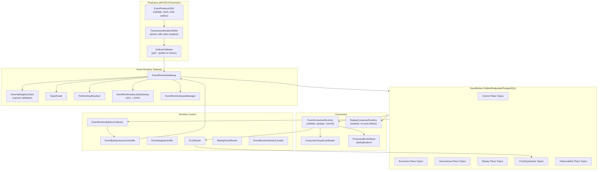

---

## 5. Broker Technology Positioning

### 5.1 Comparison Table

| Capability | Apache Kafka | Redpanda | Apache Pulsar | MYCELIA Interpretation |
|---|---|---|---|---|
| **Kafka API compatibility** | Native | Full (Kafka-compatible) | Partial (via Kafka-on-Pulsar) | Redpanda's full compatibility reduces migration risk for Kafka-trained teams |
| **Operational complexity** | High (ZooKeeper legacy; KRaft improving) | Low (no ZooKeeper; single process) | High (bookies + brokers + ZooKeeper) | Redpanda is the lowest operational overhead option |
| **Schema registry integration** | Confluent Schema Registry (separate service) | Compatible with Confluent SR; also Karapace | Built-in schema registry (Pulsar) | Any option works; choose based on team expertise |
| **Topic/partition model** | Topics with partitions; unlimited partitions per broker | Topics with partitions; higher per-partition performance | Topics with partitions; multi-layer architecture | Equivalent semantics for MYCELIA's per-run partitioning |
| **Consumer groups** | Yes; mature | Yes; Kafka-compatible | Yes (subscriptions) | All support consumer groups with offset management |
| **Geo-replication** | MirrorMaker 2; Confluent Cluster Linking | Cross-cluster replication; Cluster Linking (commercial) | Native geo-replication | Pulsar has the most mature native geo-replication |
| **Tiered storage** | Confluent/AWS MSK (commercial); KIP-405 (community) | Tiered storage (commercial tiers) | Native tiered storage | Pulsar has the most mature community tiered storage |
| **Multi-tenancy (native)** | No (must be implemented) | No (must be implemented) | Yes (native namespaces and quotas) | Pulsar native multi-tenancy aligns with MYCELIA's tenant model but MYCELIA implements tenant isolation at routing layer regardless |
| **Operational maturity** | Highest (15+ years ecosystem) | Medium (5+ years; growing) | High (10+ years; complex) | Kafka has the deepest ecosystem; Redpanda is the most modern simple runtime |
| **p99 Publish Latency** | 5–50ms (tuned) | 1–10ms (tuned; consistent) | 5–30ms (tuned) | Redpanda demonstrates the most consistent low-latency benchmarks in production tuning |
| **Max throughput** | Very high (millions events/sec at scale) | Very high (comparable to Kafka) | High | All are sufficient for MYCELIA's governance-focused workloads |
| **Deployment complexity** | Medium (KRaft simplifies) | Low (single binary) | High (multi-component) | Redpanda simplest for MVP; Kafka/Pulsar for enterprise |
| **Ecosystem and tooling** | Richest (Kafka Connect, Streams, etc.) | Growing (Kafka-compatible; uses Kafka tools) | Rich but separate ecosystem | Kafka's ecosystem wins for operational tooling |
| **MVP suitability** | Good | Excellent | Moderate | Redpanda is the recommended MVP broker if graduating from PostgreSQL |
| **Enterprise suitability** | Excellent | Excellent | Excellent (for geo-replication) | All are enterprise-grade; choice depends on operational profile |

### 5.2 Staged Broker Recommendation

| Stage | Recommendation | Rationale |
|---|---|---|
| **MVP** | PostgreSQL append-only event tables + outbox publisher | Zero additional infrastructure; replay-safe; sufficient for early volumes; graduates cleanly to broker |
| **Beta (first broker)** | Redpanda (single cluster; single region) | Kafka-compatible; low operational overhead; full producer/consumer compatibility; excellent for team onboarding |
| **Enterprise** | Apache Kafka (KRaft mode) or Redpanda + Confluent Schema Registry | Kafka's ecosystem breadth; mature MirrorMaker 2; widest tooling; well-understood failure modes |
| **Global** | Kafka with MirrorMaker 2 OR Pulsar with native geo-replication | Pulsar's native geo-replication is simpler for global multi-region; Kafka+MirrorMaker works but is operationally heavier |

**Important:** This recommendation is architecture-driven, not hype-driven. The choice between Kafka, Redpanda, and Pulsar MUST be validated against the deployment team's operational expertise, the organization's cloud provider alignment, and the specific SLAs required. The MYCELIA event contracts (Document 07) are broker-agnostic; the runtime topology adapts to the broker choice.

---

## 6. Logical Broker Topology

### 6.1 Topic Naming Convention

Topic names MUST follow this pattern (from Document 07):

```
mycelia.<environment>.<scope>.<tenant_route_key>.<plane>.<category>.<version>
```

Where:
- `<environment>`: `prod` | `staging` | `dev` | `replay` | `ci`
- `<scope>`: `tenant` | `platform`
- `<tenant_route_key>`: opaque routing key (MUST NOT be customer-readable name; see §20)
- `<plane>`: `control` | `execution` | `tool` | `governance` | `memory` | `replay` | `audit` | `observability` | `integration` | `dlq` | `quarantine` | `system`
- `<category>`: event category abbreviation
- `<version>`: `v1` | `v2` etc.

### 6.2 Topic Plane Definitions

**Control Plane Topics**
- Pattern: `mycelia.prod.tenant.<trk>.control.run.v1`
- Producers: RunManager, RuntimeDispatcher, RuntimeEnvelopeBuilder
- Consumers: StepCoordinator, AuditService, ProjectionService, NotificationService
- Retention: Permanent (governance)
- Ordering: Per run_id partition
- Priority: Critical
- Partition key: run_id
- Replication: 3+ replicas (ISR=2 minimum)
- Tenant isolation: Strict; separate topics per tenant_route_key
- Replay: Yes (replay events go to `mycelia.replay.tenant.<trk>.control.run.v1`)
- DLQ: `mycelia.prod.tenant.<trk>.dlq.control.v1`

**Execution Plane Topics**
- Pattern: `mycelia.prod.tenant.<trk>.execution.step.v1`
- Producers: StepCoordinator, AgentExecutionGateway, AgentRuntime
- Consumers: RunManager, AuditService, ProjectionService
- Retention: Permanent
- Ordering: Per run_id partition
- Priority: High
- Partition key: run_id

**Tool Plane Topics**
- Pattern: `mycelia.prod.tenant.<trk>.tool.tool.v1`
- Producers: ToolIntentMediator, ToolInvocationGateway, ToolWorkers
- Consumers: StepCoordinator, AuditService, IdempotencyService
- Retention: Permanent (side effects = governance evidence)
- Ordering: Per run_id partition
- Priority: Critical (for side-effectful events)
- Partition key: run_id

**Governance Plane Topics**
- Pattern: `mycelia.prod.tenant.<trk>.governance.approval.v1`
- Producers: PolicyDecisionGateway, ApprovalGateCoordinator, CognitiveBudgetManager
- Consumers: WorkflowEngine, AuditService, AlertingService
- Retention: Permanent
- Ordering: Per tenant_route_key; per approval_id when cross-run governance
- Priority: Critical
- Partition key: run_id (for run-scoped) or tenant_route_key (for tenant-scoped governance)

**Memory Plane Topics**
- Pattern: `mycelia.prod.tenant.<trk>.memory.context.v1`
- Producers: ContextAssemblyGateway, MemoryAccessGateway
- Consumers: AuditService, ReplayAdapter
- Retention: Long (context snapshots required for replay)
- Ordering: Per run_id
- Priority: High
- Partition key: run_id

**Replay Plane Topics**
- Pattern: `mycelia.replay.tenant.<trk>.<plane>.<category>.v1`
- Producers: ReplayEventRouter
- Consumers: ReplayConsumerRuntime ONLY
- Retention: Medium (investigation window)
- Ordering: Per replay_id
- Priority: Low (throttled before production)
- **NEVER shared with production consumers**

**Audit/Evidence Plane Topics**
- Pattern: `mycelia.prod.tenant.<trk>.audit.evidence.v1`
- Producers: AuditService, CognitiveAuditRecorder
- Consumers: AuditStore, ComplianceService
- Retention: Permanent; append-only; NEVER compacted
- Priority: Critical
- Partition key: tenant_route_key

**Observability Plane Topics**
- Pattern: `mycelia.prod.tenant.<trk>.observability.telemetry.v1` or `mycelia.prod.platform.observability.infra.v1`
- Producers: All services (OTel exporters)
- Consumers: ObservabilityPlatform
- Retention: Operational (30–90 days)
- Priority: Low (may be shed under extreme load)
- Partition key: trace_id

**DLQ/Quarantine Topics**
- Pattern: `mycelia.prod.tenant.<trk>.dlq.<plane>.v1` and `mycelia.prod.tenant.<trk>.quarantine.<plane>.v1`
- Producers: DLQRouter
- Consumers: EventRuntimeAdminConsole, AlertingService
- Retention: Long forensic (90+ days)
- Priority: N/A (operator-driven redrive)
- MUST be access-controlled (original envelopes are sensitive)

**System Topics**
- Pattern: `mycelia.prod.platform.system.infra.v1`
- Producers: Platform infrastructure services
- Consumers: SRE tools, Monitoring
- Retention: Operational
- Priority: System

### 6.3 Topology Diagram

```mermaid
flowchart TB
    subgraph Cluster["Event Broker Cluster"]
        direction TB
        CP["Control Plane Topics\nmycelia.prod.tenant.<trk>.control.*"]
        EP["Execution Plane Topics\nmycelia.prod.tenant.<trk>.execution.*"]
        TP["Tool Plane Topics\nmycelia.prod.tenant.<trk>.tool.*"]
        GP["Governance Plane Topics\nmycelia.prod.tenant.<trk>.governance.*"]
        MP["Memory Plane Topics\nmycelia.prod.tenant.<trk>.memory.*"]
        RP["Replay Plane Topics\nmycelia.replay.tenant.<trk>.*"]
        AP["Audit Topics\nmycelia.prod.tenant.<trk>.audit.*"]
        OBP["Observability Topics\nmycelia.prod.*.observability.*"]
        DLQ["DLQ / Quarantine\nmycelia.prod.tenant.<trk>.dlq.*"]
        SYS["System Topics\nmycelia.prod.platform.system.*"]
    end

    RunManager -->|RunCreated, RunSucceeded, etc.| CP
    StepCoordinator -->|StepRunning, StepSucceeded| EP
    ToolGateway -->|ToolDispatched, ToolSucceeded| TP
    PolicyGateway -->|PolicyEvaluated, BudgetExceeded| GP
    ContextGateway -->|ContextSnapshotCreated| MP
    ReplayRouter -->|All replay events| RP
    AuditService -->|AuditRecord events| AP
    AllServices -->|OTel spans| OBP
    DLQRouter -->|Failed events| DLQ
    Platform -->|Infrastructure events| SYS
```

---

## 7. Topic Class Definitions

| Topic Class | Durability | Compaction | Retention | Allowed Consumers | Priority | Backpressure | Replay Eligible |
|---|---|---|---|---|---|---|---|
| **Critical State** | Max replicas; ISR=all | NEVER | Permanent | Authorized state consumers only | Critical | Throttle producers first | Yes |
| **Governance** | Max replicas; ISR=all | NEVER | Permanent | AuditService, compliance consumers | Critical | Throttle non-critical first; never governance | Yes |
| **Tool Side-Effect** | Max replicas; ISR=all | NEVER | Permanent | ToolGateway, AuditService, IdempotencyService | Critical | Throttle replay first | Intent: Yes; Execution: suppressed |
| **Replay** | Standard replicas | NEVER | Medium | ReplayConsumerRuntime ONLY | Low (throttled) | Throttle replay before production | N/A (IS replay) |
| **Audit** | Max replicas; ISR=all | NEVER | Permanent | AuditStore, ComplianceService | Critical | Load shed low-priority first; never audit | Yes |
| **DLQ** | Standard replicas | NEVER | Long forensic | AdminConsole, AlertingService (read-only) | N/A | N/A | No (redrive creates new event) |
| **Quarantine** | Standard replicas | NEVER | Long forensic | AdminConsole (read-only) | N/A | N/A | No |
| **Observability** | Standard replicas | Allowed | Operational | ObservabilityPlatform | Low | Shed under extreme pressure | No |
| **Integration** | Standard replicas | Conditional | Configurable | Connector workers, external | High | Pause on degradation | Conditional |
| **System** | Standard replicas | Conditional | Operational | SRE tools, platform monitoring | System | N/A | No |

**Critical Rule:** Log compaction MUST NEVER be enabled on Critical State, Governance, Tool Side-Effect, Audit, DLQ, or Quarantine topics. Compaction destroys intermediate events required for state reconstruction and replay. For observability topics, compaction MAY be applied after the operational retention window.

---

## 8. Partitioning Strategy

### 8.1 Partition Key Matrix

| Event Category | Partition Key | Ordering Guarantee | Hot Partition Risk | Notes |
|---|---|---|---|---|
| GovernedRun lifecycle | `run_id` | Run-level FIFO | Low (unique per run) | All run events ordered together |
| Step events | `run_id` | Run-level FIFO | Low | Step and run events on same partition |
| Tool invocation | `run_id` | Run-level FIFO | Low | Tool events maintain run ordering |
| Approval events | `run_id` | Run-level FIFO | Low | Approval sequence ordered within run |
| Workflow events | `workflow_id` | Workflow-level | Medium (popular workflows) | Workflow events ordered per definition |
| Governance (run-scoped) | `run_id` | Run-level | Low | Policy evaluations for a run |
| Governance (tenant-scoped) | `tenant_route_key` | Tenant-level | Medium (large tenants) | Per-tenant governance ordering |
| Context snapshots | `run_id` | Run-level | Low | Memory events ordered with run |
| Security events | `tenant_route_key` | Tenant-level | Low | Security incidents per tenant |
| Replay events | `replay_id` | Replay-session level | Low (isolated) | Each replay session isolated |
| Observability events | `trace_id` | Trace-level | Low | Trace correlation |
| Integration events | `connector_id` | Connector-level | Medium | Per-connector stream |

### 8.2 Ordering Guarantee Matrix

| Ordering Need | Mechanism | Guarantee Scope |
|---|---|---|
| Within a GovernedRun | `run_id` partition key | All events for a run_id land on the same partition; FIFO within partition |
| Within a workflow step | `run_id` partition key | Step events are ordered relative to other run events |
| Between approval and run events | `run_id` partition key | ApprovalRequested precedes ApprovalGranted in partition order |
| Between tool intent and dispatch | `run_id` partition key | ToolInvocationRequested precedes ToolDispatched |
| Across different runs | No ordering guarantee | Events across different runs may interleave |
| Across tenants | No cross-tenant ordering | Tenants are isolated; no global ordering |

### 8.3 Hot Partition Mitigation

**When `tenant_route_key` causes hot partitions** (a single large tenant generates disproportionate event volume):
- Add a **sub-shard suffix** to the partition key: `{tenant_route_key}_{shard_index}` where `shard_index = hash(run_id) % N`.
- This breaks total tenant-level ordering (acceptable if run-level ordering is preserved via `run_id`).
- Shard count must be static per tenant tier; dynamically changing sharding breaks message ordering.
- Document shard count changes as ADRs.

**When `run_id` causes hot partitions** (a specific run generates extremely high event volume):
- Normal operations do not generate enough events per run to cause partition saturation.
- If a run produces unusual volume (e.g., a buggy loop), the backpressure controller (§13) detects this and throttles the run.

**Key salting: when allowed:**
- Allowed for observability events (ordering not critical; throughput matters).
- Allowed for integration events where per-connector ordering (not per-run) is the concern.

**Key salting: when FORBIDDEN:**
- FORBIDDEN for run-scoped events (RunCreated, StepSucceeded, ToolSucceeded, ApprovalGranted) — these MUST maintain run-level ordering.
- FORBIDDEN for governance events where sequence matters (PolicyDenied must come after PolicyEvaluated).
- FORBIDDEN for audit events.

### 8.4 Partition Expansion Compatibility

Kafka/Redpanda: Adding partitions to an existing topic **changes the partition assignment formula** for new events. This means events for the same `run_id` may land on different partitions before and after the expansion, breaking run-level ordering.

**Mitigation:**
- Plan partition counts at topic creation based on capacity model (§18).
- Prefer creating new topics (with higher partition count) and migrating consumers rather than expanding partitions on live topics.
- Document all partition count changes as ADRs.
- Never expand partitions on Critical State or Governance topics without a consumer migration plan.

---

## 9. Ordering and Causality Runtime Model

### 9.1 Per-Partition FIFO

Within a single broker partition, events are delivered to consumers in the exact order they were appended. This is the only ordering guarantee the broker provides. MYCELIA's partitioning strategy exploits this by assigning logically related events to the same partition.

### 9.2 Out-of-Order Event Handling

Events may arrive at consumers in a different order than their `occurred_at` timestamps due to:
- Producer clock drift (System A's `occurred_at` may be behind System B's).
- Re-delivery after consumer failure (a previously delivered but uncommitted event is re-delivered).
- Parallel processing (multiple worker threads consuming from the same partition).

**Reorder buffer:** Consumers that require strict ordering MUST implement a reorder buffer:
```
max_reorder_wait_ms = 2000  (configurable per consumer group)
buffer_capacity = 100 events per partition
```

Events arriving within the reorder window are sorted by `occurred_at` and `causation_id` before processing. Events arriving after the window are treated as late events.

**Late event handling:** Late events (arriving after the run has reached a terminal state) are:
- For governance events: processed and recorded (they are still evidence).
- For state-transition-triggering events: checked against current state; if inapplicable (step is already succeeded), the event is acknowledged and logged without state mutation.
- For DLQ: if genuinely out-of-window, routed to quarantine for operator inspection.

### 9.3 Causal Gap Detection

A causal gap occurs when consumer processes event E2 (where causation_id = E1.event_id) but E1 has not yet been observed. Detection:
1. Consumer looks up `causation_id` in processed-event table.
2. If not found AND `causation_id` is expected to be recent (occurred_at within reorder window), buffer E2 and wait.
3. If causation anchor is not observed after max_reorder_wait_ms, emit `CausalGapDetected` event and process E2 in isolation with a warning.

### 9.4 Cross-Partition Causal Reconstruction

When causal analysis spans multiple partitions (e.g., events from two runs that interact), use `causation_id` chain traversal. Do NOT use timestamps. The EventRuntimeAdminConsole MUST support causal chain queries by `root_causation_id` across partitions.

### 9.5 Rules

**ORD-01.** Timestamp-only ordering is FORBIDDEN for causal reconstruction.
**ORD-02.** Broker offsets are NOT business state; they are delivery positions.
**ORD-03.** Consumers requiring ordering MUST enforce ordering at the consumer level, not rely on global broker ordering.
**ORD-04.** Causal gaps MUST be detectable and MUST produce observable signals.
**ORD-05.** Partition expansion on ordering-critical topics requires a consumer migration plan.

---

## 10. Producer Runtime Model

### 10.1 Producer Publication Path

For all state-mutation events, the publication path is:

```
Service → EventProducerSDK → TransactionalOutboxWriter → [DB transaction commit] → OutboxPublisher → EventBroker
```

Direct publication to the broker (bypassing outbox) is FORBIDDEN for state-mutation events.

Direct publication (bypassing outbox) MAY be used ONLY for:
- Non-authoritative observability events (traces, metrics, debug logs) where loss is acceptable.
- Events that are explicitly classified as non-governance and carry no idempotency requirement.

These exceptions MUST be explicitly declared in code with a comment: `// NON-GOVERNANCE: direct publish permitted for observability`.

### 10.2 OutboxPublisher Configuration

| Parameter | Recommended Value | Notes |
|---|---|---|
| `poll_interval_ms` | 100 | Polling frequency for PENDING outbox records |
| `batch_size` | 100 | Events per poll cycle |
| `max_in_flight_requests` | 5 | For idempotent producer: max 5; for transactional: 1 |
| `compression_type` | `lz4` | Balance between CPU and network; snappy also acceptable |
| `linger_ms` | 5 | Allow small batch accumulation; set to 0 for critical priority events |
| `batch_num_messages` | 100 | Redpanda-specific; equivalent to Kafka's `batch.size` |
| `buffer_memory_bytes` | 64MB per publisher | Before backpressure triggers |
| `request_timeout_ms` | 30000 | Before considering broker unresponsive |
| `acks` | `all` | All ISR replicas must acknowledge for governance events |
| `retries` | `MAX_INT` | Let retry budget (via backoff) control; don't cap at broker level |
| `max_backoff_ms` | 60000 | Maximum retry interval |
| `enable_idempotent_producer` | `true` | Prevents duplicate broker messages on retry |

### 10.3 Producer Priority Handling

The OutboxPublisher polls outbox records ordered by priority. Critical-priority events (governance, audit, security) are published before standard-priority events (projection updates, observability signals).

```sql
SELECT * FROM outbox_records
WHERE status = 'PENDING'
ORDER BY priority ASC, created_at ASC
LIMIT 100;
```

Priority enum: `critical(1)` > `high(2)` > `standard(3)` > `low(4)`.

### 10.4 Producer Sequence Diagram

```mermaid
sequenceDiagram
    participant Service
    participant SDK as EventProducerSDK
    participant OW as TransactionalOutboxWriter
    participant DB as PostgreSQL
    participant OP as OutboxPublisher
    participant SR as SchemaRegistryClient
    participant Broker as EventBroker

    Service->>SDK: produce(event_type, payload, context)
    SDK->>SR: validate(event_type, schema_version, payload)
    SR-->>SDK: Schema valid
    SDK->>SDK: Build EventEnvelope; compute payload_hash; compute event_hash
    SDK->>OW: writeToOutbox(envelope, priority)
    Note over OW,DB: Same DB transaction as state mutation
    OW->>DB: INSERT outbox_records (status=PENDING, priority)
    DB-->>OW: Committed
    loop Polling (every 100ms)
        OP->>DB: SELECT outbox WHERE status=PENDING ORDER BY priority LIMIT 100
        DB-->>OP: OutboxRecord list
        OP->>OP: Resolve TopicRouter(envelope)
        OP->>OP: Resolve PartitionKeyResolver(envelope)
        OP->>Broker: publish(topic, partition_key, message_headers, payload)
        Broker-->>OP: ACK (all ISR)
        OP->>DB: UPDATE outbox SET status=PUBLISHED
    end
```

### 10.4.1 Event Hash Finalization Runtime Rule

The Event Runtime MUST compute `event_hash` according to the hash boundary defined in Document 07.

`event_hash` represents the immutable event fact. It MUST NOT include broker-assigned or publisher-assigned metadata.

### Included in `event_hash`

The hash MUST include the canonical event fact fields defined by Document 07, including:

- event identity fields;
- tenant and workspace scope fields;
- workflow/run/step identifiers;
- subject identifiers;
- actor and runtime identity fields;
- causation and correlation identifiers;
- policy and approval references;
- replay context when present;
- payload_ref;
- payload_hash;
- previous_event_hash;
- canonical metadata;
- canonical payload.

### Excluded from `event_hash`

The hash MUST exclude:

- `event_hash` itself;
- `emitted_at`;
- broker offset;
- broker partition;
- broker leader metadata;
- delivery attempt count;
- consumer offset;
- transport headers not part of the semantic event fact.

### Runtime Sequence

```text
1. EventProducerSDK builds EventEnvelope fact.
2. EventProducerSDK computes payload_hash.
3. EventProducerSDK computes event_hash over immutable fact fields.
4. TransactionalOutboxWriter writes the event fact and hash into outbox.
5. OutboxPublisher later assigns emitted_at at publication time.
6. OutboxPublisher MUST NOT mutate event_hash after emitted_at assignment.
```

### Rules

- `event_hash` MUST be computed before outbox commit.
- `emitted_at` MUST be assigned only when the event is published to the broker or MVP event stream.
- Assigning `emitted_at` MUST NOT invalidate `event_hash`.
- Consumers MUST verify `event_hash` using the same excluded-field rule.
- Replay hydration MUST reject or flag events whose hash cannot be verified.

### Forbidden Behavior

FORBIDDEN:

- computing `event_hash` over `emitted_at`;
- recomputing `event_hash` after broker publication;
- including broker offset or partition in event fact integrity;
- allowing producer and consumer hash field sets to differ;
- allowing Codex to implement event hashing independently from Document 07.

### 10.5 Backpressure Propagation from Producer

When the broker applies backpressure (e.g., `buffer.memory` exhaustion or slow follower):
1. `OutboxPublisher.publish()` blocks (Kafka blocks on `send()` when buffer is full).
2. OutboxPublisher emits `mycelia.outbox.depth` and `mycelia.outbox.max_age_seconds` metrics.
3. EventBackpressureController detects threshold breach.
4. BackpressureController transitions runtime to `Constrained` mode.
5. In Constrained mode: low-priority event publication is throttled; critical events continue.

### 10.6 Rules

**PROD-01.** Producers MUST NOT publish directly for state-mutation events; outbox is the only path.
**PROD-02.** Direct publication MAY only be used for explicitly classified non-governance observability events.
**PROD-03.** OutboxPublisher MUST use idempotent producer mode to prevent duplicate broker messages on retry.
**PROD-04.** OutboxPublisher MUST publish with `acks=all` for critical and governance events.
**PROD-05.** Producer MUST batch by priority; critical events MUST NOT wait behind low-priority batch accumulation.
---

## 11. Consumer Runtime Model

### 11.1 Consumer Processing Protocol

Every EventConsumerRuntime consumer MUST execute the following protocol:

1. **Receive broker message.** Pull message from topic partition.
2. **Deserialize envelope.** Parse EventEnvelope from message payload.
3. **Envelope validation.** Validate all required fields per Document 07 §4.
4. **Schema version check.** Look up `event_type` + `event_schema_version` in SchemaRegistryClient. Route to quarantine if unknown.
5. **Tenant scope verification.** Verify `tenant_id` (or `tenant_route_key`) matches authorized scope. Reject and emit `UnauthorizedEventRejected` if mismatched.
6. **Replay context check.** If `replay_context` is non-null: production consumers MUST DROP and emit `ReplayContaminationAttempted`.
7. **Integrity verification** (when required). Recompute `event_hash` over envelope fields. If mismatch, route to DLQ and emit `EventIntegrityVerificationFailed`.
8. **Deduplication check.** Look up `idempotency_key` in ProcessedEventStore. If COMPLETED: return cached result and commit offset; skip processing.
9. **Insert PROCESSING record.** Write ProcessedEventRecord(status=PROCESSING) to ProcessedEventStore. This is the lock preventing duplicate concurrent execution.
10. **Idempotent processing.** Execute consumer logic. For state-mutating consumers: commit state + ProcessedEventRecord(status=COMPLETED) atomically in same database transaction.
11. **Commit broker offset.** ONLY after processing and COMPLETED record persist successfully.
12. **Emit consumer telemetry span.** Close consumer span with outcome.

On processing failure (exception at step 10):
- ProcessedEventRecord remains PROCESSING; will become visible as a stuck record.
- Consumer re-throws to trigger retry logic.
- Retry increments counter; backoff applied.
- After max retries: route to DLQ; emit consumer span with failure outcome.

### 11.2 Consumer Group Configuration

| Parameter | Recommended Value | Notes |
|---|---|---|
| `session_timeout_ms` | 30000 | Longer for LLM-inference consumers which may take >10s |
| `heartbeat_interval_ms` | 3000 | One-third of session timeout |
| `max_poll_interval_ms` | 300000 | Allow long model inference; 5 minutes |
| `auto_offset_reset` | `earliest` | On new consumer group: start from beginning |
| `enable_auto_commit` | `false` | MANDATORY: manual commit only |
| `max_poll_records` | 10–50 | Limit per-poll batch; avoid overwhelming stateful consumers |
| `fetch_min_bytes` | 1 | Return immediately when data available |
| `fetch_max_wait_ms` | 500 | Maximum wait before returning empty |
| `isolation_level` | `read_committed` | Only read committed transactional messages |

### 11.3 Consumer Group Strategy

| Consumer Group Type | Naming Pattern | Partition Assignment | Notes |
|---|---|---|---|
| Production state consumers | `mycelia.prod.<service>.<category>` | One consumer per partition | Stateful; ordered processing required |
| Production read-model projections | `mycelia.prod.projection.<name>` | Fan-out across partitions | Idempotent; ordering less critical |
| Audit consumers | `mycelia.prod.audit.<service>` | All partitions | Append-only; ordering important |
| Replay consumers | `mycelia.replay.<service>.<replay_id>` | Replay partitions only | NEVER subscribes to production topics |
| DLQ consumers | `mycelia.dlq.operator.<id>` | DLQ partitions | Operator-driven; restricted access |

### 11.4 Rebalance Safety

A consumer group rebalance (triggered by consumer join/leave or partition reassignment) must be safe:
1. In-flight events MUST NOT be committed before rebalance starts.
2. During rebalance: offset commits are blocked until new partition assignment is confirmed.
3. After rebalance: consumers re-consume from last committed offset (some events may be re-delivered; idempotency handles this).
4. `rebalance_timeout_ms` must be large enough to allow in-flight processing to complete before the consumer is kicked out of the group.

**Rebalance safety rule:** Processing a state-mutating event and committing offset MUST be atomic from the consumer's perspective. If the consumer crashes after state mutation but before offset commit, the event is re-delivered and the consumer's idempotency check prevents double mutation.

### 11.4.1 PostgreSQL-First Consumer Cursor Model

When MYCELIA runs in PostgreSQL-first MVP mode, broker offsets are represented by durable consumer cursors.

A consumer cursor is not business state. It is a delivery progress marker for a logical consumer group.

### Consumer Cursor Fields

A PostgreSQL-first consumer cursor SHOULD include:

| Field | Purpose |
|---|---|
| `consumer_group_id` | Logical consumer group identifier |
| `stream_name` | Logical topic/stream name |
| `tenant_route_key` | Tenant routing scope |
| `last_processed_event_id` | Last successfully processed event |
| `last_processed_sequence` | Monotonic sequence position in the stream |
| `last_processed_at` | Processing timestamp |
| `status` | active, paused, failed, rebuilding |
| `lag_count` | Number of unprocessed events |
| `lease_owner` | Worker currently owning the cursor |
| `lease_expires_at` | Lease timeout for worker recovery |

### Cursor Processing Rule

A consumer worker MUST:

1. acquire a cursor lease;
2. read the next unprocessed event batch;
3. validate envelope and schema;
4. process events idempotently;
5. write ProcessedEventRecord;
6. advance the cursor only after processing succeeds;
7. release or renew the lease.

### Rules

- Cursor advancement MUST occur only after successful event processing.
- Cursor updates MUST be atomic with ProcessedEventRecord when possible.
- Cursor position MUST NOT be used as business state.
- Cursor lease expiration MUST allow another worker to resume safely.
- Replay consumers MUST use separate replay cursors.
- Production and replay cursors MUST NOT share state.

### Forbidden Behavior

FORBIDDEN:

- updating consumer cursor before processing succeeds;
- using cursor position as proof of business completion;
- storing consumer cursor only in memory;
- sharing one cursor across tenants;
- sharing production and replay cursors;
- allowing Codex to treat PostgreSQL polling as an informal loop without cursor state.

### 11.5 Consumer Sequence Diagram

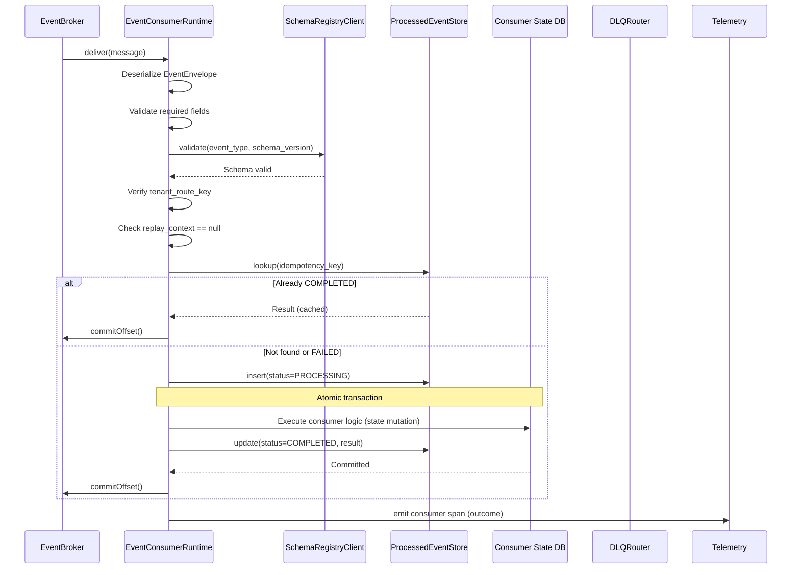

---

## 12. Schema Registry Runtime Architecture

### 12.1 Deployment Model

The Schema Registry is a runtime dependency that MUST be highly available. MYCELIA deploys the schema registry with:
- At least 3 replicas in production.
- Local read replica per region.
- Client-side cache (TTL: 5 minutes) to reduce latency and registry-unavailability blast radius.
- CI/CD pipeline integration for schema registration and compatibility validation.

### 12.2 Supported Schema Formats

| Format | Use Case | MYCELIA Recommended For |
|---|---|---|
| JSON Schema | Human-readable; flexible; good for governance events | MVP and governance events |
| Apache Avro | Compact binary; excellent for high-throughput | Later (Beta/Enterprise) for high-volume topics |
| Protocol Buffers | Compact binary; strongly typed; excellent cross-language | Later (Enterprise) for performance-critical topics |

**MVP decision:** JSON Schema is recommended for MVP due to human readability, easier debugging, and lower implementation complexity. Avro/Protobuf are legitimate choices for throughput optimization in later stages.

### 12.3 Schema Registration Workflow

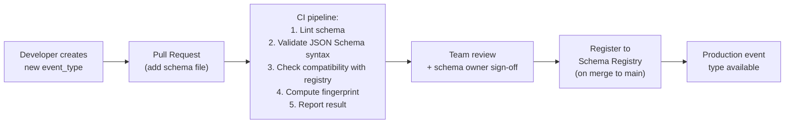

### 12.4 Compatibility Modes

| Mode | Rule | MYCELIA Policy |
|---|---|---|
| BACKWARD | New schema can read data written by old schema | MINIMUM for all production schemas |
| FULL | Both backward and forward compatible | REQUIRED for governance and audit schemas |
| NONE | No compatibility guarantee | Only allowed for experimental topics in dev environment |

Breaking changes (requiring `NONE` or new major version) MUST go through an ADR in Document 25.

### 12.5 Schema Registry Outage Mode

When schema registry is unavailable:
- **Known schemas** (in local client cache): Continue processing. Log warning every 60 seconds.
- **Unknown schema version** (not in cache): FAIL CLOSED. Block publication; route consumer event to quarantine.
- **Cache TTL**: 5 minutes. After TTL expiry without refresh: keep serving cached schemas until the TTL expiry since last successful registry contact doubles (exponential TTL extension up to 30 minutes).
- **Recovery**: On registry restoration, clients refresh cache immediately.

### 12.6 Replay Compatibility

Before any schema change is deployed, replay compatibility tests MUST pass:
1. Take a sample of historical events from the last 90 days for the affected event_type.
2. Deserialize them using the new schema.
3. Verify no deserialization errors.
4. Verify semantic fields are correctly mapped.
5. Report pass/fail in CI.

Failure of replay compatibility test is a BLOCKING failure for schema deployment.

### 12.7 Schema Lifecycle Diagram

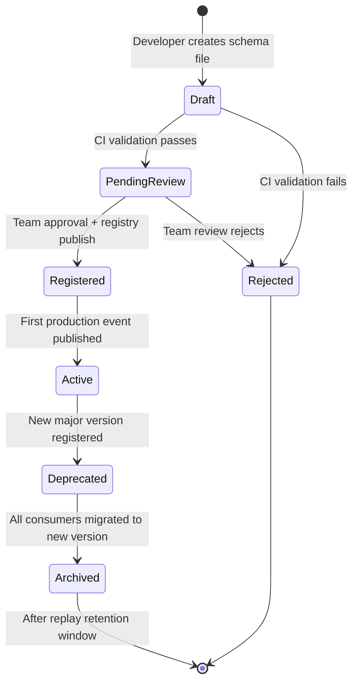

---

## 13. Backpressure Model

### 13.1 Backpressure Signals

| Signal | Metric | Normal Range | Warning Threshold | Critical Threshold |
|---|---|---|---|---|
| Producer buffer utilization | `mycelia.producer.buffer_utilization` | <30% | 60% | 85% |
| Outbox age (max) | `mycelia.outbox.max_age_seconds` | <10s | 30s | 120s |
| Outbox depth | `mycelia.outbox.depth` | <100 | 1,000 | 10,000 |
| Publish latency p99 | `mycelia.event.publish.latency_ms` (p99) | <50ms | 200ms | 1,000ms |
| Consumer lag | `mycelia.consumer.lag` | <1,000 | 10,000 | 100,000 |
| Processing latency p99 | `mycelia.event.consume.latency_ms` (p99) | <500ms | 2,000ms | 10,000ms |
| DLQ growth rate | `mycelia.dlq.growth_rate` | 0 | >10/min | >100/min |
| Partition skew | `mycelia.partition.skew_ratio` | <1.5x | 3x | 10x |
| Broker disk utilization | `mycelia.broker.disk_utilization` | <50% | 75% | 90% |
| Broker ISR ratio | `mycelia.broker.isr_ratio` | =1.0 | <1.0 | <0.5 |
| Replay queue depth | `mycelia.replay.queue_depth` | <500 | 5,000 | 50,000 |

### 13.2 Runtime Reactions to Backpressure

| Signal | Runtime Reaction |
|---|---|
| Outbox depth > warning | Throttle low-priority event production; reduce replay throughput |
| Outbox depth > critical | Transition to Constrained mode; throttle all non-critical production |
| Consumer lag > warning | Scale out consumer group (horizontal scaling); alert SRE |
| Consumer lag > critical | Transition to Degraded mode; pause replay; alert immediately |
| Broker disk > 90% | Transition to Critical mode; pause low-priority shedding; alert immediately |
| DLQ growth > 100/min | Alert; investigate schema or processing failures; potential poison event storm |
| Producer buffer > 85% | Producer blocks; new events queue in outbox; backpressure propagates upstream |
| ISR ratio < 0.5 | Alert; potential data loss risk; governance events may be at risk |
| Replay queue > 50,000 | Throttle replay throughput to 10% of normal; prioritize production |
| Partition skew > 10x | Alert; investigate hot partition; consider key salting |

### 13.3 Backpressure Propagation Chain

```mermaid
flowchart LR
    Model["LLM/Model\n(slow inference)"]
    AgentStep["AgentExecution\n(waiting for model)"]
    StepQueue["Step event queue\nbacklog"]
    ConsumerLag["Consumer lag\nincreases"]
    BPC["BackpressureController\ndetects lag threshold"]
    Throttle["Throttle low-priority\nevent producers"]
    SlowProducers["Producers slow down\n(outbox fill)"]
    OutboxDepth["Outbox depth\nincreases"]
    DegradedMode["Transition:\nConstrained → Degraded"]

    Model --> AgentStep --> StepQueue --> ConsumerLag --> BPC
    BPC --> Throttle --> SlowProducers --> OutboxDepth --> DegradedMode
```

### 13.4 Backpressure State Machine

```mermaid
stateDiagram-v2
    [*] --> Healthy
    Healthy --> Constrained: Warning threshold on any backpressure signal
    Constrained --> Healthy: All signals return to normal range
    Constrained --> Degraded: Critical threshold on consumer lag or outbox depth
    Degraded --> Constrained: Signals improve to warning range
    Degraded --> Critical: Broker disk >90% OR ISR ratio <0.5
    Critical --> Degraded: Critical conditions resolved
    Critical --> Recovery: Operator intervention; partial service restoration
    Recovery --> Healthy: All signals return to normal
```

### 13.5 Degradation Mode Rules

**Governance events MUST be prioritized** in all degradation modes. The following rules apply:

- Governance, audit, and security events have absolute priority over observability and integration events.
- Low-priority shedding MUST NEVER drop critical state, governance, tool side-effect, or audit events.
- Replay throughput MUST be reduced before any production governance event is throttled.
- When in Critical mode: only governance, security, and critical state events flow; all others are held in outbox/buffer.

---

## 14. Runtime Degradation Modes

### 14.1 Mode Definitions

**Healthy**
- Trigger: All backpressure signals within normal range.
- Allowed: All event classes.
- Producer behavior: Normal publication; no throttling.
- Consumer behavior: Normal processing at full rate.
- Replay behavior: Normal; throttled at 25% of production throughput to avoid contention.
- Governance behavior: Normal.
- Alert: None.
- Exit criteria: N/A (is the baseline).

**Constrained**
- Trigger: Any backpressure signal exceeds warning threshold.
- Allowed: All event classes; with reduced throughput for low-priority.
- Throttled: Observability and integration events at 50% of normal.
- Producer behavior: Low-priority events are batched more aggressively; `linger_ms` increased for low-priority.
- Consumer behavior: Consumer group scaled out if consumer lag is the trigger.
- Replay behavior: Throttled to 10% of production throughput.
- Governance behavior: Normal; not throttled.
- Alert: SEV4 operational alert.
- Exit criteria: All signals return to normal range for 5 minutes.

**Degraded**
- Trigger: Critical threshold on consumer lag OR outbox depth; OR two simultaneous warning thresholds.
- Allowed: Critical state, governance, tool side-effect, audit, security events.
- Throttled: Replay, integration, observability events.
- Forbidden: None dropped, but low-priority events held in outbox/buffer.
- Producer behavior: Producers for non-critical events receive `RATE_LIMITED` response; must queue locally.
- Consumer behavior: Consumer groups for non-critical topics paused; critical consumer groups scaled to maximum.
- Replay behavior: Paused completely. All replay jobs suspended.
- Governance behavior: Normal; prioritized.
- Alert: SEV2 alert; on-call paged.
- Exit criteria: Consumer lag returns below warning threshold AND outbox depth below warning threshold for 10 minutes.

**Critical**
- Trigger: Broker disk >90% OR ISR ratio <0.5 (durability at risk) OR broker unavailability.
- Allowed: Governance, audit, security events only; all others held.
- Throttled: Everything except governance/audit/security.
- Producer behavior: Outbox accumulates; most producers blocked from writing to broker.
- Consumer behavior: All non-critical consumer groups paused. Critical governance consumers run independently.
- Replay behavior: Fully paused; replay jobs suspended.
- Governance behavior: Emergency governance-only mode.
- Alert: SEV1 alert; incident response initiated.
- Exit criteria: ISR ratio returns to 1.0 AND disk below 75% AND operator confirms safe.

**Recovery**
- Trigger: Critical mode conditions resolve; operator authorizes recovery.
- Behavior: Gradual backlog clearance; low-priority topics resume in stages; replay resumes last.
- Alert: SEV3 tracking; operator monitors recovery progress.
- Exit criteria: All signals return to Healthy range; operator closes incident.

---

## 15. DLQ, Quarantine and Poison Event Runtime

### 15.1 DLQ Topic Structure

```
mycelia.prod.tenant.<trk>.dlq.<plane>.v1
```

Each topic plane has its own DLQ to prevent cross-plane contamination and to enable plane-specific retention and access policies. Examples:
```
mycelia.prod.tenant.<trk>.dlq.control.v1
mycelia.prod.tenant.<trk>.dlq.execution.v1
mycelia.prod.tenant.<trk>.dlq.tool.v1
mycelia.prod.tenant.<trk>.dlq.governance.v1
```

Additionally:
```
mycelia.prod.tenant.<trk>.quarantine.schema.v1   (schema-invalid events)
mycelia.prod.tenant.<trk>.quarantine.format.v1   (format-invalid events)
```

### 15.2 Poison Event Detection

An event becomes a **poison event** (is_poison = true) when it has exhausted all retry attempts without successful processing. Detection:

```
poison_threshold = 5 retries (configurable per consumer group)

After retry 5:
  - Update OutboxRecord/DLQRecord: is_poison = true
  - Emit PoisonEventDetected (with tenant_id, event_id, failure_class, retry_count)
  - Alert on-call (SEV2)
  - Cease automatic retry
  - Remain in DLQ for operator review
```

A poison event MUST NOT loop indefinitely. After is_poison = true, no automatic retry is attempted.

### 15.3 DLQ Runtime State Machine

```mermaid
stateDiagram-v2
    [*] --> InFlight: Normal consumer processing
    InFlight --> RetryPending: Processing failure (transient)
    RetryPending --> InFlight: Retry attempt
    RetryPending --> DLQPending: Max retries exceeded
    DLQPending --> DLQActive: DLQRouter publishes to DLQ topic
    DLQActive --> PoisonActive: is_poison=true; alert triggered
    DLQActive --> RedriveRequested: Operator authorizes redrive
    PoisonActive --> RedriveRequested: Operator authorizes after investigation
    RedriveRequested --> RedriveInFlight: Rate-limited redrive to source topic
    RedriveInFlight --> DLQPending: Redrive processing fails again
    RedriveInFlight --> Resolved: Redrive succeeds
    Resolved --> [*]
```

### 15.4 Redrive Protocol

Redrive (returning a DLQ event to a production topic for reprocessing) MUST follow this protocol:

1. **Operator authorization.** An authorized operator reviews the DLQ event and confirms the root cause is resolved.
2. **Redrive rate limiting.** Maximum 10 redriven events per minute per topic (configurable). Prevents redrive storm from overwhelming production consumers.
3. **Redrive metadata.** The re-driven event receives `redrive_id` (new ULID) while preserving the original `causation_id` and `event_hash`.
4. **Retry tracking.** A new `DLQRedriveRecord` is created linking `original_dlq_record_id` → `redrive_id`.
5. **Observation.** The redrive is observable: `RedriveAttempted` event is published to the system topic.

**Redrive failure:** If a redriven event fails again, it returns to the DLQ with `is_poison = true`. A second redrive requires escalated operator authorization.

### 15.5 DLQ/Quarantine Access Control

DLQ and quarantine topics MUST have restricted read access because they preserve original EventEnvelopes, which contain full event context including `payload_hash` and `security_context_ref`. Only:
- EventRuntimeAdminConsole service account (read; redrive authorization).
- Audit/forensic service accounts (read-only).
- SRE on-call (read-only; via audit-logged tooling).

Write access: DLQRouter only.

---

## 16. Replay-Aware Messaging Runtime

### 16.1 Replay Topic Architecture

Replay events live in a completely isolated topic namespace:
```
mycelia.replay.tenant.<trk>.<plane>.<category>.v1
```

These topics:
- Use `replay` as the environment segment; never `prod` or `staging`.
- Have separate brokers/clusters in large deployments, or isolated partition groups in single-cluster deployments.
- Are NOT subscribed to by any production consumer group.
- Have medium retention (investigation window, typically 30 days).
- Have access controls that prevent production consumer service accounts from subscribing.

### 16.2 Replay Consumer Group Isolation

| Consumer Group | Naming | Subscribed Topics | Offset Management |
|---|---|---|---|
| Production state consumers | `mycelia.prod.*` | `mycelia.prod.*` topics only | Production offsets; committed to production offset store |
| Replay consumers | `mycelia.replay.<replay_id>.*` | `mycelia.replay.*` topics only | Replay offsets; committed to replay offset store; NEVER to production |

**Structural enforcement:** The EventRuntimeSecurityGateway maintains an explicit ACL:
- Production consumer group service accounts: READ permission on `mycelia.prod.*`; DENY on `mycelia.replay.*`.
- Replay consumer group service accounts: READ permission on `mycelia.replay.*`; DENY on `mycelia.prod.*`.

### 16.3 Replay Throttling

Replay events are throttled relative to production traffic to prevent replay workloads from saturating the event runtime:

| Degradation Mode | Replay Allowed Throughput |
|---|---|
| Healthy | Up to 25% of production event/sec capacity |
| Constrained | Up to 10% |
| Degraded | Fully paused |
| Critical | Fully paused |
| Recovery | Up to 5% until Healthy is restored |

Replay throttling is controlled by the EventBackpressureController via the ReplayEventRouter's rate limiter.

### 16.4 Replay Side-Effect Suppression

During replay, the following operations are suppressed at the consumer level:

| Original Event | Replay Consumer Action |
|---|---|
| `ToolDispatched` (ExternalWrite/Financial/Irreversible class) | Suppress; inject ToolReplayRecord from artifact store |
| `MemoryWriteCommitted` | Suppress; write to isolated replay memory namespace only |
| `CognitiveInvocationStarted` + live model call | Suppress; inject recorded ModelOutput from artifact store |
| `ApprovalRequested` | Suppress; inject original ApprovalDecision from audit store |
| `ToolDispatched` (NoSideEffect class) | MAY re-execute; safe to rerun |

The CognitiveReplayAdapter injects suppression signals into the ReplayConsumerRuntime, which substitutes recorded outputs for live operations.

### 16.5 Replay Integrity Verification

Before any event is hydrated during replay, EventIntegrityVerifier checks:
1. `event_hash` matches recomputed hash over envelope fields.
2. `payload_hash` matches SHA-256 of actual payload content.
3. `previous_event_hash` chain is intact (for chain-critical events).

Integrity failure during replay:
- Produces `EventIntegrityVerificationFailed` event.
- Creates a `ReplayDivergence` record of type `IntegrityViolation`.
- Marks the replay step as suppressed.
- Continues replay of remaining steps (does not abort entire replay).

### 16.6 Replay Runtime Sequence Diagram

```mermaid
sequenceDiagram
    participant RC as ReplayCoordinator
    participant RER as ReplayEventRouter
    participant RBroker as Replay Broker/Topic
    participant RCR as ReplayConsumerRuntime
    participant EIV as EventIntegrityVerifier
    participant CRA as CognitiveReplayAdapter
    participant AuditSvc as AuditService

    RC->>RER: publish replay events (replay_context set)
    RER->>RBroker: publish to mycelia.replay.* topics only
    Note over RER,RBroker: NEVER to mycelia.prod.*
    RBroker->>RCR: deliver replay event
    RCR->>EIV: verify event_hash + payload_hash
    alt Integrity fail
        EIV-->>RCR: FAIL
        RCR->>AuditSvc: ReplayDivergence(IntegrityViolation)
        RCR->>RCR: Mark step suppressed; continue
    else Integrity pass
        EIV-->>RCR: PASS
        RCR->>CRA: process step with suppression
        CRA->>CRA: Check side_effect_class
        alt Side-effectful
            CRA->>CRA: Inject ToolReplayRecord / ModelOutput
            CRA->>AuditSvc: ReplayStepHydrated
        else Safe re-execute
            CRA->>CRA: Re-execute safely
        end
        CRA->>CRA: Compare hashes → divergence check
    end
    Note over RCR: NEVER commits production offsets
```
### 16.5.1 Replay Integrity Failure Modes

Replay integrity failure behavior depends on the replay mode.

MYCELIA MUST distinguish between canonical replay, investigation replay and simulation replay.

| Replay Mode | Integrity Failure Behavior | Purpose |
|---|---|---|
| `canonical_replay` | Fail closed; stop replay hydration | Used when replay output may become formal evidence |
| `investigation_replay` | Record ReplayDivergence and continue with affected step suppressed | Used for exploratory incident investigation |
| `simulation_replay` | Record divergence and continue in isolated simulation state | Used for counterfactual or experimental analysis |

### Rules

- Canonical replay MUST NOT continue past an event integrity failure.
- Investigation replay MAY continue after recording `ReplayDivergence`.
- Simulation replay MAY continue only in isolated simulation state.
- Any integrity failure MUST create an auditable record.
- Replay UI and API MUST clearly expose whether replay is canonical, investigation or simulation.
- Replay output from a failed-integrity stream MUST NOT be presented as authoritative.

### Forbidden Behavior

FORBIDDEN:

- continuing canonical replay after event integrity failure;
- hiding integrity failure as a normal replay divergence;
- presenting investigation replay output as authoritative evidence;
- using corrupted event streams for compliance export;
- allowing Codex to implement one replay failure behavior for all replay modes.

---

## 17. Event Runtime Throughput Benchmarks

### 17.1 Benchmark Methodology

All benchmark numbers in this section are **initial targets requiring measurement in the deployment environment**. They are NOT guarantees. Production performance depends on: broker hardware, partition count, consumer hardware, JVM tuning, GC pressure, network bandwidth, and concurrent workload.

Benchmark profiles:
- **Local**: Laptop/developer workstation with minimal infrastructure
- **CI**: GitHub Actions / CI ephemeral environment
- **Staging**: Cloud instance equivalent to 1/4 production scale
- **MVP**: First production deployment; limited tenant count
- **Beta**: 10–50 tenants; moderate workload
- **Enterprise**: 100+ tenants; high workload; multi-az deployment

### 17.2 Target Metrics Table

| Metric | Local | CI | Staging | MVP | Beta | Enterprise |
|---|---|---|---|---|---|---|
| **Events/sec (total)** | 100 | 500 | 2,000 | 5,000 | 20,000 | 100,000+ |
| **Runs/min** | 5 | 20 | 100 | 300 | 1,000 | 5,000 |
| **Steps/sec** | 10 | 50 | 200 | 500 | 2,000 | 10,000 |
| **Tool events/sec** | 5 | 20 | 100 | 250 | 1,000 | 5,000 |
| **Approval events/sec** | 1 | 5 | 20 | 50 | 200 | 1,000 |
| **Replay events/sec** | 50 | 200 | 500 | 1,000 | 5,000 | 20,000 |
| **p50 publish latency** | 5ms | 10ms | 5ms | 10ms | 5ms | 3ms |
| **p95 publish latency** | 50ms | 100ms | 25ms | 30ms | 20ms | 10ms |
| **p99 publish latency** | 200ms | 500ms | 100ms | 100ms | 50ms | 25ms |
| **p50 consume latency** | 50ms | 100ms | 30ms | 50ms | 30ms | 20ms |
| **p95 consume latency** | 500ms | 1000ms | 200ms | 200ms | 150ms | 100ms |
| **p99 consume latency** | 2000ms | 5000ms | 1000ms | 500ms | 300ms | 200ms |
| **Consumer lag (steady state)** | <500 | <1000 | <500 | <500 | <1000 | <5000 |
| **Outbox lag (max age)** | <5s | <10s | <5s | <5s | <3s | <2s |
| **DLQ rate (% of events)** | <1% | <1% | <0.1% | <0.1% | <0.05% | <0.01% |
| **Schema validation latency** | <5ms | <10ms | <2ms | <2ms | <1ms | <1ms |
| **Hash verification latency** | <2ms | <5ms | <1ms | <1ms | <1ms | <1ms |
| **Replay throughput** | 500 e/s | 2000 e/s | 1000 e/s | 5000 e/s | 10000 e/s | 50000 e/s |

### 17.3 Benchmark Scenarios

| Scenario | Description | Success Criteria |
|---|---|---|
| **Happy-path run** | Single run with 10 steps, 1 tool per step, no approval gates | All events delivered; consumer lag <1000; p99 end-to-end <2s |
| **Approval-gated run** | Run with 3 approval gates; simulated 30s approval delay | ApprovalRequested events persist across paused run; ApprovalGranted restores correctly |
| **Tool-heavy run** | Run with 50 tool invocations; mix of side-effect classes | Idempotency keys unique per invocation; no duplicate executions; all ToolSucceeded events processed |
| **Agent-heavy run** | Run with 10 cognitive steps; model responses simulated at 3s latency | Consumer lag stays below critical threshold; no timeout events |
| **Replay-heavy workload** | 100 concurrent replay sessions on historical runs | Replay does not impact production consumer lag; replay events never appear on production topics |
| **Tenant hot spot** | Single tenant generating 80% of event volume | Partition skew detected; hot partition mitigation effective; other tenants unaffected |
| **Broker partial failure** | Take 1 of 3 brokers offline mid-test | ISR alarm fires; events continue flowing via remaining replicas; durability maintained |
| **Schema registry outage** | Take schema registry offline for 5 minutes | Known schema events continue (cached); new schema events blocked; registry restoration restores flow |
| **Consumer lag spike** | Artificially slow consumers for 2 minutes | Backpressure detected; Constrained mode triggered; producers throttled; recovery on consumer restoration |
| **DLQ storm** | Inject 1000 schema-invalid events | All routed to quarantine; quarantine alerts fire; production consumers unaffected |

---

## 18. Capacity Planning Model

### 18.1 Per-Run Event Budget

```
events_per_run =
  run_lifecycle_event_coverage (≈ 14 MVP-required emitted events mapped to the canonical 24-state lifecycle)
  + (step_count × step_events) (≈ 5 events per step: StepReady, StepRunning, StepSucceeded, etc.)
  + (tool_count × tool_events) (≈ 6 events per tool: ToolInvocationRequested through ToolResultPromoted)
  + (approval_count × approval_events) (≈ 3 events per approval: ApprovalRequested, ApprovalGranted, etc.)
  + (cognitive_count × cognitive_events) (≈ 4 events per model call: CognitiveInvocationStarted, Succeeded, etc.)
  + (agent_count × agent_events) (≈ 5 events per agent: AgentExecutionStarted through AgentExecutionSucceeded)
  + governance_events (≈ 3–5 per step: PolicyEvaluated, BudgetConsumed, etc.)
  + audit_events (mirror of authoritative events)
  + replay_multiplier (if replay: × 1.2 for replay events)
```

**Example — Standard invoice processing run:**
- 5 steps × 5 = 25 step events
- 8 tools × 6 = 48 tool events
- 1 approval × 3 = 3 approval events
- 3 cognitive invocations × 4 = 12 cognitive events
- 2 agent executions × 5 = 10 agent events
- 14 run lifecycle events
- 20 governance events
- **Total: ~132 events per run**

### 18.1.1 Lifecycle Coverage Clarification

The capacity model uses an approximate count of emitted events per normal successful run.

This count is not the canonical GovernedRun lifecycle state count.

The canonical GovernedRun lifecycle remains the 24-state model defined in Documents 02, 03 and 06.

A successful run may emit fewer events than the total lifecycle state count because some states represent alternate paths such as pause, cancellation, retry, failure, archive or replay.

### Rules

- Capacity planning event counts MUST NOT redefine lifecycle states.
- MVP event coverage MUST remain mapped to the canonical 24-state lifecycle.
- Failure, retry, pause, cancellation and replay scenarios SHOULD be modeled separately when estimating higher-volume workloads.
- Codex MUST NOT create a separate lifecycle enum from capacity planning examples.

### 18.2 Storage and Volume Formulas

| Metric | Formula |
|---|---|
| Daily event volume | `runs_per_day × events_per_run × (1 + replay_ratio)` |
| Topic retention storage (1 tenant) | `daily_event_volume × avg_event_size_bytes × retention_days` |
| Average event size | ~2 KB JSON; ~200 bytes Avro (after compression) |
| Broker partition count | `(target_throughput / partition_throughput_max) × 2` (headroom factor) |
| Partition throughput max | ~5,000–10,000 events/sec per partition (broker-dependent) |
| Consumer group size | `partitions / target_events_per_consumer_per_sec` |
| DLQ storage reservation | 5% of primary topic storage |
| Replay storage reservation | 20% of primary topic storage |

### 18.3 Capacity Planning Table

| Scale | Runs/Day | Events/Day | Avg Event Size | Daily Volume | Retention | Storage for Retention Window |
|---|---:|---:|---:|---:|---:|---:|
| MVP | 1,000 | 132,000 | 2 KB | 264 MB | 90 days | 23.8 GB |
| Beta | 10,000 | 1,320,000 | 2 KB | 2.6 GB | 90 days | 237 GB |
| Enterprise | 100,000 | 13,200,000 | 2 KB | 26 GB | 365 days | 9.5 TB |
| Global | 1,000,000 | 132,000,000 | 2 KB | 264 GB | 365 days | 96.4 TB |

These values are uncompressed logical estimates.

Actual storage usage MAY vary depending on:

- JSON vs Avro/Protobuf encoding;
- compression ratio;
- index overhead;
- replication factor;
- audit/evidence duplication;
- object storage externalization;
- DLQ volume;
- replay volume;
- retention policy.

---

## 19. Multi-Region Replication Strategy

### 19.1 MVP — Single Region

- No multi-region replication deployed.
- Architecture is prepared for future replication: `tenant_route_key` abstraction exists; topics use region-agnostic naming.
- Tenant pinning concept documented but not deployed.
- Single-region PITR backup is REQUIRED.
- **No active-active; no active-passive.**

### 19.2 Beta — Active-Passive DR

- One primary region + one hot standby region.
- MirrorMaker 2 (Kafka) or Cluster Linking (Redpanda) replicates critical and governance topics.
- Replicated topics: Control Plane, Governance Plane, Audit/Evidence Plane.
- NOT replicated: Observability (rebuilt from operational window), Replay (scoped to session), Integration (connector-specific).
- Schema registry is replicated to standby.
- **RPO target: < 30 seconds** (last replicated event offset).
- **RTO target: < 10 minutes** (failover procedure; consumer group re-point to standby broker).
- Tenant data residency: All tenants stay in primary region unless primary is fully unavailable.
- **Failover:** Operator-triggered only. Automatic failover requires strict testing and is recommended only after Beta scale validation.

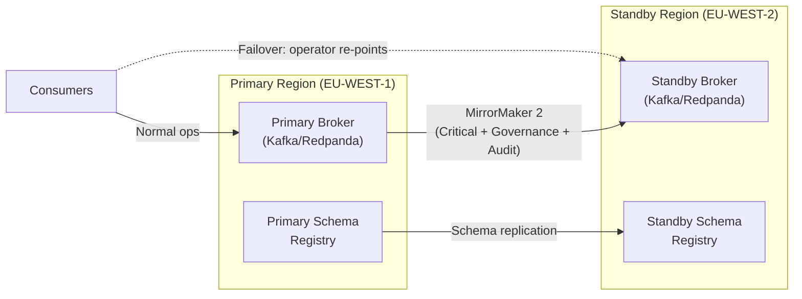

### 19.3 Enterprise — Region-Affine Active-Active

- Each tenant is pinned to a primary region. Events for a tenant are authoritative in that region.
- `tenant_route_key` includes region hint: `{region_code}_{opaque_hash}`.
- Cross-region replication: each tenant's events replicate to secondary region for DR only.
- **Conflict minimization:** A single `run_id` is ALWAYS owned by one region. No run spans multiple regions.
- **Failover guardrails:** Before failover, confirm the original region has fully stopped accepting events for the tenant. No split-brain allowed.
- **Cross-region replay:** Requires explicit operator authorization. Uses secondary region's replicated event history; does NOT re-execute against primary.

| Rule | Requirement |
|---|---|
| Run_id uniqueness | A run_id has exactly one authoritative region |
| Active-active constraint | No two regions accept events for the same run simultaneously |
| Tenant affinity | Tenant is pinned to one primary region; secondary is DR only |
| Offset translation | MirrorMaker 2 provides offset translation for consumer group failover |
| Schema registry | Schema registry is active-active replicated; schemas are global |

### 19.4 Global — Federated Event Runtime

- Advanced multi-region routing with regional control planes.
- Data residency enforcement: events never leave declared residency boundary.
- Replicated audit/evidence plane across all data-resident regions.
- Global control plane constraints: MYCELIA platform events (deployment, configuration) replicate globally; tenant events stay in data-resident boundary.
- Pulsar native geo-replication OR Kafka + MirrorMaker 2 + Cluster Linking.
- Full offset translation and consumer group migration tooling.
- Cross-region replay requires operator authorization and is bounded by data residency constraints.

---

## 20. Event Runtime Security

### 20.1 Runtime Authentication by Deployment Stage

MYCELIA requires authenticated event runtime access in every deployment stage, but the enforcement mechanism depends on the runtime mode.

### Authentication Stages

| Stage | Event Runtime Mode | Required Authentication |
|---|---|---|
| MVP | PostgreSQL-first event runtime | Application service identity, database credentials scoped by service, PostgreSQL RLS where applicable |
| Beta | Single broker cluster | mTLS or SASL/OIDC, broker ACLs, per-service principals |
| Enterprise | Broker cluster with strong workload identity | mTLS with SPIFFE SVID or equivalent workload identity |
| Global | Federated broker/runtime | SPIFFE/SPIRE-style workload identity, regional trust bundles, cross-region identity validation |

### MVP Rule

In PostgreSQL-first mode, MYCELIA MUST still enforce:

- service identity at the application runtime layer;
- tenant-scoped authorization;
- database-level access control;
- secret exclusion from event payloads;
- audit of unauthorized event access attempts;
- no direct table access by untrusted clients.

### Enterprise Rule

In broker-based Enterprise deployments, all MYCELIA services SHOULD authenticate to the broker using mTLS with SPIFFE SVID or equivalent workload identity.

No service SHOULD connect to enterprise brokers using shared username/password credentials.

### Rules

- Authentication MUST exist in every deployment stage.
- Workload identity strength MUST increase as the runtime graduates from MVP to Enterprise.
- Broker ACL requirements apply only when a broker is deployed.
- PostgreSQL-first mode MUST implement equivalent authorization through service boundaries, RLS and application checks.
- Any unauthorized connection or event access attempt MUST emit an auditable security event.

### Forbidden Behavior

FORBIDDEN:

- using unauthenticated event runtime access in MVP;
- using shared service credentials across multiple runtime components;
- claiming SPIFFE enforcement when the MVP has no broker or SPIFFE deployment;
- allowing database users to bypass tenant isolation;
- delaying all event runtime security until Enterprise.

### 20.2 Topic-Level ACL Model

| Principal | Permission | Topics |
|---|---|---|
| `svc/run-manager` | PRODUCE | `*.control.run.*` |
| `svc/step-coordinator` | PRODUCE | `*.execution.step.*` |
| `svc/tool-gateway` | PRODUCE | `*.tool.tool.*` |
| `svc/policy-gateway` | PRODUCE | `*.governance.*` |
| `svc/outbox-publisher` | PRODUCE | `*.control.*`, `*.execution.*`, `*.tool.*`, `*.governance.*`, `*.audit.*` |
| `svc/audit-service` | CONSUME | `*.audit.*`, `*.control.*`, `*.governance.*`, `*.tool.*` |
| `svc/projection-service` | CONSUME | `*.control.*`, `*.execution.*` |
| `svc/replay-consumer` | CONSUME | `*.replay.*` ONLY |
| `svc/replay-consumer` | DENY | `*.prod.*` |
| `svc/dlq-admin` | CONSUME | `*.dlq.*`, `*.quarantine.*` |
| `svc/dlq-admin` | DENY | `*.control.*`, `*.execution.*`, `*.governance.*` |

### 20.3 Tenant Isolation at Broker Level

Tenant-scoped topics use opaque `tenant_route_key` (not customer-readable tenant_id) in the topic name. This prevents:
- Customer names appearing in broker metadata, logs, or monitoring dashboards.
- PII in Kafka admin tool outputs.
- Unauthorized inference of tenant identity from topic names.

The `tenant_route_key` is a one-way mapping: `tenant_id → tenant_route_key = HMAC(tenant_id, routing_secret)`. The routing secret is held in the secrets management system; it is NOT in the event envelope.

### 20.4 Encryption

| Layer | Requirement |
|---|---|
| Broker-to-broker (replication) | TLS 1.3 |
| Producer-to-broker | TLS 1.3 via mTLS (SPIFFE SVID) |
| Consumer-to-broker | TLS 1.3 via mTLS |
| Schema registry | TLS 1.3 |
| Data at rest (broker storage) | AES-256 (OS-level or broker-level) |
| Event payload field encryption | For `data_classification = restricted`: field-level encryption of sensitive payload fields using tenant-scoped keys |

### 20.5 DLQ/Replay Access Control

DLQ topics contain original EventEnvelopes (including `payload_hash`, `security_context_ref`, and full event context). Replay topics replay original events in sensitive isolation. Both require restricted access:

- DLQ: CONSUME permission granted only to `svc/dlq-admin` and audit-logged operator tooling.
- Replay: CONSUME permission granted only to `svc/replay-consumer` service accounts scoped to the active replay session.
- Replay PRODUCE permission: `svc/replay-router` only; no other service may publish to replay topics.

### 20.6 Security Rules

**SEC-01.** No public broker access. All connections require mTLS with SPIFFE SVID.
**SEC-02.** No customer names or PII in topic names. Use `tenant_route_key`.
**SEC-03.** No raw secrets in event payloads. Security fields are references only.
**SEC-04.** Replay topics require restricted access; ACLs enforced at broker level.
**SEC-05.** DLQ topics require restricted access; original envelope content is sensitive.
**SEC-06.** All broker authentication failures emit auditable security events.
**SEC-07.** Unauthorized topic access attempts are immediately escalated as security incidents.
---

## 21. Event Runtime Observability

### 21.1 Required Dashboards

| Dashboard | Key Panels | Alert Triggers |
|---|---|---|
| **Broker Health** | ISR ratio, leader count, under-replicated partitions, broker CPU/memory | ISR < 1.0 → SEV2; under-replicated > 0 → SEV3 |
| **Topic Throughput** | Events/sec per topic plane; produce/consume rate; throughput trend | >80% capacity → SEV3 |
| **Partition Skew** | Per-partition event rate; skew ratio (max/avg partition load) | Skew >3x → SEV3; >10x → SEV2 |
| **Producer Latency** | p50/p95/p99 publish latency per topic class; outbox lag | p99 >1000ms → SEV3 |
| **Outbox Health** | Outbox depth; outbox max age; outbox publish rate | Age >120s → SEV2; depth >10K → SEV2 |
| **Consumer Lag** | Per-consumer-group lag; lag trend; lag per partition | Lag >10K → SEV3; lag >100K → SEV2 |
| **DLQ Depth** | DLQ depth per plane; DLQ growth rate; poison event count | Growth >10/min → SEV3; any poison → SEV2 |
| **Schema Validation** | Validation failures per event_type; unknown schema versions; registry latency | Any schema failure → SEV3 |
| **Replay Throughput** | Replay events/sec; active replay sessions; replay lag; replay divergences | Divergence rate >5% → SEV3 |
| **Broker Disk** | Disk utilization per broker; topic retention risk; cleanup policy activity | >75% → SEV3; >90% → SEV2 |
| **ISR/Replica Health** | Per-topic replication factor; ISR count; replica lag | Replication lag >30s → SEV3 |
| **Tenant Event Volume** | Per-tenant events/sec; quota utilization; throttling events | Quota >80% → SEV3 |
| **Security Events** | Unauthorized access attempts; cross-tenant events; integrity failures | Any cross-tenant attempt → SEV1 |

### 21.2 Required Metrics

| Metric Name | Type | Labels | Description |
|---|---|---|---|
| `mycelia.event.produced.count` | Counter | tenant_route_key, event_category, plane | Events produced per category |
| `mycelia.event.published.count` | Counter | tenant_route_key, event_category, plane | Events published to broker |
| `mycelia.event.consumed.count` | Counter | tenant_route_key, consumer_group, event_type | Events consumed and processed |
| `mycelia.event.publish.latency_ms` | Histogram | tenant_route_key, event_category, priority | p50/p95/p99 publish latency |
| `mycelia.event.consume.latency_ms` | Histogram | tenant_route_key, consumer_group | p50/p95/p99 consume latency |
| `mycelia.outbox.depth` | Gauge | tenant_route_key, priority | Current outbox queue depth |
| `mycelia.outbox.max_age_seconds` | Gauge | tenant_route_key | Age of oldest PENDING outbox record |
| `mycelia.consumer.lag` | Gauge | tenant_route_key, consumer_group, topic, partition | Consumer offset lag |
| `mycelia.dlq.depth` | Gauge | tenant_route_key, plane | DLQ event count |
| `mycelia.dlq.growth_rate` | Gauge | tenant_route_key, plane | DLQ events added per minute |
| `mycelia.replay.events_per_second` | Gauge | replay_id, tenant_route_key | Replay event processing rate |
| `mycelia.replay.divergence_count` | Counter | replay_id | Divergences detected |
| `mycelia.schema.validation.failure_count` | Counter | event_type, failure_reason | Schema validation failures |
| `mycelia.partition.skew_ratio` | Gauge | topic, plane | Max partition load / average partition load |
| `mycelia.broker.disk_utilization` | Gauge | broker_id | Broker disk usage percentage |
| `mycelia.broker.isr_ratio` | Gauge | topic, partition | In-sync replica ratio |
| `mycelia.event.integrity.failure_count` | Counter | tenant_route_key, event_type | Event hash verification failures |
| `mycelia.producer.buffer_utilization` | Gauge | producer_service | Producer buffer fill percentage |
| `mycelia.backpressure.mode` | Gauge | — | Current degradation mode (0=Healthy, 1=Constrained, 2=Degraded, 3=Critical, 4=Recovery) |

### 21.3 Alert Definitions (Conceptual)

| Alert | Condition | Severity | Runbook |
|---|---|---|---|
| OutboxBacklog | `outbox.max_age_seconds > 120` | SEV2 | Doc 17 §Outbox |
| ConsumerLagCritical | `consumer.lag > 100000 for 5 minutes` | SEV2 | Doc 17 §ConsumerLag |
| DLQPoison | `dlq.poison_event_count > 0` | SEV2 | Doc 17 §DLQ |
| BrokerDiskCritical | `broker.disk_utilization > 90%` | SEV2 | Doc 17 §BrokerDisk |
| ISRUnderReplicated | `broker.isr_ratio < 1.0` | SEV2 | Doc 17 §Replication |
| EventIntegrityViolation | `event.integrity.failure_count > 0` | SEV2 | Doc 17 §Integrity |
| CrossTenantAttempt | `TenantBoundaryViolationDetected events > 0` | SEV1 | Doc 17 §Security |
| SchemaValidationFailures | `schema.validation.failure_count > 10/min` | SEV3 | Doc 17 §Schema |
| ReplayContamination | `ReplayContaminationAttempted events > 0` | SEV2 | Doc 17 §Replay |

---

## 22. Event Runtime Failure Model

| Failure Mode | Detection | Runtime Behavior | Degraded Mode | Recovery | SRE Escalation |
|---|---|---|---|---|---|
| **Broker unavailable** | OutboxPublisher connection timeout; ISR loss | Outbox accumulates; events held in DB | Critical | Broker restart/failover; outbox backlog clearance | SEV1 |
| **Broker leader election storm** | Frequent leader change metrics; elevated latency | High producer retry rate; consumer group rebalance | Degraded | Wait for leader stability; monitor ISR recovery | SEV2 |
| **Under-replicated partitions** | ISR ratio < 1.0 for any partition | Durability risk; writes slow down (acks=all blocks) | Constrained | Investigate follower lag; restart lagging replicas | SEV2 |
| **Offline partitions** | Partition unavailable; consumer group cannot progress | Consumers stalled on affected partitions | Degraded/Critical | Reassign leadership; check broker health | SEV1 |
| **Schema registry unavailable** | Connection timeout from SchemaRegistryClient | Known schemas: continue (cached); unknown: fail closed | Constrained | Wait for restoration; pre-warm cache | SEV2 |
| **Producer buffer exhaustion** | Producer buffer_utilization > 85% | Producer blocks on send(); outbox depth increases | Constrained | Scale consumers; reduce replay throttle; investigate lag cause | SEV3 |
| **Outbox backlog** | outbox.max_age_seconds > 120s | Events delayed; governance freshness degraded | Constrained | Scale OutboxPublisher; investigate broker performance | SEV2 |
| **Outbox poison record** | OutboxRecord is_poison = true | Event permanently stuck; data gap risk | Degraded (for that event) | Operator review; root cause fix; authorize redrive | SEV2 |
| **Consumer crash loop** | Consumer restart count > 5 in 10 minutes | Consumer group rebalance; events re-delivered | Degraded | Fix consumer bug; redeploy; idempotency handles re-delivery | SEV2 |
| **Consumer lag spike** | consumer.lag > 10,000 | Projection staleness; governance freshness risk | Constrained → Degraded | Scale out consumer group; investigate processing bottleneck | SEV2 |
| **Consumer group rebalance storm** | Frequent partition reassignments | Processing paused during rebalance; event delivery delayed | Constrained | Stabilize consumer membership; check session timeouts | SEV3 |
| **DLQ backlog** | dlq.depth growth_rate > 10/min | Indication of systemic consumer failure | Degraded | Investigate failure class; fix root cause; authorize redrive | SEV2 |
| **Poison event loop** | Same event_id returns to DLQ multiple times | Event consumes DLQ capacity; root cause unresolved | Degraded | Operator investigation; root cause fix; authorized re-drive or discard | SEV2 |
| **Event integrity failure** | event_hash mismatch on verification | Event blocked from processing; routed to DLQ | Critical (security) | Forensic investigation; potential tamper incident | SEV1 |
| **Replay contamination** | replay_context event received by production consumer | Event dropped; alert triggered | Constrained | Audit ACLs; identify how replay event reached production topic | SEV2 |
| **Replay backlog** | replay.queue_depth > 50,000 | Replay throttled; investigation slowed | Degraded (replay only) | Throttle replay further; scale replay consumers independently | SEV3 |
| **Partition hot spot** | partition.skew_ratio > 10x | Single partition saturated; consumer lag on that partition | Constrained | Investigate hot partition key; apply key salting if permitted | SEV3 |
| **Topic retention exhaustion** | Topic at retention limit; old segments deleted | Historical events deleted earlier than expected | Normal but risk | Increase retention; check capacity model | SEV3 |
| **Disk pressure** | broker.disk_utilization > 90% | Write rejection risk; broker may block new events | Critical | Delete expired topics; add broker capacity; emergency compaction for non-governance topics | SEV1 |
| **Cross-tenant topic access** | Unauthorized ACL rejection | Access blocked; security event emitted | Security incident | Forensic investigation; SPIFFE identity audit | SEV1 |
| **Multi-region replication lag** | Standby broker event offset > 30s behind primary | Standby out of sync; failover would lose recent events | Degraded (DR readiness) | Investigate replication health; MirrorMaker lag; network bandwidth | SEV2 |
| **Failover offset mismatch** | Post-failover: consumer committed offset ahead of standby | Consumers may miss events or replay events | Critical (data gap) | Audit offset translation table; replay from last verified checkpoint | SEV1 |
| **Schema incompatibility** | Consumer cannot deserialize event; version incompatible | Event quarantined; consumer blocked | Constrained | Deploy migration adapter; run replay compatibility test; re-register schema | SEV3 |
| **Clock skew** | Producer `occurred_at` timestamp implausible | Causal reconstruction may be incorrect; reorder buffer stress | Constrained | Fix NTP on affected hosts; rely on causation_id for ordering | SEV3 |

---

## 23. MVP Event Runtime Cut

### 23.1 MVP Architecture Decision: PostgreSQL vs Broker

**The MVP MUST make an explicit decision on event runtime infrastructure.** The two options are:

**Option A: PostgreSQL append-only event table + transactional outbox**
- Implementation: `runtime_events` table (append-only); `outbox_records` table; OutboxPublisher worker polling every 100ms.
- Replay: Replay from `runtime_events` table; separate `replay_events` table or `is_replay` column for isolation.
- Consumer: Polling-based consumers reading from `runtime_events` with offset tracking.
- Pros: Zero additional infrastructure; replay-safe out of the box; transactional outbox is natural; sufficient for MVP throughput; easy to reason about; no broker operational complexity.
- Cons: Not a message broker (no consumer groups, no broker ACLs, no partition ordering at broker level); scale requires eventual migration to broker; no at-rest encryption at broker level (relies on PostgreSQL encryption).
- **Throughput ceiling: ~5,000 events/sec** (PostgreSQL single-node under normal workload). Sufficient for MVP and early Beta.

**Option B: Redpanda or Kafka from the beginning**
- Implementation: Single-node Redpanda (or single-broker Kafka) with no-ZooKeeper KRaft; outbox publisher writes to broker topics.
- Replay: Separate replay topics with isolation enforced by ACLs.
- Consumer: Kafka consumer groups with offset management.
- Pros: Production broker from day one; no migration needed; Kafka tooling available; consumer groups ready for horizontal scale.
- Cons: Additional operational complexity; network dependency; requires schema registry (separate service); harder to debug locally; more infrastructure for MVP team.

**Recommendation: Option A for MVP (PostgreSQL first).**

Rationale:
- The MYCELIA governance contracts (Document 07) and this document's invariants are met by a PostgreSQL outbox pattern for MVP volumes.
- Adding broker infrastructure to MVP increases operational scope without proportional benefit.
- The architecture is designed for broker migration: the EventProducerSDK, EventConsumerRuntime, and topic routing abstractions isolate broker-specific code. Migration from PostgreSQL to Redpanda is a deployment change, not an application architecture change.
- **Graduation criterion:** When MVP reaches 2,000 events/sec steady state OR requires consumer group fan-out across more than 5 consumers → migrate to Redpanda.

### 23.1.1 MVP Runtime Mode Clarification

The MVP Event Runtime operates in **PostgreSQL-first mode**.

This means that broker concepts remain part of the architecture, but are implemented through database-backed equivalents until MYCELIA graduates to Redpanda/Kafka.

### MVP Mode Mapping

| Broker Runtime Concept | MVP PostgreSQL-First Equivalent |
|---|---|
| Topic | Append-only table partition or logical event stream |
| Partition | Database partitioning strategy, usually by tenant_route_key and run_id |
| Consumer group | Consumer cursor table with consumer_group_id |
| Broker offset | Consumer cursor position over runtime_events |
| DLQ topic | dlq_records table |
| Quarantine topic | quarantine_records table |
| Replay topic | replay_events table or runtime_events with isolated replay namespace |
| ACL | PostgreSQL RLS, application authorization and service identity checks |
| Broker metrics | Database-backed queue depth, cursor lag and outbox age metrics |
| Broker redrive | Operator-authorized redrive from dlq_records |
| Schema Registry | Static JSON Schema registry in source control with runtime validator |

### Rules

- The MVP MUST NOT pretend that broker-level ACLs exist if the MVP is using PostgreSQL-first mode.
- The MVP MUST implement equivalent authorization, isolation and observability controls at the database and application runtime layer.
- Topic naming conventions remain canonical, but MAY be represented as logical stream names in MVP tables.
- Consumer groups remain canonical, but MAY be implemented as durable database cursors.
- Replay isolation remains mandatory even when implemented through tables instead of broker topics.

### Graduation Rule

When MYCELIA migrates from PostgreSQL-first mode to Redpanda/Kafka mode, the logical concepts defined in this document MUST map cleanly to broker primitives without changing EventEnvelope semantics or event contracts.

### Forbidden Behavior

FORBIDDEN:

- claiming broker ACL enforcement in MVP when no broker exists;
- skipping authorization because PostgreSQL-first mode is “simpler”;
- treating database cursors as business state;
- mixing replay and production rows without explicit replay namespace isolation;
- allowing Codex to implement a PostgreSQL event runtime that cannot later migrate to broker topics.

### 23.2 MVP Must Include

| Capability | Implementation |
|---|---|
| PostgreSQL append-only event tables | `runtime_events` (is_replay column); `outbox_records`; `processed_events` |
| Canonical EventEnvelope | Import from Document 07; TypeScript interface; all required fields |
| Static schema registry | JSON Schema files in source; SchemaRegistryClient reads from filesystem; no external service |
| Producer validation | Schema validation at EventProducerSDK; envelope completeness check |
| Consumer validation | Envelope + schema check in EventConsumerRuntime; replay_context guard |
| Processed-event deduplication | `processed_events` table; idempotency_key lookup before processing |
| DLQ/quarantine tables | `dlq_records` and `quarantine_records` in PostgreSQL; DeadLetterEventEnvelope fields |
| Replay isolation | `is_replay = true` column + `replay_id` filter; separate query path for replay consumers |
| `tenant_id` and `tenant_route_key` | On every event and every table; `tenant_route_key` resolver |
| `event_hash` and `payload_hash` | SHA-256 computation in EventProducerSDK |
| Basic outbox publisher | Background worker; poll every 100ms; retry with backoff; poison detection |
| Basic consumer runner | Polling-based consumer loop; validation pipeline; offset-equivalent tracking |
| Basic metrics | `outbox.depth`, `outbox.max_age_seconds`, `dlq.depth`, publish/consume counts |
| Alerting for outbox and DLQ | Alert when `outbox.max_age_seconds > 120` or `dlq.depth growth > 10/min` |

### 23.3 MVP May Defer

| Deferred Capability | Target Milestone |
|---|---|
| Kafka/Redpanda broker | Beta (when throughput or consumer fan-out demands it) |
| Multi-region replication | Beta DR |
| Formal schema registry service | Beta |
| Advanced broker autoscaling | Enterprise |
| Merkle proof chains | Enterprise |
| Complex topic hierarchy with partitioning | Beta (PostgreSQL uses table partitioning by run_id) |
| ACL enforcement at broker level | Beta (Kafka ACLs; MVP uses PostgreSQL RLS) |
| Consumer group management | Beta |
| Advanced DLQ redrive console | Beta |
| Multi-cluster replication | Enterprise |

---

## 24. Event Runtime Diagrams

### 24.1 Full Event Runtime Reference Architecture

See §4.2 for the component architecture diagram.

### 24.2 Broker Topology

See §6.3 for the logical broker topology diagram.

### 24.3 Producer with Outbox

See §10.4 for the producer sequence diagram.

### 24.4 Consumer with Idempotency and Offset Commit

See §11.5 for the consumer sequence diagram.

### 24.5 Backpressure Propagation

See §13.3 for the backpressure propagation chain diagram and §13.4 for the backpressure state machine.

### 24.6 DLQ Redrive Flow

See §15.3 for the DLQ runtime state machine.

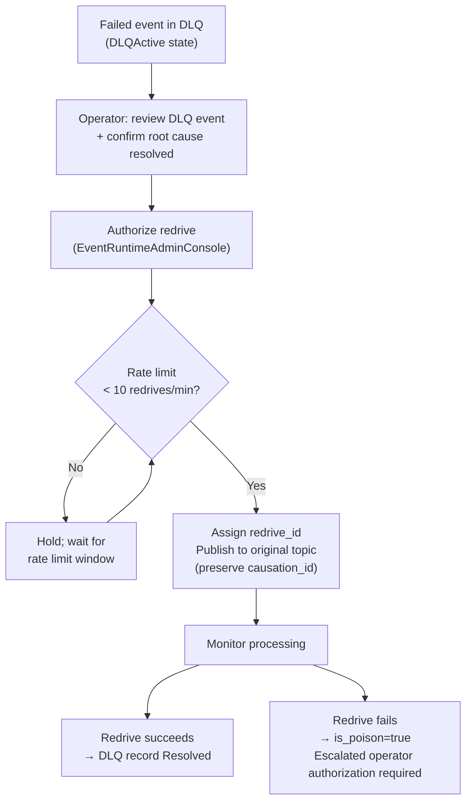

### 24.7 Replay Topic Isolation

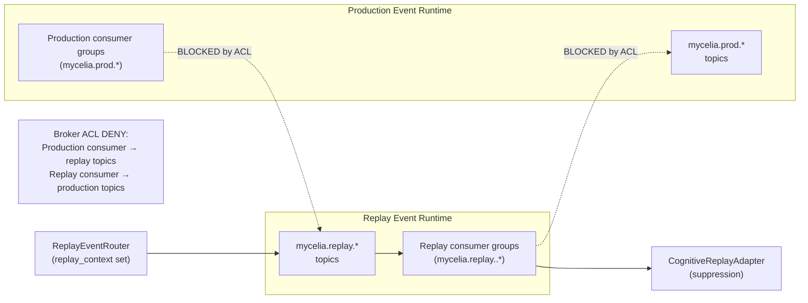

### 24.8 Multi-Region Active-Passive

See §19.2 for the active-passive diagram.

### 24.9 Schema Registry Lifecycle

See §12.7 for the schema lifecycle diagram.

### 24.10 Observability Pipeline

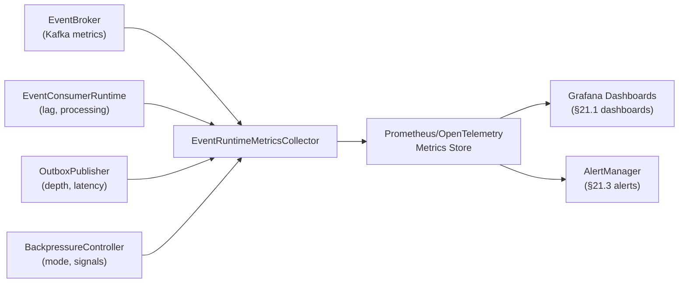

---

## 25. Event Runtime Invariants

### 25.1 Broker Invariants

| ID | Invariant |
|---|---|
| BRK-01 | No production consumer may subscribe to replay topics. |
| BRK-02 | No replay consumer may subscribe to production topics. |
| BRK-03 | No broker offset may be used as business state. |
| BRK-04 | Broker partition ordering is guaranteed only within a single partition; cross-partition events are unordered. |
| BRK-05 | All broker connections MUST use mTLS with SPIFFE SVID authentication. |
| BRK-06 | Broker must have at least 3 replicas (ISR=2) for Critical State and Governance topics in production. |
| BRK-07 | Broker acknowledges MUST be `acks=all` for critical and governance event publication. |
| BRK-08 | Under-replicated partitions MUST trigger an immediate SEV2 alert. |
| BRK-09 | Offline partitions MUST trigger SEV1 alert and incident response. |
| BRK-10 | The broker is delivery infrastructure; the event store (Document 06) is the authoritative source of truth. |

### 25.2 Topic Invariants

| ID | Invariant |
|---|---|
| TOP-01 | Topic names MUST follow the canonical naming convention: `mycelia.<env>.<scope>.<trk>.<plane>.<cat>.<ver>`. |
| TOP-02 | Topic names MUST NOT contain PII, customer names, or any human-readable tenant identifier. |
| TOP-03 | Production topics MUST NOT carry the `replay` environment segment. |
| TOP-04 | Replay topics MUST use the `replay` environment segment. |
| TOP-05 | Critical State, Governance, Tool Side-Effect, and Audit topics MUST NEVER have log compaction enabled. |
| TOP-06 | Topic retention MUST be at least as long as the replay evidence retention window (minimum 30 days). |
| TOP-07 | Each topic plane has its own DLQ topic; no shared DLQ across planes. |
| TOP-08 | Observability and low-priority integration topics MAY have compaction enabled after operational window. |
| TOP-09 | Topic naming changes require a migration plan and ADR. |
| TOP-10 | Platform-scoped topics use `platform` as scope segment; MUST NOT contain tenant-specific data. |

### 25.3 Partition Invariants

| ID | Invariant |
|---|---|
| PART-01 | Run-scoped events MUST use `run_id` as partition key. |
| PART-02 | Partition expansion on ordering-critical topics requires consumer group migration plan. |
| PART-03 | Key salting is FORBIDDEN for run-scoped, governance, and audit events. |
| PART-04 | Partition skew > 10x MUST trigger a hot partition investigation. |
| PART-05 | Partition count changes MUST be documented as ADRs. |
| PART-06 | Each partition MUST have its own consumer thread/goroutine for ordering-sensitive consumers. |
| PART-07 | Partition count MUST be planned at topic creation; partition expansion has ordering implications. |

### 25.4 Producer Invariants

| ID | Invariant |
|---|---|
| PROD-01 | Producers MUST NOT publish state-mutation events directly to the broker. |
| PROD-02 | The outbox is the only permitted publication path for state-mutation events. |
| PROD-03 | Producers MUST validate schema before writing to outbox. |
| PROD-04 | Producers MUST compute `event_hash` before outbox write. |
| PROD-05 | Producers MUST compute `payload_hash` before outbox write. |
| PROD-06 | `idempotency_key` MUST be deterministic and consistent across retries. |
| PROD-07 | OutboxPublisher MUST use idempotent producer mode (`enable.idempotence=true`). |
| PROD-08 | Critical-priority events MUST NOT wait behind low-priority batch accumulation. |
| PROD-09 | OutboxPublisher MUST await ISR acknowledgement before marking PUBLISHED. |
| PROD-10 | Producer MUST NOT include raw credentials in any EventEnvelope field. |

### 25.5 Consumer Invariants

| ID | Invariant |
|---|---|
| CONS-01 | Consumer offset MUST be committed only after successful processing AND COMPLETED ProcessedEventRecord. |
| CONS-02 | Consumer offset is NOT business state; it is a delivery position. |
| CONS-03 | Consumers MUST process events idempotently. |
| CONS-04 | Consumers MUST verify `tenant_route_key` before processing. |
| CONS-05 | Production consumers MUST reject events with non-null `replay_context`. |
| CONS-06 | Consumers MUST use `enable.auto.commit=false`; manual commit only. |
| CONS-07 | State-mutation consumers MUST commit state + ProcessedEventRecord atomically. |
| CONS-08 | Consumers MUST NOT mutate authoritative state directly; only via StateTransitionCoordinator. |
| CONS-09 | Consumers MUST route schema-invalid events to quarantine; MUST NOT silently discard. |
| CONS-10 | Consumer rebalance MUST NOT lose in-flight uncommitted events. |

### 25.6 Outbox Invariants

| ID | Invariant |
|---|---|
| OUT-01 | No authoritative event may bypass transactional outbox. |
| OUT-02 | OutboxRecord and state mutation MUST commit atomically in the same database transaction. |
| OUT-03 | `outbox.depth` and `outbox.max_age_seconds` MUST be observable metrics. |
| OUT-04 | Poison outbox records MUST alert on-call; MUST NOT be silently deleted. |
| OUT-05 | OutboxPublisher retry MUST use exponential backoff with jitter. |
| OUT-06 | OutboxPublisher MUST prioritize critical-priority records before standard records. |
| OUT-07 | Outbox publication failure MUST NOT roll back the state mutation. |
| OUT-08 | Outbox records MUST carry `tenant_route_key`. |
| OUT-09 | Outbox records MUST carry `causation_id` and `correlation_id`. |
| OUT-10 | Outbox records MUST NOT be deleted before they reach PUBLISHED status. |

### 25.7 Schema Registry Invariants

| ID | Invariant |
|---|---|
| SCH-01 | No event may traverse the production runtime without a registered schema. |
| SCH-02 | Schema registry unavailability MUST fail closed for unknown schemas. |
| SCH-03 | Known schemas (cached) MAY continue during registry outage up to the extended TTL. |
| SCH-04 | Replay compatibility tests MUST pass before schema changes are deployed. |
| SCH-05 | Breaking changes require new major version AND ADR. |
| SCH-06 | Schema fingerprint MUST be verifiable at consumer. |
| SCH-07 | Schema registry MUST have at least 3 replicas in production. |
| SCH-08 | CI/CD MUST validate schema compatibility before merging schema changes. |

### 25.8 Backpressure Invariants

| ID | Invariant |
|---|---|
| BP-01 | Governance, audit, and security events MUST NOT be dropped under load shedding. |
| BP-02 | Replay throughput MUST be throttled before production governance events are affected. |
| BP-03 | Backpressure mode transitions MUST be observable as metrics. |
| BP-04 | Critical mode MUST restrict event flow to governance/audit/security only. |
| BP-05 | Consumer group scale-out MUST be automatic when consumer lag exceeds warning threshold. |
| BP-06 | Backpressure signals MUST propagate to producers within 30 seconds of threshold breach. |
| BP-07 | Load shedding MUST NEVER drop authoritative events. |

### 25.9 DLQ Invariants

| ID | Invariant |
|---|---|
| DLQ-01 | DLQ topics MUST be per-plane; no global DLQ across planes. |
| DLQ-02 | DLQ topics MUST be per-tenant; no global DLQ across tenants. |
| DLQ-03 | DLQ records MUST preserve the original EventEnvelope. |
| DLQ-04 | Poison events MUST alert on-call after is_poison = true. |
| DLQ-05 | DLQ re-drive requires operator authorization; self-redrive is FORBIDDEN. |
| DLQ-06 | Re-driven events MUST preserve original `causation_id`. |
| DLQ-07 | Re-driven events MUST receive a new `redrive_id`. |
| DLQ-08 | DLQ re-drive rate MUST be limited to prevent redrive storm. |
| DLQ-09 | DLQ topics MUST have restricted access controls (original envelopes are sensitive). |
| DLQ-10 | DLQ backlog MUST be observable; `dlq.depth` metric per plane per tenant. |

### 25.10 Replay Invariants

| ID | Invariant |
|---|---|
| REP-01 | Replay events MUST NOT be published to production topics. |
| REP-02 | Replay consumers MUST NOT commit production broker offsets. |
| REP-03 | Replay consumer groups MUST use `mycelia.replay.*` naming. |
| REP-04 | Side-effectful operations MUST be suppressed during replay. |
| REP-05 | Replay can be paused/resumed independently from production runtime. |
| REP-06 | Replay integrity verification MUST check `event_hash` before hydration. |
| REP-07 | Replay divergences MUST be recorded; they are evidence, not errors. |
| REP-08 | Replay telemetry MUST route to isolated namespace. |
| REP-09 | Replay topics MUST have broker ACL DENY for all production consumer service accounts. |
| REP-10 | Production topics MUST have broker ACL DENY for all replay consumer service accounts. |

### 25.11 Multi-Region Invariants

| ID | Invariant |
|---|---|
| MR-01 | A `run_id` has exactly one authoritative region; no active-active for the same run. |
| MR-02 | Active-active deployments MUST be tenant-region partitioned; no shared run ownership. |
| MR-03 | Cross-region replay requires explicit operator authorization. |
| MR-04 | Failover MUST NOT replay side effects against production systems. |
| MR-05 | Offset translation MUST be verified after failover before consumers re-point. |
| MR-06 | Schema registry MUST be synchronized across regions before event replication begins. |
| MR-07 | Tenant data residency constraints MUST be enforced by regional routing, not application filtering alone. |

### 25.12 Observability Invariants

| ID | Invariant |
|---|---|
| OBS-01 | `outbox.depth` and `outbox.max_age_seconds` MUST be emitted continuously. |
| OBS-02 | `consumer.lag` MUST be emitted per consumer group per partition. |
| OBS-03 | `dlq.depth` MUST be emitted per plane per tenant_route_key. |
| OBS-04 | `event.integrity.failure_count` MUST alert on any non-zero value. |
| OBS-05 | `backpressure.mode` MUST be an observable metric reflecting current degradation mode. |
| OBS-06 | Replay telemetry MUST route to isolated namespace; MUST NOT appear in production dashboards. |

### 25.13 Security Invariants

| ID | Invariant |
|---|---|
| SEC-01 | All broker connections MUST authenticate via mTLS with SPIFFE SVID. |
| SEC-02 | Topic names MUST NOT contain PII or customer-readable tenant identifiers. |
| SEC-03 | DLQ and replay topics MUST have restricted ACLs. |
| SEC-04 | Event payloads MUST NOT contain raw secrets. |
| SEC-05 | Cross-tenant topic access attempts MUST trigger SEV1 security incident. |
| SEC-06 | `tenant_route_key` is a one-way HMAC mapping; the routing secret is never in event data. |
| SEC-07 | Unauthorized broker connection attempts MUST emit auditable security events. |

### 25.14 Tenant Invariants

| ID | Invariant |
|---|---|
| TEN-01 | Every tenant-scoped topic MUST include `tenant_route_key` in the topic name. |
| TEN-02 | Tenant-scoped consumer groups MUST only access their own tenant's topics. |
| TEN-03 | No consumer group may read events for tenants it is not authorized to serve. |
| TEN-04 | Tenant quota enforcement MUST be at the EventRuntimeQuotaManager level. |
| TEN-05 | Replay for a tenant MUST be isolated to that tenant's replay topics. |
| TEN-06 | DLQ for a tenant MUST be isolated to that tenant's DLQ topics. |
| TEN-07 | Cross-tenant event routing is FORBIDDEN; any attempt triggers SEV1. |

### 25.15 Retention Invariants

| ID | Invariant |
|---|---|
| RET-01 | Critical State, Governance, Audit, and Tool Side-Effect topics MUST retain permanently. |
| RET-02 | Log compaction MUST NEVER be enabled on replayability-required topics. |
| RET-03 | DLQ topics MUST retain original envelopes for at least 90 days. |
| RET-04 | Replay topics MUST retain events for the full investigation window (minimum 30 days). |
| RET-05 | Topic retention MUST be >= the replay evidence retention window. |
| RET-06 | Legal hold MUST block topic deletion or compaction. |

### 25.16 Benchmark Invariants

| ID | Invariant |
|---|---|
| BEN-01 | Benchmark numbers in this document are initial targets; they MUST NOT be treated as performance guarantees. |
| BEN-02 | Benchmark results MUST be labeled with environment profile and broker configuration. |
| BEN-03 | Throughput benchmarks MUST include failure scenario results, not only happy-path scenarios. |
| BEN-04 | Consumer lag benchmarks MUST include p99 latency, not only average. |
| BEN-05 | Benchmark suite MUST run in CI as a smoke test at each scale tier. |

---

## 26. Event Runtime Anti-Patterns

| ID | Anti-Pattern | Description | Why Dangerous |
|---|---|---|---|
| AP-01 | **Broker as database** | Using Kafka/Redpanda as the authoritative state store; deriving system state from broker alone | Compaction deletes history; broker failure = state loss; no ACID guarantees |
| AP-02 | **Kafka offset as business state** | Using consumer offset to represent which GovernedRun state the system is in | Offsets reset on rebalance, migration, and new consumer group; business logic breaks |
| AP-03 | **Replay on production topic** | Publishing replay events to `mycelia.prod.*` topics | Production consumers process replay events as facts; duplicate state mutations; governance contamination |
| AP-04 | **Production consumer reading replay topics** | Adding a production consumer's service account to replay topic ACLs | Replay events processed as production events; duplicate side effects |
| AP-05 | **Tenant names in topic names** | Including customer_name, email, or business name in topic identifier | PII in broker metadata; violates privacy; enables tenant inference from topic lists |
| AP-06 | **Global DLQ for all tenants** | Single DLQ topic shared across all tenants | Tenant A sees tenant B's failed events; no per-tenant forensic isolation |
| AP-07 | **Compaction of replay-critical events** | Enabling log compaction on control, governance, or audit topics | Intermediate events deleted; replay fails; causal chain broken |
| AP-08 | **Schema registry optional** | Publishing events without schema validation when schema registry is down | Schema drift; consumers receive malformed events; replay fails |
| AP-09 | **No outbox** | Publishing events directly after state mutation without transactional outbox | State and event history diverge on publication failure; governance gaps |
| AP-10 | **Direct publish after state mutation** | `stateService.save(); eventBroker.publish();` (without outbox) | If broker publish fails, state is committed but event is lost |
| AP-11 | **Random partition key for ordered events** | Using a new UUID as partition key for run-scoped events | Related events land on different partitions; FIFO ordering broken |
| AP-12 | **tenant_id-only partitioning causing hot partitions** | Using `tenant_id` as the only partition key for all events | Large tenant saturates one partition; other tenants blocked |
| AP-13 | **One topic for everything** | Single topic for all event categories from all tenants | No plane separation; governance and observability events compete; retention policy impossible |
| AP-14 | **One consumer group for everything** | Single consumer group consuming all topics | Scale coupling; one slow consumer type blocks all event processing |
| AP-15 | **Hidden retry loops** | Consumer retries indefinitely with no record of retry count | Poison events loop forever; DLQ never populated; no visibility into failures |
| AP-16 | **DLQ without alerting** | DLQ grows silently; no metrics or alerts | Evidence accumulates; root cause never investigated; events permanently lost |
| AP-17 | **Redrive without authorization** | Automated or unauthorized DLQ re-drive | Root cause may not be fixed; events loop between DLQ and production repeatedly |
| AP-18 | **Active-active without region ownership** | Two regions both accepting events for the same run_id | Split-brain; conflicting state transitions; no authoritative result |
| AP-19 | **Failover that replays side effects** | After region failover, consumers process replicated tool side-effect events again | Duplicate external effects (double payment, duplicate email, duplicate API call) |
| AP-20 | **Benchmark numbers without environment profile** | Publishing throughput numbers as universal guarantees | Teams incorrectly size production infrastructure; capacity model is wrong |
| AP-21 | **Consumer offset committed before processing** | `consumer.commitOffset(); processEvent(event);` | Events lost on consumer failure after commit but before processing |
| AP-22 | **In-memory deduplication** | ProcessedEventRecord stored in consumer memory | Duplicate processing on consumer restart; idempotency fails on any process death |
| AP-23 | **No backpressure signal** | Outbox depth and consumer lag not monitored; no degradation mode | Cascade failure: consumers overloaded; outbox explodes; broker disk exhausted |
| AP-24 | **Load shedding authoritative events** | Governance, audit, or state-mutation events dropped under load | Governance gaps; replay fails; audit incomplete |
| AP-25 | **Governance event treated as telemetry** | PolicyDenied or BudgetExceeded published to observability topic with short retention | Governance evidence deleted after 30 days; compliance audit fails |
| AP-26 | **Raw secrets in event payload** | API keys, OAuth tokens, or passwords in EventEnvelope fields | Credential exfiltration via event store, DLQ, and monitoring tools |
| AP-27 | **PII in topic names** | `mycelia.prod.tenant.alice@company.com.control.run.v1` | GDPR violation; PII in broker metadata; customer identity exposed |
| AP-28 | **Partition key changes on live topics** | Changing the partition key formula for an existing live topic | Events for the same run_id now land on different partitions; ordering broken |
| AP-29 | **Schema registry single instance** | One schema registry instance; no replication | Schema registry outage = all new events blocked; single point of failure |
| AP-30 | **Schema validation only at producer** | Consumers trust producer validated correctly | Schema drift between producer version and consumer version; consumers silently misread events |
| AP-31 | **Replay consumer using production consumer group** | Sharing consumer group between production and replay consumers | Replay offsets committed to production offset position; production events skipped |
| AP-32 | **Mixing retention policies on one topic** | Governance and observability events in the same topic | Short observability retention deletes governance evidence |
| AP-33 | **Consumer processing without idempotency check** | Side-effectful consumer does not check ProcessedEventStore before executing | Duplicate side effects on any re-delivery |
| AP-34 | **Hardcoding throughput numbers as SLAs** | `p99 < 100ms guaranteed` in code or config | Actual performance varies by environment; mismatched expectations cause production incidents |
| AP-35 | **Cross-tenant topic routing** | Routing tenant A's events to tenant B's topic (misconfigured tenant_route_key) | Cross-tenant data leakage; security incident |
| AP-36 | **No event hash on governance events** | Skipping `event_hash` computation for performance on audit events | Tamper evidence destroyed; integrity cannot be verified |
| AP-37 | **Outbox polling interval too long** | Polling outbox every 10 seconds instead of 100ms | Governance event freshness degrades; approval events delayed by up to 10s |
| AP-38 | **No capacity model** | Deploying broker without topic partition sizing | Partitions under-provisioned; hot partitions saturate immediately at scale |
| AP-39 | **Broker cluster undersized for governance events** | Governance topics on broker with fewer replicas than observability topics | Governance events at higher durability risk than telemetry |
| AP-40 | **DLQ re-drive with changed causation_id** | Re-driven events receive new causation_id | Causal chain broken; investigation cannot trace re-driven events back to original failure |
| AP-41 | **Single-region deployment without PITR** | No backup or point-in-time recovery for broker and event store | Regional failure = permanent data loss |
| AP-42 | **Active-passive failover without offset validation** | Failing over to standby before validating offset synchronization | Consumers in new region start from wrong offset; events missed or duplicated |
| AP-43 | **Replay uses live credentials** | Replay sessions use production API credentials | Replay produces real external side effects (double payments, duplicate emails) |
| AP-44 | **No per-tenant quota enforcement** | Single tenant can consume all broker capacity | One misbehaving or buggy tenant saturates event runtime for all other tenants |
| AP-45 | **Consumer group scaling without partition parity** | More consumers than partitions in consumer group | Extra consumers idle; can't process; over-provisioned compute |
| AP-46 | **Schema-invalid events silently discarded** | Consumer catches schema validation exception and logs/ignores | Events disappear; no DLQ/quarantine evidence; compliance audit fails |
| AP-47 | **Key salting on governance events** | Adding random salt to partition key for governance event throughput | Governance events lose run-level ordering; approval decisions may appear before requests |
| AP-48 | **Replay without integrity verification** | Replaying events without checking `event_hash` | Tampered events hydrate replay state; investigation conclusions are wrong |
| AP-49 | **One DLQ for all event categories** | No per-plane DLQ separation | Tool side-effect DLQ events mixed with step execution DLQ; forensics are impossible |
| AP-50 | **Consumer lag hidden from monitoring** | No consumer lag dashboards; no consumer lag alerts | Consumer lag spike goes undetected for hours; downstream projections stale; governance freshness lost |
| AP-51 | **Topic naming with versioned service names** | `mycelia.prod.run-manager-v2.control.run.v1` | Topic names change on service rename/refactor; consumer group subscriptions break |
| AP-52 | **No linger_ms differentiation by priority** | All events use same linger_ms = 100ms including critical | Critical events are delayed by low-priority batch accumulation |
| AP-53 | **Schema migration without replay test** | Deploy schema change without testing old events can be deserialized | Historical replay fails; incident investigation on old runs impossible |
| AP-54 | **Global event routing without tenant routing key** | All tenants share `platform` scope without isolation | Tenant A's events visible to Tenant B consumers |
| AP-55 | **Replay divergence treated as fatal error** | Abort entire replay on first divergence | Investigation loses all evidence from subsequent steps |
| AP-56 | **Outbox publisher concurrent without idempotency** | Multiple OutboxPublisher instances without idempotent producer mode | Duplicate events published to broker; consumers receive duplicate governance events |
| AP-57 | **No DLQ forensic retention** | DLQ events deleted after 7 days | Forensic investigation window shorter than incident investigation SLA |
| AP-58 | **Broker disk alert only at 95%** | No alert until disk is nearly full | No time to remediate; broker starts rejecting writes at 100%; events lost |
| AP-59 | **Consumer processing without tenant scope check** | Consumer processes events without verifying tenant_route_key | Cross-tenant data processing; security incident |
| AP-60 | **Schema fingerprint not verified** | Consumer trusts schema version string without validating fingerprint | Schema registry mutation goes undetected; consumers silently misread events |
| AP-61 | **Active-passive replication of observability topics** | Replicating short-retention observability events to standby | Standby storage consumed by non-essential data; governance topics delayed |
| AP-62 | **Manual outbox polling** | OutboxPublisher triggered manually instead of background loop | Events only published on operator action; governance events delayed indefinitely |
| AP-63 | **Consumer side-effects before deduplication check** | Execute database updates before checking ProcessedEventStore | Race condition: two parallel consumers both process same event before first completes |
| AP-64 | **Replay sessions share replay_id** | Two concurrent replay sessions use the same replay_id | Replay events from different sessions interleave; divergence detection unreliable |
| AP-65 | **Topic partition count change without migration** | Add partitions to live governance topic without consumer migration | Events for same run_id now on different partitions; ordering broken mid-stream |
| AP-66 | **Auto-offset-reset to latest for new consumer group** | New consumer group starts from latest offset, skipping existing events | Historical events are never processed; projections are incomplete |
| AP-67 | **Broker-internal DLQ** | Using broker's native retry/DLQ feature without MYCELIA's dead-letter envelope | Original EventEnvelope not preserved; forensics impossible; MYCELIA governance lost |
| AP-68 | **Mixed environment topics in single cluster** | `prod`, `staging`, and `dev` events on same broker cluster | Environment bleed; staging consumers affect production offset management |
| AP-69 | **No acknowledgement level for governance events** | Governance events published with `acks=1` (leader only) | Leader failure between publish and replica sync = governance event lost |
| AP-70 | **Replay consumer group per event type** | Separate consumer group per event type within a replay session | Consumer group explosion; DLQ monitoring becomes unmanageable |
| AP-71 | **Topic ACLs bypass via admin service account** | Admin service account has broad PRODUCE/CONSUME on all topics | Compromised admin account can produce events on any tenant's governance topics |
| AP-72 | **Consumer group with no lag limit** | Consumer group allowed to fall arbitrarily far behind | Governance freshness degrades unboundedly; projections diverge from authoritative state |
| AP-73 | **Schema registry blocks on network** | SchemaRegistryClient makes synchronous network call per event | Single schema registry outage blocks all event production; no caching |
| AP-74 | **Replay without throttle** | Replay sessions run at full production throughput | Replay saturates event runtime; production consumer lag spikes; governance freshness at risk |
| AP-75 | **No replay DLQ** | Replay processing failures are silently swallowed | Investigation artifacts lost; divergences unrecorded; replay evidence incomplete |
| AP-76 | **MirrorMaker 2 replicating all topics** | All topics replicated cross-region including observability and replay | Unnecessary bandwidth and cost; standby storage dominated by non-essential events |
| AP-77 | **Same broker cluster for replay and production** | No isolation between production broker and replay event runtime | Replay throughput competes with production; governance events experience contention |
| AP-78 | **Benchmark on dedicated hardware, deployed on shared** | Benchmarks run on isolated nodes; production runs on shared cloud instances | Performance targets unachievable in production; capacity model wrong |
| AP-79 | **No partition skew monitoring** | No alert for partition skew ratio | Hot partitions silently degrade; one tenant monopolizes broker throughput |
| AP-80 | **Consumer offset stored in application DB on different schema** | Consumer offset in a different schema than the state it gates | Offset and state become inconsistent on schema migration; events skipped or double-processed |
| AP-81 | **Event published to wrong plane topic** | A governance event published to the execution plane topic | Retention policy mismatch; governance evidence subject to operational retention |
| AP-82 | **Tool-event ordering guaranteed cross-run** | Consumer assumes ToolSucceeded from Run A appears before ToolSucceeded from Run B | No cross-run ordering; different runs on different partitions |
| AP-83 | **Schema fingerprint as content hash** | Using SHA-256 of schema content as the published event's schema version | Content-based versioning is not human-manageable; schema changes silently create new versions |
| AP-84 | **Replay in same consumer group as production** | Replay consumer using `mycelia.prod.*` consumer group prefix | Replay offsets committed to production offset; production processing position corrupted |
| AP-85 | **Outbox records deleted on publication failure** | Permanently deleting POISON outbox records | Event publication intent permanently lost; state without event history |
| AP-86 | **Custom event envelopes alongside canonical EventEnvelope** | Service creates its own event format for "simpler" events | Two event formats; consumers must handle both; schema registry cannot govern non-canonical events |
| AP-87 | **Per-service DLQ topic** | Each microservice has its own DLQ | Events in per-service DLQ; no plane-level forensic aggregation; monitoring impossible |
| AP-88 | **Consumer group without consumer group ID** | Consumers connect to broker without specifying group ID | No offset management; consumers re-read from the beginning on restart |
| AP-89 | **ISR alert set to 0** | Alert triggers only when ISR reaches 0 (complete replica failure) | Partial replication failure undetected; durability degraded without operator awareness |
| AP-90 | **Clock sync disabled on broker hosts** | NTP disabled; broker timestamps unreliable | Event timing metadata unreliable; performance benchmarks meaningless; consumer reorder buffer miscalibrated |

---

## 27. Codex Implementation Guidance

### 27.1 Implementation Order

| Order | Component | Description |
|---|---|---|
| 1 | Event runtime module boundaries | `event-runtime-core`, `event-producer-sdk`, `outbox-publisher`, `event-consumer-runtime`, `replay-consumer-runtime`, `schema-registry-client`, `dlq-router`, `backpressure-controller`, `event-runtime-metrics` |
| 2 | EventEnvelope import | Import EventEnvelope interface from Document 07 contract; MUST NOT create alternate envelope |
| 3 | Schema validation runtime | SchemaRegistryClient with cache; JSON Schema validation; fail-closed for unknown schemas |
| 4 | Transactional outbox writer integration | TransactionalOutboxWriter; atomic with state mutation; Document 06 §9 contract |
| 5 | OutboxPublisher | Polling loop; priority ordering; idempotent producer; retry with backoff; poison detection |
| 6 | Event hash verification | EventIntegrityVerifier; SHA-256 of canonical envelope; payload_hash check |
| 7 | TopicRouter | Event category → topic name resolution; canonical naming convention |
| 8 | PartitionKeyResolver | Event category → partition key; partitioning strategy from §8 |
| 9 | tenant_route_key resolver | HMAC-based resolver; opaque output; routing secret from secrets management |
| 10 | Producer SDK | Schema validate → build envelope → compute hashes → write outbox |
| 11 | Consumer runtime | Validation pipeline → deduplication → idempotent processing → offset commit |
| 12 | ProcessedEventStore | Deduplication table; idempotency_key lookup; PROCESSING/COMPLETED/FAILED states |
| 13 | DLQ/quarantine models | DeadLetterEventEnvelope; quarantine records; per-plane DLQ tables; poison flag |
| 14 | Replay event router | Replay topic routing; ACL enforcement; replay_context propagation |
| 15 | Replay consumer runtime | Isolated consumer group; no production offsets; suppression logic; divergence recording |
| 16 | Backpressure metrics | Emit outbox.depth, consumer.lag, dlq.depth, producer.buffer_utilization |
| 17 | Backpressure controller | State machine (Healthy/Constrained/Degraded/Critical); throttling signals |
| 18 | Basic benchmark harness | Throughput test; latency measurement; happy-path and DLQ scenarios |
| 19 | Observability dashboard definitions | Grafana dashboard JSON; alert rule definitions |
| 20 | Security/ACL policy model | SPIFFE identity resolver; topic ACL configuration; tenant_route_key privacy |
| 21 | MVP tests | All required tests below |
| 22 | Later broker migration hooks | Abstraction layer over PostgreSQL event tables; pluggable broker adapter |

### 27.2 Forbidden Codex Shortcuts

| Shortcut | Why Forbidden |
|---|---|
| Duplicate EventEnvelope from Document 07 with different fields | Single source of truth; import from Document 07 contract |
| Create alternate event types (e.g., `RunStarted` vs `RunCreated`) | Canonical event catalog in Document 07; all code must use canonical names |
| Implement a second GovernedRun lifecycle | 24-state lifecycle in Documents 02/03; event runtime must align with it |
| Skip transactional outbox for "fast events" | Outbox is the only reliable path for state-mutation events |
| Publish replay traffic to production topics | Replay contamination; duplicate side effects |
| Use customer names in topic names | Privacy violation; PII in broker metadata |
| Rely on broker offsets as business state | Offsets reset; business logic breaks on consumer group change |
| Skip schema validation on replay | Replay must use same schema contracts as production |
| Implement DLQ as logs only | Original envelopes not preserved; forensics impossible |
| Hardcode benchmark numbers as guaranteed SLAs | Actual performance is environment-dependent |

### 27.3 Required Tests

| Test | Description | Pass Condition |
|---|---|---|
| Topic routing test | Produce event of each category; verify topic assignment | Correct topic per naming convention; no cross-plane routing |
| tenant_route_key privacy test | Inspect topic names; verify no customer identifier present | No PII or tenant_id in topic names; opaque tenant_route_key |
| Partition key determinism test | Same event type and run_id produces same partition key | Partition key is deterministic; not random |
| Producer outbox test | Produce event; verify outbox record created atomically | OutboxRecord created in same transaction as state mutation |
| Consumer idempotency test | Deliver same event twice | Second delivery returns cached result; no duplicate state mutation |
| Replay isolation test | Publish event with replay_context; subscribe with production consumer | Production consumer drops event; ReplayContaminationAttempted emitted |
| DLQ routing test | Inject schema-invalid event; inject processing-failure event | Schema-invalid → quarantine; processing-failure after retries → DLQ |
| Poison event test | Exhaust retry budget | is_poison=true; alert triggered; no further automatic retry |
| Schema registry failure mode test | Take schema registry offline; publish known schema event | Event published successfully (cached schema); unknown schema event blocked |
| Event hash verification test | Tamper with event after creation; verify at consumer | EventIntegrityVerificationFailed emitted; tampered event routed to DLQ |
| Backpressure threshold test | Induce consumer lag > critical threshold | Constrained mode triggered; low-priority events throttled; critical events unaffected |
| Benchmark smoke test | Run happy-path scenario; measure publish/consume latency | p99 publish latency within staging benchmark profile targets |
| No production consumer on replay topic test | Verify ACL prevents production consumer from subscribing to replay topics | Subscription attempt blocked; security event emitted |
| Multi-region failover test (if deployed) | Take primary broker offline; failover to standby | Consumers re-point; no duplicate side effects; offset translation correct |

---

## 28. Relationship to Other Documents

| Document | Relationship |
|---|---|
| **Document 00** | Document 00's doctrine: systems fail when they become operational before they become governable. Document 08 is the event runtime that prevents ungoverned event delivery. The event runtime's reliability properties directly implement Document 00's governance principles. |
| **Document 01** | Document 01 requires full audit trail, replay capability, tenant isolation, and multi-step workflow support. Document 08 implements those requirements at broker and topic level: permanent retention, replay isolation, per-tenant topics, governance event priority. |
| **Document 02** | Document 02 defines the Core Runtime Architecture and the GovernedRun 24-state lifecycle. Document 08 carries the events produced by those state transitions. All event names in Document 08 are aligned with the canonical 24-state lifecycle (RunCreated, RunSucceeded, StepRunning, ToolDispatched, etc.). Document 08 MUST NOT introduce state names that conflict with Document 02. |
| **Document 03** | Document 03 defines the Canonical Domain Model. Document 08 uses domain entity identifiers (run_id, step_id, tool_invocation_id) as partition keys and ordering anchors. Entity lifecycle events are produced in the order Document 03 defines. |
| **Document 04** | Document 04 defines Cognitive Execution. Document 08 carries CognitiveInvocationStarted, CognitiveInvocationSucceeded, AgentOutputValidated, and related events on the Execution Plane topics. |
| **Document 05** | Document 05 defines Agent Runtime. Document 08 carries AgentExecutionStarted, AgentHandoffRequested, AgentBudgetExceeded on the Execution Plane. |
| **Document 06** | Document 06 defines State, Checkpoint & Persistence. Document 08 depends on Document 06's transactional outbox (§9) as the bridge between state persistence and event publication. The event store (Document 06) is the authoritative source of truth that Document 08's broker implements delivery for. |
| **Document 07** | Document 07 defines the canonical EventEnvelope, event catalog, producer/consumer semantic obligations, schema registry contract, and DLQ semantics. Document 08 implements those contracts at runtime level. Document 08 MUST NOT redefine the EventEnvelope or introduce event types outside Document 07's catalog. |
| **Document 09** | Document 09 defines Workflow Orchestration. Temporal workflow state transitions produce events that Document 08 delivers on Control Plane topics. |
| **Document 10** | Document 10 defines Memory Architecture. ContextSnapshotCreated, MemoryWriteCommitted events are delivered by Document 08 on the Memory Plane topics. |
| **Document 11** | Document 11 defines Governance, Policy & Approval. PolicyEvaluated, BudgetExceeded, ApprovalGranted, and related events are delivered by Document 08 on Governance Plane topics with permanent retention. |
| **Document 12** | Document 12 defines the Observability Platform. Document 08 feeds the observability platform through the Observability Plane topics and exports metrics to the OTel collector. |
| **Document 13** | Document 13 defines Security Architecture. Document 08 implements security at the broker level: mTLS with SPIFFE SVID, topic ACLs, tenant_route_key isolation, and security event escalation. |
| **Document 14** | Document 14 defines Multi-Tenant Isolation. Document 08 enforces tenant isolation at the event runtime level: separate topics per tenant_route_key, per-tenant DLQ, per-tenant replay namespaces, per-tenant quota management. |
| **Document 15** | Document 15 defines Tool Runtime. ToolInvocationRequested, ToolDispatched, ToolSucceeded events are carried by Document 08 on Tool Plane topics with Critical State durability. |
| **Document 16** | Document 16 defines Infrastructure Deployment. Document 16 deploys the physical broker cluster, schema registry, and networking that Document 08 requires. Document 08 defines the logical requirements; Document 16 implements them. |
| **Document 17** | Document 17 defines SRE Runbooks. The failure modes in Document 08 §22 correspond to runbooks in Document 17. The alerts defined in Document 08 §21 trigger the runbooks in Document 17. |
| **Document 18** | Document 18 defines External API Contracts. Integration events on the Integration Plane (Document 08) bridge between MYCELIA's internal event runtime and external system webhooks/callbacks. |

---

## 29. Final Event Runtime Principles

**Contracts define.** Document 07 defines what events are, what they carry, and what producers and consumers must do. Document 08 ensures the infrastructure to carry them reliably. The contract is sovereign; the runtime serves the contract.

**Brokers deliver.** The broker is a delivery infrastructure, not a database. It provides ordered, durable, at-least-once delivery within partitions. It does not make authorization decisions, enforce governance, or constitute the source of truth. The event store does.

**Outbox commits.** The transactional outbox is the bridge that ensures state mutations and event publication intent commit together. No state change in MYCELIA is invisible because the outbox makes every mutation's event intent durable before the broker is even involved.

**Partitions order.** Ordering is achieved through deliberate partition key assignment. Run-scoped events are ordered by using `run_id` as the partition key. Cross-partition ordering is not attempted; causal chains are the mechanism for causal reconstruction across partitions.

**Consumers deduplicate.** At-least-once delivery is a broker guarantee. Exactly-once effects are a consumer responsibility. The ProcessedEventStore and idempotent processing contract are the mechanisms that transform broker delivery into correct business outcomes.

**Backpressure protects.** Consumer lag, outbox depth, and broker disk are runtime signals that the event system is under stress. The backpressure controller responds proportionally — throttling non-critical traffic first, governance last. The event runtime degrades gracefully, not catastrophically.

**DLQ preserves.** The DLQ is a forensic preservation system, not a waste bin. Original EventEnvelopes in the DLQ are evidence for investigation. Poison events in the DLQ are signals that require root cause analysis, not silent deletion.

**Replay isolates.** Replay traffic lives in a separate topic namespace, with separate consumer groups, separate ACLs, and separate throttling. Production and replay event runtimes never share infrastructure that could allow cross-contamination.

**Schema registry governs.** No event traverses the production event runtime without a registered, validated schema. The schema registry is a mandatory runtime dependency. Its unavailability fails closed for unknown schemas; cached schemas continue until the extended TTL.

**Metrics reveal.** outbox.depth, consumer.lag, dlq.depth, partition.skew_ratio, broker.isr_ratio — these metrics make the event runtime's health visible. A hidden failure in the event runtime is not recoverable because it is not detectable. The event runtime is observable by design.

**Tenants route privately.** Tenant identity is abstracted into an opaque `tenant_route_key` before it appears in any topic name, log, or metric. Tenant isolation at the broker level is structural — no customer name is ever in broker metadata.

**Regions contain authority.** A GovernedRun has exactly one authoritative region. Active-active deployments are tenant-region partitioned, not run-partitioned. Failover transfers authority; it does not duplicate it.

**Recovery follows evidence.** Recovery from any broker failure depends on the durable event history (Document 06 event store), the checkpoint anchors, and the outbox backlog. Recovery does not guess or reconstruct — it follows the evidence the runtime created.

---

> In MYCELIA, the event runtime is not a pipe for messages.
>
> It is the governed circulation system that carries memory, causality, recovery and proof through the platform.
