# MYCELIA — 09 Workflow Orchestration Engine Specification

---

## Document Metadata

| Field | Value |
|---|---|
| Document Series | MYCELIA Architecture Constitution |
| Document Number | 09 |
| Version | v1.0 |
| Status | Canonical |
| Classification | Core Architecture — Workflow Orchestration |
| Canonical Role | Defines the workflow orchestration engine that coordinates governed execution through deterministic, replay-safe, policy-aware workflow control flow across all MYCELIA runtimes |
| Primary Audience | Platform Engineers, Workflow Architects, Runtime Engineers, Codex |
| Last Updated | June 2026 |

---

## Table of Contents

1. [Executive Summary](#1-executive-summary)
2. [Orchestration Philosophy](#2-orchestration-philosophy)
3. [Orchestration Scope and Non-Scope](#3-orchestration-scope-and-non-scope)
4. [Canonical Workflow Domain Model](#4-canonical-workflow-domain-model)
5. [Workflow Definition and Versioning](#5-workflow-definition-and-versioning)
6. [Workflow Compilation Contract](#6-workflow-compilation-contract)
7. [DAG and Graph Semantics](#7-dag-and-graph-semantics)
8. [Node and Step Semantics](#8-node-and-step-semantics)
9. [Orchestration State Model](#9-orchestration-state-model)
10. [Scheduling and Triggering](#10-scheduling-and-triggering)
11. [Execution Planning](#11-execution-planning)
12. [Runtime Execution Coordination](#12-runtime-execution-coordination)
13. [Dispatch, Leases and Heartbeats](#13-dispatch-leases-and-heartbeats)
14. [Concurrency, Parallelism and Fairness](#14-concurrency-parallelism-and-fairness)
15. [Retry, Timeout and Compensation Model](#15-retry-timeout-and-compensation-model)
16. [Side-Effect Containment](#16-side-effect-containment)
17. [Long-Running Workflow Semantics](#17-long-running-workflow-semantics)
18. [Human-in-the-Loop Orchestration](#18-human-in-the-loop-orchestration)
19. [Replay-Aware Orchestration](#19-replay-aware-orchestration)
20. [Workflow Version Compatibility and Migration](#20-workflow-version-compatibility-and-migration)
21. [Orchestration Observability](#21-orchestration-observability)
22. [Orchestration Failure Model](#22-orchestration-failure-model)
23. [MVP Orchestration Cut](#23-mvp-orchestration-cut)
24. [Workflow Orchestration Diagrams](#24-workflow-orchestration-diagrams)
25. [Workflow Orchestration Invariants](#25-workflow-orchestration-invariants)
26. [Workflow Orchestration Anti-Patterns](#26-workflow-orchestration-anti-patterns)
27. [Codex Implementation Guidance](#27-codex-implementation-guidance)
28. [Relationship to Other Documents](#28-relationship-to-other-documents)
29. [Final Workflow Orchestration Principles](#29-final-workflow-orchestration-principles)

---

## 1. Executive Summary

### 1.1 What the Workflow Orchestration Engine Is

The MYCELIA Workflow Orchestration Engine is the deterministic control plane that coordinates the execution of governed cognitive workflows. It decides what happens next, in what order, under what constraints, with what retry behavior, and through what approval gates. It does not perform the work.

The orchestration engine does not call model providers directly. It does not execute tools. It does not mutate external systems. It does not write to memory or perform business actions. It governs the order, safety, accountability, and replayability of the work performed by workers, tools, and agents that it coordinates.

### 1.2 Why Deterministic Orchestration Matters

Determinism means that given the same event history and the same workflow definition, the orchestration engine will always reconstruct the same execution state and make the same next scheduling decision. A workflow engine that is not deterministic cannot be reliably replayed from history. A workflow that cannot be replayed from history cannot be safely recovered from failure — recovery would require re-executing side effects, producing duplicate external actions.

### 1.3 Why Orchestration Must Be Separated from Execution

If orchestration code calls tools, queries databases, or invokes APIs directly, it becomes nondeterministic — its output depends on the current state of the external world, not just its event history. MYCELIA's orchestration engine issues commands (dispatch step, schedule timer, require approval). Workers, tools, and agents execute those commands and report results back as events. The engine's state is derived entirely from its own event history.

### 1.4 Relationship to Sibling Documents

Document 09 depends on Documents 02 (Core Runtime), 03 (Domain Model), 06 (State Persistence), 07 (Event Contracts), 08 (Event Runtime). It coordinates with Documents 04 (Cognitive Execution), 05 (Agent Runtime), 11 (Governance), 15 (Tool Runtime). Observability is defined in Document 12.

---

## 2. Orchestration Philosophy

### 2.1 Core Principles

**Deterministic control flow.** The workflow engine's next action is entirely determined by the current state (derived from event history) and the workflow definition. No randomness, no external queries, no live API calls influence the control flow decision.

**Durable workflow execution.** Workflow state exists in durable storage, not in-memory. Every meaningful orchestration decision is backed by a persisted state transition and an append-only event. Process restarts do not lose workflow state.

**Event history as source of truth.** The workflow's event history is the authoritative record of everything that happened. Replay reconstitutes state by replaying events — not by querying current system state.

**Workflow version immutability.** A published WorkflowVersion is an immutable, compilable artifact. New behavior requires a new version.

**Replay-safe orchestration.** Every deterministic decision must produce the same outcome when replayed against the same event history. Nondeterministic outputs (model outputs, tool results, human decisions) are injected as recorded events, not re-executed.

**Bounded nondeterminism.** Nondeterministic behavior is confined to execution units outside the orchestration engine. Results are captured as immutable events.

**Side-effect isolation.** External side effects occur in workers and tool execution environments. The orchestration engine never causes side effects directly.

**Orchestration as coordinator, not executor.** The engine coordinates: it decides what step is ready, dispatches to workers, tracks completion, handles retries, manages timers, blocks on approvals, routes to compensation. It does not do the work.

### 2.2 Canonical Distinctions

| Concept A | Concept B | Distinction |
|---|---|---|
| **Orchestration** | **Execution** | Control flow decisions vs side-effectful task work |
| **WorkflowDefinition** | **WorkflowVersion** | Logical identity vs immutable compilable artifact |
| **WorkflowVersion** | **WorkflowRun** | Static compiled definition vs live execution instance |
| **Task dispatch** | **Task execution** | Orchestrator command vs worker-side work |
| **Retry** | **Compensation** | Re-attempt same step vs undo a completed step's effect |
| **Pause** | **Approval wait** | Operator suspension vs governance-required blocking gate |
| **Timer wait** | **Worker sleep** | Durable record, no thread blocked vs thread blocked |
| **Replay** | **Rerun** | Reconstruct from history without side effects vs fresh execution |
| **Replay** | **Simulation** | Original history vs modified inputs in isolation |
| **Deterministic decision** | **Probabilistic output** | Same inputs → same output vs LLM/human nondeterminism |

---

## 3. Orchestration Scope and Non-Scope

### 3.1 What Document 09 Owns

| Responsibility | Description |
|---|---|
| Workflow lifecycle | Definition, versioning, deprecation, archival |
| WorkflowVersion publication | Compilation gate; immutability after publish |
| Workflow compilation | DAG validation, execution plan generation, compilation artifacts |
| Execution plan generation | Topological ordering, dependency map, barrier map, plans |
| Scheduling | Trigger processing, cron, event-triggered, API-triggered runs |
| Dispatching | TaskDispatch creation, worker assignment, dispatch metadata |
| Step readiness | StepReady emission, pre-dispatch validation |
| Retry scheduling | RetryPolicy application, retry event emission |
| Timer scheduling | Durable timer creation, timer fire handling |
| Approval blocking | ApprovalBarrier creation, resumption on decision |
| Compensation path activation | CompensationPlan execution on failure |
| Replay coordination | ReplayExecution management, suppression, divergence recording |
| Workflow-level concurrency/fairness | Per-tenant/workspace/run concurrency policies |
| Orchestration telemetry | Span hierarchy, metrics |
| Invalid transition handling | StateTransitionRejected event |

### 3.2 What Document 09 Does Not Own

| Non-Responsibility | Owner Document |
|---|---|
| Tool implementation and execution | Document 15 |
| Model provider calls and LLM reasoning | Document 04 |
| Agent reasoning and coordination | Document 05 |
| Memory retrieval internals | Document 10 |
| Policy engine evaluation internals | Document 11 |
| State persistence storage | Document 06 |
| Event broker topology | Document 08 |
| Infrastructure deployment | Document 16 |
| SRE runbooks | Document 17 |
| UX graph editor | Document 21 |

---

## 4. Canonical Workflow Domain Model

### 4.1 Entity Definitions

**WorkflowDefinition** — Logical workflow identity; namespace for all versions. Owner: WorkflowService. Immutable ID; mutable display name and tags. Per-tenant.

**WorkflowVersion** — Immutable compilable snapshot of a workflow. IMMUTABLE after publication. Pinned to all runs created from it. Lifecycle: Draft → PendingCompilation → Published → Deprecated → Archived.

**WorkflowGraph** — The DAG structure (nodes + edges) of a WorkflowVersion. IMMUTABLE after compilation.

**WorkflowNode** — A single step unit in the graph (see §8). Unique ID; declared type; input/output schema.

**WorkflowEdge** — Directed dependency from one node to another. May carry a conditional predicate (deterministic only).

**WorkflowTrigger** — Activation conditions for a WorkflowVersion (API, event, cron, webhook, manual, recovery).

**WorkflowRun / GovernedRun** — Live execution instance of a WorkflowVersion. The primary orchestration entity. 24-state canonical lifecycle from Documents 02/03/06. Per-tenant; strictly isolated.

**ExecutionPlan** — Resolved execution schedule for a run: topological order, dependency map, barrier map, retry/timeout plans. Derived from WorkflowVersion; reconstructed during replay.

**StepExecution** — A specific execution attempt of a WorkflowNode within a run. Tracks dispatch, worker, output, completion.

**TaskDispatch** — The command issued to a worker for a step execution attempt. Fields: `task_dispatch_id`, `tenant_id`, `run_id`, `step_id`, `step_execution_id`, `attempt_number`, `idempotency_key`, `trace_id`, `timeout_seconds`, `worker_queue`.

**WorkerLease** — Time-bounded claim on a StepExecution by a worker. Lifecycle: Acquired → Active → Renewed → Expired | Released.

**Timer** — Durable scheduled event. MUST be a durable record; MUST NOT block worker threads. Lifecycle: Scheduled → Active → Fired | Cancelled.

**ApprovalBarrier** — Blocking gate pausing execution until approval decision. Lifecycle: Created → AwaitingDecision → Granted | Denied | TimedOut.

**CompensationPlan** — Explicit compensation step sequence. Activated on failure. MUST NOT erase original events.

**RetryPolicy** — Rules for retry: `max_attempts`, `backoff_strategy`, `retryable_failure_classes`, `terminal_failure_classes`.

**TimeoutPolicy** — Timeout rules: `step_timeout_seconds`, `run_timeout_seconds`, `timeout_behavior` (FAIL | ESCALATE | COMPENSATE).

**ConcurrencyPolicy** — Concurrency constraints: `max_concurrent_runs`, `max_concurrent_steps`, `max_fan_out`, `priority`.

**SchedulingPolicy** — Scheduling rules: fairness, priority, queue, tenant affinity.

**OrchestrationCommand** — Command from orchestrator: DispatchStep, ScheduleTimer, RequireApproval, ScheduleRetry, ActivateCompensation, PauseRun.

**OrchestrationEvent** — Event consumed by orchestrator: StepSucceeded, StepFailed, ApprovalGranted, TimerFired, HeartbeatMissed.

**ReplayExecution** — Isolated replay session. Carries `replay_id`, `original_run_id`, `replay_mode`, suppression state, divergence records.

**OrchestrationCheckpoint** — Checkpoint of orchestration state: run state, all step states, pending dispatches, active leases, pending timers, active approval barriers.

**WorkflowCompilationResult** — Compilation output: execution graph, topological order, dependency map, all plans, validation report. IMMUTABLE after publication.

### 4.2 Entity Relationship Diagram

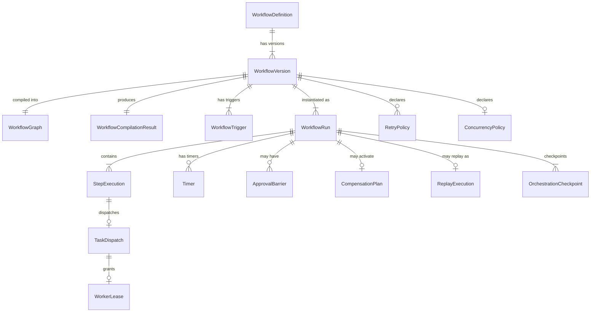

---

## 5. Workflow Definition and Versioning

### 5.1 WorkflowVersion Lifecycle

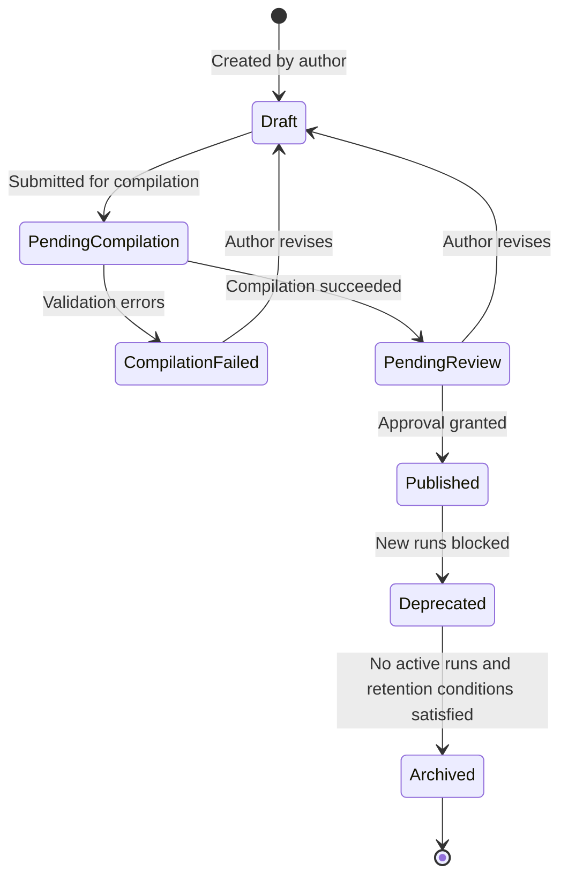

### WorkflowVersion Lifecycle Rules

- `Draft` versions are editable.
- `PendingCompilation` versions are locked until compilation completes.
- `CompilationFailed` versions may return to `Draft`.
- `PendingReview` versions have valid compilation artifacts but are not executable in production until approved.
- `Published` versions may create new runs.
- `Deprecated` versions MUST NOT create new runs, but active runs pinned to that version MUST continue normally.
- `Archived` versions MUST NOT create new runs and MUST only be entered when no active runs remain and retention conditions are satisfied.
- Archived WorkflowVersions MUST preserve enough metadata for replay, audit and lineage reconstruction according to retention policy.

### Forbidden Behavior

FORBIDDEN:

- blocking active runs merely because their WorkflowVersion was deprecated;
- creating new runs from a deprecated WorkflowVersion;
- archiving a WorkflowVersion while active runs still require it;
- mutating a deprecated or archived WorkflowVersion to “fix” historical behavior;
- allowing Codex to treat deprecation as deletion.

### 5.2 Version Rules

**VER-01.** Published WorkflowVersions are IMMUTABLE. No field may be modified after publication.
**VER-02.** Active runs MUST remain pinned to the WorkflowVersion they started with.
**VER-03.** New WorkflowVersions MUST NOT retroactively change active run behavior.
**VER-04.** Breaking changes require a new major WorkflowVersion and an ADR.
**VER-05.** WorkflowVersion publication requires successful compilation.
**VER-06.** WorkflowVersion deprecation blocks new run creation from that version.
**VER-07.** Archival requires all associated runs to be archived.

### 5.3 Version Compatibility Table

| Change Type | Breaking | Action |
|---|---|---|
| Add optional step (new runs only) | No | New minor version |
| Add required step | Yes | New major version; migration plan |
| Change node type | Yes | New major version; ADR |
| Change output schema | Yes (if consumers exist) | New major version; schema migration |
| Change retry/timeout policy | No | New minor version |
| Remove step | Yes (replay incompatibility) | New major version; replay test |
| Add approval gate | Yes | New major version; active run migration plan |

---

## 6. Workflow Compilation Contract

### 6.1 Compilation Validation Checks

The compiler MUST validate:

| Check | Failure Behavior |
|---|---|
| Graph acyclicity | Fail; report cycle path |
| Node uniqueness | Fail; report duplicate IDs |
| Edge validity | Fail; report invalid references |
| Unreachable nodes | Fail; report unreachable list |
| Missing terminal paths | Fail; report missing EndNode paths |
| Missing ApprovalDenied path | Fail; report |
| Unsupported node types | Fail; report |
| Unbounded fan-out (no max_parallel) | Fail |
| Unbounded loop constructs | Fail; require bounded MapNode |
| Missing timeout for tool/agent/cognitive nodes | Fail |
| Missing compensation for IrreversibleAction tools | Fail |
| Missing tool permission declarations | Fail |
| Cross-tenant references | Fail |
| Invalid policy bindings | Fail |
| Missing retry for non-terminal tool nodes | Warn |

### 6.2 Compilation Output

WorkflowCompilationResult MUST include: canonical execution graph; topological order; dependency map; barrier map; approval barrier map; retry plan; timeout plan; timer plan; compensation plan; concurrency plan; observability plan; event emission plan; required permissions manifest; replay compatibility metadata.

### 6.3 Compilation Flow

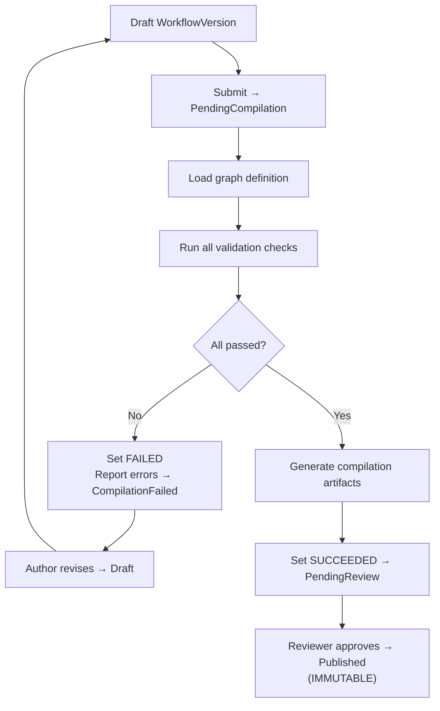

**Rule:** A WorkflowVersion MUST NOT become executable until compilation succeeds.

---

## 7. DAG and Graph Semantics

### 7.1 DAG Rules

**DAG-01.** Cycles are FORBIDDEN. The workflow graph MUST be a directed acyclic graph.
**DAG-02.** Conditional edge predicates MUST be deterministic; they MUST NOT call external systems.
**DAG-03.** Fan-out MUST declare `max_parallel` limit at compile time.
**DAG-04.** Every fan-out MUST have a BarrierNode fan-in.
**DAG-05.** MapNode (forEach) MUST declare `max_items` at compile time.
**DAG-06.** Dynamic node creation is FORBIDDEN unless represented as a bounded MapNode or SubWorkflowNode.
**DAG-07.** Cross-tenant graph references are FORBIDDEN.
**DAG-08.** Every complete path from StartNode MUST reach an EndNode.

### 7.2 Graph Validation Matrix

| Constraint | Valid | Compiler Behavior on Violation |
|---|---|---|
| Cycle in DAG | INVALID | Fail; report cycle path |
| Disconnected node | INVALID | Fail; report unreachable |
| No terminal path | INVALID | Fail; report missing EndNode |
| Conditional with external I/O | INVALID | Fail |
| Fan-out without max_parallel | INVALID | Fail |
| Cross-tenant reference | INVALID | Fail |
| Missing ApprovalDenied path | INVALID | Fail |
| Bounded MapNode (max_items ≤ 1000) | VALID | Pass |
| Deterministic conditional edges | VALID | Pass |
| Sub-workflow referencing published version | VALID | Pass |

---

## 8. Node and Step Semantics

### 8.1 Canonical Node Types

**StartNode** — Entry point. Deterministic. No side effects. Replay: re-evaluated.

**EndNode** — Terminal point. Deterministic. No side effects. Replay: re-evaluated.

**AtomicStepNode** — Self-contained idempotent computation (data transform, validation, mapping). No external I/O. Fully deterministic. Retry eligible. Replay: re-executed from inputs.

**ToolStepNode** — Dispatches tool via ToolInvocationGateway (Document 15). Nondeterministic. Side-effect class declared per tool. Timeout required. Compensation required if IrreversibleAction. Replay: suppressed; result hydrated from ToolReplayRecord.

**AgentStepNode** — Dispatches agent via AgentExecutionGateway (Document 05). Nondeterministic. Side-effect class declared per agent. Timeout required. Replay: suppressed; hydrated from AgentReplayRecord.

**CognitiveStepNode** — Invokes cognitive execution boundary (Document 04). Nondeterministic. Timeout required. Governed output via OutputPromotionController. Replay: suppressed; hydrated from recorded ModelOutput.

**ApprovalNode** — Blocking approval gate. Suspends execution until decision. Timeout required (durable timer). Deterministic in replay (decision is recorded event). Actor attribution required. Replay: decision hydrated from original event.

**HumanTaskNode** — Requires human task completion. Timeout required. Replay: result hydrated from original event.

**ConditionalNode** — Routes execution based on deterministic condition from predecessor outputs. MUST NOT call external I/O. Replay: condition re-evaluated from same recorded inputs.

**BarrierNode** — Fan-in synchronization point. Blocks until all (or configured subset) upstream nodes complete. Release conditions: ALL_SUCCESS | ANY_SUCCESS | MIN_SUCCESS(n) | ALLOW_FAILURES(n).

**TimerNode** — Durable wait. MUST use durable timer record. MUST NOT block worker thread. Replay: timer fire event hydrated.

**SubWorkflowNode** — Invokes a child WorkflowVersion. References must be to Published versions. Tenant context propagated.

**MapNode** — Expands bounded list into parallel executions. `max_items` declared at compile time. MUST have BarrierNode fan-in.

**CompensationNode** — Executes compensation for a completed step. MUST NOT erase original events. Replay: hydrated.

**OrchestrationOnlyNode** — Pure orchestration logic (routing, aggregation). NO external side effects. Deterministic.

### 8.2 Node Contract Matrix

| Node Type | Side Effects | Retry | Compensation | Timeout | External I/O | Replay |
|---|---|---|---|---|---|---|
| StartNode | None | N/A | No | No | NO | Re-evaluated |
| EndNode | None | N/A | No | No | NO | Re-evaluated |
| AtomicStepNode | None | Yes | No | Optional | NO | Re-executed |
| ToolStepNode | Declared per tool | Yes (if idempotent) | If IrreversibleAction | Yes | Via ToolInvocationGateway | Suppressed; hydrated |
| AgentStepNode | Declared per agent | Conditional | Conditional | Yes | Via AgentExecutionGateway | Suppressed; hydrated |
| CognitiveStepNode | Governed output | Conditional | No | Yes | Via CognitiveExecution | Suppressed; hydrated |
| ApprovalNode | None | No | No | Yes (timer) | No | Decision hydrated |
| HumanTaskNode | None | No | No | Yes | No | Result hydrated |
| ConditionalNode | None | No | No | Optional | NO | Re-evaluated |
| BarrierNode | None | No | No | Yes | NO | Re-evaluated |
| TimerNode | None | No | No | N/A (IS timer) | NO | Fire event hydrated |
| SubWorkflowNode | Via child | If child idempotent | Propagated | Yes | Via child workflow | Child replay unit |
| MapNode | Via child nodes | Per child | Per child | Yes | Via child nodes | Per item hydrated |
| CompensationNode | Declared by step | Yes | N/A | Yes | Via execution boundary | Hydrated |
| OrchestrationOnlyNode | None | Yes | No | No | NO | Re-evaluated |

---

## 9. Orchestration State Model

### 9.1 GovernedRun Canonical State Machine

The GovernedRun uses the canonical 24-state lifecycle from Documents 02, 03 and 06.

Document 09 does not define a new persisted GovernedRun lifecycle. It defines how the workflow orchestration engine drives the canonical lifecycle.

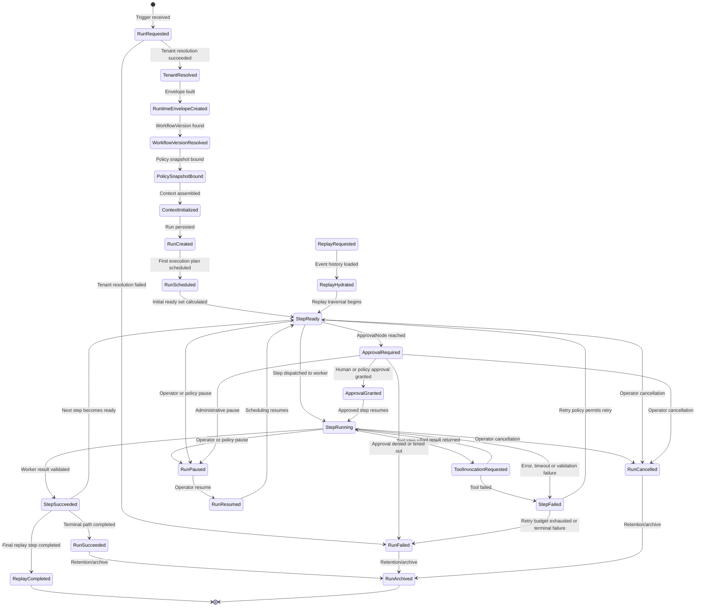

### Lifecycle Alignment Rules

- The canonical GovernedRun lifecycle contains 24 states.
- Document 09 MUST NOT introduce alternate persisted run states.
- Replay states belong to replay lineage and MUST NOT mutate the original production run lineage.
- `ReplayRequested` is entered through an explicit replay trigger, not through normal production execution.
- `RunSucceeded`, `RunFailed` and `RunCancelled` are terminal production states.
- `RunArchived` is a retention/archive state and MUST NOT resume production execution.
- UI labels MAY simplify state names, but persisted state MUST use canonical names.
- All state transitions MUST go through StateTransitionCoordinator.
- Every state transition MUST create an OutboxRecord atomically.

### Forbidden Behavior

FORBIDDEN:

- creating a second persisted GovernedRun lifecycle for orchestration;
- treating replay states as normal production continuation states;
- using `Created`, `Active`, `Completed`, `WaitingApproval`, `Running` or `Retrying` as persisted run states;
- allowing Codex to generate a separate workflow run enum from this document;
- allowing Document 09 to override Documents 02, 03 or 06.

### 9.2 StepExecution State Machine

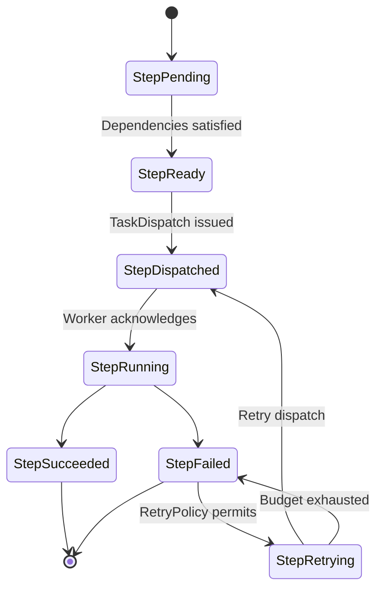

### 9.3 ApprovalBarrier State Machine

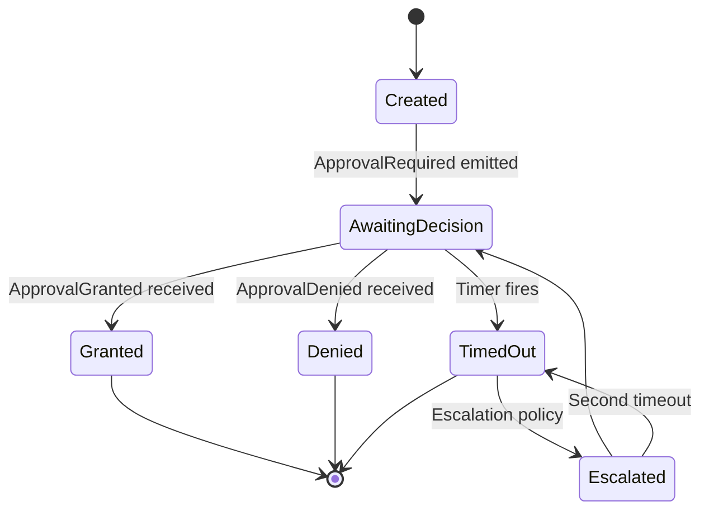

### 9.4 WorkerLease State Machine

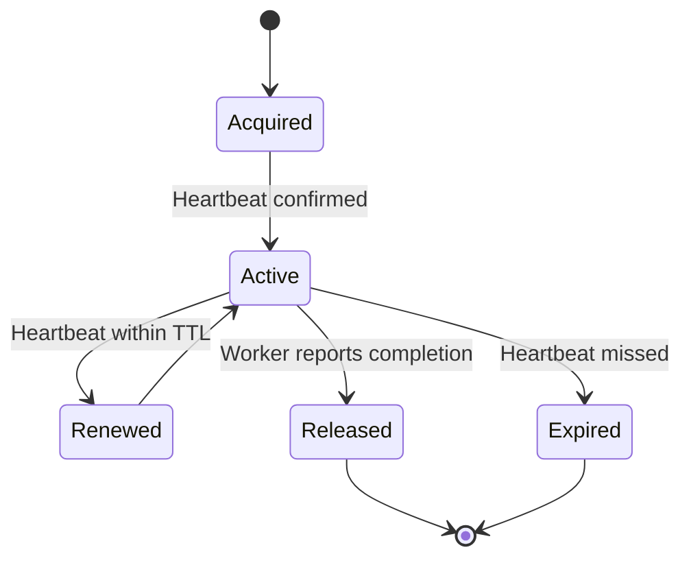
### 9.5 State Names vs Published Event Names

MYCELIA distinguishes between canonical persisted state names and published event names.

A persisted state transition may emit an event with the same semantic meaning, but the published event name MUST follow Document 07.

### Mapping Rule

| Orchestration State/Transition | Published Event Requirement |
|---|---|
| `RunRequested` | MUST emit `RunRequested` |
| `RunCreated` | MUST emit `RunCreated` |
| `RunScheduled` | MUST emit `RunScheduled` |
| `StepReady` | MUST emit `StepReady` |
| `StepRunning` | MAY emit `StepRunning` or a Document 07-approved dispatch event |
| `ToolInvocationRequested` | MUST emit `ToolInvocationRequested` |
| `ApprovalRequired` | MUST emit `ApprovalRequested` unless Document 07 explicitly defines `ApprovalRequired` as an event |
| `ApprovalGranted` | MUST emit `ApprovalGranted` |
| `StepSucceeded` | MUST emit `StepSucceeded` |
| `StepFailed` | MUST emit `StepFailed` |
| `RunSucceeded` | MUST emit `RunSucceeded` |
| `RunFailed` | MUST emit `RunFailed` |
| `RunCancelled` | MUST emit `RunCancelled` |
| `ReplayRequested` | MUST emit `ReplayRequested` |
| `ReplayHydrated` | MUST emit `ReplayHydrated` |
| `ReplayCompleted` | MUST emit `ReplayCompleted` |

### Dispatch Event Rule

`StepDispatched` is an orchestration runtime event used by Document 09 to describe dispatch mechanics.

Before implementation, one of the following MUST be true:

1. `StepDispatched` is added to Document 07 as a canonical event; or
2. `StepDispatched` is implemented as an internal transition record only, while the published event remains `StepRunning`.

### Approval Event Rule

`ApprovalRequired` is a canonical blocking state.

The published approval request event SHOULD be `ApprovalRequested` unless the Event & Messaging Contracts document explicitly defines `ApprovalRequired` as an event type.

### Forbidden Behavior

FORBIDDEN:

- inventing orchestration event names that are not registered in Document 07;
- treating internal state names and public event names as automatically identical;
- emitting both `ApprovalRequired` and `ApprovalRequested` for the same transition without a clear contract;
- emitting both `RunCompleted` and `RunSucceeded`;
- allowing Codex to create event names from prose examples instead of Document 07.

---

## 10. Scheduling and Triggering

### 10.1 Trigger Sources

| Trigger Type | Idempotency Key | Policy Required | RuntimeEnvelope | Events Emitted |
|---|---|---|---|---|
| API trigger | Caller-supplied | Yes | Yes | RunRequested |
| Event trigger | event_id from broker | Yes | Yes | RunRequested |
| Webhook trigger | Request signature + timestamp | Yes | Yes | RunRequested |
| Cron trigger | `{workflow_version_id}::{scheduled_time}` | Yes | Yes | RunRequested |
| Manual operator trigger | Operator-supplied | Yes | Yes | RunRequested |
| Replay trigger | replay_id | Yes | Replay envelope | ReplayRequested |
| System recovery trigger | `{run_id}::{recovery_attempt}` | Yes | Existing | (recovery path) |

### 10.2 Trigger Processing Rules

**TRG-01.** No trigger may create a run without successful tenant resolution.
**TRG-02.** No trigger may create a run without a Published WorkflowVersion.
**TRG-03.** Cron triggers MUST declare explicit timezone (IANA name).
**TRG-04.** Duplicate triggers MUST be idempotently handled; same idempotency_key returns existing run.
**TRG-05.** Scheduler failure MUST NOT lose scheduled executions (triggers persisted before processing).
**TRG-06.** Every trigger activation produces `RunRequested` as the first event.

### 10.3 Scheduler Architecture

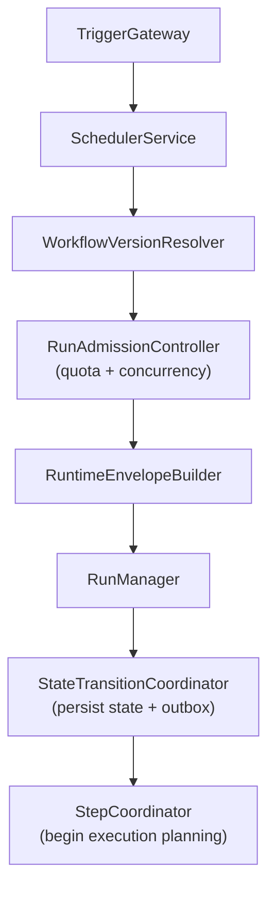
---

## 11. Execution Planning

### 11.1 Planning Purpose

The ExecutionPlanner generates an ExecutionPlan for a GovernedRun by resolving the WorkflowVersion's compiled graph into an ordered, dependency-aware scheduling schedule. The ExecutionPlan is derived — it is reconstructible from the WorkflowCompilationResult and the run's event history.

### 11.2 Planning Algorithm

1. **Load WorkflowVersion compilation artifact.** Load the immutable WorkflowCompilationResult for the run's WorkflowVersion.
2. **Apply run input.** Bind the run's input payload to the StartNode output.
3. **Resolve dependency map.** For each node, compute the set of predecessor nodes that must complete before it can start.
4. **Calculate initial ready set.** Nodes with no predecessors (only StartNode or its immediate successors with no dependencies) enter the initial ready set.
5. **Evaluate conditional edges.** For each conditional edge reachable from the current ready set, evaluate the deterministic predicate using available recorded inputs. Route accordingly.
6. **Schedule fan-out.** When a fan-out node enters the ready set, create StepExecution records for all parallel branches (bounded by `max_parallel` from concurrency plan).
7. **Schedule fan-in barriers.** Register BarrierNode waits for fan-out completion sets.
8. **Schedule approval barriers.** Register ApprovalBarrier for ApprovalNodes; create durable timer for timeout.
9. **Schedule timers.** For TimerNodes, create durable timer records via TimerService.
10. **Schedule retry backlog.** When a step fails and retry policy permits, schedule retry dispatch.
11. **Activate compensation.** When a step fails with a configured CompensationNode, route to compensation path.
12. **Determine terminal state.** When all paths from StartNode reach EndNode, advance GovernedRun to RunSucceeded.

### 11.3 Execution Planning Sequence Diagram

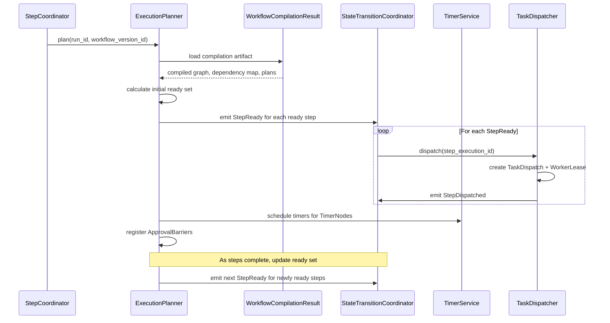

### 11.4 Rules

**PLAN-01.** ExecutionPlan MUST be derived from the immutable WorkflowCompilationResult; it MUST NOT mutate the WorkflowVersion.
**PLAN-02.** Conditional evaluation MUST only use deterministic inputs from recorded events.
**PLAN-03.** Ready steps MUST emit `StepReady` before dispatch.
**PLAN-04.** Step dispatch MUST NOT occur before `StepReady` is emitted.
**PLAN-05.** Fan-out MUST respect `ConcurrencyPolicy.max_fan_out`.

---

## 12. Runtime Execution Coordination

### 12.1 Component Definitions

**WorkflowOrchestrator**
- Responsibility: Top-level coordinator for workflow execution. Receives orchestration events; issues orchestration commands; advances run state machine.
- Failure: On crash, any peer orchestrator may resume by replaying the run's event history.

**WorkflowScheduler**
- Responsibility: Manages run scheduling queue, priority, fairness, tenant quota enforcement.
- Failure: Scheduled runs persist in durable queue; recovery resumes from last known position.

**StepCoordinator**
- Responsibility: Manages individual step lifecycle: readiness, dispatch, completion, retry scheduling.
- Inputs: StepReady events; worker completion reports.
- Outputs: StepDispatched, StepSucceeded, StepFailed, StepRetryScheduled events.

**TaskDispatcher**
- Responsibility: Creates TaskDispatch records; assigns to worker queues; creates WorkerLease; enforces dispatch idempotency.
- Inputs: StepReady events.
- Outputs: TaskDispatch records; WorkerLease records.

**WorkerGateway**
- Responsibility: API surface for workers to claim tasks, send heartbeats, report completion, and report failure.
- Failure: Worker crash → heartbeat stops → WorkerLeaseManager detects lease expiry.

**WorkerLeaseManager**
- Responsibility: Manages WorkerLease lifecycle; monitors heartbeat freshness; triggers lease expiry and re-dispatch on timeout.
- Inputs: Heartbeat signals; time-based lease expiry checks.
- Outputs: LeaseRenewed, LeaseExpired events.

**HeartbeatMonitor**
- Responsibility: Detects missed heartbeats from active workers; triggers lease expiry signal to WorkerLeaseManager.
- Rule: Heartbeat absence for `lease_ttl_seconds` triggers expiry.

**RetryScheduler**
- Responsibility: Applies RetryPolicy on StepFailed events; schedules retry dispatch after backoff; tracks retry attempt number.
- Inputs: StepFailed + RetryPolicy.
- Outputs: StepRetryScheduled; updated StepExecution retry count.

**TimerService**
- Responsibility: Creates, manages, and fires durable timer records. Fires timer events when activation time is reached.
- Inputs: ScheduleTimer commands.
- Outputs: TimerFired events.
- MUST NOT use worker thread sleep for timer waits.

**ApprovalBarrierCoordinator**
- Responsibility: Creates and manages ApprovalBarrier records; blocks run advancement; resumes on decision event; triggers timer for timeout.
- Inputs: ApprovalRequired events; ApprovalGranted/Denied events; TimerFired events.
- Outputs: Updated ApprovalBarrier state; workflow resumption or routing to denial path.

**CompensationCoordinator**
- Responsibility: Activates CompensationPlan when a step fails with a compensation path. Schedules compensation steps in order.
- Rules: Compensation steps are dispatched in reverse order of original execution. Original events are NOT mutated.

**ReplayCoordinator**
- Responsibility: Manages ReplayExecution lifecycle; coordinates with HydrationManager (Document 06); suppresses side-effectful steps; records divergences.
- Inputs: ReplayRequested events.
- Outputs: ReplayHydrated, ReplayDivergenceDetected, ReplayCompleted events.

**OrchestrationTelemetryEmitter**
- Responsibility: Emits OTel spans and metrics for all orchestration events.

### 12.2 Component Architecture Diagram

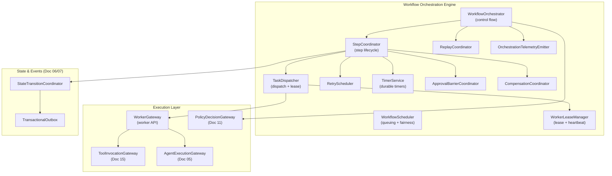

---

## 13. Dispatch, Leases and Heartbeats

### 13.1 Dispatch Protocol

1. StepCoordinator emits `StepReady(step_execution_id)`.
2. TaskDispatcher creates `TaskDispatch` record (PENDING status).
3. TaskDispatcher selects worker queue based on step type and tenant routing.
4. TaskDispatcher creates `WorkerLease` (Acquired status; `lease_ttl_seconds`; `lease_expires_at`).
5. TaskDispatcher emits `StepDispatched` event (atomically with state transition).
6. Worker polls worker queue; claims task; acknowledges with heartbeat.
7. WorkerLease transitions to Active.
8. Worker executes task; sends periodic heartbeats.
9. WorkerLeaseManager checks heartbeat freshness on every `heartbeat_interval_check`.
10. Worker reports completion (success or failure) via WorkerGateway.
11. WorkerLease transitions to Released.
12. StepCoordinator advances step state.

### 13.2 Lease Rules

**LEASE-01.** Only one active WorkerLease may exist per StepExecution attempt number.
**LEASE-02.** Worker heartbeat extends lease but does not prove success.
**LEASE-03.** Missing heartbeat beyond `lease_ttl_seconds` triggers lease expiry.
**LEASE-04.** Expired lease triggers re-dispatch if RetryPolicy allows a new attempt.
**LEASE-05.** Duplicate worker completion MUST be idempotently detected and rejected or ignored.

### 13.3 Dispatch Metadata

Every TaskDispatch MUST carry: `task_dispatch_id`, `tenant_id`, `run_id`, `step_id`, `step_execution_id`, `attempt_number`, `idempotency_key` (deterministic), `trace_id`, `workflow_version_id`, `timeout_seconds`, `worker_queue`.

### 13.4 Dispatch Sequence Diagram

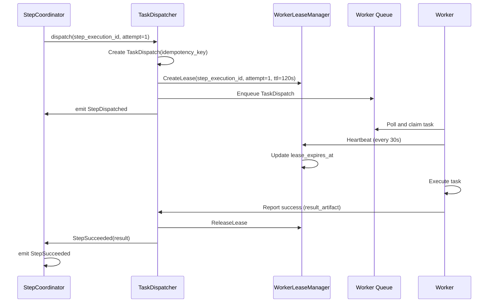

### 13.5 Zombie Worker Detection

A zombie worker is a worker that has lost connectivity but whose lease has not yet expired. Detection:
- HeartbeatMonitor checks active leases every `heartbeat_check_interval_seconds` (default: 10s).
- If `current_time > lease_expires_at`: LeaseExpired event emitted.
- WorkerLeaseManager transitions lease to Expired.
- RetryScheduler picks up StepFailed event and schedules retry if budget allows.
- New TaskDispatch created with attempt_number++ and a deterministic idempotency_key scoped to the new attempt. The business idempotency key for irreversible side effects MUST remain stable according to the tool contract.

If the zombie worker eventually completes and reports success: TaskDispatcher checks `step_execution_id + attempt_number` against active lease. If lease is already Released (newer attempt took over), the zombie completion is rejected as stale.

---

## 14. Concurrency, Parallelism and Fairness

### 14.1 Concurrency Levels

| Level | Controlled By | Policy | Notes |
|---|---|---|---|
| Platform | Platform ConcurrencyPolicy | Max total runs across all tenants | Protects shared infrastructure |
| Tenant | TenantConcurrencyPolicy | Max runs per tenant | Prevents tenant starvation |
| Workspace | WorkspaceConcurrencyPolicy | Max runs per workspace | Workspace-level isolation |
| Workflow | WorkflowConcurrencyPolicy | Max concurrent runs per WorkflowDefinition | Per-workflow throttle |
| Run | ConcurrencyPolicy.max_concurrent_steps | Max parallel steps within one run | Fan-out limits |
| Fan-out | `max_parallel` in WorkflowGraph | Declared at compile time | Prevents unbounded parallelism |
| Tool | ToolConcurrencyPolicy (Document 15) | Max concurrent tool invocations | Protects external systems |
| Agent | AgentConcurrencyPolicy (Document 05) | Max concurrent agent executions | Budget protection |
| Replay | ReplayConcurrencyPolicy | Max concurrent replay sessions per tenant | Protects production |

### 14.2 Fairness Model

**Fair scheduling** ensures that no single tenant, workspace, or workflow monopolizes the execution queue.

- Runs are placed in a multi-level priority queue: `{priority_class} × {tenant_queue}`.
- Each tenant has a dedicated queue partition; the scheduler rotates across tenant queues fairly.
- Queue aging: a run waiting longer than `starvation_threshold_seconds` has its effective priority elevated.
- Priority classes: GOVERNANCE (highest), CRITICAL, HIGH, STANDARD, LOW.
- Governance and approval flows MUST have GOVERNANCE priority over low-priority automation.

### 14.3 Admission Control

The RunAdmissionController checks before creating a new run:
1. Tenant quota: `active_runs_for_tenant < TenantConcurrencyPolicy.max_concurrent_runs`.
2. Workspace quota: `active_runs_for_workspace < WorkspaceConcurrencyPolicy.max_concurrent_runs`.
3. Workflow quota: `active_runs_for_workflow_definition < WorkflowConcurrencyPolicy.max_concurrent_runs`.
4. Platform capacity: `total_active_runs < PlatformConcurrencyPolicy.max_total_runs`.

If any check fails: RunAdmission REJECTED; `RunRejected` event emitted; trigger returns 429 with retry-after.

### 14.4 Rules

**CONC-01.** No workflow may create unbounded parallelism; `max_parallel` is REQUIRED for fan-out.
**CONC-02.** Tenant fairness MUST prevent one tenant from starving others.
**CONC-03.** Replay concurrency MUST be throttled before production workflows are impacted.
**CONC-04.** Governance and approval flows have GOVERNANCE priority.
**CONC-05.** Concurrency limits MUST be auditable configuration, not hardcoded.

---

## 15. Retry, Timeout and Compensation Model

### 15.1 Retry Policy

A RetryPolicy declares the behavior when a step fails:

```typescript
interface RetryPolicy {
  max_attempts: number;               // Including first attempt; minimum 1
  backoff_strategy: BackoffStrategy;  // FIXED | LINEAR | EXPONENTIAL
  initial_backoff_seconds: number;
  max_backoff_seconds: number;
  jitter_factor: number;              // 0.0 to 1.0; prevents thundering herd
  retryable_failure_classes: FailureClass[];  // Which failures trigger retry
  terminal_failure_classes: FailureClass[];   // Which failures go directly to StepFailed
}
```

Retryable failure classes: `TRANSIENT_ERROR`, `TIMEOUT`, `RESOURCE_UNAVAILABLE`, `WORKER_CRASH`.
Terminal failure classes: `VALIDATION_ERROR`, `POLICY_DENIED`, `AUTHORIZATION_FAILURE`, `DATA_INTEGRITY_ERROR`.

### 15.2 Timeout Policy

```typescript
interface TimeoutPolicy {
  step_timeout_seconds: number;      // Maximum duration for a single step execution
  run_timeout_seconds: number;       // Maximum total run duration
  worker_heartbeat_ttl_seconds: number;
  timeout_behavior: 'FAIL' | 'ESCALATE' | 'COMPENSATE';
}
```

Step timeout fires a `StepTimedOut` event → treated as `StepFailed(TIMEOUT)` → RetryPolicy applies.
Run timeout fires a `RunTimedOut` event → `RunFailed` (terminal; no retry).

### 15.3 Compensation Model

Compensation is an explicit workflow structure — a set of CompensationNodes that undo the effects of a completed step. MYCELIA uses a saga-like compensation pattern.

**Compensation activation:** When a step fails (terminally or after retry exhaustion) AND the failed step (or a predecessor) declared a CompensationNode, the CompensationCoordinator activates the CompensationPlan.

**Compensation ordering:** Compensation steps execute in reverse order of the completed original steps. If step A → B → C and C fails, compensation order is: C_comp (if C partially executed) → B_comp → A_comp.

**Rules:**
- Compensation MUST NOT erase original events.
- Compensation steps are appended to the event history as new events.
- Compensation failures are recorded and escalated; they do not silently fail.
- Compensation audit records MUST carry the original `step_execution_id` they are compensating.
- Irreversible steps that declare non_compensable: true MUST require explicit policy acceptance before publication and MUST produce an alert on failure, but no automatic compensation is attempted.

### 14.3.1 Run Admission Rejection Semantics

RunAdmissionController may reject a trigger before a GovernedRun is created.

A rejected admission is not the same as a failed GovernedRun unless the run has already been created.

### Rejection Classes

| Stage | Meaning | Required Record | Published Event |
|---|---|---|---|
| Pre-run admission rejection | Trigger rejected before GovernedRun creation | AdmissionRejectionRecord | `RunAdmissionRejected` only if registered in Document 07; otherwise audit/security event |
| Post-run initialization failure | GovernedRun exists but initialization fails | GovernedRun state transition | `RunFailed` |
| Tenant resolution failure | Tenant cannot be resolved | Trigger/audit record | `RunFailed` only if a run record exists |
| Policy admission denial | Policy denies run creation | PolicyDecision + audit record | `PolicyDenied` and/or registered admission event |

### Rules

- If no GovernedRun exists, the system MUST NOT emit a lifecycle event implying a run transitioned state.
- If a GovernedRun exists, failure MUST be represented through the canonical lifecycle, usually `RunFailed`.
- `RunRejected` MUST NOT be used unless it is registered in Document 07.
- Admission rejection MUST be auditable even when no run is created.
- Duplicate trigger rejection due to idempotency SHOULD return the existing run or existing rejection record.

### Forbidden Behavior

FORBIDDEN:

- emitting `RunRejected` as an ad hoc event outside Document 07;
- creating a tenantless failed run just to represent admission rejection;
- treating pre-run admission denial as a canonical GovernedRun state;
- losing admission rejection evidence because no run was created;
- allowing Codex to invent `Rejected` as a persisted run state.

### 15.4 Retry and Compensation Flow

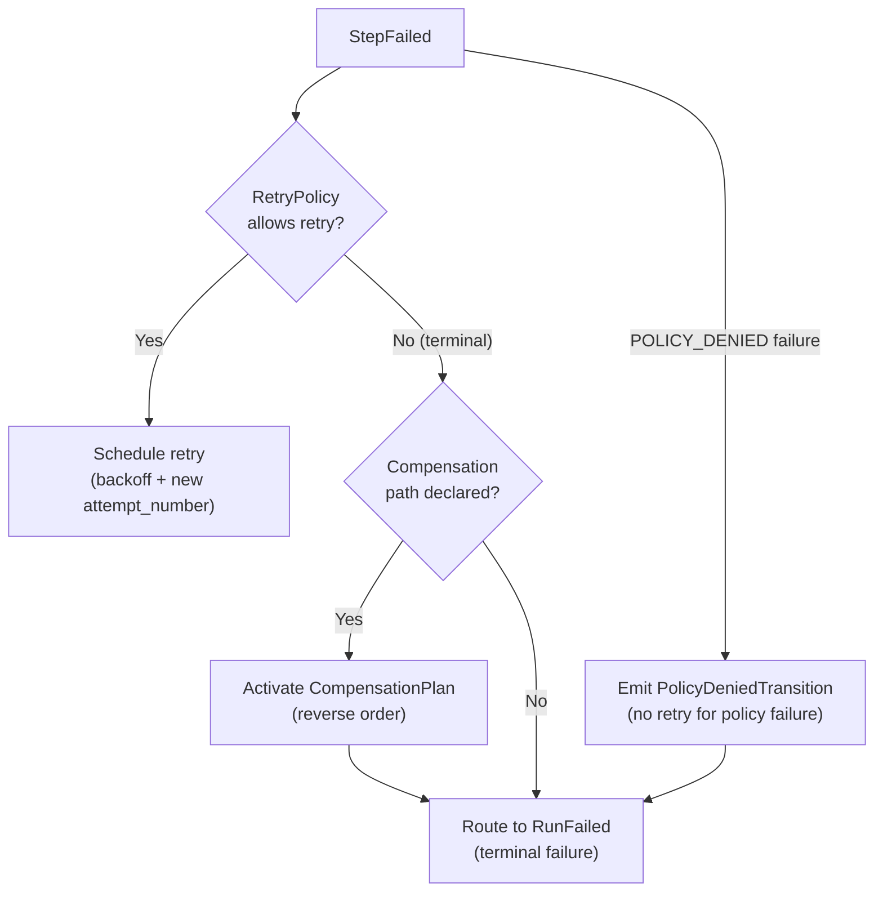

---

## 16. Side-Effect Containment

### 16.1 Side-Effect Categories

| Category | Examples | Gateway/Boundary |
|---|---|---|
| External API calls | REST APIs, RPC calls, webhooks | ToolInvocationGateway |
| Tool execution | File processing, calculation, generation | ToolInvocationGateway |
| Database mutation outside MYCELIA | ERP updates, CRM writes | ToolInvocationGateway |
| File writes | Documents, outputs | ToolInvocationGateway |
| Webhook delivery | Notifications, callbacks | ToolInvocationGateway |
| Emails / communications | Notifications, approvals | ToolInvocationGateway |
| Payments / financial transactions | Billing, procurement | ToolInvocationGateway (IrreversibleAction class) |
| ERP/CRM updates | Business system mutations | ToolInvocationGateway |
| Memory writes | Agent memory updates | MemoryAccessGateway (Document 10) |
| Agent actions | Multi-step agent tasks | AgentExecutionGateway (Document 05) |
| Model provider calls | LLM inference | CognitiveExecution boundary (Document 04) |

### 16.2 Side-Effect Containment Rules

**SE-01.** Orchestration logic MUST NOT perform external I/O.
**SE-02.** External effects MUST be executed through ToolInvocationGateway, AgentExecutionGateway, CognitiveExecution boundary, or registered worker activities.
**SE-03.** Every side-effectful step MUST declare an idempotency strategy.
**SE-04.** Every side-effectful step MUST declare replay behavior (suppressed/hydrated).
**SE-05.** Steps with IrreversibleAction side effects SHOULD declare compensation policy (or explicitly declare `non_compensable: true`).
**SE-06.** No workflow code may hold credentials. Credentials are resolved by the execution/tool boundary.
**SE-07.** ConditionalNode MUST NOT query external systems to evaluate routing conditions.
**SE-08.** OrchestrationOnlyNode MUST NOT cause external side effects.

### 16.2.1 Registered Worker Activity Boundary

Registered worker activities are allowed only as execution units governed by MYCELIA contracts.

A registered worker activity MUST NOT become an escape hatch around ToolInvocationGateway, AgentExecutionGateway, CognitiveExecution or policy enforcement.

### Registered Worker Activity Requirements

Every registered worker activity MUST declare:

- `activity_id`;
- `activity_version`;
- owner service;
- tenant scope;
- input schema;
- output schema;
- side-effect class;
- idempotency strategy;
- timeout policy;
- retry policy;
- compensation policy when applicable;
- credential access requirements;
- policy requirements;
- audit event mapping;
- replay behavior;
- observability requirements.

### Gateway Binding Rule

If a registered worker activity performs any of the following, it MUST be bound to the appropriate gateway:

| Activity Behavior | Required Boundary |
|---|---|
| External API call | ToolInvocationGateway |
| File/document processing with persisted artifact | ToolInvocationGateway or ArtifactService |
| Model provider call | CognitiveExecution boundary |
| Agentic planning or reasoning | AgentExecutionGateway |
| Memory read/write | MemoryAccessGateway |
| Human approval or decision | ApprovalGateCoordinator |
| External business system mutation | ToolInvocationGateway |

### Rules

- Registered worker activities MUST be contract-registered before execution.
- Registered worker activities MUST NOT hold raw credentials in workflow input.
- Registered worker activities MUST NOT bypass PolicyDecisionGateway when side effects or protected data are involved.
- Registered worker activities MUST declare replay suppression or hydration behavior.
- Registered worker activities MUST emit auditable completion/failure events.

### Forbidden Behavior

FORBIDDEN:

- using registered worker activities to bypass ToolInvocationGateway;
- allowing workers to call arbitrary external systems without declared contracts;
- allowing worker activities to self-authorize;
- allowing worker activities to write memory directly;
- allowing worker activities to perform replay side effects;
- allowing Codex to implement “worker activities” as unrestricted plugin code.

### 16.3 Side-Effect Containment Matrix

| Execution Unit | May Cause Side Effects? | Boundary Enforced By |
|---|---|---|
| WorkflowOrchestrator | NO | Architecture (no external I/O in orchestration code) |
| ConditionalNode | NO | Compile-time enforcement |
| AtomicStepNode | NO | Architecture |
| OrchestrationOnlyNode | NO | Architecture |
| ToolStepNode | YES (declared class) | ToolInvocationGateway |
| AgentStepNode | YES (declared class) | AgentExecutionGateway |
| CognitiveStepNode | YES (governed output) | OutputPromotionController |
| Workers | YES (execution units) | Tool contract; worker contract |

---

## 17. Long-Running Workflow Semantics

### 17.1 Durable Waits

MYCELIA supports long-running workflows where execution may pause for hours, days, or weeks. During these periods, no worker resources are consumed and the workflow is persisted entirely in durable state.

| Durable Wait Type | Mechanism | Worker Thread Blocked? |
|---|---|---|
| Timer wait (TimerNode) | Durable Timer record; TimerService fires | NO |
| Approval wait (ApprovalNode) | ApprovalBarrier record; decision event resumes | NO |
| Human task wait (HumanTaskNode) | Task record; completion event resumes | NO |
| External callback wait | ExternalCallbackBarrier + timer timeout | NO |
| Cron sub-step wait | TimerNode with cron expression | NO |
| Sub-workflow completion wait | SubWorkflowNode; child run event | NO |

**Rule:** Worker thread sleep MUST NEVER be used for durable waits. All durable waits MUST be implemented as TimerService records or barrier records.

### 17.2 Checkpointing

Long-running runs MUST create OrchestrationCheckpoints at strategic points:
- Before the GovernedRun transitions to `ApprovalRequired` state.
- After every N steps (configurable; default: every 10 steps or every hour, whichever comes first).
- Before dispatching any IrreversibleAction tool.
- At sub-workflow completion.

Checkpoints enable fast hydration without replaying the entire event history.

### 17.3 Continue-As-New Semantics

For extremely long-running workflows that would accumulate unbounded event history, MYCELIA supports Continue-As-New:
1. The current run closes with a `RunSucceeded` event carrying a `continue_as_new: true` flag and a `child_run_id` reference.
2. A new GovernedRun is created with explicit linkage to the parent `run_id`.
3. The new run's event history starts fresh; its `root_causation_id` links to the original root.
4. The original run's event history is retained per retention policy; it is NOT deleted.

**Rules:**
- Continue-As-New creates a new run lineage; it does not mutate the original.
- The original run and child run are linked via `causation_id` chain.
- The original WorkflowVersion is preserved on the parent run.
- The child run MAY use the same or a newer WorkflowVersion (with explicit migration plan).

### 17.4 Run Archival

When a run reaches a terminal state (`RunSucceeded`, `RunFailed`, `RunCancelled`):
1. Run state is retained for the active retention window (configurable per tenant, default: 90 days).
2. After retention window: `RunArchived` event; run data moved to cold storage.
3. Replay capability is preserved as long as the event history is available.
4. Legal hold: If a run is under legal hold, `RunArchived` is blocked until hold is released.

---

## 18. Human-in-the-Loop Orchestration

### 18.1 ApprovalNode Behavior

When a workflow run reaches an ApprovalNode:
1. The ApprovalBarrierCoordinator creates an ApprovalBarrier record.
2. GovernedRun transitions to `ApprovalRequired` state via StateTransitionCoordinator.
3. An `ApprovalRequired` event is emitted (atomically with state transition).
4. A durable timer is scheduled for the approval timeout.
5. The workflow is suspended — no worker resources consumed.
6. The approver receives notification (via NotificationService).
7. On decision: `ApprovalGranted` or `ApprovalDenied` event is recorded.
8. `ApprovalGranted` → run resumes from `ApprovalGranted` state → next step(s) become ready.
9. `ApprovalDenied` → run routes to denial path (CompensationPlan if configured; else RunFailed).
10. Timer fires → `ApprovalTimedOut` → escalation or RunFailed.

### 18.2 Approval Rules

**APPR-01.** `ApprovalRequired` MUST be a canonical blocking state.
**APPR-02.** `ApprovalGranted` MUST carry actor attribution (`actor_id`, `decision_at`, `approval_record_id`).
**APPR-03.** `ApprovalDenied` MUST route to an explicit denial path.
**APPR-04.** Approval timeout MUST be a durable timer event — never a worker sleep.
**APPR-05.** Human action is nondeterministic in real time but deterministic after recorded as an event.
**APPR-06.** Approval bypass is FORBIDDEN unless modeled as policy-based auto-approval with audit.
**APPR-07.** In replay: the original ApprovalDecision event is hydrated; no new approval is requested.

### 18.3 Approval Architecture

```mermaid
sequenceDiagram
    participant SC as StepCoordinator
    participant ABC as ApprovalBarrierCoordinator
    participant TS as TimerService
    participant STC as StateTransitionCoordinator
    participant Notify as NotificationService
    participant Approver

    SC->>ABC: ApprovalNode reached
    ABC->>STC: Transition → ApprovalRequired
    STC->>STC: Atomic commit + outbox record
    ABC->>TS: Schedule timeout timer (durable)
    ABC->>Notify: Notify approver
    Approver->>ABC: Submit decision (grant/deny)
    ABC->>STC: Record ApprovalGranted/Denied (with actor_id)
    alt Granted
        STC->>SC: Advance run; StepSucceeded
    else Denied
        STC->>SC: Route to denial path
    end
```

---

## 19. Replay-Aware Orchestration

### 19.1 Replay Types

| Replay Type | Purpose | Side Effects | Production State Modified? |
|---|---|---|---|
| **Failover replay** | Resume run after orchestrator crash | Suppressed | NO — resume existing run state |
| **Canonical replay** | Forensic reconstruction of original run | Suppressed | NO |
| **Investigation replay** | Debug run with divergence recording | Suppressed | NO |
| **Simulation replay** | Test modified inputs against original history | Suppressed (may re-execute safe tools) | NO (isolated) |
| **Shadow replay** | Validate new WorkflowVersion against old history | Suppressed | NO |

### 19.2 Replay Protocol

1. **Authorize replay.** PolicyDecisionGateway checks replay authorization. Identity, tenant scope, replay mode validated.
2. **Create ReplayExecution.** ReplayCoordinator creates isolated `ReplayExecution` record with `replay_id`, `original_run_id`, `replay_mode`, `triggered_by`.
3. **Hydrate from history.** HydrationManager loads event history and checkpoint (Document 06 §12).
4. **Verify integrity.** EventIntegrityVerifier checks `event_hash` for replay-critical events (Document 08 §17).
5. **Reconstruct orchestration state.** Deterministic decisions are re-evaluated from recorded inputs; nondeterministic outputs are injected from recorded events.
6. **Suppress side effects.** CognitiveReplayAdapter marks side-effectful nodes as suppressed; ToolReplayRecords are substituted.
7. **Record divergences.** When a re-evaluated deterministic decision differs from the original recorded decision, a `ReplayDivergenceDetected` event is emitted.
8. **Complete replay.** `ReplayCompleted` event; `ReplayEvidenceBundle` assembled.

### 19.3 Replay Rules

**REP-01.** Replay MUST NOT mutate original run lineage.
**REP-02.** Replay MUST use the original WorkflowVersion unless explicit shadow replay mode.
**REP-03.** Replay MUST suppress all side-effectful operations.
**REP-04.** Replay MUST verify event integrity before using history events.
**REP-05.** Nondeterministic decisions MUST be detected as ReplayDivergence, not silently ignored.
**REP-06.** Investigation replay MAY continue after divergence (marked non-authoritative).
**REP-07.** Canonical replay MUST fail closed on integrity verification failure.
**REP-08.** Replay MUST carry `replay_context` on all events it emits (Document 07 §4.3).

### 19.4 Replay Flow Diagram

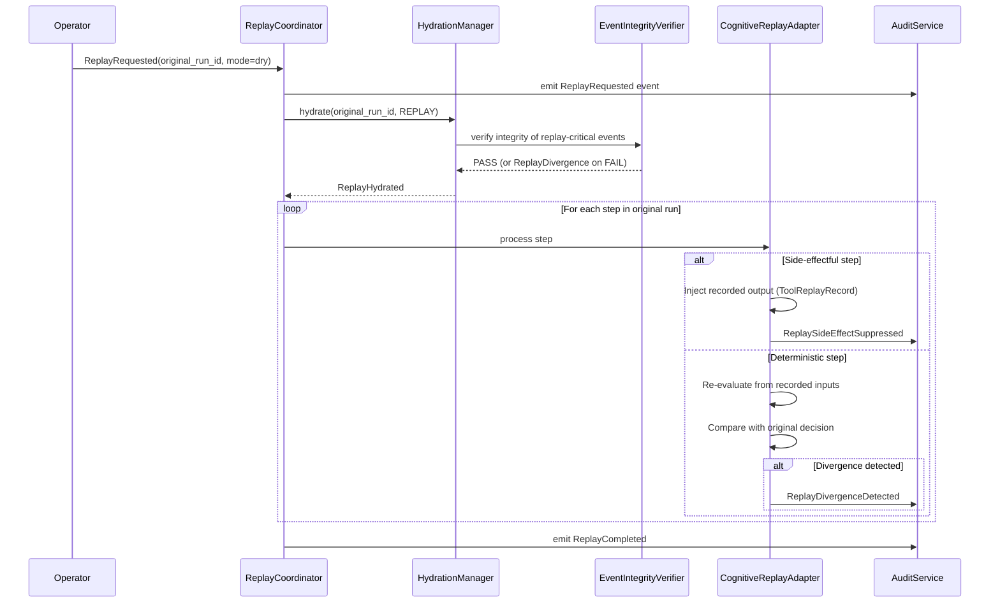

---

## 20. Workflow Version Compatibility and Migration

### 20.1 Version Pinning

Every GovernedRun records its `workflow_version_id` at creation and remains pinned to it for the entire lifecycle. This ensures replay correctness — replay always uses the same version that produced the original run.

### 20.2 Active Run Compatibility

| Version Change | Active Runs | New Runs |
|---|---|---|
| New minor version published | Active runs unaffected (pinned to old version) | New runs use new version |
| New major version published | Active runs unaffected | New runs use new version |
| Old version deprecated | Active runs continue normally | New runs BLOCKED from old version |
| Old version archived | Active runs with valid event history continue replay | New runs impossible |

### 20.3 Migration Plan Requirements

If an active run must migrate to a new WorkflowVersion (rare and risky), a formal migration plan MUST exist:
- Explicit audit record documenting the migration decision.
- Shadow replay of the active run against the new version to detect divergences.
- Operator authorization to proceed.
- Point-in-time checkpoint before migration.
- Rollback plan if migration produces unexpected behavior.

### 20.4 Replay Compatibility Tests

Before publishing a new WorkflowVersion:
1. Select a representative sample of historical runs from the previous version.
2. Run shadow replay of each using the new WorkflowVersion.
3. Record divergence count.
4. Divergence count above threshold → block publication; report to author.
5. Zero unauthorized divergences → pass. Authorized divergences MUST be explicitly documented, reviewed and linked to an ADR or compatibility exception.

CI/CD MUST run replay compatibility tests for every WorkflowVersion change.

---

## 21. Orchestration Observability

### 21.1 Trace Hierarchy

Every GovernedRun has a root span. Every step, dispatch, and approval has a child span.

```
WorkflowRun Span (root; trace_id = run's trace_id)
  └── RunCreated Span
  └── StepReady Span (per step)
        └── TaskDispatch Span
              └── WorkerActivity Span (worker reports back)
        └── WorkerLease Span
  └── ApprovalBarrier Span (if approval)
        └── ApprovalDecision Span
  └── Timer Span (if timer)
  └── CompensationPlan Span (if activated)
  └── ReplayExecution Span (if replay; isolated trace)
```

### 21.2 Required Metrics

| Metric | Description |
|---|---|
| `mycelia.orchestration.run.created_count` | Runs created per workflow_version |
| `mycelia.orchestration.run.succeeded_count` | Runs succeeded |
| `mycelia.orchestration.run.failed_count` | Runs failed |
| `mycelia.orchestration.run.scheduling_latency_ms` | RunRequested → RunScheduled |
| `mycelia.orchestration.step.ready_latency_ms` | Predecessor complete → StepReady |
| `mycelia.orchestration.step.dispatch_latency_ms` | StepReady → StepDispatched |
| `mycelia.orchestration.worker.lease_age_seconds` | Active lease age |
| `mycelia.orchestration.worker.heartbeat_gap_seconds` | Time since last heartbeat |
| `mycelia.orchestration.retry.count` | Retries per step |
| `mycelia.orchestration.approval.wait_seconds` | Time in ApprovalRequired state |
| `mycelia.orchestration.timer.fire_delay_seconds` | Timer fire time - scheduled time |
| `mycelia.orchestration.compensation.activation_count` | Compensation plans activated |
| `mycelia.orchestration.replay.divergence_count` | Divergences per replay session |
| `mycelia.orchestration.compilation.failure_count` | Compilation failures per workflow |

### 21.3 Observability Rules

**OBS-01.** Every GovernedRun MUST have a `trace_id`.
**OBS-02.** Every step MUST have a span context carrying `run_id`, `step_id`, `attempt_number`.
**OBS-03.** Every state transition MUST emit telemetry.
**OBS-04.** Orchestration telemetry MUST correlate with Document 07 `event_id` and Document 06 state transition records.
**OBS-05.** Replay telemetry MUST use isolated trace namespace; MUST NOT mix with production traces.

---

## 22. Orchestration Failure Model

| Failure Mode | Detection | Runtime Behavior | Recovery | Events | SRE |
|---|---|---|---|---|---|
| **WorkflowVersion compilation failure** | Compilation status = FAILED | Version not published; runs not created | Author revises; resubmit | `CompilationFailed` event | SEV4 |
| **Trigger duplicate** | Idempotency key collision | Duplicate trigger returns existing run | Normal (idempotency working) | Log only | None |
| **Scheduler outage** | Health check failure | Pending triggers queue; no new runs | Scheduler restart; process backlog | `SchedulerDown` alert | SEV2 |
| **Invalid state transition** | StateTransitionCoordinator rejects | Transition blocked; current state preserved | Investigate cause; correct trigger | `StateTransitionRejected` | SEV3 |
| **Orchestrator node crash** | Health check; heartbeat loss | Peer orchestrator resumes via event history replay | Replay hydration; no side effects | `OrchestratorCrashRecovery` | SEV2 |
| **Worker crash** | Heartbeat missing > lease_ttl | Lease expires; retry scheduled if policy allows | Re-dispatch; idempotency handles duplicate | `WorkerLeaseExpired`, `StepFailed` | SEV3 |
| **Heartbeat loss** | HeartbeatMonitor detects gap | LeaseExpired event triggered | Same as worker crash | `HeartbeatMissed` | SEV3 |
| **Lease expiry** | `current_time > lease_expires_at` | Re-dispatch if retry policy allows | Worker idempotency prevents double effect | `LeaseExpired`, `StepRetryScheduled` | SEV3 |
| **Duplicate dispatch** | TaskDispatcher idempotency_key collision | Second dispatch rejected; original TaskDispatch returned | Normal (idempotency working) | Log only | None |
| **Duplicate completion** | StepCoordinator detects stale attempt_number | Stale completion rejected | Normal | `StaleCompletionRejected` | None |
| **Worker timeout** | Step timeout exceeded | `StepTimedOut` → `StepFailed(TIMEOUT)` → retry | Retry; or RunFailed | `StepTimedOut`, `StepFailed` | SEV3 |
| **Step timeout** | TimeoutPolicy.step_timeout_seconds | Step fails; retry/compensate | Retry if RetryPolicy permits | `StepTimedOut` | SEV3 |
| **Approval timeout** | Timer fires after deadline | Route per timeout_behavior policy | Escalation; or RunFailed | `ApprovalTimedOut` | SEV3 |
| **Timer misfire** | Timer fires later than scheduled | TimerFired event with actual_fire_time; workflow resumes | Resume normally; tolerate small delay | `TimerFired(delayed)` | SEV4 |
| **Retry exhaustion** | `attempt_number > max_attempts` | `StepFailed(TERMINAL)`; CompensationPlan activates | CompensationCoordinator; RunFailed | `RetryExhausted`, `StepFailed` | SEV3 |
| **Compensation failure** | CompensationNode itself fails | `CompensationFailed` alert; manual intervention required | Operator review; no silent failure | `CompensationFailed` | SEV2 |
| **Event publication failure** | Outbox record stuck PENDING | Events delayed; governance freshness degraded | OutboxPublisher retry; backlog clearance | `OutboxBacklog` alert | SEV2 |
| **State persistence failure** | StateTransitionCoordinator transaction fails | State unchanged; retry safe | Retry transaction; circuit breaker on DB outage | `StateTransitionFailed` | SEV2 |
| **Replay divergence** | Re-evaluated decision differs from original | `ReplayDivergenceDetected` recorded; replay continues | Investigation; not a production incident | `ReplayDivergenceDetected` | SEV3 (investigation) |
| **Replay integrity failure** | event_hash mismatch | Block hydration; `ReplayFailed` | Forensic investigation | `EventIntegrityVerificationFailed` | SEV2 |
| **Tenant boundary violation** | Cross-tenant graph reference detected | Block execution; security incident | Security investigation | `TenantBoundaryViolationDetected` | SEV1 |
| **Workflow stuck** | Run in active state, no step progress for X hours | Alert; investigation | Operator diagnosis; may require manual recovery trigger | `WorkflowStuckDetected` | SEV2 |
| **Orphan run** | Run with no associated orchestrator watching | Periodic scan detects; recovery trigger | Recovery trigger resumes run | `OrphanRunDetected` | SEV3 |
| **Queue starvation** | Tenant's runs never dequeued | Fairness violation; escalate priority | Scheduler fairness review | `QueueStarvationDetected` | SEV3 |
| **Fan-out saturation** | Active fan-out branches at max_parallel | Additional branches queued; backpressure to orchestrator | Wait for branch completion; no new dispatch | `FanOutSaturated` telemetry | SEV4 |
---

## 23. MVP Orchestration Cut

### 23.1 MVP Must Include

| Capability | Implementation |
|---|---|
| WorkflowDefinition and WorkflowVersion | Schema + lifecycle state machine; storage |
| Immutable published WorkflowVersion | Compiler gate; immutability enforcement |
| DAG validation | Acyclicity check; unreachable node detection; missing terminal paths |
| Static node/edge graph | WorkflowGraph with nodes and edges; no dynamic expansion |
| WorkflowVersion compilation | WorkflowCompilationResult; dependency map; event emission plan |
| ExecutionPlan | Derived from WorkflowCompilationResult; per-run execution scheduling |
| Run creation | Integrated with RuntimeEnvelope (Doc 02); canonical 24-state lifecycle mapping |
| Canonical state mapping | 24-state GovernedRun lifecycle; NO alternate states |
| StepReady, StepRunning, StepSucceeded, StepFailed | Full step state machine via StateTransitionCoordinator |
| Basic worker dispatch | TaskDispatch with idempotency_key; worker queue |
| Worker lease and heartbeat | WorkerLease with TTL; HeartbeatMonitor; lease expiry detection |
| Retry policy with bounded attempts | RetryPolicy with max_attempts; exponential backoff; attempt_number tracking |
| Timeout policy | Step and run timeouts; timer-based firing |
| ApprovalNode | ApprovalBarrier; ApprovalRequired state; durable timer for timeout |
| Durable timer (for approval timeout) | TimerService with durable records; no worker thread sleep |
| Event history | Append-only event log via Document 06 |
| Transactional state/event commit | Via Document 06 StateTransitionCoordinator + outbox |
| Replay hydration | HydrationManager integration; side-effect suppression |
| Basic observability | trace_id on every run; span per step; state transition metrics |

### 23.2 MVP May Defer

| Deferred Capability | Target Milestone |
|---|---|
| Complex cron scheduling | Later |
| Dynamic MapNode (complex forEach) | Later |
| Sub-workflows | Later |
| Complex multi-step compensation graphs | Beta |
| Workflow migration plan | Beta |
| Shadow replay mode | Beta |
| Multi-region scheduling | Enterprise |
| Advanced visual builder integration | Later (Document 21) |
| Complex fairness algorithms (weighted queuing) | Beta |
| Continue-As-New semantics | Beta |
| HumanTaskNode (complex; simpler ApprovalNode sufficient for MVP) | Later |

### 23.3 MVP Acceptance Criteria

| Capability | Acceptance Criteria | Evidence |
|---|---|---|
| WorkflowVersion immutability | Published version cannot be modified | Test: attempt to modify published version; verify rejection |
| Compilation blocks publish | Version with cycle cannot be published | Test: submit cyclic graph; verify CompilationFailed |
| Canonical state mapping | No `Created`, `Active`, `Completed` states in persistence | Code review; schema inspection; no alternate states |
| StepReady before dispatch | No TaskDispatch exists without prior StepReady event | Test: trace step lifecycle; verify ordering |
| Worker lease expiry | Expired lease triggers retry dispatch | Test: kill worker mid-execution; verify retry |
| Duplicate completion idempotency | Second completion report with same attempt_number is rejected | Test: send completion twice; verify idempotency |
| Approval blocking | Run remains in ApprovalRequired until decision | Test: create run with ApprovalNode; verify suspension |
| Approval timeout | Durable timer fires after configured deadline | Test: set 10s timeout; wait; verify TimerFired + ApprovalTimedOut |
| Replay side-effect suppression | Replay does not re-execute ToolStepNode | Test: replay run with tool step; verify ToolReplaySuppressed event |
| Tenant isolation | Run from Tenant A cannot reference workflow from Tenant B | Test: cross-tenant trigger; verify rejection |
| Deterministic step ordering | Same workflow + same inputs always produces same step execution order | Test: run identical workflow twice; compare event sequences |

---

## 24. Workflow Orchestration Diagrams

### 24.1 Orchestration Engine Reference Architecture

See §12.2 for the full component architecture diagram.

### 24.2 WorkflowVersion Publication

See §6.3 for the compilation flow diagram.

### 24.3 Execution Planning

See §11.3 for the execution planning sequence diagram.

### 24.4 Step Dispatch with Lease and Heartbeat

See §13.4 for the dispatch sequence diagram.

### 24.5 Approval-Gated Workflow

See §18.3 for the approval architecture sequence diagram.

### 24.6 Retry and Compensation Flow

See §15.4 for the retry and compensation flow diagram.

### 24.7 Long-Running Timer Wait

```mermaid
sequenceDiagram
    participant SC as StepCoordinator
    participant TS as TimerService
    participant DB as Durable State
    participant STC as StateTransitionCoordinator

    SC->>TS: ScheduleTimer(duration=86400s, step_id=timer_step)
    TS->>DB: Create Timer record (status=Scheduled, fires_at=now+86400s)
    TS-->>SC: timer_id
    Note over SC,DB: Worker released; no thread blocked; run remains active
    Note over DB: 24 hours elapse
    DB->>TS: TimerService polling detects fires_at reached
    TS->>STC: emit TimerFired(timer_id)
    STC->>SC: TimerFired → advance step state
    SC->>SC: emit StepSucceeded for TimerNode
    SC->>SC: calculate next ready steps
```

### 24.8 Replay-Aware Orchestration

See §19.4 for the replay flow diagram.

### 24.9 Tenant-Aware Scheduling

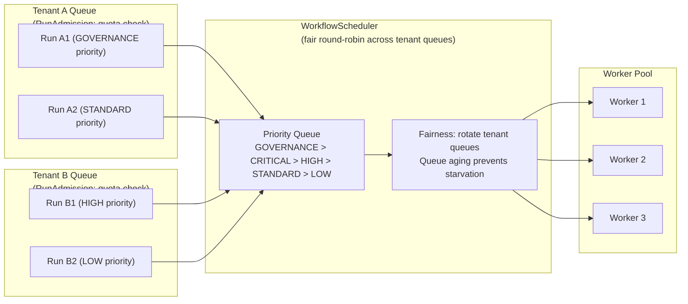

---

## 25. Workflow Orchestration Invariants

### 25.1 Workflow Version Invariants

| ID | Invariant |
|---|---|
| WV-01 | No published WorkflowVersion may be mutated. |
| WV-02 | No WorkflowVersion may execute without successful compilation. |
| WV-03 | Active runs MUST remain pinned to the WorkflowVersion used at run creation. |
| WV-04 | WorkflowVersion deprecation blocks new run creation from that version. |
| WV-05 | WorkflowVersion archival requires all associated runs to be archived. |
| WV-06 | WorkflowVersion publication requires WorkflowCompilationResult status = SUCCEEDED. |
| WV-07 | Breaking schema changes require a new major WorkflowVersion and ADR. |
| WV-08 | Replay compatibility tests MUST pass before publishing a new WorkflowVersion. |

### 25.2 Graph Invariants

| ID | Invariant |
|---|---|
| GRAPH-01 | No workflow graph may contain cycles. |
| GRAPH-02 | Every complete path from StartNode MUST reach an EndNode. |
| GRAPH-03 | No node may be unreachable from StartNode. |
| GRAPH-04 | Fan-out MUST declare max_parallel at compile time. |
| GRAPH-05 | Every fan-out MUST have a fan-in BarrierNode. |
| GRAPH-06 | MapNode MUST declare max_items at compile time. |
| GRAPH-07 | ConditionalNode predicates MUST be deterministic; MUST NOT query external systems. |
| GRAPH-08 | Cross-tenant graph references are FORBIDDEN. |
| GRAPH-09 | Every ApprovalNode MUST have both a granted path and a denied path. |
| GRAPH-10 | Dynamic node creation is FORBIDDEN unless represented as a bounded MapNode or SubWorkflowNode. |

### 25.3 Compilation Invariants

| ID | Invariant |
|---|---|
| COMP-01 | WorkflowCompilationResult is IMMUTABLE after publication. |
| COMP-02 | Compilation MUST validate all required checks before producing SUCCEEDED status. |
| COMP-03 | Compilation MUST fail if a tool with IrreversibleAction has no compensation declaration. |
| COMP-04 | Compilation MUST fail if a tool/agent/cognitive node has no timeout policy. |
| COMP-05 | Compilation MUST fail if tool permission declarations are missing. |
| COMP-06 | Compilation MUST fail if fan-out has no max_parallel. |
| COMP-07 | Compilation MUST fail on cross-tenant references. |
| COMP-08 | ExecutionPlan MUST be derivable from WorkflowCompilationResult + run event history. |

### 25.4 Execution Plan Invariants

| ID | Invariant |
|---|---|
| EP-01 | ExecutionPlan MUST be derived from the immutable WorkflowCompilationResult. |
| EP-02 | ExecutionPlan MUST NOT mutate the WorkflowVersion. |
| EP-03 | Conditional evaluation MUST only use deterministic inputs from recorded events. |
| EP-04 | ExecutionPlan is reconstructible during replay from WorkflowCompilationResult + event history. |

### 25.5 Scheduling Invariants

| ID | Invariant |
|---|---|
| SCHED-01 | No run may be created without tenant resolution. |
| SCHED-02 | No run may be created without a Published WorkflowVersion. |
| SCHED-03 | No run may be created without RuntimeEnvelope creation. |
| SCHED-04 | Duplicate triggers MUST be idempotently handled. |
| SCHED-05 | Scheduler failure MUST NOT lose scheduled executions. |
| SCHED-06 | Cron triggers MUST use explicit IANA timezone. |
| SCHED-07 | Every trigger activation MUST produce `RunRequested` as the first event. |
| SCHED-08 | RunAdmissionController MUST enforce tenant and workspace quotas. |

### 25.6 State Transition Invariants

| ID | Invariant |
|---|---|
| ST-01 | No alternate persisted run states (Created, Active, Completed, WaitingApproval, Retrying) are permitted. |
| ST-02 | All state transitions MUST go through StateTransitionCoordinator. |
| ST-03 | Every state transition MUST produce an OutboxRecord atomically. |
| ST-04 | Invalid state transitions MUST be rejected with StateTransitionRejected event. |
| ST-05 | UI display labels MUST map to canonical states; simplified labels MUST NOT be persisted. |

### 25.7 Step Invariants

| ID | Invariant |
|---|---|
| STEP-01 | No step may dispatch before StepReady is emitted. |
| STEP-02 | StepReady MUST only emit when all predecessor steps have succeeded. |
| STEP-03 | Step state MUST be persisted via StateTransitionCoordinator before dispatch. |
| STEP-04 | Step completion MUST carry `step_execution_id` and `attempt_number`. |
| STEP-05 | Step output MUST be validated before promotion to next step input. |
| STEP-06 | AtomicStepNode MUST NOT call external I/O. |

### 25.8 Dispatch Invariants

| ID | Invariant |
|---|---|
| DISP-01 | TaskDispatch MUST carry tenant_id, run_id, step_id, step_execution_id, attempt_number, idempotency_key, trace_id. |
| DISP-02 | `idempotency_key` MUST be deterministic from business context. |
| DISP-03 | Workers MUST NOT mutate workflow state directly. |
| DISP-04 | Worker results MUST be validated before step is advanced to succeeded. |
| DISP-05 | Duplicate dispatch (same idempotency_key) MUST return original TaskDispatch. |

### 25.9 Lease and Heartbeat Invariants

| ID | Invariant |
|---|---|
| LEASE-01 | Only one active WorkerLease may exist per StepExecution attempt number. |
| LEASE-02 | Heartbeat extends lease but does not prove success. |
| LEASE-03 | Heartbeat absence > lease_ttl_seconds MUST trigger lease expiry. |
| LEASE-04 | Lease expiry MUST trigger re-dispatch if RetryPolicy allows. |
| LEASE-05 | Stale worker completion (expired attempt_number) MUST be rejected. |

### 25.10 Retry Invariants

| ID | Invariant |
|---|---|
| RETRY-01 | Retries MUST be explicit; hidden retries are FORBIDDEN. |
| RETRY-02 | Retry attempts MUST emit StepRetryScheduled events. |
| RETRY-03 | Retry state MUST distinguish retryable failure from terminal failure. |
| RETRY-04 | Retry MUST carry incremented `attempt_number`. |
| RETRY-05 | Retry budget exhaustion MUST produce terminal StepFailed. |
| RETRY-06 | No retry may be attempted without a RetryPolicy declaration. |

### 25.11 Compensation Invariants

| ID | Invariant |
|---|---|
| COMP-01 | Compensation MUST be explicit workflow structure; implicit compensation is FORBIDDEN. |
| COMP-02 | Compensation MUST NOT erase original events. |
| COMP-03 | Compensation is appended to event history as new events. |
| COMP-04 | Compensation failures MUST produce alerts; they MUST NOT be silently swallowed. |
| COMP-05 | Compensation steps MUST carry original `step_execution_id` for audit linkage. |
| COMP-06 | IrreversibleAction tools MUST either declare CompensationNode or declare `non_compensable: true`. |
| COMP-07 | Replay MUST NOT re-execute compensation steps; they are hydrated from original events. |

### 25.12 Side-Effect Invariants

| ID | Invariant |
|---|---|
| SE-01 | Orchestration logic MUST NOT perform external I/O. |
| SE-02 | External effects MUST execute through ToolInvocationGateway, AgentExecutionGateway, CognitiveExecution, or worker activities. |
| SE-03 | Every side-effectful step MUST declare idempotency strategy. |
| SE-04 | Every side-effectful step MUST declare replay behavior. |
| SE-05 | No workflow code may hold credentials. |
| SE-06 | ConditionalNode MUST NOT call external systems. |
| SE-07 | OrchestrationOnlyNode MUST NOT cause external side effects. |

### 25.13 Approval Invariants

| ID | Invariant |
|---|---|
| APPR-01 | ApprovalRequired MUST be a canonical blocking state. |
| APPR-02 | ApprovalGranted MUST carry actor attribution. |
| APPR-03 | ApprovalDenied MUST route to an explicit denial path. |
| APPR-04 | Approval timeout MUST be a durable timer event. |
| APPR-05 | Approval bypass is FORBIDDEN unless modeled as policy-based auto-approval with audit. |
| APPR-06 | In replay: original ApprovalDecision is hydrated; no new approval is requested. |
| APPR-07 | Multiple approval decision attempts for the same ApprovalBarrier MUST be idempotently handled. |

### 25.14 Timer Invariants

| ID | Invariant |
|---|---|
| TIMER-01 | Timers MUST be durable records persisted in storage. |
| TIMER-02 | Worker thread sleep MUST NEVER be used for timer waits. |
| TIMER-03 | Timer records MUST persist across orchestrator restarts. |
| TIMER-04 | TimerFired event MUST be idempotent. |
| TIMER-05 | Timer cancellation MUST be recorded as an event. |

### 25.15 Replay Invariants

| ID | Invariant |
|---|---|
| REP-01 | Replay MUST NOT mutate original run lineage. |
| REP-02 | Replay MUST use original WorkflowVersion (unless explicit shadow mode). |
| REP-03 | Replay MUST suppress all side-effectful operations. |
| REP-04 | Replay MUST verify event integrity before using history events. |
| REP-05 | Nondeterministic decisions MUST produce ReplayDivergence records. |
| REP-06 | Canonical replay MUST fail closed on integrity verification failure. |
| REP-07 | Replay events MUST carry replay_context (Document 07 §4.3). |
| REP-08 | Replay telemetry MUST use isolated trace namespace. |
| REP-09 | Active run MUST NOT migrate WorkflowVersion without explicit migration plan. |
| REP-10 | New workflow code MUST NOT break replay of existing event histories. |

### 25.16 Observability Invariants

| ID | Invariant |
|---|---|
| OBS-01 | Every GovernedRun MUST have a trace_id. |
| OBS-02 | Every step MUST have a span context carrying run_id, step_id, attempt_number. |
| OBS-03 | Every state transition MUST emit telemetry. |
| OBS-04 | Orchestration telemetry MUST correlate with Document 07 event_id. |
| OBS-05 | Replay telemetry MUST use isolated trace namespace. |

### 25.17 Tenant and Fairness Invariants

| ID | Invariant |
|---|---|
| TEN-01 | No run may start without tenant_id. |
| TEN-02 | Cross-tenant workflow dependencies are FORBIDDEN. |
| TEN-03 | Tenant fairness MUST prevent one tenant from starving others. |
| TEN-04 | Concurrency limits MUST be auditable configuration, not hardcoded. |
| TEN-05 | Replay concurrency MUST be throttled before production workflows are impacted. |
| TEN-06 | Governance and approval flows have GOVERNANCE priority over low-priority automation. |

---

## 26. Workflow Orchestration Anti-Patterns

| ID | Anti-Pattern | Description | Why Dangerous |
|---|---|---|---|
| AP-01 | **Workflow code with external I/O** | Orchestration function calls REST API, queries DB, or reads file | Breaks determinism; replay re-executes external calls; duplicate side effects |
| AP-02 | **Mutable WorkflowVersion** | Editing a published version's graph or policies | Active runs break; replay diverges; governance audit is corrupted |
| AP-03 | **Cycles in DAG** | Workflow graph with circular dependency | Infinite loop; replay cannot terminate; history grows unboundedly |
| AP-04 | **Hidden retries** | Worker silently retries internally without notifying orchestrator | Retry count unknown; idempotency may be violated; audit gap |
| AP-05 | **Implicit compensation** | "On failure, the system will automatically undo" without explicit CompensationNode | Compensation logic unchecked; no audit trail; compensation failures silent |
| AP-06 | **Replay as rerun** | Replay by creating a fresh run and re-executing all steps | Side effects re-executed; duplicate external actions; not forensic investigation |
| AP-07 | **Worker-owned workflow state** | Worker maintains authoritative run state in its own database | State is inconsistent on worker crash; orchestrator cannot recover |
| AP-08 | **Direct model call from orchestrator** | `response = await llm.complete(prompt)` inside workflow orchestration code | Breaks determinism; LLM call during replay produces different output; not governance-aware |
| AP-09 | **Tool call inside orchestration logic** | `result = await tool.execute(params)` inside deterministic workflow function | Breaks side-effect isolation; replay re-executes tool; potential duplicate external effect |
| AP-10 | **Approval bypass** | Skip ApprovalNode based on flag or configuration without audit | Governance gate removed; compliance violation; no audit record |
| AP-11 | **Unbounded fan-out** | MapNode or fan-out without max_parallel limit | Resource saturation; one run monopolizes worker pool; tenant starvation |
| AP-12 | **Random decision inside workflow** | `if random() > 0.5: branch_A else: branch_B` in orchestration code | Non-deterministic; replay chooses different branch; event history inconsistent |
| AP-13 | **Using current wall-clock time directly** | `if now() > deadline: ...` evaluated during orchestration replay | Clock is different at replay time; conditional routes differently; divergence |
| AP-14 | **Global mutable state** | Shared in-memory dict/object modified by multiple steps | Thread safety violations; state lost on crash; replay produces different state |
| AP-15 | **Cross-tenant workflow dependency** | Workflow in Tenant A references a step defined in Tenant B | Tenant isolation broken; A can trigger B's tools; governance violation |
| AP-16 | **Worker sleep for long timer** | `time.sleep(86400)` in worker process for a 24-hour wait | Worker thread blocked for 24h; worker pool exhausted; timer lost on worker crash |
| AP-17 | **Event history mutation** | Deleting or modifying past events to "fix" a bug | Replay produces different result; audit trail corrupted; tamper evidence fails |
| AP-18 | **Step success without output validation** | Worker reports success without validating output schema | Invalid data flows to next step; downstream step fails unexpectedly |
| AP-19 | **Duplicate dispatch without lease** | Multiple TaskDispatch for same step without lease guard | Two workers execute same step simultaneously; duplicate side effects |
| AP-20 | **Retry without idempotency** | ToolStepNode retries without idempotency key | Double payment, double email, double DB write on retry |
| AP-21 | **Compensation deleting original evidence** | Compensation step deletes original event records | Audit trail destroyed; investigation impossible; compliance violation |
| AP-22 | **Scheduler trigger without idempotency** | Cron trigger creates multiple runs for the same fire time | Duplicate runs; duplicate side effects; billing anomalies |
| AP-23 | **Active run version migration without audit** | Migrating active run to new WorkflowVersion without formal plan | Run behavior changes mid-flight; divergence from original policy |
| AP-24 | **Parallel branches sharing mutable state** | Fan-out branches reading/writing the same variable | Race condition; non-deterministic output; replay diverges |
| AP-25 | **Orchestration as process chain** | Workflow implemented as chain of async function calls in a process | Process crash = state lost; no durable history; replay impossible |
| AP-26 | **Timer as heartbeat** | Using TimerNode as a worker keep-alive mechanism | Timer fires even when worker is healthy; unnecessary step re-dispatch |
| AP-27 | **ConditionalNode with current time** | Edge condition evaluates `now()` | Different result at replay time; divergence |
| AP-28 | **Step output shared between unrelated workflows** | Step result artifact read by a step in a different workflow | Cross-workflow coupling; tenant isolation risk if cross-tenant |
| AP-29 | **WorkflowVersion as mutable code** | Treating workflow code as source-controlled software that can be deployed without versioning | Active runs break when code is deployed; no compile gate |
| AP-30 | **Approval as synchronous API call** | Implementing ApprovalNode as `response = await approval_api.wait()` | Blocks worker thread; expensive; not durable (crash = approval lost) |
| AP-31 | **Step state in worker memory** | Worker maintains step state in-process without persisting | State lost on worker restart; orchestrator cannot determine step status |
| AP-32 | **Unbounded loop with no exit condition** | Sub-workflow or recursive trigger with no max iteration | Infinite run creation; resource exhaustion |
| AP-33 | **Silent compensation failure** | CompensationNode fails; error is logged but run continues as succeeded | Partial undo; inconsistent state; compliance violation |
| AP-34 | **Hardcoding retry count in worker** | Worker retries internally before reporting failure to orchestrator | Retry count invisible to orchestrator; total attempts exceed policy; audit gap |
| AP-35 | **Missing failure path** | ToolStepNode with no failure handling and no compensation | Run gets stuck; no graceful degradation; no operator alert |
| AP-36 | **Using broker offset as step ordering** | Determining step execution order from event broker offset | Offsets reset on broker failover; ordering breaks |
| AP-37 | **Workflow state in session context** | Storing run state in HTTP session or request-scoped memory | State destroyed on session timeout; orchestrator cannot resume |
| AP-38 | **No timeout on tool step** | ToolStepNode without TimeoutPolicy | Tool hangs indefinitely; worker lease exhausted; run stuck forever |
| AP-39 | **Agent step with no budget cap** | AgentStepNode without cognitive budget | Runaway agent consumes unlimited tokens; cost explosion |
| AP-40 | **Skipping WorkflowVersion compilation** | Allowing runs on uncompiled workflow definition | Invalid DAG may loop; missing compensation paths undiscovered at runtime |
| AP-41 | **Replay by re-calling all tools** | Replay mode re-dispatches all tool steps without suppression | Duplicate external effects during investigation; payments doubled |
| AP-42 | **Workflow credentials in step input** | Passing API keys or credentials in step input payload | Credentials visible in event history; stored in audit records; exfiltration risk |
| AP-43 | **One giant workflow step** | Single monolithic ToolStepNode that does "everything" | No granular retry; no step-level audit; cannot compensate partial completion |
| AP-44 | **Dynamic DAG expansion at runtime** | Adding nodes to the workflow graph during execution | Breaks replay determinism; execution graph no longer matches compiled version |
| AP-45 | **Approval decision hardcoded in workflow** | `if step_id == "sensitive_step": auto_approve()` | Approval bypass disguised as logic; no human review; governance violation |
| AP-46 | **SubWorkflow without version pin** | Sub-workflow always runs the latest version | Sub-workflow behavior changes mid-parent-run; replay inconsistent |
| AP-47 | **No audit on compensation** | Compensation executes without recording compensation events | Silent state change; no governance evidence for undo actions |
| AP-48 | **Running multiple orchestrators without idempotency** | Multiple WorkflowOrchestrators process the same run simultaneously | Duplicate step dispatch; conflicting state transitions |
| AP-49 | **Step result as runtime state** | Embedding large step output directly in the orchestration state record | State record grows unboundedly; hydration slow; event history bloat |
| AP-50 | **Blocking fan-in forever** | BarrierNode with ALL_SUCCESS but no timeout | Run blocked indefinitely if one branch fails silently |
| AP-51 | **Approval without escalation** | ApprovalNode with timeout but no escalation policy | Request expires without resolution; no human follow-up |
| AP-52 | **Worker completing step after lease expiry** | Worker reports success after its lease has expired and retry started | If idempotency check is missing, two completions conflict; duplicate promotion |
| AP-53 | **Workflow-level credential store** | WorkflowVersion stores credentials in its definition | Credentials in immutable, version-controlled artifact; rotation impossible without new version |
| AP-54 | **Compensation in forward execution order** | Compensation steps execute in same order as original steps | Earlier steps un-done before later dependent steps; incorrect state |
| AP-55 | **Using simplified state names in persistence** | Persisting `status = "active"` instead of canonical `StepRunning` | State machine alignment lost; queries return wrong results; replay uses wrong name |
| AP-56 | **Replay without integrity check** | Hydrating from event history without verifying event_hash | Tampered events reconstruct wrong state; investigation conclusions invalid |
| AP-57 | **Scheduler trigger by wall clock in code** | `if datetime.now().minute == 0: trigger_run()` in application code | Not durable; missed fires on restart; not observable as triggers |
| AP-58 | **No max_attempts on retry** | RetryPolicy with unbounded retries | Failing step retries forever; worker pool saturated; other runs starved |
| AP-59 | **Step output schema ignored** | Worker output accepted without schema validation | Invalid data silently flows to next step; downstream steps fail unexpectedly |
| AP-60 | **WorkflowVersion as mutable database row** | Workflow definition mutable in production database with no version control | Active runs break on unexpected update; replay impossible |
| AP-61 | **Fan-in with no barrier node** | Parallel branches that directly converge on a next node | No ordering guarantee; some branches may be skipped; undefined execution order |
| AP-62 | **Orchestrator calling PolicyDecisionGateway on every step** | Policy evaluated live during replay | Replay uses current policy, not original PolicySnapshot; divergence |
| AP-63 | **Timer misfire ignored** | Timer fires hours late; workflow proceeds without recording delay | Audit record shows wrong timing; SLA calculations incorrect |
| AP-64 | **Step parallelism without fairness controls** | Fan-out creates 1000 parallel steps in one run | Worker pool monopolized by one run; all other tenant runs starved |
| AP-65 | **Replay session without isolation** | Replay state mixed with production state | Replay output accidentally promoted; production state contaminated |
| AP-66 | **Missing BarrierNode release condition** | BarrierNode with no release_condition declaration | Barrier never releases; run stuck |
| AP-67 | **Using database transaction as orchestration gate** | Long-running DB transaction spans entire step | Transaction holds locks for minutes; concurrent steps blocked |
| AP-68 | **No compensation for FinancialTransaction tool** | Payment tool step with no CompensationNode or non_compensable declaration | Payment fails with no undo path; no governance alert |
| AP-69 | **Orchestration code importing tool library directly** | `from tools.payment import PaymentClient` in workflow code | Orchestrator can execute side effects; breaks side-effect isolation |
| AP-70 | **Approval decision not carrying actor_id** | ApprovalGranted event without identity of approver | Governance record incomplete; cannot audit who approved |
| AP-71 | **Lazy DAG validation** | Validating DAG only at first run, not at compile time | Invalid graph discovered in production; already in active state |
| AP-72 | **No run-level timeout** | Run can execute indefinitely | Zombie runs accumulate; worker pool saturated; tenant quota consumed |
| AP-73 | **Continue-As-New without explicit linkage** | Creating child run without linking to parent run_id | Causal chain broken; investigation cannot trace lineage |
| AP-74 | **Non-deterministic fan-out size** | MapNode with dynamic list size not bounded at compile time | Potential unbounded parallelism; compilation cannot validate |
| AP-75 | **Cross-run mutable artifact** | Step A in Run 1 writes artifact that Step B in Run 2 reads without contract | Implicit dependency; Run 2 behavior depends on Run 1 completion order |
| AP-76 | **Heartbeat proving completion** | Worker sends heartbeat with `status=success` to avoid implementing proper completion | Lease renewal != completion; orchestrator cannot distinguish from active worker |
| AP-77 | **CompensationNode modifying original artifacts** | Compensation step overwrites original step output | Original evidence destroyed; tamper evidence failure; audit gap |
| AP-78 | **Single step for all logic** | Entire business process in one AtomicStepNode | No granular retry; no step-level audit; no compensation granularity |
| AP-79 | **Worker polling without tenant scope** | Worker picks tasks across all tenants | Cross-tenant data exposure; governance gap |
| AP-80 | **Skipping RunArchived event** | Run reaches terminal state without archival lifecycle | Retention policy cannot apply; orphan state records |
| AP-81 | **Storing workflow run in broker offset** | Using Kafka consumer offset as run state | Offsets reset; run state lost on consumer group change |
| AP-82 | **Approval waiting on synchronous HTTP** | ApprovalBarrierCoordinator polls HTTP endpoint for decision | Polling expensive; broker coupling; missed approval if polling fails |
| AP-83 | **No StepReady event before dispatch** | TaskDispatcher creates dispatch without StepReady event | No audit record of step readiness; replay cannot verify ordering |
| AP-84 | **Workflow version without review gate** | WorkflowVersion publication skips review step | Buggy or malicious workflows published to production |
| AP-85 | **Compensation path sharing state with forward path** | CompensationNode reads from in-memory variable set by forward execution | Variable gone after crash; compensation fails |
| AP-86 | **Concurrent CompensationPlan activations** | Multiple failures in parallel branches both activate CompensationPlan | Duplicate compensation; over-undo; inconsistent state |
| AP-87 | **Missing tenant_id on run** | GovernedRun created without tenant_id | Tenantless run; governance unenforceable; audit incomplete |
| AP-88 | **Running replay without operator authorization** | Any service can initiate replay without policy check | Unauthorized access to historical run data; replay side effects |
| AP-89 | **Orchestration logic depending on current active runs count** | Conditional routes based on `count(active_runs)` | Different count at replay time; divergence; non-deterministic |
| AP-90 | **No fan-in timeout** | BarrierNode waits indefinitely for all parallel branches | One slow/failed branch blocks entire run; no escalation or timeout |

---

## 27. Codex Implementation Guidance

### 27.1 Implementation Order

| Order | Component | Description |
|---|---|---|
| 1 | WorkflowDefinition schema | TypeScript/DB schema; version relationship |
| 2 | WorkflowVersion schema | Immutability contract; compilation status |
| 3 | WorkflowGraph representation | Nodes, edges, conditional predicates |
| 4 | Node and edge validation | Type validation; schema validation |
| 5 | DAG compiler | Acyclicity check (DFS); unreachable node detection; missing terminal path detection |
| 6 | WorkflowCompilationResult | All compilation output artifacts; dependency map |
| 7 | ExecutionPlan | Derived from WorkflowCompilationResult; topological sort |
| 8 | Run creation with RuntimeEnvelope | Integrated with Document 02 RuntimeEnvelopeBuilder |
| 9 | Canonical state mapping | 24-state GovernedRun lifecycle; NO alternate states |
| 10 | StepExecution model | State machine; attempt_number; retry tracking |
| 11 | StateTransitionCoordinator integration | All state changes through Document 06 STC |
| 12 | Event emission integration | All orchestration events via Document 07 contracts |
| 13 | Basic scheduler | Trigger processing; cron; idempotency |
| 14 | TaskDispatcher | TaskDispatch creation; idempotency_key; worker queue |
| 15 | Worker contract | WorkerGateway API; heartbeat; completion reporting |
| 16 | WorkerLeaseManager | Lease lifecycle; TTL; heartbeat monitoring |
| 17 | HeartbeatMonitor | Periodic lease check; LeaseExpired emission |
| 18 | RetryScheduler | RetryPolicy application; backoff; attempt_number |
| 19 | TimeoutPolicy | Step and run timeouts; durable timer integration |
| 20 | ApprovalNode + ApprovalBarrierCoordinator | ApprovalBarrier creation; decision handling; escalation |
| 21 | TimerService | Durable timer records; polling-based firing; no thread sleep |
| 22 | Replay hydration | ReplayCoordinator + HydrationManager (Doc 06) integration |
| 23 | Side-effect suppression | CognitiveReplayAdapter; ToolReplaySuppressed logic |
| 24 | Observability spans | OTel spans per run, step, dispatch, approval, timer |
| 25 | Tests | All required tests below |

### 27.2 Forbidden Codex Shortcuts

| Shortcut | Why Forbidden |
|---|---|
| Implement orchestration as ad hoc async function chains | No durable state; process crash = state loss; replay impossible |
| Execute tools directly inside workflow code | Breaks side-effect isolation; replay re-executes; duplicate external actions |
| Call LLMs directly from orchestration code | Non-deterministic; breaks replay; not governance-aware |
| Store workflow state only in memory | State lost on crash; replay impossible |
| Skip WorkflowVersion compilation | Invalid DAG may reach production; missing compensation paths undetected |
| Use simplified lifecycle states as persisted state | Canonical state alignment lost; replay uses wrong names |
| Create RunStarted/RunCompleted events (old names) | Document 07 uses RunCreated/RunSucceeded; inconsistency |
| Implement worker sleep for timers | Worker thread blocked; timer lost on crash; resource waste |
| Implement replay by re-running side effects | Duplicate external actions; not forensic replay |
| Build UI graph editing before compiled execution works | No value without reliable execution backing |

### 27.3 Required Tests

| Test | Description | Pass Condition |
|---|---|---|
| DAG acyclicity test | Submit cyclic workflow graph for compilation | CompilationFailed with cycle path reported |
| Unreachable node test | Submit graph with disconnected node | CompilationFailed with unreachable node list |
| Missing terminal path test | Submit graph with path that never reaches EndNode | CompilationFailed |
| WorkflowVersion immutability test | Attempt to modify published version | Modification rejected; version unchanged |
| Compilation failure blocks publish test | Submit version with compilation errors | Version stays in CompilationFailed; no execution possible |
| Canonical lifecycle mapping test | Inspect persisted run state | No `Created`, `Active`, `Completed` states; only canonical 24-state names |
| StepReady before dispatch test | Trace step lifecycle events | StepReady event precedes StepDispatched in event history |
| Worker lease expiry test | Kill worker mid-step; wait for TTL | LeaseExpired event; StepRetryScheduled; new dispatch created |
| Duplicate completion idempotency test | Submit completion twice with same attempt_number | Second submission rejected; step advances once only |
| Hidden I/O prohibition test | Attempt to call external API from ConditionalNode | Compile-time or runtime rejection |
| Retry policy test | Inject transient failure; verify retry | StepRetryScheduled with backoff; attempt_number incremented |
| Timeout policy test | Inject step that exceeds timeout | StepTimedOut event; step treated as StepFailed(TIMEOUT) |
| Approval blocking test | Create run with ApprovalNode; verify suspension | Run in ApprovalRequired state; no further step dispatch |
| Timer durability test | Create TimerNode; restart service mid-wait | Timer survives restart; fires at correct time |
| Compensation path test | Inject terminal step failure with CompensationNode | Compensation steps dispatched in reverse order |
| Replay side-effect suppression test | Replay run with ToolStepNode | ToolReplaySuppressed event; no new tool dispatch |
| Tenant isolation scheduling test | Tenant A run MUST NOT access Tenant B workflow | Cross-tenant dispatch rejected |
| Observability span correlation test | Trace run execution | span hierarchy: run → step → dispatch → worker activity |

---

## 28. Relationship to Other Documents

| Document | Relationship |
|---|---|
| **Document 00** | Document 00's doctrine: governed execution requires full traceability, replayability, and policy enforcement. Document 09 implements those properties through deterministic orchestration, event history, and approval gates. |
| **Document 01** | Document 01 requires audit trail, human approval gates, multi-step workflows, retry, and tenant isolation. Document 09 directly implements these as first-class orchestration features. |
| **Document 02** | Document 02 defines the Core Runtime Architecture including RuntimeEnvelopeBuilder, RunManager, and StateTransitionCoordinator. Document 09 uses these components to create and advance GovernedRuns. |
| **Document 03** | Document 03 defines the Canonical Domain Model including GovernedRun, StepExecution, and the 24-state lifecycle. Document 09 implements the orchestration semantics that drives those entities through their lifecycle. |
| **Document 04** | Document 04 defines Cognitive Execution. Document 09 coordinates cognitive execution through CognitiveStepNode — dispatching to the CognitiveExecution boundary without calling model providers directly. |
| **Document 05** | Document 05 defines Agent Runtime. Document 09 coordinates agent execution through AgentStepNode — dispatching to AgentExecutionGateway without owning agent reasoning. |
| **Document 06** | Document 06 defines State, Checkpoint & Persistence. Document 09 uses StateTransitionCoordinator for all state transitions, the transactional outbox for event publication, checkpoints for fast hydration, and the event store for replay reconstruction. |
| **Document 07** | Document 07 defines Event & Messaging Contracts. Document 09 produces canonical events (RunCreated, StepReady, StepSucceeded, ApprovalRequired, etc.) following the EventEnvelope contracts defined there. |
| **Document 08** | Document 08 defines Event Runtime mechanics. Document 09 depends on Document 08 for reliable event delivery from the orchestration engine to consumers (projections, audit, telemetry). |
| **Document 10** | Document 10 defines Memory & Context Architecture. Document 09 coordinates memory reads and writes through AgentStepNode and CognitiveStepNode; it does not directly access the memory fabric. |
| **Document 11** | Document 11 defines Governance, Policy & Approval. Document 09 invokes PolicyDecisionGateway during run admission and step dispatch. ApprovalNodes correspond to ApprovalGateCoordinator in Document 11. |
| **Document 12** | Document 12 defines the Observability Platform. Document 09 emits the orchestration span hierarchy and metrics that Document 12's platform collects. |
| **Document 13** | Document 13 defines Security Architecture. Document 09 enforces tenant isolation during run admission and step dispatch; SPIFFE identity verification is handled at the worker gateway layer. |
| **Document 14** | Document 14 defines Multi-Tenant Isolation. Document 09 enforces tenant isolation through RunAdmissionController, tenant-scoped queues, and cross-tenant graph reference prohibition. |
| **Document 15** | Document 15 defines Tool Runtime. Document 09 dispatches tool steps through ToolInvocationGateway; it does not own the tool contract. |
| **Document 16** | Document 16 defines Infrastructure Deployment. Document 09 defines the orchestration logic; Document 16 deploys the scheduler, worker pools, and timer service infrastructure. |
| **Document 17** | Document 17 defines SRE Runbooks. The failure modes in Document 09 §22 correspond to runbooks in Document 17. `WorkflowStuckDetected`, `OrphanRunDetected`, and `CompensationFailed` trigger runbooks there. |
| **Document 18** | Document 18 defines External APIs. API-triggered workflow runs arrive via Document 18's API contracts as `API trigger` events that feed Document 09's TriggerGateway. |

---

## 29. Final Workflow Orchestration Principles

**Workflows define.** A WorkflowDefinition declares the process. A WorkflowVersion makes it executable. The workflow is the contract between the business requirement and the runtime.

**Versions freeze.** Once a WorkflowVersion is published, it is immutable. Active runs are forever pinned to their original version. New behavior demands a new version.

**Compiler validates.** No WorkflowVersion reaches production without passing compilation. The compiler is the quality gate that enforces DAG validity, side-effect declarations, compensation requirements, and permission manifests before any execution begins.

**Plans execute.** The ExecutionPlan is the runtime materialization of the WorkflowCompilationResult — a live, evolving schedule that reflects the current state of a specific run against an immutable definition.

**Orchestration decides.** The WorkflowOrchestrator decides what step is ready, what timer to schedule, what approval to require, what retry to attempt, and when compensation must activate. These are control decisions. They produce commands.

**Workers execute.** Workers receive commands through TaskDispatch. They perform the actual work — tool execution, model calls, business operations. They return results to the orchestrator as events. The orchestrator trusts worker results only after schema validation.

**Tools affect.** External effects happen in tools, through ToolInvocationGateway, with declared side-effect class, idempotency strategy, and compensation policy. The orchestrator knows about the effect class. It does not know — or need to know — the implementation.

**Agents reason.** Agent reasoning happens in agent execution units, through AgentExecutionGateway. The orchestrator sees the agent as a step with a declared budget and output schema. It does not participate in the agent's reasoning process.

**Policies constrain.** Every step dispatch that reaches a side-effectful execution unit is subject to PolicyDecisionGateway evaluation. The orchestrator uses the original PolicySnapshot from the run's creation — not the current policy at replay time.

**Approvals unblock.** ApprovalNodes are first-class blocking states. They represent the governance principle that certain operations require explicit human authorization before proceeding. They cannot be skipped silently.

**Timers persist.** A durable timer is a record in the database, not a thread sleeping. Worker processes restart, orchestrators recover, infrastructure cycles — the durable timer survives all of these and fires reliably.

**Events remember.** The append-only event history is the orchestration engine's memory. Every step dispatch, every approval decision, every retry, every timer fire is a durable event. The orchestrator reconstructs its state from this history.

**Replay reconstructs.** Replay is not rerunning the workflow. It is deterministic reconstruction of what happened, using the same workflow version, the same recorded inputs, and the same recorded nondeterministic results — without producing any new side effects.

**Tenants isolate.** Every run belongs to exactly one tenant. Cross-tenant workflow references are forbidden. Tenant isolation is enforced structurally — at the admission controller, in the worker queue, in the permission manifest, and in the event envelope.

**Observability reveals.** Every meaningful orchestration event carries a trace_id and emits a span. The orchestration health — step latency, approval wait time, retry rate, compensation activation — is continuously visible to SRE and operators.

---

> In MYCELIA, the workflow engine does not perform the work.
>
> It governs the order, safety, memory, accountability and replayability of work.
