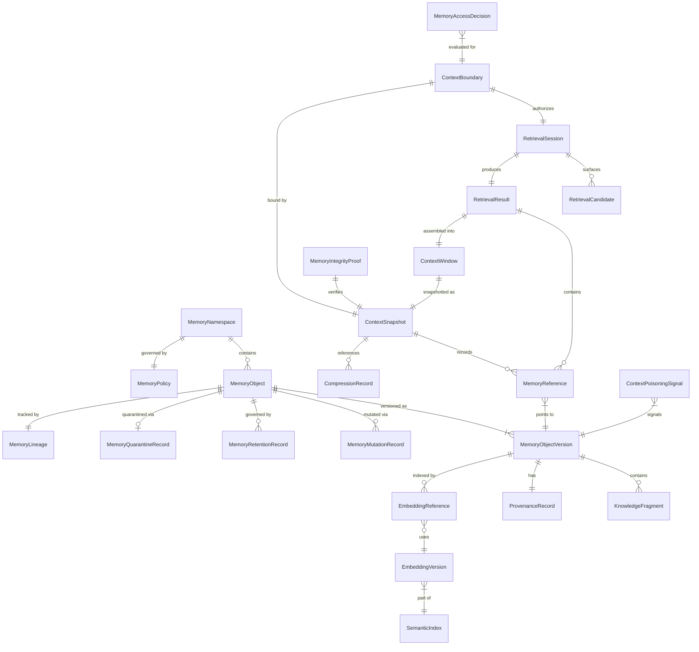
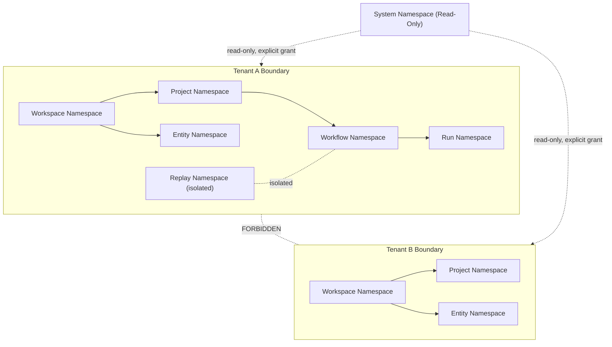
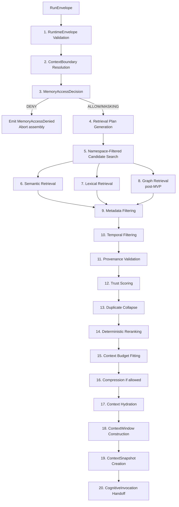
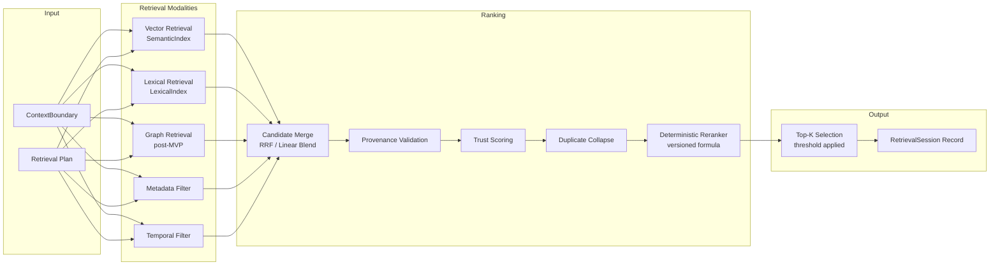
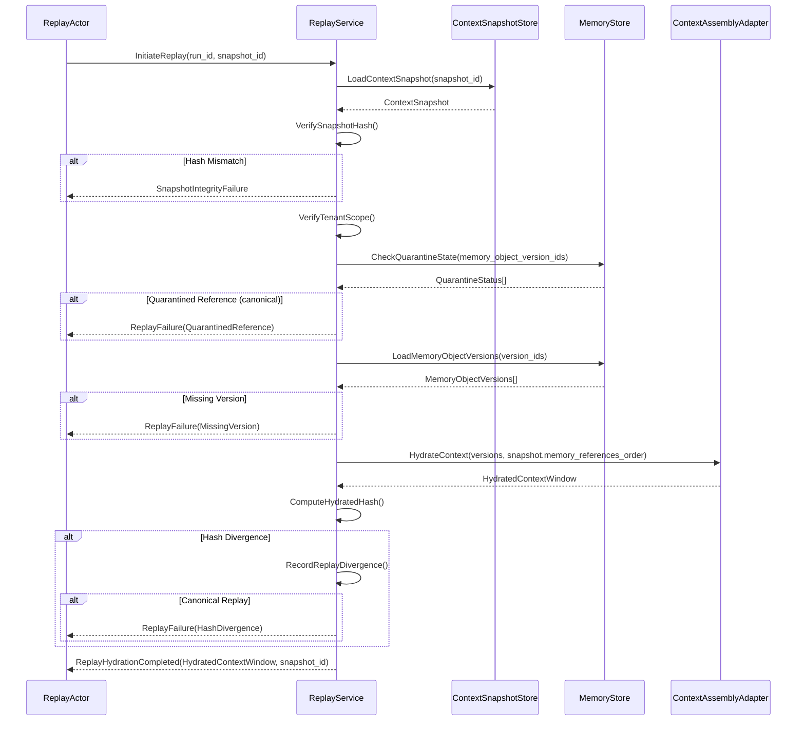
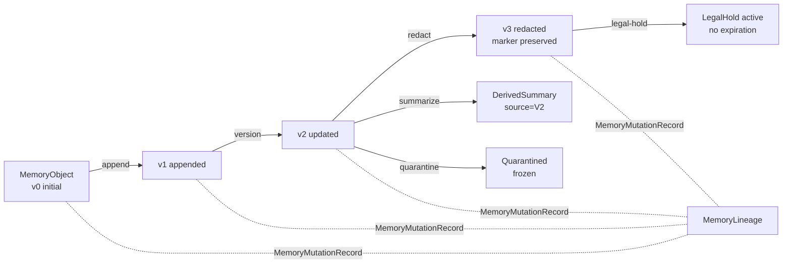
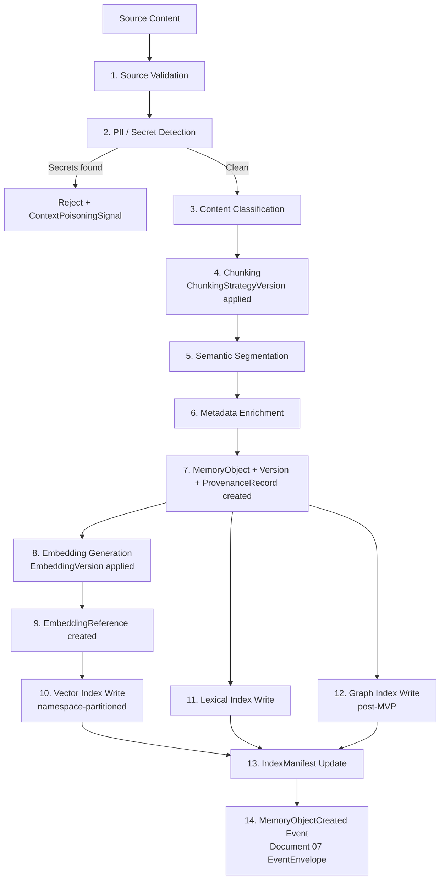
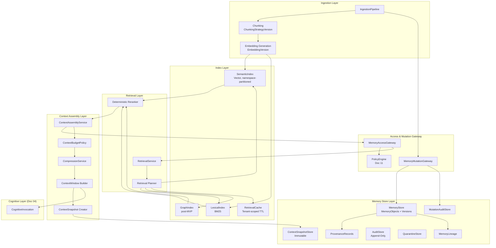

# MYCELIA — 10 Memory & Context Architecture

---

## Document Metadata

| Field | Value |
|---|---|
| Document Series | MYCELIA Architecture Constitution |
| Document Number | 10 |
| Version | v1.0 |
| Status | Canonical |
| Classification | Core Architecture — Memory & Context Infrastructure |
| Canonical Role | Defines the memory taxonomy, context assembly pipeline, retrieval architecture, context snapshots, replay hydration, memory governance, semantic indexing, and context budgeting for all MYCELIA cognitive runtimes |
| Primary Audience | Platform Engineers, Memory Architects, Retrieval Engineers, Context Engineers, Codex |
| Last Updated | June 2026 |

---

## Table of Contents

1. [Executive Summary](#1-executive-summary)
2. [Memory & Context Philosophy](#2-memory--context-philosophy)
3. [Memory Scope and Non-Scope](#3-memory-scope-and-non-scope)
4. [Canonical Memory Domain Model](#4-canonical-memory-domain-model)
5. [Memory Taxonomy](#5-memory-taxonomy)
6. [Memory Namespace and Context Boundary Model](#6-memory-namespace-and-context-boundary-model)
7. [Memory Access and Governance Model](#7-memory-access-and-governance-model)
8. [Context Assembly Architecture](#8-context-assembly-architecture)
9. [Retrieval Architecture](#9-retrieval-architecture)
10. [Context Budgeting and Fitting](#10-context-budgeting-and-fitting)
11. [ContextSnapshot and Replay Hydration](#11-contextsnapshot-and-replay-hydration)
12. [Memory Mutation and Lineage](#12-memory-mutation-and-lineage)
13. [Semantic Indexing Architecture](#13-semantic-indexing-architecture)
14. [Context Compression and Summarization](#14-context-compression-and-summarization)
15. [Memory Consistency Model](#15-memory-consistency-model)
16. [Context Poisoning and Memory Threat Model](#16-context-poisoning-and-memory-threat-model)
17. [Memory Observability and Audit](#17-memory-observability-and-audit)
18. [Memory Failure Model](#18-memory-failure-model)
19. [MVP Memory & Context Cut](#19-mvp-memory--context-cut)
20. [Memory & Context Diagrams](#20-memory--context-diagrams)
21. [Memory & Context Invariants](#21-memory--context-invariants)
22. [Memory & Context Anti-Patterns](#22-memory--context-anti-patterns)
23. [Codex Implementation Guidance](#23-codex-implementation-guidance)
24. [Relationship to Other Documents](#24-relationship-to-other-documents)
25. [Final Memory & Context Principles](#25-final-memory--context-principles)

---

## 1. Executive Summary

### 1.1 What Memory & Context Architecture Means in MYCELIA

Memory & Context Architecture in MYCELIA defines the governed substrate through which cognitive operations receive the information they need to execute safely, reproducibly, and in accordance with policy. It is not a chat history store. It is not a prompt engineering convention. It is not the hidden internal state of a language model.

Memory in MYCELIA is an explicit, scoped, versioned, retrievable, auditable, and replay-safe infrastructure layer. Context in MYCELIA is a deterministically assembled runtime artifact constructed from governed memory retrieval, delivered to cognitive execution within verified boundaries.

### 1.2 Why Memory Is an Operational Substrate

Cognitive operations in MYCELIA are not stateless. They require access to structured knowledge, prior execution context, entity-specific history, governance constraints, workflow-scoped data, and semantic artifacts produced by previous steps. If this information is stored only in an LLM's implicit weights, it cannot be audited, versioned, governed, or replayed. If it is stored only in a prompt string, it has no provenance, no lineage, and no policy enforcement.

MYCELIA treats memory as operational infrastructure equivalent in importance to event storage, state persistence, and policy enforcement. Memory systems must be designed with the same rigor as durable event logs and execution checkpoints.

### 1.3 Why Prompt Text Is Not Authoritative Memory

A prompt string is a transient input to a model invocation. It has no durable identity, no versioned representation, no provenance record, and no governance binding unless it is constructed through the context assembly pipeline defined in this document. Text injected into a prompt outside the governed context assembly pipeline is invisible to audit, immune to replay, and untraceable to its origin.

MYCELIA forbids the use of prompt text as authoritative memory. All authoritative memory exists as MemoryObjects with identity, provenance, namespace scope, and mutation lineage.

### 1.4 Why LLM Hidden State Is Not Authoritative Memory

Language model weights encode parametric knowledge from training. This knowledge is static, unverifiable for a specific claim, unscoped to a tenant, and unreplayable. Model weights cannot be audited for a specific runtime decision. Model weights cannot be frozen to a policy snapshot. Model weights cannot be updated for a specific tenant without full retraining.

MYCELIA's cognitive operations depend on non-parametric, externally managed memory that can be versioned, scoped, governed, and hydrated deterministically for each invocation.

### 1.5 Why Deterministic Context Assembly Matters

The same GovernedRun presented with the same MemoryObject versions, the same retrieval pipeline version, the same reranker version, and the same context budget policy MUST produce the same ContextWindow. This is not an optimization — it is the precondition for forensic reproducibility, approval gate accountability, and replay-safe execution.

A context assembly pipeline that introduces nondeterminism at ranking, truncation, or selection breaks the replay contract established in Documents 06, 09 and 11.

### 1.6 Why Context Snapshots Matter for Replay

A ContextSnapshot is the immutable record of exactly what information was assembled and delivered to a CognitiveInvocation. Without this record, it is impossible to answer: "What did the model know when it made this decision?" Without answering that question, it is impossible to conduct forensic investigation, demonstrate policy compliance, or replay a cognitive workflow faithfully.

ContextSnapshot creation is REQUIRED for all GovernedRuns and SHOULD be implemented for all CognitiveInvocations in production.

### 1.7 How Document 10 Relates to Sibling Documents

Document 10 depends on the domain model defined in Document 03, the cognitive execution model defined in Document 04, the agent runtime defined in Document 05, the state and persistence model defined in Document 06, and the event contracts defined in Document 07. It is consumed by Document 09 (Workflow Orchestration) when workflows need to hydrate context for cognitive steps. It informs Document 11 (Governance) by defining memory access policy binding. It is observed by Document 12 (Observability). It is secured by Document 13 (Security). It is isolated by Document 14 (Multi-Tenant Isolation). It is tooled through Document 15 (SDK & Tool Runtime).

### 1.8 Core Boundaries

**Memory does not own cognition.** Memory provides context; Document 04 defines how cognition consumes it.

**Memory does not own workflow state.** Execution state is defined in Document 06. Memory holds knowledge artifacts, not orchestration state.

**Memory does not own governance authority.** Policy definitions belong to Document 11. Memory access decisions are policy-evaluated, but the policy engine is not a memory concern.

**Memory provides governed context infrastructure.** Its sole responsibility is to store, index, retrieve, assemble, snapshot, and replay context safely and in accordance with policy.

---

## 2. Memory & Context Philosophy

### 2.1 Memory as Governed Infrastructure

Memory in MYCELIA is not a passive storage facility. It is an active, policy-enforced, namespace-scoped, provenance-tracked infrastructure layer. Every MemoryObject has an owner, a scope, a lineage, and a governance binding. Every retrieval is an authorized operation against a ContextBoundary. Every mutation creates an auditable record.

Memory infrastructure shares the design principles of durable event stores and state checkpoints: append-only by default, immutable historical versions, auditable mutations, observable side effects, and replay-safe snapshots.

### 2.2 Context as Assembled Runtime Artifact

Context in MYCELIA is not whatever text happens to be in a prompt. Context is the deterministic output of a governed assembly pipeline that resolves a ContextBoundary, authorizes retrieval, executes a ranked retrieval plan against versioned semantic and lexical indexes, applies budget policy, compresses if allowed, and produces a ContextWindow that is immediately snapshotted before delivery to CognitiveExecution.

This means context is reproducible, traceable, policy-bound, and auditable. It has a hash. It has a retrieval session record. It has version references for every MemoryObject it includes.

### 2.3 Canonical Distinctions

| Concept A | Concept B | Distinction |
|---|---|---|
| **Memory** | **Prompt** | Governed, versioned, retrievable artifact vs transient input string |
| **Memory** | **State** | Knowledge infrastructure vs execution state (Document 06) |
| **Memory** | **Event history** | Context knowledge vs operational event lineage (Document 07) |
| **Memory** | **Telemetry** | Semantic knowledge vs observability signals (Document 12) |
| **Memory** | **Cache** | Authoritative knowledge source vs acceleration layer |
| **Memory** | **Artifact** | Knowledge substrate vs workflow output artifact |
| **Memory** | **Knowledge** | Infrastructure layer vs semantic content it holds |
| **Parametric memory** | **Non-parametric memory** | LLM weights (ungoverned) vs external store (governed) |
| **MemoryObject** | **ContextWindow** | Persisted knowledge unit vs assembled invocation context |
| **MemoryReference** | **Embedded text** | Pointer with provenance vs untracked text injection |
| **ContextWindow** | **ContextSnapshot** | Live assembled context vs immutable snapshot record |
| **RetrievalSession** | **Live vector query** | Governed, logged retrieval operation vs ad-hoc index query |
| **SemanticMemory** | **EpisodicMemory** | Factual, concept-level knowledge vs event-sequence memory |
| **WorkflowMemory** | **ExecutionMemory** | Workflow-scoped knowledge vs single-run execution context |
| **WorkingMemory** | **Persisted state** | Transient assembly buffer vs durable state record |
| **CacheMemory** | **Authoritative memory** | Acceleration with TTL vs source of truth |
| **DerivedSummary** | **Source memory** | Lossy-derivative artifact vs original knowledge |
| **ReplayMemory** | **Production memory** | Forensic reconstruction scope vs live serving scope |
| **AuditMemory** | **Telemetry logs** | Immutable governance record vs operational observability signal |

### 2.4 Retrieval as Controlled Operation

Retrieval in MYCELIA is not a free-form query against a vector database. It is a controlled, authorized, namespace-filtered, policy-gated operation that executes against versioned indexes and produces a RetrievalSession record. Every retrieval operation is observable, auditable, and replay-aware.

Retrieval without authorization is FORBIDDEN. Retrieval without namespace filtering is FORBIDDEN. Retrieval without provenance tracking is FORBIDDEN.

### 2.5 Context Assembly as Deterministic Pipeline

The context assembly pipeline is a versioned, ordered, deterministic sequence of operations. Given the same inputs — ContextBoundary, retrieval plan, MemoryObjectVersions, pipeline version, reranker version, budget policy — the pipeline MUST produce the same ContextWindow. This determinism requirement extends across all environments: development, staging, production, and replay.

### 2.6 Snapshots as Replay Anchors

A ContextSnapshot is the immutable record that anchors a cognitive invocation to the exact memory state it received. Snapshots enable forensic replay (reconstruct exactly what happened), investigation replay (compare what should have happened), and audit review (demonstrate what information was available at decision time).

### 2.7 Provenance as Trust Substrate

Every MemoryObject carries provenance metadata: origin source, ingestion timestamp, ingestion actor, chunking strategy version, embedding version, and mutation lineage. Provenance is not optional metadata. It is the trust substrate that allows the system to distinguish verified enterprise knowledge from unvalidated agent output, fresh indexed content from stale cached derivatives, and authorized memory from quarantined suspects.

### 2.8 Memory Mutation Through Append-Only Lineage

MemoryObjects are never silently overwritten. Every meaningful change to a MemoryObject produces a new MemoryObjectVersion and a MemoryMutationRecord. The original version remains addressable for replay. The lineage chain from initial ingestion through every version is the MemoryLineage — an append-only provenance record analogous to the event log in Document 07.

### 2.9 Bounded Cognition and Context Minimalism

Larger context windows do not produce better cognition. Irrelevant information injected into a context window increases hallucination probability and reduces reasoning precision. MYCELIA enforces context minimalism through budget policy: every context assembly operation is bounded by a ContextBudgetPolicy that reserves space for critical components and applies deterministic eviction to low-priority candidates.

### 2.10 Selective Remembering and Safe Forgetting

Not all information should be retained indefinitely. MemoryPolicy defines retention periods, expiration behavior, archival conditions, and deletion eligibility. Legal hold overrides expiration. Compliance requirements drive minimum retention. Privacy regulations drive maximum retention. Safe forgetting is a governed operation: expiration creates a MemoryRetentionRecord; deletion creates a MemoryMutationRecord; redaction creates an evidence marker. Memory is not forgotten by default — it is governed into forgetting.

---

## 3. Memory Scope and Non-Scope

### 3.1 What Document 10 Owns

| Responsibility | Description |
|---|---|
| Memory taxonomy | Classification of all memory types used in MYCELIA |
| Memory namespaces | Tenant, workspace, project, workflow, run, entity, replay, system scopes |
| Context boundaries | Tenant and policy scope for every retrieval and assembly operation |
| Memory object model | MemoryObject, MemoryObjectVersion, KnowledgeFragment, MemoryReference |
| Retrieval sessions | Authorized, logged retrieval operations against indexed memory |
| Retrieval pipeline | Vector, lexical, graph, hybrid, federated retrieval specifications |
| Context assembly | Ordered, deterministic pipeline from boundary resolution to ContextWindow |
| Context budgeting | Token budget policy, eviction priority, compression eligibility |
| Context snapshots | Immutable pre-invocation records for replay and audit |
| Replay hydration | Reconstruction of context from snapshot without live retrieval |
| Semantic indexing | Chunking, embedding, indexing, versioning, drift detection |
| Embedding versioning | EmbeddingVersion, index migration, compatibility contracts |
| Memory mutation contracts | MemoryMutationGateway, mutation types, lineage records |
| Summarization contracts | DerivedSummary, CompressionRecord, provenance preservation |
| Provenance and lineage | ProvenanceRecord, MemoryLineage, source traceability |
| Context poisoning defense | Threat model, quarantine, trust scoring, poisoning signals |
| Memory observability | Retrieval traces, context traces, mutation audit, drift metrics |
| Memory failure model | Detection, fallback, escalation for all memory failure modes |
| MVP memory cut | Minimum viable memory and context capabilities |

### 3.2 What Document 10 Does Not Own

| Responsibility | Owned By |
|---|---|
| Model provider behavior | Document 04 (Cognitive Execution) |
| Agent reasoning | Document 05 (Agent Runtime) |
| Workflow scheduling | Document 09 (Workflow Orchestration) |
| Low-level database deployment | Document 16 (Infrastructure) |
| Event broker topology | Document 08 (Event Runtime) |
| Policy engine internals | Document 11 (Governance) |
| UI graph semantics | Document 21 (Workflow Builder) |
| Infrastructure-as-code | Document 16 (Infrastructure) |
| SRE procedures | Document 17 (SRE) |
| Security architecture internals | Document 13 (Security) |
| Tenant isolation architecture | Document 14 (Multi-Tenant) |
| Tool runtime contracts | Document 15 (SDK & Tool Runtime) |
| Execution state/checkpoints | Document 06 (State & Persistence) |
| Event envelope schema | Document 07 (Event Contracts) |

### 3.3 Ownership Matrix

| Capability | Document 10 | Sibling Document |
|---|---|---|
| MemoryObject model | Defines | — |
| Execution state checkpoints | References | Doc 06 defines |
| Event envelope for memory events | Follows | Doc 07 defines |
| CognitiveInvocation context handoff | Defines context assembly | Doc 04 consumes |
| Agent memory write | Defines gateway contract | Doc 05 calls through gateway |
| Workflow memory scoping | Defines | Doc 09 references |
| Approval gate for memory access | References | Doc 11 evaluates |
| Retrieval trace emission | Defines schema | Doc 12 collects |
| Memory namespace secret exclusion | References | Doc 13 enforces |
| Tenant namespace isolation | Defines rules | Doc 14 enforces |
| Tool output to memory | Defines write contract | Doc 15 calls gateway |

---

## 4. Canonical Memory Domain Model

### 4.1 Entity Reference

The following entities are defined specifically for Document 10's memory and context architecture. Entity identity contracts (IDs, timestamps, tenant scope) follow the canonical domain model in Document 03.

#### MemoryNamespace

| Attribute | Value |
|---|---|
| Purpose | Logical isolation boundary for MemoryObjects within a tenant, workspace, project, or system scope |
| Owner service | MemoryService |
| Source of truth | MemoryStore (durable) |
| Mutability | Immutable once created; metadata updateable |
| Tenant scope | MUST belong to exactly one tenant unless system-scoped |
| Replay behavior | Namespace metadata is snapshotted at retrieval time |
| Retention | Governed by MemoryPolicy |
| Security classification | Confidential |
| Event implications | NamespaceCreated, NamespaceArchived |

#### MemoryObject

| Attribute | Value |
|---|---|
| Purpose | Atomic unit of persistent memory — a single governed knowledge fragment |
| Owner service | MemoryService |
| Source of truth | MemoryStore (durable, append-only versioning) |
| Mutability | Immutable per version; mutations create new MemoryObjectVersion |
| Tenant scope | MUST carry tenant_id and namespace_id |
| Replay behavior | Historical versions addressable by version_id |
| Retention | Governed by MemoryPolicy on parent namespace |
| Security classification | Varies by content classification |
| Event implications | MemoryObjectCreated, MemoryObjectVersioned, MemoryObjectQuarantined, MemoryObjectExpired |

#### MemoryObjectVersion

| Attribute | Value |
|---|---|
| Purpose | Immutable snapshot of a MemoryObject at a specific point in its lineage |
| Owner service | MemoryService |
| Source of truth | MemoryStore |
| Mutability | Immutable |
| Tenant scope | Inherits from parent MemoryObject |
| Replay behavior | ContextSnapshots reference specific MemoryObjectVersion IDs for exact replay |
| Retention | MUST NOT be deleted while referenced by any ContextSnapshot |
| Security classification | Inherits from parent MemoryObject |
| Event implications | MemoryObjectVersionCreated |

#### KnowledgeFragment

| Attribute | Value |
|---|---|
| Purpose | The semantic content unit within a MemoryObject; may be text, code, structured data, or a chunk of a larger document |
| Owner service | MemoryService / IndexingService |
| Source of truth | MemoryStore |
| Mutability | Immutable per version |
| Tenant scope | Inherits from parent MemoryObject |
| Replay behavior | Versioned alongside MemoryObjectVersion |
| Retention | Inherits |
| Security classification | Inherits |
| Event implications | None directly; surfaces through MemoryObject events |

#### MemoryReference

| Attribute | Value |
|---|---|
| Purpose | Pointer from a ContextWindow or RetrievalSession to a specific MemoryObjectVersion, with relevance score and provenance chain |
| Owner service | ContextAssemblyService |
| Source of truth | Embedded in ContextWindow and ContextSnapshot |
| Mutability | Immutable once ContextSnapshot is created |
| Tenant scope | MUST match ContextBoundary tenant_id |
| Replay behavior | Included in ContextSnapshot for exact reconstruction |
| Retention | Co-retained with parent ContextSnapshot |
| Security classification | Inherits from referenced MemoryObject |
| Event implications | None directly |

#### EmbeddingReference

| Attribute | Value |
|---|---|
| Purpose | Identifier binding a MemoryObjectVersion to its vector representation in a specific EmbeddingVersion of the SemanticIndex |
| Owner service | IndexingService |
| Source of truth | SemanticIndex + MemoryStore (junction) |
| Mutability | Immutable per embedding version |
| Tenant scope | Inherits from parent MemoryObject |
| Replay behavior | Embedding version recorded in ContextSnapshot |
| Retention | Retained while parent MemoryObjectVersion is retained |
| Security classification | Non-sensitive by default (vector representations) |
| Event implications | EmbeddingGenerated, EmbeddingVersionMigrated |

#### EmbeddingVersion

| Attribute | Value |
|---|---|
| Purpose | Tracks which embedding model and configuration was used to generate vectors for a SemanticIndex partition |
| Owner service | IndexingService |
| Source of truth | IndexManifest |
| Mutability | Immutable |
| Tenant scope | Tenant-scoped index partition |
| Replay behavior | Version recorded in ContextSnapshot; replay uses same version |
| Retention | Retained while any ContextSnapshot references it |
| Security classification | Internal |
| Event implications | EmbeddingVersionRegistered |

#### Embedding Sensitivity Rule

Embedding vectors and EmbeddingReferences MUST NOT be treated as harmless metadata.

Although embeddings are derived representations, they may reveal semantic similarity, entity membership, confidential clustering, domain vocabulary, or source content characteristics.

### Rules

- EmbeddingReferences inherit the sensitivity ceiling of the source MemoryObjectVersion.
- Raw vectors MUST NOT be exposed through public APIs.
- Cross-tenant vector comparison is FORBIDDEN.
- Embedding indexes MUST be tenant-partitioned or access-controlled according to tenant boundary rules.
- Embedding exports require explicit governance approval.
- Embedding deletion, regeneration and migration MUST preserve source lineage.
- EmbeddingVersion metadata MUST be retained while any ContextSnapshot references it.

### Forbidden Behavior

FORBIDDEN:

- treating embeddings as non-sensitive because they are not plain text;
- exposing raw vectors to tenants or external clients;
- allowing cross-tenant nearest-neighbor analysis;
- storing embedding vectors in logs;
- using vector similarity as proof of authorization;
- letting Codex implement embedding exports without MemoryAccessGateway approval.

#### SemanticIndex

| Attribute | Value |
|---|---|
| Purpose | Vector index over KnowledgeFragments enabling approximate nearest-neighbor semantic retrieval |
| Owner service | IndexingService |
| Source of truth | Vector store (retrieval accelerator, NOT source of truth) |
| Mutability | Rebuilt or incrementally updated; previous versions retained |
| Tenant scope | MUST be namespace-partitioned per tenant |
| Replay behavior | Index version recorded; replay uses version-pinned retrieval |
| Retention | Governed |
| Security classification | Internal |
| Event implications | IndexRebuildStarted, IndexRebuildCompleted, IndexDriftAlert |

#### LexicalIndex

| Attribute | Value |
|---|---|
| Purpose | BM25/sparse retrieval index over KnowledgeFragments for exact-term, code, and regulatory keyword retrieval |
| Owner service | IndexingService |
| Source of truth | Lexical store (retrieval accelerator) |
| Mutability | Rebuilt or updated |
| Tenant scope | Namespace-partitioned |
| Replay behavior | Version recorded |
| Retention | Governed |
| Security classification | Internal |
| Event implications | LexicalIndexUpdated |

#### GraphIndex

| Attribute | Value |
|---|---|
| Purpose | Graph-based index over entity relationships and knowledge graph edges for graph traversal retrieval |
| Owner service | IndexingService (deferred to post-MVP) |
| Source of truth | Graph store (retrieval accelerator) |
| Mutability | Incrementally updated |
| Tenant scope | Namespace-partitioned |
| Replay behavior | Graph snapshot version recorded |
| Retention | Governed |
| Security classification | Internal |
| Event implications | GraphIndexUpdated |

#### RetrievalSession

| Attribute | Value |
|---|---|
| Purpose | Authorized, logged record of a single retrieval operation including query, filters, candidates, ranking, and result set |
| Owner service | RetrievalService |
| Source of truth | RetrievalSessionStore (durable) |
| Mutability | Append-only; results may be extended with reranking phase |
| Tenant scope | Bound to ContextBoundary tenant_id |
| Replay behavior | Replay hydration MUST NOT create new RetrievalSessions; uses snapshot-referenced versions |
| Retention | Retained for audit period |
| Security classification | Sensitive |
| Event implications | RetrievalSessionStarted, RetrievalSessionCompleted |

#### RetrievalCandidate

| Attribute | Value |
|---|---|
| Purpose | A single candidate MemoryObjectVersion surfaced during retrieval, before reranking and budget filtering |
| Owner service | RetrievalService |
| Source of truth | Ephemeral within RetrievalSession |
| Mutability | Immutable once produced |
| Tenant scope | Inherits from RetrievalSession |
| Replay behavior | Snapshot records selected candidates; excluded candidates recorded with exclusion reason |
| Retention | Retained within RetrievalSession record |
| Security classification | Sensitive |
| Event implications | None directly |

#### RetrievalResult

| Attribute | Value |
|---|---|
| Purpose | The final set of MemoryReferences selected for inclusion in a ContextWindow after reranking, deduplication, and budget fitting |
| Owner service | ContextAssemblyService |
| Source of truth | ContextWindow |
| Mutability | Immutable once ContextWindow is sealed |
| Tenant scope | Inherits from ContextBoundary |
| Replay behavior | Reproduced exactly from ContextSnapshot |
| Retention | Retained within ContextSnapshot |
| Security classification | Inherits |
| Event implications | None directly |

#### ContextBoundary

| Attribute | Value |
|---|---|
| Purpose | The complete set of authorization and scoping parameters that govern what memory may be retrieved and assembled for a specific invocation |
| Owner service | ContextAssemblyService |
| Source of truth | Derived from RunEnvelope, TenantConfig, WorkspaceConfig, PolicySnapshot |
| Mutability | Immutable per invocation |
| Tenant scope | IS the tenant scope; carries tenant_id |
| Replay behavior | Reconstructed from original run_id and policy_snapshot_id |
| Retention | Retained within ContextSnapshot |
| Security classification | Sensitive |
| Event implications | None directly; access denial emits MemoryAccessDenied |

#### ContextWindow

| Attribute | Value |
|---|---|
| Purpose | The fully assembled context delivered to a CognitiveInvocation: ordered, budget-fitted set of MemoryReferences with metadata |
| Owner service | ContextAssemblyService |
| Source of truth | Produced by context assembly pipeline; snapshotted immediately |
| Mutability | Immutable after assembly |
| Tenant scope | Bound to ContextBoundary |
| Replay behavior | Reconstructed from ContextSnapshot without live retrieval |
| Retention | Snapshotted; retained per governance |
| Security classification | Sensitive |
| Event implications | ContextWindowAssembled |

#### ContextSnapshot

| Attribute | Value |
|---|---|
| Purpose | Immutable, hash-verified record of every MemoryObjectVersion, retrieval parameter, pipeline version, and budget policy used in a specific CognitiveInvocation |
| Owner service | ContextAssemblyService |
| Source of truth | ContextSnapshotStore (durable, immutable) |
| Mutability | IMMUTABLE. No field may be altered after creation |
| Tenant scope | Bound to tenant_id and run_id |
| Replay behavior | IS the replay anchor; hydration reads this record and nothing else |
| Retention | MUST be retained for the full GovernedRun audit retention period |
| Security classification | Highly Sensitive |
| Event implications | ContextSnapshotCreated |

#### RuntimeContext

| Attribute | Value |
|---|---|
| Purpose | The aggregate operational context of an executing step: combines assembled ContextWindow, WorkingMemory, execution metadata, and orchestration state references |
| Owner service | CognitiveExecutionService |
| Source of truth | Transient in-flight; checkpointed in Document 06 |
| Mutability | Mutable during step execution; checkpointed immutably |
| Tenant scope | Bound to run_id and tenant_id |
| Replay behavior | Reconstructed from checkpoint and ContextSnapshot |
| Retention | Per checkpoint retention policy |
| Security classification | Sensitive |
| Event implications | Checkpointed per Document 06 |

#### WorkingMemory

| Attribute | Value |
|---|---|
| Purpose | Transient in-flight context accumulation during a step execution; NOT authoritative memory unless explicitly promoted |
| Owner service | CognitiveExecutionService |
| Source of truth | Transient |
| Mutability | Mutable during execution |
| Tenant scope | Bound to run_id |
| Replay behavior | Reconstructed from ContextSnapshot and step checkpoints |
| Retention | Ephemeral unless checkpointed |
| Security classification | Sensitive |
| Event implications | None unless promoted through MemoryMutationGateway |

#### WorkflowMemory

| Attribute | Value |
|---|---|
| Purpose | Memory scoped to a specific WorkflowDefinition: knowledge artifacts produced, consumed, or referenced across workflow runs |
| Owner service | MemoryService |
| Source of truth | MemoryStore, namespace=workflow |
| Mutability | Versioned per MemoryObjectVersion |
| Tenant scope | Bound to tenant_id and workflow_id |
| Replay behavior | Version-pinned in ContextSnapshot |
| Retention | Governed by WorkflowMemoryPolicy |
| Security classification | Sensitive |
| Event implications | MemoryObjectCreated in workflow namespace |

#### ExecutionMemory

| Attribute | Value |
|---|---|
| Purpose | Memory scoped to a single WorkflowRun: intermediate results, step outputs, and transient annotations attached to a run_id |
| Owner service | MemoryService |
| Source of truth | MemoryStore, namespace=run |
| Mutability | Versioned |
| Tenant scope | Bound to tenant_id and run_id |
| Replay behavior | Version-pinned in ContextSnapshot |
| Retention | Per run retention policy; shorter than workflow memory |
| Security classification | Sensitive |
| Event implications | MemoryObjectCreated in run namespace |

#### EntityMemory

| Attribute | Value |
|---|---|
| Purpose | Memory scoped to a domain entity (user, account, device, product): entity-centric knowledge enabling personalization and entity-aware retrieval |
| Owner service | MemoryService |
| Source of truth | MemoryStore, namespace=entity |
| Mutability | Versioned |
| Tenant scope | Bound to tenant_id and entity_id |
| Replay behavior | Version-pinned |
| Retention | Governed by EntityRetentionPolicy; subject to consent and privacy regulation |
| Security classification | Highly Sensitive (may contain PII) |
| Event implications | EntityMemoryUpdated |

#### SemanticMemory

| Attribute | Value |
|---|---|
| Purpose | Validated, concept-level factual knowledge; enterprise documents, policies, SOPs, product knowledge, regulatory rules |
| Owner service | MemoryService |
| Source of truth | MemoryStore, namespace=knowledge |
| Mutability | Versioned; validated before promotion |
| Tenant scope | Tenant-scoped by default; may be workspace- or project-scoped |
| Replay behavior | Version-pinned |
| Retention | Long-term; governed by KnowledgeRetentionPolicy |
| Security classification | Varies (Confidential to Internal) |
| Event implications | KnowledgeBaseUpdated |

#### EpisodicMemory

| Attribute | Value |
|---|---|
| Purpose | Sequence-ordered memory of specific events, interactions, or execution episodes — time-bound episodic history |
| Owner service | MemoryService |
| Source of truth | MemoryStore, namespace=episodic |
| Mutability | Append-only preferred |
| Tenant scope | Bound to tenant_id |
| Replay behavior | Time-bounded retrieval; version-pinned for replay |
| Retention | Time-limited; governed |
| Security classification | Sensitive |
| Event implications | None directly |

#### AuditMemory

| Attribute | Value |
|---|---|
| Purpose | Append-only, legally authoritative record of memory access, mutation, governance decisions, and policy evaluations related to memory operations |
| Owner service | AuditService |
| Source of truth | AuditStore (immutable, append-only) |
| Mutability | APPEND-ONLY. No update or delete |
| Tenant scope | Tenant-scoped |
| Replay behavior | NOT used for context assembly; used only for forensic audit |
| Retention | Minimum legal retention period; legal hold capable |
| Security classification | Highly Sensitive |
| Event implications | AuditRecord written for every governed action |

#### ReplayMemory

| Attribute | Value |
|---|---|
| Purpose | The isolated memory scope used during canonical or investigation replay; draws from ContextSnapshot, not live memory |
| Owner service | ReplayService |
| Source of truth | ContextSnapshot + pinned MemoryObjectVersions |
| Mutability | Immutable; read-only during replay |
| Tenant scope | Bound to original run_id and tenant_id |
| Replay behavior | IS the replay context; no live retrieval |
| Retention | Retained for replay audit period |
| Security classification | Sensitive |
| Event implications | ReplayHydrationCompleted |

#### DerivedSummary

| Attribute | Value |
|---|---|
| Purpose | A compressed or summarized representation of one or more MemoryObjects; produced by compression pipeline with provenance preservation |
| Owner service | CompressionService |
| Source of truth | MemoryStore, namespace=derived |
| Mutability | Versioned; source references required |
| Tenant scope | Inherits from source MemoryObjects |
| Replay behavior | Treated as unvalidated unless explicitly included in ContextSnapshot |
| Retention | Derived; may be invalidated if source changes |
| Security classification | Inherits |
| Event implications | DerivedSummaryCreated, SummaryInvalidated |

#### CompressionRecord

| Attribute | Value |
|---|---|
| Purpose | Audit record of every context compression or summarization operation, preserving the source MemoryObjectVersion list, compression strategy, and quality score |
| Owner service | CompressionService |
| Source of truth | CompressionStore (durable) |
| Mutability | Immutable |
| Tenant scope | Bound to tenant_id |
| Replay behavior | Referenced in ContextSnapshot when compression was applied |
| Retention | Retained for audit period |
| Security classification | Sensitive |
| Event implications | CompressionRecordCreated |

#### ProvenanceRecord

| Attribute | Value |
|---|---|
| Purpose | Immutable record of the origin, ingestion method, actor, and initial content hash for a MemoryObject |
| Owner service | MemoryService / IngestionService |
| Source of truth | MemoryStore |
| Mutability | Immutable |
| Tenant scope | Bound to tenant_id |
| Replay behavior | Carried in ContextSnapshot MemoryReference |
| Retention | Retained as long as parent MemoryObject |
| Security classification | Internal |
| Event implications | ProvenanceRecordCreated |

#### MemoryLineage

| Attribute | Value |
|---|---|
| Purpose | The ordered chain of MemoryObjectVersions and MemoryMutationRecords representing the full history of a MemoryObject from initial creation through all mutations |
| Owner service | MemoryService |
| Source of truth | MemoryStore (derived from ordered MemoryObjectVersions and MemoryMutationRecords) |
| Mutability | Append-only |
| Tenant scope | Bound to tenant_id |
| Replay behavior | Used for forensic investigation; not directly assembled into context |
| Retention | Retained for full audit retention period |
| Security classification | Sensitive |
| Event implications | Updated by every MemoryMutationRecord |

#### MemoryPolicy

| Attribute | Value |
|---|---|
| Purpose | Declarative rules governing access, retention, expiration, classification, consent requirements, and mutation authorization for a MemoryNamespace or MemoryObject class |
| Owner service | PolicyService (Document 11) |
| Source of truth | PolicyStore |
| Mutability | Versioned; immutable per version |
| Tenant scope | Tenant-scoped |
| Replay behavior | Policy version snapshotted at retrieval time |
| Retention | Retained per governance |
| Security classification | Sensitive |
| Event implications | MemoryPolicyUpdated |

#### MemoryAccessDecision

| Attribute | Value |
|---|---|
| Purpose | The outcome of an authorization evaluation for a specific memory retrieval or write operation: ALLOW or DENY with reason |
| Owner service | MemoryAccessGateway |
| Source of truth | Durable audit record |
| Mutability | Immutable once recorded |
| Tenant scope | Bound to tenant_id and actor_id |
| Replay behavior | Decisions for canonical replay are pre-determined from ContextSnapshot |
| Retention | Audit retention period |
| Security classification | Sensitive |
| Event implications | MemoryAccessGranted or MemoryAccessDenied |

#### MemoryMutationRecord

| Attribute | Value |
|---|---|
| Purpose | Immutable audit record of every mutation applied to a MemoryObject: type, actor, before/after version hashes, policy snapshot |
| Owner service | MemoryMutationGateway |
| Source of truth | MutationAuditStore (append-only) |
| Mutability | Immutable |
| Tenant scope | Bound to tenant_id |
| Replay behavior | Part of MemoryLineage; not applied during replay |
| Retention | Legal retention period |
| Security classification | Highly Sensitive |
| Event implications | MemoryMutationRecorded (follows Document 07 EventEnvelope) |

#### MemoryRetentionRecord

| Attribute | Value |
|---|---|
| Purpose | Record of a retention decision: expiration, archival, soft-delete, or purge action on a MemoryObject |
| Owner service | RetentionService |
| Source of truth | RetentionStore |
| Mutability | Immutable |
| Tenant scope | Bound to tenant_id |
| Replay behavior | Not used in context assembly |
| Retention | Retained for legal period |
| Security classification | Sensitive |
| Event implications | MemoryObjectExpired, MemoryObjectArchived, MemoryObjectPurged |

#### MemoryQuarantineRecord

| Attribute | Value |
|---|---|
| Purpose | Record of a quarantine decision on a MemoryObject or MemoryObjectVersion: reason, actor, timestamp, classification |
| Owner service | MemoryMutationGateway / SecurityService |
| Source of truth | QuarantineStore |
| Mutability | Immutable |
| Tenant scope | Bound to tenant_id |
| Replay behavior | Quarantine status checked during replay hydration |
| Retention | Retained for security audit period |
| Security classification | Highly Sensitive |
| Event implications | MemoryObjectQuarantined |

#### ContextPoisoningSignal

| Attribute | Value |
|---|---|
| Purpose | Security signal indicating that a MemoryObject, KnowledgeFragment, or retrieval candidate may contain adversarial, injected, or untrusted content |
| Owner service | SecurityService / MemoryAccessGateway |
| Source of truth | SecuritySignalStore |
| Mutability | Immutable |
| Tenant scope | Bound to tenant_id |
| Replay behavior | Signal state recorded at assembly time in ContextSnapshot |
| Retention | Security retention period |
| Security classification | Highly Sensitive |
| Event implications | ContextPoisoningSignalRaised |

#### MemoryIntegrityProof

| Attribute | Value |
|---|---|
| Purpose | Cryptographic hash or signature over a MemoryObjectVersion or ContextSnapshot confirming content integrity at a point in time |
| Owner service | MemoryService / ContextAssemblyService |
| Source of truth | Attached to the corresponding entity |
| Mutability | Immutable |
| Tenant scope | Bound to tenant_id |
| Replay behavior | Verified during replay hydration |
| Retention | Retained for full retention period |
| Security classification | Internal |
| Event implications | None directly |

### 4.2 Entity Relationship Diagram


### 4.3 Memory Event Registration Rule

All memory-related events referenced in this document MUST be registered in Document 07 — Event & Messaging Contracts before implementation.

Document 10 may define memory semantics, but it MUST NOT independently create publishable event types outside the canonical Event & Messaging Contracts.

### Required Memory Event Families

The following event families SHOULD be registered or explicitly mapped in Document 07:

| Memory Event Family | Examples |
|---|---|
| Namespace events | `MemoryNamespaceCreated`, `MemoryNamespaceArchived` |
| Memory object events | `MemoryObjectCreated`, `MemoryObjectVersioned`, `MemoryObjectExpired`, `MemoryObjectArchived`, `MemoryObjectPurged` |
| Indexing events | `EmbeddingGenerated`, `EmbeddingVersionRegistered`, `IndexRebuildStarted`, `IndexRebuildCompleted`, `IndexDriftAlert` |
| Retrieval events | `RetrievalSessionStarted`, `RetrievalSessionCompleted`, `MemoryAccessGranted`, `MemoryAccessDenied` |
| Context events | `ContextWindowAssembled`, `ContextSnapshotCreated` |
| Mutation events | `MemoryMutationRecorded`, `MemoryObjectRedacted`, `MemoryObjectQuarantined`, `MemoryQuarantineReleased` |
| Compression events | `DerivedSummaryCreated`, `SummaryInvalidated`, `CompressionRecordCreated` |
| Poisoning/security events | `ContextPoisoningSignalRaised`, `CrossTenantRetrievalAttempt`, `CacheContaminationDetected` |
| Replay memory events | `ReplayHydrationCompleted`, `ReplayHydrationFailed`, `SnapshotIntegrityFailure` |

### Event Mapping Rule

If Document 07 already defines a broader canonical event type, Document 10 events MAY map to that broader event instead of creating new names.

Example:

| Document 10 Concept | Allowed Document 07 Mapping |
|---|---|
| `MemoryAccessDenied` | `PolicyDenied` or registered `MemoryAccessDenied` |
| `CrossTenantRetrievalAttempt` | `TenantBoundaryViolationDetected` |
| `SnapshotIntegrityFailure` | `EventIntegrityVerificationFailed` or registered memory snapshot event |
| `ContextPoisoningSignalRaised` | registered security event family |

### Rules

- Memory events MUST use the canonical EventEnvelope from Document 07.
- Memory events MUST include `tenant_id`, `correlation_id`, `causation_id`, `runtime_identity_id`, `event_schema_version`, and `event_hash`.
- Memory mutation events MUST be emitted through the transactional outbox boundary defined in Documents 06 and 07.
- Memory event schemas MUST be versioned.
- Replay-related memory events MUST be isolated from production event streams where applicable.

### Forbidden Behavior

FORBIDDEN:

- allowing Codex to invent memory event names from prose;
- emitting memory events that are not registered or mapped in Document 07;
- using `MemoryMutationRecord` as a substitute for an event envelope;
- publishing memory events without schema validation;
- emitting replay memory events into production event streams.

---

## 5. Memory Taxonomy

### 5.1 Taxonomy Overview

MYCELIA recognizes the following memory classes. Each class has distinct persistence, mutability, governance, and retrieval semantics. Memory classes are not mutually exclusive — a MemoryObject may simultaneously be indexed as SemanticMemory and belong to a Project namespace.

### 5.2 Memory Class Definitions

| Memory Class | Purpose | Persistence | Mutability | Source of Truth | Retention | Retrieval Eligible | Replay Eligible | Tenant Isolated | Governance Required |
|---|---|---|---|---|---|---|---|---|---|
| **Working Memory** | Transient assembly buffer during step execution | Ephemeral | Mutable | In-flight | Duration of step | No | Via snapshot | Yes | No |
| **Execution Memory** | Single-run scoped intermediate results and step outputs | Run-scoped durable | Versioned | MemoryStore / run namespace | Run + retention offset | Yes (run-scoped) | Yes (version-pinned) | Yes | Yes |
| **Workflow Memory** | Workflow-definition-scoped shared knowledge artifacts | Long-lived durable | Versioned | MemoryStore / workflow namespace | Workflow lifecycle | Yes | Yes | Yes | Yes |
| **Long-Term Memory** | Enterprise knowledge base — validated documents, policies, SOPs | Long-lived durable | Versioned, validated | MemoryStore / knowledge namespace | Indefinite or policy | Yes | Yes | Yes | Yes |
| **Semantic Memory** | Concept-level validated knowledge: facts, rules, product knowledge | Long-lived durable | Versioned | MemoryStore / semantic namespace | Long-term policy | Yes | Yes | Yes | Yes |
| **Episodic Memory** | Time-ordered sequence of past events, interactions, episodes | Time-bounded durable | Append-only | MemoryStore / episodic namespace | Time-limited | Yes (time-filtered) | Yes (bounded) | Yes | Yes |
| **Operational Memory** | Live operational signals: SLA metrics, threshold states, incident context | Short-lived durable | Append-only | MemoryStore / operational namespace | Short TTL | Yes (freshness-gated) | Limited | Yes | Yes |
| **Tenant Memory** | All memory owned by a specific tenant; aggregate scope | Governed per class | Per class | MemoryStore / tenant namespace | Per class | Per class | Per class | YES — enforced | Yes |
| **Workspace Memory** | Memory scoped to a specific workspace within a tenant | Governed per class | Per class | MemoryStore / workspace namespace | Per class | Yes | Yes | Yes | Yes |
| **Project Memory** | Memory scoped to a project: project artifacts, domain knowledge | Governed | Versioned | MemoryStore / project namespace | Project lifecycle | Yes | Yes | Yes | Yes |
| **Entity-Centric Memory** | Per-entity (user, account, device) personalization and history | Long-lived durable | Versioned | MemoryStore / entity namespace | Consent/privacy policy | Yes (entity-scoped) | Yes | Yes | Strict (PII) |
| **Audit Memory** | Immutable governance and access audit records | Permanent (legal hold capable) | Append-only ONLY | AuditStore | Legal minimum | No (not for context assembly) | No | Yes | Mandatory |
| **Replay Memory** | Isolated scope for canonical or investigation replay | Read-only during replay | Immutable | ContextSnapshot + pinned versions | Replay audit period | Replay-only | IS replay | Yes | Yes |
| **Cache Memory** | TTL-bound retrieval acceleration layer | Short-lived | Mutable (replacement only) | Secondary cache; NOT authoritative | TTL | Yes (with staleness check) | NO | Yes | No |
| **Derived/Aggregated Memory** | Summaries, aggregations, and derived views of source memory | Medium-lived | Versioned with source link | MemoryStore / derived namespace | Source-dependent | Yes (with quality gate) | Limited (with validation) | Yes | Yes |
| **Indexed Memory** | Memory that has been processed through semantic indexing pipeline | Per source class | Per source class | SemanticIndex + source | Per source | Yes | Per source | Yes | Per source |
| **Quarantined Memory** | Memory flagged as suspect, adversarial, or policy-violating | Isolated | Frozen | QuarantineStore | Security period | FORBIDDEN | FORBIDDEN | Yes | Mandatory |

### 5.3 Taxonomy Rules

**WM-RULE-01.** WorkingMemory MUST NOT become authoritative memory unless explicitly promoted through MemoryMutationGateway with full lineage and access decision record.

**WM-RULE-02.** CacheMemory MUST NOT become a source of truth. Cache staleness MUST be detectable and recoverable.

**WM-RULE-03.** ReplayMemory MUST NOT be used to improve production retrieval indexes unless explicitly exported through a governed ingestion process with full provenance.

**WM-RULE-04.** AuditMemory MUST be append-only. No update or delete operation is permitted on AuditMemory under any operational condition, including bug fixes.

**WM-RULE-05.** QuarantinedMemory MUST NOT be retrieved for normal context assembly. Quarantine bypass requires explicit security governance approval and MUST be fully audited.

**WM-RULE-06.** DerivedSummary MUST preserve references to all source MemoryObjectVersions from which it was derived.

---

## 6. Memory Namespace and Context Boundary Model

### 6.1 Namespace Hierarchy

MYCELIA defines the following namespace scopes in descending specificity:

| Namespace | Scope | Isolation | Notes |
|---|---|---|---|
| **System namespace** | Platform-level; shared infrastructure knowledge | Read-only for tenants | Policy documents, runtime configuration |
| **Platform namespace** | Cross-tenant platform-provided content (if any) | Explicit allow-list only | Requires explicit policy grant for tenant access |
| **Tenant namespace** | All memory owned by one tenant | MANDATORY isolation | Root scope for all tenant data |
| **Workspace namespace** | Sub-tenant logical workspace | Isolated within tenant | Optional; always inherits tenant boundary |
| **Project namespace** | Project-scoped memory within a workspace | Isolated within workspace | Optional |
| **Workflow namespace** | Workflow-definition-scoped memory | Isolated within project or workspace | Per WorkflowDefinition |
| **Run namespace** | Single-run ephemeral memory | Isolated within workflow | Per WorkflowRun |
| **Entity namespace** | Per-entity (user, account) memory | Isolated within tenant | PII-classified by default |
| **Replay namespace** | Isolated scope for replay operations | Immutable; isolated from production | Prevents replay pollution |

### 6.2 ContextBoundary Definition

Every retrieval and context assembly operation MUST resolve a ContextBoundary. The ContextBoundary is the complete authorization and scoping frame for the operation.

A ContextBoundary MUST distinguish between the human or business actor that caused an operation and the authenticated runtime identity that executes the operation.

```text
ContextBoundary {
  tenant_id:                  required
  workspace_id:               optional (restricts to workspace scope)
  project_id:                 optional (restricts to project scope)
  workflow_id:                optional (restricts to workflow scope)
  run_id:                     optional (restricts to run scope)
  entity_id:                  optional (enables entity-centric retrieval)

  actor_id:                   optional for service-triggered operations
  runtime_identity_id:        required (authenticated service/workload identity)

  policy_snapshot_id:         required (binds to MemoryPolicy version)
  data_classification:        required (sets maximum allowed classification)
  allowed_memory_classes:     required (explicit allowlist of retrievable memory classes)
  allowed_namespaces:         required (explicit allowlist)
  forbidden_namespaces:       required (explicit denylist; takes precedence over allowed)
  retrieval_purpose:          required (why retrieval is occurring; logged)
  replay_context:             optional (present when operating in replay mode)
  correlation_id:             required (ties to RuntimeEnvelope or CognitiveInvocation)
}
```

### Identity Rules

- `runtime_identity_id` is REQUIRED for every retrieval and context assembly operation.
- `actor_id` is REQUIRED when a human, customer user, operator or business actor initiated the operation.
- `actor_id` MAY be absent for purely service-triggered operations, but `runtime_identity_id` MUST still be present.
- `actor_id` and `runtime_identity_id` MUST NOT be conflated.
- `runtime_identity_id` MUST be issued by the authenticated runtime identity system and MUST NOT be user-controlled.
- Memory access audit records MUST preserve both fields when both are available.

### Forbidden Behavior

FORBIDDEN:

- performing retrieval without `runtime_identity_id`;
- using `actor_id` as a substitute for service/workload identity;
- using `runtime_identity_id` as a substitute for human accountability when a human actor exists;
- allowing user-supplied input to set `runtime_identity_id`;
- creating ContextBoundary from untrusted request parameters without verification.

### 6.3 Namespace Isolation Rules

**NS-BOUND-01.** Every retrieval MUST resolve ContextBoundary before any index query executes.

**NS-BOUND-02.** Every MemoryObject MUST belong to exactly one tenant namespace unless explicitly flagged as system-scoped or platform-scoped.

**NS-BOUND-03.** Cross-tenant retrieval is FORBIDDEN under all circumstances. A cross-tenant retrieval attempt MUST be rejected, logged as a security event, and trigger alerting.

**NS-BOUND-04.** Cross-namespace retrieval within a tenant requires an explicit policy grant recorded in the ContextBoundary's allowed_namespaces field.

**NS-BOUND-05.** Vector search MUST apply namespace filter as a pre-search constraint, not a post-search filter. Filtering after similarity ranking exposes cross-tenant candidates in intermediate results.

**NS-BOUND-06.** Replay retrieval MUST use replay_context flag. Replay MUST NOT read from production namespaces or production index shards.

**NS-BOUND-07.** The forbidden_namespaces list in ContextBoundary takes absolute precedence over allowed_namespaces. The intersection of allowed and forbidden is treated as forbidden.

### 6.4 Namespace Isolation Diagram



---

## 7. Memory Access and Governance Model

### 7.1 MemoryAccessGateway

The MemoryAccessGateway is the single mandatory enforcement point for all memory retrieval and write operations. No component in MYCELIA may read from or write to a MemoryNamespace by bypassing the gateway.

The gateway performs:
- ContextBoundary validation
- MemoryPolicy evaluation (via Document 11 PolicyEngine)
- Data classification enforcement
- PII handling routing
- Secret exclusion enforcement
- MemoryAccessDecision recording
- Denial audit logging
- Approval gate triggering for sensitive operations

### 7.2 MemoryAccessDecision

Every invocation of the MemoryAccessGateway produces a MemoryAccessDecision:

```
MemoryAccessDecision {
  decision_id:          UUID
  tenant_id:            required
  actor_id:             required
  operation:            READ | WRITE | MUTATE | QUARANTINE | RESTORE | EXPORT
  namespace_id:         required
  memory_object_id:     optional (for targeted operations)
  memory_class:         required
  outcome:              ALLOW | DENY | ALLOW_WITH_MASKING | REQUIRE_APPROVAL
  reason_code:          required on DENY
  policy_snapshot_id:   required
  context_boundary_id:  required
  evaluated_at:         timestamp
  run_id:               optional
  retrieval_purpose:    recorded
  runtime_identity_id:  required
}
```

### 7.3 MemoryPolicy

MemoryPolicy is defined and versioned in the PolicyEngine (Document 11). Document 10 defines how memory systems consume policy:

- Every MemoryNamespace MUST bind to a MemoryPolicy version.
- MemoryPolicy evaluation is synchronous on the critical path for retrieval.
- PolicySnapshot used for evaluation MUST be recorded in MemoryAccessDecision and ContextSnapshot.
- MemoryPolicy governs: read authorization, write authorization, data classification ceiling, PII handling, retention, expiration, legal hold eligibility, and mutation authorization.

### 7.4 Sensitive Retrieval Controls

**PII Handling.** EntityMemory carrying PII classification MUST be subject to consent check before retrieval. The consent status is evaluated by the PolicyEngine and reflected in MemoryAccessDecision. PII fields not required for the retrieval purpose MUST be masked.

**Secret Exclusion.** Memory systems MUST NOT store raw credentials, tokens, or private keys as MemoryObjects. Any MemoryObject ingestion pipeline that detects secrets MUST reject the object, emit a ContextPoisoningSignal, and produce an audit record. Any accidental stored credential MUST be quarantined immediately upon detection.

**Approval Gate for Sensitive Retrieval.** MemoryPolicy may specify that retrieval from certain high-sensitivity namespaces requires explicit approval. When REQUIRE_APPROVAL is returned by MemoryAccessDecision, the retrieval MUST block and route to the ApprovalEngine (Document 11) before proceeding.

**Redaction and Masking.** ALLOW_WITH_MASKING instructs the gateway to apply field-level or content-level masking to retrieved content before it enters the context assembly pipeline. Masking decisions MUST be recorded in the MemoryAccessDecision and ContextSnapshot.

### 7.5 Governance Rules

**ACC-GOV-01.** No retrieval operation may execute without a MemoryAccessDecision outcome of ALLOW or ALLOW_WITH_MASKING.

**ACC-GOV-02.** No memory write may execute without an accompanying MemoryMutationRecord.

**ACC-GOV-03.** MemoryAccessDecision MUST bind to the run's policy_snapshot_id when retrieval occurs inside a GovernedRun.

**ACC-GOV-04.** Access denial MUST be auditable. Every DENY outcome MUST be persisted in AuditMemory with actor_id, reason_code, and timestamp.

**ACC-GOV-05.** Memory systems MUST NOT return raw credentials under any condition.

**ACC-GOV-06.** A cross-tenant retrieval attempt MUST be classified as a security event, trigger an alert, and produce a ContextPoisoningSignal.

---

## 8. Context Assembly Architecture

### 8.1 Pipeline Definition

Context assembly is the ordered, versioned, deterministic pipeline that transforms a retrieval intent into a governed ContextWindow ready for CognitiveExecution handoff. The pipeline version is recorded in the ContextSnapshot.

**Phase 1 — Authorization and Scoping**

| Step | Name | Description |
|---|---|---|
| 1 | RuntimeEnvelope validation | Verify RunEnvelope integrity, tenant_id, run_id, correlation chain per Document 07 |
| 2 | ContextBoundary resolution | Derive complete ContextBoundary from RunEnvelope, TenantConfig, WorkspaceConfig, PolicySnapshot |
| 3 | MemoryAccessDecision | Invoke MemoryAccessGateway; must return ALLOW or ALLOW_WITH_MASKING |

**Phase 2 — Retrieval**

| Step | Name | Description |
|---|---|---|
| 4 | Retrieval plan generation | Derive retrieval intent, query embedding, metadata filters, namespace filters from context query |
| 5 | Namespace-filtered candidate search | Apply namespace and policy pre-filters before any index query |
| 6 | Semantic retrieval | ANN vector search within namespace-filtered index partitions |
| 7 | Lexical retrieval | BM25/sparse search for exact terms, codes, and regulatory references |
| 8 | Graph retrieval | Entity graph traversal (post-MVP; deferred for MVP) |
| 9 | Metadata filtering | Apply structured metadata filters (entity_id, date range, classification, workflow scope) |
| 10 | Temporal filtering | Apply freshness window; score by temporal relevance |

**Phase 3 — Ranking and Validation**

| Step | Name | Description |
|---|---|---|
| 11 | Provenance validation | Verify ProvenanceRecord completeness and integrity hash for each candidate |
| 12 | Trust scoring | Apply source trust score, quarantine check, poisoning signal check |
| 13 | Duplicate collapse | Remove duplicate MemoryObjectVersions (same object, same or older version) |
| 14 | Deterministic reranking | Apply versioned reranker formula combining semantic score, lexical score, freshness, trust, and provenance |

**Phase 4 — Budget, Assembly, and Snapshot**

| Step | Name | Description |
|---|---|---|
| 15 | Context budget fitting | Apply ContextBudgetPolicy; evict by deterministic priority order |
| 16 | Compression/summarization | Apply DerivedSummary substitution if allowed by policy and budget requires it |
| 17 | Context hydration | Load full KnowledgeFragment content for selected candidates |
| 18 | ContextWindow construction | Assemble ordered, annotated ContextWindow with all MemoryReferences and provenance |
| 19 | ContextSnapshot creation | Hash and persist immutable ContextSnapshot before handoff |
| 20 | CognitiveInvocation handoff | Pass ContextWindow and snapshot_id to CognitiveExecution per Document 04 |

### 8.2 Pipeline Invariants

**CA-PIPE-01.** The pipeline order MUST be versioned and immutable per version.

**CA-PIPE-02.** Retrieval (steps 6–10) MUST NOT execute before MemoryAccessDecision (step 3).

**CA-PIPE-03.** Namespace and policy filters (step 5) MUST apply before similarity ranking (step 6).

**CA-PIPE-04.** Context assembly MUST produce deterministic output given the same ContextBoundary, MemoryObjectVersions, retrieval plan, pipeline version, reranker version, and budget policy version.

**CA-PIPE-05.** ContextWindow MUST preserve MemoryReferences with provenance metadata for every included fragment.

**CA-PIPE-06.** ContextSnapshot MUST be created (step 19) before ContextWindow is passed to CognitiveExecution (step 20) for all GovernedRuns.

**CA-PIPE-07.** Token overflow MUST be resolved through deterministic budget policy (step 15), not random truncation.

**CA-PIPE-08.** Excluded candidates MUST be recorded in ContextSnapshot with exclusion reason code.

### 8.3 Context Assembly Diagram



---

## 9. Retrieval Architecture

### 9.1 Retrieval Modalities

#### Vector Retrieval (Semantic)

Vector retrieval uses approximate nearest-neighbor (ANN) search over dense embedding vectors to find semantically similar KnowledgeFragments. It operates against the SemanticIndex partitioned by namespace.

Requirements:
- Namespace filter MUST be applied as a pre-query constraint, not a post-filter.
- Top-K MUST be configurable per retrieval plan.
- Score threshold MUST be configurable per retrieval plan and MemoryPolicy.
- EmbeddingVersion MUST match the version used to generate query embeddings.

#### Lexical Retrieval (Sparse / BM25)

BM25 or equivalent sparse retrieval provides exact-term, phrase, and keyword matching over a LexicalIndex. Essential for: regulatory terminology, product codes, exact entity names, structured identifiers, and domain-specific acronyms where semantic embedding may introduce noise.

Requirements:
- Applied in parallel with or after vector retrieval.
- Results merged with vector candidates before reranking.
- Index version MUST be recorded in RetrievalSession.

#### Graph Retrieval

Graph traversal over a GraphIndex enables multi-hop entity relationship retrieval: "retrieve all MemoryObjects connected to entity E via relationship type R within N hops." This modality is REQUIRED for entity-centric workflows where relationship topology is semantically meaningful.

**Post-MVP:** Graph retrieval is deferred to post-MVP. MVP MUST provide entity_id metadata filtering as a substitute.

#### Metadata Retrieval

Structured attribute filtering based on MemoryObject metadata: entity_id, workflow_id, project_id, content_type, classification, created_after, created_before, source_type. Applied as a hard filter, not a scoring component.

#### Temporal Retrieval

Time-based scoring and filtering. Recency bias applied as a configurable component of the composite reranking formula. Stale content above a configurable threshold MUST be deprioritized unless explicitly required by retrieval plan.

#### Hybrid Retrieval

Hybrid retrieval combines vector and lexical modalities with reciprocal rank fusion (RRF) or a configurable linear combination. MYCELIA SHOULD use hybrid retrieval by default for enterprise workloads. Pure vector search is insufficient for exact-term enterprise content; pure lexical search cannot handle semantic paraphrase or cross-lingual content.

#### Federated Retrieval

Retrieval from multiple MemoryNamespaces or memory sources within the same tenant's authorized boundary, merged before reranking. Requires explicit policy grant for each namespace. Post-MVP for cross-namespace federation; within-namespace is default.

#### Hierarchical Retrieval

Two-phase retrieval: coarse retrieval over document-level summaries to select documents, followed by fine-grained retrieval within selected documents. Reduces vector search scope and improves precision for large corpora.

### 9.2 Retrieval Planning

A retrieval plan is generated from the CognitiveInvocation request and ContextBoundary. It specifies:
- query text and/or query embedding
- modalities to use (vector, lexical, graph, metadata)
- namespace filters
- metadata filters
- temporal window
- top-K per modality
- score thresholds
- reranker version
- budget hint

The retrieval plan is recorded in the RetrievalSession.

### 9.3 Deterministic Reranking

The reranking formula combines per-candidate scores into a deterministic composite ranking. The formula MUST be versioned. All inputs to the formula MUST be deterministic for the same MemoryObjectVersions and same retrieval plan.

Example composite score components:
- `semantic_score` — from vector similarity
- `lexical_score` — from BM25
- `freshness_score` — derived from age of MemoryObjectVersion relative to configurable decay function
- `provenance_trust_score` — from ProvenanceRecord source trust tier
- `entity_relevance_score` — from entity_id match or entity proximity in graph

The formula version and all weights MUST be recorded in the RetrievalSession and ContextSnapshot.

### 9.4 Retrieval Cache

A retrieval cache accelerates repeated identical retrieval plans. Cache entries are tenant-scoped and namespace-scoped. Cache entries MUST include:
- cache_key (hash of retrieval plan + pipeline version)
- tenant_id and namespace_id
- TTL bound by the freshness requirement of the query
- version proof (hash of included MemoryObjectVersions)

**Rules:**
- Cache MUST NOT be shared across tenants.
- Cache MUST be invalidated on MemoryObject mutation in the relevant namespace.
- Cache entries MUST record the MemoryObjectVersions they represent.
- Cache MUST NOT be used during canonical replay. Replay uses ContextSnapshot directly.

### 9.4.1 Retrieval Cache Revalidation Rule

Retrieval cache entries are acceleration artifacts, not authorization artifacts.

A cache hit MUST NOT bypass current policy, quarantine, retention or namespace validation.

### Cache Hit Revalidation

Before serving a retrieval cache hit, MYCELIA MUST revalidate:

- tenant_id;
- namespace_id;
- ContextBoundary;
- MemoryAccessDecision eligibility;
- active PolicySnapshot compatibility;
- MemoryObjectVersion existence;
- MemoryObjectVersion hash;
- quarantine status;
- retention/expiration status;
- legal hold restrictions where applicable;
- data classification ceiling;
- masking requirements.

### Rules

- Cache keys MUST include tenant_id, namespace_id, retrieval_plan_hash, pipeline_version and policy-relevant dimensions.
- Cache entries MUST carry the exact MemoryObjectVersion IDs they represent.
- Cache hit does not authorize retrieval.
- Cache hit only skips candidate search, not governance validation.
- Cached candidates that are now quarantined, expired, redacted or policy-denied MUST be excluded.
- Cache hit usage MUST be recorded in RetrievalSession.

### Forbidden Behavior

FORBIDDEN:

- treating retrieval cache as permission cache;
- serving cached results after policy denial;
- serving cached results after quarantine;
- serving cached results after redaction without revalidation;
- using cache during canonical replay;
- allowing Codex to return cached MemoryReferences without MemoryAccessGateway revalidation.

### 9.5 Retrieval Architecture Diagram



---

## 10. Context Budgeting and Fitting

### 10.1 Token Budget Model

Every ContextWindow operates under a ContextBudgetPolicy that divides the available token budget into reserved segments:

| Budget Segment | Description | Evictable |
|---|---|---|
| **Orchestration budget** | Workflow instructions, step metadata, execution directives | No |
| **System/policy budget** | System prompt, active MemoryPolicy constraints, safety instructions | No |
| **Approval state budget** | Active approval gate context, pending decisions | No |
| **Replay lineage budget** | Replay metadata and snapshot reference when in replay mode | No |
| **Safety constraints budget** | Risk thresholds, guardrails, operator overrides | No |
| **Workflow context budget** | Workflow-critical knowledge, active entity context | Restricted |
| **Retrieval budget** | Retrieved semantic and episodic memory candidates | Yes, by priority |
| **Conversational budget** | Prior conversation or interaction context | Yes, by priority |
| **Overflow margin** | Emergency buffer; consumed before eviction triggers | Yes |

Non-evictable segments MUST be reserved before any retrieval budget is allocated. The total of non-evictable segments defines the minimum required budget. If the minimum required budget exceeds the model's context limit, the invocation MUST fail with a ContextBudgetExhausted error rather than silently dropping safety or governance content.

### 10.2 Eviction Priority Order

When the retrieval and conversational budget segments are under pressure, eviction proceeds in the following order (evict lowest priority first):

1. Redundant conversational history (duplicate content with a retrieved fragment)
2. Low-confidence retrieval candidates (below configurable trust/score threshold)
3. Stale derived summaries (DerivedSummary with invalidated source)
4. Duplicate semantic fragments (same MemoryObjectVersion included via multiple retrieval paths)
5. Historical low-relevance episodic memory (below temporal relevance threshold)
6. Older episodic memory beyond recency window
7. Lower-scored semantic retrieval candidates
8. Higher-scored semantic retrieval candidates (only after all lower-priority are exhausted)
9. Workflow context budget (RESTRICTED — requires ContextBudgetPolicy to explicitly enable workflow context eviction)

**Not evictable under any circumstance:**
- Orchestration instructions
- Active policy constraints
- Safety constraints
- Approval state
- Replay lineage metadata

### 10.3 ContextBudgetPolicy

```
ContextBudgetPolicy {
  policy_id:                    UUID
  version:                      integer
  tenant_id:                    required
  model_context_limit_tokens:   required
  orchestration_reserved:       token count
  system_policy_reserved:       token count
  approval_state_reserved:      token count
  replay_metadata_reserved:     token count
  safety_reserved:              token count
  workflow_context_reserved:    token count
  retrieval_max:                token count
  conversational_max:           token count
  overflow_margin:              token count
  compression_enabled:          boolean
  compression_min_savings:      percentage (only compress if saving at least X%)
  critical_context_lock:        list of memory_object_ids that must not be evicted
  eviction_strategy_version:    version reference
}
```

### 10.4 Budget Fitting Rules

**BUD-01.** Token overflow MUST NOT be resolved through nondeterministic truncation (e.g., cutting at byte boundary). Overflow resolution MUST follow the deterministic eviction priority defined in ContextBudgetPolicy.

**BUD-02.** Policy, safety, and approval context MUST NOT be evicted under any condition.

**BUD-03.** ContextBudgetPolicy MUST be versioned. The active version MUST be recorded in ContextSnapshot.

**BUD-04.** ContextWindow MUST record both included and excluded candidates, with exclusion reason codes for excluded candidates.

**BUD-05.** Budget fitting MUST preserve provenance metadata for all included candidates. Truncation of provenance to fit budget is FORBIDDEN.

**BUD-06.** If compression is enabled by ContextBudgetPolicy and would produce sufficient savings, DerivedSummary substitution is applied at this stage. Compression MUST produce a CompressionRecord.

---

## 11. ContextSnapshot and Replay Hydration

### 11.1 ContextSnapshot Schema

```
ContextSnapshot {
  snapshot_id:                    UUID (primary key)
  tenant_id:                      required
  workspace_id:                   optional
  run_id:                         required
  step_id:                        required
  cognitive_invocation_id:        required
  retrieval_session_id:           required
  context_boundary:               embedded ContextBoundary record
  context_window_hash:            SHA-256 of assembled ContextWindow content
  memory_references: [
    {
      memory_object_id:           UUID
      memory_object_version_id:   UUID (exact version)
      namespace_id:               UUID
      relevance_score:            float
      inclusion_reason:           string
      provenance_record_id:       UUID
      trust_score:                float
      embedding_version_id:       UUID (version used for retrieval)
      content_hash:               SHA-256 of referenced MemoryObjectVersion content
classification:             data classification at snapshot time
masking_applied:            boolean
masking_policy_ref:         optional policy reference
    }
  ]
  excluded_candidates: [
    {
      memory_object_version_id:   UUID
      exclusion_reason:           enum (BUDGET_EVICTION | POLICY_DENIED | QUARANTINED | TRUST_BELOW_THRESHOLD | DEDUPLICATION)
      score:                      float
    }
  ]
  compression_records: [          list of CompressionRecord IDs if compression was applied
  ]
  pipeline_version:               string (context assembly pipeline version)
  retrieval_plan_version:         string
  reranker_version:               string
  budget_policy_id:               UUID
  budget_policy_version:          integer
  embedding_version_ids:          list of EmbeddingVersion IDs used
  policy_snapshot_id:             UUID (PolicySnapshot evaluated)
  replay_mode:                    boolean (true if assembled during replay)
  created_at:                     timestamp
  created_by:                     runtime_identity_id or actor_id
  hash:                           SHA-256 of entire snapshot record
}
```

### 11.2 Snapshot Immutability

A ContextSnapshot MUST be treated as an immutable record. Once `created_at` is set and `hash` is computed and persisted, no field may be altered. Any attempt to mutate a ContextSnapshot MUST be rejected with an error, logged as a security event, and produce a ContextPoisoningSignal.

### 11.3 Replay Hydration Protocol

Replay hydration reconstructs the exact ContextWindow from a ContextSnapshot without performing live retrieval. The following sequence MUST be followed for canonical replay:

1. **Load ContextSnapshot** by snapshot_id from ContextSnapshotStore.
2. **Verify hash** — recompute hash over snapshot fields and compare against stored hash. Mismatch MUST fail replay with SnapshotIntegrityFailure.
3. **Verify tenant scope** — confirm replay actor's tenant_id matches snapshot tenant_id.
4. **Verify quarantine state** — check that no referenced MemoryObjectVersion has been quarantined since snapshot creation. Quarantined reference MUST fail canonical replay. Investigation replay MAY continue with divergence record if policy allows.
5. **Load MemoryObjectVersions** — load each referenced memory_object_version_id. Missing version MUST fail canonical replay. Versions MUST be loaded in their exact historical form, not the current head version.
6. **Apply masking** — if snapshot records ALLOW_WITH_MASKING, apply same masking rules as originally applied (masking rules must be version-stable).
7. **Hydrate context in original order** — reconstruct ContextWindow following original memory_references order.
8. **Compute hydrated hash** — hash the hydrated ContextWindow.
9. **Compare hydrated hash to context_window_hash** — mismatch indicates replay divergence. MUST be recorded as ReplayDivergence. Canonical replay MUST fail on divergence. Investigation replay MAY proceed with divergence record.
10. **Pass hydrated context to replay adapter** — the replay adapter (Document 22) consumes the hydrated context.

### 11.4 Replay Rules

**REP-01.** Canonical replay MUST NOT perform live retrieval. Live retrieval during canonical replay is a critical violation.

**REP-02.** ContextSnapshot MUST be immutable. Replay MUST fail if snapshot hash verification fails.

**REP-03.** ContextSnapshot MUST preserve exact MemoryObjectVersion references. Replay that loads a different version than recorded has diverged and MUST be classified as investigation replay, not canonical replay.

**REP-04.** ContextSnapshot MUST NOT be used as a production memory input or as a source for production retrieval unless explicitly exported through a governed ingestion process.

**REP-05.** Missing MemoryObjectVersion MUST fail canonical replay and MUST NOT silently proceed with a substitute version.

**REP-06.** Replay MUST operate in replay namespace. Replay operations MUST NOT write to production memory namespaces.

**REP-07.** Replay MUST use isolated trace namespace to prevent replay telemetry from polluting production observability.

### 11.4.1 Replay Quarantine Semantics

Canonical replay MUST distinguish between quarantine status at original execution time and quarantine status discovered after execution.

A MemoryObjectVersion may have been valid at the time it was included in a ContextSnapshot and later quarantined due to newly discovered risk. In that case, replay behavior depends on quarantine reason, replay mode and evidence requirements.

### Quarantine Timing Classes

| Class | Meaning | Canonical Replay Behavior |
|---|---|---|
| `quarantined_before_snapshot` | Object was already quarantined before ContextSnapshot creation | Fail closed |
| `quarantined_at_snapshot` | Object was under quarantine at snapshot creation but included anyway | Fail closed and raise SecurityException |
| `quarantined_after_snapshot_content_risk` | Object later flagged as poisoned/adversarial content | Allow forensic reconstruction only with warning and evidence marker |
| `quarantined_after_snapshot_security_boundary` | Object later found to violate tenant/security boundary | Fail closed |
| `quarantined_after_snapshot_secret_leak` | Object later found to contain credential/secret | Fail closed unless security-approved investigation mode is explicitly selected |
| `quarantined_after_snapshot_low_trust` | Object later downgraded due to trust score or source concern | Allow canonical reconstruction with warning if hash and tenant scope are valid |

### Rules

- Canonical replay MUST verify the quarantine status that existed at snapshot creation time.
- Canonical replay MUST NOT blindly fail only because quarantine occurred after the original execution.
- Later quarantine MUST be surfaced in replay output as a replay warning or failure depending on severity.
- Security-boundary quarantine MUST fail canonical replay.
- Secret-leak quarantine MUST fail canonical replay unless security-approved investigation mode is selected.
- Forensic reconstruction MAY hydrate later-quarantined content if the content was valid at snapshot time and the replay actor is authorized.
- Replay output MUST clearly label later-quarantined memory references.

### Forbidden Behavior

FORBIDDEN:

- silently hydrating quarantined content with no warning;
- failing all replays for any later quarantine regardless of reason;
- allowing later-quarantined content to be used for production context assembly;
- using replay hydration as a way to bypass quarantine;
- hiding the quarantine timeline from audit review.

### 11.5 Replay Hydration Sequence Diagram



---

## 12. Memory Mutation and Lineage

### 12.1 Mutation Types

The following mutation operations are defined for MemoryObjects:

| Mutation Type | Description | Creates New Version | Lineage Impact |
|---|---|---|---|
| **append** | Add new content to an existing MemoryObject | Yes | Extends lineage |
| **version** | Replace content with new version; old version retained | Yes | Extends lineage |
| **summarize** | Replace with DerivedSummary; source preserved | Yes (DerivedSummary) | Creates derived branch |
| **compress** | Apply lossy compression with CompressionRecord | Yes | Creates compressed version |
| **redact** | Remove specific content fields; evidence marker retained | Yes | Extends lineage with redaction marker |
| **quarantine** | Freeze object; exclude from all retrieval | No (status change) | Creates MemoryQuarantineRecord |
| **archive** | Move to cold tier; retrievable with explicit intent | No (status change) | Creates MemoryRetentionRecord |
| **expire** | Mark as expired; exclude from retrieval | No (status change) | Creates MemoryRetentionRecord |
| **soft-delete** | Mark deleted; retained for audit period | No (status change) | Creates MemoryMutationRecord |
| **restore** | Reverse soft-delete or quarantine (governed) | No (status change) | Creates MemoryMutationRecord |
| **legal-hold** | Pin object to prevent expiration or deletion | No (flag change) | Creates MemoryRetentionRecord |
| **reindex** | Trigger re-ingestion through indexing pipeline | No (operation) | Creates indexing event |

### 12.2 MemoryMutationGateway

All mutation operations MUST route through the MemoryMutationGateway. Direct writes to MemoryStore are FORBIDDEN for application components. The gateway enforces:
- MemoryAccessDecision for MUTATE operation type
- MemoryMutationRecord creation
- Version lineage update
- Event emission per Document 07 EventEnvelope
- Legal hold conflict detection
- Quarantine conflict detection

### 12.3 MemoryMutationRecord Schema

Every mutation MUST produce a MemoryMutationRecord:

```
MemoryMutationRecord {
  mutation_id:              UUID
  event_id:                 UUID (Document 07 EventEnvelope)
  causation_id:             UUID (event or run that caused mutation)
  tenant_id:                required
  actor_id:                 human actor_id or runtime_identity_id
  timestamp:                required
  namespace_id:             required
  memory_object_id:         required
  previous_version_id:      UUID (null for initial creation)
  previous_version_hash:    SHA-256 (null for initial creation)
  new_version_id:           UUID (null for status-only mutations)
  new_version_hash:         SHA-256 (null for status-only mutations)
  mutation_type:            enum (see §12.1)
  mutation_reason:          string
  policy_snapshot_id:       required
  run_id:                   optional
  step_id:                  optional
}
```

### 12.4 Mutation Rules

**MUT-01.** Silent overwrite is FORBIDDEN. Every mutation that produces a new MemoryObjectVersion MUST create a MemoryMutationRecord before the new version is visible to retrieval.

**MUT-02.** Memory mutation MUST NOT alter historical ContextSnapshots. A mutation that would affect a snapshot-referenced MemoryObjectVersion does not retroactively change the snapshot.

**MUT-03.** Derived summaries MUST preserve references to all source MemoryObjectVersions. A DerivedSummary with no source references is FORBIDDEN.

**MUT-04.** Redaction MUST preserve evidence that redaction occurred. The MemoryObjectVersion after redaction MUST contain a redaction marker with mutation_id, reason, and timestamp. The original content is removed; the evidence of removal is not.

**MUT-05.** Legal hold MUST override expiration. A MemoryObject under legal hold MUST NOT be expired, archived, soft-deleted, or purged while the hold is active.

**MUT-06.** Mutation events MUST follow Document 07 EventEnvelope requirements, including schema validation, tenant_id propagation, and correlation chain.

**MUT-07.** Agent-initiated memory mutations MUST route through MemoryMutationGateway. No agent or tool may write to MemoryStore directly.

### 12.4.1 Retention, Redaction and Snapshot Reference Conflict

MYCELIA MUST explicitly resolve conflicts between memory retention, privacy deletion, legal hold, and ContextSnapshot replay requirements.

A MemoryObjectVersion referenced by a ContextSnapshot is normally retained for the snapshot retention period. However, privacy, security, contractual or legal obligations may require redaction or deletion before normal replay retention expires.

### Conflict Resolution Model

| Conflict | Required Behavior |
|---|---|
| ContextSnapshot retention vs normal expiration | Snapshot retention wins; version remains retained |
| ContextSnapshot retention vs legal hold | Legal hold wins; version remains retained |
| ContextSnapshot retention vs security redaction | Redaction may occur; evidence marker must remain |
| ContextSnapshot retention vs privacy deletion request | Policy/legal review required; may convert content to tombstone |
| ContextSnapshot retention vs secret leakage | Secret content must be redacted or tombstoned; replay must surface redaction |
| ContextSnapshot retention vs tenant contract purge | Contract policy decides; replay may become unavailable with audit explanation |

### Tombstone Model

When content cannot be retained, MYCELIA MAY replace the MemoryObjectVersion content with a tombstone record.

A tombstone MUST preserve:

- memory_object_id;
- memory_object_version_id;
- tenant_id;
- namespace_id;
- original_content_hash;
- redaction_or_deletion_reason;
- policy_snapshot_id;
- actor_id or runtime_identity_id;
- occurred_at;
- legal_basis or contractual_basis;
- audit_record_id.

### Rules

- Redaction MUST preserve evidence that redaction occurred.
- Tombstone records MUST preserve enough metadata to explain why replay cannot hydrate original content.
- Canonical replay MUST fail or produce redacted replay according to policy when tombstoned content is encountered.
- Privacy deletion MUST NOT silently erase ContextSnapshot references.
- Legal hold MUST override normal retention expiry.
- Secret leakage MUST trigger redaction/tombstone workflow, not ordinary deletion.

### Forbidden Behavior

FORBIDDEN:

- silently deleting MemoryObjectVersions referenced by ContextSnapshots;
- pretending canonical replay succeeded when required content was tombstoned;
- retaining secrets only because a snapshot references them;
- deleting redaction evidence;
- resolving retention conflicts without audit record.

### 12.5 Memory Lineage Diagram



---

## 13. Semantic Indexing Architecture

### 13.1 Ingestion Pipeline

Content enters the semantic index through the ingestion pipeline:

```
IngestionPipeline {
  1. Source validation:         verify source trust tier, content type, size limits
  2. PII/secret detection:      scan for credentials, PII patterns; reject or flag
  3. Content classification:    determine data_classification label
  4. Chunking:                  apply ChunkingStrategy (versioned)
  5. Semantic segmentation:     identify semantic boundaries within chunks
  6. Metadata enrichment:       attach entity_id, source_url, content_type, ingested_at
  7. MemoryObject creation:     create MemoryObject + MemoryObjectVersion + ProvenanceRecord
  8. Embedding generation:      generate vectors using EmbeddingVersion (versioned model)
  9. EmbeddingReference:        create EmbeddingReference binding version to object
  10. Vector index write:       insert into SemanticIndex (namespace-partitioned)
  11. Lexical index write:      insert into LexicalIndex
  12. Graph index write:        insert entities/relationships into GraphIndex (post-MVP)
  13. IndexManifest update:     update index statistics and version metadata
  14. Ingestion event:          emit MemoryObjectCreated event per Document 07
}
```

### 13.2 Chunking Strategy

A ChunkingStrategy defines how source content is divided into KnowledgeFragments for indexing. The strategy version is REQUIRED in every MemoryObjectVersion and EmbeddingReference.

Parameters:
- `chunk_size` — maximum chunk token count
- `chunk_overlap` — overlap between consecutive chunks
- `boundary_type` — sentence | paragraph | semantic | fixed
- `metadata_inheritance` — which metadata fields propagate from parent to chunk

**Rules:**

**IDX-CHUNK-01.** ChunkingStrategyVersion MUST be explicit. Changing chunk strategy without creating a new version produces inconsistent retrieval results.

**IDX-CHUNK-02.** Every indexed chunk MUST map to exactly one MemoryObjectVersion. Many-to-many mapping between chunks and objects is FORBIDDEN.

**IDX-CHUNK-03.** Chunk overlap MUST NOT cause duplicate attribution. When the same text appears in two overlapping chunks, deduplication occurs at the retrieval reranking stage, not at indexing.

### 13.3 Embedding Versioning

An EmbeddingVersion records the specific model, model version, dimension count, normalization strategy, and chunking strategy version used to produce a set of vectors.

```
EmbeddingVersion {
  embedding_version_id:       UUID
  model_id:                   string (e.g. "text-embedding-3-large")
  model_provider:             string
  model_version:              string
  vector_dimensions:          integer
  normalization:              enum (L2 | NONE)
  chunking_strategy_version:  string
  created_at:                 timestamp
  deprecated_at:              optional timestamp
  migration_target:           optional embedding_version_id
}
```

**Rules:**

**EMB-01.** EmbeddingVersion MUST be immutable. If the embedding model changes, a new EmbeddingVersion MUST be created.

**EMB-02.** Query embedding generation MUST use the same EmbeddingVersion as the target index partition. Mixed versions in a single retrieval operation are FORBIDDEN.

**EMB-03.** Embedding upgrade MUST create a new SemanticIndex partition or migrate to a new version. It MUST NOT mutate existing EmbeddingReferences.

**EMB-04.** Historical ContextSnapshots MUST NOT be affected by embedding upgrades. Replay MUST use the EmbeddingVersion recorded in the ContextSnapshot.

**EMB-05.** Embedding drift — degradation of retrieval quality over time due to domain shift — MUST be monitored via `mycelia.memory.index.drift_score` metric.

### 13.4 Index Integrity and Consistency

**IDX-INT-01.** Indexes are retrieval accelerators, NOT sources of truth. The source of truth is the MemoryObject in MemoryStore.

**IDX-INT-02.** Index rebuild MUST NOT mutate historical ContextSnapshots or MemoryObjectVersions.

**IDX-INT-03.** Partial reindex of a namespace partition MUST be atomic: the transition from old index shard to new MUST NOT expose a window where some objects are indexed under the old version and some under the new within the same query.

**IDX-INT-04.** Index lag — the delay between MemoryObject write and index visibility — MUST be observable via `mycelia.memory.index.pending_count`.

**IDX-INT-05.** If a MemoryObject is written but not yet indexed, the system MUST classify its retrieval state as: DIRECTLY_RETRIEVABLE (source lookup enabled) | PENDING_INDEXING | NOT_ELIGIBLE.

### 13.5 Indexing Flow Diagram



---

## 14. Context Compression and Summarization

### 14.1 Compression Purpose

Context compression reduces the token footprint of retrieved memory to fit within context budget while preserving semantic coverage. It produces DerivedSummary or CompressionRecord artifacts with full provenance back to source MemoryObjectVersions.

### 14.2 Compression Types

| Compression Type | Description | Lossy | Source Replaced |
|---|---|---|---|
| **Query-directed compression** | Summarize each fragment relative to the current query, retaining only query-relevant content | Yes | No — source retained |
| **Hierarchical summarization** | Multi-level summarization: sentence → paragraph → section → document | Yes | No — source retained |
| **Rolling summaries** | Progressive summarization of long-running episodic sequences | Yes | No — source retained |
| **Lossless compression** | Remove formatting, stop words, structural whitespace | No | No |
| **DerivedSummary substitution** | Replace source fragments in ContextWindow with pre-computed DerivedSummary | Yes | In context only |

### 14.3 Non-Compressible Memory Classes

The following memory classes MUST NOT undergo lossy compression:
- AuditMemory
- ReplayMemory (when assembling replay context)
- ContextSnapshots
- MemoryMutationRecords
- Legal hold-active MemoryObjects
- Quarantine records

### 14.4 Compression Rules

**COMP-01.** Every compression operation MUST create a DerivedSummary or CompressionRecord.

**COMP-02.** Compression MUST NOT replace source memory in MemoryStore. Source MemoryObjectVersions remain intact; compression only affects what is assembled into ContextWindow.

**COMP-03.** AuditMemory and ReplayMemory MUST NOT undergo lossy compression under any condition.

**COMP-04.** Compression applied during a GovernedRun MUST be recorded in the ContextSnapshot via CompressionRecord reference.

**COMP-05.** DerivedSummary outputs MUST be validated before use. Validation checks for: minimum coverage of source claims, absence of hallucinated content not present in source, correct entity references.

**COMP-06.** DerivedSummary MUST preserve source references. A summary that claims to represent source content without referencing source MemoryObjectVersions is FORBIDDEN.

**COMP-07.** Summary hallucination or unsupported claims detected during validation MUST result in quarantine of the DerivedSummary and creation of a ContextPoisoningSignal.

**COMP-08.** Summary drift — the gradual divergence of a rolling summary from its source fragments due to repeated summarization passes — MUST be tracked via summary invalidation timestamps. A summary older than its configurable validity period MUST be treated as expired.

---

## 15. Memory Consistency Model

### 15.1 Strong Consistency Required

The following memory entities require strong consistency (read-your-writes within a run; no stale read for operations that affect orchestration state):

- WorkflowMemory (mutations visible before next step reads)
- ExecutionMemory (mutations visible to same run)
- ContextSnapshots (immediately visible after creation)
- Replay metadata (ContextSnapshot and MemoryObjectVersion references)
- Orchestration state references
- Approval state references (from Document 11 PolicyEngine)
- Policy snapshot references
- MemoryMutationRecords
- Legal hold records
- MemoryQuarantineRecords

### 15.2 Eventual Consistency Allowed

The following are tolerant of bounded eventual consistency:

- SemanticIndex (vector index visibility may lag MemoryObject creation by configurable window)
- LexicalIndex
- GraphIndex
- Distributed vector replicas
- Retrieval cache
- Derived summaries
- Analytics projections
- Drift metrics

### 15.3 Read-Your-Writes Requirements

The following operations MUST guarantee read-your-writes within the same run_id scope:
- Newly written MemoryObjectVersion during a run (written and then retrieved in same run)
- Newly created ContextSnapshot (must be readable for replay within same session)
- MemoryMutationRecord (writer must see its own mutation)
- Quarantine decisions (newly quarantined object must not be retrievable in subsequent steps of same run)

### 15.4 Monotonic Reads Requirements

The following access patterns MUST guarantee monotonic reads:
- Replay hydration (must see a consistent version-frozen view)
- Audit review (must not see later mutations that predate the accessed snapshot)
- Context lineage visualization (must present history in causal order)

### 15.5 Consistency Rules

**CON-01.** No eventually consistent memory source may directly alter orchestration state.

**CON-02.** Index visibility lag MUST be observable. `mycelia.memory.index.pending_count` MUST be non-zero when lag exists.

**CON-03.** Retrieval MUST tolerate index lag through version checks. A retrieval that returns a candidate whose index entry does not match the current MemoryObjectVersion MUST detect and re-fetch the current version from source.

**CON-04.** Strong consistency claims MUST NOT depend on immediate vector index visibility. Orchestration-critical information MUST be persisted to strongly consistent stores, not only to vector indexes.

**CON-05.** If a MemoryObject is written and not yet indexed, the system MUST track retrieval eligibility state explicitly.

### 15.6 Direct Source Lookup During Index Lag

When a MemoryObjectVersion has been written to MemoryStore but is not yet visible in SemanticIndex, MYCELIA MAY allow direct source lookup only under strict governance.

Direct source lookup exists to preserve read-your-writes behavior for orchestration-critical memory. It is not a general-purpose bypass around retrieval architecture.

### Allowed Use Cases

Direct source lookup MAY be used for:

- newly created ExecutionMemory needed by the same run;
- workflow-critical MemoryObjectVersion produced by an immediately previous step;
- MemoryObjectVersion explicitly referenced by ID in a governed command;
- replay hydration from ContextSnapshot;
- recovery workflows where index lag is known and audited.

### Required Controls

Direct source lookup MUST still enforce:

- ContextBoundary resolution;
- MemoryAccessDecision;
- namespace isolation;
- tenant isolation;
- data classification policy;
- quarantine status;
- provenance validation;
- version hash verification;
- audit logging;
- ContextSnapshot recording when used in a GovernedRun.

### Rules

- Direct source lookup MUST NOT perform semantic discovery.
- Direct source lookup MUST NOT replace vector or lexical retrieval for general search.
- Direct source lookup MUST be explicit in RetrievalSession.
- Direct source lookup MUST record reason code.
- Direct source lookup MUST preserve deterministic context ordering.
- Direct source lookup MUST NOT return MemoryObject head version unless a specific version is authorized.

### Forbidden Behavior

FORBIDDEN:

- using direct source lookup to bypass MemoryAccessGateway;
- using direct source lookup across tenant boundaries;
- using direct source lookup to avoid indexing indefinitely;
- using direct source lookup to fetch latest head version during replay;
- allowing Codex to implement direct MemoryStore reads as a retrieval shortcut.

---

## 16. Context Poisoning and Memory Threat Model

### 16.1 Threat Taxonomy

| Threat | Description | Attack Vector |
|---|---|---|
| **Prompt injection into memory** | Adversarial content embedded in ingested documents instructs the system to take actions | Ingestion pipeline, user-uploaded content |
| **Context poisoning** | Inserting adversarial fragments into a namespace so they are retrieved in future contexts | Memory write via tool or agent |
| **Vector injection** | Crafting embeddings that cluster near legitimate content without semantic similarity | Ingestion pipeline |
| **Adversarial embeddings** | Manipulating embedding distances to force retrieval of malicious content | Model layer |
| **Prompt laundering** | Wrapping adversarial instructions in apparently benign content to bypass classifiers | Ingestion pipeline |
| **Malicious summarization** | Generating DerivedSummaries that introduce false information not present in sources | Summarization pipeline |
| **Recursive hallucinated memory** | LLM output treated as factual and written back to memory without validation | Agent-to-memory write path |
| **Unauthorized memory write** | Agent or tool writes to memory without passing through MemoryMutationGateway | API bypass |
| **Cross-session contamination** | Memory from one run influencing another via insufficiently scoped namespace | Namespace configuration error |
| **Cross-tenant contamination** | Retrieval returns objects from a different tenant | Index partitioning failure |
| **Replay contamination** | Replay operations writing to production memory namespaces | Replay mode misconfiguration |
| **Stale policy memory** | Memory retrieved under an outdated policy snapshot | PolicySnapshot management failure |
| **Untrusted source ingestion** | Ingesting content from unvalidated external sources with no trust scoring | Ingestion pipeline |
| **Source spoofing** | Forging ProvenanceRecord to misrepresent origin of memory content | Identity compromise |
| **Poisoned derived summaries** | DerivedSummary includes hallucinated claims that become part of retrieval corpus | Summarization pipeline |

### 16.2 Defense Mechanisms

| Defense | Description | Stage |
|---|---|---|
| **Source validation** | Trust tier check on ingestion source; reject unverified sources | Ingestion |
| **PII/secret detection** | Scan all content for credentials and PII patterns before indexing | Ingestion |
| **Provenance scoring** | Composite trust score from source trust tier, provenance chain integrity, age | Retrieval ranking |
| **Trust scoring** | Per-candidate trust score applied during reranking; low-trust candidates deprioritized | Retrieval ranking |
| **Memory quarantine** | Immediately freeze and exclude suspect MemoryObjects | Gateway and retrieval |
| **Suspicious content classification** | ML-based or rule-based classifier detecting injection patterns | Ingestion + retrieval |
| **Retrieval gating** | MemoryAccessGateway blocks retrieval of quarantined objects | Gateway |
| **Namespace integrity check** | Verify namespace_id of every retrieved candidate matches ContextBoundary | Retrieval |
| **Write approval for high-risk memory** | MemoryPolicy may require approval for writes to high-sensitivity namespaces | Gateway |
| **Summary validation** | Post-generation validation of DerivedSummary against source claims | Summarization |
| **Red-team retrieval tests** | Periodic adversarial tests attempting injection, cross-tenant, and laundering | Testing |
| **Replay integrity validation** | Hash verification of ContextSnapshot and MemoryObjectVersions during hydration | Replay |

### 16.3 Context Poisoning Defense Rules

**POI-01.** Untrusted memory MUST NOT become replay-authoritative without validated provenance and human or governance-approved validation.

**POI-02.** LLM output MUST be treated as untrusted until it passes the MemoryMutationGateway validation pipeline. LLM output MUST NOT be directly written to MemoryStore as authoritative memory by an agent.

**POI-03.** Memory writes from agent runtime (Document 05) MUST route through MemoryMutationGateway with MemoryAccessDecision for WRITE operation.

**POI-04.** ContextPoisoningSignal MUST be auditable. Every raised signal MUST produce an entry in AuditMemory with reason code, source, and timestamp.

**POI-05.** Quarantined memory MUST NOT be used in production context assembly. Retrieval pipeline MUST check quarantine status as part of trust scoring.

**POI-06.** A cross-tenant retrieval attempt MUST produce a ContextPoisoningSignal, a security audit event, and an operational alert.

**POI-07.** DerivedSummary hallucination detection MUST quarantine the summary and raise a ContextPoisoningSignal before the summary is eligible for retrieval.

### 16.4 ContextPoisoningSignal vs SecurityException Boundary

MYCELIA distinguishes between semantic poisoning signals and hard security boundary violations.

A ContextPoisoningSignal indicates that content, retrieval behavior, memory lineage, or summarization output may be adversarial, untrusted, misleading, or unsafe for context assembly.

A SecurityException indicates that a protected system boundary was violated or attempted to be violated.

### Classification Matrix

| Condition | Primary Classification | Secondary Record |
|---|---|---|
| Prompt injection embedded in uploaded document | ContextPoisoningSignal | AuditMemory |
| DerivedSummary hallucination | ContextPoisoningSignal | MemoryQuarantineRecord |
| Suspicious semantic cluster manipulation | ContextPoisoningSignal | Security review if repeated |
| Untrusted source ingestion | ContextPoisoningSignal | Provenance downgrade |
| Cross-tenant retrieval attempt | SecurityException | ContextPoisoningSignal optional |
| ContextSnapshot mutation attempt | SecurityException | ContextPoisoningSignal optional |
| Replay writing to production namespace | SecurityException | ReplayDivergence |
| Raw credential detected in memory ingestion | SecurityException | ContextPoisoningSignal |
| Unauthorized direct MemoryStore write | SecurityException | MemoryMutationRecord blocked |
| Cache contamination across tenants | SecurityException | Cache purge record |

### Rules

- Cross-tenant access attempts MUST be SecurityExceptions.
- ContextSnapshot mutation attempts MUST be SecurityExceptions.
- Replay contamination of production memory MUST be a SecurityException.
- ContextPoisoningSignal MAY accompany a SecurityException, but MUST NOT replace it.
- SecurityException handling and incident severity are governed by Documents 13 and 17.
- ContextPoisoningSignal remains the semantic memory threat signal used by Document 10.

### Forbidden Behavior

FORBIDDEN:

- treating cross-tenant retrieval as only a poisoning signal;
- treating snapshot tampering as only a memory-quality issue;
- hiding security boundary violations under generic poisoning labels;
- allowing Codex to route all memory threats to one generic signal;
- allowing security events to bypass Document 13 severity classification.

---

## 17. Memory Observability and Audit

### 17.1 Required Trace Contexts

Every governed retrieval operation MUST propagate the following trace context (following OpenTelemetry conventions, per Document 12):
- `trace_id` — distributed trace root
- `span_id` — retrieval span
- `run_id` — associated GovernedRun
- `retrieval_session_id` — retrieval session identifier
- `context_snapshot_id` — associated snapshot (set after creation)
- `tenant_id` — tenant scope


### 17.2 Required Metrics

| Metric Name | Type | Description |
|---|---|---|
| `mycelia.memory.retrieval.count` | Counter | Total retrieval operations by outcome |
| `mycelia.memory.retrieval.latency_ms` | Histogram | Retrieval pipeline latency distribution |
| `mycelia.memory.retrieval.candidate_count` | Histogram | Candidates surfaced before reranking |
| `mycelia.memory.retrieval.filtered_count` | Histogram | Candidates removed by namespace/policy filter |
| `mycelia.memory.context.window.tokens` | Histogram | Token count of assembled ContextWindows |
| `mycelia.memory.context.snapshot.created_count` | Counter | ContextSnapshots created by tenant |
| `mycelia.memory.index.pending_count` | Gauge | MemoryObjects awaiting indexing (lag indicator) |
| `mycelia.memory.index.drift_score` | Gauge | Embedding drift score per namespace |
| `mycelia.memory.poisoning.signal_count` | Counter | ContextPoisoningSignals raised by type |
| `mycelia.memory.quarantine.count` | Gauge | Currently quarantined MemoryObjects |
| `mycelia.memory.replay.hydration.failure_count` | Counter | Replay hydration failures by failure type |
| `mycelia.memory.mutation.count` | Counter | Memory mutations by type and namespace |
| `mycelia.memory.access.denied_count` | Counter | MemoryAccessDecision DENY outcomes by reason |
| `mycelia.memory.budget.overflow_count` | Counter | Context budget overflow events requiring eviction |
| `mycelia.memory.cache.hit_rate` | Gauge | Retrieval cache hit rate per namespace |
| `mycelia.memory.summary.invalidation_count` | Counter | DerivedSummary invalidations by reason |

### 17.3 Audit Requirements

**OBS-AUDIT-01.** Every governed retrieval MUST emit trace_id, run_id, retrieval_session_id, and context_snapshot_id.

**OBS-AUDIT-02.** Memory audit records MUST include actor_id or runtime_identity_id. Anonymous access to authoritative memory is FORBIDDEN.

**OBS-AUDIT-03.** Retrieval denial MUST be observable. Every DENY outcome from MemoryAccessGateway MUST produce a `mycelia.memory.access.denied_count` increment and an AuditMemory record.

**OBS-AUDIT-04.** Cross-tenant retrieval attempt MUST be classified as a security event with dedicated alert.

**OBS-AUDIT-05.** ContextSnapshot creation MUST be auditable. Each creation MUST produce an AuditMemory record.

**OBS-AUDIT-06.** MemoryMutationRecord MUST be emitted as a Document 07 EventEnvelope and counted in `mycelia.memory.mutation.count`.

**OBS-AUDIT-07.** Memory index lag MUST be observable. If `mycelia.memory.index.pending_count` exceeds configured threshold, an operational alert MUST fire.

---

## 18. Memory Failure Model

### 18.1 Failure Mode Reference

| Failure Mode | Detection | Runtime Behavior | Fallback | Emitted Events | Audit Required | SRE Escalation |
|---|---|---|---|---|---|---|
| **Memory store unavailable** | Health check failure; timeout | Block new writes; serve reads from cache if available | Degrade to cached context; surface DEGRADED status | MemoryStoreUnavailable | Yes | Page on-call |
| **Semantic index unavailable** | Health check; retrieval timeout | Fall back to lexical-only retrieval | Lexical fallback only; log degraded mode | SemanticIndexUnavailable | Yes | Alert |
| **Lexical index unavailable** | Health check; retrieval timeout | Fall back to metadata-only retrieval | Metadata filter only; log degraded mode | LexicalIndexUnavailable | Yes | Alert |
| **Graph index unavailable** | Health check | Fall back to entity metadata filter | Entity_id metadata filter | GraphIndexUnavailable | No | Alert |
| **Retrieval timeout** | Deadline exceeded on retrieval plan | Return partial results if available within budget; else fail | Empty context with timeout indicator in ContextSnapshot | RetrievalTimeout | Yes | Alert if repeated |
| **Retrieval returns no candidates** | Zero candidates after filtering | Assemble ContextWindow with zero retrieved fragments | Proceed with orchestration-only context; log | RetrievalEmptyResult | Yes | Alert if policy-required |
| **Policy denial** | MemoryAccessDecision=DENY | Block assembly; emit denial event | Surface denial to orchestrator; halt cognitive step | MemoryAccessDenied | Yes | None |
| **Namespace leakage attempt** | Cross-namespace candidate detected | Reject candidates; emit security event | Fail retrieval for affected namespace | NamespaceLeakageAttempt | Yes | Alert |
| **Cross-tenant retrieval attempt** | tenant_id mismatch in result set | Reject all candidates; raise SecurityException; emit security event; quarantine affected index/cache partition if contamination is suspected | Fail retrieval; raise SecurityException; surface security event; quarantine affected index/cache partition if contamination is suspected | CrossTenantRetrievalAttempt / TenantBoundaryViolationDetected | Yes | Page on-call |
| **Stale index** | index.pending_count above threshold | Warn on retrieval; serve stale with staleness annotation | Stale retrieval with explicit staleness flag | IndexStalenessAlert | No | Alert |
| **Embedding version mismatch** | Query EmbeddingVersion ≠ Index EmbeddingVersion | Reject retrieval; fail with version mismatch | Re-embed query with correct version if available | EmbeddingVersionMismatch | Yes | Alert |
| **Index corruption** | Index integrity check failure | Quarantine index partition; fall back to source lookup | Source MemoryStore lookup; flag for reindex | IndexCorruption | Yes | Page on-call |
| **Missing MemoryObjectVersion** | Version ID not found during replay | Fail canonical replay | Continue as investigation replay if policy allows | MissingVersionFailure | Yes | Alert |
| **Missing provenance** | ProvenanceRecord absent on candidate | Exclude candidate from retrieval result | Log provenance gap; exclude from trusted set | ProvenanceMissing | Yes | Alert |
| **ContextSnapshot mismatch** | Hash recomputation differs from stored hash | Fail canonical replay; emit security event | Investigation replay with divergence record | SnapshotIntegrityFailure | Yes | Page on-call |
| **Replay hydration failure** | Any step in §11.3 fails | Fail replay with classified error | Investigation mode if policy allows | ReplayHydrationFailed | Yes | Alert |
| **Context budget overflow** | Sum of non-evictable exceeds model limit | Fail invocation with ContextBudgetExhausted | Surface error; do not silently drop safety context | ContextBudgetExhausted | Yes | Alert |
| **Compression failure** | DerivedSummary generation failure | Proceed without compression; serve uncompressed within budget | Token budget eviction without compression | CompressionFailed | No | Alert |
| **Summary hallucination** | Validation detects unsupported claims | Quarantine summary; raise ContextPoisoningSignal | Retrieve source fragments directly | SummaryHallucinationDetected | Yes | Alert |
| **Context poisoning** | ContextPoisoningSignal raised | Quarantine affected objects; block retrieval | Serve unaffected context | ContextPoisoningDetected | Yes | Alert |
| **Memory mutation conflict** | Legal hold prevents mutation | Reject mutation; return LegalHoldConflict error | Surface conflict to operator | LegalHoldConflict | Yes | Alert |
| **Retention purge failure** | Purge operation fails after legal hold release | Retry purge; alert on repeated failure | Hold in expired-pending-purge state | RetentionPurgeFailed | Yes | Alert |
| **Quarantine failure** | Quarantine record write fails | Block retrieval of suspect object until confirmed | Fail-closed: exclude from retrieval | QuarantineWriteFailed | Yes | Page on-call |
| **Cache contamination** | Cross-tenant entry detected in cache | Purge cache partition; emit security event | Serve from source | CacheContaminationDetected | Yes | Page on-call |
| **Drift spike** | drift_score above threshold | Alert; schedule reindex | Serve with degraded relevance warning | IndexDriftAlert | No | Alert |

---

## 19. MVP Memory & Context Cut

### 19.1 MVP Must Include

The following capabilities MUST be implemented for MYCELIA MVP:

- MemoryNamespace (tenant, workspace, run, workflow scopes)
- MemoryObject and MemoryObjectVersion (durable, versioned)
- MemoryReference (with provenance metadata)
- ProvenanceRecord (origin, timestamp, hash)
- ContextBoundary resolution
- MemoryAccessGateway with basic MemoryAccessDecision
- Static MemoryPolicy (per-namespace, non-dynamic)
- RetrievalSession (logged, tenant-scoped)
- Namespace-filtered vector retrieval (SemanticIndex with tenant namespace partitioning)
- Basic lexical fallback or exact metadata filtering
- Deterministic reranking (versioned formula)
- ContextBudgetPolicy (token budget, priority eviction)
- ContextWindow construction with MemoryReferences and provenance
- ContextSnapshot creation (hash, immutable, version references)
- Replay hydration from ContextSnapshot (without live retrieval)
- MemoryMutationGateway and MemoryMutationRecord
- EmbeddingVersion metadata on all indexed objects
- Basic quarantine flag (MemoryQuarantineRecord)
- Basic retrieval metrics (count, latency, candidate_count)
- Memory access denial audit logging

### 19.2 MVP May Defer

The following capabilities MAY be deferred to post-MVP phases:

- Graph retrieval (GraphIndex)
- Advanced hybrid retrieval with cross-encoder reranking
- Multi-region memory replication
- Advanced drift detection and automated reindex triggers
- Advanced semantic compression and rolling summaries
- Advanced legal hold workflows with expiration override UI
- Federated retrieval across multiple namespaces
- Advanced context poisoning ML classifier
- Full visual lineage UI (Document 22)
- Hierarchical summarization pipeline
- EntityMemory consent management workflow

### 19.3 MVP Acceptance Criteria

| Capability | Acceptance Criteria | Evidence |
|---|---|---|
| Namespace isolation | Cross-tenant retrieval returns zero results | Automated test: cross-tenant retrieval rejection test |
| MemoryObject versioning | Mutation creates new version; old version addressable | Automated test: mutation creates new version_id |
| ContextBoundary enforcement | Retrieval with no ContextBoundary is rejected | Automated test: retrieval without boundary blocked |
| MemoryAccessDecision logged | Every retrieval produces MemoryAccessDecision record | Audit log assertion in integration test |
| Namespace-filtered vector retrieval | Vector search restricted to tenant namespace partition | Index query audit: namespace filter in every query |
| Deterministic reranking | Same inputs produce same ranked output | Automated test: 100 iterations, identical ranking |
| ContextSnapshot creation | Snapshot created before cognitive invocation handoff | Trace assertion: snapshot_id present before handoff |
| Replay hydration | Hydrated context hash matches snapshot context_window_hash | Automated replay test: hash comparison passes |
| Missing version fails replay | Canonical replay with missing version_id returns error | Automated test: inject missing version; verify failure |
| MemoryMutationRecord required | Every mutation produces MemoryMutationRecord | Automated test: mutation without record rejected |
| Quarantine exclusion | Quarantined object not returned by retrieval | Automated test: quarantine flag excludes from results |
| No secrets in memory | Secret pattern in ingestion source triggers rejection | Automated test: inject secret pattern; verify rejection |
| Basic retrieval metrics | `mycelia.memory.retrieval.count` increments per retrieval | Metrics assertion in integration test |
| Policy denial auditable | DENY outcome produces AuditMemory record | Audit log assertion for denied retrieval |
| EmbeddingVersion recorded | Every ContextSnapshot includes embedding_version_ids | Schema validation on snapshot creation |

---

## 20. Memory & Context Diagrams

### 20.1 Memory Architecture Reference Model



### 20.2 Additional Diagrams

Diagrams for namespace isolation, retrieval pipeline, context assembly, context budgeting, ContextSnapshot creation, replay hydration, memory mutation and lineage, semantic indexing, compression/summarization, and context poisoning quarantine are embedded in their respective sections (§6.4, §9.5, §8.3, §11.5, §12.5, §13.5).

---

## 21. Memory & Context Invariants

### 21.1 Namespace Invariants

| ID | Invariant |
|---|---|
| NS-01 | No MemoryObject may exist without a tenant_id unless explicitly flagged as system-scoped or platform-scoped. |
| NS-02 | No vector search may execute without a namespace filter pre-applied as a query constraint. |
| NS-03 | Cross-tenant retrieval is FORBIDDEN in all circumstances. |
| NS-04 | Namespace filters MUST be applied before similarity ranking, not after. |
| NS-05 | Every ContextBoundary MUST carry an explicit tenant_id. |
| NS-06 | The forbidden_namespaces list in ContextBoundary MUST take precedence over allowed_namespaces. |
| NS-07 | Replay operations MUST use a replay namespace, never a production namespace. |
| NS-08 | Cross-namespace retrieval within a tenant requires explicit policy grant in ContextBoundary.allowed_namespaces. |
| NS-09 | Tenant namespace partitioning in SemanticIndex MUST be enforced at query time, not at result-filtering time. |
| NS-10 | System and platform namespaces require explicit read-only grant in ContextBoundary; they are not implicitly accessible. |
| NS-11 | MemoryNamespace metadata (id, tenant_id, classification) MUST be recorded in ContextSnapshot at retrieval time. |
| NS-12 | A MemoryNamespace MUST NOT be deleted while any ContextSnapshot references a MemoryObject within it. |

### 21.2 Memory Object Invariants

| ID | Invariant |
|---|---|
| MO-01 | Every MemoryObject MUST have a unique UUID. |
| MO-02 | Every MemoryObject MUST carry tenant_id and namespace_id. |
| MO-03 | Silent overwrite of a MemoryObject is FORBIDDEN. Every content change MUST produce a new MemoryObjectVersion. |
| MO-04 | Every MemoryObjectVersion MUST carry a content hash. |
| MO-05 | MemoryObjectVersion content hash MUST be computed before indexing. |
| MO-06 | Every MemoryObjectVersion MUST reference its ProvenanceRecord. |
| MO-07 | A MemoryObjectVersion MUST NOT be deleted while referenced by any ContextSnapshot. |
| MO-08 | MemoryObjects MUST NOT store raw credentials, tokens, API keys, or private keys. |
| MO-09 | A MemoryObject's data_classification MUST NOT be downgraded without explicit governance approval and audit record. |
| MO-10 | WorkingMemory MUST NOT write to MemoryStore without passing through MemoryMutationGateway. |
| MO-11 | CacheMemory entries MUST carry a TTL and version proof; they MUST NOT become authoritative. |
| MO-12 | Every MemoryObject MUST have a well-defined MemoryPolicy binding via its parent MemoryNamespace. |
| MO-13 | MemoryObject legal hold MUST override any expiration or retention policy. |

### 21.3 Provenance Invariants

| ID | Invariant |
|---|---|
| PROV-01 | Every MemoryObjectVersion MUST have a ProvenanceRecord. |
| PROV-02 | ProvenanceRecord MUST include origin source identifier, ingestion timestamp, ingestion actor, and content hash at ingestion. |
| PROV-03 | ProvenanceRecord MUST be immutable after creation. |
| PROV-04 | No MemoryReference in a ContextWindow may lack a ProvenanceRecord reference. |
| PROV-05 | Source trust tier MUST be derived from ProvenanceRecord, not from the retrieved content itself. |
| PROV-06 | Provenance chain integrity (MemoryLineage from initial creation through all mutations) MUST be verifiable. |
| PROV-07 | Missing ProvenanceRecord MUST exclude a candidate from the trusted retrieval result set. |
| PROV-08 | ProvenanceRecord MUST survive MemoryObject archival and soft-delete (retained even if content is removed). |
| PROV-09 | ChunkingStrategyVersion MUST be recorded in ProvenanceRecord for every indexed chunk. |

### 21.4 Mutation Invariants

| ID | Invariant |
|---|---|
| MUT-01 | Every mutation operation MUST route through MemoryMutationGateway. |
| MUT-02 | Every mutation MUST produce a MemoryMutationRecord before the new state is visible. |
| MUT-03 | MemoryMutationRecord MUST include: mutation_id, event_id, actor_id, tenant_id, namespace_id, memory_object_id, previous_version_hash, new_version_hash, mutation_type, policy_snapshot_id. |
| MUT-04 | Mutation events MUST follow Document 07 EventEnvelope schema. |
| MUT-05 | A mutation that would affect a ContextSnapshot-referenced MemoryObjectVersion MUST NOT retroactively alter that snapshot. |
| MUT-06 | Redaction MUST preserve evidence that redaction occurred. Removing the evidence record of a redaction is FORBIDDEN. |
| MUT-07 | Legal hold MUST override expiration, archival, soft-delete, and purge. |
| MUT-08 | DerivedSummary MUST NOT replace source memory without maintaining source MemoryObjectVersion references. |
| MUT-09 | Agent-initiated mutations MUST carry runtime_identity_id in MemoryMutationRecord. |
| MUT-10 | Mutation of a quarantined MemoryObject requires explicit quarantine release with governance approval and audit record. |

### 21.5 Access and Governance Invariants

| ID | Invariant |
|---|---|
| ACC-01 | No retrieval may execute without a MemoryAccessDecision outcome of ALLOW or ALLOW_WITH_MASKING. |
| ACC-02 | No memory write may execute without an accompanying MemoryMutationRecord. |
| ACC-03 | MemoryAccessDecision MUST bind to the run's policy_snapshot_id when retrieval occurs inside a GovernedRun. |
| ACC-04 | Every DENY outcome MUST persist in AuditMemory with actor_id, reason_code, and timestamp. |
| ACC-05 | Memory systems MUST NOT return raw credentials. |
| ACC-06 | PII fields not required by retrieval purpose MUST be masked. |
| ACC-07 | Cross-tenant retrieval attempt MUST be a security event. |
| ACC-08 | ALLOW_WITH_MASKING decisions MUST record masking rules applied in MemoryAccessDecision and ContextSnapshot. |
| ACC-09 | MemoryPolicy version MUST be recorded in every MemoryAccessDecision. |
| ACC-10 | Approval-required retrieval MUST block until ApprovalEngine decision is received. |
| ACC-11 | Anonymous access to authoritative memory is FORBIDDEN. Every access MUST carry actor_id or runtime_identity_id. |

### 21.6 Retrieval Invariants

| ID | Invariant |
|---|---|
| RET-01 | No retrieval may execute before ContextBoundary resolution. |
| RET-02 | Namespace filter MUST be applied before similarity ranking in every retrieval operation. |
| RET-03 | Retrieval MUST NOT return quarantined MemoryObjects. |
| RET-04 | Every retrieval MUST produce a RetrievalSession record. |
| RET-05 | RetrievalSession MUST record query embedding, namespace filters, pipeline version, and retrieval plan. |
| RET-06 | Retrieval cache MUST NOT be shared across tenants. |
| RET-07 | Retrieval cache entries MUST record the MemoryObjectVersions they represent. |
| RET-08 | Retrieval cache MUST NOT be used during canonical replay. |
| RET-09 | Retrieval MUST handle zero-candidate results gracefully without failing the context assembly pipeline. |
| RET-10 | EmbeddingVersion used for query MUST match the EmbeddingVersion of the target index partition. |
| RET-11 | Every RetrievalCandidate MUST have its quarantine status checked before inclusion. |
| RET-12 | Retrieval from a stale index MUST annotate candidates with a staleness indicator. |

### 21.7 Ranking Invariants

| ID | Invariant |
|---|---|
| RANK-01 | The reranking formula MUST be versioned. |
| RANK-02 | All inputs to the reranking formula MUST be deterministic for the same MemoryObjectVersions and retrieval plan. |
| RANK-03 | Reranker version MUST be recorded in RetrievalSession and ContextSnapshot. |
| RANK-04 | Score formula weights MUST be recorded in RetrievalSession. |
| RANK-05 | Opaque scoring (ranking without recorded inputs and formula version) is FORBIDDEN. |
| RANK-06 | Duplicate MemoryObjectVersions (same version_id) MUST be collapsed before ranking. |
| RANK-07 | Trust score and provenance score MUST be components of the composite reranking formula. |
| RANK-08 | Top-K threshold MUST be configurable per retrieval plan and recorded. |

### 21.8 Context Assembly Invariants

| ID | Invariant |
|---|---|
| CA-01 | ContextBoundary MUST be resolved before any phase of context assembly begins. |
| CA-02 | MemoryAccessDecision MUST be obtained before retrieval phase begins. |
| CA-03 | Context assembly MUST produce deterministic output given the same inputs and pipeline version. |
| CA-04 | ContextWindow MUST include MemoryReferences with provenance for every included fragment. |
| CA-05 | Context assembly pipeline version MUST be recorded in ContextSnapshot. |
| CA-06 | Excluded candidates MUST be recorded in ContextSnapshot with exclusion reason codes. |
| CA-07 | Namespace filter violations detected during assembly MUST abort assembly and emit a security event. |
| CA-08 | ContextWindow assembly MUST complete before ContextSnapshot creation. ContextSnapshot MUST complete before cognitive handoff. |
| CA-09 | Hidden context injection — text inserted into a context without a MemoryReference and provenance record — is FORBIDDEN. |
| CA-10 | The context assembly pipeline MUST be versioned; version changes require explicit migration plan. |

### 21.9 Budget Invariants

| ID | Invariant |
|---|---|
| BUD-01 | Token overflow MUST NOT be resolved by nondeterministic truncation. |
| BUD-02 | Non-evictable budget segments (orchestration, policy, safety, approval) MUST be reserved before retrieval budget allocation. |
| BUD-03 | If the sum of non-evictable segments exceeds the model context limit, the invocation MUST fail with ContextBudgetExhausted. |
| BUD-04 | ContextBudgetPolicy MUST be versioned and MUST be recorded in ContextSnapshot. |
| BUD-05 | Eviction priority MUST follow the deterministic order defined in ContextBudgetPolicy. |
| BUD-06 | Provenance metadata of included candidates MUST NOT be truncated to save token budget. |
| BUD-07 | The critical_context_lock field in ContextBudgetPolicy MUST prevent eviction of listed memory_object_ids. |
| BUD-08 | ContextWindow MUST record excluded candidates with exclusion reason even for budget-driven exclusions. |

### 21.10 Snapshot Invariants

| ID | Invariant |
|---|---|
| SNAP-01 | ContextSnapshot MUST be created before ContextWindow is passed to CognitiveExecution for all GovernedRuns. |
| SNAP-02 | ContextSnapshot is IMMUTABLE after creation. No field may be altered. |
| SNAP-03 | ContextSnapshot MUST carry a SHA-256 hash of its content. |
| SNAP-04 | ContextSnapshot MUST preserve exact MemoryObjectVersion references (version_id, not object_id head). |
| SNAP-05 | ContextSnapshot MUST record the context_boundary, pipeline_version, reranker_version, budget_policy_id, and embedding_version_ids. |
| SNAP-06 | Any attempt to mutate a ContextSnapshot MUST be rejected and treated as a security event. |
| SNAP-07 | ContextSnapshot MUST be retained for the full GovernedRun audit retention period. |
| SNAP-08 | ContextSnapshot MUST NOT be used as a production memory source unless exported through a governed ingestion process. |
| SNAP-09 | ContextSnapshot created during replay MUST carry replay_mode=true. |
| SNAP-10 | ContextSnapshot hash verification failure MUST fail canonical replay. |

### 21.11 Replay Invariants

| ID | Invariant |
|---|---|
| REP-01 | Canonical replay MUST NOT perform live retrieval. |
| REP-02 | Canonical replay MUST load the exact MemoryObjectVersion references from the ContextSnapshot. |
| REP-03 | Canonical replay MUST verify ContextSnapshot hash before hydration. |
| REP-04 | Missing MemoryObjectVersion MUST fail canonical replay. |
| REP-05 | Quarantined MemoryObjectVersion MUST fail canonical replay. |
| REP-06 | Replay MUST operate in isolated replay namespace. |
| REP-07 | Replay telemetry MUST use isolated trace namespace. |
| REP-08 | Replay MUST NOT write to production memory namespaces. |
| REP-09 | ReplayMemory MUST NOT be used for production retrieval improvement without explicit governance-approved export. |
| REP-10 | Hash mismatch between hydrated context and ContextSnapshot.context_window_hash MUST produce a ReplayDivergence record. |
| REP-11 | Canonical replay MUST fail closed on any hash divergence. |
| REP-12 | Investigation replay MAY continue past divergence if policy allows, but MUST record all divergences. |

### 21.12 Semantic Indexing Invariants

| ID | Invariant |
|---|---|
| IDX-01 | Every indexed chunk MUST map to exactly one MemoryObjectVersion. |
| IDX-02 | EmbeddingVersion MUST be explicit on every EmbeddingReference. |
| IDX-03 | ChunkingStrategyVersion MUST be explicit on every MemoryObjectVersion. |
| IDX-04 | Index rebuild MUST NOT mutate historical ContextSnapshots or MemoryObjectVersions. |
| IDX-05 | Indexes are retrieval accelerators; they are NOT the source of truth. |
| IDX-06 | Index rebuild MUST be auditable. |
| IDX-07 | Partial reindex transitions MUST be atomic. |
| IDX-08 | Index lag MUST be observable via `mycelia.memory.index.pending_count`. |
| IDX-09 | Index corruption MUST trigger quarantine of the affected partition and failover to source lookup. |
| IDX-10 | Secret or PII patterns detected during ingestion MUST block indexing and produce a ContextPoisoningSignal. |

### 21.13 Embedding Versioning Invariants

| ID | Invariant |
|---|---|
| EMB-01 | EmbeddingVersion is IMMUTABLE after creation. |
| EMB-02 | Query embedding MUST use the same EmbeddingVersion as the target index partition. |
| EMB-03 | Embedding upgrade MUST create a new EmbeddingVersion. |
| EMB-04 | Historical ContextSnapshots MUST NOT be affected by embedding upgrades. |
| EMB-05 | Embedding drift MUST be monitored via drift_score metric. |
| EMB-06 | Replay hydration MUST use the EmbeddingVersion recorded in the ContextSnapshot. |
| EMB-07 | Embedding migration to a new version MUST produce migration records and MUST NOT mix versions within a single query. |
| EMB-08 | Deprecated EmbeddingVersions MUST be retained while any ContextSnapshot references them. |

### 21.14 Compression Invariants

| ID | Invariant |
|---|---|
| COMP-01 | Every compression operation MUST create a DerivedSummary or CompressionRecord. |
| COMP-02 | Compression MUST NOT replace source MemoryObjectVersions. |
| COMP-03 | AuditMemory and ReplayMemory MUST NOT undergo lossy compression. |
| COMP-04 | Compression applied in a GovernedRun MUST be recorded in ContextSnapshot. |
| COMP-05 | DerivedSummary MUST preserve all source MemoryObjectVersion references. |
| COMP-06 | DerivedSummary with hallucinated content MUST be quarantined. |
| COMP-07 | Summary drift MUST be tracked via invalidation timestamps. |
| COMP-08 | DerivedSummary without validated source references is FORBIDDEN. |

### 21.15 Context Poisoning Defense Invariants

| ID | Invariant |
|---|---|
| POI-01 | LLM output MUST be treated as untrusted until validated by MemoryMutationGateway. |
| POI-02 | Agent-initiated memory writes MUST carry runtime_identity_id and pass MemoryAccessGateway. |
| POI-03 | Quarantined MemoryObjects MUST NOT appear in retrieval results. |
| POI-04 | ContextPoisoningSignal MUST produce an AuditMemory record. |
| POI-05 | Cross-tenant retrieval attempt MUST produce a ContextPoisoningSignal. |
| POI-06 | Secret patterns detected during ingestion MUST block object creation and produce a ContextPoisoningSignal. |
| POI-07 | DerivedSummary hallucination MUST quarantine the summary before it becomes eligible for retrieval. |
| POI-08 | Untrusted source content MUST receive a lower trust score tier before indexing. |
| POI-09 | Trust score MUST be a component of the reranking formula; low-trust candidates MUST be deprioritized. |
| POI-10 | Replay contamination (replay writing to production namespace) is FORBIDDEN and MUST be treated as a security event. |

### 21.16 Observability Invariants

| ID | Invariant |
|---|---|
| OBS-01 | Every governed retrieval MUST emit trace_id, run_id, retrieval_session_id. |
| OBS-02 | Every ContextSnapshot creation MUST produce an AuditMemory record. |
| OBS-03 | Every MemoryAccessDecision MUST be persisted. |
| OBS-04 | Every DENY decision MUST increment `mycelia.memory.access.denied_count`. |
| OBS-05 | Every MemoryMutationRecord MUST increment `mycelia.memory.mutation.count`. |
| OBS-06 | Retrieval latency MUST be emitted as `mycelia.memory.retrieval.latency_ms`. |
| OBS-07 | Index lag MUST be observable via `mycelia.memory.index.pending_count`. |
| OBS-08 | ContextPoisoningSignals MUST increment `mycelia.memory.poisoning.signal_count`. |
| OBS-09 | Replay hydration failures MUST increment `mycelia.memory.replay.hydration.failure_count` by failure type. |
| OBS-10 | Anonymous retrieval MUST be detectable and alertable from access metrics. |

### 21.17 Tenant Isolation Invariants

| ID | Invariant |
|---|---|
| TEN-01 | No MemoryObject may be retrieved across tenant boundaries. |
| TEN-02 | SemanticIndex MUST be partitioned per tenant namespace; partitions MUST NOT be mixed in a single query. |
| TEN-03 | Retrieval cache entries MUST be tenant-scoped and MUST NOT be shared across tenants. |
| TEN-04 | ContextSnapshot MUST be bound to a specific tenant_id and MUST NOT be accessible from another tenant. |
| TEN-05 | MemoryMutationRecord MUST carry tenant_id. |
| TEN-06 | MemoryNamespace MUST belong to exactly one tenant. |
| TEN-07 | Cross-tenant retrieval attempt MUST produce a security event and alert. |
| TEN-08 | Tenant fairness in retrieval resource consumption MUST be enforced to prevent one tenant's retrieval load from impacting others. |
| TEN-09 | Replay for one tenant MUST NOT read from another tenant's ContextSnapshots or MemoryObjectVersions. |
| TEN-10 | Cache contamination across tenants MUST trigger partition purge and security event. |

### 21.18 Retention Invariants

| ID | Invariant |
|---|---|
| RETEN-01 | MemoryPolicy MUST define retention periods for every MemoryNamespace. |
| RETEN-02 | Expired MemoryObjects MUST NOT be returned in retrieval results. |
| RETEN-03 | Legal hold MUST override all retention and expiration policies. |
| RETEN-04 | Every expiration, archival, or purge MUST produce a MemoryRetentionRecord. |
| RETEN-05 | MemoryObjectVersions referenced by ContextSnapshots MUST be retained for the snapshot's retention period. |
| RETEN-06 | AuditMemory MUST be retained for the legally defined minimum audit retention period. |
| RETEN-07 | Retention policy version MUST be recorded in MemoryPolicy binding at the time of every retention decision. |
| RETEN-08 | Purge operations MUST be idempotent. Double purge of the same object MUST NOT produce an error. |
| RETEN-09 | MemoryRetentionRecord MUST be retained even after the object itself is purged. |

---

## 22. Memory & Context Anti-Patterns

| ID | Anti-Pattern | Description | Why Dangerous |
|---|---|---|---|
| AP-01 | **Prompt-as-memory** | Treating the system prompt or chat history as the authoritative memory store | No provenance; no versioning; not auditable; breaks replay; invisible to governance |
| AP-02 | **Chat-history-as-source-of-truth** | Using prior conversation turns as the primary knowledge source | Ephemeral; not governed; not retrievable; not replayable; not policy-bound |
| AP-03 | **LLM-owned memory** | Relying on the LLM's parametric knowledge or implicit in-context state as authoritative memory | Not tenanted; not auditable; not replayable; not updatable without retraining |
| AP-04 | **Hidden context injection** | Inserting text into a prompt or context that does not appear in the ContextWindow's MemoryReferences | Invisible to audit; breaks provenance; replay cannot reconstruct it; governance gap |
| AP-05 | **Live retrieval during canonical replay** | Executing vector or lexical queries against live indexes during canonical replay | Returns different results than original execution; replay becomes nondeterministic; forensic value destroyed |
| AP-06 | **Cross-tenant vector search** | Performing ANN search without namespace partitioning enforced at query time | Returns other tenants' content; data isolation violated; compliance breach |
| AP-07 | **Vector search before policy filtering** | Running similarity search and then applying namespace/policy filter to results | Intermediate results expose cross-tenant candidates; policy filter is bypassable |
| AP-08 | **Unversioned embeddings** | Updating embedding model without creating a new EmbeddingVersion | Indexes become inconsistent; queries using old model against new index return wrong results; replay impossible |
| AP-09 | **Unversioned chunking** | Changing chunk size or boundary strategy without version tracking | Retrieval results change without traceability; deterministic reranking fails |
| AP-10 | **Retrieval without provenance** | Including content in ContextWindow without tracking source MemoryObjectVersion | Cannot audit what information was used; cannot replay; context poisoning undetectable |
| AP-11 | **Opaque scoring** | Reranking candidates without recording formula version, weights, and input scores | Cannot audit why a candidate ranked first; cannot reproduce ranking; compliance gap |
| AP-12 | **Random truncation** | Cutting ContextWindow at token limit without deterministic eviction policy | Replay produces different context; safety and policy content may be dropped unpredictably |
| AP-13 | **Context window without snapshot** | Passing context to CognitiveExecution without creating ContextSnapshot | Replay impossible; forensic investigation impossible; governance incomplete |
| AP-14 | **Summary without lineage** | DerivedSummary that does not reference its source MemoryObjectVersions | Cannot verify summary accuracy; cannot audit what it represents; hallucinatable |
| AP-15 | **Compression replacing evidence** | Overwriting source MemoryObjectVersions with DerivedSummary in MemoryStore | Evidence destroyed; legal hold violated; audit trail broken |
| AP-16 | **Cache as authority** | Serving context from retrieval cache without staleness check or version proof | Returns stale content; tenant isolation may be violated; provenance lost |
| AP-17 | **MemoryObject silent overwrite** | Replacing MemoryObject content without creating a new MemoryObjectVersion | Lineage broken; historical ContextSnapshots invalidated; audit gap |
| AP-18 | **Orphan MemoryObject without namespace** | Creating MemoryObject without namespace_id | Cannot be governed; cannot be isolated; cannot be retrieved correctly |
| AP-19 | **Direct memory write by agent** | Agent writes to MemoryStore API without routing through MemoryMutationGateway | No MemoryAccessDecision; no MemoryMutationRecord; no policy enforcement; ungoverned write |
| AP-20 | **Tool output written to memory without policy** | Tool result persisted to memory namespace without MemoryMutationGateway evaluation | Untrusted content becomes authoritative; context poisoning risk; ungoverned |
| AP-21 | **Replay memory used for production learning** | Using ContextSnapshot or ReplayMemory as training or fine-tuning data without governance | Replay content becomes polluted with investigation artifacts; governance boundary violated |
| AP-22 | **Audit memory lossy compression** | Compressing AuditMemory records to save storage | Compliance violation; audit trail incomplete; legal hold impossible |
| AP-23 | **Stale index treated as source of truth** | Assuming vector index reflects current MemoryStore state without staleness check | Returns content that has been mutated or quarantined since indexing |
| AP-24 | **Tenant names in index IDs** | Encoding tenant identifiers in human-readable index shard names | Exposes tenant topology; IDOR risk if index IDs are guessable |
| AP-25 | **Poisoning memory accepted as trusted** | Writing adversarial content from unvalidated source directly to authoritative namespace | Future retrieval serves adversarial instructions; context poisoning at scale |
| AP-26 | **Hidden retrieval inside model prompt** | Performing retrieval inside a prompt template (via function or chain) not tracked by RetrievalService | Invisible to audit; replay cannot reproduce; governance gap |
| AP-27 | **Retrieval before ContextBoundary resolution** | Issuing retrieval request before ContextBoundary is fully resolved | Namespace filter may be absent; policy may be unevaluated; cross-tenant risk |
| AP-28 | **PolicySnapshot not bound to retrieval** | Evaluating retrieval without binding to a specific PolicySnapshot version | Policy may change between evaluation and audit; determinism broken |
| AP-29 | **EmbeddingVersion mismatch tolerated** | Allowing query embedding from one version to search index built with another version | Semantically incorrect results; retrieval quality undefined; replay fails |
| AP-30 | **RetrievalSession not created** | Performing retrieval without creating a RetrievalSession record | No audit trail; no replay anchor; no observability |
| AP-31 | **ContextBudgetPolicy not versioned** | Changing budget eviction rules without creating a new ContextBudgetPolicy version | Context assembly is nondeterministic between versions; replay diverges |
| AP-32 | **Safety context evicted under budget pressure** | Evicting safety constraints or guardrails to fit retrieval content into budget | Safety guarantees silently removed; model executes without safety context |
| AP-33 | **WorkingMemory promoted without gateway** | Promoting in-flight working memory to authoritative storage without MemoryMutationGateway | No audit; no policy check; no lineage |
| AP-34 | **DerivedSummary without quality validation** | Serving DerivedSummary in retrieval results before validation | Hallucinated summaries serve as knowledge; context poisoning via summarization |
| AP-35 | **Cross-session contamination** | Run A's execution memory accessible to Run B due to insufficient run namespace scoping | Execution isolation violated; security and correctness broken |
| AP-36 | **Index rebuild without atomicity** | Transitioning index from old to new version with a gap where results are mixed | Retrieval results inconsistent; some chunks indexed under old model, some under new |
| AP-37 | **ContextSnapshot modified post-creation** | Altering a ContextSnapshot after its hash is recorded | Replay diverges; audit trail falsified; compliance violation |
| AP-38 | **Forgetting provenance during masking** | Applying ALLOW_WITH_MASKING without recording what masking was applied | Replay applies different or no masking; audit gap |
| AP-39 | **Quarantine bypass without audit** | Serving quarantined content with no approval record | Security violation; adversarial content served to model |
| AP-40 | **Retention purge of snapshot-referenced versions** | Purging MemoryObjectVersions still referenced by active ContextSnapshots | Replay permanently fails; forensic capability destroyed |
| AP-41 | **Trust score ignored in reranking** | Ranking candidates by semantic score alone without incorporating trust and provenance | Adversarial high-similarity content ranked above legitimate content |
| AP-42 | **Legal hold not checked before purge** | Running retention purge without querying for legal hold status | Evidence destruction; potential contempt risk |
| AP-43 | **Index corruption unreported** | SemanticIndex corruption detected but not escalated | Poisoned results served continuously; security and correctness compromised |
| AP-44 | **Duplicate candidates not collapsed** | Presenting the same MemoryObjectVersion multiple times in retrieval results | Artificially amplifies one object's influence on context; biased retrieval |
| AP-45 | **Freshness scoring ignored** | Ranking by semantic similarity without temporal relevance | Stale content ranked above fresh content; outdated facts injected into context |
| AP-46 | **Anonymous retrieval allowed** | Retrieval operation with no actor_id or runtime_identity_id | Audit trail broken; governance impossible |
| AP-47 | **Retrieval cache shared across tenants** | Single cache backing retrieval for multiple tenants | Tenant data exposed to other tenants via cache hits |
| AP-48 | **Embedding model provider as version** | Using model provider name (e.g. "OpenAI") as embedding version | Not specific; two different model versions from same provider produce incompatible vectors |
| AP-49 | **Graph retrieval without namespace scope** | Graph traversal that follows entity links across tenant boundaries | Cross-tenant data exposed through entity relationship traversal |
| AP-50 | **Summary replacing original at context assembly** | Substituting all source memory with a single summary at assembly time | Loses nuance; single point of hallucination failure; original evidence unavailable |
| AP-51 | **Replay divergence silently ignored** | Continuing replay without recording that the hydrated hash differed from the snapshot hash | Investigation is corrupted; forensic value lost |
| AP-52 | **Memory mutation without causation chain** | MemoryMutationRecord with no causation_id | Cannot trace which workflow or event triggered the mutation |
| AP-53 | **Metadata-only retrieval as default** | Relying solely on exact metadata filters without semantic retrieval | Misses semantically related content not tagged with exact metadata values |
| AP-54 | **Unlimited fan-out retrieval** | Retrieval plan with no top-K limit | Uncontrolled memory and latency cost; one retrieval monopolizes index resources |
| AP-55 | **Policy evaluation cached across policy versions** | Reusing a cached MemoryAccessDecision under a new PolicySnapshot | Policy changes not applied; governance gap |
| AP-56 | **Retrieval result not validated against quarantine** | Using cached retrieval result without rechecking quarantine status of candidates | Quarantined object (quarantined after caching) served in context |
| AP-57 | **Entity namespace PII without consent check** | Retrieving EntityMemory with PII without evaluating consent status | Privacy regulation violation |
| AP-58 | **System namespace content treated as tenant-editable** | Allowing tenants to write to system or platform namespaces | Cross-tenant contamination via shared namespace |
| AP-59 | **WorkflowMemory without workflow_id scope** | Storing workflow-generated knowledge without namespace restriction to workflow_id | Knowledge from one workflow contaminates others |
| AP-60 | **AuditMemory used for context assembly** | Retrieving AuditMemory records as context for cognitive operations | Audit records contain sensitive access history; poisoning and privacy risk |
| AP-61 | **Embedding vector stored in MemoryObject** | Storing raw embedding vectors inside MemoryObject record | Bloats store; vectors belong in SemanticIndex; mixing source of truth and retrieval accelerator |
| AP-62 | **ContextSnapshot without tenant_id** | Creating ContextSnapshot with no tenant binding | Cannot enforce tenant isolation during replay |
| AP-63 | **RetrievalSession not linked to ContextSnapshot** | ContextSnapshot does not reference the retrieval_session_id | Cannot audit which retrieval produced which context |
| AP-64 | **LLM-generated entity_id in EntityMemory** | Using entity identifiers hallucinated by model output to scope EntityMemory | Creates ghost entity namespaces; memory corruption |
| AP-65 | **Compression without budget eligibility check** | Applying compression unconditionally rather than only when budget requires | Unnecessary information loss; quality degradation without benefit |
| AP-66 | **Retrieval pipeline version not recorded** | ContextSnapshot missing pipeline_version | Cannot determine which assembly logic produced the context; replay cannot verify |
| AP-67 | **MemoryPolicy evaluated outside gateway** | Application code calls PolicyEngine directly to evaluate memory access without involving MemoryAccessGateway | Bypasses audit record creation; policy enforcement is inconsistent |
| AP-68 | **Tenant memory limit unenforced** | No cap on MemoryObject count or storage per tenant | One tenant's memory growth degrades platform performance for all tenants |
| AP-69 | **ContextBoundary constructed from untrusted input** | Building ContextBoundary from user-supplied parameters without verification | User-provided tenant_id allows cross-tenant access |
| AP-70 | **Index shards not isolated during reindex** | Allowing live queries during index rebuild against partially migrated shard | Mixed-version results returned; retrieval quality undefined |
| AP-71 | **Missing version fails silently in replay** | Canonical replay logs a warning but continues when MemoryObjectVersion is not found | Replay produces incorrect context; error is suppressed; forensic integrity compromised |
| AP-72 | **Retrieval degradation not observable** | Index failover to lexical-only occurs without emitting a metric or event | Operators unaware of degraded retrieval; SLO breach undetected |
| AP-73 | **ContextSnapshot stored in transient memory** | Saving ContextSnapshot only in process memory or ephemeral cache | Lost on process restart; replay impossible; audit gap |
| AP-74 | **PolicySnapshot cached indefinitely** | Using a stale PolicySnapshot for access decisions without re-evaluating | Revoked permissions remain active; new restrictions not enforced |
| AP-75 | **Adversarial content not quarantined on detection** | ContextPoisoningSignal raised but object remains retrievable | Adversarial content continues to influence future contexts |
| AP-76 | **Memory system as orchestration authority** | Memory service making orchestration routing decisions | Violates separation of concerns; couples memory and control plane |
| AP-77 | **Retrieval purpose not recorded** | retrieval_purpose field absent from ContextBoundary | Cannot audit why retrieval was performed; compliance gap |
| AP-78 | **Compression record not linked to snapshot** | CompressionRecord not referenced in ContextSnapshot when compression was applied | Cannot determine during replay whether compressed or full context was used |
| AP-79 | **DerivedSummary used in replay without validation** | Serving unvalidated DerivedSummary during replay hydration | Hallucinated summary alters replay context; forensic integrity broken |
| AP-80 | **Global retrieval cache without namespace partitioning** | Single retrieval cache for all namespaces within a tenant | Cross-namespace contamination; incorrect retrieval for narrower-scoped queries |
| AP-81 | **Retrieval cache not invalidated on mutation** | Cache entries remain valid after MemoryObject mutation | Stale content served; post-mutation state invisible |
| AP-82 | **ContextWindow hash not computed** | ContextSnapshot created without context_window_hash | Replay hydration cannot verify correctness; hash comparison step unusable |
| AP-83 | **Memory audit log in same store as operational memory** | AuditMemory stored in MemoryStore rather than dedicated AuditStore | Audit records subject to operational mutation; append-only guarantee not enforced |
| AP-84 | **Retrieval of expired content via direct fetch** | Bypassing retrieval service for direct MemoryStore fetch, ignoring expiration status | Expired content served; MemoryPolicy bypassed |
| AP-85 | **Entity memory cross-entity leakage** | entity_namespace for one entity_id accessible to a different entity's ContextBoundary | Per-entity isolation broken; personalization data exposed |
| AP-86 | **Semantic index serving as execution record** | Using indexed content presence as evidence that a workflow step completed | Index lag means content may not reflect completed steps; wrong execution signal |
| AP-87 | **Run namespace not cleaned after run completion** | ExecutionMemory in run namespace retained indefinitely beyond run retention period | Storage bloat; stale run context pollutes future queries |
| AP-88 | **ContextBudgetPolicy not recorded in snapshot** | Snapshot created without budget_policy_id | Cannot determine eviction rules applied; cannot reproduce budget decisions |
| AP-89 | **Memory service restart causes replay failure** | ContextSnapshot and MemoryObjectVersions not in durable storage; lost on restart | All replay capability destroyed; audit trail broken |
| AP-90 | **Trust score elevated by LLM output** | LLM-generated content automatically assigned high trust tier without governance review | Malicious or hallucinated content elevated to trusted tier; context poisoning risk |
| AP-91 | **Memory mutation triggered by retrieval result** | Retrieval pipeline modifies memory state as a side effect of retrieval | Retrieval is no longer a read-only operation; side effects during context assembly; replay produces mutations |
| AP-92 | **ContextSnapshot created after invocation** | CognitiveInvocation begins before ContextSnapshot is persisted | Race condition; snapshot may not reflect exact context used; audit gap |
| AP-93 | **Masking applied but not recorded** | ALLOW_WITH_MASKING applied in gateway but masking rules not stored in MemoryAccessDecision | Cannot reproduce masking for replay; audit gap |
| AP-94 | **AuditMemory queried during context assembly** | MemoryAccessGateway queries AuditStore to produce context | Audit store is append-only and not designed for retrieval; mixing concerns; PII exposure |
| AP-95 | **Quarantine lifted without governance approval** | MemoryQuarantineRecord reversed by automated process without human approval | Adversarial content restored to production retrieval without oversight |

---

## 23. Codex Implementation Guidance

### 23.1 Recommended Implementation Order

Codex MUST implement memory architecture incrementally in the following order:

| Step | Deliverable | Rationale |
|---|---|---|
| 1 | Memory module boundaries | Define service boundaries before any schema work; prevents coupling |
| 2 | MemoryNamespace schema | Namespace isolation is the first safety gate |
| 3 | MemoryObject and MemoryObjectVersion schema | Core data model; all other schemas depend on this |
| 4 | ProvenanceRecord schema | Provenance must exist from first write; retrofitting is incomplete |
| 5 | MemoryReference schema | Required for ContextWindow and ContextSnapshot |
| 6 | ContextBoundary resolution | Must exist before any retrieval is possible |
| 7 | MemoryAccessGateway (basic) | All retrieval and writes must route through gateway |
| 8 | Static MemoryPolicy (per-namespace) | Governance foundation; enables access decisions |
| 9 | RetrievalSession creation | Every retrieval is logged before any candidate is surfaced |
| 10 | Namespace-filtered vector retrieval | First retrieval modality; namespace filter is prerequisite |
| 11 | Lexical fallback | BM25 or exact metadata filter fallback for robustness |
| 12 | Deterministic reranker | Must be versioned; implements composite scoring formula |
| 13 | ContextBudgetPolicy | Token budget with priority eviction; must precede ContextWindow build |
| 14 | ContextWindow builder | Assembles retrieval results with MemoryReferences and provenance |
| 15 | ContextSnapshot creation | Must be implemented before any GovernedRun uses memory |
| 16 | Replay hydration from snapshot | Verifies snapshot→context round-trip without live retrieval |
| 17 | MemoryMutationGateway | All writes are governed after this step |
| 18 | EmbeddingVersion metadata | Must be recorded on every indexing operation |
| 19 | Semantic indexing worker | Ingestion pipeline with ChunkingStrategyVersion |
| 20 | Basic quarantine flag | MemoryQuarantineRecord; exclusion from retrieval |
| 21 | Observability metrics | Emit required metrics from §17.2 |
| 22 | Tests (see §23.3) | All invariant tests before any production traffic |
| 23 | Post-MVP: graph retrieval, advanced hybrid, compression, legal hold | After baseline is stable |

### 23.2 Forbidden Codex Shortcuts

The following implementation shortcuts are FORBIDDEN:

- **Do not implement memory as chat history.** Chat history has no provenance, versioning, or governance.
- **Do not store memory only in prompts.** Prompts are not durable, not auditable, and not replayable.
- **Do not allow agents to write memory directly.** All writes route through MemoryMutationGateway.
- **Do not run vector retrieval before tenant/policy filtering.** Filtering after ANN search exposes cross-tenant results in intermediate state.
- **Do not skip ContextSnapshot.** Without ContextSnapshot, replay is impossible and governance is incomplete.
- **Do not re-run retrieval during canonical replay.** Canonical replay uses ContextSnapshot exclusively.
- **Do not store raw secrets in memory.** Credentials discovered in ingestion MUST be rejected and flagged.
- **Do not mutate MemoryObject in place.** Every meaningful change creates a new MemoryObjectVersion.
- **Do not implement summarization before lineage.** DerivedSummary without source references is non-compliant from first use.
- **Do not optimize retrieval latency before isolation and provenance are correct.** Latency optimization on a broken isolation model produces a fast, unsafe system.
- **Do not implement graph retrieval before basic vector + lexical is stable.** Graph retrieval is post-MVP.
- **Do not implement autonomous memory mutation.** No memory system may mutate its own content without a triggered, governed operation.
- **Do not implement self-editing memory.** Memory systems do not rewrite their own content based on LLM output.

### 23.3 Required Tests

The following tests MUST pass before any GovernedRun uses the memory system:

| Test | Description | Pass Criterion |
|---|---|---|
| Namespace isolation test | Retrieval across tenant boundary | Zero results returned; security event emitted |
| Cross-tenant retrieval rejection test | Explicit cross-tenant query | MemoryAccessDecision=DENY; ContextPoisoningSignal raised |
| Policy denial test | Retrieval against namespace with deny policy | MemoryAccessDecision=DENY; audit record created |
| Retrieval before policy blocked test | Attempt retrieval without ContextBoundary | Gateway rejects; error returned |
| Deterministic reranking test | Same candidates, same plan, 100 iterations | Identical ranking output in all 100 runs |
| Context budget deterministic eviction test | Context window exceeding budget | Same candidates evicted in same order on every run |
| ContextSnapshot immutability test | Attempt to modify ContextSnapshot field | Operation rejected; error returned |
| Replay hydration without live retrieval test | Canonical replay | No vector or lexical queries execute; context from snapshot only |
| Missing MemoryObjectVersion replay failure test | Remove a version_id referenced in snapshot, then replay | ReplayHydrationFailed error; informative error code |
| MemoryMutationRecord required test | Attempt mutation bypassing gateway | Operation rejected; no mutation committed |
| Derived summary lineage test | Create DerivedSummary without source references | Gateway rejects; source references required |
| EmbeddingVersion recorded test | Index operation without EmbeddingVersion | Operation rejected; EmbeddingVersion required |
| Quarantined memory exclusion test | Quarantine an object; perform retrieval | Object does not appear in retrieval results |
| Poisoning signal audit test | Raise ContextPoisoningSignal | AuditMemory record created; metric incremented |
| No secrets in memory test | Attempt ingestion of content containing credential pattern | Ingestion rejected; ContextPoisoningSignal raised |
| ContextSnapshot hash test | Create snapshot; verify hash matches | Hash comparison passes; tampered snapshot fails |
| Budget overflow fail-closed test | Non-evictable exceeds model limit | ContextBudgetExhausted error; no invocation proceeds |
| Replay namespace isolation test | Replay operation attempts to write to production namespace | Write rejected; security event emitted |

---

## 24. Relationship to Other Documents

### 24.1 Document 00 — Vision & Foundational Manifesto

Document 00 establishes that MYCELIA is governed cognitive operations infrastructure, not a chatbot or prompt wrapper. Document 10's insistence on governed, auditable, replay-safe memory is a direct implementation of the manifesto's doctrine that MYCELIA provides observable, accountable, and replayable cognition.

### 24.2 Document 01 — Product Requirements & Operational Scope

Document 01 defines the operational scope that constrains memory and context requirements: enterprise multi-tenancy, compliance, auditability, and replayability. Every governance requirement in Document 10 traces to an operational requirement in Document 01.

### 24.3 Document 02 — Core Runtime Architecture

Document 02 defines the MYCELIA runtime execution model. Document 10 defines the memory and context layer that the runtime's cognitive operations consume. Document 10 depends on the runtime envelope and identity model defined in Document 02.

### 24.4 Document 03 — Canonical Domain Model

Document 03 defines canonical entity identities, ID conventions, and domain model foundations. Document 10's entity definitions (MemoryObject, ContextBoundary, etc.) follow Document 03's conventions for IDs, timestamps, tenant scope, and event implications.

### 24.5 Document 04 — Cognitive Execution Model

Document 04 defines how CognitiveInvocations are executed. Document 10 defines the context assembly pipeline that delivers the ContextWindow to CognitiveInvocation. The handoff point is the ContextWindow + snapshot_id passed from ContextAssemblyService to CognitiveExecutionService.

### 24.6 Document 05 — Agent Runtime & Coordination

Document 05 defines how agents operate within MYCELIA. Agents read context through the context assembly pipeline (Document 10) and write memory through the MemoryMutationGateway (Document 10). No agent may access or modify memory by bypassing Document 10's gateway contracts.

### 24.7 Document 06 — State, Checkpoint & Persistence Architecture

Document 06 defines execution state and checkpoint persistence. Document 10 defines memory and context infrastructure. They are complementary: state is orchestration-time execution data (Document 06); memory is knowledge artifacts and context assemblies (Document 10). WorkflowMemory and ExecutionMemory are memory types that are scoped to workflow/run identifiers from Document 06.

### 24.8 Document 07 — Event & Messaging Contracts

All memory mutation events, retrieval events, and context snapshot events MUST follow Document 07 EventEnvelope schema. MemoryMutationRecord is both a data record and a Document 07 event. Document 10 consumes Document 07 contracts for all event emissions.

### 24.9 Document 08 — Event Runtime Deep Technical Specification

Document 08 defines the technical mechanics of event publishing and consumption. Memory events produced by Document 10 are published through the event infrastructure defined in Document 08.

### 24.10 Document 09 — Workflow Orchestration Engine Specification

Document 09's orchestration engine coordinates GovernedRuns that include cognitive steps requiring memory and context. Before each CognitiveInvocation, Document 09 triggers context assembly (Document 10). Document 10's ContextSnapshot is the memory record for Document 09's workflow execution.

### 24.11 Document 11 — Governance, Policy & Approval Engine

Document 10's MemoryAccessGateway evaluates MemoryPolicy by calling Document 11's PolicyEngine. MemoryPolicy definitions, PolicySnapshot management, and approval gates for sensitive retrieval are governed by Document 11. Document 10 consumes governance decisions; it does not define the policy engine.

### 24.12 Document 12 — Observability & Telemetry Platform

Document 12 defines the observability infrastructure. Document 10 defines the memory-specific metrics, trace contexts, and audit requirements that are collected by Document 12's platform. All `mycelia.memory.*` metrics are defined in Document 10 and collected by Document 12.

### 24.13 Document 13 — Security & Trust Architecture

Document 13 defines the security architecture including identity, authentication, and threat model. Document 10's memory threat model and context poisoning defenses operate within Document 13's security boundaries. Secret detection, cross-tenant alerts, and ContextPoisoningSignals integrate with Document 13's security event pipeline.

### 24.14 Document 14 — Multi-Tenant Isolation & Organizational Boundaries

Document 14 defines the tenant isolation architecture. Document 10's namespace isolation model is the memory-layer implementation of Document 14's isolation requirements. Tenant namespace partitioning, cross-tenant retrieval prohibition, and cache isolation all implement Document 14's guarantees.

### 24.15 Document 15 — SDK, Tool Runtime & Execution Contracts

Document 15 defines tool execution contracts. When a tool produces output that must be persisted to memory, it routes through Document 10's MemoryMutationGateway. Tools do not write to memory directly.

### 24.16 Document 16 — Infrastructure & Deployment Architecture

Document 16 defines the infrastructure deployment for all MYCELIA services. Memory store deployment, vector index infrastructure, and index replica configuration belong to Document 16. Document 10 defines the logical contracts; Document 16 defines the physical infrastructure.

### 24.17 Document 17 — SRE, Operational Recovery & Runbooks

Document 17 defines SRE procedures. Memory-specific failure escalation (MemoryStore unavailable, SemanticIndex corrupt, replay hydration failure) follows Document 17 runbooks. Document 10 defines failure modes; Document 17 defines operational response procedures.

### 24.18 Document 18 — External APIs & Integration Contracts

External systems that ingest content into MYCELIA memory namespaces do so through ingestion APIs governed by Document 18 contracts. Trust tier assignment for external sources is determined at the Document 18 API boundary and recorded in ProvenanceRecords (Document 10).

---

## 25. Final Memory & Context Principles

**Memory stores.** MemoryObjects are the durable, versioned, governed units of knowledge in MYCELIA. They exist outside any model and outside any prompt.

**Context assembles.** Context is not found — it is constructed. The context assembly pipeline takes a governed retrieval intent and produces a deterministic, budget-fitted, provenance-tracked ContextWindow.

**Retrieval filters.** Retrieval is not a search. It is a policy-gated, namespace-constrained, trust-scored, ranked operation that only returns what the actor is authorized to receive.

**Provenance proves.** Every fragment in a ContextWindow can be traced to its origin source, its ingestion time, its ingestion actor, its version, and its lineage of mutations. Without provenance, a memory is untrustworthy.

**Snapshots replay.** The ContextSnapshot is the covenant between current execution and future investigation. It records, with cryptographic integrity, exactly what information was present when a cognitive decision was made.

**Namespaces isolate.** Tenant boundaries, workspace boundaries, and run boundaries are not logical conventions — they are enforced constraints applied before any index query executes.

**Policies govern.** No retrieval happens without a MemoryAccessDecision. No mutation happens without a MemoryMutationRecord. Every access and every change is bound to a policy version that can be audited.

**Embeddings index.** Embedding vectors are retrieval accelerators. They are not the memory. The SemanticIndex serves the MemoryStore; it does not replace it.

**Summaries derive.** A DerivedSummary is a derivative artifact. It must not lose its source references. It must not be more trusted than what it was derived from. It is evidence of compression, not evidence of truth.

**Caches accelerate.** A retrieval cache is an optimization. It carries a TTL, a version proof, and a namespace scope. It never becomes authoritative.

**Quarantine protects.** The quarantine mechanism is the last line of defense between adversarial content and cognitive operations. Quarantined memory is frozen, excluded, and auditable.

**Telemetry reveals.** Every retrieval, every mutation, every context assembly, and every snapshot creation produces observable signals. A memory system with no telemetry is a black box that cannot be governed.

**Tenants contain.** Memory in MYCELIA belongs to tenants. Cross-tenant retrieval is not a misconfiguration to correct — it is a security event to alert.

**Lineage remembers.** The MemoryLineage from initial ingestion through every version and mutation is the memory of memory. It ensures that no change is invisible and no version is forgotten.

---

> In MYCELIA, memory is not whatever the model carries forward.
>
> It is the governed context substrate that determines what cognition is allowed to remember, retrieve, prove and replay.
