# MYCELIA — 11 Governance, Policy & Approval Engine

---

## Document Metadata

| Field | Value |
|---|---|
| Document Series | MYCELIA Architecture Constitution |
| Document Number | 11 |
| Version | v1.0 |
| Status | Canonical |
| Classification | Core Architecture — Governance, Policy & Approval Authority |
| Canonical Role | Defines the governance model, policy lifecycle, policy evaluation engine, approval workflow, enforcement architecture, break-glass semantics, and audit evidence framework for all MYCELIA governed runtimes |
| Primary Audience | Platform Engineers, Governance Architects, Compliance Engineers, Security Engineers, Codex |
| Last Updated | June 2026 |

---

## Table of Contents

1. [Executive Summary](#1-executive-summary)
2. [Governance Philosophy](#2-governance-philosophy)
3. [Governance Scope and Non-Scope](#3-governance-scope-and-non-scope)
4. [Canonical Governance Domain Model](#4-canonical-governance-domain-model)
5. [Governance Taxonomy](#5-governance-taxonomy)
6. [Policy Engine Architecture](#6-policy-engine-architecture)
7. [Policy Lifecycle and Versioning](#7-policy-lifecycle-and-versioning)
8. [Policy Compilation and Validation](#8-policy-compilation-and-validation)
9. [Policy Evaluation Model](#9-policy-evaluation-model)
10. [PolicySnapshot Architecture](#10-policysnapshot-architecture)
11. [Policy Binding and Scope Resolution](#11-policy-binding-and-scope-resolution)
12. [Approval Engine Architecture](#12-approval-engine-architecture)
13. [Approval Lifecycle and State Machines](#13-approval-lifecycle-and-state-machines)
14. [Approval Concurrency and Quorum Semantics](#14-approval-concurrency-and-quorum-semantics)
15. [Escalation and Delegation Architecture](#15-escalation-and-delegation-architecture)
16. [Break-Glass and Emergency Governance](#16-break-glass-and-emergency-governance)
17. [Runtime Enforcement Model](#17-runtime-enforcement-model)
18. [Governance Replay Semantics](#18-governance-replay-semantics)
19. [Governance Events and Audit Evidence](#19-governance-events-and-audit-evidence)
20. [Governance Consistency Model](#20-governance-consistency-model)
21. [Governance Isolation and Multi-Tenancy](#21-governance-isolation-and-multi-tenancy)
22. [Governance Observability and Metrics](#22-governance-observability-and-metrics)
23. [Governance Failure Model](#23-governance-failure-model)
24. [MVP Governance, Policy & Approval Cut](#24-mvp-governance-policy--approval-cut)
25. [Governance, Policy & Approval Diagrams](#25-governance-policy--approval-diagrams)
26. [Governance, Policy & Approval Invariants](#26-governance-policy--approval-invariants)
27. [Governance, Policy & Approval Anti-Patterns](#27-governance-policy--approval-anti-patterns)
28. [Codex Implementation Guidance](#28-codex-implementation-guidance)
29. [Relationship to Other Documents](#29-relationship-to-other-documents)
30. [Final Governance Principles](#30-final-governance-principles)

---

## 1. Executive Summary

### 1.1 What Governance, Policy & Approval Engine Means in MYCELIA

The Governance, Policy & Approval Engine is the executable authority layer that decides what the MYCELIA runtime is allowed to do, what must be blocked, what must be explicitly approved, what must be constrained, and what must be proven later. It is not a compliance wrapper, a documentation practice, or a post-hoc audit facility. It is runtime infrastructure that participates in every governed execution decision.

In MYCELIA, governance means: deterministic policy evaluation bound to immutable versioned artifacts, producing auditable decisions that can be replayed exactly as they were originally made, within enforced tenant boundaries, with full actor attribution.

### 1.2 Why Governance Is Runtime Authority

Governance that operates only as documentation, pre-deployment review, or external audit produces no runtime guarantees. MYCELIA's governance engine operates on the critical execution path: a CognitiveInvocation may not proceed without a PolicyDecision, a tool may not execute without PolicyEnforcementPoint clearance, an agent may not mutate memory without MemoryAccessGateway evaluation, and a workflow step requiring human sign-off will not release until a valid ApprovalDecision is recorded.

Governance authority in MYCELIA is not advisory. It is binding.

### 1.3 Why Policies Are Executable Contracts

A MYCELIA policy is not a document. It is a versioned, compiled, schema-validated, deterministically evaluatable contract that specifies what the runtime may do under what conditions. Once a PolicyVersion is published, it is immutable. Its content hash is recorded. Every PolicyDecision references the exact PolicyVersion that produced it. Any future change to the policy requires a new PolicyVersion, creating a traceable, append-only lineage.

### 1.4 Why Approvals Are Operational Gates

An approval in MYCELIA is not an email thread or a sign-off form. It is a structured operational gate: a durable, state-machined blocking state that the GovernedRun cannot exit without a valid, actor-attributed ApprovalDecision. The approval chain is defined by policy, not by ad-hoc workflow configuration. The result is immutably snapshotted. It is available for canonical replay without asking humans to decide again.

### 1.5 Why Deterministic Evaluation Matters

Policy evaluation MUST be deterministic: given the same PolicySnapshot, the same runtime context, and the same action request, the evaluation MUST always produce the same PolicyDecision. A nondeterministic policy engine cannot be forensically replayed. A policy engine whose outputs vary by evaluation time, external API state, or interpreter version cannot serve as an authoritative governance record.

### 1.6 Why PolicySnapshot and ApprovalSnapshot Matter for Replay

At the moment of any governed execution decision, the exact set of active policies is frozen into a PolicySnapshot and the exact approval state is frozen into an ApprovalSnapshot. These snapshots are immutable, hash-verified records. Canonical replay MUST use the original PolicySnapshot — it MUST NOT evaluate today's current policies in place of the ones that governed the original run. Forensic integrity requires that the governance substrate at decision time be provably identical to what is reconstructed during investigation.

### 1.7 Relationship to Sibling Documents

Document 11 depends on the runtime envelope and identity model from Document 02, the domain model from Document 03, the cognitive execution model from Document 04, the agent runtime from Document 05, the state persistence model from Document 06, and the event contracts from Document 07. It is called by Document 09 (Workflow Orchestration) for approval gates and workflow-level policy enforcement. It governs memory access through Document 10. It is observed by Document 12. It is bounded by the security model in Document 13 and the tenant isolation model in Document 14. Tool enforcement integrates with Document 15.

### 1.8 Core Boundaries

**Governance does not own workflow orchestration.** Document 09 owns orchestration; governance decides whether orchestration steps are permitted.

**Governance does not own tool execution.** Document 15 owns tool contracts; governance gates tool invocation.

**Governance does not own cognitive reasoning.** Document 04 owns reasoning; governance constrains what context and capabilities reasoning may access.

**Governance decides whether execution may proceed, must be blocked, must be approved, must be constrained, or must be audited.**

---

## 2. Governance Philosophy

### 2.1 Governance as Runtime Infrastructure

Governance in MYCELIA is designed as first-class runtime infrastructure. Every governed operation — tool invocation, agent action, memory mutation, workflow transition, external API call — passes through a PolicyEnforcementPoint. There is no execution path that circumvents policy evaluation for operations classified as governed. Governance is not layered on top of execution. It is woven into the execution fabric.

### 2.2 Policy-as-Code

Policies in MYCELIA are code artifacts: versioned, tested, compiled, hashed, and stored in an immutable artifact store. They are not natural-language documents. They are not permission tables. They are not scattered if-statements in workflow code. A policy is a first-class entity with a lifecycle, a compilation record, an execution contract, and an immutable published form.

### 2.3 Deterministic Decisioning

Every policy evaluation in MYCELIA is deterministic. The same PolicySnapshot evaluated against the same runtime context and the same action MUST always produce the same PolicyDecision. This requirement excludes: live external API calls during evaluation that may return different values, wall-clock time comparisons not captured in evaluation input, random sampling, and mutable shared state.

### 2.4 Policy Immutability and Versioning

PolicyVersions are immutable after publication. No field of a published PolicyVersion may be altered. Every meaningful change to a policy creates a new PolicyVersion with its own content hash, compilation record, and lineage reference. This append-only versioning model is the foundation of audit integrity and replay safety.

### 2.5 Approval as Operational Gate

An approval is not a permission that exists in an access control list. It is a runtime gate that blocks specific execution transitions until an authorized, attributed actor provides a decision. The approval gate is defined by policy (which actions require approval, under what conditions, from which roles), not by developer choice at implementation time.

### 2.6 Fail-Closed Enforcement

When governance infrastructure is unavailable or inconclusive, MYCELIA's enforcement model fails closed: the governed operation is blocked, not allowed. A PolicyDecisionGateway that times out MUST NOT allow the requested operation by default. A missing PolicySnapshot MUST block the run, not degrade to an ungoverned path. The only exception is explicit, auditable degrade-mode configuration with full observability.

### 2.7 Governance Evidence

Every PolicyDecision, every ApprovalDecision, and every EnforcementAction produces durable evidence. Evidence is not telemetry. Evidence is an immutable record that can be submitted to an auditor, a regulator, or a forensic investigation. Evidence includes: the actor, the resource, the action, the PolicySnapshot used, the decision outcome, the obligations issued, and the timestamp — all stored in append-only AuditStore.

### 2.7.1 Legal Evidence Qualification

Governance evidence in MYCELIA is designed to be forensic-grade, compliance-ready, tamper-evident, and suitable for audit review.

However, legal admissibility depends on jurisdiction, chain of custody, applicable law, contractual requirements, retention policy, and operational procedures outside this document.

### Rules

- Document 11 defines technical evidence requirements, not legal advice.
- GovernanceAuditRecords SHOULD be treated as forensic-grade technical evidence.
- Evidence admissibility MUST be reviewed by legal counsel before external regulatory or court submission.
- Chain-of-custody procedures MUST be defined operationally in Documents 13 and 17 where applicable.
- GovernanceEvidenceBundle MUST preserve provenance, hashes, timestamps, actor attribution, and source references.

### Forbidden Behavior

FORBIDDEN:

- claiming universal legal admissibility from technical audit records alone;
- treating telemetry as legal evidence;
- exporting GovernanceEvidenceBundle without chain-of-custody metadata where required;
- deleting evidence required by legal hold;
- allowing Codex to label audit output as legally admissible without legal review.

### 2.8 Explicit Break-Glass

When governance rules must be temporarily overridden for operational emergencies, MYCELIA provides a governed break-glass mechanism. Break-glass is not bypass. It is an explicit, scoped, time-limited, actor-attributed emergency governance path with mandatory audit evidence, mandatory notifications, and mandatory post-incident review. Break-glass MUST NOT silently disable policy evaluation.

### 2.9 Canonical Distinctions

| Concept A | Concept B | Distinction |
|---|---|---|
| **Permission** | **Policy** | Static access control attribute vs executable, versioned, context-aware contract |
| **Authorization** | **Approval** | Static permission check vs dynamic, human-or-policy-mediated operational gate |
| **Approval** | **Consent** | Governance gate for execution vs data subject agreement for privacy |
| **Policy evaluation** | **Policy enforcement** | Computing the decision vs acting on the decision |
| **Policy decision** | **Audit record** | Runtime outcome vs immutable evidence artifact |
| **Policy version** | **Policy snapshot** | Immutable compiled artifact vs point-in-time set of active policies bound to a run |
| **Approval request** | **Approval decision** | The gate instantiation vs the actor's binding determination |
| **Approval decision** | **Approval snapshot** | Individual actor determination vs immutable record of entire approval state |
| **Escalation** | **Delegation** | Policy-driven handoff to higher authority on SLA breach vs actor-authorized transfer of approval rights |
| **Break-glass** | **Bypass** | Governed, audited emergency path vs ungoverned, unrecorded circumvention |
| **Governance event** | **Telemetry event** | Authoritative, evidence-grade record vs operational metric or trace |
| **Audit evidence** | **Log line** | Immutable, forensic-grade evidence record vs operational observability artifact

---

## 3. Governance Scope and Non-Scope

### 3.1 What Document 11 Owns

| Responsibility | Description |
|---|---|
| Governance taxonomy | Classification of all governance categories in MYCELIA |
| Policy lifecycle | Draft → Published → Active → Deprecated → Archived → Revoked |
| Policy compilation | Syntax validation, semantic validation, conflict resolution, artifact generation |
| Policy evaluation | Deterministic evaluation model, input schema, decision outcomes |
| PolicySnapshot | Immutable set of active policies bound to a run at decision time |
| PolicyDecision | Binding outcome of policy evaluation with evidence references |
| Approval request lifecycle | Requested → PendingDecision → Approved / Denied / TimedOut / Escalated |
| Approval chain semantics | Serial, parallel, quorum, conditional, segregation-of-duties |
| Approval decision semantics | Actor attribution, finality, idempotency, append-only |
| ApprovalSnapshot | Immutable record of approval chain state at completion |
| Escalation | Policy-driven handoff on SLA breach; explicit; auditable |
| Delegation | Actor-authorized temporary approval transfer; scoped; time-bound |
| Break-glass | Governed emergency path; scoped; evidence-bound; auto-expiring |
| Enforcement actions | Allow, deny, pause, quarantine, suppress, escalate, require redaction |
| Fail-closed behavior | Default behavior when governance infrastructure is unavailable |
| Governance audit | GovernanceAuditRecord, GovernanceEvidenceBundle |
| Replay-safe governance | PolicySnapshot and ApprovalSnapshot hydration during replay |
| Governance failure model | Detection, fallback, escalation for all governance failure modes |
| MVP governance cut | Minimum viable governance capabilities |

### 3.2 What Document 11 Does Not Own

| Responsibility | Owned By |
|---|---|
| Workflow scheduling | Document 09 (Workflow Orchestration) |
| Tool execution internals | Document 15 (SDK & Tool Runtime) |
| Cognitive model behavior | Document 04 (Cognitive Execution) |
| Agent planning internals | Document 05 (Agent Runtime) |
| Memory retrieval internals | Document 10 (Memory & Context) |
| Event broker topology | Document 08 (Event Runtime) |
| Telemetry platform storage | Document 12 (Observability) |
| Security identity provider internals | Document 13 (Security) |
| Infrastructure deployment | Document 16 (Infrastructure) |
| SRE runbooks | Document 17 (SRE) |
| Tenant isolation architecture | Document 14 (Multi-Tenant) |

### 3.3 Ownership Matrix

| Capability | Document 11 | Sibling Document |
|---|---|---|
| PolicyDecision for tool invocation | Defines evaluation contract | Doc 15 enforces at tool gateway |
| PolicyDecision for memory access | Defines evaluation contract | Doc 10 calls MemoryAccessGateway |
| ApprovalRequired workflow state | Defines approval gate | Doc 09 maintains run state |
| GovernanceAuditRecord schema | Defines | Doc 12 collects traces |
| Governance event envelope | Defines governance events | Doc 07 defines EventEnvelope |
| Tenant-scoped policy binding | Defines namespace rules | Doc 14 enforces isolation |
| Identity for actor attribution | Consumes | Doc 13 provides |
| PolicySnapshot for replay | Defines creation and hydration | Doc 22 uses during investigation |
| BreakGlass security event | Defines and emits | Doc 13 monitors |

---

## 4. Canonical Governance Domain Model

### 4.1 Entity Reference

#### GovernanceNamespace

| Attribute | Value |
|---|---|
| Purpose | Logical governance isolation boundary scoped to a tenant, workspace, or platform; all governance objects belong to a namespace |
| Owner service | GovernanceService |
| Source of truth | GovernanceStore (durable) |
| Mutability | Immutable once created; metadata updateable |
| Tenant scope | MUST belong to exactly one tenant unless platform-scoped |
| Replay behavior | Namespace ID recorded in all governed artifacts |
| Retention | Permanent (for audit) |
| Security classification | Sensitive |
| Event implications | GovernanceNamespaceCreated |

#### GovernanceBoundary

| Attribute | Value |
|---|---|
| Purpose | The complete set of authorization and scoping parameters that frame a governance evaluation: tenant_id, workspace_id, actor_id, runtime_identity_id, action, resource, data classification |
| Owner service | PolicyDecisionGateway |
| Source of truth | Derived at evaluation time from RunEnvelope and tenant configuration |
| Mutability | Immutable per evaluation |
| Tenant scope | IS the tenant scope; carries tenant_id |
| Replay behavior | Reconstructed from original RunEnvelope and PolicySnapshot |
| Retention | Retained within PolicyDecision record |
| Security classification | Sensitive |
| Event implications | None directly; access denial produces GovernanceAuditRecord |

#### GovernanceActor

| Attribute | Value |
|---|---|
| Purpose | A human actor or system identity (runtime_identity_id) authorized to participate in governance operations: approve, reject, escalate, delegate, invoke break-glass |
| Owner service | GovernanceService / IdentityService (Doc 13) |
| Source of truth | GovernanceActorStore |
| Mutability | Updateable (role membership changes); history retained |
| Tenant scope | Tenant-scoped |
| Replay behavior | Original actor_id preserved in ApprovalSnapshot |
| Retention | Retained for full audit period |
| Security classification | Sensitive |
| Event implications | GovernanceActorRoleChanged |

#### Governance Actor vs Runtime Identity Boundary

MYCELIA MUST distinguish between human governance actors and authenticated runtime identities.

A `GovernanceActor` represents a human, organizational, or delegated approval authority.

A `runtime_identity_id` represents an authenticated service, workload, system component, or runtime principal.

They are related, but they are not interchangeable.

### Rules

- Human approval decisions MUST carry `actor_id`.
- Every governance operation MUST carry `runtime_identity_id`.
- `runtime_identity_id` MUST NOT be used as a substitute for human approval unless the approval path explicitly defines a policy-mediated automated decision.
- Automated approval MUST be represented as a policy-mediated decision, not as a fake human actor.
- ApprovalDecision records MUST distinguish:
  - human actor attribution;
  - delegated actor attribution;
  - runtime identity that recorded the decision;
  - policy-mediated automated decision source, when applicable.
- GovernanceActor records MUST NOT be created merely to represent internal services.

### Required Field Semantics

| Field | Meaning | Required |
|---|---|---|
| `actor_id` | Human, delegated, or organizational governance actor | Required for human approval decisions |
| `runtime_identity_id` | Authenticated service/workload identity executing the operation | Required for every governance operation |
| `policy_automation_id` | Policy artifact or automation rule responsible for automated approval | Required for policy-mediated automated approvals |

### Forbidden Behavior

FORBIDDEN:

- treating `runtime_identity_id` as a human approver;
- creating fake human actors for services;
- allowing services to approve human approval gates unless the ApprovalPolicy explicitly permits automated approval;
- recording ApprovalDecision without distinguishing human actor, delegated actor, and runtime recorder;
- allowing Codex to satisfy approval attribution with only `runtime_identity_id`.

#### GovernanceRole

| Attribute | Value |
|---|---|
| Purpose | Named governance role used to define approval eligibility, policy authority, and audit access; distinct from RBAC roles in Document 13 |
| Owner service | GovernanceService |
| Source of truth | GovernanceStore |
| Mutability | Versioned |
| Tenant scope | Tenant-scoped |
| Replay behavior | Role version recorded in ApprovalSnapshot |
| Retention | Retained for audit period |
| Security classification | Sensitive |
| Event implications | GovernanceRoleUpdated |

#### GovernanceAuthority

| Attribute | Value |
|---|---|
| Purpose | Explicit declaration of governance authority granted to a GovernanceActor or GovernanceRole over a specific GovernanceNamespace, action class, or resource type |
| Owner service | GovernanceService |
| Source of truth | GovernanceStore |
| Mutability | Versioned |
| Tenant scope | Tenant-scoped |
| Replay behavior | Authority version recorded |
| Retention | Retained for audit period |
| Security classification | Sensitive |
| Event implications | GovernanceAuthorityGranted, GovernanceAuthorityRevoked |

#### Policy

| Attribute | Value |
|---|---|
| Purpose | Logical governance rule or rule-set; the named, durable identity of a policy independent of its versioned content |
| Owner service | PolicyStore |
| Source of truth | PolicyStore (durable) |
| Mutability | Metadata updateable; content is in PolicyVersion |
| Tenant scope | Tenant-scoped or platform-scoped |
| Replay behavior | Policy ID referenced in PolicyVersion lineage |
| Retention | Permanent (for audit and replay) |
| Security classification | Sensitive |
| Event implications | PolicyCreated, PolicyDeprecated |

#### PolicyVersion

| Attribute | Value |
|---|---|
| Purpose | Immutable, compiled, hashed snapshot of a Policy's content at a specific version; the evaluatable artifact |
| Owner service | PolicyStore |
| Source of truth | PolicyArtifactStore (immutable) |
| Mutability | IMMUTABLE after publication |
| Tenant scope | Inherits from parent Policy |
| Replay behavior | Referenced by PolicySnapshot; canonical replay uses original version |
| Retention | MUST be retained while any PolicySnapshot or GovernanceAuditRecord references it |
| Security classification | Sensitive |
| Event implications | PolicyVersionCompiled, PolicyVersionPublished, PolicyVersionDeprecated, PolicyVersionRevoked |

#### PolicyBundle

| Attribute | Value |
|---|---|
| Purpose | A named collection of PolicyVersions that form a coherent, co-deployable governance package for a specific scope or use case |
| Owner service | PolicyStore |
| Source of truth | PolicyArtifactStore |
| Mutability | Immutable per bundle version |
| Tenant scope | Tenant-scoped or platform-scoped |
| Replay behavior | Bundle version recorded in PolicySnapshot |
| Retention | Retained while any run references it |
| Security classification | Sensitive |
| Event implications | PolicyBundlePublished |

#### PolicyArtifact

| Attribute | Value |
|---|---|
| Purpose | The compiled, binary/serialized representation of a PolicyVersion suitable for deterministic runtime evaluation; includes policy_hash, compilation_hash, dependency manifest, execution plan |
| Owner service | PolicyCompiler / PolicyArtifactStore |
| Source of truth | PolicyArtifactStore (immutable) |
| Mutability | IMMUTABLE |
| Tenant scope | Inherits from PolicyVersion |
| Replay behavior | Exact artifact used for replay evaluation |
| Retention | Same as PolicyVersion |
| Security classification | Sensitive |
| Event implications | PolicyArtifactGenerated |

#### PolicyScope

| Attribute | Value |
|---|---|
| Purpose | The declared applicability scope of a Policy: platform, tenant, workspace, project, workflow, step, tool, memory namespace, data classification, or actor/role |
| Owner service | PolicyStore |
| Source of truth | PolicyStore |
| Mutability | Versioned with PolicyVersion |
| Tenant scope | Defined within |
| Replay behavior | Scope resolution recorded in PolicySnapshot |
| Retention | Retained with PolicyVersion |
| Security classification | Internal |
| Event implications | None directly |

#### PolicyBinding

| Attribute | Value |
|---|---|
| Purpose | The active association between a PolicyVersion and a specific PolicyScope; determines which policies apply to which resources and conditions |
| Owner service | PolicyStore |
| Source of truth | PolicyStore (strongly consistent) |
| Mutability | Versioned; new binding replaces old |
| Tenant scope | Tenant-scoped |
| Replay behavior | Binding state recorded in PolicySnapshot |
| Retention | Retained for audit period |
| Security classification | Sensitive |
| Event implications | PolicyBindingCreated, PolicyBindingRevoked |

#### PolicySnapshot

| Attribute | Value |
|---|---|
| Purpose | Immutable, hash-verified point-in-time record of the complete set of active PolicyVersions, PolicyBindings, and scope resolution applicable to a specific GovernedRun |
| Owner service | PolicySnapshotBuilder |
| Source of truth | PolicySnapshotStore (immutable, durable) |
| Mutability | IMMUTABLE after creation |
| Tenant scope | Bound to tenant_id and run_id |
| Replay behavior | IS the replay anchor for policy; canonical replay MUST use this |
| Retention | MUST be retained for full GovernedRun audit retention period |
| Security classification | Highly Sensitive |
| Event implications | PolicySnapshotCreated |

#### PolicyEvaluation

| Attribute | Value |
|---|---|
| Purpose | A single invocation of the PolicyDecisionPoint: binds a GovernanceBoundary, action, resource, and PolicySnapshot to produce a PolicyDecision |
| Owner service | PolicyDecisionPoint |
| Source of truth | PolicyDecisionStore (durable) |
| Mutability | Immutable once completed |
| Tenant scope | Bound to tenant_id |
| Replay behavior | Replayed from PolicySnapshot without re-evaluating current policies |
| Retention | Audit retention period |
| Security classification | Sensitive |
| Event implications | PolicyEvaluationRequested, PolicyEvaluated |

#### PolicyDecision

| Attribute | Value |
|---|---|
| Purpose | The binding output of a PolicyEvaluation: outcome (ALLOW, DENY, REQUIRE_APPROVAL, etc.), obligation list, evidence references, and policy artifact references |
| Owner service | PolicyDecisionPoint |
| Source of truth | PolicyDecisionStore (strongly consistent, durable) |
| Mutability | Immutable |
| Tenant scope | Bound to tenant_id |
| Replay behavior | Reproduced from PolicySnapshot; original decision preserved for forensic audit |
| Retention | Audit retention period |
| Security classification | Sensitive |
| Event implications | PolicyDenied, PolicyApprovalRequired, PolicyObligationIssued |

#### PolicyObligation

| Attribute | Value |
|---|---|
| Purpose | An action the system MUST take as a consequence of a PolicyDecision: mask data, redact fields, require approval, restrict tool capability, emit security event, quarantine memory |
| Owner service | PolicyObligationExecutor |
| Source of truth | Embedded in PolicyDecision |
| Mutability | Immutable |
| Tenant scope | Bound to tenant_id |
| Replay behavior | Obligations replayed from PolicyDecision; side effects suppressed during canonical replay |
| Retention | Retained with PolicyDecision |
| Security classification | Sensitive |
| Event implications | PolicyObligationIssued, PolicyObligationExecuted |

#### PolicyException

| Attribute | Value |
|---|---|
| Purpose | An explicit, auditable, time-bound exception to a PolicyVersion that allows a specific action to proceed under conditions that would otherwise be denied |
| Owner service | PolicyExceptionManager |
| Source of truth | PolicyExceptionStore (durable) |
| Mutability | Immutable after creation; may be revoked by adding revocation record |
| Tenant scope | Tenant-scoped |
| Replay behavior | Exception state recorded in PolicySnapshot |
| Retention | Full audit period |
| Security classification | Highly Sensitive |
| Event implications | PolicyExceptionCreated, PolicyExceptionRevoked |

#### EnforcementAction

| Attribute | Value |
|---|---|
| Purpose | The concrete operation the PolicyEnforcementPoint takes in response to a PolicyDecision: block, allow, require approval, pause run, cancel run, quarantine, suppress tool, throttle, degrade, escalate |
| Owner service | PolicyEnforcementPoint |
| Source of truth | GovernanceAuditRecord |
| Mutability | Immutable once executed |
| Tenant scope | Bound to tenant_id |
| Replay behavior | Recorded; side effects suppressed during canonical replay |
| Retention | Audit period |
| Security classification | Sensitive |
| Event implications | EnforcementActionExecuted |

#### RuntimeConstraint

| Attribute | Value |
|---|---|
| Purpose | A policy-derived operational constraint that remains active for the duration of a run or step: rate limit, capability restriction, data classification ceiling, tool suppression |
| Owner service | PolicyEnforcementPoint |
| Source of truth | Active constraint state (strongly consistent) |
| Mutability | Mutable during run (new constraints may activate); append-only history |
| Tenant scope | Bound to run_id and tenant_id |
| Replay behavior | Constraint state snapshotted |
| Retention | Retained with run |
| Security classification | Sensitive |
| Event implications | RuntimeConstraintActivated, RuntimeConstraintLifted |

#### ApprovalPolicy

| Attribute | Value |
|---|---|
| Purpose | Policy component that defines when approval is required, which ApprovalChain template to use, which roles are eligible, quorum requirements, SLA, escalation policy reference, and self-approval rules |
| Owner service | PolicyStore |
| Source of truth | PolicyArtifactStore (as part of PolicyVersion) |
| Mutability | Immutable per PolicyVersion |
| Tenant scope | Tenant-scoped |
| Replay behavior | Recorded in PolicySnapshot |
| Retention | Same as PolicyVersion |
| Security classification | Sensitive |
| Event implications | None directly |

#### ApprovalRequest

| Attribute | Value |
|---|---|
| Purpose | A durable, state-machined blocking gate created by a PolicyDecision requiring human or policy-mediated approval before the GovernedRun can proceed |
| Owner service | ApprovalEngine |
| Source of truth | ApprovalStore (strongly consistent, durable) |
| Mutability | Controlled state transitions only; approval_context immutable after creation |
| Tenant scope | Bound to tenant_id and run_id |
| Replay behavior | State reconstructed from ApprovalSnapshot during replay |
| Retention | Full audit period |
| Security classification | Highly Sensitive |
| Event implications | ApprovalRequested, ApprovalGranted, ApprovalDenied, ApprovalTimedOut |

#### ApprovalChain

| Attribute | Value |
|---|---|
| Purpose | The ordered or structured sequence of ApprovalStages that must be completed for an ApprovalRequest to be resolved; defined by ApprovalPolicy |
| Owner service | ApprovalEngine |
| Source of truth | ApprovalStore |
| Mutability | Immutable template per ApprovalPolicy version; instance state transitions |
| Tenant scope | Bound to tenant_id |
| Replay behavior | Chain definition recorded in ApprovalSnapshot |
| Retention | Retained with ApprovalRequest |
| Security classification | Sensitive |
| Event implications | None directly |

#### ApprovalStage

| Attribute | Value |
|---|---|
| Purpose | A single stage within an ApprovalChain: defines eligible actors, quorum type, SLA, escalation reference, and stage-level self-approval rules |
| Owner service | ApprovalEngine |
| Source of truth | ApprovalStore |
| Mutability | Controlled state transitions |
| Tenant scope | Bound to tenant_id |
| Replay behavior | Stage state recorded in ApprovalSnapshot |
| Retention | Retained with ApprovalRequest |
| Security classification | Sensitive |
| Event implications | ApprovalStageActivated, ApprovalStageCompleted |

#### ApprovalTask

| Attribute | Value |
|---|---|
| Purpose | An individual assignment issued to a specific GovernanceActor or GovernanceRole within an ApprovalStage requesting their decision |
| Owner service | ApprovalEngine |
| Source of truth | ApprovalStore |
| Mutability | Controlled state transitions |
| Tenant scope | Bound to tenant_id |
| Replay behavior | Task state recorded in ApprovalSnapshot |
| Retention | Retained with ApprovalRequest |
| Security classification | Sensitive |
| Event implications | ApprovalTaskAssigned, ApprovalTaskCompleted |

#### ApprovalDecision

| Attribute | Value |
|---|---|
| Purpose | The immutable, actor-attributed decision record from a GovernanceActor on an ApprovalTask: APPROVE, DENY, ABSTAIN, with reason and timestamp |
| Owner service | ApprovalEngine |
| Source of truth | ApprovalDecisionStore (append-only, strongly consistent) |
| Mutability | APPEND-ONLY. No update or delete |
| Tenant scope | Bound to tenant_id |
| Replay behavior | Exact decision preserved in ApprovalSnapshot |
| Retention | Full audit retention period; legal hold capable |
| Security classification | Highly Sensitive |
| Event implications | ApprovalGranted, ApprovalDenied |

#### ApprovalSnapshot

| Attribute | Value |
|---|---|
| Purpose | Immutable, hash-verified record of the complete state of an ApprovalChain at the time of resolution: all stages, all tasks, all decisions, all actor attributions, timing |
| Owner service | ApprovalEngine |
| Source of truth | ApprovalSnapshotStore (immutable, durable) |
| Mutability | IMMUTABLE after creation |
| Tenant scope | Bound to tenant_id and run_id |
| Replay behavior | IS the replay anchor for approvals; canonical replay MUST use this |
| Retention | MUST be retained for full GovernedRun audit retention period |
| Security classification | Highly Sensitive |
| Event implications | ApprovalSnapshotCreated |

#### ApprovalQuorum

| Attribute | Value |
|---|---|
| Purpose | The quorum definition for an ApprovalStage: type (UNANIMOUS, MAJORITY, WEIGHTED, MINIMUM_N_OF_M), vote count requirements, tie resolution, rejection precedence |
| Owner service | ApprovalEngine |
| Source of truth | Embedded in ApprovalStage definition |
| Mutability | Immutable per stage definition version |
| Tenant scope | Bound to tenant_id |
| Replay behavior | Recorded in ApprovalSnapshot |
| Retention | Retained with ApprovalRequest |
| Security classification | Sensitive |
| Event implications | None directly |

#### EscalationPolicy

| Attribute | Value |
|---|---|
| Purpose | Policy component defining escalation triggers (SLA expiry, rejection count, missing quorum), escalation targets, escalation actions, and escalation SLA at each level |
| Owner service | PolicyStore / ApprovalEngine |
| Source of truth | PolicyArtifactStore (as part of PolicyVersion) |
| Mutability | Immutable per PolicyVersion |
| Tenant scope | Tenant-scoped |
| Replay behavior | Recorded in PolicySnapshot and ApprovalSnapshot |
| Retention | Same as PolicyVersion |
| Security classification | Sensitive |
| Event implications | ApprovalEscalated |

#### EscalationEvent

| Attribute | Value |
|---|---|
| Purpose | Durable record that escalation was triggered for a specific ApprovalRequest at a specific time, to a specific target, for a specific reason |
| Owner service | ApprovalEngine |
| Source of truth | ApprovalStore (append-only) |
| Mutability | Immutable |
| Tenant scope | Bound to tenant_id |
| Replay behavior | Preserved in ApprovalSnapshot |
| Retention | Full audit period |
| Security classification | Sensitive |
| Event implications | ApprovalEscalated |

#### DelegationRule

| Attribute | Value |
|---|---|
| Purpose | A policy-defined rule allowing a specific GovernanceActor to delegate their approval authority to another actor within a bounded scope and time window |
| Owner service | PolicyStore |
| Source of truth | PolicyStore |
| Mutability | Versioned |
| Tenant scope | Tenant-scoped |
| Replay behavior | Rule version recorded in ApprovalSnapshot |
| Retention | Audit period |
| Security classification | Sensitive |
| Event implications | None directly |

#### DelegationGrant

| Attribute | Value |
|---|---|
| Purpose | An active, time-bound, actor-attributed instance of a DelegationRule being exercised: grants specific approval authority from one actor to another for a defined scope and period |
| Owner service | ApprovalEngine |
| Source of truth | DelegationStore (strongly consistent) |
| Mutability | Immutable after creation; revocation appends a revocation record |
| Tenant scope | Bound to tenant_id |
| Replay behavior | Grant state recorded in ApprovalSnapshot |
| Retention | Full audit period |
| Security classification | Highly Sensitive |
| Event implications | ApprovalDelegated |

#### BreakGlassRequest

| Attribute | Value |
|---|---|
| Purpose | A formal, actor-attributed request to invoke emergency governance override for a specific scoped action, with mandatory reason, emergency scope, time bound, and compensating controls declaration |
| Owner service | GovernanceService |
| Source of truth | BreakGlassStore (durable) |
| Mutability | Immutable after creation; outcome appended |
| Tenant scope | Bound to tenant_id |
| Replay behavior | Preserved in GovernanceEvidenceBundle |
| Retention | Security audit retention period; legal hold capable |
| Security classification | Highly Sensitive |
| Event implications | BreakGlassRequested |

#### BreakGlassDecision

| Attribute | Value |
|---|---|
| Purpose | The authorized outcome of a BreakGlassRequest: APPROVED or DENIED, with actor attribution, scope confirmation, automatic expiration time, and notification targets |
| Owner service | GovernanceService |
| Source of truth | BreakGlassStore (append-only) |
| Mutability | Immutable |
| Tenant scope | Bound to tenant_id |
| Replay behavior | Preserved in GovernanceEvidenceBundle |
| Retention | Security audit retention period |
| Security classification | Highly Sensitive |
| Event implications | BreakGlassApproved, BreakGlassDenied |

#### GovernanceAuditRecord

| Attribute | Value |
|---|---|
| Purpose | Immutable, tamper-evident record of every governance action: policy evaluation, approval decision, enforcement action, break-glass use, escalation, delegation — with actor attribution, timestamps, and decision references |
| Owner service | AuditService |
| Source of truth | AuditStore (append-only, immutable) |
| Mutability | APPEND-ONLY. No update, no delete |
| Tenant scope | Tenant-scoped |
| Replay behavior | NOT used for context assembly; used for forensic audit |
| Retention | Legal minimum retention period; legal hold capable |
| Security classification | Highly Sensitive |
| Event implications | Written for every governed action |

#### GovernanceEvidenceBundle

| Attribute | Value |
|---|---|
| Purpose | A structured collection of GovernanceAuditRecords, PolicyDecisions, ApprovalSnapshots, and supporting documentation assembled to prove governance compliance for a specific run or incident |
| Owner service | GovernanceService |
| Source of truth | EvidenceStore (durable) |
| Mutability | Append-only (additional evidence may be added; existing records not mutated) |
| Tenant scope | Bound to tenant_id |
| Replay behavior | Used for forensic review |
| Retention | Legal retention period |
| Security classification | Highly Sensitive |
| Event implications | GovernanceEvidenceBundleCreated |

#### SegregationOfDutiesRule

| Attribute | Value |
|---|---|
| Purpose | A policy constraint declaring that an actor who performed a specific action (e.g., authored a workflow, initiated a run) is ineligible to approve that same action |
| Owner service | PolicyStore |
| Source of truth | PolicyArtifactStore (as part of PolicyVersion) |
| Mutability | Immutable per PolicyVersion |
| Tenant scope | Tenant-scoped |
| Replay behavior | Rule state recorded in ApprovalSnapshot |
| Retention | Same as PolicyVersion |
| Security classification | Sensitive |
| Event implications | SegregationOfDutiesViolationAttempted |

#### GovernanceSimulation

| Attribute | Value |
|---|---|
| Purpose | A test execution of policy evaluation or approval chain logic against synthetic or historical input data, in an isolated simulation namespace, without producing authoritative decisions |
| Owner service | GovernanceService |
| Source of truth | SimulationStore (isolated) |
| Mutability | Read-only for inputs; results are simulation-scoped |
| Tenant scope | Tenant-scoped simulation namespace |
| Replay behavior | Simulation results are NOT authoritative; labeled as simulation output |
| Retention | Short-term simulation retention |
| Security classification | Internal |
| Event implications | GovernanceSimulationRun |

#### GovernanceReplayRecord

| Attribute | Value |
|---|---|
| Purpose | Record of a governance-related replay operation: which PolicySnapshot and ApprovalSnapshot were used, what divergences (if any) were detected, and the replay scope (canonical vs investigation vs simulation) |
| Owner service | ReplayService |
| Source of truth | ReplayStore (durable) |
| Mutability | Immutable |
| Tenant scope | Bound to original run tenant_id |
| Replay behavior | IS a replay artifact |
| Retention | Audit period |
| Security classification | Sensitive |
| Event implications | GovernanceReplayCompleted |

### 4.2 Entity Relationship Diagram

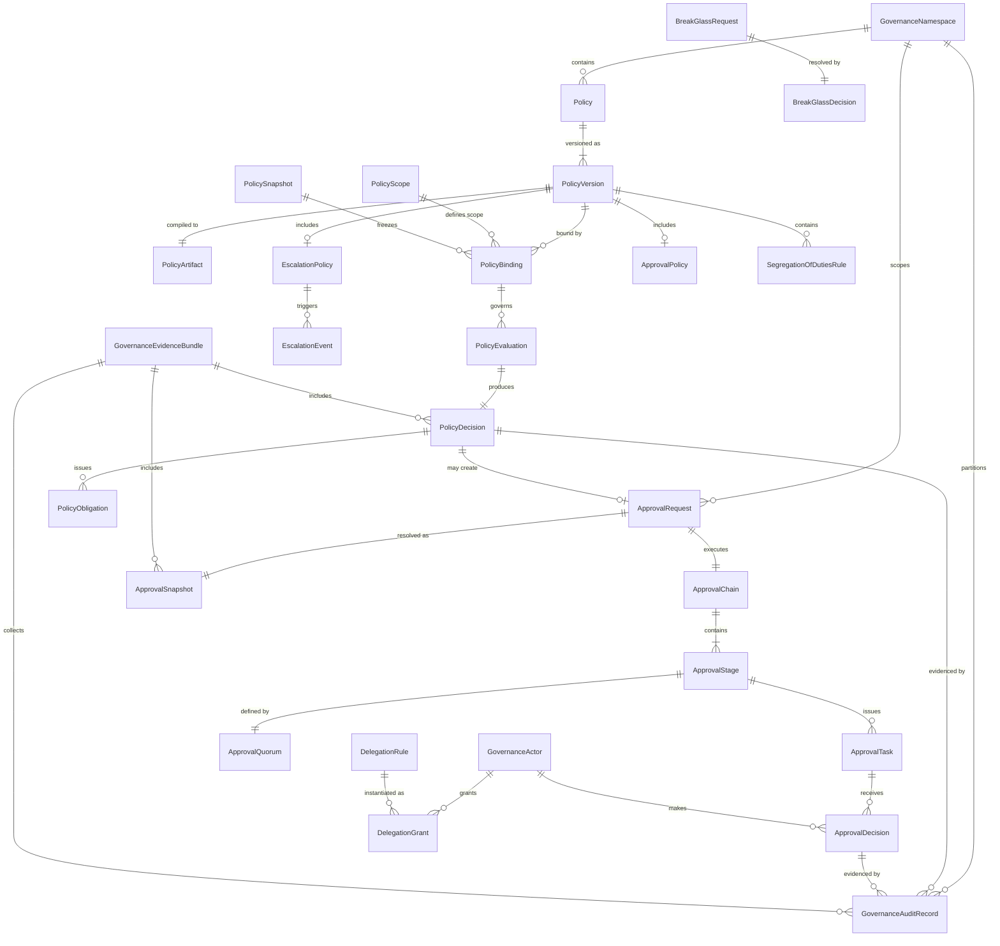

---

## 5. Governance Taxonomy

### 5.1 Taxonomy Overview

MYCELIA defines the following governance categories. They are not mutually exclusive — a single governance operation may simultaneously exercise Operational, Security, and Approval governance.

### 5.2 Governance Category Definitions

| Category | Purpose | Enforcement Points | Authority Level | Replay Implications | Audit Required | Failure Behavior | Owner Components |
|---|---|---|---|---|---|---|---|
| **Operational Governance** | Enforces SLA, rate limits, quotas, and operational invariants during normal execution | Pre-step, runtime, post-execution | Tenant operational authority | Constraints replay-snapshotted | Yes | DEGRADE or DENY | PolicyDecisionGateway, PEP |
| **Security Governance** | Enforces security policies: data classification, access control, secret exclusion, threat response | Admission, runtime, post-execution | Platform and tenant security authority | Policy artifact frozen | Yes (mandatory) | DENY, fail-closed | PolicyDecisionGateway, SecurityService |
| **Workflow Governance** | Ensures workflow structure, version compatibility, approval prerequisites, and step sequencing constraints | Admission (workflow publish), pre-step | Workflow governance authority | PolicySnapshot bound | Yes | DENY workflow advance |PolicyDecisionGateway, Doc 09 |
| **Runtime Governance** | Dynamic policy evaluation on live execution events: tool calls, memory access, agent actions | Runtime per action | Runtime authority | PolicySnapshot frozen | Yes | DENY or PAUSE | PolicyDecisionGateway, PEP |
| **Approval Governance** | Structures human or policy-mediated gates in execution | Pre-step (when approval required) | Actor authority | ApprovalSnapshot frozen | Yes (mandatory) | Block run until resolved | ApprovalEngine |
| **Policy Governance** | Manages the lifecycle of policies themselves: creation, compilation, activation, deprecation, archival | Policy authoring and publish pipeline | Policy governance authority | Policy lifecycle events replay-safe | Yes | Block publication | PolicyStore, PolicyCompiler |
| **Multi-Tenant Governance** | Isolates all governance objects, policies, approvals, and audit records by tenant | All enforcement points | Tenant isolation authority | Snapshot tenant_id enforced | Yes | DENY cross-tenant access | GovernanceNamespace, PolicyDecisionGateway |
| **Compliance Governance** | Enforces externally mandated regulatory requirements, data residency, retention, and evidence collection | All enforcement points, retention service | Compliance authority | Evidence bundle preserved | Yes (legally mandated) | BLOCK or DEGRADE | GovernanceService, AuditService |
| **Replay Governance** | Ensures governance operations during replay are forensically accurate and use original snapshots | Replay adapter, PolicySnapshot, ApprovalSnapshot | Replay authority | IS the scope | Yes | Fail replay on divergence | ReplayService, PolicySnapshotBuilder |
| **Emergency Governance** | Provides governed break-glass path for operational emergencies | BreakGlassGateway | Emergency authority (scoped, time-bound) | Evidence bundle preserved | Yes (mandatory) | Deny if evidence absent | GovernanceService, BreakGlassGateway |
| **Delegated Governance** | Manages temporary, scoped transfer of approval authority | DelegationResolver, ApprovalEngine | Delegated actor authority | Delegation state in snapshot | Yes | Deny if expired | DelegationStore, ApprovalEngine |
| **Agent Governance** | Constrains autonomous agent capabilities: tool access, memory write, action scope | Agent action gateway (Doc 05) | Agent authority (restricted) | PolicySnapshot governs agent capability | Yes | DENY or CONSTRAIN | PolicyDecisionGateway, Doc 05 integration |
| **Tool Governance** | Gates individual tool invocations: capability check, data classification, rate limit | Tool invocation gateway (Doc 15) | Tool authority | PolicySnapshot governs tool scope | Yes | DENY or SUPPRESS | PolicyDecisionGateway, Doc 15 integration |
| **Memory Governance** | Governs memory reads and writes: namespace authorization, PII consent, secret exclusion | MemoryAccessGateway (Doc 10) | Memory authority | PolicySnapshot governs memory access | Yes | DENY or MASK | PolicyDecisionGateway, Doc 10 integration |
| **Data Classification Governance** | Enforces data classification ceilings on what data may be retrieved, processed, or transmitted | All retrieval and transmission points | Classification authority | Classification ceiling in PolicySnapshot | Yes | DENY or REDACT | PolicyDecisionGateway, Doc 10 integration |
| **Budget/Quota Governance** | Enforces tenant-level and workspace-level computation, token, storage, and API quotas | Admission and runtime | Quota authority | Quota state snapshotted | Yes | DENY or THROTTLE | QuotaService, PolicyDecisionGateway |

---

## 6. Policy Engine Architecture

### 6.1 Component Reference

#### PolicyAuthoring Environment
Provides the tooling for writing, validating, testing, and simulating policy before compilation. Connected to GovernanceSimulation. Does not evaluate policies at runtime.

#### PolicyStore
Durable, versioned store for Policy and PolicyVersion records. Source of truth for policy identity, version metadata, and binding definitions. PolicyVersions are immutable once written.

#### PolicyCompiler
Transforms PolicyVersion source into PolicyArtifact. Runs the full compilation pipeline (§8). Produces policy_hash, compilation_hash, and deterministic_execution_plan. Fails closed: compilation failure blocks publication.

#### PolicyArtifactStore
Immutable store for compiled PolicyArtifacts. Read-only after writing. Queried by PolicyDecisionPoint at evaluation time. Contains hash-verified artifacts for all published PolicyVersions.

#### PolicyBundleResolver
Resolves which PolicyBundle and PolicyVersions apply to a given GovernanceBoundary by querying PolicyBindings and applying scope resolution (§11). Produces the active policy set for a PolicySnapshotBuilder call.

#### PolicyRetrievalPoint (PRP)
Provides the PolicyDecisionPoint with the exact compiled PolicyArtifacts needed for evaluation. Queries PolicyArtifactStore. Resolves references from PolicySnapshot. Does not perform live policy lookup during canonical replay.

#### PolicyInformationPoint (PIP)
Provides the PolicyDecisionPoint with canonical, immutable-for-evaluation runtime context: subject attributes (actor_id, role, clearance), resource attributes (classification, namespace), environment attributes (workflow_version, tenant config). MUST NOT provide live mutable external state unless that state has been captured in the evaluation snapshot.

#### PolicyDecisionPoint (PDP)
The deterministic evaluation engine. Receives GovernanceBoundary, action, resource, and compiled PolicyArtifacts from PolicyRetrievalPoint. Evaluates policies in deterministic order per compiled execution plan. Produces PolicyDecision with outcome, obligation list, and evidence references. MUST be deterministic. MUST NOT perform external I/O during evaluation.

#### PolicyEnforcementPoint (PEP)
The integration adapter at every governed operation boundary. Intercepts the operation, constructs the evaluation request, calls PolicyDecisionGateway, and executes EnforcementAction based on PolicyDecision outcome. Enforces fail-closed on timeout or gateway unavailability.

#### PolicyDecisionGateway
The single mandatory enforcement path for all policy decisions in MYCELIA. All PEPs call the gateway; no component calls the PDP directly. Provides: request routing, caching (governance-safe), timeout enforcement, fail-closed behavior, circuit breaking. Records every decision call.

#### PolicySnapshotBuilder
Creates PolicySnapshots by freezing the current active PolicyVersion set, PolicyBindings, scope resolution result, and engine version for a specific GovernedRun at run initialization.

#### PolicyObligationExecutor
Executes PolicyObligations issued by PolicyDecisions: masking, redaction, approval initiation, memory quarantine, security event emission, tool suppression. Records obligation execution in GovernanceAuditRecord.

#### PolicyExceptionManager
Manages the lifecycle of PolicyExceptions: creation, activation, expiration, revocation. Validates exception scope. Ensures exceptions are audit-visible. Injects active exceptions into PolicySnapshot.

#### GovernanceAuditEmitter
Publishes every governance decision, action, and event to AuditStore and the governance event bus following Document 07 EventEnvelope.

### 6.2 PDP/PEP/PIP/PAP in MYCELIA Terms

| Generic Term | MYCELIA Component | Role |
|---|---|---|
| PAP (Policy Administration Point) | PolicyAuthoring + PolicyStore + PolicyCompiler | Author, validate, compile, publish, version policies |
| PRP (Policy Retrieval Point) | PolicyRetrievalPoint | Retrieve compiled artifacts for evaluation |
| PIP (Policy Information Point) | PolicyInformationPoint | Provide canonical runtime context to PDP |
| PDP (Policy Decision Point) | PolicyDecisionPoint | Deterministically evaluate policies; produce PolicyDecision |
| PEP (Policy Enforcement Point) | PolicyEnforcementPoint | Intercept operations; call PolicyDecisionGateway; enforce decisions |

### 6.3 Architecture Diagram

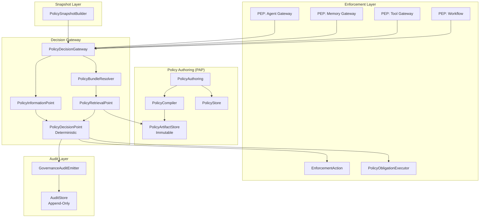

### 6.4 Policy Engine Rules

**PE-01.** Runtime enforcement MUST happen through PolicyDecisionGateway. No component may call the PDP directly without passing through the gateway.

**PE-02.** Policy evaluation MUST NOT be embedded directly inside agents, tools, or workflow orchestration code.

**PE-03.** PolicyInformationPoint MUST provide canonical runtime context only. Live mutable external API calls are FORBIDDEN during evaluation unless that API state is captured in an evaluation snapshot.

**PE-04.** PolicyDecisionPoint MUST be deterministic. The same compiled artifact evaluated against the same inputs MUST always produce the same PolicyDecision.

**PE-05.** PolicyEnforcementPoint MUST fail closed for critical operations. A PEP that cannot reach PolicyDecisionGateway MUST deny the operation, not allow it.

---

## 7. Policy Lifecycle and Versioning

### 7.1 Lifecycle States

| State | Description |
|---|---|
| **Draft** | Policy being authored; not compiled; not in any PolicySnapshot |
| **Validating** | Compilation pipeline executing; not yet eligible for review |
| **Simulation** | Compiled artifact available; being tested in GovernanceSimulation; not active in production |
| **PendingReview** | Compilation successful; awaiting governance review approval before publication |
| **Published** | Reviewed and approved; content immutable; PolicyArtifact available; not yet active in any run |
| **Active** | Included in PolicySnapshots for new GovernedRuns; currently enforced |
| **Deprecated** | No longer included in new PolicySnapshots; existing snapshots retain reference; retained for replay |
| **Archived** | No longer evaluatable for new runs; full metadata retained for replay and audit |
| **Revoked** | Explicitly invalidated; no longer used for new decisions; historical decisions preserved; use in replay flagged |
| **Superseded** | Replaced by a newer PolicyVersion; old version retained for replay |

### 7.2 Policy Lifecycle State Machine

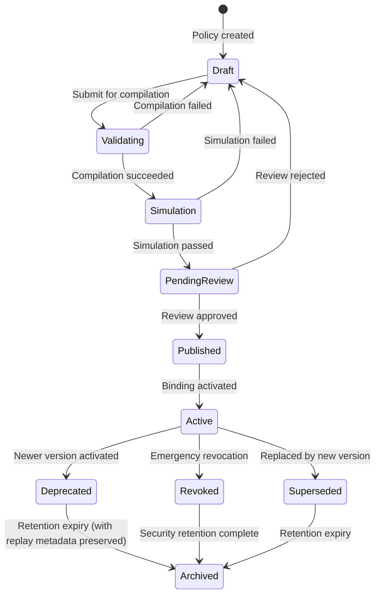

### 7.3 Lifecycle Rules

**LC-01.** PolicyVersion is immutable after reaching Published state. No field may be altered.

**LC-02.** Published PolicyVersions MUST carry a content hash. Content hash verification MUST succeed before PolicyArtifact is used for evaluation.

**LC-03.** Active PolicyVersions MUST be included in PolicySnapshot when applicable to the run's GovernanceBoundary.

**LC-04.** Deprecated PolicyVersions MUST remain available in PolicyArtifactStore for replay. Deprecation removes from new runs; it does not delete.

**LC-05.** Archived PolicyVersions MUST preserve enough metadata (policy_id, version_id, policy_hash, compilation_hash, content hash) for audit explanation and replay.

**LC-06.** Revoked PolicyVersions MUST NOT be used for new PolicyDecisions. Historical decisions made under revoked versions MUST remain visible for forensic audit.

**LC-07.** Rollback MUST create a new PolicyVersion (or an explicit reactivation record) pointing back to the target version. Historical mutations are FORBIDDEN.

**LC-08.** Breaking policy changes (changes that would alter PolicyDecisions for existing active runs) require compatibility evaluation before publication.

---

## 8. Policy Compilation and Validation

### 8.1 Compilation Pipeline

Policy compilation executes the following stages in order. Failure at any stage blocks the pipeline at that stage and prevents publication:

| Stage | Name | Description |
|---|---|---|
| 1 | Syntax validation | Parse policy source against defined DSL or schema; reject malformed input |
| 2 | Semantic validation | Validate meaning: referenced entities exist; conditions are valid; types are correct |
| 3 | Schema validation | Validate input/output schema compatibility against current PolicyInformationPoint schema |
| 4 | Dependency resolution | Resolve all referenced PolicyVersions, shared policy fragments, and external rule references |
| 5 | Scope resolution | Determine the complete set of GovernanceScopes this policy applies to |
| 6 | Inheritance expansion | Expand all inherited policy rules from parent scopes into the compiled artifact |
| 7 | Conflict graph generation | Build a directed graph of all potentially conflicting rules across the active policy set |
| 8 | Precedence resolution | Apply precedence rules to resolve all conflicts; generate conflict_resolution_manifest |
| 9 | Static invariant validation | Verify that compiled artifact satisfies all declared static invariants |
| 10 | Obligation validation | Validate that all obligation types are executable by PolicyObligationExecutor |
| 11 | Replay compatibility validation | Verify that the compiled artifact is backward-compatible with active runs; flag breaking changes |
| 12 | Deterministic execution plan generation | Produce an ordered, deterministic evaluation plan with stable rule ordering |
| 13 | Compiled artifact hash generation | Compute policy_hash (content), compilation_hash (process), and sign artifact |
| 14 | Publication eligibility decision | Confirm all prior stages passed; confirm review approval; mark artifact publication-eligible |

### 8.2 Compiled PolicyArtifact Contents

A compiled PolicyArtifact MUST contain:

```
PolicyArtifact {
  artifact_id:                    UUID
  policy_id:                      UUID
  policy_version_id:              UUID
  policy_hash:                    SHA-256 of policy source
  compilation_hash:               SHA-256 of compilation process output
  dependency_manifest:            list of referenced PolicyVersion IDs and their hashes
  compatibility_version:          semantic version of PolicyArtifact schema
  replay_compatibility_version:   minimum run version this artifact can replay against
  deterministic_execution_plan:   ordered rule evaluation sequence
  supported_input_schema:         version of PolicyInformationPoint schema at compilation time
  obligation_manifest:            list of obligation types this policy may issue
  conflict_resolution_manifest:   resolution rules applied to each detected conflict
  compiled_at:                    timestamp
  compiler_version:               PolicyCompiler version used
}
```

### 8.3 Compilation Rules

**COMP-01.** Runtime evaluation SHOULD use compiled immutable PolicyArtifacts rather than re-parsing source at evaluation time.

**COMP-02.** Invalid policies MUST NOT be published. Compilation failure MUST block the lifecycle transition to Published.

**COMP-03.** Policies with nondeterministic dependencies (live mutable API calls without snapshot capture, random sampling, wall-clock time without input binding) MUST NOT be published.

**COMP-04.** Policy compilation failure MUST be audit-visible via GovernanceAuditRecord.

**COMP-05.** Policy publication requires successful compilation at every stage. Partial compilation is not eligible for publication.

---

## 9. Policy Evaluation Model

### 9.1 Formal Model

```
PolicyDecision = Evaluate(
  PolicySnapshot,
  GovernanceBoundary,
  EvaluationInput,
  PolicyInformationPoint.capture()
)
```

All inputs MUST be captured and recorded as part of the PolicyEvaluation record before evaluation begins. Live state MUST NOT be queried during evaluation after this capture.

### 9.2 Required Evaluation Inputs

```
EvaluationInput {
  tenant_id:                required
  workspace_id:             optional
  project_id:               optional
  workflow_id:              optional
  workflow_version_id:      required when within a GovernedRun
  run_id:                   required when within a GovernedRun
  step_id:                  optional
  actor_id:                 optional (human actor)
  runtime_identity_id:      required (system identity)
  action:                   required (exact action identifier)
  resource:                 required (resource identifier)
  resource_type:            required
  data_classification:      required
  tool_id:                  optional (when evaluating tool invocation)
  memory_namespace_id:      optional (when evaluating memory access)
  policy_snapshot_id:       required
  correlation_id:           required
  causation_id:             required
  evaluation_timestamp:     required (used for time-bound policy conditions)
}
```

### 9.3 PolicyDecision Outcomes

| Outcome | Description | Enforcement Behavior |
|---|---|---|
| **ALLOW** | Operation is permitted under current policy | Proceed; record GovernanceAuditRecord |
| **DENY** | Operation is prohibited | Block; record GovernanceAuditRecord; emit GovernanceEvent |
| **REQUIRE_APPROVAL** | Operation requires explicit human or policy-mediated approval | Create ApprovalRequest; block run until resolution |
| **REQUIRE_REDACTION** | Operation allowed with mandatory content redaction | Apply redaction obligation; then proceed |
| **REQUIRE_MASKING** | Operation allowed with field-level masking | Apply masking obligation; then proceed |
| **REQUIRE_ESCALATION** | Operation requires escalation to higher authority | Create EscalationEvent; block until resolved |
| **REQUIRE_HUMAN_REVIEW** | Operation allowed but must be flagged for human review post-execution | Proceed; create review task |
| **REQUIRE_BREAK_GLASS** | Operation is normally prohibited; only break-glass may authorize | Trigger BreakGlassGateway |
| **QUARANTINE** | Specific resource (memory, artifact) must be isolated | Execute quarantine obligation |
| **DEGRADE** | Operation proceeds in degraded mode with reduced capabilities | Apply capability restriction constraint |
| **MONITOR_ONLY** | Operation proceeds; governance emits monitoring signal only | Proceed; emit monitor event |

### 9.4 PolicyObligations

A PolicyDecision may issue one or more PolicyObligations that the PolicyObligationExecutor MUST act on:

- `mask_data` — apply field-level masking to specified fields
- `redact_fields` — remove specified content fields; preserve evidence of removal
- `require_approval` — create an ApprovalRequest
- `restrict_tool_capability` — activate a RuntimeConstraint suppressing specified tool capabilities
- `throttle_execution` — apply rate limit constraint on execution
- `quarantine_memory` — invoke MemoryAccessGateway quarantine for specified object
- `emit_security_event` — publish a security event via Document 13
- `create_audit_evidence` — create a GovernanceEvidenceBundle
- `escalate_to_operator` — trigger escalation path
- `require_stronger_identity` — block until stronger identity proof is provided
- `block_external_side_effect` — suppress external API calls for current step

### 9.5 Policy Evaluation Rules

**EVAL-01.** Policy evaluation MUST be deterministic. Same PolicySnapshot + same EvaluationInput = same PolicyDecision.

**EVAL-02.** Evaluation order MUST be stable. Rule ordering MUST follow the deterministic_execution_plan in the compiled PolicyArtifact.

**EVAL-03.** Policy precedence MUST be explicit. Implicit precedence by declaration order is FORBIDDEN.

**EVAL-04.** Conflict resolution MUST be explicit. Ambiguous conflicts MUST block publication, not silently resolve at runtime.

**EVAL-05.** By default, DENY overrides ALLOW when multiple policies conflict. An explicit alternative conflict resolution algorithm may be configured in PolicyVersion but MUST be documented in conflict_resolution_manifest.

**EVAL-06.** Policy evaluation MUST produce a PolicyDecision record. Silent pass-through (no decision recorded) is FORBIDDEN.

**EVAL-07.** PolicyDecision MUST include references to the PolicyVersion(s) that produced each rule contribution, enabling forensic traceability.

**EVAL-08.** PolicyDecision MUST NOT rely on live external mutable data unless that data was captured via PolicyInformationPoint snapshot before evaluation began.

---

## 10. PolicySnapshot Architecture

### 10.1 PolicySnapshot Schema

```
PolicySnapshot {
  snapshot_id:                    UUID (primary key)
  tenant_id:                      required
  workspace_id:                   optional
  run_id:                         required (binds to GovernedRun)
  workflow_version_id:            required
  active_policy_version_ids: [    list of every active PolicyVersion ID in scope
    {
      policy_id:                  UUID
      policy_version_id:          UUID
      policy_hash:                SHA-256
      compilation_hash:           SHA-256
      scope:                      PolicyScope reference
      binding_id:                 UUID
    }
  ]
  active_exception_ids:           list of PolicyException IDs active at snapshot time
  scope_resolution_result:        serialized scope hierarchy with precedence map
  conflict_resolution_map:        resolved conflict outcomes for this scope combination
  policy_engine_version:          PolicyDecisionPoint version
  compiler_version:               PolicyCompiler version
  policy_information_point_schema_version: PIP schema version
  bundle_version:                 optional PolicyBundle version
  created_at:                     timestamp
  created_by:                     runtime_identity_id
  replay_compatibility_metadata:  minimum required versions for replay
  hash:                           SHA-256 of entire snapshot record
}
```

### 10.2 PolicySnapshot Immutability

A PolicySnapshot MUST be treated as an immutable record. Once `created_at` is set and `hash` is computed and persisted, no field may be altered. Any attempt to mutate a PolicySnapshot MUST be rejected, logged as a security event, and produce an audit record.

### 10.3 PolicySnapshot Rules

**SNAP-01.** PolicySnapshot MUST be immutable after creation.

**SNAP-02.** A GovernedRun MUST bind to a PolicySnapshot before any governed step executes.

**SNAP-03.** Canonical replay MUST use the original PolicySnapshot. Re-deriving the active policy set from current policies during canonical replay is FORBIDDEN.

**SNAP-04.** Missing PolicySnapshot MUST block governed execution. A run without a valid PolicySnapshot MUST NOT proceed to policy-evaluated steps.

**SNAP-05.** PolicySnapshot hash MUST be verified before canonical replay. Hash mismatch MUST fail replay with PolicySnapshotIntegrityFailure.

**SNAP-06.** Deprecated and revoked PolicyVersions referenced in a historical PolicySnapshot MUST remain available in PolicyArtifactStore for replay.

### 10.3.1 PolicySnapshot Cache and Live Authority Boundary

A PolicySnapshot may be cached for replay, audit, and already-bound GovernedRun execution.

A PolicySnapshot cache MUST NOT be used as a substitute for live policy authority when creating new GovernedRuns, activating new PolicyBindings, publishing PolicyVersions, or evaluating policy for a run that has not yet been bound to a snapshot.

### Allowed Uses of PolicySnapshot Cache

PolicySnapshot cache MAY be used for:

- canonical replay;
- investigation replay;
- already-bound GovernedRun continuation;
- audit evidence assembly;
- recovery of a run that already has a durable PolicySnapshot;
- read-only forensic inspection.

### Forbidden Uses of PolicySnapshot Cache

PolicySnapshot cache MUST NOT be used for:

- new GovernedRun initialization;
- new PolicyBinding activation;
- deciding current active policies;
- bypassing PolicyStore unavailability for new decisions;
- evaluating policies outside the scope of the original run;
- replacing PolicyBundleResolver for live scope resolution.

### Rules

- Existing runs MAY continue from their already-bound PolicySnapshot if PolicyStore is unavailable.
- New governed runs MUST NOT initialize from cached snapshots when PolicyStore or PolicyBinding resolution is unavailable.
- PolicySnapshot cache is evidence and replay infrastructure, not live governance authority.
- Cache entries MUST be tenant-scoped, hash-verified, and bound to a specific run_id.
- Cache hit MUST NOT bypass tenant isolation, PolicySnapshot hash verification, or replay mode checks.

### Forbidden Behavior

FORBIDDEN:

- creating new runs from stale cached PolicySnapshots;
- using PolicySnapshot cache to determine current active policies;
- using cached PolicySnapshot from one run for another run;
- using PolicySnapshot cache across tenants;
- allowing Codex to treat PolicySnapshot cache as a general policy cache.

### 10.4 PolicySnapshot Creation Diagram

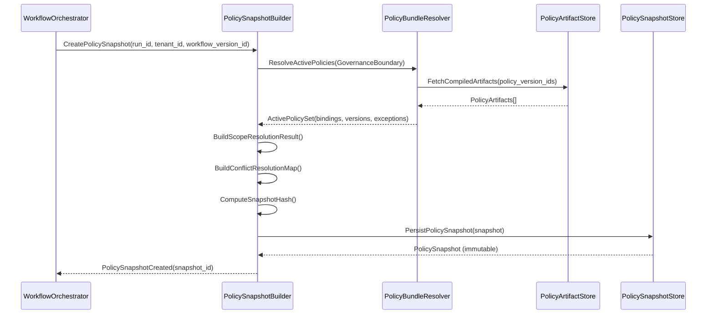

---

## 11. Policy Binding and Scope Resolution

### 11.1 Scope Hierarchy

Policy scopes are resolved in the following hierarchy (highest authority first):

| Level | Scope | Override Rules |
|---|---|---|
| 1 | Platform — security-critical deny | Cannot be overridden by any tenant or workspace policy |
| 2 | Platform — default controls | Can be made stricter by tenant; cannot be made more permissive |
| 3 | Tenant-specific stricter rule | Can tighten platform defaults; cannot weaken non-overridable controls |
| 4 | Workspace/project rule | Scoped within tenant; cannot weaken tenant security rules |
| 5 | Workflow-specific rule | Scoped to workflow; cannot weaken workspace rules |
| 6 | Step/tool/memory specific rule | Most specific; cannot weaken workflow rules |
| 7 | Explicit policy exception | Time-bound, auditable overrides within allowed exception scope |
| 8 | Monitor-only policy | No enforcement effect; observation only |

### 11.2 Scope Resolution Rules

**SCOPE-01.** Scope resolution MUST be deterministic. The same GovernanceBoundary resolved against the same PolicyBindings MUST always produce the same scope resolution result.

**SCOPE-02.** Cross-tenant policy binding is FORBIDDEN unless the policy is explicitly marked as platform-scoped and its binding is administered at the platform level.

**SCOPE-03.** More specific scope MAY refine (tighten) but MUST NOT weaken non-overridable security policies.

**SCOPE-04.** Policy exceptions MUST be explicit (PolicyException record), auditable, and time-bound. Implicit exceptions are FORBIDDEN.

**SCOPE-05.** Scope resolution result MUST be part of PolicySnapshot.

### 11.3 Policy Execution Classes

Policies define their execution class, which determines insertion point and replay semantics:

| Class | Insertion Point | Replay Semantics | Example |
|---|---|---|---|
| **Admission** | Before run or step starts | Replayed from snapshot; no live check | Workflow eligibility, pre-run quota |
| **Runtime** | During execution, per action | Replayed from snapshot | Tool invocation gate, memory access gate |
| **Post-execution** | After step or run completes | Replayed from snapshot for audit | Compliance reconciliation, output validation |
| **Replay** | Only during replay execution | Activated only in replay context | Replay integrity validation, lineage check |

---

## 12. Approval Engine Architecture

### 12.1 Component Reference

#### ApprovalRequestGateway
Single entry point for all ApprovalRequest creation. Validates that the request originates from a PolicyDecision (outcome=REQUIRE_APPROVAL) or an authorized workflow gate. Creates the ApprovalRequest record. Emits ApprovalRequested event.

#### ApprovalChainBuilder
Instantiates an ApprovalChain from the ApprovalPolicy template referenced in the PolicyDecision. Resolves stage definitions, eligible actors, quorum requirements, and SLA configurations.

#### ApprovalStageCoordinator
Manages stage-level state transitions: activating stages, collecting task completions, evaluating quorum, transitioning to next stage or terminal state. Coordinates with ApprovalQuorumEvaluator.

#### ApprovalTaskManager
Issues ApprovalTasks to eligible GovernanceActors or GovernanceRoles. Tracks task assignment, acceptance, and completion. Resolves DelegationGrants to identify substitute actors.

#### ApprovalDecisionRecorder
Records every ApprovalDecision as an append-only, actor-attributed, immutable record. Validates actor eligibility (including segregation-of-duties and self-approval rules) before recording.

#### ApprovalQuorumEvaluator
Evaluates whether the current set of ApprovalDecisions satisfies the stage's ApprovalQuorum definition. Handles UNANIMOUS, MAJORITY, MINIMUM_N_OF_M, and WEIGHTED quorum types. Applies rejection precedence and tie-breaking rules.

#### ApprovalEscalationScheduler
Creates durable timer events for SLA enforcement. On SLA breach, triggers EscalationPolicy. Coordinates with Document 09 durable timer infrastructure. MUST NOT use worker thread sleep.

#### DelegationResolver
At task assignment and decision recording time, resolves active DelegationGrants to determine which actors may act as delegates. Verifies grant has not expired. Records delegation evidence.

#### ApprovalSnapshotBuilder
Creates an immutable ApprovalSnapshot at request resolution, capturing: complete chain state, all stage states, all task states, all ApprovalDecisions with actor attribution, all EscalationEvents, all DelegationGrants exercised, timing, and policy references.

#### ApprovalEvidenceEmitter
Publishes approval-related events and GovernanceAuditRecords for every state transition, decision, escalation, and snapshot creation.

### 12.2 Approval Engine Architecture Diagram

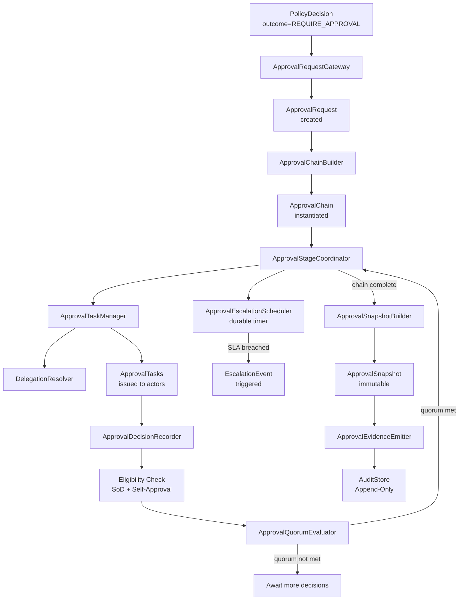

### 12.3 Approval Engine Rules

**AE-01.** ApprovalRequest MUST be created only by a PolicyDecision with outcome=REQUIRE_APPROVAL or an explicitly authorized workflow gate — never by direct developer API call in workflow code.

**AE-02.** ApprovalRequest MUST include tenant_id, run_id, step_id (when applicable), policy_decision_id, and approval_context_id.

**AE-03.** ApprovalRequest approval_context MUST be immutable after creation.

**AE-04.** ApprovalDecision MUST be append-only. No update or delete is permitted.

**AE-05.** ApprovalSnapshot MUST be immutable after creation.

**AE-06.** Approval resolution (Approved or Denied) MUST emit the canonical ApprovalGranted or ApprovalDenied events registered in Document 07.

**AE-07.** Approval state transitions that affect GovernedRun state MUST coordinate with Document 09 StateTransitionCoordinator.

---

## 13. Approval Lifecycle and State Machines

### 13.1 ApprovalRequest Lifecycle

| State | Description |
|---|---|
| **Requested** | ApprovalRequest created by PolicyDecision; not yet routed to chain |
| **PendingAssignment** | ApprovalChain instantiated; ApprovalTasks being assigned to actors |
| **PendingDecision** | ApprovalTasks assigned; awaiting actor decisions |
| **PartiallyApproved** | Some stages complete with APPROVE; chain still active |
| **Approved** | All ApprovalChain stages satisfied; ApprovalSnapshot created |
| **Denied** | An ApprovalDecision or stage outcome produced DENY; chain terminated |
| **TimedOut** | SLA expired without quorum; escalation not configured or exhausted |
| **Escalated** | SLA breached; transferred to escalation target; active state |
| **Delegated** | One or more tasks reassigned to delegated actors; active state |
| **Cancelled** | Cancelled by authorized actor or orchestration before resolution |
| **Expired** | Request existed but run was cancelled before approval completed |
| **Superseded** | A new ApprovalRequest for the same gate has replaced this one |
| **Archived** | Completed; retained for audit |

### 13.2 ApprovalRequest State Machine

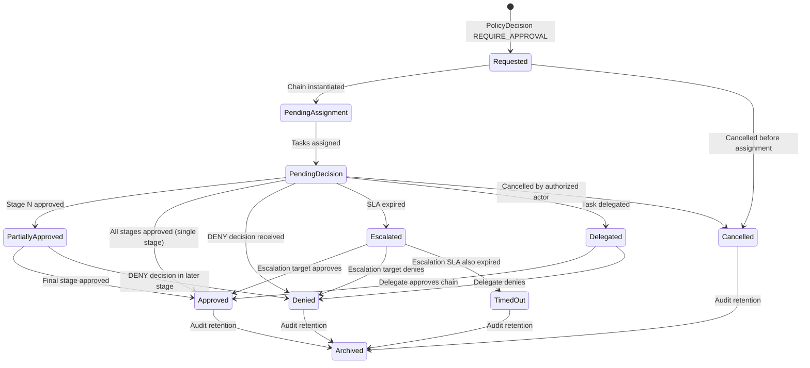

### 13.3 ApprovalTask Lifecycle

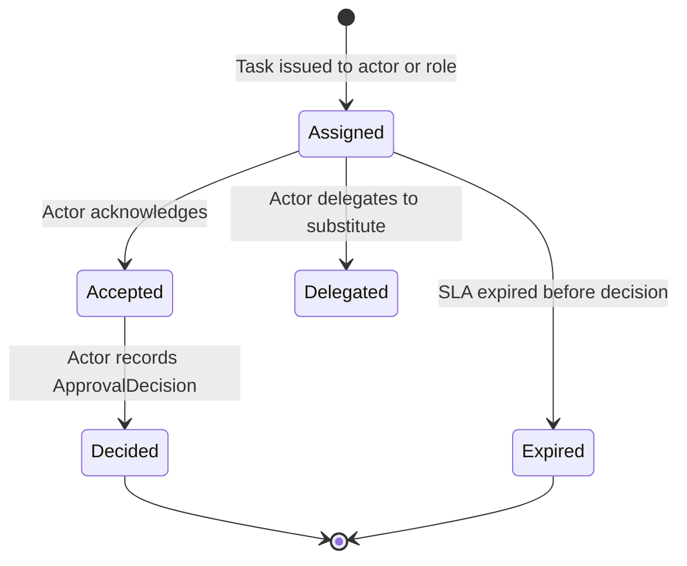

### 13.4 Lifecycle Rules

**LIFE-01.** ApprovalRequired is the canonical GovernedRun blocking state (per Document 09). Run MUST NOT advance past the approval gate without an Approved terminal state.

**LIFE-02.** ApprovalGranted is the canonical GovernedRun resume trigger.

**LIFE-03.** ApprovalDenied MUST route the GovernedRun to a defined denial handling path: RunFailed, compensation execution, or explicit cancellation. Silent continuation after denial is FORBIDDEN.

**LIFE-04.** Approval timeout MUST be implemented as a durable timer event (per Document 09 durable timer model), NOT as worker thread sleep.

**LIFE-05.** Duplicate ApprovalDecision submissions (same actor, same task, same outcome) MUST be idempotently accepted. Duplicate with conflicting outcome MUST be rejected.

**LIFE-06.** Approval finality is explicit. A completed (Approved or Denied) ApprovalRequest MUST NOT be reopened. If reconsideration is needed, a new ApprovalRequest must be created.

### 13.5 ApprovalDecision Actor Attribution Boundary

MYCELIA distinguishes between human approval, delegated approval, policy-mediated approval, and system-generated approval outcomes.

`runtime_identity_id` is required for every approval operation because every persisted decision is written by an authenticated service or workload.

`actor_id` is required whenever the approval decision represents a human or governance actor decision.

### Approval Decision Sources

| Decision Source | actor_id Required | runtime_identity_id Required | Meaning |
|---|---:|---:|---|
| `human_actor` | Yes | Yes | A human governance actor approved, denied, or abstained |
| `delegated_actor` | Yes | Yes | A delegated human actor approved, denied, or abstained |
| `policy_auto_decision` | No | Yes | Policy explicitly produced an automatic approval or denial |
| `escalation_auto_decision` | No | Yes | EscalationPolicy produced an automatic terminal outcome |
| `system_timeout` | No | Yes | Durable timer produced timeout outcome |
| `cancellation` | Conditional | Yes | Cancellation may be actor-initiated or system-triggered |

### Required ApprovalDecision Fields

Every ApprovalDecision MUST include:

- `decision_id`;
- `approval_request_id`;
- `approval_task_id` when applicable;
- `tenant_id`;
- `decision_source`;
- `actor_id` when decision_source requires a human or delegated actor;
- `runtime_identity_id`;
- `decision_outcome`;
- `decision_reason`;
- `recorded_at`;
- `correlation_id`;
- `causation_id`;
- `policy_snapshot_id`;
- `approval_context_id`.

### Rules

- Human approval MUST NOT be recorded without `actor_id`.
- `runtime_identity_id` MUST NOT be used as a substitute for human accountability.
- Policy-mediated automatic approval MUST explicitly declare `decision_source=policy_auto_decision`.
- Escalation-based automatic approval MUST explicitly declare `decision_source=escalation_auto_decision`.
- Timeout outcomes MUST explicitly declare `decision_source=system_timeout`.
- Every automatic decision MUST cite the PolicyVersion, ApprovalPolicy, EscalationPolicy, or timer event that produced it.

### Forbidden Behavior

FORBIDDEN:

- recording human approval with only `runtime_identity_id`;
- treating service identity as the approving human actor;
- allowing anonymous approval decisions;
- hiding automatic approvals as if they were human approvals;
- allowing Codex to use `actor_id or runtime_identity_id` as a loose validation rule for all approval decisions.

---

## 14. Approval Concurrency and Quorum Semantics

### 14.1 Approval Concurrency Types

| Type | Description | Quorum Logic |
|---|---|---|
| **Serial** | Stages execute sequentially; stage N begins only after stage N-1 completes | Stage by stage; each stage has own quorum |
| **Parallel** | Multiple stages or tasks execute concurrently | All parallel branches must complete before chain resolves |
| **Quorum (Minimum N of M)** | At least N of M eligible actors must approve | Met when count(APPROVE) ≥ N |
| **Unanimous** | All eligible actors must approve | Met when count(APPROVE) = count(eligible) |
| **Majority** | More than half of eligible actors must approve | Met when count(APPROVE) > count(eligible) / 2 |
| **Weighted** | Actors carry vote weights; weighted sum must meet threshold | Met when sum(weight of APPROVE votes) ≥ threshold |
| **Conditional** | Approval chain branches based on runtime conditions in EvaluationInput | Branch determined at chain instantiation; deterministic |
| **Segregation-of-Duties** | Actor who triggered the request is ineligible to approve | Eligibility check enforced by ApprovalDecisionRecorder |
| **Four-Eyes** | At least two distinct eligible actors must approve | Special case of MINIMUM_N_OF_M with N=2 |

### 14.2 Self-Approval Rules

Self-approval — where the actor who requested or initiated an action is also the actor who approves it — is FORBIDDEN by default unless:
- the ApprovalPolicy explicitly enables self-approval for this stage; AND
- the self-approval grant is recorded in the ApprovalDecision and GovernanceAuditRecord; AND
- no SegregationOfDutiesRule is active that would prohibit it.

### 14.3 Quorum Semantics Rules

**QUORUM-01.** Quorum calculation MUST be deterministic. The same set of ApprovalDecisions MUST always produce the same quorum outcome.

**QUORUM-02.** DENY takes precedence over APPROVE by default, regardless of quorum count, unless the ApprovalPolicy explicitly configures rejection to require its own counter-quorum.

**QUORUM-03.** Self-approval is FORBIDDEN unless explicitly allowed by policy. Self-approval policy grant MUST be audit-visible.

**QUORUM-04.** SegregationOfDutiesRule MUST be enforced at ApprovalDecisionRecorder before recording. Violations MUST be rejected and audited.

**QUORUM-05.** Actor eligibility MUST be resolved and recorded at ApprovalTask assignment time and verified at ApprovalDecision recording time.

**QUORUM-06.** Race condition between approval completion and SLA timeout MUST resolve deterministically: whichever event is durably recorded first takes effect.

**QUORUM-07.** ABSTAIN does not count as APPROVE or DENY for quorum purposes. Abstention is recorded for audit but does not advance or block quorum.

**QUORUM-08.** Approval concurrency semantics MUST be equivalent for canonical replay: the same set of decisions replayed in the same order MUST produce the same quorum outcome.

### 14.4 Quorum Flow Diagram

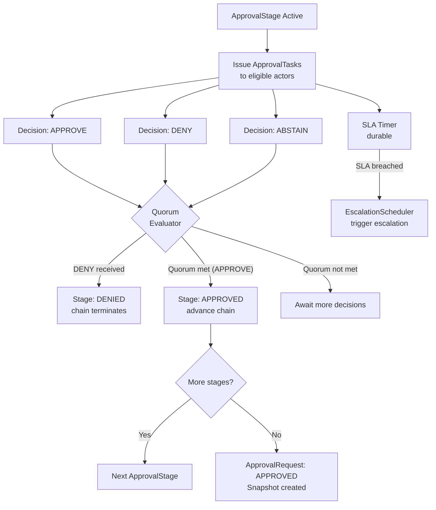

---

## 15. Escalation and Delegation Architecture

### 15.1 Escalation

Escalation is the policy-driven handoff of an unresolved ApprovalRequest to a higher authority when an SLA is breached or a trigger condition is met.

**EscalationPolicy Structure:**

```
EscalationPolicy {
  policy_id:          UUID (references PolicyVersion)
  trigger:            SLA_BREACH | REJECTION_COUNT | MISSING_QUORUM | EXPLICIT
  trigger_threshold:  time or count value for trigger activation
  escalation_ladder: [
    {
      level:          integer (1 = first escalation)
      target_role:    GovernanceRole reference
      target_actor:   optional explicit GovernanceActor
      escalation_sla: duration
      action:         REASSIGN_TASKS | ADD_ELIGIBLE_ACTORS | AUTO_APPROVE | AUTO_DENY | NOTIFY_ONLY
    }
  ]
}
```

**Escalation Rules:**

**ESC-01.** Escalation MUST be explicit. No implicit fallback to a higher actor without an EscalationPolicy definition.

**ESC-02.** Hidden escalation — transferring approval authority without creating an EscalationEvent and GovernanceAuditRecord — is FORBIDDEN.

**ESC-03.** Escalation loops MUST be detected during policy compilation (§8.1) and MUST block publication.

**ESC-04.** Every EscalationEvent MUST be recorded in ApprovalSnapshot and GovernanceAuditRecord.

**ESC-05.** AUTO_APPROVE escalation action (automatic approval on SLA breach) MUST be explicitly and narrowly configured, MUST be audit-visible, and MUST NOT apply to security-critical approval chains unless explicitly permitted by security governance policy.

### 15.2 Delegation

Delegation is an actor-authorized, time-bound, scoped transfer of approval authority from one GovernanceActor to another.

**DelegationGrant Structure:**

```
DelegationGrant {
  grant_id:           UUID
  grantor_actor_id:   UUID (original authority)
  grantee_actor_id:   UUID (substitute actor)
  scope:              specific ApprovalRequest IDs, stage types, or role scope
  valid_from:         timestamp
  valid_until:        timestamp (REQUIRED; no indefinite delegation)
  delegation_reason:  string
  policy_version_id:  reference to DelegationRule that authorizes this grant
  created_at:         timestamp
  revoked_at:         optional timestamp
}
```

**Delegation Rules:**

**DEL-01.** Delegation MUST be explicit. Implicit delegation (system routes to anyone available) is FORBIDDEN.

**DEL-02.** Delegation MUST NOT expand authority beyond the original actor's approval scope unless explicitly authorized by policy.

**DEL-03.** Expired delegation MUST NOT be honored. Every use of a DelegationGrant MUST check expiry at decision recording time.

**DEL-04.** DelegationGrant MUST have a valid_until timestamp. Indefinite delegation is FORBIDDEN.

**DEL-05.** DelegationGrant revocation MUST be immediate. A revoked grant MUST NOT be usable for subsequent decisions.

**DEL-06.** All delegation exercise MUST be evidenced in ApprovalDecision and GovernanceAuditRecord.

**DEL-07.** Delegation chains (A delegates to B, B delegates to C) MUST be bounded. Maximum delegation chain depth MUST be configurable in policy; default is 1 (no re-delegation).

### 15.3 Escalation and Delegation Flow

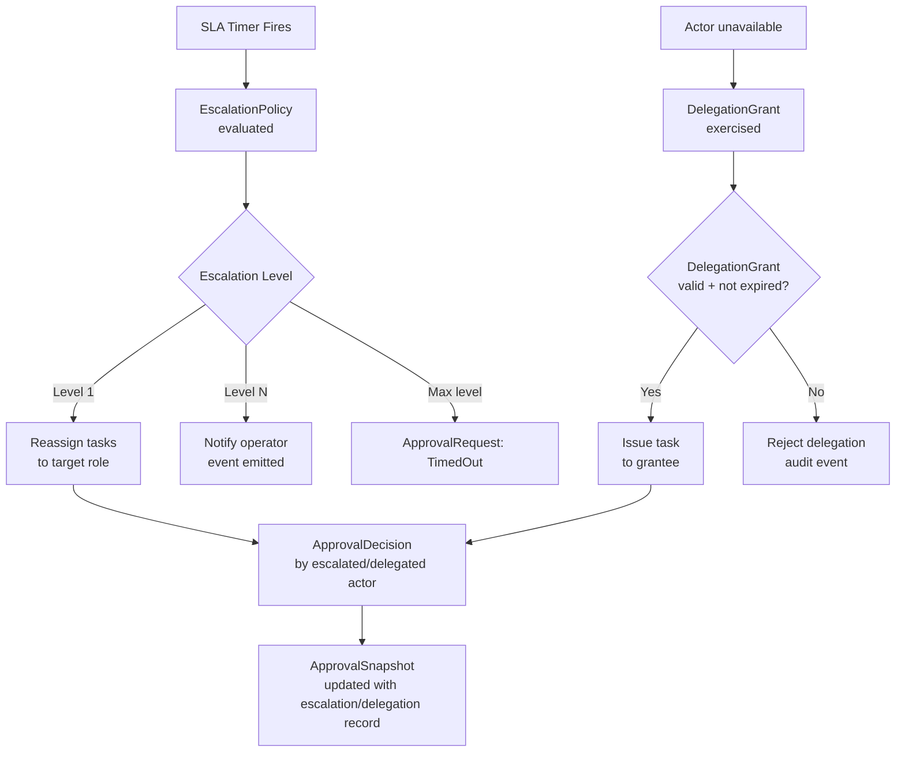

---

## 16. Break-Glass and Emergency Governance

### 16.1 Definition

Break-glass is a governed emergency path that permits a scoped, time-limited override of a governance control when normal authorization channels are unavailable or insufficient for an urgent operational need. Break-glass is the opposite of silent bypass: it is louder, more visible, and more evidence-producing than normal operations.

### 16.2 BreakGlassRequest Schema

```
BreakGlassRequest {
  request_id:             UUID
  tenant_id:              required
  actor_id:               required (emergency actor)
  emergency_scope:        specific resource, action, workflow, run or tenant scope being overridden
  emergency_reason:       string (mandatory; minimum length enforced)
  policy_being_overridden: PolicyVersion IDs being bypassed
  time_bound:             required (UTC; maximum duration enforced by policy)
  compensating_controls:  list of compensating actions to be taken post-emergency
  post_incident_review:   required (scheduled review time or review actor)
  notification_targets:   mandatory notification list (security team, CISO, tenant admin)
  requested_at:           timestamp
}
```

### 16.3 BreakGlassDecision Schema

```
BreakGlassDecision {
  decision_id:        UUID
  request_id:         UUID
  outcome:            APPROVED | DENIED
  approving_actor_id: UUID (must be authorized break-glass authority role)
  scope_confirmed:    boolean (scope reviewed and confirmed minimal)
  expiry:             timestamp (auto-calculated from time_bound)
  decision_at:        timestamp
}
```

### 16.4 Break-Glass Rules

**BG-01.** Break-glass is not bypass. Break-glass is a governed emergency path that MUST be fully audited.

**BG-02.** BreakGlassRequest MUST include: reason, scope, actor, time_bound, compensating_controls declaration, and post_incident_review scheduling. A request missing any mandatory field MUST be rejected.

**BG-03.** Break-glass MUST emit both a security event (Document 13) and a governance event (Document 07) at request creation, approval, and expiration.

**BG-04.** Break-glass MUST NOT silently disable policy evaluation for subsequent operations. The PolicyDecisionGateway continues to evaluate; the BreakGlassDecision provides a scoped override that appears in PolicyInformationPoint context.

**BG-05.** Break-glass MUST expire automatically at the time_bound specified in the approved request. Manual extension requires a new BreakGlassRequest.

**BG-06.** Break-glass use MUST be reviewed in a mandatory post-incident review within the timeframe declared in the request.

**BG-07.** Break-glass MUST NOT mutate historical PolicyVersions, PolicySnapshots, or ApprovalSnapshots.

**BG-08.** Break-glass history is permanently retained and MUST be available for compliance audit.

### 16.4.1 Break-Glass Non-Bypassable Controls

Break-glass provides scoped emergency override for eligible governance controls.

Break-glass MUST NOT disable MYCELIA's foundational safety, tenant isolation, evidence, or identity controls.

### Non-Bypassable Controls

The following controls MUST NOT be bypassed by break-glass:

- tenant isolation;
- actor authentication;
- runtime_identity_id authentication;
- audit evidence creation;
- event integrity;
- PolicySnapshot and ApprovalSnapshot immutability;
- raw secret exposure prohibition;
- cross-tenant data access prohibition;
- replay lineage immutability;
- legal hold preservation;
- malware or active threat containment;
- platform non-overridable safety policies explicitly marked `non_bypassable=true`.

### Break-Glass Override Scope

Break-glass MAY temporarily override only eligible controls that explicitly allow emergency override.

Every override MUST specify:

- policy_version_id being overridden;
- specific rule_id or obligation_id being overridden;
- resource scope;
- action scope;
- actor scope;
- tenant_id;
- expiration;
- compensating controls;
- post-incident review owner.

### Rules

- Break-glass does not turn off PolicyDecisionGateway.
- Break-glass becomes input to PolicyInformationPoint as a scoped emergency context.
- PolicyDecisionGateway MUST still evaluate the operation and determine whether the break-glass context applies.
- Break-glass cannot create cross-tenant authority.
- Break-glass cannot make immutable historical records mutable.
- Break-glass cannot suppress audit evidence.
- Break-glass cannot expose raw secrets unless a separate secret-access policy explicitly permits emergency access and audit capture.

### Forbidden Behavior

FORBIDDEN:

- using break-glass to disable tenant isolation;
- using break-glass to skip audit evidence;
- using break-glass to mutate historical PolicySnapshots or ApprovalSnapshots;
- using break-glass to bypass event integrity;
- treating break-glass as a global admin mode;
- allowing Codex to implement break-glass as a boolean `is_admin_override`.

### 16.5 Break-Glass Flow

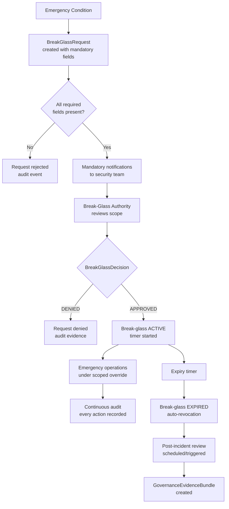

---

## 17. Runtime Enforcement Model

### 17.1 Enforcement Points

MYCELIA enforces governance at the following points in the execution path:

| Enforcement Point | Description | Governed By |
|---|---|---|
| **Admission enforcement** | Before a GovernedRun or workflow step starts | PolicyDecisionGateway; admission-class policies |
| **Pre-step enforcement** | Before each workflow step executes | PolicyDecisionGateway; runtime-class policies |
| **Tool enforcement** | Before any tool invocation | PolicyDecisionGateway via Document 15 ToolInvocationGateway |
| **Memory enforcement** | Before any memory read or write | PolicyDecisionGateway via Document 10 MemoryAccessGateway |
| **Agent enforcement** | Before any agent action | PolicyDecisionGateway via Document 05 AgentActionGateway |
| **Approval enforcement** | ApprovalRequired blocks execution; Approved releases | ApprovalEngine; Document 09 runs blocked on ApprovalRequired |
| **Post-execution enforcement** | After step or run completes | PolicyDecisionGateway; post-execution-class policies |
| **Replay enforcement** | During replay; ensures snapshot use and suppresses live side effects | PolicySnapshotBuilder; ApprovalEngine |
| **External API enforcement** | Before external API call is authorized | PolicyDecisionGateway via Document 18 API gateway |

### 17.2 Enforcement Actions Reference

| Action | Description | Fail Behavior |
|---|---|---|
| **allow** | Execution proceeds | N/A |
| **deny** | Execution blocked | Fail closed |
| **require_approval** | ApprovalRequest created; run blocked | Block until resolved |
| **pause_run** | GovernedRun enters paused state | Durable; survives restart |
| **cancel_run** | GovernedRun routed to cancellation | Irreversible |
| **quarantine_memory** | MemoryObject flagged and excluded from retrieval | Via Doc 10 gateway |
| **suppress_tool** | Tool invocation blocked via RuntimeConstraint | Fail closed |
| **require_redaction** | Content redacted before passing downstream | Via PolicyObligationExecutor |
| **require_masking** | Specific fields masked | Via PolicyObligationExecutor |
| **throttle_execution** | Rate limit applied | RuntimeConstraint active |
| **degrade_mode** | Execution continues with reduced capabilities | RuntimeConstraint active |
| **escalate** | EscalationEvent triggered | Via EscalationScheduler |
| **emit_security_event** | Security event published via Doc 13 | Via GovernanceAuditEmitter |
| **create_evidence_bundle** | GovernanceEvidenceBundle assembled | Via EvidenceStore |

### 17.3 Enforcement Rules

**ENF-01.** Critical enforcement MUST fail closed. A PEP that cannot reach PolicyDecisionGateway MUST deny the operation.

**ENF-02.** Governance latency MUST NOT silently bypass enforcement. A slow PolicyDecisionGateway causes the PEP to wait (up to configured deadline) then fail closed.

**ENF-03.** Tool execution MUST be policy-gated according to the ToolInvocationGateway contract in Document 15.

**ENF-04.** Memory retrieval and write MUST be policy-gated according to the MemoryAccessGateway contract in Document 10.

**ENF-05.** Agent execution MUST be policy-gated according to the AgentActionGateway contract in Document 05.

**ENF-06.** Workflow transitions MUST be policy-gated when configured in the WorkflowVersion.

**ENF-07.** Every EnforcementAction MUST be audit-visible via GovernanceAuditRecord.

**ENF-08.** EnforcementAction MUST NOT mutate external systems outside authorized, policy-approved gateways.

---

## 18. Governance Replay Semantics

### 18.1 Replay Modes

| Mode | Description | Policy Source | Approval Source | Side Effects |
|---|---|---|---|---|
| **Canonical replay** | Exact forensic reconstruction of original execution | Original PolicySnapshot | Original ApprovalSnapshot | Suppressed |
| **Investigation replay** | Forensic review; may flag divergences | Original PolicySnapshot | Original ApprovalSnapshot | Suppressed; divergences recorded |
| **Simulation replay** | What-if analysis; may use alternative policy | Specified PolicySnapshot (may differ) | Simulated approval | Suppressed; labeled simulation |
| **Policy simulation** | Test new PolicyVersion against historical inputs | Candidate PolicySnapshot | Original or simulated | Suppressed; non-authoritative output |

### 18.2 PolicySnapshot Hydration for Replay

During canonical replay:
1. Load PolicySnapshot by snapshot_id from PolicySnapshotStore.
2. Verify hash — recompute over all snapshot fields. Hash mismatch MUST fail replay.
3. Verify tenant scope — replay actor's tenant_id MUST match snapshot tenant_id.
4. Load all referenced PolicyArtifacts from PolicyArtifactStore using exact policy_version_ids.
5. Verify each PolicyArtifact's policy_hash and compilation_hash.
6. Reconstruct scope resolution result from snapshot (MUST NOT re-derive from current bindings).
7. Pass reconstructed PolicySnapshot to PolicyDecisionPoint for replay evaluation.

### 18.3 ApprovalSnapshot Hydration for Replay

During canonical replay:
1. Load ApprovalSnapshot by request_id and snapshot_id from ApprovalSnapshotStore.
2. Verify hash — recompute over all snapshot fields. Hash mismatch MUST fail replay.
3. Verify tenant scope.
4. Reconstruct approval chain state from snapshot without requesting new decisions.
5. The approval outcome (Approved/Denied) is taken directly from the snapshot; no new actor decisions are solicited.

### 18.4 Governance Replay Rules

**REP-GOV-01.** Canonical replay MUST use the original PolicySnapshot. Re-deriving from current active policies is FORBIDDEN.

**REP-GOV-02.** Canonical replay MUST use the original ApprovalSnapshot. Requesting new approval decisions for replay is FORBIDDEN.

**REP-GOV-03.** Canonical replay MUST NOT evaluate current live policies as a substitute for the original PolicySnapshot.

**REP-GOV-04.** Investigation replay MAY compare the original PolicyDecision against a current-policy evaluation, but the comparison result MUST be labeled as non-authoritative and MUST be recorded as a GovernanceReplayRecord.

**REP-GOV-05.** Simulation replay MAY test alternative policies but MUST NOT mutate original event lineage, PolicySnapshots, or ApprovalSnapshots.

**REP-GOV-06.** Governance divergences — cases where replay evaluation produces a different PolicyDecision than the original — MUST be recorded as GovernanceReplayRecord divergence entries.

---

## 19. Governance Events and Audit Evidence

### 19.1 Governance Event Families

All governance events MUST be registered in Document 07 before implementation and MUST follow the Document 07 EventEnvelope.

**Policy Events:**

| Event Name | Description |
|---|---|
| PolicyCreated | New Policy entity created |
| PolicyVersionCompiled | PolicyVersion compilation completed |
| PolicyVersionPublished | PolicyVersion published and immutable |
| PolicyActivated | PolicyVersion included in active PolicyBindings |
| PolicyDeprecated | PolicyVersion removed from new PolicySnapshots |
| PolicyRevoked | PolicyVersion explicitly invalidated |
| PolicyEvaluationRequested | PolicyDecisionGateway evaluation request received |
| PolicyEvaluated | PolicyDecision produced |
| PolicyDenied | PolicyDecision outcome=DENY |
| PolicyApprovalRequired | PolicyDecision outcome=REQUIRE_APPROVAL |
| PolicyObligationIssued | PolicyObligation generated |
| PolicyObligationExecuted | PolicyObligationExecutor completed obligation |
| PolicySnapshotCreated | PolicySnapshot persisted |
| PolicyExceptionCreated | PolicyException activated |
| PolicyExceptionRevoked | PolicyException revoked |
| PolicyBindingCreated | PolicyBinding activated |
| PolicyBindingRevoked | PolicyBinding deactivated |

**Approval Events:**

| Event Name | Description |
|---|---|
| ApprovalRequested | ApprovalRequest created |
| ApprovalTaskAssigned | ApprovalTask issued to actor |
| ApprovalGranted | ApprovalRequest resolved as Approved |
| ApprovalDenied | ApprovalRequest resolved as Denied |
| ApprovalTimedOut | ApprovalRequest timed out without resolution |
| ApprovalEscalated | Escalation triggered for ApprovalRequest |
| ApprovalDelegated | ApprovalTask delegated to substitute actor |
| ApprovalSnapshotCreated | ApprovalSnapshot persisted |

**Break-Glass Events:**

| Event Name | Description |
|---|---|
| BreakGlassRequested | BreakGlassRequest created |
| BreakGlassApproved | BreakGlassDecision=APPROVED |
| BreakGlassDenied | BreakGlassDecision=DENIED |
| BreakGlassExpired | Break-glass time bound reached; revoked |

**Enforcement and Evidence Events:**

| Event Name | Description |
|---|---|
| EnforcementActionExecuted | PolicyEnforcementPoint executed an action |
| RuntimeConstraintActivated | RuntimeConstraint applied to a run |
| GovernanceEvidenceBundleCreated | Evidence bundle assembled |
| SegregationOfDutiesViolationAttempted | SoD rule violation detected and blocked |

### 19.1.1 Governance State Names vs Published Event Names

MYCELIA distinguishes between internal state names, approval outcomes, GovernedRun states, and published event names.

Document 11 may define governance and approval semantics, but publishable event names MUST be registered in Document 07 before implementation.

### Canonical Mapping

| Document 11 Concept | Type | Published Event Requirement |
|---|---|---|
| `ApprovalRequired` | GovernedRun blocking state | SHOULD emit `ApprovalRequested` |
| `ApprovalGranted` | GovernedRun resume state / approval outcome | MUST emit `ApprovalGranted` when registered in Document 07 |
| `ApprovalDenied` | Approval outcome, not a GovernedRun production state | MUST emit `ApprovalDenied`; GovernedRun must route to `RunFailed`, compensation, cancellation, or explicit denial path |
| `PolicyApprovalRequired` | PolicyDecision outcome event | MAY map to `PolicyApprovalRequired` or `ApprovalRequested`, depending on Document 07 registration |
| `PolicyDenied` | PolicyDecision outcome event | MUST map to registered governance/security event |
| `BreakGlassApproved` | Break-glass decision event | MUST emit security and governance event if registered |
| `EnforcementActionExecuted` | Governance enforcement event | MUST use Document 07 EventEnvelope |

### Rules

- Internal state names MUST NOT automatically become event names.
- Approval outcomes MUST NOT create new GovernedRun states unless defined in Documents 02, 03, 06, and 09.
- `ApprovalDenied` MUST NOT be treated as a canonical GovernedRun state.
- `ApprovalDenied` MUST route the GovernedRun through an explicit run transition such as `RunFailed`, `RunCancelled`, compensation, or defined denial path.
- Event names used by Document 11 MUST be registered or mapped in Document 07 before implementation.

### Forbidden Behavior

FORBIDDEN:

- emitting governance events not registered or mapped in Document 07;
- treating `ApprovalDenied` as a persisted GovernedRun state;
- emitting both `PolicyApprovalRequired` and `ApprovalRequested` for the same decision without explicit mapping;
- allowing Codex to generate event names directly from prose;
- creating a parallel approval lifecycle outside the Document 09 state model.

### 19.2 GovernanceAuditRecord Schema

```
GovernanceAuditRecord {
  record_id:            UUID
  tenant_id:            required
  event_type:           governance event name
  actor_id:             human actor_id (when applicable)
  runtime_identity_id:  required (system actor)
  action:               the governed action
  resource:             the resource governed
  outcome:              the decision or action outcome
  policy_decision_id:   reference to PolicyDecision (when applicable)
  approval_request_id:  reference to ApprovalRequest (when applicable)
  policy_snapshot_id:   required
  run_id:               optional
  step_id:              optional
  correlation_id:       required (Document 07)
  causation_id:         required (Document 07)
  record_hash:          SHA-256 hash of immutable GovernanceAuditRecord content
previous_record_hash: optional SHA-256 hash of previous audit record in the same audit stream
event_id:             optional linked Document 07 event_id
event_hash:           optional linked Document 07 EventEnvelope hash content
  recorded_at:          timestamp
  evidence_references:  list of related evidence IDs
}
```

### 19.2.1 GovernanceAuditRecord Hash Boundary

MYCELIA distinguishes between GovernanceAuditRecord integrity and Document 07 event integrity.

A GovernanceAuditRecord is an evidence record.

A governance event is a publishable EventEnvelope.

They MAY reference each other, but their hashes have different meanings.

### Hash Fields

| Field | Applies To | Meaning |
|---|---|---|
| `record_hash` | GovernanceAuditRecord | Hash of the immutable audit record content |
| `previous_record_hash` | GovernanceAuditRecord | Hash chain link to prior audit record in the same audit stream |
| `event_hash` | Document 07 EventEnvelope | Hash of the published event fact |
| `payload_hash` | Document 07 EventEnvelope | Hash of externalized event payload |

### Corrected GovernanceAuditRecord Fields

GovernanceAuditRecord SHOULD use:

- `record_hash`;
- `previous_record_hash`;
- `event_id` when linked to a published event;
- `event_hash` only when referencing the Document 07 EventEnvelope hash.

### Rules

- `record_hash` MUST be computed over the immutable GovernanceAuditRecord content.
- `event_hash` MUST follow the Document 07 event hash boundary.
- GovernanceAuditRecord hash verification MUST NOT depend on broker metadata.
- Published governance events MUST carry Document 07 `event_hash`.
- Audit records MAY reference published events, but MUST remain independently integrity-verifiable.

### Forbidden Behavior

FORBIDDEN:

- using `event_hash` as the primary hash name for GovernanceAuditRecord content;
- computing audit record hash over broker offset or partition;
- treating telemetry trace ID as audit integrity proof;
- allowing Codex to conflate AuditStore record integrity with EventEnvelope integrity.

### 19.3 GovernanceEvidenceBundle Schema

```
GovernanceEvidenceBundle {
  bundle_id:            UUID
  tenant_id:            required
  subject_run_id:       UUID (primary run being evidenced)
  subject_type:         RUN | INCIDENT | COMPLIANCE_REVIEW | INVESTIGATION
  policy_decisions:     list of PolicyDecision IDs
  approval_snapshots:   list of ApprovalSnapshot IDs
  break_glass_records:  list of BreakGlassRequest/Decision IDs
  audit_records:        list of GovernanceAuditRecord IDs
  assembled_at:         timestamp
  assembled_by:         runtime_identity_id or actor_id
  bundle_hash:          SHA-256 of complete bundle
}
```

### 19.4 Audit Rules

**AUDIT-01.** Governance events MUST use Document 07 EventEnvelope with schema validation before publication.

**AUDIT-02.** Governance events MUST include tenant_id, correlation_id, causation_id, runtime_identity_id, policy_snapshot_id (when applicable), and event_hash.

**AUDIT-03.** Governance mutation events (decisions, snapshots, enforcement actions) MUST be emitted through a transactional outbox to guarantee at-least-once delivery.

**AUDIT-04.** GovernanceAuditRecord MUST include actor_id or runtime_identity_id. Anonymous governance actions are FORBIDDEN.

**AUDIT-05.** ApprovalDecision audit MUST include the exact actor_id of the approving or denying actor.

**AUDIT-06.** Audit records are evidence, not telemetry. Audit records MUST be stored in a separate, append-only AuditStore, not the operational telemetry store.

### 19.5 Governance Audit Durability Boundary

Governance audit durability is part of enforcement correctness.

For critical governed operations, MYCELIA MUST NOT complete the operation unless audit evidence has either been durably written or a durable transactional outbox intent has been committed.

### Critical Governance Operations

The following operations require durable audit intent before being acknowledged as complete:

- PolicyDecision;
- ApprovalDecision;
- ApprovalSnapshot creation;
- PolicySnapshot creation;
- EnforcementAction;
- BreakGlassRequest;
- BreakGlassDecision;
- DelegationGrant;
- EscalationEvent;
- RuntimeConstraint activation;
- PolicyException activation or revocation.

### Audit Durability Rule

A critical governance operation may complete only when one of the following is true:

1. GovernanceAuditRecord has been written to AuditStore; or
2. GovernanceAuditRecord intent has been committed to a transactional outbox in the same transaction as the governed state mutation.

### Failure Behavior

If neither AuditStore write nor durable audit outbox intent is available:

- critical operations MUST fail closed;
- non-critical monitor-only events MAY be queued or degraded;
- the system MUST emit operational degradation telemetry;
- SRE escalation MUST be triggered if persistence failure exceeds threshold.

### Rules

- Audit persistence MAY be asynchronous only after durable outbox intent exists.
- Audit outbox backlog MUST be monitored.
- Audit outbox records MUST be tenant-scoped and integrity-verifiable.
- Audit evidence loss is a critical governance failure, not ordinary telemetry degradation.

### Forbidden Behavior

FORBIDDEN:

- completing critical governance operations without audit record or durable audit intent;
- batch-writing critical audit records without transactional outbox protection;
- treating audit persistence as optional for PolicyDecision or ApprovalDecision;
- storing audit evidence only in logs or telemetry;
- allowing Codex to continue governed execution after audit durability failure.

---

## 20. Governance Consistency Model

### 20.1 Strong Consistency Required

The following governance entities require strong consistency:

- Active PolicyVersion (visibility of new active policy MUST be consistent before any PEP uses it)
- PolicySnapshot creation and binding to run
- PolicyDecision records
- ApprovalRequest creation
- ApprovalDecision records (read-your-writes for approving actor)
- ApprovalSnapshot creation
- BreakGlassDecision records
- EscalationEvent records
- DelegationGrant and revocation records
- RuntimeConstraint activation and deactivation
- GovernanceAuditRecord enqueue (durable outbox intent; delivery may be async)

### 20.2 Eventual Consistency Allowed

The following MAY operate under eventual consistency:

- Telemetry projections and dashboards
- Analytics aggregations
- Governance metrics (counts, histograms)
- Derived compliance reports
- Search indexes over audit records
- Cross-tenant governance metric rollups

### 20.3 Consistency Rules

**CONS-01.** No eventually consistent projection may become governance-authoritative. A dashboard showing "no pending approvals" is not evidence that no approvals are pending.

**CONS-02.** ApprovalDecision visibility MUST guarantee read-your-writes for the approving actor's session. An actor who approves MUST NOT see a stale "pending" state in subsequent requests within the same session.

**CONS-03.** PolicySnapshot MUST be strongly consistent with the run that binds it. The run MUST NOT begin policy-evaluated steps before its PolicySnapshot is durably committed.

**CONS-04.** EnforcementAction MUST NOT wait for dashboard projection. Enforcement operates on strongly consistent governance state.

**CONS-05.** Audit record enqueue MAY be asynchronous only if a durable transactional outbox captures the intent before the response to the caller returns.

---

## 21. Governance Isolation and Multi-Tenancy

### 21.1 Tenant-Scoped Governance

Every governance object — Policy, PolicyVersion, PolicyBinding, PolicySnapshot, ApprovalRequest, ApprovalDecision, ApprovalSnapshot, GovernanceAuditRecord, DelegationGrant, BreakGlassRequest — MUST carry a tenant_id unless explicitly marked as platform-scoped.

Tenant governance isolation means:
- A tenant's policy changes do not affect other tenants.
- An approval actor in Tenant A cannot approve requests in Tenant B.
- A governance audit query for Tenant A returns only Tenant A records.
- Break-glass used in Tenant A does not affect Tenant B's enforcement.

### 21.2 Platform-Scoped Governance

Platform-scoped policies represent non-overridable baseline controls applied to all tenants. Platform policies:
- Are authored and published at the platform level.
- Are replicated read-only to each tenant's GovernanceNamespace.
- MUST NOT be modified or overridden by tenant governance.
- Are immutable from the tenant's perspective.
- Are included in every tenant's PolicySnapshot automatically.

### 21.3 Policy Inheritance

Tenant-specific policies MAY extend or tighten platform policies. Rules:
- Tenant policies MAY be more restrictive than platform defaults.
- Tenant policies MUST NOT be more permissive than non-overridable platform controls.
- Inheritance is resolved deterministically in scope resolution (§11).
- All inherited rules are expanded into the compiled PolicyArtifact.

### 21.4 Isolation Rules

**ISO-01.** Every governance object MUST include tenant_id unless explicitly platform-scoped.

**ISO-02.** Cross-tenant policy binding is FORBIDDEN by default. Platform-scoped binding requires platform-level administration.

**ISO-03.** Approval chains MUST NOT include actors from another tenant unless an explicit ExternalApproverPolicy is configured and audit-visible.

**ISO-04.** Governance audit queries MUST be tenant-scoped. A query without tenant_id MUST be rejected.

**ISO-05.** Platform policies MUST be immutable once deployed to tenant namespaces.

**ISO-06.** Tenant-specific policies MAY be stricter than platform baselines but MUST NOT weaken non-overridable controls.

---

## 22. Governance Observability and Metrics

### 22.1 Required Trace Contexts

Every governed decision MUST propagate the following (following OpenTelemetry conventions per Document 12):
- `trace_id` — distributed trace root
- `span_id` — governance evaluation span
- `run_id` — associated GovernedRun
- `policy_snapshot_id` — snapshot used for evaluation
- `tenant_id` — tenant scope

### 22.2 Required Metrics

| Metric Name | Type | Description |
|---|---|---|
| `mycelia.governance.policy.evaluation.count` | Counter | Total policy evaluations by outcome |
| `mycelia.governance.policy.evaluation.latency_ms` | Histogram | PolicyDecisionGateway evaluation latency |
| `mycelia.governance.policy.decision.deny_count` | Counter | DENY outcomes by policy and tenant |
| `mycelia.governance.policy.require_approval_count` | Counter | REQUIRE_APPROVAL outcomes by policy |
| `mycelia.governance.approval.request.count` | Counter | ApprovalRequests created by tenant |
| `mycelia.governance.approval.pending.count` | Gauge | Currently open ApprovalRequests |
| `mycelia.governance.approval.latency_ms` | Histogram | Time from Requested to terminal state |
| `mycelia.governance.approval.timeout.count` | Counter | Approval timeouts by stage |
| `mycelia.governance.escalation.count` | Counter | Escalations triggered by policy |
| `mycelia.governance.delegation.active_count` | Gauge | Active DelegationGrants |
| `mycelia.governance.break_glass.count` | Counter | Break-glass uses by outcome (APPROVED/DENIED) |
| `mycelia.governance.audit.outbox.depth` | Gauge | Audit event outbox queue depth |
| `mycelia.governance.replay.divergence_count` | Counter | Governance replay divergences detected |
| `mycelia.governance.policy.snapshot.creation_count` | Counter | PolicySnapshots created |
| `mycelia.governance.enforcement.action.count` | Counter | EnforcementActions by type |
| `mycelia.governance.sod_violation_attempt.count` | Counter | SegregationOfDutiesViolationAttempted events |

### 22.3 Observability Rules

**OBS-GOV-01.** Every governed decision MUST emit trace_id correlated with run_id, step_id, and policy_snapshot_id.

**OBS-GOV-02.** Every PolicyDecision MUST be trace-correlated with the run, step, tool, memory namespace, or agent action it governs.

**OBS-GOV-03.** Every ApprovalDecision MUST be actor-attributed in both GovernanceAuditRecord and telemetry trace.

**OBS-GOV-04.** Governance dashboards are derived views. They are not evidence sources of truth and MUST NOT be used as authoritative governance records.

**OBS-GOV-05.** Missing governance telemetry MUST be treated as operational degradation. `mycelia.governance.audit.outbox.depth` exceeding threshold MUST trigger an alert.

---

## 23. Governance Failure Model

### 23.1 Failure Mode Reference

| Failure Mode | Detection | Runtime Behavior | Fallback | Emitted Events | Audit Required | SRE Escalation |
|---|---|---|---|---|---|---|
| **PolicyStore unavailable** | Health check; timeout | Block new policy bindings; serve PEP from PolicySnapshot cache | Continue from cached PolicySnapshot; alert | PolicyStoreUnavailable | Yes | Page on-call |
| **PolicyCompiler failure** | Stage failure in compilation pipeline | Block publication; policy remains in Validating | Surface compilation error; retain draft | PolicyCompilerFailed | Yes | Alert |
| **PolicySnapshot creation failure** | Write failure to PolicySnapshotStore | Block GovernedRun initialization | Retry with backoff; fail run if timeout | PolicySnapshotCreationFailed | Yes | Page on-call |
| **PolicyEvaluation timeout** | Deadline exceeded in PolicyDecisionGateway | Fail closed: deny operation | Surface timeout error; log | PolicyEvaluationTimeout | Yes | Alert if repeated |
| **PolicyDecisionGateway unavailable** | Circuit breaker; health check | Fail closed on all governed operations | Run MUST NOT proceed without governance | PolicyDecisionGatewayUnavailable | Yes | Page on-call |
| **Policy conflict ambiguity** | Compilation stage 8 (conflict graph) | Block compilation; alert author | Policy remains in Validating | PolicyConflictAmbiguity | Yes | Alert |
| **Policy precedence ambiguity** | Compilation stage 8 | Block compilation | Policy remains in Validating | PolicyPrecedenceAmbiguity | Yes | Alert |
| **Policy artifact hash mismatch** | Hash verification at evaluation time | Fail closed; quarantine artifact | Re-fetch; if fail, reject evaluation | PolicyArtifactHashMismatch | Yes | Page on-call |
| **PolicySnapshot missing during run** | PolicySnapshot lookup returns empty | Block run; fail governed execution | Surface error; do not proceed | PolicySnapshotMissing | Yes | Page on-call |
| **ApprovalRequest creation failure** | Write failure to ApprovalStore | Block operation; retry with backoff | Run remains blocked until resolved | ApprovalRequestCreationFailed | Yes | Alert |
| **ApprovalTask assignment failure** | No eligible actors found | Surface configuration error; block stage | Alert governance admin | ApprovalTaskAssignmentFailed | Yes | Alert |
| **ApprovalDecision persistence failure** | Write failure to ApprovalDecisionStore | Reject decision; do not acknowledge | Retry; idempotency key prevents duplicates | ApprovalDecisionPersistenceFailed | Yes | Alert |
| **Duplicate approval decision** | Idempotency key match | Accept (same outcome); reject (conflicting outcome) | Log duplicate; return idempotent result | None unless conflicting | No | Alert if conflicting |
| **Approval timeout** | Durable timer fires | EscalationPolicy triggered | Per EscalationPolicy definition | ApprovalTimedOut | Yes | Alert |
| **Approval deadlock** | No eligible actors; escalation exhausted | ApprovalRequest enters TimedOut | Surface deadlock error; alert | ApprovalDeadlock | Yes | Page on-call |
| **Escalation loop** | Detected in compilation stage | Block compilation | Policy remains in Validating | EscalationLoopDetected | Yes | Alert |
| **Delegation conflict** | Two grants overlap in scope | Reject more recent grant | Surface conflict error | DelegationConflict | Yes | Alert |
| **Expired delegation used** | Expiry check at decision recording | Reject decision; do not record | Surface expiry error; return to original actor | ExpiredDelegationUsed | Yes | Alert |
| **Break-glass abuse** | Multiple uses; scope creep; review missing | Alert security team; flag for review | Continue with audit trail | BreakGlassAbuseAlert | Yes | Page on-call |
| **Break-glass expiration failure** | Timer not firing; expiry record missing | Force revocation; alert | Emergency revocation; audit | BreakGlassExpirationFailed | Yes | Page on-call |
| **Governance audit outbox backlog** | Depth metric above threshold | Alert; degrade non-critical events | Prioritize critical audit events | AuditOutboxBacklog | Yes | Alert |
| **GovernanceAuditRecord persistence failure** | Write failure to AuditStore | Retry with exponential backoff | If persistent failure, circuit break and alert | AuditRecordPersistenceFailed | Yes | Page on-call |
| **Cross-tenant governance access attempt** | tenant_id mismatch | Reject; security event | Log; alert | CrossTenantGovernanceAttempt | Yes | Page on-call |
| **Replay uses live policy** | Canonical replay detection | Fail replay | Use original PolicySnapshot | ReplayPolicyViolation | Yes | Alert |
| **Replay missing ApprovalSnapshot** | Snapshot lookup returns empty | Fail canonical replay | Investigation replay if policy allows | ReplayApprovalSnapshotMissing | Yes | Alert |
| **Enforcement action failure** | Action executor failure | Fail closed for critical actions | Alert; run paused | EnforcementActionFailed | Yes | Alert |
| **Obligation execution failure** | PolicyObligationExecutor error | Retry; if persistent, fail operation | Surface error | ObligationExecutionFailed | Yes | Alert |
| **Governance latency degradation** | Evaluation latency above P99 threshold | Alert; surface latency in trace | Reduce non-critical evaluation load | GovernanceLatencyAlert | No | Alert |

---

## 24. MVP Governance, Policy & Approval Cut

### 24.1 MVP Must Include

The following capabilities MUST be implemented for MYCELIA MVP:

- GovernanceNamespace (tenant and platform scopes)
- Policy and PolicyVersion (durable, versioned, immutable after publish)
- PolicyBinding (tenant-scoped; static scope resolution)
- PolicySnapshot (created at run initialization; hash-verified; immutable)
- PolicyEvaluation and PolicyDecision (deterministic; durable)
- Static policy DSL or JSON policy format (structured; compilable)
- PolicyCompiler basic validator (syntax, semantic, hash generation)
- PolicyDecisionGateway (single mandatory enforcement path)
- PolicyEnforcementPoint integration at workflow, tool, memory, and agent boundaries
- Fail-closed enforcement on gateway timeout
- ApprovalRequest and ApprovalChain (linear serial chain; single stage for MVP)
- ApprovalStage, ApprovalTask, ApprovalDecision
- ApprovalSnapshot (immutable; hash-verified)
- Approval timeout (durable timer via Document 09 timer infrastructure)
- Basic escalation (single-level; role-based)
- Actor attribution on every ApprovalDecision (actor_id or runtime_identity_id REQUIRED)
- GovernanceAuditRecord for all governed decisions
- Governance events registered in Document 07 and published via transactional outbox
- Tenant namespace isolation on all governance objects
- Replay hydration from PolicySnapshot and ApprovalSnapshot

### 24.2 MVP May Defer

The following capabilities MAY be deferred to post-MVP:

- Advanced policy language (Rego, Datalog, Cedar integration)
- Complex multi-level policy inheritance
- Advanced simulation with comparison dashboard
- Parallel approval chains
- Weighted quorum approval
- Advanced SegregationOfDutiesRule automation
- Advanced break-glass automation and tooling
- Federated governance (cross-tenant shared approval actors)
- Multi-region governance replication
- Predictive policy suggestions and conflict pre-screening
- Blockchain-anchored audit ledger
- DelegationGrant UI
- PolicyException management UI
- GovernanceEvidenceBundle export tooling

### 24.3 MVP Acceptance Criteria

| Capability | Acceptance Criteria | Evidence |
|---|---|---|
| PolicyVersion immutability | Published PolicyVersion field update rejected | Automated test: update rejected; audit record created |
| Deterministic evaluation | Same PolicySnapshot + same input produces same PolicyDecision in 100 iterations | Automated test: 100 iterations; all identical |
| Missing PolicySnapshot blocks run | GovernedRun without PolicySnapshot fails at initialization | Automated test: run init fails with PolicySnapshotMissing error |
| Fail-closed PDP timeout | PolicyDecisionGateway timeout produces DENY outcome | Automated test: inject timeout; verify DENY not ALLOW |
| ApprovalRequest actor attribution | ApprovalDecision with no actor_id rejected | Automated test: attempt approval without actor_id; verify rejection |
| ApprovalSnapshot immutability | Attempt to mutate ApprovalSnapshot field rejected | Automated test: mutation rejected; security event emitted |
| Approval timeout durable | Run paused by approval survives orchestrator restart | Integration test: restart mid-approval; verify state persists |
| Canonical replay uses original PolicySnapshot | Replay does not query current active policies | Automated test: trace shows no PolicyStore query during canonical replay |
| Canonical replay uses original ApprovalSnapshot | Replay does not request new approval decisions | Automated test: no ApprovalTask issued during canonical replay |
| Deny overrides allow | Conflicting DENY and ALLOW policies produce DENY | Automated test: compose conflicting policies; verify DENY outcome |
| Self-approval blocked | Actor who initiated run cannot approve their own gate | Automated test: self-approval attempt rejected; audit record created |
| Cross-tenant governance access rejection | Governance action with wrong tenant_id rejected | Automated test: cross-tenant access produces security event |
| Governance events schema-validated | Governance event failing schema validation rejected | Automated test: malformed event rejected at outbox |
| Escalation triggers on SLA breach | Durable timer fires; EscalationEvent created | Automated test: advance clock; verify EscalationEvent and audit record |
| Break-glass evidence required | BreakGlassRequest without mandatory fields rejected | Automated test: incomplete request rejected; no break-glass activated |

---

## 25. Governance, Policy & Approval Diagrams

### 25.1 Governance Architecture Reference Model

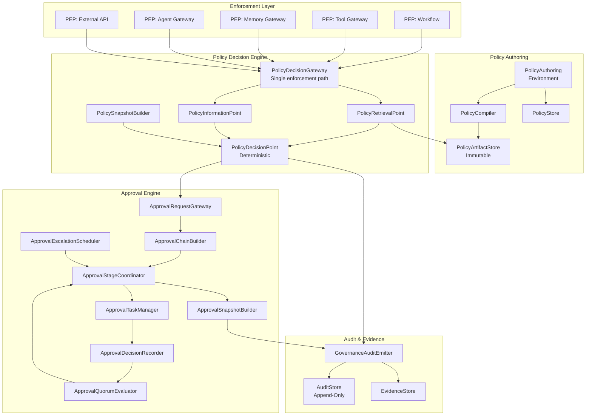

### 25.2 Policy Lifecycle Diagram
*(See §7.2 state machine diagram)*

### 25.3 Policy Compilation Pipeline

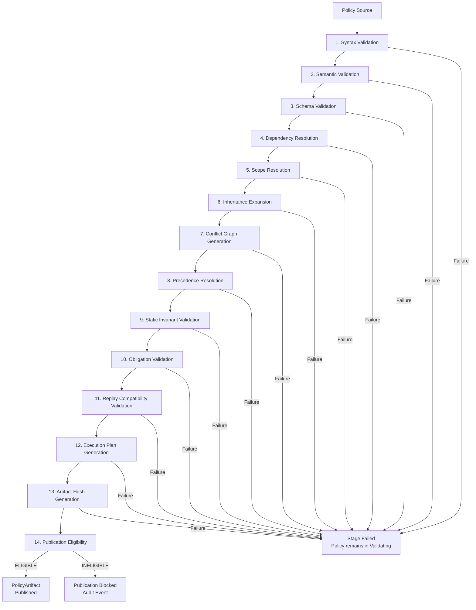

### 25.4 Policy Evaluation Flow

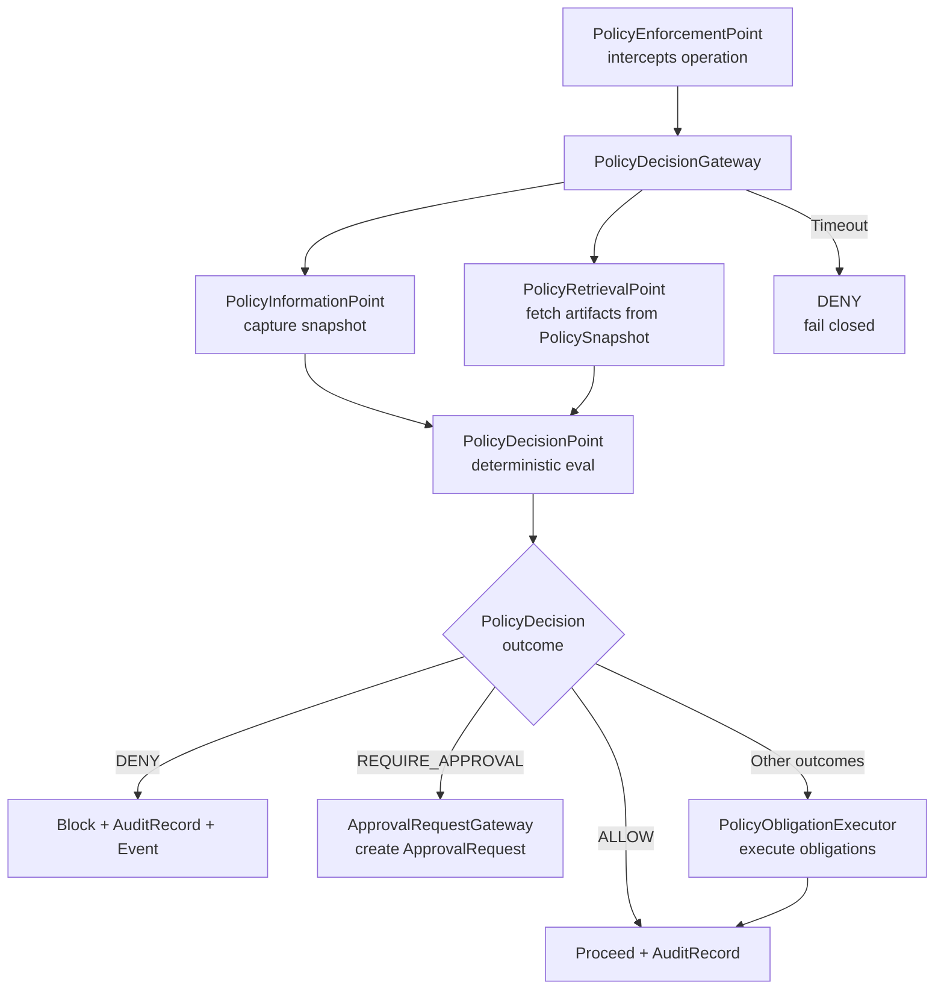

### 25.5 Approval Lifecycle Diagram
*(See §13.2 state machine diagram)*

### 25.6 Break-Glass Flow Diagram
*(See §16.5 flow diagram)*

### 25.7 Governance Replay Diagram

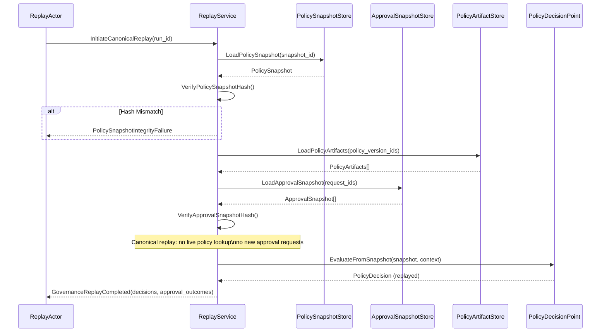

### 25.8 Tenant Governance Isolation

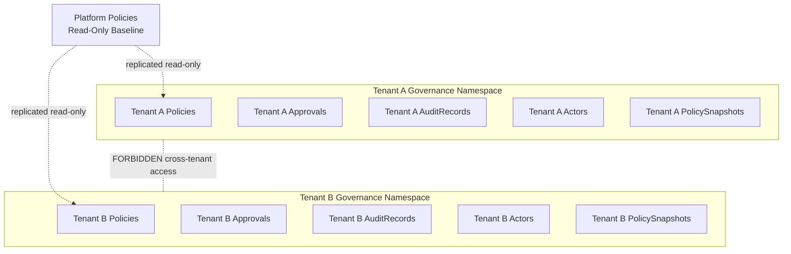

---

## 26. Governance, Policy & Approval Invariants

### 26.1 Policy Invariants

| ID | Invariant |
|---|---|
| POL-01 | Every Policy MUST have a tenant_id unless explicitly platform-scoped. |
| POL-02 | Every Policy MUST have at least one published PolicyVersion before it can be included in a PolicySnapshot. |
| POL-03 | Policy identity (policy_id) MUST be stable across all PolicyVersions. |
| POL-04 | Policy source MUST reside in a versioned, immutable authoring system (not in workflow code or prompts). |
| POL-05 | Policy lifecycle transitions MUST produce GovernanceAuditRecords. |
| POL-06 | A Policy MUST NOT be deleted while any PolicySnapshot or GovernanceAuditRecord references it. |
| POL-07 | Conflicting policies within the same scope MUST have explicit precedence defined in PolicyArtifact.conflict_resolution_manifest. |
| POL-08 | PolicyExceptions MUST be explicitly declared, time-bound, and audit-visible. |

### 26.2 PolicyVersion Invariants

| ID | Invariant |
|---|---|
| PV-01 | PolicyVersion is IMMUTABLE after reaching Published state. No field may be altered. |
| PV-02 | PolicyVersion MUST carry a content hash. |
| PV-03 | PolicyVersion MUST carry a compilation_hash from the compilation process. |
| PV-04 | PolicyVersion MUST carry a compiler_version reference. |
| PV-05 | PolicyVersion MUST carry a policy_information_point_schema_version reference. |
| PV-06 | PolicyVersion MUST NOT be deleted while referenced by any PolicySnapshot or GovernanceAuditRecord. |
| PV-07 | Rollback to a previous PolicyVersion MUST create a new PolicyVersion or explicit reactivation record. Historical mutation is FORBIDDEN. |
| PV-08 | A revoked PolicyVersion MUST NOT be used for new PolicyDecisions but MUST remain available for historical forensic explanation. |
| PV-09 | PolicyVersion MUST include dependency_manifest listing all referenced policy fragments and their hashes. |
| PV-10 | PolicyVersion compilation failure MUST block publication and produce a GovernanceAuditRecord. |

### 26.3 PolicySnapshot Invariants

| ID | Invariant |
|---|---|
| PSNAP-01 | PolicySnapshot is IMMUTABLE after creation. |
| PSNAP-02 | PolicySnapshot MUST carry a SHA-256 hash of its content. |
| PSNAP-03 | PolicySnapshot hash MUST be verified before canonical replay. |
| PSNAP-04 | A GovernedRun MUST bind to a PolicySnapshot before policy-evaluated steps execute. |
| PSNAP-05 | Canonical replay MUST use the original PolicySnapshot. Re-deriving from current policies is FORBIDDEN. |
| PSNAP-06 | Missing PolicySnapshot MUST block governed execution. |
| PSNAP-07 | PolicySnapshot MUST be retained for the full GovernedRun audit retention period. |
| PSNAP-08 | PolicySnapshot MUST record the exact policy_version_ids and policy_hash for every active policy. |
| PSNAP-09 | PolicySnapshot MUST record the policy_engine_version and compiler_version. |
| PSNAP-10 | Any attempt to mutate a PolicySnapshot MUST be rejected, logged as a security event, and produce a GovernanceAuditRecord. |

### 26.4 Policy Evaluation Invariants

| ID | Invariant |
|---|---|
| EVAL-01 | Policy evaluation MUST be deterministic. |
| EVAL-02 | Same PolicySnapshot + same EvaluationInput MUST always produce the same PolicyDecision. |
| EVAL-03 | Policy evaluation MUST produce a PolicyDecision record. Silent pass-through is FORBIDDEN. |
| EVAL-04 | PolicyDecision MUST reference the PolicyVersion(s) that produced its outcome. |
| EVAL-05 | PolicyDecision MUST NOT rely on live external mutable state not captured in EvaluationInput snapshot. |
| EVAL-06 | Policy evaluation order MUST follow the deterministic_execution_plan in the PolicyArtifact. |
| EVAL-07 | Conflict resolution MUST be explicit per conflict_resolution_manifest. |
| EVAL-08 | By default, DENY overrides ALLOW when policies conflict. |
| EVAL-09 | PolicyDecision MUST include obligation_list for all issued PolicyObligations. |
| EVAL-10 | Every PolicyObligation MUST be executed by PolicyObligationExecutor before the governed operation proceeds. |

### 26.5 Enforcement Invariants

| ID | Invariant |
|---|---|
| ENF-01 | Critical enforcement MUST fail closed. A PEP unable to reach PolicyDecisionGateway MUST deny the operation. |
| ENF-02 | No PEP may bypass PolicyDecisionGateway. |
| ENF-03 | Every EnforcementAction MUST produce a GovernanceAuditRecord. |
| ENF-04 | EnforcementAction MUST NOT mutate external systems outside authorized gateways. |
| ENF-05 | Governance latency degradation MUST NOT silently bypass enforcement. |
| ENF-06 | Tool execution MUST pass through PolicyDecisionGateway before the tool is invoked. |
| ENF-07 | Memory reads and writes MUST pass through PolicyDecisionGateway before the memory operation executes. |
| ENF-08 | Agent actions MUST pass through PolicyDecisionGateway before execution. |
| ENF-09 | RuntimeConstraint activation and deactivation MUST produce GovernanceAuditRecords. |
| ENF-10 | PolicyEnforcementPoint MUST record every governance evaluation call regardless of outcome. |

### 26.6 Approval Request Invariants

| ID | Invariant |
|---|---|
| AR-01 | ApprovalRequest MUST be created only by PolicyDecision(outcome=REQUIRE_APPROVAL) or an authorized workflow gate. |
| AR-02 | ApprovalRequest MUST include tenant_id, run_id, policy_decision_id, and approval_context_id. |
| AR-03 | ApprovalRequest approval_context MUST be immutable after creation. |
| AR-04 | GovernedRun MUST remain in ApprovalRequired state until the ApprovalRequest reaches a terminal state. |
| AR-05 | ApprovalDenied outcome MUST route GovernedRun to an explicit denial handling path. |
| AR-06 | Completed ApprovalRequest MUST NOT be reopened. A new request is required. |
| AR-07 | ApprovalRequest timeout MUST be implemented as a durable timer event. |
| AR-08 | Every state transition of ApprovalRequest MUST emit a governance event and GovernanceAuditRecord. |

### 26.7 Approval Decision Invariants

| ID | Invariant |
|---|---|
| AD-01 | Every ApprovalDecision MUST carry an actor_id or runtime_identity_id. Anonymous approvals are FORBIDDEN. |
| AD-02 | ApprovalDecision MUST be APPEND-ONLY. No update or delete is permitted. |
| AD-03 | Duplicate ApprovalDecision (same actor, same task, same outcome) MUST be idempotently accepted. |
| AD-04 | Duplicate ApprovalDecision with conflicting outcome (same actor, same task, different outcome) MUST be rejected. |
| AD-05 | Actor eligibility MUST be verified at ApprovalDecision recording time. |
| AD-06 | SegregationOfDutiesRule MUST be enforced at ApprovalDecisionRecorder. Violations MUST be rejected. |
| AD-07 | ApprovalDecision MUST reference the ApprovalTask it is resolving. |
| AD-08 | ApprovalDecision timestamp MUST be recorded by the governance system, not supplied by the client. |

### 26.8 Approval Snapshot Invariants

| ID | Invariant |
|---|---|
| ASNAP-01 | ApprovalSnapshot is IMMUTABLE after creation. |
| ASNAP-02 | ApprovalSnapshot MUST carry a SHA-256 hash of its content. |
| ASNAP-03 | ApprovalSnapshot MUST preserve all ApprovalDecisions with actor attributions. |
| ASNAP-04 | ApprovalSnapshot MUST preserve all EscalationEvents. |
| ASNAP-05 | ApprovalSnapshot MUST preserve all DelegationGrants exercised. |
| ASNAP-06 | ApprovalSnapshot hash MUST be verified before canonical replay. |
| ASNAP-07 | Canonical replay MUST use the original ApprovalSnapshot. New approval decisions MUST NOT be solicited during canonical replay. |
| ASNAP-08 | ApprovalSnapshot MUST be retained for the full GovernedRun audit retention period. |

### 26.9 Quorum Invariants

| ID | Invariant |
|---|---|
| QUOR-01 | Quorum calculation MUST be deterministic. |
| QUOR-02 | DENY takes precedence over APPROVE by default. |
| QUOR-03 | Self-approval is FORBIDDEN unless explicitly allowed by ApprovalPolicy. |
| QUOR-04 | Self-approval policy grant MUST be audit-visible. |
| QUOR-05 | Actor eligibility MUST be verified before ApprovalDecision is recorded. |
| QUOR-06 | Race conditions between approval completion and SLA timeout MUST resolve deterministically. |
| QUOR-07 | ABSTAIN MUST NOT count toward APPROVE or DENY quorum. |

### 26.10 Escalation Invariants

| ID | Invariant |
|---|---|
| ESC-01 | Escalation MUST be explicit per EscalationPolicy. |
| ESC-02 | Hidden escalation is FORBIDDEN. |
| ESC-03 | Escalation loops MUST be detected at compilation time. |
| ESC-04 | Every EscalationEvent MUST produce a GovernanceAuditRecord. |
| ESC-05 | AUTO_APPROVE escalation MUST be explicitly configured and audit-visible. |
| ESC-06 | Escalation timer MUST be a durable record, not a thread sleep. |
| ESC-07 | Maximum escalation ladder depth MUST be defined in EscalationPolicy. |

### 26.11 Delegation Invariants

| ID | Invariant |
|---|---|
| DEL-01 | Delegation MUST be explicit per DelegationRule. |
| DEL-02 | Delegation MUST NOT expand authority beyond the grantor's scope. |
| DEL-03 | Every DelegationGrant MUST have a valid_until timestamp. Indefinite delegation is FORBIDDEN. |
| DEL-04 | Expired DelegationGrant MUST NOT be honored at decision recording time. |
| DEL-05 | DelegationGrant revocation MUST be immediate and consistent. |
| DEL-06 | Delegation exercise MUST be evidenced in ApprovalDecision and GovernanceAuditRecord. |
| DEL-07 | Re-delegation (A → B → C) MUST be bounded by policy configuration. |

### 26.12 Break-Glass Invariants

| ID | Invariant |
|---|---|
| BG-01 | Break-glass is a governed emergency path. It is NOT silent bypass. |
| BG-02 | BreakGlassRequest MUST include: reason, scope, actor, time_bound, compensating_controls, and post_incident_review. |
| BG-03 | Break-glass MUST emit security event and governance event at request, approval, and expiration. |
| BG-04 | Break-glass MUST expire automatically at the time_bound. Manual extension requires a new request. |
| BG-05 | Break-glass use MUST be reviewed in a post-incident review. |
| BG-06 | Break-glass MUST NOT mutate historical PolicyVersions, PolicySnapshots, or ApprovalSnapshots. |
| BG-07 | Break-glass records MUST be permanently retained for compliance audit. |
| BG-08 | Break-glass MUST NOT silently disable PolicyDecisionGateway evaluation. |

### 26.13 Replay Invariants

| ID | Invariant |
|---|---|
| REP-01 | Canonical replay MUST use the original PolicySnapshot. |
| REP-02 | Canonical replay MUST use the original ApprovalSnapshot. |
| REP-03 | PolicySnapshot hash MUST be verified before canonical replay begins. |
| REP-04 | ApprovalSnapshot hash MUST be verified before canonical replay begins. |
| REP-05 | No new approval decisions may be requested during canonical replay. |
| REP-06 | Governance divergences MUST be recorded as GovernanceReplayRecord. |
| REP-07 | Simulation replay MUST NOT mutate original PolicySnapshots, ApprovalSnapshots, or event lineage. |
| REP-08 | Canonical replay MUST fail closed on PolicySnapshot or ApprovalSnapshot hash mismatch. |

### 26.14 Audit Invariants

| ID | Invariant |
|---|---|
| AUD-01 | GovernanceAuditRecord MUST be APPEND-ONLY. No update or delete is permitted. |
| AUD-02 | Every GovernanceAuditRecord MUST include actor_id or runtime_identity_id. |
| AUD-03 | Every ApprovalDecision MUST produce a GovernanceAuditRecord. |
| AUD-04 | Every PolicyDecision MUST produce a GovernanceAuditRecord. |
| AUD-05 | Every EnforcementAction MUST produce a GovernanceAuditRecord. |
| AUD-06 | Every break-glass use MUST produce a GovernanceAuditRecord. |
| AUD-07 | Governance audit records MUST be stored in a dedicated append-only AuditStore, separate from operational telemetry. |
| AUD-08 | Governance events MUST follow Document 07 EventEnvelope and pass schema validation before publication. |
| AUD-09 | Governance mutation events MUST be published through a transactional outbox. |
| AUD-10 | GovernanceEvidenceBundle MUST include all PolicyDecisions, ApprovalSnapshots, and GovernanceAuditRecords for the covered run or incident. |

### 26.15 Multi-Tenant Invariants

| ID | Invariant |
|---|---|
| TEN-01 | Every governance object MUST include tenant_id unless explicitly platform-scoped. |
| TEN-02 | Cross-tenant policy binding is FORBIDDEN by default. |
| TEN-03 | Approval chains MUST NOT include actors from another tenant unless ExternalApproverPolicy is configured. |
| TEN-04 | Governance audit queries MUST be tenant-scoped. A query without tenant_id MUST be rejected. |
| TEN-05 | Platform policies MUST be immutable from the tenant's perspective. |
| TEN-06 | Tenant-specific policies MAY be stricter but MUST NOT weaken non-overridable controls. |
| TEN-07 | PolicySnapshot MUST be scoped to its tenant_id. Cross-tenant snapshot access is FORBIDDEN. |
| TEN-08 | ApprovalSnapshot MUST be scoped to its tenant_id. Cross-tenant approval snapshot access is FORBIDDEN. |
| TEN-09 | Cross-tenant governance access attempt MUST produce a security event and governance audit record. |

### 26.16 Observability Invariants

| ID | Invariant |
|---|---|
| OBS-01 | Every governed decision MUST emit a trace_id correlated with run_id and policy_snapshot_id. |
| OBS-02 | Every PolicyDecision MUST be trace-correlated with its governed action. |
| OBS-03 | Every ApprovalDecision MUST be actor-attributed in both GovernanceAuditRecord and telemetry. |
| OBS-04 | Governance dashboards MUST NOT be used as evidence sources of truth. |
| OBS-05 | Missing governance telemetry MUST be treated as operational degradation. |
| OBS-06 | Audit outbox depth exceeding threshold MUST trigger an operational alert. |
| OBS-07 | Every break-glass use MUST be observable in governance metrics and dashboards. |
| OBS-08 | Governance replay divergences MUST increment `mycelia.governance.replay.divergence_count`. |

---

## 27. Governance, Policy & Approval Anti-Patterns

| ID | Anti-Pattern | Description | Why Dangerous |
|---|---|---|---|
| AP-01 | **Mutable PolicyVersion** | Editing a published PolicyVersion's content in place | Historical decisions cannot be forensically reproduced; replay diverges; audit trail corrupted |
| AP-02 | **Policy hidden in workflow code** | Governance rules embedded as if-statements or conditions in orchestration code | Not versioned; not compilable; not auditable; breaks replay; invisible to governance |
| AP-03 | **Policy hidden in prompt** | Governance constraints embedded in LLM system prompt | Not versioned; not enforceable; bypassed by model; invisible to PolicyDecisionGateway |
| AP-04 | **Live policy lookup during canonical replay** | Evaluating current active policies instead of original PolicySnapshot during replay | Replay produces different decisions; forensic integrity destroyed |
| AP-05 | **Approval without actor attribution** | ApprovalDecision created without actor_id or runtime_identity_id | No audit trail; cannot prove who approved; compliance violation |
| AP-06 | **Approval snapshot mutation** | Altering an ApprovalSnapshot after its hash is recorded | Replay diverges; audit trail falsified; compliance violation |
| AP-07 | **Hidden bypass** | Silently skipping governance evaluation for a governed operation | No audit record; governance guarantee voided; invisible to compliance |
| AP-08 | **Break-glass without audit** | Using break-glass override without creating BreakGlassRequest, BreakGlassDecision, and evidence bundle | Emergency path is invisible to audit; no post-incident review; compliance violation |
| AP-09 | **Self-approval by default** | Allowing the actor who initiated an action to approve it without explicit policy permission | SegregationOfDuties violated; collusion risk; four-eyes principle bypassed |
| AP-10 | **Policy decision without evidence** | PolicyDecision produced without referencing the PolicyVersion(s) that determined the outcome | Cannot forensically prove which rule applied; audit incomplete |
| AP-11 | **Dashboard as source of truth** | Using governance metrics or compliance dashboards as evidence of governance compliance | Dashboards are derived, eventually consistent views; not tamper-evident; not legally admissible |
| AP-12 | **Eventual-consistency enforcement decision** | Making enforcement decisions from eventually consistent read replicas | Stale policy state causes incorrect enforcement; revoked permission remains honored |
| AP-13 | **Approval timeout as thread sleep** | Worker thread sleeping for approval SLA duration | Thread pool exhausted for long-running approvals; timer lost on crash; not durable |
| AP-14 | **Escalation loop** | EscalationPolicy with circular escalation paths | Infinite escalation; run never resolves; orchestration deadlock |
| AP-15 | **Delegation without expiry** | DelegationGrant with no valid_until timestamp | Indefinite authority transfer; delegatee retains authority indefinitely; audit scope grows |
| AP-16 | **Cross-tenant approval actor** | Approval chain includes actor from different tenant without explicit ExternalApproverPolicy | Tenant isolation violated; unauthorized actor influences tenant governance |
| AP-17 | **Policy conflict with implicit precedence** | Two policies conflict and precedence is determined by declaration order or random runtime behavior | Nondeterministic decisions; replay diverges; not auditable |
| AP-18 | **Governance telemetry treated as evidence** | Using log lines, traces, or metrics as governance evidence for regulatory compliance | Telemetry is lossy, mutable, and not tamper-evident; not legally admissible as audit evidence |
| AP-19 | **Policy engine fail-open** | PolicyDecisionGateway returning ALLOW on timeout or unavailability | Governance guarantee voided during outages; worst-case exposure during incidents |
| AP-20 | **Approval state changed directly in database** | Developer directly updates ApprovalRequest state in storage layer | Bypasses state machine validation; breaks audit trail; no governance events emitted |
| AP-21 | **Policy evaluation using live mutable external API without snapshot** | PolicyDecisionPoint queries live external service during evaluation | Nondeterministic results; replay produces different decisions; policy is not stable |
| AP-22 | **Agent self-authorizing** | Agent runtime approves its own action or creates its own PolicyDecision | Agent-owned authority violation; governance bypass; audit gap |
| AP-23 | **Tool executing before policy decision** | Tool invocation proceeds before PolicyDecisionGateway evaluates the request | Ungoverned tool execution; side effects outside policy scope |
| AP-24 | **PolicySnapshot not bound to run** | GovernedRun begins policy-evaluated steps without a PolicySnapshot | Cannot reproduce governance at replay; no authoritative policy record |
| AP-25 | **Compilation failure silently ignored** | PolicyVersion published despite compilation stage failure | Artifact may be nondeterministic or ambiguous; runtime evaluation unreliable |
| AP-26 | **Deprecated policy treated as archived** | Using deprecated PolicyVersion for new runs | Deprecated policy may produce inconsistent results; should not gate new decisions |
| AP-27 | **Approval chain skipped for "low-risk" operations** | Developer bypasses ApprovalRequest for actions that policy requires approval | Policy gate removed; governance guarantee violated; no audit trail |
| AP-28 | **PolicyException without time-bound** | PolicyException created with no expiry timestamp | Exception becomes permanent override; compliance risk grows over time |
| AP-29 | **Audit record in operational database** | GovernanceAuditRecords stored alongside operational tables | Operational mutations can affect audit records; append-only guarantee not enforceable |
| AP-30 | **Rollback by mutating old PolicyVersion** | Reverting a policy by editing a previously published version | Immutability violated; historical decisions corrupt; audit trail damaged |
| AP-31 | **Approval resolution polling** | Workflow checks approval status by polling a database table | Missed transitions; race conditions; does not use durable event-driven state |
| AP-32 | **PolicyBinding with implicit scope** | PolicyBinding applied to "all resources" without explicit scope list | Overly broad governance; unknown side effects; compliance drift |
| AP-33 | **Governance event published outside Document 07** | Governance events emitted directly without EventEnvelope schema validation | Schema drift; event consumers break; audit reliability degraded |
| AP-34 | **GovernanceEvidenceBundle assembled from cache** | Evidence bundle populated from cached projections rather than authoritative stores | Evidence not tamper-evident; may not reflect actual governance state |
| AP-35 | **ApprovalDecision timestamp supplied by client** | Client-supplied timestamp used as official decision time | Time can be manipulated; forensic timeline unreliable |
| AP-36 | **Policy enforcement embedded in model prompt** | Governance rules injected as prompt instructions to constrain model behavior | Not enforceable; bypassed by prompt injection; invisible to PolicyDecisionGateway |
| AP-37 | **Break-glass used for non-emergencies** | Break-glass used as a convenience path for slow approval workflows | Normalizes emergency override; erodes governance trust; mandatory review burden |
| AP-38 | **Policy stored only in version control without compilation** | Policy source committed to Git but never compiled or published to PolicyArtifactStore | No deterministic artifact; runtime must re-parse; not replay-safe |
| AP-39 | **Missing tenant_id on governance record** | GovernanceAuditRecord, PolicySnapshot, or ApprovalRequest without tenant_id | Cannot enforce tenant isolation; audit queries return cross-tenant data |
| AP-40 | **Approval chain defined at workflow implementation time** | Developer hardcodes approval actors in workflow code instead of referencing ApprovalPolicy | Approval logic not governed; not versioned; not auditable through PolicyVersion lineage |
| AP-41 | **PolicyDecision reused across runs** | Caching a PolicyDecision from one run and reusing it for a different run | Governance context of new run differs; incorrect decision applied; no per-run record |
| AP-42 | **Governance simulation results treated as authoritative** | GovernanceSimulation output used as a real PolicyDecision | Simulation is non-authoritative; using it as production governance corrupts audit trail |
| AP-43 | **Escalation without EscalationEvent** | Approval task reassigned without creating an EscalationEvent record | Escalation invisible in audit and ApprovalSnapshot; replay cannot reconstruct escalation path |
| AP-44 | **Approval actor eligibility not re-checked at decision** | Actor eligibility verified only at task assignment; not re-verified at decision recording | Actor may have lost eligibility (role change, SoD violation) between assignment and decision |
| AP-45 | **Platform policy weakened by tenant override** | Tenant creates a policy that makes a platform non-overridable control more permissive | Security baseline violated; cross-tenant risk; platform governance degraded |
| AP-46 | **PolicyObligationExecutor failure silently ignored** | Obligation execution fails and system proceeds as if obligation completed | Masking, redaction, or approval not applied; downstream operation violates policy |
| AP-47 | **Governance events in main operational event log** | Governance events mixed with operational workflow events | Audit records subject to same operational deletion rules; legal admissibility compromised |
| AP-48 | **PolicyVersion hash not verified before evaluation** | PolicyArtifact used for evaluation without verifying policy_hash and compilation_hash | Tampered or corrupted artifact used; governance decisions invalid |
| AP-49 | **Break-glass expiration not automated** | Relying on manual revocation to end break-glass period | Human error allows break-glass to persist beyond intended scope |
| AP-50 | **Re-delegation without chain length check** | A → B → C re-delegation allowed without maximum chain depth enforcement | Authority chain grows unboundedly; original scope may be lost; audit trail complex |
| AP-51 | **Parallel approval branches not synchronized** | Parallel approval stages resolve independently with no final synchronization gate | One branch denies; another approves; request state ambiguous; replay inconsistent |
| AP-52 | **Policy evaluation timeout treated as ALLOW** | When PolicyDecisionGateway times out, operation is permitted | Fail-open enforcement during incidents; worst-case exposure at highest risk moments |
| AP-53 | **ApprovalSnapshot not created until post-review** | ApprovalSnapshot deferred to "after the approval process is complete" | Race condition between snapshot creation and audit request; forensic gap |
| AP-54 | **Governance roles defined in identity system only** | Using only IAM/RBAC roles from Document 13 for governance decisions without GovernanceRole mapping | Governance roles and IAM roles may diverge; separation of governance authority from authentication authority lost |
| AP-55 | **PolicyDecision based on external API returning current state** | PDP queries live operational database or external API to inform decision | Mutable external state changes decision; replay produces different outcome; not deterministic |
| AP-56 | **Missing PolicySnapshot fails silently** | GovernedRun proceeds without PolicySnapshot with a warning but no block | Governance guarantee voided; run is ungoverned |
| AP-57 | **Break-glass scope not reviewed** | BreakGlassDecision approves without confirming scope is minimal | Overly broad break-glass grants access far beyond the emergency need |
| AP-58 | **PolicyVersion created per commit** | Every code commit creates a new PolicyVersion without human review | Governance versioning becomes meaningless; review requirement bypassed |
| AP-59 | **GovernanceAuditRecord linked to telemetry record only** | Audit evidence exists only as a reference to a telemetry trace | Telemetry may be rotated, deleted, or degraded; audit evidence lost |
| AP-60 | **Approval SLA checked by querying current time** | SLA enforcement based on wall-clock comparison at evaluation time rather than durable timer event | Race conditions between evaluation and SLA expiry; replay uses different wall clock |
| AP-61 | **Segregation of duties checked only at task assignment** | SoD rule verified when task is created but not when decision is recorded | Actor who triggered run has SoD violation; could still approve if SoD not re-checked at recording |
| AP-62 | **PolicySnapshot created post-execution** | PolicySnapshot created after governed steps have already executed | Steps executed without governance binding; forensic reconstruction is post-hoc fabrication |
| AP-63 | **Compliance report generated from derived metrics** | Regulatory audit evidence assembled from dashboard aggregations rather than GovernanceAuditRecords | Aggregations may omit events; compliance evidence is incomplete and not tamper-evident |
| AP-64 | **DelegationGrant scope broader than grantor role** | Actor delegates authority they do not possess | Authority inflation; governance control breakdown |
| AP-65 | **Governance namespace shared across tenants** | Two tenants share a GovernanceNamespace | Tenant isolation violated; governance records mixed; audit queries return wrong tenant |
| AP-66 | **PolicyDecisionGateway deployed as optional component** | Governance enforcement treated as "nice to have" in development environment | Governance gap in dev environment; untested code reaches production with no enforcement |
| AP-67 | **ApprovalRequest created by workflow step directly** | Step code directly creates ApprovalRequest without going through PolicyDecision | Approval gate not policy-driven; policy may require different approval chain |
| AP-68 | **Governance event schema not validated before publication** | Governance events published to event bus without EventEnvelope schema validation | Event consumers break on schema drift; audit consumers may miss events |
| AP-69 | **PolicyObligation list ignored** | PolicyDecision produced with obligation list; PolicyObligationExecutor not called | Obligations (masking, redaction, approval, quarantine) not applied; policy contract violated |
| AP-70 | **Approval history not included in GovernanceEvidenceBundle** | Evidence bundle assembled without ApprovalSnapshot | Incomplete evidence; cannot prove governance decision chain |
| AP-71 | **Break-glass notification suppressed** | BreakGlassApproved event emitted but notifications to security team suppressed | Emergency operation invisible to oversight; no rapid response possible |
| AP-72 | **Policy conflict detected at runtime** | Conflicting policies not resolved at compilation; resolved at evaluation time with implicit tiebreak | Nondeterministic runtime behavior; replay may produce different outcome |
| AP-73 | **GovernanceAuditRecord batch-written** | Audit records deferred and written in batches without transactional outbox | Individual records may be lost in batch failure; audit gap |
| AP-74 | **Policy stored in memory only** | PolicyVersion kept in-process memory rather than PolicyArtifactStore | Lost on process restart; not queryable for replay; not audit-accessible |
| AP-75 | **Approval timeout without retention** | ApprovalTimeout event emitted but TimedOut state not persisted durably | Run appears pending after orchestrator restart; duplicate approval requests possible |
| AP-76 | **Approval state machine bypassed by direct storage write** | Developer updates approval_request.status column directly in database | State machine invariants violated; governance events not emitted; audit gap |
| AP-77 | **PolicyVersion compilation cached across versions** | Reusing a cached compiled artifact for a new PolicyVersion without recompiling | New version uses old compiled plan; behavioral drift; incorrect decisions |
| AP-78 | **Platform policy not replicated to tenant namespace** | Tenant policy evaluation proceeds without platform baseline policies | Platform non-overridable controls absent from evaluation; security baseline bypassed |
| AP-79 | **Approval notification failure causes approval block** | Notification delivery failure treated as approval system failure | System unable to notify actor; approval stuck; run blocked indefinitely |
| AP-80 | **Governance failure treated as non-critical** | PolicyDecisionGateway outage classified as P3 or lower | Critical enforcement gaps during governance outage; security exposure |
| AP-81 | **Policy rule ordering depends on file system order** | Policy rule evaluation order derived from file listing order | Non-deterministic across environments; replay produces different results |
| AP-82 | **BreakGlass Evidence Bundle not assembled** | Break-glass use occurs without GovernanceEvidenceBundle creation | Post-incident review has no assembled evidence; compliance gap |
| AP-83 | **Governance actor deleted before audit retention** | GovernanceActor record deleted while GovernanceAuditRecords reference actor_id | Audit records reference non-existent actor; forensic investigation incomplete |
| AP-84 | **Approval request created without correlation_id** | ApprovalRequest missing correlation_id from Document 07 chain | Cannot trace approval request back to originating workflow event |
| AP-85 | **RuntimeConstraint activated without audit record** | Capability restriction applied to a run without GovernanceAuditRecord | Constraint invisible to audit; no evidence of policy-driven capability restriction |
| AP-86 | **Post-incident review marked complete without review** | BreakGlassRequest.post_incident_review marked complete at creation time | Required review bypassed; no learning; compliance violation |
| AP-87 | **Policy simulation treated as pre-approval** | GovernanceSimulation result used to pre-approve a policy before formal review | Simulation is non-authoritative; review gate bypassed |
| AP-88 | **Governance metrics used to demonstrate SLA compliance** | Dashboard metric showing "99.9% approvals resolved in SLA" used as regulatory evidence | Metrics are derived, aggregated, and eventually consistent; not legally admissible |
| AP-89 | **Cross-tenant replay access** | Canonical replay for Tenant A reads PolicySnapshot or ApprovalSnapshot from Tenant B | Tenant isolation violated during forensic investigation |
| AP-90 | **Approval actor impersonation** | Actor submits approval decision claiming to be a different actor_id | Fraudulent governance record; compliance violation; requires strong identity binding per Doc 13 |
| AP-91 | **PolicyDecision not recorded on ALLOW** | PolicyEnforcementPoint records decisions only on DENY, not ALLOW | Incomplete audit trail; cannot prove governance evaluated permitted operations |
| AP-92 | **Governance service shares storage with operational services** | GovernanceStore co-located with workflow or event storage | Storage-level corruption or operational maintenance can affect governance records |
| AP-93 | **EscalationPolicy not tested before activation** | Escalation ladder deployed without simulation or testing | Escalation loops or dead-ends discovered only during production approval timeout |
| AP-94 | **ApprovalTask issued to role without members** | Role assigned as approval target has no active members | Task can never be completed; approval chain deadlocked |
| AP-95 | **Policy artifact stored only in policy engine memory** | Compiled PolicyArtifact not persisted to PolicyArtifactStore; kept in memory | Artifact lost on restart; replay cannot retrieve original compiled version |

---

## 28. Codex Implementation Guidance

### 28.1 Recommended Implementation Order

Codex MUST implement governance architecture incrementally in the following order:

| Step | Deliverable | Rationale |
|---|---|---|
| 1 | Governance module boundaries | Define service boundaries before any schema; prevents coupling |
| 2 | GovernanceNamespace schema | Isolation boundary must exist before any governance object is created |
| 3 | Policy and PolicyVersion schema | Core governance data model; all other schemas depend on this |
| 4 | PolicyBinding schema | Required for scope resolution and PolicySnapshot |
| 5 | Static Policy DSL or JSON schema | Evaluatable policy format; must be compilable and deterministic |
| 6 | PolicyCompiler basic validator | Syntax validation, hash generation; fail-fast on invalid policies |
| 7 | PolicySnapshotBuilder | Create and persist PolicySnapshot before any run proceeds to governed steps |
| 8 | PolicyDecisionGateway | Single enforcement path; all PEPs depend on this |
| 9 | PolicyDecisionPoint basic evaluator | Deterministic evaluation against compiled artifacts |
| 10 | PolicyDecision and GovernanceAuditRecord | Every decision produces a record |
| 11 | PolicyEnforcementPoint integrations | Workflow, tool, memory, agent gateway integrations |
| 12 | ApprovalRequest schema | Durable, state-machined approval gate |
| 13 | ApprovalChain and ApprovalStage schema | Chain and stage model |
| 14 | ApprovalTask schema | Task assignment to actors |
| 15 | ApprovalDecision schema | Append-only, actor-attributed decisions |
| 16 | ApprovalSnapshotBuilder | Create immutable snapshot at resolution |
| 17 | Approval timeout durable timer | Via Document 09 timer infrastructure; not thread sleep |
| 18 | Basic escalation (single level) | SLA breach triggers reassignment |
| 19 | GovernanceAuditEmitter and outbox | Transactional outbox for all governance events |
| 20 | Governance events registered in Document 07 | Schema registration before publication |
| 21 | Replay hydration from PolicySnapshot and ApprovalSnapshot | Verify round-trip before any canonical replay |
| 22 | BreakGlassGateway (basic) | Mandatory fields; evidence bundle creation |
| 23 | DelegationResolver (basic) | Single-level delegation with expiry check |
| 24 | Required tests (see §28.3) | All invariant tests before production traffic |

### 28.2 Forbidden Codex Shortcuts

The following shortcuts are FORBIDDEN:

- **Do not implement policy as scattered if-statements in workflow code.** Policy belongs in the Policy store and evaluation engine.
- **Do not store policies only in prompts.** LLM prompt instructions are not governance contracts.
- **Do not mutate PolicyVersion in place.** Every change creates a new PolicyVersion.
- **Do not evaluate live current policies during canonical replay.** Use the original PolicySnapshot.
- **Do not let agents authorize themselves.** All agent actions pass through PolicyDecisionGateway.
- **Do not let tools bypass PolicyDecisionGateway.** Tool invocations are always policy-gated.
- **Do not create approval decisions without actor_id or runtime_identity_id.** Anonymous governance is FORBIDDEN.
- **Do not implement approval timeout as worker sleep.** Use durable timer events from Document 09.
- **Do not publish governance events outside Document 07 contracts.** All events are schema-registered.
- **Do not skip tenant_id on any governance record.** Tenant_id is mandatory.
- **Do not implement break-glass as a hidden override.** Break-glass is explicit, scoped, and evidence-bound.
- **Do not treat dashboard rows as audit evidence.** Evidence requires immutable, tamper-evident records.
- **Do not skip PolicySnapshot for GovernedRun initialization.** No run proceeds without a PolicySnapshot.
- **Do not record GovernanceAuditRecord only for DENY outcomes.** ALLOW outcomes must also be recorded.

### 28.3 Required Tests

| Test | Description | Pass Criterion |
|---|---|---|
| PolicyVersion immutability test | Attempt to update published PolicyVersion field | Update rejected; audit record created |
| Policy compilation failure blocks publish test | Submit policy with semantic error | Compilation fails; policy remains Validating; publication blocked |
| Deterministic evaluation test | Same PolicySnapshot + same input, 100 iterations | Identical PolicyDecision in all 100 iterations |
| Deny overrides allow test | Compose conflicting DENY and ALLOW policies | DENY outcome produced |
| Missing PolicySnapshot blocks governed run test | Initialize run without PolicySnapshot | Run fails with PolicySnapshotMissing before executing governed steps |
| Fail-closed PDP timeout test | Inject timeout into PolicyDecisionGateway | DENY returned; not ALLOW |
| ApprovalRequest creation test | Create ApprovalRequest; verify all required fields | Request created; GovernanceAuditRecord produced; tenant_id present |
| ApprovalDecision actor attribution test | Submit ApprovalDecision without actor_id | Decision rejected; error returned |
| Duplicate approval decision idempotency test | Submit same decision twice (same actor, same outcome) | Second submission accepted idempotently |
| Approval timeout durable timer test | Set short SLA; restart orchestrator mid-wait | Timer fires after restart; EscalationEvent created |
| Approval snapshot immutability test | Attempt to mutate ApprovalSnapshot field | Mutation rejected; security event emitted |
| Self-approval blocked test | Actor who initiated run attempts to approve own gate | Approval rejected; SoD audit record created |
| Delegation expiry test | Use DelegationGrant after valid_until | Decision rejected with ExpiredDelegationUsed error |
| Escalation loop detection test | Define circular EscalationPolicy | Compilation fails with EscalationLoopDetected error |
| Break-glass evidence test | Attempt BreakGlassRequest with missing mandatory field | Request rejected; no break-glass activated |
| Canonical replay uses original PolicySnapshot test | Run canonical replay; monitor PolicyStore queries | No PolicyStore queries executed during replay |
| Canonical replay uses original ApprovalSnapshot test | Run canonical replay with approval gate | No new ApprovalTask issued; original decision used |
| Cross-tenant governance access rejection test | Governance action with mismatched tenant_id | Action rejected; CrossTenantGovernanceAttempt event emitted |
| Governance event schema validation test | Publish governance event with missing required fields | Event rejected at outbox; schema validation failure |

---

## 29. Relationship to Other Documents

### 29.1 Document 00 — Vision & Foundational Manifesto

Document 00 establishes that MYCELIA is governed cognitive operations infrastructure — not an unconstrained autonomous agent platform. Document 11's executable, deterministic, auditable governance authority is the direct runtime implementation of that foundational doctrine.

### 29.2 Document 01 — Product Requirements & Operational Scope

Document 01 defines the product requirements that necessitate governance: enterprise multi-tenancy, compliance, approval workflows, auditability, and replay. Every governance requirement in Document 11 traces to an operational requirement in Document 01.

### 29.3 Document 02 — Core Runtime Architecture

Document 02 defines the MYCELIA runtime execution model including runtime envelopes and identity model. Document 11 consumes the RunEnvelope for GovernanceBoundary construction and the runtime_identity_id for governance attribution.

### 29.4 Document 03 — Canonical Domain Model

Document 03 defines canonical entity identity conventions. Document 11's governance entities follow Document 03's ID conventions, tenant scoping, and event implication patterns.

### 29.5 Document 04 — Cognitive Execution Model

Document 04 defines CognitiveInvocation. Document 11 governs what context the cognitive execution is permitted to receive (via memory governance) and constrains model capabilities within policy-defined boundaries.

### 29.6 Document 05 — Agent Runtime & Coordination

Document 05 defines how agents operate. Agents MUST pass through PolicyDecisionGateway for all governed actions. No agent may authorize its own actions. Agent memory writes pass through the memory access governance (§17.1 agent enforcement).

### 29.7 Document 06 — State, Checkpoint & Persistence Architecture

Document 06 defines execution state and checkpoints. ApprovalRequired is a GovernedRun state that Document 09 maintains in the state machine; Document 11 defines when this state is entered and what must happen for it to exit.

### 29.8 Document 07 — Event & Messaging Contracts

All governance events are registered in Document 07 and MUST follow Document 07 EventEnvelope. Document 11 defines the governance event taxonomy; Document 07 defines the publication infrastructure.

### 29.9 Document 08 — Event Runtime Deep Technical Specification

Document 08 defines the technical event infrastructure. Governance events emitted through the transactional outbox are delivered via Document 08's event runtime.

### 29.10 Document 09 — Workflow Orchestration Engine Specification

Document 09 defines workflow orchestration. ApprovalRequired, ApprovalGranted, ApprovalDenied, and policy-blocked transitions are governing states that Document 09 maintains; Document 11 defines when these states apply and what evidence must be produced.

### 29.11 Document 10 — Memory & Context Architecture

Document 10 defines the MemoryAccessGateway. Document 11 governs what that gateway is authorized to retrieve or write by providing PolicyDecisions that the gateway enforces. Memory governance is a subtype of governance defined in Document 11 and enforced through Document 10's gateway.

### 29.12 Document 12 — Observability & Telemetry Platform

Document 12 defines the observability infrastructure. All `mycelia.governance.*` metrics are defined in Document 11 and collected by Document 12. Document 12 provides the infrastructure; Document 11 defines what must be observed.

### 29.13 Document 13 — Security & Trust Architecture

Document 13 provides the identity model that Document 11 uses for actor attribution, break-glass actor eligibility, and security event publication. Break-glass security events flow through Document 13's security event pipeline.

### 29.14 Document 14 — Multi-Tenant Isolation & Organizational Boundaries

Document 14 defines the tenant isolation architecture. Document 11's governance namespace isolation, cross-tenant prohibition, and platform policy replication implement Document 14's tenant isolation requirements for the governance layer.

### 29.15 Document 15 — SDK, Tool Runtime & Execution Contracts

Document 15 defines tool execution contracts. Tool invocations are gated by PolicyDecisionGateway (Document 11) through the ToolInvocationGateway (Document 15). Document 11 defines the governance contract; Document 15 enforces it at the tool boundary.

### 29.16 Document 16 — Infrastructure & Deployment Architecture

Document 16 defines the infrastructure for deploying governance services. PolicyStore, PolicyArtifactStore, ApprovalStore, AuditStore, and PolicySnapshotStore deployment belong to Document 16. Document 11 defines the logical contracts.

### 29.17 Document 17 — SRE, Operational Recovery & Runbooks

Document 17 defines SRE procedures. Governance-specific failure escalation (PolicyDecisionGateway outage, PolicySnapshotStore unavailability, AuditStore backlog) follows Document 17 runbooks. Document 11 defines failure modes; Document 17 defines operational response.

### 29.18 Document 18 — External APIs & Integration Contracts

External integrations that trigger governance evaluations (external workflow triggers, third-party approval actors) pass through Document 18 API contracts. Document 18 defines the integration surface; Document 11 defines the governance authority applied at that surface.

---

## 30. Final Governance Principles

**Policies decide.** Policy evaluation, not developer opinion and not LLM output, determines what the runtime is permitted to do.

**Versions freeze.** PolicyVersion is immutable after publication. History is an append-only record, not an editable surface.

**Snapshots replay.** PolicySnapshot and ApprovalSnapshot are the forensic anchors that make governance decisions reproducible years after the original execution.

**Approvals gate.** An approval gate is a durable blocking state. Execution does not advance without an authorized, actor-attributed decision.

**Actors attribute.** Every governance decision — allow, deny, approve, reject, escalate, delegate, break-glass — is traceable to a specific actor or runtime identity. Anonymous governance is FORBIDDEN.

**Obligations constrain.** PolicyDecisions issue obligations. Obligations are not suggestions. They are binding actions the runtime MUST execute.

**Enforcement fails closed.** When governance infrastructure is unavailable, the default response is denial. Fail-open enforcement voids the governance guarantee.

**Break-glass evidences.** Break-glass is not a shortcut. It is the most audited path in the system — louder, more visible, and more evidence-producing than any normal operation.

**Delegation scopes.** Delegated authority is always bounded. No actor may receive more authority than the grantor possesses, for longer than necessary, with less audit visibility than the original authority.

**Escalation records.** Every escalation is explicit, event-driven, and durable. Hidden handoffs do not exist.

**Audit proves.** GovernanceAuditRecords are evidence, not telemetry. They are append-only, tamper-evident, forensic-grade, and suitable for audit review subject to jurisdictional and chain-of-custody requirements. The governance system is measured not by its dashboards but by its ability to produce complete, verifiable evidence of every decision it made.

**Tenants isolate.** Every governance object belongs to a tenant. Cross-tenant governance access is not a misconfiguration to tolerate — it is a security event to alert and block.

**Events remember.** The governance event log is the authoritative history of everything governance decided and everything governance did. No decision exists that is not in this record.

**Governance governs.** The governance layer does not advise, suggest, or hope. It enforces. It blocks. It gates. It proves. It is the executable authority layer for all governed operations in MYCELIA.

---

> In MYCELIA, governance is not a checklist around the runtime.
>
> It is the executable authority layer that decides what the runtime is allowed to do, when it must stop, when it must ask, and how it must prove the decision later.
