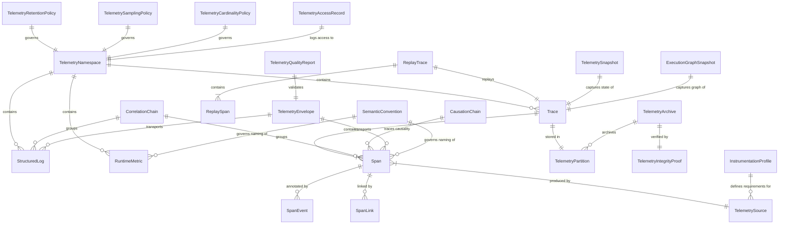
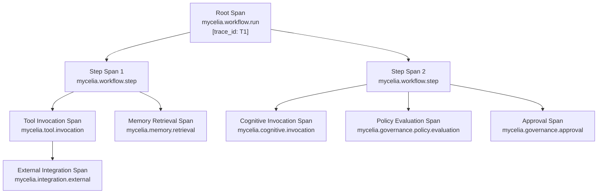
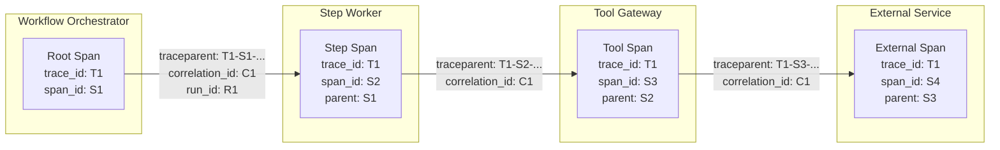
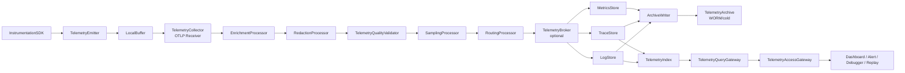
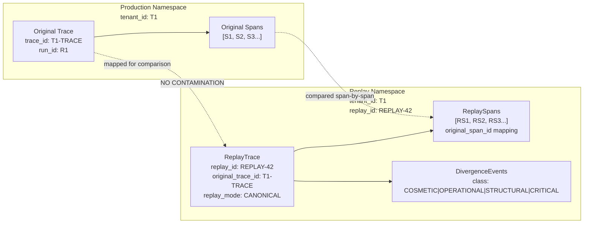
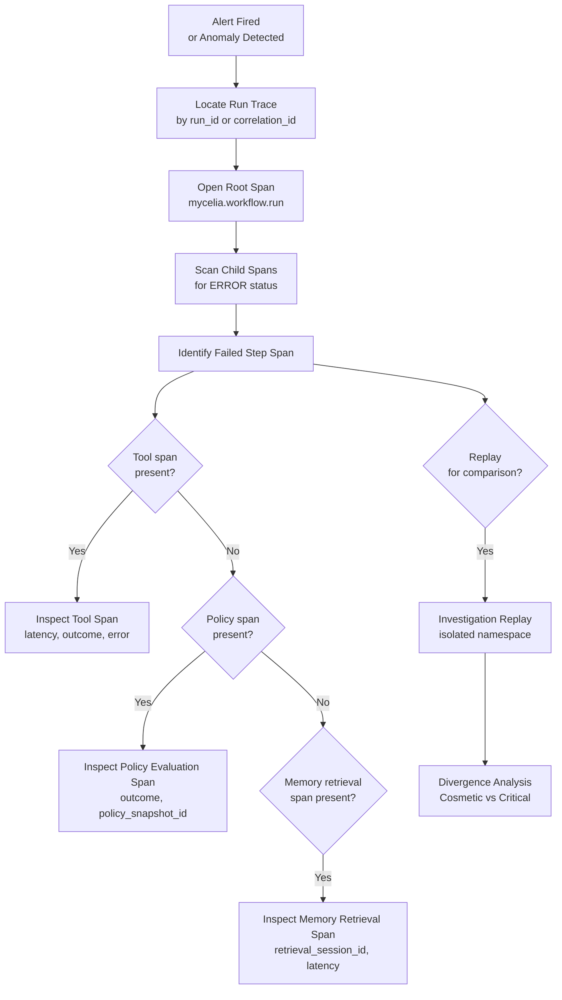
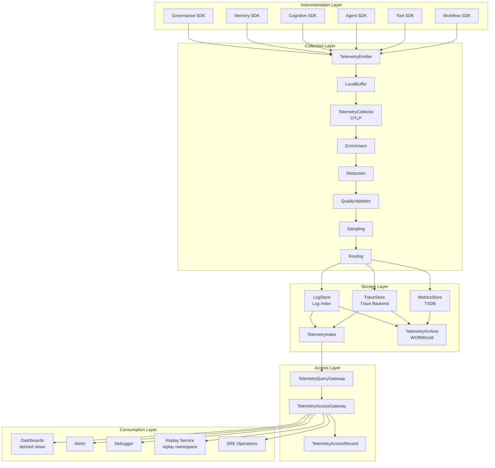
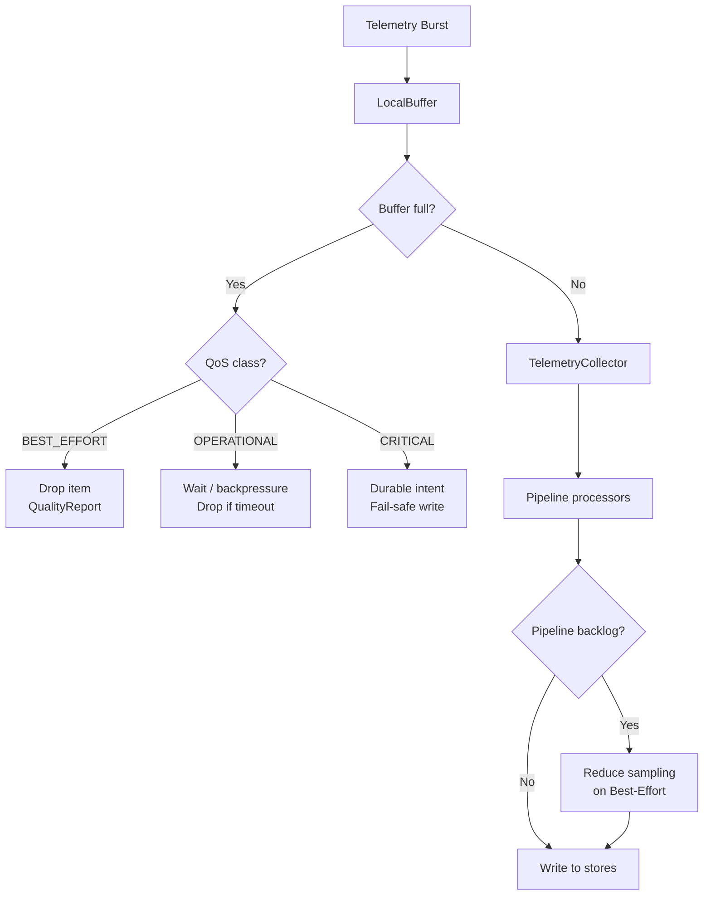
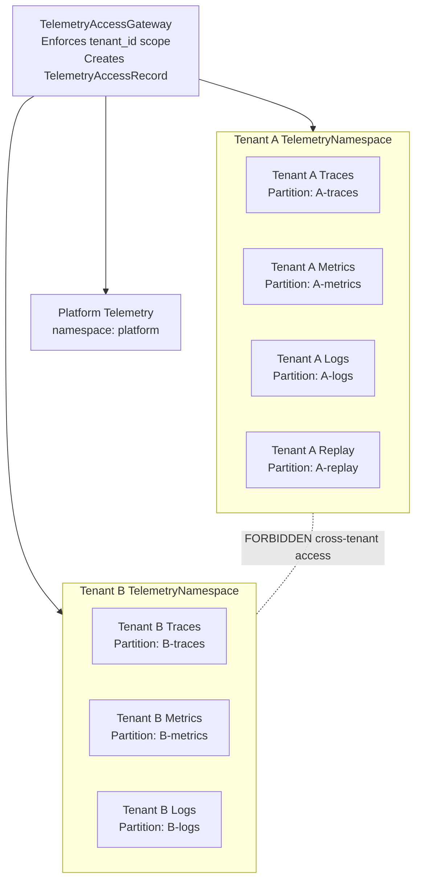

# MYCELIA — 12 Observability & Telemetry Platform

---

## Document Metadata

| Field | Value |
|---|---|
| Document Series | MYCELIA Architecture Constitution |
| Document Number | 12 |
| Version | v1.0 |
| Status | Canonical |
| Classification | Core Architecture — Observability & Telemetry Infrastructure |
| Canonical Role | Defines the observability model, telemetry taxonomy, trace and span architecture, context propagation, telemetry pipeline, replay-safe observability, sampling governance, privacy controls, tenant isolation, and telemetry quality framework for all MYCELIA runtimes |
| Primary Audience | Platform Engineers, SRE Engineers, Observability Architects, Instrumentation Engineers, Codex |
| Last Updated | June 2026 |

---

## Table of Contents

1. [Executive Summary](#1-executive-summary)
2. [Observability Philosophy](#2-observability-philosophy)
3. [Observability Scope and Non-Scope](#3-observability-scope-and-non-scope)
4. [Canonical Observability Domain Model](#4-canonical-observability-domain-model)
5. [Telemetry Taxonomy](#5-telemetry-taxonomy)
6. [Trace and Span Architecture](#6-trace-and-span-architecture)
7. [Context Propagation and Correlation](#7-context-propagation-and-correlation)
8. [Telemetry Envelope and Schema Governance](#8-telemetry-envelope-and-schema-governance)
9. [Runtime Telemetry Pipeline](#9-runtime-telemetry-pipeline)
10. [Telemetry Quality-of-Service Classes](#10-telemetry-quality-of-service-classes)
11. [Sampling and Cardinality Governance](#11-sampling-and-cardinality-governance)
12. [Metrics Architecture](#12-metrics-architecture)
13. [Logs and Structured Runtime Records](#13-logs-and-structured-runtime-records)
14. [Replay-Safe Observability](#14-replay-safe-observability)
15. [Time Semantics and Ordering](#15-time-semantics-and-ordering)
16. [Telemetry Storage, Retention and Archive](#16-telemetry-storage-retention-and-archive)
17. [Telemetry Privacy, Security and Tenant Isolation](#17-telemetry-privacy-security-and-tenant-isolation)
18. [Telemetry Integrity and Tamper Evidence](#18-telemetry-integrity-and-tamper-evidence)
19. [Observability Query and Access Model](#19-observability-query-and-access-model)
20. [Observability Dashboards, Alerts and SLOs](#20-observability-dashboards-alerts-and-slos)
21. [Runtime Debugging and Introspection](#21-runtime-debugging-and-introspection)
22. [Telemetry Governance and Semantic Convention Registry](#22-telemetry-governance-and-semantic-convention-registry)
23. [Telemetry Quality Validation](#23-telemetry-quality-validation)
24. [Observability Failure Model](#24-observability-failure-model)
25. [MVP Observability & Telemetry Cut](#25-mvp-observability--telemetry-cut)
26. [Observability & Telemetry Diagrams](#26-observability--telemetry-diagrams)
27. [Observability & Telemetry Invariants](#27-observability--telemetry-invariants)
28. [Observability & Telemetry Anti-Patterns](#28-observability--telemetry-anti-patterns)
29. [Codex Implementation Guidance](#29-codex-implementation-guidance)
30. [Relationship to Other Documents](#30-relationship-to-other-documents)
31. [Final Observability Principles](#31-final-observability-principles)

---

## 1. Executive Summary

### 1.1 What Observability & Telemetry Platform Means in MYCELIA

The Observability & Telemetry Platform is the disciplined instrumentation substrate that makes MYCELIA's runtime behavior diagnosable, correlatable, replay-aware, and operationally accountable. It does not control execution. It does not own workflow state. It does not produce governance decisions. It provides visibility into what is happening, what happened, and how a replayed execution compares to the original — at the fidelity required for operational diagnosis, SRE response, and forensic investigation.

MYCELIA is a governed, replayable cognitive operations runtime. That means its observability requirements go far beyond application performance monitoring. Observability in MYCELIA must: correlate telemetry across distributed cognitive operations including tool invocations, agent actions, memory retrievals, policy evaluations, and approval gates; support forensic comparison of original and replayed executions; remain tenant-isolated; and govern sensitive payload handling so that instrumentation does not become a vector for data leakage.

### 1.2 Why Observability Is an Operational Substrate

A runtime that cannot explain its own behavior cannot be operated safely at enterprise scale. When a GovernedRun produces an unexpected output, operators need to answer: which steps executed, in what order, with what context, against what policies, with what memory, and under what approval state? Without end-to-end distributed traces correlated to governance decisions and memory retrievals, these questions are unanswerable. MYCELIA's observability platform is the substrate that makes them answerable.

### 1.3 Why Telemetry Is Not the Same as Event History

Document 07 defines the authoritative event envelope for MYCELIA's event-sourced runtime. Those events are the operational source of truth from which workflow state is reconstructed. Telemetry spans, metrics, and logs are diagnostic signals — representations of the same execution at a different level of abstraction, optimized for query, visualization, and correlation rather than authoritative state reconstruction. A telemetry trace does not replace a Document 07 event history. The event history is the authority; the trace is the view.

### 1.4 Why Telemetry Is Not Governance Audit Evidence

Document 11 defines GovernanceAuditRecords as immutable, tamper-evident, forensic-grade evidence records for governance decisions, subject to jurisdictional and chain-of-custody requirements. A distributed trace span recording that a policy evaluation occurred is not a GovernanceAuditRecord. It is a diagnostic signal. Telemetry may correlate with governance evidence (via shared trace_id and correlation_id), but telemetry cannot substitute for audit evidence unless explicitly promoted through the governance pathway defined in Document 11.

### 1.4.1 Legal Evidence Qualification

Telemetry in MYCELIA is designed to be diagnostic, forensic-grade, compliance-ready, and tamper-evident where required.

However, telemetry by itself is not automatically legally admissible evidence.

Legal admissibility depends on jurisdiction, chain of custody, retention procedures, operational controls, applicable law, contractual requirements, and legal review.

### Rules

- Document 12 defines technical telemetry requirements, not legal advice.
- Telemetry MAY support forensic investigation and audit review.
- Telemetry MUST NOT be described as universally legally admissible.
- GovernanceAuditRecords and GovernanceEvidenceBundles are governed by Document 11.
- Security evidence and chain-of-custody requirements are governed by Documents 13 and 17 where applicable.
- Telemetry may be promoted into an evidence workflow only through the proper governance or security evidence pathway.

### Forbidden Behavior

FORBIDDEN:

- claiming that telemetry is universally legally admissible;
- treating dashboards as legal evidence;
- treating debug logs as legal evidence;
- exporting telemetry as evidence without chain-of-custody metadata where required;
- allowing Codex to label telemetry output as legally admissible without governance and legal review.

### 1.5 Why Observability Supports but Does Not Control Execution

Telemetry emission MUST be asynchronous for non-critical telemetry. The telemetry pipeline MUST NOT become a synchronous dependency on the critical execution path. A failing telemetry collector MUST degrade observability, not execution. The only exception is critical telemetry categories (replay lineage, security boundary violations, governance decision traces) where durability requirements are declared and emission may be synchronous by design.

### 1.6 Why Traces, Metrics, and Logs Must Be Correlated

Traces reveal the causal execution path. Metrics measure aggregate runtime health. Logs explain individual events in detail. None of these is sufficient alone. An SRE responding to a latency spike needs the metric to detect it, the trace to identify which workflow step caused it, and the log to understand why. MYCELIA's semantic convention registry and trace context propagation ensure these three signals are correlated through shared trace_id, correlation_id, and run_id.

### 1.7 Why Replay-Safe Telemetry Matters

Canonical replay reconstructs execution from original event history without re-executing side effects. During replay, new telemetry is emitted that represents the replayed execution — different wall-clock times, possibly different latencies, but the same logical path. This replay telemetry MUST be isolated from production telemetry. It MUST use a separate replay namespace and replay_id so that replay signals cannot overwrite, corrupt, or trigger alerts against production baselines.

### 1.8 Core Boundaries

**Observability does not own workflow state.** Document 06 owns state and checkpoints.

**Observability does not own governance decisions.** Document 11 owns governance authority and audit evidence.

**Observability does not own event contracts.** Document 07 owns event envelopes.

**Observability provides visibility, diagnosis, correlation, telemetry quality, and operational evidence.**

---

## 2. Observability Philosophy

### 2.1 Observability-First Architecture

Every component in MYCELIA is instrumented before it is deployed. Instrumentation is not an afterthought added when debugging is needed. An InstrumentationProfile defines what every component must emit, and telemetry quality gates run in CI/CD before code ships to production.

### 2.2 Telemetry as Operational Visibility

Telemetry is the runtime's window into its own behavior. Without telemetry, operators cannot distinguish a slow model provider from a slow memory retrieval, a policy evaluation timeout from a tool failure, or a replay divergence from a legitimate behavior change. MYCELIA's telemetry is comprehensive, correlated, and designed to answer operational questions under time pressure.

### 2.3 Telemetry as Diagnostic Evidence, Not Business Authority

Telemetry diagnoses. It does not decide. A metric showing high approval latency does not bypass an approval gate. A trace showing a policy evaluation span does not constitute a GovernanceAuditRecord. A dashboard showing "no errors" does not constitute evidence of correct governance execution. MYCELIA explicitly enforces this distinction: dashboards are derived views, not authoritative sources.

### 2.4 Replay-Safe Telemetry

Replay generates new telemetry representing the replayed execution. That telemetry must not contaminate production baselines, production alerts, or production retention. Replay telemetry is explicitly namespaced, explicitly labeled with replay_id, and subject to separate retention policies. Forensic comparison between original and replayed execution is possible only because both sets of telemetry are preserved independently and queryable through separate access paths.

### 2.5 Telemetry Minimalism and High Signal Over Noise

More instrumentation is not better instrumentation. Verbose debug logging on hot execution paths degrades performance and increases storage cost. MYCELIA's observability governance defines what must be instrumented (per InstrumentationProfile), what may be instrumented by default, and what requires explicit configuration. Telemetry quality is measured by signal-to-noise ratio, not volume.

### 2.6 Privacy-Preserving Instrumentation

Raw prompt text, raw model outputs, raw tool payloads, raw document content, and PII MUST NOT appear in telemetry by default. Sensitive payloads are referenced by artifact ID and content hash, not embedded. This is not only a privacy requirement — it also prevents telemetry from becoming an uncontrolled exfiltration channel for sensitive data.

### 2.7 Canonical Distinctions

| Concept A | Concept B | Distinction |
|---|---|---|
| **Telemetry** | **Domain events** | Diagnostic signal vs authoritative state event (Document 07) |
| **Telemetry** | **GovernanceAuditRecord** | Diagnostic evidence vs legally admissible governance evidence (Document 11)
| **Telemetry** | **Business state** | Operational signal vs authoritative execution state (Document 06) |
| **Telemetry** | **Checkpoint** | Diagnostic view vs durable execution recovery point (Document 06) |
| **Span event** | **Document 07 event** | Span-attached telemetry annotation vs authoritative event-sourced record |
| **Trace** | **Workflow run** | Diagnostic representation of execution vs authoritative run record |
| **correlation_id** | **trace_id** | Logical grouping across events and traces vs distributed tracing identifier |
| **causation_id** | **span parent** | Document 07 event causality vs span hierarchy in distributed trace |
| **Telemetry retention** | **Audit retention** | Diagnostic data lifecycle vs legally mandated evidence retention |
| **Debug log** | **Evidence record** | Samplable, mutable diagnostic artifact vs immutable audit evidence |
| **Metric label** | **Business identifier** | Bounded, governed attribute vs potentially unbounded entity identifier |
| **Dashboard** | **Source of truth** | Derived visualization vs authoritative authoritative data store |

### 2.8 Telemetry-to-Evidence Promotion Boundary

Telemetry may support audit review, forensic investigation, incident response, and governance explanation.

However, telemetry MUST NOT become authoritative audit evidence merely because it is correlated with a governance, security, or replay event.

### Promotion Rule

A telemetry item may become part of an evidence bundle only when explicitly promoted through the appropriate evidence pathway:

| Telemetry Source | Evidence Pathway |
|---|---|
| Governance telemetry | GovernanceEvidenceBundle through Document 11 |
| Security telemetry | Security evidence pathway through Document 13 |
| Replay telemetry | Investigation or replay evidence pathway through Documents 06, 10, 11 and 22 |
| Telemetry access records | TelemetryAccessAuditStore and security/governance review |
| Archive integrity proof | TelemetryArchive evidence support, not standalone legal evidence |

### Required Promotion Metadata

Evidence promotion MUST preserve:

- original telemetry item ID;
- tenant_id;
- trace_id;
- span_id when applicable;
- correlation_id;
- causation_id when applicable;
- actor_id when applicable;
- runtime_identity_id;
- access purpose;
- source store;
- integrity hash;
- retention class;
- chain-of-custody reference when required.

### Rules

- Telemetry is diagnostic by default.
- Evidence promotion MUST be explicit.
- Evidence promotion MUST be auditable.
- Evidence promotion MUST NOT mutate the original telemetry item.
- Promoted evidence MUST reference the original telemetry item instead of copying uncontrolled payloads.
- Dashboards MUST NOT be promoted as evidence. The underlying records may be referenced if eligible.

### Forbidden Behavior

FORBIDDEN:

- treating telemetry as audit evidence by default;
- promoting sampled debug logs as governance evidence;
- promoting dashboards as evidence records;
- copying sensitive telemetry payloads into evidence bundles without redaction policy;
- allowing Codex to create an implicit telemetry-to-audit shortcut.

---

## 3. Observability Scope and Non-Scope

### 3.1 What Document 12 Owns

| Responsibility | Description |
|---|---|
| Observability model | Architecture, components, data flows, and contracts |
| Telemetry taxonomy | Classification of all telemetry types in MYCELIA |
| Trace model | Trace and span schema, hierarchy, naming, lifecycle |
| Span model | Span kinds, attributes, events, links, status |
| Log model | Structured logging schema, correlation, retention |
| Metric model | Metric families, naming, labels, cardinality, retention |
| Runtime signal model | Internal operational signals and their handling |
| Telemetry envelope | TelemetryEnvelope schema and schema governance |
| Telemetry pipeline | Collector, enrichment, redaction, routing, storage |
| Instrumentation profiles | Per-component telemetry contracts |
| Semantic conventions | Registry, versioning, enforcement |
| Telemetry collection | SDK integration, OTLP, local buffering |
| Telemetry routing | Processors, brokers, destinations |
| Telemetry enrichment | Context injection, attribute augmentation |
| Telemetry storage tiers | Hot/warm/cold/archive tiers and tiering rules |
| Replay telemetry isolation | Replay namespace, replay_id, isolation rules |
| Telemetry sampling governance | Head, tail, adaptive sampling; preservation rules |
| Telemetry cardinality governance | Label allowlist, denylist, cardinality budgets |
| Telemetry privacy and masking | Redaction, hashing, secret exclusion |
| Telemetry quality validation | Schema validation, orphan detection, integrity checks |
| Observability metrics and alerts | Platform self-observability |
| Debugging and introspection model | Trace-first debugging, divergence analysis |
| MVP observability cut | Minimum viable observability capabilities |

### 3.2 What Document 12 Does Not Own

| Responsibility | Owned By |
|---|---|
| Authoritative event contracts | Document 07 (Event & Messaging Contracts) |
| Event broker mechanics | Document 08 (Event Runtime) |
| Authoritative governance audit records | Document 11 (Governance, Policy & Approval) |
| Business state persistence | Document 06 (State, Checkpoint & Persistence) |
| Workflow scheduling | Document 09 (Workflow Orchestration) |
| Tool execution contracts | Document 15 (SDK & Tool Runtime) |
| Security identity provider | Document 13 (Security & Trust) |
| Tenant boundary enforcement internals | Document 14 (Multi-Tenant Isolation) |
| Infrastructure deployment | Document 16 (Infrastructure) |
| SRE incident procedures | Document 17 (SRE) |
| Investigation UX and replay UI | Document 22 (Investigation Mode, Replay & Diff UX) |

### 3.3 Ownership Matrix

| Capability | Document 12 | Sibling Document |
|---|---|---|
| Trace model | Defines | — |
| GovernanceAuditRecord schema | Consumes trace_id; not owner | Doc 11 defines |
| Event envelope schema | Consumes correlation_id; not owner | Doc 07 defines |
| Workflow run state | Emits telemetry; not owner | Doc 06 and Doc 09 own |
| Policy evaluation traces | Emits spans | Doc 11 produces decisions |
| Approval spans | Emits spans | Doc 11 manages approval state |
| Memory retrieval spans | Emits spans | Doc 10 manages memory |
| Security event telemetry | Emits correlated spans | Doc 13 owns security events |
| Tenant isolation enforcement | Emits telemetry within boundary | Doc 14 enforces isolation |
| SRE runbooks for telemetry failures | Defines failure modes | Doc 17 defines procedures |
| Investigation replay UI | Defines replay telemetry model | Doc 22 builds visualization |

---

## 4. Canonical Observability Domain Model

### 4.1 Entity Reference

#### TelemetryNamespace

| Attribute | Value |
|---|---|
| Purpose | Logical isolation boundary for all telemetry belonging to a tenant, workspace, replay session, or platform scope |
| Owner service | ObservabilityControlPlane |
| Source of truth | TelemetryMetadataStore (durable) |
| Mutability | Immutable once created; metadata updateable |
| Tenant scope | MUST belong to exactly one tenant unless platform-scoped |
| Replay behavior | Replay uses separate replay namespace with replay_id |
| Retention | Governed by TelemetryRetentionPolicy |
| Security classification | Sensitive |
| Event/audit implications | NamespaceCreated event; access logged |

#### TelemetryEnvelope

| Attribute | Value |
|---|---|
| Purpose | Transport container for one or more telemetry items sharing a common context; carries schema version, tenant_id, trace context, sensitivity class, QoS class, and payload hash |
| Owner service | TelemetryEmitter / InstrumentationSDK |
| Source of truth | Transit; not persisted as-is; items are extracted on ingestion |
| Mutability | Immutable in transit; items are separated on arrival |
| Tenant scope | Bound to tenant_id |
| Replay behavior | Replay envelopes carry replay_id and replay namespace |
| Retention | Transient; items retained per item retention class |
| Security classification | Varies by contained items |
| Event/audit implications | Validation failure produces TelemetryQualityReport |

#### Trace

| Attribute | Value |
|---|---|
| Purpose | End-to-end record of a distributed execution: a tree of Spans sharing a common trace_id, representing a single GovernedRun, agent interaction, or system operation |
| Owner service | TraceStore |
| Source of truth | TraceStore (durable) |
| Mutability | Append-only; new spans added; no span mutated after close |
| Tenant scope | Bound to tenant_id |
| Replay behavior | Replays produce separate ReplayTrace with replay_id |
| Retention | Governed by TelemetryRetentionPolicy (retention class: operational or replay) |
| Security classification | Sensitive |
| Event/audit implications | Trace arrival triggers optional integrity check |

#### Span

| Attribute | Value |
|---|---|
| Purpose | A single unit of work within a Trace: records operation name, start/end timestamps, status, attributes, events, and links; carries trace_id, span_id, and parent_span_id |
| Owner service | TraceStore |
| Source of truth | TraceStore |
| Mutability | Immutable after close |
| Tenant scope | Inherits from parent Trace |
| Replay behavior | Replay produces ReplaySpan; originals unmodified |
| Retention | Same as parent Trace |
| Security classification | Sensitive (may carry trace context referencing PII-adjacent operations) |
| Event/audit implications | Orphan span detection produces TelemetryQualityReport |

#### SpanEvent

| Attribute | Value |
|---|---|
| Purpose | A timestamped annotation attached to a Span recording a discrete event within the span's lifetime (e.g., "approval decision received", "tool output received") |
| Owner service | TraceStore |
| Source of truth | TraceStore (embedded in span) |
| Mutability | Immutable after span close |
| Tenant scope | Inherits from parent Span |
| Replay behavior | Attached to ReplaySpan |
| Retention | Same as parent Span |
| Security classification | Sensitive |
| Event/audit implications | None directly |

#### SpanLink

| Attribute | Value |
|---|---|
| Purpose | An explicit cross-trace or cross-span causal reference: links a Span to a related Span in a different trace (e.g., a workflow step triggered by an async event) |
| Owner service | TraceStore |
| Source of truth | TraceStore (embedded in span) |
| Mutability | Immutable after span close |
| Tenant scope | Inherits from parent Span; linked span MUST be same tenant |
| Replay behavior | Preserved in ReplaySpan; linked spans are original or replay-mapped |
| Retention | Same as parent Span |
| Security classification | Sensitive |
| Event/audit implications | Cross-tenant span link is a security violation |

#### StructuredLog

| Attribute | Value |
|---|---|
| Purpose | A structured, machine-readable log record emitted by a runtime component; MUST carry trace_id, span_id, tenant_id, severity level, and correlation_id; MUST NOT contain raw secrets or PII |
| Owner service | LogStore |
| Source of truth | LogStore |
| Mutability | Immutable after write |
| Tenant scope | Bound to tenant_id |
| Replay behavior | Replay logs carry replay_id; stored in replay namespace |
| Retention | Governed by retention class (debug: short; governance-adjacent: longer) |
| Security classification | Sensitive |
| Event/audit implications | Secret detection triggers redaction event |

#### RuntimeMetric

| Attribute | Value |
|---|---|
| Purpose | A time-series data point representing a system-level operational signal: CPU, memory, GC pauses, queue depth, connection pool utilization |
| Owner service | MetricsStore |
| Source of truth | MetricsStore (append-only time series) |
| Mutability | Append-only; no historical mutation |
| Tenant scope | Bound to tenant_id (or platform-scoped) |
| Replay behavior | Replay may produce replay-namespaced metrics |
| Retention | Per retention class (operational or short-term) |
| Security classification | Internal |
| Event/audit implications | High cardinality burst triggers TelemetryQualityReport |

#### ExecutionMetric

| Attribute | Value |
|---|---|
| Purpose | A time-series data point measuring cognitive operation execution: workflow run duration, step latency, token consumption, model invocation count |
| Owner service | MetricsStore |
| Source of truth | MetricsStore |
| Mutability | Append-only |
| Tenant scope | Bound to tenant_id |
| Replay behavior | Replay produces replay-namespaced execution metrics |
| Retention | Operational retention class |
| Security classification | Sensitive |
| Event/audit implications | None directly |

#### GovernanceMetric

| Attribute | Value |
|---|---|
| Purpose | A time-series data point measuring governance runtime: policy evaluation count and latency, approval request count, approval latency, break-glass count, escalation count |
| Owner service | MetricsStore |
| Source of truth | MetricsStore |
| Mutability | Append-only |
| Tenant scope | Bound to tenant_id |
| Replay behavior | Replay produces replay-namespaced governance metrics |
| Retention | Governance-adjacent retention class |
| Security classification | Sensitive |
| Event/audit implications | Not a substitute for GovernanceAuditRecord (Document 11) |

#### SecurityMetric

| Attribute | Value |
|---|---|
| Purpose | A time-series data point measuring security boundary health: access denial count, cross-tenant attempt count, secret detection count, identity verification failure count |
| Owner service | MetricsStore |
| Source of truth | MetricsStore |
| Mutability | Append-only |
| Tenant scope | Bound to tenant_id (or platform) |
| Replay behavior | Replay produces replay-namespaced security metrics |
| Retention | Security retention class |
| Security classification | Highly Sensitive |
| Event/audit implications | Not a substitute for security audit evidence (Document 13) |

#### ReplayMetric

| Attribute | Value |
|---|---|
| Purpose | A time-series data point measuring replay execution: replay runs, divergence count, hydration success/failure, replay-vs-original comparison score |
| Owner service | MetricsStore |
| Source of truth | MetricsStore |
| Mutability | Append-only |
| Tenant scope | Bound to tenant_id |
| Replay behavior | IS a replay artifact |
| Retention | Replay retention class |
| Security classification | Sensitive |
| Event/audit implications | Divergence count alert |

#### TenantMetric

| Attribute | Value |
|---|---|
| Purpose | A time-series data point measuring per-tenant resource consumption: run count, token budget usage, storage consumption, API call count |
| Owner service | MetricsStore |
| Source of truth | MetricsStore |
| Mutability | Append-only |
| Tenant scope | Bound to tenant_id |
| Replay behavior | Replay excluded from production tenant metrics |
| Retention | Operational retention class |
| Security classification | Sensitive |
| Event/audit implications | Quota breach alert |

#### CostMetric

| Attribute | Value |
|---|---|
| Purpose | Estimated cost attribution per tenant, workspace, or project: model inference cost, storage cost, compute cost |
| Owner service | MetricsStore / CostService |
| Source of truth | MetricsStore (derived from other metrics) |
| Mutability | Append-only |
| Tenant scope | Bound to tenant_id |
| Replay behavior | Replay cost excluded from production cost metrics |
| Retention | Operational + FinOps retention class |
| Security classification | Sensitive |
| Event/audit implications | Budget threshold alert |

#### RuntimeSignal

| Attribute | Value |
|---|---|
| Purpose | An internal operational observation from the runtime engine: heartbeat, checkpoint marker, resource pressure indicator, circuit breaker state change |
| Owner service | ObservabilityControlPlane |
| Source of truth | TelemetryMetadataStore |
| Mutability | Append-only |
| Tenant scope | Bound to tenant_id or platform |
| Replay behavior | Replay signals carry replay_id |
| Retention | Short operational retention |
| Security classification | Internal |
| Event/audit implications | Anomalous signal triggers alert |

#### TelemetrySnapshot

| Attribute | Value |
|---|---|
| Purpose | A point-in-time capture of metric state, trace state, or execution graph state at a key moment (e.g., mid-workflow diagnostic checkpoint) |
| Owner service | ObservabilityControlPlane |
| Source of truth | TelemetryMetadataStore |
| Mutability | Immutable after creation |
| Tenant scope | Bound to tenant_id |
| Replay behavior | Replay produces ReplayTelemetrySnapshot |
| Retention | Operational retention class |
| Security classification | Sensitive |
| Event/audit implications | None directly |

#### ExecutionGraphSnapshot

| Attribute | Value |
|---|---|
| Purpose | A TelemetrySnapshot specialization capturing the workflow execution graph (nodes and edges) at a specific instant; used for debugging and replay divergence analysis |
| Owner service | ObservabilityControlPlane |
| Source of truth | TelemetryMetadataStore |
| Mutability | Immutable |
| Tenant scope | Bound to tenant_id |
| Replay behavior | Replay produces ReplayExecutionGraphSnapshot |
| Retention | Operational retention class |
| Security classification | Sensitive |
| Event/audit implications | Divergence detected if replay graph differs structurally |

#### ReplayTrace

| Attribute | Value |
|---|---|
| Purpose | A Trace produced during a replay execution; isolated from original production traces; carries replay_id and original_trace_id for correlation; MUST NOT overwrite original |
| Owner service | TraceStore (replay namespace) |
| Source of truth | TraceStore (replay partition) |
| Mutability | Append-only during replay; immutable after completion |
| Tenant scope | Bound to original tenant_id |
| Replay behavior | IS the replay artifact |
| Retention | Replay retention class |
| Security classification | Sensitive |
| Event/audit implications | Divergence events emitted if replay diverges |

#### ReplaySpan

| Attribute | Value |
|---|---|
| Purpose | A Span produced during replay; isolated from original spans; carries replay_id; mapped to original span_id for comparison |
| Owner service | TraceStore (replay namespace) |
| Source of truth | TraceStore |
| Mutability | Immutable after close |
| Tenant scope | Bound to original tenant_id |
| Replay behavior | IS the replay artifact |
| Retention | Replay retention class |
| Security classification | Sensitive |
| Event/audit implications | None directly |

#### CorrelationChain

| Attribute | Value |
|---|---|
| Purpose | An ordered grouping of spans, events, and log records sharing a common correlation_id; groups logically related operations that may span multiple traces or async boundaries |
| Owner service | TelemetryIndex |
| Source of truth | TelemetryIndex (derived) |
| Mutability | Append-only as new items are correlated |
| Tenant scope | Bound to tenant_id |
| Replay behavior | Replay correlation chains carry replay_id |
| Retention | Same as highest-retention item in the chain |
| Security classification | Sensitive |
| Event/audit implications | None directly |

#### CausationChain

| Attribute | Value |
|---|---|
| Purpose | An ordered sequence of causally linked operations derived from Document 07 causation_id chain; maps event causality into telemetry for forensic investigation |
| Owner service | TelemetryIndex |
| Source of truth | TelemetryIndex (derived from Document 07 event chain) |
| Mutability | Append-only |
| Tenant scope | Bound to tenant_id |
| Replay behavior | Replay produces separate causation chain |
| Retention | Same as highest-retention item |
| Security classification | Sensitive |
| Event/audit implications | None directly |

#### TelemetrySource

| Attribute | Value |
|---|---|
| Purpose | Identifies the component that produced a telemetry item: service name, version, runtime_identity_id, host |
| Owner service | InstrumentationSDK |
| Source of truth | Embedded in TelemetryEnvelope |
| Mutability | Immutable per item |
| Tenant scope | Carried through to all items |
| Replay behavior | Replay items carry original source + replay label |
| Retention | Embedded in item; same retention |
| Security classification | Internal |
| Event/audit implications | Unrecognized source triggers quality alert |

#### InstrumentationProfile

| Attribute | Value |
|---|---|
| Purpose | A versioned specification of what a component MUST emit: required spans, required metrics, required log fields, span naming conventions, and attribute requirements |
| Owner service | ObservabilityControlPlane |
| Source of truth | SemanticConventionRegistry (source-controlled) |
| Mutability | Versioned; immutable per version |
| Tenant scope | Platform-scoped (component profiles); tenant-scoped instrumentation additions |
| Replay behavior | Profile version recorded in telemetry schema |
| Retention | Permanent (for audit and debugging) |
| Security classification | Internal |
| Event/audit implications | Profile compliance checked in CI/CD |

#### SemanticConvention

| Attribute | Value |
|---|---|
| Purpose | A versioned naming and attribute rule for a specific span, metric, or log record type; defines allowed attributes, cardinality class, sensitivity class, and retention class |
| Owner service | ObservabilityControlPlane |
| Source of truth | SemanticConventionRegistry |
| Mutability | Versioned; immutable per version |
| Tenant scope | Platform-scoped |
| Replay behavior | Convention version recorded in all telemetry items |
| Retention | Permanent |
| Security classification | Internal |
| Event/audit implications | Unregistered telemetry triggers quality alert |

#### TelemetrySchemaVersion

| Attribute | Value |
|---|---|
| Purpose | Version identifier for the TelemetryEnvelope and item schemas; enables compatibility checking and migration planning |
| Owner service | ObservabilityControlPlane |
| Source of truth | SemanticConventionRegistry |
| Mutability | Immutable per version |
| Tenant scope | Platform-scoped |
| Replay behavior | Schema version in historical telemetry preserved for replay validation |
| Retention | Permanent |
| Security classification | Internal |
| Event/audit implications | Schema drift triggers migration alert |

#### TelemetryPartition

| Attribute | Value |
|---|---|
| Purpose | A physical storage shard for telemetry data; typically keyed by tenant_id + time window; enforces tenant isolation at storage level |
| Owner service | TelemetryStore infrastructure |
| Source of truth | TelemetryStore |
| Mutability | Immutable once sealed; new data enters new partitions |
| Tenant scope | Partitioned per tenant_id |
| Replay behavior | Replay partitions are separate from production partitions |
| Retention | Per TelemetryRetentionPolicy |
| Security classification | Sensitive |
| Event/audit implications | Partition integrity check on close |

#### TelemetryIndex

| Attribute | Value |
|---|---|
| Purpose | Query-optimized index over telemetry data for trace search, metric query, log search, and cross-signal correlation |
| Owner service | TelemetryQueryGateway |
| Source of truth | Derived from TelemetryStore (retrieval accelerator, not source of truth) |
| Mutability | Append-only updates |
| Tenant scope | Namespace-partitioned per tenant |
| Replay behavior | Replay index is separate partition |
| Retention | Per TelemetryRetentionPolicy |
| Security classification | Sensitive |
| Event/audit implications | Index lag produces quality alert |

#### TelemetryRetentionPolicy

| Attribute | Value |
|---|---|
| Purpose | Defines retention periods and storage tier transitions for each telemetry class, including debug, operational, replay, security, governance-adjacent, and legal hold |
| Owner service | ObservabilityControlPlane |
| Source of truth | GovernanceStore / ConfigStore |
| Mutability | Versioned |
| Tenant scope | Tenant-scoped with platform minimums |
| Replay behavior | Replay telemetry uses replay retention class |
| Retention | Policy itself is permanent |
| Security classification | Sensitive |
| Event/audit implications | Policy update produces audit record |

#### TelemetryArchive

| Attribute | Value |
|---|---|
| Purpose | Long-term, potentially WORM (Write Once Read Many) cold storage for telemetry items past their operational tier; preserves hash metadata for integrity verification on restoration |
| Owner service | ArchiveWriter |
| Source of truth | Archive storage |
| Mutability | WORM (no mutation after archive write) |
| Tenant scope | Bound to tenant_id |
| Replay behavior | Archived telemetry accessible for forensic investigation with restore path |
| Retention | Per TelemetryRetentionPolicy archive tier |
| Security classification | Highly Sensitive |
| Event/audit implications | Archive write produces ArchiveIntegrityRecord |

#### TelemetryAccessRecord

| Attribute | Value |
|---|---|
| Purpose | An immutable record of a telemetry query or export operation that accessed sensitive telemetry; includes actor_id, query scope, purpose, and timestamp |
| Owner service | TelemetryAccessGateway |
| Source of truth | TelemetryAccessAuditStore (append-only) |
| Mutability | Immutable |
| Tenant scope | Bound to queried tenant_id |
| Replay behavior | Access records for forensic investigation preserved |
| Retention | Security audit retention class |
| Security classification | Highly Sensitive |
| Event/audit implications | Cross-tenant access attempt triggers security event |

#### TelemetryIntegrityProof

| Attribute | Value |
|---|---|
| Purpose | A cryptographic hash or hash chain over a set of telemetry items (typically a sealed archive batch or a critical trace segment) enabling tamper detection on restoration |
| Owner service | ArchiveWriter / ObservabilityControlPlane |
| Source of truth | Attached to TelemetryArchive or critical TelemetryPartition |
| Mutability | Immutable |
| Tenant scope | Bound to tenant_id |
| Replay behavior | Verified during forensic replay |
| Retention | Same as parent archive |
| Security classification | Internal |
| Event/audit implications | Hash mismatch triggers security alert |

#### TelemetryQualityReport

| Attribute | Value |
|---|---|
| Purpose | A validation report recording telemetry quality violations: orphan spans, missing tenant_id, schema version mismatch, forbidden labels, raw secrets, cardinality burst |
| Owner service | TelemetryQualityValidator |
| Source of truth | TelemetryMetadataStore |
| Mutability | Immutable |
| Tenant scope | Bound to tenant_id |
| Replay behavior | Quality reports for replay telemetry are in replay namespace |
| Retention | Short operational retention |
| Security classification | Internal |
| Event/audit implications | Critical violations trigger alerts |

#### TelemetrySamplingPolicy

| Attribute | Value |
|---|---|
| Purpose | Versioned rules governing which telemetry items may be sampled, at what rate, with what preservation guarantees for lineage and ancestry |
| Owner service | ObservabilityControlPlane |
| Source of truth | ConfigStore |
| Mutability | Versioned |
| Tenant scope | Tenant-scoped with platform sampling floor |
| Replay behavior | Replay disables destructive sampling |
| Retention | Policy itself is permanent |
| Security classification | Sensitive |
| Event/audit implications | Sampling policy change produces audit record |

#### TelemetryCardinalityPolicy

| Attribute | Value |
|---|---|
| Purpose | Versioned rules defining which metric labels are allowed, what cardinality budgets apply, and what action to take when budgets are exceeded |
| Owner service | ObservabilityControlPlane |
| Source of truth | ConfigStore |
| Mutability | Versioned |
| Tenant scope | Tenant-scoped with platform cardinality limits |
| Replay behavior | N/A |
| Retention | Policy itself is permanent |
| Security classification | Internal |
| Event/audit implications | Cardinality burst triggers TelemetryQualityReport |

#### TelemetryCostPolicy

| Attribute | Value |
|---|---|
| Purpose | Rules governing acceptable telemetry volume, storage cost per tenant, and automatic cost reduction actions (sampling increase, retention decrease) when budgets are exceeded |
| Owner service | ObservabilityControlPlane / CostService |
| Source of truth | ConfigStore |
| Mutability | Versioned |
| Tenant scope | Tenant-scoped |
| Replay behavior | N/A |
| Retention | Policy itself is permanent |
| Security classification | Sensitive |
| Event/audit implications | Budget breach triggers alert and cost governance action |

### 4.2 Entity Relationship Diagram



---

## 5. Telemetry Taxonomy

### 5.1 Taxonomy Matrix

| Telemetry Class | Purpose | Producers | Consumers | Retention Class | Sensitivity | Sampling Eligible | Replay Relevant | Tenant Isolated | QoS Class |
|---|---|---|---|---|---|---|---|---|---|
| **Runtime Telemetry** | System-level operational health: CPU, memory, network, queue depths | InfraAgent, RuntimeHost | SRE, Dashboards | Short operational | Internal | Yes | No | Platform/Tenant | Best-Effort |
| **Orchestration Telemetry** | Workflow orchestration spans, step transitions, scheduling events | WorkflowOrchestrator | Engineering, SRE | Operational | Sensitive | Head sample allowed | Yes | Yes | Operational |
| **Execution Telemetry** | Individual step execution spans, retries, compensation | StepExecutor, Workers | Engineering, SRE | Operational | Sensitive | Head sample allowed | Yes | Yes | Operational |
| **Agent Telemetry** | Agent action spans, reasoning spans, loop detection events | AgentRuntime | Engineering | Operational | Sensitive | Head sample allowed | Yes | Yes | Operational |
| **Cognitive Telemetry** | Model invocation spans, token counts, latency, model provider | CognitiveExecution | Engineering, ML | Operational | Highly Sensitive | Head sample allowed | Yes | Yes | Operational |
| **Tool Telemetry** | Tool invocation spans, tool latency, tool errors, capability restriction | ToolGateway | Engineering, SRE | Operational | Sensitive | Head sample allowed | Yes | Yes | Operational |
| **Memory Telemetry** | Memory retrieval spans, index latency, snapshot creation, quarantine events | MemoryService | Engineering | Operational | Highly Sensitive | Head sample allowed | Yes | Yes | Operational |
| **Governance Telemetry** | Policy evaluation spans, approval spans, enforcement action spans | PolicyDecisionGateway, ApprovalEngine | Governance, SRE | Governance-adjacent | Highly Sensitive | NO destructive sampling | Yes | Yes | **Critical** |
| **Security Telemetry** | Identity verification spans, access denial spans, cross-tenant attempt signals | SecurityService, PEP | Security, SRE | Security | Highly Sensitive | NO destructive sampling | Yes | Yes | **Critical** |
| **Integration Telemetry** | External API call spans, external service latency, integration errors | ExternalAPIGateway | Engineering, SRE | Operational | Sensitive | Head sample allowed | Yes | Yes | Operational |
| **Replay Telemetry** | Replay traces, replay spans, divergence events, hydration metrics | ReplayService | Engineering, SRE | Replay | Sensitive | NO destructive sampling | IS replay | Yes (isolated) | **Critical** |
| **Audit-Adjacent Telemetry** | Spans correlated to governance events but not authoritative evidence | Multiple | Governance (diagnostic only) | Governance-adjacent | Highly Sensitive | NO destructive sampling | Yes | Yes | **Critical** |
| **Infrastructure Telemetry** | Host metrics, container metrics, network metrics | InfraAgent | SRE | Short operational | Internal | Yes | No | Platform | Best-Effort |
| **Cost/FinOps Telemetry** | Token consumption, storage cost, compute cost per tenant | CostService | Finance, Engineering | FinOps | Sensitive | No | No | Yes | Operational |
| **Debug Telemetry** | Verbose diagnostic traces, developer debugging spans, profiling | DebugSDK | Engineering | Debug (very short) | Varies | Yes (aggressive) | No (by default) | Yes | Best-Effort |
| **Tenant Usage Telemetry** | Per-tenant run count, API call count, quota consumption | MetricsService | Operations, Product | Operational | Sensitive | No | No | Yes | Operational |

### 5.2 Taxonomy Notes

Governance Telemetry is NOT GovernanceAuditRecord. A policy evaluation span records that evaluation occurred, at what latency, with what outcome code. The authoritative record of the decision and its evidence is the GovernanceAuditRecord in Document 11's AuditStore. Governance Telemetry supports debugging and operational monitoring; it does not constitute legal evidence.

Security Telemetry is NOT security audit evidence unless explicitly promoted through Document 13's security evidence pathway.

---

## 6. Trace and Span Architecture

### 6.1 Trace Model

A Trace is the end-to-end diagnostic record of a distributed execution. Every Trace has a globally unique `trace_id` (16 bytes, W3C Trace Context compatible). Every Trace belongs to exactly one tenant namespace. Every Trace has a root Span that represents the top-level operation.

For GovernedRuns, the Trace lifecycle mirrors the run lifecycle:
- Trace created when GovernedRun is initialized.
- Root span opened with `workflow.run` semantic convention.
- Child spans created for each step, tool invocation, cognitive invocation, memory retrieval, and policy evaluation.
- Trace closed when GovernedRun reaches a terminal state.

### 6.2 Span Model

Each Span records:

```
Span {
  trace_id:         16-byte globally unique identifier (W3C compatible)
  span_id:          8-byte identifier unique within trace
  parent_span_id:   8-byte parent span_id (null for root span)
  span_name:        string (registered in SemanticConventionRegistry)
  span_kind:        CLIENT | SERVER | PRODUCER | CONSUMER | INTERNAL
  span_status:      UNSET | OK | ERROR
  start_time:       nanosecond precision timestamp
  end_time:         nanosecond precision timestamp
  attributes:       key-value pairs (governed by SemanticConvention)
  events:           list of SpanEvents (timestamped annotations)
  links:            list of SpanLinks (cross-trace references)
  tenant_id:        required
  correlation_id:   required for governed execution
  run_id:           optional (when within a GovernedRun)
  step_id:          optional (when within a workflow step)
  replay_id:        optional (set only during replay)
  schema_version:   required
}
```

### 6.3 Span Kinds

| Span Kind | Usage |
|---|---|
| **INTERNAL** | Operations internal to a single service (memory access, policy evaluation) |
| **CLIENT** | Outbound call from a service to an external service or tool |
| **SERVER** | Inbound request handling in a service |
| **PRODUCER** | Event publication to broker or queue |
| **CONSUMER** | Event consumption from broker or queue |

### 6.4 Named Span Types

| Span Type | Semantic Convention Name | Required Attributes |
|---|---|---|
| Workflow root span | `mycelia.workflow.run` | tenant_id, workflow_id, run_id, workflow_version |
| Step span | `mycelia.workflow.step` | run_id, step_id, step_kind, step_name |
| Tool invocation span | `mycelia.tool.invocation` | tool_id, tool_version, run_id, step_id |
| Agent execution span | `mycelia.agent.execution` | agent_id, run_id, step_id |
| Cognitive invocation span | `mycelia.cognitive.invocation` | model_provider, model_id, run_id, step_id |
| Memory retrieval span | `mycelia.memory.retrieval` | namespace_id, run_id, retrieval_session_id |
| Policy evaluation span | `mycelia.governance.policy.evaluation` | policy_snapshot_id, action, outcome |
| Approval span | `mycelia.governance.approval` | approval_request_id, stage_id, outcome |
| External integration span | `mycelia.integration.external` | integration_id, endpoint_type |
| Replay span | `mycelia.replay.span` | replay_id, original_span_id |

### 6.5 Span Lifecycle Rules

**SP-01.** Every governed run MUST have a root trace.

**SP-02.** Every governed step MUST emit a step span.

**SP-03.** Every tool invocation MUST emit a tool span or span link.

**SP-04.** Every cognitive invocation MUST emit a cognitive span.

**SP-05.** Every memory retrieval MUST emit a memory retrieval span.

**SP-06.** Every policy evaluation SHOULD emit a policy evaluation span.

**SP-07.** Every approval request SHOULD emit an approval span.

**SP-08.** Orphan spans (spans with no parent and no root span classification) are invalid and MUST be quarantined.

**SP-09.** Span names MUST be registered in the SemanticConventionRegistry before production use.

**SP-10.** Span attributes MUST NOT contain raw secrets, raw prompt text, raw model outputs, raw document content, or unbounded cardinality identifiers.

### 6.6 Trace Hierarchy Diagram



---

## 7. Context Propagation and Correlation

### 7.1 W3C Trace Context Boundary

MYCELIA adopts W3C Trace Context for distributed trace propagation.

The `traceparent` header carries the trace identifier, current span identifier, trace flags, and version.

The `tracestate` header MAY carry vendor-specific tracing state, but it MUST NOT be used as a general MYCELIA runtime context container.

MYCELIA runtime correlation fields such as `correlation_id`, `causation_id`, `root_causation_id`, `run_id`, `workflow_id`, `step_id`, `tenant_id`, `replay_id`, and `runtime_identity_id` MUST be carried through MYCELIA runtime envelopes, broker headers, task dispatch payloads, or internal context carriers approved by the relevant architecture documents.

### Trace Context Rules

- `traceparent` carries trace_id and span_id for distributed tracing.
- `tracestate` MAY carry vendor-specific tracing metadata only.
- `tracestate` MUST NOT carry secrets, credentials, policy authority, approval authority, tenant secrets, or authorization decisions.
- `tracestate` MUST NOT be treated as authoritative business context.
- MYCELIA runtime context MUST remain explicit in RuntimeEnvelope, EventEnvelope, task dispatch contracts, and tool/memory/governance gateways.
- Trace context is diagnostic context, not authorization context.

### Forbidden Behavior

FORBIDDEN:

- using `tracestate` as a general runtime context bag;
- storing tenant secrets or credentials in trace headers;
- using trace headers as proof of authorization;
- relying on trace headers as the source of truth for causation;
- allowing Codex to place full MYCELIA execution context into W3C trace headers.

### 7.2 Context Field Reference

| Field | Type | Source | Description |
|---|---|---|---|
| `trace_id` | 16-byte hex | W3C traceparent | Globally unique distributed trace identifier |
| `span_id` | 8-byte hex | W3C traceparent | Current span identifier |
| `parent_span_id` | 8-byte hex | Derived from traceparent | Parent span in trace hierarchy |
| `correlation_id` | UUID | MYCELIA runtime | Groups logically related operations across async boundaries and traces |
| `causation_id` | UUID | Document 07 EventEnvelope | Causal reference matching Document 07 event causation |
| `root_causation_id` | UUID | Document 07 EventEnvelope | Root cause event in causation chain |
| `run_id` | UUID | GovernedRun | Associated workflow run |
| `workflow_id` | UUID | WorkflowDefinition | Workflow definition identifier |
| `step_id` | UUID | WorkflowStep | Current step |
| `replay_id` | UUID | ReplayService | Set during replay; absent in production |
| `tenant_id` | UUID | RuntimeEnvelope | Tenant namespace |
| `runtime_identity_id` | UUID | Document 13 | System actor identity |

### 7.3 Propagation Rules

**PROP-01.** `trace_id`, `span_id`, and `parent_span_id` support distributed tracing per W3C Trace Context.

**PROP-02.** `correlation_id` groups logical runtime operations across traces and events; it is not a trace identifier.

**PROP-03.** `causation_id` represents causal relation defined by Document 07 events; it MUST match the Document 07 event causation chain.

**PROP-04.** Trace context MUST propagate across HTTP, gRPC, broker messages, worker task dispatch, and tool gateways wherever technically feasible.

**PROP-05.** Document 07 EventEnvelope fields remain authoritative for event causality; trace context is the diagnostic view of the same causality.

**PROP-06.** Trace headers MUST NOT be used as authorization context. Authorization is Document 11/13 concern.

**PROP-07.** Missing trace context in governed execution MUST be detected and treated as operational degradation.

**PROP-08.** `replay_id` MUST NOT be present on production telemetry and MUST always be present on replay telemetry.

### 7.4 Propagation Diagram



---

## 8. Telemetry Envelope and Schema Governance

### 8.1 TelemetryEnvelope Schema

```
TelemetryEnvelope {
  envelope_id:            UUID
  schema_version:         required (TelemetrySchemaVersion reference)
  telemetry_item_type:    TRACE | SPAN | LOG | METRIC | SIGNAL | SNAPSHOT
  source: {
    service_name:         string (registered)
    service_version:      string
    runtime_identity_id:  UUID
    host:                 string
  }
  producer:               string (component identifier)
  tenant_id:              required
  trace_context: {
    trace_id:             16-byte hex
    span_id:              8-byte hex
    parent_span_id:       8-byte hex (optional)
    trace_flags:          W3C trace flags
  }
  correlation_context: {
    correlation_id:       UUID
    run_id:               UUID (optional)
    workflow_id:          UUID (optional)
    step_id:              UUID (optional)
  }
  causation_context: {
    causation_id:         UUID (Document 07 reference, optional)
    root_causation_id:    UUID (optional)
  }
  sensitivity_class:      PUBLIC | INTERNAL | SENSITIVE | HIGHLY_SENSITIVE
  qos_class:              CRITICAL | OPERATIONAL | BEST_EFFORT
  retention_class:        DEBUG | OPERATIONAL | REPLAY | SECURITY | GOVERNANCE_ADJACENT | LEGAL_HOLD
  replay_context: {
    replay_id:            UUID (present only during replay)
    original_trace_id:    UUID (optional; present during replay)
    replay_mode:          CANONICAL | INVESTIGATION | SIMULATION
  }
  payload_hash:           SHA-256 of item content (optional; required for CRITICAL)
  envelope_hash:          SHA-256 of envelope fields
  emitted_at:             nanosecond timestamp
  items:                  list of telemetry items (spans, logs, metrics)
}
```

### 8.2 Schema Governance Rules

**SCHEMA-01.** Every telemetry item MUST declare schema_version.

**SCHEMA-02.** Critical telemetry MUST be schema-validated against the SemanticConventionRegistry before ingestion into TraceStore or LogStore.

**SCHEMA-03.** Telemetry with broken schema MUST be rejected or quarantined with a TelemetryQualityReport.

**SCHEMA-04.** Semantic conventions MUST be versioned. Schema changes require a new TelemetrySchemaVersion.

**SCHEMA-05.** Schema changes that would break dashboards, alerts, or replay diagnostics require a migration plan approved before the new version is activated.

**SCHEMA-06.** Unregistered span names and metric names MUST be flagged as quality violations.

---

## 9. Runtime Telemetry Pipeline

### 9.1 Pipeline Components

#### InstrumentationSDK
Generates spans, logs, and metrics within application components. OpenTelemetry-compatible. Provides trace context propagation utilities. Implements local buffering. Responsibility: emit TelemetryEnvelopes; apply sensitivity and QoS class.

#### TelemetryEmitter
Component-level emission adapter. Routes to LocalBuffer for asynchronous delivery. For CRITICAL QoS: may use synchronous durable intent before returning. Responsibility: decouple application code from collector transport.

#### LocalBuffer
In-process or local-process buffer that absorbs telemetry bursts and decouples emission from collector availability. Bounded size; when full, applies QoS-based drop policy (Best-Effort dropped first). Responsibility: backpressure absorption without blocking application.

#### TelemetryCollector
OpenTelemetry Collector or equivalent. Receives TelemetryEnvelopes via OTLP. Applies enrichment, redaction, sampling, and routing. Responsibility: central processing before storage.

#### OTLPReceiver
Receives OTLP (gRPC or HTTP) from InstrumentationSDK or agents. Validates envelope schema. Passes to pipeline processors.

#### EnrichmentProcessor
Adds context that instrumentation cannot add (e.g., tenant metadata lookup, geography, service topology). Responsibility: augment items with stable derived attributes.

#### RedactionProcessor
Applies masking, hashing, and redaction rules before sensitive telemetry reaches lower-trust stores. Scans for secrets, PII patterns, raw prompts. Responsibility: privacy-preserving transformation before storage.

#### SamplingProcessor
Applies TelemetrySamplingPolicy: head sampling for debug telemetry; tail sampling for latency-biased sampling. CRITICAL QoS items bypass destructive sampling. Responsibility: volume reduction without losing critical lineage.

#### RoutingProcessor
Routes telemetry items to appropriate stores based on QoS class, retention class, and namespace. Sends Critical to durable path; Best-Effort to lossy path. Responsibility: correct store assignment.

#### TelemetryBroker or Stream
Optional durable streaming layer (e.g., Kafka-style event stream) for high-throughput telemetry decoupling between collector and stores. Provides backpressure from stores back to collectors.

#### MetricsStore
Time-series database for RuntimeMetric, ExecutionMetric, GovernanceMetric, SecurityMetric, TenantMetric, CostMetric. Append-only; namespace-partitioned per tenant.

#### TraceStore
Distributed trace backend for Trace and Span records. Queryable by trace_id, span_id, run_id, workflow_id. Namespace-partitioned per tenant. Production and replay partitions are separate.

#### LogStore
Structured log store for StructuredLog records. Indexed by tenant_id, trace_id, correlation_id, severity, timestamp. Namespace-partitioned.

#### TelemetryIndex
Query-optimized index over trace and log data. Supports cross-signal correlation queries. Namespace-partitioned per tenant.

#### ArchiveWriter
Writes sealed TelemetryPartitions to TelemetryArchive cold storage. Computes TelemetryIntegrityProof. Manages tier transitions per TelemetryRetentionPolicy.

#### TelemetryQueryGateway
Tenant-scoped query interface for trace search, metric query, and log search. Enforces ContextBoundary for all queries. Routes to TelemetryIndex.

#### TelemetryAccessGateway
Access control enforcement for sensitive telemetry queries. Creates TelemetryAccessRecord for sensitive operations. Enforces data classification and masking.

#### TelemetryQualityValidator
Validates incoming TelemetryEnvelopes against semantic conventions: orphan span detection, missing tenant_id, schema version check, forbidden label detection, secret scan. Produces TelemetryQualityReport.

### 9.2 Pipeline Diagram



### 9.3 Pipeline Rules

**PIPE-01.** Telemetry pipeline MUST NOT become synchronous business control flow. Telemetry emission failure MUST NOT fail governed execution unless the specific telemetry item is declared CRITICAL with durable intent.

**PIPE-02.** Telemetry emission SHOULD be asynchronous for Best-Effort and Operational QoS classes.

**PIPE-03.** Critical telemetry durability MUST be explicitly declared in TelemetryEnvelope.qos_class and handled accordingly.

**PIPE-04.** Redaction and masking MUST happen in RedactionProcessor before sensitive telemetry reaches MetricsStore, TraceStore, or LogStore.

**PIPE-05.** The telemetry pipeline itself MUST be observable. Collector health, pipeline lag, drop rate, and quality violation rate MUST be emitted as RuntimeMetrics.

---

## 10. Telemetry Quality-of-Service Classes

### 10.1 Critical Telemetry

**Examples:**
- Replay lineage markers (spans marking replay boundaries)
- Security boundary violations (cross-tenant attempt spans)
- Governance decision traces (policy evaluation spans, approval spans)
- Event integrity failures (failed Document 07 schema validation spans)
- Audit-adjacent telemetry (spans correlated to governance audit records)
- Trace integrity proof markers

**Requirements:**
- Loss intolerant where declared — durable intent MUST be captured before emission returns
- Durable persistence (not merely best-effort delivery)
- Destructive sampling FORBIDDEN
- Tenant-scoped; integrity-verifiable where required
- MUST be retained according to governance-adjacent retention class

### 10.2 Operational Telemetry

**Examples:**
- Workflow root traces and step spans
- Tool invocation spans
- Memory retrieval latency spans
- Agent execution spans
- Cognitive invocation spans
- Runtime metrics (queue depth, latency histograms)

**Requirements:**
- High durability target
- Bounded loss tolerance only if explicitly documented and measured
- Sampling allowed only with ancestry lineage preservation
- Retained according to operational retention class

### 10.3 Best-Effort Telemetry

**Examples:**
- Debug logs and verbose diagnostic traces
- Profiling spans
- Low-priority internal signals
- Development-mode traces

**Requirements:**
- Degradable under pipeline pressure
- Sampling allowed without lineage constraint
- MAY be dropped under severe backpressure if TelemetrySamplingPolicy allows
- Retained according to debug (short) retention class

### 10.4 QoS Rules

**QOS-01.** Critical telemetry MUST NOT be dropped due to ordinary pipeline backpressure.

**QOS-02.** Best-Effort telemetry MUST be the first category to degrade under backpressure.

**QOS-03.** QoS class MUST be declared in TelemetryEnvelope.qos_class.

**QOS-04.** QoS downgrade of Critical or Operational telemetry (e.g., due to storage unavailability) MUST produce a TelemetryQualityReport and an operational alert.


### 10.5 Critical Telemetry Durable Intent Boundary

Critical telemetry is not automatically business-control telemetry.

Critical telemetry has stronger durability and retention requirements, but it still does not become authoritative workflow state, governance audit evidence, or business state.

### Durability Modes

| Mode | Meaning | Runtime Behavior |
|---|---|---|
| `async_critical` | Critical telemetry emitted asynchronously with high-priority retry | Execution proceeds; telemetry loss escalates |
| `durable_intent_required` | A durable telemetry intent must be committed before operation acknowledgement | Operation cannot acknowledge completion until intent exists |
| `audit_correlated` | Telemetry correlates to a GovernanceAuditRecord or SecurityEvidenceRecord | Audit/evidence record is authoritative; telemetry is diagnostic |
| `replay_authoritative` | Telemetry required for replay comparison, not state reconstruction | Replay may fail or degrade if telemetry is missing |

### Rules

- Critical telemetry MUST declare its durability mode.
- `durable_intent_required` telemetry MUST write durable intent before acknowledging the guarded operation.
- `async_critical` telemetry MAY continue asynchronously, but loss or backlog MUST alert.
- `audit_correlated` telemetry MUST reference the authoritative audit/evidence record when one exists.
- `replay_authoritative` telemetry MUST not be destructively sampled.
- Critical telemetry MUST NOT be treated as authoritative business state.

### Forbidden Behavior

FORBIDDEN:

- treating all critical telemetry as synchronous blocking telemetry;
- treating critical telemetry as business state;
- acknowledging a durable-intent-required operation without durable telemetry intent;
- using critical telemetry as a substitute for GovernanceAuditRecord;
- allowing Codex to infer durability behavior from QoS class alone.

---

## 11. Sampling and Cardinality Governance

### 11.1 Sampling Types

| Sampling Type | Description | Allowed For |
|---|---|---|
| **Head sampling** | Decision at trace entry point; fast but cannot account for outcome | Best-Effort and Operational (with ancestry preservation) |
| **Tail sampling** | Decision after trace completion; can select by latency, error, or outcome | Operational telemetry |
| **Adaptive sampling** | Rate adjusts dynamically based on volume, cardinality pressure, or cost | Best-Effort and Operational |
| **Deterministic sampling** | Based on hash of trace_id or run_id; ensures consistent sampling for a given run | Required when replay comparison depends on sampling decisions |
| **Parent-preserving sampling** | If child span is kept, all ancestor spans MUST be kept | Required for all Operational and Critical |
| **Replay sampling** | Destructive sampling DISABLED for replay telemetry | ALL replay telemetry |

### 11.2 Cardinality Governance

High-cardinality metric labels create time-series database explosions that degrade query performance and inflate storage cost. MYCELIA's TelemetryCardinalityPolicy defines:

- **Label allowlist**: approved labels for each metric family
- **Label denylist**: explicitly forbidden labels (raw user_id, email, document name, prompt text, secrets, customer name)
- **Cardinality budget**: maximum distinct label values per time window per metric
- **Cardinality burst response**: alert, sample, refuse new values, or truncate

### 11.3 Sampling and Cardinality Rules

**SAMP-01.** Governance, security, approval, replay-authoritative, and audit-adjacent telemetry MUST NOT be destructively sampled.

**SAMP-02.** If a child span is sampled for preservation, its complete causal ancestry (all parent spans up to root) MUST also be preserved.

**SAMP-03.** Replay traces MUST disable destructive sampling.

**SAMP-04.** Sampling decisions MUST be deterministic (based on trace_id or run_id hash) when replay comparison depends on them.

**CARD-01.** Metric labels MUST NOT include unbounded identifiers unless classified, approved, and controlled for cardinality.

**CARD-02.** `tenant_id` MAY be used for tenant-scoped metrics but MUST be monitored for cardinality budget compliance.

**CARD-03.** Raw user_id, email, document name, customer name, prompt text, and secrets MUST NOT be metric labels.

**CARD-04.** High-cardinality attributes MAY be attached to trace spans and log records under appropriate retention and sensitivity controls, not as metric labels by default.

**CARD-05.** Cardinality budget exceeded MUST trigger a TelemetryQualityReport and may trigger rate limiting of new label values.

---

## 12. Metrics Architecture

### 12.1 Required Metric Namespace Table

All MYCELIA metric names MUST follow the `mycelia.<domain>.<signal>` namespace convention.

### 12.2 Metric Family Definitions

**Runtime Metrics**

| Metric Name | Type | Description | Required Labels | Cardinality | Retention |
|---|---|---|---|---|---|
| `mycelia.runtime.cpu.utilization` | Gauge | CPU utilization % | host, service | Low | Short operational |
| `mycelia.runtime.memory.utilization` | Gauge | Memory utilization % | host, service | Low | Short operational |
| `mycelia.runtime.gc.pause_ms` | Histogram | GC pause duration | service | Low | Short operational |

**Orchestration & Workflow Metrics**

| Metric Name | Type | Description | Required Labels | Cardinality | Retention |
|---|---|---|---|---|---|
| `mycelia.workflow.run.count` | Counter | GovernedRun starts by outcome | tenant_id, workflow_id, status | Medium | Operational |
| `mycelia.workflow.run.duration_ms` | Histogram | GovernedRun duration | tenant_id, workflow_id | Medium | Operational |
| `mycelia.workflow.run.active.count` | Gauge | Currently active runs | tenant_id | Low | Operational |
| `mycelia.workflow.step.duration_ms` | Histogram | Step execution duration | tenant_id, step_kind | Low | Operational |
| `mycelia.workflow.step.retry.count` | Counter | Step retry events | tenant_id, step_kind, reason | Low | Operational |
| `mycelia.workflow.approval.pending.count` | Gauge | Runs blocked on approval | tenant_id | Low | Operational |

**Event Runtime Metrics**

| Metric Name | Type | Description | Required Labels | Cardinality | Retention |
|---|---|---|---|---|---|
| `mycelia.event.published.count` | Counter | Events published to broker | tenant_id, event_type | Medium | Operational |
| `mycelia.event.consumed.count` | Counter | Events consumed by consumers | tenant_id, event_type, consumer | Medium | Operational |
| `mycelia.outbox.depth` | Gauge | Transactional outbox queue depth | tenant_id, service | Low | Operational |
| `mycelia.consumer.lag` | Gauge | Consumer group lag | consumer_group | Low | Operational |
| `mycelia.event.integrity_failure.count` | Counter | Document 07 schema validation failures | tenant_id | Low | Security |

**Tool Metrics**

| Metric Name | Type | Description | Required Labels | Cardinality | Retention |
|---|---|---|---|---|---|
| `mycelia.tool.invocation.count` | Counter | Tool invocations by outcome | tenant_id, tool_id, status | Medium | Operational |
| `mycelia.tool.invocation.latency_ms` | Histogram | Tool invocation latency | tenant_id, tool_id | Medium | Operational |
| `mycelia.tool.invocation.denied.count` | Counter | Policy-denied tool invocations | tenant_id | Low | Governance-adjacent |

**Agent Metrics**

| Metric Name | Type | Description | Required Labels | Cardinality | Retention |
|---|---|---|---|---|---|
| `mycelia.agent.execution.count` | Counter | Agent executions by outcome | tenant_id, status | Low | Operational |
| `mycelia.agent.execution.duration_ms` | Histogram | Agent execution duration | tenant_id | Low | Operational |
| `mycelia.agent.loop_detection.count` | Counter | Agent execution loop detections | tenant_id | Low | Operational |

**Cognitive/Model Metrics**

| Metric Name | Type | Description | Required Labels | Cardinality | Retention |
|---|---|---|---|---|---|
| `mycelia.cognitive.invocation.count` | Counter | CognitiveInvocation count by outcome | tenant_id, model_provider, status | Low | Operational |
| `mycelia.cognitive.invocation.latency_ms` | Histogram | CognitiveInvocation latency | tenant_id, model_provider | Low | Operational |
| `mycelia.cognitive.tokens.input.count` | Counter | Input tokens consumed | tenant_id, model_provider | Low | FinOps |
| `mycelia.cognitive.tokens.output.count` | Counter | Output tokens generated | tenant_id, model_provider | Low | FinOps |

**Memory Metrics**

| Metric Name | Type | Description | Required Labels | Cardinality | Retention |
|---|---|---|---|---|---|
| `mycelia.memory.retrieval.count` | Counter | Memory retrievals by outcome | tenant_id, status | Low | Operational |
| `mycelia.memory.retrieval.latency_ms` | Histogram | Memory retrieval latency | tenant_id | Low | Operational |
| `mycelia.memory.retrieval.candidate_count` | Histogram | Candidates surfaced before reranking | tenant_id | Low | Operational |
| `mycelia.memory.index.pending_count` | Gauge | Unindexed MemoryObjects | tenant_id | Low | Operational |
| `mycelia.memory.poisoning.signal_count` | Counter | Context poisoning signals raised | tenant_id | Low | Security |

**Governance Metrics**

| Metric Name | Type | Description | Required Labels | Cardinality | Retention |
|---|---|---|---|---|---|
| `mycelia.governance.policy.evaluation.count` | Counter | Policy evaluations by outcome | tenant_id, outcome | Low | Governance-adjacent |
| `mycelia.governance.policy.evaluation.latency_ms` | Histogram | Policy evaluation latency | tenant_id | Low | Operational |
| `mycelia.governance.policy.decision.deny_count` | Counter | DENY policy decisions | tenant_id | Low | Governance-adjacent |
| `mycelia.governance.approval.request.count` | Counter | Approval requests created | tenant_id | Low | Governance-adjacent |
| `mycelia.governance.approval.latency_ms` | Histogram | Approval resolution latency | tenant_id | Low | Governance-adjacent |
| `mycelia.governance.approval.timeout.count` | Counter | Approval timeouts | tenant_id | Low | Governance-adjacent |
| `mycelia.governance.break_glass.count` | Counter | Break-glass uses by outcome | tenant_id, outcome | Low | Security |
| `mycelia.governance.audit.outbox.depth` | Gauge | Governance audit outbox depth | tenant_id | Low | Governance-adjacent |

**Replay Metrics**

| Metric Name | Type | Description | Required Labels | Cardinality | Retention |
|---|---|---|---|---|---|
| `mycelia.replay.run.count` | Counter | Replay executions by mode | tenant_id, replay_mode | Low | Replay |
| `mycelia.replay.divergence.count` | Counter | Replay divergences by class | tenant_id, divergence_class | Low | Replay |
| `mycelia.replay.hydration.failure.count` | Counter | Replay hydration failures | tenant_id, failure_type | Low | Replay |

**Telemetry Pipeline Metrics**

| Metric Name | Type | Description | Required Labels | Cardinality | Retention |
|---|---|---|---|---|---|
| `mycelia.telemetry.collector.dropped.count` | Counter | Telemetry items dropped by collector | qos_class | Low | Operational |
| `mycelia.telemetry.pipeline.lag_seconds` | Gauge | Pipeline processing lag | stage | Low | Operational |
| `mycelia.telemetry.quality.violation.count` | Counter | Quality violations by type | violation_type | Low | Operational |
| `mycelia.telemetry.index.lag_seconds` | Gauge | Index visibility lag | tenant_id | Low | Operational |

**Tenant and Cost Metrics**

| Metric Name | Type | Description | Required Labels | Cardinality | Retention |
|---|---|---|---|---|---|
| `mycelia.tenant.cost.estimated_usd` | Gauge | Estimated cost per tenant per hour | tenant_id | Low | FinOps |
| `mycelia.tenant.run.count` | Counter | Runs per tenant per time window | tenant_id | Low | Operational |
| `mycelia.tenant.quota.utilization` | Gauge | Quota utilization % | tenant_id, quota_type | Low | Operational |

**SLO Metrics**

| Metric Name | Type | Description | Required Labels | Cardinality | Retention |
|---|---|---|---|---|---|
| `mycelia.slo.success_rate` | Gauge | SLO success rate for specified SLI | tenant_id, slo_id | Low | Operational |
| `mycelia.slo.error_budget_remaining` | Gauge | Remaining error budget % | tenant_id, slo_id | Low | Operational |

### 12.3 Metric Rules

**MET-01.** Metric names MUST follow the semantic convention registry naming pattern.

**MET-02.** Metric labels MUST be bounded and registered in the allowed label set per metric.

**MET-03.** Metrics are NOT source of truth for governance evidence. A metric showing "99% approval success" is not evidence of correct governance execution.

**MET-04.** SLO metrics MUST be trace-correlatable through exemplars where technically feasible.

**MET-05.** Metrics MUST NOT include raw user-provided input as label values.

---

## 13. Logs and Structured Runtime Records

### 13.1 Structured Log Schema

```
StructuredLog {
  log_id:           UUID
  schema_version:   required
  severity:         TRACE | DEBUG | INFO | WARN | ERROR | FATAL
  timestamp:        nanosecond precision
  tenant_id:        required
  trace_id:         required (when within governed execution)
  span_id:          required (when within span context)
  correlation_id:   required (when within governed execution)
  run_id:           optional
  step_id:          optional
  replay_id:        optional (present during replay)
  service_name:     required
  message:          string (human-readable; no secrets; no PII; no raw prompts)
  attributes:       structured key-value pairs (governed by SemanticConvention)
  exception:        optional (stack trace; secrets stripped)
  event_ref:        optional (Document 07 event_id reference)
  payload_ref:      optional (artifact_id + hash reference; NOT raw payload)
}
```

### 13.2 Log Levels and Retention

| Level | Purpose | Default Retention | Sampling |
|---|---|---|---|
| TRACE | Very verbose development debugging | Debug (very short) | Aggressive |
| DEBUG | Detailed component debugging | Debug (short) | Allowed |
| INFO | Normal operational events | Operational | Minimal |
| WARN | Degraded operation, non-critical | Operational | Not sampled |
| ERROR | Operation failure | Operational | Not sampled |
| FATAL | System-level failure | Security/Operational | Not sampled |

### 13.3 Log Rules

**LOG-01.** Logs MUST be structured. Unstructured log lines are not acceptable for governed execution.

**LOG-02.** Logs related to governed execution MUST include tenant_id, trace_id, correlation_id, and run_id when applicable.

**LOG-03.** Logs MUST NOT contain raw secrets of any kind.

**LOG-04.** Prompt text, model outputs, documents, and PII MUST be redacted, hashed, or referenced by artifact_id and hash. Raw content MUST NOT appear in log messages.

**LOG-05.** Logs MUST NOT be used as governance audit evidence unless promoted through the GovernanceAuditRecord path (Document 11).

**LOG-06.** Debug logs MAY be sampled. Security-adjacent and governance-adjacent logs MUST NOT be destructively sampled.

**LOG-07.** Exception logs MUST have secrets stripped before recording.

---

## 14. Replay-Safe Observability

### 14.1 Replay Telemetry Model

During replay execution, MYCELIA generates a parallel set of telemetry that represents the replayed execution. This telemetry:
- Uses a separate `replay_id` as the primary isolation key
- Is stored in a dedicated replay TelemetryNamespace partition
- MUST NOT overwrite, merge with, or contaminate production telemetry
- MUST NOT trigger production operational alerts (unless replay alerting is explicitly configured)
- Is subject to a separate TelemetryRetentionPolicy (replay retention class)

### 14.2 Replay Trace Mapping

Each ReplayTrace carries:
- `replay_id`: unique identifier for this replay execution
- `original_trace_id`: the trace_id of the original production trace being replayed
- `replay_mode`: CANONICAL | INVESTIGATION | SIMULATION
- `replayed_at`: wall-clock time of replay execution

Each ReplaySpan carries:
- `replay_id`: same as parent ReplayTrace
- `original_span_id`: the span_id from the original production span
- Logical ordering preserved even though wall-clock timestamps will differ

### 14.3 Replay Divergence Classification

| Divergence Class | Description | Severity |
|---|---|---|
| **Cosmetic** | Wall-clock timestamps differ; logical order identical | Low; expected |
| **Latency** | Step durations differ; logical outcomes identical | Low; expected |
| **Operational** | Non-critical attribute values differ (e.g., cache hit vs miss) | Medium; investigate |
| **Structural** | Step execution order differs or steps missing/added | High; must investigate |
| **Critical** | PolicyDecision differs; ApprovalOutcome differs; memory content differs | Critical; fails canonical replay |

### 14.3.1 Replay Divergence Authority Boundary

Replay divergence classification is diagnostic unless it is bound to a canonical replay result.

Telemetry may indicate divergence, but canonical replay validity is determined by the replay engine using original event history, ContextSnapshot, PolicySnapshot, ApprovalSnapshot, and integrity checks defined in Documents 06, 09, 10 and 11.

### Rules

- Cosmetic telemetry divergence MUST NOT fail canonical replay.
- Latency divergence MUST NOT fail canonical replay by itself.
- Operational divergence MAY require investigation but MUST NOT automatically invalidate replay.
- Structural divergence SHOULD fail canonical replay unless explicitly classified as expected by replay configuration.
- Critical divergence MUST fail canonical replay.
- Telemetry-only divergence MUST be correlated with authoritative replay records before being treated as replay failure.
- Replay divergence alerts MUST identify whether the divergence is telemetry-only, state-level, governance-level, memory-level, or event-level.

### Forbidden Behavior

FORBIDDEN:

- failing canonical replay based only on wall-clock telemetry differences;
- treating telemetry divergence as authoritative without replay engine confirmation;
- ignoring critical divergence because the workflow terminal state matched;
- merging replay divergence telemetry into production incident metrics;
- allowing Codex to implement replay comparison using telemetry timestamps only.

### 14.4 Replay Observability Rules

**REP-OBS-01.** Replay telemetry MUST NOT overwrite production telemetry.

**REP-OBS-02.** Replay telemetry MUST use a separate replay_id and separate replay TelemetryNamespace partition.

**REP-OBS-03.** Canonical replay MUST preserve logical ordering even if wall-clock timing differs from original.

**REP-OBS-04.** Replay telemetry MUST classify divergences as cosmetic, operational, structural, or critical.

**REP-OBS-05.** Critical divergence invalidates canonical replay determinism and MUST emit `mycelia.replay.divergence.count` increment with class=CRITICAL.

**REP-OBS-06.** Replay telemetry MUST NOT be used as production telemetry or feed into production dashboards unless explicitly exported through governance.

**REP-OBS-07.** Replay telemetry MUST NOT trigger production operational alerts unless replay alerting mode is explicitly configured.

**REP-OBS-08.** Replay-authoritative telemetry (Critical QoS) MUST NOT be destructively sampled.

### 14.5 Replay Observability Diagram



---

## 15. Time Semantics and Ordering

### 15.1 Time Source Types

| Time Type | Description | Trust Level | Use in Reconstruction |
|---|---|---|---|
| **Wall-clock time** | System clock at emission; may drift or skew | Low for causality | Secondary evidence |
| **Monotonic time** | Monotonically increasing within process; no skew within process | Medium | Span duration calculation |
| **Logical time** | Lamport-style or vector clock ordering | High for causality | Primary for span ordering |
| **Event time** | Timestamp embedded in Document 07 event at creation | High | Source of truth for event ordering |
| **Observation time** | Timestamp when telemetry item is received by collector | Low | Ingestion SLA measurement |
| **Ingestion time** | Timestamp when item is written to store | Low | Storage latency |
| **Replay time** | Wall clock during replay; semantically different from original | N/A for causality | Replay metadata only |
| **Sequence number** | Monotonically increasing integer within a run or trace | High within scope | Span ordering within run |

### 15.2 Time and Ordering Rules

**TIME-01.** Timestamp-only causality is FORBIDDEN. Shared timestamps between two spans do not prove causality.

**TIME-02.** Trace reconstruction MUST prioritize: (1) explicit causality (parent_span_id, span links), (2) span hierarchy, (3) sequence numbers, (4) logical time, (5) timestamps as secondary evidence only.

**TIME-03.** Historical timestamps MUST NOT be mutated after storage. A span's start_time and end_time are immutable once the span is closed.

**TIME-04.** Clock skew between nodes MUST be measured and surfaced via telemetry. Excessive skew MUST trigger an operational alert.

**TIME-05.** Spans with future timestamps beyond the configured skew tolerance MUST be quarantined or corrected with evidence of correction.

---

## 16. Telemetry Storage, Retention and Archive

### 16.1 Storage Tiers

| Tier | Latency | Cost | Use Case |
|---|---|---|---|
| **Hot** | Sub-second query | Highest | Active dashboards; recent traces; real-time alerting |
| **Warm** | Seconds | Medium | Investigation lookback; SLO measurement; short-term replay |
| **Cold** | Minutes to hours | Low | Long-term replay window; compliance investigation; audit-correlated telemetry |
| **Archive** | Hours to days | Lowest | Legal hold; compliance archive; forensic investigation; WORM |

### 16.2 Data Stores

| Store | Contents | Tier | Notes |
|---|---|---|---|
| MetricsStore | All metric time series | Hot/Warm | TSDB; append-only; namespace-partitioned |
| TraceStore | Traces and spans | Hot/Warm/Cold | Distributed trace backend; namespace-partitioned |
| LogStore | Structured logs | Hot/Warm/Cold | Log index; namespace-partitioned |
| TelemetryIndex | Cross-signal query index | Hot/Warm | Derived from above; retrieval accelerator |
| TelemetryArchive | Sealed partitions | Cold/Archive | WORM or equivalent; hash-verified |
| TelemetryMetadataStore | Namespaces, policies, profiles, schema versions | Hot | Configuration-grade durability |
| TelemetryAccessAuditStore | TelemetryAccessRecords | Hot/Warm (recent); Archive (long-term) | Append-only; governance-grade |

### 16.3 Retention Classes

| Class | Description | Default Period | Notes |
|---|---|---|---|
| **Debug** | Verbose development telemetry | Hours to days | May be aggressive-sampled |
| **Operational** | Standard runtime telemetry | Days to weeks | Baseline operational visibility |
| **Replay** | Replay-scoped telemetry | Weeks to months | Retained to cover replay window |
| **Security** | Security-adjacent telemetry | Months to years | Per security policy |
| **Governance-adjacent** | Telemetry correlated to governance decisions | Months to years | Must cover audit lookback window |
| **Legal hold** | Telemetry under active legal hold | Indefinite | Overrides all normal retention |

### 16.4 Retention and Archive Rules

**STOR-01.** Telemetry retention is not the same as audit retention. Telemetry may expire while the corresponding GovernanceAuditRecord is permanently retained.

**STOR-02.** Telemetry MAY expire according to TelemetryRetentionPolicy unless explicitly referenced by an active legal hold or evidence bundle.

**STOR-03.** Lineage-critical telemetry (Critical QoS) MUST be retained long enough to support the configured canonical replay window.

**STOR-04.** Archive restoration MUST preserve hash metadata and TelemetryIntegrityProof for integrity verification.

**STOR-05.** Legal hold MUST override normal telemetry expiration.

**STOR-06.** Archive write MUST produce a TelemetryIntegrityProof.

**STOR-07.** Tier transitions MUST be governed: metadata of transitioned items must remain queryable even if payload requires restore.

---

## 17. Telemetry Privacy, Security and Tenant Isolation

### 17.1 Tenant Scoping

Every telemetry item MUST carry tenant_id. Production telemetry from different tenants MUST be stored in separate TelemetryPartitions. TelemetryIndex queries MUST enforce tenant namespace before returning results.

### 17.2 Data Sensitivity Handling

| Data Type | Default Handling | Allowed in Telemetry |
|---|---|---|
| Raw secrets (tokens, keys, passwords) | FORBIDDEN | Never |
| Raw prompt text | FORBIDDEN by default | Reference only (artifact_id + hash) |
| Raw model output | FORBIDDEN by default | Reference only (artifact_id + hash) |
| Raw document content | FORBIDDEN by default | Reference only (artifact_id + hash) |
| PII (names, emails, identifiers) | Redact or hash | Only with explicit policy grant |
| Workflow identifiers (run_id, step_id) | Allowed | Yes (bounded cardinality) |
| Model provider name | Allowed | Yes |
| Outcome codes | Allowed | Yes |
| Latency measurements | Allowed | Yes |
| Token counts (not text) | Allowed | Yes |

### 17.2.1 SecurityAuditRecord Hash Boundary

MYCELIA distinguishes between SecurityAuditRecord integrity and Document 07 EventEnvelope integrity.

A SecurityAuditRecord is an evidence record.

A SecurityEvent is a publishable Document 07 EventEnvelope.

They MAY reference each other, but their hashes have different meanings.

### Hash Fields

| Field | Applies To | Meaning |
|---|---|---|
| `record_hash` | SecurityAuditRecord | Hash of the immutable security audit record content |
| `previous_record_hash` | SecurityAuditRecord | Optional hash-chain link to the previous audit record in the same audit stream |
| `event_hash` | Document 07 EventEnvelope | Hash of the published security event fact |
| `payload_hash` | Document 07 EventEnvelope | Hash of externalized event payload |

### Corrected SecurityAuditRecord Fields

SecurityAuditRecord SHOULD use:

- `record_hash`;
- `previous_record_hash`;
- `event_id` when linked to a published SecurityEvent;
- `event_hash` only when referencing the linked Document 07 EventEnvelope hash.

### Rules

- `record_hash` MUST be computed over immutable SecurityAuditRecord content.
- `event_hash` MUST follow the Document 07 EventEnvelope hash boundary.
- SecurityAuditRecord hash verification MUST NOT depend on broker metadata.
- Published SecurityEvents MUST carry Document 07 `event_hash`.
- SecurityAuditRecords MAY reference published SecurityEvents, but MUST remain independently integrity-verifiable.

### Forbidden Behavior

FORBIDDEN:

- using `event_hash` as the primary hash name for SecurityAuditRecord content;
- computing SecurityAuditRecord hash over broker offset, partition, storage path, or query metadata;
- treating telemetry trace ID as security evidence integrity proof;
- allowing Codex to conflate SecurityAuditStore record integrity with EventEnvelope integrity.

### 17.3 TelemetryAccessGateway

All queries against sensitive telemetry MUST route through TelemetryAccessGateway. The gateway:
- Enforces ContextBoundary (tenant_id, actor_id, purpose)
- Applies masking and redaction based on data classification
- Creates TelemetryAccessRecord for sensitive or export queries
- Rejects cross-tenant queries

### 17.3.1 Telemetry Access Identity Boundary

MYCELIA distinguishes between the human or business actor requesting telemetry access and the authenticated runtime identity executing the telemetry query.

Every telemetry access operation MUST include an authenticated `runtime_identity_id`.

Human-initiated telemetry access MUST also include `actor_id`.

### Telemetry Access Context

```text
TelemetryAccessContext {
  tenant_id:                 required
  actor_id:                  optional for service-triggered operations
  runtime_identity_id:       required
  purpose:                   required
  query_scope:               required
  sensitivity_ceiling:       required
  data_classification:       required
  replay_id:                 optional
  legal_hold_id:             optional
  export_requested:          required boolean
  correlation_id:            required
}
```

### Identity Rules

- `runtime_identity_id` is REQUIRED for every telemetry query.
- `actor_id` is REQUIRED when a human, customer user, operator, auditor, support agent, governance actor, or security actor initiates the query.
- `actor_id` MAY be absent for automated service-triggered queries, but `runtime_identity_id` MUST still be present.
- `runtime_identity_id` MUST identify the authenticated workload, service, or runtime principal executing the query.
- `runtime_identity_id` MUST NOT be user-controlled.
- `actor_id` and `runtime_identity_id` MUST NOT be conflated.
- TelemetryAccessRecord MUST preserve both identities when both are available.

### Access Rules

- Telemetry queries MUST route through TelemetryAccessGateway.
- TelemetryAccessGateway MUST validate tenant scope before executing the query.
- Sensitive telemetry queries MUST declare `purpose`.
- Export requests MUST set `export_requested=true`.
- Replay telemetry queries MUST include `replay_id`.
- Legal hold telemetry queries MUST include `legal_hold_id` when applicable.
- TelemetryAccessGateway MUST apply masking and redaction before returning results.

### Forbidden Behavior

FORBIDDEN:

- querying telemetry without `runtime_identity_id`;
- recording human telemetry access with only service identity;
- using user-supplied request fields as runtime identity;
- allowing internal services to bypass TelemetryAccessGateway;
- returning sensitive telemetry without declared purpose;
- exporting telemetry without explicit export flag and access record;
- allowing Codex to implement telemetry access as a direct store query.

---

## 18. Telemetry Integrity and Tamper Evidence

### 18.1 Hash Boundaries

| Scope | Hash Contents | Purpose |
|---|---|---|
| TelemetryEnvelope hash | All envelope fields (excluding mutable storage metadata) | Transport integrity |
| Individual span hash | span_id, trace_id, attributes, events, start_time, end_time, status | Span tamper detection |
| Trace segment hash | Ordered hash of span hashes within a completed trace or segment | Trace segment integrity |
| Archive batch hash | Ordered hash of all telemetry items in an archive batch | Archive integrity |
| TelemetryIntegrityProof | Hash chain over archive batch with timestamp | WORM evidence integrity |

### 18.1.1 Telemetry Hash Finalization Boundary

Telemetry hashes MUST be computed over immutable telemetry facts only.

Telemetry hashes MUST NOT include mutable transport, ingestion, storage, indexing, or query metadata.

### Included Fields

TelemetryEnvelope hash SHOULD include:

- envelope_id;
- schema_version;
- telemetry_item_type;
- source;
- producer;
- tenant_id;
- trace_context;
- correlation_context;
- causation_context;
- sensitivity_class;
- qos_class;
- retention_class;
- replay_context;
- payload_hash;
- emitted_at;
- immutable item content.

### Excluded Fields

TelemetryEnvelope hash MUST exclude:

- envelope_hash itself;
- collector receive timestamp;
- ingestion timestamp;
- storage partition assignment;
- index pointer;
- archive location;
- query metadata;
- delivery attempt count;
- local buffer offset;
- collector batch identifier;
- mutable redaction processing metadata.

### Rules

- Hash boundaries MUST be declared in the SemanticConventionRegistry.
- Hashes MUST remain stable across storage tier transitions.
- Redaction MUST happen before final hash computation if redacted content is the stored telemetry fact.
- Original unredacted sensitive content MUST NOT be hashed and retained as an exposure workaround unless explicitly governed.
- Integrity verification failure MUST mark telemetry invalid for replay authority.

### Forbidden Behavior

FORBIDDEN:

- hashing over mutable storage metadata;
- recomputing envelope_hash after archive tier transition;
- using hash mismatch correction to mutate historical telemetry;
- retaining raw secrets only to preserve pre-redaction hash;
- allowing Codex to define different hash boundaries per store.

### 18.2 Integrity Rules

**INT-01.** Critical telemetry SHOULD be integrity-verifiable through span hash or trace segment hash.

**INT-02.** Replay-authoritative telemetry MUST be integrity-verifiable. Hash verification failure on replay-critical telemetry MUST mark it invalid for canonical replay authority.

**INT-03.** Integrity verification failure MUST produce a TelemetryQualityReport and an operational alert.

**INT-04.** Telemetry hash MUST NOT include mutable storage metadata (storage timestamps, partition assignments, index pointers).

**INT-05.** Hash boundaries MUST be explicitly defined per telemetry class in the SemanticConventionRegistry.

**INT-06.** Telemetry integrity is complementary to — not a replacement for — Document 07 event integrity and Document 11 audit evidence.

---

## 19. Observability Query and Access Model

### 19.1 Query Scopes

| Scope | Scope Filter | Authorization Level |
|---|---|---|
| Tenant operational | tenant_id required | Standard operator |
| Workspace/project | tenant_id + workspace_id or project_id | Standard operator |
| Cross-tenant aggregate | Platform authorization required | Platform-level only |
| Forensic/legal | tenant_id + legal_hold scope | Compliance role |
| Replay | tenant_id + replay_id | SRE or governance role |
| Security investigation | tenant_id + security scope | Security role |
| Export | tenant_id + export purpose | Elevated authorization |

### 19.2 Query Rules

**QUERY-01.** Every query MUST include tenant_id unless explicitly platform-authorized for cross-tenant aggregation.

**QUERY-02.** Queries over sensitive telemetry (sensitivity class SENSITIVE or HIGHLY_SENSITIVE) require a declared purpose and create a TelemetryAccessRecord.

**QUERY-03.** Cross-tenant aggregation MUST use anonymized or platform-authorized projection views.

**QUERY-04.** Query results MUST enforce masking and redaction policy before returning to caller.

**QUERY-05.** Exporting telemetry requires stronger governance than viewing telemetry.

**QUERY-06.** TelemetryAccessRecord MUST be created for sensitive queries, forensic access, and all export operations.

### 19.3 TelemetryAccessRecord Durability and Integrity

TelemetryAccessRecord is the authoritative access record for sensitive telemetry query, forensic access, replay access, and telemetry export operations.

For sensitive or export operations, the telemetry query MUST NOT return results unless the TelemetryAccessRecord is durably written or a durable transactional intent is committed.

### Operations Requiring Durable TelemetryAccessRecord

The following operations require durable access recording before results are returned:

- sensitive telemetry query;
- HIGHLY_SENSITIVE telemetry query;
- governance-adjacent telemetry query;
- security telemetry query;
- replay telemetry query;
- forensic telemetry query;
- legal hold telemetry query;
- telemetry export;
- cross-tenant aggregate query;
- platform-scoped query.

### Required Fields

TelemetryAccessRecord MUST include:

- access_record_id;
- tenant_id;
- actor_id when human-initiated;
- runtime_identity_id;
- purpose;
- query_scope;
- sensitivity_class;
- replay_id when applicable;
- export_requested;
- result_count;
- masking_applied;
- policy_decision_id when applicable;
- created_at;
- record_hash;
- previous_record_hash when access log chaining is enabled.

### Rules

- Sensitive query results MUST NOT be returned before durable access recording exists.
- TelemetryAccessRecord MUST be append-only.
- TelemetryAccessRecord MUST be tenant-scoped.
- TelemetryAccessRecord MUST be integrity-verifiable for forensic and export operations.
- TelemetryAccessRecord retention MUST cover the security and compliance audit window.
- Failed sensitive access attempts MUST also create TelemetryAccessRecord or SecurityException record.

### Forbidden Behavior

FORBIDDEN:

- returning sensitive telemetry before durable access record creation;
- storing telemetry access records only in debug logs;
- allowing export without access record;
- mutating access records after creation;
- using dashboard access logs as a substitute for TelemetryAccessRecord;
- allowing Codex to bypass access recording for internal users.

---

## 20. Observability Dashboards, Alerts and SLOs

### 20.1 Dashboard Types

| Dashboard | Contents | Primary Audience | Source |
|---|---|---|---|
| Operational | Workflow health, step latency, error rates | SRE, Engineering | MetricsStore, TraceStore |
| Tenant | Per-tenant run counts, quota utilization, cost | Operations, Tenant Admin | MetricsStore |
| Governance | Policy evaluation rates, approval latency, break-glass count | Governance | MetricsStore (governance-adjacent) |
| Memory | Retrieval latency, index lag, poisoning signals | Engineering | MetricsStore |
| Security | Access denials, cross-tenant attempts, secret detections | Security | MetricsStore (security) |
| Replay | Replay runs, divergence counts, hydration failures | Engineering, SRE | MetricsStore (replay) |
| Event Runtime | Outbox depth, consumer lag, event publish rates | SRE | MetricsStore |
| Cost | Estimated token cost, storage cost, compute cost per tenant | Finance, Operations | CostMetrics |
| Telemetry Pipeline | Collector health, drop rates, pipeline lag | SRE | Pipeline metrics |

### 20.2 SLO and Error Budget

SLOs in MYCELIA define measurable reliability targets for operational behavior:
- **SLI**: the metric or measurement (e.g., workflow run success rate, step P99 latency)
- **SLO**: the target value (e.g., ≥ 99.5% workflow run success, P99 step latency ≤ 500ms)
- **Error budget**: the allowable failure rate derived from the SLO target

SLO measurements MUST specify: measurement source (specific metric), time window, alerting threshold, and exemplar trace link where feasible.

### 20.3 Dashboard and Alert Rules

**DASH-01.** Dashboards are derived views, not authoritative evidence. A dashboard showing "no errors" is not governance evidence.

**DASH-02.** Alerts MUST link to trace entry points or investigation starting points where possible.

**DASH-03.** SLOs MUST define measurement source (specific metric name) and retention class.

**DASH-04.** Error budgets MUST be based on approved metric definitions registered in the SemanticConventionRegistry.

**DASH-05.** Security and governance alerting MUST NOT rely solely on sampled telemetry.

**DASH-06.** Replay alerts MUST be clearly separated from production alerts. A replay divergence alert MUST NOT page the production on-call unless explicitly configured.

---

## 21. Runtime Debugging and Introspection

### 21.1 Debugging Approach

MYCELIA's debugging model is trace-first: when a problem is detected, the first step is locating the relevant trace and drilling into spans. Causal debugging follows span hierarchy and SpanLinks to trace the origin of failures across service boundaries.

### 21.2 Debugging Capabilities

| Capability | Description |
|---|---|
| **Trace drill-down** | Navigate from root span through the full span hierarchy to identify where failure occurred |
| **Causal debugging** | Follow SpanLinks and CausationChain to trace the event that triggered an anomalous execution |
| **Workflow graph debugging** | Render ExecutionGraphSnapshot to visualize which nodes executed, which branched, and which failed |
| **Span drill-down** | Inspect individual span attributes, SpanEvents, and SpanLinks |
| **Policy decision introspection** | View policy evaluation spans to understand which PolicyDecision gated an execution |
| **Memory retrieval introspection** | View memory retrieval spans to understand what context was assembled |
| **Tool invocation introspection** | View tool spans to understand what tool was invoked, with what parameters (masked), and what outcome |
| **Replay-assisted debugging** | Run an investigation replay against a specific historical run to compare behavior against current policies or code |
| **Divergence analysis** | Compare original and replay traces span-by-span to identify structural or critical divergences |
| **Telemetry slice** | Query a specific time window and trace_id/run_id combination for targeted investigation |

### 21.3 Debugging Rules

**DEBUG-01.** Debugging tools MUST preserve tenant isolation. A debugging session for Tenant A MUST NOT expose Tenant B telemetry.

**DEBUG-02.** Debugging views MUST respect masking and redaction. Raw sensitive payload content MUST NOT be displayed in debugging UI without explicit forensic authorization.

**DEBUG-03.** Debugging MUST NOT mutate production telemetry. Read-only access only.

**DEBUG-04.** Replay-assisted debugging MUST operate in replay namespace and MUST NOT produce production side effects.

**DEBUG-05.** Investigation views MUST label whether data is production, replay, simulation, or derived.

### 21.4 Debugging Workflow Diagram



---

## 22. Telemetry Governance and Semantic Convention Registry

### 22.1 ObservabilityControlPlane

The ObservabilityControlPlane is the governance layer of the telemetry platform:
- Manages the SemanticConventionRegistry (source-controlled)
- Manages TelemetryRetentionPolicy, TelemetrySamplingPolicy, TelemetryCardinalityPolicy, TelemetryCostPolicy
- Reviews and approves InstrumentationProfile additions
- Enforces telemetry quality gates in CI/CD
- Monitors telemetry quality health across all namespaces

### 22.2 SemanticConventionRegistry

The registry is a source-controlled YAML or JSON artifact defining every span name, metric name, log attribute, and their allowed values, cardinality class, sensitivity class, and retention class. Every new span name or metric name MUST be registered before production use.

### 22.3 InstrumentationProfile

Each MYCELIA component MUST have a registered InstrumentationProfile declaring:
- Component name and version range
- Required spans (by semantic convention name)
- Required metrics (by metric name)
- Required log fields
- Optional spans and metrics
- Attribute requirements per span/metric

### 22.4 Governance Rules

**GOV-CONV-01.** Every instrumented component SHOULD have a registered InstrumentationProfile.

**GOV-CONV-02.** Span names and metric names MUST be registered in the SemanticConventionRegistry before production use.

**GOV-CONV-03.** Attribute cardinality class and sensitivity class MUST be declared in the registry entry.

**GOV-CONV-04.** Schema changes require a compatibility evaluation. Breaking changes require a migration plan.

**GOV-CONV-05.** Telemetry quality gates SHOULD run in CI/CD pipelines. Profile compliance failure SHOULD block deployment of instrumented components.

**GOV-CONV-06.** Unregistered Critical telemetry MUST be rejected or quarantined by TelemetryQualityValidator.

---

## 23. Telemetry Quality Validation

### 23.1 Validation Checks Reference

| Violation | Detection | Runtime Behavior | Quarantine | Alert |
|---|---|---|---|---|
| Missing trace_id on governed execution span | Schema validation in TelemetryQualityValidator | Item quarantined | Yes | Yes |
| Missing tenant_id | Schema validation | Item rejected | Yes | Yes |
| Orphan span (no parent, not root) | Parent chain check | Span quarantined | Yes | Yes |
| Duplicate span_id within trace | Deduplication check | Second span quarantined | Yes | Alert if Critical |
| Broken parent chain | Parent span lookup failure | Span flagged; link added | Partial | Alert |
| Invalid timestamp (before epoch) | Timestamp validation | Item quarantined | Yes | Alert |
| Future timestamp beyond skew tolerance | Skew check | Timestamp corrected with evidence | No | Alert |
| Missing schema version | Schema validation | Item quarantined for CRITICAL; accepted with warning for others | Critical only | Critical: Yes |
| Unregistered metric name | Registry lookup | Metric quarantined for CRITICAL; accepted with warning | Critical only | Yes |
| Forbidden label on metric | Cardinality policy check | Label stripped; item accepted | No | Yes |
| High-cardinality burst | Cardinality budget check | New label values rejected; alert | No | Yes |
| Raw secret detected | Secret pattern scan in RedactionProcessor | Secret redacted; TelemetryQualityReport created | No | Security alert |
| Cross-tenant contamination | Tenant isolation check | Item quarantined | Yes | Security alert |
| Replay telemetry in production namespace | replay_id check + namespace check | Item quarantined | Yes | Alert |
| Production telemetry in replay namespace | Namespace + replay_id absence check | Item quarantined | Yes | Alert |
| Missing root span on governed trace | Root span detection | Alert; trace flagged incomplete | No | Alert |
| Missing required step span | InstrumentationProfile compliance check | Compliance violation recorded | No | Alert |
| Sampling lineage violation | Parent preservation check | Sampling decision reversed; ancestor restored | No | Alert |

---

## 24. Observability Failure Model

### 24.1 Failure Mode Reference

| Failure Mode | Detection | Runtime Behavior | Fallback | Emitted Telemetry | Audit Required | SRE Escalation |
|---|---|---|---|---|---|---|
| **Instrumentation missing** | InstrumentationProfile compliance check | Alert; execution proceeds | No spans emitted for that component | TelemetryQualityReport | No | Alert |
| **Telemetry collector unavailable** | Health check; OTLP connection failure | LocalBuffer absorbs; retry | Degrade to buffered local delivery | CollectorUnavailableAlert | No | Alert |
| **LocalBuffer full** | Buffer depth metric | Backpressure applied; Best-Effort dropped first | Critical/Operational retained longer; Best-Effort dropped | BufferFullAlert | No | Alert |
| **OTLP export failure** | OTLP send error | Retry with backoff; buffer absorbs | Best-Effort dropped; Critical retried with durable intent | OTLPExportFailure | No | Alert |
| **Telemetry broker unavailable** | Health check | Collector queues locally; retry | Bounded local queue; drop on overflow | TelemetryBrokerUnavailable | No | Alert |
| **Telemetry pipeline backlog** | `mycelia.telemetry.pipeline.lag_seconds` above threshold | Alert; throttle ingestion if needed | Reduce sampling on Best-Effort | PipelineBacklogAlert | No | Alert |
| **Telemetry drop threshold exceeded** | `mycelia.telemetry.collector.dropped.count` above threshold | Alert; classify by QoS | Critical: escalate; Operational: alert; Best-Effort: log | DropThresholdAlert | No | Alert |
| **Sampling misconfiguration** | Quality validator detects lineage violation | Alert; revert to safe sampling | Parent-preserving fallback | SamplingMisconfigurationAlert | No | Alert |
| **High cardinality explosion** | Cardinality budget exceeded | Reject new label values; alert | Accept known values; reject new | CardinalityExplosionAlert | No | Alert |
| **Trace fragmentation** | Orphan span detection | Fragment quarantined; partial trace served | Partial trace with fragment warning | TraceFragmentationAlert | No | Alert |
| **Orphan spans** | Parent chain check | Spans quarantined | Partial trace | OrphanSpanAlert | No | Alert |
| **Duplicate spans** | Deduplication | Second copy quarantined | First copy serves | DuplicateSpanAlert | No | Alert |
| **Corrupted telemetry** | Integrity hash mismatch | Item quarantined | Serve available telemetry with warning | CorruptedTelemetryAlert | Yes (Critical) | Alert |
| **Telemetry storage unavailable** | Health check | Buffer locally; escalate | Degrade to metric-only where possible | StorageUnavailableAlert | Yes (Critical) | Page on-call |
| **Metrics store unavailable** | Health check; write failure | Alert; buffer; retry | Alert engineers; SLOs degraded | MetricsStoreUnavailableAlert | No | Alert |
| **Trace store unavailable** | Health check; write failure | Alert; buffer; retry | Alert engineers | TraceStoreUnavailableAlert | No | Alert |
| **Log store unavailable** | Health check; write failure | Alert; buffer; retry | Alert engineers | LogStoreUnavailableAlert | No | Alert |
| **Archive write failure** | Archive write error | Retry; alert | Partition remains in warm tier until archived | ArchiveWriteFailureAlert | No | Alert |
| **Telemetry query gateway unavailable** | Health check | Queries fail; dashboards degrade | Static fallback dashboards | QueryGatewayUnavailableAlert | No | Alert |
| **Telemetry access violation** | TelemetryAccessGateway rejection | Query rejected; access logged | None (correct behavior) | TelemetryAccessViolationAlert | Yes | Security alert |
| **Cross-tenant telemetry leakage** | Tenant isolation check | Items quarantined; security event | None | CrossTenantLeakageAlert | Yes | Page on-call |
| **Replay telemetry contamination** | Namespace check | Replay item quarantined | Production unaffected | ReplayContaminationAlert | Yes | Alert |
| **Governance telemetry missing** | InstrumentationProfile check | Alert; governance debugging degraded | Note: GovernanceAuditRecord (Doc 11) still authoritative | GovernanceTelemetryMissingAlert | No | Alert |
| **Security telemetry missing** | InstrumentationProfile check | Alert | Note: security audit evidence (Doc 13) still authoritative | SecurityTelemetryMissingAlert | Yes | Alert |
| **Clock skew** | Skew measurement above threshold | Span timestamps corrected with evidence | Alert; affected spans flagged | ClockSkewAlert | No | Alert |
| **Dashboard outage** | Dashboard service health check | Alert; telemetry stores intact | Raw metric queries still available | DashboardOutageAlert | No | Alert |
| **Alert delivery failure** | Alert channel health check | Escalate via secondary channel | Fallback to PagerDuty or equivalent | AlertDeliveryFailureAlert | No | Alert |

---

## 25. MVP Observability & Telemetry Cut

### 25.1 MVP Must Include

The following capabilities MUST be implemented for MYCELIA MVP:

- OpenTelemetry-compatible InstrumentationSDK integration
- trace_id and span_id generation and propagation (W3C Trace Context)
- tenant_id on every telemetry item
- Root workflow trace (`mycelia.workflow.run` root span)
- Step spans (`mycelia.workflow.step`)
- Tool invocation spans (`mycelia.tool.invocation`)
- Memory retrieval spans (`mycelia.memory.retrieval`)
- Policy evaluation spans (`mycelia.governance.policy.evaluation`)
- Approval spans when approval gates are active (`mycelia.governance.approval`)
- Structured logs with trace correlation (trace_id, span_id, correlation_id, tenant_id)
- Basic runtime metrics (CPU, memory, queue depth)
- Workflow run metrics (`mycelia.workflow.run.count`, `mycelia.workflow.run.duration_ms`)
- Event runtime metrics (`mycelia.outbox.depth`, `mycelia.consumer.lag`, `mycelia.event.published.count`)
- Governance metrics from Document 11 (policy evaluation count, approval latency)
- Memory metrics from Document 10 (retrieval count, retrieval latency)
- Basic TelemetryCollector (OTLPReceiver, enrichment, redaction, routing)
- Basic MetricsStore (TSDB compatible)
- Basic TraceStore (trace backend compatible)
- Basic LogStore or structured log sink
- Semantic convention registry as source-controlled YAML/JSON
- Basic schema validation (required fields check)
- Replay telemetry namespace isolation (replay_id propagation)
- Masking and redaction for raw secrets and prompts
- No raw secrets in any telemetry item (enforced by RedactionProcessor)
- Basic operational dashboards (workflow health, step latency, error rates)
- Basic alerts for missing telemetry and pipeline lag
- Telemetry access control (tenant_id enforcement on queries)

### 25.2 MVP May Defer

- Advanced tail sampling with outcome-based selection
- Advanced adaptive sampling
- WORM telemetry archive infrastructure
- Full tamper-evident trace chains (TelemetryIntegrityProof)
- Advanced cost optimization and FinOps dashboards
- Advanced trace analytics (trace comparison UI, span aggregations)
- ML-based anomaly detection on trace patterns
- Cross-region observability federation
- Full evidence bundle integration with Document 11
- Advanced query UI (visual trace explorer)
- Long-term cold archive automation
- Advanced cardinality enforcement tooling

### 25.3 MVP Acceptance Criteria

| Capability | Acceptance Criteria | Evidence |
|---|---|---|
| Root trace exists | Every GovernedRun produces a trace with root span | Automated test: verify trace_id and root span present for every test run |
| Step span emitted | Every governed step produces a step span | Automated test: verify step span count matches step count |
| Tool span emitted | Every tool invocation produces a tool span | Automated test: verify tool span for each invocation |
| Memory retrieval span emitted | Every memory retrieval produces a retrieval span | Automated test: verify retrieval span for each retrieval |
| Policy evaluation span emitted | Policy evaluation produces a span | Automated test: verify policy span for each evaluated action |
| Trace context propagation | trace_id propagates across service calls | Integration test: verify trace_id identical across span tree |
| Missing tenant_id rejected | TelemetryEnvelope without tenant_id quarantined | Automated test: reject item; verify TelemetryQualityReport |
| Orphan span detected | Span with broken parent chain flagged | Automated test: inject orphan span; verify quality violation |
| Replay namespace isolation | Replay telemetry stored in replay namespace, not production | Automated test: verify replay_id present and partition separate |
| Raw secret redacted | Secret pattern in span attribute stripped | Automated test: inject secret; verify RedactionProcessor strips it |
| Raw prompt redacted | Prompt text not in span attributes or logs | Automated test: verify no prompt content in telemetry |
| High-cardinality label rejected | Label with unbounded cardinality rejected | Automated test: inject forbidden label; verify cardinality policy rejects |
| Schema version required | Item without schema_version quarantined | Automated test: submit item without version; verify quarantine |
| Sampling preserves ancestry | Sampled child span keeps parent spans | Automated test: configure sampling; verify parent span preserved |
| Telemetry query tenant isolation | Query without tenant_id rejected | Automated test: query without tenant scope; verify rejection |
| TelemetryAccessRecord created | Sensitive telemetry query creates access record | Automated test: query sensitive data; verify access record in audit store |
| Dashboard not used as evidence | Governance dashboard cannot be exported as audit evidence | Design review; no API pathway promoting dashboard row to GovernanceAuditRecord |
| Telemetry pipeline degradation | Pipeline backpressure drops Best-Effort first | Load test: inject burst; verify Best-Effort dropped before Operational |

---

## 26. Observability & Telemetry Diagrams

### 26.1 Observability Reference Architecture



### 26.2 Telemetry Pipeline Diagram
*(See §9.2)*

### 26.3 Trace Hierarchy Diagram
*(See §6.6)*

### 26.4 Context Propagation Diagram
*(See §7.4)*

### 26.5 Replay Telemetry Isolation Diagram
*(See §14.5)*

### 26.6 Telemetry QoS and Backpressure



### 26.7 Tenant Telemetry Isolation



---

## 27. Observability & Telemetry Invariants

### 27.1 Trace Invariants

| ID | Invariant |
|---|---|
| TR-01 | No governed execution may occur without a root trace. |
| TR-02 | Every root trace MUST have a unique trace_id. |
| TR-03 | Every trace MUST carry tenant_id unless explicitly platform-scoped. |
| TR-04 | Every trace MUST have a root span with kind=INTERNAL or SERVER and a registered semantic convention name. |
| TR-05 | A trace MUST NOT be mutated after it is closed. |
| TR-06 | Trace IDs MUST be 16-byte globally unique values compatible with W3C Trace Context. |
| TR-07 | Replay traces MUST carry replay_id and original_trace_id. |
| TR-08 | Replay traces MUST NOT be stored in production TelemetryPartitions. |
| TR-09 | Trace IDs MUST NOT encode tenant identifiers. |
| TR-10 | Trace MUST be retained for the duration required to support the configured replay window. |
| TR-11 | A trace containing governance decision spans MUST be retained under governance-adjacent retention class. |
| TR-12 | Cross-tenant trace span links MUST be flagged as security violations. |

### 27.2 Span Invariants

| ID | Invariant |
|---|---|
| SP-01 | No governed step may execute without a step span. |
| SP-02 | Every span MUST carry trace_id. |
| SP-03 | Every span MUST carry span_id. |
| SP-04 | Every span MUST carry tenant_id. |
| SP-05 | Every span MUST carry schema_version. |
| SP-06 | Span names MUST be registered in the SemanticConventionRegistry. |
| SP-07 | Span attributes MUST NOT contain raw secrets. |
| SP-08 | Span attributes MUST NOT contain raw prompt text by default. |
| SP-09 | Span attributes MUST NOT contain raw model output by default. |
| SP-10 | Orphan spans (no parent, not root-classified) MUST be quarantined. |
| SP-11 | Span start_time and end_time MUST NOT be mutated after span close. |
| SP-12 | Duplicate span_id within a trace MUST result in quarantine of the second span. |
| SP-13 | Every tool invocation MUST emit a tool span. |
| SP-14 | Every cognitive invocation MUST emit a cognitive span. |
| SP-15 | Every memory retrieval MUST emit a memory retrieval span. |

### 27.3 Context Propagation Invariants

| ID | Invariant |
|---|---|
| CP-01 | Trace context MUST propagate across HTTP, gRPC, broker messages, and worker task dispatch. |
| CP-02 | correlation_id MUST propagate along with trace context in governed execution. |
| CP-03 | causation_id MUST match Document 07 event causation chain when set. |
| CP-04 | Trace headers MUST NOT be used as authorization context. |
| CP-05 | Missing trace context in governed execution MUST be detected and treated as operational degradation. |
| CP-06 | replay_id MUST NOT be present on production telemetry. |
| CP-07 | replay_id MUST be present on all replay telemetry. |
| CP-08 | tenant_id MUST propagate through context propagation headers without modification. |
| CP-09 | Parent span_id in traceparent MUST match an existing span within the same trace. |
| CP-10 | Cross-tenant span links are FORBIDDEN without explicit platform authorization. |

### 27.4 Telemetry Envelope Invariants

| ID | Invariant |
|---|---|
| ENV-01 | Every TelemetryEnvelope MUST declare schema_version. |
| ENV-02 | Every TelemetryEnvelope MUST carry tenant_id. |
| ENV-03 | Every TelemetryEnvelope MUST carry qos_class. |
| ENV-04 | Every TelemetryEnvelope MUST carry sensitivity_class. |
| ENV-05 | Critical TelemetryEnvelopes MUST carry payload_hash. |
| ENV-06 | TelemetryEnvelope schema validation failure MUST produce a TelemetryQualityReport. |
| ENV-07 | TelemetryEnvelope MUST NOT be mutated in transit after emission. |
| ENV-08 | Replay TelemetryEnvelopes MUST carry replay_context with replay_id and replay_mode. |

### 27.5 Metric Invariants

| ID | Invariant |
|---|---|
| MET-01 | Metric names MUST be registered in the SemanticConventionRegistry. |
| MET-02 | Metric labels MUST be bounded and registered in the allowed label set. |
| MET-03 | Metric labels MUST NOT contain raw secrets. |
| MET-04 | Metric labels MUST NOT contain raw prompt text. |
| MET-05 | Metric labels MUST NOT contain unbounded user input. |
| MET-06 | Metrics MUST NOT be used as governance audit evidence. |
| MET-07 | Metric time series MUST be append-only. Historical data points MUST NOT be mutated. |
| MET-08 | Metrics MUST carry tenant_id label unless platform-scoped. |
| MET-09 | Cardinality budget exceeded MUST trigger a TelemetryQualityReport. |
| MET-10 | SLO metrics MUST link to their measurement source metric name in the SLO definition. |
| MET-11 | Replay metrics MUST NOT contribute to production SLO measurements. |
| MET-12 | Governance metrics are NOT substitutes for GovernanceAuditRecords. |

### 27.6 Log Invariants

| ID | Invariant |
|---|---|
| LOG-01 | Logs MUST be structured. |
| LOG-02 | Logs within governed execution MUST carry trace_id, tenant_id, and correlation_id. |
| LOG-03 | Logs MUST NOT contain raw secrets. |
| LOG-04 | Logs MUST NOT contain raw prompt text by default. |
| LOG-05 | Logs MUST NOT contain raw model output by default. |
| LOG-06 | Logs MUST NOT be used as governance audit evidence without GovernanceAuditRecord promotion. |
| LOG-07 | Log severity MUST match the operational significance of the event. |
| LOG-08 | Exception logs MUST have secrets stripped. |
| LOG-09 | Governance-adjacent logs MUST NOT be destructively sampled. |

### 27.7 Sampling Invariants

| ID | Invariant |
|---|---|
| SAMP-01 | Governance, security, approval, replay-authoritative, and audit-adjacent telemetry MUST NOT be destructively sampled. |
| SAMP-02 | If a child span is preserved, its complete causal ancestry MUST be preserved. |
| SAMP-03 | Replay telemetry MUST NOT be destructively sampled. |
| SAMP-04 | Sampling decisions MUST be deterministic when replay comparison depends on them. |
| SAMP-05 | Sampling decisions MUST be recorded in TelemetrySamplingPolicy logs. |
| SAMP-06 | QoS class MUST be respected by the SamplingProcessor. Best-Effort is sampled first. |
| SAMP-07 | Sampling rate changes MUST not retroactively affect already-emitted telemetry. |

### 27.8 Cardinality Invariants

| ID | Invariant |
|---|---|
| CARD-01 | Metric labels MUST NOT contain unbounded identifiers. |
| CARD-02 | Cardinality budget exceeded MUST trigger alert and label rejection. |
| CARD-03 | New metric label values beyond cardinality budget MUST be rejected or truncated. |
| CARD-04 | tenant_id cardinality MUST be monitored. Unbounded tenant creation MUST alert. |
| CARD-05 | High-cardinality attributes belong in traces and logs, not in metrics by default. |

### 27.9 Replay Invariants

| ID | Invariant |
|---|---|
| REP-INV-01 | Replay telemetry MUST NOT overwrite production telemetry. |
| REP-INV-02 | Replay telemetry MUST use a separate replay TelemetryNamespace partition. |
| REP-INV-03 | replay_id MUST be present on all replay telemetry. |
| REP-INV-04 | Replay telemetry MUST NOT trigger production operational alerts. |
| REP-INV-05 | Replay-authoritative telemetry MUST NOT be destructively sampled. |
| REP-INV-06 | Canonical replay MUST preserve logical ordering even if wall-clock times differ. |
| REP-INV-07 | Critical divergence MUST be classified and increment `mycelia.replay.divergence.count`. |
| REP-INV-08 | Replay telemetry MUST NOT be used as production telemetry without governance export. |
| REP-INV-09 | Replay telemetry MUST be retained for the configured replay window duration. |
| REP-INV-10 | Original production telemetry MUST be retained alongside replay telemetry for comparison. |

### 27.10 Storage and Retention Invariants

| ID | Invariant |
|---|---|
| STOR-INV-01 | Telemetry retention is not the same as audit retention. |
| STOR-INV-02 | Telemetry MAY expire per TelemetryRetentionPolicy unless under legal hold. |
| STOR-INV-03 | Critical QoS telemetry MUST be retained for the full replay window. |
| STOR-INV-04 | Legal hold MUST override normal telemetry expiration. |
| STOR-INV-05 | Archive restoration MUST verify TelemetryIntegrityProof. |
| STOR-INV-06 | TelemetryPartitions MUST be tenant-namespaced at storage level. |
| STOR-INV-07 | Tier transitions MUST preserve telemetry metadata even if payload is in cold tier. |
| STOR-INV-08 | Archive write MUST produce TelemetryIntegrityProof before declaring write complete. |

### 27.11 Privacy and Security Invariants

| ID | Invariant |
|---|---|
| PRIV-INV-01 | Every telemetry item MUST include tenant_id unless platform-scoped. |
| PRIV-INV-02 | Raw secrets MUST NOT appear in any telemetry item. |
| PRIV-INV-03 | Raw prompt text MUST NOT appear in telemetry by default. |
| PRIV-INV-04 | Raw model output MUST NOT appear in telemetry by default. |
| PRIV-INV-05 | PII MUST be redacted or hashed unless explicit policy permits scoped access. |
| PRIV-INV-06 | Telemetry export MUST produce a TelemetryAccessRecord. |
| PRIV-INV-07 | Cross-tenant telemetry access attempt MUST trigger a security event. |
| PRIV-INV-08 | Secret detection in telemetry pipeline MUST trigger RedactionProcessor and TelemetryQualityReport. |

### 27.12 Tenant Isolation Invariants

| ID | Invariant |
|---|---|
| TEN-INV-01 | Cross-tenant telemetry access is FORBIDDEN by default. |
| TEN-INV-02 | TelemetryPartitions MUST be partitioned by tenant_id. |
| TEN-INV-03 | TelemetryIndex queries MUST be namespace-filtered by tenant_id before returning results. |
| TEN-INV-04 | TelemetryAccessGateway MUST reject queries without tenant_id scope. |
| TEN-INV-05 | Replay telemetry MUST be isolated within the original tenant's namespace. |
| TEN-INV-06 | Platform-scoped telemetry access requires explicit platform authorization. |
| TEN-INV-07 | TelemetryRetentionPolicy is tenant-scoped with platform-defined minimums. |
| TEN-INV-08 | TelemetrySamplingPolicy is tenant-scoped with platform-defined floors. |
| TEN-INV-09 | Cost metrics MUST be tenant-scoped and MUST NOT expose other tenants' cost data. |
| TEN-INV-10 | SpanLinks MUST NOT cross tenant boundaries without explicit platform authorization. |

### 27.13 Telemetry Integrity Invariants

| ID | Invariant |
|---|---|
| INT-INV-01 | Critical telemetry SHOULD have integrity-verifiable hash. |
| INT-INV-02 | Replay-authoritative telemetry MUST be integrity-verifiable. |
| INT-INV-03 | Integrity hash MUST NOT include mutable storage metadata. |
| INT-INV-04 | Hash verification failure MUST mark telemetry invalid for replay authority. |
| INT-INV-05 | Archive hash MUST be verified on restoration before telemetry is trusted. |
| INT-INV-06 | Telemetry integrity is complementary to, not a replacement for, Document 07 event integrity. |

### 27.14 Dashboard and Alert Invariants

| ID | Invariant |
|---|---|
| DASH-INV-01 | Dashboards MUST NOT be used as governance audit evidence. |
| DASH-INV-02 | Every alert MUST link to a trace entry point or investigation starting point where possible. |
| DASH-INV-03 | SLO measurements MUST specify source metric name and time window. |
| DASH-INV-04 | Security alerting MUST NOT rely solely on sampled telemetry. |
| DASH-INV-05 | Replay alerts MUST be isolated from production alerts. |
| DASH-INV-06 | A "no errors" dashboard reading MUST NOT constitute evidence of correct execution. |
| DASH-INV-07 | Dashboard query results MUST enforce masking per data classification. |

### 27.15 Debugging Invariants

| ID | Invariant |
|---|---|
| DEBUG-INV-01 | Debugging MUST preserve tenant isolation. |
| DEBUG-INV-02 | Debugging MUST NOT mutate production telemetry. |
| DEBUG-INV-03 | Replay-assisted debugging MUST operate in replay namespace. |
| DEBUG-INV-04 | Debugging views MUST label data as production, replay, simulation, or derived. |
| DEBUG-INV-05 | Debugging views MUST respect masking and redaction. |

### 27.16 Codex Implementation Invariants

| ID | Invariant |
|---|---|
| CODEX-INV-01 | Every instrumented component MUST emit spans with registered semantic convention names. |
| CODEX-INV-02 | trace_id MUST be propagated before any governed execution crosses a service boundary. |
| CODEX-INV-03 | No span MUST contain raw secrets or raw prompt text. |
| CODEX-INV-04 | No metric MUST use unbounded labels. |
| CODEX-INV-05 | Telemetry emission MUST NOT block orchestration for Best-Effort telemetry. |
| CODEX-INV-06 | Replay telemetry MUST always carry replay_id. |
| CODEX-INV-07 | TelemetryAccessRecord MUST be created for all sensitive telemetry queries in tests. |
| CODEX-INV-08 | InstrumentationProfile compliance MUST be verified in CI/CD. |

---

## 28. Observability & Telemetry Anti-Patterns

| ID | Anti-Pattern | Description | Why Dangerous |
|---|---|---|---|
| AP-01 | **Telemetry as business state** | Using metric values or trace attributes as authoritative business state to drive execution | Telemetry is not strongly consistent; not durable by design; incorrect decisions result |
| AP-02 | **Dashboard as source of truth** | Using a governance or SLO dashboard as evidence of compliance or correct execution | Telemetry is not tamper-evident; not legally admissible; may be sampled |
| AP-03 | **Orphan spans** | Spans emitted without trace_id or with broken parent chain | Trace reconstructions impossible; investigation fails; quality violation |
| AP-04 | **Hidden execution** | Cognitive invocation, tool call, or agent action with no span emitted | Cannot diagnose; cannot audit; violates observability-first contract |
| AP-05 | **Logs without trace_id** | Structured log records in governed execution that omit trace_id | Cannot correlate log to trace; debugging impossible |
| AP-06 | **Metrics with unbounded labels** | Metric using raw document_id, user_id, prompt hash, or session_id as label | Cardinality explosion; TSDB performance degradation; storage cost spike |
| AP-07 | **Raw prompt logging** | Full prompt text embedded in span attributes or log messages | Privacy violation; data exfiltration risk; telemetry becomes sensitive data store |
| AP-08 | **Raw secret logging** | Credentials, tokens, or API keys appearing in any telemetry item | Critical security vulnerability; telemetry store becomes credential vault |
| AP-09 | **Replay telemetry overwriting production telemetry** | Replay traces stored in production namespace | Production baselines corrupted; alerts triggered incorrectly; forensic integrity destroyed |
| AP-10 | **Destructive sampling of replay lineage** | Replay-authoritative telemetry subject to head or adaptive sampling | Forensic comparison loses critical replay data; determinism broken |
| AP-11 | **Sampling parent spans while keeping child spans** | Child span sampled for preservation but parent is dropped | Trace tree broken; orphan child; investigation incomplete |
| AP-12 | **Tenant names in metric labels** | Including raw tenant name string as metric label | Cardinality risk if many tenants; tenant name exposure; use tenant_id instead |
| AP-13 | **Cross-tenant trace query** | Querying traces from a different tenant without platform authorization | Tenant data isolation violated; compliance breach |
| AP-14 | **Telemetry schema drift** | Changing span attribute names or metric label names without registry update | Dashboard breakage; alert rules silently fail; query results incorrect |
| AP-15 | **Unregistered metric names** | Emitting metrics with names not in SemanticConventionRegistry | No cardinality governance; no retention class; no sensitivity classification |
| AP-16 | **Policy decisions inferred from dashboards** | Treating high approval success rate in dashboard as evidence of governance compliance | Dashboard is derived, sampled, and eventually consistent; not authoritative |
| AP-17 | **Governance audit replaced by telemetry** | Using span records as the authoritative governance audit trail instead of GovernanceAuditRecord | Telemetry is not the authoritative governance evidence path; it may be sampled, retained differently, or lack required chain-of-custody metadata |
| AP-18 | **Debug logs used as evidence** | Submitting DEBUG or TRACE level log records as regulatory compliance evidence | Debug logs are sampled, short-lived, and not managed as audit artifacts |
| AP-19 | **Telemetry pipeline blocking orchestration** | Synchronous telemetry emission on critical path for Best-Effort telemetry | Collector failure causes workflow failure; telemetry availability tied to execution availability |
| AP-20 | **Missing collector health monitoring** | No metrics or alerts for collector availability, buffer depth, or drop rate | Silent telemetry loss; invisible observability degradation |
| AP-21 | **Telemetry mutation after storage** | Modifying a stored span's attributes or log record | Tamper evidence destroyed; historical investigation unreliable; hash invalidation |
| AP-22 | **Replay telemetry triggering production alerts** | Replay run divergences paging on-call engineers as production incidents | Operator fatigue; incorrect incident classification; production response wasted on replay |
| AP-23 | **Span name generated from user input** | `span_name = f"process_{user_document_title}"` | Cardinality explosion; unregistered names; possible injection |
| AP-24 | **Cost optimization deleting critical lineage** | Reducing storage cost by deleting governance-adjacent or replay-critical telemetry before retention period | Forensic investigation impossible; replay fails; compliance gap |
| AP-25 | **High-cardinality explosion ignored** | Alert for cardinality budget exceeded is silenced or not acted on | TSDB performance collapse; storage cost spike; query timeouts |
| AP-26 | **Missing tenant_id on telemetry item** | Emitting telemetry without tenant_id because "it's infrastructure telemetry" | Telemetry cannot be tenant-scoped; cross-tenant query returns mixed data |
| AP-27 | **Telemetry without schema version** | TelemetryEnvelope omits schema_version | Schema validation impossible; pipeline cannot detect drift |
| AP-28 | **Single span for entire workflow** | GovernedRun instrumented as one span with no child spans | Cannot diagnose step-level failures; cannot measure per-step latency; useless for investigation |
| AP-29 | **Retry spans merged into parent** | Retry attempt telemetry merged into original step span as attributes | Cannot distinguish original execution from retry; retry latency invisible; replay cannot compare |
| AP-30 | **Correlation_id overloaded with business semantics** | Using correlation_id to carry user_id, customer_id, or business identifiers | Cardinality issues; privacy exposure; conflation of tracing with business logic |
| AP-31 | **Alert only on terminal failure** | Alerts configured only when run reaches Failed state | Early warning signals missed; MTTR increases |
| AP-32 | **All logs at DEBUG level** | Component uses DEBUG level for all log records including errors | Debug logs are sampled and short-retained; errors silently lost |
| AP-33 | **Telemetry bypass in tests** | Test environments emit no telemetry | InstrumentationProfile compliance never validated; production instrumentation quality unknown |
| AP-34 | **Production telemetry in replay namespace** | Production span_ids stored with replay_id | Production and replay data merged; forensic separation impossible |
| AP-35 | **Trace IDs encoding tenant information** | trace_id format includes tenant_id prefix | GDPR risk; tenant enumeration; id generation not globally unique |
| AP-36 | **Metric retention shorter than SLO window** | Metrics expire before SLO error budget calculation window | SLO measurement fails; error budgets reset or corrupted |
| AP-37 | **Governance telemetry missing without alert** | Policy evaluation spans not emitted; no alert fired | Governance observability silently absent; cannot diagnose policy failures |
| AP-38 | **Archive without integrity proof** | Telemetry archived without TelemetryIntegrityProof | Cannot verify archive integrity on restoration; tamper evidence absent |
| AP-39 | **Cross-service span naming inconsistency** | Different services use different names for the same semantic operation | Trace aggregations fail; dashboard filters miss data; convention drift |
| AP-40 | **Structured log with free-form message only** | Log record contains only message string; no structured attributes | Cannot filter by tenant_id, trace_id, or outcome; logs are unqueryable |
| AP-41 | **PII in trace attributes** | User email, full name, or SSN in span attributes | Privacy violation; telemetry store contains PII without governance |
| AP-42 | **Approval span omitted** | Approval gate executed with no approval span emitted | Cannot diagnose approval latency; approval wait invisible in trace |
| AP-43 | **Telemetry emitted after process crash recovery** | Recovered spans with pre-crash timestamps emitted with current wall clock | Temporal inconsistency; span ordering broken; investigation misleading |
| AP-44 | **Memory retrieval span omitted** | Memory retrieval executed with no retrieval span | Cannot diagnose retrieval latency; cannot audit what context was retrieved |
| AP-45 | **Tool span attribute contains full tool output** | Raw tool API response embedded in span attribute | Sensitive data in telemetry; cardinality explosion on dynamic responses |
| AP-46 | **Telemetry correlation_id different from event correlation_id** | Document 07 event carries correlation_id A but telemetry span carries correlation_id B | Event-to-trace correlation broken; forensic investigation requires manual reconciliation |
| AP-47 | **Replay alert not labeled** | Replay divergence alert sent to production on-call channel without replay label | Operator pages on non-production issue; alert fatigue |
| AP-48 | **InstrumentationProfile not enforced** | Profile compliance not checked; components emit ad-hoc telemetry | Quality governance ineffective; telemetry coverage unreliable |
| AP-49 | **Telemetry store treated as source of truth** | Workflow recovery reading from trace store instead of Document 06 checkpoint | Trace store may have retention gaps; not strongly consistent; incorrect recovery |
| AP-50 | **Debug trace level deployed to production** | TRACE-level sampling rate left at 100% in production | Storage cost explosion; performance impact; sensitive data exposure via verbose attributes |
| AP-51 | **Missing root span on workflow trace** | Workflow run emits step spans but no root span | Trace has no anchor; spans appear as orphans; trace hierarchy invisible |
| AP-52 | **Tenant-level sampling disabled** | Tenant A consumes excessive telemetry volume with no tenant-level sampling floor | One tenant's telemetry load degrades pipeline for all tenants |
| AP-53 | **Cognitive invocation span omitted** | Model provider call has no cognitive span | Cannot measure model latency; cannot diagnose model errors; SLO measurement incomplete |
| AP-54 | **Telemetry pipeline failure causes orchestration failure** | Telemetry emission is synchronous dependency; collector failure fails workflow steps | Telemetry availability tied to execution availability; wrong failure semantics |
| AP-55 | **Log indexing includes encrypted secrets as indexed terms** | Redacted fields replaced with encrypted values that are still indexed | Encrypted values can be searched; correlation attack possible |
| AP-56 | **Span start_time mutated post-hoc** | Span start_time corrected after span is closed | Integrity invalidated; historical timeline manipulated |
| AP-57 | **Telemetry schema owned by individual teams** | Each team defines own span attribute names | Semantic drift; cross-team trace correlation fails; SemanticConventionRegistry bypassed |
| AP-58 | **Export telemetry without access record** | Telemetry batch exported to external system without TelemetryAccessRecord | Audit trail for data export absent; compliance gap |
| AP-59 | **Aggregate metrics hiding tenant distribution** | Platform-level metric aggregates all tenants; individual tenant anomalies invisible | Noisy tenant masks other tenants' issues; per-tenant SLO invisible |
| AP-60 | **Clock synchronization not monitored** | No metric or alert for inter-service clock skew | Span ordering incorrect; causality reconstruction wrong; replay timing wrong |
| AP-61 | **Replay window shorter than retention** | Telemetry expires before replay is attempted | Canonical replay fails because original telemetry unavailable for comparison |
| AP-62 | **TelemetryAccessGateway bypassed for internal services** | Internal platform services query telemetry directly without gateway | No TelemetryAccessRecord; governance gap; cross-tenant risk |
| AP-63 | **Hot storage used for all retention classes** | All telemetry retained in hot tier regardless of retention class | Storage cost explosion; hot tier degraded by stale data queries |
| AP-64 | **Alert severity static for all tenants** | Same alert threshold regardless of tenant size or SLO tier | Small tenant SLO breach triggers same response as platform-wide incident |
| AP-65 | **Telemetry quality metrics not monitored** | TelemetryQualityReport count never alerted | Quality violations accumulate silently; InstrumentationProfile drift undetected |
| AP-66 | **Exemplar linkage not implemented** | SLO metrics emitted without exemplar trace references | Cannot navigate from SLO breach to trace; MTTR increases |
| AP-67 | **Governance span attributes contain policy rule text** | Policy rule source code embedded in policy evaluation span | Sensitive governance logic in telemetry; cardinality issue; telemetry store contains governance source |
| AP-68 | **Missing causation_id on governance spans** | Policy evaluation span omits causation_id | Cannot link governance decision telemetry to triggering event chain |
| AP-69 | **Telemetry pipeline shared across tenants without isolation** | Single collector processes all tenants' telemetry in same memory space | One tenant's high-volume or malicious telemetry can affect others |
| AP-70 | **No telemetry for approval timeout** | Approval SLA expiry has no span or metric | Cannot diagnose approval timeout frequency; cannot measure SLO impact |
| AP-71 | **Semantic convention registry in application code** | Span names and metric names defined as string constants in component code | Convention changes require code deployment; not centrally governable |
| AP-72 | **Span attribute schema undocumented** | Span attributes added ad hoc with no registry entry | Attribute meaning unknown; no cardinality class; no sensitivity class |
| AP-73 | **Telemetry latency SLO without trace exemplar** | Latency SLO fires but no trace link to slow request | Cannot identify which specific request breached SLO; investigation cannot begin |
| AP-74 | **All telemetry in CRITICAL QoS class** | Developers mark all telemetry CRITICAL to avoid sampling | Buffer and storage overwhelmed; actual CRITICAL items lose priority |
| AP-75 | **Sampling configuration not version-controlled** | Sampling policies managed as ad-hoc config files | Sampling changes not auditable; replay affected by undocumented changes |
| AP-76 | **Production telemetry mixed with test telemetry** | Test runs emit telemetry to production namespace | Test noise in production dashboards; SLO metrics corrupted |
| AP-77 | **Trace store used for replay authority** | Replay hydrates context from trace store rather than ContextSnapshot (Document 10) | Trace store may be sampled; not authoritative; replay produces incorrect result |
| AP-78 | **Missing governance metric for policy deny count** | `mycelia.governance.policy.decision.deny_count` not emitted | Cannot detect governance enforcement failures; policy misconfiguration invisible |
| AP-79 | **Telemetry archived without migration plan** | Telemetry archived in format incompatible with future tooling | Future investigation requires format conversion; forensic integrity risk |
| AP-80 | **Breaking schema change without migration** | Span attribute renamed without updating dashboards, alerts, or queries | Dashboards silently return empty data; alerts silently fail |
| AP-81 | **Log record timestamps set by caller** | Application code sets log record timestamp to custom value | Temporal integrity broken; log ordering unreliable |
| AP-82 | **Replay comparison using wall-clock ordering** | Replay divergence detection based on timestamp ordering alone | Wall-clock differences between original and replay cause false divergence detection |
| AP-83 | **No separate replay alert channel** | Replay divergences route to same alert channel as production incidents | Production on-call distracted by replay investigation alerts |
| AP-84 | **Telemetry store data used for billing** | Token usage inferred from telemetry metrics rather than authoritative billing records | Telemetry sampling may miss events; billing data inaccurate |
| AP-85 | **Span name includes step number** | `mycelia.workflow.step.003` — dynamic span name | Unregistered; cardinality explosion; unqueryable across versions |
| AP-86 | **Missing step span for compensation step** | Compensation node execution not instrumented | Cannot diagnose compensation failures; replay cannot verify compensation |
| AP-87 | **Sensitive attribute in metric exemplar** | Exemplar attached to metric includes PII or raw payload reference | Exemplar exposes sensitive data at metric query level |
| AP-88 | **Log records written to same store as GovernanceAuditRecords** | StructuredLog and GovernanceAuditRecord co-located in same store | Operational log TTL may evict governance-adjacent records prematurely; isolation broken |
| AP-89 | **Telemetry cost metric excluded from dashboards** | `mycelia.tenant.cost.estimated_usd` not surfaced to tenant admin | Tenants cannot monitor their own cost; budget overruns go undetected |
| AP-90 | **Collector deployed as single point of failure** | All telemetry routes through single collector instance without HA | Collector failure = complete observability blackout |
| AP-91 | **Security telemetry missing without escalation** | Security span omitted for cross-tenant access attempt; no escalation | Security violation invisible to security team |
| AP-92 | **No telemetry for memory quarantine events** | Memory quarantine operation has no span or metric | Cannot correlate quarantine event to triggering workflow or trace |
| AP-93 | **InstrumentationProfile not reviewed on update** | New component version changes telemetry emissions without profile review | Telemetry schema drifts undetected; dashboard queries break silently |
| AP-94 | **Metric instrument type changed without registry update** | Counter changed to Gauge in metric emission without registry update | Dashboard queries using counter semantics fail silently |
| AP-95 | **Telemetry access records not retained** | TelemetryAccessRecord expired before audit window | Cannot prove who accessed what telemetry during audit period |

---

## 29. Codex Implementation Guidance

### 29.1 Recommended Implementation Order

Codex MUST implement observability architecture incrementally in the following order:

| Step | Deliverable | Rationale |
|---|---|---|
| 1 | Observability module boundaries | Define service boundaries before any instrumentation |
| 2 | TelemetryNamespace schema | Namespace isolation must exist from first telemetry item |
| 3 | TelemetryEnvelope schema | All telemetry items travel in envelope; schema governs all items |
| 4 | Semantic convention registry (YAML/JSON source-controlled) | Span names and metric names registered before emission |
| 5 | InstrumentationProfile format | Component telemetry contract defined before implementation |
| 6 | Trace/span context propagation utilities (W3C Trace Context) | Propagation required before any multi-service instrumentation |
| 7 | OpenTelemetry-compatible SDK integration | Standard SDK before custom instrumentation |
| 8 | Root workflow trace instrumentation | `mycelia.workflow.run` root span emitted for every GovernedRun |
| 9 | Step span instrumentation | `mycelia.workflow.step` span for every step |
| 10 | Tool span instrumentation | `mycelia.tool.invocation` span for every tool call |
| 11 | Memory retrieval span instrumentation | `mycelia.memory.retrieval` span for every retrieval |
| 12 | Policy evaluation span instrumentation | `mycelia.governance.policy.evaluation` span |
| 13 | Approval span instrumentation | `mycelia.governance.approval` span |
| 14 | Structured logging with trace correlation | All log records carry trace_id, tenant_id, correlation_id |
| 15 | Metric naming registry | All metric names registered; cardinality classes declared |
| 16 | Telemetry collector deployment contract | OTLPReceiver + enrichment + redaction + routing |
| 17 | Telemetry schema validator (TelemetryQualityValidator) | Validate before storage; reject or quarantine violations |
| 18 | RedactionProcessor | Secrets and prompt content stripped before storage |
| 19 | Basic MetricsStore integration | TSDB compatible; tenant-partitioned |
| 20 | Basic TraceStore integration | Distributed trace backend; tenant-partitioned |
| 21 | Basic LogStore integration | Structured log store; tenant-partitioned |
| 22 | Replay telemetry namespace | replay_id propagation; separate partition |
| 23 | TelemetryAccessGateway | Tenant-scoped query enforcement; TelemetryAccessRecord |
| 24 | Basic dashboards | Workflow health, event runtime, governance metrics |
| 25 | Basic alerts | Missing telemetry, pipeline lag, cardinality burst, governance telemetry missing |
| 26 | Required tests (see §29.3) | All invariant tests before production traffic |

### 29.2 Forbidden Codex Shortcuts

- **Do not log raw secrets.** Any secret appearing in telemetry is a critical security incident.
- **Do not log raw prompts, raw documents, or raw model outputs by default.** Use payload reference (artifact_id + hash).
- **Do not create metrics with unbounded labels.** Register labels with cardinality class first.
- **Do not implement custom tracing incompatible with OpenTelemetry semantics.** Use OTel SDK or OTel-compatible abstraction.
- **Do not omit tenant_id.** tenant_id is mandatory on every telemetry item.
- **Do not emit spans without trace_id.** A span without trace_id is an orphan.
- **Do not treat telemetry as governance audit evidence.** GovernanceAuditRecord (Document 11) is the evidence path.
- **Do not use telemetry as business state.** Telemetry is diagnostic; Document 06 checkpoint is authoritative state.
- **Do not let replay telemetry overwrite production telemetry.** replay_id must always route to replay namespace.
- **Do not skip schema validation.** Critical telemetry must be schema-validated before storage.
- **Do not let debug logging bypass the RedactionProcessor.** Debug logs are still emitted to collector; redaction applies.
- **Do not use dashboards as source of truth.** They are derived views.
- **Do not block orchestration on best-effort telemetry export.** Emission must be asynchronous for Best-Effort QoS.

### 29.3 Required Tests

| Test | Description | Pass Criterion |
|---|---|---|
| Root trace exists test | Every GovernedRun produces root trace | trace_id and root span present for all test runs |
| Step span emitted test | Governed step produces step span | Step span count matches step count |
| Tool span emitted test | Tool invocation produces tool span | Tool span for each invocation |
| Memory retrieval span emitted test | Memory retrieval produces span | Retrieval span for each retrieval operation |
| Policy evaluation span emitted test | Policy evaluation produces span | Policy span present for each evaluation |
| Trace context propagation test | trace_id propagates across service boundaries | Same trace_id in all spans for a GovernedRun |
| Missing tenant_id rejection test | Item without tenant_id quarantined | TelemetryQualityReport produced; item not in production store |
| Orphan span detection test | Span with broken parent chain quarantined | Quality violation detected; span quarantined |
| Replay namespace isolation test | Replay telemetry stored in replay namespace | No replay_id items in production partition |
| Raw secret redaction test | Secret pattern stripped by RedactionProcessor | No secret pattern in span attributes or logs |
| Raw prompt redaction test | Prompt content not in telemetry | No prompt text in any telemetry item |
| High-cardinality label rejection test | Forbidden label rejected | Cardinality policy violation; label stripped or item quarantined |
| Schema version validation test | Item without schema_version quarantined for CRITICAL | Quality violation produced |
| Sampling preserves ancestry test | Child span kept → parent span kept | Full ancestor chain present when child sampled |
| Telemetry query tenant isolation test | Query without tenant_id rejected | TelemetryAccessGateway returns error |
| TelemetryAccessRecord creation test | Sensitive query creates access record | Record found in TelemetryAccessAuditStore |
| Dashboard not evidence test | No API path promotes dashboard row to GovernanceAuditRecord | Design and code review validation |
| Telemetry pipeline degradation test | Pipeline backpressure drops Best-Effort first | Load test shows Best-Effort dropped; Operational and Critical preserved |

---

## 30. Relationship to Other Documents

### 30.1 Document 00 — Vision & Foundational Manifesto

Document 00 establishes that MYCELIA provides observable, auditable, and replayable cognitive operations. Document 12's telemetry substrate is the direct implementation of that observability doctrine — making runtime behavior diagnosable and operationally accountable.

### 30.2 Document 01 — Product Requirements & Operational Scope

Document 01 defines requirements for enterprise observability: multi-tenant isolation, audit support, replay, and compliance. Every telemetry design decision in Document 12 traces to an operational requirement in Document 01.

### 30.3 Document 02 — Core Runtime Architecture

Document 02 defines the MYCELIA runtime execution model. Document 12's instrumentation hooks attach to runtime envelope processing, service boundaries, and identity propagation defined in Document 02.

### 30.4 Document 03 — Canonical Domain Model

Document 03 defines entity identity conventions. Document 12's span attributes follow Document 03 conventions for IDs, timestamps, and tenant scope.

### 30.5 Document 04 — Cognitive Execution Model

Document 04 defines CognitiveInvocation. Document 12 instruments this with the `mycelia.cognitive.invocation` span, capturing latency, token counts, model provider, and outcome without capturing raw model input or output.

### 30.6 Document 05 — Agent Runtime & Coordination

Document 05 defines agent execution. Document 12 instruments agent execution with the `mycelia.agent.execution` span, capturing loop detection, action dispatches, and outcomes.

### 30.7 Document 06 — State, Checkpoint & Persistence Architecture

Document 06 owns authoritative execution state. Document 12's telemetry provides the diagnostic view of state transitions. Telemetry does not replace checkpoints as the recovery source.

### 30.8 Document 07 — Event & Messaging Contracts

Document 07 defines the authoritative event envelope. Document 12's CorrelationChain and CausationChain are derived from Document 07's correlation_id and causation_id. Telemetry events (SpanEvents) do not replace Document 07 events as the authoritative record.

### 30.9 Document 08 — Event Runtime Deep Technical Specification

Document 08 defines event broker mechanics. Document 12 instruments event publish and consume operations with PRODUCER and CONSUMER spans, and monitors broker health through `mycelia.outbox.depth` and `mycelia.consumer.lag`.

### 30.10 Document 09 — Workflow Orchestration Engine Specification

Document 09 defines workflow orchestration. Every workflow run, step, approval gate, retry, and compensation is instrumented with the spans and metrics defined in Document 12.

### 30.11 Document 10 — Memory & Context Architecture

Document 10 defines memory and context infrastructure. Document 12 defines the instrumentation (memory retrieval spans, memory metrics) that makes Document 10's operations observable. Memory metrics defined in §12.2 correspond directly to memory events in Document 10.

### 30.12 Document 11 — Governance, Policy & Approval Engine

Document 11 defines governance authority and GovernanceAuditRecords. Document 12 instruments governance operations with policy evaluation spans and approval spans. These spans are diagnostic complements to — not substitutes for — GovernanceAuditRecords. Governance metrics from §12.2 correspond to metrics referenced in Document 11.

### 30.13 Document 13 — Security & Trust Architecture

Document 13 defines security identity and evidence. Document 12 emits security-adjacent telemetry (access denial spans, cross-tenant attempt signals) that is correlated with Document 13's security events. Security telemetry is not security audit evidence without Document 13 promotion.

### 30.14 Document 14 — Multi-Tenant Isolation & Organizational Boundaries

Document 14 defines tenant isolation. Document 12's TelemetryNamespace, TelemetryPartition, and TelemetryAccessGateway enforce telemetry-layer tenant isolation consistent with Document 14's isolation requirements.

### 30.15 Document 15 — SDK, Tool Runtime & Execution Contracts

Document 15 defines tool execution contracts. Document 12 defines the `mycelia.tool.invocation` span instrumentation that makes tool execution observable. Tool execution telemetry is consumed by dashboards and alert rules.

### 30.16 Document 16 — Infrastructure & Deployment Architecture

Document 16 defines infrastructure deployment. MetricsStore, TraceStore, LogStore, TelemetryCollector, and TelemetryArchive infrastructure deployment belongs to Document 16. Document 12 defines the logical contracts.

### 30.17 Document 17 — SRE, Operational Recovery & Runbooks

Document 17 defines SRE procedures. Document 12 defines telemetry failure modes and degradation behavior. Document 17 defines the operational response procedures for those failure modes.

### 30.18 Document 18 — External APIs & Integration Contracts

Document 18 defines external API contracts. Document 12 defines `mycelia.integration.external` span instrumentation for external API calls made through Document 18 gateways.

### 30.19 Document 22 — Investigation Mode, Replay & Runtime Diff UX

Document 22 defines the investigation and replay UX. Document 12 defines the telemetry data model that Document 22's UI visualizes: replay traces, divergence events, correlation chains, and causation chains.

---

## 31. Final Observability Principles

**Traces reveal.** A distributed trace is the causal lineage of an execution. Without traces, distributed failures are guesswork.

**Metrics measure.** Metrics aggregate runtime behavior into queryable signals. They reveal trends, baseline health, and SLO breach. They do not explain causation.

**Logs explain.** Structured logs provide the narrative of individual events. They must be structured, correlated, and free of sensitive content.

**Signals indicate.** Runtime signals surface internal operational state — heartbeats, pressure indicators, circuit breaker transitions — that other telemetry classes do not capture.

**Schemas govern.** Without a semantic convention registry, telemetry drifts into an ungovernable pile of strings. Schemas constrain, version, and protect telemetry quality.

**Contexts propagate.** trace_id, correlation_id, and tenant_id must travel end-to-end across every service boundary. Missing context is missing visibility.

**Tenants isolate.** Telemetry from different tenants is partitioned, access-controlled, and never visible across boundaries without explicit authorization.

**Sampling preserves.** Critical and governance-adjacent telemetry is never destructively sampled. Best-Effort telemetry is the first to yield under pressure.

**Cardinality constrains.** Metric labels are bounded, registered, and governed. Unbounded cardinality destroys time-series databases and hides individual signals in aggregate noise.

**Replay separates.** Replay telemetry is isolated from production telemetry by namespace, partition, and replay_id. Forensic comparison between original and replay is possible only because both are preserved independently.

**Dashboards derive.** Dashboards are visualization layers over telemetry stores. They are not authoritative evidence, not governance records, and not business state.

**Alerts route.** Alerts detect operational anomalies and route to the right team with the right context. They link to traces. They do not replace investigation.

**Privacy redacts.** Secrets, prompts, model outputs, and PII are redacted before telemetry reaches stores. The telemetry pipeline is not an uncontrolled data copy facility.

**Archives retain.** Lineage-critical telemetry is retained for the full replay window. Legal hold overrides normal expiration. Archive integrity is verified on restoration.

**Integrity verifies.** Critical telemetry carries integrity hashes. Tamper detection is possible. Integrity verification failures are security events.

**Debugging follows evidence.** Investigation starts with a trace, follows spans, links to governance decisions and memory retrievals, compares against replay, and ends at the exact point where behavior diverged from expectation.

---

> In MYCELIA, observability is not the glass around the machine.
>
> It is the disciplined telemetry substrate that lets the platform see what happened, explain why it happened, compare what replay says happened, and operate without invisible execution.
