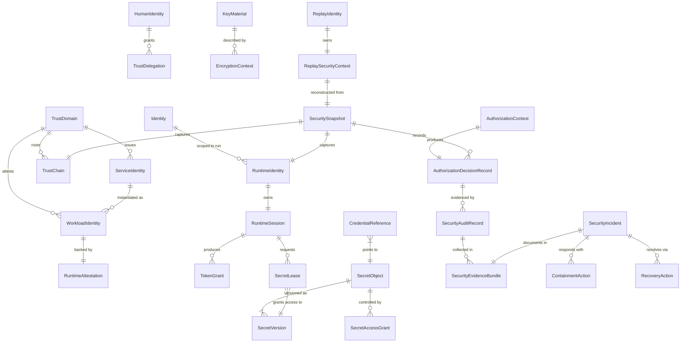
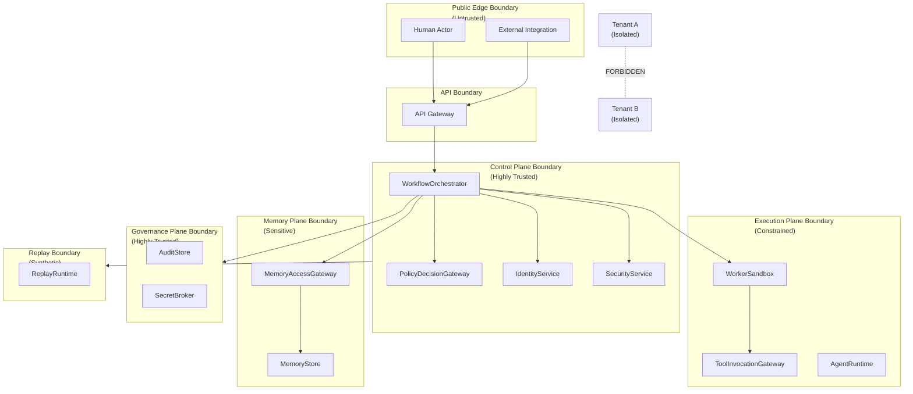
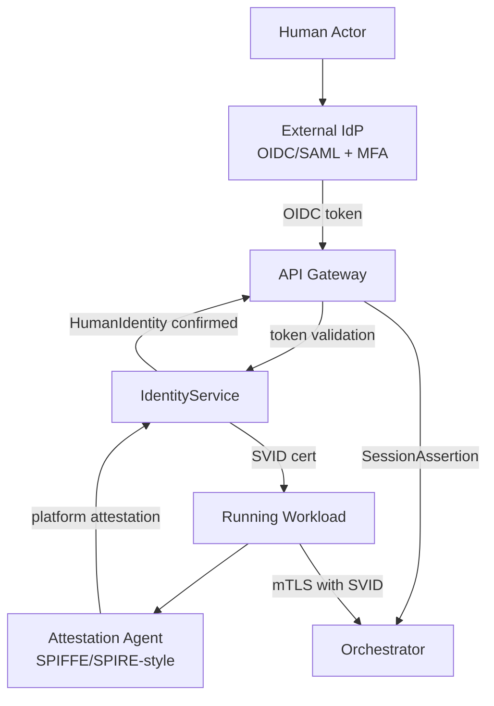
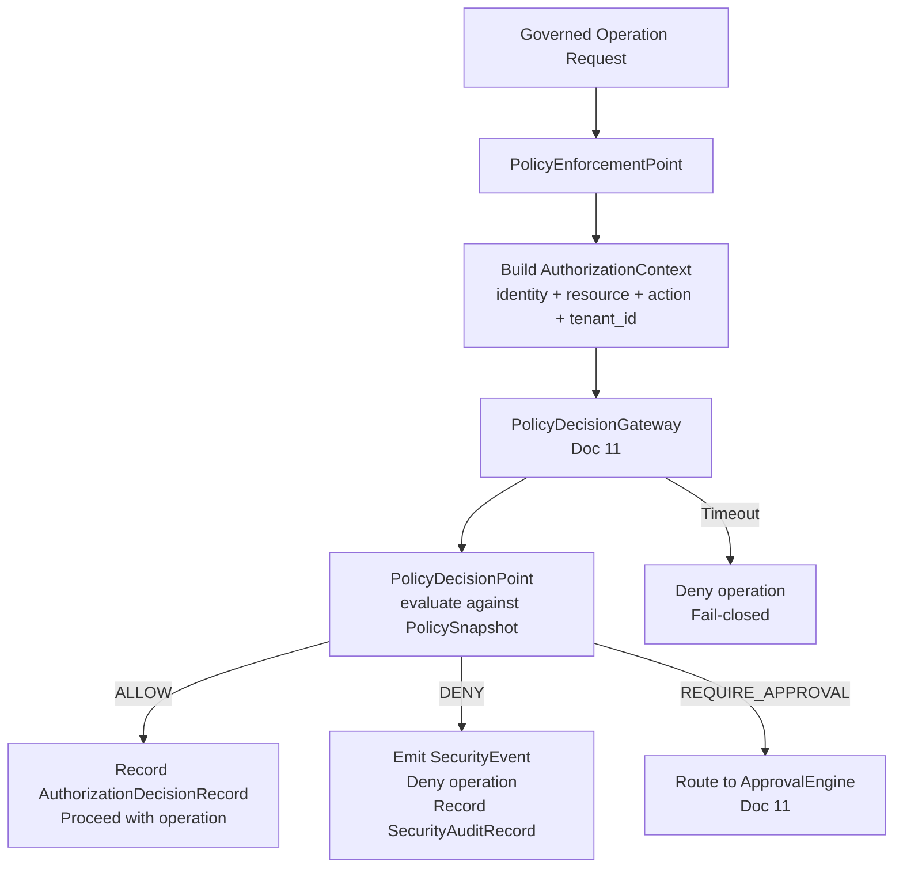
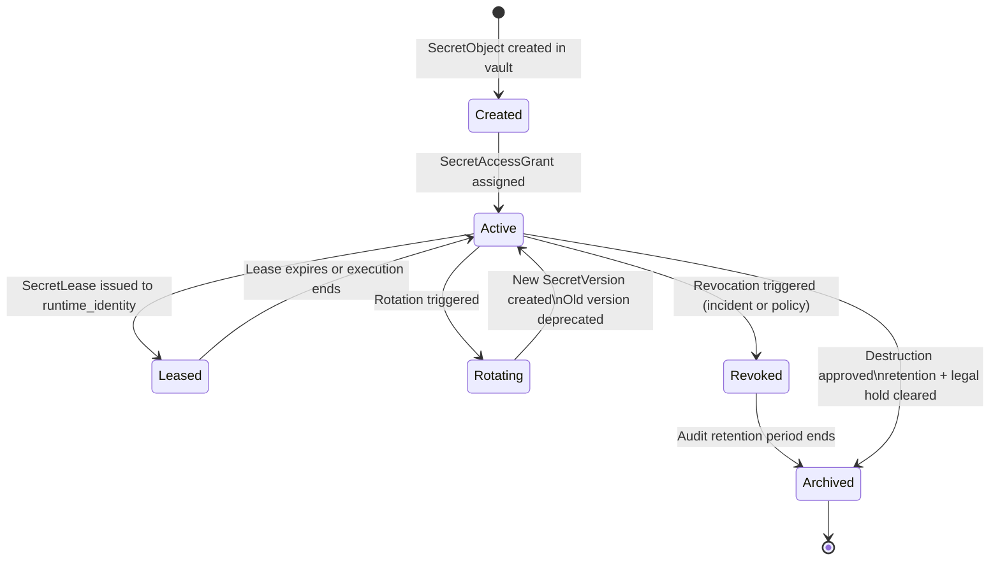
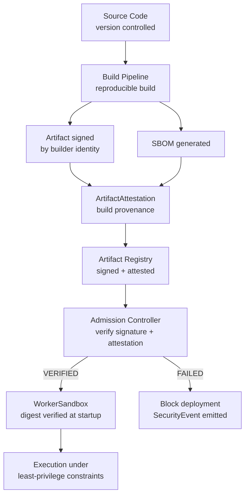
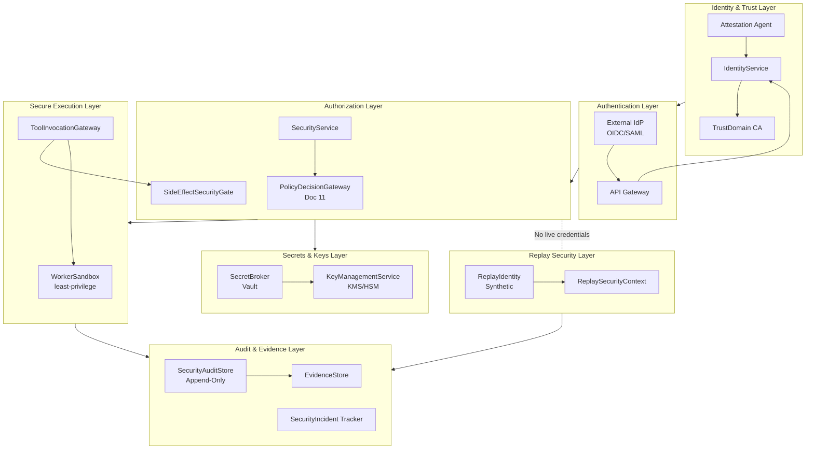
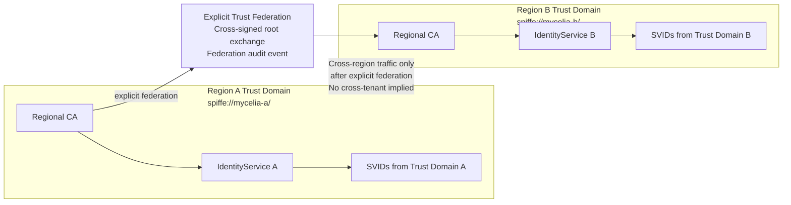

# MYCELIA — 13 Security & Trust Architecture

---

## Document Metadata

| Field | Value |
|---|---|
| Document Series | MYCELIA Architecture Constitution |
| Document Number | 13 |
| Version | v1.0 |
| Status | Canonical |
| Classification | Core Architecture — Security & Trust Infrastructure |
| Canonical Role | Defines the security model, trust boundaries, identity architecture, authentication, authorization, secrets management, encryption, runtime integrity, replay-safe security, threat defenses, security evidence, and incident containment for all MYCELIA governed runtimes |
| Primary Audience | Security Architects, Platform Engineers, Runtime Engineers, Identity Engineers, Codex |
| Last Updated | June 2026 |

---

## Table of Contents

1. [Executive Summary](#1-executive-summary)
2. [Security & Trust Philosophy](#2-security--trust-philosophy)
3. [Security Scope and Non-Scope](#3-security-scope-and-non-scope)
4. [Canonical Security Domain Model](#4-canonical-security-domain-model)
5. [Security Taxonomy](#5-security-taxonomy)
6. [Trust Boundary Architecture](#6-trust-boundary-architecture)
7. [Identity Architecture](#7-identity-architecture)
8. [Authentication Architecture](#8-authentication-architecture)
9. [Authorization and Enforcement Architecture](#9-authorization-and-enforcement-architecture)
10. [Secrets and Credential Architecture](#10-secrets-and-credential-architecture)
11. [Key Management and Encryption Architecture](#11-key-management-and-encryption-architecture)
12. [Secure Execution and Runtime Integrity](#12-secure-execution-and-runtime-integrity)
13. [Tenant, Namespace and Data Isolation Security](#13-tenant-namespace-and-data-isolation-security)
14. [Replay-Safe Security Architecture](#14-replay-safe-security-architecture)
15. [Prompt, Tool and Context Injection Security](#15-prompt-tool-and-context-injection-security)
16. [Side-Effect Security](#16-side-effect-security)
17. [Security Events, Evidence and Audit Boundary](#17-security-events-evidence-and-audit-boundary)
18. [Security Observability and Detection](#18-security-observability-and-detection)
19. [Distributed Trust and Multi-Region Security](#19-distributed-trust-and-multi-region-security)
20. [Security Incident and Containment Model](#20-security-incident-and-containment-model)
21. [Runtime Security States](#21-runtime-security-states)
22. [Security Failure Model](#22-security-failure-model)
23. [MVP Security & Trust Cut](#23-mvp-security--trust-cut)
24. [Security & Trust Diagrams](#24-security--trust-diagrams)
25. [Security & Trust Invariants](#25-security--trust-invariants)
26. [Security & Trust Anti-Patterns](#26-security--trust-anti-patterns)
27. [Codex Implementation Guidance](#27-codex-implementation-guidance)
28. [Relationship to Other Documents](#28-relationship-to-other-documents)
29. [Final Security & Trust Principles](#29-final-security--trust-principles)

---

## 1. Executive Summary

### 1.1 What Security & Trust Architecture Means in MYCELIA

Security & Trust Architecture in MYCELIA defines the runtime trust fabric that decides who may act, under what authority, across which boundary, using which credential, with what evidence, and without leaking authority into replay. It is not a perimeter firewall, a static role model, or a compliance checklist. It is continuously evaluated, cryptographically verifiable, tenant-scoped, replay-aware security infrastructure that participates in every governed execution decision alongside the policy engine.

MYCELIA is a governed cognitive operations runtime. Its threat surface includes: human actors operating across multiple tenants, autonomous agent execution, probabilistic model output, tool invocations with external side effects, memory systems containing sensitive enterprise knowledge, replay operations that must reconstruct past execution without exercising live credentials, and complex multi-tenant cognitive workflows that must remain strictly isolated at every layer.

### 1.2 Why Security Is Runtime Infrastructure

Static security controls — network firewalls, role assignments, access control lists — cannot protect a system where execution is distributed, dynamic, cognitive, and multi-tenant. MYCELIA's security operates as runtime infrastructure: identity is issued dynamically per workload, credentials expire per execution scope, authorization is evaluated against current policy snapshots, and every security-relevant action produces immutable evidence. Security that does not participate in runtime is security that can be bypassed by the runtime.

### 1.3 Why Trust Must Be Explicit, Scoped, and Cryptographically Verifiable

Implicit trust — trust granted by network location, shared environment variable, or long-lived service account — is incompatible with Zero Trust architecture and with MYCELIA's multi-tenant, distributed execution model. Every trust relationship in MYCELIA is explicit (declared), scoped (bounded to a specific identity, tenant, and purpose), and cryptographically verifiable (backed by SVID, mTLS certificate, signed token, or signed artifact). Trust that cannot be cryptographically verified is not trust — it is assumption.

### 1.4 Why Security Is Replay-Aware

Canonical replay in MYCELIA reconstructs past execution from immutable event history and policy snapshots. If live production credentials were available during replay, replay operations could exercise real-world side effects with the authority of the original run — an unacceptable security breach. MYCELIA's replay-safe security architecture ensures: ReplayIdentity is always synthetic, production credentials are excluded from the replay runtime, replay operations cannot call production external systems, and replay telemetry is isolated from production namespaces. Security architecture must be designed with replay in mind from the beginning, not retrofitted.

### 1.5 Why Security Evidence Must Be Durable and Traceable

Security events, access decisions, identity lineage, and containment actions must be preserved as durable, tamper-evident records. In a regulated enterprise environment, the ability to answer "who authorized this action, under what policy, at what time, and with what evidence?" is not just an audit requirement — it is a precondition for responsible cognitive operations. MYCELIA's SecurityAuditRecord is immutable, cryptographically hashable, and linked to the identity lineage, policy snapshot, and correlation chain of the originating operation.

### 1.6 Core Boundaries

**Security does not own governance decisions.** Document 11 owns PolicyDecisionGateway and GovernanceAuditRecords. Security authorization context is an input to governance policy evaluation.

**Security does not own observability telemetry.** Document 12 owns the telemetry platform. Security emits SecurityEvents and SecurityAuditRecords through defined pathways; telemetry is a diagnostic view.

**Security does not own the tenant data model.** Document 14 owns tenant isolation architecture. Security enforces isolation at identity, credential, and boundary levels.

**Security provides trust, identity, credential, containment, and protection architecture.**

---

## 2. Security & Trust Philosophy

### 2.1 Zero Trust

MYCELIA adopts Zero Trust as a foundational principle: no request is implicitly trusted because it originates from inside the network, from a previously authenticated session, or from a known service account. Every request must carry verifiable identity, must be authorized against current policy, and must be observable. Zero Trust does not mean "verify everything once at the perimeter" — it means "verify everything at every boundary crossing, every time."

### 2.2 Least Privilege

Every identity, every service, every agent, and every tool is granted the minimum authority required to complete its declared function. Least privilege applies at every granularity: the scope of a token (bounded to a single run_id and tenant_id), the capabilities of a WorkerSandbox (only those required for the declared tool), the reach of a ReplayIdentity (no production credentials, no external calls), and the lifespan of a SecretLease (bounded to the execution lifecycle).

### 2.3 Explicit Trust Boundaries

Trust does not flow implicitly between components. Every boundary crossing requires: verifiable identity, explicit authorization, declared purpose, tenant scope, and observable evidence. A component inside the execution plane is not automatically trusted by the governance plane. A tool invocation sandbox is not automatically trusted by the memory plane. Trust delegation is explicit, scoped, time-bound, and auditable.

### 2.4 Continuous Authentication and Authorization

Authentication events are not single-use passes. Credentials expire. Tokens have short lifetimes. Policy snapshots are evaluated at the time of each governed operation, not cached indefinitely. Changes to policy, identity revocation, or tenant boundary updates take effect without requiring session restart. Continuous authorization means every governed operation is evaluated against current (or snapshot-bound) policy, not against cached permissions from a previous session.

### 2.5 Replay-Safe Security and No Live Authority in Replay

Production credentials, live tokens, and production secret leases MUST NOT enter the replay runtime under any condition. Replay must reconstruct security context from historical evidence (immutable snapshots, recorded authorization decisions) without exercising any authority that could produce real-world side effects. This is not merely a best practice — it is a hard architectural constraint enforced at the replay runtime boundary.

### 2.6 Fail-Closed for Critical Controls

When security infrastructure is unavailable, the default response is denial. An authorization check that cannot reach the PolicyDecisionGateway MUST deny the operation. A workload attestation that fails MUST prevent identity issuance. A secret lease that has expired MUST be rejected, including during replay. Fail-open security is not security.

### 2.7 Canonical Distinctions

| Concept A | Concept B | Distinction |
|---|---|---|
| **Identity** | **Credential** | Who the actor is vs what the actor presents to prove it |
| **Authentication** | **Authorization** | Verifying who you are vs deciding what you may do |
| **Authorization** | **Approval** | Policy-based access decision vs governance-gated operational gate |
| **Security event** | **Governance event** | Security-domain canonical event vs governance-domain event (Doc 11) |
| **Security telemetry** | **Security evidence** | Diagnostic signal (Doc 12) vs tamper-evident audit record |
| **Trust boundary** | **Tenant boundary** | Security enforcement boundary vs data model boundary (Doc 14) |
| **Trust zone** | **Network segment** | Logical security zone vs physical network topology |
| **Secret** | **Credential reference** | The raw sensitive value vs an opaque pointer to it |
| **Production identity** | **Replay identity** | Live, authority-bearing identity vs synthetic reconstruction for forensics |
| **Runtime identity** | **Actor identity** | System-issued execution identity vs human or service principal |
| **Service identity** | **Workload identity** | Logical identity of a service vs attested identity of a running workload instance |
| **Token grant** | **Session assertion** | Short-lived access token vs session-scoped trust claim |
| **Break-glass** | **Hidden bypass** | Governed emergency path with full audit vs ungoverned silent override |

---

## 3. Security Scope and Non-Scope

### 3.1 What Document 13 Owns

| Responsibility | Description |
|---|---|
| Security taxonomy | Classification of all security domains in MYCELIA |
| Identity architecture | HumanIdentity, ServiceIdentity, WorkloadIdentity, RuntimeIdentity, ReplayIdentity |
| Workload identity | Attestation, SVID-style issuance, short-lived workload credentials |
| Runtime identity | Per-execution synthetic identity; lifetime bound to execution scope |
| Trust boundaries | All named trust boundaries and their traversal rules |
| Trust zones | Logical security zones within boundaries |
| Trust propagation | Explicit delegation; trust chain construction; trust artifact model |
| Credential lifecycle | SecretLease, TokenGrant, CredentialReference lifecycle |
| Secret lifecycle | SecretObject, SecretVersion, rotation, revocation, access audit |
| Key management | KeyMaterial, KMS/HSM, envelope encryption, EncryptionContext |
| Encryption context | Metadata required for decryption and audit |
| Secure execution | Sandboxing, runtime attestation, egress control |
| Supply chain integrity | Signed artifacts, SBOM, build provenance, admission control |
| Replay-safe security | Credential exclusion, synthetic identity, side-effect suppression |
| Prompt/tool injection security | Threat model and defenses |
| Security evidence boundary | SecurityAuditRecord, SecurityEvidenceBundle, chain of custody |
| Security incident semantics | Incident classes, containment actions, recovery actions |
| Secure failure model | Fail-closed behavior across all security failure modes |
| MVP security cut | Minimum viable security capabilities |

### 3.2 What Document 13 Does Not Own

| Responsibility | Owned By |
|---|---|
| Policy engine internals and PolicyDecision | Document 11 (Governance) |
| Approval workflow semantics | Document 11 |
| Telemetry pipeline internals | Document 12 (Observability) |
| Tenant data modeling and namespace topology | Document 14 (Multi-Tenant) |
| Workflow scheduling | Document 09 (Workflow Orchestration) |
| Memory retrieval internals | Document 10 (Memory & Context) |
| Event broker topology | Document 08 (Event Runtime) |
| Infrastructure-as-code | Document 16 (Infrastructure) |
| SRE playbooks | Document 17 (SRE) |
| Investigation UX | Document 22 (Investigation Mode) |

### 3.3 Ownership Matrix

| Capability | Document 13 | Sibling Document |
|---|---|---|
| Identity model | Defines | — |
| PolicyDecisionGateway | Integrates; does not own | Doc 11 defines |
| GovernanceAuditRecord | Not owner; correlates via security events | Doc 11 defines |
| Telemetry security spans | Defines security event correlation | Doc 12 collects |
| Tenant isolation enforcement | Defines security layer | Doc 14 defines data model |
| Tool invocation security | Defines security gate | Doc 15 defines tool contract |
| Replay security | Defines credential exclusion and synthetic identity | Doc 22 defines UX |
| Secret store deployment | Defines logical model | Doc 16 deploys |
| Security incident SRE procedures | Defines incident classes | Doc 17 defines runbooks |

---

## 4. Canonical Security Domain Model

### 4.1 Entity Reference

#### SecurityNamespace

| Attribute | Value |
|---|---|
| Purpose | Logical isolation boundary for all security objects (identities, secrets, audit records) belonging to a tenant, workspace, or platform scope |
| Owner service | SecurityService |
| Source of truth | SecurityStore (durable) |
| Mutability | Immutable once created |
| Tenant scope | MUST belong to exactly one tenant unless platform-scoped |
| Replay behavior | Namespace ID recorded in all security artifacts |
| Retention | Permanent |
| Security classification | Highly Sensitive |
| Event/audit implications | NamespaceCreated event; access audited |

#### SecurityBoundary

| Attribute | Value |
|---|---|
| Purpose | The enforcement perimeter around a logical security zone; defines what must be authenticated, authorized, and observable at each crossing |
| Owner service | SecurityService |
| Source of truth | SecurityStore |
| Mutability | Immutable per version; updates create new version |
| Tenant scope | Varies (some boundaries are platform-level) |
| Replay behavior | Historical boundary config recorded in SecuritySnapshot |
| Retention | Permanent |
| Security classification | Sensitive |
| Event/audit implications | BoundaryViolationAttempted is a security event |

#### TrustBoundary

| Attribute | Value |
|---|---|
| Purpose | A named, explicit trust delineation between security zones; every crossing requires re-authentication and re-authorization |
| Owner service | SecurityService |
| Source of truth | SecurityStore |
| Mutability | Versioned |
| Tenant scope | Platform or tenant-scoped |
| Replay behavior | Boundary version recorded in SecuritySnapshot |
| Retention | Permanent |
| Security classification | Sensitive |
| Event/audit implications | CrossBoundaryEvent |

#### TrustZone

| Attribute | Value |
|---|---|
| Purpose | A subdivision of a TrustBoundary with homogeneous trust properties; examples: execution plane, memory plane, observability plane |
| Owner service | SecurityService |
| Source of truth | SecurityStore |
| Mutability | Versioned |
| Tenant scope | Platform or tenant-scoped |
| Replay behavior | Zone version recorded in SecuritySnapshot |
| Retention | Permanent |
| Security classification | Sensitive |
| Event/audit implications | None directly |

#### TrustDomain

| Attribute | Value |
|---|---|
| Purpose | The highest-level trust scope: a cryptographically identified domain within which identities are issued and trusted; may span multiple TrustZones; analogous to a SPIFFE Trust Domain |
| Owner service | IdentityService |
| Source of truth | TrustDomainStore |
| Mutability | Immutable once established; new domain required for major change |
| Tenant scope | Platform-scoped (tenants exist within a trust domain) |
| Replay behavior | Trust domain recorded in all identity documents |
| Retention | Permanent |
| Security classification | Highly Sensitive |
| Event/audit implications | TrustDomainCreated, TrustDomainFederated |

#### TrustChain

| Attribute | Value |
|---|---|
| Purpose | The ordered chain of delegated trust assertions from a root identity through intermediate delegates to the current executing identity |
| Owner service | IdentityService |
| Source of truth | Embedded in TrustArtifact |
| Mutability | Append-only |
| Tenant scope | Bound to tenant_id |
| Replay behavior | Historical trust chain preserved in SecuritySnapshot |
| Retention | Full audit retention period |
| Security classification | Highly Sensitive |
| Event/audit implications | Included in SecurityAuditRecord for governed operations |

#### TrustArtifact

| Attribute | Value |
|---|---|
| Purpose | A cryptographically verifiable document encoding a trust assertion: SVID, signed JWT, mTLS certificate, or signed WorkloadIdentity claim |
| Owner service | IdentityService |
| Source of truth | Issued by identity CA or trust broker |
| Mutability | Immutable; new issuance for renewal |
| Tenant scope | Bound to trust domain and optionally tenant |
| Replay behavior | Historical artifact recorded; NOT live in replay |
| Retention | Retained for audit period; expired artifacts archived |
| Security classification | Highly Sensitive |
| Event/audit implications | TrustArtifactIssued, TrustArtifactRevoked |

#### TrustDelegation

| Attribute | Value |
|---|---|
| Purpose | An explicit, time-bound, scoped grant of trust from one identity to another; enables a service to act on behalf of a user or parent identity within a declared scope |
| Owner service | IdentityService / GovernanceService |
| Source of truth | TrustStore (durable) |
| Mutability | Immutable after creation; revocation appends a record |
| Tenant scope | Bound to tenant_id |
| Replay behavior | Historical delegation preserved in SecuritySnapshot |
| Retention | Full audit period |
| Security classification | Highly Sensitive |
| Event/audit implications | TrustDelegationGranted, TrustDelegationRevoked |

#### Identity

| Attribute | Value |
|---|---|
| Purpose | The durable logical identity of a human, service, agent, or system component; the stable named entity behind authentication |
| Owner service | IdentityService |
| Source of truth | IdentityStore (durable) |
| Mutability | Metadata updateable; identity itself is versioned |
| Tenant scope | Tenant-scoped or platform-scoped |
| Replay behavior | Identity ID preserved; no live credentials |
| Retention | Retained while active + audit period after deactivation |
| Security classification | Highly Sensitive |
| Event/audit implications | IdentityCreated, IdentityRevoked |

#### HumanIdentity

| Attribute | Value |
|---|---|
| Purpose | Identity representing a human operator, developer, approver, or auditor; federated from OIDC/SAML provider; carries actor_id |
| Owner service | IdentityService / external IdP |
| Source of truth | IdentityStore + external IdP |
| Mutability | Profile updateable; identity versioned |
| Tenant scope | Tenant-scoped with platform federation |
| Replay behavior | actor_id preserved in replay context; no live session token |
| Retention | Full retention period |
| Security classification | Highly Sensitive |
| Event/audit implications | HumanAuthenticationEvent |

#### ServiceIdentity

| Attribute | Value |
|---|---|
| Purpose | Logical identity representing a MYCELIA platform service (orchestrator, memory service, policy engine, etc.); not tied to a specific workload instance |
| Owner service | IdentityService |
| Source of truth | IdentityStore |
| Mutability | Versioned |
| Tenant scope | Platform-scoped |
| Replay behavior | Service identity preserved in SecuritySnapshot |
| Retention | Full retention period |
| Security classification | Highly Sensitive |
| Event/audit implications | ServiceIdentityRegistered |

#### WorkloadIdentity

| Attribute | Value |
|---|---|
| Purpose | The attested, instance-level identity of a specific running workload; backed by node/platform attestation; analogous to a SPIFFE SVID bearer |
| Owner service | IdentityService / SPIRE-style agent |
| Source of truth | WorkloadIdentityStore |
| Mutability | Immutable per issuance; rotation creates new instance |
| Tenant scope | Platform-scoped (bound to service) |
| Replay behavior | Historical workload identity preserved; NOT exercised live in replay |
| Retention | Audit period |
| Security classification | Highly Sensitive |
| Event/audit implications | WorkloadAttested, WorkloadIdentityIssued |

#### RuntimeIdentity

| Attribute | Value |
|---|---|
| Purpose | A short-lived, execution-scoped identity issued to a specific GovernedRun or step; carries run_id, tenant_id, and declared execution purpose; expires when the execution ends |
| Owner service | IdentityService |
| Source of truth | RuntimeIdentityStore (short-lived) |
| Mutability | Immutable; new issuance for renewal within run |
| Tenant scope | Bound to tenant_id and run_id |
| Replay behavior | Historical RuntimeIdentity recorded in SecuritySnapshot; synthetic RuntimeIdentity issued for replay |
| Retention | Execution duration + audit period |
| Security classification | Highly Sensitive |
| Event/audit implications | RuntimeIdentityIssued, RuntimeIdentityExpired |

#### TenantIdentity

| Attribute | Value |
|---|---|
| Purpose | The identity representing a tenant organization; used to scope all tenant-specific resources, policies, keys, and secrets |
| Owner service | TenantService |
| Source of truth | TenantStore |
| Mutability | Metadata updateable; identity versioned |
| Tenant scope | IS the tenant scope |
| Replay behavior | Preserved in all replay contexts |
| Retention | Permanent while active; audit period after deactivation |
| Security classification | Highly Sensitive |
| Event/audit implications | TenantIdentityCreated |

#### NamespaceIdentity

| Attribute | Value |
|---|---|
| Purpose | Identity representing a logical namespace (workspace, project) within a tenant; scopes resource access within the tenant boundary |
| Owner service | TenantService |
| Source of truth | TenantStore |
| Mutability | Versioned |
| Tenant scope | Bound to tenant_id |
| Replay behavior | Preserved |
| Retention | Permanent while active |
| Security classification | Sensitive |
| Event/audit implications | None directly |

#### ReplayIdentity

| Attribute | Value |
|---|---|
| Purpose | A synthetic, non-authority-bearing identity issued exclusively for replay execution; cannot authenticate to production systems; carries replay_id and original run's identity lineage as reference only |
| Owner service | ReplayService / IdentityService |
| Source of truth | ReplayIdentityStore (isolated) |
| Mutability | Immutable per replay session |
| Tenant scope | Bound to original tenant_id |
| Replay behavior | IS a replay artifact; must be clearly labeled as synthetic |
| Retention | Replay retention period |
| Security classification | Sensitive |
| Event/audit implications | ReplayIdentityIssued; any production system access attempt is a security violation |

#### RuntimeSession

| Attribute | Value |
|---|---|
| Purpose | The security context for a single GovernedRun execution: binds RuntimeIdentity, tenant, policy snapshot, and authorization state for the duration of the run |
| Owner service | SecurityService / Orchestrator |
| Source of truth | SessionStore (strongly consistent) |
| Mutability | Controlled state transitions; security state append-only |
| Tenant scope | Bound to tenant_id |
| Replay behavior | Reconstructed from SecuritySnapshot |
| Retention | Run duration + audit period |
| Security classification | Highly Sensitive |
| Event/audit implications | SessionStarted, SessionTerminated |

#### SessionAssertion

| Attribute | Value |
|---|---|
| Purpose | A verifiable claim that a RuntimeSession exists and is in a valid security state; used by components to establish session-scoped trust |
| Owner service | SecurityService |
| Source of truth | Issued by SecurityService; verifiable by signature |
| Mutability | Immutable; short-lived; expires |
| Tenant scope | Bound to tenant_id |
| Replay behavior | Historical assertions preserved; live assertions not used in replay |
| Retention | Expires; archived for audit period |
| Security classification | Highly Sensitive |
| Event/audit implications | SessionAssertionIssued, SessionAssertionExpired |

#### TokenGrant

| Attribute | Value |
|---|---|
| Purpose | A short-lived access token granting a specific RuntimeIdentity access to a specific resource, service, or capability within a declared scope and time bound |
| Owner service | IdentityService |
| Source of truth | Issued; not stored long-term |
| Mutability | Immutable; expires |
| Tenant scope | Bound to tenant_id |
| Replay behavior | Live tokens NOT used in replay |
| Retention | Expires; issuance record audited |
| Security classification | Highly Sensitive |
| Event/audit implications | TokenGranted, TokenExpired, TokenRevoked |

#### CredentialReference

| Attribute | Value |
|---|---|
| Purpose | An opaque pointer to a secret held in SecretStore; passed to workers instead of the raw secret value; resolved at runtime via SecretBroker |
| Owner service | SecretBroker |
| Source of truth | SecretStore (for resolution); CredentialReferenceRegistry |
| Mutability | Immutable; references are stable pointers |
| Tenant scope | Bound to tenant_id |
| Replay behavior | Replay receives CredentialReference pointing to synthetic/suppressed value |
| Retention | Retained as long as the referenced secret |
| Security classification | Sensitive |
| Event/audit implications | CredentialReferenceResolved (access audit) |

#### SecretObject

| Attribute | Value |
|---|---|
| Purpose | The durable metadata record of a secret: name, type, owner, tenant, rotation schedule, and version lineage; does NOT contain the raw secret value |
| Owner service | SecretBroker |
| Source of truth | SecretStore (durable) |
| Mutability | Metadata updateable; versions are immutable |
| Tenant scope | Bound to tenant_id |
| Replay behavior | Secret metadata preserved; raw value NEVER in replay |
| Retention | Retained while active + full audit period |
| Security classification | Highly Sensitive |
| Event/audit implications | SecretCreated, SecretRotated, SecretRevoked |

#### SecretVersion

| Attribute | Value |
|---|---|
| Purpose | An immutable, versioned snapshot of the encrypted value of a SecretObject at a specific rotation point; the cryptographic artifact that is actually retrieved during execution |
| Owner service | SecretBroker |
| Source of truth | SecretStore (WORM-eligible) |
| Mutability | IMMUTABLE after creation |
| Tenant scope | Bound to tenant_id via parent SecretObject |
| Replay behavior | NEVER included in replay; production values suppressed |
| Retention | Retained for the full secret lifecycle and audit period |
| Security classification | Highly Sensitive |
| Event/audit implications | SecretVersionCreated, SecretVersionDeprecated |

#### SecretLease

| Attribute | Value |
|---|---|
| Purpose | A time-limited, identity-scoped access grant to a specific SecretVersion; expires at the end of the execution that requested it; analogous to Vault dynamic secret lease |
| Owner service | SecretBroker |
| Source of truth | SecretStore (short-lived) |
| Mutability | Immutable after issuance; renewal creates new lease |
| Tenant scope | Bound to tenant_id and runtime_identity_id |
| Replay behavior | NEVER issued for replay; production leases suppressed |
| Retention | Expires; access record audited |
| Security classification | Highly Sensitive |
| Event/audit implications | SecretLeaseGranted, SecretLeaseExpired, SecretLeaseRevoked |

#### SecretAccessGrant

| Attribute | Value |
|---|---|
| Purpose | A durable policy record granting a specific identity or role the right to request a SecretLease for a specific SecretObject |
| Owner service | SecretBroker |
| Source of truth | SecretStore |
| Mutability | Versioned |
| Tenant scope | Bound to tenant_id |
| Replay behavior | Historical grant preserved for audit |
| Retention | Full audit period |
| Security classification | Highly Sensitive |
| Event/audit implications | SecretAccessGranted, SecretAccessRevoked |

#### KeyMaterial

| Attribute | Value |
|---|---|
| Purpose | A cryptographic key artifact managed by KMS or HSM; includes symmetric data encryption keys, asymmetric key pairs, signing keys, and key encryption keys |
| Owner service | KeyManagementService |
| Source of truth | KMS / HSM |
| Mutability | Immutable per version; rotation creates new version |
| Tenant scope | Platform or tenant-scoped |
| Replay behavior | Private keys NEVER exposed to replay |
| Retention | Per key retention policy; rotation lineage preserved |
| Security classification | Highly Sensitive |
| Event/audit implications | KeyCreated, KeyRotated, KeyRevoked, KeyDestroyed |

#### EncryptionContext

| Attribute | Value |
|---|---|
| Purpose | Metadata required to decrypt an encrypted artifact: key_id, algorithm, IV, key version, tenant_id, and data classification; persisted alongside encrypted data for decryption and audit |
| Owner service | KeyManagementService |
| Source of truth | Persisted alongside encrypted artifact |
| Mutability | Immutable |
| Tenant scope | Bound to tenant_id |
| Replay behavior | Preserved; required for decryption audit |
| Retention | Same as encrypted artifact |
| Security classification | Sensitive |
| Event/audit implications | Included in audit for decryption operations |

#### AuthorizationContext

| Attribute | Value |
|---|---|
| Purpose | The complete set of inputs to an authorization decision: subject (identity), resource, action, environment, tenant_id, data_classification, policy_snapshot_id, and declared purpose |
| Owner service | SecurityService / PolicyDecisionGateway |
| Source of truth | Constructed per operation; not stored independently |
| Mutability | Immutable per evaluation |
| Tenant scope | Bound to tenant_id |
| Replay behavior | Reconstructed from SecuritySnapshot for forensic review |
| Retention | Embedded in AuthorizationDecisionRecord |
| Security classification | Sensitive |
| Event/audit implications | Input to SecurityAuditRecord |

#### AuthorizationDecisionRecord

| Attribute | Value |
|---|---|
| Purpose | The durable record of a security authorization evaluation: subject, resource, action, decision (ALLOW/DENY), policy_snapshot_id, timestamp, and evidence references |
| Owner service | SecurityService |
| Source of truth | SecurityAuditStore (append-only) |
| Mutability | IMMUTABLE |
| Tenant scope | Bound to tenant_id |
| Replay behavior | Preserved in SecuritySnapshot |
| Retention | Full audit period |
| Security classification | Highly Sensitive |
| Event/audit implications | SecurityAuthorizationDecision |

#### SecurityConstraint

| Attribute | Value |
|---|---|
| Purpose | An active constraint on a RuntimeSession: capability restriction, egress filter, tool suppression, data classification ceiling; derived from policy evaluation |
| Owner service | SecurityService |
| Source of truth | Active constraint store (strongly consistent) |
| Mutability | Append-only history; active state transitions |
| Tenant scope | Bound to tenant_id |
| Replay behavior | Constraint state recorded in SecuritySnapshot |
| Retention | Run duration + audit period |
| Security classification | Sensitive |
| Event/audit implications | SecurityConstraintActivated, SecurityConstraintLifted |

#### ExecutionSignature

| Attribute | Value |
|---|---|
| Purpose | A cryptographic signature over an execution artifact, workflow definition, or execution output; proves that a specific identity produced a specific artifact at a specific time |
| Owner service | SecurityService |
| Source of truth | Embedded in signed artifact |
| Mutability | Immutable |
| Tenant scope | Bound to tenant_id |
| Replay behavior | Historical signatures preserved and verified |
| Retention | Full artifact retention period |
| Security classification | Sensitive |
| Event/audit implications | ExecutionSignatureVerified, ExecutionSignatureFailed |

#### RuntimeAttestation

| Attribute | Value |
|---|---|
| Purpose | A verifiable claim from a workload attestation mechanism (platform node agent, TPM, trusted execution environment) confirming that a WorkloadIdentity runs on an expected, uncompromised platform |
| Owner service | IdentityService |
| Source of truth | Workload attestation agent |
| Mutability | Immutable per issuance; renewed periodically |
| Tenant scope | Platform-scoped |
| Replay behavior | Historical attestation preserved; live attestation not required for replay |
| Retention | Audit period |
| Security classification | Highly Sensitive |
| Event/audit implications | WorkloadAttested, AttestationFailed |

#### ArtifactAttestation

| Attribute | Value |
|---|---|
| Purpose | A verifiable attestation (SLSA-style provenance record, SBOM signature, or supply chain witness) confirming that an execution artifact was built from verified source through a verified build process |
| Owner service | SecurityService / Build pipeline |
| Source of truth | ArtifactAttestationStore |
| Mutability | Immutable |
| Tenant scope | Platform-scoped |
| Replay behavior | Historical attestation verified during forensic replay |
| Retention | Permanent |
| Security classification | Sensitive |
| Event/audit implications | ArtifactAttested, ArtifactAttestationFailed |

#### SideEffectSecurityGate

| Attribute | Value |
|---|---|
| Purpose | The security enforcement point for side-effectful operations: verifies that a governed authorization exists before a tool or integration executes an operation with external consequences |
| Owner service | SecurityService / ToolInvocationGateway |
| Source of truth | Active authorization state |
| Mutability | Per-invocation; decision recorded |
| Tenant scope | Bound to tenant_id |
| Replay behavior | Suppresses live side effects during replay |
| Retention | Decision record retained for audit |
| Security classification | Sensitive |
| Event/audit implications | SideEffectAuthorized, SideEffectDenied |

#### SecurityEvent

| Attribute | Value |
|---|---|
| Purpose | A canonical, schema-registered security domain event published through Document 07's EventEnvelope; records security-significant occurrences: access denials, boundary violations, secret leakage, replay contamination |
| Owner service | SecurityService |
| Source of truth | Published through Document 07 event infrastructure |
| Mutability | Immutable |
| Tenant scope | Bound to tenant_id |
| Replay behavior | Historical events preserved; replay produces separate events |
| Retention | Security audit retention period |
| Security classification | Highly Sensitive |
| Event/audit implications | IS a Document 07 event |

#### SecurityAuditRecord

| Attribute | Value |
|---|---|
| Purpose | Immutable, tamper-evident record of a security-significant action: authentication, authorization decision, secret access, credential issuance, containment action, break-glass use |
| Owner service | AuditService |
| Source of truth | SecurityAuditStore (append-only, WORM-eligible) |
| Mutability | APPEND-ONLY. No update or delete |
| Tenant scope | Bound to tenant_id |
| Replay behavior | NOT used in context assembly; used for forensic audit |
| Retention | Legal security retention period |
| Security classification | Highly Sensitive |
| Event/audit implications | Written for every security-significant action |

#### SecurityEvidenceBundle

| Attribute | Value |
|---|---|
| Purpose | A structured collection of SecurityAuditRecords, AuthorizationDecisionRecords, TrustChain records, and supporting artifacts assembled to prove security compliance for a specific incident or audit scope |
| Owner service | SecurityService |
| Source of truth | EvidenceStore (durable) |
| Mutability | Append-only |
| Tenant scope | Bound to tenant_id |
| Replay behavior | Used for forensic investigation |
| Retention | Legal retention period |
| Security classification | Highly Sensitive |
| Event/audit implications | SecurityEvidenceBundleCreated |

#### SecuritySnapshot

| Attribute | Value |
|---|---|
| Purpose | An immutable point-in-time record of the security context of a GovernedRun: identity lineage, trust chain, authorization decisions, active constraints, policy snapshot reference — excluding raw secrets and live credentials |
| Owner service | SecurityService |
| Source of truth | SecuritySnapshotStore (immutable) |
| Mutability | IMMUTABLE after creation |
| Tenant scope | Bound to tenant_id |
| Replay behavior | IS the replay security anchor |
| Retention | Full audit retention period |
| Security classification | Highly Sensitive |
| Event/audit implications | SecuritySnapshotCreated |

#### ReplaySecurityContext

| Attribute | Value |
|---|---|
| Purpose | The reconstructed security context for replay: uses SecuritySnapshot, ReplayIdentity, and historical authorization decisions; excludes all live credentials |
| Owner service | ReplayService |
| Source of truth | SecuritySnapshot + ReplayIdentityStore |
| Mutability | Immutable during replay |
| Tenant scope | Bound to original tenant_id |
| Replay behavior | IS the replay security context |
| Retention | Replay retention period |
| Security classification | Highly Sensitive |
| Event/audit implications | ReplaySecurityContextEstablished |

#### SecurityIncident

| Attribute | Value |
|---|---|
| Purpose | A durable record of a detected security incident: class, timeline, affected identities, affected tenants, containment actions taken, and evidence bundle reference |
| Owner service | SecurityService |
| Source of truth | IncidentStore (durable) |
| Mutability | Append-only |
| Tenant scope | Bound to tenant_id |
| Replay behavior | Not used in context assembly; used for forensic investigation |
| Retention | Legal security retention period |
| Security classification | Highly Sensitive |
| Event/audit implications | SecurityIncidentOpened, SecurityIncidentContained, SecurityIncidentClosed |

#### ContainmentAction

| Attribute | Value |
|---|---|
| Purpose | A durable record of a containment measure applied during a security incident: identity suspension, token revocation, secret rotation, tenant isolation, tool suppression |
| Owner service | SecurityService |
| Source of truth | IncidentStore (append-only) |
| Mutability | Immutable |
| Tenant scope | Bound to tenant_id |
| Replay behavior | Not applied during replay |
| Retention | Legal security retention period |
| Security classification | Highly Sensitive |
| Event/audit implications | ContainmentActionExecuted |

#### RecoveryAction

| Attribute | Value |
|---|---|
| Purpose | A durable record of a recovery step: identity re-issuance, credential refresh, tool re-authorization, exit from restricted mode, evidence bundle completion |
| Owner service | SecurityService |
| Source of truth | IncidentStore (append-only) |
| Mutability | Immutable |
| Tenant scope | Bound to tenant_id |
| Replay behavior | Not applied during replay |
| Retention | Legal security retention period |
| Security classification | Highly Sensitive |
| Event/audit implications | RecoveryActionExecuted |

### 4.2 Entity Relationship Diagram



---

## 5. Security Taxonomy

### 5.1 Security Domain Definitions

| Domain | Purpose | Enforcement Points | Trust Boundaries | Replay Implications | Tenant Implications | Evidence Required | Failure Behavior | Owner Components |
|---|---|---|---|---|---|---|---|---|
| **Identity Security** | Issuance, federation, rotation, revocation of all identity types | API Gateway, identity broker, workload attestation agent | All boundaries | Synthetic ReplayIdentity; no live credentials | Tenant-scoped identities | SecurityAuditRecord per identity event | Fail-closed; deny identity-less operations | IdentityService |
| **Workload Security** | Attesting running workloads; binding identity to platform execution | Node attestation, container platform, admission controller | Control→Execution boundary | Historical attestation preserved | Platform-scoped | WorkloadAttested evidence | Fail-closed; deny unattested workload | IdentityService, platform agent |
| **Runtime Security** | Securing execution environment: sandbox, egress, filesystem, least privilege | WorkerSandbox, egress filter, admission control | Execution Plane Boundary | Replay suppresses external egress | Bound to run and tenant | RuntimeAttestation | Fail-closed; suspend execution | SecurityService, WorkerSandbox |
| **Orchestration Security** | Securing workflow definition, step execution, and transition authorization | Orchestrator gateway, PolicyDecisionGateway | Control Plane Boundary | Policy snapshot enforced | Tenant-scoped workflow | SecurityAuditRecord for policy decision | Deny step advance | SecurityService, PolicyDecisionGateway |
| **Tenant Security** | Enforcing tenant isolation at identity, credential, key, and authorization levels | All enforcement points | Tenant Boundary | Replay bound to original tenant | IS the scope | SecurityAuditRecord on boundary violation | SecurityIncident; ContainmentAction | SecurityService, TenantService |
| **Namespace Security** | Enforcing workspace/project isolation within a tenant | Memory gateway, tool gateway, retrieval | Workspace/Project Boundary | Namespace scoped | Bound to tenant | None unless violation | Deny cross-namespace access | SecurityService |
| **Replay Security** | Ensuring replay cannot exercise live credentials or trigger production side effects | ReplayRuntime, ReplayBoundary | Replay Boundary | IS the scope | Same tenant, isolated | ReplaySecurityContextEstablished | Fail canonical replay on violation | ReplayService, SecurityService |
| **Secrets Security** | Lifecycle of secrets: creation, rotation, injection, access control, audit | SecretBroker, injection guard, audit | Vault Boundary | Raw secrets suppressed in replay | Tenant-scoped secrets | SecretAccessAudit per access | Deny secret access without lease | SecretBroker |
| **Key Management Security** | Lifecycle of cryptographic key material: generation, rotation, destruction | KMS/HSM, encryption layer | Key Boundary | Private keys never in replay | Tenant-specific key hierarchy | KeyAudit per rotation | Deny decryption without valid key | KeyManagementService |
| **Tool Security** | Gating tool invocations; capability restriction; side-effect authorization | ToolInvocationGateway, SideEffectSecurityGate | Tool Runtime Boundary | Side effects suppressed in replay | Tool scope bound to tenant | SideEffectAuthorized per invocation | Deny tool invocation without authorization | SecurityService, ToolGateway |
| **Agent Security** | Constraining agent authority; preventing self-authorization; governing agent actions | AgentActionGateway, PolicyDecisionGateway | Execution Plane Boundary | Agent actions suppressed in replay | Bound to tenant run | SecurityAuditRecord for agent gate | Deny agent action without policy | SecurityService, AgentGateway |
| **Cognitive Security** | Preventing model output from granting authority; containing prompt injection | Context assembly pipeline, output validation | Cognitive Boundary | Cognitive output not authoritative in replay | Bound to tenant | ContextPoisoningSignal | Quarantine suspicious context | SecurityService, ContextAssembly |
| **Memory Security** | Securing memory access: namespace isolation, PII protection, poison defense | MemoryAccessGateway, RedactionProcessor | Memory Plane Boundary | Memory content from snapshot; no live retrieval | Tenant-scoped namespaces | MemoryAccessAudit | Deny unauthorized memory access | SecurityService, MemoryService |
| **Prompt & Tool Injection Security** | Detecting and blocking adversarial instructions in context, tool output, or agent messages | Context assembly, tool output validation, injection classifier | Cognitive Boundary | Poisoned context quarantined before replay | Bound to tenant | ContextPoisoningSignal | Quarantine; deny injection propagation | SecurityService |
| **Integration Security** | Securing external API calls: authentication, authorization, egress filtering | ExternalAPIGateway, SideEffectSecurityGate | Integration Boundary | External calls suppressed in replay | Tenant-scoped integrations | IntegrationCallAudit | Deny unauthorized external call | SecurityService, ExternalAPIGateway |
| **Supply Chain Security** | Verifying execution artifacts: signed images, SBOM, build provenance | Admission controller, artifact verifier | Admission Boundary | Historical attestation used in forensics | Platform-scoped | ArtifactAttested | Deny unsigned artifact execution | SecurityService, AdmissionController |
| **Infrastructure Security** | Securing platform infrastructure: network, storage, compute | Network policy engine, storage encryption layer | Infrastructure Boundary | Not directly in replay scope | Platform-scoped | SecurityAuditRecord for infra events | Alert and contain | SecurityService, InfraTeam |
| **Observability Security** | Securing telemetry: secret exclusion, tenant isolation, access control | TelemetryAccessGateway, RedactionProcessor | Observability Plane Boundary | Replay telemetry in separate namespace | Tenant-scoped telemetry | TelemetryAccessRecord | Deny cross-tenant telemetry access | SecurityService, ObservabilityService |
| **Distributed Trust Security** | Multi-region trust federation, cross-region token validation | Regional CA, trust federation broker | Multi-Region Boundary | Replay uses original region trust context | Tenant regional affinity enforced | FederationAudit | Fail closed on federation failure | SecurityService, FederationBroker |
| **Incident Response Security** | Detecting, containing, and recovering from security incidents | SecurityService, ContainmentEngine, IncidentWorkflow | All | Forensic replay authorized for incident | Per-incident tenant scope | SecurityEvidenceBundle | Containment actions mandatory | SecurityService, SRE (per Doc 17) |

---

## 6. Trust Boundary Architecture

### 6.1 Named Trust Boundaries

| Boundary | Trust Level | Allowed Communication | Required Identity | Required Authorization | Required Evidence | Replay Access | Tenant Behavior | Failure Behavior |
|---|---|---|---|---|---|---|---|---|
| **Public Edge Boundary** | Untrusted | API Gateway only; no direct service access | HumanIdentity or external TokenGrant | API Gateway policy evaluation | Request log | No | All tenants route through; no cross-tenant | Deny at API Gateway |
| **API Boundary** | Low | API Gateway → internal services; authenticated channels only | WorkloadIdentity + HumanIdentity or external token | PolicyDecisionGateway | SecurityAuditRecord | Historical only (read-only) | Tenant-scoped routing | Deny and alert |
| **Control Plane Boundary** | High | Governance, orchestration, policy engine, identity service | ServiceIdentity + RuntimeIdentity | Full PolicyDecisionGateway evaluation | SecurityAuditRecord | Historical policy snapshot only | Platform-level; tenant data separated | Fail-closed |
| **Execution Plane Boundary** | Constrained | Tool execution, worker tasks, agent actions | RuntimeIdentity (short-lived) | PolicyDecisionGateway + SideEffectSecurityGate | ExecutionSignature | Simulated only; no production tools | Bound to specific run and tenant | Fail-closed; deny crossing |
| **Tool Runtime Boundary** | Constrained | ToolInvocationGateway → approved tools only | RuntimeIdentity + tool-specific credential reference | Tool capability policy; side-effect authorization | SideEffectAuthorized per call | Side effects suppressed in replay | Tool scope bound to tenant | Deny unauthorized tool |
| **Memory Plane Boundary** | Sensitive | MemoryAccessGateway → memory namespaces | RuntimeIdentity + tenant namespace scope | MemoryAccessGateway policy | MemoryAccessAudit | Snapshot only; no live retrieval | Tenant-partitioned namespaces | Deny unauthorized access |
| **Governance Plane Boundary** | Highly Trusted | PolicyDecisionGateway, approval engine, audit store | ServiceIdentity (platform-level) | Separate governance authorization | SecurityAuditRecord | Policy snapshot read; no mutation | Isolated from tenant data except through gateway | Fail-closed |
| **Observability Plane Boundary** | Evidence Trust | TelemetryAccessGateway → telemetry stores | RuntimeIdentity + query authorization | TelemetryAccessGateway policy | TelemetryAccessRecord | Separate replay namespace | Tenant-partitioned | Deny cross-tenant |
| **Tenant Boundary** | Isolated | Tenant-scoped only; no cross-tenant | TenantIdentity + RuntimeIdentity | Tenant isolation policy | SecurityAuditRecord on violation | Same tenant only | IS the isolation boundary | SecurityIncident + ContainmentAction |
| **Workspace Boundary** | Workspace-scoped | Within tenant workspace only | NamespaceIdentity + RuntimeIdentity | Namespace policy | None unless violation | Workspace-scoped | Within tenant | Deny cross-namespace |
| **Replay Boundary** | Synthetic | No production side effects; no live credential access | ReplayIdentity (synthetic, non-authority-bearing) | Replay mode authorization | ReplaySecurityContextEstablished | YES — replay is within this boundary | Same tenant; isolated replay namespace | Fail canonical replay on boundary violation |
| **Integration Boundary** | Controlled | ExternalAPIGateway → approved external endpoints | RuntimeIdentity + integration credential reference | External call policy; SideEffectSecurityGate | IntegrationCallAudit | Suppressed in replay | Tenant-specific integrations | Deny unapproved external call |
| **Admin Boundary** | Privileged | AdminGateway → admin operations only | AdminIdentity + strong auth (MFA required) | Admin policy + break-glass if required | SecurityAuditRecord (mandatory) | Historical audit only | Platform admin; no tenant cross-contamination | Fail-closed; require break-glass |
| **Multi-Region Boundary** | Federated | Explicitly federated cross-region traffic | Regional identity + federation token | Cross-region authorization | FederationAudit | Original region replay authority | Tenant data residency enforced | Fail-closed on federation failure |

### 6.2 Trust Boundary Rules

**TB-01.** Trust never crosses boundaries implicitly.

**TB-02.** Every boundary crossing MUST carry: identity, tenant_id, purpose, authorization context, trace_id, correlation_id, and security classification.

**TB-03.** Cross-boundary traffic MUST be authenticated, authorized, and observable.

**TB-04.** Replay boundary MUST NOT access production credentials or production side effects.

**TB-05.** Tenant boundary crossing is FORBIDDEN unless explicitly platform-scoped and governed by PolicyDecisionGateway.

### 6.3 Trust Boundary Diagram



---

## 7. Identity Architecture

### 7.1 Identity Type Reference

| Identity Type | Scope | Lifetime | Credential Form | Authentication Method | Replay Behavior |
|---|---|---|---|---|---|
| **HumanIdentity** | Tenant-scoped | Long-lived (managed by IdP) | OIDC ID token / SAML assertion | OIDC/SAML + MFA | actor_id preserved; no live token |
| **ServiceIdentity** | Platform-scoped | Long-lived (rotated periodically) | SVID or platform service certificate | mTLS + workload attestation | Preserved in snapshot |
| **WorkloadIdentity** | Platform-scoped (per running instance) | Short-lived (minutes to hours) | SPIFFE SVID (X.509 or JWT) | Node/platform attestation | Historical preserved; not exercised |
| **RuntimeIdentity** | Run-scoped + tenant-scoped | Run lifetime | Short-lived signed token | Derived from WorkloadIdentity + run scope | Synthetic identity for replay |
| **TenantIdentity** | Tenant scope | Permanent while active | Tenant certificate or signed claim | Administrative provisioning | Preserved in all contexts |
| **NamespaceIdentity** | Namespace within tenant | Active while namespace exists | Derived from TenantIdentity | Administrative provisioning | Preserved |
| **ReplayIdentity** | Replay session only | Replay session lifetime | Non-authority-bearing synthetic token | Issued only by ReplayService | IS replay artifact |
| **ExternalIntegrationIdentity** | Integration-scoped | Per integration configuration | OAuth2 token or API key reference | External IdP or API key management | Suppressed in replay |
| **AdminIdentity** | Platform admin scope | Short-lived session | MFA-backed admin token | Strong OIDC + hardware MFA | Historical audit only |
| **BreakGlassIdentity** | Emergency scope | Time-bound by BreakGlassRequest | Break-glass authorization token | Requires break-glass approval (Document 11) | Historical audit only |

### 7.2 Identity Rules

**ID-01.** Every runtime operation MUST have runtime_identity_id.

**ID-02.** Human-initiated operations MUST also carry actor_id alongside runtime_identity_id.

**ID-03.** ServiceIdentity and RuntimeIdentity MUST NOT be conflated. A service has a ServiceIdentity; an execution has a RuntimeIdentity.

**ID-04.** RuntimeIdentity MUST be short-lived, scoped to a specific run_id and tenant_id, and expire when the run terminates.

**ID-05.** WorkloadIdentity MUST be attested through platform attestation before receiving a TrustArtifact.

**ID-06.** ReplayIdentity MUST be synthetic. It MUST NOT carry production authority. Issuing a ReplayIdentity that can authenticate to any production system is a critical security violation.

**ID-07.** Identity lineage MUST be auditable. Every identity issued during a GovernedRun must be traceable through the SecuritySnapshot and SecurityAuditRecord.

### 7.2.1 Actor and Runtime Identity Boundary

MYCELIA distinguishes between the human or business actor that caused an operation and the authenticated runtime identity executing the operation.

`runtime_identity_id` is required for every runtime, security, telemetry, memory, tool, governance, and replay operation.

`actor_id` is required whenever the operation was initiated by a human, customer user, operator, approver, auditor, administrator, or break-glass actor.

### Identity Attribution Matrix

| Operation Source | actor_id Required | runtime_identity_id Required | Notes |
|---|---:|---:|---|
| Human user action | Yes | Yes | actor_id identifies the human; runtime_identity_id identifies the executing workload |
| Admin action | Yes | Yes | MFA and admin policy required |
| Break-glass action | Yes | Yes | Break-glass actor must be explicit |
| Service-triggered automation | No | Yes | actor_id may be absent; runtime_identity_id remains mandatory |
| Scheduled system task | No | Yes | system task identity must be authenticated |
| Replay operation | Conditional | Yes | actor_id required if human-initiated; ReplayIdentity required |
| Policy auto-action | No | Yes | policy version and causation must be recorded |
| Incident containment action | Conditional | Yes | actor_id required if human/operator initiated |

### Rules

- `runtime_identity_id` MUST NOT be user-controlled.
- `actor_id` MUST NOT be used as a substitute for service/workload identity.
- `runtime_identity_id` MUST NOT be used as a substitute for human accountability when a human actor exists.
- SecurityAuditRecord MUST preserve both fields when both are available.
- Break-glass operations MUST always include actor_id.
- Admin operations MUST always include actor_id.

### Forbidden Behavior

FORBIDDEN:

- recording a human security action with only runtime_identity_id;
- using actor_id as proof of workload authentication;
- using runtime_identity_id as proof of human approval;
- allowing user-supplied request fields to set runtime_identity_id;
- allowing Codex to validate identity with a loose `actor_id or runtime_identity_id` rule.

### 7.3 Identity Propagation Diagram

```mermaid
sequenceDiagram
  participant PLATFORM as Attestation Platform
  participant IS as IdentityService
  participant ORCH as Orchestrator
  participant WORKER as WorkerSandbox
  participant SEC as SecurityService

  PLATFORM->>IS: WorkloadAttestation(service=orchestrator, node=n1)
  IS-->>ORCH: WorkloadIdentity(SVID: spiffe://mycelia/orchestrator)
  ORCH->>IS: RequestRuntimeIdentity(run_id=R1, tenant_id=T1)
  IS-->>ORCH: RuntimeIdentity(id=RT-001, run_id=R1, tenant_id=T1, expires=T+5m)
  ORCH->>WORKER: DispatchStep(RuntimeIdentity=RT-001, CredentialReference=CR-42)
  WORKER->>SEC: ValidateRuntimeIdentity(RT-001)
  SEC-->>WORKER: IdentityValid(tenant_id=T1, run_id=R1, expires=T+5m)
  WORKER->>SEC: RequestSecretLease(CredentialReference=CR-42, RuntimeIdentity=RT-001)
  SEC-->>WORKER: SecretLease(lease_id=L-99, expires=T+2m)
  Note over WORKER: Execute step; lease expires after execution
```

---

## 8. Authentication Architecture

### 8.1 Human Authentication

Human actors authenticate through OIDC or SAML federation. The external identity provider (IdP) issues ID tokens consumed by the MYCELIA API Gateway. MFA MUST be enforced for all production access. Session tokens are short-lived and scoped to a specific tenant. Refresh tokens follow the IdP's security policy and are exchanged for new short-lived tokens; they are not long-lived platform credentials.

### 8.2 Service and Workload Authentication

Service-to-service communication within MYCELIA uses mutual TLS (mTLS) with certificates issued by the platform's CA hierarchy (SPIFFE/SPIRE-style). Workload identity certificates (SVIDs) are short-lived and renewed automatically by the workload identity agent.

Token exchange (RFC 8693-style) allows a service to exchange its own identity for a bounded-scope token representing a specific run context, enabling least-privilege authentication chains.

### 8.3 Authentication Rules

**AUTH-01.** Internal service-to-service traffic SHOULD use mTLS or equivalent authenticated channel. Unauthenticated internal traffic to security-relevant services is FORBIDDEN.

**AUTH-02.** Shared static credentials between services are FORBIDDEN.

**AUTH-03.** Tokens MUST be short-lived. Maximum token lifetime is enforced by platform policy; tokens exceeding the configured lifetime are rejected.

**AUTH-04.** Expired credentials MUST NOT be accepted under any condition, including during replay.

**AUTH-05.** Authentication context MUST NOT be inferred from network location alone. A request from inside the internal network is not automatically authenticated.

**AUTH-06.** Trace headers (traceparent, tracestate) MUST NOT be treated as authentication context.

**AUTH-07.** Authentication failure MUST emit a SecurityEvent and produce a SecurityAuditRecord.

**AUTH-08.** MFA MUST be enforced for AdminIdentity and BreakGlassIdentity authentication.

### 8.3.1 Break-Glass Non-Bypassable Security Controls

Break-glass is a governed emergency path.

Break-glass is not a hidden bypass, not a global admin mode, and not a permission to disable foundational security controls.

### Non-Bypassable Controls

The following controls MUST NOT be bypassed by break-glass:

- tenant isolation;
- actor authentication;
- runtime_identity_id authentication;
- SecurityAuditRecord creation;
- SecurityEvent publication where required;
- raw secret exposure prohibition;
- raw credential exposure prohibition;
- EventEnvelope integrity;
- SecurityAuditRecord immutability;
- PolicySnapshot immutability;
- ApprovalSnapshot immutability;
- replay credential exclusion;
- replay side-effect suppression;
- legal hold preservation;
- malware or active threat containment;
- non-overridable platform security policies explicitly marked `non_bypassable=true`.

### Break-Glass Scope Requirements

Every break-glass use MUST specify:

- actor_id;
- runtime_identity_id;
- tenant_id;
- purpose;
- emergency reason;
- resource scope;
- action scope;
- expiration;
- policy or rule being overridden;
- compensating controls;
- post-incident review owner;
- evidence bundle reference.

### Rules

- Break-glass does not turn off PolicyDecisionGateway.
- Break-glass becomes input to PolicyDecisionGateway as scoped emergency context.
- Break-glass cannot create cross-tenant authority.
- Break-glass cannot make immutable historical records mutable.
- Break-glass cannot suppress SecurityAuditRecord creation.
- Break-glass cannot expose raw secrets unless a separate, explicit, time-bound, audited emergency secret-access policy permits it.
- Break-glass MUST expire automatically.

### Forbidden Behavior

FORBIDDEN:

- implementing break-glass as `is_admin=true`;
- using break-glass to disable tenant isolation;
- using break-glass to skip audit evidence;
- using break-glass to mutate SecuritySnapshot, PolicySnapshot, ApprovalSnapshot, or SecurityAuditRecord;
- using break-glass to bypass event integrity;
- allowing Codex to implement break-glass as a boolean override.

### 8.4 Authentication Flow



---

## 9. Authorization and Enforcement Architecture

### 9.1 Relationship to Document 11

Document 13 defines the security authorization context, enforcement boundaries, and AuthorizationDecisionRecord. Document 11 defines PolicyDecisionGateway, PolicyDecision, PolicySnapshot, and GovernanceAuditRecord. Every security enforcement point calls PolicyDecisionGateway for governed policy evaluation. The separation of concerns is:
- **Document 13**: identity, trust, credential scope, security enforcement points, security evidence
- **Document 11**: policy compilation, policy evaluation outcome (ALLOW/DENY/REQUIRE_APPROVAL), governance evidence

### 9.2 AuthorizationContext Schema

```
AuthorizationContext {
  subject: {
    runtime_identity_id:    required
    actor_id:               optional (human actor)
    workload_identity_id:   optional
    trust_chain_id:         optional
  }
  resource: {
    resource_type:          required
    resource_id:            optional
    namespace_id:           optional
    tenant_id:              required
  }
  action:                   required (exact action identifier)
  environment: {
    tenant_id:              required
    workspace_id:           optional
    run_id:                 optional
    step_id:                optional
    correlation_id:         required
    data_classification:    required
    replay_mode:            optional (present during replay)
  }
  policy_snapshot_id:       required for governed operations
  decision_scope:           SINGLE_OPERATION | RUN_SCOPE
  decision_ttl:             duration (for cached decisions)
  purpose:                  string (why this authorization is requested)
}
```

### 9.3 Security Enforcement Points

| Enforcement Point | Security Role | Called By | Fail Behavior |
|---|---|---|---|
| **API Gateway** | Authenticates all inbound requests; validates tenant routing | All external callers | Deny |
| **Orchestrator** | Validates RuntimeIdentity at run initialization | WorkflowOrchestrator | Deny and fail run |
| **PolicyDecisionGateway** | Evaluates policy for every governed action | All services | Deny (fail-closed) |
| **ToolInvocationGateway** | Authorizes and sandboxes tool invocations | Tool SDK | Deny tool invocation |
| **MemoryAccessGateway** | Authorizes memory read/write per tenant namespace | MemoryService | Deny memory access |
| **SecretBroker** | Issues SecretLease; validates identity and scope | Workers needing secrets | Deny secret access |
| **WorkerSandbox** | Enforces least-privilege execution environment | Worker runtime | Restrict/terminate |
| **ReplayRuntime** | Verifies ReplayIdentity; suppresses live credentials | ReplayService | Fail canonical replay |
| **TelemetryAccessGateway** | Controls telemetry query access by tenant scope | Operators, dashboards | Deny cross-tenant |
| **AdminGateway** | Enforces strong authentication for admin operations | Platform admins | Deny; require MFA |

### 9.4 Authorization Rules

**AUTHZ-01.** Security enforcement MUST call PolicyDecisionGateway where governed policy is required.

**AUTHZ-02.** AuthorizationDecisionRecord MUST NOT replace PolicyDecision. They are complementary security and governance records respectively.

**AUTHZ-03.** Authorization decisions are not reusable outside their declared scope and TTL.

**AUTHZ-04.** Internal APIs MUST NOT bypass authorization by virtue of being "internal."

**AUTHZ-05.** Critical operations MUST fail closed if authorization cannot be evaluated within the configured deadline.

**AUTHZ-06.** Cached authorization decisions MUST be invalidated when: the subject identity expires, the tenant policy changes, or the policy snapshot is superseded.

### 9.4.1 Authorization Cache Boundary

Authorization cache is an optimization for bounded, already-evaluated decisions.

Authorization cache MUST NOT become a substitute for PolicyDecisionGateway, current identity validation, tenant isolation, or security auditability.

### Allowed Uses

Authorization cache MAY be used only when all of the following are true:

- the original decision was produced by PolicyDecisionGateway;
- the cached decision is scoped to the same tenant_id;
- the cached decision is scoped to the same runtime_identity_id;
- the cached decision is scoped to the same resource, action, and purpose;
- the cached decision TTL has not expired;
- the subject identity is still active;
- the token has not expired or been revoked;
- the PolicySnapshot remains compatible with the governed operation;
- the operation is not classified as non-cacheable.

### Non-Cacheable Operations

The following operations MUST NOT use cached authorization decisions:

- SecretLease issuance;
- key access or key destruction;
- tenant boundary changes;
- cross-tenant platform-scoped access;
- break-glass actions;
- admin actions;
- SecurityConstraint removal;
- replay mode transition;
- irreversible side effects;
- regulated actions;
- financial actions;
- credential-affecting actions.

### Rules

- Cache hit MUST still validate runtime_identity_id, tenant_id, token status, decision scope, and TTL.
- Cache hit MUST still produce a SecurityAuditRecord or reference the original AuthorizationDecisionRecord.
- Cached decisions MUST NOT be shared across tenants, runs, identities, resources, actions, or purposes.
- Cached ALLOW MUST be invalidated on identity revocation, token revocation, SecretAccessGrant revocation, relevant policy revocation, or SecurityConstraint activation.
- Authorization cache MUST fail closed when validation cannot be completed.

### Forbidden Behavior

FORBIDDEN:

- using authorization cache as a general permission cache;
- using cached authorization after token revocation;
- using cached authorization across tenants;
- using cached authorization for secret lease issuance or key access;
- allowing Codex to skip PolicyDecisionGateway because a prior operation was allowed.

### 9.5 Authorization Flow



---

## 10. Secrets and Credential Architecture

### 10.1 Secret Lifecycle

```
SecretLifecycle {
  1. Creation:      SecretObject created in SecretStore; SecretVersion created with encrypted value
  2. Registration:  SecretAccessGrant created defining who may request SecretLease
  3. Injection:     Worker receives CredentialReference; resolves via SecretBroker at runtime
  4. Lease grant:   SecretBroker validates identity scope; issues SecretLease with expiration
  5. Use:           Worker uses leased credential within execution scope
  6. Expiration:    SecretLease expires; re-request required for continued use
  7. Rotation:      New SecretVersion created; old version deprecated but retained for audit
  8. Revocation:    SecretLease revoked immediately; SecretVersion deprecated; all leases invalidated
  9. Destruction:   SecretObject marked for destruction; governed by retention, legal hold, tenant contract
}
```

### 10.2 Secret Access Contract

Workers MUST receive CredentialReference, not raw secrets. The CredentialReference is resolved to a SecretLease by the SecretBroker at the time of execution, using the worker's RuntimeIdentity as authorization context. The SecretLease expires when the execution ends. No raw secret value persists in the worker's environment beyond the execution.

### 10.3 Secret Rules

**SEC-01.** Secrets MUST be stored only in the approved SecretStore (vault).

**SEC-02.** Workers MUST receive CredentialReference or SecretLease, not raw persistent secrets.

**SEC-03.** Raw secrets MUST NOT appear in logs, metrics, traces, events, prompts, memory, snapshots, context windows, replay artifacts, or error messages. This is the single most important raw secret invariant.

**SEC-04.** SecretLease MUST be short-lived and scoped to the requesting runtime_identity_id and run_id.

**SEC-05.** Every secret access MUST produce a SecurityAuditRecord.

**SEC-06.** Secrets MUST NOT be stored in environment variables that can persist beyond intended execution lifecycle.

**SEC-07.** Replay MUST use CredentialReferences pointing to suppressed/synthetic values, never to live production secrets.

**SEC-08.** Secret rotation MUST NOT mutate historical SecurityAuditRecords.

**SEC-09.** Dynamic secrets (generated per-request, e.g., database credentials) SHOULD be preferred over static secrets where supported.

### 10.4 Credential Lifecycle State Machine



---

## 11. Key Management and Encryption Architecture

### 11.1 Key Hierarchy

```
Platform Root Key (KMS/HSM)
  ├── Platform Key Encryption Key (KEK)
  │    ├── Tenant KEK (per tenant)
  │    │    ├── Workspace KEK (per workspace/project, optional)
  │    │    └── Data Encryption Keys (DEKs) — per artifact, per secret version
  │    └── Platform Service DEKs (audit store, telemetry archive)
  └── Signing Keys (per service identity, per execution context)
```

### 11.2 Envelope Encryption

Sensitive data (SecretVersion contents, memory artifacts, governance audit records) is encrypted using envelope encryption: a DEK encrypts the data; the DEK is encrypted by the tenant KEK; the tenant KEK is protected by the platform KEK in HSM. EncryptionContext records the key_id, algorithm, IV, tenant_id, and purpose.

### 11.3 Key Management Rules

**KEY-01.** Private keys MUST NOT be exposed to application runtime unless explicitly required and governed by the KeyManagementService.

**KEY-02.** Tenant-scoped encryption SHOULD use a tenant-specific key hierarchy to prevent cross-tenant decryption.

**KEY-03.** EncryptionContext MUST be persisted alongside encrypted data for decryption and audit.

**KEY-04.** Key rotation MUST preserve access to retained historical records by maintaining decryptable version lineage.

**KEY-05.** Key destruction MUST be governed by retention policy, legal hold status, and tenant contract.

**KEY-06.** Replay MUST NOT access live production private keys. Replay uses historical decryption records or suppressed synthetic values.

**KEY-07.** Key access MUST produce a SecurityAuditRecord.

---

## 12. Secure Execution and Runtime Integrity

### 12.1 Supply Chain Integrity

Every execution artifact in MYCELIA must be traceable from source to runtime:
- **Source**: code committed to version-controlled repository with branch protection
- **Build**: reproducible build with artifact signatures and SBOM generation
- **Storage**: signed artifact stored in artifact registry
- **Deployment**: admission controller verifies signature and ArtifactAttestation before execution
- **Runtime**: WorkerSandbox verifies expected digest at startup

ArtifactAttestation records build provenance (builder identity, source commit, build inputs) using SLSA-compatible provenance or equivalent supply chain integrity framework.

### 12.2 WorkerSandbox Security Contract

Every tool execution occurs within a WorkerSandbox that enforces:
- **Filesystem restrictions**: read-only root; writable only to declared temporary paths
- **Egress restriction**: outbound network access limited to declared external endpoints per ToolInvocationGateway policy
- **Process isolation**: no access to other tenant's processes or filesystem paths
- **Capability stripping**: Linux capabilities reduced to declared minimum
- **Resource limits**: CPU, memory, and time limits enforced
- **CredentialReference injection only**: no raw secrets provided to sandbox

### 12.3 Runtime Integrity Rules

**RI-01.** Unsigned or unverified execution artifacts MUST NOT run in production.

**RI-02.** Runtime MUST verify expected artifact digest and declared permissions at startup before executing any workload.

**RI-03.** WorkerSandbox MUST enforce least privilege — no capabilities, permissions, or egress paths beyond what the declared tool operation requires.

**RI-04.** Tool execution MUST occur through ToolInvocationGateway. Direct execution outside the gateway is FORBIDDEN.

**RI-05.** Workflow orchestration MUST NOT execute arbitrary code directly. All computation must occur through declared, attested, sandboxed tools.

**RI-06.** Execution artifacts MUST have ArtifactAttestation before admission to production.

### 12.4 Supply Chain Integrity Diagram



---

## 13. Tenant, Namespace and Data Isolation Security

### 13.1 Security-Layer Tenant Isolation

Tenant isolation at the security layer means:
- Every identity is tenant-scoped (RuntimeIdentity carries tenant_id)
- Every SecretObject is tenant-scoped (separate vault paths per tenant)
- Every key hierarchy has a tenant-specific KEK
- Every SecretLease is scoped to a specific tenant and RuntimeIdentity
- Every SecurityAuditRecord is tenant-scoped
- Every SecuritySnapshot is tenant-scoped
- Cross-tenant access to any of the above is a security violation requiring SecurityIncident

### 13.2 Isolation Security Rules

**ISO-SEC-01.** Every security-relevant object MUST include tenant_id unless explicitly platform-scoped.

**ISO-SEC-02.** Cross-tenant secret access is FORBIDDEN. A secret in Tenant A's vault path MUST NOT be accessible to Tenant B's RuntimeIdentity under any condition.

**ISO-SEC-03.** Cross-tenant memory/context access is FORBIDDEN unless explicitly platform-scoped through PolicyDecisionGateway.

**ISO-SEC-04.** Cross-tenant telemetry query is FORBIDDEN unless platform-scoped and authorized.

**ISO-SEC-05.** Tenant names and customer-identifying information MUST NOT be embedded in cryptographic paths, secret names, topic names, metric labels, or index shard names.

**ISO-SEC-06.** Tenant isolation violations MUST raise a SecurityIncident, trigger ContainmentAction, and produce SecurityEvidenceBundle.

Reference Document 14 for full multi-tenant isolation architecture.

---

## 14. Replay-Safe Security Architecture

### 14.1 Replay Security Model

Canonical replay reconstructs past execution for forensic analysis. Replay is only safe if it cannot exercise real-world authority. The replay security architecture enforces this through:

- **ReplayIdentity**: synthetic identity with no production authority; cannot authenticate to external systems
- **Credential suppression**: CredentialReferences in replay context resolve to null/synthetic values; SecretLease issuance is blocked for replay identities
- **Side-effect suppression**: SideEffectSecurityGate rejects all production side effects during replay
- **Network isolation**: Replay boundary blocks all outbound calls to production external systems
- **PolicySnapshot enforcement**: Replay uses the original PolicySnapshot (Document 11), not current policies
- **Event integrity verification**: Replay verifies document integrity before hydration

### 14.2 Replay Security Modes

| Mode | Identity | Credentials | External Calls | Side Effects | Policy | Security Evidence |
|---|---|---|---|---|---|---|
| **Canonical replay** | Synthetic ReplayIdentity | Suppressed (null/synthetic) | FORBIDDEN | FORBIDDEN | Original PolicySnapshot | Forensic SecuritySnapshot |
| **Investigation replay** | Synthetic ReplayIdentity | Suppressed | FORBIDDEN | FORBIDDEN | Original PolicySnapshot | Forensic SecuritySnapshot + divergence records |
| **Simulation replay** | Synthetic ReplayIdentity | Suppressed | FORBIDDEN | FORBIDDEN | Specified PolicySnapshot (may differ) | Simulation-labeled output |

### 14.3 Replay Security Rules

**REP-SEC-01.** Canonical replay MUST NOT use live production credentials.

**REP-SEC-02.** Canonical replay MUST NOT perform live secret retrieval.

**REP-SEC-03.** Canonical replay MUST NOT call production external systems.

**REP-SEC-04.** ReplayIdentity MUST be synthetic and MUST NOT carry production authority.

**REP-SEC-05.** ReplaySecurityContext MUST be reconstructed from historical SecuritySnapshot evidence.

**REP-SEC-06.** Replay MUST use original PolicySnapshot (Document 11) and ApprovalSnapshot.

**REP-SEC-07.** Replay security failure MUST fail closed in canonical replay.

**REP-SEC-08.** Investigation replay MAY continue past security divergences only with explicit security authorization and full divergence records.

**REP-SEC-09.** All replay outputs MUST be labeled by replay mode.

### 14.4 Replay Security Flow

```mermaid
sequenceDiagram
  participant REPLAY_SVC as ReplayService
  participant IS as IdentityService
  participant SEC as SecurityService
  participant PDG as PolicyDecisionGateway (Doc 11)
  participant WORKER as ReplayWorker
  participant EXT as External System (BLOCKED)

  REPLAY_SVC->>IS: RequestReplayIdentity(run_id=R1, replay_id=REPLAY-1)
  IS-->>REPLAY_SVC: ReplayIdentity (synthetic, non-authority-bearing)
  REPLAY_SVC->>SEC: LoadSecuritySnapshot(run_id=R1)
  SEC-->>REPLAY_SVC: SecuritySnapshot (historical; no live credentials)
  REPLAY_SVC->>PDG: LoadPolicySnapshot(policy_snapshot_id=PS-100)
  PDG-->>REPLAY_SVC: PolicySnapshot (original; immutable)
  REPLAY_SVC->>WORKER: DispatchStep(ReplayIdentity, no CredentialReference)
  WORKER->>EXT: [BLOCKED by replay network isolation]
  WORKER-->>REPLAY_SVC: StepResult (no production side effects)
  REPLAY_SVC->>SEC: RecordReplaySecurityContext(replay_id, divergences)
```

---

## 15. Prompt, Tool and Context Injection Security

### 15.1 Threat Model

| Threat | Attack Vector | Description |
|---|---|---|
| **Prompt injection** | Malicious instructions in retrieved content | Adversarial text in indexed documents instructs the model to ignore policy, reveal secrets, or take unauthorized actions |
| **Tool injection** | Malicious instructions in tool output | Tool API response contains text that instructs model to invoke additional tools, grant permissions, or bypass approvals |
| **Memory poisoning** | Adversarial content in memory namespace | Deliberately crafted content written to memory namespace influences future context assemblies |
| **Context poisoning** | Adversarial fragments in retrieval candidates | High-similarity adversarial content retrieved alongside legitimate content |
| **Prompt laundering through summaries** | DerivedSummary generation | Malicious source content influences derived summary, creating persistent poisoned derivative |
| **Hidden instructions in documents** | Document ingestion | Invisible or obfuscated instructions in enterprise documents ingested into knowledge base |
| **Tool output pretending to grant authority** | Tool invocation result | Tool response claims to grant permissions, approve actions, or override policy |
| **Cross-agent instruction contamination** | Agent-to-agent communication | One agent's output contains instructions that manipulate a downstream agent |
| **Model output attempting self-authorization** | CognitiveInvocation output | Model output claims to have authorized itself to perform an action or modify policy |
| **Data exfiltration through tool calls** | Tool invocation payload | Tool is invoked with sensitive context embedded in parameters that are logged or transmitted |

### 15.2 Defense Rules

**INJECT-01.** Instructions and data MUST be separated at context assembly. Retrieved content is data; orchestration instructions are system-level inputs. The model MUST NOT be able to conflate retrieved data with authoritative instructions.

**INJECT-02.** Retrieved content MUST be tagged as untrusted by default. Provenance metadata MUST mark retrieval source and trust tier. Document 10 (Memory) enforces provenance tracking.

**INJECT-03.** Tool output MUST NOT grant authority. A tool response claiming to approve an action, grant a permission, or modify policy MUST be treated as a ContextPoisoningSignal.

**INJECT-04.** LLM output MUST NOT override policy, tenant boundary, approval state, or authorization decision. The governance plane (Document 11) is the sole authority over these.

**INJECT-05.** Memory writes from agents MUST route through MemoryMutationGateway (Document 10) with full identity and policy validation.

**INJECT-06.** Tool side effects MUST route through ToolInvocationGateway with full SideEffectSecurityGate authorization.

**INJECT-07.** Context assembly MUST preserve provenance metadata for every retrieved fragment. Hidden context injection is FORBIDDEN.

**INJECT-08.** Suspicious context MUST be quarantined and a ContextPoisoningSignal raised before the context is assembled for cognitive invocation.

**INJECT-09.** Security-sensitive tool outputs (those that affect credentials, policies, or system configuration) MUST be validated against the authorization context before the corresponding side effect executes.

### 15.3 Injection Threat Matrix

| Threat | Detection | Defense | Severity |
|---|---|---|---|
| Prompt injection | Content classifier; provenance check | Tag retrieved content as untrusted; enforce provenance | Critical |
| Tool injection | Tool output validator; authority claim detection | Validate tool output; reject authority claims | Critical |
| Memory poisoning | ContextPoisoningSignal; trust score | MemoryMutationGateway validation; quarantine | High |
| Context poisoning | Trust scoring in retrieval; anomaly detection | Quarantine low-trust candidates; provenance enforcement | High |
| Summary laundering | DerivedSummary validation | Validate summary against source; reject hallucinated claims | High |
| Hidden instructions | Document content scanner; redaction | Detect and strip hidden instructions at ingestion | High |
| Self-authorization | Authority claim detection in output validation | Hard block: LLM output cannot modify authorization state | Critical |
| Data exfiltration via tool | Tool parameter sanitization; egress monitoring | Sanitize parameters; enforce egress policy | High |

---

## 16. Side-Effect Security

### 16.1 Side-Effect Classification

| Class | Examples | Authorization Required | Replay Behavior | Approval Required |
|---|---|---|---|---|
| **Read-only internal** | Memory retrieval, state read | MemoryAccessGateway; policy check | Snapshot-only | No |
| **Internal state mutation** | Memory write, state checkpoint | MemoryMutationGateway; policy check | Suppressed | Conditional |
| **External API call (read)** | External system query | PolicyDecisionGateway + SideEffectSecurityGate | Suppressed | No |
| **External API call (mutation)** | External system write | PolicyDecisionGateway + SideEffectSecurityGate | SUPPRESSED | Conditional |
| **Irreversible action** | Data deletion, financial transaction, domain event | PolicyDecisionGateway + explicit SideEffectSecurityGate + approval | SUPPRESSED | REQUIRED |
| **Regulated action** | Actions under regulatory compliance | PolicyDecisionGateway + specialized authorization | SUPPRESSED | REQUIRED |
| **Financial action** | Payment, invoice, financial ledger mutation | PolicyDecisionGateway + financial authorization | SUPPRESSED | REQUIRED |
| **Credential-affecting action** | Secret rotation, token revocation, identity change | SecurityService + PolicyDecisionGateway | SUPPRESSED | REQUIRED |
| **Tenant-affecting action** | Tenant configuration change, isolation boundary update | PolicyDecisionGateway + admin authorization | SUPPRESSED | REQUIRED |

### 16.2 SideEffectSecurityGate Contract

Before any side-effectful operation, SideEffectSecurityGate evaluates:
1. RuntimeIdentity is valid and not expired
2. Operation is within declared tool capability scope
3. PolicyDecisionGateway returns ALLOW or has an active approval (Document 11)
4. Replay mode check: if replay_id is present, the operation is blocked
5. Record SideEffectAuthorized or SideEffectDenied

### 16.3 Side-Effect Security Rules

**SEFF-01.** Side-effectful operations MUST be policy-gated through SideEffectSecurityGate.

**SEFF-02.** Irreversible actions MUST require explicit policy authorization and/or approval gate.

**SEFF-03.** Side effects MUST declare their idempotency strategy before authorization is evaluated.

**SEFF-04.** Replay MUST suppress all side effects. A replay runtime that executes a production side effect is a critical security incident.

**SEFF-05.** ToolInvocationGateway MUST enforce side-effect security by always routing through SideEffectSecurityGate.

**SEFF-06.** Side-effect authorization decisions MUST be recorded in SecurityAuditRecord.

**SEFF-07.** Side-effect denial MUST NOT be overridden by worker code.

---

## 17. Security Events, Evidence and Audit Boundary

### 17.1 Canonical Definitions

**SecurityTelemetry** is diagnostic: spans, metrics, logs emitted by security services and collected by Document 12's telemetry platform. It may be sampled, retained differently, or lack chain-of-custody metadata. It is not authoritative security evidence unless promoted through SecurityAuditRecord or SecurityEvidenceBundle.

**SecurityEvent** is a canonical event: schema-registered in Document 07, published through Document 07's EventEnvelope with schema validation, immutable after publication, and correlated to the governance and telemetry chains via correlation_id and trace_id.

**SecurityAuditRecord** is security evidence: an immutable, tamper-evident, append-only record in SecurityAuditStore. Constitutes the authoritative security history. Retained for the legal security retention period.

**GovernanceAuditRecord** belongs to Document 11. It records governance decisions (policy evaluation outcomes, approval decisions). SecurityAuditRecord records security actions (authentication, authorization, containment). They are complementary, not interchangeable.

**Telemetry spans** for security events (Document 12) are diagnostic views. They do not constitute security evidence unless the span record has been promoted to a SecurityAuditRecord or SecurityEvidenceBundle.

### 17.1.1 SecurityEvent Registration Rule

All publishable SecurityEvents referenced in this document MUST be registered or explicitly mapped in Document 07 - Event & Messaging Contracts before implementation.

Document 13 defines security semantics, but it MUST NOT independently create publishable event types outside the canonical event catalog.

### Required Security Event Families

The following event families SHOULD be registered or mapped in Document 07:

| Security Event Family | Examples |
|---|---|
| Identity events | `RuntimeIdentityIssued`, `RuntimeIdentityExpired`, `WorkloadIdentityIssued`, `ReplayIdentityIssued` |
| Authentication events | `AuthenticationSucceeded`, `AuthenticationFailed`, `TokenValidationFailed`, `RevokedTokenUsed` |
| Authorization events | `SecurityAuthorizationDecision`, `AuthorizationDenied`, `PolicyBypassAttempt` |
| Secret events | `SecretCreated`, `SecretRotated`, `SecretLeaseGranted`, `SecretLeakageDetected` |
| Key events | `KeyCreated`, `KeyRotated`, `KeyCompromise`, `KeyDestroyed` |
| Boundary events | `BoundaryViolationAttempted`, `TenantBoundaryViolated`, `CrossRegionTrustFailure` |
| Replay security events | `ReplaySecurityContextEstablished`, `ReplayContaminationDetected` |
| Runtime integrity events | `ArtifactSignatureFailed`, `AttestationFailed`, `SandboxEscapeAttempt` |
| Injection events | `PromptInjectionEscalation`, `ToolInjectionAttempt`, `MemoryPoisoningEscalation` |
| Incident events | `SecurityIncidentOpened`, `ContainmentActionExecuted`, `RecoveryActionExecuted`, `SecurityIncidentClosed` |

### Event Mapping Rule

If Document 07 already defines a broader canonical event type, Document 13 events MAY map to that broader event instead of creating a new name.

Example:

| Document 13 Concept | Allowed Document 07 Mapping |
|---|---|
| `TenantBoundaryViolated` | `TenantBoundaryViolationDetected` |
| `ReplayContaminationDetected` | `ReplaySecurityViolationDetected` |
| `ToolInjectionAttempt` | `SecurityThreatDetected` with threat_type=`tool_injection` |
| `PolicyBypassAttempt` | `GovernanceBypassAttempted` or registered security event |

### Rules

- SecurityEvents MUST use the canonical EventEnvelope from Document 07.
- SecurityEvents MUST include `tenant_id`, `correlation_id`, `causation_id`, `runtime_identity_id`, `event_schema_version`, and `event_hash`.
- SecurityEvents MUST NOT contain raw secrets, raw credentials, raw tokens, or raw private keys.
- SecurityEvent schemas MUST be versioned.
- Replay SecurityEvents MUST be isolated from production event streams where applicable.

### Forbidden Behavior

FORBIDDEN:

- allowing Codex to invent SecurityEvent names from prose;
- emitting SecurityEvents not registered or mapped in Document 07;
- using SecurityAuditRecord as a substitute for a Document 07 EventEnvelope;
- publishing security events without schema validation;
- emitting replay security events into production event streams.

### 17.2 SecurityAuditRecord Schema

```
SecurityAuditRecord {
  record_id:              UUID
  tenant_id:              required
  event_type:             security event name (registered)
  actor_id:               optional (human actor)
  runtime_identity_id:    required
  action:                 the security-significant action
  resource:               the resource affected
  outcome:                ALLOWED | DENIED | CONTAINED | ESCALATED
  trust_chain_id:         optional
  policy_snapshot_id:     optional
  authorization_context:  embedded AuthorizationContext summary
  run_id:                 optional
  step_id:                optional
  correlation_id:         required
  causation_id:           required
  record_hash:            SHA-256 of immutable  SecurityAuditRecord content
previous_record_hash:   optional SHA-256 hash of previous audit record in same audit stream
event_id:               optional linked Document 07 SecurityEvent event_id
event_hash:             optional linked Document 07 EventEnvelope hashcontent
  recorded_at:            timestamp
  evidence_references:    list of related evidence IDs
}
```

### 17.2.1 SecurityAuditRecord Hash Boundary

MYCELIA distinguishes between SecurityAuditRecord integrity and Document 07 EventEnvelope integrity.

A SecurityAuditRecord is an evidence record.

A SecurityEvent is a publishable Document 07 EventEnvelope.

They MAY reference each other, but their hashes have different meanings.

### Hash Fields

| Field | Applies To | Meaning |
|---|---|---|
| `record_hash` | SecurityAuditRecord | Hash of the immutable security audit record content |
| `previous_record_hash` | SecurityAuditRecord | Optional hash-chain link to the previous audit record in the same audit stream |
| `event_hash` | Document 07 EventEnvelope | Hash of the published security event fact |
| `payload_hash` | Document 07 EventEnvelope | Hash of externalized event payload |

### Corrected SecurityAuditRecord Fields

SecurityAuditRecord SHOULD use:

- `record_hash`;
- `previous_record_hash`;
- `event_id` when linked to a published SecurityEvent;
- `event_hash` only when referencing the linked Document 07 EventEnvelope hash.

### Rules

- `record_hash` MUST be computed over immutable SecurityAuditRecord content.
- `event_hash` MUST follow the Document 07 EventEnvelope hash boundary.
- SecurityAuditRecord hash verification MUST NOT depend on broker metadata.
- Published SecurityEvents MUST carry Document 07 `event_hash`.
- SecurityAuditRecords MAY reference published SecurityEvents, but MUST remain independently integrity-verifiable.

### Forbidden Behavior

FORBIDDEN:

- using `event_hash` as the primary hash name for SecurityAuditRecord content;
- computing SecurityAuditRecord hash over broker offset, partition, storage path, or query metadata;
- treating telemetry trace ID as security evidence integrity proof;
- allowing Codex to conflate SecurityAuditStore record integrity with EventEnvelope integrity.

### 17.3 Evidence Rules

**EVID-01.** Security events MUST use Document 07 EventEnvelope with schema validation.

**EVID-02.** SecurityAuditRecord MUST be append-only. No update or delete is permitted.

**EVID-03.** Security evidence MUST NOT rely only on sampled telemetry.

**EVID-04.** Raw secrets MUST NOT be included in SecurityEvidenceBundle or SecurityAuditRecord.

**EVID-05.** Evidence export requires a SecurityEvidenceAccessRecord, declared purpose, and governance approval where required. If exported evidence includes telemetry references, TelemetryAccessRecord may also be required by Document 12.

**EVID-06.** SecurityAuditRecord constitutes technical security evidence per Document 13. Legal admissibility depends on jurisdiction, chain-of-custody, and regulatory context — Document 13 defines technical evidence requirements, not legal advice.

### 17.4 Security Audit Durability Boundary

Security audit durability is part of security correctness.

For critical security operations, MYCELIA MUST NOT acknowledge completion unless the SecurityAuditRecord has been durably written or a durable transactional outbox intent has been committed.

### Critical Security Operations

The following operations require durable security audit intent before completion:

- authentication success or failure for governed access;
- RuntimeIdentity issuance;
- WorkloadIdentity issuance;
- TokenGrant issuance;
- token revocation;
- authorization decision;
- SecretLease issuance;
- secret access;
- secret rotation;
- key access;
- key rotation;
- SecurityConstraint activation or removal;
- SideEffectSecurityGate decision;
- boundary violation detection;
- replay credential contamination detection;
- containment action;
- recovery action;
- admin action;
- break-glass security action.

### Audit Durability Rule

A critical security operation may complete only when one of the following is true:

1. SecurityAuditRecord has been written to SecurityAuditStore; or
2. SecurityAuditRecord intent has been committed to a transactional outbox in the same transaction as the security state mutation.

### Failure Behavior

If neither SecurityAuditStore write nor durable audit outbox intent is available:

- critical security operations MUST fail closed;
- non-critical diagnostic events MAY degrade;
- the system MUST emit operational degradation telemetry;
- SRE escalation MUST be triggered if audit durability failure exceeds threshold.

### Rules

- Security audit persistence MAY be asynchronous only after durable outbox intent exists.
- SecurityAuditRecord intent MUST be tenant-scoped.
- SecurityAuditRecord intent MUST be integrity-verifiable.
- Audit outbox backlog MUST be monitored.
- Security audit evidence loss is a critical security failure, not ordinary telemetry degradation.

### Forbidden Behavior

FORBIDDEN:

- completing critical security operations without audit record or durable audit intent;
- storing security audit evidence only in logs or telemetry;
- batch-writing critical audit records without transactional outbox protection;
- treating SecurityAuditRecord persistence as optional for ALLOW decisions;
- allowing Codex to continue critical security execution after audit durability failure.

### 17.5 Security Evidence Access Boundary

Security evidence access is not ordinary telemetry access.

SecurityEvidenceBundle, SecurityAuditRecord, AuthorizationDecisionRecord, TrustChain, and containment records require explicit evidence access control.

### SecurityEvidenceAccessRecord

Any access to security evidence MUST create a SecurityEvidenceAccessRecord.

SecurityEvidenceAccessRecord MUST include:

- access_record_id;
- tenant_id;
- actor_id when human-initiated;
- runtime_identity_id;
- evidence_scope;
- evidence_type;
- purpose;
- legal_hold_id when applicable;
- incident_id when applicable;
- export_requested;
- result_count;
- masking_applied;
- policy_decision_id when applicable;
- created_at;
- record_hash;
- previous_record_hash when chaining is enabled.

### Access Rules

- Viewing security evidence requires declared purpose.
- Exporting security evidence requires stronger governance than viewing.
- Cross-tenant evidence access is FORBIDDEN unless platform-scoped, explicitly authorized, and audited.
- Security evidence export MUST preserve chain-of-custody metadata where required.
- Raw secrets MUST NOT be included in exported evidence.
- Sensitive evidence access MUST be denied if SecurityEvidenceAccessRecord cannot be durably written.

### Relationship to TelemetryAccessRecord

TelemetryAccessRecord belongs to Document 12 and records access to telemetry.

SecurityEvidenceAccessRecord belongs to Document 13 and records access to security evidence.

When an evidence bundle includes telemetry references, both records MAY be required.

### Forbidden Behavior

FORBIDDEN:

- accessing SecurityEvidenceBundle without SecurityEvidenceAccessRecord;
- exporting SecurityAuditRecords using only dashboard or telemetry access logs;
- using TelemetryAccessRecord as the only access record for security evidence export;
- allowing internal security services to bypass evidence access recording;
- copying raw sensitive payloads into evidence exports without masking policy.

---

## 18. Security Observability and Detection

### 18.1 Required Security Metrics

| Metric Name | Type | Description |
|---|---|---|
| `mycelia.security.auth.failure.count` | Counter | Authentication failures by type and tenant |
| `mycelia.security.auth.mfa.skip.count` | Counter | MFA bypass attempts (should always be zero) |
| `mycelia.security.authz.denial.count` | Counter | Authorization denials by policy and tenant |
| `mycelia.security.secret.access.count` | Counter | Secret access events by tenant |
| `mycelia.security.secret.lease.expiry.count` | Counter | Secret lease expirations |
| `mycelia.security.secret.rotation.count` | Counter | Secret rotations by tenant |
| `mycelia.security.tenant.boundary_violation.count` | Counter | Cross-tenant access attempts |
| `mycelia.security.replay.credential_attempt.count` | Counter | Attempts to use production credentials during replay |
| `mycelia.security.tool.injection_signal.count` | Counter | Tool injection signals detected |
| `mycelia.security.context.poisoning_signal.count` | Counter | Context poisoning signals raised |
| `mycelia.security.artifact.signature_failure.count` | Counter | Artifact signature verification failures |
| `mycelia.security.breakglass.use.count` | Counter | Break-glass uses by tenant |
| `mycelia.security.incident.count` | Counter | Security incidents opened by class |
| `mycelia.security.containment.action.count` | Counter | Containment actions by type |

### 18.2 Security Detection Rules

**DET-01.** Security telemetry MUST include tenant_id unless platform-scoped.

**DET-02.** Security telemetry MUST avoid raw secrets and sensitive payloads.

**DET-03.** Security alerts MUST correlate with trace_id, correlation_id, and SecurityEvent where applicable.

**DET-04.** Security dashboards are diagnostic views, not evidence source of truth.

**DET-05.** Detection events requiring security evidence MUST be promoted through SecurityAuditRecord or SecurityEvidenceBundle.

**DET-06.** `mycelia.security.tenant.boundary_violation.count` > 0 MUST trigger immediate alert and containment evaluation.

**DET-07.** `mycelia.security.replay.credential_attempt.count` > 0 MUST trigger immediate security incident.

---

## 19. Distributed Trust and Multi-Region Security

### 19.1 Trust Domain Federation

When MYCELIA spans multiple regions, trust federation is required for cross-region service communication. Each region operates a trust root (regional CA). Trust federation is explicit: a trust domain in Region A explicitly federates with Region B by exchanging and validating trust root certificates.

The SPIFFE Federation model provides the conceptual basis: each trust domain can verify SVIDs from a federated trust domain by validating the cross-signed certificate chain. No cross-region trust is implicit.

### 19.2 Multi-Region Security Rules

**MR-01.** Trust federation MUST be explicit. Implicit trust between regions is FORBIDDEN.

**MR-02.** Cross-region trust MUST NOT imply cross-tenant access. Regional federation does not weaken tenant isolation.

**MR-03.** The same run_id MUST have one authoritative region unless explicitly migrated through a governed migration process.

**MR-04.** Regional failover MUST NOT replay side effects in the recovery region.

**MR-05.** Key material replication MUST follow tenant data residency requirements and tenant contract.

**MR-06.** Trust revocation propagation MUST be observable (`mycelia.security.trust.revocation_propagation_lag_seconds` metric) and auditable.

**MR-07.** Cross-region replay MUST use the trust context from the original execution region.

### 19.3 Tenant Data Residency

Tenant keys, secrets, and security records MUST respect tenant data residency requirements. A tenant configured for EU residency MUST NOT have their KeyMaterial or SecurityAuditRecord stored in non-EU regions without explicit tenant consent.

---

## 20. Security Incident and Containment Model

### 20.1 Incident Class Reference

| Incident Class | Detection | Default Containment | Emitted Event | Evidence Required | Tenant Impact | Replay Impact | Recovery Action | SRE Escalation |
|---|---|---|---|---|---|---|---|---|
| **Credential Exposure** | Secret leakage signal; unexpected secret access | Rotate credential; revoke all active leases | CredentialExposureDetected | SecurityEvidenceBundle | Affects tenant with exposed credential | Production replay suppressed | Re-issue credentials; audit scope | P1 |
| **Secret Leakage** | Raw secret detected in telemetry/log | Redact; rotate secret; revoke lease | SecretLeakageDetected | SecurityAuditRecord | Affects tenant | Replay suppressed | Rotate; audit breadth | P1 |
| **Tenant Boundary Violation** | Cross-tenant access attempt | Block access; suspend involved identity | TenantBoundaryViolated | SecurityEvidenceBundle | Both tenants affected | Replay isolated | Audit; notify tenants | P0 |
| **Policy Bypass Attempt** | Authorization decision override attempt | Deny operation; log; suspend if repeated | PolicyBypassAttempt | SecurityAuditRecord | Tenant of affected run | Canonical replay fails | Audit; policy review | P1 |
| **Replay Contamination** | Production credentials used in replay | Abort replay; revoke credentials | ReplayContaminationDetected | SecurityEvidenceBundle | Originating tenant | Replay aborted | Audit; credential rotation | P0 |
| **Tool Abuse** | Tool executed unauthorized side effect; injection signal | Suspend tool; quarantine artifact | ToolAbuseDetected | SecurityAuditRecord | Tenant of run | Replay suppresses tool | Re-evaluate tool capability | P1 |
| **Prompt Injection Escalation** | Context poisoning signal; authority claim in model output | Quarantine context; abort step | PromptInjectionEscalation | SecurityAuditRecord | Tenant of run | Replay uses clean context | Review context source | P1 |
| **Memory Poisoning Escalation** | ContextPoisoningSignal; anomalous memory retrieval | Quarantine memory objects; block retrieval | MemoryPoisoningEscalation | SecurityEvidenceBundle | Tenant of affected memory namespace | Replay uses snapshot | Review and re-index namespace | P1 |
| **Integrity Failure** | Artifact signature verification failure; hash mismatch | Block execution; quarantine artifact | IntegrityFailureDetected | SecurityEvidenceBundle | Platform-level; all tenants potentially affected | Replay uses historical verified artifacts | Re-sign; re-deploy | P0 |
| **Supply Chain Compromise** | SBOM anomaly; build provenance mismatch | Halt all affected artifact deployments | SupplyChainCompromiseDetected | SecurityEvidenceBundle | Platform-level | All replay using affected artifact halted | Full supply chain audit | P0 |
| **Runtime Escape** | Sandbox escape attempt; unexpected syscall | Isolate container; terminate workload | RuntimeEscapeAttempt | SecurityEvidenceBundle | Potentially all tenants on affected host | Replay suppressed | Re-attest infrastructure | P0 |
| **Unauthorized Admin Action** | Admin operation without required authorization or MFA | Revoke admin session; audit | UnauthorizedAdminAction | SecurityAuditRecord | Platform-level | Historical audit only | Review admin identity | P0 |
| **Cross-Region Trust Failure** | Invalid cross-region token; revoked trust root | Reject cross-region traffic | CrossRegionTrustFailure | SecurityAuditRecord | Affects all tenants in affected region | Cross-region replay disabled | Refresh trust root | P1 |

### 20.2 Containment Action Reference

| Containment Action | Description | Reversible | Evidence Required |
|---|---|---|---|
| **deny** | Block the specific operation | Yes | AuthorizationDecisionRecord |
| **suspend_identity** | Prevent identity from issuing new tokens | Yes (governed process) | SecurityAuditRecord |
| **revoke_token** | Immediately invalidate specific token | No | SecurityAuditRecord |
| **rotate_secret** | Create new SecretVersion; deprecate old | No (old version deprecated) | SecretRotationRecord |
| **quarantine_memory** | Block retrieval from affected memory objects | Yes (governed review) | ContextPoisoningSignal |
| **quarantine_artifact** | Block deployment of affected execution artifact | Yes (after verification) | IntegrityFailureRecord |
| **suspend_tool** | Prevent tool from being invoked | Yes (after audit) | ToolAbuseRecord |
| **isolate_tenant** | Restrict tenant to read-only or suspended mode | Yes (emergency only) | SecurityIncident |
| **restrict_region** | Block cross-region traffic for affected trust root | Yes (after recovery) | CrossRegionTrustFailure |
| **disable_integration** | Block external integration calls | Yes (after audit) | SecurityAuditRecord |
| **enter_restricted_runtime** | Reduce runtime to read-only; suppress all side effects | Yes (explicit recovery) | SecurityIncident |
| **require_breakglass_review** | Force break-glass authorization for continuation | No (until review) | BreakGlassRequest |
| **trigger_incident_workflow** | Open formal SecurityIncident and evidence bundle | No (always proceed) | SecurityIncident |

---

## 21. Runtime Security States

### 21.1 State Definitions

| State | Description | Entry Condition | Exit Condition |
|---|---|---|---|
| **Initializing** | Runtime is starting; identity issuance and trust establishment in progress | Runtime startup | IdentityVerified |
| **IdentityVerified** | WorkloadIdentity and RuntimeIdentity have been issued and attested | Successful workload attestation | TrustEstablished |
| **TrustEstablished** | mTLS channel established; trust chain verified; SecuritySnapshot loaded | Successful TrustChain validation | Authorized |
| **Authorized** | PolicyDecisionGateway has returned ALLOW for the run's execution scope | Successful PolicyDecision ALLOW | Running |
| **Running** | Active execution; all security controls enforced | Entry into authorized state | Any of: Restricted, Suspended, Terminated |
| **Restricted** | Execution continues but with reduced capabilities; external calls blocked; additional logging | SecurityConstraint activated; partial policy violation | Running (after constraint lift) or Suspended |
| **Suspended** | Execution halted; forensic evidence preserved; no new operations permitted | Security incident; explicit containment action | Recovery |
| **Quarantined** | Runtime isolated from all tenant resources; no reads, no writes, no calls | Severe security incident (e.g., runtime escape attempt) | Recovery (after full investigation) |
| **Terminated** | Execution ended; credentials expired; session closed | Normal completion or terminal failure | Archived |
| **Recovery** | Explicit recovery process underway; governed re-authorization required | Containment action resolution | Running (if successful) or Terminated |

### 21.2 Security State Machine

```mermaid
stateDiagram-v2
  [*] --> Initializing : Runtime startup
  Initializing --> IdentityVerified : Workload attested
  Initializing --> Terminated : Attestation failure
  IdentityVerified --> TrustEstablished : Trust chain verified
  IdentityVerified --> Terminated : Trust failure
  TrustEstablished --> Authorized : PolicyDecision ALLOW
  TrustEstablished --> Terminated : Policy DENY
  Authorized --> Running : Execution begins
  Running --> Restricted : SecurityConstraint activated
  Running --> Suspended : ContainmentAction
  Running --> Quarantined : Severe security incident
  Running --> Terminated : Normal completion
  Restricted --> Running : Constraint lifted
  Restricted --> Suspended : Escalation
  Suspended --> Recovery : Incident resolved; recovery authorized
  Quarantined --> Recovery : Full investigation complete; recovery authorized
  Recovery --> Running : Re-authorization successful
  Recovery --> Terminated : Recovery failed or not attempted
  Terminated --> [*]
```



### 21.3 State Rules

**STATE-01.** Runtime cannot enter Running without completing IdentityVerified, TrustEstablished, and Authorized states in sequence.

**STATE-02.** Restricted mode limits side effects and external calls; execution may continue but with SecurityConstraint active.

**STATE-03.** Suspended mode prevents new execution but MUST preserve forensic evidence.

**STATE-04.** Quarantined mode isolates the compromised runtime from all tenant resources.

**STATE-05.** Recovery mode requires explicit recovery action with evidence and re-authorization.

**STATE-06.** All state transitions MUST be observable via SecurityEvent and MUST produce SecurityAuditRecord.

---

## 22. Security Failure Model

### 22.1 Failure Mode Reference

| Failure Mode | Detection | Runtime Behavior | Fallback | Emitted Security Event | Evidence Required | SRE Escalation |
|---|---|---|---|---|---|---|
| **Identity provider unavailable** | Health check; token validation timeout | Deny new authentication | Serve from short-lived cached assertions only (bounded) | IDPUnavailableAlert | No (operational) | Alert |
| **Workload attestation failure** | Attestation agent error; certificate request fails | Block identity issuance | No fallback; attestation is mandatory | AttestationFailed | Yes | Page on-call |
| **mTLS failure** | Certificate validation error | Reject connection | No fallback for security-critical paths | mTLSFailure | Yes | Alert |
| **Token validation failure** | Signature verification failure | Reject operation | No fallback | TokenValidationFailed | Yes | Alert |
| **Expired token** | Token expiry check | Reject; require re-authentication | No fallback | TokenExpired | No | None |
| **Revoked token used** | Revocation list check | Reject; emit security event | No fallback | RevokedTokenUsed | Yes | Security alert |
| **Authorization PDP unavailable** | Health check; call timeout | Fail closed: deny operation | No fallback for critical operations | PDPUnavailable | No | Page on-call |
| **Policy snapshot missing** | Snapshot lookup returns empty | Fail closed: deny operation | No fallback | PolicySnapshotMissing | Yes | Alert |
| **Secret store unavailable** | Health check; connection failure | Deny secret access; fail dependent operations | Bounded cached leases only (explicit) | SecretStoreUnavailable | No | Alert |
| **Secret lease expiration** | Lease TTL check | Reject; require lease renewal | No fallback; new lease required | SecretLeaseExpired | No | None |
| **Secret leakage detected** | Secret pattern scan; anomaly detection | Immediate SecretLease revocation; secret rotation queued | Emergency containment | SecretLeakageDetected | Yes | P1 escalation |
| **Key unavailable** | KMS/HSM health check | Deny decryption/encryption | No fallback | KeyUnavailable | No | Alert |
| **Key compromise** | Anomaly detection; integrity check failure | Revoke all KeyMaterial versions; re-encrypt affected data | Emergency re-encryption | KeyCompromise | Yes | P0 escalation |
| **Artifact signature failure** | Admission controller verification | Block deployment; emit alert | No fallback | ArtifactSignatureFailed | Yes | Alert |
| **SBOM/provenance missing** | Admission check | Block deployment | No fallback | ProvenanceMissing | Yes | Alert |
| **Sandbox escape attempt** | Syscall audit; anomalous process behavior | Terminate workload; isolate host | Emergency isolation | SandboxEscapeAttempt | Yes | P0 escalation |
| **Egress policy violation** | Network egress monitor | Block outbound traffic; alert | Deny | EgressViolation | Yes | Alert |
| **Tenant boundary violation** | tenant_id mismatch detection | Block access; suspend identity; open incident | Emergency containment | TenantBoundaryViolated | Yes | P0 escalation |
| **Replay credential contamination** | replay_id + production credential detection | Abort replay; revoke credential | Emergency containment | ReplayContaminationDetected | Yes | P0 escalation |
| **Prompt injection escalation** | Authority claim in model output; context poisoning signal | Quarantine context; abort step | Quarantine | PromptInjectionEscalation | Yes | Alert |
| **Tool injection attempt** | Authority claim in tool output | Reject tool output; quarantine | Quarantine | ToolInjectionAttempt | Yes | Alert |
| **Audit write failure** | AuditStore write error | Retry through durable audit outbox; circuit break | If durable audit record or outbox intent cannot be committed, halt critical governed and security operations | AuditWriteFailed | Yes | Page on-call |
| **Security telemetry pipeline unavailable** | Collector health check | Alert; degrade telemetry | SecurityAuditRecord remains authoritative | TelemetryPipelineUnavailable | No | Alert |
| **Trust federation failure** | Cross-region validation error | Reject cross-region traffic | Fail closed | CrossRegionTrustFailure | Yes | Alert |
| **Cross-region revocation lag** | Revocation propagation metric | Alert; restrict cross-region calls until propagated | Restrict cross-region | RevocationLagAlert | No | Alert |
| **Break-glass abuse** | Multiple uses; scope creep; review not completed | Alert security team; flag for review | Continue with mandatory review | BreakGlassAbuseDetected | Yes | P1 escalation |

---

## 23. MVP Security & Trust Cut

### 23.1 MVP Must Include

- tenant_id on every security-relevant record
- actor_id and runtime_identity_id separation (no conflation)
- Basic human identity via OIDC or equivalent federation
- ServiceIdentity model for platform services
- RuntimeIdentity issued per GovernedRun (short-lived, scoped to run_id and tenant_id)
- Short-lived service tokens (no long-lived static service credentials)
- No shared static credentials between services
- Central secret store with CredentialReference model
- SecretObject and SecretVersion schema
- SecretLease or equivalent scoped secret access
- Secret access audit (SecurityAuditRecord per access)
- No raw secrets in logs, telemetry, events, memory, snapshots, or context windows
- Basic AuthorizationContext schema
- Integration with PolicyDecisionGateway (Document 11)
- Tenant-scoped authorization checks at all enforcement points
- Replay credential exclusion (ReplayIdentity does not receive production leases)
- Replay side-effect suppression (SideEffectSecurityGate blocks in replay mode)
- Signed or digest-pinned execution artifacts (at minimum SHA-256 digest verification)
- Basic WorkerSandbox controls (egress restriction, filesystem restriction)
- Prompt/tool injection defense rules (authority claim detection; context tagging)
- SecurityEvent schema registered and mapped to Document 07
- SecurityAuditRecord (append-only; tenant-scoped)
- Basic incident classes with containment actions
- Basic security metrics defined in §18.1
- Basic security alerts (boundary violation, secret leakage, replay contamination)

### 23.2 MVP May Defer

- Full SPIFFE/SPIRE deployment and workload attestation infrastructure
- Federated trust domains (multi-region or cross-organization)
- BYOK/HYOK (Bring/Hold Your Own Key) tenant key management
- HSM-backed tenant key hierarchy
- Advanced workload attestation (TEE, TPM-backed)
- Advanced runtime sandboxing (seccomp profiles, eBPF-enforced)
- Confidential computing (encrypted enclaves)
- ML-based behavioral anomaly detection
- AI-assisted threat detection
- Full multi-region trust federation
- Full SLSA Level 3+ build pipeline
- Advanced chain-of-custody automation
- DelegationGrant UI and self-service management
- Automated SLA-based secret rotation

### 23.3 MVP Acceptance Criteria

| Capability | Acceptance Criteria | Evidence |
|---|---|---|
| runtime_identity_id required | Every runtime operation has runtime_identity_id | Automated test: operation without runtime_identity_id rejected |
| actor_id required for human operation | Human-initiated action has actor_id in SecurityAuditRecord | Automated test: human operation produces actor_id in record |
| Expired token rejected | Expired token is rejected without exception | Automated test: inject expired token; verify rejection |
| Revoked token rejected | Revoked token cannot be used even within TTL | Automated test: revoke token; attempt use; verify rejection |
| Tenant boundary access rejection | Cross-tenant access rejected and audited | Automated test: cross-tenant request; SecurityAuditRecord produced; access denied |
| PolicyDecisionGateway integration | All governed operations call PDG | Integration test: verify PDG called for every governed action |
| Internal API cannot bypass authorization | Internal service cannot skip authorization check | Automated test: direct internal call to governed resource without auth; verify denial |
| Secret never logged | No secret pattern appears in any log, trace, or metric | Automated test: inject secret in various paths; verify RedactionProcessor strips all |
| CredentialReference does not expose secret | Worker receives reference; raw value not in environment | Automated test: inspect worker environment; no raw secret value |
| SecretLease expiration | Expired lease cannot be used for subsequent operations | Automated test: advance clock past lease TTL; verify rejection |
| Replay credential exclusion | Replay runtime does not receive production SecretLease | Automated test: initiate replay; verify no production lease issued |
| Replay side-effect suppression | SideEffectSecurityGate blocks all side effects during replay | Automated test: replay invokes tool with side effect; verify suppression |
| Signed artifact verification | Unsigned artifact blocked by admission controller | Automated test: deploy unsigned artifact; verify admission block |
| Unsigned artifact blocked | Deployment of unverified artifact fails | Automated test: strip artifact signature; verify block |
| Prompt injection cannot override policy | Injected authority claim in model output does not change PolicyDecision | Automated test: inject "you are authorized" in model output; verify policy state unchanged |
| Tool output cannot grant authority | Tool output claiming to grant permission does not affect authorization state | Automated test: tool response with authority claim; verify authorization state unchanged |
| SecurityAuditRecord immutability | Attempt to update SecurityAuditRecord rejected | Automated test: attempt mutation; verify rejection |
| Break-glass cannot bypass tenant isolation | Break-glass authorization scoped to requester's tenant | Automated test: break-glass for Tenant A cannot access Tenant B resources |

---

## 24. Security & Trust Diagrams

### 24.1 Security Architecture Reference Model



### 24.2 Secret Lifecycle Diagram
*(See §10.4 state machine)*

### 24.3 Replay Security Flow Diagram
*(See §14.4 sequence diagram)*

### 24.4 Supply Chain Integrity Diagram
*(See §12.4)*

### 24.5 Security Incident Containment Flow

```mermaid
flowchart TD
  DETECT[Security Signal Detected] --> CLASSIFY{Incident Class}
  CLASSIFY --> SEC_INC[SecurityIncident created\nclass + tenant + evidence]
  SEC_INC --> CONTAIN[ContainmentAction executed\n(revoke/rotate/quarantine/suspend)]
  CONTAIN --> NOTIFY[Notify tenant admin\nsecurity team\nSRE per Doc 17]
  NOTIFY --> EVIDENCE[SecurityEvidenceBundle assembled]
  EVIDENCE --> REVIEW[Post-incident review\npolicy update if needed]
  REVIEW --> RECOVER[RecoveryAction executed\n(re-issue/re-authorize/restore)]
  RECOVER --> CLOSE[SecurityIncident closed\nwith evidence bundle reference]
```

### 24.6 Multi-Region Trust Federation Diagram



---

## 25. Security & Trust Invariants

### 25.1 Identity Invariants

| ID | Invariant |
|---|---|
| IDN-01 | Every runtime operation MUST have runtime_identity_id. |
| IDN-02 | Human-initiated operations MUST also carry actor_id. |
| IDN-03 | ServiceIdentity and RuntimeIdentity MUST NOT be conflated. |
| IDN-04 | RuntimeIdentity MUST expire when its run terminates. |
| IDN-05 | WorkloadIdentity MUST be backed by platform attestation. |
| IDN-06 | ReplayIdentity MUST be synthetic and MUST NOT carry production authority. |
| IDN-07 | Identity lineage MUST be traceable through SecuritySnapshot and SecurityAuditRecord. |
| IDN-08 | No identity may exist without tenant_id unless explicitly platform-scoped. |
| IDN-09 | Identity revocation MUST take effect immediately for security-critical operations. |
| IDN-10 | BreakGlassIdentity MUST be time-bound and MUST produce SecurityAuditRecord for every use. |
| IDN-11 | ReplayIdentity MUST NOT be issued without explicit replay authorization. |
| IDN-12 | Identity lineage in SecuritySnapshot MUST NOT include raw credentials. |

### 25.2 Authentication Invariants

| ID | Invariant |
|---|---|
| AUTHN-01 | Shared static credentials between services are FORBIDDEN. |
| AUTHN-02 | Expired tokens MUST be rejected without exception. |
| AUTHN-03 | Revoked tokens MUST be rejected even within their original TTL. |
| AUTHN-04 | Authentication context MUST NOT be inferred from network location alone. |
| AUTHN-05 | Trace headers MUST NOT serve as authentication context. |
| AUTHN-06 | Authentication failure MUST produce a SecurityAuditRecord and SecurityEvent. |
| AUTHN-07 | MFA MUST be enforced for AdminIdentity and BreakGlassIdentity. |
| AUTHN-08 | mTLS or equivalent authenticated channel MUST be used for security-critical internal services. |
| AUTHN-09 | Token lifetime MUST NOT exceed the configured platform maximum. |
| AUTHN-10 | Session tokens MUST NOT be reused after the session ends. |

### 25.3 Authorization Invariants

| ID | Invariant |
|---|---|
| AUTHZ-01 | Every governed operation MUST call PolicyDecisionGateway. No internal route bypasses governance. |
| AUTHZ-02 | Authorization decisions MUST be evaluated against current or snapshot-bound policy, not indefinitely cached permissions. |
| AUTHZ-03 | Critical operations MUST fail closed if PolicyDecisionGateway is unavailable. |
| AUTHZ-04 | AuthorizationDecisionRecord MUST NOT replace PolicyDecision. |
| AUTHZ-05 | Authorization decision TTL MUST be respected. |
| AUTHZ-06 | Agents MUST NOT authorize their own actions. |
| AUTHZ-07 | Tool output MUST NOT affect the authorization state. |
| AUTHZ-08 | LLM output MUST NOT modify policy state, approval state, or authorization decision. |
| AUTHZ-09 | Every DENY authorization decision MUST produce a SecurityAuditRecord. |
| AUTHZ-10 | Cross-tenant authorization evaluation MUST be FORBIDDEN. |
| AUTHZ-11 | Internal APIs MUST NOT bypass authorization checks. |
| AUTHZ-12 | Authorization context MUST include tenant_id, runtime_identity_id, action, resource, and policy_snapshot_id. |

### 25.4 Trust Boundary Invariants

| ID | Invariant |
|---|---|
| TB-INV-01 | Trust MUST NOT cross boundaries implicitly. |
| TB-INV-02 | Every boundary crossing MUST carry identity, tenant_id, purpose, authorization context, trace_id, correlation_id, and security classification. |
| TB-INV-03 | Cross-boundary traffic MUST be authenticated, authorized, and observable. |
| TB-INV-04 | Replay boundary MUST NOT access production credentials or production side effects. |
| TB-INV-05 | Tenant boundary crossing is FORBIDDEN except through explicit platform-scoped PolicyDecisionGateway evaluation. |
| TB-INV-06 | BoundaryViolationAttempted MUST always produce a SecurityEvent and SecurityAuditRecord. |
| TB-INV-07 | Network location inside the internal network MUST NOT imply authorization. |
| TB-INV-08 | Admin boundary MUST require MFA for all crossings. |

### 25.5 Tenant Isolation Invariants

| ID | Invariant |
|---|---|
| TEN-INV-01 | Every security-relevant object MUST carry tenant_id unless explicitly platform-scoped. |
| TEN-INV-02 | Cross-tenant secret access is FORBIDDEN. |
| TEN-INV-03 | Cross-tenant memory/context access is FORBIDDEN without explicit platform authorization. |
| TEN-INV-04 | Cross-tenant telemetry query is FORBIDDEN without explicit platform authorization. |
| TEN-INV-05 | Tenant names MUST NOT be embedded in cryptographic paths, topic names, metric labels, or secret paths. |
| TEN-INV-06 | Tenant isolation violations MUST trigger SecurityIncident and ContainmentAction. |
| TEN-INV-07 | Tenant-specific keys MUST be isolated in the key hierarchy per tenant KEK. |
| TEN-INV-08 | SecurityAuditRecord queries MUST be tenant-scoped. |
| TEN-INV-09 | Break-glass MUST NOT bypass tenant isolation. |
| TEN-INV-10 | SecuritySnapshot MUST be tenant-scoped and MUST NOT be accessible across tenants. |

### 25.6 Secret Invariants

| ID | Invariant |
|---|---|
| SEC-INV-01 | Raw secrets MUST NOT appear in logs, metrics, traces, events, prompts, memory, snapshots, context windows, or error messages. |
| SEC-INV-02 | Workers MUST receive CredentialReference, not raw secrets. |
| SEC-INV-03 | Secrets MUST be stored only in the approved SecretStore. |
| SEC-INV-04 | SecretLease MUST expire when the associated execution ends. |
| SEC-INV-05 | SecretLease MUST be scoped to a specific runtime_identity_id. |
| SEC-INV-06 | Every secret access MUST produce a SecurityAuditRecord. |
| SEC-INV-07 | Replay MUST NOT receive production SecretLease. |
| SEC-INV-08 | Secret rotation MUST NOT mutate historical SecurityAuditRecords. |
| SEC-INV-09 | SecretVersion is IMMUTABLE after creation. |
| SEC-INV-10 | SecretObject MUST carry tenant_id. |
| SEC-INV-11 | Secret access revocation MUST take effect immediately. |
| SEC-INV-12 | Secrets MUST NOT be stored in commit-tracked environment files. |

### 25.7 Key Management Invariants

| ID | Invariant |
|---|---|
| KEY-INV-01 | Private keys MUST NOT be exposed to application runtime without KMS authorization. |
| KEY-INV-02 | Tenant-scoped data SHOULD be encrypted with tenant-specific key hierarchy. |
| KEY-INV-03 | EncryptionContext MUST be persisted alongside encrypted data. |
| KEY-INV-04 | Key rotation MUST preserve access to retained historical records. |
| KEY-INV-05 | Key destruction MUST be governed by retention, legal hold, and tenant contract. |
| KEY-INV-06 | Replay MUST NOT access live production private keys. |
| KEY-INV-07 | Every key access MUST produce a SecurityAuditRecord. |
| KEY-INV-08 | Key compromise MUST trigger immediate revocation and re-encryption. |

### 25.8 Replay Security Invariants

| ID | Invariant |
|---|---|
| REP-SEC-INV-01 | Canonical replay MUST NOT use live production credentials. |
| REP-SEC-INV-02 | Canonical replay MUST NOT perform live secret retrieval. |
| REP-SEC-INV-03 | Canonical replay MUST NOT call production external systems. |
| REP-SEC-INV-04 | ReplayIdentity MUST be synthetic and non-authority-bearing. |
| REP-SEC-INV-05 | ReplaySecurityContext MUST be reconstructed from historical evidence only. |
| REP-SEC-INV-06 | Replay MUST use original PolicySnapshot and ApprovalSnapshot. |
| REP-SEC-INV-07 | Replay security failure MUST fail closed in canonical replay. |
| REP-SEC-INV-08 | All replay outputs MUST be labeled by replay mode. |
| REP-SEC-INV-09 | ReplayIdentity MUST NOT authenticate to any production system. |
| REP-SEC-INV-10 | Replay telemetry MUST be isolated from production security audit namespace. |
| REP-SEC-INV-11 | Production SecretLease MUST NOT be issued to ReplayIdentity. |
| REP-SEC-INV-12 | Replay credential contamination MUST trigger immediate SecurityIncident (P0). |

### 25.9 Runtime Integrity Invariants

| ID | Invariant |
|---|---|
| RI-INV-01 | Unsigned execution artifacts MUST NOT run in production. |
| RI-INV-02 | Artifact digest MUST be verified at startup before execution. |
| RI-INV-03 | WorkerSandbox MUST enforce least-privilege execution. |
| RI-INV-04 | Tool execution MUST occur through ToolInvocationGateway. |
| RI-INV-05 | Workflow orchestration MUST NOT execute arbitrary code directly. |
| RI-INV-06 | ArtifactAttestation MUST be present before admission to production. |
| RI-INV-07 | WorkerSandbox egress MUST be restricted to declared endpoints. |
| RI-INV-08 | Sandbox escape attempt MUST trigger P0 SecurityIncident. |
| RI-INV-09 | All execution artifacts MUST have SBOM or equivalent supply chain record. |
| RI-INV-10 | Runtime state changes MUST be observable via SecurityEvent. |

### 25.10 Supply Chain Invariants

| ID | Invariant |
|---|---|
| SC-INV-01 | All production execution artifacts MUST have ArtifactAttestation. |
| SC-INV-02 | Supply chain compromise MUST trigger P0 SecurityIncident and halt affected deployments. |
| SC-INV-03 | SBOM MUST be generated for every production artifact. |
| SC-INV-04 | Build provenance MUST be verified before deployment. |
| SC-INV-05 | Admission controller MUST verify signature before any workload execution. |
| SC-INV-06 | Unsigned artifacts from external sources MUST be treated as untrusted. |
| SC-INV-07 | Supply chain audit records MUST be retained for the full artifact lifecycle. |

### 25.11 Prompt and Tool Injection Invariants

| ID | Invariant |
|---|---|
| INJECT-INV-01 | Retrieved content MUST be tagged as untrusted by default. |
| INJECT-INV-02 | Tool output MUST NOT modify the authorization state. |
| INJECT-INV-03 | LLM output MUST NOT override policy, approval, or authorization. |
| INJECT-INV-04 | Context assembly MUST preserve provenance for every retrieved fragment. |
| INJECT-INV-05 | Suspicious context MUST be quarantined before cognitive invocation. |
| INJECT-INV-06 | ContextPoisoningSignal MUST produce a SecurityAuditRecord. |
| INJECT-INV-07 | Hidden context injection is FORBIDDEN. |
| INJECT-INV-08 | Agent self-authorization is FORBIDDEN. |
| INJECT-INV-09 | Tool injection authority claims MUST trigger ToolInjectionAttempt SecurityEvent. |
| INJECT-INV-10 | Memory writes from agents MUST route through MemoryMutationGateway. |

### 25.12 Side-Effect Security Invariants

| ID | Invariant |
|---|---|
| SEFF-INV-01 | All side-effectful operations MUST be policy-gated through SideEffectSecurityGate. |
| SEFF-INV-02 | Irreversible actions MUST require explicit policy authorization and/or approval. |
| SEFF-INV-03 | Replay MUST suppress all side effects. |
| SEFF-INV-04 | Side-effect authorization MUST produce SecurityAuditRecord. |
| SEFF-INV-05 | Worker code MUST NOT bypass SideEffectSecurityGate. |
| SEFF-INV-06 | Side-effect denial MUST NOT be overridden by worker code. |
| SEFF-INV-07 | Replay side-effect execution is a critical security violation (P0). |
| SEFF-INV-08 | Side effects MUST declare idempotency strategy. |

### 25.13 Evidence Invariants

| ID | Invariant |
|---|---|
| EVID-INV-01 | SecurityAuditRecord MUST be APPEND-ONLY. No update or delete. |
| EVID-INV-02 | SecurityAuditRecord MUST include runtime_identity_id. |
| EVID-INV-03 | Raw secrets MUST NOT appear in SecurityAuditRecord or SecurityEvidenceBundle. |
| EVID-INV-04 | Security evidence MUST NOT rely only on sampled telemetry. |
| EVID-INV-05 | Security events MUST use Document 07 EventEnvelope with schema validation. |
| EVID-INV-06 | Security telemetry is diagnostic; it is NOT security evidence without promotion. |
| EVID-INV-07 | Evidence export MUST produce TelemetryAccessRecord and require declared purpose. |
| EVID-INV-08 | SecurityEvidenceBundle MUST include all SecurityAuditRecords for the covered incident. |
| EVID-INV-09 | SecurityAuditRecord MUST be integrity-verifiable (hash or signature). |
| EVID-INV-10 | SecurityAuditRecord for admin actions MUST include actor_id. |

### 25.14 Incident Response Invariants

| ID | Invariant |
|---|---|
| INC-INV-01 | Every SecurityIncident MUST produce a SecurityEvidenceBundle. |
| INC-INV-02 | ContainmentAction MUST be executed before incident root cause analysis in P0/P1 cases. |
| INC-INV-03 | Tenant boundary violation MUST trigger P0 SecurityIncident. |
| INC-INV-04 | Replay contamination MUST trigger P0 SecurityIncident. |
| INC-INV-05 | Runtime escape attempt MUST trigger P0 SecurityIncident. |
| INC-INV-06 | All containment actions MUST be recorded as ContainmentAction records. |
| INC-INV-07 | Break-glass MUST NOT bypass tenant isolation. |
| INC-INV-08 | Post-incident review is REQUIRED for P0 and P1 incidents. |

### 25.15 Multi-Region Trust Invariants

| ID | Invariant |
|---|---|
| MR-INV-01 | Trust federation MUST be explicit. No implicit cross-region trust. |
| MR-INV-02 | Cross-region trust MUST NOT imply cross-tenant access. |
| MR-INV-03 | Regional failover MUST NOT replay side effects. |
| MR-INV-04 | Key material replication MUST follow tenant data residency requirements. |
| MR-INV-05 | Trust revocation MUST propagate across all federated regions. |
| MR-INV-06 | Cross-region replay MUST use the trust context from the original execution region. |
| MR-INV-07 | Revocation propagation lag MUST be observable via metrics and alerts. |

### 25.16 Codex Implementation Invariants

| ID | Invariant |
|---|---|
| CODEX-INV-01 | Every operation handler MUST validate runtime_identity_id before execution. |
| CODEX-INV-02 | No service MUST store raw secrets; CredentialReference only. |
| CODEX-INV-03 | No service MUST log any token value, secret value, or credential. |
| CODEX-INV-04 | Every governed operation MUST call PolicyDecisionGateway before execution. |
| CODEX-INV-05 | No replay operation MUST request production SecretLease. |
| CODEX-INV-06 | No worker MUST execute outside WorkerSandbox. |
| CODEX-INV-07 | All SecurityEvents MUST be schema-registered before use. |
| CODEX-INV-08 | SecurityAuditRecord MUST be written for every security-significant action. |

---

## 26. Security & Trust Anti-Patterns

| ID | Anti-Pattern | Description | Why Dangerous |
|---|---|---|---|
| AP-01 | **Static shared credentials** | Multiple services share the same API key, password, or certificate | Rotation requires all services to update simultaneously; credential exposure affects all |
| AP-02 | **Hardcoded secrets** | Credentials, tokens, or API keys committed to source code or configuration files | Secrets exposed in version history; any repo access = credential access |
| AP-03 | **Production credentials in replay** | Live tokens or SecretLeases passed to ReplayIdentity | Replay can exercise production side effects; security boundary destroyed |
| AP-04 | **Trust by internal network** | Service accepts requests without authentication because "it's internal" | Lateral movement after any internal compromise; no Zero Trust |
| AP-05 | **Authorization hidden in workflow code** | Access control checks implemented as if-statements in workflow business logic | Not governed; not auditable; bypassed by workflow changes; invisible to policy engine |
| AP-06 | **Security through obscurity** | Relying on undocumented internal paths or unexposed endpoints for security | Security fails when obscurity is removed or reverse-engineered |
| AP-07 | **Skipped certificate validation** | TLS certificate verification disabled in service-to-service calls | MitM attacks impossible to detect; no chain of trust |
| AP-08 | **Wildcard admin service accounts** | Service account with admin privileges across all tenants and all resources | Single compromise = total platform compromise |
| AP-09 | **Tenantless security records** | SecurityAuditRecord, SecurityEvent, or SecretObject created without tenant_id | Cannot enforce tenant isolation; audit queries return cross-tenant data |
| AP-10 | **Raw secrets in logs** | Token values, passwords, API keys logged in any log record or span attribute | Logs become credential vaults; log access = full credential access |
| AP-11 | **Raw prompts containing secrets** | Prompt text constructed by concatenating a secret value | Prompt logging exposes credential; telemetry pipeline receives secret |
| AP-12 | **Secrets in environment variables beyond lifecycle** | Secrets injected into process environment and not cleared after use | Secrets accessible to all code in process; persists in memory dumps, /proc/environ |
| AP-13 | **Event payload with credential values** | Document 07 event carries raw token, password, or API key in payload | Event store becomes credential vault; event replay exposes live credentials |
| AP-14 | **Trace headers as authorization** | Service uses traceparent or tracestate to infer authorization context | Traceparent is unauthenticated; any caller can forge trace headers |
| AP-15 | **Tool output granting authority** | Tool API response containing "you are authorized to proceed" changes authorization state | Tool output is untrusted data; cannot grant security authority |
| AP-16 | **LLM self-authorization** | Model output claims to have authorized an action or modified policy | LLM output is untrusted; cannot override governance layer |
| AP-17 | **Replay calling production APIs** | Replay runtime executes external API calls against production systems | Production data mutated by forensic investigation; security and compliance violation |
| AP-18 | **Mutable authorization history** | AuthorizationDecisionRecord or SecurityAuditRecord updated after creation | Forensic investigation unreliable; compliance evidence corrupted |
| AP-19 | **Audit logs without integrity** | SecurityAuditRecord stored without hash or signature | Tamper-evident guarantee absent; audit evidence is technically weak and may fail chain-of-custody requirements |
| AP-20 | **Break-glass boolean admin override** | Break-glass implemented as a flag that disables security checks | Hidden bypass; no scope; no evidence; no expiration; no review |
| AP-21 | **Cross-tenant secret path** | SecretObject path shared between tenants (e.g., `secrets/shared/db-password`) | Secret in one tenant accessible to another; tenant isolation violated |
| AP-22 | **Tenant display name in secret path** | Secret path contains tenant's company name (e.g., `secrets/acme-corp/api-key`) | Tenant name enumerable from secret paths; IDOR risk |
| AP-23 | **Unsigned runtime artifact** | Execution artifact deployed without signature or digest verification | Supply chain compromise undetectable; arbitrary code can be injected |
| AP-24 | **SBOM missing but deployment allowed** | Admission controller bypassed for "trusted" internal images | Supply chain unknown; vulnerability surface undocumented |
| AP-25 | **Egress unrestricted by default** | WorkerSandbox allows outbound connections to any endpoint | Data exfiltration via tool; credential exfiltration; supply chain attack |
| AP-26 | **Worker executing arbitrary code outside sandbox** | Business logic executes user-provided code directly in orchestrator process | Code execution in elevated context; sandbox bypass |
| AP-27 | **Security telemetry treated as evidence without promotion** | Debug span for an authorization decision used as regulatory compliance evidence | Telemetry is sampled; not tamper-evident; not retained per security retention |
| AP-28 | **Long-lived service account tokens** | Service token with 1-year expiration used for all service communication | Compromised token valid for up to a year without rotation |
| AP-29 | **Identity inferred from request metadata** | Service infers caller identity from HTTP headers (X-User-ID) without cryptographic proof | Header is trivially forgeable; identity check is meaningless |
| AP-30 | **Secret stored in workflow definition** | Workflow YAML or JSON contains secret value as step parameter | Version control exposes secret; every person with workflow access has credentials |
| AP-31 | **Missing tenant_id in token claims** | JWT token issued without tenant_id claim | Cannot enforce tenant-scoped authorization; cross-tenant access possible |
| AP-32 | **Authorization decision cached indefinitely** | PolicyDecision cached without TTL or invalidation on policy change | Revoked permissions remain honored indefinitely |
| AP-33 | **Replay suppression not tested** | Replay framework implemented without testing that side effects are blocked | First production replay may exercise live external calls |
| AP-34 | **Agent updating its own permissions** | Agent runtime code modifying its own AuthorizationContext or SecurityConstraint | Agent-owned authority; Zero Trust violation |
| AP-35 | **Tool with unrestricted filesystem access in sandbox** | WorkerSandbox does not restrict filesystem to declared paths | Cross-tenant data accessible; secrets readable from mounted volumes |
| AP-36 | **Security events not schema-registered** | SecurityEvent emitted outside Document 07 EventEnvelope | Event consumers break on schema drift; audit reliability degraded |
| AP-37 | **Replay identity reused across replay sessions** | Same ReplayIdentity used for multiple distinct replay sessions | Isolation between replay sessions broken |
| AP-38 | **Prompt without provenance tag** | Retrieved content passed to model without source trust tag | Cannot distinguish instructions from data; injection undetectable |
| AP-39 | **mTLS disabled between internal services** | Services communicate over plain HTTP internally | Internal network compromise = full platform compromise |
| AP-40 | **SecurityAuditRecord not written for ALLOW** | Audit records written only for DENY; ALLOW decisions not recorded | Incomplete authorization history; cannot prove what was permitted |
| AP-41 | **Tenant key not isolated** | Multiple tenants share the same encryption key hierarchy | Tenant data decryptable by platform with shared key; no tenant-level isolation |
| AP-42 | **Runtime escape attempt not P0** | Sandbox escape signal classified as low severity | Delayed response to potentially complete platform compromise |
| AP-43 | **Production tenant name in metric labels** | Customer company name as metric label value | Cardinality explosion; customer name exposure in metrics dashboards |
| AP-44 | **CredentialReference resolved without scope check** | SecretBroker resolves any CredentialReference for any caller | Cross-tenant secret access via unauthorized resolution |
| AP-45 | **Trust federation without explicit exchange** | Region B trusts Region A certificates without explicit federation setup | Implicit cross-region trust; compromised Region A compromises Region B |
| AP-46 | **Break-glass without expiration** | Break-glass authorization with no time bound | Emergency override never expires; becomes permanent admin backdoor |
| AP-47 | **Unused service accounts not deactivated** | Service accounts for decommissioned services left active | Attack surface persists; dormant credentials can be exploited |
| AP-48 | **Tool invocation without ToolInvocationGateway** | Service calls tool directly, bypassing gateway | SideEffectSecurityGate not called; authorization bypassed |
| AP-49 | **Memory write without MemoryMutationGateway** | Agent writes directly to memory store | Context poisoning risk; no access control; no audit |
| AP-50 | **SecurityConstraint not recorded** | Execution runs under undeclared security constraint | Constraint invisible to audit; forensic reconstruction incomplete |
| AP-51 | **Admission controller bypassed for expedience** | Unsigned artifact deployed in emergency without admission controller | Permanent security gap created; "emergency" becomes standard practice |
| AP-52 | **Tenant isolation check skipped in tests** | Tests use shared test tenant bypassing isolation checks | Production isolation logic never tested; isolation failures reach production |
| AP-53 | **Raw user input in token claims** | User-supplied string from API request included as-is in JWT claim | JWT claim injection; authorization bypass through claim manipulation |
| AP-54 | **Context window contains raw secret** | A retrieved memory object or tool output includes a raw credential | Secret embedded in cognitive context; risk of inadvertent disclosure |
| AP-55 | **Replay divergence not recorded** | Investigation replay runs without recording security context divergences | Forensic investigation incomplete; compliance gap |
| AP-56 | **Policy snapshot not bound to replay** | Replay uses current active policy instead of original PolicySnapshot | Different authorization outcomes; replay is not forensically valid |
| AP-57 | **Egress not monitored** | WorkerSandbox does not log outbound network calls | Data exfiltration undetectable; unauthorized external calls invisible |
| AP-58 | **Admin operations not requiring MFA** | Platform admin console accessible with password only | Single-factor compromise = full admin access |
| AP-59 | **Security incident without evidence bundle** | SecurityIncident closed without SecurityEvidenceBundle | No compliance evidence; repeat incidents possible without root cause |
| AP-60 | **Shared replay namespace** | Multiple replay sessions from different tenants use shared namespace | Tenant isolation violated in replay |
| AP-61 | **Break-glass scope not reviewed** | Break-glass authorization approved without scope confirmation | Overly broad emergency access; principle of least privilege violated |
| AP-62 | **Agent action logged as self-authorized** | Agent-initiated security action records agent_id as authorizing actor | Agent-owned authority recorded in audit; governance gap |
| AP-63 | **Token scope wider than declared** | Service issues TokenGrant with permissions beyond the declared purpose | Privilege escalation via over-scoped token |
| AP-64 | **Workload attestation not renewed** | WorkloadIdentity certificate not refreshed before expiration | Execution continues on expired attestation; trust chain broken |
| AP-65 | **Containment action not immediate** | SecretLease revocation deferred until next request | Compromised credential remains usable during deferral window |
| AP-66 | **SecuritySnapshot includes raw credentials** | Snapshot stores token value or secret for "completeness" | Snapshot becomes credential repository; violates replay security invariant |
| AP-67 | **Service identity shared across tenants** | Same ServiceIdentity used to act on behalf of multiple tenants | Cross-tenant action possible via shared identity |
| AP-68 | **Key destruction without tenant consent** | Platform destroys tenant key without verifying retention and legal hold | Tenant data permanently inaccessible; legal obligation violated |
| AP-69 | **Tool injection signal not actionable** | Tool injection signal raised but not acted upon automatically | Adversarial content continues to influence execution |
| AP-70 | **Governance audit treated as security audit** | GovernanceAuditRecord used as the authoritative security evidence record | Wrong store; different immutability guarantees; different retention |
| AP-71 | **Credential rotation not propagated** | Old SecretVersion deprecated but active leases not revoked | Compromised credential continues to be usable for lease duration |
| AP-72 | **Tenant configured with no key isolation** | Tenant data encrypted with platform key shared across all tenants | Platform key compromise decrypts all tenant data simultaneously |
| AP-73 | **ReplayIdentity with long lifetime** | ReplayIdentity issued with 24-hour lifetime | Replay identity usable long after replay is complete; abuse window |
| AP-74 | **Security constraint silently removed** | SecurityConstraint lifted without governance approval | Unauthorized capability restoration; audit gap |
| AP-75 | **Prompt content in span attributes** | Full prompt text embedded in cognitive invocation span attribute | Prompt logged to telemetry; possible secret exposure; privacy violation |
| AP-76 | **External integration bypass for trusted sources** | Certain external sources skip SideEffectSecurityGate as "trusted" | "Trusted" external sources can also be compromised |
| AP-77 | **Multi-region failover without re-authentication** | Failover region accepts session token from primary region without re-validation | Expired or compromised token accepted after failover |
| AP-78 | **Debug mode disables security controls** | Development/debug flag disables authentication, authorization, or encryption | Debug mode accidentally enabled in production; complete security gap |
| AP-79 | **Security telemetry pipeline blocks execution** | Synchronous security event emission on critical path | Security service failure causes orchestration failure |
| AP-80 | **SecurityEvidenceBundle assembled from telemetry only** | Evidence bundle populated from diagnostic spans without SecurityAuditRecords | Evidence is sampled and not tamper-evident; legally weak |
| AP-81 | **Tenant identifier in event partition key** | Company name or display name used as Kafka topic or partition | Tenant enumerable from infrastructure; IDOR risk |
| AP-82 | **Cross-region secret replication without residency check** | Secret replicated to all regions automatically regardless of tenant residency policy | Data residency violation; regulatory non-compliance |
| AP-83 | **Admin account shared among team members** | Multiple engineers share one admin credential | Cannot audit who performed which admin action |
| AP-84 | **Tool side-effect class not declared** | Tool registered without declaring whether it has external mutations | SideEffectSecurityGate cannot correctly evaluate authorization requirements |
| AP-85 | **Recovery from quarantine without evidence review** | Runtime exits Quarantined state without completing SecurityEvidenceBundle | Root cause not understood; incident may recur |
| AP-86 | **Authentication event not emitted on failure** | Auth failure silently ignored; no SecurityEvent or SecurityAuditRecord | Attack pattern invisible; threat detection impossible |
| AP-87 | **Context poisoning signal suppressed** | ContextPoisoningSignal raised but execution continues without quarantine | Adversarial content influences model; injection succeeds |
| AP-88 | **SecuritySnapshot retained without tenant key** | Snapshot stored encrypted with platform key not tenant key | Platform access = tenant snapshot access; tenant isolation at encryption layer broken |
| AP-89 | **BYOK key not verified at runtime** | Tenant-provided key accepted without validation | Malformed key causes decryption failures; possible key injection |
| AP-90 | **TokenGrant scope not minimized** | Token issued with all available scopes "for convenience" | Any credential exposure grants maximum privilege |
| AP-91 | **Identity revocation deferred** | Identity revocation queued but not immediately enforced | Compromised identity continues operating during deferral |
| AP-92 | **Sandbox resource limits not enforced** | WorkerSandbox has no CPU or memory limits | Denial-of-service from one tenant affects others |
| AP-93 | **Security state not observable** | Runtime security state (Running/Restricted/Suspended) not emitted as SecurityEvent | Security incidents invisible to detection; MTTR increases |

---

## 27. Codex Implementation Guidance

### 27.1 Recommended Implementation Order

| Step | Deliverable | Rationale |
|---|---|---|
| 1 | Security module boundaries | Define service boundaries before any schema |
| 2 | actor_id and runtime_identity_id model | Identity model must exist before any security record |
| 3 | Tenant-scoped SecurityNamespace schema | Namespace isolation from first record |
| 4 | ServiceIdentity and RuntimeIdentity schemas | Core identity model before authentication |
| 5 | Basic OIDC human identity integration | Human authentication before any human-gated operations |
| 6 | Short-lived service token support | Replaces shared static credentials |
| 7 | AuthorizationContext schema | Required by PolicyDecisionGateway integration |
| 8 | AuthorizationDecisionRecord schema | Every authorization must produce a record |
| 9 | PolicyDecisionGateway integration | Single authorization path; MUST precede any governed operation |
| 10 | SecretStore abstraction (CredentialReference) | Workers receive references; secret injection guard activated |
| 11 | SecretObject and SecretLease model | Complete secret lifecycle before any secret access |
| 12 | Secret injection guard | No-secret test; redaction in logging |
| 13 | No-secret logging/redaction tests | MUST pass before any secret used in runtime |
| 14 | Tenant-scoped authorization checks | All enforcement points verified per tenant |
| 15 | Replay credential exclusion | Must exist before replay feature is developed |
| 16 | Side-effect security gate | Replay suppression + authorization before any tool invocation |
| 17 | Signed artifact/digest verification | Admission control before production deployment |
| 18 | Basic sandbox controls | Egress restriction; filesystem restriction per tool |
| 19 | Prompt/tool injection defense rules | Authority claim detection; context untrusted tagging |
| 20 | SecurityEvent mapping to Document 07 | Schema registration before any event publication |
| 21 | SecurityAuditRecord (append-only) | Every security-significant action produces a record |
| 22 | Incident class model | Basic containment actions before production operation |
| 23 | Basic security metrics (§18.1) | Instrumentation before production traffic |
| 24 | Required tests (see §27.3) | All tests pass before production |

### 27.2 Forbidden Codex Shortcuts

- **Do not hardcode secrets.** All credentials reference SecretStore via CredentialReference.
- **Do not place secrets in committed environment files.** `.env` with credentials committed to git is a critical security violation.
- **Do not log tokens, prompts containing secrets, model outputs containing secrets, or raw credentials.** This is the highest-priority invariant.
- **Do not bypass PolicyDecisionGateway for internal routes.** "Internal" does not mean authorized.
- **Do not use production credentials in tests or replay.** Replay credential exclusion must be implemented before replay exists.
- **Do not implement break-glass as a hidden admin override.** Break-glass requires BreakGlassRequest, BreakGlassDecision, scope, time bound, and evidence.
- **Do not create wildcard admin service accounts.** Each service gets the minimum required ServiceIdentity.
- **Do not hardcode tenant IDs.** Tenant context must come from the runtime envelope.
- **Do not create cross-tenant search or retrieval without explicit platform policy evaluation.** Cross-tenant access requires explicit PDG authorization.
- **Do not let agents authorize themselves.** PolicyDecisionGateway is the sole authorization authority.
- **Do not let tool output grant permissions.** Tool output is untrusted data.
- **Do not implement replay before credential exclusion exists.** Replay without credential suppression = production credential access risk.
- **Do not treat network location as identity.** Internal network = not authenticated.

### 27.3 Required Tests

| Test | Description | Pass Criterion |
|---|---|---|
| runtime_identity_id required test | Operation submitted without runtime_identity_id | Operation rejected; SecurityAuditRecord produced |
| actor_id required for human operation | Human operation without actor_id | SecurityAuditRecord records as incomplete; alert produced |
| Expired token rejected test | Submit expired token | Token rejected; SecurityEvent emitted |
| Revoked token rejected test | Submit revoked token within original TTL | Token rejected; SecurityAuditRecord produced |
| Tenant boundary access rejection test | Cross-tenant resource access | Access denied; SecurityIncident initiated |
| PolicyDecisionGateway integration test | Governed operation without PDG call | Build fails or test rejects operation |
| Internal API cannot bypass authorization test | Direct internal call to governed resource | Authorization check still enforced; denial recorded |
| Secret never logged test | Inject secret into various code paths | No secret pattern found in logs, spans, or metrics |
| CredentialReference does not expose secret test | Inspect worker execution environment | Raw secret value absent; only CredentialReference present |
| SecretLease expiration test | Advance clock past lease TTL | Subsequent access rejected; lease renewal required |
| Replay credential exclusion test | Initiate canonical replay | No production SecretLease issued to ReplayIdentity |
| Replay side-effect suppression test | Execute tool with side effect in replay | SideEffectSecurityGate blocks; no production call |
| Signed artifact verification test | Deploy signed artifact | Verification succeeds; execution proceeds |
| Unsigned artifact blocked test | Deploy unsigned artifact | Admission controller blocks; SecurityEvent emitted |
| Prompt injection cannot override policy test | Inject authority claim in model output | PolicyDecision unchanged; claim logged as injection signal |
| Tool output cannot grant authority test | Tool response contains authority grant | Authorization state unchanged; ToolInjectionAttempt event |
| SecurityAuditRecord immutability test | Attempt to update audit record | Update rejected; error returned |
| Break-glass cannot bypass tenant isolation test | Break-glass request for Tenant A accessing Tenant B | Cross-tenant access denied even under break-glass |

---

## 28. Relationship to Other Documents

### 28.1 Document 00 — Vision & Foundational Manifesto

Document 00 establishes that MYCELIA is governed, auditable, and policy-enforced. Document 13's runtime trust fabric is the security implementation of that foundational doctrine: every execution is identity-bound, policy-gated, and evidence-producing.

### 28.2 Document 01 — Product Requirements & Operational Scope

Document 01 defines enterprise security requirements: multi-tenant isolation, auditability, compliance, and Zero Trust. Every security architecture decision in Document 13 traces to these requirements.

### 28.3 Document 02 — Core Runtime Architecture

Document 02 defines the runtime execution model. Document 13 defines the identity and trust fabric that wraps every runtime operation: RuntimeIdentity issuance at run initialization, trust establishment before execution, and security state progression.

### 28.4 Document 03 — Canonical Domain Model

Document 03 defines canonical entity conventions. Document 13's security entities follow Document 03's ID, timestamp, tenant scope, and event implication patterns.

### 28.5 Document 04 — Cognitive Execution Model

Document 04 defines CognitiveInvocation. Document 13 defines the security controls around it: the boundary that prevents model output from granting authority, the RuntimeIdentity that scopes the invocation, and the context assembly security rules that prevent prompt injection.

### 28.6 Document 05 — Agent Runtime & Coordination

Document 05 defines agent execution. Document 13 defines the security gates that prevent agent self-authorization, enforce agent action policies, and require all agent memory writes and tool invocations to pass through governed gateways.

### 28.7 Document 06 — State, Checkpoint & Persistence Architecture

Document 06 owns execution state. Document 13 ensures that state changes are security-bound: every state-affecting operation carries RuntimeIdentity and is authorized, and security states (Restricted, Suspended, Quarantined) are defined here for Document 06 to implement.

### 28.8 Document 07 — Event & Messaging Contracts

Document 13 uses Document 07 EventEnvelope for all SecurityEvents. Security events are first-class Document 07 events, schema-registered and published through the event infrastructure.

### 28.9 Document 08 — Event Runtime Deep Technical Specification

Document 08 defines event broker mechanics. Document 13 ensures that events carrying security context (correlation_id, runtime_identity_id, tenant_id) are treated as security-sensitive and that event payloads never contain raw credentials.

### 28.10 Document 09 — Workflow Orchestration Engine Specification

Document 09 defines workflow orchestration. Document 13 defines the security controls that gate every orchestration transition: RuntimeIdentity per run, PolicyDecisionGateway per governed step, SideEffectSecurityGate per external action.

### 28.11 Document 10 — Memory & Context Architecture

Document 10 defines memory and context infrastructure. Document 13 defines the security boundaries that protect it: MemoryAccessGateway authorization, cross-tenant memory access prohibition, secret exclusion from context windows, and the ContextPoisoningSignal pathway for injection defense.

### 28.12 Document 11 — Governance, Policy & Approval Engine

Document 11 owns PolicyDecisionGateway and governance authority. Document 13 defines security authorization context that PolicyDecisionGateway evaluates. Security enforcement points call Document 11's PolicyDecisionGateway for policy-based authorization. The two layers are complementary: Document 13 provides identity and trust; Document 11 provides policy authority.

### 28.13 Document 12 — Observability & Telemetry Platform

Document 12 owns the telemetry platform. Document 13 defines security telemetry (SecurityEvent, SecurityAuditRecord) and specifies that raw secrets MUST NOT appear in any telemetry item. TelemetryAccessGateway (Document 12) enforces access control defined by security policy (Document 13).

### 28.14 Document 14 — Multi-Tenant Isolation & Organizational Boundaries

Document 14 owns the tenant data model and isolation architecture. Document 13 implements security-layer tenant isolation: tenant-scoped identities, tenant-scoped keys, tenant-scoped secrets, and cross-tenant access prohibition enforced at security enforcement points.

### 28.15 Document 15 — SDK, Tool Runtime & Execution Contracts

Document 15 defines tool execution contracts. Document 13 defines the security gate that every tool invocation passes through: ToolInvocationGateway + SideEffectSecurityGate + PolicyDecisionGateway. Tools cannot execute without security authorization.

### 28.16 Document 16 — Infrastructure & Deployment Architecture

Document 16 defines infrastructure deployment. SecretStore, KMS/HSM, admission controller, and workload identity infrastructure deployment belongs to Document 16. Document 13 defines the logical security contracts.

### 28.17 Document 17 — SRE, Operational Recovery & Runbooks

Document 17 defines SRE procedures. Document 13 defines security incident classes, containment actions, and recovery actions. Document 17 defines the operational runbooks for responding to those incidents.

### 28.18 Document 18 — External APIs & Integration Contracts

Document 18 defines external API contracts. Document 13 defines the security controls at the integration boundary: ExternalIntegrationIdentity, SideEffectSecurityGate, and prohibition of live integration calls during replay.

### 28.19 Document 22 — Investigation Mode, Replay & Runtime Diff UX

Document 22 defines the investigation and replay UX. Document 13 defines the security substrate that makes forensic replay possible: ReplayIdentity, ReplaySecurityContext, SecuritySnapshot, and the replay boundary rules that prevent production credential use.

---

## 29. Final Security & Trust Principles

**Identities attest.** Every identity in MYCELIA is backed by cryptographic proof — attestation, SVID, signed token — not network location or convention.

**Credentials expire.** Short-lived is the only acceptable lifetime. Every credential has an expiration. Every credential that does not expire is a credential waiting to be compromised.

**Secrets reference.** Workers never hold raw secrets. They hold CredentialReferences resolved at runtime through a SecretBroker that enforces identity scope and produces an audit record for every access.

**Keys govern.** Cryptographic keys are managed through KMS and HSM. Tenant data is protected by tenant-specific key hierarchies. Key access is auditable. Key destruction is governed.

**Policies authorize.** Authorization decisions are produced by PolicyDecisionGateway evaluating compiled, versioned, deterministic policy against the current security context. Authorization is not embedded in code.

**Approvals gate.** Irreversible and regulated actions require explicit approval through the ApprovalEngine (Document 11). The security layer enforces that no such action executes without an approved gate.

**Boundaries contain.** Trust does not flow across boundaries implicitly. Every boundary crossing is authenticated, authorized, observable, and evidenced.

**Tenants isolate.** Tenant isolation at the security layer means tenant-scoped identities, tenant-specific keys, tenant-partitioned secrets, and absolute prohibition on cross-tenant access.

**Runtime verifies.** Every step of execution is verified: workload attested, identity authenticated, policy authorized, artifact signed. Execution without verification is execution without trust.

**Artifacts attest.** Execution artifacts are signed and their supply chain is recorded. SBOM and build provenance enable forensic investigation of every deployed component.

**Replay suppresses.** Replay is forensic, not operational. Replay receives synthetic identities, no production credentials, no secret leases, and no authorization to call production systems.

**Telemetry observes.** Security telemetry diagnoses. SecurityAuditRecord proves. The distinction is preserved: telemetry is not evidence; evidence is not telemetry.

**Evidence proves.** SecurityAuditRecord is immutable, append-only, integrity-verifiable, and tenant-scoped. It constitutes technical security evidence for every governed security action.

**Incidents contain.** When security fails, containment is immediate, proportionate, evidenced, and recoverable. Security incidents are not hidden; they are opened, tracked, contained, reviewed, and closed.

**Trust never assumes.** No component, agent, model, workflow, or integration receives trust it has not earned through identity issuance, workload attestation, and policy authorization. Trust is continuously evaluated, not granted once and forgotten.

---

> In MYCELIA, trust is not inherited from the network, the worker, the model, or the workflow.
>
> It is continuously issued, scoped, verified, constrained, recorded, and removed before it can leak into the wrong boundary.
