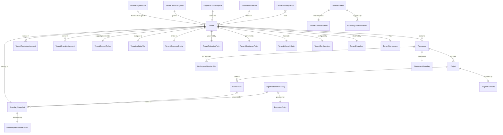
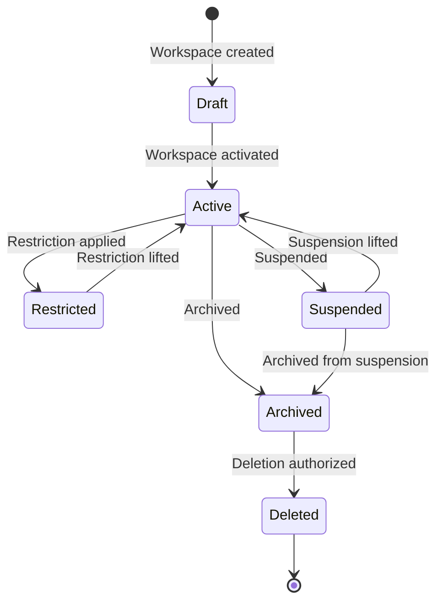
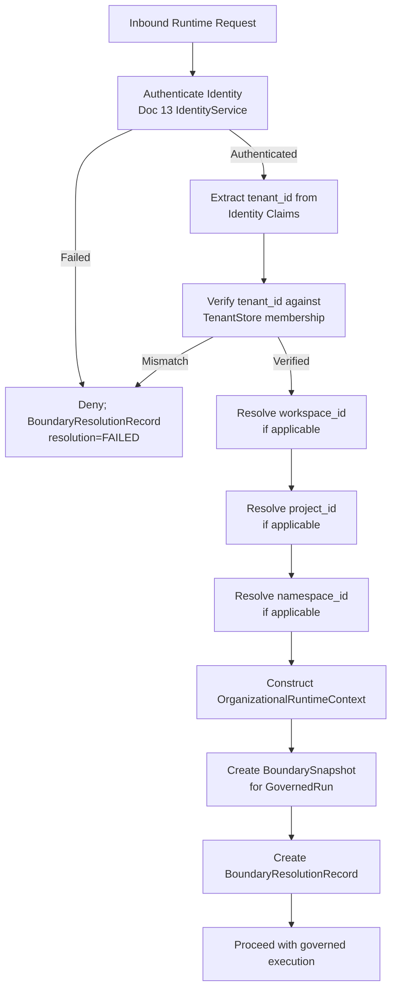
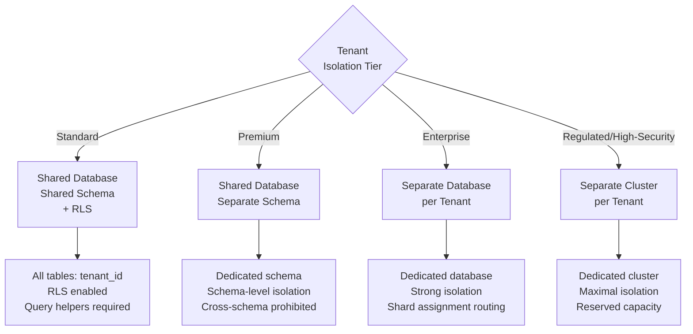
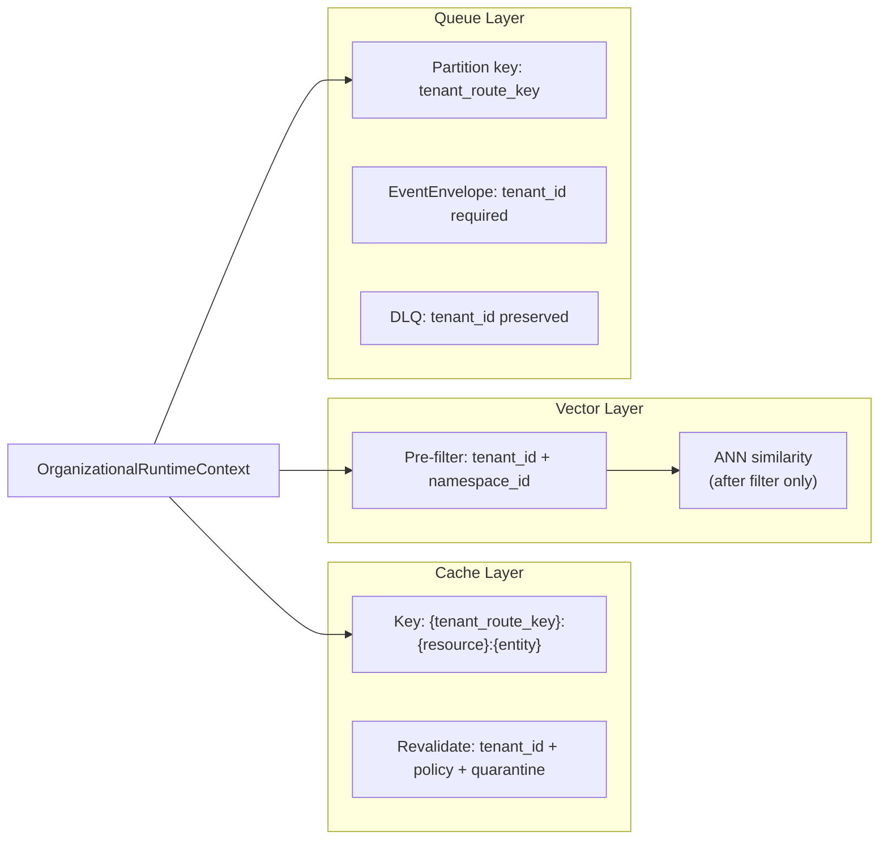
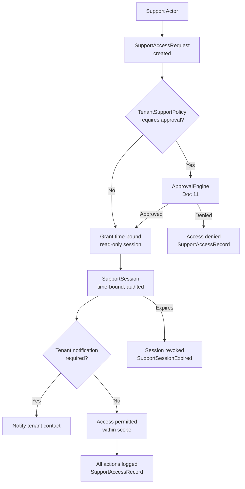
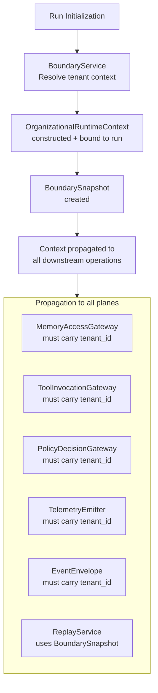
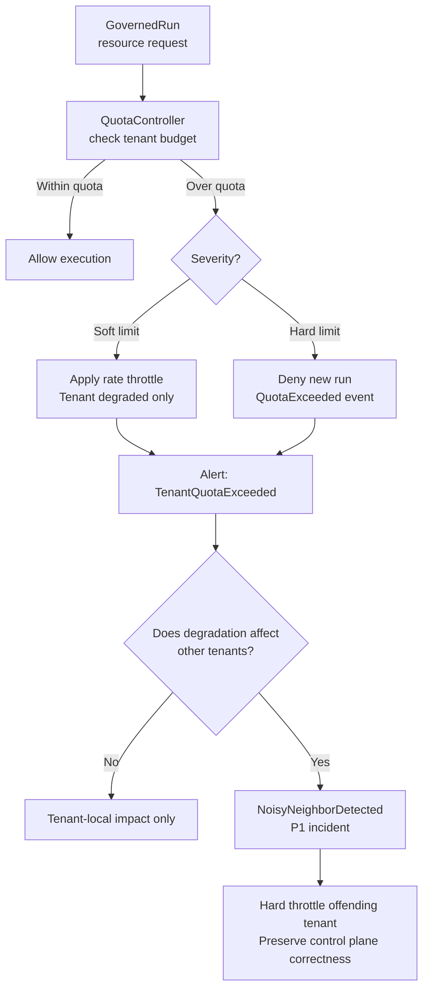

# MYCELIA — 14 Multi-Tenant Isolation & Organizational Boundaries

---

## Document Metadata

| Field | Value |
|---|---|
| Document Series | MYCELIA Architecture Constitution |
| Document Number | 14 |
| Version | v1.0 |
| Status | Canonical |
| Classification | Core Architecture — Multi-Tenant Isolation & Organizational Boundaries |
| Canonical Role | Defines the tenant model, organizational boundary architecture, workspace and namespace hierarchy, tenant context resolution, isolation across all runtime planes, storage isolation strategy, RLS contract, noisy neighbor control, data residency, tenant lifecycle, cross-boundary export, and cross-tenant incident containment for MYCELIA |
| Primary Audience | Platform Engineers, SRE Engineers, Data Architects, Security Engineers, Codex |
| Last Updated | June 2026 |

---

## Table of Contents

1. [Executive Summary](#1-executive-summary)
2. [Multi-Tenant Philosophy](#2-multi-tenant-philosophy)
3. [Scope and Non-Scope](#3-scope-and-non-scope)
4. [Canonical Organizational Domain Model](#4-canonical-organizational-domain-model)
5. [Tenant and Workspace Lifecycle](#5-tenant-and-workspace-lifecycle)
6. [Tenant Context Resolution](#6-tenant-context-resolution)
7. [Organizational Runtime Envelope](#7-organizational-runtime-envelope)
8. [BoundarySnapshot Architecture](#8-boundarysnapshot-architecture)
9. [Isolation Across Architectural Planes](#9-isolation-across-architectural-planes)
10. [Storage Isolation Strategy](#10-storage-isolation-strategy)
11. [Row-Level Security Enforcement Contract](#11-row-level-security-enforcement-contract)
12. [Cache, Queue and Vector Isolation](#12-cache-queue-and-vector-isolation)
13. [Model Provider and Prompt Boundary Isolation](#13-model-provider-and-prompt-boundary-isolation)
14. [Governance, Approval and Policy Boundary Isolation](#14-governance-approval-and-policy-boundary-isolation)
15. [Security and Trust Boundary Isolation](#15-security-and-trust-boundary-isolation)
16. [Observability and Telemetry Boundary Isolation](#16-observability-and-telemetry-boundary-isolation)
17. [Replay Boundary Isolation](#17-replay-boundary-isolation)
18. [Cross-Boundary Export, Federation and Sharing](#18-cross-boundary-export-federation-and-sharing)
19. [Support Access and Boundary Break-Glass](#19-support-access-and-boundary-break-glass)
20. [Data Residency and Regional Boundaries](#20-data-residency-and-regional-boundaries)
21. [Resource Fairness and Noisy Neighbor Control](#21-resource-fairness-and-noisy-neighbor-control)
22. [Tenant Offboarding, Archive and Purge](#22-tenant-offboarding-archive-and-purge)
23. [Cross-Tenant Incident and Containment Model](#23-cross-tenant-incident-and-containment-model)
24. [MVP Multi-Tenant Isolation Cut](#24-mvp-multi-tenant-isolation-cut)
25. [Multi-Tenant Diagrams](#25-multi-tenant-diagrams)
26. [Multi-Tenant Isolation Invariants](#26-multi-tenant-isolation-invariants)
27. [Multi-Tenant Anti-Patterns](#27-multi-tenant-anti-patterns)
28. [Codex Implementation Guidance](#28-codex-implementation-guidance)
29. [Relationship to Other Documents](#29-relationship-to-other-documents)
30. [Final Multi-Tenant Principles](#30-final-multi-tenant-principles)

---

## 1. Executive Summary

### 1.1 What Multi-Tenant Isolation & Organizational Boundaries Means in MYCELIA

Multi-tenant isolation in MYCELIA is not a billing mechanism, a UI grouping, or a database filter. It is an execution boundary, a memory boundary, a governance boundary, a security boundary, an observability boundary, and a replay boundary. Every runtime operation that MYCELIA performs exists inside an explicitly enforced organizational boundary. Crossing that boundary by any means — silently, through misconfiguration, or through adversarial input — is a critical security incident, not a runtime error.

MYCELIA is a governed cognitive operations runtime. It executes workflows that access sensitive enterprise knowledge, invoke external tools with real-world side effects, process regulated data, and produce auditable evidence chains. These operations MUST remain strictly bounded to the tenant that authorized them. A cognitive operation that accidentally reads another tenant's memory, evaluates another tenant's policies, or emits telemetry attributable to another tenant violates the foundational trust model of the platform.

### 1.2 Why Tenancy Is an Execution Boundary

Tenancy in MYCELIA is resolved at runtime initialization, propagated through every operation as part of the OrganizationalRuntimeContext, enforced independently at every architectural plane, and frozen into immutable BoundarySnapshots that anchor canonical replay. Every GovernedRun, every tool invocation, every memory retrieval, every policy evaluation, every approval gate, and every telemetry span is tenant-bound before it executes.

Tenancy is not added to execution after the fact. It is the context within which execution is authorized to occur.

### 1.3 Why Organizational Boundaries Are Replay-Authoritative

Canonical replay in MYCELIA reconstructs past execution from immutable event history. For that reconstruction to be forensically valid, it must reproduce the exact organizational context — the boundary conditions — under which the original execution occurred. This requires that every GovernedRun bind to an immutable BoundarySnapshot before execution begins, and that canonical replay hydrate its organizational context exclusively from that snapshot, never from current tenant configuration.

### 1.4 Why Tenant Context Must Never Come from Untrusted Inputs

A tenant identifier that is supplied by a user request body, URL parameter, model output, tool output, memory-retrieved content, or prompt text is not a verified tenant identifier. It is an unverified claim. MYCELIA's boundary resolution algorithm derives tenant context exclusively from authenticated identity claims, runtime_identity_id, session assertions, and authoritative system records. Any path that allows user-controlled or model-controlled input to influence tenant context is an isolation collapse vulnerability.

### 1.5 Why Isolation Must Exist Independently in Every Plane

No single isolation layer can be trusted to protect all planes. A storage-layer Row-Level Security policy does not prevent a misconfigured memory retrieval from returning cross-tenant vectors. A tenant-scoped event envelope does not prevent a telemetry query from aggregating multiple tenants. Each plane — storage, runtime, memory, governance, security, telemetry, event, replay — MUST enforce tenant isolation independently. The failure of one plane's isolation MUST NOT compromise other planes.

### 1.6 Core Boundaries

**Document 14 does not own security identity internals.** Document 13 owns the identity and trust architecture. Document 14 defines how tenant context binds to those identities.

**Document 14 does not own policy internals.** Document 11 owns the policy engine and governance authority. Document 14 defines how policy bindings are tenant-scoped.

**Document 14 does not own telemetry pipeline internals.** Document 12 owns the observability platform. Document 14 defines how telemetry must be tenant-isolated.

**Document 14 defines how every plane must remain tenant-bound.**

---

## 2. Multi-Tenant Philosophy

### 2.1 Tenant as Execution Universe

A tenant is not a record in a database. It is an execution universe: a complete, isolated, governed context within which MYCELIA operates on behalf of an organization. Every resource the tenant owns, every workflow the tenant runs, every memory artifact the tenant produces, every policy the tenant applies, and every audit record the tenant generates exists within that universe and cannot cross its boundary without explicit, governed authorization.

### 2.2 Organizational Boundary as Runtime Primitive

The organizational boundary is not an afterthought or a filtering concern. It is a runtime primitive that participates in every operation decision. Before a tool invokes, before a memory retrieval executes, before a policy evaluates, the platform establishes: "Which organization does this operation belong to? Is this operation authorized within that organization's boundary?"

### 2.3 Workspace as Internal Organizational Boundary

A workspace is an organizational sub-boundary within a tenant. It segments projects, teams, and resource scopes within a single tenant's universe. A workspace boundary is enforced for resource access, policy binding specificity, and approval chain scope, but it does not constitute a separate tenant. Cross-workspace access within a tenant requires explicit workspace-level policy grant.

### 2.4 No Tenantless Execution

Every runtime operation in MYCELIA MUST carry an established, verified tenant identity. There is no "global" mode, no "platform context" for tenant data operations, and no default tenant. A runtime operation without a verified tenant_id MUST be rejected.

### 2.5 No Cross-Tenant Cognition

Cognitive operations — model invocations, context assemblies, agent executions — MUST NOT access memory, policies, or context from a different tenant's universe. The probabilistic nature of language model inference does not exempt cognitive operations from deterministic organizational boundaries.

### 2.6 Canonical Distinctions

| Concept A | Concept B | Distinction |
|---|---|---|
| **Tenant** | **Account** | The execution boundary vs the billing/payment relationship |
| **Tenant** | **Billing customer** | The organizational isolation unit vs the entity that pays |
| **Tenant** | **Organization** | Platform isolation primitive vs the business entity it represents |
| **Tenant** | **Workspace** | Top-level execution universe vs an internal sub-boundary within it |
| **Workspace** | **Project** | Internal organizational segment vs a specific work scope within a workspace |
| **Namespace** | **Boundary** | A resource scoping unit vs the enforcement boundary around a scope |
| **Boundary** | **Policy scope** | Structural isolation unit vs the applicable policy set within it |
| **tenant_id** | **tenant_route_key** | The stable, opaque identifier vs the routing-safe, infrastructure-safe handle |
| **Display name** | **Opaque tenant identifier** | Human-readable label (not for infrastructure) vs stable platform-internal ID |
| **Data isolation** | **Compute isolation** | Ensuring different tenants' data is separate vs ensuring different tenants' compute is separate |
| **Logical isolation** | **Physical isolation** | Isolation enforced by software (RLS, filters) vs separate database/cluster per tenant |
| **Support access** | **Customer access** | Platform operator access to tenant data (audited, governed) vs tenant's own access |
| **Export** | **Shared mutable state** | Creating a new externalized artifact vs creating a live shared reference |
| **Federation** | **Isolation collapse** | Explicit, governed cross-boundary access vs treating two tenants as one |

---

## 3. Scope and Non-Scope

### 3.1 What Document 14 Owns

| Responsibility | Description |
|---|---|
| Tenant taxonomy | Tenant, Workspace, Project, Namespace hierarchy and definitions |
| Organizational boundary model | OrganizationalBoundary, BoundaryPolicy, BoundarySnapshot |
| Tenant lifecycle | Provisioning → Active → Suspended → Offboarding → Purged |
| Workspace lifecycle | Draft → Active → Restricted → Archived → Deleted |
| Namespace hierarchy | Namespace within workspace within tenant |
| Boundary resolution | Deterministic algorithm for resolving tenant context |
| Boundary snapshots | Immutable organizational context record for replay |
| Tenant context propagation | OrganizationalRuntimeContext through all operations |
| Tenant isolation across planes | Rules for every architectural plane |
| Storage isolation strategy | Shared schema, separate schema, separate database, hybrid |
| RLS enforcement contract | PostgreSQL RLS rules and session binding |
| Cache isolation | Tenant-keyed cache rules |
| Vector isolation | Pre-filter rules for semantic search |
| Queue/topic isolation | Tenant-routed event streams and DLQ metadata |
| Model provider boundary isolation | Provider routing, residency, data retention |
| Telemetry isolation | Tenant-scoped traces, metrics, logs |
| Governance boundary isolation | Tenant-scoped policy bindings and approval visibility |
| Replay boundary isolation | BoundarySnapshot hydration, replay namespace |
| Data residency and regional boundaries | TenantResidencyPolicy and regional routing |
| Noisy neighbor control | Quotas, rate limits, resource fairness |
| Support and break-glass access boundary | SupportAccessRequest, time-bound audited access |
| Cross-boundary export | CrossBoundaryExport schema and rules |
| Cross-tenant incident classes | Detection, containment, evidence |
| MVP tenancy cut | Minimum viable multi-tenant isolation |

### 3.2 What Document 14 Does Not Own

| Responsibility | Owned By |
|---|---|
| Human/service identity internals | Document 13 (Security & Trust) |
| Policy evaluation internals | Document 11 (Governance) |
| Event schema internals | Document 07 (Event Contracts) |
| Memory retrieval algorithms | Document 10 (Memory & Context) |
| Telemetry storage internals | Document 12 (Observability) |
| Infrastructure provisioning | Document 16 (Infrastructure) |
| SRE playbooks | Document 17 (SRE) |
| UI design | Document 20 (Operational UX) |
| Tool execution contracts | Document 15 (SDK & Tool Runtime) |
| Event broker topology | Document 08 (Event Runtime) |

### 3.3 Ownership Matrix

| Capability | Document 14 | Sibling Document |
|---|---|---|
| tenant_id propagation in runtime | Defines the propagation model | Doc 02/13 define runtime envelope |
| Tenant-scoped policy bindings | Defines binding scope | Doc 11 defines policy content |
| Tenant-scoped memory namespaces | Defines namespace scope | Doc 10 defines retrieval |
| Tenant-scoped telemetry partitions | Defines isolation rules | Doc 12 defines pipeline |
| Tenant-scoped identity | References | Doc 13 owns identity |
| Tenant-scoped event envelopes | Defines tenant routing rules | Doc 07 defines envelope schema |
| Storage isolation strategy | Defines logical model | Doc 16 deploys infrastructure |
| RLS enforcement | Defines contract | Doc 16 configures database |
| Cross-tenant incident containment | Defines incident classes | Doc 13 defines security response |
| Tenant lifecycle events | Defines lifecycle | Doc 11 governs approvals for transitions |

---

## 4. Canonical Organizational Domain Model

### 4.1 Entity Reference

#### Tenant

| Attribute | Value |
|---|---|
| Purpose | The top-level, opaque, stable organizational isolation unit; every resource, run, and record belongs to exactly one Tenant |
| Owner service | TenantService |
| Source of truth | TenantStore (durable) |
| Mutability | Metadata updateable; tenant_id immutable |
| Tenant scope | IS the tenant scope |
| Replay behavior | Preserved in all replay contexts |
| Retention | Permanent while active; tombstone after purge |
| Security classification | Highly Sensitive |
| Event/audit implications | TenantProvisioned, TenantSuspended, TenantOffboarded, TenantPurged |

#### TenantIdentity

| Attribute | Value |
|---|---|
| Purpose | The cryptographic identity claim representing a Tenant in the security layer; owned by Document 13 |
| Owner service | IdentityService (Doc 13) |
| Source of truth | IdentityStore |
| Mutability | Versioned |
| Tenant scope | IS the scope |
| Replay behavior | Preserved in BoundarySnapshot |
| Retention | Active duration + audit period |
| Security classification | Highly Sensitive |
| Event/audit implications | TenantIdentityCreated |

#### TenantRouteKey

| Attribute | Value |
|---|---|
| Purpose | An infrastructure-safe, opaque, non-reversible routing handle for a Tenant; used in partition keys, topic names, shard assignments, and cache namespaces WITHOUT embedding display name or sensitive metadata |
| Owner service | TenantService |
| Source of truth | TenantStore |
| Mutability | Immutable after generation |
| Tenant scope | Bound to tenant_id |
| Replay behavior | Preserved in BoundarySnapshot |
| Retention | Permanent |
| Security classification | Internal |
| Event/audit implications | None directly |

#### TenantRouteKey Rotation and Identifier Safety Rule

TenantRouteKey is an infrastructure-safe routing handle, not a display identifier.

It MUST be opaque, non-reversible, non-human-readable, and free of customer names, tenant display names, domains, emails, tax IDs, project names, or business identifiers.

### Rotation Rules

TenantRouteKey is normally immutable. Rotation MAY occur only under governed conditions:

- suspected route key exposure;
- infrastructure migration;
- compliance-driven anonymization;
- tenant merger or split;
- incident containment.

A rotation MUST create:

- old_route_key;
- new_route_key;
- rotation_reason;
- affected_resource_classes;
- migration_plan;
- validation_result;
- rollback_plan;
- actor_id;
- runtime_identity_id;
- created_at;
- audit_record_id.

### Rules

- TenantRouteKey MUST NOT contain tenant display names.
- TenantRouteKey MUST NOT be derived from tenant display names through reversible encoding.
- TenantRouteKey MUST NOT be reused across tenants.
- TenantRouteKey rotation MUST preserve event, telemetry, cache, DLQ, archive and replay lookup compatibility.
- Historical BoundarySnapshots MUST preserve the route key used at original execution time.
- New events after rotation MUST use the new route key, while historical replay MUST understand old route key mappings.

### Forbidden Behavior

FORBIDDEN:

- naming Kafka topics, cache keys, schemas, indexes, buckets, or queues with tenant display names;
- deriving TenantRouteKey from customer domain, email, legal name, or tax identifier;
- rotating TenantRouteKey without migration and replay compatibility plan;
- deleting old route key mapping before historical replay and archive lookups are safe;
- allowing Codex to use tenant display name as infrastructure identifier during MVP.

#### TenantNamespace

| Attribute | Value |
|---|---|
| Purpose | The logical namespace grouping all resources, operations, and data belonging to a Tenant; used to scope storage partitions, indexes, queues, cache namespaces, and telemetry |
| Owner service | TenantService |
| Source of truth | TenantStore |
| Mutability | Immutable |
| Tenant scope | IS the scope |
| Replay behavior | Preserved in all replay contexts |
| Retention | Permanent |
| Security classification | Sensitive |
| Event/audit implications | None directly |

#### TenantConfiguration

| Attribute | Value |
|---|---|
| Purpose | The versioned set of tenant-specific settings: feature flags, capability allowlists, provider allowlists, classification ceiling, retention preferences, residency policy reference |
| Owner service | TenantService |
| Source of truth | TenantStore |
| Mutability | Versioned; new version on change |
| Tenant scope | Bound to tenant_id |
| Replay behavior | Configuration version preserved in BoundarySnapshot |
| Retention | All versions retained for audit |
| Security classification | Sensitive |
| Event/audit implications | TenantConfigurationUpdated |

#### TenantLifecycleState

| Attribute | Value |
|---|---|
| Purpose | The current lifecycle state of a Tenant (Provisioning, Active, Suspended, Restricted, Offboarding, Archived, PurgePending, Purged, Restoring, Restored) |
| Owner service | TenantService |
| Source of truth | TenantStore (strongly consistent) |
| Mutability | State transitions only; history append-only |
| Tenant scope | Bound to tenant_id |
| Replay behavior | Historical state recorded in BoundarySnapshot |
| Retention | Full history retained |
| Security classification | Sensitive |
| Event/audit implications | TenantLifecycleTransitioned |

#### TenantResidencyPolicy

| Attribute | Value |
|---|---|
| Purpose | Declares the Tenant's data residency requirements: allowed processing regions, prohibited regions, backup regions, key residency, replay regions, archive regions |
| Owner service | TenantService |
| Source of truth | TenantStore |
| Mutability | Versioned |
| Tenant scope | Bound to tenant_id |
| Replay behavior | Version preserved in BoundarySnapshot |
| Retention | All versions retained |
| Security classification | Sensitive |
| Event/audit implications | ResidencyPolicyUpdated |

#### TenantRetentionPolicy

| Attribute | Value |
|---|---|
| Purpose | Declares how long different categories of tenant data must be retained: audit records, workflow artifacts, telemetry, memory, events, replay artifacts |
| Owner service | TenantService |
| Source of truth | TenantStore |
| Mutability | Versioned |
| Tenant scope | Bound to tenant_id |
| Replay behavior | Preserved in BoundarySnapshot |
| Retention | All versions retained |
| Security classification | Sensitive |
| Event/audit implications | RetentionPolicyUpdated |

#### TenantResourceQuota

| Attribute | Value |
|---|---|
| Purpose | Per-tenant resource limits: workflow concurrency, worker capacity, token usage, tool executions, memory retrieval volume, API rate limits, storage quota |
| Owner service | TenantService / QuotaService |
| Source of truth | TenantStore |
| Mutability | Versioned |
| Tenant scope | Bound to tenant_id |
| Replay behavior | Quota version preserved in BoundarySnapshot |
| Retention | Versioned history retained |
| Security classification | Sensitive |
| Event/audit implications | TenantQuotaUpdated, TenantQuotaExceeded |

#### TenantIsolationTier

| Attribute | Value |
|---|---|
| Purpose | Declares the storage and compute isolation model for a Tenant: Shared (RLS), SchemaPer, DatabasePer, ClusterPer, Enterprise (reserved capacity) |
| Owner service | TenantService |
| Source of truth | TenantStore |
| Mutability | Versioned; tier migration governed |
| Tenant scope | Bound to tenant_id |
| Replay behavior | Tier version preserved in BoundarySnapshot |
| Retention | Versioned history |
| Security classification | Sensitive |
| Event/audit implications | TenantTierMigrated |

#### TenantSupportPolicy

| Attribute | Value |
|---|---|
| Purpose | Declares the rules for platform support access: default consent level, required approval, notification requirements, read-only default, time-bound constraints |
| Owner service | TenantService |
| Source of truth | TenantStore |
| Mutability | Versioned |
| Tenant scope | Bound to tenant_id |
| Replay behavior | Preserved in BoundarySnapshot |
| Retention | Versioned history |
| Security classification | Highly Sensitive |
| Event/audit implications | SupportPolicyUpdated |

#### TenantOffboardingPlan

| Attribute | Value |
|---|---|
| Purpose | A governed plan for tenant offboarding: export window, support window, retention window, legal hold check, purge eligibility schedule |
| Owner service | TenantService |
| Source of truth | TenantStore |
| Mutability | Updateable with audit trail |
| Tenant scope | Bound to tenant_id |
| Replay behavior | Not applicable |
| Retention | Permanent (even after purge) |
| Security classification | Highly Sensitive |
| Event/audit implications | OffboardingPlanCreated, OffboardingStageCompleted |

#### TenantPurgeRecord

| Attribute | Value |
|---|---|
| Purpose | Immutable evidence that a tenant was purged: purge timestamp, legal hold verification result, retained artifacts list, acting identity, approval reference |
| Owner service | TenantService |
| Source of truth | PurgeRecordStore (append-only) |
| Mutability | IMMUTABLE |
| Tenant scope | Bound to (now-purged) tenant_id |
| Replay behavior | Tombstone level only; no full replay after purge |
| Retention | Permanent |
| Security classification | Highly Sensitive |
| Event/audit implications | TenantPurged |

#### Organization

| Attribute | Value |
|---|---|
| Purpose | The logical business entity grouping one or more Tenants (for enterprise licensing, support, and federated configuration); NOT an isolation boundary itself |
| Owner service | OrganizationService |
| Source of truth | OrganizationStore |
| Mutability | Updateable |
| Tenant scope | Organizations may contain multiple tenants; each Tenant is still fully isolated |
| Replay behavior | Not directly in replay context |
| Retention | Permanent while active |
| Security classification | Sensitive |
| Event/audit implications | OrganizationUpdated |

#### Workspace

| Attribute | Value |
|---|---|
| Purpose | An internal organizational boundary within a Tenant: segments projects, teams, and resource scopes; scopes policy bindings and approval chains at finer granularity than tenant |
| Owner service | WorkspaceService |
| Source of truth | WorkspaceStore |
| Mutability | Metadata updateable; workspace_id immutable |
| Tenant scope | Bound to tenant_id |
| Replay behavior | workspace_id preserved in BoundarySnapshot |
| Retention | Active duration + audit period after deletion |
| Security classification | Sensitive |
| Event/audit implications | WorkspaceCreated, WorkspaceArchived, WorkspaceDeleted |

#### WorkspaceBoundary

| Attribute | Value |
|---|---|
| Purpose | The enforcement boundary around a Workspace; defines which resources, policies, and approval chains are scoped to this workspace |
| Owner service | WorkspaceService |
| Source of truth | WorkspaceStore |
| Mutability | Versioned |
| Tenant scope | Bound to tenant_id + workspace_id |
| Replay behavior | Version preserved in BoundarySnapshot |
| Retention | Versioned history |
| Security classification | Sensitive |
| Event/audit implications | None directly |

#### WorkspaceMembership

| Attribute | Value |
|---|---|
| Purpose | The association of a GovernanceActor or RuntimeIdentity to a Workspace with a declared role; controls what operations are authorized within that workspace |
| Owner service | WorkspaceService |
| Source of truth | WorkspaceStore |
| Mutability | Versioned |
| Tenant scope | Bound to tenant_id |
| Replay behavior | Membership version preserved in BoundarySnapshot |
| Retention | Versioned history |
| Security classification | Sensitive |
| Event/audit implications | WorkspaceMemberAdded, WorkspaceMemberRemoved |

#### Project

| Attribute | Value |
|---|---|
| Purpose | A specific work scope within a Workspace; scopes workflow definitions, memory namespaces, and project-specific policy refinements |
| Owner service | ProjectService |
| Source of truth | ProjectStore |
| Mutability | Metadata updateable; project_id immutable |
| Tenant scope | Bound to tenant_id + workspace_id |
| Replay behavior | project_id preserved in BoundarySnapshot |
| Retention | Active duration + audit period |
| Security classification | Sensitive |
| Event/audit implications | ProjectCreated, ProjectArchived |

#### ProjectBoundary

| Attribute | Value |
|---|---|
| Purpose | The enforcement boundary around a Project; defines resource access scope, memory namespace restriction, and policy refinement points |
| Owner service | ProjectService |
| Source of truth | ProjectStore |
| Mutability | Versioned |
| Tenant scope | Bound to tenant_id + workspace_id |
| Replay behavior | Version preserved in BoundarySnapshot |
| Retention | Versioned history |
| Security classification | Sensitive |
| Event/audit implications | None directly |

#### Namespace

| Attribute | Value |
|---|---|
| Purpose | A fine-grained resource scoping unit within a Project or Workspace; used for memory partitioning, vector index partitioning, and policy granularity |
| Owner service | NamespaceService |
| Source of truth | NamespaceStore |
| Mutability | Immutable after creation |
| Tenant scope | Bound to tenant_id |
| Replay behavior | namespace_id preserved in BoundarySnapshot and memory operations |
| Retention | Active duration + audit period |
| Security classification | Sensitive |
| Event/audit implications | NamespaceCreated, NamespaceArchived |

#### OrganizationalBoundary

| Attribute | Value |
|---|---|
| Purpose | The aggregate runtime boundary for an executing operation: the combination of Tenant, Workspace, Project, and Namespace that defines where an operation may exist and what it may access |
| Owner service | BoundaryService |
| Source of truth | Derived at resolution time from TenantStore, WorkspaceStore, ProjectStore |
| Mutability | Immutable per operation; resolved once |
| Tenant scope | IS the tenant scope |
| Replay behavior | Frozen in BoundarySnapshot |
| Retention | Within BoundarySnapshot retention |
| Security classification | Sensitive |
| Event/audit implications | None directly |

#### BoundaryPolicy

| Attribute | Value |
|---|---|
| Purpose | A versioned set of rules governing what is allowed within a specific OrganizationalBoundary: capability restrictions, data classification ceiling, provider allowlist, residency override |
| Owner service | BoundaryService / PolicyService (Doc 11) |
| Source of truth | PolicyStore (Doc 11) |
| Mutability | Versioned |
| Tenant scope | Bound to tenant_id |
| Replay behavior | Version reference preserved in BoundarySnapshot |
| Retention | Versioned history |
| Security classification | Sensitive |
| Event/audit implications | BoundaryPolicyUpdated |

#### BoundarySnapshot

| Attribute | Value |
|---|---|
| Purpose | An immutable, hash-verified record of the complete organizational boundary context at the time a GovernedRun was initialized; the replay anchor for organizational context |
| Owner service | BoundaryService |
| Source of truth | BoundarySnapshotStore (immutable, durable) |
| Mutability | IMMUTABLE after creation |
| Tenant scope | Bound to tenant_id |
| Replay behavior | IS the replay anchor; canonical replay MUST use this |
| Retention | Full GovernedRun audit retention period |
| Security classification | Highly Sensitive |
| Event/audit implications | BoundarySnapshotCreated |

#### BoundaryResolutionRecord

| Attribute | Value |
|---|---|
| Purpose | A durable record of a boundary resolution event: inputs used, resolution algorithm version, resolved tenant_id, workspace_id, project_id, namespace_id, and outcome |
| Owner service | BoundaryService |
| Source of truth | BoundaryAuditStore (append-only) |
| Mutability | IMMUTABLE |
| Tenant scope | Bound to resolved tenant_id |
| Replay behavior | Preserved for forensic audit |
| Retention | Audit retention period |
| Security classification | Sensitive |
| Event/audit implications | BoundaryResolved |

#### BoundaryViolationRecord

| Attribute | Value |
|---|---|
| Purpose | An immutable record of a detected attempt to cross an organizational boundary without authorization |
| Owner service | BoundaryService / SecurityService (Doc 13) |
| Source of truth | BoundaryAuditStore |
| Mutability | IMMUTABLE |
| Tenant scope | Bound to affected tenant_id(s) |
| Replay behavior | Preserved for security investigation |
| Retention | Security retention period |
| Security classification | Highly Sensitive |
| Event/audit implications | BoundaryViolationDetected (security event) |

#### CrossBoundaryExport

| Attribute | Value |
|---|---|
| Purpose | A governed record of an approved data export from one tenant's boundary to an external recipient or a different organizational scope |
| Owner service | ExportService |
| Source of truth | ExportStore (durable) |
| Mutability | Immutable after creation; expiration appended |
| Tenant scope | Bound to source tenant_id |
| Replay behavior | Export events preserved for forensic audit |
| Retention | Audit retention period |
| Security classification | Highly Sensitive |
| Event/audit implications | CrossBoundaryExportCreated, CrossBoundaryExportExpired |

#### FederationContract

| Attribute | Value |
|---|---|
| Purpose | A versioned, explicitly approved contract that defines the terms of a governed cross-boundary collaboration between two tenants; NEVER collapses isolation |
| Owner service | FederationService |
| Source of truth | FederationStore |
| Mutability | Versioned; immutable per version |
| Tenant scope | Bound to both participating tenant_ids |
| Replay behavior | Contract version preserved for audit |
| Retention | Active duration + full audit period |
| Security classification | Highly Sensitive |
| Event/audit implications | FederationContractCreated, FederationContractRevoked |

#### SupportAccessRequest

| Attribute | Value |
|---|---|
| Purpose | A governed request by platform support personnel to access a specific tenant's resources for a declared purpose and time period |
| Owner service | SupportAccessService |
| Source of truth | SupportAccessStore (durable) |
| Mutability | Immutable; outcome appended |
| Tenant scope | Bound to target tenant_id |
| Replay behavior | Preserved for security audit |
| Retention | Security retention period |
| Security classification | Highly Sensitive |
| Event/audit implications | SupportAccessRequested, SupportAccessGranted, SupportAccessDenied, SupportAccessExpired |

#### BoundaryBreakGlassAccess

| Attribute | Value |
|---|---|
| Purpose | An emergency, time-bound, fully audited access event that allows governed support or operations action within a tenant's boundary under documented emergency conditions |
| Owner service | SupportAccessService |
| Source of truth | SupportAccessStore |
| Mutability | Immutable |
| Tenant scope | Bound to target tenant_id |
| Replay behavior | Preserved for security audit |
| Retention | Permanent |
| Security classification | Highly Sensitive |
| Event/audit implications | BoundaryBreakGlassActivated |

#### TenantIncident

| Attribute | Value |
|---|---|
| Purpose | A durable record of a cross-tenant or intra-tenant security/isolation incident: class, timeline, affected tenant(s), containment actions, evidence bundle reference |
| Owner service | SecurityService (Doc 13) |
| Source of truth | IncidentStore |
| Mutability | Append-only |
| Tenant scope | Bound to affected tenant_id(s) |
| Replay behavior | Forensic investigation only |
| Retention | Legal security retention |
| Security classification | Highly Sensitive |
| Event/audit implications | TenantIncidentOpened, TenantIncidentContained, TenantIncidentClosed |

#### TenantEvidenceBundle

| Attribute | Value |
|---|---|
| Purpose | A structured collection of audit records, boundary snapshots, violation records, access records, and incident records assembled for a tenant security event or regulatory audit |
| Owner service | SecurityService / BoundaryService |
| Source of truth | EvidenceStore |
| Mutability | Append-only |
| Tenant scope | Bound to tenant_id |
| Replay behavior | Used for forensic investigation |
| Retention | Legal retention period |
| Security classification | Highly Sensitive |
| Event/audit implications | TenantEvidenceBundleCreated |

#### TenantResourceAllocation

| Attribute | Value |
|---|---|
| Purpose | A record of resource pool assignments and quota utilization for a tenant within a resource governance period |
| Owner service | QuotaService |
| Source of truth | QuotaStore |
| Mutability | Append-only |
| Tenant scope | Bound to tenant_id |
| Replay behavior | Resource state preserved in BoundarySnapshot |
| Retention | Operational retention period |
| Security classification | Sensitive |
| Event/audit implications | QuotaExceeded, QuotaReserved |

#### TenantUsageRecord

| Attribute | Value |
|---|---|
| Purpose | A time-series record of a tenant's resource consumption: run count, token usage, tool invocations, API calls, storage consumption |
| Owner service | UsageService |
| Source of truth | UsageStore |
| Mutability | Append-only |
| Tenant scope | Bound to tenant_id |
| Replay behavior | Excluded from replay context |
| Retention | FinOps retention period |
| Security classification | Sensitive |
| Event/audit implications | None directly |

#### TenantShardAssignment

| Attribute | Value |
|---|---|
| Purpose | Maps a Tenant to specific storage shard(s), schema(s), or database(s) depending on isolation tier; used for routing all storage operations |
| Owner service | ShardingService |
| Source of truth | ShardingStore (strongly consistent) |
| Mutability | Governed migration; history retained |
| Tenant scope | Bound to tenant_id |
| Replay behavior | Shard assignment version preserved in BoundarySnapshot |
| Retention | Full history retained |
| Security classification | Internal |
| Event/audit implications | TenantShardMigrated |

#### TenantRegionAssignment

| Attribute | Value |
|---|---|
| Purpose | Maps a Tenant to specific deployment region(s) for data residency compliance; governs where storage, compute, memory, and telemetry are located |
| Owner service | ResidencyService |
| Source of truth | ResidencyStore (strongly consistent) |
| Mutability | Versioned; migration governed |
| Tenant scope | Bound to tenant_id |
| Replay behavior | Region assignment version preserved in BoundarySnapshot |
| Retention | Full history retained |
| Security classification | Sensitive |
| Event/audit implications | TenantRegionMigrated |

### 4.2 Entity Relationship Diagram


### 4.3 Tenancy Event Registration Rule

All publishable tenancy, boundary, residency, support-access, export, lifecycle, and incident events referenced in this document MUST be registered or explicitly mapped in Document 07 - Event & Messaging Contracts before implementation.

Document 14 defines organizational boundary semantics, but it MUST NOT independently create publishable event types outside the canonical event catalog.

### Required Tenancy Event Families

The following event families SHOULD be registered or mapped in Document 07:

| Event Family | Examples |
|---|---|
| Tenant lifecycle events | `TenantProvisioned`, `TenantSuspended`, `TenantRestricted`, `TenantOffboardingStarted`, `TenantArchived`, `TenantPurgePending`, `TenantPurged`, `TenantRestored` |
| Workspace lifecycle events | `WorkspaceCreated`, `WorkspaceRestricted`, `WorkspaceSuspended`, `WorkspaceArchived`, `WorkspaceDeleted` |
| Boundary events | `BoundaryResolved`, `BoundaryResolutionFailed`, `BoundarySnapshotCreated`, `BoundaryViolationDetected`, `BoundarySnapshotIntegrityFailed` |
| Residency events | `ResidencyPolicyUpdated`, `ResidencyViolationDetected`, `TenantRegionMigrated` |
| Storage/shard events | `TenantShardAssigned`, `TenantShardMigrated`, `TenantIsolationTierChanged` |
| Support access events | `SupportAccessRequested`, `SupportAccessGranted`, `SupportAccessDenied`, `SupportAccessExpired`, `BoundaryBreakGlassActivated` |
| Export/federation events | `CrossBoundaryExportCreated`, `CrossBoundaryExportExpired`, `FederationContractCreated`, `FederationContractRevoked` |
| Quota/fairness events | `TenantQuotaUpdated`, `TenantQuotaExceeded`, `NoisyNeighborDetected` |
| Offboarding/purge events | `OffboardingPlanCreated`, `OffboardingStageCompleted`, `TenantPurgeRecordCreated`, `PurgeViolationDetected` |
| Incident events | `TenantIncidentOpened`, `TenantIncidentContained`, `TenantIncidentClosed` |

### Event Mapping Rule

If Document 07 already defines a broader canonical event type, Document 14 concepts MAY map to that broader event instead of creating a new event name.

Example:

| Document 14 Concept | Allowed Document 07 Mapping |
|---|---|
| `BoundaryViolationDetected` | `TenantBoundaryViolationDetected` |
| `ResidencyViolationDetected` | `SecurityThreatDetected` with threat_type=`residency_violation` |
| `SupportAccessViolation` | `SecurityThreatDetected` with threat_type=`support_access_violation` |
| `NoisyNeighborDetected` | `ResourceIsolationViolationDetected` |
| `BoundarySnapshotIntegrityFailed` | `IntegrityVerificationFailed` |

### Rules

- Tenancy events MUST use the canonical EventEnvelope from Document 07.
- Tenancy events MUST include `tenant_id`, `correlation_id`, `causation_id`, `runtime_identity_id`, `event_schema_version`, and `event_hash`.
- Platform-scoped tenancy events MUST explicitly declare platform scope and MUST NOT omit scope metadata silently.
- Cross-tenant incident events MUST identify affected tenants through governed evidence references, not by exposing raw tenant names.
- Replay tenancy events MUST be isolated from production event streams where applicable.

### Forbidden Behavior

FORBIDDEN:

- allowing Codex to invent tenancy event names from prose;
- emitting tenancy events not registered or mapped in Document 07;
- publishing boundary events without schema validation;
- emitting replay boundary events into production event streams;
- using tenant display names inside event type names, topic names, or event routing keys.

---

## 5. Tenant and Workspace Lifecycle

### 5.1 Tenant Lifecycle States

| State | Description |
|---|---|
| **Provisioning** | Tenant is being initialized; storage, namespaces, keys, and shard assignments are being created |
| **Active** | Tenant is fully operational; all capabilities available per TenantConfiguration |
| **Suspended** | Tenant is temporarily blocked from new execution; existing runs may complete; no new runs may start |
| **Restricted** | Tenant may run only explicitly allowed operations; all other operations denied pending issue resolution |
| **Offboarding** | Tenant has initiated offboarding; no new workflows; export window active; support window active |
| **Archived** | Tenant is no longer operational; read-only audit and export access permitted per retention policy |
| **PurgePending** | Purge eligibility verified; legal hold checked; awaiting final purge authorization |
| **Purged** | Tenant data purged per offboarding plan; TenantPurgeRecord created; tombstone retained |
| **Restoring** | Tenant is being restored from archive (governance-approved use only) |
| **Restored** | Tenant restoration complete; operational under governance-defined constraints |

### 5.2 Tenant Lifecycle State Machine

```mermaid
stateDiagram-v2
  [*] --> Provisioning : Tenant provisioned
  Provisioning --> Active : Provisioning complete
  Provisioning --> Purged : Provisioning failure + cleanup
  Active --> Suspended : Suspension event (billing, compliance)
  Active --> Restricted : Policy restriction applied
  Active --> Offboarding : Offboarding initiated
  Suspended --> Active : Suspension lifted
  Suspended --> Offboarding : Suspend → offboard
  Restricted --> Active : Restriction lifted
  Restricted --> Suspended : Escalation
  Offboarding --> Archived : Offboarding complete; retention active
  Archived --> PurgePending : Retention period satisfied; legal hold clear
  PurgePending --> Purged : Purge authorized + executed
  PurgePending --> Archived : Purge blocked (legal hold)
  Purged --> Restoring : Restoration authorized (rare)
  Restoring --> Restored : Restoration complete
  Restored --> Active : Fully restored
  Restored --> Archived : Re-archived
```



### 5.3 Workspace Lifecycle States

| State | Description |
|---|---|
| **Draft** | Workspace being configured; no production resources |
| **Active** | Workspace fully operational within tenant |
| **Restricted** | Workspace limited to specific operations pending review |
| **Suspended** | Workspace temporarily blocked from execution |
| **Archived** | Workspace archived; read-only audit access |
| **Deleted** | Workspace logically deleted; audit evidence preserved at tenant level |

### 5.4 Workspace Lifecycle State Machine



### 5.5 Lifecycle Rules

**LC-01.** Suspended tenants MUST NOT start new GovernedRuns.

**LC-02.** Restricted tenants MAY run only explicitly allowed operations as declared in their active restriction order.

**LC-03.** Offboarding tenants MUST NOT create new workflows or persistent resources.

**LC-04.** Archived tenants MAY allow read-only audit and export access according to TenantRetentionPolicy.

**LC-05.** Purged tenants MUST NOT be replayable unless legally retained replay artifacts exist under explicit legal or contractual hold.

**LC-06.** Purge MUST preserve required legal hold records, audit evidence, and TenantPurgeRecord before any data destruction.

**LC-07.** Tenant restoration MUST be governance-approved and MUST emit TenantRestored security and governance events.

**LC-08.** Workspace deletion MUST NOT delete tenant-level audit evidence; audit records survive workspace deletion.

---

## 6. Tenant Context Resolution

### 6.1 Deterministic Boundary Resolution Algorithm

Tenant context MUST be resolved through the following ordered resolution algorithm. The first successful resolution source wins. Resolution MUST fail closed if no authoritative source is found.

| Priority | Source | Description |
|---|---|---|
| 1 | Authenticated identity claims | JWT claims or SAML assertions from verified IdP (Doc 13) |
| 2 | runtime_identity_id | RuntimeIdentity issued by IdentityService with tenant_id claim (Doc 13) |
| 3 | Session assertion | SessionAssertion from SecurityService carrying tenant_id |
| 4 | Tenant membership | Verified membership record in TenantStore |
| 5 | Workspace membership | Verified workspace membership resolving parent tenant_id |
| 6 | Resource ownership | Verified resource ownership record |
| 7 | Workflow ownership | WorkflowDefinition tenant_id from WorkflowStore |
| 8 | Runtime envelope | RunEnvelope carrying verified tenant_id from runtime init |
| 9 | Policy binding | PolicyBinding tenant_id resolution |
| 10 | Boundary snapshot | BoundarySnapshot tenant_id for replay context |
| 11 | Platform-scoped override | Explicit platform-admin override with full access record |

### 6.2 Forbidden Resolution Inputs

The following MUST NEVER be used as tenant context resolution inputs:

- user-submitted tenant_id in request body
- URL parameter without server-side authentication validation
- client-side workspace selection or tenant selection
- model-generated tenant references (LLM output may not set tenant context)
- tool-returned tenant identifiers
- memory-retrieved organizational identifiers
- prompt text or any user-provided unverified text
- telemetry labels or metric labels
- cached display names
- session cookie values without cryptographic verification

**FORBID-01.** Tenant context MUST be derived from authenticated and authoritative system records only.

**FORBID-02.** Tenant context MUST NOT be inferred from user text, model output, tool output, or unverified metadata.

**FORBID-03.** Ambiguous boundary resolution MUST fail closed, not default to a fallback tenant.

**FORBID-04.** BoundaryResolutionRecord MUST be created for every governed execution resolution.

**FORBID-05.** BoundarySnapshot MUST be created before governed execution begins when replay may be required.

### 6.3 Boundary Resolution Flow



---

## 7. Organizational Runtime Envelope

### 7.1 OrganizationalRuntimeContext Schema

Every GovernedRun, tool invocation, memory retrieval, and policy evaluation MUST operate within a fully resolved OrganizationalRuntimeContext.

```
OrganizationalRuntimeContext {
  tenant_id:                  required; opaque; immutable for duration of run
  tenant_route_key:           required; infrastructure-routing handle
  workspace_id:               optional; resolves to tenant if absent
  project_id:                 optional; resolves to workspace if absent
  namespace_id:               optional; resolves to project if absent
  boundary_id:                required; identifies the active OrganizationalBoundary
  boundary_snapshot_id:       required; links to immutable BoundarySnapshot
  runtime_identity_id:        required (Doc 13)
  actor_id:                   optional; present for human-initiated operations
  governance_scope_id:        required; links to active GovernanceScope
  policy_snapshot_id:         required (Doc 11)
  security_snapshot_id:       required (Doc 13)
  replay_context_id:          optional; present when operating in replay mode
  data_classification:        required; highest classification in scope
  residency_region:           required; active processing region
  execution_permissions:      required; allowed operations in this context
  resource_quota_context:     required; active quota limits
  trace_id:                   required (Doc 12)
  correlation_id:             required (Doc 07)
  causation_id:               optional (Doc 07)
}
```

### 7.2 Context Rules

**CTX-01.** No GovernedRun may start without a fully resolved OrganizationalRuntimeContext.

**CTX-02.** No tool invocation may execute outside an OrganizationalRuntimeContext.

**CTX-03.** No memory retrieval may execute outside an OrganizationalRuntimeContext.

**CTX-04.** No telemetry item may be emitted without tenant_id unless explicitly platform-scoped.

**CTX-05.** OrganizationalRuntimeContext MUST be immutable for the duration of a GovernedRun except through explicit, auditable StateTransitionCoordinator records.

**CTX-06.** Replay MUST hydrate the original OrganizationalRuntimeContext from the BoundarySnapshot, not from current tenant configuration.

---

## 8. BoundarySnapshot Architecture

### 8.1 BoundarySnapshot Schema

```
BoundarySnapshot {
  snapshot_id:                UUID (primary key)
  tenant_id:                  required
  tenant_route_key:           required
  workspace_id:               optional
  project_id:                 optional
  namespace_id:               optional
  boundary_policy_refs: [     list of BoundaryPolicy version IDs active at snapshot time
  ]
  policy_snapshot_id:         required (Doc 11 PolicySnapshot reference)
  security_snapshot_id:       required (Doc 13 SecuritySnapshot reference)
  residency_policy_ref:       required (TenantResidencyPolicy version)
  support_access_policy_ref:  required (TenantSupportPolicy version)
  active_quota_context:       quota limits in effect at snapshot time
  active_region_context:      processing region in effect at snapshot time
  isolation_tier:             TenantIsolationTier at snapshot time
  shard_assignment_ref:       TenantShardAssignment version
  configuration_version:      TenantConfiguration version
  identity_lineage_refs: [    list of identity chain references
  ]
  created_at:                 timestamp
  created_by:                 runtime_identity_id
  snapshot_hash:              SHA-256 of all snapshot fields
  previous_snapshot_id:       optional; prior snapshot for lineage
}
```
### 8.1.1 BoundarySnapshot Hash Boundary

MYCELIA distinguishes between BoundarySnapshot integrity and Document 07 EventEnvelope integrity.

A BoundarySnapshot is an immutable organizational context record.

A BoundarySnapshot creation event is a publishable EventEnvelope governed by Document 07.

They MAY reference each other, but their hashes have different meanings.

### Hash Fields

| Field | Applies To | Meaning |
|---|---|---|
| `snapshot_hash` | BoundarySnapshot | Hash of the immutable BoundarySnapshot content |
| `previous_snapshot_hash` | BoundarySnapshot | Optional hash-chain link to the previous BoundarySnapshot in the same run or boundary lineage |
| `event_hash` | Document 07 EventEnvelope | Hash of the published event fact |
| `payload_hash` | Document 07 EventEnvelope | Hash of externalized event payload |

### Included in `snapshot_hash`

`snapshot_hash` SHOULD include:

- `snapshot_id`;
- `tenant_id`;
- `tenant_route_key`;
- `workspace_id`;
- `project_id`;
- `namespace_id`;
- `boundary_policy_refs`;
- `policy_snapshot_id`;
- `security_snapshot_id`;
- `residency_policy_ref`;
- `support_access_policy_ref`;
- `active_quota_context`;
- `active_region_context`;
- `isolation_tier`;
- `shard_assignment_ref`;
- `configuration_version`;
- `identity_lineage_refs`;
- `created_at`;
- `created_by`;
- `previous_snapshot_id` when present.

### Excluded from `snapshot_hash`

`snapshot_hash` MUST exclude:

- `snapshot_hash` itself;
- database storage location;
- storage partition;
- index pointer;
- query metadata;
- telemetry metadata;
- broker offset;
- broker partition;
- mutable archival location;
- mutable retention processing fields.

### Rules

- `snapshot_hash` MUST be computed before the BoundarySnapshot is committed as immutable.
- BoundarySnapshot hash verification MUST NOT depend on storage, broker, query, or telemetry metadata.
- BoundarySnapshot hash MUST remain stable across archive tier transitions.
- BoundarySnapshot creation events MUST use Document 07 `event_hash`.
- BoundarySnapshot records MAY reference Document 07 events, but MUST remain independently integrity-verifiable.

### Forbidden Behavior

FORBIDDEN:

- computing `snapshot_hash` over mutable storage metadata;
- recomputing `snapshot_hash` after archival migration;
- using Document 07 `event_hash` as the BoundarySnapshot integrity hash;
- mutating BoundarySnapshot content to repair hash mismatch;
- allowing Codex to define different hash boundaries per storage tier.

### 8.2 BoundarySnapshot Rules

**SNAP-01.** BoundarySnapshot is IMMUTABLE after creation. No field may be altered.

**SNAP-02.** GovernedRun MUST bind to a BoundarySnapshot before governed execution begins.

**SNAP-03.** Canonical replay MUST use the original BoundarySnapshot. Rebuilding boundary context from current tenant configuration during replay is FORBIDDEN.

**SNAP-04.** Missing BoundarySnapshot MUST fail canonical replay.

**SNAP-05.** BoundarySnapshot hash MUST be verified before replay hydration.

**SNAP-06.** BoundarySnapshot MUST NOT contain raw secrets or raw credentials.

**SNAP-07.** BoundarySnapshot MUST be retained for the full GovernedRun audit retention period.

### 8.3 BoundarySnapshot Creation and Replay Hydration

```mermaid
sequenceDiagram
  participant ORC as Orchestrator
  participant BSVC as BoundaryService
  participant TS as TenantStore
  participant BSNAP_S as BoundarySnapshotStore
  participant RS as ReplayService

  ORC->>BSVC: CreateBoundarySnapshot(run_id, tenant_id, workspace_id)
  BSVC->>TS: FetchCurrentBoundaryConfig(tenant_id)
  TS-->>BSVC: TenantConfig, ResidencyPolicy, QuotaContext, ShardAssignment
  BSVC->>BSVC: ComputeSnapshotHash()
  BSVC->>BSNAP_S: PersistBoundarySnapshot(snapshot)
  BSNAP_S-->>ORC: BoundarySnapshotCreated(snapshot_id)

  RS->>BSNAP_S: LoadBoundarySnapshot(snapshot_id)
  BSNAP_S-->>RS: BoundarySnapshot
  RS->>RS: VerifySnapshotHash()
  alt Hash Mismatch
    RS-->>RS: SnapshotIntegrityFailure; fail replay
  end
  RS->>RS: HydrateOrganizationalRuntimeContext\nfrom snapshot (not current config)
  RS-->>ORC: ReplayContextEstablished(snapshot_id)
```

---

## 9. Isolation Across Architectural Planes

### 9.1 Tenant Isolation Enforcement Matrix

Every architectural plane in MYCELIA must independently enforce tenant isolation. No plane may rely exclusively on another plane's enforcement.

| Plane | Isolation Mechanism | Enforcement Point | Required Tenant Context | Replay Behavior | Failure Behavior | Evidence Required | Sibling Doc |
|---|---|---|---|---|---|---|---|
| **API Plane** | Tenant context from authenticated identity; tenant-routed API gateway | API Gateway | tenant_id from identity claims | Replay uses original context | Deny unauthenticated | BoundaryResolutionRecord | Doc 13 |
| **Control Plane** | OrganizationalRuntimeContext; tenant-scoped governance | Orchestrator + PolicyDecisionGateway | Full context | BoundarySnapshot hydrated | Fail closed | BoundaryResolutionRecord | Doc 11 |
| **Execution Plane** | RuntimeIdentity carries tenant_id; sandbox per tenant-run | WorkerSandbox + RuntimeIdentity | tenant_id + run_id | Synthetic ReplayIdentity | Deny execution | SecurityAuditRecord | Doc 13 |
| **Workflow Plane** | WorkflowDefinition scoped to tenant; no cross-tenant graph | Orchestrator | tenant_id + workflow_id | Original workflow_id | Deny cross-tenant graph | BoundaryResolutionRecord | Doc 09 |
| **Memory Plane** | Namespace filtering before retrieval; tenant namespace isolation | MemoryAccessGateway | tenant_id + namespace_id | Snapshot-only retrieval | Deny unauthorized | MemoryAccessAudit | Doc 10 |
| **Event Plane** | EventEnvelope carries tenant_id; tenant-routed partitions | Event broker + EventEnvelope | tenant_id in EventEnvelope | Replay events in replay namespace | Reject tenantless events | Event schema validation | Doc 07 |
| **Event Runtime Plane** | Tenant-aware consumer groups; partition routing by tenant_route_key | Broker + consumer | tenant_id from EventEnvelope | Replay topic isolated | DLQ with tenant metadata | Consumer validation | Doc 08 |
| **Governance Plane** | Tenant-scoped PolicyBindings; no cross-tenant policy evaluation | PolicyDecisionGateway | tenant_id + policy_snapshot_id | Original PolicySnapshot | Fail closed | PolicyDecision audit | Doc 11 |
| **Approval Plane** | Tenant-scoped ApprovalChain; no cross-tenant approval queue | ApprovalEngine | tenant_id + run_id | Original ApprovalSnapshot | Block cross-tenant | ApprovalDecisionRecord | Doc 11 |
| **Observability Plane** | Tenant-partitioned traces, metrics, logs; TelemetryAccessGateway | TelemetryAccessGateway + collector | tenant_id on every item | Replay namespace isolated | Deny cross-tenant query | TelemetryAccessRecord | Doc 12 |
| **Security Plane** | Tenant-scoped identities, secrets, keys; SecuritySnapshot | IdentityService + SecretBroker | tenant_id on all security objects | SecuritySnapshot preserved | Security incident | SecurityAuditRecord | Doc 13 |
| **Tool Plane** | Tool invocation within tenant's OrganizationalRuntimeContext | ToolInvocationGateway | tenant_id + run_id | Side effects suppressed | Deny unauthorized tool | SideEffectAuthorized | Doc 15 |
| **Model Provider Plane** | Provider routing per tenant residency + allowlist | ModelProviderGateway | tenant_id + residency_policy | Suppressed in replay | Deny residency violation | ModelRequestAudit | Doc 13 |
| **Integration Plane** | Tenant-scoped integration credentials; side-effect gate | ExternalAPIGateway | tenant_id + run_id | Suppressed in replay | Deny unauthorized | IntegrationCallAudit | Doc 18 |
| **Storage Plane** | RLS per tenant_id; tenant-aware query helpers; shard routing | Storage layer + RLS | tenant_id in session context | Shard assignment preserved | Deny tenantless query | RLS violation log | Doc 16 |
| **Replay Plane** | BoundarySnapshot hydration; replay namespace; no production credentials | ReplayService | BoundarySnapshot + ReplayIdentity | IS replay context | Fail canonical replay | ReplaySecurityContext | Doc 13, 22 |
| **Admin/Support Plane** | SupportAccessRequest; time-bound; audited; default read-only | SupportAccessService + AdminGateway | tenant_id + actor_id + approval | Historical audit only | Deny without request | SupportAccessRecord and SecurityAuditRecord when privileged or break-glass access is used | Doc 13 |

---

## 10. Storage Isolation Strategy

### 10.1 Isolation Models

| Model | Description | Isolation Strength | Operational Complexity | Cost Profile | Blast Radius | Migration Complexity | MVP Suitable | Enterprise Suitable | Regulated Tenant |
|---|---|---|---|---|---|---|---|---|---|
| **Shared DB / Shared Schema** | All tenants in same database, same tables; isolated by RLS | Logical (software-enforced) | Low | Lowest | High if RLS fails | Lowest | Yes (with strict RLS) | Yes (large count) | Conditional (strict RLS + audit) |
| **Shared DB / Separate Schemas** | All tenants in same database; each tenant has a dedicated schema | Logical + structural | Medium | Low | Medium | Medium | Yes (limited tenant count) | Yes | Yes (with schema audit) |
| **Separate Database per Tenant** | Each tenant has a dedicated database instance | Strong logical | High | Higher per tenant | Low | High | No (MVP deferred) | Yes | Yes (recommended for regulated) |
| **Separate Cluster per Tenant** | Each tenant has a dedicated database cluster | Physical | Very High | Highest | Minimal | Very High | No (MVP deferred) | Select enterprise | Yes (for highest regulation) |
| **Hybrid Tiered Isolation** | Standard tenants on shared schema; regulated/enterprise tenants on dedicated database or cluster | Tiered | Medium-High | Proportional | Per-tier | Medium | Yes (standard tier) | Yes | Yes (regulated on dedicated tier) |

### 10.2 MVP Storage Rule

The MVP MAY use Shared Database / Shared Schema only if ALL of the following conditions are met:

- Every tenant-scoped table has tenant_id as a non-nullable column
- Row-Level Security is enabled on all tenant-scoped tables before any production data is written
- Every application query routes through tenant-aware query helpers that inject tenant_id
- Schema migrations validate tenant_id presence before migration proceeds
- Automated tests verify cross-tenant denial at the database layer
- Admin queries are audited via separate access records
- Vector indexes are filtered by tenant and namespace before similarity ranking
- Caches use tenant_id in all keys for tenant-scoped data
- Event streams route by tenant_route_key
- Support access is audited per SupportAccessRequest

### 10.3 Storage Isolation Decision Matrix



---

## 11. Row-Level Security Enforcement Contract

### 11.1 RLS Requirements

Every tenant-scoped table in the Shared Database / Shared Schema isolation model MUST satisfy all of the following:

| Requirement | Description |
|---|---|
| tenant_id column | Non-nullable column on every tenant-scoped row |
| RLS enabled | `ALTER TABLE ... ENABLE ROW LEVEL SECURITY;` before production |
| SELECT policy | Row-level SELECT restricted to matching tenant_id session variable |
| INSERT policy | INSERT must provide matching tenant_id; mismatch rejected |
| UPDATE policy | UPDATE restricted to own tenant_id; tenant_id column not updatable |
| DELETE policy | DELETE restricted to own tenant_id; governed where deletion allowed |
| Tenantless row rejection | Rows with null or missing tenant_id rejected at insert |
| tenant_id immutability | UPDATE of tenant_id column FORBIDDEN after row creation |
| Platform admin policy | Separate, audited policy for support/admin access; NOT same as tenant policy |
| Admin access audit | Every execution under admin policy produces access log |
| Test-time RLS | CI/CD tests verify cross-tenant denial at RLS layer |

### 11.2 Runtime Session Binding Contract

- Database tenant context MUST be set server-side only, using a parameterized server-side function that verifies the caller's RuntimeIdentity before setting the session variable.
- User-supplied tenant_id MUST NOT directly set the database session context variable.
- Raw SQL queries MUST route through tenant-aware query helpers that inject the verified session context.
- Superuser or RLS-bypass role MUST NOT be used in application runtime code.
- Any RLS bypass MUST be treated as a security incident (BoundaryViolationRecord created).
- Tenant_id mutation after row creation is FORBIDDEN and MUST be prevented by both RLS UPDATE policy and application-layer validation.

### 11.2.1 Connection Pool and Session Context Safety

When using shared database / shared schema tenancy, MYCELIA MUST treat database connection pooling as a tenant isolation risk.

Tenant context MUST NOT leak between pooled database connections.

### Connection Pool Rules

- Tenant session context MUST be set server-side before every tenant-scoped transaction.
- Tenant session context MUST be cleared or reset after every transaction.
- Connection reuse MUST NOT preserve a previous tenant's session context.
- Transaction pooling, session pooling, and prepared statement behavior MUST be evaluated for RLS safety.
- Prepared statements MUST NOT bypass tenant context validation.
- Long-lived database sessions MUST revalidate tenant context before executing tenant-scoped queries.
- Background workers MUST set tenant context explicitly before every tenant-scoped database operation.
- Admin/support sessions MUST use a separate audited database access path.

### Required Safeguards

MYCELIA SHOULD implement:

- transaction-scoped tenant context where supported;
- server-side verified tenant context setter;
- connection reset hooks;
- query helper enforcement;
- RLS test suite running through the same pool mode used in production;
- automated detection of tenant context leakage between pooled connections.

### Forbidden Behavior

FORBIDDEN:

- relying on application memory to remember tenant context for database sessions;
- setting tenant context once and reusing the connection indefinitely;
- allowing pooled connections to retain previous tenant context;
- using application superuser roles for normal runtime queries;
- disabling RLS due to pooling complexity;
- allowing Codex to implement RLS without testing the actual production pooling mode.

### 11.3 RLS Enforcement Path

```mermaid
flowchart TD
  APP[Application Code] --> QH[Tenant-Aware\nQuery Helper]
  QH --> VERIFY[Verify RuntimeIdentity\ntenant_id claim]
  VERIFY -- Verified --> SET_CTX[Set session variable\napp.current_tenant_id\nserver-side only]
  VERIFY -- Failed --> DENY_DB[Deny query\nBoundaryViolationRecord]
  SET_CTX --> QUERY[Execute query\nwith tenant filter]
  QUERY --> RLS[PostgreSQL RLS\ncheck: tenant_id = current_setting]
  RLS -- Match --> RESULT[Return rows\n(tenant-scoped)]
  RLS -- Mismatch --> EMPTY[Return empty\nor error]
  APP -- raw SQL --> FORBIDDEN[FORBIDDEN\nSecurity incident]
  APP -- superuser --> ADMIN_AUDIT[Admin audit path\nfull access record]
```

---

## 12. Cache, Queue and Vector Isolation

### 12.1 Cache Isolation

All cache keys for tenant-scoped data MUST include `tenant_id`. Where further scoping is required, workspace_id and namespace_id MUST also be included.

Cache key format: `{tenant_route_key}:{resource_type}:{version_hint}:{entity_key}`

Additional rules:
- No cross-tenant cache warming is permitted
- No shared authorization cache across tenants
- Cache invalidation by tenant must be atomic and complete
- Cache hits MUST revalidate tenant_id, policy snapshot compatibility, and quarantine status
- Cache entries for tenant-scoped governance decisions MUST NOT outlive the policy snapshot they were computed from

### 12.2 Queue and Event Stream Isolation

- All events MUST carry tenant_id in the Document 07 EventEnvelope
- Tenant routing MUST use TenantRouteKey, not display name, in partition keys and topic names
- Tenant-scoped consumer groups MUST be used when per-tenant consumer isolation is required
- DLQ entries MUST preserve tenant_id and correlation_id from the original EventEnvelope
- Replay topics MUST be separate from production topics and MUST be namespaced with replay_id
- Poison event handling MUST preserve tenant attribution before discarding

### 12.3 Vector Index Isolation

MYCELIA's semantic memory retrieval (Document 10) uses vector indexes that require explicit tenant isolation before similarity computation.

Rules:
- Vector search MUST apply tenant_id AND namespace_id as hard pre-filters before similarity ranking
- Namespace filtering MUST be applied before ANN (Approximate Nearest Neighbor) computation, not after
- Vector cache entries MUST be tenant-keyed
- Cross-tenant nearest-neighbor results are FORBIDDEN — even highly similar embeddings from different tenants MUST NOT surface across boundaries
- Semantic similarity MUST NEVER bypass organizational isolation
- Embedding index partitions SHOULD be physically separated per tenant for Enterprise isolation tier
- Vector index construction MUST log tenant attribution per embedded object

### 12.4 Isolation Enforcement Summary



---

## 13. Model Provider and Prompt Boundary Isolation

### 13.1 Model Request Tenant Lineage

Every request to a model provider MUST include the full tenant lineage in its metadata:
- tenant_id
- workspace_id
- workflow_id
- run_id
- data_classification
- residency_policy_ref (zero-data-retention requirement flag if applicable)
- provider route (selected by residency + allowlist)

This metadata MUST be used for audit and MUST NOT be injected into the prompt itself.

### 13.2 Provider Routing Policy

Provider routing MUST respect tenant privacy, residency, retention, and model allowlist requirements:
- If tenant has zero-data-retention requirement: only providers supporting ZDR may be selected
- If tenant has regional residency requirement: only providers operating within allowed regions may be selected
- If tenant has a model allowlist: only listed models may be selected
- If tenant has regulated data classification: providers must satisfy minimum compliance posture

### 13.3 Prompt Boundary Isolation Rules

**PROMPT-01.** Prompt assembly MUST prevent cross-tenant prompt composition. No memory, policy, or context from a different tenant may be included in a model request.

**PROMPT-02.** Tenant memory MUST NOT appear in another tenant's model request, even if both tenants use the same model provider instance.

**PROMPT-03.** Shared system prompts (platform-level instructions) MUST NOT be mutated by tenant-specific content. Tenant-specific system prompt additions are appended in isolated sections with documented composition rules.

**PROMPT-04.** Model output MUST NOT change tenant authority. A model response claiming to grant permissions, modify policies, or change organizational context MUST be treated as a ContextPoisoningSignal and, when it attempts to cross or alter tenant boundaries, a SecurityException according to Documents 10 and 13.

**PROMPT-05.** Cross-tenant batching MAY occur only with cryptographic or logical isolation proof that no tenant's input can influence another's output, and requires explicit policy authorization.

---

## 14. Governance, Approval and Policy Boundary Isolation

### 14.1 Tenant-Scoped Policy Bindings

PolicyBindings (Document 11) MUST be tenant-scoped. A policy active for Tenant A MUST NOT affect evaluation for Tenant B. PolicySnapshot creation MUST capture only the policies applicable to the specific tenant_id, workspace_id, and project_id of the requesting run.

### 14.2 Policy Inheritance Rules

- Platform policies represent non-overridable baselines applied to all tenants
- Tenant policies MAY be stricter than platform baselines
- Tenant policies MUST NOT weaken non-overridable platform security controls
- Workspace-level policies MAY refine but MUST NOT weaken tenant-level constraints
- Implicit policy inheritance by naming convention is FORBIDDEN

### 14.3 Approval Boundary Isolation

- ApprovalChains MUST be scoped to a single tenant; cross-tenant approval chains are FORBIDDEN unless an explicit FederationContract exists
- Shared approval queues across tenants are FORBIDDEN
- ApprovalTask visibility MUST be restricted to actors within the same tenant
- Delegation MUST NOT cross tenant boundaries unless explicitly governed by FederationContract
- Approval grants from Tenant A's actors are not valid for Tenant B's runs
- Break-glass governance access is governed within the tenant boundary; it does not collapse the boundary

---

## 15. Security and Trust Boundary Isolation

### 15.1 Relationship to Document 13

Document 14 defines the organizational boundary model. Document 13 defines the security identity and trust architecture. Together they ensure that every security identity is tenant-scoped and that organizational boundaries are enforced at the security layer.

### 15.2 Tenant-Specific Security Objects

Every security object MUST be tenant-scoped:
- RuntimeIdentity carries tenant_id and is valid only within that tenant's namespace
- SecretObject is tenant-scoped; cross-tenant secret access is FORBIDDEN
- KeyMaterial hierarchy has tenant-specific KEK; cross-tenant key access is FORBIDDEN
- SecuritySnapshot is tenant-scoped; cross-tenant snapshot access is FORBIDDEN
- SecurityAuditRecord carries tenant_id and is queryable only within that tenant's scope

### 15.3 Security Isolation Rules

**SEC-ISO-01.** Cross-tenant secret access is FORBIDDEN.

**SEC-ISO-02.** Cross-tenant key access is FORBIDDEN.

**SEC-ISO-03.** RuntimeIdentity MUST carry tenant_id.

**SEC-ISO-04.** ReplayIdentity MUST be bound to the original tenant_id of the run being replayed.

**SEC-ISO-05.** Break-glass MUST NOT bypass tenant isolation. Break-glass provides governed emergency access within the tenant boundary; it does not remove the boundary.

**SEC-ISO-06.** Tenant isolation violation MUST raise a BoundaryViolationRecord, a SecurityEvent, and trigger TenantIncident processing.

---

## 16. Observability and Telemetry Boundary Isolation

### 16.1 Tenant-Scoped Telemetry Rules

**TEL-ISO-01.** No trace may contain spans from multiple tenants. A trace is tenant-bound from root span creation.

**TEL-ISO-02.** No metric label may expose tenant display names. Tenant identification in metrics uses TenantRouteKey or anonymized tenant bucket, never the customer-visible organization name.

**TEL-ISO-03.** Cross-tenant telemetry query is FORBIDDEN by default. TelemetryAccessGateway (Document 12) enforces tenant scope on all queries.

**TEL-ISO-04.** Platform aggregate telemetry MUST anonymize or aggregate across tenant data before surfacing in platform-level dashboards.

**TEL-ISO-05.** Telemetry export requires an explicit TelemetryAccessRecord with actor_id, purpose, and scope.

**TEL-ISO-06.** Replay telemetry MUST remain isolated from production telemetry in a separate replay TelemetryNamespace.

**TEL-ISO-07.** Tenant-scoped log queries MUST enforce tenant_id as a mandatory filter.

**TEL-ISO-08.** Security telemetry access by support personnel MUST produce a SupportAccessRecord.

### 16.2 Platform-Scoped Access and Cross-Tenant Aggregation Boundary

Platform-scoped access is exceptional.

It exists for operating the MYCELIA platform itself, not for bypassing tenant isolation.

Cross-tenant aggregation is allowed only through anonymized, minimized, purpose-bound projections that cannot expose tenant data, tenant identity, tenant memory, tenant prompts, tenant documents, tenant telemetry payloads, or tenant-specific operational secrets.

### Platform-Scoped Access Classes

| Class | Purpose | Raw Tenant Data Allowed |
|---|---|---:|
| `platform_health` | Aggregate platform health, capacity, availability | No |
| `platform_finops` | Aggregate cost, usage, capacity planning | No, unless tenant-specific billing report is tenant-scoped |
| `platform_security_detection` | Detect cross-tenant attacks or platform-wide threats | Conditional, requires security evidence path |
| `platform_sre_recovery` | Restore service health during platform incident | Conditional, requires incident and access record |
| `platform_support` | Assist a specific tenant | Only within target tenant scope |
| `platform_analytics` | Product analytics and trend analysis | No raw tenant data; anonymized only |

### Aggregation Rules

- Cross-tenant aggregation MUST use anonymized or aggregated projections by default.
- Raw tenant records MUST NOT be included in platform dashboards unless explicitly scoped to one tenant and access-recorded.
- Tenant display names MUST NOT appear in platform-level metrics, traces, logs, or dashboards unless the viewer is authorized for that tenant.
- Cross-tenant analytics MUST NOT include raw prompts, raw documents, raw memory fragments, raw model outputs, raw tool payloads, or raw telemetry payloads.
- Platform-scoped queries MUST create an access record when they touch sensitive telemetry, security evidence, governance evidence, or tenant-specific operational records.
- Platform-scoped access MUST be denied if purpose, scope, actor_id, runtime_identity_id, and access record cannot be established.

### Forbidden Behavior

FORBIDDEN:

- using platform-scoped access as a general admin bypass;
- building raw cross-tenant dashboards for convenience;
- exposing tenant display names in platform metrics;
- mixing tenant traces in one platform trace;
- exporting cross-tenant data without anonymization and governance approval;
- allowing Codex to implement platform analytics directly over tenant production tables without governed projection.

---

## 17. Replay Boundary Isolation

### 17.1 Replay Organizational Context

Replay MUST reconstruct the exact organizational context of the original execution using the BoundarySnapshot. This means:
- tenant_id: from BoundarySnapshot (not current config)
- workspace_id: from BoundarySnapshot
- namespace_id: from BoundarySnapshot
- data_classification: from BoundarySnapshot
- residency_region: from BoundarySnapshot
- quota context: from BoundarySnapshot
- policy bindings: from BoundarySnapshot policy_snapshot_id
- security context: from BoundarySnapshot security_snapshot_id

### 17.2 Replay Boundary Rules

**REP-ISO-01.** Replay MUST use the original BoundarySnapshot.

**REP-ISO-02.** Replay MUST NOT rebuild tenant context from current tenant configuration.

**REP-ISO-03.** Replay MUST NOT mutate original tenant lineage, event history, or audit records.

**REP-ISO-04.** Replay artifacts MUST be tenant-scoped to the same tenant_id as the original run.

**REP-ISO-05.** Replay MUST NOT use live production credentials (Document 13).

**REP-ISO-06.** Replay MUST NOT access a foreign tenant's memory, telemetry, events, or tools.

**REP-ISO-07.** Cross-tenant replay is FORBIDDEN unless explicitly modeled as a platform-scoped investigation with full evidence and governance authorization.

**REP-ISO-08.** Replay telemetry MUST be namespaced separately from production telemetry and labeled with replay_id and replay_mode.

---

## 18. Cross-Boundary Export, Federation and Sharing

### 18.1 CrossBoundaryExport Schema

```
CrossBoundaryExport {
  export_id:                  UUID
  source_tenant_id:           required
  target_tenant_id:           optional (for external recipient: null)
  external_recipient:         optional (when not a MYCELIA tenant)
  export_class:               METADATA | ARTIFACT | TELEMETRY | MEMORY | REPLAY | GOVERNANCE | SECURITY_EVIDENCE | MODEL_OUTPUT
  resource_type:              specific resource type being exported
  resource_ids:               list of resource IDs
  export_reason:              required string
  approval_reference:         required for sensitive export classes
  policy_version_id:          active policy version at export time
  data_classification:        highest classification in export
  redaction_strategy:         NONE | FIELD_MASK | HASH | FULL_REDACT
  expiration:                 optional; export authorization expiry
  export_audit_record_id:     required
  evidence_bundle_id:         required for SECURITY_EVIDENCE and REPLAY exports
  created_at:                 timestamp
  created_by:                 actor_id + runtime_identity_id
}
```

### 18.2 Export Classes

| Class | Description | Approval Required | Access Record Required |
|---|---|---|---|
| **Metadata Export** | Non-sensitive structural metadata | No (per policy) | Yes |
| **Artifact Export** | Workflow outputs, step artifacts | Conditional | Yes |
| **Telemetry Export** | Traces, metrics, logs | Yes | TelemetryAccessRecord |
| **Memory Export** | Memory objects, knowledge artifacts | Yes | MemoryAccessDecision and MemoryMutationRecord or MemoryAccessRecord where defined by Document 10 |
| **Replay Export** | Replay artifacts, divergence records | Yes + GovernanceApproval | SecurityEvidenceBundle |
| **Governance Export** | PolicyDecisions, ApprovalSnapshots | Yes + ComplianceApproval | GovernanceEvidenceBundle |
| **Security Evidence Export** | SecurityAuditRecords, SecuritySnapshots | Yes + SecurityApproval | SecurityEvidenceAccessRecord |
| **Model Output Export** | Raw or processed model outputs | Conditional | Yes |

### 18.3 Export Rules

**EXPORT-01.** Export creates a new externalized artifact with its own immutable provenance record. Export MUST NOT create shared mutable state between organizations.

**EXPORT-02.** Memory export MUST always require explicit approval.

**EXPORT-03.** Replay export MUST always require explicit governance approval and SecurityEvidenceBundle.

**EXPORT-04.** Security evidence export requires SecurityEvidenceAccessRecord with declared legal or compliance purpose.

**EXPORT-05.** Exported artifacts MUST preserve provenance, redaction records, and tenant lineage metadata.

**EXPORT-06.** Federation contracts MUST NOT collapse tenant isolation. A FederationContract enables specific, governed cross-boundary collaboration; it does not merge the tenants.

---

## 19. Support Access and Boundary Break-Glass

### 19.1 Support Access Model

Platform support access to tenant data is denied by default. It requires:

```
SupportAccessRequest {
  request_id:               UUID
  target_tenant_id:         required
  requesting_actor_id:      required (support personnel)
  requesting_runtime_identity_id: required
  access_purpose:           required string
  access_scope:             specific resources, time window
  access_type:              READ_ONLY | ELEVATED (elevated requires stronger approval)
  requested_duration:       time bound
  approval_required:        per TenantSupportPolicy
  tenant_notification:      per TenantSupportPolicy
  created_at:               timestamp
}
```

### 19.2 Support Access Rules

**SUPPORT-01.** Support access is denied by default.

**SUPPORT-02.** Support access requires declared tenant_id, purpose, actor_id, runtime_identity_id, and approval where required by TenantSupportPolicy.

**SUPPORT-03.** Support sessions MUST be time-bound; indefinite support access is FORBIDDEN.

**SUPPORT-04.** Every support access action MUST produce a SupportAccessRecord.

**SUPPORT-05.** Read-only access is default; elevated (write or admin) access requires stronger approval.

**SUPPORT-06.** Break-glass MUST NOT bypass tenant isolation. BoundaryBreakGlassAccess is emergency support access within the tenant boundary, not removal of the boundary.

**SUPPORT-07.** Break-glass MUST NOT bypass audit or evidence. BoundaryBreakGlassAccess is the most-audited access path on the platform.

**SUPPORT-08.** Tenant notification policy (TenantSupportPolicy.tenant_notification) MUST be evaluated and executed where required.

### 19.2.1 SupportAccessRecord Durability Boundary

Support access durability is part of tenant isolation correctness.

MYCELIA MUST NOT allow support access to tenant-scoped data unless a SupportAccessRecord has been durably written or a durable transactional outbox intent has been committed.

### Operations Requiring Durable SupportAccessRecord

The following operations require durable support access recording before access is granted:

- support session creation;
- support query against tenant data;
- support telemetry access;
- support memory access;
- support workflow inspection;
- support replay inspection;
- support artifact download;
- support export action;
- elevated support action;
- BoundaryBreakGlassAccess activation;
- tenant notification suppression or delay decision.

### Required SupportAccessRecord Fields

SupportAccessRecord MUST include:

- `support_access_record_id`;
- `request_id`;
- `target_tenant_id`;
- `actor_id`;
- `runtime_identity_id`;
- `access_purpose`;
- `access_scope`;
- `access_type`;
- `approval_reference` when applicable;
- `tenant_notification_status`;
- `started_at`;
- `expires_at`;
- `result_count` when query-based;
- `export_requested`;
- `record_hash`;
- `previous_record_hash` when chaining is enabled.

### Rules

- Support access MUST be denied if SupportAccessRecord cannot be durably written.
- SupportAccessRecord MUST be append-only.
- SupportAccessRecord MUST be tenant-scoped.
- SupportAccessRecord MUST be integrity-verifiable for elevated, export, replay, or break-glass access.
- SupportAccessRecord retention MUST satisfy the tenant security and compliance retention window.
- Failed support access attempts MUST also create a SupportAccessRecord or SecurityException record.

### Forbidden Behavior

FORBIDDEN:

- granting support access before durable access recording exists;
- storing support access evidence only in telemetry or debug logs;
- allowing internal operators to query tenant data through direct database access without SupportAccessRecord;
- mutating SupportAccessRecord after creation;
- treating break-glass as exempt from support access recording;
- allowing Codex to implement support access as an admin-only bypass.

### 19.3 Support Access Flow



---

## 20. Data Residency and Regional Boundaries

### 20.1 TenantResidencyPolicy Fields

```
TenantResidencyPolicy {
  policy_id:                  UUID
  tenant_id:                  required
  primary_region:             required (e.g. "eu-west-1")
  allowed_processing_regions: list; must include primary
  prohibited_regions:         explicit list; overrides allowed
  backup_regions:             allowed backup/DR regions
  replay_regions:             allowed replay execution regions
  telemetry_retention_regions: allowed telemetry archival regions
  key_residency_region:       where tenant KEK must reside
  secret_residency_region:    where tenant secrets must reside
  model_provider_regions:     allowed model provider regions
  vector_index_region:        where vector indexes must be located
  archive_region:             where long-term archives must reside
  version:                    integer
}
```

### 20.2 Residency Rules

**RES-01.** Runtime execution MUST occur only in allowed processing regions.

**RES-02.** Memory retrieval MUST NOT execute in or transfer data to prohibited regions.

**RES-03.** Vector index replication MUST validate against residency policy before creating a replica in a new region.

**RES-04.** Canonical replay MUST respect original or policy-approved regional boundaries.

**RES-05.** Telemetry archival MUST follow tenant residency policy.

**RES-06.** Secret and key material MUST reside in the tenant-declared residency region(s).

**RES-07.** Silent cross-region failover is FORBIDDEN for tenants with residency restrictions.

**RES-08.** Cross-region replication MUST preserve tenant lineage and MUST be audited.

---

## 21. Resource Fairness and Noisy Neighbor Control

### 21.1 Controlled Resources

| Resource | Per-Tenant Control | Per-Workspace Control |
|---|---|---|
| Workflow concurrency | TenantResourceQuota.max_concurrent_runs | WorkspaceBoundary resource policy |
| Worker capacity | Quota slots per tenant | Workspace allocation |
| Model calls per window | Rate limit per tenant | Per-workspace budget |
| Token usage | Token budget per tenant per period | Per-workspace token budget |
| Tool executions | Tool invocation rate limit | Per-workspace tool quota |
| Memory retrieval volume | Retrieval rate limit | Per-workspace retrieval budget |
| Vector search load | Vector query rate limit | Per-workspace vector budget |
| Event throughput | Event publish rate limit | — |
| Telemetry ingestion | Telemetry volume limit | — |
| Replay concurrency | Replay slot quota | — |
| Storage IO | Storage IOPS quota | — |
| API rate limits | Requests per minute per tenant | — |

### 21.2 Fairness and Control Rules

**FAIR-01.** Resource exhaustion in one tenant MUST NOT degrade correctness of execution for another tenant. It MAY degrade throughput for the saturating tenant.

**FAIR-02.** Control plane correctness (policy evaluation, approval decisions, audit writes) MUST be prioritized over noisy tenant workload throughput.

**FAIR-03.** Replay concurrency MUST be throttled before production control-plane correctness is affected. Replay is lower priority than production governance.

**FAIR-04.** Tenant quota changes MUST be auditable. Every change to TenantResourceQuota produces an audit record.

**FAIR-05.** Platform-wide resource degradation MUST preserve tenant isolation — a global resource shortage MUST NOT cause cross-tenant data access.

---

## 22. Tenant Offboarding, Archive and Purge

### 22.1 Offboarding Process

```
TenantOffboardingPlan {
  plan_id:                    UUID
  tenant_id:                  required
  offboarding_reason:         required string
  export_window_end:          timestamp (when tenant can no longer export data)
  support_window_end:         timestamp (when support access ends)
  retention_window_end:       timestamp (when data retention period ends)
  legal_hold_check:           required; must confirm no active legal hold
  audit_hold_check:           required; must confirm audit records preserved
  data_export_status:         PENDING | COMPLETED | WAIVED
  archival_status:            PENDING | ARCHIVED
  purge_eligibility_status:   NOT_ELIGIBLE | ELIGIBLE | PENDING_AUTHORIZATION | AUTHORIZED
  legal_holds_cleared:        boolean (required true for purge)
  audit_records_preserved:    boolean (required true for purge)
  plan_approved_by:           actor_id + runtime_identity_id
  plan_approved_at:           timestamp
}
```

### 22.2 Offboarding and Purge Rules

**OFFBOARD-01.** Offboarding MUST be governed: a TenantOffboardingPlan must be created and approved before offboarding transitions.

**OFFBOARD-02.** Purge MUST NOT delete legal hold records. Legal hold verification is a required gate before purge.

**OFFBOARD-03.** Purge MUST NOT silently delete audit evidence. All SecurityAuditRecords, GovernanceAuditRecords, and BoundaryResolutionRecords MUST be preserved per their retention policy even after tenant data purge.

**OFFBOARD-04.** Purged tenants MUST NOT be replayable unless retained replay artifacts exist under explicit legal or contractual hold.

**OFFBOARD-05.** Tenant purge MUST produce a TenantPurgeRecord before any data destruction begins.

**OFFBOARD-06.** A tombstone record SHOULD preserve minimal evidence (tenant_id hash, purge timestamp, purge record reference) confirming that purge occurred, without reconstructing sensitive tenant data.

**OFFBOARD-07.** Tenant restoration MUST be governance-approved, time-bounded, and auditable. Restoration from Purged state is only possible if legally required retention artifacts exist.

### 22.3 Tenant Purge, BoundarySnapshot and Replay Retention Conflict

Tenant purge MUST explicitly resolve conflicts between deletion obligations, legal hold, audit retention, BoundarySnapshot retention, replay retention, and security evidence retention.

A tenant purge does not mean every historical reference disappears. It means tenant data is deleted, anonymized, redacted, or tombstoned according to the governing retention and legal basis.

### Conflict Resolution Model

| Conflict | Required Behavior |
|---|---|
| Tenant purge vs legal hold | Legal hold wins; purge is blocked or narrowed |
| Tenant purge vs security evidence | Security evidence retention wins when legally required |
| Tenant purge vs GovernanceAuditRecord | Governance audit retention wins according to policy |
| Tenant purge vs BoundarySnapshot | Snapshot may be retained, redacted, or tombstoned according to retention policy |
| Tenant purge vs replay artifacts | Replay becomes unavailable unless retained under legal or contractual hold |
| Tenant purge vs telemetry | Telemetry follows TenantRetentionPolicy unless linked to evidence hold |
| Tenant purge vs route key history | Minimal route key mapping may be retained for archive/replay/evidence integrity if allowed |
| Tenant purge vs tenant display data | Display names and identifying metadata SHOULD be redacted or tombstoned unless retention requires otherwise |

### BoundarySnapshot Tombstone Model

If BoundarySnapshot content cannot be retained after purge, MYCELIA MAY replace it with a BoundarySnapshot tombstone.

A BoundarySnapshot tombstone MUST preserve:

- `snapshot_id`;
- `tenant_id_hash` or irreversible tenant reference where required;
- `original_snapshot_hash`;
- `redaction_or_deletion_reason`;
- `policy_snapshot_id` or tombstone reference;
- `security_snapshot_id` or tombstone reference;
- `occurred_at`;
- `actor_id`;
- `runtime_identity_id`;
- `legal_basis` or contractual basis;
- `audit_record_id`.

### Rules

- Purge MUST NOT silently delete BoundarySnapshots referenced by retained audit or replay records.
- If BoundarySnapshot is tombstoned, canonical replay MUST fail or produce redacted replay according to policy.
- Purge MUST preserve enough evidence to explain why replay is unavailable.
- TenantPurgeRecord MUST identify which artifact classes were retained, redacted, tombstoned, anonymized, or deleted.
- Legal hold MUST override ordinary purge eligibility.
- Secret leakage or security incident evidence MAY require retention even after ordinary tenant data purge.

### Forbidden Behavior

FORBIDDEN:

- silently deleting BoundarySnapshots referenced by retained records;
- pretending canonical replay succeeded when required boundary context was tombstoned;
- deleting TenantPurgeRecord;
- retaining tenant display names when anonymization policy requires redaction;
- resolving purge conflicts without audit evidence.

---

## 23. Cross-Tenant Incident and Containment Model

### 23.1 Incident Class Reference

| Incident Class | Detection | Default Response | Containment Action | Emitted Event | Evidence Required | Affected Tenants | Replay Impact | SRE Escalation |
|---|---|---|---|---|---|---|---|---|
| **Memory Leakage** | Cross-tenant memory object returned | Block query; quarantine object | QuarantineMemory + BoundaryViolationRecord | MemoryLeakageDetected | TenantEvidenceBundle | Source + destination | Replay suspended | P0 |
| **Telemetry Leakage** | Tenant A span in Tenant B trace | Quarantine span; alert | RemoveCrossSpan + AccessRecord | TelemetryLeakageDetected | TelemetryAccessRecord | Source + destination | Replay namespace check | Alert |
| **Policy Leakage** | PolicyVersion from Tenant A evaluated for Tenant B | Block evaluation; revert | InvalidatePolicyDecision | PolicyLeakageDetected | GovernanceEvidenceBundle | Source + destination | Replay uses wrong snapshot | P1 |
| **Approval Leakage** | ApprovalDecision visible to wrong tenant | Block visibility; audit | RevokeApprovalVisibility | ApprovalLeakageDetected | GovernanceEvidenceBundle | Source + destination | Replay approval invalid | P1 |
| **Cache Leakage** | Cache hit returns wrong tenant data | Purge cache partition; alert | PurgeCachePartition | CacheLeakageDetected | BoundaryViolationRecord | Source + destination | Cache excluded from replay | P1 |
| **Replay Contamination** | Replay artifacts written to production namespace | Abort replay; isolate | AbortReplay + IsolateNamespace | ReplayContaminationDetected | SecurityEvidenceBundle | Originating tenant | Replay aborted | P0 |
| **Queue Leakage** | Event consumed by wrong tenant's consumer | Block consumer; DLQ | BlockConsumer + DLQRedrive | QueueLeakageDetected | EventEnvelopeAudit | Source + destination | Replay event routing check | P1 |
| **Identity Leakage** | RuntimeIdentity used across tenant boundary | Revoke identity; block | SuspendIdentity | IdentityLeakageDetected | SecurityEvidenceBundle | Both tenants | Replay security invalid | P0 |
| **Secret Leakage** | Secret accessed outside tenant boundary | Rotate secret; revoke leases | RotateSecret + RevokeLease | SecretLeakageDetected | SecurityEvidenceBundle | Both tenants | Replay suppressed | P0 |
| **Key Leakage** | Key material accessed outside tenant boundary | Revoke key; re-encrypt | RevokeKey + ReEncrypt | KeyLeakageDetected | SecurityEvidenceBundle | Both tenants | Replay requires re-validation | P0 |
| **Vector Index Leakage** | Vector query returns cross-tenant result | Quarantine index partition; re-index | QuarantineVectorPartition | VectorLeakageDetected | TenantEvidenceBundle | Source + destination | Replay memory invalid | P1 |
| **Support Access Violation** | Support access without valid request or beyond scope | Revoke session; audit | RevokeSupportSession | SupportAccessViolation | SupportAccessRecord | Accessed tenant | Historical audit | P1 |
| **Residency Violation** | Processing in prohibited region | Terminate processing; alert | TerminateRegionalProcessing | ResidencyViolationDetected | TenantEvidenceBundle | Affected tenant | Replay region check | P1 |
| **Noisy Neighbor Degradation** | One tenant's resource use degrades another's correctness (not just throughput) | Throttle offending tenant | ThrottleTenant + Alert | NoisyNeighborDetected | TenantUsageRecord | Both tenants | N/A | Alert |
| **Tenant Purge Violation** | Purge deletes legal hold or audit records | Halt purge; restore from backup | HaltPurge + AuditAlert | PurgeViolationDetected | TenantPurgeRecord | Purged tenant | Replay artifacts may be lost | P0 |

### 23.2 Key Principle

Any cross-tenant data exposure MUST be treated as a security incident (P0 or P1 minimum), not a normal runtime error. These incidents MUST trigger the full SecurityIncident process defined in Document 13, including SecurityEvidenceBundle assembly and post-incident review.

---

## 24. MVP Multi-Tenant Isolation Cut

### 24.1 MVP Must Include

- Tenant schema with tenant_id, status, tenant_route_key
- Workspace schema with workspace_id, tenant_id, status
- Namespace schema with namespace_id, workspace_id, tenant_id
- tenant_id on every tenant-scoped table
- workspace_id on tables requiring workspace scoping
- TenantRouteKey generation (opaque, infrastructure-safe)
- OrganizationalRuntimeContext construction and propagation
- BoundaryResolutionRecord for every governed execution
- BoundarySnapshot creation before GovernedRun
- Tenant-aware query helpers (all application queries route through)
- Server-side tenant context binding (user input never sets DB session)
- PostgreSQL RLS enabled before production on all tenant-scoped tables
- Tenant-filtered vector retrieval (pre-filter before ANN)
- Tenant-aware cache key builder (`{tenant_route_key}:{resource}:{entity}`)
- Tenant-scoped telemetry (tenant_id required on all emitted items)
- Tenant-scoped event envelopes (tenant_id in Document 07 EventEnvelope)
- Tenant-aware DLQ metadata (tenant_id preserved)
- Tenant-scoped PolicyBinding references
- Tenant-scoped ApprovalRequest visibility
- Tenant-scoped SecurityAuditRecords
- Tenant-scoped replay namespace with replay_id propagation
- SupportAccessRequest schema and audit record
- Cross-tenant denial tests in CI/CD (automated)
- Basic TenantIncident schema

### 24.2 MVP May Defer

- Separate database per tenant
- Separate cluster per tenant
- Advanced tenant shard migration automation
- Multi-region tenant federation
- Advanced residency automation (automated compliance routing)
- Tenant self-service export center UI
- Advanced external FederationContract workflows
- Dedicated worker pools per tenant (reserved capacity tier)
- Advanced noisy-neighbor ML-based detection
- Automated purge orchestration UI
- Full cross-tenant incident automation pipeline

### 24.3 MVP Acceptance Criteria

| Capability | Acceptance Criteria | Evidence |
|---|---|---|
| Tenant schema | Every tenant-scoped table has tenant_id | Schema migration audit; column presence test |
| RLS enforced | All tenant-scoped tables have RLS enabled with SELECT/INSERT/UPDATE policies | Automated test: cross-tenant row not returned; RLS policy present |
| Cross-tenant access denied | Tenant A cannot access Tenant B's data | Automated test: cross-tenant query returns empty/denied |
| tenant_id mutation rejected | Updating tenant_id column after creation rejected | Automated test: UPDATE rejected by RLS UPDATE policy |
| BoundaryResolutionRecord created | Every governed execution creates a resolution record | Integration test: verify record in BoundaryAuditStore |
| BoundarySnapshot created | GovernedRun binds to BoundarySnapshot | Integration test: snapshot_id present in OrganizationalRuntimeContext |
| Server-side tenant binding | User-supplied tenant_id does not set DB session | Security test: attempt user-supplied tenant_id; verify server-side binding only |
| Vector pre-filter | Vector retrieval filters tenant before ANN | Integration test: cross-tenant embeddings not returned |
| Cache tenant isolation | Cache hit validates tenant_id | Integration test: wrong-tenant cache miss; no cross-tenant hit |
| Telemetry tenant isolation | Traces carry tenant_id; cross-tenant query denied | Automated test: span without tenant_id quarantined; cross-tenant query rejected |
| Event consumer tenant validation | Consumer validates tenant_id from EventEnvelope | Automated test: event with wrong tenant_id rejected |
| Approval visibility isolation | Tenant A cannot see Tenant B's ApprovalRequest | Automated test: cross-tenant approval query returns empty |
| Replay boundary hydration | Replay uses BoundarySnapshot, not current config | Automated test: modify tenant config; replay uses original snapshot values |
| Support access audit | SupportAccessRequest creates access record | Integration test: support session produces SupportAccessRecord |
| Break-glass tenant isolation preserved | Break-glass does not expose cross-tenant data | Automated test: break-glass still returns tenant-scoped data only |
| Residency violation rejected | Processing in prohibited region blocked | Integration test: request to prohibited region returns ResidencyViolation error |
| Purge legal hold check | Purge blocked when legal hold active | Automated test: activate legal hold; attempt purge; verify block |

---

## 25. Multi-Tenant Diagrams

### 25.1 Organizational Domain Model
*(See §4.2 ER diagram)*

### 25.2 Tenant Lifecycle State Machine
*(See §5.2)*

### 25.3 Workspace Lifecycle State Machine
*(See §5.4)*

### 25.4 Boundary Resolution Flow
*(See §6.3)*

### 25.5 OrganizationalRuntimeContext Propagation



### 25.6 Storage Isolation Models
*(See §10.3 decision diagram)*

### 25.7 RLS Enforcement Path
*(See §11.3)*

### 25.8 Noisy Neighbor Control



### 25.9 Cross-Tenant Incident Containment

```mermaid
flowchart TD
  SIGNAL[Cross-tenant signal detected\n(memory/cache/vector/event/identity)] --> CLASSIFY{Incident class}
  CLASSIFY --> INCIDENT[TenantIncident created]
  INCIDENT --> CONTAIN[Containment action executed\n(quarantine/revoke/block)]
  CONTAIN --> EVIDENCE[TenantEvidenceBundle assembled]
  EVIDENCE --> NOTIFY[Notify affected tenants\nper SupportPolicy]
  NOTIFY --> SRE[SRE escalation\nper severity]
  SRE --> REVIEW[Post-incident review\nSecurity team]
```

---

## 26. Multi-Tenant Isolation Invariants

### 26.1 Tenant Invariants

| ID | Invariant |
|---|---|
| TEN-01 | No run may exist without tenant_id. |
| TEN-02 | No OrganizationalRuntimeContext may exist without tenant_id. |
| TEN-03 | No tenant-scoped resource may omit tenant_id. |
| TEN-04 | tenant_id MUST NOT be mutable after row/record creation. |
| TEN-05 | Tenant context MUST be derived from authenticated system records only. |
| TEN-06 | Tenant context MUST NOT be derived from user text, model output, tool output, or unverified metadata. |
| TEN-07 | Ambiguous tenant resolution MUST fail closed. |
| TEN-08 | Suspended tenants MUST NOT start new GovernedRuns. |
| TEN-09 | Purged tenants MUST NOT be replayable unless legally retained artifacts exist. |
| TEN-10 | Every tenant has a TenantRouteKey that MUST NOT contain the tenant's display name or company name. |
| TEN-11 | No tenant display name MUST be embedded in partition keys, topic names, index names, or cache keys. |
| TEN-12 | TenantPurgeRecord MUST be created before any data destruction. |

### 26.2 Workspace Invariants

| ID | Invariant |
|---|---|
| WS-01 | Every workspace MUST belong to exactly one tenant. |
| WS-02 | Workspace deletion MUST NOT delete tenant-level audit evidence. |
| WS-03 | Cross-workspace access within a tenant requires explicit workspace-level policy grant. |
| WS-04 | Suspended workspace MUST NOT start new runs. |
| WS-05 | Workspace membership MUST be verified before granting workspace-scoped access. |
| WS-06 | workspace_id MUST NOT be mutable after creation. |

### 26.3 Namespace Invariants

| ID | Invariant |
|---|---|
| NS-01 | Every namespace MUST belong to exactly one tenant. |
| NS-02 | namespace_id MUST be present in all memory and vector operations. |
| NS-03 | Namespace filtering MUST be applied before vector similarity ranking. |
| NS-04 | Cross-namespace access within a tenant requires explicit namespace policy grant. |

### 26.4 Boundary Resolution Invariants

| ID | Invariant |
|---|---|
| BR-01 | BoundaryResolutionRecord MUST be created for every governed execution. |
| BR-02 | Resolution algorithm MUST be deterministic. |
| BR-03 | Resolution MUST fail closed if no authoritative source is found. |
| BR-04 | Tenant context from URL parameters or request body is FORBIDDEN as the sole resolution source. |
| BR-05 | Model-generated tenant references MUST NOT be used for boundary resolution. |
| BR-06 | Tool output tenant identifiers MUST NOT be used for boundary resolution. |
| BR-07 | Memory-retrieved organizational identifiers MUST NOT be used for boundary resolution. |

### 26.5 Runtime Context Invariants

| ID | Invariant |
|---|---|
| CTX-01 | No GovernedRun may start without a fully constructed OrganizationalRuntimeContext. |
| CTX-02 | No tool invocation may execute outside OrganizationalRuntimeContext. |
| CTX-03 | No memory retrieval may execute outside OrganizationalRuntimeContext. |
| CTX-04 | No telemetry item may be emitted without tenant_id unless platform-scoped. |
| CTX-05 | OrganizationalRuntimeContext MUST be immutable for the duration of a GovernedRun except through auditable state transitions. |
| CTX-06 | Replay MUST hydrate original OrganizationalRuntimeContext from BoundarySnapshot. |

### 26.6 BoundarySnapshot Invariants

| ID | Invariant |
|---|---|
| SNAP-01 | BoundarySnapshot is IMMUTABLE after creation. |
| SNAP-02 | GovernedRun MUST bind to BoundarySnapshot before governed execution. |
| SNAP-03 | Canonical replay MUST use the original BoundarySnapshot. |
| SNAP-04 | Rebuilding boundary context from current tenant configuration during replay is FORBIDDEN. |
| SNAP-05 | Missing BoundarySnapshot MUST fail canonical replay. |
| SNAP-06 | BoundarySnapshot hash MUST be verified before replay hydration. |
| SNAP-07 | BoundarySnapshot MUST NOT contain raw secrets or raw credentials. |
| SNAP-08 | BoundarySnapshot MUST be retained for the full audit retention period. |

### 26.7 Storage Invariants

| ID | Invariant |
|---|---|
| STOR-01 | Every tenant-scoped table MUST have tenant_id as a non-nullable column. |
| STOR-02 | tenant_id MUST NOT be mutable after row creation. |
| STOR-03 | RLS MUST be enabled on all tenant-scoped tables before any production data is written. |
| STOR-04 | Superuser/admin queries MUST produce a SupportAccessRecord. |
| STOR-05 | Tenant-aware query helpers MUST be the only path for application code to access tenant data. |
| STOR-06 | Raw SQL without tenant-aware helpers MUST be treated as a security incident. |
| STOR-07 | TenantShardAssignment version MUST be preserved in BoundarySnapshot. |

### 26.8 RLS Invariants

| ID | Invariant |
|---|---|
| RLS-01 | All tenant-scoped tables MUST have SELECT, INSERT, UPDATE policies before production. |
| RLS-02 | Database session tenant context MUST be set server-side only. |
| RLS-03 | User-supplied tenant_id MUST NOT directly set the database session variable. |
| RLS-04 | RLS bypass MUST be treated as a security incident. |
| RLS-05 | Admin policy MUST be separate from tenant policy; admin access MUST be audited. |
| RLS-06 | CI/CD tests MUST verify cross-tenant denial at the RLS layer. |

### 26.9 Cache Invariants

| ID | Invariant |
|---|---|
| CACHE-01 | All cache keys for tenant data MUST include tenant_id or tenant_route_key. |
| CACHE-02 | No cross-tenant cache warming is permitted. |
| CACHE-03 | No shared authorization cache may exist across tenants. |
| CACHE-04 | Cache hits MUST revalidate tenant_id and policy compatibility. |
| CACHE-05 | Cache invalidation by tenant MUST be complete and atomic. |
| CACHE-06 | Governance decision caches MUST NOT outlive their policy snapshot. |

### 26.10 Vector Invariants

| ID | Invariant |
|---|---|
| VEC-01 | Vector search MUST apply tenant_id AND namespace_id as hard pre-filters before ANN computation. |
| VEC-02 | Namespace filtering MUST precede similarity ranking. |
| VEC-03 | Cross-tenant nearest-neighbor results are FORBIDDEN. |
| VEC-04 | Semantic similarity MUST NEVER bypass organizational isolation. |
| VEC-05 | Vector cache entries MUST be tenant-keyed. |
| VEC-06 | Vector index construction MUST log tenant attribution per embedded object. |

### 26.11 Queue and Event Invariants

| ID | Invariant |
|---|---|
| QUEUE-01 | All events MUST carry tenant_id in the Document 07 EventEnvelope. |
| QUEUE-02 | Tenant routing MUST use TenantRouteKey in partition keys and topic names. |
| QUEUE-03 | DLQ entries MUST preserve tenant_id and correlation_id. |
| QUEUE-04 | Replay topics MUST be separate from production topics. |
| QUEUE-05 | Queue consumers MUST validate tenant_id from EventEnvelope before processing. |
| QUEUE-06 | Poison event handling MUST preserve tenant attribution before discarding. |

### 26.12 Memory Invariants

| ID | Invariant |
|---|---|
| MEM-01 | Memory operations MUST execute within an OrganizationalRuntimeContext. |
| MEM-02 | Memory namespace MUST match tenant_id of the executing run. |
| MEM-03 | Cross-tenant memory retrieval is FORBIDDEN. |
| MEM-04 | Memory writes from agents MUST route through MemoryMutationGateway with tenant validation. |
| MEM-05 | Replay memory retrieval MUST use snapshot-only namespace; no live cross-tenant retrieval. |

### 26.13 Governance Invariants

| ID | Invariant |
|---|---|
| GOV-01 | PolicyBindings MUST be tenant-scoped. |
| GOV-02 | PolicySnapshot creation MUST include only policies applicable to the specific tenant_id. |
| GOV-03 | PolicyEvaluation MUST NOT use PolicyVersions from a different tenant. |
| GOV-04 | Platform policy baselines are non-overridable by tenant policy. |
| GOV-05 | Implicit policy inheritance by naming convention is FORBIDDEN. |

### 26.14 Approval Invariants

| ID | Invariant |
|---|---|
| APPR-01 | ApprovalChains MUST be scoped to a single tenant. |
| APPR-02 | Shared approval queues across tenants are FORBIDDEN. |
| APPR-03 | ApprovalTask visibility MUST be restricted to actors within the same tenant. |
| APPR-04 | ApprovalDecision visibility MUST be restricted to its originating tenant. |
| APPR-05 | Delegation MUST NOT cross tenant boundaries without FederationContract. |

### 26.15 Security Invariants

| ID | Invariant |
|---|---|
| SEC-01 | Cross-tenant secret access is FORBIDDEN. |
| SEC-02 | Cross-tenant key access is FORBIDDEN. |
| SEC-03 | RuntimeIdentity MUST carry tenant_id. |
| SEC-04 | ReplayIdentity MUST be bound to original tenant_id. |
| SEC-05 | Break-glass MUST NOT bypass tenant isolation. |
| SEC-06 | Tenant isolation violation MUST raise BoundaryViolationRecord and TenantIncident. |
| SEC-07 | SecurityAuditRecord MUST carry tenant_id. |
| SEC-08 | SecuritySnapshot MUST be tenant-scoped. |

### 26.16 Telemetry Invariants

| ID | Invariant |
|---|---|
| TEL-01 | No trace may contain spans from multiple tenants. |
| TEL-02 | No metric label may expose tenant display names. |
| TEL-03 | Cross-tenant telemetry query is FORBIDDEN by default. |
| TEL-04 | Telemetry export requires explicit TelemetryAccessRecord. |
| TEL-05 | Replay telemetry MUST remain isolated from production telemetry. |
| TEL-06 | Tenant_id is mandatory on every telemetry item unless platform-scoped. |

### 26.17 Replay Invariants

| ID | Invariant |
|---|---|
| REP-01 | Replay MUST use original BoundarySnapshot. |
| REP-02 | Replay MUST NOT rebuild tenant context from current configuration. |
| REP-03 | Replay MUST NOT mutate original tenant lineage. |
| REP-04 | Replay artifacts MUST be scoped to original tenant_id. |
| REP-05 | Replay MUST NOT access foreign tenant memory, telemetry, events, or tools. |
| REP-06 | Cross-tenant replay is FORBIDDEN without explicit governance authorization. |
| REP-07 | Missing BoundarySnapshot MUST fail canonical replay. |

### 26.18 Residency Invariants

| ID | Invariant |
|---|---|
| RES-01 | Runtime execution MUST occur only in allowed processing regions. |
| RES-02 | Silent cross-region failover is FORBIDDEN for regulated tenants. |
| RES-03 | Vector index replication MUST validate residency policy. |
| RES-04 | Secret and key material MUST reside in declared residency regions. |
| RES-05 | Model provider selection MUST validate residency before routing. |

### 26.19 Support Access Invariants

| ID | Invariant |
|---|---|
| SUP-01 | Support access is denied by default. |
| SUP-02 | Every support access action MUST produce a SupportAccessRecord. |
| SUP-03 | Support sessions MUST be time-bound. |
| SUP-04 | Break-glass MUST NOT bypass tenant isolation. |
| SUP-05 | Tenant notification policy MUST be evaluated for every support access event. |
| SUP-06 | Write/admin support access requires stronger approval than read-only. |

### 26.20 Offboarding and Purge Invariants

| ID | Invariant |
|---|---|
| PURGE-01 | Purge MUST NOT delete legal hold records. |
| PURGE-02 | Purge MUST NOT delete audit evidence records. |
| PURGE-03 | TenantPurgeRecord MUST be created before any data destruction. |
| PURGE-04 | Purged tenants MUST NOT be replayable without legally retained artifacts. |
| PURGE-05 | Legal hold verification MUST complete before purge eligibility is confirmed. |
| PURGE-06 | Tombstone record MUST be retained after purge. |
| PURGE-07 | Restoration MUST be governance-approved. |

### 26.21 Incident Invariants

| ID | Invariant |
|---|---|
| INC-01 | Cross-tenant data exposure MUST be treated as a security incident, not a runtime error. |
| INC-02 | TenantIncident MUST be created for every confirmed cross-tenant exposure. |
| INC-03 | TenantEvidenceBundle MUST be assembled for all P0/P1 incidents. |
| INC-04 | Containment action MUST be taken before root-cause analysis for P0 incidents. |
| INC-05 | Both affected tenants MUST be notified per their SupportPolicy. |

### 26.22 Codex Implementation Invariants

| ID | Invariant |
|---|---|
| CODEX-01 | Every new database table for tenant-scoped data MUST include tenant_id before any rows are written. |
| CODEX-02 | Every application query MUST route through tenant-aware query helpers. |
| CODEX-03 | No vector retrieval MUST run before tenant and namespace filtering. |
| CODEX-04 | Every replay MUST load BoundarySnapshot before hydrating context. |
| CODEX-05 | Every cache key for tenant data MUST include tenant_route_key. |
| CODEX-06 | No test MUST use a shared "default" or "test" tenant for multi-tenant functionality tests. |
| CODEX-07 | Cross-tenant denial MUST be tested with an automated test before every production deployment. |
| CODEX-08 | Admin dashboard queries MUST include tenant scope and produce audit records. |

---

## 27. Multi-Tenant Anti-Patterns

| ID | Anti-Pattern | Description | Why Dangerous |
|---|---|---|---|
| AP-01 | **tenant_id as UI-only field** | tenant_id stored only in frontend session or display layer; not enforced at data layer | Backend can be accessed without UI; isolation bypass trivial |
| AP-02 | **User-supplied tenant_id trusted** | API accepts tenant_id from request body and uses it directly for authorization | User can impersonate any tenant by sending a different tenant_id |
| AP-03 | **Tenant context from URL parameter** | Tenant identified by `/tenant/{name}/` URL path without server-side verification | URL is easily manipulated; display name exposes tenant enumeration |
| AP-04 | **Tenant context from model output** | LLM response contains tenant_id or workspace reference used for routing | Model output is untrusted; enables prompt-injection-based tenant hopping |
| AP-05 | **Tenantless runtime** | Component executes without OrganizationalRuntimeContext | No isolation enforcement; all cross-tenant access is possible |
| AP-06 | **Global mutable memory** | Shared in-memory store used across multiple tenants for caching or intermediate state | Single compromise affects all tenants; no forensic traceability |
| AP-07 | **Shared approval queues** | Multiple tenants' ApprovalRequests placed in a single shared queue | Actors from one tenant can see or act on another tenant's approvals |
| AP-08 | **Shared replay traces** | Replay executions write to same trace namespace as production | Production telemetry corrupted; forensic replay comparison impossible |
| AP-09 | **Mixed-tenant trace** | Spans from two different tenants appear in the same trace | Security incident; telemetry isolation violated; investigation unreliable |
| AP-10 | **Global cache keys** | Cache key without tenant_id (e.g., `policy:v2:allow-list`) | Cache hit returns wrong tenant's data; isolation collapse |
| AP-11 | **Shared authorization cache** | Authorization decisions cached in a shared map across tenants | One tenant's policy change doesn't invalidate another tenant's cached decision |
| AP-12 | **Vector search before tenant filter** | ANN search runs first; tenant filter applied to results afterward | Intermediate results contain cross-tenant embeddings; potential leakage |
| AP-13 | **Semantic similarity overriding isolation** | "This document is very similar" used to justify cross-tenant memory access | Semantic similarity is not an isolation criterion; relevance does not imply authorization |
| AP-14 | **Raw SQL without tenant helper** | Application code executes raw SQL directly without tenant context injection | RLS bypass if session variable not set; cross-tenant data accessible |
| AP-15 | **RLS disabled in production** | RLS enabled only in development; disabled in production for "performance" | Storage-layer isolation absent; only application-layer filtering remains |
| AP-16 | **tenant_id mutable after creation** | Application allows UPDATE of tenant_id on rows | Data can be silently moved between tenants; audit trail broken |
| AP-17 | **Admin dashboard without tenant scope** | Admin console shows data from all tenants without requiring explicit tenant selection and audit | Admin dashboard becomes a cross-tenant data browser without governance |
| AP-18 | **Support access without audit** | Platform engineer accesses tenant data without creating SupportAccessRequest | Access invisible to governance; no accountability; compliance violation |
| AP-19 | **Break-glass as tenant-isolation bypass** | Break-glass access used to query cross-tenant data in an "emergency" | Break-glass provides emergency access within a tenant; it is not a tenant boundary remover |
| AP-20 | **Export as shared mutable state** | Exported artifact written to a shared location editable by both source and destination tenant | Export becomes a cross-tenant shared mutable resource; isolation collapse |
| AP-21 | **Cross-tenant workflow graph** | Single workflow definition spans two tenants | Workflow execution crosses isolation boundary; audit trail ambiguous |
| AP-22 | **Policy inheritance by convention** | Policy named `workspace-{name}` automatically inherits from `tenant-{name}` based on naming | Implicit inheritance is fragile; name changes break governance unexpectedly |
| AP-23 | **Telemetry fan-out across tenants** | Platform-level dashboard aggregates raw tenant telemetry without anonymization | Raw tenant telemetry visible to all operators; privacy and isolation violation |
| AP-24 | **DLQ without tenant lineage** | Dead-letter queue entries strip tenant_id on delivery failure | Failed events cannot be attributed or re-routed to correct tenant |
| AP-25 | **Provider fallback violating residency** | Model provider failover routes to non-residency-compliant provider | Tenant data processed in prohibited region; compliance violation |
| AP-26 | **Cross-region failover without residency validation** | Automated failover to backup region ignores TenantResidencyPolicy | Regulated tenant data moves to prohibited region silently |
| AP-27 | **Purge deleting legal hold records** | Automated purge process deletes all rows with matching tenant_id | Legal hold records destroyed; compliance and legal violation |
| AP-28 | **Noisy tenant degrading control-plane correctness** | One tenant's resource saturation delays policy evaluations or audit writes for other tenants | Control-plane correctness is a harder isolation requirement than throughput fairness |
| AP-29 | **Tenant display name in infrastructure identifier** | Kafka topic named `tenant-acme-corp-events`; database schema named `acme_corp` | Customer name in infrastructure; enumerable; GDPR risk; renaming requires migration |
| AP-30 | **Tenant from JWT claim without membership verification** | JWT carries tenant_id claim; service trusts it without verifying tenant membership | JWT can be crafted with any tenant_id; no server-side verification |
| AP-31 | **Workspace boundary not enforced** | Cross-workspace access within tenant treated as safe because it's "same tenant" | Workspace boundary exists for a reason; intra-tenant cross-workspace access requires explicit grant |
| AP-32 | **Shared event consumer for all tenants** | Single consumer processes events from all tenants without per-tenant isolation | One tenant's event processing failure can affect all tenants |
| AP-33 | **Replay rebuilds boundary from current config** | Replay calls TenantService to get current configuration instead of using BoundarySnapshot | Replay executes under different organizational context than original; forensic validity destroyed |
| AP-34 | **Tenant identity from memory retrieval** | Memory retrieval result contains tenant identifiers; used to set tenant context for subsequent operation | Memory content is data; it MUST NOT set organizational authority |
| AP-35 | **BoundarySnapshot skipped for "simple" runs** | Developer skips BoundarySnapshot creation for "low-risk" runs | Replay becomes impossible; no forensic anchor |
| AP-36 | **Auth decision shared across tenants** | Two tenants using same workflow share a cached authorization decision | Policy changes in one tenant do not invalidate the shared cache |
| AP-37 | **Model batch request mixing tenants** | Batch inference call includes prompts from multiple tenants in same API request | One tenant's context may influence another's response; residency cannot be enforced per-item |
| AP-38 | **Approval delegation crossing tenant** | User in Tenant A delegates approval to user in Tenant B without FederationContract | Unauthorized cross-tenant approval authority |
| AP-39 | **Support session without time bound** | Support access granted without expiration | Long-lived support session becomes a persistent backdoor |
| AP-40 | **Residency policy not checked at failover** | Cross-region failover automated without checking TenantResidencyPolicy | Data moves to prohibited region; silent compliance violation |
| AP-41 | **Tenant-scoped objects with no tenant_id index** | tenant_id column exists but is not indexed | Correct isolation but terrible query performance; full-table scans |
| AP-42 | **Platform policy weakened by tenant configuration** | Tenant-specific configuration reduces non-overridable platform security baseline | Tenant can reduce platform-wide security guarantees |
| AP-43 | **Federated query returning cross-tenant rows** | Analytical query over multiple tenants run without anonymization | One administrator can read all tenant data; GDPR/privacy violation |
| AP-44 | **Noisy tenant not throttled** | Quota enforcement absent; one tenant consumes all shared cluster resources | All other tenants experience degradation; fairness contract broken |
| AP-45 | **Cache poisoning via tenant spoofing** | Cache entry written with wrong tenant_id; read by another tenant | Cross-tenant data served from cache; isolation violation |
| AP-46 | **Telemetry query without tenant scope** | Dashboard query runs across all tenants without explicit selection | Multi-tenant data exposed in single query result |
| AP-47 | **Workflow artifact without tenant attribution** | Workflow output artifact stored without tenant_id | Cannot audit who produced what; cross-tenant data risk |
| AP-48 | **Namespace ignored in vector index** | Vector embeddings indexed with only tenant_id, not namespace_id | Within-tenant cross-namespace leakage in vector results |
| AP-49 | **Schema migration without tenant_id validation** | New column added to tenant-scoped table; migration does not verify tenant_id presence | Migration silently creates schema state where tenant_id could be null |
| AP-50 | **Offboarding tenant allowed to start new runs** | Tenant in Offboarding state still starts GovernedRuns | New data created post-offboarding complicates purge |
| AP-51 | **Evidence bundle assembled from telemetry only** | Security incident evidence uses only spans and metrics | Telemetry is sampled; not tamper-evident; insufficient for legal evidence |
| AP-52 | **Replay artifacts in production telemetry namespace** | Replay spans stored in production trace partition | Production baselines corrupted; replay comparison impossible |
| AP-53 | **Cross-tenant shared DLQ** | Dead-letter queue shared across multiple tenants | Failed events from Tenant A visible to Tenant B's operator |
| AP-54 | **Vector index without tenant filtering** | Embedding index stores all tenants' vectors in same index without metadata filtering | Cross-tenant similarity results; isolation collapse at retrieval |
| AP-55 | **Provider routing ignoring residency** | Model request routed to default provider without checking residency policy | Tenant data processed in non-compliant region |
| AP-56 | **BoundaryViolationRecord not created** | Cross-tenant access detected but only logged in telemetry, not as BoundaryViolationRecord | Security incident invisible to governance; no forensic record |
| AP-57 | **Support access without tenant consent check** | Support personnel access tenant data without checking TenantSupportPolicy.tenant_notification | Tenant unaware of data access; compliance violation |
| AP-58 | **Tenant key hierarchy shared** | Multiple tenants share same encryption KEK | Cross-tenant decryption possible; one key compromise affects all |
| AP-59 | **Workspace budget unlimited** | No workspace-level resource budget; only tenant-level quota | One workspace in a tenant can monopolize all tenant resources |
| AP-60 | **Replay overwrites production event lineage** | Replay generates events that overwrite original events in production event store | Original lineage destroyed; forensic validity permanently broken |
| AP-61 | **Tenant context not propagated to tool** | Tool invocation context does not include tenant_id | Tool executes outside organizational boundary; side effects unattributed |
| AP-62 | **Policy scope resolved at build time** | Policy binding resolved statically during build; not re-evaluated at execution time | Policy changes take effect only after redeploy; runtime governance gap |
| AP-63 | **Import of external data without boundary check** | External data ingested without verifying tenant_id | Foreign tenant's data may be imported into wrong namespace |
| AP-64 | **Tenant tombstone not retained after purge** | Complete purge including tombstone record | Cannot confirm purge occurred; re-provisioning of same tenant_id possible |
| AP-65 | **Approval chain includes actor from different organization** | Support actor from Organization A approves a workflow in Organization B tenant | Governance authority crosses organizational boundary without explicit policy |
| AP-66 | **Telemetry retention longer than tenant contract** | Platform retains tenant telemetry longer than TenantRetentionPolicy declares | Contract violation; GDPR exposure |
| AP-67 | **Default workspace created globally** | New tenant automatically gets a global default workspace shared with other tenants | Workspace is not tenant-scoped; isolation collapse |
| AP-68 | **Stack trace includes tenant data** | Error message or stack trace logged with raw tenant data | Tenant data leaked in telemetry; privacy violation |
| AP-69 | **Admin superuser in application runtime** | Application runtime uses database superuser role | RLS bypassed for all queries; complete isolation collapse |
| AP-70 | **Tenant config mutated without version** | TenantConfiguration updated without creating new version | Historical context irretrievable; BoundarySnapshot cannot reference stable version |
| AP-71 | **Cross-tenant incident not escalated** | BoundaryViolationRecord created but no TenantIncident opened | Incident response not triggered; affected tenants not notified |
| AP-72 | **Governance audit runs across tenants** | Audit query returns records from multiple tenants | Multi-tenant audit data exposed to single querier; compliance violation |
| AP-73 | **Tenant context from HTTP header without verification** | Service trusts `X-Tenant-ID` header to determine tenant | Header is client-controlled; any value can be supplied |
| AP-74 | **Vector index partitioned by display name** | Vector index shard named by tenant company name | Customer name in infrastructure; enumerable; migration required on rename |
| AP-75 | **Replay using current provider routing** | Replay routes model requests to current provider configuration | Provider used in replay differs from original; different model behavior |
| AP-76 | **Soft delete without tenant scope** | Deleted records filtered by is_deleted flag without tenant_id filter | Cross-tenant soft-deleted records accessible if tenant_id filter absent |
| AP-77 | **Policy evaluation result stored globally** | PolicyDecision cached in global in-memory store | Another tenant's request hits cached decision from different tenant |
| AP-78 | **Memory snapshot without namespace scope** | Memory snapshot includes objects from multiple namespaces without namespace attribution | Cross-namespace memory mixing in replay |
| AP-79 | **Quota enforcement skipped during replay** | Replay does not count against tenant quota | Unlimited replay operations can be used to exhaust quota-tracked resources |
| AP-80 | **Export without provenance** | CrossBoundaryExport created without recording source tenant, resource IDs, and redaction strategy | Export untraceable; data lineage broken |
| AP-81 | **Tenant lifecycle transition without governance** | Tenant transitions to Offboarding without TenantOffboardingPlan | Uncontrolled offboarding; potential data loss without export window |
| AP-82 | **Workspace name used as partition key** | Event partition or cache namespace uses workspace display name | Workspace name is customer-visible; changing name breaks partitioning |
| AP-83 | **Secret rotation not tenant-isolated** | Platform-wide secret rotation rotates secrets for all tenants simultaneously | Single rotation process can affect multiple tenants' availability simultaneously |
| AP-84 | **Federated query as "cross-tenant feature"** | Analytical feature marketed as "cross-tenant insight" without proper anonymization | Raw cross-tenant data accessible in aggregate query |
| AP-85 | **Tool result written to wrong tenant's memory** | Tool output attributed to incorrect tenant_id | Cross-tenant memory contamination from tool side effect |
| AP-86 | **Replay for deleted workspace** | Replay executed for a workspace_id that no longer exists | BoundarySnapshot references stale boundary; undefined behavior |
| AP-87 | **RLS policy allows NULL tenant_id** | RLS SELECT policy: `WHERE tenant_id = current_tenant_id OR tenant_id IS NULL` | Rows without tenant_id visible to any tenant |
| AP-88 | **Quota counter shared across tenants** | Global atomic counter used for quota across all tenants | Tenant A's quota consumption visible in Tenant B's counter |
| AP-89 | **Cache TTL longer than policy snapshot validity** | Cached governance decision outlives the policy snapshot it was computed from | Outdated policy decision served after policy update |
| AP-90 | **Tenant notification suppressed in break-glass** | Break-glass access occurs without evaluating TenantSupportPolicy.tenant_notification | Tenant unaware of emergency access to their data |
| AP-91 | **Replay contaminating production audit store** | Replay run produces SecurityAuditRecords in production audit store | Forensic investigation reads replay-produced records as production evidence |
| AP-92 | **Offboarding export window not enforced** | Tenant transitions through offboarding without enforcing export window deadline | Tenant loses access to their data before they could export it |
| AP-93 | **Cross-tenant approval visibility via shared API** | List-approvals API returns all approvals without tenant scope | Tenant A sees Tenant B's pending approvals |

---

## 28. Codex Implementation Guidance

### 28.1 Recommended Implementation Order

| Step | Deliverable | Rationale |
|---|---|---|
| 1 | Tenant schema | Must exist before any other multi-tenant entity |
| 2 | Workspace schema | Requires Tenant |
| 3 | Namespace schema | Requires Workspace |
| 4 | TenantRouteKey generation | Infrastructure routing depends on this |
| 5 | OrganizationalRuntimeContext | All runtime operations need this context |
| 6 | BoundaryResolution service | Must resolve context before any governed operation |
| 7 | BoundaryResolutionRecord | Every resolution must be auditable |
| 8 | BoundarySnapshot | Must exist before first GovernedRun |
| 9 | Tenant-aware query helpers | All application queries route through |
| 10 | Server-side tenant context binding | MUST precede any production data |
| 11 | RLS policies | MUST be in place before first production row |
| 12 | tenant_id migration validation | Verify all migrations include tenant_id |
| 13 | Tenant-scoped event envelopes | Document 07 EventEnvelope with tenant_id |
| 14 | Tenant-aware cache key builder | Tenant-keyed cache before any tenant data cached |
| 15 | Tenant-filtered vector retrieval | Pre-filter before ANN search |
| 16 | Tenant-scoped telemetry access | TelemetryAccessGateway enforces tenant scope |
| 17 | Tenant-scoped policy bindings | Before any PolicyDecision for tenant operations |
| 18 | Tenant-scoped approval visibility | Before any ApprovalRequest created |
| 19 | Tenant-scoped replay namespace | Replay namespace before first replay operation |
| 20 | SupportAccessRequest schema and audit | Support access audited from day 1 |
| 21 | Cross-tenant denial tests | CI/CD gate: all cross-tenant tests must pass |
| 22 | TenantIncident schema | Basic incident capture before production |
| 23 | Dashboards for boundary violations | BoundaryViolationRecord alerts |
| 24 | Noisy neighbor quota enforcement | QuotaService before production traffic |

### 28.2 Forbidden Codex Shortcuts

- **Do not implement global search before tenant isolation.** Every search feature must enforce tenant_id before query execution.
- **Do not implement vector retrieval before tenant filtering.** ANN search without pre-filter is a cross-tenant incident waiting to happen.
- **Do not implement replay before BoundarySnapshot.** Replay without a boundary anchor cannot be forensically valid.
- **Do not create shared caches for tenant resources.** Every cache key must include tenant_route_key.
- **Do not use raw SQL without tenant-aware helpers.** Raw SQL bypasses the tenant helper; treat as security incident.
- **Do not trust tenant_id from request body, URL, model output, or tool output.** Tenant context comes from authenticated system records only.
- **Do not implement admin dashboards without tenant scope and audit.** Unscoped admin queries are cross-tenant access.
- **Do not use tenant display names in infrastructure identifiers.** Kafka topics, schema names, and partition keys must use TenantRouteKey.
- **Do not implement support access without access record.** No support session exists without SupportAccessRequest.
- **Do not implement cross-tenant export as shared mutable state.** Export creates externalized artifacts, not live shared references.
- **Do not disable RLS for application runtime.** RLS is a hard requirement; superuser is admin-only with audit.
- **Do not build workflows that span tenants unless explicit FederationContract exists.** Cross-tenant workflows require explicit governance.

### 28.3 Required Tests

| Test | Description | Pass Criterion |
|---|---|---|
| Allowed same-tenant access | Actor reads own tenant's data | Data returned correctly |
| Denied cross-tenant access | Actor attempts to read another tenant's row | Empty result or error; BoundaryViolationRecord created |
| Denied cross-workspace access | Actor reads data from workspace they are not a member of | Access denied; no data returned |
| tenant_id mutation rejection | Attempt to UPDATE tenant_id column | Rejected by RLS UPDATE policy |
| Tenant context spoofing rejection | User-supplied tenant_id in request body used for query | Server-side binding overrides; user-supplied value not used |
| RLS enforcement test | Direct DB query without tenant session context | Row-level access denied |
| Raw SQL tenant helper test | Application code bypasses tenant helper | Test detects bypass; fails build |
| Vector pre-filter test | Vector retrieval without pre-filter attempted | Pre-filter applied; cross-tenant results absent |
| Cache key tenant scope test | Cache key verified to include tenant_route_key | Cache entry absent for wrong tenant |
| Event consumer tenant validation | Event without tenant_id in EventEnvelope | Consumer rejects event; DLQ entry with tenant error |
| DLQ tenant lineage test | DLQ entry preserves tenant_id | tenant_id present in DLQ metadata |
| Telemetry tenant isolation test | Telemetry query without tenant scope | Query rejected by TelemetryAccessGateway |
| Approval visibility isolation test | Tenant A queries Tenant B's approvals | Empty result; no cross-tenant visibility |
| Policy binding isolation test | Policy from Tenant A evaluated for Tenant B | Evaluation uses only Tenant B's policies |
| Replay boundary hydration test | Replay loads BoundarySnapshot; config modified post-snapshot | Replay uses snapshot values, not current config |
| Replay cross-tenant denial test | Replay attempts to access foreign tenant memory | Access denied; ReplayContaminationDetected |
| Support access audit test | Support session created | SupportAccessRecord present in audit store |
| Break-glass cannot bypass tenant isolation | Break-glass access for Tenant A still returns only Tenant A data | Cross-tenant data not accessible even under break-glass |
| Residency violation rejection | Request routed to prohibited region | ResidencyViolationDetected; request blocked |
| Purge legal hold protection test | Legal hold active; purge attempted | Purge blocked; TenantPurgeViolation audit record |

---

## 29. Relationship to Other Documents

### 29.1 Document 00 — Vision & Foundational Manifesto

Document 00 establishes that MYCELIA is governed, auditable, and policy-enforced cognitive operations infrastructure. Document 14's organizational boundary architecture is the operational manifestation of that doctrine: every cognitive operation exists within an explicit, enforced organizational universe.

### 29.2 Document 01 — Product Requirements & Operational Scope

Document 01 defines enterprise multi-tenancy, data isolation, residency, and audit requirements. Every isolation rule in Document 14 traces to a product requirement in Document 01.

### 29.3 Document 02 — Core Runtime Architecture

Document 02 defines the MYCELIA runtime execution model. Document 14 defines the organizational envelope within which that runtime operates. The runtime_identity_id and run_id from Document 02 are contextually enriched with tenant_id and workspace_id from Document 14's OrganizationalRuntimeContext.

### 29.4 Document 03 — Canonical Domain Model

Document 03 defines canonical entity conventions. Document 14's entities follow Document 03's ID conventions, tenant scope patterns, and event implication model.

### 29.5 Document 04 — Cognitive Execution Model

Document 04 defines CognitiveInvocation. Document 14 ensures that every cognitive operation is executed within a tenant-bounded OrganizationalRuntimeContext. Cognitive output cannot modify tenant authority (§13.3 PROMPT-04).

### 29.6 Document 05 — Agent Runtime & Coordination

Document 05 defines agent execution. Document 14 ensures that agent actions are bounded to the tenant's organizational context. Agents MUST NOT access foreign tenant memory (§12.1).

### 29.7 Document 06 — State, Checkpoint & Persistence Architecture

Document 06 owns execution state and checkpoints. Document 14 ensures that all state records carry tenant_id and that storage isolation (RLS, shard assignment) protects state data at the storage layer.

### 29.8 Document 07 — Event & Messaging Contracts

Document 07 defines the EventEnvelope. Document 14 defines that tenant_id is mandatory in every EventEnvelope and that events are tenant-routed using TenantRouteKey.

### 29.9 Document 08 — Event Runtime Deep Technical Specification

Document 08 defines event broker mechanics. Document 14 defines how tenant isolation is applied at the broker layer: tenant-scoped partition routing, consumer group isolation, DLQ tenant preservation.

### 29.10 Document 09 — Workflow Orchestration Engine Specification

Document 09 defines workflow orchestration. Document 14 defines that every workflow is tenant-scoped and that cross-tenant workflow graphs are FORBIDDEN without explicit FederationContract.

### 29.11 Document 10 — Memory & Context Architecture

Document 10 defines memory and context infrastructure. Document 14 defines that every memory operation must execute within a tenant-bounded OrganizationalRuntimeContext, that namespace filtering precedes vector similarity, and that cross-tenant memory retrieval is FORBIDDEN.

### 29.12 Document 11 — Governance, Policy & Approval Engine

Document 11 owns policy evaluation and governance authority. Document 14 defines that PolicyBindings are tenant-scoped, that approval chains must not cross tenants, and that PolicySnapshot must capture only the active policies for the specific tenant.

### 29.13 Document 12 — Observability & Telemetry Platform

Document 12 owns the telemetry platform. Document 14 defines that telemetry is tenant-isolated: tenant_id mandatory on every item, no cross-tenant query, replay telemetry in a separate namespace, and telemetry export requiring access records.

### 29.14 Document 13 — Security & Trust Architecture

Document 13 defines security identity and trust. Document 14 defines the organizational boundaries that security identities are scoped to. RuntimeIdentity carries tenant_id (Document 13). SecretObjects and KeyMaterial are tenant-scoped (Document 13). Document 14 references Document 13 for all security-layer isolation enforcement.

### 29.15 Document 15 — SDK, Tool Runtime & Execution Contracts

Document 15 defines tool execution contracts. Document 14 defines that every tool invocation executes within a tenant-bounded OrganizationalRuntimeContext, and that ToolInvocationGateway enforces organizational scope before tool dispatch.

### 29.16 Document 16 — Infrastructure & Deployment Architecture

Document 16 defines infrastructure deployment. TenantShardAssignment, storage tier provisioning, RLS configuration, and regional deployment belong to Document 16. Document 14 defines the logical contracts that infrastructure must satisfy.

### 29.17 Document 17 — SRE, Operational Recovery & Runbooks

Document 17 defines SRE procedures. Document 14 defines cross-tenant incident classes and containment actions. Document 17 defines the operational runbooks for responding to those incidents.

### 29.18 Document 18 — External APIs & Integration Contracts

Document 18 defines external API contracts. Document 14 defines that external integration credentials and calls are tenant-scoped, and that integration side effects are suppressed in replay.

### 29.19 Document 22 — Investigation Mode, Replay & Runtime Diff UX

Document 22 defines investigation and replay UX. Document 14 defines the BoundarySnapshot that anchors replay context, the replay namespace isolation rules, and the cross-tenant replay prohibition that Document 22's UX must enforce.

---

## 30. Final Multi-Tenant Principles

**Tenants contain.** A tenant is a complete, isolated execution universe. Every resource, workflow, artifact, and audit record belongs to exactly one tenant and cannot cross that boundary without explicit governance.

**Workspaces segment.** Workspaces provide internal organizational segmentation within a tenant. They scope policy bindings, approval chains, and resource budgets without creating new isolation universes.

**Namespaces scope.** Namespaces provide fine-grained resource scoping for memory, vector indexes, and policy granularity within a project or workspace.

**Boundaries execute.** Organizational boundaries participate in every execution decision. They are not metadata applied after execution; they determine whether execution may proceed at all.

**Snapshots replay.** BoundarySnapshots freeze the organizational context of every GovernedRun at execution time. Canonical replay uses the snapshot, not current configuration. Historical context is not reconstructible from present state.

**Contexts propagate.** OrganizationalRuntimeContext travels with every operation: tool invocations, memory retrievals, policy evaluations, telemetry emissions, and event publications. No operation may execute without it.

**Storage isolates.** Row-Level Security, shard assignments, and tenant-aware query helpers ensure that tenant data is separated at the storage layer, not merely at the application layer.

**Caches revalidate.** Every cache hit for tenant-scoped data revalidates tenant_id, policy compatibility, and quarantine status. A cache is an acceleration layer, not an isolation authority.

**Vectors pre-filter.** Semantic similarity MUST NOT bypass organizational isolation. Tenant and namespace filters are applied before similarity ranking, not after.

**Queues route.** Event streams use TenantRouteKey for routing. DLQ entries preserve tenant lineage. Consumer groups validate tenant_id from EventEnvelope before processing.

**Telemetry separates.** Traces are tenant-bound from root span creation. Telemetry partitions are tenant-scoped. Cross-tenant telemetry access is denied by default.

**Policies bind.** PolicyBindings are tenant-scoped. PolicySnapshots capture only the active policies for a specific tenant. Platform baselines are non-overridable.

**Approvals isolate.** Approval chains and queues are tenant-scoped. No actor from one tenant may act on another tenant's approval without explicit FederationContract.

**Support evidences.** Support access is governed, time-bound, audited, and default read-only. Every support action produces a SupportAccessRecord.

**Exports externalize.** Cross-boundary export creates a new, externalized artifact with immutable provenance. It does not create shared mutable state.

**Residency constrains.** Data processing, storage, and replay MUST occur only in tenant-authorized regions. Silent cross-region operations for regulated tenants are FORBIDDEN.

**Incidents contain.** Cross-tenant data exposure is treated as a security incident, not a runtime error. Containment precedes root-cause analysis. Both affected tenants receive evidence.

---

> In MYCELIA, organizational boundaries are not metadata attached to execution.
>
> They are the executable reality that decides where cognition may exist, what memory it may touch, what authority it may inherit, what evidence it must preserve, and what it must never leak.
