# MYCELIA — 15 SDK, Tool Runtime & Execution Contracts

---

## Table of Contents

1. [Executive Summary](#1-executive-summary)
2. [Execution & Tooling Philosophy](#2-execution--tooling-philosophy)
3. [Canonical Tool Runtime Model](#3-canonical-tool-runtime-model)
4. [SDK Architecture](#4-sdk-architecture)
5. [Tool Registry Architecture](#5-tool-registry-architecture)
6. [Tool Execution Lifecycle](#6-tool-execution-lifecycle)
7. [Execution Contracts](#7-execution-contracts)
8. [Tool Invocation Pipeline](#8-tool-invocation-pipeline)
9. [Tool Runtime Envelope](#9-tool-runtime-envelope)
10. [Side-Effect Classification](#10-side-effect-classification)
11. [Idempotency, Retry & Timeout Model](#11-idempotency-retry--timeout-model)
12. [Credential & Secret Handling](#12-credential--secret-handling)
13. [Sandbox & Worker Execution Architecture](#13-sandbox--worker-execution-architecture)
14. [Tool Output, Artifacts & Memory Integration](#14-tool-output-artifacts--memory-integration)
15. [Replay-Safe Tool Execution](#15-replay-safe-tool-execution)
16. [Governance & Approval Integration](#16-governance--approval-integration)
17. [Observability & Audit Contracts](#17-observability--audit-contracts)
18. [Multi-Tenant Tool Isolation](#18-multi-tenant-tool-isolation)
19. [SDK/API Error Model](#19-sdkapi-error-model)
20. [Versioning & Compatibility](#20-versioning--compatibility)
21. [Runtime Failure Model](#21-runtime-failure-model)
22. [Security Threat Model for Tools](#22-security-threat-model-for-tools)
23. [Webhook & External Callback Contracts](#23-webhook--external-callback-contracts)
24. [Tool Supply-Chain Integrity](#24-tool-supply-chain-integrity)
25. [Tool Runtime Invariants](#25-tool-runtime-invariants)
26. [Tool Runtime Anti-Patterns](#26-tool-runtime-anti-patterns)
27. [MVP Cut](#27-mvp-cut)
28. [Codex Implementation Guidance](#28-codex-implementation-guidance)
29. [Final Execution & Tooling Principles](#29-final-execution--tooling-principles)

---

## 1. Executive Summary

The MYCELIA SDK layer and Tool Runtime constitute the governed execution surface through which cognitive workflows interact with the external world. They are not a general-purpose function-calling system. They are an architecturally bounded, policy-enforced, tenant-isolated, replay-safe execution infrastructure whose purpose is to ensure that every external action taken on behalf of a workflow is authorized, observable, auditable, and recoverable.

**What the SDK layer is.** The SDK layer provides the programmatic interface through which internal services, external developers, and workflow workers access MYCELIA runtime capabilities. SDKs do not grant authority. They expose controlled operations through runtime contracts. An SDK call is a request for a governed operation, not a direct system mutation.

**What the Tool Runtime is.** The Tool Runtime is the execution substrate that receives tool invocation requests, validates them against execution contracts, applies governance policies, enforces tenant isolation, injects credentials under lease, dispatches work to sandboxed workers, records outputs as artifacts, and emits telemetry. The Tool Runtime is not a function dispatcher. It is a governed execution layer.

**Why tools are execution boundaries.** Tools are the points at which deterministic orchestration meets nondeterministic, side-effectful execution. A workflow graph is deterministic. A file system write, an external API call, a database mutation, or a human notification is not. Tools are the explicit, contract-governed boundary between these two domains. Every tool invocation must be explicitly defined, versioned, policy-checked, credential-leased, sandboxed, recorded, and replay-safe.

**Why SDK calls must be governed.** Ungoverned SDK calls enable agents to acquire capabilities beyond their operational scope, bypass approval gates, corrupt tenant boundaries, and produce invisible side effects. MYCELIA rejects the model in which an agent or model freely calls arbitrary tools. Every SDK call is evaluated against the active execution contract, the current policy snapshot, and the runtime envelope of the calling workflow run.

**Why tool execution must be replay-safe.** MYCELIA's workflow runtime guarantees that any run can be replayed for investigation, debugging, or policy validation. Replay requires that side-effectful tool executions are suppressed during replay and replaced by their recorded outputs. Tools must therefore maintain recorded outputs as immutable artifacts. Tools that cannot be replay-suppressed MUST be explicitly classified and governed with compensating controls.

**Why side effects require contracts.** An external write without a contract is a hidden side effect. MYCELIA treats hidden side effects as architectural violations. Every tool that produces an external effect must declare that effect in its ExecutionContract, accept idempotency key management, emit required telemetry, and register compensation behavior if the effect must be reversible.

**Why agents do not own authority over tools.** In MYCELIA's operational model, agents are planning and reasoning units, not authority principals. Authority over tool execution derives from the workflow definition, the active policy snapshot, and the governance layer. An agent may express intent to invoke a tool. It MUST NOT directly execute a tool, bypass policy evaluation, or access credentials without a lease. This separation is the foundation of governed cognitive execution.

**How this document connects to other MYCELIA architecture documents.** This document assumes the canonical event contracts defined in Document 07, the workflow orchestration model defined in Document 09, the memory and context architecture defined in Document 10, the governance and approval model defined in Document 11, the observability and telemetry model defined in Document 12, the security and trust architecture defined in Document 13, and the multi-tenant isolation model defined in Document 14. References to those domains are boundary-scoped: this document defines how SDK and tool execution interact with those systems, not how those systems are internally designed.

---

## 2. Execution & Tooling Philosophy

### 2.1 Tools as Controlled Side-Effect Boundaries

Tools in MYCELIA are not plugins, functions, or extensions. They are controlled boundaries at which governed side effects are permitted to cross into the external world. A tool invocation is always a request to cross an execution boundary under a runtime contract.

The MYCELIA execution philosophy rejects the model in which tools are anonymous callables that an agent freely selects and invokes. Every tool invocation in MYCELIA is:

- authorized by a policy snapshot;
- bounded by an execution contract;
- scoped to a tenant and workspace;
- traced with a persistent span;
- recorded as an immutable audit artifact;
- isolated in a sandboxed worker;
- replay-suppressible or replay-hydratable.

### 2.2 Agents Request. Runtime Executes.

Agents in MYCELIA produce intent: they plan, reason, and select tool calls. They do not execute tools. The orchestration engine receives the agent's tool selection, evaluates it against the current policy, constructs the runtime envelope, and dispatches the invocation through the Tool Runtime.

This separation is architecturally non-negotiable. An agent that can directly execute tools can also bypass policy evaluation, acquire unauthorized credentials, and produce invisible side effects. The Tool Runtime is the enforcement point that makes governed cognition operationally real.

### 2.3 Workflows Authorize. Policies Constrain. Approvals Gate.

The authority to execute a tool derives from three sources: the workflow definition (which declares which tools are eligible in which steps), the active policy snapshot (which constrains tool eligibility based on tenant, workspace, actor, data classification, and risk level), and the approval system (which gates high-impact tools behind explicit human authorization). No tool execution is permitted that is not supported by all three authorization layers.

### 2.4 Philosophical Distinctions

The following distinctions are fundamental to MYCELIA's execution model and MUST be preserved throughout all implementation:

| Left Concept | Right Concept | Governing Rule |
|---|---|---|
| SDK | Tool Runtime | The SDK is the client interface. The Tool Runtime is the server-side execution engine. SDKs never bypass the runtime. |
| Tool Definition | Tool Execution | A definition is a manifest and contract. An execution is a governed instantiation of that contract in a specific run context. |
| Tool Permission | Tool Approval | Permission is policy-evaluated automatically. Approval requires explicit human authorization for high-impact tools. |
| Tool Result | Runtime State | A tool result is a recorded output artifact. Runtime state is the canonical workflow state, which requires explicit update logic, not automatic result injection. |
| Tool Side Effect | Tool Artifact | A side effect is an external mutation that may not be reversible. An artifact is a persisted, versioned, provenance-bearing record of tool output. |
| Tool Invocation | Workflow Step | A step is a workflow-graph concept. An invocation is the runtime instantiation of a tool call within that step, potentially with retries, approvals, and sandbox management. |
| Tool Contract | Tool Implementation | The contract defines the behavioral guarantees observable from the outside. The implementation is the internal logic of the tool. Implementation may change; contracts are versioned and immutable per version. |
| Tool Registry | Integration Registry | The Tool Registry governs approved, versioned, policy-bound tools. An Integration Registry is a broader concept covering external system connections. |
| Tool Capability | Runtime Authority | Capability is declared. Authority is granted. Capability declaration does not confer execution authority. |
| Deterministic Orchestration | Nondeterministic Execution | The workflow graph and its control logic are deterministic. Tool execution, LLM inference, and external API behavior are nondeterministic. They MUST be isolated behind the execution boundary. |

---

## 3. Canonical Tool Runtime Model

This section defines the canonical entity model for the MYCELIA Tool Runtime. Each entity is defined with its purpose, ownership, lifecycle, persistence, mutability, source of truth, relationships, and cross-cutting concerns.

### 3.1 Entity Definitions

**SDKClient**
- *Purpose:* Represents an authenticated, authorized caller of the MYCELIA SDK API. May be a workflow worker, an external developer, a CI/CD pipeline, or an admin principal.
- *Ownership:* Tenant or platform.
- *Lifecycle:* Created on registration; deactivated on revocation or expiry.
- *Persistence:* Relational store (PostgreSQL).
- *Mutability:* Metadata mutable; credentials managed by secret manager.
- *Source of truth:* Identity and credential store.
- *Replay semantics:* SDK client identity is preserved in replay records. Live credentials are excluded.
- *Tenant isolation:* SDK clients are tenant-scoped or platform-scoped.

**SDKRequest**
- *Purpose:* An immutable record of a programmatic request received from an SDK client.
- *Ownership:* Runtime.
- *Lifecycle:* Created on receipt; closed on response.
- *Persistence:* Audit log (append-only).
- *Mutability:* Immutable after creation.
- *Source of truth:* Audit store.
- *Replay semantics:* Preserved in full as historical record.
- *Tenant isolation:* Carries tenant_id; rejected if missing.

**SDKResponse**
- *Purpose:* The immutable response returned to an SDK caller, including result, error, and correlation data.
- *Ownership:* Runtime.
- *Lifecycle:* Created on completion of request processing.
- *Persistence:* Audit log.
- *Mutability:* Immutable.
- *Replay semantics:* Preserved as historical response record.

**Tool**
- *Purpose:* A versioned, contract-governed, policy-bound executable capability that can be invoked within a workflow run.
- *Ownership:* Platform or tenant (depending on scope).
- *Lifecycle:* Draft → Registered → Validated → Enabled → Deprecated → Archived.
- *Persistence:* Tool Registry (relational store).
- *Mutability:* Metadata mutable; contract immutable per version.
- *Source of truth:* Tool Registry.
- *Tenant isolation:* Global tools require explicit tenant authorization. Tenant tools are scoped to the owning tenant.

**ToolVersion**
- *Purpose:* An immutable snapshot of a Tool at a specific semantic version, bound to an immutable ExecutionContract.
- *Ownership:* Platform or tenant.
- *Lifecycle:* Published → Active → Deprecated → Archived.
- *Persistence:* Tool Registry.
- *Mutability:* Immutable after publication. This is a hard invariant.
- *Replay semantics:* Historical ToolVersions MUST be retained as long as any replay artifact references them.

**ToolManifest**
- *Purpose:* The machine-readable declaration of a tool's identity, capabilities, contracts, schemas, policies, and supply-chain provenance.
- *Ownership:* Tool publisher (platform or tenant with publishing rights).
- *Lifecycle:* Bound to ToolVersion lifecycle.
- *Persistence:* Tool Registry; also stored as signed artifact in artifact store.
- *Mutability:* Immutable after publication.
- *Source of truth:* Tool Registry.
- *Security:* MUST be signed. Signature MUST be verified before tool enablement.

**ToolCapability**
- *Purpose:* A declared named capability class that a tool provides (e.g., `web_search`, `file_write`, `code_execute`, `email_send`).
- *Ownership:* Platform (standardized capability vocabulary).
- *Lifecycle:* Registered in capability registry; referenced by ToolManifest.
- *Mutability:* Capability definitions are versioned.

**ToolPermission**
- *Purpose:* A policy-evaluated authorization assertion that a specific actor in a specific tenant/workspace context may invoke a specific tool.
- *Ownership:* Policy engine.
- *Lifecycle:* Evaluated at invocation time; not persisted as a long-lived object.
- *Persistence:* Evaluation result is persisted in the ToolInvocation record as a policy_snapshot_id reference.

**ToolPolicyBinding**
- *Purpose:* A registered association between a tool, a policy, and a scope (tenant/workspace/role), governing when the tool is eligible for execution.
- *Ownership:* Governance layer.
- *Lifecycle:* Active until modified or revoked. Changes are audited.
- *Mutability:* Mutable; all changes are append-only in audit log.

**ToolInvocation**
- *Purpose:* The authoritative record of a single request to execute a tool within a workflow run. Created at invocation time, before execution begins.
- *Ownership:* Runtime.
- *Lifecycle:* Created → Authorized/Rejected → ApprovalRequired → Queued → Executing → Succeeded/Failed → Compensating.
- *Persistence:* Relational store (append-only status transitions). Source of truth for all downstream artifacts.
- *Mutability:* Status updated via state machine; input record is immutable.
- *Replay semantics:* ToolInvocation is the root anchor for replay hydration.

**ToolExecution**
- *Purpose:* Represents the actual dispatch and execution of a tool inside a worker/sandbox. A ToolInvocation may produce multiple ToolExecutions (via retries).
- *Ownership:* Execution plane.
- *Lifecycle:* Queued → Assigned → Running → Succeeded/Failed/TimedOut.
- *Persistence:* Relational store.
- *Mutability:* Status mutable during execution; immutable after terminal state.

**ToolExecutionAttempt**
- *Purpose:* An individual attempt within a ToolExecution, created on each retry.
- *Ownership:* Execution plane.
- *Lifecycle:* Created per attempt; terminal on completion or timeout.
- *Persistence:* Relational store. All attempts are retained.
- *Replay semantics:* Each attempt is independently replayable; preserves causation_id chain.

**ToolResult**
- *Purpose:* The structured, schema-validated output of a successful ToolExecution.
- *Ownership:* Runtime (output of worker execution, validated by runtime).
- *Lifecycle:* Created on successful execution; retained per artifact policy.
- *Mutability:* Immutable after creation.
- *Source of truth:* Artifact store.
- *Replay semantics:* ToolResult is the artifact used for replay hydration.

**ToolArtifact**
- *Purpose:* A persisted, provenance-bearing, classified record of tool output, including binary files, structured data, documents, extracted text, or generated content.
- *Ownership:* Runtime (on behalf of tenant/workspace).
- *Lifecycle:* Created on output persistence; retained per artifact retention policy.
- *Persistence:* Object storage, classified by data_classification and retention tier.
- *Mutability:* Immutable. Artifacts are never overwritten; new versions create new artifacts.
- *Tenant isolation:* Strictly tenant-scoped. No cross-tenant artifact access is permitted.

**ToolSideEffect**
- *Purpose:* A record of an observable external mutation produced by a tool execution (e.g., file written, email sent, record created in external system).
- *Ownership:* Runtime (produced by worker; registered by runtime).
- *Lifecycle:* Created on side effect occurrence; linked to ToolExecution.
- *Mutability:* Immutable after registration.
- *Replay semantics:* ToolSideEffects are NEVER re-executed during replay. They are suppressed and the recorded ToolResult is used instead.

**ToolLease**
- *Purpose:* A time-bounded authorization token granting a specific worker the right to execute a specific tool invocation with access to declared credentials.
- *Ownership:* Runtime.
- *Lifecycle:* Requested → Granted/Denied → Active → Expired/Revoked.
- *Mutability:* Immutable after grant; revocable.
- *Security:* Leases are short-lived. Workers may not hold leases beyond execution window.

**ToolCredentialReference**
- *Purpose:* A reference to a credential stored in the secret manager, bound to a tool invocation via a lease. Never contains the credential value.
- *Ownership:* Secret manager.
- *Lifecycle:* Bound to ToolLease lifecycle.
- *Security:* References only. Raw values are never persisted in the runtime database, logs, or telemetry.

**ToolRuntimeEnvelope**
- *Purpose:* The complete propagation context constructed by the runtime before dispatching a tool invocation to a worker. Contains all tenant, workflow, trace, policy, credential, and idempotency context.
- *Ownership:* Runtime.
- *Lifecycle:* Created per invocation; immutable after construction; discarded after execution completion.
- *Mutability:* Immutable.
- *Security:* Contains credential lease reference (not value). Transmitted over authenticated, encrypted channel to worker.

**ToolSandbox**
- *Purpose:* The isolated execution environment in which a tool worker operates, providing process, filesystem, network, and environment isolation.
- *Ownership:* Execution plane.
- *Lifecycle:* Prepared per invocation (or per worker lease); destroyed on completion.
- *Mutability:* Ephemeral.
- *Tenant isolation:* Sandbox constraints are tenant-profile-aware.

**ToolWorker**
- *Purpose:* The execution agent that receives a ToolRuntimeEnvelope, runs the tool implementation in a sandbox, and returns a result.
- *Ownership:* Execution plane.
- *Lifecycle:* Starts on worker pool assignment; operates lease period; terminates or returns to pool.
- *Security:* Workers are attested and operate under a runtime identity. They may not hold credentials beyond the execution window.

**ToolRegistry**
- *Purpose:* The authoritative store of all registered, versioned, policy-bound tools available within the platform.
- *Ownership:* Platform (with tenant-scoped tool contributions).
- *Lifecycle:* Persistent operational store.
- *Mutability:* Append-only for versions; metadata mutable under audit.

**ToolAdapter**
- *Purpose:* A runtime shim that translates between the MYCELIA tool invocation contract and the interface of a specific external system or provider (e.g., REST API, MCP server, file system, database).
- *Ownership:* Platform or integration team.
- *Lifecycle:* Bound to ToolVersion.
- *Mutability:* Implementation may update with new ToolVersion.

**ToolContract**
- *Purpose:* The declared behavioral contract of a tool, specifying input/output schemas, side-effect class, timeout, retry policy, idempotency strategy, approval requirements, and replay behavior. Part of the ToolManifest.
- *Ownership:* Tool publisher.
- *Lifecycle:* Immutable after ToolVersion publication.

**ExecutionContract**
- *Purpose:* The runtime-instantiated, versioned, fully resolved contract governing a specific tool invocation, derived from the ToolContract and enriched with tenant, workflow, and runtime context.
- *Ownership:* Runtime.
- *Lifecycle:* Compiled at invocation time; persisted as immutable record.
- *Mutability:* Immutable after compilation.
- *Source of truth:* Runtime contract store.

**IdempotencyKey**
- *Purpose:* A deterministic, unique identifier for a tool invocation that enables duplicate suppression and retry-safe execution.
- *Ownership:* Runtime (derived from workflow/run/step/attempt context).
- *Lifecycle:* Active during invocation window; retained for deduplication window.
- *Mutability:* Immutable after creation.

**RetryPolicy**
- *Purpose:* The declared retry behavior for a tool invocation, including max attempts, backoff strategy, retry budget, and retry-eligible error classes.
- *Ownership:* ToolContract (default); overridable by workflow step configuration within declared limits.

**TimeoutPolicy**
- *Purpose:* The declared timeout behavior for a tool invocation, specifying execution timeout, sandbox startup timeout, and approval timeout.
- *Ownership:* ToolContract; overridable within declared limits.

**CompensationPolicy**
- *Purpose:* The declared compensation behavior for a tool invocation, specifying what action to take to reverse or mitigate a side effect if the workflow fails after the tool succeeds.
- *Ownership:* ToolContract.
- *Lifecycle:* Compensation is triggered by the orchestration engine on workflow rollback or failure.

**ToolObservation**
- *Purpose:* The structured telemetry record emitted during and after tool execution, including trace spans, execution metrics, and status events.
- *Ownership:* Runtime (emitted to observability plane).

**ToolAuditRecord**
- *Purpose:* The durable, tamper-evident record of a tool invocation, including all authorization, execution, output, and governance artifacts.
- *Ownership:* Audit store.
- *Lifecycle:* Created on invocation; retained per compliance and audit retention policy.
- *Mutability:* Immutable.

**ToolReplayRecord**
- *Purpose:* The artifact used during replay to hydrate a tool invocation result without re-executing the tool. Derived from the original ToolResult.
- *Ownership:* Replay system.
- *Lifecycle:* Created from ToolResult; retained as long as replay retention policy requires.
- *Mutability:* Immutable.

**ToolSecurityContext**
- *Purpose:* The resolved security state of a tool invocation, including the verified runtime identity of the worker, the data classification, the sandbox profile, and the credential lease reference.
- *Ownership:* Security plane.
- *Lifecycle:* Compiled at invocation time; included in ToolRuntimeEnvelope.

**ToolTenantScope**
- *Purpose:* The resolved tenant, workspace, namespace, and project identifiers that scope a tool invocation.
- *Ownership:* Runtime.
- *Lifecycle:* Derived from run context at invocation time.
- *Mutability:* Immutable after resolution.

**ToolInputSchema**
- *Purpose:* The JSON Schema definition of the expected input structure for a tool invocation.
- *Ownership:* ToolManifest.
- *Mutability:* Immutable per ToolVersion.

**ToolOutputSchema**
- *Purpose:* The JSON Schema definition of the expected output structure of a tool invocation result.
- *Ownership:* ToolManifest.
- *Mutability:* Immutable per ToolVersion.

**ToolApprovalRequirement**
- *Purpose:* The declaration of whether and under what conditions a tool invocation requires human approval before execution.
- *Ownership:* ToolManifest (policy-overridable).

**ToolTrustProfile**
- *Purpose:* The resolved trust classification of a tool, including whether it has been security-reviewed, supply-chain-attested, and policy-approved for a given tenant context.
- *Ownership:* Security plane and Tool Registry.

**ToolSupplyChainRecord**
- *Purpose:* The supply-chain provenance metadata for a tool, including build attestation, SBOM reference, signing key reference, and dependency manifest.
- *Ownership:* Platform supply-chain service.
- *Lifecycle:* Bound to ToolVersion.
- *Mutability:* Immutable after publication.

### 3.2 Entity Relationship Diagrams

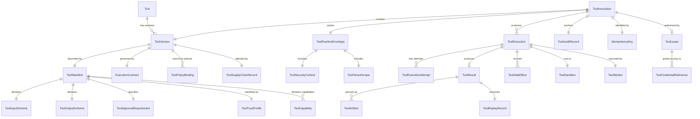

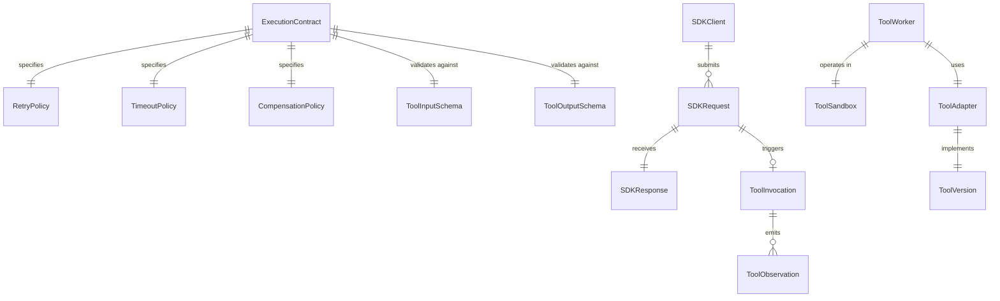

---

## 4. SDK Architecture

### 4.1 SDK Types

MYCELIA defines distinct SDK types, each with scoped responsibilities, authorization models, and compatibility requirements.

#### Internal SDK (Platform Core)

- *Responsibility:* Used by MYCELIA-internal services (orchestration engine, governance layer, memory service) to invoke tool runtime operations.
- *Allowed operations:* All operations within the caller's service-level authorization scope, including tool invocation dispatch, artifact creation, telemetry emission, and state transitions.
- *Forbidden operations:* Cross-tenant operations without explicit tenant context propagation; direct tool worker invocation bypassing the invocation pipeline.
- *Authentication:* mTLS with SPIFFE/SPIRE workload identity.
- *Authorization:* Service-level RBAC, validated against policy engine.
- *Tenant propagation:* REQUIRED. Every internal SDK call MUST carry tenant_id, workspace_id, correlation_id, and causation_id.
- *Idempotency:* Internal SDKs MUST propagate idempotency keys for all state-mutating operations.
- *Error model:* Returns structured error envelopes; never raw exceptions.

#### External Developer SDK

- *Responsibility:* Used by third-party developers and integration teams to integrate external tools, submit workflow runs, query run status, and receive webhook events.
- *Allowed operations:* Workflow submission, run status query, tool registration (subject to review), webhook registration, artifact retrieval within tenant scope.
- *Forbidden operations:* Direct tool execution bypass; policy override; credential access outside lease; cross-tenant operations.
- *Authentication:* API key or OAuth 2.0 client credentials, scoped to tenant.
- *Authorization:* Tenant-scoped RBAC, evaluated by policy engine.
- *Tenant propagation:* Tenant identity is derived from API credential, not caller-supplied.
- *Idempotency:* External SDKs MUST support idempotency keys for all mutation operations. Servers MUST honor them.
- *Versioning:* External SDKs MUST declare API version in all requests. Breaking changes require major version increment with deprecation window.

#### Admin SDK

- *Responsibility:* Used by platform operators and tenant administrators for registry management, policy configuration, audit access, and emergency operations.
- *Allowed operations:* Tool registry management, policy binding, emergency revocation, audit log query, tenant configuration.
- *Forbidden operations:* Direct execution plane access without audit trail; secret value access; bypassing supply-chain verification.
- *Authentication:* Short-lived admin credentials; MFA required for production operations.
- *Authorization:* Platform RBAC with break-glass audit logging.
- *Special requirements:* All admin SDK operations are audited with actor identity, timestamp, and change diff.

#### Worker SDK

- *Responsibility:* Used by tool workers to receive invocation envelopes, report execution status, emit telemetry, return results, and register side effects.
- *Allowed operations:* Claim invocation (via lease), report status, return result, register side effect, emit telemetry, request credential from lease.
- *Forbidden operations:* Modify tool manifest; access other tenants' data; persist artifacts outside the designated artifact store path; access credentials outside the current lease.
- *Authentication:* Worker runtime identity (SPIFFE SVID or equivalent short-lived credential).
- *Authorization:* Worker can only claim invocations assigned to its worker pool.
- *Tenant propagation:* Worker receives tenant context in ToolRuntimeEnvelope. It MUST NOT access resources outside that tenant scope.

#### Tool SDK

- *Responsibility:* Used by tool implementation authors to register tools, publish manifests, and declare schemas and contracts.
- *Allowed operations:* Tool manifest submission, schema declaration, contract publication.
- *Forbidden operations:* Bypassing supply-chain review; publishing manifests without signing; modifying published ToolVersions.

#### Integration SDK

- *Responsibility:* Used by system integrators to register external system adapters, webhook endpoints, and API provider connections.
- *Allowed operations:* Adapter registration, webhook registration, provider configuration.
- *Forbidden operations:* Bypassing tenant scope; registering adapters without security review.

#### Replay SDK

- *Responsibility:* Used by the replay system and investigation tooling to access historical run data, retrieve replay records, and construct replay contexts.
- *Allowed operations:* Historical run query, replay record retrieval, replay context construction, dry-run execution request.
- *Forbidden operations:* Re-executing side-effectful tools against live systems; accessing production credentials in replay context; modifying historical records.
- *Replay constraint:* MUST NOT be usable to produce new side effects. Any potential side-effectful operation during replay MUST be suppressed and logged.

#### Observability SDK

- *Responsibility:* Used by observability agents and collectors to receive and forward telemetry, query metrics, and access trace data.
- *Allowed operations:* Telemetry emission, metric query, trace query (tenant-scoped).
- *Forbidden operations:* Accessing raw artifact content; querying across tenant boundaries.

#### Governance SDK

- *Responsibility:* Used by governance agents, approval workflows, and compliance systems to evaluate policies, submit approvals, and access governance artifacts.
- *Allowed operations:* Policy evaluation query, approval submission, policy binding management, governance audit query.
- *Forbidden operations:* Approving own-tenant operations without appropriate role; bypassing approval requirements.

#### Testing SDK

- *Responsibility:* Used by test harnesses, integration tests, and compliance verification systems to simulate tool executions, inject mock results, and validate contracts.
- *Allowed operations:* Mock tool registration, dry-run invocation, replay record injection, contract validation.
- *Forbidden operations:* Executing against production infrastructure; accessing production credentials; bypassing replay suppression in non-test environments.

### 4.2 SDK Boundary Diagram

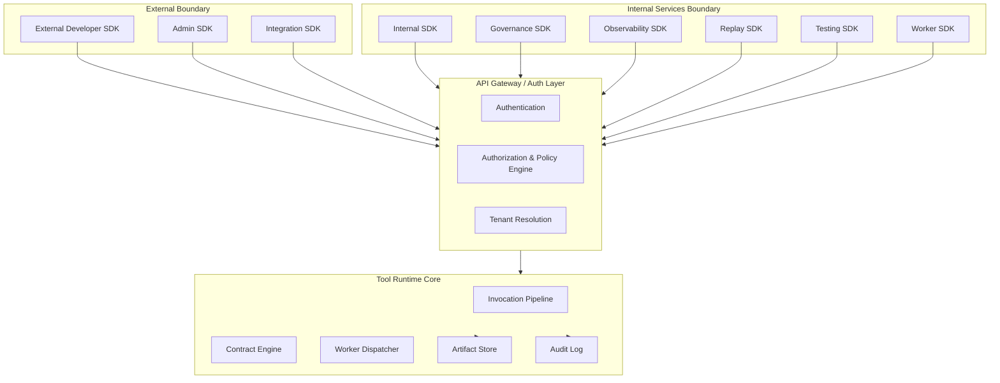

### 4.3 Universal SDK Rules

The following rules apply to ALL SDK types without exception:

- SDKs MUST NOT bypass the API gateway.
- SDKs MUST propagate tenant_id on every request.
- SDKs MUST propagate correlation_id and causation_id on every request.
- SDKs MUST propagate trace_id and span_id for all operations connected to a workflow run.
- SDKs MUST support idempotency keys for all state-mutating operations.
- SDKs MUST declare the SDK version and API version in request headers.
- SDKs MUST handle structured error envelopes and MUST NOT treat all errors as retriable.
- SDKs MUST NOT cache or locally store credential values.
- SDKs MUST NOT construct ToolRuntimeEnvelopes directly; this is a runtime responsibility.
- SDKs MUST NOT grant themselves permissions beyond what their auth credential authorizes.

---

## 5. Tool Registry Architecture

### 5.1 Purpose and Scope

The Tool Registry is the authoritative catalog of all tools available within the MYCELIA platform. It governs tool discovery, versioning, capability declaration, policy binding, supply-chain trust, and lifecycle management. The registry is not a marketplace. It is a governed operational catalog, and every tool in it has been reviewed, signed, and approved for its declared execution contexts.

### 5.2 Tool Discovery

Tools are discoverable by authorized callers through the registry API. Discovery returns:

- tool_id, name, description, capability_class;
- available versions (active and deprecated);
- required permissions and approval requirements;
- side_effect_class;
- trust profile;
- tenant availability (global vs. tenant-restricted).

Discovery MUST respect tenant context. Tools not authorized for the requesting tenant MUST NOT appear in discovery results.

### 5.3 Tool Manifest

The ToolManifest is the machine-readable declaration of a tool's complete behavioral specification. It is immutable after publication and MUST be cryptographically signed by the tool publisher.

**ToolManifest MUST include:**

```json
{
  "tool_id": "mycelia.tools.web-search",
  "tool_version_id": "mycelia.tools.web-search@2.3.1",
  "name": "Web Search",
  "description": "Executes a governed web search using a configured search provider.",
  "input_schema": {
    "$ref": "schemas/web-search-input-v2.3.json"
  },
  "output_schema": {
    "$ref": "schemas/web-search-output-v2.3.json"
  },
  "capability_class": "ReadOnlyExternal",
  "side_effect_class": "ReadOnlyExternal",
  "required_permissions": ["tool:web_search:execute"],
  "required_secrets": [
    { "ref": "search_provider_api_key", "scope": "tenant" }
  ],
  "timeout_policy": {
    "execution_timeout_ms": 15000,
    "sandbox_startup_timeout_ms": 3000,
    "approval_timeout_ms": null
  },
  "retry_policy": {
    "max_attempts": 3,
    "backoff_strategy": "exponential",
    "base_delay_ms": 500,
    "max_delay_ms": 8000,
    "retry_on_errors": ["ToolExecutionTimeout", "ToolExecutionFailed"],
    "idempotent": true
  },
  "idempotency_strategy": "key_required",
  "replay_behavior": "suppress_and_hydrate",
  "tenant_scope": "global_with_tenant_auth",
  "observability_profile": {
    "trace_level": "full",
    "emit_input": false,
    "emit_output_schema": true,
    "emit_side_effects": true
  },
  "security_profile": {
    "sandbox_class": "standard",
    "network_egress_allowed": true,
    "filesystem_access": "none",
    "data_classification_max": "confidential"
  },
  "governance_profile": {
    "policy_required": true,
    "approval_required": false,
    "audit_level": "standard"
  },
  "memory_write_policy": "never",
  "artifact_policy": {
    "persist_output": true,
    "retention_tier": "standard",
    "classification": "internal"
  },
  "supply_chain_profile": {
    "sbom_ref": "sbom/web-search-2.3.1.cdx.json",
    "build_attestation_ref": "attestations/web-search-2.3.1.sigstore",
    "signing_key_id": "mycelia-tools-signing-key-2024"
  },
  "approval_requirement": {
    "required": false,
    "escalation_condition": null
  }
}
```

**ToolManifest invariants:**
- `required_secrets` lists references only — NEVER values.
- `input_schema` and `output_schema` are stable JSON Schema documents.
- `side_effect_class` MUST be the most restrictive accurate classification.
- `replay_behavior` MUST be `suppress_and_hydrate` for any tool with side effects.
- Manifest MUST be signed and signature MUST be verified before enablement.

### 5.4 Tool Versioning

Tool versioning follows semantic versioning (major.minor.patch):

- **Patch** (x.x.N): Bug fixes that do not change input/output schema or behavior contract. Backward-compatible.
- **Minor** (x.N.0): New optional capabilities, schema additions (non-breaking). Backward-compatible.
- **Major** (N.0.0): Breaking changes to input/output schema, behavior contract, or side-effect class. Requires explicit migration and tenant opt-in.

**Versioning rules:**
- A published ToolVersion MUST be immutable. No exceptions.
- Old ToolVersions MUST remain accessible as long as any ToolReplayRecord references them.
- Deprecated ToolVersions MUST continue to execute for runs in flight but MUST NOT be selectable for new invocations after deprecation deadline.
- Archived ToolVersions MUST be retained in registry for audit and replay purposes but MUST NOT execute.

### 5.5 Tool Registry Lifecycle

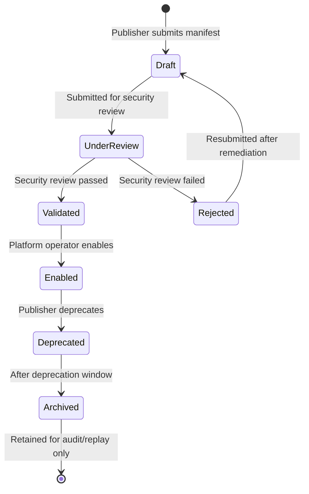

### 5.6 Supply-Chain and Trust Review

Before a tool can be enabled in the registry:

1. The ToolManifest MUST be submitted with a cryptographic signature from the publisher's registered signing key.
2. The SBOM MUST be present and verified.
3. A security review MUST be performed, covering: capability class appropriateness, side-effect classification accuracy, declared permissions vs. actual requirements, secret reference validity, and dependency risk.
4. Build attestation (SLSA provenance) MUST be verifiable.
5. The platform operator MUST explicitly enable the tool. Tools in `Validated` state do not execute.

### 5.7 Capability Classes

| Capability Class | Examples | Governance Level |
|---|---|---|
| `computation` | Data transformation, format conversion, math | Standard |
| `read_only_internal` | Query MYCELIA memory, run history | Standard |
| `read_only_external` | Web search, public API read | Standard + tenant auth |
| `internal_write` | Memory write, artifact creation | Elevated + idempotency |
| `external_write` | REST API write, email, webhook | Elevated + idempotency + approval eligible |
| `destructive_internal` | Delete memory, purge artifacts | High + approval required |
| `destructive_external` | Delete external record, file delete | High + approval required |
| `financial_impact` | Payment, billing, subscription | Strict + approval required |
| `legal_impact` | Contract signing, legal filing | Strict + approval required |
| `credential_use` | OAuth flow, certificate use | Elevated + audit |
| `infrastructure_mutation` | Infra changes | Platform-only |
| `security_mutation` | Permission changes | Platform-only + break-glass |
| `human_notification` | Email, Slack, SMS | Standard + deduplication |
| `data_export` | Export to external storage | Elevated + data-class check |
| `code_execution` | Script/code runner | High + strong sandbox |

### 5.8 Tool Capability Permission Matrix

MYCELIA MUST map every tool capability to explicit permission, approval, sandbox and replay requirements.

Capability declaration is not authority. A tool may declare a capability, but execution authority is granted only after policy evaluation, tenant authorization, runtime envelope construction and approval evaluation when required.

| Capability Class | Required Permission Pattern | Default Approval | Minimum Sandbox | Replay Behavior | Notes |
|---|---|---|---|---|---|
| `computation` | `tool:computation:execute` | No | minimal | execute_freely | Pure deterministic or bounded computation only |
| `read_only_internal` | `tool:internal_read:execute` | No | minimal | execute_freely | Must preserve tenant and namespace scope |
| `read_only_external` | `tool:external_read:execute` | No | standard | suppress_and_hydrate | External state may drift; recorded outputs required |
| `internal_write` | `tool:internal_write:execute` | Conditional | standard | suppress_and_hydrate | Requires idempotency and lineage |
| `external_write` | `tool:external_write:execute` | Conditional | elevated | suppress_and_hydrate | Requires side-effect record |
| `destructive_internal` | `tool:destructive_internal:execute` | Required | elevated | suppress | Requires compensation or explicit irreversibility |
| `destructive_external` | `tool:destructive_external:execute` | Required | strong | suppress | Requires human approval |
| `financial_impact` | `tool:financial:execute` | Required | elevated | suppress | Requires strict audit and idempotency |
| `legal_impact` | `tool:legal:execute` | Required | elevated | suppress | Requires human approval and immutable evidence |
| `credential_use` | `tool:credential_use:execute` | Conditional | standard | suppress_and_hydrate | Credentials must be leased |
| `infrastructure_mutation` | `tool:infra_mutation:execute` | Required | dedicated | suppress | Platform-only by default |
| `security_mutation` | `tool:security_mutation:execute` | Required | dedicated | suppress | Platform-only and break-glass eligible |
| `human_notification` | `tool:notification:execute` | Conditional | standard | suppress | Requires deduplication window |
| `data_export` | `tool:data_export:execute` | Required | strong | suppress | Requires classification and export approval |
| `code_execution` | `tool:code_execute:execute` | Conditional | strong | suppress_and_hydrate | Requires strong sandbox and output quarantine |

### Rules

- Capability class MUST be evaluated before tool enablement.
- Permission patterns MUST be deterministic and namespace-aware.
- A tool with multiple capabilities inherits the most restrictive enforcement class.
- Policy MAY strengthen requirements but MUST NOT weaken the minimum requirement.
- Runtime MUST fail closed if capability-to-permission mapping is missing.

### Forbidden Behavior

FORBIDDEN:

- executing tools with undeclared capabilities;
- treating capability declaration as permission grant;
- allowing tool execution when permission mapping is ambiguous;
- lowering sandbox class dynamically without security approval;
- changing capability class without publishing a new ToolVersion.

---

## 6. Tool Execution Lifecycle

### 6.1 Lifecycle State Definitions

The tool execution lifecycle spans three phases: registry lifecycle, execution lifecycle, and replay lifecycle.

**Registry Lifecycle States:**
- **Registered:** Tool manifest submitted; pending validation.
- **Validated:** Security review passed; pending operator enablement.
- **Enabled:** Active; available for invocation by authorized callers.
- **Disabled:** Temporarily unavailable; no new invocations permitted; in-flight invocations complete.
- **Deprecated:** Marked for removal; existing workflows may continue; no new workflow designs may reference.
- **Archived:** Removed from active use; retained for audit and replay only.

**Execution Lifecycle States:**
- **InvocationRequested:** SDK call received; correlation context resolved.
- **Authorized:** Policy evaluation passed; no approval required.
- **ApprovalRequired:** Policy evaluation determined human approval is needed.
- **ApprovalGranted:** Human approval received; execution may proceed.
- **ApprovalDenied:** Human approval denied; invocation terminated.
- **Leased:** Credential lease obtained; runtime envelope constructed.
- **Queued:** Invocation dispatched to worker queue.
- **Running:** Worker has claimed invocation and execution is in progress.
- **Succeeded:** Tool execution completed; output validated; artifacts persisted.
- **Failed:** Tool execution produced an error; within retry budget if retryable.
- **TimedOut:** Execution exceeded declared timeout.
- **Retrying:** A retry attempt is being prepared or is in progress.
- **Compensating:** Compensation behavior is executing due to workflow rollback or error.
- **CompensationFailed:** Compensation execution failed; requires manual intervention and escalation.
- **Cancelled:** Invocation was cancelled by the workflow engine before completion.

**Replay Lifecycle States:**
- **ReplaySuppressed:** Replay context detected; side-effectful execution was suppressed; invocation skipped.
- **ReplayHydrated:** Replay context detected; historical ToolResult was injected as the result; no re-execution occurred.

### 6.2 Lifecycle State Diagram

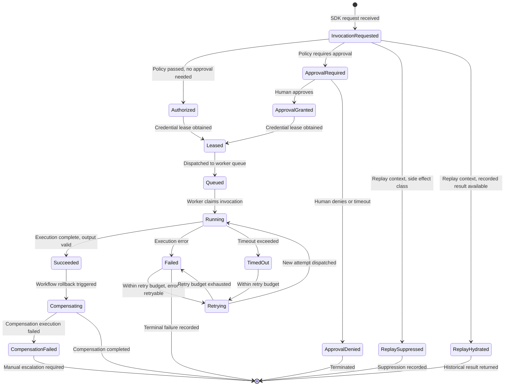

### 6.3 Lifecycle Transition Table

| From State | To State | Trigger | Required Condition |
|---|---|---|---|
| InvocationRequested | Authorized | Policy eval | All policy checks passed, no approval flag |
| InvocationRequested | ApprovalRequired | Policy eval | Approval requirement detected |
| InvocationRequested | ReplaySuppressed | Context check | Replay context + side_effect_class != NoSideEffect |
| InvocationRequested | ReplayHydrated | Context check | Replay context + recorded ToolResult exists |
| ApprovalRequired | ApprovalGranted | Human action | Authorized approver submits approval |
| ApprovalRequired | ApprovalDenied | Human action or timeout | Denial submitted or approval_timeout elapsed |
| Authorized | Leased | Lease request | Credential lease granted by secret manager |
| ApprovalGranted | Leased | Lease request | Credential lease granted |
| Leased | Queued | Dispatch | Worker queue accepts invocation |
| Queued | Running | Worker claim | Worker acknowledges invocation |
| Running | Succeeded | Worker result | Output passes schema validation |
| Running | Failed | Worker error | Execution error within retry budget |
| Running | TimedOut | Timer | execution_timeout_ms elapsed |
| Failed | Retrying | Runtime decision | Error class is retryable, attempts < max_attempts |
| Retrying | Running | Worker claim | New attempt dispatched |
| Retrying | Failed | Retry budget | Attempts exhausted |
| Succeeded | Compensating | Workflow engine | Rollback or failure requiring compensation |

### 6.4 Emitted Events per State Transition

| State Reached | Emitted Event |
|---|---|
| InvocationRequested | ToolInvocationRequested |
| Authorized | ToolInvocationAuthorized |
| ApprovalRequired | ToolApprovalRequired |
| ApprovalGranted | (Governance system event) |
| ApprovalDenied | ToolInvocationRejected |
| Queued | ToolExecutionQueued |
| Running | ToolExecutionStarted |
| Succeeded | ToolExecutionSucceeded |
| Failed (terminal) | ToolExecutionFailed |
| TimedOut | ToolExecutionTimedOut |
| Retrying | ToolExecutionRetried |
| Compensating → complete | ToolExecutionCompensated |
| CompensationFailed | ToolCompensationFailed |
| ReplaySuppressed | ToolExecutionReplaySuppressed |
| ReplayHydrated | ToolExecutionReplayHydrated |

---

## 7. Execution Contracts

### 7.1 Purpose and Authority

The ExecutionContract is the runtime-binding agreement that governs how a specific tool version executes within MYCELIA. It is compiled at tool publication time from the ToolManifest and is immutable once published. No ToolVersion may execute without a valid, immutable ExecutionContract.

The ExecutionContract has higher authority than workflow-level configuration. Workflows may constrain tool execution within the bounds of the contract (e.g., reducing a timeout), but MUST NOT exceed contract-defined limits or override security constraints.

### 7.2 ExecutionContract Specification

An ExecutionContract MUST specify all of the following:

```json
{
  "contract_id": "ec-mycelia.tools.web-search@2.3.1",
  "tool_version_id": "mycelia.tools.web-search@2.3.1",
  "contract_version": "1.0.0",
  "published_at": "2026-01-15T09:00:00Z",
  "immutable": true,
  "input_schema": {
    "type": "object",
    "required": ["query"],
    "properties": {
      "query": { "type": "string", "maxLength": 1000 },
      "num_results": { "type": "integer", "minimum": 1, "maximum": 20, "default": 5 },
      "safe_search": { "type": "boolean", "default": true }
    },
    "additionalProperties": false
  },
  "output_schema": {
    "type": "object",
    "required": ["results"],
    "properties": {
      "results": {
        "type": "array",
        "items": {
          "type": "object",
          "required": ["title", "url", "snippet"],
          "properties": {
            "title": { "type": "string" },
            "url": { "type": "string", "format": "uri" },
            "snippet": { "type": "string" }
          }
        }
      },
      "total_results": { "type": "integer" },
      "search_metadata": { "type": "object" }
    }
  },
  "validation_rules": [
    { "rule": "query_not_empty", "enforcement": "hard" },
    { "rule": "no_pii_in_query", "enforcement": "warn_and_audit" }
  ],
  "authorization_requirements": {
    "required_permissions": ["tool:web_search:execute"],
    "min_trust_level": "authenticated",
    "required_roles": []
  },
  "tenant_scope": "global_with_tenant_auth",
  "workspace_scope": "any",
  "timeout": {
    "execution_timeout_ms": 15000,
    "sandbox_startup_timeout_ms": 3000,
    "hard_limit_ms": 20000
  },
  "retry_policy": {
    "max_attempts": 3,
    "backoff_strategy": "exponential",
    "base_delay_ms": 500,
    "max_delay_ms": 8000,
    "retry_on": ["ToolExecutionTimeout", "ToolExecutionFailed"],
    "retry_safe": true
  },
  "idempotency_key_strategy": "workflow_run_step_attempt",
  "compensation_behavior": {
    "required": false,
    "strategy": null
  },
  "side_effect_class": "ReadOnlyExternal",
  "replay_behavior": "suppress_and_hydrate",
  "observability_requirements": {
    "trace_required": true,
    "span_required": true,
    "input_logging": "redacted",
    "output_logging": "schema_only",
    "side_effect_logging": "full"
  },
  "audit_requirements": {
    "audit_level": "standard",
    "persist_audit_record": true,
    "audit_retention_days": 365
  },
  "memory_write_behavior": {
    "allowed": false,
    "requires_permission": "memory:write:tool_output",
    "requires_explicit_step": true
  },
  "artifact_persistence_behavior": {
    "persist_result": true,
    "retention_tier": "standard",
    "classification": "internal",
    "hash_required": true
  },
  "security_constraints": {
    "sandbox_class": "standard",
    "network_egress": "allowed_with_egress_policy",
    "filesystem_access": "none",
    "max_data_classification": "confidential",
    "worker_isolation": "shared_with_envelope_validation"
  },
  "approval_requirements": {
    "required": false,
    "conditions": null
  },
  "credential_lease_requirements": {
    "leases_required": ["search_provider_api_key"],
    "lease_duration_ms": 30000
  },
  "sandbox_requirements": {
    "sandbox_class": "standard",
    "network_policy": "egress_to_search_provider_only",
    "resource_limits": {
      "cpu_millicore": 500,
      "memory_mb": 256
    }
  },
  "supply_chain_requirements": {
    "signed_manifest_required": true,
    "sbom_required": true,
    "attestation_required": true
  }
}
```

### 7.3 Contract Validation Flow

```mermaid
flowchart LR
    Submit["Tool publisher submits ToolManifest"] --> SignVerify["Verify manifest signature"]
    SignVerify --> SchemaCheck["Validate manifest schema completeness"]
    SchemaCheck --> ConflictCheck["Check for contract conflicts with existing versions"]
    ConflictCheck --> SecReview["Security review: side effects, permissions, secrets"]
    SecReview --> Compile["Compile ExecutionContract from manifest"]
    Compile --> ContractSig["Sign ExecutionContract"]
    ContractSig --> Publish["Publish ToolVersion + immutable ExecutionContract"]
    Publish --> Enable["Operator enables ToolVersion"]
```

### 7.4 Contract Immutability

Once a ToolVersion is published, its ExecutionContract is immutable. This invariant has no exceptions. If a contract needs to change:

1. A new ToolVersion MUST be published with the revised contract.
2. The old ToolVersion remains active until deprecated.
3. Running workflows continue using the ToolVersion they were designed against.
4. Historical replay MUST use the ExecutionContract from the original ToolVersion.

Mutation of a published ExecutionContract is a critical security violation, as it could silently alter the authorization or safety constraints of in-flight or historical executions.

### 7.5 Tool Contract Conformance Test Suite

Every ToolVersion MUST pass a contract conformance suite before it can be enabled.

Conformance tests verify that the implementation behaves according to the published ToolManifest and ExecutionContract.

### Required Conformance Tests

| Test Class | Purpose | Required |
|---|---|---:|
| Input Schema Test | Valid inputs accepted; invalid inputs rejected | Yes |
| Output Schema Test | Tool outputs match declared output schema | Yes |
| Timeout Test | Tool respects declared timeout limits | Yes |
| Retry Test | Retryable errors match declared retry policy | Yes |
| Idempotency Test | Duplicate invocation does not duplicate side effects | Required for side-effectful tools |
| Sandbox Test | Tool cannot escape declared sandbox constraints | Yes |
| Network Egress Test | Tool reaches only declared destinations | Yes |
| Secret Access Test | Tool accesses only declared credential references | Yes |
| Replay Test | Tool respects declared replay_behavior | Yes |
| Side-Effect Test | Observed behavior matches side_effect_class | Required for side-effectful tools |
| Telemetry Test | Required telemetry events are emitted | Yes |
| Tenant Isolation Test | Tool cannot access another tenant scope | Yes |
| Artifact Test | Output artifact is persisted with provenance and hash | Yes |
| Injection Test | Tool output cannot become trusted instruction | Yes |

### Rule

A ToolVersion MUST NOT transition to Enabled until required conformance tests pass.

### Conformance Artifact

Every test run MUST produce a ToolConformanceReport containing:

- tool_id;
- tool_version_id;
- contract_id;
- test_suite_version;
- result;
- failed_tests;
- executed_at;
- executed_by;
- artifact_hash;
- policy_exception_id when applicable.

### Forbidden Behavior

FORBIDDEN:

- enabling untested ToolVersions;
- accepting manual claims of conformance without test evidence;
- skipping replay tests for side-effectful tools;
- skipping sandbox tests for code execution tools;
- approving tools whose observed side effects exceed declared side_effect_class.

---

## 8. Tool Invocation Pipeline

### 8.1 Canonical Pipeline

Every tool invocation in MYCELIA flows through the following canonical pipeline. No stage may be skipped unless explicitly justified and declared in the ExecutionContract.

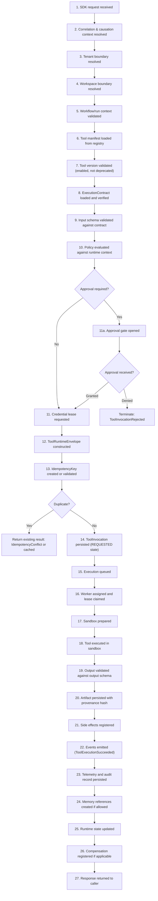

### 8.2 Pipeline Integrity Rules

- Stages 1–10 are REQUIRED for every invocation.
- Stage 11 (approval) is conditional on contract declaration.
- Stage 13 (idempotency check) MUST precede any state-mutating operation.
- Stage 14 (persistence of ToolInvocation) MUST precede dispatch to worker.
- Stage 20 (artifact persistence) MUST complete before the invocation is considered Succeeded.
- Stage 22 (events) MUST be emitted even on failure paths.
- Stage 23 (telemetry and audit) MUST be emitted regardless of success or failure.
- Memory references (stage 24) MUST NOT be created if the ExecutionContract specifies `memory_write_behavior.allowed: false`.
- Any pipeline failure after stage 14 MUST result in a Failed or Compensating terminal state, never silent abandonment.

### 8.3 Tool Runtime Admission Control

Before any tool invocation enters the execution queue, MYCELIA MUST perform runtime admission control.

Admission control determines whether the invocation is allowed to become executable.

### Admission Checks

| Check | Failure Behavior |
|---|---|
| ToolVersion is Enabled | reject with ToolVersionDisabled |
| ExecutionContract exists and is immutable | reject with ToolContractInvalid |
| Tenant is active | reject with TenantBoundaryViolation |
| Workspace is active | reject with WorkspaceBoundaryViolation |
| Tool is authorized for tenant | reject with AuthorizationDenied |
| Capability permission is satisfied | reject with AuthorizationDenied |
| Required approval is present or pending | enter ApprovalRequired |
| Credential references are resolvable | reject or block with CredentialLeaseDenied |
| Sandbox class is available | reject or queue based on policy |
| Idempotency key is valid | reject with IdempotencyConflict |
| Replay behavior is compatible with context | suppress, hydrate or reject |
| Data classification is permitted | reject with AuthorizationDenied |
| Worker pool is available | queue with bounded TTL |
| Rate limit and quota are available | reject or throttle |

### Admission Result

Admission control MUST return one of:

- admitted;
- rejected;
- approval_required;
- throttled;
- queued;
- replay_suppressed;
- replay_hydrated.

### Rule

No invocation may be placed on a worker queue unless admission result is `admitted`.

### Forbidden Behavior

FORBIDDEN:

- dispatching before policy evaluation;
- dispatching before idempotency validation;
- dispatching before tenant boundary validation;
- dispatching when sandbox class is unavailable;
- dispatching side-effectful tools during replay;
- treating admission failure as worker failure.

---

## 9. Tool Runtime Envelope

### 9.1 Purpose

The ToolRuntimeEnvelope is the complete, immutable execution context package constructed by the runtime before dispatching a tool invocation to a worker. It contains everything the worker needs to execute correctly, maintain tenant isolation, emit correct telemetry, and honor replay behavior — without requiring the worker to query the runtime for context.

The envelope is constructed by the runtime, signed, transmitted to the worker over an authenticated encrypted channel, and verified by the worker before execution begins.

### 9.2 Required Fields

```json
{
  "envelope_id": "env-01J2X...",
  "envelope_version": "1.0",
  "created_at": "2026-05-15T14:22:00Z",
  "expires_at": "2026-05-15T14:22:30Z",

  "tenant_id": "tenant-abc123",
  "workspace_id": "ws-def456",
  "namespace_id": "ns-ghi789",
  "project_id": "proj-jkl012",

  "workflow_id": "wf-mno345",
  "workflow_version_id": "wf-mno345@3.1.0",
  "run_id": "run-pqr678",
  "step_id": "step-stu901",

  "trace_id": "4bf92f3577b34da6a3ce929d0e0e4736",
  "span_id": "00f067aa0ba902b7",
  "correlation_id": "corr-vwx234",
  "causation_id": "cause-yz0567",

  "actor_id": "agent-orchestrator-1",
  "runtime_identity_id": "spiffe://mycelia/ns/mycelia-execution/sa/worker-std-pool",

  "tool_id": "mycelia.tools.web-search",
  "tool_version_id": "mycelia.tools.web-search@2.3.1",
  "invocation_id": "inv-abc890",
  "execution_attempt_id": "attempt-001",

  "policy_snapshot_id": "policy-snap-123",
  "approval_id": null,

  "credential_lease_id": "lease-xyz456",
  "credential_refs": [
    { "name": "search_provider_api_key", "lease_path": "secret/tenant-abc123/tools/web-search/api-key" }
  ],

  "idempotency_key": "idem-run-pqr678:step-stu901:attempt-001",

  "replay_context": {
    "is_replay": false,
    "replay_run_id": null,
    "replay_suppressed": false
  },

  "security_context": {
    "sandbox_class": "standard",
    "network_policy": "egress_to_search_provider_only",
    "data_classification_max": "confidential",
    "worker_attestation_required": true
  },

  "observability_context": {
    "trace_id": "4bf92f3577b34da6a3ce929d0e0e4736",
    "span_id": "00f067aa0ba902b7",
    "otel_endpoint": "otel-collector.mycelia-observability.svc:4317",
    "log_level": "info"
  },

  "data_classification": "internal",
  "side_effect_class": "ReadOnlyExternal",

  "artifact_policy": {
    "persist_result": true,
    "retention_tier": "standard",
    "classification": "internal"
  },

  "memory_write_policy": {
    "allowed": false
  },

  "input": {
    "query": "MYCELIA cognitive runtime architecture",
    "num_results": 5,
    "safe_search": true
  },

  "envelope_signature": "sig-base64-..."
}
```

### 9.3 Envelope Invariants

- No tool execution may occur outside a ToolRuntimeEnvelope.
- Envelopes MUST be signed by the runtime and verified by the worker.
- Envelopes contain credential lease references, never credential values.
- Envelopes expire at `expires_at`; workers MUST reject expired envelopes.
- Workers MUST NOT modify the envelope.
- Envelopes are transmitted over authenticated, encrypted channels only.
- Anonymous tool execution (without tenant_id) is FORBIDDEN.
- Tenantless tool execution is FORBIDDEN.
- Untraced tool execution (without trace_id and span_id) is FORBIDDEN.
- Unversioned tool execution (without tool_version_id) is FORBIDDEN.
- Replay context MUST be explicitly declared; default is `is_replay: false`.

---

## 10. Side-Effect Classification

### 10.1 Classification Taxonomy

Side-effect classification determines the runtime enforcement posture for a tool invocation. Classification is declared in the ToolManifest and is part of the immutable ExecutionContract. Tools MUST NOT be classified at a lower (less restrictive) level than their actual behavior.

| Side-Effect Class | Definition | Approval Required | Idempotency Required | Replay Behavior | Compensation Required | Audit Level |
|---|---|---|---|---|---|---|
| `NoSideEffect` | Pure computation; no external or internal state change | No | Optional | Execute freely | No | Minimal |
| `ReadOnlyInternal` | Reads internal MYCELIA state; no mutation | No | Optional | Execute freely | No | Standard |
| `ReadOnlyExternal` | Reads external system; no mutation | No | Recommended | Suppress & hydrate | No | Standard |
| `InternalWrite` | Mutates internal MYCELIA state | No | REQUIRED | Suppress & hydrate | Conditional | Standard |
| `ExternalWrite` | Mutates external system state | Eligible | REQUIRED | Suppress & hydrate | REQUIRED | Elevated |
| `DestructiveInternal` | Irreversibly deletes or overwrites internal state | REQUIRED | REQUIRED | Suppress | REQUIRED | High |
| `DestructiveExternal` | Irreversibly deletes or overwrites external state | REQUIRED | REQUIRED | Suppress | REQUIRED | High |
| `FinancialImpact` | Initiates, modifies, or reverses financial transactions | REQUIRED | REQUIRED | Suppress | REQUIRED | Strict |
| `LegalImpact` | Produces, signs, or submits legal documents or actions | REQUIRED | REQUIRED | Suppress | REQUIRED | Strict |
| `HumanNotification` | Sends email, SMS, Slack, or other human-directed messages | No | REQUIRED (dedup) | Suppress | Conditional | Standard |
| `DataExport` | Exports data to external systems or storage | REQUIRED | REQUIRED | Suppress | REQUIRED | Elevated |
| `CredentialUse` | Uses a credential to authenticate against an external system | No | REQUIRED | Suppress & hydrate | No | Elevated |
| `InfrastructureMutation` | Modifies cloud or platform infrastructure | REQUIRED | REQUIRED | Suppress | REQUIRED | Strict |
| `SecurityMutation` | Modifies security configurations, permissions, or certificates | Platform-only | REQUIRED | Suppress | REQUIRED | Strict |
| `GovernanceMutation` | Modifies governance policies, roles, or approval flows | Platform-only | REQUIRED | Suppress | REQUIRED | Strict |
| `MemoryMutation` | Directly mutates the MYCELIA memory fabric | Elevated | REQUIRED | Suppress & hydrate | REQUIRED | Elevated |

### 10.2 Classification Enforcement

Side-effect classification is not advisory. It is enforced by the Tool Runtime:

- Tools classified as `approval_required` MUST block at the approval gate. No bypass is permitted.
- Tools classified as `idempotency_required` MUST have a valid idempotency key before execution begins. Absence of an idempotency key MUST abort the invocation.
- Tools classified as `suppress` for replay MUST NOT execute against live systems during a replay context.
- Tools classified as `compensation_required` MUST register a compensation handler with the orchestration engine before execution begins.

### 10.3 Classification Integrity Rules

- The ToolManifest's declared `side_effect_class` is audited at security review time.
- Misclassification (declaring a lower class than actual behavior) is a supply-chain integrity violation.
- If runtime monitoring detects behavior inconsistent with declared classification, the tool MUST be disabled and flagged for review.
- Tools MUST NOT self-report a lower classification to reduce governance requirements.


---

## 11. Idempotency, Retry & Timeout Model

### 11.1 Why Idempotency Is Mandatory

In a distributed system subject to network partitions, worker crashes, and timeout races, any side-effectful tool may execute more than once. MYCELIA's operational guarantee is that the business effect of a tool execution is applied exactly once, regardless of how many times the underlying operation is attempted. This requires idempotency.

Idempotency in MYCELIA is not an optional optimization. For any tool with a side-effect class of `InternalWrite` or higher, idempotency MUST be enforced. Tools that lack idempotency strategies in this range are a safety risk and MUST NOT be enabled.

### 11.2 Idempotency Key Strategy

The idempotency key is a deterministic, unique string derived from the stable identity of the specific tool invocation attempt. MYCELIA generates idempotency keys from the following components:

```
idempotency_key = sha256(
  run_id + ":" +
  step_id + ":" +
  tool_version_id + ":" +
  attempt_number
)
```

This strategy produces a key that:
- Is unique per logical invocation (run + step).
- Is deterministic across retries within the same attempt sequence.
- Changes on explicit retry if the attempt number increments.
- Is stable across worker crashes and re-queuing of the same attempt.

**Idempotency key rules:**
- The idempotency key MUST be generated before execution begins.
- The idempotency key MUST be persisted in the ToolInvocation record before dispatch.
- The tool adapter MUST forward the idempotency key to external systems that support it (e.g., Stripe's `Idempotency-Key` header, Temporal activity IDs).
- The runtime MUST check the idempotency key against the deduplication store before executing. If a result already exists for the key, it MUST return the cached result without re-executing.
- The deduplication window MUST be at least as long as the execution timeout plus retry budget.

### 11.3 Retry-Safe vs. Retry-Unsafe Tools

| Property | Retry-Safe | Retry-Unsafe |
|---|---|---|
| Can be executed multiple times with identical effect? | Yes | No |
| Requires idempotency key? | Yes | Yes (mandatory) |
| Retry behavior | Automatic up to max_attempts | Manual or approval-gated retry |
| External system support | Must accept idempotency keys | Operator verification required |
| Example tools | Search, read, classification, format conversion | Email send without dedup, financial transaction, file delete |

Retry-unsafe tools MUST NOT use automatic retry without additional safeguards (deduplication at target, compensation, or human approval for retry).

### 11.4 Retry Policy Model

```json
{
  "max_attempts": 3,
  "backoff_strategy": "exponential",
  "base_delay_ms": 500,
  "multiplier": 2.0,
  "max_delay_ms": 8000,
  "jitter": "full",
  "retry_on_errors": [
    "ToolExecutionTimeout",
    "ToolExecutionFailed",
    "SandboxFailure"
  ],
  "do_not_retry_on_errors": [
    "AuthorizationDenied",
    "TenantBoundaryViolation",
    "SchemaMismatch",
    "ApprovalDenied"
  ],
  "retry_budget_ms": 60000
}
```

**Retry rules:**
- Retries MUST be runtime-visible. Silent retries inside worker code are FORBIDDEN.
- Each retry MUST emit a `ToolExecutionRetried` event with the attempt number.
- Each retry MUST create a new ToolExecutionAttempt record with a causation_id linking to the previous attempt.
- Authorization errors and policy rejections MUST NOT be retried.
- Schema validation failures MUST NOT be retried (they indicate a contract mismatch, not a transient error).
- Retries MUST use the same idempotency key for the same logical attempt.

### 11.5 Timeout Model

| Timeout Type | Scope | Enforcement |
|---|---|---|
| `sandbox_startup_timeout_ms` | Time allowed for sandbox to become ready | Runtime; terminates if exceeded |
| `execution_timeout_ms` | Time allowed for tool to produce a result | Runtime; sends SIGTERM to sandbox |
| `hard_limit_ms` | Maximum absolute time (startup + execution) | Runtime; force-kills sandbox |
| `approval_timeout_ms` | Time allowed for human approval response | Governance engine; auto-denies if exceeded |
| `lease_expiry_ms` | Time for which credential lease is valid | Secret manager; revokes lease |

When execution_timeout_ms is exceeded:
1. Runtime sends cancellation signal to worker.
2. Worker has a grace period to complete in-flight work and register side effects.
3. After grace period, sandbox is force-terminated.
4. ToolExecutionTimedOut event is emitted.
5. If within retry budget, a Retrying state is entered.

### 11.6 Retry and Replay Interaction

Retries within a live execution and replays of historical executions are distinct concepts:

- **Retries** are part of the live execution lifecycle. They occur because the previous attempt failed. They use the same idempotency key semantics.
- **Replays** are historical re-executions for investigation, debugging, or policy validation. They MUST use recorded results for side-effectful tools, not re-execute them.

The retry metadata (attempt number, causation chain) is preserved in the ToolReplayRecord, allowing investigation of retry behavior during replay.

---

## 12. Credential & Secret Handling

### 12.1 Credential Architecture

MYCELIA's credential model is based on the principle of lease, not possession. Tools do not own credentials. Workers do not store credentials. Credentials are leased from the secret manager for the duration of a single execution, with a tight expiry window.

The canonical credential flow:

```mermaid
flowchart LR
    Manifest["ToolManifest declares credential refs"] --> InvPipeline["Invocation pipeline resolves refs"]
    InvPipeline --> LeaseReq["Lease requested from secret manager (Vault)"]
    LeaseReq --> LeasedToken["Short-lived lease token issued"]
    LeasedToken --> Envelope["Lease reference placed in ToolRuntimeEnvelope"]
    Envelope --> Worker["Worker receives envelope"]
    Worker --> FetchSecret["Worker fetches actual credential via lease token (single-use)"]
    FetchSecret --> Exec["Tool executes using credential in memory only"]
    Exec --> Expire["Lease expires after execution_timeout_ms"]
    Expire --> Audit["Credential access logged to audit store"]
```

### 12.2 Credential Security Rules

- **Secrets MUST NOT exist in ToolManifests.** Manifests contain references only.
- **Secrets MUST NOT enter logs, telemetry, or traces.** The observability layer MUST apply redaction filters.
- **Secrets MUST NOT enter memory.** Tool output containing credential values MUST be classified and handled under the data export policy; they MUST NOT be written to memory without explicit classification and approval.
- **Secrets MUST NOT enter replay snapshots.** Replay records are stripped of credential values and lease references.
- **Workers MUST NOT hold credentials beyond the execution window.** Leases expire automatically. Workers MUST destroy credential values from in-process memory on execution completion.
- **Credential values MUST NOT be logged even partially** (no first-N-characters logging, no hash-with-partial-reveal).
- **ToolManifests MUST NOT accept inline credential values** in any field. Any manifest containing a credential value MUST be rejected and flagged.
- **SDK requests MUST NOT carry raw credential values** except in explicitly classified credential-management endpoints, which are subject to strict RBAC and audit.

### 12.3 Tenant and Workspace Credential Scoping

Credentials are scoped to the resolution hierarchy:

1. **Workspace-specific:** Credential configured for a specific workspace within a tenant. Highest specificity.
2. **Tenant-specific:** Credential configured for the tenant. Used when no workspace-specific credential exists.
3. **Platform default:** Credential configured at platform level for tools that use a shared provider (subject to strict policy). Used only for explicitly designated tools.

Cross-tenant credential sharing is FORBIDDEN. A credential lease for tenant A MUST NOT be usable by a worker executing on behalf of tenant B.

### 12.4 Replay Credential Exclusion

During replay:
- No credential leases are requested.
- No credentials are fetched.
- The `credential_refs` field in the ToolRuntimeEnvelope is replaced with a replay marker.
- Side-effectful tools are suppressed; their recorded outputs are returned without credential access.
- Any replay code path that attempts to access a credential MUST raise a `ReplaySideEffectSuppressed` error.

### 12.5 Emergency Revocation

The secret manager supports emergency revocation of all credentials associated with a tool, tenant, or specific lease. Emergency revocation:
- Immediately invalidates all active leases for the scope.
- Causes in-flight executions relying on the revoked credential to fail with `CredentialLeaseDenied`.
- Triggers a `ToolCredentialLeaseRevoked` event for each affected invocation.
- Requires audit logging of the revocation action with actor identity and justification.

---

## 13. Sandbox & Worker Execution Architecture

### 13.1 Execution Model

Workers execute tools. Orchestration code does not perform external I/O. This separation is the foundational invariant of MYCELIA's execution model.

A worker receives a ToolRuntimeEnvelope, prepares an appropriate sandbox, executes the tool implementation within that sandbox, registers side effects, and returns a result to the runtime. Workers operate independently from the orchestration engine and communicate only through the invocation queue and result API.

### 13.2 Sandbox Classes

| Sandbox Class | Isolation Level | Use Case | Network Egress | Filesystem | Example Tools |
|---|---|---|---|---|---|
| `minimal` | Process-level | Stateless pure computation | None | None | Data transformation, schema validation |
| `standard` | Container | Web API calls, read-only external | Controlled via egress policy | None | Web search, public API read |
| `elevated` | Container + seccomp | External write operations | Restricted allowlist | Ephemeral temp only | Email send, REST API write |
| `strong` | gVisor/runsc | Code execution, file operations | Deny-by-default + allowlist | Isolated ephemeral | Code interpreter, file processor |
| `dedicated` | Dedicated pod/VM | High-risk, high-trust execution | Custom per tool | Custom per tool | Large-scale data export, infrastructure mutation |

### 13.3 Isolation Dimensions

**Process isolation:** Each tool execution runs in an isolated process or container. Shared-memory attacks between concurrent executions are prevented by OS-level isolation.

**Network isolation:** Default is deny-all egress. Network policies for each sandbox class define allowed destinations. Tool manifests declare `network_policy` which is validated against allowed destinations for the tool's capability class. Tool egress for model provider API calls is routed through a controlled egress proxy that enforces rate limits and logs all outbound connections.

**Filesystem isolation:** The default sandbox has no filesystem access. Tools that require temporary storage receive an ephemeral tmpfs mount, scoped to the execution, destroyed on completion. No writes to shared or persistent storage are permitted without explicit artifact persistence through the runtime API.

**Environment isolation:** Workers receive only the environment variables declared in their runtime identity and the credential refs from the lease. They do not inherit the host environment. Ambient credentials from the execution node's cloud instance metadata service are blocked via network policy.

**Tenant isolation:** Worker envelopes carry tenant_id. Workers in shared pools perform envelope-level tenant validation before any execution. Tenant data from one execution MUST NOT be accessible by concurrent executions for other tenants on the same worker.

### 13.4 Worker Pool Types

| Pool Type | Isolation | When Permitted | Tenant Model |
|---|---|---|---|
| Shared standard pool | Envelope-level | Most tools for Standard tier tenants | Multi-tenant with strict envelope validation |
| Shared elevated pool | Container-level | Elevated side-effect tools | Multi-tenant with enhanced network isolation |
| Dedicated tenant pool | Full pod isolation | Enterprise tier or high-risk tools | Single-tenant |
| Sandbox pool (strong) | gVisor | Code execution, file operations | Single-tenant-per-execution |

Shared pools MUST validate tenant envelope on every execution. A worker that receives an envelope for a tenant it is not authorized to serve MUST reject the invocation and emit a `ToolTenantBoundaryViolation` event.

### 13.5 Worker Lifecycle

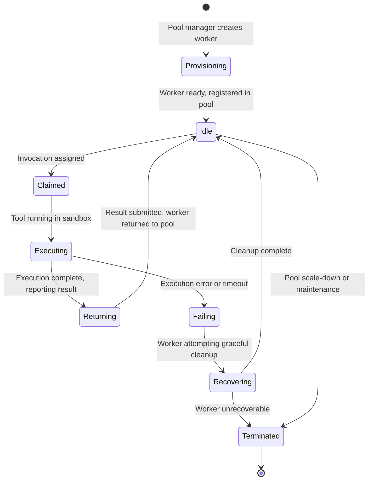

### 13.6 Worker Heartbeat and Recovery

- Workers MUST emit a heartbeat signal to the runtime at intervals no greater than `heartbeat_interval_ms` declared in the worker protocol.
- If a heartbeat is missed by more than `heartbeat_timeout_multiplier * heartbeat_interval_ms`, the runtime MUST declare the invocation as failed and trigger retry if within budget.
- The runtime MUST NOT wait indefinitely for a worker that has stopped heartbeating.
- Lost heartbeat events MUST be emitted and audit-recorded.
- Recovered workers that return a result after their invocation has already been retried MUST have their result rejected (idempotency check will detect the duplicate).

### 13.7 Worker Attestation

Workers in strong and dedicated sandbox classes MUST present a cryptographic attestation of their runtime identity before receiving invocations. Attestation:
- Uses SPIFFE/SPIRE SVID or equivalent workload identity mechanism.
- Is verified by the runtime before the ToolRuntimeEnvelope is transmitted.
- Scopes credential lease grant to the attested worker identity.

---

## 14. Tool Output, Artifacts & Memory Integration

### 14.1 Tool Output Model

Tool output in MYCELIA is not automatically authoritative. Every tool result passes through the following chain:

1. **Schema validation:** Output is validated against the `output_schema` declared in the ExecutionContract. Schema mismatch produces a `ToolOutputSchemaMismatch` event and may abort the invocation.
2. **Classification:** Output is classified according to `data_classification_max` in the security profile.
3. **Policy validation:** If the ExecutionContract specifies output policy rules, they are applied.
4. **Artifact persistence:** Validated output is persisted as a ToolArtifact with provenance hash.
5. **Memory write gate:** If the workflow step declares a memory write intent and the ExecutionContract permits it, a memory write request is submitted. Otherwise, output is available only as an artifact reference.

**Critical rule:** Tool output MUST NOT automatically become workflow state. The workflow step that receives the result MUST explicitly reference and incorporate it. An agent MUST NOT treat raw tool output as a trusted instruction source.

### 14.2 Artifact Persistence Model

Every ToolResult produces a ToolArtifact:

```json
{
  "artifact_id": "art-abc123",
  "invocation_id": "inv-def456",
  "run_id": "run-ghi789",
  "tenant_id": "tenant-abc",
  "workspace_id": "ws-def",
  "tool_version_id": "mycelia.tools.web-search@2.3.1",
  "content_type": "application/json",
  "classification": "internal",
  "retention_tier": "standard",
  "size_bytes": 4096,
  "hash": "sha256:abc123...",
  "storage_path": "artifacts/tenant-abc/runs/run-ghi789/inv-def456/result.json",
  "created_at": "2026-05-15T14:22:15Z",
  "expires_at": "2027-05-15T14:22:15Z",
  "provenance": {
    "tool_id": "mycelia.tools.web-search",
    "tool_version": "2.3.1",
    "execution_attempt_id": "attempt-001",
    "policy_snapshot_id": "policy-snap-123",
    "actor_id": "agent-orchestrator-1"
  }
}
```

**Artifact rules:**
- Artifacts are immutable after creation.
- Artifacts MUST carry a content hash (SHA-256 minimum).
- Artifacts are tenant-scoped and MUST NOT be accessible across tenants.
- Artifact storage paths MUST NOT leak tenant or user PII.
- Artifacts are retained per the retention policy declared in the ExecutionContract.
- Artifacts used as replay records MUST be retained as long as the replay retention policy requires.

### 14.3 Memory Write Integration

Tool output MAY be written to the MYCELIA memory fabric only under explicit conditions:

1. The `memory_write_behavior.allowed` field in the ExecutionContract must be `true`.
2. The workflow step must declare a `memory_write` intent with explicit memory key, type, and scope.
3. The actor must have the `memory:write:tool_output` permission for the target memory namespace.
4. The write operation must produce a lineage record linking the memory entry to the source artifact.
5. The write MUST be idempotent (same content + same key = update, not duplicate).

**Memory write rules:**
- Tool output MUST NOT be written to memory automatically. Explicit step declaration is required.
- Memory entries created from tool output MUST carry the artifact_id as provenance.
- Memory entries MUST carry tenant_id and workspace_id.
- A memory write failure MUST NOT cause the tool invocation to fail; it MUST be handled by the workflow step.
- Memory entries created from untrusted tool output must be classified appropriately.

### 14.4 Output Injection Prevention

A specific threat class that MYCELIA addresses is tool output injection: the scenario in which adversarial tool output (from a malicious external API response, a manipulated search result, or a hostile document) is treated as a trusted instruction by the agent or orchestrator.

**Prevention measures:**
- Tool output is always presented to the agent as a typed, schema-validated result, not as raw text to be interpreted as instructions.
- The orchestration engine MUST NOT accept tool output as workflow control input without explicit step-level handling.
- Agents MUST treat tool output as data, not as directives.
- Tool output that matches patterns of instruction injection (prompt injection) MUST be flagged by the tool runtime and escalated per security policy.
- Memory entries derived from tool output MUST be stored with an `untrusted_external_source` flag where applicable.

### 14.5 Tool Output Trust Levels

MYCELIA MUST classify tool outputs by trust level before they are consumed by workflows, agents or memory systems.

Tool output is never automatically trusted. It becomes usable only after validation, classification and policy evaluation.

### Trust Levels

| Trust Level | Meaning | Allowed Use |
|---|---|---|
| `untrusted_external` | Output from external APIs, web, documents, user-controlled systems | Data only; never instruction |
| `validated_external` | External output passed schema and security validation | Workflow input with explicit handling |
| `internal_observed` | Output from internal read-only MYCELIA systems | Contextual workflow input |
| `internal_authoritative` | Output from canonical MYCELIA state stores | May support runtime decisions |
| `human_approved` | Output reviewed or approved by authorized actor | May support high-impact workflow decisions |
| `replay_historical` | Output restored from historical ToolReplayRecord | Replay-only reconstruction |
| `quarantined` | Output failed validation or security scan | Not consumable |

### Promotion Rules

Tool output may move to a higher trust level only through explicit promotion.

Promotion MAY require:

- schema validation;
- provenance verification;
- security scan;
- policy evaluation;
- human approval;
- memory write authorization;
- artifact integrity verification.

### Rule

Untrusted tool output MUST NOT become:

- system instruction;
- policy input without classification;
- approval decision;
- tenant authority;
- execution authority;
- memory authority;
- runtime control flow.

### Forbidden Behavior

FORBIDDEN:

- treating external API output as trusted instruction;
- writing untrusted output to memory as canonical fact;
- using tool output to bypass policy;
- allowing tool output to select high-impact tools without approval;
- promoting quarantined output without security review.

---

## 15. Replay-Safe Tool Execution

### 15.1 The Replay Contract

MYCELIA's workflow runtime guarantees that any workflow run can be replayed. Replay serves investigation, debugging, and policy validation. For replay to work correctly, tool executions must not re-execute their live side effects. Instead, their recorded outputs must be substituted.

This is the replay contract: side-effectful tool executions are suppressed during replay; their recorded ToolResults are injected in their place. Replay does not re-run the world. It reconstructs how the world was run.

### 15.2 Replay Behavior Modes

| Replay Behavior | When Used | Mechanism | Credential Access | Side Effect |
|---|---|---|---|---|
| `execute_freely` | `NoSideEffect`, `ReadOnlyInternal` | Re-executes normally | Not required | None |
| `suppress_and_hydrate` | All side-effectful classes | Returns recorded ToolResult | Excluded | Suppressed |
| `suppress` | Destructive / Financial / Legal | Returns suppression marker; no output injected | Excluded | Suppressed |
| `operator_approved_reexecution` | Explicit re-execution request | Re-executes after explicit operator approval | Live credentials | Produces new side effect |

### 15.3 Replay Flow

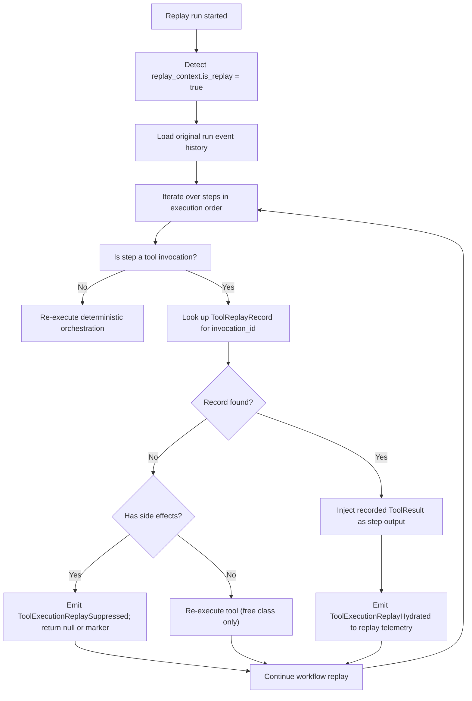

### 15.4 Replay Isolation Rules

- Replay environments MUST NOT connect to production event streams.
- Replay environments MUST NOT access production credentials.
- Replay tool executions that would produce external side effects MUST be suppressed.
- Replay telemetry MUST be emitted to an isolated replay telemetry namespace, not to production observability.
- Replay runs MUST be tagged with `is_replay: true` in all emitted events.
- Replay artifact access is read-only; replay MUST NOT create new artifacts in the production artifact store.
- Historical ToolVersions and ExecutionContracts MUST be available for replay; they MUST NOT be deleted as long as replay retention policy requires them.

### 15.5 Replay Divergence

If a replay execution produces an outcome inconsistent with the recorded history, this is a replay divergence. Divergence must be:

- Detected by the replay engine (comparing step outputs against recorded outputs).
- Flagged as a `ReplayDivergenceDetected` event.
- Exposed to the operator for investigation.
- Not silently suppressed or ignored.

Common causes of replay divergence: nondeterministic orchestration code, ToolVersion that was mutated after publication (prohibited), dependency on unrecorded external state.

---

## 16. Governance & Approval Integration

### 16.1 Governance as a First-Class Execution Constraint

In MYCELIA, governance is not a post-execution review process. It is a first-class execution constraint. Policy evaluation and approval gating occur before any execution begins. No policy bypass, however urgent the use case, is permitted without an explicit audit trail.

### 16.2 Policy Evaluation for Tool Execution

When a tool invocation is requested, the runtime invokes the policy engine with the following context:

- `tool_id` and `tool_version_id`
- `tenant_id`, `workspace_id`, `project_id`
- `actor_id` and `actor_roles`
- `workflow_id` and `workflow_version_id`
- `run_id` and `step_id`
- `side_effect_class`
- `data_classification` of input
- `approval_requirement` from ExecutionContract

The policy engine returns:
- `permitted: true/false`
- `approval_required: true/false`
- `policy_snapshot_id` (the versioned snapshot of all policies evaluated)
- `denial_reason` if applicable

The policy snapshot is bound immutably to the ToolInvocation record. Replay uses this historical snapshot, not the current policy state.

### 16.3 Approval Gate Integration

When `approval_required: true`:

1. The ToolInvocation enters `ApprovalRequired` state.
2. An approval request is submitted to the governance approval engine.
3. The invocation blocks until approval is granted, denied, or timed out.
4. Approval requests are tenant-scoped; only authorized approvers for the tenant/workspace can respond.
5. Approval decisions carry the approver's identity, timestamp, and optional justification text.
6. Approval snapshots (the full approval request + response) are persisted as immutable records bound to the ToolInvocation.

### 16.4 Break-Glass Tool Execution

Break-glass execution permits emergency bypass of normal approval gates. Break-glass:
- Is available only to platform operators and designated tenant emergency responders.
- Requires explicit break-glass assertion with justification text.
- Does NOT bypass policy evaluation. Break-glass only bypasses the human approval wait.
- Immediately emits a `BreakGlassToolExecutionTriggered` event with full actor context.
- Creates an audit record with priority escalation flag.
- Is time-limited; the break-glass authorization MUST expire (default: 1 hour).
- Is post-hoc reviewable; all break-glass executions must be reviewed within the governance SLA.

### 16.5 Policy Version Locking

Replay uses historical policy snapshots. When a replay is constructed:
- The policy_snapshot_id from the original ToolInvocation is used to load the historical policy state.
- Current policies are NOT applied to historical replay runs.
- If the historical policy snapshot cannot be found, replay MUST fail with a `PolicySnapshotNotFound` error, not proceed with current policies.

This ensures that investigating a historical run always reflects the governance state at the time of that run, not the current state.

---

## 17. Observability & Audit Contracts

### 17.1 Mandatory Telemetry Events

Every tool invocation MUST produce the appropriate subset of the following events. Events are emitted to the MYCELIA observability plane (OpenTelemetry-based).

| Event | Producer | Key Fields | Trace Relation | Audit Level |
|---|---|---|---|---|
| `ToolInvocationRequested` | Invocation pipeline | invocation_id, tool_version_id, tenant_id, run_id, step_id, actor_id, idempotency_key, timestamp | Child span of run span | High |
| `ToolInvocationAuthorized` | Policy engine | invocation_id, policy_snapshot_id, authorized_by | Part of invocation span | High |
| `ToolInvocationRejected` | Policy engine | invocation_id, policy_snapshot_id, denial_reason | Part of invocation span | Critical |
| `ToolApprovalRequired` | Invocation pipeline | invocation_id, approval_request_id, approval_timeout, required_approver_roles | New span | High |
| `ToolExecutionQueued` | Worker dispatcher | invocation_id, execution_id, queue_name, worker_pool, queued_at | Child span | Standard |
| `ToolExecutionStarted` | Worker (via Worker SDK) | execution_id, attempt_id, worker_id, sandbox_class, started_at | Child span | Standard |
| `ToolExecutionSucceeded` | Worker (via Worker SDK) | execution_id, attempt_id, duration_ms, artifact_id, output_hash | End of execution span | Standard |
| `ToolExecutionFailed` | Worker or runtime timeout | execution_id, attempt_id, error_class, error_message (sanitized), duration_ms | Error span | High |
| `ToolExecutionTimedOut` | Runtime timeout monitor | execution_id, attempt_id, timeout_type, duration_ms | Error span | High |
| `ToolExecutionRetried` | Retry manager | invocation_id, attempt_number, retry_reason, delay_ms | New span linked to previous | High |
| `ToolExecutionCompensated` | Compensation manager | invocation_id, compensation_result | Compensation span | High |
| `ToolCompensationFailed` | Compensation manager | invocation_id, failure_reason | Error span | Critical |
| `ToolExecutionReplaySuppressed` | Replay engine | invocation_id, suppression_reason, replay_run_id | Replay span | High |
| `ToolExecutionReplayHydrated` | Replay engine | invocation_id, replay_record_id, source_artifact_id | Replay span | High |
| `ToolCredentialLeaseRequested` | Secret integration | invocation_id, credential_ref, tenant_id | Lease sub-span | Elevated |
| `ToolCredentialLeaseGranted` | Secret manager | invocation_id, lease_id, lease_expiry | Lease sub-span | Elevated |
| `ToolCredentialLeaseRevoked` | Secret manager | lease_id, invocation_id, revocation_reason | Alert span | Critical |
| `ToolArtifactPersisted` | Artifact service | artifact_id, invocation_id, classification, size_bytes, hash | Artifact sub-span | Standard |
| `ToolOutputSchemaMismatch` | Contract validator | invocation_id, tool_version_id, mismatch_details | Error span | Critical |
| `ToolTenantBoundaryViolation` | Worker or runtime | invocation_id, declared_tenant_id, attempted_tenant_id | Security alert span | Critical |

### 17.2 Trace Hierarchy

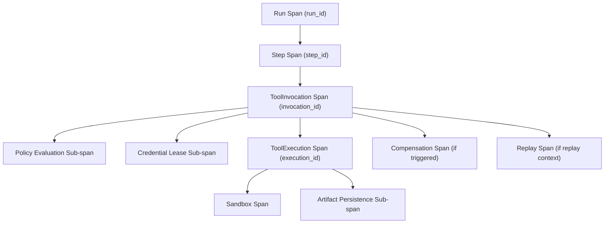

### 17.3 Observability Rules

- Critical telemetry (invocation, authorization, rejection, tenant boundary violation, credential events) MUST NOT be dropped under backpressure.
- Security and governance telemetry MUST be emitted to a durable, tamper-evident sink separate from operational metrics.
- Telemetry MUST preserve tenant lineage. Tenant-scoped telemetry MUST NOT be accessible by other tenants.
- Sampling MUST NOT be applied to critical telemetry categories. Only high-volume, low-risk telemetry (e.g., routine reads) may be sampled.
- Replay telemetry MUST be emitted to an isolated replay telemetry namespace.
- All emitted spans MUST carry trace_id, span_id, tenant_id, run_id, and invocation_id.

---

## 18. Multi-Tenant Tool Isolation

### 18.1 Tool Scope Model

Tools in MYCELIA operate under a scoped visibility model:

| Scope | Definition | Authorization | Example |
|---|---|---|---|
| `platform_global` | Available to all tenants by default | Platform-level policy | Web search, document converter |
| `platform_global_with_tenant_auth` | Available to tenants that have explicitly authorized | Per-tenant policy binding required | Payment tools, legal tools |
| `tenant_private` | Registered by and available only within a specific tenant | Tenant admin registers | Custom internal API integration |
| `workspace_private` | Available only within a specific workspace of a tenant | Workspace admin registers | Project-specific tooling |

### 18.2 Tenant Isolation Requirements

Every dimension of tool execution is tenant-isolated:

| Dimension | Isolation Mechanism |
|---|---|
| Tool registry | Tenant can only see authorized global tools + own private tools |
| Credentials | Credential leases are tenant-scoped; cross-tenant credential access is FORBIDDEN |
| Artifact storage | Artifacts stored under tenant-prefixed paths; no cross-tenant read |
| Telemetry | Tenant telemetry streams are isolated; query APIs enforce tenant_id filter |
| Worker pools | Shared pools validate envelope tenant_id; dedicated pools are single-tenant |
| Memory writes | Memory entries carry namespace_id which is tenant-scoped |
| Policy evaluation | Policies evaluated with tenant context; tenant cannot influence another tenant's policy |
| Approval routing | Approval requests routed only to the approving tenant's governance queue |
| Sandbox constraints | Sandbox constraints can be stricter for specific tenant risk profiles |
| DLQ | Dead-letter queues are tenant-partitioned |

### 18.3 Tenant Isolation Violation Response

If a tool invocation attempt results in a cross-tenant access attempt:

1. The attempt MUST be immediately aborted.
2. A `ToolTenantBoundaryViolation` event MUST be emitted with full context.
3. The event MUST be routed to the security alert pipeline with critical priority.
4. The invocation MUST be failed with `TenantBoundaryViolation` error.
5. The platform security team MUST be notified.
6. The source invocation and its run MUST be quarantined for investigation.

### 18.4 Tool Cost, Quota & Rate-Limit Governance

Tool execution MUST be cost-aware and quota-governed.

Tools can create infrastructure cost, model provider cost, external API cost, human operational cost and compliance cost. MYCELIA MUST attribute tool cost to tenant, workspace, workflow, run and tool version.

### Cost Dimensions

Every tool execution SHOULD attribute cost by:

- tenant_id;
- workspace_id;
- workflow_id;
- run_id;
- step_id;
- tool_id;
- tool_version_id;
- provider;
- worker_pool;
- sandbox_class;
- model_provider when applicable;
- artifact_size_bytes;
- input_size;
- output_size;
- execution_duration_ms.

### Quota Types

| Quota | Scope | Enforcement |
|---|---|---|
| Invocations per minute | tenant / workspace / tool | throttle or reject |
| Concurrent executions | tenant / workspace / worker pool | queue or reject |
| External API calls | tenant / provider | throttle |
| Model calls | tenant / provider / model | budget enforcement |
| Data export volume | tenant / workspace | approval and quota |
| Artifact storage | tenant | retention and quota |
| Replay executions | tenant / operator | concurrency limit |
| Sandbox CPU/memory | worker pool / tenant | resource quota |

### Required Events

The runtime SHOULD emit:

- ToolQuotaExceeded;
- ToolRateLimited;
- ToolBudgetThresholdReached;
- ToolBudgetExceeded;
- ToolCostRecorded;
- ToolExecutionThrottled.

### Rule

Cost and quota enforcement MUST happen before tool dispatch.

### Forbidden Behavior

FORBIDDEN:

- unbounded tool execution;
- provider calls without tenant cost attribution;
- data export without quota evaluation;
- replay execution without concurrency limit;
- bypassing quota by retrying internally;
- treating quota failure as tool failure.

---

## 19. SDK/API Error Model

Every error returned by the MYCELIA Tool Runtime is a structured error envelope, never a raw exception or untyped HTTP 500.

### 19.1 Canonical Error Types

| Error Type | Meaning | Retryable | Emitted Event | HTTP Mapping | Replay Behavior |
|---|---|---|---|---|---|
| `ValidationError` | Input failed schema or constraint validation | No | ToolInvocationRejected | 400 | Replay records error; no re-execution |
| `AuthorizationDenied` | Caller lacks permission for the requested operation | No | ToolInvocationRejected | 403 | Replay records denial |
| `ApprovalRequired` | Tool requires human approval before execution can proceed | No (wait) | ToolApprovalRequired | 202 (pending) | Replay hydrates recorded decision |
| `TenantBoundaryViolation` | Invocation would cross tenant boundary | No | ToolTenantBoundaryViolation | 403 | Critical; replay halted |
| `WorkspaceBoundaryViolation` | Invocation would cross workspace boundary | No | ToolInvocationRejected | 403 | Replay records violation |
| `ToolNotFound` | tool_id or tool_version_id not found in registry | No | ToolInvocationRejected | 404 | Replay records error |
| `ToolVersionDisabled` | ToolVersion is deprecated, archived, or disabled | No | ToolInvocationRejected | 410 | Replay uses historical record |
| `ToolContractInvalid` | ExecutionContract missing or invalid | No | ToolInvocationRejected | 500 (platform error) | Replay records error |
| `ToolExecutionTimeout` | Execution exceeded timeout | Conditional | ToolExecutionTimedOut | 504 | Replay hydrates recorded result |
| `ToolExecutionFailed` | Execution produced an error | Conditional | ToolExecutionFailed | 500 | Replay hydrates recorded failure |
| `ToolRetryExhausted` | All retry attempts consumed | No | ToolExecutionFailed | 500 | Replay hydrates final failure |
| `CredentialLeaseDenied` | Secret manager denied credential lease | Conditional (if transient) | ToolCredentialLeaseRequested | 503 | Replay suppressed (no credentials) |
| `SandboxFailure` | Sandbox could not be prepared or crashed | Conditional | ToolExecutionFailed | 503 | Replay hydrates recorded result |
| `ReplaySideEffectSuppressed` | Side-effectful execution was suppressed during replay | No | ToolExecutionReplaySuppressed | N/A | Expected replay outcome |
| `IdempotencyConflict` | An in-progress execution with same idempotency key exists | No | None (dedup) | 409 | Replay returns cached result |
| `SchemaMismatch` | Output did not match declared output schema | No | ToolOutputSchemaMismatch | 500 (tool error) | Replay records mismatch |
| `PolicyEvaluationFailed` | Policy engine returned an error (not a denial) | Conditional | ToolInvocationRejected | 503 | Replay uses historical snapshot |
| `OutputValidationFailed` | Output failed policy or additional validation rules | No | ToolOutputSchemaMismatch | 500 | Replay records failure |
| `SideEffectBlocked` | Side effect was blocked by runtime policy | No | ToolInvocationRejected | 403 | Replay records block |
| `CompensationFailed` | Compensation execution produced an error | No (escalate) | ToolCompensationFailed | N/A | Requires manual intervention |
| `SecretRedactionViolation` | Telemetry or log emission detected a secret value | No | Critical alert | N/A | Immediate halt |
| `ArtifactPersistenceFailed` | Artifact storage failed | Conditional | ToolExecutionFailed | 503 | Replay attempts to use existing artifact |

### 19.2 Error Envelope Structure

```json
{
  "error": {
    "type": "ToolExecutionTimeout",
    "code": "TOOL_EXECUTION_TIMEOUT",
    "message": "Tool execution exceeded declared timeout of 15000ms",
    "retryable": true,
    "invocation_id": "inv-abc123",
    "execution_id": "exec-def456",
    "attempt_number": 2,
    "tool_version_id": "mycelia.tools.web-search@2.3.1",
    "trace_id": "4bf92f3577b34da6a3ce929d0e0e4736",
    "tenant_id": "tenant-abc123",
    "timestamp": "2026-05-15T14:22:30Z",
    "details": {
      "timeout_type": "execution_timeout",
      "elapsed_ms": 15043
    }
  }
}
```

---

## 20. Versioning & Compatibility

### 20.1 SDK Versioning

- SDKs are versioned following semantic versioning (major.minor.patch).
- The SDK version MUST be declared in every request header as `X-MYCELIA-SDK-Version`.
- The API version MUST be declared in every request header as `X-MYCELIA-API-Version`.
- **Breaking changes** to the SDK (removed operations, changed required fields, changed error behavior) require a major version increment.
- **Backward-compatible additions** (new optional parameters, new response fields) use minor version increments.
- SDKs MUST maintain compatibility with the declared API version they target for the duration of the published deprecation window.
- Deprecated API versions remain operational for the full deprecation window. Callers receive deprecation warnings in response headers.

### 20.2 Tool Versioning

Tool versioning rules are defined in §5.4. Additional compatibility rules:

- A new ToolVersion MUST maintain backward compatibility with the input schema of the previous minor version within the same major version.
- Output schema additions (new optional fields) are backward-compatible.
- Removing output schema fields, changing field types, or removing previously required input fields are breaking changes requiring a major version increment.
- Changing `side_effect_class` to a more impactful class is a breaking change.
- Changing `replay_behavior` is a breaking change.

### 20.3 Contract Versioning

- ExecutionContracts are versioned independently as `contract_version` within a ToolVersion.
- For a given ToolVersion, the initial published contract is `1.0.0`.
- Contracts are immutable after publication. A new contract version requires a new ToolVersion.
- Historical contracts MUST be preserved in the registry indefinitely for replay purposes.

### 20.4 Replay Compatibility Rules

- Historical ToolVersions MUST remain in the registry with status `archived` (not deleted) as long as any ToolReplayRecord references them.
- If a ToolVersion is required for replay and has been removed, all replays referencing it MUST fail with `ToolVersionDisabled` rather than silently producing incorrect results.
- Schema evolution MUST preserve parsability of historical serialized outputs. Breaking schema changes require major version increment.
- The replay system MUST store the exact `tool_version_id` and `contract_version` for every ToolInvocation in the ToolReplayRecord.

### 20.5 Deprecation and Sunset

| Phase | Duration | Behavior |
|---|---|---|
| Active | Indefinite | Full support |
| Deprecated | Minimum 90 days | Operational; deprecation warnings in responses |
| Sunset-announced | 30 days before archived | No new workflow designs may reference |
| Archived | Permanent | No new executions; registry entry preserved for replay |

---

## 21. Runtime Failure Model

### 21.1 Failure Mode Catalog

| Failure Mode | Detection | Containment | Recovery | Emitted Events | Replay Implication |
|---|---|---|---|---|---|
| Tool worker crash | Missing heartbeat; invocation orphaned | Runtime detects heartbeat timeout; marks execution failed | Retry within budget; new worker assignment | ToolExecutionFailed, ToolExecutionRetried | Replay hydrates recorded result |
| Sandbox startup failure | Startup timeout exceeded | Worker returns SandboxFailure error | Retry with fresh sandbox | ToolExecutionFailed, ToolExecutionRetried | Replay hydrates recorded result |
| Credential lease failure | Vault unavailable or access denied | Invocation blocked at Leased state | Retry if transient; escalate if persistent | ToolCredentialLeaseRequested (failed) | Replay suppressed (no credentials needed) |
| Execution timeout | Timeout monitor fires | Force-terminate sandbox after grace period | Retry if retryable; fail if budget exhausted | ToolExecutionTimedOut, ToolExecutionRetried | Replay hydrates recorded timeout |
| External API failure | Tool adapter returns error | Error propagated; sandbox not re-used | Retry if retryable; fail invocation | ToolExecutionFailed | Replay hydrates recorded failure |
| Partial side effect | Side effect registered before failure | Compensation triggered; partial effect recorded | Compensation execution | ToolExecutionFailed, ToolExecutionCompensated | Replay suppresses re-execution; records compensation |
| Duplicate invocation | Idempotency check detects existing key | Return cached result; no re-execution | None required | None (dedup) | Replay uses cached result |
| Orphan tool execution | Worker timeout + no result returned | Runtime marks as failed; orphan audit event emitted | Retry or manual investigation | ToolExecutionFailed | Replay hydrates last known state |
| Lost worker heartbeat | Heartbeat monitor timeout | Mark invocation as failed; release worker | Retry within budget | ToolExecutionFailed, ToolExecutionRetried | Replay hydrates recorded result |
| Invalid output schema | Schema validation at output stage | Reject output; fail invocation | No retry (contract mismatch) | ToolOutputSchemaMismatch, ToolExecutionFailed | Replay records mismatch |
| Malicious tool output | Security scan on output; injection detection | Quarantine output; fail invocation; alert | Security investigation | ToolExecutionFailed, security alert | Replay quarantines artifact |
| Tenant boundary violation | Envelope validation in worker | Abort execution; emit critical alert | Security investigation | ToolTenantBoundaryViolation | Replay halted |
| Replay side-effect attempt | Replay context check | Suppress and log; do not execute | None required | ToolExecutionReplaySuppressed | Expected behavior |
| Compensation failure | Compensation execution error | Escalate to operator; create compensation failure record | Manual intervention | ToolCompensationFailed | Replay records compensation failure |
| Artifact persistence failure | Artifact service returns error | Retry artifact persistence; if persistent, fail invocation | Retry artifact write | ArtifactPersistenceFailed, ToolExecutionFailed | Replay may be degraded |
| Telemetry emission failure | OTel collector unreachable | Buffer locally; retry with backoff; do not fail execution for telemetry loss | Buffer drain | None (by definition); degraded observability | May degrade replay audit trace |
| Policy evaluation failure | Policy engine returns error | Block execution; retry policy eval if transient | Retry or escalate | ToolInvocationRejected | Replay uses historical snapshot |
| Approval timeout | Approval gate timer expires | Auto-deny invocation | Invocation fails; operator can re-trigger | ToolInvocationRejected | Replay records auto-denial |

---

## 22. Security Threat Model for Tools

### 22.1 Threat Catalog

| Threat | Prevention | Detection | Response |
|---|---|---|---|
| Prompt injection through tool output | Tool output validated against schema; output presented as typed data, not raw text; injection detection filter | Monitor for anomalous instruction patterns in tool outputs | Quarantine output; alert security team; fail invocation |
| Tool output laundering | Schema validation; memory write gate; explicit workflow step required for output promotion | Audit memory write operations; monitor for abnormal write patterns | Reject unauthorized memory writes; alert |
| Malicious external API response | Tool adapter sanitizes external responses; output schema validation rejects unexpected structures | Monitor output schema mismatch rate | Disable tool; investigate provider |
| Overprivileged tool | Capability class review at registry; permission declaration in manifest; policy evaluation at runtime | Audit tool capability declarations; compare requested vs. used permissions | Revoke tool enablement; require capability reduction |
| Tool registry poisoning | Manifest signing; supply-chain review; operator enablement gate | Monitor for unsigned or unreviewed tools in registry | Disable tool; revoke publisher key |
| Credential exfiltration | Credentials in memory only during execution; lease expiry; redaction filters on telemetry | Monitor credential access patterns; alert on unusual lease patterns | Revoke credentials; investigate execution |
| Sandbox escape | gVisor/strong sandbox for code execution; network deny-by-default; read-only filesystem | Monitor for syscall anomalies; network egress alerts | Terminate sandbox; quarantine worker; alert security |
| Cross-tenant artifact leakage | Tenant-scoped artifact paths; access control on artifact API | Monitor for cross-tenant access attempts | Block access; emit TenantBoundaryViolation; investigate |
| Replay contamination | Replay flag in envelope; side-effect suppression; production credential exclusion | Monitor replay telemetry for unexpected side effects | Abort replay; investigate |
| Dependency supply-chain compromise | SBOM verification; dependency pinning; vulnerability scanning | Monitor SBOM freshness; scan on each ToolVersion publication | Disable affected ToolVersion; revoke |
| Hidden side effect | Side-effect class validation at security review; runtime monitoring of external calls | Monitor external API call patterns vs. declared side-effect class | Disable tool; require reclassification |
| Unauthorized data export | `DataExport` capability class requires approval and data classification check | Monitor artifact export operations | Block; alert; investigate |
| Tool descriptor poisoning | Manifest signing; registry access control; immutable after publication | Monitor for manifest mutation attempts | Revert; revoke; alert |
| Tool shadowing / unauthorized substitution | ToolVersion immutability; `tool_version_id` pinned in workflow execution | Monitor for ToolVersion substitution in invocations | Abort; alert |
| Webhook spoofing | Webhook signature verification (HMAC); source IP validation where applicable | Monitor for signature validation failures | Reject; alert; investigate source |

### 22.2 Tool Kill Switch & Quarantine Protocol

MYCELIA MUST support immediate containment of unsafe tools.

A tool may be quarantined or disabled when runtime behavior, security signals, supply-chain checks, tenant reports or operator investigation indicates risk.

### Kill Switch Scopes

| Scope | Effect |
|---|---|
| ToolVersion | disables a specific version |
| Tool | disables all versions of a tool |
| Capability Class | disables all tools in a capability class |
| Tenant Tool Binding | disables tool for one tenant |
| Workspace Tool Binding | disables tool for one workspace |
| Worker Pool | prevents execution from a compromised pool |
| Publisher | disables all tools from a publisher |
| External Provider | blocks tool calls to a provider |

### Quarantine Triggers

A tool MUST be quarantined when:

- implementation hash mismatch is detected;
- side-effect behavior exceeds declared side_effect_class;
- credential exfiltration is suspected;
- prompt injection through output is detected at high severity;
- cross-tenant artifact access is attempted;
- sandbox escape is suspected;
- supply-chain vulnerability becomes critical;
- malicious publisher behavior is detected;
- operator manually declares containment.

### Quarantine Behavior

When quarantined:

- new invocations are blocked;
- in-flight invocations are paused or cancelled according to risk class;
- credential leases are revoked;
- worker pool assignments are blocked;
- tool discovery hides the quarantined version;
- audit event ToolQuarantined is emitted;
- affected tenants are identified;
- replay remains read-only and uses historical artifacts.

### Required Events

The protocol MUST emit:

- ToolQuarantineRequested;
- ToolQuarantined;
- ToolKillSwitchActivated;
- ToolCredentialLeasesRevoked;
- ToolInvocationBlocked;
- ToolQuarantineReleased.

### Rule

Kill switch activation MUST be fast, auditable and reversible only through explicit review.

### Forbidden Behavior

FORBIDDEN:

- silently disabling a tool without audit;
- allowing quarantined tools to execute new invocations;
- deleting historical artifacts during quarantine;
- deleting ToolVersions to contain risk;
- allowing publisher self-unquarantine;
- continuing credential leases after kill switch activation.

---

## 23. Webhook & External Callback Contracts

### 23.1 Inbound Webhooks

Inbound webhooks deliver external events (e.g., payment completed, document signed, external system trigger) to MYCELIA workflows. Every inbound webhook MUST be handled with the following guarantees:

1. **Signature verification:** The webhook payload MUST be verified against an HMAC-SHA256 signature using the tenant's registered webhook secret. Unverified webhooks MUST be rejected immediately.
2. **Tenant resolution:** The webhook endpoint URL MUST resolve to a unique tenant. Webhook URLs MUST NOT be shared across tenants.
3. **Idempotency:** Webhook delivery is at-least-once. MYCELIA MUST deduplicate based on the webhook event ID, which MUST be present in the payload header (`X-MYCELIA-Webhook-Event-ID`).
4. **Acknowledgement:** The webhook receiver MUST return HTTP 200 within 5 seconds. Processing occurs asynchronously after acknowledgement.
5. **Failure handling:** If processing fails, the event is placed on the tenant DLQ for retry.

### 23.2 Outbound Webhooks

Outbound webhooks deliver MYCELIA runtime events to external systems. They are governed as tool executions with side-effect class `ExternalWrite` or `HumanNotification`.

**Outbound webhook rules:**
- Outbound webhooks MUST be registered with a declared target URL, event type, and authentication method.
- Outbound webhook payloads MUST be signed with an MYCELIA-managed signing key so the recipient can verify authenticity.
- Retry behavior follows the RetryPolicy of the sending tool invocation.
- Failed outbound webhooks go to a tenant DLQ with retention.
- Replay MUST NOT trigger outbound webhooks automatically.
- Outbound webhook payloads MUST NOT contain tenant secrets.

### 23.3 Webhook Flow Diagram

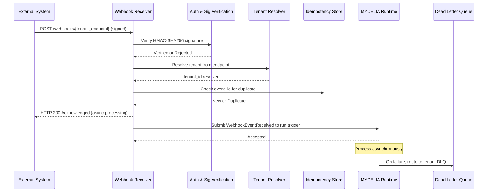

### 23.4 Webhook Security Rules

- Webhooks MUST be signed (HMAC-SHA256 or equivalent).
- Inbound callbacks MUST resolve tenant boundaries deterministically.
- Webhook event IDs MUST be globally unique within tenant scope.
- Webhook retries MUST be evented (each retry creates a new ToolExecutionAttempt).
- Callbacks MUST NOT mutate runtime state without going through the full invocation pipeline.
- Replay MUST NOT trigger outbound webhooks automatically. Replay context MUST suppress outbound webhook calls.
- Webhook endpoints MUST be registered before use; unregistered webhooks MUST be rejected.
- Webhook secrets MUST be managed by the secret manager; they MUST NOT appear in webhook configuration stored in the database.

---

## 24. Tool Supply-Chain Integrity

### 24.1 Supply-Chain Security Model

Every tool in MYCELIA's registry is a potential point of compromise. MYCELIA treats tool supply-chain integrity as a first-class security requirement. The supply-chain model provides: publisher identity verification, build provenance, dependency transparency, and artifact immutability.

### 24.2 Signed ToolManifest

Every ToolManifest MUST be signed using the publisher's registered signing key:

```bash
# Tool publisher signs manifest
cosign sign-blob \
  --key cosign.key \
  --output-signature manifest.sig \
  mycelia-tools-web-search-2.3.1-manifest.json

# Registry verifies on submission
cosign verify-blob \
  --key cosign.pub \
  --signature manifest.sig \
  mycelia-tools-web-search-2.3.1-manifest.json
```

If signature verification fails, the manifest submission MUST be rejected.

### 24.3 SBOM Requirements

Every ToolVersion MUST include a Software Bill of Materials (SBOM) in CycloneDX or SPDX format:

```bash
# Generate SBOM for tool implementation
syft packages dir:./tool-src -o cyclonedx-json > sbom/web-search-2.3.1.cdx.json

# Attach to ToolManifest via supply_chain_profile.sbom_ref
```

The SBOM MUST be reviewed for:
- Known CVEs in declared dependencies (Critical and High MUST be remediated or policy-exempted before enablement).
- Presence of unexpected transitive dependencies.
- License compliance.

### 24.4 Build Attestation

ToolVersions targeting `strong` or `dedicated` sandbox classes MUST provide build provenance attestation:

- SLSA Level 2 minimum (attested build, signed provenance).
- Build provenance is linked via `supply_chain_profile.build_attestation_ref`.
- Attestation MUST be verifiable independently from the registry.

### 24.5 Rug-Pull Prevention

A rug-pull attack occurs when a tool publisher changes tool behavior after enablement by mutating the tool implementation without changing the ToolVersion. MYCELIA prevents rug-pulls by:

- Declaring `ToolVersion` as immutable after publication (registry-level enforcement).
- Computing and storing a content hash of the tool implementation artifact at publication time.
- Verifying the implementation hash against the stored hash at runtime before execution.
- Disabling tools whose implementation hash does not match the stored value.
- Emitting a critical security alert on hash mismatch.

### 24.6 Tool Review Workflow

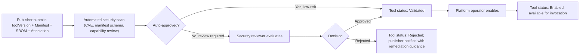

---

## 25. Tool Runtime Invariants

The following invariants are implementation-grade requirements. They MUST be enforced by the MYCELIA Tool Runtime. Any implementation that violates an invariant is architecturally non-compliant.

### 25.1 Core Execution Invariants (1–20)

1. No tool execution may occur without tenant_id.
2. No tool execution may occur without workspace_id.
3. No tool execution may occur without a valid ToolRuntimeEnvelope.
4. No tool execution may occur outside a ToolSandbox.
5. No tool execution may occur without a ToolInvocation record in the persistence store.
6. No tool execution may occur without a valid, immutable ExecutionContract.
7. No tool execution may occur without a verified ToolManifest signature.
8. No tool execution may occur without a trace_id and span_id.
9. No tool execution may occur without an idempotency_key for side-effectful tools.
10. No tool execution may occur after an expired ToolRuntimeEnvelope.
11. No tool execution may proceed if policy evaluation has not been recorded.
12. No tool execution requiring approval may proceed without a recorded ApprovalGranted decision.
13. No tool execution may claim a credential outside a valid ToolLease.
14. No tool execution may access credentials from a different tenant.
15. No tool execution may persist artifacts outside the tenant-scoped artifact path.
16. No tool execution may emit telemetry without tenant_id in every span attribute.
17. No tool execution in replay context may access live production credentials.
18. No tool execution in replay context may produce external side effects automatically.
19. No tool execution may produce a result that bypasses output schema validation.
20. No tool execution may write to memory without explicit permission in the ExecutionContract.

### 25.2 SDK and Request Invariants (21–40)

21. No SDK request may be processed without authentication.
22. No SDK request may be processed without a declared tenant scope.
23. No SDK request may carry a raw credential value except in classified credential-management endpoints.
24. No SDK request may bypass the API gateway.
25. No SDK request may omit correlation_id.
26. No SDK request may omit causation_id for state-mutating operations.
27. No SDK request may declare a higher tenant scope than the caller's authorization grants.
28. No SDK client may construct a ToolRuntimeEnvelope directly.
29. No SDK client may override ExecutionContract parameters beyond workflow-declared limits.
30. No external SDK client may access tools outside its tenant's authorized scope.
31. No admin SDK operation may bypass audit logging.
32. No replay SDK operation may produce new side effects.
33. No worker SDK operation may access invocations assigned to a different worker pool.
34. No SDK version mismatch may be silently ignored.
35. No SDK request carrying an expired API version may be processed without a deprecation warning.
36. No SDK error may expose raw stack traces or secret values to the caller.
37. No SDK request for a disabled or archived ToolVersion may proceed to execution.
38. No SDK request without X-MYCELIA-API-Version header may be processed without version negotiation.
39. No SDK idempotency key may be accepted that conflicts with an in-progress operation for a different payload.
40. No SDK operation may read artifacts belonging to a different tenant.

### 25.3 Tool Registry and Versioning Invariants (41–60)

41. No ToolVersion may be mutated after publication.
42. No ExecutionContract may be mutated after publication.
43. No ToolManifest without a valid cryptographic signature may be enabled.
44. No tool may be enabled without completing the supply-chain review process.
45. No ToolManifest may contain raw credential values.
46. No ToolManifest may declare a side_effect_class lower than the tool's actual behavior.
47. No ToolVersion may be deleted while any ToolReplayRecord references it.
48. No tool capability class may be expanded without a new major version.
49. No tool schema may be changed in a breaking way without a new major version.
50. No ToolVersion with a known Critical CVE may be enabled without an explicit policy exception.
51. No tool may be registered with capabilities beyond what was declared at security review.
52. No tool may modify its implementation artifact after ToolVersion publication.
53. No tool with a hash mismatch between stored and runtime implementation may execute.
54. No ToolVersion with status Archived may be selected for new workflow designs.
55. No tool may be enabled by a non-operator principal.
56. No tool registry mutation may occur without an audit record.
57. No ToolPolicyBinding may be created or modified without governance audit.
58. No deprecated ToolVersion may be referenced in new workflow definitions after its deprecation deadline.
59. No ToolVersion may execute in a context that requires a higher sandbox class than declared.
60. No tool may declare `replay_behavior: execute_freely` for any side-effect class above `ReadOnlyInternal`.

### 25.4 Secrets and Credentials Invariants (61–75)

61. No secret value may appear in telemetry, logs, or traces.
62. No secret value may appear in a ToolRuntimeEnvelope.
63. No secret value may appear in a ToolArtifact.
64. No secret value may appear in a ToolAuditRecord.
65. No secret value may appear in a ToolReplayRecord.
66. No credential lease may extend beyond the execution window.
67. No worker may hold a credential after the execution for which it was leased completes.
68. No tenant A credential may be used by a worker executing for tenant B.
69. No emergency revocation may be ignored by in-flight workers; they MUST receive the revocation signal.
70. No credential reference may be resolved outside a valid ToolLease.
71. No secret value may be returned to SDK callers except through classified credential-management endpoints.
72. No replay execution may trigger a new credential lease.
73. No ToolManifest `required_secrets` field may contain secret values; references only.
74. No secret rotation may silently break in-flight executions; rotation MUST coordinate with active leases.
75. No credential access event may be suppressed from the audit log.

### 25.5 Side Effects, Idempotency, and Compensation Invariants (76–95)

76. No side-effectful tool may execute without a declared idempotency strategy.
77. No idempotency key may be accepted for a tool class that declares `idempotency_strategy: none` with a side-effect class above `ReadOnlyInternal`.
78. No retry may occur without emitting a ToolExecutionRetried event.
79. No retry may occur without creating a new ToolExecutionAttempt with causation chain.
80. No retry may silently modify the idempotency key to avoid deduplication.
81. No compensation may be skipped for tools with `compensation_required: true` in the ExecutionContract.
82. No compensation failure may be silently ignored; ToolCompensationFailed MUST be emitted and escalated.
83. No tool with side_effect_class above `ReadOnlyExternal` may execute in replay without explicit operator approval.
84. No duplicate invocation (same idempotency key, same result) may produce a second side effect.
85. No side effect may be registered without a corresponding ToolSideEffect record in the persistence store.
86. No approval gate may be bypassed for tools with `approval_required: true` except via break-glass.
87. No break-glass execution may omit the justification text and actor identity from the audit record.
88. No break-glass authorization may remain valid beyond the declared break-glass_ttl.
89. No tool execution may claim partial idempotency (idempotent input handling but non-idempotent output registration).
90. No compensation handler may itself produce unregistered side effects.
91. No retry attempt may proceed without re-evaluating the credential lease (the original lease may have expired).
92. No side effect of class `FinancialImpact` or `LegalImpact` may execute without a matching ToolApprovalGranted record.
93. No automatic compensation may delete event history or replay records.
94. No tool execution may suppress idempotency checks under load.
95. No HumanNotification tool may send duplicate notifications within the deduplication window.

### 25.6 Tenant Isolation and Worker Invariants (96–115)

96. No worker may accept a ToolRuntimeEnvelope for a tenant not assigned to its pool.
97. No worker may access the secret manager outside the scope of its active lease.
98. No worker may write to artifact storage paths outside the tenant_id prefix of its envelope.
99. No worker may emit telemetry without the tenant_id attribute.
100. No shared worker may cache tenant state between invocations.
101. No worker may operate without an attested runtime identity for strong/dedicated sandbox classes.
102. No worker heartbeat failure may be silently absorbed; the invocation MUST be marked as failed.
103. No worker may self-report a result for an invocation that has already reached a terminal state.
104. No in-flight invocation may be orphaned without entering a terminal state with an emitted event.
105. No worker may bypass sandbox network policies by using a relay or proxy outside the declared egress policy.
106. No tenant data encountered during execution may be persisted outside tenant-scoped storage.
107. No dedicated worker pool may receive invocations for tenants it is not explicitly provisioned for.
108. No worker may access the host node's cloud instance metadata service.
109. No worker may persist in-process state between invocations for different tenants.
110. No worker log output may contain raw credential values.
111. No shared worker pool may run invocations for a tenant requiring dedicated isolation.
112. No sandbox may survive beyond the execution window; cleanup MUST occur on completion.
113. No worker may accept a second invocation while still in Executing state.
114. No worker attestation may be accepted beyond its SVID expiry.
115. No cross-tenant tool output MAY be accessible to another tenant through any API endpoint.

### 25.7 Replay and Lineage Invariants (116–130)

116. No replay execution may use live production credentials.
117. No replay execution may produce new persistent side effects without operator approval.
118. No replay may silently ignore a missing ToolReplayRecord for a side-effectful tool; it MUST suppress and log.
119. No replay may modify the original ToolInvocation record or its linked audit records.
120. No replay run may emit telemetry to the production observability namespace.
121. No replay execution may proceed if the historical policy_snapshot_id cannot be resolved.
122. No replay divergence may be silently ignored; ReplayDivergenceDetected MUST be emitted.
123. No tool artifact used as a replay record may be deleted before the replay retention window expires.
124. No historical ToolVersion may be removed while any replay record references it.
125. No replay execution may inject tool output as a live workflow control signal without explicit operator approval.
126. No replay execution may have its tenant_id altered from the original run.
127. No replay record may be created for a side-effectful execution without a matching ToolSideEffect suppression record.
128. No replay of a run with a TenantBoundaryViolation may proceed without security team sign-off.
129. No replay execution may alter the original event lineage in any way.
130. No replay environment may have network access to production systems without an explicit network policy allowing it.

### 25.8 Observability and Audit Invariants (131–140)

131. No tool invocation may complete without a ToolAuditRecord.
132. No ToolAuditRecord may be deleted within the compliance retention window.
133. No critical telemetry event may be dropped under backpressure.
134. No tool invocation may succeed or fail without emitting the corresponding terminal event.
135. No tool execution may emit telemetry without a valid trace_id linking to the parent run span.
136. No approval decision may be recorded without the approver's identity and timestamp.
137. No security alert event may be routed only to operational monitoring; it MUST also reach the security pipeline.
138. No telemetry emission failure may cause the tool execution itself to fail; telemetry loss is logged but non-fatal.
139. No tool execution audit record may omit the policy_snapshot_id used at authorization time.
140. No ToolAuditRecord may omit the invocation_id, tenant_id, run_id, and tool_version_id.


---

## 26. Tool Runtime Anti-Patterns

The following patterns are explicitly prohibited in MYCELIA. Each represents an architectural violation that undermines governance, security, observability, or tenant isolation.

**Agent-owned tools.** Tools belong to the platform registry. Agents do not own tools. An agent that can register, enable, or modify tools without governance review is an agent with unconstrained authority.

**Prompt-only tool permissions.** Declaring a tool as available because the system prompt says so is not a security model. Tool permissions must be evaluated by the policy engine against the runtime context, not derived from text.

**Hidden tool execution.** Any tool call that is not recorded in the ToolInvocation store, does not emit telemetry, and does not produce an audit record is a hidden side effect. Hidden execution undermines replay, auditability, and governance.

**Hidden retries.** Retrying a tool call inside worker code without notifying the runtime is a hidden retry. The runtime must know about every attempt to maintain idempotency keys, causation chains, and audit records.

**Unversioned tools.** A tool without a declared version cannot be pinned, cannot be replayed against a historical contract, and cannot be safely deprecated. All tools must be versioned.

**Mutable tool contracts.** An ExecutionContract that can be modified after publication allows silent changes to authorization requirements, side-effect classification, or replay behavior. Contracts are immutable. This is non-negotiable.

**Tool outputs as automatic truth.** Injecting tool output directly into workflow state, treating it as a system instruction, or writing it to memory without validation is a security vulnerability. Tool output is data; it requires validation, classification, and explicit promotion.

**Secrets in prompts.** Passing credential values in the agent's context window exposes them to logging, tracing, memory writes, and external model providers. Credentials are injected via lease, not prompt.

**Secrets in logs.** Logging raw tool inputs, outputs, or environment variables without redaction may expose credentials. All telemetry passes through credential redaction filters.

**Replay with production credentials.** A replay environment that accesses production credentials is not a replay environment. It is a second production execution. Replay environments are hermetically sealed from credential systems.

**Cross-tenant tool outputs.** An artifact produced by a tool execution for tenant A MUST NOT be accessible by tenant B through any mechanism. Storage paths, API endpoints, and memory entries are tenant-scoped.

**Shared credentials.** Using the same credential for tool executions across different tenants blurs accountability and creates cross-tenant risk. Credentials are tenant-scoped.

**Global worker state.** Workers that maintain shared in-process state between invocations risk leaking data between tenants and between runs. Workers must be stateless between executions.

**Unbounded tool execution.** A tool with no declared timeout and no retry budget can consume worker resources indefinitely. Every tool must declare explicit timeout and retry bounds.

**Unmanaged webhooks.** Webhook endpoints that accept unverified, unsigned payloads without tenant resolution are attack surfaces. Webhooks must be signed, verified, and tenant-resolved.

**Direct external I/O inside orchestration logic.** Workflow orchestration code that makes HTTP requests, writes files, or calls APIs directly is not deterministic. All external effects must occur through activities, tools, and workers.

**SDK calls without tenant context.** An SDK call that does not carry a tenant_id is either a misconfiguration or a privilege escalation attempt. All SDK operations require tenant context propagation.

**Model-selected high-impact tools without policy.** Allowing a language model to select and invoke tools with `FinancialImpact`, `LegalImpact`, or `DestructiveExternal` side-effect class without policy evaluation and approval gating is a governance failure.

**Unvalidated structured outputs.** Accepting a tool's structured output without schema validation is accepting an undefined data contract. Schema validation is a first-class runtime enforcement step, not optional.

**Tool registry mutation without audit.** Adding, modifying, or removing tools from the registry without an audit trail makes it impossible to investigate when and why a tool's behavior changed.

**Worker access to raw tenant secrets.** Workers receive credential lease references. They fetch credential values through a single-use lease fetch. Direct access to the secret manager outside this mechanism is prohibited.

**Tool output injected as system instruction.** A tool output that becomes a system prompt, a workflow control signal, or an agent instruction without validation and explicit promotion is a prompt injection vector of the highest severity.

---

## 27. MVP Cut

### 27.1 MVP Now

The following capabilities constitute the minimum viable implementation for MYCELIA's SDK, Tool Runtime, and Execution Contracts.

**Tool Registry (MVP):**
- ToolManifest schema validation (JSON Schema).
- ToolVersion creation and registry storage.
- Basic capability class and side-effect class support.
- Manifest signing and signature verification (cosign or equivalent).
- Enabled/Disabled/Deprecated lifecycle management.
- Tool discovery API (tenant-scoped).

**Execution Contract (MVP):**
- ExecutionContract compilation from ToolManifest.
- Input and output schema validation.
- Timeout policy enforcement.
- Basic retry policy (max_attempts, exponential backoff).
- Idempotency key generation and deduplication.
- `suppress_and_hydrate` replay behavior for all side-effectful tools.

**Tool Invocation Pipeline (MVP):**
- Tenant boundary resolution.
- Policy evaluation (basic permission check).
- Approval gate for `approval_required: true` tools.
- ToolRuntimeEnvelope construction.
- Idempotency check.
- ToolInvocation persistence.
- Worker dispatch via Redis Streams queue.
- Result return and artifact persistence.

**Worker and Sandbox (MVP):**
- Standard sandbox class (container isolation).
- Credential lease integration with secret manager.
- Worker heartbeat and timeout detection.
- Basic filesystem and network isolation.
- Worker SDK for result and telemetry reporting.

**Observability (MVP):**
- ToolInvocationRequested, ToolExecutionStarted, ToolExecutionSucceeded, ToolExecutionFailed events.
- OpenTelemetry span emission with tenant_id attribute.
- Basic audit record creation.

**Tenant Isolation (MVP):**
- Tenant-scoped artifact storage paths.
- Tenant context propagation in all SDK operations.
- Envelope-level tenant validation in workers.

**Replay (MVP):**
- Replay flag detection in ToolRuntimeEnvelope.
- Suppression of side-effectful executions in replay context.
- ToolReplayRecord creation from ToolResult.
- Replay telemetry isolation (separate namespace).

**Security (MVP):**
- Credential lease model.
- Secret value redaction from telemetry.
- Webhook signature verification.
- Manifest signature verification.

### 27.2 Later

- Advanced plugin runtime with dynamic tool loading.
- Webhook developer portal with self-service registration.
- Dedicated worker pool provisioning for enhanced and enterprise tenants.
- Advanced compensation framework with saga coordination.
- Full SBOM review automation with CVE blocking policy.
- External developer SDK with versioned compatibility windows.
- Richer tool analytics (invocation cost, latency histograms, error rate by capability class).
- Tool recommendation engine (based on workflow patterns).
- Worker capability profiles and dynamic pool assignment.
- Advanced tool output validation (semantic validation beyond schema).
- Stronger gVisor sandbox class for all code execution tools.

### 27.3 Enterprise Future

- Full governed tool marketplace with multi-publisher trust management.
- Multi-region tool execution with data residency enforcement.
- Advanced supply-chain attestation (SLSA Level 3+).
- Tenant-dedicated execution zones with hardware isolation.
- Automated semantic tool review (AI-assisted capability classification).
- Adaptive risk scoring for tool invocations based on runtime context.
- Fully dynamic tool federation across organizational boundaries.
- Organization-specific tool governance packs with custom approval workflows.
- Zero-trust execution attestation (every worker cryptographically attested before every invocation).
- Customer-managed signing keys for tenant-registered tools.

---

## 28. Codex Implementation Guidance

### 28.1 Implementation Order

The following sequence MUST be followed when implementing the MYCELIA Tool Runtime. This ordering ensures that foundational safety properties exist before advanced features are built on top of them.

1. **Domain schemas.** Define all entity schemas: ToolManifest, ExecutionContract, ToolInvocation, ToolExecution, ToolExecutionAttempt, ToolResult, ToolArtifact, ToolRuntimeEnvelope, IdempotencyKey, RetryPolicy, TimeoutPolicy. Use JSON Schema or equivalent typed schema system. Generate validation code from schemas.

2. **ToolManifest schema.** Implement full ToolManifest schema validation. All required fields must be validated. Manifest must be deserializable to a typed Python/TypeScript model. Include side_effect_class and replay_behavior validation.

3. **ExecutionContract schema.** Implement ExecutionContract compilation from ToolManifest. ExecutionContract must be stored as an immutable record. Include contract version tracking.

4. **ToolRegistry service.** Implement CRUD for tools and tool versions in PostgreSQL. Implement manifest signature verification at submission time. Implement lifecycle state machine (Draft → Validated → Enabled → Deprecated → Archived). Implement tool discovery API with tenant scoping.

5. **ToolRuntimeEnvelope builder.** Implement a service that constructs ToolRuntimeEnvelopes from invocation context. Envelope construction must be centralized; SDKs never construct envelopes directly. Include all required fields. Sign envelopes with platform key.

6. **Tenant-bound invocation validation.** Before any execution begins, validate: tenant_id present, workspace_id present, tool authorized for tenant, caller authorized for tool. Reject any request that fails validation with structured error.

7. **ToolInvocation persistence.** Before dispatching to worker, persist the ToolInvocation record with status REQUESTED. Persist the policy_snapshot_id. Persist the idempotency_key. This record is the authoritative source of truth.

8. **ToolExecutionAttempt persistence.** Create a ToolExecutionAttempt record on each dispatch attempt. Include causation_id chain. Include attempt_number. Persist on each retry.

9. **Worker dispatcher.** Implement worker queue (Redis Streams in MVP). Serialize ToolRuntimeEnvelope to queue message. Implement worker pool routing based on tool capability class.

10. **Basic sandbox adapter.** Implement container-based sandbox for MVP. Worker receives envelope; validates signature; executes tool adapter. Enforce execution_timeout_ms with process-level kill.

11. **Idempotency key handling.** Implement Redis-based deduplication store. Check idempotency key before dispatch. Return cached result if duplicate. Set TTL on deduplication entries to max(retry_budget_ms + execution_timeout_ms * max_attempts).

12. **Timeout and retry handling.** Implement heartbeat monitor. Implement timeout detection (separate timer per invocation). Implement retry state machine: on failure, check retry policy, increment attempt, emit ToolExecutionRetried, dispatch new attempt.

13. **Credential reference integration.** Integrate with secret manager (Vault or cloud secret manager). Implement lease request on invocation authorization. Include lease reference (not value) in envelope. Implement lease expiry cleanup.

14. **Telemetry events.** Emit all mandatory events (§17.1) using OpenTelemetry. Include tenant_id in every span attribute. Link invocation span as child of run span. Implement basic redaction filter for known secret patterns.

15. **Replay suppression.** Detect `replay_context.is_replay` in ToolRuntimeEnvelope. For side-effectful tools: look up ToolReplayRecord; if found, return hydrated result; if not, suppress and emit ToolExecutionReplaySuppressed. Never let side-effectful tools reach workers in replay context.

16. **Approval integration.** Integrate with governance approval engine. On `approval_required: true` tools: submit approval request; block in ApprovalRequired state; on grant, proceed; on denial or timeout, terminate with ToolInvocationRejected.

17. **Artifact persistence.** On successful tool execution: hash output; store in tenant-scoped object storage path; create ToolArtifact record with provenance. Verify hash on read.

18. **Output schema validation.** Validate tool output against ExecutionContract.output_schema before marking execution as Succeeded. On mismatch: emit ToolOutputSchemaMismatch; fail invocation.

19. **Memory write permission checks.** Before writing tool output to memory: check `memory_write_behavior.allowed` in ExecutionContract. If false, reject with structured error. If true, require explicit step-level memory write declaration. Create memory lineage record linking memory entry to artifact.

20. **Tests.** Implement all required tests (see §28.3).

### 28.2 Forbidden Codex Shortcuts

The following shortcuts MUST NOT be taken in the MYCELIA implementation, regardless of development timeline pressure:

- **Do not execute tools directly from orchestration code.** Orchestration code dispatches invocation requests. Worker code executes tools. Merging these violates the determinism guarantee.
- **Do not store secrets in ToolManifest.** Manifests store references. Secret values are fetched through leases. Any implementation that stores credential values in the registry is a security defect.
- **Do not bypass tenant scope.** Never implement a "global" credential, "global" artifact path, or "global" worker pool that implicitly serves all tenants. Every operation carries tenant context.
- **Do not implement retry inside worker without runtime event.** Workers do not retry. The runtime retries by creating a new ToolExecutionAttempt and dispatching it. Worker-level retry is a hidden retry.
- **Do not allow mutable ToolVersions.** Once published, a ToolVersion and its ExecutionContract are immutable. Build the persistence layer to enforce this from day one.
- **Do not persist tool output as memory without explicit permission.** Memory writes require contract authorization, step-level declaration, and explicit lineage creation.
- **Do not implement replay before side-effect suppression.** Replay without suppression is replay with live side effects. Suppression must be built first.
- **Do not implement SDK calls without correlation and causation identifiers.** Correlation and causation are required for trace reconstruction. Omitting them makes the audit trail non-functional.
- **Do not implement webhooks without signature validation.** An unsigned webhook endpoint is an unauthenticated attack surface. Build signature verification before any webhook handler goes live.
- **Do not let model output select high-impact tool execution without policy validation.** Model output is data. It suggests which tool to invoke. The policy engine decides whether the invocation is authorized.

### 28.3 Required Tests

The following tests MUST exist before any production deployment of the Tool Runtime:

| Test | What It Verifies |
|---|---|
| Tenant isolation test | Tool invocation for tenant A cannot access artifacts, credentials, or memory of tenant B |
| Workspace isolation test | Tool invocation for workspace W1 cannot access workspace W2 resources within the same tenant |
| Tool manifest validation test | Manifests with missing required fields, wrong types, or illegal values are rejected |
| Execution contract validation test | Contracts with inconsistent side_effect_class and replay_behavior are rejected |
| Idempotency test | Second invocation with same idempotency key returns the cached result without re-execution |
| Retry test | Failed retryable execution produces new ToolExecutionAttempt with causation chain; ToolExecutionRetried emitted |
| Timeout test | Execution exceeding execution_timeout_ms is terminated; ToolExecutionTimedOut emitted |
| Replay suppression test | Side-effectful tool invocation in replay context is suppressed; ToolExecutionReplaySuppressed emitted; no worker dispatch |
| Credential redaction test | Tool execution that would emit a credential value in telemetry is intercepted and redacted; alert emitted |
| Schema mismatch test | Tool output failing output_schema validation produces ToolOutputSchemaMismatch and fails invocation |
| Approval gate test | Tool with approval_required: true blocks until approval; proceeds on grant; fails on denial |
| Telemetry emission test | Every terminal state (Succeeded, Failed, TimedOut, Suppressed) emits the expected event with tenant_id |
| Cross-tenant denial test | Worker receiving envelope for tenant B while configured for tenant A rejects and emits ToolTenantBoundaryViolation |
| Webhook signature test | Webhook payload with invalid signature is rejected with 401; valid signature is accepted |
| Artifact provenance test | Artifact created from tool output carries correct tool_version_id, invocation_id, and content hash |
| Tool output injection test | Tool output containing prompt-injection patterns is flagged and does not become a workflow control instruction |

---

## 29. Final Execution & Tooling Principles

The architecture defined in this document rests on the following foundational principles. They MUST guide all implementation and evolution decisions for the MYCELIA SDK, Tool Runtime, and Execution Contracts.

**Tools are governed execution surfaces.** A tool is not a function. It is an execution boundary with declared capabilities, enforced policies, scoped credentials, and observable side effects.

**SDKs expose capabilities, not authority.** An SDK call is a request. Authority to act derives from the policy engine, the runtime context, and the execution contract — not from the caller's ability to invoke an SDK method.

**Orchestration owns control flow.** The workflow orchestration engine decides when a tool runs, whether it runs, and what happens with its output. Orchestration code MUST NOT perform external I/O directly.

**Workers own execution.** Workers are the boundary at which non-determinism is permitted. They operate inside sandboxes, under attested identities, with time-bounded credentials, for a single invocation.

**Policies own permission.** Whether a tool can execute in a given context is determined by the policy engine, not by the calling agent, the workflow definition, or the SDK client.

**Approvals own human authorization.** For high-impact tools, human judgment is a first-class execution requirement. Approvals are formal workflow nodes, not optional review steps.

**Telemetry owns evidence.** The observable evidence that a tool executed, what it did, and what it produced lives in the immutable telemetry and audit record. This evidence is the foundation of operational trust.

**Memory owns contextual persistence.** Tool output does not automatically become memory. Memory writes are governed operations that require explicit permission, lineage records, and idempotency.

**Replay owns historical reconstruction.** Any workflow run must be replayable. Side-effectful tools must be suppressible. Historical contracts must be preserved. Replay is a first-class operational capability.

**Security owns trust boundaries.** Sandboxes, lease models, supply-chain verification, and threat detection define the trust perimeter within which tool execution is permitted to operate.

**Tenant isolation owns organizational containment.** Every tool execution is scoped to a tenant and workspace. No cross-tenant data flow is permitted at any layer: storage, credentials, telemetry, memory, or artifacts.

**Contracts own executable safety.** The ExecutionContract is the machine-readable promise of how a tool behaves. It is the foundation on which replay, governance, security, and observability build their guarantees.

---

In MYCELIA, tools do not extend agent freedom.

They extend governed execution.

---

## Document Metadata

| Field | Value |
|---|---|
| Document | 15 — SDK, Tool Runtime & Execution Contracts |
| Version | v1.0 |
| Status | Canonical |
| Date | May 2026 |
| Part of | MYCELIA Architecture Constitution |
| Supersedes | None (initial canonical version) |
| Previous document | 14 — Multi-Tenant Isolation & Organizational Boundaries |
| Next document | 16 — Infrastructure & Deployment Architecture |
| Invariant count | 140 |
| Anti-pattern count | 22 |
| Section count | 29 |
