# MYCELIA — 16 Infrastructure & Deployment Architecture

**Document Series:** MYCELIA Architecture Constitution  
**Document Number:** 16  
**Version:** v1.0  
**Date:** May 2026  
**Status:** Canonical  
**Classification:** Architecture Constitution — Infrastructure Substrate

---

## Table of Contents

1. Executive Summary
2. Infrastructure Philosophy
3. Canonical Infrastructure Model
4. Deployment Topology
5. Runtime Planes Deployment
6. Environment Strategy
7. Kubernetes / Container Orchestration Architecture
8. Infrastructure-as-Code Architecture
9. CI/CD & Release Architecture
10. Container Image & Supply-Chain Integrity
11. Network Architecture
12. Secrets, Credentials & Runtime Identity Deployment
13. Data Infrastructure
14. Database Migration & Schema Deployment
15. Event Broker Deployment
16. Temporal / Workflow Runtime Deployment
17. Worker Pools & Sandbox Deployment
18. Observability Deployment
19. Scaling & Capacity Architecture
20. High Availability & Disaster Recovery
21. Multi-Tenant Infrastructure Isolation
22. Deployment Observability & Auditability
23. Runtime Failure Model
24. Deployment Security Model
25. Infrastructure Invariants
26. Infrastructure Anti-Patterns
27. MVP Cut
28. Codex Implementation Guidance
29. PDF Formatting Requirements
30. Final Infrastructure Principles

---

## 1. Executive Summary

### 1.1 What Infrastructure Means in MYCELIA

Infrastructure in MYCELIA is not a hosting substrate. It is the **operational enforcement layer** through which MYCELIA's runtime guarantees — replayability, tenant isolation, governance, auditability, memory continuity, and deterministic orchestration — become physically and operationally enforceable.

MYCELIA is a governed cognitive operations runtime. Its runtime contracts require:

- **Append-only event lineage** that must survive individual service failures.
- **Replay-safe execution** that cannot contaminate original audit records.
- **Tenant isolation** that must exist below application logic, not merely enforced by it.
- **Deterministic orchestration** of probabilistic cognitive processes inside bounded execution envelopes.
- **Observable side effects** that are emitted, captured, and retained regardless of whether any upstream consumer was listening.
- **Governance-aware execution** where policy decisions, approval states, and budget constraints are enforced by infrastructure, not assumed by code.

If the infrastructure does not enforce these properties, MYCELIA's architectural constitution is not satisfied — regardless of how well individual services are written.

### 1.2 Infrastructure as Runtime Enforcement Layer

Every guarantee documented elsewhere in the MYCELIA architecture constitution depends on infrastructure enforcing it at the substrate level:

| Architectural Guarantee | Infrastructure Enforcement Required |
|---|---|
| Append-only event lineage | Durable, replicated event broker with immutable retention |
| Tenant isolation | Network boundaries, storage boundaries, secret boundaries |
| Replay safety | Isolated replay environments with no production egress |
| Credential containment | Dynamic credential leases; secrets never at rest in workload |
| Deterministic orchestration | Temporal persistence backed by HA PostgreSQL |
| Audit completeness | Telemetry durability; governance events stored separately |
| Governance enforcement | Policy engine deployed as first-class plane, not sidecar |
| Context integrity | Memory plane with encryption, isolation, and versioned state |
| Zero hidden execution | No workload may run outside observed namespace |
| Rollback capability | Immutable artifacts; rollback tested before production promotion |

### 1.3 Deployment Architecture as Governance

Deployment is not a technical afterthought. In MYCELIA, every production deployment is a **governed state transition**: it must carry a traceable artifact, a rollback plan, migration gating confirmation, and emit deployment audit events. A deployment that bypasses this process is a governance violation.

### 1.4 Control Plane and Execution Plane Must Be Isolated

The control plane (API, orchestration, policy, tenant resolution, scheduling) and the execution plane (workers, tools, sandboxes, model adapters) MUST be deployed as independent failure domains. An overloaded or compromised execution worker MUST NOT be capable of corrupting control plane state or cross-tenant data.

### 1.5 Infrastructure Must Be Replay-Aware

Replay environments MUST exist as isolated infrastructure domains. They MUST NOT carry production credentials, MUST NOT egress to production systems, and MUST NOT mutate original event lineage. Replay is a first-class runtime operation, not a developer convenience.

### 1.6 Tenant Isolation Below Application Code

No application-level filtering strategy, alone, constitutes adequate tenant isolation. Infrastructure MUST enforce tenant boundaries through network policies, storage segmentation, secret namespacing, resource quotas, and worker pool assignment — independent of application-layer checks.

### 1.7 Deployment Must Preserve Auditability and Rollback

Every production deployment MUST produce an audit record linkable to a Git commit hash, artifact digest, change request identifier, and operator identity. Every deployment MUST have a tested rollback path documented before the deployment begins.

---

## 2. Infrastructure Philosophy

### 2.1 Infrastructure as Operational Substrate

MYCELIA's infrastructure is the substrate through which cognitive execution becomes operationally safe. It provides:

- Durable state boundaries where workflow execution survives individual service restarts.
- Network boundaries where tenant traffic cannot bleed across organizational lines.
- Storage boundaries where memory, checkpoints, and audit records remain isolated by tenant, workspace, and sensitivity classification.
- Execution boundaries where sandboxed tool workers operate with minimum privilege and controlled egress.

### 2.2 Infrastructure as Enforcement Boundary

Policy written in application code is advisory. Policy enforced by infrastructure is structural. MYCELIA's infrastructure enforces:

- **NetworkPolicies** that prevent pods from communicating outside authorized paths.
- **ResourceQuotas** that prevent one tenant from starving another.
- **Pod Security Standards** that prevent privilege escalation inside worker pools.
- **Admission controllers** that reject unsigned images before they are scheduled.
- **Secret manager** patterns that ensure credentials are never at rest in container filesystems or environment variables longer than their lease.

### 2.3 Deployment as Controlled State Transition

A deployment is a formal transition of the runtime environment from one known, auditable state to another. It is not a file copy. It is not a restart. It is:

- A versioned, immutable artifact being promoted through a defined gate.
- A migration plan being executed against a tested schema version.
- A rollback plan being verified before promotion is allowed.
- An audit event being emitted regardless of outcome.

### 2.4 Infrastructure-as-Code as Source of Truth

All infrastructure MUST be defined in code. No cloud resource, namespace, network policy, secret reference, or Helm release exists legitimately unless it is represented in the infrastructure repository and tracked in version control. Manual mutations to production infrastructure are architectural violations.

### 2.5 Immutable Deployment Artifacts

Production deployments MUST use immutable, content-addressed image references (SHA256 digests). Mutable tags such as `:latest` or `:main` are FORBIDDEN in production contexts. Immutability guarantees that any deployment can be reproduced exactly, and that any rollback restores a known artifact state.

### 2.6 Environment Parity

Staging MUST mirror production topology as closely as feasible. Configuration differences between environments MUST be explicit, declared, and tracked. Environment drift — where staging diverges from production in ways not captured in IaC — MUST be detected and reported.

### 2.7 Tenant-Aware Infrastructure

Infrastructure resource allocation, network routing, storage provisioning, and telemetry collection MUST carry tenant context. A resource that cannot be attributed to a tenant violates observability and auditability requirements.

### 2.8 Zero Implicit Trust

No service is implicitly trusted to communicate with another service. All inter-service communication MUST be authorized by explicit network policy, authenticated by service identity, and observable through telemetry. Default deny network policies MUST be the baseline for all namespaces.

### 2.9 Observable Deployments

Every deployment event — start, success, failure, rollback — MUST emit structured telemetry. Deployment observability is not optional. A deployment that cannot be observed cannot be recovered safely.

### 2.10 Replay-Safe Environments

Replay environments are isolated infrastructure contexts. They MUST:
- Have no network path to production data stores.
- Carry no live credentials for external systems.
- Use synthetic or scrubbed data only.
- Emit telemetry to the replay plane, never to the production observability stack.

### 2.11 Rollback-First Release Strategy

Every production deployment MUST have a rollback plan defined, documented, and tested before deployment proceeds. Rollback capability is a deployment prerequisite, not a post-incident convenience.

### 2.12 Critical Distinctions

| Concept A | Concept B | Distinction |
|---|---|---|
| Infrastructure | Application runtime | Infrastructure enforces boundaries. Runtime executes inside them. |
| Deployment | Execution | Deployment transitions the runtime environment. Execution runs within it. |
| Environment | Tenant | An environment is a deployment context. A tenant is an organizational boundary. |
| Namespace | Tenant boundary | A namespace is a Kubernetes resource scope. It is insufficient alone as tenant isolation. |
| Cluster | Control plane | A cluster is a Kubernetes resource. The control plane is MYCELIA's orchestration layer. |
| Worker pool | Execution plane | Worker pools are physical deployments. The execution plane is the logical capability. |
| Storage isolation | Application filtering | Storage isolation is enforced by infrastructure. Application filtering depends on code. |
| Observability stack | Telemetry model | The observability stack is deployed infrastructure. The telemetry model defines what to emit. |
| Secret manager | Credential lease | The secret manager is deployed infrastructure. A credential lease is a time-bounded secret access grant. |
| CI/CD pipeline | Runtime orchestration | CI/CD deploys infrastructure and applications. Runtime orchestration executes cognitive workflows. |

---

## 3. Canonical Infrastructure Model

### 3.1 Entity Definitions

#### Environment
- **Purpose:** Logical context for a deployment tier (local, integration, staging, production, replay, DR).
- **Ownership:** Platform engineering team.
- **Lifecycle:** Created via IaC; destroyed via IaC.
- **Source of truth:** IaC repository.
- **Mutability:** Immutable configuration; mutable workload state within bounds.
- **Tenant isolation:** Environments are shared across tenants unless dedicated.
- **Replay implications:** Replay environment MUST be isolated from production.
- **Observability:** Each environment MUST have a distinct telemetry pipeline.
- **Security:** Production environment access MUST require MFA and audit.

#### Region
- **Purpose:** Geographic deployment boundary for latency and data residency.
- **Ownership:** Cloud infrastructure team.
- **Lifecycle:** Defined in IaC; cannot be changed without data residency review.
- **Source of truth:** IaC (cloud provider region declarations).
- **Mutability:** Effectively immutable once provisioned with data.
- **Tenant isolation:** Enterprise tenants with residency requirements MUST have region-locked deployments.
- **Replay implications:** Replay MUST occur in the same region as original execution unless explicitly authorized.
- **Security:** Cross-region data transfer requires policy authorization.

#### AvailabilityZone
- **Purpose:** Fault domain within a region; provides zone-redundant deployments.
- **Ownership:** Cloud infrastructure team.
- **Source of truth:** IaC.
- **Mutability:** Immutable.
- **Observability:** Zone-level failure MUST be detectable via health metrics.

#### Cluster
- **Purpose:** Kubernetes cluster providing compute, networking, and storage for a set of workloads.
- **Ownership:** Platform engineering.
- **Lifecycle:** Created via IaC (Terraform); upgraded via controlled rolling procedures.
- **Source of truth:** IaC repository.
- **Mutability:** Cluster configuration is version-controlled. Node pool scaling is dynamic.
- **Tenant isolation:** Shared clusters require strict namespace and network isolation. Dedicated clusters provide stronger isolation for enterprise tenants.
- **Replay implications:** Replay workloads SHOULD run in isolated namespaces or clusters.
- **Security:** Cluster API server MUST be accessible only from authorized networks. Privileged access MUST be audited.

#### Namespace
- **Purpose:** Kubernetes resource isolation scope for a plane, service group, or tenant.
- **Ownership:** Defined by IaC; enforced by admission controls.
- **Source of truth:** IaC.
- **Mutability:** Namespace metadata is immutable once created.
- **Tenant isolation:** Namespace isolation is necessary but NOT sufficient for multi-tenant isolation. NetworkPolicies, ResourceQuotas, and separate service accounts MUST also be applied.
- **Replay implications:** Replay environments MUST use dedicated namespaces with NetworkPolicies that deny egress to production.

#### NodePool
- **Purpose:** Homogeneous group of compute nodes with shared characteristics (machine type, labels, taints).
- **Ownership:** Platform engineering.
- **Source of truth:** IaC.
- **Mutability:** Node count is dynamic. Machine type is immutable without rotation.
- **Tenant isolation:** Dedicated node pools MAY be required for security-sensitive or performance-sensitive tenant workloads.
- **Security:** Node pools MUST apply OS-level hardening and minimal installed software.

#### Workload
- **Purpose:** A deployed unit of software executing within a namespace (Deployment, StatefulSet, Job, CronJob).
- **Ownership:** Service team.
- **Source of truth:** Helm chart or Kubernetes manifest in IaC.
- **Mutability:** Workload configuration is version-controlled; runtime state is ephemeral.
- **Tenant isolation:** Workloads MUST carry tenant context in labels and service account bindings.
- **Observability:** Every workload MUST emit structured logs, metrics, and traces.

#### DeploymentUnit
- **Purpose:** Versioned, immutable combination of a container image digest + Helm values + migration version.
- **Ownership:** CI/CD pipeline.
- **Source of truth:** Artifact registry + IaC.
- **Mutability:** Immutable once produced.
- **Replay implications:** DeploymentUnit versions MUST be retained to support execution replay audits.
- **Security:** MUST carry image provenance attestation and SBOM.

#### RuntimePlane
- **Purpose:** Logical grouping of infrastructure components serving a specific runtime function.
- **Ownership:** Platform architecture.
- **Lifecycle:** Defined in architecture constitution; deployed via IaC.
- **Source of truth:** Architecture constitution + IaC.
- **Mutability:** Plane membership is stable; internal capacity scales.

#### ControlPlane
- **Purpose:** Houses API gateway, orchestration services, policy engine, tenant resolution, and scheduling. MUST remain available even during execution plane failures.
- **Ownership:** Platform engineering.
- **Tenant isolation:** Control plane services MUST enforce tenant context on every request.
- **Security:** Control plane endpoints MUST require authenticated, authorized requests.

#### ExecutionPlane
- **Purpose:** Houses workers, tool runtime, sandboxes, model adapters. Executes cognitive work on behalf of workflows.
- **Ownership:** Runtime team.
- **Tenant isolation:** Worker processes MUST validate tenant envelope before executing any task.
- **Replay implications:** Replay workers are a specialized execution plane component with no production egress.

#### MemoryPlane
- **Purpose:** Houses PostgreSQL, pgvector, object storage, checkpoints, and context snapshots. Provides durable, queryable state for cognitive workflows.
- **Ownership:** Data engineering / platform team.
- **Tenant isolation:** Row-level tenant_id enforcement MUST be applied. Schema-level isolation MAY be used for enterprise tenants.
- **Security:** Encryption at rest REQUIRED. Encryption in transit REQUIRED.

#### EventPlane
- **Purpose:** Houses event brokers, streams, DLQs, and replay topics. Carries all operational events with append-only semantics.
- **Ownership:** Platform engineering.
- **Tenant isolation:** Topics MUST be partitioned or namespaced by tenant.
- **Replay implications:** Replay topics MUST be isolated from live operational topics.

#### ObservabilityPlane
- **Purpose:** Houses OpenTelemetry collectors, trace backends, log aggregators, metrics stores, dashboards, and alerting.
- **Ownership:** SRE team.
- **Tenant isolation:** Telemetry data MUST carry tenant lineage; dashboards MUST enforce tenant scope.
- **Security:** Telemetry ingestion endpoints MUST be authenticated.

#### GovernancePlane
- **Purpose:** Houses policy engine, approval engine, and audit record store. Enforces authorization, budget limits, and human-in-the-loop gates.
- **Ownership:** Governance engineering team.
- **Tenant isolation:** Policy evaluations MUST be tenant-scoped.
- **Security:** Governance records MUST be append-only and protected from deletion.

#### SecurityPlane
- **Purpose:** Houses secret manager, workload identity provider, network policy controller, admission controllers, and image verification infrastructure.
- **Ownership:** Security engineering / platform team.
- **Tenant isolation:** Secrets MUST be namespaced by tenant.
- **Security:** Security plane services MUST have the most restrictive access policies in the system.

#### WorkerPool
- **Purpose:** A scaling group of worker processes of a specific class (cognitive, tool, sandbox, replay).
- **Ownership:** Runtime team.
- **Lifecycle:** Scales dynamically. Worker class definitions are version-controlled.
- **Tenant isolation:** Shared workers MUST validate tenant envelope. Dedicated pools enforce isolation by exclusion.

#### SandboxPool
- **Purpose:** Isolated execution environments for high-risk tool invocations. Containers with restricted filesystem, network, and syscall access.
- **Ownership:** Security + Runtime team.
- **Tenant isolation:** Each sandbox execution MUST run in an isolated container with no shared state.
- **Security:** Sandbox containers MUST use gVisor or equivalent kernel isolation. Network egress MUST be deny-by-default.

#### ServiceAccount
- **Purpose:** Kubernetes service account providing an RBAC-bound workload identity.
- **Ownership:** IaC.
- **Lifecycle:** Created with namespace; deleted with namespace.
- **Source of truth:** IaC.
- **Mutability:** Immutable name; role bindings are version-controlled.
- **Security:** Each workload class MUST have a dedicated service account. No default service account MUST be used for operational workloads.

#### SecretReference
- **Purpose:** A pointer to a secret in the secret manager; not the secret itself. Used in Kubernetes manifests and Helm values.
- **Source of truth:** Secret manager (e.g., HashiCorp Vault, AWS Secrets Manager, GCP Secret Manager).
- **Mutability:** Secret value rotates; reference path is stable.
- **Security:** Secret values MUST NEVER appear in Git, logs, or environment variable dumps.

#### ConfigBundle
- **Purpose:** A versioned, environment-specific set of non-secret configuration values.
- **Source of truth:** IaC repository.
- **Mutability:** Version-controlled changes only.

#### InfrastructureModule
- **Purpose:** Reusable Terraform or Helm module encapsulating a deployable infrastructure component.
- **Source of truth:** IaC repository.
- **Mutability:** Changes require version bump and review.

#### DeploymentArtifact
- **Purpose:** The immutable output of a CI pipeline: a container image digest + Helm chart version + migration manifest.
- **Source of truth:** Artifact registry.
- **Mutability:** IMMUTABLE once published. A new version creates a new artifact.

#### Release
- **Purpose:** A formal deployment of a DeploymentArtifact to an environment, with an associated RollbackPlan and MigrationPlan.
- **Source of truth:** Release audit log.
- **Mutability:** Once a release is started, only RollbackStarted or DeploymentSucceeded can close it.

#### ReleaseCandidate
- **Purpose:** A DeploymentArtifact that has passed all pre-production gates and is authorized for production deployment.
- **Lifecycle:** Created by CI; promoted by CD gate.

#### RollbackPlan
- **Purpose:** Documented, tested procedure for reverting to the previous Release.
- **Required fields:** Previous artifact digest, migration rollback procedure, estimated duration, verification steps.
- **Mutability:** MUST exist before deployment begins.

#### MigrationPlan
- **Purpose:** Ordered list of database schema changes to be applied as part of a Release, with rollback scripts.
- **Mutability:** Immutable once promoted to production.

#### BackupPolicy
- **Purpose:** Defines backup frequency, retention period, encryption requirements, and restore test cadence for a data store.
- **Source of truth:** IaC.

#### RestorePoint
- **Purpose:** A verified, encrypted, tenant-isolated backup snapshot from which a data store can be restored.
- **Mutability:** Immutable.

#### DisasterRecoveryPlan
- **Purpose:** Documented procedure for recovering MYCELIA from a catastrophic failure, including RPO/RTO targets.
- **Source of truth:** DR documentation + runbooks (Document 17).

#### TenantInfrastructureProfile
- **Purpose:** Classification of a tenant's infrastructure isolation tier: Standard, Enhanced, Enterprise Dedicated.
- **Source of truth:** Tenant management service.
- **Mutability:** Changes require platform review and migration plan.

#### ResourceQuota
- **Purpose:** Kubernetes ResourceQuota applied per namespace, limiting CPU, memory, storage, and object counts.
- **Tenant isolation:** Each tenant namespace MUST have an associated ResourceQuota.

#### NetworkBoundary
- **Purpose:** The set of NetworkPolicies defining allowed ingress and egress for a namespace or plane.
- **Source of truth:** IaC.

#### IngressBoundary
- **Purpose:** The external-facing entry point for MYCELIA services, with TLS termination, authentication, and rate limiting.
- **Source of truth:** IaC (Ingress or Gateway resource).

#### EgressPolicy
- **Purpose:** Policy defining which external destinations workloads in a namespace may reach.
- **Source of truth:** NetworkPolicy + egress proxy configuration in IaC.

#### StorageClass
- **Purpose:** Kubernetes StorageClass defining provisioner, reclaim policy, and volume binding mode.
- **Source of truth:** IaC.

#### DatabaseCluster
- **Purpose:** A high-availability PostgreSQL cluster providing persistent state for a plane.
- **Tenant isolation:** Enterprise tenants MAY require dedicated DatabaseCluster.

#### EventBrokerCluster
- **Purpose:** A deployed Redis Streams or Kafka/Redpanda cluster providing the event transport layer.

#### TelemetryCollector
- **Purpose:** A deployed OpenTelemetry Collector instance or cluster aggregating traces, logs, and metrics from a plane.

#### RuntimeIdentity
- **Purpose:** The union of Kubernetes ServiceAccount + workload-identity credentials (e.g., Vault AppRole or SPIFFE SVID) that identifies a workload to other services and secret stores.

### 3.2 Infrastructure Entity Relationship Diagram

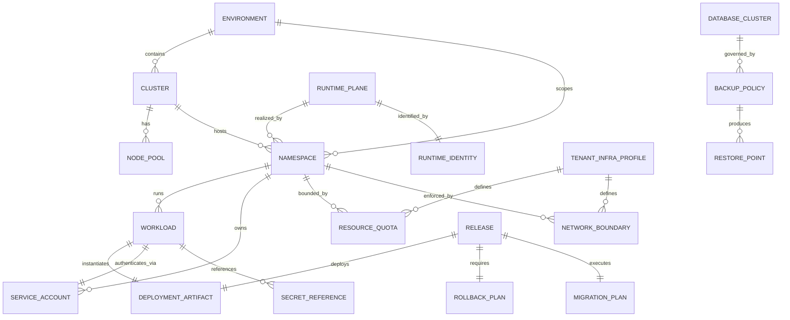

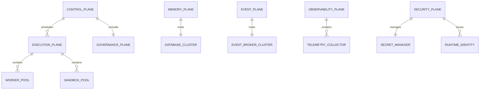

## 3.3 Infrastructure Decision Matrix

MYCELIA infrastructure decisions MUST be explicit, reviewable and tied to operational requirements.

Infrastructure choices are not arbitrary implementation preferences. They define durability, isolation, operational complexity, cost, recovery behavior and compliance posture.

| Decision Area | MVP Default | Later Option | Enterprise Option | Decision Driver |
|---|---|---|---|---|
| Container Orchestration | Kubernetes | Managed Kubernetes | Dedicated regional clusters | operational maturity, tenant isolation |
| Workflow Runtime | Temporal self-hosted or managed | Temporal HA | Multi-cluster Temporal | workflow durability, replay, scaling |
| Event Runtime | Redis Streams | Redpanda/Kafka | Multi-region broker topology | throughput, retention, replay |
| Database | PostgreSQL + pgvector | HA PostgreSQL | Dedicated tenant databases | data isolation, reliability |
| Object Storage | S3-compatible bucket | versioned buckets | per-tenant buckets / CMK | artifacts, backups, compliance |
| Secrets | Vault or cloud secret manager | Vault HA | tenant-specific Vault namespaces | credential isolation |
| Observability | OTel + Grafana stack | tenant dashboards | dedicated observability plane | auditability, scale |
| Sandbox Runtime | basic container isolation | gVisor | dedicated sandbox node pools | tool risk, execution safety |
| Identity | OIDC + service accounts | workload identity | SPIFFE/SPIRE federation | trust propagation |
| IaC | Terraform + Helm | GitOps | policy-as-code deployment governance | repeatability, audit |

### Decision Rule

Every infrastructure decision MUST document:

- selected option;
- rejected options;
- operational reason;
- security impact;
- cost impact;
- replay impact;
- tenant isolation impact;
- rollback implications.

### Forbidden Behavior

FORBIDDEN:

- adopting infrastructure without an ADR;
- selecting managed services without data residency review;
- replacing runtime infrastructure without replay compatibility review;
- optimizing cost by weakening tenant isolation;
- optimizing speed by bypassing auditability.
---

## 4. Deployment Topology

### 4.1 Full System Topology

```mermaid
flowchart TB
    subgraph External["External Clients & Providers"]
        Browser["Browser / UI Client"]
        CLI["CLI / SDK Client"]
        Webhook["External Webhooks"]
        ModelProviders["Model Providers\n(OpenAI, Claude, Gemini, Ollama)"]
        ExternalTools["External Tool Targets\n(APIs, Filesystems, DBs)"]
    end

    subgraph IngressLayer["Ingress Layer"]
        CDN["CDN / Edge (TLS termination)"]
        APIGW["API Gateway\n(Auth, Rate Limit, Routing)"]
    end

    subgraph ControlPlane["Control Plane — Namespace: mycelia-control"]
        FrontendSvc["Frontend Service\n(Next.js SSR)"]
        APIBE["Backend API\n(FastAPI)"]
        OrchSvc["Orchestration Service\n(Workflow Manager)"]
        PolicySvc["Policy Engine\n(RBAC + Governance)"]
        ApprovalSvc["Approval Engine\n(Human-in-the-Loop)"]
        TenantSvc["Tenant Resolution Service"]
        SchedulerSvc["Runtime Scheduler"]
    end

    subgraph TemporalCluster["Temporal Runtime — Namespace: mycelia-temporal"]
        TmpFrontend["Temporal Frontend"]
        TmpHistory["Temporal History"]
        TmpMatching["Temporal Matching"]
        TmpWorker["Temporal Worker Service"]
        TmpPersist[("Temporal DB\n(PostgreSQL)")]
    end

    subgraph ExecutionPlane["Execution Plane — Namespace: mycelia-execution"]
        CogWorkers["Cognitive Workers\n(LangGraph agents)"]
        ToolWorkers["Tool Workers\n(MCP / Function tools)"]
        SandboxPool["Sandbox Pool\n(gVisor containers)"]
        ModelAdapter["Model Adapter\n(Provider abstraction)"]
    end

    subgraph MemoryPlane["Memory Plane — Namespace: mycelia-memory"]
        PGPrimary[("PostgreSQL Primary\n(Patroni / CloudNativePG)")]
        PGReplica[("PostgreSQL Replica")]
        PGVector[("pgvector extension")]
        ObjStorage["Object Storage\n(S3-compatible)"]
        SnapStore["Context Snapshot Store"]
    end

    subgraph EventPlane["Event Plane — Namespace: mycelia-events"]
        RedisStreams["Redis Streams\n(Operational events)"]
        DLQ["Dead-Letter Queue"]
        ReplayTopics["Replay Topics\n(Isolated)"]
        SchemaReg["Event Schema Registry"]
    end

    subgraph ObsPlane["Observability Plane — Namespace: mycelia-observability"]
        OTelCollector["OTel Collector\n(Agent + Gateway)"]
        TraceBackend["Trace Backend\n(Tempo / Jaeger)"]
        LogBackend["Log Backend\n(Loki)"]
        MetricsBackend["Metrics Backend\n(Prometheus)"]
        Grafana["Dashboards\n(Grafana)"]
        Alertmanager["Alertmanager"]
    end

    subgraph SecurityPlane["Security Plane — Namespace: mycelia-security"]
        VaultSvc["Secret Manager\n(Vault / Cloud SM)"]
        IdProvider["Identity Provider\n(OIDC)"]
        AdmissionCtrl["Admission Controller\n(Kyverno / OPA)"]
        ImageVerify["Image Verification\n(cosign)"]
    end

    Browser --> CDN
    CLI --> APIGW
    Webhook --> APIGW
    CDN --> FrontendSvc
    APIGW --> APIBE
    APIBE --> OrchSvc
    APIBE --> PolicySvc
    APIBE --> TenantSvc
    OrchSvc --> TmpFrontend
    OrchSvc --> SchedulerSvc
    PolicySvc --> ApprovalSvc
    TmpWorker --> CogWorkers
    TmpWorker --> ToolWorkers
    CogWorkers --> ModelAdapter
    ModelAdapter --> ModelProviders
    ToolWorkers --> SandboxPool
    SandboxPool --> ExternalTools
    CogWorkers --> PGPrimary
    CogWorkers --> PGVector
    CogWorkers --> ObjStorage
    OrchSvc --> RedisStreams
    RedisStreams --> DLQ
    ControlPlane --> OTelCollector
    ExecutionPlane --> OTelCollector
    MemoryPlane --> OTelCollector
    OTelCollector --> TraceBackend
    OTelCollector --> LogBackend
    OTelCollector --> MetricsBackend
    APIBE --> VaultSvc
    CogWorkers --> VaultSvc
    APIGW --> IdProvider
```

### 4.2 Plane-Based Topology

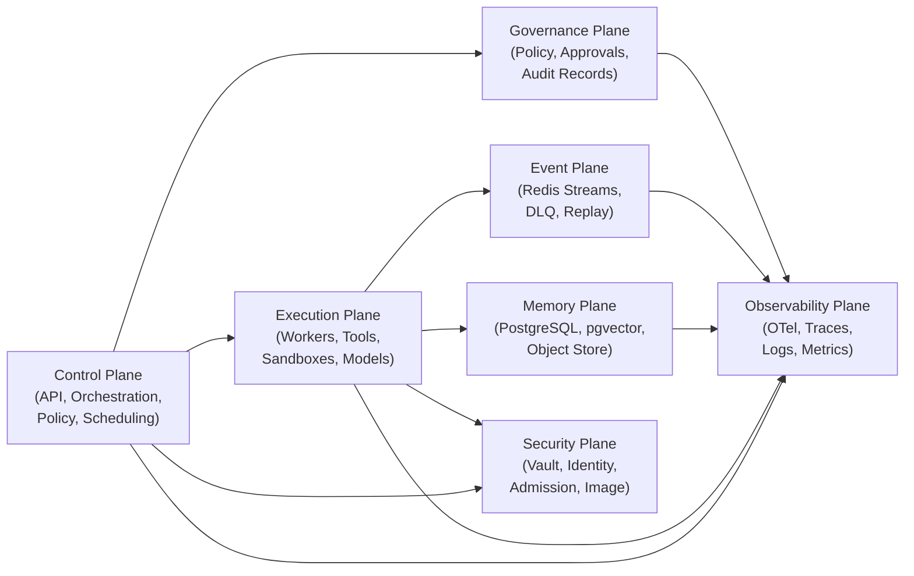

### 4.3 Network Boundary Diagram

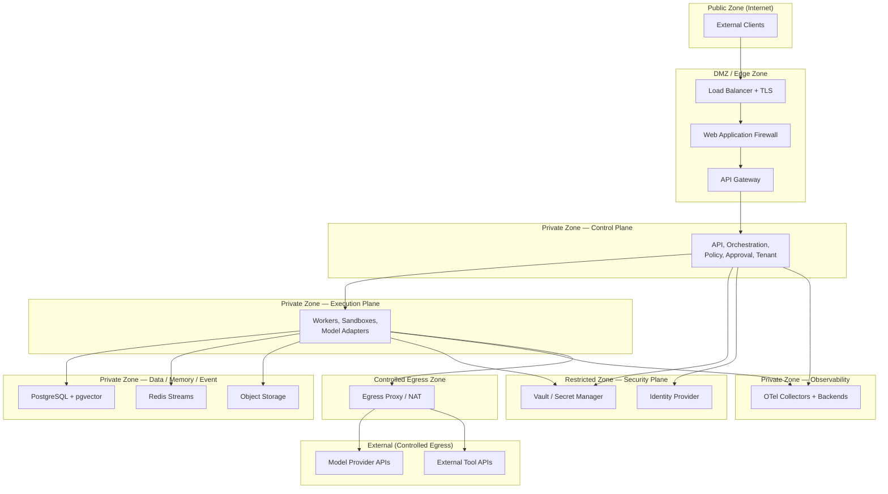

---

## 5. Runtime Planes Deployment

### 5.1 Control Plane

**Responsibility:** Provides the authoritative coordination surface for all cognitive workflow operations. Handles tenant resolution, policy enforcement, orchestration, scheduling, and approval management. MUST remain available even during execution plane degradation.

**Deployment Units:**
- `mycelia-api` — FastAPI backend, stateless, horizontally scalable. Exposes REST + WebSocket APIs.
- `mycelia-orchestration` — Workflow lifecycle manager. Interfaces with Temporal frontend.
- `mycelia-policy` — Policy engine evaluating RBAC, budget constraints, and governance rules.
- `mycelia-approval` — Approval engine managing human-in-the-loop gates.
- `mycelia-tenant` — Tenant resolution and workspace boundary service.
- `mycelia-scheduler` — Runtime scheduler routing tasks to appropriate worker pools.
- `mycelia-frontend` — Next.js SSR application delivering the operational console.

**Namespace:** `mycelia-control`

**Scaling Mode:** Horizontal (HPA on CPU + request count). Minimum 2 replicas per service in production.

**Failure Boundaries:** Control plane services MUST be deployed across at least 2 availability zones. PodDisruptionBudget MUST ensure at least 1 replica is available during node maintenance.

**Tenant Isolation:** Every control plane API request MUST resolve and validate `tenant_id` before processing. Policy engine MUST scope all authorization checks to tenant context.

**Observability Requirements:** All control plane services MUST emit OpenTelemetry traces with `tenant_id`, `workspace_id`, `workflow_id`, `run_id`, and `trace_id` in span attributes.

### 5.2 Execution Plane

**Responsibility:** Executes cognitive work, tool invocations, model calls, and sandboxed operations on behalf of workflow orchestrations. Stateless by design; all durable state MUST be written to the memory or event plane.

**Deployment Units:**
- `mycelia-cognitive-worker` — LangGraph-based agent worker consuming Temporal task queues.
- `mycelia-tool-worker` — Tool execution worker operating under MCP contracts.
- `mycelia-sandbox-worker` — gVisor-isolated sandbox executing high-risk tool calls.
- `mycelia-model-adapter` — Provider-agnostic model inference adapter.
- `mycelia-replay-worker` — Isolated worker for replay execution with no production egress.

**Namespace:** `mycelia-execution`

**Scaling Mode:** KEDA queue-based autoscaling on Temporal task queue depth and Redis stream consumer lag. GPU node pools available for self-hosted model inference.

**Failure Boundaries:** Execution plane failures MUST NOT affect control plane availability. Workers MUST implement graceful shutdown with in-flight task completion or checkpoint before termination.

**Tenant Isolation:** Workers MUST validate `tenant_id` and `workspace_id` from the task envelope before executing any operation. Cross-tenant task routing is a CRITICAL security violation.

**Observability Requirements:** Every tool invocation, model call, and agent step MUST emit a span with tool name, tenant_id, run_id, latency, cost, and outcome.

### 5.3 Memory Plane

**Responsibility:** Provides durable, queryable, tenant-isolated storage for workflow state, checkpoints, episodic memory, vector embeddings, context snapshots, and artifacts.

**Deployment Units:**
- `postgres-primary` / `postgres-replica` — CloudNativePG or Patroni HA cluster.
- `pgvector` — Extension deployed on the PostgreSQL cluster for vector similarity search.
- `object-storage` — S3-compatible object store (MinIO self-hosted or cloud provider).
- `context-snapshot-store` — Structured context snapshot service backed by PostgreSQL + object storage.
- `memory-indexer` — Background service maintaining vector index freshness.

**Namespace:** `mycelia-memory`

**Scaling Mode:** PostgreSQL scales vertically with read replicas for read-heavy workloads. Connection pooling via PgBouncer. Object storage scales independently.

**Failure Boundaries:** PostgreSQL primary failure triggers automatic failover via CloudNativePG or Patroni. Read replica lag MUST be monitored and alerted.

**Tenant Isolation:** Row-level `tenant_id` enforcement on all tables. Schema-level isolation (`tenant_{id}` schemas) MAY be applied for Enterprise tier tenants.

### 5.4 Event Plane

**Responsibility:** Carries all operational events with append-only semantics. Provides reliable event delivery, dead-letter handling, and replay topic isolation.

**Deployment Units:**
- `redis-streams` — Redis in cluster mode with AOF + RDB persistence for operational event streams.
- `dlq-processor` — Dead-letter queue consumer for undeliverable events.
- `replay-topic-store` — Isolated Redis instance or stream prefix for replay operations.
- `schema-registry` — Event schema registry for contract validation.

**Namespace:** `mycelia-events`

**Scaling Mode:** Redis cluster mode for horizontal scaling. Consumer group scaling via KEDA.

**Tenant Isolation:** Stream keys MUST be prefixed with `{tenant_id}:`. Consumer groups MUST be scoped per tenant.

### 5.5 Observability Plane

**Responsibility:** Collects, processes, routes, stores, and visualizes all telemetry across MYCELIA's runtime planes.

**Deployment Units:**
- `otel-agent` — DaemonSet OTel Collector receiving telemetry from node-local workloads.
- `otel-gateway` — Deployment-based OTel Collector aggregating from agents, adding tenant routing.
- `tempo` — Distributed trace backend (Grafana Tempo).
- `loki` — Log aggregation backend (Grafana Loki).
- `prometheus` — Metrics collection and storage.
- `grafana` — Dashboard and alerting UI.
- `alertmanager` — Alert routing and notification.

**Namespace:** `mycelia-observability`

**Tenant Isolation:** OTel pipeline MUST inject `tenant_id` as a resource attribute. Grafana dashboards MUST enforce tenant-scoped data source queries.

### 5.6 Governance Plane

**Responsibility:** Provides policy evaluation, approval workflow management, and immutable audit record storage. MUST be operationally independent from the execution plane.

**Deployment Units:**
- `mycelia-policy-engine` — Policy evaluation service (OPA-based or native implementation).
- `mycelia-approval-engine` — Approval state machine with human-in-the-loop interfaces.
- `audit-record-store` — Append-only audit log backed by PostgreSQL with write-only access for writers.

**Namespace:** `mycelia-governance`

**Security:** Write access to audit records MUST be restricted to approved service accounts. No workload MAY delete audit records.

### 5.7 Security Plane

**Responsibility:** Provides secret management, workload identity, admission control, and image verification infrastructure.

**Deployment Units:**
- `vault` — HashiCorp Vault in HA mode, or cloud-provider secret manager integration.
- `identity-provider` — OIDC-compatible identity provider for user and service authentication.
- `kyverno` or `opa-gatekeeper` — Admission controller for policy-based resource validation.
- `cosign-verifier` — Image signature verification integrated with admission controller.
- `cert-manager` — Automated TLS certificate provisioning and rotation.

**Namespace:** `mycelia-security`

---

## 6. Environment Strategy

### 6.1 Environment Definitions

#### Local Development
- **Purpose:** Individual developer iteration. Single-service or partial stack.
- **Allowed Data:** Synthetic data only. NO production data.
- **Secrets Policy:** Local `.env` files with synthetic credentials. Secret manager integration disabled.
- **Replay Policy:** Local replay with synthetic data only.
- **Model Provider Policy:** Developer API keys with rate limits. MAY use Ollama local models.
- **Deployment Method:** Docker Compose or local Kubernetes (Kind/k3d).
- **Observability Level:** Minimal. Console logging. Optional local Jaeger.
- **Tenant Isolation Level:** None (single developer context).
- **Promotion Rules:** No promotion. Code changes go through CI.

#### Local Docker Compose
- **Purpose:** Full stack integration on a single machine.
- **Allowed Data:** Synthetic or generated test data only.
- **Secrets Policy:** `.env.local` with synthetic secrets. MUST NOT contain production values.
- **Deployment Method:** `docker compose up` from IaC-managed compose file.
- **Observability Level:** Full OTel stack available via Docker Compose profile.
- **Tenant Isolation Level:** Simulated via database row-level policies.

#### Integration
- **Purpose:** Automated integration test execution. Ephemeral environments per branch or PR.
- **Allowed Data:** Test fixtures only. Auto-generated.
- **Secrets Policy:** CI-managed synthetic credentials. Injected from CI secret store.
- **Deployment Method:** CI pipeline. Kubernetes namespace per PR (ephemeral).
- **Observability Level:** Full telemetry to integration observability stack.
- **Tenant Isolation Level:** Row-level. Full tenant isolation tested here.
- **Promotion Rules:** All integration tests MUST pass before staging promotion.

#### Staging
- **Purpose:** Pre-release validation. Mirrors production topology.
- **Allowed Data:** Anonymized, scrubbed data or realistic synthetic data.
- **Secrets Policy:** Staging-specific credentials from secret manager. NO production credentials.
- **Deployment Method:** CD pipeline. Same Helm charts as production with staging values overlay.
- **Observability Level:** Full production-equivalent observability.
- **Promotion Rules:** Performance tests, security scans, and smoke tests MUST pass. Human approval REQUIRED.

#### Pre-Production
- **Purpose:** Final validation gate before production. Used for migration dress rehearsals.
- **Allowed Data:** Production-like schema and volume. Synthetically generated.
- **Deployment Method:** Mirror of production CD pipeline.
- **Promotion Rules:** Migration rollback tested. Load test passed. Change advisory board approval documented.

#### Production
- **Purpose:** Live operational runtime serving tenant workloads.
- **Allowed Data:** Live tenant data. Data residency constraints enforced.
- **Secrets Policy:** Production credentials from secret manager. Dynamic leases. Rotation enforced.
- **Replay Policy:** Replay runs in isolated replay namespace with no production egress.
- **Deployment Method:** CD pipeline with blue-green or rolling strategy. Human approval gate REQUIRED.
- **Tenant Isolation Level:** Full infrastructure isolation per tenant profile.
- **Promotion Rules:** Only ReleaseCandidates promoted from pre-production gate.

#### Replay / Test Lab
- **Purpose:** Isolated environment for workflow replay, policy validation, and debugging.
- **Allowed Data:** Scrubbed copies of historical execution data. No live credentials.
- **Secrets Policy:** Synthetic credentials only. Production secret manager paths BLOCKED by network policy.
- **Replay Policy:** Full replay capability. MUST NOT write to production event streams.
- **Model Provider Policy:** Model stubs or low-cost providers.

#### Disaster Recovery
- **Purpose:** Warm or cold standby environment for production failover.
- **Allowed Data:** Replicated production data (encrypted backups or streaming replication).
- **Secrets Policy:** Sealed production credentials, unsealed only during DR activation.
- **Promotion Rules:** DR activation requires SRE and on-call lead authorization.

#### Customer-Dedicated Environments
- **Purpose:** Enterprise tenants requiring fully isolated, dedicated infrastructure.
- **Tenant Isolation Level:** Dedicated cluster or dedicated namespace set with dedicated data stores.
- **Secrets Policy:** Customer-managed keys where required. Dedicated Vault namespace.

### 6.2 Environment Strategy Matrix

| Environment | Real Data | Live Creds | Replay | Multi-Tenant | Deployment Gate |
|---|---|---|---|---|---|
| Local Dev | NO | NO | Synthetic | NO | None |
| Docker Compose | NO | NO | Synthetic | Simulated | None |
| Integration | NO | NO | Test | Yes (tested) | CI pass |
| Staging | Anonymized | NO | Staging | Full | CI + human |
| Pre-Production | Synthetic | NO | Full | Full | Human + CAB |
| Production | YES | YES | Isolated | Full | Human + audit |
| Replay Lab | Scrubbed | NO | Full | Isolated | SRE approval |
| DR | Replicated | Sealed | Limited | Full | SRE + lead |
| Customer Dedicated | YES | YES | Isolated | Dedicated | Human + audit |

---

## 7. Kubernetes / Container Orchestration Architecture

### 7.1 Cluster Strategy

MYCELIA MUST support two deployment modes depending on scale and tenant requirements:

**Shared Cluster (Standard/Enhanced Tiers):** A single Kubernetes cluster hosts all runtime planes in dedicated namespaces. Tenant isolation is enforced via NetworkPolicies, ResourceQuotas, and service account RBAC. Appropriate when tenant data sensitivity does not require physical compute isolation and compliance requirements do not mandate dedicated infrastructure.

**Dedicated Cluster (Enterprise Tier):** Enterprise tenants requiring compute-level isolation, regional data residency, or compliance mandates (SOC 2 Type II, HIPAA, regulated financial environments) MUST receive a dedicated cluster or dedicated node pools with strict taints.

### 7.2 Namespace Strategy

MYCELIA uses a **plane-per-namespace** model as the baseline:

| Namespace | Plane |
|---|---|
| `mycelia-control` | Control Plane services |
| `mycelia-execution` | Worker pools, sandboxes, model adapters |
| `mycelia-memory` | PostgreSQL, pgvector, object storage |
| `mycelia-events` | Redis Streams, DLQ, replay topics |
| `mycelia-observability` | OTel, Tempo, Loki, Prometheus, Grafana |
| `mycelia-governance` | Policy engine, approval engine, audit store |
| `mycelia-security` | Vault, cert-manager, admission controllers |
| `mycelia-temporal` | Temporal runtime cluster |
| `mycelia-replay` | Replay workers and replay event store |
| `mycelia-cicd` | CI/CD infrastructure (ephemeral pipeline runners) |
| `tenant-{id}` | (Optional) Tenant-dedicated resources for Enhanced/Enterprise profiles |

**Why Namespaces Alone Are Insufficient:** Kubernetes namespaces provide resource scoping and RBAC boundaries, but they do NOT prevent network communication between namespaces (requires NetworkPolicies), enforce storage isolation (requires separate PVCs or databases), or prevent cross-namespace secret access if RBAC is misconfigured.

Namespace isolation MUST be augmented with: default-deny NetworkPolicies, dedicated ServiceAccounts with minimum RBAC, ResourceQuotas and LimitRanges, Pod Security Standards at Restricted or Baseline level, and admission controller policies.

### 7.3 Node Pools

| Pool Name | Machine Class | Purpose | Taints |
|---|---|---|---|
| `system-pool` | General purpose, small | Kubernetes system components | `CriticalAddonsOnly` |
| `control-plane-pool` | General purpose, medium | MYCELIA control plane services | `mycelia.io/plane=control` |
| `execution-pool` | Compute-optimized | Cognitive and tool workers | `mycelia.io/plane=execution` |
| `memory-pool` | Memory-optimized | PostgreSQL, pgvector, Redis | `mycelia.io/plane=memory` |
| `sandbox-pool` | Security-hardened | gVisor sandbox workers | `mycelia.io/plane=sandbox` |
| `observability-pool` | Storage-optimized | OTel, Tempo, Loki, Prometheus | `mycelia.io/plane=observability` |
| `gpu-pool` (optional) | GPU-enabled | Self-hosted model inference | `mycelia.io/accelerator=gpu` |

### 7.4 Workload Resource Specifications

| Workload Class | Request CPU | Request Memory | Limit CPU | Limit Memory |
|---|---|---|---|---|
| Control API | 250m | 256Mi | 1000m | 1Gi |
| Cognitive Worker | 500m | 1Gi | 2000m | 4Gi |
| Tool Worker | 250m | 512Mi | 1000m | 2Gi |
| Sandbox Worker | 100m | 256Mi | 500m | 1Gi |
| Temporal Worker | 250m | 512Mi | 1000m | 2Gi |
| PostgreSQL | 500m | 2Gi | 2000m | 8Gi |
| Redis Streams | 250m | 512Mi | 1000m | 4Gi |
| OTel Collector | 100m | 128Mi | 500m | 512Mi |

### 7.5 Deployment Types

- **Deployments:** Used for stateless services — API, orchestration, policy, workers, model adapters. HPA enabled.
- **StatefulSets:** Used for PostgreSQL, Redis, Temporal services requiring stable network identity and persistent storage.
- **Jobs:** Used for database migrations, one-time data backfills, and batch operations.
- **CronJobs:** Used for backup operations, telemetry archival, certificate rotation checks, and memory compaction.

### 7.6 RBAC Architecture

Every workload MUST use a dedicated ServiceAccount. No workload MAY use the `default` ServiceAccount. Service account tokens MUST be projected with audience restriction and bounded TTL.

```yaml
# Example: Cognitive worker ServiceAccount
apiVersion: v1
kind: ServiceAccount
metadata:
  name: mycelia-cognitive-worker
  namespace: mycelia-execution
  annotations:
    vault.hashicorp.com/agent-inject: "true"
    vault.hashicorp.com/role: "cognitive-worker"
automountServiceAccountToken: false
```

RBAC roles MUST follow least privilege. Workers MUST NOT have Kubernetes API access beyond reading their own ConfigMaps via projected volumes.

### 7.7 NetworkPolicies

Every namespace MUST have a default-deny-all NetworkPolicy as baseline:

```yaml
apiVersion: networking.k8s.io/v1
kind: NetworkPolicy
metadata:
  name: default-deny-all
  namespace: mycelia-execution
spec:
  podSelector: {}
  policyTypes:
  - Ingress
  - Egress
```

Explicit allow policies MUST be defined for each required communication path. NetworkPolicies MUST be managed via IaC and reviewed as part of security changes.

### 7.8 Pod Security Standards

| Namespace | PSS Level | Rationale |
|---|---|---|
| `mycelia-control` | Restricted | No privilege escalation in control services |
| `mycelia-execution` | Restricted | Worker isolation required |
| `mycelia-sandbox` | Privileged (gVisor runtime) | Sandbox requires custom runtime class |
| `mycelia-memory` | Baseline | StatefulSet storage mounts |
| `mycelia-observability` | Baseline | Some collectors require host path access |
| `mycelia-security` | Restricted | Vault requires tightest controls |
| `mycelia-governance` | Restricted | Audit integrity requires no privilege |

### 7.9 ResourceQuotas and LimitRanges

Every namespace MUST have ResourceQuota and LimitRange resources defined in IaC. LimitRange MUST set default requests and limits to prevent unbounded resource consumption.

### 7.10 Autoscaling

- **HPA:** Applied to stateless control plane services. Scales on CPU, memory, and custom metrics.
- **KEDA:** Applied to worker pools. Scales on Temporal task queue depth, Redis stream consumer lag, and cognitive workload queue length.
- **VPA:** Applied in recommendation mode for resource right-sizing only. MUST NOT be applied in auto mode on production stateful workloads.

### 7.11 Pod Disruption Budgets

All production Deployments with more than 1 replica MUST have a PodDisruptionBudget ensuring at least 1 replica is available:

```yaml
apiVersion: policy/v1
kind: PodDisruptionBudget
metadata:
  name: mycelia-api-pdb
  namespace: mycelia-control
spec:
  minAvailable: 1
  selector:
    matchLabels:
      app: mycelia-api
```

### 7.12 Kubernetes Topology Diagram

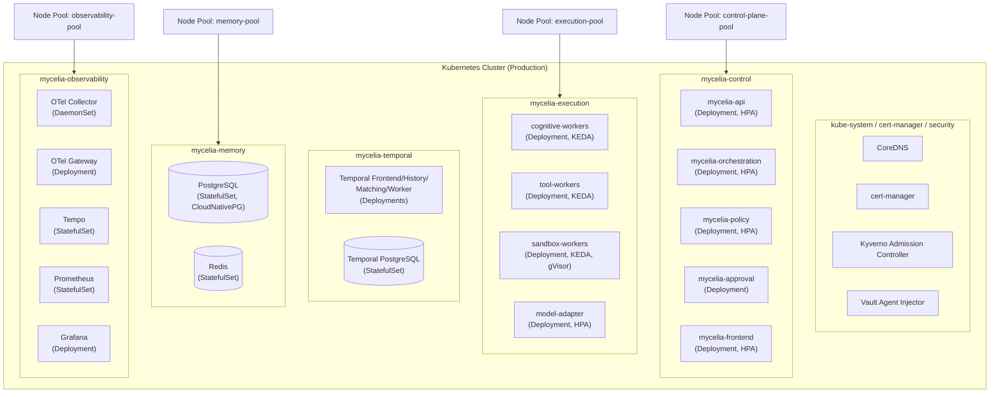

---

## 8. Infrastructure-as-Code Architecture

### 8.1 Repository Structure

```
infrastructure/
├── README.md
├── terraform/
│   ├── modules/
│   │   ├── cluster/
│   │   ├── node-pool/
│   │   ├── networking/
│   │   ├── database/
│   │   ├── redis/
│   │   ├── object-storage/
│   │   ├── vault/
│   │   ├── observability/
│   │   ├── registry/
│   │   └── dns/
│   ├── environments/
│   │   ├── local/
│   │   ├── integration/
│   │   ├── staging/
│   │   ├── preprod/
│   │   ├── production/
│   │   │   ├── main.tf
│   │   │   ├── variables.tf
│   │   │   ├── outputs.tf
│   │   │   └── backend.tf
│   │   └── dr/
│   └── shared/
│       ├── variables.tf
│       └── providers.tf
├── charts/
│   ├── mycelia-api/
│   │   ├── Chart.yaml
│   │   ├── values.yaml
│   │   ├── values-staging.yaml
│   │   ├── values-production.yaml
│   │   └── templates/
│   │       ├── deployment.yaml
│   │       ├── service.yaml
│   │       ├── hpa.yaml
│   │       ├── pdb.yaml
│   │       ├── serviceaccount.yaml
│   │       ├── networkpolicy.yaml
│   │       └── resourcequota.yaml
│   ├── mycelia-worker/
│   ├── mycelia-temporal/
│   ├── mycelia-observability/
│   ├── mycelia-security/
│   └── mycelia-governance/
├── k8s/
│   ├── namespaces/
│   ├── rbac/
│   ├── network-policies/
│   ├── pod-security-policies/
│   ├── resource-quotas/
│   └── priority-classes/
├── environments/
│   ├── production.yaml
│   ├── staging.yaml
│   └── integration.yaml
├── scripts/
│   ├── bootstrap.sh
│   ├── migrate.sh
│   ├── rollback.sh
│   ├── backup.sh
│   └── dr-failover.sh
└── ops/
    ├── runbooks/
    ├── dashboards/
    └── alerts/
```

### 8.2 Terraform State Backend

Terraform state MUST be stored in a remote, versioned, locked backend (AWS S3 + DynamoDB, GCS + Cloud Storage, or Terraform Cloud). State MUST be encrypted at rest. Concurrent state modification MUST be prevented by state locking.

### 8.3 Helm Chart Conventions

- All Helm charts MUST be versioned with semantic versioning in `Chart.yaml`.
- All Helm values MUST have defaults that are safe for non-production use.
- Production values MUST be declared in `values-production.yaml` overlays.
- Secret values MUST be referenced via `secretKeyRef` or Vault agent injection, NEVER hardcoded.
- All charts MUST include: Deployment, Service, ServiceAccount, NetworkPolicy, ResourceQuota, HPA, PDB.
- Chart versions MUST be pinned in environment overlays. Floating version constraints are FORBIDDEN in production.

### 8.4 GitOps Workflow

1. Infrastructure change authored as IaC diff in a feature branch.
2. Pull request reviewed by at least one platform engineer.
3. Automated plan (`terraform plan` / `helm diff`) output attached to PR.
4. Approval from infrastructure owner required for production-affecting changes.
5. Merge triggers CI plan validation.
6. CD applies change to the target environment with full audit.
7. Drift detection job runs post-apply to confirm state matches declared configuration.

### 8.5 Drift Detection

A scheduled CronJob MUST run `terraform plan` against production state daily. Any detected drift MUST emit an `InfrastructureDriftDetected` event and trigger an alert. Infrastructure drift MUST NOT remain unreported for more than 24 hours.


## 8.6 Configuration & Feature Flag Governance

Configuration is runtime-adjacent infrastructure and MUST be governed.

MYCELIA distinguishes:

- static infrastructure configuration;
- environment configuration;
- runtime configuration;
- feature flags;
- tenant-specific configuration;
- emergency kill switches.

### Configuration Classes

| Class | Examples | Source of Truth | Mutation Rule |
|---|---|---|---|
| Static Infrastructure Config | cluster, node pools, network policies | IaC | PR + review |
| Environment Config | API endpoints, service URLs | IaC / ConfigBundle | PR + promotion |
| Runtime Config | worker limits, queue thresholds | Config service | audited update |
| Feature Flags | staged rollout, UI features | feature flag service | audited update |
| Tenant Config | quotas, provider routing, residency | tenant profile service | governed update |
| Kill Switches | disable tool class, block provider | governance control | emergency audit |

### Rules

- Production configuration changes MUST be audited.
- Tenant-specific configuration MUST preserve tenant isolation.
- Feature flags MUST NOT bypass authorization, governance or tenant boundaries.
- Kill switches MUST emit SecurityEvent or GovernanceEvent depending on class.
- Runtime configuration used during replay MUST be snapshot-preserved.

### Forbidden Behavior

FORBIDDEN:

- changing production config manually in Kubernetes;
- using feature flags to bypass approval gates;
- changing provider routing without tenant policy evaluation;
- mutating runtime config without traceability;
- hiding behavior changes inside environment variables;
- storing secrets inside configuration objects.

### Replay Rule

Replay MUST use the configuration snapshot that was active during the original execution unless an operator explicitly selects a controlled simulation mode.

---

## 9. CI/CD & Release Architecture

### 9.1 Build Pipeline

```mermaid
flowchart LR
    CodePush["Code Push / PR"] --> Lint["Lint + Format Check"]
    Lint --> UnitTest["Unit Tests"]
    UnitTest --> IntTest["Integration Tests"]
    IntTest --> SecScan["Security Scan\n(SAST, SCA, Secrets)"]
    SecScan --> ImageBuild["Container Image Build"]
    ImageBuild --> ImageScan["Vulnerability Scan\n(Trivy / Grype)"]
    ImageScan --> ImageSign["Image Sign\n(cosign + SLSA)"]
    ImageSign --> SBOM["SBOM Generation\n(Syft / CycloneDX)"]
    SBOM --> Push["Push to Artifact Registry\n(digest-tagged)"]
    Push --> HelmPkg["Helm Chart Package\n(versioned)"]
    HelmPkg --> RC["Release Candidate\nPromotion Gate"]
```

### 9.2 Deployment Pipeline

```mermaid
flowchart LR
    RC["Release Candidate"] --> IntDeploy["Deploy to Integration\n(auto)"]
    IntDeploy --> IntSmoke["Integration Smoke Tests"]
    IntSmoke --> StagDeploy["Deploy to Staging\n(auto)"]
    StagDeploy --> StagTests["Staging: E2E + Perf Tests"]
    StagTests --> PreProdGate["Pre-Prod Approval Gate\n(Human)"]
    PreProdGate --> MigCheck["Migration Rehearsal\n(Pre-Prod)"]
    MigCheck --> ProdApproval["Production Approval\n(Human + CAB Record)"]
    ProdApproval --> ProdMigrate["Run Migrations\n(Job)"]
    ProdMigrate --> ProdDeploy["Deploy to Production\n(Blue-Green / Rolling)"]
    ProdDeploy --> ProdSmoke["Production Smoke Tests"]
    ProdSmoke --> AuditEmit["Emit DeploymentSucceeded\nAudit Event"]
```

### 9.3 Release State Machine

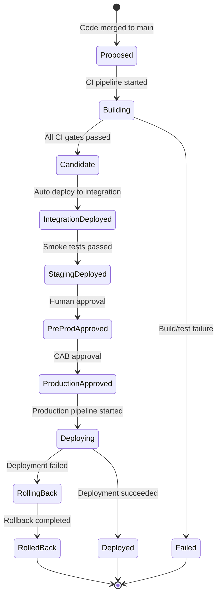

### 9.4 Deployment Promotion Table

| Stage | Trigger | Gate | Rollback Trigger |
|---|---|---|---|
| Integration | Merged RC | Auto | Any test failure |
| Staging | Integration passed | Auto | Smoke test failure or alert |
| Pre-Production | Staging approved | Human approval | Load test failure |
| Production | Pre-prod approved | Human + CAB | Health check failure or SLO breach |

### 9.5 Deployment Strategies

**Rolling Update:** Default for stateless control plane services. `maxUnavailable: 0`, `maxSurge: 1` in production.

**Blue-Green:** Used for changes requiring instant switchover or rollback capability. New version deployed in parallel. Traffic shifted via load balancer weight.

**Canary:** Used for high-risk releases. Small percentage of traffic routed to new version. Metrics and error rates monitored before full rollout.

### 9.6 CI/CD Rules

- Production deployments MUST use immutable artifact digests.
- Production deployments MUST have documented rollback plans.
- All deployments MUST emit `DeploymentStarted` and `DeploymentSucceeded` or `DeploymentFailed` events.
- Releases MUST be traceable: Git commit hash + artifact digest + change request ID MUST be linked in the audit record.
- Migration jobs MUST complete successfully before new application version receives traffic.

## 9.7 Production Readiness Gates

A MYCELIA release is not production-ready merely because it builds successfully.

Production promotion requires explicit readiness gates.

### Mandatory Gates

| Gate | Requirement | Blocks Production |
|---|---|---:|
| Build Integrity | artifact digest, signature and SBOM present | Yes |
| Test Completion | unit, integration and migration tests passed | Yes |
| Security Scan | no unresolved critical vulnerabilities | Yes |
| Schema Safety | migrations validated and rollback plan defined | Yes |
| Tenant Isolation | cross-tenant denial tests passed | Yes |
| Replay Safety | replay isolation tests passed when affected | Yes |
| Observability | required spans, logs and metrics present | Yes |
| Rollback Plan | rollback tested in staging or pre-production | Yes |
| SLO Impact Review | expected latency/error impact documented | Conditional |
| Human Approval | production approval recorded | Yes |

### Gate Rule

If a required gate fails, production deployment MUST be blocked.

### Override Rule

Overrides MAY exist only for emergency production recovery.

Every override MUST include:

- incident_id;
- approving_actor_id;
- failed_gate;
- reason;
- expiration;
- rollback plan;
- audit_record_id.

### Forbidden Behavior

FORBIDDEN:

- promoting untested artifacts;
- deploying with missing SBOM;
- skipping tenant isolation tests;
- skipping migration rehearsal for schema changes;
- treating staging success as production approval;
- allowing production override without incident linkage.

---

## 10. Container Image & Supply-Chain Integrity

### 10.1 Image Signing

All container images MUST be signed using `cosign` before being eligible for production deployment. Signatures MUST be stored in the OCI registry alongside the image digest. The admission controller MUST reject unsigned images in production namespaces.

```bash
# Signing workflow
cosign sign --key cosign.key ${REGISTRY}/${IMAGE}@${DIGEST}
cosign verify --key cosign.pub ${REGISTRY}/${IMAGE}@${DIGEST}
```

### 10.2 SBOM Generation

Every container image build MUST generate a Software Bill of Materials (SBOM) in CycloneDX or SPDX format using Syft:

```bash
syft ${IMAGE}@${DIGEST} -o cyclonedx-json > sbom.json
cosign attest --predicate sbom.json --type cyclonedx ${IMAGE}@${DIGEST}
```

SBOMs MUST be stored in the artifact registry and MUST be inspectable for a given release.

### 10.3 Vulnerability Scanning

All images MUST be scanned with Trivy or Grype at build time. Critical vulnerabilities block promotion. High vulnerabilities MUST be reviewed and have a documented exception or remediation plan before production promotion.

```bash
trivy image --severity CRITICAL,HIGH --exit-code 1 ${IMAGE}@${DIGEST}
```

### 10.4 Base Image Policy

- Production images MUST use distroless or minimal base images.
- Base images MUST be pinned to digest references.
- Base image updates MUST be scheduled and tested.

### 10.5 Build Attestation and SLSA

MYCELIA MUST target SLSA Build Level 2 for MVP, with a path to Level 3:
- **Level 2:** Signed provenance from a hosted build service. Artifacts stored with provenance attestation.
- **Level 3:** Hardened build environment. Build inputs are hermetic. Two-party review of build configuration changes.

### 10.6 Artifact Immutability

Production image tags MUST be digest-pinned. Mutable tags (`:latest`, `:main`, `:stable`) are FORBIDDEN in production Kubernetes manifests. Helm chart values for production MUST reference `image.digest` not `image.tag`.

---

## 11. Network Architecture

### 11.1 Network Design Philosophy

MYCELIA's network architecture enforces zero-trust principles. No service is trusted by virtue of network location. All inter-service communication MUST be authenticated, authorized, and observable. Network boundaries enforce tenant isolation at the infrastructure level — supplementing but not replacing application-level controls.

### 11.2 Network Zones

MYCELIA defines five network zones with explicit permeability rules:

| Zone | Label | Contents | Inbound | Outbound |
|---|---|---|---|---|
| Public | `zone: public` | Ingress controller, CDN edge | Internet | DMZ only |
| DMZ | `zone: dmz` | API gateway, auth endpoints | Public zone | Private zone |
| Private | `zone: private` | Backend services, orchestration | DMZ only | Restricted, Egress |
| Restricted | `zone: restricted` | Databases, secrets, brokers | Private only | None |
| Egress | `zone: egress` | Tool runtime, model adapters | Private only | Internet (controlled) |

### 11.3 Ingress Architecture

**External Ingress** is handled by an Ingress Controller (NGINX or Traefik) deployed in the `mycelia-ingress` namespace. All external TLS is terminated at the ingress controller. Backend services MUST NOT receive unencrypted traffic from the public internet.

- TLS certificates MUST be managed by cert-manager with automatic renewal.
- HSTS MUST be enabled with `max-age` of at least one year.
- Rate limiting MUST be applied at the ingress layer per-tenant.
- WebSocket connections (for live runtime view) MUST be routed through dedicated ingress paths.

**Internal Ingress** between planes uses Kubernetes Services (ClusterIP). Service-to-service calls MUST use DNS-resolvable service names, never direct pod IPs.

### 11.4 Internal Service Routing

Services within the same namespace communicate via ClusterIP Services. Cross-namespace communication is governed by NetworkPolicies. The routing rules are:

```
mycelia-control → mycelia-execution: ALLOWED (API-initiated work dispatch)
mycelia-control → mycelia-memory: ALLOWED (state reads and writes)
mycelia-control → mycelia-events: ALLOWED (event publishing)
mycelia-execution → mycelia-memory: ALLOWED (context reads only)
mycelia-execution → mycelia-events: ALLOWED (event publishing)
mycelia-execution → mycelia-egress: ALLOWED (tool calls only)
mycelia-memory → [any]: FORBIDDEN (memory plane is passive)
mycelia-events → [any]: FORBIDDEN (event plane is passive)
mycelia-observability → [any]: FORBIDDEN (pull-based or push from sources)
mycelia-governance → mycelia-control: ALLOWED (policy decisions)
mycelia-security → [any]: ALLOWED (admission, identity)
```

### 11.5 Kubernetes NetworkPolicies

Every namespace MUST have a default-deny NetworkPolicy followed by explicit allow rules:

```yaml
# Default deny all ingress and egress
apiVersion: networking.k8s.io/v1
kind: NetworkPolicy
metadata:
  name: default-deny-all
  namespace: mycelia-execution
spec:
  podSelector: {}
  policyTypes:
    - Ingress
    - Egress
---
# Allow workers to call execution API
apiVersion: networking.k8s.io/v1
kind: NetworkPolicy
metadata:
  name: allow-workers-to-control
  namespace: mycelia-execution
spec:
  podSelector:
    matchLabels:
      component: worker
  policyTypes:
    - Egress
  egress:
    - to:
        - namespaceSelector:
            matchLabels:
              kubernetes.io/metadata.name: mycelia-control
      ports:
        - port: 8080
          protocol: TCP
    - to:
        - namespaceSelector:
            matchLabels:
              kubernetes.io/metadata.name: kube-dns
      ports:
        - port: 53
          protocol: UDP
```

### 11.6 Egress Architecture

**Tool runtime egress** is controlled. Workers executing tool calls MUST route outbound requests through a controlled egress proxy. The egress proxy enforces:

- Per-tenant egress allowlists (registered tool endpoints).
- Request logging with `run_id`, `tenant_id`, `tool_id`.
- Rate limiting per tenant and per tool.
- Blocking of internal network ranges (RFC 1918) to prevent SSRF.
- Blocking of cloud metadata endpoints (169.254.169.254).

**Model provider egress** routes through a dedicated model adapter service in the Egress zone. This service:

- Holds credentials for model providers (fetched from Vault at startup).
- Rate-limits and queues model calls.
- Emits cost telemetry per call.
- Supports circuit breaking on provider failure.

**Replay environment egress** is FORBIDDEN from reaching production systems or external services. Replay environments operate in a hermetically sealed network zone with no external egress.

### 11.7 Service Mesh Considerations

A service mesh (Istio or Linkerd) is classified as an **Enterprise Future** capability. For MVP and early production:

- mTLS between services is implemented at the application layer via service account tokens.
- Observability is provided by OpenTelemetry instrumentation, not a sidecar mesh.
- Traffic policies are enforced by Kubernetes NetworkPolicies.

When a service mesh is introduced, MYCELIA's network policies MUST be migrated to mesh-level policies without dropping existing coverage.

### 11.8 Network Boundary Diagram

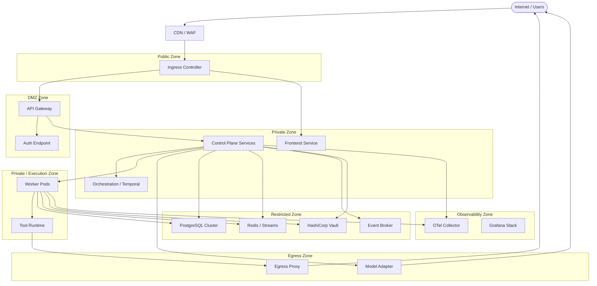

### 11.9 Zero-Trust Network Rules

- **No implicit trust by namespace.** Even pods in `mycelia-control` MUST present valid service identity.
- **No lateral movement.** A compromised worker MUST NOT be able to reach the database directly if its NetworkPolicy does not permit it.
- **No replay-to-production egress.** Replay lab namespaces have zero outbound connectivity to production namespaces or external endpoints.
- **No unauthenticated internal endpoints.** All HTTP services MUST require a valid service token or mTLS peer certificate.
- **No unbounded model provider egress.** All outbound AI model calls MUST route through the model adapter service.

---

## 12. Secrets, Credentials & Runtime Identity Deployment

### 12.1 Secret Manager Deployment

HashiCorp Vault is deployed in HA mode using the Integrated Storage (Raft) backend. The Vault cluster consists of three nodes deployed as a StatefulSet in the `mycelia-security` namespace.

```yaml
# Vault StatefulSet (abbreviated)
apiVersion: apps/v1
kind: StatefulSet
metadata:
  name: vault
  namespace: mycelia-security
spec:
  replicas: 3
  selector:
    matchLabels:
      app: vault
  template:
    spec:
      serviceAccountName: vault
      containers:
        - name: vault
          image: hashicorp/vault:1.17@sha256:<digest>
          args: ["server"]
          env:
            - name: VAULT_RAFT_NODE_ID
              valueFrom:
                fieldRef:
                  fieldPath: metadata.name
          volumeMounts:
            - name: vault-data
              mountPath: /vault/data
  volumeClaimTemplates:
    - metadata:
        name: vault-data
      spec:
        accessModes: ["ReadWriteOnce"]
        storageClassName: fast-ssd
        resources:
          requests:
            storage: 10Gi
```

Vault is auto-unsealed using a cloud KMS key (AWS KMS, GCP Cloud KMS, or Azure Key Vault). The unseal key MUST NOT be stored in Kubernetes Secrets or in Git.

### 12.2 Secret Path Convention

MYCELIA uses a structured secret path convention in Vault:

```
secret/
  mycelia/
    shared/
      database/postgres-password
      redis/auth-token
      jwt/signing-key
    tenants/
      {tenant_id}/
        database/connection-string
        api-keys/openai
        api-keys/anthropic
        webhooks/signing-secret
    system/
      vault/root-token          ← break-glass only
      ci/deploy-token
      registry/push-credentials
```

### 12.3 Runtime Secret Injection

Secrets are injected into pods using the **Vault Agent Sidecar** pattern. Secrets are written to a tmpfs volume (`/vault/secrets/`) that is:

- In-memory only (never written to container filesystem).
- Scoped to the pod lifecycle.
- Automatically renewed before lease expiration.

```yaml
annotations:
  vault.hashicorp.com/agent-inject: "true"
  vault.hashicorp.com/role: "mycelia-worker"
  vault.hashicorp.com/agent-inject-secret-db-creds: "secret/mycelia/shared/database/postgres-password"
  vault.hashicorp.com/agent-inject-template-db-creds: |
    {{- with secret "secret/mycelia/shared/database/postgres-password" -}}
    DATABASE_PASSWORD={{ .Data.data.password }}
    {{- end }}
```

Environment variables sourced from secrets MUST be loaded from the injected file, not from Kubernetes `env.valueFrom.secretKeyRef`. This prevents secrets from appearing in pod specs or being accessible via the Kubernetes API.

### 12.4 Credential Leasing

Dynamic credentials are preferred over static secrets wherever possible:

- **PostgreSQL credentials** are generated by Vault's database secrets engine on worker startup. Leases are time-limited (typically 1 hour for workers, 24 hours for long-running services). Lease renewal is handled by Vault Agent.
- **Model provider API keys** are static secrets (provider limitation) stored in Vault and rotated on a 90-day schedule. Rotation MUST be tested before revocation of the previous key.

### 12.5 Workload Identity

Each MYCELIA workload has a dedicated Kubernetes ServiceAccount that maps to a Vault role:

| Workload | ServiceAccount | Vault Role | Secret Access |
|---|---|---|---|
| API service | `mycelia-api` | `mycelia-api` | `shared/database`, `shared/jwt` |
| Orchestration | `mycelia-orchestration` | `mycelia-orchestration` | `shared/database`, `shared/redis` |
| Workers (shared) | `mycelia-worker` | `mycelia-worker` | `shared/database` (read only) |
| Workers (tenant) | `mycelia-worker-{tid}` | `mycelia-tenant-worker` | `tenants/{tid}/*` |
| Model adapter | `mycelia-model-adapter` | `mycelia-model-adapter` | `shared/model-providers/*` |
| CI deployer | `mycelia-ci` | `mycelia-ci` | `system/ci/*` |

Vault roles map Kubernetes ServiceAccount tokens to secret policies using the Kubernetes Auth method.

### 12.6 Tenant-Specific Secrets

Tenant secrets (API keys, webhook credentials, custom model provider credentials) are stored under `secret/mycelia/tenants/{tenant_id}/`. Workers handling tenant workloads MUST request tenant-specific credentials through the model adapter service rather than accessing Vault directly. This prevents a single compromised worker from accessing cross-tenant credentials.

### 12.7 Replay Secret Exclusion

Replay environments MUST NOT have access to production Vault:

- Replay lab runs against a dedicated Vault instance (or a Vault namespace with no production mounts).
- Replay snapshots MUST strip all credential references before serialization.
- Any attempt by a replay worker to reach the production Vault endpoint MUST be blocked by NetworkPolicy.
- Replay runs that require model calls MUST use stub adapters or dedicated replay-tier model credentials.

### 12.8 Emergency Rotation

Emergency rotation procedures:

1. Identify compromised secret path.
2. Revoke all active leases under the path: `vault lease revoke -prefix secret/mycelia/{path}`.
3. Generate new secret at the same path.
4. Trigger rolling restart of affected deployments.
5. Emit `SecretRotationPerformed` event with `secret_path` (no value), affected workloads, and `initiated_by`.
6. Verify new credentials via health checks before marking rotation complete.

Emergency rotation MUST complete within the RTO for the affected component.

### 12.9 Secret Flow Diagram

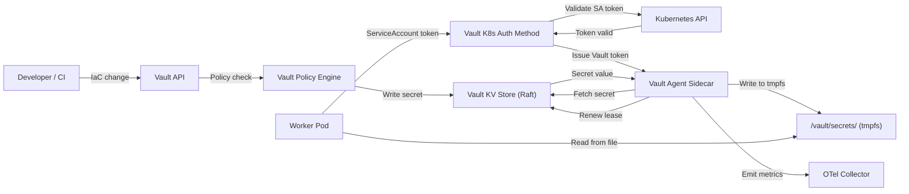

---

## 13. Data Infrastructure

### 13.1 PostgreSQL

**Purpose:** Primary transactional store for all MYCELIA operational data: runs, workflows, tenants, events (audit), governance records, memory metadata, tool contracts, approvals.

**Deployment:** CloudNativePG Operator or Patroni on Kubernetes. Three-node cluster (1 primary + 2 replicas) for production.

| Property | Value |
|---|---|
| Deployment mode | StatefulSet via CloudNativePG operator |
| HA model | Primary + 2 synchronous replicas |
| Persistence | PVC with `fast-ssd` StorageClass |
| Backup | WAL-G continuous WAL archiving + daily base backups to S3/GCS |
| Tenant isolation | Row-level `tenant_id` columns + RLS policies per schema |
| Encryption | TLS in transit, encryption at rest via storage class |
| Retention | Indefinite for audit tables; configurable for operational tables |
| Replica lag | < 100ms target; alert at > 500ms |
| Replay role | Replay queries against read replicas with point-in-time snapshots |

**Connection pooling:** PgBouncer runs as a sidecar or dedicated deployment, limiting max connections to the primary. Workers MUST connect through PgBouncer, not directly to the primary.

### 13.2 pgvector

**Purpose:** Semantic memory storage. Stores vector embeddings for memory retrieval, context search, and semantic workflow matching.

**Deployment:** pgvector extension installed on the same PostgreSQL cluster (co-located for MVP). Enterprise deployments MAY use a dedicated PostgreSQL cluster for vector workloads.

| Property | Value |
|---|---|
| Extension | pgvector 0.7+ |
| Index type | HNSW (production) / IVFFlat (lower memory) |
| Dimensions | Configurable per embedding model (1536 for OpenAI, 3072 for Gemini) |
| Tenant isolation | `tenant_id` column + RLS on all vector tables |
| Backup | Included in PostgreSQL backup strategy |
| Scaling | Read replicas for vector search; write to primary only |

### 13.3 Redis Streams

**Purpose:** Operational event bus and message queue for real-time coordination, worker task dispatch, and live telemetry fan-out.

**Deployment:** Redis 7+ with Sentinel for HA (3 nodes: 1 primary + 2 replicas + 3 sentinels). Redis Cluster mode for Enterprise scale-out.

| Property | Value |
|---|---|
| Mode | Sentinel (MVP) → Cluster (Enterprise) |
| Persistence | AOF + RDB snapshots |
| Backup | Daily RDB dumps to object storage |
| Tenant isolation | Key prefix: `tenant:{tenant_id}:stream:{stream_name}` |
| Consumer groups | Per-service consumer groups with explicit ACK |
| Retention | Configurable MAXLEN per stream; audit streams: never trimmed |
| Replay role | Replay consumers read from snapshot-restored streams |
| Auth | `requirepass` + ACL per ServiceAccount |

### 13.4 Object Storage

**Purpose:** Binary artifact storage for run outputs, memory snapshots, context archives, SBOM files, deployment artifacts, and backup storage.

**Deployment:** Cloud-provider object storage (S3, GCS, Azure Blob) or MinIO for on-premises.

| Property | Value |
|---|---|
| Buckets | `mycelia-artifacts`, `mycelia-backups`, `mycelia-sbom`, `mycelia-replays` |
| Tenant isolation | Bucket prefix: `tenants/{tenant_id}/` + IAM boundary policies |
| Encryption | SSE-KMS with per-tenant keys (Enterprise) |
| Retention | Artifacts: configurable; Backups: 30-day minimum |
| Versioning | Enabled on all buckets |
| Access | Signed URLs only; no public bucket access |

### 13.5 Telemetry Storage

**Purpose:** Long-term storage for traces, logs, and metrics from the observability stack.

| Component | Storage Backend | Retention |
|---|---|---|
| Traces (Tempo) | Object storage (S3/GCS) | 30 days (configurable) |
| Logs (Loki) | Object storage (S3/GCS) | 90 days (configurable) |
| Metrics (Mimir/Prometheus) | Object storage (S3/GCS) | 13 months |
| Audit logs | PostgreSQL (append-only table) | Indefinite |

### 13.6 Storage Topology Diagram

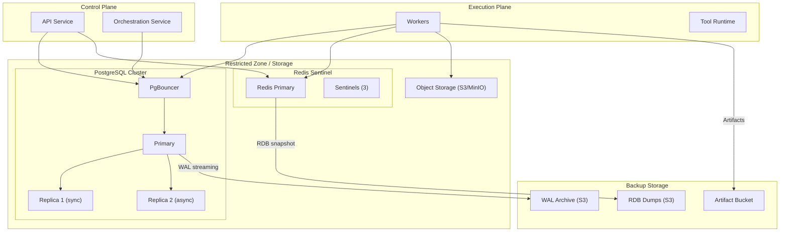

---

## 14. Database Migration & Schema Deployment

### 14.1 Migration Ownership

Database migrations are owned by the deployment pipeline, not individual application services. The migration runner (`mycelia-migrator`) is a Kubernetes Job deployed as a pre-upgrade hook in the Helm chart. No application service MAY modify the schema outside the migration pipeline.

### 14.2 Migration Tool and Versioning

All migrations are managed by Flyway or Liquibase (or Alembic for Python-native stacks). Migrations MUST:

- Be numbered sequentially (V001__, V002__, etc.).
- Be idempotent where the migration type allows.
- Never modify existing migration files once applied to any non-local environment.
- Be stored in `infrastructure/migrations/` alongside application source code.

### 14.3 Expand/Contract Pattern

MYCELIA MUST use the expand/contract (parallel-change) pattern for all schema changes that affect running services:

```
Phase 1 — Expand:
  - Add new columns (nullable or with defaults).
  - Add new tables.
  - Add new indexes.
  - Deploy new application version that writes to both old and new columns.

Phase 2 — Migrate data (if applicable):
  - Backfill data from old column to new column.
  - Verify data integrity.

Phase 3 — Contract:
  - Remove old columns or tables.
  - Remove backward-compatibility writes from application.
  - Deploy application version that only uses new schema.
```

This pattern MUST be followed for any schema change affecting tables accessed by multiple services or required for replay.

### 14.4 Migration Pipeline

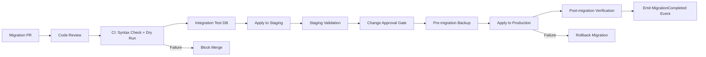

### 14.5 Rollback Considerations

Schema rollback is intentionally constrained:

- **Additive migrations** (new columns, new tables, new indexes): rollback by reverting the Helm chart to the previous version and dropping the new schema elements.
- **Data-altering migrations**: rollback requires a database restore from the pre-migration backup. This is the primary reason pre-migration backups are MANDATORY.
- **Destructive migrations** (DROP TABLE, DROP COLUMN): MUST have a 30-day waiting period after the application no longer references the column before execution. Emergency exception requires approval.

### 14.6 Tenant Safety

All migration scripts MUST be reviewed for tenant safety:

- Every `INSERT`, `UPDATE`, `DELETE` that touches multi-tenant tables MUST include a `WHERE tenant_id = ?` clause.
- Migrations that add `NOT NULL` constraints MUST first backfill the column to ensure existing tenant rows are valid.
- Migrations touching replay-critical tables (`event_log`, `workflow_checkpoints`, `run_state`) require an additional sign-off from the architecture owner.
- `tenant_id` constraints MUST be validated by an automated migration linter in CI.

### 14.7 Migration Auditability

Each applied migration MUST emit a `MigrationStarted` and `MigrationCompleted` (or `MigrationFailed`) event with:

```json
{
  "event_type": "MigrationCompleted",
  "migration_version": "V042",
  "migration_checksum": "sha256:...",
  "environment": "production",
  "applied_by": "mycelia-migrator-job",
  "duration_ms": 4200,
  "tables_affected": ["workflow_runs", "run_checkpoints"],
  "timestamp": "2026-05-28T14:32:00Z"
}
```


---

## 15. Event Broker Deployment

### 15.1 Broker Topology

MYCELIA uses Redis Streams as the event broker for MVP. This provides durable, ordered, consumer-group-aware streams without the operational complexity of a full Kafka deployment. The topology supports:

- Multiple named streams per domain.
- Consumer groups with independent offsets per service.
- Dead-letter streams (DLS) for failed message handling.
- Replay streams as isolated copies of production event history.

For Enterprise deployments exceeding 50,000 events/second or requiring cross-region replication, Redpanda or Apache Kafka SHOULD replace Redis Streams. The MYCELIA event contract layer is broker-agnostic; the event schema registry remains the source of truth regardless of broker.

### 15.2 Stream Key Convention

| Stream Name | Key Pattern | Producers | Consumers | Retention |
|---|---|---|---|---|
| `workflow.events` | `tenant:{tid}:stream:workflow.events` | Orchestration | Workers, Audit | 7 days |
| `run.state` | `tenant:{tid}:stream:run.state` | Workers | Orchestration, UI | 7 days |
| `tool.execution` | `tenant:{tid}:stream:tool.execution` | Tool Runtime | Audit, Governance | 30 days |
| `approval.requests` | `tenant:{tid}:stream:approval.requests` | Governance | UI, Notification | 90 days |
| `audit.events` | `tenant:{tid}:stream:audit.events` | All services | Audit Store | Never trimmed |
| `telemetry.spans` | `stream:telemetry.spans` (shared) | OTel Collector | Tempo | 30 days |
| `replay.events` | `tenant:{tid}:stream:replay.{run_id}` | Replay service | Replay workers | 7 days |
| `deadletter` | `tenant:{tid}:stream:dlq` | All services | Alert, Review | 90 days |
| `schema.registry` | `stream:schema.registry` | CI/CD | All consumers | Never trimmed |

### 15.3 Consumer Groups

Each consuming service registers a named consumer group to enable independent offset tracking and competing-consumer scaling:

```bash
# Create consumer groups for workflow events
redis-cli XGROUP CREATE tenant:t1:stream:workflow.events orchestration-svc $ MKSTREAM
redis-cli XGROUP CREATE tenant:t1:stream:workflow.events audit-svc 0 MKSTREAM
redis-cli XGROUP CREATE tenant:t1:stream:workflow.events ui-relay-svc $ MKSTREAM
```

Messages are ACK'd only after successful processing. Unacknowledged messages after `PENDING_TIMEOUT` are claimed by another consumer in the group.

### 15.4 Dead-Letter Stream (DLS)

Failed messages (after configured retry exhaustion) MUST be forwarded to the tenant DLS. The DLS MUST include:

- Original message body.
- Failure reason and stack trace (sanitized).
- Retry count.
- Original stream and consumer group.
- `tenant_id` and `run_id` for lineage.

An alert MUST fire when any DLS has > 10 unprocessed messages.

### 15.5 Replay Topics

Replay event streams are isolated copies created at replay initiation:

```bash
# Snapshot a run's event stream for replay
redis-cli XRANGE tenant:t1:stream:workflow.events - + COUNT 10000 \
  | replay-tool snapshot --run-id ${RUN_ID} --output tenant:t1:stream:replay.${RUN_ID}
```

Replay stream consumers MUST read from the `replay.{run_id}` stream, not the live production stream. NetworkPolicy prevents replay workers from writing to production streams.

### 15.6 Tenant Partitioning

Tenant isolation in the event layer is enforced by:

- Stream key prefixing: `tenant:{tenant_id}:stream:*`.
- Redis ACL rules: each tenant service account has `KEYS` and `XREAD/XWRITE` access scoped to its prefix only.
- Consumer group naming includes `tenant_id` to prevent cross-tenant group collisions.

A tenant MUST NOT be able to `XREAD` from another tenant's stream, enforced at the Redis ACL level and validated by admission checks.

### 15.7 Broker Observability

Redis Streams metrics MUST be exported to Prometheus via `redis_exporter`:

- `redis_stream_length` by stream key and tenant.
- `redis_stream_consumer_group_lag` by group and stream.
- `redis_stream_pending_entries` by group (unacknowledged messages).
- `redis_keyspace_hits_total` and misses.

Alerts MUST fire for:
- Consumer group lag > 1000 messages (backpressure signal).
- DLS message count > 10.
- Redis primary replication lag > 10 seconds.
- Redis memory usage > 80%.

---

## 16. Temporal / Workflow Runtime Deployment

### 16.1 Temporal Cluster Architecture

Temporal is deployed as a self-hosted cluster in the `mycelia-orchestration` namespace. The cluster consists of four services as defined in the Temporal architecture:

| Service | Replicas (MVP) | Replicas (Prod) | Responsibility |
|---|---|---|---|
| `temporal-frontend` | 1 | 3 | gRPC API gateway for clients and workers |
| `temporal-history` | 1 | 5 | Workflow history, state machine, timers |
| `temporal-matching` | 1 | 3 | Task queue routing and worker matching |
| `temporal-worker` | 1 | 2 | Internal Temporal system workflows |

All four services run as Kubernetes Deployments with independent scaling. History sharding is configured at initialization and must not be changed without full cluster migration.

### 16.2 Persistence Backend

Temporal requires a persistence backend for workflow history, task queue state, and visibility.

| Persistence Layer | Backend | Notes |
|---|---|---|
| Default store | PostgreSQL 15+ | Workflow history and state |
| Visibility store | PostgreSQL (Advanced Visibility) | Searchable attributes, workflow listing |
| Advanced visibility | Elasticsearch (Enterprise) | Full-text search on workflow metadata |

The Temporal database schema is managed by the Temporal `temporal-sql-tool` migration utility, not MYCELIA's own migration pipeline. Temporal schema migrations MUST be run before Temporal service version upgrades.

### 16.3 Temporal Namespace Strategy

MYCELIA uses Temporal namespaces to isolate workflow classes:

| Temporal Namespace | Purpose | Retention | Worker Queue Prefix |
|---|---|---|---|
| `mycelia-default` | Standard workflow execution | 30 days | `wf-` |
| `mycelia-governance` | Approval and policy workflows | 90 days | `gov-` |
| `mycelia-replay` | Replay and investigation workflows | 7 days | `replay-` |
| `mycelia-system` | Internal MYCELIA system workflows | 90 days | `sys-` |
| `tenant-{id}` | Dedicated enterprise tenant workflows | Configurable | `t{id}-` |

Temporal namespaces are NOT Kubernetes namespaces. They are logical partitions within the Temporal cluster. Tenant isolation via Temporal namespaces is a **Later** capability; MVP uses the shared `mycelia-default` namespace with `tenant_id` embedded in workflow IDs and search attributes.

### 16.4 Task Queue Design

Task queues are named by workload class and tenant scope:

```
# Shared workers
wf-cognitive-general        # General cognitive workflows
wf-tool-execution           # Tool execution activities
wf-memory-operations        # Memory read/write activities
wf-approval-coordination    # Human approval workflows

# Tenant-dedicated workers (enterprise)
wf-cognitive-tenant-{id}    # Tenant-specific cognitive workflows
```

Workers MUST poll only their designated task queues. A worker polling multiple queues MUST be explicitly configured and auditable.

### 16.5 Worker Autoscaling with KEDA

Temporal workers are scaled using KEDA (Kubernetes Event-Driven Autoscaler) based on Temporal task queue depth:

```yaml
apiVersion: keda.sh/v1alpha1
kind: ScaledObject
metadata:
  name: mycelia-worker-scaler
  namespace: mycelia-execution
spec:
  scaleTargetRef:
    name: mycelia-cognitive-worker
  minReplicaCount: 2
  maxReplicaCount: 20
  cooldownPeriod: 60
  triggers:
    - type: temporal
      metadata:
        endpoint: "temporal-frontend.mycelia-orchestration.svc.cluster.local:7233"
        namespace: "mycelia-default"
        taskQueue: "wf-cognitive-general"
        targetQueueSize: "10"
        activationTargetQueueSize: "2"
```

Worker scale-down is gradual (one replica per cooldown period) to prevent in-flight workflow interruption.

### 16.6 Workflow Versioning

MYCELIA uses Temporal's versioning API (`workflow.GetVersion`) to support safe rollout of workflow changes with in-flight executions:

```python
# Temporal versioning pattern
v = workflow.get_version("add-validation-step", workflow.DEFAULT_VERSION, 1)
if v == 1:
    await workflow.execute_activity(validate_step, ...)
# Old executions continue without the step
```

All breaking workflow changes MUST use versioning. Old workflow versions MUST remain deployed until all in-flight executions of that version have completed.

### 16.7 Replay Behavior

Temporal's replay is deterministic by design. MYCELIA's replay behavior:

- Workflow history is stored indefinitely in Temporal (subject to namespace retention).
- Replay runs read from history; they do NOT re-execute activities against live systems.
- The `mycelia-replay` Temporal namespace uses stub activity implementations.
- Replay results are emitted to the replay event stream, not the production event stream.
- `temporal workflow show --workflow-id {id}` can export history for investigation.

### 16.8 Temporal Observability

Temporal emits SDK metrics compatible with Prometheus. MYCELIA MUST deploy the Temporal metrics scrape configuration:

```yaml
# ServiceMonitor for Temporal
metrics:
  - job_name: temporal
    static_configs:
      - targets:
          - temporal-frontend:9090
          - temporal-history:9090
          - temporal-matching:9090
```

Key metrics to alert on:
- `temporal_workflow_task_schedule_to_start_latency` > 5s: worker starvation.
- `temporal_activity_schedule_to_start_latency` > 30s: task queue backup.
- `temporal_persistence_requests` errors: database connectivity.
- Workflow success rate < 99%: execution health.

---

## 17. Worker Pools & Sandbox Deployment

### 17.1 Worker Pool Classes

MYCELIA defines six worker pool classes with distinct resource profiles and isolation levels:

| Pool Class | Label | Node Pool | CPU/Memory | Sandbox | Use Case |
|---|---|---|---|---|---|
| `cognitive-shared` | `pool: cog-shared` | `workers-standard` | 2 CPU / 4 GiB | Process | General cognitive workflows |
| `cognitive-tenant` | `pool: cog-t-{id}` | `workers-tenant-{id}` | 4 CPU / 8 GiB | Process | Dedicated enterprise tenants |
| `tool-shared` | `pool: tool-shared` | `workers-standard` | 1 CPU / 2 GiB | gVisor (runsc) | Low-risk tool execution |
| `tool-sandboxed` | `pool: tool-sandbox` | `workers-sandbox` | 2 CPU / 4 GiB | gVisor (runsc) | High-risk tool / code execution |
| `replay` | `pool: replay` | `workers-standard` | 1 CPU / 2 GiB | Process | Replay and investigation |
| `model-adapter` | `pool: model-adapter` | `workers-standard` | 1 CPU / 2 GiB | None | Model provider calls |

### 17.2 Sandboxed Execution with gVisor

High-risk tool execution (code execution, file system operations, untrusted integrations) MUST run in gVisor (runsc) sandboxed containers:

```yaml
apiVersion: apps/v1
kind: Deployment
metadata:
  name: mycelia-tool-worker-sandboxed
  namespace: mycelia-execution
spec:
  template:
    spec:
      runtimeClassName: gvisor
      serviceAccountName: mycelia-tool-worker
      securityContext:
        runAsNonRoot: true
        runAsUser: 1000
        seccompProfile:
          type: RuntimeDefault
      containers:
        - name: tool-worker
          image: ${REGISTRY}/mycelia-tool-worker@${DIGEST}
          resources:
            requests:
              cpu: "1"
              memory: 2Gi
            limits:
              cpu: "2"
              memory: 4Gi
          securityContext:
            allowPrivilegeEscalation: false
            readOnlyRootFilesystem: true
            capabilities:
              drop: ["ALL"]
          volumeMounts:
            - name: tmp
              mountPath: /tmp
            - name: vault-secrets
              mountPath: /vault/secrets
              readOnly: true
      volumes:
        - name: tmp
          emptyDir: {}
        - name: vault-secrets
          emptyDir:
            medium: Memory
```

### 17.3 Shared vs Dedicated Workers

| Dimension | Shared Workers | Dedicated Tenant Workers |
|---|---|---|
| Tenant scope | Multi-tenant with envelope validation | Single-tenant only |
| Resource contention | Possible (mitigated by quotas) | None |
| Deployment trigger | Platform upgrade | Tenant provisioning |
| Cost model | Shared platform cost | Tenant-billed |
| Isolation level | Namespace + envelope | Namespace + node pool + network |
| Required tier | Standard | Enterprise |
| Credential access | Shared secrets only | Tenant-scoped secrets |

### 17.4 Worker Pool Diagram

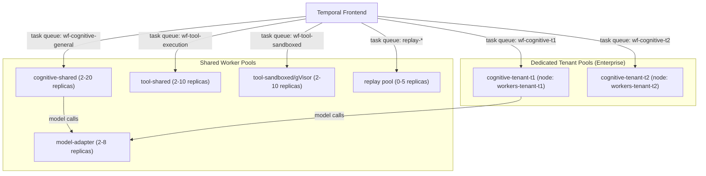

### 17.5 Worker Heartbeat and Recovery

Temporal workers emit heartbeats during long-running activities. MYCELIA workers MUST:

- Emit heartbeats every 10 seconds for activities expected to exceed 30 seconds.
- Include a progress checkpoint in the heartbeat detail (serializable struct).
- Set `heartbeat_timeout` to 30 seconds in activity options.

On worker crash, Temporal automatically reschedules the activity after the `schedule_to_start_timeout`. The activity MUST read the last heartbeat checkpoint and resume from that point, not from the beginning.

```python
# Heartbeat-aware activity
@activity.defn
async def long_cognitive_task(input: TaskInput) -> TaskOutput:
    details = activity.info().heartbeat_details
    start_from = details[0] if details else 0
    
    for step in range(start_from, input.total_steps):
        result = await process_step(step)
        activity.heartbeat(step + 1)  # Checkpoint current progress
    
    return TaskOutput(...)
```

### 17.6 Tenant Envelope Validation

Every worker MUST validate the tenant envelope before executing any activity:

```python
def validate_tenant_envelope(input: WorkflowInput) -> None:
    assert input.tenant_id is not None, "Missing tenant_id"
    assert input.run_id is not None, "Missing run_id"
    assert input.workspace_id is not None, "Missing workspace_id"
    assert input.policy_scope is not None, "Missing policy_scope"
    
    # Verify tenant is active and not suspended
    tenant = tenant_cache.get(input.tenant_id)
    if tenant is None or tenant.status != "active":
        raise TenantNotActiveError(input.tenant_id)
```

Workers that fail envelope validation MUST reject the task and emit a `TenantEnvelopeValidationFailed` event. They MUST NOT process the activity.

---

## 18. Observability Deployment

### 18.1 OpenTelemetry Collector Topology

MYCELIA uses a two-tier OpenTelemetry Collector deployment:

**Tier 1 — Agent (DaemonSet):** A lightweight OTel Collector runs as a DaemonSet on every Kubernetes node. It receives telemetry from local pods via OTLP, applies sampling, and forwards to Tier 2. This minimizes cross-node network traffic and provides pod-local telemetry collection.

**Tier 2 — Gateway (Deployment):** A scaled OTel Collector deployment receives from all agents, applies global processing (tenant attribution, PII scrubbing), and fans out to backend storage systems.

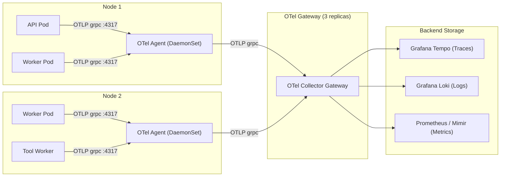

### 18.2 Required Span Fields

Every MYCELIA trace span MUST include the following attributes:

| Attribute | Type | Required | Description |
|---|---|---|---|
| `mycelia.tenant_id` | string | MUST | Tenant identifier |
| `mycelia.workspace_id` | string | MUST | Workspace scope |
| `mycelia.run_id` | string | MUST | Execution run identifier |
| `mycelia.workflow_id` | string | SHOULD | Workflow definition ID |
| `mycelia.actor_id` | string | SHOULD | Initiating actor |
| `mycelia.service` | string | MUST | Service name |
| `mycelia.component` | string | MUST | Component within service |
| `mycelia.policy_scope` | string | SHOULD | Applied policy scope |
| `service.name` | string | MUST | OTel standard |
| `service.version` | string | MUST | Deployed version |

### 18.3 Sampling Strategy

| Telemetry Class | Sampling Rate | Strategy | Notes |
|---|---|---|---|
| Error spans | 100% | Always sample | Never drop errors |
| Governance/audit spans | 100% | Always sample | Compliance requirement |
| Approval workflow spans | 100% | Always sample | Audit trail |
| Cognitive workflow spans | 10% tail-based | Tail sampling | Keep slow/error |
| Tool execution spans | 25% | Head sampling | Keep errors always |
| Health check spans | 0% | Drop | Never store |
| Replay spans | 100% | Always sample | Investigation completeness |

Tail-based sampling decisions MUST be made at the OTel Gateway, not the Agent, to enable span-complete decisions.

### 18.4 SLO Measurement

| SLO | Target | Measurement | Alert Threshold |
|---|---|---|---|
| API p99 latency | < 500ms | Prometheus histogram | > 800ms |
| Workflow start p50 | < 2s | Temporal metrics | > 5s |
| Worker task pickup p95 | < 10s | KEDA queue depth | > 30s |
| Event publish latency p99 | < 100ms | Redis stream lag | > 500ms |
| Secret fetch latency p95 | < 200ms | Vault metrics | > 1s |
| Deployment success rate | > 99.5% | CI/CD metrics | < 98% |
| Tenant isolation violation | 0 | Admission/audit events | Any occurrence |

### 18.5 Audit Telemetry

Security and governance events MUST route through a separate audit pipeline that guarantees durability:

- Audit events are written to the PostgreSQL `audit_events` table (append-only, no UPDATE/DELETE) synchronously with the action.
- Audit events are also forwarded to the OTel Gateway with `audit: true` attribute for correlation with distributed traces.
- The audit pipeline MUST NOT be subject to sampling; all audit events are retained.
- Audit event retention: indefinite (or per regulatory requirement).

### 18.6 Tenant-Aware Telemetry

All dashboards, alerts, and retention policies MUST support tenant-scoped views:

- Grafana dashboards are parameterized by `tenant_id`.
- Loki log queries MUST include `{tenant_id="..."}` label filter for tenant-scoped log access.
- Tenant data MUST NOT be visible in another tenant's dashboard context.
- Multi-tenant observability operators MUST have explicit authorization to view cross-tenant data.

---

## 19. Scaling & Capacity Architecture

### 19.1 Autoscaling Architecture

MYCELIA employs three complementary autoscaling mechanisms:

**Horizontal Pod Autoscaler (HPA):** CPU and memory-based scaling for stateless services (API, frontend, model adapter). Target CPU utilization: 70%.

**KEDA (Kubernetes Event-Driven Autoscaler):** Queue-depth-based scaling for workers and event-consuming services. Scales based on Temporal task queue depth and Redis stream lag.

**Vertical Pod Autoscaler (VPA):** In recommendation mode only for MVP. Provides right-sizing guidance. Automatic vertical scaling is disabled to prevent pod eviction during execution.

### 19.2 Autoscaling Signals

| Component | Scaler | Signal | Scale-Up Trigger | Scale-Down Trigger | Min | Max |
|---|---|---|---|---|---|---|
| API service | HPA | CPU utilization | > 70% | < 40% | 2 | 10 |
| Cognitive workers | KEDA | Temporal queue depth | > 10 tasks | < 2 tasks | 2 | 20 |
| Tool workers | KEDA | Temporal queue depth | > 5 tasks | < 1 task | 2 | 10 |
| Sandbox workers | KEDA | Temporal queue depth | > 3 tasks | < 1 task | 1 | 8 |
| Model adapter | HPA | Request rate | > 100 RPS | < 20 RPS | 2 | 8 |
| OTel Agent | DaemonSet | N/A (node-scoped) | — | — | 1/node | 1/node |
| OTel Gateway | HPA | Received spans/sec | > 5000/s | < 1000/s | 2 | 6 |

### 19.3 Noisy Neighbor Controls

Tenant-level resource quotas prevent any single tenant from exhausting shared pool capacity:

```yaml
apiVersion: v1
kind: ResourceQuota
metadata:
  name: tenant-quota-standard
  namespace: mycelia-execution
spec:
  hard:
    requests.cpu: "4"
    requests.memory: 8Gi
    limits.cpu: "8"
    limits.memory: 16Gi
    pods: "20"
    count/jobs.batch: "10"
```

Tenant quotas are enforced by labels. Workers MUST label pods with `tenant.mycelia.io/id: {tenant_id}` to enable quota tracking. An admission webhook MUST reject pods without valid tenant labels in shared namespaces.

### 19.4 Capacity Matrix

| Component | MVP Capacity | Mid-Scale | Enterprise |
|---|---|---|---|
| Concurrent runs | 50 | 500 | 5,000+ |
| Events/second | 1,000 | 10,000 | 100,000+ |
| Worker pods | 5–20 | 20–100 | 100–500 |
| DB connections | 50 (PgBouncer) | 200 | 1,000 |
| Temporal history shards | 4 | 16 | 512 |
| Redis memory | 2 GiB | 16 GiB | 128 GiB |
| OTel spans/sec | 5,000 | 50,000 | 500,000 |
| Tenants | 10 | 100 | 1,000+ |

### 19.5 Backpressure Visibility

Backpressure MUST be visible and actionable:

- KEDA metric `keda_scaler_active` shows queue pressure.
- Temporal metric `temporal_activity_schedule_to_start_latency_p99` indicates worker starvation.
- Redis `XLEN` on consumer group pending entries indicates stream backpressure.
- All backpressure signals MUST emit to dashboards. Alert thresholds MUST be defined before production launch.

Backpressure MUST NOT silently drop events. Services experiencing backpressure MUST return 429 (Too Many Requests) or push to a holding queue with explicit TTL.

## 19.6 Infrastructure Cost Governance

MYCELIA infrastructure MUST be cost-observable from the beginning.

Cost governance is not a finance-only concern. It protects platform sustainability, tenant fairness and operational predictability.

### Cost Dimensions

MYCELIA MUST track infrastructure cost by:

- environment;
- tenant;
- workspace where applicable;
- runtime plane;
- worker pool;
- model provider route;
- storage class;
- event throughput;
- telemetry volume;
- replay workload;
- backup and retention class.

### Cost Drivers

Primary cost drivers include:

- worker CPU and memory;
- model provider calls;
- vector storage and indexing;
- telemetry ingestion and retention;
- object storage artifacts;
- backup retention;
- event broker throughput;
- dedicated tenant infrastructure;
- replay execution volume;
- high-cardinality metrics.

### Cost Controls

The platform SHOULD enforce:

- tenant quotas;
- workspace budgets;
- worker pool maximums;
- replay concurrency limits;
- telemetry retention classes;
- model-provider spending caps;
- artifact retention policies;
- autoscaling ceilings.

### FinOps Events

The platform SHOULD emit:

- CostBudgetCreated;
- CostBudgetThresholdReached;
- CostBudgetExceeded;
- TenantQuotaExceeded;
- ReplayCostLimitReached;
- TelemetryCostLimitReached;
- ModelProviderSpendLimitReached.

### Rule

No tenant may generate unbounded infrastructure cost.

### Forbidden Behavior

FORBIDDEN:

- unbounded autoscaling;
- infinite telemetry retention for non-critical data;
- unrestricted replay execution;
- tenant workloads without quota class;
- provider calls without cost attribution;
- dedicated infrastructure without tenant profile linkage.

---

## 20. High Availability & Disaster Recovery

### 20.1 Availability Targets

| Component | Availability Target | RPO | RTO | Notes |
|---|---|---|---|---|
| API service | 99.9% | N/A (stateless) | < 30s | Multi-zone deployment |
| Temporal cluster | 99.9% | < 1 min | < 5 min | Raft-based HA |
| PostgreSQL | 99.95% | < 1 min | < 5 min | Synchronous replica |
| Redis Streams | 99.9% | < 30s | < 2 min | Sentinel HA |
| Event history | 99.99% | 0 (append-only) | N/A | Never lost |
| Vault | 99.9% | < 1 min | < 5 min | Raft HA, 3 nodes |
| Observability stack | 99.5% | < 5 min | < 15 min | Best-effort during incident |
| Full platform | 99.5% (MVP) | < 5 min | < 30 min | SLA target |

### 20.2 Multi-Zone Deployment

All production workloads MUST be distributed across at least two Availability Zones (three for StatefulSets):

```yaml
# Topology spread for API service
topologySpreadConstraints:
  - maxSkew: 1
    topologyKey: topology.kubernetes.io/zone
    whenUnsatisfiable: DoNotSchedule
    labelSelector:
      matchLabels:
        app: mycelia-api
```

StatefulSets (PostgreSQL, Redis, Temporal, Vault) MUST use anti-affinity rules to distribute replicas across zones:

```yaml
affinity:
  podAntiAffinity:
    requiredDuringSchedulingIgnoredDuringExecution:
      - labelSelector:
          matchLabels:
            app: postgres
        topologyKey: topology.kubernetes.io/zone
```

### 20.3 Backup Strategy

| Data Store | Backup Method | Frequency | Retention | Storage | Encryption |
|---|---|---|---|---|---|
| PostgreSQL | WAL-G continuous + base backup | Continuous + daily | 30 days + 1 year monthly | S3/GCS | AES-256 SSE-KMS |
| Temporal history | pg_dump + WAL-G (shared DB) | Daily | 30 days | S3/GCS | AES-256 SSE-KMS |
| Redis Streams | RDB snapshot | Daily | 7 days | S3/GCS | AES-256 SSE-KMS |
| Vault | Vault snapshot via API | Every 6 hours | 30 days | S3/GCS | AES-256 SSE-KMS |
| Object storage | Cross-region replication | Continuous | Configurable | S3/GCS | SSE-KMS |
| Kubernetes etcd | Managed by cloud provider | Daily | 30 days | Managed | Provider |
| IaC state | Terraform remote state | On change | Versioned | S3/GCS | AES-256 |

### 20.4 DR Topology

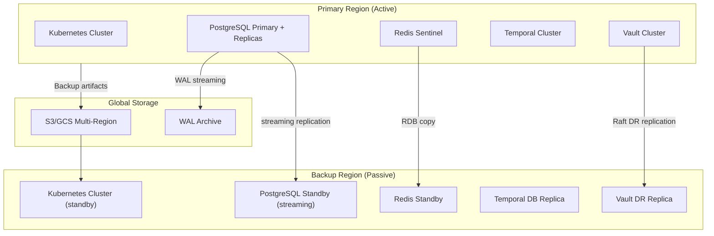

### 20.5 Disaster Recovery Procedures

**RTO < 30 minutes for full platform recovery:**

1. Initiate DR failover in runbook (GitOps PR to promote backup region).
2. Promote PostgreSQL standby to primary (Patroni/CloudNativePG failover).
3. Activate Temporal cluster in backup region (point to promoted DB).
4. DNS cutover to backup region ingress.
5. Verify health checks pass on all planes.
6. Notify tenants via status page.
7. Emit `DisasterRecoveryActivated` event.

**DR Drills:** MUST be conducted quarterly. Drills MUST test the full failover procedure including DNS cutover and data integrity verification. Drill results MUST be documented and linked to the DR plan as evidence.

### 20.6 Data Residency Constraints

Enterprise tenants MAY have contractual data residency requirements. MYCELIA MUST:

- Store tenant data only in declared residency regions.
- Prevent tenant data from appearing in cross-region backups outside the residency boundary.
- Provide residency attestation in the tenant infrastructure profile.
- Audit residency compliance as part of enterprise onboarding.

---

## 21. Multi-Tenant Infrastructure Isolation

### 21.1 Tenant Infrastructure Profiles

MYCELIA defines three tenant infrastructure profiles with increasing isolation:

| Profile | Isolation Level | Cluster | Namespace | Database | Worker Pool | Network |
|---|---|---|---|---|---|---|
| **Standard** | Logical | Shared | Shared (`mycelia-execution`) | Shared DB + RLS | Shared pool | Shared NetworkPolicy |
| **Enhanced** | Namespace | Shared | Dedicated (`tenant-{id}`) | Shared DB + RLS | Shared pool w/ quotas | Tenant NetworkPolicy |
| **Enterprise** | Infrastructure | Dedicated (optional) | Dedicated | Dedicated DB cluster | Dedicated pool | Dedicated VPC/subnet |

### 21.2 Tenant Isolation Matrix

| Isolation Dimension | Standard | Enhanced | Enterprise |
|---|---|---|---|
| Kubernetes namespace | Shared | Dedicated | Dedicated |
| Node pool | Shared | Shared (tainted) | Dedicated |
| PostgreSQL cluster | Shared + RLS | Shared + RLS | Dedicated |
| Redis keyspace | Prefixed + ACL | Prefixed + ACL | Dedicated instance |
| Object storage | Prefixed + IAM | Prefixed + IAM | Dedicated bucket |
| Secret path | Shared prefix | Tenant prefix | Dedicated Vault namespace |
| Worker processes | Shared | Shared w/ quotas | Dedicated |
| Network policies | Platform-level | Tenant-level | VPC-level |
| Observability | Filtered view | Filtered view | Dedicated dashboards |
| Event streams | Key prefix | Key prefix + ACL | Dedicated stream topics |

### 21.3 Namespace-Per-Tenant Model

For Enhanced and Enterprise tenants, MYCELIA provisions a dedicated Kubernetes namespace at tenant onboarding:

```yaml
apiVersion: v1
kind: Namespace
metadata:
  name: tenant-acme-corp
  labels:
    tenant.mycelia.io/id: "acme-corp"
    tenant.mycelia.io/profile: "enhanced"
    mycelia.io/managed-by: "platform"
---
apiVersion: v1
kind: ResourceQuota
metadata:
  name: tenant-quota
  namespace: tenant-acme-corp
spec:
  hard:
    requests.cpu: "8"
    requests.memory: 16Gi
    limits.cpu: "16"
    limits.memory: 32Gi
---
apiVersion: networking.k8s.io/v1
kind: NetworkPolicy
metadata:
  name: tenant-isolation
  namespace: tenant-acme-corp
spec:
  podSelector: {}
  policyTypes:
    - Ingress
    - Egress
  ingress:
    - from:
        - namespaceSelector:
            matchLabels:
              kubernetes.io/metadata.name: mycelia-control
  egress:
    - to:
        - namespaceSelector:
            matchLabels:
              kubernetes.io/metadata.name: mycelia-memory
    - to:
        - namespaceSelector:
            matchLabels:
              kubernetes.io/metadata.name: mycelia-events
```

### 21.4 Why Namespace Alone Is Not Sufficient

Namespaces provide API server-level isolation and NetworkPolicy scope, but do NOT enforce:

- Storage isolation (a pod with a PVC can read another tenant's data if schemas lack RLS).
- CPU/memory isolation (without ResourceQuotas, one tenant can exhaust node resources).
- Secret isolation (without RBAC, a pod can read Kubernetes Secrets across namespaces via ServiceAccount misconfiguration).
- Network isolation (NetworkPolicies must be explicitly defined; default is allow-all).

MYCELIA's multi-tenant isolation is **defense in depth**: namespace + RBAC + NetworkPolicy + ResourceQuota + RLS + Redis ACL + Vault policy + Kubernetes admission.

### 21.5 Tenant Movement Between Profiles

Tenant profile upgrades (Standard → Enhanced → Enterprise) MUST be auditable:

1. Operations team creates a `TenantMigrationPlan` record.
2. New namespace/infrastructure resources are provisioned.
3. Data migration runs with `tenant_id` scoping.
4. DNS/routing updated to new namespace.
5. Old namespace resources are retained for 7 days (rollback window).
6. `TenantProfileMigrationCompleted` event emitted.
7. Old resources decommissioned after rollback window.

---

## 22. Deployment Observability & Auditability

### 22.1 Mandatory Deployment Events

Every deployment event MUST be captured with the following fields and routing:

| Event | Producer | Required Fields | Trace Relation | Audit Importance |
|---|---|---|---|---|
| `DeploymentRequested` | CI/CD pipeline | `release_id`, `artifact_digest`, `environment`, `requested_by`, `timestamp` | Root span | HIGH |
| `DeploymentApproved` | Approval gate | `release_id`, `approved_by`, `approval_timestamp`, `environment` | Child of Requested | CRITICAL |
| `DeploymentStarted` | Deployment controller | `release_id`, `artifact_digest`, `environment`, `previous_version`, `rollback_plan_id` | Child of Approved | HIGH |
| `DeploymentSucceeded` | Deployment controller | `release_id`, `artifact_digest`, `duration_ms`, `services_updated`, `environment` | Child of Started | HIGH |
| `DeploymentFailed` | Deployment controller | `release_id`, `failure_reason`, `failed_service`, `rollback_triggered`, `error_detail` | Child of Started | CRITICAL |
| `RollbackStarted` | Deployment controller | `release_id`, `target_version`, `rollback_reason`, `initiated_by` | Root span | CRITICAL |
| `RollbackSucceeded` | Deployment controller | `release_id`, `target_version`, `duration_ms` | Child of RollbackStarted | CRITICAL |
| `MigrationStarted` | Migration job | `migration_version`, `environment`, `tables_affected`, `estimated_duration_ms` | Root span | HIGH |
| `MigrationCompleted` | Migration job | `migration_version`, `duration_ms`, `rows_affected`, `checksum` | Child of Started | HIGH |
| `InfrastructureDriftDetected` | Drift detection CronJob | `resource_type`, `resource_name`, `expected_state_hash`, `actual_state_hash`, `environment` | Root span | HIGH |

All deployment events MUST be written to the audit event store (PostgreSQL `audit_events` table) synchronously. They MUST also be forwarded to the OTel collector with `audit: true` for distributed trace correlation.

### 22.2 Release Traceability

Every production release MUST be traceable through a complete chain:

```
Git Commit SHA
  → CI Build ID
    → Container Image Digest
      → Helm Chart Version
        → Kubernetes Deployment Revision
          → Release Candidate ID
            → Deployment Event ID
              → Audit Record
```

This chain MUST be queryable in the MYCELIA deployment history API. No break in the chain is permitted.

---

## 23. Runtime Failure Model

### 23.1 Failure Modes and Recovery Procedures

| Failure Mode | Detection | Containment | Recovery | Events Emitted | Tenant Impact | Replay Implication |
|---|---|---|---|---|---|---|
| **Pod crash** | Kubernetes restartPolicy, liveness probe | Kubernetes auto-restart (up to 3x) | Pod recreation | `PodCrashDetected`, `PodRestartedSuccessfully` | Brief disruption for in-flight task | Heartbeat checkpoint; resume from last checkpoint |
| **Worker crash** | Temporal heartbeat timeout | Temporal reschedules activity | New worker picks up task | `WorkerCrashDetected`, `ActivityRescheduled` | Delayed task completion | Activity retried from heartbeat |
| **Node failure** | Node Not Ready condition | Pod eviction and rescheduling | Kubernetes reschedules pods | `NodeFailureDetected`, `PodsEvicted` | Degraded capacity until reschedule | Workers restart on new node |
| **Cluster failure** | Control plane unavailability | DR failover procedure | Activate backup region | `ClusterFailureDetected`, `DRFailoverInitiated` | Full platform unavailable | Replay suspended; resumes post-recovery |
| **Database outage** | Health check failure, connection errors | Circuit breaker opens; writes queue | Restore from backup or promote replica | `DatabaseOutageDetected`, `DatabaseRestored` | All stateful operations blocked | Replay suspended |
| **Broker outage** | Redis PING failures, stream lag | Event writes buffer in-memory (brief) | Sentinel failover or restore | `BrokerOutageDetected`, `BrokerRestored` | Real-time events delayed | Replay event reads blocked |
| **Redis outage** | Redis PING failures | Cache invalidation; direct DB reads | Sentinel failover | `RedisOutageDetected` | Increased DB load; latency spike | Replay event reads fall back to DB |
| **Telemetry collector outage** | OTel health check | Spans buffered at agent level | Restart collector pod | `TelemetryCollectorOutage` | No tenant impact | Replay telemetry gaps possible |
| **Secret manager outage** | Vault health check failures | Services continue with cached leases | Vault auto-unseal; restore from snapshot | `VaultOutageDetected`, `VaultRestored` | New worker startups blocked | Replay workers use stub credentials |
| **Model provider outage** | Health check, HTTP 5xx | Circuit breaker; fallback to queue | Circuit breaker reopens on recovery | `ModelProviderOutage`, `ModelProviderRestored` | Cognitive tasks queued/failed | Replay uses stub adapters |
| **Network partition** | Cross-namespace probe failures | Degraded mode; reject cross-plane operations | Network restoration or zone failover | `NetworkPartitionDetected`, `NetworkRestored` | Partial functionality | Replay isolated; not affected |
| **Bad deployment** | Error rate spike post-deploy | Automatic rollback if canary fails | Rollback to previous version | `DeploymentFailed`, `RollbackStarted`, `RollbackSucceeded` | Brief disruption during rollback | Snapshot before deployment; rollback restores |
| **Failed migration** | Migration job non-zero exit | Migration aborted; deployment blocked | Restore pre-migration DB backup | `MigrationFailed`, `DatabaseRestoreStarted` | Deployment blocked; DB unchanged | Replay-critical schema preserved |
| **Config drift** | Drift detection CronJob | Alert raised; deployment blocked | IaC reapplication via GitOps | `InfrastructureDriftDetected` | Potential inconsistency | No direct impact; audit trail |
| **Certificate expiration** | cert-manager expiry alerts (30/7/1 day) | cert-manager auto-renews | Manual renewal if auto-renew fails | `CertificateExpiring`, `CertificateRenewed` | HTTPS failures if unresolved | No direct impact |
| **Storage exhaustion** | PVC capacity alerts (80%/90%/95%) | Backpressure; write errors | PVC expansion or data archival | `StorageExhaustionWarning`, `StorageExhaustionCritical` | Write operations fail | Replay history at risk |
| **Noisy neighbor overload** | Tenant quota utilization > 90% | Resource throttling activates | Quota adjustment or tenant migration | `TenantQuotaExceeded`, `TenantThrottled` | Affected tenant throttled | No impact on other tenants |

## 23.2 Infrastructure Dependency Criticality Matrix

MYCELIA MUST classify infrastructure dependencies by operational criticality.

| Dependency | Criticality | Failure Mode | Runtime Behavior |
|---|---|---|---|
| PostgreSQL | Critical | state unavailable | fail closed for stateful operations |
| Temporal Persistence | Critical | workflows cannot progress safely | pause scheduling |
| Event Broker | Critical | events delayed or unavailable | buffer briefly, then fail closed |
| Secret Manager | Critical | new credentials unavailable | use valid leases, block new leases |
| Policy Engine | Critical | governance unavailable | fail closed |
| Approval Engine | High | approvals unavailable | pause approval-gated workflows |
| OTel Collector | High | telemetry degraded | buffer, degrade non-critical telemetry |
| Model Provider | Medium/High | inference unavailable | circuit break, queue or fallback |
| Object Storage | High | artifact persistence unavailable | block artifact-required operations |
| Redis Cache | Medium | cache unavailable | fall back to database |
| Grafana UI | Low | dashboards unavailable | no runtime impact |
| CI/CD System | High | deployments unavailable | runtime continues, releases blocked |
| Container Registry | High | new pods cannot pull images | existing pods continue |

### Degradation Rules

Critical dependency failure MUST NOT produce hidden partial execution.

The runtime MUST choose one of:

- fail closed;
- pause scheduling;
- queue with bounded TTL;
- enter degraded mode;
- trigger failover;
- require operator intervention.

### Forbidden Behavior

FORBIDDEN:

- continuing governance-sensitive execution when policy engine is unavailable;
- executing tools when credential lease cannot be verified;
- mutating state when event emission is unavailable;
- silently dropping telemetry for critical audit events;
- treating cache data as authoritative during database outage.

### Recovery Rule

Recovery from dependency failure MUST emit:

- DependencyRecovered;
- affected_component;
- affected_tenant_scope;
- recovery_time;
- data_loss_assessment;
- replay_integrity_assessment.

---

## 24. Deployment Security Model

### 24.1 Admission Controls

MYCELIA uses Kyverno as the admission controller for policy-as-code enforcement:

```yaml
# Kyverno policy: require image digest
apiVersion: kyverno.io/v1
kind: ClusterPolicy
metadata:
  name: require-image-digest
spec:
  validationFailureAction: Enforce
  rules:
    - name: check-image-digest
      match:
        any:
          - resources:
              kinds: ["Pod"]
              namespaces: ["mycelia-*", "tenant-*"]
      validate:
        message: "Image must be referenced by digest, not mutable tag."
        pattern:
          spec:
            containers:
              - image: "*@sha256:*"
---
# Kyverno policy: require tenant label
apiVersion: kyverno.io/v1
kind: ClusterPolicy
metadata:
  name: require-tenant-label
spec:
  validationFailureAction: Enforce
  rules:
    - name: check-tenant-label
      match:
        any:
          - resources:
              kinds: ["Pod"]
              namespaces: ["mycelia-execution", "tenant-*"]
      validate:
        message: "Pod must have tenant.mycelia.io/id label."
        pattern:
          metadata:
            labels:
              "tenant.mycelia.io/id": "?*"
```

### 24.2 Production Access Controls

| Access Type | Mechanism | Requirement | Duration | Audit |
|---|---|---|---|---|
| Read-only cluster access | `kubectl` with limited RBAC | MFA + team membership | Session-scoped | Yes |
| Deployment execution | CI/CD ServiceAccount only | Signed artifact + approval | Pipeline execution | Yes |
| Database read access | Vault dynamic credentials | Team membership + approval | 1 hour | Yes |
| Database write access | Migration pipeline only | Change request approval | Pipeline execution | Yes |
| Break-glass admin | Emergency RBAC role | Incident declaration | 2 hours, time-limited | Yes + alert |
| Direct pod exec | Forbidden in production | — | Never | N/A |
| Production secret access | Vault + MFA + audit | Security team approval | 1 hour | Yes |

### 24.3 RBAC Design

Kubernetes RBAC follows the principle of least privilege:

| Role | Namespace | Permissions | Bound To |
|---|---|---|---|
| `mycelia:api-server` | `mycelia-control` | pods/get, services/get, configmaps/get | `mycelia-api` ServiceAccount |
| `mycelia:worker` | `mycelia-execution` | pods/get | `mycelia-worker` ServiceAccount |
| `mycelia:deployer` | `mycelia-*` | deployments/* | CI/CD ServiceAccount |
| `mycelia:sre-readonly` | All | get, list, watch | SRE group |
| `mycelia:sre-ops` | Non-production | get, list, watch, delete/pods | SRE group |
| `mycelia:break-glass` | All | * (timed) | Emergency binding only |

Break-glass role binding MUST be created by automation with a TTL annotation. A CronJob MUST remove stale break-glass bindings after TTL expiration, regardless of manual cleanup.

### 24.4 Forbidden Production Actions

The following actions are FORBIDDEN in production outside the deployment pipeline:

- `kubectl exec` into any production pod.
- Direct `psql` connections to the production PostgreSQL primary.
- Manual `helm upgrade` or `kubectl apply` without CI/CD traceability.
- `kubectl edit` on production Deployments, ConfigMaps, or Secrets.
- Disabling or bypassing Kyverno admission policies.
- Connecting a local workstation to production Vault for secret reads.

All such attempts MUST be detected by audit log monitoring and trigger an alert.

---

## 25. Infrastructure Invariants

The following invariants are implementation-grade constraints. Each MUST be validated in CI, enforced by admission controls, or verified by automated audits.

### Deployment Invariants (1–15)

1. No production deployment may use mutable image tags (`:latest`, `:main`, `:stable`, `:edge`).
2. No production deployment may proceed without a valid artifact digest (`sha256:...`).
3. No production deployment may proceed without a documented rollback plan.
4. No production deployment may proceed without passing all pre-deployment health checks.
5. No production deployment may be initiated outside the CI/CD pipeline.
6. No Helm chart may be deployed without a pinned chart version.
7. No deployment may reference secrets by value; all secrets MUST be referenced by Vault path.
8. No deployment artifact may be modified after signing; artifact digest MUST be verified at deploy time.
9. No deployment may skip the migration gate when migrations are pending.
10. No deployment may proceed if vulnerability scanning reports critical severity with no documented exception.
11. No Kubernetes manifest may contain raw secret values in any field.
12. No deployment may fail silently; all deployment failures MUST emit `DeploymentFailed` events.
13. No canary deployment may exceed 100% error rate threshold without automatic rollback.
14. No blue-green deployment may delete the previous version before canary observation period completes.
15. No deployment to production may bypass the approval gate defined in the release pipeline.

### Secrets Invariants (16–25)

16. No secret value may exist in any Git repository, including private repositories.
17. No secret may be stored in a Kubernetes Secret object without Vault-backed management.
18. No secret may appear in container environment variables in the pod spec; secrets MUST be file-mounted from tmpfs.
19. No secret may appear in logs, traces, or metrics.
20. No secret may appear in replay snapshots or investigation exports.
21. No production secret may be accessible from the replay lab environment.
22. No long-lived static credential may be issued to a worker; dynamic credential leasing MUST be used where the provider supports it.
23. No secret rotation may be performed without verifying the new credential before revoking the old one.
24. No tenant secret may be accessible to another tenant's workload via any code path.
25. No break-glass access to production Vault may last longer than two hours without re-authorization.

### Tenant Isolation Invariants (26–35)

26. No workload may execute without a valid `tenant_id` in its execution envelope.
27. No worker pod in a shared pool may process tasks from multiple tenants within the same execution context.
28. No database query may access another tenant's rows; Row-Level Security MUST be active on all multi-tenant tables.
29. No event stream may be readable by a consumer group belonging to a different tenant.
30. No object storage path may be accessible across tenant boundaries without an explicit cross-tenant access grant.
31. No tenant-scoped secret may be accessible to another tenant's workload via Vault policy.
32. No tenant may be able to exhaust shared pool resources to the point of degrading another tenant; ResourceQuotas MUST enforce this.
33. No tenant's observability data may be visible in another tenant's dashboard context without explicit operator authorization.
34. No tenant namespace may lack a NetworkPolicy default-deny rule.
35. No tenant movement between infrastructure profiles may occur without a `TenantMigrationPlan` record and completion event.

### Worker and Execution Invariants (36–45)

36. No worker may execute an activity without validating the tenant envelope.
37. No worker may access production credentials in a replay execution context.
38. No worker may write directly to the production event stream during a replay run.
39. No worker may bypass the tool contract validation layer.
40. No worker may use a hardcoded credential in source code.
41. No worker may store tenant state in process memory between unrelated task executions.
42. No high-risk tool execution may run outside a sandboxed (gVisor) runtime.
43. No worker may hold a database connection longer than required for the activity; connections MUST be returned to the pool.
44. No worker may emit spans without including `mycelia.tenant_id`, `mycelia.run_id`, and `mycelia.service`.
45. No worker may silently swallow errors; all unhandled exceptions MUST be propagated to Temporal and emitted as `ActivityFailed` events.

### Event and Lineage Invariants (46–55)

46. No event in the primary audit stream may be deleted or modified after emission.
47. No event may be emitted without a `tenant_id` field.
48. No event may be emitted without a `trace_id` linking it to the parent distributed trace.
49. No event producer may skip the DLQ path on processing failure; failed events MUST be routed to the DLS.
50. No DLQ event may be silently discarded; all DLQ events require human review or explicit automated disposition.
51. No replay worker may modify the original event lineage; replay is read-only with respect to the source event stream.
52. No broker outage may corrupt committed event history; events acknowledged before the outage MUST be recoverable.
53. No event stream may be trimmed below the minimum retention defined for its classification.
54. No event schema change may break existing consumers without a migration path validated in staging.
55. No event may carry raw credential values in any field.

### State and Memory Invariants (56–65)

56. No workflow checkpoint may be deleted or overwritten; checkpoints are append-only.
57. No memory write may occur without a `tenant_id` attribution.
58. No vector memory entry may be retrievable across tenant boundaries.
59. No state reconstruction from a checkpoint may skip intermediate checkpoints.
60. No context snapshot used for replay may reference live production credentials.
61. No working memory may be persisted without tenant scope.
62. No compacted summary may replace the source event history as the authoritative state record.
63. No memory entry may be modified without a new version record; in-place updates to memory are FORBIDDEN.
64. No semantic memory index may include entries across tenant boundaries in a shared index.
65. No state may be considered durable unless it has been committed to PostgreSQL with `fsync` guarantees.

### Infrastructure and Network Invariants (66–75)

66. No infrastructure change may be applied manually to production without a traceable IaC change record.
67. No cloud resource may exist outside IaC management; untracked resources MUST trigger a drift alert.
68. No workload may run without a Kubernetes namespace.
69. No namespace may lack a default-deny NetworkPolicy.
70. No namespace may lack a ResourceQuota.
71. No inter-namespace communication may occur without an explicit NetworkPolicy allow rule.
72. No tool runtime workload may have unrestricted external egress; all outbound calls MUST route through the egress proxy.
73. No replay environment workload may have network access to production namespaces or external endpoints.
74. No database endpoint may be reachable from the public internet; database access MUST stay within the restricted zone.
75. No ingress endpoint may serve traffic without TLS; HTTP MUST redirect to HTTPS.

### Database and Schema Invariants (76–85)

76. No database migration may run without a version number entry in the `schema_version` table.
77. No migration may modify an existing, applied migration file; migrations are immutable once applied.
78. No destructive migration (DROP TABLE, DROP COLUMN) may run in production without a 30-day delay period after application code has stopped referencing the object.
79. No migration may touch multi-tenant tables without a `WHERE tenant_id` clause on all DML statements.
80. No migration may run in production without first being applied successfully in staging.
81. No migration may run without a pre-migration database backup completed within the last 30 minutes.
82. No migration may violate tenant_id foreign key constraints on multi-tenant tables.
83. No column used by replay-critical queries may be dropped without explicit architecture approval.
84. No schema change that breaks backward compatibility may be deployed with a non-expand/contract migration strategy.
85. Every applied migration MUST emit `MigrationCompleted` to the audit event store.

### Observability Invariants (86–95)

86. No audit event may be subject to sampling; audit telemetry MUST be 100% retained.
87. No governance or approval event may be subject to sampling or TTL-based deletion.
88. No telemetry span may omit `mycelia.tenant_id` in production environments.
89. No observability pipeline outage may result in loss of already-emitted audit events.
90. No SLO measurement may be based on sampled data; SLO metrics MUST be derived from 100% of events.
91. No alert definition may reference a metric that is subject to sampling.
92. No telemetry ingestion endpoint may accept unauthenticated data in production.
93. No dashboard may display cross-tenant data without explicit operator RBAC authorization.
94. No OTel Collector may be deployed without liveness and readiness probes.
95. No telemetry pipeline may have unbounded buffer growth; backpressure MUST be implemented at the agent level.

### Backup and Recovery Invariants (96–105)

96. No backup may be stored without encryption (AES-256 minimum).
97. No backup may be stored in the same region as the production data without a cross-region copy.
98. No backup restore may place one tenant's data in another tenant's environment.
99. No backup restore procedure may be untested; all restore procedures MUST be verified in a quarterly DR drill.
100. No WAL archive gap may persist for more than 5 minutes without an alert.
101. No Vault snapshot may be older than 6 hours in production.
102. No object storage backup may be in a public bucket or publicly accessible path.
103. No backup may be deleted before its defined retention period without an explicit retention override record.
104. No restore operation may proceed without emitting `RestoreStarted` and `RestoreCompleted` events.
105. No production backup may be restored into a local developer environment without PII scrubbing.

### CI/CD Invariants (106–115)

106. No container image may be deployed to production without a valid cosign signature.
107. No container image may be deployed to production without a corresponding SBOM attestation.
108. No production deployment may skip the vulnerability scan gate.
109. No production artifact may reference `FROM scratch` base images without explicit security review.
110. No release may be created without linking to a Git commit SHA, build ID, and artifact digest.
111. No pipeline stage may be skipped without an explicit override record and approval.
112. No deployment pipeline may modify infrastructure state outside of the declared IaC modules.
113. No CI/CD ServiceAccount may have cluster-admin permissions.
114. No CI pipeline may have access to production secrets beyond what is required for deployment.
115. No release may be promoted to production if the same artifact has not been deployed to pre-production within the same release cycle.

### Scaling Invariants (116–120)

116. No autoscaler may scale a component to zero replicas in production (minimum 2 replicas for all stateless services).
117. No KEDA ScaledObject may have an unbounded `maxReplicaCount`; all scale-out limits MUST be explicitly defined.
118. No tenant quota may be set higher than the total cluster capacity divided by the minimum guaranteed tenants.
119. No horizontal scaling event may mask an underlying error condition; scale-out MUST NOT suppress alert firing.
120. No backpressure condition may be silently handled; all backpressure events MUST be emitted and visible in dashboards.

### Replay Invariants (121–130)

121. No replay execution may modify the original event lineage.
122. No replay execution may write to the production event streams.
123. No replay execution may use live production credentials.
124. No replay environment may have network egress to production systems.
125. No replay snapshot may contain unredacted secret values.
126. No replay worker may emit telemetry to the production observability pipeline.
127. No replay run may be initiated without recording `ReplayStarted` in the audit event store.
128. No replay run result may be automatically applied to production state; replay outputs require explicit promotion.
129. No replay environment may share Kubernetes namespaces with production workloads.
130. No replay run may break the determinism guarantee; replaying the same inputs MUST produce the same outputs.

### Additional Invariants (131–140)

131. No service may start without successfully connecting to its required dependencies (database, Vault, broker); readiness probes MUST enforce this.
132. No service may expose internal debugging endpoints (pprof, `/debug/*`) in production without authentication and explicit enablement.
133. No privileged pod (securityContext.privileged: true) may run in any MYCELIA namespace without explicit Kyverno policy exception.
134. No container may run as root (UID 0) in any MYCELIA namespace without explicit Kyverno policy exception.
135. No container image may reference a floating tag in any Helm values file for production environments.
136. No Kubernetes Secret may be created by application code; Secrets MUST be managed by Vault Agent or the secret management pipeline.
137. No infrastructure resource may be created with `terraform apply` from a local workstation against production; all production applies MUST run in CI.
138. No IaC module may have undeclared outputs used by dependent modules; all inter-module dependencies MUST be explicit.
139. No deployment pipeline may transmit tenant data outside the tenant's declared data residency boundary.
140. No certificate used by MYCELIA services may have a validity period longer than 90 days; cert-manager MUST enforce automated renewal.


---

## 26. Infrastructure Anti-Patterns

The following anti-patterns are EXPLICITLY PROHIBITED in MYCELIA infrastructure. Each represents a class of operational failure that has been observed in production AI platforms and must be prevented by policy, tooling, and culture.

### AP-01: Manual Production Changes Without Audit
**Pattern:** An engineer SSH's into a VM, modifies a configuration file, or runs `kubectl edit` directly on a production resource without going through the deployment pipeline.
**Consequence:** Unreproducible state. Infrastructure diverges from IaC. Incident post-mortems cannot determine what changed.
**Mitigation:** Kyverno admission rules block unauthorized mutations. Audit logs alert on `kubectl edit` events. All infrastructure changes MUST go through GitOps.

### AP-02: Snowflake Servers
**Pattern:** Production infrastructure contains hand-configured machines or namespaces with no IaC representation. Configuration exists only in the running system.
**Consequence:** Servers cannot be replaced without manual reconstruction. DR fails. New environments cannot be created reliably.
**Mitigation:** Drift detection CronJob reports all untracked resources. Terraform state must account for all production resources.

### AP-03: Mutable Container Tags in Production
**Pattern:** Helm values reference `image: mycelia-api:latest` or `image: mycelia-api:main`.
**Consequence:** A new image push silently changes what runs in production. Incidents cannot be attributed to a specific image version.
**Mitigation:** Kyverno policy `require-image-digest` enforces SHA256 digest references in all production pods.

### AP-04: Secrets in Git
**Pattern:** API keys, database passwords, or Vault tokens committed to source repositories.
**Consequence:** Credentials exposed to anyone with repository read access. Historical exposure persists even after secret rotation.
**Mitigation:** Pre-commit hooks with `gitleaks` or `detect-secrets`. CI secrets scanning gate. Vault for all credential management.

### AP-05: Shared Production Credentials
**Pattern:** All workers share a single database user or API key. No per-workload identity.
**Consequence:** Compromised worker has access to all tenant data. Credential rotation requires all workers to restart simultaneously.
**Mitigation:** Vault dynamic credentials. Per-workload ServiceAccounts with scoped Vault roles.

### AP-06: Direct Database Mutations Outside Migrations
**Pattern:** A developer connects directly to the production database and runs `ALTER TABLE` or `UPDATE` statements outside the migration pipeline.
**Consequence:** Schema version table is out of sync. Migrations may fail. Audit trail is broken.
**Mitigation:** Production database access via Vault dynamic credentials that expire. Audit logging of all DDL statements. Migration pipeline is the only sanctioned schema mutation path.

### AP-07: Deployment Without Rollback
**Pattern:** A service is deployed with no documented rollback path, or the rollback procedure has not been tested.
**Consequence:** When the deployment causes issues, the team must improvise recovery under pressure.
**Mitigation:** Every release MUST include a `RollbackPlan` record. Rollback MUST be tested in staging before production promotion.

### AP-08: Replay Lab Connected to Production Systems
**Pattern:** The replay/investigation environment has network access to production databases, event streams, or external APIs.
**Consequence:** Replay actions cause unintended production side effects. Investigation corrupts production state.
**Mitigation:** Replay namespace NetworkPolicy blocks all production namespace access and external egress.

### AP-09: Namespace-Only Tenant Isolation
**Pattern:** Team believes that placing tenant workloads in separate Kubernetes namespaces is sufficient isolation.
**Consequence:** Without ResourceQuotas, one tenant exhausts cluster resources. Without NetworkPolicies, pods can communicate across namespaces. Without RLS, database queries can access other tenants' rows.
**Mitigation:** Defense-in-depth isolation: namespace + RBAC + NetworkPolicy + ResourceQuota + RLS + Redis ACL + Vault policy.

### AP-10: Unauthenticated Telemetry Ingestion
**Pattern:** OTel Collector endpoint is publicly accessible and accepts telemetry from any source without authentication.
**Consequence:** External parties can inject false telemetry. Malicious spans could corrupt audit records.
**Mitigation:** OTel Collector endpoints MUST require mTLS or token authentication in production. NetworkPolicy limits who can reach the collector.

### AP-11: Unbounded Worker Autoscaling
**Pattern:** KEDA ScaledObject has no `maxReplicaCount`, or it is set unreasonably high.
**Consequence:** A traffic spike or runaway workflow creates thousands of worker pods, exhausting cluster resources and impacting all tenants.
**Mitigation:** All ScaledObjects MUST have explicit `maxReplicaCount`. Tenant quotas limit pod count per namespace.

### AP-12: Shared Worker State
**Pattern:** Worker processes cache tenant-specific state in module-level variables or process-level dictionaries that persist across tasks.
**Consequence:** Tenant data leaks between task executions. Cache poisoning possible.
**Mitigation:** Workers MUST be stateless between task executions. All state MUST come from the task envelope. In-memory caches scoped to the request lifecycle only.

### AP-13: Production Debugging with Unrestricted Access
**Pattern:** During an incident, an engineer is granted cluster-admin or direct pod exec access without time limits or audit logging.
**Consequence:** Debugging actions cause additional incidents. Credential scope creep. No post-incident evidence of what was done.
**Mitigation:** Break-glass access MUST be time-limited (2 hours). All commands logged via audit webhook. Access granted only via the defined break-glass procedure.

### AP-14: Hidden Infrastructure Drift
**Pattern:** IaC state diverges from actual infrastructure but no alerting exists. The team discovers the divergence during an incident.
**Consequence:** IaC-driven recovery applies incorrect state. Unexpected resource deletion or misconfiguration during "restore."
**Mitigation:** Drift detection CronJob runs every 6 hours and emits `InfrastructureDriftDetected` events. Alerts fire for any detected drift.

### AP-15: Deployment Pipeline Bypass
**Pattern:** Engineers apply changes to production using local `kubectl` or `helm` commands, bypassing CI/CD.
**Consequence:** Changes are not reviewed. Artifact is not signed. Audit trail is broken. Rollback becomes manual.
**Mitigation:** Production ServiceAccounts are owned by CI/CD. Kyverno policies prevent unsigned image deployment. RBAC prevents direct production writes by human identities.

### AP-16: Unversioned Helm Charts
**Pattern:** Helm chart `Chart.yaml` uses `version: 0.0.0` or is not updated between releases.
**Consequence:** Release history is meaningless. Rollback cannot reference a meaningful chart version. Diff between releases is impossible.
**Mitigation:** CI pipeline enforces chart version bump on any chart content change. Chart versions are semver and linked to the release record.

### AP-17: Untracked Cloud Resources
**Pattern:** Cloud resources (buckets, databases, load balancers) are created via console or CLI and not added to Terraform.
**Consequence:** Resources are not subject to policy. Cost attribution is broken. Resources cannot be reliably reproduced in a new environment. DR fails.
**Mitigation:** Terraform drift detection. Cloud Custodian or equivalent policy engine tags and alerts on unmanaged resources.

### AP-18: Local Production Data Dumps
**Pattern:** Engineers dump production database tables to their local workstations for debugging or analysis.
**Consequence:** PII and tenant data on uncontrolled endpoints. Regulatory exposure. Potential data breach.
**Mitigation:** Production database credentials are time-limited (1 hour) and cannot bulk-export tables without audit. Data analysis MUST use anonymized staging datasets.

---

## 27. MVP Cut

### MVP Now

The following capabilities are required for MYCELIA to be operationally safe and deployable. They MUST be implemented before any production traffic is served.

**Local Development**
- Docker Compose stack covering: API service, frontend, worker service, PostgreSQL + pgvector, Redis Streams, OTel Collector (local), Temporal dev server.
- `.env.example` file documenting all required environment variables.
- Makefile targets: `make dev-up`, `make dev-down`, `make migrate`, `make test`.

**Kubernetes Foundation**
- Basic namespace structure: `mycelia-control`, `mycelia-execution`, `mycelia-memory`, `mycelia-events`, `mycelia-observability`, `mycelia-security`.
- Default-deny NetworkPolicies on all namespaces.
- ResourceQuotas on all namespaces.
- Basic RBAC: service accounts per workload with least-privilege roles.

**Deployment Pipeline**
- CI build: lint, test, Docker build, cosign sign, Trivy scan, Helm package.
- CD deploy: staging → pre-production → production with manual approval gate.
- Helm charts for all services with digest-pinned image references.
- Basic rollback procedure documented and tested.

**Secrets**
- HashiCorp Vault (single-node for MVP, Raft-HA for production).
- Vault Agent sidecar injection.
- Basic secret path convention implemented.
- No secrets in Git (enforced by gitleaks pre-commit hook).

**Database**
- PostgreSQL single primary + 1 replica (MVP) → 3-node CloudNativePG (production).
- Flyway/Alembic migration pipeline.
- Daily base backups to object storage.
- WAL archiving enabled.
- Basic tenant_id column + RLS on all multi-tenant tables.

**Observability**
- OTel Collector DaemonSet forwarding to Grafana Tempo + Loki + Prometheus.
- Basic dashboards: API latency, error rate, worker queue depth.
- Required span fields enforced in instrumentation.
- Audit event table in PostgreSQL.

**Workers**
- Basic cognitive worker deployment (shared, 2–10 replicas).
- KEDA autoscaling based on Temporal queue depth.
- Worker heartbeat pattern implemented.
- Tenant envelope validation on every activity.

### Later

The following capabilities are production-hardening and scale-out features. They MUST be implemented before multi-tenant SLA commitments:

- Full GitOps (ArgoCD or Flux) replacing manual `helm upgrade`.
- Dedicated worker pools for enhanced tier tenants.
- gVisor sandboxed execution for high-risk tools.
- Advanced autoscaling with predictive scale-out.
- Full Kafka/Redpanda deployment replacing Redis Streams for high-throughput use cases.
- Advanced observability: tenant-scoped dashboards, SLO pages, burn rate alerts.
- Advanced canary releases with automated rollback on error rate threshold.
- Automatic drift detection and alerting.
- Dedicated tenant infrastructure profiles (Enhanced tier).
- Service mesh (Linkerd) for mTLS and traffic observability.
- Full SPIFFE/SPIRE workload identity.

### Enterprise Future

The following capabilities are required for enterprise-grade multi-region deployment:

- Multi-region active-passive deployment with DR drills.
- Active-active runtime across regions (requires Temporal multi-cluster or equivalent).
- Dedicated Kubernetes clusters per enterprise tenant.
- Regional data residency enforcement with per-tenant IaC.
- Customer-managed encryption keys (BYOK) with cloud KMS.
- Advanced supply-chain attestation (SLSA Level 3).
- Policy-as-code admission with OPA/Gatekeeper or Kyverno advanced policies.
- Enterprise-grade DR drills with contractual RTO/RPO guarantees.
- Infrastructure cost showback and chargeback per tenant.
- Compliance reporting (SOC 2 Type II, ISO 27001, HIPAA where required).

---

## 28. Codex Implementation Guidance

This section provides implementation-directive guidance for Codex. Each step is ordered to minimize risk and ensure the system is safely deployable at each stage.

### 28.1 Implementation Order

**Step 1: Environment Variable Contract**
Define all required environment variables in `config/env.py` or equivalent. Create `.env.example` with non-sensitive defaults. Document mandatory vs. optional. Validate on startup — the application MUST fail fast if required variables are missing.

**Step 2: Docker Compose Local Stack**
Create `docker-compose.yml` covering: PostgreSQL, pgvector, Redis, Temporal dev server, OTel Collector, and all MYCELIA services. Use named volumes. Expose only necessary ports. Create a `docker-compose.override.yml` for local development ergonomics.

**Step 3: Database Service**
Implement the PostgreSQL connection pool using `asyncpg` + connection pool management (or SQLAlchemy async). Enable `search_path` per tenant on connection acquisition. Validate connectivity on startup. Never expose raw connection objects outside the data layer.

**Step 4: Application Service Layout**
Structure services as: `api/` (FastAPI), `orchestration/` (workflow management), `worker/` (Temporal activity workers). Each service MUST have: a health endpoint (`/health`), a readiness endpoint (`/ready`), structured logging to stdout in JSON, and OTel instrumentation from day one.

**Step 5: Worker Service Layout**
Temporal worker entry point in `worker/main.py`. Register all activities and workflows. Implement worker lifecycle: start, poll task queue, heartbeat, graceful shutdown on SIGTERM with drain timeout.

**Step 6: Basic Redis / Event Stream**
Implement the event publishing service using Redis Streams. Create stream namespacing helpers: `stream_key(tenant_id, stream_name)`. Implement consumer group initialization on startup. Implement DLQ forwarding on processing failure.

**Step 7: Basic OpenTelemetry Collector**
Add OTel SDK initialization in `observability/tracing.py`. Configure OTLP exporter to `OTEL_EXPORTER_OTLP_ENDPOINT`. Add `mycelia.tenant_id`, `mycelia.run_id`, `service.name` as span attributes. Create a span context propagation middleware for FastAPI.

**Step 8: Basic Secret Reference Pattern**
Create a `secrets/` module that reads from `/vault/secrets/` paths. Never read from environment variables for secret values. Implement a `get_secret(path)` function. Add startup validation to verify secret files exist.

**Step 9: Kubernetes Manifests or Helm Chart Skeleton**
Create `charts/mycelia/` with: `Chart.yaml`, `values.yaml`, `values.production.yaml`, templates for each service (Deployment, Service, ServiceAccount, ConfigMap). All image references use `image.digest` not `image.tag`.

**Step 10: Tenant-Aware Configuration**
Implement `TenantContext` as a request-scoped object containing `tenant_id`, `workspace_id`, `policy_scope`. Create middleware that extracts and validates tenant context from the JWT. Pass `TenantContext` explicitly — never via thread-locals or global state.

**Step 11: CI Build Pipeline**
Create `.github/workflows/build.yml` (or equivalent). Stages: `lint` → `test` → `docker build` → `cosign sign` → `trivy scan` → `helm package` → `push artifact`. All stages MUST fail the pipeline on error. Artifact digest MUST be captured and stored as pipeline output.

**Step 12: Image Build and Tagging**
Dockerfile uses multi-stage build. Final stage is `distroless/nonroot`. Image tagged with `git-{sha}` and additionally with `sha256:{digest}` reference. Never tag with `:latest` in CI. Image MUST not run as root.

**Step 13: Database Migration Pipeline**
Create `scripts/migrate.py` or configure Flyway. Migration job is a Kubernetes Job in the Helm chart `pre-upgrade` hook. Migration MUST succeed before application pods start. On failure, the Job exits non-zero and the Helm upgrade fails.

**Step 14: Deployment Pipeline**
Create deployment workflow: `deploy-staging.yml`, `deploy-preprod.yml`, `deploy-production.yml`. Production deployment requires manual approval. Each deployment step: verify artifact digest → apply Helm upgrade → verify health checks → emit `DeploymentSucceeded` event.

**Step 15: Backup Scripts**
Create `scripts/backup.sh` for PostgreSQL WAL-G backup verification and `scripts/redis-backup.sh` for RDB copy to object storage. Backup scripts MUST emit a success/failure event. Backup Kubernetes CronJob created for each.

**Step 16: Health Checks**
Implement `/health` (always 200 if process is alive) and `/ready` (checks DB connectivity, Vault reachability, Redis connectivity). Kubernetes liveness probe targets `/health`. Readiness probe targets `/ready`.

**Step 17: Readiness/Liveness Probes**
Configure Kubernetes probes with appropriate timing:
```yaml
livenessProbe:
  httpGet:
    path: /health
    port: 8080
  initialDelaySeconds: 10
  periodSeconds: 30
  failureThreshold: 3
readinessProbe:
  httpGet:
    path: /ready
    port: 8080
  initialDelaySeconds: 5
  periodSeconds: 10
  failureThreshold: 3
```

**Step 18: Observability Dashboards**
Create Grafana dashboards as JSON in `ops/dashboards/`. Required dashboards: API latency/error rate, worker queue depth, workflow success rate, tenant quota utilization, deployment history. Import via Grafana operator or configmap.

**Step 19: Production Hardening**
Enable all Kyverno policies. Set `runAsNonRoot: true` and `readOnlyRootFilesystem: true` on all containers. Enable seccomp profile `RuntimeDefault`. Remove all capabilities. Set appropriate resource requests and limits on all containers. Enable PodDisruptionBudgets.

**Step 20: Disaster Recovery Procedures**
Document and test: PostgreSQL point-in-time restore, Temporal namespace recovery, Redis data restore, full platform DR failover. Procedures MUST be in `ops/runbooks/`. Tested in DR drills. Results recorded.

### 28.2 Forbidden Codex Shortcuts

Codex MUST NOT take the following shortcuts, regardless of deadline pressure or apparent convenience:

- **Do not hardcode secrets.** No API keys, passwords, or tokens in source code. Not even in test files.
- **Do not use production credentials locally.** Local development MUST use dedicated test credentials or stubs.
- **Do not bypass migrations.** Never run `ALTER TABLE` directly. Every schema change goes through the migration pipeline.
- **Do not create untracked infrastructure.** Every cloud resource MUST have a corresponding Terraform resource.
- **Do not run workers without tenant envelope validation.** The validation function MUST be called at the start of every activity.
- **Do not deploy without health checks.** No service is deployable if `/health` and `/ready` are not implemented.
- **Do not create global caches without tenant isolation.** Every cache entry MUST include `tenant_id` in the key.
- **Do not disable telemetry to simplify deployment.** Observability is not optional. If OTel export fails, log the failure but do not disable instrumentation.
- **Do not create replay environments with production egress.** Replay namespaces MUST have zero outbound network access to production.
- **Do not use mutable image tags.** `:latest` is never acceptable in a Kubernetes manifest or Helm values file.
- **Do not skip rollback plans.** Every release that goes to production MUST document how to roll it back.

### 28.3 Required Tests

| Test | Description | Runs In | Blocks Promotion |
|---|---|---|---|
| Environment boot test | All services start and pass readiness checks in Docker Compose | CI | Yes |
| Migration test | Migrations apply successfully against a fresh database | CI | Yes |
| Health check test | `/health` and `/ready` return 200 for all services | CI + Staging | Yes |
| Worker connection test | Workers connect to Temporal and begin polling | CI | Yes |
| Event stream test | Events are published and consumed end-to-end via Redis Streams | CI | Yes |
| Telemetry emission test | Spans emitted by services appear in Tempo with required attributes | Staging | Yes |
| Secret redaction test | Secrets do not appear in logs, spans, or API responses | CI | Yes |
| Tenant isolation deployment test | Tenant A workloads cannot access Tenant B data | CI + Staging | Yes |
| Backup restore test | PostgreSQL backup can be restored and data verified | Staging (monthly) | No |
| Rollback test | Previous Helm chart version can be deployed without migration issues | Staging | Yes |
| Replay environment isolation test | Replay workers cannot reach production namespaces or external endpoints | Staging | Yes |
| DR failover test | Platform recovers within RTO in backup region | Staging (quarterly) | No |
| Admission policy test | Kyverno policies block non-conformant pods in admission test namespace | CI | Yes |

---

## 29. PDF Formatting Requirements

The PDF version of this document MUST include:

- **Title page:** Document title (MYCELIA — 16 Infrastructure & Deployment Architecture), version, date, status (Canonical).
- **Table of contents:** Auto-generated with clickable section links.
- **Heading hierarchy:** H1 for document title, H2 for major sections, H3 for subsections. Consistent numbering throughout.
- **Page numbers:** Bottom-center, format `Page N of M`.
- **Preserved tables:** All tables rendered with borders and consistent column widths.
- **Preserved code blocks:** Monospaced font, syntax highlighting, horizontal scrolling for long lines.
- **Preserved Mermaid diagrams:** All Mermaid code blocks rendered as SVG diagrams. If the target PDF renderer does not support Mermaid natively, the Mermaid source blocks MUST be retained and diagrams generated as pre-rendered images.
- **No truncated sections:** The Infrastructure Invariants section (§25) MUST contain all 140 invariants.
- **No missing content:** The Codex Implementation section (§28) MUST contain all 20 implementation steps, all forbidden shortcuts, and the complete required tests table.
- **Monospaced formatting:** All YAML, bash, and JSON code blocks MUST use monospaced fonts.
- **No page breaks within tables:** Tables SHOULD NOT break across pages if avoidable.

If Mermaid rendering is not available in the PDF generation environment, the Markdown source remains the canonical deliverable. Convert using:

```bash
# Option 1: Pandoc with mermaid-filter
pandoc 16-infrastructure-and-deployment-architecture.md \
  --filter mermaid-filter \
  --pdf-engine=xelatex \
  -o 16-infrastructure-and-deployment-architecture.pdf

# Option 2: markdownpdf with mermaid support
npx markdownpdf --mermaid 16-infrastructure-and-deployment-architecture.md

# Option 3: Export from VS Code with Markdown PDF extension
# Ensure Mermaid diagram support is enabled in extension settings
```

---

## 30. Final Infrastructure Principles

The infrastructure model described in this document rests on eleven foundational principles that MUST guide all implementation decisions:

1. **Infrastructure enforces runtime guarantees.** Kubernetes ResourceQuotas, NetworkPolicies, RBAC, and admission controls are not administrative overhead. They are the mechanism by which MYCELIA's guarantees of tenant isolation, execution containment, and governance-aware execution become operationally real.

2. **Deployment is a governed state transition.** Every production deployment must be traceable, reviewable, rollbackable, and auditable. A deployment that cannot be audited has no place in a governed cognitive runtime.

3. **Infrastructure-as-code is the source of truth.** If it is not in IaC, it does not exist in a trustworthy sense. Every cloud resource, Kubernetes manifest, and configuration value MUST be represented in version-controlled, peer-reviewed, immutable-artifact form.

4. **Control plane must remain isolated from execution plane.** The orchestration and governance logic that governs *what* runs must be architecturally separated from the workers that *do* the running. This prevents a compromised execution context from subverting control.

5. **Tenant isolation must exist below application logic.** Row-Level Security, Redis ACLs, Vault policies, NetworkPolicies, and ResourceQuotas must enforce tenant boundaries at the infrastructure level. Application-layer tenant filtering is a supplement, not a substitute.

6. **Replay environments must be isolated from production authority.** Any environment that re-executes historical operations must be hermetically sealed from production credentials, production event streams, and external endpoints. Replay that can reach production is replay that can corrupt production.

7. **Secrets must be leased, not scattered.** Credentials must be centrally managed, dynamically leased where possible, automatically rotated, and revocable with immediacy. Secrets that live in Git, environment variables, or pod specs are not secrets — they are exposures.

8. **Observability must exist before production scale.** Instrumentation, dashboards, and alerting must be in place before load arrives, not after. In a cognitive operations runtime, observability is not a nice-to-have; it is the mechanism by which governance is operationally visible.

9. **Rollback is part of deployment design.** A release that cannot be rolled back is a release that cannot be safely deployed. Rollback procedures must be defined, tested, and linked to every release candidate.

10. **Disaster recovery is part of product architecture.** RTO and RPO are product requirements, not operational afterthoughts. Backup strategies, DR topology, and failover procedures must be designed alongside the features they protect.

11. **Infrastructure changes must be auditable.** Every modification to production infrastructure — whether applied by a human, a CI pipeline, or an operator — must be traceable to a change request, a Git commit, and a deployment event. Untracked changes are unsafe changes.

---

In MYCELIA, infrastructure does not merely host cognition.

It makes governed cognition operationally enforceable.

---

## Document Metadata

| Field | Value |
|---|---|
| Document | 16 — Infrastructure & Deployment Architecture |
| Version | v1.0 |
| Status | Canonical |
| Date | May 2026 |
| Part of | MYCELIA Architecture Constitution |
| Supersedes | None (initial canonical version) |
| Next document | 17 — SRE, Operational Recovery & Runbooks |
| Invariant count | 140 |
| Anti-pattern count | 18 |
| Section count | 30 |

