# MYCELIA — 17 SRE, Operational Recovery & Runbooks

---

## Table of Contents

1. [Executive Summary](#1-executive-summary)
2. [SRE Philosophy](#2-sre-philosophy)
3. [Canonical SRE Operational Model](#3-canonical-sre-operational-model)
4. [Service Reliability Taxonomy](#4-service-reliability-taxonomy)
5. [SLO, SLI & Error Budget Architecture](#5-slo-sli--error-budget-architecture)
6. [Alerting Architecture](#6-alerting-architecture)
7. [Incident Management System](#7-incident-management-system)
8. [Incident Severity Classification](#8-incident-severity-classification)
9. [Operational Evidence & Forensic Preservation](#9-operational-evidence--forensic-preservation)
10. [Operational Recovery Model](#10-operational-recovery-model)
11. [Runbook Architecture](#11-runbook-architecture)
12. [Core Production Runbooks](#12-core-production-runbooks)
13. [Backup, Restore & Data Recovery](#13-backup-restore--data-recovery)
14. [Disaster Recovery Execution](#14-disaster-recovery-execution)
15. [Replay-Based Investigation](#15-replay-based-investigation)
16. [Tenant Impact Management](#16-tenant-impact-management)
17. [Security Incident Response Integration](#17-security-incident-response-integration)
18. [Change Freeze & Release Control During Incidents](#18-change-freeze--release-control-during-incidents)
19. [Operational Readiness Reviews](#19-operational-readiness-reviews)
20. [GameDays & Chaos Engineering](#20-gamedays--chaos-engineering)
21. [Operational Communications](#21-operational-communications)
22. [Postmortems & Continuous Improvement](#22-postmortems--continuous-improvement)
23. [Operational Metrics & Dashboards](#23-operational-metrics--dashboards)
24. [Operational Security & Break-Glass](#24-operational-security--break-glass)
25. [SRE Invariants](#25-sre-invariants)
26. [SRE Anti-Patterns](#26-sre-anti-patterns)
27. [MVP Cut](#27-mvp-cut)
28. [Codex Implementation Guidance](#28-codex-implementation-guidance)
29. [PDF Formatting Requirements](#29-pdf-formatting-requirements)
30. [Final SRE Principles](#30-final-sre-principles)

---

## 1. Executive Summary

MYCELIA is a governed cognitive operations runtime. Its operational guarantees — deterministic orchestration, append-only event lineage, tenant isolation, immutable auditability, replay-safe execution — are not properties of the application code alone. They are properties that must be maintained through every failure, every incident, and every recovery action. SRE in MYCELIA is the discipline that ensures those properties survive contact with production failure.

**What SRE means in MYCELIA.** Site Reliability Engineering in MYCELIA is not a support function. It is the operational enforcement layer for runtime guarantees. An SRE action that restores availability while corrupting event lineage, breaching tenant isolation, or invalidating replay artifacts has failed even if the service is green. Recovery must preserve the invariants that make MYCELIA trustworthy.

**Why operations are part of architecture.** MYCELIA's architecture documents define what the system guarantees under normal operation. This document defines how those guarantees are preserved under failure. The two are inseparable. A system whose guarantees collapse at the first production incident is not a governed runtime. Operational procedures are therefore not external to the architecture — they are part of it.

**Why recovery must preserve runtime guarantees.** Recovery that bypasses governance, exposes credentials, mutates audit records, or crosses tenant boundaries does not recover MYCELIA. It introduces a new class of failure. Every recovery action in this document is bounded by the same invariants as production operation. `No recovery action may omit audit event emission.` `No restore may proceed without tenant scope validation.`

**Why incidents must preserve auditability.** Incidents generate some of the most important evidence in the lifecycle of a governed cognitive runtime — evidence of what happened, why governance decisions were made, and whether tenant boundaries were maintained. That evidence must survive the incident. Logs must not be deleted. Audit records must not be modified. Replay artifacts must not be corrupted.

**Why replay is part of investigation.** MYCELIA's append-only event lineage and replay-safe execution model make replay the primary investigation tool. Before speculating about cause, operators MUST use the replay system to reconstruct what happened. Replay provides deterministic reconstruction without re-executing side effects and without touching production credentials.

**Why tenant impact classification matters.** MYCELIA is a multi-tenant platform. Not all incidents have equal tenant impact. An outage that affects one tenant is categorically different from an outage that exposes one tenant's data to another. Tenant impact classification determines communication requirements, escalation paths, and the level of governance review required.

**How this document connects to other architecture documents.** This document depends on the observability and telemetry model (Document 12) for alert sources and trace data, the security and trust architecture (Document 13) for security incident procedures, the infrastructure and deployment architecture (Document 16) for deployment and infrastructure recovery, the workflow orchestration engine (Document 09) for Temporal recovery, the event and messaging contracts (Documents 07–08) for broker recovery, and the multi-tenant isolation architecture (Document 14) for tenant impact assessment.

The core thesis of this document:

SRE is not firefighting.

SRE is the operational discipline that preserves MYCELIA's runtime guarantees under failure.

---

## 2. SRE Philosophy

### 2.1 Foundational Principles

**Reliability as runtime trust.** Availability numbers are not the goal. The goal is that tenants, operators, and governance systems can trust MYCELIA to behave according to its guarantees at all times — including during degraded operation. A system that is 99.99% available but occasionally breaches tenant isolation is not reliable by MYCELIA's definition.

**Failure as expected operating condition.** Production systems fail. Workers crash. Databases have replication lag. Model providers return errors. The question is not whether MYCELIA will fail, but whether it will fail safely, recover correctly, and preserve its invariants through the failure. Failure is designed for, not hoped against.

**Recovery as governed state transition.** Every recovery action — rollback, restore, failover, replay — is a governed state transition. It must be authorized, audited, idempotent where possible, and reversible where relevant. Recovery actions that are not governed are risks, not solutions.

**Observability before intervention.** Before any mitigation action, operators MUST establish what is happening through telemetry, traces, and metrics. Blind intervention in a cognitive runtime is dangerous. An operator who restarts a service without understanding the cause may restart a worker in the middle of a financial-impact tool execution.

**Replay before speculation.** When a workflow run has produced unexpected behavior, the correct first step is replay investigation, not hypothesis-driven hotfixing. Replay provides deterministic, evidence-based reconstruction of what happened inside the execution boundary.

**Rollback before improvisation.** When a deployment introduces a regression, the correct response is rollback, not incremental patching of production. Every deployment in MYCELIA has a rollback plan. That plan is the first tool to reach for.

**Audit before mutation.** Before modifying any production state — restarting a workflow, resetting a worker, purging a queue — the operator MUST record the intended action and its justification. Production mutation without an audit record is forbidden.

**Tenant containment before broad mitigation.** When a failure affects a subset of tenants, the correct response is to contain the impact to that subset before attempting platform-wide mitigation. Broad mitigation that disrupts unaffected tenants is an SRE failure.

**Human escalation for irreversible operations.** Operations that cannot be undone — permanent deletion, credential revocation, tenant data purge — MUST have explicit human escalation and approval before execution. Automated runbooks may prepare and propose; they do not execute irreversible operations without human confirmation.

**Postmortems as architecture feedback.** Every significant incident produces architectural knowledge. Postmortems are not blame sessions. They are the mechanism by which MYCELIA's architecture evolves to handle failure modes it did not anticipate.

### 2.2 Conceptual Distinctions

The following distinctions are fundamental to MYCELIA's operational model:

| Concept A | Concept B | Key Distinction |
|---|---|---|
| Alert | Incident | An alert is a signal from a monitoring system. An incident is a declared operational event requiring structured response. Not every alert becomes an incident. |
| Symptom | Cause | The symptom is what the monitoring system observes (high latency, error rate spike). The cause is the underlying condition. SRE diagnoses causes, not symptoms. |
| Mitigation | Remediation | Mitigation stops the bleeding (rate limiting, failover, rollback). Remediation fixes the underlying cause (code fix, configuration change, capacity increase). |
| Rollback | Recovery | Rollback reverts a deployment to a previous version. Recovery restores a system or data to a valid operational state. They are different operations with different safety properties. |
| Failover | Restore | Failover switches traffic to a secondary system (database replica, DR region). Restore recovers data from a backup to a target system. |
| Replay | Re-execution | Replay uses recorded artifacts to reconstruct a historical run without re-executing side effects. Re-execution runs the workflow again from scratch, producing new side effects. |
| Degraded mode | Outage | Degraded mode means the system is operational but at reduced capacity or capability (e.g., vector search unavailable, approval engine degraded). Outage means a primary capability is completely unavailable. |
| Tenant-local incident | Platform-wide incident | A tenant-local incident affects a bounded set of tenants and can be contained without platform-wide action. A platform-wide incident affects all tenants or core infrastructure. |
| Operational event | Audit event | An operational event records what a system did (worker crashed, queue backed up). An audit event records what a human or governance actor decided or authorized. Both are immutable and append-only. |
| Runbook | Postmortem | A runbook is a pre-written operational procedure for a known failure mode. A postmortem is a post-incident analysis that produces learning and action items. |
| SRE action | Governance exception | An SRE action is an authorized operational procedure within normal operational authority. A governance exception is a deviation from standard policy that requires explicit approval and audit. |

---

## 3. Canonical SRE Operational Model

### 3.1 Entity Definitions

**Incident**
- *Purpose:* A declared operational event requiring structured response, evidence preservation, and lifecycle management.
- *Ownership:* Incident Commander.
- *Lifecycle:* Detected → Triage → Declared → CommandEstablished → MitigationInProgress → Stabilized → RecoveryInProgress → Resolved → Monitoring → PostmortemScheduled → PostmortemCompleted → ActionItemsTracked → Closed.
- *Persistence:* Incident management system (append-only timeline).
- *Mutability:* Timeline is append-only; severity may be upgraded or downgraded with audit.
- *Source of truth:* Incident management system.
- *Audit:* Every state transition records actor, timestamp, and justification.
- *Tenant impact:* Assessed and recorded at Declaration; updated as new information arrives.

**IncidentSeverity**
- *Purpose:* The classification of an incident's operational, tenant, data, and security impact.
- *Lifecycle:* Assigned at triage; may be escalated with audit record.
- *Values:* SEV0, SEV1, SEV2, SEV3, SEV4.
- *Governance:* Severity downgrade requires documented justification.

**IncidentCommander**
- *Purpose:* The single accountable owner of incident response for the duration of the incident.
- *Ownership:* On-call rotation; may be escalated.
- *Authority:* Final decision authority on mitigation actions, communication, and escalation.
- *Required for:* All SEV0 and SEV1 incidents.

**OnCallRotation**
- *Purpose:* The scheduled assignment of SRE engineers to primary and secondary on-call responsibility.
- *Persistence:* On-call scheduling system.
- *Lifecycle:* Shift-based rotation; managed outside incident lifecycle.

**EscalationPolicy**
- *Purpose:* The defined chain of notification and escalation for incidents that exceed the current responder's authority or require additional expertise.
- *Persistence:* Alerting/on-call system.
- *Contents:* Escalation tiers, notification methods, response time requirements per tier.

**AlertRule**
- *Purpose:* A configured monitoring condition that triggers a notification when the condition is met.
- *Ownership:* Owning service team.
- *Required fields:* name, expr (PromQL or equivalent), severity, runbook_url, team, description.
- *Lifecycle:* Active, Silenced, Archived.
- *Mutability:* Changes to AlertRule require review and version control.

**AlertRoute**
- *Purpose:* The configuration that determines which notification channel receives a given alert.
- *Persistence:* Alertmanager or equivalent configuration.

**SLO (Service Level Objective)**
- *Purpose:* A target reliability metric for a MYCELIA service capability, expressed as a ratio over a measurement window.
- *Ownership:* Service team.
- *Persistence:* SLO management system.
- *Contents:* service_name, SLI definition, target, window, measurement source, alert thresholds, error budget policy, owner.

**SLI (Service Level Indicator)**
- *Purpose:* The measurable metric that is compared against the SLO target.
- *Examples:* request success rate, p99 latency, workflow completion rate, audit event durability.

**ErrorBudget**
- *Purpose:* The remaining tolerance for failures before the SLO target is violated. Expressed as remaining percentage of allowed failures in the measurement window.
- *Consumption:* ErrorBudget decreases as failures occur. Error budget burn rate is the rate at which it is consumed.

**Runbook**
- *Purpose:* A pre-written, structured operational procedure for a known failure mode, callable by on-call responders.
- *Ownership:* Service team.
- *Persistence:* Runbook registry (version-controlled).
- *Required fields:* runbook_id, title, severity, owner, prerequisites, detection signals, steps, escalation criteria, forbidden actions.
- *Mutability:* Versioned; changes reviewed.

**RecoveryProcedure**
- *Purpose:* A formal procedure for restoring a component or dataset to a valid operational state.
- *Relationship:* A Runbook may invoke one or more RecoveryProcedures.

**MitigationAction**
- *Purpose:* An action taken to stop or contain active harm without necessarily fixing the root cause (e.g., rate limiting, rollback, tenant quarantine).
- *Persistence:* Incident timeline (append-only audit record).

**RemediationAction**
- *Purpose:* An action that fixes the underlying cause of an incident.
- *Persistence:* Incident timeline.

**RollbackAction**
- *Purpose:* The reversion of a deployment to a previous release artifact.
- *Persistence:* Deployment system audit; incident timeline.
- *Governance:* Requires incident linkage for production rollbacks.

**FailoverAction**
- *Purpose:* The transfer of traffic or responsibility to a secondary system or region.
- *Governance:* MUST be audited; MUST NOT violate tenant data residency.

**RestoreAction**
- *Purpose:* The recovery of data from backup to a target system.
- *Governance:* MUST validate tenant scope before execution. MUST emit RestoreCompleted event.

**ReplayInvestigation**
- *Purpose:* The use of the replay system to reconstruct a historical workflow run for forensic, debugging, or policy validation purposes.
- *Isolation:* MUST run in isolated replay environment. MUST NOT use production credentials.

**TenantImpactAssessment**
- *Purpose:* The formal evaluation of which tenants are affected by an incident and at what severity level.
- *Timing:* Initial assessment at incident declaration; updated as incident evolves.
- *Persistence:* Incident record.

**CustomerCommunication**
- *Purpose:* A formal communication to affected tenants regarding an incident, its impact, and resolution status.
- *Governance:* Content reviewed by Communications Lead. MUST NOT speculate. MUST NOT expose other tenants' data.

**StatusPageUpdate**
- *Purpose:* A public or tenant-visible update to the MYCELIA status page reflecting current system state.
- *Timing:* MUST be updated within 15 minutes of incident declaration for SEV0/SEV1.

**Postmortem**
- *Purpose:* A structured post-incident analysis document that records what happened, why, what went well, what went poorly, and what will be improved.
- *Required for:* All SEV0 and SEV1 incidents; cross-tenant incidents; audit loss incidents.
- *Mutability:* Published postmortems are append-only (addenda only, no revision of established facts).

**ActionItem**
- *Purpose:* A discrete improvement task produced by a postmortem.
- *Required fields:* owner, due_date, priority, linked incident, linked postmortem.
- *Tracking:* All action items MUST be tracked to closure.

**OperationalEvent**
- *Purpose:* A structured record of a system-generated operational occurrence (e.g., pod crash, queue backlog, worker timeout).
- *Persistence:* Observability pipeline (append-only).
- *Mutability:* Immutable.

**AuditEvent**
- *Purpose:* A structured record of a human or governance actor decision or action.
- *Persistence:* Audit store (append-only, tamper-evident).
- *Mutability:* Immutable. MUST NOT be deleted within retention window.

**RecoverySnapshot**
- *Purpose:* A point-in-time capture of system state taken immediately before a recovery action, to enable rollback of the recovery action itself.
- *Persistence:* Backup/snapshot store.

**EvidenceBundle**
- *Purpose:* The collected, immutable set of forensic artifacts for an incident.
- *Contents:* trace_ids, run_ids, workflow_ids, tenant_ids, deployment version, artifact digests, event ranges, logs, metrics snapshots, policy snapshots, operator actions, communication timeline.
- *Persistence:* Incident management system + long-term evidence store.
- *Governance:* EvidenceBundle is preserved beyond incident close for audit and potential legal hold purposes.

**ReadinessReview**
- *Purpose:* A formal pre-production review verifying that a service or feature meets operational standards.
- *Gate:* No service enters production without passing ReadinessReview.

**ProductionReadinessGate**
- *Purpose:* The specific checklist of operational requirements that must be satisfied before production promotion.
- *Contents:* runbook presence, SLO definition, dashboard presence, alert presence, rollback verification, restore test, tenant isolation test.

**DisasterRecoveryExercise**
- *Purpose:* A scheduled drill that validates MYCELIA's ability to execute the DR plan within declared RTO and RPO.
- *Frequency:* MUST be conducted at minimum quarterly.
- *Persistence:* DR exercise record with results and action items.

**GameDay**
- *Purpose:* A controlled failure injection exercise designed to test MYCELIA's resilience and the team's ability to respond.
- *Scope:* Defined blast radius; tenant-safe; explicit approval required for production.

**BreakGlassOperation**
- *Purpose:* An emergency access operation that bypasses normal access controls under explicit authorization and strict audit.
- *Governance:* MUST be incident-linked. MUST be time-limited. MUST be audited at command level.

**DependencyHealthRecord**
- *Purpose:* A record of the operational health status of MYCELIA's external dependencies (model providers, cloud services, third-party APIs).
- *Persistence:* Dependency monitoring system.
- *Use:* Referenced during incident triage to assess external contribution.

**OperationalRiskRegister**
- *Purpose:* A maintained register of known operational risks, their likelihood, impact, and mitigation status.
- *Ownership:* SRE leadership.
- *Review cadence:* Quarterly minimum.

### 3.2 Entity Relationship Diagram

```mermaid
erDiagram
    Incident ||--|| IncidentSeverity : "classified by"
    Incident ||--o| IncidentCommander : "commanded by"
    Incident ||--o{ MitigationAction : "involves"
    Incident ||--o{ RemediationAction : "involves"
    Incident ||--o{ RollbackAction : "may involve"
    Incident ||--o{ RestoreAction : "may involve"
    Incident ||--|| TenantImpactAssessment : "has"
    Incident ||--o{ CustomerCommunication : "triggers"
    Incident ||--o{ StatusPageUpdate : "triggers"
    Incident ||--o| Postmortem : "produces"
    Incident ||--|| EvidenceBundle : "anchored by"
    Incident ||--o{ ReplayInvestigation : "may use"
    Incident ||--o{ BreakGlassOperation : "may authorize"
    Postmortem ||--o{ ActionItem : "produces"
    AlertRule ||--|| Runbook : "linked to"
    AlertRule ||--|| AlertRoute : "routed by"
    SLO ||--|| SLI : "measured by"
    SLO ||--|| ErrorBudget : "has"
    ReadinessReview ||--|| ProductionReadinessGate : "evaluates"
    Runbook ||--o{ RecoveryProcedure : "invokes"
    OnCallRotation ||--|| EscalationPolicy : "governed by"
    DisasterRecoveryExercise ||--o{ ActionItem : "produces"
    GameDay ||--o{ ActionItem : "produces"
```

---

## 4. Service Reliability Taxonomy

MYCELIA's reliability domains correspond to the operational planes defined in Document 16 and the runtime components defined in Documents 07–15.

| Reliability Domain | Primary Failure Modes | Owning Team | SLO Category | Critical Dependencies | Recovery Class | Tenant Impact Model | Required Runbooks |
|---|---|---|---|---|---|---|---|
| API reliability | Latency spike, partial 5xx, gateway timeout | Platform | Availability + Latency | PostgreSQL, Redis, Temporal, Policy Engine | Rollback, Scale | All tenants | RB-001, RB-002 |
| Workflow runtime | Temporal cluster degradation, task queue backlog, history service failure | Platform | Availability + Throughput | PostgreSQL (Temporal persistence), Temporal cluster | Temporal recovery, PITR | Active runs for all tenants | RB-006, RB-007 |
| Orchestration | Orchestrator OOM, workflow stuck, scheduler failure | Platform | Completion reliability | Temporal, PostgreSQL | Pod restart, worker scaling | Active workflow runs | RB-006, RB-007 |
| Event runtime | Broker outage, stream corruption, DLQ overflow | Platform | Delivery reliability | Redis Streams, PostgreSQL | Broker recovery, DLQ replay | All tenants (event-driven) | RB-010, RB-011, RB-012 |
| Memory persistence | PostgreSQL primary failure, replication lag, connection pool exhaustion | Data | Availability + Durability | PostgreSQL HA cluster, pgvector | PITR, failover, restore | All tenants | RB-003, RB-004, RB-005 |
| Tool runtime | Worker crash, sandbox escape, runaway execution, tool kill switch | Platform | Success rate + Latency | Worker pools, Vault, sandboxes | Worker restart, tool quarantine | Affected tool users | RB-008, RB-009, RB-029 |
| Worker pool | Pool saturation, worker OOM, burst exhaustion | Platform | Throughput + Latency | Kubernetes node pools, KEDA | Scaling, worker drain | All tenants using tools | RB-008 |
| Model provider | Provider outage, rate limiting, degraded response quality | Platform | Success rate | External APIs | Fallback routing, degraded mode | Tenants using affected models | RB-015 |
| Observability | Collector outage, trace loss, metric gap, telemetry backpressure | Platform | Ingestion reliability | OTel collector, Prometheus, Grafana | Collector restart, buffer drain | Silent (tenant-invisible) | RB-016 |
| Governance | Policy engine outage, approval engine blocked, approval timeout | Platform | Availability | PostgreSQL, policy store | Degraded mode, circuit break | Tenants awaiting approvals | RB-024, RB-025 |
| Approval engine | Approval routing failure, approver queue backlog | Platform | Latency | Governance service, notification | Queue drain, manual approval | Tenants with pending approvals | RB-024 |
| Security plane | Vault outage, credential rotation failure, certificate expiry | Security | Availability | Vault cluster, PKI | Vault recovery, cert renewal | All tenants (credential-dependent) | RB-013, RB-014 |
| Tenant isolation | Namespace boundary violation, cross-tenant data access | Security | Violation rate = 0 | Kubernetes NetworkPolicy, DB RLS, Vault policies | Quarantine, forensics | Affected tenants critical | RB-018 |
| Replay | Replay artifact corruption, replay environment contamination | Platform | Success rate | Artifact store, replay env | Artifact restore, env rebuild | Investigation users | RB-019 |
| Deployment | Bad deployment, failed rollback, migration failure | Platform | Deployment success rate | CI/CD, Kubernetes, PostgreSQL | Rollback, migration rollback | Depends on scope | RB-020, RB-021 |
| Backup and restore | Backup failure, restore corruption, tenant scope error | Data | Backup success rate | Object storage, PostgreSQL PITR | Backup retry, restore validation | Potentially all tenants | RB-003, RB-004, RB-005 |

---

## 5. SLO, SLI & Error Budget Architecture

### 5.1 SLO Definitions

The following SLOs govern MYCELIA's production reliability commitments. All SLOs use a 28-day rolling window unless otherwise specified.

| SLO Name | SLI Definition | Target | Measurement Source | Window | Fast Burn Alert | Slow Burn Alert | Error Budget Policy | Owner |
|---|---|---|---|---|---|---|---|---|
| API Availability | `sum(rate(http_requests_total{status!~"5.."}[5m])) / sum(rate(http_requests_total[5m]))` | 99.9% | Prometheus, API gateway | 28d | 2% budget in 1h | 5% budget in 6h | Freeze releases at 50% consumption | Platform |
| API P99 Latency | `histogram_quantile(0.99, rate(http_request_duration_seconds_bucket[5m])) < 2s` | 95% of windows | Prometheus | 28d | p99 > 5s for 10m | p99 > 3s for 1h | Review architecture at 75% consumption | Platform |
| Workflow Start Latency | `histogram_quantile(0.95, rate(workflow_start_duration_seconds_bucket[5m])) < 5s` | 99% | Prometheus | 28d | p95 > 15s for 5m | p95 > 8s for 30m | Investigate at 50% consumption | Platform |
| Workflow Completion Reliability | `rate(workflow_completed_total[1h]) / rate(workflow_started_total[1h]) where status="terminal"` | 99.5% | Temporal metrics, Prometheus | 28d | Completion rate < 97% for 15m | Completion rate < 98% for 2h | Freeze releases at 30% consumption | Platform |
| Worker Task Pickup Latency | `histogram_quantile(0.95, rate(task_queue_latency_seconds_bucket[5m])) < 10s` | 99% | Temporal worker metrics | 28d | p95 > 60s for 5m | p95 > 30s for 30m | Auto-scale trigger at 75% | Platform |
| Tool Execution Success Rate | `rate(tool_execution_succeeded_total[5m]) / rate(tool_execution_started_total[5m])` | 98% | OTel metrics | 28d | Success rate < 90% for 5m | Success rate < 95% for 1h | Quarantine failing tool at budget alert | Platform |
| Event Publish Latency | `histogram_quantile(0.99, rate(event_publish_duration_seconds_bucket[5m])) < 500ms` | 99.5% | Prometheus | 28d | p99 > 2s for 5m | p99 > 1s for 30m | Scale broker at 50% consumption | Platform |
| Event Delivery Reliability | `rate(event_delivered_total[5m]) / rate(event_published_total[5m])` | 99.9% | Stream consumer metrics | 28d | Delivery rate < 99% for 5m | Delivery rate < 99.5% for 2h | DLQ growth alert | Platform |
| PostgreSQL Availability | `up{job="postgres"}` | 99.95% | Prometheus blackbox | 28d | Unavailable > 2m | Unavailable > 30s in any 6h window | DR activation review | Data |
| Temporal Availability | `up{job="temporal-frontend"}` | 99.9% | Prometheus | 28d | Unavailable > 3m | Reachability < 99% in 6h | DR activation review | Platform |
| Redis/Event Broker Availability | `up{job="redis"}` | 99.9% | Prometheus | 28d | Unavailable > 2m | Sentinel failover lag > 60s | Broker failover | Platform |
| Memory Retrieval Latency | `histogram_quantile(0.95, rate(memory_retrieval_duration_seconds_bucket[5m])) < 1s` | 99% | Prometheus | 28d | p95 > 5s for 5m | p95 > 3s for 30m | Scale pgvector at 75% | Data |
| Vector Search Latency | `histogram_quantile(0.95, rate(vector_search_duration_seconds_bucket[5m])) < 2s` | 99% | Prometheus | 28d | p95 > 10s for 5m | p95 > 5s for 30m | Index rebuild investigation | Data |
| Observability Ingestion Reliability | `rate(otel_spans_received_total[5m]) / rate(otel_spans_sent_total[5m])` | 99% | OTel collector metrics | 28d | Drop rate > 5% for 5m | Drop rate > 1% for 1h | Expand buffer at 50% | Platform |
| Audit Event Durability | `rate(audit_events_persisted_total[5m]) / rate(audit_events_emitted_total[5m])` | 100% | Audit service metrics | 28d | Any audit loss is SEV0 | Any sustained < 99.9% | Immediate SEV0 declaration | Platform |
| Policy Evaluation Latency | `histogram_quantile(0.99, rate(policy_eval_duration_seconds_bucket[5m])) < 200ms` | 99.9% | Prometheus | 28d | p99 > 1s for 5m | p99 > 500ms for 30m | Scale OPA at 75% | Platform |
| Approval Routing Latency | `histogram_quantile(0.95, rate(approval_route_duration_seconds_bucket[5m])) < 30s` | 99% | Governance metrics | 28d | p95 > 5m for 5m | p95 > 2m for 30m | Approval engine investigation | Platform |
| Replay Success Rate | `rate(replay_succeeded_total[1h]) / rate(replay_requested_total[1h])` | 98% | Replay service metrics | 28d | Success rate < 90% for 30m | Success rate < 95% for 4h | Artifact store investigation | Platform |
| Deployment Success Rate | `rate(deployments_succeeded_total[24h]) / rate(deployments_started_total[24h])` | 99% | CI/CD metrics | 90d | Any failed deployment to prod | < 95% over 7d | Release process review | Platform |
| Tenant Isolation Violation Rate | `rate(tenant_boundary_violations_total[24h])` | 0 per 28d | Security metrics | 28d | Any violation is SEV0/SEV1 | N/A | Immediate SEV0/SEV1 | Security |

### 5.2 Error Budget Management

**Error budget burn rate alerting model:**

MYCELIA uses the multi-window, multi-burn-rate alerting approach recommended by Google SRE practices. For each SLO, two independent alert conditions are evaluated:

- **Fast burn:** The error budget is being consumed at a rate that would exhaust it within 1 hour. Alert severity: PAGE.
- **Slow burn:** The error budget is being consumed at a rate that would exhaust it within 3 days. Alert severity: TICKET.

```promql
# Example: API Availability fast burn (14.4x burn rate = exhausts 28d budget in ~2d)
(
  rate(http_requests_total{status=~"5.."}[5m]) / rate(http_requests_total[5m])
) > 14.4 * (1 - 0.999)
and
(
  rate(http_requests_total{status=~"5.."}[1h]) / rate(http_requests_total[1h])
) > 14.4 * (1 - 0.999)
```

**Error budget policy:**

| Budget Remaining | Action |
|---|---|
| > 50% | Normal operations; releases proceed |
| 25–50% | Reliability review triggered; new features deprioritized |
| 10–25% | Feature freeze; reliability improvement sprint initiated |
| < 10% | Release freeze; all engineering focused on reliability |
| Exhausted | Full release freeze; SLO violation incident declared |

### 5.3 SLO Exclusions & Maintenance Windows

MYCELIA MUST explicitly define which events may be excluded from SLO calculations.

SLO exclusions are governance-sensitive because they can hide reliability failures if abused. Therefore, exclusions MUST be rare, auditable and pre-approved.

### Allowed SLO Exclusions

| Exclusion Type | Allowed | Approval Required | Notes |
|---|---:|---|---|
| Scheduled maintenance window | Yes | SRE Lead + affected service owner | Must be announced before the window |
| Customer-caused tenant overload | Conditional | IC or SRE Lead | Must be tenant-scoped and evidence-backed |
| External provider outage | Conditional | SRE Lead | Only if MYCELIA fallback policy was operating correctly |
| Approved GameDay / chaos exercise | Yes | SRE Lead | Must have experiment record |
| Force majeure / cloud regional outage | Conditional | IC + Executive | Must preserve incident evidence |
| MYCELIA bad deployment | No | N/A | Counts against SLO |
| MYCELIA configuration error | No | N/A | Counts against SLO |
| Tenant boundary violation | No | N/A | Always counts; separate security incident |
| Audit event loss | No | N/A | Always counts and is SEV0 |
| Governance bypass | No | N/A | Always counts and escalates |

### Maintenance Window Requirements

Every planned maintenance window MUST include:

- maintenance_id;
- affected services;
- affected tenants or tenant class;
- planned start and end time;
- rollback plan;
- communication plan;
- expected SLO exclusion scope;
- approving actor;
- audit_record_id.

### Rules

- Maintenance windows MUST be announced before execution.
- Maintenance windows MUST NOT be created retroactively to hide incidents.
- SLO exclusions MUST be linked to an incident, maintenance window or approved GameDay.
- Any SLO exclusion affecting enterprise tenants MUST be tenant-visible where contractually required.
- Excluded periods MUST remain visible in reliability reports as excluded, not erased.

### Forbidden Behavior

FORBIDDEN:

- retroactive maintenance windows;
- excluding bad deployments from SLOs;
- excluding audit event loss from SLOs;
- excluding tenant isolation incidents from SLOs;
- hiding excluded periods from reliability dashboards;
- allowing service teams to self-exclude incidents without review.

---

## 6. Alerting Architecture

### 6.1 Alert Categories

| Category | Description | Channel | Action Required |
|---|---|---|---|
| Paging | Immediate human action required; customer impact or imminent risk | PagerDuty → on-call phone | Immediate response per runbook |
| Ticket | Action required within business day; no immediate customer impact | Jira / ticket system | Scheduled investigation |
| Informational | Awareness only; no action required now | Slack #ops-info | Review and dismiss |
| Security | Potential or confirmed security incident | PagerDuty Security + SIEM | Immediate security response |
| Governance | Policy engine anomaly, approval routing failure, governance bypass attempt | PagerDuty Platform + Slack #governance-alerts | Immediate review |
| Tenant Isolation | Cross-tenant boundary violation detected | PagerDuty SEV0/SEV1 immediately | Immediate SEV0/SEV1 declaration |
| Replay | Replay environment contamination, divergence | Slack #replay-alerts | Investigation |
| Dependency | External dependency degradation (model provider, cloud service) | Slack #dependency-health | Degraded mode preparation |
| SLO Burn-rate | Error budget burning faster than sustainable rate | PagerDuty (fast burn) / Ticket (slow burn) | Per SLO policy |

### 6.2 Alert Severity Levels

| Severity | Criteria | Response Time | Escalation Target | Incident Commander | Postmortem | Communication Required |
|---|---|---|---|---|---|---|
| **SEV0** | Complete platform outage; data loss; audit event loss; cross-tenant data exposure; production credential exposure; governance bypass with confirmed impact | Immediate (< 5 min) | On-call + Director + Security (if applicable) | REQUIRED | REQUIRED | Immediate status page + tenant notification |
| **SEV1** | Significant customer impact (>25% of tenants affected); tenant boundary violation; policy engine outage; Temporal cluster degradation; PostgreSQL primary failure; deployment rollback failure | < 15 min | On-call + Team Lead | REQUIRED | REQUIRED | Status page within 15 min; tenant notification for affected tenants |
| **SEV2** | Limited customer impact (single tenant or degraded performance); worker pool saturation; DLQ growth; model provider outage; event broker degraded | < 30 min | On-call | Recommended | Recommended for cross-tenant | Status page if externally visible |
| **SEV3** | No immediate customer impact; approaching SLO threshold; replication lag; slow query; single worker crash | < 4h | On-call | Not required | Not required | Internal only |
| **SEV4** | Informational; potential future risk; capacity headroom below threshold | < 1 business day | Assigned engineer | Not required | Not required | Internal only |

### 6.3 Special Severity Rules

- Tenant boundary violations are ALWAYS at minimum SEV1. If data confirmed exposed to another tenant, SEV0.
- Audit event loss (any) is ALWAYS SEV0.
- Governance bypass with confirmed unauthorized execution is ALWAYS SEV0.
- Production credential confirmed exposure is ALWAYS SEV0.
- Replay contamination (replay reaching production systems) is ALWAYS SEV1.
- Policy engine complete outage is SEV1 (blocks all governed operations).
- Approval engine outage >15 minutes affecting enterprise tenants escalates to SEV1.

### 6.4 Alert Routing Diagram

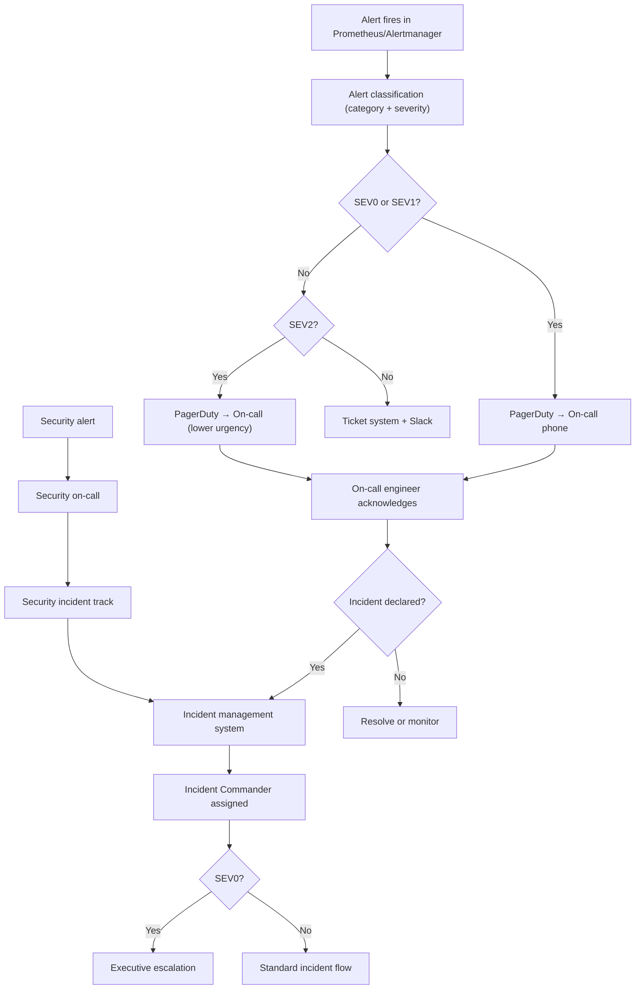

### 6.5 Alerting Rules

- Every paging alert MUST have a linked runbook URL in the alert annotations.
- Every alert description MUST state what is broken and what immediate action is required.
- Alerts MUST be actionable. An alert that requires no action MUST be converted to informational or removed.
- Alert fatigue is an SRE failure. Noisy alerts MUST be tuned within 2 business days of identification.
- Alert rules MUST be version-controlled and reviewed before production deployment.
- Alert silences MUST be time-bounded and MUST include a justification.
- A silence on a paging alert MUST be approved by the on-call lead.

---

## 7. Incident Management System

### 7.1 Incident Lifecycle State Machine

```mermaid
stateDiagram-v2
    [*] --> Detected: Alert fires or manual detection
    Detected --> Triage: On-call acknowledges
    Triage --> Declared: Severity assessed; incident created
    Triage --> Resolved: Non-incident; alert dismissed
    Declared --> CommandEstablished: Incident Commander assigned
    CommandEstablished --> MitigationInProgress: Mitigation actions begun
    MitigationInProgress --> Stabilized: Active harm stopped; system degraded but stable
    MitigationInProgress --> Resolved: Full resolution achieved without separate stabilization
    Stabilized --> RecoveryInProgress: Root cause remediation underway
    RecoveryInProgress --> Resolved: Full service restored
    Resolved --> Monitoring: 30-min (SEV2/3) or 2h (SEV0/1) observation period
    Monitoring --> Resolved: Recurrence detected
    Monitoring --> PostmortemScheduled: Observation period complete; postmortem required
    Monitoring --> Closed: Observation period complete; no postmortem required
    PostmortemScheduled --> PostmortemCompleted: Postmortem published
    PostmortemCompleted --> ActionItemsTracked: Action items assigned and tracked
    ActionItemsTracked --> Closed: All action items resolved or accepted
```

### 7.2 Incident Roles

| Role | Responsibility | Required for | Authority |
|---|---|---|---|
| **Incident Commander** | Single accountable owner; coordinates response; makes final decisions on mitigation and communication | SEV0, SEV1; recommended SEV2 | Final authority on all incident decisions |
| **Technical Lead** | Drives technical diagnosis and mitigation; owns runbook execution | All SEV0/1 | Proposes technical actions; IC approves irreversible ones |
| **Communications Lead** | Manages all external and internal communications; maintains incident timeline | SEV0, SEV1 | Controls all customer-facing messaging |
| **Scribe** | Maintains the incident timeline; records all decisions, actions, and timestamps | SEV0, SEV1 | Records; does not decide |
| **Security Lead** | Leads security-specific investigation and containment when incident has security dimension | Credential exposure, sandbox escape, cross-tenant exposure, governance bypass | Authority on security containment actions |
| **Tenant Liaison** | Coordinates tenant-specific communication and impact assessment for enterprise tenants | When enterprise tenant is affected | Tenant communication authority |
| **Executive Liaison** | Provides executive awareness and approves extraordinary measures | SEV0; SEV1 with significant business impact | Authority to approve extraordinary recovery measures |

### 7.3 Communication Rules

- The Incident Commander has the authority to declare and close incidents.
- Severity escalation: any responder may escalate severity; only the IC may downgrade.
- Severity downgrade MUST be recorded with justification in the incident timeline.
- All technical actions MUST be announced in the incident channel before execution.
- All commands executed on production MUST be pasted into the incident channel by the Scribe.
- The Communications Lead owns all external communication; no one else may communicate incident status externally.
- Status page updates MUST match the actual assessed impact; speculation is FORBIDDEN.
- Tenant data MUST NOT appear in incident channels. Reference tenant_id only; never tenant content.

### 7.4 Evidence Preservation Rules During Incidents

- Do NOT delete logs during an incident, even to reduce noise.
- Do NOT modify audit records for any reason.
- Do NOT execute replay investigations in the production environment.
- All commands executed during incident response MUST be captured in the Scribe's timeline.
- When a security incident is suspected, engage the Security Lead before making any changes.
- Preserve pre-mitigation state where possible (take snapshots before draining, restarting, or scaling).

---

## 8. Incident Severity Classification

### 8.1 Severity Matrix

| Condition | SEV0 | SEV1 | SEV2 | SEV3 |
|---|---|---|---|---|
| Complete API unavailability | ✓ | | | |
| Complete workflow runtime unavailability | ✓ | | | |
| Audit event loss (any) | ✓ | | | |
| Cross-tenant data confirmed exposed | ✓ | | | |
| Production credential confirmed exposed | ✓ | | | |
| Governance bypass with unauthorized execution | ✓ | | | |
| Data corruption confirmed (any tenant) | ✓ | | | |
| Replay environment reaching production systems | | ✓ | | |
| Tenant boundary violation detected | | ✓ | | |
| PostgreSQL primary failure (failover in progress) | | ✓ | | |
| Temporal cluster degradation (>20% workflow failure) | | ✓ | | |
| Policy engine complete outage | | ✓ | | |
| Deployment rollback failure | | ✓ | | |
| >25% of tenants affected by service degradation | | ✓ | | |
| Data residency violation | | ✓ | | |
| Worker pool saturation (>90%, all tenants impacted) | | | ✓ | |
| Single tenant service outage | | | ✓ | |
| DLQ overflow (event loss possible) | | | ✓ | |
| Model provider complete outage | | | ✓ | |
| Redis Sentinel failover in progress | | | ✓ | |
| Event broker degraded (< 5% message loss) | | | ✓ | |
| Tool runtime runaway (bounded to one tenant) | | | ✓ | |
| Artifact storage degraded | | | ✓ | |
| Approval engine outage | | | ✓ | |
| PostgreSQL replication lag > 30s | | | | ✓ |
| API p99 latency > 3x SLO threshold | | | | ✓ |
| Worker pool at 70–90% capacity | | | | ✓ |
| Single worker crash (auto-recovered) | | | | ✓ |
| Observability pipeline degraded | | | | ✓ |
| Slow query / index degradation | | | | ✓ |

### 8.2 MYCELIA-Specific Severity Considerations

**Audit event loss:** Any loss of audit event data is SEV0 regardless of quantity. Audit records are the legal and compliance evidence of governed execution. The loss of even a single audit event is a compliance-level incident.

**Cross-tenant exposure:** Any confirmed exposure of one tenant's data to another tenant is SEV0. This is not an availability incident — it is a trust and compliance incident. Normal SLO policies do not apply. Incident timeline is preserved as legal evidence.

**Replay contamination:** A replay execution that reaches production credentials, production event streams, or production endpoints has bypassed the replay isolation guarantee. This is SEV1 minimum. If production state was mutated, it escalates to SEV0.

**Governance bypass:** An execution that bypassed policy evaluation or approval gates without a valid break-glass authorization is a SEV0/SEV1 governance failure, not a performance incident.

**Event broker corruption:** Corruption of the event lineage is an architectural integrity failure. It threatens replay accuracy, audit completeness, and eventual consistency guarantees.

---

## 9. Operational Evidence & Forensic Preservation

### 9.1 EvidenceBundle Requirements

For every SEV0 and SEV1 incident, an EvidenceBundle MUST be assembled and preserved. The EvidenceBundle is an append-only artifact that survives incident closure.

```json
{
  "evidence_bundle_id": "eb-20260515-001",
  "incident_id": "INC-2026-0042",
  "severity": "SEV1",
  "assembled_by": "scribe@mycelia.internal",
  "assembled_at": "2026-05-15T16:30:00Z",
  "incident_period": {
    "detected_at": "2026-05-15T14:22:00Z",
    "resolved_at": "2026-05-15T16:15:00Z"
  },
  "affected_tenants": ["tenant-abc123", "tenant-def456"],
  "deployment_version": "v2026.05.14-3",
  "artifact_digest": "sha256:abc123...",
  "trace_ids": ["4bf92f3577b34da6a3ce929d0e0e4736"],
  "run_ids": ["run-pqr678", "run-xyz901"],
  "workflow_ids": ["wf-mno345"],
  "event_ranges": [
    { "stream": "mycelia:workflow:events", "from": "1715781720000-0", "to": "1715788800000-0" }
  ],
  "log_archives": ["s3://evidence/INC-2026-0042/logs/"],
  "metrics_snapshots": ["s3://evidence/INC-2026-0042/metrics/"],
  "policy_snapshot_ids": ["policy-snap-123"],
  "approval_ids": [],
  "replay_records": [],
  "database_snapshots": [],
  "operator_actions": [
    { "actor": "sre@mycelia.internal", "action": "restarted worker pool", "timestamp": "2026-05-15T14:45:00Z", "justification": "saturated pool, auto-scale not triggered" }
  ],
  "communication_timeline": [
    { "type": "status_page", "content": "Investigating elevated latency", "timestamp": "2026-05-15T14:35:00Z" }
  ]
}
```

### 9.2 Evidence Collection Workflow

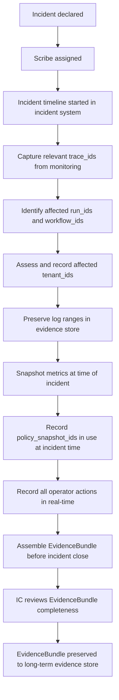

### 9.3 Forensic Preservation Rules

- Evidence MUST be preserved before any mitigation action that could alter the affected state.
- Audit records MUST NOT be deleted, modified, or suppressed during incident response.
- Log ranges MUST be preserved even if the logs are noisy or large.
- Database snapshots SHOULD be taken before restore or repair operations.
- The EvidenceBundle MUST be completed and preserved BEFORE the incident is closed.
- EvidenceBundle content MUST NOT include raw tenant data. Reference by ID only.
- EvidenceBundle is subject to the same data retention policies as audit records.
- For security incidents with legal implications, the Security Lead determines evidence hold requirements.

### 9.4 Evidence Chain of Custody

Incident evidence MUST maintain chain of custody from collection to archival.

Evidence is not merely attached to an incident. It is a governed artifact with access controls, integrity verification and custody records.

### Chain of Custody Fields

Every EvidenceBundle MUST include:

- evidence_bundle_id;
- incident_id;
- collected_by;
- collected_at;
- collection_source;
- storage_location;
- artifact_hash;
- access_policy;
- legal_hold_status;
- retention_policy_id;
- custody_events;
- integrity_check_result.

### Custody Event Types

| Event | Meaning |
|---|---|
| EvidenceCollected | Evidence was captured from source system |
| EvidenceHashed | Integrity hash was computed |
| EvidenceStored | Evidence was stored in evidence repository |
| EvidenceAccessed | Evidence was viewed or downloaded |
| EvidenceExported | Evidence was exported for legal/compliance review |
| EvidenceLegalHoldApplied | Evidence is under legal hold |
| EvidenceIntegrityVerified | Hash was revalidated successfully |
| EvidenceIntegrityFailed | Hash mismatch detected |

### Rules

- Evidence artifacts MUST be hashed before long-term storage.
- Evidence access MUST be audited.
- Evidence under legal hold MUST NOT be deleted even if retention period expires.
- EvidenceBundle access MUST be restricted to incident responders, security, legal and authorized auditors.
- Evidence export MUST preserve artifact hashes and custody metadata.
- EvidenceBundle MUST NOT include raw tenant data unless legally required and explicitly classified.

### Forbidden Behavior

FORBIDDEN:

- downloading evidence to unmanaged personal devices;
- storing evidence in chat tools;
- altering evidence artifacts after collection;
- sharing evidence outside approved incident/security/legal channels;
- deleting evidence before retention expiration;
- omitting custody records for SEV0/SEV1 incidents.

---

## 10. Operational Recovery Model

### 10.1 Recovery Classes

| Recovery Class | When Used | Who Can Trigger | Required Approval | Telemetry Emitted | Audit Record | Rollback Implication | Tenant Communication |
|---|---|---|---|---|---|---|---|
| Automatic retry | Transient errors; within retry budget | Runtime automatically | None | ToolExecutionRetried, WorkflowStepRetried | Yes (runtime-generated) | N/A | No |
| Automatic failover | Database primary failure; Sentinel trigger | Runtime / HA manager | None (pre-approved by architecture) | FailoverStarted, FailoverCompleted | Yes | Failback required after stability | Only if visible impact |
| Manual mitigation | Immediate harm reduction (rate limit, rollback, queue drain) | On-call SRE | IC approval for irreversible | MitigationActionApplied | Yes | May require follow-on remediation | If customer-impacting |
| Rollback | Bad deployment regression | On-call SRE + IC | IC approval | RollbackStarted, RollbackCompleted | Yes | Forward fix needed | If customer-impacting |
| Restore | Data loss or corruption requiring backup restore | On-call SRE + Data team | IC + Data Lead approval | RestoreStarted, RestoreCompleted | Yes | Pre-restore snapshot required | Required |
| Replay investigation | Workflow forensics; policy validation; postmortem evidence | SRE / Platform team | IC approval | ReplayInvestigationStarted | Yes (replay-isolated) | No production state change | No |
| Tenant quarantine | Tenant activity causing platform instability or suspected breach | IC | IC + Security Lead | TenantQuarantined | Yes | Must be communicated to tenant | Required immediately |
| Tool quarantine | Tool producing runaway behavior, compromise, or policy violations | IC + Security Lead | IC | ToolKillSwitchActivated | Yes | Affected workflows fail | If enterprise tenant affected |
| Credential revocation | Credential exposure or compromise suspected | Security Lead | Security Lead | CredentialRevoked | Yes | Workers lose credential access | Required if tenant credential |
| Deployment freeze | Active SEV0/1 incident; excessive error budget consumption | IC | IC | DeploymentFreezeActivated | Yes | No new deployments until lifted | No |
| Degraded mode | Non-critical component outage; graceful capability reduction | On-call SRE | IC notification | DegradedModeActivated | Yes | Service-specific | If customer-facing capability reduced |
| DR activation | Complete regional failure; unrecoverable primary | IC + Executive | Executive + IC | DRActivationStarted | Yes | Full DR runbook (RB-030) | Required — all tenants |

### 10.2 Recovery Decision Tree

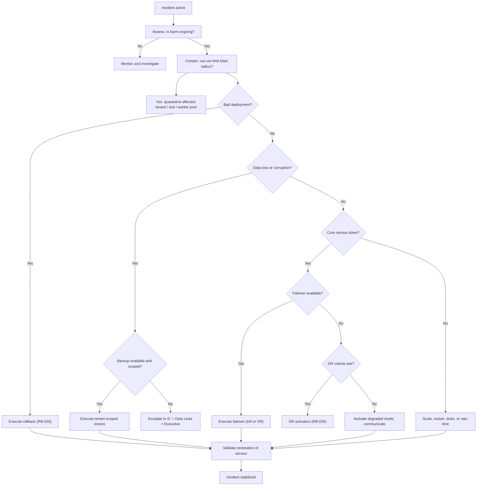
### 10.3 Degraded Mode Contracts

MYCELIA MUST define explicit degraded mode contracts for critical capabilities.

Degraded mode is not improvisation. It is a controlled operational state where selected capabilities are disabled, reduced or queued while core runtime guarantees remain intact.

### Degraded Mode Matrix

| Dependency / Capability | Degraded Mode | Allowed Behavior | Forbidden Behavior |
|---|---|---|---|
| Model Provider | Fallback model or queue execution | Continue low-risk workflows if fallback approved | Silently switching to unapproved model |
| Policy Engine | Fail closed | Block governed execution | Fail open |
| Approval Engine | Pause approval-gated workflows | Queue approval requests | Auto-approve |
| Observability Pipeline | Local buffer + direct log query | Continue if audit pipeline intact | Drop critical audit telemetry |
| Audit Pipeline | No degraded mode | Declare SEV0 | Continue governed execution silently |
| PostgreSQL Read Replica | Route reads to primary if safe | Reduce analytics/read-heavy workload | Serve stale authoritative state |
| Redis/Event Broker | Bounded buffering | Pause event-heavy workflows | Drop events |
| Object Storage | Artifact-required operations blocked | Queue artifact writes if durable buffer exists | Complete artifact-required runs without artifact |
| Vault / Secret Manager | Use valid existing leases only | Block new credential leases | Issue unmanaged credentials |
| Replay Environment | Disable replay | Preserve original lineage | Replay using production credentials |

### Degraded Mode Record

Every degraded mode activation MUST create a DegradedModeRecord containing:

- degraded_mode_id;
- incident_id;
- affected_component;
- affected_capabilities;
- affected_tenants;
- activation_reason;
- activated_by;
- started_at;
- expected_behavior;
- blocked_behavior;
- tenant_communication_required;
- exit_criteria.

### Rules

- Degraded mode MUST be visible in dashboards.
- Degraded mode MUST be linked to an incident or maintenance window.
- Degraded mode MUST have explicit exit criteria.
- Degraded mode MUST NOT weaken tenant isolation, auditability or governance enforcement.
- Degraded mode for policy, approval, audit or security systems MUST prefer fail-closed behavior.

### Forbidden Behavior

FORBIDDEN:

- silent degraded mode;
- degraded mode without incident linkage;
- degraded mode that bypasses approval gates;
- degraded mode that drops audit events;
- degraded mode that enables cross-tenant access;
- degraded mode with no defined exit criteria.

### 10.4 Safe Auto-Remediation Guardrails

MYCELIA MAY automate low-risk recovery actions, but auto-remediation MUST be bounded, observable and reversible.

Automation is allowed only when the blast radius is understood and the action cannot violate runtime guarantees.

### Auto-Remediation Classes

| Class | Example | Allowed Automatically | Requires Human Approval |
|---|---|---:|---:|
| Stateless restart | Restart crashed API pod | Yes | No |
| Worker scale-out | Increase worker replicas within quota | Yes | No |
| Queue pause | Pause low-priority consumer group | Conditional | Sometimes |
| Tool kill switch | Disable unsafe tool | No | Yes |
| Tenant quarantine | Isolate tenant workload | No | Yes |
| Database failover | HA-managed failover | Yes if pre-approved | Manual failover requires approval |
| PITR restore | Restore database | No | Yes |
| Credential revocation | Revoke exposed secret | Conditional for confirmed exposure | Security Lead required |
| Policy bundle rollback | Revert broken policy bundle | Conditional | IC if incident active |
| DR activation | Regional failover | No | Executive approval |

### Auto-Remediation Requirements

Every automated remediation MUST define:

- trigger condition;
- maximum frequency;
- cooldown period;
- blast radius;
- rollback behavior;
- audit event emitted;
- owner;
- disable switch;
- escalation condition.

### Rules

- Auto-remediation MUST emit an audit event before and after action.
- Auto-remediation MUST be idempotent where possible.
- Auto-remediation MUST have bounded retry behavior.
- Auto-remediation MUST NOT perform destructive data operations.
- Auto-remediation MUST NOT bypass approval gates.
- Auto-remediation MUST NOT modify audit or event lineage.
- Auto-remediation MUST stop and escalate if the same action repeats more than the allowed threshold.

### Forbidden Behavior

FORBIDDEN:

- autonomous restore;
- autonomous tenant data mutation;
- autonomous approval of governance decisions;
- autonomous deletion of queues, logs or audit records;
- infinite auto-remediation loops;
- auto-remediation without owner;
- auto-remediation that masks incidents without creating incident records.

---

## 11. Runbook Architecture

### 11.1 Runbook Format

Every runbook MUST follow this canonical structure. Runbooks are executable operational contracts, not advice. They MUST be complete enough to execute under time pressure without requiring judgment calls that are not explicitly guided.

```markdown
# RB-NNN: [Title]

**Runbook ID:** RB-NNN
**Severity Applicability:** SEV0 / SEV1 / SEV2 / SEV3
**Owning Team:** Platform / Data / Security
**Last Reviewed:** YYYY-MM-DD
**Linked Alerts:** [Alert names]
**Linked SLOs:** [SLO names]

---

## Prerequisites
- Required permissions / roles
- Required tool access (kubectl, psql, vault, temporal-cli, etc.)
- Dependencies that must be healthy before proceeding

## Detection Signals
- Alert conditions that trigger this runbook
- Dashboard panels to check
- PromQL queries to assess severity

## Immediate Triage Steps
1. [Concrete action with command or verification step]
2. ...

## Mitigation Steps
1. [Concrete action — mark DANGEROUS steps clearly]
2. ...

## Recovery Steps
1. [Steps to full restoration]

## Validation Steps
- [How to verify the system is restored]
- [PromQL or command to confirm resolution]

## Rollback Steps
- [Steps to undo the mitigation if it makes things worse]

## Tenant Impact Steps
- Assess affected tenants
- Update TenantImpactAssessment
- Trigger communication if required

## Communication Steps
- Status page update text
- Tenant notification trigger conditions

## Audit Events to Verify
- [Events that MUST have been emitted by this point]

## Escalation Criteria
- Escalate to [role] if [condition]

## Postmortem Requirements
- Required if [condition]

## Known Risks
- [Risks specific to this runbook's actions]

## Forbidden Actions
- [MUST NOT do during this runbook]
```
### 11.2 Runbook Certification & Drift Control

Runbooks MUST be treated as operational contracts and periodically certified.

A runbook that has not been tested against the current production architecture may be more dangerous than no runbook.

### Runbook Certification Levels

| Level | Meaning | Allowed Use |
|---|---|---|
| Draft | Written but not reviewed | Not valid for production incident response |
| Reviewed | Reviewed by owning team | May support SEV3/SEV4 |
| Staging-Tested | Executed successfully in staging | May support SEV2 |
| Production-Validated | Executed safely in production or GameDay | May support SEV1 |
| Critical-Certified | Validated for SEV0/critical path | Required for SEV0 runbooks |

### Certification Requirements

Every production runbook MUST track:

- runbook_id;
- owner;
- last_reviewed_at;
- last_tested_at;
- tested_environment;
- certification_level;
- linked_alerts;
- linked_dashboards;
- linked_services;
- required_permissions;
- known_drift_risks.

### Drift Signals

A runbook MUST be reviewed when:

- service topology changes;
- Kubernetes namespace changes;
- database schema changes;
- tool/runtime contract changes;
- alert query changes;
- dashboard panel changes;
- dependency changes;
- incident reveals ambiguity in the runbook;
- command fails during GameDay or incident.

### Rules

- SEV0 runbooks MUST be Critical-Certified.
- SEV1 runbooks SHOULD be Production-Validated.
- Any runbook older than 12 months without review becomes stale.
- Stale runbooks MUST NOT be linked to paging alerts without exception approval.
- Runbook certification MUST be part of Operational Readiness Review.

### Forbidden Behavior

FORBIDDEN:

- linking paging alerts to Draft runbooks;
- treating untested commands as production-safe;
- keeping obsolete commands in runbooks;
- using runbooks without owners;
- allowing critical runbooks to drift after infrastructure changes;
- closing a postmortem when it identifies runbook drift but no runbook update action exists.

---

## 12. Core Production Runbooks

### RB-001: API Latency Spike

**Runbook ID:** RB-001 | **Severity:** SEV2–SEV1 | **Owner:** Platform

**Symptoms:** p99 API latency > 3s; `api_latency_slo_burn_rate_fast` firing; customer reports of slow responses.

**Likely Causes:** Database connection pool exhaustion; slow query on critical path; upstream dependency latency (Temporal, Redis); GC pause; recent deployment introducing regression; traffic spike.

**Dashboards:** API health dashboard → Request latency panel; PostgreSQL dashboard → Active connections, slow queries; Temporal dashboard → Frontend service latency.

**Triage:**

```bash
# 1. Check current p99 latency
curl -G 'http://prometheus:9090/api/v1/query' \
  --data-urlencode 'query=histogram_quantile(0.99, rate(http_request_duration_seconds_bucket[5m]))'

# 2. Check API error rate
curl -G 'http://prometheus:9090/api/v1/query' \
  --data-urlencode 'query=sum(rate(http_requests_total{status=~"5.."}[5m])) / sum(rate(http_requests_total[5m]))'

# 3. Check for slow queries in PostgreSQL
kubectl exec -n mycelia-memory deploy/postgres-primary -- psql -U mycelia -c \
  "SELECT pid, now() - pg_stat_activity.query_start AS duration, query FROM pg_stat_activity WHERE state = 'active' AND (now() - query_start) > interval '5 seconds' ORDER BY duration DESC LIMIT 10;"

# 4. Check Temporal frontend latency
kubectl -n mycelia-execution logs deploy/temporal-frontend --tail=100 | grep -E 'latency|error'

# 5. Check recent deployment
kubectl -n mycelia-control rollout history deployment/mycelia-api
```

**Mitigation:**
1. If caused by slow query: identify query → check for missing index → consider EXPLAIN ANALYZE → do NOT add index on primary under load; schedule for replica first.
2. If connection pool exhausted: `kubectl rollout restart deployment/mycelia-api -n mycelia-control` to reset pool connections; scale replicas if needed.
3. If recent deployment is suspected: execute RB-020 (bad deployment rollback) if correlation confirmed.
4. If Temporal is contributing: check RB-006.

**Validation:**
```promql
histogram_quantile(0.99, rate(http_request_duration_seconds_bucket[5m])) < 0.5
```

**Forbidden Actions:** Do NOT add `EXPLAIN ANALYZE` on a table without a read replica during peak traffic (takes AccessShareLock). Do NOT restart the database primary under latency-only conditions.

**Escalation:** If latency > 10s or 5xx rate > 5% → escalate to SEV1.

---

### RB-002: API Partial Outage

**Runbook ID:** RB-002 | **Severity:** SEV1 | **Owner:** Platform

**Symptoms:** 5xx error rate > 5% sustained > 5 minutes; `api_availability_slo_burn_rate_fast` firing; customer reports of errors.

**Triage:**

```bash
# 1. Check error distribution by endpoint
kubectl -n mycelia-control logs deploy/mycelia-api --tail=500 | grep '"status":5' | jq '.path' | sort | uniq -c | sort -rn

# 2. Check pod health
kubectl -n mycelia-control get pods -l app=mycelia-api
kubectl -n mycelia-control describe pod <failing-pod>

# 3. Check downstream dependencies
curl -sf http://mycelia-api.mycelia-control.svc/health/ready || echo "API unhealthy"
kubectl -n mycelia-memory exec deploy/postgres-primary -- pg_isready -U mycelia
kubectl -n mycelia-events exec deploy/redis-master -- redis-cli ping
```

**Mitigation:**
1. If single pod: `kubectl -n mycelia-control delete pod <pod-name>` — pod will restart.
2. If OOMKilled: `kubectl -n mycelia-control rollout restart deployment/mycelia-api` and check memory limits.
3. If dependency failure: route to degraded mode; update status page.
4. If deployment-caused: execute RB-020.

**Tenant Impact:** All tenants using API are affected. Update TenantImpactAssessment immediately. Status page update REQUIRED within 15 minutes.

**Forbidden:** Do NOT exec into pods to patch running code. Do NOT modify database schema during API outage.

---

### RB-003: PostgreSQL Primary Failure

**Runbook ID:** RB-003 | **Severity:** SEV1 | **Owner:** Data

**Symptoms:** `postgres_up{role="primary"}` = 0; `postgres_availability_slo_burn` firing; workflows failing with connection errors; all services reporting database unavailable.

**Likely Causes:** OOM kill; kernel panic; disk full; network partition; hardware failure.

**Triage:**

```bash
# 1. Check primary status
kubectl -n mycelia-memory get pods -l role=primary
kubectl -n mycelia-memory describe pod <postgres-primary-pod>

# 2. Check CloudNativePG / Patroni cluster status
kubectl -n mycelia-memory get cluster mycelia-postgres -o jsonpath='{.status}'
# OR for Patroni:
kubectl -n mycelia-memory exec deploy/patroni -- patronictl list

# 3. Check replica status
kubectl -n mycelia-memory get pods -l role=replica

# 4. Check replication state on replica
kubectl -n mycelia-memory exec <replica-pod> -- psql -U mycelia -c "SELECT pg_is_in_recovery();"
```

**Mitigation — Automatic HA failover (preferred):**
1. CloudNativePG / Patroni should automatically promote a replica within 30–60 seconds.
2. Verify promotion: `kubectl -n mycelia-memory get cluster mycelia-postgres -o jsonpath='{.status.currentPrimary}'`
3. Verify application reconnection (connection pooler should re-route automatically).
4. Verify write operations restored: `kubectl -n mycelia-memory exec <new-primary> -- psql -U mycelia -c "SELECT pg_current_wal_lsn();"`.

**Mitigation — Manual promotion (if HA automation fails):**

⚠️ **DANGEROUS — IC APPROVAL REQUIRED**

```bash
# Only if automatic promotion has not occurred after 90 seconds
kubectl -n mycelia-memory exec <replica-pod> -- patronictl failover mycelia-postgres --master <failed-pod-name> --candidate <replica-pod-name> --force
```

**Recovery:**
1. Once new primary confirmed: restart application pods to refresh connection pools.
2. Investigate original primary: check disk, OOM score, kubelet logs.
3. If primary can be recovered: rejoin as replica; do NOT promote back immediately.

**Tenant Impact:** All tenants. SEV1 declaration required. Status page update required. Tenant notification if outage > 5 minutes.

**Audit Events to Verify:** `PostgreSQLPrimaryFailed`, `PostgreSQLFailoverCompleted`.

**Forbidden:** Do NOT manually edit PostgreSQL data files. Do NOT promote two replicas simultaneously. Do NOT restart the failed primary as primary without rejoining as replica first.

---

### RB-004: PostgreSQL Replication Lag

**Runbook ID:** RB-004 | **Severity:** SEV3–SEV2 | **Owner:** Data

**Symptoms:** `pg_replication_lag_seconds > 30`; replica reads returning stale data; backup jobs completing slowly.

**Triage:**

```bash
# Check replication lag
kubectl -n mycelia-memory exec <replica-pod> -- psql -U mycelia -c \
  "SELECT now() - pg_last_xact_replay_timestamp() AS replication_delay;"

# Check for long-running transactions on primary blocking WAL replay
kubectl -n mycelia-memory exec <primary-pod> -- psql -U mycelia -c \
  "SELECT pid, now() - xact_start AS duration, state, query FROM pg_stat_activity WHERE state != 'idle' ORDER BY duration DESC LIMIT 5;"

# Check network bandwidth between primary and replica
kubectl -n mycelia-memory exec <primary-pod> -- psql -U mycelia -c \
  "SELECT client_addr, state, sent_lsn, write_lsn, flush_lsn, replay_lsn, (sent_lsn - replay_lsn) AS replication_lag FROM pg_stat_replication;"
```

**Mitigation:**
1. If caused by long-running transaction on primary: identify and coordinate with owning team to terminate if safe.
2. If network saturation: reduce `wal_sender_timeout` temporarily; investigate network path.
3. If replica is I/O bound: check disk performance; consider adjusting `recovery_min_apply_delay`.

**Validation:** Lag < 5 seconds sustained for 10 minutes.

**Forbidden:** Do NOT terminate replication for lag alone. Do NOT run heavy migrations during high-lag period.

---

### RB-005: PostgreSQL Point-in-Time Restore

**Runbook ID:** RB-005 | **Severity:** SEV0–SEV1 | **Owner:** Data | **IRREVERSIBLE — IC + DATA LEAD + EXECUTIVE APPROVAL REQUIRED**

**Symptoms:** Data corruption confirmed; accidental destructive query executed; migration disaster; confirmed data loss.

**Prerequisites:**
- IC approval obtained and recorded in incident timeline.
- Data Lead approval obtained.
- Executive notification complete.
- Target restore timestamp identified (just before corruption event).
- Tenant scope of restore identified and validated.
- RecoverySnapshot of current state taken.

**Triage — Before proceeding:**

```bash
# 1. Confirm the corruption scope
kubectl -n mycelia-memory exec <primary-pod> -- psql -U mycelia -c \
  "SELECT count(*), max(created_at) FROM workflow_runs WHERE tenant_id = '<affected_tenant_id>';"

# 2. Identify the target restore timestamp from audit log
# Query audit store for the last confirmed-valid event timestamp

# 3. Verify backup availability
# For CloudNativePG:
kubectl -n mycelia-memory get backup -l cnpg.io/cluster=mycelia-postgres
```

**Restore Procedure (CloudNativePG):**

⚠️ **DANGEROUS — IRREVERSIBLE WITHOUT ADDITIONAL BACKUP**

```yaml
# Create recovery cluster targeting specific point in time
apiVersion: postgresql.cnpg.io/v1
kind: Cluster
metadata:
  name: mycelia-postgres-pitr-recovery
  namespace: mycelia-memory
spec:
  instances: 1
  bootstrap:
    recovery:
      source: mycelia-postgres
      recoveryTarget:
        targetTime: "2026-05-15T14:20:00Z"  # just before corruption
  externalClusters:
    - name: mycelia-postgres
      barmanObjectStore:
        serverName: mycelia-postgres
        destinationPath: s3://mycelia-backups/postgres/
        s3Credentials: ...
```

```bash
# Apply recovery cluster
kubectl apply -f recovery-cluster.yaml

# Monitor recovery progress
kubectl -n mycelia-memory logs <recovery-pod> -f | grep -E 'recovery|restored|error'

# Verify recovered data BEFORE promoting
kubectl -n mycelia-memory exec <recovery-pod> -- psql -U mycelia -c \
  "SELECT count(*) FROM workflow_runs WHERE tenant_id = '<affected_tenant_id>' AND created_at < '2026-05-15T14:20:00Z';"
```

**Tenant Scope Validation (CRITICAL):**

```bash
# Verify restored data belongs only to the affected tenant
kubectl -n mycelia-memory exec <recovery-pod> -- psql -U mycelia -c \
  "SELECT DISTINCT tenant_id FROM workflow_runs LIMIT 10;"
# Must NOT contain tenant_ids outside the affected set
```

**Recovery:**
1. Validate data completeness and tenant scope on recovery cluster.
2. IC confirms validation is satisfactory.
3. Switch application connections to recovery cluster.
4. Decommission corrupted primary.
5. Rebuild replica.

**Audit Events:** `RestoreStarted`, `RestoreCompleted`, `TenantDataRestored`.

**Tenant Communication:** REQUIRED. All affected tenants must be notified with timeline and data impact assessment.

**Forbidden:** Do NOT execute PITR without tenant scope validation. Do NOT restore one tenant's backup into another tenant's namespace. Do NOT discard the corrupted state before EvidenceBundle is complete.

---

### RB-006: Temporal Cluster Degradation

**Runbook ID:** RB-006 | **Severity:** SEV1 | **Owner:** Platform

**Symptoms:** Workflow completion rate dropping; `temporal_service_requests_failed` rising; history service errors; frontend service unreachable.

**Triage:**

```bash
# 1. Check Temporal service pod health
kubectl -n mycelia-execution get pods -l app.kubernetes.io/name=temporal

# 2. Check Temporal frontend health
kubectl -n mycelia-execution exec deploy/temporal-admin-tools -- \
  temporal operator cluster health

# 3. Check Temporal namespace status
kubectl -n mycelia-execution exec deploy/temporal-admin-tools -- \
  temporal operator namespace list

# 4. Check workflow failure rate
kubectl -n mycelia-execution exec deploy/temporal-admin-tools -- \
  temporal workflow list --status failed --count 20

# 5. Check history service: most critical Temporal component
kubectl -n mycelia-execution logs deploy/temporal-history --tail=100 | grep -E 'error|panic|fatal'
```

**Mitigation:**
1. If single service pod crashed: `kubectl -n mycelia-execution rollout restart deployment/temporal-<service>`.
2. If persistence (PostgreSQL) is unavailable: execute RB-003 first; Temporal cannot recover without persistence.
3. If history service is unavailable: all in-flight workflows are blocked. DO NOT restart other Temporal services until history service is stable.
4. If matching service degraded: task dispatch will slow but workflows won't lose state.

**Recovery:**
1. Restore Temporal service health.
2. Verify in-flight workflow recovery:

```bash
kubectl -n mycelia-execution exec deploy/temporal-admin-tools -- \
  temporal workflow list --status running --count 20
```

3. If workflows are stuck in limbo after recovery: they will auto-resume once Temporal is healthy (replay from event history). Do NOT manually terminate unless directed.

**Tenant Impact:** All tenants with active workflows. SEV1 required.

**Forbidden:** Do NOT manually modify Temporal's PostgreSQL tables. Do NOT delete workflow histories.

---

### RB-007: Temporal Task Queue Backlog

**Runbook ID:** RB-007 | **Severity:** SEV2–SEV3 | **Owner:** Platform

**Symptoms:** `temporal_task_queue_size > 1000`; worker task pickup latency SLO burn; workflow activities delayed.

**Triage:**

```bash
# 1. Check task queue depth
kubectl -n mycelia-execution exec deploy/temporal-admin-tools -- \
  temporal task-queue describe --task-queue mycelia-standard-queue --task-queue-type workflow

kubectl -n mycelia-execution exec deploy/temporal-admin-tools -- \
  temporal task-queue describe --task-queue mycelia-standard-queue --task-queue-type activity

# 2. Check worker count
kubectl -n mycelia-execution get pods -l app=mycelia-worker --field-selector=status.phase=Running | wc -l

# 3. Check KEDA ScaledObject status
kubectl -n mycelia-execution get scaledobject mycelia-worker-scaler -o yaml | grep -A 5 conditions
```

**Mitigation:**
1. Manually scale workers:

```bash
kubectl -n mycelia-execution scale deployment mycelia-worker --replicas=20
```

2. If KEDA is not scaling: check KEDA controller logs and ScaledObject configuration.
3. If backlog is caused by slow activities (model provider latency): check RB-015; activities will eventually complete or timeout.

**Recovery:** Remove manual replica override once KEDA resumes. Validate queue depth returning to < 100.

---

### RB-008: Worker Pool Saturation

**Runbook ID:** RB-008 | **Severity:** SEV2 | **Owner:** Platform

**Symptoms:** Worker CPU/memory at >90%; tool execution p95 latency >5x normal; queue backlog growing faster than workers can drain.

**Triage:**

```bash
# 1. Check worker resource utilization
kubectl -n mycelia-execution top pods -l app=mycelia-worker | sort -k3 -rn

# 2. Check which tools are consuming workers
kubectl -n mycelia-execution logs -l app=mycelia-worker --tail=200 | grep '"tool_id"' | jq '.tool_id' | sort | uniq -c | sort -rn

# 3. Check for runaway tool executions
kubectl -n mycelia-execution logs -l app=mycelia-worker --tail=200 | grep '"duration_ms":[0-9]\{5,\}'
```

**Mitigation:**
1. Scale worker pool: `kubectl -n mycelia-execution scale deployment mycelia-worker --replicas=30`
2. If specific tool is consuming all workers: execute RB-029 (tool kill switch) for that tool.
3. Apply per-tenant rate limiting via API gateway if single tenant is causing saturation.

**Tenant Impact:** Elevated tool execution latency for all tenants.

**Forbidden:** Do NOT drain all workers while tasks are in flight.

---

### RB-009: Tool Runtime Runaway Execution

**Runbook ID:** RB-009 | **Severity:** SEV2–SEV1 | **Owner:** Platform

**Symptoms:** Specific tool consuming >50% of worker pool; sandbox resource exhaustion; tool execution never completing (heartbeat missing); external API rate limit being triggered by MYCELIA.

**Triage:**

```bash
# 1. Identify runaway tool
kubectl -n mycelia-execution logs -l app=mycelia-worker --tail=500 | \
  jq -r 'select(.duration_ms > 60000) | .tool_id' | sort | uniq -c

# 2. Check external API call volume
kubectl -n mycelia-execution logs -l app=mycelia-worker --tail=500 | \
  grep 'egress' | jq '.target_host' | sort | uniq -c

# 3. Check for missing heartbeats
kubectl exec -n mycelia-execution deploy/mycelia-api -- \
  psql -U mycelia -c "SELECT invocation_id, tool_id, last_heartbeat_at, now()-last_heartbeat_at AS lag FROM tool_invocations WHERE status='running' AND (now()-last_heartbeat_at) > interval '2 minutes';"
```

**Mitigation:**
1. Kill specific runaway execution if identified:

```bash
kubectl -n mycelia-execution exec deploy/mycelia-api -- \
  python -c "from mycelia.tools import runtime; runtime.cancel_invocation('inv-abc123')"
```

2. If tool class is broadly runaway: execute RB-029 (tool kill switch).

**Forbidden:** Do NOT force-delete worker pods without recording in-flight invocation IDs.

---

### RB-010: Event Broker Outage

**Runbook ID:** RB-010 | **Severity:** SEV1 | **Owner:** Platform

**Symptoms:** `redis_up` = 0; `event_delivery_slo_burn` critical; workflow event processing stopped; workers not receiving tasks.

**Triage:**

```bash
# 1. Check Redis pod status
kubectl -n mycelia-events get pods -l app=redis

# 2. Check Redis Sentinel status
kubectl -n mycelia-events exec redis-sentinel-0 -- redis-cli -p 26379 sentinel masters

# 3. Check if Redis is reachable
kubectl -n mycelia-events exec redis-master-0 -- redis-cli ping

# 4. Check Redis memory
kubectl -n mycelia-events exec redis-master-0 -- redis-cli info memory | grep used_memory_human
```

**Mitigation:**
1. If Redis OOMKilled: execute RB-012 (Redis memory exhaustion).
2. If network partition: check NetworkPolicy and node networking.
3. If Sentinel has not promoted: `kubectl -n mycelia-events exec redis-sentinel-0 -- redis-cli -p 26379 sentinel failover mycelia-redis`

⚠️ **DANGEROUS — Only if Sentinel has not automatically promoted after 60s**

**Recovery:** Verify event processing resumes; check DLQ for backlogged events that may need replay.

---

### RB-011: DLQ Growth / Poison Event

**Runbook ID:** RB-011 | **Severity:** SEV2 | **Owner:** Platform

**Symptoms:** `dlq_depth > 1000`; events failing to process repeatedly; specific consumer group stuck.

**Triage:**

```bash
# 1. Check DLQ depth per tenant
kubectl -n mycelia-events exec redis-master-0 -- \
  redis-cli XLEN "mycelia:dlq:workflow:events"

# 2. Sample a DLQ entry to identify the poison event
kubectl -n mycelia-events exec redis-master-0 -- \
  redis-cli XRANGE "mycelia:dlq:workflow:events" - + COUNT 5

# 3. Check consumer group status
kubectl -n mycelia-events exec redis-master-0 -- \
  redis-cli XINFO GROUPS "mycelia:workflow:events"
```

**Mitigation:**
1. If poison event identified: quarantine the event ID; move to manual review queue.
2. If consumer is crashing on all events: identify consumer version and execute RB-020 if deployment-caused.
3. Resume consumer after poison event removed.

**Forbidden:** Do NOT delete DLQ events without preserving them to evidence store. DLQ events contain append-only event lineage.

---

### RB-012: Redis Memory Exhaustion

**Runbook ID:** RB-012 | **Severity:** SEV2–SEV1 | **Owner:** Platform

**Symptoms:** `redis_memory_usage_ratio > 0.90`; Redis `OOM command not allowed`; events failing to publish.

**Triage:**

```bash
# Check memory breakdown
kubectl -n mycelia-events exec redis-master-0 -- redis-cli info memory

# Check key distribution
kubectl -n mycelia-events exec redis-master-0 -- redis-cli --bigkeys

# Check stream sizes
kubectl -n mycelia-events exec redis-master-0 -- redis-cli XLEN "mycelia:workflow:events"
```

**Mitigation:**
1. Trim overgrown streams (only if retention policy permits):

```bash
# Check retention policy before executing
kubectl -n mycelia-events exec redis-master-0 -- \
  redis-cli XTRIM "mycelia:workflow:events" MAXLEN ~ 1000000
```

⚠️ **Trimming event streams deletes event lineage. REQUIRES IC approval. Verify events are already persisted to durable store.**

2. If memory pressure is caused by session/cache keys: evaluate expiry policy.
3. Scale Redis memory limit in StatefulSet if node capacity allows.

---

### RB-013: Vault / Secret Manager Outage

**Runbook ID:** RB-013 | **Severity:** SEV1 | **Owner:** Security

**Symptoms:** `vault_up` = 0; `CredentialLeaseDenied` events spiking; all tool executions failing with lease errors; Vault health endpoint returning non-200.

**Triage:**

```bash
# 1. Check Vault pod status
kubectl -n mycelia-security get pods -l app=vault

# 2. Check Vault seal status
kubectl -n mycelia-security exec vault-0 -- vault status

# 3. Check Vault HA cluster status
kubectl -n mycelia-security exec vault-0 -- vault operator raft list-peers
```

**Mitigation:**
1. If Vault is sealed: unseal (requires quorum of unseal keys / cloud KMS auto-unseal). 

⚠️ **DANGEROUS — Never enter unseal keys in unsecured channels. Use dedicated secure terminal.**

```bash
# Auto-unseal via cloud KMS (preferred)
kubectl -n mycelia-security rollout restart statefulset/vault

# Manual unseal (only if KMS auto-unseal unavailable)
# Requires 3 of N key shares — coordinate with security team
```

2. If Raft peer is unavailable: check quorum; Vault requires majority of nodes for availability.
3. If network partition: check NetworkPolicy; restore connectivity.

**Recovery:**
1. Verify Vault health: `kubectl -n mycelia-security exec vault-0 -- vault status | grep Sealed: false`
2. Verify lease issuance: check `CredentialLeaseGranted` events resuming in telemetry.

**Tenant Impact:** All tool executions failing. SEV1. Status page update required.

**Forbidden:** Do NOT store unseal keys in Git, wikis, or incident channels.

---

### RB-014: Credential Exposure

**Runbook ID:** RB-014 | **Severity:** SEV0 | **Owner:** Security | **IMMEDIATE SECURITY LEAD ENGAGEMENT REQUIRED**

**Symptoms:** Credential value detected in logs, telemetry, audit records, or incident channels; `SecretRedactionViolation` alert firing; external report of credential abuse.

**Immediate Actions (within 5 minutes):**

1. Page Security Lead IMMEDIATELY.
2. Do NOT discuss credential details in shared channels.
3. Open a private incident channel with Security Lead, IC, and Executive Liaison only.
4. Do NOT attempt to clean up logs before EvidenceBundle is collected.

**Containment:**

```bash
# Immediately revoke the exposed credential in Vault
vault lease revoke -prefix secret/tenant-<id>/tools/<tool-name>/

# Rotate the affected credential
vault write -force secret/tenant-<id>/tools/<tool-name>/api-key

# If platform credential: rotate ALL leases for the affected path
vault lease revoke -prefix -force secret/mycelia/
```

**Forensics:**
1. Identify all executions that may have used the exposed credential (query `ToolCredentialLeaseGranted` events for the credential_ref).
2. Identify all telemetry sinks where the credential may have appeared.
3. Contact affected model/tool provider to rotate on their end.
4. Preserve all evidence before any cleanup.

**Communication:** Affected tenant(s) MUST be notified. Regulatory notification assessment required.

**Postmortem:** REQUIRED.

---

### RB-015: Model Provider Outage

**Runbook ID:** RB-015 | **Severity:** SEV2 | **Owner:** Platform

**Symptoms:** Model adapter `tool_execution_failed` rate spiking for specific provider; HTTP 503/429 from provider API; `DependencyHealthRecord` shows provider degraded.

**Triage:**

```bash
# 1. Check dependency health dashboard
curl -sf "https://status.openai.com/api/v2/status.json" | jq '.status.description'
curl -sf "https://status.anthropic.com/api/v2/status.json" | jq '.status.description'

# 2. Check model adapter error rate by provider
kubectl -n mycelia-execution logs -l app=mycelia-worker --tail=500 | \
  jq -r 'select(.error != null) | .model_provider' | sort | uniq -c
```

**Mitigation:**
1. Route affected workflows to fallback model provider (if configured).
2. Activate degraded mode for affected capability: notify tenants relying on specific model.
3. If single model in provider portfolio: fail gracefully with actionable error to workflow.

**Tenant Impact:** Tenants using affected model provider. Communicate if impact > 30 minutes.

**Forbidden:** Do NOT exhaust retry budget against a provider that has declared a full outage.

---

### RB-016: Observability Pipeline Degradation

**Runbook ID:** RB-016 | **Severity:** SEV3–SEV2 | **Owner:** Platform

**Symptoms:** Trace data gaps in Grafana Tempo; `otel_receiver_accepted_spans` dropping; dashboards showing stale data; metrics gaps.

**Note:** Observability pipeline degradation is silent to tenants but critical to operations. It does NOT cause tenant-facing failures but DOES impair incident response capability.

**Triage:**

```bash
# 1. Check OTel collector health
kubectl -n mycelia-observability get pods -l app=otel-collector
kubectl -n mycelia-observability logs deploy/otel-collector --tail=100 | grep -E 'error|refused|overflow'

# 2. Check collector queue depth
kubectl -n mycelia-observability exec deploy/otel-collector -- \
  wget -qO- http://localhost:8888/metrics | grep otelcol_exporter_queue_size
```

**Mitigation:**
1. Restart collector: `kubectl -n mycelia-observability rollout restart deployment/otel-collector`
2. If Tempo or Prometheus backend is unavailable: fix backend first.
3. If buffer overflow: scale OTel collector replicas.

**Special Rule:** If observability is degraded during an active SEV0/1 incident, this MUST be noted in the incident record. Evidence collection must rely on direct log queries until observability is restored.

---

### RB-017: Audit Event Pipeline Failure

**Runbook ID:** RB-017 | **Severity:** SEV0 | **Owner:** Platform | **IMMEDIATE IC DECLARATION REQUIRED**

**Symptoms:** `audit_event_durability_slo_burn` firing; `AuditEventLost` alert; gap in audit event store; `audit_events_persisted` < `audit_events_emitted`.

**ANY audit event loss is SEV0. This runbook requires an active Incident Commander.**

**Triage:**

```bash
# 1. Check audit service health
kubectl -n mycelia-governance get pods -l app=mycelia-audit

# 2. Check audit event queue depth
kubectl -n mycelia-events exec redis-master-0 -- \
  redis-cli XLEN "mycelia:audit:events"

# 3. Check for failed audit writes
kubectl -n mycelia-governance logs deploy/mycelia-audit --tail=200 | grep -E 'failed|error|dropped'

# 4. Check PostgreSQL audit table
kubectl -n mycelia-memory exec <primary-pod> -- psql -U mycelia -c \
  "SELECT count(*), max(created_at) FROM audit_events WHERE created_at > now() - interval '10 minutes';"
```

**Mitigation:**
1. If audit service pod crashed: restart and verify backlog drains from queue.
2. If PostgreSQL write failing: investigate database health (RB-003 if applicable).
3. Preserve the unprocessed audit event queue — do NOT trim or purge.

**Forbidden:** Do NOT restart the audit service before capturing the current queue state. Do NOT purge the audit event queue. Do NOT close this incident until audit event continuity is confirmed.

---

### RB-018: Cross-Tenant Boundary Violation

**Runbook ID:** RB-018 | **Severity:** SEV0–SEV1 | **Owner:** Security | **IMMEDIATE SECURITY + IC REQUIRED**

**Symptoms:** `ToolTenantBoundaryViolation` event fired; cross-tenant data access detected in access logs; tenant reports seeing another tenant's data.

**STOP. Do NOT investigate alone. Page Security Lead and IC immediately.**

**Immediate Containment:**

1. Quarantine the affected tenant(s) if cross-contamination is confirmed or suspected:

```bash
# Apply quarantine network policy
kubectl apply -f - <<EOF
apiVersion: networking.k8s.io/v1
kind: NetworkPolicy
metadata:
  name: tenant-quarantine-<tenant_id>
  namespace: mycelia-execution
spec:
  podSelector:
    matchLabels:
      tenant_id: "<tenant_id>"
  policyTypes:
  - Ingress
  - Egress
EOF
```

2. Stop all active runs for affected tenants:

```bash
kubectl -n mycelia-execution exec deploy/temporal-admin-tools -- \
  temporal workflow list --query 'TenantID="<tenant_id>" AND ExecutionStatus="Running"' | \
  awk '{print $1}' | xargs -I{} temporal workflow terminate --workflow-id {} --reason "Security quarantine - incident INC-XXXX"
```

**Forensics:** Preserve ALL access logs, artifact store access logs, database query logs for affected time range. This is potential legal evidence.

**Evidence Requirements:** Full EvidenceBundle with confirmed vs. suspected exposure scope. List of all data objects potentially exposed.

**Communication:** Affected tenants MUST be notified. This is a data breach incident. Legal and compliance review REQUIRED before communication. Regulatory notification assessment REQUIRED.

**Postmortem:** REQUIRED with architectural review.

---

### RB-019: Replay Contamination

**Runbook ID:** RB-019 | **Severity:** SEV1 | **Owner:** Platform + Security

**Symptoms:** Replay execution reaching production credentials; replay telemetry appearing in production namespace; production side effect triggered during replay; `ReplaySideEffectAttempted` alert firing.

**Immediate Mitigation:**

```bash
# 1. Terminate all active replay runs
kubectl -n mycelia-replay exec deploy/mycelia-replay-service -- \
  python -c "from mycelia.replay import service; service.terminate_all_active_replays(reason='Contamination incident INC-XXXX')"

# 2. Block replay environment egress immediately
kubectl apply -f - <<EOF
apiVersion: networking.k8s.io/v1
kind: NetworkPolicy
metadata:
  name: replay-egress-block
  namespace: mycelia-replay
spec:
  podSelector: {}
  policyTypes:
  - Egress
  egress: []  # deny all egress
EOF
```

**Assessment:** Identify which production systems were reached. Assess whether any production state was mutated. If production state was mutated: escalate to SEV0.

**Forbidden:** Do NOT re-enable replay environment until architecture review of isolation failure is complete.

---

### RB-020: Bad Deployment Rollback

**Runbook ID:** RB-020 | **Severity:** SEV1–SEV2 | **Owner:** Platform

**Symptoms:** Error rate spike within 30 minutes of deployment; new version in rollout history; p99 latency regression; workflow failures introduced by new version.

**Prerequisites:** Confirm correlation between deployment and incident (check `kubectl rollout history`).

**Rollback Procedure:**

```bash
# 1. Identify current and previous revisions
kubectl -n mycelia-control rollout history deployment/mycelia-api

# 2. Execute rollback
kubectl -n mycelia-control rollout undo deployment/mycelia-api
# OR to specific revision:
kubectl -n mycelia-control rollout undo deployment/mycelia-api --to-revision=<N>

# 3. Monitor rollback progress
kubectl -n mycelia-control rollout status deployment/mycelia-api

# 4. Verify pods running previous image
kubectl -n mycelia-control get pods -l app=mycelia-api -o jsonpath='{.items[*].spec.containers[*].image}'
```

**If migration was deployed with this version:**

⚠️ Schema migrations are NOT automatically rolled back by pod rollback. Execute RB-021 if schema migration is involved.

**Validation:** Verify error rate returning to pre-deployment baseline within 5 minutes.

**Post-Rollback:** Deployment freeze for the rolled-back service until root cause is identified and fixed. Freeze MUST be recorded in incident.

---

### RB-021: Failed Database Migration

**Runbook ID:** RB-021 | **Severity:** SEV1 | **Owner:** Data + Platform | **IC REQUIRED**

**Symptoms:** Migration script failed partway; application errors referencing missing or changed columns; migration lock held in PostgreSQL.

**Triage:**

```bash
# 1. Check migration status
kubectl -n mycelia-migration exec deploy/mycelia-migrator -- \
  python -m alembic current
# OR:
kubectl -n mycelia-migration exec deploy/mycelia-migrator -- \
  python -m alembic history --verbose | head -20

# 2. Check for migration locks
kubectl -n mycelia-memory exec <primary-pod> -- psql -U mycelia -c \
  "SELECT pid, query, state, pg_blocking_pids(pid) AS blocked_by FROM pg_stat_activity WHERE query LIKE '%ALTER%' OR query LIKE '%CREATE%' ORDER BY query_start;"

# 3. Identify last successful migration
kubectl -n mycelia-memory exec <primary-pod> -- psql -U mycelia -c \
  "SELECT version_num, is_current FROM alembic_version;"
```

**Mitigation:**
1. If migration is still running (lock held): DO NOT kill unless explicitly approved by IC + Data Lead.
2. If migration failed partway: assess whether the partial state is safe for application rollback.
3. If backward-compatible expand phase failed: application can continue with pre-migration schema; plan re-run.
4. If destructive phase failed: assess data integrity.

**Rollback (if migration supports it):**

```bash
# Downgrade migration
kubectl -n mycelia-migration exec deploy/mycelia-migrator -- \
  python -m alembic downgrade -1
```

⚠️ **NOT ALL MIGRATIONS ARE REVERSIBLE. Confirm reversibility in migration script comments before executing.**

**Forbidden:** Do NOT manually edit the `alembic_version` table. Do NOT run the migration again without fixing the failure. Do NOT delete partial migration artifacts before RCA.

---

### RB-022: Artifact Storage Outage

**Runbook ID:** RB-022 | **Severity:** SEV2 | **Owner:** Platform

**Symptoms:** `ArtifactPersistenceFailed` events spiking; tool executions completing but failing on artifact write; object storage health check failing.

**Triage:**

```bash
# 1. Check object storage health
aws s3 ls s3://mycelia-artifacts/ --region <region> || echo "S3 unreachable"
# OR GCS:
gsutil ls gs://mycelia-artifacts/ || echo "GCS unreachable"

# 2. Check application artifact write errors
kubectl -n mycelia-execution logs -l app=mycelia-worker --tail=200 | grep 'ArtifactPersistenceFailed'

# 3. Check bucket permissions
aws s3api get-bucket-policy --bucket mycelia-artifacts
```

**Mitigation:**
1. If cloud provider issue: activate degraded mode; tool executions succeed but artifacts not persisted (WARNING: replay capability impaired).
2. If IAM/credentials issue: rotate service account credentials for artifact store access.
3. If bucket ACL changed: restore correct policy.

**Tenant Impact:** Tool executions succeed but replay capability is impaired for artifact-dependent tools.

---

### RB-023: Tenant Quota Exhaustion

**Runbook ID:** RB-023 | **Severity:** SEV3 | **Owner:** Platform

**Symptoms:** Tenant-specific `TenantQuotaExceeded` events; tenant API requests returning 429; tenant workflows not starting.

**Triage:**

```bash
# Check current quota usage for tenant
kubectl -n mycelia-control exec deploy/mycelia-api -- \
  python -c "from mycelia.tenants import quota; print(quota.get_usage('tenant-abc123'))"
```

**Mitigation:**
1. Contact tenant to assess if legitimate spike or misconfiguration.
2. Temporarily increase quota if enterprise tenant with contractual terms: requires IC + Account Manager approval.
3. Investigate if automated workflow is causing excessive consumption.

---

### RB-024: Approval Engine Outage

**Runbook ID:** RB-024 | **Severity:** SEV2–SEV1 | **Owner:** Platform

**Symptoms:** `approval_routing_latency_slo_burn` critical; approval requests not routing to approvers; `ApprovalRequired` tool invocations stuck; governance alerts firing.

**Triage:**

```bash
# 1. Check approval engine health
kubectl -n mycelia-governance get pods -l app=mycelia-approval
kubectl -n mycelia-governance logs deploy/mycelia-approval --tail=100 | grep -E 'error|panic'

# 2. Check PostgreSQL approval tables
kubectl -n mycelia-memory exec <primary-pod> -- psql -U mycelia -c \
  "SELECT count(*), status FROM approval_requests GROUP BY status;"
```

**Mitigation:**
1. Restart approval engine pod.
2. If PostgreSQL unavailable: approval engine cannot function; activate degraded mode.
3. For critical workflows with stuck approval requests: manual approval via admin console (with IC authorization).

**Tenant Impact:** All tenants using approval-required tools. Enterprise tenants may have contractual SLAs. Notify if outage > 15 min.

---

### RB-025: Policy Engine Outage

**Runbook ID:** RB-025 | **Severity:** SEV1 | **Owner:** Platform

**Symptoms:** `policy_eval_latency_slo_burn` critical; all tool invocations failing with `PolicyEvaluationFailed`; OPA/policy service health check failing.

**Triage:**

```bash
# 1. Check policy engine health
kubectl -n mycelia-governance get pods -l app=opa
kubectl -n mycelia-governance exec deploy/opa -- \
  curl -sf http://localhost:8181/health | jq .

# 2. Check policy bundle loading
kubectl -n mycelia-governance logs deploy/opa --tail=100 | grep -E 'bundle|error|failed'
```

**Mitigation:**
1. Restart OPA pods: `kubectl -n mycelia-governance rollout restart deployment/opa`
2. If policy bundle failed to load: revert to previous policy bundle version.
3. Activate fail-closed mode: if policy engine is unavailable, ALL tool executions MUST fail. This is the correct secure default. Do NOT activate fail-open.

**Forbidden:** Do NOT activate fail-open policy mode. A MYCELIA runtime without policy enforcement is not a governed runtime.

---

### RB-026: Data Residency Violation

**Runbook ID:** RB-026 | **Severity:** SEV1 | **Owner:** Security + Data

**Symptoms:** Tenant data confirmed written to a region not permitted by their data residency policy; audit log showing cross-region data transfer for regulated tenant.

**Immediate Actions:**
1. Freeze all cross-region data operations for affected tenant.
2. Engage Legal and Compliance immediately.
3. Preserve evidence: audit logs, storage access logs, network flow logs.
4. Assess scope: how much data, what classification, what regulations apply.

**Communication:** Legal approval required before any external communication.

---

### RB-027: Webhook Storm / Callback Flood

**Runbook ID:** RB-027 | **Severity:** SEV2 | **Owner:** Platform

**Symptoms:** Webhook endpoint receiving >10x normal volume; API error rate rising due to webhook processing backlog; DLQ for webhook events growing.

**Mitigation:**

```bash
# 1. Rate-limit inbound webhooks at API gateway level
kubectl -n mycelia-control apply -f - <<EOF
apiVersion: networking.k8s.io/v1
kind: Ingress
# ... apply per-source rate limiting
EOF

# 2. Identify webhook source
kubectl -n mycelia-control logs deploy/mycelia-api --tail=500 | \
  grep 'webhook' | jq '.source_ip' | sort | uniq -c | sort -rn
```

**Mitigation:** Apply per-source rate limiting. If from legitimate partner: contact to reduce retry rate. If from unknown source: block IP and investigate.

---

### RB-028: Sandbox Escape Suspected

**Runbook ID:** RB-028 | **Severity:** SEV0–SEV1 | **Owner:** Security | **IMMEDIATE SECURITY LEAD + IC**

**Symptoms:** Unexpected syscalls detected from worker sandbox; network connections from sandbox to unauthorized destinations; filesystem writes outside expected paths; worker accessing host metadata service.

**Immediate Containment:**

```bash
# 1. Immediately isolate the affected worker pod
kubectl -n mycelia-execution label pod <worker-pod> mycelia.io/quarantine=true --overwrite
kubectl -n mycelia-execution apply -f policies/quarantine-networkpolicy.yaml

# 2. Do NOT delete the pod — preserve it for forensics
kubectl -n mycelia-execution cordon $(kubectl -n mycelia-execution get pod <worker-pod> -o jsonpath='{.spec.nodeName}')
```

**Forensics:** This is a security incident. Do NOT execute further workloads on the affected node. Engage cloud provider security if host compromise is suspected.

**Postmortem:** REQUIRED with architectural review of sandbox isolation.

---

### RB-029: Tool Kill Switch Activation

**Runbook ID:** RB-029 | **Severity:** SEV2–SEV1 | **Owner:** Platform + Security | **IC APPROVAL REQUIRED**

**Symptoms:** Tool producing runaway behavior, supply-chain compromise suspected, security violation, excessive resource consumption across tenants.

**Kill Switch Procedure:**

```bash
# 1. Disable tool in registry (prevents new invocations)
kubectl -n mycelia-control exec deploy/mycelia-api -- \
  python -c "from mycelia.tools import registry; registry.disable_tool('mycelia.tools.<tool-name>', reason='Incident INC-XXXX', actor='sre@mycelia.internal')"

# 2. Verify tool is disabled
kubectl -n mycelia-control exec deploy/mycelia-api -- \
  python -c "from mycelia.tools import registry; print(registry.get_tool_status('mycelia.tools.<tool-name>'))"

# 3. Cancel in-flight executions for this tool
kubectl -n mycelia-execution exec deploy/mycelia-api -- psql -U mycelia -c \
  "SELECT invocation_id FROM tool_invocations WHERE tool_id='mycelia.tools.<tool-name>' AND status='running';" \
  | grep inv- | xargs -I{} kubectl -n mycelia-execution exec deploy/mycelia-api -- \
  python -c "from mycelia.tools import runtime; runtime.cancel_invocation('{}')"
```

**Audit Event:** `ToolKillSwitchActivated` MUST be emitted with tool_id, reason, actor, timestamp, and incident_id.

**Tenant Communication:** If enterprise tenants are using the tool, notify them of forced disablement.

**Re-enablement:** Requires separate IC approval, security review, and manifest review before re-enabling.

---

### RB-030: Disaster Recovery Activation

**Runbook ID:** RB-030 | **Severity:** SEV0 | **Owner:** IC + Executive | **EXECUTIVE APPROVAL REQUIRED**

**Criteria for DR Activation:**
- Primary region completely unavailable > 15 minutes with no recovery path.
- Complete PostgreSQL primary failure with all replicas also failed.
- Catastrophic infrastructure event confirmed by cloud provider.

**Pre-Activation Checklist:**
- [ ] IC declared and active.
- [ ] Executive approval obtained.
- [ ] DR activation logged in incident record.
- [ ] All active tenant communications updated.
- [ ] DR team assembled.

**DR Activation Steps:** See §14 (Disaster Recovery Execution) for the full DR procedure.

**Tenant Impact:** ALL tenants. All tenant communications MUST be updated immediately on activation.

**Post-DR:** Full postmortem required. Architecture review of failure that required DR activation required.


---

## 13. Backup, Restore & Data Recovery

### 13.1 Backup Architecture

| Component | Backup Type | Frequency | Retention | Encryption | Tool | Owner |
|---|---|---|---|---|---|---|
| PostgreSQL | Continuous WAL streaming + base backup | Base: daily; WAL: continuous | 30 days | AES-256 at rest + in transit | CloudNativePG Barman / WAL-G | Data |
| pgvector | Same as PostgreSQL (co-located) | Same as PostgreSQL | Same as PostgreSQL | Same | Same | Data |
| Redis Streams (event lineage) | RDB snapshot + AOF | Snapshot: hourly; AOF: continuous | 7 days | AES-256 | Redis RDB+AOF to object storage | Platform |
| Temporal history | Via PostgreSQL backup | Same as PostgreSQL | Same as PostgreSQL | Same | Same | Platform |
| Object storage (artifacts) | Cross-region replication + versioning | Continuous replication | 90 days (standard); indefinite (compliance) | AES-256 | Cloud provider native | Platform |
| Vault | Raft snapshot | Every 6 hours | 30 days | Vault native encryption | Vault operator snapshot | Security |
| Kubernetes secrets | Via GitOps source of truth | GitOps; Vault is source | Indefinite (IaC) | Vault / SOPS | IaC pipeline | Platform |
| Audit records | Append-only PostgreSQL table + archive | Continuous | Per compliance policy (min. 7 years) | AES-256 | Archive pipeline | Security |

### 13.2 Restore Workflow

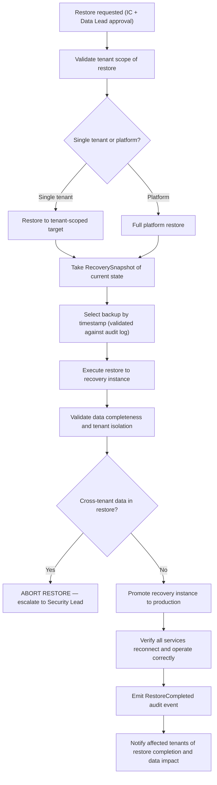

### 13.3 Restore Validation Checklist

Before any restore is promoted to production:

- [ ] Backup integrity verified (checksum).
- [ ] Tenant scope of restore confirmed (data belongs to the correct tenant only).
- [ ] No cross-tenant data in restore target.
- [ ] Audit records intact and continuous in restored data.
- [ ] Application services can connect and operate.
- [ ] Replay artifacts present for the restored time range.
- [ ] `RestoreCompleted` audit event emitted with actor, timestamp, and scope.
- [ ] Affected tenants notified.

### 13.4 Restore Rules

- Restore MUST never place one tenant's data into another tenant's context.
- Restore MUST preserve existing audit history (do not overwrite audit records with restored data).
- Restore MUST emit structured audit events: `RestoreStarted`, `RestoreCompleted` (or `RestoreFailed`).
- Restore MUST be tested on a regular cadence (minimum quarterly).
- Backups MUST be encrypted at rest and in transit.
- Production data MUST NOT be restored locally or to non-production without data scrubbing.
- Restore procedures MUST be validated in DR exercises before they are needed in production.

---

## 14. Disaster Recovery Execution

### 14.1 DR Readiness

MYCELIA maintains DR readiness at all times. DR readiness requires:
- Active replication of PostgreSQL WAL to secondary region.
- Active replication of object storage (artifacts, backups) to secondary region.
- DR runbooks tested at minimum quarterly.
- DR infrastructure pre-provisioned and validated (infrastructure-as-code ready to apply).
- DNS and load balancer failover tested.
- All DR roles assigned and practiced.

### 14.2 DR Activation Criteria

| Criterion | Action |
|---|---|
| Primary region completely unavailable > 15 minutes | DR activation recommended |
| All PostgreSQL replicas in primary region unavailable | DR activation required |
| Cloud provider declares regional outage | DR activation assessment |
| Security event requiring complete primary region isolation | Security-driven DR activation |
| Catastrophic data corruption requiring clean-room restore | DR activation with PITR to DR region |

### 14.3 RPO and RTO Targets

| Service | RPO (Recovery Point Objective) | RTO (Recovery Time Objective) |
|---|---|---|
| PostgreSQL (workflow state, memory) | < 5 minutes (WAL streaming) | < 30 minutes |
| Object storage (artifacts) | < 1 hour (cross-region replication lag) | < 15 minutes (DNS failover) |
| Temporal history | Same as PostgreSQL | < 45 minutes |
| Redis Streams (event lineage) | < 1 hour (RDB/AOF restore) | < 30 minutes |
| Vault | < 6 hours (snapshot interval) | < 20 minutes |
| Platform API and services | N/A (stateless) | < 15 minutes (deploy from IaC) |

### 14.4 DR Activation Flow

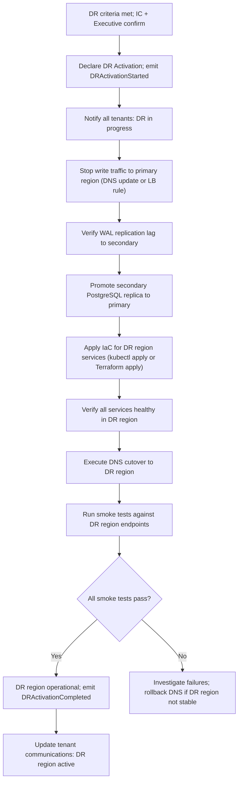

### 14.5 DR Validation

Before DR activation is considered complete:
- All smoke tests pass.
- Tenant API access verified.
- Active workflows resuming (Temporal).
- Audit event pipeline operational.
- Observability pipeline operational.
- `DRActivationCompleted` event emitted.

### 14.6 DR Drill Cadence

- Full DR drill: minimum quarterly.
- Partial DR drill (PITR restore only): monthly.
- DNS failover test: monthly.
- Results documented with RTO/RPO actuals vs. targets.
- Action items from each drill tracked to closure.

---

## 15. Replay-Based Investigation

### 15.1 Replay in Operational Context

Replay is MYCELIA's primary investigation tool. Before filing a bug, before hotfixing, before hypothesizing about cause — operators MUST attempt to replay the affected run and reconstruct what happened from the deterministic execution history.

Replay uses MYCELIA's append-only event lineage to re-execute the orchestration deterministically, substituting recorded tool results for live tool executions, and emitting telemetry to an isolated namespace.

### 15.2 Operational Uses of Replay

| Use Case | Description | Operator |
|---|---|---|
| Incident debugging | Replay a run that produced incorrect results to identify where divergence occurred | SRE / Platform |
| Policy validation | Replay a run against current policy snapshot to determine if policy change would have altered outcome | SRE / Governance |
| Postmortem evidence | Replay the affected run to produce a documented reconstruction for the postmortem | IC / Scribe |
| Regression analysis | Replay historical runs against a new version of a workflow or tool to detect behavioral regressions | Platform / QA |
| Tenant dispute | Replay a specific tenant's run under investigation at their request | Tenant Liaison + SRE |

### 15.3 Replay Investigation Workflow

```mermaid
flowchart LR
    IdentifyRun["Identify run_id to replay (from incident trace or tenant report)"] --> SelectVersion["Select workflow version for replay (usually original)"]
    SelectVersion --> IsolateEnv["Confirm replay environment is isolated (no production egress)"]
    IsolateEnv --> VerifyArtifacts["Verify replay artifacts available for side-effectful tools"]
    VerifyArtifacts --> ExecuteReplay["Execute replay with is_replay=true context"]
    ExecuteReplay --> ReviewTelemetry["Review replay telemetry in isolated namespace"]
    ReviewTelemetry --> DivergenceCheck{Divergence detected?}
    DivergenceCheck -- Yes --> RecordDivergence["Record ReplayDivergenceDetected; analyze cause"]
    DivergenceCheck -- No --> CompareOutputs["Compare replay outputs to original outputs"]
    CompareOutputs --> BuildEvidence["Assemble replay findings into EvidenceBundle"]
    BuildEvidence --> Report["Report findings to incident record or postmortem"]
```

### 15.4 Replay Safety Rules

- Replay MUST execute in an isolated environment with no production egress.
- Replay MUST use the Replay SDK (not the production SDK).
- Replay MUST NOT use live production credentials.
- Replay MUST emit telemetry to a replay-isolated namespace, never to the production observability namespace.
- Replay MUST NOT mutate the original event lineage.
- Replay outputs MUST NOT be automatically applied to production state.
- Replay divergence MUST be recorded and reported.
- `is_replay: true` flag MUST be set in all replay ToolRuntimeEnvelopes.

---

## 16. Tenant Impact Management

### 16.1 Tenant Impact Levels

| Level | Definition | Communication Requirement | Escalation |
|---|---|---|---|
| `No Impact` | Tenant not affected | None | None |
| `Degraded` | Tenant experiencing elevated latency or partial capability loss; no data impact | Status page if >15 min | On-call SRE |
| `Impaired` | Tenant experiencing significant capability loss but data is safe | Proactive tenant notification within 30 min | IC |
| `Outage` | Tenant completely unable to use MYCELIA | Immediate tenant notification; status page | IC + Communications Lead |
| `Data Impact` | Tenant data loss, corruption, or unauthorized exposure | Immediate notification; legal review | IC + Security + Executive |
| `Cross-Tenant Exposure` | Tenant's data was accessible to another tenant | Immediate notification; regulatory assessment | IC + Security + Executive + Legal |

### 16.2 Tenant Impact Matrix

| Incident Type | Tenant Impact Level | Communication Required | Escalation Required |
|---|---|---|---|
| API latency spike (<5s, <15 min) | Degraded | Status page | SRE on-call |
| API partial outage (>5% 5xx) | Impaired | Tenant notification | IC |
| Complete API outage | Outage | Immediate notification + status page | IC + Executive |
| PostgreSQL primary failure | Outage (all tenants) | Immediate notification | IC + Executive |
| Temporal cluster degradation | Impaired (active workflows) | Notification for affected tenants | IC |
| Model provider outage | Degraded (model-dependent tenants) | Notification if >30 min | On-call |
| Cross-tenant data exposure | Cross-Tenant Exposure | Immediate — both tenants | IC + Security + Legal |
| Tenant quota exhaustion | Impaired (single tenant) | Notify affected tenant | On-call |
| Tool kill switch | Impaired (tool users) | Notify if enterprise tenant | IC |
| Data residency violation | Data Impact | Legal review required | IC + Legal |

### 16.3 Tenant Quarantine Procedure

When a tenant's workload is destabilizing the platform or a security investigation requires isolation:

```bash
# 1. Apply rate limiting to tenant API access
# Via API gateway rate limit rule for tenant_id

# 2. Pause all active workflow runs for tenant
kubectl -n mycelia-execution exec deploy/temporal-admin-tools -- \
  temporal workflow list --query 'TenantID="<tenant_id>"' | \
  grep Running | awk '{print $1}' | \
  xargs -I{} temporal workflow signal --workflow-id {} --name mycelia_pause_signal

# 3. Record quarantine in incident
# 4. Notify tenant immediately with reason and expected resolution
```

### 16.4 Tenant Communication Rules

- Communications MUST state what is affected and when the incident started.
- Communications MUST be factual. MUST NOT speculate about cause.
- Communications MUST be clear about data safety status.
- Communications MUST NOT expose other tenants' identities or data.
- Enterprise tenants with contractual SLAs MUST be notified within their contracted window.
- Cross-tenant exposure notifications require legal review of content before sending.

### 16.5 Tenant Support Case Synchronization

Tenant-facing incidents MUST synchronize operational incident state with customer support state.

Support cases are not the source of operational truth, but they are the tenant-facing continuity layer. Every affected tenant must have a consistent support record when communication is required.

### Support Case Requirements

For each affected tenant requiring notification, MYCELIA SHOULD create or link a support case containing:

- support_case_id;
- incident_id;
- tenant_id;
- tenant_impact_level;
- communication_owner;
- first_notified_at;
- last_updated_at;
- current_status;
- committed_next_update_at;
- data_impact_status;
- SLA_status;
- closure_summary.

### Rules

- Support case status MUST align with incident status.
- Tenant communication timestamps MUST be recorded in both incident timeline and support case.
- Enterprise tenants MUST receive updates according to contractual SLA.
- Support agents MUST NOT speculate beyond approved incident facts.
- Support cases MUST NOT expose other affected tenants.
- Data impact status MUST remain `Under Assessment` until Security/Legal confirms otherwise.

### Tenant Closure Criteria

A tenant-facing support case may close only when:

- incident impact for that tenant is resolved;
- tenant-specific data impact assessment is complete;
- required communication has been sent;
- open tenant-specific action items are tracked;
- Communications Lead approves closure.

### Forbidden Behavior

FORBIDDEN:

- closing tenant support cases before incident resolution;
- sending tenant-specific updates not reflected in incident timeline;
- exposing other tenant IDs in support communications;
- marking data impact as `None` before investigation completes;
- allowing support teams to independently downgrade impact severity.

---

## 17. Security Incident Response Integration

### 17.1 Security Incident Categories

| Category | Severity | Security Lead Required | Forensic Evidence |
|---|---|---|---|
| Credential exposure (confirmed) | SEV0 | Yes | Vault audit logs, telemetry, leak scope |
| Tool supply-chain compromise | SEV0–1 | Yes | SBOM, manifest, dependency scan |
| Sandbox escape (suspected) | SEV0–1 | Yes | Syscall logs, network flow logs, worker pod state |
| Cross-tenant data exposure | SEV0 | Yes | Access logs, artifact access, DB query logs |
| Unauthorized production access | SEV1 | Yes | kubectl audit logs, cloud audit trail |
| Secret manager compromise | SEV0 | Yes | Vault audit log, lease grant history |
| Webhook spoofing | SEV2–1 | Yes | Request logs, signature validation failures |
| Prompt injection incident | SEV2–1 | Yes | Tool output logs, workflow trace |
| Governance bypass | SEV0–1 | Yes | Policy eval logs, approval records, audit events |
| Audit record tampering attempt | SEV0 | Yes | Audit database integrity check, access logs |

### 17.2 Security Incident Flow

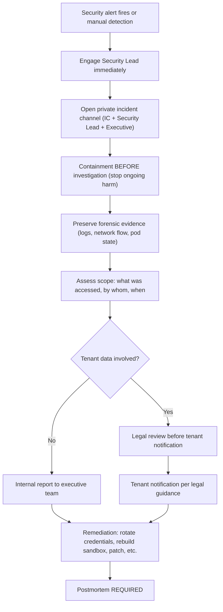

### 17.3 Security Containment Procedures

**Credential exposure:**
- Revoke all leases for exposed credential immediately.
- Rotate credential at source (Vault + external provider).
- Identify all executions that used the credential.
- Assess impact scope.

**Sandbox escape:**
- Quarantine the affected node.
- Do NOT delete the worker pod — preserve for forensics.
- Stop all new workloads on the affected node.
- Engage cloud provider security if host compromise suspected.

**Unauthorized production access:**
- Revoke the actor's credentials immediately.
- Preserve all kubectl audit logs and cloud audit trail for the period.
- Assess what was accessed and whether data was exfiltrated.

**Governance bypass:**
- Quarantine all executions that bypassed policy.
- Assess whether any side effects from bypassed executions need rollback.
- Preserve policy evaluation logs and approval records.

---

## 18. Change Freeze & Release Control During Incidents

### 18.1 Automatic Freeze Triggers

| Trigger | Freeze Scope | Lift Condition |
|---|---|---|
| Active SEV0 incident | All production deployments | IC resolution + specific approval |
| Error budget < 10% for any SLO | New feature releases | Budget recovery to >25% |
| Cross-tenant exposure incident | All multi-tenant feature releases | Security review complete + IC lift |
| Governance bypass incident | Policy changes and governance config | Governance Lead + IC approval |
| Active database incident | Schema migrations | Database stable + migration team review |
| Active security incident | Any changes to security configuration | Security Lead + IC |

### 18.2 Release Freeze State Machine

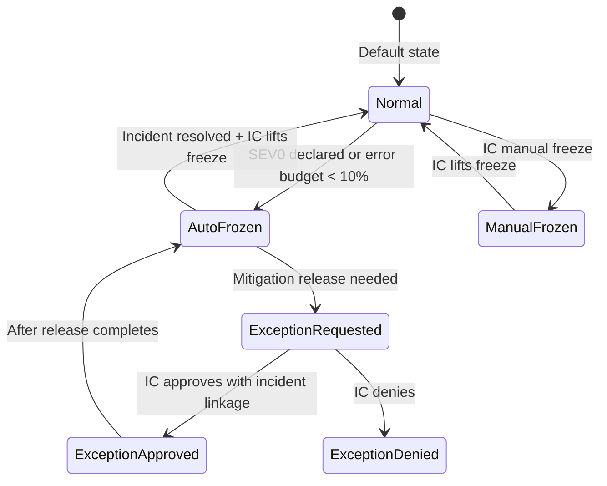

### 18.3 Emergency Patch Flow

When a release is required as part of incident mitigation:

1. IC approves the release with explicit justification in incident record.
2. Release is linked to the active incident_id.
3. Rollback plan MUST be verified before deployment.
4. Release is monitored by on-call for minimum 30 minutes post-deployment.
5. If release worsens situation: immediate rollback per RB-020.

---

## 19. Operational Readiness Reviews

### 19.1 Production Readiness Gate

No service or feature enters production without passing the following readiness gate:

| Criterion | Required | Verified By |
|---|---|---|
| Runbook exists for all top failure modes | REQUIRED | SRE review |
| SLO defined with measurement source | REQUIRED | SRE review |
| Dashboard created with key panels | REQUIRED | SRE review |
| Alerts defined for all SLO burn-rate conditions | REQUIRED | SRE review |
| All paging alerts have runbook links | REQUIRED | SRE review |
| Rollback procedure verified | REQUIRED | Platform review |
| Stateful service: backup and restore tested | REQUIRED if stateful | Data team review |
| Stateful service: PITR tested | REQUIRED if stateful | Data team review |
| Tenant isolation validated | REQUIRED | Security review |
| Replay capability verified | REQUIRED if workflow-touching | Platform review |
| Secret injection tested | REQUIRED if credential-using | Security review |
| Network egress policy applied | REQUIRED | Security review |
| Load test completed | REQUIRED for user-facing | Platform review |
| Chaos test completed | RECOMMENDED | SRE review |
| DR role for this service defined | REQUIRED for critical path | SRE review |

### 19.2 Readiness Review Process

1. Team submits readiness checklist with evidence for each criterion.
2. SRE reviewer validates each criterion against actual artifacts (runbooks, dashboards, test results).
3. Security reviewer validates security-specific criteria.
4. Data team validates stateful criteria.
5. GO / NO-GO decision is documented with justification.
6. Conditional GO (known gaps with mitigation plan) requires IC awareness.

---

## 20. GameDays & Chaos Engineering

### 20.1 GameDay Cadence

| Exercise Type | Frequency | Scope | Approval Required |
|---|---|---|---|
| Worker failure injection | Monthly | Staging + Production (non-peak hours) | SRE Lead |
| Broker failover drill | Monthly | Staging; Quarterly in Production | SRE Lead |
| PostgreSQL HA failover drill | Quarterly | Staging; DR exercises in Production | SRE Lead + IC |
| Temporal task queue backlog simulation | Monthly | Staging | SRE Lead |
| Model provider outage simulation | Monthly | Staging | SRE Lead |
| Policy engine outage simulation | Quarterly | Staging | SRE Lead |
| Full DR drill | Quarterly | Production (off-hours, tenant notification) | IC + Executive |
| Backup restore drill | Monthly | Staging; Quarterly in Production | SRE Lead + Data Lead |
| Credential revocation drill | Quarterly | Staging | Security Lead |
| Replay investigation exercise | Monthly | Production (read-only) | SRE Lead |

### 20.2 Chaos Experiment Rules

- Chaos experiments MUST have a defined blast radius and rollback procedure.
- Production chaos MUST be executed during low-traffic windows.
- Production chaos MUST have a designated abort owner.
- Chaos MUST NOT expose tenant data between tenants.
- Chaos MUST NOT corrupt event lineage.
- Chaos MUST NOT be applied to the audit pipeline.
- Tenant-facing chaos in production requires advance communication to affected tenants.
- All chaos results MUST be documented with observations and action items.

### 20.3 GameDay Plan Template

```markdown
# GameDay: [Scenario Name] — [Date]

## Hypothesis
If [failure condition], then [expected observable behavior] and MYCELIA will [expected recovery].

## Blast Radius
- Services affected: [list]
- Tenants affected: [none / specific list]
- Data at risk: [none]

## Abort Criteria
If [condition], abort immediately: [abort procedure]

## Abort Owner: [name]

## Schedule
- Window: [start] — [end]
- Tenant notification: [sent/not required]

## Execution Steps
1. [Step]
2. [Step]

## Observations
[Filled in during execution]

## Actual vs. Expected Recovery
[Filled in post-execution]

## Action Items
| Item | Owner | Due Date |
|---|---|---|
```

---

## 21. Operational Communications

### 21.1 Initial SEV1 Status Page Update

```
[INVESTIGATING] Elevated latency / Partial service disruption

We are investigating reports of [elevated API latency / partial service unavailability] 
affecting [some / all] users. Our team is actively investigating.

Affected services: [list]
Start time: [UTC timestamp]
Impact: [description without tenant-specific data]

Next update: [timestamp]
```

### 21.2 Ongoing Update

```
[UPDATE - HH:MM UTC] Investigating [service issue]

We have identified [general cause description — no speculation]. 
[Mitigation is in progress / We are working to restore service].

Current status: [Monitoring / Recovery in progress]
Estimated resolution: [ETA or "Under investigation"]

Next update: [timestamp]
```

### 21.3 Resolved Update

```
[RESOLVED - HH:MM UTC] [Service issue] resolved

The [service issue] affecting [service] has been resolved. Service has been restored to 
normal operation as of [HH:MM UTC].

Duration: [start] to [end]
Impact: [factual description of what was affected]

A post-incident review will be conducted. We will publish a summary of findings.

If you have ongoing concerns, please contact support.
```

### 21.4 Postmortem Availability Notice

```
We have completed our post-incident review for the [incident description] that occurred 
on [date]. A summary of our findings, including contributing factors and the actions we 
are taking to prevent recurrence, is available at [link].

Thank you for your patience.
```

### 21.5 Data Exposure Notification (Template — Legal Review Required Before Sending)

```
[CONFIDENTIAL — LEGAL REVIEW REQUIRED BEFORE SENDING]

Dear [Tenant Name],

We are writing to inform you of a security incident that may have affected your data 
within the MYCELIA platform. 

[COMPLETE WITH LEGAL-REVIEWED DETAILS ONLY]

Timeline: [dates]
Nature of incident: [legal-reviewed description]
Data potentially affected: [legal-reviewed scope]
Actions we have taken: [list]
Actions you should take: [list if any]
Point of contact: [security@mycelia.internal / designated contact]
```

### 21.6 Communication Rules

- Communications MUST be factual. Speculation is FORBIDDEN.
- Customer-facing status MUST match actual assessed impact.
- Tenant-specific data MUST NOT appear in any shared communication channel.
- The Communications Lead reviews ALL customer-facing communications before sending.
- Internal incident channels are for technical coordination only; executive updates use separate channel.
- Incident timeline MUST be maintained in real-time by the Scribe.

---

## 22. Postmortems & Continuous Improvement

### 22.1 When Postmortems Are Required

- ALL SEV0 incidents.
- ALL SEV1 incidents.
- ANY cross-tenant data exposure.
- ANY audit event loss.
- ANY governance bypass.
- ANY security incident with confirmed impact.
- SEV2 incidents at the IC's discretion if learning opportunity is significant.

### 22.2 Postmortem Timeline

| Milestone | Deadline |
|---|---|
| Draft distributed to participants | 5 business days after incident resolution |
| Review comment period | 3 business days after draft distribution |
| Final postmortem published | 10 business days after incident resolution |
| Action items assigned | At publication |
| Action item progress first review | 30 days after publication |
| All action items resolved | Per item due date (max 90 days) |

### 22.3 Postmortem Template

```markdown
# Postmortem: [Incident Title] — [Date] — [Incident ID]

**Severity:** SEV[0/1]
**Duration:** [start] to [end] — [total duration]
**Affected Services:** [list]
**Affected Tenants:** [tenant_ids — do not include tenant content]
**Authors:** [names]
**Reviewers:** [names]
**Status:** Draft / Final

---

## Executive Summary
[2-3 sentence summary: what happened, what was the impact, what was the root cause]

---

## Impact
| Dimension | Details |
|---|---|
| User impact | [description] |
| Data impact | [none / description] |
| Tenant count affected | [number] |
| Duration | [minutes/hours] |
| SLO impact | [error budget consumed] |

---

## Timeline
[All times in UTC]

| Time | Event |
|---|---|
| HH:MM | [Description] |

---

## Root Cause
[Factual description of the underlying cause — not the trigger]

## Trigger
[The specific event that activated the latent root cause]

## Contributing Factors
- [Factor 1]
- [Factor 2]

## What Went Well
- [Detection was fast]
- [Runbook was accurate]

## What Went Poorly
- [Alert fired too late]
- [Runbook step X was ambiguous]

## Where We Got Lucky
- [The event lineage was not corrupted despite...]

---

## Action Items

| # | Action | Owner | Due Date | Priority | Status |
|---|---|---|---|---|---|
| 1 | [Specific action] | [Name] | [Date] | P1/P2/P3 | Open |

---

## Prevention Plan
[Summary of how the actions above prevent recurrence]

---

## Architecture Feedback
[Any changes to system architecture or operational model suggested by this incident]
```

### 22.4 Postmortem Rules

- Postmortems are blameless but accountable. People make mistakes; systems should prevent them.
- Actions target system improvements, not individual punishment.
- Action items MUST have named owners and due dates.
- Action items MUST be tracked in the operational issue tracker.
- Postmortem is NOT closed until action items are assigned (not necessarily completed).
- Published postmortems are append-only. Corrections are addenda; original text is preserved.


---

## 23. Operational Metrics & Dashboards

| Dashboard | Owner | Key Panels | Primary Metrics | Alerts Linked | Runbooks Linked |
|---|---|---|---|---|---|
| Executive reliability | SRE Lead | SLO status, error budget, incident count, MTTR | SLO compliance %, error budget %, MTTD, MTTR | SLO burn-rate fast | All SEV0/1 |
| SRE on-call | On-call SRE | All alert status, active incidents, SLO burn-rate, dependency health | Alert count, burn rates, dependency up/down | All paging alerts | All RBs |
| Workflow runtime | Platform | Workflow start/completion rates, queue depth, Temporal services | workflow_started/completed, task_queue_size | Temporal alerts | RB-006, RB-007 |
| API health | Platform | Request rate, error rate, p50/p95/p99 latency, per-endpoint breakdown | http_requests_total, http_request_duration | API SLO burn | RB-001, RB-002 |
| Worker pool | Platform | Worker utilization, active executions, KEDA scale events | worker_cpu, worker_memory, task_queue_size | Worker saturation | RB-008, RB-009 |
| Tool runtime | Platform | Tool execution success rate, duration, retry rate per tool | tool_execution_*, idempotency_dedup_rate | Tool failure alerts | RB-009, RB-029 |
| Event runtime | Platform | Event publish/deliver rates, DLQ depth, consumer group lag | event_published, event_delivered, dlq_depth | DLQ growth | RB-010, RB-011 |
| Database | Data | PostgreSQL up/availability, connections, replication lag, WAL LSN | pg_up, pg_replication_lag, connection_count | DB alerts | RB-003, RB-004 |
| Redis/broker | Platform | Redis up/memory, Sentinel status, stream lengths | redis_up, redis_memory_usage, stream_length | Redis alerts | RB-010, RB-012 |
| Temporal | Platform | Frontend/history/matching availability, workflow failure rate | temporal_*_up, workflow_failed_total | Temporal alerts | RB-006, RB-007 |
| Memory/vector | Data | pgvector query latency, index size, retrieval success | vector_query_duration, retrieval_success_rate | Memory latency | RB-004 |
| Observability pipeline | Platform | OTel collector up, span drop rate, exporter queue | otelcol_*, receiver_accepted_spans | Collector alerts | RB-016 |
| Governance | Platform | Policy eval latency/success, approval queue depth, approval latency | policy_eval_duration, approval_queue_size | Governance alerts | RB-024, RB-025 |
| Security | Security | Vault up, lease grant/revoke rates, boundary violations, break-glass | vault_up, lease_granted, tenant_boundary_violation | Security alerts | RB-013, RB-014, RB-018 |
| Tenant isolation | Security | Boundary violation rate, cross-tenant attempt count | tenant_boundary_violations_total | Tenant violation | RB-018 |
| Deployment | Platform | Deployment success rate, rollback count, migration status | deploy_succeeded, rollback_count | Deployment alerts | RB-020, RB-021 |
| DR | SRE Lead | DR readiness status, replication lag to secondary, last DR drill date | wal_replication_lag_secondary, dr_readiness | DR alerts | RB-030 |

---

## 24. Operational Security & Break-Glass

### 24.1 Break-Glass Procedure

Break-glass access provides emergency elevated access to production systems when normal access controls would prevent resolution of a critical incident. Break-glass is not a convenience mechanism.

**Requirements for break-glass:**
- Active SEV0 or SEV1 incident is declared.
- Normal access controls prevent resolution.
- IC has approved the break-glass session.
- Break-glass is time-limited (default TTL: 1 hour; maximum: 4 hours for complex DR).

### 24.2 Break-Glass State Machine

```mermaid
stateDiagram-v2
    [*] --> Requested: On-call requests break-glass
    Requested --> Approved: IC approves with incident_id linkage
    Requested --> Denied: IC denies; standard access sufficient
    Approved --> Active: Credentials issued; TTL timer started
    Active --> Expired: TTL elapsed
    Active --> Revoked: IC manually revokes early
    Expired --> PostReview: Access automatically revoked; session recorded
    Revoked --> PostReview
    PostReview --> [*]: Review complete; action items assigned if needed
```

### 24.3 Break-Glass Rules

- Break-glass MUST be linked to an active incident_id.
- Break-glass MUST be time-limited. TTL MUST NOT exceed 4 hours.
- All commands executed during break-glass MUST be logged to the audit store at command level.
- Break-glass session logs MUST be captured in the EvidenceBundle.
- Secret manager access requires separate approval even during break-glass.
- Production pod exec (`kubectl exec`) requires IC approval and is logged.
- Direct database mutation (`psql` on primary) requires IC + Data Lead approval.
- Break-glass sessions MUST be post-reviewed within 3 business days.

### 24.4 Break-Glass Prohibited Actions (Even During Break-Glass)

- FORBIDDEN: Deleting audit records.
- FORBIDDEN: Modifying event lineage.
- FORBIDDEN: Bypassing tenant isolation (accessing another tenant's data).
- FORBIDDEN: Restoring data without tenant scope validation.
- FORBIDDEN: Revoking all production credentials simultaneously without Security Lead.
- FORBIDDEN: Executing without recording actions in incident channel.
- FORBIDDEN: Accessing break-glass for purposes not related to the declared incident.

### 24.5 Production Command Logging Contract

Every production command executed during incident response MUST be captured as structured operational evidence.

Command logging applies to:

- kubectl commands;
- psql commands;
- redis-cli commands;
- temporal CLI commands;
- vault CLI commands;
- cloud provider CLI commands;
- migration commands;
- custom admin scripts;
- break-glass sessions;
- manual recovery scripts.

### CommandLogRecord Schema

```json
{
  "command_log_id": "cmdlog-20260515-001",
  "incident_id": "INC-2026-0042",
  "actor_id": "sre@mycelia.internal",
  "executed_at": "2026-05-15T15:12:00Z",
  "environment": "production",
  "namespace": "mycelia-execution",
  "target_resource": "deployment/mycelia-worker",
  "command_class": "kubectl",
  "command_text_redacted": "kubectl -n mycelia-execution scale deployment mycelia-worker --replicas=30",
  "command_hash": "sha256:...",
  "approval_id": "approval-123",
  "risk_class": "medium",
  "expected_effect": "increase worker capacity",
  "actual_result": "success",
  "exit_code": 0,
  "stdout_location": "s3://evidence/INC-2026-0042/commands/cmdlog-001.out",
  "stderr_location": "s3://evidence/INC-2026-0042/commands/cmdlog-001.err"
}

---

## 25. SRE Invariants

### 25.1 Incident Invariants (1–25)

1. No SEV0 incident may proceed without a declared Incident Commander.
2. No SEV1 incident may proceed without a declared Incident Commander.
3. No incident may close without a completed EvidenceBundle for SEV0/SEV1.
4. No incident timeline may be edited or deleted after creation.
5. No severity downgrade may occur without a recorded justification in the incident timeline.
6. No incident may be declared resolved while active harm is still confirmed ongoing.
7. No production mutation may occur during incident response without being recorded in the incident timeline.
8. No incident evidence may be destroyed before the EvidenceBundle is complete.
9. No incident may close without the observation period having elapsed (30 min SEV2/3; 2h SEV0/1).
10. No cross-tenant exposure incident may be classified below SEV1 regardless of data volume.
11. No audit event loss may be classified below SEV0 regardless of event count.
12. No governance bypass incident may close without confirming that unauthorized side effects have been assessed.
13. No SEV0/1 incident may close without a scheduled postmortem.
14. No incident may re-open after Close state without IC approval and a new EvidenceBundle entry.
15. No incident may be managed without a designated Scribe for SEV0/1.
16. No incident may proceed without a Communications Lead for SEV0/1 (separate from Technical Lead).
17. No status page content may contradict the assessed incident impact.
18. No tenant data may appear in shared incident channels; reference tenant_id only.
19. No EvidenceBundle may omit the operator_actions field.
20. No incident response action may bypass the audit store.
21. No replica promotion may occur as part of incident response without IC approval.
22. No replay investigation may be initiated as part of incident response without IC approval.
23. No break-glass session may be initiated without an active incident linkage.
24. No credential revocation may occur during incident response without Security Lead awareness.
25. No incident may close without recording all affected tenant_ids in the EvidenceBundle.

### 25.2 Alerting Invariants (26–45)

26. No paging alert may exist without a linked runbook URL.
27. No paging alert may exist that cannot be acted upon by the on-call engineer.
28. No alert may fire more than 5 times per hour without investigation and tuning within 2 business days.
29. No alert may be permanently silenced without documented justification and review.
30. No alert silence may extend beyond 7 days without renewal and IC awareness.
31. No SEV0/1 condition may have only a ticket-level alert.
32. No tenant boundary violation may be classified as a ticket alert.
33. No audit event loss condition may be classified as anything below a paging SEV0 alert.
34. No governance bypass condition may be classified below SEV1.
35. No alert rule may be deployed to production without review.
36. No alert rule may lack a description explaining what is broken and what to do.
37. No alert may fire in production without having been tested in staging first.
38. No SLO may exist without at least one fast-burn and one slow-burn alert.
39. No alert may be based on a metric that is not actively measured in production.
40. No burn-rate alert threshold may be set without reference to the SLO window and target.
41. No informational alert may be routed to PagerDuty.
42. No security alert may be routed only to Slack without a PagerDuty escalation.
43. No deployment-triggered alert may fire for a known deployment signature without auto-suppression during deployment window.
44. No alert may have an empty runbook_url annotation.
45. No on-call rotation may have fewer than two engineers in the rotation pool.

### 25.3 SLO Invariants (46–60)

46. No service may operate in production without at least one defined SLO.
47. No SLO may be defined without a measurement source (PromQL expression or equivalent).
48. No SLO may change its target without a documented review and approval.
49. No error budget may be consumed without tracking by the owning team.
50. No error budget below 25% may go unaddressed for more than 5 business days.
51. No error budget exhaustion may proceed without a feature freeze declaration.
52. No SLO review may occur less frequently than quarterly.
53. No SLO definition may reference a metric that is not produced in the live environment.
54. No burn-rate alert threshold may be set to less than 2x the normal consumption rate.
55. No tenant isolation violation rate SLO target may be set to anything other than 0.
56. No audit event durability SLO target may be set below 100%.
57. No SLO may lack an error budget policy defining release freeze thresholds.
58. No service may be exempt from SLO compliance measurement.
59. No SLO violation may be declared resolved without confirming metric recovery.
60. No SLO window may be shorter than 7 days for availability SLOs.

### 25.4 Runbook Invariants (61–75)

61. No paging alert may exist without a corresponding runbook.
62. No runbook may be deployed without an owner and a last-reviewed date.
63. No runbook may exceed 12 months since last review without an explicit renewal.
64. No runbook may contain commands that are not safe to run by the on-call engineer without additional approval.
65. No runbook may omit the list of forbidden actions.
66. No runbook may omit escalation criteria.
67. No runbook may omit tenant impact steps for any SEV1+ failure mode.
68. No runbook may omit the audit events that should be verified as part of recovery.
69. No runbook involving stateful mutations may omit rollback steps.
70. No runbook may omit the list of required permissions and tool access.
71. No runbook for a destructive operation may omit a DANGEROUS warning before that step.
72. No runbook may be the only copy of a recovery procedure; all runbooks MUST be in version control.
73. No runbook may reference commands or tools that are not available to the on-call engineer.
74. No runbook may omit validation steps.
75. No runbook command may use wildcard destructive operations without explicit comments constraining scope.

### 25.5 Recovery Invariants (76–95)

76. No production restore may proceed without IC approval.
77. No production restore may proceed without tenant scope validation.
78. No production restore may proceed without a RecoverySnapshot of the current state.
79. No production restore may place one tenant's data into another tenant's environment.
80. No production restore may proceed without emitting RestoreStarted and RestoreCompleted audit events.
81. No production restore may use unencrypted backups.
82. No rollback may delete event history or audit records.
83. No rollback may proceed without verifying the rollback artifact is available and its digest matches.
84. No failover may proceed without verifying replica readiness and replication lag.
85. No failover may violate tenant data residency requirements.
86. No tenant quarantine may be applied without IC approval and notification to the tenant.
87. No tool kill switch may be activated without IC approval and audit record.
88. No credential revocation may be applied without Security Lead involvement.
89. No deployment freeze may be lifted during an active SEV0 without IC approval.
90. No automatic recovery action may suppress the emission of the corresponding audit events.
91. No recovery action may be executed without being announced in the incident channel first.
92. No recovery action may be applied to a production system whose state has not been assessed.
93. No manual database statement may be executed on production primary without IC + Data Lead approval.
94. No degraded mode activation may proceed without updating the status page within 15 minutes.
95. No recovery action may assume the absence of affected tenants without consulting the TenantImpactAssessment.

### 25.6 Backup and Restore Invariants (96–105)

96. No stateful service may enter production without a tested backup and restore procedure.
97. No backup may be stored unencrypted.
98. No backup may be stored only in a single location (at minimum: primary + secondary region).
99. No backup restoration test may be older than 90 days before a production restore is executed.
100. No PostgreSQL backup may have a gap in WAL continuity without alerting.
101. No Vault snapshot restore may proceed without verifying the snapshot's seal configuration compatibility.
102. No backup may be deleted before its retention window has elapsed.
103. No restore may be tested with production data in a non-production environment without scrubbing.
104. No backup success rate alert may have a threshold below 100%.
105. No DR exercise may proceed without a backup availability check as the first step.

### 25.7 Replay Investigation Invariants (106–115)

106. No replay investigation may use live production credentials.
107. No replay investigation may emit telemetry to the production observability namespace.
108. No replay investigation may mutate the original event lineage.
109. No replay investigation may proceed if the replay environment has production egress.
110. No replay output may be automatically applied to production state without explicit operator approval.
111. No replay divergence may be silently ignored; it MUST be recorded in the EvidenceBundle.
112. No replay investigation may proceed if the required ToolReplayRecords are missing without noting this gap.
113. No replay investigation may access artifacts from tenants not involved in the investigation.
114. No replay investigation initiated as part of an incident may close without its findings recorded in the incident record.
115. No replay investigation environment may persist beyond its designated investigation window without explicit renewal.

### 25.8 Tenant Impact Invariants (116–125)

116. No cross-tenant data exposure may be treated as a standard availability incident.
117. No cross-tenant exposure incident may close without legal review of notification requirements.
118. No tenant notification may contain data belonging to another tenant.
119. No enterprise tenant may experience a complete outage for > their contractual RTO without an escalation to the Executive Liaison.
120. No tenant quarantine may be applied for more than 4 hours without IC and executive review.
121. No TenantImpactAssessment may remain as "Unknown" for more than 30 minutes after incident declaration.
122. No tenant communication may speculate about cause or timeline without factual basis.
123. No data residency violation may be closed without legal review of regulatory notification requirements.
124. No incident with confirmed data impact to a tenant may close without that tenant receiving factual notification.
125. No tenant-specific restore may proceed without that tenant's data being confirmed in the backup.

### 25.9 DR and Postmortem Invariants (126–140)

126. No DR activation may proceed without Executive approval.
127. No DR failover may violate data residency requirements.
128. No DR drill may be conducted less frequently than quarterly.
129. No DR drill result may go undocumented.
130. No DR plan may exist without having been tested within the last 90 days.
131. No SEV0/1 postmortem may be skipped.
132. No postmortem action item may lack an owner.
133. No postmortem action item may lack a due date.
134. No postmortem may be considered closed while action items remain unresolved beyond their due date without a documented extension.
135. No postmortem may be published with speculation presented as established fact.
136. No postmortem may alter or delete the incident timeline.
137. No security postmortem may be published externally without legal review.
138. No postmortem may fail to include the architecture feedback section.
139. No break-glass session may remain unreviewed beyond 3 business days after the session ends.
140. No SRE operational model change may be made without updating the affected runbooks within 30 days.


---

## 26. SRE Anti-Patterns

**Alert without runbook.** An alert that fires but has no linked runbook is an alert that wastes the on-call engineer's time and increases MTTR. Every paging alert requires a runbook. No exception.

**Noisy paging.** An on-call engineer who receives more than 5 non-actionable pages per shift will be unable to distinguish signal from noise during a real SEV0. Alert fatigue is a safety risk. Noisy alerts must be tuned or removed within 2 business days.

**Silent mitigation.** A mitigation action taken in production without announcing it in the incident channel, recording it in the timeline, and emitting an audit event is a hidden production mutation. Every action, visible or not, must be recorded.

**Manual production mutation without audit.** Directly modifying production data, configuration, or infrastructure without an audit trail is a governance failure. MYCELIA's invariants do not stop at application code — they extend to operational procedures.

**Restoring data without tenant validation.** A restore that does not validate tenant scope before promotion can corrupt one tenant's data with another's. The restore procedure always validates tenant scope. No exceptions. Not even under time pressure.

**Replaying with production credentials.** A replay investigation that accesses production credentials is not a replay. It is a second production execution that can produce side effects. Replay environments are hermetically sealed from credential systems.

**Treating cross-tenant exposure as normal outage.** A cross-tenant data exposure is not an availability incident. It is a trust, compliance, and potentially legal incident. Classifying it as SEV2 "outage affecting some tenants" is a governance failure.

**Deleting logs during incident.** Logs are evidence. Reducing noise during an incident by deleting logs is evidence destruction. Logs are silenced by adjusting log level for new entries; existing logs are never deleted.

**Skipping postmortem for SEV1.** A SEV1 incident without a postmortem is a missed learning opportunity and an operational debt. The postmortem process exists precisely because SEV1 incidents reveal architectural weaknesses.

**Debugging through unrestricted pod exec.** `kubectl exec` into a production pod to run arbitrary commands without IC approval, logging, and incident linkage is unauthorized production access.

**Relying on dashboard-only diagnosis.** Dashboards aggregate and sample. They can hide the specific failure mode. Before executing a runbook, verify the exact failure using logs, traces, and structured queries.

**Changing policy during governance incident without approval.** Modifying governance policies or approval flows while a governance incident is active can mask evidence and create new vulnerabilities.

**Bypassing incident command.** Taking unilateral action on a SEV0/1 incident without Incident Commander involvement violates the structured response model and creates coordination failures.

**Unbounded incident channel chaos.** An incident channel where everyone is discussing simultaneously without the Communications Lead controlling external messages and the Scribe maintaining the timeline becomes unreliable evidence.

**Speculative tenant communication.** Sending tenant communications based on hypothesis rather than confirmed facts creates misinformation. Communicate what is confirmed; update as facts are established.

**Unresolved action items.** Postmortem action items that age past their due date without closure or explicit deferral represent accumulated operational debt and indicate that postmortems are not being taken seriously.

**Postmortems without owners.** An action item with no owner is an action item that will never be completed. Every item requires a named owner before the postmortem is published.

**DR plan never tested.** A DR plan that has never been tested is a hypothesis, not a recovery procedure. Untested DR plans routinely fail in the moment they are most needed.

**Backup never restored.** A backup whose restore has never been tested is an unverified assumption. Regular restore testing is the only way to confirm that backups are usable.

**Release during active SEV0 without incident linkage.** A production deployment during a SEV0 incident that is not explicitly linked to the incident as a mitigation, approved by the IC, and monitored post-deployment is a compounding risk.

---

## 27. MVP Cut

### 27.1 MVP Now

**Incident management:**
- Severity classification model (SEV0–SEV4) documented and agreed.
- On-call rotation established with primary + secondary.
- Incident lifecycle states defined and tracked in a shared incident channel or simple tool.
- Basic EvidenceBundle collection checklist.
- Incident Commander role defined and practiced.

**SLOs:**
- API availability SLO (99.9%, 28-day window) with basic PromQL measurement.
- Workflow completion reliability SLO.
- PostgreSQL availability SLO.
- Temporal availability SLO.
- Audit event durability SLO (100%).
- Tenant isolation violation SLO (0 violations).

**Alerting:**
- Paging alerts for all SEV0/1 SLO conditions.
- Basic burn-rate alerting for API availability and PostgreSQL.
- Security alerts for tenant boundary violations.
- All alerts linked to runbooks.

**Core runbooks (MVP):**
- RB-001 (API latency spike)
- RB-002 (API partial outage)
- RB-003 (PostgreSQL primary failure)
- RB-007 (Temporal task queue backlog)
- RB-010 (Event broker outage)
- RB-012 (Redis memory exhaustion)
- RB-013 (Vault outage)
- RB-018 (Cross-tenant boundary violation)
- RB-020 (Bad deployment rollback)
- RB-030 (DR activation — draft)

**Backup and restore:**
- PostgreSQL daily base backup + WAL streaming configured.
- Backup restore tested in staging.
- RB-005 (PITR) documented and practiced once.

**Communications:**
- Status page configured.
- Initial, ongoing, and resolved templates available.

**Operational readiness:**
- Basic production readiness checklist in use for all new services.

### 27.2 Later

- Automated incident creation from PagerDuty.
- Advanced multi-window burn-rate alerting for all SLOs.
- Full GameDay program with quarterly schedule.
- Tenant-specific reliability views and SLO dashboards.
- Mature error budget policy with automated release freeze triggers.
- Automated EvidenceBundle generation from incident metadata.
- Automated rollback trigger on deployment error rate threshold.
- Full DR drill automation with result recording.
- Richer status page with per-service status components.

### 27.3 Enterprise Future

- 24/7 global SRE rotation with follow-the-sun coverage.
- Contractual per-tenant SLO reporting and dashboards.
- Per-tenant reliability contracts with automated compliance evidence export.
- Enterprise DR exercises with customer participation.
- Customer-facing operational portal with real-time run health.
- AI-assisted incident triage (pattern matching on telemetry + runbook suggestion).
- Multi-region incident command with shared state.
- Advanced chaos engineering with automated game day scheduling.
- Reliability scorecards by tenant with benchmarking.

---

## 28. Codex Implementation Guidance

### 28.1 Implementation Order

1. **Incident domain schemas.** Define `Incident`, `IncidentSeverity`, `IncidentTimeline`, `OperatorAction`, `EvidenceBundle` as typed models in PostgreSQL. Incident timeline MUST be append-only (no UPDATE on timeline entries).

2. **AlertRule and Runbook schema.** Define `AlertRule` and `Runbook` as structured schemas. AlertRule MUST have `runbook_url` as required field. Implement validation that rejects AlertRule without runbook_url.

3. **Severity classification enum.** Implement `IncidentSeverity` as an enum (SEV0–SEV4) with associated escalation rules and communication requirements. Implement severity downgrade guard requiring justification.

4. **SLO and SLI model.** Define `SLO`, `SLI`, `ErrorBudget` schemas. Implement error budget calculation from PromQL result. Store SLO definitions in version-controlled YAML with database cache.

5. **OperationalEvent model.** Define structured `OperationalEvent` schema (type, source, tenant_id, timestamp, data). All operational events MUST carry tenant_id. Persist to append-only log.

6. **Incident state machine.** Implement the 13-state incident lifecycle as an explicit state machine. Each transition records actor, timestamp, and justification. Forbidden transitions MUST raise a structured error.

7. **On-call and escalation model.** Define `OnCallRotation` and `EscalationPolicy` schemas. Implement escalation chain lookup by severity. Implement acknowledgement timeout with automatic escalation.

8. **Runbook registry.** Implement runbook storage as version-controlled markdown + structured metadata header (runbook_id, severity, owner, alert_links). Implement runbook validation that checks required sections.

9. **Basic dashboard definitions.** Define dashboards as code (Grafana-as-code or equivalent). Minimum: API health, PostgreSQL health, Temporal health, worker pool, SLO status.

10. **Alert-to-runbook linking.** Implement automated check that validates every paging AlertRule has a `runbook_url` that resolves to an existing runbook. Run this as part of CI/CD pipeline.

11. **Backup event tracking.** Implement `BackupCompleted`, `BackupFailed` events in the audit store. Track backup success rate as SLO component.

12. **Restore workflow tracking.** Implement `RestoreStarted`, `RestoreCompleted`, `RestoreFailed` events. Implement tenant scope validation as a required pre-check that MUST emit a structured validation result before proceed.

13. **Replay investigation workflow.** Implement replay investigation as a named workflow with required `is_replay: true` context propagation. Implement network policy validation before replay execution. Implement replay telemetry routing to isolated namespace.

14. **Tenant impact assessment model.** Define `TenantImpactAssessment` schema as a component of Incident. Require assessment update at every incident severity change.

15. **Postmortem model.** Implement `Postmortem` and `ActionItem` schemas. Enforce ActionItem.owner as required. Enforce ActionItem.due_date as required. Implement action item overdue alert.

16. **Action item tracker.** Implement action item tracking with overdue notification. Weekly digest of open action items to owning teams.

17. **Break-glass audit model.** Implement `BreakGlassSession` with required: `incident_id`, `actor`, `approved_by`, `started_at`, `ttl`, `ended_at`, `command_log`. Implement automatic TTL expiry. Implement post-session review reminder.

18. **Operational readiness checklist.** Implement production readiness checklist as a structured form with per-criterion sign-off. Gate deployment pipeline: production deployment blocked if readiness review is not approved.

19. **SRE tests.** See §28.3.

20. **Documentation export.** Implement runbook export to PDF and versioned HTML for offline access during incidents. Implement SLO compliance report generation.

### 28.2 Forbidden Codex Shortcuts

- **Do not create alerts without runbooks.** AlertRule creation must fail validation if `runbook_url` is missing or does not resolve.
- **Do not create incidents without lifecycle states.** An incident without a state machine is untrackable.
- **Do not close incidents without timeline preservation.** Closing an incident deletes operational evidence.
- **Do not implement restore without tenant validation.** The first step of any restore workflow must be tenant scope validation. It must block, not warn.
- **Do not implement replay investigation with production credentials.** The replay SDK must hard-fail if production credentials are detected in the replay context.
- **Do not implement break-glass without TTL and audit.** A break-glass session without TTL is permanent privilege escalation.
- **Do not implement SLOs without measurement source.** An SLO without a PromQL expression or equivalent is not measurable and therefore not enforceable.
- **Do not implement runbooks as plain text only.** Runbooks must have structured metadata (runbook_id, severity, owner) to enable automated compliance checks.
- **Do not allow severity downgrade without audit.** Severity changes must be recorded in the incident timeline with actor identity and justification.
- **Do not allow postmortem action items without owners.** The postmortem model must reject ActionItem objects without a named owner.

### 28.3 Required Tests

| Test | What It Verifies |
|---|---|
| Incident lifecycle test | All valid state transitions succeed; all invalid transitions raise structured error |
| Alert routing test | Each AlertRule routes to the correct on-call channel; SEV0/1 routes to PagerDuty |
| Severity classification test | Each incident type in the classification table maps to the correct severity |
| Runbook existence test | Every paging AlertRule has a linked runbook that exists in the runbook registry |
| SLO calculation test | Error budget calculation from PromQL query matches expected value for known metric set |
| Error budget burn test | Fast-burn and slow-burn alert conditions fire at correct thresholds |
| Backup restore workflow test | Restore workflow requires tenant scope validation; blocks on validation failure |
| Tenant-impact validation test | TenantImpactAssessment for a known incident scope returns the correct tenant_ids |
| Replay investigation isolation test | Replay SDK rejects request if production credentials are present in replay context; rejects if production egress is reachable |
| Break-glass TTL test | Break-glass session auto-expires after TTL; credentials revoked; post-review reminder emitted |
| Postmortem action item test | Postmortem rejects ActionItem without owner; rejects ActionItem without due_date |
| Audit event emission test | Every incident state transition emits the corresponding audit event to the audit store |

---

## 29. PDF Formatting Requirements

The PDF version of this document MUST include:
- Title page with document number, version, and date.
- Table of contents with section numbers.
- Readable heading hierarchy (H1 → H2 → H3).
- Page numbers.
- All 30 runbooks preserved in full — no truncation.
- All tables preserved with full column content.
- All Mermaid diagrams preserved (as code blocks if rendering not supported).
- All 140 invariants present and numbered.
- All anti-patterns listed in full.
- MVP and Codex guidance sections complete — no shortening.

If Mermaid rendering is not supported in the PDF generator, Mermaid code blocks MUST be preserved as preformatted code. The Markdown file is the source of truth.

---

## 30. Final SRE Principles

The SRE model described in this document rests on twelve foundational principles that MUST guide all operational decisions for MYCELIA:

1. **Reliability preserves runtime trust.** Tenants trust MYCELIA because it behaves according to its guarantees. SRE is the operational discipline that maintains those guarantees under failure.

2. **Recovery is a governed state transition.** Recovery actions are not improvised. They are authorized, audited, idempotent where possible, and reversible where relevant. Every recovery action has a corresponding audit record.

3. **Incidents require evidence.** The EvidenceBundle is not optional documentation. It is the operational record that enables learning, legal protection, and architectural improvement.

4. **Alerts require runbooks.** An alert without a runbook is a noise source, not a signal. Every paging alert has a pre-written, verified, actionable runbook.

5. **Replay precedes speculation.** Before forming a hypothesis about a workflow failure, use replay to reconstruct what actually happened. Evidence before opinion.

6. **Rollback precedes improvisation.** When a deployment introduces a regression, the correct first response is the pre-defined rollback procedure, not incremental production patching.

7. **Tenant containment precedes broad remediation.** When a failure affects a subset of tenants, contain it to that subset before attempting platform-wide changes that might affect unimpacted tenants.

8. **Auditability survives emergencies.** Even in a SEV0 incident, audit records are not deleted, event lineage is not mutated, and every production action is recorded. The audit trail does not stop when the pressure is highest.

9. **Postmortems feed architecture.** Every significant incident is an architectural test. Postmortem findings are input to the architecture. MYCELIA improves because it learns from its failures.

10. **Operational readiness is a release requirement.** A service is not ready for production until it has runbooks, SLOs, dashboards, tested backup, and a verified rollback path. Operational readiness is not optional polish.

11. **Disaster recovery is product architecture.** RTO and RPO are product commitments. DR procedures are designed, tested, and practiced as a core part of the platform, not bolted on after the fact.

12. **SRE makes MYCELIA safe to operate.** The runtime guarantees defined in the MYCELIA Architecture Constitution — tenant isolation, append-only lineage, immutable auditability, replay-safe execution — must survive production operation. SRE is what makes that possible.

---

In MYCELIA, SRE is not the team that reacts after cognition fails.

It is the discipline that keeps governed cognition recoverable under failure.

---

## Document Metadata

| Field | Value |
|---|---|
| Document | 17 — SRE, Operational Recovery & Runbooks |
| Version | v1.0 |
| Status | Canonical |
| Date | May 2026 |
| Part of | MYCELIA Architecture Constitution |
| Supersedes | None (initial canonical version) |
| Previous document | 16 — Infrastructure & Deployment Architecture |
| Next document | 18 — External APIs & Integration Contracts |
| Invariant count | 140 |
| Anti-pattern count | 20 |
| Runbook count | 30 |
| Section count | 30 |
