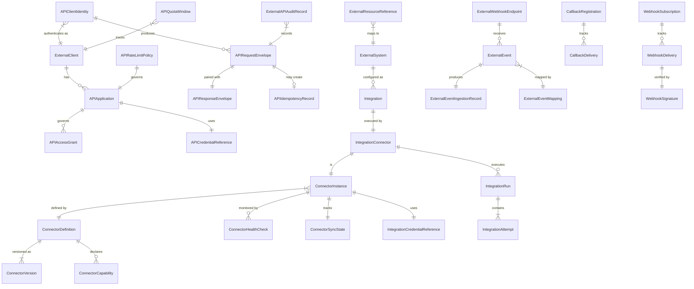
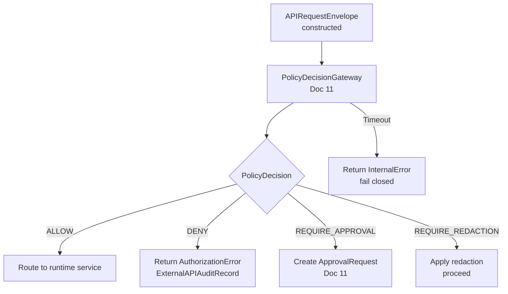
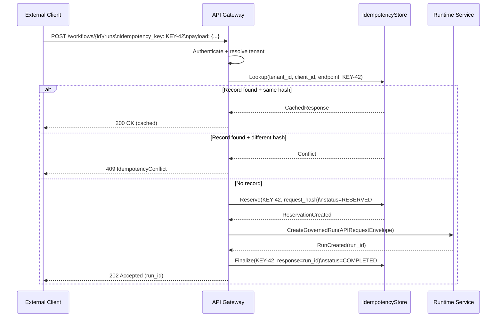
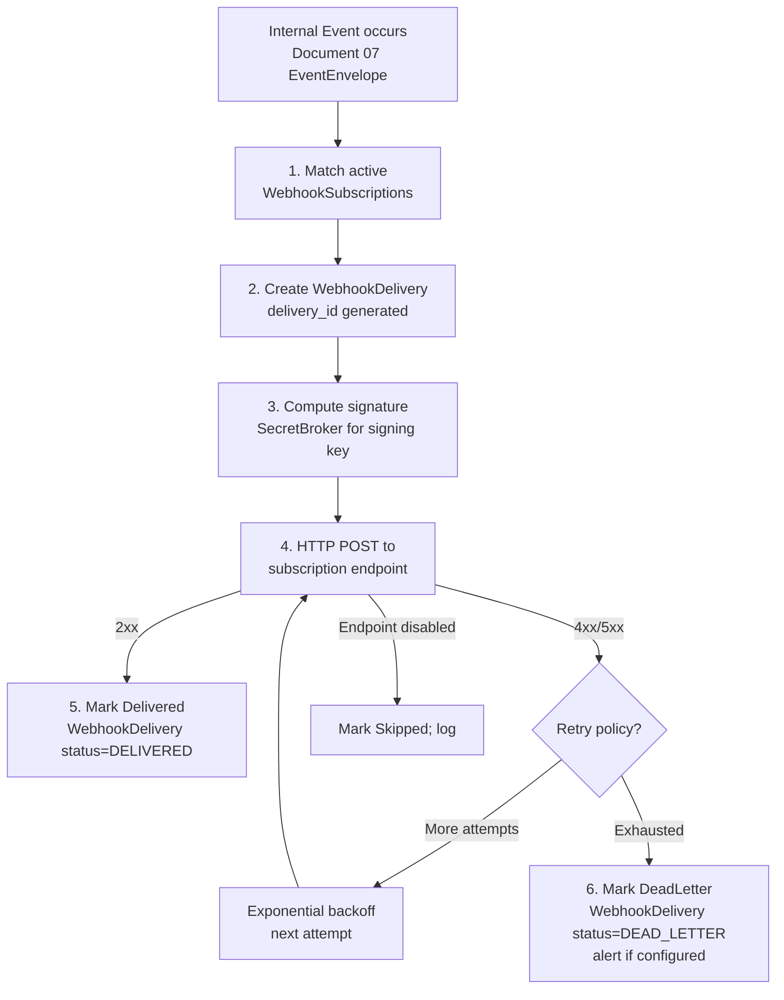
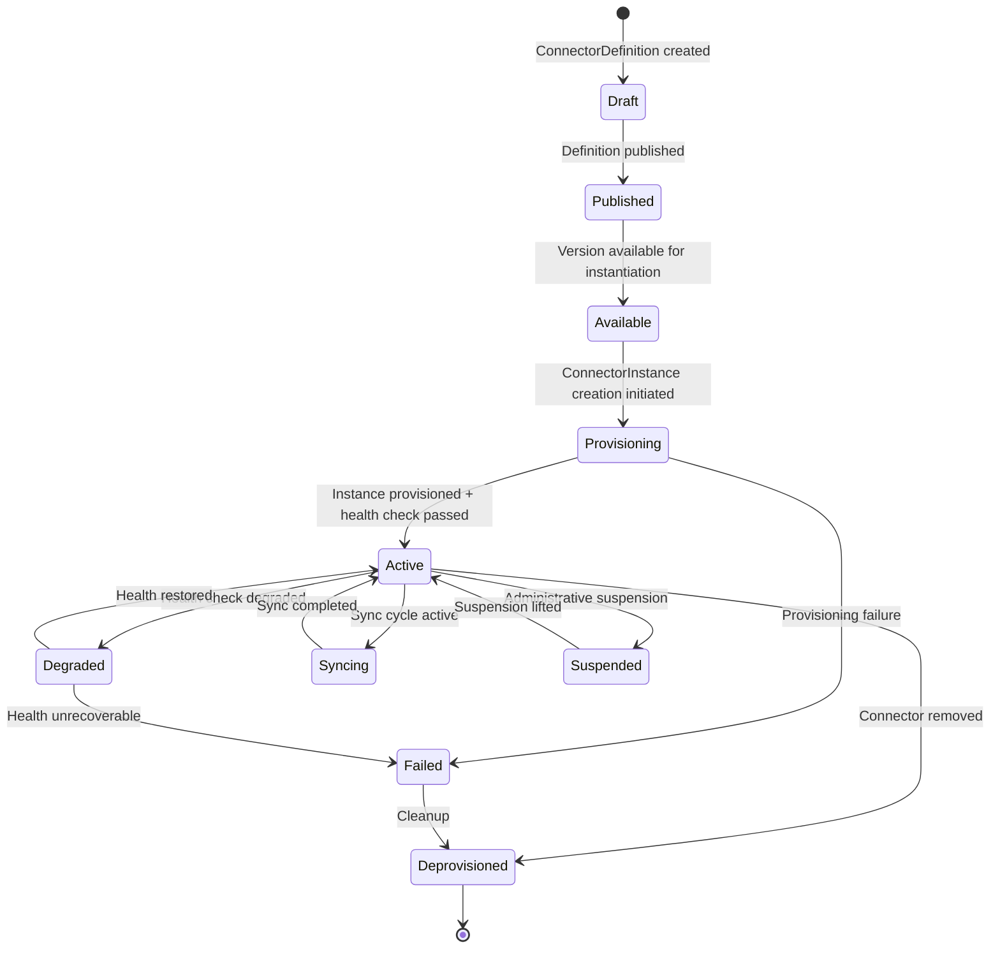
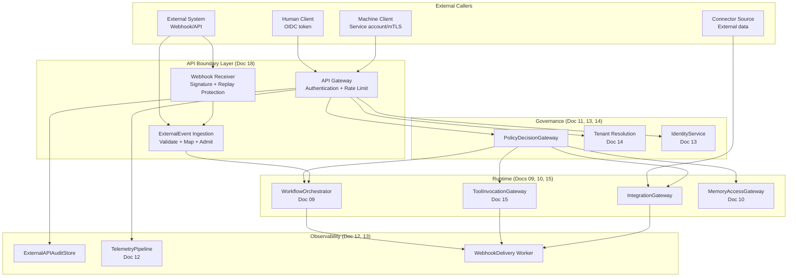
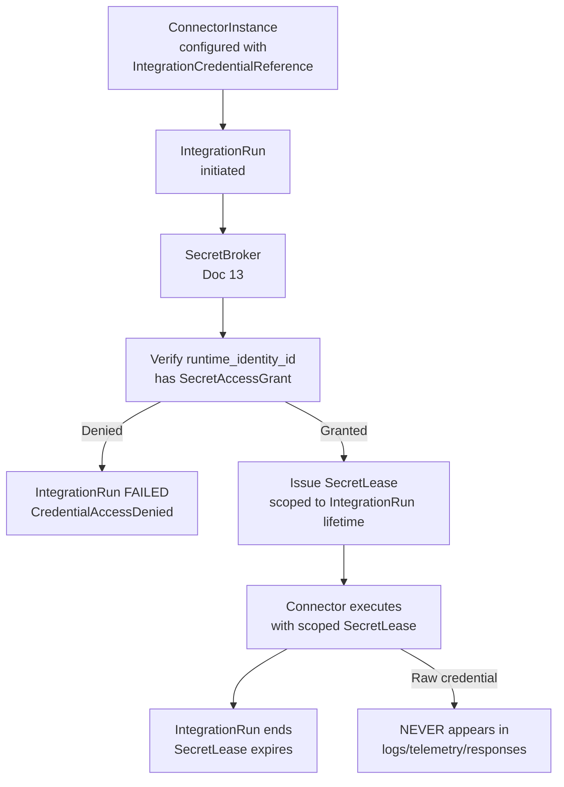

# MYCELIA — 18 External APIs & Integration Contracts

---

## Document Metadata

| Field | Value |
|---|---|
| Document Series | MYCELIA Architecture Constitution |
| Document Number | 18 |
| Version | v1.0 |
| Status | Canonical |
| Classification | Core Architecture — External APIs & Integration Contracts |
| Canonical Role | Defines the external API contracts, integration boundaries, webhook architecture, connector contracts, external event ingestion, integration execution, side-effect gating, API authentication and authorization, idempotency semantics, versioning, error contracts, rate limits, and API security model for all external and integration interfaces of MYCELIA |
| Primary Audience | API Engineers, Integration Engineers, Platform Engineers, External Consumers, Codex |
| Last Updated | June 2026 |

---

## Table of Contents

1. [Executive Summary](#1-executive-summary)
2. [API & Integration Philosophy](#2-api--integration-philosophy)
3. [Scope and Non-Scope](#3-scope-and-non-scope)
4. [Canonical External API Domain Model](#4-canonical-external-api-domain-model)
5. [External API Taxonomy](#5-external-api-taxonomy)
6. [External Request Envelope](#6-external-request-envelope)
7. [External Response Envelope](#7-external-response-envelope)
8. [API Authentication and Client Identity](#8-api-authentication-and-client-identity)
9. [API Authorization and Tenant Context](#9-api-authorization-and-tenant-context)
10. [API Idempotency Semantics](#10-api-idempotency-semantics)
11. [API Versioning and Compatibility](#11-api-versioning-and-compatibility)
12. [API Resource Naming and URI Semantics](#12-api-resource-naming-and-uri-semantics)
13. [Pagination, Filtering, Sorting and Query Safety](#13-pagination-filtering-sorting-and-query-safety)
14. [API Error Contract](#14-api-error-contract)
15. [Rate Limiting, Quotas and Fairness](#15-rate-limiting-quotas-and-fairness)
16. [External Event Ingestion Contract](#16-external-event-ingestion-contract)
17. [Webhook Receiver Contract](#17-webhook-receiver-contract)
18. [Webhook Delivery Contract](#18-webhook-delivery-contract)
19. [Callback Contract](#19-callback-contract)
20. [Connector Architecture](#20-connector-architecture)
21. [Integration Execution Contract](#21-integration-execution-contract)
22. [External Side-Effect Boundary](#22-external-side-effect-boundary)
23. [Integration Credential and Secret Handling](#23-integration-credential-and-secret-handling)
24. [External Resource Identity Mapping](#24-external-resource-identity-mapping)
25. [API Observability and Access Records](#25-api-observability-and-access-records)
26. [API Security, Threat Model and Abuse Controls](#26-api-security-threat-model-and-abuse-controls)
27. [API Consistency, Ordering and Async Operations](#27-api-consistency-ordering-and-async-operations)
28. [API Deprecation, Consumer Management and Contract Governance](#28-api-deprecation-consumer-management-and-contract-governance)
29. [External API Failure Model](#29-external-api-failure-model)
30. [MVP External APIs & Integration Cut](#30-mvp-external-apis--integration-cut)
31. [External API & Integration Diagrams](#31-external-api--integration-diagrams)
32. [External API & Integration Invariants](#32-external-api--integration-invariants)
33. [External API & Integration Anti-Patterns](#33-external-api--integration-anti-patterns)
34. [Codex Implementation Guidance](#34-codex-implementation-guidance)
35. [Relationship to Other Documents](#35-relationship-to-other-documents)
36. [Final External API & Integration Principles](#36-final-external-api--integration-principles)

---

## 1. Executive Summary

### 1.1 What External APIs & Integration Contracts Mean in MYCELIA

External APIs and integration contracts in MYCELIA are the governed boundary layer through which all external intent enters the platform. They are not convenience endpoints, shortcuts into the runtime, or lightweight proxy wrappers. They are the formal, versioned, authenticated, policy-evaluated, idempotency-protected, tenant-scoped contracts that translate external requests — from human actors, external systems, connected applications, webhook deliveries, and integration connectors — into replay-aware runtime operations with full auditability and governance.

MYCELIA is a governed cognitive operations runtime. Every external request must be validated, authenticated, tenant-resolved, schema-verified, and policy-evaluated before it produces any runtime effect. External systems are data sources and consumers; they are never authorities over MYCELIA's execution model.

### 1.2 Why APIs Are Governed Boundary Contracts

An API controller that directly mutates execution state, calls an external system, or writes to the event store without routing through the platform's governance and runtime infrastructure is not an API — it is a governance bypass. In MYCELIA, every API call that triggers execution creates a GovernedRun or IntegrationRun within an OrganizationalRuntimeContext. Every external event that arrives through an ingestion endpoint is normalized, schema-validated, tenant-resolved, and mapped to internal intent before it becomes a Document 07 EventEnvelope. Every external side effect routes through ToolInvocationGateway or IntegrationGateway.

### 1.3 Why External Requests Must Become Governed Runtime Intent

External clients operate outside MYCELIA's trust boundary. They present credentials that must be verified, claim tenant context that must be independently resolved, submit data that must be schema-validated, and request actions that must be policy-evaluated. The transformation of an external HTTP request or webhook payload into a MYCELIA runtime operation is not a pass-through — it is a deliberate, auditable, multi-step translation across the platform's boundary.

### 1.4 Why External Systems Must Never Bypass Governance

An external system that can directly invoke tool capabilities, write to memory namespaces, modify workflow state, or grant itself authority circumvents the governance, security, and observability layers that make MYCELIA trustworthy for enterprise cognitive operations. Every external system interaction that produces a side effect MUST route through the ToolInvocationGateway (Document 15) or IntegrationGateway, which enforces policy evaluation, authorization verification, and audit evidence creation.

### 1.5 Why Webhooks and Callbacks Must Be Verified

An unverified webhook is an untrusted HTTP request. A webhook that is processed without signature verification and replay-protection can be spoofed, replayed with stale payloads, or injected with adversarial content. MYCELIA's webhook receiver MUST verify HMAC-based or equivalent signatures, enforce timestamp tolerance, and apply replay protection before processing any webhook payload.

### 1.6 Why Idempotency and Replay Protection Matter

External systems retry requests. Network failures produce duplicate deliveries. API clients submit the same request twice under uncertainty. Without idempotency protection, these retries produce duplicate GovernedRuns, duplicate side effects, and duplicate state mutations. MYCELIA's idempotency model ensures that within a bounded window, the same idempotency_key with the same request hash produces the same recorded outcome without re-executing the operation.

### 1.7 Core Boundaries

**Document 18 does not own internal workflow orchestration.** Document 09 owns workflow scheduling and execution. Document 18 defines how external requests become workflow triggers.

**Document 18 does not own tool execution internals.** Document 15 owns the SDK and tool runtime contracts. Document 18 defines how external integrations route through the tool and integration gateways.

**Document 18 does not own security identity internals.** Document 13 owns security architecture. Document 18 integrates with Document 13 for authentication and authorization.

**Document 18 defines how external systems safely enter and interact with MYCELIA.**

---

## 2. API & Integration Philosophy

### 2.1 External API as Boundary Contract

Every external API surface is a formal boundary between the outside world and MYCELIA's governed runtime. The API is not a direct window into the platform — it is a translation layer that converts external intent into verifiable, tenant-bound, policy-evaluated, auditable runtime operations. Crossing this boundary requires authentication, tenant resolution, authorization, schema validation, and — for mutations — idempotency protection.

### 2.2 External Intent vs Internal Execution

An external client expresses intent: "start this workflow," "ingest this event," "deliver this webhook." MYCELIA translates that intent into execution: create a GovernedRun, map the event to an EventEnvelope, dispatch a delivery attempt. These are distinct operations. External intent is a request; internal execution is a governed runtime decision. External clients MUST NOT assume that expressing intent equates to completed execution.

### 2.3 External System as Data Source, Not Authority

An external CRM confirming "this deal is closed" is providing data. It is not confirming that a MYCELIA approval gate should be bypassed, that a workflow should transition to a specific state, or that a governance policy should be relaxed. External system outputs are mapped to MYCELIA data models and evaluated against MYCELIA policies. They have no authority over MYCELIA's execution model.

### 2.4 Canonical Distinctions

| Concept A | Concept B | Distinction |
|---|---|---|
| **Public API** | **Internal API** | External-facing governed boundary vs internal service-to-service communication |
| **External API** | **SDK** | HTTP/gRPC boundary contract vs programmatic library (Document 15) |
| **SDK call** | **API contract** | Library-level invocation vs versioned external contract |
| **Connector** | **ToolInvocationGateway** | External system adapter vs internal tool execution boundary (Document 15) |
| **Webhook receiver** | **EventRuntime** | External event ingestion boundary vs internal event broker (Document 08) |
| **External event** | **Canonical event** | Unverified, schema-unknown inbound payload vs Document 07 EventEnvelope |
| **External ID** | **MYCELIA ID** | Foreign system identifier vs platform-stable opaque identifier |
| **External timestamp** | **Runtime timestamp** | Untrusted source time vs platform-recorded authoritative time |
| **External approval** | **MYCELIA ApprovalDecision** | Claim from external system vs Document 11 governed approval |
| **External status** | **MYCELIA state** | Foreign system's view vs authoritative GovernedRun state |
| **Callback acknowledgement** | **Runtime completion** | Receipt confirmation vs execution terminal state |
| **API telemetry** | **Audit evidence** | Diagnostic signal (Document 12) vs security/governance evidence |
| **Integration credential** | **Runtime secret** | External system credential reference vs internal secret lease (Document 13) |
| **API call** | **GovernedRun** | External request vs internal governed execution envelope |

---

## 3. Scope and Non-Scope

### 3.1 What Document 18 Owns

| Responsibility | Description |
|---|---|
| Public API contract taxonomy | Classification of all external API families |
| Integration API boundaries | Connector, integration, and external system interaction rules |
| External request envelope | APIRequestEnvelope schema and construction rules |
| External response envelope | APIResponseEnvelope schema and safety rules |
| API authentication requirements | Client identity, token types, credential lifecycle at API boundary |
| API authorization handoff | Integration with PolicyDecisionGateway and tenant resolution |
| Tenant context validation | How tenant context is resolved and verified for external requests |
| Request validation | Schema validation, payload size limits, content type enforcement |
| Schema versioning | API versioning, compatibility contracts, deprecation |
| Idempotency semantics | Idempotency key scope, record durability, conflict handling |
| Pagination/filtering/sorting | Cursor pagination, tenant-scoped filtering, query safety |
| Error model | Canonical error codes, safe error responses |
| Rate limits and quotas | Per-tenant, per-client, per-endpoint limits |
| Webhook receiver contracts | Signature verification, replay protection, schema validation |
| Webhook delivery contracts | Outbound signing, retry policy, dead-letter, subscription management |
| Callback contracts | Callback registration, signing, SSRF protection |
| External event ingestion | ExternalEvent → Document 07 EventEnvelope mapping |
| Connector lifecycle | ConnectorDefinition, ConnectorInstance, health, sync state |
| Integration credential references | CredentialReference integration with Document 13 |
| External system health contracts | Connector health check, system availability |
| External side-effect boundaries | Routing through ToolInvocationGateway or IntegrationGateway |
| API observability and audit-adjacent records | API traces, access records, usage metrics |
| API deprecation and compatibility | Versioning lifecycle, consumer migration |
| MVP external API cut | Minimum viable external API capabilities |

### 3.2 What Document 18 Does Not Own

| Responsibility | Owned By |
|---|---|
| Internal workflow scheduling | Document 09 (Workflow Orchestration) |
| Event broker topology | Document 08 (Event Runtime) |
| Memory retrieval internals | Document 10 (Memory & Context) |
| Policy engine internals | Document 11 (Governance) |
| Security identity provider internals | Document 13 (Security & Trust) |
| Telemetry storage internals | Document 12 (Observability) |
| Infrastructure gateway deployment | Document 16 (Infrastructure) |
| SRE incident runbooks | Document 17 (SRE) |
| Tool runtime contracts | Document 15 (SDK & Tool Runtime) |
| UI/API console design | Document 20 (Operational UX) |
| Replay investigation UX | Document 22 (Investigation Mode) |

### 3.3 Ownership Matrix

| Capability | Document 18 | Sibling Document |
|---|---|---|
| Tenant resolution for external requests | Defines the validation rule | Doc 14 owns resolution algorithm |
| Policy evaluation for API operations | Integrates with gateway | Doc 11 owns PolicyDecisionGateway |
| Security credential lifecycle | Defines CredentialReference | Doc 13 owns SecretStore and identity |
| API telemetry (trace, metrics) | Defines API span semantics | Doc 12 collects and stores |
| Tool invocation from integration | Routes through gateway | Doc 15 owns ToolInvocationGateway |
| External event to EventEnvelope | Defines mapping contract | Doc 07 owns EventEnvelope schema |
| Infrastructure API gateway | Defines contract | Doc 16 deploys gateway |
| Webhook security signing | Defines signing contract | Doc 13 owns secret/signing key management |
| Replay side-effect suppression | Defines suppression rule | Doc 13/09 enforce during replay |

---

## 4. Canonical External API Domain Model

### 4.1 Entity Reference

#### ExternalClient

| Attribute | Value |
|---|---|
| Purpose | A registered external application, system, or human actor that is authorized to interact with MYCELIA's external APIs |
| Owner service | APIGatewayService |
| Source of truth | APIClientStore (durable) |
| Mutability | Metadata updateable; client_id immutable |
| Tenant scope | Tenant-scoped or platform-scoped |
| Replay behavior | Client identity preserved for forensic audit |
| Retention | Active duration + audit period |
| Security classification | Sensitive |
| Event/audit implications | ExternalClientRegistered, ExternalClientSuspended |

#### APIApplication

| Attribute | Value |
|---|---|
| Purpose | A specific application configuration within an ExternalClient; defines OAuth2 scopes, allowed endpoints, allowed webhook subscriptions, and rate limit tier |
| Owner service | APIGatewayService |
| Source of truth | APIClientStore |
| Mutability | Versioned |
| Tenant scope | Tenant-scoped |
| Replay behavior | Application version preserved for audit |
| Retention | Active duration + audit period |
| Security classification | Sensitive |
| Event/audit implications | APIApplicationUpdated |

#### APIClientIdentity

| Attribute | Value |
|---|---|
| Purpose | The authenticated identity of an API caller: binds external client credentials to a verified principal carrying runtime_identity_id, actor_id, tenant_id, and authorized scopes |
| Owner service | APIGatewayService / IdentityService (Doc 13) |
| Source of truth | Issued at authentication; not persisted independently |
| Mutability | Immutable; short-lived |
| Tenant scope | Bound to tenant_id |
| Replay behavior | API client identity preserved in ExternalAPIAuditRecord |
| Retention | Embedded in access record; audit period |
| Security classification | Highly Sensitive |
| Event/audit implications | APIClientAuthenticated |

#### APICredentialReference

| Attribute | Value |
|---|---|
| Purpose | An opaque reference to the credential material associated with an ExternalClient or APIApplication; the actual credential value is managed in SecretStore (Document 13) |
| Owner service | SecretBroker (Doc 13) |
| Source of truth | SecretStore (Doc 13) |
| Mutability | Versioned on rotation |
| Tenant scope | Tenant-scoped |
| Replay behavior | Reference preserved; raw value never in replay |
| Retention | Active + audit period |
| Security classification | Highly Sensitive |
| Event/audit implications | CredentialRotated, CredentialRevoked |

#### APIAccessGrant

| Attribute | Value |
|---|---|
| Purpose | A policy-evaluated, scope-bound grant authorizing a specific APIClientIdentity to perform a specific set of actions on specific resource types within a tenant |
| Owner service | APIGatewayService / PolicyService (Doc 11) |
| Source of truth | Derived from PolicyDecision at authentication + scoping |
| Mutability | Immutable per grant; revocable by invalidation |
| Tenant scope | Bound to tenant_id |
| Replay behavior | Historical grant preserved in ExternalAPIAuditRecord |
| Retention | Audit period |
| Security classification | Sensitive |
| Event/audit implications | APIAccessGranted, APIAccessRevoked |

#### APIRequestEnvelope

| Attribute | Value |
|---|---|
| Purpose | The canonical internal representation of an authenticated, validated, tenant-resolved external API request; constructed after authentication and before any runtime operation |
| Owner service | APIGatewayService |
| Source of truth | Constructed per request; recorded in ExternalAPIAuditRecord for sensitive operations |
| Mutability | Immutable after construction |
| Tenant scope | Bound to resolved tenant_id |
| Replay behavior | Preserved in ExternalAPIAuditRecord for forensic review |
| Retention | Audit-adjacent retention for sensitive operations |
| Security classification | Sensitive |
| Event/audit implications | ExternalAPIAuditRecord for sensitive operations |

#### APIResponseEnvelope

| Attribute | Value |
|---|---|
| Purpose | The canonical external API response structure; safe, versioned, and tenant-scoped; MUST NOT expose internal details |
| Owner service | APIGatewayService |
| Source of truth | Produced per response |
| Mutability | Immutable |
| Tenant scope | Bound to tenant_id |
| Replay behavior | Response shape preserved in telemetry; not in replay context |
| Retention | Transient; telemetry record per request |
| Security classification | Sensitive (governed by response content) |
| Event/audit implications | Included in ExternalAPIAuditRecord |

#### APIIdempotencyRecord

| Attribute | Value |
|---|---|
| Purpose | A durable record of a processed idempotent request; binds idempotency_key, tenant_id, client_id, endpoint, request_hash, and recorded_outcome so that duplicate requests return the same response |
| Owner service | APIGatewayService |
| Source of truth | IdempotencyStore (durable, strongly consistent) |
| Mutability | Immutable after first write |
| Tenant scope | Bound to tenant_id |
| Replay behavior | Idempotency record not used in replay context |
| Retention | Per idempotency window (typically 24h–7d depending on risk class) |
| Security classification | Sensitive |
| Event/audit implications | None directly |

#### APIRequestValidationResult

| Attribute | Value |
|---|---|
| Purpose | The output of schema validation, authentication, and tenant resolution steps applied to an inbound external request; records validation outcome and errors |
| Owner service | APIGatewayService |
| Source of truth | Ephemeral within request processing |
| Mutability | Immutable |
| Tenant scope | Bound to resolved tenant_id |
| Replay behavior | Not applicable |
| Retention | Short (logging only) |
| Security classification | Internal |
| Event/audit implications | Validation failure produces telemetry record |

#### APIRateLimitPolicy

| Attribute | Value |
|---|---|
| Purpose | A versioned set of rate limit and quota rules applicable to a specific tenant, client, or endpoint; defines allowed request rates, burst capacity, quota windows, and fairness class |
| Owner service | APIGatewayService / QuotaService |
| Source of truth | PolicyStore |
| Mutability | Versioned |
| Tenant scope | Tenant-scoped |
| Replay behavior | Policy version preserved in APIRequestEnvelope |
| Retention | Versioned history |
| Security classification | Sensitive |
| Event/audit implications | RateLimitPolicyUpdated |

#### APIQuotaWindow

| Attribute | Value |
|---|---|
| Purpose | A time-bounded record of API resource consumption for a specific tenant or client within a quota window |
| Owner service | QuotaService |
| Source of truth | QuotaStore |
| Mutability | Append-only within window; new window each period |
| Tenant scope | Bound to tenant_id |
| Replay behavior | Excluded from replay context |
| Retention | FinOps retention period |
| Security classification | Sensitive |
| Event/audit implications | QuotaExceeded |

#### APIUsageRecord

| Attribute | Value |
|---|---|
| Purpose | A time-series record of API call volume, latency, and error rates per tenant and endpoint |
| Owner service | ObservabilityService |
| Source of truth | MetricsStore |
| Mutability | Append-only |
| Tenant scope | Bound to tenant_id |
| Replay behavior | Excluded |
| Retention | FinOps/operational retention |
| Security classification | Sensitive |
| Event/audit implications | None directly |

#### APIVersion

| Attribute | Value |
|---|---|
| Purpose | A versioned identifier for a specific API contract surface; tracks backward-compatible and incompatible changes; defines the schema and behavior contract for a set of endpoints |
| Owner service | APIGatewayService |
| Source of truth | APIContractRegistry |
| Mutability | Immutable once published |
| Tenant scope | Platform-scoped |
| Replay behavior | API version recorded in APIRequestEnvelope |
| Retention | Permanent |
| Security classification | Internal |
| Event/audit implications | APIVersionPublished, APIVersionDeprecated |

#### APIContract

| Attribute | Value |
|---|---|
| Purpose | The formal specification of an external API surface: endpoints, request/response schemas, authentication requirements, authorization scopes, idempotency rules, rate limits, deprecation schedule |
| Owner service | APIGatewayService |
| Source of truth | APIContractRegistry (source-controlled) |
| Mutability | Versioned; immutable per version |
| Tenant scope | Platform-scoped |
| Replay behavior | Contract version recorded in audit records |
| Retention | Permanent |
| Security classification | Internal |
| Event/audit implications | APIContractUpdated |

#### APIDeprecationNotice

| Attribute | Value |
|---|---|
| Purpose | A structured deprecation signal included in API responses for endpoints approaching sunset; carries sunset_date, migration_guide, and replacement_endpoint references |
| Owner service | APIGatewayService |
| Source of truth | APIContractRegistry |
| Mutability | Immutable once issued for a version |
| Tenant scope | Platform-scoped |
| Replay behavior | Not applicable |
| Retention | Active while deprecated endpoint exists |
| Security classification | Internal |
| Event/audit implications | DeprecationNoticeDelivered to consumer |

#### ExternalResourceReference

| Attribute | Value |
|---|---|
| Purpose | A tenant-scoped record mapping an external system's identifier to a MYCELIA resource; preserves external_resource_id, external_system_id, mycelia_resource_id, mapping version, and last_verified_at |
| Owner service | IntegrationService |
| Source of truth | ExternalResourceMappingStore |
| Mutability | Versioned on mapping change |
| Tenant scope | Bound to tenant_id |
| Replay behavior | Mapping version preserved |
| Retention | Resource lifecycle + audit period |
| Security classification | Sensitive |
| Event/audit implications | ExternalResourceMapped, ExternalResourceUnmapped |

#### ExternalSystem

| Attribute | Value |
|---|---|
| Purpose | A registered external system (CRM, ERP, BPM, document store) that has an Integration configured within MYCELIA; defines the system type, integration metadata, and health configuration |
| Owner service | IntegrationService |
| Source of truth | IntegrationStore |
| Mutability | Metadata updateable; system_id immutable |
| Tenant scope | Tenant-scoped |
| Replay behavior | System metadata preserved for audit |
| Retention | Active duration + audit period |
| Security classification | Sensitive |
| Event/audit implications | ExternalSystemRegistered |

#### ExternalSystemIdentity

| Attribute | Value |
|---|---|
| Purpose | The verified identity of an external system interacting with MYCELIA; backed by APICredentialReference and associated with ExternalSystem |
| Owner service | APIGatewayService / IdentityService (Doc 13) |
| Source of truth | Derived at authentication |
| Mutability | Immutable; short-lived |
| Tenant scope | Bound to tenant_id |
| Replay behavior | Preserved in audit record |
| Retention | Embedded in audit record |
| Security classification | Highly Sensitive |
| Event/audit implications | ExternalSystemAuthenticated |

#### Integration

| Attribute | Value |
|---|---|
| Purpose | A configured connection between MYCELIA and an ExternalSystem; defines which ConnectorDefinition to use, which credentials reference to use, and which workflows or execution contexts it services |
| Owner service | IntegrationService |
| Source of truth | IntegrationStore |
| Mutability | Metadata updateable; integration_id immutable |
| Tenant scope | Bound to tenant_id |
| Replay behavior | Integration version preserved in SecuritySnapshot |
| Retention | Active + audit period |
| Security classification | Sensitive |
| Event/audit implications | IntegrationCreated, IntegrationUpdated, IntegrationDisabled |

#### IntegrationConnector

| Attribute | Value |
|---|---|
| Purpose | The runtime adapter that executes the Integration; carries ConnectorInstance, bound credentials, sync state, and execution history |
| Owner service | IntegrationService |
| Source of truth | ConnectorStore |
| Mutability | Controlled state transitions |
| Tenant scope | Bound to tenant_id |
| Replay behavior | Connector state preserved; side effects suppressed |
| Retention | Active + audit period |
| Security classification | Sensitive |
| Event/audit implications | ConnectorActivated, ConnectorFailed |

#### ConnectorDefinition

| Attribute | Value |
|---|---|
| Purpose | A versioned schema describing a connector type: capabilities, configuration schema, credential schema, side-effect class declarations, health check contract, supported API versions |
| Owner service | IntegrationService |
| Source of truth | ConnectorDefinitionStore (immutable per version) |
| Mutability | Immutable per version |
| Tenant scope | Platform-scoped or tenant-scoped (custom connectors) |
| Replay behavior | Definition version preserved in IntegrationRun |
| Retention | Permanent |
| Security classification | Internal |
| Event/audit implications | ConnectorDefinitionPublished |

#### ConnectorVersion

| Attribute | Value |
|---|---|
| Purpose | A specific version of a ConnectorDefinition; immutable once published |
| Owner service | IntegrationService |
| Source of truth | ConnectorDefinitionStore |
| Mutability | Immutable |
| Tenant scope | Platform or tenant-scoped |
| Replay behavior | Version used in IntegrationRun preserved |
| Retention | Permanent |
| Security classification | Internal |
| Event/audit implications | ConnectorVersionPublished |

#### ConnectorInstance

| Attribute | Value |
|---|---|
| Purpose | A specific tenant's deployed instance of a connector, bound to a ConnectorDefinition version, an Integration, and a tenant-scoped credential reference |
| Owner service | IntegrationService |
| Source of truth | ConnectorStore |
| Mutability | Controlled state transitions |
| Tenant scope | Bound to tenant_id |
| Replay behavior | Instance state preserved; execution suppressed |
| Retention | Active + audit period |
| Security classification | Sensitive |
| Event/audit implications | ConnectorInstanceCreated, ConnectorInstanceFailed |

#### ConnectorCapability

| Attribute | Value |
|---|---|
| Purpose | A declared capability of a connector: capability_type (READ, CREATE, UPDATE, DELETE, SUBSCRIBE, NOTIFY, EXECUTE), data_types_supported, side_effect_class, idempotency_strategy |
| Owner service | IntegrationService |
| Source of truth | Embedded in ConnectorDefinition |
| Mutability | Immutable per ConnectorDefinition version |
| Tenant scope | Platform or tenant-scoped |
| Replay behavior | Capability declarations preserved |
| Retention | With ConnectorDefinition |
| Security classification | Internal |
| Event/audit implications | None directly |

#### ConnectorHealthCheck

| Attribute | Value |
|---|---|
| Purpose | A time-bounded record of a connector health evaluation: health status, last_checked, failure_count, error_summary (safe, no secrets) |
| Owner service | IntegrationService |
| Source of truth | ConnectorHealthStore |
| Mutability | Append-only |
| Tenant scope | Bound to tenant_id |
| Replay behavior | Historical health preserved for investigation |
| Retention | Short operational retention |
| Security classification | Internal |
| Event/audit implications | ConnectorHealthDegraded, ConnectorHealthRestored |

#### ConnectorSyncState

| Attribute | Value |
|---|---|
| Purpose | The current sync position of a pull connector: cursor, last_synced_at, total_synced, error_count; tenant-scoped |
| Owner service | IntegrationService |
| Source of truth | ConnectorStore (strongly consistent) |
| Mutability | Updated per sync cycle |
| Tenant scope | Bound to tenant_id |
| Replay behavior | Sync state preserved for investigation |
| Retention | Active + audit period |
| Security classification | Sensitive |
| Event/audit implications | SyncStateAdvanced |

#### ConnectorCursor

| Attribute | Value |
|---|---|
| Purpose | An opaque, tenant-scoped pagination/sync cursor for a pull connector; represents the position in the external system's event or record stream |
| Owner service | IntegrationService |
| Source of truth | ConnectorStore |
| Mutability | Controlled transitions |
| Tenant scope | Bound to tenant_id |
| Replay behavior | Historical cursor preserved |
| Retention | With ConnectorSyncState |
| Security classification | Sensitive |
| Event/audit implications | None directly |

#### IntegrationCredentialReference

| Attribute | Value |
|---|---|
| Purpose | An opaque reference to the credentials required by a specific ConnectorInstance to authenticate to an external system; resolved to SecretLease at runtime by SecretBroker (Document 13) |
| Owner service | SecretBroker (Doc 13) |
| Source of truth | SecretStore (Doc 13) |
| Mutability | Versioned on rotation |
| Tenant scope | Bound to tenant_id |
| Replay behavior | Reference preserved; raw value never in replay |
| Retention | Active + audit period |
| Security classification | Highly Sensitive |
| Event/audit implications | IntegrationCredentialRotated, IntegrationCredentialRevoked |

#### IntegrationRun

| Attribute | Value |
|---|---|
| Purpose | A single governed execution of an Integration: bound to OrganizationalRuntimeContext, ConnectorInstance, PolicySnapshot, SecuritySnapshot; records all IntegrationAttempts |
| Owner service | IntegrationService |
| Source of truth | IntegrationRunStore (durable) |
| Mutability | Controlled state transitions |
| Tenant scope | Bound to tenant_id |
| Replay behavior | Attempts preserved; side effects suppressed |
| Retention | Full audit period |
| Security classification | Sensitive |
| Event/audit implications | IntegrationRunStarted, IntegrationRunCompleted, IntegrationRunFailed |

#### IntegrationAttempt

| Attribute | Value |
|---|---|
| Purpose | A single attempt within an IntegrationRun to execute a specific connector operation; records attempt number, start/end time, outcome, and error if applicable |
| Owner service | IntegrationService |
| Source of truth | IntegrationRunStore |
| Mutability | Immutable after completion |
| Tenant scope | Bound to tenant_id |
| Replay behavior | Preserved; side effects suppressed |
| Retention | With IntegrationRun |
| Security classification | Sensitive |
| Event/audit implications | IntegrationAttemptFailed |

#### ExternalEvent

| Attribute | Value |
|---|---|
| Purpose | An inbound event payload received from an external system via webhook, event stream ingestion, or integration push; treated as untrusted until validated and normalized |
| Owner service | ExternalEventIngestionService |
| Source of truth | Ephemeral until normalized |
| Mutability | Immutable after ingestion record |
| Tenant scope | Resolved during ingestion |
| Replay behavior | ExternalEventIngestionRecord preserved for audit |
| Retention | Ingestion retention period |
| Security classification | Sensitive |
| Event/audit implications | ExternalEventReceived, ExternalEventIngested, ExternalEventFailed |

#### ExternalEventIngestionRecord

| Attribute | Value |
|---|---|
| Purpose | A durable record of an external event ingestion: received payload hash, source identity, tenant resolution outcome, schema validation result, mapping result, and final disposition |
| Owner service | ExternalEventIngestionService |
| Source of truth | IngestionRecordStore (durable) |
| Mutability | Immutable |
| Tenant scope | Bound to resolved tenant_id |
| Replay behavior | Preserved for forensic audit |
| Retention | Audit period |
| Security classification | Sensitive |
| Event/audit implications | Written for every ingestion event |

#### ExternalEventMapping

| Attribute | Value |
|---|---|
| Purpose | A versioned mapping definition that transforms an ExternalEvent schema into a Document 07 EventEnvelope and specifies how to resolve tenant, correlation, and causation context |
| Owner service | ExternalEventIngestionService |
| Source of truth | EventMappingStore (versioned) |
| Mutability | Versioned; immutable per version |
| Tenant scope | Tenant-scoped |
| Replay behavior | Mapping version preserved in ingestion record |
| Retention | Permanent |
| Security classification | Internal |
| Event/audit implications | ExternalEventMappingUpdated |

#### ExternalWebhookEndpoint

| Attribute | Value |
|---|---|
| Purpose | A registered inbound webhook endpoint for a specific tenant and source system; defines the expected source signature type, secret reference, timestamp tolerance, and schema mapping reference |
| Owner service | WebhookService |
| Source of truth | WebhookStore |
| Mutability | Versioned |
| Tenant scope | Bound to tenant_id |
| Replay behavior | Endpoint config version preserved |
| Retention | Active + audit period |
| Security classification | Sensitive |
| Event/audit implications | WebhookEndpointRegistered |

#### WebhookSubscription

| Attribute | Value |
|---|---|
| Purpose | A tenant's subscription to outbound MYCELIA events delivered to a specified endpoint; defines event types, delivery endpoint URL, signing key reference, and retry policy |
| Owner service | WebhookService |
| Source of truth | WebhookStore |
| Mutability | Versioned |
| Tenant scope | Bound to tenant_id |
| Replay behavior | Subscription state preserved; delivery suppressed in replay |
| Retention | Active + audit period |
| Security classification | Sensitive |
| Event/audit implications | WebhookSubscriptionCreated, WebhookSubscriptionDisabled |

#### WebhookDelivery

| Attribute | Value |
|---|---|
| Purpose | A record of a single outbound webhook delivery attempt: subscription_id, event_id, delivery_id, endpoint, payload_hash, status, attempt number, HTTP response code, latency |
| Owner service | WebhookService |
| Source of truth | WebhookDeliveryStore (durable) |
| Mutability | Controlled state transitions |
| Tenant scope | Bound to tenant_id |
| Replay behavior | Preserved for audit; delivery suppressed in replay |
| Retention | Audit period |
| Security classification | Sensitive |
| Event/audit implications | WebhookDeliveryAttempted, WebhookDeliveryFailed |

#### WebhookSignature

| Attribute | Value |
|---|---|
| Purpose | The computed HMAC or equivalent cryptographic signature over an outbound or inbound webhook payload; used to verify authenticity and integrity |
| Owner service | WebhookService |
| Source of truth | Computed; embedded in webhook header |
| Mutability | Immutable |
| Tenant scope | Bound to tenant_id via signing key reference |
| Replay behavior | Signature preserved for verification |
| Retention | Embedded in WebhookDelivery record |
| Security classification | Sensitive |
| Event/audit implications | None directly |

#### WebhookReplayProtectionRecord

| Attribute | Value |
|---|---|
| Purpose | A durable record of a processed inbound webhook delivery_id; used to detect and reject replayed webhook payloads within the replay protection window |
| Owner service | WebhookService |
| Source of truth | WebhookReplayProtectionStore (durable) |
| Mutability | Immutable |
| Tenant scope | Bound to tenant_id |
| Replay behavior | Not applicable |
| Retention | Replay protection window (typically 5 minutes–24 hours) |
| Security classification | Internal |
| Event/audit implications | WebhookReplayDetected on duplicate |

#### CallbackRegistration

| Attribute | Value |
|---|---|
| Purpose | A registered callback endpoint for asynchronous operation completion notification; defines callback URL, auth reference, event types, payload schema version, retry policy, and SSRF-validated status |
| Owner service | CallbackService |
| Source of truth | CallbackStore |
| Mutability | Versioned |
| Tenant scope | Bound to tenant_id |
| Replay behavior | Delivery suppressed in replay |
| Retention | Active + audit period |
| Security classification | Sensitive |
| Event/audit implications | CallbackRegistered |

#### CallbackDelivery

| Attribute | Value |
|---|---|
| Purpose | A record of a single callback delivery attempt: callback_registration_id, operation_id, payload_hash, status, attempt count, response code |
| Owner service | CallbackService |
| Source of truth | CallbackDeliveryStore |
| Mutability | Controlled state transitions |
| Tenant scope | Bound to tenant_id |
| Replay behavior | Delivery suppressed in replay |
| Retention | Audit period |
| Security classification | Sensitive |
| Event/audit implications | CallbackDeliveryFailed |

#### IntegrationErrorRecord

| Attribute | Value |
|---|---|
| Purpose | A durable record of an integration execution error: error class, safe error message, connector_id, integration_run_id, attempt number, timestamp, and quarantine status |
| Owner service | IntegrationService |
| Source of truth | IntegrationErrorStore (durable) |
| Mutability | Immutable |
| Tenant scope | Bound to tenant_id |
| Replay behavior | Preserved for investigation |
| Retention | Audit period |
| Security classification | Sensitive |
| Event/audit implications | IntegrationErrorRecorded |

#### ExternalAPIAuditRecord

| Attribute | Value |
|---|---|
| Purpose | An immutable, append-only record of a security-relevant or governance-relevant external API access; carries client identity, tenant scope, operation, outcome, and trace references |
| Owner service | AuditService |
| Source of truth | APIAuditStore (append-only) |
| Mutability | IMMUTABLE |
| Tenant scope | Bound to tenant_id |
| Replay behavior | Used for forensic audit |
| Retention | Security/governance audit period |
| Security classification | Highly Sensitive |
| Event/audit implications | Written for every sensitive operation |

#### ExternalAPITelemetryRecord

| Attribute | Value |
|---|---|
| Purpose | A diagnostic telemetry record for an external API request: trace_id, span_id, latency, status code, rate limit context; excludes secrets and PII |
| Owner service | ObservabilityService (Doc 12) |
| Source of truth | TelemetryStore |
| Mutability | Append-only |
| Tenant scope | Bound to tenant_id |
| Replay behavior | Separate replay telemetry namespace |
| Retention | Operational retention |
| Security classification | Sensitive |
| Event/audit implications | None directly |

### 4.2 Entity Relationship Diagram



### 4.3 External API Event Registration Rule

All publishable external API, integration, webhook, connector, callback, ingestion, credential-adjacent, export and API security events referenced in this document MUST be registered or explicitly mapped in Document 07 - Event & Messaging Contracts before implementation.

Document 18 defines external API and integration semantics, but it MUST NOT independently create publishable event types outside the canonical event catalog.

### Required External API Event Families

The following event families SHOULD be registered or mapped in Document 07:

| Event Family | Examples |
|---|---|
| API client events | `ExternalClientRegistered`, `ExternalClientSuspended`, `APIApplicationUpdated`, `APIClientAuthenticated` |
| API contract events | `APIVersionPublished`, `APIVersionDeprecated`, `APIContractUpdated`, `DeprecationNoticeDelivered` |
| API access events | `APIAccessGranted`, `APIAccessRevoked`, `ExternalAPIAccessDenied` |
| Credential-adjacent events | `CredentialRotated`, `CredentialRevoked`, `IntegrationCredentialRotated`, `IntegrationCredentialRevoked` |
| External resource events | `ExternalResourceMapped`, `ExternalResourceUnmapped` |
| Integration events | `IntegrationCreated`, `IntegrationUpdated`, `IntegrationDisabled`, `IntegrationRunStarted`, `IntegrationRunCompleted`, `IntegrationRunFailed`, `IntegrationAttemptFailed` |
| Connector events | `ConnectorDefinitionPublished`, `ConnectorVersionPublished`, `ConnectorInstanceCreated`, `ConnectorActivated`, `ConnectorFailed`, `ConnectorHealthDegraded`, `ConnectorHealthRestored` |
| Webhook events | `WebhookEndpointRegistered`, `WebhookSubscriptionCreated`, `WebhookSubscriptionDisabled`, `WebhookDeliveryAttempted`, `WebhookDeliveryFailed`, `WebhookReplayDetected` |
| Callback events | `CallbackRegistered`, `CallbackDeliveryFailed` |
| External event ingestion events | `ExternalEventReceived`, `ExternalEventIngested`, `ExternalEventFailed`, `ExternalEventQuarantined` |
| API abuse/security events | `WebhookSignatureFailed`, `WebhookSpoofingDetected`, `CallbackSSRFBlocked`, `ExternalEventPoisoningDetected`, `CrossTenantAPIAccessAttempted` |
| Export events | `ExternalExportRequested`, `ExternalExportApproved`, `ExternalExportDelivered`, `ExternalExportRevoked` |

### Event Mapping Rule

If Document 07 already defines a broader canonical event type, Document 18 concepts MAY map to that broader event instead of creating a new event name.

Example:

| Document 18 Concept | Allowed Document 07 Mapping |
|---|---|
| `CrossTenantAPIAccessAttempted` | `TenantBoundaryViolationDetected` |
| `WebhookSignatureFailed` | `SecurityThreatDetected` with threat_type=`webhook_signature_failure` |
| `ExternalEventPoisoningDetected` | `SecurityThreatDetected` with threat_type=`external_event_poisoning` |
| `CallbackSSRFBlocked` | `SecurityThreatDetected` with threat_type=`callback_ssrf` |
| `ExternalEventQuarantined` | `MemoryObjectQuarantined` only when mapped through Document 10, otherwise registered ingestion event |

### Rules

- External API events MUST use the canonical EventEnvelope from Document 07.
- External API events MUST include `tenant_id`, `correlation_id`, `causation_id`, `runtime_identity_id`, `event_schema_version`, and `event_hash`.
- External API events MUST NOT contain raw secrets, raw credentials, raw tokens, raw webhook payloads, raw prompts, raw model outputs, or raw documents.
- External API event schemas MUST be versioned.
- Replay API events MUST be isolated from production event streams where applicable.

### Forbidden Behavior

FORBIDDEN:

- allowing Codex to invent external API event names from prose;
- emitting API, webhook, connector, or integration events not registered or mapped in Document 07;
- publishing external API events without schema validation;
- using ExternalAPIAuditRecord as a substitute for Document 07 EventEnvelope;
- emitting replay integration events into production event streams.

---

## 5. External API Taxonomy

### 5.1 API Family Definitions

| API Family | Purpose | Consumers | Allowed Actors | Required Tenant Context | Authorization | Idempotency Required | Rate Limit Class | Audit Required | Replay Implication | Exposure Level |
|---|---|---|---|---|---|---|---|---|---|---|
| **Authentication and session** | OAuth2/OIDC token issuance; API key exchange; session token management | External clients, integrations | Machine + human | Resolved from identity | Basic | No | Standard | Yes | N/A | Public |
| **Tenant and workspace** | Tenant provisioning, workspace lifecycle, member management | Platform admins, enterprise clients | Admin + human | Required | Admin policy | Yes | Restricted | Yes | BoundarySnapshot preserved | Privileged |
| **Workflow definition** | Create, update, publish, version workflow definitions | Developers, builders | Human + machine | Required | Standard policy | Yes | Standard | Yes | Definitions preserved | Public |
| **Workflow run** | Trigger, query, cancel, replay workflow runs | All authenticated clients | Human + machine | Required | Standard policy | Yes (trigger) | Standard | Yes | Run_id preserved | Public |
| **Event ingestion** | Submit external events for normalization and processing | External systems, integrations | Machine | Required | Integration policy | Yes | High | Yes | Ingestion records preserved | Public (controlled) |
| **Webhook management** | Register/update/delete webhook subscriptions and inbound endpoints | Developers, integrations | Human + machine | Required | Standard policy | Yes | Standard | Yes | Subscription config preserved | Public |
| **Connector management** | Register, configure, activate, deactivate integration connectors | Platform admins, integration engineers | Admin + human | Required | Admin policy | Yes | Restricted | Yes | Connector config preserved | Platform |
| **Integration execution** | Trigger, monitor, cancel integration runs | Integration actors | Machine + human | Required | Integration policy | Yes | Standard | Yes | Side effects suppressed | Public (controlled) |
| **Tool registration** | Register external tools accessible from workflows | Platform admins, developers | Admin + human | Required | Admin policy | Yes | Restricted | Yes | Tool definitions preserved | Platform |
| **Artifact** | Query, reference, download workflow artifacts | All authenticated clients | Human + machine | Required | Standard policy | No | Standard | Conditional | Artifacts read-only in replay | Public |
| **Memory reference** | Query tenant memory references (not raw content) | Authorized clients | Human | Required | Elevated policy | No | Restricted | Yes | Snapshot-only in replay | Public (controlled) |
| **Governance and approval** | Submit approval decisions, query approval status | Approvers, governance actors | Human | Required | Governance policy | Yes | Standard | Yes (mandatory) | ApprovalSnapshot preserved | Public (controlled) |
| **Observability query** | Query traces, metrics, logs for tenant scope | Operators, developers | Human | Required | Standard policy | No | Standard | Yes (sensitive queries) | Replay traces in separate namespace | Public (controlled) |
| **Replay and investigation** | Trigger replays, query replay status, investigation mode | Operators, governance actors | Human | Required | Elevated policy | Yes | Restricted | Yes (mandatory) | Produces replay context | Public (controlled) |
| **Admin/support** | Support access, platform admin operations | Platform support, admins | Admin (MFA required) | Required (explicit) | Admin + break-glass | Yes | Highly Restricted | Yes (mandatory) | Historical audit only | Privileged |
| **Export** | Export tenant data, artifacts, governance records | Authorized clients | Human + machine | Required | Elevated + approval | Yes | Restricted | Yes (mandatory) | Exports externalize artifacts | Public (controlled) |

---

## 6. External Request Envelope

### 6.1 APIRequestEnvelope Schema

```
APIRequestEnvelope {
  request_id:               UUID; generated server-side; MUST NOT be client-supplied
  tenant_id:                resolved server-side from authenticated identity (NEVER from request body)
  workspace_id:             optional; resolved from authenticated identity or explicit tenant-verified parameter
  project_id:               optional; resolved from authenticated identity or explicit tenant-verified parameter
  actor_id:                 optional; present for human-initiated operations (from identity claims)
  runtime_identity_id:      required; system identity for the API session (from APIClientIdentity)
  external_client_id:       required; the authenticated ExternalClient or APIApplication identifier
  api_version:              required; e.g. "2026-06"
  contract_version:         required; links to APIContract version
  idempotency_key:          required for mutation/execution APIs; scoped to tenant_id + client_id + endpoint
  correlation_id:           required; generated server-side; propagated to all downstream operations
  causation_id:             optional; for chained operations
  request_purpose:          required; declared intent string (logged; not evaluated for authorization)
  data_classification:      required; maximum classification of request content
  residency_hint:           optional; tenant residency context when applicable
  request_schema_version:   required; version of the request payload schema
  payload_ref:              optional; reference to large payload stored externally (artifact ID + hash)
  payload:                  optional; inline payload for small requests
  payload_hash:             required when payload present; SHA-256 of payload
  received_at:              timestamp set server-side; MUST NOT be client-supplied
  signature_context:        optional; present for webhook-derived requests
}
```

### 6.2 Request Envelope Rules

**REQ-01.** tenant_id MUST NOT be trusted from request body or URL without server-side validation. Tenant context MUST be derived from authenticated identity per Document 14.

**REQ-02.** APIRequestEnvelope MUST be constructed after authentication and tenant resolution, not before.

**REQ-03.** Every governed API request MUST bind to OrganizationalRuntimeContext from Document 14.

**REQ-04.** APIRequestEnvelope MUST NOT contain raw secrets, raw credentials, raw model outputs, raw prompt text, or cross-tenant data.

**REQ-05.** Large payloads SHOULD use payload_ref with payload_hash rather than embedding the payload.

**REQ-06.** Every request that may create, mutate, or trigger execution MUST include or derive an idempotency_key.

**REQ-07.** received_at MUST be set server-side. Client-supplied timestamps are metadata only.

### 6.3 Request Envelope Creation Flow

```mermaid
flowchart TD
  HTTP[Inbound HTTP Request] --> AUTH[1. Authenticate client\nAPIClientIdentity resolved]
  AUTH -- Failed --> DENY_AUTH[Return AuthenticationError\nAPIAuditRecord]
  AUTH -- Success --> TENANT[2. Resolve tenant context\nfrom identity claims (Doc 14)]
  TENANT -- Failed --> DENY_TENANT[Return TenantResolutionError\nAPIAuditRecord]
  TENANT -- Success --> SCHEMA[3. Schema validation\nAPIRequestValidationResult]
  SCHEMA -- Failed --> DENY_SCHEMA[Return ValidationError]
  SCHEMA -- Success --> AUTHZ[4. Authorization\nPolicyDecisionGateway (Doc 11)]
  AUTHZ -- DENY --> DENY_AUTHZ[Return AuthorizationError\nAPIAuditRecord]
  AUTHZ -- ALLOW --> IDEM[5. Idempotency check\nAPIIdempotencyRecord]
  IDEM -- Duplicate → same result --> REPLAY_RESP[Return cached response]
  IDEM -- Conflict → different payload --> CONFLICT[Return IdempotencyConflictError]
  IDEM -- New request --> ENVELOPE[6. Construct APIRequestEnvelope\nwith correlation_id, tenant_id, runtime_identity_id]
  ENVELOPE --> RLIMIT[7. Rate limit check\nAPIRateLimitPolicy]
  RLIMIT -- Exceeded --> RATE_ERR[Return RateLimitExceededError]
  RLIMIT -- OK --> DISPATCH[8. Dispatch to runtime/service]
```

---

## 7. External Response Envelope

### 7.1 APIResponseEnvelope Schema

```
APIResponseEnvelope {
  request_id:               UUID; echoes APIRequestEnvelope.request_id
  response_id:              UUID; server-generated
  tenant_id:                required; the resolved tenant scope
  api_version:              required; echoes request api_version
  contract_version:         required; echoes request contract_version
  status:                   ACCEPTED | PENDING | COMPLETED | FAILED | PARTIAL
  result_ref:               optional; reference ID for large or async results
  result:                   optional; inline result for small synchronous responses
  error:                    optional; present when status=FAILED
  correlation_id:           required; echoes request correlation_id
  causation_id:             optional
  idempotency_key:          optional; echoes request idempotency_key when present
  rate_limit_context: {     safe rate limit state for consumer awareness
    limit:                  integer
    remaining:              integer
    reset_at:               timestamp
  }
  trace_id:                 required; for correlation with telemetry (Doc 12)
  created_at:               timestamp
  replay_safety_label:      optional; REPLAY_CONTEXT | PRODUCTION (set when replay output is returned)
  deprecation_notice:       optional; APIDeprecationNotice when applicable
}
```

### 7.2 Response Envelope Rules

**RESP-01.** API responses MUST NOT leak internal implementation details (stack traces, internal service topology, database schema, policy source, internal route names).

**RESP-02.** API responses MUST NOT expose raw secrets, raw credentials, internal stack traces, raw prompts, raw model outputs, or cross-tenant data.

**RESP-03.** Responses for large artifacts SHOULD return result_ref with an artifact ID and access URI; they SHOULD NOT embed large content inline.

**RESP-04.** Asynchronous operations MUST return run_id, operation_id, or integration_run_id rather than blocking until completion. Long-running operations MUST use status=PENDING with a polling or callback path.

**RESP-05.** Callback acknowledgement (HTTP 200 from callback endpoint) MUST NOT be interpreted as workflow completion. It means the delivery was received, not that the operation completed.

**RESP-06.** When returning replay output, replay_safety_label MUST be set to REPLAY_CONTEXT to prevent consumers from treating replay results as production state.

---

## 8. API Authentication and Client Identity

### 8.1 Supported Authentication Methods

| Method | Use Case | Security Level | Token Lifetime | Notes |
|---|---|---|---|---|
| **OIDC client credentials** | M2M enterprise integrations | High | Short-lived (≤1h) | Preferred for enterprise |
| **mTLS client certificate** | High-assurance M2M integrations | Very High | Certificate lifecycle | Requires workload attestation |
| **OAuth2 authorization code + PKCE** | Human-delegated access | High | Short-lived access token | For user-facing integrations |
| **Scoped API token** | Limited integrations, dev tooling | Medium | Configurable; MUST expire | Restricted capabilities only |
| **API key** | Low-risk, scoped integrations only | Low | MUST rotate; MUST expire | Hashed at rest; MUST NOT be logged |

### 8.2 Authentication Rules

**AUTHN-API-01.** External API authentication MUST use Document 13 security architecture for identity and credential management.

**AUTHN-API-02.** Every API request MUST have an authenticated client identity before APIRequestEnvelope is constructed.

**AUTHN-API-03.** Human-delegated API calls MUST preserve actor_id and runtime_identity_id in the APIRequestEnvelope.

**AUTHN-API-04.** Machine-to-machine API calls MUST use APIClientIdentity or ServiceIdentity from Document 13.

**AUTHN-API-05.** API keys MAY be used only for limited, low-risk, explicitly scoped integrations. API keys MUST be hashed at rest, rotated on schedule, never logged, and MUST carry explicit expiration.

**AUTHN-API-06.** Shared static API keys across multiple services or tenants are FORBIDDEN for high-risk operations.

**AUTHN-API-07.** mTLS or OIDC client credentials SHOULD be preferred for enterprise production integrations.

**AUTHN-API-08.** Revoked credentials MUST fail immediately. There is no grace period.

**AUTHN-API-09.** Trace headers (traceparent, tracestate) MUST NOT be used as authentication or tenant context.

---

## 9. API Authorization and Tenant Context

### 9.1 Authorization Flow

Authorization for external API requests routes through Document 11's PolicyDecisionGateway. Every API call that triggers a governed operation MUST produce a PolicyDecision before the operation executes.

Document 13 provides identity and credential verification. Document 11 provides policy evaluation. Document 14 provides tenant context resolution. Document 18 binds them at the external boundary.

### 9.2 Tenant Resolution for External Requests

Tenant context MUST be derived from:
1. Authenticated identity claims (JWT tenant_id claim, OIDC issuer → tenant mapping)
2. APIApplication binding (application registered to a specific tenant)
3. Explicit tenant_id in API path verified against identity membership
4. Service account tenant binding

Tenant context MUST NOT be derived from request body tenant_id, URL query parameters without identity verification, webhook payload, model output, or tool output.

### 9.3 Authorization Rules

**AUTHZ-API-01.** External API authorization MUST integrate with Document 11 PolicyDecisionGateway for all governed operations.

**AUTHZ-API-02.** Tenant context MUST be derived from authenticated identity and verified membership — never from untrusted request fields.

**AUTHZ-API-03.** Every APIAccessGrant MUST be tenant-scoped unless explicitly platform-scoped with full governance record.

**AUTHZ-API-04.** Cross-tenant API access is FORBIDDEN unless explicitly platform-scoped and governed through PolicyDecisionGateway.

**AUTHZ-API-05.** API authorization cache MUST be bounded by TTL, scoped to client + tenant + scope, and invalidated on policy changes, credential revocation, or tenant configuration changes.

**AUTHZ-API-06.** Admin and support APIs MUST create access records per Documents 13 and 14 requirements.

### 9.3.1 API Authorization Cache Boundary

API authorization cache is an optimization for bounded, already-evaluated decisions.

API authorization cache MUST NOT become a substitute for PolicyDecisionGateway, current identity validation, tenant isolation, credential status, or security auditability.

### Allowed Uses

API authorization cache MAY be used only when all of the following are true:

- the original decision was produced by PolicyDecisionGateway;
- the cached decision is scoped to the same tenant_id;
- the cached decision is scoped to the same external_client_id;
- the cached decision is scoped to the same APIApplication;
- the cached decision is scoped to the same actor_id when human-delegated;
- the cached decision is scoped to the same runtime_identity_id;
- the cached decision is scoped to the same endpoint, method, action, resource and purpose;
- the cached decision TTL has not expired;
- the credential has not expired or been revoked;
- the tenant is still active and not suspended/restricted in a conflicting way;
- the policy snapshot remains compatible with the operation;
- the operation is not classified as non-cacheable.

### Non-Cacheable API Operations

The following operations MUST NOT use cached authorization decisions:

- admin/support APIs;
- export APIs;
- replay/investigation APIs;
- credential creation, rotation, revocation or test APIs;
- connector credential binding APIs;
- webhook signing secret APIs;
- tenant lifecycle APIs;
- workspace membership mutation APIs;
- break-glass APIs;
- approval decision APIs;
- external side-effect APIs classified as irreversible, regulated, financial or credential-affecting;
- cross-tenant platform-scoped APIs.

### Rules

- Cache hit MUST still validate tenant_id, runtime_identity_id, credential status, decision scope and TTL.
- Cache hit MUST still create or reference an ExternalAPIAuditRecord where required.
- Cached decisions MUST NOT be shared across tenants, clients, actors, runtime identities, resources, endpoints, methods or purposes.
- Cached ALLOW MUST be invalidated on credential revocation, token revocation, tenant suspension, policy revocation, access grant revocation, relevant role change or SecurityConstraint activation.
- Authorization cache MUST fail closed when validation cannot be completed.

### Forbidden Behavior

FORBIDDEN:

- using API authorization cache as a general permission cache;
- using cached authorization after credential or token revocation;
- using cached authorization across tenants;
- using cached authorization for export, admin, support, replay, credential or irreversible side-effect APIs;
- allowing Codex to skip PolicyDecisionGateway because a prior API call was allowed.

### 9.4 Authorization Flow Diagram



---

## 10. API Idempotency Semantics

### 10.1 Idempotency Model

Idempotency in MYCELIA's external API layer ensures that retries of the same request produce the same observable outcome without re-executing the underlying operation.

**Idempotency scope** MUST include: `tenant_id + external_client_id + api_endpoint + http_method + idempotency_key`

**Request hash** is computed over the normalized request payload and used to detect conflicting duplicate submissions.

### 10.2 Idempotency Outcomes

| Case | Behavior |
|---|---|
| **New request** (no matching idempotency_key) | Process normally; create APIIdempotencyRecord before side effects |
| **Duplicate request** (same key + same hash) | Return recorded response without re-executing |
| **Conflict** (same key + different hash) | Return IdempotencyConflictError |
| **Expired key** (key outside idempotency window) | Process as new request |

### 10.3 Idempotency Rules

**IDEM-01.** All mutation, execution-triggering, webhook-ingestion, and external-side-effect APIs MUST support idempotency.

**IDEM-02.** Idempotency scope MUST include tenant_id to prevent cross-tenant idempotency record collisions.

**IDEM-03.** APIIdempotencyRecord MUST be durably written before any side effects are executed.

**IDEM-04.** Idempotency keys MUST NOT be globally shared across tenants.

**IDEM-05.** Idempotency records MUST expire according to the risk class of the operation (minimum 24 hours; high-risk mutation operations may require 7 days).

**IDEM-06.** Idempotency does not bypass authorization. A duplicate request that would fail authorization MUST still fail.

### 10.3.1 Idempotency Reservation and Finalization Boundary

API idempotency has two phases:

1. reservation before execution;
2. finalization after the governed outcome is known.

This prevents duplicate requests from racing into duplicate GovernedRuns, IntegrationRuns, webhook ingestions, exports, or external side effects.

### Idempotency Phases

| Phase | Meaning | Required Behavior |
|---|---|---|
| `RESERVED` | The idempotency key has been claimed for a normalized request hash | Created before any mutation, run creation, external event dispatch, or side effect |
| `IN_PROGRESS` | The operation has been admitted and is executing | Duplicate requests return operation reference or in-progress response |
| `COMPLETED` | The operation completed successfully or was accepted asynchronously | Duplicate requests return recorded response |
| `FAILED_RETRYABLE` | Operation failed before irreversible side effects | Duplicate request MAY retry according to contract |
| `FAILED_TERMINAL` | Operation failed in a terminal way | Duplicate request returns recorded terminal failure |
| `CONFLICT` | Same key used with different request hash | Request rejected with IdempotencyConflictError |

### Rules

- APIIdempotencyRecord reservation MUST be durably created before any mutation or side effect.
- APIIdempotencyRecord reservation MUST include normalized_request_hash.
- Duplicate requests while status=`IN_PROGRESS` MUST NOT create a second operation.
- Duplicate requests while status=`COMPLETED` MUST return the recorded response or operation reference.
- Same idempotency_key with a different normalized_request_hash MUST return IdempotencyConflictError.
- Idempotency finalization MUST record the final response envelope hash or operation reference.
- Idempotency finalization failure after accepted execution MUST trigger SRE alert and reconciliation.
- Idempotency does not authorize the request; authorization MUST still be evaluated or validated according to cache rules.

### Forbidden Behavior

FORBIDDEN:

- creating a GovernedRun before reserving the idempotency key;
- executing an external side effect before reserving the idempotency key;
- treating idempotency as an in-memory lock only;
- allowing two concurrent requests with the same idempotency key to create separate operations;
- overwriting an idempotency record with a different request hash;
- allowing Codex to persist idempotency only after runtime execution succeeds.

### 10.4 Idempotency Sequence Diagram



---

## 11. API Versioning and Compatibility

### 11.1 Version Model

MYCELIA external APIs use date-based versioning (`YYYY-MM`). The api_version is declared in the request and echoed in the response. Endpoint versioning follows the pattern `/v{major}/` or is carried in the api_version header.

### 11.2 Change Classification

| Change Type | Classification | Required Action |
|---|---|---|
| Add new optional response field | Backward-compatible | Allowed with consumer "ignore unknown" requirement |
| Add new optional request field | Backward-compatible | Allowed |
| Remove response field | Breaking | New API version required |
| Rename field | Breaking | New API version required |
| Change field type | Breaking | New API version required |
| Change semantic meaning of field | Breaking | New API version required |
| Add required request field | Breaking | New API version required |
| Change error codes | Breaking | New API version required |
| Add new endpoint | Backward-compatible | Allowed |
| Remove endpoint | Breaking | New API version required + deprecation window |

### 11.3 Versioning Rules

**VER-01.** Public API contracts MUST be versioned.

**VER-02.** Breaking changes require a new API version. Incompatible changes MUST NOT be made to an existing published API version.

**VER-03.** Additive response fields are allowed only if consumers are required by contract to ignore unknown fields (strict schema validation on consumer side does not exempt the producer).

**VER-04.** Deprecated APIs MUST return deprecation_notice in APIResponseEnvelope.

**VER-05.** API version MUST be visible in both request and response.

**VER-06.** Internal domain model changes MUST NOT surface as unversioned API changes.

**VER-07.** Sunset timeline for a deprecated API version MUST be declared in APIContract and communicated to registered consumers.

---

## 12. API Resource Naming and URI Semantics

### 12.1 Resource Naming Convention

| Resource | URI Pattern | Notes |
|---|---|---|
| Workflows | `/v1/workflows` | Tenant-scoped; opaque IDs only |
| Workflow versions | `/v1/workflows/{workflow_id}/versions/{version_id}` | |
| Workflow runs | `/v1/runs` | Tenant-scoped |
| Run steps | `/v1/runs/{run_id}/steps` | |
| Approvals | `/v1/approvals` | Tenant + governance scoped |
| Connectors | `/v1/connectors` | Tenant-scoped |
| Integrations | `/v1/integrations` | Tenant-scoped |
| Integration runs | `/v1/integrations/{integration_id}/runs` | |
| Artifacts | `/v1/artifacts/{artifact_id}` | Tenant-scoped with classification |
| Webhook subscriptions | `/v1/webhooks/subscriptions` | Tenant-scoped |
| Webhook endpoints | `/v1/webhooks/endpoints` | Tenant-scoped |
| Events (ingestion) | `/v1/events` | POST only |
| Replays | `/v1/replays` | Elevated authorization |
| Exports | `/v1/exports` | Elevated authorization |

### 12.2 URI Naming Rules

**URI-01.** External APIs MUST use opaque IDs. Tenant display names, company names, email addresses, and sensitive business identifiers MUST NOT appear in URI paths.

**URI-02.** TenantRouteKey MUST NOT be exposed as a customer-facing identifier in URIs.

**URI-03.** Resource IDs MUST be stable across API versions and non-guessable (UUID or equivalent).

**URI-04.** Nested resource URIs MUST NOT imply authorization. A client that can construct the URI of a nested resource MUST NOT receive that resource without a policy check.

**URI-05.** Resource existence errors (404) MUST not expose whether a resource exists in another tenant's namespace. MUST return 404 for both "not found" and "found but forbidden" to prevent enumeration.

---

## 13. Pagination, Filtering, Sorting and Query Safety

### 13.1 Pagination Contract

MYCELIA uses cursor-based pagination for all list endpoints over unbounded or large datasets.

```
PaginatedResponse {
  items:            list of results
  cursor:           optional; opaque next-page cursor (absent when no more pages)
  has_more:         boolean
  limit:            actual limit applied
  total_count:      optional; only for bounded small result sets
}
```

Cursors are opaque, tenant-scoped, and MUST NOT be constructible by external clients. Cursors expire after a configurable window.

### 13.2 Query Safety Rules

**QUERY-01.** List APIs MUST use cursor-based pagination for unbounded datasets.

**QUERY-02.** Offset pagination MAY be used only for small bounded resources (e.g., workflow steps within a single run).

**QUERY-03.** Every list query MUST be tenant-scoped before filtering. Tenant scope is applied before any other filter.

**QUERY-04.** Filtering MUST use an allowlisted set of filter fields. Raw SQL expressions, arbitrary JSONPATH, or dynamic expressions from query parameters are FORBIDDEN.

**QUERY-05.** Sort keys MUST be allowlisted. Arbitrary field sort is FORBIDDEN.

**QUERY-06.** Page size MUST have a declared maximum per endpoint. Requests exceeding maximum are clamped or rejected.

**QUERY-07.** Search APIs MUST apply tenant/workspace/namespace filters before any semantic or lexical search operation per Document 10 and Document 14 isolation rules.

**QUERY-08.** Query results MUST avoid cross-tenant enumeration through error codes, counts, or response timing differences.

---

## 14. API Error Contract

### 14.1 Canonical Error Schema

```
APIError {
  error_code:           string (machine-readable; from allowlisted registry)
  error_type:           string (error class name)
  message:              string (safe, generic; MUST NOT expose internals)
  safe_message:         string (explicitly safe version for external display)
  details_ref:          optional UUID (reference to logged details; not inline)
  retryable:            boolean
  retry_after:          optional timestamp or seconds
  correlation_id:       required
  trace_id:             required
  request_id:           required
  policy_decision_ref:  optional opaque support/governance reference; internal policy_decision_id remains in ExternalAPIAuditRecord only
  validation_errors:    optional; list of {field, code, safe_message} for validation failures
}
```

### 14.2 Error Class Reference

| Error Class | HTTP Status | Retryable | Idempotent Retry Safe |
|---|---|---|---|
| **ValidationError** | 400 | No | Yes |
| **AuthenticationError** | 401 | No | After credential fix |
| **AuthorizationError** | 403 | No | After policy change |
| **TenantResolutionError** | 403 | No | After config fix |
| **PolicyDeniedError** | 403 | No | No |
| **ApprovalRequiredError** | 202 (async pending) | No | Yes (check status) |
| **IdempotencyConflictError** | 409 | No | No |
| **RateLimitExceededError** | 429 | Yes | Yes |
| **QuotaExceededError** | 429 | After quota window | Yes |
| **NotFoundError** | 404 | No | Yes |
| **ConflictError** | 409 | No | No |
| **VersionUnsupportedError** | 400 | No | After version upgrade |
| **PayloadTooLargeError** | 413 | No | After size reduction |
| **WebhookSignatureError** | 401 | No | After signing fix |
| **ConnectorUnavailableError** | 503 | Yes (after retry_after) | Yes |
| **ExternalSystemUnavailableError** | 502 | Yes | Yes |
| **ResidencyViolationError** | 403 | No | No |
| **ReplayNotAllowedError** | 403 | No | No |
| **InternalError** | 500 | Yes (after retry_after) | Yes |

### 14.3 Error Rules

**ERR-01.** Error responses MUST be safe by default. The safest possible response is the default.

**ERR-02.** Error messages MUST NOT expose: internal service names, database schema, stack traces, policy internals, secret paths, raw credentials, cross-tenant resource existence, internal topology, or raw model outputs.

**ERR-03.** NotFoundError (404) and ForbiddenError (403) behavior MUST prevent resource enumeration: both a non-existent resource and a resource belonging to another tenant return 404 by default.

**ERR-04.** Retryable errors MUST include retry_after when the appropriate delay can be determined.

**ERR-05.** Every error MUST include correlation_id and request_id for internal traceability.

**ERR-06.** Internal errors MUST be fully traceable internally via trace_id but MUST NOT expose internal details externally. The detail is accessible in internal telemetry; the external consumer receives only a reference.

### 14.4 External Error Policy Decision Boundary

External API errors MUST NOT expose raw internal governance identifiers unless the API contract explicitly permits it and the caller is authorized for that governance scope.

`policy_decision_id` is an internal governance identifier.

External responses SHOULD use an opaque `policy_decision_ref` or `details_ref` that can be resolved only through authorized internal support, governance, or audit workflows.

### Rules

- External error responses MUST NOT expose raw PolicyDecision identifiers by default.
- ExternalAPIAuditRecord MAY store the internal `policy_decision_id`.
- APIError MAY include `policy_decision_ref` only if it is opaque, tenant-scoped, non-enumerable and access-controlled.
- `details_ref` MUST NOT reveal whether a resource exists in another tenant.
- Policy denial details MUST be safe, generic and non-enumerating.
- Governance actors may retrieve detailed policy decision information only through governed APIs defined by Document 11.

### Corrected APIError Field

In external responses, use:

```text
policy_decision_ref: optional opaque support/governance reference
```

Do not expose:

```text
policy_decision_id: internal PolicyDecision identifier
```

### Forbidden Behavior

FORBIDDEN:

- returning raw `policy_decision_id` in ordinary external API errors;
- exposing policy rule names, policy source, policy internals or policy precedence in external errors;
- allowing attackers to correlate governance decisions through stable internal identifiers;
- using `details_ref` as an unprotected access path to internal error details;
- allowing Codex to expose internal governance IDs for debugging convenience.

---

## 15. Rate Limiting, Quotas and Fairness

### 15.1 Rate Limit Architecture

MYCELIA enforces rate limits at multiple levels, applied in order:

1. **Client-level**: requests per minute per APIApplication
2. **Tenant-level**: requests per minute across all clients for a tenant
3. **Endpoint-level**: specific high-risk or expensive endpoints have stricter limits
4. **Operation-level**: workflow triggers, replay requests, and export requests have their own quotas

Rate limit state is maintained per TenantRouteKey to prevent display name exposure in infrastructure.

### 15.2 Quota Classes

| Resource | Quota Type | Integration with |
|---|---|---|
| Workflow execution quota | Per tenant, per window | Doc 14 TenantResourceQuota |
| Model invocation quota | Per tenant, per window | Doc 14 TenantResourceQuota |
| Connector sync quota | Per connector, per window | IntegrationRun count |
| Webhook delivery quota | Per subscription, per window | WebhookDelivery retry limits |
| Export quota | Per tenant, per day | CrossBoundaryExport count |
| Replay quota | Per tenant, per day | Replay concurrency from Doc 14 |

### 15.3 Rate Limit Response

Rate limit responses MUST include safe rate_limit_context in APIResponseEnvelope:
- `limit`: the applicable rate limit
- `remaining`: remaining capacity in current window
- `reset_at`: when the window resets

### 15.4 Rate Limit Rules

**RATE-01.** Rate limits MUST be tenant-scoped and client-scoped.

**RATE-02.** Rate limit responses MUST include safe context. Rate limit state MUST NOT expose other tenants' consumption.

**RATE-03.** Quotas MUST integrate with Document 14 resource fairness controls.

**RATE-04.** API overload in one tenant MUST NOT degrade control-plane correctness for other tenants.

**RATE-05.** High-risk or expensive APIs SHOULD have stricter limits than general APIs.

**RATE-06.** Webhook retry delivery MUST respect delivery quotas and exponential backoff. Unbound retry storms are FORBIDDEN.

**RATE-07.** Rate limit bypass requires explicit governance record and audit trail.

---

## 16. External Event Ingestion Contract

### 16.1 Ingestion Model

External events arrive through a dedicated ingestion endpoint, authenticated by the source system's ExternalSystemIdentity, and processed through a multi-stage ingestion pipeline before becoming governed runtime intent.

### 16.2 Ingestion Pipeline

```
Stage 1 — Authentication:         Verify ExternalSystemIdentity and APIClientIdentity
Stage 2 — Tenant Resolution:      Resolve tenant_id from identity or ExternalWebhookEndpoint mapping
Stage 3 — Schema Validation:      Validate payload against ExternalEventMapping schema version
Stage 4 — Source Verification:    Verify event source matches registered ExternalSystem
Stage 5 — Deduplication:          Check idempotency record; reject duplicate events
Stage 6 — Normalization:          Normalize payload to canonical event representation
Stage 7 — Mapping:                Apply ExternalEventMapping to produce normalized internal intent
Stage 8 — Admission Control:      PolicyDecisionGateway evaluation for event admission
Stage 9 — Intent Dispatch:        Dispatch normalized event to internal processing as Document 07 EventEnvelope
Stage 10 — Record:                Create ExternalEventIngestionRecord with full stage outcomes
```

### 16.3 External Event Ingestion Rules

**INGEST-01.** External events MUST be treated as untrusted until authenticated, schema-validated, tenant-resolved, and policy-admitted.

**INGEST-02.** External event ingestion MUST NOT directly write to MYCELIA's internal event store without completing the full ingestion pipeline.

**INGEST-03.** External timestamps are metadata. They MUST NOT be used as authoritative runtime time for sequencing or causal ordering.

**INGEST-04.** External IDs MUST be stored as ExternalResourceReference, not as MYCELIA primary IDs.

**INGEST-05.** ExternalEventMapping MUST be versioned. Changing mapping semantics requires creating a new mapping version.

**INGEST-06.** Failed ingestion MUST create an ExternalEventIngestionRecord with failure stage and safe error reason.

**INGEST-07.** Poison external events (events that repeatedly fail validation, contain adversarial instructions, cause downstream errors, or attempt tenant/security boundary manipulation) MUST be quarantined and produce a ContextPoisoningSignal according to Document 10 and, when security boundaries are implicated, a SecurityEvent according to Document 13.

**INGEST-08.** Duplicate external events MUST be idempotently handled using the deduplication record.

### 16.3.1 External Event Dispatch and Outbox Boundary

External event ingestion converts untrusted external payloads into governed internal intent.

It MUST NOT write directly to the canonical event stream until authentication, tenant resolution, schema validation, mapping, policy admission, idempotency and audit requirements are complete.

### Dispatch Rule

A valid ExternalEvent may result in one of the following:

| Result | Meaning |
|---|---|
| `REJECTED` | Event failed authentication, tenant resolution, schema validation, policy admission or security checks |
| `QUARANTINED` | Event is suspicious, poisoned, repeatedly failing, schema-confusing or security-relevant |
| `IGNORED_DUPLICATE` | Event is duplicate and already processed within idempotency window |
| `NORMALIZED_INTENT_CREATED` | Event mapped to internal runtime intent but not yet published |
| `EVENT_ENVELOPE_QUEUED` | Document 07 EventEnvelope was created and queued through transactional outbox |
| `GOVERNED_RUN_REQUESTED` | Event triggered a GovernedRun through Document 09 orchestration admission |

### Rules

- External event ingestion MUST create ExternalEventIngestionRecord before dispatching internal intent.
- If ingestion produces a Document 07 EventEnvelope, publication MUST go through transactional outbox.
- ExternalEventIngestionRecord MUST reference the resulting EventEnvelope event_id when one is created.
- ExternalEventMapping MUST not allow pass-through payload-to-EventEnvelope conversion.
- External payload fields MUST be explicitly mapped to canonical fields.
- External event source timestamp MUST be preserved as metadata and MUST NOT replace EventEnvelope occurred_at.
- Failed outbox enqueue after successful ingestion MUST trigger reconciliation and SRE alert.

### Forbidden Behavior

FORBIDDEN:

- writing external payloads directly into the internal event store;
- using external event type names as internal event types without mapping;
- allowing pass-through ExternalEventMapping;
- publishing an EventEnvelope before ExternalEventIngestionRecord exists;
- bypassing transactional outbox for external event dispatch;
- allowing Codex to treat webhook payloads as already-canonical events.

### 16.4 Ingestion Flow Diagram

```mermaid
flowchart TD
  EXT_EVENT[External Event Arrives] --> AUTHN[1. Authenticate source\nExternalSystemIdentity]
  AUTHN -- Failed --> DENY_AUTH[Return 401\nIngestionRecord: AuthFailed]
  AUTHN -- OK --> TENANT_R[2. Resolve tenant\nfrom identity mapping]
  TENANT_R -- Failed --> DENY_TENANT[Return 403\nIngestionRecord: TenantFailed]
  TENANT_R -- OK --> SCHEMA_V[3. Schema validation\nExternalEventMapping version]
  SCHEMA_V -- Failed --> DENY_SCHEMA[Return 400\nIngestionRecord: SchemaFailed]
  SCHEMA_V -- OK --> DEDUP[4. Deduplication check\nIdempotencyRecord]
  DEDUP -- Duplicate --> ACCEPT_IDEM[Return 200 (idempotent)\nIngestionRecord: Duplicate]
  DEDUP -- New --> NORMALIZE[5. Normalize + Map\nExternalEventMapping]
  NORMALIZE --> ADMIT[6. Admission control\nPolicyDecisionGateway]
  ADMIT -- DENY --> DENY_ADMIT[Return 403\nIngestionRecord: PolicyDenied]
  ADMIT -- ALLOW --> DISPATCH[7. Dispatch as EventEnvelope\nDoc 07]
  DISPATCH --> RECORD[Create ExternalEventIngestionRecord\nstatus=INGESTED]
  DISPATCH --> ACK[Return 202 Accepted\ncorrelation_id]
```

---

## 17. Webhook Receiver Contract

### 17.1 Inbound Webhook Processing Contract

MYCELIA's webhook receiver is the boundary that accepts webhook payloads from external systems. Every inbound webhook MUST complete full verification before any processing occurs.

### 17.2 Webhook Verification Protocol

1. **Endpoint lookup**: Resolve ExternalWebhookEndpoint from delivery target URL; verify it is Active and tenant-bound
2. **Timestamp check**: Parse delivery timestamp from webhook header; verify it is within configured tolerance (default: ±5 minutes) against server time
3. **Replay protection**: Check WebhookReplayProtectionRecord for delivery_id or payload hash; reject if already processed
4. **Signature verification**: Compute HMAC-SHA256 (or equivalent) over canonical payload using signing secret reference from SecretStore; compare to webhook header signature in constant time
5. **Source verification**: Verify source IP or HTTPS certificate against registered ExternalSystem where applicable
6. **Tenant mapping**: Resolve tenant_id from ExternalWebhookEndpoint mapping
7. **Schema validation**: Validate payload against ExternalEventMapping schema version
8. **Idempotency**: Record delivery in WebhookReplayProtectionRecord
9. **Dispatch**: Forward to ingestion pipeline (§16)

### 17.2.1 Webhook Signature Canonicalization and Secret Boundary

Webhook signature verification MUST be deterministic, constant-time, and based on an explicitly defined canonical payload.

A webhook receiver MUST NOT parse, trust, route, or process webhook payload content before signature verification succeeds, except for extracting the minimal headers and endpoint identifier required to locate the registered ExternalWebhookEndpoint.

### Canonical Signature Input

The signature input SHOULD include:

- HTTP method;
- canonical path;
- delivery timestamp header;
- delivery_id header when present;
- raw request body bytes;
- content digest;
- signature algorithm version.

### Rules

- Signature verification MUST use raw request body bytes, not a parsed and re-serialized JSON object.
- Signature comparison MUST use constant-time comparison.
- Signature algorithm and signed fields MUST be versioned per ExternalWebhookEndpoint.
- Signing secrets MUST be retrieved through SecretBroker as scoped SecretLease.
- Signing secrets MUST NOT be logged, cached in application memory beyond lease duration, returned in errors, or stored in webhook configuration.
- Webhook payload parsing MUST occur only after signature, timestamp and replay checks succeed.
- If signature algorithm or canonicalization version is unsupported, the webhook MUST fail closed.

### Forbidden Behavior

FORBIDDEN:

- parsing webhook body and using fields before signature verification;
- verifying signature over re-serialized JSON instead of raw payload bytes;
- using normal string comparison for signatures;
- logging webhook signing secrets;
- accepting unsigned webhooks for convenience;
- allowing Codex to implement webhook verification after schema validation.

### 17.3 Webhook Receiver Rules

**WEBHOOK-RCV-01.** Inbound webhooks MUST verify the payload signature before processing any content from the payload.

**WEBHOOK-RCV-02.** Inbound webhooks MUST enforce timestamp tolerance to prevent replay of stale payloads.

**WEBHOOK-RCV-03.** Inbound webhooks MUST check the WebhookReplayProtectionRecord before processing.

**WEBHOOK-RCV-04.** Tenant_id MUST NOT be trusted from the webhook payload body without verified endpoint mapping.

**WEBHOOK-RCV-05.** Inbound webhook payloads MUST be schema-validated against the registered ExternalEventMapping.

**WEBHOOK-RCV-06.** Webhook acknowledgement (HTTP 200) means the payload was received and queued. It does not mean the resulting operation is complete.

**WEBHOOK-RCV-07.** Webhook signature failure MUST return WebhookSignatureError and create an ExternalAPIAuditRecord.

### 17.4 Inbound Webhook Sequence Diagram

```mermaid
sequenceDiagram
  participant EXT as External System
  participant WH_RCV as WebhookReceiver
  participant SECRET as SecretBroker (Doc 13)
  participant REPLAY_S as ReplayProtectionStore
  participant INGEST as IngestionPipeline

  EXT->>WH_RCV: POST /webhooks/endpoints/{id}\nX-Signature: HMAC-...\nX-Timestamp: ...
  WH_RCV->>WH_RCV: 1. Lookup endpoint; verify Active
  WH_RCV->>WH_RCV: 2. Check timestamp tolerance
  WH_RCV->>REPLAY_S: 3. Check delivery_id
  REPLAY_S-->>WH_RCV: Not seen
  WH_RCV->>SECRET: 4. Fetch signing secret reference
  SECRET-->>WH_RCV: SecretLease (scoped)
  WH_RCV->>WH_RCV: 5. Compute HMAC; compare
  alt Signature mismatch
    WH_RCV-->>EXT: 401 WebhookSignatureError
    WH_RCV->>WH_RCV: Create ExternalAPIAuditRecord
  end
  WH_RCV->>REPLAY_S: Record delivery_id
  WH_RCV->>INGEST: Forward payload to IngestionPipeline
  WH_RCV-->>EXT: 202 Accepted
```

---

## 18. Webhook Delivery Contract

### 18.1 Outbound Webhook Architecture

MYCELIA delivers outbound webhook notifications to registered tenant endpoints when specific events occur within the platform. Delivery is asynchronous, retry-safe, and signed.

### 18.2 Outbound Webhook Payload Contract

Every outbound webhook payload MUST include:

```
WebhookDeliveryPayload {
  event_id:           UUID (Document 07 event_id)
  delivery_id:        UUID (unique per delivery attempt)
  subscription_id:    UUID
  tenant_scope_ref:   opaque tenant scope reference (NOT raw tenant_id or display name)
  event_type:         registered event type name
  api_version:        contract version of this payload schema
  timestamp:          server-side event timestamp
  payload_hash:       SHA-256 of the payload field
  payload:            event-specific data (tenant-safe; masked/redacted per policy)
  signature:          computed HMAC-SHA256 signature over canonical payload (in header)
}
```

### 18.3 Webhook Delivery Rules

**WEBHOOK-DEL-01.** Outbound webhooks MUST be signed with HMAC-SHA256 or equivalent.

**WEBHOOK-DEL-02.** Outbound webhook payloads MUST include event_id, delivery_id, tenant_scope_ref, timestamp, payload_hash, and signature.

**WEBHOOK-DEL-03.** Outbound webhooks MUST NOT include raw secrets, raw credentials, raw prompts, raw model outputs, unrestricted internal state, or cross-tenant data.

**WEBHOOK-DEL-04.** Webhook retry policy MUST be bounded: exponential backoff with a maximum of N attempts and a maximum retry window; unbound retry storms are FORBIDDEN.

**WEBHOOK-DEL-05.** Failed deliveries MUST be recorded in WebhookDelivery with HTTP response code, attempt count, and safe error summary.

**WEBHOOK-DEL-06.** Webhook delivery MUST NOT block authoritative runtime event processing. Delivery failure MUST degrade delivery visibility, not runtime correctness.

**WEBHOOK-DEL-07.** Subscription endpoints that repeatedly fail (exceed threshold of consecutive delivery failures) MAY be automatically disabled per WebhookSubscription policy.

**WEBHOOK-DEL-08.** Webhook payload contracts MUST be versioned. Schema changes require version bump and migration window.

### 18.4 Webhook Delivery Flow



---

## 19. Callback Contract

### 19.1 Callback Architecture

Callbacks allow external clients to register an endpoint to receive notification when a specific asynchronous operation completes. Unlike webhooks (which are event-driven subscriptions), callbacks are tied to a specific operation context.

### 19.2 Callback Registration Schema

```
CallbackRegistration {
  registration_id:          UUID
  tenant_id:                required
  external_client_id:       required
  callback_url:             HTTPS only; SSRF-validated at registration
  callback_auth_reference:  CredentialReference for authenticating callback delivery
  callback_event_type:      which operation completion events trigger this callback
  callback_payload_schema:  schema version for the callback payload
  callback_timeout:         max wait time for operation before callback
  callback_retry_policy:    bounded retry configuration
  status:                   ACTIVE | DISABLED | EXPIRED
  created_at:               timestamp
  expires_at:               optional; registration expiration
}
```

### 19.3 Callback Rules

**CALLBACK-01.** Callback URLs MUST be validated at registration: HTTPS required; SSRF protection (allowlisted domains or SSRF proxy validation) MUST be enforced.

**CALLBACK-02.** Callback delivery MUST be authenticated or signed using the callback_auth_reference.

**CALLBACK-03.** Callback execution MUST NOT expose internal credentials or platform internals in the delivery payload.

**CALLBACK-04.** Callback acknowledgement (HTTP 2xx) MUST NOT be interpreted as workflow or integration run completion. It means the notification was received.

**CALLBACK-05.** Callback delivery failures MUST be retried according to a bounded retry policy. Unbound retry loops are FORBIDDEN.

**CALLBACK-06.** Callback endpoints MUST be tenant-scoped. Cross-tenant callback delivery is FORBIDDEN.

**CALLBACK-07.** SSRF protection MUST be re-evaluated if the callback URL is updated.

---

## 20. Connector Architecture

### 20.1 Connector Types

| Type | Description | Pull/Push | Side-Effect Class | Example Systems |
|---|---|---|---|---|
| **Pull connector** | Periodically fetches records/events from external system | Pull | READ | CRM record sync, ERP order sync |
| **Push connector** | Receives inbound events/webhooks from external system | Push | READ | External webhook receiver |
| **Bidirectional connector** | Reads and writes to external system | Both | READ + WRITE | CRM with read and create |
| **Event connector** | Subscribes to external event streams | Pull/Push | READ | Message queue, event broker |
| **File connector** | Transfers files between MYCELIA and external storage | Both | READ + WRITE | Document store, S3-compatible |
| **API connector** | Calls external REST/GraphQL/gRPC APIs | Pull/Push | READ + WRITE | Arbitrary API |
| **Database connector** | Queries or writes to external database | Both | READ + WRITE | Operational DB integration |
| **Message queue connector** | Publishes to or consumes from message queues | Both | READ + WRITE | Queue systems |
| **Document management connector** | Integrates with document management platforms | Both | READ + WRITE | Document DMS |
| **CRM connector** | Integrates with CRM platforms | Both | READ + WRITE | CRM systems |
| **ERP connector** | Integrates with ERP platforms | Both | READ + WRITE | ERP systems |
| **BPM connector** | Integrates with business process management systems | Both | READ + WRITE | BPM platforms |

### 20.2 Connector Lifecycle State Machine



### 20.3 Connector Rules

**CONN-01.** ConnectorDefinition MUST be versioned. Incompatible changes require new ConnectorVersion.

**CONN-02.** ConnectorInstance MUST be tenant-scoped.

**CONN-03.** Connector credentials MUST be stored as CredentialReference pointing to SecretStore (Document 13). Raw credentials MUST NOT be stored in ConnectorInstance configuration.

**CONN-04.** ConnectorCapability MUST declare the side-effect class for each supported operation.

**CONN-05.** ConnectorSyncState cursors MUST be tenant-scoped and MUST NOT be shared across tenants.

**CONN-06.** ConnectorHealthCheck MUST NOT include tenant data in the health check payload.

**CONN-07.** Connector failures MUST be observable (ConnectorHealthCheck metrics, ExternalAPIAuditRecord for critical failures).

**CONN-08.** Connector upgrades between ConnectorVersions MUST either be backward-compatible or require explicit migration with tenant notification.

### 20.4 Connector Health Check Safety Boundary

ConnectorHealthCheck exists to verify connector availability and configuration health.

It MUST NOT become a hidden data access path, credential test bypass, side-effect mechanism, or production data query channel.

### Health Check Classes

| Class | Meaning | Allowed Behavior |
|---|---|---|
| `configuration_check` | Validates connector configuration shape and required references | No external call |
| `credential_check` | Verifies credential can authenticate safely | Minimal authentication-only call; no data exposure |
| `connectivity_check` | Verifies external endpoint is reachable | Safe HEAD/metadata call where possible |
| `capability_check` | Verifies declared capability is available | Must be read-only and data-minimized |
| `synthetic_check` | Uses synthetic/test resource | Preferred for mutable systems |

### Rules

- ConnectorHealthCheck MUST be read-only.
- ConnectorHealthCheck MUST NOT create, update, delete, send, notify, publish or mutate external state.
- ConnectorHealthCheck MUST NOT retrieve production business records unless explicitly governed and minimized.
- ConnectorHealthCheck MUST NOT expose raw external system errors that contain sensitive data.
- ConnectorHealthCheck MUST use CredentialReference or scoped SecretLease.
- ConnectorHealthCheck MUST be tenant-scoped.
- ConnectorHealthCheck MUST emit telemetry and safe health status only.
- Repeated health check failure MUST NOT trigger unbounded retries.

### Forbidden Behavior

FORBIDDEN:

- using health checks to test write permissions by creating real records;
- returning external system raw error responses to API consumers;
- logging credentials during health checks;
- using production data reads as ordinary health checks;
- allowing connector health checks to bypass PolicyDecisionGateway where governed policy applies;
- allowing Codex to implement health checks as arbitrary connector code execution.

---

## 21. Integration Execution Contract

### 21.1 IntegrationRun Lifecycle

An IntegrationRun is a governed execution of an Integration against an external system. It is scoped to an OrganizationalRuntimeContext, bound to PolicySnapshot and SecuritySnapshot, and records all attempts.

```
IntegrationRun {
  integration_run_id:         UUID
  integration_id:             required
  connector_instance_id:      required
  tenant_id:                  required
  organizational_runtime_ctx: required (Doc 14 OrganizationalRuntimeContext)
  policy_snapshot_id:         required (Doc 11)
  security_snapshot_id:       required (Doc 13)
  integration_idempotency_key: required for mutable operations
  status:                     PENDING | RUNNING | COMPLETED | FAILED | RETRYING | CANCELLED
  started_at:                 timestamp
  completed_at:               optional
  attempt_count:              integer
  external_correlation_id:    optional; external system's correlation reference
  replay_mode:                optional; CANONICAL | INVESTIGATION when in replay context
}
```

### 21.2 Integration Execution Rules

**INTRUN-01.** IntegrationRun MUST execute inside a fully resolved OrganizationalRuntimeContext.

**INTRUN-02.** IntegrationRun MUST bind to a PolicySnapshot and SecuritySnapshot before execution.

**INTRUN-03.** External writes, mutations, and deletes MUST pass through ToolInvocationGateway (Document 15) or IntegrationGateway before execution.

**INTRUN-04.** Integration attempts MUST be idempotent where the external system supports idempotency.

**INTRUN-05.** Irreversible external operations MUST require explicit policy authorization and in some cases approval.

**INTRUN-06.** Integration credentials MUST be scoped to the IntegrationRun lifetime via SecretLease.

**INTRUN-07.** Replay MUST suppress all external side effects. An IntegrationRun in replay mode MUST NOT call production external systems.

**INTRUN-08.** IntegrationRun MUST emit telemetry spans and ExternalAPIAuditRecord for security-relevant operations.

---

## 22. External Side-Effect Boundary

### 22.1 Side-Effect Classification

| Class | Description | Policy Required | Approval Possible | Replay Behavior | Example |
|---|---|---|---|---|---|
| **Read-only external query** | Query external system without mutation | Basic | No | Suppressed (returns recorded result) | CRM contact lookup |
| **External create** | Create new record in external system | Standard | Conditional | SUPPRESSED | Create CRM opportunity |
| **External update** | Update existing record in external system | Standard | Conditional | SUPPRESSED | Update contact status |
| **External delete** | Delete record from external system | Elevated | Yes (often) | SUPPRESSED | Archive document |
| **Irreversible external action** | Cannot be undone | Elevated + explicit | REQUIRED | SUPPRESSED | Send email; trigger payment |
| **Regulated external action** | Regulated by compliance framework | Elevated | REQUIRED | SUPPRESSED | GDPR deletion; financial report |
| **Financial external action** | Creates financial liability or transaction | Highly elevated | REQUIRED | SUPPRESSED | Payment initiation |
| **Notification/email action** | Sends notification to external party | Standard | Conditional | SUPPRESSED | Send status email |
| **File transfer** | Transfers data file to/from external system | Standard | Conditional | SUPPRESSED | Export report to document store |
| **Credential-affecting action** | Changes credentials or access rights | Highly elevated | REQUIRED | SUPPRESSED | Rotate API key; revoke access |

### 22.2 Side-Effect Boundary Rules

**SEFF-API-01.** External side effects MUST NOT be performed directly from API controllers. Side effects originate from authorized IntegrationRuns dispatched by runtime services.

**SEFF-API-02.** External side effects MUST route through ToolInvocationGateway (Document 15) or IntegrationGateway.

**SEFF-API-03.** External side effects MUST declare their idempotency strategy (AT_LEAST_ONCE, EXACTLY_ONCE, BEST_EFFORT).

**SEFF-API-04.** External side effects MUST declare their retry behavior and compensation strategy.

**SEFF-API-05.** External side effects MUST be suppressed during replay operations. A replay-mode IntegrationRun MUST NOT call production external systems.

**SEFF-API-06.** External side-effect denial MUST NOT be overridden by connector or integration code.

---

## 23. Integration Credential and Secret Handling

### 23.1 Integration Credential Architecture

Integration credentials (OAuth tokens, API keys, client secrets, mTLS certificates) MUST follow Document 13's credential architecture:

- Credentials are stored in SecretStore (vault)
- ConnectorInstance holds IntegrationCredentialReference, not raw credentials
- At runtime, SecretBroker issues a scoped SecretLease to the IntegrationRun
- SecretLease expires when the IntegrationRun terminates
- OAuth refresh tokens are stored encrypted and accessed only through SecretBroker

### 23.2 Credential Handling Rules

**CRED-01.** Raw integration secrets MUST NOT be stored in connector configuration, environment variables, or database columns without SecretStore management.

**CRED-02.** Raw credentials MUST NOT appear in logs, telemetry, events, memory objects, prompts, snapshots, or API responses. This applies to OAuth tokens, API keys, webhook secrets, and client secrets.

**CRED-03.** Credentials MUST be stored in SecretStore according to Document 13.

**CRED-04.** Connector runtime receives IntegrationCredentialReference or a scoped SecretLease at execution time, never a persistent raw credential.

**CRED-05.** OAuth refresh tokens MUST be encrypted at rest, access-controlled per tenant, and handled exclusively through SecretBroker.

**CRED-06.** Credential test endpoints (e.g., "test connector connection") MUST NOT expose the credential value in the response or logs.

**CRED-07.** Credential failure MUST produce a safe error response without revealing the credential value, path, or expected format.

---

## 24. External Resource Identity Mapping

### 24.1 ExternalResourceReference Schema

```
ExternalResourceReference {
  mapping_id:                 UUID
  tenant_id:                  required
  external_system_id:         required; which ExternalSystem this refers to
  external_resource_type:     string; resource type in external system
  external_resource_id:       string; resource ID in external system
  mycelia_resource_id:        optional UUID; corresponding MYCELIA resource
  mycelia_resource_type:      optional string
  mapping_version:            integer; increments on semantic change
  mapping_confidence:         HIGH | MEDIUM | LOW | AMBIGUOUS
  source:                     MANUAL | AUTO_MAPPED | WEBHOOK_INFERRED
  last_verified_at:           timestamp
  created_at:                 timestamp
  created_by:                 actor_id or runtime_identity_id
}
```

### 24.2 External Identity Mapping Rules

**EXT-MAP-01.** External IDs MUST NOT be used as MYCELIA primary IDs. MYCELIA resources have MYCELIA-generated UUIDs; external IDs are stored as ExternalResourceReference.

**EXT-MAP-02.** External IDs MUST be tenant-scoped. The same external_resource_id from the same external_system in different tenants is a different ExternalResourceReference.

**EXT-MAP-03.** ExternalResourceReference MUST be versioned when mapping semantics change.

**EXT-MAP-04.** External status MUST NOT directly mutate MYCELIA GovernedRun state without a policy-validated mapping and runtime dispatch.

**EXT-MAP-05.** Ambiguous external mapping (AMBIGUOUS confidence) MUST fail closed. A mapping that cannot be resolved deterministically MUST not produce a runtime operation.

**EXT-MAP-06.** Deleting an external resource MUST NOT automatically delete the corresponding MYCELIA resource unless an explicit, governed deletion rule exists in the Integration configuration.

---

## 25. API Observability and Access Records

### 25.1 Required API Observability

Every external API request MUST produce:
- A telemetry span (`mycelia.api.request`) carrying trace_id, span_id, tenant_id, client_id, endpoint, method, status_code, latency
- An APIUsageRecord contributing to tenant quota metrics
- An ExternalAPIAuditRecord for sensitive or security-relevant operations

### 25.2 Required API Metrics

| Metric Name | Type | Description |
|---|---|---|
| `mycelia.api.request.count` | Counter | API requests by endpoint, method, status, tenant |
| `mycelia.api.request.latency_ms` | Histogram | API request latency |
| `mycelia.api.rate_limit.exceeded.count` | Counter | Rate limit exceeded events by tenant |
| `mycelia.api.auth.failure.count` | Counter | Authentication failures by type |
| `mycelia.api.webhook.delivery.count` | Counter | Webhook delivery attempts by status |
| `mycelia.api.webhook.delivery.latency_ms` | Histogram | Webhook delivery latency |
| `mycelia.api.connector.health.degraded.count` | Gauge | Degraded connectors per tenant |
| `mycelia.api.integration_run.count` | Counter | Integration runs by status |
| `mycelia.api.event_ingestion.count` | Counter | External event ingestion by outcome |
| `mycelia.api.idempotency.conflict.count` | Counter | Idempotency conflicts by endpoint |

### 25.3 Access Records and Audit

ExternalAPIAuditRecord MUST be created for:
- Admin/support API operations
- Export operations
- Replay request operations
- Sensitive credential-adjacent operations
- Cross-boundary access attempts
- All audit-tagged API families

### 25.3.1 ExternalAPIAuditRecord Hash and Durability Boundary

MYCELIA distinguishes between ExternalAPIAuditRecord integrity and Document 07 EventEnvelope integrity.

An ExternalAPIAuditRecord is an access/audit record.

An external API event is a publishable Document 07 EventEnvelope.

They MAY reference each other, but their hashes have different meanings.

### Hash Fields

| Field | Applies To | Meaning |
|---|---|---|
| `record_hash` | ExternalAPIAuditRecord | Hash of the immutable external API audit record content |
| `previous_record_hash` | ExternalAPIAuditRecord | Optional hash-chain link to the previous audit record in the same audit stream |
| `event_hash` | Document 07 EventEnvelope | Hash of the published event fact |
| `payload_hash` | Document 07 EventEnvelope or payload reference | Hash of the externalized payload |

### Required ExternalAPIAuditRecord Fields

ExternalAPIAuditRecord MUST include:

- `audit_record_id`;
- `tenant_id`;
- `external_client_id`;
- `api_application_id` when applicable;
- `actor_id` when human-initiated;
- `runtime_identity_id`;
- `request_id`;
- `correlation_id`;
- `trace_id`;
- `endpoint`;
- `method`;
- `operation_class`;
- `access_purpose`;
- `policy_decision_ref` when applicable;
- `idempotency_key` when applicable;
- `outcome`;
- `safe_error_code` when applicable;
- `created_at`;
- `record_hash`;
- `previous_record_hash` when chaining is enabled;
- `event_id` when linked to a published Document 07 event;
- `event_hash` only when referencing the linked Document 07 EventEnvelope hash.

### Durability Rule

For sensitive, privileged, export, replay, admin, support, credential-adjacent, security-relevant, governance-relevant, or external side-effect operations, MYCELIA MUST NOT return a successful response unless one of the following is true:

1. ExternalAPIAuditRecord has been durably written; or
2. ExternalAPIAuditRecord intent has been committed to a transactional outbox in the same transaction as the governed operation admission.

### Failure Behavior

If neither ExternalAPIAuditRecord nor durable audit intent can be committed:

- sensitive operations MUST fail closed;
- privileged operations MUST fail closed;
- export operations MUST fail closed;
- admin/support operations MUST fail closed;
- external side-effect operations MUST fail closed before dispatch;
- non-sensitive diagnostic operations MAY degrade according to policy.

### Forbidden Behavior

FORBIDDEN:

- completing sensitive external API operations without ExternalAPIAuditRecord or durable audit intent;
- storing external API audit evidence only in logs or telemetry;
- using `event_hash` as the primary hash for ExternalAPIAuditRecord content;
- computing audit hashes over broker offsets, storage paths, or mutable query metadata;
- allowing Codex to continue external side-effect execution after audit durability failure.

### 25.4 Observability Rules

**OBS-API-01.** Every API request MUST emit trace_id and correlation_id.

**OBS-API-02.** API telemetry MUST be tenant-scoped.

**OBS-API-03.** API logs MUST NOT contain raw secrets, raw credentials, raw payloads, raw prompts, or raw model outputs by default.

**OBS-API-04.** API errors MUST be traceable internally via trace_id; external error messages are safe summaries only.

**OBS-API-05.** API telemetry is not governance audit evidence unless promoted through the security/governance evidence pathway per Documents 11 and 13.

---

## 26. API Security, Threat Model and Abuse Controls

### 26.1 External API Threat Matrix

| Threat | Attack Vector | Defense |
|---|---|---|
| **Credential stuffing** | Brute-force API key or token guessing | Rate limiting; anomaly detection; account lockout |
| **Token theft** | Exfiltration of API token | Short-lived tokens; revocation on detection; mTLS for high-risk |
| **Replay attack** | Re-submitting a captured valid request | Idempotency records; timestamp tolerance; nonce |
| **Webhook spoofing** | Forged webhook from unauthorized source | Signature verification; source IP allowlist |
| **Webhook replay** | Re-delivering a previously processed webhook | WebhookReplayProtectionRecord |
| **Payload tampering** | Modifying webhook or API payload in transit | HTTPS; payload_hash verification; signature |
| **Idempotency abuse** | Submitting same idempotency_key with different payloads | IdempotencyConflictError; conflict logged |
| **Rate limit abuse** | Deliberately saturating quota | Per-tenant + per-client rate limits; backoff enforcement |
| **Tenant enumeration** | Inferring tenant existence from 404 vs 403 | Uniform 404 for not-found and forbidden |
| **Connector credential leakage** | Credentials exposed via connector config or logs | CredentialReference only; redaction enforcement |
| **SSRF via callback URL** | Callback URL pointing to internal services | SSRF validation at registration; allowlisted domains |
| **External event poisoning** | Adversarial payload in ingested external event | Schema validation; quarantine; ContextPoisoningSignal |
| **Schema confusion** | Sending payload that passes schema but with malicious semantics | ExternalEventMapping with explicit field mapping |
| **Mass assignment** | Setting unexpected fields via API | Strict schema validation; allowlisted writable fields |
| **Unauthorized export** | Exfiltrating tenant data via export API | Elevated authorization; approval for export; access record |
| **Cross-tenant query** | Querying another tenant's resources | Tenant-first query filters; uniform 404 on violation |
| **Malicious connector payload** | External system response containing injection instructions | Connector output treated as untrusted data |
| **Prompt injection through integration payload** | External content designed to hijack model behavior | Content tagged as untrusted; provenance enforcement (Doc 10) |
| **Tool injection via external system response** | External API response claiming to grant authority | External responses never grant authority |

### 26.2 Abuse Control Rules

**SEC-API-01.** API threat detections MUST raise SecurityEvent (Document 13) where applicable.

**SEC-API-02.** Cross-tenant API access attempts MUST raise a BoundaryViolationRecord (Document 14) and SecurityEvent.

**SEC-API-03.** Webhook spoofing (signature failure) MUST fail closed: reject the payload, log the event, create ExternalAPIAuditRecord.

**SEC-API-04.** Callback URLs MUST be SSRF-protected at registration and re-validated if updated.

**SEC-API-05.** Connector payloads from external systems MUST be treated as untrusted input.

**SEC-API-06.** External system responses MUST NOT grant authority. An external system confirming "access approved" does not constitute a MYCELIA PolicyDecision.

---

## 27. API Consistency, Ordering and Async Operations

### 27.1 Operation Modes

| Mode | Response Pattern | When to Use |
|---|---|---|
| **Synchronous** | Blocking; returns result immediately | Short-lived read operations; schema validation |
| **Accepted (async)** | Returns run_id/operation_id; client polls or receives callback | Workflow triggers; integration runs; long operations |
| **Fire-and-forget** | Returns 202 immediately; no status tracking required | Audit-only or best-effort notifications |

### 27.2 Async Operation Pattern

For asynchronous operations:
1. API returns `202 Accepted` with `run_id` or `operation_id`
2. Client can poll `GET /v1/runs/{run_id}` for status
3. Client MAY register a webhook subscription for event-driven notification
4. Client MAY register a callback for completion notification

### 27.3 Consistency and Ordering Rules

**ASYNC-01.** Long-running operations SHOULD return run_id, operation_id, or integration_run_id and MUST NOT block until completion.

**ASYNC-02.** External clients MUST NOT assume immediate completion unless the API contract explicitly declares synchronous completion.

**ASYNC-03.** Operation status endpoints MUST be tenant-scoped.

**ASYNC-04.** Out-of-order external events MUST be handled through version, timestamp, and idempotency logic — not by assuming delivery order.

**ASYNC-05.** External timestamps MUST NOT override MYCELIA's internal event ordering. Internal sequencing is authoritative.

**ASYNC-06.** Async operation completion SHOULD be observable via webhook subscription or callback for consumer-friendly integration.

### 27.4 Async Operation Lifecycle Diagram

```mermaid
flowchart TD
  API_REQ[POST /v1/workflows/{id}/runs] --> ACCEPT[202 Accepted\nrun_id: RUN-001]
  ACCEPT --> PARALLEL{Consumer options}
  PARALLEL --> POLL[GET /v1/runs/RUN-001\nPolling status]
  PARALLEL --> WEBHOOK_WAIT[Await WebhookDelivery\nRunCompleted event]
  PARALLEL --> CALLBACK_WAIT[Await CallbackDelivery\nRunCompleted notification]
  POLL --> STATUS{Run status?}
  STATUS -- PENDING/RUNNING --> POLL
  STATUS -- COMPLETED --> RESULT[Fetch result artifacts]
  STATUS -- FAILED --> ERROR[Handle failure]
  WEBHOOK_WAIT --> RESULT
  CALLBACK_WAIT --> RESULT
```

---

## 28. API Deprecation, Consumer Management and Contract Governance

### 28.1 API Contract Registry

Every public MYCELIA API MUST be registered in the APIContractRegistry with:
- API family and endpoint list
- APIVersion (current and supported)
- Request/response schemas
- Authentication requirements
- Authorization scope requirements
- Idempotency contract
- Rate limit class
- Deprecation schedule (if applicable)

### 28.2 Consumer Management

For enterprise consumers and integration partners, MYCELIA SHOULD maintain consumer registration:
- Consumer name and contact channel
- Registered API families consumed
- API version(s) in use
- Deprecation notification preferences

### 28.3 Deprecation and Sunset Rules

**DEP-01.** Every public API MUST be registered in the APIContractRegistry.

**DEP-02.** Deprecated APIs MUST emit deprecation_notice in every APIResponseEnvelope.

**DEP-03.** Sunset MUST provide a migration window appropriate to the risk and usage volume of the deprecated API (minimum 3 months for generally available APIs).

**DEP-04.** Breaking changes MUST require a new api_version. Incompatible changes MUST NOT be made to an existing published version.

**DEP-05.** Contract tests SHOULD validate consumer compatibility against the published schema before new API versions are deployed.

**DEP-06.** API documentation MUST match actual schema. Schema drift between documentation and behavior is a contract violation.

---

## 29. External API Failure Model

### 29.1 Failure Mode Reference

| Failure Mode | Detection | Runtime Behavior | Fallback | Emitted Events/Telemetry | Audit/Access Record | SRE Escalation |
|---|---|---|---|---|---|---|
| **Authentication failure** | Credential verification failure | Return 401; abort request | None | APIAuthFailure metric | ExternalAPIAuditRecord | Alert if burst |
| **Authorization failure** | PolicyDecisionGateway DENY | Return 403; abort | None | AuthzDenial metric | ExternalAPIAuditRecord | Alert if anomalous |
| **Tenant resolution failure** | No valid tenant from identity | Return 403; abort | None | TenantResolutionError metric | ExternalAPIAuditRecord | Alert |
| **Schema validation failure** | JSON Schema validation error | Return 400 with field errors | None | ValidationError metric | None (unless sensitive) | None |
| **Idempotency conflict** | Same key + different hash | Return 409 | None | IdempotencyConflict metric | None | None |
| **Duplicate request** | Same key + same hash | Return 200 (cached result) | Cached response | None | None | None |
| **Rate limit exceeded** | Quota window saturated | Return 429 with retry_after | None | RateLimitExceeded metric | None | Alert if platform-wide |
| **Quota exceeded** | Tenant quota exhausted | Return 429 | None | QuotaExceeded metric | None | Alert |
| **Payload too large** | Payload exceeds limit | Return 413 | None | PayloadTooLarge metric | None | None |
| **Webhook signature failure** | HMAC mismatch | Return 401; quarantine payload | None | WebhookSignatureFailure | ExternalAPIAuditRecord | Alert if repeated |
| **Webhook replay detected** | delivery_id already seen | Return 200 (idempotent) | None | WebhookReplay metric | None | Alert if pattern |
| **Webhook delivery failure** | Delivery endpoint returns 4xx/5xx | Retry with backoff | Dead-letter | WebhookDeliveryFailed metric | None | Alert if sustained |
| **Callback SSRF blocked** | URL fails SSRF validation | Return 400; block registration | None | SSRFBlocked metric | ExternalAPIAuditRecord | Alert |
| **Connector unavailable** | Health check failed | Return 503; retry-safe | Degrade gracefully | ConnectorHealth metric | None | Alert |
| **Connector credential expired** | SecretLease expired; refresh failed | Pause connector; alert | None | CredentialExpired metric | ExternalAPIAuditRecord | Alert |
| **External system unavailable** | Connector call timeout/error | Return 502; retry | Backoff; circuit breaker | ExternalSystemUnavailable metric | IntegrationErrorRecord | Alert |
| **External timeout** | External call exceeds deadline | Return 504 or FAILED | Record timeout | Timeout metric | IntegrationAttempt | Alert if pattern |
| **External schema drift** | External response doesn't match ExternalEventMapping | Quarantine event; alert | None | SchemaDrift metric | ExternalEventIngestionRecord | Alert |
| **External API version unsupported** | External system API version incompatible | Return 400; block integration | None | VersionUnsupported | IntegrationErrorRecord | Alert |
| **Mapping ambiguity** | ExternalResourceReference has AMBIGUOUS confidence | Fail closed; create error record | None | MappingAmbiguous metric | IntegrationErrorRecord | Alert |
| **External event poisoning** | ContextPoisoningSignal raised during ingestion | Quarantine event; alert | None | PoisonEvent metric | ExternalAPIAuditRecord + SecurityAuditRecord | Security alert |
| **Residency violation** | Request routed to prohibited region | Return 403; abort | None | ResidencyViolation | ExternalAPIAuditRecord | Alert |
| **Replay attempted external side effect** | Side effect in replay mode | Suppress; record warning | Suppressed | ReplaySideEffectAttempt | ExternalAPIAuditRecord | Alert if repeated |
| **API gateway unavailable** | Gateway health check failure | Return 503; circuit breaker | Fallback response | GatewayUnavailable | None | Page on-call |
| **Policy decision unavailable** | PolicyDecisionGateway timeout | Fail closed: 503 | None | PolicyDecisionUnavailable | ExternalAPIAuditRecord | Page on-call |
| **Audit/access record write failure** | AuditStore or access-record outbox write failure | Fail closed for sensitive, privileged, export, replay, credential-adjacent and external side-effect operations; degrade only best-effort telemetry | Durable outbox retry if committed before response; otherwise reject operation | AuditWriteFailed / AccessRecordWriteFailed | Required record or failed-write evidence when possible | Page on-call if persistent |
| **Telemetry degradation** | Collector unavailable | Best-effort degrade | Suppress best-effort telemetry | None (circuit broken) | None | Alert |

### 29.2 Audit and Access Record Failure Boundary

Audit and access record durability is part of external API correctness for sensitive operations.

If a required ExternalAPIAuditRecord, SecurityAuditRecord, GovernanceAuditRecord, TelemetryAccessRecord, SecurityEvidenceAccessRecord, or SupportAccessRecord cannot be durably written or committed through transactional outbox intent, the corresponding sensitive operation MUST fail closed.

### Operations That Must Fail Closed on Audit/Access Failure

- admin/support API operations;
- export operations;
- replay/investigation operations;
- credential creation, rotation, revocation and test operations;
- connector credential binding operations;
- webhook signing secret operations;
- approval decision APIs;
- tenant lifecycle operations;
- cross-boundary access attempts;
- external side-effect operations;
- security-relevant webhook failures;
- policy-denied or authorization-denied sensitive requests;
- privileged observability or evidence access APIs.

### Rules

- Best-effort telemetry failure MAY degrade.
- Required audit/access record failure MUST NOT degrade silently.
- A sensitive API response MUST NOT return success if required audit/access durability failed.
- Durable outbox intent is acceptable only when committed in the same transaction as the governed admission or state mutation.
- Persistent audit/access write failure MUST trigger SRE escalation.

### Forbidden Behavior

FORBIDDEN:

- returning success for sensitive API operations when audit/access record persistence failed;
- treating audit record write failure as ordinary telemetry degradation;
- continuing external side-effect dispatch after required audit record failure;
- allowing Codex to retry audit asynchronously after returning success for privileged operations;
- storing required access records only in logs.

---

## 30. MVP External APIs & Integration Cut

### 30.1 MVP Must Include

- APIRequestEnvelope schema and construction
- APIResponseEnvelope schema with safety rules
- API versioning baseline (date-based version in every request and response)
- Tenant-scoped authentication and authorization (OIDC or equivalent)
- APIClientIdentity or service account model
- Idempotency for all mutation and execution-triggering APIs
- Basic rate limiting (per-tenant and per-client)
- Canonical error model with all error classes defined
- Cursor pagination for all list APIs
- Workflow run creation API (with idempotency)
- Workflow run status API
- Approval decision API (for external actors)
- Artifact reference API
- Inbound webhook receiver with signature verification and replay protection
- Outbound webhook subscription model and signed delivery worker
- ExternalEventIngestionRecord
- ConnectorDefinition schema
- ConnectorInstance schema
- IntegrationCredentialReference integration with Document 13 SecretStore
- ConnectorHealthCheck
- IntegrationRun and IntegrationAttempt schemas
- External side-effect routing through IntegrationGateway/ToolInvocationGateway
- API telemetry spans with trace_id and correlation_id
- ExternalAPIAuditRecord for sensitive operations
- No raw secrets in API logs or responses (RedactionProcessor enforced)
- Cross-tenant denial tests in CI/CD

### 30.2 MVP May Defer

- Full AsyncAPI specification publication
- Full connector marketplace
- Bidirectional connector sync automation
- Advanced OAuth application marketplace
- External developer portal
- Advanced consumer registration management UI
- Advanced schema compatibility automation
- Advanced webhook DLQ visualization UI
- Dynamic external event mapping configuration UI
- Advanced integration simulation mode
- Multi-region API federation
- Advanced contract testing service

### 30.3 MVP Acceptance Criteria

| Capability | Acceptance Criteria | Evidence |
|---|---|---|
| Authenticated client required | API request without valid credential returns 401 | Automated test: no-credential request → 401 |
| Tenant spoofing rejection | Tenant_id in request body does not override server-side resolution | Automated test: submit mismatched tenant_id → resolved from identity |
| Cross-tenant API denial | Client from Tenant A cannot access Tenant B resources | Automated test: cross-tenant request → 404 (not 403) |
| Idempotency duplicate request | Same key + same hash returns same response without re-executing | Automated test: submit twice → same result; single run created |
| Idempotency conflict | Same key + different hash returns 409 | Automated test: submit key with two different payloads → 409 |
| Webhook signature verification | Invalid signature returns 401 | Automated test: forge signature → 401; correct signature → 202 |
| Webhook replay protection | Already-seen delivery_id returns 200 without processing | Automated test: deliver same webhook twice → second returns 200 (idempotent) |
| Callback SSRF blocked | Callback URL to internal network blocked at registration | Automated test: register internal IP callback → 400 SSRFBlocked |
| Raw secret redaction | Connector credential never appears in API response or logs | Automated test: inspect connector API response + logs; no secret value found |
| API error safe message | InternalError does not expose stack trace or internal service name | Automated test: trigger internal error; verify message field has no internal details |
| Rate limit response | Rate limit exceeded returns 429 with retry_after | Load test: exceed rate limit; verify 429 + retry_after |
| Cursor pagination | List API returns cursor for next page; no offset support | Automated test: fetch page 1 → cursor in response; fetch page 2 with cursor |
| External event schema validation | Invalid external event schema rejected at ingestion | Automated test: send malformed event → 400; ExternalEventIngestionRecord with SchemaFailed |
| External event mapping | Valid external event produces ExternalEventIngestionRecord and internal dispatch | Integration test: send event; verify ingestion record + internal EventEnvelope |
| Connector credential reference | Connector configuration contains reference, not raw credential | Automated test: inspect connector configuration; no credential value field |
| Connector does not expose secret | ConnectorHealthCheck response does not contain credential | Automated test: trigger health check; inspect response for secrets |
| Integration side-effect policy gate | External write blocked without policy authorization | Integration test: attempt external write without authorization → blocked |
| Replay suppresses external side effect | Integration run in replay mode does not call production external system | Automated test: replay mode + integration with write → write suppressed; mock recorded |
| API contract version declared | Every request and response contains api_version | Automated test: inspect request/response headers; verify api_version |
| Access record creation | Sensitive API operation creates ExternalAPIAuditRecord | Integration test: invoke admin/export/replay API; verify audit record in AuditStore |

---

## 31. External API & Integration Diagrams

### 31.1 External API Reference Architecture



### 31.2 Connector Lifecycle
*(See §20.2 state machine)*

### 31.3 Async Operation Lifecycle
*(See §27.4 flow diagram)*

### 31.4 External Event Ingestion Flow
*(See §16.4 flow diagram)*

### 31.5 Inbound Webhook Sequence
*(See §17.4 sequence diagram)*

### 31.6 Outbound Webhook Delivery
*(See §18.4 flow diagram)*

### 31.7 Idempotency Flow
*(See §10.4 sequence diagram)*

### 31.8 Request Envelope Creation
*(See §6.3 flow diagram)*

### 31.9 Credential Reference Flow



---

## 32. External API & Integration Invariants

### 32.1 API Identity Invariants

| ID | Invariant |
|---|---|
| API-ID-01 | No external API request may execute without an authenticated client identity. |
| API-ID-02 | Every APIClientIdentity MUST carry tenant_id resolved from authenticated identity. |
| API-ID-03 | API keys MUST be hashed at rest and MUST expire. |
| API-ID-04 | API keys MUST NOT be logged in any log, span, or metric. |
| API-ID-05 | Revoked credentials MUST fail immediately with no grace period. |
| API-ID-06 | Trace headers MUST NOT be used as authentication context. |

### 32.2 Tenant Invariants

| ID | Invariant |
|---|---|
| TEN-API-01 | Tenant context MUST be resolved from authenticated identity, never from request body or URL alone. |
| TEN-API-02 | Cross-tenant API access is FORBIDDEN unless explicitly platform-scoped and governed. |
| TEN-API-03 | Every APIAccessGrant MUST carry tenant_id. |
| TEN-API-04 | Tenant display names and company names MUST NOT appear in API resource URIs. |
| TEN-API-05 | API responses for unauthorized or non-existent resources MUST return 404 to prevent enumeration. |

### 32.3 Request Envelope Invariants

| ID | Invariant |
|---|---|
| REQ-INV-01 | APIRequestEnvelope MUST NOT be constructed before authentication and tenant resolution. |
| REQ-INV-02 | APIRequestEnvelope MUST NOT contain raw secrets. |
| REQ-INV-03 | request_id MUST be generated server-side; client-supplied request_id MUST NOT be trusted. |
| REQ-INV-04 | received_at MUST be set server-side; client-supplied timestamps are metadata only. |
| REQ-INV-05 | tenant_id in APIRequestEnvelope MUST come from authenticated identity resolution. |
| REQ-INV-06 | Large payloads MUST use payload_ref + payload_hash. |

### 32.4 Response Envelope Invariants

| ID | Invariant |
|---|---|
| RESP-INV-01 | API responses MUST NOT expose internal stack traces. |
| RESP-INV-02 | API responses MUST NOT expose raw secrets or credentials. |
| RESP-INV-03 | API responses MUST NOT expose cross-tenant data. |
| RESP-INV-04 | API responses MUST NOT expose raw prompts or raw model outputs. |
| RESP-INV-05 | Async operations MUST return run_id or operation_id, not block until completion. |
| RESP-INV-06 | Replay output MUST carry replay_safety_label. |

### 32.5 Authorization Invariants

| ID | Invariant |
|---|---|
| AUTHZ-INV-01 | Every governed API operation MUST be evaluated by PolicyDecisionGateway. |
| AUTHZ-INV-02 | Internal APIs MUST NOT bypass authorization by virtue of being internal. |
| AUTHZ-INV-03 | Authorization cache MUST be bounded by TTL and invalidated on policy changes. |
| AUTHZ-INV-04 | External system responses MUST NOT grant MYCELIA authority. |
| AUTHZ-INV-05 | External approvals MUST NOT substitute for MYCELIA ApprovalDecision. |

### 32.6 Idempotency Invariants

| ID | Invariant |
|---|---|
| IDEM-INV-01 | All mutation APIs MUST support idempotency. |
| IDEM-INV-02 | APIIdempotencyRecord MUST be durably written before side effects. |
| IDEM-INV-03 | Idempotency scope MUST include tenant_id. |
| IDEM-INV-04 | Idempotency keys MUST NOT be shared across tenants. |
| IDEM-INV-05 | Idempotency does not bypass authorization. |
| IDEM-INV-06 | Idempotency records MUST expire according to the risk class of the operation. |

### 32.7 Versioning Invariants

| ID | Invariant |
|---|---|
| VER-INV-01 | Public API contracts MUST be versioned. |
| VER-INV-02 | Breaking changes MUST NOT be made to a published API version. |
| VER-INV-03 | Deprecated APIs MUST include deprecation_notice in every response. |
| VER-INV-04 | API version MUST appear in both request and response. |
| VER-INV-05 | Internal model changes MUST NOT surface as unversioned API changes. |

### 32.8 Pagination and Query Invariants

| ID | Invariant |
|---|---|
| PAGI-INV-01 | List APIs over unbounded datasets MUST use cursor pagination. |
| PAGI-INV-02 | Every list query MUST be tenant-scoped before filtering. |
| PAGI-INV-03 | Filter expressions MUST be restricted to allowlisted fields. |
| PAGI-INV-04 | Sort keys MUST be allowlisted. |
| PAGI-INV-05 | Page size MUST have a declared maximum. |
| PAGI-INV-06 | Search APIs MUST apply tenant/namespace filters before semantic search. |

### 32.9 Error Invariants

| ID | Invariant |
|---|---|
| ERR-INV-01 | Error messages MUST be safe by default. |
| ERR-INV-02 | 404 behavior MUST prevent resource enumeration across tenants. |
| ERR-INV-03 | All errors MUST include correlation_id and request_id. |
| ERR-INV-04 | Retryable errors MUST include retry_after when determinable. |
| ERR-INV-05 | Internal error details are accessible via trace_id internally; not exposed externally. |

### 32.10 Rate Limit and Quota Invariants

| ID | Invariant |
|---|---|
| RATE-INV-01 | Rate limits MUST be tenant-scoped and client-scoped. |
| RATE-INV-02 | Rate limit state MUST NOT expose other tenants' consumption. |
| RATE-INV-03 | API overload MUST NOT degrade control-plane correctness. |
| RATE-INV-04 | Webhook retry MUST be bounded. |

### 32.11 Webhook Receiver Invariants

| ID | Invariant |
|---|---|
| WH-RCV-INV-01 | Inbound webhooks MUST verify signature before processing payload. |
| WH-RCV-INV-02 | Inbound webhooks MUST enforce timestamp tolerance. |
| WH-RCV-INV-03 | Inbound webhooks MUST check WebhookReplayProtectionRecord. |
| WH-RCV-INV-04 | Tenant context MUST NOT come from webhook payload without verified endpoint mapping. |
| WH-RCV-INV-05 | Signature failure MUST create ExternalAPIAuditRecord. |
| WH-RCV-INV-06 | Webhook acknowledgement means received, not completed. |

### 32.12 Webhook Delivery Invariants

| ID | Invariant |
|---|---|
| WH-DEL-INV-01 | Outbound webhooks MUST be signed. |
| WH-DEL-INV-02 | Outbound webhook payloads MUST include event_id, delivery_id, and payload_hash. |
| WH-DEL-INV-03 | Outbound webhooks MUST NOT include raw secrets or raw credentials. |
| WH-DEL-INV-04 | Webhook retry MUST be bounded. |
| WH-DEL-INV-05 | Webhook delivery failure MUST NOT block runtime event processing. |
| WH-DEL-INV-06 | Webhook payload contracts MUST be versioned. |

### 32.13 Callback Invariants

| ID | Invariant |
|---|---|
| CB-INV-01 | Callback URLs MUST be SSRF-validated at registration. |
| CB-INV-02 | Callback delivery MUST be authenticated or signed. |
| CB-INV-03 | Callback acknowledgement MUST NOT be confused with operation completion. |
| CB-INV-04 | Callback endpoints MUST be tenant-scoped. |

### 32.14 Connector Invariants

| ID | Invariant |
|---|---|
| CONN-INV-01 | ConnectorDefinition MUST be versioned. |
| CONN-INV-02 | ConnectorInstance MUST be tenant-scoped. |
| CONN-INV-03 | Connector credentials MUST be stored as CredentialReference; raw secrets MUST NOT be stored in connector configuration. |
| CONN-INV-04 | ConnectorCapability MUST declare side-effect class. |
| CONN-INV-05 | ConnectorHealthCheck MUST NOT include tenant data. |
| CONN-INV-06 | ConnectorSyncState cursors MUST be tenant-scoped. |

### 32.15 Integration Execution Invariants

| ID | Invariant |
|---|---|
| INT-INV-01 | IntegrationRun MUST execute inside OrganizationalRuntimeContext. |
| INT-INV-02 | IntegrationRun MUST bind to PolicySnapshot and SecuritySnapshot. |
| INT-INV-03 | External writes/mutations MUST route through IntegrationGateway or ToolInvocationGateway. |
| INT-INV-04 | IntegrationRun in replay mode MUST NOT call production external systems. |
| INT-INV-05 | IntegrationRun credentials MUST be scoped to the run lifetime. |

### 32.16 Side-Effect Invariants

| ID | Invariant |
|---|---|
| SEFF-INV-01 | External side effects MUST NOT be performed from API controllers. |
| SEFF-INV-02 | External side effects MUST route through ToolInvocationGateway or IntegrationGateway. |
| SEFF-INV-03 | Replay MUST suppress all external side effects. |
| SEFF-INV-04 | Side-effect denial MUST NOT be overridden by connector code. |

### 32.17 Credential Invariants

| ID | Invariant |
|---|---|
| CRED-INV-01 | Raw integration secrets MUST NOT be stored in connector configuration. |
| CRED-INV-02 | Raw credentials MUST NOT appear in logs, telemetry, events, or API responses. |
| CRED-INV-03 | Connector runtime receives CredentialReference or SecretLease, never persistent raw credentials. |
| CRED-INV-04 | Credential test endpoints MUST NOT expose credential values. |

### 32.18 External Event Ingestion Invariants

| ID | Invariant |
|---|---|
| INGEST-INV-01 | External events MUST be treated as untrusted until authenticated and schema-validated. |
| INGEST-INV-02 | External events MUST NOT be written to MYCELIA event store without full ingestion pipeline. |
| INGEST-INV-03 | External timestamps MUST NOT be used as authoritative runtime time. |
| INGEST-INV-04 | External IDs MUST be stored as ExternalResourceReference, not MYCELIA IDs. |
| INGEST-INV-05 | Poison events MUST be quarantined. |
| INGEST-INV-06 | ExternalEventIngestionRecord MUST be created for every ingestion event. |

### 32.19 Observability Invariants

| ID | Invariant |
|---|---|
| OBS-INV-01 | Every API request MUST emit trace_id and correlation_id. |
| OBS-INV-02 | API telemetry MUST be tenant-scoped. |
| OBS-INV-03 | API logs MUST NOT contain raw secrets or raw payloads. |
| OBS-INV-04 | ExternalAPIAuditRecord MUST be created for sensitive operations. |

### 32.20 Security Invariants

| ID | Invariant |
|---|---|
| SEC-INV-01 | API threat detections MUST raise SecurityEvent where applicable. |
| SEC-INV-02 | Cross-tenant API attempts MUST raise BoundaryViolationRecord and SecurityEvent. |
| SEC-INV-03 | Webhook spoofing MUST fail closed. |
| SEC-INV-04 | Callback URLs MUST be SSRF-protected. |
| SEC-INV-05 | External system responses MUST NOT grant authority. |

### 32.21 Replay Invariants

| ID | Invariant |
|---|---|
| REP-INV-18-01 | Replay MUST suppress all external side effects. |
| REP-INV-18-02 | IntegrationRun in replay mode MUST NOT call production external systems. |
| REP-INV-18-03 | Webhook delivery MUST be suppressed during replay. |
| REP-INV-18-04 | Callback delivery MUST be suppressed during replay. |
| REP-INV-18-05 | Replay output returned via API MUST carry replay_safety_label. |

### 32.22 Codex Implementation Invariants

| ID | Invariant |
|---|---|
| CODEX-INV-01 | No API handler MUST perform external side effects directly without IntegrationGateway routing. |
| CODEX-INV-02 | No API handler MUST trust tenant_id from request body without server-side verification. |
| CODEX-INV-03 | Every webhook handler MUST verify signature before processing payload. |
| CODEX-INV-04 | Every list endpoint MUST be tenant-scoped before any filter is applied. |
| CODEX-INV-05 | No connector MUST store raw credentials. |
| CODEX-INV-06 | API contracts MUST be versioned from day one; skipping versioning is not a valid MVP shortcut. |
| CODEX-INV-07 | Cross-tenant denial MUST be tested with an automated test before every deployment. |
| CODEX-INV-08 | Replay mode suppression MUST be tested before any integration feature is deployed to production. |

---

## 33. External API & Integration Anti-Patterns

| ID | Anti-Pattern | Description | Why Dangerous |
|---|---|---|---|
| AP-01 | **API controller directly mutates business state** | API endpoint writes directly to database or event store without routing through runtime service | Bypasses governance, policy evaluation, audit, and idempotency |
| AP-02 | **External event written directly to internal event store** | Inbound webhook payload inserted as Document 07 EventEnvelope without ingestion pipeline | Bypasses authentication, schema validation, tenant resolution, and policy admission |
| AP-03 | **Webhook without signature verification** | Processing webhook payload without verifying HMAC signature | Any HTTP client can send forged webhooks |
| AP-04 | **Webhook without replay protection** | No WebhookReplayProtectionRecord; same webhook processed multiple times | Duplicate processing; duplicate side effects |
| AP-05 | **Callback URL without SSRF protection** | Accepting any HTTPS URL as callback target without allowlist or proxy | SSRF attack enabling internal network access |
| AP-06 | **API key for high-risk operation** | Using API key (shared static credential) for workflow triggers, exports, or admin operations | API keys cannot be cryptographically attested; too easy to leak |
| AP-07 | **Raw secret in API response** | API response body or header contains a token, API key, or credential value | Every consumer log, proxy cache, or browser devtools becomes a credential vault |
| AP-08 | **Raw credential in connector config** | ConnectorInstance configuration stores OAuth token or API key as plain text | Connector config is not a credential store; value visible in admin UIs and logs |
| AP-09 | **tenant_id trusted from request body** | API accepts tenant_id in JSON body and uses it for data scoping | Any client can supply any tenant_id; complete isolation collapse |
| AP-10 | **External ID used as MYCELIA primary ID** | CRM record_id stored as MYCELIA resource UUID | External ID stability is not guaranteed; ID collisions across tenants |
| AP-11 | **Idempotency key global across tenants** | Idempotency key scoped only to client_id + key; no tenant_id | Tenant A and Tenant B sharing same client could collide on idempotency records |
| AP-12 | **Mutation API without idempotency** | POST endpoint creates a resource without checking idempotency_key | Retry on network failure creates duplicate resources |
| AP-13 | **External timestamp used as canonical runtime timestamp** | External event timestamp used for ordering MYCELIA events | External clocks drift; events arrive out-of-order; forensic reconstruction breaks |
| AP-14 | **Connector writes memory directly** | Connector bypass MemoryAccessGateway and writes to memory namespace | Bypasses tenant isolation, PII enforcement, and provenance tracking |
| AP-15 | **Integration bypasses ToolInvocationGateway** | Integration connector calls external system directly without routing through gateway | Side-effect authorization bypassed; no policy gate; no audit |
| AP-16 | **Retry without idempotency** | Integration retry logic re-submits requests that are not idempotent | Duplicate external mutations; financial double-spend; data corruption |
| AP-17 | **Webhook retry storm** | Failed webhook delivery retried aggressively without backoff or bound | Subscriber endpoint overwhelmed; MYCELIA delivery infrastructure saturated |
| AP-18 | **Unbounded list endpoint** | GET /resources returns all results without pagination | Large tenants crash the endpoint; memory exhaustion; uncontrolled query cost |
| AP-19 | **Offset pagination over huge dataset** | Using `?page=500` for millions of records | Expensive full-table scan for every page; results inconsistent under concurrent mutation |
| AP-20 | **Raw SQL filtering from API query parameters** | `?filter=status='active' OR 1=1` passed directly to database | SQL injection; cross-tenant data access; RLS bypass |
| AP-21 | **Exposing stack trace in API error** | 500 response includes exception message with class names, file paths, and service topology | Internal architecture exposed; attack surface mapped |
| AP-22 | **API version not declared** | API operates without api_version field | Impossible to introduce breaking changes safely; no contract versioning |
| AP-23 | **Breaking API change without version bump** | Adding required field to existing response without new version | Existing consumers break silently |
| AP-24 | **External approval treated as MYCELIA ApprovalDecision** | External system sends "approved" status; MYCELIA accepts it as an ApprovalDecision | External systems have no governance authority over MYCELIA approval chains |
| AP-25 | **Callback acknowledgement treated as workflow completion** | HTTP 200 from callback endpoint interpreted as GovernedRun completion | Callback confirms delivery, not execution completion |
| AP-26 | **Cross-tenant webhook subscription** | Webhook subscription receives events from multiple tenants | Cross-tenant data delivered to single endpoint |
| AP-27 | **External system status directly mutating GovernedRun state** | CRM "closed-won" event updates GovernedRun.status without runtime dispatch | State mutation without governance event, policy evaluation, or audit |
| AP-28 | **Replay calling external system** | IntegrationRun in CANONICAL replay mode calls production CRM | Production data mutated by forensic investigation |
| AP-29 | **Developer portal exposing tenant identifiers** | Public docs show tenant UUIDs or routes with customer display names | Tenant enumeration; GDPR risk; attack surface expansion |
| AP-30 | **API logs containing prompts or documents** | Request body logging captures full prompt text or uploaded document content | Sensitive enterprise data in log pipelines; PII exposure |
| AP-31 | **Connector health check leaks tenant data** | Health check response includes tenant-specific record count or schema details | Cross-tenant health check responses expose business data |
| AP-32 | **OAuth token stored as plain text in database** | Refresh token stored in integration configuration table without encryption | Token exposure gives attacker full external system access |
| AP-33 | **Webhook endpoint registered without source verification** | Any HTTP client can send to webhook URL without source validation | Forged webhooks bypass source verification even with valid signatures (if key is leaked) |
| AP-34 | **API rate limits not tenant-scoped** | Global rate limit shared across all tenants | One tenant saturating limit degrades all other tenants |
| AP-35 | **Connector upgraded without compatibility check** | New ConnectorVersion deployed without verifying existing ConnectorInstances | Existing integrations break silently on upgrade |
| AP-36 | **External resource mapping assumed stable** | ExternalResourceReference updated without versioning mapping semantics | Historical mapping interpretation changes break data traceability |
| AP-37 | **API response includes run state** | Response synchronously returns complete GovernedRun result before completion | Blocking response doesn't scale; client assumes completion before it happens |
| AP-38 | **Webhook payload includes internal service names** | Delivery payload exposes orchestrator hostname or internal service topology | Internal infrastructure exposed to webhook consumers |
| AP-39 | **Idempotency window too long for irreversible operations** | 30-day idempotency window on financial transaction API | Client can submit payment 30 days later and expect same cached response |
| AP-40 | **List filter without tenant scope enforced first** | Global index queried; tenant filter applied to results afterward | Intermediate query results may contain cross-tenant records |
| AP-41 | **External event ingestion without deduplication** | Same external event ingested multiple times | Duplicate GovernedRuns or state mutations |
| AP-42 | **API error exposes policy rule details** | PolicyDeniedError includes reason_code that reveals specific policy conditions | Attacker infers policy structure; adjusts attack to avoid policy triggers |
| AP-43 | **Webhook signing secret stored in connector config** | Signing secret stored alongside connector configuration without vault reference | Secret exposed if connector config is accessed or exported |
| AP-44 | **Connector cursor not tenant-scoped** | Sync cursor shared across tenants | One tenant's sync position affects another's |
| AP-45 | **API authorization cache not invalidated on policy change** | Cached authorization decision valid 24 hours after policy changes to DENY | Revoked permissions remain active for cache duration |
| AP-46 | **External mapping ambiguity silently resolved** | Ambiguous ExternalResourceReference resolved by picking first match | Wrong MYCELIA resource associated with external ID |
| AP-47 | **Integration run persists raw credential reference** | IntegrationAttempt record stores resolved credential value for debugging | Audit store becomes credential vault |
| AP-48 | **Webhook DLQ without tenant metadata** | Dead-lettered webhook entries stripped of tenant lineage | Dead-lettered events cannot be attributed or redelivered to correct tenant |
| AP-49 | **Async operation status endpoint without tenant scope** | GET /operations/{id} accessible by any authenticated client | Operation IDs guessable; cross-tenant operation status visible |
| AP-50 | **Callback SSRF validation bypassed for "trusted" internal services** | Internal callback URLs allowed without SSRF validation | Internal service enumeration through callback delivery failures |
| AP-51 | **External API version negotiation in client code** | Client dynamically negotiates API version at runtime | Version mismatches unpredictable; no stable contract |
| AP-52 | **Integration gateway skipped for "simple" external reads** | Developer calls external REST API directly from workflow step code | Side effects from "reads" untracked; no audit; no policy gate |
| AP-53 | **Pagination cursor shared across API versions** | v1 cursor used in v2 list endpoint | Cursor format may have changed; incorrect or missing results |
| AP-54 | **ConnectorDefinition without side-effect class declaration** | Connector publishes without declaring whether it performs mutations | SideEffectSecurityGate cannot correctly evaluate authorization requirements |
| AP-55 | **External event mapping not versioned** | Mapping changed without version bump; historical ingestion records use old interpretation | Historical replay produces different results than original ingestion |
| AP-56 | **Webhook delivery blocks runtime event processing** | Webhook dispatch is synchronous and blocks the event bus consumer | Webhook delivery failure cascades to event processing degradation |
| AP-57 | **API contract not in registry** | API deployed without APIContract registration | No deprecation tracking; no consumer notification; no compatibility testing |
| AP-58 | **Large payload embedded inline** | 10MB document submitted inline in API request body | Memory pressure; logging risk; no artifact provenance |
| AP-59 | **Integration run without BoundarySnapshot** | IntegrationRun starts without binding to BoundarySnapshot | Replay cannot reconstruct organizational context; forensic gap |
| AP-60 | **API telemetry disabled for performance** | Tracing and metrics disabled on high-throughput integration endpoints | Security incidents and performance degradation invisible to operators |
| AP-61 | **Connector health check calls external system with production scope** | Health check uses production credentials and queries production data | Health check may write to production external system; no audit of health check calls |
| AP-62 | **External system timezone as MYCELIA timestamp** | External system's local time stored as runtime timestamp | Timestamp drift; incorrect ordering; forensic reconstruction inaccurate |
| AP-63 | **ExternalAPIAuditRecord not created for admin operations** | Admin API call does not produce audit record | Admin access invisible to compliance; governance gap |
| AP-64 | **Webhook subscription for another tenant's events** | Subscription includes events from a tenant the subscriber is not authorized to access | Cross-tenant event data delivered to wrong party |
| AP-65 | **API credential rotated without consumer notification** | Credential rotated; consumers receive authentication failures until they detect the change | Integration downtime; consumer has no advance notice |
| AP-66 | **Replay integration run emits production webhook** | Replay mode IntegrationRun triggers a live outbound webhook delivery | Production subscriber receives webhook based on forensic replay |
| AP-67 | **Idempotency bypass for "idempotent-by-nature" reads** | GET endpoints skip idempotency record because "reads are idempotent" | Some reads have side effects (audit writes, quota consumption); idempotency assumption incorrect |
| AP-68 | **Connector instance not deprovisioned on tenant offboarding** | Tenant offboarded; connector continues polling external system | Integration continues consuming external system quota under offboarded tenant credentials |
| AP-69 | **Integration attempt records raw external system error details** | IntegrationAttempt stores full external API error response including internal details | External system error may contain sensitive configuration or data |
| AP-70 | **API error includes policy_decision_id revealing governance details** | PolicyDecision ID in external error response lets attacker correlate governance decisions | Governance decision structure observable from external error patterns |
| AP-71 | **Connector capability not updated on version bump** | ConnectorVersion published without updating ConnectorCapability declarations | Side-effect gate cannot correctly evaluate new capability's risk class |
| AP-72 | **Request body size unlimited** | No maximum payload size enforced on API endpoints | Memory exhaustion attacks; DoS through large body upload |
| AP-73 | **Integration credential test creates audit noise** | Each credential test call creates a SecurityAuditRecord | Audit store flooded; real security events harder to find |
| AP-74 | **Webhook subscription endpoint returns tenant metadata** | WebhookSubscription GET response includes internal tenant routing details | Tenant routing infrastructure exposed to webhook consumers |
| AP-75 | **Connector sync state not preserved on restart** | ConnectorSyncState lost on connector restart | Connector re-processes all records from beginning; duplicate ingestion |
| AP-76 | **External event schema validated only at ingestion endpoint** | Schema validation bypassed for retried events from DLQ | DLQ re-delivery might contain schema-invalid events from before mapping update |
| AP-77 | **API error message internationalized with tenant-specific data** | Error message template includes tenant-specific identifiers in the external-facing string | Tenant data leaked in error messages for users in different locales |
| AP-78 | **Webhook subscriber receives full GovernedRun context** | Webhook payload includes complete OrganizationalRuntimeContext | Internal execution context exposed to external subscribers |
| AP-79 | **Cross-tenant connector definition** | A connector instance in Tenant A uses ConnectorDefinition registered only for Tenant B | Tenant governance boundaries violated at connector level |
| AP-80 | **Webhook signature computed over subset of payload** | HMAC computed over only some payload fields; others unverified | Attacker modifies unverified fields; signature still passes |
| AP-81 | **Integration run not terminated on tenant suspension** | Tenant suspended; existing IntegrationRuns continue calling external systems | Integration continues operating under suspended tenant authority |
| AP-82 | **Pagination cursor not expiring** | Cursor remains valid indefinitely | Stale cursors return inconsistent results; storage growth |
| AP-83 | **External event source not verified** | Webhook endpoint accepts payloads from any HTTP source (only signature checked) | If signing secret is leaked, any source can forge authenticated webhooks |
| AP-84 | **Connector upgrade in place** | ConnectorDefinition modified without creating new ConnectorVersion | Existing IntegrationRun history cannot be replayed with original connector behavior |
| AP-85 | **API contract documented but not registered** | API documented in README but not in APIContractRegistry | Deprecation notifications cannot be sent; consumer notification impossible |
| AP-86 | **Integration run creates ExternalResourceReference with MYCELIA ID as external_id** | Mapping logic confused; MYCELIA UUID stored as external_resource_id | Mapping integrity broken; external reconciliation impossible |
| AP-87 | **Connector health check exposes error details from external system** | Health check response includes external API error message | External system configuration details exposed through health endpoint |
| AP-88 | **API supports only GET for async status** | No webhook or callback for async operation completion | Consumers must poll indefinitely; polling storms on large-scale usage |
| AP-89 | **Webhook payload includes model output** | Outbound webhook body contains raw LLM response | Sensitive cognitive output delivered to external endpoints |
| AP-90 | **Integration credentials not rotated on connector offboarding** | ConnectorInstance deprovisioned; credentials not revoked in external system | External system credentials remain valid after integration is removed |
| AP-91 | **ExternalEventMapping allows passthrough** | Mapping version configured as "pass-through"; external event becomes EventEnvelope unchanged | External schema determines internal event structure; schema independence violated |
| AP-92 | **API version returned without expiry date** | Deprecated API returns deprecation_notice without sunset_date | Consumers cannot plan migration; sunset may be indefinitely deferred |

---

## 34. Codex Implementation Guidance

### 34.1 Recommended Implementation Order

| Step | Deliverable | Rationale |
|---|---|---|
| 1 | API module boundaries | Define service contracts before any handler code |
| 2 | APIRequestEnvelope schema | All API operations build on this |
| 3 | APIResponseEnvelope schema | Safe response structure before any endpoint |
| 4 | APIClientIdentity schema | Identity model before any authentication |
| 5 | APIAccessGrant model | Authorization model before any governed operation |
| 6 | Tenant resolution integration (Doc 14) | Tenant scope from identity before any query |
| 7 | PolicyDecisionGateway integration (Doc 11) | Governance gate before any governed endpoint |
| 8 | Idempotency record store | Durable idempotency before any mutation endpoint |
| 9 | Canonical error model | Safe errors before any endpoint returns an error |
| 10 | API version registry | Version field in all requests/responses from first endpoint |
| 11 | Rate limit middleware | Per-tenant rate limiting before any public traffic |
| 12 | Cursor pagination helpers | Pagination utility before any list endpoint |
| 13 | Workflow run creation API | First external-facing execution endpoint |
| 14 | Workflow status API | Status before any async operation |
| 15 | Approval decision API | External approver endpoint |
| 16 | Artifact reference API | Artifact retrieval |
| 17 | Inbound webhook signature verification | MUST be in place before any webhook endpoint opens |
| 18 | Inbound webhook replay protection | Simultaneous with signature verification |
| 19 | ExternalEventIngestionRecord | Ingestion pipeline record before any external event accepted |
| 20 | Outbound webhook subscription model | Before any event triggers a delivery |
| 21 | Outbound webhook delivery worker | Delivery infrastructure before any subscription is active |
| 22 | ConnectorDefinition schema | Before any connector can be registered |
| 23 | ConnectorInstance schema | Before any integration can be activated |
| 24 | ConnectorCredentialReference + SecretStore (Doc 13) | Credential model before any connector receives credentials |
| 25 | IntegrationRun schema | Execution container before any connector runs |
| 26 | IntegrationGateway / ToolInvocationGateway routing | Side-effect boundary before any external mutation |
| 27 | API telemetry and access records | Observability and audit before production traffic |
| 28 | Security tests and contract tests | All tests pass before production deployment |

### 34.2 Forbidden Codex Shortcuts

- **Do not trust tenant_id from request body, URL, webhook payload, model output, or tool output.** Tenant context comes from authenticated identity only.
- **Do not process webhooks before signature verification.** The first thing a webhook handler does is verify the signature.
- **Do not implement mutation APIs without idempotency.** Every mutation API MUST have an idempotency_key contract from the first implementation.
- **Do not call external systems directly from API controllers.** All external calls route through IntegrationGateway or ToolInvocationGateway.
- **Do not store raw connector credentials.** Credentials are stored as CredentialReference pointing to SecretStore.
- **Do not log raw webhook payloads by default.** Payloads may contain sensitive data; reference logging only.
- **Do not expose stack traces in API errors.** InternalError produces a safe summary; details are in internal telemetry.
- **Do not use external IDs as MYCELIA primary IDs.** Create ExternalResourceReference instead.
- **Do not allow connector code to bypass PolicyDecisionGateway.** Every governed connector operation routes through the gateway.
- **Do not perform external side effects during replay.** Replay mode MUST check replay_mode flag and suppress all external calls.
- **Do not skip API versioning because the MVP is small.** API version fields MUST be in place from the first deployed endpoint.
- **Do not implement list endpoints without tenant scoping and pagination.** Unscoped, unpaginated endpoints are a security and performance anti-pattern from day one.

### 34.3 Required Tests

| Test | Description | Pass Criterion |
|---|---|---|
| Authenticated client required | Request without credential returns 401 | No unauthenticated request proceeds past auth check |
| Tenant spoofing rejection | Request body tenant_id does not override resolved tenant | Resolved tenant matches identity-derived tenant |
| Cross-tenant API denial | Client from Tenant A cannot access Tenant B's workflow | 404 returned; BoundaryViolationRecord created |
| Idempotency duplicate request | Same key + same hash → same response, no re-execution | Second request returns same run_id; no second run created |
| Idempotency conflict | Same key + different hash → 409 | IdempotencyConflictError returned |
| Webhook signature failure | Invalid signature → 401 | Payload not processed; ExternalAPIAuditRecord created |
| Webhook replay detection | Same delivery_id → 200 (idempotent) | Second delivery not processed; WebhookReplayProtectionRecord exists |
| Callback SSRF blocked | Internal IP callback URL → 400 at registration | Registration rejected; no external call made |
| Raw secret redaction | Connector API response contains no credential value | Automated scan of response and logs finds no secret pattern |
| API error safe message | InternalError contains no stack trace | Response message field passes safe-content regex test |
| Rate limit exceeded | Exceed per-tenant limit → 429 | 429 returned with retry_after; other tenants unaffected |
| Cursor pagination | List response contains cursor; next page loadable | Cursor present; second page returns next batch |
| External event schema validation | Invalid event schema → 400; ExternalEventIngestionRecord with SchemaFailed | Record created with failure reason |
| External event mapping | Valid event → internal EventEnvelope dispatched | Ingestion record shows INGESTED; downstream event visible |
| Connector credential reference | ConnectorInstance config shows reference, not value | No raw credential field in API response or database |
| Connector does not expose secret | Health check response has no credential value | Automated scan finds no secret pattern in health check response |
| Integration side-effect policy gate | External write without authorization → blocked | PolicyDenied returned; no external write executed |
| Replay suppresses external side effect | Replay mode IntegrationRun with external write → suppressed | No external call made; suppression logged |
| API contract version test | Every API request/response includes api_version | Schema validation confirms api_version field present |
| Access record creation | Admin operation creates ExternalAPIAuditRecord | Audit record present in AuditStore |

---

## 35. Relationship to Other Documents

### 35.1 Document 00 — Vision & Foundational Manifesto

Document 00 establishes that MYCELIA is governed, auditable, and replay-safe cognitive operations infrastructure. Document 18's external API contracts are the boundary implementation of that doctrine: external intent is received, verified, tenant-bound, policy-evaluated, and converted into governed runtime operations with full auditability.

### 35.2 Document 01 — Product Requirements & Operational Scope

Document 01 defines external integration requirements: API security, idempotency, versioning, connector support, webhook capabilities, and audit trail completeness. Document 18 implements these requirements.

### 35.3 Document 02 — Core Runtime Architecture

Document 02 defines the MYCELIA runtime execution model. Document 18 defines how external requests produce runtime artifacts: GovernedRuns, IntegrationRuns, and EventEnvelopes that execute within the runtime model.

### 35.4 Document 03 — Canonical Domain Model

Document 03 defines entity identity conventions. Document 18's entities follow Document 03's ID conventions, tenant scope, and event implication patterns.

### 35.5 Document 04 — Cognitive Execution Model

Document 04 defines CognitiveInvocation. Document 18 ensures that external payloads cannot influence cognitive context directly — external content is ingested as data through governed pipelines, not injected as prompt instructions.

### 35.6 Document 05 — Agent Runtime & Coordination

Document 05 defines agent execution. Document 18 ensures that integration connectors and external systems cannot direct agent actions through API responses — agent authority remains bounded by Document 11 policies.

### 35.7 Document 06 — State, Checkpoint & Persistence Architecture

Document 06 owns execution state. Document 18 ensures that external API calls trigger state changes through the orchestration layer, not directly, preserving the durable event intent model.

### 35.8 Document 07 — Event & Messaging Contracts

Document 07 owns the canonical EventEnvelope. Document 18 defines how ExternalEvents are normalized and mapped into Document 07 EventEnvelopes through the ingestion pipeline. Document 18 never bypasses Document 07's schema validation.

### 35.9 Document 08 — Event Runtime Deep Technical Specification

Document 08 defines event broker mechanics. Document 18 defines how external events and webhook payloads become normalized before they enter the event infrastructure defined in Document 08.

### 35.10 Document 09 — Workflow Orchestration Engine Specification

Document 09 owns workflow orchestration. Document 18 defines the external API through which workflow runs are created (with idempotency, tenant scope, and policy evaluation) and their status is queried.

### 35.11 Document 10 — Memory & Context Architecture

Document 10 owns memory operations. Document 18 defines that connector writes to memory MUST route through MemoryAccessGateway; raw external payloads MUST NOT bypass Document 10's provenance and isolation requirements.

### 35.12 Document 11 — Governance, Policy & Approval Engine

Document 11 owns PolicyDecisionGateway and governance authority. Document 18 integrates with PolicyDecisionGateway for all governed API operations. External approvals and external system confirmations MUST NOT substitute for Document 11 ApprovalDecisions.

### 35.13 Document 12 — Observability & Telemetry Platform

Document 12 owns the telemetry platform. Document 18 defines API-specific telemetry (spans, metrics, access records) that are collected by Document 12's infrastructure. API telemetry is not audit evidence without promotion.

### 35.14 Document 13 — Security & Trust Architecture

Document 13 owns security identity and credential management. Document 18 integrates with Document 13 for all authentication, credential management, and access record production. Every APIClientIdentity is backed by Document 13's identity model.

### 35.15 Document 14 — Multi-Tenant Isolation & Organizational Boundaries

Document 14 owns tenant isolation. Document 18 implements tenant context resolution, cross-tenant API prohibition, and BoundarySnapshot binding for all external API operations. Document 14's OrganizationalRuntimeContext is required for every IntegrationRun.

### 35.16 Document 15 — SDK, Tool Runtime & Execution Contracts

Document 15 owns the ToolInvocationGateway. Document 18's external side effects route through Document 15's gateway. Document 18 defines integration-facing aspects; Document 15 defines the tool runtime contract.

### 35.17 Document 16 — Infrastructure & Deployment Architecture

Document 16 owns infrastructure deployment. API gateway deployment, rate limit infrastructure, webhook delivery infrastructure, and connector runtime infrastructure belong to Document 16. Document 18 defines the logical contracts.

### 35.18 Document 17 — SRE, Operational Recovery & Runbooks

Document 17 owns SRE procedures. Document 18 defines external API failure modes and failure behaviors. Document 17 defines operational runbooks for responding to those failures.

### 35.19 Document 19 — Codex Operational Alignment & Engineering Constitution

Document 18's Codex guidance (§34) is the external API implementation chapter of the broader engineering constitution in Document 19.

### 35.20 Document 20 — Operational UX & Runtime Visualization System

Document 20 defines the operational UX. Integration connector management and webhook subscription management UIs are visualization concerns for Document 20; Document 18 defines the API contracts those UIs consume.

### 35.21 Document 22 — Investigation Mode, Replay & Runtime Diff UX

Document 22 defines investigation and replay UX. Document 18 defines the external replay API contracts and the side-effect suppression rules that make replay forensically safe. Document 22's investigation mode calls the replay APIs defined in Document 18.

---

## 36. Final External API & Integration Principles

**APIs translate.** External intent is not runtime action. APIs receive external intent, verify it, and translate it into governed runtime operations. The translation includes authentication, tenant resolution, schema validation, policy evaluation, and idempotency protection.

**Envelopes bind.** Every external request becomes an APIRequestEnvelope. Every response becomes an APIResponseEnvelope. These envelopes are the formal records of the boundary crossing — containing the identity, tenant scope, trace context, and idempotency key that make the request traceable and safe.

**Tenants scope.** Every external API call is evaluated within a tenant boundary. Tenant context comes from authenticated identity, not from request fields. Cross-tenant access is forbidden. All API operations carry the tenant forward through every layer.

**Clients authenticate.** No external request executes without an authenticated client identity. Machine-to-machine calls use service identities or OIDC client credentials. Human-delegated calls preserve actor_id. API keys are restricted to low-risk, scoped, expiring uses only.

**Policies authorize.** Every governed operation passes through PolicyDecisionGateway before execution. External authorization patterns (OAuth scopes) are inputs to policy evaluation, not substitutes for it. PolicyDecision is the authority; everything else is a credential.

**Idempotency protects.** Mutation APIs are idempotency-protected. The same idempotency_key with the same request produces the same outcome without re-execution. Duplicate deliveries, network retries, and client uncertainty are handled safely.

**Versions preserve.** Public API contracts are versioned and immutable once published. Breaking changes require new versions. Consumers are notified of deprecations. Contract compatibility is tested before deployment.

**Webhooks verify.** Every inbound webhook is signature-verified, timestamp-checked, and replay-protected before any payload content is processed. An unverified webhook is an untrusted HTTP request.

**Callbacks constrain.** Callback URLs are SSRF-validated at registration. Callback delivery is authenticated. Callback acknowledgement is receipt confirmation, not operation completion.

**Connectors isolate.** Every connector is tenant-scoped. Connector credentials are CredentialReferences resolved at runtime. Connector capabilities declare side-effect class. Connectors are versioned. Connectors are observable.

**Credentials reference.** Raw secrets never appear in connector configuration, API responses, logs, telemetry, events, or memory. Credentials are stored in SecretStore and accessed as scoped SecretLeases at execution time.

**Integrations observe.** Every IntegrationRun emits telemetry spans and, for security-relevant operations, ExternalAPIAuditRecords. Integration execution is visible, attributable, and traceable.

**Side effects gate.** External side effects route through ToolInvocationGateway or IntegrationGateway. API controllers do not execute side effects. Side effects are policy-evaluated, idempotency-protected, and suppressed during replay.

**Errors reveal safely.** Error responses are safe by default. Internal implementation details, stack traces, policy internals, and cross-tenant existence are never exposed in external error messages. Internal traceability is preserved via trace_id.

**Events validate.** External events are untrusted until authenticated, schema-validated, tenant-resolved, and policy-admitted. External events become internal EventEnvelopes only after completing the full ingestion pipeline.

**Replay suppresses.** Integrations in replay mode do not call production external systems. Webhook delivery and callback delivery are suppressed during replay. Replay output carries replay_safety_label.

**Contracts endure.** API contracts are registered, versioned, and immutable. Deprecation follows a governed sunset process. Consumer compatibility is tested. The contract is the commitment to external consumers that MYCELIA honors.

---

> In MYCELIA, external integration is not a doorway left open to the runtime.
>
> It is a governed contract layer that receives outside intent, verifies its authority, binds it to tenant context, converts it into replay-aware runtime action, and proves every boundary it crossed.
