# MYCELIA — 20 Operational UX & Runtime Visualization System

---

## Document Metadata

| Field | Value |
|---|---|
| Document Series | MYCELIA Architecture Constitution |
| Document Number | 20 |
| Version | v1.0 |
| Status | Canonical |
| Classification | Core Architecture — Operational UX & Runtime Visualization |
| Canonical Role | Defines the visual design doctrine, design token system, operational interface language, runtime visualization model, governance and approval UX, security and tenant boundary visualization, replay visual boundary, accessibility requirements, UX state binding contract, and Codex implementation guidance for all MYCELIA human-facing operational surfaces |
| Primary Audience | Product Design, Frontend Engineers, UX Architects, Platform Engineers, Codex, Governance Architects, Enterprise Architects |
| Last Updated | June 2026 |

---

## Table of Contents

1. [Executive Summary](#1-executive-summary)
2. [Operational UX Philosophy](#2-operational-ux-philosophy)
3. [Scope and Non-Scope](#3-scope-and-non-scope)
4. [Canonical Operational UX Domain Model](#4-canonical-operational-ux-domain-model)
5. [Brand-Aligned Visual System](#5-brand-aligned-visual-system)
6. [Design Tokens and Visual Semantics](#6-design-tokens-and-visual-semantics)
7. [Typography, Density and Layout System](#7-typography-density-and-layout-system)
8. [Information Architecture and Navigation](#8-information-architecture-and-navigation)
9. [Runtime Visualization Model](#9-runtime-visualization-model)
10. [GovernedRun Visualization](#10-governedrun-visualization)
11. [StepExecution Visualization](#11-stepexecution-visualization)
12. [Workflow Execution Map](#12-workflow-execution-map)
13. [Event Timeline and Ledger UX](#13-event-timeline-and-ledger-ux)
14. [Telemetry, Trace and Metrics UX](#14-telemetry-trace-and-metrics-ux)
15. [Governance, Policy and Approval UX](#15-governance-policy-and-approval-ux)
16. [Security and Trust UX](#16-security-and-trust-ux)
17. [Tenant, Workspace and Boundary UX](#17-tenant-workspace-and-boundary-ux)
18. [Memory and Context UX](#18-memory-and-context-ux)
19. [Tool and External Integration UX](#19-tool-and-external-integration-ux)
20. [Replay and Simulation Visual Boundary](#20-replay-and-simulation-visual-boundary)
21. [Failure, Incident and Degraded Mode UX](#21-failure-incident-and-degraded-mode-ux)
22. [Operator Actions and Command UX](#22-operator-actions-and-command-ux)
23. [Data Visualization Semantics](#23-data-visualization-semantics)
24. [Accessibility and Inclusive Operational UX](#24-accessibility-and-inclusive-operational-ux)
25. [Empty, Loading and Error State Patterns](#25-empty-loading-and-error-state-patterns)
26. [Motion, Interaction and Feedback](#26-motion-interaction-and-feedback)
27. [Role-Based UX and Permission Surfaces](#27-role-based-ux-and-permission-surfaces)
28. [UX State Binding Contract](#28-ux-state-binding-contract)
29. [Frontend Architecture Guidance](#29-frontend-architecture-guidance)
30. [MVP Operational UX Cut](#30-mvp-operational-ux-cut)
31. [Operational UX Diagrams](#31-operational-ux-diagrams)
32. [Operational UX Invariants](#32-operational-ux-invariants)
33. [Operational UX Anti-Patterns](#33-operational-ux-anti-patterns)
34. [Codex Implementation Guidance](#34-codex-implementation-guidance)
35. [Relationship to Other Documents](#35-relationship-to-other-documents)
36. [Final Operational UX Principles](#36-final-operational-ux-principles)

---

## 1. Executive Summary

### 1.1 What Operational UX Means in MYCELIA

The Operational UX & Runtime Visualization System defines the disciplined human-facing interface of MYCELIA's governed cognitive operations runtime. It is not a product design styleguide. It is not a component library specification. It is not a dashboard template. It is the architectural contract governing how runtime state, events, telemetry, governance decisions, approval gates, security posture, tenant boundaries, memory context, tool invocations, replay sessions, and failure modes become visible, understandable, inspectable, and safely controllable to human operators, developers, approvers, auditors, support agents, and administrators.

MYCELIA's runtime is governed, deterministic, replayable, multi-tenant, and event-sourced. Every visual element in its operational interface must correspond to a canonical runtime truth, a labeled derived interpretation, or an explicitly marked simulation artifact. The interface is the disciplined glass through which governed cognition becomes readable to humans without corrupting it.

### 1.2 Why UX Is a Runtime Control Surface

In MYCELIA, the operational interface is a control surface — not a cosmetic layer. Operators use it to inspect GovernedRun state, evaluate step execution progression, act on approval gates, diagnose failures, investigate policy denials, review security posture, confirm tool side effects, and initiate replay sessions. Every visual element that represents runtime state, every button that triggers a runtime action, and every panel that surfaces audit evidence carries the same operational weight as the backend systems it exposes.

Because the MYCELIA runtime is governed, an interface that misrepresents state, hides tenant scope, conflates telemetry with audit evidence, or makes replay visually indistinguishable from production is not merely aesthetically wrong — it is architecturally incorrect and operationally dangerous.

### 1.3 Why Visual State Must Map to Canonical Runtime Truth

Document 03 defines the canonical GovernedRun 24-state lifecycle. Document 06 defines state persistence and checkpoint architecture. Document 07 defines the authoritative event envelope. These are the sources of runtime truth. Every visual state representation in MYCELIA's operational interface MUST trace back to one of these canonical sources or be explicitly labeled as a derived interpretation with source reference and freshness indicator.

UI labels that simplify state names for readability are acceptable if they map unambiguously to a canonical state and the simplified label is never persisted as backend state. UI states that have no canonical backend equivalent MUST NOT be displayed as if they were canonical operational truth.

### 1.4 Why Derived Telemetry Must Be Labeled

Document 12 defines telemetry as a diagnostic signal: a representation of execution at an abstraction level optimized for query and correlation rather than authoritative state reconstruction. A trace span is not a GovernanceAuditRecord. A metric aggregation is not an event history. A log excerpt is not a policy decision.

Telemetry-derived values — latency estimates, error rate aggregations, resource utilization summaries, replay divergence indicators — MUST be visually distinguished from canonical state, event history, and governance evidence. Wherever the UI surface derives a value from telemetry rather than backend state, it MUST label that value as derived and surface its source and freshness.

### 1.5 Why Replay Must Never Be Visually Confused with Production

Document 06 defines ReplayState and the append-only replay event namespace. Document 11 defines governance replay semantics. In replay mode, external side effects are suppressed, live credentials are not used, and the replay execution produces its own isolated event lineage that MUST NOT be merged with the original production lineage.

A human operator who cannot immediately distinguish a replay session from a live production run risks acting on replay-mode output as if it were production truth. MYCELIA's visual system MUST make this distinction impossible to miss: replay surfaces, borders, status indicators, and action controls MUST be visually distinct from their production equivalents in every state the interface can represent.

### 1.6 Why Governance and Approval UX Must Preserve Auditability

Document 11 defines ApprovalRequest lifecycle, decision attribution, break-glass semantics, and governance audit record requirements. The approval UX surface is not a workflow progress acknowledgement. It is the interface through which humans exercise delegated governance authority over consequential runtime operations. Every approval decision made through this surface is an audited governance act. The UX must make the consequences of each decision visible before the decision is made, attribute the decision to a specific actor, and surface the audit reference after decision execution.

### 1.7 Why Tenant Isolation Must Be Reflected in UX

Document 14 defines multi-tenant isolation as an architectural invariant: no cross-tenant data access, no cross-tenant event leakage, no cross-tenant resource enumeration through error messaging. The operational interface inherits these constraints. The current tenant, workspace, and project scope MUST always be visible. Scope switching MUST be explicit and confirmed before privileged actions. Platform-scoped views that transcend tenant boundaries MUST be visually distinct and carry cautionary indicators. Error messages on cross-tenant access denial MUST be safe and non-enumerating.

### 1.8 Why Brand Visual Language Matters Operationally

The MYCELIA logo encodes a specific visual doctrine: dark precision, organic architectural intelligence, metallic restraint, mycelial structure without illustration noise, and enterprise-grade readability. This brand direction is not marketing decoration — it is the visual language of a platform that treats cognitive operations as governed infrastructure. The interface must feel like hidden intelligence made visible: dark mineral surfaces, precise hierarchies, quiet by default, sharp when urgent. An interface that adopts generic AI SaaS aesthetics, cyberpunk neon, random node networks, or cheap gradient dashboards communicates — visually — that the platform is not what it architecturally is.

### 1.9 Document Relationships

| Document | Relationship to Document 20 |
|---|---|
| 00 — Vision & Foundational Manifesto | Root doctrine; Document 20 translates runtime principles into UX principles |
| 02 — Core Runtime Architecture | Runtime source of truth; UX surfaces its state |
| 03 — Canonical Domain Model | Defines entities that UX visualizes; UX must not redefine them |
| 06 — State, Checkpoint & Persistence | Primary source of canonical GovernedRun and StepExecution state |
| 07 — Event & Messaging Contracts | Primary source for event timeline and ledger UX |
| 09 — Workflow Orchestration Engine | Source for workflow execution map visualization |
| 10 — Memory & Context Architecture | Source for memory/context panel visualization |
| 11 — Governance, Policy & Approval Engine | Source for approval UX and governance evidence views |
| 12 — Observability & Telemetry Platform | Source for trace, metric, and log UX; telemetry is diagnostic, not truth |
| 13 — Security & Trust Architecture | Source for security posture and trust boundary visualization |
| 14 — Multi-Tenant Isolation | Source for tenant/workspace scope indicators and boundary UX |
| 15 — SDK, Tool Runtime & Execution Contracts | Source for tool invocation panel and side-effect visualization |
| 18 — External APIs & Integration Contracts | Source for integration health and connector panels; APIResponseEnvelope semantics |
| 19 — Codex Engineering Constitution | Codex implementation rules; Document 20 extends them for UX domain |
| 21 — Workflow Builder & Graph Editing Semantics | Owns graph editing and node creation; Document 20 defines read-only execution map only |
| 22 — Investigation Mode, Replay & Runtime Diff UX | Owns investigation workbench and replay diff; Document 20 defines visual boundary tokens |
| 23 — Evaluation, Benchmark & AI Quality | Quality metrics that appear as derived insights in operational panels |
| 25 — Architectural Decision Records Index | ADR references for UX governance decisions |

Document 20 owns operational visualization semantics and interaction contracts. It does not own workflow graph editing, replay diff algorithms, investigation workbench internals, or backend state machines.

---

## 2. Operational UX Philosophy

### 2.1 UX as Runtime Literacy

MYCELIA's operational interface must teach operators to read the runtime. Not to guess at it. Not to approximate it. Not to derive comfortable summaries that obscure operational truth. The interface is the reading layer through which distributed, event-sourced, governed cognitive operations become legible to humans with varying levels of platform expertise.

Runtime literacy in MYCELIA means: operators must be able to identify the canonical state of any GovernedRun, understand the execution progression of any step, distinguish an approval gate from a workflow pause, recognize a policy denial from a tool failure, and identify when they are observing a replay rather than a live production run. The interface must support all of these distinctions without demanding that every operator understand the full architectural specification.

### 2.2 UX as Governance Surface

Governance in MYCELIA is not enforced only by the policy engine. It is expressed visually: in the approval inbox, in the policy decision indicator, in the governance evidence panel, in the break-glass warning, and in the audit trail view. The UX surface is the membrane through which organizational policy becomes a human-readable, human-actionable signal.

Governance UX must be consequential. It must show the human what they are authorizing, what the policy basis is, what the audit record will contain, and what cannot be undone. It must not reduce governance to a confirmation checkbox.

### 2.3 UX as Operational Trust Layer

Operators trust the interface to the degree that the interface is honest about the runtime. Honesty in MYCELIA's interface means: distinguishing fact from derivation, canonical state from approximation, live data from stale cache, production execution from replay, approved action from automated action, and governance evidence from diagnostic telemetry.

When the interface loses this honesty — by showing stale data without freshness labels, by conflating telemetry with audit evidence, by allowing replay to look identical to production — it erodes the operational trust model that MYCELIA's architecture depends on.

### 2.4 UX as Human-in-the-Loop Control

MYCELIA defines explicit approval gates through which human authority is exercised over consequential cognitive operations. The interface for these gates is not a notification. It is the control surface for organizational governance. The approver must understand: what operation is being requested, what workflow invoked it, what policy governs it, what the consequences of approval or denial are, and what the audit record will capture.

Human-in-the-loop control in the MYCELIA interface must never be reduced to an auto-dismiss modal, a background notification, or a generic "Proceed?" dialog.

### 2.5 Visual Truth vs Derived View

MYCELIA's interface maintains a strict distinction between visual representations of canonical runtime truth and derived views:

| Category | Source | Labeling Requirement | Example |
|---|---|---|---|
| Canonical State | GovernedRun.status, StepExecution.status from Doc 06 | No qualifier needed; it IS the state | "RunFailed" |
| Event History | EventEnvelope from Doc 07 | No qualifier; it IS the event record | Event timeline entry |
| Governance Decision | ApprovalDecision from Doc 11 | No qualifier; it IS the governance fact | "ApprovalGranted by actor_id" |
| Audit Evidence | GovernanceAuditRecord from Doc 11 | Explicit evidence label | Evidence panel, evidence export |
| Telemetry | Trace, span, metric, log from Doc 12 | MUST label as diagnostic/derived | "Latency (telemetry-derived)" |
| Derived Status | UI aggregation of multiple signals | MUST label as derived with source | "Health: Degraded (derived)" |
| Replay Artifact | ReplayRun, replay event namespace | MUST label as replay | Replay timeline, replay state |
| Simulation | Simulated execution | MUST label as simulation | Simulation panel |

The UI MUST NOT present a derived view as if it were canonical backend state.

### 2.6 Progressive Disclosure

MYCELIA's operational interface surfaces high-density operational data across multiple user roles and expertise levels. Progressive disclosure is the organizing principle that prevents both information overload and information hiding:

- **Tier 1 — Operational Summary:** Current state, health status, active runs, pending approvals, active incidents. Visible by default.
- **Tier 2 — Execution Detail:** GovernedRun detail, step progression, event timeline, telemetry summary. One click from Tier 1.
- **Tier 3 — Deep Inspection:** Trace explorer, event ledger, policy decision detail, governance evidence, audit trail. Available but not default.
- **Tier 4 — Forensic Access:** Raw event payloads (redacted by default), sensitive input/output (access-gated), audit export. Gated by role and audit requirement.

Progressive disclosure MUST NOT hide critical information from operators who need it. It structures information density without suppressing operational urgency.

### 2.7 Precision Over Decoration

The MYCELIA interface achieves its visual identity through precision, not decoration. Every visual element has an operational function. Borders denote scope. Colors encode state. Typography weights communicate hierarchy. Motion signals state change. Gradients are reserved for brand surfaces, not operational data grids.

The following visual elements are FORBIDDEN in operational data surfaces:

- decorative node networks without runtime semantic meaning;
- gradient backgrounds on dense data tables;
- animated idle states that simulate activity without runtime activity;
- random color assignments to tenant identifiers;
- decorative shadows that obscure data rather than create hierarchy;
- icon overloads that substitute for text clarity;
- font-weight-only hierarchy without size distinction at critical information levels.

### 2.8 Quiet Interface, Sharp Signals

MYCELIA's default operational canvas is quiet. The base state — a running system with no failures, no pending approvals, and no incidents — should be low-noise: dark mineral surfaces, subtle boundaries, clean data tables, muted accent colors. This quiet default makes signal emergence unmistakable. An incident banner, an approval gate, a security quarantine indicator, or a replay mode surface must stand out not because everything else is colorful, but because everything else is restrained.

The signal-to-noise ratio is the primary visual design constraint.

### 2.9 Core Distinctions the Interface Must Enforce

| Concept A | MUST NOT be confused with | Distinction mechanism |
|---|---|---|
| Runtime state | UI state | Canonical source binding; freshness labeling |
| Telemetry | Audit evidence | "Derived/diagnostic" label; separate UI section |
| Event history | Dashboard summary | Separate timeline view with canonical EventEnvelope source |
| Policy decision | UI suggestion | Explicit policy reference, actor attribution |
| Approval action | Acknowledgement | Consequence preview, audit implication display |
| Replay view | Production view | Distinct surface color, persistent banner, disabled side-effect controls |
| Investigation view | Operational view | Mode indicator, read-only enforcement |
| Warning state | Error state | Distinct icons, distinct text, distinct border treatment |
| Degraded state | Normal state | Persistent banner, distinct surface treatment |
| Tenant boundary | Workspace filter | Scope indicator with tenant identity, not workspace filter only |
| Operator action | Automated runtime action | Actor attribution; "System" vs named actor labels |
| Visual grouping | Execution dependency | Execution map must reflect only canonical workflow graph edges |

---

## 3. Scope and Non-Scope

### 3.1 What Document 20 Owns

Document 20 defines the following with canonical authority:

- Visual design doctrine and brand translation rules
- Design token system (conceptual tokens with recommended hex starting values)
- Color semantic system and state color mapping
- Typography principles and density rules
- Spacing and layout system for operational interfaces
- Operational information architecture and navigation model
- Runtime visualization model and visual source contracts
- GovernedRun visualization contract
- StepExecution visualization contract
- Workflow execution map read-only visual model
- Event timeline and ledger UX patterns
- Telemetry, trace, and metrics UX diagnostic view patterns
- Governance, policy, and approval UX patterns
- Security and trust UX patterns
- Tenant, workspace, and project boundary visualization
- Memory and context visibility panels
- External integration and connector health panels
- Replay and simulation visual boundary tokens
- Failure, incident, and degraded mode visual patterns
- Operator action and command palette UX rules
- Data visualization semantics for operational metrics
- Accessibility and WCAG-aligned requirements
- Empty, loading, error, and unauthorized state patterns
- Motion and interaction principles
- Role-based UX and permission surface definitions
- UXStateBinding contract (canonical visual state attribution)
- Frontend architecture principles
- MVP operational UX scope definition
- Operational UX invariants (160+)
- Operational UX anti-patterns (100+)
- Codex implementation guidance for Document 20 scope

### 3.2 What Document 20 Does NOT Own

| Domain | Owner |
|---|---|
| Workflow graph editing semantics, node/edge creation, graph mutation rules | Document 21 |
| Investigation workbench, replay diff algorithms, runtime diff deep UX | Document 22 |
| Backend event contracts, EventEnvelope schema | Document 07 |
| Backend state lifecycle, GovernedRun 24-state machine | Documents 02, 06 |
| Policy engine internals, evaluation algorithms | Document 11 |
| Approval engine state machine internals | Document 11 |
| Telemetry storage, sampling policies, cardinality governance | Document 12 |
| Credential management, vault integration | Document 13 |
| Tenant provisioning, isolation enforcement | Document 14 |
| Tool contract schema, execution semantics | Document 15 |
| SRE runbook execution, infrastructure recovery | Document 17 |
| External API contracts, APIResponseEnvelope schema | Document 18 |
| Backend Codex implementation rules | Document 19 |
| Pricing pages, marketing web presence | Outside MYCELIA Architecture Constitution |
| Public website branding beyond product UX | Outside MYCELIA Architecture Constitution |

### 3.3 Document 20 Ownership Matrix

| Capability | Document 20 | Other Owner |
|---|---|---|
| Design tokens | Owns | — |
| Color semantics | Owns | — |
| Runtime state visualization | Owns visual contract | Doc 06 owns state |
| Event timeline UX | Owns visual layer | Doc 07 owns events |
| Workflow execution map (read-only) | Owns visual model | Doc 09 owns orchestration |
| Workflow graph editing | References boundary | Doc 21 owns |
| Approval UX | Owns UX layer | Doc 11 owns engine |
| Telemetry UX | Owns diagnostic view | Doc 12 owns telemetry |
| Replay visual boundary tokens | Owns | Doc 22 owns diff UX |
| Investigation mode UX | References boundary | Doc 22 owns |
| Accessibility | Owns | — |
| Frontend architecture principles | Owns | — |
| Backend authorization | References | Docs 11, 13, 14 own |

---

## 4. Canonical Operational UX Domain Model

### 4.1 Entity Definitions

This section defines UX-specific entities that represent visual components, interaction surfaces, and binding contracts. These entities do not duplicate canonical runtime domain objects from Document 03; they define the UX layer that surfaces those objects.

---

**OperationalSurface**
- Purpose: The primary frame of reference for a class of operational tasks (Runtime, Approvals, Investigations, etc.).
- Source of truth: Navigation architecture defined in Section 8.
- Allowed data sources: Backend APIs, canonical state via APIResponseEnvelope (Doc 18).
- Mutability: Structural definition is immutable; content is live.
- Tenant scope: Always tenant-scoped unless platform surface with explicit warning.
- Replay behavior: Operational surfaces must show replay mode indicator when in replay context.
- Security classification: Role-gated access.
- Accessibility requirement: Landmark navigation regions, keyboard-navigable.
- Audit implication: Access to sensitive surfaces may generate access audit events.

---

**RuntimeDashboard**
- Purpose: High-level operational overview: active runs, pending approvals, system health, recent incidents.
- Source of truth: GovernedRun state aggregates, telemetry-derived health signals.
- Allowed data sources: Runtime state API, telemetry API (labeled as derived).
- Mutability: Read-only view; auto-refreshing with freshness indicator.
- Tenant scope: Scoped to current tenant/workspace.
- Replay behavior: Shows replay mode indicator if any replay session is active.
- Security classification: Requires operator or higher role.
- Accessibility requirement: Live region updates announced to screen readers.
- Audit implication: No audit required for read access unless platform-scoped.

---

**GovernedRunView**
- Purpose: Canonical display of a single GovernedRun's full execution state, step progression, event history, and governance bindings.
- Source of truth: GovernedRun canonical state (Doc 06); RunState.
- Allowed data sources: Runtime state API, event history API, trace link (diagnostic, labeled).
- Mutability: Read-only; operator actions route through action panel.
- Tenant scope: Strictly tenant/workspace/project scoped.
- Replay behavior: Shows ReplayModeIndicator; suppresses side-effect action controls.
- Security classification: Requires operator role; sensitive fields access-gated.
- Accessibility requirement: All state transitions readable by screen reader.
- Audit implication: Operator actions within this view are audit-logged.

---

**StepExecutionView**
- Purpose: Display of a single StepExecution's canonical state, inputs, outputs, tool binding, retry history, and trace span.
- Source of truth: StepExecution canonical state (Doc 06).
- Allowed data sources: Runtime state API, trace link (diagnostic).
- Mutability: Read-only; retry/cancel route through action panel.
- Tenant scope: Inherits parent GovernedRun scope.
- Replay behavior: Shows replay indicator; input/output reflect replay-hydrated values.
- Security classification: Raw input/output gated by role.
- Accessibility requirement: Retry attempt counter readable programmatically.
- Audit implication: Retry and cancel actions audit-logged.

---

**WorkflowExecutionMap**
- Purpose: Read-only visualization of a workflow's execution graph with node state overlays representing the current GovernedRun's step execution status.
- Source of truth: WorkflowVersion graph (Doc 09) + GovernedRun StepExecution states (Doc 06).
- Allowed data sources: Workflow version API, runtime state API.
- Mutability: STRICTLY read-only in Document 20 scope. Graph editing belongs to Document 21.
- Tenant scope: Strictly scoped.
- Replay behavior: Node states reflect replay execution; not production state.
- Security classification: Visible to operator role; approval gate nodes visible to approver role.
- Accessibility requirement: List/table equivalent available for all graph states.
- Audit implication: No audit for view-only access.

---

**EventTimelineView**
- Purpose: Ordered chronological display of EventEnvelope records associated with a GovernedRun.
- Source of truth: EventEnvelope from event store (Doc 07).
- Allowed data sources: Event history API.
- Mutability: Read-only; immutable event ledger.
- Tenant scope: Strictly scoped; event search must be tenant-scoped.
- Replay behavior: Replay events shown in separate namespace, clearly labeled.
- Security classification: Event payload redacted by default; full access gated.
- Accessibility requirement: Timeline navigable by keyboard; events announced.
- Audit implication: Sensitive event payload access audit-logged.

---

**TelemetryPanel**
- Purpose: Diagnostic display of trace spans, metrics, and log excerpts correlated to a GovernedRun or StepExecution.
- Source of truth: Telemetry store (Doc 12). MUST be labeled as derived/diagnostic.
- Allowed data sources: Telemetry API via TelemetryAccessGateway.
- Mutability: Read-only diagnostic view.
- Tenant scope: Strictly scoped; telemetry isolation enforced by Doc 12.
- Replay behavior: Replay telemetry labeled as replay in distinct section.
- Security classification: Sensitive telemetry gated by role.
- Accessibility requirement: Chart alternatives available as data tables.
- Audit implication: Sensitive telemetry access may require audit logging per Doc 12.

---

**TraceView**
- Purpose: Distributed trace visualization showing span hierarchy correlated to GovernedRun steps.
- Source of truth: Trace store (Doc 12). Labeled as diagnostic.
- Allowed data sources: Telemetry API.
- Mutability: Read-only.
- Tenant scope: Strictly scoped.
- Replay behavior: Replay trace shown in isolated replay context.
- Security classification: Span attributes redacted by default.
- Accessibility requirement: Span tree navigable by keyboard; list view available.
- Audit implication: None for standard access.

---

**SpanView**
- Purpose: Single span detail showing operation, duration, attributes, events, and parent-child relationships.
- Source of truth: Span record from telemetry store. Labeled as diagnostic.
- Allowed data sources: Telemetry API.
- Mutability: Read-only.
- Tenant scope: Inherits trace scope.
- Replay behavior: Shows replay namespace label.
- Security classification: Sensitive attributes redacted.
- Accessibility requirement: Span attributes readable in structured table.
- Audit implication: None for standard access.

---

**MetricCard**
- Purpose: Compact visualization of a derived operational metric (run count, error rate, latency, approval backlog, etc.).
- Source of truth: Telemetry-derived aggregate. MUST be labeled as derived with time window and method.
- Allowed data sources: Metrics API.
- Mutability: Auto-refreshing; staleness labeled.
- Tenant scope: Scoped; tenant display names must not appear in platform-scoped metrics.
- Replay behavior: Replay metrics shown in separate replay context.
- Security classification: No sensitive data; tenant IDs suppressed in platform scope.
- Accessibility requirement: Metric value and label readable; trend accessible.
- Audit implication: None.

---

**LogExcerptView**
- Purpose: Structured log display correlated to a GovernedRun or step, with redaction by default.
- Source of truth: Log store (Doc 12). Labeled as diagnostic.
- Allowed data sources: Telemetry API.
- Mutability: Read-only; redacted by default.
- Tenant scope: Strictly scoped.
- Replay behavior: Replay logs in separate labeled section.
- Security classification: Raw log content gated by role; redacted by default.
- Accessibility requirement: Structured log entries readable; filter controls keyboard-accessible.
- Audit implication: Sensitive log access may require audit logging.

---

**ApprovalInbox**
- Purpose: Aggregated view of all pending ApprovalRequests assigned to or visible to the current actor.
- Source of truth: ApprovalRequest state (Doc 11).
- Allowed data sources: Approval API.
- Mutability: Read/act; decisions route through ApprovalDecisionPanel.
- Tenant scope: Strictly scoped; no cross-tenant approval visibility.
- Replay behavior: No approval actions in replay mode; inbox shows replay indicator.
- Security classification: Requires approver role.
- Accessibility requirement: Items readable; approve/reject keyboard-accessible.
- Audit implication: All decisions generate GovernanceAuditRecord (Doc 11).

---

**ApprovalDecisionPanel**
- Purpose: Full decision interface for a single ApprovalRequest: context, consequences, policy basis, decision input, and submission.
- Source of truth: ApprovalRequest, GovernedRun context, PolicySnapshot reference (Doc 11).
- Allowed data sources: Approval API, runtime state API (for context), policy API (for policy explanation, redacted).
- Mutability: Active until decision submitted; read-only after decision.
- Tenant scope: Strictly scoped.
- Replay behavior: NOT available in replay mode.
- Security classification: Requires approver role; decision submitted as named actor.
- Accessibility requirement: Decision actions keyboard-accessible; consequence summary screen-reader-readable.
- Audit implication: Decision submission generates GovernanceAuditRecord.

---

**PolicyExplanationView**
- Purpose: Safe, role-appropriate explanation of why a policy decision was made or denied.
- Source of truth: PolicyDecisionRecord from governance engine (Doc 11).
- Allowed data sources: Governance API.
- Mutability: Read-only; immutable policy decision.
- Tenant scope: Strictly scoped.
- Replay behavior: Replays show original policy decision; not re-evaluated.
- Security classification: Sensitive policy internals MUST NOT be exposed to unauthorized roles.
- Accessibility requirement: Explanation text readable; expandable detail keyboard-navigable.
- Audit implication: Access to sensitive policy rationale may be audit-logged.

---

**GovernanceEvidenceView**
- Purpose: Display of GovernanceAuditRecord evidence associated with a GovernedRun or governance event.
- Source of truth: GovernanceAuditRecord (Doc 11). Evidence, not telemetry.
- Allowed data sources: Governance audit API.
- Mutability: Read-only; immutable evidence.
- Tenant scope: Strictly scoped.
- Replay behavior: Original evidence preserved; replay does not create new governance evidence unless governed replay produces its own audit record.
- Security classification: Auditor or higher role required.
- Accessibility requirement: Structured evidence readable.
- Audit implication: Evidence access audit-logged.

---

**SecurityPosturePanel**
- Purpose: Current security posture indicators for the scoped runtime context: identity, trust boundaries, credential status, containment state.
- Source of truth: Security state from Doc 13.
- Allowed data sources: Security API.
- Mutability: Read-only display; remediation actions route through action panel.
- Tenant scope: Strictly scoped.
- Replay behavior: Shows security context as it existed at replay point; no live credential access.
- Security classification: Security reviewer or higher role.
- Accessibility requirement: Alert states readable; severity non-color-only.
- Audit implication: Security posture access audit-logged per Doc 13 policy.

---

**TrustBoundaryView**
- Purpose: Visualization of trust boundary zones active for a GovernedRun: runtime identity, actor identity, tool contract trust level.
- Source of truth: SecurityContext, RuntimeEnvelope from Doc 13.
- Allowed data sources: Security API.
- Mutability: Read-only.
- Tenant scope: Strictly scoped.
- Replay behavior: Trust boundary snapshot shown from original run.
- Security classification: Security reviewer role.
- Accessibility requirement: Boundary hierarchy readable as structured list.
- Audit implication: None for view-only.

---

**TenantBoundaryIndicator**
- Purpose: Persistent visual indicator of current tenant, workspace, and project scope context displayed at all times.
- Source of truth: Authenticated session scope from Doc 14.
- Allowed data sources: Session API.
- Mutability: Updated on scope switch; scope switch is explicit and confirmed.
- Tenant scope: IS the scope indicator.
- Replay behavior: Shows replay scope.
- Security classification: Visible to all authenticated users.
- Accessibility requirement: Always programmatically readable; announced on scope change.
- Audit implication: Scope switch to privileged contexts may be audit-logged.

---

**WorkspaceScopeSelector**
- Purpose: Interface for switching active workspace or project scope within an authorized tenant context.
- Source of truth: Workspace/Project list from Doc 14.
- Allowed data sources: Workspace API.
- Mutability: Requires explicit confirmation; clears data context on switch.
- Tenant scope: Tenant-bounded.
- Replay behavior: Not available during active replay session.
- Security classification: Requires workspace access authorization.
- Accessibility requirement: Selector keyboard-accessible; scope change announced.
- Audit implication: Privileged workspace access switch audit-logged.

---

**MemoryContextPanel**
- Purpose: Display of the ContextSnapshot, retrieved memory fragments, provenance chains, and staleness indicators associated with a GovernedRun.
- Source of truth: ContextSnapshot from Doc 10; memory retrieval records.
- Allowed data sources: Memory/context API.
- Mutability: Read-only; ContextSnapshot is immutable after binding.
- Tenant scope: Strictly scoped; memory isolation enforced.
- Replay behavior: Shows replay-hydrated context; labeled as replay context.
- Security classification: Sensitive memory content gated by role.
- Accessibility requirement: Fragment list readable; provenance expandable by keyboard.
- Audit implication: Sensitive memory access audit-logged.

---

**ContextSnapshotView**
- Purpose: Immutable view of the exact ContextSnapshot bound to a GovernedRun at creation time.
- Source of truth: ContextSnapshot record (Doc 10). Immutable.
- Allowed data sources: Memory/context API.
- Mutability: STRICTLY immutable in UX; snapshot may not be edited through this view.
- Tenant scope: Strictly scoped.
- Replay behavior: Shows original snapshot; labeled.
- Security classification: Sensitive content gated.
- Accessibility requirement: Structured list readable.
- Audit implication: Access audit-logged where sensitive.

---

**ToolInvocationPanel**
- Purpose: Display of a single tool invocation: contract, side-effect class, idempotency status, credential reference, execution result.
- Source of truth: ToolInvocationRecord from Doc 15.
- Allowed data sources: Tool runtime API.
- Mutability: Read-only.
- Tenant scope: Strictly scoped.
- Replay behavior: Shows as suppressed in replay mode; side-effect replay status visible.
- Security classification: Credential reference shown; credential value NEVER shown.
- Accessibility requirement: Status readable; side-effect class labeled.
- Audit implication: Side-effectful tool invocations referenced in audit trail.

---

**ExternalIntegrationPanel**
- Purpose: Health and status display for external connectors, webhook delivery, and callback status associated with the current context.
- Source of truth: Connector health from Doc 18.
- Allowed data sources: Integration API.
- Mutability: Read-only; reconnect/retry routes through action panel.
- Tenant scope: Strictly scoped.
- Replay behavior: Shows external integration as suppressed.
- Security classification: Credential reference shown; value never shown.
- Accessibility requirement: Health status readable; non-color semantics.
- Audit implication: Integration access events may be audit-logged.

---

**ReplayModeIndicator**
- Purpose: Persistent, unmissable visual indicator that the current session is in replay mode.
- Source of truth: ReplayRun state from Doc 06.
- Allowed data sources: Replay API.
- Mutability: Persistent while replay session is active.
- Tenant scope: Scoped to replay session tenant.
- Replay behavior: IS the replay indicator.
- Security classification: Visible to all users in replay session.
- Accessibility requirement: Announced on activation; persistent ARIA live region.
- Audit implication: Replay session creation audit-logged.

---

**DerivedInsightCard**
- Purpose: Compact display of a derived operational insight (quality score, anomaly signal, trend indicator) with explicit labeling as derived.
- Source of truth: Derived from telemetry or evaluation APIs. MUST label source and freshness.
- Allowed data sources: Telemetry API, evaluation API.
- Mutability: Auto-refreshing with staleness label.
- Tenant scope: Strictly scoped.
- Replay behavior: Shown as derived from replay telemetry in replay context.
- Security classification: No sensitive data; aggregated only.
- Accessibility requirement: "Derived from [source]" readable programmatically.
- Audit implication: None.

---

**IncidentBanner**
- Purpose: Persistent top-of-surface banner communicating an active operational incident affecting the current scope.
- Source of truth: Incident state from operational platform (SRE events).
- Allowed data sources: Incident API, platform status API.
- Mutability: Dismissible only after acknowledgement for critical incidents.
- Tenant scope: Tenant-scoped or platform-scoped as applicable.
- Replay behavior: Not dismissed during replay; incident may affect replay availability.
- Security classification: Visible to all roles.
- Accessibility requirement: ARIA alert role; announced immediately; not hidden behind scroll.
- Audit implication: Critical incident acknowledgement audit-logged.

---

**DegradedModeBanner**
- Purpose: Persistent indicator that one or more runtime subsystems are operating in degraded mode.
- Source of truth: Degraded mode signal from platform health.
- Allowed data sources: Platform health API.
- Mutability: Persistent while degraded; not dismissible.
- Tenant scope: Platform-scoped or tenant-scoped.
- Replay behavior: Shown if replay subsystem is degraded.
- Security classification: Visible to all roles.
- Accessibility requirement: ARIA alert; severity stated in text not color alone.
- Audit implication: None for view.

---

**QuarantineIndicator**
- Purpose: Visual marker on a resource, memory fragment, or tool invocation record that has been quarantined.
- Source of truth: Quarantine state from Doc 13 or Doc 10.
- Allowed data sources: Security or memory API.
- Mutability: Read-only; quarantine release routes through action panel.
- Tenant scope: Strictly scoped.
- Replay behavior: Shows quarantine status from original run.
- Security classification: Visible label; detailed reason gated by security role.
- Accessibility requirement: "Quarantined" text visible; non-color-only.
- Audit implication: Quarantine access and release audit-logged.

---

**OperatorActionPanel**
- Purpose: Contextual panel for authorized runtime actions on the currently selected entity (retry, cancel, pause, approve, export).
- Source of truth: Authorization state from role system; allowed actions from backend.
- Allowed data sources: Authorization API, runtime action API.
- Mutability: Actions submit to backend; UI reflects result.
- Tenant scope: Actions strictly scoped.
- Replay behavior: Side-effectful production actions disabled in replay mode.
- Security classification: Actions require authorization; unauthorized actions shown as disabled with explanation.
- Accessibility requirement: All actions keyboard-accessible; disabled state explained.
- Audit implication: All consequential actions audit-logged.

---

**CommandPaletteAction**
- Purpose: Keyboard-driven command entry for navigation and authorized actions.
- Source of truth: Authorization state; available actions from backend.
- Allowed data sources: Navigation registry, authorization API.
- Mutability: Executes navigation or submits actions.
- Tenant scope: Actions strictly scoped.
- Replay behavior: Destructive actions disabled in replay context.
- Security classification: Same authorization as visible UI.
- Accessibility requirement: Fully keyboard-driven; ARIA combobox pattern.
- Audit implication: Audited actions via command palette logged same as UI actions.

---

**AuditTrailView**
- Purpose: Structured display of audit events associated with a GovernedRun or governance entity.
- Source of truth: GovernanceAuditRecord (Doc 11).
- Allowed data sources: Audit API.
- Mutability: Read-only; immutable.
- Tenant scope: Strictly scoped.
- Replay behavior: Original audit records shown; replay does not appear as audit records.
- Security classification: Auditor role required.
- Accessibility requirement: Table readable with column headers; filterable.
- Audit implication: Audit access itself may be audit-logged.

---

**RuntimeDiffPreview**
- Purpose: Preview of runtime diff comparison between original run and replay run prior to full investigation mode.
- Source of truth: ReplayRun comparison (Doc 06); owned detail by Doc 22.
- Allowed data sources: Replay diff API.
- Mutability: Read-only preview; full diff belongs to Document 22.
- Tenant scope: Strictly scoped.
- Replay behavior: IS the replay diff surface.
- Security classification: Requires operator role.
- Accessibility requirement: Diff summary readable; changes described in text.
- Audit implication: None for preview.

---

**UXStateBinding**
- Purpose: Attribution contract linking a visual component to its canonical data source. Defined fully in Section 28.
- Source of truth: Visual component rendering system; canonical backend APIs.
- Allowed data sources: Only sources listed in canonical source type.
- Mutability: Binding definition is static; bound data is live.
- Tenant scope: Inherits component scope.
- Replay behavior: Binding reflects replay data source in replay context.
- Security classification: Inherits component classification.
- Accessibility requirement: Inherits component requirement.
- Audit implication: Inherits component requirement.

---

**VisualSemanticToken**
- Purpose: Named design token mapping a visual property (color, border, background) to a runtime semantic (state, severity, domain).
- Source of truth: Design token system (Section 6).
- Allowed data sources: Design token registry.
- Mutability: Tokens defined at system level; applications consume without overriding semantics.
- Tenant scope: System-level; tenant theme customization permitted only within semantic constraints.
- Replay behavior: Replay tokens distinct from production tokens.
- Security classification: None.
- Accessibility requirement: All semantic tokens meet WCAG 4.5:1 contrast where text-bearing.
- Audit implication: None.

---

**AccessibilityAnnotation**
- Purpose: Documented requirement binding a UX component to a specific WCAG or accessibility criterion.
- Source of truth: WCAG 2.1 AA as minimum; WCAG 2.2 AA where achievable.
- Allowed data sources: Accessibility specification.
- Mutability: Defined at component design time.
- Tenant scope: System-level.
- Replay behavior: Same accessibility requirements apply in replay context.
- Security classification: None.
- Accessibility requirement: IS the accessibility requirement.
- Audit implication: None.

---

**EmptyStatePattern** / **LoadingStatePattern** / **ErrorStatePattern**
- Purpose: Standardized visual patterns for states where content is absent, loading, or failed.
- Defined fully in Section 25.
- Security classification: MUST NOT expose cross-tenant existence through error messaging.
- Audit implication: Unauthorized access denial states MUST be safe and non-enumerating.

### 4.2 UX Domain Model ER Diagram

```mermaid
erDiagram
    OperationalSurface ||--o{ RuntimeDashboard : "contains"
    OperationalSurface ||--o{ GovernedRunView : "contains"
    OperationalSurface ||--o{ ApprovalInbox : "contains"
    OperationalSurface ||--o{ AuditTrailView : "contains"

    GovernedRunView ||--|| WorkflowExecutionMap : "includes"
    GovernedRunView ||--o{ StepExecutionView : "includes"
    GovernedRunView ||--|| EventTimelineView : "includes"
    GovernedRunView ||--|| TelemetryPanel : "includes"
    GovernedRunView ||--o| MemoryContextPanel : "includes"
    GovernedRunView ||--o| SecurityPosturePanel : "includes"
    GovernedRunView ||--o{ ToolInvocationPanel : "includes"
    GovernedRunView ||--o| ReplayModeIndicator : "may show"
    GovernedRunView ||--|| OperatorActionPanel : "paired with"
    GovernedRunView ||--o{ DerivedInsightCard : "may include"

    StepExecutionView ||--o| TraceView : "links to"
    TraceView ||--o{ SpanView : "contains"
    TelemetryPanel ||--o{ MetricCard : "contains"
    TelemetryPanel ||--o| LogExcerptView : "contains"

    ApprovalInbox ||--o{ ApprovalDecisionPanel : "opens"
    ApprovalDecisionPanel ||--o| PolicyExplanationView : "includes"
    ApprovalDecisionPanel ||--o| GovernanceEvidenceView : "references"

    SecurityPosturePanel ||--o| TrustBoundaryView : "includes"
    SecurityPosturePanel ||--o{ QuarantineIndicator : "may show"

    MemoryContextPanel ||--o{ ContextSnapshotView : "contains"

    GovernedRunView ||--o| ExternalIntegrationPanel : "may include"

    TenantBoundaryIndicator ||--|| WorkspaceScopeSelector : "paired with"

    OperationalSurface ||--o| IncidentBanner : "may show"
    OperationalSurface ||--o| DegradedModeBanner : "may show"

    GovernedRunView ||--|| UXStateBinding : "bound via"
    UXStateBinding }o--|| VisualSemanticToken : "uses"
    AccessibilityAnnotation }o--|| OperationalSurface : "annotates"
    RuntimeDiffPreview ||--o| ReplayModeIndicator : "requires"
    CommandPaletteAction }o--|| OperatorActionPanel : "executes same actions"
```

---

## 5. Brand-Aligned Visual System

### 5.1 Visual Doctrine

The MYCELIA logo establishes the canonical visual direction for all operational interfaces:

- **Dark operational canvas:** Near-black base surfaces. Not midnight blue, not charcoal with blue tint, not dark gray — dark mineral black as the substrate.
- **Graphite and mineral surfaces:** Elevated surfaces in dark graphite, not white or light gray. The interface does not invert to light mode in standard operational use.
- **Metallic green-silver accent:** The primary brand accent derives from the logo's gradient: a desaturated, metallic sage green moving through silver. This is not a vivid mint green, not a tech emerald, not a neon lime — it is a mineral, organic green that reads as structural.
- **Restrained glow:** Light sources in the interface are architectural, not decorative. A focused ring on an active element. A subtle inner border on an elevated surface. Not ambient glow, not bloom effects, not halo hazes.
- **Restrained gradients:** Gradients are reserved for brand hero moments, run state summary headers, and visual level indicators. They MUST NOT appear on data tables, list items, form fields, or operational data grids.
- **Soft but precise contrast:** Text must be clearly readable on dark surfaces without requiring pure white (#FFFFFF). A mineral white (#E8E4DF or equivalent) on near-black provides the readability required without the harshness of pure contrast.
- **Organic geometry with architectural control:** Where decorative geometry exists (loading states, empty states, shell ornamentation), it should reference branching, network, and structural patterns derived from the mycelial visual language — never random neural network nodes, never illustrated mushrooms, never biotech microscopy imagery.

### 5.2 Brand Personality Translated to UI

| Brand Trait | UI Translation |
|---|---|
| Hidden intelligence | Layered detail revealed on demand; default views are clean and spare |
| Operational orchestration | Execution maps and timelines with clear node/edge hierarchy |
| Distributed cognition | Structured graph visualization with traceable causation chains |
| Silent infrastructure | Low-noise base state; empty healthy state is calm, not decorated |
| Mycelial intelligence | Subtle branching motifs in loading states, empty states, and structural dividers — not background texture |
| Precision and flow | Consistent 4px/8px grid spacing; strict typographic hierarchy; intentional alignment |
| Mystery without obscurity | Dark atmosphere with high readability; shadow used for depth not decoration |
| Governance without friction | Approval flows that are clear and consequential, not bureaucratic mazes |
| Observability without noise | Telemetry panels that surface signal, not raw volume |
| Safety under pressure | Incident banners and failure states that are calm, clear, and actionable — not alarming by default |

### 5.3 Logo Usage Rules Within Operational Screens

- The MYCELIA symbol (M mark) SHOULD appear in: the top-left navigation shell, loading/splash state, and empty state illustrations.
- The full MYCELIA wordmark SHOULD appear in: navigation shell and authentication screens only.
- The symbol MUST NOT be used as: a background watermark on operational data screens, a decorative repeated pattern, a loading animation that loops indefinitely during data fetch, or a visual substitute for operational status indicators.
- The logo gradient direction (metallic sage to silver) SHOULD inform the accent color system but MUST NOT be directly applied as a gradient to interactive component backgrounds in high-density data views.
- White-on-dark wordmark is preferred in all operational contexts. Dark-on-light wordmark is available only for print and external document contexts where dark canvas is not feasible.

### 5.4 What the Interface MUST NOT Look Like

The following visual directions are explicitly prohibited:

| Prohibited Direction | Reason |
|---|---|
| Cyberpunk/neon UI | Inconsistent with mineral precision; creates false urgency |
| Web3/DeFi dashboard aesthetics | Wrong trust register; implies speculative rather than governed |
| Random floating node networks | Not operationally meaningful; creates visual noise |
| Biotech/laboratory microscopy imagery | Wrong domain metaphor |
| Mushroom illustration | Literal mycological imagery; not the intended brand language |
| Pastel productivity app | Wrong operational weight; insufficient hierarchy |
| Generic AI gradient overload | Indistinguishable from commodity AI SaaS |
| Neon-heavy hacker terminal | Wrong persona; MYCELIA operators are enterprise users |
| Chaotic graph layout | Execution maps must be readable, not artistic |
| Pure black (#000000) base | Pure black is harsh and inaccessible; near-black is preferred |
| Pure white (#FFFFFF) text | Harsh on dark surfaces; mineral white preferred |
| Low-contrast gray-on-graphite | MUST meet WCAG AA minimum contrast |
| Rainbow tenant color system | Creates visual noise; tenant colors must be subtle and bounded |

---


---

## 6. Design Tokens and Visual Semantics

### 6.1 Background Tokens

| Token | Semantic Role | Recommended Starting Value | Usage |
|---|---|---|---|
| `background.canvas.deep` | Base canvas for all operational surfaces | `#0A0B0C` | Page background |
| `background.surface.graphite` | Default card and panel surface | `#131516` | Cards, panels, tables |
| `background.surface.elevated` | Elevated panel above base surface | `#1C1E20` | Modals, drawers, tooltips |
| `background.surface.overlay` | Overlay/scrim above surface | `#0A0B0CE6` (90% opacity) | Modal overlay, command palette backdrop |
| `background.surface.replay` | Replay-mode panel surface | `#110D1A` | All surfaces in replay mode; violet-shifted |
| `background.surface.investigation` | Investigation mode surface | `#0D0D18` | Investigation workbench surfaces |
| `background.surface.danger` | Danger-context surface | `#1A0F0F` | Quarantine, critical failure detail panels |
| `background.surface.warning` | Warning-context surface | `#171209` | Warning detail panels, degraded mode |
| `background.surface.approval` | Approval UX surface | `#0F1318` | Approval inbox and decision panel |

### 6.2 Text Tokens

| Token | Semantic Role | Recommended Starting Value | Usage |
|---|---|---|---|
| `text.primary.mineral` | Primary readable text | `#E8E4DF` | All primary text content |
| `text.secondary.silver` | Secondary supporting text | `#A8A4A0` | Labels, metadata, subtitles |
| `text.tertiary.graphite` | Tertiary low-emphasis text | `#6A6864` | Placeholders, helper text |
| `text.disabled` | Disabled or inactive text | `#4A4846` | Disabled form elements, inactive tabs |
| `text.inverse` | Text on light surface | `#0A0B0C` | Print surfaces, external export context |
| `text.danger` | Critical error text | `#E87070` | Error messages, failure states |
| `text.warning` | Warning state text | `#C49A3A` | Warning messages, degraded states |
| `text.success` | Success state text | `#6AAF7A` | Completed states, positive confirmations |
| `text.info` | Informational state text | `#7BA0BE` | Informational messages |
| `text.replay` | Replay-context label text | `#9D88C8` | Replay mode labels, replay event markers |
| `text.governance` | Governance/approval text | `#C0BCBE` | Approval decisions, governance labels |
| `text.link` | Interactive link text | `#8AACCC` | Navigation links, drill-down references |
| `text.code` | Monospace identifier or code | `#A8C8A0` | IDs, event types, code values |

### 6.3 Border Tokens

| Token | Semantic Role | Recommended Starting Value | Usage |
|---|---|---|---|
| `border.subtle` | Low-emphasis structural border | `#222426` | Panel separators, table rows |
| `border.strong` | High-emphasis structural border | `#343638` | Card edges, section dividers |
| `border.focus` | Keyboard focus indicator | `#6AAF7A` | Focus ring on all interactive elements |
| `border.tenant` | Tenant boundary indicator | `#2A3A2A` | Tenant scope boundary panels |
| `border.workspace` | Workspace boundary indicator | `#1E2E2E` | Workspace-scoped container boundaries |
| `border.governance` | Governance element border | `#3A3436` | Approval panels, policy views |
| `border.security` | Security-context border | `#3A2A20` | Security posture panels, quarantine |
| `border.replay` | Replay mode surface border | `#2A2040` | All surfaces in replay mode |
| `border.error` | Error state border | `#5A2828` | Error panels, validation errors |
| `border.warning` | Warning state border | `#4A3A18` | Warning panels, degraded mode |
| `border.selected` | Selected item border | `#4A6A4A` | Selected rows, active items |
| `border.active` | Active execution border | `#3A5A3A` | Running step nodes, active spans |

### 6.4 Accent Tokens

| Token | Semantic Role | Recommended Starting Value | Usage |
|---|---|---|---|
| `accent.mycelial.sage` | Primary brand accent | `#5A8A6A` | Logo area, key CTAs, active navigation items |
| `accent.greenSilver` | Secondary brand accent | `#7AACAA` | Hover states on primary accent, active map nodes |
| `accent.mineralWhite` | Tertiary accent for emphasis | `#D4D0CC` | Important text emphasis, selected state accent |
| `accent.graphiteBlue` | Cool informational accent | `#5A6A7A` | Info state, trace visualization, timeline |
| `accent.replayVioletGray` | Replay visual identity accent | `#6A5A8A` | Replay mode banner, replay event markers, replay nodes |
| `accent.investigationCyanGray` | Investigation mode accent | `#4A7A8A` | Investigation workbench (Doc 22 context) |
| `accent.governanceSilver` | Governance authority accent | `#8A8490` | Approval decisions, governance badges |
| `accent.securityAmber` | Security alert accent | `#B0783A` | Security warnings, credential status, containment |
| `accent.dangerEmber` | Danger/critical accent | `#A04040` | Critical failure, quarantine, terminal error |
| `accent.degradedOchre` | Degraded mode accent | `#907830` | Degraded banners, partial failure |
| `accent.externalCoolBlue` | External integration accent | `#4A6A8A` | Connector health, external event ingestion |
| `accent.memorySeaGreen` | Memory/context accent | `#4A7A6A` | Memory fragment cards, context panels |

### 6.5 State Semantic Tokens

Every runtime state in the MYCELIA canonical lifecycle maps to a visual semantic cluster consisting of a background, border, text color, icon set, and status label.

| Canonical State | Background Token | Border Token | Text Token | Icon Semantic | Label |
|---|---|---|---|---|---|
| RunCreated / Initialized | `surface.graphite` | `border.subtle` | `text.secondary.silver` | Clock/pending | Pending |
| StepReady / Scheduled | `surface.graphite` | `border.subtle` | `text.secondary.silver` | Queue/ready | Queued |
| StepRunning / Executing | `surface.graphite` + subtle active shimmer | `border.active` | `text.primary.mineral` | Pulse/active | Running |
| ToolInvocationRequested | `surface.graphite` | `border.active` | `text.primary.mineral` | Tool/active | Tool Invocation |
| ApprovalRequired | `surface.approval` | `border.governance` | `text.governance` | Gate/locked | Awaiting Approval |
| ApprovalGranted | `surface.graphite` | `border.selected` | `text.success` | Gate/open | Approved |
| ApprovalDenied | `surface.danger` | `border.error` | `text.danger` | Gate/denied | Denied |
| RunPaused | `surface.warning` | `border.warning` | `text.warning` | Pause | Paused |
| RunResumed | `surface.graphite` | `border.active` | `text.primary.mineral` | Resume | Resuming |
| StepSucceeded | `surface.graphite` | `border.subtle` | `text.success` | Check | Succeeded |
| StepFailed | `surface.danger` | `border.error` | `text.danger` | X/fail | Failed |
| StepRetrying | `surface.warning` | `border.warning` | `text.warning` | Retry/loop | Retrying |
| StepCancelled | `surface.graphite` | `border.subtle` | `text.tertiary.graphite` | Cancelled/dash | Cancelled |
| RunSucceeded | `surface.graphite` | `border.subtle` | `text.success` | Check/complete | Completed |
| RunFailed | `surface.danger` | `border.error` | `text.danger` | Failure/closed | Failed |
| RunCancelled | `surface.graphite` | `border.subtle` | `text.tertiary.graphite` | Cancelled | Cancelled |
| RunArchived | `surface.graphite` | `border.subtle` | `text.disabled` | Archive | Archived |
| Degraded | `surface.warning` | `border.warning` | `text.warning` | Warning/degraded | Degraded |
| Quarantined | `surface.danger` | `border.security` | `text.danger` | Lock/quarantine | Quarantined |
| Replay | `surface.replay` | `border.replay` | `text.replay` | Replay/ghost | Replay |
| External | `surface.graphite` | `border.workspace` + accent | `text.secondary.silver` | External/plug | External |
| Platform-Scoped | `surface.elevated` | `border.governance` | `text.governance` | Platform/globe | Platform Scope |

### 6.5.1 Canonical Visual State Taxonomy Boundary

The State Semantic Tokens table is a visual mapping registry.

It is not a backend state registry.

It MUST NOT be used to create new persisted runtime states, new EventEnvelope event types, new StepExecution states, new ApprovalBarrier states, or new system modes.

### Visual State Categories

Every visual state token MUST belong to exactly one of the following categories:

| Category | Meaning | Source of Truth |
|---|---|---|
| `governed_run_state` | Visual representation of canonical GovernedRun lifecycle state | Documents 02, 03, 06 |
| `step_execution_state` | Visual representation of canonical StepExecution state | Documents 03, 06, 09 |
| `approval_state` | Visual representation of ApprovalRequest / ApprovalDecision / ApprovalBarrier state | Document 11 |
| `tool_invocation_state` | Visual representation of ToolInvocation lifecycle/status | Document 15 |
| `replay_mode` | Visual mode indicating replay context | Documents 06, 22 |
| `investigation_mode` | Visual mode indicating investigation context | Document 22 |
| `security_condition` | Visual marker for quarantine, containment, suspicious input, or security risk | Document 13 |
| `tenant_scope_mode` | Visual marker for tenant, workspace, support access or platform scope | Document 14 |
| `external_integration_condition` | Visual marker for connector/webhook/callback health | Document 18 |
| `telemetry_condition` | Diagnostic/derived condition such as degraded telemetry or telemetry gap | Document 12 |
| `ui_derived_status` | UI aggregation derived from multiple canonical or telemetry sources | UXStateBinding with derived label |

### Required Token Metadata

Every visual state token SHOULD carry:

```text
visual_state_token {
  token_id:                  required
  visual_label:              required
  category:                  required
  canonical_source_document: required when category maps to backend authority
  canonical_source_value:    required when category maps to backend state
  is_canonical_state:        boolean
  is_derived:                boolean
  requires_label:            boolean
  allowed_primary_surfaces:  required
}
```

### Rules

- Visual state tokens MAY simplify labels for readability.
- Simplified labels MUST map to exactly one canonical source value when representing canonical state.
- Visual state tokens for `degraded`, `quarantined`, `external`, `platform_scoped`, `replay`, or `investigation` MUST be treated as visual modes or conditions unless explicitly defined as canonical backend states in their owning documents.
- A visual mode MUST NOT be persisted as `GovernedRun.status`.
- A security condition MUST NOT be persisted as `StepExecution.status`.
- A telemetry condition MUST NOT be used as runtime state.
- `StepRetrying` and similar step states MUST remain StepExecution state mappings, not GovernedRun lifecycle states.
- Codex MUST NOT generate enums directly from the visual token table unless the enum name explicitly includes `Visual`, `UX`, or `Display`.

### Forbidden Behavior

FORBIDDEN:

- generating `GovernedRunState` from the State Semantic Tokens table;
- treating `Degraded`, `Quarantined`, `External`, `Replay`, or `Platform-Scoped` as canonical GovernedRun states unless defined by Documents 02, 03 or 06;
- persisting display labels such as `Running`, `Queued`, `Completed`, or `Awaiting Approval` as backend state;
- creating event types from visual token names;
- allowing Codex to use the visual token registry as backend lifecycle authority.

### 6.6 Token Application Rules

- **RULE T-01:** Color MUST NOT be the only carrier of meaning. Every critical state MUST include text label, icon, and/or shape semantics in addition to color.
- **RULE T-02:** Runtime colors MUST map to canonical state semantics as defined in the token table above. Frontend implementations MUST NOT invent new state color mappings without updating the canonical token system.
- **RULE T-03:** Replay/simulation colors (violet-gray accent, `surface.replay`, `border.replay`) MUST be visually distinct from all production state colors. No production state uses violet-gray or the replay accent.
- **RULE T-04:** Warning and danger colors MUST be muted (desaturated, medium value) but unmistakable at the contrast ratios required by WCAG AA. They MUST NOT be neon, fluorescent, or overly saturated.
- **RULE T-05:** Tenant identity colors MUST use the `border.tenant` and `border.workspace` tokens. Tenant identifiers MUST NOT be assigned random rainbow colors or decorative hues that create visual fragmentation.
- **RULE T-06:** Gradients SHOULD be reserved for brand hero moments and high-level run summary headers. Gradients MUST NOT appear in dense data tables, list item backgrounds, or step-level operational data.
- **RULE T-07:** All text tokens used on operational surfaces MUST meet WCAG AA 4.5:1 contrast ratio against their corresponding background tokens. The design token system MUST be validated for contrast before deployment.
- **RULE T-08:** Focus indicators MUST use the `border.focus` token at sufficient width (minimum 2px, recommended 3px) to be visible without relying on color alone.
- **RULE T-09:** Disabled states MUST use `text.disabled` and MUST NOT look identical to active states.
- **RULE T-10:** State tokens defined here MUST NOT be overridden by tenant theme customization except within semantic constraints (e.g., adjusting a brand accent shade while preserving the semantic distinction).

### 6.7 Design Token Registry and Contrast Validation Boundary

Design tokens are governed interface contracts.

They MUST be stored in a versioned Design Token Registry before production use.

Recommended hex values in this document are starting values. The production token registry is authoritative only after contrast validation, accessibility review, and visual regression baseline approval.

### Required Token Registry Fields

Each token MUST include:

```text
design_token {
  token_name:             required
  token_category:         background | text | border | accent | state | motion | typography | spacing
  semantic_purpose:       required
  recommended_value:      required
  production_value:       required
  allowed_contexts:       required
  forbidden_contexts:     required
  contrast_pairs:         required for text/border tokens
  accessibility_status:   required
  version:                required
  last_reviewed_at:       required
}
```

### Contrast Validation Rules

- Every text/background token pair used in production MUST be validated against WCAG AA.
- Critical state token pairs MUST be validated in comfortable, standard, compact and dense modes.
- Focus ring token contrast MUST be validated against all supported background tokens.
- Replay tokens MUST be validated separately from production tokens.
- Warning and danger tokens MUST preserve semantic distinction under common color-vision deficiency simulations.
- Tenant theme overrides MUST pass the same validation before activation.
- Failed token validation MUST block production release of affected surfaces.

### Change Governance

- Token changes that alter semantic meaning require design review and architecture review.
- Token changes that affect replay, danger, warning, security, approval or tenant boundary semantics require regression screenshots.
- Token changes MUST NOT be made ad hoc inside component styles.
- Token changes SHOULD generate visual regression updates only after review.

### Forbidden Behavior

FORBIDDEN:

- hardcoding hex values in operational components after token registry exists;
- changing semantic token values to satisfy a single component;
- allowing tenant theming to weaken warning, danger, replay, security or tenant-boundary distinctions;
- deploying tokens that fail contrast validation;
- treating recommended values in this document as production-approved without validation.

---

## 7. Typography, Density and Layout System

### 7.1 Type Scale

| Role | Size | Weight | Line Height | Token |
|---|---|---|---|---|
| Display (hero headers) | 28px / 1.75rem | 300 Light | 1.3 | `type.display` |
| H1 (page title) | 22px / 1.375rem | 400 Regular | 1.35 | `type.h1` |
| H2 (section header) | 18px / 1.125rem | 500 Medium | 1.4 | `type.h2` |
| H3 (panel title) | 15px / 0.9375rem | 500 Medium | 1.45 | `type.h3` |
| H4 (subsection) | 13px / 0.8125rem | 600 SemiBold | 1.4 | `type.h4` |
| Body (standard text) | 14px / 0.875rem | 400 Regular | 1.6 | `type.body` |
| Body Small (metadata) | 12px / 0.75rem | 400 Regular | 1.5 | `type.bodySmall` |
| Label (form labels, status) | 11px / 0.6875rem | 600 SemiBold | 1.4 | `type.label` |
| Code / Mono (IDs, values) | 13px / 0.8125rem | 400 Regular | 1.5 | `type.mono` |
| Code Small | 11px / 0.6875rem | 400 Regular | 1.4 | `type.monoSmall` |
| Numeric (metrics, counts) | 24px / 1.5rem | 300 Light | 1.2 | `type.numeric` |
| Numeric Small | 18px / 1.125rem | 400 Regular | 1.2 | `type.numericSmall` |

**Font family selection rules:**
- Sans-serif system stack for all body and UI text: Inter, -apple-system, BlinkMacSystemFont, "Segoe UI", sans-serif (or equivalent geometric sans).
- Monospace stack for IDs, event types, code values, hashes: "JetBrains Mono", "Fira Mono", "SF Mono", Menlo, Consolas, monospace.
- No decorative or display serif fonts in operational surfaces.

### 7.2 Numeric Readability

Metrics, counts, latency values, and timestamps MUST use tabular number settings (`font-variant-numeric: tabular-nums`) so that columns of numbers align vertically when scanned.

Large numeric values (> 1,000) MUST use locale-appropriate thousands separators. Latency values MUST show units: `ms`, `s`, or `μs` as appropriate, never bare integers. Error rates MUST show denominator context where possible (e.g., "12 of 480 runs" rather than "2.5%").

### 7.3 Timestamp Formatting

- Timestamps MUST display timezone: either UTC with explicit `Z` or `UTC` label, or local browser timezone with explicit label.
- Timestamps SHOULD provide a toggle between relative ("3 minutes ago") and absolute ("2026-06-05T14:33:12Z") display.
- Relative timestamps MUST NOT be used as the sole representation for timestamps older than 24 hours.
- Event ordering displays MUST use absolute timestamps, not relative.
- Audit evidence MUST show absolute UTC timestamp with timezone.

### 7.4 ID Truncation and Copyability

- ULIDs and UUIDs displayed in list views MUST be truncated using **middle truncation** where uniqueness matters: show first 8 characters, ellipsis, last 6 characters. Example: `01J4XYZAB…A3F7EE`.
- End truncation is acceptable only where the beginning of the ID uniquely identifies the resource in context.
- Truncated IDs MUST be accompanied by a copy-to-clipboard action accessible without requiring hover-only interaction.
- Full IDs MUST be accessible on request (expand, detail view, or tooltip) with immediate copyability.
- MUST NOT show raw ULID/UUID as the primary display label when a human-readable display name exists.

### 7.5 Density Modes

| Mode | Row Height | Font Size | Use Case |
|---|---|---|---|
| Comfortable | 52px | 14px body | Default; approvals inbox; detail views |
| Standard | 40px | 14px body | Run lists; event timeline |
| Compact | 32px | 13px body | Debug tables; high-density log views |
| Dense | 24px | 12px body | Developer console; audit tables with many rows |

- Dense mode MUST NOT be the default for approval, incident, or security surfaces.
- Critical status indicators MUST NOT become unreadable in compact or dense modes.
- Compact/dense modes MUST still meet WCAG AA text contrast.

### 7.6 Spacing Scale

Base unit: 4px.

| Scale | Value | Token | Usage |
|---|---|---|---|
| 1 | 4px | `space.1` | Icon padding, tight element gaps |
| 2 | 8px | `space.2` | Label-to-input gap, compact padding |
| 3 | 12px | `space.3` | Standard icon-text gap |
| 4 | 16px | `space.4` | Standard component padding |
| 5 | 20px | `space.5` | Section top padding |
| 6 | 24px | `space.6` | Panel padding |
| 8 | 32px | `space.8` | Section gap |
| 10 | 40px | `space.10` | Surface gap |
| 12 | 48px | `space.12` | Page section gap |
| 16 | 64px | `space.16` | Major layout division |

### 7.7 Responsive Breakpoints

| Breakpoint | Width | Layout |
|---|---|---|
| `sm` | < 768px | Single column; navigation collapsed to bottom bar |
| `md` | 768px–1024px | Two-column; navigation rail |
| `lg` | 1024px–1440px | Full sidebar + content; standard operational layout |
| `xl` | > 1440px | Extended sidebar; optional secondary panel |

Operational interfaces MUST NOT be designed as mobile-first. The primary operational personas (operator, developer, SRE) work on desktop or large-format displays. Mobile layouts MUST support critical read and approval paths but need not replicate full operational density.

### 7.8 Panel Hierarchy

| Level | Description | Surface Token | Elevation |
|---|---|---|---|
| L0 | Page canvas | `background.canvas.deep` | 0 |
| L1 | Primary content panel | `background.surface.graphite` | 1 |
| L2 | Secondary/detail panel | `background.surface.elevated` | 2 |
| L3 | Overlay/drawer/modal | `background.surface.elevated` + shadow | 3 |
| L4 | Tooltip / popover | `background.surface.elevated` + stronger shadow | 4 |

---

## 8. Information Architecture and Navigation

### 8.1 Primary Navigation Areas

| Area | Purpose | Primary Users | Source Documents | Allowed Actions | Forbidden Shortcuts |
|---|---|---|---|---|---|
| **Overview** | Runtime dashboard: active runs, pending approvals, health summary | All authenticated roles | Doc 06 (run state), Doc 12 (telemetry, derived) | View summary; drill-down to run; navigate to approvals | No approval decisions; no destructive actions |
| **Runtime** | Live execution monitoring: GovernedRun list, active steps, queue status | Operator, SRE, Developer | Doc 06 | View runs; filter; sort; navigate to run detail | No graph editing; no workflow mutation |
| **Workflows** | Workflow version registry and read-only execution maps | Developer, Architect, Operator | Doc 09 | View workflow versions; inspect execution map (read-only) | No graph editing (Doc 21); no policy bypass |
| **Runs** | Historical GovernedRun search, filter, and detail | Operator, Auditor, Support | Doc 06, Doc 07 | View runs; inspect steps; download audit trail | No live action on archived runs without re-authorization |
| **Approvals** | Approval inbox and decision interface | Approver, Operator | Doc 11 | View, approve, reject, escalate, delegate | No cross-tenant approval; no approval without consequence preview |
| **Memory & Context** | Memory fragment inspection and context snapshot viewer | Developer, Operator | Doc 10 | View snapshots; inspect provenance; check staleness | No memory mutation through UX (Doc 10); no raw sensitive access without role |
| **Governance** | Policy versions, governance evidence, audit trail | Governance Architect, Auditor | Doc 11 | View policies; inspect evidence; export audit | No policy engine changes through UX; no evidence mutation |
| **Security** | Security posture, trust boundaries, credential references, quarantine | Security Reviewer, Platform Admin | Doc 13 | View posture; inspect trust boundaries; review quarantine | No raw secret display; no credential rotation through non-admin path |
| **Tenants & Workspaces** | Tenant configuration, workspace management, isolation status | Tenant Admin, Platform Admin | Doc 14 | View tenant config; manage workspaces; inspect isolation | No cross-tenant config access; no tenant deletion through run-time UX |
| **Integrations** | External connector health, webhook delivery, callback status | Developer, Operator | Doc 18 | View connector health; inspect deliveries; retry failed webhooks | No credential editing; no connector deletion without admin role |
| **Observability** | Trace explorer, metric dashboards, log viewer | SRE, Developer, Operator | Doc 12 | View traces; inspect spans; query metrics; filter logs | No telemetry as audit evidence; no sensitive log access without role |
| **Replay** | Replay session management: initiate, monitor, compare | Developer, SRE, Auditor | Doc 06 (replay), Doc 22 | Initiate replay; view replay run; preview diff | No production side effects from replay session; no live credentials |
| **Investigations** | Investigation mode sessions (gateway to Doc 22) | Developer, SRE, Auditor | Doc 22 | Enter investigation workbench | Full investigation UX defined in Doc 22 |
| **Admin** | Platform and tenant administration | Platform Admin, Tenant Admin | Doc 14, Doc 13 | User management; tenant config; quota management; support access | Governed by admin authorization; support access requires audit |
| **Developer Console** | API keys, SDK configuration, webhook registration, developer tools | Developer | Doc 15, Doc 18 | Manage API keys; view SDK usage; register webhooks | No production system mutation without explicit confirmation |

### 8.2 Navigation Rules

- **RULE NAV-01:** The current tenant, workspace, and project scope MUST be visible at all times in the navigation shell. It MUST be readable without requiring hover or expansion.
- **RULE NAV-02:** Scope switching (tenant, workspace, project) MUST require an explicit selection action. It MUST NOT happen silently as a side effect of navigation.
- **RULE NAV-03:** Platform-scoped views (views that transcend tenant boundaries) MUST be visually distinct from tenant-scoped views: different surface treatment, explicit "Platform Scope" badge, cautionary indicator.
- **RULE NAV-04:** Destructive actions MUST NOT be placed in immediate proximity to observational navigation controls on the same toolbar or keyboard shortcut row.
- **RULE NAV-05:** Approval decision actions MUST be visually distinct from acknowledgement actions in the navigation and inbox context.
- **RULE NAV-06:** Replay and investigation surfaces MUST carry persistent mode indicators visible in the navigation context.
- **RULE NAV-07:** Navigation MUST NOT skip authorization. Areas the user cannot access MUST be hidden or shown as disabled with a safe explanation. They MUST NOT appear as accessible and then return a 403 error on navigation.
- **RULE NAV-08:** The command palette MUST respect the same authorization model as visible navigation.

### 8.3 Scope Indicator Structure

The persistent scope indicator in the navigation shell MUST show, at minimum:
```
[MYCELIA mark] | [Tenant display name] › [Workspace name] › [Project name (if scoped)]
```
With a visual affordance to switch scope. In platform-scoped mode:
```
[MYCELIA mark] | PLATFORM SCOPE ⚠ | [Platform admin name]
```

---

## 9. Runtime Visualization Model

### 9.1 Sources of Runtime Visual Truth

Every visual element in MYCELIA's runtime visualization surfaces MUST derive from one of the following canonical sources:

| Source | Document Authority | Type | Visual Label Requirement |
|---|---|---|---|
| GovernedRun.status | Doc 06, Doc 03 | Canonical State | No qualifier |
| StepExecution.status | Doc 06, Doc 03 | Canonical State | No qualifier |
| WorkflowVersion graph | Doc 09 | Canonical Structure | No qualifier |
| EventEnvelope | Doc 07 | Authoritative Event Record | No qualifier |
| ApprovalRequest / ApprovalDecision | Doc 11 | Governance Fact | No qualifier |
| GovernanceAuditRecord | Doc 11 | Audit Evidence | "Evidence" label |
| PolicyDecisionRecord | Doc 11 | Governance Decision | "Policy decision" label |
| ContextSnapshot | Doc 10 | Immutable Context | No qualifier |
| BoundarySnapshot | Doc 14 | Immutable Boundary | No qualifier |
| SecuritySnapshot | Doc 13 | Security Context | No qualifier |
| Telemetry (traces, metrics, logs) | Doc 12 | Diagnostic/Derived | MUST label as "derived" or "diagnostic" |
| Replay event namespace | Doc 06 | Replay Artifact | MUST label as "replay" |
| Aggregated/computed views | UI layer | UI-Derived | MUST label as "derived" with source |

### 9.2 Visual Models

**Execution Map:** Graph representation of the WorkflowVersion DAG with node state overlays from StepExecution status. Causation flows left-to-right or top-to-bottom. Node color and border encode step state from the canonical token table. Edge state encodes whether a connection has been traversed.

**Timeline:** Horizontal or vertical time-ordered sequence of events and state transitions. X-axis (or vertical equivalent) is always clock time in the operator's timezone with UTC reference. Timeline entries are drawn from EventEnvelope records (canonical) and telemetry correlation identifiers (labeled as diagnostic).

**State Machine Strip:** Compact horizontal representation of a GovernedRun's canonical state progression from RunCreated through terminal state. Each state rendered as a node; active state highlighted; terminal states visually stable.

**Trace Tree:** Hierarchical parent-child span visualization derived from telemetry (labeled). Root span correlates to GovernedRun trace_id. Child spans map to StepExecution operations. Labeled "Diagnostic — Not Canonical State."

**Event Ledger:** Tabular, append-only ordered list of EventEnvelope entries with schema version, event_type, causation_id, correlation_id, and payload (redacted by default). This is the canonical event history view.

**Side-Effect Ledger:** Table of tool invocation records with side-effect class, idempotency key, and outcome. Source: ToolInvocationRecord from Doc 15. Replay side effects shown as suppressed.

**Approval Gate Marker:** Distinct visual node in execution map and timeline representing a pending or resolved ApprovalRequest. Shown with governance accent, gate icon, and decision attribution when resolved.

**Policy Decision Marker:** Inline indicator on step, tool invocation, or run record showing policy evaluation result. Includes policy reference, allow/deny, and safe explanation.

**Context Binding Marker:** Indicator on run record showing which ContextSnapshot is bound, when it was assembled, and its freshness at run creation time.

**Tenant Boundary Marker:** Subtle visual treatment on any data element that is at a tenant or workspace scope boundary. Prevents visual confusion between cross-scoped resources.

### 9.3 Runtime Visualization Source Map

```mermaid
flowchart TD
    subgraph "Canonical Sources (No Qualifier Needed)"
        CS1["GovernedRun.status\n(Doc 06)"]
        CS2["StepExecution.status\n(Doc 06)"]
        CS3["WorkflowVersion Graph\n(Doc 09)"]
        CS4["EventEnvelope\n(Doc 07)"]
        CS5["ApprovalDecision\n(Doc 11)"]
        CS6["ContextSnapshot\n(Doc 10)"]
        CS7["PolicyDecisionRecord\n(Doc 11)"]
        CS8["BoundarySnapshot\n(Doc 14)"]
    end

    subgraph "Derived Sources (MUST Label)"
        DS1["Telemetry Traces\n(Doc 12) → Diagnostic"]
        DS2["Metrics Aggregates\n(Doc 12) → Derived"]
        DS3["Log Excerpts\n(Doc 12) → Diagnostic"]
        DS4["UI Aggregations\n(Computed) → Derived"]
    end

    subgraph "Replay Sources (MUST Label as Replay)"
        RS1["ReplayRun State\n(Doc 06) → Replay"]
        RS2["Replay Event Namespace\n(Doc 06) → Replay"]
    end

    subgraph "Visualization Layer"
        VL1["WorkflowExecutionMap"]
        VL2["EventTimelineView"]
        VL3["GovernedRunView"]
        VL4["TelemetryPanel"]
        VL5["MetricCard"]
        VL6["TraceView"]
        VL7["ReplayModeIndicator"]
    end

    CS1 --> VL3
    CS2 --> VL1
    CS3 --> VL1
    CS4 --> VL2
    CS5 --> VL3
    CS6 --> VL3
    CS7 --> VL3
    CS8 --> VL3
    DS1 --> VL6
    DS2 --> VL5
    DS3 --> VL4
    DS4 --> VL5
    RS1 --> VL7
    RS2 --> VL2
```

### 9.4 Runtime Visualization Rules

- **RULE RV-01:** Visual runtime state MUST come from canonical backend state sources. The UI MUST NOT infer or compute execution state from telemetry.
- **RULE RV-02:** The UI MUST NOT display intermediate execution states that have no canonical backend equivalent.
- **RULE RV-03:** Derived status may exist only if clearly labeled as derived with source reference and data freshness.
- **RULE RV-04:** Runtime visualization MUST preserve causation and correlation: events related by causation_id and correlation_id must be visually connectable.
- **RULE RV-05:** Operators must be able to distinguish canonical state, event record, telemetry signal, and derived insight within a single view.
- **RULE RV-06:** Terminal states (RunSucceeded, RunFailed, RunCancelled, RunArchived) MUST be visually stable. They MUST NOT animate as if active.
- **RULE RV-07:** The execution map MUST NOT imply execution dependencies not present in the canonical workflow graph.

### 9.5 UX Projection and Backend Source Boundary

MYCELIA operational UX MUST consume governed backend projections.

The frontend MUST NOT assemble critical runtime truth by directly joining unrelated APIs, querying raw persistence, or inferring state from telemetry.

A UX projection is a backend-produced, tenant-scoped, authorization-checked read model designed specifically for operational display.

### Required UX Projection Classes

MYCELIA SHOULD expose governed read projections for:

| Projection | Purpose | Canonical Inputs |
|---|---|---|
| `GovernedRunProjection` | GovernedRun list/detail display | GovernedRun state, WorkflowVersion, BoundarySnapshot, PolicySnapshot |
| `StepExecutionProjection` | Step list/detail display | StepExecution state, tool/cognitive/memory references |
| `EventTimelineProjection` | Event timeline display | EventEnvelope sequence |
| `ApprovalInboxProjection` | Pending approval display | ApprovalRequest and ApprovalDecision records |
| `TelemetryDiagnosticProjection` | Trace/metric/log display | Telemetry API, labeled diagnostic |
| `SecurityPostureProjection` | Security posture display | SecuritySnapshot, SecurityEvent, CredentialReference status |
| `MemoryContextProjection` | Context and memory display | ContextSnapshot, provenance references |
| `ToolInvocationProjection` | Tool invocation display | ToolInvocationRecord and side-effect class |
| `IntegrationHealthProjection` | Connector/webhook/callback display | Integration records, delivery status |
| `ReplayVisualProjection` | Replay-mode display | ReplayRun, replay event namespace |

### Rules

- UX projections MUST be tenant-scoped before filtering, sorting, aggregation or enrichment.
- UX projections MUST perform backend authorization before returning display data.
- UX projections MUST not expose fields that the viewer is not authorized to see.
- UX projections MUST include freshness metadata.
- UX projections MUST distinguish canonical, diagnostic, derived, replay and evidence fields.
- UX projections MUST include source references sufficient to build UXStateBinding.
- Frontend code MUST NOT query raw database tables.
- Frontend code MUST NOT infer runtime state from telemetry projections.
- Frontend code MUST NOT merge production and replay projection data unless the projection explicitly supports comparison mode.

### Forbidden Behavior

FORBIDDEN:

- building GovernedRunView by stitching together raw database rows in the frontend;
- using telemetry query results as the source for primary run state;
- fetching unrestricted event payloads and redacting them client-side only;
- returning cross-tenant data and relying on frontend filters to hide it;
- allowing Codex to bypass projection APIs because multiple raw endpoints are easier.

---

## 10. GovernedRun Visualization

### 10.1 GovernedRunView Required Fields

The GovernedRunView MUST display the following fields derived from canonical sources:

| Field | Canonical Source | Display Format | Sensitivity |
|---|---|---|---|
| run_id | GovernedRun.run_id (Doc 03/06) | Truncated ULID + copy action | Low |
| Tenant / Workspace / Project scope | GovernedRun.tenant_id, workspace_id, project_id | Display names from scope API | Low |
| Current canonical state | GovernedRun.status | State badge with token color + icon + text label | Low |
| Workflow display name + version | workflow_version_id → WorkflowVersion | Name + semantic version | Low |
| started_at | GovernedRun.started_at | Absolute timestamp with relative toggle | Low |
| last_transition_at | GovernedRun.last_transition_at | Absolute timestamp with relative toggle | Low |
| actor_id | GovernedRun.actor_id | Display name (where available) + actor ID truncated | Low |
| runtime_identity_id | GovernedRun.runtime_identity_id | Reference ID + trust level | Medium |
| Policy snapshot reference | policy_snapshot_id → PolicySnapshot | Snapshot ID + version summary | Low |
| Boundary snapshot reference | boundary_snapshot_id → BoundarySnapshot | Snapshot ID + isolation class | Low |
| Trace link | trace_id → Telemetry (Doc 12) | Link to trace view; labeled "Diagnostic" | Medium |
| Replay eligibility | replay_eligible flag | Yes/No badge | Low |
| Replay status | original_run_id presence | "Replay of [run_id]" badge if replay run | Low |
| Approval blockers | ApprovalRequest list | Count and status; link to ApprovalInbox | Low |
| Failure reason | GovernedRun.failure_reason | Failure domain + safe message | Medium |
| Side-effect summary | ToolInvocationRecord aggregate | Count by class | Low |
| Audit references | GovernanceAuditRecord IDs | Reference count + link to AuditTrailView | Medium |

### 10.2 Failure Domain Visualization

When a GovernedRun is in `RunFailed` state, the GovernedRunView MUST identify the failure domain:

| Failure Domain | Indicator | Color Token |
|---|---|---|
| Workflow / orchestration error | Workflow icon + "Workflow Error" | `text.danger` |
| Tool execution failure | Tool icon + "Tool Failure" | `text.danger` |
| Policy denial | Governance icon + "Policy Denied" | `text.warning` |
| Security / trust failure | Shield icon + "Security Failure" | `accent.securityAmber` |
| Tenant / isolation violation | Boundary icon + "Isolation Violation" | `accent.dangerEmber` |
| Memory / context failure | Memory icon + "Context Error" | `text.warning` |
| External integration failure | External icon + "Integration Failure" | `accent.externalCoolBlue` |
| Infrastructure failure | Server icon + "Infrastructure Error" | `text.warning` |
| Timeout | Clock icon + "Timeout" | `text.warning` |

Failure domain identification MUST source from GovernedRun.failure_domain field (or equivalent canonical field from Doc 06). The UI MUST NOT infer failure domain from telemetry alone.

### 10.3 Run Progress Representation

- Run progress MUST be represented as canonical step execution progression: steps completed / total steps where total is deterministic from workflow graph.
- Progress MUST NOT be shown as a fake percentage counter incrementing over time without correspondence to actual step completion.
- If workflow is branching or dynamic, progress MUST show "N steps completed" rather than X/Y progress if total cannot be determined.
- Dynamic progress bars that animate without runtime data are FORBIDDEN.

### 10.4 GovernedRun Visualization Rules

- **RULE GR-01:** GovernedRunView MUST NOT display non-canonical states as the primary state badge.
- **RULE GR-02:** Display labels that simplify state names (e.g., "Running" for StepRunning) MUST map unambiguously to a canonical state. The canonical state MUST be accessible on hover or expansion.
- **RULE GR-03:** A failed run MUST show failure domain from the canonical failure_domain field.
- **RULE GR-04:** Run progress MUST be based on canonical StepExecution counts, not fake time-based estimation.
- **RULE GR-05:** State transitions MUST be inspectable via EventTimelineView, not constructed from telemetry.
- **RULE GR-06:** Operator actions on a GovernedRun MUST be gated by backend authorization. The UI MUST NOT show unauthorized actions as enabled.
- **RULE GR-07:** Replay runs MUST show the original_run_id reference and the ReplayModeIndicator.
- **RULE GR-08:** Approval blockers MUST be visible in the GovernedRunView when the run is in ApprovalRequired state.

---

## 11. StepExecution Visualization

### 11.1 StepExecutionView Required Fields

| Field | Canonical Source | Display | Sensitivity |
|---|---|---|---|
| step_id | StepExecution.step_id | Truncated + copy | Low |
| Step type | Step.step_type | Icon + label | Low |
| Canonical state | StepExecution.status | State badge | Low |
| attempt_number | StepExecution.attempt_number | "Attempt N" badge | Low |
| started_at | StepExecution.started_at | Absolute timestamp | Low |
| completed_at | StepExecution.completed_at | Absolute timestamp | Low |
| duration | Computed from timestamps | ms/s value | Low |
| Input reference | input_ref → Input record ID | Ref ID + expand | High |
| Output reference | output_ref → Output record ID | Ref ID + expand | High |
| Tool reference | tool_version_id (if tool step) | Tool name + version | Low |
| Memory/context reference | context_snapshot_id | Snapshot reference | Medium |
| Policy decision reference | policy_decision_ref | Opaque policy reference + result; raw policy_decision_id remains internal unless authorized | Medium |
| Retry policy | Retry config from workflow | Max attempts, backoff | Low |
| Timeout | timeout_seconds | Duration label | Low |
| Error classification | error_class field | Error class + message | Medium |
| Trace span | span_id → Trace (diagnostic) | Span link labeled "Diagnostic" | Medium |
| Replay behavior | replay_suppressed flag | "Suppressed" badge in replay | Low |

### 11.2 StepExecution Display Rules

- **RULE SE-01:** Step status MUST map to canonical StepExecution state values. No additional synthetic statuses.
- **RULE SE-02:** Retry attempt count MUST show: "Attempt N of [max_attempts]" with backoff policy label.
- **RULE SE-03:** Tool steps MUST show side-effect class from ToolContract (read-only, idempotent, non-idempotent, destructive) labeled prominently.
- **RULE SE-04:** Cognitive steps MUST NOT show raw model prompts or raw completions by default. Model provider metadata MAY be shown where permitted by security policy.
- **RULE SE-05:** Raw input and raw output MUST NOT be visible by default. Expand requires role gating and generates an access note.
- **RULE SE-06:** Sensitive input/output fields MUST be redacted with a "[Redacted — access required]" placeholder and an action to request access where authorized.
- **RULE SE-07:** A step in a terminal state (Succeeded, Failed, Cancelled) MUST NOT animate as active.

---

## 12. Workflow Execution Map

### 12.1 Map Scope

The WorkflowExecutionMap in Document 20 is a **read-only execution state overlay** on the canonical WorkflowVersion graph. Editing the graph structure, creating or removing nodes, and modifying workflow logic are exclusively within the scope of Document 21 — Workflow Builder & Graph Editing Semantics.

### 12.2 Node State Visualization

| Node Type | Icon Representation | State Overlay | Collapse Behavior |
|---|---|---|---|
| Cognitive step | Brain/model icon | State badge | Collapsible in large graphs |
| Tool step | Gear/tool icon | State badge + side-effect indicator | Collapsible |
| Memory step | Memory/archive icon | State badge | Collapsible |
| Approval gate | Gate/shield icon | Pending/granted/denied badge | Always visible; not collapsible |
| Policy gate | Shield/policy icon | Allowed/denied badge | Always visible |
| Parallel branch | Fork icon | Branch state | Group collapsible |
| External integration step | External/plug icon | Health indicator | Collapsible |
| Conditional branch | Diamond/decision icon | Taken/not-taken | Not collapsible when active |

### 12.3 Edge State Visualization

| Edge State | Visual Treatment |
|---|---|
| Traversed (completed) | Solid line, full opacity |
| Active (currently executing) | Animated line; subtle motion, not distracting |
| Pending (not yet reached) | Dashed line, reduced opacity |
| Blocked (upstream failed) | Dashed red line with failure indicator |
| Skipped (branch not taken) | Dotted line, low opacity |

### 12.4 Workflow Execution Map Rules

- **RULE WM-01:** The WorkflowExecutionMap MUST NOT allow any graph mutation in Document 20 scope. Click targets on nodes open StepExecutionView drawers, not graph editors.
- **RULE WM-02:** Node state MUST source from canonical StepExecution.status. Derived state overlays MUST be labeled.
- **RULE WM-03:** Edge visualization MUST NOT imply a dependency not present in the canonical WorkflowVersion graph.
- **RULE WM-04:** Large graphs (> 30 nodes) MUST support collapsing branch groups, filtering by state, and text search across node labels.
- **RULE WM-05:** The critical path (longest dependency chain) MUST be visually discoverable through highlighting or a dedicated "Show critical path" action.
- **RULE WM-06:** An accessible list/table equivalent MUST be available for all execution map states. Screen reader users MUST NOT be forced to navigate the graph.
- **RULE WM-07:** Active step nodes MUST show a subtle in-progress indicator (e.g., animated border shimmer). Terminal nodes MUST be visually stable.


---

## 13. Event Timeline and Ledger UX

### 13.1 Event Timeline Structure

The EventTimelineView renders a chronological sequence of EventEnvelope records (Document 07) associated with a GovernedRun. The timeline is the canonical event history display — it is not a telemetry visualization.

Each timeline entry MUST display:
- event_type (fully qualified, e.g., `mycelia.runtime.GovernedRun.RunCreated`)
- event_id (ULID, truncated + copy)
- occurred_at (absolute UTC timestamp)
- schema_version (visible on expand)
- event_hash or integrity reference according to Document 07 hash boundary, accessible for audit users
- causation_id (linkable to parent event where present)
- correlation_id (linkable to correlated events)
- payload summary (redacted by default; expand requires role)
- Replay namespace label (if event belongs to replay event namespace)

### 13.2 Event Filtering and Search

Event timeline MUST support filtering by:
- event_type category (runtime events, governance events, tool events, security events, replay events)
- time range (start/end absolute)
- causation chain (show only events caused by a selected parent)
- correlation group (show all events sharing a correlation_id)
- replay vs production (explicit toggle; default: production only)

Event search MUST be tenant-scoped. Cross-tenant event search is FORBIDDEN regardless of role.

### 13.3 Event Ledger vs Dashboard Summary

The Event Ledger (tabular EventEnvelope view) MUST be distinguished from dashboard summary cards:

| Characteristic | Event Ledger | Dashboard Summary |
|---|---|---|
| Source | EventEnvelope from event store (Doc 07) | Aggregated or derived from multiple sources |
| Ordering | Canonical event ordering (sequence numbers from Doc 07) | May be client-sorted |
| Authority | IS the event history | IS a summary view |
| Payload | Accessible (gated) | Not available |
| Immutability | Immutable records | Refreshes over time |
| Label | None required | "Derived" label required |

### 13.4 Event Timeline Rules

- **RULE ET-01:** Event timeline ordering MUST use canonical event ordering from the event store (Doc 07 sequence numbers or occurred_at from the authoritative event sequence). Client-side sort by rendered timestamps is FORBIDDEN as primary ordering.
- **RULE ET-02:** Event hash and schema version MUST be accessible to audit-role users without requiring a separate system.
- **RULE ET-03:** Event payloads MUST be redacted by default. Expanding a payload entry MUST require explicit role-gated action and MUST generate an access log entry.
- **RULE ET-04:** Replay events MUST NOT be mixed with production events in the default timeline view. Replay events MUST appear in a separate, clearly labeled section or behind an explicit "Show replay events" toggle.
- **RULE ET-05:** Causation chain visualization MUST allow following a causation_id link to the parent event within the same tenant-scoped view.
- **RULE ET-06:** The event timeline MUST NOT be presented as if it were a telemetry trace. It is the authoritative event ledger, not a diagnostic signal.

---

## 14. Telemetry, Trace and Metrics UX

### 14.1 Telemetry as Diagnostic View

All telemetry visualizations in MYCELIA's operational interface are diagnostic views. They are NOT sources of canonical runtime truth. This distinction MUST be architecturally enforced in the UX:

- Every TelemetryPanel, TraceView, SpanView, MetricCard, and LogExcerptView MUST carry a persistent "Diagnostic" or "Derived" indicator in the panel header.
- The phrase "Source: Telemetry (diagnostic)" MUST appear somewhere in the panel, either in the header or in a tooltip.
- Telemetry-derived values (error rate, latency p99, throughput) MUST label their aggregation window and method.

### 14.2 Trace Explorer

The TraceView renders the distributed trace for a GovernedRun by correlating telemetry spans (Doc 12) via trace_id. The span tree displays:
- Root span: GovernedRun trace correlation
- Child spans: StepExecution operations, tool invocations, policy evaluations (where instrumented)
- Span attributes: operation name, duration, status code, error flag
- Span events: key internal events within a span
- Span links: cross-trace references

TraceView MUST be labeled: "Diagnostic — Not Canonical State." Span attributes MUST be redacted where they contain sensitive payload data.

### 14.3 Metric Cards

MetricCards display derived operational metrics. Each card MUST show:
- Metric name and semantic label
- Current value with unit
- Time window ("Last 1h", "Last 24h", etc.)
- Aggregation method ("P95 latency", "Count", "Rate per minute")
- Data freshness ("Updated 30s ago" or equivalent)
- "Derived metric" label

MetricCards MUST NOT display tenant display names in platform-scoped metric views. Tenant-level breakdowns MUST use anonymized tenant references unless the user has authorized platform admin access.

### 14.4 Log Excerpts

LogExcerptView displays structured log records associated with a GovernedRun or step. Log content MUST be redacted by default:
- Known sensitive field paths (based on semantic conventions from Doc 12) MUST be replaced with `[REDACTED]`
- Log records marked with sensitive classification MUST require role-gated expansion
- Log level, timestamp, and source module MUST always be visible
- Log payload redaction state MUST be clearly indicated: "Payload redacted — access required"

### 14.5 Degraded Telemetry Warning

When telemetry data is incomplete, delayed, or unavailable:
- A "Telemetry gap" indicator MUST appear in the affected panel
- "Telemetry gap" MUST NOT be visually identical to "No activity recorded" (which implies the runtime did nothing)
- Sampling rate > baseline MUST be indicated with "Sampled at N%" label
- High cardinality warnings MUST be surfaced when metric queries may be incomplete

### 14.6 Telemetry Visualization Rules

- **RULE TM-01:** Telemetry views are diagnostic tools, NOT sources of canonical runtime truth.
- **RULE TM-02:** Telemetry-derived insights MUST be labeled as derived with source and freshness.
- **RULE TM-03:** Missing telemetry MUST be shown as "telemetry gap," not as "no execution activity."
- **RULE TM-04:** Trace headers (trace_id, span_id) MUST NOT be displayed as authorization proof or execution confirmation.
- **RULE TM-05:** Metrics panels MUST avoid displaying tenant display names in platform-scoped aggregated views.
- **RULE TM-06:** Log content MUST be redacted by default. Access to unredacted logs requires role gating and access logging.
- **RULE TM-07:** Sensitive telemetry access MUST route through the TelemetryAccessGateway model defined in Document 12.

---

## 15. Governance, Policy and Approval UX

### 15.1 ApprovalInbox

The ApprovalInbox is the primary surface for approvers to view pending ApprovalRequests. It MUST display:
- Approval request ID + short reference
- Associated GovernedRun reference
- Requesting workflow display name
- Requested action description (safe, policy-generated)
- Policy basis (safe summary — no sensitive policy internals)
- Priority / urgency (where set by policy)
- Time pending (absolute + relative)
- Timeout countdown (if applicable)
- Assigned approver(s) / quorum status
- Delegation status

Inbox items MUST be sortable and filterable by: status (pending/resolved), age, urgency, workflow, requester.

### 15.2 ApprovalDecisionPanel

The ApprovalDecisionPanel provides the full decision context for a single ApprovalRequest:

**Context section:**
- GovernedRun summary (run_id, workflow, scope, started_at)
- Requesting step and operation description
- Input context (safe view; sensitive content gated)
- Policy basis and governance classification

**Consequence section:**
- What will happen if approved (safe description from policy engine)
- What will happen if denied (run outcome)
- Side effects that will execute upon approval
- Irreversibility indicator ("This action cannot be undone")
- Budget impact where applicable

**Decision section:**
- Decision actions: **Approve** | **Reject** | **Request Changes** | **Escalate** | **Delegate**
- Required rationale input (for reject and escalate)
- Actor confirmation ("You are deciding as: [actor display name]")
- Audit implication ("This decision will be recorded in the governance audit trail")
- Submit + confirmation

The Approve and Reject buttons MUST be visually distinct from each other and from Escalate/Delegate. Approve MUST use `accent.mycelial.sage` or `text.success` treatment. Reject MUST use `accent.dangerEmber` or `text.danger` treatment. Escalate and Delegate MUST use neutral treatment.

### 15.3 PolicyExplanationView

The PolicyExplanationView shows a safe, role-appropriate explanation of a policy decision:

**For operators (standard role):**
- Policy display name
- Decision result (Allowed / Denied / Pending Approval)
- Safe reason for decision ("This operation requires approval per the Financial Operations policy")
- Approval chain if applicable

**For governance architects and auditors:**
- Above plus: policy version reference, evaluation timestamp, policy snapshot ID
- Matched rule ID (not full rule body unless authorized)

**Forbidden in all PolicyExplanationViews:**
- Raw policy rule bodies
- Internal policy engine evaluation detail
- Condition values that expose sensitive business logic to unauthorized roles
- Tenant names or actor identities in cross-tenant policy context

### 15.4 GovernanceEvidenceView

The GovernanceEvidenceView displays GovernanceAuditRecord entries:
- Record ID, timestamp, actor, decision, rationale
- Associated GovernedRun reference
- Chain of custody hash reference
- Export action (for authorized auditors)

Evidence MUST be labeled "Governance Evidence" and visually distinguished from telemetry diagnostic views.

### 15.4.1 Evidence Export, Print and Screenshot Boundary

GovernanceEvidenceView may display evidence.

It does not make arbitrary screenshots, browser printouts, copied tables, or exported UI views into canonical evidence.

Canonical evidence export MUST be produced through governed backend evidence APIs.

### Evidence Display vs Evidence Export

| Output | Evidence Status | Required Handling |
|---|---|---|
| GovernanceEvidenceView screen | Visual display of evidence | Read-only, access-gated |
| Browser screenshot | Not canonical evidence | May contain sensitive data; user responsibility warning |
| Browser print | Not canonical evidence | Must apply redaction and watermarking where possible |
| CSV/table export from UI | Not canonical unless produced by governed export API | Must use backend export endpoint |
| GovernanceEvidenceBundle export | Canonical evidence package | Produced by backend, hashable, auditable |
| AuditTrailView export | Canonical only if backend-generated | Must include chain-of-custody metadata |

### Export Rules

- Evidence export MUST route through governed backend APIs.
- Evidence export MUST create an audit/access record.
- Exported evidence MUST include tenant scope, actor_id, generated_at, evidence bundle ID, hash or integrity reference where applicable.
- Exported evidence MUST apply redaction policy before generation.
- UI-generated screenshots MUST NOT be presented as official evidence.
- Print styles MUST hide or mask raw secrets, raw payloads and sensitive content by default.
- Platform-scoped exports MUST require explicit scope confirmation.

### Forbidden Behavior

FORBIDDEN:

- treating a browser screenshot as GovernanceEvidenceBundle;
- exporting raw UI tables containing sensitive data without backend authorization;
- allowing client-side CSV export of audit/evidence records without governed export API;
- printing raw secrets, raw prompts, raw model outputs, raw logs or memory fragments;
- allowing Codex to implement evidence export as a frontend-only download.

### 15.5 Break-Glass UX

Break-glass access is exceptional, time-bound, audited, and scoped. The UX MUST communicate this:
- Break-glass entry point MUST be physically separated from standard admin actions (not co-located in the same toolbar or dropdown)
- Break-glass activation MUST require: explicit justification text, time-bound duration selection, scope confirmation, identity confirmation
- During active break-glass session: a persistent `border.security` + amber banner MUST be shown on all screens within the break-glass scope
- Break-glass expiry countdown MUST be visible in the session indicator
- Post-expiry: break-glass session MUST terminate automatically; all actions taken MUST reference the break-glass session ID in audit records

### 15.6 Approval UX Rules

- **RULE AP-01:** Approval UX MUST clearly distinguish: Approve, Reject, Request Changes, Acknowledge, Escalate, Delegate. These MUST NOT be collapsed into a single ambiguous action.
- **RULE AP-02:** Every approval decision MUST show actor attribution before submission: "You are deciding as [actor]."
- **RULE AP-03:** Policy explanations MUST NOT expose sensitive policy internals to unauthorized roles.
- **RULE AP-04:** Break-glass UX MUST feel exceptional: visually distinct, audited, scoped, and time-bounded. It MUST NOT be a standard admin menu item.
- **RULE AP-05:** Approval action MUST show consequence preview before execution. "Approve" MUST NOT be a single-click action on consequential operations.
- **RULE AP-06:** Approval UI MUST NOT allow approving a request that would cross a tenant boundary unless that cross-tenant approval is explicitly governed.
- **RULE AP-07:** Governance evidence views MUST distinguish GovernanceAuditRecord evidence from telemetry diagnostic data.
- **RULE AP-08:** Approval timeout must show as a countdown when relevant, not hidden in metadata.

---

## 16. Security and Trust UX

### 16.1 SecurityPosturePanel

The SecurityPosturePanel surfaces the security state of the current operational context:
- Active trust level (High / Standard / Degraded / Compromised)
- Runtime identity reference (runtime_identity_id, not full credential)
- Actor identity reference (actor_id, display name)
- Active containment status (None / Partial / Full)
- Credential reference statuses (valid / expiring / revoked — never raw values)
- Recent security events (redacted summaries)
- Quarantine status of associated objects

### 16.2 TrustBoundaryView

Visualizes the trust zones active for a GovernedRun:
- Runtime envelope trust level
- Isolation class (sandbox level from Doc 13)
- Tool trust boundary (contracted vs uncontracted)
- Memory access trust (scoped vs cross-scope)
- Approval trust (standard vs break-glass)

### 16.3 Identity Display Rules

| Identity Type | Display | Prohibited |
|---|---|---|
| actor_id | Display name + truncated ID | Raw credential; password; token value |
| runtime_identity_id | Service account reference | Full credential payload |
| CredentialReference | Reference ID + validity status | Secret value; key material |
| Support actor | "Support access — [support_id]" | Appearing as regular operator |

### 16.4 Secret and Credential UX

- **ABSOLUTE RULE:** The UI MUST NEVER display a raw secret, API key, token value, password, private key, or any credential material under any circumstance, in any role, in any context.
- CredentialReference identifiers (non-secret IDs) MAY be displayed.
- Credential validity status (valid/expiring/revoked) MAY be displayed.
- A "Rotate / Renew" action MUST route through the secure credential management pathway (not expose the current value).

### 16.5 Security Visualization Rules

- **RULE SC-01:** UI MUST NEVER display raw secrets, tokens, keys, or credential material.
- **RULE SC-02:** CredentialReference identifiers MAY be displayed; secret values MUST NOT.
- **RULE SC-03:** actor_id and runtime_identity_id MUST be visually distinct. They serve different operational roles.
- **RULE SC-04:** Security warnings MUST NOT be hidden in collapsed panels by default. Active security alerts MUST be visible in the default view of relevant surfaces.
- **RULE SC-05:** Quarantined objects MUST be visibly marked with QuarantineIndicator on all surfaces where they appear.
- **RULE SC-06:** Break-glass sessions MUST show persistent, unmissable visual indicator on all screens within scope.
- **RULE SC-07:** Security evidence access MUST be audit-logged per Document 13 access control policy.
- **RULE SC-08:** Suspicious input warnings (from Doc 13 input validation) MUST appear on StepExecutionView and ToolInvocationPanel where triggered.

---

## 17. Tenant, Workspace and Boundary UX

### 17.1 Scope Indicator Requirements

The TenantBoundaryIndicator is a persistent navigation shell element. It MUST:
- Show tenant display name or identifier at all times
- Show current workspace name where workspace scope is active
- Show current project name where project scope is active
- Visually distinguish tenant / workspace / project hierarchy (e.g., breadcrumb or nested label)
- Be readable without hover or expansion
- Update immediately on scope switch
- Carry a distinct visual treatment for platform-scoped mode

### 17.2 Platform-Scoped Mode Indicator

When an administrator enters platform-scoped mode (viewing across tenant boundaries):
- A persistent top banner MUST appear: "Platform Scope Active — Cross-tenant data visibility. All actions are audited." in `border.governance` + `background.surface.warning` treatment
- All data surfaces MUST show an amber "Platform scope" badge
- Data that includes tenant-identifying information MUST be handled with extra care — tenant display names MUST NOT appear in positions visible to other tenants
- All actions performed in platform scope MUST be attributed to the platform admin identity and audit-logged

### 17.3 Support Access Indicator

When a support agent has active support access to a tenant:
- A persistent indicator MUST show on all screens within the tenant scope: "Support access active — [support_id]"
- This indicator MUST use `border.security` treatment and be distinct from normal UI
- The tenant admin MUST be able to see and revoke active support access sessions
- All actions taken under support access MUST be attributed to the support identity, not the tenant identity

### 17.4 Cross-Tenant Access Denial

When an operation is denied because it would cross a tenant boundary:
- Error message MUST be safe and non-enumerating: it MUST NOT reveal that the resource exists in another tenant
- The message SHOULD be: "Resource not found or access denied in the current scope"
- It MUST NOT be: "This resource belongs to tenant [name]" or "You don't have access to [tenant_id]'s resources"

### 17.5 Tenant UX Rules

- **RULE TN-01:** Current tenant, workspace, and project scope MUST always be visible without requiring hover or expansion.
- **RULE TN-02:** Platform-scoped mode MUST carry persistent visual distinction and cautionary indicator on all affected screens.
- **RULE TN-03:** Support access sessions MUST show a visible, unmissable indicator on all screens within scope.
- **RULE TN-04:** Cross-tenant access denial MUST be safe and non-enumerating. Error messages MUST NOT reveal cross-tenant resource existence.
- **RULE TN-05:** Tenant display names MUST NOT appear in telemetry identifiers, infrastructure IDs, or trace attributes (Doc 12 constraint).
- **RULE TN-06:** Scope switching MUST require explicit user action. Navigating between views MUST NOT silently change tenant or workspace scope.
- **RULE TN-07:** Privileged actions MUST prompt for scope confirmation when the scope has changed recently.
- **RULE TN-08:** Residency and data region indicators MUST be visible where tenant configuration requires them.

---

## 18. Memory and Context UX

### 18.1 MemoryContextPanel

The MemoryContextPanel surfaces the context and memory state associated with a GovernedRun:
- Bound ContextSnapshot reference (snapshot_id, assembled_at, freshness at bind time)
- Context window summary (token count, compression method if any — from Doc 10)
- Retrieved memory fragments: ordered list with fragment ID, source type, relevance score, freshness
- Provenance chain: how each fragment was retrieved, from which memory tier, with what retrieval policy
- Quarantine status: whether any fragments are quarantined

### 18.2 ContextSnapshotView

The ContextSnapshotView displays an immutable ContextSnapshot exactly as it was when bound to the GovernedRun:
- Snapshot is STRICTLY immutable in UX. No editing, no rehydration, no modification action is available on this view.
- Freshness at bind time is shown with a clear indicator: "Assembled [N] before run start"
- Individual content sections: instruction context, retrieved memory, operator-injected context, system context

### 18.3 Memory Source Distinctions

The MemoryContextPanel MUST distinguish:

| Source Type | Visual Treatment | Label |
|---|---|---|
| Retrieved source document | Source icon + reference | "Retrieved source" |
| Derived summary | Summary icon | "AI-derived summary — not original source" |
| Model completion reference | Model icon | "Model output (prior step)" |
| Operator-injected note | Operator icon | "Operator context" |
| Replay-hydrated context | Replay icon | "Replay context" |
| Quarantined fragment | Quarantine indicator | "Quarantined — access denied" |

### 18.4 Relevance Score Display

Memory relevance scores MUST be displayed with explicit qualification: "Relevance score: [N] (retrieval heuristic — not a truth indicator)." Relevance scores MUST NOT be presented as confidence values or factual correctness measures.

### 18.5 Memory UX Rules

- **RULE MC-01:** Memory views MUST distinguish retrieved source, derived summary, model output, and operator notes. These are NOT interchangeable.
- **RULE MC-02:** ContextSnapshot MUST be immutable in UX. No editing action may be exposed on the ContextSnapshotView.
- **RULE MC-03:** Live memory retrieval results (from a running step) MUST be visually distinguished from replay-hydrated context.
- **RULE MC-04:** Relevance scores MUST be qualified as retrieval heuristics, not truth indicators.
- **RULE MC-05:** Quarantined memory fragments MUST be hidden or shown as "[Quarantined — access denied]" without revealing fragment content.
- **RULE MC-06:** Source provenance MUST be accessible where allowed by policy; collapsed by default for non-auditor roles.
- **RULE MC-07:** Raw sensitive memory content MUST be access-gated. Default display MUST redact or summarize.

---

## 19. Tool and External Integration UX

### 19.1 ToolInvocationPanel

The ToolInvocationPanel shows a single tool invocation:
- Tool name and version
- Tool side-effect class (read-only / idempotent / non-idempotent / destructive) — MUST be visually prominent
- Invocation state (Requested / Executing / Succeeded / Failed / Suppressed-Replay)
- Idempotency key and idempotency status (new request / deduplicated / replay-suppressed)
- Policy gate result (allowed/denied with policy reference)
- CredentialReference used (ID + validity status — no value)
- Input summary (redacted by default)
- Output summary (redacted by default)
- Duration
- Retry status

Side-effect class MUST use a distinct visual badge:
- Read-only: no badge or neutral badge
- Idempotent: blue-gray "Idempotent" badge
- Non-idempotent: amber "Non-idempotent ⚠" badge
- Destructive: ember-red "Destructive ⚠⚠" badge

### 19.2 ExternalIntegrationPanel

The ExternalIntegrationPanel shows connector health and integration status:
- Connector name and version
- Health status (Healthy / Degraded / Disconnected / Error)
- Last successful delivery timestamp
- Pending delivery queue depth
- Failed delivery count with retry status
- Webhook delivery view: delivery ID, target URL (domain only, not full URL with secrets), status, attempts
- Callback status: pending/received/timeout
- External event ingestion: validation status, mapping result, quarantine status

CredentialReference status MUST show: Reference ID + validity. Secret value MUST NEVER appear.

Webhook payload content MUST be redacted by default. Domain of webhook target MAY be shown; query strings and path parameters containing authentication tokens MUST NOT be shown.

### 19.3 Tool and Integration UX Rules

- **RULE TI-01:** Tool invocation MUST show side-effect class prominently. Read-only invocations and destructive invocations MUST NOT look visually identical.
- **RULE TI-02:** Side-effectful actions MUST show idempotency status and policy gate result before and after execution.
- **RULE TI-03:** Connector credentials MUST show reference/status only. Values MUST NEVER be displayed.
- **RULE TI-04:** Webhook delivery payloads MUST be redacted by default. Full payload requires role-gated access.
- **RULE TI-05:** External event ingestion view MUST show validation result, schema mapping, and quarantine status.
- **RULE TI-06:** Replay mode MUST show external side effects as suppressed. The "Suppressed (Replay)" badge MUST appear on all tool invocations that would have had external side effects.

---

## 20. Replay and Simulation Visual Boundary

### 20.1 Replay Mode Identity

Replay mode in MYCELIA (Document 06) produces an isolated execution that must never be visually confused with production. The following visual boundary tokens define the replay visual identity:

| Dimension | Production | Replay |
|---|---|---|
| Surface background | `background.canvas.deep` | `background.surface.replay` (violet-shifted) |
| Panel background | `background.surface.graphite` | Replay variant (darker, violet-tinted) |
| Primary border | `border.subtle` | `border.replay` (violet-gray) |
| Accent color | `accent.mycelial.sage` | `accent.replayVioletGray` |
| Text label style | Standard `text.primary.mineral` | `text.replay` (violet-gray tint) |
| Status badge border | State-specific | Replay variant |
| Navbar indicator | Normal tenant scope | "REPLAY MODE" badge + `border.replay` treatment |

### 20.2 ReplayModeIndicator

The ReplayModeIndicator MUST:
- Be persistent on all screens while a replay session is active
- Appear in the navigation shell with "REPLAY MODE" text in `accent.replayVioletGray`
- Include: "Replay of Run [original_run_id]" reference
- Include: replay session ID
- Include: replay started_at timestamp
- Include: a clear exit/end-replay action
- MUST NOT be dismissible without ending the replay session

### 20.3 Replay Action Constraints

All action controls in production mode that would cause external side effects, approve governance requests, or mutate production state MUST be:
- **Disabled** in replay mode, not merely hidden
- Shown with a safe "Disabled — not available in replay mode" explanation
- The disable reason MUST explain that replay suppresses external side effects

### 20.4 Replay Event Separation

When displaying the EventTimelineView in a replay context:
- Replay events (replay event namespace from Doc 06) MUST appear in a visually separate section labeled "Replay Events"
- Production event history MUST remain labeled "Original Event History — Immutable"
- Replay and production events MUST NOT be merged in the default view
- An explicit "Show both" toggle MAY exist for diff-oriented investigation (detail deferred to Doc 22)

### 20.5 SimulationModeIndicator

Simulation mode (dry-run or what-if execution without side effects) MUST use the investigation mode visual treatment (`accent.investigationCyanGray`) and be distinct from both production and replay modes.

### 20.6 Replay Visual Boundary Rules

- **RULE RP-01:** Replay MUST be visually impossible to confuse with production. The surface color, border treatment, and persistent banner must make this distinction unambiguous.
- **RULE RP-02:** Replay action controls for side-effectful operations MUST be disabled, not hidden.
- **RULE RP-03:** Replay telemetry MUST be labeled as "Replay — Diagnostic" in all telemetry panels.
- **RULE RP-04:** Replay divergence classification belongs to Document 22. Document 20 defines the visual tokens; Document 22 defines the investigation UX.
- **RULE RP-05:** Replay mode MUST use `surface.replay` and `border.replay` tokens consistently across all surfaces.
- **RULE RP-06:** The original production event history MUST NOT be mutable in the replay event view. Replay events populate a separate namespace.

---

## 21. Failure, Incident and Degraded Mode UX

### 21.1 IncidentBanner

The IncidentBanner communicates an active operational incident. It MUST:
- Appear at the top of all affected surfaces, above navigation
- Show incident severity (Critical / High / Medium / Low) in text + icon + `border.error` or `border.warning` treatment
- Show affected system/subsystem description
- Show started_at and last_updated_at
- Provide a link to incident detail and runbook reference (Doc 17)
- For Critical and High severity: MUST require explicit acknowledgement before dismissal. The acknowledge action MUST be audit-logged.
- For Medium and Low severity: MAY be dismissible without acknowledgement

IncidentBanners MUST NOT be hidden below the fold or inside collapsed sections.

### 21.2 DegradedModeBanner

The DegradedModeBanner communicates that one or more runtime subsystems are operating below normal:
- MUST be persistent while degradation is active; NOT dismissible
- MUST show affected subsystems
- MUST show severity level
- MUST NOT be hidden or collapsed by default

Degraded mode MUST use `background.surface.warning` + `border.warning` + `text.warning` treatment.

### 21.3 Failure Domain Visualization

Failure visualization MUST identify and display the failure domain (from Section 10.2) clearly. The domain MUST be derived from canonical backend failure classification, not inferred from telemetry.

Additional failure-state requirements:

| Failure Category | Visual Treatment | Required Fields |
|---|---|---|
| Terminal failure (RunFailed, permanent) | `surface.danger` + failure domain badge | failure_reason, failure_domain, last_transition_at |
| Retrying (within budget) | `surface.warning` + retry counter | attempt_number, max_attempts, next_retry_at |
| Partial failure (some steps failed) | Mixed state view | failed step count, succeeded step count |
| Dependency outage | Dependency failure badge + affected steps | Affected external/upstream system |
| Quarantine | `QuarantineIndicator` + `surface.danger` | Quarantine reason (safe message), quarantine_at |
| Containment | `SecurityPosturePanel` containment badge | Containment scope, initiated_by |

### 21.4 Failure and Incident UX Rules

- **RULE FI-01:** Failure state MUST identify failure domain from canonical backend classification where available.
- **RULE FI-02:** Degraded mode MUST be explicit and persistent. It MUST NOT be hidden inside collapsed telemetry panels.
- **RULE FI-03:** Retrying steps MUST show retry policy, current attempt number, and max attempts.
- **RULE FI-04:** Terminal failure state (RunFailed terminal) MUST NOT animate as if active. Visual stability is required.
- **RULE FI-05:** Critical incident banners MUST require acknowledgement before dismissal; acknowledgement MUST be audit-logged.
- **RULE FI-06:** Error messages visible to users MUST be safe and non-leaking. They MUST NOT expose stack traces, internal service names, database error details, or tenant identifiers beyond the current session's scope.
- **RULE FI-07:** Security and tenant isolation failures MUST fail visually closed: the UI MUST NOT reveal cross-tenant information through error detail.

---

## 22. Operator Actions and Command UX

### 22.1 OperatorActionPanel

The OperatorActionPanel presents authorized actions for the currently selected entity. Available actions vary by role, entity type, and canonical state:

| Action | Target Entity | Allowed States | Authorization | Audit |
|---|---|---|---|---|
| Retry | StepExecution | StepFailed (retryable) | Operator | Logged |
| Cancel | GovernedRun | Non-terminal states | Operator | Logged |
| Pause | GovernedRun | Executing | Operator | Logged |
| Resume | GovernedRun | Paused | Operator | Logged |
| Approve | ApprovalRequest | Pending | Approver | Governance audit record |
| Reject | ApprovalRequest | Pending | Approver | Governance audit record |
| Escalate | ApprovalRequest | Pending | Approver | Governance audit record |
| Initiate Replay | GovernedRun | Terminal + replay_eligible | Developer/SRE | Logged |
| Export Audit Trail | GovernedRun | Any | Auditor | Logged |
| Release Quarantine | Quarantined resource | Quarantined | Security Reviewer | Logged + security audit |
| Enter Break-Glass | Tenant/Scope | Any | Platform Admin | Break-glass audit |
| End Support Session | Support session | Active | Platform Admin / Tenant Admin | Logged |

### 22.2 Destructive Action Confirmation

All destructive actions (Cancel, Delete, Release Quarantine, Break-Glass entry) MUST:
1. Show a confirmation dialog/panel
2. State clearly what will happen ("Run [run_id] will be cancelled permanently")
3. State what cannot be undone
4. Require explicit confirmation input (button click, text confirmation for highest-risk actions)
5. Show the actor identity that will be attributed to the action
6. Show the audit implication

### 22.3 CommandPalette

The CommandPaletteAction surface is the keyboard-first command interface. It MUST:
- Respect the same authorization model as the visible UI
- Scope commands to the current tenant/workspace context
- Surface actions the user is authorized to perform
- Not expose unauthorized actions even as disabled items (they simply do not appear)
- Support fuzzy search across navigation and action commands
- Show keyboard shortcuts for discovered commands

### 22.4 Operator Action Rules

- **RULE OA-01:** Every operator action MUST map to a backend authorization check. UI MUST NOT expose enabled actions that backend will reject.
- **RULE OA-02:** Actions the user cannot perform MUST be shown as disabled with a safe explanation ("You don't have permission to cancel runs") rather than hidden (where hiding would cause confusion).
- **RULE OA-03:** Destructive actions MUST show consequence preview and require confirmation with scope and actor attribution.
- **RULE OA-04:** Privileged actions MUST attribute the actor and generate audit records where required.
- **RULE OA-05:** Bulk actions MUST show scope (N items selected), entity type, and consequence before execution.
- **RULE OA-06:** Retry, cancel, pause, and resume MUST reflect canonical allowed transitions from GovernedRun and StepExecution state machines. The UI MUST NOT offer a transition that the backend state machine does not allow.
- **RULE OA-07:** CommandPalette MUST respect the same authorization model as the visible UI. It MUST NOT be a shortcut to bypass navigation-level access controls.

### 22.5 Action Visibility and Command Palette Anti-Leak Boundary

Action visibility is a UX orientation mechanism.

It is not an authorization mechanism.

MYCELIA distinguishes between:

- actions shown as enabled;
- actions shown as disabled with safe explanation;
- actions hidden because showing them would leak sensitive existence, capability, tenant boundary, policy condition or security posture.

### Action Visibility Classes

| Class | Meaning | UI Behavior |
|---|---|---|
| `available` | User is authorized and state transition is valid | Show enabled |
| `state_unavailable` | User may be authorized, but current canonical state does not allow action | Show disabled with safe state explanation |
| `permission_unavailable` | User lacks permission, but action existence is safe to reveal | Show disabled with safe permission explanation |
| `sensitive_hidden` | Showing the action leaks sensitive capability, tenant scope, policy, security condition or resource existence | Hide |
| `replay_disabled` | Action would mutate production or cause side effect during replay | Show disabled with replay explanation |
| `platform_scope_required` | Action requires platform scope | Show disabled only to users eligible for platform scope |
| `break_glass_required` | Action requires break-glass process | Route to explicit break-glass surface, not ordinary action list |

### Command Palette Rules

- CommandPalette MUST use the same backend authorization source as visible UI.
- CommandPalette MUST NOT show `sensitive_hidden` actions.
- CommandPalette MAY show `state_unavailable` actions only when doing so improves operator orientation and does not leak resource existence.
- CommandPalette MUST NOT expose action names that reveal hidden platform capabilities to unauthorized users.
- CommandPalette MUST NOT expose cross-tenant resource identifiers through search results.
- CommandPalette actions MUST still execute through the same backend authorization path as visible UI actions.
- CommandPalette MUST be tenant-scoped and workspace-scoped.

### Disabled Explanation Rules

Disabled action explanations MUST be:

- safe;
- non-enumerating;
- tenant-scoped;
- short;
- actionable when appropriate.

Examples:

```text
Allowed:
"Disabled in replay mode."
"Run is already terminal."
"You do not have permission to cancel runs in this workspace."
"Approval requires an assigned approver."

Forbidden:
"Resource belongs to tenant ACME."
"Policy rule GOV-783 denied you because your department is Finance."
"Action exists but your role lacks secret rotation permission for this connector."
```

### Forbidden Behavior

FORBIDDEN:

- using hidden actions as the only authorization mechanism;
- showing sensitive hidden actions in CommandPalette search;
- exposing cross-tenant existence through disabled action text;
- enabling an action based only on frontend role checks;
- hiding replay-disabled production actions without explanation;
- allowing Codex to implement CommandPalette as a shortcut around normal action gates.

---

## 23. Data Visualization Semantics

### 23.1 Operational Metrics to Visualize

| Metric | Visualization Type | Source | Freshness Requirement |
|---|---|---|---|
| Active run count | Counter card | Runtime state API | < 30s |
| Run success rate | Percentage + count | Aggregated state | Time-windowed, labeled |
| Run failure rate | Percentage + count + trend | Aggregated state | Time-windowed, labeled |
| P50/P95/P99 run latency | Histogram or percentile bar | Telemetry (derived) | Time-windowed, labeled |
| Throughput (runs/min) | Line chart | Telemetry (derived) | Time-windowed, labeled |
| Approval backlog | Counter card | Approval API | < 60s |
| Approval time-to-decision | Histogram | Approval API (derived) | Time-windowed |
| Policy denial rate | Bar chart | Governance API (derived) | Time-windowed |
| Tool failure rate | Bar by tool type | Tool runtime API | Time-windowed |
| Replay divergence rate | Counter + trend | Replay API | Time-windowed |
| Tenant resource usage | Stacked bar or table | Budget API | Near-real-time |
| Security event count | Counter by severity | Security API | < 60s |
| Integration health | Status grid | Integration API | < 60s |
| Queue depth | Gauge | Queue metrics (derived) | < 30s |
| DLQ size | Counter + trend | Queue metrics (derived) | < 30s |
| Memory retrieval quality | Score distribution | Evaluation API (derived) | Time-windowed |
| Context freshness | Distribution histogram | Memory API (derived) | Time-windowed |

### 23.2 Chart Design Rules

- **RULE DV-01:** All charts MUST label the time window prominently: "Last 1h" / "Last 24h" / "Last 7d" — not hidden in metadata.
- **RULE DV-02:** Derived metrics MUST label their aggregation method: "P95 over 1h rolling window" not just a number.
- **RULE DV-03:** Percentages MUST show denominator context where feasible: "12 failures / 480 total runs (2.5%)" rather than "2.5%."
- **RULE DV-04:** Severity MUST NOT be encoded by color alone in any chart. Shape, pattern, or text label MUST accompany color encoding.
- **RULE DV-05:** Sparklines and tiny charts MUST NOT carry critical decision-making data as the sole representation. They are orientation aids; the data must be accessible in expanded or table form.
- **RULE DV-06:** Drilldown actions from charts MUST preserve tenant scope and access control. Charts MUST NOT provide a drill-down path that bypasses tenant isolation.
- **RULE DV-07:** Platform-scoped aggregated charts MUST NOT display tenant display names unless the viewing user has authorized platform admin access to tenant identities.
- **RULE DV-08:** Data freshness MUST be shown for all charts with a staleness threshold. Stale chart data MUST be visually labeled as stale.
- **RULE DV-09:** Missing data periods MUST be shown as explicit gaps in time-series charts, not as zero values.
- **RULE DV-10:** Chart axes MUST have clear units. Y-axis MUST NOT be unlabeled.

---

## 24. Accessibility and Inclusive Operational UX

### 24.1 Conformance Target

MYCELIA's operational interface MUST conform to **WCAG 2.1 Level AA** as a minimum. WCAG 2.2 Level AA SHOULD be the target for all new surface development.

### 24.2 Contrast Requirements

| Text Category | Minimum Contrast Ratio | Token Pair Example |
|---|---|---|
| Normal text (< 18pt) | 4.5:1 | `text.primary.mineral` on `background.surface.graphite` |
| Large text (≥ 18pt / ≥ 14pt bold) | 3:1 | `type.h1` on `background.canvas.deep` |
| UI component boundaries | 3:1 | `border.strong` on adjacent background |
| Critical status indicators | 4.5:1 minimum | `text.danger` on `background.surface.danger` |
| Focus rings | 3:1 against adjacent colors | `border.focus` (green) against dark background |

All text token / background token pairs in the design token system MUST be validated against these ratios before system publication.

### 24.3 Keyboard Navigation

- All interactive elements MUST be keyboard-reachable via Tab, Shift+Tab sequence.
- Focus order MUST be logical and follow visual reading order.
- Complex components (data tables, execution maps, command palette, approval decision panel) MUST support keyboard navigation within the component.
- Modal dialogs MUST trap focus within the modal while open and return focus to the trigger element on close.
- The approval decision panel MUST allow complete keyboard operation: navigate to decision, confirm consequence, submit decision.
- All destructive actions MUST be keyboard-accessible but MUST require a confirmation step that cannot be bypassed by a single accidental keystroke.

### 24.4 Screen Reader Semantics

- All operational status badges MUST have programmatically determinable text equivalents.
- Graph views (WorkflowExecutionMap, TraceView) MUST provide list or table equivalents that convey the same operational information.
- Live regions (RuntimeDashboard auto-refresh, approval inbox updates, IncidentBanner) MUST use `aria-live` regions with appropriate politeness levels:
  - Critical incident: `aria-live="assertive"`
  - Approval inbox update: `aria-live="polite"`
  - Dashboard counter refresh: `aria-live="polite"` or announced on user request
- Form inputs in the approval decision panel MUST have programmatically associated labels and error messages.
- The TenantBoundaryIndicator MUST announce scope changes: "Scope changed to: [Tenant] › [Workspace]."

### 24.5 Non-Color Status Semantics

MYCELIA's token system requires non-color status semantics in ALL critical status displays:

| State | Color | Icon | Shape/Pattern | Label Text |
|---|---|---|---|---|
| Running | Green-sage border | Animated pulse circle | Active shimmer | "Running" |
| Failed | Ember-red background | × icon | Solid red border | "Failed" |
| ApprovalRequired | Governance surface | Gate/lock icon | Distinct panel shape | "Awaiting Approval" |
| Quarantined | Red-violet surface | Lock/quarantine icon | Striped border pattern | "Quarantined" |
| Replay | Violet-gray surface | Replay arrow icon | Distinct color + border | "Replay Mode" |
| Degraded | Amber surface | Warning triangle | Amber border | "Degraded" |
| Platform Scope | Warning surface | Globe/platform icon | Banner above nav | "Platform Scope" |

No state may rely on color as the SOLE semantic differentiator.

### 24.6 Reduced Motion

- The `prefers-reduced-motion` CSS media query MUST be respected.
- When reduced motion is preferred: animated borders, loading shimmer, execution pulse animations, and replay playback motion MUST be replaced with static equivalents.
- Critical state changes MUST still be communicated when motion is reduced — through text updates and screen reader announcements, not motion.

### 24.7 Accessible Graph Navigation

The WorkflowExecutionMap MUST provide:
- A keyboard-navigable node/edge list accessible via a visible "Show list view" toggle
- Arrow key navigation between nodes when the graph is focused
- Node activation via Enter/Space key
- Screen reader announcement of node type, name, and current state
- Screen reader announcement of edge traversal when following connections

### 24.8 Accessible Tables

All data tables (run lists, event ledgers, audit tables) MUST:
- Use proper `<th>` elements with `scope` attributes
- Support column sort via keyboard
- Announce sort state changes to screen readers
- Be scrollable without losing header context (sticky headers)
- Support row selection via keyboard with visual + programmatic indication

### 24.9 Accessibility Rules

- **RULE ACC-01:** Critical status MUST NOT depend on color alone. Text, icon, and shape semantics MUST accompany color.
- **RULE ACC-02:** All operator actions MUST be keyboard-accessible. No action may be mouse-exclusive.
- **RULE ACC-03:** Graph views MUST have list/table equivalents. Screen reader users MUST NOT be excluded from execution map content.
- **RULE ACC-04:** Motion MUST be reducible via `prefers-reduced-motion`. Critical states MUST still be communicated without motion.
- **RULE ACC-05:** Focus state MUST be visible. `border.focus` ring MUST be at minimum 2px, recommended 3px.
- **RULE ACC-06:** Disabled controls MUST explain why the action is unavailable to keyboard and screen reader users.
- **RULE ACC-07:** Error messages in form fields (approval rationale, confirmation inputs) MUST be programmatically associated with the triggering field.
- **RULE ACC-08:** All text content in operational screens MUST meet WCAG AA contrast minimums at all density modes.

---

## 25. Empty, Loading and Error State Patterns

### 25.1 Empty State Patterns

| State | Description | UX Requirement | Forbidden |
|---|---|---|---|
| No runs yet (authenticated, authorized) | Tenant has not yet created any runs | Show "No runs yet" with onboarding action | Cannot imply missing data |
| No runs visible (filtering active) | Filter returns no results | Show "No runs match your filter" + clear filter action | Cannot show generic error |
| Unauthorized (cannot see runs) | User lacks permission to see runs | Show "No access" NOT "No runs found" | Must not enumerate existing runs |
| Not found (run does not exist) | Run ID not in scope | "Not found in current scope" | Must not confirm cross-tenant existence |
| Approval inbox empty (no pending) | No pending approvals | "No pending approvals" with positive message | None |
| Memory panel (no context bound) | Run has no context snapshot | "No context snapshot bound to this run" | Must not imply failure |

**Safe Empty State Rule:** Empty states that result from access denial MUST be safe and non-enumerating. The empty state MUST NOT reveal whether resources exist in other tenant scopes.

### 25.2 Loading State Patterns

| Loading Type | Duration | Pattern |
|---|---|---|
| Initial page load | < 500ms expected | Full page skeleton: panels outlined, content rows as gray bars |
| Data panel refresh | < 200ms expected | Inline spinner or subtle skeleton overlay |
| Long-running data fetch | > 2s | Progress-labeled skeleton: "Loading event history..." |
| Action submission | Variable | Button loading state + progress indicator |
| Replay initiation | Variable | "Initiating replay..." with progress steps shown |

Stale data MUST remain visible during refresh, labeled "Refreshing..." rather than replacing with empty loading state.

### 25.3 Error State Patterns

| Error Type | Display | Forbidden |
|---|---|---|
| Network error | "Unable to load data — check connection" + retry | Stack trace; service host |
| API error (5xx) | "Service temporarily unavailable" + retry | Internal error codes; service names |
| Authorization error (403) | "You don't have permission to view this" | Cross-tenant data; existence hints |
| Not found (404) | "Not found in current scope" | Whether resource exists elsewhere |
| Tenant scope mismatch | "This resource is not in your current scope" + scope check | Cross-tenant resource identity |
| Replay unavailable | Explain reason: retention / purge / missing snapshot / policy / access | Expose internal replay state |
| Telemetry unavailable | "Telemetry data unavailable — runtime state unaffected" | Do not imply the runtime has failed |

### 25.4 Replay Unavailability Messaging

When replay is unavailable for a run, the message MUST explain the specific reason (where disclosable):
- "Replay unavailable: event history retention period has expired"
- "Replay unavailable: ContextSnapshot was purged"
- "Replay unavailable: replay is not enabled for this workflow version"
- "Replay unavailable: you do not have replay access for this run"

Generic "Replay not available" without reason is insufficient. However, the reason MUST be safe: it MUST NOT expose retention configuration details that are security-sensitive.

### 25.5 State Pattern Rules

- **RULE SP-01:** Empty states resulting from access denial MUST NOT imply missing data when the data exists but is access-gated.
- **RULE SP-02:** Unauthorized and not-found error states MUST avoid cross-tenant enumeration.
- **RULE SP-03:** Stale data MUST remain visible during refresh, labeled as stale. It MUST NOT be replaced with a blank loading screen.
- **RULE SP-04:** Error states MUST provide a safe next action (retry, navigate to help, contact support).
- **RULE SP-05:** Replay unavailable states MUST explain the specific reason where disclosable.
- **RULE SP-06:** "Telemetry unavailable" MUST NOT imply that the runtime itself has failed.

### 25.6 Real-Time Update and Freshness Boundary

Real-time delivery improves operator awareness.

It does not create runtime truth.

WebSocket, Server-Sent Events, polling, push notifications, and browser cache updates MUST be treated as delivery mechanisms for canonical or derived data, not as independent sources of authority.

### Update Source Classes

| Update Source | Authority | Required Labeling |
|---|---|---|
| Backend state projection refresh | Canonical when projection is current | No derived label |
| EventEnvelope stream update | Canonical event update | No derived label |
| Telemetry stream update | Diagnostic only | Diagnostic label required |
| Browser cache revalidation | Cached view of backend source | Freshness required |
| Push notification | Notification only | Must link to canonical detail |
| WebSocket status event | Transport update | Must reconcile with backend projection |

### Rules

- Push updates MUST reconcile with canonical backend projection before changing critical visual state.
- WebSocket disconnection MUST show connection degradation if it affects freshness.
- Missed real-time updates MUST trigger projection refresh.
- Real-time update order MUST NOT override canonical event ordering.
- UI MUST distinguish "connection lost" from "runtime inactive."
- Stale data thresholds MUST be defined per surface.
- Critical actions MUST revalidate current state immediately before submission.

### Forbidden Behavior

FORBIDDEN:

- treating WebSocket message order as canonical event order;
- updating GovernedRun primary status from push notification without projection confirmation;
- hiding stale data because the socket is connected;
- treating socket disconnect as runtime failure;
- allowing Codex to use real-time transport state as runtime state.

---

## 26. Motion, Interaction and Feedback

### 26.1 Motion Principles

Motion in MYCELIA's interface serves one purpose: **clarifying state.** Motion that decorates without informing MUST NOT be used on operational surfaces.

Permitted motion:
- Subtle border shimmer on an actively running step (1–2px, 2–3s cycle, reduced opacity)
- Panel slide-in for drawers and detail panels
- Smooth state badge transition (cross-fade between state colors)
- Alert banner slide-down on new incident
- Skeleton loading shimmer (left-to-right sweep on skeleton elements)

### 26.2 Transition Timing

| Interaction | Duration | Easing |
|---|---|---|
| State badge transition | 200ms | ease-out |
| Drawer/panel open | 250ms | ease-in-out |
| Drawer/panel close | 200ms | ease-in |
| Alert banner appear | 300ms | ease-out |
| Tooltip appear | 150ms | linear |
| Modal open | 250ms | ease-out |
| Modal close | 200ms | ease-in |
| Tab switch | 150ms | ease-in-out |
| Execution map node state update | 300ms | ease-out |

### 26.3 Forbidden Motion

- Continuously looping animations on idle elements (no "breathing" animations on healthy runs)
- Full-page loading animations that obscure existing stale data
- Alert animations that are the sole notification mechanism (motion-only alerts fail reduced-motion requirement)
- Replay playback controls that visually mimic production execution (replay controls use violet-gray identity)
- Fake progress bar animations that increment without backend data
- Success/error particle animations (confetti, error explosions) on operational surfaces

### 26.4 Interaction Feedback

| Trigger | Feedback | Timing |
|---|---|---|
| Button click (action) | Loading state on button; result message | Immediate loading; result on resolve |
| Form submit (approval decision) | Submit button loading; success/error toast | Immediate; toast on resolve |
| Scope switch confirmed | Scope indicator update + brief highlight | 250ms |
| Run state change (server push) | State badge cross-fade; timeline update | 300ms cross-fade |
| New incident (server push) | Banner slide-down + live region announcement | 300ms |
| Replay mode activated | Full surface treatment change | 400ms smooth transition |
| Copy to clipboard | Brief "Copied!" tooltip | 1500ms display then dismiss |

### 26.5 Motion and Interaction Rules

- **RULE MI-01:** Motion MUST clarify state change, not decorate idle states.
- **RULE MI-02:** Critical alerts (incidents, failures, security events) MUST NOT rely on motion alone. Text content and live region announcements MUST accompany motion.
- **RULE MI-03:** Long-running operations (replay initiation, audit export) MUST show durable operation status — not indeterminate loading spinners — with periodic status updates.
- **RULE MI-04:** Replay playback controls MUST NOT visually mimic production execution controls. They use the replay visual identity (violet-gray treatment).
- **RULE MI-05:** `prefers-reduced-motion` MUST be respected. All motion described here MUST have a static fallback.
- **RULE MI-06:** State transitions MUST NOT animate through non-canonical intermediate states. A state badge changing from "Running" to "Failed" MUST cross-fade; it MUST NOT pass through a "Stopping" state that has no canonical equivalent.

---

## 27. Role-Based UX and Permission Surfaces

### 27.1 Persona-Driven Surface Design

| Persona | Primary Surfaces | Allowed Actions | Hidden Actions | Required Explanations | Audit Requirement |
|---|---|---|---|---|---|
| **Operator** | Runtime, Runs, Workflows, Observability | View all runs; retry; cancel; pause/resume; view telemetry | Approval decisions; policy internals; admin config | Failure domain; retry policy | Actions audit-logged |
| **Developer** | Runtime, Workflows, Developer Console, Observability, Replay | Above + initiate replay; manage API keys; view SDK config | Approval; security admin; tenant admin | Tool contract details; SDK usage | Replay initiation logged |
| **Approver** | Approvals, Runtime (read) | Approve/Reject/Escalate/Delegate approval requests | Workflow editing; admin; security review | Consequence preview; policy basis; actor attribution | All decisions generate governance audit record |
| **Auditor** | Governance, Runs, AuditTrail, Observability (read) | View all evidence; export audit trail; view governance records | All write actions; retry/cancel; approval decisions | Evidence classification; audit chain | Evidence access logged |
| **Security Reviewer** | Security, Runs (read), Governance | View security posture; review quarantine; view trust boundaries; request break-glass | Direct break-glass entry (require platform admin co-auth) | Security classification; risk level | All security actions logged |
| **SRE** | Runtime, Observability, Replay, Admin (limited) | All operator actions; initiate replay; acknowledge incidents; view infrastructure health | Approval decisions; policy changes | SLO status; degraded mode detail | Incident acknowledgement logged |
| **Tenant Admin** | Tenants & Workspaces, Admin, Security (tenant scope) | Manage workspace; manage users; revoke support access; view tenant config | Cross-tenant config; platform admin | Tenant configuration implications | All admin actions logged |
| **Platform Admin** | All surfaces (platform scope) | All tenant admin actions across tenants; support access grant; break-glass; platform config | N/A (highest authority) | Platform scope warning; cross-tenant implications | All platform admin actions logged with highest audit priority |
| **Support Agent** | Runs (read, tenant scope), Observability (read) | View runs; view telemetry; view events | Any write action; approval; admin | Support access indicator visible at all times | All access logged; support session attributed |
| **Executive Observer** | Overview, Governance (summary), high-level metrics | View aggregated summaries; view high-level health | Operational detail; admin; individual run data | Summary derivation source; aggregation period | Read access only; no audit required for standard reads |

### 27.2 Role-Based UX Rules

- **RULE RB-01:** Role-based UI MUST reflect backend authorization, not be the security boundary. Hidden or disabled buttons are NOT the enforcement layer; the backend API is.
- **RULE RB-02:** Disabled actions MUST NOT leak data about the resource the user cannot access. A disabled "View sensitive output" button MUST NOT show the sensitive content in a tooltip.
- **RULE RB-03:** Support agent and platform admin modes MUST be visually distinct from standard operator mode at all times during the session.
- **RULE RB-04:** Auditor views MUST emphasize evidence and immutable records. They MUST NOT prominently feature operational control actions.
- **RULE RB-05:** The executive observer surface MUST aggregate data to prevent exposing individual run detail that would be inappropriate for the executive role.
- **RULE RB-06:** Role detection MUST come from authenticated session claims, not from frontend-managed role state.

---

## 28. UX State Binding Contract

### 28.1 UXStateBinding Entity

Every critical visual state in MYCELIA's operational interface MUST be bound to a canonical data source via a UXStateBinding. This binding serves as the attribution contract for the visual component.

**UXStateBinding Fields:**

| Field | Type | Required | Description |
|---|---|---|---|
| ux_state_id | ULID | Yes | Unique identifier for this binding instance |
| visual_component | string | Yes | Logical component name (e.g., "GovernedRunView.statusBadge") |
| canonical_source_type | enum | Yes | Type: RunState / EventEnvelope / ApprovalDecision / TelemetryDerived / UIAggregated / ReplayState |
| canonical_source_id | ULID or null | Conditional | ID of the canonical source record; null only for UI-aggregated |
| derived_source_refs | string[] | Conditional | List of source references when canonical_source_type is TelemetryDerived or UIAggregated |
| tenant_id | ULID | Yes | Owning tenant for this binding |
| workspace_id | ULID | Conditional | Owning workspace if scoped |
| runtime_state_ref | ULID or null | Conditional | GovernedRun or StepExecution state reference |
| event_refs | ULID[] | Conditional | Event IDs that inform this state |
| telemetry_refs | string[] | Conditional | Telemetry trace/span/metric references (labeled as derived) |
| evidence_refs | ULID[] | Conditional | GovernanceAuditRecord IDs (for evidence-backed displays) |
| freshness | timestamp | Yes | When this binding was last refreshed from source |
| confidence | enum | Yes | Authoritative / Derived-High / Derived-Medium / Stale |
| access_policy_ref | string | Yes | Policy reference governing access to this binding's data |
| rendered_at | timestamp | Yes | When this binding was last rendered |

### 28.2 Confidence Levels

| Confidence | Meaning | UI Behavior |
|---|---|---|
| Authoritative | Sourced directly from canonical backend state, freshness < threshold | Display without qualifier |
| Derived-High | Derived from telemetry or aggregation, freshness < threshold, high fidelity | Label as derived |
| Derived-Medium | Derived, older data, or lower fidelity | Label as derived + stale warning |
| Stale | Any source; freshness > threshold | Visible stale label + last-updated timestamp |

### 28.3 UXStateBinding Rules

- **RULE UB-01:** Every critical visual state (run status badge, step status, approval state, security posture) MUST bind to canonical source or derived-labeled source.
- **RULE UB-02:** UI state MUST NOT become backend state. The UXStateBinding is a read attribution contract, not a write pathway.
- **RULE UB-03:** Derived UI state MUST include source references and freshness in the binding.
- **RULE UB-04:** Stale visual state (confidence: Stale) MUST be labeled. The UI MUST NOT display stale state without freshness indication.
- **RULE UB-05:** UI MUST NOT invent operational states without a canonical_source_type of UIAggregated and explicit derived labeling.
- **RULE UB-06:** UXStateBinding MUST respect tenant scope. A binding for tenant A MUST NOT reference data from tenant B.

### 28.4 UXStateBinding Privacy, Retention and Non-Authority Boundary

UXStateBinding is an attribution contract.

It is not an audit record.

It is not a telemetry record.

It is not a runtime state record.

It is not a cache for sensitive payloads.

UXStateBinding MUST store references and attribution metadata only.

### Payload Exclusion Rule

UXStateBinding MUST NOT contain:

- raw event payloads;
- raw prompts;
- raw model outputs;
- raw tool inputs;
- raw tool outputs;
- raw memory fragments;
- raw documents;
- raw logs;
- raw secrets;
- raw credentials;
- policy rule bodies;
- sensitive approval rationale content;
- tenant data copied from source objects.

### Allowed Content

UXStateBinding MAY contain:

- source record identifiers;
- source type;
- tenant_id;
- workspace_id when scoped;
- freshness timestamp;
- confidence label;
- access_policy_ref;
- redaction status;
- rendered_at;
- source hash reference;
- projection version.

### Retention Rules

- UXStateBinding retention MUST be shorter than or equal to the retention of the referenced source unless a governance policy requires otherwise.
- Deleting or purging referenced source data MUST not leave sensitive content behind inside UXStateBinding.
- If a referenced source is tombstoned, purged or access-revoked, UXStateBinding MUST render a safe unavailable/stale state.
- UXStateBinding MUST not be used to reconstruct deleted, purged or access-revoked content.
- UXStateBinding records used for visual debugging MUST not be promoted into audit evidence.

### Non-Authority Rule

UXStateBinding never grants authority.

A component bound to a source still requires:

- current backend authorization;
- tenant scope validation;
- access policy evaluation where applicable;
- freshness validation.

### Forbidden Behavior

FORBIDDEN:

- storing raw payload content in UXStateBinding;
- using UXStateBinding as audit evidence;
- using UXStateBinding as authorization proof;
- using stale UXStateBinding to bypass backend access checks;
- reconstructing purged content from UXStateBinding;
- allowing Codex to treat UXStateBinding as a frontend-owned source of truth.

---

## 29. Frontend Architecture Guidance

### 29.1 Contract-Driven UI

MYCELIA's frontend MUST be contract-driven: all data consumed by the UI MUST come from typed API contracts (Documents 18, 15) using the canonical APIResponseEnvelope. The frontend MUST NOT:
- Hardcode backend state enum values in application code that is not generated from the canonical contract
- Construct API payloads from UI-local state without validation against the canonical schema
- Infer authorization from UI-local permission checks that are not backed by backend verification
- Cache or persist runtime state in ways that survive beyond the canonical staleness threshold without re-verification

### 29.2 Schema-Generated Clients

API clients MUST be generated from the canonical OpenAPI or Protobuf definitions (Document 18). Generated client types MUST be the authoritative types in the frontend codebase. Manually duplicated type definitions for backend entities are FORBIDDEN.

### 29.3 State Management Boundaries

| State Category | Where Managed | Lifetime |
|---|---|---|
| Server state (run status, event records, approval state) | Server state cache (e.g., React Query, SWR) | Configurable TTL; tenant-scoped cache keys |
| UI state (selected row, open drawer, active filter) | Component or local store | Session-scoped |
| Session state (authenticated identity, tenant scope) | Session store | Session; validated by backend on action |
| Design token state | Static CSS variables / tokens | Build-time |

Server state cache keys MUST include tenant_id and workspace_id as scope components to prevent cross-tenant cache pollution.

### 29.4 Authorization-Aware Components

Frontend components that conditionally render based on authorization MUST:
- Derive authorization from backend-provided session claims, not from client-managed role state
- Show disabled state (not hidden) for most actions where showing the action provides meaningful orientation
- Never use button visibility as the sole enforcement of authorization

### 29.5 Frontend Observability

Frontend MUST emit observability signals for:
- Navigation events (page views, surface entries)
- Error boundaries (unhandled errors, API failures)
- Performance (first contentful paint, interaction latency)
- User actions (button clicks, form submissions) — without capturing sensitive content

Frontend observability signals MUST be tenant-scoped and MUST NOT include sensitive field values in event attributes.

### 29.5.1 Frontend Capture, Session Replay and Clipboard Boundary

Frontend observability MUST NOT become a data exfiltration path.

Session replay tools, DOM capture tools, screenshot-on-error tools, clipboard helpers, analytics payloads, and frontend error reporting MUST obey the same redaction and tenant isolation rules as operational telemetry.

### High-Risk Frontend Capture Surfaces

The following surfaces are high-risk:

- ApprovalDecisionPanel;
- PolicyExplanationView;
- GovernanceEvidenceView;
- MemoryContextPanel;
- ContextSnapshotView;
- ToolInvocationPanel;
- ExternalIntegrationPanel;
- EventTimelineView payload drawer;
- LogExcerptView;
- SecurityPosturePanel;
- credential reference panels;
- audit export panels;
- support access surfaces;
- platform-scoped surfaces.

### Rules

- Session replay MUST be disabled by default for high-risk operational surfaces.
- If session replay is enabled for non-sensitive surfaces, it MUST use strict DOM masking by default.
- Screenshots attached to frontend error reports MUST exclude sensitive panels.
- Clipboard copy actions MUST be explicit user actions.
- Copy actions MUST copy only the specific selected value, never hidden adjacent data.
- Copy actions for sensitive identifiers SHOULD create a frontend telemetry event without copying sensitive payloads.
- Frontend analytics MUST NOT include raw prompts, raw outputs, raw logs, raw event payloads, raw memory fragments, raw documents, approval rationale, policy internals, secrets, tokens or tenant data beyond approved scope identifiers.
- Error reports MUST include correlation_id and trace_id references, not raw sensitive content.
- Platform-scoped screens MUST suppress or mask tenant-identifying data in screenshots unless explicitly authorized.

### Forbidden Behavior

FORBIDDEN:

- enabling session replay across the full MYCELIA operational app without masking;
- sending DOM snapshots containing event payloads, prompts, memory fragments, logs, secrets or approval rationale to analytics vendors;
- including raw error payloads in frontend crash reports;
- automatic clipboard copying of sensitive identifiers;
- copying hidden redacted content to clipboard;
- using third-party analytics that cannot enforce tenant scope and redaction;
- allowing Codex to add frontend telemetry before redaction rules exist.

### 29.6 Cache and Security Rules

- **RULE FA-01:** Frontend MUST NOT hardcode backend state enums outside of generated API contracts.
- **RULE FA-02:** Frontend MUST NOT infer authorization from hidden or disabled buttons. Backend verification is the authority.
- **RULE FA-03:** Server state cache keys MUST include tenant_id and workspace_id to prevent cross-tenant cache contamination.
- **RULE FA-04:** Frontend MUST NOT cache sensitive data (approval decision content, memory fragment content, policy internals, audit records) beyond session policy.
- **RULE FA-05:** Frontend MUST NOT store raw secrets in any client-side storage (localStorage, sessionStorage, memory beyond immediate use).
- **RULE FA-06:** Frontend MUST use APIResponseEnvelope semantics from Document 18. It MUST NOT bypass the envelope to construct raw payloads.
- **RULE FA-07:** Frontend MUST NOT mutate runtime state directly. All state mutations route through authorized API calls with canonical request schemas.
- **RULE FA-08:** Frontend MUST treat telemetry API responses as derived data, not canonical state.
- **RULE FA-09:** Feature flags governing operational surface availability MUST be backend-provided. Client-only feature flags MUST NOT gate security-sensitive surfaces.

---

## 30. MVP Operational UX Cut

### 30.1 MVP Must Include

The following capabilities MUST be present before the operational UX is considered production-ready:

- Brand-aligned dark operational shell with MYCELIA mark and navigation
- Design token baseline implemented across all MVP surfaces
- Persistent TenantBoundaryIndicator with workspace scope
- Runtime overview (RuntimeDashboard): active run count, health summary, pending approval count
- GovernedRun list: sortable, filterable, with canonical state badges
- GovernedRun detail view (GovernedRunView): all required fields from Section 10.1
- StepExecution list/detail within a GovernedRun
- WorkflowExecutionMap: read-only execution state overlay
- EventTimelineView with canonical event ordering and payload redaction
- Basic TelemetryPanel with labeled "Diagnostic" header
- ApprovalInbox with pending approval list
- ApprovalDecisionPanel with consequence preview
- PolicyExplanationView (safe view, role-appropriate)
- SecurityPosturePanel with credential reference status and quarantine indicators
- MemoryContextPanel with ContextSnapshotView and provenance
- ToolInvocationPanel with side-effect class and idempotency status
- ExternalIntegrationPanel with connector health
- ReplayModeIndicator (persistent, unmissable)
- DegradedModeBanner and IncidentBanner
- Safe error states (empty, unauthorized, not-found, telemetry-unavailable)
- Accessibility baseline (WCAG AA contrast, keyboard navigation, screen reader basics)
- Role-aware action disabling with safe explanations
- AuditTrailView (basic, read-only)
- UXStateBinding instrumentation for all critical status displays

### 30.2 MVP May Defer

The following capabilities MAY be deferred to post-MVP releases:

- Advanced workflow graph interaction and layout algorithms
- Workflow graph editing (Document 21 — separate release)
- Full replay diff UX and investigation workbench (Document 22 — separate release)
- Advanced data visualization studio and custom dashboards
- Full command palette with fuzzy search and all actions
- Advanced motion and microinteraction polish
- Multi-region topology visualization
- Enterprise theme customization
- Full visual query builder for event and telemetry search
- Advanced evidence export UI with chain-of-custody packaging
- Break-glass entry UX beyond basic admin action (advanced security review UX)
- Executive observer aggregated view
- Full evaluation and benchmark surface (Document 23)

### 30.3 MVP Acceptance Criteria

| Capability | Acceptance Criteria | Evidence |
|---|---|---|
| Design token baseline | All surfaces use design token variables; no hardcoded color hex in component styles | Token audit pass |
| Tenant scope indicator | TenantBoundaryIndicator visible on every authenticated screen | Visual regression test |
| GovernedRun state accuracy | Status badge reflects canonical GovernedRun.status; never shows synthetic state | Canonical state mapping test |
| Replay visual distinction | Replay surface is visually distinct from production (surface color + persistent banner) | Replay mode visual test |
| Approval consequence preview | ApprovalDecisionPanel shows consequence before approval button is active | Decision panel test |
| Secret non-exposure | No raw secret, token, key, or credential value rendered at any role | Secret rendering test |
| Accessibility contrast | All text/background pairs pass WCAG AA 4.5:1 | Automated contrast audit |
| Keyboard navigation | All operator actions reachable without mouse | Keyboard navigation test |
| Telemetry labeling | All TelemetryPanel instances show "Diagnostic" header | UI inspection |
| Stale data label | Stale data (freshness > threshold) shows visual stale indicator | Staleness label test |
| Error state safety | 403/404 error messages do not enumerate cross-tenant resources | Error message audit |
| Event timeline ordering | Events sorted by canonical event sequence, not client timestamp | Event ordering test |
| Role-based action gating | Disabled actions show safe explanation; unauthorized actions not enabled | Authorization test |
| UXStateBinding coverage | All critical status badges have UXStateBinding with canonical_source_type | Binding audit |

### 30.4 MVP Operational UX Dependency Gate

Document 20 MVP UX is not the first MYCELIA implementation wave.

The operational UX MVP MUST NOT be built as production behavior before the backend runtime, API contracts, authorization, tenant scope, event history, and state projections required by the displayed surfaces exist.

### Dependency Rule

A UX surface may enter production only when its source contract exists and has passed the applicable constitutional gates.

| UX Surface | Required Backend/Contract Dependency |
|---|---|
| RuntimeDashboard | GovernedRun state API, telemetry summary projection, tenant scope |
| GovernedRun list/detail | GovernedRunProjection, canonical state lifecycle, tenant authorization |
| StepExecution view | StepExecutionProjection, canonical step state, sensitive data redaction |
| WorkflowExecutionMap | Published WorkflowVersion graph and StepExecution overlay projection |
| EventTimelineView | EventEnvelope registry, event store, canonical event ordering |
| TelemetryPanel | TelemetryAccessGateway and diagnostic projection |
| ApprovalInbox | ApprovalRequest API and approval authorization |
| ApprovalDecisionPanel | ApprovalDecision API, consequence preview, audit path |
| PolicyExplanationView | Safe policy explanation API |
| SecurityPosturePanel | Security posture projection and CredentialReference masking |
| MemoryContextPanel | ContextSnapshot projection and access-gated content |
| ToolInvocationPanel | ToolInvocationRecord projection and side-effect class |
| ExternalIntegrationPanel | IntegrationHealthProjection |
| ReplayModeIndicator | ReplayRun state and replay namespace |
| AuditTrailView | GovernanceAuditRecord API and audit access control |

### Allowed Before Backend Exists

Before backend dependencies exist, frontend work MAY include:

- static design token implementation;
- shell layout prototype;
- non-production visual mocks;
- Storybook or design-system-only components;
- contract-preview fixtures clearly labeled as mock data;
- accessibility prototyping;
- visual regression baseline for token components.

### Prototype Labeling

Any surface implemented before backend readiness MUST be labeled:

```text
prototype_only
mock_data_only
not_runtime_connected
not_production_ready
```

### Rules

- Mock UX MUST NOT be connected to live tenant data.
- Mock UX MUST NOT be represented as operationally functional.
- Storybook fixtures MUST NOT become production API assumptions.
- UX acceptance tests that depend on backend truth MUST not pass using mock-only data.
- Production UX cannot claim compliance until backend source contracts exist.

### Forbidden Behavior

FORBIDDEN:

- building production GovernedRunView before GovernedRunProjection exists;
- building production EventTimelineView before EventEnvelope ordering exists;
- building production ApprovalDecisionPanel before audit path exists;
- connecting mock UI to live tenant data;
- using frontend-only state to simulate runtime behavior in production;
- allowing Codex to satisfy Document 20 MVP by building pretty screens without governed backend truth.

---

## 31. Operational UX Diagrams

### 31.1 Operational UX Architecture

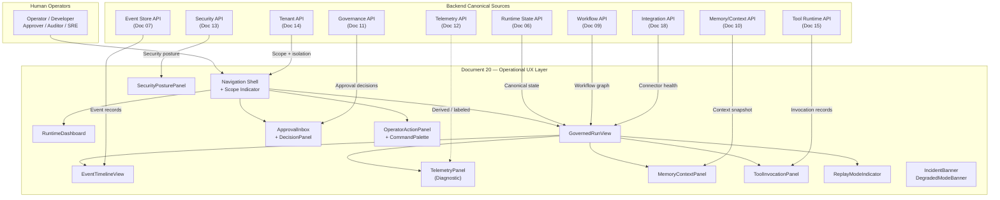

### 31.2 Runtime Visualization Source Model

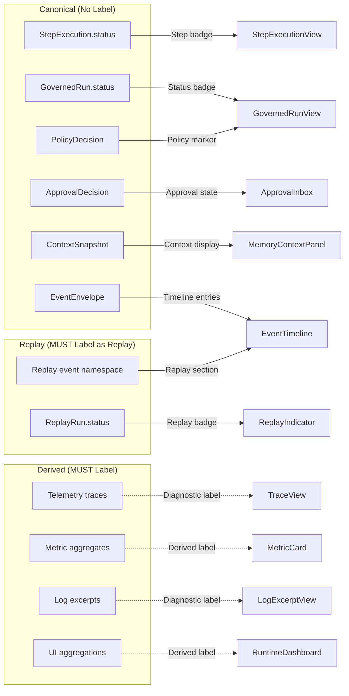

### 31.3 GovernedRun Detail Composition

```mermaid
flowchart TD
    GR["GovernedRun\n(run_id, status, scope)"]
    GR --> SM["State Machine Strip\n(canonical 24-state progression)"]
    GR --> EM["WorkflowExecutionMap\n(graph + step state overlay)"]
    GR --> ET["EventTimelineView\n(canonical event ledger)"]
    GR --> SE["StepExecution List\n(each step: state, type, duration)"]
    GR --> TP["TelemetryPanel\n(trace, metrics — labeled diagnostic)"]
    GR --> AP["ApprovalGate Markers\n(if approval in workflow)"]
    GR --> MC["MemoryContextPanel\n(ContextSnapshot + fragments)"]
    GR --> SP["SecurityPosturePanel\n(identity, trust, containment)"]
    GR --> TI["ToolInvocationPanel\n(tool calls, side effects)"]
    GR --> AT["AuditTrailView\n(governance evidence refs)"]
    GR --> OA["OperatorActionPanel\n(authorized actions)"]
    GR --> RM["ReplayModeIndicator\n(if replay run)"]
```

### 31.4 Approval UX Flow

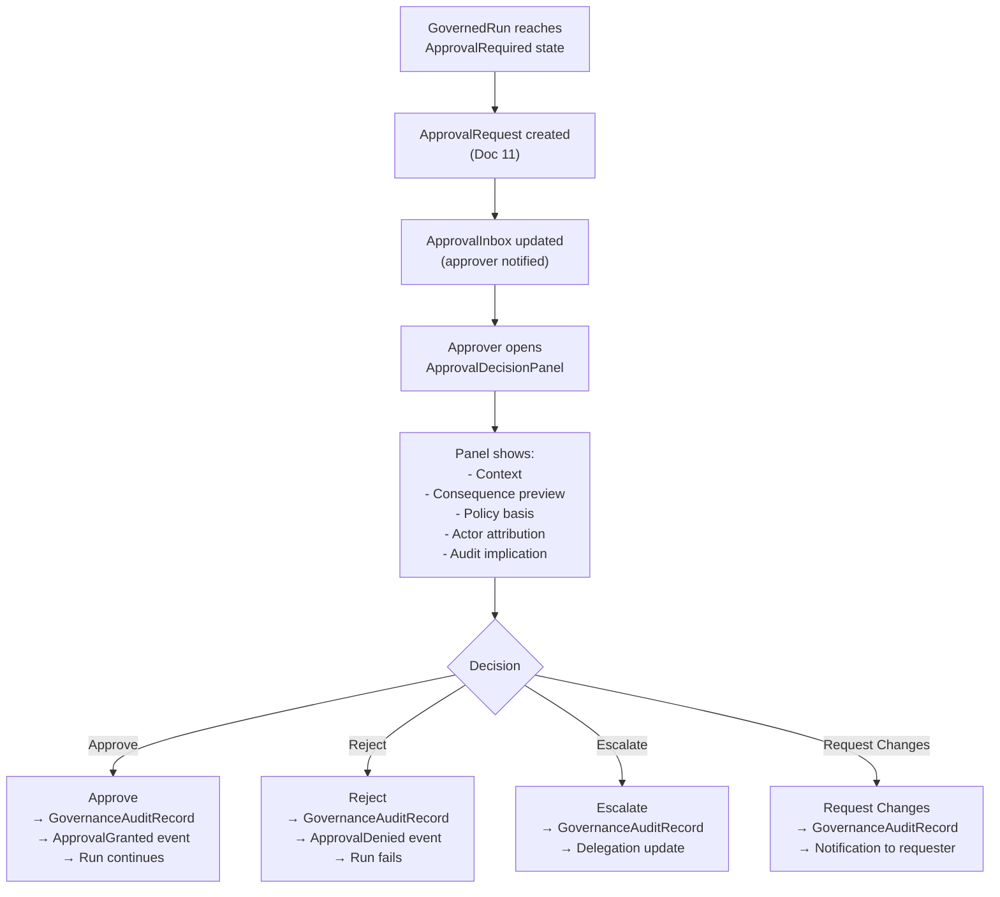

### 31.5 Tenant Scope Propagation

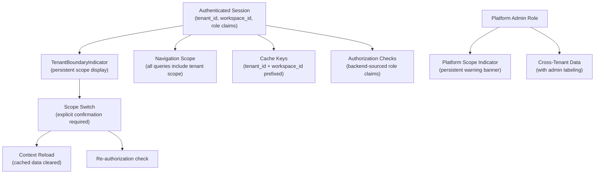

### 31.6 Replay Visual Boundary

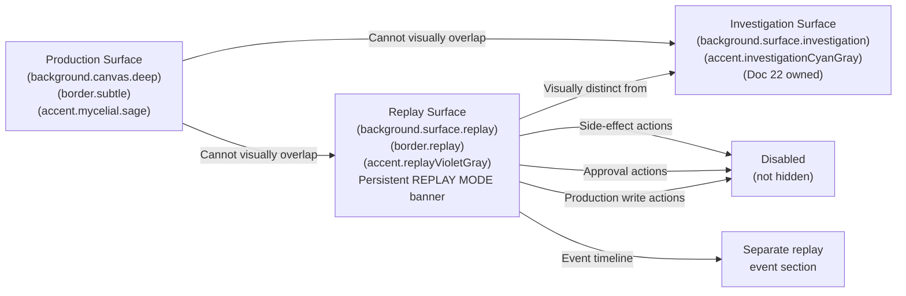

### 31.7 Operator Action Authorization Flow

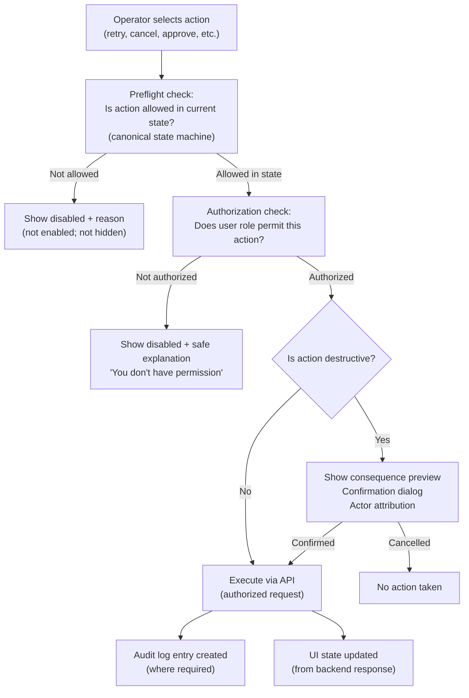

### 31.8 UXStateBinding Flow

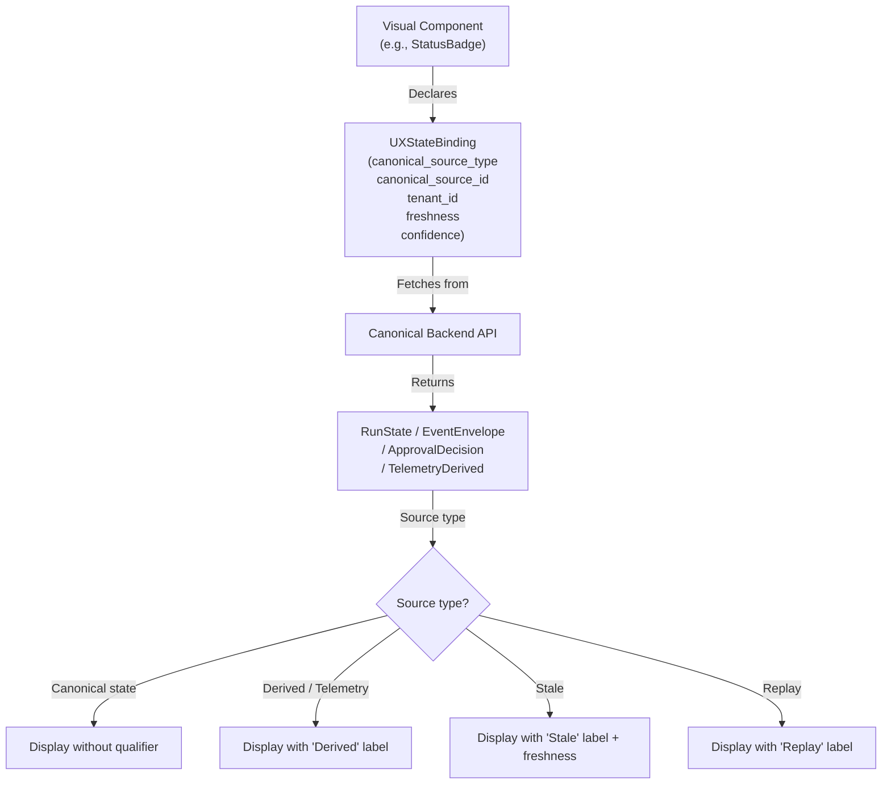

### 31.9 Frontend Contract-Driven Architecture

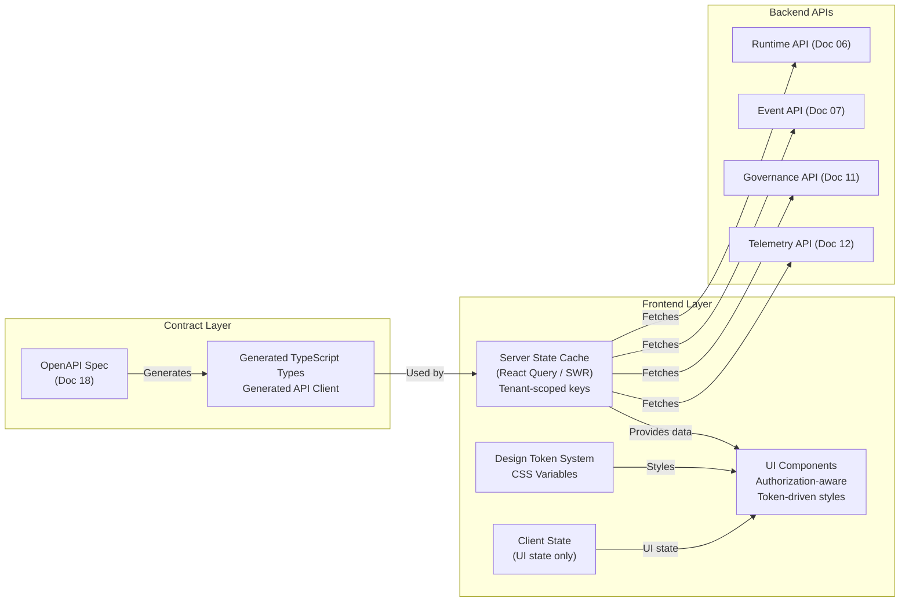

---

## 32. Operational UX Invariants

### 32.1 Visual Truth Invariants

| ID | Invariant |
|---|---|
| VT-01 | UI MUST NOT display a non-canonical GovernedRun state as the primary state representation. |
| VT-02 | UI MUST NOT treat telemetry as audit evidence. |
| VT-03 | UI MUST NOT treat a dashboard summary as a source of authoritative runtime truth. |
| VT-04 | Every critical visual state MUST bind to a canonical source or a derived-labeled source with explicit freshness. |
| VT-05 | Derived UI state MUST include source references and a freshness timestamp in the UXStateBinding. |
| VT-06 | Stale visual state MUST be labeled. No stale data may be displayed as current without a stale indicator. |
| VT-07 | UI display labels that simplify canonical state names (e.g., "Running" for StepRunning) MUST map unambiguously to a canonical state and MUST NOT be persisted. |
| VT-08 | UI MUST NOT invent operational states that have no canonical backend equivalent without labeling them as UI-aggregated derived states. |
| VT-09 | The event timeline MUST source event records from the EventEnvelope (Doc 07), not from telemetry correlation. |
| VT-10 | GovernanceAuditRecord evidence MUST be labeled "Evidence" and MUST be visually distinct from telemetry diagnostic data. |
| VT-11 | A GovernedRun in RunFailed state MUST show failure domain from the canonical backend failure_domain field, not inferred from telemetry. |
| VT-12 | Run progress MUST be based on canonical StepExecution completion counts, not on time-estimated percentages. |

### 32.2 Design Token Invariants

| ID | Invariant |
|---|---|
| DT-01 | All operational surfaces MUST use design token variables. No hardcoded color hex values in component styles. |
| DT-02 | State token assignments MUST match the canonical state token table in Section 6.5. |
| DT-03 | Replay mode surfaces MUST use `surface.replay` and `border.replay` tokens; no production state token may be reused for replay surfaces. |
| DT-04 | Warning and danger tokens MUST be muted but meet WCAG AA contrast requirements against their background tokens. |
| DT-05 | Tenant identity visual treatments MUST use only `border.tenant` and `border.workspace` tokens; no rainbow color assignments. |
| DT-06 | Gradients MUST NOT appear in dense data tables, list item backgrounds, or step-level operational data surfaces. |
| DT-07 | Focus ring MUST use `border.focus` token at minimum 2px width. |
| DT-08 | Disabled text MUST use `text.disabled` token and MUST NOT appear identical to enabled text. |
| DT-09 | All text tokens on operational surfaces MUST pass WCAG AA 4.5:1 contrast against their corresponding background tokens. |
| DT-10 | Tenant theme customization MUST NOT override the semantic distinction between state tokens. |

### 32.3 Accessibility Invariants

| ID | Invariant |
|---|---|
| ACC-01 | Critical status MUST NOT depend on color alone. Text, icon, and/or shape semantics MUST accompany every status color. |
| ACC-02 | All operator actions MUST be keyboard-accessible. No action may be mouse-exclusive. |
| ACC-03 | WorkflowExecutionMap MUST have a keyboard-navigable list/table equivalent. |
| ACC-04 | Motion MUST be reducible via `prefers-reduced-motion`. Critical state changes MUST still be communicated without motion. |
| ACC-05 | Focus indicator MUST use `border.focus` at minimum 2px width and MUST be visible against all background surfaces. |
| ACC-06 | Disabled controls MUST provide a text explanation of why the action is unavailable, programmatically accessible to screen readers. |
| ACC-07 | Error messages in form fields MUST be programmatically associated with the triggering field via `aria-describedby` or equivalent. |
| ACC-08 | All text content MUST meet WCAG AA 4.5:1 contrast in all density modes. |
| ACC-09 | Modal dialogs MUST trap focus while open and return focus to trigger element on close. |
| ACC-10 | Live region updates (incident banners, inbox updates) MUST use appropriate `aria-live` politeness levels. |
| ACC-11 | Critical incident banners MUST use `aria-live="assertive"`. Standard inbox updates MUST use `aria-live="polite"`. |
| ACC-12 | Data tables MUST use `<th scope>` elements; column sort MUST be keyboard-accessible and MUST announce state to screen readers. |

### 32.4 Runtime Visualization Invariants

| ID | Invariant |
|---|---|
| RV-01 | Visual runtime state MUST come from canonical backend state. UI MUST NOT infer execution state from telemetry. |
| RV-02 | UI MUST NOT display intermediate execution states with no canonical backend equivalent. |
| RV-03 | Derived status MUST be clearly labeled as derived with source reference and data freshness. |
| RV-04 | Runtime visualization MUST preserve causation and correlation via causation_id and correlation_id. |
| RV-05 | Operators MUST be able to distinguish canonical state, event record, telemetry signal, and derived insight within a single view. |
| RV-06 | Terminal states (RunSucceeded, RunFailed, RunCancelled, RunArchived) MUST be visually stable. They MUST NOT animate as if active. |
| RV-07 | The execution map MUST NOT imply execution dependencies not present in the canonical WorkflowVersion graph. |

### 32.5 GovernedRun Invariants

| ID | Invariant |
|---|---|
| GR-01 | GovernedRunView MUST NOT display non-canonical states as the primary state badge. |
| GR-02 | Simplified state display labels MUST map unambiguously to exactly one canonical state. |
| GR-03 | A failed GovernedRun MUST show failure domain from canonical backend failure_domain field. |
| GR-04 | Run progress MUST be based on canonical StepExecution counts, not on fake time-based estimation. |
| GR-05 | State transitions MUST be inspectable via EventTimelineView, not constructed from telemetry. |
| GR-06 | Operator actions on a GovernedRun MUST be gated by backend authorization. Unauthorized actions MUST NOT appear enabled. |
| GR-07 | Replay runs MUST show original_run_id reference and ReplayModeIndicator. |
| GR-08 | Approval blockers MUST be visible in GovernedRunView when the run is in ApprovalRequired state. |

### 32.6 StepExecution Invariants

| ID | Invariant |
|---|---|
| SE-01 | Step status MUST map to canonical StepExecution state values. No synthetic statuses. |
| SE-02 | Retry count MUST show "Attempt N of [max_attempts]." |
| SE-03 | Tool steps MUST show side-effect class prominently. |
| SE-04 | Cognitive steps MUST NOT show raw model prompts or raw completions by default. |
| SE-05 | Raw step input and output MUST NOT be visible by default. Expansion requires role gating. |
| SE-06 | Terminal step states MUST NOT animate as active. |
| SE-07 | Sensitive input/output fields MUST be redacted with "[Redacted — access required]." |

### 32.7 Workflow Map Invariants

| ID | Invariant |
|---|---|
| WM-01 | WorkflowExecutionMap MUST NOT allow graph mutation in Document 20 scope. |
| WM-02 | Node state MUST source from canonical StepExecution.status. |
| WM-03 | Edge visualization MUST NOT imply a dependency not in the canonical workflow graph. |
| WM-04 | Large graphs (> 30 nodes) MUST support collapse, filter, and search. |
| WM-05 | A list/table equivalent MUST be available for all execution map states. |
| WM-06 | Active step nodes MUST show a progress indicator. Terminal nodes MUST be visually stable. |

### 32.8 Event Timeline Invariants

| ID | Invariant |
|---|---|
| ET-01 | Event timeline ordering MUST use canonical event ordering from the event store. Client-side timestamp sort is FORBIDDEN as primary ordering. |
| ET-02 | Event hash and schema version MUST be accessible to audit-role users. |
| ET-03 | Event payloads MUST be redacted by default. Expansion requires role-gated action. |
| ET-04 | Replay events MUST NOT be mixed with production events in the default timeline view. |
| ET-05 | Causation chain visualization MUST support following causation_id within tenant scope. |
| ET-06 | EventTimelineView MUST be distinguished from telemetry trace view. |

### 32.9 Telemetry Invariants

| ID | Invariant |
|---|---|
| TM-01 | All telemetry views MUST carry a persistent "Diagnostic" or "Derived" label in the panel header. |
| TM-02 | Missing telemetry MUST be shown as "telemetry gap," not as "no execution activity." |
| TM-03 | Trace span attributes MUST be redacted where they contain sensitive payload data. |
| TM-04 | Telemetry-derived metric values MUST label time window and aggregation method. |
| TM-05 | Telemetry access MUST route through TelemetryAccessGateway (Doc 12) for sensitive signals. |
| TM-06 | Logs MUST be redacted by default; full content requires role-gated expansion. |

### 32.10 Governance UX Invariants

| ID | Invariant |
|---|---|
| GV-01 | GovernanceAuditRecord evidence MUST be labeled "Evidence" and visually distinct from telemetry data. |
| GV-02 | PolicyExplanationView MUST NOT expose sensitive policy internals to unauthorized roles. |
| GV-03 | Break-glass UX MUST be physically separated from standard admin actions. |
| GV-04 | Break-glass activation MUST require justification, time-bound duration, scope confirmation, and identity confirmation. |
| GV-05 | Active break-glass session MUST show persistent amber security banner on all in-scope screens. |

### 32.11 Approval UX Invariants

| ID | Invariant |
|---|---|
| AP-01 | Approve, Reject, Request Changes, Acknowledge, Escalate, and Delegate MUST be visually distinct actions. |
| AP-02 | Every approval decision MUST show actor attribution before submission. |
| AP-03 | Approval action MUST show consequence preview before execution. |
| AP-04 | Approval UI MUST NOT allow approving a cross-tenant request unless explicitly governed. |
| AP-05 | Approval timeout countdown MUST be visible when relevant, not hidden in metadata. |
| AP-06 | All approval decisions MUST generate GovernanceAuditRecord per Doc 11. |
| AP-07 | Approval decisions MUST NOT be pre-populated or auto-submitted. |
| AP-08 | The approval decision panel MUST be fully keyboard-operable. |

### 32.12 Security UX Invariants

| ID | Invariant |
|---|---|
| SC-01 | UI MUST NEVER display raw secrets, tokens, keys, or credential material under any circumstance. |
| SC-02 | CredentialReference identifier MAY be shown; secret value MUST NOT. |
| SC-03 | actor_id and runtime_identity_id MUST be visually distinct in all contexts. |
| SC-04 | Security warnings MUST NOT be hidden in collapsed panels by default. |
| SC-05 | Quarantined objects MUST carry a QuarantineIndicator on all surfaces where they appear. |
| SC-06 | Break-glass sessions MUST show persistent, unmissable visual indicator on all in-scope screens. |
| SC-07 | Security evidence access MUST be audit-logged per Doc 13 policy. |
| SC-08 | Suspicious input warnings MUST appear on StepExecutionView and ToolInvocationPanel where triggered. |

### 32.13 Tenant UX Invariants

| ID | Invariant |
|---|---|
| TN-01 | Current tenant, workspace, and project scope MUST always be visible without hover or expansion. |
| TN-02 | Platform-scoped mode MUST carry persistent visual distinction and cautionary indicator on all affected screens. |
| TN-03 | Support access sessions MUST show persistent, visible indicator on all in-scope screens. |
| TN-04 | Cross-tenant access denial MUST be safe and non-enumerating. Error messages MUST NOT reveal cross-tenant resource existence. |
| TN-05 | Scope switching MUST require explicit user action; scope MUST NOT change silently on navigation. |
| TN-06 | Tenant display names MUST NOT appear in telemetry identifiers or infrastructure IDs. |
| TN-07 | Privileged actions MUST prompt for scope confirmation when scope has changed recently. |

### 32.14 Memory/Context UX Invariants

| ID | Invariant |
|---|---|
| MC-01 | Memory views MUST distinguish retrieved source, derived summary, model output, and operator notes. |
| MC-02 | ContextSnapshot MUST be immutable in UX. No editing action may be exposed on ContextSnapshotView. |
| MC-03 | Live memory retrieval MUST be visually distinguished from replay-hydrated context. |
| MC-04 | Relevance scores MUST be qualified as retrieval heuristics, not truth indicators. |
| MC-05 | Quarantined memory fragments MUST be hidden or shown as "[Quarantined — access denied]" without revealing content. |
| MC-06 | Raw sensitive memory content MUST be access-gated. Default display MUST redact or summarize. |

### 32.15 Tool/Integration UX Invariants

| ID | Invariant |
|---|---|
| TI-01 | Tool side-effect class MUST be prominently visible on all ToolInvocationPanel instances. |
| TI-02 | Connector credentials MUST show reference/status only. Values MUST NEVER be displayed. |
| TI-03 | Webhook payloads MUST be redacted by default. |
| TI-04 | Replay mode MUST show external side effects as "Suppressed (Replay)" on all tool invocations. |
| TI-05 | External integration health MUST show validation, mapping, and quarantine status for ingestion events. |

### 32.16 Replay UX Invariants

| ID | Invariant |
|---|---|
| RP-01 | Replay MUST be visually impossible to confuse with production. Surface color, border, and persistent banner must be unambiguous. |
| RP-02 | Replay side-effectful action controls MUST be disabled, not hidden. |
| RP-03 | Replay telemetry MUST be labeled "Replay — Diagnostic" in all telemetry panels. |
| RP-04 | ReplayModeIndicator MUST be persistent on all screens while a replay session is active. |
| RP-05 | Replay events MUST appear in a separate labeled section, not mixed with production events by default. |
| RP-06 | The original production event history MUST NOT be mutable in the replay event view. |

### 32.17 Failure/Degraded UX Invariants

| ID | Invariant |
|---|---|
| FI-01 | Failure state MUST identify failure domain from canonical backend classification. |
| FI-02 | Degraded mode MUST be explicit and persistent. It MUST NOT be hidden in telemetry panels. |
| FI-03 | Retrying steps MUST show current attempt number and max attempts. |
| FI-04 | Terminal failure MUST NOT animate as if active. |
| FI-05 | Critical incident banners MUST require acknowledgement before dismissal. Acknowledgement MUST be audit-logged. |
| FI-06 | Error messages MUST be safe and non-leaking. Stack traces, service names, and database errors MUST NOT appear. |
| FI-07 | Security and tenant isolation failure messages MUST fail visually closed. |

### 32.18 Operator Action Invariants

| ID | Invariant |
|---|---|
| OA-01 | Every operator action MUST map to a backend authorization check. |
| OA-02 | Actions the user cannot perform MUST be disabled with safe explanation, not hidden where hiding causes confusion. |
| OA-03 | Destructive actions MUST show consequence preview and require confirmation. |
| OA-04 | Privileged actions MUST attribute the actor and generate audit records where required. |
| OA-05 | Bulk actions MUST show scope and item count before execution. |
| OA-06 | Retry, cancel, pause, and resume actions MUST reflect canonical state machine allowed transitions. |
| OA-07 | CommandPalette MUST respect the same authorization model as visible UI. |
| OA-08 | No operator action in replay mode MUST cause a production side effect. |

### 32.19 Frontend Architecture Invariants

| ID | Invariant |
|---|---|
| FA-01 | Frontend MUST NOT hardcode backend state enums outside of generated API contracts. |
| FA-02 | Frontend MUST NOT infer authorization from hidden/disabled buttons. Backend is the authority. |
| FA-03 | Server state cache keys MUST include tenant_id and workspace_id. |
| FA-04 | Frontend MUST NOT cache sensitive data beyond session policy. |
| FA-05 | Frontend MUST NOT store raw secrets in client-side storage. |
| FA-06 | Frontend MUST use APIResponseEnvelope semantics from Doc 18. |
| FA-07 | Frontend MUST NOT mutate runtime state directly; all mutations route through authorized API calls. |
| FA-08 | Frontend MUST treat telemetry API responses as derived data. |
| FA-09 | Feature flags for security-sensitive surfaces MUST be backend-provided. |

### 32.20 Codex Implementation Invariants

| ID | Invariant |
|---|---|
| CI-01 | Codex MUST NOT create UI-only operational states without UXStateBinding with canonical_source_type = UIAggregated and derived label. |
| CI-02 | Codex MUST NOT display raw secrets, tokens, keys, or credential material in any UI component. |
| CI-03 | Codex MUST NOT make replay visually identical to production. |
| CI-04 | Codex MUST NOT implement workflow graph editing in Document 20 scope. |
| CI-05 | Codex MUST NOT implement replay diff workbench in Document 20 scope. |
| CI-06 | Codex MUST NOT use color alone for status semantics. |
| CI-07 | Codex MUST NOT allow hidden buttons to serve as the security boundary. |
| CI-08 | Codex MUST NOT rely on client-side tenant scope as authorization authority. |
| CI-09 | Codex MUST NOT build operational surfaces that violate tenant isolation. |
| CI-10 | Codex MUST NOT display telemetry as canonical state without derived label. |
| CI-11 | Codex MUST NOT show stale data without freshness indicator. |
| CI-12 | Codex MUST NOT use hardcoded state values outside generated API client types. |

---

## 33. Operational UX Anti-Patterns

### 33.1 Visual Truth Anti-Patterns

| ID | Anti-Pattern | Correct Approach |
|---|---|---|
| AP-VT-01 | Dashboard as source of truth: operator treats aggregated metric as canonical run state | Label derived metrics; link to canonical state view |
| AP-VT-02 | Fake progress percentage: displaying time-based percentage without backend state data | Show actual step completion count or indeterminate progress |
| AP-VT-03 | Telemetry treated as audit evidence: showing trace spans as governance proof | Clearly separate telemetry (diagnostic) from evidence (GovernanceAuditRecord) |
| AP-VT-04 | UI-invented state: displaying "Processing" as a state label with no canonical equivalent | Use canonical state machine states or label as derived |
| AP-VT-05 | Stale data without label: showing 10-minute-old metric without freshness indicator | Always show freshness timestamp on derived/aggregated data |
| AP-VT-06 | Silent state invention: creating visual state transitions that skip canonical states | State badge changes must follow canonical state machine transitions |
| AP-VT-07 | Event timeline sorted by client timestamp: events reordered by browser-rendered timestamp | Use canonical event store ordering (sequence numbers) |
| AP-VT-08 | Aggregated health replacing individual states: overall "healthy" badge hiding individual run failures | Show aggregate AND individual states; drill-down required |
| AP-VT-09 | Derived summary without source: "AI-derived insight" with no source reference or freshness | Always show DerivedInsightCard source and freshness |
| AP-VT-10 | Telemetry span as confirmation: using trace span existence as proof that a run succeeded | Canonical GovernedRun.status is the confirmation, not trace span |

### 33.2 Color and Status Anti-Patterns

| ID | Anti-Pattern | Correct Approach |
|---|---|---|
| AP-CS-01 | Color-only status: red/green dots with no text or icon label | Add text label and icon; color supports, does not carry alone |
| AP-CS-02 | Unbounded rainbow tenant colors: each tenant assigned a random color from a bright palette | Use subtle `border.tenant` treatment; no rainbow fragmentation |
| AP-CS-03 | Neon danger/warning: bright fluorescent red or yellow for error states | Use muted ember-red and ochre; WCAG-compliant but not aggressive |
| AP-CS-04 | Production and replay identical color: replay surfaces using same base colors as production | Replay MUST use `surface.replay` + `border.replay` violet-gray identity |
| AP-CS-05 | Token override breaking semantics: tenant theme overriding `text.danger` to brand color | Tenant theming MUST NOT override semantic state tokens |
| AP-CS-06 | Low-contrast dark UI: `text.tertiary.graphite` used for critical status messages | Critical status MUST use primary or danger text tokens |
| AP-CS-07 | Gradient on dense data table: applying brand gradient as row background in run list | Gradients reserved for hero moments only |
| AP-CS-08 | Decorative node network: random graph visualization as background element | Structural graphs only when operationally meaningful |
| AP-CS-09 | Generic AI gradient overload: teal-to-purple gradients across operational panels | Use brand-derived tokens; not generic AI SaaS aesthetics |

### 33.3 Navigation and Scope Anti-Patterns

| ID | Anti-Pattern | Correct Approach |
|---|---|---|
| AP-NS-01 | Hidden tenant scope: operator does not know which tenant's data they're viewing | TenantBoundaryIndicator always visible |
| AP-NS-02 | Scope switch silently changes data context: navigating between views resets tenant scope | Scope switch requires explicit action and confirmation |
| AP-NS-03 | Platform-scoped view without warning: cross-tenant data displayed without indicator | Persistent platform scope banner and badge required |
| AP-NS-04 | Support mode indistinguishable from normal: support agent sessions look like regular user sessions | Support access indicator persistent on all in-scope screens |
| AP-NS-05 | Destructive action next to view action: Cancel Run button adjacent to View Details | Separate destructive actions from observational controls |
| AP-NS-06 | Nav hidden for unauthorized areas: sections user can't access not shown at all (causes confusion) | Show disabled with explanation; do not hide where visibility aids orientation |
| AP-NS-07 | CommandPalette bypasses navigation auth: command palette shows actions not available via nav | Same authorization in command palette as in navigation |

### 33.4 Approval and Governance Anti-Patterns

| ID | Anti-Pattern | Correct Approach |
|---|---|---|
| AP-AG-01 | Approval button without consequence preview: "Approve" available without showing what will happen | Consequence section required before Approve is active |
| AP-AG-02 | Break-glass as normal button: break-glass access in the standard admin dropdown | Break-glass physically separated; exceptional visual treatment |
| AP-AG-03 | Acknowledge treated same as approve: "OK" button that acknowledges AND approves without distinction | Visually distinct Approve vs Acknowledge vs Escalate actions |
| AP-AG-04 | Auto-dismiss approval modal: governance modal that closes after timeout without explicit decision | No auto-dismiss for critical governance actions |
| AP-AG-05 | Policy explanation leaking internals: full policy rule body shown to non-governance-role users | Role-appropriate safe explanation only |
| AP-AG-06 | Approval across tenant boundary: approving a request that would affect another tenant's resources | Cross-tenant approval requires explicit governance gate |
| AP-AG-07 | No actor attribution on approval: decision submitted without confirming "You are deciding as [actor]" | Actor confirmation required before submit |
| AP-AG-08 | Evidence conflated with telemetry: governance evidence panel showing telemetry alongside evidence | Separate sections with distinct labels |
| AP-AG-09 | Approval timeout hidden: countdown not visible until the last moment | Countdown visible in ApprovalInbox when relevant |
| AP-AG-10 | Pre-populated approval rationale: rejection reason field pre-filled with template text | Approver must author their own rationale |

### 33.5 Security and Secret Anti-Patterns

| ID | Anti-Pattern | Correct Approach |
|---|---|---|
| AP-SEC-01 | Raw secret displayed in credential panel: API key value visible in connector configuration | CredentialReference only; never secret value |
| AP-SEC-02 | Webhook URL with auth token in path: full webhook URL including auth token shown | Domain only; auth portions masked |
| AP-SEC-03 | Security warning in collapsed panel: active security alert collapsed by default | Security warnings expanded by default on security-relevant surfaces |
| AP-SEC-04 | Quarantined resource not marked: quarantined memory fragment shown without indicator | QuarantineIndicator on all occurrences |
| AP-SEC-05 | Break-glass appearing as normal admin action: break-glass in the standard settings menu | Break-glass in separate, visually distinct emergency access section |
| AP-SEC-06 | actor_id and runtime_identity_id displayed identically: both shown as generic "ID" labels | Distinct labels and visual treatments for each identity type |
| AP-SEC-07 | Stack trace in error message: internal exception detail shown to operator | Safe error message; technical detail available only to authorized roles |
| AP-SEC-08 | Credential validity without reference: showing "Valid" without credential reference ID | Reference ID + status; not just status |

### 33.6 Replay Anti-Patterns

| ID | Anti-Pattern | Correct Approach |
|---|---|---|
| AP-RP-01 | Replay visually identical to production: same surface colors, no persistent banner | Replay mode uses `surface.replay`, `border.replay`, persistent REPLAY MODE banner |
| AP-RP-02 | Production actions enabled in replay: Approve, Cancel, Retry buttons active during replay | Disable (not hide) all production side-effect actions in replay mode |
| AP-RP-03 | Replay events mixed with production events: replay event namespace merged with production timeline | Separate sections; no mixing by default |
| AP-RP-04 | Replay telemetry unlabeled: replay trace shown without "Replay — Diagnostic" label | Label all replay telemetry |
| AP-RP-05 | ReplayModeIndicator dismissible: user can dismiss the replay banner | Indicator persistent until replay session is explicitly ended |
| AP-RP-06 | Replay treated as evidence: replay execution record offered as audit evidence | Replay is not audit evidence; label and separate clearly |

### 33.7 Telemetry Anti-Patterns

| ID | Anti-Pattern | Correct Approach |
|---|---|---|
| AP-TM-01 | Telemetry as audit evidence: trace span used as proof of approval or governance event | Separate telemetry diagnostic view from governance evidence |
| AP-TM-02 | Missing telemetry = no activity: gap in telemetry shown as "no execution" | "Telemetry gap" indicator; runtime absence requires canonical state check |
| AP-TM-03 | Unlabeled derived metric: error rate shown without aggregation method or time window | Label aggregation method, time window, data freshness |
| AP-TM-04 | Sensitive logs visible by default: unredacted log content shown to standard role | Redact by default; role-gated expansion |
| AP-TM-05 | Tenant names in platform metric: tenant display name visible in aggregated platform chart | Anonymize or hide tenant identity in platform-scoped aggregations |
| AP-TM-06 | Trace span as execution confirmation: using span presence as proof run succeeded | Canonical GovernedRun.status is the authority |

### 33.8 Frontend Architecture Anti-Patterns

| ID | Anti-Pattern | Correct Approach |
|---|---|---|
| AP-FA-01 | Hardcoded state enums: "RUNNING", "FAILED" as string literals in component code | Use generated types from API contract |
| AP-FA-02 | UI as security boundary: hidden buttons as the only enforcement | Backend API is the enforcement layer; UI reflects authorization |
| AP-FA-03 | Cross-tenant cache: tenant A data visible after scope switch to tenant B | Cache keys must include tenant_id; keys cleared on scope switch |
| AP-FA-04 | Client-side role management: frontend managing role state from local storage | Role claims from authenticated session; backend-validated |
| AP-FA-05 | Raw secret in localStorage: API key stored in browser storage | Never store secrets in client-side storage |
| AP-FA-06 | Client-side state as truth: frontend state used to confirm backend operation succeeded | Backend API response is the truth; frontend reflects it |
| AP-FA-07 | Bypass APIResponseEnvelope: constructing raw API payloads without canonical schema | Use generated API clients with canonical envelope semantics |
| AP-FA-08 | Client-only feature flag for security surface: feature flag in code hides security panel | Backend-provided feature flags for security-sensitive surfaces |

### 33.9 Loading and Empty State Anti-Patterns

| ID | Anti-Pattern | Correct Approach |
|---|---|---|
| AP-LS-01 | Empty state masking authorization denial: "No runs found" when runs exist but access is denied | "You don't have permission to view runs" — not "no runs found" |
| AP-LS-02 | Stale data replaced by blank loading: replacing existing stale data with empty loading state | Show stale data labeled "Refreshing..." during update |
| AP-LS-03 | Cross-tenant existence via 404: "Run 01J4XY not found in this tenant" (implies it exists elsewhere) | "Not found in current scope" — no cross-tenant implication |
| AP-LS-04 | Generic "replay unavailable": no explanation for why replay is unavailable | Explain specific reason: retention, purge, policy, access |
| AP-LS-05 | Telemetry unavailable = runtime failed: "No data" on telemetry panel implying execution failed | "Telemetry data unavailable — runtime state unaffected" |
| AP-LS-06 | Infinite indeterminate loading: spinning loader with no status update for long operations | Progress steps for long operations; "Replay initiating..." with status |

### 33.10 Branding and Visual Anti-Patterns

| ID | Anti-Pattern | Correct Approach |
|---|---|---|
| AP-BR-01 | Logo as background watermark: MYCELIA mark repeated as decorative tile in operational panels | Mark used only in shell, loading state, empty state |
| AP-BR-02 | Mushroom illustration: literal mycological imagery in UX | Mycelial motif expressed through geometric branching patterns only |
| AP-BR-03 | Cyberpunk neon: bright neon blue/purple/green on operational dashboards | Dark mineral surfaces with muted sage green accent |
| AP-BR-04 | Generic AI SaaS gradient: teal-to-purple hero section detached from MYCELIA palette | Brand-derived sage green to silver accent on dark mineral |
| AP-BR-05 | Overly tiny critical typography: failure state shown in 11px type | Critical states (failure, security, approval) MUST NOT use smallest type size |
| AP-BR-06 | Low-contrast gray-on-black: secondary text rendered below 4.5:1 on canvas | Text tokens validated against WCAG AA requirements |
| AP-BR-07 | Animated idle state: running animations on all "healthy" runs | Only active steps animate; terminal and healthy-idle states are static |

---

## 34. Codex Implementation Guidance

### 34.1 Implementation Order

Codex MUST implement Document 20 scope in the following order:

1. **Design token foundation:** Establish CSS custom properties for all background, text, border, accent, and state tokens before writing any component.
2. **Visual semantic token mapping:** Map all canonical GovernedRun and StepExecution states to their token clusters (background + border + text + icon + label).
3. **Navigation shell:** Dark operational shell with persistent TenantBoundaryIndicator, scope selector, and navigation areas.
4. **Tenant/workspace scope indicator:** Implement TenantBoundaryIndicator with platform scope warning mode and support access indicator.
5. **API contract client integration:** Generate or implement typed API clients from canonical contracts (Doc 18). UXStateBinding instrumentation infrastructure.
6. **Runtime overview (RuntimeDashboard):** Active runs, health summary, pending approvals — sourced from runtime and governance APIs with derived labels.
7. **GovernedRun list and filter:** Sortable/filterable list with canonical state badges, failure domain indicators.
8. **GovernedRun detail (GovernedRunView):** All required fields from Section 10.1 with state machine strip.
9. **StepExecution list and detail:** Step state, type, retry count, duration, side-effect class.
10. **Read-only WorkflowExecutionMap:** Graph with step state overlay; list/table alternative; no graph editing.
11. **EventTimelineView:** Canonical event ordering, replay separation, payload redaction, access logging.
12. **TelemetryPanel:** Trace, metric, log views with "Diagnostic" headers and derived labels.
13. **ApprovalInbox and ApprovalDecisionPanel:** Consequence preview, actor attribution, keyboard-accessible decisions.
14. **PolicyExplanationView:** Role-appropriate safe policy explanation.
15. **Security and trust indicators:** SecurityPosturePanel, credential reference display, quarantine indicators, break-glass UX.
16. **MemoryContextPanel:** ContextSnapshotView, fragment provenance, source type labels, staleness indicators.
17. **ToolInvocationPanel and ExternalIntegrationPanel:** Side-effect class badge, connector health, credential reference.
18. **ReplayModeIndicator:** Persistent, `surface.replay` treatment, disabled production action controls.
19. **Degraded mode and incident banners:** Persistent banners with severity, acknowledgement for critical incidents.
20. **AuditTrailView:** GovernanceAuditRecord display, export action (auditor role).
21. **Accessibility baseline:** WCAG AA contrast validation, keyboard navigation, screen reader semantics, reduced motion.
22. **Role-aware action gating:** Authorization-sourced disabling with safe explanations.
23. **UXStateBinding instrumentation:** All critical status displays bound with canonical_source_type, freshness, confidence.
24. **Visual regression tests:** Snapshot tests for core surfaces, state badge transitions, replay mode treatment, dark mode baseline.

### 34.2 Forbidden Codex Shortcuts

- **FORBIDDEN:** Hardcoding backend state enums (e.g., "RUNNING", "FAILED") as string literals in component code not generated from API contracts.
- **FORBIDDEN:** Creating UI-only operational states (e.g., "Processing", "Initializing") that have no canonical backend equivalent and are not labeled as UIAggregated derived states.
- **FORBIDDEN:** Using color alone for any critical status (run failure, approval gate, security alert).
- **FORBIDDEN:** Displaying any raw secret, API key, token value, password, or credential material in any component at any role level.
- **FORBIDDEN:** Displaying raw model prompts or raw model completions by default in any cognitive step view.
- **FORBIDDEN:** Treating telemetry trace spans as canonical state or audit evidence without explicit derived label.
- **FORBIDDEN:** Implementing workflow graph editing (node creation, edge mutation) in Document 20 scope. This belongs to Document 21.
- **FORBIDDEN:** Implementing replay diff workbench or investigation mode internals in Document 20 scope. This belongs to Document 22.
- **FORBIDDEN:** Using hidden or disabled buttons as the sole security enforcement layer.
- **FORBIDDEN:** Inferring tenant scope from client-side selection without backend verification.
- **FORBIDDEN:** Making replay mode visually indistinguishable from production mode.
- **FORBIDDEN:** Building generic SaaS dashboard aesthetics (teal/purple gradients, random node networks) detached from MYCELIA brand system.
- **FORBIDDEN:** Mixing production and replay events in the default EventTimelineView.
- **FORBIDDEN:** Showing stale data without a freshness/staleness label.
- **FORBIDDEN:** Cross-tenant cache pollution by using cache keys without tenant_id prefix.
- **FORBIDDEN:** Displaying "No data found" empty state when the true cause is an authorization denial.

### 34.3 Required Tests

| Test | Description | Pass Criteria |
|---|---|---|
| Canonical state mapping test | Status badge for each GovernedRun canonical state | Badge matches expected token cluster (color + icon + text) |
| Replay mode visual distinction test | Replay session vs production session screenshot comparison | Surface colors, borders, and banner are visually distinct |
| Accessibility contrast test | All text/background token pairs | WCAG AA 4.5:1 for normal text; 3:1 for large text and UI components |
| Keyboard navigation test | Complete approval decision without mouse | All steps reachable and submittable via keyboard only |
| Tenant scope indicator test | TenantBoundaryIndicator presence on all authenticated screens | Indicator visible at all breakpoints without hover |
| Role-based action disabling test | Unauthorized user sees disabled action with explanation | Action is disabled, not hidden; explanation is visible |
| No raw secret rendering test | CredentialReference display, approval context display | No secret value found in rendered DOM at any role |
| No raw prompt default rendering test | Cognitive step StepExecutionView | Raw prompt not in DOM by default; expansion requires role gate |
| Stale data label test | Data older than freshness threshold | Stale indicator visible in the affected component |
| Event timeline ordering test | EventTimelineView with out-of-order received events | Events ordered by canonical event sequence, not client timestamp |
| Approval consequence preview test | ApprovalDecisionPanel before Approve is enabled | Consequence section visible; Approve enabled only after review |
| Support mode indicator test | Support agent active session | Persistent support access indicator visible on all screens |
| Platform scope warning test | Platform admin entering platform scope | Persistent warning banner visible on all screens in scope |
| Telemetry as derived label test | TelemetryPanel header | "Diagnostic" label present in panel header |
| Replay event separation test | EventTimelineView in replay context | Replay events in separate section; not mixed with production events |
| Visual regression test (core surfaces) | Baseline snapshot for: RuntimeDashboard, GovernedRunView, ApprovalInbox, ReplayModeIndicator | No unintended visual change from baseline |

---

## 35. Relationship to Other Documents

### 35.1 Document Relationship Map

| Document | Relationship |
|---|---|
| **00 — Vision & Foundational Manifesto** | Root doctrine. Document 20 translates MYCELIA's runtime principles (deterministic orchestration, governed execution, observable side effects, auditable decisions) into UX principles and visual contracts. The core thesis of Document 00 — that AI systems fail when they become operational before they become governable — is expressed in Document 20 as the principle that visual state must map to governed runtime truth, not approximation. |
| **01 — Product Requirements & Operational Scope** | Defines the operational scope that Document 20's surfaces serve. Product capabilities defined in Document 01 determine which operational surfaces are in scope. |
| **02 — Core Runtime Architecture** | Defines the runtime execution model that Document 20 visualizes. RuntimeEnvelope, execution boundaries, and runtime identity concepts from Document 02 surface in GovernedRunView and SecurityPosturePanel. |
| **03 — Canonical Domain Model** | Defines the entities (GovernedRun, StepExecution, Tenant, Workspace, ContextSnapshot, PolicySnapshot) that Document 20 displays. Document 20 does not redefine them; it defines their visual representation contracts. |
| **06 — State, Checkpoint & Persistence Architecture** | Primary source of canonical GovernedRun and StepExecution state for all Document 20 visualizations. The 24-state GovernedRun lifecycle is the foundation for state badge semantics. ReplayState and replay event namespace are the basis for replay visual boundary. |
| **07 — Event & Messaging Contracts** | Primary source for EventTimelineView. EventEnvelope schema defines event fields shown in the timeline. Canonical event ordering rules govern timeline sort order. |
| **09 — Workflow Orchestration Engine Specification** | Source for WorkflowExecutionMap structure. WorkflowVersion graph defines the edges and node types visualized in the execution map. Step types from Document 09 map to execution map node icons. |
| **10 — Memory & Context Architecture** | Source for MemoryContextPanel and ContextSnapshotView. Memory tier retrieval, provenance chains, staleness, and quarantine semantics from Document 10 govern how memory fragments are visualized. |
| **11 — Governance, Policy & Approval Engine** | Source for all governance and approval UX surfaces. ApprovalRequest lifecycle, decision attribution, break-glass semantics, and GovernanceAuditRecord from Document 11 define the approval UX contract. PolicyDecisionRecord defines what is shown in PolicyExplanationView. |
| **12 — Observability & Telemetry Platform** | Source for TelemetryPanel, TraceView, MetricCard, and LogExcerptView. Document 12 establishes that telemetry is diagnostic, not canonical truth — a distinction Document 20 enforces in every telemetry visualization. TelemetryAccessGateway from Document 12 governs access to sensitive telemetry in UX. |
| **13 — Security & Trust Architecture** | Source for SecurityPosturePanel, TrustBoundaryView, credential reference display, quarantine indicators, and break-glass UX patterns. The absolute prohibition on displaying raw secrets derives from Document 13's credential management architecture. |
| **14 — Multi-Tenant Isolation & Organizational Boundaries** | Source for tenant boundary visualization, scope indicator, platform-scoped mode, support access indicators, and cross-tenant denial messaging. Document 14's isolation invariants propagate directly into Document 20's tenant UX rules. |
| **15 — SDK, Tool Runtime & Execution Contracts** | Source for ToolInvocationPanel. Tool contract schema, side-effect class enumeration, idempotency semantics, and ToolInvocationRecord from Document 15 define what is shown in tool visualization. |
| **18 — External APIs & Integration Contracts** | Source for ExternalIntegrationPanel and APIResponseEnvelope usage. Document 18 defines the contract that frontend components consume. Frontend architecture in Document 20 requires schema-generated clients from Document 18 contracts. |
| **19 — Codex Operational Alignment & Engineering Constitution** | Document 20 extends Document 19's Codex implementation rules into the UX domain. Document 19 defines forbidden backend shortcuts; Document 20 defines forbidden UX shortcuts. Codex Implementation Guidance in Section 34 is the Document 20 analog to Document 19's Codex guidance. |
| **21 — Workflow Builder & Graph Editing Semantics** | Clear boundary: Document 21 owns graph editing, node creation, edge mutation, and workflow definition UX. Document 20 owns read-only WorkflowExecutionMap. Document 20 defines the boundary explicitly so Codex does not conflate execution visualization with graph editing. |
| **22 — Investigation Mode, Replay & Runtime Diff UX** | Clear boundary: Document 22 owns investigation workbench internals, replay diff algorithms, divergence classification UX, and runtime diff deep visualization. Document 20 defines the visual boundary tokens (replay surface, border, accent) that Document 22 extends. Replay visual identity established in Document 20 is inherited and extended by Document 22. |
| **23 — Evaluation, Benchmark & AI Quality Framework** | Evaluation quality signals appear as DerivedInsightCards in the Document 20 operational surface. Document 23 defines the evaluation architecture; Document 20 defines how evaluation-derived metrics are displayed and labeled. |
| **24 — Enterprise Scaling & Distributed Runtime Evolution** | Multi-region and distributed execution topology considerations from Document 24 affect how run latency and infrastructure health are visualized. Document 20 defines the visualization patterns; Document 24 defines the infrastructure that generates the underlying signals. |
| **25 — Architectural Decision Records Index** | Document 20 UX decisions (design token selections, visual system choices, replay visual identity) SHOULD be recorded as ADRs in Document 25 for future reference and change governance. |

### 35.2 Document 20 Boundaries Summary

**Document 20 OWNS:** Visual design doctrine, design tokens, color semantics, typography, density, layout, navigation architecture, runtime visualization contracts, GovernedRun visualization, StepExecution visualization, read-only execution map, event timeline UX, telemetry diagnostic views, governance and approval UX, security and trust UX, tenant boundary visualization, memory/context panels, tool and integration panels, replay visual boundary tokens, failure/degraded mode UX, operator action UX, data visualization semantics, accessibility requirements, state patterns, motion principles, role-based UX, UXStateBinding contract, frontend architecture guidance, MVP cut, invariants, anti-patterns, Codex UX guidance.

**Document 21 OWNS:** Graph editing, node creation and mutation, edge creation and mutation, workflow builder canvas, workflow definition UX — all graph editing semantics.

**Document 22 OWNS:** Investigation workbench, replay diff algorithms and visualization, divergence classification detail UX, runtime diff deep inspection — all investigation mode internals.

---

## 36. Final Operational UX Principles

The following principles govern the MYCELIA Operational UX & Runtime Visualization System:

1. **Runtime is visible.** Every operational state, event, governance decision, and execution boundary must be accessible to authorized human operators without requiring them to bypass or interpret system internals. The interface is the disciplined window, not the keyhole.

2. **Truth is bound.** Every critical visual element in the operational interface must bind to a canonical runtime source — GovernedRun state, EventEnvelope, ApprovalDecision, PolicyDecisionRecord — or be explicitly labeled as derived. Visual truth is backed by architectural truth.

3. **Telemetry is derived.** Trace spans, metrics, and logs are diagnostic tools. They are not canonical state, not audit evidence, and not governance records. Every telemetry view must say so. Operators must know what they are looking at.

4. **Evidence is distinct.** GovernanceAuditRecords are evidence. They are immutable, attributable, and forensically meaningful. They must never be confused with telemetry, summaries, or UI-derived aggregations. Evidence panels must be visually and architecturally distinct.

5. **Tenants are scoped.** Tenant isolation is not a configuration option. It is an architectural invariant. Every query, every display, every action, every cache key, and every error message in the operational interface must respect the current tenant scope. No cross-tenant leak through visual, technical, or error-message surfaces.

6. **Replay is separate.** Replay execution is not production execution. The visual system makes this separation impossible to miss: distinct surface treatment, distinct border treatment, distinct accent color, persistent mode indicator, and disabled production action controls. An operator working in replay mode cannot mistake it for live production.

7. **Actions are authorized.** The UI shows what operators can do, gated by what the backend permits. Hidden buttons are not a security boundary. Disabled buttons with safe explanations are the correct pattern. Every consequential action routes through backend authorization and generates an audit record where required.

8. **Approvals are consequential.** The approval interface is a governance surface, not a workflow step acknowledgement. Approvers must see consequences before they decide. Decisions must be attributed. Audit records must be generated. Break-glass must feel exceptional. Timeout must be visible.

9. **Failures are explicit.** Failure states must identify their domain, their classification, and their path forward. Degraded modes must be persistent and unmissable. Incidents must require acknowledgement. Error messages must be safe. Terminal failures must not animate.

10. **Secrets are never shown.** No raw secret, API key, token, password, private key, or credential material is displayed anywhere in the operational interface, at any role level, in any context. This is the single most absolute rule in Document 20.

11. **Color supports, never carries alone.** Every critical status communicated through color must also be communicated through text, icon, and/or shape. The interface is accessible to operators with color vision differences. Operational understanding must not depend on chromatic perception.

12. **Brand guides, never obscures.** The MYCELIA visual language — dark mineral surfaces, sage-green metallic accents, precise hierarchy, organic geometry — provides the aesthetic identity of the interface without obscuring the operational data it contains. The brand is the glass, not the frost on it.

13. **Operators inspect without corrupting.** The read-only execution map, the event timeline, the telemetry panel, the memory context panel — all exist so that operators can understand running and completed executions without modifying them. The interface provides observation without interference.

14. **Humans control only what governance allows.** Every operator action, every approval decision, every break-glass entry, every scope switch is governed by the same policy engine that governs the runtime. The interface is not a backdoor. It is the human face of the governed runtime — and it carries the same constraints.

---

> **In MYCELIA, the interface is not a decorative layer over the runtime.**
>
> It is the disciplined glass through which humans see governed cognition operating, failing, waiting, replaying, proving and recovering — without ever confusing visibility for authority.

---

*Document 20 — Operational UX & Runtime Visualization System*
*MYCELIA Architecture Constitution Series*
*Version 1.0.0 | Status: Active — Canonical | 2026-06-06*

