# MYCELIA — 21 Workflow Builder & Graph Editing Semantics

---

## Document Metadata

| Field | Value |
|---|---|
| Document Series | MYCELIA Architecture Constitution |
| Document Number | 21 |
| Version | v1.0 |
| Status | Canonical |
| Classification | Core Architecture — Workflow Builder & Graph Editing Semantics |
| Canonical Role | Defines the visual workflow authoring surface, graph editing command model, node and edge taxonomy, port and data mapping semantics, validation model, compilation semantics, draft lifecycle, publish gates, versioning, collaboration and locking, template and subworkflow semantics, import/export rules, accessibility for graph editing, and Codex implementation guidance for all MYCELIA workflow builder surfaces |
| Primary Audience | Product Design, Frontend Engineers, Platform Engineers, Workflow Architects, Codex, Governance Architects |
| Last Updated | June 2026 |

---

## Table of Contents

1. [Executive Summary](#1-executive-summary)
2. [Builder Philosophy](#2-builder-philosophy)
3. [Scope and Non-Scope](#3-scope-and-non-scope)
4. [Canonical Workflow Builder Domain Model](#4-canonical-workflow-builder-domain-model)
5. [Workflow Authoring Lifecycle](#5-workflow-authoring-lifecycle)
6. [Graph Editing Command Model](#6-graph-editing-command-model)
7. [DraftGraph and Revision Semantics](#7-draftgraph-and-revision-semantics)
8. [Node Taxonomy](#8-node-taxonomy)
9. [Edge Semantics](#9-edge-semantics)
10. [Ports, Handles and Data Mapping](#10-ports-handles-and-data-mapping)
11. [Node Configuration Forms](#11-node-configuration-forms)
12. [Validation Model](#12-validation-model)
13. [Compilation Semantics](#13-compilation-semantics)
14. [Publish Semantics](#14-publish-semantics)
15. [Builder Preview, Simulation and Test Run Boundary](#15-builder-preview-simulation-and-test-run-boundary)
16. [Governance and Approval in the Builder](#16-governance-and-approval-in-the-builder)
17. [Security and Trust in the Builder](#17-security-and-trust-in-the-builder)
18. [Tenant and Workspace Boundary Semantics](#18-tenant-and-workspace-boundary-semantics)
19. [Collaboration, Locking and Conflict Resolution](#19-collaboration-locking-and-conflict-resolution)
20. [Undo, Redo and History](#20-undo-redo-and-history)
21. [Templates, Snippets and Reusable Subgraphs](#21-templates-snippets-and-reusable-subgraphs)
22. [Subworkflow Authoring Semantics](#22-subworkflow-authoring-semantics)
23. [Import, Export and Interchange Format](#23-import-export-and-interchange-format)
24. [Accessibility for Graph Editing](#24-accessibility-for-graph-editing)
25. [Layout and Visual Graph Semantics](#25-layout-and-visual-graph-semantics)
26. [Builder Error, Warning and Validation UX](#26-builder-error-warning-and-validation-ux)
27. [Builder Data Safety and Sensitive Content](#27-builder-data-safety-and-sensitive-content)
28. [Builder Observability and Audit](#28-builder-observability-and-audit)
29. [MVP Workflow Builder Cut](#29-mvp-workflow-builder-cut)
30. [Workflow Builder Diagrams](#30-workflow-builder-diagrams)
31. [Workflow Builder Invariants](#31-workflow-builder-invariants)
32. [Workflow Builder Anti-Patterns](#32-workflow-builder-anti-patterns)
33. [Codex Implementation Guidance](#33-codex-implementation-guidance)
34. [Relationship to Other Documents](#34-relationship-to-other-documents)
35. [Final Workflow Builder Principles](#35-final-workflow-builder-principles)

---

## 1. Executive Summary

### 1.1 What Workflow Builder and Graph Editing Semantics Mean in MYCELIA

The Workflow Builder & Graph Editing Semantics specification defines the governed authoring surface through which MYCELIA workflows are designed, validated, compiled, versioned, and published. It is not a description of a drawing canvas. It is the architectural contract governing how human intent expressed as a visual graph is transformed into an immutable, tenant-scoped, policy-aware, replay-safe WorkflowVersion capable of creating GovernedRuns.

MYCELIA workflows are not scripts. They are not prompt chains. They are governed execution graphs whose nodes declare operations with explicit contracts — ToolContracts, ApprovalPolicies, ContextBoundaries, IntegrationContracts — and whose edges declare the exact conditions under which control flows between those operations. The workflow builder is the surface through which these contracts are assembled, validated against governing runtime constraints, compiled into a deterministic execution plan, and published as an immutable artifact.

### 1.2 Why the Builder Is a Governed Authoring Surface, Not a Drawing Tool

A drawing tool produces an image. The workflow builder produces an executable governance artifact. Every node created on the canvas must eventually map to a runtime step with a declared side-effect class, an explicit contract, and a defined behavior in failure. Every edge must map to a control flow condition or data dependency that the orchestration engine (Document 09) will enforce. Every approval gate must bind to a governance policy. Every tool invocation must bind to a ToolContract.

The visual freedom of the canvas is permitted during the draft stage. That freedom collapses at compilation: every ambiguous configuration, every implicit behavior, every missing contract binding becomes a blocking error that prevents publication. The builder is the surface where governed intent is shaped — not where execution is improvised.

### 1.3 Why Every Visual Graph Must Compile Before Execution

Document 09 defines the WorkflowCompiler that transforms a validated workflow graph into an ExecutionPlan: a resolved topological order, dependency map, barrier map, retry plan, timeout plan, and approval barrier map. This compilation is mandatory. A raw DraftGraph cannot be executed. It is a mutable, unverified authoring artifact. Only a published WorkflowVersion — the immutable output of successful compilation — may instantiate GovernedRuns.

This compilation gate prevents the following classes of runtime failures from reaching production:
- Cyclic graph references that would create infinite execution loops
- Missing contract bindings that would cause tool invocations to fail at dispatch
- Incompatible port schema bindings that would corrupt data flow between steps
- Missing approval gates on high-risk operations
- Cross-tenant resource references that violate isolation invariants
- Replay-unsafe side effects without suppression configuration

### 1.4 Why Published WorkflowVersions Are Immutable

Document 09 establishes that WorkflowVersions are immutable after publication. All active GovernedRuns are pinned to the specific WorkflowVersion from which they were created. Mutating a published WorkflowVersion would silently alter the behavior of active runs, corrupt their replay fidelity, and invalidate the audit evidence captured during execution. Document 21 enforces this immutability at the builder level: the builder MUST NOT present a published WorkflowVersion as editable. Editing a published workflow always creates a new WorkflowDraft.

### 1.5 Why Builder Previews Are Not Production Runs

A builder preview is a static rendering: a schema preview, a data mapping diagram, or a node configuration display. It does not execute workflow steps. It does not create GovernedRuns. It does not call model providers. It does not invoke tools. It does not retrieve memory. A builder test run is a bounded, labeled, sandbox execution for authoring purposes — it MUST NOT be confused with Document 22 replay or with production execution. No preview, simulation, or test run creates audit evidence or governance records equivalent to a production GovernedRun.

### 1.6 Why Graph Editing Must Preserve Tenant Isolation, Governance, and Replay Safety

The DraftGraph exists within a tenant and workspace scope. Every node, every edge, every data mapping, every credential reference, every policy binding, every memory namespace reference, and every tool binding must remain within the tenant boundary. Cross-tenant graph references are architecturally forbidden. A workflow published to tenant A MUST NOT reference tools, policies, memory namespaces, integrations, or subworkflows from tenant B.

Replay safety requires that side-effectful nodes declare their side-effect class at authoring time. The builder must not permit the creation of nodes with undeclared side effects. The compilation step validates replay safety annotations. Without these authoring-time declarations, the replay engine (Documents 06, 22) cannot correctly suppress or hydrate replay-time execution.

### 1.7 Document Relationships

| Document | Relationship to Document 21 |
|---|---|
| 00 — Vision & Foundational Manifesto | Root doctrine; governed execution requires governed authoring |
| 01 — Product Requirements & Operational Scope | Product scope that builder surfaces serve |
| 02 — Core Runtime Architecture | Runtime that published WorkflowVersions execute within |
| 03 — Canonical Domain Model | WorkflowDefinition, WorkflowVersion, Step entities that builder produces |
| 06 — State, Checkpoint & Persistence | WorkflowVersion lifecycle states; replay metadata requirements |
| 07 — Event & Messaging Contracts | EventEnvelope schema for workflow publication events |
| 09 — Workflow Orchestration Engine | WorkflowCompiler that consumes DraftGraph; WorkflowVersion that builder produces |
| 10 — Memory & Context Architecture | ContextBoundary binding required by MemoryRead/WriteNode |
| 11 — Governance, Policy & Approval Engine | ApprovalPolicy binding for ApprovalNode; governance approval for publish |
| 12 — Observability & Telemetry Platform | Builder telemetry; validation and compilation diagnostic signals |
| 13 — Security & Trust Architecture | CredentialReference model; trust level taxonomy; security validation rules |
| 14 — Multi-Tenant Isolation | Tenant/workspace scope enforcement in builder; cross-tenant prohibition |
| 15 — SDK, Tool Runtime & Execution Contracts | ToolContract binding required by ToolStepNode |
| 18 — External APIs & Integration Contracts | ConnectorDefinition / IntegrationContract for ExternalIntegrationNode |
| 19 — Codex Engineering Constitution | Codex implementation rules; Document 21 extends them for builder domain |
| 20 — Operational UX & Runtime Visualization | Owns read-only execution maps; Document 21 owns graph editing |
| 22 — Investigation Mode, Replay & Runtime Diff UX | Owns replay and investigation workbench; Document 21 defines test run boundary |
| 23 — Evaluation, Benchmark & AI Quality Framework | EvaluationNode concept; quality framework for builder output |
| 25 — Architectural Decision Records Index | Builder governance decisions recorded as ADRs |

**Document 21 owns workflow graph authoring, editing, and publication semantics.**
**Document 20 owns read-only runtime execution visualization.**
**Document 22 owns investigation mode, replay diff, and runtime diff deep UX.**

### 1.8 Document 21 Authority Boundary

Document 21 governs workflow authoring, graph editing, draft lifecycle, builder validation UX, compilation requests, publish UX, and builder-specific safety semantics.

Document 21 does not redefine canonical runtime execution, canonical lifecycle states, EventEnvelope schema, WorkflowCompiler internals, PolicyDecision semantics, ToolInvocation semantics, MemoryAccess semantics, tenant isolation internals, external API contracts, or investigation/replay diff algorithms.

### Authority Rule

When Document 21 describes a node, edge, status, command, validation issue, or builder artifact, that description applies to the builder layer unless explicitly mapped to a canonical runtime entity owned by another document.

Specialized documents remain authoritative for their domains:

| Domain | Owning Document |
|---|---|
| Runtime execution | Documents 02 and 09 |
| Canonical domain entities | Document 03 |
| State, checkpoints and persistence | Document 06 |
| Events and messaging | Document 07 |
| Memory and context | Document 10 |
| Governance, policy and approval | Document 11 |
| Observability and telemetry | Document 12 |
| Security and trust | Document 13 |
| Tenant isolation | Document 14 |
| Tool runtime | Document 15 |
| External APIs and integrations | Document 18 |
| Operational visualization | Document 20 |
| Investigation and replay diff UX | Document 22 |

### Rules

- Document 21 examples MUST NOT be treated as new backend authority.
- Builder node types MUST NOT create runtime node types unless mapped to the owning runtime document.
- Builder statuses MUST NOT create GovernedRun states or WorkflowVersion lifecycle states.
- Builder events MUST NOT create Document 07 EventEnvelope types unless registered or explicitly mapped.
- Builder validation issues MUST NOT become runtime states.
- Builder visual behavior MUST NOT override Document 09 orchestration semantics.
- If Document 21 appears to conflict with a specialized document, Codex MUST stop and raise a ConflictResolutionRecord or ADRProposal.

### Forbidden Behavior

FORBIDDEN:

- using Document 21 to invent canonical runtime states;
- using Document 21 to invent Document 07 event types;
- using Document 21 to override Document 09 WorkflowCompiler behavior;
- using Document 21 node taxonomy as the only source of runtime semantics;
- treating builder draft status as WorkflowVersion lifecycle state;
- allowing Codex to claim "Document 21 allowed it" when the owning specialized document does not.

---

## 2. Builder Philosophy

### 2.1 Graph as Executable Intent

A MYCELIA workflow graph is not a diagram that communicates intent to human readers. It is a formal specification of executable intent: a directed acyclic graph (DAG) where every node is an operation with a declared contract, every edge is a control flow or data dependency with explicit semantics, and every configuration field is a binding that the runtime will enforce during execution.

Visual design choices — node position, color, grouping, label formatting — are permitted for authoring convenience but carry no execution meaning. Execution semantics are carried exclusively by node type, node configuration, port connections, edge types, edge conditions, and contract bindings. The builder's responsibility is to ensure this distinction is absolute: what is visual stays visual; what is semantic becomes a compiled artifact.

### 2.2 Builder as Authoring Surface

The workflow builder is the governed surface through which developers, architects, and workflow authors compose operational intent into a graph that the MYCELIA runtime can execute. The builder provides:
- A node palette presenting contract-compatible step types
- A canvas for composing nodes and edges into a directed graph
- Configuration forms driven by canonical node schemas and ToolContracts
- Validation and compilation feedback that surfaces errors before publication
- A publish gate that enforces compilation success, governance compliance, and audit requirements

The builder does not provide execution. It does not provide runtime monitoring. It does not provide replay investigation. Those surfaces belong to Documents 20 and 22 respectively.

### 2.3 Visual Editing as Contract Creation

When an author adds a ToolStepNode to the canvas and selects a ToolContract, they are not making a visual annotation. They are binding an execution operation to a ToolContract that declares the operation's side-effect class, idempotency semantics, credential requirements, input/output schema, timeout policy, and compensation behavior. Every configuration action in the builder is a step toward a complete, contract-bound execution specification.

Configuration that is incomplete, ambiguous, or contract-violating is surfaced as a validation error. Validation errors that are blocking prevent compilation. Compilation failures prevent publication. The builder enforces this chain before the workflow can reach production.

### 2.4 Core Distinctions the Builder Must Enforce

| Concept A | MUST NOT be confused with | Distinction mechanism |
|---|---|---|
| Visual node (canvas element) | Workflow node (compiled step) | Compilation converts builder node to WorkflowNode with stable ID |
| Visual edge (canvas line) | Dependency edge (compiled semantics) | Compilation validates edge semantics; visual routing does not imply dependency |
| Draft graph | Compiled WorkflowVersion | DraftGraph is mutable; WorkflowVersion is immutable |
| WorkflowDraft | WorkflowVersion | Draft is authoring artifact; Version is runtime artifact |
| Validation error | Compilation error | Validation identifies structural/semantic issues; compilation translates valid graph |
| Warning | Blocking error | Warning is advisory; blocking error prevents progression |
| Preview | Simulation | Preview is static; simulation has bounded execution |
| Simulation | Test run | Simulation is design-time; test run is a labeled sandbox execution |
| Test run | Production run | Test run uses synthetic data and sandbox; production run creates GovernedRun |
| Layout position | Execution dependency | Spatial adjacency implies nothing about execution ordering |
| Group/collapse | Subworkflow | Visual grouping is purely cosmetic; subworkflow is a compiled boundary |
| Disabled node | Removed node | Disabled node exists in graph but generates no execution plan entry |
| Draft autosave | Publish | Autosave preserves draft state; publish creates immutable WorkflowVersion |
| Graph editor command | Runtime event | GraphEditCommand is an authoring action; EventEnvelope is a runtime artifact |
| Builder collaboration event | Document 07 EventEnvelope | Builder presence/cursors are not runtime events |

---

## 3. Scope and Non-Scope

### 3.1 What Document 21 Owns

- Workflow builder surface architecture and canvas editing semantics
- Graph editing command model (GraphEditCommand, all command types)
- Node creation, configuration, and deletion semantics
- Edge creation, validation, and deletion semantics
- Port and handle compatibility semantics
- Node configuration form architecture (schema-driven)
- Data mapping model and schema binding
- Graph validation model (all severity levels)
- Compilation readiness and CompilationResult semantics
- Publish gate semantics and PublishRequest lifecycle
- WorkflowDraft and DraftGraphRevision lifecycle
- Draft autosave, branching, and archiving
- Undo/redo command model
- Collaboration, locking, and conflict resolution
- Graph import and export semantics
- Template and snippet insertion semantics
- Subworkflow authoring semantics
- Builder accessibility requirements
- Builder-specific governance rules (publish approval, risk classification)
- Builder security rules (credential reference binding, unsafe node warnings)
- Builder tenant isolation enforcement
- Builder observability and audit records
- Builder-specific invariants, anti-patterns, and Codex guidance

### 3.2 What Document 21 Does NOT Own

| Domain | Owner |
|---|---|
| Production workflow execution and scheduling | Document 09 |
| GovernedRun lifecycle, StepExecution lifecycle | Documents 02, 06 |
| EventEnvelope schema and event contracts | Document 07 |
| WorkflowCompiler internals (execution plan generation) | Document 09 |
| Memory retrieval internals, ContextBoundary internals | Document 10 |
| Policy engine evaluation and approval engine internals | Document 11 |
| Telemetry storage and observability platform | Document 12 |
| Security identity, vault, and trust architecture internals | Document 13 |
| Tenant isolation enforcement internals | Document 14 |
| ToolContract execution and ToolInvocationGateway | Document 15 |
| Infrastructure, Kubernetes, deployment | Document 16 |
| SRE runbooks and operational recovery | Document 17 |
| External API contracts and webhook receiver architecture | Document 18 |
| Backend Codex engineering rules | Document 19 |
| Read-only runtime execution map visualization | Document 20 |
| Investigation workbench, replay diff UX | Document 22 |
| Evaluation benchmark platform | Document 23 |

### 3.3 Ownership Matrix

| Capability | Document 21 | Other Owner |
|---|---|---|
| Adding/removing nodes on canvas | Owns | — |
| Node configuration forms | Owns | — |
| Edge creation and validation | Owns | — |
| Port compatibility checking | Owns | — |
| Draft lifecycle management | Owns | — |
| Compilation request | Owns (request); Doc 09 owns compiler |
| Publish gate enforcement | Owns (UX + audit); Doc 11 owns governance |
| WorkflowVersion immutability enforcement | Enforces; Doc 09 owns contract |
| Runtime execution map (read-only) | References boundary | Doc 20 owns |
| Replay and investigation UX | References boundary | Doc 22 owns |
| ToolContract schema | References | Doc 15 owns |
| ApprovalPolicy schema | References | Doc 11 owns |
| CredentialReference model | References | Doc 13 owns |
| ConnectorDefinition schema | References | Doc 18 owns |

---

## 4. Canonical Workflow Builder Domain Model

### 4.1 Entity Definitions

**WorkflowBuilderSurface**
- Purpose: The primary authoring interface frame containing the canvas, palette, properties panel, validation panel, and publish controls.
- Source of truth: UI navigation layer (Document 20 navigation rules apply).
- Mutability: Structural definition immutable; content live from draft state.
- Tenant scope: Always tenant-scoped; scope visible at all times.
- Relationship to WorkflowDefinition/Version: Entry point for creating and editing drafts associated with a WorkflowDefinition.
- Replay behavior: Not applicable; builder is authoring surface, not runtime.
- Security classification: Role-gated (workflow author role required).
- Audit implication: Surface access may be logged for sensitive workflows.

---

**WorkflowDraft**
- Purpose: The mutable authoring artifact associated with a WorkflowDefinition. Contains the current DraftGraph, metadata, status, and draft revision history.
- Source of truth: Draft store (builder persistence layer).
- Mutability: Mutable during editing; immutable (archived) after publication.
- Tenant scope: Strictly tenant/workspace/project scoped.
- Relationship to WorkflowDefinition/Version: Belongs to one WorkflowDefinition; produces WorkflowVersion on publish.
- Replay behavior: Not runtime-relevant; draft state is not used in replay.
- Security classification: Restricted to workflow author or higher.
- Audit implication: Publish events are audit-recorded; semantic edits recorded in revision history.

---

**WorkflowDraftVersion**
- Purpose: A named, tagged snapshot of a WorkflowDraft at a specific point in time (e.g., "v0.4-pre-review"), allowing rollback and branch comparison.
- Source of truth: Draft version store.
- Mutability: Immutable once tagged.
- Tenant scope: Scoped to parent WorkflowDraft.
- Relationship to WorkflowDefinition/Version: A draft milestone; NOT a published WorkflowVersion.
- Replay behavior: Not applicable.
- Security classification: Read: author; create/tag: author.
- Audit implication: Draft version tagging may be logged.

---

**DraftGraph**
- Purpose: The mutable directed graph structure of a WorkflowDraft: the collection of BuilderNodes, BuilderEdges, ports, handles, data mappings, groups, and annotations that represent the workflow being authored.
- Source of truth: Draft graph store; all mutations via GraphEditCommand.
- Mutability: Mutable only through GraphEditCommand.
- Tenant scope: Strictly scoped; cross-tenant references FORBIDDEN.
- Relationship to WorkflowDefinition/Version: DraftGraph is the authoring precursor to WorkflowGraph (compiled from it).
- Replay behavior: DraftGraph is never used as runtime source of truth.
- Security classification: Sensitive; draft graph may contain configuration referencing credentials.
- Audit implication: Semantic mutations recorded in DraftGraphRevision history.

---

**DraftGraphRevision**
- Purpose: An append-only record of a DraftGraph state at a specific point, capturing the GraphEditCommand applied, the actor, the resulting graph state hash, and the validation status.
- Source of truth: Revision log store.
- Mutability: Immutable once written.
- Tenant scope: Inherits parent DraftGraph scope.
- Relationship to WorkflowDefinition/Version: Basis for compilation request; revision_id pinned in CompilationResult.
- Replay behavior: Revision history enables draft restoration; unrelated to runtime replay.
- Security classification: Same as DraftGraph.
- Audit implication: Each revision is the audit trail for draft editing history.

---

**GraphEditCommand**
- Purpose: The atomic, typed, actor-attributed unit of DraftGraph mutation. All graph changes MUST be represented as GraphEditCommands. Defined fully in Section 6.
- Source of truth: Command log.
- Mutability: Immutable once applied and logged.
- Tenant scope: Inherits draft scope.
- Relationship to WorkflowDefinition/Version: Commands collectively build the DraftGraph that compiles into WorkflowVersion.
- Replay behavior: Commands form the undo/redo stack.
- Security classification: Restricted to authorized actors.
- Audit implication: Semantic commands logged in DraftGraphRevision.

---

**GraphEditSession**
- Purpose: A bounded editing session representing a user's interactive engagement with the builder canvas. Tracks session start, actor, lock status, revision range, and active collaboration presence.
- Source of truth: Session store.
- Mutability: Active while session open; closed on lock release or timeout.
- Tenant scope: Inherits draft scope.
- Relationship to WorkflowDefinition/Version: Session context for command attribution.
- Replay behavior: Not applicable.
- Security classification: Session claims must be backend-validated.
- Audit implication: Session open/close may be logged; all commands within session attributed to session actor.

---

**GraphSelection**
- Purpose: The set of BuilderNodes and BuilderEdges currently selected on the canvas by a specific actor. Selection state is ephemeral UI state.
- Source of truth: UI state only; NOT persisted.
- Mutability: Ephemeral; changes on every selection action.
- Tenant scope: Ephemeral session state; inherits scope.
- Relationship to WorkflowDefinition/Version: None directly.
- Replay behavior: Not applicable.
- Security classification: None.
- Audit implication: None.

---

**GraphViewport**
- Purpose: The current pan, zoom, and visible area of the builder canvas for a specific actor session.
- Source of truth: UI state; MAY be persisted as user preference.
- Mutability: Ephemeral; updated on every pan/zoom.
- Tenant scope: User/session-scoped.
- Relationship to WorkflowDefinition/Version: None.
- Replay behavior: Not applicable.
- Security classification: None.
- Audit implication: None.

---

**GraphLayout**
- Purpose: The recorded spatial positions, sizes, and groupings of all BuilderNodes in the DraftGraph. Layout is a presentation-layer property; it has no execution semantics.
- Source of truth: Draft graph store (layout layer, separate from semantic layer).
- Mutability: Mutable via layout-only GraphEditCommands (MoveNode, ResizeGroup) without invalidating semantic validation.
- Tenant scope: Inherits DraftGraph scope.
- Relationship to WorkflowDefinition/Version: Layout is not compiled into WorkflowVersion.
- Replay behavior: Not applicable.
- Security classification: None.
- Audit implication: Layout-only edits are telemetry only; not audit-recorded.

---

**BuilderNode**
- Purpose: The visual and semantic representation of a workflow step on the builder canvas. Each BuilderNode has a node type, configuration state, port definitions, validation status, and binding state.
- Source of truth: DraftGraph node collection.
- Mutability: Mutable via GraphEditCommand (UpdateNodeConfig, RenameNode, DisableNode, etc.).
- Tenant scope: Inherits DraftGraph scope.
- Relationship to WorkflowDefinition/Version: Compiles into a WorkflowNode in the WorkflowVersion.
- Replay behavior: Not runtime-relevant.
- Security classification: May reference sensitive contracts (CredentialReference, policy IDs).
- Audit implication: None for display; semantic config changes captured in revision.

---

**BuilderEdge**
- Purpose: The visual and semantic representation of a directed connection between two BuilderNodes (specifically between their ports/handles). Each edge has an edge type, optional condition, and data mapping reference.
- Source of truth: DraftGraph edge collection.
- Mutability: Mutable via GraphEditCommand.
- Tenant scope: Inherits DraftGraph scope.
- Relationship to WorkflowDefinition/Version: Compiles into a graph edge in WorkflowVersion.
- Replay behavior: Not runtime-relevant.
- Security classification: None directly.
- Audit implication: Semantic edge changes captured in revision.

---

**NodeTemplate**
- Purpose: A pre-defined BuilderNode configuration pattern that can be inserted into a DraftGraph. Templates accelerate authoring but do not bypass validation.
- Source of truth: Template registry (tenant-local or platform-provided).
- Mutability: Immutable once published in registry.
- Tenant scope: Tenant-local or platform-scoped (sanitized).
- Relationship to WorkflowDefinition/Version: Templates produce draft nodes; compilation applies to resulting graph.
- Replay behavior: Not applicable.
- Security classification: Templates MUST NOT contain raw secrets or tenant-specific IDs (platform templates).
- Audit implication: Template insertion logged in draft revision.

---

**NodePalette**
- Purpose: The UI panel presenting available node types organized by category (Control Flow, Cognitive, Tools, Memory, Governance, Integration, etc.) for the current tenant and role.
- Source of truth: Node type registry + tenant-visible tool/connector catalog.
- Mutability: Computed from registry; not user-mutable directly.
- Tenant scope: Filtered by tenant-available tools and integrations.
- Relationship to WorkflowDefinition/Version: Provides the starting point for BuilderNode creation.
- Replay behavior: Not applicable.
- Security classification: Tool availability filtered by authorization.
- Audit implication: None for palette display.

---

**NodePort**
- Purpose: A typed input or output connection point on a BuilderNode through which control flow and data pass between nodes.
- Source of truth: Node type schema (defined per node type).
- Mutability: Port definition immutable per node type; port state reflects connection state.
- Tenant scope: Inherits node scope.
- Relationship to WorkflowDefinition/Version: Compiled into port bindings in WorkflowVersion.
- Replay behavior: Not applicable.
- Security classification: Data port schema may carry sensitivity classification.
- Audit implication: None.

---

**NodeHandle**
- Purpose: The visual affordance on a BuilderNode canvas element that the author interacts with to create or connect edges. Each handle corresponds to a NodePort.
- Source of truth: UI rendering layer (derived from NodePort definitions).
- Mutability: Visual; not semantically mutable.
- Tenant scope: Inherits node scope.
- Relationship to WorkflowDefinition/Version: None directly.
- Replay behavior: Not applicable.
- Security classification: None.
- Audit implication: None.

---

**NodeConfigForm**
- Purpose: The schema-driven property panel for configuring a specific BuilderNode instance. Form fields are generated from node type schema, ToolContract schema, ApprovalPolicy schema, or ConnectorDefinition schema.
- Source of truth: Node type schema + bound contract schema.
- Mutability: Form values mutable by author; changes submitted as UpdateNodeConfig commands.
- Tenant scope: Inherits node scope; sensitive fields use CredentialReference.
- Relationship to WorkflowDefinition/Version: Form values become compiled node configuration.
- Replay behavior: Not applicable.
- Security classification: Contains potential credential references; sensitive fields masked.
- Audit implication: Configuration changes captured in DraftGraphRevision.

---

**NodeBinding**
- Purpose: The explicit association between a BuilderNode and a canonical contract (ToolContract, ApprovalPolicy, ConnectorDefinition, ContextBoundary, PolicyDecisionGateway) that governs the node's execution behavior.
- Source of truth: Node configuration; contract registry.
- Mutability: Mutable until compilation; compilation fixes binding.
- Tenant scope: Binding MUST reference tenant-accessible contracts only.
- Relationship to WorkflowDefinition/Version: Binding resolves to a versioned contract reference in compiled WorkflowVersion.
- Replay behavior: Compilation snapshot captures binding state.
- Security classification: Contract references are validated; credential references from contract binding must not leak raw secrets.
- Audit implication: Binding changes captured in revision.

---

**EdgeCondition**
- Purpose: A deterministic expression evaluated at runtime to determine whether control flow proceeds along a ConditionalEdge. Conditions MUST be deterministic; LLM-generated condition expressions are FORBIDDEN as runtime conditions.
- Source of truth: Edge configuration; expression language schema.
- Mutability: Mutable via UpdateEdgeCondition command.
- Tenant scope: Inherits edge scope.
- Relationship to WorkflowDefinition/Version: Compiled into conditional execution plan entry.
- Replay behavior: Conditions are re-evaluated during replay from recorded step outputs.
- Security classification: Conditions MUST NOT reference raw secrets.
- Audit implication: Condition changes captured in revision.

---

**DataMapping**
- Purpose: An explicit declaration of how a data value produced by one BuilderNode output port is passed to another BuilderNode input port, including the schema transformation rule, default value, and sensitivity classification.
- Source of truth: Edge/port configuration in DraftGraph.
- Mutability: Mutable via UpdateDataMapping command.
- Tenant scope: Inherits DraftGraph scope.
- Relationship to WorkflowDefinition/Version: Compiled into data flow bindings in ExecutionPlan.
- Replay behavior: Data mappings are evaluated against replay-hydrated step outputs.
- Security classification: Sensitive classifications MUST be preserved across mappings.
- Audit implication: Changes captured in revision.

---

**SchemaBinding**
- Purpose: The explicit type association between a NodePort and a JSON Schema, Protobuf schema, or MYCELIA canonical schema type that governs the data that may pass through the port.
- Source of truth: Node type registry; contract schema.
- Mutability: Defined at node type level; immutable per node type version.
- Tenant scope: System-level schema; tenant-specific schema where applicable.
- Relationship to WorkflowDefinition/Version: Compiled into data type constraints in WorkflowVersion.
- Replay behavior: Schema validation applied to replay-hydrated outputs.
- Security classification: None.
- Audit implication: None.

---

**ValidationIssue**
- Purpose: A single identified problem in the DraftGraph detected during a ValidationRun, including its severity, affected node/edge/port reference, error code, message, and suggested fix reference.
- Source of truth: Validation engine output.
- Mutability: Resolved by fixing the underlying graph problem.
- Tenant scope: Inherits DraftGraph scope.
- Relationship to WorkflowDefinition/Version: Blocking issues prevent compilation and publication.
- Replay behavior: Not applicable.
- Security classification: Issue messages MUST be safe and not expose internal system detail.
- Audit implication: Validation results referenced in CompilationResult.

---

**ValidationRun**
- Purpose: An execution of the validation engine against a specific DraftGraphRevision, producing a set of ValidationIssues and an overall pass/fail result.
- Source of truth: Validation service output.
- Mutability: Immutable once complete.
- Tenant scope: Inherits DraftGraph scope.
- Relationship to WorkflowDefinition/Version: Successful ValidationRun is prerequisite for CompilationRequest.
- Replay behavior: Not applicable.
- Security classification: Same as DraftGraph.
- Audit implication: Referenced in CompilationResult and PublishRequest audit records.

---

**CompilationRequest**
- Purpose: A request submitted to the WorkflowCompiler (Document 09) to transform a validated DraftGraphRevision into a WorkflowVersion candidate.
- Source of truth: Compilation queue.
- Mutability: Immutable once submitted.
- Tenant scope: Strictly scoped.
- Relationship to WorkflowDefinition/Version: Produces CompilationResult which, if successful, is the basis for WorkflowVersion publication.
- Replay behavior: Not applicable.
- Security classification: Restricted to author with compilation permission.
- Audit implication: Logged.

---

**CompilationResult**
- Purpose: The output of a CompilationRequest: either a successful compiled WorkflowVersion candidate (with stable node IDs, execution plan, dependency map) or a failure record with compilation errors.
- Source of truth: WorkflowCompiler output.
- Mutability: Immutable once produced.
- Tenant scope: Strictly scoped.
- Relationship to WorkflowDefinition/Version: Successful CompilationResult is the basis for PublishRequest.
- Replay behavior: CompilationResult and compilation snapshot preserved for replay metadata.
- Security classification: Restricted.
- Audit implication: Compilation success/failure logged.

---

**PublishRequest**
- Purpose: A request to publish a successful CompilationResult as an immutable WorkflowVersion, subject to publish gates (governance approval where required, security validation, audit requirement).
- Source of truth: Publish workflow service.
- Mutability: Immutable once submitted.
- Tenant scope: Strictly scoped.
- Relationship to WorkflowDefinition/Version: Creates the WorkflowVersion on success.
- Replay behavior: Not applicable.
- Security classification: Restricted to publisher role.
- Audit implication: Publication generates governance audit record.

---

**PublishGate**
- Purpose: A configured pre-publish check that must pass before a WorkflowVersion can be published. Gate types include: governance approval required, security validation required, minimum validation coverage, risk classification threshold.
- Source of truth: Workspace/tenant publish policy.
- Mutability: Configured at workspace level; not mutable per-draft.
- Tenant scope: Workspace-scoped.
- Relationship to WorkflowDefinition/Version: Gates determine publishability of each version candidate.
- Replay behavior: Gate evaluation result captured in publish audit record.
- Security classification: Gate configuration itself may be access-gated.
- Audit implication: Gate evaluation result included in publish audit.

---

**PublishedWorkflowVersionReference**
- Purpose: An immutable pointer from a WorkflowDraft to the WorkflowVersion published from it, used for lineage tracing and draft archiving.
- Source of truth: Draft store.
- Mutability: Immutable once set.
- Tenant scope: Inherits draft scope.
- Relationship to WorkflowDefinition/Version: Links draft to its compiled production artifact.
- Replay behavior: Referenced in GovernedRun lineage.
- Security classification: None directly.
- Audit implication: Part of publication audit record.

---

**BuilderUndoStack / BuilderRedoStack**
- Purpose: Session-scoped stacks of GraphEditCommands supporting undo and redo operations on the DraftGraph.
- Source of truth: Session state (may be persisted for cross-session undo).
- Mutability: Push/pop mutable; individual command records immutable.
- Tenant scope: Session-scoped; inherits draft scope.
- Relationship to WorkflowDefinition/Version: None (undo/redo is draft-only).
- Replay behavior: Not applicable.
- Security classification: Commands in stack carry same classification as the graph.
- Audit implication: Undo of semantic commands does not erase the revision history; it creates a new inverse revision.

---

**BuilderCollaborationSession**
- Purpose: A multi-actor graph editing session with real-time presence, cursor sharing, and optimistic concurrency-controlled edit merging.
- Source of truth: Collaboration session store.
- Mutability: Active while session participants are connected.
- Tenant scope: Strictly scoped; all participants must be in the same tenant.
- Relationship to WorkflowDefinition/Version: Collaboration produces shared DraftGraph mutations.
- Replay behavior: Not applicable.
- Security classification: Presence data is ephemeral; not audit evidence.
- Audit implication: Semantic edits attributed to individual actors within the session.

---

**GraphLock**
- Purpose: A distributed lock on a DraftGraph preventing concurrent conflicting semantic edits in single-editor mode.
- Source of truth: Lock store (distributed; TTL-based).
- Mutability: Acquirable and releasable; TTL auto-expires.
- Tenant scope: Inherits DraftGraph scope.
- Relationship to WorkflowDefinition/Version: Lock gates semantic mutation; compile and publish require lock or conflict resolution.
- Replay behavior: Not applicable.
- Security classification: Lock state visible to draft participants.
- Audit implication: Lock acquisition/release may be logged for high-risk workflows.

---

**BuilderComment**
- Purpose: A text annotation attached to a specific BuilderNode, BuilderEdge, or canvas position by an actor. Comments are review artifacts, not graph semantics.
- Source of truth: Draft comment store.
- Mutability: Mutable by author; resolvable by authorized actors.
- Tenant scope: Inherits draft scope.
- Relationship to WorkflowDefinition/Version: Comments are NOT compiled into WorkflowVersion.
- Replay behavior: Not applicable.
- Security classification: May contain sensitive content; access-gated by draft scope.
- Audit implication: None for standard comments; governance comments may be logged.

---

**DraftAutosaveRecord**
- Purpose: A periodic automatic snapshot of the current DraftGraph state persisted without requiring explicit user action, preventing data loss from session interruption.
- Source of truth: Autosave store.
- Mutability: Overwritten by subsequent autosave; older records pruned per retention policy.
- Tenant scope: Inherits draft scope.
- Relationship to WorkflowDefinition/Version: Autosave MUST NOT create WorkflowVersion.
- Replay behavior: Not applicable.
- Security classification: Same as DraftGraph.
- Audit implication: Autosave is not an audit event; it is a data safety mechanism.

---

**BuilderAuditRecord**
- Purpose: An audit record generated for governance-significant builder actions: publish, governance approval, security validation pass, high-risk configuration change.
- Source of truth: Audit store.
- Mutability: Immutable once written.
- Tenant scope: Strictly scoped.
- Relationship to WorkflowDefinition/Version: Links audit evidence to the resulting WorkflowVersion.
- Replay behavior: Preserved as part of publication lineage.
- Security classification: Auditor role required for access.
- Audit implication: IS the audit record.

---

**BuilderAccessibilityMap**
- Purpose: A structured alternative representation of the DraftGraph as a navigable list or tree, providing keyboard and screen reader access to all nodes, edges, and their states.
- Source of truth: Derived from DraftGraph on demand.
- Mutability: Refreshes when DraftGraph changes.
- Tenant scope: Inherits DraftGraph scope.
- Relationship to WorkflowDefinition/Version: No direct relationship; accessibility aid.
- Replay behavior: Not applicable.
- Security classification: Inherits DraftGraph classification.
- Audit implication: None.

---

**BuilderFixture** / **BuilderPreview** / **BuilderSimulationPlan** / **TestRunRequest**
- Purpose: Test and preview artifacts for design-time authoring feedback. Fully defined in Section 15.
- Security classification: MUST NOT use production credentials. Simulation results MUST NOT be treated as production evidence.
- Audit implication: Test runs generate test-labeled execution records; not governance audit records.

---

**WorkflowTemplate** / **TemplateInsertionPlan**
- Purpose: Pre-built workflow starting points or node sets. Fully defined in Section 21.
- Security classification: Platform templates sanitized; tenant templates access-gated.
- Audit implication: Template insertion logged in DraftGraphRevision.

### 4.2 Builder Domain ER Diagram

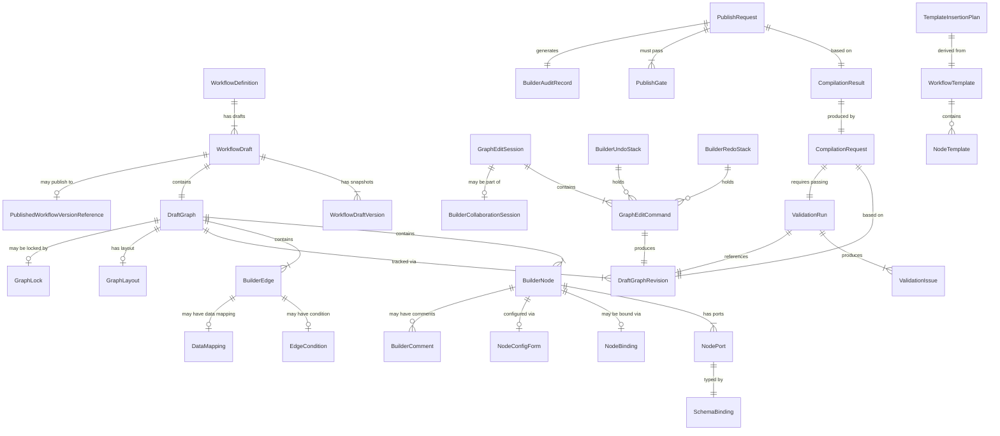

---

## 5. Workflow Authoring Lifecycle

### 5.1 Lifecycle Stages

| Stage | Description | Entry Condition | Exit Condition |
|---|---|---|---|
| 1. WorkflowDefinition Created | Logical workflow identity established | Actor creates new workflow | WorkflowDefinition record exists |
| 2. WorkflowDraft Created | Mutable draft associated with definition | WorkflowDefinition exists | DraftGraph initialized |
| 3. DraftGraph Initialized | Empty canvas ready for editing | WorkflowDraft created | GraphEditSession opened |
| 4. Graph Editing Session Opened | Actor acquires edit lock, session active | DraftGraph initialized | GraphLock acquired (or collaboration mode) |
| 5. Nodes Added | Nodes created from palette | Editing session active | At least one node on canvas |
| 6. Edges Added | Connections between nodes created | Compatible ports identified | Edges valid or warnings surfaced |
| 7. Node Configuration Completed | NodeConfigForms filled; bindings resolved | Nodes on canvas | All required config fields populated |
| 8. Data Mappings Configured | Port-to-port data flows declared | Edges connecting data ports | Schema compatibility validated |
| 9. Validation Run Executed | Server-side validation triggered | Author requests or autotriggered | ValidationRun complete |
| 10. Blocking Issues Resolved | All blocking ValidationIssues fixed | Validation failed | Validation passes |
| 11. Compilation Requested | CompilationRequest submitted | ValidationRun passed | CompilationResult received |
| 12. CompilationResult Created | WorkflowCompiler produces output | CompilationRequest submitted | Compilation success or failure |
| 13. Publish Gates Evaluated | PublishGates checked against CompilationResult | Compilation succeeded | All gates pass or governance approval obtained |
| 14. PublishRequest Submitted | Author submits for publication | All publish gates passed | Immutable WorkflowVersion created |
| 15. WorkflowVersion Published | Immutable version in runtime registry | PublishRequest approved | WorkflowVersion available for GovernedRun creation |
| 16. Draft Locked or Branched | Draft archived or branched for next version | WorkflowVersion published | DraftStatus: Published or BranchedDraft |
| 17. Future Edits via New Draft | New draft or version branch created | Author initiates edit of published workflow | New WorkflowDraft in Editing status |

### 5.2 Draft Status Lifecycle

| Status | Description | Transitions from | Transitions to |
|---|---|---|---|
| DraftCreated | Draft record created; DraftGraph empty | — | Editing |
| Editing | Active authoring in progress | DraftCreated, Autosaved | Autosaved, ValidationPending, ArchivedDraft |
| Autosaved | Latest DraftAutosaveRecord written | Editing | Editing, ValidationPending |
| ValidationPending | ValidationRun in progress | Editing, Autosaved | ValidationFailed, ValidationPassed |
| ValidationFailed | ValidationRun produced blocking errors | ValidationPending | Editing |
| ValidationPassed | ValidationRun produced no blocking errors | ValidationPending | CompilationPending, Editing |
| CompilationPending | CompilationRequest submitted | ValidationPassed | CompilationFailed, CompilationPassed |
| CompilationFailed | CompilationResult produced errors | CompilationPending | Editing |
| CompilationPassed | CompilationResult successful | CompilationPending | PublishBlocked, PublishReady |
| PublishBlocked | Publish gates not all passed | CompilationPassed | PublishReady (after governance approval) |
| PublishReady | All publish gates passed | CompilationPassed, PublishBlocked | Published |
| Published | WorkflowVersion published; draft archived | PublishReady | ArchivedDraft, BranchedDraft |
| ArchivedDraft | Draft archived; no further editing | Published, Editing (abandoned) | — |
| BranchedDraft | New draft created from published version | Published | Editing |

**Critical rules:**
- Status values MUST NOT be confused with GovernedRun canonical state values (Section 1 of Doc 06).
- These are WorkflowDraft/builder statuses only.
- Published WorkflowVersion is IMMUTABLE. The draft status "Published" means the draft produced a version; the draft itself becomes ArchivedDraft.
- A raw DraftGraph MUST NOT be executed in production regardless of status.

### 5.2.1 Builder Status Boundary

The statuses in Section 5.2 are WorkflowDraft authoring statuses.

They are not GovernedRun states.

They are not StepExecution states.

They are not canonical WorkflowVersion lifecycle states unless explicitly mapped by Document 03 or Document 06.

### Builder Status Classification

| Status | Layer | Runtime Authority? |
|---|---|---|
| DraftCreated | Builder draft | No |
| Editing | Builder draft | No |
| Autosaved | Builder draft | No |
| ValidationPending | Builder validation | No |
| ValidationFailed | Builder validation | No |
| ValidationPassed | Builder validation | No |
| CompilationPending | Builder compilation request | No |
| CompilationFailed | Builder compilation result | No |
| CompilationPassed | Builder compilation result | No |
| PublishBlocked | Builder publish flow | No |
| PublishReady | Builder publish flow | No |
| Published | Draft publication result | No, unless mapped to WorkflowVersion lifecycle by Document 03 or 06 |
| ArchivedDraft | Builder draft archival | No |
| BranchedDraft | Builder draft lineage | No |

### Rules

- Builder statuses MUST be stored as WorkflowDraft status values only.
- Builder statuses MUST NOT be persisted as `GovernedRun.status`.
- Builder statuses MUST NOT be persisted as `StepExecution.status`.
- Builder statuses MUST NOT be emitted as Document 07 runtime events unless registered or explicitly mapped.
- `Published` in WorkflowDraft status means "this draft produced a published WorkflowVersion"; it does not mean the DraftGraph itself is a runtime artifact.
- The canonical WorkflowVersion lifecycle remains owned by Documents 03, 06 and 09.

### Forbidden Behavior

FORBIDDEN:

- generating `GovernedRunState` from builder draft statuses;
- generating `StepExecutionState` from builder draft statuses;
- treating `ValidationPassed` as a runtime state;
- treating `CompilationPassed` as a WorkflowVersion status;
- treating `PublishReady` as execution readiness;
- allowing Codex to merge builder lifecycle with runtime lifecycle for convenience.

### 5.3 Lifecycle Invariants

- **LC-01:** Compilation MUST be preceded by a passing ValidationRun referencing the same DraftGraphRevision.
- **LC-02:** Publication MUST be preceded by a successful CompilationResult.
- **LC-03:** A published WorkflowVersion cannot be directly edited; editing requires creating a new WorkflowDraft.
- **LC-04:** Runtime execution can only be initiated from a published WorkflowVersion, not from a DraftGraph.
- **LC-05:** Autosave MUST NOT change DraftStatus to Published or create a WorkflowVersion.

---

## 6. Graph Editing Command Model

### 6.1 GraphEditCommand Structure

Every mutation to a DraftGraph MUST be expressed as a GraphEditCommand with the following required fields:

| Field | Type | Required | Description |
|---|---|---|---|
| command_id | ULID | Yes | Globally unique command identifier |
| command_type | enum | Yes | One of the command types defined in Section 6.2 |
| draft_graph_id | ULID | Yes | Target DraftGraph identifier |
| draft_graph_revision_id | ULID | Yes | Revision ID the command is applied to (optimistic concurrency check) |
| actor_id | ULID | Yes | Actor performing the command |
| tenant_id | ULID | Yes | Owning tenant |
| workspace_id | ULID | Conditional | Owning workspace if workspace-scoped |
| issued_at | timestamp | Yes | Command issue time (UTC) |
| payload | object | Yes | Command-type-specific payload |
| is_semantic | boolean | Yes | True if command affects execution semantics; false if layout-only |
| undo_inverse | object | Conditional | Pre-computed inverse command for undo support |
| collaboration_session_id | ULID | Conditional | If issued in collaborative mode |

### 6.2 Command Type Catalog

**AddNode**
- Required fields: node_type, initial_position, initial_config (partial allowed)
- Validation: node_type must be in active node registry; tenant must have access to node type
- Undo: DeleteNode (same node_id)
- Redo: Re-adds node with same configuration and node_id
- Audit: Logged in DraftGraphRevision (semantic command)
- Collaboration: Broadcast to all session participants; conflict-safe (node IDs are ULIDs)

**DeleteNode**
- Required fields: node_id; cascade_edges boolean
- Validation: Node must exist; connected edges must be deletable; cannot delete StartNode if other nodes exist without explicit confirmation
- Undo: RestoreDeletedNode (restores node and disconnected edges if safe)
- Redo: Re-deletes
- Audit: Logged
- Collaboration: Broadcast; dependent edge deletions follow

**MoveNode**
- Required fields: node_id, new_position
- Validation: Position within canvas bounds
- Undo: MoveNode to previous position
- Redo: MoveNode to new position
- Audit: Layout-only; telemetry only (is_semantic: false)
- Collaboration: Broadcast; conflict-safe (positional, not semantic)

**ResizeGroup**
- Required fields: group_id, new_dimensions
- Validation: Group must exist; dimensions within canvas bounds
- Undo: ResizeGroup to previous dimensions
- Redo: ResizeGroup to new dimensions
- Audit: Layout-only; telemetry only
- Collaboration: Broadcast

**AddEdge**
- Required fields: source_node_id, source_port_id, target_node_id, target_port_id, edge_type
- Validation: Port compatibility; no cycle creation; source/target nodes must exist; edge_type valid for port types; cross-tenant references FORBIDDEN
- Undo: DeleteEdge (same edge_id)
- Redo: Re-adds edge
- Audit: Logged (semantic)
- Collaboration: Broadcast; conflict on port already connected

**DeleteEdge**
- Required fields: edge_id
- Validation: Edge must exist
- Undo: AddEdge (same configuration)
- Redo: Re-deletes
- Audit: Logged (semantic)
- Collaboration: Broadcast

**ReconnectEdge**
- Required fields: edge_id, new_source_node_id, new_source_port_id, new_target_node_id, new_target_port_id
- Validation: Same as AddEdge for new endpoints
- Undo: ReconnectEdge to original endpoints
- Redo: Reapply new connection
- Audit: Logged (semantic)
- Collaboration: Broadcast; conflict check on new ports

**UpdateNodeConfig**
- Required fields: node_id, config_delta (partial config update)
- Validation: Config fields valid per node type schema; binding compatible if binding-affecting; sensitive fields MUST reference CredentialReference, not raw value
- Undo: UpdateNodeConfig with previous config_delta
- Redo: Apply new config_delta
- Audit: Logged (semantic); config values with sensitive classification logged as references only
- Collaboration: Broadcast; semantic conflict if concurrent updates to same field

**UpdateNodeBinding**
- Required fields: node_id, binding_type, binding_reference_id (e.g., tool_contract_id, approval_policy_id)
- Validation: Binding reference must exist; must be accessible in tenant; version must be active; schema compatibility
- Undo: UpdateNodeBinding to previous binding or ClearBinding
- Redo: Re-apply binding
- Audit: Logged (semantic, governance-significant)
- Collaboration: Broadcast

**UpdateEdgeCondition**
- Required fields: edge_id, condition_expression
- Validation: Expression must be syntactically valid deterministic expression; MUST NOT be LLM-generated without explicit user acceptance flag
- Undo: UpdateEdgeCondition with previous expression
- Redo: Apply new expression
- Audit: Logged (semantic)
- Collaboration: Broadcast

**UpdateDataMapping**
- Required fields: edge_id, mapping_definition (source_ref, target_ref, transform, sensitivity_class)
- Validation: Schema compatibility; sensitive classification must not downgrade; transform must be deterministic
- Undo: UpdateDataMapping with previous mapping
- Redo: Apply new mapping
- Audit: Logged (semantic)
- Collaboration: Broadcast

**AddGroup / RemoveGroup / CollapseGroup / ExpandGroup**
- Purpose: Visual grouping of nodes; no execution semantics unless explicitly converted to SubworkflowNode
- Validation: AddGroup: nodes must exist; RemoveGroup: group must exist; Collapse/Expand: group must exist
- Undo: Inverse operation
- Audit: Layout-only (telemetry only)
- Collaboration: Broadcast

**AddComment / ResolveComment**
- Purpose: Authoring annotation; not graph semantics
- Validation: Target node/edge must exist; text length constraints
- Undo: DeleteComment / UnresolveComment
- Audit: Logged if governance-significant workflow
- Collaboration: Broadcast

**ApplyTemplate**
- Required fields: template_id, insertion_position
- Validation: Template validated; nodes/edges in template schema-compatible; no raw secrets; sanitized
- Undo: DeleteNode for all inserted nodes + DeleteEdge for inserted edges
- Audit: Logged (semantic — creates new nodes/edges)
- Collaboration: Broadcast; conflict-safe (new ULIDs for inserted nodes)

**CreateSubworkflow / ExtractSubworkflow**
- Purpose: Create a new SubworkflowNode from selected nodes (extract) or from scratch (create)
- Validation: Selected nodes form a valid subgraph; input/output schema explicit; no circular reference
- Undo: Reverse node replacement
- Audit: Logged (semantic, high-significance)
- Collaboration: Broadcast

**RenameNode**
- Required fields: node_id, new_display_name
- Validation: Display name length; no injection characters; display name is not authority
- Undo: RenameNode to previous name
- Audit: Layout-only (display name change has no execution semantics)
- Collaboration: Broadcast

**DuplicateNode**
- Required fields: node_id, new_position
- Validation: Source node must exist; duplicated node gets new ULID; configuration is deep-copied; bindings cleared (require re-binding)
- Undo: DeleteNode (duplicated node)
- Audit: Logged (semantic — creates new node with configuration)
- Collaboration: Broadcast

**DisableNode / EnableNode**
- Purpose: Mark a BuilderNode as disabled (excluded from compilation) or re-enable it
- Validation: Node must exist; disabling a critical node (e.g., ApprovalNode on high-risk path) requires explicit confirmation
- Undo: EnableNode / DisableNode
- Audit: Logged (semantic — affects compiled execution plan)
- Collaboration: Broadcast

**RestoreDeletedNode**
- Purpose: Undo a node deletion; restores node and safe dependent edges
- Validation: Restore target must be in undo stack; edges restored only if target nodes still exist
- Undo: DeleteNode (re-deletes)
- Audit: Logged (semantic)
- Collaboration: Broadcast

### 6.3 Command Model Rules

- **CMD-01:** All DraftGraph mutations MUST be represented as GraphEditCommands. Direct JSON mutation of the DraftGraph outside the command model is FORBIDDEN.
- **CMD-02:** Every command MUST include actor_id, tenant_id, and draft_graph_revision_id.
- **CMD-03:** The draft_graph_revision_id in the command payload MUST match the current DraftGraph revision. Stale revision IDs indicate a conflict and MUST be rejected (optimistic concurrency).
- **CMD-04:** Commands that affect execution semantics (is_semantic: true) MUST trigger validation invalidation upon application.
- **CMD-05:** Layout-only commands (is_semantic: false) MUST NOT invalidate semantic validation results.
- **CMD-06:** Command processing MUST be idempotent for retry purposes; each command_id processed once.
- **CMD-07:** LLM-suggested commands MUST be flagged in the payload and MUST require explicit user acceptance before submission as authoritative commands.

### 6.4 GraphEditCommand Atomicity and Durability Boundary

A GraphEditCommand is not a frontend event.

It is a governed mutation request against a DraftGraph.

Every semantic GraphEditCommand MUST be applied atomically with the resulting DraftGraphRevision and validation invalidation metadata.

### Atomic Write Requirement

For semantic commands, the following MUST succeed or fail as one unit:

1. command authorization;
2. tenant and workspace validation;
3. revision concurrency check;
4. command idempotency check;
5. DraftGraph mutation;
6. DraftGraphRevision creation;
7. validation invalidation;
8. audit or revision evidence reference where applicable.

If any required step fails, the command MUST fail and the DraftGraph MUST remain unchanged.

### Idempotency Rule

`command_id` MUST be treated as an idempotency key.

- Replaying the same command_id with the same normalized payload MUST return the original result.
- Replaying the same command_id with a different normalized payload MUST return `GraphEditCommandConflict`.
- A command MUST NOT be applied twice.

### Layout Command Durability

Layout-only commands MAY use lighter persistence, but they MUST NOT corrupt semantic revision history.

If a layout command and a semantic command conflict, semantic correctness wins.

### Forbidden Behavior

FORBIDDEN:

- applying a DraftGraph mutation before authorization succeeds;
- creating DraftGraphRevision without the corresponding command record;
- mutating DraftGraph and failing to invalidate stale validation;
- applying the same command_id twice;
- treating frontend drag/drop events as authoritative graph mutation;
- allowing Codex to patch DraftGraph JSON directly because it is easier than commands.

---

## 7. DraftGraph and Revision Semantics

### 7.1 DraftGraph Structure

A DraftGraph consists of two distinct layers that MUST be stored and manipulated separately:

**Semantic Layer:** The execution-meaningful structure of the graph:
- BuilderNode definitions (type, binding, configuration, port definitions)
- BuilderEdge definitions (type, source port, target port, condition, data mapping)
- DataMapping declarations between ports
- EdgeCondition expressions
- NodeBinding references (to ToolContracts, ApprovalPolicies, etc.)

**Layout Layer:** The presentation-only structure of the graph:
- BuilderNode positions and sizes
- GraphViewport state
- Group definitions and collapsed states
- Visual edge routing points
- Minimap state
- Annotation positions

### 7.2 Revision Types

| Revision Type | Triggered by | Semantic Layer Changed | Validation Invalidated | Compilation Invalidated |
|---|---|---|---|---|
| Semantic revision | Any is_semantic: true command | Yes | Yes | Yes |
| Layout revision | Any is_semantic: false command (MoveNode, etc.) | No | No | No |
| Autosave revision | Periodic timer during editing | Layout only (if no semantic changes pending) | No (if layout-only) | No |
| Validation snapshot | Successful ValidationRun | No (annotates existing revision) | No | Conditional |
| Compilation snapshot | Successful CompilationResult | No (annotates existing revision) | No | No |

### 7.3 Revision Rules

- **REV-01:** Layout changes MUST NOT alter execution semantics. Layout and semantic layers MUST be independently stored.
- **REV-02:** Semantic changes MUST invalidate the current ValidationRun result and CompilationResult. Stale validation results MUST be clearly labeled.
- **REV-03:** DraftGraphRevisions are append-only. Revisions MUST NOT be deleted or mutated after creation.
- **REV-04:** Autosave MUST NOT trigger a ValidationRun or CompilationRequest. Autosave only persists the current graph state.
- **REV-05:** Autosave MUST NOT create a WorkflowVersion or change DraftStatus to Published.
- **REV-06:** Autosave failure MUST be visible to the author via a persistent indicator ("Autosave failed — changes may be lost").
- **REV-07:** Authors MAY restore from any DraftGraphRevision in the revision history. Restoration creates a new semantic revision from the historical state.
- **REV-08:** Revision history MUST NOT expose graph content from another tenant's draft under any access pattern.
- **REV-09:** DraftGraph is never used as runtime source of truth; only published WorkflowVersions are runtime-authoritative.

### 7.4 Autosave Behavior

- Autosave frequency: configurable; SHOULD autosave at minimum every 60 seconds during active editing.
- Autosave MUST persist both semantic and layout layers.
- Autosave failure MUST be surfaced immediately; authors MUST be able to manually trigger save.
- Autosave records are not validation checkpoints; they do not affect DraftStatus.
- Autosave records may be pruned per retention policy (minimum 24h of autosave history per draft during active editing).

---

## 8. Node Taxonomy

### 8.1 Node Type Definitions

**StartNode**
- Purpose: Defines the entry point of the workflow graph. Receives trigger data (API call, event, cron, webhook, manual).
- Required configuration: trigger_type, input_schema (defines what data enters the graph)
- Input ports: None
- Output ports: control_out (ControlFlowEdge), data_out (trigger payload schema)
- Allowed incoming edges: NONE — StartNode MUST have no incoming edges
- Allowed outgoing edges: ControlFlowEdge to any non-StartNode; DataDependencyEdge to downstream nodes
- Validation rules: Exactly one StartNode REQUIRED per graph; no incoming edges
- Compilation behavior: Compiles to WorkflowTrigger activation point; trigger type validated
- Governance implications: Trigger type determines runtime initiator; API triggers require actor identity
- Side-effect class: None (activation only)
- Replay implications: Re-executed from recorded trigger payload
- Forbidden behavior: Multiple StartNodes; StartNode with incoming edge; StartNode without trigger type

---

**EndNode**
- Purpose: Defines a terminal point of the workflow graph. There may be multiple EndNodes (success, failure, compensation end).
- Required configuration: end_type (success / failure / compensation), output_schema
- Input ports: control_in, data_in (optional)
- Output ports: None
- Allowed incoming edges: ControlFlowEdge, ErrorEdge, CompensationEdge
- Allowed outgoing edges: NONE — EndNode MUST have no outgoing edges
- Validation rules: At least one EndNode REQUIRED; all terminal paths must reach an EndNode; no outgoing edges
- Compilation behavior: Compiles to terminal run state trigger
- Governance implications: Failure EndNode may trigger compensation plan
- Side-effect class: None
- Replay implications: Marks replay terminal
- Forbidden behavior: EndNode with outgoing edge; graph with no EndNode; orphaned path without EndNode

---

**CognitiveStepNode**
- Purpose: Invokes a model or cognitive operation via the CognitiveExecution boundary (Document 04). Produces nondeterministic output governed by OutputPromotionController.
- Required configuration: model_provider_reference (CredentialReference), prompt_template_id, output_schema, timeout_seconds
- Input ports: control_in, context_in (optional), data_in
- Output ports: control_out_success, control_out_failure, data_out (governed output)
- Allowed incoming edges: ControlFlowEdge, DataDependencyEdge
- Allowed outgoing edges: ControlFlowEdge, ErrorEdge, DataDependencyEdge
- Validation rules: timeout_seconds REQUIRED; model_provider_reference MUST be CredentialReference (not raw key); prompt_template_id REQUIRED
- Compilation behavior: Compiles to CognitiveStepNode in WorkflowGraph; timeout injected into ExecutionPlan
- Governance implications: Cognitive output is probabilistic; downstream policy gates may be required
- Side-effect class: Conditional (depends on OutputPromotionController)
- Replay implications: Suppressed during replay; output hydrated from recorded ModelOutput
- Forbidden behavior: Hardcoded model API key; no timeout; prompt that calls external tools directly

---

**AgentStepNode**
- Purpose: Dispatches a cognitive agent via AgentExecutionGateway (Document 05). Agents coordinate internal tool use within their execution boundary.
- Required configuration: agent_definition_id, input_schema, output_schema, timeout_seconds, max_tool_calls (agent budget)
- Input ports: control_in, data_in
- Output ports: control_out_success, control_out_failure, data_out
- Allowed incoming edges: ControlFlowEdge, DataDependencyEdge
- Allowed outgoing edges: ControlFlowEdge, ErrorEdge, DataDependencyEdge
- Validation rules: agent_definition_id REQUIRED and must be published; timeout_seconds REQUIRED; max_tool_calls REQUIRED
- Compilation behavior: Compiles to AgentStepNode with bounded execution envelope
- Governance implications: Agent tool use must be declared in agent_definition; tools not in declaration are FORBIDDEN
- Side-effect class: Declared per agent_definition (inherited from agent's tool use)
- Replay implications: Suppressed; hydrated from AgentReplayRecord
- Forbidden behavior: Agent without declared tool budget; agent calling tools outside its declaration

---

**ToolStepNode**
- Purpose: Executes a specific tool via ToolInvocationGateway (Document 15) under a declared ToolContract.
- Required configuration: tool_contract_id (REQUIRED — binding is mandatory before compilation), tool_version, credential_reference_ids[], input_mapping, output_mapping
- Input ports: control_in, data_in
- Output ports: control_out_success, control_out_failure, data_out, error_out
- Allowed incoming edges: ControlFlowEdge, DataDependencyEdge
- Allowed outgoing edges: ControlFlowEdge, ErrorEdge, DataDependencyEdge, CompensationEdge (if IrreversibleAction)
- Validation rules: tool_contract_id REQUIRED and must be active version; ToolContract side-effect class MUST be declared; compensation_plan REQUIRED if side-effect class is IrreversibleAction; timeout REQUIRED; credential_reference_ids MUST be CredentialReference (not raw values)
- Compilation behavior: Resolves ToolContract version; injects retry policy, timeout, side-effect class into ExecutionPlan
- Governance implications: Policy gate may be required before high-risk tool invocations; side-effect declared for replay suppression
- Side-effect class: Inherited from ToolContract declaration (read-only / idempotent / non-idempotent / destructive)
- Replay implications: Suppressed; result hydrated from ToolReplayRecord
- Forbidden behavior: ToolStepNode without ToolContract binding; raw API key in credential field; side-effect class undeclared

---

**MemoryReadNode**
- Purpose: Retrieves context from the memory layer (Document 10) within a declared ContextBoundary.
- Required configuration: context_boundary_id (REQUIRED), retrieval_strategy, query_schema, output_schema
- Input ports: control_in, query_in
- Output ports: control_out, data_out (retrieved fragments with provenance)
- Allowed incoming edges: ControlFlowEdge, DataDependencyEdge
- Allowed outgoing edges: ControlFlowEdge, DataDependencyEdge
- Validation rules: context_boundary_id REQUIRED; retrieval_strategy valid per boundary; output schema must include provenance fields
- Compilation behavior: Binds to ContextBoundary version; declares read-only memory access
- Governance implications: Memory access is tenanted and bounded; cross-boundary reads FORBIDDEN
- Side-effect class: Read-only
- Replay implications: Hydrated from ContextSnapshot at replay time
- Forbidden behavior: Memory read without ContextBoundary; cross-tenant memory reference

---

**MemoryWriteNode**
- Purpose: Persists data to the memory layer via MemoryMutationGateway (Document 10). Side-effectful.
- Required configuration: context_boundary_id (REQUIRED), write_strategy, input_schema, lineage_tag
- Input ports: control_in, data_in
- Output ports: control_out_success, control_out_failure
- Allowed incoming edges: ControlFlowEdge, DataDependencyEdge
- Allowed outgoing edges: ControlFlowEdge, ErrorEdge
- Validation rules: context_boundary_id REQUIRED; lineage_tag REQUIRED (for append-only lineage); write_strategy valid per boundary
- Compilation behavior: Binds to ContextBoundary; marks as side-effectful write with lineage requirement
- Governance implications: Memory mutations require lineage; may require policy gate for sensitive namespaces
- Side-effect class: Non-idempotent (memory mutation)
- Replay implications: Suppressed; hydrated from memory mutation replay record
- Forbidden behavior: Memory write without ContextBoundary; memory write without lineage_tag

---

**ApprovalNode**
- Purpose: Inserts an explicit human approval gate into the workflow. Execution pauses until an authorized approver grants or denies the request.
- Required configuration: approval_policy_id (REQUIRED), approval_schema, timeout_seconds, escalation_policy, requester_context_template
- Input ports: control_in, context_in (approval context data)
- Output ports: control_out_granted (ApprovalResumeEdge), control_out_denied (ErrorEdge), control_out_timeout (TimeoutEdge)
- Allowed incoming edges: ControlFlowEdge, DataDependencyEdge
- Allowed outgoing edges: ApprovalResumeEdge (granted), ErrorEdge (denied), TimeoutEdge (timeout)
- Validation rules: approval_policy_id REQUIRED; all three output paths (granted/denied/timeout) MUST be connected; timeout REQUIRED; requester_context_template must not contain raw secrets
- Compilation behavior: Compiles to ApprovalGate in ExecutionPlan with barrier semantics
- Governance implications: ApprovalNode is a governance-significant element; removing or bypassing requires explicit permission; generates GovernanceAuditRecord at runtime
- Side-effect class: None (pauses execution)
- Replay implications: Historical approval decision preserved; not re-solicited during replay
- Forbidden behavior: ApprovalNode without approval_policy_id; approval gate as a comment only; removing ApprovalNode without governance permission; missing denied/timeout paths

---

**PolicyGateNode**
- Purpose: Evaluates a policy decision via PolicyDecisionGateway (Document 11) and routes execution based on the result.
- Required configuration: policy_definition_id (REQUIRED), evaluation_context_schema, allow_output_port, deny_output_port
- Input ports: control_in, context_in
- Output ports: control_out_allowed, control_out_denied
- Allowed incoming edges: ControlFlowEdge, DataDependencyEdge
- Allowed outgoing edges: ControlFlowEdge (both allow and deny paths)
- Validation rules: policy_definition_id REQUIRED; both allow and deny output paths MUST be connected; policy version must be active
- Compilation behavior: Compiles to PolicyGate in ExecutionPlan; fail-closed enforcement required
- Governance implications: Policy gate is fail-closed: if policy engine unavailable, MUST deny
- Side-effect class: None (evaluation only)
- Replay implications: Historical policy decision preserved from PolicyDecisionRecord
- Forbidden behavior: PolicyGateNode without policy_definition_id; LLM prompt as policy logic; single-output policy gate (both paths required)

---

**ConditionalNode**
- Purpose: Routes control flow based on a deterministic expression evaluated against input data.
- Required configuration: condition_branches[] (each with expression and label), default_branch_required flag
- Input ports: control_in, data_in
- Output ports: One control output port per branch + one default branch port
- Allowed incoming edges: ControlFlowEdge, DataDependencyEdge
- Allowed outgoing edges: ConditionalEdge (one per branch)
- Validation rules: At least two branches REQUIRED; default branch REQUIRED unless exhaustiveness can be proven; all branches MUST be deterministic expressions; LLM-based branching is FORBIDDEN
- Compilation behavior: Compiles to conditional routing in ExecutionPlan with branch evaluation order
- Governance implications: Conditional branching that bypasses ApprovalNode requires audit if it was previously mandatory
- Side-effect class: None (routing only)
- Replay implications: Condition re-evaluated during replay from recorded inputs
- Forbidden behavior: LLM as condition expression; missing default branch; undeclared branch paths

---

**ParallelSplitNode**
- Purpose: Forks execution into multiple concurrent branches.
- Required configuration: branch_count (static) or dynamic_branch_schema; join_strategy reference
- Input ports: control_in, data_in
- Output ports: One ParallelBranchEdge port per branch
- Allowed incoming edges: ControlFlowEdge
- Allowed outgoing edges: ParallelBranchEdge (one per branch)
- Validation rules: Must be paired with a ParallelJoinNode; all branches must eventually reach the join; branch_count static or schema-bounded
- Compilation behavior: Compiles to parallel barrier group in ExecutionPlan
- Governance implications: Each branch inherits parent run's governance context
- Side-effect class: None (coordination)
- Replay implications: Each branch replayed independently; join barrier reconstructed
- Forbidden behavior: Split without Join; unbounded dynamic branches without budget

---

**ParallelJoinNode**
- Purpose: Synchronizes parallel branches back to a single execution path.
- Required configuration: join_strategy (all-complete / any-complete / quorum), timeout_seconds
- Input ports: One per incoming branch; control_in_[N]
- Output ports: control_out_joined, control_out_timeout
- Allowed incoming edges: ParallelBranchEdge (multiple)
- Allowed outgoing edges: ControlFlowEdge, TimeoutEdge
- Validation rules: Must have a matching ParallelSplitNode; join_strategy REQUIRED; timeout REQUIRED for any-complete and quorum
- Compilation behavior: Compiles to join barrier in ExecutionPlan with join strategy
- Replay implications: Join state reconstructed from branch completion records
- Forbidden behavior: Join without Split; missing timeout for quorum/any strategy

---

**TimerNode**
- Purpose: Introduces a delay or schedule-driven wait into the workflow execution.
- Required configuration: timer_type (delay / cron / until), timer_expression, timeout_seconds (max wait)
- Input ports: control_in
- Output ports: control_out_fired, control_out_timeout
- Allowed incoming edges: ControlFlowEdge
- Allowed outgoing edges: ControlFlowEdge, TimeoutEdge
- Validation rules: timer_expression valid for timer_type; timeout REQUIRED
- Compilation behavior: Compiles to OrchestrationCommand: ScheduleTimer
- Side-effect class: None
- Replay implications: Timer treated as instant-complete during replay (historical time preserved)
- Forbidden behavior: Open-ended timer without timeout; cron expression without bounds check

---

**EventWaitNode**
- Purpose: Pauses execution until a specific correlated event is received from the event store.
- Required configuration: event_type_pattern, correlation_expression, timeout_seconds
- Input ports: control_in
- Output ports: control_out_received (EventResumeEdge), control_out_timeout (TimeoutEdge)
- Allowed incoming edges: ControlFlowEdge
- Allowed outgoing edges: EventResumeEdge, TimeoutEdge
- Validation rules: event_type_pattern REQUIRED; correlation_expression REQUIRED; timeout REQUIRED
- Compilation behavior: Compiles to event listener registration in ExecutionPlan
- Side-effect class: None (waiting)
- Replay implications: Event resume hydrated from historical event record
- Forbidden behavior: EventWaitNode without timeout; cross-tenant event correlation

---

**ExternalIntegrationNode**
- Purpose: Interacts with an external system via a ConnectorDefinition / IntegrationContract (Document 18).
- Required configuration: connector_definition_id (REQUIRED), integration_instance_id, operation_id, credential_reference_id (CredentialReference — not raw), input_mapping, output_mapping, idempotency_strategy, timeout_seconds
- Input ports: control_in, data_in
- Output ports: control_out_success, control_out_failure, data_out, error_out
- Allowed incoming edges: ControlFlowEdge, DataDependencyEdge
- Allowed outgoing edges: ControlFlowEdge, ErrorEdge, DataDependencyEdge
- Validation rules: connector_definition_id REQUIRED; credential_reference_id MUST be CredentialReference; idempotency_strategy REQUIRED for non-idempotent operations; timeout REQUIRED
- Compilation behavior: Resolves ConnectorDefinition version; declares external side effect in ExecutionPlan
- Side-effect class: Declared per ConnectorDefinition operation (read / idempotent / non-idempotent / destructive)
- Replay implications: Suppressed; result hydrated from external integration replay record
- Forbidden behavior: Raw credential in config; missing idempotency for write operations; connector_definition_id not in tenant catalog

---

**WebhookTriggerNode**
- Purpose: Defines a webhook as a workflow activation trigger (variant of StartNode for webhook-initiated workflows).
- Required configuration: webhook_signature_validation_mode, payload_schema, idempotency_key_path
- Input ports: None (trigger)
- Output ports: control_out, data_out (normalized webhook payload)
- Validation rules: Signature validation REQUIRED; payload_schema REQUIRED; idempotency_key_path REQUIRED
- Forbidden behavior: Accepting unsigned webhooks without validation mode; no payload schema

---

**APITriggerNode**
- Purpose: Defines a REST/gRPC API call as a workflow activation trigger.
- Required configuration: api_operation_id, input_schema, authentication_requirement
- Validation rules: authentication_requirement must not be None for production workflows

---

**HumanTaskNode**
- Purpose: Assigns a manual task to a human actor that must be completed before execution continues. Unlike ApprovalNode (binary approve/reject), HumanTaskNode supports structured task completion with data input.
- Required configuration: task_definition_id, assignee_policy, form_schema, timeout_seconds
- Input/output ports: control_in; control_out_completed, control_out_timeout; data_in (task context); data_out (task completion data)
- Validation rules: task_definition_id REQUIRED; assignee_policy REQUIRED; timeout REQUIRED; form_schema REQUIRED
- Side-effect class: None (but completion data is a structured output)
- Replay implications: Historical task completion preserved; not re-assigned during replay

---

**NotificationNode**
- Purpose: Sends a notification (email, Slack, webhook callback, etc.) as a workflow step. Side-effectful.
- Required configuration: channel_type, recipient_expression, template_id, credential_reference_id (CredentialReference)
- Input ports: control_in, data_in (notification context)
- Output ports: control_out_success, control_out_failure
- Validation rules: channel_type REQUIRED; template_id REQUIRED; credential_reference_id MUST be CredentialReference; recipient_expression MUST NOT contain raw personal data directly (use reference)
- Side-effect class: Non-idempotent (notifications cannot be un-sent)
- Replay implications: Suppressed during replay; logged as suppressed notification
- Forbidden behavior: Raw email credentials; no idempotency consideration for retry

---

**CompensationNode**
- Purpose: Explicitly defines a compensation (rollback) action to be executed when a previously completed side-effectful step must be reversed.
- Required configuration: compensation_for_node_id, compensation_action, compensation_credential_reference
- Input ports: control_in (from CompensationEdge)
- Output ports: control_out_success, control_out_failure
- Validation rules: compensation_for_node_id MUST reference a side-effectful node; compensation_action MUST be deterministic; compensation MUST be explicitly defined, not implied
- Side-effect class: Non-idempotent (compensation is a real-world action)
- Replay implications: Compensation actions replayed from historical records only
- Forbidden behavior: Implicit compensation; CompensationNode without explicit compensation_for_node_id

---

**SubworkflowNode**
- Purpose: References and invokes a published child WorkflowVersion as a bounded step.
- Required configuration: workflow_definition_id, workflow_version_id (pinned to published version), input_schema, output_schema
- Input ports: control_in, data_in (mapped to child workflow input schema)
- Output ports: control_out_success, control_out_failure, data_out (child workflow output)
- Validation rules: workflow_version_id MUST reference a published WorkflowVersion; input/output schema must be compatible; recursive reference FORBIDDEN unless explicitly supported and bounded; cross-tenant reference FORBIDDEN
- Compilation behavior: Child workflow's ExecutionPlan is validated for compatibility; parent version pins child version at compile time
- Side-effect class: Inherited from child workflow
- Replay implications: Child workflow replayed from its own replay records within parent replay context
- Forbidden behavior: Reference to draft (non-published) workflow; recursive self-reference; cross-tenant child workflow

---

**ErrorBoundaryNode**
- Purpose: Catches errors from a bounded set of nodes and routes them to a recovery path rather than failing the entire run.
- Required configuration: caught_error_classes[], recovery_path_ref, max_retry_within_boundary
- Input ports: control_in (wrapped nodes' errors via ErrorEdge)
- Output ports: control_out_recovered, control_out_unrecoverable
- Validation rules: caught_error_classes REQUIRED; recovery_path REQUIRED; unrecoverable output REQUIRED
- Forbidden behavior: ErrorBoundaryNode that silently swallows errors without recovery path

---

**QuarantineNode**
- Purpose: Marks a data artifact or execution branch as quarantined, routing it to the security quarantine handler.
- Required configuration: quarantine_reason_expression, quarantine_scope
- Input ports: control_in, data_in
- Output ports: control_out_quarantined
- Validation rules: quarantine_reason_expression REQUIRED; quarantine_scope REQUIRED
- Forbidden behavior: Quarantine without reason; quarantine that silently discards data

---

**EvaluationNode**
- Purpose: Evaluates step or run output quality against a defined evaluation configuration (Document 23).
- Required configuration: evaluation_definition_id, scoring_schema, pass_threshold
- Input ports: control_in, data_in (output to evaluate)
- Output ports: control_out_pass, control_out_fail, data_out (evaluation score)
- Validation rules: evaluation_definition_id REQUIRED; scoring_schema REQUIRED; both pass and fail output paths REQUIRED

---

**ArtifactNode**
- Purpose: Produces or consumes a versioned artifact (document, dataset, model artifact) within the workflow.
- Required configuration: artifact_type, artifact_store_ref, schema_id

---

**NoOpAnnotationNode**
- Purpose: A visual annotation node with no execution semantics. Provides human-readable context in the graph without affecting compilation.
- Compilation behavior: NOT compiled into WorkflowVersion; stripped at compilation.
- Validation rules: NoOpAnnotationNode generates a warning if referenced by a semantic edge.

### 8.2 Node Type Summary Table

| Node Type | Side-Effect Class | Requires Contract | Approval Gate? | Replay Behavior | Forbidden Without |
|---|---|---|---|---|---|
| StartNode | None | No | No | Re-executed | Trigger type |
| EndNode | None | No | No | Terminal marker | — |
| CognitiveStepNode | Conditional | No (provider ref) | Optional | Suppressed/hydrated | Timeout, prompt template |
| AgentStepNode | Declared per agent | agent_definition | Optional | Suppressed/hydrated | Timeout, max_tool_calls |
| ToolStepNode | Declared per ToolContract | ToolContract (REQUIRED) | Optional | Suppressed/hydrated | ToolContract binding |
| MemoryReadNode | Read-only | ContextBoundary (REQUIRED) | No | Hydrated | ContextBoundary |
| MemoryWriteNode | Non-idempotent | ContextBoundary (REQUIRED) | Optional | Suppressed | ContextBoundary, lineage_tag |
| ApprovalNode | None | ApprovalPolicy (REQUIRED) | YES | Historical decision | approval_policy_id |
| PolicyGateNode | None | PolicyDefinition (REQUIRED) | No | Historical decision | policy_definition_id |
| ConditionalNode | None | No | No | Condition re-evaluated | Default branch |
| ParallelSplitNode | None | No | No | Per-branch replay | Paired Join |
| ParallelJoinNode | None | No | No | Join reconstruction | Paired Split |
| TimerNode | None | No | No | Instant-complete | Timer expression |
| EventWaitNode | None | No | No | Hydrated | Event type, timeout |
| ExternalIntegrationNode | Declared | ConnectorDefinition (REQUIRED) | Optional | Suppressed/hydrated | ConnectorDefinition |
| WebhookTriggerNode | None | No | No | Trigger payload replay | Signature validation |
| APITriggerNode | None | No | No | Trigger payload replay | Auth requirement |
| HumanTaskNode | None | task_definition | No | Historical completion | Task definition |
| NotificationNode | Non-idempotent | channel config | No | Suppressed | Template, credential ref |
| CompensationNode | Non-idempotent | No | No | Historical only | compensation_for_node_id |
| SubworkflowNode | Inherited | Published WF Version (REQUIRED) | Inherited | Per-child replay | Published version ref |
| ErrorBoundaryNode | None | No | No | Error path replay | Recovery path |
| QuarantineNode | None | No | No | Quarantine preserved | Reason expression |
| EvaluationNode | None | evaluation_definition | No | Score hydrated | Evaluation definition |
| ArtifactNode | Read/Write | artifact_store_ref | No | Artifact ref hydrated | Artifact type |
| NoOpAnnotationNode | None | No | No | NOT compiled | — |

### 8.3 Node Type Registry and Runtime Mapping Boundary

The node taxonomy in Document 21 defines builder-authoring representations.

A BuilderNode type becomes executable only when it maps to a canonical runtime step type, contract binding, or orchestration construct owned by the appropriate specialized document.

### Required Node Type Registry Fields

Every node type in the builder registry MUST include:

```text
builder_node_type {
  node_type_id:                required
  display_name:                required
  owning_document:             required
  runtime_mapping_type:        required
  runtime_mapping_reference:   required
  schema_version:              required
  input_ports:                 required
  output_ports:                required
  required_bindings:           required
  side_effect_class:           required when applicable
  replay_behavior:             required
  tenant_scope_required:       required
  validation_rules_ref:        required
  compilation_mapping_ref:     required
}
```

### Runtime Mapping Classes

| Builder Node Category | Runtime Mapping Required |
|---|---|
| CognitiveStepNode | Document 04 CognitiveExecution boundary |
| AgentStepNode | Document 05 AgentExecution boundary |
| ToolStepNode | Document 15 ToolContract and ToolInvocationGateway |
| MemoryReadNode / MemoryWriteNode | Document 10 ContextBoundary and memory gateways |
| ApprovalNode | Document 11 ApprovalPolicy / ApprovalRequest semantics |
| PolicyGateNode | Document 11 PolicyDecisionGateway semantics |
| ExternalIntegrationNode | Document 18 ConnectorDefinition / IntegrationContract |
| TimerNode / EventWaitNode | Document 09 orchestration waiting semantics |
| SubworkflowNode | Document 09 published WorkflowVersion invocation semantics |
| EvaluationNode | Document 23 evaluation framework |
| NoOpAnnotationNode | Builder-only; MUST NOT compile |

### Rules

- A builder node type MUST declare its owning document.
- A builder node type MUST declare its runtime mapping or explicitly declare itself builder-only.
- Builder-only node types MUST NOT compile into WorkflowVersion.
- A new node type requires architecture review if it introduces new runtime semantics.
- A new side-effectful node type requires side-effect class, replay behavior, idempotency strategy and security review.
- Codex MUST NOT create a node type from UI needs alone.

### Forbidden Behavior

FORBIDDEN:

- creating a new executable node type without an owning document;
- compiling a builder-only node into WorkflowVersion;
- treating display name as runtime semantics;
- implementing ToolStepNode behavior without Document 15 ToolContract;
- implementing PolicyGateNode as prompt text or frontend logic;
- allowing Codex to add a node type because it is visually convenient.

---

## 9. Edge Semantics

### 9.1 Edge Type Definitions

**ControlFlowEdge**
- Purpose: Represents standard control flow between two nodes — execution proceeds from source to target when source completes successfully.
- Source port: Any control output port (control_out, control_out_success)
- Target port: Any control input port (control_in)
- Allowed source node types: All node types with control output ports
- Allowed target node types: All node types with control input ports (not StartNode)
- Condition support: No (unconditional; use ConditionalEdge for conditional routing)
- Compile behavior: Compiled into directed dependency edge in ExecutionPlan
- Visual treatment: Solid directed line; standard weight; Document 20 design tokens
- Validation rules: Source and target ports must be compatible; no cycles; source must exist; target must exist

**DataDependencyEdge**
- Purpose: Declares that data produced by a source node's output port is required by a target node's input port. May coexist with ControlFlowEdge or be independent.
- Source port: Data output port (data_out, data_out_*)
- Target port: Data input port (data_in, data_in_*)
- Condition support: No (data must flow; use DataMapping for transformation)
- Compile behavior: Compiled into data binding in ExecutionPlan with schema validation
- Visual treatment: Dashed directed line (distinct from control flow)
- Validation rules: Schema compatibility required; sensitivity classification preserved; DataMapping required for type transformation

**ConditionalEdge**
- Purpose: A control flow edge that is only traversed when an EdgeCondition evaluates to true at runtime.
- Source port: Conditional output port on ConditionalNode
- Target port: Control input port
- Condition support: Yes (REQUIRED — EdgeCondition MUST be set)
- Compile behavior: Compiled into conditional branch in ExecutionPlan with expression
- Visual treatment: Dashed-dotted line with condition label
- Validation rules: EdgeCondition REQUIRED; at least one default branch for ConditionalNode; condition expression must be deterministic

**ErrorEdge**
- Purpose: Routes execution to an error handler when the source node produces an error of a specific class.
- Source port: Error output port (error_out, control_out_failure)
- Target port: Control input port on error handler (ErrorBoundaryNode, EndNode-failure, QuarantineNode)
- Condition support: Conditional on error_class
- Compile behavior: Compiled into error routing entry in ExecutionPlan
- Visual treatment: Red-tinted dashed line (Document 20 danger border token); error class label
- Validation rules: Source must have error_out port; target must accept error input; error class label REQUIRED

**CompensationEdge**
- Purpose: Routes execution to a CompensationNode when a previously completed side-effectful step must be reversed.
- Source port: Compensation port on source (ToolStepNode, ExternalIntegrationNode with IrreversibleAction class)
- Target port: Control input on CompensationNode
- Condition support: No
- Compile behavior: Compiled into compensation plan entry in ExecutionPlan
- Visual treatment: Orange-tinted dashed line; "Compensates" label
- Validation rules: Source must have side-effect class IrreversibleAction or Destructive; CompensationNode REQUIRED at target

**ApprovalResumeEdge**
- Purpose: Routes execution from an ApprovalNode when approval is granted.
- Source port: control_out_granted on ApprovalNode
- Target port: Control input on next step
- Condition support: No
- Compile behavior: Compiled as approval resume barrier edge
- Visual treatment: Governance-accent line (Document 20 governance token); "Approved" label
- Validation rules: Source MUST be ApprovalNode; edge REQUIRED (approval without resume path is a blocking error)

**TimeoutEdge**
- Purpose: Routes execution when a time-bounded node (TimerNode, ApprovalNode, EventWaitNode, ParallelJoinNode) exceeds its configured timeout.
- Source port: control_out_timeout
- Target port: Control input on timeout handler (EndNode, ErrorBoundaryNode, CompensationNode)
- Validation rules: Source must have control_out_timeout; timeout handler REQUIRED

**EventResumeEdge**
- Purpose: Routes execution from an EventWaitNode when the awaited event is received.
- Source port: control_out_received on EventWaitNode
- Target port: Control input on continuation step
- Validation rules: Source MUST be EventWaitNode

**ParallelBranchEdge**
- Purpose: Connects a ParallelSplitNode to each of its concurrent execution branches.
- Source port: Branch output port on ParallelSplitNode
- Target port: Control input of branch start node
- Validation rules: All branches must eventually reach the paired ParallelJoinNode; no cross-branch data dependency

**SubworkflowBoundaryEdge**
- Purpose: Connects the parent workflow to a SubworkflowNode's input and output, representing the child workflow invocation boundary.
- Compile behavior: Input schema and output schema validated against child workflow published version

**AnnotationEdge**
- Purpose: A purely visual connector between a NoOpAnnotationNode and another node for documentation purposes. No execution semantics.
- Compile behavior: NOT compiled into WorkflowVersion
- Validation rules: Cannot connect to semantic ports; annotation-only source and/or target

### 9.2 Edge Validation Rules

- **EDGE-01:** Visual proximity between nodes MUST NOT imply a dependency edge. No implicit edges exist.
- **EDGE-02:** All edges MUST be explicit GraphEditCommand additions.
- **EDGE-03:** Edge labels MUST be present on ConditionalEdge, ErrorEdge, and CompensationEdge. Unlabeled conditional or error edges are a BlockingError.
- **EDGE-04:** Conditional edges MUST be mutually exhaustive or have an explicit default branch on the source ConditionalNode.
- **EDGE-05:** ErrorEdge MUST NOT suppress or hide failure paths; all error classes must be explicitly handled.
- **EDGE-06:** CompensationEdge MUST NOT be inferred from node proximity. It must be an explicit CompensationEdge connection.
- **EDGE-07:** Cross-tenant edges are ABSOLUTELY FORBIDDEN. Edge target MUST be in the same tenant.
- **EDGE-08:** Edges from disabled nodes are retained in the graph but marked as inactive in compilation.

---

## 10. Ports, Handles and Data Mapping

### 10.1 Port Types

| Port Type | Direction | Carries | Compatible Edge Types | Notes |
|---|---|---|---|---|
| control_in | Input | Control signal | ControlFlowEdge, ConditionalEdge, ApprovalResumeEdge, EventResumeEdge, TimeoutEdge, ParallelBranchEdge, ErrorEdge | Every non-StartNode has at least one |
| control_out | Output | Control signal | ControlFlowEdge | Standard success control flow |
| control_out_success | Output | Control signal | ControlFlowEdge | Explicit success variant |
| control_out_failure | Output | Control signal | ErrorEdge | Explicit failure variant |
| control_out_granted | Output | Control signal | ApprovalResumeEdge | ApprovalNode only |
| control_out_denied | Output | Control signal | ErrorEdge | ApprovalNode only |
| control_out_timeout | Output | Control signal | TimeoutEdge | Time-bounded nodes |
| control_out_received | Output | Control signal | EventResumeEdge | EventWaitNode only |
| data_in | Input | Typed data | DataDependencyEdge | Schema-validated |
| data_out | Output | Typed data | DataDependencyEdge | Schema-validated |
| error_out | Output | Error payload | ErrorEdge | Error detail schema |
| compensation_port | Output | Compensation trigger | CompensationEdge | IrreversibleAction nodes |

### 10.2 Port Compatibility Rules

- **PORT-01:** A DataDependencyEdge MUST only connect a data_out port to a data_in port. Control ports are not data ports.
- **PORT-02:** Port schema compatibility is REQUIRED at validation time. Source data_out schema MUST be assignable to target data_in schema.
- **PORT-03:** Schema incompatibility is a BlockingError if a DataMapping transform is not provided that resolves the type mismatch.
- **PORT-04:** A port may have at most one incoming ControlFlowEdge unless it is a ParallelJoinNode input port.
- **PORT-05:** Multiple outgoing edges from a single control_out port are permitted only for ParallelSplitNode (explicit parallel) or when using explicit ConditionalEdge from ConditionalNode.

### 10.3 Data Mapping Model

A DataMapping declaration MUST specify:

| Field | Required | Description |
|---|---|---|
| mapping_id | Yes | Unique ULID |
| source_node_id | Yes | Node producing the data |
| source_port_id | Yes | Specific output port |
| source_field_path | Yes | JSONPath or field reference within port schema |
| target_node_id | Yes | Node consuming the data |
| target_port_id | Yes | Specific input port |
| target_field_path | Yes | JSONPath or field reference |
| transform_type | Yes | identity / expression / schema-transform / default |
| transform_expression | Conditional | Required if transform_type is expression or schema-transform |
| default_value | Conditional | Applied if source field is null |
| nullable | Yes | Whether null source is valid |
| sensitivity_class | Yes | None / Internal / Confidential / Secret |
| redact_in_logs | Yes | True if sensitivity_class is Confidential or higher |

### 10.4 Data Mapping Rules

- **DM-01:** Every DataDependencyEdge connecting non-compatible schema types MUST have a DataMapping with a valid transform.
- **DM-02:** Sensitive data MUST preserve its sensitivity_class through mappings. A Confidential field cannot be mapped to an output with sensitivity_class None.
- **DM-03:** DataMapping transforms MUST be deterministic. LLM-generated transformation suggestions MUST be advisory only and require user acceptance before becoming authoritative mappings.
- **DM-04:** Mapping transforms MUST NOT be used to embed executable code that escapes the expression language sandbox.
- **DM-05:** The mapping UI MUST NOT expose raw secret values when configuring data mappings for sensitive fields.
- **DM-06:** Default values for sensitive fields MUST be references (CredentialReference, SecretReference), not raw values.
- **DM-07:** Accepted LLM-generated mappings become explicit graph configuration and MUST be persisted as UpdateDataMapping commands, not as ephemeral suggestions.

### 10.5 Deterministic Expression Sandbox Boundary

EdgeCondition expressions and DataMapping transform expressions execute inside a deterministic expression sandbox.

They are not general-purpose code.

They MUST NOT access network, filesystem, current time, randomness, secrets, environment variables, model providers, tools, memory stores, or external APIs.

### Allowed Expression Capabilities

The expression sandbox MAY allow:

- field selection;
- boolean operators;
- comparison operators;
- arithmetic on numeric fields;
- string normalization;
- deterministic date parsing from provided input values;
- null coalescing;
- static lookup tables embedded in the expression definition;
- schema-safe object construction;
- deterministic enum mapping.

### Forbidden Expression Capabilities

The expression sandbox MUST NOT allow:

- HTTP requests;
- database queries;
- filesystem access;
- environment variable reads;
- secret reads;
- current time access;
- random number generation;
- model invocation;
- tool invocation;
- memory retrieval;
- dynamic imports;
- unbounded loops;
- reflection or eval;
- tenant switching;
- mutation of workflow state.

### Resource Limits

Every expression evaluation MUST enforce:

- maximum execution time;
- maximum expression size;
- maximum nesting depth;
- maximum output size;
- deterministic error handling;
- safe failure behavior.

### Rules

- Expression evaluation failures MUST be classified as deterministic validation/runtime errors.
- Expressions used for routing MUST fail closed when evaluation cannot complete.
- Expressions MUST be versioned with the DraftGraphRevision and compiled WorkflowVersion.
- The same input values and expression version MUST produce the same output.
- LLM-generated expressions remain suggestions until accepted by a human author.

### Forbidden Behavior

FORBIDDEN:

- using JavaScript `eval` or equivalent unsafe expression execution;
- allowing expressions to call APIs, tools or models;
- allowing expressions to read secrets or environment variables;
- allowing expressions to use current time or randomness for routing;
- allowing Codex to implement conditions as arbitrary code snippets.

---

## 11. Node Configuration Forms

### 11.1 Schema-Driven Form Architecture

Every NodeConfigForm MUST be schema-driven. The form schema is derived from:
- The node type's base configuration schema (defined in the node type registry)
- The bound contract's schema (ToolContract input schema, ApprovalPolicy configuration schema, ConnectorDefinition operation schema)
- Workspace-level configuration defaults
- Tenant-level available options (filtered tool catalog, available connectors, policy registry)

Forms MUST NOT be hand-authored per node type in the frontend. They MUST be generated from canonical schemas to prevent form/schema drift.

### 11.2 Form Field Types

| Field Type | Description | Sensitive? |
|---|---|---|
| text | Plain text input | Sometimes |
| number | Numeric input with bounds | Rarely |
| boolean | Toggle | No |
| select | Dropdown from enumerated options | No |
| multi-select | Multiple selection from enumerated list | No |
| credential-reference | Reference selector for CredentialReference (NEVER raw secret) | Yes |
| schema-selector | Select from available schemas in registry | No |
| contract-selector | Select ToolContract, ConnectorDefinition, ApprovalPolicy, etc. | No |
| expression | Deterministic expression editor | Sometimes |
| template-reference | Reference to a prompt template or task definition | Sometimes |
| timeout-duration | Duration input with validation | No |
| json-schema-editor | Inline JSON Schema authoring for port schema definition | No |
| data-mapping-editor | Visual data mapping configuration (port-to-port) | Sometimes |

### 11.3 Configuration Form Rules

- **CF-01:** NodeConfigForm MUST be generated from the node type schema and bound contract schema. Hand-coded form layouts that diverge from canonical schemas are FORBIDDEN.
- **CF-02:** Required fields MUST be visually marked as required; form MUST prevent saving with empty required fields.
- **CF-03:** Sensitive fields (credential references, API key references, token references) MUST use the credential-reference field type. Raw secret input is ABSOLUTELY FORBIDDEN in any configuration form.
- **CF-04:** ToolStepNode configuration MUST populate from ToolContract schema. Form fields not in the ToolContract schema MUST NOT be presented.
- **CF-05:** ApprovalNode configuration MUST reference an ApprovalPolicy from the governance registry. Free-text approval description is NOT a substitute for ApprovalPolicy binding.
- **CF-06:** PolicyGateNode MUST reference a PolicyDefinition. LLM prompt text is NOT a valid policy gate configuration.
- **CF-07:** MemoryReadNode and MemoryWriteNode MUST reference a ContextBoundary from the memory registry.
- **CF-08:** ExternalIntegrationNode MUST reference a ConnectorDefinition. Integration credentials MUST use CredentialReference.
- **CF-09:** Invalid configuration values (type mismatch, out-of-range, schema violation) MUST produce inline validation messages accessible to screen readers.
- **CF-10:** Form changes that affect execution semantics (binding change, schema change, expression change) MUST trigger UpdateNodeConfig command submission and validation invalidation.
- **CF-11:** Changing a node binding (e.g., switching ToolContract) MUST clear configuration fields that were specific to the previous binding and prompt the author to re-configure.

---

## 12. Validation Model

### 12.1 Validation Levels

| Level | Description | Blocks Compilation? | Blocks Publish? |
|---|---|---|---|
| Structural | Graph structure integrity (cycles, connectivity, port compatibility) | Yes | Yes |
| Schema | Port schema compatibility and data mapping type validity | Yes | Yes |
| Semantic | Node configuration completeness, binding validity, expression determinism | Yes | Yes |
| Governance | Approval gate requirements, policy gate completeness, risk classification compliance | No (warning) / Yes (governance error) | Yes |
| Security | Credential reference validity, unsafe side-effect declarations, cross-tenant references | Yes (SecurityBlockingError) | Yes |
| Tenant | Tenant scope integrity, cross-tenant reference detection, workspace boundary | Yes (TenantBlockingError) | Yes |
| Replay Safety | Side-effect class declarations for replay suppression, compensation plan completeness | Yes (ReplayBlockingError) | Yes |
| Side-Effect | Non-idempotent operations with missing idempotency strategy or compensation | Yes | Yes |
| Accessibility | Basic accessibility annotation completeness | No (Info/Warning) | No |
| Compilation Readiness | All preceding levels passed; compiler dependency check | Yes (CompilationBlockingError) | Yes |

### 12.2 ValidationIssue Severity

| Severity | Description | User Impact |
|---|---|---|
| Info | Informational observation; no action required | Shown in validation panel; does not block progression |
| Warning | Non-critical issue; acknowledged required before publish in some configurations | Shown with warning treatment; publish may require acknowledgement |
| BlockingError | Structural, schema, or semantic issue that prevents compilation | Compilation button disabled; must fix before proceeding |
| SecurityBlockingError | Security violation (credential issue, unsafe side effect, cross-tenant reference) | Compile and publish blocked; requires security remediation |
| GovernanceBlockingError | Required approval gate missing, governance risk classification violation | Publish blocked; requires governance remediation or explicit override with governance approval |
| TenantBlockingError | Cross-tenant reference, workspace boundary violation | Compile and publish blocked; cannot be overridden |
| ReplayBlockingError | Side-effect without replay suppression declaration, missing compensation plan | Compile and publish blocked; replay safety is non-negotiable |
| CompilationBlockingError | All other issues that would prevent the compiler from producing a valid WorkflowVersion | Compilation blocked |

### 12.3 Validation Examples

| Validation Check | Severity if Failed | Description |
|---|---|---|
| Graph has cycle | BlockingError | DAG constraint violation |
| Unreachable node | Warning | Node with no path from StartNode |
| Missing StartNode | BlockingError | Graph must have exactly one StartNode |
| Missing EndNode | BlockingError | All terminal paths must reach an EndNode |
| Edge connects incompatible ports | BlockingError | Schema incompatibility without transform |
| ToolStepNode missing ToolContract | SecurityBlockingError | Tool execution without contract is forbidden |
| ApprovalNode missing ApprovalPolicy | GovernanceBlockingError | Approval gate without governance binding |
| ConditionalNode missing default branch | BlockingError | Non-exhaustive conditional routing |
| Side-effectful node missing idempotency strategy | ReplayBlockingError | Replay suppression cannot be configured |
| MemoryReadNode missing ContextBoundary | TenantBlockingError | Memory access without boundary is isolation violation |
| ExternalIntegrationNode missing ConnectorDefinition | SecurityBlockingError | External interaction without contract |
| Cross-tenant node reference | TenantBlockingError | Absolute isolation violation |
| Unpublished SubworkflowNode reference | BlockingError | Production execution requires published version |
| Sensitive data mapped to unclassified output | SecurityBlockingError | Sensitivity downgrade forbidden |
| IrreversibleAction side-effect without compensation plan | ReplayBlockingError | Compensation required for destructive operations |
| PolicyGateNode missing policy binding | GovernanceBlockingError | Policy gate without binding cannot enforce |
| No terminal path from StartNode | BlockingError | At least one path from Start to End required |
| LLM-generated condition not accepted by user | Warning | Unaccepted suggestion must not become authoritative |
| ApprovalNode removed from high-risk path | GovernanceBlockingError | Governance gate removal requires permission |
| DisableNode on ApprovalNode on critical path | GovernanceBlockingError | Disabling approval gate on critical path requires governance permission |

### 12.4 Validation Rules

- **VAL-01:** Server-side validation is AUTHORITATIVE. Client-side validation is assistive only and MUST NOT gate compilation, publication, or final status determination.
- **VAL-02:** Blocking errors (any severity level with "Blocking" in the name) MUST prevent compilation. Compile button MUST be disabled while blocking errors exist.
- **VAL-03:** SecurityBlockingError, TenantBlockingError, and ReplayBlockingError MUST prevent publication even if compilation somehow succeeded (defense in depth at publish gate).
- **VAL-04:** Validation results MUST reference the specific DraftGraphRevision they were run against. A semantic revision after the ValidationRun invalidates the results.
- **VAL-05:** Validation results MUST NOT be persisted as GovernedRun state or runtime state. They are builder-layer artifacts.
- **VAL-06:** Fix suggestions offered by the UI are advisory. They MUST require user action to be applied. Auto-fix without user confirmation is FORBIDDEN.
- **VAL-07:** LLM-suggested fixes MUST be explicitly labeled as "AI Suggestion — review before applying." Accepted suggestions MUST be submitted as GraphEditCommands.
- **VAL-08:** Validation issue messages MUST be safe: they MUST NOT expose raw secrets, internal service names, or cross-tenant data.

---

## 13. Compilation Semantics

### 13.1 Compilation Pipeline

Compilation transforms a validated DraftGraph into an immutable WorkflowVersion candidate through the following steps:

1. **Pre-compile validation:** Re-run server-side validation against the specified DraftGraphRevision. Reject if any BlockingError exists.
2. **Node resolution:** Resolve all BuilderNode types to canonical WorkflowNode types. Assign stable, deterministic node_id values (reproducible for the same revision).
3. **Binding resolution:** Resolve all NodeBindings to their specific versioned contract: ToolContract version, ApprovalPolicy version, ConnectorDefinition version, ContextBoundary version.
4. **Graph canonicalization:** Convert DraftGraph (with layout, annotations, disabled nodes) to canonical WorkflowGraph (semantic nodes and edges only; layout stripped; disabled nodes excluded; NoOpAnnotationNodes stripped).
5. **Schema freezing:** Freeze all port schema bindings at compilation time. Schema versions are pinned in the compiled artifact.
6. **ExecutionPlan generation:** Topological sort; dependency map construction; barrier map for parallel joins and approval gates; retry plan from node configurations; timeout plan.
7. **Replay metadata generation:** Side-effect class map; compensation plan; replay suppression flags; approval barrier map.
8. **Compilation hash:** Produce a deterministic hash of the WorkflowVersion candidate (used for immutability verification).
9. **CompilationResult production:** Output CompilationResult with compiler_version, source revision_id, compilation_hash, and WorkflowVersion candidate.

### 13.2 Compiler Determinism Invariants

- **COMP-01:** Compilation MUST be deterministic: the same DraftGraphRevision compiled with the same compiler_version MUST produce the same CompilationResult hash.
- **COMP-02:** Compilation MUST NOT execute workflow steps, call model providers, invoke tools, retrieve memory, or create GovernedRuns.
- **COMP-03:** Stable node IDs in the compiled WorkflowVersion MUST be deterministically derivable from the draft node_id and the DraftGraphRevision. This ensures replay can correlate compiled nodes to historical draft state.
- **COMP-04:** Compilation MUST reject graphs with any BlockingError; partial compilation of invalid graphs is FORBIDDEN.
- **COMP-05:** CompilationResult MUST bind to: compiler_version (for reproducibility), draft_graph_revision_id (for lineage), validation_run_id (for evidence).
- **COMP-06:** Compilation output MUST be versioned and hashable. The compilation hash is included in the WorkflowVersion and verified at publish time.
- **COMP-07:** A CompilationResult is IMMUTABLE once produced. Recompilation of a changed DraftGraph produces a new CompilationResult.

### 13.3 What Compilation Produces

The WorkflowVersion candidate produced by compilation contains:

| Component | Description |
|---|---|
| workflow_version_candidate_id | Candidate artifact ULID assigned at compilation; final workflow_version_id is created or finalized only at publish |
| workflow_definition_id | Parent WorkflowDefinition reference |
| compiler_version | WorkflowCompiler version used |
| draft_graph_revision_id | Source revision |
| compilation_hash | Deterministic hash of the compiled artifact |
| WorkflowGraph | Canonical DAG (nodes + edges, layout stripped) |
| ExecutionPlan | Topological order, dependency map, barrier map |
| RetryMap | Per-node retry policies |
| TimeoutMap | Per-node timeout configurations |
| ApprovalBarrierMap | Approval gates with policies |
| CompensationPlan | Compensation actions for side-effectful nodes |
| ReplayMetadata | Side-effect class map, suppression flags |
| SchemaBindings | Frozen port schema versions |
| ContractBindings | Frozen contract versions (ToolContract, ApprovalPolicy, etc.) |
| ValidationEvidence | Reference to ValidationRun that preceded compilation |

### 13.3.1 Compilation Candidate Identity Boundary

A CompilationResult produces a WorkflowVersion candidate.

A WorkflowVersion candidate is not yet a published WorkflowVersion.

To avoid identity confusion, MYCELIA distinguishes between:

| Identifier | Created During | Meaning |
|---|---|---|
| `compilation_result_id` | Compilation | Immutable result of compiler execution |
| `workflow_version_candidate_id` | Compilation | Candidate artifact identity before publication |
| `workflow_version_id` | Publication | Published immutable WorkflowVersion identity |
| `publication_hash` | Publication | Integrity hash of published WorkflowVersion record |
| `compilation_hash` | Compilation | Integrity hash of compiled candidate artifact |

### Identity Rule

Compilation SHOULD NOT create the final `workflow_version_id` unless MYCELIA explicitly chooses a reserved-ID publication model.

Preferred model:

- Compilation creates `workflow_version_candidate_id`.
- Publish creates `workflow_version_id`.
- Publish links `workflow_version_id` to `compilation_result_id` and `workflow_version_candidate_id`.

Alternative reserved-ID model:

- Compilation may reserve `workflow_version_id`.
- Publish must either finalize that reserved ID or explicitly mark it as abandoned.
- Reserved IDs MUST NOT appear as published versions until publication succeeds.

### Corrected Compilation Output Field

In Section 13.3, use:

```text
workflow_version_candidate_id
```

instead of:

```text
workflow_version_id
```

unless the reserved-ID model is explicitly adopted.

### Rules

- A WorkflowVersion candidate MUST NOT be executable.
- A WorkflowVersion candidate MUST NOT appear in runtime version resolution.
- A WorkflowVersion candidate MUST NOT be used to create GovernedRuns.
- Only a published `workflow_version_id` may be used for production execution.
- Publish MUST verify that the CompilationResult still belongs to the current DraftGraphRevision.
- Publish MUST verify `compilation_hash` before creating the published WorkflowVersion.

### Forbidden Behavior

FORBIDDEN:

- treating CompilationResult as a published WorkflowVersion;
- allowing GovernedRun creation from `workflow_version_candidate_id`;
- exposing candidate versions as production-selectable versions;
- creating active runtime references to an unpublished candidate;
- allowing Codex to use `workflow_version_id` ambiguously for both candidate and published version.

### 13.4 Compilation Rules

- **COMP-08:** Disabled nodes in the DraftGraph MUST NOT appear in the compiled WorkflowVersion.
- **COMP-09:** NoOpAnnotationNodes MUST be stripped from the compiled WorkflowVersion.
- **COMP-10:** Graph layout (node positions, visual routing) MUST be stripped and not included in the compiled WorkflowVersion.
- **COMP-11:** Comments (BuilderComments) MUST NOT be included in the compiled WorkflowVersion.
- **COMP-12:** The compiled WorkflowVersion MUST be semantically equivalent to what would execute if the DraftGraph were run — no silent additions or removals.

---

## 14. Publish Semantics

### 14.1 Publish Gate Evaluation

Before a CompilationResult can be published as an immutable WorkflowVersion, all configured PublishGates MUST pass:

| Gate Type | Description | Blocking? |
|---|---|---|
| CompilationRequired | A successful CompilationResult must exist for the current DraftGraphRevision | Yes — absolute |
| SecurityGate | No SecurityBlockingErrors in validation; no unsafe side effects undeclared | Yes |
| TenantGate | No TenantBlockingErrors; all references within tenant scope | Yes |
| ReplaySafetyGate | All side-effectful nodes have replay annotations; compensation plans complete | Yes |
| GovernanceApprovalGate | For high-risk workflows: a governance approval from an authorized approver is required | Yes (if configured) |
| RiskClassificationGate | Workflow's risk classification does not exceed workspace's authorized maximum without approval | Configurable |
| ValidationCoverageGate | Minimum validation pass criteria met | Configurable |

### 14.2 Publish Lifecycle

1. Author submits PublishRequest with: compilation_result_id, release_notes, version_label, compatibility_class
2. Publish service validates: compilation_result is for current DraftGraphRevision; compilation_hash matches; gates evaluated
3. If GovernanceApprovalGate required: ApprovalRequest created via Document 11 approval engine; PublishRequest enters PublishBlocked state
4. Governance approver reviews: workflow risk classification, change summary, compilation evidence
5. ApprovalGranted → publish proceeds; ApprovalDenied → PublishRequest rejected
6. WorkflowVersion created: immutable record with all CompilationResult components + publication_hash + published_at + publisher_actor_id
7. BuilderAuditRecord created: publication event with actor, version ID, compilation evidence
8. WorkflowVersion registered in runtime registry (Document 09)
9. Workflow publication event emitted only if registered or explicitly mapped in Document 07.
10. DraftStatus → Published; draft archived or available for branching

### 14.3 WorkflowVersion Immutability Rules

- **PUB-01:** Published WorkflowVersions are IMMUTABLE. No field — configuration, graph, policy binding, schema — may be modified after publication.
- **PUB-02:** Active GovernedRuns MUST remain pinned to their original WorkflowVersion. Publishing a new version does not affect active runs.
- **PUB-03:** A published WorkflowVersion MUST NOT be presented as editable in the builder. Attempting to edit a published workflow MUST create a new WorkflowDraft.
- **PUB-04:** Publishing creates a BuilderAuditRecord. This record is governance evidence that the publish act occurred.
- **PUB-05:** Publish MUST NOT start execution. The act of publishing a WorkflowVersion makes it available for GovernedRun creation; it does not create runs.
- **PUB-06:** Deprecating a WorkflowVersion blocks new GovernedRun creation from that version. It MUST NOT cancel active runs on that version unless explicitly governed by a separate operational action.
- **PUB-07:** Breaking changes (changes to trigger schema, output schema, required configuration) MUST produce a new major WorkflowVersion with compatibility_class: Breaking.

### 14.4 Version Numbering

MYCELIA follows semantic versioning for WorkflowVersions with operational interpretation:

| Change Type | Version Bump | compatibility_class |
|---|---|---|
| Patch: bug fix, minor configuration change | v1.0.1 | Patch |
| Minor: new optional step, new optional field, backward-compatible improvement | v1.1.0 | Compatible |
| Major: breaking schema change, removed step, changed approval gate, changed output schema | v2.0.0 | Breaking |

Breaking tenant-local workflow version changes MUST produce a WorkflowChangeRecord and release notes. Architecture-level changes to builder semantics, compiler behavior, node types, edge types, publish gates, or immutability rules require ADR according to Document 25.

### 14.5 Workflow Change Record vs ADR Boundary

Not every breaking WorkflowVersion change is an architecture decision.

MYCELIA distinguishes between:

- tenant-local workflow version changes;
- platform template changes;
- workflow schema compatibility changes;
- architecture-level builder/runtime changes.

### Decision Record Types

| Change Type | Required Record |
|---|---|
| Tenant-local workflow breaking change | WorkflowChangeRecord + release notes |
| Workflow change affecting active production runs | WorkflowChangeRecord + operational review |
| Platform template breaking change | TemplateChangeRecord + review |
| New node type | ADRProposal |
| New edge type | ADRProposal |
| New compilation semantics | ADRProposal |
| New publish gate class | ADRProposal |
| Weakening validation/security/tenant/replay invariant | Constitutional ADR |
| Changing WorkflowVersion immutability semantics | Constitutional ADR |
| Changing Document 09 compiler behavior | ADRProposal |

### Rules

- Tenant-local workflow version changes SHOULD NOT require ADR unless they alter platform architecture.
- Breaking workflow versions MUST include release notes, compatibility class and migration guidance.
- ADR is required when the platform semantics change, not merely when a tenant workflow changes.
- Critical tenant workflows MAY require governance review without requiring architecture ADR.
- Document 25 indexes architectural decisions, not every tenant workflow release.

### Forbidden Behavior

FORBIDDEN:

- requiring ADR for every ordinary tenant workflow major version;
- using WorkflowChangeRecord to approve architecture changes;
- hiding platform semantic changes inside tenant workflow release notes;
- weakening WorkflowVersion immutability without constitutional ADR;
- allowing Codex to avoid ADR by labeling an architecture change as a tenant workflow change.

---

## 15. Builder Preview, Simulation and Test Run Boundary

### 15.1 Preview Types

**Static Preview**
- What it is: A rendered view of how the workflow graph would appear as a read-only execution map (as defined by Document 20).
- What it is NOT: Execution; any form of step evaluation.
- Rules: Static preview does not create GovernedRun; does not call model providers; does not invoke tools; does not retrieve memory.

**Schema Preview**
- What it is: Visualization of the data flow schemas between nodes based on port schemas and DataMappings.
- Use case: Author verifies that data types are compatible before running validation.
- Rules: Schema preview is static; shows schema compatibility warnings as advisory; does not invoke validation engine.

**Data Mapping Preview**
- What it is: Visual representation of declared DataMappings and their transform logic, with sample data applied.
- Rules: Sample data must be synthetic (BuilderFixture); MUST NOT use production data; transform evaluation is local and does not call external services.

**Validation Preview**
- What it is: The result of a server-side ValidationRun displayed in the builder.
- Rules: Validation preview is a real ValidationRun result; authoritative for blocking decisions; displayed in the builder but result is stored server-side.

### 15.2 Simulation

A BuilderSimulationPlan is a design-time bounded execution that evaluates the workflow's data flow and conditional routing logic using synthetic data (BuilderFixtures) without executing real side effects:
- Does NOT call model providers with real requests
- Does NOT invoke real tools
- Does NOT retrieve live memory
- Does NOT create GovernedRun records
- Uses sandbox-mode model stubs where applicable
- All simulation results are ephemeral and labeled "Simulation — not production evidence"

Simulation MUST NOT be confused with Document 22 replay mode.

### 15.3 Test Run

A TestRunRequest is a bounded, explicitly labeled, sandbox execution of a published or near-published workflow:
- Creates a GovernedRun with a run_type: TestRun flag
- TestRun records are isolated from production GovernedRun records
- TestRun MUST NOT use production credentials unless explicitly governed by workspace policy
- TestRun side effects are routed to sandbox connectors, not production external systems
- TestRun telemetry is labeled as test telemetry in Document 12
- TestRun results MUST be labeled "Test Run — not production evidence" in all displays
- TestRun CANNOT be used as governance audit evidence
- TestRun actor attribution is preserved for test accountability

### 15.4 Production Run

A production GovernedRun can ONLY be initiated through:
- An authorized API call to the runtime API (Document 18) using a published WorkflowVersion
- An event trigger matching a registered WebhookTriggerNode or APITriggerNode
- An authorized cron or scheduled trigger

Production GovernedRuns CANNOT be initiated from:
- The workflow builder canvas
- A DraftGraph directly
- A simulation result
- A builder preview
- The test run interface

### 15.5 Preview/Simulation Boundary Rules

- **PREV-01:** Builder preview MUST NOT create GovernedRun records.
- **PREV-02:** Simulation MUST NOT use production credentials.
- **PREV-03:** TestRun side effects MUST be routed to sandbox, not production external systems.
- **PREV-04:** Simulation results MUST NOT be presented as production evidence or used in governance decisions.
- **PREV-05:** TestRun is distinct from Document 22 replay. Replay investigates historical production executions. TestRun validates pre-publication workflow behavior in a sandbox.
- **PREV-06:** Test data (BuilderFixtures) MUST be synthetic or explicitly approved real data with governance authorization. Production secrets MUST NOT be used in test fixtures.
- **PREV-07:** Simulation plan MUST be visually labeled as "Simulation Mode" using Document 20 SimulationModeIndicator conventions.

### 15.6 TestRun Execution Isolation Boundary

A TestRun is a governed non-production execution.

It may reuse parts of the GovernedRun machinery only when isolated from production execution, production credentials, production side effects, production event streams, production evidence, and production compliance reporting.

### TestRun Isolation Requirements

| Area | Requirement |
|---|---|
| Run identity | MUST include `run_type=TestRun` or equivalent non-production marker |
| Event stream | MUST use test namespace, test partition, or explicit test marker |
| Telemetry | MUST be labeled test telemetry |
| Audit | MUST NOT be treated as production governance evidence |
| Credentials | MUST use sandbox CredentialReference or approved test lease only |
| External side effects | MUST be suppressed or routed to sandbox connectors |
| Memory writes | MUST be suppressed or routed to test namespace |
| Notifications | MUST be suppressed or routed to test recipients |
| Replay | MUST be distinguishable from production replay |
| Reports | MUST NOT appear in production SLA, compliance, or billing reports |

### Required User Labeling

Every TestRun surface MUST show:

```text
TEST RUN - NOT PRODUCTION - NOT GOVERNANCE EVIDENCE
```

or equivalent persistent labeling.

### Rules

- TestRun MUST be tenant-scoped.
- TestRun MUST be authorized.
- TestRun MUST NOT use production credentials by default.
- TestRun MUST NOT write to production memory namespaces.
- TestRun MUST NOT invoke production external systems.
- TestRun MUST NOT create production approval obligations.
- TestRun MUST NOT be used to satisfy publish governance approval.
- TestRun failures MUST NOT page production on-call unless test infrastructure itself is failing.
- TestRun data retention MUST be separate from production retention.

### Forbidden Behavior

FORBIDDEN:

- mixing TestRun events with production event lineage without explicit test marker;
- using production CredentialReference in TestRun by default;
- sending real notifications from TestRun;
- writing TestRun memory output to production memory;
- presenting TestRun as audit evidence;
- using TestRun success as proof that production side effects are safe;
- allowing Codex to implement TestRun as "production run with a flag" without isolation.

---

## 16. Governance and Approval in the Builder

### 16.1 Workflow Authoring Permissions

| Permission | Description | Required Role |
|---|---|---|
| Create workflow draft | Create a new WorkflowDraft | Workflow Author |
| Edit draft graph | Add/delete/configure nodes and edges | Workflow Author |
| Run validation | Trigger server-side ValidationRun | Workflow Author |
| Request compilation | Submit CompilationRequest | Workflow Author or Senior Author |
| Publish workflow | Submit PublishRequest | Workflow Publisher |
| Approve publish (governance gate) | Approve a high-risk publish | Governance Approver (Document 11) |
| Remove ApprovalNode | Delete or disable an ApprovalNode from a workflow | Governance Architect |
| Access governance policy registry | View and select ApprovalPolicies and PolicyDefinitions | Workflow Author (read); Governance Architect (write) |
| Archive or delete draft | Archive or permanently delete a draft | Workflow Author or Workspace Admin |

### 16.2 Governance Implications of Builder Actions

**Removing or Disabling an ApprovalNode:** This is a governance-significant action. The builder MUST:
1. Detect that the targeted node is an ApprovalNode on an active execution path
2. Show a GovernanceBlockingError (not merely a warning) requiring explicit governance permission
3. If the author has Governance Architect permission, require a documented justification before the command is applied
4. Log the removal as a governance-significant event in DraftGraphRevision

**Removing a PolicyGateNode:** Same governance treatment as ApprovalNode removal.

**Changing ApprovalPolicy binding on an ApprovalNode:** Policy downgrade (replacing a strict policy with a more permissive one) MUST require governance review and explicit confirmation with audit.

### 16.3 Risk Classification

Workflows are assigned a risk classification based on their node composition:

| Risk Class | Definition | Publish Gate Required |
|---|---|---|
| Low | No tool invocations with side-effect class beyond read-only; no external integrations; no sensitive memory write | Compilation only |
| Medium | Tool invocations with idempotent side effects; read-only external integrations; standard memory write | Compilation + ValidationPassed |
| High | Non-idempotent or destructive tool invocations; high-value external integrations; sensitive memory operations | Compilation + GovernanceApprovalGate |
| Critical | IrreversibleAction tools; approval gates that can authorize destructive operations; financial or legal operations | Compilation + GovernanceApprovalGate + Senior Approval |

The builder MUST display the computed risk classification and explain which nodes contribute to it.

### 16.4 Governance Rules in the Builder

- **GOV-01:** Builder MUST NOT allow users to remove required ApprovalNodes without Governance Architect permission.
- **GOV-02:** Builder MUST display risk classification for the current DraftGraph and update it when nodes are added or removed.
- **GOV-03:** High-risk and Critical workflows MUST require GovernanceApprovalGate at publish.
- **GOV-04:** ApprovalNode and PolicyGateNode MUST be explicit graph elements — they cannot be represented as comments, annotations, or prompt text.
- **GOV-05:** Policy simulation (advisory testing of policy conditions) is informational only until confirmed by server-side validation.
- **GOV-06:** GovernanceBlockingError MUST be displayed prominently and clearly labeled before the author can attempt publish.
- **GOV-07:** Governance-significant actions (ApprovalNode removal, policy downgrade, risk class upgrade) MUST be logged in BuilderAuditRecord.
- **GOV-08:** The approval chain for a high-risk workflow's ApprovalNode MUST be visible in the builder for authoring guidance.

---

## 17. Security and Trust in the Builder

### 17.1 CredentialReference Binding UX

The builder MUST NEVER accept raw secrets, API keys, tokens, passwords, or private key material in any node configuration form field. All credential fields MUST use the CredentialReference model (Document 13):

- **Credential selector field:** Presents a dropdown of available CredentialReferences in the current tenant's SecretStore catalog, filtered by type and workflow scope
- **No raw input:** There is no text input field for entering a raw secret in any node configuration
- **Reference display:** Shows: "Reference: [CredentialReference.name] | Status: [valid/expiring/revoked]" — never the secret value
- **New credential creation:** Routes to the secure credential management pathway (not inline in the builder)

### 17.2 Tool Trust Level

ToolContracts declare a trust level. The builder MUST surface this to authors:

| Trust Level | Indicator | Builder Behavior |
|---|---|---|
| Trusted | No badge | No additional warning |
| Standard | Standard badge | No additional warning |
| Elevated | Amber "Elevated" badge | Warning shown at configuration time |
| Untrusted | Red "Untrusted ⚠" badge | SecurityBlockingError prevents publish unless explicitly overridden with governance |

### 17.3 Unsafe Node Warning

Nodes with side-effect class Destructive or IrreversibleAction MUST be visually marked in the builder:
- A warning badge on the BuilderNode canvas element
- A warning in the NodeConfigForm header
- Compensation plan requirement enforced at validation time
- Explicit author acknowledgement required to add these nodes to workflows without existing compensation paths

### 17.4 Builder Prompt Injection Risk

CognitiveStepNode prompt templates are user-authored text that will be rendered at runtime. The builder MUST:
- Treat prompt text as data, not instructions to the builder itself or to Codex
- Warn if prompt text contains patterns that resemble system instruction injection ("ignore previous instructions", etc.) — as a Warning severity, not a BlockingError
- NEVER execute prompt text in the builder
- NOT allow prompt templates to contain raw credentials, connection strings, or tenant IDs

### 17.5 Imported Graph Security

Imported DraftGraphs (from JSON/YAML export, template files, or external sources) MUST be treated as untrusted:
- All credential references MUST be cleared on import (author must re-bind)
- All policy bindings MUST be validated against the current tenant's registry
- All tool bindings MUST be validated against the current tenant's ToolContract catalog
- All connector bindings MUST be validated against the current tenant's ConnectorDefinition catalog
- Cross-tenant references MUST be detected and treated as TenantBlockingError
- Import creates a new DraftGraph; it MUST NOT directly publish

### 17.6 Security Rules in the Builder

- **SEC-01:** Builder MUST NEVER accept or display raw secrets in any form field.
- **SEC-02:** All credential references MUST use CredentialReference model. No direct secret entry.
- **SEC-03:** Imported graphs MUST be treated as untrusted and fully re-validated.
- **SEC-04:** Graph templates MUST be validated for secret-free content before insertion.
- **SEC-05:** Prompt text in CognitiveStepNode is treated as data, not as builder instructions.
- **SEC-06:** Tool descriptions in ToolContracts cannot grant additional authority to workflow authors.
- **SEC-07:** SecurityBlockingError prevents compilation and publication.
- **SEC-08:** The builder MUST flag nodes with Destructive or IrreversibleAction side-effect class with visible unsafe node warnings.
- **SEC-09:** DOM capture and session replay tools MUST be disabled or masked for sensitive builder panels (credential selector, data mapping for sensitive fields, sample payload editors).

---

## 18. Tenant and Workspace Boundary Semantics

### 18.1 Tenant Scope Enforcement

Every WorkflowDraft MUST have a tenant_id and workspace_id (where workspace is the authoring context). These fields are:
- Set at draft creation time
- Immutable on the draft record
- Carried in every GraphEditCommand
- Validated at compilation and publication

### 18.2 What Must Stay Within Tenant Scope

A WorkflowDraft MUST NOT reference any of the following from a different tenant:
- ToolContracts (from tenant B's tool registry)
- ApprovalPolicies (from tenant B's governance registry)
- PolicyDefinitions (from tenant B's policy store)
- ContextBoundaries (from tenant B's memory namespace)
- ConnectorDefinitions / Integration instances (from tenant B's connector catalog)
- SubworkflowNode references (published WorkflowVersions from tenant B)
- CredentialReferences (from tenant B's SecretStore)
- Memory namespace identifiers

Detection of any cross-tenant reference generates a TenantBlockingError that prevents compilation and publication. Cross-tenant references CANNOT be overridden by any governance gate.

### 18.3 Workspace Scope Visibility

The workspace scope MUST always be visible in the builder surface (inheriting Document 20's TenantBoundaryIndicator pattern). The builder MUST show:
```
[MYCELIA mark] | [Tenant name] › [Workspace name] › Workflow Builder
```

### 18.4 Scope Switch During Editing

If an author switches workspace or tenant scope while an editing session is open:
- The builder MUST close or suspend the current editing session
- The draft MUST NOT be editable in the context of a different workspace
- The builder MUST revalidate any opened draft against the new workspace's available resources
- Unsaved changes MUST be preserved in the original workspace's draft autosave record

### 18.5 Template Scope Boundaries

| Template Type | May Contain | Must NOT Contain |
|---|---|---|
| Platform template | Generic node structures, common patterns | Tenant IDs, workspace IDs, credential references, policy IDs, memory namespace IDs, integration instance IDs |
| Tenant template | Tenant-specific node configurations (sans credentials), common patterns | Credential values, cross-tenant references, policy IDs from other tenants |
| Personal snippet | Any draft configuration | Credential values |

Cross-tenant graph copy (exporting from tenant A, importing into tenant B) MUST go through import sanitization (Section 23) that clears all tenant-specific bindings.

### 18.6 Tenant Boundary Rules

- **TEN-01:** WorkflowDraft MUST have tenant_id. Tenantless drafts are FORBIDDEN.
- **TEN-02:** WorkflowDraft MUST NOT reference resources from another tenant.
- **TEN-03:** Workspace scope MUST be visible at all times in the builder.
- **TEN-04:** Scope switching MUST close or revalidate the editing session.
- **TEN-05:** Platform templates MUST NOT include tenant-specific IDs or credentials.
- **TEN-06:** Cross-tenant import MUST sanitize all tenant-specific bindings.

---

## 19. Collaboration, Locking and Conflict Resolution

### 19.1 Single-Editor Mode

In single-editor mode, a GraphLock governs access to the DraftGraph:
- Only one actor can hold the GraphLock at a time
- Lock acquisition requires an active editing session
- Lock TTL: configurable (default 15 minutes of inactivity); lock owner can extend
- Lock expiry: lock released automatically; another actor may then acquire
- Lock steal: platform admin may forcibly release a lock with audit

### 19.2 Collaborative Editing Mode

In collaborative mode, multiple actors can edit the DraftGraph simultaneously within a BuilderCollaborationSession:
- Each actor has a real-time cursor/presence indicator
- Optimistic concurrency: each actor issues GraphEditCommands against the latest known revision
- Conflict detection: server checks draft_graph_revision_id on each command; stale revision = conflict
- Layout conflicts resolve automatically (last-write-wins for position changes)
- Semantic conflicts require explicit resolution

### 19.3 Conflict Resolution

| Conflict Type | Resolution Strategy |
|---|---|
| Simultaneous MoveNode on different nodes | Auto-merge (independent operations) |
| Simultaneous MoveNode on same node | Last-write-wins with notification to both actors |
| Simultaneous UpdateNodeConfig on different fields | Auto-merge (field-level merge) |
| Simultaneous UpdateNodeConfig on same field | Conflict surfaced; affected actor must accept or override |
| Simultaneous AddEdge where one deletes source | Conflict surfaced; affected actor must review |
| Simultaneous DeleteNode and UpdateNodeConfig | Conflict surfaced; deletion wins; editor notified |
| Semantic conflict (binding change vs. config change) | Explicit resolution required; publish blocked |

### 19.4 Comments and Review Mode

BuilderComments are annotation artifacts for authoring collaboration:
- Attached to specific nodes, edges, or canvas positions
- Text content; support threaded replies
- Resolved by authorized actors
- NOT execution semantics; NOT compiled
- Comments MUST NOT contain raw secrets or credential values
- NOT Document 07 EventEnvelopes; not runtime audit evidence
- Collaboration presence (cursor positions, selection state) is ephemeral UI state; NEVER audit evidence

### 19.5 Collaboration Rules

- **COL-01:** Collaboration MUST NOT bypass the GraphEditCommand model. All semantic edits, even in collaborative sessions, MUST be expressed as GraphEditCommands with actor attribution.
- **COL-02:** Every semantic GraphEditCommand MUST carry actor_id; anonymous semantic edits are FORBIDDEN.
- **COL-03:** Concurrent semantic edits MUST be checked against the current draft_graph_revision_id.
- **COL-04:** Layout conflicts MAY be resolved more liberally than semantic conflicts.
- **COL-05:** Semantic conflicts MUST require explicit resolution; auto-merge for semantic conflicts is FORBIDDEN.
- **COL-06:** Publish MUST NOT occur while unresolved semantic conflicts exist in the draft.
- **COL-07:** Presence and cursor data are ephemeral UI state; they are NOT audit evidence and NOT Document 07 events.

---

## 20. Undo, Redo and History

### 20.1 Undo/Redo Scope

Undo and redo operate exclusively on the DraftGraph. They MUST NOT:
- Undo a published WorkflowVersion (publications are irreversible)
- Undo in a way that bypasses current authorization
- Silently resurrect cross-tenant references that were removed
- Resurrect CredentialReferences that have been revoked since the command was issued

### 20.2 Undo Stack Behavior

- The BuilderUndoStack holds a sequence of GraphEditCommands (or inverse command descriptors)
- Undo applies the undo_inverse of the most recent command
- Successful undo creates a new DraftGraphRevision (the inverse operation is a new command, not a deletion of the original)
- Undo preserves the original command in the revision history; it does not erase it
- Undo of a semantic command invalidates current validation/compilation results

### 20.3 Undo/Redo Rules

- **UNDO-01:** Undo/redo operates on DraftGraph only. Published WorkflowVersions cannot be undone.
- **UNDO-02:** Undo must preserve validation invalidation: undoing a semantic command resets DraftStatus to the appropriate pre-validation state.
- **UNDO-03:** Undo of DeleteNode restores the node with its previous configuration. Dependent edges are restored only if their source and target nodes still exist.
- **UNDO-04:** Undo MUST NOT restore CredentialReferences that have been revoked since the command was applied.
- **UNDO-05:** Undo MUST NOT restore cross-tenant references that were removed. If a restored configuration would create a TenantBlockingError, it surfaces as a validation error on restoration.
- **UNDO-06:** In single-editor mode, the undo/redo stack is actor-scoped (per session). In collaborative mode, actors may have individual or shared undo stacks per collaboration configuration.
- **UNDO-07:** The undo limit is configurable; at a minimum, the last 50 semantic commands SHOULD be undoable within a session.
- **UNDO-08:** Publish creates a hard boundary: commands prior to the publish checkpoint cannot be undone to before the published state.

### 20.4 History vs Undo

The revision history (DraftGraphRevision log) is the authoritative record of all changes. Undo is a UX convenience that creates new inverse revisions. The history log is append-only and does not delete prior revisions when undo is performed.


---

## 21. Templates, Snippets and Reusable Subgraphs

### 21.1 Template Types

**WorkflowTemplate**
- A complete or partial DraftGraph structure that authors can use as a starting point for new workflows
- Platform templates: sanitized, parameter-free, provided by MYCELIA platform engineers
- Tenant templates: created and managed within a specific tenant; may contain tenant-configured patterns
- Template ID is stable; template version is immutable once published to the registry

**NodeTemplate**
- A pre-configured BuilderNode with common defaults for a specific use case
- Examples: "Standard API Tool Step with error handling", "Approval gate with 1-hour timeout and escalation"
- Contained in the NodePalette under a "Templates" or "Favorites" category

**SubgraphSnippet**
- A named, reusable selection of multiple BuilderNodes and their interconnecting BuilderEdges
- Authors can save a selection as a snippet for reuse
- Snippets are tenant-scoped; not executable independently

**ParameterizedTemplate**
- A WorkflowTemplate or SubgraphSnippet with declared parameters (placeholder values) that authors fill during insertion
- Parameters ensure templates can be reused across different contexts without hardcoding tenant-specific values

### 21.2 Template Insertion Lifecycle

1. Author selects template from NodePalette or template browser
2. TemplateInsertionPlan created: new ULIDs assigned to all template nodes/edges; positions calculated
3. If ParameterizedTemplate: parameter input form presented to author
4. Author confirms insertion
5. ApplyTemplate GraphEditCommand submitted with TemplateInsertionPlan
6. New BuilderNodes and BuilderEdges added to DraftGraph
7. Post-insertion: all bindings (ToolContract, ApprovalPolicy, CredentialReference) MUST be re-configured by author
8. Validation triggered (template insertion is a semantic command)

### 21.3 Template Rules

- **TMPL-01:** Templates are NOT executable until inserted, fully configured, validated, compiled, and published.
- **TMPL-02:** Templates MUST NOT contain raw secrets or credential values.
- **TMPL-03:** Platform templates MUST NOT contain tenant-specific resource IDs, policy IDs, memory namespace IDs, or integration instance IDs.
- **TMPL-04:** Template insertion MUST create explicit nodes and edges via GraphEditCommand; templates MUST NOT be executed as pre-compiled units.
- **TMPL-05:** Template insertion MUST NOT bypass the validation pipeline.
- **TMPL-06:** After insertion, all nodes that require contract binding (ToolStepNode, ApprovalNode, PolicyGateNode, MemoryReadNode, ExternalIntegrationNode) MUST be re-bound by the author. No binding is inherited from the template without explicit author confirmation.
- **TMPL-07:** Templates are NOT published as WorkflowVersions; they are authoring aids that produce DraftGraph content.

### 21.4 Template Registry Integrity Boundary

Templates are authoring accelerators.

They are not trusted execution artifacts.

A template becomes workflow semantics only after insertion, explicit configuration, validation, compilation and publication.

### Template Registry Fields

Every registered template MUST include:

```text
workflow_template {
  template_id:              required
  template_version:         required
  template_scope:           platform | tenant | personal
  trust_level:              required
  owner_actor_id:           required when tenant/personal
  source_tenant_id:         required when tenant/personal
  sanitized:                required
  required_rebindings:      required
  schema_version:           required
  created_at:               required
  updated_at:               required
  provenance_ref:           required
  integrity_hash:           required
}
```

### Template Trust Levels

| Trust Level | Meaning | Required Behavior |
|---|---|---|
| `platform_verified` | Provided by MYCELIA platform after review | May appear in default palette |
| `tenant_verified` | Approved inside tenant | Visible only to tenant-authorized users |
| `personal` | Created by individual author | Visible only to owner unless shared |
| `imported_untrusted` | Imported from file or external source | Must be quarantined and validated before insertion |

### Rules

- Platform templates MUST be sanitized and integrity-checked.
- Tenant templates MUST NOT be visible across tenants.
- Imported templates MUST enter quarantine before insertion.
- Template insertion MUST clear bindings unless template scope and binding ownership allow safe tenant-local retention.
- Template integrity hash MUST be verified before insertion where available.
- Template version changes MUST not mutate existing inserted graph content.
- Template trust level MUST be visible to the author.

### Forbidden Behavior

FORBIDDEN:

- executing a template directly;
- treating template trust as runtime authorization;
- sharing tenant templates across tenants without sanitization;
- storing raw secrets in templates;
- allowing imported templates into the palette without quarantine;
- allowing Codex to treat templates as pre-validated workflows.

---

## 22. Subworkflow Authoring Semantics

### 22.1 SubworkflowNode Reference Semantics

When an author adds a SubworkflowNode to the DraftGraph, they are declaring that a specific published WorkflowVersion will be invoked as a bounded step. The SubworkflowNode reference:
- MUST point to a workflow_version_id of a PUBLISHED WorkflowVersion in the current tenant
- MUST NOT point to a WorkflowDraft or a compilation-pending version
- MUST NOT point to a WorkflowVersion from another tenant
- MUST declare the input schema that maps to the child workflow's trigger schema
- MUST declare the output schema expected from the child workflow's terminal output

### 22.2 Version Pinning

At compilation time, the SubworkflowNode's workflow_version_id is FROZEN in the compiled parent WorkflowVersion. If the child workflow subsequently publishes a new version, the parent compiled WorkflowVersion continues to reference the pinned version. To update the child reference, the author must update the SubworkflowNode binding in the parent draft and re-compile.

This behavior preserves replay fidelity: a GovernedRun created from the parent WorkflowVersion will always invoke the pinned child version, even if newer versions of the child exist.

### 22.3 Nested Validation

When validating a parent DraftGraph with SubworkflowNodes, the validator MUST:
1. Verify that the referenced workflow_version_id is a published, non-deprecated, non-archived WorkflowVersion
2. Verify schema compatibility between the parent's DataMappings to the SubworkflowNode and the child workflow's trigger input schema
3. Verify schema compatibility between the child workflow's output schema and the parent's downstream DataMappings from the SubworkflowNode
4. Propagate the child workflow's side-effect class declarations to the parent's CompilationResult (for replay metadata)

### 22.4 Recursion Prohibition

Recursive workflow references (a workflow that directly or transitively references itself as a subworkflow) are FORBIDDEN unless Document 09 explicitly supports bounded recursion with depth limits and Document 21 provides corresponding validation. In the absence of explicit recursive support, the validator MUST detect and report circular subworkflow references as BlockingErrors.

### 22.5 Subworkflow Rules

- **SUB-01:** SubworkflowNode MUST reference a published WorkflowVersion, not a draft.
- **SUB-02:** Workflow_version_id is pinned at parent compilation time and does not automatically update.
- **SUB-03:** Cross-tenant subworkflow references are FORBIDDEN.
- **SUB-04:** Subworkflow input/output schema MUST be validated for compatibility at parent compilation time.
- **SUB-05:** Recursive workflow references are FORBIDDEN without explicit Document 09 support.
- **SUB-06:** Updating the child workflow does not silently update the parent compiled version.
- **SUB-07:** Parent publish validates child workflow compatibility at the pinned version.

---

## 23. Import, Export and Interchange Format

### 23.1 Export Formats

**Sanitized Export (Template Export)**
- Content: DraftGraph semantic layer (nodes + edges + configuration structure)
- Excludes: All credential references, all tenant-specific resource IDs (policy IDs, connector instance IDs, memory namespace IDs), all layout data
- Placeholder tokens replace tenant-specific IDs: `{{TOOL_CONTRACT_PLACEHOLDER}}`, `{{APPROVAL_POLICY_PLACEHOLDER}}`
- Use case: Sharing workflow patterns across tenants; creating templates
- Schema: Versioned MYCELIA Workflow Exchange Format (MWEF); schema_version field required

**Full-Fidelity Tenant-Local Export**
- Content: Complete DraftGraph including layout, references (as tenant-local IDs)
- Excludes: Credential values (CredentialReferences IDs are included as references, not resolved secrets)
- Use case: Backup, migration within same tenant
- Security classification: Internal/Confidential — must not be shared externally

**Template Export**
- Content: Sanitized Export with explicit parameter annotations marking placeholder positions
- Excludes: All tenant-specific values

### 23.2 Import Process

1. File received as untrusted input
2. Schema validation: MWEF schema_version identified; format validated
3. Graph quarantine: Imported DraftGraph created in quarantine state; NOT editable until import validation passes
4. Tenant-specific reference clearing: All credential references, policy IDs, tool contract IDs, connector IDs, memory namespace IDs cleared; replaced with "Binding required" placeholders
5. Cross-tenant reference scan: Any reference patterns that look like external tenant IDs flagged as warnings
6. Security scan: Pattern scan for raw secret values, API key formats, connection string patterns
7. Import validation report presented to author with all clearing actions and warnings
8. Author confirms import: DraftGraph moves from quarantine to Editing state
9. Author must re-bind all cleared references before compilation

### 23.3 Import/Export Rules

- **IMP-01:** Exported graphs MUST NOT contain raw secret values.
- **IMP-02:** Sanitized exports MUST NOT contain tenant-specific resource IDs.
- **IMP-03:** Imported graphs MUST be treated as untrusted until fully validated.
- **IMP-04:** Import MUST create a DraftGraph in editing state; it MUST NOT create a WorkflowVersion.
- **IMP-05:** Import MUST NOT trigger automatic publication.
- **IMP-06:** The interchange schema (MWEF) MUST be versioned; schema_version MUST be present in every exported document.
- **IMP-07:** Cross-tenant imports MUST sanitize all tenant-scoped references.
- **IMP-08:** Provenance metadata (original_tenant_hint, exported_by, exported_at) SHOULD be preserved in the import for lineage but MUST be displayed as informational only and MUST NOT grant any authority.

### 23.4 Import File Safety and Interchange Schema Boundary

Workflow imports are untrusted input.

Every imported file MUST be treated as hostile until schema validation, size validation, tenant sanitization, security scanning, and binding clearing are complete.

### Import Safety Requirements

Every import operation MUST enforce:

- maximum file size;
- maximum node count;
- maximum edge count;
- maximum template depth;
- maximum string field length;
- maximum expression length;
- maximum data mapping count;
- allowed MIME types;
- allowed schema versions;
- parsing timeout;
- safe parser configuration;
- rejection of executable attachments;
- rejection of compressed archives unless explicitly supported with zip-bomb protection.

### MWEF Schema Version Rules

- Every import MUST declare `schema_version`.
- Unknown major schema versions MUST be rejected or routed to manual migration.
- Older supported schema versions MUST be upgraded through explicit migration logic.
- Schema migration MUST NOT silently create executable semantics.
- Import schema migration MUST produce a migration report.

### Import Quarantine Rule

An imported graph MUST remain in import quarantine until:

1. file safety checks pass;
2. MWEF schema validation passes;
3. tenant references are cleared or validated;
4. credential references are cleared;
5. policy/tool/integration/memory bindings are cleared or revalidated;
6. security scan completes;
7. author accepts the import report.

### Forbidden Behavior

FORBIDDEN:

- importing arbitrary JSON directly into DraftGraph;
- accepting unknown schema versions silently;
- importing compressed archives without decompression bomb protection;
- preserving credential references from cross-tenant imports;
- publishing imported graphs automatically;
- allowing Codex to trust imported graph content because it matches a known shape.

---

## 24. Accessibility for Graph Editing

### 24.1 Conformance Target

The workflow builder MUST conform to WCAG 2.1 Level AA as a minimum for all panels. The canvas itself MAY have different accessibility patterns but MUST provide equivalent alternatives. WCAG 2.2 Level AA is the target for all new surfaces.

### 24.2 Keyboard-Accessible Core Authoring

| Operation | Keyboard Mechanism |
|---|---|
| Open node palette | Keyboard shortcut (e.g., N); palette navigable by arrow keys |
| Add node from palette | Enter/Space to select type; Tab to position input; Enter to place |
| Navigate between nodes on canvas | Tab/Shift+Tab cycles through nodes in outline order |
| Open node config form | Enter/F2 on selected node |
| Add edge from node | Context menu or keyboard shortcut from source node; target selectable by keyboard |
| Delete selected node/edge | Delete or Backspace key |
| Undo | Ctrl+Z / Cmd+Z |
| Redo | Ctrl+Y / Ctrl+Shift+Z / Cmd+Y |
| Pan canvas | Arrow keys when canvas has focus |
| Zoom in/out | Ctrl+Plus / Ctrl+Minus |
| Open validation panel | Keyboard shortcut; navigable by list |
| Navigate to next validation issue | Keyboard shortcut from validation panel |
| Save/autosave | Ctrl+S / Cmd+S |
| Open accessibility outline | Keyboard shortcut to list/tree view |

Drag-and-drop MUST NOT be the only mechanism for node placement or edge creation. All core authoring operations MUST have keyboard-accessible alternatives.

### 24.3 Accessibility Outline (List/Tree View)

The BuilderAccessibilityMap provides a structured alternative to the visual canvas:
- Displays all BuilderNodes as a list/tree with node name, type, and validation status
- Displays all BuilderEdges as a list under their source node
- Activating a node in the outline focuses it on the canvas and opens the NodeConfigForm
- Validation issues per node surfaced inline in the outline
- Screen reader users MUST be able to complete all core authoring operations through the outline

### 24.4 Screen Reader Semantics

- Every BuilderNode on the canvas MUST have: `role="group"` or equivalent, `aria-label="[node display name] — [node type] — [validation status]"`
- Validation status changes MUST be announced via `aria-live="polite"` (warnings) or `aria-live="assertive"` (blocking errors)
- NodeConfigForm labels MUST be programmatically associated with inputs
- Error messages in configuration forms MUST be programmatically associated with the triggering field
- Canvas MUST have a meaningful `aria-label` describing the current workflow being edited

### 24.5 Validation Issue Navigation

The validation panel MUST:
- Present all ValidationIssues as a navigable ordered list
- Each issue: severity icon (non-color-only), issue message, affected node/edge name, "Navigate to" action
- Keyboard navigation through issues list: arrow keys; Enter to navigate to the affected element
- Issue count announced via screen reader live region when validation completes
- Blocking error count shown in the publish button tooltip and in a persistent badge

### 24.6 Accessibility Rules

- **A11Y-01:** Graph editor MUST be usable without a mouse for core authoring operations: add node, add edge, configure, validate, compile, publish.
- **A11Y-02:** Every BuilderNode MUST have an accessible name, type, state, and validation status readable by screen readers.
- **A11Y-03:** Edge creation MUST have a keyboard-accessible alternative to drag-and-drop from handle to handle.
- **A11Y-04:** Validation issues MUST be navigable as an ordered list in the validation panel; arrow-key navigation required.
- **A11Y-05:** Canvas MUST have a list/table outline equivalent (BuilderAccessibilityMap) always accessible.
- **A11Y-06:** Color MUST NOT be the only indicator of validation status. Icons and text labels required.
- **A11Y-07:** Reduced motion preference MUST be respected; graph animations must have static fallback.
- **A11Y-08:** All interactive controls in the builder (palette items, config form fields, publish button) MUST have visible focus indicators meeting WCAG AA.
- **A11Y-09:** NodeConfigForm fields MUST have visible labels; inline validation errors MUST be programmatically associated.

---

## 25. Layout and Visual Graph Semantics

### 25.1 Layout Principles

**Auto-layout:** The builder SHOULD provide an auto-layout function (hierarchical/directed graph layout) that arranges nodes to improve readability. Auto-layout:
- MUST NOT change edge semantics
- MUST NOT change node configurations
- MUST NOT change any execution-meaningful property
- Executes as a batch of MoveNode commands (is_semantic: false)
- Generates layout-only DraftGraphRevision
- Author can undo auto-layout as a single composite command

**Manual layout:** Authors may freely position nodes on the canvas. Position is a layout property only.

**Swimlanes:** Visual horizontal or vertical lanes for organizing nodes by phase, actor, or category. Swimlanes are visual grouping ONLY — they have no execution semantics unless explicitly mapped to subworkflow boundaries.

**Groups:** Visual bounding boxes around a set of nodes. Groups are visual ONLY unless explicitly converted to SubworkflowNode via the ExtractSubworkflow command.

**Collapsed groups:** A collapsed group shows only the group boundary without its contained nodes. Collapsing MUST NOT hide blocking validation issues without indication.

### 25.2 Canvas Visual Rules

| Visual Property | Execution Semantic? | Notes |
|---|---|---|
| Node position (X, Y) | No | Layout only |
| Node size | No | Layout only |
| Edge routing points | No | Visual path only |
| Group membership | No | Visual only |
| Node color (author-assigned) | No (warning) | Author-assigned node colors are layout only; validation state colors are semantic |
| Node color (validation state) | Yes (display) | Red/warning/success from validation results is semantic display; must not be manually overridden |
| Swimlane assignment | No | Layout only |
| Canvas zoom/pan | No | Viewport only |

### 25.3 Visual Design Alignment

The builder canvas MUST inherit Document 20's visual design system:
- Background: `background.canvas.deep` from Document 20 design tokens
- Node backgrounds: `background.surface.graphite` and elevated variants
- Edge colors: derived from edge type semantic tokens (ControlFlowEdge: standard; ErrorEdge: danger token; CompensationEdge: warning/amber token; ApprovalResumeEdge: governance token)
- Validation error state: `border.error` and `text.danger` tokens
- Warning state: `border.warning` and `text.warning` tokens
- Approval gate visual: governance accent token
- Tool node unsafe badge: `accent.securityAmber` token

### 25.4 Layout Rules

- **LAYOUT-01:** Layout position MUST NOT define execution order. Topological sort determines execution order, not canvas position.
- **LAYOUT-02:** Visual groups are visual only unless explicitly converted to SubworkflowNode.
- **LAYOUT-03:** Collapsing a group MUST show a validation issue indicator if the collapsed group contains blocking errors.
- **LAYOUT-04:** Auto-layout MUST NOT change semantic properties.
- **LAYOUT-05:** Visual edge routing MUST NOT change edge semantics.
- **LAYOUT-06:** Author-assigned node colors are permitted for personal organization but MUST NOT override validation state colors.
- **LAYOUT-07:** The builder MUST use Document 20 design tokens for all UI surfaces, not custom standalone styles.

---

## 26. Builder Error, Warning and Validation UX

### 26.1 Inline Node Issue Display

Each BuilderNode on the canvas MUST show its current validation state:
- **No issues:** Clean border (standard token)
- **Info:** Small info badge (non-color-only)
- **Warning:** Amber/warning badge on node; `border.warning` treatment
- **BlockingError:** Red/error badge on node; `border.error` treatment
- **SecurityBlockingError:** Red badge with security icon; stronger `border.error` treatment
- **GovernanceBlockingError:** Governance icon + amber; `border.governance` treatment
- **TenantBlockingError:** Boundary icon + strong red

Issue indicators MUST be non-color-only (icon + text badge, not just border color).

### 26.2 Global Validation Panel

A persistent validation panel (accessible via keyboard shortcut and always available in the builder layout) shows:
- All ValidationIssues grouped by severity
- Each issue with: severity icon, message, affected entity (node/edge name + type), "Navigate to" button
- Count badges: "N Blocking Errors | M Warnings | L Info"
- "Run Validation" button to trigger a fresh server-side ValidationRun
- Stale validation indicator if the graph has changed since the last ValidationRun

### 26.3 Publish Blocker Panel

Before the publish flow, a dedicated publish blocker panel MUST be shown if any BlockingErrors exist:
- Lists all blocking issues grouped by category (Structural, Security, Governance, Tenant, ReplaySafety)
- Publish button MUST remain disabled while any blocking issue exists
- Governance and Security blocking issues shown with elevated visual treatment

### 26.4 Builder Error UX Rules

- **ERR-01:** Blocking errors MUST be visible before the author can attempt compilation or publish.
- **ERR-02:** The compile button MUST be disabled while any BlockingError exists.
- **ERR-03:** The publish button MUST be disabled while any BlockingError exists.
- **ERR-04:** Validation errors MUST link to the affected node or edge (Navigate to action).
- **ERR-05:** Warnings MUST NOT appear with success styling. Warnings have distinct amber visual treatment.
- **ERR-06:** Security and Tenant blocking errors MUST have stronger visual severity treatment than generic blocking errors.
- **ERR-07:** Fix suggestions are advisory. They MUST require user activation to be applied. Auto-fix MUST require user confirmation.
- **ERR-08:** LLM-generated fix suggestions MUST be explicitly labeled "AI Suggestion — review before applying."
- **ERR-09:** Collapsing a group MUST NOT hide its contained blocking errors without a visible indicator on the collapsed group.

---

## 27. Builder Data Safety and Sensitive Content

### 27.1 Sensitive Content Surfaces

| Surface | Sensitivity | Required Treatment |
|---|---|---|
| Prompt template editor (CognitiveStepNode) | Medium | Warn if injection-like patterns detected; treat as data not instructions |
| Tool input mapping for sensitive fields | High | Sensitivity classification visible; masking for Confidential+ values |
| Credential binding selector | High | CredentialReference only; no raw input; value never shown |
| Memory namespace selector | Medium | Namespace ID shown; content not shown in builder |
| Policy condition configuration | Medium | PolicyDefinition reference; no raw policy logic in builder |
| Webhook URL input | Medium | Domain visible; auth tokens in path/query MUST be masked |
| Sample payload editor (BuilderFixture) | High | Must be synthetic; must not contain production secrets |
| Test fixture data | High | Synthetic or explicitly governed; secrets FORBIDDEN |
| Data mapping configuration for sensitive fields | High | Sensitivity classification enforced; value not shown |

### 27.2 Data Safety Rules

- **DATA-01:** Sensitive fields MUST use masking and redaction. Raw secret values are never displayed.
- **DATA-02:** Raw secret entry is FORBIDDEN in all builder surfaces. Credential binding always uses CredentialReference selector.
- **DATA-03:** Sample payloads and test fixtures in the builder MUST be classified as synthetic and MUST NOT contain production secrets.
- **DATA-04:** Clipboard copy of sensitive field values (masked fields) MUST be disabled or require explicit unmasking action.
- **DATA-05:** Session replay tools, DOM capture tools, and browser extension data capture MUST be disabled or masked for sensitive builder panels. The builder MUST set appropriate HTTP response headers and/or DOM attributes to prevent session replay capture of credential selectors and sensitive data mapping panels.
- **DATA-06:** Prompt text in CognitiveStepNode prompt template editor is data, not instructions to Codex or to any other interpretation layer.
- **DATA-07:** BuilderFixtures used in simulation and test runs MUST be flagged as synthetic data and MUST NOT be passed to production credential stores.

---

## 28. Builder Observability and Audit

### 28.1 Builder Action Telemetry

The builder emits telemetry for authoring activity, distinct from runtime operational telemetry (Document 12):

| Action | Telemetry Signal | Audit Required? |
|---|---|---|
| Node added | BuilderEvent: NodeAdded (type, session_id, actor_id, draft_id) | No |
| Node configured | BuilderEvent: NodeConfigured (node_type, draft_id) — no config values | No |
| Edge added | BuilderEvent: EdgeAdded (edge_type, draft_id) | No |
| Validation triggered | BuilderEvent: ValidationTriggered (draft_revision_id) | No |
| Validation completed | BuilderEvent: ValidationCompleted (result, issue_count_by_severity) | No |
| Compilation requested | BuilderEvent: CompilationRequested (draft_revision_id) | Yes |
| Compilation completed | BuilderEvent: CompilationCompleted (result, compiler_version) | Yes |
| Publish requested | BuilderAuditRecord: PublishRequested | Yes — Audit |
| Publish completed | BuilderAuditRecord: WorkflowVersionPublished | Yes — Audit |
| Publish blocked | BuilderEvent: PublishBlocked (gate_type) | Conditional |
| ApprovalNode removed | BuilderAuditRecord: GovernanceSignificantEdit | Yes — Audit |
| Import | BuilderEvent: GraphImported (sanitized metadata) | Conditional |
| Export | BuilderEvent: GraphExported (export_type) | Conditional |
| Template inserted | BuilderEvent: TemplateInserted (template_id) | No |

### 28.2 What Telemetry MUST NOT Include

Builder telemetry MUST NOT include:
- Raw prompt text from CognitiveStepNode templates
- Credential values or CredentialReference values (IDs only, status only)
- Raw policy rule content
- Sample payload contents from BuilderFixtures
- Memory namespace content
- PII from test data in BuilderFixtures

### 28.3 Audit Rules

- **AUD-01:** Layout-only edits (MoveNode, ResizeGroup) are telemetry only; they are NOT BuilderAuditRecords.
- **AUD-02:** Semantic edits are recorded in DraftGraphRevision history; this is the draft-level audit trail.
- **AUD-03:** Publication MUST generate a BuilderAuditRecord: actor, time, compilation_result_id, workflow_version_id.
- **AUD-04:** Governance/security/tenant-impacting edits (ApprovalNode removal, cross-tenant reference cleared, security downgrade) MUST generate BuilderAuditRecords.
- **AUD-05:** Builder telemetry is NOT audit evidence. GovernanceAuditRecords from Document 11 are the governance evidence for published workflow operations.
- **AUD-06:** Compilation and validation diagnostic telemetry SHOULD be emitted to support platform debugging.

### 28.4 BuilderEvent, Audit and EventEnvelope Boundary

Builder telemetry signals are not automatically Document 07 EventEnvelope events.

BuilderAuditRecords are not automatically Document 07 EventEnvelope events.

Document 21 may name builder actions for observability and audit, but publishable platform events MUST be registered or explicitly mapped in Document 07 before implementation.

### Signal Classes

| Signal Class | Purpose | Document 07 EventEnvelope? |
|---|---|---|
| BuilderTelemetrySignal | Diagnostic UX/product telemetry | No, unless explicitly mapped |
| DraftGraphRevision | Draft mutation history | No |
| BuilderAuditRecord | Audit evidence for builder governance actions | No, unless mirrored through registered event |
| WorkflowPublicationEvent | Publish-related platform event | Yes, only if registered or mapped in Document 07 |
| CollaborationPresenceSignal | Realtime cursor/presence | No |
| ValidationDiagnosticSignal | Validation diagnostics | No |
| CompilationDiagnosticSignal | Compiler diagnostics | No |

### Registration Rule

The following publishable events MUST NOT be emitted unless registered or explicitly mapped in Document 07:

- `WorkflowDraftCreated`;
- `WorkflowDraftUpdated`;
- `ValidationRunCompleted`;
- `CompilationRequested`;
- `CompilationCompleted`;
- `PublishRequested`;
- `WorkflowVersionPublished`;
- `WorkflowVersionDeprecated`;
- `WorkflowVersionArchived`;
- `GovernanceSignificantEditRecorded`.

### Rules

- Builder telemetry may use internal signal names, but those names MUST NOT be treated as canonical event types.
- Document 07 remains the only authority for EventEnvelope event types.
- BuilderAuditRecord may reference an EventEnvelope event_id only when such an event is registered.
- Collaboration presence MUST NOT be emitted into the runtime event stream.
- Validation diagnostics MUST NOT be emitted as runtime events unless explicitly registered.

### Forbidden Behavior

FORBIDDEN:

- emitting `BuilderEvent: NodeAdded` as a Document 07 EventEnvelope without registration;
- treating BuilderAuditRecord as a substitute for EventEnvelope;
- using collaboration presence messages as runtime events;
- publishing validation or compilation diagnostics into production event streams without mapping;
- allowing Codex to invent event names from Section 28 telemetry examples.

---

## 29. MVP Workflow Builder Cut

### 29.1 MVP Must Include

- Workflow list view with workflow definition creation and draft management
- Builder canvas shell with Document 20-aligned design tokens
- Node palette with core node types
- **Core node types in MVP:** StartNode, EndNode, CognitiveStepNode, ToolStepNode, ApprovalNode, PolicyGateNode, ConditionalNode, TimerNode (basic), ExternalIntegrationNode (basic placeholder with ConnectorDefinition reference)
- **Core edge types in MVP:** ControlFlowEdge, DataDependencyEdge, ConditionalEdge, ErrorEdge, ApprovalResumeEdge, TimeoutEdge
- **Core commands in MVP:** AddNode, DeleteNode, MoveNode, AddEdge, DeleteEdge, ReconnectEdge, UpdateNodeConfig, UpdateNodeBinding, RenameNode, DisableNode, EnableNode
- NodeConfigForm system (schema-driven) for MVP node types
- Port compatibility checking
- Data mapping model for schema-compatible ports
- Structural validation (cycle detection, missing StartNode/EndNode, unreachable nodes)
- Schema validation (port compatibility)
- Semantic validation (missing bindings for MVP node types)
- Server-side validation API
- Compilation readiness check and CompilationRequest flow
- Publish flow with WorkflowVersion immutability enforcement
- Tenant/workspace scope indicator in builder
- Accessible validation issue list panel
- Single-editor GraphLock
- Draft autosave
- Undo/redo stack (minimum 50 commands)
- Accessible outline view (BuilderAccessibilityMap)
- Keyboard-accessible node addition and navigation
- No production run launch from builder until runtime integration is verified

### 29.2 MVP May Defer

- Real-time multi-user collaboration (BuilderCollaborationSession with presence) — MVP: single-editor lock only
- Template marketplace — MVP: maximum 3-5 built-in platform templates
- Advanced SubworkflowNode authoring and nested validation
- Advanced auto-layout algorithms
- Visual diff between workflow versions
- Full test run simulation environment
- Advanced LLM-assisted workflow authoring (AI suggestion features)
- Advanced import/export and BPMN import
- Custom node SDK UI (developer extension nodes)
- Advanced accessibility graph navigation beyond outline list
- Compensation flow authoring (CompensationNode, CompensationEdge)
- Full EvaluationNode integration
- Advanced parallel flow authoring (ParallelSplitNode, ParallelJoinNode)
- Advanced EventWaitNode (requires event listener infrastructure)
- Break-glass access override for governance bypasses

### 29.3 MVP Acceptance Criteria

| Capability | Acceptance Criteria | Evidence |
|---|---|---|
| WorkflowDraft creation | New draft created for a WorkflowDefinition in correct tenant/workspace scope | Draft list test |
| Node addition from palette | AddNode command executes; node appears on canvas with correct type | Add node command test |
| ToolStepNode binding | ToolStepNode requires ToolContract before compile; unbound node = SecurityBlockingError | Missing contract validation test |
| ApprovalNode binding | ApprovalNode requires ApprovalPolicy binding; unbound = GovernanceBlockingError | Governance validation test |
| ConditionalNode default branch | Missing default branch on ConditionalNode = BlockingError | Conditional default branch test |
| Cycle detection | Graph with cycle produces BlockingError; compile button disabled | Cycle validation test |
| Cross-tenant reference rejection | NodeBinding referencing another tenant's resource = TenantBlockingError | Cross-tenant rejection test |
| No raw secrets in config | CredentialReference selector; no text field accepts raw keys | Raw secret rejection test |
| Draft autosave | DraftAutosaveRecord created within configured interval; no WorkflowVersion created | Autosave test |
| Compilation success produces CompilationResult | Successful CompilationResult with hash and stable node IDs | Compilation test |
| Compilation does not execute | No GovernedRun created; no model call; no tool invocation during compilation | Compilation non-execution test |
| Published WorkflowVersion is immutable | Published version edit attempt creates new draft; original version unchanged | Immutability test |
| Publish requires compilation | PublishRequest without CompilationResult rejected | Publish requires compilation test |
| Undo/redo | Undo reverses last semantic command; redo re-applies it; revision history preserved | Undo/redo test |
| Accessible validation list | Validation panel keyboard navigable; issues announced by screen reader | Accessibility test |
| Keyboard node creation | Add node without mouse via keyboard shortcut and outline | Keyboard authoring test |
| Tenant scope visible | TenantBoundaryIndicator with workspace visible at all times in builder | Scope indicator test |
| Layout does not affect semantics | Moving node does not invalidate validation or change compilation output | Layout-semantics separation test |
| Import creates draft not published version | Imported graph in editing state; not in published state | Import test |
| Server validation is authoritative | Client-side validation warnings do not gate server compilation | Validation authority test |

### 29.4 Builder MVP Dependency Gate

The Document 21 MVP Workflow Builder is not the first MYCELIA implementation wave.

The builder MVP may enter production only after the runtime, contract, tenant, governance, tool and workflow compiler foundations required by its surfaces exist.

### Dependency Rule

A builder capability may move from prototype to production only when its backend dependency exists and is constitutionally validated.

| Builder Capability | Required Dependency |
|---|---|
| Workflow list and draft creation | WorkflowDefinition and WorkflowDraft persistence |
| Node palette | Node type registry and tenant-scoped contract catalog |
| ToolStepNode | Document 15 ToolContract registry and binding API |
| ApprovalNode | Document 11 ApprovalPolicy / ApprovalRequirement registry |
| PolicyGateNode | Document 11 PolicyDefinition / PolicyDecisionGateway semantics |
| MemoryReadNode / MemoryWriteNode | Document 10 ContextBoundary registry |
| ExternalIntegrationNode | Document 18 ConnectorDefinition / IntegrationContract registry |
| Server-side validation API | Authoritative validation engine |
| CompilationRequest flow | Document 09 WorkflowCompiler boundary |
| Publish flow | WorkflowVersion immutable persistence and publish gates |
| Tenant/workspace scope indicator | Document 14 tenant/workspace resolution |
| TestRun | TestRun isolation boundary and sandbox execution controls |
| Import/export | Versioned MWEF schema and import quarantine |

### Allowed Before Backend Exists

Before backend dependencies exist, builder work MAY include:

- design-system-only canvas prototypes;
- static Storybook components;
- non-production visual mocks;
- schema drafts marked as proposal;
- accessibility prototypes;
- keyboard interaction prototypes;
- documentation-only examples.

All such work MUST be labeled:

```text
prototype_only
mock_data_only
not_runtime_connected
not_production_ready
```

### Rules

- Mock builder UI MUST NOT be connected to live tenant data.
- Prototype builder UI MUST NOT create real WorkflowDrafts.
- Prototype builder UI MUST NOT create real GraphEditCommands.
- Production builder publication MUST NOT exist before WorkflowCompiler exists.
- Production ToolStepNode editing MUST NOT exist before ToolContract registry exists.
- Production ApprovalNode editing MUST NOT exist before approval policy registry exists.
- Builder MVP completion MUST NOT be claimed until backend dependencies pass required tests.

### Forbidden Behavior

FORBIDDEN:

- building production builder screens before backend contracts exist;
- creating frontend-only DraftGraph as production state;
- simulating WorkflowCompiler in the browser for production;
- using mock ToolContracts as production contracts;
- connecting prototype graph editor to live tenant data;
- allowing Codex to satisfy Document 21 MVP by creating a pretty graph editor with fake semantics.

---


## 30. Workflow Builder Diagrams

### 30.1 Workflow Authoring Lifecycle

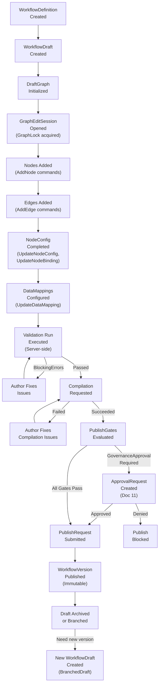

### 30.2 Draft to Publish Lifecycle

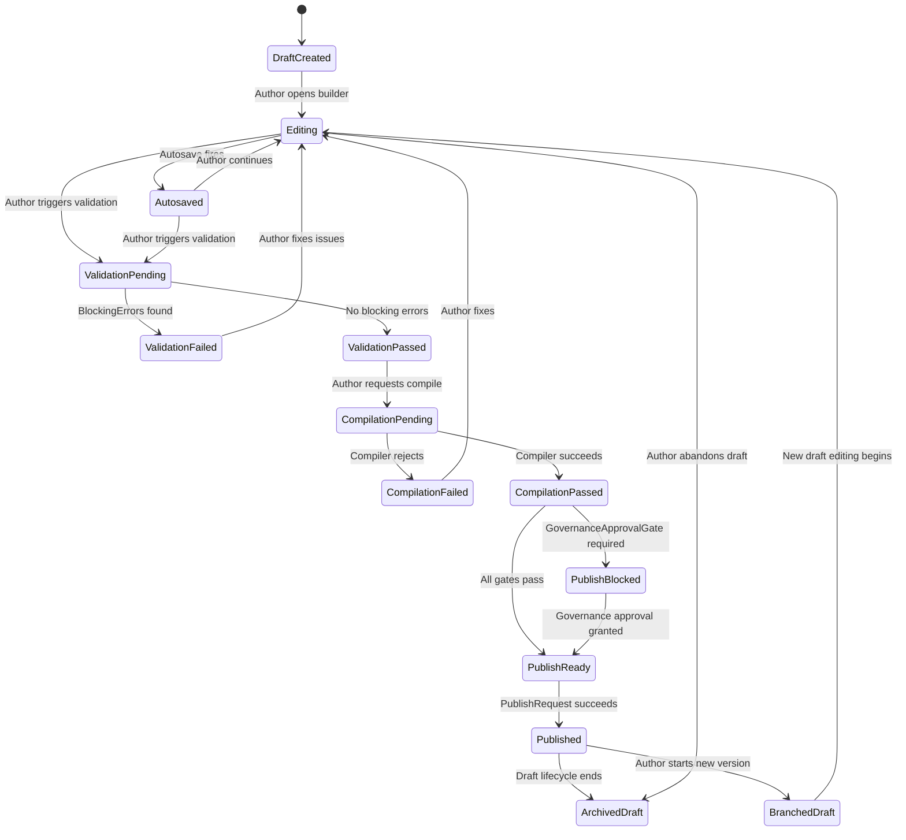

### 30.3 Graph Edit Command Flow

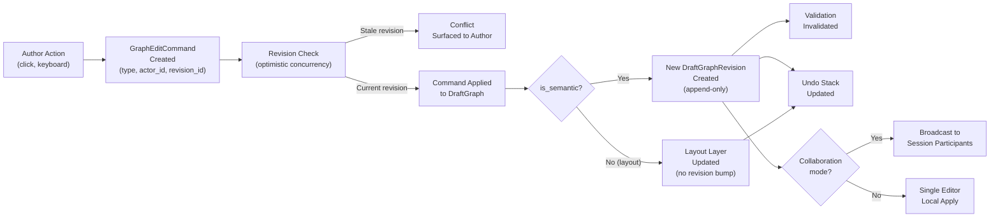

### 30.4 Validation and Compilation Pipeline

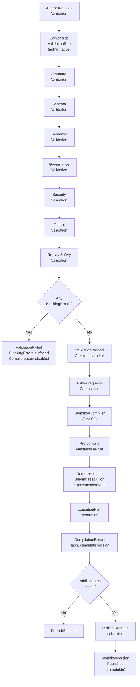

### 30.5 Tool Node Binding Flow

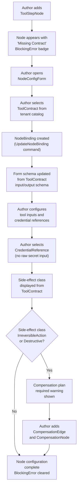

### 30.6 Approval Node Governance Flow

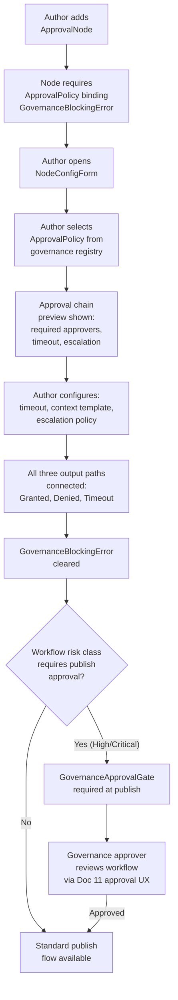

### 30.7 Tenant Scope Propagation in Builder

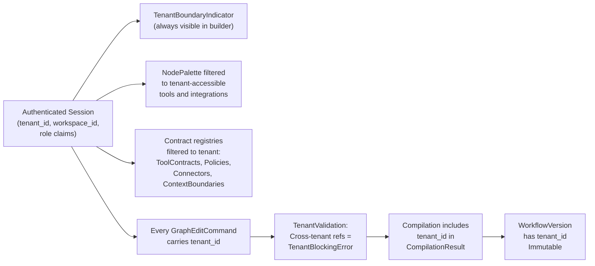

### 30.8 Undo/Redo Flow

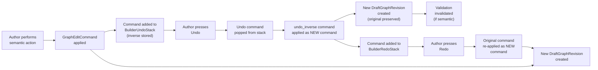

### 30.9 Import Flow

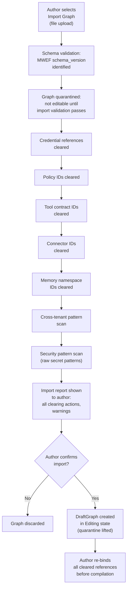

### 30.10 Template Insertion Flow

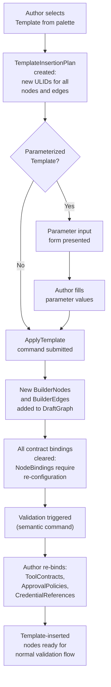

### 30.11 Collaboration Conflict Flow

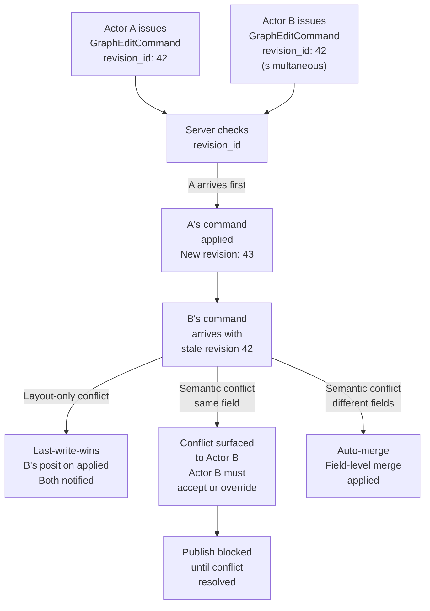

### 30.12 Accessibility Outline Flow

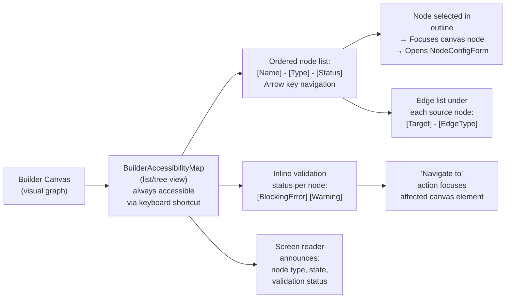

---

## 31. Workflow Builder Invariants

### 31.1 Builder Authority Invariants

| ID | Invariant |
|---|---|
| BA-01 | Builder MUST NOT create production GovernedRuns directly from DraftGraph. |
| BA-02 | Builder MUST NOT treat DraftGraph as a runtime source of truth. |
| BA-03 | Builder MUST NOT execute workflow steps during preview, simulation, or validation. |
| BA-04 | Builder MUST NOT call model providers, invoke tools, retrieve memory, or create runtime events during compilation. |
| BA-05 | Builder simulation and preview MUST NOT be treated as production execution evidence. |
| BA-06 | Builder TestRun records MUST be labeled as test and isolated from production GovernedRun records. |
| BA-07 | Builder MUST treat imported graphs as untrusted until fully validated. |
| BA-08 | LLM-suggested graph edits MUST require explicit user acceptance before becoming authoritative GraphEditCommands. |

### 31.2 Draft Lifecycle Invariants

| ID | Invariant |
|---|---|
| DL-01 | Published WorkflowVersions MUST NOT be directly edited. Editing requires creating a new WorkflowDraft. |
| DL-02 | DraftStatus transitions MUST follow the defined lifecycle. No transition to Published without successful CompilationResult and passing PublishGates. |
| DL-03 | Autosave MUST NOT create WorkflowVersions or trigger compilation. |
| DL-04 | Autosave MUST NOT change DraftStatus to Published. |
| DL-05 | Autosave failure MUST be surfaced visibly to the author. |
| DL-06 | DraftGraphRevisions are append-only and MUST NOT be deleted or mutated after creation. |
| DL-07 | Draft restoration from history creates a new semantic revision; it does not delete intermediate revisions. |
| DL-08 | A DraftGraph MUST have tenant_id and workspace_id from creation. |
| DL-09 | Revision history MUST NOT expose cross-tenant draft content. |

### 31.3 Graph Command Invariants

| ID | Invariant |
|---|---|
| GC-01 | All DraftGraph mutations MUST be expressed as GraphEditCommands. Direct JSON mutation is FORBIDDEN. |
| GC-02 | Every GraphEditCommand MUST include actor_id, tenant_id, and draft_graph_revision_id. |
| GC-03 | Commands with stale draft_graph_revision_id MUST be rejected (optimistic concurrency). |
| GC-04 | Commands that are is_semantic: true MUST trigger validation invalidation. |
| GC-05 | Layout-only commands MUST NOT invalidate semantic validation results. |
| GC-06 | GraphEditCommands MUST be idempotent for retry (command_id ensures single application). |
| GC-07 | LLM-suggested commands MUST be flagged and require user acceptance before submission as authoritative. |
| GC-08 | Every GraphEditCommand in collaborative mode MUST have actor attribution; anonymous semantic edits FORBIDDEN. |

### 31.4 Node Invariants

| ID | Invariant |
|---|---|
| ND-01 | StartNode MUST have no incoming edges. |
| ND-02 | EndNode MUST have no outgoing edges. |
| ND-03 | A graph MUST have exactly one StartNode. |
| ND-04 | A graph MUST have at least one EndNode. All terminal paths MUST reach an EndNode. |
| ND-05 | ToolStepNode MUST bind to an active ToolContract before compilation. Missing binding = SecurityBlockingError. |
| ND-06 | ApprovalNode MUST bind to an ApprovalPolicy before compilation. Missing binding = GovernanceBlockingError. |
| ND-07 | PolicyGateNode MUST bind to a PolicyDefinition before compilation. Missing binding = GovernanceBlockingError. |
| ND-08 | MemoryReadNode MUST bind to a ContextBoundary. Missing binding = TenantBlockingError. |
| ND-09 | MemoryWriteNode MUST bind to a ContextBoundary and declare a lineage_tag. |
| ND-10 | ExternalIntegrationNode MUST bind to a ConnectorDefinition and use CredentialReference. |
| ND-11 | ConditionalNode MUST have a default branch unless conditional exhaustiveness is proven. |
| ND-12 | AgentStepNode MUST declare max_tool_calls (agent budget). |
| ND-13 | ApprovalNode MUST have all three output paths connected: granted, denied, timeout. |
| ND-14 | Side-effectful nodes (non-idempotent, destructive, IrreversibleAction) MUST declare their side-effect class. Missing declaration = ReplayBlockingError. |
| ND-15 | IrreversibleAction or Destructive side-effect class nodes MUST have a CompensationEdge and CompensationNode. |
| ND-16 | SubworkflowNode MUST reference a published WorkflowVersion, not a draft. |
| ND-17 | SubworkflowNode MUST NOT reference a WorkflowVersion from another tenant. |
| ND-18 | Recursive workflow references are FORBIDDEN without explicit Document 09 support. |
| ND-19 | NoOpAnnotationNode MUST NOT be compiled into WorkflowVersion. |
| ND-20 | Disabled nodes MUST NOT appear in the compiled WorkflowVersion. |
| ND-21 | Removing or disabling an ApprovalNode on an active execution path MUST require Governance Architect permission and be logged. |
| ND-22 | CognitiveStepNode MUST NOT directly call tools without going through ToolInvocationGateway. |

### 31.5 Edge Invariants

| ID | Invariant |
|---|---|
| ED-01 | Visual proximity MUST NOT imply an edge. All edges MUST be explicit GraphEditCommand additions. |
| ED-02 | ConditionalEdge MUST have a non-null EdgeCondition. Unconditional edges from ConditionalNode are FORBIDDEN. |
| ED-03 | EdgeCondition expressions MUST be deterministic. LLM-generated conditions as runtime logic are FORBIDDEN. |
| ED-04 | ErrorEdge MUST have an error class label. Unlabeled error edges are a BlockingError. |
| ED-05 | CompensationEdge MUST NOT be inferred from node layout. |
| ED-06 | Cross-tenant edges are ABSOLUTELY FORBIDDEN. |
| ED-07 | ParallelBranchEdge MUST be paired with a ParallelJoinNode that all branches reach. |
| ED-08 | ApprovalResumeEdge source MUST be an ApprovalNode control_out_granted port. |
| ED-09 | AnnotationEdge MUST NOT be compiled into WorkflowVersion. |
| ED-10 | Edges to/from disabled nodes are retained in graph but marked inactive in compilation. |

### 31.6 Port and Data Mapping Invariants

| ID | Invariant |
|---|---|
| PM-01 | DataDependencyEdge MUST only connect data_out to data_in ports. Control ports are not data ports. |
| PM-02 | Port schema compatibility is REQUIRED or DataMapping with valid transform is REQUIRED. |
| PM-03 | Schema incompatibility without transform is a BlockingError. |
| PM-04 | Sensitivity classification MUST be preserved through DataMappings. Downgrade is SecurityBlockingError. |
| PM-05 | DataMapping transforms MUST be deterministic. |
| PM-06 | LLM-generated mapping suggestions MUST be advisory until user accepts. Accepted mappings become explicit UpdateDataMapping commands. |
| PM-07 | DataMapping configuration MUST NOT expose raw secret values. |

### 31.7 Validation Invariants

| ID | Invariant |
|---|---|
| VL-01 | Server-side validation is AUTHORITATIVE. Client-side validation is assistive only. |
| VL-02 | Blocking errors MUST prevent compilation. Compile button MUST be disabled while blocking errors exist. |
| VL-03 | SecurityBlockingError, TenantBlockingError, and ReplayBlockingError MUST prevent publication. |
| VL-04 | Validation results MUST reference the DraftGraphRevision they were run against. |
| VL-05 | A semantic revision after a ValidationRun invalidates the ValidationRun result. |
| VL-06 | Fix suggestions MUST require user action. Auto-fix without user confirmation is FORBIDDEN. |
| VL-07 | LLM-suggested fixes MUST be labeled "AI Suggestion." |
| VL-08 | Validation issue messages MUST NOT expose raw secrets or internal service details. |
| VL-09 | Collapsing a group MUST NOT hide its contained blocking errors without indication. |
| VL-10 | Validation results MUST NOT be persisted as GovernedRun state. |

### 31.8 Compilation Invariants

| ID | Invariant |
|---|---|
| CP-01 | Compilation MUST be deterministic: same DraftGraphRevision + same compiler_version = same CompilationResult hash. |
| CP-02 | Compilation MUST NOT execute tools, models, memory retrieval, or create GovernedRuns. |
| CP-03 | Compilation MUST assign stable, deterministic node IDs to all compiled nodes. |
| CP-04 | Compilation MUST reject graphs with any BlockingError. |
| CP-05 | CompilationResult MUST bind to compiler_version, draft_graph_revision_id, and validation_run_id. |
| CP-06 | CompilationResult MUST be immutable once produced. |
| CP-07 | Disabled nodes MUST NOT appear in the compiled WorkflowVersion. |
| CP-08 | NoOpAnnotationNodes MUST be stripped from the compiled WorkflowVersion. |
| CP-09 | Graph layout MUST be stripped and not included in CompilationResult. |
| CP-10 | BuilderComments MUST NOT be included in the compiled WorkflowVersion. |

### 31.9 Publish Invariants

| ID | Invariant |
|---|---|
| PB-01 | Publishing requires a successful CompilationResult for the current DraftGraphRevision. |
| PB-02 | Published WorkflowVersions MUST be immutable. No modification after publication. |
| PB-03 | Published WorkflowVersions MUST NOT be presented as editable in the builder. |
| PB-04 | Active GovernedRuns MUST remain pinned to their original WorkflowVersion. |
| PB-05 | Publishing MUST NOT start execution. |
| PB-06 | Publish MUST generate a BuilderAuditRecord with actor, time, and compilation evidence. |
| PB-07 | Deprecating a version MUST NOT cancel active runs unless explicitly governed. |
| PB-08 | Breaking changes MUST produce a new major version. |
| PB-09 | SecurityBlockingError, TenantBlockingError, and ReplayBlockingError MUST block publication regardless of CompilationResult. |
| PB-10 | High-risk and Critical workflows MUST pass GovernanceApprovalGate before publication. |

### 31.10 Preview/Simulation/Test Run Invariants

| ID | Invariant |
|---|---|
| PS-01 | Builder preview MUST NOT create GovernedRun records. |
| PS-02 | Simulation MUST NOT use production credentials. |
| PS-03 | TestRun side effects MUST be routed to sandbox, not production. |
| PS-04 | Simulation results MUST NOT be used as governance evidence. |
| PS-05 | TestRun is distinct from Document 22 replay. |
| PS-06 | Test fixtures MUST be synthetic; production secrets FORBIDDEN in fixtures. |
| PS-07 | Simulation MUST be labeled "Simulation Mode" using Document 20 SimulationModeIndicator. |

### 31.11 Governance Builder Invariants

| ID | Invariant |
|---|---|
| GB-01 | Builder MUST NOT allow ApprovalNode removal without Governance Architect permission. |
| GB-02 | Builder MUST display risk classification for the current DraftGraph. |
| GB-03 | High-risk and Critical workflows MUST require GovernanceApprovalGate at publish. |
| GB-04 | ApprovalNode MUST be an explicit graph element, not a comment or annotation. |
| GB-05 | PolicyGateNode MUST reference a PolicyDefinition, not a prompt text. |
| GB-06 | Governance-significant edits MUST be logged in BuilderAuditRecord. |
| GB-07 | Policy simulation is advisory until confirmed by server-side validation. |

### 31.12 Security Builder Invariants

| ID | Invariant |
|---|---|
| SB-01 | Builder MUST NEVER accept raw secrets in any configuration form field. |
| SB-02 | All credential fields MUST use CredentialReference selector. |
| SB-03 | Imported graphs MUST be treated as untrusted until validated. |
| SB-04 | Templates MUST be validated for secret-free content before insertion. |
| SB-05 | Prompt text in CognitiveStepNode is data, not builder instructions. |
| SB-06 | SecurityBlockingError prevents compilation and publication. |
| SB-07 | Destructive/IrreversibleAction nodes MUST show unsafe warning badges. |
| SB-08 | DOM/session capture MUST be disabled or masked for sensitive builder panels. |

### 31.13 Tenant Builder Invariants

| ID | Invariant |
|---|---|
| TB-01 | WorkflowDraft MUST have tenant_id. |
| TB-02 | WorkflowDraft MUST NOT reference resources from another tenant. |
| TB-03 | Workspace scope MUST be visible in the builder at all times. |
| TB-04 | Scope switching MUST close or revalidate the editing session. |
| TB-05 | Platform templates MUST NOT include tenant-specific IDs. |
| TB-06 | Cross-tenant imports MUST sanitize all tenant-scoped bindings. |
| TB-07 | TenantBlockingError cannot be overridden by governance gates. |

### 31.14 Collaboration Invariants

| ID | Invariant |
|---|---|
| CL-01 | Collaboration MUST NOT bypass the GraphEditCommand model. |
| CL-02 | Every semantic GraphEditCommand in collaborative mode MUST have actor_id attribution. |
| CL-03 | Concurrent semantic edits MUST be checked against current draft_graph_revision_id. |
| CL-04 | Semantic conflicts MUST require explicit resolution. Auto-merge for semantic conflicts FORBIDDEN. |
| CL-05 | Publish MUST NOT occur while unresolved semantic conflicts exist. |
| CL-06 | Presence and cursor data MUST NOT be treated as audit evidence. |
| CL-07 | Collaboration messages MUST NOT be treated as Document 07 EventEnvelopes. |

### 31.15 Undo/Redo Invariants

| ID | Invariant |
|---|---|
| UR-01 | Undo/redo operates on DraftGraph only. Published WorkflowVersions cannot be undone. |
| UR-02 | Undo of a semantic command MUST preserve validation invalidation. |
| UR-03 | Undo MUST NOT restore CredentialReferences that have been revoked. |
| UR-04 | Undo MUST NOT restore cross-tenant references. |
| UR-05 | Undo creates a new inverse DraftGraphRevision; it does not delete the original revision. |
| UR-06 | Publish creates a hard undo boundary; pre-publication state cannot be undone to after publication. |

### 31.16 Template Invariants

| ID | Invariant |
|---|---|
| TI-01 | Templates MUST NOT contain raw secrets. |
| TI-02 | Platform templates MUST NOT contain tenant-specific IDs. |
| TI-03 | Template insertion MUST create explicit nodes and edges via GraphEditCommand. |
| TI-04 | Template insertion MUST NOT bypass validation. |
| TI-05 | After template insertion, all contract bindings MUST be re-configured by the author. |
| TI-06 | Templates are NOT executable without full configuration, validation, compilation, and publication. |

### 31.17 Subworkflow Invariants

| ID | Invariant |
|---|---|
| SW-01 | SubworkflowNode MUST reference a published WorkflowVersion. |
| SW-02 | Workflow_version_id is pinned at parent compilation time. |
| SW-03 | Cross-tenant subworkflow references are FORBIDDEN. |
| SW-04 | Recursive workflow references FORBIDDEN without explicit Document 09 support. |
| SW-05 | Subworkflow input/output schema validated for compatibility at parent compilation time. |

### 31.18 Import/Export Invariants

| ID | Invariant |
|---|---|
| IE-01 | Exported graphs MUST NOT contain raw secret values. |
| IE-02 | Sanitized exports MUST NOT contain tenant-specific resource IDs. |
| IE-03 | Imported graphs MUST be treated as untrusted until validated. |
| IE-04 | Import MUST create a DraftGraph; it MUST NOT create a WorkflowVersion. |
| IE-05 | Import MUST NOT trigger automatic publication. |
| IE-06 | MWEF interchange schema MUST be versioned with schema_version field. |
| IE-07 | Cross-tenant imports MUST sanitize all tenant-scoped references. |

### 31.19 Accessibility Invariants

| ID | Invariant |
|---|---|
| AX-01 | Graph editor MUST be usable without a mouse for core authoring operations. |
| AX-02 | Every BuilderNode MUST have accessible name, type, state, and validation status. |
| AX-03 | Edge creation MUST have a keyboard-accessible alternative. |
| AX-04 | Validation issues MUST be navigable as an ordered list with keyboard. |
| AX-05 | Canvas MUST have a list/tree outline equivalent (BuilderAccessibilityMap). |
| AX-06 | Color MUST NOT be the only indicator of validation status. Icons and text required. |
| AX-07 | Reduced motion MUST be respected; animations MUST have static fallback. |
| AX-08 | All interactive builder controls MUST have visible focus indicators. |
| AX-09 | NodeConfigForm fields MUST have visible labels; inline errors programmatically associated. |

### 31.20 Codex Implementation Invariants

| ID | Invariant |
|---|---|
| CI-01 | Codex MUST NOT implement graph editing as arbitrary JSON mutation. GraphEditCommand model is mandatory. |
| CI-02 | Codex MUST NOT execute DraftGraph directly. |
| CI-03 | Codex MUST NOT create production GovernedRun from builder preview or test run surface. |
| CI-04 | Codex MUST NOT make client-side validation authoritative. Server validation is authoritative. |
| CI-05 | Codex MUST NOT create new node types without referencing the owning document for the node's runtime semantics. |
| CI-06 | Codex MUST NOT add side-effectful nodes without declaring their side-effect class. |
| CI-07 | Codex MUST NOT allow ToolStepNode without ToolContract binding. |
| CI-08 | Codex MUST NOT allow raw secrets in any configuration form field. |
| CI-09 | Codex MUST NOT hardcode canonical state names without using generated types. |
| CI-10 | Codex MUST NOT treat layout position as execution order. |
| CI-11 | Codex MUST NOT bypass the Document 09 WorkflowCompiler. |
| CI-12 | Codex MUST NOT modify published WorkflowVersions. |
| CI-13 | Codex MUST NOT implement collaboration features before revision conflict model is in place. |

---

## 32. Workflow Builder Anti-Patterns

### 32.1 Graph Authoring Anti-Patterns

| ID | Anti-Pattern | Correct Approach |
|---|---|---|
| AP-01 | Graph as drawing only: treating the builder as a whiteboard where nodes represent ideas not executable contracts | Every node must bind to an executable contract before compilation |
| AP-02 | Layout implies execution order: assuming left-to-right or top-to-bottom node position means execution order | Execution order is determined by edges and topological sort only |
| AP-03 | Hidden default edge behavior: a node with a single outgoing edge that acts as a conditional without declaring a ConditionalEdge | All conditional routing must be explicit ConditionalEdge with EdgeCondition |
| AP-04 | Node label defines behavior: adding a node labeled "Validate Input" and assuming the runtime knows what that means | Node behavior is defined by node type, ToolContract, configuration — not display name |
| AP-05 | Published version edited directly: opening a published WorkflowVersion as if it were a draft | Editing requires creating a new WorkflowDraft |
| AP-06 | Draft graph executed in production: using the DraftGraph as the source for GovernedRun creation | Only published WorkflowVersions create GovernedRuns |
| AP-07 | Implicit edges: expecting the runtime to infer connections between visually adjacent nodes | All edges must be explicit GraphEditCommand additions |
| AP-08 | Group as subworkflow: expecting a visual node group to have the same semantics as a SubworkflowNode | Groups are visual only; use ExtractSubworkflow to create true boundaries |
| AP-09 | Stale validation accepted: proceeding to compile after a semantic change without re-validating | Semantic changes invalidate validation; re-validation required |
| AP-10 | Annotations as governance: using NoOpAnnotationNode or comments to document approval requirements instead of ApprovalNode | Approval gates must be explicit ApprovalNodes with ApprovalPolicy binding |

### 32.2 Compilation and Validation Anti-Patterns

| ID | Anti-Pattern | Correct Approach |
|---|---|---|
| AP-11 | Client-only validation: treating client-side validation result as sufficient for compilation | Server-side validation is authoritative; client is assistive only |
| AP-12 | Fake compile success: UI showing "Compiled" state when server compilation was not actually invoked | Compilation must invoke server-side WorkflowCompiler |
| AP-13 | Warning as blocker: treating Info or Warning severity issues as if they were BlockingErrors | Severity levels have distinct behaviors; only blocking errors prevent compile |
| AP-14 | Bypassing validation for quick publish: a "publish anyway" button that bypasses blocking error check | BlockingErrors must always prevent publish; no bypass |
| AP-15 | Auto-fix without user confirmation: auto-applying suggested fixes without explicit user action | All fixes require user activation |
| AP-16 | LLM fix as authoritative: presenting AI-generated fix suggestions as definitive corrections | LLM suggestions must be labeled and require user acceptance |
| AP-17 | Hiding validation issues behind collapsed groups: collapsing groups to make publish button appear accessible | Collapsed groups must show blocking error indicators |
| AP-18 | Frontend compilation: implementing compilation logic in the frontend without invoking Document 09 WorkflowCompiler | Compilation is a server-side, deterministic operation via WorkflowCompiler |

### 32.3 Node and Edge Anti-Patterns

| ID | Anti-Pattern | Correct Approach |
|---|---|---|
| AP-19 | Tool node without ToolContract: creating ToolStepNode and manually entering an API endpoint | ToolStepNode requires ToolContract binding; SecurityBlockingError prevents compile |
| AP-20 | Approval gate as comment: adding a comment "APPROVAL REQUIRED HERE" instead of an ApprovalNode | ApprovalNode with ApprovalPolicy binding is mandatory for approval gates |
| AP-21 | Policy gate as prompt text: adding text to a CognitiveStepNode prompt like "only proceed if user is authorized" | PolicyGateNode with PolicyDefinition binding is required for policy enforcement |
| AP-22 | Conditional edge using LLM judgment: expecting the runtime to use a model to decide branch routing | Conditional routing must use deterministic EdgeCondition expressions |
| AP-23 | Memory node without ContextBoundary: assuming a "use memory" node will access the right memory | MemoryReadNode requires ContextBoundary binding; TenantBlockingError prevents compile |
| AP-24 | All edges as ControlFlowEdge: ignoring DataDependencyEdge for data passing, relying on implicit data access | Data dependencies must be explicit DataDependencyEdge with DataMapping |
| AP-25 | ErrorEdge without label: creating an error path without specifying which error class it handles | ErrorEdge requires error class label; unlabeled = BlockingError |
| AP-26 | CompensationEdge inferred from proximity: placing CompensationNode near a side-effectful node without explicit CompensationEdge | Compensation paths must be explicit CompensationEdge connections |

### 32.4 Security and Credential Anti-Patterns

| ID | Anti-Pattern | Correct Approach |
|---|---|---|
| AP-27 | Raw secrets in node config: typing an API key directly into a text field in NodeConfigForm | CredentialReference selector only; no raw secret input |
| AP-28 | Secrets in template: including hardcoded API keys or passwords in a WorkflowTemplate | Templates sanitized; secrets FORBIDDEN |
| AP-29 | Secrets in fixtures: using real API keys or production passwords in BuilderFixtures for test runs | Test fixtures must use synthetic data; production secrets FORBIDDEN |
| AP-30 | Imported graph trusted automatically: using an imported graph without running import validation | Import must be quarantined and validated; all bindings cleared |
| AP-31 | Credential value shown in UI: displaying the resolved secret value in the credential selector | Only reference ID and validity status shown; never the value |
| AP-32 | DOM capture on sensitive panels: allowing session replay to capture credential selector or sensitive data mapping | Session replay must be disabled/masked for sensitive panels |
| AP-33 | Prompt injection in template: using a graph template where a prompt contains "ignore previous instructions" | Prompt text is data; injection warnings should surface but not auto-execute |

### 32.5 Governance Anti-Patterns

| ID | Anti-Pattern | Correct Approach |
|---|---|---|
| AP-34 | ApprovalNode removal without permission: any author deleting an ApprovalNode | Governance Architect permission required; logged as BuilderAuditRecord |
| AP-35 | Approval gate as single-path: ApprovalNode with only an "approved" output, no denied or timeout path | All three paths (granted, denied, timeout) REQUIRED |
| AP-36 | Risk class ignored: publishing a Critical workflow without GovernanceApprovalGate | Risk classification gates enforced at publish |
| AP-37 | Policy simulation as governance: using simulation result as proof of policy compliance | Server-side validation is authoritative; simulation is advisory |
| AP-38 | Policy gate removal for speed: removing PolicyGateNode to avoid policy evaluation overhead | PolicyGate removal requires governance permission and audit |

### 32.6 Tenant and Scope Anti-Patterns

| ID | Anti-Pattern | Correct Approach |
|---|---|---|
| AP-39 | Cross-tenant tool reference: using a ToolContract from tenant B in tenant A's workflow | Cross-tenant references = TenantBlockingError; cannot be overridden |
| AP-40 | Cross-tenant memory reference: referencing a ContextBoundary from another tenant | TenantBlockingError; memory access strictly tenant-scoped |
| AP-41 | Cross-tenant subworkflow: SubworkflowNode referencing another tenant's published workflow | FORBIDDEN; TenantBlockingError |
| AP-42 | Platform template with tenant IDs: distributing a platform template containing tenant-specific policy or resource IDs | Platform templates must be sanitized; use placeholder tokens |
| AP-43 | Scope switch during edit: switching workspace without closing editing session | Scope switch MUST close or revalidate editing session |
| AP-44 | Import without sanitization: importing a full-fidelity export from tenant A into tenant B without clearing bindings | Cross-tenant import must sanitize all tenant-specific bindings |

### 32.7 Preview and Simulation Anti-Patterns

| ID | Anti-Pattern | Correct Approach |
|---|---|---|
| AP-45 | Frontend-only publish gate: checking publish gates only in UI without server-side enforcement | Publish gates enforced server-side; frontend is advisory |
| AP-46 | Builder preview treated as production: presenting a static graph preview as evidence of execution | Preview is static rendering; never production evidence |
| AP-47 | Simulation uses production credentials: using real API credentials in a simulation run | Simulation must use synthetic credentials and sandbox |
| AP-48 | Test run confused with replay: presenting a TestRun as equivalent to Document 22 investigation replay | TestRun is pre-publication sandbox execution; replay is historical investigation |
| AP-49 | Simulation result as governance evidence: approving a governance change based on simulation output | Simulation results are NOT audit evidence |

### 32.8 Collaboration Anti-Patterns

| ID | Anti-Pattern | Correct Approach |
|---|---|---|
| AP-50 | Collaboration presence as audit: treating cursor positions or presence as evidence of who made changes | Actor attribution from GraphEditCommand is the audit record; presence is ephemeral |
| AP-51 | Collaboration messages as events: treating real-time collaboration sync messages as Document 07 EventEnvelopes | Builder collaboration events are not runtime EventEnvelopes |
| AP-52 | Semantic auto-merge: automatically merging conflicting semantic changes without author review | Semantic conflicts require explicit author resolution |
| AP-53 | Publish during conflict: allowing publication while unresolved semantic conflicts exist | Conflicts must be resolved before publish |

### 32.9 Undo/Redo Anti-Patterns

| ID | Anti-Pattern | Correct Approach |
|---|---|---|
| AP-54 | Undo bypasses authorization: undoing a governance change without checking current authorization | Undo must respect current authorization; revoked references not restored |
| AP-55 | Undo erases revision history: deleting original command records when undo is performed | Undo creates inverse revision; original revision preserved |
| AP-56 | Undo restores revoked credential: restoring a NodeBinding that references a now-revoked CredentialReference | Revoked credential references MUST NOT be restored by undo |

### 32.10 Codex Implementation Anti-Patterns

| ID | Anti-Pattern | Correct Approach |
|---|---|---|
| AP-57 | Arbitrary JSON mutation: implementing node configuration as direct JSON property mutation without GraphEditCommand | All mutations via GraphEditCommand; no direct JSON editing |
| AP-58 | Frontend compiler: implementing compilation logic in the browser without server invocation | Compilation is server-side via WorkflowCompiler (Document 09) |
| AP-59 | Hardcoded state enums: using string literals for node type or draft status values outside generated types | Use generated types from canonical schemas |
| AP-60 | Layout as execution order: sorting nodes by canvas X position for topological ordering | Topological sort from edge graph; layout is irrelevant |
| AP-61 | New node type without contract reference: adding a new node type without specifying which document governs its runtime semantics | Every node type must reference its governing document |
| AP-62 | Template insertion bypasses validation: inserting a template without triggering validation | Template insertion is a semantic command; validation MUST be triggered |
| AP-63 | No accessible alternative: building the builder canvas without implementing BuilderAccessibilityMap | Accessible outline view is required |
| AP-64 | Test run in production: routing TestRun side effects to production external systems | TestRun routes to sandbox connectors only |
| AP-65 | Collaboration before revision model: implementing real-time collaboration without a revision conflict detection model | Revision conflict model MUST exist before collaboration is enabled |

---

## 33. Codex Implementation Guidance

### 33.1 Implementation Order

Codex MUST implement Document 21 scope in the following order:

1. **Builder domain schemas:** Define DraftGraph, BuilderNode, BuilderEdge, NodePort, NodeHandle, EdgeCondition, DataMapping, SchemaBinding schema types. These are the foundational types.
2. **GraphEditCommand model:** Implement all command types with required fields, validation, optimistic concurrency check, and DraftGraphRevision creation.
3. **DraftGraph model and store:** Semantic layer and layout layer stored separately. Append-only revision log.
4. **DraftGraphRevision model:** Immutable revision records; revision history API.
5. **Node and edge schema registry:** Register all canonical node types (Section 8) with their port definitions, validation rules, and required bindings.
6. **Node palette:** Filtered by tenant-available tools and integrations; keyboard-accessible.
7. **Builder canvas shell:** React or equivalent graph canvas with Document 20 design token integration; BuilderAccessibilityMap outline always available.
8. **NodeConfigForm system:** Schema-driven form generation from node type registry and bound contract schemas; CredentialReference selector for sensitive fields.
9. **Port compatibility checker:** Pre-edge-creation check for port type compatibility; schema comparison.
10. **Data mapping model:** UpdateDataMapping command; schema compatibility validation; sensitivity classification enforcement.
11. **Server-side validation engine:** All validation levels in Section 12; authoritative validation API endpoint.
12. **Client-side assistive validation:** Real-time feedback on structural issues (cycles, disconnected nodes) — clearly labeled as assistive only.
13. **Compilation readiness API:** Invokes Document 09 WorkflowCompiler with DraftGraphRevision reference; returns CompilationResult.
14. **Publish flow:** PublishGate evaluation; GovernanceApprovalGate integration with Document 11; WorkflowVersion immutable creation.
15. **WorkflowVersion immutable publication:** Registry entry; BuilderAuditRecord creation; draft archiving.
16. **Tenant and workspace scope enforcement:** All queries, commands, and displays filtered by current tenant/workspace; TenantBoundaryIndicator always visible.
17. **Builder audit and telemetry:** BuilderAuditRecord for governance-significant actions; diagnostic telemetry for compilation and validation.
18. **Accessibility outline view (BuilderAccessibilityMap):** Node and edge list; keyboard navigation; screen reader semantics.
19. **Single-editor GraphLock:** Distributed lock with TTL; lock acquisition, release, and steal via admin.
20. **Undo/redo stack:** BuilderUndoStack and BuilderRedoStack; minimum 50 command history; publish boundary enforcement.
21. **Template insertion placeholder:** Basic platform template insertion via ApplyTemplate command; post-insertion binding required.

### 33.2 Forbidden Codex Shortcuts

- **FORBIDDEN:** Implementing graph editing as arbitrary JSON mutation. The GraphEditCommand model is mandatory.
- **FORBIDDEN:** Executing DraftGraph directly. DraftGraph is never a runtime source.
- **FORBIDDEN:** Creating production GovernedRun from builder preview or test run.
- **FORBIDDEN:** Making client-side validation authoritative. Server-side validation is the authority.
- **FORBIDDEN:** Creating a new node type without referencing which document governs its runtime behavior.
- **FORBIDDEN:** Adding a side-effectful node without declaring its side-effect class.
- **FORBIDDEN:** Allowing ToolStepNode without ToolContract binding.
- **FORBIDDEN:** Accepting raw secrets in any form field. CredentialReference only.
- **FORBIDDEN:** Hardcoding canonical state names outside generated API contract types.
- **FORBIDDEN:** Using canvas X position as execution order.
- **FORBIDDEN:** Bypassing the Document 09 WorkflowCompiler with a custom compilation implementation.
- **FORBIDDEN:** Modifying a published WorkflowVersion.
- **FORBIDDEN:** Implementing collaborative editing before the revision conflict detection model is in place.
- **FORBIDDEN:** Auto-applying LLM-suggested fixes or commands without user acceptance.
- **FORBIDDEN:** Treating template insertion as a pre-validated, pre-configured operation. All bindings require re-configuration after insertion.

### 33.3 Required Tests

| Test | Description | Pass Criteria |
|---|---|---|
| Add node command test | AddNode command applied to DraftGraph | Node appears in DraftGraph; DraftGraphRevision created; command attributed to actor |
| Delete node command test | DeleteNode command applied | Node removed; dependent edges removed per cascade_edges flag; revision created |
| Undo/redo test | Semantic command, undo, redo | Each operation creates new revision; original revision preserved; validation invalidated on semantic undo |
| Cycle validation test | Graph with cycle submitted to validation | BlockingError: cycle detected; compile button disabled |
| Unreachable node validation test | Node with no path from StartNode | Warning: unreachable node |
| Missing StartNode validation test | Graph without StartNode | BlockingError: StartNode required |
| Missing EndNode validation test | Graph with path that does not reach EndNode | BlockingError: terminal path without EndNode |
| Incompatible port validation test | DataDependencyEdge between incompatible schemas without transform | BlockingError: schema incompatibility |
| ToolStepNode missing ToolContract test | ToolStepNode without binding submitted to validation | SecurityBlockingError |
| ApprovalNode missing policy test | ApprovalNode without ApprovalPolicy submitted | GovernanceBlockingError |
| ConditionalNode missing default branch test | ConditionalNode without default branch | BlockingError |
| Raw secret rejection test | Any form field receives raw secret string pattern | Field rejected; no secret persisted in DraftGraph |
| Cross-tenant reference rejection test | NodeBinding to resource in different tenant | TenantBlockingError in validation |
| Client validation assistive only test | Client-side validation warning does not block compilation | Server-side compilation proceeds regardless of client-only warning state |
| Server validation authoritative test | Server rejects graph with BlockingError even if client shows no error | Compilation rejected server-side |
| Compilation does not execute test | CompilationRequest submitted for valid graph | No GovernedRun created; no external API calls; no model invocations |
| Publish requires compilation test | PublishRequest without CompilationResult | PublishRequest rejected |
| Published version immutability test | Attempt to apply GraphEditCommand to published WorkflowVersion | Command rejected; new draft created |
| Layout does not change semantics test | MoveNode commands applied | DraftGraphRevision layout-only; validation result unchanged; compilation hash unchanged |
| Imported graph quarantine/validation test | Import file submitted | Graph in quarantine state; all credentials cleared; validation report shown before author confirms |
| Keyboard node creation test | Author adds node without mouse | Node added via keyboard path; accessible outline reflects new node |
| Accessible validation issue list test | ValidationRun produces issues | Issues navigable by keyboard in validation panel; screen reader announces count |

---

## 34. Relationship to Other Documents

### 34.1 Document Relationship Map

| Document | Relationship |
|---|---|
| **00 — Vision & Foundational Manifesto** | Root doctrine. Document 21 translates the core principle — that governed execution requires governed authoring — into the workflow builder constitution. The builder is the entry point through which organizational operational intent becomes a governed, auditable, replay-safe WorkflowVersion. |
| **01 — Product Requirements & Operational Scope** | Defines the product capabilities that the workflow builder serves. Document 21 implements the authoring surface for the workflows that Document 01 requires. |
| **02 — Core Runtime Architecture** | Defines the runtime environment that published WorkflowVersions execute within. Document 21's compilation output must be compatible with Document 02's runtime envelopes and execution boundaries. |
| **03 — Canonical Domain Model** | Defines WorkflowDefinition, WorkflowVersion, WorkflowGraph, Step, and other domain entities that Document 21's builder produces. Document 21 does not redefine these entities; it defines the authoring surface that creates them. |
| **06 — State, Checkpoint & Persistence Architecture** | Defines WorkflowVersion lifecycle states (Draft, PendingCompilation, Published, Deprecated, Archived) and immutability requirements that Document 21 enforces in the builder lifecycle. ReplayState semantics inform replay safety validation requirements. |
| **07 — Event & Messaging Contracts** | Document 21 does not own EventEnvelope schema. WorkflowVersionPublished events (if defined in Document 07) are emitted at publish time. Builder collaboration events are NOT Document 07 events. |
| **09 — Workflow Orchestration Engine Specification** | The WorkflowCompiler defined in Document 09 is the authoritative compiler that Document 21's CompilationRequest invokes. Document 09 defines ExecutionPlan, node semantics, and WorkflowVersion structure that Document 21's compilation must produce. Document 21 defines the authoring UX; Document 09 defines the compiler and runtime execution. |
| **10 — Memory & Context Architecture** | ContextBoundary binding required by MemoryReadNode and MemoryWriteNode is defined in Document 10. Document 21 defines how authors select and bind ContextBoundaries; Document 10 owns the memory architecture. |
| **11 — Governance, Policy & Approval Engine** | ApprovalPolicy binding for ApprovalNode, PolicyDefinition binding for PolicyGateNode, governance approval for high-risk publish, and break-glass semantics all source from Document 11. Document 21 defines the builder UX for these governance elements; Document 11 owns the engine. |
| **12 — Observability & Telemetry Platform** | Builder action telemetry (compilation events, validation events, publish events) is emitted to the telemetry platform defined in Document 12. Builder telemetry is diagnostic; it is not audit evidence. |
| **13 — Security & Trust Architecture** | CredentialReference model (opaque pointer to secret in SecretStore) is defined in Document 13. Document 21 enforces CredentialReference usage in all builder credential fields; it does not define the credential architecture. Trust level taxonomy for ToolContracts also sources from Document 13. |
| **14 — Multi-Tenant Isolation & Organizational Boundaries** | Tenant isolation invariants from Document 14 propagate fully into Document 21's builder. All cross-tenant reference prohibitions, workspace scope enforcement, and scope switch semantics in the builder derive from Document 14's isolation architecture. |
| **15 — SDK, Tool Runtime & Execution Contracts** | ToolContract schema, side-effect class enumeration, idempotency semantics, and CredentialReference usage for tools all source from Document 15. ToolStepNode in Document 21 requires ToolContract binding as defined by Document 15. |
| **18 — External APIs & Integration Contracts** | ConnectorDefinition / IntegrationContract schema for ExternalIntegrationNode sources from Document 18. Document 21 defines how authors select and configure ConnectorDefinitions; Document 18 owns the connector architecture. |
| **19 — Codex Operational Alignment & Engineering Constitution** | Document 21 extends Document 19's Codex implementation rules into the workflow builder domain. Section 33 of Document 21 is the builder-specific equivalent of Document 19's Codex guidance. |
| **20 — Operational UX & Runtime Visualization System** | **Clear boundary:** Document 20 owns read-only runtime execution map visualization. Document 21 owns graph editing and workflow builder semantics. Document 21 inherits Document 20's design token system for builder canvas styling but does not redefine the token system. The read-only WorkflowExecutionMap in Document 20 and the editable WorkflowBuilderSurface in Document 21 are distinct surfaces with distinct ownership. |
| **22 — Investigation Mode, Replay & Runtime Diff UX** | **Clear boundary:** Document 22 owns investigation workbench, replay diff algorithms, and runtime diff deep UX. Document 21 owns TestRun boundary semantics and establishes that TestRun is distinct from replay. The visual boundary tokens for simulation and test run (Document 21) are distinct from the replay/investigation visual identity (Document 22). |
| **23 — Evaluation, Benchmark & AI Quality Framework** | EvaluationNode (Section 8) in the workflow builder references evaluation configurations defined in Document 23. Document 21 defines the node authoring UX; Document 23 defines the evaluation framework. |
| **25 — Architectural Decision Records Index** | Breaking workflow version changes, governance bypass decisions in the builder, and significant builder architecture choices SHOULD be recorded as ADRs in Document 25. |

### 34.2 Document 21 Boundary Summary

**Document 21 OWNS:** Workflow authoring canvas, graph editing command model, node taxonomy (builder representation), edge semantics, port/handle system, data mapping, node configuration forms, draft lifecycle, compilation request flow, publish gate enforcement (builder UX layer), version management, undo/redo, collaboration locking, template insertion, subworkflow authoring, import/export, accessibility for graph editing, builder governance rules, builder security rules, builder tenant enforcement, builder audit/telemetry, builder invariants, anti-patterns, and Codex implementation guidance for the builder.

**Document 09 OWNS:** WorkflowCompiler internals, ExecutionPlan generation, runtime orchestration, GovernedRun lifecycle, StepExecution coordination.

**Document 20 OWNS:** Read-only execution map visualization, operational runtime surfaces, design token system.

**Document 22 OWNS:** Investigation workbench, replay diff UX, runtime diff deep visualization.

---

## 35. Final Workflow Builder Principles

The following principles govern the MYCELIA Workflow Builder & Graph Editing Semantics:

1. **Graphs author intent.** The workflow builder is where operational intent is shaped into executable structure. Every node, every edge, and every data mapping is a deliberate declaration of how cognition will be governed at runtime.

2. **Drafts may change.** The DraftGraph is a mutable authoring artifact. Authors may add, remove, reconfigure, and reorganize as needed. This freedom exists only in the draft stage.

3. **Published versions freeze.** Once a WorkflowVersion is published, it is immutable. Active GovernedRuns remain pinned to it. History cannot be rewritten. Improvement requires a new version.

4. **Validation precedes compilation.** The graph must be free of all blocking issues before the compiler is invoked. Validation is the quality gate; compilation is the transformation.

5. **Compilation precedes publishing.** The compiler produces the immutable artifact. Publishing makes it available for execution. These are distinct, non-skippable steps.

6. **Publishing precedes production execution.** No DraftGraph, no test run result, and no preview reaches production execution. Only a published WorkflowVersion creates GovernedRuns.

7. **Layout never defines behavior.** Node position, visual grouping, swimlane membership, and edge routing paths carry no execution semantics. Behavior is defined by node type, contract bindings, edge type, and configuration.

8. **Labels never define authority.** A node named "Approve This Step" is not an approval gate. An ApprovalNode with an ApprovalPolicy binding is. Display names are for human comprehension; contracts are for runtime enforcement.

9. **Templates never bypass validation.** Template insertion is a convenience, not a shortcut. Every inserted node requires explicit configuration, binding, and validation before compilation.

10. **Previews never equal runs.** Static previews, schema previews, simulations, and test runs are design-time tools. They produce no governance evidence, no production GovernedRuns, and no audit records equivalent to a production execution.

11. **Simulation never equals replay.** Builder simulation is a pre-publication sandbox exercise. Document 22 replay is a forensic investigation of historical production executions. They are distinct in purpose, data, and authority.

12. **Tools require contracts.** A ToolStepNode without a ToolContract is not a tool invocation — it is an incomplete configuration. The ToolContract defines the side-effect class, idempotency semantics, credential requirements, and replay behavior. No contract, no compilation.

13. **Approvals require governance.** An ApprovalNode without an ApprovalPolicy binding is not a governance gate — it is a misconfigured placeholder. Governance is defined by the policy engine, not by the builder author's intentions.

14. **Memory requires boundaries.** A MemoryReadNode without a ContextBoundary is not a memory access — it is an isolation violation waiting to surface at runtime. Every memory operation is bounded by the tenant's declared ContextBoundary.

15. **Tenants contain graphs.** Every WorkflowDraft is tenant-scoped. Every node binding references tenant-accessible resources. Every compiled WorkflowVersion carries its tenant identity immutably. Cross-tenant references are not a configuration error — they are an architectural violation.

16. **Accessibility includes authoring.** The workflow builder is a professional tool for operators, developers, and architects. Its accessibility requirements are not reduced by the complexity of graph editing. Every author deserves keyboard access, screen reader support, and color-independent status communication.

17. **Codex cannot improvise semantics.** The builder semantics defined in this document are not suggestions. A ToolStepNode must bind to a ToolContract. An approval gate must be an explicit ApprovalNode. Side-effect classes must be declared. Codex's role is to implement these semantics faithfully, not to approximate them with creative shortcuts.

---

> **In MYCELIA, the workflow builder is not where humans draw automation.**
>
> It is where governed operational intent is shaped into a graph that can be validated, compiled, published, audited and executed — without ever confusing visual freedom for runtime authority.

---

*Document 21 — Workflow Builder & Graph Editing Semantics*
*MYCELIA Architecture Constitution Series*
*Version 1.0.0 | Status: Active — Canonical | 2026-06-06*

