# MYCELIA — 22 Investigation Mode, Replay & Runtime Diff UX

---

## Document Metadata

| Field | Value |
|---|---|
| Document Series | MYCELIA Architecture Constitution |
| Document Number | 22 |
| Version | v1.0 |
| Status | Canonical |
| Classification | Core Architecture — Investigation Mode, Replay & Runtime Diff UX |
| Canonical Role | Defines the investigation workbench, replay visualization UX, runtime diff surfaces, forensic inspection architecture, divergence classification, side-effect suppression visualization, snapshot inspection, evidence bundle display and export, chain-of-custody UX, incident investigation integration, redaction and access gating, and Codex implementation guidance for all investigation and replay surfaces in MYCELIA |
| Primary Audience | Platform Engineers, SRE, Auditors, Security Reviewers, Governance Architects, Forensic Investigators, Compliance Officers, Product Design, Codex |
| Last Updated | June 2026 |

---

## Table of Contents

1. [Executive Summary](#1-executive-summary)
2. [Investigation Philosophy](#2-investigation-philosophy)
3. [Scope and Non-Scope](#3-scope-and-non-scope)
4. [Investigation Domain Model](#4-investigation-domain-model)
5. [Investigation Mode Taxonomy](#5-investigation-mode-taxonomy)
6. [Investigation Access and Authorization](#6-investigation-access-and-authorization)
7. [Visual Boundary: Production vs Replay vs Investigation](#7-visual-boundary-production-vs-replay-vs-investigation)
8. [Replay Source Model](#8-replay-source-model)
9. [Replay Request and Replay Lifecycle UX](#9-replay-request-and-replay-lifecycle-ux)
10. [Replay Hydration UX](#10-replay-hydration-ux)
11. [Runtime Diff UX](#11-runtime-diff-ux)
12. [Divergence Classification](#12-divergence-classification)
13. [Event Timeline Investigation UX](#13-event-timeline-investigation-ux)
14. [Trace, Span and Telemetry Investigation UX](#14-trace-span-and-telemetry-investigation-ux)
15. [Snapshot Inspection UX](#15-snapshot-inspection-ux)
16. [Policy, Approval and Governance Investigation UX](#16-policy-approval-and-governance-investigation-ux)
17. [Memory and Context Investigation UX](#17-memory-and-context-investigation-ux)
18. [Tool Invocation and External Side-Effect Investigation UX](#18-tool-invocation-and-external-side-effect-investigation-ux)
19. [Model Output and Cognitive Step Investigation UX](#19-model-output-and-cognitive-step-investigation-ux)
20. [Runtime Graph Diff UX](#20-runtime-graph-diff-ux)
21. [Evidence Bundle UX](#21-evidence-bundle-ux)
22. [Investigator Annotation and Finding UX](#22-investigator-annotation-and-finding-ux)
23. [Chain-of-Custody and Auditability UX](#23-chain-of-custody-and-auditability-ux)
24. [Investigation Reports](#24-investigation-reports)
25. [Incident and SRE Investigation UX](#25-incident-and-sre-investigation-ux)
26. [Redaction, Privacy and Sensitive Data UX](#26-redaction-privacy-and-sensitive-data-ux)
27. [Data Freshness, Completeness and Confidence UX](#27-data-freshness-completeness-and-confidence-ux)
28. [Accessibility for Investigation and Diff UX](#28-accessibility-for-investigation-and-diff-ux)
29. [MVP Investigation/Replay UX Cut](#29-mvp-investigationreplay-ux-cut)
30. [Investigation and Replay Diagrams](#30-investigation-and-replay-diagrams)
31. [Investigation UX Invariants](#31-investigation-ux-invariants)
32. [Investigation UX Anti-Patterns](#32-investigation-ux-anti-patterns)
33. [Codex Implementation Guidance](#33-codex-implementation-guidance)
34. [Relationship to Other Documents](#34-relationship-to-other-documents)
35. [Final Investigation Principles](#35-final-investigation-principles)

---

## 1. Executive Summary

### 1.1 What Investigation Mode Means in MYCELIA

Investigation Mode is the governed forensic inspection surface through which authorized actors examine the historical execution of GovernedRuns. It is not a dashboard. It is not a log viewer. It is not a replay button. It is a structured, access-gated, tenant-scoped, evidence-aware workspace in which every interaction is designed to produce understanding of what happened without altering what happened.

In investigation mode, an authorized actor — an SRE diagnosing a failure, an auditor validating a governance decision, a security reviewer tracing a credential usage, a developer understanding a divergent execution path — operates against immutable recorded state: EventEnvelope sequences, checkpoint records, ContextSnapshots, PolicySnapshots, ToolReplayRecords, and ModelOutputRecords. These records do not change when inspected. The investigation surface renders them, compares them, and where permitted, packages them into governed evidence artifacts. The act of looking must never become the act of changing.

### 1.2 What Replay UX Means in MYCELIA

Replay UX is the visual and interaction architecture through which a ReplayRun is initiated, hydrated, and inspected. Replay in MYCELIA is controlled reconstruction: the runtime uses recorded source artifacts — original EventEnvelopes, original snapshots, original recorded outputs — to reconstruct what the execution looked like step by step, without re-executing side effects, without calling live systems, without using current credentials, without querying live memory, and without evaluating current policy.

Replay UX surfaces must be visually and semantically impossible to confuse with production execution. Every surface in replay mode carries a persistent visual identity — the violet-shifted `surface.replay` token (`#110D1A`), the `accent.replayVioletGray` (`#6A5A8A`), and the mandatory `REPLAY MODE — NO PRODUCTION SIDE EFFECTS` banner — that signals to every actor: what they see here is reconstruction, not live execution.

### 1.3 What Runtime Diff UX Means in MYCELIA

Runtime Diff UX is the structured comparison surface through which two recorded artifacts — a production run and a replay run, two replay runs, two WorkflowVersions, two EventEnvelope timelines, two ContextSnapshots, two PolicySnapshots — are placed side by side and their differences rendered, classified, and linked to their source records. Diff is diagnostic. A diff view is a tool for understanding, not a source of truth by itself. Every diff must reference its source records. Every diff must show confidence, completeness, and the impact of redaction on the comparison.

A diff that shows a difference does not prove a fault. A diff that shows no difference does not prove correctness. The investigator interprets diff results in light of source evidence; the system's role is to ensure the diff is honest about what it knows and what it does not.

### 1.4 Why Replay Is Controlled Reconstruction, Not Rerun

The distinction between replay and rerun is architectural, not cosmetic. A rerun would:
- Call live model providers with the original prompt, producing a new nondeterministic output
- Execute tool invocations against live external systems, producing new side effects
- Query live memory, which may have changed since the original execution
- Evaluate current policy, which may have changed since the original execution
- Use current credentials, which may have been rotated since the original execution
- Publish events into the production event stream

Each of these actions would corrupt the investigation by mixing new, unrelated execution artifacts with the original execution history. They would potentially cause harm (re-executing financial transactions, re-sending notifications). They would produce meaningless comparisons (new model outputs vs original model outputs, current memory vs original context).

MYCELIA replay uses recorded source artifacts exclusively. ToolReplayRecords hydrate tool results without re-executing tools. ModelOutputRecords hydrate cognitive step outputs without re-calling model providers. ContextSnapshots reconstruct the exact context that was assembled at the time of the original cognitive invocation. PolicySnapshots reconstruct the exact policy that governed the original decision. This is what makes replay forensically meaningful.

### 1.5 Why Investigation Mode Must Never Mutate Original Run Lineage

MYCELIA's event lineage is append-only and immutable. GovernedRun state records and checkpoint records are immutable once created (Document 06). Evidence is only valid if the record it derives from has not been altered. If investigation mode were permitted to mutate original run data, every piece of evidence derived from that data would become suspect.

The prohibition on lineage mutation is absolute: no investigation action, no replay hydration, no annotation, no diff computation, no evidence export operation may alter the GovernedRun's EventEnvelope sequence, StateTransition records, checkpoint records, or any recorded artifact from the original execution. Investigation creates new records (InvestigationAccessRecords, InvestigatorAnnotations, InvestigationFindings, EvidenceBundles, ChainOfCustodyRecords) that reference original records. It never modifies them.

### 1.6 Why Replay Must Be Hydrated from Recorded State

Replay hydration anchors reconstruction to verified recorded state rather than re-computation. The hydration sources are:
- EventEnvelopes (Document 07/08): the ordered sequence of events that drove the original execution
- StateTransition records (Document 06): the recorded step-level state machine transitions
- ContextSnapshot records (Document 06/10): the exact context assembled for each cognitive invocation
- PolicySnapshot records (Document 06/11): the exact policy version bound to the run at start time
- ApprovalSnapshot / ApprovalDecisionRecord (Document 11): the approval request, decision, and actor
- BoundarySnapshot (Document 06): the workspace/tenant isolation context
- SecuritySnapshot (Document 13): the security identity and credential reference context
- ToolReplayRecord (Document 06/15): the recorded tool invocation result for hydration
- ModelOutputRecord (Document 06/04): the recorded model output for cognitive step hydration

Missing hydration sources do not block all forms of replay, but they MUST be made explicit. Canonical replay (the highest fidelity form) MUST have complete source data. Investigation replay (partial or approximate reconstruction) may proceed with explicit missing-source indicators.

### 1.7 Why Runtime Diff Is Diagnostic Unless Bound to Evidence

A runtime diff view is computed from two sets of source records. The diff computation itself may be approximate: telemetry data may be sampled; event ordering may be partially reconstructed; redacted payloads reduce comparison completeness; snapshot versions may have edge cases. A diff that says "state X differed between run A and run B" is a diagnostic observation. It becomes evidentiary only when:
- The diff is generated by the backend governed evidence API
- The source records are integrity-verified
- The diff result is included in an EvidenceBundle with source references and a hash
- The EvidenceBundle is exported through the governed evidence export pathway

A screenshot of a diff rendered in the browser is not evidence. A backend-generated EvidenceBundle containing the diff computation, source references, and integrity metadata is.

### 1.8 Why Evidence Export Must Be Governed

MYCELIA governs evidence export because evidence is consequential. Evidence bundles may be used in compliance audits, regulatory inquiries, internal governance reviews, or legal proceedings. Evidence that was assembled from incomplete sources, that excluded redacted content without documenting the exclusion, or that was generated by a frontend rendering without integrity verification is not reliable evidence.

All evidence export routes through the backend governed evidence API, which: assembles source records with integrity metadata, documents all redactions in a redaction manifest, computes a hash of the assembled bundle, records the export action as a ChainOfCustodyRecord, and requires an authorized actor with the export permission. The frontend investigation workbench presents evidence and provides an interface to request export; it does not generate evidence artifacts itself.

### 1.9 Document Relationships Summary

| Document | Relationship to Document 22 |
|---|---|
| 00 — Vision & Foundational Manifesto | Root doctrine: governed cognition requires forensic transparency |
| 01 — Product Requirements & Operational Scope | Product capabilities that investigation mode serves |
| 02 — Core Runtime Architecture | Runtime that generates the records investigation mode reads |
| 03 — Canonical Domain Model | GovernedRun, StepExecution, WorkflowVersion entities that are the investigation subjects |
| 06 — State, Checkpoint & Persistence | Source of all replay artifacts: checkpoints, snapshots, replay records — authoritative replay source |
| 07 — Event & Messaging Contracts | EventEnvelope schema and ordering — primary investigation timeline source |
| 08 — Event Runtime Deep Technical Spec | Event ordering semantics, causality — governs event timeline investigation interpretation |
| 09 — Workflow Orchestration | WorkflowVersion that executed; ExecutionPlan that drove step ordering |
| 10 — Memory & Context Architecture | ContextSnapshot and memory access records — memory investigation source |
| 11 — Governance, Policy & Approval Engine | PolicySnapshot, ApprovalDecisionRecord — governance investigation source |
| 12 — Observability & Telemetry Platform | Trace, span, metric data — diagnostic (not canonical) investigation layer |
| 13 — Security & Trust Architecture | SecuritySnapshot, CredentialReference records — security investigation source |
| 14 — Multi-Tenant Isolation | Tenant scope enforcement for all investigation surfaces; SupportAccessRequest model |
| 15 — SDK, Tool Runtime & Execution Contracts | ToolReplayRecord, ToolContract — tool invocation investigation source |
| 17 — SRE, Operational Recovery & Runbooks | Incident context; SRE persona for investigation; runbook references |
| 18 — External APIs & Integration Contracts | ExternalSideEffectRecord — external integration investigation source |
| 19 — Codex Engineering Constitution | Codex implementation rules; Document 22 extends them for investigation domain |
| 20 — Operational UX & Runtime Visualization | Provides visual design tokens for replay/investigation surfaces; Document 22 defines investigation internals |
| 21 — Workflow Builder & Graph Editing | TestRun boundary defined there; Document 22 defines replay investigation boundary |
| 23 — Evaluation Framework | EvaluationNode results may be investigation subjects |
| 25 — ADR Index | Investigation architecture decisions recorded as ADRs |

**Document 22 owns investigation mode, replay visualization UX, and runtime diff UX.**
**Document 20 owns ordinary operational runtime visualization.**
**Document 21 owns workflow graph authoring and the TestRun boundary.**

---

## 2. Investigation Philosophy

### 2.1 Investigation as Controlled Inspection

Investigation in MYCELIA is controlled inspection. Every investigation action — opening a run record, viewing a snapshot, initiating a replay, comparing timelines, requesting evidence — is bounded by authorization, scoped to a tenant, and recorded in an access or audit log. The investigator is not given raw database access. They are given a governed interface that renders recorded state in structured, redaction-aware, access-gated views.

Controlled inspection means:
- The investigator sees what their role permits
- Sensitive fields are redacted by default and revealed only with purpose and authorization
- Actions that might create audit records always create them
- The investigation workspace does not provide shortcuts that bypass governance

### 2.2 Replay as Reconstruction

Replay is forensic reconstruction, not reproduction. When an investigator requests a replay of GovernedRun `GR-7f3a`, the system does not create a new GovernedRun that executes from scratch. It constructs a ReplayRun in an isolated namespace, hydrates it from the original EventEnvelope sequence, the original snapshots, and the original recorded outputs, and presents the reconstructed execution history as a navigable, inspectable artifact. The result is a rendering of what happened, anchored to verified source records.

A reconstruction is honest about what it knows. If a ContextSnapshot is missing, the cognitive step hydration is incomplete and this is explicitly shown. If a ToolReplayRecord is missing, the tool step cannot be hydrated and this is explicitly shown. Reconstruction never fills gaps with guesses.

### 2.3 Diff as Comparison, Not Authority

A runtime diff view compares two recorded artifacts. The comparison reveals differences in state, events, outputs, and snapshots. But the diff does not explain why differences exist, and it does not constitute proof of any assertion on its own. The investigator must interpret the diff in light of their knowledge of the system and the evidence record. A diff that shows a model output difference tells the investigator that the outputs were different; it does not explain whether this was expected nondeterminism, a context change, or a system error.

Diff confidence and completeness are first-class properties of every diff view. A diff with redacted source data is explicitly less reliable than one with complete source access. A diff computed from sampled telemetry is explicitly less certain than one computed from complete event records.

### 2.4 Evidence as Backend-Generated Governed Artifact

Evidence in MYCELIA is not what the investigator sees on screen. Evidence is what the backend governed evidence API assembles, hashes, redaction-manifests, and records in the chain of custody. A UI rendering of a ContextSnapshot is a display. A backend-generated EvidenceBundle containing the ContextSnapshot reference, its hash, its source record integrity status, the applicable redactions, and the chain-of-custody record is evidence.

This distinction is non-negotiable because:
- UI renderings can be manipulated before screenshotting
- Frontend-generated PDFs do not carry integrity verification
- Evidence without a chain of custody cannot reliably establish when it was assembled and by whom
- Evidence without a redaction manifest cannot reliably establish what was excluded

### 2.5 Core Investigation Distinctions

| Concept A | MUST NOT be confused with | Distinction mechanism |
|---|---|---|
| Production run | Replay run | Persistent visual identity; isolated namespace; no side effects |
| Replay | Rerun | Replay hydrates from records; rerun re-executes; rerun is FORBIDDEN in investigation mode |
| Replay | Test run | TestRun (Document 21) is pre-publication sandbox; replay is forensic reconstruction of historical production run |
| Replay | Simulation | Simulation (Document 21) is design-time synthetic execution; replay uses original recorded sources |
| Investigation view | Operational view | Investigation chrome; investigation color tokens; investigation-specific panels |
| Event history | Trace telemetry | Event history is canonical (Document 07); telemetry is diagnostic (Document 12) |
| Canonical snapshot | Live state | Snapshot is point-in-time immutable; live state is current mutable |
| Policy snapshot | Current policy | PolicySnapshot is the policy version that governed the original run; current policy may differ |
| Context snapshot | Live memory retrieval | ContextSnapshot is what was retrieved at invocation time; live memory may have changed |
| Side-effect record | Side-effect execution | SideEffectRecord is the historical record; no re-execution in replay |
| Diagnostic finding | Governance evidence | Finding is investigator interpretation; evidence is backend-generated artifact with integrity |
| Visual diff | Backend evidence bundle | Diff is display; evidence bundle is governed artifact with hash and chain of custody |
| User annotation | Audit record | Annotation is investigator note; audit record is authoritative platform record |
| Investigator hypothesis | Verified finding | Hypothesis is unconfirmed; verified finding links to evidence items |

---

## 3. Scope and Non-Scope

### 3.1 What Document 22 Owns

- Investigation mode shell and workspace architecture
- Replay visual boundary and persistent mode indicators
- Replay timeline UX and step reconstruction visualization
- Replay hydration status display and source completeness
- Runtime diff UX for all comparison types
- Event timeline diff and event ordering investigation
- Trace and span diff and diagnostic overlay
- Snapshot inspection UX (ContextSnapshot, PolicySnapshot, ApprovalSnapshot, etc.)
- Policy decision inspection and PolicySnapshot comparison
- Context snapshot and memory access investigation UX
- Approval decision inspection, approval chain view, governance audit trail
- Tool invocation replay suppression markers and ToolReplayRecord display
- Side-effect suppression visualization
- Divergence classification UX and divergence severity display
- Evidence bundle display, access, and governed export UX
- Chain-of-custody display and immutability enforcement
- Investigator annotation and finding management UX
- Investigation report drafting UX
- Incident investigation workspace (UI layer; SRE runbooks belong to Document 17)
- Redaction, access gating, and sensitive data UX for investigation surfaces
- Investigation-specific accessibility requirements
- Data freshness, completeness, and confidence display in investigation context
- Investigation UX invariants, anti-patterns, and Codex implementation guidance

### 3.2 What Document 22 Does NOT Own

| Domain | Owner |
|---|---|
| Backend replay algorithm, ReplayEngine internals | Document 06 |
| Checkpoint persistence and snapshot storage | Document 06 |
| EventEnvelope canonical schema | Document 07 |
| Event ordering and causality algorithm | Document 08 |
| WorkflowCompiler and ExecutionPlan generation | Document 09 |
| ContextSnapshot generation and memory retrieval internals | Document 10 |
| PolicySnapshot generation, policy engine internals | Document 11 |
| Telemetry storage, trace/span collection | Document 12 |
| Security identity, credential architecture | Document 13 |
| Tenant isolation enforcement internals | Document 14 |
| ToolContract execution, ToolReplayRecord generation | Document 15 |
| SRE runbook execution and remediation | Document 17 |
| External API contracts and webhook architecture | Document 18 |
| Codex engineering constitution | Document 19 |
| Operational runtime visualization | Document 20 |
| Workflow builder, TestRun, simulation boundary | Document 21 |
| Evaluation benchmark framework | Document 23 |

### 3.3 Ownership Matrix

| Capability | Document 22 | Other Owner |
|---|---|---|
| Replay visual boundary, banners, tokens | Defines usage; Doc 20 defines tokens |
| ReplayRun initiation UI | Owns (request flow); Doc 06 owns backend |
| Replay hydration status panel | Owns display; Doc 06 owns hydration algorithm |
| EventTimelineDiff view | Owns; Doc 07/08 govern event semantics |
| ContextSnapshot viewer | Owns display; Doc 06/10 govern snapshot |
| PolicySnapshot viewer | Owns display; Doc 06/11 govern snapshot |
| Evidence bundle display | Owns display; backend evidence API produces bundle |
| Evidence export request | Owns UX; backend governs assembly and hashing |
| Chain-of-custody viewer | Owns display; immutable from backend |
| InvestigatorAnnotation | Owns lifecycle; Doc 11 governs evidence status |
| SRE incident investigation panel | Owns investigation UI; Doc 17 owns runbooks |

---

## 4. Investigation Domain Model

### 4.1 Entity Definitions

**InvestigationWorkspace**
- Purpose: The top-level governed context within which all investigation activities for a specific tenant and (optionally) incident occur. Contains InvestigationCases and provides the access boundary for all forensic operations.
- Source of truth: Investigation service (persistent).
- Mutability: Mutable (cases added, status updated, access updated).
- Tenant scope: Strictly tenant-scoped. Cross-tenant workspaces FORBIDDEN.
- Replay behavior: Not applicable (workspace is investigation infrastructure).
- Security classification: Access-gated; workspace ID and metadata require investigation access role.
- Evidence implication: Workspace closure creates InvestigationClosureRecord.
- Relationship to Doc 06/07/14/20: Workspace scopes all queries against Doc 06 replay data, Doc 07 event data; Doc 14 governs access; Doc 20 defines the navigation entry point.

---

**InvestigationCase**
- Purpose: A structured investigation record within a workspace. Associates an investigation subject (one or more GovernedRuns or WorkflowVersions), investigation mode, access list, status, findings, annotations, and evidence items.
- Source of truth: Investigation service.
- Mutability: Mutable during investigation; partially immutable when closed.
- Tenant scope: Inherits workspace tenant scope.
- Replay behavior: InvestigationCase may contain references to one or more ReplayRuns; does not IS a replay.
- Security classification: Access-gated by case-level ACL.
- Evidence implication: Case closure generates InvestigationClosureRecord; case may produce EvidenceBundle.
- Relationship to Doc 06/12: Case references GovernedRun IDs from Doc 06; may reference telemetry trace IDs from Doc 12.

---

**InvestigationSubject**
- Purpose: The specific execution artifact being investigated — a GovernedRun, a WorkflowVersion, a set of runs matching criteria, or a time-bounded event sequence.
- Source of truth: Reference to canonical records in Doc 06/07.
- Mutability: Immutable once set on an InvestigationCase.
- Tenant scope: Must be within case tenant scope.
- Replay behavior: The subject is the source for any ReplayRun created from it.
- Security classification: Inherits case classification.
- Evidence implication: Subject reference included in evidence bundles.
- Relationship to Doc 06/03/09: GovernedRun reference (Doc 06, Doc 03); WorkflowVersion reference (Doc 09).

---

**RunInvestigationView**
- Purpose: The rendered investigation view of a specific GovernedRun, including its execution timeline, step states, event sequence, snapshot access points, replay button, and diff entry points.
- Source of truth: Derived from Doc 06 checkpoint records, Doc 07 events, Doc 12 telemetry.
- Mutability: Read-only rendering; source records are immutable.
- Tenant scope: Inherits case tenant scope.
- Replay behavior: This view is the entry point for initiating a ReplayRequest.
- Security classification: Role-gated access; sensitive fields redacted by default.
- Evidence implication: Viewing may create InvestigationAccessRecord.
- Relationship to Doc 06/07/12/20: Derived from same data as Doc 20's GovernedRun visualization but with investigation chrome, diff controls, and access gating.

---

**ReplayRequest**
- Purpose: A governed request to initiate a ReplayRun of a specific GovernedRun or partial run segment. Captures: requesting actor, subject run ID, replay mode, requested scope, authorization reference.
- Source of truth: Replay request store.
- Mutability: Immutable once submitted.
- Tenant scope: Strictly tenant-scoped.
- Replay behavior: This IS the replay initiation record.
- Security classification: Requires replay permission; logged.
- Evidence implication: Creates InvestigationAccessRecord.
- Relationship to Doc 06: Backend processes ReplayRequest to create ReplayRun via Doc 06 replay engine.

---

**ReplayRun**
- Purpose: The live or completed reconstruction artifact produced by the backend replay engine in an isolated namespace. Contains hydrated step states, suppressed side-effect markers, divergence records, and completion status.
- Source of truth: Replay service / isolated replay namespace.
- Mutability: Mutable while running; immutable once terminal status reached.
- Tenant scope: Strictly isolated; MUST NOT share namespace with production GovernedRun records.
- Replay behavior: IS the replay artifact; reference to original GovernedRun for lineage.
- Security classification: Replay access-gated; sensitive payloads redacted.
- Evidence implication: ReplayRun can be included in EvidenceBundle.
- Relationship to Doc 06/07: Derived from and references original Doc 06 records and Doc 07 events.

---

**ReplayMode**
- Purpose: An enumeration of the replay reconstruction strategy. Modes defined in Section 5.
- Source of truth: Set on ReplayRequest; governs backend behavior.
- Mutability: Immutable once set.
- Tenant scope: Inherits request scope.
- Security classification: Some modes (partial replay, investigation replay with divergence) may require elevated permission.

---

**ReplayHydrationPlan**
- Purpose: The backend-computed plan for hydrating a ReplayRun, listing each step's expected hydration source (ToolReplayRecord, ModelOutputRecord, ContextSnapshot, etc.), the completeness status, and the missing sources.
- Source of truth: Replay service (computed before replay starts).
- Mutability: Immutable once computed; a new plan is created for each ReplayRequest.
- Tenant scope: Inherits ReplayRequest scope.
- Replay behavior: This is the blueprint for the replay.
- Security classification: Displayed in hydration status panel; source IDs shown, payload content access-gated.
- Evidence implication: Included in EvidenceBundle as replay source manifest.
- Relationship to Doc 06: Sources hydration sources from Doc 06 checkpoint/snapshot records.

---

**ReplayHydrationStatus**
- Purpose: The real-time and final status of each source in the ReplayHydrationPlan — complete, redacted, missing, integrity-failed, retention-purged, legally restricted.
- Source of truth: Updated during hydration by replay service.
- Mutability: Mutable during hydration; immutable once ReplayRun reaches terminal status.
- Tenant scope: Inherits replay scope.
- Security classification: Status is visible to investigator; actual content access-gated.
- Relationship to Doc 06/10/11: Each hydration source corresponds to a Doc 06 record type.

---

**ReplaySourceSet**
- Purpose: The complete set of source records identified as necessary for a specific ReplayRun, partitioned into: required (canonical replay), advisory (additional context), and discovered (found during hydration).
- Source of truth: Computed by replay source discovery projection.
- Mutability: Immutable once discovery is complete.
- Tenant scope: Strictly tenant-scoped.
- Evidence implication: Included in evidence bundle as source manifest.

---

**ReplaySnapshotSet**
- Purpose: The collection of all snapshots (ContextSnapshot, PolicySnapshot, ApprovalSnapshot, BoundarySnapshot, SecuritySnapshot) required for a specific ReplayRun.
- Source of truth: Snapshot store (from Doc 06/10/11/13).
- Mutability: Immutable (snapshots are immutable artifacts).
- Tenant scope: Strictly tenant-scoped.
- Evidence implication: Snapshot references and integrity hashes included in evidence bundle.

---

**ReplaySuppressionRecord**
- Purpose: A record of each side-effect that was suppressed during a ReplayRun: what would have been executed, the recorded result used for hydration, and the suppression reason.
- Source of truth: Replay service output.
- Mutability: Immutable once created.
- Tenant scope: Inherits replay scope.
- Security classification: May contain redacted tool payload references.
- Evidence implication: Suppression records confirm replay integrity (no re-execution occurred).

---

**ReplayDivergenceRecord**
- Purpose: A record of a detected divergence between the original GovernedRun and its ReplayRun: the divergence type, severity, affected step/event, and explanation.
- Source of truth: Replay divergence checker.
- Mutability: Immutable once created.
- Tenant scope: Inherits replay scope.
- Evidence implication: Divergence records are included in diff evidence when applicable.

---

**RuntimeDiffSession**
- Purpose: A governed comparison session between two bounded sources (e.g., original run vs replay run, run A vs run B, WorkflowVersion A vs B). Contains the comparison configuration, source references, diff results, and confidence metadata.
- Source of truth: Diff service.
- Mutability: Immutable once diff is computed; session metadata mutable (annotations added).
- Tenant scope: Both comparison sources MUST be in the same tenant.
- Evidence implication: Diff session and its results may be included in EvidenceBundle.

---

**RuntimeDiffView**
- Purpose: The rendered UI of a RuntimeDiffSession, presenting differences across multiple dimensions (state, events, snapshots, traces) with confidence indicators, redaction markers, and source links.
- Source of truth: Derived from RuntimeDiffSession.
- Mutability: Read-only display.
- Security classification: Access-gated; sensitive diff content redacted by default.
- Evidence implication: RuntimeDiffView itself is NOT evidence; its underlying RuntimeDiffSession backed by an EvidenceBundle is.

---

**RunComparison**
- Purpose: A pair of GovernedRun identifiers (with optional scope constraints) selected as the basis for a RuntimeDiffSession.
- Tenant scope: Both runs MUST be in same tenant.
- Evidence implication: Run identifiers included in diff evidence manifest.

---

**EventTimelineDiff**
- Purpose: The structured comparison of two EventEnvelope sequences: their event ordering, event types, event payloads (redacted), event hashes, and gaps.
- Source of truth: EventEnvelope sequences from Doc 07.
- Confidence level: Based on source completeness and hash verification.
- Evidence implication: Hash-verified event diff may be included in evidence bundle.

---

**TraceDiff**
- Purpose: The comparison of two distributed trace trees for the same or related runs — span structure, duration, error rates, missing spans, sampling gaps.
- Source of truth: Telemetry from Doc 12 (diagnostic, not canonical).
- Confidence level: Telemetry confidence (sampled, diagnostic).
- Evidence implication: TraceDiff is diagnostic; it does NOT carry canonical evidence status.

---

**StateTransitionDiff**
- Purpose: The comparison of the GovernedRun and/or StepExecution state machine transitions between two runs, showing divergent transition sequences, unexpected states, or missing transitions.
- Source of truth: StateTransition records from Doc 06.
- Evidence implication: May be evidence-eligible when source records are integrity-verified.

---

**SnapshotDiff**
- Purpose: A generic comparison of two snapshots of the same type (ContextSnapshot A vs B, PolicySnapshot A vs B, etc.).
- Source of truth: Snapshot records from Doc 06/10/11/13.
- Confidence level: High when both snapshots are integrity-verified.
- Evidence implication: Integrity-verified snapshot diff may be evidence-eligible.

---

**ContextSnapshotDiff / PolicySnapshotDiff / ApprovalDecisionDiff / ToolInvocationDiff / MemoryAccessDiff / ExternalSideEffectDiff**
- Purpose: Specialized diff types for each category of snapshot or recorded operation. Defined in detail in Sections 11 and 15–19.

---

**WorkflowVersionDiff**
- Purpose: A structured comparison of two WorkflowVersions (compiled graph, node configuration, edge semantics, policy bindings, compilation metadata).
- Source of truth: WorkflowVersion records from Doc 09.
- Note: This is an investigation/analysis artifact. It MUST NOT enable graph editing (Document 21 owns editing).
- Evidence implication: WorkflowVersionDiff may be evidence-eligible when comparing versions relevant to a governance inquiry.

---

**EvidenceBundle**
- Purpose: A backend-generated, integrity-hashed collection of evidence items with source references, redaction manifest, chain-of-custody reference, and export status. The authoritative evidence artifact.
- Source of truth: Backend governed evidence API.
- Mutability: Immutable once sealed.
- Tenant scope: Strictly tenant-scoped.
- Security classification: Requires evidence export permission.
- Evidence implication: IS the evidence.

---

**EvidenceItem**
- Purpose: A single evidence component within an EvidenceBundle: a source record reference, its hash, its type, its redaction status, and its display excerpt.
- Source of truth: Backend evidence API (items reference Doc 06/07/10/11/13 records).
- Mutability: Immutable once included in sealed EvidenceBundle.

---

**EvidenceExportRequest**
- Purpose: A governed request to export an EvidenceBundle to an authorized external recipient. Captures: requesting actor, bundle ID, export purpose, recipient reference, and authorization.
- Source of truth: Evidence export service.
- Security classification: Requires export authorization.
- Evidence implication: Creates ChainOfCustodyRecord.

---

**ChainOfCustodyRecord**
- Purpose: An append-only, immutable record of every access, export, and modification of investigation artifacts: who accessed/exported what, when, for what purpose.
- Source of truth: Chain-of-custody service.
- Mutability: IMMUTABLE — append-only. Manual editing is absolutely FORBIDDEN.
- Evidence implication: IS chain-of-custody evidence for any regulatory or governance inquiry.

---

**InvestigatorAnnotation**
- Purpose: A text note attached by an investigator to a specific investigation artifact (run step, event, snapshot, diff result). An annotation is NOT an audit record.
- Source of truth: Investigation service.
- Mutability: Mutable by author; audit trail maintained.
- Security classification: Access-gated; sensitive annotation content access-gated.
- Evidence implication: Annotation is not evidence unless explicitly linked to EvidenceItem and included in evidence bundle.

---

**InvestigationFinding**
- Purpose: A structured conclusion attached to an InvestigationCase, with classification (hypothesis/confirmed/dismissed), severity, evidence links, reviewer, and status.
- Source of truth: Investigation service.
- Mutability: Mutable until finalized.
- Security classification: Sensitive findings require elevated access.
- Evidence implication: Confirmed findings with evidence links may be included in InvestigationReport and EvidenceBundle.

---

**FindingClassification**
- Enumeration: Hypothesis / ConfirmedFinding / DismissedFinding / RequiresEscalation / PartiallyConfirmed
- Rules: Every finding MUST have a classification. Hypotheses without evidence links MUST be labeled as hypotheses.

---

**InvestigationAccessRecord**
- Purpose: An audit log entry created when an investigator accesses sensitive investigation artifacts — replay payloads, evidence bundles, raw event data, unredacted snapshots.
- Source of truth: Access audit service.
- Mutability: Immutable once written.
- Evidence implication: Provides chain-of-custody evidence for evidence access.

---

**RedactionView**
- Purpose: A UI rendering that masks sensitive content fields, with clear visual indicators for redacted fields and access-gated reveal controls.
- Source of truth: Access policy + field classification from Doc 13.
- Rules: Redaction must never be visually indistinguishable from missing data.

---

**ReplaySafetyBanner / ProductionReplayBoundary**
- Purpose: The persistent visual element rendered across all replay and investigation surfaces to prevent confusion with production. Defined in Section 7.

---

**CausalityGraphView**
- Purpose: A directed graph visualization showing the causal relationships between events, step executions, approval decisions, and external side effects in a GovernedRun — the "why" behind the execution path.
- Source of truth: Derived from EventEnvelope causation_ids (Doc 07/08) and StateTransition records.
- Mutability: Read-only.
- Note: MVP may defer advanced causality graph; basic event causation chain is MVP scope.

---

**DivergenceSeverity**
- Enumeration: Info / Low / Medium / High / Critical / Blocking (defined in Section 12)

---

**DiffConfidence**
- Enumeration: High / Medium / Low / Unverifiable
- Rules: Confidence MUST be shown on every diff view. Confidence is determined by source completeness, redaction impact, and integrity verification status.

---

**InvestigationReportDraft**
- Purpose: A mutable pre-export investigation report that packages timeline summary, divergence summary, findings, evidence links, and recommended actions into a structured document.
- Source of truth: Investigation service.
- Mutability: Mutable until finalized. Final report is governance-sealed.
- Evidence implication: Final report export via governed report API creates ChainOfCustodyRecord.

### 4.2 Investigation Domain ER Diagram

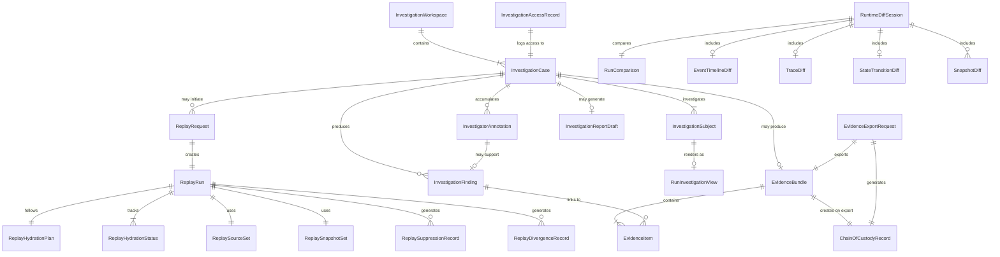

---

## 5. Investigation Mode Taxonomy

### 5.1 Mode Definitions

**Production Observation Mode**
- Purpose: Standard operational monitoring and observability of live and recent runs. Belongs primarily to Document 20.
- Allowed data sources: Live GovernedRun state, recent telemetry, event stream.
- Allowed actions: Observe, navigate, view operational metrics, escalate to investigation mode.
- Forbidden actions: Replay initiation, diff computation, evidence export, snapshot deep inspection.
- Visual treatment: Document 20 production tokens; standard operational chrome.
- Required access gates: Standard operator role.
- Evidence status: Not applicable (operational view only).
- Audit requirement: Standard access logging per Document 12.

---

**Investigation Mode**
- Purpose: The governed inspection context for examining a specific GovernedRun or set of runs. Entry point for replay, diff, snapshot inspection, and evidence collection.
- Allowed data sources: GovernedRun records, checkpoint records, event ledger, snapshots (access-gated), telemetry diagnostic.
- Allowed actions: Inspect run history, view snapshots (with access gating), request replay, initiate diff, add annotations, request evidence.
- Forbidden actions: Mutate original run data, execute tools, call model providers, publish events, export without authorization.
- Visual treatment: Investigation chrome (`background.surface.investigation`: `#0D0D18`, `accent.investigationCyanGray`: `#4A7A8A`); persistent `INVESTIGATION MODE` banner.
- Required access gates: Investigation role; case membership.
- Evidence status: Display only until EvidenceBundle created.
- Audit requirement: InvestigationAccessRecord for sensitive access.

---

**Canonical Replay Mode**
- Purpose: The highest-fidelity replay mode: full reconstruction from complete source records using original snapshots, events, and recorded outputs. Used when all sources are available and integrity-verified.
- Allowed data sources: Original EventEnvelopes, original snapshots, ToolReplayRecords, ModelOutputRecords. Live data FORBIDDEN.
- Allowed actions: Inspect reconstructed execution; view suppressed side effects; initiate diff against original.
- Forbidden actions: Call live tools, retrieve live memory, evaluate current policy, use current credentials, publish events.
- Visual treatment: Replay chrome (`background.surface.replay`: `#110D1A`, `accent.replayVioletGray`: `#6A5A8A`); persistent `REPLAY MODE — NO PRODUCTION SIDE EFFECTS` banner.
- Required access gates: Replay permission; investigation role.
- Evidence status: ReplayRun and its source references may be included in EvidenceBundle.
- Audit requirement: ReplayRequest creates InvestigationAccessRecord.

---

**Investigation Replay Mode**
- Purpose: A replay mode permitting controlled divergence analysis — the investigator may modify specific inputs (e.g., a different ContextSnapshot) to understand "what would have happened if." Divergence is explicitly labeled.
- Allowed data sources: Original sources (primary) + controlled investigator-specified overrides (labeled as deviations).
- Allowed actions: All Canonical Replay actions + controlled input substitution with explicit labels.
- Forbidden actions: Production side effects, unlabeled deviations, credential injection.
- Visual treatment: Replay chrome + amber divergence overlay; additional `DIVERGENCE ANALYSIS` label.
- Required access gates: Elevated replay permission; senior investigation role.
- Evidence status: Investigation replay results are NOT canonical evidence unless divergence analysis purpose is documented.
- Audit requirement: Deviation inputs and InvestigationAccessRecord logged.

---

**Partial Replay Mode**
- Purpose: Replay initiated when source data is incomplete — some snapshots missing, some records purged by retention, some events unavailable. Proceeds with explicit gaps labeled.
- Allowed data sources: Available subset of original sources.
- Allowed actions: Inspect available reconstructed steps; view gaps; initiate partial diff.
- Forbidden actions: Presenting partial reconstruction as complete; hiding gaps.
- Visual treatment: Replay chrome + orange `PARTIAL REPLAY — MISSING SOURCE DATA` banner; gap indicators on missing steps.
- Required access gates: Replay permission.
- Evidence status: Partial replay results are evidence only for the steps that were fully reconstructed.
- Audit requirement: Source gaps documented in ReplayHydrationStatus.

---

**Failed Replay Mode**
- Purpose: The terminal state when replay could not proceed past a blocking point: integrity failure, mandatory snapshot missing, replay engine error.
- Allowed data sources: Whatever was available before failure.
- Allowed actions: View failure point and reason; inspect available pre-failure records.
- Forbidden actions: Presenting failed replay as successful; hiding failure reason.
- Visual treatment: Replay chrome + red `FAILED REPLAY — RECONSTRUCTION INCOMPLETE` banner; failure point marker on timeline.
- Evidence status: Failed replay failure report may be evidence of incomplete source records.
- Audit requirement: Failure reason logged in ReplayHydrationStatus.

---

**Runtime Diff Mode**
- Purpose: Side-by-side comparison of two bounded artifacts (runs, versions, snapshots, timelines).
- Allowed data sources: Two complete or partial source record sets; completeness noted per source.
- Allowed actions: Compare, classify divergence, annotate, link to evidence, request evidence bundle.
- Forbidden actions: Edit either source; treat diff as source of truth; merge timelines without labels; export from frontend directly.
- Visual treatment: Split-panel view; `DIFF VIEW — DIAGNOSTIC COMPARISON` banner; confidence indicator per diff section.
- Required access gates: Access to both comparison subjects; diff permission.
- Evidence status: Diff session may be included in EvidenceBundle after backend evidence generation.
- Audit requirement: Diff initiation logged; evidence export creates ChainOfCustodyRecord.

---

**Evidence Review Mode**
- Purpose: Governed inspection of a sealed EvidenceBundle before or after export.
- Allowed data sources: Sealed EvidenceBundle contents (may be partially redacted based on role).
- Allowed actions: View evidence items, view chain of custody, request additional export targets.
- Forbidden actions: Modify EvidenceBundle; add items post-sealing; re-render evidence from frontend.
- Visual treatment: Evidence chrome; `EVIDENCE REVIEW — GOVERNED ACCESS` watermark; immutable indicators.
- Required access gates: Evidence review role; purpose declaration.
- Evidence status: IS the evidence review context.
- Audit requirement: Every evidence view access creates InvestigationAccessRecord.

---

**Incident Review Mode**
- Purpose: Investigation context initiated from an active or resolved incident record, linking run failures to SRE runbooks and operational impact.
- Allowed data sources: All Investigation Mode sources + incident record + SLO/SLA impact data.
- Allowed actions: All Investigation Mode actions + runbook reference viewing + recovery action preview (preview only, not execution).
- Forbidden actions: Execute runbook or remediation directly from investigation mode.
- Visual treatment: Investigation chrome + incident badge.
- Required access gates: SRE or investigator role; incident access.

---

**Audit Review Mode**
- Purpose: Compliance and audit-oriented investigation, focused on governance decisions, approval chains, and policy enforcement records.
- Allowed data sources: All Investigation Mode sources; governance audit trail; ApprovalDecisionRecords; PolicySnapshots.
- Required access gates: Auditor role.
- Evidence status: Full evidence-eligible mode.

---

**Governance Review Mode**
- Purpose: Review of governance-significant actions within a run: break-glass events, policy overrides, approval bypasses, high-risk tool invocations.
- Allowed data sources: Governance audit records, ApprovalDecisionRecords, PolicyDecisionRecords.
- Required access gates: Governance reviewer role.
- Evidence status: Full evidence-eligible mode.

### 5.1.1 Investigation Replay Deviation Manifest

Investigation Replay Mode MUST produce an explicit DeviationManifest before any controlled deviation is applied.

Controlled deviations are allowed only for analysis. They MUST NOT be represented as original execution, canonical replay, production replay, or evidence of what actually happened.

#### DeviationManifest

| Field | Requirement |
|---|---|
| deviation_manifest_id | REQUIRED |
| tenant_id | REQUIRED |
| investigation_case_id | REQUIRED |
| replay_request_id | REQUIRED |
| original_governed_run_id | REQUIRED |
| requested_by_actor_id | REQUIRED |
| runtime_identity_id | REQUIRED |
| purpose | REQUIRED |
| deviation_reason | REQUIRED |
| changed_inputs | REQUIRED |
| unchanged_sources | REQUIRED |
| prohibited_live_sources_confirmation | REQUIRED |
| expected_taint_labels | REQUIRED |
| created_at | REQUIRED |
| correlation_id | REQUIRED |

#### Rules

- Every substituted input MUST be listed in changed_inputs.
- Every output derived from a substituted input MUST carry an investigation-derived taint label.
- Investigation replay MUST preserve the no-side-effect replay boundary.
- Investigation replay MUST NOT use live credentials.
- Investigation replay MUST NOT write to production memory.
- Investigation replay MUST NOT publish production events.
- Investigation replay MUST NOT be labeled Canonical Replay.
- Investigation replay outputs MUST be labeled `DERIVED ANALYSIS — NOT ORIGINAL EXECUTION`.
- EvidenceBundle MAY include the DeviationManifest, but MUST NOT present deviation outputs as original execution evidence.

#### Forbidden Behavior

FORBIDDEN:

- allowing unlabeled deviations;
- allowing investigator-provided context to appear as original ContextSnapshot;
- using current policy as substituted policy without diagnostic labeling;
- treating investigation replay output as canonical evidence;
- omitting DeviationManifest from Investigation Replay Mode;
- allowing controlled deviations to trigger tool execution, model provider calls, memory writes or external side effects.

---

## 6. Investigation Access and Authorization

### 6.1 Access Requirements

**Who Can Open an Investigation:**
- Every investigation MUST be tenant-scoped. An actor MUST have a verified identity within the target tenant.
- Opening an InvestigationCase requires: investigation role (or SRE role for incident-linked investigations, or auditor role for compliance investigations); case creation permission.
- Platform-scoped investigation (accessing multiple tenant investigations) requires SupportAccessRequest or equivalent (Document 14).

**Who Can Request Replay:**
- Replay permission is separate from basic investigation permission.
- Canonical replay requires: replay_request permission in addition to investigation role.
- Investigation replay (with controlled deviations) requires: elevated_replay_request permission.
- Every ReplayRequest MUST create an InvestigationAccessRecord.

**Who Can View Sensitive Payloads:**
- Raw event payloads, model prompt content, raw tool inputs/outputs, and context fragment content are redacted by default.
- Viewing unredacted content requires: sensitive_payload_access permission AND a purpose declaration.
- Unredacted access MUST create InvestigationAccessRecord with purpose.

**Who Can Export Evidence:**
- Evidence export requires: evidence_export permission.
- Evidence export MUST create ChainOfCustodyRecord with actor_id, purpose, export target, and timestamp.
- Platform support agents exporting evidence MUST provide SupportAccessRequest reference.

**Who Can Annotate:**
- All case members with annotate permission may add InvestigatorAnnotations.
- Annotations are tenant-scoped and case-scoped.

**Who Can Close an Investigation:**
- Case closure requires: case_owner or admin permission.
- Closure creates InvestigationClosureRecord.

**Cross-Workspace and Platform-Scoped Investigation:**
- Cross-workspace investigation within the same tenant: requires workspace admin permission.
- Cross-tenant investigation (platform support): requires SupportAccessRequest (Document 14) and generates SupportAccessRecord.
- Investigation UI MUST NOT reveal cross-tenant existence. An investigator with no access to tenant B sees nothing about tenant B's runs, even in error messages.

### 6.2 Authorization Rules

- **IAA-01:** Every investigation access MUST be tenant-scoped. Queries that do not include tenant_id are FORBIDDEN.
- **IAA-02:** Every access MUST include actor_id and runtime_identity_id (resolved by backend from session token) in all backend investigation queries.
- **IAA-03:** Every sensitive investigation access (unredacted payload view, evidence export, evidence bundle view) MUST create InvestigationAccessRecord.
- **IAA-04:** Platform support investigation MUST reference a valid SupportAccessRequest per Document 14.
- **IAA-05:** The investigation UI MUST NOT reveal cross-tenant run existence in any error message, empty state, or redirect path.
- **IAA-06:** Evidence export requires purpose declaration; purpose is included in ChainOfCustodyRecord.
- **IAA-07:** Redacted view is the default. Unredacted reveal requires explicit governed action.

### 6.2.1 Investigation Access Context Boundary

Every investigation backend query MUST be executed through an explicit `InvestigationAccessContext`.

Investigation surfaces MUST NOT call investigation, replay, diff, telemetry, evidence, snapshot, or payload APIs without an access context.

The access context is the authorization, tenancy, identity, purpose, classification and audit boundary for the operation.

#### InvestigationAccessContext

| Field | Requirement |
|---|---|
| tenant_id | REQUIRED |
| workspace_id | optional; required when investigation scope is workspace-bound |
| project_id | optional; MUST NOT exist without workspace_id |
| investigation_case_id | REQUIRED for case-bound operations |
| actor_id | REQUIRED for human-initiated operations |
| runtime_identity_id | REQUIRED for every backend operation |
| correlation_id | REQUIRED |
| request_id | REQUIRED |
| purpose | REQUIRED for all investigation access |
| access_reason | REQUIRED for sensitive access, replay request, evidence view or export |
| sensitivity_ceiling | REQUIRED |
| data_classification | REQUIRED |
| requested_view | REQUIRED; identifies view or operation being requested |
| support_access_request_id | REQUIRED for platform-scoped or support access |
| redaction_profile_id | REQUIRED when rendering redacted content |
| legal_hold_id | optional |
| incident_id | optional |
| evidence_bundle_id | optional |
| replay_run_id | optional |

#### Rules

- InvestigationAccessContext MUST be resolved server-side.
- Frontend-provided actor_id, runtime_identity_id, tenant_id or support_access_request_id MUST NOT be trusted without backend validation.
- Investigation APIs MUST fail closed when InvestigationAccessContext is missing or invalid.
- Cross-tenant resource existence MUST NOT be revealed in denial responses.
- InvestigationAccessContext MUST be recorded or referenced by InvestigationAccessRecord for sensitive access.
- Evidence export MUST bind InvestigationAccessContext to ChainOfCustodyRecord.
- InvestigationAccessContext MUST NOT include emails, legal names, tenant display names, raw credentials, raw payloads, prompts, model outputs, or unredacted memory fragments.

#### Forbidden Behavior

FORBIDDEN:

- calling investigation APIs with only a run_id;
- deriving tenant_id from run_id prefixes, URL paths, display names, email domains or cached frontend state;
- trusting frontend role flags as authorization;
- allowing investigation views to query by actor_id without tenant_id;
- creating evidence, replay, diff or snapshot views without request_id and correlation_id;
- returning different error messages that reveal whether a cross-tenant resource exists.

### 6.2.2 Investigation Cache, Search and Empty-State Isolation

Investigation search, filters, autocomplete, cached results and empty states MUST preserve tenant and case boundaries.

Cross-tenant leakage often occurs through secondary UX paths, not primary API responses. Therefore all investigation search and cache surfaces are security-sensitive.

#### Rules

- Investigation cache keys MUST include tenant_id, workspace_id when present, investigation_case_id when present, actor_id or access profile, redaction_profile_id, and requested_view.
- Cached investigation results MUST be invalidated on tenant switch, workspace switch, case switch, role change, support access expiration, redaction profile change and logout.
- Search and autocomplete MUST query only within the current InvestigationAccessContext.
- Search results MUST NOT include inaccessible resources as disabled entries.
- Empty states MUST distinguish safe states without revealing cross-tenant existence.
- A cross-tenant denial MUST NOT be rendered as "resource exists but access denied" unless the actor is explicitly authorized for that tenant scope.
- Investigation search MUST NOT allow global search by raw run_id across tenants.
- Platform support search MUST require SupportAccessRequest and MUST show platform-scoped warning state.
- Browser-side filtering MUST NOT receive more records than the actor is authorized to view.

#### Safe Empty-State Language

| Situation | Safe Message |
|---|---|
| No accessible results | No investigation records found in the current scope. |
| Access denied | You do not have access to this investigation scope. |
| Cross-tenant or unknown resource | Not found in the current scope. |
| Support access expired | Support access is no longer active for this scope. |
| Redacted result | Result exists in current scope, but details are redacted by policy. |

#### Forbidden Behavior

FORBIDDEN:

- global investigation search without tenant_id;
- autocomplete that reveals inaccessible run IDs;
- frontend filtering of over-fetched cross-tenant data;
- cache reuse across tenant, workspace, case or actor boundary;
- error text that says a resource exists in another tenant;
- "No runs found" when the actual condition is authorization denial;
- search index results that include tenant display names outside the active scope.

### 6.3 Access Matrix by Persona

| Persona | Open Investigation | Request Replay | View Sensitive Payload | Export Evidence | Annotate | Close Case | Cross-Workspace | Platform-Scoped |
|---|---|---|---|---|---|---|---|---|
| Operator | Yes (own runs) | No | No | No | No | No | No | No |
| Developer | Yes (workspace runs) | Yes (basic) | No | No | Yes | No | No | No |
| SRE | Yes | Yes | Conditional (purpose) | No | Yes | No | Workspace only | No |
| Auditor | Yes | Yes (canonical) | Yes (governed access) | Yes | Yes | Conditional | Yes | No |
| Governance Reviewer | Yes (governance scope) | Yes | Yes (governance content) | Yes (governance) | Yes | Conditional | Conditional | No |
| Security Reviewer | Yes | Yes | Yes (security content) | Yes (security) | Yes | Conditional | Yes | No |
| Tenant Admin | Yes | Yes | Yes (governed) | Yes | Yes | Yes | Yes | No |
| Platform Admin | Yes | Yes | Yes (governed) | Yes | Yes | Yes | Yes | Yes (via SupportAccess) |
| Support Agent | Read-only investigation | No | No (requires approval) | No | No | No | No | Yes (via SupportAccess) |
| Executive Observer | View summary only | No | No | No | No | No | No | No |

---

## 7. Visual Boundary: Production vs Replay vs Investigation

### 7.1 Visual Mode Identity

MYCELIA uses distinct visual identities for each operational context. These are not stylistic preferences — they are safety requirements that prevent catastrophic confusion between production action surfaces and inspection surfaces.

| Context | Surface Background | Accent | Text Token | Persistent Banner |
|---|---|---|---|---|
| Production (Doc 20) | `background.canvas.deep` (`#0A0B0C`) | `accent.mycelial.sage` (`#5A8A6A`) | `text.primary` | None (normal chrome) |
| Replay Mode | `background.surface.replay` (`#110D1A`) | `accent.replayVioletGray` (`#6A5A8A`) | `text.replay` | `REPLAY MODE — NO PRODUCTION SIDE EFFECTS` |
| Investigation Mode | `background.surface.investigation` (`#0D0D18`) | `accent.investigationCyanGray` (`#4A7A8A`) | `text.investigation` | `INVESTIGATION MODE` |
| Runtime Diff Mode | Split-panel; replay + investigation token mix | Diff-specific tokens for changed/unchanged | `text.diff.*` | `DIFF VIEW — DIAGNOSTIC COMPARISON` |
| Evidence Review Mode | Investigation surface + evidence overlay | `accent.evidenceGold` (distinct, restrained) | `text.evidence` | `EVIDENCE REVIEW — GOVERNED ACCESS` |
| Partial Replay | `background.surface.replay` + orange warning overlay | `accent.replayVioletGray` + `accent.warning` | `text.warning` on gap indicators | `PARTIAL REPLAY — MISSING SOURCE DATA` |
| Failed Replay | `background.surface.replay` + error overlay | `accent.replayVioletGray` + `border.error` | `text.danger` on failure point | `FAILED REPLAY — RECONSTRUCTION INCOMPLETE` |
| Test Run (Doc 21) | Investigation treatment | `accent.investigationCyanGray` | Test-specific labels | Defined in Document 21 |
| Simulation (Doc 21) | Investigation treatment | `accent.investigationCyanGray` | Simulation labels | Defined in Document 21 |

### 7.2 Required Persistent Labels

The following banners/labels MUST be persistent — visible at all times within their respective modes, not dismissible by the user, and not hidden by scrolling:

| Mode | Required Persistent Label |
|---|---|
| Investigation Mode | `INVESTIGATION MODE` |
| Replay Mode (all variants) | `REPLAY MODE — NO PRODUCTION SIDE EFFECTS` |
| Partial Replay | `PARTIAL REPLAY — MISSING SOURCE DATA` |
| Failed Replay | `FAILED REPLAY — RECONSTRUCTION INCOMPLETE` |
| Runtime Diff Mode | `DIFF VIEW — DIAGNOSTIC COMPARISON` |
| Evidence Review Mode | `EVIDENCE REVIEW — GOVERNED ACCESS` |

### 7.3 Visual Separation Rules

- **VB-01:** Replay surfaces MUST use `background.surface.replay` (`#110D1A`). The violet-shifted background MUST be visually distinguishable from all production surfaces under normal and high-contrast display conditions.
- **VB-02:** Investigation surfaces MUST use `background.surface.investigation` (`#0D0D18`) with `accent.investigationCyanGray` (`#4A7A8A`) accents.
- **VB-03:** The persistent mode banner MUST remain visible at all times in the browser viewport. It MUST NOT scroll off screen; sticky positioning is REQUIRED.
- **VB-04:** All production action buttons (approve run, trigger tool, cancel run, modify workflow) MUST be absent or explicitly disabled in replay and investigation mode surfaces. Disabled buttons MUST have accessible label "Not available in [mode name]."
- **VB-05:** Replay timelines MUST NOT animate as if the execution is live. Animation and pulsing states that indicate live execution are FORBIDDEN in replay mode.
- **VB-06:** Side-effect controls (tool invocation panels, integration triggers) MUST show `SUPPRESSED` status with the replay suppression marker in replay mode.
- **VB-07:** Evidence views MUST display an evidence watermark or badge indicating: access role, export eligibility status, and whether the view is from a sealed bundle or a display-only render.
- **VB-08:** The same GovernedRun viewed in production observation mode (Document 20) vs investigation mode MUST be visually distinguishable at a glance. Mode switching MUST trigger a full surface re-render with the new visual identity.

### 7.4 Mode Switching

When an operator navigates from Production Observation Mode to Investigation Mode for a specific run:
1. Full surface re-render applies investigation visual identity
2. `INVESTIGATION MODE` banner appears and is pinned
3. Available actions change: production controls removed; investigation controls (replay, diff, evidence) appear
4. InvestigationCase is opened or selected
5. Investigation access record created (for sensitive run access)

When investigation mode is exited:
1. Investigation context closed
2. Surface returns to production visual identity
3. All investigation-specific panels and controls removed

---

## 8. Replay Source Model

### 8.1 Replay Source Definitions

| Source | Required for Canonical Replay | Visual Surface | Missing Behavior |
|---|---|---|---|
| EventEnvelope sequence | REQUIRED | Event timeline; event ledger view | Integrity failure; canonical replay blocked |
| StateTransition records | REQUIRED | Step state timeline | Steps cannot be reconstructed; partial replay with gap |
| Checkpoint records | REQUIRED for complex runs | Step detail panel | Missing checkpoint shown as gap indicator |
| ContextSnapshot | REQUIRED for cognitive steps | Context snapshot viewer | Cognitive step hydration incomplete; step shown as partial |
| PolicySnapshot | REQUIRED | Policy snapshot viewer | Policy reconstruction impossible; governance divergence warning |
| ApprovalSnapshot / ApprovalDecisionRecord | REQUIRED for runs with approval gates | Approval chain view | Approval step cannot be reconstructed; divergence record created |
| BoundarySnapshot | REQUIRED | Workspace boundary panel | Isolation context unverifiable; security warning |
| SecuritySnapshot | REQUIRED | Security context panel | Credential context unverifiable; security warning |
| ToolReplayRecord | REQUIRED for tool steps | Tool invocation panel (suppressed marker) | Tool step cannot be hydrated; step shown as hydration-incomplete |
| ModelOutputRecord | REQUIRED for cognitive steps | Model output viewer (redacted) | Model output cannot be reconstructed; step shown as hydration-incomplete |
| MemoryMutationRecord | Required for memory write steps | Memory access viewer | Memory mutation cannot be verified; divergence possible |
| ExternalSideEffectRecord | Required for integration steps | External side-effect panel | External interaction cannot be verified |
| Telemetry references | Advisory (not required for canonical replay) | Trace/span panel (diagnostic) | Labeled "Telemetry unavailable — diagnostic only" |
| WorkflowVersion | REQUIRED | Workflow version panel; graph diff | Execution plan cannot be verified; replay blocked |
| RuntimeEnvelope | REQUIRED | Run context panel | Execution context unverifiable |
| CredentialReference metadata only | REQUIRED (metadata, NOT value) | Security context panel | Referenced credentials cannot be identified; security warning |
| Audit records | Advisory | Audit trail panel | Labeled "Audit records unavailable" |

### 8.2 Replay Source Rules

- **RS-01:** Canonical replay MUST use recorded source data exclusively. Live data substitution is FORBIDDEN.
- **RS-02:** Canonical replay MUST NOT use live memory retrieval. ContextSnapshot is the canonical context source.
- **RS-03:** Canonical replay MUST NOT evaluate current policy as a substitute for PolicySnapshot. PolicySnapshot is the canonical policy source.
- **RS-04:** Canonical replay MUST NOT use live (current) credentials. CredentialReference metadata (opaque pointer) is shown; resolved secret values are NEVER used in replay.
- **RS-05:** Canonical replay MUST NOT execute production side effects. ToolReplayRecord hydrates tool results.
- **RS-06:** Missing replay source MUST be made explicit in the ReplayHydrationStatus. Missing sources are NEVER silently substituted.
- **RS-07:** Replay source integrity MUST be visible: hash verification status shown per source.
- **RS-08:** Source completeness (percentage of required sources available) MUST be shown before the investigator confirms replay initiation.
- **RS-09:** Retention-purged records MUST be labeled "Purged by retention policy — source unavailable" and never confused with "no record exists."

---

## 9. Replay Request and Replay Lifecycle UX

### 9.1 Replay Lifecycle Stages

| Stage | Description | UX State |
|---|---|---|
| 1. Run selected | Investigator selects GovernedRun for replay | RunInvestigationView displayed |
| 2. Replay eligibility check | System queries replay service for eligibility | ReplayEligibilityChecking spinner; "Checking replay eligibility..." |
| 3. ReplaySourceSet discovered | Replay service discovers available source records | ReplaySourceDiscovery status; source checklist populates |
| 4. Integrity pre-check | Source record hashes verified | ReplayIntegrityChecking; per-source integrity indicator |
| 5. ReplayHydrationPlan created | Backend computes hydration plan | ReplayHydrationPlanning; hydration checklist shown |
| 6. ReplayRequest submitted | Investigator confirms and submits | Authorization check; InvestigationAccessRecord created |
| 7. ReplayRun created | Backend creates isolated ReplayRun | ReplayRun ID shown; isolated namespace confirmed |
| 8. Snapshots hydrated | ContextSnapshot, PolicySnapshot, etc. loaded into replay namespace | ReplayHydrating; per-snapshot progress indicators |
| 9. Event sequence loaded | EventEnvelope sequence verified and loaded | Events loading progress |
| 10. Side effects marked suppressed | All tool/integration invocations marked with ReplaySuppressionRecord | Suppression marker appears on affected steps |
| 11. Replay steps reconstructed | Step-by-step reconstruction from records | Steps appearing on replay timeline; hydration status per step |
| 12. Divergence checks | Comparison against original run executed | ReplayDivergenceRecords created; divergence summary updated |
| 13. Replay completes/fails | Terminal status reached | Status banner updated |
| 14. Replay summary displayed | Completion summary: source completeness, divergence count, hydration status | Summary panel shown |
| 15. Diff session may be opened | Investigator may open RuntimeDiffSession | ReplayDiffAvailable status if applicable |
| 16. Evidence export may be requested | Investigator may request EvidenceBundle | EvidenceExportRequest flow |

### 9.2 Replay Status Lifecycle

| Status | Description | Visual Treatment |
|---|---|---|
| ReplayEligibilityChecking | System is verifying whether the run has sufficient source records for replay | Progress indicator |
| ReplayEligible | Run has sufficient sources for at least partial replay | Green eligibility badge; source summary |
| ReplayIneligible | Run cannot be replayed (critical sources missing or integrity failure) | Red ineligibility badge; reason displayed |
| ReplaySourceDiscovery | System is discovering and cataloging available source records | Progress; source list populating |
| ReplayIntegrityChecking | Source record hashes being verified | Per-source integrity indicator (pass/fail/unknown) |
| ReplayHydrationPlanning | Backend computing hydration plan | Hydration plan checklist populating |
| ReplayHydrating | Snapshots and records loading into replay namespace | Per-source hydration progress |
| ReplayRunning | Replay execution proceeding step by step | Replay timeline animating (non-live style) |
| ReplayCompleted | Full reconstruction successful | `REPLAY COMPLETE` badge; summary available |
| ReplayPartiallyCompleted | Reconstruction succeeded for available steps; some steps incomplete | `PARTIAL REPLAY` banner; gap indicators on incomplete steps |
| ReplayFailed | Replay could not proceed past a blocking point | `FAILED REPLAY` banner; failure point marked |
| ReplayDiffAvailable | Diff session can be opened between original and replay | Diff button enabled |
| ReplayArchived | ReplayRun retained in archive per policy; accessible for future investigation | Archived badge |

### 9.3 Replay Request Flow Rules

- **RRL-01:** ReplayRequest MUST be authorized: actor must have replay permission; InvestigationCase must be open.
- **RRL-02:** ReplayRun MUST be created in an isolated namespace; it MUST NOT share data records with the production GovernedRun namespace.
- **RRL-03:** ReplayRun MUST NOT mutate or append to the original GovernedRun's EventEnvelope sequence.
- **RRL-04:** ReplayRun MUST NOT publish events to the production event stream.
- **RRL-05:** ReplayRun MUST NOT execute tools, call external integrations, or invoke model providers with live calls.
- **RRL-06:** ReplayRun MUST NOT write to production memory.
- **RRL-07:** ReplayRun MUST carry persistent visual labels distinguishing it from production.
- **RRL-08:** ReplayRun MUST show a source completeness percentage before the investigator confirms initiation.
- **RRL-09:** Integrity failures on REQUIRED sources MUST block canonical replay. Investigator must explicitly choose investigation replay mode to proceed with incomplete sources.

### 9.4 Replay Namespace and Artifact Partition Boundary

ReplayRun artifacts MUST be physically and logically separated from production GovernedRun artifacts.

Replay isolation is not only a UI label. It is a storage, event, cache, telemetry, indexing and access-control boundary.

#### Replay Partition Requirements

| Artifact Type | Production Location | Replay Location | Rule |
|---|---|---|---|
| EventEnvelope | production event stream | replay event namespace | Replay events MUST NOT enter production stream |
| StateTransition | production state store | replay state partition | Replay transitions MUST NOT mutate production state |
| CheckpointRecord | production checkpoint store | replay checkpoint partition | Replay checkpoints are derived artifacts |
| ContextSnapshot | immutable source store | referenced read-only | Replay MUST NOT rewrite snapshots |
| ToolReplayRecord | historical source store | referenced read-only | Replay hydrates from record, no tool execution |
| ModelOutputRecord | historical source store | referenced read-only | Replay hydrates from record, no model call |
| ReplaySuppressionRecord | replay artifact store | replay namespace only | Suppression is replay-only evidence context |
| ReplayDivergenceRecord | replay artifact store | replay namespace only | Divergence is derived from comparison |
| Telemetry | production telemetry | replay telemetry namespace | Replay telemetry MUST be labeled diagnostic |
| Cache | production cache | replay cache partition | Cache keys MUST include tenant_id and replay_run_id |
| Search Index | production index | replay/indexed-derived partition | Replay artifacts MUST NOT contaminate production search |

#### Rules

- ReplayRun MUST have a replay_namespace_id.
- replay_namespace_id MUST be distinct from production namespace identifiers.
- All replay artifact keys MUST include tenant_id and replay_namespace_id.
- Replay artifacts MUST NOT be queryable from production operational views unless explicitly rendered as replay references.
- Replay telemetry MUST be labeled `Replay — Diagnostic`.
- Replay cache entries MUST expire according to replay retention policy.
- Replay indexes MUST NOT influence production search, operational dashboards, memory retrieval, policy evaluation or workflow execution.
- Replay-created records MUST be marked as derived artifacts.
- Derived replay artifacts MUST reference original source record IDs and hashes.

#### Forbidden Behavior

FORBIDDEN:

- storing ReplayRun events in the production event stream;
- using production cache keys for replay views;
- writing replay StateTransition records into production state tables;
- indexing ReplayRun artifacts as if they were production GovernedRun artifacts;
- allowing replay artifacts to appear in operational dashboards without replay labels;
- allowing replay telemetry to satisfy production SLO or audit requirements;
- allowing replay-derived data to become memory, policy input, or workflow authority.

---

## 10. Replay Hydration UX

### 10.1 Hydration Status Display

The ReplayHydrationStatus panel presents a structured checklist of every hydration source with its status:

```
ReplayHydrationPlan — GovernedRun GR-7f3a
Source Completeness: 96% (23/24 required sources available)
Integrity Check: 23 PASS | 0 FAIL | 1 UNKNOWN

[STATUS INDICATORS PER SOURCE]

REQUIRED SOURCES
[ok]  EventEnvelope sequence         — 142 events loaded, hash verified
[ok]  StateTransition records        — 18 transitions loaded, hash verified
[ok]  ContextSnapshot (Step 3)       — Loaded, hash verified [REDACTED: 2 fields]
[ok]  PolicySnapshot                 — Loaded, hash verified
[!]   ContextSnapshot (Step 9)       — MISSING: Purged by retention policy (>90 days)
[ok]  ToolReplayRecord (Step 5)      — Loaded, hash verified [REDACTED: output payload]
[ok]  ModelOutputRecord (Step 9)     — Loaded [REDACTED: prompt + output]
...

ADVISORY SOURCES
[-]   Trace/span data                — Partially available (sampling: 10%)
[ok]  Audit records                  — Available

Replay mode selected: PARTIAL REPLAY — MISSING SOURCE DATA (Step 9)
```

### 10.2 Hydration Categories

| Category | Description | Visual Treatment |
|---|---|---|
| Complete | All required sources available and integrity-verified | Green check indicator |
| Complete with redactions | All sources available; some fields redacted per access policy | Green check + redaction count badge |
| Partial | Some required sources missing; partial replay available | Amber partial indicator; missing sources listed |
| Blocked by access | Source exists but requesting actor lacks access permission | Locked icon; access permission shown |
| Blocked by missing source | Source record does not exist in store | Missing icon; last known availability date if available |
| Blocked by integrity failure | Source exists but hash verification fails | Red integrity failure indicator; blocks canonical replay |
| Blocked by retention purge | Source was purged by retention policy | Purged icon; purge policy reference |
| Blocked by legal restriction | Source is under legal hold or access restriction | Legal hold icon; restriction reference |
| Failed | Hydration process itself failed | Red failure indicator; error detail |

### 10.3 Hydration Display Rules

- **HYD-01:** Hydration status MUST be source-specific. A single global "loading" indicator is insufficient; each required source must show its status.
- **HYD-02:** Redaction MUST NOT be presented as missing data. A redacted source is available but access-restricted; a missing source does not exist. These MUST have distinct visual treatments.
- **HYD-03:** Missing data MUST NOT be presented as redaction. The distinction is material for evidence purposes.
- **HYD-04:** Integrity failure MUST block canonical replay initiation. The investigator must explicitly switch to investigation replay mode (with divergence labeling) to proceed despite integrity failures.
- **HYD-05:** The user MUST know, before confirming replay, what will be reconstructed and what will not. Source completeness percentage and missing source list MUST be shown pre-confirmation.
- **HYD-06:** Partial replay MUST carry the `PARTIAL REPLAY — MISSING SOURCE DATA` banner for its entire lifetime.

---

## 11. Runtime Diff UX

### 11.1 Diff Type Definitions

**Original Run vs ReplayRun**
- Source: GovernedRun checkpoints and ReplayRun records from same run ID
- Comparison method: Step-by-step state comparison; event sequence comparison; output comparison where not redacted
- Confidence level: High (when both sources are integrity-verified); reduced by redaction and partial replay
- Visual pattern: Side-by-side split panel; left = original, right = replay; differences highlighted with change tokens
- Evidence implication: High — directly compares original to reconstruction; may be included in evidence bundle
- Access restrictions: Requires access to both original run and replay run

**ReplayRun vs ReplayRun**
- Source: Two ReplayRun records (e.g., canonical replay vs investigation replay with controlled deviation)
- Comparison method: Step-by-step comparison; divergence delta calculation
- Confidence: Medium (both are reconstructions; deviations must be labeled)
- Evidence implication: May show the effect of the controlled deviation; labeled as investigation analysis

**Run vs Run**
- Source: Two distinct GovernedRun records
- Comparison method: Normalized step sequence comparison; event type matching; snapshot comparison
- Confidence: Depends on both runs' source completeness
- Evidence implication: Useful for regression investigation; evidence-eligible when sources are complete
- Access restrictions: Both runs must be in same tenant

**WorkflowVersion vs WorkflowVersion**
- Source: Two compiled WorkflowVersion records (Document 09)
- Comparison method: Node set diff, edge set diff, configuration diff, policy binding diff
- Confidence: High (compiled versions are immutable)
- Evidence implication: Evidence-eligible; shows what changed between versions
- Note: MUST NOT enable graph editing; read-only comparison only

**Event Timeline vs Event Timeline**
- Source: EventEnvelope sequences from two runs (Document 07)
- Comparison method: Event type sequence comparison, causation chain comparison, payload diff (redacted by default)
- Confidence: Based on event integrity verification
- Evidence implication: Hash-verified event comparison is high-confidence evidence

**Trace vs Trace**
- Source: Distributed trace trees from Document 12 telemetry
- Comparison method: Span structure comparison, duration diff, error rate diff
- Confidence: Telemetry confidence (sampled, diagnostic — NEVER canonical)
- Evidence implication: Diagnostic only; NOT canonical evidence

**ContextSnapshot vs ContextSnapshot**
- Source: ContextSnapshot records from Document 06/10
- Comparison method: Fragment set comparison, retrieval strategy comparison, summary comparison
- Confidence: High if both snapshots are integrity-verified
- Evidence implication: Evidence-eligible when both snapshots are verified and redaction is documented

**PolicySnapshot vs PolicySnapshot**
- Source: PolicySnapshot records from Document 06/11
- Comparison method: Policy version comparison, evaluation context comparison, decision path comparison
- Confidence: High if both snapshots are verified
- Access restrictions: Policy internal comparison may require governance role
- Evidence implication: Evidence-eligible for governance inquiries

**ToolInvocation result vs hydrated result**
- Source: Original ToolExecution result vs ToolReplayRecord hydration
- Comparison method: Output schema comparison (redacted payload comparison where permitted)
- Confidence: Based on ToolReplayRecord integrity
- Note: Replay always uses hydrated result; this diff verifies hydration fidelity

**Approval Decision Path Diff**
- Source: ApprovalDecisionRecord from two runs or replay reconstructions
- Comparison method: Approval chain comparison, decision comparison, timeout comparison
- Evidence implication: Evidence-eligible for governance review

**State Transition Diff**
- Source: StateTransition records from two runs
- Comparison method: State machine transition sequence comparison; divergence at specific states
- Evidence implication: Evidence-eligible

**Memory Access Diff**
- Source: ContextSnapshot fragments and MemoryMutationRecords from two runs
- Evidence implication: Evidence-eligible for memory usage investigation

**External Side-Effect Diff**
- Source: ExternalSideEffectRecord from two runs; suppression records in replay
- Note: Replay always suppresses; diff shows what was executed vs what would have been suppressed

**Telemetry Diagnostic Diff**
- Source: Trace and metric data from Document 12 (diagnostic only)
- Confidence: Low-to-medium (telemetry); diagnostic interpretation only

### 11.2 Diff Visual Conventions

| Change State | Token | Icon | Description |
|---|---|---|---|
| Unchanged | `background.diff.unchanged` (neutral) | — | Value identical in both sources |
| Changed | `background.diff.changed` (amber/highlighted) | Edit icon | Value differs between sources |
| Added | `background.diff.added` (green-tinted) | Plus icon | Present in right but not left |
| Removed | `background.diff.removed` (red-tinted) | Minus icon | Present in left but not right |
| Redacted | `background.diff.redacted` (gray-hatched pattern) | Lock icon | Field exists but access-restricted |
| Missing | `background.diff.missing` (dark gray) | Question icon | Field/record does not exist |
| Unverifiable | `background.diff.unverifiable` (orange-tinted) | Warning icon | Cannot confirm due to incomplete source |
| Suppressed (replay) | `background.diff.suppressed` (violet-tinted) | Suppress icon | Action that was suppressed in replay |

### 11.3 Diff Rules

- **DIFF-01:** Diff view MUST never be the source of truth by itself. Every diff element MUST link to its source records.
- **DIFF-02:** Every diff section MUST show: confidence level, source completeness, and redaction impact on comparison quality.
- **DIFF-03:** Diff MUST clearly distinguish: missing, redacted, changed, unchanged, and unverifiable states. Using the same visual treatment for different states is FORBIDDEN.
- **DIFF-04:** Diff MUST NOT merge production and replay timelines without explicit labels. The two sides of a diff panel MUST always be labeled with their source identity.
- **DIFF-05:** Runtime diff view MUST NOT permit graph editing. WorkflowVersionDiff is read-only.
- **DIFF-06:** Diff MUST preserve tenant scope: cross-tenant diffs are FORBIDDEN.
- **DIFF-07:** A diff of sampled telemetry MUST display the sampling rate and label the confidence as "Telemetry Diagnostic — Not Canonical."
- **DIFF-08:** Diff confidence MUST be computed and displayed; it MUST NOT be a static decorative label.

### 11.4 Runtime Diff Computation Boundary

Runtime diff MAY be displayed in the investigation frontend, but authoritative RuntimeDiffSession records MUST be computed or verified by the backend diff service.

Frontend-rendered diffs are display artifacts only.

A RuntimeDiffSession becomes evidence-eligible only when its source records, algorithm version, input hashes, output hash, redaction impact and confidence computation are recorded by the backend.

#### RuntimeDiffComputationRecord

| Field | Requirement |
|---|---|
| diff_session_id | REQUIRED |
| tenant_id | REQUIRED |
| left_source_ref | REQUIRED |
| right_source_ref | REQUIRED |
| left_source_hash | REQUIRED when source is hashable |
| right_source_hash | REQUIRED when source is hashable |
| diff_algorithm_version | REQUIRED |
| diff_input_manifest_hash | REQUIRED |
| diff_output_hash | REQUIRED |
| redaction_impact | REQUIRED |
| source_completeness | REQUIRED |
| integrity_status | REQUIRED |
| confidence | REQUIRED |
| computed_at | REQUIRED |
| computed_by_runtime_identity_id | REQUIRED |
| correlation_id | REQUIRED |

#### Rules

- Diff computation MUST preserve tenant scope.
- Cross-tenant diffs are FORBIDDEN even when the actor has platform support access, unless a governed platform investigation scope explicitly permits a cross-tenant aggregate with anonymized output.
- Every diff row MUST reference source records or explicitly state that it is derived, inferred, redacted, missing or unverifiable.
- Frontend diff rendering MUST NOT become evidence without backend RuntimeDiffComputationRecord.
- Diff confidence MUST be computed from source completeness, integrity status, redaction impact and diagnostic source quality.
- Telemetry-only diff MUST be labeled diagnostic and MUST NOT become canonical evidence.
- Redacted comparison MUST produce RedactionInducedDifference, not NoDivergence.
- Missing source MUST produce missing or unverifiable state, not redaction.

#### Forbidden Behavior

FORBIDDEN:

- computing an evidence-eligible diff only in the browser;
- exporting a frontend-rendered diff as evidence;
- hardcoding DiffConfidence as High;
- suppressing redaction impact in diff confidence;
- comparing current policy or current memory as if it were historical replay source;
- treating trace/span differences as canonical runtime divergence without EventEnvelope or StateTransition support.

---

## 12. Divergence Classification

### 12.1 Divergence Types

| Type | Description | Severity Range | Investigation Action |
|---|---|---|---|
| NoDivergence | Original and replay are identical for the compared scope | Info | Note completeness; no action needed |
| ExpectedDivergence | Difference is expected and documented (e.g., model output nondeterminism, suppressed side effects) | Info | Acknowledge; document as expected |
| RedactionInducedDifference | Comparison cannot be completed due to access-gated fields; difference may or may not exist | Info–Low | Document redaction scope; note reduced confidence |
| TelemetryOnlyDifference | Difference appears only in trace/metric data, not in canonical state/event records | Low | Investigate telemetry quality; diagnostic only |
| SnapshotMissingDifference | Difference between runs cannot be resolved because a snapshot is missing | Low–Medium | Investigate retention; classify as unverifiable |
| PolicySnapshotDifference | PolicySnapshot versions differ between original run and comparison | Medium | Investigate policy change timeline; governance review |
| ContextSnapshotDifference | ContextSnapshot content differs between original run and comparison | Medium | Investigate memory state changes; content audit |
| ModelOutputDifference | Model outputs differ (expected for nondeterministic steps) | Low–Medium | Verify both hydrated from correct ModelOutputRecord; check if investigation replay used different context |
| ToolResultDifference | ToolReplayRecord result differs from ToolExecution result | Medium–High | Investigate ToolReplayRecord integrity; possible replay source issue |
| ApprovalDecisionDifference | Approval decision, actor, or timeout behavior differs | High | Governance review required; approval audit |
| StateTransitionDifference | State machine transitions differ between runs | Medium–High | Investigate workflow execution path; possible orchestration issue |
| EventOrderingDifference | Event ordering differs between runs | Medium–High | Document 08 interpretation required; possible concurrent execution issue |
| ExternalSideEffectSuppressed | External side effect suppressed in replay (expected behavior) | Info | Confirm suppression is per ReplaySuppressionRecord; not a failure |
| IntegrityFailure | Source record hash does not match expected; record may be tampered | Critical–Blocking | Escalate; block canonical evidence from affected source |
| ReplayEngineFailure | Replay engine error prevented step reconstruction | High–Blocking | Investigate replay infrastructure; report to platform |
| NonDeterministicBehaviorDetected | Execution path diverged from expected deterministic graph in ways not explained by nondeterministic steps | High | Investigate orchestration determinism violation; escalate |
| UnknownDivergence | Difference detected but cannot be classified with available information | Medium–High | InvestigationFinding required; escalate |

### 12.2 Divergence Severity Scale

| Severity | Description | Required Action |
|---|---|---|
| Info | Expected, documented, or inconsequential difference | Log; no action required |
| Low | Minor difference; minimal investigation impact | Document in InvestigationFinding |
| Medium | Significant difference requiring investigation | Create InvestigationFinding; investigate root cause |
| High | Serious difference with potential governance or security impact | Create InvestigationFinding; escalate; consider evidence bundle |
| Critical | Integrity failure, security event, or governance violation | Immediate escalation; evidence bundle required; potential incident |
| Blocking | Difference prevents replay from completing or evidence from being reliable | Investigate root cause; replay may need to be abandoned or reclassified |

### 12.3 Divergence Classification Rules

- **DIV-01:** ExternalSideEffectSuppressed is NOT a replay failure. Suppression is the correct behavior; this divergence type is informational.
- **DIV-02:** Missing source data may make divergence UnknownDivergence or SnapshotMissingDifference. It MUST NOT be silently resolved.
- **DIV-03:** Redacted content MUST produce RedactionInducedDifference, not a false NoDivergence or false change.
- **DIV-04:** TelemetryOnlyDifference MUST NOT be promoted to state divergence without corroborating canonical record evidence.
- **DIV-05:** PolicySnapshotDifference MUST NOT compare current policy against PolicySnapshot as if the current policy is authoritative. PolicySnapshot is the historical truth.
- **DIV-06:** ModelOutputDifference is expected in Investigation Replay Mode when a different context was used. It MUST be labeled as investigation-induced.
- **DIV-07:** UnknownDivergence MUST result in an InvestigationFinding creation and escalation if it involves step state or event ordering.
- **DIV-08:** IntegrityFailure divergence MUST be escalated to security review. Affected sources MUST NOT be used as canonical evidence.


---

## 13. Event Timeline Investigation UX

### 13.1 Event Ledger View

The event ledger view presents the complete EventEnvelope sequence for a GovernedRun as a structured, scrollable, filterable list:

```
Event Ledger — GovernedRun GR-7f3a
[INVESTIGATION MODE]
Source: EventStore  |  Total: 142 events  |  Integrity: 142/142 verified  |  Retention: Complete

#    Timestamp (UTC)        Event Type                    Correlation ID    Hash Status    Payload
001  2026-06-01 14:23:01.001 RunScheduled                  corr-a4f1         [ok]          [Redacted — view requires audit role]
002  2026-06-01 14:23:01.045 WorkflowVersionResolved        corr-a4f1         [ok]          [Redacted]
...
015  2026-06-01 14:23:04.892 ApprovalRequested              corr-b2d3         [ok]          [Redacted — governance role required]
...
[GAP] 2026-06-01 14:24:00 — 14:31:00  Pending approval window (no events expected)
...
```

### 13.2 Event Sequence View Rules

- **EVT-01:** Event timeline MUST source from Document 07 EventEnvelope records. The event ledger is the authoritative timeline.
- **EVT-02:** Replay events MUST NOT be mixed into the production event stream or the production event ledger view. Replay events appear only in the ReplayRun's isolated timeline.
- **EVT-03:** Event ordering MUST follow Document 08 ordering semantics. Client-side timestamps MUST NOT be used as canonical ordering.
- **EVT-04:** Event payload access is REDACTED by default for all roles. Auditor role may access payloads with purpose declaration.
- **EVT-05:** Event hash/integrity status MUST be visible to auditor role per event.
- **EVT-06:** Missing events (gaps in the expected sequence) MUST be explicitly shown as gap indicators labeled with the reason where known.
- **EVT-07:** Inferred events (events that are suspected based on state transitions but not in the event log) MUST be labeled "Inferred — not canonical" and NEVER treated as authoritative records.
- **EVT-08:** Event correlation IDs (causation_id, correlation_id from Document 07) MUST be shown and navigable for causality chain inspection.

### 13.3 Causation Chain View

The causation chain view renders the causal graph of events: which event caused which subsequent events, which approval gate was unlocked by which approval decision, which tool result triggered which step transition. This is the CausalityGraphView entity.

Rules:
- Causation chain is derived from EventEnvelope causation_id and correlation_id fields (Document 07/08).
- Causation chain view MUST be read-only; no editing of causation relationships.
- Inferred causation (not backed by explicit causation_id) MUST be labeled as inferred.

### 13.4 Replay Event Namespace

In replay mode, the event timeline shows the reconstructed event sequence from the ReplayRun's isolated namespace:
- Every event in the replay timeline carries a `[REPLAY]` marker
- Original event markers: `[ORIGINAL]`
- Events shown as suppressed side effects: `[SUPPRESSED]` marker
- The replay namespace is never mixed with production event streams

---

## 14. Trace, Span and Telemetry Investigation UX

### 14.1 Trace Tree View

The trace tree view presents distributed traces from Document 12 as a hierarchical tree of spans, showing:
- Root span (GovernedRun or top-level operation)
- Child spans (step executions, tool invocations, external calls)
- Span duration, status, error indicators
- Sampling rate indicator per trace (e.g., "Sampled: 10% — some spans may be absent")

### 14.2 Telemetry Investigation Rules

- **TEL-01:** Telemetry is DIAGNOSTIC. It is NOT canonical runtime state. Missing telemetry does not mean execution did not occur; it means the telemetry signal was not recorded or sampled.
- **TEL-02:** Missing telemetry spans MUST be labeled "Span not available — sampling or collection gap" and MUST NOT be interpreted as execution gaps without corroborating event/state evidence.
- **TEL-03:** Sampling rate MUST be visible on every trace view. A trace with 10% sampling rate has materially different evidentiary value than one with 100% sampling.
- **TEL-04:** Log excerpts MUST be redacted by default. Raw log content may contain sensitive user data, prompt content, or credentials.
- **TEL-05:** Trace correlation IDs MUST NOT be treated as authorization proof or security context identifiers.
- **TEL-06:** Telemetry access MUST follow Document 12 access controls; telemetry backend queries MUST include tenant_id.
- **TEL-07:** Telemetry diff (TraceDiff) MUST NOT override EventEnvelope or state transition diff as a higher-authority source.
- **TEL-08:** Metric overlay (SLO metrics, error rate metrics) is diagnostic context for the investigator, not canonical execution evidence.

### 14.3 Trace-Event Correlation

The investigation surface may correlate trace spans with EventEnvelope events through shared correlation IDs. When a span_id or trace_id appears in an EventEnvelope's metadata (per Document 07), the investigation view MAY show the correlated trace span alongside the event entry. This correlation:
- Is advisory (telemetry may be sampled; correlation may be incomplete)
- MUST be labeled as "Trace correlation — diagnostic"
- Does NOT elevate the telemetry to canonical evidence status

---

## 15. Snapshot Inspection UX

### 15.1 RuntimeEnvelope Snapshot

| Display Fields | Redaction Rules | Diff Behavior | Evidence Status | Source |
|---|---|---|---|---|
| run_id, workflow_version_id, tenant_id, workspace_id, created_at, envelope_hash | No redaction (non-sensitive metadata) | Full comparison | Evidence-eligible | Doc 06 |

### 15.2 ContextSnapshot

| Display Fields | Redaction Rules | Diff Behavior | Evidence Status | Source |
|---|---|---|---|---|
| snapshot_id, run_id, step_id, snapshot_hash, created_at, fragment_count, retrieval_strategy | Fragment content REDACTED by default; metadata visible | Compare metadata; fragment content comparison access-gated | Evidence-eligible (metadata + hash); fragment diff requires elevated access | Doc 06/10 |

Rules:
- ContextSnapshot fragment content MUST be redacted by default.
- Comparison of context fragment content requires: auditor or developer role + purpose declaration.
- The snapshot hash (integrity proof) MUST always be visible to auditor role.
- ContextSnapshot diff MUST compare snapshots, not live memory. Live memory comparison MUST be labeled separately as "Current Memory — diagnostic, not replay source."

### 15.3 PolicySnapshot

| Display Fields | Redaction Rules | Diff Behavior | Evidence Status | Source |
|---|---|---|---|---|
| snapshot_id, policy_version_id, policy_name, evaluation_context_schema, created_at, snapshot_hash | Policy rule content access-gated (governance role) | Compare policy version, hash, evaluation context | Evidence-eligible | Doc 06/11 |

Rules:
- Policy internal logic (rule conditions, enforcement expressions) requires governance role to view.
- PolicySnapshot comparison MUST compare the historical snapshots, never current policy as a substitute.
- Showing current policy version alongside PolicySnapshot for reference is PERMITTED, but it MUST be clearly labeled "Current Policy — Not Replay Source."

### 15.4 ApprovalSnapshot / ApprovalDecisionRecord

| Display Fields | Redaction Rules | Diff Behavior | Evidence Status | Source |
|---|---|---|---|---|
| approval_request_id, approval_policy_id, requester_id, approver_id (if resolved), decision (granted/denied/timeout), decided_at, rationale_reference | Rationale may be redacted; approver_id shown with access control | Compare decision, actor, timing, policy | Evidence-eligible | Doc 06/11 |

Rules:
- Approval rationale content access-gated; reference shown.
- Approver identity shown to auditor and governance roles.
- ApprovalDecisionDiff MUST show: decision comparison, actor comparison, timing comparison.

### 15.5 BoundarySnapshot

| Display Fields | Redaction Rules | Diff Behavior | Evidence Status | Source |
|---|---|---|---|---|
| snapshot_id, tenant_id, workspace_id, project_id, isolation_class, snapshot_hash | No redaction for metadata | Full comparison | Evidence-eligible | Doc 06/14 |

### 15.6 SecuritySnapshot

| Display Fields | Redaction Rules | Diff Behavior | Evidence Status | Source |
|---|---|---|---|---|
| snapshot_id, actor_id, credential_references (opaque pointer list), trust_level, identity_hash, snapshot_hash | Credential values NEVER shown; reference IDs only; trust level visible | Compare trust level, credential reference list (by ID), identity | Evidence-eligible | Doc 06/13 |

Rules:
- Credential values MUST NEVER be shown in any snapshot inspection view.
- Credential reference IDs and validity status (valid/revoked/rotated since) MUST be shown.
- SecuritySnapshot comparison shows: were the same credential references used? Was trust level the same?

### 15.7 ToolContract Snapshot

| Display Fields | Redaction Rules | Diff Behavior | Evidence Status | Source |
|---|---|---|---|---|
| contract_id, version, side_effect_class, idempotency_strategy, timeout_policy, sandbox_required | Credential configuration access-gated | Full comparison | Evidence-eligible | Doc 15 |

### 15.8 WorkflowVersion Snapshot

| Display Fields | Redaction Rules | Diff Behavior | Evidence Status | Source |
|---|---|---|---|---|
| version_id, workflow_definition_id, compilation_hash, published_at, node_count, compiler_version | No redaction | Full graph diff available | Evidence-eligible | Doc 09 |

### 15.9 Checkpoint Snapshot

| Display Fields | Redaction Rules | Diff Behavior | Evidence Status | Source |
|---|---|---|---|---|
| checkpoint_id, step_id, checkpoint_type, hash, created_at, payload_reference | Payload content access-gated | Compare checkpoint metadata and hashes | Evidence-eligible (metadata); payload access requires elevated role | Doc 06 |

### 15.10 Snapshot Rules

- **SNAP-01:** Snapshot views are IMMUTABLE; no editing controls are shown.
- **SNAP-02:** Every snapshot view MUST show: snapshot_id, created_at, hash, hash verification status (verified/failed/unknown).
- **SNAP-03:** Snapshot diff MUST compare the historical snapshots against each other. Live state comparison MUST be presented separately as a labeled "current state diagnostic" panel.
- **SNAP-04:** Missing snapshot MUST block canonical replay where required; the gap MUST be displayed in the hydration status.
- **SNAP-05:** Credential values MUST NEVER be shown in any snapshot, including SecuritySnapshot.

---

## 16. Policy, Approval and Governance Investigation UX

### 16.1 PolicyDecision Inspection

The PolicyDecision inspection view presents the outcome of a PolicyDecisionRecord: which policy was evaluated, the evaluation context (schema version, input summary), the decision (allow/deny/error), the timestamp, and the PolicySnapshot reference.

Structure:
```
Policy Decision — PolicyGateNode step 4
Run: GR-7f3a | Step: step-4-policy-gate | Time: 2026-06-01 14:24:02 UTC

Policy: AuthorizationPolicy v2.3 [snapshot: SNAP-policy-4f9]
Decision: ALLOW
Evaluation context: [Redacted — governance role required]
Snapshot hash: sha256:a3f9...d1c2 [Verified]
Source: PolicyDecisionRecord-bb3f

[View PolicySnapshot] [View Approval Chain] [Compare with current policy →]
Current Policy v2.4 comparison: [DIAGNOSTIC — not replay source]
```

### 16.2 Approval Chain View

The approval chain view displays the complete approval lifecycle for an ApprovalNode step:
- ApprovalRequest creation (timestamp, requester, approval_policy)
- Approver assignment (actor(s) per approval chain)
- Decision: granted / denied / timeout (timestamp, actor, decision reference)
- Escalation path if timeout occurred
- Break-glass usage if applicable

### 16.3 Break-Glass Investigation View

When a break-glass event occurred during the original run (a governance override requiring emergency access), the investigation view MUST:
- Show a visually exceptional break-glass indicator (distinct from normal approval flow)
- Show: which break-glass authorization was invoked, by whom, when, and for what purpose
- Cross-reference with Document 14 SupportAccessRecord or equivalent break-glass record
- Flag the break-glass in any evidence bundle that includes the affected step

### 16.4 Governance Investigation Rules

- **GOV-INV-01:** Policy investigation MUST use original PolicySnapshot and PolicyDecisionRecord. Current policy shown only as separate labeled comparison.
- **GOV-INV-02:** ApprovalDecisionRecord MUST show actor attribution. Anonymous approvals are a governance finding.
- **GOV-INV-03:** Approval rationale is access-gated; governance reviewer role required.
- **GOV-INV-04:** Break-glass access MUST be visually exceptional and unmistakable in investigation mode.
- **GOV-INV-05:** Evidence export of governance records MUST use the backend governed evidence API; frontend export is FORBIDDEN.
- **GOV-INV-06:** Policy internals (rule conditions, enforcement logic) require governance role access.
- **GOV-INV-07:** Policy approval timeline diff MUST compare original approval events and decisions; it MUST NOT re-evaluate policy logic at current time.

---

## 17. Memory and Context Investigation UX

### 17.1 ContextSnapshot Viewer

The ContextSnapshot viewer renders the assembled context for a specific cognitive invocation step:
- ContextWindow summary: fragment count, total token estimate, retrieval strategy
- Fragment provenance: each fragment's source (memory object ID, namespace, version)
- Summary metadata (if summary was used): provenance reference, summary version
- Redacted content: fragment content redacted by default; visible to authorized role with purpose

### 17.2 Memory Mutation Lineage View

For MemoryWriteNode steps, the investigation view shows:
- What was written (content reference; value redacted)
- Which ContextBoundary received the write
- The lineage_tag applied
- Downstream effects (which subsequent ContextSnapshots include fragments from this write)

### 17.3 Context Poisoning Indicator

When a ContextSnapshot contains fragments that are flagged as quarantined (per Document 10 quarantine semantics), the investigation view MUST show a context poisoning indicator:
- Amber/warning treatment on the affected fragment slot
- Label: "Fragment quarantined at [timestamp] — reason: [category]"
- Link to QuarantineRecord if accessible

### 17.4 Memory and Context Investigation Rules

- **MEM-INV-01:** Canonical replay MUST use ContextSnapshot, not live memory retrieval. The replay timeline shows the reconstructed context; not what current memory would return.
- **MEM-INV-02:** Live memory comparison is PERMITTED as a separate diagnostic panel labeled "Current Memory State — Not Replay Source."
- **MEM-INV-03:** Context diff between two runs MUST distinguish: fragment source difference, derived summary difference, and redaction difference. These are materially different for investigation.
- **MEM-INV-04:** Quarantined memory content MUST be gated. Fragment content from quarantined sources shows "Quarantined — access restricted."
- **MEM-INV-05:** Memory content access MUST follow Document 10 and Document 14 tenant boundaries. Cross-tenant memory inspection is FORBIDDEN.
- **MEM-INV-06:** If a summary in a ContextSnapshot cannot be traced to its source fragments (because fragments were purged), this MUST be flagged as "Summary provenance unverifiable — source fragments purged."

---

## 18. Tool Invocation and External Side-Effect Investigation UX

### 18.1 ToolInvocationRecord View

The tool invocation investigation panel shows:
```
Tool Invocation — Step 6
[INVESTIGATION MODE] [SUPPRESSED IN REPLAY]

Tool: APICallerTool v1.2 (ToolContract: TC-a4f9 v1.2)
Side-effect class: ExternalWrite — Non-idempotent
Idempotency key: idem-7f3a-step6-001
Status (original): SUCCEEDED
Retry count: 0 / max 3
Timeout: 30s | Duration: 4.2s

Input payload: [REDACTED — requires developer + purpose declaration]
Output payload: [REDACTED — requires developer + purpose declaration]
ToolReplayRecord: TRR-bb3e | Hash: sha256:c4a1... [Verified]

Compensation: CompensationRecord-8f2a (executed)
External request reference: ExtRef-4f9d

[View ToolContract] [View ToolReplayRecord] [View Compensation] [Add to evidence]
```

### 18.2 Suppression Marker

In replay mode, every side-effectful tool invocation step MUST show:
- `[SUPPRESSED — NO RE-EXECUTION]` badge on the step node in the replay timeline
- Hydrated result from ToolReplayRecord shown with `[HYDRATED FROM RECORD]` label
- Original execution result shown alongside for comparison

### 18.3 External Side-Effect Investigation Rules

- **TOOL-INV-01:** Replay MUST suppress tool execution. ToolReplayRecord provides the hydrated result.
- **TOOL-INV-02:** ExternalSideEffectSuppressed divergence type is INFORMATIONAL in replay — suppression is the correct behavior.
- **TOOL-INV-03:** Raw external request/response payloads MUST be redacted by default. Developer role + purpose declaration required to view.
- **TOOL-INV-04:** Credential references MUST show as opaque references only. No secret values exposed.
- **TOOL-INV-05:** Side-effect retry analysis (showing all retry attempts) MUST display idempotency key for each attempt and whether the key prevented duplicate execution.
- **TOOL-INV-06:** Compensation records MUST be visible in the investigation view. The compensation status (executed / not-required / failed-to-compensate) MUST be shown.
- **TOOL-INV-07:** External integration delivery status (webhook delivery, API response confirmation) is shown from ExternalSideEffectRecord — not re-queried from live external systems.

---

## 19. Model Output and Cognitive Step Investigation UX

### 19.1 Model Invocation Investigation Panel

```
Cognitive Step — Step 9
[INVESTIGATION MODE] [HYDRATED FROM RECORD — NO LIVE MODEL CALL]

Model Provider: [CredentialReference: cred-openai-prod] — reference only, value never shown
Prompt Template: prompt-template-v3.2 [Redacted by default]
Model: [Redacted by default]
Invoked at: 2026-06-01 14:25:44 UTC
Duration: 8.3s

Output Schema: output-schema-v2.1
Output Promotion Status: Promoted by OutputPromotionController
ModelOutputRecord: MOR-7f2a | Hash: sha256:9e1c... [Verified]

Prompt content: [REDACTED — requires audit role + purpose declaration]
Output content: [REDACTED — requires audit role + purpose declaration]
Quality metadata: N/A (not recorded for this step)
Nondeterminism indicator: This step is nondeterministic; output was hydrated from original record.

[View prompt template] [View ModelOutputRecord] [Add to evidence]
```

### 19.2 Nondeterminism Handling

Cognitive steps are nondeterministic. The investigation surface MUST make this explicit:
- Every cognitive step shows: "This step is nondeterministic — output shown is hydrated from original ModelOutputRecord"
- In Investigation Replay Mode with a different context: "INVESTIGATION DEVIATION — context substituted; output may differ from original"
- ModelOutputDifference in diff view is expected for investigation replay with context substitution

### 19.3 Model Investigation Rules

- **MOD-INV-01:** Canonical replay MUST hydrate original model output from ModelOutputRecord. No live model call.
- **MOD-INV-02:** Prompt content MUST be redacted by default. Auditor role + purpose declaration required.
- **MOD-INV-03:** Model output content MUST be redacted by default. Same access requirement.
- **MOD-INV-04:** Prompt template version MUST be shown (the version that was used at invocation time).
- **MOD-INV-05:** Model provider credential reference MUST be shown as opaque reference only. No secret values.
- **MOD-INV-06:** Investigation replay analysis (e.g., "what would have happened with a different context") is labeled "DERIVED ANALYSIS — NOT ORIGINAL EXECUTION."
- **MOD-INV-07:** Model output is not automatically canonical memory. OutputPromotion status MUST be shown.

---

## 20. Runtime Graph Diff UX

### 20.1 WorkflowVersion Graph Diff

The workflow version graph diff presents two compiled WorkflowVersions side by side:
- Left panel: WorkflowVersion A (e.g., the version that executed)
- Right panel: WorkflowVersion B (e.g., a later version or candidate)
- Differences highlighted on both panels: added nodes (green), removed nodes (red), changed nodes (amber), unchanged nodes (neutral)

The diff shows:
- Node set difference (which nodes were added, removed, or changed)
- Edge set difference (which connections changed)
- Configuration differences (binding changes, schema changes)
- Policy binding changes
- Compilation metadata differences (compiler version, hash)

### 20.2 Execution Path Diff

The execution path diff compares the actual execution path taken in the original run vs the replay:
- Nodes executed in original: shown
- Nodes executed in replay: shown
- Divergent paths: highlighted with DivergenceSeverity classification
- Suppressed nodes (replay suppression): shown with suppression marker
- Skipped nodes (conditional routing took different path): shown with skip indicator

### 20.3 Graph Diff Rules

- **GDIFF-01:** Runtime graph diff MUST NOT allow graph editing. The diff view is read-only.
- **GDIFF-02:** Graph diff MUST distinguish: configured graph differences (two WorkflowVersions have different nodes) vs execution path differences (same version, different path taken at runtime).
- **GDIFF-03:** Layout differences (node positions changed between versions) MUST NOT be treated as semantic differences.
- **GDIFF-04:** Disabled, suppressed, and skipped nodes MUST have visually distinct treatment in the diff.
- **GDIFF-05:** WorkflowVersionDiff belongs to the investigation/diff view; graph editing belongs to Document 21.
- **GDIFF-06:** Every changed element in the graph diff MUST link to the source record that documents the change.

---

## 21. Evidence Bundle UX

### 21.1 EvidenceBundle Structure

An EvidenceBundle is a backend-generated artifact containing:

```
Evidence Bundle — EB-4f9a
Status: SEALED | Created: 2026-06-02 09:14:33 UTC | Created by: actor-auditor-001
Purpose: Compliance audit — GovernedRun GR-7f3a governance review
Hash: sha256:7e3a...d1f9
Chain of custody: COC-8f2e

EVIDENCE MANIFEST (12 items)
[01] EventEnvelope sequence — GR-7f3a    Hash: sha256:a3f9...     Status: VERIFIED
[02] PolicySnapshot — SNAP-policy-4f9    Hash: sha256:4b2c...     Status: VERIFIED
[03] ApprovalDecisionRecord — ADR-7f3a   Hash: sha256:9e1c...     Status: VERIFIED
[04] ContextSnapshot (Step 3)           Hash: sha256:c4a1...     Status: VERIFIED
[05] ToolReplayRecord (Step 6)          Hash: sha256:3d8f...     Status: VERIFIED
[06] StateTransition records            Hash: sha256:7f2a...     Status: VERIFIED
[07] RuntimeDiffSession — RDIFF-4f2     Hash: sha256:1e9a...     Status: VERIFIED
[08] ReplaySuppressionRecord (4)        Hash: sha256:6b3d...     Status: VERIFIED
...
REDACTION MANIFEST:
- Item [04] ContextSnapshot: 3 fragment content fields redacted (scope: content, role: developer required)
- Item [05] ToolReplayRecord: output_payload redacted (scope: payload, role: developer required)

CHAIN OF CUSTODY:
- EB-4f9a assembled by: actor-auditor-001 at 2026-06-02 09:14:33 UTC | Purpose: compliance audit
- EB-4f9a viewed by: actor-admin-002 at 2026-06-02 11:20:01 UTC | Purpose: review
```

### 21.2 Evidence Display Rules

- **EVB-01:** UI screenshot is NOT canonical evidence. The on-screen rendering of a run or replay is a display artifact; the EvidenceBundle is the evidence.
- **EVB-02:** EvidenceBundle MUST be generated by the backend governed evidence API. Frontend cannot generate evidence bundles.
- **EVB-03:** EvidenceBundle MUST include: source record references, hash for each source, integrity verification status, redaction manifest, and chain-of-custody reference.
- **EVB-04:** Evidence export MUST create a ChainOfCustodyRecord before the export is delivered.
- **EVB-05:** EvidenceBundle MUST NOT include raw secrets, raw credentials, or unredacted sensitive content that the requesting actor does not have access to.
- **EVB-06:** Evidence view (display in investigation workbench) MUST be distinguished from evidence export (delivery of sealed bundle to external recipient).
- **EVB-07:** Unsealed EvidenceBundle (being assembled) MUST be clearly labeled "Evidence Bundle — Draft, Not Yet Sealed."
- **EVB-08:** Sealed EvidenceBundle MUST be labeled "Evidence Bundle — Sealed" with its seal timestamp and hash.

---

## 22. Investigator Annotation and Finding UX

### 22.1 InvestigatorAnnotation

An InvestigatorAnnotation is a text note attached to a specific investigation artifact:
- Target: specific GovernedRun step, specific EventEnvelope, specific snapshot, specific diff result, specific timeline point
- Content: free text; markdown supported
- Author: actor_id (from authenticated session)
- Visibility: case members only (access-gated)
- Status: open / resolved / archived

Important: Annotations are NOT audit records. They are investigator notes. They do not appear in chain-of-custody records unless explicitly linked to an InvestigationFinding that is included in an EvidenceBundle.

### 21.3 Evidence Bundle Sealing and Export Idempotency Boundary

EvidenceBundle sealing and export MUST be deterministic, idempotent and auditable.

An EvidenceBundle is not sealed because the UI says it is sealed. It is sealed only when the backend evidence service has assembled the source manifest, verified access, computed hashes, generated the redaction manifest, written the seal record and created or prepared the chain-of-custody entry.

#### EvidenceBundleSealRecord

| Field | Requirement |
|---|---|
| evidence_bundle_id | REQUIRED |
| tenant_id | REQUIRED |
| investigation_case_id | REQUIRED |
| evidence_schema_version | REQUIRED |
| source_manifest_hash | REQUIRED |
| redaction_manifest_hash | REQUIRED |
| bundle_hash | REQUIRED |
| sealed_at | REQUIRED |
| sealed_by_runtime_identity_id | REQUIRED |
| requested_by_actor_id | REQUIRED |
| purpose | REQUIRED |
| idempotency_key | REQUIRED |
| correlation_id | REQUIRED |

#### EvidenceExportIdempotency Rules

- Evidence export requests MUST include idempotency_key.
- Repeated export requests with the same idempotency_key MUST NOT create duplicate ChainOfCustodyRecord entries.
- Repeated requests with the same idempotency_key and different payload MUST be rejected.
- EvidenceBundleSealRecord MUST be immutable after creation.
- Redaction changes after sealing MUST create a new ChainOfCustodyRecord entry and, if content changes, a new EvidenceBundle version.
- EvidenceBundle export MUST NOT proceed if the ChainOfCustodyRecord cannot be written.
- EvidenceBundle export MUST NOT proceed if source_manifest_hash or redaction_manifest_hash cannot be computed.
- EvidenceBundle display MUST distinguish sealed bundle, draft bundle, failed seal and export-pending states.

#### Forbidden Behavior

FORBIDDEN:

- sealing evidence in the frontend;
- delivering export before ChainOfCustodyRecord creation;
- creating multiple custody records for the same idempotent export;
- modifying a sealed EvidenceBundle in place;
- changing the redaction manifest after sealing without custody entry;
- treating a failed export attempt as successful evidence delivery.

### 22.2 InvestigationFinding

An InvestigationFinding is a structured conclusion:

| Field | Description |
|---|---|
| finding_id | ULID |
| case_id | Parent InvestigationCase |
| title | Short descriptive title |
| classification | Hypothesis / ConfirmedFinding / DismissedFinding / RequiresEscalation / PartiallyConfirmed |
| severity | Info / Low / Medium / High / Critical |
| description | Detailed description |
| evidence_links | References to EvidenceItems or source records |
| reviewer | actor_id of assigned reviewer |
| status | Open / UnderReview / Confirmed / Dismissed / Escalated |
| confidence | High / Medium / Low / Unverifiable |

### 22.3 Annotation and Finding Rules

- **ANN-01:** InvestigatorAnnotations MUST NOT modify original run data. They are standalone records referencing original records.
- **ANN-02:** InvestigatorAnnotations MUST be tenant-scoped and case-scoped.
- **ANN-03:** Sensitive annotations MUST require elevated access if the annotation content references sensitive data.
- **FIND-01:** Findings without evidence links MUST be classified as Hypothesis. Classification as ConfirmedFinding requires at least one linked EvidenceItem.
- **FIND-02:** Findings MAY be exported only through the governed evidence/report API.
- **FIND-03:** Finding severity drives escalation: High and Critical findings MUST have a reviewer assigned.
- **FIND-04:** Dismissed findings retain their record; they are NOT deleted.

### 22.4 Annotation and Finding Revision Boundary

InvestigatorAnnotations and InvestigationFindings MAY be mutable before closure or finalization, but their mutation history MUST be append-only.

Editing an annotation or finding MUST create a revision record. The previous version MUST remain recoverable for audit and investigation integrity.

#### Required Revision Records

| Record | Trigger |
|---|---|
| InvestigatorAnnotationRevision | Annotation created, edited, resolved, archived or restored |
| InvestigationFindingRevision | Finding created, edited, reclassified, escalated, dismissed, confirmed or reopened |
| FindingEvidenceLinkRevision | Evidence link added, removed or changed |
| FindingReviewRevision | Reviewer assigned, review status changed or final decision recorded |

#### Rules

- Original annotation and finding records MUST NOT be physically overwritten without revision history.
- Deleting annotations or findings MUST be implemented as archived or dismissed status, not physical deletion.
- Dismissed findings MUST remain visible to authorized investigators.
- ConfirmedFinding requires at least one linked EvidenceItem.
- Findings without EvidenceItem links MUST remain Hypothesis.
- Revision records MUST include actor_id, runtime_identity_id, timestamp, reason, old status, new status and correlation_id.
- Sensitive annotation content MUST follow redaction and reveal rules.
- Evidence links MUST point to source records or sealed EvidenceBundle items, not screenshots.

#### Forbidden Behavior

FORBIDDEN:

- hard deleting findings;
- overwriting annotation content without revision record;
- marking a finding as ConfirmedFinding without evidence links;
- allowing anonymous annotation edits;
- allowing annotation text to become audit evidence by default;
- using screenshots as evidence links;
- hiding dismissed findings from authorized case reviewers.

---

## 23. Chain-of-Custody and Auditability UX

### 23.1 ChainOfCustodyRecord Structure

```
Chain of Custody — COC-8f2e
Evidence Bundle: EB-4f9a (sealed)

[APPEND-ONLY — MODIFICATION FORBIDDEN]

Entry #1: 2026-06-02 09:14:33 UTC
  Actor: actor-auditor-001 | Identity: runtime-identity-a4f
  Action: EvidenceBundleSealed
  Purpose: Compliance audit GovReview-2026-Q2
  Reference: EB-4f9a

Entry #2: 2026-06-02 11:20:01 UTC
  Actor: actor-admin-002 | Identity: runtime-identity-b9d
  Action: EvidenceBundleViewed
  Purpose: Administrative review
  Reference: EB-4f9a

Entry #3: 2026-06-03 14:05:22 UTC
  Actor: actor-legal-003 | Identity: runtime-identity-c1a
  Action: EvidenceExported
  Purpose: Regulatory submission — Case Ref: REG-2026-4891
  Export target: Encrypted delivery channel — recipient-ref: REG-RECIPIENT-4891
  Reference: EB-4f9a | Export record: EXP-7f2a
```

### 23.2 Chain-of-Custody Rules

- **COC-01:** Every evidence export MUST create a ChainOfCustodyRecord entry with: actor_id, runtime_identity_id, timestamp, action, purpose, and evidence reference.
- **COC-02:** Every sensitive evidence view (sealed EvidenceBundle view) MUST create a ChainOfCustodyRecord entry if configured by policy, or at minimum an InvestigationAccessRecord.
- **COC-03:** ChainOfCustodyRecord MUST be IMMUTABLE and append-only. Manual editing of chain-of-custody records is ABSOLUTELY FORBIDDEN.
- **COC-04:** ChainOfCustodyRecord entries MUST include actor_id and runtime_identity_id (not just actor_id alone, as actor_id might be reassigned).
- **COC-05:** Chain-of-custody view in the investigation workbench is read-only with no editing controls.
- **COC-06:** Redaction changes (if redaction scope changes for a bundle post-sealing due to legal order) MUST be recorded as new chain-of-custody entries, not modifications to existing entries.

---

## 24. Investigation Reports

### 24.1 Report Structure

An InvestigationReportDraft is a structured document containing:

| Section | Description |
|---|---|
| Executive Summary | Non-technical summary of investigation scope, key findings |
| Investigation Subject | GovernedRun(s) or WorkflowVersion(s) investigated |
| Timeline Summary | Reconstruction of key events and decisions |
| Divergence Summary | All ReplayDivergenceRecords classified and explained |
| Findings | All InvestigationFindings with classification, severity, evidence links |
| Root Cause Analysis | Hypothesis (if unconfirmed) or confirmed root cause with evidence |
| Unresolved Questions | Open questions requiring further investigation |
| Recommended Actions | Non-binding recommendations |
| Evidence References | All EvidenceItems referenced in the report |
| Access and Custody | Chain-of-custody references for included evidence |

### 24.2 Report Rules

- **RPT-01:** Report drafts are mutable until finalized. Finalization creates an immutable report record.
- **RPT-02:** Final report export MUST be governed by the backend report API; it MUST create a ChainOfCustodyRecord.
- **RPT-03:** Report MUST NOT include hidden unredacted content. If a finding references a redacted field, the redaction must be documented in the report.
- **RPT-04:** Report claims MUST link to evidence references where possible. Unsupported claims MUST be labeled "Hypothesis — supporting evidence not available."
- **RPT-05:** Report MUST distinguish: fact (backed by evidence), inference (derived from evidence with stated confidence), and hypothesis (unconfirmed).
- **RPT-06:** Report MUST NOT mutate original run or replay data. The report is a derivative artifact.

---

## 25. Incident and SRE Investigation UX

### 25.1 Incident-Linked Investigation

When an investigation is initiated from an incident record (from the SRE platform integrated with Document 17), the investigation workspace shows:
- Incident context panel: incident severity, affected systems, SLO/SLA impact
- Linked run failures: GovernedRuns that failed during the incident window
- Dependency outage correlation: external system outage events correlated with run failures
- Recovery action preview: runbook references from Document 17 (PREVIEW ONLY — not executable from investigation mode)

### 25.2 SRE Investigation Rules

- **SRE-INV-01:** Investigation mode MAY reference runbooks from Document 17 for context; it MUST NOT execute runbooks or remediation actions from investigation mode.
- **SRE-INV-02:** Recovery action buttons MUST be clearly labeled "Reference only — execute from operational console" and MUST NOT be functional in investigation mode.
- **SRE-INV-03:** Incident notes are separate from InvestigatorAnnotations unless explicitly linked; incident notes belong to the incident management system.
- **SRE-INV-04:** Investigation findings MAY inform remediation decisions, but investigation mode does not perform remediation.
- **SRE-INV-05:** Dependency outage correlation uses telemetry and external event data (diagnostic); it MUST NOT be presented as canonical evidence of causation without corroborating event/state evidence.

---

## 26. Redaction, Privacy and Sensitive Data UX

### 26.1 Redaction States

| State | Visual Treatment | Description |
|---|---|---|
| Default-redacted field | `[REDACTED — role required]` with lock icon | Field access requires specific role |
| Masked field | `••••••` (character masking) | Partial display for less sensitive fields |
| Access-gated reveal | Reveal button with authorization flow | Click requires purpose declaration + re-auth |
| Purpose-bound reveal | `[VIEWING — expires in 15 min]` timer | Temporary reveal with session expiry |
| Temporary reveal | Content shown with amber border + timer | Visible but time-limited |
| Copy-restricted | Copy button disabled or intercepted | Clipboard copy disabled for high-sensitivity content |

### 26.2 Redaction Rules

- **RED-01:** Redaction is the DEFAULT for: event payloads, model prompts, model outputs, tool input/output payloads, credential reference values, memory fragment content, approval rationale content, policy internal rules.
- **RED-02:** Reveal requires: role authorization + purpose declaration (purpose logged in InvestigationAccessRecord).
- **RED-03:** Revealed content MUST be visually marked with a "VIEWING SENSITIVE CONTENT" indicator and purpose/actor displayed.
- **RED-04:** Copy of sensitive content (clipboard copy of unredacted fields) MUST be disabled or produce a copy-intercepted warning that logs the copy action.
- **RED-05:** Session replay tools (third-party session recording) and DOM capture MUST be disabled or masked for all investigation surfaces. Applicable HTTP response headers and DOM attributes MUST be set.
- **RED-06:** Redaction MUST be represented in diff views as `RedactionInducedDifference` — NOT as missing data and NOT as a false "no difference."
- **RED-07:** Export redaction manifest MUST accompany every EvidenceBundle export, documenting which fields were excluded and why.
- **RED-08:** A retention-purged record MUST be shown as "Purged — data not available" and NEVER confused with redaction.

### 26.3 Sensitive Reveal Session Boundary

Unredacted sensitive content MUST be displayed only inside a bounded SensitiveRevealSession.

SensitiveRevealSession is a temporary, purpose-bound, audited display window. It is not a permission upgrade for the entire investigation workspace.

#### SensitiveRevealSession

| Field | Requirement |
|---|---|
| reveal_session_id | REQUIRED |
| tenant_id | REQUIRED |
| investigation_case_id | REQUIRED |
| actor_id | REQUIRED |
| runtime_identity_id | REQUIRED |
| purpose | REQUIRED |
| revealed_field_refs | REQUIRED |
| expires_at | REQUIRED |
| access_record_id | REQUIRED |
| correlation_id | REQUIRED |

#### Rules

- Sensitive reveal MUST require role authorization, purpose declaration and re-authentication when required by policy.
- Reveal MUST be field-scoped or artifact-scoped, not workspace-global.
- Revealed content MUST display actor_id, purpose and expiration indicator.
- Revealed content MUST expire automatically.
- Revealed content MUST NOT be stored in localStorage, sessionStorage, IndexedDB or long-lived frontend cache.
- Browser cache headers MUST prevent persistent storage of revealed sensitive content.
- Clipboard copy MUST be disabled or separately audited according to policy.
- Screen capture cannot be fully prevented, but investigation UI MUST show visible sensitive-content watermark when revealed content is displayed.
- Third-party session recording, analytics DOM capture and replay scripts MUST be disabled or masked on investigation surfaces.

#### Forbidden Behavior

FORBIDDEN:

- revealing all sensitive fields after one approval;
- storing revealed content in browser storage;
- logging revealed content to frontend logs, telemetry, analytics or error tracking;
- allowing reveal without purpose;
- allowing reveal without InvestigationAccessRecord;
- rendering unredacted payloads into hidden DOM nodes before reveal;
- allowing third-party session replay tools to capture investigation content.

---

## 27. Data Freshness, Completeness and Confidence UX

### 27.1 Source Completeness

Source completeness is the percentage of required replay sources that are available and integrity-verified for a specific ReplayRun or diff session:
- 100%: All required sources present and verified
- 75-99%: Most sources present; some advisory sources missing
- 50-74%: Significant gaps; partial replay possible
- <50%: Major gaps; replay may not be meaningful
- 0%: Cannot reconstruct

### 27.2 Replay Completeness

Replay completeness (distinct from source completeness) is the percentage of GovernedRun steps that were successfully reconstructed in the ReplayRun.

### 27.3 Diff Confidence

Diff confidence is a composite measure:
- High: Both sources complete, integrity-verified, no redaction impact on compared fields
- Medium: Minor source gaps, some redaction in non-critical fields, minor telemetry-only differences
- Low: Significant gaps, redaction in compared fields, major telemetry-only differences
- Unverifiable: One or both sources have integrity failures; diff result cannot be trusted

### 27.4 Completeness and Confidence Rules

- **CONF-01:** Every investigation view MUST show its source completeness and confidence level. Decorative confidence badges with arbitrary values are FORBIDDEN.
- **CONF-02:** Missing source data MUST be shown explicitly; it MUST NOT be hidden behind a loading state.
- **CONF-03:** Redaction reduces viewability, not necessarily source completeness (the source exists; it is access-restricted). These are distinct and both must be shown.
- **CONF-04:** Unverifiable diff MUST be labeled "DiffConfidence: Unverifiable — cannot rely on this comparison without source integrity."
- **CONF-05:** Telemetry confidence (sampled, diagnostic) MUST be shown separately from event/state confidence (canonical, integrity-verified).
- **CONF-06:** Confidence MUST update dynamically as the investigator reveals redacted content or additional sources are verified.

---

## 28. Accessibility for Investigation and Diff UX

### 28.1 Timeline Accessibility

| Requirement | Implementation |
|---|---|
| Keyboard timeline navigation | Arrow keys to navigate events; Tab to focus next event group; Enter to open event detail |
| Screen reader timeline | `role="list"` with `aria-label="Event timeline — N events"` |
| Timeline list equivalent | Accessible table/list view always available alongside visual timeline |
| Skip to divergence | Keyboard shortcut jumps to next divergence point in timeline |

### 28.2 Accessible Diff Tables

| Requirement | Implementation |
|---|---|
| Diff table accessible | `role="table"` with `aria-label="Diff: [Source A] vs [Source B]"` |
| Change state announced | Each row: `aria-label="[Field]: Changed — [description]"` not color alone |
| Redacted field | `aria-label="[Field]: Redacted — [role] required"` |
| Missing field | `aria-label="[Field]: Missing — source unavailable"` |

### 28.3 Graph Diff Accessibility

The graph diff MUST provide a structured outline equivalent:
- Accessible panel listing all nodes with their diff status (added/removed/changed/unchanged/suppressed)
- Each node: accessible name, type, and diff status
- Navigating to a node in the outline focuses it in the visual graph

### 28.4 Accessibility Rules

- **ACC-INV-01:** Diff MUST be understandable without color alone. All diff states use icons AND text labels AND color.
- **ACC-INV-02:** Event timeline MUST have a table/list equivalent always accessible via keyboard shortcut or toggle.
- **ACC-INV-03:** Graph diff MUST have a structured outline equivalent with keyboard navigation.
- **ACC-INV-04:** Divergence severity MUST use icons and text labels, not color alone.
- **ACC-INV-05:** Replay animations (step reconstruction animation) MUST respect prefers-reduced-motion; static step completion indicators required as fallback.
- **ACC-INV-06:** Evidence export confirmation dialogs MUST be keyboard accessible (Tab to confirm/cancel; Enter to confirm; Esc to cancel).
- **ACC-INV-07:** Redacted content MUST have accessible labels: `aria-label="[Field name]: Redacted — requires [role] role"`.
- **ACC-INV-08:** All interactive investigation controls MUST have visible focus indicators meeting WCAG 2.1 AA.
- **ACC-INV-09:** Mode banners (INVESTIGATION MODE, REPLAY MODE, etc.) MUST be announced by screen readers on mode entry via `aria-live="assertive"`.


---

## 29. MVP Investigation/Replay UX Cut

### 29.1 MVP Must Include

- Investigation mode shell with distinct visual identity (`background.surface.investigation`, `accent.investigationCyanGray`)
- Persistent `INVESTIGATION MODE` banner (sticky, not dismissible)
- Run investigation view: step timeline, event ledger preview, snapshot access points, replay and diff entry buttons
- Replay eligibility check with source completeness display
- Replay source checklist (per-source status: available/missing/redacted/integrity-failed)
- Replay hydration status view with per-source progress
- Replay request confirmation flow with source summary
- Replay summary panel: completeness, divergence count, suppression count
- Original vs replay side-by-side timeline view
- Basic EventTimelineDiff (event type and sequence comparison; payload redacted by default)
- Basic StateTransitionDiff (step state comparison; sequence comparison)
- ContextSnapshot viewer (metadata + hash verification; content redacted; access-gated reveal)
- PolicySnapshot viewer (version, hash, basic diff vs current policy labeled as diagnostic)
- ToolInvocation replay suppression marker (`[SUPPRESSED — NO RE-EXECUTION]`)
- Side-effect suppression view showing ReplaySuppressionRecords
- Telemetry diagnostic panel (trace tree; sampling rate shown; labeled as diagnostic)
- Divergence classification summary (count by type and severity)
- Evidence bundle display (list of items with hash status and redaction manifest)
- Governed evidence export request placeholder (routes to backend; no frontend export)
- Tenant/workspace boundary indicator in investigation chrome
- Redaction markers on all sensitive fields
- Access record creation for sensitive access operations
- Accessible timeline/table equivalent view (BuilderAccessibilityMap equivalent for investigation)
- Persistent replay mode visual identity (violet-shifted surface, banner)

### 29.2 MVP May Defer

- Advanced causality graph view (full directed graph of event causation)
- Multi-run comparison (more than 2 runs in single diff session)
- WorkflowVersion graph diff (visual node/edge comparison)
- Investigation replay with controlled deviations (Investigation Replay Mode)
- Full chain-of-custody dashboard (display only in MVP; generation in backend)
- Advanced evidence packaging (custom evidence bundle assembly UI)
- Multi-investigator real-time collaboration on investigation case
- Automated root cause suggestion (LLM-assisted investigation)
- Cross-region investigation (cross-region run data)
- Replay performance profiler
- Advanced report authoring (structured section editing)
- Memory mutation lineage graph
- Full approval chain diff visualization
- Break-glass investigation view (incident mode with dedicated break-glass visualization)

### 29.3 MVP Acceptance Criteria

| Capability | Acceptance Criteria | Evidence |
|---|---|---|
| Investigation mode visual distinction | Investigation surface uses `#0D0D18` background and `accent.investigationCyanGray`; visually distinct from production | Visual regression test |
| Replay mode visual distinction | Replay surface uses `#110D1A` and `accent.replayVioletGray`; `REPLAY MODE — NO PRODUCTION SIDE EFFECTS` banner persistent | Visual regression test |
| Replay does not execute tools | ToolStepNode shows `[SUPPRESSED]`; no new ToolExecution created; result from ToolReplayRecord | Replay suppression test |
| Replay does not use live credentials | No credential resolution calls to SecretBroker; CredentialReference shown as opaque reference | Replay credential test |
| Replay does not use live memory | No live memory retrieval; ContextSnapshot used | Replay memory isolation test |
| Replay does not evaluate current policy | PolicySnapshot used; no live policy engine call | Replay policy isolation test |
| Original lineage immutability | After replay completion, original GovernedRun's EventEnvelope sequence is unmodified | Lineage mutation test |
| Replay event namespace isolation | ReplayRun events do not appear in production event ledger | Event namespace test |
| EventTimelineDiff source references | Every diff entry links to source EventEnvelope record | Diff source reference test |
| Redaction vs missing distinction | Redacted field shows lock + "Redacted"; missing field shows question + "Missing"; visually distinct | Redaction distinction test |
| Telemetry gap label | Trace panel shows sampling rate; gaps labeled "Sampling gap — not execution gap" | Telemetry label test |
| Evidence export routes to backend | Export button triggers backend API; no frontend PDF generation | Evidence route test |
| Screenshot not treated as evidence | No UI element labels a screenshot as EvidenceBundle | Evidence type test |
| Cross-tenant investigation denied | Querying another tenant's run returns 403; no cross-tenant data leaked | Tenant isolation test |
| Access record created | Viewing unredacted payload creates InvestigationAccessRecord | Access record test |
| Raw secret not shown | SecuritySnapshot shows CredentialReference ID only; no secret values | Secret redaction test |
| Raw prompt hidden by default | Cognitive step panel shows prompt as redacted; reveal requires role | Prompt redaction test |
| Side-effect suppression marker | Every side-effectful step in replay shows `[SUPPRESSED]` badge | Suppression marker test |
| Snapshot integrity failure shown | Source with hash failure shows `[INTEGRITY FAILED]` and blocks canonical replay | Integrity failure test |
| Partial replay missing source shown | Missing source shown in hydration checklist; `PARTIAL REPLAY` banner shown | Partial replay test |
| Keyboard accessible timeline | Timeline navigable by keyboard; events announced by screen reader | Accessibility test |

---

## 30. Investigation and Replay Diagrams

### 33.0 Implementation Phase Gate

Document 22 MUST NOT be implemented as a single large feature.

Investigation, replay, runtime diff and evidence UX are high-risk forensic surfaces. Codex MUST implement them only after the required lower-level contracts exist and are validated.

#### Required Pre-Implementation Dependencies

Before implementing Document 22 UI or backend features, the following foundations MUST exist:

| Dependency | Required Before |
|---|---|
| Shared kernel identifiers and classification primitives | Any investigation schema |
| Tenant boundary primitives | Any investigation query or cache |
| Runtime identity and request envelope | Any investigation backend operation |
| EventEnvelope type skeleton | Event timeline, replay timeline, runtime diff |
| PolicyDecisionGateway skeleton | Policy investigation and governance views |
| Snapshot reference types | Snapshot inspection and replay hydration display |
| Evidence artifact contract | Evidence bundle viewer or export request |
| Redaction policy contract | Sensitive reveal and payload viewers |
| API contract registry | Any frontend API client |
| Design token foundation from Document 20 | Investigation, replay and diff visual surfaces |

#### Phase Rules

- Codex MAY define Document 22 domain schemas before UI implementation.
- Codex MAY define read-only view models before backend replay execution exists.
- Codex MUST NOT implement replay initiation UI before replay API contracts exist.
- Codex MUST NOT implement evidence export UI before backend governed evidence contract exists.
- Codex MUST NOT implement sensitive reveal UI before InvestigationAccessRecord creation path exists.
- Codex MUST NOT implement runtime diff evidence features before backend RuntimeDiffComputationRecord exists.
- Codex MUST NOT implement graph diff UI before read-only diff boundary is enforceable.
- Codex MUST NOT implement any investigation API without tenant_id, runtime_identity_id, actor_id where required, purpose and correlation_id.

#### Forbidden Behavior

FORBIDDEN:

- implementing Document 22 directly as React screens without contracts;
- creating fake replay data that looks like production data;
- stubbing authorization as always true;
- implementing frontend-only evidence export;
- adding sensitive reveal buttons without audit record creation;
- using mock tenant IDs in production-facing code;
- implementing investigation UX before Document 20 tokens are available;
- allowing Codex to skip prerequisites because "UI only".

### 30.1 Investigation Mode Lifecycle

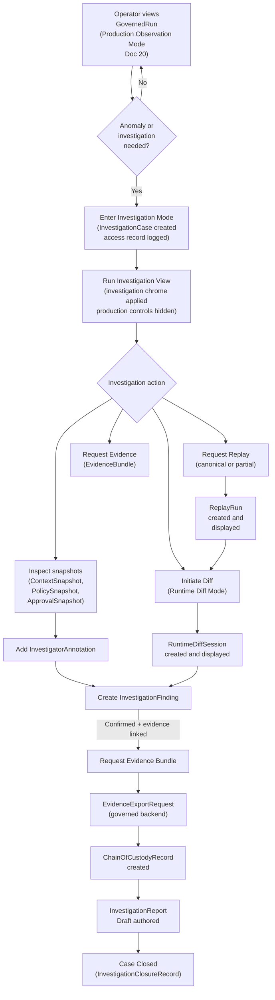

### 30.2 Replay Request Lifecycle

```mermaid
stateDiagram-v2
    [*] --> ReplayEligibilityChecking
    ReplayEligibilityChecking --> ReplayEligible: Sources sufficient for replay
    ReplayEligibilityChecking --> ReplayIneligible: Critical sources missing or integrity failure
    ReplayIneligible --> [*]: Investigator notified; no replay
    ReplayEligible --> ReplaySourceDiscovery: Investigator initiates source discovery
    ReplaySourceDiscovery --> ReplayIntegrityChecking: Sources catalogued
    ReplayIntegrityChecking --> ReplayHydrationPlanning: All required sources integrity-verified
    ReplayIntegrityChecking --> ReplayHydrationPlanning: Partial success — partial replay mode
    ReplayIntegrityChecking --> [*]: Critical integrity failure — replay blocked
    ReplayHydrationPlanning --> ReplayHydrating: Plan created and confirmed by investigator
    ReplayHydrating --> ReplayRunning: Hydration complete
    ReplayRunning --> ReplayCompleted: Full reconstruction succeeded
    ReplayRunning --> ReplayPartiallyCompleted: Some steps incomplete
    ReplayRunning --> ReplayFailed: Blocking failure
    ReplayCompleted --> ReplayDiffAvailable: Diff session can be opened
    ReplayPartiallyCompleted --> ReplayDiffAvailable: Partial diff available
    ReplayDiffAvailable --> ReplayArchived: Replay archived per retention
    ReplayFailed --> ReplayArchived: Failure report archived
```

### 30.3 Replay Hydration Flow

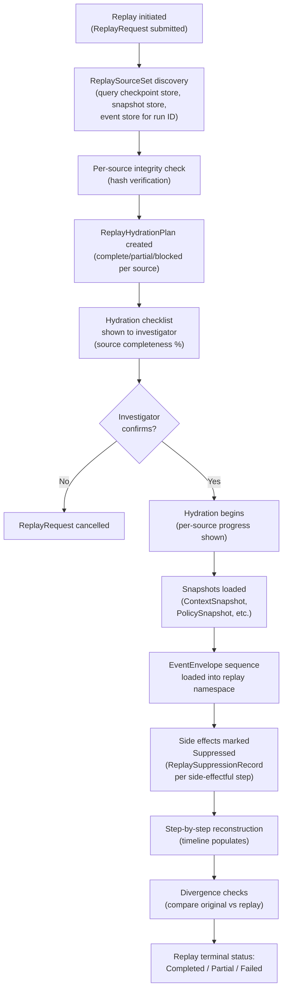

### 30.4 Canonical Replay Source Model

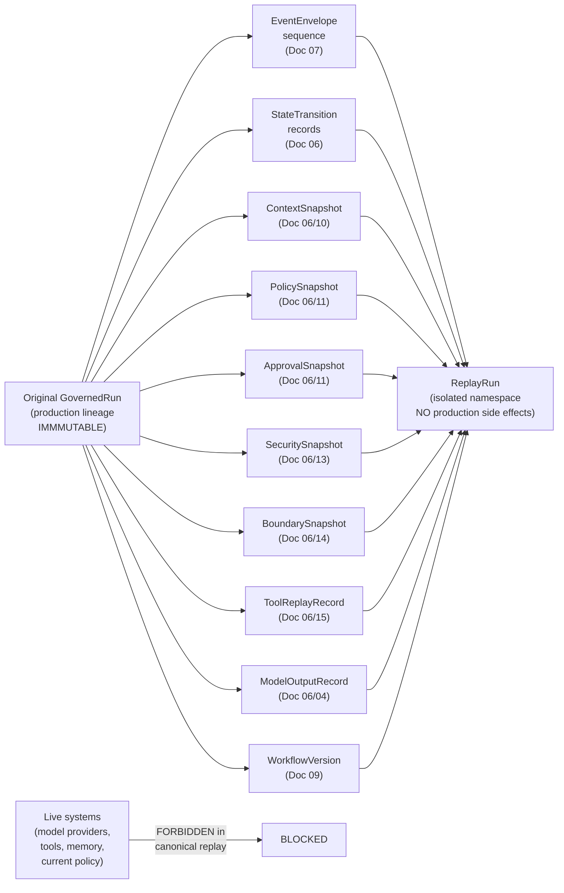

### 30.5 Original vs Replay Diff Flow

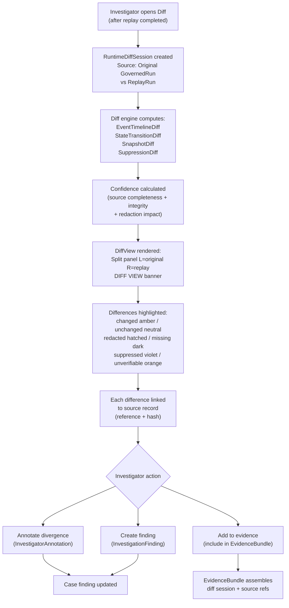

### 30.6 Divergence Classification Flow

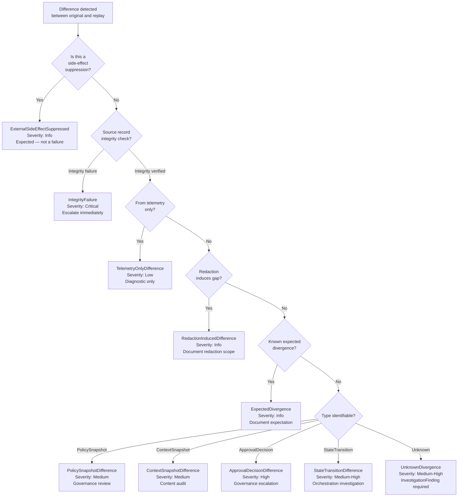

### 30.7 Evidence Export Flow

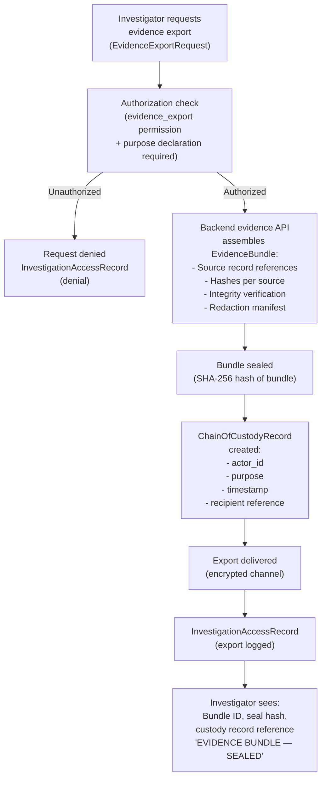

### 30.8 Access Authorization Flow

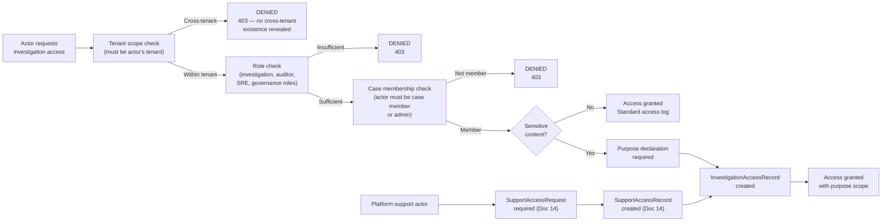

### 30.9 Side-Effect Suppression Visualization Flow

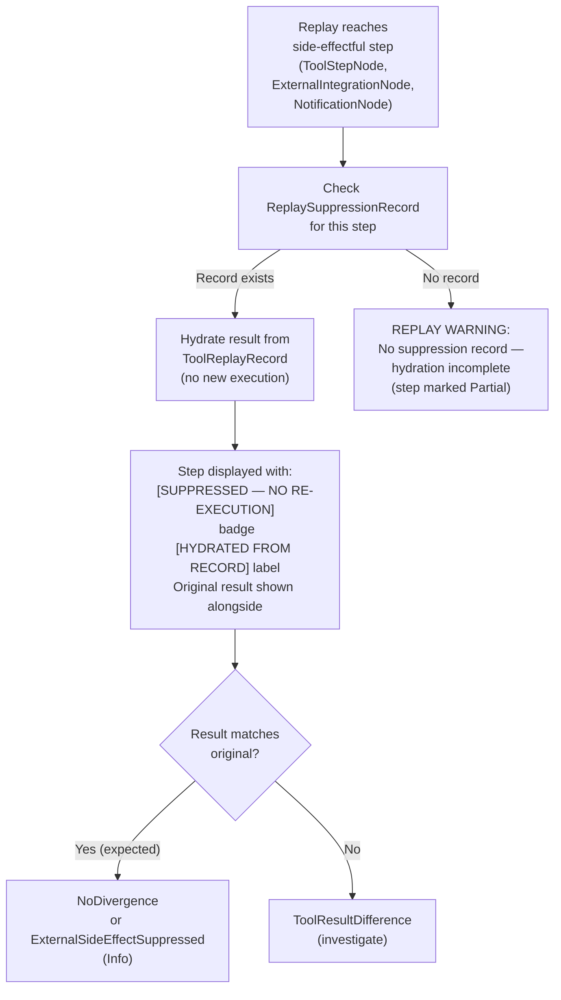

### 30.10 Event Timeline Correlation Flow

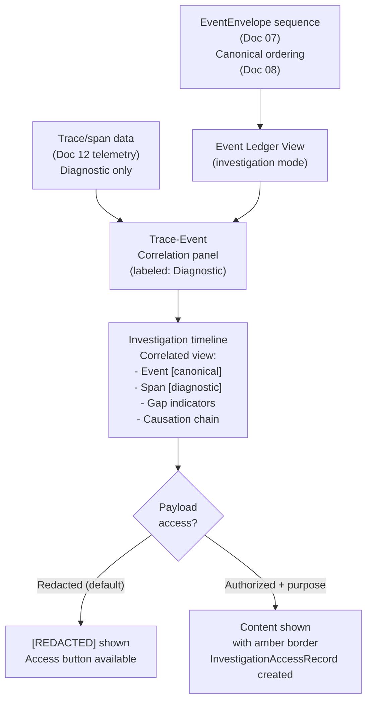

### 30.11 Snapshot Inspection Flow

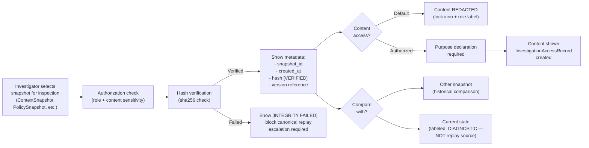

### 30.12 Investigation Report Flow

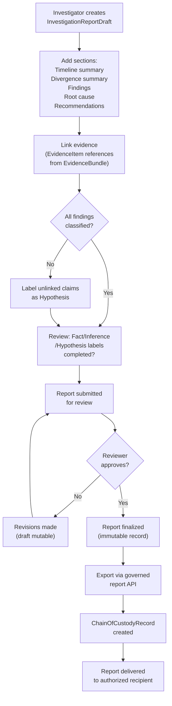

---

## 31. Investigation UX Invariants

### 31.1 Investigation Authority Invariants

| ID | Invariant |
|---|---|
| IA-01 | Investigation mode MUST NOT mutate original run lineage. No investigation action may alter EventEnvelope sequences, StateTransition records, checkpoint records, or any original execution artifact. |
| IA-02 | Investigation mode MUST NOT execute production operations. Buttons and controls that trigger production actions MUST be absent or explicitly disabled in investigation mode. |
| IA-03 | Investigation mode MUST NOT be visually indistinguishable from production. Investigation chrome MUST be applied and MUST persist. |
| IA-04 | Investigation findings MUST NOT become audit records unless explicitly included in a sealed EvidenceBundle by the governed evidence API. |
| IA-05 | InvestigatorAnnotations MUST NOT modify original run data. They are standalone records referencing original records. |
| IA-06 | Investigation mode MUST be tenant-scoped. All queries MUST include tenant_id. |
| IA-07 | Cross-tenant investigation visibility is ABSOLUTELY FORBIDDEN. Error messages MUST NOT reveal cross-tenant existence. |

### 31.2 Replay Boundary Invariants

| ID | Invariant |
|---|---|
| RB-01 | Replay MUST NOT execute production side effects. All tool invocations, external integrations, and notifications MUST be suppressed and hydrated from ToolReplayRecord/ExternalSideEffectRecord. |
| RB-02 | Replay MUST NOT use production credentials. SecuritySnapshot provides credential reference metadata; resolved secret values MUST NOT be used in replay. |
| RB-03 | Replay MUST NOT perform live memory retrieval. ContextSnapshot is the mandatory source for cognitive step context. |
| RB-04 | Replay MUST NOT evaluate current policy as a substitute for PolicySnapshot. PolicySnapshot is the historical policy truth. |
| RB-05 | Replay MUST NOT call model providers with live requests. ModelOutputRecord provides the hydrated output. |
| RB-06 | Replay MUST NOT publish events to the production event stream. ReplayRun events exist only in the isolated replay namespace. |
| RB-07 | Replay MUST NOT mutate original GovernedRun records. ReplayRun is a separate entity in an isolated namespace. |
| RB-08 | Replay MUST be clearly labeled with persistent `REPLAY MODE — NO PRODUCTION SIDE EFFECTS` banner. |
| RB-09 | Replay mode MUST use `background.surface.replay` (`#110D1A`) visual identity. |
| RB-10 | Replay mode MUST NOT share namespace with production GovernedRun records. |

### 31.3 Replay Hydration Invariants

| ID | Invariant |
|---|---|
| RH-01 | Replay hydration MUST use original source records exclusively. Live substitution of any required source is FORBIDDEN in canonical replay. |
| RH-02 | Hydration status MUST be source-specific. A single global "loading" indicator is insufficient. |
| RH-03 | Redaction MUST NOT be presented as missing data. Redacted source is available but access-restricted; missing source does not exist. |
| RH-04 | Missing data MUST NOT be presented as redaction. |
| RH-05 | Integrity failure MUST block canonical replay initiation. |
| RH-06 | Source completeness MUST be shown to investigator before replay confirmation. |
| RH-07 | Partial replay MUST carry `PARTIAL REPLAY — MISSING SOURCE DATA` banner for its entire lifetime. |
| RH-08 | Retention-purged records MUST be labeled "Purged — data not available" and NEVER confused with redaction. |
| RH-09 | ReplayHydrationPlan MUST be included in EvidenceBundle as the source manifest when replay evidence is requested. |

### 31.4 Runtime Diff Invariants

| ID | Invariant |
|---|---|
| RDIFF-01 | Diff view MUST NOT be the source of truth by itself. Every diff element MUST link to its source records. |
| RDIFF-02 | Every diff section MUST show confidence level, source completeness, and redaction impact. |
| RDIFF-03 | Diff MUST clearly distinguish: missing, redacted, changed, unchanged, and unverifiable states. |
| RDIFF-04 | Diff MUST NOT merge production and replay timelines without explicit labels. |
| RDIFF-05 | Runtime diff view MUST NOT permit graph editing. |
| RDIFF-06 | Diff MUST preserve tenant scope. Cross-tenant diffs are FORBIDDEN. |
| RDIFF-07 | Telemetry diff MUST NOT override event/state diff as a higher-authority comparison. |
| RDIFF-08 | Diff confidence MUST be computed and displayed; it MUST NOT be a static decorative label. |
| RDIFF-09 | Redacted content MUST produce RedactionInducedDifference, not a false NoDivergence. |

### 31.5 Event Timeline Invariants

| ID | Invariant |
|---|---|
| ET-01 | Event timeline MUST source from Document 07 EventEnvelope records. |
| ET-02 | Replay events MUST NOT be mixed into the production event ledger. |
| ET-03 | Event ordering MUST follow Document 08 semantics. Client timestamps MUST NOT govern ordering. |
| ET-04 | Event payload access is REDACTED by default. |
| ET-05 | Event hash/integrity status MUST be visible to auditor role. |
| ET-06 | Missing events MUST be shown as gap indicators with reason where known. |
| ET-07 | Inferred events MUST be labeled "Inferred — not canonical" and MUST NOT be treated as authoritative. |

### 31.6 Telemetry Invariants

| ID | Invariant |
|---|---|
| TM-01 | Telemetry is DIAGNOSTIC. Missing telemetry MUST NOT be interpreted as missing execution. |
| TM-02 | Telemetry gaps MUST be labeled with the reason (sampling, collection gap). |
| TM-03 | Sampling rate MUST be visible on every trace view. |
| TM-04 | Trace headers MUST NOT be treated as authorization proof. |
| TM-05 | Telemetry diff MUST NOT override EventEnvelope/state diff. |
| TM-06 | Telemetry access MUST include tenant_id in all backend queries. |

### 31.7 Snapshot Invariants

| ID | Invariant |
|---|---|
| SN-01 | Snapshot views are IMMUTABLE; no editing controls shown. |
| SN-02 | Every snapshot view MUST show: snapshot_id, created_at, hash, hash verification status. |
| SN-03 | Snapshot diff MUST compare historical snapshots. Live state comparison MUST be labeled as "Current State — Diagnostic." |
| SN-04 | Missing snapshot MUST block canonical replay for the affected step where required. |
| SN-05 | Credential values MUST NEVER be shown in any snapshot view. |

### 31.8 Policy and Governance Invariants

| ID | Invariant |
|---|---|
| PG-01 | Policy investigation MUST use original PolicySnapshot. Current policy is shown only as labeled diagnostic. |
| PG-02 | ApprovalDecisionRecord MUST show actor attribution. |
| PG-03 | Break-glass access MUST be visually exceptional in investigation view. |
| PG-04 | Governance evidence export MUST use governed backend evidence API; frontend export FORBIDDEN. |
| PG-05 | Policy internals require governance role access. |

### 31.9 Memory and Context Invariants

| ID | Invariant |
|---|---|
| MC-01 | Canonical replay MUST use ContextSnapshot. Live memory retrieval FORBIDDEN in canonical replay. |
| MC-02 | Live memory comparison MUST be labeled "Current Memory State — Not Replay Source." |
| MC-03 | Quarantined memory content MUST be gated. |
| MC-04 | Cross-tenant memory inspection FORBIDDEN. |
| MC-05 | Unverifiable summary provenance (source fragments purged) MUST be flagged. |

### 31.10 Tool and Side-Effect Invariants

| ID | Invariant |
|---|---|
| TS-01 | Replay MUST suppress tool execution. ToolReplayRecord hydrates the result. |
| TS-02 | ExternalSideEffectSuppressed is NOT a replay failure; it is informational. |
| TS-03 | Raw tool payloads MUST be redacted by default. |
| TS-04 | Credential reference values MUST NOT be shown; opaque reference ID only. |
| TS-05 | Compensation record status MUST be visible in investigation view. |
| TS-06 | External integration status sourced from ExternalSideEffectRecord; MUST NOT be re-queried from live systems. |

### 31.11 Model and Cognitive Invariants

| ID | Invariant |
|---|---|
| ML-01 | Canonical replay MUST hydrate model output from ModelOutputRecord. No live model call. |
| ML-02 | Prompt content MUST be redacted by default. |
| ML-03 | Model output content MUST be redacted by default. |
| ML-04 | Prompt template version MUST be shown. |
| ML-05 | Model provider credential values MUST NEVER be shown. |
| ML-06 | Investigation replay analysis (different context) MUST be labeled "DERIVED ANALYSIS — NOT ORIGINAL EXECUTION." |

### 31.12 Evidence Invariants

| ID | Invariant |
|---|---|
| EV-01 | UI screenshot MUST NOT be treated as canonical evidence or EvidenceBundle. |
| EV-02 | EvidenceBundle MUST be generated by backend governed evidence API. |
| EV-03 | EvidenceBundle MUST include: source references, hash per source, integrity verification, redaction manifest. |
| EV-04 | Evidence export MUST create ChainOfCustodyRecord before delivery. |
| EV-05 | EvidenceBundle MUST NOT include raw secrets or unredacted sensitive content exceeding access rights. |
| EV-06 | Sealed EvidenceBundle MUST be immutable. |
| EV-07 | Evidence view (display) MUST be distinguished from evidence export (delivery). |

### 31.13 Chain-of-Custody Invariants

| ID | Invariant |
|---|---|
| COC-01 | Every evidence export MUST create a ChainOfCustodyRecord entry. |
| COC-02 | ChainOfCustodyRecord MUST be IMMUTABLE. Manual editing ABSOLUTELY FORBIDDEN. |
| COC-03 | ChainOfCustodyRecord MUST include: actor_id, runtime_identity_id, timestamp, action, purpose, evidence reference. |
| COC-04 | Chain-of-custody view is read-only with no editing controls. |
| COC-05 | Redaction changes post-sealing MUST be new chain-of-custody entries, NOT modifications. |

### 31.14 Tenant and Security Invariants

| ID | Invariant |
|---|---|
| TS2-01 | Every investigation access MUST be tenant-scoped. Queries without tenant_id FORBIDDEN. |
| TS2-02 | Every sensitive access MUST include actor_id and runtime_identity_id in backend queries. |
| TS2-03 | Every sensitive investigation access MUST create InvestigationAccessRecord. |
| TS2-04 | Platform support investigation MUST reference valid SupportAccessRequest (Doc 14). |
| TS2-05 | Investigation UI MUST NOT reveal cross-tenant existence in any error message. |
| TS2-06 | Cross-tenant investigation visibility ABSOLUTELY FORBIDDEN. |

### 31.15 Redaction and Privacy Invariants

| ID | Invariant |
|---|---|
| RP2-01 | Redaction is DEFAULT for all sensitive content fields. |
| RP2-02 | Reveal requires role authorization + purpose declaration (purpose logged). |
| RP2-03 | Revealed content MUST be visually marked. |
| RP2-04 | Copy of sensitive content MUST be disabled or logged. |
| RP2-05 | Session replay and DOM capture MUST be disabled/masked for investigation surfaces. |
| RP2-06 | Redaction in diff MUST produce RedactionInducedDifference, NOT missing or false NoDivergence. |
| RP2-07 | Evidence export MUST include redaction manifest. |
| RP2-08 | Retention-purged record MUST be labeled "Purged" and NEVER confused with redaction. |

### 31.16 Accessibility Invariants

| ID | Invariant |
|---|---|
| AX2-01 | Diff MUST be understandable without color alone: icons + text + color. |
| AX2-02 | Event timeline MUST have table/list equivalent accessible by keyboard. |
| AX2-03 | Graph diff MUST have structured outline equivalent. |
| AX2-04 | Divergence severity MUST use icons and text, not color alone. |
| AX2-05 | Replay animations MUST respect prefers-reduced-motion. |
| AX2-06 | Evidence export confirmations MUST be keyboard accessible. |
| AX2-07 | Redacted content MUST have accessible aria-label. |
| AX2-08 | Mode banners MUST be announced by screen reader via aria-live="assertive" on mode entry. |

### 31.17 Codex Implementation Invariants

| ID | Invariant |
|---|---|
| CI2-01 | Codex MUST NOT implement replay as production rerun. |
| CI2-02 | Codex MUST NOT execute tools in replay mode. |
| CI2-03 | Codex MUST NOT call model providers in canonical replay. |
| CI2-04 | Codex MUST NOT retrieve live memory during canonical replay. |
| CI2-05 | Codex MUST NOT evaluate current policies as original policies during replay. |
| CI2-06 | Codex MUST NOT publish replay events to production stream. |
| CI2-07 | Codex MUST NOT mutate original run lineage from investigation surfaces. |
| CI2-08 | Codex MUST NOT make diff view the source of truth. |
| CI2-09 | Codex MUST NOT implement evidence export as frontend screenshot or frontend-generated PDF. |
| CI2-10 | Codex MUST NOT show raw secrets, prompts, or outputs by default. |
| CI2-11 | Codex MUST NOT mix TestRun, simulation, and replay modes. |
| CI2-12 | Codex MUST NOT allow graph editing in runtime diff view. |
| CI2-13 | Codex MUST NOT omit tenant_id from investigation backend queries. |
| CI2-14 | Codex MUST NOT treat telemetry as canonical audit evidence. |


---

## 32. Investigation UX Anti-Patterns

### 32.1 Replay Anti-Patterns

| ID | Anti-Pattern | Correct Approach |
|---|---|---|
| AP-01 | Replay as rerun: creating a new GovernedRun execution from the original input data | Replay hydrates from recorded sources; no new execution |
| AP-02 | Replay uses live credentials: resolving CredentialReferences to current secrets during replay | SecuritySnapshot provides credential reference metadata; no secret resolution |
| AP-03 | Replay executes tools: dispatching new ToolExecution workers during replay | ToolReplayRecord hydrates the original result; no re-execution |
| AP-04 | Replay retrieves live memory: querying current memory state during cognitive step reconstruction | ContextSnapshot is the mandatory source |
| AP-05 | Replay evaluates current policy: querying policy engine with current policy version | PolicySnapshot is the historical policy truth |
| AP-06 | Replay mutates original run: appending events or modifying checkpoints during replay | Replay operates in isolated namespace; original records immutable |
| AP-07 | Replay events mixed with production: replay events appearing in production event ledger | Replay events exist only in replay namespace |
| AP-08 | Replay visually identical to production: no banner, same color scheme, production action buttons active | Mandatory violet-shifted surface, persistent banner, disabled production controls |
| AP-09 | Replay of model output calls model provider: invoking LLM API during canonical replay reconstruction | ModelOutputRecord provides the hydrated output |
| AP-10 | Partial replay gap hidden: step with missing source shown as complete without indicator | Every missing source shown with gap indicator in hydration checklist |

### 32.2 Diff Anti-Patterns

| ID | Anti-Pattern | Correct Approach |
|---|---|---|
| AP-11 | Diff treated as evidence without source: presenting a diff view as proof without linking to source records | Diff must reference source records; EvidenceBundle provides evidentiary status |
| AP-12 | Screenshot treated as evidence bundle: screenshotting a diff view and presenting it as evidence | EvidenceBundle generated by backend governed evidence API |
| AP-13 | Telemetry gap treated as execution gap: interpreting missing spans as missing execution steps | Missing telemetry does not mean missing execution; canonical evidence is EventEnvelope/state records |
| AP-14 | Redaction treated as missing data: showing a lock icon with "Not available" (same as missing data) | Redacted = access-restricted (lock + role label); missing = source doesn't exist (question + reason) |
| AP-15 | Current policy compared as original policy: querying current policy engine and presenting result as the policy that governed the run | PolicySnapshot is the original policy; current policy comparison labeled as "Diagnostic — not replay source" |
| AP-16 | Live memory compared as original context: showing current memory retrieval as if it's the ContextSnapshot | ContextSnapshot is the canonical context; live comparison labeled as "Current State — Diagnostic" |
| AP-17 | Diff confidence shown as static decoration: always showing "High Confidence" regardless of source completeness | Confidence computed from source completeness, integrity verification, and redaction impact |
| AP-18 | Merging production and replay timelines: showing both timelines in a single unsegregated view | Split panel with explicit "Original" and "Replay" labels on each side |

### 32.3 Evidence Anti-Patterns

| ID | Anti-Pattern | Correct Approach |
|---|---|---|
| AP-19 | Frontend evidence export: generating PDF from browser DOM and calling it evidence | Backend governed evidence API generates EvidenceBundle with hash and chain of custody |
| AP-20 | Missing redaction manifest: exporting evidence without documenting what was excluded | Redaction manifest is REQUIRED in every EvidenceBundle export |
| AP-21 | Evidence bundle without integrity hash: assembling evidence without per-item hashes | Backend generates hash for each source record and for the assembled bundle |
| AP-22 | Evidence view equals evidence export: treating the browser rendering as equivalent to a sealed bundle | Display (rendering) is separate from export (sealed, hashed, chain-of-custody record) |
| AP-23 | Chain-of-custody edited manually: allowing update or delete of chain-of-custody entries | ChainOfCustodyRecord is append-only; editing FORBIDDEN |
| AP-24 | Unsealed bundle presented as evidence: labeling a draft bundle as sealed | Draft bundles labeled "Evidence Bundle — Draft, Not Yet Sealed" |
| AP-25 | Evidence includes raw secrets: EvidenceBundle containing resolved credential values | Credential references (opaque pointers) only; no secret values |

### 32.4 Mode Confusion Anti-Patterns

| ID | Anti-Pattern | Correct Approach |
|---|---|---|
| AP-26 | TestRun confused with replay: presenting a Document 21 TestRun as if it is a forensic replay | TestRun is pre-publication sandbox; replay is forensic reconstruction; visually distinct |
| AP-27 | Simulation confused with replay: treating a Document 21 simulation as a historical replay | Simulation is design-time synthetic execution; replay uses original recorded sources |
| AP-28 | Investigation notes treated as audit records: treating InvestigatorAnnotations as equivalent to governance audit records | Annotations are investigator notes; audit records are authoritative platform records (Doc 11) |
| AP-29 | Production observation mode treated as investigation: not creating InvestigationCase before accessing sensitive investigation features | Investigation mode requires explicit InvestigationCase; access record created |
| AP-30 | Diff mode allows editing: providing edit controls in RuntimeDiffView | Graph diff and all diff views are read-only |

### 32.5 Access and Authorization Anti-Patterns

| ID | Anti-Pattern | Correct Approach |
|---|---|---|
| AP-31 | Cross-tenant investigation leakage: revealing another tenant's run existence in error messages | 403 with no cross-tenant information; same response as if the resource doesn't exist |
| AP-32 | Sensitive payload exported from frontend: allowing browser to export raw payload content | Sensitive payload access governed by backend; redaction enforced at API level |
| AP-33 | Raw prompt shown by default: displaying CognitiveStepNode prompt template content without access check | Prompt content redacted by default; auditor + purpose declaration required |
| AP-34 | Evidence export without custody record: delivering EvidenceBundle without ChainOfCustodyRecord | ChainOfCustodyRecord REQUIRED before export delivery |
| AP-35 | Purpose omitted from access record: InvestigationAccessRecord without purpose when required | Purpose declaration required for sensitive access; purpose included in record |
| AP-36 | Platform support access without SupportAccessRequest: platform admin accessing tenant investigation without reference | SupportAccessRequest required per Document 14; SupportAccessRecord created |
| AP-37 | Anonymous investigation action: investigation mutation (annotation, finding creation) without actor attribution | All investigation actions require actor_id from authenticated session |

### 32.6 Telemetry and Observability Anti-Patterns

| ID | Anti-Pattern | Correct Approach |
|---|---|---|
| AP-38 | Telemetry treated as canonical audit evidence: presenting trace spans as equivalent to EventEnvelope records | Telemetry is diagnostic; EventEnvelope/state records are canonical |
| AP-39 | Sampling rate hidden: showing trace data without showing that it was 10% sampled | Sampling rate shown on every trace view |
| AP-40 | Telemetry gap treated as failure: interpreting a missing span as a step failure | Missing span may be sampling gap; corroborate with event/state records |
| AP-41 | Trace correlation as authorization proof: treating trace correlation IDs as security context | Trace headers are observability metadata, not authorization |
| AP-42 | Log excerpt shown unredacted: displaying raw log content including sensitive values | Log excerpts redacted by default; access-gated reveal required |

### 32.7 Snapshot Anti-Patterns

| ID | Anti-Pattern | Correct Approach |
|---|---|---|
| AP-43 | Current state used as replay context: querying live memory or current policy for reconstruction | ContextSnapshot and PolicySnapshot are the reconstruction sources |
| AP-44 | Snapshot edit allowed: showing edit controls on snapshot viewer | Snapshot views are immutable; no editing controls |
| AP-45 | Snapshot integrity failure ignored: proceeding with canonical replay despite hash mismatch | Integrity failure blocks canonical replay; investigator must explicitly choose investigation replay mode |
| AP-46 | Credential value shown in snapshot: SecuritySnapshot displaying resolved secret values | Credential references (opaque pointers) only; no secret values ever shown |
| AP-47 | Missing snapshot presented as empty: showing an empty context panel without explaining source is unavailable | Missing snapshot shown with explicit "Source unavailable" indicator and reason |

### 32.8 Visual Distinction Anti-Patterns

| ID | Anti-Pattern | Correct Approach |
|---|---|---|
| AP-48 | Replay mode banner scrolls off screen: investigation banner not sticky | Persistent sticky banner; cannot be scrolled away |
| AP-49 | Production action buttons active in replay: "Approve," "Cancel Run," "Trigger Tool" buttons clickable in replay | Production action controls absent or explicitly disabled in replay/investigation mode |
| AP-50 | Replay timeline animated as live: pulsing "running" animations in replay timeline | Replay timeline uses static completion indicators; no live execution animations |
| AP-51 | Investigation and production use same color scheme: `accent.mycelial.sage` used in investigation mode | Investigation uses `accent.investigationCyanGray` (#4A7A8A); replay uses `accent.replayVioletGray` (#6A5A8A) |
| AP-52 | Mode label omitted from investigation panel: individual investigation panels not labeled with their mode | Every panel in investigation mode inherits investigation chrome; no unlabeled panels |

### 32.9 Remediation and SRE Anti-Patterns

| ID | Anti-Pattern | Correct Approach |
|---|---|---|
| AP-53 | Runbook execution from investigation mode: investigation UI providing working runbook execution buttons | Recovery actions shown as reference only; execution must occur in operational console |
| AP-54 | Incident note treated as evidence: SRE incident management notes included in evidence bundle as if they are investigation findings | Incident notes are SRE artifacts; investigation findings with evidence links are the evidentiary basis |
| AP-55 | Root cause presented as proven without evidence: investigation report claiming confirmed root cause without linked evidence | Root cause without evidence links labeled as Hypothesis in report |

### 32.10 Codex Anti-Patterns

| ID | Anti-Pattern | Correct Approach |
|---|---|---|
| AP-56 | Replay implemented as GovernedRun creation: Codex creating a new production run from original trigger data | Replay is isolated namespace reconstruction from recorded sources |
| AP-57 | Diff confidence hardcoded as "High": confidence label set statically in code | Confidence computed from source completeness, integrity, redaction impact |
| AP-58 | Investigation backend query missing tenant_id: query that could return cross-tenant results | Every backend query MUST include tenant_id |
| AP-59 | Evidence export as blob download from frontend: Codex implementing evidence export as React blob download | Evidence export routes to backend governed evidence API |
| AP-60 | TestRun, simulation, and replay sharing mode flag: single boolean `isNotProduction` flag | Three distinct mode enums: TestRun (Doc 21), Simulation (Doc 21), ReplayRun (Doc 22) |
| AP-61 | Graph editing in diff view: allowing node configuration changes from RuntimeDiffView | RuntimeDiffView is read-only; graph editing is Document 21 |
| AP-62 | InvestigationAccessRecord creation optional: accessing sensitive data without creating access record | InvestigationAccessRecord REQUIRED for all sensitive access |
| AP-63 | Inferred event shown as canonical: event reconstructed from state transitions shown without "Inferred" label | Inferred events must be labeled "Inferred — not canonical" |
| AP-64 | Partial replay shown as complete: ReplayRun with missing steps labeled "ReplayCompleted" | Correct status: ReplayPartiallyCompleted with PARTIAL REPLAY banner |
| AP-65 | Default unredacted content: investigation panels showing sensitive content without role check | Redaction is the default; access-gated reveal is the exception |

---

## 33. Codex Implementation Guidance

### 33.1 Implementation Order

Codex MUST implement Document 22 scope in the following order:

1. **Investigation domain schemas:** Define InvestigationWorkspace, InvestigationCase, InvestigationSubject, ReplayRequest, ReplayRun, ReplayHydrationStatus, EvidenceBundle, ChainOfCustodyRecord, InvestigatorAnnotation, InvestigationFinding schema types.
2. **InvestigationAccessRecord:** Implement access record creation for all sensitive investigation access paths. This MUST be implemented before any sensitive investigation features.
3. **InvestigationWorkspace and InvestigationCase:** CRUD operations with tenant_id enforcement; access control enforcement.
4. **Replay eligibility service:** Query interface to replay source availability and completeness; integrity check results.
5. **ReplaySourceSet discovery projection:** Projection that identifies and catalogs all available source records for a given GovernedRun ID.
6. **ReplayHydrationPlan view model:** Display model for the hydration plan checklist; per-source status rendering.
7. **Replay request API contract consumption:** Frontend API client for ReplayRequest submission; status polling for ReplayHydrationStatus updates.
8. **Replay status panel:** Real-time status display for ReplayRun lifecycle; per-source progress indicators.
9. **Persistent visual mode boundary:** Investigation chrome component; Replay chrome component; banner components; mode token application.
10. **Original run timeline view:** Read-only rendering of GovernedRun step history with investigation chrome.
11. **Replay timeline view:** Read-only rendering of ReplayRun step history with replay chrome and suppression markers.
12. **EventTimelineDiff basic engine:** Side-by-side event sequence comparison; event type matching; gap indicators.
13. **StateTransitionDiff basic engine:** Step state comparison; transition sequence comparison.
14. **Snapshot viewer:** Generic immutable snapshot display component with hash display and access-gated reveal.
15. **PolicySnapshot viewer:** Policy version and hash display; comparison with current policy (labeled diagnostic).
16. **ContextSnapshot viewer:** Fragment count and metadata display; content redacted by default; access-gated reveal.
17. **Tool invocation suppression markers:** `[SUPPRESSED]` and `[HYDRATED FROM RECORD]` labels on replay step tool panels.
18. **Divergence classification summary:** Count-by-type-and-severity display; link to detailed records.
19. **Evidence bundle viewer:** EvidenceItem list display; hash verification display; redaction manifest display.
20. **Evidence export request flow:** UI for requesting EvidenceBundle export; routes to backend; no frontend export.
21. **Redaction and access-gated reveal:** RedactionView component; purpose declaration form; InvestigationAccessRecord creation on reveal.
22. **Accessible timeline/table equivalent:** List/table view of event timeline and diff results; keyboard navigation.
23. **Visual regression tests for production vs replay distinction:** Automated tests verifying visual identity separation across modes.

### 33.2 Forbidden Codex Shortcuts

- **FORBIDDEN:** Implementing replay as production rerun. Replay is isolated namespace reconstruction from recorded sources.
- **FORBIDDEN:** Executing tools in replay. Use ToolReplayRecord for hydration.
- **FORBIDDEN:** Calling model providers in canonical replay. Use ModelOutputRecord.
- **FORBIDDEN:** Retrieving live memory during canonical replay. Use ContextSnapshot.
- **FORBIDDEN:** Evaluating current policies as original policies. Use PolicySnapshot.
- **FORBIDDEN:** Publishing replay events to production event stream.
- **FORBIDDEN:** Mutating original run lineage from any investigation code path.
- **FORBIDDEN:** Making diff view the source of truth. Diff references source records.
- **FORBIDDEN:** Implementing evidence export as frontend screenshot, blob download, or client-side PDF.
- **FORBIDDEN:** Showing raw secrets, prompts, or tool payloads by default.
- **FORBIDDEN:** Mixing TestRun, simulation, and replay mode indicators under a single "non-production" flag.
- **FORBIDDEN:** Providing graph edit controls in RuntimeDiffView or any investigation diff surface.
- **FORBIDDEN:** Omitting tenant_id from any investigation backend query.
- **FORBIDDEN:** Treating telemetry (trace/span/metric) as canonical audit evidence.
- **FORBIDDEN:** Creating InvestigationAccessRecord as optional for sensitive access — it is REQUIRED.
- **FORBIDDEN:** Using static "High" confidence labels on diff views without computing actual confidence.

### 33.3 Required Tests

| Test | Description | Pass Criteria |
|---|---|---|
| Replay mode visual distinction test | Load investigation mode with a replay run | Surface uses `#110D1A`; `REPLAY MODE` banner present; `accent.replayVioletGray` applied |
| Replay no side-effect test | Initiate replay of a run with tool invocations | ToolExecution workers NOT dispatched; ToolReplayRecord used; suppression markers shown |
| Replay no live credential test | Verify replay does not call SecretBroker | No SecretBroker calls during replay; CredentialReference shown as opaque reference |
| Replay no live memory retrieval test | Verify replay does not query memory store | No live memory store queries; ContextSnapshot used |
| Replay no current policy substitution test | Verify replay uses PolicySnapshot | No policy engine live call; PolicySnapshot used |
| Original lineage immutability test | After replay, verify original GovernedRun records | EventEnvelope count and hashes unchanged; no new records in production namespace |
| Replay event namespace isolation test | Check production event ledger after replay | No replay events in production event stream |
| EventTimelineDiff source reference test | Verify each diff element links to source record | Every diff entry contains source record reference and hash |
| Redaction vs missing distinction test | Compare display of redacted field vs missing field | Different visual treatment (lock vs question icon); different aria-labels |
| Telemetry gap label test | View trace with sampling gaps | Sampling rate shown; gaps labeled "Sampling gap — not execution gap" |
| Evidence export backend route test | Trigger evidence export | Request routes to backend API; no blob download from frontend |
| Screenshot not evidence test | Verify no UI element labels screenshot as EvidenceBundle | No UI calls screenshot "evidence"; EvidenceBundle label only on backend-generated bundles |
| Cross-tenant investigation denial test | Attempt to open investigation on another tenant's run | 403 returned; no cross-tenant run information in response |
| Access record creation test | Access unredacted sensitive field | InvestigationAccessRecord created with actor_id, purpose, timestamp |
| Raw secret redaction test | View SecuritySnapshot | Credential values never shown; CredentialReference ID shown |
| Raw prompt default hidden test | View CognitiveStepNode panel in investigation | Prompt content redacted; reveal requires role + purpose |
| Side-effect suppression marker test | View replay step for tool invocation | `[SUPPRESSED — NO RE-EXECUTION]` badge shown; `[HYDRATED FROM RECORD]` label shown |
| Snapshot integrity failure test | View snapshot with hash mismatch | `[INTEGRITY FAILED]` indicator shown; canonical replay blocked |
| Partial replay missing source test | Initiate replay with one missing required source | `PARTIAL REPLAY — MISSING SOURCE DATA` banner; missing source in hydration checklist |
| Keyboard accessible timeline test | Navigate event timeline with keyboard only | All events reachable by keyboard; screen reader announces each event type and integrity status |

---

## 34. Relationship to Other Documents

### 34.1 Document Relationship Map

| Document | Relationship |
|---|---|
| **00 — Vision & Foundational Manifesto** | Root doctrine. Document 22 embodies the principle that governed cognition requires governed transparency: the ability to inspect without mutating, to replay without reproducing, and to evidence without improvising. Investigation mode is the forensic glass around governed cognition. |
| **01 — Product Requirements & Operational Scope** | Defines the forensic inspection, compliance, and audit capabilities that investigation mode serves. |
| **02 — Core Runtime Architecture** | The runtime that generates all records that investigation mode reads. Document 22 consumes; Document 02 produces. |
| **03 — Canonical Domain Model** | GovernedRun, StepExecution, WorkflowVersion, and related entities are the primary investigation subjects. Document 22 does not redefine them; it defines the inspection surface for them. |
| **06 — State, Checkpoint & Persistence Architecture** | **Primary replay source.** Document 06 defines all checkpoint records, snapshots (ContextSnapshot, PolicySnapshot, BoundarySnapshot, SecuritySnapshot), ToolReplayRecord, ModelOutputRecord, and ExternalSideEffectRecord that Document 22's replay hydration plan uses. Document 06 defines the backend replay engine; Document 22 defines the replay visualization UX. |
| **07 — Event & Messaging Contracts** | EventEnvelope schema and event ledger — the canonical investigation timeline source. Document 22's event timeline view sources from Document 07 records. Event ordering is governed by Document 08. |
| **08 — Event Runtime Deep Technical Specification** | Event ordering semantics, causation and correlation chain semantics (causation_id, correlation_id) that govern Document 22's event timeline investigation and CausalityGraphView interpretation. |
| **09 — Workflow Orchestration Engine Specification** | WorkflowVersion and ExecutionPlan that governed the original run; the basis for workflow version diff. Document 22 investigates compiled versions; Document 09 defines them. |
| **10 — Memory & Context Architecture** | ContextSnapshot generation and memory isolation architecture. Document 22's ContextSnapshot viewer and memory investigation UX derive their semantics from Document 10. |
| **11 — Governance, Policy & Approval Engine** | PolicySnapshot, ApprovalDecisionRecord, GovernanceAuditRecord — the governance investigation sources. Document 22's policy and approval investigation UX references Document 11 records without owning the engine. |
| **12 — Observability & Telemetry Platform** | Trace, span, metric, and log data — the diagnostic (non-canonical) investigation layer. Document 22's telemetry investigation panel sources from Document 12 and enforces its access controls. |
| **13 — Security & Trust Architecture** | SecuritySnapshot, CredentialReference model, trust level taxonomy. Document 22's security investigation references Document 13 records; credential values are never shown per Document 13 contract. |
| **14 — Multi-Tenant Isolation & Organizational Boundaries** | Tenant isolation invariants that apply to all investigation surfaces. SupportAccessRequest model for platform-scoped investigation. |
| **15 — SDK, Tool Runtime & Execution Contracts** | ToolReplayRecord, ToolContract version for tool invocation investigation. Document 22 references these; Document 15 defines them. |
| **17 — SRE, Operational Recovery & Runbooks** | Incident context for investigation; SRE persona; runbook references (display only in investigation mode — execution in operational console). |
| **18 — External APIs & Integration Contracts** | ExternalSideEffectRecord for external integration investigation. |
| **19 — Codex Operational Alignment & Engineering Constitution** | Document 22 extends Document 19's Codex rules into the investigation domain. Section 33 is the investigation-specific Codex guidance. |
| **20 — Operational UX & Runtime Visualization System** | **Clear boundary:** Document 20 defines the visual design token system (including replay and investigation tokens) and owns operational runtime visualization. Document 22 uses Document 20's tokens (`background.surface.replay`, `accent.replayVioletGray`, `background.surface.investigation`, `accent.investigationCyanGray`) for investigation surfaces but defines the investigation internals. Document 20 owns ordinary operational runtime visualization; Document 22 owns investigation, replay visualization, and runtime diff UX. |
| **21 — Workflow Builder & Graph Editing Semantics** | **Clear boundary:** Document 21 owns workflow graph authoring, TestRun, and simulation boundary. Document 22 owns replay investigation. TestRun ≠ replay. Simulation ≠ replay. Graph editing ≠ runtime diff. Document 22's WorkflowVersionDiff is read-only investigation; Document 21's builder canvas is editable authoring. |
| **23 — Evaluation, Benchmark & AI Quality Framework** | EvaluationNode step results may be investigation subjects. Document 23 defines the evaluation framework; Document 22 defines the inspection UX. |
| **25 — Architectural Decision Records Index** | Significant investigation architecture decisions (replay safety approach, evidence export architecture, tenant isolation for investigation) SHOULD be recorded as ADRs. |

### 34.2 Document 22 Boundary Summary

**Document 22 OWNS:** Investigation workbench, replay visual boundary, replay timeline UX, replay hydration status display, runtime diff UX for all comparison types, snapshot inspection UX, divergence classification UX, evidence bundle display and governed export UX, chain-of-custody display, investigator annotation and finding management, investigation report drafting, redaction and access gating UX, investigation-specific accessibility, and Codex implementation guidance for investigation and replay.

**Document 20 OWNS:** Visual design token system (including replay/investigation tokens), ordinary operational runtime visualization, GovernedRun execution map, read-only step status view in production.

**Document 21 OWNS:** Workflow graph authoring, TestRun and simulation boundary definition.

**Document 06 OWNS:** Backend replay algorithm, checkpoint persistence, snapshot storage, ToolReplayRecord generation.

---

## 35. Final Investigation Principles

The following principles govern the MYCELIA Investigation Mode, Replay & Runtime Diff UX:

1. **Replay reconstructs.** Replay is the forensic reconstruction of what happened, anchored to verified recorded state. It is not a reproduction, not a re-execution, not a simulation.

2. **Replay does not rerun.** No live system call, no tool re-execution, no model re-invocation, no live memory retrieval, no current policy evaluation, and no production event publication occur during replay. Replay hydrates exclusively from recorded sources.

3. **Investigation observes.** Investigation mode renders immutable recorded state in structured, access-gated, redaction-aware views. It does not modify the state it observes.

4. **Investigation does not mutate.** No investigation action — no annotation, no replay, no diff, no evidence request, no finding creation — may alter the original GovernedRun's EventEnvelope sequence, checkpoint records, or any recorded execution artifact.

5. **Diff compares.** Runtime diff places two recorded artifacts side by side and renders their differences. Diff is an analytical tool.

6. **Diff does not decide alone.** A diff view is a diagnostic observation, not a verdict. Its evidentiary value depends on source completeness, integrity verification, and redaction impact. Every diff must be honest about what it knows and what it does not.

7. **Evidence is governed.** Evidence is a backend-generated, integrity-hashed, chain-of-custody-recorded artifact produced by the governed evidence API. It is not a screenshot, not a frontend PDF, not a browser rendering.

8. **Screenshots are not evidence.** A screenshot of a diff, a timeline, or a snapshot viewer is a communication tool. It is not an EvidenceBundle and MUST NOT be labeled or treated as one.

9. **Snapshots anchor truth.** ContextSnapshot, PolicySnapshot, ApprovalSnapshot, SecuritySnapshot, and BoundarySnapshot are the immutable anchors that allow forensic reconstruction. They are what the runtime recorded at execution time; they are what replay hydrates from.

10. **Telemetry diagnoses.** Trace spans, metrics, and log excerpts are diagnostic context. They are useful for investigation but are not canonical execution records. Missing telemetry does not mean missing execution.

11. **Events remember.** The EventEnvelope sequence is the authoritative, integrity-verified, ordered record of what happened in a GovernedRun. It is the canonical investigation timeline.

12. **Policies are replayed from snapshots.** The PolicySnapshot bound at run start time is the policy that governed that run. Current policy may differ. Investigation never substitutes current policy for the historical snapshot.

13. **Memory is replayed from snapshots.** The ContextSnapshot recorded before each cognitive invocation is the context that governed that invocation. Live memory may have changed. Investigation never retrieves live memory as a substitute for the historical snapshot.

14. **Side effects are suppressed.** Replay suppresses all side effects — tool invocations, external integrations, notifications, memory writes — and hydrates their results from recorded records. Suppression is correct behavior, not a failure.

15. **Tenants contain investigations.** Every investigation workspace, every InvestigationCase, every ReplayRun, every EvidenceBundle is strictly tenant-scoped. Cross-tenant investigation visibility is an architectural violation, not a configuration decision.

16. **Redaction is explicit.** Redacted content is access-restricted, not missing. Missing content is unavailable, not redacted. These are distinct states with distinct visual treatments. Both are explicit, never hidden.

17. **Missing is explicit.** Every missing replay source, every unavailable snapshot, every purged record, every gap in the event ledger is shown explicitly with its reason. Gaps are never hidden behind loading states.

18. **Confidence is explicit.** Every diff, every replay reconstruction, and every evidence view shows its completeness and confidence level. Static decorative confidence labels are as dishonest as missing labels.

19. **Codex cannot turn replay into execution.** The investigation and replay UX exists to prevent Codex from taking shortcuts that would corrupt forensic integrity. No shortcut — however convenient — may execute production side effects, retrieve live state, or mutate original lineage in the name of "better replay fidelity."

---

> **In MYCELIA, investigation mode is the forensic glass around governed cognition.**
>
> It lets humans inspect what happened, replay what can be reconstructed, compare what diverged, and export what can be proven — without ever allowing the act of looking to become the act of changing.

---

*Document 22 — Investigation Mode, Replay & Runtime Diff UX*
*MYCELIA Architecture Constitution Series*
*Version 1.0.0 | Status: Active — Canonical | 2026-06-06*

