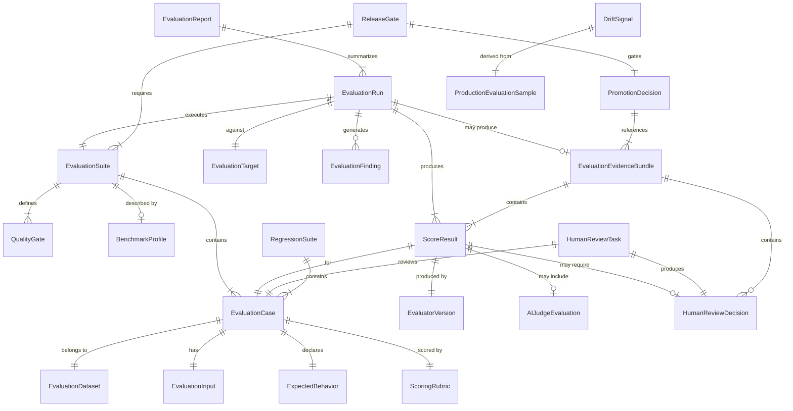
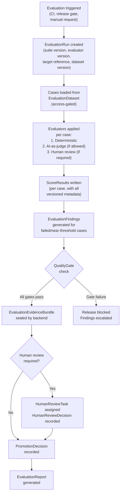
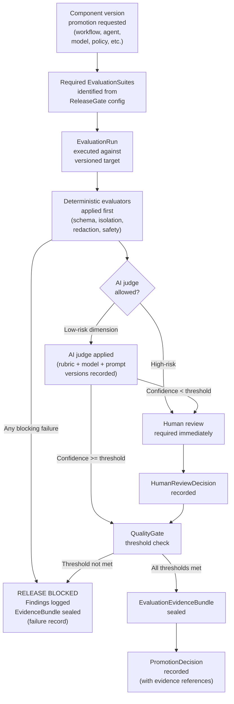
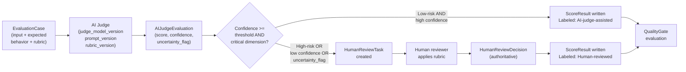
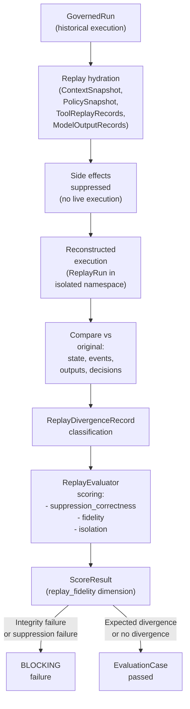
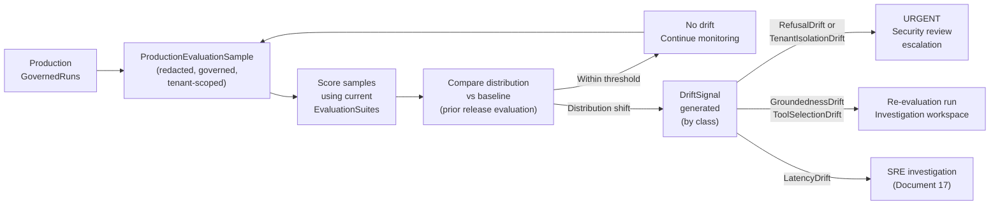
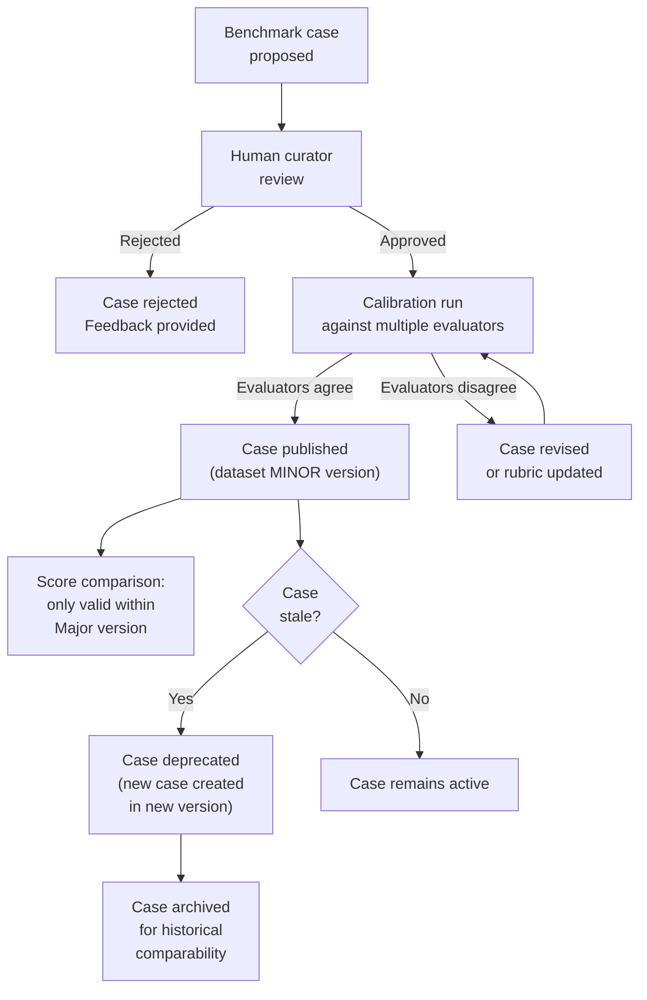
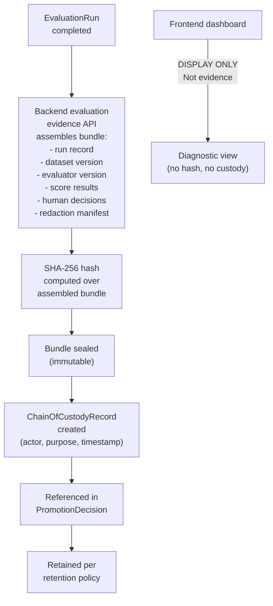
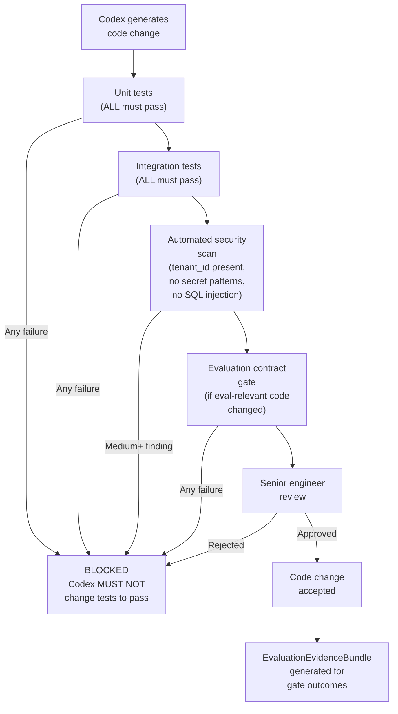

# MYCELIA — 23 Evaluation, Benchmark & AI Quality Framework

---

## Document Metadata

| Field | Value |
|---|---|
| Document Series | MYCELIA Architecture Constitution |
| Document Number | 23 |
| Version | v1.0 |
| Status | Canonical |
| Classification | Core Architecture — Evaluation, Benchmark & AI Quality Framework |
| Canonical Role | Defines the evaluation suites, benchmark architecture, AI quality framework, scoring model, human review gates, AI-as-judge boundaries, regression framework, release gates, production drift detection, evaluation evidence and Codex quality gates for MYCELIA |
| Primary Audience | Platform Engineers, AI Engineers, Evaluation Engineers, SRE, Governance Architects, Security Reviewers, Auditors, Product Design, Codex |
| Last Updated | June 2026 |

---

## Table of Contents

1. [Executive Summary](#1-executive-summary)
2. [Evaluation Philosophy](#2-evaluation-philosophy)
3. [Scope and Non-Scope](#3-scope-and-non-scope)
4. [Evaluation Domain Model](#4-evaluation-domain-model)
5. [Evaluation Taxonomy](#5-evaluation-taxonomy)
6. [Evaluation Artifact Model](#6-evaluation-artifact-model)
7. [Benchmark Suite Architecture](#7-benchmark-suite-architecture)
8. [AI Quality Dimensions](#8-ai-quality-dimensions)
9. [Agent Evaluation Framework](#9-agent-evaluation-framework)
10. [Cognitive Step Evaluation](#10-cognitive-step-evaluation)
11. [Tool Use Evaluation](#11-tool-use-evaluation)
12. [Retrieval, Context and Memory Evaluation](#12-retrieval-context-and-memory-evaluation)
13. [Policy, Approval and Governance Evaluation](#13-policy-approval-and-governance-evaluation)
14. [Workflow Evaluation](#14-workflow-evaluation)
15. [Event and Runtime Evaluation](#15-event-and-runtime-evaluation)
16. [Replay and Investigation Evaluation](#16-replay-and-investigation-evaluation)
17. [Security, Privacy and Redaction Evaluation](#17-security-privacy-and-redaction-evaluation)
18. [Tenant Isolation Evaluation](#18-tenant-isolation-evaluation)
19. [External API and Integration Evaluation](#19-external-api-and-integration-evaluation)
20. [Human Review and Expert Rubric Framework](#20-human-review-and-expert-rubric-framework)
21. [Automated Scoring Framework](#21-automated-scoring-framework)
22. [AI-as-Judge Framework](#22-ai-as-judge-framework)
23. [Golden Dataset and Test Case Management](#23-golden-dataset-and-test-case-management)
24. [Synthetic Data and Simulation Evaluation](#24-synthetic-data-and-simulation-evaluation)
25. [Production Drift and Continuous Evaluation](#25-production-drift-and-continuous-evaluation)
26. [Regression Testing and Release Gates](#26-regression-testing-and-release-gates)
27. [Evaluation Observability and Metrics](#27-evaluation-observability-and-metrics)
28. [Evaluation Evidence and Auditability](#28-evaluation-evidence-and-auditability)
29. [Evaluation Reports and Quality Dashboards](#29-evaluation-reports-and-quality-dashboards)
30. [Evaluation Failure Modes](#30-evaluation-failure-modes)
31. [MVP Evaluation Framework Cut](#31-mvp-evaluation-framework-cut)
32. [Evaluation Diagrams](#32-evaluation-diagrams)
33. [Evaluation Invariants](#33-evaluation-invariants)
34. [Evaluation Anti-Patterns](#34-evaluation-anti-patterns)
35. [Codex Implementation Guidance](#35-codex-implementation-guidance)
36. [Relationship to Other Documents](#36-relationship-to-other-documents)
37. [Final Evaluation Principles](#37-final-evaluation-principles)

---

## 1. Executive Summary

### 1.1 What Evaluation Means in MYCELIA

Evaluation in MYCELIA is a governed quality and safety control plane. It is not a leaderboard. It is not a dashboard. It is not a benchmark suite for competitive ranking. It is the systematic, versioned, tenant-scoped, evidence-producing process by which MYCELIA determines whether governed cognitive operations are behaving correctly, safely, and within policy — before promotion, during production, and after incidents.

MYCELIA executes AI agents, cognitive steps, workflow orchestrations, tool invocations, memory retrievals, policy decisions, and approval gates as production-grade governed operations. Every one of these execution types can fail in novel ways: agents can hallucinate tool arguments, cognitive steps can produce ungrounded outputs, retrieval can surface contaminated context, policy engines can reach incorrect decisions against stale snapshots, tools can violate their declared side-effect class, approval chains can route to unauthorized approvers, and tenant isolation can fail at aggregate query boundaries.

Evaluation in MYCELIA answers: did what happened match what should have happened, and can we prove it?

### 1.2 Why a Score Is Not Truth

A benchmark score is a measurement against a specific dataset, using a specific evaluator version, with a specific rubric, at a specific point in time. It is not a general statement about system quality. A score that is not linked to: dataset version, evaluator version, rubric version, tenant scope, policy snapshot, and retention metadata is not reproducible, not comparable, and not credible as evidence.

MYCELIA treats evaluation results as structured artifacts with provenance — not numbers to be cited in isolation. An evaluation dashboard that shows "correctness: 94%" is a diagnostic display. An EvaluationEvidenceBundle that contains the evaluation run record, the dataset version, the evaluator version, the scoring method, the individual case results, and an integrity hash is evidence.

### 1.3 Core Evaluation Commitments

- Evaluation MUST NOT mutate production run lineage.
- Evaluation MUST NOT execute production side effects in offline evaluation.
- Offline evaluation MUST NOT use live credentials.
- Replay-based evaluation MUST hydrate from recorded sources (Documents 06, 22).
- Evaluation MUST NOT bypass tenant boundaries. Cross-tenant evaluation data is FORBIDDEN.
- AI-as-judge MUST NOT be the sole evaluator for high-risk governance decisions.
- Benchmark scores MUST NOT be cited without dataset version and evaluator version.
- Synthetic data MUST be labeled synthetic. It MUST NOT be presented as production behavior.
- Evaluation evidence MUST be generated by backend governed evaluation APIs, not frontend screenshots.
- Production samples used in evaluation MUST be redacted or explicitly governed.

### 1.4 Evaluation as Governance

Evaluation outcomes drive MYCELIA's release gates. A workflow cannot be published without passing the workflow publication quality gate (Section 26). An agent version cannot be promoted without passing the agent promotion gate. A model provider upgrade cannot be applied without regression evaluation against the model version promotion gate. These are not advisory checks — they are architectural controls that prevent ungoverned cognitive operations from reaching production.

---

## 2. Evaluation Philosophy

### 2.1 Evaluation as Controlled Inspection of Governed Behavior

MYCELIA's evaluation framework applies the same philosophical discipline to quality measurement that Document 22 applies to forensic investigation: controlled inspection does not mutate what it observes. Evaluation operates against recorded artifacts, versioned datasets, and declared expected behaviors. It does not run live operations unless in an explicitly governed production evaluation mode with documented authorization.

### 2.2 Score as Structured Artifact

A ScoreResult in MYCELIA is a structured artifact with provenance, not a floating-point number. It carries: the EvaluationCase it relates to, the EvaluationInput that was used, the ExpectedBehavior that was defined, the ScoringRubric version that was applied, the Evaluator version that produced it, the tenant scope it was scoped within, and the timestamp. Without these fields, a score cannot be reproduced, audited, or used as governance evidence.

### 2.3 Benchmark Anti-Theater

MYCELIA explicitly avoids benchmark theater: the practice of optimizing for benchmark scores at the expense of production quality, contaminating evaluation datasets with production examples, using benchmark results as a substitute for genuine operational safety assessment, or presenting impressive numbers without reproducible methodology.

Anti-theater controls:
- Every benchmark case carries a dataset version. Score comparison across incompatible dataset versions is FORBIDDEN.
- Benchmark datasets are access-gated. Training data contamination from evaluation datasets is prevented by access control, not by trust.
- Benchmark scores expire: they carry a freshness bound beyond which they require re-evaluation before use in promotion decisions.
- Benchmark cases include negative cases (expected refusals, expected failures) with the same rigor as positive cases.

### 2.4 Human Judgment Remains in the Loop

No automated evaluation system in MYCELIA is permitted to make final promotion decisions for high-risk operations without human review. AI-as-judge evaluators are permitted for low-risk assisted scoring and for scale in initial sweep evaluation, but every high-risk governance decision, every release gate for critical operations, and every security evaluation finding requires a named human reviewer with a documented review decision.

### 2.5 Core Evaluation Distinctions

| Concept A | MUST NOT be confused with | Distinction |
|---|---|---|
| Evaluation score | Audit evidence | Score is measurement; evidence is integrity-verified governed artifact |
| Benchmark | Production behavior | Benchmark is controlled test; production is live operation |
| AI-as-judge result | Policy decision | AI judge produces a score; policy decisions require Document 11 policy engine |
| Synthetic data | Production data | Synthetic data is labeled; must not be presented as production-representative without qualification |
| Evaluation dashboard | Quality truth | Dashboard is diagnostic display; EvaluationEvidenceBundle is evidentiary artifact |
| Offline evaluation | Production evaluation | Offline: no live systems; production: explicitly governed with authorization |
| Regression test pass | Security clearance | Regression test passing confirms known cases; it is not a complete security assessment |
| Test run (Doc 21) | Evaluation (Doc 23) | Test run is pre-publication sandbox; evaluation is systematic quality scoring with rubric and evidence |
| Replay-based evaluation | Rerunning production | Replay-based evaluation hydrates from records; rerunning production creates new execution |

---

## 3. Scope and Non-Scope

### 3.1 What Document 23 Owns

- Evaluation suite architecture and EvaluationRun lifecycle
- Benchmark suite design, versioning, and anti-gaming controls
- AI quality dimension taxonomy
- Agent evaluation framework
- Cognitive step evaluation criteria and scoring
- Tool use evaluation criteria
- Retrieval, context, and memory evaluation
- Policy, approval, and governance evaluation criteria
- Workflow evaluation framework
- Event and runtime evaluation
- Replay and investigation feature evaluation
- Security, privacy, and redaction evaluation
- Tenant isolation evaluation
- External API and integration safety evaluation
- Human review task framework and expert rubric architecture
- Automated scoring framework
- AI-as-judge framework with safety boundaries
- Golden dataset management
- Synthetic data evaluation
- Production drift detection and continuous evaluation
- Regression testing framework and release gate definitions
- Evaluation observability and metrics
- Evaluation evidence and auditability
- Evaluation reports and quality dashboards
- Evaluation failure modes
- Codex implementation quality gates

### 3.2 What Document 23 Does NOT Own

| Domain | Owner |
|---|---|
| Backend replay algorithm | Document 06 |
| EventEnvelope schema | Document 07 |
| Policy engine evaluation logic | Document 11 |
| Telemetry storage and collection | Document 12 |
| Security architecture | Document 13 |
| Tenant isolation enforcement | Document 14 |
| Tool execution and ToolContract internals | Document 15 |
| SRE runbooks and incident response execution | Document 17 |
| Operational runtime visualization | Document 20 |
| Workflow builder and TestRun | Document 21 |
| Investigation workbench and replay visualization | Document 22 |

### 3.3 Ownership Matrix

| Capability | Document 23 | Other Owner |
|---|---|---|
| Defining what "good" means for a governed run | Owns | — |
| Running an EvaluationRun | Owns (evaluation harness) | Doc 06/09 own runtime execution |
| Producing an EvaluationEvidenceBundle | Owns (evaluation layer) | Backend evidence API assembles |
| Defining agent promotion criteria | Owns (criteria); Doc 05 owns agent runtime |
| Defining tool safety evaluation | Owns (criteria); Doc 15 owns ToolContract |
| Defining replay evaluation criteria | Owns (criteria); Doc 22 owns investigation UX |
| Defining tenant isolation test criteria | Owns (test design); Doc 14 owns enforcement |
| Defining policy regression tests | Owns (test design); Doc 11 owns policy engine |
| Release gate enforcement | Owns (gate definitions); CI/CD and governance own enforcement |

---

## 4. Evaluation Domain Model

### 4.1 Entity Definitions

**EvaluationSuite**
- Purpose: A versioned, named collection of EvaluationCases grouped by subject domain (agent, cognitive step, tool, policy, tenant isolation, etc.) with a declared scope, audience, and quality gate binding.
- Source of truth: Evaluation registry.
- Mutability: Version-immutable once published; new suites add new versions.
- Tenant scope: Platform-scoped (cross-tenant) or tenant-local depending on suite type.
- Versioning: Semantic versioning; minor updates add cases, major updates change scoring or rubric.
- Evidence implication: EvaluationSuite version is required metadata for all ScoreResults citing this suite.
- Relationship: Referenced by ReleaseGate definitions (Section 26); linked to EvaluationNode (Document 21).

---

**EvaluationRun**
- Purpose: A single bounded execution of an EvaluationSuite against a specific EvaluationTarget, producing ScoreResults for all EvaluationCases in the suite.
- Source of truth: Evaluation service.
- Mutability: Immutable once completed.
- Tenant scope: Strictly scoped to evaluation subject's tenant (or platform-scoped for platform-level suites).
- Versioning: Run record carries: suite_version, evaluator_version, dataset_version, target_reference, run_at.
- Evidence implication: EvaluationRun record is the root of EvaluationEvidenceBundle generation.
- Relationship: Produced by evaluation harness; may be triggered by CI/CD pipeline, release gate check, or manual request.

---

**EvaluationCase**
- Purpose: A single test case within an EvaluationSuite: a specific EvaluationInput paired with an ExpectedBehavior, an ExpectedOutput (or ExpectedDecision), and a ScoringRubric reference.
- Source of truth: Evaluation case registry.
- Mutability: Immutable within a dataset version; updatable by creating a new dataset version.
- Tenant scope: Inherits suite scope.
- Versioning: Case version tied to dataset version.
- Evidence implication: Case ID and dataset version required in every ScoreResult.
- Relationship: Cases may reference canonical MYCELIA entities (GovernedRun step types, ToolContract schemas, PolicySnapshot schemas).

---

**EvaluationSubject**
- Purpose: The category of MYCELIA component or behavior being evaluated (agent, cognitive step, tool invocation, memory retrieval, policy decision, workflow execution, etc.).
- Source of truth: Evaluation subject taxonomy (this document, Section 5).
- Mutability: Taxonomy is stable; subject instances are versioned.

---

**EvaluationTarget**
- Purpose: The specific versioned component or configuration being evaluated in a given EvaluationRun: an agent_version_id, a workflow_version_id, a tool_contract_version, a model_provider configuration, a memory retrieval strategy version.
- Source of truth: Component registry (agent registry, workflow registry, tool registry).
- Mutability: Immutable reference once set on an EvaluationRun.
- Versioning: EvaluationTarget reference must include version.
- Evidence implication: Target reference is required metadata for all release gate evaluations.

---

**EvaluationScenario**
- Purpose: A higher-level test scenario that combines multiple EvaluationCases in sequence to test end-to-end behavior (e.g., "agent completes a multi-step tool-use task under a governance constraint and correctly refuses when policy denies").
- Source of truth: Scenario registry.
- Mutability: Versioned; immutable within version.
- Tenant scope: Inherits suite scope.
- Evidence implication: Scenario-level pass/fail feeds into release gates.

---

**EvaluationDataset**
- Purpose: A versioned collection of EvaluationInputs and their associated ExpectedBehaviors, ExpectedOutputs, and metadata (source, generation method, synthetic/production flag, redaction status, creation date).
- Source of truth: Dataset registry.
- Mutability: Immutable per version; new data adds new version.
- Tenant scope: Platform-level datasets are cross-tenant; tenant-local datasets are strictly scoped.
- Versioning: Semantic versioning; incompatible dataset versions MUST NOT be compared.
- Evidence implication: Dataset version is required in every ScoreResult and EvidenceBundle.

---

**GoldenDataset**
- Purpose: A curated, human-verified, access-gated dataset of EvaluationCases and their authoritative expected behaviors. The highest-fidelity evaluation source in MYCELIA.
- Source of truth: Golden dataset registry (access-gated; not accessible in training pipelines).
- Mutability: Immutable per version; update requires human curator review.
- Tenant scope: Platform-level golden datasets are cross-tenant (sanitized); tenant-specific golden datasets are access-gated to their tenant.
- Versioning: Strictly versioned; version change requires curator sign-off.
- Evidence implication: Golden dataset version required in release gate evidence.
- Security: Access-gated to prevent training data contamination.

---

**SyntheticDataset**
- Purpose: A dataset of EvaluationCases generated by automated or model-assisted methods for coverage expansion or adversarial testing. MUST be labeled synthetic in all references.
- Source of truth: Synthetic data registry.
- Mutability: Mutable (regeneratable); each generation produces a versioned snapshot.
- Tenant scope: Generation MUST be tenant-aware.
- Versioning: Version includes generation method version and parameters.
- Evidence implication: Synthetic label MUST accompany all ScoreResults derived from synthetic data.

---

**EvaluationInput**
- Purpose: The specific input (prompt, workflow trigger, agent task, API request, retrieval query) used in a single EvaluationCase. Immutable and versioned.
- Source of truth: Dataset record.
- Mutability: Immutable per case version.
- Security: Inputs derived from production data MUST be redacted or governed.

---

**ExpectedBehavior / ExpectedOutput / ExpectedDecision**
- Purpose: The authoritative declared expectation against which actual behavior is scored.
  - ExpectedBehavior: A behavioral specification (e.g., "agent MUST call exactly one tool before responding," "system MUST refuse this request").
  - ExpectedOutput: A specific output or output pattern against which actual output is scored.
  - ExpectedDecision: A specific governance or policy decision (approve/deny/escalate) expected for a governance case.
- Source of truth: Dataset / golden dataset.
- Mutability: Immutable per case version.
- Evidence implication: Expected behavior reference required in ScoreResult.

---

**Evaluator**
- Purpose: An evaluation component that takes an EvaluationInput, the actual output/behavior, and an ExpectedBehavior/Output and produces a ScoreResult. May be deterministic, model-based (AI-as-judge), human, or hybrid.
- Source of truth: Evaluator registry.
- Mutability: Immutable per version.
- Versioning: Evaluator version REQUIRED in every ScoreResult.
- Evidence implication: Evaluator version and type required in EvidenceBundle.

---

**EvaluatorVersion**
- Purpose: A specific versioned instance of an Evaluator, including: evaluator type, code version or model version, rubric version, prompt version (for AI judges), calibration dataset reference.
- Source of truth: Evaluator registry.
- Mutability: Immutable once published.

---

**ScoringRubric**
- Purpose: A versioned specification of the scoring method for a specific ScoringDimension: how scores are computed, what scale is used (binary, 1-5, 0.0-1.0), what thresholds apply, and how dimensions are weighted.
- Source of truth: Rubric registry.
- Mutability: Immutable per version.
- Versioning: Rubric version REQUIRED in every ScoreResult.

---

**ScoringDimension**
- Purpose: A specific quality axis being measured (correctness, groundedness, tool_selection_accuracy, policy_compliance, etc.). Full taxonomy defined in Section 8.
- Source of truth: Quality dimension taxonomy (Section 8).

---

**ScoreResult**
- Purpose: The structured output of an Evaluator for a single EvaluationCase in an EvaluationRun. Contains: case_id, run_id, dataset_version, evaluator_version, rubric_version, dimension_scores (by ScoringDimension), overall_score, pass/fail determination, notes, confidence (for AI judge results).
- Source of truth: Evaluation service.
- Mutability: Immutable once written.
- Tenant scope: Inherits EvaluationRun scope.
- Evidence implication: ScoreResult is the atomic unit of evaluation evidence.

---

**HumanReviewTask**
- Purpose: A structured task assigned to a human reviewer to evaluate a specific EvaluationCase or a set of cases that require human judgment, escalated from AI-as-judge, or required by a release gate.
- Source of truth: Human review service.
- Mutability: Mutable until decision is submitted; immutable once submitted.
- Tenant scope: Inherits evaluation scope.
- Evidence implication: HumanReviewDecision is governance-significant evidence.

---

**HumanReviewDecision**
- Purpose: The structured decision record produced by a human reviewer for a HumanReviewTask: reviewer_id, decision (pass/fail/conditional/requires-escalation), rationale, review_at, rubric_version used.
- Source of truth: Human review service.
- Mutability: Immutable once submitted.
- Evidence implication: HumanReviewDecision is authoritative for high-risk gates.

---

**AIJudgeEvaluation**
- Purpose: The evaluation record produced by an AI-as-judge Evaluator: judge_model_version, prompt_version, rubric_version, input_reference (not raw content if redacted), score, confidence, uncertainty flag, and escalation recommendation.
- Source of truth: Evaluation service (AI judge output).
- Mutability: Immutable once written.
- Evidence implication: Carries reduced evidentiary weight for high-risk decisions without human review confirmation.

---

**DeterministicEvaluator**
- Purpose: An Evaluator that applies rule-based, schema-based, or pattern-based scoring without model calls. Fully reproducible. Appropriate for: schema validation, format compliance, tool argument correctness, policy decision path checks, tenant isolation assertions, event ordering checks.
- Versioning: Code version is evaluator version.

---

**PolicyEvaluator / ToolUseEvaluator / RetrievalEvaluator / MemoryEvaluator / WorkflowEvaluator / EventEvaluator / ReplayEvaluator / SecurityEvaluator / TenantIsolationEvaluator**
- Purpose: Domain-specific evaluator types. Each applies evaluation logic specific to its domain. Full definition per domain in Sections 9-19.

---

**RegressionSuite**
- Purpose: A stable, versioned EvaluationSuite specifically designed to detect regressions: test cases encoding previously observed correct behavior or previously observed failures that were fixed.
- Source of truth: Regression registry.
- Mutability: Cases added on regression discovery; version incremented.
- Evidence implication: Regression suite pass is required for release gates.

---

**ReleaseGate**
- Purpose: A configured blocking check that MUST pass before a specific MYCELIA component version, workflow version, or system change can be promoted to a higher environment or production. Defined per component type in Section 26.
- Source of truth: Release gate registry.
- Mutability: Gate configuration immutable per version; new gates add new versions.
- Evidence implication: Release gate evaluation produces EvaluationEvidenceBundle required for the gate.

---

**QualityGate**
- Purpose: A general quality threshold check applied during EvaluationRun assessment: all ScoringDimensions must meet their EvaluationThreshold. A QualityGate may be blocking or advisory.
- Source of truth: Gate definition in EvaluationSuite.
- Mutability: Immutable per suite version.

---

**PromotionDecision**
- Purpose: The final governance record of a decision to promote (or block promotion of) a component version, including: what was evaluated, which gates were checked, human review records, evidence bundle references, and approver identity.
- Source of truth: Governance service.
- Mutability: Immutable once recorded.
- Evidence implication: IS governance evidence; references EvaluationEvidenceBundle(s).

---

**EvaluationEvidenceBundle**
- Purpose: A backend-generated, integrity-hashed collection of evaluation evidence: EvaluationRun record, dataset version references, evaluator version references, ScoreResults for all cases, HumanReviewDecisions where applicable, rubric versions, and chain-of-custody metadata.
- Source of truth: Backend evaluation evidence API.
- Mutability: Immutable once sealed.
- Evidence implication: IS evaluation evidence. Frontend dashboards are NOT.

---

**EvaluationFinding**
- Purpose: A structured finding produced during an EvaluationRun: a specific identified failure mode, its severity, affected component, reproduction reference (EvaluationCase ID), and recommended action.
- Source of truth: Evaluation service.
- Mutability: Mutable until resolved; resolved findings become immutable.

---

**EvaluationAnnotation**
- Purpose: A human-authored note attached to an EvaluationCase, ScoreResult, or EvaluationFinding providing context, investigation notes, or reviewer observations.
- Source of truth: Evaluation service.
- Mutability: Mutable by author.
- Evidence implication: NOT audit evidence unless explicitly included in EvaluationEvidenceBundle.

---

**BenchmarkProfile**
- Purpose: A named evaluation configuration for a specific domain, risk class, or runtime layer, declaring which EvaluationSuites apply, which QualityGates block promotion, and what evidence must be retained.
- Source of truth: Benchmark registry.

---

**DriftSignal**
- Purpose: A detected statistical or behavioral change between current production behavior and a baseline measurement (typically from a prior EvaluationRun or golden dataset evaluation). Triggers investigation or re-evaluation.
- Source of truth: Drift detection service (derived from ProductionEvaluationSamples).
- Mutability: Immutable once recorded.
- Evidence implication: DriftSignal may trigger ReleaseGate re-evaluation.

---

**ProductionEvaluationSample**
- Purpose: A governed sample of production GovernedRun inputs and outputs collected for drift detection and continuous evaluation. MUST be redacted or explicitly governed. MUST NOT include raw credentials, prompt contents, or memory fragment content without access control.
- Source of truth: Production sampling service.
- Mutability: Immutable once sampled.
- Tenant scope: Strictly tenant-scoped; no cross-tenant aggregation without anonymization gate.

---

**EvaluationReport**
- Purpose: A structured document summarizing an EvaluationRun or a set of EvaluationRuns: quality dimensions summary, gate pass/fail, findings, trends, and evidence references.
- Source of truth: Evaluation service (generated report).
- Mutability: Draft mutable; final report immutable.
- Evidence implication: Final report backed by EvaluationEvidenceBundle.

---

**EvaluationMetric**
- Purpose: A named, versioned measurement tracked over time from EvaluationRuns: e.g., "cognitive_step_groundedness_p50," "tool_argument_correctness_rate," "policy_compliance_rate."
- Source of truth: Evaluation metrics store.
- Mutability: Time-series; each data point immutable.

---

**EvaluationThreshold**
- Purpose: The configured minimum acceptable value for a specific ScoringDimension within a QualityGate or ReleaseGate. Blocking thresholds cause gate failure.
- Source of truth: Gate configuration.
- Mutability: Immutable per gate version.

---

**EvaluationFailureMode**
- Purpose: A classified type of evaluation failure: the expected behavior pattern that failed, the affected subject domain, the severity, and the typical root cause category. Defined in Section 30.

### 4.2 Domain Model ER Diagram

---

## 5. Evaluation Taxonomy

### 5.1 Evaluation Types by Mode

| Evaluation Type | Description | Data Source | Side Effects? | Evidence Eligible? |
|---|---|---|---|---|
| Offline evaluation | Against static dataset; no live systems | GoldenDataset or SyntheticDataset | No | Yes |
| Online evaluation | Sampling from live production runs (redacted) | ProductionEvaluationSample | Observed (not caused) | Yes (with redaction governance) |
| Shadow evaluation | Parallel evaluation of new version against production traffic | Shadow execution (isolated) | Shadow only; no production | Yes |
| Replay-based evaluation | Evaluating against hydrated replay of recorded runs | ToolReplayRecord, ModelOutputRecord, ContextSnapshot (Doc 06) | No (suppressed) | Yes |
| Regression evaluation | Testing against known-correct or known-failure cases | RegressionSuite | No | Yes |
| Golden dataset evaluation | Highest-fidelity evaluation against curated cases | GoldenDataset | No | Yes |
| Synthetic scenario evaluation | Testing adversarial or edge case scenarios | SyntheticDataset | No | Labeled synthetic |
| Human expert review | Human reviewer scores a set of cases with a rubric | Any dataset + human judgment | No | Yes (with reviewer attribution) |
| AI-as-judge evaluation | Model evaluator scores cases against a rubric | Any dataset | No | Limited (see Section 22) |
| Deterministic rule evaluation | Rule/schema/pattern-based scoring | Any dataset | No | Yes |
| Policy correctness evaluation | Testing policy engine decisions against expected decisions | Policy test cases + PolicySnapshot | No | Yes |
| Tool contract evaluation | Testing tool argument generation against ToolContract schema | Tool test cases | No | Yes |
| Retrieval relevance evaluation | Measuring retrieval quality against relevance rubric | Retrieval test cases | No | Yes |
| Memory provenance evaluation | Verifying memory mutation lineage correctness | Memory lineage test cases | No | Yes |
| Context boundary evaluation | Testing context isolation between tenants | Tenant isolation test cases | No | Yes |
| Workflow path evaluation | Verifying execution path against expected workflow graph | Workflow execution records | No | Yes |
| Event ordering evaluation | Testing event sequence correctness | EventEnvelope sequences (Doc 07/08) | No | Yes |
| Tenant isolation evaluation | Testing cross-tenant isolation guarantees | Adversarial cross-tenant cases | No (isolated) | Yes |
| Security/redaction evaluation | Testing redaction correctness and security controls | Security test cases | No | Yes |
| External integration safety evaluation | Testing connector behavior against declared contracts | Integration test cases | Sandbox only | Yes |
| Incident postmortem evaluation | Evaluating behavior in the context of a specific incident | Incident-linked records | No | Yes |
| Production drift evaluation | Detecting behavioral change vs baseline | ProductionEvaluationSamples | No | Yes |

### 5.2 Evaluation Namespace and Artifact Partition Boundary

Evaluation artifacts MUST be physically and logically separated from production runtime artifacts, replay artifacts and investigation artifacts.

Evaluation isolation is not only a label. It is a storage, cache, telemetry, index, event and access-control boundary.

#### Evaluation Partition Requirements

| Artifact Type | Production Location | Evaluation Location | Rule |
|---|---|---|---|
| GovernedRun | production runtime store | referenced read-only | Evaluation MUST NOT mutate production lineage |
| EventEnvelope | production event stream | evaluation event namespace when needed | Evaluation events MUST NOT enter production stream |
| ScoreResult | not production runtime state | evaluation result store | ScoreResult is evaluation artifact only |
| EvaluationRun | not production runtime state | evaluation run store | MUST carry tenant_id and evaluation_namespace_id |
| EvaluationFinding | not production incident by default | evaluation finding store | Escalation required before incident creation |
| EvaluationEvidenceBundle | evidence store | evaluation evidence partition | MUST be sealed by backend |
| Evaluation telemetry | production telemetry | evaluation telemetry namespace | MUST be labeled evaluation diagnostic |
| Evaluation cache | production cache | evaluation cache partition | Keys MUST include tenant_id and evaluation_namespace_id |
| Benchmark index | production search index | evaluation dataset index | MUST NOT influence production retrieval |
| AI judge output | not model output record | evaluation judge store | MUST NOT become runtime authority |

#### Rules

- EvaluationRun MUST have evaluation_namespace_id.
- evaluation_namespace_id MUST be distinct from production and replay namespace identifiers.
- Every evaluation artifact key MUST include tenant_id and evaluation_namespace_id.
- Evaluation artifacts MUST NOT be queryable from production operational views unless explicitly rendered as evaluation references.
- Evaluation telemetry MUST be labeled `Evaluation - Diagnostic`.
- Evaluation cache entries MUST expire according to evaluation retention policy.
- Evaluation indexes MUST NOT influence production search, memory retrieval, policy evaluation, workflow execution or model routing.
- Evaluation-created records MUST be marked as evaluation artifacts.
- Evaluation artifacts derived from production records MUST reference original source record IDs and hashes without copying raw sensitive content.

#### Forbidden Behavior

FORBIDDEN:

- storing evaluation events in the production event stream;
- using production cache keys for evaluation views;
- writing ScoreResult into production runtime state tables;
- indexing evaluation cases as production memory;
- allowing evaluation artifacts to appear in operational dashboards without evaluation labels;
- allowing evaluation telemetry to satisfy production SLO or audit requirements;
- allowing AI judge output to become memory, policy input, workflow authority or production model output.

---

## 6. Evaluation Artifact Model

### 6.1 Artifact Lifecycle

Every evaluation artifact in MYCELIA follows a governed lifecycle:

1. **Input declaration:** EvaluationInput defined with dataset version, source classification (golden/synthetic/production-redacted), and sensitivity label.
2. **Expected behavior declaration:** ExpectedBehavior/ExpectedOutput/ExpectedDecision declared with rubric reference.
3. **Evaluation execution:** EvaluationRun initiated against versioned EvaluationTarget; Evaluator(s) applied.
4. **Score recording:** ScoreResult written per case with all versioned metadata.
5. **Finding classification:** EvaluationFindings generated for failed or near-threshold cases.
6. **Human review (where required):** HumanReviewTask assigned; HumanReviewDecision recorded.
7. **Evidence sealing:** EvaluationEvidenceBundle assembled by backend evaluation evidence API; hashed and sealed.
8. **Gate evaluation:** QualityGate and ReleaseGate thresholds checked against ScoreResults.
9. **Promotion decision:** PromotionDecision recorded with evidence references.
10. **Retention:** Artifacts retained per retention policy; evidence bundles archived.

### 6.2 Artifact Provenance Requirements

Every ScoreResult MUST carry:

| Field | Required | Description |
|---|---|---|
| case_id | Yes | EvaluationCase identifier |
| dataset_version | Yes | Dataset version from which the case was taken |
| run_id | Yes | Parent EvaluationRun ID |
| evaluator_id | Yes | Evaluator identifier |
| evaluator_version | Yes | Evaluator version |
| rubric_version | Yes | ScoringRubric version used |
| target_reference | Yes | EvaluationTarget (component + version) |
| tenant_id | Yes | Tenant scope of the evaluation |
| scored_at | Yes | Timestamp |
| dimension_scores | Yes | Per-dimension scores |
| overall_score | Yes | Aggregate score |
| pass_fail | Yes | Gate pass/fail determination |
| confidence | Conditional | Required for AI-as-judge evaluators |
| synthetic_label | Conditional | Required if case is from SyntheticDataset |
| redaction_status | Conditional | Required if input derived from production data |

### 6.3 Evaluation Access Context Boundary

Every evaluation read, write, score, report, evidence, dashboard, sampling, benchmark, release gate or promotion operation MUST execute through an explicit `EvaluationAccessContext`.

EvaluationAccessContext is the authorization, tenancy, identity, purpose, classification, versioning and audit boundary for evaluation operations.

#### EvaluationAccessContext

| Field | Requirement |
|---|---|
| tenant_id | REQUIRED |
| workspace_id | optional; required for workspace-bound evaluations |
| project_id | optional; MUST NOT exist without workspace_id |
| evaluation_run_id | optional; required for run-bound operations |
| evaluation_suite_id | optional; required for suite-bound operations |
| evaluation_case_id | optional |
| dataset_id | optional |
| dataset_version | optional; REQUIRED when scoring or comparing results |
| evaluator_id | optional |
| evaluator_version | optional; REQUIRED when scoring |
| rubric_id | optional |
| rubric_version | optional; REQUIRED when scoring |
| actor_id | REQUIRED for human-initiated operations |
| runtime_identity_id | REQUIRED for every backend operation |
| request_id | REQUIRED |
| correlation_id | REQUIRED |
| purpose | REQUIRED |
| access_reason | REQUIRED for sensitive samples, evidence, export, dashboard drilldown or human review |
| data_classification | REQUIRED |
| sensitivity_ceiling | REQUIRED |
| redaction_profile_id | REQUIRED when rendering production-derived samples |
| production_sample_access_id | REQUIRED when accessing production-derived samples |
| release_gate_id | optional |
| promotion_decision_id | optional |
| legal_hold_id | optional |
| incident_id | optional |

#### Rules

- EvaluationAccessContext MUST be resolved server-side.
- Frontend-provided tenant_id, actor_id, runtime_identity_id, evaluator_version, dataset_version or release_gate_id MUST NOT be trusted without backend validation.
- Evaluation APIs MUST fail closed when EvaluationAccessContext is missing or invalid.
- Evaluation queries MUST include tenant_id before any dataset, score, report, sample, benchmark or evidence lookup.
- Cross-tenant resource existence MUST NOT be revealed through evaluation errors, empty states, examples, dashboard filters or aggregate metrics.
- EvaluationAccessContext MUST be recorded or referenced by EvaluationAccessRecord for sensitive operations.
- Evidence generation MUST bind EvaluationAccessContext to EvaluationEvidenceBundleSealRecord.
- Release gate decisions MUST reference the EvaluationAccessContext used to compute them.
- EvaluationAccessContext MUST NOT include emails, legal names, tenant display names, raw credentials, raw prompts, raw model outputs, raw tool payloads or unredacted memory fragments.

#### Forbidden Behavior

FORBIDDEN:

- querying evaluation data by evaluation_run_id without tenant_id;
- deriving tenant_id from dataset name, run ID prefix, URL path, email domain or display name;
- trusting frontend role flags as evaluation authorization;
- rendering evaluation dashboards from over-fetched cross-tenant data;
- creating ScoreResult without request_id and correlation_id;
- allowing release gate evaluation without actor_id for human-initiated promotion requests;
- returning different errors that reveal whether a cross-tenant evaluation artifact exists.

---

## 7. Benchmark Suite Architecture

### 7.1 Benchmark Profile Taxonomy

Benchmarks in MYCELIA are organized by three orthogonal dimensions:

**By Domain:**
- Agent behavior benchmarks
- Cognitive step quality benchmarks
- Tool use accuracy benchmarks
- Retrieval and context quality benchmarks
- Policy and governance decision benchmarks
- Workflow execution benchmarks
- Event and runtime correctness benchmarks
- Security and redaction benchmarks
- Tenant isolation benchmarks
- External integration safety benchmarks

**By Risk Class (aligned with Document 21 risk classification):**
- Low: No significant governance or safety implications
- Medium: Potential downstream consequence; human review advisory
- High: Governance-significant; human review required
- Critical: Safety-critical; blocking human review required

**By Runtime Layer:**
- Cognitive layer (Document 04)
- Agent layer (Document 05)
- Orchestration layer (Document 09)
- Memory layer (Document 10)
- Governance layer (Document 11)
- Tool layer (Document 15)
- Infrastructure layer (Document 16)
- Integration layer (Document 18)

### 7.2 BenchmarkProfile Metadata

| Field | Description |
|---|---|
| profile_id | Stable unique identifier |
| profile_version | Semantic version |
| domain | Domain classification |
| risk_class | Risk classification (Low/Medium/High/Critical) |
| runtime_layer | MYCELIA runtime layer |
| required_suites | List of EvaluationSuites with versions |
| blocking_thresholds | EvaluationThresholds that cause gate failure |
| advisory_thresholds | Thresholds that generate warnings but do not block |
| human_review_required | Boolean; whether human review is required |
| retention_policy_id | Reference to retention policy for artifacts |
| created_at | Creation timestamp |
| retired_at | Retirement timestamp (if retired) |

### 7.3 Benchmark Suite Versioning

- Every EvaluationSuite carries a semantic version (MAJOR.MINOR.PATCH).
- MAJOR version changes: rubric changes, scoring method changes, incompatible case additions.
- MINOR version changes: new cases added; existing cases unchanged.
- PATCH version changes: case metadata corrections; no case content changes.
- ScoreResult comparability: only valid across the same MAJOR version. Cross-major comparison is FORBIDDEN without explicit cross-version calibration study.
- Benchmark versions are immutable once published. A published benchmark case MUST NOT be silently altered.

### 7.3.1 Score Comparability and Threshold Version Boundary

Score comparison is valid only when dataset, evaluator, rubric, scoring dimension definitions and threshold policy are compatible.

MYCELIA MUST prevent false improvement claims caused by changing the measurement instrument.

#### ScoreComparabilityRecord

| Field | Requirement |
|---|---|
| comparison_id | REQUIRED |
| tenant_id | REQUIRED |
| left_evaluation_run_id | REQUIRED |
| right_evaluation_run_id | REQUIRED |
| left_dataset_version | REQUIRED |
| right_dataset_version | REQUIRED |
| left_evaluator_version | REQUIRED |
| right_evaluator_version | REQUIRED |
| left_rubric_version | REQUIRED |
| right_rubric_version | REQUIRED |
| threshold_policy_version | REQUIRED |
| comparability_status | REQUIRED |
| comparability_reason | REQUIRED |
| computed_by_runtime_identity_id | REQUIRED |
| correlation_id | REQUIRED |

#### Rules

- Scores MAY be compared automatically only when dataset major version, evaluator major version, rubric major version and threshold policy version are compatible.
- Cross-version comparison requires explicit ScoreComparabilityRecord.
- Threshold changes MUST create a new threshold_policy_version.
- Rubric anchor changes MUST create a new rubric version.
- Evaluator logic changes MUST create a new evaluator version.
- Score dashboards MUST show comparability_status when displaying trends across versions.
- Promotion decisions MUST NOT rely on incompatible score comparisons.
- Calibration studies MUST be retained when compatibility is asserted across evaluator or dataset versions.

#### Forbidden Behavior

FORBIDDEN:

- showing trend improvement across incompatible dataset versions without warning;
- comparing AI judge scores before and after judge model upgrade as if they were the same evaluator;
- changing thresholds without threshold_policy_version;
- changing rubric anchors without rubric_version;
- using stale baseline scores after benchmark freshness expires;
- treating score delta as real quality improvement when the evaluator changed.

### 7.4 Benchmark Case Lifecycle

| Stage | Description |
|---|---|
| Proposed | Case draft submitted for review |
| InReview | Human curator reviewing case quality and expected behavior |
| Calibrating | Running calibration against multiple evaluators to check consistency |
| Published | Approved and included in versioned EvaluationSuite |
| Deprecated | Replaced by updated case in a new version |
| Retired | Removed from active suites; archived with retirement reason |

### 7.5 Benchmark Integrity Controls

**Anti-contamination:**
- GoldenDataset access is gated from all model training pipelines
- Benchmark datasets stored in access-controlled registry
- Access to benchmark cases requires explicit evaluation role
- Production samples used in benchmarks MUST be redacted or governed

**Anti-gaming:**
- Benchmark cases include negative examples (expected refusals, expected failures) with equal rigor
- Cases are evaluated by multiple independent evaluators where possible
- Benchmark results carry freshness bounds; stale results cannot gate promotion
- Leaderboard views are FORBIDDEN in MYCELIA (Section 34, AP-02)

**Reproducibility:**
- Every EvaluationRun records: suite version, dataset version, evaluator version, runtime version, environment metadata
- Evaluation environments are reproducible (containerized, pinned dependencies)
- Random seeds declared where applicable

**Retirement rules:**
- A benchmark case is retired when: it tests a deprecated feature, its expected behavior is no longer correct, or it has been superseded by a higher-quality case
- Retirement requires curator review; retired cases are archived, not deleted
- Retirement creates a new suite MINOR version

---

## 8. AI Quality Dimensions

### 8.1 Quality Dimension Taxonomy

| Dimension | Definition | Scoring Type | Notes |
|---|---|---|---|
| task_success | Did the operation achieve its stated goal? | Binary / Ordinal | Primary success metric |
| correctness | Is the output factually or logically correct? | Ordinal (0-5) | Domain-specific; requires reference |
| groundedness | Is the output supported by the retrieved context? | Ordinal (0-5) | Requires ContextSnapshot reference |
| completeness | Does the output address all required elements? | Ordinal (0-5) | Against ExpectedBehavior |
| relevance | Is the output relevant to the input query/task? | Ordinal (0-5) | — |
| consistency | Is the output consistent across repeated evaluations? | Statistical | Measured over N runs |
| determinism_compliance | For deterministic steps, does output match exactly? | Binary | Required for schema-validated outputs |
| nondeterminism_handling | For nondeterministic steps, is output within expected distribution? | Ordinal | Requires baseline distribution |
| tool_selection_accuracy | Was the correct tool selected for the task? | Binary | Against ExpectedDecision |
| tool_argument_correctness | Are tool arguments within schema and semantically correct? | Binary + Ordinal | Against ToolContract schema |
| tool_side_effect_safety | Did the tool respect its declared side-effect class? | Binary (blocking) | Any failure = blocking |
| approval_routing_correctness | Did the approval request route to the correct policy and approver? | Binary | Against ApprovalPolicy definition |
| policy_compliance | Did the system comply with the applicable policy? | Binary (blocking for high-risk) | Against PolicySnapshot |
| refusal_correctness | Did the system correctly refuse prohibited requests? | Binary | Critical for safety |
| redaction_correctness | Were sensitive fields correctly redacted? | Binary (blocking) | Any missed redaction = blocking |
| tenant_isolation_correctness | Did the system correctly isolate tenant data? | Binary (blocking) | Any leakage = blocking |
| context_relevance | Were retrieved context fragments relevant to the query? | Ordinal (0-5) | Against retrieval ground truth |
| context_contamination_resistance | Did the system resist context-poisoning attacks? | Binary | Security-critical |
| memory_provenance_correctness | Is memory lineage correctly attributed? | Binary | Against MemoryMutationRecord |
| replay_fidelity | Does replay reconstruction match original execution? | Binary + Ordinal | Against ReplayDivergenceRecord |
| event_completeness | Are all required events present in the expected order? | Binary | Against EventEnvelope sequence |
| observability_completeness | Are all required telemetry signals present? | Ordinal | Advisory |
| explainability | Can the system's decision be explained with reference to inputs? | Ordinal | Governance-significant |
| latency | End-to-end and per-step latency | Numeric (ms) | SLO-gated |
| cost | Token cost, API cost, compute cost | Numeric | Budget-gated |
| reliability | Rate of unexpected failures over N runs | Numeric (%) | SLO-gated |
| rollback_safety | Can the operation be safely rolled back? | Binary | Required for destructive side effects |
| evidence_readiness | Are all required audit artifacts produced? | Binary (blocking) | Required for governance |
| operator_trust_calibration | Do operator-facing explanations accurately reflect system behavior? | Ordinal | Human review |

### 8.2 Dimension Blocking Rules

| Dimension | Blocking Threshold | Scope |
|---|---|---|
| tool_side_effect_safety | Any failure | All release gates |
| redaction_correctness | Any failure | All release gates |
| tenant_isolation_correctness | Any failure | All release gates |
| policy_compliance | Any failure (high-risk); advisory (low-risk) | High-risk gates |
| refusal_correctness | Any failure on prohibited-request cases | All gates with refusal cases |
| evidence_readiness | Any failure | Governance gate |
| approval_routing_correctness | Any failure on approval cases | Governance gate |
| replay_fidelity | Any IntegrityFailure divergence | Replay evaluation gate |

---

## 9. Agent Evaluation Framework

### 9.1 Agent Evaluation Scope

Agent evaluation measures whether a specific AgentVersion (Document 05) behaves correctly across: task completion, tool selection, scope adherence, budget compliance, refusal behavior, and output quality. Agent evaluation is required before every AgentVersion promotion.

### 9.2 Agent Evaluation Dimensions

| Dimension | Measurement | Evaluator Type |
|---|---|---|
| Task success rate | % of tasks completed correctly | Deterministic + Human |
| Tool selection accuracy | Correct tool chosen for each step | Deterministic (ToolContract schema) |
| Tool argument correctness | Arguments within schema and semantically valid | Deterministic |
| Tool hallucination rate | % of steps with HallucinatedToolDetected events | Deterministic |
| Scope adherence | % of tool calls within declared AgentScope | Deterministic |
| Budget compliance | % of runs completing within max_tool_calls budget | Deterministic |
| Refusal correctness | Correct refusal of out-of-scope requests | Deterministic + Human |
| Approval routing | Correct escalation to ApprovalNode when required | Deterministic |
| Policy compliance | Compliance with applicable PolicySnapshot | PolicyEvaluator |
| Output quality | Groundedness, correctness, completeness | AI-as-judge + Human |
| Replay fidelity | Reconstruction accuracy from AgentReplayRecord | ReplayEvaluator |

### 9.3 Agent Evaluation Cases

Every agent evaluation suite MUST include:
- Positive task completion cases (multiple complexity levels)
- Negative cases: out-of-scope requests that MUST be refused
- Budget exhaustion cases: behavior when max_tool_calls is reached
- Tool hallucination injection cases: inputs designed to trigger hallucination
- Context poisoning resistance cases: adversarial context inputs
- Multi-step tool chains: correct sequencing under dependency constraints
- Approval gate cases: correct escalation when ApprovalNode is required
- Policy denial cases: correct behavior when policy denies action

### 9.4 Agent Version Promotion Gate

Defined in Section 26.2.

---

## 10. Cognitive Step Evaluation

### 10.1 Cognitive Step Evaluation Scope

Cognitive step evaluation (Document 04: CognitiveExecution boundary) measures the quality of model-generated outputs within governed execution envelopes: groundedness, correctness, schema compliance, output promotion eligibility, and refusal behavior.

### 10.2 Cognitive Step Evaluation Protocol

1. EvaluationInput: prompt_template_version + ContextSnapshot (from GoldenDataset or recorded production snapshot)
2. Actual output: from ModelOutputRecord (replay-based) or from new execution against versioned model configuration
3. Expected output: from GoldenDataset ExpectedOutput or ExpectedBehavior
4. Evaluators applied: schema validation (deterministic) + groundedness scoring (AI-as-judge or human) + completeness scoring

### 10.3 Key Cognitive Step Dimensions

| Dimension | Requirement |
|---|---|
| Schema compliance | Binary; blocking. Output MUST conform to declared output schema |
| Groundedness | AI-as-judge or human; score against ContextSnapshot fragments |
| Refusal on prohibited input | Binary; blocking. System MUST refuse injection, jailbreak, prohibited-category inputs |
| OutputPromotion eligibility | Binary; blocking. Only outputs passing OutputPromotionController evaluation are promoted |
| Prompt template version compliance | Version mismatch MUST trigger re-evaluation |
| Token budget compliance | Binary; within declared budget |

### 10.4 Model Provider Version Change Gate

Any change to model provider, model version, or prompt template version requires:
- Full offline evaluation run against golden dataset for affected step types
- Groundedness regression comparison against prior version
- Schema compliance regression (must be 100%)
- Refusal correctness regression (must be 100% on prohibited-input cases)
- Human expert review for high-risk cognitive steps

---

## 11. Tool Use Evaluation

### 11.1 Tool Use Evaluation Scope

Tool use evaluation (Document 15: ToolContract) measures whether MYCELIA components that invoke tools — agents, cognitive steps, workflow tool steps — select tools correctly, construct arguments correctly, respect side-effect declarations, and handle tool failures appropriately.

### 11.2 Tool Use Evaluation Protocol

1. EvaluationInput: a task description and available tool catalog (versioned ToolContracts)
2. Expected tool selection: specified in EvaluationCase
3. Expected arguments: specified or schema-validated
4. Actual behavior: from ToolInvocationRecord (replay-based) or from deterministic evaluation harness
5. Evaluators: ToolUseEvaluator (deterministic schema validation), human review for semantic argument quality

### 11.3 Tool Use Quality Cases

Every tool use evaluation suite MUST include:
- Correct tool selection cases (unambiguous and ambiguous tool options)
- Argument schema compliance cases (valid and invalid argument patterns)
- Tool hallucination cases (no matching tool exists; system must not invent one)
- Side-effect class respect cases (system must not call destructive tools on read-only tasks)
- Idempotency key cases (idempotency key correctly applied to non-idempotent tools)
- Compensation planning cases (compensation path exists for IrreversibleAction tools)
- Timeout handling cases (tool timeout → correct failure path)
- ToolContract version mismatch cases (contract version changed; behavior correct)

### 11.4 Tool Safety Evaluation Rules

- **TOOL-EVAL-01:** Tool safety evaluation MUST NOT execute live side-effectful tools. Evaluation harness uses sandbox or recorded ToolReplayRecords.
- **TOOL-EVAL-02:** Any failure on tool_side_effect_safety is BLOCKING for all release gates.
- **TOOL-EVAL-03:** Tool hallucination rate MUST be 0% on evaluation suites that declare tools explicitly. Any hallucination = blocking.
- **TOOL-EVAL-04:** ToolContract version changes REQUIRE full tool evaluation regression.

---

## 12. Retrieval, Context and Memory Evaluation

### 12.1 Retrieval and Context Evaluation Scope

Retrieval evaluation (Document 10: Memory & Context Architecture) measures: whether retrieved context fragments are relevant to the query, whether context window composition is correct, whether retrieval respects tenant/workspace boundaries, and whether memory provenance is correctly attributed.

### 12.2 Retrieval Quality Metrics

| Metric | Measurement | Evaluator Type |
|---|---|---|
| Retrieval precision@k | % of top-k retrieved fragments relevant to query | RetrievalEvaluator (AI-as-judge or human) |
| Retrieval recall@k | % of relevant fragments in top-k | Requires relevance ground truth |
| Context boundary compliance | 0 cross-tenant fragments in any context | Binary; blocking |
| Memory provenance correctness | All fragments correctly attributed to source memory objects | Deterministic |
| Quarantine enforcement | 0 quarantined fragments surfaced in context | Binary; blocking |
| Summary accuracy | Summary accurately represents source fragments | AI-as-judge + human |
| Summary hallucination rate | Summary content not supported by source fragments | AI-as-judge; human for high-risk |
| ContextSnapshot fidelity | Replay-hydrated context matches original | ReplayEvaluator; binary |
| Retrieval latency | P50/P95/P99 retrieval duration | Numeric; SLO-gated |

### 12.3 Context Contamination Testing

Context contamination test cases inject adversarial content into memory to test:
- Whether the system rejects or flags contaminated fragments
- Whether contaminated content is quarantined before reaching cognitive context
- Whether the system produces incorrect outputs when contaminated context is presented
- Whether the QuarantineNode (Document 21) correctly routes contaminated content

### 12.4 Memory Evaluation Rules

- **MEM-EVAL-01:** Context boundary evaluation MUST include explicit cross-tenant injection cases. Any leakage = blocking.
- **MEM-EVAL-02:** Memory provenance evaluation MUST verify that each memory fragment in a ContextSnapshot can be traced to its source MemoryObject with correct version attribution.
- **MEM-EVAL-03:** Summary hallucination evaluation MUST flag any summary claim not traceable to a source fragment.
- **MEM-EVAL-04:** Evaluation MUST NOT use live memory retrieval as a substitute for ContextSnapshot in replay-based evaluation.

---

## 13. Policy, Approval and Governance Evaluation

### 13.1 Policy Evaluation Scope

Policy evaluation (Document 11: Governance, Policy & Approval Engine) measures: whether policy decisions are correct for given evaluation contexts, whether approval routing is correct, whether refusals are correctly executed, and whether governance audit evidence is correctly produced.

### 13.2 Policy Evaluation Protocol

1. EvaluationInput: execution context + PolicySnapshot version
2. Expected decision: allow / deny / escalate / require-approval
3. Actual decision: from PolicyDecisionRecord (replay-based) or deterministic test harness
4. Evaluator: PolicyEvaluator (deterministic against PolicySnapshot schema) + human review for complex decisions

### 13.3 Policy Evaluation Case Requirements

Every policy evaluation suite MUST include:
- Correct-allow cases: actions that MUST be allowed under policy
- Correct-deny cases: actions that MUST be denied; denial is not a failure
- Boundary cases: actions at exact policy boundary conditions
- Stale policy snapshot cases: behavior when PolicySnapshot is outdated
- Policy change regression cases: confirming existing correct decisions are preserved
- Approval escalation cases: correct routing to ApprovalNode
- Break-glass cases: correct behavior when break-glass access is invoked
- Fail-closed cases: correct denial when PolicyDecisionGateway is unavailable

### 13.4 Governance Evidence Evaluation

Beyond decision correctness, governance evaluation MUST verify:
- GovernanceAuditRecord is created for each governed decision
- AuditRecord is correctly attributed (actor_id, runtime_identity_id)
- Approval chain is correctly recorded in ApprovalDecisionRecord
- Break-glass events create the correct audit trail
- Evidence bundles from governance decisions satisfy evidence_readiness dimension

### 13.5 Policy Evaluation Rules

- **POL-EVAL-01:** Policy correctness evaluation MUST use PolicySnapshot, not current policy engine state.
- **POL-EVAL-02:** Any failure on correct-deny cases is BLOCKING (system that fails to deny when it should deny is a governance failure).
- **POL-EVAL-03:** Policy regression tests MUST run on every policy engine version change.
- **POL-EVAL-04:** Fail-closed behavior MUST be verified: when policy is unavailable, the system MUST deny.

---

## 14. Workflow Evaluation

### 14.1 Workflow Evaluation Scope

Workflow evaluation (Document 09: Workflow Orchestration Engine) measures whether a compiled WorkflowVersion executes correctly: execution path correctness, conditional branch routing, parallel join behavior, error handling, compensation execution, and timeout compliance.

### 14.2 Workflow Evaluation Cases

| Case Type | Description | Evaluator |
|---|---|---|
| Happy path execution | Expected node traversal in normal case | WorkflowEvaluator (deterministic) |
| Conditional branch correctness | Correct branch taken for each condition value | Deterministic |
| Parallel join completion | All branches complete before join proceeds | Deterministic |
| Error path routing | Correct error path traversal on step failure | Deterministic |
| Compensation execution | Compensation node triggered on IrreversibleAction failure | Deterministic |
| Timeout behavior | Correct timeout handling per TimeoutEdge | Deterministic |
| Approval gate blocking | Execution correctly pauses at ApprovalNode | Deterministic |
| Approval resume | Execution correctly resumes after approval grant | Deterministic |
| SubworkflowNode invocation | Child workflow correctly invoked and output mapped | WorkflowEvaluator |
| Disabled node exclusion | Disabled node not executed; path correctly rerouted | Deterministic |

### 14.3 Workflow Publication Quality Gate

Defined in Section 26.1. The workflow publication gate is the primary release gate for the workflow layer.

---

## 15. Event and Runtime Evaluation

### 15.1 Event Evaluation Scope

Event evaluation (Documents 07/08: Event & Messaging Contracts and Event Runtime) measures whether the MYCELIA event infrastructure correctly orders, delivers, validates, and preserves events — and whether the EventEnvelope sequence for a GovernedRun is complete and integrity-verified.

### 15.2 Event Evaluation Cases

| Case Type | Description | Evaluator |
|---|---|---|
| Event sequence completeness | All expected events present for a run | EventEvaluator (deterministic) |
| Event ordering correctness | Events in correct causal order per Doc 08 | Deterministic |
| EventEnvelope schema validation | All events conform to declared schema | Deterministic |
| Event hash integrity | All event hashes verify against content | Deterministic |
| Missing event detection | Gap indicator correctly generated for missing events | Deterministic |
| Causation chain correctness | causation_id chain correctly links events | Deterministic |
| Replay event isolation | Replay events absent from production stream | Deterministic; blocking |
| Schema version migration | Events correctly handled across schema version boundaries | Deterministic |

### 15.3 Event Evaluation Rules

- **EVT-EVAL-01:** Event ordering evaluation MUST use Document 08 ordering semantics, not client-side timestamps.
- **EVT-EVAL-02:** Replay event isolation MUST be verified: any replay event in the production stream = blocking failure.
- **EVT-EVAL-03:** Event schema validation failures MUST be blocking: invalid schema = system cannot be relied upon for auditability.

---

## 16. Replay and Investigation Evaluation

### 16.1 Replay Evaluation Scope

Replay evaluation (Document 22: Investigation Mode, Replay & Runtime Diff UX) measures the fidelity and safety of the MYCELIA replay system: whether replay correctly hydrates from recorded sources, suppresses side effects, isolates from production, and produces accurate divergence records.

### 16.2 Replay Evaluation Cases

| Case Type | Description | Evaluator | Blocking? |
|---|---|---|---|
| Replay suppression correctness | No live tool execution in replay | ReplayEvaluator; deterministic | Yes |
| Replay no live credential | No SecretBroker calls during replay | Deterministic | Yes |
| Replay ContextSnapshot hydration | ContextSnapshot (not live memory) used | Deterministic | Yes |
| Replay PolicySnapshot hydration | PolicySnapshot (not current policy) used | Deterministic | Yes |
| Replay event namespace isolation | No replay events in production stream | Deterministic | Yes |
| Divergence record correctness | ReplayDivergenceRecord created for detected divergences | Deterministic | — |
| Missing source handling | Partial replay correctly labels missing sources | Deterministic | — |
| Integrity failure handling | Hash failure correctly blocks canonical replay | Deterministic | Yes |
| ReplayHydrationPlan completeness | All required sources identified | Deterministic | — |
| Original lineage immutability | Original GovernedRun records unchanged post-replay | Deterministic | Yes |

### 16.3 Replay Evaluation Rules

- **REP-EVAL-01:** Replay evaluation MUST NOT rerun production execution to test replay. Replay evaluation uses pre-recorded artifacts.
- **REP-EVAL-02:** Any failure on replay suppression, credential isolation, or lineage immutability is BLOCKING.
- **REP-EVAL-03:** Replay evaluation fidelity is assessed against ReplayDivergenceRecord classification; unexplained divergences require investigation.

---

## 17. Security, Privacy and Redaction Evaluation

### 17.1 Security Evaluation Scope

Security evaluation (Document 13: Security & Trust Architecture) measures whether MYCELIA correctly enforces: credential isolation, redaction of sensitive content, secret non-exposure, injection defense, and access control compliance.

### 17.2 Redaction Evaluation Cases

| Case Type | Description | Evaluator | Blocking? |
|---|---|---|---|
| Sensitive field default redaction | Sensitive fields redacted in default view | SecurityEvaluator; deterministic | Yes |
| No raw secret exposure | No secret values in any API response, log, or event | Deterministic | Yes |
| Credential reference only | CredentialReference shown; resolved value NEVER shown | Deterministic | Yes |
| Prompt default hidden | CognitiveStep prompt redacted in investigation view | Deterministic | Yes |
| Redaction vs missing distinction | Different visual/API treatment for redacted vs missing | Deterministic | — |
| Access-gated reveal correct | Reveal requires role; access record created | Deterministic | Yes |
| Session replay disabled | DOM capture tools disabled on sensitive surfaces | Deterministic (header check) | — |
| Evidence export redaction manifest | EvidenceBundle includes redaction manifest | Deterministic | Yes |

### 17.3 Injection Defense Evaluation

Security evaluation MUST include adversarial cases:
- Prompt injection: malicious instructions embedded in tool descriptions, context fragments, user inputs
- Context poisoning: adversarial content injected into memory to manipulate outputs
- Credential injection: attempts to extract credentials through model output
- Cross-tenant data inference: attempts to infer cross-tenant data through aggregation

### 17.4 Security Evaluation Rules

- **SEC-EVAL-01:** Any failure on raw secret exposure, credential reference violation, or redaction correctness is BLOCKING for all release gates.
- **SEC-EVAL-02:** Injection defense evaluation MUST include recent OWASP Top 10 for LLM Applications adversarial patterns.
- **SEC-EVAL-03:** Security evaluation MUST be re-run on every model version change, tool catalog change, and connector addition.

---

## 18. Tenant Isolation Evaluation

### 18.1 Tenant Isolation Evaluation Scope

Tenant isolation evaluation (Document 14: Multi-Tenant Isolation) measures whether MYCELIA correctly enforces tenant boundaries in: data access, event delivery, evaluation result visibility, aggregate metrics, error messages, and investigation surfaces.

### 18.2 Tenant Isolation Test Cases

| Case Type | Description | Evaluator | Blocking? |
|---|---|---|---|
| Cross-tenant data access denied | Request for tenant B's data from tenant A context | TenantIsolationEvaluator; deterministic | Yes |
| Cross-tenant query no data leakage | Empty result (not cross-tenant result) returned | Deterministic | Yes |
| Error message no cross-tenant existence | 403 does not reveal tenant B existence | Deterministic | Yes |
| Aggregate metric isolation | No tenant B data in tenant A's aggregate metrics | Deterministic | Yes |
| Investigation scope enforcement | Investigation case scoped to correct tenant | Deterministic | Yes |
| Event delivery isolation | Tenant A events not delivered to tenant B | Deterministic | Yes |
| Evaluation result isolation | Tenant A evaluation results not visible to tenant B | Deterministic | Yes |
| Template sanitization | Platform templates contain no tenant-specific IDs | Deterministic | Yes |

### 18.3 Tenant Isolation Rules

- **TEN-EVAL-01:** ANY tenant isolation test failure is BLOCKING for all release gates.
- **TEN-EVAL-02:** Tenant isolation regression MUST run on every infrastructure change, API change, and multi-tenant feature addition.
- **TEN-EVAL-03:** Evaluation datasets MUST NOT aggregate cross-tenant examples without anonymization and governance approval.

---

## 19. External API and Integration Evaluation

### 19.1 External Integration Evaluation Scope

External API and integration evaluation (Document 18: External APIs & Integration Contracts) measures whether MYCELIA's integration connectors behave safely: schema compliance, idempotency, credential reference enforcement, side-effect class correctness, and sandbox isolation in evaluation.

### 19.2 Integration Evaluation Cases

| Case Type | Description | Evaluator |
|---|---|---|
| ConnectorDefinition schema compliance | Input/output schema matches declared contract | Deterministic |
| Idempotency key enforcement | Non-idempotent operations use idempotency keys | Deterministic |
| Credential reference enforcement | No raw credentials in integration requests | Deterministic |
| Sandbox routing in evaluation | Evaluation-mode integrations route to sandbox | Deterministic |
| Webhook signature validation | Unsigned webhooks rejected | Deterministic |
| Replay suppression in integration | Integration side effects suppressed in replay | Deterministic |
| Rate limit compliance | Connector respects declared rate limits | Deterministic |
| Error handling correctness | Failures handled per ConnectorDefinition error contract | Deterministic |

### 19.3 Integration Evaluation Rules

- **INT-EVAL-01:** Integration evaluation MUST NOT call live external systems. Sandbox connectors or recorded ExternalSideEffectRecords are REQUIRED.
- **INT-EVAL-02:** Credential reference enforcement violations are BLOCKING.
- **INT-EVAL-03:** Every new ConnectorDefinition version requires integration evaluation regression.

---

## 20. Human Review and Expert Rubric Framework

### 20.1 When Human Review Is Required

Human review is REQUIRED in the following situations:
- Any EvaluationCase classified as High-risk or Critical-risk
- Any AI-as-judge result that triggers the escalation threshold (confidence below configured minimum or uncertainty flag set)
- Any release gate evaluation for governance-significant components (policy engine, approval engine, cognitive step for regulated domains)
- Any security evaluation finding of Medium severity or higher
- Any divergence classification of High or Critical severity in replay evaluation
- Final promotion decision for any component version

Human review is RECOMMENDED for:
- New cognitive step evaluation where AI judge calibration is uncertain
- First evaluation run of a new EvaluationSuite version
- Cases where evaluators disagree significantly

### 20.2 Expert Rubric Structure

Each ScoringRubric for human review MUST specify:

| Field | Description |
|---|---|
| rubric_id | Stable unique identifier |
| rubric_version | Semantic version |
| dimension | Target ScoringDimension |
| scale | Scoring scale (binary, 1-5, 0.0-1.0) |
| anchor_descriptions | Detailed description for each scale point |
| positive_examples | Reference examples of each score level |
| negative_examples | Reference examples of common errors |
| ambiguity_guidance | How to handle edge cases |
| required_reviewer_qualification | Reviewer qualifications required |
| escalation_criteria | When to escalate to senior reviewer |

### 20.3 Human Review Process

1. HumanReviewTask created with: case_id, rubric_version, context access (access-gated, may be redacted)
2. Task assigned to qualified reviewer per rubric requirements
3. Reviewer evaluates using rubric; applies dimension scores and written rationale
4. HumanReviewDecision submitted: scores, rationale, confidence, escalation recommendation
5. Decision recorded with reviewer_id, review_at, rubric_version
6. If escalation recommended: HumanReviewTask created for senior reviewer
7. Final decision persisted; HumanReviewDecision becomes governance evidence

### 20.4 Inter-Rater Agreement

For critical evaluation suites, MYCELIA SHOULD maintain inter-rater agreement measurement:
- Multiple reviewers evaluate the same sample of cases independently
- Cohen's kappa or equivalent agreement coefficient computed
- Disagreement patterns analyzed; rubric updated to address ambiguities
- Target agreement threshold configurable per domain (SHOULD be > 0.7 for production-blocking decisions)

---

## 21. Automated Scoring Framework

### 21.1 Automated Scoring Hierarchy

| Level | Evaluator Type | Use Cases | Evidence Weight |
|---|---|---|---|
| 1 (Highest) | Deterministic rule-based | Schema compliance, format, field presence, cryptographic checks | High |
| 2 | Human expert review | Semantic quality, governance, safety | Highest (authoritative) |
| 3 | AI-as-judge (calibrated) | Assisted scoring at scale for low-risk dimensions | Medium (see Section 22) |
| 4 | Statistical comparison | Distribution shift, metric regression | Advisory |

### 21.2 Deterministic Evaluator Scope

Deterministic evaluators MUST be used for:
- Schema validation of structured outputs
- ToolContract argument schema compliance
- EventEnvelope schema compliance
- Tenant isolation assertion (cross-tenant data absence)
- Credential reference enforcement (no raw secret patterns)
- Redaction correctness (sensitive fields absent in expected outputs)
- Replay suppression verification
- Event ordering assertion
- Hash integrity verification
- Policy decision path correctness where decision is deterministic

### 21.3 Automated Scoring Rules

- **AUTO-EVAL-01:** Deterministic evaluators MUST be the first layer for all schema and format dimensions. AI judge MUST NOT be used for schema compliance.
- **AUTO-EVAL-02:** Any automated evaluator that is hardcoded to produce passing scores is an evaluation integrity failure (anti-pattern; Section 34, AP-15).
- **AUTO-EVAL-03:** Automated scoring thresholds MUST be configurable per suite and MUST NOT be hardcoded in evaluator code.
- **AUTO-EVAL-04:** All automated evaluators MUST carry a version; version changes REQUIRE re-evaluation of any ScoreResults that were based on the prior version for release gate purposes.

---

## 22. AI-as-Judge Framework

### 22.1 When AI-as-Judge Is Allowed

AI-as-judge is PERMITTED for:
- Low-risk and Medium-risk evaluation dimensions where semantic judgment at scale is needed
- Preliminary sweep evaluation to identify cases for human review
- Groundedness scoring (with calibration against human baseline)
- Relevance scoring for retrieval evaluation
- Completeness and coherence scoring for cognitive step outputs
- Tone and format quality for notification and communication outputs

### 22.2 When AI-as-Judge Is FORBIDDEN

AI-as-judge MUST NOT be the sole evaluator for:
- Any high-risk or critical-risk release gate decision
- Policy compliance evaluation for governed domains
- Refusal correctness evaluation on prohibited-content cases
- Security evaluation
- Tenant isolation evaluation
- Redaction correctness evaluation
- Governance evidence production
- Any dimension where a human expert must make the final determination

### 22.3 AI-as-Judge Metadata Requirements

Every AIJudgeEvaluation MUST record:

| Field | Required | Description |
|---|---|---|
| judge_model_id | Yes | Model identifier |
| judge_model_version | Yes | Exact model version (NOT just "GPT-4") |
| judge_prompt_id | Yes | Prompt template identifier |
| judge_prompt_version | Yes | Prompt template version |
| rubric_id | Yes | ScoringRubric identifier |
| rubric_version | Yes | ScoringRubric version |
| score | Yes | Numerical score |
| confidence | Yes | Declared confidence (0.0-1.0) |
| uncertainty_flag | Yes | True if confidence below calibration threshold |
| escalation_recommended | Yes | True if human review is recommended |
| calibration_dataset_version | Yes | Calibration dataset the judge was calibrated against |
| redacted_judging_mode | Yes | Whether input was redacted before judging |
| input_reference | Yes | Reference to EvaluationInput (NOT raw content if sensitive) |

### 22.4 AI-as-Judge Calibration

AI-as-judge evaluators MUST be calibrated before deployment:
1. Run judge against calibration dataset with known human-reviewed scores
2. Compute agreement coefficient (Cohen's kappa) against human baseline
3. Identify systematic biases (positional bias, length bias, format preference)
4. Set confidence threshold: cases below threshold trigger escalation
5. Document calibration results in EvaluatorVersion metadata
6. Re-calibrate: on judge model version change, prompt version change, or after significant domain distribution shift

### 22.5 AI-as-Judge Drift Monitoring

- Judge output distribution monitored over time
- Drift from calibration baseline triggers re-calibration
- Unexplained changes in score distribution generate DriftSignal
- Score distribution compared between judge versions before upgrade

### 22.5.1 AI Judge Quorum, Disagreement and Appeal Boundary

AI-as-judge evaluation MUST support disagreement detection and appeal paths.

For medium-risk assisted scoring, MYCELIA SHOULD use judge quorum or judge-human calibration sampling when feasible. For high-risk and critical-risk cases, human review remains authoritative.

#### AIJudgeQuorumRecord

| Field | Requirement |
|---|---|
| ai_judge_quorum_id | REQUIRED |
| tenant_id | REQUIRED |
| evaluation_run_id | REQUIRED |
| evaluation_case_id | REQUIRED |
| judge_model_versions | REQUIRED |
| judge_prompt_versions | REQUIRED |
| rubric_version | REQUIRED |
| individual_scores | REQUIRED |
| aggregated_score | REQUIRED |
| disagreement_score | REQUIRED |
| escalation_recommended | REQUIRED |
| calibration_dataset_version | REQUIRED |
| correlation_id | REQUIRED |

#### Rules

- AI judge disagreement above threshold MUST trigger HumanReviewTask.
- Low confidence from any required judge MAY trigger escalation according to rubric policy.
- AI judge quorum MUST NOT be used to bypass human review on high-risk or critical-risk decisions.
- AI judge output MUST include uncertainty and disagreement indicators.
- Human reviewers MUST be able to override AI judge scores with rationale.
- AI judge appeal MUST preserve original AIJudgeEvaluation records.
- A human override MUST NOT delete or mutate original AI judge outputs.
- Judge prompts MUST instruct the judge to abstain when evidence is insufficient.

#### Forbidden Behavior

FORBIDDEN:

- averaging judge scores when judges disagree above threshold without escalation;
- hiding judge disagreement from reviewers;
- replacing HumanReviewDecision with judge quorum;
- allowing AI judge to see unredacted sensitive samples by default;
- deleting AIJudgeEvaluation after human override;
- treating judge confidence as calibrated unless calibration record exists.

### 22.6 AI-as-Judge Access Control

- AI judge MUST NOT receive raw production payloads unless in explicitly governed online evaluation mode with redaction governance
- AI judge MUST NOT receive raw credentials, secrets, or unredacted sensitive content
- Redacted judging mode: sensitive fields replaced with labeled placeholders before judging
- Judge output MUST NOT be used to derive raw input content

### 22.7 AI-as-Judge Evidence Limitations

An AIJudgeEvaluation is evidence of an automated assessment. For governance purposes:
- AI judge result = advisory assessment (not binding determination for high-risk gates)
- AI judge result MUST be accompanied by human review for high-risk cases
- AI judge ScoreResult in an EvidenceBundle MUST be labeled: "AIJudgeEvaluation — model-generated; see HumanReviewDecision for authoritative determination"

---

## 23. Golden Dataset and Test Case Management

### 23.1 Golden Dataset Governance

Golden datasets are the highest-fidelity evaluation source in MYCELIA. They require:
- Human curator review and sign-off for every case
- Access control preventing training data contamination
- Version control with immutability within versions
- Audit trail for case creation, modification, and retirement
- Regular freshness review (cases may become stale as system evolves)

### 23.2 Golden Dataset Creation Process

1. Case proposed by engineer, evaluator, or incident analysis
2. Case reviewed for: input quality, expected behavior accuracy, rubric applicability
3. Case verified against current system behavior (to distinguish "correct" from "current")
4. Case approved by curator with named sign-off
5. Case published in dataset version
6. Dataset version released; release creates new MINOR or MAJOR version

### 23.3 Dataset Access Policy

| Role | Access |
|---|---|
| Evaluator (system) | Read access for evaluation runs |
| Evaluation engineer | Read access; create/update cases (with review) |
| Model training pipeline | NO ACCESS — contamination prevention |
| Auditor | Read access (governed) |
| Curator | Full access |

### 23.3.1 Dataset Lineage, Consent, Retention and Contamination Boundary

Evaluation datasets MUST preserve lineage from source to case, and MUST prevent accidental use as model training material.

A dataset is not safe because it is stored in an evaluation folder. It is safe only when its source, consent basis, redaction status, retention policy, access policy and contamination boundary are explicit.

#### DatasetLineageRecord

| Field | Requirement |
|---|---|
| dataset_id | REQUIRED |
| dataset_version | REQUIRED |
| dataset_type | REQUIRED; GoldenDataset, SyntheticDataset, ProductionDerivedDataset or RegressionDataset |
| tenant_id | REQUIRED for tenant-scoped datasets |
| source_artifact_refs | REQUIRED |
| source_artifact_hashes | REQUIRED when source is hashable |
| source_classification | REQUIRED |
| redaction_status | REQUIRED |
| consent_basis | REQUIRED for production-derived samples |
| retention_policy_id | REQUIRED |
| training_access_policy | REQUIRED |
| curator_actor_id | REQUIRED for GoldenDataset publication |
| created_by_runtime_identity_id | REQUIRED |
| created_at | REQUIRED |
| correlation_id | REQUIRED |

#### Rules

- Production-derived datasets MUST be explicitly labeled ProductionDerivedDataset.
- Production-derived cases MUST NOT include raw prompts, raw model outputs, raw tool payloads, credentials, secrets, unredacted memory fragments or raw documents unless governed access explicitly permits them.
- Production-derived samples MUST carry redaction_status and consent_basis.
- GoldenDataset publication MUST require curator_actor_id and rubric review.
- SyntheticDataset generation MUST record generator version, seed where applicable and generation parameters.
- Dataset records MUST declare whether model training access is forbidden, allowed only for sanitized examples, or allowed through separate governance approval.
- Training pipelines MUST be denied access to GoldenDataset and ProductionDerivedDataset by default.
- Dataset retention MUST be independent of runtime retention when evaluation artifacts are used in promotion or audit evidence.
- Dataset deletion or retirement MUST preserve evidence references needed by sealed EvaluationEvidenceBundle.

#### Forbidden Behavior

FORBIDDEN:

- copying production samples into datasets without lineage record;
- storing raw tenant production content in platform-level benchmark datasets;
- allowing model training pipelines to read GoldenDataset;
- treating redacted production samples as fully anonymous without verification;
- using synthetic data without synthetic label in ScoreResult and EvaluationReport;
- deleting dataset versions that are referenced by PromotionDecision or sealed EvaluationEvidenceBundle;
- changing expected outputs inside a published dataset version.

### 23.4 Test Case Lifecycle

| Stage | Description |
|---|---|
| Proposed | Submitted for review |
| InReview | Under curator review |
| Calibrating | Running calibration evaluations |
| Published | Active in versioned dataset |
| Flagged | Under review for potential staleness or error |
| Deprecated | Superseded; included for historical comparability |
| Retired | Removed from active evaluation; archived |

---

## 24. Synthetic Data and Simulation Evaluation

### 24.1 Synthetic Data Role

Synthetic data in MYCELIA evaluation serves specific purposes:
- Coverage expansion: generate cases for edge cases and rare conditions not present in production data
- Adversarial testing: generate cases designed to stress-test failure modes
- Regression case generation: systematically generate variants of regression cases
- Scale: generate large case volumes for statistical analysis where golden data is sparse

### 24.2 Synthetic Data Governance Rules

- **SYN-01:** All synthetic data MUST be labeled synthetic in every reference: EvaluationCase record, ScoreResult, EvidenceBundle, EvaluationReport.
- **SYN-02:** Synthetic data MUST NOT be presented as representative of production distribution without explicit qualification and a declared generation model.
- **SYN-03:** Synthetic data generation MUST be tenant-aware. Synthetic cases MUST NOT embed tenant-specific IDs, credentials, or real user data.
- **SYN-04:** Synthetic adversarial cases MUST be tagged with their adversarial class (injection, poisoning, scope violation, credential extraction, etc.).
- **SYN-05:** Synthetic data generation method MUST be documented in dataset version metadata.

### 24.3 Simulation Evaluation

Document 21 (TestRun, Simulation) provides bounded pre-publication execution environments. MYCELIA evaluation MAY use simulation mode to generate behavioral samples for evaluation, subject to:
- Simulation results labeled as simulation
- Simulation credentials are synthetic
- Simulation side effects routed to sandbox
- Simulation results NOT treated as production behavioral evidence without qualification

---

## 25. Production Drift and Continuous Evaluation

### 25.1 Production Drift Detection

Behavioral drift in MYCELIA can arise from: model provider updates, prompt template changes, memory state evolution, policy changes, tool catalog changes, or gradual distribution shift in production inputs. Drift that is not detected becomes a reliability and governance risk.

MYCELIA's continuous evaluation system detects drift by:
1. **Sampling production behavior:** ProductionEvaluationSamples collected from live GovernedRuns (redacted, governed)
2. **Comparing against baseline:** Sample scores compared against baseline EvaluationRun from the current release
3. **Statistical detection:** Score distribution tests (e.g., Kolmogorov-Smirnov, Mann-Whitney) applied per quality dimension
4. **DriftSignal generation:** Statistically significant distribution change generates DriftSignal
5. **Alert and investigation:** DriftSignal triggers alert to evaluation team; investigation workspace opened (Document 22)

### 25.2 DriftSignal Classification

| Signal Class | Description | Required Response |
|---|---|---|
| StatisticalDrift | Score distribution shifted beyond threshold | Investigation; potential re-evaluation |
| GroundednessDrift | Groundedness scores declining | Model or context investigation |
| RefusalDrift | Refusal rate changed for protected categories | Security investigation; immediate review |
| ToolSelectionDrift | Tool selection accuracy declining | Agent evaluation re-run |
| PolicyComplianceDrift | Policy compliance rate declining | Governance investigation; urgent |
| TenantIsolationDrift | Isolation test failures increasing | Critical; escalation required |
| LatencyDrift | P99 latency exceeding SLO threshold | SRE investigation (Document 17) |

### 25.3 Production Sampling Rules

- **DRIFT-01:** Production samples MUST be redacted before use in evaluation. Raw prompt content, model outputs, tool payloads, and memory content MUST NOT be used without access governance.
- **DRIFT-02:** Production samples MUST be tenant-scoped. Aggregate drift metrics MUST NOT reveal cross-tenant behavioral patterns.
- **DRIFT-03:** Sampling rate MUST be shown on every drift evaluation view (following Document 22 telemetry principles).
- **DRIFT-04:** Drift detection MUST NOT be confused with incident response. DriftSignal indicates behavioral change; incident response (Document 17) handles operational failures.

### 25.4 Production Sampling Privacy and Aggregate Leakage Boundary

ProductionEvaluationSamples and drift metrics MUST preserve privacy even when raw content is not exposed.

Aggregate evaluation metrics can leak sensitive information when cohorts are small, filters are specific, or time windows are narrow. MYCELIA MUST treat aggregate evaluation views as tenant-sensitive data.

#### ProductionSamplingPrivacyRules

| Control | Requirement |
|---|---|
| minimum_cohort_size | REQUIRED for aggregate metric display |
| time_window_floor | REQUIRED for production drift dashboards |
| tenant_scope | REQUIRED |
| workspace_scope | optional but MUST preserve tenant boundary |
| redaction_profile_id | REQUIRED |
| sample_rate_visible | REQUIRED |
| suppression_reason | REQUIRED when metrics are hidden |
| aggregation_policy_version | REQUIRED |

#### Rules

- Production sample dashboards MUST enforce minimum cohort size.
- Aggregate metrics MUST be suppressed when cohort size is below configured threshold.
- Drilldown from aggregate metric to sample must require EvaluationAccessContext and access_reason.
- Cross-tenant aggregate benchmarks MUST require anonymization governance.
- Metrics MUST NOT reveal tenant names, workspace names, user identities, individual run IDs or rare behavior patterns outside authorized scope.
- Time windows that are too narrow to preserve privacy MUST be suppressed or rounded.
- Filter combinations that isolate a single user, single run, single customer entity or rare sensitive category MUST be denied or generalized.
- Suppressed metrics MUST use safe empty-state language.

#### Safe Suppression Messages

| Situation | Safe Message |
|---|---|
| Small cohort | Metric unavailable for the selected scope. |
| Access denied | You do not have access to this evaluation scope. |
| Cross-tenant or unknown scope | No evaluation data found in the current scope. |
| Redacted production sample | Details are redacted by evaluation policy. |
| Expired production sample access | Production sample access is no longer active. |

#### Forbidden Behavior

FORBIDDEN:

- showing aggregate metrics for single-run or single-user cohorts;
- allowing filters to infer existence of sensitive production cases;
- displaying cross-tenant benchmark examples from tenant data;
- exposing run IDs through drift dashboard drilldown without access context;
- rendering production sample content in charts, labels, tooltips or logs;
- using browser-side filtering over over-fetched production samples.

---

## 26. Regression Testing and Release Gates

### 26.1 Workflow Publication Gate

**Trigger:** WorkflowDraft compilation and publish attempt (Document 21)
**Required evaluation suites:**
- Workflow path evaluation against workflow-specific golden cases
- Tool use evaluation for all ToolStepNodes in the workflow
- Policy evaluation for all ApprovalNodes and PolicyGateNodes
- Tenant isolation assertion for all node bindings

**Blocking failures:**
- Any tool_side_effect_safety failure
- Any tenant isolation failure
- Any policy compliance failure on denial cases
- Any replay safety failure (missing side-effect class declarations)

**Required human review:** Yes, for High-risk and Critical-risk workflows (per Document 21 risk classification)

**Evidence retained:** EvaluationEvidenceBundle with: evaluation run records, dataset versions, evaluator versions, ScoreResults, human review decisions

**Rollback requirement:** Prior published WorkflowVersion remains available on gate failure

**Approval owner:** Governance Architect (for High/Critical); Senior Engineer (for Low/Medium)

---

### 26.2 Agent Version Promotion Gate

**Trigger:** AgentVersion promotion request

**Required evaluation suites:**
- Full agent evaluation suite (Section 9)
- Tool use evaluation for all tools in AgentScope
- Refusal correctness evaluation against prohibited-input suite
- Context contamination resistance suite
- Replay evaluation for replay fidelity

**Blocking failures:**
- Tool hallucination rate > 0% on explicit tool-list cases
- Any refusal failure on prohibited-input cases
- Any scope adherence failure
- Any budget compliance failure

**Required human review:** Yes, for any agent operating in High-risk domain

**Evidence retained:** EvaluationEvidenceBundle including agent_version_id, suite versions, all ScoreResults, human review decisions

**Rollback requirement:** Prior AgentVersion available for immediate reactivation

---

### 26.3 Tool Contract Promotion Gate

**Trigger:** ToolContract version change for a tool used in production workflows

**Required evaluation suites:**
- Tool use evaluation against updated ToolContract
- Side-effect class verification
- Idempotency key compliance
- Sandbox integration evaluation
- Regression suite for affected workflows

**Blocking failures:**
- Any tool_side_effect_safety failure
- Any credential reference violation
- Schema incompatibility with existing workflow bindings

**Required human review:** Yes, for destructive or IrreversibleAction tools

---

### 26.4 Policy Version Promotion Gate

**Trigger:** PolicyDefinition version change

**Required evaluation suites:**
- Policy correctness evaluation (full suite)
- Regression suite against all known policy cases
- Fail-closed verification
- Break-glass evaluation

**Blocking failures:**
- Any correct-deny failure
- Any fail-closed failure
- Any evidence_readiness failure

**Required human review:** Yes, always (governance significance)

---

### 26.5 Memory Retrieval Strategy Promotion Gate

**Trigger:** Memory retrieval strategy version change or ContextBoundary configuration change

**Required evaluation suites:**
- Retrieval relevance evaluation
- Context boundary evaluation (tenant isolation)
- ContextSnapshot fidelity evaluation
- Quarantine enforcement evaluation

**Blocking failures:**
- Any cross-tenant context leakage
- Any quarantined content surfaced
- Retrieval precision below threshold

---

### 26.6 Model Provider / Model Version Promotion Gate

**Trigger:** Model provider change, model version change, or prompt template major change

**Required evaluation suites:**
- Full cognitive step evaluation against golden dataset
- Schema compliance evaluation (must be 100%)
- Refusal correctness evaluation (must be 100% on prohibited-input cases)
- Groundedness regression vs prior version
- Output consistency evaluation

**Blocking failures:**
- Any schema compliance failure
- Any refusal correctness failure
- Groundedness regression below threshold vs prior version

**Required human review:** Yes, always for production model changes

**Evidence retained:** EvaluationEvidenceBundle with prior and current version comparison

---

### 26.7 Runtime Engine Release Gate

**Trigger:** New version of the MYCELIA runtime engine (workflow orchestration, event runtime, memory runtime)

**Required evaluation suites:**
- Full regression suite for all evaluation domains
- Replay evaluation suite (all replay cases)
- Event ordering evaluation
- Tenant isolation evaluation (full suite)
- Security evaluation (full suite)
- Performance regression (latency and reliability)

**Blocking failures:**
- Any tenant isolation failure
- Any replay suppression failure
- Any security evaluation failure
- Any event ordering failure
- Latency P99 regression exceeding SLO threshold

**Required human review:** Yes, senior engineering and governance sign-off

---

### 26.8 Codex-Generated Code Acceptance Gate

**Trigger:** Any Codex-generated code change to production MYCELIA services

**Required evaluation suites:**
- Unit test gate: all existing unit tests must pass
- Integration test gate: all existing integration tests must pass
- Evaluation contract gate: any evaluation-relevant contract changes require EvaluationSuite regression
- Security scan: automated security analysis of generated code
- Tenant isolation assertion: generated code MUST include tenant_id in all queries

**Blocking failures:**
- Any test failure (Codex MUST NOT change tests to pass; Section 35)
- Any security scan finding of Medium severity or higher
- Any missing tenant_id in data access patterns

**Required human review:** Senior engineer review for production service changes

---

### 26.9 Incident Remediation Gate

**Trigger:** Post-incident remediation deployment (Document 17: SRE recovery)

**Required evaluation suites:**
- Regression suite specific to incident failure mode
- Replay evaluation against incident-linked GovernedRuns
- Full regression for affected subsystem

**Blocking failures:**
- Failure to reproduce fix of incident failure mode
- Any regression in previously passing cases

**Required human review:** SRE and engineering sign-off; governance sign-off if governance-impacting incident

### 26.10 Release Gate Exception and Override Boundary

Release gates are architectural controls. They MUST NOT be bypassed silently.

MYCELIA MAY support emergency exceptions only through a governed ReleaseGateException process.

A ReleaseGateException does not mean the gate passed. It means an accountable authority accepted a bounded risk with explicit evidence, expiration and compensating controls.

#### ReleaseGateException

| Field | Requirement |
|---|---|
| release_gate_exception_id | REQUIRED |
| tenant_id | REQUIRED when tenant-scoped |
| release_gate_id | REQUIRED |
| evaluation_run_id | REQUIRED |
| failed_quality_gates | REQUIRED |
| affected_component_ref | REQUIRED |
| requested_by_actor_id | REQUIRED |
| approved_by_actor_id | REQUIRED |
| runtime_identity_id | REQUIRED |
| exception_reason | REQUIRED |
| risk_acceptance_statement | REQUIRED |
| compensating_controls | REQUIRED |
| expiration_time | REQUIRED |
| rollback_plan_ref | REQUIRED |
| evidence_bundle_id | REQUIRED |
| incident_id | optional; REQUIRED for incident emergency exception |
| correlation_id | REQUIRED |

#### Rules

- ReleaseGateException MUST NOT modify ScoreResult, EvaluationRun, QualityGate or ReleaseGate records.
- The original gate outcome MUST remain failed.
- Exception approval MUST require a human actor with appropriate authority.
- Exception approval MUST be time-bound.
- Expired exceptions MUST fail closed.
- Exception approval MUST create governance audit evidence.
- Production deployment under exception MUST display exception status in release, operations and evaluation views.
- Critical tenant isolation, redaction, credential exposure or replay suppression failures MUST NOT be overrideable unless a platform emergency policy explicitly permits it with executive-level approval and documented containment.

#### Non-Overrideable Failures by Default

| Failure Class | Default Override Status |
|---|---|
| TenantLeakage | NOT overrideable |
| RawSecretExposure | NOT overrideable |
| RedactionFailure involving regulated data | NOT overrideable |
| ReplaySuppressionFailure with live side effect | NOT overrideable |
| Tool execution with irreversible side effect in evaluation | NOT overrideable |
| HardcodedPassingEvaluator | NOT overrideable |
| DatasetContamination affecting release evidence | NOT overrideable |

#### Forbidden Behavior

FORBIDDEN:

- changing a failed gate to passed through manual database update;
- deleting failed ScoreResults to satisfy a release gate;
- allowing admin UI to override gates without ReleaseGateException;
- shipping under exception without expiration_time;
- hiding exception status from operations, governance or audit views;
- treating exception approval as evidence that quality was achieved.

---

## 27. Evaluation Observability and Metrics

### 27.1 Evaluation Metrics Schema

MYCELIA maintains time-series evaluation metrics per quality dimension, per evaluation target, and per tenant (where applicable):

| Metric Category | Metrics | Aggregations |
|---|---|---|
| Quality scores | Per-dimension scores over time | P50, P95, trend |
| Gate outcomes | Pass/fail rate per release gate | Count, rate |
| AI judge calibration | Agreement with human baseline | Cohen's kappa over time |
| Human review throughput | Time-to-decision per task | P50, P95 |
| Dataset coverage | Case count, coverage per scenario class | Absolute count |
| Drift signals | DriftSignal count by class | Count, rate |
| Regression discovery | New regression case count per release | Count |
| Evaluation run duration | Time-to-complete per suite | P50, P95 |
| Evidence bundle generation | Bundle creation rate, seal time | Count, latency |

### 27.2 Observability Rules

- **OBS-EVAL-01:** Evaluation metrics MUST be stored with dataset_version, evaluator_version, and target_reference. Metrics without provenance MUST NOT be used for promotion decisions.
- **OBS-EVAL-02:** Evaluation dashboards are DIAGNOSTIC (following Document 12 and 22 telemetry principles). Dashboard display is not governance evidence.
- **OBS-EVAL-03:** Evaluation telemetry MUST follow Document 14 tenant isolation rules. Cross-tenant aggregate metrics require anonymization governance.
- **OBS-EVAL-04:** Evaluation metrics MUST NOT include raw evaluation inputs, outputs, or sensitive content.

---

## 28. Evaluation Evidence and Auditability

### 28.1 EvaluationEvidenceBundle Requirements

An EvaluationEvidenceBundle is a backend-generated, integrity-hashed artifact:

| Component | Required | Description |
|---|---|---|
| evaluation_run_record | Yes | EvaluationRun metadata |
| suite_version | Yes | EvaluationSuite version |
| dataset_version | Yes | Dataset version |
| evaluator_version | Yes | Evaluator version |
| rubric_version | Yes | ScoringRubric version |
| target_reference | Yes | EvaluationTarget (component + version) |
| score_results | Yes | All ScoreResults for the run |
| human_review_decisions | Conditional | Required for high-risk gates |
| ai_judge_evaluations | Conditional | If AI judge used |
| findings | Yes | All EvaluationFindings |
| synthetic_label | Conditional | If any cases from SyntheticDataset |
| redaction_status | Yes | Redaction manifest for any production samples |
| bundle_hash | Yes | Integrity hash of assembled bundle |
| sealed_at | Yes | Seal timestamp |
| sealed_by | Yes | Actor who requested sealing |

### 28.1.1 Evaluation Evidence Bundle Sealing and Export Idempotency Boundary

EvaluationEvidenceBundle sealing and export MUST be deterministic, idempotent and auditable.

An EvaluationEvidenceBundle is not sealed because the UI displays a sealed label. It is sealed only when the backend evaluation evidence service has assembled the source manifest, verified access, computed hashes, generated the redaction manifest, written the seal record and created or prepared the chain-of-custody entry.

#### EvaluationEvidenceBundleSealRecord

| Field | Requirement |
|---|---|
| evidence_bundle_id | REQUIRED |
| tenant_id | REQUIRED |
| evaluation_run_id | REQUIRED |
| evaluation_suite_id | REQUIRED |
| evaluation_schema_version | REQUIRED |
| source_manifest_hash | REQUIRED |
| score_manifest_hash | REQUIRED |
| redaction_manifest_hash | REQUIRED when production-derived samples exist |
| bundle_hash | REQUIRED |
| sealed_at | REQUIRED |
| sealed_by_runtime_identity_id | REQUIRED |
| requested_by_actor_id | REQUIRED |
| purpose | REQUIRED |
| idempotency_key | REQUIRED |
| correlation_id | REQUIRED |

#### Evidence Export Idempotency Rules

- Evidence export requests MUST include idempotency_key.
- Repeated export requests with the same idempotency_key MUST NOT create duplicate ChainOfCustodyRecord entries.
- Repeated requests with the same idempotency_key and different payload MUST be rejected.
- EvaluationEvidenceBundleSealRecord MUST be immutable after creation.
- Redaction changes after sealing MUST create a new custody entry and, if content changes, a new EvidenceBundle version.
- Evidence export MUST NOT proceed if ChainOfCustodyRecord cannot be written.
- Evidence export MUST NOT proceed if source_manifest_hash, score_manifest_hash or redaction_manifest_hash cannot be computed.
- Evidence views MUST distinguish draft bundle, sealed bundle, failed seal and export-pending states.

#### Forbidden Behavior

FORBIDDEN:

- sealing evaluation evidence in the frontend;
- delivering export before ChainOfCustodyRecord creation;
- creating multiple custody records for the same idempotent export;
- modifying a sealed EvaluationEvidenceBundle in place;
- changing ScoreResult contents after sealing;
- changing redaction manifest after sealing without custody entry;
- treating failed export attempt as successful evidence delivery.

### 28.2 Evidence Retention

- EvaluationEvidenceBundles MUST be retained for the duration of the component version's active production lifetime plus the applicable audit retention period (reference Document 14 retention policies).
- Bundles referenced in PromotionDecisions MUST be retained as long as the promotion decision is relevant to governance inquiries.
- Synthetic-data bundles have reduced retention requirements; governed by evaluation retention policy.

### 28.3 Evidence Auditability Rules

- **AUD-EVAL-01:** UI screenshots MUST NOT be treated as EvaluationEvidenceBundle.
- **AUD-EVAL-02:** EvidenceBundle MUST be generated by backend evaluation evidence API; frontend cannot generate bundles.
- **AUD-EVAL-03:** Every EvidenceBundle access MUST be logged.
- **AUD-EVAL-04:** EvidenceBundle sealing is irreversible; new runs produce new bundles.
- **AUD-EVAL-05:** Evaluation evidence MUST NOT reveal cross-tenant evaluation data.

---

## 29. Evaluation Reports and Quality Dashboards

### 29.1 EvaluationReport Structure

| Section | Description |
|---|---|
| Summary | Run scope, target, suites, overall pass/fail |
| Quality Dimension Summary | Per-dimension scores with thresholds and trend |
| Gate Outcomes | Pass/fail for each QualityGate and ReleaseGate |
| Findings | All EvaluationFindings with severity |
| AI Judge Summary | AI judge usage; calibration status; escalations |
| Human Review Summary | Tasks assigned, decisions, pending |
| Regression Summary | Regression cases run; pass/fail; new regressions discovered |
| Evidence References | EvaluationEvidenceBundle IDs and access links |
| Recommendations | Non-binding recommendations for improvement |

### 29.2 Quality Dashboard Rules

- Dashboards are DIAGNOSTIC displays of evaluation metrics.
- Dashboard values MUST carry: dataset version, evaluator version, measurement date.
- Dashboards MUST display stale-data indicators when metrics are beyond freshness bound.
- Dashboards MUST NOT present scores without provenance.
- Dashboard display of "PASS" MUST NOT be used as substitute for EvaluationEvidenceBundle in governance decisions.
- Leaderboard views (comparative ranking of components or teams) are FORBIDDEN (anti-pattern AP-02).

---

## 30. Evaluation Failure Modes

### 30.1 Failure Mode Taxonomy

| Failure Mode | Description | Severity | Response |
|---|---|---|---|
| SchemaViolation | Output does not conform to declared output schema | Blocking | Re-evaluation required; component version blocked |
| ToolHallucination | Agent invented a tool not in its declared scope | Blocking | Agent version blocked; investigation |
| ScopeViolation | Agent invoked tool outside declared AgentScope | Blocking | Agent version blocked |
| RefusalFailure | System failed to refuse a prohibited-input case | Critical | Immediate; escalation to security |
| RedactionFailure | Sensitive content present in output where it should be redacted | Critical | Immediate; security review |
| TenantLeakage | Cross-tenant data accessed or revealed | Critical | Immediate; security escalation |
| PolicyComplianceFailure | System allowed action that should be denied | High | Governance investigation |
| GroundednessFailure | Output contains claims not supported by context | High | Model or context investigation |
| ReplaySuppressionFailure | Tool executed in replay mode | High | Immediate; replay safety investigation |
| EvidenceReadinessFailure | Required audit artifact not produced | High | Governance investigation |
| MemoryBoundaryViolation | Cross-tenant memory fragment in context | Critical | Immediate; isolation investigation |
| DriftAnomaly | Production behavior changed beyond threshold | Medium-High | Investigation; potential re-evaluation |
| CalibrationDrift | AI judge calibration degraded | Medium | Re-calibration required |
| RegressionDiscovered | Previously passing case now fails | Medium-High | Root cause analysis; fix required |
| IncompleteCoverage | Required evaluation case type missing from suite | Medium | Suite update required |
| EvaluatorVersionMismatch | Scores compared across incompatible evaluator versions | Medium | Score comparison invalidated |
| DatasetContamination | Training data contamination suspected | High | Dataset audit; potential invalidation |
| HardcodedPassingEvaluator | Evaluator always returns passing score | Critical | Code investigation; all dependent results invalidated |

---

## 31. MVP Evaluation Framework Cut

### 31.1 MVP Must Include

- EvaluationSuite and EvaluationRun schemas and API contracts
- Basic GoldenDataset evaluation for: cognitive step quality, tool use, policy decision, retrieval relevance
- DeterministicEvaluator for: schema validation, tool argument schema, redaction correctness, tenant isolation assertion
- Basic HumanReviewTask and HumanReviewDecision workflow
- Basic AI-as-judge for low-risk assisted scoring (groundedness, relevance) with rubric and model version metadata
- Workflow publication quality gate (Section 26.1)
- Agent version quality gate (Section 26.2)
- Tool contract evaluation
- Retrieval/context relevance evaluation
- Policy decision regression evaluation suite
- Tenant isolation regression test suite (blocking failures)
- Redaction regression test suite (blocking failures)
- EvaluationReport view
- ScoreResult stored with dataset/evaluator version metadata
- CI pipeline integration for deterministic evaluation
- Backend EvaluationEvidenceBundle generation (no frontend-only evidence)
- No leaderboard views

### 31.2 MVP May Defer

- Advanced automated root cause scoring
- Multi-tenant anonymized aggregate benchmarks
- Full AI judge calibration dashboard
- Real-time continuous evaluation dashboard
- Advanced synthetic data generator
- Advanced cost/latency optimization evaluation
- Cross-region benchmark comparison
- External benchmark marketplace
- Fully automated promotion without human review
- Advanced drift correlation (only basic DriftSignal detection in MVP)
- Full shadow evaluation infrastructure
- Advanced inter-rater agreement tracking

### 31.3 MVP Acceptance Criteria

| Capability | Acceptance Criteria | Evidence |
|---|---|---|
| Dataset version required | ScoreResult without dataset_version rejected by API | API validation test |
| Evaluator version required | ScoreResult without evaluator_version rejected | API validation test |
| Score linked to case | Every ScoreResult has case_id referencing EvaluationCase | Schema test |
| AI judge includes versions | AIJudgeEvaluation includes model_version, prompt_version, rubric_version | Schema test |
| High-risk AI judge requires human review | AI judge result on high-risk case triggers HumanReviewTask creation | Workflow test |
| Tenant isolation regression blocks release | Failed tenant isolation case blocks workflow publication gate | Gate test |
| Redaction regression blocks release | Failed redaction case blocks all release gates | Gate test |
| Tool side-effect safety blocks release | Tool side-effect failure blocks agent and workflow gates | Gate test |
| Workflow publication blocked on failed gate | PublishRequest rejected when QualityGate fails | Publication gate test |
| Evaluation dashboard not evidence | Dashboard display does not produce EvaluationEvidenceBundle | Architecture test |
| Evidence bundle generated by backend | EvidenceBundle request routes to backend API | Route test |
| Production sample redaction enforced | ProductionEvaluationSample access governance enforced | Access test |
| Synthetic cases labeled | Synthetic EvaluationCase includes synthetic_label in ScoreResult | Schema test |
| Incompatible dataset versions not compared | Score comparison across incompatible dataset versions rejected | Validation test |
| Codex code change requires validation gate | CI pipeline runs deterministic evaluation gate | CI test |

---

## 32. Evaluation Diagrams

### 32.1 Evaluation Lifecycle

### 32.2 Release Gate Flow

### 32.3 AI-as-Judge with Human Review Escalation

### 32.4 Replay-Based Evaluation Flow

### 32.5 Production Drift Evaluation Loop

### 32.6 Benchmark Suite Versioning Flow

### 32.7 Evaluation Evidence Flow

### 32.8 Codex-Generated Code Quality Gate

---

## 33. Evaluation Invariants

### 33.1 Evaluation Authority Invariants

| ID | Invariant |
|---|---|
| EA-01 | Evaluation MUST NOT mutate production run lineage. |
| EA-02 | Evaluation MUST NOT execute production side effects in offline evaluation. |
| EA-03 | Evaluation results MUST NOT be treated as policy decisions unless processed through Document 11 governance. |
| EA-04 | Evaluation dashboards are DIAGNOSTIC unless backed by EvaluationEvidenceBundle. |
| EA-05 | UI screenshots MUST NOT be treated as evaluation evidence. |
| EA-06 | EvaluationEvidenceBundle MUST be generated by backend evaluation evidence API. |
| EA-07 | A passing evaluation run does not guarantee system correctness beyond the evaluated scope. |

### 33.2 Benchmark Integrity Invariants

| ID | Invariant |
|---|---|
| BI-01 | Benchmark scores MUST NOT be cited without dataset_version and evaluator_version. |
| BI-02 | Score comparison across incompatible dataset major versions is FORBIDDEN. |
| BI-03 | GoldenDataset access MUST be prevented from model training pipelines. |
| BI-04 | Benchmark cases are immutable per version; silent alteration is FORBIDDEN. |
| BI-05 | Benchmark freshness bounds MUST be enforced; stale scores MUST NOT gate promotion. |
| BI-06 | Leaderboard views are FORBIDDEN. |
| BI-07 | Negative cases (expected refusals, expected failures) MUST have equal rigor to positive cases. |

### 33.3 AI Judge Safety Invariants

| ID | Invariant |
|---|---|
| AJ-01 | AI-as-judge MUST NOT be the sole evaluator for high-risk or critical-risk decisions. |
| AJ-02 | AI judge results MUST include: model_version, prompt_version, rubric_version, confidence. |
| AJ-03 | AI judge MUST NOT receive raw sensitive payloads without access governance. |
| AJ-04 | AI judge output MUST NOT be used to derive raw input content. |
| AJ-05 | AI judge calibration coefficient MUST be documented in EvaluatorVersion. |
| AJ-06 | AI judge uncalibrated against human baseline MUST NOT be used in production evaluation. |
| AJ-07 | AI judge confidence below threshold MUST trigger human review escalation. |

### 33.4 Tenant Isolation Invariants

| ID | Invariant |
|---|---|
| TI-01 | Evaluation MUST NOT bypass tenant boundaries. Cross-tenant evaluation data FORBIDDEN. |
| TI-02 | ANY tenant isolation test failure is BLOCKING for all release gates. |
| TI-03 | Aggregate evaluation metrics MUST NOT reveal cross-tenant behavioral patterns. |
| TI-04 | Evaluation queries MUST include tenant_id. |

### 33.5 Redaction and Privacy Invariants

| ID | Invariant |
|---|---|
| RP-01 | Production samples used in evaluation MUST be redacted or explicitly governed. |
| RP-02 | Synthetic data MUST be labeled synthetic in every artifact. |
| RP-03 | AI judge MUST NOT receive raw credentials, secrets, or sensitive content. |
| RP-04 | Evaluation artifacts MUST NOT include unredacted production sensitive content. |
| RP-05 | ANY redaction correctness failure is BLOCKING for all release gates. |

### 33.6 Evidence and Auditability Invariants

| ID | Invariant |
|---|---|
| EV-01 | Every ScoreResult MUST carry dataset_version, evaluator_version, rubric_version, and target_reference. |
| EV-02 | EvaluationEvidenceBundle MUST be immutable once sealed. |
| EV-03 | EvidenceBundle MUST include redaction manifest where production samples are used. |
| EV-04 | PromotionDecision MUST reference EvaluationEvidenceBundle(s). |
| EV-05 | Evaluation evidence MUST NOT reveal cross-tenant evaluation data. |

### 33.7 Release Gate Invariants

| ID | Invariant |
|---|---|
| RG-01 | Workflow publication MUST NOT bypass the workflow publication quality gate. |
| RG-02 | Agent version promotion MUST NOT bypass the agent evaluation gate. |
| RG-03 | Model provider change MUST trigger model version promotion gate. |
| RG-04 | ANY tool_side_effect_safety failure MUST block all release gates. |
| RG-05 | ANY tenant isolation test failure MUST block all release gates. |
| RG-06 | ANY redaction failure MUST block all release gates. |
| RG-07 | Human review MUST be completed before final promotion decision for high-risk components. |

### 33.8 Runtime and Replay Safety Invariants

| ID | Invariant |
|---|---|
| RRS-01 | Replay-based evaluation MUST hydrate from recorded sources (ContextSnapshot, PolicySnapshot, etc.). |
| RRS-02 | Replay-based evaluation MUST NOT execute production side effects. |
| RRS-03 | Offline evaluation MUST NOT use live credentials. |
| RRS-04 | Integration evaluation MUST route to sandbox connectors. |
| RRS-05 | ANY replay suppression failure is BLOCKING. |

### 33.9 Human Review Invariants

| ID | Invariant |
|---|---|
| HR-01 | High-risk and critical-risk gates MUST require named human reviewer decision. |
| HR-02 | HumanReviewDecision MUST include rubric_version and reviewer_id. |
| HR-03 | Human review is NOT replaceable by AI judge for high-risk decisions. |
| HR-04 | HumanReviewDecision is immutable once submitted. |

### 33.10 Codex Implementation Invariants

| ID | Invariant |
|---|---|
| CI-23-01 | Codex MUST NOT change tests to make failing code appear to pass. |
| CI-23-02 | Codex MUST NOT implement hardcoded passing evaluators. |
| CI-23-03 | Codex MUST NOT compare scores across incompatible dataset versions. |
| CI-23-04 | Codex MUST NOT omit tenant_id from evaluation backend queries. |
| CI-23-05 | Codex MUST NOT implement evidence export as frontend screenshot or client PDF. |
| CI-23-06 | Codex MUST NOT contaminate benchmark datasets with training data. |
| CI-23-07 | Codex MUST NOT treat AI judge result as binding for high-risk decisions. |

---

## 34. Evaluation Anti-Patterns

| ID | Anti-Pattern | Correct Approach |
|---|---|---|
| AP-01 | **Benchmark theater:** optimizing system to score well on benchmark while production quality declines | Use access-gated, contamination-resistant benchmark with production drift detection |
| AP-02 | **Leaderboard-driven architecture:** ranking components or teams by benchmark score | No leaderboard views; evaluation is quality control, not competition |
| AP-03 | **AI judge as sole authority:** using AI-as-judge result as the final determination for high-risk gate | AI judge is advisory; high-risk decisions require human review |
| AP-04 | **Unversioned dataset scoring:** citing an evaluation score without dataset version | Every ScoreResult MUST carry dataset_version |
| AP-05 | **Unversioned evaluator scoring:** citing a score without evaluator version | Every ScoreResult MUST carry evaluator_version |
| AP-06 | **Synthetic data presented as production:** presenting synthetic case results as representative of production behavior | Synthetic cases MUST be labeled; qualification required for representativeness claim |
| AP-07 | **Screenshots as evaluation evidence:** treating a dashboard screenshot as an EvaluationEvidenceBundle | EvidenceBundle is backend-generated with hash; screenshots are display artifacts |
| AP-08 | **Frontend-only evaluation export:** generating evidence as frontend PDF or blob download | All evidence generation routes through backend evaluation evidence API |
| AP-09 | **Cross-tenant aggregate leakage:** showing aggregate evaluation metrics that reveal cross-tenant behavioral patterns | Aggregate metrics must be tenant-scoped; cross-tenant aggregation requires anonymization governance |
| AP-10 | **Evaluating replay by rerunning production:** creating a new GovernedRun to "test replay" | Replay evaluation uses recorded replay artifacts (ToolReplayRecord, ContextSnapshot); no live re-execution |
| AP-11 | **Evaluating tool safety by calling live side-effectful tools:** running destructive tool calls in evaluation | Evaluation harness uses sandbox connectors or recorded artifacts |
| AP-12 | **Redaction test skipped because "internal only":** skipping redaction evaluation for internal components | Redaction correctness MUST be tested regardless of internal/external classification |
| AP-13 | **Policy regression skipped for minor changes:** not running policy regression on "minor" policy updates | Policy regression MUST run on ALL policy version changes |
| AP-14 | **Ignoring failed evals because demo deadline:** suppressing gate failures to meet a release deadline | Release gates are architectural controls; deadline pressure does not override them |
| AP-15 | **Hardcoded passing evaluator:** implementing an evaluator that always returns a passing score | Evaluators are audited; hardcoded passing is an evaluation integrity failure (EvaluationFailureMode) |
| AP-16 | **Codex changing tests to fit bad implementation:** modifying test cases or assertions to make failing code appear to pass | Codex MUST NOT change tests; tests must pass with correct implementation |
| AP-17 | **Comparing scores across incompatible datasets:** citing score improvement across incompatible dataset major versions | Score comparison valid only within same major dataset version |
| AP-18 | **Quality dashboard treated as source of truth:** making promotion decisions based on dashboard display | Promotion decisions require EvaluationEvidenceBundle; dashboard is diagnostic |
| AP-19 | **Unreviewed model upgrade:** upgrading model provider version without running model version promotion gate | Model upgrades require full cognitive step evaluation regression |
| AP-20 | **Silent prompt change:** changing a prompt template without triggering evaluation regression | Prompt template version change triggers model version promotion gate |
| AP-21 | **Evaluation artifacts without retention policy:** generating EvaluationEvidenceBundles without a declared retention policy | All artifacts must have a retention policy; missing policy = governance gap |
| AP-22 | **AI judge calibration drift ignored:** continuing to use an AI judge evaluator after its calibration has degraded | Calibration is monitored; drift below threshold triggers re-calibration |
| AP-23 | **Evaluation missing negative cases:** evaluation suite containing only positive "happy path" cases | All evaluation suites MUST include negative cases (expected refusals, expected failures) |
| AP-24 | **Tenant isolation test not run before release:** shipping a runtime engine change without tenant isolation regression | Tenant isolation regression MUST run on every release gate |
| AP-25 | **Evidence bundle without provenance:** an EvidenceBundle missing dataset_version, evaluator_version, or rubric_version | All provenance fields are REQUIRED in EvidenceBundle |

---

## 35. Codex Implementation Guidance

### 35.0 Evaluation Implementation Phase Gate

Document 23 MUST NOT be implemented as a single large feature.

Evaluation is a governance-critical subsystem. Codex MUST implement it only after the required lower-level contracts exist and are validated.

#### Required Pre-Implementation Dependencies

| Dependency | Required Before |
|---|---|
| Shared kernel identifiers and classification primitives | Any evaluation schema |
| Tenant boundary primitives | Any evaluation query, dataset, cache or dashboard |
| Runtime identity and request envelope | Any evaluation backend operation |
| EventEnvelope type skeleton | Event evaluation, replay evaluation and runtime evaluation |
| PolicyDecisionGateway skeleton | Policy evaluation and governance gates |
| ToolContract type skeleton | Tool use evaluation |
| ContextSnapshot and memory reference types | Retrieval and context evaluation |
| Evidence artifact contract | EvaluationEvidenceBundle implementation |
| Redaction policy contract | Production sample and evidence rendering |
| API contract registry | Any evaluation API client |
| Document 20 design token foundation | Evaluation dashboards and reports |
| Document 22 evidence and investigation boundaries | Replay evaluation and incident evaluation views |

#### Phase Rules

- Codex MAY define Document 23 domain schemas before service implementation.
- Codex MAY implement deterministic validators before AI-as-judge.
- Codex MUST NOT implement AI-as-judge before rubric versioning, evaluator versioning and calibration records exist.
- Codex MUST NOT implement release gate enforcement before EvaluationRun, ScoreResult, QualityGate and EvaluationEvidenceBundle schemas exist.
- Codex MUST NOT implement dashboards before backend evidence and diagnostic boundaries exist.
- Codex MUST NOT implement production sampling before redaction and access context boundaries exist.
- Codex MUST NOT implement benchmark trend views before score comparability rules exist.
- Codex MUST NOT implement EvidenceBundle export before backend sealing and idempotency exist.
- Codex MUST NOT implement evaluation APIs without tenant_id, runtime_identity_id, purpose, request_id and correlation_id.

#### Forbidden Behavior

FORBIDDEN:

- implementing Document 23 directly as React dashboards without contracts;
- creating fake ScoreResults that look like production evaluation data;
- stubbing release gates as always pass;
- implementing frontend-only evidence export;
- implementing AI judge without calibration metadata;
- using mock tenant IDs in production-facing evaluation code;
- implementing production sample access without redaction policy;
- allowing Codex to skip prerequisites because "evaluation only".

### 35.1 Implementation Order

Codex MUST implement Document 23 scope in the following order:

1. **Core evaluation schemas:** Define EvaluationSuite, EvaluationRun, EvaluationCase, EvaluationDataset, ScoreResult, EvaluatorVersion, ScoringRubric schemas. These are the foundational types; no other evaluation code may be written before these are defined.
2. **EvaluationDataset registry:** Access-controlled dataset storage with version management. Access MUST be prevented from model training pipelines.
3. **GoldenDataset management:** Curator workflow for case creation, review, and publication. Version immutability REQUIRED.
4. **DeterministicEvaluator framework:** Schema validation, format checking, assertion-based evaluators. These are the first-class evaluators for blocking dimensions.
5. **EvaluationRun service:** Execution of EvaluationSuites against versioned targets. Record all provenance metadata.
6. **ScoreResult persistence:** Write ScoreResults with ALL required provenance fields. Reject ScoreResults missing dataset_version, evaluator_version, or rubric_version.
7. **QualityGate evaluation:** Gate threshold checking against ScoreResults. Blocking vs advisory gate semantics.
8. **EvaluationFinding generation:** Classify failures into EvaluationFindings with severity.
9. **HumanReviewTask workflow:** Task creation, assignment, and decision recording. HumanReviewDecision immutable once submitted.
10. **AI-as-judge evaluator:** Implement ONLY after rubric versioning and calibration dataset are in place. NEVER before deterministic evaluators exist.
11. **AI judge calibration framework:** Calibration dataset evaluation, agreement coefficient computation, threshold configuration.
12. **EvaluationEvidenceBundle service:** Backend assembly of evidence bundles with hashing. No frontend evidence generation.
13. **ReleaseGate registry and enforcement:** Gate configurations, blocking threshold enforcement, CI integration.
14. **ProductionEvaluationSample collection:** Redacted production sampling with tenant scope enforcement.
15. **Drift detection:** Statistical distribution comparison, DriftSignal generation.
16. **EvaluationReport generation:** Structured report assembly from EvaluationRun data.
17. **Evaluation observability:** Metrics emission to telemetry platform (Document 12) with versioned provenance.

### 35.2 Forbidden Codex Shortcuts

- **FORBIDDEN:** Implementing evaluation before schema contracts are defined. No UI, no dashboard, no runner before schemas exist.
- **FORBIDDEN:** Implementing production evaluation before offline evaluation is working and tested.
- **FORBIDDEN:** Implementing AI-as-judge before rubric versioning and calibration framework exist.
- **FORBIDDEN:** Bypassing any ReleaseGate configuration. Gate bypass is a governance violation.
- **FORBIDDEN:** Changing test cases or assertions to make failing code appear to pass. Tests must pass with correct implementation.
- **FORBIDDEN:** Implementing a hardcoded passing evaluator or a hardcoded threshold that always passes.
- **FORBIDDEN:** Contaminating benchmark datasets by granting model training pipelines access to GoldenDataset.
- **FORBIDDEN:** Implementing cross-tenant evaluation queries. Every query MUST include tenant_id.
- **FORBIDDEN:** Logging sensitive evaluation content (raw prompts, model outputs, memory fragments, credentials) in evaluation telemetry.
- **FORBIDDEN:** Implementing evidence export as a frontend blob download, screenshot, or client-side PDF.
- **FORBIDDEN:** Treating AI judge result as authoritative for high-risk decisions without human review.
- **FORBIDDEN:** Comparing evaluation scores across incompatible dataset major versions.
- **FORBIDDEN:** Implementing leaderboard views.
- **FORBIDDEN:** Implementing evaluation using live production side-effectful tools without explicit sandbox routing.

### 35.3 Required Tests

| Test | Description | Pass Criteria |
|---|---|---|
| Schema rejection test | Submit ScoreResult without dataset_version | API rejects with validation error |
| Evaluator version required test | Submit ScoreResult without evaluator_version | API rejects |
| GoldenDataset access control test | Attempt access from model training pipeline identity | Access denied |
| AI judge metadata test | Submit AIJudgeEvaluation without model_version | API rejects |
| High-risk AI judge escalation test | AI judge result on high-risk case | HumanReviewTask created |
| Tenant isolation gate test | Tenant isolation case fails in evaluation | Release gate blocked |
| Redaction gate test | Redaction case fails in evaluation | All release gates blocked |
| Tool safety gate test | Tool side-effect safety case fails | All release gates blocked |
| Workflow publication gate test | Workflow fails quality gate | PublishRequest rejected |
| Evidence backend route test | Request EvidenceBundle | Routes to backend API; no frontend assembly |
| Dataset version comparison test | Compare scores across incompatible major versions | Comparison rejected |
| Synthetic label test | ScoreResult from SyntheticDataset case | synthetic_label field present |
| Codex test change detection test | Test assertion modified to pass failing code | Code review gates catch modification |
| Hardcoded evaluator detection test | Evaluator always returns 1.0 | Calibration check detects constant output |
| Replay suppression evaluation test | Evaluate replay of run with side-effectful tool | No live execution; ToolReplayRecord used |
| Cross-tenant evaluation denial test | Evaluation query without tenant_id | Query rejected |
| Production sample redaction test | ProductionEvaluationSample access | Governance required; sample redacted |
| AI judge calibration test | Deploy AI judge without calibration record | Deployment blocked |
| Leaderboard prohibition test | Attempt to render comparative ranking view | View forbidden; no leaderboard endpoint |

---

## 36. Relationship to Other Documents

### 36.1 Document Relationship Map

| Document | Relationship |
|---|---|
| **00 — Vision & Foundational Manifesto** | Root doctrine. Document 23 makes MYCELIA's governed cognition measurable: evaluation is how the platform demonstrates operational alignment with the foundational principles of determinism, auditability, and replay safety. |
| **01 — Product Requirements & Operational Scope** | Defines the operational capabilities that evaluation must validate. Every product requirement generates evaluation criteria. |
| **02 — Core Runtime Architecture** | The runtime that generates the execution artifacts that evaluation consumes. Evaluation validates that runtime behavior matches declared architecture invariants. |
| **03 — Canonical Domain Model** | GovernedRun, StepExecution, and related entities are the primary evaluation subjects. EvaluationTarget references these entities. |
| **04 — Cognitive Execution Model** | CognitiveStep, ModelOutput, OutputPromotionController, and prompt_hash are evaluation anchors for cognitive step evaluation. ModelOutputRecord provides the hydration artifact for replay-based cognitive evaluation. |
| **05 — Agent Runtime & Coordination** | AgentVersion, AgentScope, and AgentExecutionGateway are EvaluationTargets for agent evaluation. Agent promotion requires passing the agent version promotion gate (Section 26.2). |
| **06 — State, Checkpoint & Persistence Architecture** | Provides ContextSnapshot, PolicySnapshot, ToolReplayRecord, ModelOutputRecord — the replay hydration sources for replay-based evaluation (Section 16). |
| **07 — Event & Messaging Contracts** | EventEnvelope schema is the source for event evaluation. EventEvaluator validates sequence completeness, ordering, and schema compliance. |
| **08 — Event Runtime Deep Technical Specification** | Event ordering semantics govern EventEvaluator ordering assertions. Causation chain is validated by EventEvaluator. |
| **09 — Workflow Orchestration Engine Specification** | WorkflowVersion is an EvaluationTarget for workflow evaluation. The workflow publication quality gate (Section 26.1) uses WorkflowEvaluator against compiled WorkflowVersions. |
| **10 — Memory & Context Architecture** | ContextSnapshot, ContextBoundary, and MemoryMutationRecord are evaluation sources for retrieval and memory evaluation (Section 12). RetrievalEvaluator and MemoryEvaluator assess context quality and provenance. |
| **11 — Governance, Policy & Approval Engine** | PolicySnapshot, PolicyDecisionRecord, and ApprovalDecisionRecord are sources for policy and governance evaluation (Section 13). PolicyEvaluator assesses decision correctness. Evaluation results MUST NOT bypass Document 11 governance channels. |
| **12 — Observability & Telemetry Platform** | Evaluation telemetry is emitted to Document 12's telemetry platform. Evaluation observability follows Document 12 patterns. Evaluation dashboards are diagnostic per Document 12 principles. |
| **13 — Security & Trust Architecture** | SecuritySnapshot, CredentialReference model, and security controls are evaluated in security and redaction evaluation (Section 17). SecurityEvaluator validates credential reference enforcement. |
| **14 — Multi-Tenant Isolation & Organizational Boundaries** | Tenant isolation evaluation (Section 18) validates Document 14 invariants. All evaluation is tenant-scoped per Document 14 rules. Cross-tenant evaluation leakage is a blocking failure. |
| **15 — SDK, Tool Runtime & Execution Contracts** | ToolContract schema, ToolReplayRecord, and side-effect class declarations are evaluation sources for tool use evaluation (Section 11). ToolUseEvaluator validates contract compliance. |
| **17 — SRE, Operational Recovery & Runbooks** | Incident postmortem evaluation (Section 25.2) connects to SRE incident context. DriftSignal classification routing to SRE (Document 17) for latency-class drift. Incident remediation gate (Section 26.9) requires post-incident evaluation. |
| **18 — External APIs & Integration Contracts** | ConnectorDefinition and ExternalSideEffectRecord are evaluation sources for integration evaluation (Section 19). Integration evaluation routes to sandbox connectors. |
| **19 — Codex Operational Alignment & Engineering Constitution** | Document 23 extends Document 19's quality gates into the evaluation domain. Section 35 defines evaluation-specific Codex implementation guidance. Codex-generated code acceptance gate (Section 26.8) is the primary integration. |
| **20 — Operational UX & Runtime Visualization System** | Evaluation reports and dashboards follow Document 20's design token system and diagnostic-display-vs-evidence distinction. EvaluationReport is displayed via operational UX surfaces. |
| **21 — Workflow Builder & Graph Editing Semantics** | EvaluationNode (Document 21) references evaluation_definition from Document 23. Workflow publication quality gate (Section 26.1) is triggered by Document 21 publish flow. TestRun (Document 21) provides bounded pre-publication execution for evaluation sample generation. |
| **22 — Investigation Mode, Replay & Runtime Diff UX** | Replay-based evaluation (Section 16) uses Document 22 replay infrastructure. ReplayDivergenceRecord is an evaluation source for replay fidelity assessment. EvaluationEvidenceBundle follows the same evidence discipline as Document 22's evidence architecture. |

### 36.2 Document 23 Boundary Summary

**Document 23 OWNS:** Evaluation framework, benchmark architecture, AI quality dimensions, release gate definitions, human review framework, AI-as-judge framework, golden dataset governance, synthetic data rules, production drift evaluation, evaluation evidence architecture, and Codex evaluation quality gates.

**Document 23 DOES NOT OWN:** Backend replay algorithm (Doc 06), event schema (Doc 07), policy engine (Doc 11), telemetry infrastructure (Doc 12), security architecture (Doc 13), tenant enforcement internals (Doc 14), tool execution (Doc 15), investigation workbench (Doc 22).

---

## 37. Final Evaluation Principles

The following principles govern MYCELIA's Evaluation, Benchmark & AI Quality Framework:

1. **Evaluation is a quality control plane.** It is not a leaderboard, not a competition, and not a marketing exercise. It is the systematic process by which MYCELIA ensures that governed cognitive operations behave correctly, safely, and within policy.

2. **A score is not truth.** A score is a measurement against a specific dataset, with a specific evaluator, with a specific rubric, at a specific point in time. Without these provenance fields, a score is not reproducible, not comparable, and not credible as evidence.

3. **A benchmark is not production.** Benchmark performance predicts but does not guarantee production behavior. Production drift detection closes the gap; it does not eliminate it.

4. **A test result is not evidence unless governed.** A ScoreResult becomes evidence only when it is assembled by the backend evaluation evidence API into an EvaluationEvidenceBundle with integrity hashing, redaction manifest, and chain of custody.

5. **Determinism first.** Schema compliance, credential reference enforcement, tenant isolation, redaction correctness, and replay suppression are deterministic assertions. They are evaluated by deterministic evaluators. No AI judge substitutes for deterministic verification of these blocking dimensions.

6. **AI judge is assistive.** The AI-as-judge evaluator is a tool for scaling semantic assessment at low-to-medium risk. It is not an authority. It is not a replacement for human judgment on high-risk decisions. Its confidence, calibration status, and rubric version must accompany every result.

7. **Human judgment holds the line.** No automated system, including AI-as-judge, may make the final determination for high-risk release gates, governance-significant decisions, or security findings. A named human reviewer with a documented decision is required.

8. **Negative cases carry equal weight.** A refusal that fails to refuse is not less important than a task that fails to complete. Evaluation suites must include expected-refusal and expected-failure cases with the same rigor as success cases.

9. **Synthetic data is labeled.** Synthetic evaluation results are not equivalent to production-verified results without explicit qualification. Every synthetic case carries its synthetic_label through every artifact that references it.

10. **Production samples are governed.** Production data used in evaluation is redacted, tenant-scoped, and accessed through a governed pathway. It is not piped raw into evaluation pipelines.

11. **Evaluation does not mutate what it observes.** Offline evaluation consumes recorded artifacts; it does not execute live operations. Replay-based evaluation hydrates from recorded sources; it does not rerun production. This is the same principle Document 22 applies to investigation.

12. **Releases are gated.** Component version promotion, workflow publication, model upgrades, policy changes, and runtime engine releases all require passing the applicable release gate with EvaluationEvidenceBundle. Deadline pressure does not override gate requirements.

13. **Codex cannot fake quality.** Tests must pass with correct implementations, not with altered tests. Evaluators must reflect actual behavior, not desired behavior. Benchmark datasets are contamination-resistant. Evidence bundles are backend-generated.

14. **Benchmarks age.** Benchmark freshness bounds expire. Stale scores from outdated evaluation runs cannot gate current releases. Production drift is a signal that the evaluation baseline may itself need refreshing.

15. **Quality is observable.** Every quality dimension, every gate outcome, every AI judge calibration coefficient, and every drift signal is recorded, versioned, and observable. MYCELIA does not treat evaluation as a black box.

16. **Evidence is the standard.** The question for every governance decision involving evaluation is not "what does the dashboard show?" but "what does the EvaluationEvidenceBundle prove?" If the bundle does not exist, the evidence does not exist.

---

> **In MYCELIA, evaluation is not the finishing touch.**
>
> It is the governed quality and safety control plane without which governed cognition cannot be called governed.
>
> A runtime that cannot measure itself cannot operate safely. A score that cannot be reproduced is a guess. A release gate that can be bypassed is not a gate. An AI judge that cannot be overruled is not a tool — it is an unchecked authority.
>
> MYCELIA evaluates to know. It measures to improve. It gates to protect. And it retains evidence to prove.

---

*Document 23 — Evaluation, Benchmark & AI Quality Framework*
*MYCELIA Architecture Constitution Series*
*Version 1.0.0 | Status: Active — Canonical | 2026-06-06*

