# MYCELIA — 24 Enterprise Scaling & Distributed Runtime Evolution

---

## Document Metadata

| Field | Value |
|---|---|
| Document Series | MYCELIA Architecture Constitution |
| Document Number | 24 |
| Version | v1.0 |
| Status | Canonical |
| Classification | Core Architecture — Enterprise Scaling & Distributed Runtime Evolution |
| Canonical Role | Defines MYCELIA's enterprise scaling model, distributed runtime topology, cell architecture, tenant placement, worker scaling, event and queue partitioning, multi-region evolution, data residency, distributed consistency, backpressure, rollout safety, schema evolution, SRE scaling and Codex implementation boundaries. |
| Primary Audience | Platform Engineers, Runtime Engineers, SRE, Infrastructure Engineers, Security Architects, Governance Architects, Enterprise Architects, Codex |
| Last Updated | June 2026 |

---

## Table of Contents

1. [Executive Summary](#1-executive-summary)
2. [Scaling Philosophy](#2-scaling-philosophy)
3. [Scope and Non-Scope](#3-scope-and-non-scope)
4. [Enterprise Scaling Principles](#4-enterprise-scaling-principles)
5. [Runtime Topology Model](#5-runtime-topology-model)
6. [Control Plane and Data Plane Separation](#6-control-plane-and-data-plane-separation)
7. [Cell-Based Architecture](#7-cell-based-architecture)
8. [Tenant Placement and Tenant Mobility](#8-tenant-placement-and-tenant-mobility)
9. [Distributed Runtime Workers](#9-distributed-runtime-workers)
10. [Workflow Orchestration Scaling](#10-workflow-orchestration-scaling)
11. [Event Streaming and Messaging Scaling](#11-event-streaming-and-messaging-scaling)
12. [State, Checkpoint and Persistence Scaling](#12-state-checkpoint-and-persistence-scaling)
13. [Memory, Context and Retrieval Scaling](#13-memory-context-and-retrieval-scaling)
14. [Policy, Approval and Governance Scaling](#14-policy-approval-and-governance-scaling)
15. [Tool Runtime and Connector Scaling](#15-tool-runtime-and-connector-scaling)
16. [External API Scaling](#16-external-api-scaling)
17. [Telemetry, Observability and Metrics Scaling](#17-telemetry-observability-and-metrics-scaling)
18. [Replay, Investigation and Evidence Scaling](#18-replay-investigation-and-evidence-scaling)
19. [Evaluation and Benchmark Scaling](#19-evaluation-and-benchmark-scaling)
20. [Multi-Region, Data Residency and Sovereignty](#20-multi-region-data-residency-and-sovereignty)
21. [High Availability and Disaster Recovery](#21-high-availability-and-disaster-recovery)
22. [Consistency, Ordering and Idempotency at Scale](#22-consistency-ordering-and-idempotency-at-scale)
23. [Backpressure, Fairness and Noisy-Neighbor Control](#23-backpressure-fairness-and-noisy-neighbor-control)
24. [Performance, Capacity and Cost Model](#24-performance-capacity-and-cost-model)
25. [Runtime Evolution and Migration Strategy](#25-runtime-evolution-and-migration-strategy)
26. [Schema, Contract and Event Version Evolution](#26-schema-contract-and-event-version-evolution)
27. [Release, Rollout and Upgrade Strategy](#27-release-rollout-and-upgrade-strategy)
28. [Security and Trust at Enterprise Scale](#28-security-and-trust-at-enterprise-scale)
29. [Operational Readiness and SRE Scaling](#29-operational-readiness-and-sre-scaling)
30. [Enterprise Scaling Failure Modes](#30-enterprise-scaling-failure-modes)
31. [MVP to Enterprise Evolution Roadmap](#31-mvp-to-enterprise-evolution-roadmap)
32. [Distributed Runtime Diagrams](#32-distributed-runtime-diagrams)
33. [Enterprise Scaling Invariants](#33-enterprise-scaling-invariants)
34. [Enterprise Scaling Anti-Patterns](#34-enterprise-scaling-anti-patterns)
35. [Codex Implementation Guidance](#35-codex-implementation-guidance)
36. [Relationship to Other Documents](#36-relationship-to-other-documents)
37. [Final Enterprise Scaling Principles](#37-final-enterprise-scaling-principles)

---

## 1. Executive Summary

### 1.1 What This Document Defines

Document 24 defines the **Enterprise Scaling & Distributed Runtime Evolution** specification for MYCELIA — the canonical architecture for how MYCELIA's governed cognitive operations runtime grows from a single-cell deployment to a distributed, multi-region, multi-cell enterprise platform without compromising any of the governance, isolation, audit, replay, policy, or security invariants established in Documents 00 through 23.

This document does not define what the runtime is — that is Document 02. It does not define the domain model — that is Document 03. It does not define tenant isolation invariants — that is Document 14. It does not define SRE runbooks — that is Document 17. It does not define infrastructure deployment topology — that is Document 16.

Document 24 answers a distinct and structurally complete question: **How does MYCELIA scale?** — across workers, queues, cells, regions, tenants, event streams, memory shards, governance planes, and operational processes, while preserving every architectural invariant that makes MYCELIA a governed cognitive operations runtime rather than an ungoverned distributed application.

### 1.2 Why Scaling Is an Architectural Problem, Not an Infrastructure Problem

A conventional scaling strategy adds infrastructure horizontally: add replicas, add partitions, add availability zones. This strategy is necessary but insufficient for MYCELIA. MYCELIA's scaling problem is not computational throughput alone — it is the preservation of governance correctness across a distributed execution surface.

As the runtime scales, the risks that emerge are not primarily performance risks. They are governance risks:

- Tenant isolation breaks silently under cross-cell routing misconfigurations.
- Policy enforcement becomes inconsistent when policy snapshot caches diverge across cells.
- Replay is contaminated when replay namespaces share partitions with production queues.
- Evidence integrity is weakened when audit sealing is deferred for throughput.
- Event ordering guarantees collapse when partitioning keys destroy per-run causal order.
- Worker-level fairness degrades until one tenant's workload starves all others.
- Control plane authority becomes ambiguous when its boundary with the data plane is not structurally enforced at scale.

These are not infrastructure failures. They are architectural governance failures that emerge specifically because the system scaled. Document 24 defines the architectural decisions that prevent them.

### 1.3 The Constitutional Constraint on All Scaling Decisions

Every scaling decision in MYCELIA is constrained by a single constitutional principle derived from Document 00:

> **Scaling MUST NOT make MYCELIA less governable.**

This principle is not aspirational. It is structural. Every entity, invariant, anti-pattern, boundary definition, failure mode analysis, rollout gate, and Codex constraint in this document is an operationalization of that principle.

### 1.4 Document Authority

Document 24 is authoritative for: cell architecture, runtime topology, tenant placement and mobility, distributed worker management, event partitioning, queue fairness, backpressure, multi-region architecture, data residency, consistency profiles, idempotency boundaries, schema evolution, rollout safety, and SRE scaling contracts. When there is a question about how MYCELIA grows, this document is the answer.

---

## 2. Scaling Philosophy

### 2.1 Governance Does Not Compress

Governance is the invariant dimension of MYCELIA's architecture. As the runtime scales — more tenants, more cells, more workers, more regions — the enforcement of governance does not loosen. The runtime scales the machinery of governance enforcement, not governance itself. A policy that requires approval at 100 runs per day requires approval at 100,000 runs per day. A tenant boundary that is enforced at one worker must be enforced at 10,000 workers.

Scaling that relaxes governance enforcement is not a performance optimization. It is an architectural regression.

### 2.2 Isolation Scales With Load, Not Against It

Tenant isolation is not a feature that can be toggled under load. As the system approaches capacity limits — queue saturation, cell overload, worker exhaustion — isolation enforcement MUST remain complete. The failure mode of a noisy-neighbor incident is never that another tenant's data becomes visible. The correct failure mode is that the noisy tenant is throttled and other tenants are protected.

### 2.3 Single-Cell Correctness Before Multi-Cell Distribution

MYCELIA MUST achieve complete correctness in a single-cell deployment before distributing across multiple cells. Multi-cell distribution does not fix correctness problems — it distributes them. A tenant isolation bug in a single-cell deployment becomes a cross-cell data exposure incident in a multi-cell deployment. Document 24's evolution roadmap is structured accordingly: single-cell correctness is the prerequisite gate for every subsequent scaling phase.

### 2.4 Evidence Is Not a Throughput Variable

Audit evidence — sealed, tamper-evident, tenant-scoped records of governance-relevant operations — is not eligible for throughput optimization. Evidence sealing MUST NOT be batched in ways that create integrity windows. Evidence MUST NOT be dropped under load. Evidence storage MUST scale independently of and ahead of execution throughput scaling.

### 2.5 Replay and Production Are Structurally Separate

At any scale, the replay runtime operates in a structurally separated namespace from the production runtime. This separation is not a configuration flag — it is an architectural boundary enforced at the queue, storage, worker pool, credential, and telemetry levels. Scaling the production runtime does not scale the replay runtime, and scaling the replay runtime does not affect production execution.

### 2.6 Evolution Requires Explicit Contracts

Every change to the distributed runtime — new cell topology, new schema version, new event partition scheme, new worker pool configuration — is an explicit, versioned, reviewed change that follows a defined migration path. There are no silent schema migrations, no implicit API contract changes, no topology changes pushed without gates. Runtime evolution is governed evolution.

---

## 3. Scope and Non-Scope

### 3.1 What Document 24 Owns

| Responsibility | Description |
|---|---|
| Enterprise scaling architecture | Canonical model for how every MYCELIA subsystem scales |
| Runtime topology | Cell model, control plane topology, data plane topology |
| Tenant placement and mobility | TenantPlacement, TenantShard, TenantMobilityPlan |
| Distributed worker architecture | WorkerPool, WorkerLease, WorkerAssignment, lease expiry |
| Event and queue partitioning | Partition key rules, consumer groups, ordering guarantees |
| Backpressure and fairness | BackpressureSignal, FairnessPolicy, NoisyNeighborSignal |
| Multi-region architecture | RegionalDeployment, DataResidencyPolicy, SovereigntyConstraint |
| High availability and DR | DisasterRecoveryPlan, FailoverPlan, FailbackPlan, RecoveryCell |
| Consistency and idempotency | ConsistencyProfile, OrderingGuarantee, IdempotencyBoundary |
| Schema and contract evolution | EventSchemaEvolutionPlan, ContractCompatibilityMatrix |
| Rollout safety | RolloutWave, CanaryDeployment, BlueGreenDeployment, gates |
| Capacity and cost model | CapacityProfile, CapacityForecast, CostEnvelope |
| Enterprise SLO and error budgets | EnterpriseSLOProfile, EnterpriseErrorBudget |
| SRE scaling contracts | ScalingReadinessReview, operational thresholds |
| MVP to enterprise evolution roadmap | Phased architecture evolution with gating criteria |
| Enterprise failure mode catalog | Distributed failure modes and containment behaviors |
| Enterprise scaling invariants | All invariants for distributed runtime operation |
| Enterprise scaling anti-patterns | All anti-patterns for distributed runtime operation |
| Codex implementation guidance | Ordered implementation constraints for distributed scaling |

### 3.2 What Document 24 Does Not Own

| Responsibility | Owned By |
|---|---|
| Infrastructure deployment specifics (Kubernetes manifests, Helm charts, Terraform) | Document 16 |
| SRE incident response runbooks | Document 17 |
| Detailed tenant isolation enforcement internals | Document 14 |
| Event schema field definitions | Document 07 |
| Event broker internal topology | Document 08 |
| Workflow orchestration engine internals | Document 09 |
| Memory retrieval algorithms | Document 10 |
| Policy engine evaluation internals | Document 11 |
| Observability pipeline internals | Document 12 |
| Security identity and trust internals | Document 13 |
| Tool execution sandbox internals | Document 15 |
| External API contract specifications | Document 18 |
| Operational UX and dashboards | Document 20 |
| Evaluation framework internals | Document 23 |

---

## 4. Enterprise Scaling Principles

### 4.1 Principle 1 — Scale the Runtime, Not the Governance

MYCELIA scales its execution capacity: workers, queues, cells, shards, and regions. It does not scale governance by relaxing it. Every runtime operation that required policy evaluation at scale-1 requires policy evaluation at scale-N. The governance enforcement surface scales with the runtime.

### 4.2 Principle 2 — Every Scaling Decision Has a Tenant Boundary Consequence

Before any infrastructure or topology change is approved, the following question MUST be answered: **Does this change preserve or weaken tenant isolation?** A change that weakens tenant isolation — even by a single code path — is an architectural regression, regardless of throughput improvement.

### 4.3 Principle 3 — Partition Keys Are Governance Keys

Every event partition key, queue partition, and storage shard key MUST include `tenant_id` as the primary discriminator. Partition keys that do not include `tenant_id` create structural conditions for cross-tenant data colocation, ordering violations, and isolation failures. Partition key design is an architectural governance decision, not an infrastructure optimization.

### 4.4 Principle 4 — Strong Consistency Is Not Optional for Governance Operations

The following operations MUST use strong consistency at every scale: policy enforcement decisions, approval recording and resolution, tenant placement decisions, checkpoint commits, side-effect authorization records, evidence sealing, and worker task assignment. No throughput argument overrides strong consistency for these operations. Eventual consistency is permitted for derived read models, dashboard projections, and non-governance aggregations.

### 4.5 Principle 5 — Idempotency Is a Prerequisite for Scaling

A distributed system retries operations. A MYCELIA distributed system MUST NOT produce duplicate side effects on retry. Idempotency boundaries — declared at the level of every side-effecting operation — are a prerequisite for horizontal scaling, not an optimization to be added later.

### 4.6 Principle 6 — Backpressure Is a Safety Mechanism

Backpressure signals are not operational inconveniences. They are safety mechanisms that protect tenant isolation, evidence integrity, and governance correctness under load. A system that ignores backpressure signals and continues accepting work degrades into a governance failure, not merely a performance failure.

### 4.7 Principle 7 — Rollout Is Evolution Under Governance

Runtime upgrades, cell migrations, schema changes, and topology expansions are not operational events that bypass governance. They are governed migrations with defined compatibility requirements, rollback criteria, validation gates, and audit records. The deployment pipeline is a governance surface.

### 4.8 Principle 8 — Multi-Region Follows Single-Region Correctness

Multi-region architecture is not attempted until single-region correctness is proven. The sequence is: single-cell correctness, then multi-cell in single region, then read replicas and warm standby, then active-active with explicit consistency model. Skipping phases produces distributed governance failures that are harder to diagnose and contain than single-region failures.

### 4.9 Scaling Operation Context Boundary

Every enterprise scaling operation MUST execute through an explicit `ScalingOperationContext`.

ScalingOperationContext is the authorization, tenancy, residency, identity, purpose, risk and audit boundary for scaling decisions.

#### ScalingOperationContext

| Field | Requirement |
|---|---|
| scaling_operation_id | REQUIRED |
| operation_type | REQUIRED |
| tenant_id | optional; REQUIRED for tenant-scoped operations |
| workspace_id | optional; MUST NOT exist without tenant_id |
| project_id | optional; MUST NOT exist without workspace_id |
| affected_region_ids | REQUIRED when regional resources are affected |
| affected_cell_ids | REQUIRED when cell resources are affected |
| affected_worker_pool_ids | optional |
| requested_by_actor_id | REQUIRED for human-initiated operations |
| runtime_identity_id | REQUIRED for every backend operation |
| request_id | REQUIRED |
| correlation_id | REQUIRED |
| purpose | REQUIRED |
| risk_class | REQUIRED |
| data_residency_policy_id | REQUIRED when tenant data placement may be affected |
| sovereignty_constraint_ids | REQUIRED when applicable |
| scaling_readiness_review_id | REQUIRED for non-trivial scaling changes |
| rollback_plan_ref | REQUIRED |
| evidence_bundle_id | optional before execution; REQUIRED after approved execution |
| expires_at | REQUIRED for temporary scaling exceptions |

#### Rules

- ScalingOperationContext MUST be resolved server-side.
- Frontend-provided tenant_id, cell_id, region_id, actor_id or approval status MUST NOT be trusted without backend validation.
- Scaling operations MUST fail closed when ScalingOperationContext is missing or invalid.
- Scaling operations MUST NOT derive tenant placement from tenant display names, email domains, URL paths, request prefixes or cached UI state.
- ScalingOperationContext MUST be recorded or referenced by every AutoscalingDecision, TenantMobilityPlan, RuntimeUpgradePlan, RolloutWave, FailoverPlan and ScalingReadinessReview.
- ScalingOperationContext MUST NOT contain raw tenant data, raw prompts, raw model outputs, raw tool payloads, credentials, secrets, tenant display names or customer legal names.

#### Forbidden Behavior

FORBIDDEN:

- executing autoscaling with only cell_id and no scaling context;
- executing tenant migration without rollback_plan_ref;
- executing regional failover without data_residency_policy_id validation;
- trusting UI-selected tenant placement values;
- allowing scaling operations to proceed without request_id and correlation_id;
- returning errors that reveal whether a resource exists in another tenant, cell or region.

---

## 5. Runtime Topology Model

### 5.1 Canonical Topology Layers

The MYCELIA enterprise runtime topology is organized into four structural layers:

| Layer | Name | Purpose | Scales By |
|---|---|---|---|
| L1 | Global Control Plane | Tenant placement registry, global policy authority, runtime routing directory | Independent horizontal scaling; strong consistency required |
| L2 | Regional Control Plane | Regional policy cache, regional placement resolver, regional routing authority | Per-region horizontal scaling |
| L3 | RuntimeCell | Isolated execution environment for one or more tenants; owns data plane | Cell count; tenant placement |
| L4 | Worker Pool | Task execution within a cell; domain-specific worker types | Worker replica count; lease-based assignment |

### 5.2 Domain Entity: RuntimeCell

**Purpose:** The fundamental execution boundary. A cell is an isolated runtime environment — an independent deployment unit with its own data plane, event bus segment, state store partition, worker pools, and telemetry routing. A cell executes governed runs for the tenants placed on it.

| Attribute | Value |
|---|---|
| Source of truth | Global Control Plane tenant placement registry |
| Mutability | Configuration is versioned and immutable once published; topology changes follow MigrationPlan |
| Tenant scope | A cell hosts one or more tenants; a tenant is placed on exactly one primary cell plus optional RecoveryCells |
| Regional scope | A cell is deployed within a single region |
| Versioning behavior | Cell software version is cell-scoped; upgrades are cell-scoped rollout events |
| Scaling implication | The platform scales by adding cells; existing cells scale by adding worker replicas within declared CapacityProfile ceilings |
| Failure implication | A cell failure isolates the tenants placed on it; RecoveryCell activation or failover triggered per DisasterRecoveryPlan |
| Related documents | Implements runtime planes from Document 02; executes tenants per Document 14; hosts worker pools per Document 05 |

### 5.3 Domain Entity: CellControlPlane

**Purpose:** The per-cell control authority. Responsible for: scheduling governed runs to workers, evaluating local policy cache, enforcing tenant placement constraints, managing lease grants, coordinating checkpoint writes, routing telemetry, and managing the local event bus. The CellControlPlane does not execute tenant workloads — it authorizes and routes them.

| Attribute | Value |
|---|---|
| Source of truth | Global Control Plane for placement; local state store for scheduling state |
| Mutability | Runtime-managed; configuration is immutable per version |
| Tenant scope | Cell-scoped; governs all tenants placed on the cell without cross-tenant visibility |
| Regional scope | Cell-local; delegates to regional control plane for cross-cell routing |
| Versioning behavior | Versioned as part of cell runtime version; upgrade follows canary rollout policy |
| Scaling implication | Scales horizontally with leader election; data plane workers scale independently |
| Failure implication | Failure suspends scheduling on the cell; in-progress data plane work continues until WorkerLease expiry; no new runs dispatched |
| Related documents | Implements control plane doctrine from Document 02; executes placement decisions from Document 14 |

### 5.4 Domain Entity: CellDataPlane

**Purpose:** The execution surface within a cell. Worker pools, tool execution sandboxes, memory retrieval clients, model routing adapters, and event producers operate in the data plane. The data plane executes — it does not make governance decisions. Governance decisions are made by the CellControlPlane and enforced at the data plane boundary.

| Attribute | Value |
|---|---|
| Source of truth | Per-worker task state; governed by WorkerLease records held by CellControlPlane |
| Mutability | Runtime-mutable within a WorkerLease; state committed to durable storage via CellControlPlane |
| Tenant scope | Per-tenant via WorkerAssignment; workers MUST NOT execute tasks for unassigned tenants |
| Regional scope | Cell-local |
| Versioning behavior | Worker images are versioned; rolling upgrade per worker type |
| Scaling implication | Scales by worker replica count per pool, bounded by cell CapacityProfile |
| Failure implication | Worker failure triggers lease expiry; CellControlPlane reassigns; IdempotencyBoundary prevents duplicate side effects |
| Related documents | Executes agents per Document 05; executes tools per Document 15; emits events per Document 07 |

### 5.5 Domain Entity: RuntimePartition

**Purpose:** A logical subdivision of a cell's execution capacity — scoped to a domain (workflow orchestration, tool execution, memory retrieval) and optionally to a tenant tier. Partitions are the unit of capacity allocation and backpressure.

| Attribute | Value |
|---|---|
| Source of truth | CellControlPlane partition registry |
| Mutability | Configurable; partition boundaries are versioned |
| Tenant scope | May be tenant-exclusive or shared with FairnessPolicy enforcement |
| Scaling implication | Additional partitions expand capacity without requiring cell proliferation |
| Failure implication | Partition failure degrades a domain; cell does not fail; BackpressureSignal emitted |

### 5.6 Domain Entity: RegionalDeployment

**Purpose:** The aggregate of all RuntimeCells and regional control plane infrastructure deployed within a single geographic region. The unit of regional governance: enforces DataResidencyPolicy, regional event bus boundaries, and regional SLO profiles.

| Attribute | Value |
|---|---|
| Source of truth | Global deployment registry |
| Mutability | Provisioning-time configuration; changes require ScalingReadinessReview |
| Tenant scope | Tenant assigned to RegionalDeployment by DataResidencyPolicy; data does not cross regional boundaries without explicit SovereigntyConstraint |
| Scaling implication | New RegionalDeployments added for geographic expansion; tenant placement updated via TenantMobilityPlan |
| Failure implication | Regional failure triggers DisasterRecoveryPlan; RecoveryCell in alternate region activated |

### 5.7 Distributed Entity Field-Level Specification Gate

The domain entities introduced in Document 24 are canonical architecture entities, but they MUST NOT be implemented as database tables, API DTOs, event payloads, Prisma models, ORM models or persisted records until a complete field-level specification exists in Document 03 or an approved ADR.

This gate applies to every scaling-critical, tenant-boundary, audit/evidence, replay-sensitive, security-critical or side-effect entity introduced in this document.

#### Entities Requiring Full Field-Level Specification Before Implementation

| Entity Class | Examples |
|---|---|
| Tenant placement entities | TenantPlacement, TenantPlacementPolicy, TenantShard, TenantMobilityPlan |
| Cell and runtime entities | RuntimeCell, CellControlPlane, CellDataPlane, RuntimePartition |
| Worker entities | WorkerPool, WorkerLease, WorkerAssignment |
| Queue and event entities | RuntimeQueue, QueuePartition, EventStreamPartition, EventConsumerGroup |
| Consistency and idempotency entities | ConsistencyProfile, OrderingGuarantee, IdempotencyBoundary |
| Regional and DR entities | RegionalDeployment, RecoveryCell, FailoverPlan, FailbackPlan, DisasterRecoveryPlan |
| Scaling governance entities | ScalingPolicy, AutoscalingDecision, RuntimePlacementDecision, ScalingReadinessReview |
| Rollout entities | RolloutWave, CanaryDeployment, BlueGreenDeployment, FeatureFlagBoundary |
| Capacity entities | CapacityProfile, CapacityForecast, CostEnvelope, EnterpriseSLOProfile, EnterpriseErrorBudget |

#### Minimum Required Field Coverage

Before implementation, each such entity MUST define:

- field name;
- type;
- required or optional status;
- mutability;
- classification;
- source of truth;
- indexing expectation;
- tenant isolation implication;
- regional/data residency implication;
- replay implication where applicable;
- audit/evidence implication where applicable;
- consistency requirement;
- validation rule;
- migration and versioning rule.

#### Forbidden Behavior

FORBIDDEN:

- implementing a distributed runtime entity from name-only description;
- allowing Prisma schema, database schema or API DTOs to become the source of truth;
- inventing missing fields during implementation;
- implementing tenant-scoped entities without tenant_id and isolation semantics;
- implementing replay-sensitive entities without replay namespace fields;
- implementing audit/evidence entities without integrity and seal references.

---

## 6. Control Plane and Data Plane Separation

### 6.1 The Structural Boundary

The control plane / data plane boundary is the most important structural line in MYCELIA's distributed architecture. Its preservation at enterprise scale is non-negotiable.

| Dimension | Control Plane | Data Plane |
|---|---|---|
| Responsibility | Decides, authorizes, records, routes | Executes, computes, produces |
| Governance role | Enforces policy; records approval; commits evidence | Receives authorization; executes under granted scope |
| Consistency model | Strong consistency required for all governance state | Strong consistency for commit; at-least-once for execution steps |
| Tenant access | Sees placement metadata; never executes tenant work | Executes exactly the tenant work authorized by WorkerAssignment |
| Failure behavior | Failure suspends scheduling; does not corrupt data plane work in progress | Failure triggers lease expiry; CellControlPlane reassigns |
| Scaling model | Scales horizontally with leader election; governance state replicated strongly | Scales by worker replica count within cell capacity bounds |
| Event emission | Emits governance events: RunCreated, ApprovalGranted, PolicyEvaluated | Emits execution events: StepCompleted, ToolInvoked, ModelResponseReceived |
| Upgrade model | CellControlPlane upgrades via canary rollout with gate | Worker pool upgrades are rolling per pool |

### 6.2 Boundary Enforcement Rules

**Control plane MUST NOT directly execute data plane tenant work.** The CellControlPlane routes and authorizes; it does not process model outputs, invoke tools, or execute workflow steps on behalf of a tenant.

**Data plane MUST NOT make governance decisions.** Workers executing a StepExecution receive a WorkerAssignment that carries a pre-evaluated PolicyDecisionRecord. Workers do not re-evaluate policy. They execute within the scope granted. If scope is exceeded, the operation is rejected and an event is emitted.

**No direct path exists from control plane to tenant data.** Control plane services access only placement records, lease registries, policy snapshot identifiers, and scheduling state. Tenant data lives exclusively in the data plane and is accessible by control plane services only through an explicit, audited break-glass operation per Document 14.

### 6.3 Canonical Boundary Definitions

The following fifteen boundaries are canonical and MUST be structurally enforced at every scale point:

| Boundary | Left Side | Right Side | Enforcement Mechanism |
|---|---|---|---|
| 1. Control plane vs data plane | CellControlPlane: authorizes, schedules, records | CellDataPlane: executes, produces | Architectural separation; no shared code paths |
| 2. Cell-local vs global operations | Cell scheduling, lease management, local events | Global placement registry, global policy authority | Topology; cell MUST NOT write to global placement without GlobalCP |
| 3. Tenant-local vs platform-global | All tenant data and execution | Platform routing metadata and cell configuration | RLS, namespace isolation, TenantShard binding |
| 4. Production runtime vs replay runtime | Live execution producing real side effects | Forensic reconstruction using recorded outputs | Separate worker pools, namespaces, topics, credentials |
| 5. Evaluation runtime vs production runtime | Quality assessment in isolated namespace | Live operation producing auditable effects | Separate pools, namespaces, promotion gates |
| 6. Workflow execution vs workflow definition | Stateful GovernedRun instance | Immutable WorkflowVersion record | Document 09 version locking |
| 7. Event ingestion vs event processing | Authenticated reception at gateway | Consumer-group processing per EventConsumerGroup | Separate pipeline stages |
| 8. Policy decision evaluation vs policy definition management | Runtime PolicyDecisionGateway enforcement | Governance configuration authoring | Document 11 boundary |
| 9. Memory retrieval vs memory mutation | Read operations with namespace pre-filter | Write operations requiring provenance and WorkerLease | Document 10 access control |
| 10. Tool planning vs tool execution | Orchestration intent in CellControlPlane | Sandboxed execution in CellDataPlane worker | Document 15 WorkerAssignment gate |
| 11. Connector sandbox vs production execution | Test and replay-suppressed tool invocations | Live external calls with real credentials | replay_flag in WorkerAssignment; credential scope |
| 12. Regional data residency vs global metadata | Tenant data confined to declared region | Platform routing metadata that may be global | DataResidencyPolicy enforcement before every routing decision |
| 13. Operational telemetry vs audit evidence | Sampled operational signals for diagnostics | Tamper-evident sealed governance records | Structurally separate pipelines, storage, and retention |
| 14. Dashboard display vs sealed evidence | Derived projection rebuilt from events | Immutable compliance record in evidence store | Evidence store write-path separation from telemetry |
| 15. Runtime scaling vs governance bypass | Adding execution capacity | Relaxing governance enforcement | ScalingReadinessReview; invariant enforcement; gate checks |

---

## 7. Cell-Based Architecture

### 7.1 Why Cells

A cell is an isolated, independently operable deployment unit. Cell-based architecture provides MYCELIA with:

- **Blast radius control:** A cell failure or misbehavior is contained within the cell. Tenants on other cells continue operating.
- **Upgrade isolation:** A runtime upgrade is rolled out cell by cell, not to the entire fleet simultaneously.
- **Tenant placement flexibility:** Tenants can be isolated to dedicated cells or co-placed on shared cells with FairnessPolicy enforcement.
- **Capacity independence:** Cell capacity is scaled independently. A cell serving high-volume tenants can add worker replicas without affecting other cells.
- **Governance boundary:** Cells are audit-isolated. Telemetry, event lineage, and evidence are cell-scoped before regional aggregation.

### 7.2 Cell Internal Component Model

Every RuntimeCell contains:

| Component | Purpose |
|---|---|
| CellControlPlane | Scheduling, lease management, policy cache, routing |
| WorkerPool(s) | Typed execution pools per runtime domain |
| Cell Event Bus Segment | Tenant-partitioned event streams; cell-local routing |
| Cell State Store | Tenant-isolated database shards; RLS-enforced per Document 14 |
| Cell Memory Shard | Tenant-isolated memory retrieval; vector index per tenant namespace |
| Cell Policy Cache | Replicated from global policy store; invalidated on version change |
| Cell Telemetry Router | Emits cell-local telemetry to regional observability pipeline |
| Cell Evidence Store | Sealed evidence records; append-only per tenant |

### 7.3 Cell Sizing and Capacity

| Parameter | Description | Governed By |
|---|---|---|
| Max tenants per cell | Upper bound on tenant placements per cell | CapacityProfile |
| Worker concurrency ceiling | Maximum concurrent task executions per cell | CapacityProfile |
| Event partition count | Number of partition segments on the cell event bus | ScalingPolicy |
| State store shard count | Number of database shards per cell | ScalingPolicy |
| Memory shard capacity | Vector index capacity per cell | CapacityProfile |
| Evidence store throughput | Max evidence sealing operations per second | EnterpriseSLOProfile |

Cells MUST NOT exceed their declared capacity ceiling without a ScalingReadinessReview. Autoprovisioning of additional workers within the ceiling is permitted. Breaching the ceiling requires a reviewed AutoscalingDecision.

---

## 8. Tenant Placement and Tenant Mobility

### 8.1 Domain Entity: TenantPlacement

**Purpose:** The authoritative record of where a tenant's governed runs execute. A TenantPlacement specifies the primary RuntimeCell, the primary RegionalDeployment, the assigned TenantShard identifiers, and the DataResidencyPolicy constraints that govern where tenant data may reside.

| Attribute | Value |
|---|---|
| Source of truth | Global Control Plane placement registry |
| Mutability | Immutable once active; changes require a TenantMobilityPlan |
| Tenant scope | One TenantPlacement record per tenant |
| Regional scope | References one primary RegionalDeployment; may reference RecoveryCells |
| Versioning behavior | Each placement change creates a new version; prior versions retained for replay |
| Scaling implication | Every runtime operation MUST resolve TenantPlacement before executing. TenantPlacement is the routing root. |
| Failure implication | Stale TenantPlacement is a routing failure; detection triggers fail-closed; staleness MUST emit TenantPlacementStalenessAlert |
| Related documents | Enforces tenant boundary model of Document 14; implements runtime identity model of Documents 02 and 13 |

### 8.2 Domain Entity: TenantPlacementPolicy

**Purpose:** The declarative rules governing where a tenant may be placed: eligible regions, prohibited regions, cell tier requirements, isolation requirements (dedicated vs shared cell), and SLO tier.

| Attribute | Value |
|---|---|
| Source of truth | Governance configuration store; tenant-scoped |
| Mutability | Versioned; changes require governance approval; propagated to placement engine |
| Scaling implication | Placement engine evaluates TenantPlacementPolicy on every cell allocation decision |

### 8.3 Domain Entity: TenantShard

**Purpose:** A named partition assignment within a cell for a specific tenant domain (state store shard, event bus partition, memory shard). TenantShard records bind the tenant's data to specific physical infrastructure segments within the cell.

| Attribute | Value |
|---|---|
| Source of truth | CellControlPlane shard registry |
| Mutability | Immutable once bound; re-sharding follows TenantMobilityPlan |
| Tenant scope | Per-tenant per domain per cell |
| Scaling implication | Shard assignment determines partition key routing for all tenant operations |

### 8.4 Domain Entity: TenantMobilityPlan

**Purpose:** A governed, versioned specification for moving a tenant from one cell or region to another. The plan declares: source cell, target cell, migration phases, drain policy, data migration steps, validation criteria, rollback conditions, and evidence requirements.

| Attribute | Value |
|---|---|
| Source of truth | Global Control Plane migration registry |
| Mutability | Append-only phase progression; plan is immutable once finalized |
| Tenant scope | One active TenantMobilityPlan per tenant at a time |
| Scaling implication | Tenant migration is a high-governance operation; MUST NOT disrupt in-flight runs beyond declared drain period |
| Failure implication | Migration interrupted requires rollback per plan; partial migration without rollback is an isolation violation |

### 8.5 Placement Resolution Algorithm

```
TenantPlacementResolution(request):
  1. Resolve runtime_identity_id from authenticated token (Document 13)
  2. Resolve tenant_id from runtime_identity_id (Document 14)
  3. Look up TenantPlacement record from Global Control Plane registry
  4. Validate TenantPlacement is current version and not stale
  5. Validate target RegionalDeployment satisfies DataResidencyPolicy
  6. Validate target RuntimeCell is ACTIVE and within CapacityProfile ceiling
  7. Return: { cell_id, region_id, shard_assignments, policy_snapshot_id }

  FAILURE: Any step fails → reject request; emit TenantPlacementResolutionFailed event
```

Every runtime operation MUST complete steps 1–7 before dispatching work to any worker. A runtime operation that bypasses placement resolution is an architectural violation.

### 8.5.1 Tenant Placement Cache, Staleness and Dual-Route Boundary

TenantPlacement MAY be cached for performance, but cached placement MUST remain version-bound, time-bounded and fail-closed.

Tenant placement caching is a routing optimization. It is not an authority source.

#### TenantPlacementCacheEntry

| Field | Requirement |
|---|---|
| tenant_id | REQUIRED |
| placement_version | REQUIRED |
| region_id | REQUIRED |
| cell_id | REQUIRED |
| shard_assignments | REQUIRED |
| data_residency_policy_id | REQUIRED |
| valid_from | REQUIRED |
| expires_at | REQUIRED |
| mobility_state | REQUIRED |
| source_registry_version | REQUIRED |
| cache_integrity_hash | REQUIRED |

#### Rules

- TenantPlacement cache entries MUST include placement_version.
- TenantPlacement cache entries MUST expire.
- Expired placement entries MUST fail closed.
- Runtime routing MUST reject placement entries whose placement_version does not match the current registry version.
- TenantMobilityPlan MAY allow a bounded dual-route window only when explicitly declared.
- Dual-route windows MUST be time-bound, tenant-scoped and audit-visible.
- During dual-route, side-effecting operations MUST be accepted in only one active cell at a time unless an explicit idempotency boundary allows otherwise.
- Placement cache invalidation MUST occur on TenantMobilityPlan start, cutover, rollback, DataResidencyPolicy change and SovereigntyConstraint change.
- Cache staleness MUST emit TenantPlacementStalenessAlert.

#### Forbidden Behavior

FORBIDDEN:

- using stale placement because "the cell is still healthy";
- routing side-effecting work to both source and target cells during migration;
- allowing dual-route migration without declared cutover owner and expiry;
- treating cached placement as authoritative;
- silently falling back to default cell when placement resolution fails;
- deriving placement from tenant name, DNS prefix or UI route.

### 8.6 Tenant Mobility Rules

- Tenant migration MUST NOT proceed while the tenant has in-flight runs unless explicitly drained.
- Migration drain period MUST be declared in TenantMobilityPlan and honored.
- Data migration MUST preserve all event lineage, checkpoint records, memory artifacts, and evidence records.
- The tenant MUST NOT be reachable at both source and target cells simultaneously outside the declared dual-route window.
- Migration completion MUST be verified by acceptance criteria before source cell is decommissioned.
- Migration MUST emit TenantMigrationStarted, TenantMigrationPhaseCompleted, TenantMigrationCompleted, or TenantMigrationRolledBack events.

---

## 9. Distributed Runtime Workers

### 9.1 Domain Entity: WorkerPool

**Purpose:** A named, typed group of worker processes within a RuntimeCell that execute a specific class of runtime work: orchestration steps, agent tasks, tool invocations, memory retrievals, or model inference routing.

| Attribute | Value |
|---|---|
| Source of truth | CellControlPlane worker registry |
| Mutability | Pool configuration is versioned; replica count autoscaled within CapacityProfile ceiling |
| Tenant scope | Either tenant-dedicated or shared-with-fairness |
| Scaling implication | Pools scale by replica count; new pool types require ScalingReadinessReview |
| Failure implication | Pool failure causes backpressure; CellControlPlane emits BackpressureSignal; no new tasks dispatched to pool |

### 9.2 Domain Entity: WorkerLease

**Purpose:** The time-bounded, exclusive authority granted by CellControlPlane to a single worker to execute a specific task. A WorkerLease carries: worker_id, task_id, tenant_id, expiry_timestamp, lease_token, and authorized scope. No worker executes a task without a valid WorkerLease.

| Attribute | Value |
|---|---|
| Source of truth | CellControlPlane lease store; strongly consistent |
| Mutability | Immutable once granted; extended by explicit renewal; revoked on expiry or cancellation |
| Tenant scope | Lease carries tenant_id; worker MUST validate task tenant_id matches lease tenant_id |
| Versioning behavior | Each lease has a unique lease_token; lease extension creates a new version |
| Scaling implication | Lease management is the coordination bottleneck for worker scaling; lease store MUST scale with worker count |
| Failure implication | Lease expiry without renewal causes task reassignment; IdempotencyBoundary prevents duplicate side effects |

### 9.2.1 Worker Lease Fencing Token Boundary

Every WorkerLease MUST carry a monotonic fencing token. Downstream state stores, checkpoint stores, side-effect gateways and tool execution gateways MUST validate the fencing token before accepting writes or side effects.

Lease expiry alone is not sufficient protection. A paused worker may resume after its lease expired. Fencing prevents stale workers from committing.

#### WorkerLeaseFencingRecord

| Field | Requirement |
|---|---|
| worker_lease_id | REQUIRED |
| tenant_id | REQUIRED |
| task_id | REQUIRED |
| worker_id | REQUIRED |
| lease_token | REQUIRED |
| fencing_token | REQUIRED |
| issued_at | REQUIRED |
| expires_at | REQUIRED |
| lease_version | REQUIRED |
| correlation_id | REQUIRED |

#### Rules

- fencing_token MUST be monotonic per task assignment scope.
- Every checkpoint commit MUST validate fencing_token.
- Every side-effect authorization MUST validate fencing_token.
- Every tool invocation gateway MUST validate fencing_token for side-effecting tools.
- A stale fencing_token MUST be rejected even if the worker process is still alive.
- Lease renewal MUST issue or confirm the current fencing token according to lease_version.
- Worker heartbeat MUST NOT extend authority beyond the recorded lease boundary unless renewal succeeds in the lease store.
- Fencing validation failure MUST emit WorkerFencingViolationDetected.

#### Forbidden Behavior

FORBIDDEN:

- accepting checkpoint writes from a worker with expired or stale fencing token;
- executing side effects based only on worker process liveness;
- relying on local worker clocks for lease authority;
- allowing worker resume after pause to commit without fencing validation;
- treating heartbeat success logs as proof of lease authority.

### 9.3 Domain Entity: WorkerAssignment

**Purpose:** The record produced by CellControlPlane binding a specific worker (WorkerLease holder) to a specific task, carrying the pre-evaluated PolicyDecisionRecord, RuntimeEnvelope, and authorized tool and memory scopes. WorkerAssignment is the complete execution context for a worker.

| Attribute | Value |
|---|---|
| Source of truth | CellControlPlane assignment registry |
| Mutability | Immutable once issued; a new assignment is created on reassignment |
| Tenant scope | Assignment is fully tenant-scoped; worker MUST reject assignment mismatch |
| Scaling implication | Issued at task dispatch time; volume scales with task throughput |

### 9.4 Domain Entity: RuntimeQueue

**Purpose:** The per-domain task queue within a RuntimePartition. RuntimeQueue holds pending task records awaiting WorkerLease assignment. A RuntimeQueue is always tenant-partitioned.

| Attribute | Value |
|---|---|
| Source of truth | CellControlPlane queue registry |
| Mutability | Runtime-mutable; tasks are enqueued and dequeued |
| Tenant scope | Queue is partitioned by tenant_id; cross-tenant task co-location requires FairnessPolicy |
| Scaling implication | Queue depth is the primary BackpressureSignal trigger metric |

### 9.5 Domain Entity: QueuePartition

**Purpose:** A physical subdivision of a RuntimeQueue, keyed by tenant_id and optionally by a domain-specific ordering scope (run_id, agent_id). QueuePartition is the unit of ordering and fairness enforcement.

| Attribute | Value |
|---|---|
| Source of truth | CellControlPlane queue partition registry |
| Mutability | Partition assignments are stable once bound; repartitioning follows MigrationPlan |
| Tenant scope | A QueuePartition MUST NOT mix tasks from different tenants without FairnessPolicy and explicit declaration |
| Scaling implication | Partition count scales queue throughput; increasing partition count is a governed migration event |

### 9.6 Domain Entity: AutoscalingDecision

**Purpose:** A reviewed, recorded decision to scale a WorkerPool beyond its current concurrency ceiling or to scale down. Carries: trigger metric, current load, proposed ceiling change, approval reference, and effective timestamp.

| Attribute | Value |
|---|---|
| Source of truth | ScalingPolicy evaluation engine |
| Mutability | Immutable record; a new AutoscalingDecision is created per scaling event |
| Failure implication | Autoscaling without recorded decision is an ungoverned infrastructure change |

### 9.7 Domain Entity: ScalingPolicy

**Purpose:** The declared rules governing when and how a WorkerPool or CellDataPlane scales: trigger metrics, minimum and maximum bounds, cooldown periods, and required approval for breach of ceiling.

| Attribute | Value |
|---|---|
| Source of truth | CellControlPlane configuration store |
| Mutability | Versioned; changes are governed |

### 9.8 Domain Entity: RuntimePlacementDecision

**Purpose:** The routing decision emitted by the global or regional control plane that maps an incoming API request to a specific RuntimeCell, WorkerPool, and TenantShard. All inbound work enters the platform through a RuntimePlacementDecision.

| Attribute | Value |
|---|---|
| Source of truth | Global/Regional Control Plane |
| Mutability | Immutable per request |
| Failure implication | Missing RuntimePlacementDecision means request cannot be processed; request is rejected |

### 9.9 Worker Execution Contract

Every worker MUST:

1. Obtain a valid WorkerLease before beginning task execution.
2. Validate that WorkerAssignment `tenant_id` matches WorkerLease `tenant_id`.
3. Validate that WorkerAssignment `task_id` matches the scheduled task.
4. Operate exclusively within the scope declared in WorkerAssignment.
5. Renew WorkerLease before expiry if task execution continues.
6. Emit task progress events at defined intervals.
7. Commit all state changes atomically with event emission via transactional outbox per Document 06.
8. Release WorkerLease on task completion, failure, or cancellation.
9. NEVER access memory, tools, or external APIs for a tenant not declared in WorkerAssignment.
10. NEVER execute side effects without a valid, current WorkerLease.

---

## 10. Workflow Orchestration Scaling

### 10.1 Orchestration Scaling Model

The WorkflowOrchestrationEngine (Document 09) scales within MYCELIA's cell architecture as follows:

- **Orchestrator processes** are CellControlPlane components — they make scheduling decisions, not execution decisions. They scale with leader election.
- **Step execution workers** are CellDataPlane components — they execute individual steps. They scale by replica count within WorkerPool bounds.
- **Workflow state** is partitioned by `(tenant_id, run_id)` in the cell state store. Partition key design MUST preserve per-run ordering.
- **Orchestration events** are published to the cell event bus on the tenant-partitioned topic with `(tenant_id, run_id)` as the partition key.

### 10.2 Domain Entity: DistributedCheckpoint

**Purpose:** A checkpoint record that captures run state across multiple distributed components — state store shard, memory shard, event log offset — at a consistent point in time. Used for recovery without full event replay.

| Attribute | Value |
|---|---|
| Source of truth | Distributed checkpoint coordinator; strongly consistent commit |
| Mutability | Immutable per checkpoint; new checkpoint created at each anchor |
| Failure implication | Failed checkpoint commit is retried; partial commit is detected and rolled back |
| Related documents | Extends checkpoint model of Document 06 to multi-cell topology |

### 10.3 Workflow Scaling Constraints

- **Exactly-one scheduling:** A workflow step MUST be dispatched to exactly one worker at a time. WorkerLease is the mechanism. Double-dispatch is an architectural failure.
- **Causal event ordering:** Events for a single GovernedRun MUST be ordered by `sequence_number`. Partition key design MUST ensure all events for a run land on the same partition.
- **Checkpoint coherence:** DistributedCheckpoints for a run MUST be committed atomically. Partial checkpoint commits are rejected.
- **Approval gate blocking:** An approval gate that blocks a step MUST NOT be bypassed by horizontal scaling. More workers do not bypass a pending approval.

---

## 11. Event Streaming and Messaging Scaling

### 11.1 Domain Entity: EventStreamPartition

**Purpose:** A physical partition of the cell event bus that carries a subset of the platform's event stream. Partitions are the unit of parallelism for event processing.

| Attribute | Value |
|---|---|
| Source of truth | Cell event bus partition registry |
| Mutability | Partition count configurable; increasing partition count is a governed migration event |
| Tenant scope | MUST be tenant-partitioned; a partition MUST NOT interleave events from multiple tenants without explicit FairnessPolicy |
| Scaling implication | Event throughput scales by partition count; partition count bounded by consumer group parallelism |
| Failure implication | Partition lag triggers BackpressureSignal; consumer group rebalancing MUST NOT cross tenant boundaries |
| Related documents | Implements event routing from Document 07; extends event runtime model of Document 08 |

### 11.2 Domain Entity: EventConsumerGroup

**Purpose:** A named group of consumer processes that read from one or more EventStreamPartitions. Within a consumer group, each partition is assigned to exactly one consumer at a time.

| Attribute | Value |
|---|---|
| Source of truth | Cell event bus consumer group registry |
| Mutability | Consumer assignment is dynamic; managed by event bus coordinator |
| Tenant scope | Consumer group processes events for declared tenant scope only |
| Scaling implication | Consumer group parallelism bounded by partition count |
| Failure implication | Consumer failure triggers partition reassignment; lag accumulates until reassignment completes |

### 11.3 Partition Key Rules

Every event published to the MYCELIA event bus MUST use a partition key that satisfies:

```
partition_key = hash(tenant_id + ordering_scope)

ordering_scope:
  - run_id       for GovernedRun lifecycle events
  - tenant_id    for tenant-level events with no per-run ordering requirement
  - (tenant_id, workflow_definition_id) for definition events
```

**A partition key that omits `tenant_id` is an architectural violation regardless of throughput rationale.**

**A partition key that aggregates multiple `run_id` values onto a single `tenant_id` key destroys per-run causal ordering when multiple runs are concurrent. The correct key for execution events is `(tenant_id, run_id)`.**

### 11.3.1 Tenant Route Key and Broker Metadata Privacy Boundary

Event and queue partitioning MUST preserve tenant ordering and isolation without exposing tenant identifiers in broker metadata, topic names, queue names, log labels, dashboards or infrastructure resource names.

The architectural partition key MUST include tenant scope. The physical broker route key SHOULD use an opaque `tenant_route_key` derived from tenant_id through a governed mapping.

#### Rules

- `tenant_id` is the logical isolation key.
- `tenant_route_key` is the physical routing key used in broker metadata when raw tenant_id exposure is not acceptable.
- tenant_route_key MUST be opaque, non-enumerable, non-human-readable and tenant-scoped.
- tenant_route_key MUST NOT include tenant display name, customer legal name, email domain, URL slug or workspace name.
- Topic names, queue names and consumer group names MUST NOT include tenant display names or customer identifiers.
- Broker logs and partition metrics MUST NOT reveal customer names or sensitive tenant metadata.
- Mapping from tenant_id to tenant_route_key MUST be governed and auditable.
- Partition key determinism MUST be preserved across retries, replay and recovery.

#### Forbidden Behavior

FORBIDDEN:

- using customer names in topic names;
- using email domains as partition keys;
- using workspace display names in queue names;
- exposing raw tenant identifiers in metrics visible outside the authorized platform scope;
- changing tenant_route_key without TenantMobilityPlan or EventSchemaEvolutionPlan;
- using random partition keys for GovernedRun events.

### 11.4 Domain Entity: OrderingGuarantee

**Purpose:** A declared, versioned specification of the ordering properties guaranteed for a specific event class and partition scheme.

| Ordering Guarantee | Scope | Mechanism | Failure Implication |
|---|---|---|---|
| Causal ordering within a GovernedRun | Per (tenant_id, run_id) | Partition key includes run_id; sequence_number enforced | Ordering violation triggers RunOrderingViolationDetected event |
| Tenant-level event ordering | Per tenant_id | Partition key is tenant_id | Cross-run ordering not guaranteed; per-run ordering preserved via run_id key |
| Global ordering | Not guaranteed | Not required for MYCELIA governance | — |
| Replay event ordering | Per replay session | Replay namespace; original sequence_numbers preserved | Replay divergence detected |


### 11.5 Event Name and Event Catalog Boundary

Document 24 defines event scaling behavior, partitioning rules, ordering constraints and namespace separation. It does not define the complete canonical event catalog.

Event names mentioned in this document are architectural examples or event classes unless they are already defined in Document 07, Document 08 or an approved Event Catalog ADR.

#### Rules

- Document 24 MUST NOT be used as the canonical source for event names.
- EventEnvelope structure is governed by Document 07 and the EventEnvelope implementation phase.
- Event runtime mechanics are governed by Document 08.
- New event names introduced for scaling MUST be registered in the canonical event catalog before implementation.
- Scaling-related event examples in this document MUST be mapped to canonical event names before code generation.
- Codex MUST NOT create TypeScript event name enums from Document 24 examples alone.
- Failure mode event labels in Section 30 are diagnostic labels unless promoted into the canonical event catalog.

#### Forbidden Behavior

FORBIDDEN:

- treating example event names in Document 24 as an approved event enum;
- implementing event producers from Section 30 failure labels without EventEnvelope registration;
- inventing lifecycle events not aligned with the canonical GovernedRun lifecycle;
- creating broker topics directly from Document 24 event names;
- using display labels as event identifiers.

---

## 12. State, Checkpoint and Persistence Scaling

### 12.1 Persistence Scaling Model

State persistence (Document 06) scales within MYCELIA's cell architecture as follows:

- **Cell state store** is partitioned by `tenant_id` using Row-Level Security plus physical shard assignment per TenantShard.
- **Checkpoint store** is co-located with state store; DistributedCheckpoints use two-phase commit across state and event log offset.
- **Evidence store** is a separate append-only store with tamper-evident sealing; scales independently of execution store.
- **Read model projection stores** scale horizontally; are ephemeral from a correctness standpoint; rebuilt from event history.

### 12.1.1 Transactional Outbox and Distributed Commit Boundary

Distributed scaling MUST NOT require a general-purpose two-phase commit between the state store and the event broker.

MYCELIA uses the transactional outbox pattern as the default state-event atomicity boundary: authoritative state mutation and event intent are committed atomically in the same strongly consistent persistence transaction. Event publication to the broker occurs after commit through the event relay.

#### Rules

- State mutation and OutboxRecord creation MUST commit atomically.
- Event broker publish MUST NOT be the source of truth for state mutation.
- Broker offsets MUST NOT be treated as business state.
- DistributedCheckpoint MAY reference event offsets after they are durably observed, but checkpoint validity MUST NOT depend solely on broker offset state.
- Event relay MUST be idempotent.
- Event consumers MUST be idempotent.
- If event publication fails after state/outbox commit, the outbox relay retries without re-mutating state.
- If broker publish succeeds but acknowledgement fails, the outbox relay MUST deduplicate through event_id and idempotency keys.
- Cross-store 2PC MAY be considered only through an approved ADR for a specific critical operation and MUST include rollback, timeout, deadlock and recovery semantics.

#### Forbidden Behavior

FORBIDDEN:

- implementing generic two-phase commit between database and broker as the default event strategy;
- committing state without outbox intent;
- publishing authoritative events before state commit;
- treating broker offsets as the recovery source of truth;
- deleting outbox records before publication and acknowledgement are verified;
- bypassing outbox for "fast events."

### 12.2 Domain Entity: ConsistencyProfile

**Purpose:** A declared specification of the consistency model applied to a specific operation class.

| Operation Class | Consistency Profile | Rationale |
|---|---|---|
| Tenant placement write | Strongly consistent | Routing root; stale placement causes misrouting |
| Policy evaluation | Strongly consistent per snapshot | Governance correctness |
| Approval recording | Strongly consistent | Compliance record |
| Evidence sealing | Strongly consistent | Forensic integrity |
| Checkpoint commit | Strongly consistent | Recovery correctness |
| State transition commit | Serializable per run_id | Run correctness |
| Event publication | At-least-once; ordering within partition | Replay and audit |
| Read model projection | Eventually consistent | Derived; rebuilt from events |
| Dashboard display | Eventually consistent | Operational; not evidence |
| Memory retrieval | Strongly consistent on write; read-replica on read | Correctness with throughput |
| Tool credential lease | Strongly consistent | Security |
| Idempotency key registration | Strongly consistent | Side-effect safety |

| Attribute | Value |
|---|---|
| Source of truth | Runtime configuration; per-operation-class definition |
| Mutability | Versioned; changing from eventual to strong requires ScalingReadinessReview |

### 12.3 Domain Entity: IdempotencyBoundary

**Purpose:** The declared scope within which an operation is guaranteed to be idempotent: given the same idempotency key and operation content, re-execution produces the same result without additional side effects.

| Attribute | Value |
|---|---|
| Source of truth | Per-operation idempotency key registry; strongly consistent |
| Tenant scope | Idempotency keys are tenant-scoped; cross-tenant key collision is an isolation violation |
| Scaling implication | Idempotency key store MUST be strongly consistent and scale with concurrent retry volume |
| Failure implication | Idempotency store unavailable → fail closed; retry is rejected rather than potentially creating duplicate side effect |

Idempotency key format:

```
idempotency_key = (tenant_id, operation_class, entity_id, sequence_context)
```

The idempotency key MUST be registered before the side effect is attempted. Scaling MUST NOT produce duplicate side effects through retry, rebalancing, or lease expiry.

---

## 13. Memory, Context and Retrieval Scaling

### 13.1 Memory Scaling Model

The Memory and Context Architecture (Document 10) scales within cells as follows:

- **Working memory** is per-run, in-memory within worker scope; no cross-cell coordination required.
- **Episodic memory** is stored in the cell memory shard; partitioned by `tenant_id`; vector index per tenant namespace.
- **Semantic memory** is a cell-level index per tenant; vector index partitioned by tenant.
- **Organizational memory** is read-heavy and replicated per tenant; scales with read-replica strategy.

### 13.2 Domain Entity: DistributedReplayPlan

**Purpose:** The specification for replaying a GovernedRun across a distributed cell architecture: source cell identification, ContextSnapshot hydration from original placement, memory shard isolation for replay, suppression of production side effects, and routing of replay telemetry to isolated namespace.

| Attribute | Value |
|---|---|
| Tenant scope | Replay is strictly tenant-scoped; replay namespace isolated from production namespace |
| Related documents | Extends replay model of Documents 02 and 06 to multi-cell topology |

### 13.3 Memory Scaling Constraints

- Memory retrieval MUST apply tenant namespace pre-filter before vector search. A vector index that can return cross-tenant results is an isolation violation.
- Memory mutation MUST require a valid WorkerLease and provenance record per Document 10.
- Memory shard unavailability MUST cause fail-closed behavior for dependent operations, not silent result degradation.
- Memory scaling MUST NOT share vector index namespaces across tenants.
- Organizational memory replication MUST be strongly consistent on write; replicas serve read traffic.

---

## 14. Policy, Approval and Governance Scaling

### 14.1 Governance Scaling Model

The Governance and Policy Engine (Document 11) scales as follows:

- **Policy evaluation** is performed by PolicyDecisionGateway instances in the CellControlPlane. Policy snapshot is cached per cell; cache invalidated on version change.
- **Policy snapshot distribution** uses strongly consistent replication from the global policy authority to each cell's cache.
- **Approval routing** is globally consistent; approval records written to the global governance store, not cell-local stores.
- **Approval resolution** is event-driven; approval events published to tenant-partitioned governance event topic.

### 14.2 Governance Hard Rules

**Scaling MUST NOT weaken governance. The following rules are absolute at every scale point:**

- Scaling MUST NOT weaken tenant isolation.
- Scaling MUST NOT bypass policy.
- Scaling MUST NOT bypass approvals.
- Scaling MUST NOT bypass evidence generation.
- Scaling MUST NOT place replay events into production event streams.
- Scaling MUST NOT place evaluation artifacts into production runtime state.
- Scaling MUST NOT use global queues without tenant partitioning.
- Scaling MUST NOT let workers execute tasks for unassigned tenants.
- Scaling MUST NOT use eventual consistency for policy enforcement, approval recording, tenant placement, checkpoint commit, side-effect authorization, or evidence sealing.
- Scaling MUST NOT allow cost optimization to override data residency.
- Scaling MUST NOT allow feature flags to bypass governance.
- Scaling MUST NOT allow control plane to directly execute data plane tenant work.

### 14.3 Policy Snapshot Unavailability Behavior

If a cell's policy snapshot cache is unavailable and the global policy authority cannot be reached within the declared timeout:

1. CellControlPlane emits PolicySnapshotUnavailable event.
2. All new operation authorizations fail closed.
3. In-progress operations with valid WorkerLease continue for the remaining lease duration.
4. Operations requiring new policy evaluation are queued within timeout; otherwise rejected.
5. SRE escalation is triggered per Document 17.

---

## 15. Tool Runtime and Connector Scaling

### 15.1 Tool Scaling Model

The Tool Runtime (Document 15) scales within cells as follows:

- **Tool execution workers** are a distinct WorkerPool type within the CellDataPlane. They are sandboxed, tenant-scoped, and governed by WorkerAssignment.
- **Connector pools** are per-connector-type within a cell; scaled by connector saturation metrics.
- **Tool credential leases** are issued per tool invocation; TTL is bounded; revoked on completion per Document 13.

### 15.2 Domain Entity: CapacityProfile

**Purpose:** The declared capacity envelope for a RuntimeCell or WorkerPool: maximum concurrent workers, maximum event throughput, maximum memory retrieval rate, maximum tool invocations per second, maximum model invocations per second, and maximum evidence sealing rate.

| Attribute | Value |
|---|---|
| Source of truth | Cell configuration store |
| Mutability | Versioned; ceiling changes require AutoscalingDecision |

### 15.3 Tool Scaling Constraints

- Tool connector saturation MUST emit ConnectorSaturationSignal and trigger backpressure on the requesting queue partition.
- Tool execution MUST NOT be scaled by sharing a worker pool across tenants without explicit WorkerAssignment validation per invocation.
- Connector sandbox isolation MUST be maintained at every replica count. Scaling the sandbox pool does not relax sandbox constraints.
- Tool execution MUST NOT be bypassed by routing to a connector outside the cell's governed tool registry.

---

## 16. External API Scaling

### 16.1 External API Scaling Model

The External API Contracts (Document 18) scale as follows:

- **API gateway** is cell-external; routes to CellControlPlane; horizontally scalable.
- **Rate limits** are enforced per tenant at the gateway using per-tenant token buckets.
- **Webhook ingestion** is rate-limited, authenticated, and queued before processing.
- **External API responses** are never cached across tenants.

### 16.2 External API Scaling Constraints

- Rate limit exhaustion MUST emit ExternalAPIRateLimitExhausted event and trigger backpressure.
- API gateway MUST NOT route requests without resolved TenantPlacement.
- Webhook ingress MUST be validated before queuing; unauthenticated webhooks are rejected.
- Backpressure from internal processing MUST propagate to the API gateway as admission control.

---

## 17. Telemetry, Observability and Metrics Scaling

### 17.1 Observability Scaling Model

The Observability and Telemetry Platform (Document 12) scales as follows:

- **Trace and span collection** are per-cell; aggregated at the regional observability pipeline.
- **Metrics aggregation** is per-cell for high-cardinality; pre-aggregated before cross-cell transmission.
- **Log routing** is per-cell; forwarded to regional log store.
- **Governance and audit events** flow through a dedicated audit pipeline, never the operational telemetry pipeline.

### 17.2 Observability Scaling Constraints

- Governance events — approval, policy violation, evidence sealing — are NEVER routed through sampled telemetry pipelines.
- Telemetry pipeline degradation MUST NOT prevent governance event recording.
- Dashboard display is a derived projection; it is NOT audit evidence.
- Audit evidence and operational telemetry pipelines MUST be structurally separate: separate queues, separate consumers, separate storage.
- Telemetry scaling MUST NOT aggregate across tenant boundaries in ways that expose per-tenant data to operators without break-glass authorization per Document 14.

---

## 18. Replay, Investigation and Evidence Scaling

### 18.1 Replay Scaling Model

Replay scales independently of production execution:

- **Replay workers** are a dedicated WorkerPool; NEVER shared with production workers.
- **Replay state** is isolated to replay namespaces; NEVER co-located with production state.
- **Replay event streams** are isolated to replay topics; NEVER written to production topics.
- **Replay credentials** are read-only, time-bounded, replay-flagged; NEVER production credentials.

### 18.2 Replay and Evidence Scaling Constraints

- Replay workers MUST operate under replay-flagged WorkerAssignment; replay flag suppresses all side-effecting tool calls.
- Replay events MUST be published to replay-namespaced topics only.
- Replay state mutations MUST write to replay-namespaced storage only.
- Scaling the replay runtime MUST NOT create shared resources with the production runtime.
- Evidence store scaling MUST preserve tamper-evident sealing at every throughput level.
- Evidence records are append-only; no delete, no update, no compaction.

---

## 19. Evaluation and Benchmark Scaling

### 19.1 Evaluation Scaling Model

The Evaluation and Benchmark Framework (Document 23) scales as follows:

- **Evaluation runtime** is a distinct, isolated runtime environment — separate WorkerPool, separate namespace, separate event routing.
- **Benchmark datasets** are stored in tenant-scoped evaluation namespaces; never mixed with production memory.
- **Evaluation artifacts** are produced in evaluation-namespaced storage; never promoted to production runtime state.
- **Evaluation event streams** are isolated to evaluation topics; never written to production topics.

### 19.2 Evaluation Scaling Constraints

- Evaluation artifacts MUST NOT be promoted to production runtime state without a governed promotion gate.
- Evaluation results that influence production behavior (e.g., model routing decisions) MUST pass through a governed promotion gate.
- Evaluation runtime MUST NOT share workers or state with production runtime.
- Scaling the evaluation runtime MUST NOT affect production runtime capacity.


---

## 20. Multi-Region, Data Residency and Sovereignty

### 20.1 Domain Entity: DataResidencyPolicy

**Purpose:** The declarative specification of where a tenant's data — state records, event history, memory artifacts, evidence records, telemetry — may reside geographically. Constrains both primary and backup storage locations.

| Attribute | Value |
|---|---|
| Source of truth | Global governance store; tenant-scoped |
| Mutability | Versioned; changes require governance approval |
| Scaling implication | All cell placement, storage provisioning, and backup routing decisions MUST check DataResidencyPolicy before execution |
| Failure implication | A routing decision violating DataResidencyPolicy is an architectural violation and a potential regulatory incident |

### 20.2 Domain Entity: SovereigntyConstraint

**Purpose:** A hard, legally-binding constraint on data residency that restricts data to a specific jurisdiction. SovereigntyConstraint takes precedence over all cost optimization and performance routing decisions.

| Attribute | Value |
|---|---|
| Source of truth | Global governance store |
| Mutability | Immutable once established; removal requires formal governance review |
| Failure implication | Violation is a regulatory incident; MUST be emitted and escalated |

### 20.3 Domain Entity: ReplicationPolicy

**Purpose:** The specification of how data is replicated across cells or regions: replication factor, replication target regions, consistency model for replication, and data class restrictions.

| Attribute | Value |
|---|---|
| Source of truth | Cell configuration store |
| Mutability | Versioned; changes require ScalingReadinessReview |

### 20.4 Multi-Region Evolution Phases

MYCELIA's multi-region architecture evolves in defined phases. No phase is skipped.

| Phase | Description | Prerequisite Gate |
|---|---|---|
| Phase 0 | Single region, single cell. Proven correctness. | None — MVP |
| Phase 1 | Single region, multi-cell. Cell isolation proven. | Phase 0 MVP acceptance criteria met |
| Phase 2 | Multi-region, active-passive warm standby. DR proven. | Phase 1 cell isolation tests passing |
| Phase 3 | Multi-region, read replicas. Replication consistency proven. | Phase 2 DR test report complete |
| Phase 4 | Multi-region, active-active with explicit consistency model. Conflict resolution proven. | Phase 3 replication consistency verified |

### 20.5 Active-Active Constraints

Active-active deployment (Phase 4) introduces write conflicts for globally consistent records. MYCELIA's active-active model MUST define explicit conflict resolution for every globally consistent record class. Conflict resolution MUST favor correctness over availability for governance records.

The following operations are NEVER eligible for conflict-free eventual consistency in active-active deployments: tenant placement writes, policy evaluation decisions, approval recording, evidence sealing, and IdempotencyBoundary key registration.

---

## 21. High Availability and Disaster Recovery

### 21.1 Domain Entity: DisasterRecoveryPlan

**Purpose:** The versioned, governed specification for recovering MYCELIA tenant operations following a cell failure, regional failure, or catastrophic data loss event. Declares: recovery objectives (RTO/RPO), RecoveryCell designation, FailoverPlan, FailbackPlan, data recovery procedures, and validation criteria.

| Attribute | Value |
|---|---|
| Source of truth | Global governance store; versioned |
| Mutability | Versioned; changes require ScalingReadinessReview and SRE review |
| Tenant scope | One DisasterRecoveryPlan per tenant tier |

### 21.2 Domain Entity: RecoveryCell

**Purpose:** A pre-provisioned or rapidly provisionable RuntimeCell in a separate failure domain designated as the recovery target for tenants affected by primary cell failure. Maintains warm standby state via ReplicationPolicy.

| Attribute | Value |
|---|---|
| Source of truth | Global Control Plane DR registry |
| Mutability | Provisioning-time; activated by FailoverPlan |
| Failure implication | RecoveryCell not maintained or not tested is fake HA |

### 21.3 Domain Entity: FailoverPlan

**Purpose:** The step-by-step operational procedure for transitioning tenant operations from a failed primary cell to the RecoveryCell. Includes: tenant placement update, routing update, event consumer group migration, state store failover, and validation.

| Attribute | Value |
|---|---|
| Mutability | Immutable per version; validated against RecoveryCell state before activation |
| Failure implication | Partial execution without completion is an isolation risk; rollback criteria MUST be defined |

### 21.4 Domain Entity: FailbackPlan

**Purpose:** The step-by-step procedure for returning tenant operations to the recovered primary cell or a new primary cell following resolution of the failure condition. Symmetric to FailoverPlan with data reconciliation steps.

### 21.5 Domain Entity: EnterpriseSLOProfile

**Purpose:** The declared service level objectives for a tenant or tenant tier: availability target, latency targets by operation class, throughput targets, evidence sealing latency target, replay availability target, and escalation thresholds.

| Attribute | Value |
|---|---|
| Source of truth | Governance configuration store |
| Mutability | Versioned; revision requires customer and governance approval |

### 21.6 Domain Entity: EnterpriseErrorBudget

**Purpose:** The measured remaining allowance for SLO violations within a declared window. When error budget is exhausted, deployment freezes and reliability work takes precedence.

| Attribute | Value |
|---|---|
| Source of truth | SRE error budget accounting service |

### 21.7 HA Constraints

**Fake HA through replicas without failover testing is an anti-pattern.** HA is proven by tested, documented FailoverPlan execution demonstrating RTO and RPO are achievable. HA MUST be tested on a defined cadence per Document 17.

**Control plane unavailability MUST NOT corrupt in-progress data plane work.** Workers operating under valid WorkerLeases continue executing until lease expiry. State committed before control plane failure is durable. Work in progress is recoverable from DistributedCheckpoint.

---

## 22. Consistency, Ordering and Idempotency at Scale

### 22.1 Consistency Profiles at Scale

The ConsistencyProfile table in Section 12.2 defines the consistency model for each operation class. The following rules apply at every scale point:

- Strong consistency MUST be enforced for all governance operations regardless of throughput load.
- Eventual consistency is permitted ONLY for derived read models, projections, and non-governance aggregations.
- The ConsistencyProfile for an operation class MUST NOT be weakened by AutoscalingDecision or any operational convenience.

### 22.2 Idempotency at Scale

Every side-effecting operation in MYCELIA MUST declare an idempotency key before execution. The idempotency key registry MUST be strongly consistent, tenant-scoped, time-bounded, and the key MUST be persisted before the side effect is attempted.

**Scaling MUST NOT produce duplicate side effects through retry, rebalancing, or lease expiry.**

---

## 23. Backpressure, Fairness and Noisy-Neighbor Control

### 23.1 Domain Entity: BackpressureSignal

**Purpose:** An observable, structured signal emitted by a runtime component when it is approaching or has exceeded its capacity. Carries: emitting component, metric trigger, current load, threshold, affected tenant scope, and recommended action.

| Attribute | Value |
|---|---|
| Source of truth | CellControlPlane backpressure registry; observable via telemetry |
| Mutability | Real-time; resolved when load returns below threshold |
| Scaling implication | BackpressureSignal is the primary trigger for AutoscalingDecision evaluation |
| Failure implication | An unobserved BackpressureSignal causing uncontrolled saturation is an SRE failure |

### 23.2 Domain Entity: FairnessPolicy

**Purpose:** The declared allocation rules for shared WorkerPool and queue partition capacity across co-placed tenants. Specifies: per-tenant minimum throughput guarantees, per-tenant burst allowances, per-tenant maximum concurrency, and enforcement mechanism.

| Attribute | Value |
|---|---|
| Source of truth | CellControlPlane configuration store |
| Mutability | Versioned; changes are governed |
| Tenant scope | Applies to the set of tenants sharing a pool or partition |

### 23.3 Domain Entity: NoisyNeighborSignal

**Purpose:** An observable signal emitted when a single tenant's resource consumption is causing degraded performance for other co-placed tenants. Carries: offending tenant_id (visible only to platform operators), affected metrics, and recommended throttle action.

| Attribute | Value |
|---|---|
| Source of truth | CellControlPlane fairness monitor |
| Mutability | Real-time; resolved when consumption normalizes |
| Tenant scope | NoisyNeighborSignal MUST NOT expose the offending tenant_id in any channel accessible to other tenants |

### 23.4 Domain Entity: CapacityForecast

**Purpose:** A time-series projection of expected resource consumption for a tenant, WorkerPool, or cell, used for proactive capacity planning and AutoscalingDecision pre-approval.

| Attribute | Value |
|---|---|
| Source of truth | Capacity planning service; based on historical consumption trends |

### 23.5 Domain Entity: CostEnvelope

**Purpose:** The declared maximum allowable cost envelope for a tenant per period. Enforced as a hard ceiling by the RuntimeBudgetManager. Cost optimization decisions MUST NOT override DataResidencyPolicy or SovereigntyConstraint.

| Attribute | Value |
|---|---|
| Source of truth | Governance configuration store |
| Mutability | Versioned; changes require customer approval |

### 23.6 Fairness Enforcement at Scale

- **Per tenant, not per request.** Fairness is measured over a sliding window.
- **Enforceable without cross-tenant visibility.** FairnessPolicy enforcement MUST throttle a tenant without revealing other tenants' consumption or identity.
- **Fail-safe under backpressure.** When the fairness enforcement mechanism is itself under pressure, the fail-safe is to throttle all tenants proportionally, not to suspend enforcement.
- **Observable.** FairnessPolicy enforcement events MUST be emitted and routable to the affected tenant's governance telemetry.

---

## 24. Performance, Capacity and Cost Model

### 24.1 Capacity Planning Levels

| Level | Scope | Managed By |
|---|---|---|
| Cell capacity | Max concurrent workers, event throughput, memory retrieval rate per cell | CellControlPlane + ScalingPolicy |
| Regional capacity | Aggregate cell capacity per region; failover headroom | RegionalDeployment configuration |
| Global capacity | Cross-region aggregate; tenant placement balance | Global Control Plane |

### 24.2 Domain Entity: ScalingReadinessReview

**Purpose:** A formal review process required before any significant scaling change: new cell provisioning, new region activation, partition count increase, ceiling change above threshold. Review includes: capacity justification, tenant isolation impact assessment, governance impact assessment, DR plan update, rollback criteria, and approval record.

| Attribute | Value |
|---|---|
| Source of truth | Governance configuration store; audit-sealed |

### 24.3 Autoscaling Authorization Matrix

| Scaling Action | Autonomous | Requires AutoscalingDecision | Requires ScalingReadinessReview |
|---|---|---|---|
| Worker replica count within ceiling | Yes | No | No |
| Worker ceiling increase ≤ 20% | No | Yes | No |
| Worker ceiling increase > 20% | No | Yes | Yes |
| New WorkerPool type | No | Yes | Yes |
| Partition count increase | No | Yes | Yes |
| New RuntimeCell | No | Yes | Yes |
| New RegionalDeployment | No | Yes | Yes |
| Tenant migration | No | Yes (via TenantMobilityPlan) | Yes |

---

## 25. Runtime Evolution and Migration Strategy

### 25.1 Evolution Principles

**Runtime evolution is a governed operation.** Every change to the distributed runtime follows a defined MigrationPlan. There are no silent schema mutations. There are no topology changes pushed without gates.

**Migration requires rollback criteria defined before execution.** A migration that does not declare its rollback criteria cannot be approved.

### 25.2 Domain Entity: MigrationPlan

**Purpose:** The versioned specification for migrating a specific runtime component, schema version, event contract, or topology configuration. Declares: current state, target state, migration steps, validation criteria, rollback triggers, and evidence requirements.

| Attribute | Value |
|---|---|
| Source of truth | Migration registry; audit-sealed on execution |
| Mutability | Immutable once execution begins; rollback creates a new MigrationPlan |

### 25.3 Domain Entity: RuntimeUpgradePlan

**Purpose:** A specific MigrationPlan for upgrading a runtime software component. Declares: source version, target version, compatibility matrix validation, rollout wave schedule, canary criteria, and rollback procedure.

| Attribute | Value |
|---|---|
| Related documents | Implements rollout model of Section 27; validated against ContractCompatibilityMatrix |

---

## 26. Schema, Contract and Event Version Evolution

### 26.1 Domain Entity: EventSchemaEvolutionPlan

**Purpose:** The versioned specification for evolving an event schema from version N to version N+1: backward compatibility requirements, forward compatibility requirements, migration approach (consumer-first, producer-first, dual-write), validation criteria, and replayability preservation requirements.

| Attribute | Value |
|---|---|
| Source of truth | Schema registry |
| Mutability | Immutable once execution begins |
| Failure implication | Schema migration that breaks consumer compatibility without migration plan is a runtime failure |

### 26.2 Domain Entity: ContractCompatibilityMatrix

**Purpose:** A versioned matrix declaring the compatibility relationship between each pair of event schema versions, API contract versions, and SDK versions. Used to validate safe upgrade paths.

| Attribute | Value |
|---|---|
| Source of truth | Contract registry |
| Mutability | Append-only; new rows added for each version pair |

### 26.3 Schema Evolution Rules

Every schema evolution in MYCELIA MUST satisfy:

1. **Backward compatibility:** Consumers of schema version N MUST be able to consume events produced by schema version N+1 without modification, until the declared migration window closes.
2. **Forward compatibility:** Producers of schema N+1 MUST NOT produce events that break consumers on schema N during the migration window.
3. **Replayability preservation:** A schema evolution MUST NOT break the ability to replay historical events produced under prior schema versions. Historical replay MUST use the schema version active at the time of original production.
4. **Dual-write window:** If the migration requires simultaneous support of both schema versions, the dual-write window MUST be declared and bounded.
5. **Old schema deprecation:** Old schema versions MUST NOT be deleted until all consumers have migrated, all replay windows have elapsed, and all audit retention windows have elapsed.

---

## 27. Release, Rollout and Upgrade Strategy

### 27.1 Domain Entity: RolloutWave

**Purpose:** A declared cohort of RuntimeCells or WorkerPools that receive a runtime upgrade or configuration change at the same time, within a sequential multi-wave rollout. Wave 1 is the lowest-risk, lowest-volume cohort.

| Attribute | Value |
|---|---|
| Source of truth | Deployment pipeline; audit-sealed |
| Mutability | Immutable per wave; rollout proceeds wave-by-wave after gate validation |

### 27.2 Domain Entity: CanaryDeployment

**Purpose:** A partial rollout of a new runtime version, event schema, or configuration to a small percentage of traffic or small set of tenants, used to validate correctness and SLO impact before full rollout.

| Attribute | Value |
|---|---|
| Source of truth | Deployment pipeline |
| Mutability | Active canary is monitored; promotion or rollback is the terminal state |
| Failure implication | A canary producing SLO degradation, security alert, or isolation violation is rolled back immediately |

### 27.3 Domain Entity: BlueGreenDeployment

**Purpose:** A deployment strategy where a complete new version (green) is provisioned alongside the current version (blue), traffic is shifted progressively, and rollback is achieved by shifting traffic back to blue. Requires state compatibility between blue and green versions.

| Attribute | Value |
|---|---|
| Failure implication | Blue-green without state compatibility verification produces rollback failures |

### 27.4 Domain Entity: FeatureFlagBoundary

**Purpose:** The declared governance scope of a feature flag: which tenants it applies to, which runtime components it affects, and the governance approval required for activation. Feature flags are subject to the same governance review as code changes.

| Attribute | Value |
|---|---|
| Failure implication | A feature flag that bypasses policy enforcement is a governance violation |

### 27.4.1 Feature Flag Governance and Kill-Switch Boundary

Feature flags are rollout controls, not authorization controls.

Every enterprise feature flag that affects runtime execution, policy enforcement, tenant routing, event routing, memory retrieval, tool execution, replay, evaluation, evidence, or external API behavior MUST have a FeatureFlagBoundary.

#### FeatureFlagBoundaryRecord

| Field | Requirement |
|---|---|
| feature_flag_id | REQUIRED |
| flag_key | REQUIRED |
| owner_actor_id | REQUIRED |
| runtime_identity_id | REQUIRED for backend activation |
| tenant_scope | REQUIRED |
| workspace_scope | optional |
| affected_component_refs | REQUIRED |
| risk_class | REQUIRED |
| default_state | REQUIRED |
| rollout_wave_id | optional; REQUIRED for rollout flags |
| expires_at | REQUIRED for temporary flags |
| rollback_flag_state | REQUIRED |
| kill_switch_ref | REQUIRED for high-risk flags |
| policy_impact_assessment | REQUIRED |
| correlation_id | REQUIRED |

#### Rules

- Feature flags MUST NOT bypass policy, approval, tenant isolation, evidence generation, redaction, replay suppression or idempotency.
- Feature flags that affect governance paths MUST require policy_impact_assessment.
- Temporary feature flags MUST expire automatically.
- High-risk feature flags MUST define a kill_switch_ref.
- Feature flag state changes MUST be audited.
- Feature flag evaluation MUST be tenant-scoped.
- Feature flag activation MUST NOT silently change consistency profile.
- Feature flags MUST NOT enable code paths that are not covered by evaluation and tenant isolation tests.

#### Forbidden Behavior

FORBIDDEN:

- using feature flags to skip PolicyDecisionGateway;
- using feature flags to disable tenant isolation checks;
- using feature flags to route replay traffic into production;
- leaving temporary flags without expires_at;
- enabling high-risk flags without rollback state;
- using frontend-only flags to control backend governance behavior.

### 27.5 Rollout Gate Requirements

Every RolloutWave progression MUST be gated by:

| Gate | Validation |
|---|---|
| Tenant isolation regression | Automated isolation test suite passes |
| SLO gate | Canary SLO metrics within error budget |
| Security gate | No security alerts from canary telemetry |
| Schema compatibility gate | ContractCompatibilityMatrix validated |
| Evidence integrity gate | Evidence sealing rate and latency within SLOProfile |
| Replay integrity gate | Replay correctness tests pass |
| Governance gate | Policy evaluation success rate within threshold |

**Rollout MUST stop if any gate fails.** Rollout continuation after a gate failure requires explicit break-glass with incident linkage, time limit, and audit record.

### 27.6 Scaling Exception and Non-Overrideable Failure Boundary

Scaling, rollout, migration and failover gates MUST NOT be bypassed silently.

MYCELIA MAY support emergency exceptions only through a governed ScalingException process.

A ScalingException does not mean the gate passed. It means an accountable authority accepted a bounded risk with explicit evidence, expiration and compensating controls.

#### ScalingException

| Field | Requirement |
|---|---|
| scaling_exception_id | REQUIRED |
| scaling_operation_id | REQUIRED |
| failed_gate_ids | REQUIRED |
| affected_tenant_ids | REQUIRED when tenant-scoped |
| affected_cell_ids | REQUIRED when cell-scoped |
| affected_region_ids | REQUIRED when regional |
| requested_by_actor_id | REQUIRED |
| approved_by_actor_id | REQUIRED |
| runtime_identity_id | REQUIRED |
| exception_reason | REQUIRED |
| risk_acceptance_statement | REQUIRED |
| compensating_controls | REQUIRED |
| expiration_time | REQUIRED |
| rollback_plan_ref | REQUIRED |
| evidence_bundle_id | REQUIRED |
| incident_id | optional; REQUIRED for incident emergency exception |
| correlation_id | REQUIRED |

#### Rules

- ScalingException MUST NOT modify failed gate results.
- The original gate outcome MUST remain failed.
- Exception approval MUST require a human actor with appropriate authority.
- Exception approval MUST be time-bound.
- Expired exceptions MUST fail closed.
- Production operation under exception MUST display exception status in deployment, operations, governance and audit views.
- ScalingException MUST be linked to evidence and rollback plan.
- Critical tenant isolation, cross-tenant leakage, raw secret exposure, replay contamination, evaluation contamination, evidence corruption and data residency violations are non-overrideable by default.

#### Non-Overrideable Failures by Default

| Failure Class | Default Override Status |
|---|---|
| CrossTenantLeakage | NOT overrideable |
| CacheContamination with tenant data | NOT overrideable |
| ReplayNamespaceContamination | NOT overrideable |
| EvaluationNamespaceContamination | NOT overrideable |
| RawSecretExposure | NOT overrideable |
| DataResidencyViolation | NOT overrideable |
| EvidenceSealFailure | NOT overrideable |
| PolicyBypassDetected | NOT overrideable |
| WorkerFencingViolation with side effect | NOT overrideable |

#### Forbidden Behavior

FORBIDDEN:

- manually changing a failed gate to passed;
- deleting failed validation results to proceed with rollout;
- allowing admin UI to override gates without ScalingException;
- shipping under exception without expiration_time;
- hiding exception status from SRE, governance or audit views;
- treating exception approval as evidence that scaling safety was achieved.

---

## 28. Security and Trust at Enterprise Scale

### 28.1 Distributed Security Model

The Security and Trust Architecture (Document 13) scales as follows:

- **Identity verification** is global; SPIFFE/SPIRE or equivalent provides cryptographic workload identity across cells and regions.
- **mTLS** is enforced for all cross-cell and cross-component communication.
- **Secret leases** are cell-local; secret material does not cross cell boundaries in plaintext.
- **Tool credential leases** are per-invocation; TTL bounded per Document 13 hardening rules.
- **Audit evidence** is region-local per DataResidencyPolicy; globally indexed for operator review under break-glass.

### 28.2 Distributed Security Hard Rules

- Scaling MUST NOT loosen cryptographic identity verification requirements.
- Cross-cell routing MUST use mTLS with verified cryptographic workload identity on every hop.
- Worker images MUST be signed and signature-verified at admission.
- Cell-to-cell communication MUST carry RuntimeEnvelope with full propagation context per Document 02.
- Secret material MUST NOT be transmitted to workers via environment variables or workflow state.
- Security events MUST NOT be sampled.
- Tenant security events MUST NOT be aggregated across tenants in ways visible to non-operator roles.

---

## 29. Operational Readiness and SRE Scaling

### 29.1 SRE Scaling Requirements

- **SRE operators MUST NOT have standing access to tenant data.** Break-glass procedures per Document 14 apply.
- **SRE actions on production systems MUST be audited.** Every SRE action that modifies runtime state, shifts routing, or modifies tenant placement MUST produce an audit record.
- **SRE scaling MUST lag platform scaling.** A platform that grows faster than SRE operational capacity loses the ability to detect and respond to governance failures.
- **On-call coverage MUST include governance domain expertise.**

### 29.2 Operational Readiness Gates

Before any new cell, region, or deployment topology is activated in production, a ScalingReadinessReview MUST confirm:

| Readiness Criterion | Evidence Required |
|---|---|
| Tenant isolation tests pass | Automated test suite result |
| FailoverPlan tested in staging | DR test report |
| Backpressure behavior validated | Load test results |
| SRE runbooks updated | Runbook version reference per Document 17 |
| On-call training completed | Training completion record |
| Evidence store capacity validated | Capacity test result |
| Schema compatibility verified | ContractCompatibilityMatrix validation |
| Security scan completed | Security scan report |


---

## 30. Enterprise Scaling Failure Modes

| Failure Mode | Detection | Runtime Behavior | Fallback | Emitted Event | Audit Required | SRE Escalation |
|---|---|---|---|---|---|---|
| Cell overload | BackpressureSignal; queue depth > ceiling | New task admission rejected; existing leases honored | AutoscalingDecision triggered; tenant throttle per FairnessPolicy | CellOverloadDetected | Yes | Yes if autoscale insufficient |
| Cell outage | Health probe failure; lease heartbeat loss | FailoverPlan activated; tenants routed to RecoveryCell | RecoveryCell activated; placement updated | CellOutageDetected, FailoverActivated | Yes | Yes |
| Worker lease expired | Lease TTL elapsed without renewal | Task reassigned; IdempotencyBoundary prevents duplicate side effect | Scheduler picks up task; worker state discarded | WorkerLeaseExpired, TaskReassigned | Yes | If repeated expiry rate anomalous |
| Worker split-brain | Two workers claim same task_id | Second WorkerAssignment rejected by lease registry | First lease holder continues | WorkerSplitBrainDetected | Yes | Yes |
| Queue partition hot spot | Partition lag >> peer partition lag | BackpressureSignal on affected partition; tenant throttle | FairnessPolicy applies throttle; autoscale evaluation | QueuePartitionHotSpot | Yes | Yes if sustained |
| Event partition lag | Consumer group lag exceeds threshold | Alert emitted; downstream processing delayed | Consumer group scaling evaluated; BackpressureSignal | EventPartitionLagAlert | No | Yes if SLO breach |
| Event ordering violation | sequence_number gap or regression for (tenant_id, run_id) | RunOrderingViolationDetected emitted; affected run flagged | Run suspended; investigation required | RunOrderingViolationDetected | Yes | Yes |
| Duplicate event delivery | Idempotency key match on consumer | Second event processing skipped | No action required | DuplicateEventSkipped | No | No |
| Duplicate side-effect attempt | Idempotency key match on side-effect registry | Side effect suppressed; original result returned | No action required | DuplicateSideEffectSuppressed | Yes | No |
| Checkpoint commit conflict | Two checkpoint writers for same (tenant_id, run_id) | Second commit rejected; winner commits | Loser retries with current state | CheckpointCommitConflict | Yes | Yes if repeated |
| Stale tenant placement | TenantPlacement version mismatch detected | Request rejected; staleness alert emitted | Placement refresh from global registry; retry | TenantPlacementStalenessAlert | Yes | Yes |
| Tenant migration interrupted | MigrationPlan phase failed; dual-route window elapsed | Migration rolled back per plan | Source cell tenant access restored; investigation | TenantMigrationRolledBack | Yes | Yes |
| Cross-cell routing failure | CellControlPlane cannot reach target cell | Request rejected; BackpressureSignal on routing layer | Retry with exponential backoff; escalate if persistent | CrossCellRoutingFailure | Yes | Yes |
| Policy snapshot unavailable | Cache TTL elapsed; global authority unreachable | Fail closed; new operation authorizations rejected | SRE escalation; policy authority recovery | PolicySnapshotUnavailable | Yes | Yes |
| Memory retrieval shard unavailable | Health probe failure; retrieval timeout | Fail closed for dependent memory-required operations | Memory-optional operations continue; alert emitted | MemoryShardUnavailable | Yes | Yes |
| Vector index stale | Index version mismatch; staleness detected | Retrieval results flagged as potentially stale | Stale results served with staleness flag; re-index triggered | VectorIndexStalenessAlert | Yes (if governance-relevant) | Yes if persistent |
| Tool connector saturation | Connector queue depth > ceiling; latency spike | ConnectorSaturationSignal; new tool invocations queued or rejected | Backpressure applied; autoscale evaluation | ConnectorSaturationSignal | Yes | Yes if SLO breach |
| External API rate limit exhaustion | 429 response from external system | Backoff and retry per policy; per-tenant tracking | Queue invocations; alert on persistent exhaustion | ExternalAPIRateLimitExhausted | Yes | Yes if persistent |
| Telemetry pipeline degraded | Telemetry drop rate detected; buffer overflow | Operational telemetry may drop; governance events NEVER drop | Governance event pipeline isolated and protected | TelemetryPipelineDegraded | Yes | Yes |
| Evidence store unavailable | Write failure to evidence store | Operations requiring evidence sealing suspended | Fail closed for evidence-required operations | EvidenceStoreUnavailable | Yes | Yes (critical) |
| Replay namespace contamination | Replay event detected in production topic | Contaminated events quarantined; replay run suspended | Quarantine and investigation | ReplayNamespaceContamination | Yes | Yes (critical) |
| Evaluation namespace contamination | Evaluation artifact detected in production state | Contaminated state quarantined; evaluation run suspended | Quarantine and investigation | EvaluationNamespaceContamination | Yes | Yes (critical) |
| Cache contamination | Cross-tenant data detected in shared cache | Cache evicted; cross-tenant reads rejected | Tenant-specific cache re-population | CacheContaminationDetected | Yes | Yes (critical) |
| Cross-tenant leakage signal | Memory retrieval returns data outside tenant namespace | Retrieval rejected; IsolationBreachAlert emitted | Affected operations suspended; investigation | IsolationBreachAlert | Yes | Yes (critical) |
| Regional outage | Region health check failure; all cells in region unreachable | FailoverPlan activated for affected tenants | RecoveryCells in alternate region activated | RegionalOutageDetected, FailoverActivated | Yes | Yes |
| Failover partial success | Only subset of tenants migrated to RecoveryCell | Remaining tenants on failed region down | SRE-led manual recovery for remaining tenants | FailoverPartialSuccess | Yes | Yes (critical) |
| Rollback incompatibility | Blue-green rollback attempted; state incompatible with blue version | Rollback halted; blue state protected; green kept active | SRE investigation; forward-only migration may be required | RollbackIncompatibilityDetected | Yes | Yes |
| Schema migration failure | Consumer on new schema produces unmapped events | Event routing failure; consumer suspended | Schema version rollback; consumers reverted | SchemaMigrationFailure | Yes | Yes |
| Cost runaway | CostEnvelope threshold breached | RuntimeBudgetManager throttle or halt per CostEnvelope | Tenant notified; budget extension requires governance approval | CostEnvelopeBreached | Yes | Yes |
| Noisy-neighbor spike | NoisyNeighborSignal; single tenant disproportionate consumption | Offending tenant throttled; other tenants protected | Throttle applied; signal emitted to operators only | NoisyNeighborSignal | Yes | Yes if sustained |

---

## 31. MVP to Enterprise Evolution Roadmap

### 31.1 MVP Enterprise Scaling Cut

**MVP MUST Include:**

| Capability | Description |
|---|---|
| Single-cell architecture | One RuntimeCell; one CellControlPlane; one CellDataPlane |
| Control plane / data plane boundary | Structurally enforced; no direct control plane execution of tenant work |
| TenantPlacement record | Every operation resolves TenantPlacement before dispatch |
| Basic WorkerPool model | Typed worker pools per domain; WorkerLease required for all task execution |
| Basic RuntimeQueue model | Tenant-partitioned queues with declared partition key rules |
| Per-tenant queue partitioning | Partition key includes tenant_id; no global queues |
| Idempotency key boundary | Declared idempotency key for every side-effecting operation |
| Basic BackpressureSignal | Emitted on queue depth and worker pool saturation |
| Basic FairnessPolicy | Per-tenant throughput limits in shared pools |
| Event partition key rules | Partition key = (tenant_id, run_id) for execution events |
| Basic AutoscalingPolicy document | Declared scaling trigger metrics and bounds |
| Basic CapacityProfile | Declared ceiling per cell; no silent breach |
| Basic EnterpriseSLOProfile | Declared availability and latency targets per tenant tier |
| Basic DR plan for single-region | FailoverPlan for cell failure; manual activation acceptable |
| Schema compatibility rules | Backward and forward compatibility declared per event type |
| Canary rollout policy | Wave 1 is low-risk cohort; gate defined before wave 2 |
| ConsistencyProfile declarations | Strong consistency for governance operations; documented |
| IdempotencyBoundary declarations | All side-effecting operations have declared idempotency keys |

**MVP MAY Defer:**

| Deferred Capability | Rationale |
|---|---|
| Multi-cell runtime | Single-cell correctness must be proven first |
| Multi-region active-active | Requires multi-cell with proven consistency model |
| Fully automated tenant migration | Requires proven single-cell correctness and tested MigrationPlan |
| Advanced global scheduler | MVP uses simple placement |
| Cross-region evaluation aggregation | Requires multi-region with data residency compliance |
| Advanced cost optimization engine | CostEnvelope ceiling sufficient for MVP |
| Automated capacity forecasting | Manual forecast with CapacityProfile sufficient |
| Autonomous failover | Manual FailoverPlan activation acceptable for MVP |
| Self-optimizing worker placement | Static WorkerPool configuration sufficient |
| Marketplace-scale connector sharding | Single connector pool per type sufficient for MVP |

### 31.2 MVP Acceptance Criteria

| Criterion | Evidence / Test |
|---|---|
| Every runtime operation resolves tenant placement | Automated test: operation without resolved TenantPlacement is rejected |
| Tenant placement includes region, cell and shard | TenantPlacement record validation: all three fields required |
| Worker cannot execute task without tenant assignment | Automated test: worker without WorkerAssignment rejects task |
| Project/workspace scopes preserve tenant boundary | Automated isolation test: cross-workspace operation is rejected |
| Queue partition key includes tenant_id and ordering scope | Partition key inspection test: partition key schema validated on publish |
| GovernedRun event order preserved per run | Replay test: sequence_numbers for (tenant_id, run_id) are monotonically increasing |
| Replay events excluded from production stream | Automated test: replay-flagged event rejected by production topic |
| Evaluation artifacts excluded from production runtime state | Automated test: evaluation-namespaced artifact rejected by production store |
| Idempotency prevents duplicate side effects on retry | Idempotency test: duplicate operation returns cached result without new side effect |
| Backpressure emits observable signal | Load test: BackpressureSignal emitted when worker pool saturation threshold reached |
| Noisy-neighbor tenant throttled without revealing other tenants | Throttle test: offending tenant throttled; tenant_id not exposed in other tenants' telemetry |
| Control plane unavailable does not corrupt running data plane work | Chaos test: CellControlPlane killed; in-progress workers complete and commit successfully |
| Policy snapshot unavailable causes fail-closed behavior | Chaos test: policy cache evicted; new operations rejected; in-lease operations complete |
| Evidence sealing uses strong consistency | Test: evidence write uses serializable transaction; no evidence record missing on recovery |
| Canary rollout stops on SLO or security failure | Deployment test: injected SLO breach stops wave progression |
| Schema evolution preserves replayability | Replay test: historical events under schema N replayed correctly after schema N+1 deployed |
| Tenant isolation regression blocks release | Isolation test: any cross-tenant data access in test suite blocks promotion |
| Validate/test gates run for Codex changes | CI gate: Codex change without gate run is rejected by pipeline |


---

## 32. Distributed Runtime Diagrams

### Diagram 32.1 — Enterprise Runtime Topology

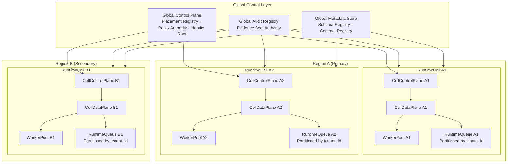

**Reading this diagram.** The Global Control Layer provides placement authority, audit seal authority, and schema/contract registry. It does not execute tenant work. Each Region contains one or more RuntimeCells. Each RuntimeCell has a CellControlPlane and a CellDataPlane. The CellControlPlane receives placement decisions and policy snapshots from the Global Control Plane. The CellDataPlane executes tenant work through WorkerPools drawing tasks from tenant-partitioned RuntimeQueues. No cross-cell worker sharing occurs without explicit routing through the control plane.

---

### Diagram 32.2 — Control Plane vs Data Plane Separation

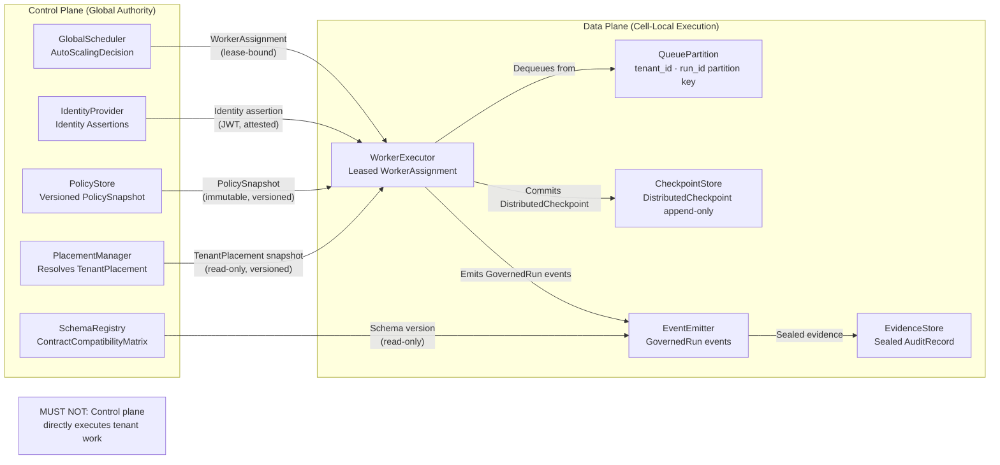

---

### Diagram 32.3 — RuntimeCell Internal Architecture

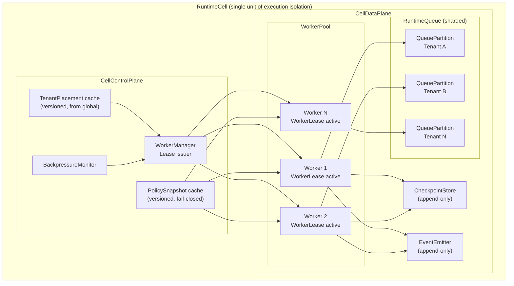

---

### Diagram 32.4 — Tenant Placement and Routing Flow

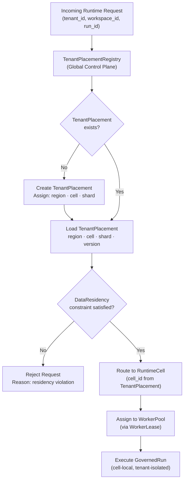

---

### Diagram 32.5 — Worker Lease and Task Assignment Flow

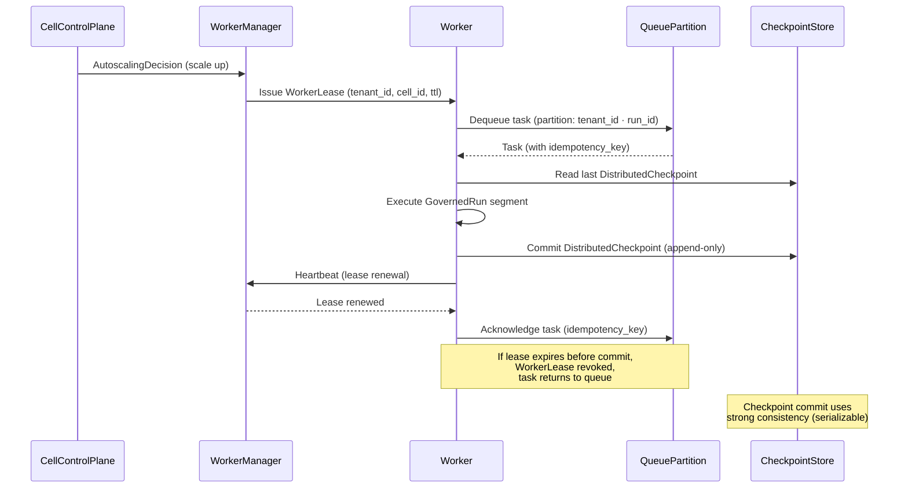

---

### Diagram 32.6 — Event Stream Partitioning Flow

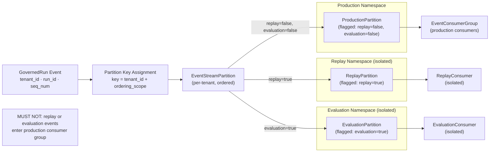

---

### Diagram 32.7 — Backpressure and Fair Scheduling Flow

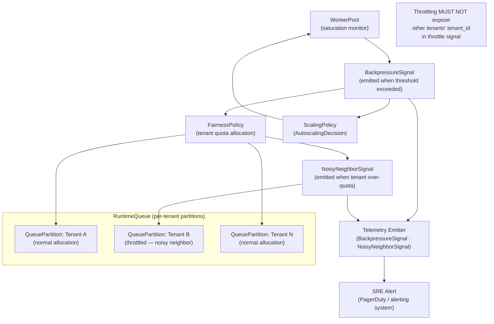

---

### Diagram 32.8 — Multi-Region Failover Flow

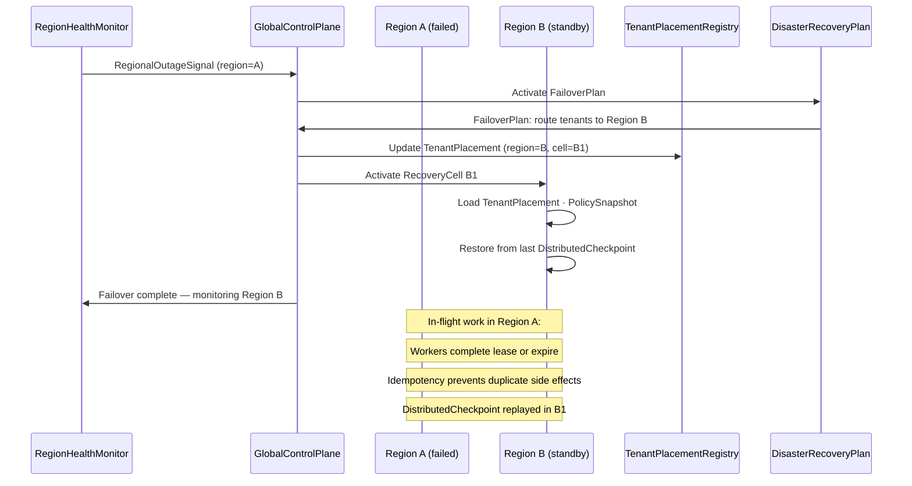

---

### Diagram 32.9 — Runtime Evolution Roadmap

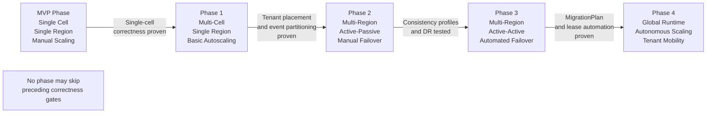

---

### Diagram 32.10 — Schema and Contract Evolution Flow

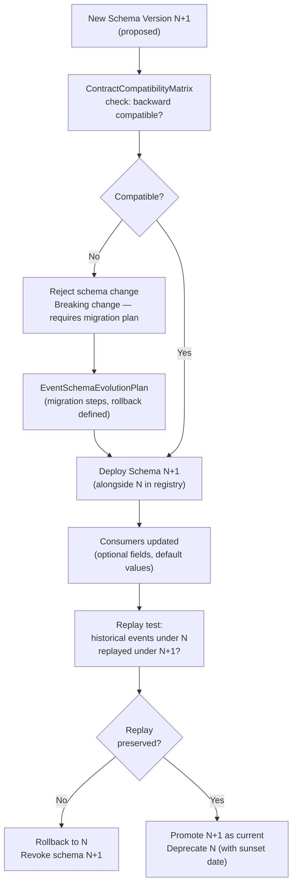

---

### Diagram 32.11 — Canary Rollout Flow

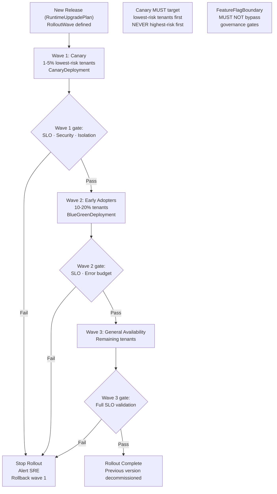


---

## 33. Enterprise Scaling Invariants

The following invariants are absolute. No performance target, cost reduction, release deadline, or operational convenience justifies violating them. Each invariant is identified by a stable ID in the format ESI-NNN.

---

### 33.1 Tenant Isolation Invariants

| ID | Invariant |
|---|---|
| ESI-001 | Every runtime operation MUST resolve a TenantPlacement record before any execution may proceed. An operation without a resolved TenantPlacement is rejected immediately. |
| ESI-002 | Every WorkerLease MUST bind to a specific tenant_id. A worker operating under a lease for Tenant A MUST NOT dequeue, read, or execute tasks from any other tenant's QueuePartition. |
| ESI-003 | Every QueuePartition MUST include tenant_id as the leading element of its partition key. No queue partition scheme that does not enforce tenant_id isolation is acceptable. |
| ESI-004 | Every CheckpointStore record MUST be scoped to tenant_id. Cross-tenant checkpoint reads are prohibited at the storage layer, not solely at the application layer. |
| ESI-005 | Every EventStreamPartition MUST be partitioned by tenant_id. Cross-tenant event delivery to a consumer is prohibited. |
| ESI-006 | No cache layer (in-memory, distributed, or edge) MUST be shared across tenants. Cache keys MUST include tenant_id at the namespace level. |
| ESI-007 | Cross-tenant data leakage detected in any test environment MUST block the release. There is no severity threshold below which cross-tenant leakage is acceptable. |
| ESI-008 | TenantShard assignment MUST be immutable for the lifetime of a TenantPlacement version. Shard reassignment requires a new TenantPlacement version with explicit migration. |

---

### 33.2 Cell Isolation Invariants

| ID | Invariant |
|---|---|
| ESI-009 | A RuntimeCell MUST be an independently operable unit. CellDataPlane work MUST continue to completion even if CellControlPlane or GlobalControlPlane becomes temporarily unavailable. |
| ESI-010 | A CellControlPlane MUST NOT directly execute tenant work. Control plane operations are limited to placement, lease issuance, policy snapshot provision, and backpressure signaling. |
| ESI-011 | Cell failure MUST NOT cause cross-cell data corruption. A failed cell's checkpoint state MUST remain recoverable from the last committed DistributedCheckpoint without modification of other cells' state. |
| ESI-012 | A RuntimeCell MUST maintain its own local copy of PolicySnapshot. A cell whose policy snapshot cache is empty MUST fail closed — rejecting new work — rather than proceeding without governance. |
| ESI-013 | Cross-cell routing MUST pass through the GlobalControlPlane. No direct cell-to-cell communication for task delegation is permitted outside the control plane routing path. |
| ESI-014 | RuntimeCell resource limits (CPU, memory, queue depth, worker count) MUST be enforced per cell. A single cell MUST NOT consume platform-global resources in a manner that degrades other cells. |
| ESI-015 | Cell boundaries are integrity boundaries. Evidence sealed within a cell MUST reference the cell_id in the sealed record. Evidence from Cell A MUST NOT be re-sealed as if produced by Cell B. |

---

### 33.3 Runtime Execution Invariants

| ID | Invariant |
|---|---|
| ESI-016 | Every GovernedRun execution MUST produce an append-only event lineage. The lineage MUST NOT be mutated, deleted, or reordered after emission. |
| ESI-017 | Every side-effecting operation MUST declare an idempotency_key before execution. An operation without a declared idempotency_key MUST NOT execute any externally visible side effect. |
| ESI-018 | WorkerLease expiry MUST NOT result in partial side effects. If a lease expires before checkpoint commit, the worker MUST abandon the segment. The segment returns to the queue. Idempotency prevents duplicate execution on retry. |
| ESI-019 | Every DistributedCheckpoint commit MUST use strong consistency (serializable). Eventual consistency is not acceptable for checkpoint commit. |
| ESI-020 | No worker MUST execute a task for which no WorkerAssignment exists. WorkerAssignment binds worker_id to tenant_id, task_id, and lease_id. Execution without this binding is rejected. |
| ESI-021 | The runtime MUST NOT bypass governance to satisfy performance targets. No autoscaling decision, load-shedding heuristic, or cost optimization override may skip policy evaluation, approval recording, or evidence generation. |
| ESI-022 | GovernedRun replay MUST be deterministically reproducible from the event lineage and the last DistributedCheckpoint. If replay is not reproducible, the checkpoint or lineage is corrupted and MUST NOT be used. |

---

### 33.4 Event Ordering Invariants

| ID | Invariant |
|---|---|
| ESI-023 | Events within a single GovernedRun MUST carry monotonically increasing sequence_numbers scoped to (tenant_id, run_id). Sequence number gaps or reversals indicate a lineage integrity violation. |
| ESI-024 | Event consumers MUST process events in partition order within (tenant_id, run_id). Out-of-order processing within a run is not permitted. |
| ESI-025 | An EventConsumerGroup MUST NOT consume from a partition for which it has no tenant authorization. Consumer group authorization is enforced at the event stream layer, not solely at the application layer. |
| ESI-026 | Replay events MUST be emitted into a dedicated replay namespace. Production EventConsumerGroups MUST be prohibited from consuming from replay namespaces. |
| ESI-027 | EventSchemaEvolutionPlan MUST preserve ordering semantics. A schema migration that changes the partition key field set MUST include a full migration plan before deployment. |
| ESI-028 | Duplicate event delivery (at-least-once) MUST be handled by idempotency at the consumer. The consumer MUST NOT apply the same event twice if the idempotency_key has already been committed. |
| ESI-029 | Event emission ordering MUST reflect the causal order of the GovernedRun execution. No event reordering for performance optimization is acceptable if it obscures causal sequence. |

---

### 33.5 Replay and Evaluation Separation Invariants

| ID | Invariant |
|---|---|
| ESI-030 | Replay runs MUST execute in a fully isolated namespace. Replay workers MUST NOT share queue partitions, checkpoint stores, or evidence stores with production workers. |
| ESI-031 | Evaluation runs MUST execute in a fully isolated namespace. Evaluation artifacts MUST NOT enter production runtime state under any condition. |
| ESI-032 | Replay events MUST be flagged replay=true at emission. Production event stream ingestion MUST reject any event flagged replay=true. |
| ESI-033 | Evaluation artifacts MUST be flagged evaluation=true at creation. Production state stores MUST reject any artifact flagged evaluation=true. |
| ESI-034 | DistributedReplayPlan MUST reference the specific checkpoint version and event lineage window to be replayed. Replay without a pinned plan reference is not permitted. |
| ESI-035 | Replay MUST NOT re-execute live external side effects. Tool calls in replay MUST be simulated from the event lineage. Real connectors MUST NOT be invoked during replay. |
| ESI-036 | Evaluation benchmark results MUST NOT influence production policy decisions. Evaluation output is consumed exclusively by the evaluation pipeline (Document 23). |

---

### 33.6 Policy and Approval Invariants

| ID | Invariant |
|---|---|
| ESI-037 | Policy evaluation MUST use strong consistency for enforcement decisions. Eventual consistency is not acceptable for policy enforcement. |
| ESI-038 | PolicySnapshot unavailability MUST cause fail-closed behavior. No operation proceeds with an unverified or missing policy snapshot. |
| ESI-039 | Approval records MUST be written with strong consistency before the approved operation begins execution. An approval recorded after execution is not a valid approval. |
| ESI-040 | PolicySnapshot versions MUST be immutable after sealing. A sealed policy snapshot MUST NOT be modified. New policy requires a new sealed version. |
| ESI-041 | Policy enforcement MUST NOT be bypassed by autoscaling, load-shedding, or emergency override. Scaling decisions that would require governance bypass are invalid. |
| ESI-042 | FeatureFlagBoundary MUST NOT enable governance-controlled capabilities without the corresponding policy check passing. Feature flags are a rollout mechanism, not a governance bypass. |
| ESI-043 | Every policy enforcement decision MUST be recorded in the append-only audit lineage. Policy decisions that leave no trace are prohibited. |

---

### 33.7 Data Residency Invariants

| ID | Invariant |
|---|---|
| ESI-044 | TenantPlacement MUST respect DataResidencyPolicy at placement time. A tenant with a DataResidencyPolicy restricting data to Region A MUST NOT be placed in Region B. |
| ESI-045 | Cost optimization MUST NOT override DataResidencyPolicy. No CapacityForecast, CostEnvelope pressure, or billing optimization justifies residency violation. |
| ESI-046 | SovereigntyConstraint MUST be enforced at the storage layer. Data subject to a sovereignty constraint MUST NOT be replicated to a region that violates the constraint. |
| ESI-047 | ReplicationPolicy MUST reference the DataResidencyPolicy and SovereigntyConstraint applicable to each tenant. Cross-region replication without policy validation is prohibited. |
| ESI-048 | Global metadata (schema registry, contract registry, placement registry) MUST be explicitly excluded from sovereignty scope when tenants reference it. No customer-identifying data may reside in global metadata stores. |
| ESI-049 | Data residency audits MUST be executable from evidence records alone. If an auditor cannot determine where data resided from sealed evidence, the evidence is incomplete. |

---

### 33.8 Consistency Invariants

| ID | Invariant |
|---|---|
| ESI-050 | The following operations MUST use strong consistency (serializable or linearizable): policy enforcement, approval recording, tenant placement commit, checkpoint commit, side-effect authorization, evidence sealing. |
| ESI-051 | ConsistencyProfile MUST be explicitly declared for every persistent state category. No state category operates with an undeclared or assumed consistency level. |
| ESI-052 | Eventual consistency is acceptable ONLY for: read-only telemetry aggregation, non-binding metric dashboards, and evaluation leaderboards. It MUST NOT be used for any governance, execution, or evidence operation. |
| ESI-053 | OrderingGuarantee declarations MUST be enforced at the infrastructure layer. Application-level ordering enforcement without infrastructure-layer guarantees is insufficient. |
| ESI-054 | Consistency downgrades (e.g. from serializable to snapshot isolation) MUST be documented in the ConsistencyProfile and require architectural review. |
| ESI-055 | Cross-cell consistency MUST be handled by the Global Control Plane. Cell-local consistency is managed cell-locally. No assumption of cross-cell synchronization without explicit control plane coordination. |

---

### 33.9 Idempotency Invariants

| ID | Invariant |
|---|---|
| ESI-056 | Every side-effecting operation MUST declare a unique idempotency_key before the operation executes. Retried operations with the same idempotency_key MUST return the cached result without re-executing the side effect. |
| ESI-057 | IdempotencyBoundary MUST be declared at the domain model level for every operation category. Operations without a declared IdempotencyBoundary are treated as non-idempotent and MUST NOT be retried automatically. |
| ESI-058 | Idempotency_key scope MUST include at minimum: tenant_id, run_id, operation_type, and a unique operation_instance identifier. Keys that do not include all four components create duplicate execution risk. |
| ESI-059 | Idempotency storage MUST use strong consistency. An idempotency check that is not strongly consistent creates a window for duplicate side effects. |
| ESI-060 | Idempotency records MUST be retained for at least the maximum retry window plus the audit retention period. Premature idempotency record expiry re-opens duplicate execution risk. |

---

### 33.10 Backpressure Invariants

| ID | Invariant |
|---|---|
| ESI-061 | WorkerPool saturation MUST emit a BackpressureSignal before capacity is fully exhausted. The signal MUST be observable in the telemetry pipeline within the defined SLO latency. |
| ESI-062 | FairnessPolicy MUST be applied before queue dequeue, not after. A dequeue that ignores FairnessPolicy has already allocated capacity before fairness enforcement — this is too late. |
| ESI-063 | NoisyNeighborSignal MUST identify the offending tenant_id internally but MUST NOT expose that tenant_id in signals visible to other tenants. Cross-tenant information leakage via throttle signals is a security violation. |
| ESI-064 | Throttling a noisy-neighbor tenant MUST NOT degrade the SLO of non-offending tenants. Throttle mechanisms MUST isolate the capacity reduction to the offending tenant's QueuePartition. |
| ESI-065 | BackpressureSignal MUST trigger an AutoscalingDecision evaluation. If the ScalingPolicy determines that autoscaling is not appropriate (e.g. already at ceiling), an SRE alert MUST be emitted instead. |

---

### 33.11 Rollout Safety Invariants

| ID | Invariant |
|---|---|
| ESI-066 | Every release MUST be deployed via a defined RolloutWave sequence. No release skips wave sequencing. |
| ESI-067 | CanaryDeployment MUST target the lowest-risk, lowest-volume tenants first. High-volume, compliance-sensitive, or isolation-critical tenants MUST NOT be in the initial canary wave. |
| ESI-068 | Every RolloutWave gate MUST include: SLO validation, tenant isolation regression test, security posture check, and evidence integrity check. A wave gate that omits any of these four checks is invalid. |
| ESI-069 | A failed wave gate MUST halt the rollout immediately. Automatic progression past a failed gate is prohibited. SRE manual override requires explicit escalation approval and audit record. |
| ESI-070 | BlueGreenDeployment MUST validate state compatibility between blue and green environments before cutover. A blue-green switch without state compatibility validation is prohibited. |

---

### 33.12 Observability Invariants

| ID | Invariant |
|---|---|
| ESI-071 | Every GovernedRun execution MUST emit telemetry events sufficient to reconstruct the execution timeline from telemetry alone. A run with incomplete telemetry MUST NOT be treated as successfully completed. |
| ESI-072 | Operational telemetry MUST NOT be used as evidence in governance or compliance audits. Telemetry is diagnostic; sealed AuditRecord in the EvidenceStore is the authoritative audit source. |
| ESI-073 | Dashboard displays of runtime state MUST be clearly labeled as diagnostic views. No dashboard output may be submitted as compliance evidence without re-derivation from sealed evidence. |
| ESI-074 | Telemetry pipeline degradation MUST NOT suppress the operational signals required for SRE escalation. At minimum, BackpressureSignal, NoisyNeighborSignal, CheckpointConflict, and TenantLeakageSignal MUST route to SRE alerting even during telemetry degradation. |

---

### 33.13 Security Invariants

| ID | Invariant |
|---|---|
| ESI-075 | Every WorkerLease MUST be cryptographically bound to the worker identity. A worker that cannot prove its identity MUST NOT receive a lease. |
| ESI-076 | Every inter-cell and control plane communication MUST use mutually authenticated TLS. No plaintext communication between runtime components is acceptable at any scale. |
| ESI-077 | Secrets MUST NOT be embedded in WorkerLease payloads, EventStreamPartition keys, QueuePartition metadata, or any distributed runtime artifact visible in telemetry. |
| ESI-078 | Every data plane operation on behalf of a tenant MUST carry an attested identity chain traceable to the tenant's authorized identity root. Unattested operations are rejected. |
| ESI-079 | Security posture checks MUST be included in every RolloutWave gate. A release that degrades the security posture relative to the previous release MUST be halted, regardless of SLO compliance. |

---

### 33.14 Codex Implementation Invariants

| ID | Invariant |
|---|---|
| ESI-080 | Codex MUST implement domain model entities and event contracts before any distributed runtime component. A worker, queue, or cell that is implemented before its domain model is complete is an untestable component. |
| ESI-081 | Codex MUST implement single-cell correctness before multi-cell architecture. Multi-cell work that begins before single-cell correctness is proven creates cascading correctness debt. |
| ESI-082 | Codex MUST NOT implement a scaling feature that bypasses a validate/test gate. Gate bypass in any pipeline, including development pipelines, is prohibited. |
| ESI-083 | Codex changes to distributed runtime components MUST include schema compatibility checks, idempotency boundary declarations, and evidence integrity tests as part of the change artifact. A change without these three artifacts MUST NOT be promoted. |
| ESI-084 | Codex MUST NOT simulate a capability by stubbing its governance, isolation, or evidence requirements. A stub that omits tenant isolation, policy enforcement, or evidence generation is not a valid implementation starting point — it is technical debt that invalidates downstream correctness. |


---

## 34. Enterprise Scaling Anti-Patterns

The following anti-patterns represent recurring architectural errors in enterprise distributed system design. Each MUST be avoided in MYCELIA. Where MYCELIA's own documents establish the correct alternative, that alternative is referenced.

| # | Anti-Pattern | Why This Is Wrong | Correct Pattern |
|---|---|---|---|
| 1 | **Scaling by shared global database only** | A single global database becomes a contention point and a cross-tenant isolation risk. Writes from one tenant can block or contaminate reads for another. | Shard by tenant_id at the storage layer. Use cell-local stores with global control plane coordination only for placement and policy. |
| 2 | **Global queue without tenant partitioning** | A global queue without tenant_id in the partition key cannot enforce per-tenant fairness, ordering, or isolation. A single high-volume tenant starves all others. | Every RuntimeQueue partition key MUST include tenant_id as the leading element (ESI-003). |
| 3 | **Worker executes any tenant task** | A worker that accepts tasks from any tenant violates lease binding and creates cross-tenant execution risk. Policy snapshots, checkpoints, and evidence records become untrustworthy. | Every WorkerLease MUST bind to a specific tenant_id. Workers MUST NOT dequeue tasks outside their lease scope (ESI-002). |
| 4 | **Replay events in production stream** | Replay events injected into the production event stream contaminate production consumer state, corrupt downstream processing, and invalidate audit lineages. | Replay events MUST route to a dedicated replay namespace. Production EventConsumerGroups MUST be prohibited from consuming replay-flagged events (ESI-030, ESI-032). |
| 5 | **Evaluation artifacts in production runtime state** | Evaluation artifacts written into production stores corrupt execution context, policy state, and checkpoint records. Evaluation results cannot be trusted if they have been applied to production. | Evaluation artifacts MUST carry evaluation=true flags. Production stores MUST reject evaluation-flagged artifacts (ESI-031, ESI-033). |
| 6 | **Active-active multi-region without conflict model** | Multi-region active-active without a defined conflict resolution model creates split-brain scenarios, consistency violations, and evidence gaps when both regions accept writes concurrently. | Active-active requires a ConsistencyProfile, an OrderingGuarantee declaration, and proven conflict resolution before deployment. Phase 2 (active-passive) must be proven first (Section 20.2). |
| 7 | **Tenant migration without drain** | Moving a tenant from one cell to another without draining in-flight work causes checkpoint conflicts, duplicate task execution, and broken lease bindings. | TenantMobilityPlan MUST include a drain phase in which no new work is accepted before migration begins. Migration MUST NOT start until all active WorkerLeases have expired or completed (Section 8.3). |
| 8 | **Cache shared across tenants** | A shared cache without tenant namespace isolation leaks data between tenants on eviction patterns, timing attacks, and cache stampedes. | Cache keys MUST include tenant_id at the namespace level. Cross-tenant cache sharing is prohibited (ESI-006). |
| 9 | **Event partition key that destroys per-run ordering** | A partition key that hashes on run_id without including tenant_id routes events for the same run to different partitions, breaking sequence ordering for replay and investigation. | Partition keys MUST be composed as tenant_id + ordering_scope. Run-level ordering MUST be preserved within a single partition (ESI-023, ESI-029). |
| 10 | **Autoscaling only on CPU** | CPU utilization is a trailing indicator of queue depth, lease saturation, and backpressure. CPU-only autoscaling responds too late and ignores the governance-relevant signals. | AutoscalingDecision MUST evaluate: queue depth per QueuePartition, worker lease saturation, BackpressureSignal emission rate, and per-tenant fairness headroom (Section 24.2). |
| 11 | **Dashboards treated as audit evidence** | Dashboard displays aggregate, sample, and approximate. They are not sealed records. Submitting dashboard output as governance or compliance evidence provides no integrity guarantees. | Audit evidence MUST be derived from sealed AuditRecords in the EvidenceStore. Dashboards are diagnostic tools only (ESI-072, ESI-073). |
| 12 | **Global search across tenants** | A global search index without tenant_id scoping leaks cross-tenant information in search results, relevance signals, and query timing. | All search and retrieval operations (including vector retrieval in memory shards) MUST be scoped to tenant_id. Cross-tenant retrieval is prohibited (Section 13). |
| 13 | **Feature flags bypassing policy** | A feature flag that enables a capability without the corresponding policy check treats the flag as a governance control, which it is not. Feature flags are a deployment mechanism, not a policy enforcement mechanism. | FeatureFlagBoundary MUST NOT enable governance-controlled capabilities without policy check passing (ESI-042). |
| 14 | **Blue-green without state compatibility** | Cutting over to a green environment without validating state compatibility with the blue environment creates checkpoint incompatibilities, schema mismatches, and replay failures. | BlueGreenDeployment MUST validate state compatibility before cutover (ESI-070). This includes checkpoint schema, event schema, and idempotency key format compatibility. |
| 15 | **Canary on highest-risk tenants first** | Canary deployments that begin with high-volume, compliance-sensitive, or isolation-critical tenants amplify blast radius. A failure in the canary wave damages the most important tenants first. | CanaryDeployment MUST target lowest-risk, lowest-volume tenants first (ESI-067). |
| 16 | **Deleting old schemas too early** | Removing a schema version before all consumers and all historical events have migrated breaks replay. Events emitted under schema N cannot be decoded without schema N. | Old schema versions MUST be retained until: all consumers have migrated, all historical events are confirmed migrated, and replay tests pass under the new schema (Section 26.3). |
| 17 | **Schema migration without rollback** | A schema migration deployed without a defined rollback path leaves the platform in an unrecoverable state if the migration fails partway through. | Every EventSchemaEvolutionPlan MUST include a rollback procedure. The rollback MUST be tested before the migration is deployed to production (Section 26). |
| 18 | **Side effects retried without idempotency** | Retrying a side-effecting operation without idempotency guarantees creates duplicate external actions — duplicate payments, duplicate notifications, duplicate connector invocations. | Every side-effecting operation MUST declare an idempotency_key before execution. Retries without idempotency_key are prohibited for side-effecting operations (ESI-056). |
| 19 | **Control plane executing data plane work** | The CellControlPlane executing tenant work directly violates the control/data plane separation boundary, eliminates the isolation boundary, and creates unauditable execution paths. | CellControlPlane MUST NOT directly execute tenant work. Tenant work MUST execute only in the CellDataPlane under a WorkerLease (ESI-010, Boundary 1). |
| 20 | **Multi-region before single-cell correctness** | Building multi-region architecture before the single-cell runtime is proven correct multiplies unresolved correctness problems across all regions simultaneously. | Single-cell correctness MUST be proven before any multi-cell or multi-region work begins (ESI-081, Section 31 Roadmap). |
| 21 | **Cost optimization overriding residency** | Routing tenant data to a lower-cost region that violates DataResidencyPolicy is a compliance violation, not a cost optimization. | DataResidencyPolicy MUST be enforced before CostEnvelope is evaluated. Cost cannot override residency (ESI-045, Boundary 12). |
| 22 | **Codex implementing distributed runtime before contracts** | Implementing worker pools, queues, or cells before the event contracts, domain model, and schema registry are defined produces components that cannot be tested for correctness or integrated without rework. | Codex MUST implement event contracts and domain model entities first. No distributed runtime component before contracts (ESI-080, Section 35). |
| 23 | **Fake HA through replicas without failover testing** | Adding replicas creates the appearance of high availability without guaranteeing it. Replicas that have never been tested as primary under failover conditions are unproven. | HA claims require demonstrated failover testing: RecoveryCell activation, DistributedCheckpoint restoration, and FailbackPlan validation (Section 21.3). |
| 24 | **Ignoring noisy neighbor because average latency is fine** | Average latency aggregates across all tenants. A noisy-neighbor tenant may be within SLO on average while other tenants experience severe SLO breaches hidden in the average. | Per-tenant SLO monitoring MUST be implemented. NoisyNeighborSignal MUST be emitted based on per-tenant quota deviation, not platform-average latency (ESI-063, ESI-064). |

---

## 35. Codex Implementation Guidance

### 35.0 Enterprise Scaling Implementation Phase Gate

Document 24 MUST NOT be implemented as a single large distributed runtime feature.

Enterprise scaling is a high-risk architecture layer. Codex MUST implement it only after the required lower-level contracts exist and are validated.

#### Required Pre-Implementation Dependencies

| Dependency | Required Before |
|---|---|
| Shared kernel identifiers and classification primitives | Any scaling schema |
| Tenant boundary primitives | TenantPlacement, TenantShard, QueuePartition and cell routing |
| Runtime identity and request envelope | ScalingOperationContext and backend scaling operations |
| EventEnvelope type skeleton | EventStreamPartition, EventConsumerGroup and scaling events |
| PolicyDecisionGateway skeleton | Policy scaling, approval scaling and fail-closed behavior |
| RuntimeEnvelope type skeleton | WorkerAssignment, runtime dispatch and cell data plane execution |
| StateTransitionCoordinator skeleton | Checkpoint and state transition scaling |
| IdempotencyBoundary primitives | Worker retry, side-effect retry and failover |
| Evidence artifact contract | evidence sealing, rollout evidence and ScalingException |
| Redaction/security event contract | cross-tenant leakage and cache contamination handling |
| API contract registry | scaling APIs and external rollout views |
| Document 23 evaluation gates | release gates, regression gates and promotion readiness |
| Document 17 SRE runbook contracts | operational recovery, failover and incident linkage |

#### Phase Rules

- Codex MAY define Document 24 domain schemas before runtime implementation.
- Codex MAY define pure validators for TenantPlacement, WorkerLease, QueuePartition and ScalingOperationContext before persistence exists.
- Codex MUST NOT implement WorkerPool execution before WorkerLease, fencing token and idempotency boundaries exist.
- Codex MUST NOT implement RuntimeQueue before tenant partition rules and QueuePartition validation exist.
- Codex MUST NOT implement EventStreamPartition before EventEnvelope and event namespace separation exist.
- Codex MUST NOT implement cell routing before TenantPlacement resolution is typed and tested.
- Codex MUST NOT implement multi-cell runtime before single-cell correctness tests exist.
- Codex MUST NOT implement multi-region runtime before data residency and failover contracts exist.
- Codex MUST NOT implement autoscaling automation before ScalingPolicy, BackpressureSignal and ScalingException exist.
- Codex MUST NOT implement dashboards before observability contracts and diagnostic/evidence boundaries exist.

#### Forbidden Behavior

FORBIDDEN:

- implementing Document 24 directly as infrastructure code without typed contracts;
- creating fake cells that do not enforce tenant placement;
- creating global queues before tenant partitioning;
- stubbing WorkerLease as always valid;
- stubbing policy snapshots as always available;
- implementing replay or evaluation scaling in production namespace;
- implementing multi-region before single-cell correctness;
- using mock tenant IDs in production-facing code;
- bypassing `pnpm validate:phase0`, tests or evaluation gates for demos.

### 35.1 Purpose

This section defines the implementation order, constraints, and validation requirements for Codex when building the enterprise scaling and distributed runtime evolution capabilities specified in this document. Codex MUST treat this section as authoritative over any general engineering instinct, convenience shortcut, or demo pressure.

### 35.2 Implementation Order

Codex MUST implement enterprise scaling capabilities in the following staged order. No stage may begin until the preceding stage is complete and its gates have passed.

**Stage 1 — Contracts and Domain Model (Prerequisites)**

| Implementation Item | Required Before |
|---|---|
| TenantPlacement record schema and storage contract | Everything else |
| WorkerLease schema and lifecycle events | WorkerPool implementation |
| WorkerAssignment schema | Worker execution |
| QueuePartition schema and partition key rules (tenant_id + ordering_scope) | Any queue implementation |
| BackpressureSignal event schema | Any worker pool |
| FairnessPolicy schema | Queue dequeue logic |
| IdempotencyBoundary declaration for every side-effecting operation | Any side-effecting operation |
| DistributedCheckpoint schema and append-only storage contract | Any worker checkpoint |
| EventStreamPartition schema and namespace flag (production/replay/evaluation) | Any event emission |
| ConsistencyProfile declaration for every persistent state category | Any state store |
| EnterpriseSLOProfile schema | Any SLO gate |
| ScalingReadinessReview checklist schema | Any scaling gate |

**Stage 2 — Single-Cell Correctness**

| Implementation Item | Required Before |
|---|---|
| CellControlPlane with TenantPlacement resolution | Cell data plane |
| CellDataPlane with WorkerPool and RuntimeQueue | Multi-cell |
| WorkerLease issuance and expiry lifecycle | Worker execution |
| Tenant-partitioned RuntimeQueue with FairnessPolicy enforcement | Autoscaling |
| DistributedCheckpoint commit with strong consistency | Checkpoint recovery |
| BackpressureSignal emission and AutoscalingDecision evaluation | Autoscaling implementation |
| IdempotencyBoundary enforcement for all side-effecting operations | Any retry mechanism |
| PolicySnapshot fail-closed behavior | Any scaling |
| Replay namespace isolation (replay events rejected by production) | Replay feature |
| Evaluation namespace isolation (evaluation artifacts rejected by production) | Evaluation feature |
| Tenant isolation regression test suite | Any release |
| Single-cell FailoverPlan with DistributedCheckpoint restoration | DR capability |

**Stage 3 — Multi-Cell and Multi-Region (After Stage 2 Gates Pass)**

| Implementation Item | Required Before |
|---|---|
| Multi-cell routing through GlobalControlPlane | Any cross-cell work |
| TenantMobilityPlan with drain phase | Tenant migration |
| EventSchemaEvolutionPlan with ContractCompatibilityMatrix | Schema migration |
| Multi-region active-passive (RegionalDeployment) | Active-active |
| DataResidencyPolicy enforcement at placement | Any multi-region work |
| ReplicationPolicy with SovereigntyConstraint validation | Any replication |
| RolloutWave sequencing with gate enforcement | Any production rollout |
| CanaryDeployment targeting lowest-risk tenants | Any canary deployment |
| BlueGreenDeployment with state compatibility validation | Blue-green switch |

**Stage 4 — Enterprise Autonomy (After Stage 3 Gates Pass)**

| Implementation Item | Required Before |
|---|---|
| AutoscalingDecision with multi-signal evaluation | Autonomous scaling |
| TenantMobilityPlan automation | Automated migration |
| CapacityForecast with CostEnvelope integration | Cost optimization |
| Multi-region active-active with ConsistencyProfile | Active-active |
| Automated FailoverPlan activation | Autonomous failover |
| Cross-region evaluation aggregation | Global evaluation |

### 35.3 Hard Implementation Constraints

Codex MUST enforce the following constraints at all times. No exception applies.

**No distributed runtime before single-cell correctness.** A worker pool, multi-cell router, or distributed queue that is implemented before the single-cell worker, single-cell queue, and single-cell checkpoint are proven correct creates correctness debt that compounds at every scale point.

**No multi-region before tenant placement and event partitioning.** Multi-region architecture requires that tenant placement is resolved deterministically and event partitioning is enforced per tenant. Neither can be retrofitted after multi-region is active.

**No active-active before consistency profiles.** Active-active multi-region write requires a defined ConsistencyProfile for every persistent state category and a conflict resolution model. Active-active without these is a split-brain system.

**No worker scaling before lease and idempotency.** Scaling workers without lease binding and idempotency_key enforcement multiplies the risk of duplicate side effects and cross-tenant execution.

**No queue scaling before tenant partitioning.** Scaling queue throughput on a global queue without tenant_id partitioning amplifies cross-tenant fairness violations and ordering risks.

**No replay scaling before namespace separation.** Scaling replay throughput on shared partitions with production contaminates both.

**No evaluation scaling before artifact partitioning.** Evaluation artifacts must be namespace-isolated before scaling evaluation parallelism.

**No UI dashboards before observability contracts.** Dashboard displays without defined observability contracts produce displays of undefined data. Contracts (Document 12) define what telemetry means before display logic consumes it.

**No rollout automation before gates.** Automated rollout progression requires defined, implemented, and tested gates. Automating progression before gates are implemented is automated failure propagation.

**No schema migration without compatibility matrix.** A schema migration deployed without a ContractCompatibilityMatrix check may break replay, consumer decoding, or cross-version event handling.

**No fake HA.** A deployment described as highly available MUST have demonstrated failover to RecoveryCell with DistributedCheckpoint restoration under test conditions. Replicas without tested failover are not HA.

**No bypassing validation to satisfy demos.** A demo environment that bypasses tenant isolation tests, skips idempotency validation, or omits evidence generation is not a demonstration of MYCELIA. It is a demonstration of a system that does not have MYCELIA's properties.

### 35.4 Required Tests for Every Distributed Runtime Change

Every change to distributed runtime components (WorkerPool, RuntimeQueue, CellControlPlane, CellDataPlane, EventStreamPartition, CheckpointStore, or any component in Sections 5–19) MUST include the following artifacts as part of the change:

| Required Artifact | Purpose |
|---|---|
| Schema compatibility check result | Confirms change does not break existing event contracts |
| IdempotencyBoundary declaration or update | Confirms side effects are idempotency-protected |
| Tenant isolation regression test result | Confirms no cross-tenant data path introduced |
| Evidence integrity test result | Confirms AuditRecord is emitted and sealable |
| Replay preservation test result | Confirms historical events remain replayable |
| ScalingReadinessReview checklist completion | Confirms change does not regress scaling invariants |

A change missing any of these six artifacts MUST NOT be promoted to the next stage.

---

## 36. Relationship to Other Documents

| Document | Role | Relationship to Document 24 |
|---|---|---|
| **Document 00** — Vision and Foundational Manifesto | Establishes MYCELIA's governed cognitive operations purpose and non-negotiable principles | Document 24 extends Document 00's governance-first principle to distributed scale. Every scaling decision in this document traces its authority to Document 00's invariant: MYCELIA remains governed at all scales. |
| **Document 01** — Product Requirements and Operational Scope | Defines operational boundaries, SLO commitments, and enterprise tenant requirements | Document 24 operationalizes Document 01's enterprise SLO commitments through EnterpriseSLOProfile, EnterpriseErrorBudget, and per-tenant capacity guarantees. |
| **Document 02** — Core Runtime Architecture | Defines the GovernedRun, append-only lineage, deterministic orchestration, and single-cell runtime model | Document 24 scales Document 02's runtime model. The GovernedRun, event lineage, and deterministic execution defined in Document 02 are preserved unchanged across all cells, regions, and scale points. |
| **Document 03** — Canonical Domain Model | Defines all authoritative domain entities | Document 24 introduces 48 new scaling-specific entities that extend Document 03's domain model. All entities in Document 24 are subordinate to the canonical model defined in Document 03. |
| **Document 05** — Agent Runtime and Coordination | Defines agent execution, coordination, and tool invocation within a single runtime | Document 24 defines how agent runtime execution scales across WorkerPools, cells, and regions without breaking agent coordination boundaries. |
| **Document 06** — State, Checkpoint and Persistence Architecture | Defines checkpoint structure, persistence contracts, and recovery semantics | Document 24 distributes Document 06's checkpoint model across cells through DistributedCheckpoint, requiring strong consistency commit and idempotency-safe recovery. |
| **Document 07** — Event and Messaging Contracts | Defines canonical event schemas, ordering guarantees, and consumer contracts | Document 24 partitions Document 07's event contracts by tenant_id across EventStreamPartitions, preserving per-run ordering within partitions. |
| **Document 08** — Event Runtime Deep Technical Specification | Defines event emission, consumer group semantics, and at-least-once delivery handling | Document 24 scales Document 08's event runtime across QueuePartitions, EventConsumerGroups, and replay/evaluation namespace separation. |
| **Document 09** — Workflow Orchestration Engine Specification | Defines workflow graph execution, task routing, and orchestration scheduling | Document 24 distributes Document 09's orchestration engine across WorkerPools and RuntimeQueues, preserving per-workflow execution isolation across cells. |
| **Document 10** — Memory and Context Architecture | Defines memory retrieval, vector index, and context window management | Document 24 shards Document 10's memory architecture by tenant_id, requires tenant-scoped retrieval isolation, and addresses vector index staleness as a failure mode. |
| **Document 11** — Governance, Policy and Approval Engine | Defines policy evaluation, approval workflows, and evidence generation | Document 24 distributes Document 11's policy engine through PolicySnapshot propagation to all cells, enforcing fail-closed behavior on snapshot unavailability and strong consistency for all enforcement decisions. |
| **Document 12** — Observability and Telemetry Platform | Defines telemetry contracts, metric emission, and observability pipeline | Document 24 scales Document 12's observability platform across cells and regions, requiring per-tenant metric isolation and SRE-critical signal routing even during telemetry pipeline degradation. |
| **Document 13** — Security and Trust Architecture | Defines zero-trust principles, identity attestation, secret management, and audit evidence | Document 24 extends Document 13's security model to distributed scale through mTLS enforcement across cell boundaries, cryptographically bound WorkerLeases, and attested identity chains. |
| **Document 14** — Multi-Tenant Isolation and Organizational Boundaries | Defines tenant isolation invariants, workspace boundaries, and cross-tenant prohibition | Document 24 scales Document 14's isolation model across cells and regions through TenantPlacement, TenantShard, and per-tenant queue partitioning. No isolation invariant from Document 14 may be weakened at scale. |
| **Document 15** — SDK, Tool Runtime and Execution Contracts | Defines tool invocation, sandbox execution, and connector lifecycle | Document 24 scales Document 15's tool runtime through connector pool sharding and sandbox isolation enforcement. Replay MUST NOT invoke live connectors (ESI-035). |
| **Document 16** — Infrastructure and Deployment Architecture | Defines infrastructure topology, deployment units, and environment definitions | Document 24 builds its RuntimeCell, RegionalDeployment, and RecoveryCell model on top of Document 16's infrastructure units. Cell boundaries follow infrastructure environment boundaries. |
| **Document 17** — SRE, Operational Recovery and Runbooks | Defines SRE runbooks, escalation paths, and operational recovery procedures | Document 24 scales Document 17's SRE model through per-cell runbooks, distributed alerting, and failure mode response procedures for all 30 failure modes defined in Section 30. |
| **Document 18** — External APIs and Integration Contracts | Defines external API surface, rate limit contracts, and integration stability guarantees | Document 24 distributes Document 18's API surface across cells, requires per-tenant rate limit enforcement, and addresses external API exhaustion as a failure mode. |
| **Document 19** — Codex Operational Alignment and Engineering Constitution | Defines Codex's implementation obligations, sequence constraints, and quality gates | Document 24 extends Document 19's Codex obligations to enterprise scaling. Section 35 of this document is a direct extension of Document 19's implementation order for scaling capabilities. |
| **Document 23** — Evaluation, Benchmark and AI Quality Framework | Defines evaluation runs, benchmark scoring, and AI quality governance | Document 24 isolates Document 23's evaluation runtime from production through namespace separation, artifact partitioning, and explicit evaluation consumer groups. Evaluation scaling follows the same tenant partitioning and idempotency rules as production scaling. |

---

## 37. Final Enterprise Scaling Principles

The following ten principles summarize the canonical stance of MYCELIA's enterprise scaling architecture. They are not aspirations. They are architectural commitments that every scaling decision must satisfy.

**Principle 1 — Scaling is governance-preserving, not governance-neutral.**
Enterprise scale does not dilute governance. Every GovernedRun at one tenant on one cell is as governed as every GovernedRun across a thousand tenants on a hundred cells. Scale is never used as a justification for governance relaxation.

**Principle 2 — Tenant isolation is an invariant, not a trade-off.**
No performance target, cost reduction, or operational convenience justifies weakening tenant isolation. Cell boundaries, queue partitions, cache namespaces, worker leases, and event partitions all exist to enforce tenant isolation. They are not optional optimizations.

**Principle 3 — The control plane governs; the data plane executes.**
The CellControlPlane provides placement, policy, and lease authority. The CellDataPlane executes tenant work. These responsibilities are permanently separated. The control plane does not execute tenant work. The data plane does not make placement or policy decisions unilaterally.

**Principle 4 — Strong consistency for governance; eventual consistency is a deliberate choice, not a default.**
Policy enforcement, approval recording, checkpoint commit, idempotency checking, and evidence sealing use strong consistency. Eventual consistency is used only where explicitly declared in a ConsistencyProfile for non-governance operations. Undeclared consistency is treated as strong.

**Principle 5 — Replay and evaluation are permanently isolated from production.**
Replay namespaces and evaluation namespaces are not cost-saving shortcuts. They exist because production state contamination by replay or evaluation data invalidates the runtime's entire evidence and governance model. This separation is maintained at all scales.

**Principle 6 — Correctness gates precede scale gates.**
No scaling phase begins without completing the preceding correctness phase. Single-cell correctness precedes multi-cell. Multi-cell correctness precedes multi-region. Multi-region active-passive correctness precedes active-active. There are no shortcuts through the correctness roadmap.

**Principle 7 — Idempotency is a first-class architectural property, not a retry optimization.**
Idempotency boundaries are declared at the domain model level before any side-effecting operation is implemented. Retries are safe because idempotency is enforced — idempotency is not retrofitted after retries reveal duplicate side effects.

**Principle 8 — Backpressure is an architectural signal, not an operational emergency.**
BackpressureSignal and NoisyNeighborSignal are expected system outputs under load. They drive AutoscalingDecision and FairnessPolicy enforcement. A system without backpressure instrumentation cannot enforce fairness and cannot protect non-offending tenants from noisy neighbors.

**Principle 9 — Enterprise evolution follows a defined roadmap, not reactive expansion.**
MYCELIA grows from single-cell to global runtime through a staged roadmap. Each stage is gated on proven correctness, tested DR, and validated isolation from the preceding stage. Reactive expansion in response to capacity pressure bypasses these gates and creates compounding correctness debt.

**Principle 10 — Evidence of correct behavior is as important as correct behavior.**
A runtime that operates correctly but does not produce sealed, immutable evidence of its correct operation cannot be audited, governed, or trusted at enterprise scale. Evidence integrity is not a post-hoc concern — it is built into every operation, at every scale, from the first GovernedRun.

---

## Document Metadata Footer

| Field | Value |
|---|---|
| Document Number | 24 |
| Document Title | Enterprise Scaling & Distributed Runtime Evolution |
| Series | MYCELIA Architecture Constitution |
| Version | v1.0 |
| Status | Canonical |
| Supersedes | None |
| Superseded By | None (current) |
| Related Documents | 00, 01, 02, 03, 05, 06, 07, 08, 09, 10, 11, 12, 13, 14, 15, 16, 17, 18, 19, 23 |
| Total Invariants | 84 (ESI-001 through ESI-084) |
| Total Anti-Patterns | 24 |
| Total Failure Modes | 30 |
| Total Domain Entities | 48 |
| Total Mermaid Diagrams | 11 |
| Last Updated | June 2026 |

---

*End of Document 24 — MYCELIA Architecture Constitution*

