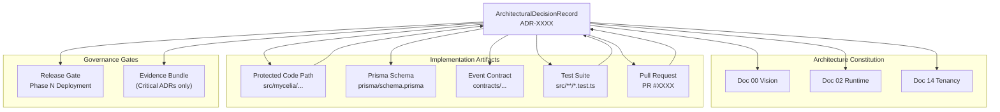
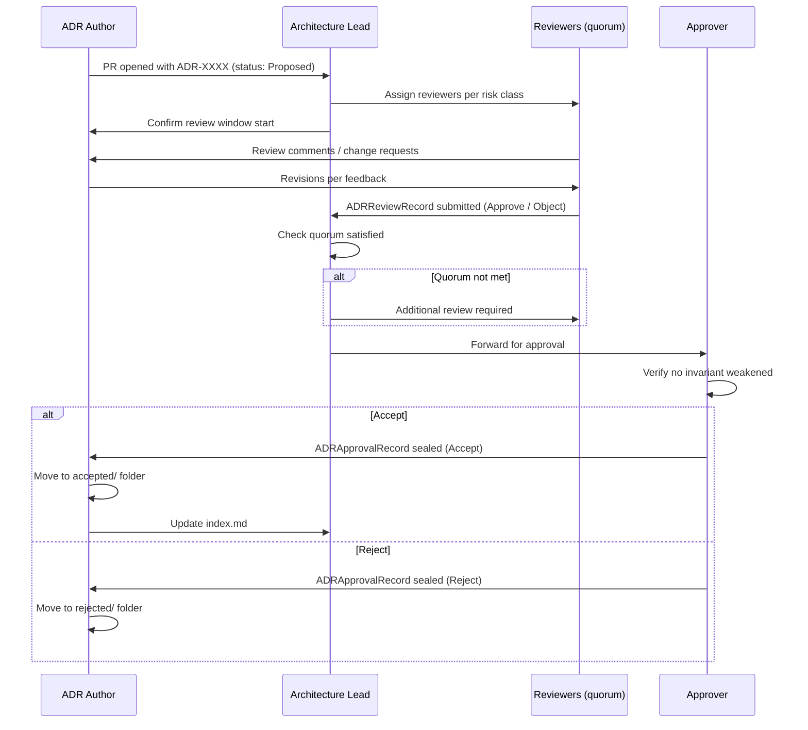
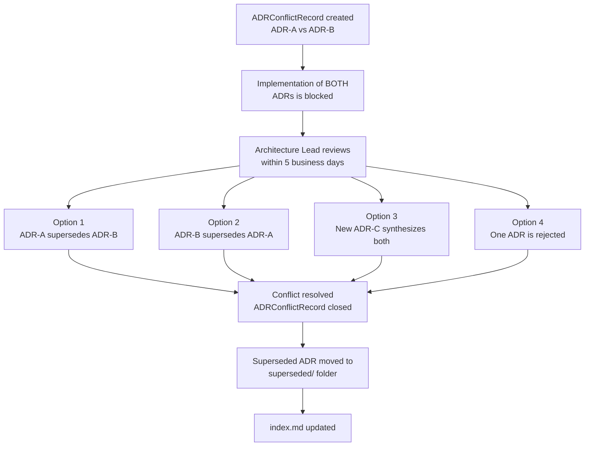
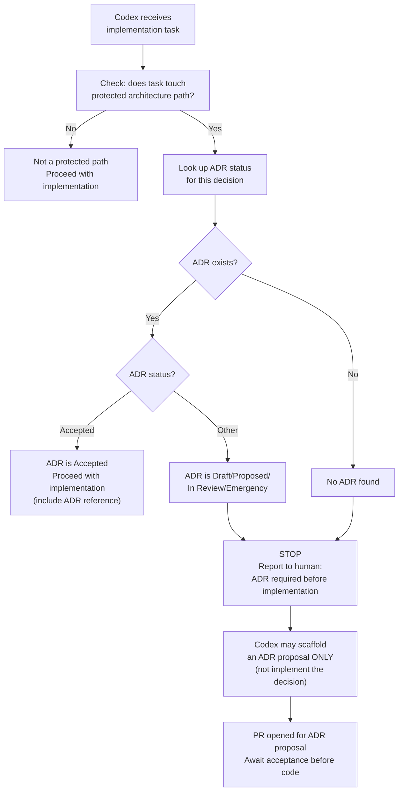
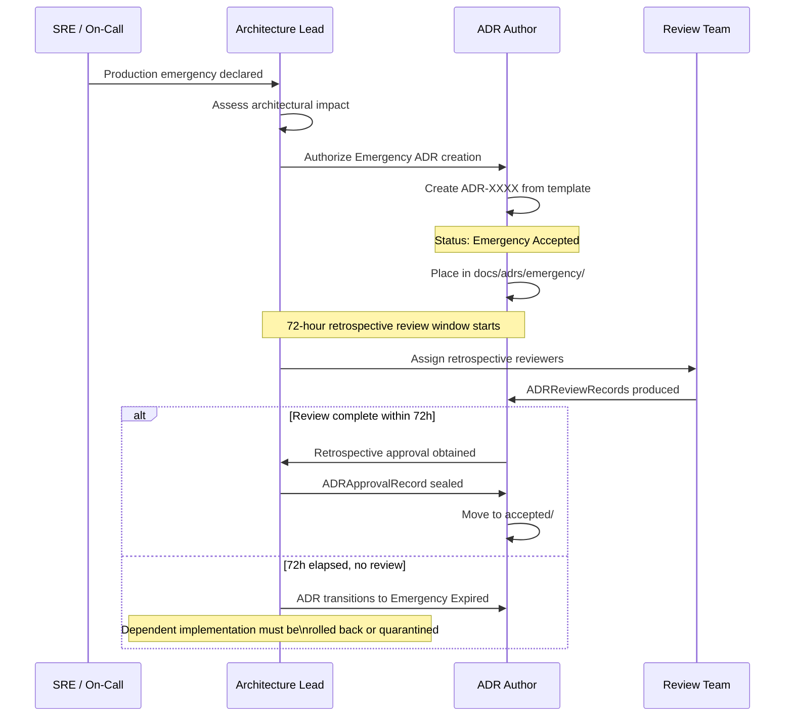
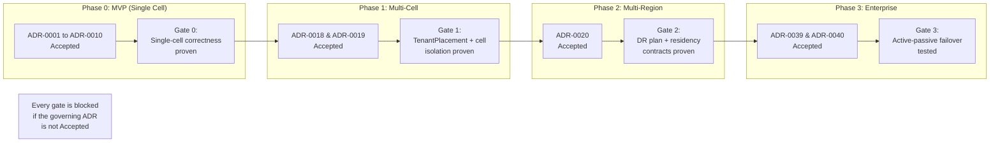

# MYCELIA — 25 Architectural Decision Records Index

---

## Document Metadata

| Field | Value |
|---|---|
| Document Series | MYCELIA Architecture Constitution |
| Document Number | 25 |
| Version | v1.0 |
| Status | Canonical |
| Classification | Core Architecture — Architectural Decision Records Index |
| Canonical Role | Defines MYCELIA's Architectural Decision Record registry, lifecycle, taxonomy, approval model, decision traceability, mandatory ADR triggers, initial ADR index, Codex decision boundaries and architecture governance process. |
| Primary Audience | Platform Engineers, Runtime Engineers, Governance Architects, Security Architects, SRE, Product Architecture, Auditors, Technical Leads, Codex |
| Last Updated | June 2026 |

---

## Table of Contents

1. [Executive Summary](#1-executive-summary)
2. [ADR Philosophy](#2-adr-philosophy)
3. [Scope and Non-Scope](#3-scope-and-non-scope)
4. [ADR Authority Model](#4-adr-authority-model)
5. [ADR Repository Structure](#5-adr-repository-structure)
6. [ADR Numbering and Naming Convention](#6-adr-numbering-and-naming-convention)
7. [ADR Metadata Schema](#7-adr-metadata-schema)
8. [ADR Lifecycle and Status Model](#8-adr-lifecycle-and-status-model)
9. [ADR Classification and Risk Model](#9-adr-classification-and-risk-model)
10. [ADR Ownership and Review Model](#10-adr-ownership-and-review-model)
11. [Mandatory ADR Triggers](#11-mandatory-adr-triggers)
12. [ADR Decision Taxonomy](#12-adr-decision-taxonomy)
13. [ADR Traceability Model](#13-adr-traceability-model)
14. [ADR Relationship to Architecture Documents](#14-adr-relationship-to-architecture-documents)
15. [ADR Relationship to Code, Contracts and Tests](#15-adr-relationship-to-code-contracts-and-tests)
16. [ADR Relationship to Security, Tenant and Governance Boundaries](#16-adr-relationship-to-security-tenant-and-governance-boundaries)
17. [ADR Relationship to Evaluation and Release Gates](#17-adr-relationship-to-evaluation-and-release-gates)
18. [ADR Relationship to Incidents and Emergency Changes](#18-adr-relationship-to-incidents-and-emergency-changes)
19. [ADR Supersession, Deprecation and Conflict Resolution](#19-adr-supersession-deprecation-and-conflict-resolution)
20. [ADR Evidence and Audit Requirements](#20-adr-evidence-and-audit-requirements)
21. [Initial ADR Registry Index](#21-initial-adr-registry-index)
22. [Required ADR Backlog](#22-required-adr-backlog)
23. [ADR Review Checklist](#23-adr-review-checklist)
24. [ADR Templates and Field Requirements](#24-adr-templates-and-field-requirements)
25. [ADR Diagrams](#25-adr-diagrams)
26. [ADR Failure Modes](#26-adr-failure-modes)
27. [ADR Invariants](#27-adr-invariants)
28. [ADR Anti-Patterns](#28-adr-anti-patterns)
29. [Codex Implementation Guidance](#29-codex-implementation-guidance)
30. [MVP ADR Governance Cut](#30-mvp-adr-governance-cut)
31. [Relationship to Other MYCELIA Documents](#31-relationship-to-other-mycelia-documents)
32. [Final ADR Principles](#32-final-adr-principles)

---

## 1. Executive Summary

### 1.1 What This Document Defines

Document 25 defines the **Architectural Decision Records Index** for MYCELIA — the canonical governance layer for how architectural decisions are recorded, reviewed, approved, traced, superseded, and protected against drift across the entire MYCELIA platform.

Documents 00 through 24 define the architecture of MYCELIA: what the system is, how it operates, how it scales, and what invariants it preserves. Document 25 defines how the architecture remembers its own decisions — and how those decisions are connected to the code, contracts, tests, infrastructure, and operational processes that implement them.

An Architectural Decision Record (ADR) is not a retrospective document. It is a forward declaration. Before any architectural choice that alters MYCELIA's runtime behaviour, tenant isolation model, governance enforcement, replay semantics, evidence chain, or public contract, an ADR MUST exist and MUST have passed review. Code that implements a decision that has no ADR is an ungoverned architectural act.

### 1.2 Why ADR Governance Is Architectural Infrastructure

MYCELIA is a governed cognitive operations runtime. Its entire value proposition rests on the verifiability of its decisions: every governed run produces auditable evidence; every policy decision is traced; every tenant boundary is enforced. This same commitment to traceability MUST apply to the architectural decisions that built the runtime.

Without ADR governance:

- A critical isolation decision made during a late-night sprint disappears into a PR comment and shapes the system forever without review.
- A Codex-generated abstraction that alters event envelope semantics bypasses the architecture review process entirely.
- A dependency adopted because it was convenient silently changes the system's consistency guarantees.
- A schema migration created before the corresponding decision was reviewed introduces irreversible state structure.
- An emergency change made under production pressure is never formally documented, and its scope expands beyond its intended blast radius.

ADR governance is not bureaucracy. It is architecture memory. Architecture that cannot remember its own decisions cannot be governed.

### 1.3 Document Authority

Document 25 is authoritative for: ADR registry structure, ADR lifecycle, ADR status semantics, ADR ownership and review process, mandatory ADR triggers, protected architecture paths, ADR traceability to all prior documents, Codex decision boundaries, and the initial ADR index for MYCELIA.

When there is a question about whether a decision requires an ADR, whether a proposed ADR is correctly formed, whether a Codex change requires an ADR first, or whether an existing ADR has been superseded, Document 25 is the answer.

---

## 2. ADR Philosophy

### 2.1 Architecture Decisions Are Governance Acts

Every decision that changes the behaviour, boundary, contract, or invariant of the MYCELIA runtime is an architectural governance act. Governance acts MUST be recorded, reviewed, and traceable. An unrecorded governance act is an ungoverned governance act.

### 2.2 ADR Is Architecture Memory, Not Architecture Theater

ADRs exist to preserve the reasoning behind decisions, not to create paperwork. An ADR that records only the decision without recording the alternatives considered, the trade-offs accepted, and the invariants assessed is not useful architecture memory — it is a rubber stamp.

Every ADR MUST document:

- The problem that required a decision.
- The alternatives that were considered and why they were rejected.
- The trade-offs accepted by the chosen alternative.
- The invariants from Documents 00–24 that the decision intersects.
- The conditions under which the decision should be revisited.

### 2.3 The Decision Lifecycle Precedes the Code Lifecycle

Architecture decisions MUST be made before the code that implements them is written. A decision recorded after implementation is not a decision — it is a description. Post-hoc ADRs are permitted for documenting decisions that preceded the ADR registry, but they MUST be clearly marked as retrospective and MUST include an assessment of whether the decision should be revisited.

### 2.3.1 Retrospective ADR Boundary

Retrospective ADRs are permitted only to formalize architectural decisions that existed before the ADR governance system was established.

A retrospective ADR is not a normal decision process. It is a recovery mechanism for architecture memory.

#### Rules

- Retrospective ADRs MUST be explicitly labeled `Retrospective`.
- Retrospective ADRs MUST state the historical decision date or approximate period.
- Retrospective ADRs MUST state why the ADR was not created before implementation.
- Retrospective ADRs MUST include a current-state validation section.
- Retrospective ADRs MUST assess whether the historical decision should be kept, superseded or revisited.
- Retrospective ADRs MUST NOT be used for new decisions after ADR governance is active.
- Codex MUST NOT create retrospective ADRs for decisions it is about to implement.

#### Forbidden Behavior

FORBIDDEN:

- using retrospective ADRs to bypass normal review;
- labeling new decisions as retrospective;
- writing retrospective ADRs without validating current implementation;
- treating retrospective ADRs as proof that the original process was governed;
- allowing Codex to implement first and then generate a retrospective ADR.

### 2.4 Decisions Have Owners and Expiry

Every ADR has an owner who is accountable for its correctness, currency, and eventual supersession. An ADR that was valid at the time of its acceptance may become invalid as the platform evolves. ADR owners are responsible for initiating supersession when the decision is no longer accurate. An ADR that is silently wrong is more dangerous than no ADR.

### 2.5 Emergency Does Not Exempt from ADR

Emergency architectural changes are frequently the most consequential. A change made under production pressure with minimal review is the most likely to introduce subtle governance violations, isolation regressions, or irreversible state transitions. Emergency ADRs MUST be created, reviewed retrospectively, and either confirmed or superseded within a defined window. An emergency change that is never formalized becomes permanent by inertia.

---

## 3. Scope and Non-Scope

### 3.1 What Document 25 Owns

| Responsibility | Description |
|---|---|
| ADR registry model | Definition of ADRRegistry, ADRIndex, ArchitecturalDecisionRecord entities |
| ADR lifecycle | Draft → Proposed → In Review → Accepted/Rejected/Withdrawn |
| ADR status semantics | Per-status meaning, permissions, and implementation gating |
| ADR authority model | Who proposes, reviews, approves, supersedes |
| ADR repository structure | Directory layout and index maintenance rules |
| Mandatory ADR triggers | Full list of changes that require ADR before code |
| ADR decision taxonomy | Category classification for all decision types |
| ADR traceability | Links to documents, entities, contracts, tests, PRs, evidence |
| Initial ADR index | ADR-0001 through ADR-0025 as proposed registry |
| ADR backlog | Future ADRs not yet numbered |
| ADR review checklist | Complete checklist for proposal reviews |
| ADR template | Canonical template with all required fields |
| Emergency ADR rules | Creation, scope, retrospective review, expiry |
| Codex ADR boundaries | What Codex may and may not implement without an accepted ADR |
| Protected architecture paths | Code paths that require ADR scrutiny on change |
| MVP governance cut | Minimum ADR infrastructure required before first production deployment |
| ADR failure modes | What goes wrong and how it is detected |
| ADR invariants | Non-negotiable rules governing the ADR system itself |
| ADR anti-patterns | Recurring mistakes in ADR governance practice |

### 3.2 What Document 25 Does Not Own

| Responsibility | Owned By |
|---|---|
| Actual implementation decisions for runtime architecture | Documents 02–24 and their corresponding ADRs |
| Infrastructure tooling configuration | Document 16 |
| SRE operational runbooks | Document 17 |
| Event contract field definitions | Document 07 |
| Tenant isolation enforcement semantics | Document 14 |
| Codex phase-by-phase implementation order | Document 19 |
| Evaluation and benchmark framework details | Document 23 |
| Enterprise scaling architecture | Document 24 |
| Product roadmap or sprint planning | Product Management |

---

## 4. ADR Authority Model

### 4.1 Roles and Permissions

| Role | Entity | Permissions |
|---|---|---|
| ADR Author / Proposer | ADRDecisionOwner | Draft, propose, and update ADRs within their domain |
| ADR Reviewer | ADRReviewer | Review, comment, and provide formal review record |
| ADR Approver | ADRApprover | Accept or reject reviewed ADRs; gate implementation |
| Architecture Lead | ADRApprover (senior) | Supersede, deprecate, resolve conflicts, approve Emergency ADRs |
| Security Architect | ADRReviewer (required for security-impacting ADRs) | Required co-reviewer for any ADR with security impact |
| Governance Architect | ADRReviewer (required for governance-impacting ADRs) | Required co-reviewer for any ADR changing policy, approval or evidence semantics |
| Codex | ADRDecisionOwner (scaffolding ADRs only) | May propose scaffolding ADRs; MUST NOT accept or approve its own ADRs |
| SRE Lead | ADRReviewer (required for SRE-impacting ADRs) | Required co-reviewer for any ADR with SRE runbook impact |

### 4.2 Approval Quorum Requirements

| ADR Risk Class | Minimum Approvers | Required Reviewers |
|---|---|---|
| Critical | Architecture Lead + 2 approvers | Security Architect, Governance Architect |
| High | Architecture Lead + 1 approver | Domain owner + Security Architect or Governance Architect |
| Medium | 1 approver | Domain owner |
| Low | 1 approver | Domain owner |
| Emergency | Architecture Lead | Retrospective review within 72 hours |

### 4.3 Domain Entity: ADRDecisionOwner

**Purpose:** The named individual or team accountable for proposing and maintaining an ADR throughout its lifecycle. Decision owner is not necessarily the implementer.

| Attribute | Value |
|---|---|
| Source of truth | ADR metadata header |
| Mutability | May be updated via ADR revision; version bump required |
| Required fields | name, role, domain |
| Audit implication | Every ADR status transition records the owner at time of transition |

### 4.4 Domain Entity: ADRReviewer

**Purpose:** An individual formally assigned to review an ADR and produce an ADRReviewRecord. Reviewer feedback is required before approval.

| Attribute | Value |
|---|---|
| Source of truth | ADR metadata header |
| Mutability | Additional reviewers may be assigned; cannot be removed after review is recorded |
| Required fields | name, role, domain, review date |

### 4.5 Domain Entity: ADRApprover

**Purpose:** An individual formally authorized to accept or reject an ADR. The ADRApprover produces an ADRApprovalRecord that gates implementation.

| Attribute | Value |
|---|---|
| Source of truth | ADRApprovalRecord in the ADR file |
| Mutability | Immutable once recorded |
| Required fields | name, role, decision (Accept/Reject), date, rationale |
| Audit implication | ADRApprovalRecord is a sealed governance record — it MUST NOT be retroactively modified |


---

## 5. ADR Repository Structure

### 5.1 Canonical Directory Layout

The canonical repository location for all MYCELIA ADRs is `docs/adrs/`. This path is a protected architecture path. Changes to any file under `docs/adrs/` require an ADR reference in the PR.

```
docs/adrs/
├── README.md                          # Overview and quick reference
├── 0000-adr-template.md               # Canonical ADR template (see Section 24)
├── index.md                           # Complete ADR registry index (see Section 21)
├── accepted/                          # All accepted and active ADRs
│   ├── ADR-0001-adopt-architecture-constitution.md
│   ├── ADR-0002-quarantine-legacy-mapia-runtime.md
│   └── ...
├── proposed/                          # ADRs under active review
│   └── ADR-NNNN-short-title.md
├── superseded/                        # ADRs replaced by a newer ADR
│   └── ADR-NNNN-short-title.md        # Original file kept; supersession metadata added
├── deprecated/                        # ADRs no longer applicable; not replaced
│   └── ADR-NNNN-short-title.md
├── rejected/                          # ADRs formally rejected; preserved for history
│   └── ADR-NNNN-short-title.md
├── emergency/                         # Emergency ADRs pending retrospective review
│   └── ADR-NNNN-short-title.md        # Moved to accepted/ or superseded/ after review
└── backlog/                           # Future ADRs not yet formally proposed
    └── BACKLOG-ADR-XXXX-short-title.md
```

### 5.2 Directory Semantics

| Directory | Contents | Mutability | Notes |
|---|---|---|---|
| `accepted/` | All currently-active accepted ADRs | ADR file is immutable; revision creates new version in same file | Active governance layer |
| `proposed/` | ADRs that have been formally proposed and are under review | Mutable until In Review status; then immutable until decision | Blocking implementation |
| `superseded/` | ADRs replaced by a newer ADR | Immutable after supersession record is added | Preserved for history |
| `deprecated/` | ADRs that no longer apply and have no replacement | Immutable after deprecation record | Preserved for history |
| `rejected/` | ADRs formally rejected | Immutable after rejection record | Preserved to prevent re-proposal without context |
| `emergency/` | Emergency ADRs pending formal retrospective review | Mutable during review window | MUST be resolved within 72 hours |
| `backlog/` | Future ADR placeholders not yet formally proposed | Mutable; no governance weight | Tracked in index with BACKLOG status |

### 5.3 Index Maintenance Rules

- `docs/adrs/index.md` MUST be updated in the same PR that introduces a new ADR file.
- A PR that adds, modifies, or supersedes an ADR without updating `index.md` MUST fail CI validation.
- The index MUST reflect the current status of every ADR, including its directory location.
- Backlog items MUST appear in the index with `BACKLOG` status.
- The index is the navigational registry, but directory/index divergence is an ADR integrity failure.
- If an ADR file exists in a status directory but is missing from `docs/adrs/index.md`, CI MUST fail.
- If `docs/adrs/index.md` references an ADR file that does not exist, CI MUST fail.
- If an ADR status in `index.md` conflicts with the ADR file metadata or directory location, CI MUST fail.
- No implementation may rely on an ADR while the ADR registry is inconsistent.

#### ADR Registry Consistency Boundary

ADR registry consistency is fail-closed.

The ADR index, ADR file metadata and ADR directory location MUST agree before the ADR can be used as implementation authority.

##### Forbidden Behavior

FORBIDDEN:

- allowing `index.md` to silently override ADR file metadata;
- allowing ADR files to exist outside the index;
- allowing stale index status to authorize implementation;
- allowing Codex to proceed when ADR registry consistency checks fail;
- manually moving ADR files between status folders without updating metadata and index.

### 5.4 README.md Requirements

`docs/adrs/README.md` MUST contain:

- A brief description of what ADRs are and why MYCELIA uses them.
- A pointer to `index.md` as the canonical registry.
- The ADR creation workflow (use template, assign number, place in `proposed/`, PR).
- The definition of each status value.
- Contact for Architecture Lead.
- Link to Document 25 in `docs/mycelia/25-architectural-decision-records-index.md`.

---

## 6. ADR Numbering and Naming Convention

### 6.1 Numbering Rules

| Rule | Definition |
|---|---|
| ADR-0000 | Reserved for the canonical template. Never used for a real decision. |
| ADR-0001 onward | All real architectural decisions. Numbers are sequential and never reused. |
| Immutability | An ADR number is permanently assigned. A superseded ADR keeps its number. |
| No gaps | Numbers MUST be assigned sequentially. Gaps in the registry indicate a missing or unreferenced ADR and MUST be investigated. |
| Emergency ADRs | Receive normal sequential ADR numbers. Emergency status is a classification, not a numbering prefix. |
| Backlog items | Use `BACKLOG-ADR-XXXX` format while in backlog. On promotion to `proposed/`, they receive the next available ADR number. |

### 6.2 File Naming Convention

All ADR files MUST use the following naming format:

```
ADR-{NUMBER}-{short-kebab-case-title}.md
```

Rules:
- Number is zero-padded to four digits: `0001`, `0025`, `0100`.
- Title is lower-kebab-case: words separated by hyphens, no underscores, no spaces.
- Title is a brief noun phrase describing the decision, not the outcome.
- Maximum 80 characters for the complete filename including extension.

**Required examples:**

```
ADR-0001-adopt-architecture-constitution.md
ADR-0002-quarantine-legacy-mapia-runtime.md
ADR-0003-adopt-phase-based-codex-implementation.md
ADR-0017-adopt-worker-lease-and-fencing-token-boundary.md
ADR-0025-adopt-adr-governance-as-architecture-memory.md
```

**Invalid examples:**

```
decision-about-events.md              # No ADR number
ADR-001-EventEnvelopeChange.md        # CamelCase; number not zero-padded to 4 digits
ADR-0001.md                           # No title slug
adr_0001_tenant_isolation.md          # Underscores; lowercase 'adr'
```

### 6.3 Versioning Within an ADR

An ADR is a living document within its accepted lifetime. Minor amendments (clarifications, reference additions, reviewer additions) are made in-place with a version bump and changelog entry within the ADR file. The version is tracked in the metadata header as `version: 1.x`.

A material change to the decision itself MUST create a new ADR that supersedes the original. The original ADR is moved to `superseded/` with a supersession record pointing to the new ADR number.

---

## 7. ADR Metadata Schema

### 7.1 Domain Entity: ArchitecturalDecisionRecord

**Purpose:** The canonical record of an architectural decision in MYCELIA. Captures the problem, context, decision, alternatives, consequences, and all governance impact assessments. The fundamental unit of architecture memory.

| Attribute | Value |
|---|---|
| Source of truth | `docs/adrs/{status}/ADR-{NUMBER}-{title}.md` |
| Mutability | Mutable within an accepted lifecycle via version bumps; material changes create a new superseding ADR |
| Required fields | title, status, date, decision_owner, problem, decision, alternatives, consequences |
| Status behavior | Transitions are append-only; each transition is recorded with date and actor |
| Tenant impact | All ADRs affecting tenant isolation MUST include ADRTenantImpactAssessment |
| Security impact | All ADRs affecting trust, credentials, identity, or secret management MUST include ADRSecurityImpactAssessment |
| Audit implication | ADRApprovalRecord and ADRReviewRecord are sealed governance records |
| Related documents | Every ADR MUST reference at least one of Documents 00–24 |

### 7.2 Domain Entity: ADRRegistry

**Purpose:** The complete, ordered set of all ArchitecturalDecisionRecords in MYCELIA. Implemented as `docs/adrs/index.md` with cross-references to individual ADR files.

| Attribute | Value |
|---|---|
| Source of truth | `docs/adrs/index.md` |
| Mutability | Append-only for new ADRs; status updates reflect current state |
| Required fields | adr_number, title, status, category, risk_class, date_accepted, related_documents |
| Audit implication | The registry is audited for completeness; gaps or inconsistencies MUST be reported |

### 7.3 Domain Entity: ADRIndex

**Purpose:** The navigational index view of the ADRRegistry, organized for human browsing. Groups ADRs by category and status.

| Attribute | Value |
|---|---|
| Source of truth | `docs/adrs/index.md` (same file as ADRRegistry) |
| Mutability | Updated in the same PR as any ADR change |

### 7.4 Domain Entity: ADRCategory

**Purpose:** A classification label that places an ADR within one of the defined decision taxonomy buckets (see Section 12). Used for registry filtering and traceability.

| Attribute | Value |
|---|---|
| Source of truth | ADR metadata header; taxonomy defined in Section 12 |
| Mutability | Set at proposal time; may be updated with Architecture Lead approval |

### 7.5 Domain Entity: ADRStatus

**Purpose:** The current governance state of an ADR. Determines whether implementation is permitted, blocked, or conditional. See Section 8 for the complete status lifecycle.

| Attribute | Value |
|---|---|
| Source of truth | ADR metadata header |
| Mutability | Append-only status history; current status reflected in header |
| Status values | Draft, Proposed, In Review, Accepted, Rejected, Superseded, Deprecated, Emergency Accepted, Emergency Expired, Withdrawn |

### 7.6 Domain Entity: ADRRiskClass

**Purpose:** A classification of the governance impact and reversibility risk of a decision. Determines the approval quorum required.

| Risk Class | Definition |
|---|---|
| Critical | Decision affects tenant isolation, security trust boundary, evidence sealing, policy enforcement, or replay namespace integrity. Reversal is expensive or impossible. |
| High | Decision affects a major runtime contract, event schema, persistence model, worker lease behavior, or public API surface. Reversal requires migration. |
| Medium | Decision affects internal architecture, infrastructure choice, tooling, or implementation approach. Reversal is feasible. |
| Low | Decision affects naming, organizational convention, documentation structure, or development practice. Reversal is trivial. |

### 7.7 Domain Entity: ADRReviewRecord

**Purpose:** The formal record of a reviewer's assessment of an ADR. Produced per reviewer. The aggregate of all ADRReviewRecords constitutes the review evidence for an ADR.

| Attribute | Value |
|---|---|
| Source of truth | Appended to the ADR file under a `## Review Records` section |
| Mutability | Immutable once recorded |
| Required fields | reviewer_name, reviewer_role, date, verdict (Approve/Request Changes/Object), comments |
| Audit implication | Sealed governance record; MUST NOT be retroactively modified |

### 7.8 Domain Entity: ADRApprovalRecord

**Purpose:** The formal record of an approver's decision to accept or reject an ADR. Gates implementation.

| Attribute | Value |
|---|---|
| Source of truth | Appended to the ADR file under a `## Approval Record` section |
| Mutability | Immutable once recorded |
| Required fields | approver_name, approver_role, decision (Accept/Reject), date, rationale |
| Audit implication | Sealed governance record |

### 7.9 Domain Entity: ADRSupersessionRecord

**Purpose:** The record that a given ADR has been replaced by a newer ADR. Appended to the superseded ADR file.

| Attribute | Value |
|---|---|
| Required fields | superseded_by (ADR number), date, rationale |
| Mutability | Immutable once recorded |

### 7.10 Domain Entity: ADRDeprecationRecord

**Purpose:** The record that a given ADR is no longer applicable without a direct replacement.

| Attribute | Value |
|---|---|
| Required fields | deprecation_date, rationale, approver |
| Mutability | Immutable once recorded |

### 7.11 Domain Entity: ADRConflictRecord

**Purpose:** The formal record that two ADRs produce conflicting guidance. A conflict MUST be resolved before either ADR can be implemented.

| Attribute | Value |
|---|---|
| Required fields | conflicting_adr_a, conflicting_adr_b, conflict_description, resolution_plan |
| Mutability | Mutable until conflict is resolved |
| Status | Open or Resolved |

### 7.12 Domain Entity: ADRExceptionRecord

**Purpose:** A time-bounded exception to an accepted ADR, granted by an Architecture Lead. Exceptions MUST have an expiry date and a remediation plan.

| Attribute | Value |
|---|---|
| Required fields | exception_to (ADR number), granted_by, expiry_date, scope, remediation_plan |
| Mutability | Immutable once granted; expiry is enforced |

### 7.13 Domain Entity: ADRTraceabilityLink

**Purpose:** A bidirectional reference connecting an ADR to a specific implementation artifact (document, entity, contract, test, PR, release gate, evidence bundle).

| Link Type | Target | Semantic |
|---|---|---|
| Document link | MYCELIA document number | ADR governs a decision described in this document |
| Entity link | Domain entity name + document reference | ADR governs this entity's definition |
| Contract link | Contract file path or registry key | ADR governs this event/API contract |
| Test link | Test file path or test suite name | ADR requires these tests to pass |
| Code link | Source path or module name | ADR governs this code path |
| PR link | PR number or URL | PR implements this ADR |
| Release gate link | Gate identifier | ADR gates this release |
| Evidence link | Evidence bundle ID | ADR requires this evidence bundle |

### 7.14 Domain Entity: ADRImpactAssessment

**Purpose:** The composite assessment of a decision's impact across all governance domains. Required for every ADR with risk class Medium or higher.

**Sub-entities:**

| Entity | Required For |
|---|---|
| ADRTenantImpactAssessment | Any decision affecting tenant boundary, placement, isolation, or data scoping |
| ADRSecurityImpactAssessment | Any decision affecting trust, identity, credentials, secrets, or security contracts |
| ADRReplayImpactAssessment | Any decision affecting replay namespace, replay fidelity, or event lineage |
| ADREvidenceImpactAssessment | Any decision affecting evidence sealing, audit records, or chain-of-custody |
| ADREvaluationImpactAssessment | Any decision affecting evaluation runtime, benchmark scoring, or release gates |

### 7.15 Other Domain Entities

| Entity | Purpose |
|---|---|
| ADRImplementationReference | Links ADR to specific code files, modules, or PRs that implement it |
| ADRContractReference | Links ADR to event schemas, API contracts, or interface definitions it governs |
| ADRTestReference | Links ADR to tests that verify its implementation |
| ADRReleaseGateReference | Links ADR to a release gate that must pass for the decision to be considered implemented |
| ADRIncidentReference | Links ADR to an incident that prompted a decision or was caused by its absence |
| ADRCodexInstruction | Embedded within the ADR to instruct Codex on how to implement the decision |
| ADRBacklogItem | A placeholder for a future ADR not yet formally proposed |
| ADRChangeRequest | A formal request to modify an accepted ADR |
| EmergencyADR | A subtype of ArchitecturalDecisionRecord created under production emergency conditions |
| ArchitectureGovernanceReview | A periodic review of the ADR registry's completeness and currency |

---

## 8. ADR Lifecycle and Status Model

### 8.1 Status Values

| Status | Meaning | Who Can Set | Implementation Allowed | Codex May Implement |
|---|---|---|---|---|
| **Draft** | Initial working document; not yet formally proposed | ADR Author | No | No |
| **Proposed** | Formally submitted for review; review process begins | ADR Author via PR | No | No |
| **In Review** | Active review by assigned reviewers | Architecture Lead | No | No |
| **Accepted** | Approved by required quorum; governs implementation | ADRApprover | Yes | Yes (with ADR reference) |
| **Rejected** | Formally declined; reasoning preserved | ADRApprover | No (this decision path) | No |
| **Superseded** | Replaced by a newer ADR; archived | Architecture Lead | No (refer to superseding ADR) | No |
| **Deprecated** | No longer applicable; no replacement | Architecture Lead | No | No |
| **Emergency Accepted** | Accepted under emergency conditions; pending retrospective review | Architecture Lead only | Yes (scoped to emergency) | No (requires retrospective confirmation) |
| **Emergency Expired** | Emergency review window elapsed without confirmation; decision voided | Automatic / Architecture Lead | No | No |
| **Withdrawn** | Author withdrew the proposal before approval | ADR Author | No | No |

### 8.1.1 ADR Status Authority Boundary

ADR status determines implementation authority.

Only `Accepted` grants normal implementation authority. `Emergency Accepted` grants temporary, scoped authority only within the declared emergency scope and review window.

#### Implementation Authority by Status

| Status | May Scaffold? | May Implement Functional Behavior? | May Deploy? |
|---|---:|---:|---:|
| Draft | Yes, ADR file only | No | No |
| Proposed | Yes, ADR file and review support only | No | No |
| In Review | Yes, review edits only | No | No |
| Accepted | Yes | Yes, within ADR scope | Yes, subject to release gates |
| Rejected | No | No | No |
| Superseded | No | No | No |
| Deprecated | No | No | No |
| Emergency Accepted | Yes | Yes, only within emergency scope | Yes, only within emergency scope |
| Emergency Expired | No | No | No |
| Withdrawn | No | No | No |

#### Rules

- Proposed ADRs MUST NOT be used to justify implementation.
- Draft ADRs MUST NOT be referenced as governance authority.
- Emergency Accepted ADRs MUST define scope, expiry and rollback requirement.
- Emergency Accepted ADRs MUST NOT authorize unrelated implementation.
- Implementation under Emergency Accepted status MUST be tagged as emergency-scoped and reviewed after the emergency window.
- Expired Emergency ADRs remove authority from dependent implementation.

#### Forbidden Behavior

FORBIDDEN:

- implementing from a Proposed ADR because acceptance is "expected";
- allowing Codex to implement from Draft ADRs;
- treating Emergency Accepted as permanent approval;
- expanding emergency implementation beyond declared scope;
- deploying code dependent on Emergency Expired ADRs.

### 8.2 Status Transition Rules

- Status transitions are append-only. An ADR's history MUST NOT be modified retroactively.
- A status may not skip stages. Draft → Proposed → In Review → Accepted is the only forward path.
- A Rejected ADR MUST preserve the rejection rationale. A re-proposal on the same topic MUST reference and address the rejection.
- A Superseded ADR keeps its number and file. The supersession record points to the new ADR.
- An Emergency Accepted ADR MUST be retrospectively reviewed within 72 hours. If the review does not occur, the ADR transitions to Emergency Expired automatically.
- A Withdrawn ADR may be re-proposed with a new ADR number if the author wishes to re-open the topic.

### 8.3 Required Evidence Per Status Transition

| Transition | Required Evidence |
|---|---|
| Draft → Proposed | ADR file complete per template; ADR number assigned; index updated; PR opened |
| Proposed → In Review | PR assigned to reviewers; Architecture Lead notified |
| In Review → Accepted | All reviewer records present; quorum satisfied per risk class; ADRApprovalRecord appended; index updated |
| In Review → Rejected | ADRApprovalRecord appended with rejection rationale |
| Accepted → Superseded | New ADR accepted; ADRSupersessionRecord appended to original; index updated |
| Accepted → Deprecated | Architecture Lead approval; ADRDeprecationRecord appended |
| Any → Emergency Accepted | Architecture Lead declaration; scope documented; 72-hour review window starts |
| Emergency Accepted → Accepted | Retrospective review complete; all normal review records appended |
| Emergency Accepted → Emergency Expired | 72-hour window elapsed; no review completed |


---

## 9. ADR Classification and Risk Model

### 9.1 Risk Class Determination Matrix

| Criterion | Critical | High | Medium | Low |
|---|---|---|---|---|
| Affects tenant isolation or data boundary | Yes | — | — | — |
| Affects security trust, identity, or secrets | Yes | — | — | — |
| Affects evidence sealing or audit chain | Yes | — | — | — |
| Affects policy enforcement or approval semantics | Yes | — | — | — |
| Affects replay namespace or replay fidelity | Yes | — | — | — |
| Introduces irreversible state structure | Yes | — | — | — |
| Affects EventEnvelope schema or event ordering | — | Yes | — | — |
| Introduces public API contract | — | Yes | — | — |
| Introduces persistence schema (Prisma) | — | Yes | — | — |
| Changes GovernedRun lifecycle | — | Yes | — | — |
| Introduces worker lease or fencing token | — | Yes | — | — |
| Changes major infrastructure dependency | — | Yes | — | — |
| Affects multi-cell or multi-region behavior | — | Yes | — | — |
| Internal architecture abstraction, new module | — | — | Yes | — |
| Infrastructure tooling choice | — | — | Yes | — |
| Code organization, naming, convention | — | — | — | Yes |
| Documentation structure | — | — | — | Yes |

When multiple criteria apply, the highest applicable risk class governs.

### 9.2 Risk Class and Review Requirements

| Risk Class | Minimum Review Period | Required Reviewers | Approval Quorum |
|---|---|---|---|
| Critical | 5 business days | Security Architect + Governance Architect + Domain Owner | Architecture Lead + 2 |
| High | 3 business days | Domain Owner + Security or Governance Architect (as applicable) | Architecture Lead + 1 |
| Medium | 2 business days | Domain Owner | 1 Approver |
| Low | 1 business day | Domain Owner | 1 Approver |
| Emergency | 72 hours retrospective | Architecture Lead | Architecture Lead (immediate) |

---

## 10. ADR Ownership and Review Model

### 10.1 Decision Owner Responsibilities

The ADRDecisionOwner MUST:

- Author the ADR to completion per the template in Section 24.
- Respond to reviewer comments within 1 business day during the review period.
- Update the ADR in response to approved reviewer change requests.
- Maintain the ADR after acceptance, including initiating supersession when the decision is outdated.
- Monitor implementation references and confirm they are correct.
- Notify the Architecture Lead when the decision is no longer current.

### 10.2 Reviewer Responsibilities

Every ADRReviewer MUST:

- Read the ADR in full, including all impact assessments.
- Produce a formal ADRReviewRecord with a specific verdict (Approve / Request Changes / Object).
- Reference specific sections when requesting changes.
- Complete the review within the minimum review period for the risk class.
- A reviewer who misses the review window without notification is escalated to Architecture Lead.

### 10.3 Approver Responsibilities

Every ADRApprover MUST:

- Confirm that all reviewer records are present and quorum is satisfied.
- Confirm that no open reviewer objections remain.
- Confirm that the ADR does not weaken any invariant from Documents 00–24.
- Produce a sealed ADRApprovalRecord.
- Update the ADR status and move the file to the `accepted/` directory in the same PR.

### 10.4 Architecture Lead Responsibilities

The Architecture Lead:

- Maintains the ADR registry's completeness and currency.
- Resolves ADRConflictRecords.
- Approves Emergency ADRs.
- Initiates ArchitectureGovernanceReview on a defined cadence (at minimum, once per quarter).
- Ensures that no protected architecture path is changed without a corresponding accepted ADR.
- Maintains the list of protected architecture paths (Section 15.3).

---

## 11. Mandatory ADR Triggers

An ADR MUST be created and reach **Accepted** status before any code implementing the following changes may be merged to the main branch.

### 11.1 Runtime and Domain Model Changes

| Trigger | Risk Class |
|---|---|
| Changing tenant isolation semantics at any layer | Critical |
| Changing policy enforcement semantics or PolicyDecisionGateway behavior | Critical |
| Changing approval or governance workflow semantics | Critical |
| Changing EventEnvelope schema (fields, types, ordering semantics) | High |
| Changing event ordering, partitioning rules, or partition key semantics | High |
| Introducing or changing GovernedRun lifecycle states | High |
| Introducing or changing StateTransitionCoordinator behavior | High |
| Introducing or modifying runtime state machine transitions | High |
| Changing memory or context retrieval boundary | High |
| Adopting a model provider for high-risk runtime behavior | High |

### 11.2 Replay, Evidence, and Security Changes

| Trigger | Risk Class |
|---|---|
| Changing replay fidelity or replay namespace isolation | Critical |
| Changing evidence sealing procedure, format, or chain-of-custody | Critical |
| Changing redaction behavior or investigation surface | Critical |
| Changing security trust boundary between runtime components | Critical |
| Changing cryptographic identity requirements | Critical |
| Changing secret management approach | High |

### 11.3 Persistence and Infrastructure Changes

| Trigger | Risk Class |
|---|---|
| Introducing a Prisma model or migration for a canonical runtime entity | High |
| Introducing a new persistence schema for any MYCELIA bounded context | High |
| Introducing or changing queuing or event broker topology | High |
| Introducing worker leases or fencing tokens | High |
| Introducing multi-cell or multi-region behavior | High |
| Adopting a new major infrastructure dependency | High |
| Adopting a new deployment platform or container orchestration approach | Medium |

### 11.4 API, Contract, and Evaluation Changes

| Trigger | Risk Class |
|---|---|
| Introducing or changing external API public contracts | High |
| Changing tool execution side-effect behavior | High |
| Changing evaluation or release gate behavior | High |
| Changing the Codex implementation sequence defined in Documents 19 or 25 | High |
| Introducing a new connector type in the tool runtime | Medium |

### 11.5 Architecture Governance Changes

| Trigger | Risk Class |
|---|---|
| Weakening or bypassing any invariant from Documents 00–24 | Critical |
| Modifying the ADR registry structure or governance process | High |
| Changing a protected architecture path definition | Medium |

### 11.6 What Does NOT Require an ADR

| Change Type | Reason |
|---|---|
| Bug fix within an existing accepted decision's scope | Decision already exists |
| Documentation update (not architectural) | Not a decision |
| Test addition that does not change architecture | Not a decision |
| Dependency patch update (non-behavior-changing) | Not a decision |
| Code refactor that does not change observable behavior | Not a decision |
| Naming or style change | Low impact; PR review sufficient |

---

## 12. ADR Decision Taxonomy

Every ADR MUST be classified into exactly one primary category. A secondary category is optional.

| Category Code | Category Name | Description |
|---|---|---|
| `RUNTIME` | Runtime Architecture | GovernedRun lifecycle, StateTransitionCoordinator, runtime primitives |
| `DOMAIN` | Domain Model | Canonical domain entities, bounded contexts, entity relationships |
| `EVENT` | Event and Messaging | EventEnvelope schema, event ordering, partitioning, consumer groups |
| `STATE` | State and Persistence | Checkpoint model, Prisma schema, persistence strategy, transactional outbox |
| `MEMORY` | Memory and Context | Memory retrieval, vector index, context window, episodic/semantic memory |
| `GOVERNANCE` | Governance and Policy | Policy engine, approval workflows, PolicyDecisionGateway |
| `SECURITY` | Security and Trust | Zero-trust, identity, SPIFFE/SPIRE, credential management |
| `TENANCY` | Multi-Tenant Isolation | Tenant boundary, TenantPlacement, isolation enforcement |
| `TOOLRT` | Tool Runtime | Tool execution, sandbox, connector lifecycle, fencing tokens |
| `EXTAPI` | External API | Public API surface, webhook contracts, API versioning |
| `INFRA` | Infrastructure and Deployment | Deployment platform, cell topology, Kubernetes, CI/CD |
| `SRE` | SRE and Recovery | Operational runbooks, DR plan, failover, error budgets |
| `OBS` | Observability and Telemetry | Telemetry contracts, metrics, tracing, evidence pipeline |
| `REPLAY` | Replay and Investigation | Replay namespace, forensic reconstruction, investigation UX |
| `EVAL` | Evaluation and Benchmark | Evaluation runtime, benchmark scoring, quality gates |
| `UX` | UX and Builder Semantics | Workflow builder, operational UX, investigation UX |
| `SCALE` | Enterprise Scaling | Cell architecture, distributed runtime, multi-region |
| `CODEX` | Codex Implementation | Codex phase order, scaffolding boundaries, protected paths |
| `PRODUCT` | Product Scope | Feature scope decisions, product boundary decisions |
| `CONSTITUTION` | Architecture Constitution | ADR governance, architectural invariants, constitution amendments |

---

## 13. ADR Traceability Model

### 13.1 Traceability Requirements

Every accepted ADR MUST include at least one of the following traceability links in a structured `## Traceability` section:

| Link Type | Minimum Requirement |
|---|---|
| Related MYCELIA Documents | At least one document number from 00–24 |
| Related Domain Entities | Named if the ADR introduces or modifies an entity |
| Related Contracts | Named if the ADR governs an event schema or API contract |
| Related Tests | Test file paths or test suite names required for Accepted ADRs |
| Related Code Paths | Required for Accepted ADRs affecting protected paths |
| Related PRs | PR number required once implementation begins |
| Related Release Gates | Required for ADRs that gate a release |
| Related Evidence Bundles | Required for Critical risk ADRs |

### 13.2 Bidirectionality Requirement

Traceability links MUST be bidirectional where feasible:

- An ADR referencing a MYCELIA document SHOULD be referenced back from that document's traceability section.
- A PR implementing an ADR MUST reference the ADR number in its title or description.
- A test that validates an ADR's implementation MUST include the ADR number in a comment.
- A migration that implements an ADR's persistence decision MUST reference the ADR in its comments.

### 13.3 Domain Entity: ADRTraceabilityLink

Each traceability link is a structured record containing:

| Field | Value |
|---|---|
| link_type | One of: document, entity, contract, test, code, pr, gate, evidence |
| target_id | The identifier of the linked target |
| direction | to / from / bidirectional |
| description | One sentence explaining the relationship |
| date_added | ISO date when the link was added |

---

## 14. ADR Relationship to Architecture Documents

### 14.1 How ADRs Connect to Documents 00–24

The MYCELIA Architecture Constitution (Documents 00–24) defines what the system is and how it works. ADRs define why specific choices were made within that system. The relationship is one of elaboration: documents establish canonical definitions; ADRs record the governance acts that shaped those definitions.

| Document | ADR Relationship |
|---|---|
| 00 — Vision | ADRs MUST NOT weaken the governance principles of Document 00. ADR-0001 adopts the constitution itself. |
| 01 — Product Requirements | Product scope ADRs derive from Document 01 requirements. Changes to product scope require ADR. |
| 02 — Core Runtime Architecture | Every runtime architectural choice (GovernedRun, control/data plane, event lineage) requires an ADR. |
| 03 — Canonical Domain Model | Every new domain entity or entity modification requires an ADR. |
| 05 — Agent Runtime | Agent coordination and execution contract changes require ADR. |
| 06 — State and Checkpoint | Persistence schema choices, checkpoint contract changes require ADR. |
| 07 — Event Contracts | EventEnvelope schema changes require ADR. |
| 08 — Event Runtime | Broker topology, partitioning decisions require ADR. |
| 09 — Workflow Orchestration | Orchestration engine design choices require ADR. |
| 10 — Memory and Context | Memory boundary, retrieval algorithm changes require ADR. |
| 11 — Governance and Policy | Policy engine implementation, approval mechanism choices require ADR. |
| 12 — Observability | Telemetry contract choices, evidence pipeline decisions require ADR. |
| 13 — Security | Trust boundary, identity provider, credential management choices require ADR. |
| 14 — Multi-Tenant Isolation | Any change to isolation enforcement mechanism requires Critical ADR. |
| 15 — Tool Runtime | Connector sandbox, fencing token, tool execution choices require ADR. |
| 16 — Infrastructure | Deployment platform, cell provisioning choices require ADR. |
| 17 — SRE | DR plan, failover mechanism choices require ADR. |
| 18 — External APIs | Public API surface choices require ADR. |
| 19 — Codex Constitution | Codex implementation sequence changes require ADR. |
| 23 — Evaluation | Evaluation runtime design, judge model choices require ADR. |
| 24 — Enterprise Scaling | Cell architecture, multi-region choices require ADR. |

### 14.2 Constitutional Amendment Rule

No document in the Architecture Constitution (Documents 00–24) may be materially amended without a corresponding accepted ADR classifying the change. The ADR MUST be accepted before the document is updated. A document update without a corresponding ADR is an ungoverned amendment.

---

## 15. ADR Relationship to Code, Contracts and Tests

### 15.1 Implementation Gate Rule

**Code implementing an architecture decision requiring an ADR MUST NOT be merged until the ADR is in Accepted status.** This rule is absolute.

The following are NOT exceptions to this rule:

- Demo deadlines.
- Sprint pressure.
- "We'll backfill the ADR."
- The decision "seems obvious."
- Codex generated the code autonomously.
- The PR author is the Architecture Lead.

### 15.2 PR Requirements for ADR-Bound Changes

Every PR that implements an ADR-bound change MUST:

1. Include the ADR number in the PR title or description: `[ADR-0012]` or `Implements ADR-0012`.
2. Link to the ADR file path in `docs/adrs/`.
3. Confirm that the ADR is in `Accepted` status in the PR checklist.
4. Add an `ADRImplementationReference` to the ADR file in the same PR.

### 15.3 Protected Architecture Paths

Changes to the following paths MUST trigger ADR scrutiny in CI and MUST reference an accepted ADR in the PR:

```
docs/mycelia/
docs/adrs/
contracts/
src/mycelia/shared-kernel/
src/mycelia/tenancy-boundaries/
src/mycelia/runtime-identity/
src/mycelia/event-envelope/
src/mycelia/policy-decision-gateway/      (future)
src/mycelia/runtime-envelope/             (future)
src/mycelia/state-transition-coordinator/ (future)
src/mycelia/workflow-runtime/             (future)
src/mycelia/tool-runtime/                 (future)
prisma/schema.prisma                      (future)
prisma/migrations/                        (future)
.github/workflows/
package.json                              (dependency/runtime behavior changes)
pnpm-lock.yaml                            (dependency graph changes)
```

The protected paths list MUST be maintained as a versioned artifact in `docs/adrs/protected-paths.md`. Updates to this list require an ADR.

### 15.3.1 Protected Path Change Classification Boundary

Protected path changes MUST be classified by architectural impact before merge.

Not every protected path edit has the same risk. Documentation clarifications, tests, scaffolding and behavior changes require different governance handling.

#### Change Classes

| Change Class | Description | ADR Requirement |
|---|---|---|
| Documentation Clarification | Non-semantic text clarification that does not alter architecture meaning | ADR reference SHOULD be included; no new ADR required |
| Test Addition | Adds tests for existing accepted behavior without weakening assertions | ADR reference SHOULD be included when testing an ADR-governed path |
| Scaffolding | Adds empty folders, README, placeholder files, or non-behavioral types | ADR MAY be required if the scaffold introduces a new architectural concept |
| Contract Change | Changes event/API/tool/schema contract fields or semantics | Accepted ADR REQUIRED |
| Runtime Behavior Change | Changes execution, state, policy, tenant, replay, tool or memory behavior | Accepted ADR REQUIRED |
| Persistence Change | Adds/changes schema, migration, storage model or data lifecycle | Accepted ADR REQUIRED |
| Infrastructure Behavior Change | Adds/changes CI, deployment, broker, queue, worker or region behavior | Accepted ADR REQUIRED |
| Governance Boundary Change | Changes policy, approval, evidence, redaction or ADR governance itself | Accepted ADR REQUIRED |

#### Rules

- When classification is ambiguous, treat the change as requiring ADR review.
- Codex MUST report the proposed change class in architecture-impacting implementation summaries.
- CI MAY initially enforce this manually through PR checklist, then automate later.
- A documentation-only PR MUST NOT smuggle behavioral contract changes.
- A test-only PR MUST NOT weaken or remove assertions without ADR review.

#### Forbidden Behavior

FORBIDDEN:

- classifying behavior changes as documentation clarification;
- hiding schema changes inside refactors;
- weakening tests under the label of cleanup;
- adding dependencies through package lock changes without classifying architectural impact;
- allowing Codex to decide low risk when the change touches tenant, policy, security, replay, evidence or runtime behavior.

### 15.4 Contract and Migration References

- Event schema contracts MUST reference the ADR that authorized their introduction or modification.
- API contracts in `contracts/` MUST reference the ADR that governs them.
- Prisma migrations MUST include a comment with the ADR number that authorized the schema change.
- Schema registry entries MUST reference the governing ADR.

### 15.5 Test Requirements

For every Accepted ADR with risk class Medium or higher, the ADR MUST specify a test strategy in its `## Tests Required` section. The test strategy MUST include:

- The test file paths or test suite names.
- The aspect of the decision being tested.
- Whether the tests are automated CI gates.
- Confirmation that no existing tests have been weakened or deleted to satisfy the ADR.

---

## 16. ADR Relationship to Security, Tenant and Governance Boundaries

### 16.1 Security ADRs

Any ADR in the `SECURITY` category or with an ADRSecurityImpactAssessment MUST:

- Be reviewed by the Security Architect before acceptance.
- Include a completed ADRSecurityImpactAssessment with: threat model changes, authentication changes, secret scope changes, cryptographic changes, and blast radius on failure.
- Be classified Critical if it changes the trust boundary between runtime components.
- Reference Document 13.

ADRs that weaken the security posture established by Document 13 are automatically rejected without review.

### 16.2 Tenant Isolation ADRs

Any ADR that affects tenant isolation — including TenantPlacement, QueuePartition key rules, cache namespacing, worker lease binding, or event namespace separation — MUST:

- Include a completed ADRTenantImpactAssessment.
- Be classified Critical.
- Require review by the Governance Architect.
- Include regression test references from Document 14's isolation test suite.
- Confirm that no cross-tenant data path is introduced.

ADRs that weaken tenant isolation are automatically rejected without review.

### 16.3 Governance and Policy ADRs

Any ADR affecting PolicyDecisionGateway behavior, approval workflow, evidence sealing, or the governance event pipeline MUST:

- Include ADREvidenceImpactAssessment if evidence semantics change.
- Be reviewed by the Governance Architect.
- Reference Document 11.
- Confirm that policy enforcement is not bypassed by the proposed change.
- Confirm that all governance-impacting operations remain in the strongly-consistent path.

### 16.4 Replay and Evaluation ADRs

Any ADR affecting replay namespace isolation, replay fidelity, or evaluation artifact separation MUST:

- Include ADRReplayImpactAssessment.
- Include ADREvaluationImpactAssessment if evaluation semantics change.
- Confirm that replay events cannot enter production event streams.
- Confirm that evaluation artifacts cannot enter production runtime state.
- Reference Documents 06 and 23.


---

## 17. ADR Relationship to Evaluation and Release Gates

### 17.1 ADR-Gated Release Conditions

The following release gate transitions MUST be blocked if the corresponding ADR is not in Accepted status:

| Release Gate | Required ADR |
|---|---|
| First production deployment | ADR-0001 through ADR-0010 accepted |
| First multi-cell deployment | ADR-0018 and ADR-0019 accepted |
| First multi-region deployment | ADR-0020 accepted |
| First external API published | ADR-0023 accepted |
| First evaluation runtime activated | ADR-0014 and ADR-0021 accepted |

### 17.2 ADR Evaluation Gate References

Every ADR with risk class High or Critical MUST include an ADRReleaseGateReference specifying:

- Which release phase the decision gates.
- What test evidence must be present before the gate passes.
- Whether the gate is automated (CI) or manual (Architecture Lead review).

### 17.3 Evaluation Results Do Not Override ADR Requirements

An evaluation result (passing benchmark score, quality gate passing) does NOT substitute for an accepted ADR. A system that performs well on evaluation metrics but is built without accepted ADRs for its governing decisions is a system without architecture memory — its performance cannot be explained, governed, or safely evolved.

---

## 18. ADR Relationship to Incidents and Emergency Changes

### 18.1 Incident-Prompted ADRs

When a production incident reveals a missing or incorrect architectural decision:

- An ADRIncidentReference MUST be added to any new ADR created in response.
- An existing ADR whose decision contributed to the incident MUST have an ADRIncidentReference added and SHOULD be reviewed for supersession.
- The incident post-mortem MUST reference the ADR number of the decision under review.

### 18.2 Emergency ADR Process

An Emergency ADR is created when:

- A critical production failure requires an immediate architectural change.
- A security vulnerability requires an immediate trust boundary modification.
- A compliance event requires an immediate evidence or policy change.

**Emergency ADR Creation Rules:**

1. Architecture Lead declares an emergency.
2. The ADR author creates the ADR using the standard template with `Status: Emergency Accepted`.
3. The ADR is placed in `docs/adrs/emergency/`.
4. The ADR receives the next available sequential number.
5. Implementation may proceed immediately within the declared emergency scope only.
6. A 72-hour retrospective review window begins at declaration.
7. Within 72 hours, the full review process (with appropriate reviewers for the risk class) MUST complete.
8. If the review results in Accepted, the ADR is moved from `emergency/` to `accepted/`.
9. If the review results in a required modification, the ADR is revised and re-reviewed.
10. If the 72-hour window expires without review completion, the ADR transitions to `Emergency Expired`. Any implementation that depended on it MUST be rolled back or quarantined.

**Emergency ADRs MUST NOT:**

- Be used to bypass mandatory ADR triggers without retrospective completion.
- Remain permanently in the `emergency/` directory.
- Allow scope expansion beyond the declared emergency.
- Override rejected ADRs.

### 18.3 Domain Entity: EmergencyADR

| Attribute | Value |
|---|---|
| Source of truth | `docs/adrs/emergency/ADR-NNNN-title.md` |
| Mutability | Mutable during 72-hour review window; immutable after |
| Required additional fields | emergency_declaration_date, emergency_scope, review_deadline |
| Audit implication | Emergency declaration and all review records are sealed governance records |

---

## 19. ADR Supersession, Deprecation and Conflict Resolution

### 19.1 Supersession Rules

An ADR is superseded when:

- A newer decision replaces its governing choice entirely.
- The system has evolved in a direction that makes the original decision moot.
- A post-hoc ADR formalizes what an implementation actually chose.

**Supersession Procedure:**

1. Author a new ADR that explicitly references the ADR being superseded.
2. The new ADR MUST include a `Supersedes: ADR-XXXX` field in its metadata.
3. Once the new ADR is accepted, the superseded ADR file receives an ADRSupersessionRecord and is moved to `superseded/`.
4. The index is updated to reflect both the new and superseded statuses.
5. All code paths referencing the superseded ADR MUST be updated to reference the new ADR within the declared migration window.

**An ADR that is superseded retains its number and file. It is never deleted.**

### 19.2 Deprecation Rules

An ADR is deprecated when:

- The decision it governed is no longer relevant to the current state of MYCELIA.
- There is no replacement decision (as opposed to supersession, which has a replacement).
- The feature or component it governed has been removed.

Deprecation requires Architecture Lead approval. Deprecated ADRs remain in the registry.

### 19.3 Conflict Resolution

Two ADRs are in conflict when:

- They provide contradictory guidance on the same architectural area.
- Implementing one requires violating the other.
- Their governing entities overlap in an incompatible way.

**Conflict Resolution Procedure:**

1. An ADRConflictRecord is created referencing both ADRs and describing the conflict.
2. Implementation of both conflicting ADRs is blocked until the conflict is resolved.
3. The Architecture Lead reviews the conflict within 5 business days.
4. Resolution options: one ADR supersedes the other; both are superseded by a new synthesizing ADR; one is revised; one is rejected.
5. The ADRConflictRecord is appended to both ADR files with the resolution outcome.

### 19.3.1 Constitution Conflict and Invariant Precedence Boundary

An ADR may conflict with another ADR, but an ADR MUST NOT conflict with the MYCELIA Architecture Constitution.

Documents 00 through 24 and their invariants define the constitutional boundary within which ADRs operate. ADRs govern choices inside that boundary; they do not override the boundary.

#### Conflict Classes

| Conflict Class | Example | Resolution |
|---|---|---|
| ADR vs ADR | Two accepted ADRs define incompatible event partitioning rules | Create ADRConflictRecord and resolve through supersession or synthesis |
| ADR vs Document | ADR proposes a persistence behavior that contradicts Document 06 | ADR is blocked until the document is amended by a separate constitutional amendment ADR |
| ADR vs Invariant | ADR weakens tenant isolation, policy enforcement, replay separation or evidence sealing | ADR is automatically rejected |
| ADR vs Implementation | Code implements behavior that contradicts accepted ADR | Code is blocked or reverted |
| ADR vs Emergency Change | Emergency implementation contradicts accepted ADR | Emergency ADR required; retrospective review mandatory |

#### Rules

- Constitutional invariants have precedence over ADRs.
- An ADR that requires changing a constitutional document MUST explicitly be marked as a constitutional amendment ADR.
- A constitutional amendment ADR MUST be accepted before the document is changed.
- An ADR that weakens a non-negotiable invariant MUST be rejected, not accepted as an amendment.
- Codex MUST stop when it detects ADR/document conflict and report the conflict.

#### Forbidden Behavior

FORBIDDEN:

- using an ADR to bypass Document 14 tenant isolation;
- using an ADR to bypass Document 11 policy enforcement;
- using an ADR to weaken Document 13 security boundaries;
- using an ADR to relabel replay artifacts as production;
- accepting an ADR that contradicts a constitutional invariant without amending the source document first.

### 19.4 Rejected ADR Re-Proposal Rules

A rejected ADR MUST NOT be re-proposed without:

- A reference to the rejected ADR's number.
- A documented explanation of how the new proposal addresses the rejection rationale.
- Explicit Architecture Lead acknowledgment that the rejection rationale has been addressed.

A re-proposal that does not address the rejection rationale is rejected immediately.

---

## 20. ADR Evidence and Audit Requirements

### 20.1 ADR Records Are Governance Records

The following records within an ADR file are governance records subject to the same immutability and auditability requirements as runtime governance records:

- ADRApprovalRecord
- ADRReviewRecord
- ADRSupersessionRecord
- ADRDeprecationRecord
- ADRExceptionRecord
- Emergency declaration and 72-hour review record

These records MUST NOT be modified after sealing. Modification constitutes an ADR integrity violation.

### 20.1.1 Sealed Records and Editable ADR Body Boundary

An ADR file may contain both editable architecture explanation and sealed governance records.

These two classes of content have different mutation rules.

#### Content Mutation Classes

| Content Class | Examples | Mutation Rule |
|---|---|---|
| Editable ADR Body | Context, problem, alternatives, consequences, implementation notes, traceability additions | MAY be amended with ADR version bump and changelog entry |
| Sealed Governance Record | ADRReviewRecord, ADRApprovalRecord, ADRSupersessionRecord, ADRDeprecationRecord, ADRExceptionRecord, Emergency declaration | MUST NOT be modified after sealing |
| Status Metadata | Status, superseded_by, deprecated_at, emergency expiry | MAY change only through valid lifecycle transition |
| Traceability Links | PRs, tests, evidence bundles, code paths | MAY be appended; MUST NOT delete historical links after acceptance |

#### Rules

- Sealed governance records MUST be append-only.
- Corrections to sealed records MUST be made through a new correction record, not by editing the original.
- Accepted ADR body clarifications MUST increment the ADR version.
- Material decision changes MUST create a new superseding ADR.
- Editorial changes that do not alter decision meaning MAY be made with a minor version bump.
- The ADR changelog MUST record all post-acceptance modifications.

#### Forbidden Behavior

FORBIDDEN:

- editing an approval record after acceptance;
- editing reviewer verdicts after sealing;
- silently changing the accepted decision text;
- deleting historical traceability links;
- changing a material decision through a minor edit;
- rewriting ADR history to make a decision appear cleaner than it was.

### 20.2 ADR Audit Requirements

At each ArchitectureGovernanceReview (minimum quarterly), the following MUST be verified:

| Check | Expected Result |
|---|---|
| No ADR number gaps in the registry | Sequential integrity confirmed |
| Every Accepted ADR has an ADRApprovalRecord | Approval governance confirmed |
| Every Critical ADR has required impact assessments | Governance coverage confirmed |
| No protected path was changed without an ADR reference | Code governance confirmed |
| No Emergency ADR has been in `emergency/` beyond 72 hours | Emergency governance confirmed |
| No superseded ADR is still referenced as active in code | Implementation currency confirmed |
| ADR index matches directory contents | Registry integrity confirmed |

### 20.3 ADR Evidence Bundles for Critical ADRs

ADRs classified as Critical MUST assemble an ADREvidenceImpactAssessment that includes:

- A description of the evidence impact of the decision.
- Confirmation that the decision does not affect the append-only property of the evidence store.
- Confirmation that evidence sealing continues to use strong consistency after the change.
- Reference to Document 12 (Observability) and Document 13 (Security) as applicable.
- The name and date of the Governance Architect who reviewed the evidence impact.

### 20.4 ADR Markdown, PDF Export and Evidence Boundary

Markdown is the canonical source format for ADRs and ADR governance documents.

PDF exports are derived artifacts. They MAY be used for review, audit packets, executive circulation or legal/compliance exchange, but they MUST NOT diverge from the canonical Markdown source.

#### Rules

- `.md` is the canonical source of truth.
- `.pdf` is a generated artifact derived from the Markdown source.
- PDF export MUST include the source Markdown file path, source commit hash when available, export timestamp and document version.
- PDF export MUST NOT introduce content that is absent from the Markdown source.
- PDF export MUST NOT omit governance records, approval records, supersession records or emergency status.
- When an ADR changes, the PDF export MUST be regenerated.
- A PDF export MUST NOT be used to override the Markdown ADR status.
- Sealed evidence bundles MAY include both Markdown and PDF forms when required, but the Markdown hash remains the canonical content hash.

#### Forbidden Behavior

FORBIDDEN:

- editing PDF content directly;
- treating PDF as canonical when Markdown differs;
- distributing a PDF without source version reference;
- exporting only selected ADR sections for governance approval;
- using a stale PDF to justify implementation after the Markdown ADR changed.

---

## 21. Initial ADR Registry Index

The following table constitutes the initial ADR registry for MYCELIA. ADRs marked **Accepted** reflect decisions already codified in the Architecture Constitution. ADRs marked **Proposed** are formally submitted for review. ADRs marked **Backlog** are required but not yet formally numbered for review.

| ADR # | Title | Category | Status | Risk Class | Required Before | Related Docs | Owner | Notes |
|---|---|---|---|---|---|---|---|---|
| ADR-0001 | Adopt MYCELIA Architecture Constitution | CONSTITUTION | Accepted | Critical | All other ADRs | 00–24 | Architecture Lead | Retrospective acceptance of Documents 00–24 as the canonical architecture constitution |
| ADR-0002 | Quarantine Legacy MapIA Runtime | RUNTIME | Accepted | Critical | Any MYCELIA code merge | 00, 02, 14 | Architecture Lead | Establishes that no MapIA runtime code may be promoted to MYCELIA runtime |
| ADR-0003 | Adopt Phase-Based Codex Implementation | CODEX | Accepted | High | Any Codex implementation | 19 | Architecture Lead | Codex implements MYCELIA in defined phases; no phase skipped |
| ADR-0004 | Adopt Shared Kernel as First Active Runtime Primitive | DOMAIN | Proposed | High | Agent runtime, workflow runtime | 02, 03 | Platform Engineering | Shared kernel contains only the minimum shared types; no cross-bounded-context coupling |
| ADR-0005 | Adopt Tenant Boundary Skeleton Before Runtime Execution | TENANCY | Proposed | Critical | Any multi-tenant execution | 02, 03, 14 | Governance Architect | Tenant boundary types and workspace resolver must exist before GovernedRun |
| ADR-0006 | Adopt Runtime Identity and Request Envelope Skeleton | RUNTIME | Proposed | Critical | Any execution routing | 02, 13, 14 | Security Architect | RuntimeIdentity and RequestEnvelope must be defined before any execution dispatch |
| ADR-0007 | Adopt EventEnvelope Type Skeleton Before Event Runtime | EVENT | Proposed | High | Any event emission | 07, 08 | Platform Engineering | EventEnvelope canonical type must exist before any event broker integration |
| ADR-0008 | Adopt PolicyDecisionGateway Before Runtime State Machines | GOVERNANCE | Proposed | Critical | GovernedRun execution | 11, 02 | Governance Architect | No runtime state transition may proceed without PolicyDecisionGateway validation |
| ADR-0009 | Adopt RuntimeEnvelope Before GovernedRun Lifecycle | RUNTIME | Proposed | High | GovernedRun lifecycle | 02, 03 | Platform Engineering | RuntimeEnvelope carries propagation context; must exist before run dispatch |
| ADR-0010 | Adopt StateTransitionCoordinator as Only Runtime State Mutation Path | RUNTIME | Proposed | Critical | Any runtime state change | 02, 03, 06 | Platform Engineering | No direct state mutation outside STC; append-only via transactional outbox |
| ADR-0011 | Adopt Transactional Outbox for State/Event Atomicity | STATE | Proposed | High | Event emission with state change | 06, 07, 08 | Platform Engineering | State changes and events are committed atomically via transactional outbox pattern |
| ADR-0012 | Adopt Tenant-Scoped Event Partitioning | EVENT | Proposed | Critical | Any event broker deployment | 07, 08, 14 | Platform Engineering | Partition keys must include tenant_id; no global queues |
| ADR-0013 | Adopt Replay Namespace Separation | REPLAY | Proposed | Critical | Replay feature activation | 02, 06, 08 | Governance Architect | Replay events must never enter production event streams |
| ADR-0014 | Adopt Evaluation Namespace Separation | EVAL | Proposed | Critical | Evaluation runtime activation | 23, 02 | Platform Engineering | Evaluation artifacts must never enter production runtime state |
| ADR-0015 | Adopt Evidence Sealing and Chain-of-Custody Boundary | GOVERNANCE | Proposed | Critical | Any compliance-sensitive operation | 02, 11, 12, 13 | Governance Architect | Evidence sealing uses strong consistency; append-only; never sampled |
| ADR-0016 | Adopt Redaction-by-Default Investigation Surfaces | REPLAY | Proposed | Critical | Investigation UX | 02, 14 | Security Architect | Investigation surfaces redact by default; explicit unredaction requires approval |
| ADR-0017 | Adopt WorkerLease and Fencing Token Boundary | TOOLRT | Proposed | High | Distributed worker deployment | 05, 15, 24 | Platform Engineering | Workers must hold WorkerLease with fencing token; no lease = no execution |
| ADR-0018 | Adopt TenantPlacement Before Distributed Runtime | SCALE | Proposed | Critical | Multi-cell deployment | 14, 24 | Platform Engineering | TenantPlacement record must exist before any cross-cell routing |
| ADR-0019 | Adopt Single-Cell Correctness Before Multi-Cell Runtime | SCALE | Proposed | High | Multi-cell deployment | 24 | Architecture Lead | Single-cell correctness gates multi-cell deployment |
| ADR-0020 | Adopt No Multi-Region Before Data Residency and DR Contracts | SCALE | Proposed | High | Multi-region deployment | 24, 13, 17 | Architecture Lead | DataResidencyPolicy and FailoverPlan must be defined before multi-region |
| ADR-0021 | Adopt AI-as-Judge Boundaries for Evaluation | EVAL | Proposed | High | Evaluation runtime | 23 | Platform Engineering | Evaluation judge model access is isolated; no production state access |
| ADR-0022 | Adopt Release Gate Exception Governance | EVAL | Proposed | Medium | Any release gate bypass | 17, 23 | Architecture Lead | Release gate exceptions require break-glass with incident linkage |
| ADR-0023 | Adopt External API Error Boundary and Opaque References | EXTAPI | Proposed | High | External API publication | 18 | Platform Engineering | External APIs use opaque references; internal entity IDs never exposed |
| ADR-0024 | Adopt Codex Protected Paths and Architecture PR Gates | CODEX | Proposed | High | Codex implementation start | 19, 25 | Architecture Lead | Defines protected paths and CI checks for architecture-impacting PRs |
| ADR-0025 | Adopt ADR Governance as Architecture Memory | CONSTITUTION | Proposed | High | First architecture decision | 25 | Architecture Lead | Establishes Document 25 and the ADR registry as canonical architecture governance |

### 21.1 ADR Registry Materialization Boundary

The Initial ADR Registry Index in this document defines the canonical ADR seed plan for MYCELIA. However, an ADR is not considered operationally materialized until its corresponding ADR file exists under `docs/adrs/`, includes the required metadata, and contains the required review and approval records for its current status.

The index alone does not create implementation authority.

#### Materialization Rules

- An ADR listed in Document 25 MUST be materialized as a file before it can govern implementation.
- An ADR with status `Accepted` MUST exist in `docs/adrs/accepted/`.
- An ADR with status `Proposed` MUST exist in `docs/adrs/proposed/`.
- An ADR with status `Backlog` MUST exist in `docs/adrs/backlog/` or be listed in `docs/adrs/index.md` as a backlog item.
- Accepted ADRs MUST include an `ADRApprovalRecord`.
- Proposed ADRs MUST include enough metadata to enter review.
- Retrospective ADRs MUST be explicitly marked as retrospective in the ADR file.
- Codex MUST NOT treat an ADR row in this document as an Accepted ADR unless the corresponding file exists and has the required approval record.

#### Bootstrap Exception

During the initial ADR bootstrap phase, Codex MAY create the ADR directory structure and seed ADR files from this document. This bootstrap operation creates files; it does not automatically make every ADR accepted unless the file itself contains the correct accepted status and approval record.

#### Forbidden Behavior

FORBIDDEN:

- treating an ADR table row as an accepted governance record without a corresponding ADR file;
- implementing protected architecture changes from an unmaterialized ADR;
- using Document 25 alone as the approval record for ADR-0001 through ADR-0025;
- marking ADRs as accepted without an approval record;
- allowing Codex to say "ADR exists" when only the registry row exists.

---

## 22. Required ADR Backlog

The following decisions are required before specific implementation milestones but have not yet been formally proposed. They are tracked as backlog items. Each MUST be promoted to a formal ADR before the corresponding implementation work begins.

| Backlog ID | Proposed Title | Category | Risk Class | Required Before | Notes |
|---|---|---|---|---|---|
| BACKLOG-ADR-0026 | Adopt Persistence Storage Strategy | STATE | High | Any Prisma schema creation | Defines primary database (PostgreSQL or equivalent), connection pool, RLS strategy |
| BACKLOG-ADR-0027 | Adopt Event Broker Selection | EVENT | High | Any event stream deployment | Selects Kafka, Redpanda, or equivalent; defines partition and consumer group model |
| BACKLOG-ADR-0028 | Adopt Database Strategy for Canonical Runtime Entities | STATE | High | First Prisma migration | Aligns with Document 06; covers checkpoint, state store, evidence store |
| BACKLOG-ADR-0029 | Adopt Vector Index Strategy for Memory Shards | MEMORY | High | Memory retrieval feature | Selects vector index technology; defines tenant namespace isolation model |
| BACKLOG-ADR-0030 | Adopt Policy Engine Strategy | GOVERNANCE | Critical | PolicyDecisionGateway implementation | Selects OPA, Cedar, or equivalent; defines snapshot distribution model |
| BACKLOG-ADR-0031 | Adopt Authentication Provider Strategy | SECURITY | Critical | Any user-facing authentication | Selects identity provider; aligns with Document 13 |
| BACKLOG-ADR-0032 | Adopt Secret Management Strategy | SECURITY | Critical | Any production credential usage | Selects Vault, AWS Secrets Manager, or equivalent; aligns with Document 13 |
| BACKLOG-ADR-0033 | Adopt Observability Stack Strategy | OBS | Medium | Any telemetry pipeline deployment | Selects metrics, tracing, logging tools; aligns with Document 12 |
| BACKLOG-ADR-0034 | Adopt Deployment Platform Strategy | INFRA | Medium | Any production infrastructure | Selects Kubernetes distribution, Helm strategy; aligns with Document 16 |
| BACKLOG-ADR-0035 | Adopt Runtime Worker Orchestration Strategy | RUNTIME | High | Distributed worker deployment | Defines WorkerPool orchestration; aligns with Documents 05, 15, 24 |
| BACKLOG-ADR-0036 | Adopt External Connector Sandbox Strategy | TOOLRT | High | Tool runtime deployment | Defines sandbox isolation technology; aligns with Document 15 |
| BACKLOG-ADR-0037 | Adopt Model Provider Abstraction Strategy | RUNTIME | High | First model invocation | Defines model provider abstraction layer; aligns with Documents 02, 05 |
| BACKLOG-ADR-0038 | Adopt Evaluation Judge Model Strategy | EVAL | High | Evaluation runtime activation | Selects judge model; defines evaluation isolation; aligns with Document 23 |
| BACKLOG-ADR-0039 | Adopt Multi-Region Architecture Strategy | SCALE | High | Multi-region Phase 2 | Defines active-passive topology, ReplicationPolicy; aligns with Document 24 |
| BACKLOG-ADR-0040 | Adopt Tenant Mobility Strategy | SCALE | High | Tenant migration feature | Defines TenantMobilityPlan execution; aligns with Document 24 |
| BACKLOG-ADR-0041 | Adopt Evidence Store Strategy | GOVERNANCE | Critical | Compliance-sensitive operations | Defines append-only evidence store technology; aligns with Documents 12, 13 |


---

## 23. ADR Review Checklist

Every reviewer MUST complete this checklist before producing an ADRReviewRecord. The checklist MUST be included in the PR body for any ADR proposal.

### 23.1 Structure and Completeness

- [ ] Title is a clear, specific noun phrase describing the decision
- [ ] ADR number is assigned and sequential with no gaps
- [ ] Status is correctly set to `Proposed`
- [ ] Date is included (ISO format)
- [ ] Decision owner is named with role and domain
- [ ] All required reviewers for the risk class are assigned

### 23.2 Content Quality

- [ ] Problem statement is concrete and specific — not a solution statement
- [ ] Decision is unambiguously stated — there is no question what was decided
- [ ] At least two alternatives were considered
- [ ] Trade-offs for each alternative are documented
- [ ] Consequences section documents both positive and negative consequences
- [ ] Conditions for revisiting the decision are documented
- [ ] The ADR does not contradict any invariant from Documents 00–24

### 23.3 Governance Impact Assessments

- [ ] Tenant isolation impact explicitly assessed (Critical ADRs: full ADRTenantImpactAssessment)
- [ ] Security impact explicitly assessed (security-affecting ADRs: full ADRSecurityImpactAssessment)
- [ ] Policy and governance impact explicitly assessed
- [ ] Replay fidelity and namespace impact explicitly assessed
- [ ] Evidence and audit chain impact explicitly assessed
- [ ] Evaluation and release gate impact explicitly assessed
- [ ] SRE runbook impact assessed (does this decision change any SRE procedure?)

### 23.4 Implementation Readiness

- [ ] Implementation scope is defined (which code paths, modules, contracts are affected)
- [ ] Migration plan is documented (if the decision changes an existing behavior)
- [ ] Rollback plan is documented (what happens if the decision must be reversed)
- [ ] Test strategy is defined (which tests validate this decision's implementation)
- [ ] Observability impact is documented (does this decision change any telemetry contract?)
- [ ] Codex instructions are included (what should Codex implement, in what order, with what gates)

### 23.5 Traceability

- [ ] Related MYCELIA documents are referenced (at least one)
- [ ] Related domain entities are named
- [ ] Related contracts are referenced (if applicable)
- [ ] Related ADRs (superseded, conflicting, prerequisite) are referenced
- [ ] Protected paths affected by this decision are identified

### 23.6 Final Governance Check

- [ ] This ADR does NOT weaken any tenant isolation invariant
- [ ] This ADR does NOT weaken any security trust boundary
- [ ] This ADR does NOT bypass any policy enforcement path
- [ ] This ADR does NOT allow replay events to enter production streams
- [ ] This ADR does NOT allow evaluation artifacts to enter production runtime state
- [ ] This ADR does NOT degrade evidence sealing guarantees
- [ ] This ADR does NOT allow cost or performance pressure to override data residency

---

## 24. ADR Templates and Field Requirements

### 24.1 Canonical Template Location

The canonical ADR template is maintained at `docs/adrs/0000-adr-template.md`. The template below is the authoritative definition of that file. Every new ADR MUST be created from this template.

### 24.2 Full ADR Template

```markdown
# ADR-{NUMBER}: {Title}

## Metadata

| Field | Value |
|---|---|
| Status | Draft |
| Date | {YYYY-MM-DD} |
| Version | 1.0 |
| Decision Owner | {name, role, domain} |
| Reviewers | {name (role); name (role)} |
| Approvers | {name (role)} |
| Category | {Category code from Section 12} |
| Risk Class | {Critical / High / Medium / Low} |
| Supersedes | {ADR-XXXX or None} |
| Superseded By | {ADR-XXXX or None — filled on supersession} |

## Related Documents

{List of MYCELIA document numbers, e.g. Document 02, Document 14}

## Related Entities

{Named domain entities affected by this decision}

## Related Contracts

{Event schemas, API contracts, interface definitions affected}

## Related ADRs

{ADR numbers of prerequisite, conflicting, or follow-up ADRs}

---

## Context

{1–3 paragraphs describing the situation, constraints, and why a decision was needed.
Include: relevant prior state, constraints from documents 00–24, technical context.
Do NOT state the decision here.}

## Problem

{A single precise statement of the problem that requires a decision.
Form: "We need to decide how/whether/what..."
This MUST be a problem statement, not a solution statement.}

## Decision

{A single, unambiguous statement of the decision made.
Form: "We will adopt..." or "We will not adopt..." or "We will..."
This is the conclusion of the ADR. It MUST be stated clearly.}

## Alternatives Considered

### Alternative A: {Name}

{Description, trade-offs, and reason for rejection.}

### Alternative B: {Name}

{Description, trade-offs, and reason for rejection.}

### Alternative C: {Name — if applicable}

{Description, trade-offs, and reason for rejection.}

## Consequences

### Positive Consequences

{What does this decision enable or improve?}

### Negative Consequences / Trade-offs

{What does this decision constrain, complicate, or defer?}

### Conditions for Revisiting

{Under what circumstances should this decision be re-examined?}

---

## Impact Assessments

### Tenant Isolation Impact

{Describe impact on tenant boundary, TenantPlacement, QueuePartition isolation,
cache namespacing, or worker lease binding. For Critical ADRs, this section
must be a complete ADRTenantImpactAssessment.
If no tenant impact: "No tenant isolation impact. Rationale: {explanation}"}

### Security Impact

{Describe impact on trust boundary, identity provider, credential scope,
secret management, or cryptographic contracts. For security-affecting ADRs,
this section must be a complete ADRSecurityImpactAssessment.
If no security impact: "No security impact. Rationale: {explanation}"}

### Policy and Governance Impact

{Describe impact on PolicyDecisionGateway, approval workflow, governance
event pipeline, or evidence sealing.
If no impact: "No governance impact. Rationale: {explanation}"}

### Replay Impact

{Describe impact on replay namespace isolation, replay fidelity,
or event lineage integrity.
If no impact: "No replay impact. Rationale: {explanation}"}

### Evidence and Audit Impact

{Describe impact on evidence store, AuditRecord, or chain-of-custody.
If no impact: "No evidence impact. Rationale: {explanation}"}

### Evaluation Impact

{Describe impact on evaluation runtime, benchmark artifacts,
or release gate behavior.
If no impact: "No evaluation impact. Rationale: {explanation}"}

---

## Implementation

### Migration Plan

{Step-by-step migration plan if this decision changes an existing behavior.
Include: migration phases, drain requirements, validation criteria.
If greenfield: "No migration required. This is a new capability."}

### Rollback Plan

{How the decision can be reversed if implementation reveals it was wrong.
Include: trigger conditions, rollback steps, data recovery considerations.
If irreversible: "This decision is not reversible because {reason}.
Mitigation: {risk mitigation for irreversibility}"}

### Implementation Scope

{What code paths, modules, contracts, or infrastructure components are
affected by this decision. Reference protected paths from Section 15.3.}

### Tests Required

{List of test file paths, test suite names, or test scenarios required
to validate this decision's implementation.
For each test: description of what is being validated.}

### Observability Required

{What telemetry, metrics, or events must be emitted to validate
that this decision is operating as intended in production.}

---

## Codex Instructions

{Explicit instructions for Codex on how to implement this decision.
Include:
- Implementation order within the phase
- Files and modules to create or modify
- What gates must pass before proceeding
- What Codex must NOT do (e.g. "Do not implement X until ADR-YYYY is accepted")
- Schema and contract requirements before code}

---

## Traceability

| Link Type | Target | Description |
|---|---|---|
| Document | {doc number} | {relationship description} |
| Entity | {entity name} | {relationship description} |
| Contract | {contract name} | {relationship description} |
| Test | {test path} | {what is validated} |
| Code | {path} | {what is governed} |
| PR | {PR number} | {implementation reference — added when PR exists} |
| Gate | {gate name} | {which release this gates} |

---

## Review Records

{Added by reviewers during the In Review phase. Each reviewer appends:}

### Review by {Reviewer Name} — {Date}

- **Role:** {reviewer role}
- **Verdict:** {Approve / Request Changes / Object}
- **Comments:** {specific feedback, referencing sections}

---

## Approval Record

{Added by approver on decision. Immutable after sealing.}

| Field | Value |
|---|---|
| Approver | {name} |
| Role | {role} |
| Decision | {Accept / Reject} |
| Date | {YYYY-MM-DD} |
| Rationale | {rationale for decision} |
```

### 24.3 Required Fields Summary

| Field | Required For | Notes |
|---|---|---|
| Title | All ADRs | Noun phrase; kebab-case in filename |
| Status | All ADRs | From status model in Section 8 |
| Date | All ADRs | ISO date of last status change |
| Decision Owner | All ADRs | Named individual with role |
| Category | All ADRs | From taxonomy in Section 12 |
| Risk Class | All ADRs | From risk model in Section 9 |
| Context | All ADRs | Minimum 2 paragraphs |
| Problem | All ADRs | Single precise problem statement |
| Decision | All ADRs | Single unambiguous decision statement |
| Alternatives Considered | All ADRs (≥2 alternatives) | |
| Consequences | All ADRs | Both positive and negative |
| All Impact Assessments | Risk class Medium+ | None may be skipped; "no impact" requires rationale |
| Rollback Plan | All ADRs | Irreversible decisions must state why and mitigate |
| Tests Required | Risk class Medium+ | |
| Codex Instructions | All ADRs intended for Codex implementation | |
| Approval Record | All Accepted ADRs | Immutable on sealing |


---

## 25. ADR Diagrams

### Diagram 25.1 — ADR Lifecycle

```mermaid
stateDiagram-v2
    [*] --> Draft : Author creates from template
    Draft --> Proposed : PR opened, ADR number assigned
    Proposed --> InReview : Architecture Lead assigns reviewers
    InReview --> Accepted : Quorum met, all reviews complete
    InReview --> Rejected : Quorum rejects, rationale recorded
    InReview --> Withdrawn : Author withdraws
    Accepted --> Superseded : Newer ADR accepts supersession
    Accepted --> Deprecated : No replacement; Architecture Lead approval
    Draft --> Emergency_Accepted : Emergency declared by Architecture Lead
    Proposed --> Emergency_Accepted : Emergency declared
    Emergency_Accepted --> Accepted : Retrospective review passes within 72h
    Emergency_Accepted --> Emergency_Expired : 72h window elapsed, no review
    Emergency_Expired --> [*] : Rollback required for dependent implementation
    Rejected --> [*] : Preserved in rejected/ folder
    Superseded --> [*] : Preserved in superseded/ folder
    Withdrawn --> [*] : Preserved as Withdrawn
```



---

### Diagram 25.2 — ADR Traceability Graph



---

### Diagram 25.3 — ADR Approval Flow



---

### Diagram 25.4 — ADR Conflict and Supersession Flow



---

### Diagram 25.5 — Codex Implementation Gate with ADR Requirement



---

### Diagram 25.6 — Emergency ADR Flow



---

### Diagram 25.7 — ADR Relationship to Release Gates




---

## 26. ADR Failure Modes

| Failure Mode | Detection | Runtime/Process Behavior | Fallback | Audit Required | Escalation |
|---|---|---|---|---|---|
| Implementation without required ADR | CI path-to-ADR check fails; PR lacks ADR reference | PR is blocked from merge | Author must create and obtain acceptance for ADR before re-submission | Yes — log implementation-gate-bypass attempt | Architecture Lead |
| ADR not linked in PR for protected path change | CI check detects changed path with no ADR reference in PR | PR blocked from merge | Author must add ADR reference and confirm status | Yes | Architecture Lead |
| Conflicting ADRs | ADRConflictRecord created; conflict detected during PR review | Implementation of both ADRs blocked until conflict resolved | Architecture Lead arbitrates within 5 business days | Yes | Architecture Lead |
| Stale ADR index | ArchitectureGovernanceReview finds directory contents and index.md diverge | ADR registry declared inconsistent; no new ADRs promoted until resolved | Architecture Lead reconciles index with directory | Yes | Architecture Lead |
| Emergency ADR expired | 72-hour window elapsed; no retrospective review completed | ADR transitions to Emergency Expired; dependent implementation quarantined | Architecture Lead initiates rollback or fresh ADR process | Yes — emergency governance failure | Architecture Lead + SRE Lead |
| Rejected ADR implemented | CI detects code referencing rejected ADR | PR blocked; code reverted | Author must propose new ADR addressing rejection rationale | Yes | Architecture Lead |
| Superseded ADR still referenced in code | ArchitectureGovernanceReview detects code referencing superseded ADR number | Warning in CI; mandatory migration within one sprint | Code owner updates references to superseding ADR | Yes | Architecture Lead |
| ADR weakens tenant isolation | ADR review checklist item fails; reviewer flags isolation regression | ADR is automatically rejected without further review | New ADR proposal must not weaken isolation | Yes | Governance Architect |
| ADR missing rollback plan | ADR review checklist fails | ADR is returned to author for revision | Author must document rollback or justify irreversibility | Yes | Decision owner |
| ADR missing security review | ADR review checklist fails; Security Architect not assigned for security-affecting ADR | ADR stalls in In Review; implementation blocked | Architecture Lead assigns Security Architect | Yes | Security Architect |
| ADR missing evidence impact assessment | ADR review checklist fails for Critical ADR | ADR stalls in In Review | Governance Architect provides ADREvidenceImpactAssessment review | Yes | Governance Architect |
| Codex implements protected path without ADR | CI protected-path check fails; Codex change references no ADR | PR blocked | Codex must stop and scaffold ADR proposal; await acceptance | Yes | Architecture Lead |
| Dependency added without ADR | `package.json` or `pnpm-lock.yaml` change detected in PR without ADR reference | PR blocked if dependency changes behavior | Author creates ADR for dependency adoption | Yes | Architecture Lead |
| Migration created without ADR | Prisma migration detected in PR without ADR reference | PR blocked | Author creates ADR for schema decision | Yes | Platform Engineering Lead |

---

## 27. ADR Invariants

The following invariants govern the ADR system itself. They are non-negotiable.

### 27.1 ADR Authority Invariants

| ID | Invariant |
|---|---|
| ADRI-001 | An ADR number once assigned is permanent. ADR numbers are never reused, renumbered, or deleted. |
| ADRI-002 | An ADRApprovalRecord is immutable after sealing. It MUST NOT be modified, deleted, or overwritten. |
| ADRI-003 | An ADRReviewRecord is immutable after sealing. |
| ADRI-004 | The Architecture Lead MUST NOT approve their own ADR without at least one additional approver. |
| ADRI-005 | Codex MUST NOT approve or accept its own ADR proposals. |

### 27.2 ADR Lifecycle Invariants

| ID | Invariant |
|---|---|
| ADRI-006 | Implementation of a decision requiring an ADR MUST NOT begin before the ADR reaches Accepted status. |
| ADRI-007 | An ADR in Rejected status MUST NOT be implemented. |
| ADRI-008 | An ADR in Superseded status MUST NOT be referenced as the governing decision for new code. |
| ADRI-009 | An ADR in Draft status provides no governance authority. Code depending on a Draft ADR MUST NOT be merged. |
| ADRI-010 | An Emergency Accepted ADR MUST be resolved within 72 hours. An expired emergency ADR removes governance authority from its dependent code. |

### 27.3 Traceability Invariants

| ID | Invariant |
|---|---|
| ADRI-011 | Every Accepted ADR MUST reference at least one MYCELIA document from the Architecture Constitution. |
| ADRI-012 | Every PR changing a protected architecture path MUST reference an Accepted ADR. |
| ADRI-013 | Every Prisma migration MUST include the ADR number that authorized the schema change. |
| ADRI-014 | The ADR index MUST be updated in the same PR that introduces any new ADR. |
| ADRI-015 | Traceability links in an ADR MUST NOT be deleted after an ADR is accepted. New links may be added. |

### 27.4 Tenant, Security and Governance Invariants

| ID | Invariant |
|---|---|
| ADRI-016 | An ADR that weakens tenant isolation is automatically rejected. It MUST NOT proceed to approval regardless of other merits. |
| ADRI-017 | An ADR that weakens the security trust boundary defined in Document 13 is automatically rejected. |
| ADRI-018 | An ADR that bypasses policy enforcement is automatically rejected. |
| ADRI-019 | A Critical ADR MUST include all five impact assessments: tenant, security, governance, replay, evidence. |
| ADRI-020 | The Governance Architect MUST review and provide an ADRReviewRecord for all ADRs in the GOVERNANCE and TENANCY categories. |

### 27.5 Implementation Gate Invariants

| ID | Invariant |
|---|---|
| ADRI-021 | A release gate MUST NOT pass if the ADRs governing that gate are not in Accepted status. |
| ADRI-022 | No multi-cell deployment may proceed without ADR-0018 and ADR-0019 both in Accepted status. |
| ADRI-023 | No multi-region deployment may proceed without ADR-0020 in Accepted status. |
| ADRI-024 | No evaluation runtime may be activated without ADR-0014 and ADR-0021 in Accepted status. |
| ADRI-025 | A Prisma schema or migration MUST NOT be applied in production without its governing ADR in Accepted status. |

### 27.6 Emergency Decision Invariants

| ID | Invariant |
|---|---|
| ADRI-026 | Only the Architecture Lead may declare an Emergency ADR. |
| ADRI-027 | An Emergency ADR MUST be given a normal sequential ADR number. There is no separate emergency numbering series. |
| ADRI-028 | An Emergency ADR scope MUST be explicitly bounded. Scope expansion during emergency requires a new emergency declaration. |
| ADRI-029 | An Emergency ADR MUST NOT be used to override a Rejected ADR. |
| ADRI-030 | An Emergency Expired ADR voids the governance authority of its dependent code. Rollback is mandatory. |

### 27.7 Codex Invariants

| ID | Invariant |
|---|---|
| ADRI-031 | Codex MUST NOT implement code for a protected architecture path without referencing an Accepted ADR. |
| ADRI-032 | Codex MUST NOT treat previous chat session instructions as a substitute for an accepted ADR. |
| ADRI-033 | Codex MUST NOT treat generated documentation (including Codex-authored markdown) as an accepted ADR. |
| ADRI-034 | Codex MUST stop and report to the human when a protected path change has no ADR. |
| ADRI-035 | Codex MUST include ADR references in all architecture-impacting reports and implementation summaries. |

---

## 28. ADR Anti-Patterns

| # | Anti-Pattern | Why It Is Wrong | Correct Practice |
|---|---|---|---|
| 1 | **Architecture by accident** | Decisions shaped by accumulated implementation choices with no explicit review. The system embodies choices no one made deliberately. | Every decision that alters runtime behaviour, contract, or invariant must have an ADR. The act of deciding is the governance act. |
| 2 | **Decision hidden in PR comments** | A critical architectural choice is debated in a PR thread and a comment serves as the de facto decision record. PR comments are not governance records. | ADR created from the template, reviewed, approved, and placed in `accepted/`. PR references the ADR number. |
| 3 | **Implementation first, ADR later** | Code is written, merged, and deployed before the ADR exists. The ADR is created retrospectively as documentation, not governance. | ADR must be Accepted before code may be merged. Retrospective ADRs are permitted only for decisions predating the ADR registry, clearly marked as retrospective. |
| 4 | **ADR as rubber stamp** | ADR is created with the decision already made and in code. Review is a formality. Alternatives section lists only obviously inferior alternatives. No real deliberation occurs. | ADR proposal precedes implementation. Alternatives must be genuine contenders. Reviewers must be empowered to reject. |
| 5 | **Stale index** | `docs/adrs/index.md` is not updated when new ADRs are created or when statuses change. The registry diverges from reality. | index.md updated in the same PR as any ADR change. CI validates index matches directory contents. |
| 6 | **Duplicate ADR numbers** | Two ADRs are assigned the same number, either by mistake or by different authors working in parallel. | ADR numbers are assigned by Architecture Lead or via automated sequential allocation. Pre-allocation before PR creation prevents duplicates. |
| 7 | **Superseded ADR still active** | An ADR is superseded by a new decision, but the old ADR is still referenced in code, tests, and PRs as if it were governing. | Code references updated to the new ADR within the declared migration window. Superseded ADR gets supersession record. |
| 8 | **Emergency ADR never resolved** | An Emergency ADR sits in `emergency/` indefinitely because retrospective review is deprioritized after the crisis passes. | 72-hour window is automated and enforced. Emergency Expired status is set automatically. Architecture Lead receives mandatory alert. |
| 9 | **ADR without rollback** | An ADR describes an irreversible change without documenting that it is irreversible and without mitigating the risk. | Every ADR must document its rollback plan. If irreversible, this must be stated explicitly with risk mitigation. |
| 10 | **ADR without alternatives** | The alternatives section lists only one alternative or lists obviously wrong alternatives to create the appearance of deliberation. | Minimum two genuine alternatives required. Alternatives must be plausible contenders with real trade-offs documented. |
| 11 | **ADR without tenant impact** | A decision that changes event partitioning, cache keying, or worker assignment is submitted without a tenant isolation impact assessment. | Every ADR with any potential tenant boundary intersection must include ADRTenantImpactAssessment. "No impact" must be reasoned, not assumed. |
| 12 | **ADR without tests** | A risk class Medium or higher ADR is accepted without defining any tests to validate the decision's implementation. | Test strategy is a required field. ADR cannot be accepted without it. |
| 13 | **Codex invents architecture without ADR** | Codex generates a new architectural abstraction (new module, new entity type, new event schema) while implementing a task, without any ADR. | Codex must detect when a task touches a protected path or introduces a new architectural concept, stop, and scaffold an ADR proposal. |
| 14 | **Dependency adopted because convenient** | A new npm dependency is added because it was convenient for the task at hand, without considering whether it changes the system's consistency guarantees, security profile, or licensing obligations. | Dependencies that affect runtime behavior require an ADR. The PR is blocked if `package.json` changes a behavior-affecting dependency without ADR reference. |
| 15 | **Migration created before decision** | A Prisma migration is created to implement a schema design that was never formally decided. The migration embeds the decision implicitly. | Schema design must be decided in an ADR before the migration is created. Migration file must reference the ADR number. |
| 16 | **Dashboard treated as architecture evidence** | A Grafana dashboard or Notion diagram is submitted as the record of an architectural decision. | Architecture decisions are recorded in the ADR file system per the template. Dashboards are operational visibility tools. |
| 17 | **ADR contradicts the constitution** | An ADR proposes a decision that weakens an invariant from Documents 00–24. The proposal proceeds because the reviewer did not check the invariants. | Review checklist item: "This ADR does NOT weaken any invariant." Automatic rejection if any invariant is weakened. |
| 18 | **Ignored rejected ADR** | A rejected ADR exists for a specific decision path. A new proposal covers the same ground without referencing the rejection. | Re-proposals must reference and address the rejected ADR's rejection rationale. Architecture Lead confirms the rationale is addressed before review begins. |

---

## 29. Codex Implementation Guidance

### 29.5.0 ADR Bootstrap Phase Gate

The initial implementation of Document 25 MUST be limited to ADR governance infrastructure.

Codex MUST NOT use ADR bootstrap as permission to implement runtime, persistence, event broker, worker, policy, multi-region, evaluation, replay or infrastructure features.

#### Bootstrap Allowed Work

During ADR bootstrap, Codex MAY:

- create the `docs/adrs/` directory structure;
- create `docs/adrs/0000-adr-template.md`;
- create `docs/adrs/index.md`;
- create `docs/adrs/protected-paths.md`;
- create ADR-0001 through ADR-0025 files in their correct status directories;
- mark ADRs as retrospective only where appropriate;
- add README guidance for ADR workflow;
- add lightweight validation scripts for ADR index consistency if approved.

#### Bootstrap Forbidden Work

During ADR bootstrap, Codex MUST NOT:

- implement EventEnvelope runtime behavior;
- implement PolicyDecisionGateway behavior;
- implement RuntimeEnvelope execution;
- implement StateTransitionCoordinator;
- create Prisma schema or migrations;
- add event broker dependencies;
- add infrastructure manifests;
- implement worker leases;
- implement queue systems;
- implement multi-cell or multi-region behavior;
- treat proposed ADRs as accepted decisions.

#### Bootstrap Exit Criteria

ADR bootstrap is complete only when:

- ADR directory structure exists;
- ADR template exists;
- ADR index exists;
- protected paths list exists;
- ADR files match their index status;
- all accepted ADRs contain approval records;
- all proposed ADRs contain required proposal metadata;
- `pnpm validate:phase0` passes.

After bootstrap, implementation of any protected architecture path requires the relevant accepted ADR.

### 29.1 Codex Must Check Before Implementing

Before generating any code, Codex MUST evaluate whether the task touches a protected architecture path (Section 15.3). The evaluation is not optional and is not based on Codex's judgment that the change "seems minor."

**If the task touches a protected path:**

1. Check whether an ADR exists for the governing decision.
2. Verify that the ADR is in `Accepted` status.
3. If no ADR exists or the ADR is not Accepted: STOP. Report to the human: "This task requires an accepted ADR. No ADR found. Scaffolding ADR proposal."
4. If the ADR is Accepted: proceed with implementation, include the ADR reference in all generated code comments and PR descriptions.

### 29.2 What Codex May Do Without a Pre-existing ADR

Codex MAY, without an Accepted ADR:

- Scaffold an ADR proposal (creating the draft ADR file from the template with the decision described).
- Generate tests for already-accepted decisions.
- Generate documentation for already-accepted decisions.
- Refactor code within the scope of an accepted ADR without changing observable behavior.
- Implement bug fixes within the scope of an accepted ADR.

### 29.3 What Codex MUST NOT Do

- Codex MUST NOT implement persistence schema changes (Prisma models, migrations) without an Accepted ADR.
- Codex MUST NOT implement new domain entities that are not already in the Canonical Domain Model (Document 03) without an Accepted ADR.
- Codex MUST NOT change EventEnvelope schema without an Accepted ADR.
- Codex MUST NOT implement multi-cell or multi-region behavior without Accepted ADRs for tenant placement and cell correctness.
- Codex MUST NOT introduce new infrastructure dependencies (npm packages affecting runtime behavior) without an Accepted ADR.
- Codex MUST NOT weaken tests or delete test assertions to make code fit an ADR.
- Codex MUST NOT treat a human's chat instruction as an accepted ADR.
- Codex MUST NOT treat its own previously generated documentation as an accepted ADR.
- Codex MUST NOT generate code depending on a Draft, Proposed, or In Review ADR.
- Codex MUST NOT generate code that bypasses policy enforcement, tenant isolation, or evidence sealing, regardless of ADR status.
- Codex MUST NOT proceed past a conflict between ADRs. It must stop and report the conflict.

### 29.4 Codex ADR Reference Format

When Codex generates implementation code for an ADR-governed decision, every affected file MUST include a comment referencing the governing ADR:

```typescript
// Governed by ADR-0012: Adopt Tenant-Scoped Event Partitioning
// See: docs/adrs/accepted/ADR-0012-adopt-tenant-scoped-event-partitioning.md
```

For migration files:

```sql
-- Governed by ADR-0028: Adopt Database Strategy for Canonical Runtime Entities
-- See: docs/adrs/accepted/ADR-0028-adopt-database-strategy.md
```

### 29.5 Codex Implementation Sequence for ADR Governance

Codex MUST implement ADR governance infrastructure in the following order. This order is governed by ADR-0025.

**Stage 1 — ADR Infrastructure**

1. Create `docs/adrs/` directory structure (all subdirectories per Section 5.1).
2. Create `docs/adrs/0000-adr-template.md` from the template in Section 24.
3. Create `docs/adrs/README.md` per requirements in Section 5.4.
4. Create `docs/adrs/index.md` with the initial ADR registry (Section 21).
5. Create `docs/adrs/protected-paths.md` with the list from Section 15.3.

**Stage 2 — Initial ADR Files**

6. Create ADR-0001 through ADR-0010 as Accepted retrospective ADRs in `accepted/`.
7. Create ADR-0011 through ADR-0025 as Proposed ADRs in `proposed/`.
8. Update `index.md` to reflect all statuses.

**Stage 3 — CI Integration**

9. Add CI check that validates PR title or description includes ADR reference when protected paths are changed.
10. Add CI check that validates `index.md` is updated in the same commit as any ADR file change.

**Stage 4 — Implementation Sequence Lock**

11. No further architecture-bound implementation begins until the relevant ADR is Accepted.
12. Codex reports ADR status on every architecture-impacting implementation task.

---

## 30. MVP ADR Governance Cut

### 30.1 MVP MUST Include

| Capability | Description |
|---|---|
| `docs/adrs/` directory structure | All subdirectories per Section 5.1 |
| `docs/adrs/0000-adr-template.md` | Canonical template per Section 24 |
| `docs/adrs/index.md` | Complete initial registry per Section 21 |
| ADR status model | All ten status values with transition rules (Section 8) |
| ADR review checklist | Section 23 checklist used in every PR |
| Initial ADR registry | ADR-0001 through ADR-0025 filed in correct directories |
| Mandatory ADR trigger rules | Section 11 trigger list distributed to all engineering contributors |
| Protected paths list | `docs/adrs/protected-paths.md` with Section 15.3 paths |
| PR checklist requiring ADR reference | Manual PR checklist; author confirms ADR status |
| Manual review before merge | Architecture Lead reviews ADR-bound PRs |
| Required metadata fields | Title, status, date, decision owner, problem, decision, alternatives |
| Risk class determination | Matrix in Section 9.1 used for every ADR |

### 30.2 MVP MAY Defer

| Deferred Capability | Rationale |
|---|---|
| Automated ADR linting | Manual review is sufficient for MVP; tooling adds later |
| ADR graph visualization | Traceability is human-readable in index.md for MVP |
| ADR dashboard | Index.md serves as the dashboard for MVP |
| Automated PR path-to-ADR enforcement via GitHub Actions | Manual checklist enforces this at MVP |
| ADR evidence bundle automation | Manual assembly acceptable for MVP |
| Architecture governance workflow engine | Manual process with defined cadence is sufficient |
| ADR search index | Index.md with grep/browser search is sufficient |
| ADR-to-release-gate automation | Manual gate validation before deployment |
| Automated Emergency ADR expiry notification | Manual tracking by Architecture Lead |
| ADR analytics or coverage reporting | Quarterly ArchitectureGovernanceReview covers this |

### 30.3 ADR CI Enforcement Boundary

ADR governance MAY begin with manual review, but MYCELIA SHOULD evolve toward automated ADR consistency checks.

CI enforcement must validate structure and references. It MUST NOT attempt to approve decisions automatically.

#### Required Future CI Checks

| Check | Behavior |
|---|---|
| ADR index consistency | Fails if `index.md` references missing ADR files or ADR files missing from index |
| ADR status-directory consistency | Fails if file status does not match directory |
| Duplicate ADR number | Fails if two ADR files share the same ADR number |
| Missing metadata | Fails if required metadata fields are absent |
| Protected path ADR reference | Fails or warns if protected path changes lack ADR reference |
| Accepted ADR approval record | Fails if Accepted ADR lacks ADRApprovalRecord |
| Emergency expiry | Fails if Emergency Accepted ADR exceeds review window |
| Superseded reference | Warns or fails if new code references Superseded ADR |
| Rejected ADR reference | Fails if code references Rejected ADR |
| Template drift | Fails if ADR-0000 template and Document 25 required fields diverge |

#### Rules

- CI MUST NOT accept or reject ADRs.
- CI enforces structural consistency; humans approve decisions.
- CI MUST fail closed on registry corruption.
- CI SHOULD produce actionable messages identifying the missing ADR reference or inconsistent file.
- CI checks MUST avoid reading tenant-sensitive runtime data.
- CI checks MUST NOT require network access to validate local ADR structure.

#### Forbidden Behavior

FORBIDDEN:

- using CI to auto-approve ADRs;
- letting CI silently rewrite ADR status;
- allowing protected path changes to bypass CI because "manual review will catch it";
- allowing registry inconsistencies to pass as warnings forever;
- requiring external services for basic ADR validation.

---

## 31. Relationship to Other MYCELIA Documents

| Document | Relationship to Document 25 |
|---|---|
| **00 — Vision and Foundational Manifesto** | Document 25 operationalizes Document 00's commitment to governance at every level. The principle "governance cannot be bypassed" applies to architectural decision-making itself. ADR-0001 adopts the Architecture Constitution as a governed act. |
| **01 — Product Requirements and Operational Scope** | Changes to product scope require a PRODUCT-category ADR. Document 25 ensures that product boundary decisions are governed architecture acts, not ad-hoc feature flags. |
| **02 — Core Runtime Architecture** | Every GovernedRun lifecycle state, StateTransitionCoordinator behavior, or control/data plane boundary change requires an ADR. Document 25 defines the governance layer for Document 02's architectural choices. |
| **03 — Canonical Domain Model** | Every new domain entity or material entity modification requires a DOMAIN-category ADR. The domain model is not changed by implementation accident; it is changed by governed decision. |
| **05 — Agent Runtime and Coordination** | Agent coordination design choices, new agent execution boundaries, and worker lease introduction require ADRs. Document 25 governs the decision layer for Document 05's agent execution model. |
| **06 — State, Checkpoint and Persistence** | Persistence schema choices, Prisma migrations, checkpoint contract changes, and transactional outbox decisions require STATE-category ADRs. Document 25 ensures Document 06's persistence model is never changed without a governance record. |
| **07 — Event and Messaging Contracts** | EventEnvelope schema changes, ordering guarantee changes, and event namespace definitions require EVENT-category ADRs. Document 25 governs Document 07's contract surface. |
| **08 — Event Runtime Deep Technical Specification** | Event broker selection, consumer group design, and partition key rule changes require ADRs. Document 25 governs the infrastructure decisions underlying Document 08. |
| **09 — Workflow Orchestration Engine** | Orchestration engine design choices, workflow state machine changes, and approval gate behavior changes require ADRs. |
| **10 — Memory and Context Architecture** | Memory retrieval boundary changes, vector index strategy, and context window decisions require MEMORY-category ADRs. |
| **11 — Governance, Policy and Approval Engine** | Policy engine strategy, approval mechanism choices, and PolicyDecisionGateway behavior changes require GOVERNANCE-category Critical ADRs reviewed by the Governance Architect. |
| **12 — Observability and Telemetry Platform** | Telemetry contract choices, evidence pipeline decisions, and observability stack selection require OBS-category ADRs. |
| **13 — Security and Trust Architecture** | Trust boundary changes, identity provider selection, credential management strategy, and cryptographic choices require SECURITY-category Critical ADRs reviewed by the Security Architect. |
| **14 — Multi-Tenant Isolation and Organizational Boundaries** | Any change to tenant isolation enforcement, TenantPlacement, or isolation test suite requires a TENANCY-category Critical ADR. Document 25 is the governance layer that makes Document 14's invariants enforceable across the engineering lifecycle. |
| **15 — SDK, Tool Runtime and Execution Contracts** | Tool execution sandbox strategy, fencing token design, and connector lifecycle choices require TOOLRT-category ADRs. |
| **16 — Infrastructure and Deployment Architecture** | Deployment platform selection, cell provisioning choices, and CI/CD pipeline decisions require INFRA-category ADRs. |
| **17 — SRE, Operational Recovery and Runbooks** | DR plan choices, failover mechanism design, and error budget governance require SRE-category ADRs. Every ADR that changes SRE runbooks must reference Document 17. |
| **18 — External APIs and Integration Contracts** | Public API surface choices, webhook contract definitions, and API versioning strategy require EXTAPI-category ADRs. |
| **19 — Codex Operational Alignment and Engineering Constitution** | Document 25's Codex section (Section 29) is a direct extension of Document 19's Codex implementation obligations. Any change to the Codex implementation sequence requires a CODEX-category ADR. |
| **23 — Evaluation, Benchmark and AI Quality Framework** | Evaluation runtime design, judge model strategy, and release gate behavior changes require EVAL-category ADRs. Document 25 governs the decision layer for Document 23. |
| **24 — Enterprise Scaling and Distributed Runtime Evolution** | Cell architecture decisions, multi-region strategy, tenant mobility approach, and distributed worker design require SCALE-category ADRs. Document 24 defines what; Document 25 governs the governance record for how each of those decisions was made. |

---

## 32. Final ADR Principles

The following ten principles distill the complete architecture of Document 25 into canonical, binding statements. They govern every ADR decision and every ADR governance act in MYCELIA.

**Principle 1 — An unrecorded architectural decision is an ungoverned architectural decision.**
A decision that shapes the system but is not recorded cannot be reviewed, challenged, superseded, or audited. It becomes permanent by inertia. ADR is the mechanism that converts decisions from implicit to explicit, from accidental to governed.

**Principle 2 — The decision lifecycle precedes the code lifecycle.**
Code implements decisions. Decisions are not extracted from code. An ADR must exist and be accepted before the code that implements it is merged. There are no exceptions to this rule, including production pressure, demo deadlines, or the judgment that the decision "seems obvious."

**Principle 3 — ADR quality is measured by the quality of its alternatives section.**
A decision made without genuine consideration of alternatives is not a decision — it is a default. An ADR with only one alternative, or with obviously inferior alternatives that required no real deliberation, is a rubber stamp. The alternatives section is the test of whether the ADR records real governance.

**Principle 4 — Governance impact assessments are not optional for critical decisions.**
Tenant isolation impact, security impact, governance impact, replay impact, and evidence impact assessments are not boxes to check. They are the mechanism by which architectural decisions are connected to MYCELIA's invariants. An ADR that skips these assessments for a critical decision has not been reviewed.

**Principle 5 — ADR records are immutable governance records.**
ADRApprovalRecords, ADRReviewRecords, and ADRSupersessionRecords are sealed governance records subject to the same immutability requirements as runtime audit evidence. They MUST NOT be modified after sealing. Modifying a sealed record is an ADR integrity violation.

**Principle 6 — Emergency does not exempt from governance — it defers it.**
Emergency ADRs provide a governed path for production emergencies. They do not remove governance. The 72-hour retrospective window is not a courtesy — it is a governance obligation. An emergency change that is never formalized becomes a permanent architectural risk.

**Principle 7 — Codex is a governed implementation agent, not an autonomous architecture author.**
Codex may scaffold ADR proposals. Codex may implement decisions that are already accepted. Codex may not invent architecture, change protected paths without ADR reference, or treat chat instructions or generated documentation as governance records. Codex's role is to implement well-governed decisions faithfully.

**Principle 8 — No invariant from the Architecture Constitution may be weakened by an ADR.**
An ADR that weakens tenant isolation, security trust, policy enforcement, replay separation, evidence sealing, or any other invariant from Documents 00–24 is rejected without further review. The Architecture Constitution is the constraint on the ADR system. The ADR system governs decisions within that constraint — it does not override it.

**Principle 9 — Architecture memory is a living system, not a historical archive.**
ADRs are not written and forgotten. Decision owners maintain their ADRs. Superseded decisions are marked and archived. The ADR registry is audited quarterly. Architecture that has outgrown its decisions must create new decisions rather than ignore the old ones. Living architecture memory is the difference between a governed system and one that has drifted.

**Principle 10 — The ADR system exists to make MYCELIA more governable, not more bureaucratic.**
Every ADR process step — proposal, review, approval, traceability, supersession — exists to improve the quality and governance of MYCELIA's architecture, not to create overhead. When a governance process step does not improve governability, it should be challenged via an ADR that proposes to change it. The ADR system is itself subject to ADR governance.

---

## Document Metadata Footer

| Field | Value |
|---|---|
| Document Number | 25 |
| Document Title | Architectural Decision Records Index |
| Series | MYCELIA Architecture Constitution |
| Version | v1.0 |
| Status | Canonical |
| Supersedes | None |
| Superseded By | None (current) |
| Related Documents | 00, 01, 02, 03, 05, 06, 07, 08, 09, 10, 11, 12, 13, 14, 15, 16, 17, 18, 19, 23, 24 |
| Total ADR Domain Entities | 31 |
| Total Initial ADR Registry Entries | 25 |
| Total ADR Backlog Entries | 16 |
| Total Invariants | 35 (ADRI-001 through ADRI-035) |
| Total Anti-Patterns | 18 |
| Total Failure Modes | 14 |
| Total Diagrams | 7 |
| Last Updated | June 2026 |

---

*End of Document 25 — MYCELIA Architecture Constitution*

