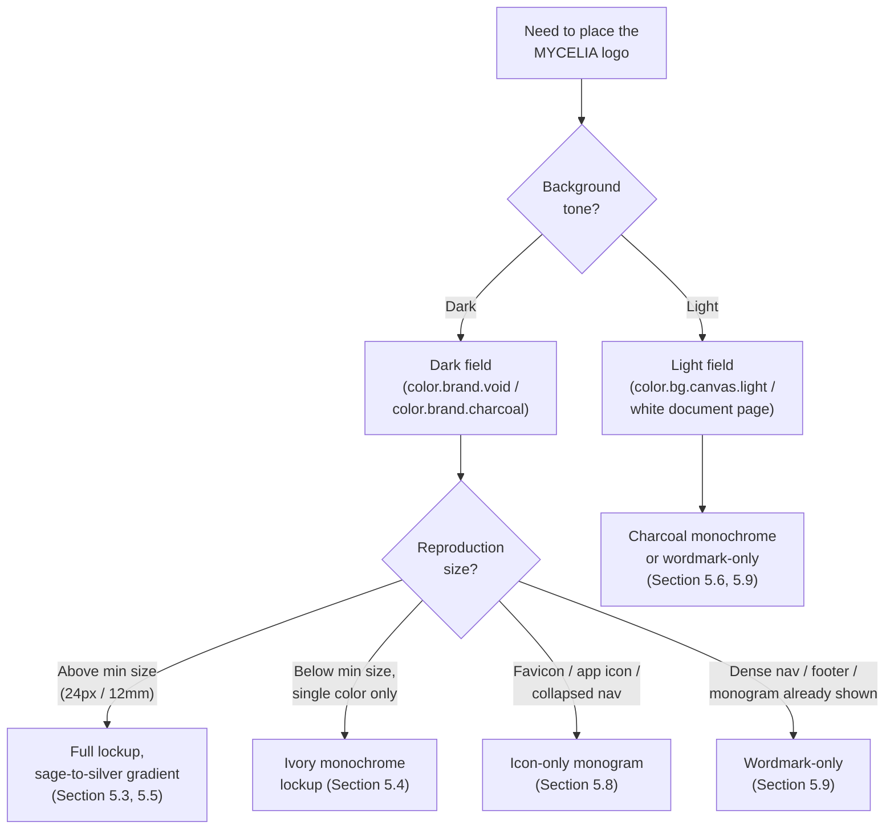
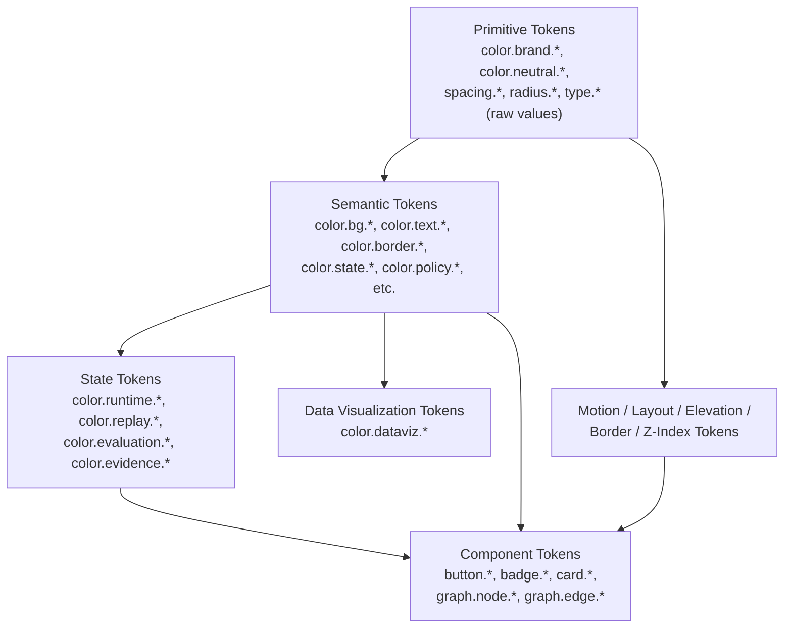
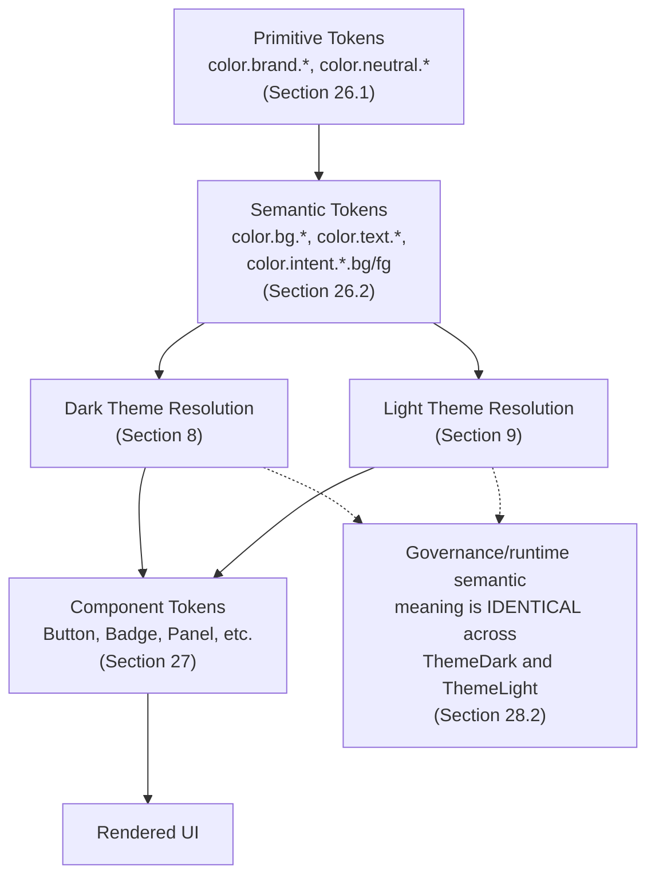
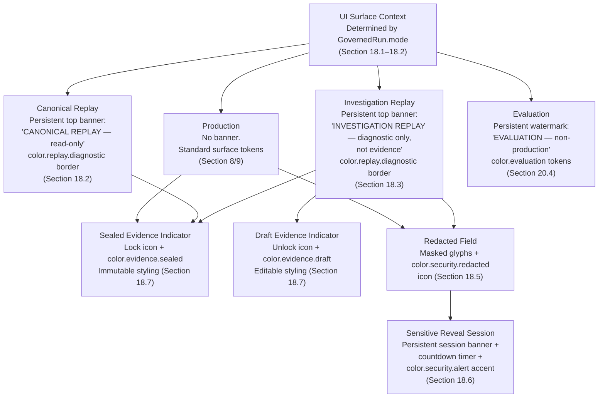
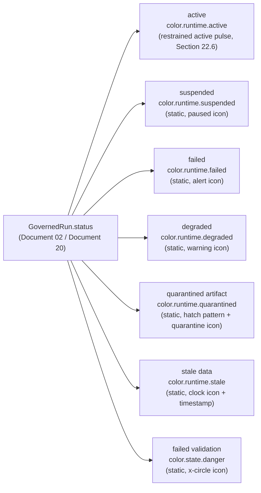
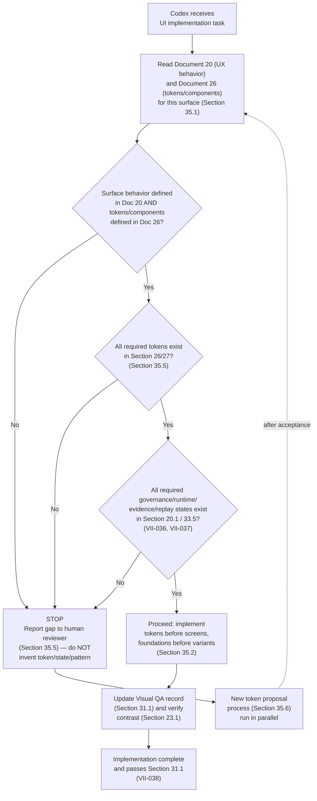

# MYCELIA — 26 Visual Identity & Product Design System Constitution

---

## Document Metadata

| Field | Value |
|---|---|
| Document Series | MYCELIA Architecture Constitution |
| Document Number | 26 |
| Version | v1.0 |
| Status | Canonical |
| Classification | Core Architecture — Visual Identity & Product Design System Constitution |
| Canonical Role | Defines MYCELIA's visual identity, brand principles, logo usage, design tokens, color system, typography, layout, motion, data visualization language, runtime visual semantics, accessibility rules and Codex UI implementation boundaries. |
| Primary Audience | Product Designers, UX Engineers, Frontend Engineers, Brand Designers, Platform Engineers, Governance Architects, Documentation Authors, Codex |
| Last Updated | June 2026 |

---

## Table of Contents

1. [Executive Summary](#1-executive-summary)
2. [Visual Identity Philosophy](#2-visual-identity-philosophy)
3. [Scope and Non-Scope](#3-scope-and-non-scope)
4. [Relationship to Document 20 and Product UX](#4-relationship-to-document-20-and-product-ux)
5. [Logo System](#5-logo-system)
6. [Brand Personality and Visual Attributes](#6-brand-personality-and-visual-attributes)
7. [Color System](#7-color-system)
8. [Dark Mode Constitution](#8-dark-mode-constitution)
9. [Light Mode Constitution](#9-light-mode-constitution)
10. [Typography System](#10-typography-system)
11. [Layout, Grid and Spacing System](#11-layout-grid-and-spacing-system)
12. [Surface, Elevation and Depth System](#12-surface-elevation-and-depth-system)
13. [Border, Radius and Shape Language](#13-border-radius-and-shape-language)
14. [Iconography System](#14-iconography-system)
15. [Illustration and Diagram Language](#15-illustration-and-diagram-language)
16. [Runtime Graph Visual Language](#16-runtime-graph-visual-language)
17. [Workflow Builder Visual Language](#17-workflow-builder-visual-language)
18. [Investigation, Replay and Diff Visual Language](#18-investigation-replay-and-diff-visual-language)
19. [Evaluation and Benchmark Visual Language](#19-evaluation-and-benchmark-visual-language)
20. [Governance, Policy and Security Visual States](#20-governance-policy-and-security-visual-states)
21. [Data Visualization System](#21-data-visualization-system)
22. [Motion and Interaction Language](#22-motion-and-interaction-language)
23. [Accessibility and Contrast Requirements](#23-accessibility-and-contrast-requirements)
24. [Enterprise Document and PDF Visual Rules](#24-enterprise-document-and-pdf-visual-rules)
25. [Product Copy and Microcopy Visual Tone](#25-product-copy-and-microcopy-visual-tone)
26. [Design Token Architecture](#26-design-token-architecture)
27. [Component Token Foundations](#27-component-token-foundations)
28. [Theming and Brand Adaptation Rules](#28-theming-and-brand-adaptation-rules)
29. [Implementation Boundaries](#29-implementation-boundaries)
30. [MVP Design System Cut](#30-mvp-design-system-cut)
31. [Visual QA and Acceptance Criteria](#31-visual-qa-and-acceptance-criteria)
32. [Design System Failure Modes](#32-design-system-failure-modes)
33. [Visual Identity Invariants](#33-visual-identity-invariants)
34. [Visual Anti-Patterns](#34-visual-anti-patterns)
35. [Codex Implementation Guidance](#35-codex-implementation-guidance)
36. [Relationship to Other MYCELIA Documents](#36-relationship-to-other-mycelia-documents)
37. [Final Visual Principles](#37-final-visual-principles)

---

## 1. Executive Summary

### 1.1 What This Document Defines

Document 26 defines the **Visual Identity & Product Design System Constitution** for MYCELIA — the canonical specification of how MYCELIA looks, how its visual language is constructed from primitive tokens to component foundations, and how every visual surface — product UI, runtime graphs, investigation tooling, evaluation dashboards, and the architecture documents themselves — expresses MYCELIA's identity as a governed cognitive operations runtime.

Documents 00 through 25 define what MYCELIA is, how it runs, how it scales, and how its decisions are governed. Document 26 defines how all of that becomes visible. A governed runtime that is visually illegible, visually generic, or visually deceptive undermines its own governance: an operator who cannot tell at a glance whether they are looking at production or replay, sealed evidence or a diagnostic dashboard, an approved policy decision or a denied one, is an operator whose trust in the system has been quietly eroded by its interface.

### 1.2 Why Visual Identity Is an Architectural Concern

MYCELIA's interface is not a decorative layer applied after the runtime is built. It is part of the governance surface. The same invariants that govern tenant isolation, evidence sealing, and replay separation in Documents 06, 11, 14, and 24 have visual correlates: a tenant boundary that is invisible in the UI is a tenant boundary an operator can accidentally cross in their own attention. A replay session that looks identical to a production session is a replay session that can be mistaken for a live operational event. A sealed evidence record displayed with the same visual weight as an ephemeral telemetry chart invites operators to treat the two as interchangeable — which Document 12 and Document 25 explicitly forbid.

Document 26 therefore treats visual design as a governance instrument. Color, shape, motion, typography, and layout are assigned semantic meaning and that meaning MUST remain stable across every surface where it appears.

### 1.3 The Logo as the Anchor

The MYCELIA wordmark and monogram — a dark field, a brushed silver-to-sage architectural monogram formed from converging arches and branching wing-like forms, paired with a precise, wide-set geometric wordmark — establish the visual register for the entire system: **quiet, structural, organic-but-controlled, premium without ornament.** Every token, color, shape, and motion rule in this document either derives from or is constrained to remain consistent with that register.

### 1.4 Document Authority

Document 26 is authoritative for: logo usage, the design token taxonomy and naming convention, the canonical color system (including all governance and runtime state colors), typography and layout primitives, the visual language for runtime graphs, workflow builder, investigation/replay/diff surfaces, evaluation dashboards, data visualization, accessibility thresholds, and PDF/document visual rules. Document 20 (Operational UX and Runtime Visualization) and Documents 21–23 (Workflow Builder, Investigation/Replay, Evaluation) define *behavior* — what operators do and see happen. Document 26 defines the *visual vocabulary* those behaviors are expressed in. Where Document 20 says "the runtime displays a degraded state," Document 26 defines what "degraded" looks like, and ensures it looks the same everywhere it appears.

---

## 2. Visual Identity Philosophy

### 2.1 Governed Intelligence, Not Decorative Intelligence

MYCELIA's interface MUST look like the surface of a system that is being governed — precise, legible, quietly powerful — not like a demonstration of how intelligent the system appears to be. Visual flourishes that exist to communicate "this is AI" (glowing nodes, pulsing gradients, particle fields, neural-net wireframes) are prohibited. MYCELIA earns trust through clarity, not spectacle.

### 2.2 Beauty Is Permitted; Ambiguity in Critical States Is Not

MYCELIA's visual system is permitted — encouraged — to be beautiful. The logo demonstrates that refinement and restraint are not in tension with each other. But beauty MUST NEVER come at the cost of legibility for governance-critical states. A policy-denied state, a sealed evidence record, a cross-tenant access attempt, a replay session — these MUST be unmistakable under any theme, at any density, to any operator, including operators using assistive technology.

### 2.3 Alive but Controlled

The logo's organic geometry — branching forms that converge into architectural arches — encodes MYCELIA's core tension: **distributed, living complexity, given form by structure.** The visual system carries this tension forward. Motion exists, but it is restrained and purposeful (Section 22). Color carries warmth (sage, moss) but is governed by a strict semantic system (Section 7). Shape can suggest organic growth (rounded arches, branching connectors in the graph language) but is always placed on a precise grid (Section 11).

### 2.4 One Visual Language, Many Surfaces

The same token system MUST produce the marketing site, the product UI, the runtime graph, the investigation tooling, the evaluation dashboards, and the architecture documents (including their PDF renderings). A visitor to the marketing site and an SRE engineer investigating a degraded run are looking at expressions of the same design system. Divergence between marketing visuals and product visuals is brand drift and is prohibited (Section 34).

### 2.5 Visual Design Cannot Contradict Governance Semantics

No visual decision — however aesthetically motivated — may contradict or obscure a governance semantic established in Documents 06, 11, 12, 13, 14, 23, or 24. If a design proposal would make a replay session visually indistinguishable from production, or would make sealed evidence visually indistinguishable from a diagnostic dashboard, the design proposal is rejected regardless of its visual merit. Section 33 (Invariants) makes this enforceable.

---

## 3. Scope and Non-Scope

### 3.1 What Document 26 Owns

| Responsibility | Description |
|---|---|
| Logo usage rules | Primary, monochrome, dark/light backgrounds, clearspace, minimum size, icon-only, wordmark-only, favicon, forbidden distortions |
| Brand personality and visual attributes | The adjectives and visual qualities that every surface must express |
| Canonical color system | All brand, neutral, semantic, runtime-state, governance-state, and data-visualization color tokens |
| Dark and light theme constitutions | Background/surface hierarchies, contrast rules, and theme-specific behavior |
| Typography system | Type role taxonomy (display, heading, body, label, code, data, etc.) and qualities required of typefaces |
| Layout, grid, and spacing system | Spacing scale, grid, density modes, canonical layout patterns |
| Surface, elevation, depth, border, radius, and shape language | The geometric vocabulary of panels, cards, and containers |
| Iconography and illustration/diagram language | Icon style rules and diagram visual conventions |
| Runtime graph visual language | Node/edge shapes, states, overlays for replay/evaluation/diff |
| Workflow builder visual language | Visual rules for graph editing, validation, draft/published states |
| Investigation/replay/diff visual language | Visual distinction of production, replay, evaluation, redaction, sensitive-reveal |
| Evaluation/benchmark visual language | Visual rules for evaluation dashboards and AI-as-judge surfaces |
| Governance/policy/security visual states | Canonical visual treatment of policy decisions, tenant boundaries, security alerts |
| Data visualization system | Chart palettes, categorical/sequential/diverging scales, suppression states |
| Motion and interaction language | Duration, easing, and motion semantics |
| Accessibility requirements | Contrast thresholds, keyboard/focus, reduced motion, non-color indicators |
| Enterprise document/PDF visual rules | Cover pages, headings, tables, code blocks, classification labels |
| Design token architecture | Token taxonomy, naming convention, and the canonical token catalog |
| Component token foundations | Visual priorities and state requirements for foundational components |
| Theming and brand adaptation rules | How themes are derived from primitives without breaking semantics |
| Codex UI implementation boundaries | What Codex may and may not do when implementing visual surfaces |

### 3.2 What Document 26 Does Not Own

| Responsibility | Owned By |
|---|---|
| Operational UX behavior and interaction flows | Document 20 |
| Workflow builder semantics (graph editing rules, validation logic) | Document 21 |
| Investigation mode, replay, and runtime diff behavior | Document 22 |
| Evaluation and benchmark framework mechanics | Document 23 |
| Runtime state machine and GovernedRun lifecycle | Document 02 |
| Tenant isolation enforcement mechanisms | Document 14 |
| Policy decision semantics | Document 11 |
| Evidence sealing mechanics | Documents 06, 12, 13 |
| External API contracts | Document 18 |
| Architectural decision governance | Document 25 |
| Enterprise scaling and cell topology visuals (operational, not visual-system) | Document 24 |

---

## 4. Relationship to Document 20 and Product UX

### 4.1 Division of Authority

| Concern | Document 20 (Operational UX) | Document 26 (Visual Identity) |
|---|---|---|
| What an operator does when a run is degraded | Defines the workflow and interaction | Defines what "degraded" looks like (color, icon, badge) |
| How investigation mode is entered and navigated | Defines the navigation model | Defines the visual treatment that signals "investigation mode" |
| What information appears in a policy decision card | Defines the information architecture | Defines the card's visual structure, color, and iconography |
| How a runtime graph is explored | Defines interaction (pan, zoom, select) | Defines node/edge shapes, colors, and state visuals |
| Whether a dashboard counts as evidence | Defines the governance rule (it does not) | Defines the visual label and treatment that communicates this |

### 4.2 Precedence Rule

Where Document 20 (or 21, 22, 23) describes a behavior that requires a visual representation, Document 26 supplies the token, color, shape, or pattern. **Document 20 MUST NOT define new colors, icons, or visual patterns independently of Document 26.** If Document 20 requires a visual concept that Document 26 does not yet define, Document 26 MUST be extended (via the ADR process in Document 25) before implementation proceeds (see Section 29).

### 4.3 Marketing-to-Product Consistency

The MYCELIA marketing site, the product application, and the architecture documents (including PDFs) all draw from the same primitive and semantic token layers (Section 26). A marketing page MAY use a wider expressive range of the brand primitives (e.g., larger use of the sage/moss gradient from the logo in hero sections) but MUST NOT introduce colors, type, or motion that contradict the semantic token layer used in the product. Marketing surfaces MUST NOT redefine what "danger," "sealed evidence," or "policy denied" look like.

---

## 5. Logo System

### 5.1 Logo Description (Visual Reference Analysis)

The MYCELIA logo consists of two elements presented on a near-black field: a **monogram symbol** and a **wordmark**.

**Monogram symbol.** The symbol reads simultaneously as an architectural form and an organic form — the central tension of MYCELIA's identity:

- **Architectural reading:** two adjoining rounded arches at the base, like a colonnade or twin gateway, rendered as open line-forms (not filled), suggesting structure, support, and passage.
- **Organic reading:** above the arches, two wing- or leaf-like forms rise and lean inward, branching from a shared base and converging toward the center without fully touching — suggesting growth, bilateral symmetry, and the branching topology of mycelial networks referenced in the platform's name.
- **Convergence point:** the branching upper forms and the arches meet and overlap at the visual center, creating a dense, layered convergence zone — the symbol's focal point. This convergence visually encodes "many paths becoming one decision," a fitting symbol for a governed orchestration runtime.
- **Construction:** the symbol is built from open, consistent-width line strokes (not solid fills, not filled icons). Lines have rounded terminals. The overall silhouette is bilaterally symmetric about a vertical axis.
- **Surface treatment:** the symbol uses a metallic gradient that shifts from a desaturated **sage/moss green** at the outer extremities of the wing-forms toward a brushed **silver/ivory** tone at the inner convergence and along the arches. This gradient gives the mark a sense of light moving across a refined material surface — not a flat icon, but a quietly luminous object.

**Wordmark.** "MYCELIA" is set in a geometric, wide-set, all-capitals sans-serif in a warm off-white/ivory tone. Letterforms are constructed from straight strokes and precise geometric curves. Notably, the letter **E** is rendered as three short horizontal strokes without a connecting vertical spine — a minimal, architectural treatment consistent with the monogram's open-line construction. Letter spacing (tracking) is wide and even, giving the wordmark a calm, deliberate rhythm rather than a dense, urgent one.

**Field.** The background is a near-black, slightly cool dark tone — not pure digital black (`#000000`), but a deep, almost-black charcoal that gives the metallic monogram room to read as reflective rather than flat.

### 5.2 What the Logo Establishes for the Design System

| Logo Characteristic | Design System Implication |
|---|---|
| Open line-based monogram, consistent stroke width | Iconography (Section 14) and graph nodes (Section 16) favor consistent-weight strokes over filled shapes for structural elements |
| Bilateral symmetry, branching-to-convergence | Diagram and graph layouts (Sections 15–16) favor symmetric, hierarchical, converging layouts over scattered network layouts |
| Sage-to-silver metallic gradient | Brand accent colors (Section 7) are desaturated sage/moss and silver — NOT saturated green, NOT chrome/cyberpunk gradients |
| Wide-tracked geometric wordmark with architectural "E" | Typography (Section 10) favors geometric, architectural sans-serifs with generous letter-spacing for display/brand contexts |
| Near-black field, not pure black | Dark theme background (Section 8) is a deep charcoal/graphite, not `#000000` |
| Quiet luminosity rather than glow | Elevation and depth (Section 12) is expressed through subtle surface tonal shifts, not glow/blur effects |

### 5.2.1 Brand Asset Manifest and Logo Source-of-Truth Boundary

MYCELIA logo assets MUST be governed through a BrandAssetManifest.

The logo displayed in this document is the visual reference, but implementation MUST use approved brand asset files, not screenshots, copied raster exports, manually recreated SVGs or AI-redrawn approximations.

#### BrandAssetManifest

| Field | Requirement |
|---|---|
| asset_id | REQUIRED |
| asset_name | REQUIRED |
| asset_type | REQUIRED: logo, monogram, wordmark, favicon, app_icon |
| file_path | REQUIRED |
| file_format | REQUIRED |
| variant | REQUIRED: primary, monochrome_dark, monochrome_light, icon_only, wordmark_only |
| approved_background | REQUIRED |
| intrinsic_width | REQUIRED |
| intrinsic_height | REQUIRED |
| checksum | REQUIRED |
| version | REQUIRED |
| approved_at | REQUIRED |
| approved_by | REQUIRED |
| usage_scope | REQUIRED |
| minimum_size | REQUIRED |
| clearspace_rule | REQUIRED |
| status | REQUIRED: approved, deprecated, retired |

#### Rules

- Approved logo files MUST be the source of truth.
- Screenshots of the logo MUST NOT be used as production assets.
- Manually traced or recreated logo files MUST NOT be used without approval.
- AI-generated redraws of the logo MUST NOT be used as canonical logo assets.
- Every product, PDF, documentation and marketing surface MUST reference an approved logo asset variant.
- Logo asset changes MUST require ADR review when they alter geometry, color, proportions or usage rules.
- Deprecated logo assets MUST remain traceable for historical documents but MUST NOT be used in new surfaces.

#### Forbidden Behavior

FORBIDDEN:

- extracting the logo from screenshots for production use;
- recreating the wordmark using an assumed font;
- changing the monogram stroke weight manually;
- exporting random PNG sizes without manifest entries;
- allowing Codex to generate or modify logo assets;
- using unapproved logo variants in product UI or PDFs.

### 5.3 Primary Logo Usage

- The primary logo (monogram + wordmark, stacked as shown in the reference) MUST be used for: application splash/loading screens, marketing site headers, the cover page of architecture documents and PDFs (Section 24), and official MYCELIA communications.
- The primary logo MUST always be reproduced on a dark field consistent with `color.brand.void` or `color.brand.charcoal` (Section 7) when using the full-color (sage-to-silver gradient) treatment.
- The primary logo MUST NOT be placed on busy photographic backgrounds, saturated color fields, or any surface that reduces contrast between the metallic gradient and the field below the accessibility thresholds in Section 23.

### 5.4 Monochrome Usage

- A single-color (monochrome) version of the monogram and wordmark MUST exist for contexts where the gradient treatment cannot be reproduced reliably (small sizes, single-color print, embroidery, watermarks, favicons below 32px).
- Monochrome variants:
  - **Ivory monochrome** (`color.brand.ivory` monogram + wordmark) for dark backgrounds.
  - **Charcoal/graphite monochrome** (`color.brand.charcoal` or `color.brand.graphite`) for light backgrounds.
- The sage/moss gradient MUST NOT be approximated with a flat saturated green in monochrome contexts. Monochrome means neutral (ivory/charcoal/silver), not "green logo on a different background."

### 5.5 Dark Background Usage

- This is the native, preferred context for the MYCELIA logo, matching the reference image.
- The full metallic gradient treatment is permitted and preferred on `color.brand.void` (`#0A0C0B`–ish near-black) and `color.brand.charcoal` surfaces.
- Minimum contrast between the wordmark's ivory tone and the background MUST meet the thresholds in Section 23 (WCAG AA for logo-as-text contexts, where applicable).

### 5.6 Light Background Usage

- On light backgrounds (Section 9), the logo MUST use the **charcoal/graphite monochrome** variant (Section 5.4) for the wordmark and monogram, OR a desaturated sage/graphite duotone variant that preserves the symbol's structure without relying on the dark-field gradient.
- The full sage-to-silver gradient variant designed for dark fields MUST NOT be placed directly on light/white backgrounds — the gradient's lighter tones disappear and the symbol's structure becomes illegible.
- A light-background lockup MUST be established as a controlled, documented asset before any enterprise document, presentation, or light-mode product surface uses the logo. Until that asset exists, the monochrome charcoal wordmark-only treatment (Section 5.8) is the approved fallback for light contexts.

### 5.7 Minimum Clearspace and Minimum Size

- **Clearspace:** A minimum clearspace equal to the height of the monogram's arch elements MUST be preserved on all sides of the full logo lockup (monogram + wordmark). No other graphic element, text, or UI chrome may intrude into this space.
- **Minimum size (digital):** The full lockup (monogram + wordmark) MUST NOT be reproduced below a height where the wordmark's "E" (three-stroke construction) becomes a solid block rather than three distinguishable strokes. As a practical floor, the full lockup MUST NOT be reproduced below 24px tall in digital contexts.
- **Minimum size (print):** The full lockup MUST NOT be reproduced below 12mm tall in print contexts.
- Below these thresholds, use the icon-only or wordmark-only treatments (Sections 5.8–5.9).

### 5.8 Icon-Only Usage

- The monogram alone (without the wordmark) MAY be used as: the application favicon, app icon, browser tab icon, loading spinner mark, and compact navigation branding (e.g., collapsed sidebar).
- The icon-only monogram MUST retain its bilateral symmetry and open-line construction at all reproduction sizes down to 16px. Below 16px, a simplified single-stroke-weight version of the monogram MAY be used, but the converging-arch silhouette MUST remain recognizable.
- The icon-only monogram MUST NOT be recolored to arbitrary brand or accent colors outside the approved gradient/monochrome variants (Sections 5.4–5.6).

### 5.9 Wordmark-Only Usage

- The wordmark alone (without the monogram) MAY be used in: dense horizontal navigation bars, document footers, legal/copyright lines, and contexts where the monogram has already been established nearby (e.g., immediately below a monogram-only app icon).
- The wordmark MUST preserve its wide letter-spacing and the three-stroke "E" construction. It MUST NOT be reset in a different typeface, condensed, or set in mixed case.

### 5.10 Favicon and App Icon Guidance

- The favicon/app icon is the icon-only monogram (Section 5.8) on a `color.brand.void` or `color.brand.charcoal` square or rounded-square field.
- The favicon MUST use the ivory-to-sage gradient at sizes ≥ 32px, and MAY fall back to a flat ivory monochrome monogram at sizes ≤ 16px where gradients render poorly.
- The favicon background MUST NOT be transparent in contexts (such as browser tab bars) where transparency would cause the monogram to disappear against light-themed OS chrome. A solid `color.brand.void` background square is the default.

### 5.11 Forbidden Logo Distortions

The following uses of the MYCELIA logo are prohibited without exception:

- Stretching, skewing, or non-uniform scaling of the monogram or wordmark.
- Rotating the monogram or wordmark from its upright orientation.
- Recoloring the monogram gradient to brand-unaffiliated colors (e.g., purple, neon blue, red) for any reason, including "to match a campaign."
- Adding drop shadows, glows, bevels, or 3D effects beyond the metallic gradient already present in the source asset.
- Placing the monogram inside another shape (circles, squares, badges) unless that container is an explicitly approved app-icon template (Section 5.10).
- Separating the wing-forms and arch-forms of the monogram into independent graphic elements, or using only a portion of the monogram as a standalone mark.
- Using the monogram as a repeating decorative pattern, background texture, or watermark tiled across a surface (see Anti-Pattern: "Overusing logo motif as decoration," Section 34).
- Animating the logo in a way that implies the monogram is "alive" with motion (pulsing, breathing, particle effects). The logo is static; quiet luminosity is conveyed through the gradient itself, not through animation.

### 5.12 Logo Usage Decision Flow

---

## 6. Brand Personality and Visual Attributes

### 6.1 The Five Visual Attributes

Every surface in the MYCELIA design system MUST be evaluable against five visual attributes derived directly from the logo and from MYCELIA's role as a governed cognitive operations runtime. A surface that fails more than one of these attributes is in brand drift (Section 34).

| Attribute | Definition | Visual Expression |
|---|---|---|
| **Quiet** | The interface does not compete for attention; it earns trust through restraint. | Low ambient saturation, generous whitespace, no idle animation, no auto-playing visual effects. |
| **Structural** | Forms feel engineered — precise, aligned, grid-based — even when depicting organic concepts. | Strict grid adherence (Section 11), consistent stroke weights, symmetric layouts for system diagrams. |
| **Branching-to-Convergent** | Visual compositions echo the logo's branching-then-converging geometry: many elements resolve to a clear focal point or decision. | Graph layouts that converge toward decision/checkpoint nodes (Section 16); workflow diagrams that show convergence at approval gates. |
| **Materially Warm** | The metallic sage-to-silver gradient and ivory wordmark convey warmth and material quality, avoiding cold, clinical, or synthetic tones. | Ivory text on graphite (not pure white on pure black); sage/moss accents (not cyan/blue accents) for brand moments. |
| **Legible Under Pressure** | In any state — including degraded, denied, redacted, or alerting states — the interface remains readable and unambiguous. | Status semantics (Section 20) always pair color with shape/icon/text; nothing is communicated by color alone (Section 23). |

### 6.2 What MYCELIA Is Not (Visual Exclusions)

The following visual registers are explicitly excluded from MYCELIA's identity. Their presence in any surface is brand drift:

| Excluded Register | Why It Is Excluded |
|---|---|
| Generic AI chatbot gradients (purple-to-pink, blue-to-violet "AI glow") | Implies novelty/hype rather than governed infrastructure; contradicts the logo's sage/silver palette |
| Cyberpunk neon (saturated cyan/magenta glow, scan-lines, glitch effects) | Implies instability and spectacle; contradicts "quiet" and "legible under pressure" |
| Web3/crypto gradients (iridescent, holographic, rainbow-foil) | Implies speculative novelty; contradicts "materially warm" and enterprise restraint |
| Literal mushroom/fungal illustration | MYCELIA's name references network topology, not biological illustration; literal mushrooms contradict "structural" |
| Biotech green clichés (bright lab green, DNA helix motifs, petri-dish imagery) | The logo's sage/moss is desaturated and architectural, not a biotech signal |
| Generic neural-network node clouds (scattered dots with random connecting lines) | Contradicts "branching-to-convergent"; implies randomness rather than governed structure |
| Flat generic SaaS admin templates (default component-library look with no brand distinction) | Contradicts the logo's premium restraint; MYCELIA must not look interchangeable with any other dashboard |
| Heavy drop shadows, skeuomorphism, glassmorphism with excessive blur | Contradicts "quiet" and the logo's flat metallic-gradient construction |

---

## 7. Color System

### 7.1 Color Philosophy

MYCELIA's color system is built from a small set of brand primitives derived from the logo (deep charcoal field, sage/moss accents, silver and ivory neutrals), expanded into a neutral scale for surfaces and text, and overlaid with a strict semantic layer for governance and runtime states. **Saturated, high-chroma colors are reserved exclusively for semantic state communication** (danger, warning, policy-denied, security alert) and are never used decoratively.

### 7.2 Brand Core Colors

The following are **initial canonical candidates**. Exact hex values are proposed based on the visual reference and MUST be validated against the source logo asset at full resolution before being locked as final. Until validated, these values govern all implementation.

| Token | Proposed Hex | Description |
|---|---|---|
| `color.brand.void` | `#0A0C0B` | The near-black field of the logo. Deepest background layer in dark theme. Slightly warm-cool charcoal, not pure black. |
| `color.brand.charcoal` | `#151816` | Primary dark surface tone — one step up from `void`. Used for app shell backgrounds. |
| `color.brand.graphite` | `#232724` | Secondary dark surface tone — panels, cards, raised surfaces in dark theme. |
| `color.brand.ivory` | `#F2F0E9` | The wordmark's off-white tone. Primary text color on dark surfaces; primary background tone on light theme. |
| `color.brand.silver` | `#C9CFC9` | The desaturated metallic highlight tone from the monogram's convergence point. Secondary text, dividers, inactive icons. |
| `color.brand.sage` | `#8FA396` | The lighter green tone from the monogram's gradient. Primary brand accent — used sparingly for brand moments, links, focus on dark surfaces. |
| `color.brand.moss` | `#566B5C` | The deeper green tone from the monogram's gradient. Secondary brand accent — used for emphasis on light surfaces, brand graphics, hover states on sage elements. |

### 7.2.1 Token Lifecycle and Candidate Color Approval Boundary

Color tokens may begin as initial canonical candidates, but implementation MUST distinguish candidate values from approved locked values.

Document 26 defines the semantic token architecture as canonical. Some initial hex values may remain candidates until verified against source assets, accessibility tests and implementation previews.

#### Token Lifecycle Status

| Status | Meaning | May Be Used in Production UI? |
|---|---|---:|
| Candidate | Proposed token value derived from logo or design analysis | No, unless explicitly marked MVP provisional |
| MVP Provisional | Approved for MVP implementation while final extraction is pending | Yes, with review |
| Approved | Locked canonical token value | Yes |
| Deprecated | Still supported but should not be used in new work | Existing only |
| Retired | No longer valid | No |

#### Rules

- Every implemented token MUST have a lifecycle status.
- Candidate tokens MUST NOT be used in production UI unless promoted to MVP Provisional or Approved.
- MVP Provisional tokens MUST be reviewed before public launch.
- Approved token changes MUST require ADR review when they affect governance, runtime, evidence, replay, evaluation, accessibility or brand identity.
- Token value changes MUST include contrast validation for dark and light themes.
- Token aliases MUST preserve semantic meaning across themes.

#### Forbidden Behavior

FORBIDDEN:

- treating a candidate hex value as permanently approved without review;
- changing approved token values without ADR review;
- using candidate tokens for critical states without explicit MVP provisional status;
- changing semantic tokens to satisfy one component at the expense of another;
- creating theme-specific token meanings.

### 7.3 Neutral Surface Scale

A 10-step neutral scale derived from `color.brand.void` → `color.brand.ivory`, used for all surface, border, and text-hierarchy tokens across both themes.

| Token | Proposed Hex | Typical Use |
|---|---|---|
| `color.neutral.000` | `#0A0C0B` | Deepest dark background (= `color.brand.void`) |
| `color.neutral.050` | `#121512` | Dark theme: app canvas |
| `color.neutral.100` | `#181C19` | Dark theme: primary surface (= `color.brand.charcoal`) |
| `color.neutral.200` | `#232724` | Dark theme: raised panel (= `color.brand.graphite`) |
| `color.neutral.300` | `#343A36` | Dark theme: borders, dividers, input fields |
| `color.neutral.400` | `#5C6660` | Dark theme: disabled text, placeholder text |
| `color.neutral.500` | `#8C948D` | Mid-tone — secondary text on dark, secondary text on light |
| `color.neutral.600` | `#B6BBB4` | Light theme: borders, dividers |
| `color.neutral.700` | `#DCDDD7` | Light theme: raised panel |
| `color.neutral.800` | `#EDEEE8` | Light theme: app canvas |
| `color.neutral.900` | `#FAFAF7` | Lightest background (near-white, warm) |
| `color.neutral.1000` | `#F2F0E9` | Light theme: primary text inverse / dark theme: primary text (= `color.brand.ivory`) |

### 7.4 Semantic Status Colors

| Token | Proposed Hex | Meaning |
|---|---|---|
| `color.state.success` | `#7DA889` | Operation completed successfully; run completed; test passed |
| `color.state.warning` | `#D9A857` | Degraded performance, approaching threshold, requires attention but not blocking |
| `color.state.danger` | `#C2594F` | Failure, error, blocking condition, validation failure |
| `color.state.info` | `#6E97AE` | Neutral informational notice; controlled, desaturated blue — used sparingly |

Rationale: `success` uses a muted green distinct from `color.brand.sage` (brand accent) so that "the system completed a task" is never visually confused with "this is a brand moment." `warning` is a restrained amber, not a saturated yellow. `danger` is a muted brick-red, not a pure alert red — visible and serious without being alarmist. `info` is the only blue in the system and is desaturated to avoid evoking "generic AI blue."

### 7.5 Policy and Security State Colors

| Token | Proposed Hex | Meaning |
|---|---|---|
| `color.policy.approved` | `#7DA889` (= `color.state.success`) | Policy decision: approved / allowed |
| `color.policy.denied` | `#C2594F` (= `color.state.danger`) | Policy decision: denied / blocked |
| `color.policy.requires_approval` | `#D9A857` (= `color.state.warning`) | Policy decision: pending human approval |
| `color.policy.boundary` | `#6E97AE` (= `color.state.info`) | Visual marker for a policy boundary or gate in graphs/diagrams (neutral, not a verdict) |
| `color.security.alert` | `#E0524A` | Security alert / cross-tenant attempt / trust boundary violation — a more saturated red than `color.state.danger`, reserved exclusively for security incidents to create a visual escalation tier above ordinary failures |
| `color.tenant.boundary` | `#A9B6AE` | Visual marker for tenant/workspace boundary lines in graphs, layouts, and inspector chrome — a desaturated sage-silver, distinct from both brand accents and status colors |

**`color.security.alert` is deliberately more saturated than `color.state.danger`.** This is the only place in the system where an elevated-saturation red is permitted, and it exists specifically to create an unmistakable visual escalation: a security alert MUST read as more severe than a routine run failure.

### 7.6 Evidence and Investigation Colors

| Token | Proposed Hex | Meaning |
|---|---|---|
| `color.evidence.sealed` | `#566B5C` (= `color.brand.moss`) | Sealed, immutable evidence record — uses the deeper brand moss to signal "permanent, governance-grade," distinct from ordinary UI |
| `color.evidence.draft` | `#8C948D` (= `color.neutral.500`) | Unsealed/draft evidence — neutral gray, signals "not yet authoritative" |
| `color.replay.diagnostic` | `#B98A4E` | Replay / diagnostic-only surface marker — a distinct warm ochre/amber-brown, never used for any other purpose, so "this is a reconstruction, not production" is always visually unique |
| `color.evaluation.surface` | `#7C8FA8` | Evaluation/benchmark surface marker — a distinct desaturated blue-violet, never used elsewhere, so evaluation runtime is never confused with production or replay |
| `color.redaction.mask` | `#3A3F3B` | Redacted content block fill (dark theme) — near-neutral, textured (Section 18) to distinguish from empty/loading states |
| `color.redaction.reveal` | `#D9A857` (= `color.state.warning`) | Active sensitive-reveal session indicator — reuses warning tone to signal "elevated, time-bounded, audited state" |

**Three namespaces, three colors, never shared:** `color.replay.diagnostic`, `color.evaluation.surface`, and the default production surface tone are mutually exclusive and MUST NEVER be reused for any other semantic purpose. This is the visual implementation of the namespace-separation invariants in Documents 06, 08, and 24.

### 7.7 Runtime State Colors

| Token | Proposed Hex | Meaning |
|---|---|---|
| `color.runtime.active` | `#7DA889` (= `color.state.success`) | GovernedRun actively executing |
| `color.runtime.suspended` | `#D9A857` (= `color.state.warning`) | GovernedRun suspended (e.g., awaiting approval) |
| `color.runtime.failed` | `#C2594F` (= `color.state.danger`) | GovernedRun failed |
| `color.runtime.degraded` | `#B98A4E` | GovernedRun or cell operating in a degraded mode — distinct ochre tone, shared family with `color.replay.diagnostic` (both signal "not the normal/expected condition") but used in different contexts (Section 20 disambiguates) |
| `color.runtime.stale` | `#5C6660` (= `color.neutral.400`) | Data known to be stale (e.g., cached placement, outdated policy snapshot) |
| `color.runtime.quarantined` | `#7C5C8F` | Quarantined artifact (replay/evaluation contamination, Document 24 Section 30) — the **only** use of a violet hue in the entire system, reserved exclusively for quarantine states to ensure it is never confused with any other state |

### 7.8 Accent and Interaction Colors

| Token | Proposed Hex | Meaning |
|---|---|---|
| `color.accent.signal` | `#8FA396` (= `color.brand.sage`) | Primary interactive accent — links, primary buttons, active nav items, brand moments |
| `color.focus.ring` | `#C9CFC9` (= `color.brand.silver`) | Focus ring color — MUST meet 3:1 contrast against adjacent surfaces at minimum 2px width (Section 23) |
| `color.selection.bg` | `rgba(143, 163, 150, 0.16)` | Selection highlight background (derived from `color.accent.signal` at low opacity) |
| `color.disabled.fg` | `#5C6660` (= `color.neutral.400`) | Disabled text/icon color |
| `color.disabled.bg` | `#232724` (= `color.neutral.200`) | Disabled control background (dark theme) |

### 7.9 Data Visualization Palette

A maximum of **eight categorical colors** is defined. Charts MUST NOT exceed this count for categorical series; beyond eight categories, use grouping, "other," or small multiples instead of adding colors.

| Token | Proposed Hex | Order |
|---|---|---|
| `color.dataviz.cat.1` | `#8FA396` (sage) | 1 |
| `color.dataviz.cat.2` | `#6E97AE` (info blue) | 2 |
| `color.dataviz.cat.3` | `#D9A857` (warning amber) | 3 |
| `color.dataviz.cat.4` | `#B98A4E` (replay ochre) | 4 |
| `color.dataviz.cat.5` | `#C9CFC9` (silver) | 5 |
| `color.dataviz.cat.6` | `#566B5C` (moss) | 6 |
| `color.dataviz.cat.7` | `#7C8FA8` (evaluation blue-violet) | 7 |
| `color.dataviz.cat.8` | `#A9786E` (muted terracotta — new, used only in dataviz) | 8 |

**Sequential scale** (for ordered/continuous data, e.g., latency heatmaps): a single-hue ramp from `color.neutral.200` to `color.brand.sage` (dark theme) or `color.neutral.700` to `color.brand.moss` (light theme). Sequential scales MUST use a single hue family — never a rainbow.

**Diverging scale** (for data with a meaningful midpoint, e.g., drift from baseline): `color.policy.denied` (`#C2594F`) ↔ `color.neutral.400`/`color.neutral.600` (midpoint) ↔ `color.state.success` (`#7DA889`). This is the only diverging pair in the system and MUST NOT be substituted with red/green pairs of different saturation, which read as "error/ok" rather than "below/above baseline."

### 7.10 Forbidden Color Practices

| Practice | Why Forbidden |
|---|---|
| Rainbow charts (categorical palettes exceeding the 8-color set in Section 7.9, or using full-spectrum hue rotation) | Illegible, implies no data hierarchy, classic "AI dashboard" cliché |
| Using `color.security.alert` for non-security states | Destroys the escalation signal that security alerts are the most severe class |
| Using `color.runtime.quarantined` (violet) for any non-quarantine state | Destroys the uniqueness that makes quarantine instantly recognizable |
| Using saturated purple/magenta anywhere in the system | Generic "AI startup" signal; not present in the brand primitives |
| Using `color.brand.sage`/`color.brand.moss` for danger/warning/error | Confuses brand accent with semantic state |
| Gradients on buttons, cards, or chrome (outside the logo itself and approved brand-moment hero surfaces) | The logo's gradient is a material property of the mark, not a UI decoration pattern |

### 7.11 Canonical Visual Token Consistency Boundary

Every visual token referenced anywhere in MYCELIA MUST resolve to one canonical token definition.

A visual token is not valid because it appears in prose. It is valid only if it exists in the canonical token registry defined by this document.

#### Rules

- Every referenced token MUST exist in Section 7, Section 20, Section 26, Section 27 or an approved future token registry.
- Undefined token names MUST be treated as visual specification defects.
- Semantic aliases MUST be explicitly declared.
- A token MAY share the same underlying color value with another token only when the semantic relationship is documented.
- A token's visual meaning MUST NOT change by screen, component or theme.
- Token names MUST NOT be invented inside component implementations.
- If a required token is missing, Codex MUST stop and propose a token instead of creating an ad hoc value.

#### Required Canonical Redaction Tokens

The canonical redaction tokens are:

| Token | Meaning |
|---|---|
| `color.redaction.mask` | Redacted content mask |
| `color.redaction.reveal` | Active sensitive reveal session |

`color.security.redacted` is not a canonical token and MUST NOT be used.

#### Required Runtime State Tokens

The canonical runtime state tokens are:

| State | Token |
|---|---|
| active | `color.runtime.active` |
| suspended | `color.runtime.suspended` |
| failed | `color.runtime.failed` |
| degraded | `color.runtime.degraded` |
| stale | `color.runtime.stale` |
| quarantined | `color.runtime.quarantined` |

`color.security.alert` is reserved for security alerts and cross-tenant violation signals. It MUST NOT replace `color.runtime.quarantined`.

#### Forbidden Behavior

FORBIDDEN:

- referencing undefined tokens;
- using `color.security.redacted`;
- using `color.security.alert` for ordinary runtime quarantine states;
- using `color.state.warning` for stale data when `color.runtime.stale` exists;
- creating screen-local color names;
- creating Tailwind/CSS variables that do not map back to canonical tokens;
- allowing Codex to silently invent visual tokens.

---

## 8. Dark Mode Constitution

### 8.1 Dark Mode Is Primary

Dark mode is MYCELIA's primary, default interface mode for the product application, operational dashboards, runtime graphs, and investigation tooling. It is the mode in which the logo's full gradient treatment is native (Section 5.5). All product surfaces MUST be designed dark-first; light mode (Section 9) is then derived and verified, not designed independently.

### 8.2 Background and Surface Hierarchy

| Layer | Token | Proposed Hex | Use |
|---|---|---|---|
| Canvas (deepest) | `color.bg.canvas` | `color.neutral.050` (`#121512`) | Application background behind all panels |
| Surface (primary) | `color.bg.surface` | `color.neutral.100` (`#181C19`) | Primary panels: sidebars, main content panels |
| Panel (raised) | `color.bg.panel` | `color.neutral.200` (`#232724`) | Cards, modals, dropdowns, inspector panels — one level "above" surface |
| Panel (overlay) | `color.bg.overlay` | `color.neutral.200` at 96% opacity over a scrim | Modal/drawer overlays, command palette |
| Sunken | `color.bg.sunken` | `color.neutral.000` (`#0A0C0B`) | Code/JSON/log viewers, graph canvas backgrounds — recedes behind content |

**Hierarchy rule:** each layer differs from its neighbor by a small, consistent luminance step (Section 7.3's neutral scale steps 000→050→100→200). MYCELIA dark mode MUST NOT use more than these five layers. Stacking more layers than this produces the "low-contrast gray soup" anti-pattern (Section 32).

### 8.3 Text Contrast in Dark Mode

| Token | Proposed Hex | Use | Min Contrast vs `color.bg.surface` |
|---|---|---|---|
| `color.text.primary` | `color.brand.ivory` (`#F2F0E9`) | Primary reading text, headings | ≥ 13:1 |
| `color.text.secondary` | `color.brand.silver` (`#C9CFC9`) | Secondary text, metadata, captions | ≥ 7:1 |
| `color.text.tertiary` | `color.neutral.500` (`#8C948D`) | Tertiary/disabled-adjacent text, placeholder | ≥ 4.5:1 |
| `color.text.disabled` | `color.neutral.400` (`#5C6660`) | Disabled labels | Exempt from AA (Section 23.6) |

### 8.4 Panel Separation

Panels in dark mode are separated by **luminance step + 1px border**, never by drop shadow alone:

- `color.border.subtle` (`color.neutral.300`, `#343A36`) for ordinary panel/card borders.
- `color.border.strong` (`color.neutral.500`, `#8C948D`) for emphasized separation (e.g., the active panel in a split-pane layout, Section 11.6).
- Drop shadows MAY be used additionally for floating elements (modals, dropdowns, command palette) but MUST be subtle: a single soft shadow, low opacity (≤ 24%), no colored shadows, no multi-layer "neumorphic" shadow stacks.

### 8.5 Graph Readability in Dark Mode

- Graph canvases use `color.bg.sunken` (`#0A0C0B`) as their background — the deepest layer — so that node and edge colors (Section 16) have maximum contrast headroom.
- Edges default to `color.neutral.400`/`color.neutral.500` (low-contrast, recedes) unless carrying a semantic state (causal link, policy boundary, replay overlay), in which case the relevant semantic token from Sections 7.5–7.7 is used.
- Node fills use `color.bg.panel` with `color.border.strong` outlines by default; semantic node states override fill or outline color per Section 16.

### 8.6 Command Palette and Modal Behavior

- The command palette and modals use `color.bg.overlay` with a scrim (`color.brand.void` at 60–72% opacity) behind them to focus attention.
- Command palette and modal panels MUST use `color.bg.panel`, never `color.bg.canvas` or `color.bg.surface` — they are always "raised" relative to the page behind them.
- Modal/drawer entrance and exit MUST respect the motion tokens in Section 22 (subtle, fast, non-bouncy).

### 8.7 Operational Dashboard Behavior

- Operational dashboards (Document 20) use `color.bg.surface` for the page background and `color.bg.panel` for individual metric/status cards.
- Status colors (Sections 7.4–7.7) appear as small accent elements (icons, left-border stripes, badge fills) — never as full-card background fills, which would overwhelm the quiet baseline and make multiple simultaneous alerts visually deafening.

### 8.8 Investigation Surface Behavior

- Investigation mode (Document 22) surfaces use the same `color.bg.surface`/`color.bg.panel` hierarchy as operational dashboards, PLUS a persistent **mode indicator** (Section 18) using `color.replay.diagnostic` or `color.evaluation.surface` as appropriate.
- Investigation surfaces MUST NOT change the overall background hierarchy (e.g., tinting the entire canvas amber) — this would degrade general readability. Instead, the mode indicator (a persistent banner/chrome element, Section 18.2) carries the namespace color.

### 8.9 Code, JSON, and Log Viewer Behavior

- Code/JSON/log viewers use `color.bg.sunken` (`#0A0C0B`) as their background — visually "recessed" relative to surrounding panels, signaling "raw data."
- Syntax highlighting within these viewers uses a restrained palette drawn from `color.brand.sage`, `color.state.info`, `color.brand.silver`, and `color.state.warning` — NOT a full rainbow syntax theme. Keys/structure in one tone, strings in another, numbers/literals in a third, comments in `color.text.tertiary`.
- Redacted fields within JSON/log viewers use `color.redaction.mask` (Section 18.5), rendered as a textured block, never simply "blank."

### 8.10 Dark Mode Accessible Contrast Rules

- All body text MUST meet WCAG AA (≥ 4.5:1) against its immediate background; primary headings and large text MUST meet ≥ 3:1 at minimum, with `color.text.primary` exceeding both by design (Section 8.3).
- All semantic status colors (Sections 7.4–7.7) MUST meet ≥ 3:1 contrast against `color.bg.panel` when used as icon/text fills, and ≥ 3:1 against `color.bg.surface` when used as border/stripe accents.
- Dark mode MUST NOT be implemented as "flip all light-mode colors" — it is designed independently per this section, with light mode derived afterward (Section 9).

---

## 9. Light Mode Constitution

### 9.1 Light Mode Purpose

Light mode exists for: enterprise accessibility preferences, long-form reading (documentation, architecture documents), printing, PDF export (Section 24), and embedding in light-themed enterprise environments (e.g., emails, light-themed customer portals). Light mode is a **first-class, fully specified mode** — not an inverted afterthought — but it is derived from the same token families as dark mode and MUST preserve all semantic meanings.

### 9.2 Light Surface Hierarchy

| Layer | Token | Proposed Hex | Use |
|---|---|---|---|
| Canvas | `color.bg.canvas` (light) | `color.neutral.900` (`#FAFAF7`) | Application/document background |
| Surface | `color.bg.surface` (light) | `color.neutral.800` (`#EDEEE8`) | Primary panels |
| Panel | `color.bg.panel` (light) | `color.neutral.1000` (`#F2F0E9`)/white-ivory | Cards, modals — raised above surface via border, not pure white |
| Sunken | `color.bg.sunken` (light) | `color.neutral.700` (`#DCDDD7`) | Code/JSON/log viewers — recessed |

**Light mode MUST NOT use pure white (`#FFFFFF`) as the canvas color.** The warm ivory-tinted `color.neutral.900` preserves the brand's "materially warm" attribute (Section 6.1) and avoids the harsh, generic feel of pure-white SaaS templates.

### 9.3 Text Hierarchy in Light Mode

| Token | Proposed Hex | Use | Min Contrast vs `color.bg.surface` (light) |
|---|---|---|---|
| `color.text.primary` (light) | `color.neutral.100` (`#181C19`) | Primary text, headings | ≥ 13:1 |
| `color.text.secondary` (light) | `color.neutral.300` (`#343A36`) | Secondary text, metadata | ≥ 7:1 |
| `color.text.tertiary` (light) | `color.neutral.500` (`#8C948D`) | Tertiary/placeholder | ≥ 4.5:1 |

### 9.4 Border Behavior in Light Mode

- `color.border.subtle` (light): `color.neutral.600` (`#B6BBB4`).
- `color.border.strong` (light): `color.neutral.400` (`#5C6660`).
- Light mode relies more heavily on borders and subtle background-tone shifts than on shadows, consistent with the "quiet/structural" attributes (Section 6.1). Shadows, if used, MUST be even lighter and more subtle than in dark mode (≤ 12% opacity).

### 9.5 Low-Saturation Accents in Light Mode

- `color.accent.signal` (light): `color.brand.moss` (`#566B5C`) — the deeper green reads with sufficient contrast on light surfaces, whereas `color.brand.sage` (used on dark) would be too light.
- All semantic status colors (Sections 7.4–7.7) keep the same hue families but MAY be shifted 1 step darker/more saturated where needed to maintain ≥ 4.5:1 contrast against `color.bg.panel` (light). The mapping MUST be documented per-token in the implementation token file; hue identity MUST be preserved (e.g., `color.state.danger` remains in the brick-red family, not shifted to a different hue).

### 9.6 Print-Safe Colors and PDF/Document Usage

- All architecture documents (Document 26 Section 24) default to light mode for the document body, regardless of the product's default theme, because printed/PDF output assumes a light page.
- Print-safe palette: `color.text.primary` (light) on `color.bg.canvas` (light) for body text; `color.border.subtle`/`color.border.strong` (light) for table borders; semantic colors from Sections 7.4–7.7 used only for inline status indicators (badges, labeled callouts), never as full-page background tints.
- Status colors used in print/PDF MUST be paired with a text label (Section 23.7) since color reproduction in print/export can vary.

### 9.7 Warning and Danger Visibility in Light Mode

- `color.state.warning` and `color.state.danger` MUST be verified for ≥ 4.5:1 contrast against `color.bg.panel` (light) — the proposed hex values in Section 7.4 are warm/dark enough to pass against `#F2F0E9`, but implementation MUST verify and may apply a single shade-step darkening if needed.
- `color.security.alert` (Section 7.5) in light mode MUST remain visually more saturated/severe than `color.state.danger`, preserving the escalation hierarchy.

### 9.8 Graph Readability on Light Surfaces

- Graph canvases in light mode use `color.bg.sunken` (light) (`#DCDDD7`) as background.
- Edge default color shifts to `color.neutral.500`/`color.neutral.400` for sufficient contrast against the lighter canvas.
- All graph node/edge semantic colors (Section 16) MUST be re-verified against the light canvas; where a dark-mode color (e.g., `color.brand.sage`) would have insufficient contrast on light backgrounds, the corresponding light-mode token variant (e.g., `color.brand.moss`) is substituted — the **semantic mapping** (which token means "causal link," "policy boundary," etc.) remains identical across themes; only the underlying color value shifts (Section 28).

### 9.9 Light Mode Visual Identity Guard

Light mode MUST NOT default to a generic light SaaS admin look (pure white canvas, flat gray borders, saturated blue primary buttons). The warm ivory canvas (`#FAFAF7`), the moss-green accent (`#566B5C`), and the consistent semantic palette across modes are the specific guards against this drift (Section 34).

---

## 10. Typography System

### 10.1 Typography Philosophy

MYCELIA's typography MUST be **enterprise-readable, slightly architectural, and bilingual-ready** (English and Brazilian Portuguese, per Document 00's authorship context and MYCELIA's operating base). No specific font family is mandated by this document unless and until a typeface has been formally licensed and recorded via an ADR (Document 25). The qualities below govern typeface selection.

### 10.2 Required Typeface Qualities

| Quality | Requirement |
|---|---|
| Enterprise readability | Must remain legible at small UI sizes (11–13px) in data-dense tables and inspector panels |
| Slightly architectural character | Geometric or quasi-geometric sans-serif construction, echoing the wordmark's geometric letterforms — without being a direct copy of a display/logo face for body text |
| Strong numeric alignment | Must include tabular (fixed-width) figures for data tables, timestamps, and metrics; numerals must be unambiguous (clear distinction between 0/O, 1/I/l) |
| Code readability | A separate monospace family with clear distinction of similar characters, ligature-free or ligatures disabled in log/JSON contexts |
| Latin Extended / Portuguese support | Full support for accented characters used in Brazilian Portuguese (á, ã, â, ç, é, ê, í, ó, õ, ú, ü) at all weights used |
| Weight range | Minimum: Regular, Medium, Semibold, Bold. A Light weight MAY be used for display-scale headings only, never for body or UI text. |

### 10.3 Type Role Taxonomy

| Token | Role | Typical Size (px) | Weight | Notes |
|---|---|---|---|---|
| `type.display` | Marketing hero text, splash screens | 40–64 | Semibold/Bold | Wide letter-spacing permitted, echoing wordmark rhythm |
| `type.heading.1` | Page titles, document section titles | 28–32 | Semibold | |
| `type.heading.2` | Section headings, panel titles | 20–24 | Semibold | |
| `type.heading.3` | Subsection headings, card titles | 16–18 | Medium/Semibold | |
| `type.body` | Default reading text, descriptions | 14 | Regular | Line-height ≥ 1.5 |
| `type.body.small` | Secondary descriptions, helper text | 13 | Regular | Line-height ≥ 1.5 |
| `type.label` | Form labels, table headers, badges | 12 | Medium | Letter-spacing +0.02em for uppercase labels |
| `type.code` | Inline code, code blocks | 13 | Regular (mono) | Tabular figures mandatory |
| `type.data` | Data table cells, metric values | 13–14 | Regular/Medium (mono for numerics) | Tabular figures mandatory |
| `type.graph_label` | Node/edge labels on graph canvas | 11–12 | Medium | Must remain legible at default zoom; truncates with ellipsis, never wraps |
| `type.badge` | Status pill text | 11 | Semibold | Uppercase, letter-spacing +0.04em |
| `type.alert` | Alert/toast titles and bodies | 13–14 | Medium (title) / Regular (body) | |
| `type.evidence_meta` | Evidence card metadata (timestamps, hashes, IDs) | 11–12 | Regular (mono for IDs/hashes) | Tabular figures mandatory |
| `type.audit_trail` | Audit/event log rows | 12–13 | Regular (mono for technical fields, regular for descriptions) | |

### 10.4 Numeric and Tabular Data Rules

- All numeric values in tables, metrics, timestamps, and evidence metadata MUST use tabular (fixed-width) figures so that columns of numbers align vertically.
- Monospace tokens (`type.code`, parts of `type.data`, `type.evidence_meta`, `type.audit_trail`) MUST use a monospace family with unambiguous `0` (zero) vs `O` (letter O) and `1`/`I`/`l` distinctions — typically achieved via a slashed or dotted zero.

### 10.5 Bilingual Layout Considerations

- Letter-spacing rules for `type.label` and `type.badge` (uppercase, tracked text) MUST be verified for Portuguese strings, which are frequently longer than their English equivalents (e.g., "Aprovado" vs "Approved", "Política negada" vs "Policy denied"). Badge and label components MUST accommodate at least 30% additional character length without truncation at the default size, or MUST truncate gracefully with full text available on hover/focus (Section 23.8).
- Diacritics (ã, ç, õ, etc.) MUST render with correct vertical spacing in `type.heading.*` and `type.display` — typefaces with clipped or overlapping diacritic marks are disqualified.

---

## 11. Layout, Grid and Spacing System

### 11.1 Spacing Scale

MYCELIA uses a single base-4 spacing scale. All padding, margin, and gap values MUST be drawn from this scale; arbitrary pixel values are prohibited (Section 33).

| Token | Value | Typical Use |
|---|---|---|
| `spacing.0` | 0px | Reset |
| `spacing.1` | 4px | Icon-to-label gaps, tight badge padding |
| `spacing.2` | 8px | Compact control padding, list item gaps |
| `spacing.3` | 12px | Default control padding (vertical) |
| `spacing.4` | 16px | Default card/panel padding, default gap between related elements |
| `spacing.5` | 20px | Section internal padding |
| `spacing.6` | 24px | Gap between unrelated sections within a panel |
| `spacing.8` | 32px | Panel-to-panel gaps, page margins (compact) |
| `spacing.10` | 40px | Page margins (comfortable) |
| `spacing.12` | 48px | Major section separation |
| `spacing.16` | 64px | Marketing/display-scale section separation |

### 11.2 Grid

- The base layout grid is a **12-column grid** with `spacing.6` (24px) gutters at desktop widths, reducing to `spacing.4` (16px) gutters at compact widths.
- Panel and card widths MUST align to column boundaries; arbitrary fractional widths are prohibited except for resizable split-panes (Section 11.6), which snap to the nearest `spacing.4` increment during resize.

### 11.3 Density Modes

| Density Mode | Row Height | Padding | Use Case |
|---|---|---|---|
| `density.comfortable` | 40px | `spacing.4` | Default for dashboards, settings, marketing-adjacent surfaces |
| `density.compact` | 32px | `spacing.2`–`spacing.3` | Data grids, audit trails, investigation tables — high information density |
| `density.dense` | 28px | `spacing.1`–`spacing.2` | Power-user mode for runtime event logs, available as an explicit user preference, never the default |

`density.dense` MUST NOT reduce text below the minimum font sizes in Section 23.5 — density reduces padding and row height, never type size below the floor.

### 11.4 Enterprise Dashboard Layout

The canonical operational dashboard layout (Document 20) consists of:

- A persistent **topbar** (`spacing.12` height ≈ 48px) containing: monogram (icon-only, Section 5.8), tenant/workspace selector, environment/namespace indicator (production/replay/evaluation, Section 18.2), and global actions (command palette trigger, user menu).
- A persistent **sidebar** (240px expanded / 56px collapsed-to-icons) for primary navigation.
- A **main content area** using the 12-column grid, with metric/status cards (Section 27) arranged in rows of 3–4 at comfortable density.
- An optional **right-side inspector panel** (320–400px) for contextual detail (Section 11.5).

### 11.5 Inspector Panels

- Inspector panels are right-docked, fixed-width (320–400px), and use `color.bg.panel`.
- Inspector panels MUST include a persistent header showing: the entity type being inspected (run, event, policy decision, evidence record), its ID (in `type.evidence_meta` mono), and its current state badge (Section 27, Status Pill).
- Inspector panels MUST be dismissible via a close control AND the Escape key (Section 23.3).

### 11.6 Split Panes

- Split-pane layouts (e.g., runtime graph + event timeline, or canonical replay + investigation replay diff view) use a draggable divider with `color.border.strong` at rest, transitioning to `color.accent.signal` on hover/drag.
- Each pane MUST have a minimum width/height of `spacing.16` × 4 (≈ 256px) below which the pane collapses to an icon-only or summary state rather than rendering unreadably small content.
- The "active" pane (the one most recently interacted with) MAY be indicated by a `color.border.strong` top border, but active-pane indication MUST NOT rely on color alone if it affects keyboard focus order (Section 23.3).

### 11.7 Sidebars

- Primary navigation sidebar: 240px expanded, collapses to 56px (icon-only, using `color.brand.ivory` monochrome icons, Section 14).
- Secondary/contextual sidebars (e.g., workflow builder node palette, Section 17) follow the same expand/collapse pattern at 200px/48px.

### 11.8 Timeline Layouts

- Event timelines (runtime event rows, audit trails, replay timelines) are vertical lists with a persistent left-aligned **time gutter** (72px) showing relative or absolute timestamps in `type.evidence_meta` mono.
- Each timeline row includes, left to right: time gutter, state indicator (Section 20 status dot/icon), event description (`type.body.small`), and optional right-aligned metadata (duration, actor).
- Timeline rows for governance-critical events (policy decisions, approvals, evidence seals) MUST be visually distinguished from ordinary execution events via a left-border stripe in the relevant semantic color (Sections 7.5–7.6), at `density.compact` minimum.

### 11.9 Graph Canvas Layouts

- The graph canvas (Section 16) occupies the main content area or a dedicated full-height pane, using `color.bg.sunken`.
- A persistent **canvas toolbar** (top-left, floating panel using `color.bg.panel` with `spacing.2` padding) provides zoom, fit-to-view, and layout controls.
- A persistent **legend** (bottom-left or bottom-right floating panel) shows the active node/edge color mapping — REQUIRED whenever any non-default semantic overlay (replay, evaluation, diff) is active (Section 16.9).

### 11.10 Evidence Review Layouts

- Evidence review surfaces (Document 22) use a two-column layout: left column is the evidence list (compact density, timeline-style), right column is the evidence detail/inspector (Section 11.5 pattern).
- Evidence detail panels MUST display the seal status (Section 7.6) as a persistent header element, never scrolled out of view.

### 11.11 Responsive Behavior

- Below 1024px width, the right-side inspector panel collapses to a full-screen overlay (using `color.bg.overlay`, Section 8.6) rather than a docked panel.
- Below 768px width, the sidebar collapses to icon-only by default and the 12-column grid collapses to a single column; metric/status cards stack vertically.
- MYCELIA's primary operational surfaces are designed for desktop/widescreen enterprise use (≥ 1280px). Mobile layouts are not required for MVP (Section 30) but the responsive collapse behavior above MUST NOT produce illegible or clipped content at any width down to 768px.

### 11.12 Minimum Readable Density

Regardless of density mode, the following floors apply everywhere:

- Minimum interactive target size: 32×32px (even in `density.dense`, interactive elements maintain a 32px hit area via padding even if the visible control is smaller).
- Minimum row height containing readable text: 28px (`density.dense` floor).
- Minimum column width in data grids before a column is collapsed to an icon/tooltip: 64px.

---

## 12. Surface, Elevation and Depth System

### 12.1 Elevation Philosophy

The logo conveys depth through **material gradient and overlap**, not through cast shadow. MYCELIA's UI elevation system follows this principle: depth is primarily expressed through the neutral-scale luminance steps (Section 7.3 / Section 8.2), with shadow as a secondary, restrained reinforcement for floating elements only.

### 12.2 Elevation Levels

| Token | Level | Background | Shadow | Use |
|---|---|---|---|---|
| `elevation.0` | Canvas | `color.bg.canvas` | None | Page background |
| `elevation.1` | Surface | `color.bg.surface` | None | Primary panels, sidebar, topbar |
| `elevation.2` | Panel | `color.bg.panel` | None or 1px border only | Cards, inspector panels, table containers |
| `elevation.3` | Raised | `color.bg.panel` | Soft shadow, ≤ 16% opacity, 8px blur | Dropdowns, popovers, tooltips |
| `elevation.4` | Floating | `color.bg.panel` (with scrim behind) | Soft shadow, ≤ 24% opacity, 16px blur | Modals, drawers, command palette |

### 12.3 Depth Rules

- No more than **5 elevation levels** exist. A design that requires a 6th level indicates the layout should be restructured (e.g., via an inspector panel or modal rather than nested cards).
- Shadows MUST be neutral/cool-toned (derived from `color.brand.void` at low opacity), never colored (no "glow" shadows in brand or accent colors), except for the deliberate `color.security.alert` outline treatment on critical security alert toasts (Section 20.6), which is an outline, not a shadow.
- Borders (Section 13) are preferred over shadows for distinguishing `elevation.1`/`elevation.2` from each other; shadows are reserved for `elevation.3`/`elevation.4` (floating, temporary elements).

### 12.4 Glassmorphism and Blur

- Backdrop blur MAY be used only for the scrim behind `elevation.4` (modals/drawers) and MUST be subtle (≤ 8px blur, scrim opacity 60–72% as specified in Section 8.6).
- Frosted-glass panel treatments (blurred, semi-transparent panel backgrounds with visible content bleeding through) are prohibited for any panel containing governance-critical information (policy decisions, evidence, security alerts) — these surfaces MUST use fully opaque `color.bg.panel`.

---

## 13. Border, Radius and Shape Language

### 13.1 Shape Philosophy

The logo's monogram is built from **rounded arches and gently curved branching forms** — geometric but never sharp-cornered, never fully circular. MYCELIA's shape language echoes this: **moderate, consistent corner radii**, applied systematically, never mixing sharp rectangles with heavily-rounded "bubble" shapes in the same view.

### 13.2 Radius Scale

| Token | Value | Use |
|---|---|---|
| `radius.none` | 0px | Table cells, dense data grid rows |
| `radius.sm` | 4px | Badges, status pills, small controls (checkboxes, small buttons) |
| `radius.md` | 8px | Default control radius — buttons, inputs, selects |
| `radius.panel` | 12px | Cards, panels, modals, dropdowns |
| `radius.lg` | 16px | Large feature panels, marketing surfaces, hero containers |
| `radius.full` | 9999px | Circular elements only: avatars, single-icon buttons, dot indicators |

### 13.3 Border Tokens

| Token | Proposed Hex (dark) | Proposed Hex (light) | Width | Use |
|---|---|---|---|---|
| `border.subtle` | `color.neutral.300` (`#343A36`) | `color.neutral.600` (`#B6BBB4`) | 1px | Default panel/card/divider borders |
| `border.strong` | `color.neutral.500` (`#8C948D`) | `color.neutral.400` (`#5C6660`) | 1px | Emphasized separation, active pane |
| `border.focus` | `color.focus.ring` (`#C9CFC9`) | `color.brand.moss` (`#566B5C`) | 2px | Focus rings (Section 23.3) |
| `border.semantic.*` | per Sections 7.4–7.7 | per Sections 7.4–7.7 | 1–2px | Status-indicating borders (left-stripe on timeline rows, card outlines for alerts) |

### 13.4 Shape Rules

- A single view MUST NOT mix `radius.sm`/`radius.md` controls with `radius.full` "pill everything" styling. Pills (`radius.full`) are reserved for: status badges, avatars, and single-icon circular buttons (Section 27).
- Graph nodes (Section 16) use their own shape vocabulary (rounded rectangles, diamonds, circles per node type) which is independently specified and does NOT need to match `radius.panel` — graph shape carries semantic meaning and takes precedence.
- Sharp rectangles (`radius.none`) are reserved for tabular/grid contexts where alignment matters more than softness (data grids, code/log viewers).

---

## 14. Iconography System

### 14.1 Icon Construction Rules

- All icons MUST be constructed from **consistent-width strokes** (default 1.5px at 24×24px grid, scaling proportionally), with rounded line caps and joins — directly echoing the monogram's open-line construction (Section 5.1).
- Icons MUST NOT mix filled and outlined styles within the same view. The default icon style is **outlined/stroke-based**. Filled icon variants MAY exist for "active/selected" states (e.g., a filled star for "favorited") but filled-vs-outline MUST be a deliberate state distinction, not inconsistent sourcing from mixed icon sets.
- Icon grid: 24×24px default, with 16px and 20px scaled variants for compact/dense density modes (Section 11.3). All variants maintain the same stroke-to-size ratio.

### 14.2 Icon Color Rules

- Default icon color is `color.text.secondary`.
- Active/selected navigation icons use `color.accent.signal`.
- Status icons (success/warning/danger/info, policy states, security alerts) use the corresponding semantic token from Sections 7.4–7.7 — and MUST always be paired with a text label or accessible name (Section 23.7), never used as the sole indicator of state.
- Icons MUST NOT be recolored using the logo's sage-to-silver gradient. Gradients are reserved for the logo itself (Section 5.11).

### 14.3 Icon Semantic Categories

| Category | Examples | Rule |
|---|---|---|
| Navigation | Dashboard, runs, policies, evidence, settings | Outlined, `color.text.secondary` / `color.accent.signal` when active |
| Runtime state | Active, suspended, failed, degraded, quarantined | Outlined, semantic color (Section 7.7), always paired with text label |
| Policy/security | Approved, denied, requires-approval, security alert | Outlined, semantic color (Sections 7.4–7.5), always paired with text label |
| Evidence/investigation | Sealed, draft, redacted, replay, evaluation | Outlined, semantic color (Section 7.6), always paired with text label |
| Actions | Edit, delete, copy, export, run, stop | Outlined, `color.text.secondary`, hover state `color.text.primary` |
| Graph/diagram | Node type icons (Section 16) | Follow graph-specific shape language, may be filled within node shapes |

---

## 15. Illustration and Diagram Language

### 15.1 Illustration Philosophy

MYCELIA does not use character illustration, isometric scenes, or decorative stock-style illustration. Where illustration is needed (marketing site feature explanations, onboarding empty states), it MUST be **abstract, line-based, and geometric**, extending the monogram's open-line, branching-to-convergent visual grammar (Section 5.1, 6.1).

### 15.2 Diagram Conventions

All architecture/system diagrams (including Mermaid diagrams embedded in MYCELIA documents) follow these conventions:

- **Direction:** Top-to-bottom or left-to-right flow, matching the logo's upward-branching, downward-converging structure — diagrams should read as "many things resolving into a governed point" wherever the underlying concept supports it (e.g., event sources converging on a policy gate; distributed cells converging on a global control plane).
- **Shape vocabulary:** Rectangles (rounded, `radius.panel`-equivalent) for components/services; diamonds for decision/gate points; circles for terminal states (start/end); cylinders for persistent stores. This is the same vocabulary used in Documents 02–25's Mermaid diagrams and MUST remain consistent.
- **Color in diagrams:** Default diagram nodes use `color.bg.panel` fill with `color.border.strong` outline and `color.text.primary` labels. Semantic highlighting (e.g., "this is the policy gate," "this is the evidence store") uses the relevant token from Sections 7.5–7.7 as an accent outline or fill — sparingly, on at most 2–3 nodes per diagram, to preserve "many converge to one" legibility.
- **Empty/loading/error illustration:** Empty states use a single, small (≤ 64px), monochrome (`color.text.tertiary`) line-icon derived from the monogram's arch-form (a simplified architectural arch), paired with `type.body.small` explanatory text. Loading states use the motion-restrained spinner (Section 22.5). Error illustrations use the same arch-form icon in `color.state.danger`, never a "broken robot" or generic error-mascot illustration.

---

## 16. Runtime Graph Visual Language

### 16.1 Purpose and Anti-Pattern Guard

The runtime graph (Document 20) visualizes GovernedRun execution: agents, tools, events, checkpoints, memory access, and policy gates as a connected graph. **This graph MUST NOT look like a generic "AI neural network" visualization** — no scattered glowing dots with random thin connecting lines. Every node and edge in the MYCELIA runtime graph represents a specific, named, governed entity from the Canonical Domain Model (Document 03); the visual language MUST communicate that specificity.

### 16.2 Node Shape Vocabulary

| Node Type | Shape | Fill (default) | Notes |
|---|---|---|---|
| Agent / Step execution | Rounded rectangle (`radius.md`) | `color.bg.panel` | Primary execution unit |
| Tool invocation | Rounded rectangle with a small icon badge (top-left corner) | `color.bg.panel` | Icon badge denotes tool category (Section 14.3) |
| Memory / context access | Hexagon | `color.bg.panel` | Distinct silhouette signals "data access," not "execution" |
| Event | Small circle (`radius.full`), 12px | `color.neutral.400` fill | Events are lightweight markers along edges/timeline, not full nodes |
| Checkpoint | Diamond | `color.brand.silver` outline, `color.bg.panel` fill | Diamonds are reserved exclusively for checkpoints and policy gates (decision points) |
| Policy / approval gate | Diamond | `color.policy.boundary` outline | Same diamond silhouette as checkpoint, distinguished by outline color and a small gate icon |
| Tenant boundary marker | Dashed rounded rectangle (container) | Transparent fill, `color.tenant.boundary` dashed outline | Encloses a group of nodes belonging to one tenant/workspace |

**Diamonds are reserved for decision points (checkpoints, policy gates) and MUST NOT be used for any other node type.** This is the visual implementation of "convergence" from the brand attributes (Section 6.1) — diamonds are where the graph's branches resolve to a governed decision.

### 16.3 Node State Treatment

| State | Visual Treatment | Token |
|---|---|---|
| Pending / not yet executed | `color.bg.panel` fill, `color.border.subtle` outline, `color.text.tertiary` label | `color.neutral.300` |
| Active / executing | `color.bg.panel` fill, `color.runtime.active` outline (2px), subtle pulse (Section 22.6 — restrained, not glowing) | `color.runtime.active` |
| Completed | `color.bg.panel` fill, `color.state.success` outline (1px), small checkmark badge | `color.state.success` |
| Failed | `color.bg.panel` fill, `color.runtime.failed` outline (2px), small "x" badge | `color.runtime.failed` |
| Suspended (awaiting approval) | `color.bg.panel` fill, `color.runtime.suspended` outline (2px, dashed) | `color.runtime.suspended` |
| Degraded | `color.bg.panel` fill, `color.runtime.degraded` outline (2px) | `color.runtime.degraded` |
| Quarantined | `color.bg.panel` fill, `color.runtime.quarantined` outline (2px), diagonal hatch pattern overlay | `color.runtime.quarantined` |
| Stale | `color.bg.panel` fill at 70% opacity, `color.runtime.stale` outline (1px, dashed) | `color.runtime.stale` |

### 16.4 Edge Direction

- All edges are directional, rendered with a single arrowhead at the target end. Bidirectional relationships (rare) are rendered as two parallel directional edges, never a double-headed arrow.
- Edge default color: `color.neutral.400` (dark) / `color.neutral.500` (light) — recedes behind nodes.
- Edge thickness: 1.5px default, 2.5px for edges on the "critical path" (the sequence of steps that determined the run's outcome) — thickness, not just color, communicates importance for colorblind accessibility (Section 23.6).

### 16.5 Edge Confidence and Causal Links

| Edge Type | Visual Treatment |
|---|---|
| Confirmed causal link (event lineage, Document 07) | Solid line, `color.neutral.400`/`500`, arrowhead |
| Inferred / probabilistic relationship (e.g., evaluation-time correlation, Document 23) | Dashed line, `color.evaluation.surface`, arrowhead — dashing communicates "not a hard causal guarantee" |
| Policy-gated transition (must pass through a policy gate node) | Solid line through a diamond policy-gate node (Section 16.2); the edge itself is not colored differently, but MUST visually pass through the gate node — edges MUST NOT bypass policy gate nodes in the layout |

### 16.6 Tool Invocation, Memory/Context, and Event Nodes

- Tool invocation nodes (Section 16.2) display the tool's category icon (Section 14.3) and, on hover/selection, expand to show invocation parameters in `type.code` within the inspector panel (Section 11.5) — never inline on the canvas, to avoid clutter.
- Memory/context nodes (hexagons) use `color.brand.silver` accents to tie them visually to the "retrieval" concept without implying execution state (they have no pending/active/failed states — they either occurred or did not).
- Event nodes (small circles) are placed along edges at the point in the timeline where the event was emitted; clicking an event node opens the event detail in the inspector panel, showing the EventEnvelope fields (Document 07) in `type.evidence_meta`.

### 16.7 Checkpoint Nodes

- Checkpoint nodes (diamonds, `color.brand.silver` outline) mark `DistributedCheckpoint` (Document 24) commit points.
- A checkpoint node, when selected, MUST show in the inspector: checkpoint ID, commit timestamp, and a "Replay from here" action — the action itself follows Document 22's behavior; Document 26 only specifies that the action affordance uses `color.replay.diagnostic` as its accent to preview which namespace the action will operate in (Section 18.3).

### 16.8 Replay, Evaluation, and Diff Overlays

| Overlay | Visual Treatment |
|---|---|
| Replay overlay | The entire graph canvas gains a persistent top banner (Section 18.2) in `color.replay.diagnostic`; nodes reconstructed from replay (vs. live) gain a subtle `color.replay.diagnostic` corner tab (8×8px) | 
| Evaluation overlay | Persistent top banner in `color.evaluation.surface`; evaluation-specific nodes (e.g., judge model invocation) use the hexagon shape (memory/context family) with a `color.evaluation.surface` outline to signal "non-production data access" |
| Diff overlay | When comparing canonical replay vs. investigation replay (Document 22), nodes/edges that differ between the two runs are outlined in `color.state.warning`; the specific field-level differences appear in the inspector panel using the diff row pattern (Section 27, Diff Row) |

### 16.9 Tenant Boundary Indicators

- When a graph view spans multiple tenants (platform-operator views only, per Document 14 break-glass rules), each tenant's nodes are enclosed in a dashed `color.tenant.boundary` container (Section 16.2) labeled with the tenant/workspace name in `type.label`.
- Edges MUST NOT cross tenant boundary containers except through an explicitly labeled "cross-tenant boundary" connector style: a `color.security.alert`-colored edge segment at the point where it crosses the boundary, regardless of the edge's semantic type otherwise. This makes any cross-tenant data flow — even legitimate, audited ones — visually exceptional.
- A legend (Section 11.9) is REQUIRED whenever tenant boundary containers are present.

---

## 17. Workflow Builder Visual Language

### 17.1 Relationship to Document 21

Document 21 defines workflow builder graph editing *semantics* (what edges are valid, how nodes are configured, validation rules). Document 26 defines the *visual* representation of those semantics, building on the node/edge vocabulary in Section 16 with editing-specific additions.

### 17.2 Node Selection and Focus

- A selected node receives a `border.focus` outline (2px, `color.focus.ring` dark / `color.brand.moss` light) plus a subtle `elevation.3` shadow lift — selection MUST be visible even to colorblind users via the outline width change, not color alone (Section 23.6).
- Multi-selection (rubber-band or shift-click) renders all selected nodes with the same focus outline and adds a selection summary chip (`type.badge`) near the cursor showing the count.

### 17.3 Invalid Edges

- An edge being drawn to an invalid target (per Document 21 validation rules) renders as a dashed `color.state.danger` line with a "no-entry" cursor icon, and snaps back when released. The target node briefly outlines in `color.state.danger` (200ms, Section 22) to confirm rejection.
- Existing edges that become invalid due to a downstream change (e.g., a node type change that breaks a connection's type contract) render persistently as dashed `color.state.danger` lines with a small warning badge at the midpoint, until resolved.

### 17.4 Incomplete Nodes

- A node with required configuration fields not yet filled in displays a `color.state.warning` dot badge (top-right corner, 8px) and a `color.runtime.stale`-style dashed outline (Section 16.3's "stale" treatment is reused here to mean "not yet ready," a related but distinct semantic — the workflow builder context disambiguates via the dot badge + label, never relying on the dashed outline alone).
- Hovering/selecting an incomplete node shows the specific missing fields in the inspector panel with `color.state.warning` field-level highlights.

### 17.5 Policy-Required and Approval-Required Nodes

- A node that, per Document 11, requires policy evaluation at runtime displays a small diamond badge (Section 16.2's policy-gate diamond, scaled to 12px) in `color.policy.boundary` at its top-left corner — independent of whether the node itself is shaped as a diamond.
- A node configured to require human approval before proceeding displays a `color.policy.requires_approval` left-border stripe (3px) — this is the build-time preview of the runtime "suspended, awaiting approval" state (Section 16.3), establishing visual continuity between design-time and run-time representations.

### 17.6 Test Run Mode and Simulation Mode

- **Test run mode**: the canvas gains the `color.replay.diagnostic` top banner (Section 18.2) — a test run executes against the replay/sandbox namespace, and the visual treatment MUST be identical to investigation replay mode (Section 18) to reinforce that "this is not production" regardless of which surface the operator is in.
- **Simulation mode** (dry-run without side effects, per Document 15): the canvas gains a distinct banner using `color.evaluation.surface` with the label "Simulation — no side effects executed." Tool invocation nodes in simulation mode render with a `color.evaluation.surface` diagonal-stripe fill pattern (distinct from the quarantine hatch pattern in Section 16.3 — stripes vs. cross-hatch) to indicate "this tool call was not actually executed."

### 17.7 Draft vs. Published Workflow

| State | Visual Treatment |
|---|---|
| Draft | `type.badge` pill, `color.neutral.400` fill, label "Draft" — shown in the builder header and in any list of workflows |
| Published | `type.badge` pill, `color.state.success` fill, label "Published v{N}" |
| Published with uncommitted draft changes | Both badges shown together: "Published v{N}" (success) + "Draft changes" (`color.runtime.suspended` outline pill) |

### 17.8 Undo/Redo Visibility

- Undo/redo controls are always visible in the builder toolbar (not hidden in a menu), using outline icons (Section 14) with `color.text.secondary`, becoming `color.text.primary` when an action is available and `color.disabled.fg` when not.
- After an undo/redo action, the affected node(s) briefly (300ms) flash a `color.accent.signal` outline at low intensity to draw attention to what changed — this MUST respect `prefers-reduced-motion` (Section 22.7), falling back to a static brief highlight without animation.

### 17.9 Validation Result Display

- A persistent validation summary bar (bottom of canvas, `elevation.2`, `color.bg.panel`) shows counts of errors (`color.state.danger`), warnings (`color.state.warning`), and policy-pending items (`color.policy.requires_approval`) as `type.badge` chips.
- Clicking a chip filters the canvas to highlight only the relevant nodes (others dim to 40% opacity) — dimming MUST NOT drop highlighted nodes below the contrast floor in Section 23.

---

## 18. Investigation, Replay and Diff Visual Language

### 18.1 The Three Namespaces

Per Documents 06, 08, 22, and 24, MYCELIA maintains three structurally separate namespaces: **production**, **replay**, and **evaluation**. Document 26 assigns each namespace a unique, exclusive color (Section 7.6) and a mandatory persistent visual indicator. These three colors — default (no tint), `color.replay.diagnostic`, and `color.evaluation.surface` — are the *only* acceptable namespace indicators, and they MUST NEVER be reused for any other purpose anywhere in the system.

### 18.2 Persistent Mode Indicator

Every screen operating outside the production namespace MUST display a **persistent, non-dismissible banner** at the top of the content area (below the topbar, full content width, `elevation.1`, `spacing.2` height ≈ 32px):

| Namespace | Banner Background | Banner Text (example, EN) | Banner Text (example, PT-BR) |
|---|---|---|---|
| Production | None (no banner) | — | — |
| Replay / Investigation Replay | `color.replay.diagnostic` at 16% opacity fill, `color.replay.diagnostic` left border (4px) | "Replay session — reconstructed from event lineage. Not live." | "Sessão de replay — reconstruída a partir do histórico de eventos. Não é produção em tempo real." |
| Evaluation | `color.evaluation.surface` at 16% opacity fill, `color.evaluation.surface` left border (4px) | "Evaluation runtime — isolated from production." | "Runtime de avaliação — isolado da produção." |

The banner MUST remain visible during scroll (sticky) and MUST NOT be collapsible to an icon — it is the primary safeguard against an operator forgetting which namespace they are in.

### 18.3 Canonical Replay vs. Investigation Replay

- **Canonical replay** (deterministic reconstruction of the original run, Document 22) uses the standard `color.replay.diagnostic` banner (Section 18.2) with the label suffix "— Canonical."
- **Investigation replay** (a modified/hypothetical replay for root-cause analysis, Document 22) uses the same banner color but with the label suffix "— Investigation (modified parameters)" and an additional `type.badge` chip showing which parameters were modified, persistently visible near the banner.
- The two MUST share the same base color (both are "replay namespace") but MUST be textually distinguishable per the labels above — color alone does not distinguish canonical from investigation replay; text does (Section 23.7).

### 18.4 Runtime Diff Visual Language

When comparing canonical replay against investigation replay (or any two runs/checkpoints), the diff view uses a three-state row treatment:

| Diff State | Visual Treatment | Token |
|---|---|---|
| Unchanged | `color.bg.panel`, `color.text.secondary` | Default |
| Changed (value differs) | `color.state.warning` left-border stripe (3px), old value struck through in `color.text.tertiary`, new value in `color.text.primary` | `color.state.warning` |
| Added (present only in comparison run) | `color.state.success` left-border stripe (3px) | `color.state.success` |
| Removed (present only in canonical run) | `color.state.danger` left-border stripe (3px), shown with strikethrough | `color.state.danger` |

This is the canonical "Diff Row" component (Section 27). The same three-color convention (warning/success/danger for changed/added/removed) MUST be used in ALL diff contexts across MYCELIA — schema diffs (Document 24/26), workflow version diffs (Document 21), and runtime diffs (Document 22).

### 18.5 Redacted Payloads

- Redacted content (per Document 14's redaction-by-default investigation surfaces) renders as a solid block using `color.redaction.mask` with a subtle repeating diagonal-line texture (NOT a solid flat block — texture distinguishes "redacted" from "empty/loading," Section 32) at `radius.sm`.
- Redacted blocks MUST include an accessible label "Redacted" (visually as `type.label` overlay text in `color.text.tertiary`, centered on the block, AND as an `aria-label` for screen readers, Section 23.9).
- Redacted blocks are never removed from layout — they preserve the size/shape of the underlying field so that the presence of redacted data (and its approximate volume) remains visible, per Document 14.

### 18.6 Sensitive Reveal Sessions

- An active sensitive-reveal session (time-bounded, audited unredaction, Document 14) displays:
  - A persistent session banner using `color.redaction.reveal` (`= color.state.warning`), distinct from the namespace banners (Section 18.2) — it MAY co-exist with a namespace banner, stacked below it.
  - A live countdown timer (`type.evidence_meta` mono) showing remaining session time.
  - Every revealed field gains a `color.redaction.reveal` outline (1px) for the duration of the session, so revealed fields remain identifiable even after the operator scrolls past the banner.
- When the session expires, revealed fields MUST immediately revert to the redacted treatment (Section 18.5) with a brief (400ms) transition — never an abrupt content swap that could be missed, but also never a transition so slow that sensitive data lingers visibly.

### 18.7 Evidence Bundle Sealing and Chain-of-Custody

- A sealed evidence record (Section 7.6, `color.evidence.sealed`) displays a "seal" icon (a simple closed-padlock-equivalent line icon from the icon system, Section 14) in `color.evidence.sealed`, paired with the text "Sealed" and the seal timestamp in `type.evidence_meta`.
- A draft (unsealed) evidence record displays an "open" variant of the same icon in `color.evidence.draft`, paired with "Draft — not yet sealed."
- Chain-of-custody indicators (a sequence of seal/access events) render as a compact horizontal timeline (Section 11.8 pattern, condensed) within the evidence detail panel, using `color.evidence.sealed` dots connected by a solid line — this timeline is visually distinct from the runtime graph (Section 16) despite both being "node-and-line" — chain-of-custody uses a strictly linear horizontal timeline, never a branching graph, to communicate "single immutable sequence."

### 18.8 Diagnostic-Only Labels and Non-Evidence Dashboard Warnings

- Any dashboard, chart, or panel that is NOT sourced from sealed evidence (i.e., is derived from operational telemetry per Document 12) MUST display a small persistent `type.label` tag reading "Diagnostic" in `color.text.tertiary`, in the panel header, whenever that panel's data could plausibly be mistaken for an audit record (e.g., a "policy decisions over time" chart).
- Panels showing sealed evidence directly (not aggregated/charted) do NOT require this tag — the "Sealed" indicator (Section 18.7) already communicates evidentiary status. The "Diagnostic" tag exists specifically to prevent **aggregated/visualized** operational data from being mistaken for evidence.

---

## 19. Evaluation and Benchmark Visual Language

### 19.1 Evaluation Surface Identity

All evaluation/benchmark surfaces (Document 23) use `color.evaluation.surface` as their namespace indicator (Section 18.2). This is consistent regardless of whether the evaluation is being viewed live (during a benchmark run) or historically (past benchmark results).

### 19.2 Benchmark Result Visualization

- Benchmark scores use the sequential data-viz scale (Section 7.9) — a single-hue ramp — never a red-to-green "bad to good" diverging scale by default, because raw benchmark scores are not inherently "good/bad" without a baseline comparison.
- When a benchmark score is compared against a baseline or threshold (pass/fail gate, Document 23), the diverging scale (Section 7.9) IS used, and the specific pass/fail outcome additionally renders as a `type.badge` ("Pass" / `color.state.success`; "Fail" / `color.state.danger`) — never color-scale alone.

### 19.3 AI-as-Judge Visual Boundary

- Any UI element representing an AI-as-judge evaluation (a model scoring another model's output, per Document 23/ADR-0021) MUST display a distinct `type.label` tag: "AI-evaluated" in `color.evaluation.surface`, adjacent to the score.
- AI-evaluated scores MUST visually include an uncertainty indicator (Section 21.6) — a score alone, without an uncertainty/confidence band, is prohibited for AI-as-judge results, to prevent operators from treating a single model's score as ground truth.

### 19.4 Release Gate Visualization

- Release gates (Document 23/25) render as a horizontal sequence of `radius.full` dot indicators (one per gate), each colored per its outcome: `color.state.success` (passed), `color.state.danger` (failed/blocking), `color.runtime.suspended` (pending), `color.neutral.400` (not yet evaluated).
- A failed gate that has been overridden via an `ADRExceptionRecord`-style break-glass (Document 25) MUST render with an additional `color.security.alert`-colored ring around the dot, plus a tooltip/label explaining the exception — overrides of failed gates are never visually "quiet."

---

## 20. Governance, Policy and Security Visual States

### 20.1 The Canonical State Set

The following table is the **single source of truth** for how every governance-relevant state appears across MYCELIA. Any UI element representing one of these states MUST use exactly the treatment specified here — no per-screen reinterpretation.

| State | Color Token | Icon | Badge Label (EN) | Badge Label (PT-BR) | Additional Treatment |
|---|---|---|---|---|---|
| Tenant boundary | `color.tenant.boundary` | Boundary/container icon | "Tenant: {name}" | "Tenant: {nome}" | Dashed container outline (Section 16.9) |
| Workspace/project scope | `color.tenant.boundary` (lighter use) | Folder/scope icon | "{workspace name}" | "{nome do workspace}" | Shown in topbar selector, always visible |
| Production | (no tint — default) | — | — | — | Absence of namespace banner (Section 18.2) |
| Replay | `color.replay.diagnostic` | Replay/clock-reverse icon | "Replay" | "Replay" | Persistent banner (Section 18.2) |
| Evaluation | `color.evaluation.surface` | Scale/judge icon | "Evaluation" | "Avaliação" | Persistent banner (Section 18.2) |
| Investigation mode | `color.replay.diagnostic` (shared with replay — investigation is a replay-namespace activity) | Magnifier icon | "Investigation" | "Investigação" | Banner + Section 18.3 suffix |
| Policy: allowed | `color.policy.approved` | Checkmark-shield icon | "Allowed" | "Permitido" | `type.badge`, pill |
| Policy: denied | `color.policy.denied` | X-shield icon | "Denied" | "Negado" | `type.badge`, pill, ALWAYS includes denial reason text adjacent |
| Policy: requires approval | `color.policy.requires_approval` | Clock-shield icon | "Requires approval" | "Requer aprovação" | `type.badge`, pill |
| Sealed evidence | `color.evidence.sealed` | Closed-lock icon | "Sealed" | "Selado" | Section 18.7 |
| Draft evidence | `color.evidence.draft` | Open-lock icon | "Draft" | "Rascunho" | Section 18.7 |
| Redacted content | `color.redaction.mask` | Eye-off icon (in label only) | "Redacted" | "Redigido" | Section 18.5 |
| Sensitive reveal active | `color.redaction.reveal` | Eye icon | "Reveal session active" | "Sessão de revelação ativa" | Section 18.6 |
| Degraded runtime | `color.runtime.degraded` | Warning-triangle icon | "Degraded" | "Degradado" | Section 16.3 |
| Stale data | `color.runtime.stale` | Clock-outline icon | "Stale" | "Obsoleto" | Dashed outline (Section 16.3) |
| Failed validation | `color.state.danger` | X-circle icon | "Validation failed" | "Validação falhou" | Section 17.3 |
| Active run | `color.runtime.active` | Play-circle icon | "Active" | "Ativo" | Section 16.3 |
| Suspended run | `color.runtime.suspended` | Pause-circle icon | "Suspended" | "Suspenso" | Section 16.3 |
| Failed run | `color.runtime.failed` | X-circle icon | "Failed" | "Falhou" | Section 16.3 |
| Quarantined artifact | `color.runtime.quarantined` | Biohazard-equivalent / cordon icon (abstract, NOT literal biohazard symbol) | "Quarantined" | "Em quarentena" | Hatch pattern (Section 16.3) |
| Security alert | `color.security.alert` | Alert-triangle icon (filled variant — the ONE place filled icons are default, for maximum severity distinction) | "Security alert" | "Alerta de segurança" | Section 20.6 |
| Cross-tenant attempt | `color.security.alert` | Boundary-violation icon | "Cross-tenant access blocked" | "Acesso entre tenants bloqueado" | Always includes both tenant identifiers (operator views only) |

### 20.1.1 Namespace and Critical State Precedence Boundary

Multiple visual states may coexist on the same surface.

MYCELIA MUST define which indicators take precedence and how they stack so that critical operational, security, governance, evidence and namespace information is never hidden.

#### Visual Precedence Order

| Priority | State Class | Visual Rule |
|---:|---|---|
| 1 | Security alert / cross-tenant violation | Always visible; may appear above all banners and panels |
| 2 | Active sensitive reveal session | Persistent banner; may stack below security alert |
| 3 | Replay / evaluation / investigation namespace | Persistent mode banner; never hidden |
| 4 | Evidence seal / draft evidence state | Persistent inside evidence surfaces |
| 5 | Policy decision state | Rendered via Policy Decision Card or Status Pill |
| 6 | Runtime state | Rendered via graph node, timeline row or Status Pill |
| 7 | Data freshness / stale state | Rendered locally near affected data |
| 8 | Informational notices | Lowest priority |

#### Banner Stacking Rules

- Security alert banners or non-dismissible alerts appear first.
- Sensitive reveal banners appear below security alerts.
- Replay/evaluation/investigation namespace banners appear below reveal banners.
- Namespace banners MUST remain visible while scrolling.
- Evidence seal state MUST remain visible inside evidence cards even when global banners are present.
- Policy denied state MUST NOT be hidden inside collapsed accordions by default.

#### Forbidden Behavior

FORBIDDEN:

- hiding replay mode because a sensitive reveal banner is active;
- hiding sensitive reveal countdown behind a modal;
- letting an informational toast cover a security alert;
- rendering policy denial only inside a tooltip;
- rendering evidence seal status only after scrolling;
- allowing production/replay/evaluation state to be invisible on any operational surface.

### 20.2 Status Pill Component

The **Status Pill** (Section 27) is the canonical component for rendering any row in the table above. It consists of: an icon (16px, semantic color), a text label (`type.badge`, uppercase, semantic color or `color.text.primary` on a semantic-colored background fill at 12% opacity), within a `radius.full` pill container. The pill's background fill is always the semantic color at low opacity (12%), never a full-saturation fill — full-saturation fills are reserved for left-border stripes and banners (Sections 18.2, 18.4).

### 20.3 Policy Denied Is Not "Just an Error"

`color.policy.denied` shares its hex value with `color.state.danger` (Section 7.5) by design — both represent "blocking" outcomes — but a policy denial MUST ALWAYS render with the policy-specific icon (X-shield, not a generic X-circle) and MUST ALWAYS include the denial reason (the specific policy rule that was triggered, per Document 11) as visible text, not hidden behind a tooltip. This distinguishes "the system encountered an error" from "the system correctly enforced a rule" — both use the same color family, but only one carries a governance explanation.

### 20.4 Approval-Required States

`color.policy.requires_approval` (= `color.state.warning`) is used consistently for: workflow builder approval-required nodes (Section 17.5), runtime suspended-awaiting-approval state (Section 16.3), and the policy decision card (Section 27) showing a pending approval. An operator who learns this single color/icon combination in one context recognizes it everywhere.

### 20.5 Cross-Tenant Attempt Visualization

A cross-tenant access attempt (blocked) is the most severe non-incident state in the system. It uses `color.security.alert` (the elevated-saturation red, Section 7.5) and MUST display, to authorized operators only: the source tenant, the target tenant, the attempted operation, and the timestamp — rendered as a dedicated alert card (Section 27, using `elevation.4` to ensure it cannot be missed) rather than a toast that can be dismissed and lost.

### 20.6 Security Alert Toast Treatment

Security alerts (Section 7.5) are the only toast/alert type that:

- Uses a `color.security.alert` outline (2px) around the entire toast, in addition to the icon/text coloring.
- Does NOT auto-dismiss (all other toasts, Section 27, auto-dismiss after a default duration; security alerts require explicit dismissal).
- Plays a (single, non-repeating, optional per user preference) audio cue — the only sound in the default MYCELIA UI, reserved exclusively for this severity tier.

---

## 21. Data Visualization System

### 21.1 General Chart Rules

- Charts use `color.bg.panel` backgrounds, gridlines in `color.border.subtle` at low opacity (≤ 40%), and axis labels in `color.text.secondary` (`type.graph_label`).
- No 3D charts, no pie charts with more than 5 segments (beyond 5, use a bar chart or "other" grouping), no dual-axis charts without explicit, persistent axis labeling in matching colors to their series.

### 21.2 Categorical Color Limits

- Categorical series use `color.dataviz.cat.1` through `.8` in order (Section 7.9). Series MUST be assigned colors in a stable, consistent order across all charts showing the same categories (e.g., if "Tool execution" is always `color.dataviz.cat.2`, it is `.2` in every chart, every screen).
- Beyond 8 categories: group the smallest categories into an explicit "Other" series using `color.neutral.400`, never silently truncating or cycling colors.

### 21.3 Sequential and Diverging Scales

- Sequential scale (Section 7.9): single-hue ramp, used for magnitude-only data (latency distributions, volume heatmaps, capacity utilization).
- Diverging scale (Section 7.9): used only when a meaningful zero-point/baseline exists (drift from SLO, score vs. threshold, before/after comparison). The midpoint MUST be visually neutral (`color.neutral.400`/`500`), not white/black, so it reads as "baseline" rather than "good" or "bad."

### 21.4 Alert Overlays on Charts

- A threshold/SLO line on a chart renders as a dashed `color.state.warning` (approaching) or `color.state.danger` (breached) horizontal/vertical reference line with a `type.label` annotation — never as a colored background band that could be confused with a data series.
- Data points that breach a threshold render with a `color.state.danger` outline ring (not a full color change of the data point itself, which would break the categorical color consistency rule in Section 21.2) plus an annotation marker.

### 21.5 Uncertainty and Confidence Display

- Confidence intervals/uncertainty bands render as a semi-transparent (16% opacity) fill of the same hue as the central series line, never a contrasting color — uncertainty is a property of the series, not a separate series.
- Point estimates with associated uncertainty (e.g., AI-as-judge scores, Section 19.3) MUST show the uncertainty as an error bar or band; a bare point estimate for any AI-evaluated or statistically-derived metric is prohibited.

### 21.6 Redaction and Suppression in Data Visualization

- **Redaction display**: chart data points/series that are redacted (Section 18.5) render as the same diagonal-texture block pattern, sized to the chart area they would have occupied, with the "Redacted" label (Section 18.5).
- **Small cohort suppression**: per Document 14's tenant-safe aggregation rules, any aggregate computed from a cohort below the minimum reporting threshold MUST NOT render as a normal data point. Instead, it renders as a `color.neutral.400` hollow/dashed marker with the label "Suppressed (n < {threshold})" — this is visually distinct from both "zero" (which is a real value) and "redacted" (which is a deliberate withholding of an existing value); suppression means "this value is not statistically reportable."
- **Diagnostic vs. evidence labeling**: per Section 18.8, any chart not sourced from sealed evidence carries the "Diagnostic" tag in its header.

### 21.7 Tenant-Safe Aggregate Display

- Charts showing cross-tenant aggregates (platform-operator views) MUST display the aggregation level explicitly in the chart title or a persistent `type.label` (e.g., "Aggregated across 14 tenants") — never presenting an aggregate as if it were a single tenant's data, and never presenting single-tenant data as if it were an aggregate.

### 21.8 Forbidden Data Visualization Patterns

| Pattern | Why Forbidden |
|---|---|
| Rainbow/full-spectrum categorical palettes | Section 7.10; illegible, no implied hierarchy |
| 3D bar/pie charts | Distorts magnitude perception |
| Dual y-axes without matching color-coded labels | Misleading correlation implication |
| Color-only threshold breach indication | Section 23; must pair with shape/annotation |
| Point estimates for AI-evaluated metrics without uncertainty | Section 21.5; false precision |
| Treating any chart as evidence without the "Diagnostic" tag (Section 18.8) | Governance — dashboards are not sealed evidence |

---

## 22. Motion and Interaction Language

### 22.1 Motion Philosophy

Motion in MYCELIA is **functional, not decorative**. Motion exists to: communicate state transitions, maintain spatial continuity (so operators don't lose their place), and provide feedback for interactions. The logo itself is static — motion is not part of MYCELIA's brand identity in the way it might be for a consumer entertainment product. "Quiet" (Section 6.1) extends to motion: nothing in MYCELIA's interface should move unless it is communicating something.

### 22.2 Motion Tokens

| Token | Value | Use |
|---|---|---|
| `motion.duration.instant` | 0ms | Reduced-motion fallback for all transitions |
| `motion.duration.fast` | 100ms | Hover states, focus rings, small control feedback |
| `motion.duration.base` | 200ms | Panel transitions, dropdown open/close, tab switches |
| `motion.duration.slow` | 300ms | Modal/drawer entrance/exit, page-level transitions |
| `motion.easing.standard` | `cubic-bezier(0.2, 0, 0, 1)` | Default easing — quick start, gentle settle |
| `motion.easing.enter` | `cubic-bezier(0, 0, 0.2, 1)` | Elements entering the viewport |
| `motion.easing.exit` | `cubic-bezier(0.4, 0, 1, 1)` | Elements leaving the viewport |

### 22.3 Prohibited Motion

- No looping/idle animations (pulsing glows, breathing gradients, floating particles) anywhere in the product UI.
- No bounce/elastic/spring easings — these contradict "structural" and "controlled" (Section 6.1).
- No parallax scrolling effects on marketing or product surfaces.
- No animated logo (Section 5.11).

### 22.4 Permitted Functional Motion

| Interaction | Motion |
|---|---|
| Hover/focus state change | `motion.duration.fast`, color/border transition only |
| Panel/drawer/modal open | `motion.duration.slow`, `motion.easing.enter`, combined opacity + small translate (≤ 16px) |
| Panel/drawer/modal close | `motion.duration.base`, `motion.easing.exit` |
| Tab/view switch | `motion.duration.base`, cross-fade |
| Graph node state change (e.g., pending → active) | `motion.duration.base`, color/outline transition — NEVER a scale/bounce |
| Toast entrance/exit | `motion.duration.base`, slide + fade from the toast region |
| Undo/redo highlight (Section 17.8) | `motion.duration.base`, single outline pulse (one cycle, not looping) |

### 22.5 Loading Indicators

- The default loading indicator is a simple, static-shape rotating ring (`color.text.tertiary`, 2px stroke) — rotation is the one exception to "no looping animation" because rotation communicates "indeterminate progress is occurring," a functional signal, not decoration. Rotation speed is constant and MUST respect `prefers-reduced-motion` by replacing rotation with a static "Loading…" label plus three static dots.
- The loading indicator MUST NOT use the monogram shape (Section 5.11 — the logo does not animate).

### 22.6 Restrained "Active" Pulse

- The "active/executing" node state (Section 16.3) MAY use a single subtle outline-opacity pulse (`color.runtime.active`, opacity 60%↔100%, 1.5s cycle, `motion.easing.standard`) to distinguish "actively running" from "completed." This is the ONE looping animation permitted in the system, scoped exclusively to this state, because it communicates a real-time, ongoing process — not decoration. It MUST respect `prefers-reduced-motion` (Section 22.7), falling back to a static `color.runtime.active` outline with no pulse.

### 22.7 Reduced Motion

- All motion in Sections 22.4–22.6 MUST be disabled (replaced with `motion.duration.instant` / static states) when the user has `prefers-reduced-motion: reduce` set at the OS level, with no loss of information — every state communicated via motion has a static equivalent (color, icon, label) per the rest of this document.

---

## 23. Accessibility and Contrast Requirements

### 23.1 Baseline Standard

MYCELIA's product UI MUST meet **WCAG 2.1 Level AA** at minimum, with the specific enhanced thresholds below for governance-critical elements (Level AAA-equivalent contrast for text where specified).

### 23.2 Contrast Thresholds

| Element Type | Minimum Contrast Ratio |
|---|---|
| Body text (`type.body`, `type.body.small`) vs. its background | 4.5:1 (AA) |
| Primary headings, `type.heading.*` | 3:1 (AA, large text) — `color.text.primary` exceeds this by design (Section 8.3, 9.3) |
| `type.label`, `type.badge`, `type.evidence_meta` (small text, often bold/tracked) | 4.5:1 |
| Semantic status icons/text (Sections 7.4–7.7) against their immediate background | 3:1 minimum, target 4.5:1 |
| Focus ring (`border.focus`) against adjacent surface | 3:1 |
| Disabled text/controls | Exempt from AA, but MUST still be distinguishable from background (≥ 1.5:1) and MUST NOT be the only way to convey "disabled" (paired with cursor/aria-disabled) |
| Graph node labels (`type.graph_label`) against `color.bg.sunken` | 4.5:1 |

### 23.3 Keyboard Navigation and Focus

- Every interactive element MUST be reachable via keyboard (Tab/Shift+Tab) in a logical order matching visual layout (left-to-right, top-to-bottom, respecting RTL if ever required).
- `border.focus` (Section 13.3) MUST be visible on every focused element — no `outline: none` without an equivalent custom focus treatment meeting the same contrast and width requirements.
- Modals, drawers, and the command palette MUST trap focus while open and return focus to the triggering element on close. Escape MUST close them (Section 11.5).
- The graph canvas (Section 16) MUST support keyboard navigation between nodes (arrow keys or Tab) with the same `border.focus` treatment applied to the focused node.

### 23.4 Reduced Motion

Covered in Section 22.7. Cross-referenced here as an accessibility requirement: reduced-motion support is not optional and MUST be tested as part of visual QA (Section 31).

### 23.5 Minimum Font Sizes

| Context | Minimum Size |
|---|---|
| Body text, any density mode | 12px (13px default, Section 10.3) |
| Labels, badges | 11px |
| Graph labels | 11px (at default zoom; smaller text at zoomed-out levels is acceptable as long as zooming in restores 11px+) |
| Code/data/evidence metadata | 11px |

No text in the MYCELIA product UI may be rendered below 11px under any density mode (Section 11.3, 11.12).

### 23.6 Color-Blind Safe Semantics and Non-Color Indicators

**No information in MYCELIA is conveyed by color alone.** Every semantic color usage in this document is paired with at least one of: an icon (Section 14.3), a text label (Section 20.1's badge labels), a shape distinction (Section 16.2's diamonds vs. rectangles vs. hexagons), a pattern (hatch for quarantine, diagonal lines for redaction/simulation, Sections 16.3/17.6/18.5), or a position/structural distinction (left-border stripes, banner placement).

Specific colorblind-safe design decisions:

- `color.state.success` (muted green) and `color.state.danger` (muted red) are distinguishable from each other under protanopia/deuteranopia/tritanopia simulation by virtue of their differing luminance AND are always paired with checkmark/X icons (Section 14.3) — never relying on hue alone.
- `color.policy.requires_approval` (amber) is distinguishable from both success-green and danger-red under all common color vision deficiencies, AND carries a distinct icon (clock-shield) and badge label.
- `color.security.alert` vs. `color.state.danger`: both reds, distinguished primarily by saturation/intensity AND by the mandatory filled-icon treatment (Section 20.1) and non-dismissible toast behavior (Section 20.6) — text labels are the primary disambiguator, not the color difference.

### 23.7 Accessible Names for Status Badges

Every Status Pill (Section 20.2) MUST have an `aria-label` (or equivalent accessible name) that includes both the state name AND, where applicable, the reason/context (e.g., "Policy denied: insufficient scope for tool X" — not just "Denied"). Screen reader users MUST receive the same information sighted users get from the badge + adjacent text combined.

### 23.8 Truncation and Tooltips

- Any text that may truncate (Section 10.5) MUST be focusable/hoverable to reveal the full text via a tooltip (`elevation.3`, `type.body.small`, max-width 320px) or via the inspector panel (Section 11.5).
- Tooltips MUST NOT be the only way to access governance-critical information (denial reasons, redaction labels) — these MUST also be available in the inspector panel as persistent, non-hover text.

### 23.9 Screen Reader Labels for Status and Redaction

- Redacted blocks (Section 18.5) MUST have an `aria-label="Redacted"` (localized) — screen readers MUST NOT skip over redacted content silently, as that could imply the field is empty rather than withheld.
- Namespace banners (Section 18.2) MUST be announced on page load (e.g., via `aria-live="polite"` on first render) so that screen reader users are informed they are in a non-production namespace without needing to discover the banner visually.

---

## 24. Enterprise Document and PDF Visual Rules

### 24.1 Purpose

MYCELIA's Architecture Constitution (Documents 00–26) and other enterprise outputs (reports, evidence bundle exports, compliance documents) are produced as Markdown and rendered to PDF. This section defines the visual rules for those renderings, ensuring they share MYCELIA's visual identity while remaining print-legible — which, per Section 9.6, means PDF output defaults to **light mode**, regardless of the product's default dark theme.

### 24.2 Cover Page Behavior

- Architecture documents MAY include a cover page using a **dark field** (`color.brand.void`/`color.brand.charcoal`) with the primary logo lockup (Section 5.3) centered, the document title (`type.display` or `type.heading.1` scale, `color.brand.ivory`), document number, version, and classification label (Section 24.8).
- If a cover page is used, it MUST be a single page, followed immediately by a light-mode document body (Section 24.3) — this "dark cover, light content" pattern is explicitly permitted (per the requirements) and is the recommended pattern for formal deliverables.
- Documents without a dedicated cover page (e.g., this document as currently structured, which opens directly with `# MYCELIA — 26 ...` as an H1) MUST render that H1 in `color.text.primary` (light) on `color.bg.canvas` (light) with the wordmark-only logo (Section 5.9, charcoal monochrome) in the document header (Section 24.7).

### 24.3 Document Body

- Body text uses `color.text.primary` (light) on `color.bg.canvas` (light) (Section 9.2–9.3), `type.body` at 11pt-equivalent for print.
- Heading hierarchy: `type.heading.1` for `#`/document title, `type.heading.2` for `##` major sections, `type.heading.3` for `###` subsections — consistent point-size steps, never skipping levels.

### 24.4 Tables

- Tables use `color.border.subtle` (light) for cell borders, header rows in `color.bg.surface` (light) with `type.label` (bold/medium) text.
- **Tables MUST NOT be clipped.** Wide tables (common in this document series — invariant tables, registry tables) MUST either: (a) use a font size reduction (down to, but not below, 9pt for table content — below the 11px-equivalent floor from Section 23.5, justified for print-only dense reference tables) with `type.data` tabular figures, or (b) break across pages with repeated header rows, never truncating columns or wrapping cell content in ways that lose alignment.
- Table cell text MUST wrap (not overflow/clip) — column widths are set generously enough that wrapped text remains readable at the chosen font size.

### 24.5 Code Blocks and Mermaid Diagrams

- Code blocks (including JSON, SQL, TypeScript examples) render on `color.bg.sunken` (light, `#DCDDD7`) — a light gray-green recess — with `type.code` monospace text in `color.text.primary` (light) and the restrained syntax palette from Section 8.9, contrast-adjusted for light backgrounds.
- Mermaid diagrams render with the diagram conventions from Section 15.2, using light-mode token values: `color.bg.panel` (light) node fills, `color.border.strong` (light) outlines, `color.text.primary` (light) labels, with semantic accent colors (Sections 7.5–7.7, light variants) for highlighted nodes.
- Diagrams MUST NOT be scaled so small that node labels fall below the 9pt print floor (Section 24.4). A diagram too large for one page width MUST be redesigned (simplified, split into multiple diagrams) rather than shrunk past legibility — this mirrors the Mermaid diagram guidance already followed in Documents 24–25 ("not too overloaded").

### 24.6 Page Breaks

- Major sections (`##`) SHOULD begin on a new page where the rendering pipeline supports it, to keep section content visually grouped.
- Tables and diagrams SHOULD NOT be split across a page break if they fit on a single page when moved as a unit; if a table must span pages, header rows repeat (Section 24.4).
- A page break MUST NOT separate a heading from its immediately following content (orphaned headings are prohibited).

### 24.7 Header and Footer

- **Header** (every page after the cover/title): wordmark-only logo (Section 5.9, charcoal monochrome, small — approx. 16–20pt height) left-aligned, document series + number ("MYCELIA Architecture Constitution — Document 26") right-aligned, in `type.label`, `color.text.secondary` (light).
- **Footer**: page number (centered or right-aligned), classification label (Section 24.8, left-aligned), in `type.label`, `color.text.tertiary` (light).

### 24.8 Classification Labels

- Every document carries its `Classification` field (from the Document Metadata block) as a persistent footer label on every page (Section 24.7). This is a direct visual extension of the metadata table already required at the start of every MYCELIA Architecture Constitution document.
- Classification labels use `type.label` styling and MUST remain legible at the 9pt print floor.

### 24.9 Print Contrast and Dark-PDF Prohibition

- **MYCELIA MUST NOT produce dark-background PDF documents for body content.** A PDF with a dark canvas and light text — while visually striking on-screen — produces unacceptable results when printed (excessive toner/ink use, poor legibility on many printers, poor legibility when photocopied) and is explicitly prohibited for any document body. The dark cover page (Section 24.2) is the only permitted dark-background page, and it MUST be a single page.
- All status colors (Sections 7.4–7.7) used in PDF/document contexts MUST be verified against the light-mode contrast values (Section 9) — the same semantic colors, shifted as documented in Section 9.5, never a separate "PDF palette."

### 24.10 Markdown and PDF Export Consistency Boundary

Markdown is the canonical source format for MYCELIA visual identity and architecture documents.

PDF files are generated artifacts and MUST NOT diverge from the Markdown source.

#### Rules

- `.md` is the canonical source of truth.
- `.pdf` is a generated export derived from the Markdown source.
- PDF exports MUST include document title, version, classification and export timestamp.
- PDF exports SHOULD include source commit hash when available.
- PDF exports MUST NOT contain content that does not exist in the Markdown source.
- PDF exports MUST NOT omit governance, classification, status or metadata sections.
- When the Markdown source changes, the PDF MUST be regenerated.
- PDF styling MUST follow Section 24.
- Dark cover pages are allowed; dark body pages are prohibited.

#### Forbidden Behavior

FORBIDDEN:

- manually editing PDF content after export;
- treating PDF as canonical when Markdown differs;
- distributing a stale PDF after Markdown changes;
- exporting only selected sections as if they were the full document;
- using PDF layout fixes that alter source meaning;
- omitting classification labels from PDF exports.

---

## 25. Product Copy and Microcopy Visual Tone

### 25.1 Tone Principles

Product copy (button labels, empty states, error messages, badge labels, tooltips) follows the same "quiet, structural, legible under pressure" attributes as visual design (Section 6.1):

- **Precise over friendly.** "Policy denied: tool scope exceeds approved boundary" — not "Oops! That didn't work."
- **No exclamation points** in system-generated copy (errors, confirmations, empty states). Exclamation points are reserved for user-authored content (e.g., a workflow name a user chose).
- **No anthropomorphizing the runtime.** The system does not "think," "decide" (in casual language — "decide" is reserved for actual PolicyDecisionRecord/approval contexts where it is technically accurate), "feel," or "try." It executes, evaluates, completes, fails, suspends.
- **Bilingual parity.** Every user-facing string MUST have an EN and PT-BR version maintained together (Section 10.5); neither is the "primary" with the other as an afterthought translation — both are first-class.

### 25.2 Empty, Loading, and Error State Copy

| State | Pattern | Example (EN) |
|---|---|---|
| Empty (no data yet) | "{Entity plural} will appear here once {triggering condition}." | "Runs will appear here once a workflow is executed." |
| Empty (filtered to nothing) | "No {entity plural} match the current filters." + action to clear filters | "No events match the current filters. Clear filters." |
| Loading | "Loading {entity}…" (paired with Section 22.5 indicator) | "Loading evidence bundle…" |
| Error (recoverable) | "{Entity} could not be loaded. {Reason if known}." + retry action | "Run details could not be loaded. The cell did not respond. Retry." |
| Error (policy/governance) | Always uses the Section 20.3 pattern: outcome + specific rule reference | "Policy denied: workflow requires approval from a Governance Architect before this step can execute." |

### 25.3 Microcopy for Governance States

Badge labels (Section 20.1) are the canonical short-form copy. Longer-form microcopy (tooltips, inspector panel descriptions, banner text) expands on the badge without contradicting it — e.g., a "Sealed" badge's tooltip MAY read "Sealed at 2026-06-10T14:32:01Z. This record cannot be modified," but MUST NOT introduce a different status word (e.g., never "Locked" or "Finalized" as a synonym used inconsistently — "Sealed" is the only term used for this state, everywhere, in both languages: "Selado").

---

## 26. Design Token Architecture

### 26.1 Token Layers

MYCELIA's design tokens are organized into a strict layered architecture. Each layer may only reference the layer below it. A component MUST NOT reference a primitive token directly — it MUST go through a semantic or component token. This layering is what allows theming (Section 28) to work without breaking semantics.

### 26.2 Naming Convention

Tokens follow `{category}.{subcategory}.{variant}[.{modifier}]`, all lowercase, dot-separated:

| Category | Examples |
|---|---|
| `color.bg.*` | `color.bg.canvas`, `color.bg.surface`, `color.bg.panel`, `color.bg.sunken`, `color.bg.overlay` |
| `color.text.*` | `color.text.primary`, `color.text.secondary`, `color.text.tertiary`, `color.text.disabled` |
| `color.border.*` | `color.border.subtle`, `color.border.strong`, `color.border.focus` |
| `color.brand.*` | `color.brand.void`, `color.brand.charcoal`, `color.brand.graphite`, `color.brand.ivory`, `color.brand.silver`, `color.brand.sage`, `color.brand.moss` |
| `color.state.*` | `color.state.success`, `color.state.warning`, `color.state.danger`, `color.state.info` |
| `color.policy.*` | `color.policy.approved`, `color.policy.denied`, `color.policy.requires_approval`, `color.policy.boundary` |
| `color.security.*` | `color.security.alert` |
| `color.tenant.*` | `color.tenant.boundary` |
| `color.evidence.*` | `color.evidence.sealed`, `color.evidence.draft` |
| `color.replay.*` / `color.evaluation.*` | `color.replay.diagnostic`, `color.evaluation.surface` |
| `color.redaction.*` | `color.redaction.mask`, `color.redaction.reveal` |
| `color.runtime.*` | `color.runtime.active`, `.suspended`, `.failed`, `.degraded`, `.stale`, `.quarantined` |
| `color.dataviz.*` | `color.dataviz.cat.1`–`8`, `color.dataviz.sequential.*`, `color.dataviz.diverging.*` |
| `color.intent.{intent}.{bg|fg|border}` | `color.intent.danger.bg`, `color.intent.danger.fg`, `color.intent.danger.border` — component-facing wrappers around semantic/state tokens (Section 26.3) |
| `graph.node.*` / `graph.edge.*` | `graph.node.runtime.bg`, `graph.node.checkpoint.outline`, `graph.edge.causal.stroke`, `graph.edge.inferred.stroke` |
| `motion.duration.*` / `motion.easing.*` | `motion.duration.fast`, `motion.easing.standard` |
| `spacing.*` | `spacing.0`–`spacing.16` |
| `radius.*` | `radius.none`, `radius.sm`, `radius.md`, `radius.panel`, `radius.lg`, `radius.full` |
| `type.*` | `type.display`, `type.heading.1`–`3`, `type.body`, `type.label`, `type.code`, `type.data`, `type.graph_label`, `type.badge`, `type.alert`, `type.evidence_meta`, `type.audit_trail` |
| `elevation.*` | `elevation.0`–`elevation.4` |
| `z.*` | `z.base`, `z.panel`, `z.dropdown`, `z.overlay`, `z.modal`, `z.toast`, `z.tooltip` |

### 26.3 Intent Tokens

`color.intent.{intent}.{bg|fg|border}` tokens are the **component-facing wrapper layer** that lets components (Section 27) reference a single concept ("danger") without knowing whether the underlying value is `color.state.danger` or `color.policy.denied` (which share a value but are semantically distinct sources, Section 20.3). Components reference `color.intent.*`; the mapping from `color.intent.*` to the underlying semantic/state token is resolved per-context (Section 28).

| Intent | `.bg` (12% opacity fill) | `.fg` (icon/text) | `.border` |
|---|---|---|---|
| `success` | `color.state.success` @ 12% | `color.state.success` | `color.state.success` |
| `warning` | `color.state.warning` @ 12% | `color.state.warning` | `color.state.warning` |
| `danger` | `color.state.danger` @ 12% | `color.state.danger` | `color.state.danger` |
| `info` | `color.state.info` @ 12% | `color.state.info` | `color.state.info` |
| `security` | `color.security.alert` @ 12% | `color.security.alert` | `color.security.alert` (2px, Section 20.6) |
| `replay` | `color.replay.diagnostic` @ 16% | `color.replay.diagnostic` | `color.replay.diagnostic` |
| `evaluation` | `color.evaluation.surface` @ 16% | `color.evaluation.surface` | `color.evaluation.surface` |
| `sealed` | `color.evidence.sealed` @ 12% | `color.evidence.sealed` | `color.evidence.sealed` |

### 26.4 Z-Index Tokens

| Token | Value | Use |
|---|---|---|
| `z.base` | 0 | Default page content |
| `z.panel` | 10 | Sidebars, topbar, inspector panels |
| `z.dropdown` | 20 | Dropdowns, popovers |
| `z.overlay` | 30 | Modal/drawer scrims |
| `z.modal` | 40 | Modals, drawers |
| `z.toast` | 50 | Toasts/alerts (must appear above modals so security alerts, Section 20.6, are never hidden) |
| `z.tooltip` | 60 | Tooltips (always topmost) |

### 26.5 Token File Organization (Implementation Guidance)

Implementation MUST organize tokens into separate files/modules per layer (primitive, semantic, state, component, dataviz, motion/layout) so that theming (Section 28) can override semantic/state layers per-theme without touching primitives or component definitions. This structure is a prerequisite for Codex UI implementation (Section 35) and SHOULD be established before any component is built (Section 29).

---

## 27. Component Token Foundations

For each foundational component, this section defines visual priorities (what MUST be visually correct) and required states. Full component specifications (exact padding, exact interaction states for every variant) are implementation detail governed by the token layers in Section 26, not enumerated exhaustively here.

### 26.6 Machine-Readable Token Registry Boundary

The design token system MUST be implemented as a machine-readable registry before large UI implementation begins.

Document prose defines token meaning. The token registry defines implementable values.

#### Required Token Registry Outputs

The implementation SHOULD produce equivalent machine-readable artifacts for:

| Registry | Purpose |
|---|---|
| primitive tokens | raw brand colors, neutral scale, spacing, radius, typography, motion |
| semantic dark tokens | dark theme mappings |
| semantic light tokens | light theme mappings |
| component tokens | button, badge, card, graph, table and state component mappings |
| graph tokens | runtime graph node and edge visual mappings |
| dataviz tokens | chart and visualization palette |
| document/PDF tokens | print-safe document rendering tokens |

#### Rules

- Component code MUST consume generated tokens, not hand-authored values.
- CSS variables, Tailwind config, design-token JSON and component theme maps MUST be generated from or traceable to the token registry.
- Token registry changes MUST be reviewed as design system changes.
- Critical state tokens MUST include dark and light theme values.
- Token registry validation MUST check for missing theme mappings.
- Token registry validation MUST check for forbidden raw values in components.
- Token registry validation SHOULD check contrast for registered text/background pairs.

#### Forbidden Behavior

FORBIDDEN:

- hardcoding hex values in component code;
- defining Tailwind colors independently from the token registry;
- creating component-local CSS variables without token references;
- implementing dark mode and light mode as separate unrelated palettes;
- allowing Codex to patch visual bugs by adding one-off colors.

### 27.1 Button

| Priority | Requirement |
|---|---|
| Hierarchy | Primary (`color.accent.signal` fill), Secondary (outline, `color.border.strong`), Tertiary/ghost (text-only, `color.text.secondary`) — exactly three tiers, no more |
| States | Default, hover, focus (`border.focus`), active/pressed, disabled (`color.disabled.*`), loading (Section 22.5 indicator replaces label, button width does not collapse) |
| Danger variant | Uses `color.intent.danger.*` — reserved for irreversible/destructive actions (delete, reject ADR, deny policy override) |
| Sizing | Minimum 32×32px hit area (Section 11.12) at all densities |

### 27.2 Input

| Priority | Requirement |
|---|---|
| States | Default (`color.border.subtle`), focus (`border.focus`, 2px), error (`color.intent.danger.border`), disabled (`color.disabled.bg`/`fg`) |
| Error display | Error message renders below the field in `color.intent.danger.fg`, `type.body.small`, AND the field border changes — never color-only (Section 23.6) |
| Redacted input mode | An input displaying a redacted value (Section 18.5) is read-only and shows the redaction mask pattern instead of an editable field |

### 27.3 Select

| Priority | Requirement |
|---|---|
| Visual base | Same as Input (27.2) with a chevron icon (`color.text.secondary`) |
| Dropdown panel | `elevation.3`, `color.bg.panel`, `radius.panel` |
| Option states | Default, hover (`color.bg.surface` highlight), selected (`color.accent.signal` check icon + `color.selection.bg`), disabled |

### 27.4 Badge

| Priority | Requirement |
|---|---|
| Construction | `radius.sm`, `type.label`, `color.intent.*.bg` fill at 12% with `color.intent.*.fg` text — see also Status Pill (27.21) for the governance-specific variant |
| Categories | Neutral (counts, tags — `color.neutral.300` bg / `color.text.secondary` fg), Intent-based (Section 26.3) |

### 27.5 Alert

| Priority | Requirement |
|---|---|
| Construction | `elevation.2`, `radius.panel`, left-border stripe (4px) in `color.intent.*.border`, icon + title (`type.alert`) + body (`type.body.small`) |
| Dismissal | All alerts dismissible EXCEPT `security` intent (Section 20.6) |
| Stacking | Multiple alerts stack vertically with `spacing.2` gap; security alerts always sort to top |

### 27.6 Toast

| Priority | Requirement |
|---|---|
| Construction | Same as Alert (27.5) but `elevation.4`, positioned in a fixed toast region (bottom-right by convention), `z.toast` |
| Auto-dismiss | Default 6s for `success`/`info`, 10s for `warning`, no auto-dismiss for `danger`/`security` |
| Motion | Section 22.4 |

### 27.7 Modal

| Priority | Requirement |
|---|---|
| Construction | `elevation.4`, `radius.panel`, `color.bg.panel`, scrim (`color.bg.overlay`, Section 8.6) |
| Focus | Trap focus, Escape to close (Section 23.3), return focus on close |
| Destructive confirmation | Destructive action modals use `color.intent.danger.*` for the confirm button (27.1 danger variant) and MUST require the user to type a confirmation string for the highest-risk actions (e.g., quarantine override) — this is a Document 20/25 behavior; Document 26 specifies that the confirm button remains visually disabled (`color.disabled.*`) until the confirmation condition is met |

### 27.8 Drawer

| Priority | Requirement |
|---|---|
| Construction | Same elevation/scrim as Modal (27.7), slides from the right edge (`motion.duration.slow`, `motion.easing.enter`), width per Section 11.5 |
| Use | Contextual detail that benefits from more width than an inspector panel but doesn't warrant a full modal (e.g., full evidence bundle export configuration) |

### 27.9 Sidebar

Covered in Section 11.7. Token notes: `color.bg.surface`, active item uses `color.accent.signal` left-border stripe (3px) + `color.text.primary`, inactive items `color.text.secondary`.

### 27.10 Topbar

Covered in Section 11.4. Token notes: `color.bg.surface`, `elevation.1`, persistent across all views, houses namespace indicators are NOT placed here (namespace banners are Section 18.2, full-width below the topbar) — the topbar itself remains namespace-color-neutral so it always looks the same regardless of namespace, while the banner below it carries the namespace signal.

### 27.11 Tabs

| Priority | Requirement |
|---|---|
| Construction | Underline style: active tab `color.accent.signal` 2px underline + `color.text.primary`; inactive `color.text.secondary`, no underline |
| Overflow | Tabs that overflow the available width scroll horizontally with a fade-edge affordance, never wrap to multiple rows |

### 27.12 Table

| Priority | Requirement |
|---|---|
| Construction | `color.bg.surface` rows, `color.bg.panel` header row, `color.border.subtle` row dividers, `radius.none` (Section 13.4) |
| Sorting | Active sort column shows `color.accent.signal` direction icon |
| Row states | Hover (`color.bg.panel` highlight), selected (`color.selection.bg`), governance-critical rows use left-border stripes per Section 11.8 |

### 27.13 Data Grid

| Priority | Requirement |
|---|---|
| Construction | Extends Table (27.12) with `density.compact`/`density.dense` (Section 11.3), virtualized rendering for large datasets, frozen first column for entity ID |
| Numeric columns | `type.data` tabular figures, right-aligned |
| Status columns | Status Pill (27.21), not raw text |

### 27.14 Timeline

Covered in Section 11.8. Token notes: time gutter `type.evidence_meta`, governance-critical rows get left-border stripes per the semantic colors in Sections 7.5–7.7.

### 27.15 Graph Node

Covered in Section 16.2–16.3. Token notes: `graph.node.{type}.bg`, `graph.node.{type}.outline`, `graph.node.{state}.outline` — node type determines shape + base styling, node state determines outline color/pattern (these compose: a Tool Invocation node in "failed" state = tool shape + `color.runtime.failed` outline).

### 27.16 Graph Edge

Covered in Section 16.4–16.5. Token notes: `graph.edge.default.stroke`, `graph.edge.causal.stroke`, `graph.edge.inferred.stroke` (dashed), `graph.edge.critical_path.stroke` (2.5px), `graph.edge.cross_tenant.stroke` (`color.security.alert`).

### 27.17 Inspector Panel

Covered in Section 11.5. Token notes: `color.bg.panel`, `elevation.2`, persistent header with entity type + ID (`type.evidence_meta`) + Status Pill (27.21).

### 27.18 Command Palette

Covered in Section 8.6. Token notes: `elevation.4`, `color.bg.panel`, centered overlay, search input uses Input (27.2) styling, results list uses Table-row (27.12) hover/selection states.

### 27.19 Evidence Card

| Priority | Requirement |
|---|---|
| Construction | `elevation.2`, `radius.panel`, persistent header showing seal status (Section 18.7) — `color.evidence.sealed`/`color.evidence.draft` icon + label, ALWAYS visible (never scrolled away within the card) |
| Body | `type.evidence_meta` for IDs/hashes/timestamps, `type.body.small` for descriptions |
| Chain-of-custody | Linear timeline per Section 18.7 |

### 27.20 Policy Decision Card

| Priority | Requirement |
|---|---|
| Construction | `elevation.2`, `radius.panel`, Status Pill (27.21) for outcome (approved/denied/requires approval) prominently at top |
| Denial reason | If denied, the specific policy rule/reason is `type.body.small`, ALWAYS visible (Section 20.3) — not in a tooltip |
| Approval action | If requires approval, an approve/deny action pair (Button, 27.1) is shown to authorized roles only |

### 27.21 Runtime Event Row

| Priority | Requirement |
|---|---|
| Construction | Timeline row (27.14) variant: time gutter, event type icon (Section 14.3), event description, optional EventEnvelope metadata expansion (`type.code`, in inspector on click) |
| Governance events | Left-border stripe per Sections 7.5–7.7 |

### 27.22 Diff Row

Covered in Section 18.4. Token notes: three states (changed/added/removed) with left-border stripes in `color.state.warning`/`color.state.success`/`color.state.danger` respectively — this exact mapping is reused for ALL diff contexts platform-wide (Section 18.4).

### 27.23 Status Pill

Covered in Section 20.2. This is the canonical component referenced by Badge (27.4, governance variant), Table/Data Grid status columns (27.12–27.13), Evidence Card (27.19), Policy Decision Card (27.20), and Runtime Event Row (27.21). **All of these MUST render governance/runtime states via this single shared component** — no screen may implement its own "status chip."

### 27.24 Component State Matrix Requirement

Every component foundation MUST define a complete state matrix before production implementation.

A component is not design-system compliant if it only defines its default state.

#### Required Component States

Every interactive component MUST define:

- default;
- hover;
- focus-visible;
- active/pressed;
- disabled;
- loading where applicable;
- selected where applicable;
- error where applicable;
- warning where applicable;
- success where applicable;
- read-only where applicable;
- redacted where applicable;
- reduced-motion behavior where applicable;
- high-contrast behavior where applicable.

#### Required State Fields

For each state, the component MUST define:

- background token;
- foreground/text token;
- border token;
- icon token;
- focus treatment;
- motion behavior;
- accessibility label behavior;
- keyboard behavior;
- disabled/read-only semantics where applicable.

#### Rules

- Components MUST NOT ship with undefined focus-visible state.
- Components MUST NOT ship with color-only error state.
- Components MUST NOT ship with disabled state that only changes opacity.
- Components rendering governance, runtime, evidence or replay state MUST use canonical tokens from Section 20.1.
- Status Pill, Evidence Card and Policy Decision Card MUST be implemented before screens that depend on them.

#### Forbidden Behavior

FORBIDDEN:

- implementing a button variant without focus-visible styling;
- implementing status badges ad hoc per screen;
- using opacity alone for disabled state;
- creating component-specific error colors;
- implementing evidence or policy components without accessibility labels.

---

## 28. Theming and Brand Adaptation Rules

### 28.1 Theme Architecture Principle

MYCELIA ships two canonical themes — **Dark** (primary, Section 8) and **Light** (secondary, Section 9). Both themes MUST derive from the same primitive token layer (Section 26.1) through theme-specific semantic token mappings. A theme is not a separate design system — it is a different resolution of the same semantic contract.

- Component tokens (Section 27) MUST reference semantic tokens only, never primitives directly.
- Semantic tokens MUST resolve differently per theme, but MUST preserve the same *meaning* across themes — `color.intent.danger.bg` is always "danger background," regardless of whether it resolves to a dark red-tinted surface or a light red-tinted surface.
- A component built correctly against semantic tokens MUST require zero code changes to support both themes. Theme switching is a token-resolution operation, not a component-rewrite operation.

### 28.2 What MUST NOT Change Between Themes

| Element | Rule |
|---|---|
| Governance/runtime state color mapping (Sections 7.5–7.7, 20) | The *semantic meaning* of each state color MUST be identical across themes — only lightness/saturation may adjust for contrast |
| Status Pill shapes, icons, and non-color indicators (Section 23.5) | MUST be identical across themes |
| Spacing, radius, and layout tokens (Sections 11, 13, 26) | MUST be identical across themes — theming is a color/elevation operation only |
| Graph node shapes and edge styles (Section 16) | MUST be identical across themes |
| Logo lockup selection logic (Section 5.6) | MUST follow the active theme automatically |

### 28.3 White-Label and Enterprise Theming (Deferred)

MYCELIA does not currently support white-label or enterprise-customer theming. This is explicitly deferred to a post-MVP backlog item (Section 30.2). When introduced, enterprise theming:

- MUST operate only at the primitive token layer (e.g., substituting `color.brand.sage` for a customer accent), and MUST NOT permit override of semantic governance/runtime state tokens (Sections 7.5–7.7, 20) under any circumstance.
- MUST require an ADR per Document 25 before implementation, as it introduces a new token resolution layer.
- MUST NOT be interpreted by Codex as a reason to add per-tenant color logic ahead of this ADR.

### 28.4 Diagram — Theme Token Resolution

---

## 29. Implementation Boundaries

### 29.1 Foundational Sequencing Rule

**Design tokens MUST be defined and committed before any large-scale UI implementation begins.** "Large-scale" means any screen, dashboard, or component beyond a single isolated proof-of-concept. A UI implementation that begins before the token layer (Section 26) exists produces hardcoded values that must later be migrated — an avoidable and expensive form of drift.

### 29.2 Token Consumption Rule

- UI components MUST consume design tokens via the token reference path (e.g., `color.intent.danger.bg`), never via raw hex, RGB, or HSL values.
- A component file containing a raw color value (other than inside the token definition file itself) is a token consumption violation.
- This applies to inline styles, CSS-in-JS, Tailwind config extensions, and SVG `fill`/`stroke` attributes alike.

### 29.3 Critical State Styling Rule

Runtime, governance, policy, security, replay, evidence, and tenant-boundary visual states (Sections 16, 18, 20) MUST NOT be styled ad hoc on a per-screen basis. Every such state MUST:

- Resolve to a token defined in Section 26 or Section 27.
- Render through the shared Status Pill component (Section 27.23) or the graph/timeline primitives defined in Sections 16 and 27.14/27.21.
- Be reviewed against the canonical state table (Section 20.1) before a new state is introduced.

A screen that invents its own "in progress" badge with its own color and icon — rather than using the canonical `RuntimeStatus.active` token and Status Pill — is a critical state styling violation.

### 29.4 Codex-Specific Implementation Boundaries

- Codex MUST NOT invent colors, spacing values, radii, or component patterns that do not exist in Sections 26–27.
- Codex MUST NOT implement product UI screens until the relevant Document 20 UX specification and the Document 26 token set for that surface are reconciled (i.e., both exist and do not conflict).
- Codex MUST NOT apply logo colors (Section 5, Section 7.1) as decorative gradients across UI surfaces. Logo-derived brand colors are reserved for the uses defined in Section 7.
- Codex MUST NOT introduce visual states that conflict with the governance, security, replay, or evidence semantics defined in Sections 18 and 20. If a requested visual state appears to require a new semantic meaning, Codex MUST stop and flag this rather than approximate it with an existing token.
- Codex MUST NOT use decorative elements (icons, illustrations, motion, color) that obscure, delay, or visually de-emphasize a critical operational state (e.g., a "quarantined" badge that is smaller or lower-contrast than a neutral "draft" badge).

### 29.5 Relationship to Document 20

Document 20 defines *what information* must be shown and *when* (operational UX behavior, runtime visualization triggers, investigation workflows). Document 26 defines *how it looks* (tokens, color, typography, layout, component foundations). Neither document supersedes the other:

- A Document 20 UX requirement that has no corresponding Document 26 token is incomplete — Document 26 MUST be extended (via the token proposal process, Section 35.6) before implementation.
- A Document 26 token that has no Document 20 UX context describing when it is used is a latent token — it MAY exist in the token registry but MUST NOT be consumed by a screen until Document 20 (or a future operational UX document) defines its trigger.

---

## 30. MVP Design System Cut

### 30.1 MVP Scope — What MUST Exist Before First Production UI

| Capability | Source Section |
|---|---|
| Logo usage rules (primary, monochrome, dark/light, clearspace, minimum size, forbidden distortions) | Section 5 |
| Primary color tokens (brand core palette) | Section 7.1 |
| Dark theme tokens (background hierarchy, surfaces, text, borders) | Section 8 |
| Light theme tokens (surfaces, text, borders, print-safe) | Section 9 |
| Typography scale (display, heading, body, label, code, data, evidence metadata) | Section 10 |
| Spacing scale | Section 11.1 |
| Border and radius tokens | Section 13 |
| Status colors (runtime states) | Section 7.5, Section 20.1 |
| Policy/security status colors | Section 7.6, Section 20 |
| Graph visual basics (node shapes, state outlines, edge types) | Section 16 |
| Table/data grid basics | Section 27.12–27.13 |
| Alert/badge/toast basics | Section 27.4–27.6 |
| Focus and accessibility rules | Section 23 |
| PDF/document style baseline | Section 24 |
| Codex UI rules | Section 29.4, Section 35 |

### 30.2 MVP MAY Defer

| Deferred Item | Rationale |
|---|---|
| Full component library (all 23 components fully specified beyond foundations) | Foundations (Section 27) are sufficient to begin; full specs follow per-component as screens are built |
| Advanced animation (Section 22 beyond core durations/easing) | Core motion tokens are sufficient for MVP; choreographed sequences are post-MVP |
| Advanced charting library integration | Chart palette and rules (Section 21) are sufficient; library selection is an infrastructure decision (Document 25 ADR territory) |
| Brand marketing site system | Out of scope for product design system; separate workstream |
| Full icon set | Icon language (Section 14) defines rules; full icon inventory grows incrementally |
| Full illustration library | Illustration language (Section 15) defines rules; illustrations are produced on demand |
| Advanced theme editor | No user-facing theme customization at MVP |
| White-label theming | Deferred per Section 28.3; requires ADR |
| Enterprise customer theming | Deferred per Section 28.3; requires ADR |
| Automated visual regression system | Manual QA against Section 31 checklist is sufficient for MVP |

---

## 31. Visual QA and Acceptance Criteria

### 31.1 MVP Acceptance Criteria

Every UI surface MUST pass the following checks before release. These checks are mandatory regardless of which MYCELIA product surface (operational dashboard, workflow builder, investigation mode, evaluation console, public documentation) is being evaluated.

| # | Criterion | Verification Method |
|---|---|---|
| 1 | Logo is not distorted, recolored outside Section 5.4–5.5 rules, stretched, rotated, or placed on a non-compliant background | Visual inspection against Section 5 |
| 2 | Dark theme meets contrast thresholds (Section 23.1) for all text/background pairs | Automated contrast check + manual spot check |
| 3 | Light theme meets contrast thresholds (Section 23.1) for all text/background pairs | Automated contrast check + manual spot check |
| 4 | All semantic colors (Sections 7.5–7.7) meet WCAG AA contrast against their defined backgrounds | Automated contrast check |
| 5 | Policy `denied` and `approved` states are distinguishable without relying on color alone (icon + label + Status Pill shape, Section 23.5) | Grayscale screenshot review |
| 6 | Production, replay, and evaluation contexts are visually distinct per Section 18 and Section 20.4 (banner, border treatment, watermark) | Manual review of each mode |
| 7 | Redacted content and active sensitive-reveal sessions are visually distinct per Section 18.5–18.6 | Manual review |
| 8 | Graph node states (Section 16.2–16.3) are legible at default zoom and remain distinguishable when color-blind simulation is applied | Color-blind simulation review |
| 9 | PDF tables render without clipping, overflow, or unreadable contrast (Section 24.5–24.8) | PDF render spot check at 100% zoom |
| 10 | All colors in the implementation resolve to tokens defined in Section 26/27 — no raw hex values in component code | Static analysis / grep for hex patterns outside token files |
| 11 | No neon, cyberpunk, or Web3-style visual elements (glow effects, saturated gradients, holographic textures) are present (Section 34) | Manual review against Section 34 anti-pattern table |
| 12 | No generic SaaS-template visual drift (rounded gradient cards, default icon-library illustrations, stock dashboard layouts) (Section 34) | Manual review |
| 13 | No raw tenant-identifying data, real evidence content, or real PII appears in design examples, documentation screenshots, or style guide artifacts | Manual content review |

### 31.1.1 Visual QA Evidence Record

Every UI implementation PR MUST produce or update a `VisualQAEvidenceRecord` when it changes a visual surface, component, token, theme or PDF/document rendering.

Visual QA is not an informal screenshot review. It is a reviewable evidence artifact.

#### VisualQAEvidenceRecord

| Field | Requirement |
|---|---|
| visual_qa_record_id | REQUIRED |
| pr_reference | REQUIRED |
| affected_surface | REQUIRED |
| affected_components | REQUIRED |
| affected_tokens | REQUIRED when tokens change |
| theme_coverage | REQUIRED: dark, light, both |
| contrast_check_result | REQUIRED |
| keyboard_check_result | REQUIRED for interactive surfaces |
| reduced_motion_check_result | REQUIRED where motion exists |
| color_blind_simulation_result | REQUIRED for semantic states |
| screenshot_refs | REQUIRED for visual changes |
| pdf_render_refs | REQUIRED for document/PDF changes |
| accessibility_notes | REQUIRED |
| reviewer | REQUIRED |
| approval_status | REQUIRED |

#### Rules

- Visual QA records MUST reference the exact component or surface reviewed.
- Visual QA records MUST include both dark and light mode when the change affects shared components.
- Visual QA records MUST include PDF render output when document styling changes.
- Visual QA records MUST not contain real tenant data, raw evidence content, secrets or production screenshots unless explicitly approved and redacted.
- PRs that alter governance, runtime, replay, evaluation, evidence or security visual states MUST include visual QA evidence.

#### Forbidden Behavior

FORBIDDEN:

- approving UI changes based only on a single screenshot;
- skipping dark mode because light mode looks correct;
- skipping light mode because dark mode is primary;
- approving critical state visuals without color-blind simulation;
- including real tenant data in visual QA screenshots;
- treating visual QA as optional for Codex-generated UI.

### 31.1.2 Visual Sample Data and Screenshot Privacy Boundary

Design examples, screenshots, storybook states, documentation images and QA evidence MUST use safe synthetic data.

Visual artifacts can leak tenant names, customer names, emails, internal IDs, policy details, evidence metadata and operational incidents if not governed.

#### Safe Sample Data Rules

- Sample tenant names MUST be synthetic and clearly fictional.
- Sample users MUST use non-routable example domains such as `example.com`.
- Sample IDs MUST be opaque synthetic identifiers.
- Sample evidence records MUST be fictional.
- Sample policy denial reasons MUST be generic and non-enumerating.
- Sample logs MUST NOT contain real secrets, tokens, credentials, prompts, model outputs, customer names or production resource names.
- Screenshots from production MUST NOT be used in design documentation unless explicitly approved, redacted and labeled.

#### Forbidden Behavior

FORBIDDEN:

- using real customer names in UI examples;
- using real tenant IDs in screenshots;
- using real e-mails in design docs;
- using production evidence screenshots in visual QA;
- using real policy rule internals in example denial cards;
- using screenshots from incident reviews as design examples without redaction;
- letting Codex invent realistic-looking sensitive sample data.

### 31.2 Diagram — Evidence, Replay and Investigation Visual Distinction

---

## 32. Design System Failure Modes

| Failure Mode | Detection | Visual Behavior | Fallback | Audit/QA Required | Escalation |
|---|---|---|---|---|---|
| Low contrast (general) | Automated contrast scan in CI; manual spot check | Text or icon fails WCAG AA against its background | Revert to last token version that passed contrast check; block release | Yes — contrast report attached to QA record | Design System Lead |
| Semantic color conflict (two different meanings share a color) | Token registry lint detects duplicate color assigned to >1 semantic token in Sections 7.5–7.7/20 | Two distinct governance/runtime states render identically | Block merge; require distinct token assignment before proceeding | Yes | Governance Architect |
| Dark mode unreadable (washed gray, low separation) | Manual review against Section 8.1 surface hierarchy | Surfaces/panels/borders collapse into indistinguishable gray field | Revert to canonical dark surface ramp (Section 8.1) | Yes | Design System Lead |
| Light mode washed out | Manual review against Section 9.1 surface hierarchy | Surfaces lack sufficient separation; borders invisible | Revert to canonical light surface ramp (Section 9.1) | Yes | Design System Lead |
| Critical state indistinguishable from another state | Color-blind simulation + grayscale review (Section 31.1 #8) | Two governance/runtime states render with insufficient visual distinction | Block release; redesign state pair with distinct icon/shape, not just color | Yes — escalated as a governance-visibility incident | Governance Architect + Design System Lead |
| Logo misuse (distortion, recoloring, placement violation) | Manual review against Section 5 | Logo appears stretched, recolored outside palette, or on non-compliant background | Replace with compliant lockup from Section 5.2/5.3 | Yes | Brand Steward |
| Token drift (component uses value not in registry) | Static analysis for raw color/spacing values outside token files | Component renders with a value not traceable to Section 26/27 | Block merge; require token reference or new token proposal (Section 35.6) | Yes | Design System Lead |
| Hardcoded colors (Codex or human-authored) | Same as token drift; specifically flagged when introduced via Codex-authored PR | Same as token drift | Codex MUST halt and either reference an existing token or propose a new one (Section 35.6) | Yes | Design System Lead |
| Graph overload (too many nodes/edges rendered without aggregation) | Runtime node/edge count exceeds Section 16.6 threshold | Graph canvas becomes visually illegible; nodes overlap | Apply aggregation/clustering per Section 16.6; show "N nodes hidden" affordance | Yes — if it obscures a governance-relevant node | Platform Engineering |
| Evidence state unclear (sealed vs draft not visually obvious) | Manual review against Section 18.7 | Evidence Card does not clearly indicate seal status | Apply canonical Evidence Card header treatment (Section 27.19) | Yes — evidence-visibility incident | Governance Architect |
| Replay/production confusion (no banner, or banner not persistent) | Manual review against Section 18.1–18.3 and Section 31.2 | Operator cannot tell whether they are viewing live production or replay | Apply persistent mode banner per Section 18.1–18.3 | Yes — escalated as a governance-visibility incident | Governance Architect |
| Accessibility failure (keyboard nav, focus ring, reduced motion) | Automated a11y audit (axe or equivalent) + manual keyboard walkthrough | Focus order broken, focus ring missing, motion not suppressed under reduced-motion preference | Apply Section 23.2–23.4 rules; block release until resolved | Yes | Design System Lead |
| PDF export unreadable (clipped tables, low contrast) | Manual PDF render check (Section 31.1 #9) | Tables overflow page width, dark backgrounds with insufficient text contrast | Apply Section 24 print rules; regenerate PDF | Yes | Documentation Lead |
| Brand drift into generic SaaS | Manual review against Section 34 | Surfaces adopt default component-library styling indistinguishable from generic admin templates | Revert to canonical tokens/components; reject generic library defaults | Yes | Brand Steward + Design System Lead |
| Visual pattern suggests wrong governance state | Manual review; cross-check against Section 20.1 canonical state table | A state renders using color/icon/label combination assigned to a different state in Section 20.1 | Correct to canonical mapping; treat as governance-visibility incident if shipped | Yes — governance-visibility incident | Governance Architect |

---

## 33. Visual Identity Invariants

Each invariant below carries an identifier in the form **VII-NNN** (Visual Identity Invariant). Invariants are grouped by domain. All invariants are MUST-level unless explicitly stated otherwise.

### 33.1 Logo Invariants

| ID | Invariant |
|---|---|
| VII-001 | The MYCELIA logo MUST only be reproduced using the approved lockups defined in Section 5.2–5.3. No new lockup may be created without updating this document. |
| VII-002 | The logo's symbol (monogram) MUST NOT be recolored outside the palette defined in Section 7.1, except for the approved monochrome variants in Section 5.4. |
| VII-003 | The logo MUST NOT be placed on a background that fails the minimum contrast ratio defined in Section 5.5. |
| VII-004 | The logo MUST NOT be stretched, skewed, rotated, cropped, or have effects (drop shadow, glow, outline) applied beyond those native to the source asset. |
| VII-005 | The minimum clearspace and minimum size rules in Section 5.5 apply to every use of the logo, including favicons and app icons (Section 5.7), scaled proportionally. |

### 33.2 Color Invariants

| ID | Invariant |
|---|---|
| VII-006 | Every color used in a MYCELIA product surface MUST resolve to a token defined in Section 26 or Section 27. Raw hex/RGB/HSL values MUST NOT appear in component implementations. |
| VII-007 | Every governance, runtime, policy, security, replay, evaluation and evidence state MUST have a unique visual signature composed of color, icon, label, shape and component treatment. Color values MAY be shared across semantically related states only when the distinction is preserved through iconography, label, component structure or pattern. |
| VII-008 | Saturated accent colors (Section 7.1 `color.accent.signal` and equivalents) MUST be reserved for interactive affordances and MUST NOT be used as decorative fills across large surface areas. |
| VII-009 | The color system MUST NOT introduce a "rainbow" categorical palette exceeding the limits defined in Section 21.2. |

#### Visual Signature Rule

A visual state is identified by its complete visual signature, not by color alone.

Visual signature includes:

- semantic token;
- icon;
- text label;
- component type;
- border or fill treatment;
- pattern where applicable;
- persistent banner or namespace indicator where applicable.

#### Allowed Semantic Color Sharing

| Shared Color Family | Allowed Uses | Required Differentiator |
|---|---|---|
| success green | operation success, policy approved | policy states MUST use shield/governance icon and policy label |
| danger red | runtime failure, validation failure, policy denied | policy denial MUST use policy-specific icon and denial reason |
| warning amber | degraded state, requires approval, sensitive reveal | text label and component context MUST distinguish the state |

#### Forbidden Behavior

FORBIDDEN:

- relying on color alone to distinguish governance states;
- creating two states with the same color, same icon and same label pattern;
- rendering policy denial as a generic error;
- rendering sensitive reveal as a generic warning;
- rendering replay as ordinary warning.

### 33.3 Accessibility Invariants

| ID | Invariant |
|---|---|
| VII-010 | All text/background pairs MUST meet the contrast thresholds defined in Section 23.1 in both Dark and Light themes. |
| VII-011 | No information that affects an operator's understanding of a governance, runtime, policy, security, replay, or evidence state MUST be conveyed by color alone (Section 23.5). |
| VII-012 | All interactive elements MUST have a visible focus indicator meeting Section 23.3, and keyboard navigation order MUST follow logical reading order. |
| VII-013 | All motion MUST respect the `prefers-reduced-motion` setting per Section 22.5; reduced-motion users MUST retain full access to all state transitions via instant/non-animated equivalents. |

### 33.4 Governance State Invariants

| ID | Invariant |
|---|---|
| VII-014 | Every governance, policy, and security state defined in the canonical state table (Section 20.1) MUST have a unique combination of color, icon, and label. |
| VII-015 | A `policy.denied` state MUST NOT be rendered using the same visual treatment as a generic application error (Section 34, anti-pattern #14). |
| VII-016 | The visual treatment of a state MUST NOT be altered on a per-screen basis. The Status Pill component (Section 27.23) is the sole renderer for these states across the platform. |

### 33.5 Runtime State Invariants

The diagram below establishes the canonical mapping from `GovernedRun` runtime states, as defined in Document 02 and referenced in Document 20, to their visual tokens. This mapping is binding across all product surfaces.

| ID | Invariant |
|---|---|
| VII-017 | The runtime state-to-token mapping shown above MUST be implemented exactly as specified. No runtime state may be introduced in product UI without a corresponding entry in this mapping and in Section 20.1.                                                                                                                                                        |
| VII-018 | `active` is the only runtime state permitted to use sustained animation, and only through the restrained active pulse defined in Section 22.6. All other runtime states MUST remain static and MUST communicate state through token, icon, label, border, pattern or component treatment.                                                                           |
| VII-019 | `quarantined artifact` MUST use `color.runtime.quarantined`, not `color.security.alert`. `color.security.alert` is reserved for security alerts and cross-tenant violation signals. Quarantine and security-alert states MAY both indicate high operational risk, but they MUST remain visually distinguishable through token, icon, label and component treatment. |

### 33.6 Replay, Evaluation and Investigation Invariants

| ID | Invariant |
|---|---|
| VII-020 | Any UI surface displaying replay data, whether canonical replay or investigation replay, MUST display the persistent replay mode banner defined in Sections 18.1 through 18.3 for the entire duration the surface is active.                                                             |
| VII-021 | Any UI surface displaying evaluation data MUST display the persistent evaluation banner defined in Section 18.2 for the entire duration the surface is active.                                                                                                                           |
| VII-022 | Investigation Replay surfaces MUST display the "diagnostic only, not evidence" label defined in Section 18.3 wherever replay data is presented as the basis for an operator decision.                                                                                                    |
| VII-023 | A production surface MUST NOT display replay, evaluation or investigation banners under any circumstance, including during transient loading states. If a non-production banner appears, the surface MUST be treated as non-production until the underlying namespace state is verified. |

### 33.6 Replay, Evaluation and Investigation Invariants

| ID | Invariant |
|---|---|
| VII-020 | Any UI surface displaying replay data (canonical or investigation) MUST display the persistent mode banner defined in Section 18.1–18.3 for the entire duration the surface is active. |
| VII-021 | Any UI surface displaying evaluation data MUST display the persistent evaluation watermark defined in Section 20.4 for the entire duration the surface is active. |
| VII-022 | Investigation Replay surfaces MUST display the "diagnostic only, not evidence" label (Section 18.3) wherever replay data is presented as the basis for an operator decision. |
| VII-023 | A production surface MUST NOT display the replay or evaluation banner/watermark under any circumstance, including during transient loading states. |

### 33.7 Evidence Invariants

| ID | Invariant |
|---|---|
| VII-024 | Sealed evidence MUST be rendered with the `color.evidence.sealed` token and lock iconography (Section 18.7); this treatment MUST be visually immutable — no interactive affordance may suggest the sealed evidence can be edited. |
| VII-025 | Draft evidence MUST be rendered with the `color.evidence.draft` token and unlock iconography, and MUST present available edit affordances. |
| VII-026 | Redacted fields MUST be rendered with masked glyphs and the `color.security.redacted` indicator (Section 18.5) regardless of the surrounding theme. |
| VII-027 | An active sensitive-reveal session MUST display a persistent session banner with a visible countdown/expiry indicator (Section 18.6) for its entire duration. |

### 33.8 Graph Visual Semantics Invariants

| ID | Invariant |
|---|---|
| VII-028 | Graph node shapes MUST be assigned per node type as defined in Section 16.2, and MUST NOT vary by screen or feature. |
| VII-029 | Graph edge styles (solid/dashed/weight) MUST encode the edge semantics defined in Section 16.4–16.5 consistently across all graph surfaces (runtime graph, workflow builder, investigation diff overlay). |
| VII-030 | Tenant boundary indicators on graph surfaces (Section 16.7) MUST use the `color.tenant.boundary` token and MUST remain visible at all zoom levels at which the bounded nodes are visible. |
| VII-031 | When graph aggregation/clustering (Section 16.6) hides nodes, the UI MUST indicate the count and nature of hidden nodes — silent omission is prohibited. |

### 33.9 Document and PDF Invariants

| ID | Invariant |
|---|---|
| VII-032 | Every MYCELIA architecture document PDF MUST include the cover page, metadata block, and classification label defined in Section 24.1–24.4. |
| VII-033 | No table in a generated PDF MUST be clipped or overflow the page width; tables exceeding page width MUST use the responsive table strategies in Section 24.6. |
| VII-034 | PDF body content MUST use the light-mode-derived print palette (Section 24.7) regardless of the product's dark-mode default, to guarantee print contrast. |

### 33.10 Codex Implementation Invariants

| ID | Invariant |
|---|---|
| VII-035 | Codex MUST NOT introduce a color, spacing, radius, typography, or motion value that does not resolve to a token defined in Sections 10–13, 22, 26, or 27. |
| VII-036 | Codex MUST NOT implement a UI screen for runtime, evidence, replay, evaluation, or policy data until the corresponding visual state mapping exists in Section 20.1 or Section 33.5. |
| VII-037 | Codex MUST treat an absent token as a stop condition (Section 35.6), not as license to invent a substitute. |
| VII-038 | Codex-authored UI MUST pass the MVP Acceptance Criteria (Section 31.1) before being presented as complete. |

---

## 34. Visual Anti-Patterns

| # | Anti-Pattern | Why It Is Wrong | Correct Pattern |
|---|---|---|---|
| 1 | **Generic AI gradient** (purple-to-blue or pink-to-cyan gradient backgrounds/buttons) | Signals "generic AI SaaS," not "governed operational infrastructure"; conflicts with Section 6's brand attributes | Use the desaturated neutral surface system (Sections 7–9); reserve `color.accent.signal` for small interactive affordances only |
| 2 | **Random connected nodes** (decorative network/node graphics with no semantic meaning, used as hero imagery) | Implies "neural network visualization toy," contradicts Section 16's requirement that every node/edge in MYCELIA's visual language carries runtime meaning | Use the logo system (Section 5) for brand presence; reserve graph visuals (Section 16) for surfaces that represent actual runtime/workflow graphs |
| 3 | **Mushroom literalism** (illustrating mycelium as literal mushrooms, fungal textures, or forest imagery) | MYCELIA is not a biotech or nature brand (Section 2, Section 6); literal interpretation of the name undermines the architectural/organic-tension identity established by the logo | Reference the logo's architectural-organic geometry (Section 5.1) — converging arches and branching forms — never literal organic textures |
| 4 | **Biotech green overload** (saturated medical/laboratory green as a dominant UI color) | Reads as biotech/medical, contradicts Section 7's "muted sage/moss" direction and Section 2's "enterprise-grade but not sterile" attribute | Use `color.brand.sage`/`color.brand.moss` (Section 7.1) only as restrained accents on neutral surfaces, never as dominant fields |
| 5 | **Cyberpunk neon** (glowing edges, scan-line effects, saturated magenta/cyan highlights) | Contradicts "no cheap glow, no neon chaos" requirement (Section 2) and the premium-restraint identity of the logo | Use elevation and surface separation (Section 12) for visual hierarchy, not glow effects |
| 6 | **Web3 glow** (orb/sphere imagery, holographic gradients, particle effects) | Associates MYCELIA with speculative Web3 branding, contradicting "enterprise-grade" positioning (Section 2) | Use the logo and architectural geometry (Section 5) as the sole abstract visual motif |
| 7 | **SaaS template cards** (default rounded-corner gradient cards with stock icon-library illustrations) | Produces "generic SaaS drift" (Section 32) — MYCELIA must be visually distinct from interchangeable SaaS dashboards | Use the surface/elevation system (Section 12) and the component foundations (Section 27) with MYCELIA-specific tokens |
| 8 | **Everything purple** (purple as the default accent for all interactive elements, charts, and highlights) | Purple is the most overused "AI brand" color; using it as a default undermines MYCELIA's distinct sage/moss/silver identity (Section 7.1) | Reserve purple entirely; use `color.accent.signal` (derived from the logo's silver/sage tones) for interactive highlights |
| 9 | **Low-contrast dark mode** (near-black text on near-black background, or surfaces that blend into one another) | Fails Section 23.1 contrast requirements and Section 8's surface hierarchy requirements; makes evidence and runtime state illegible | Follow the dark surface ramp (Section 8.1) and verify contrast per Section 23.1 |
| 10 | **Washed-out light mode** (pale gray-on-white with insufficient border definition) | Fails Section 23.1 and Section 9's surface hierarchy requirements; produces a "generic light SaaS" look (Section 34 #7) | Follow the light surface ramp (Section 9.1) with defined border tokens (Section 13) |
| 11 | **Color-only critical status** (a red dot or colored bar with no icon or label indicating what it means) | Violates Section 23.5 and VII-011; inaccessible to color-blind operators and ambiguous to all operators | Use the Status Pill component (Section 27.23) with icon + label + color for every critical state |
| 12 | **Dashboard treated as evidence without label** (an operational dashboard screenshot or live view presented as audit evidence) | Violates the evidence/diagnostic distinction in Section 18.3 and Section 20; dashboards are diagnostic, not sealed evidence | Apply the "diagnostic only, not evidence" label (Section 18.3) to any dashboard surface that could be mistaken for sealed evidence |
| 13 | **Replay looking like production** (no banner, identical chrome to live production view) | Violates VII-020 and Section 18.1–18.2; operators may act on replay data believing it is live | Apply the persistent replay mode banner (Section 18.1–18.3) for the full duration of the replay session |
| 14 | **Policy denied looking like an error only** (a denied policy decision rendered as a generic red error toast, indistinguishable from a system failure) | Conflates a deliberate governance outcome with a system malfunction, violating VII-015 and Section 20 | Render policy denial via the Policy Decision Card (Section 27.20) with the `policy.denied` token, a specific denial reason, and distinct iconography from system errors |
| 15 | **Redaction hidden too subtly** (redacted fields that look like normal empty fields or subtle gray text) | Violates VII-026 and Section 18.5; operators may not realize content has been redacted versus simply being empty | Use masked glyphs and the `color.security.redacted` indicator (Section 18.5) so redaction is unmistakable |
| 16 | **Overusing the logo motif as decoration** (the monogram's arch/branch shapes repeated as background patterns, dividers, or loading spinners across the product) | Devalues the logo's distinctiveness (Section 5) and risks anti-pattern #2's "decorative network" feel | Reserve the logo symbol for brand contexts defined in Section 5.6; use the geometric/motion language of Section 22 for loading states |
| 17 | **Hardcoded colors by Codex** (Codex writes a hex value directly into component code because "it's close enough" to a token) | Violates VII-006, VII-035, and Section 29.2; creates token drift (Section 32) that compounds over time | Codex MUST reference an existing token or halt and propose a new one per Section 35.6 |
| 18 | **Inconsistent status badges** (different screens use different shapes/colors/icons for the same runtime or governance state) | Violates VII-014 and VII-016; undermines operator trust and pattern recognition across the product | All governance/runtime states render via the single shared Status Pill component (Section 27.23) |
| 19 | **Chart rainbow chaos** (categorical charts using more colors than Section 21.2 permits, or using the full hue spectrum) | Produces visually noisy, hard-to-read charts and risks colliding with semantic state colors | Follow the categorical palette limits and sequential/diverging scales defined in Section 21 |
| 20 | **Tiny text in enterprise dashboards** (data-dense tables/dashboards using font sizes below the minimums in Section 23.6) | Fails accessibility minimums and undermines the "enterprise-grade" legibility requirement (Section 2) | Apply the minimum font size rules in Section 23.6, using density modes (Section 11.3) rather than font-size reduction to increase information density |

---

## 35. Codex Implementation Guidance

### 35.1 Required Reading Before UI Work

Before generating any UI code, Codex MUST have read:

1. **Document 20** (Operational UX and Runtime Visualization System) — for the behavioral and informational requirements of the surface being built.
2. **Document 26** (this document) — for the visual tokens, components, and semantic mappings that govern how those requirements are rendered.

If either document does not yet define the surface in question, Codex MUST stop and report the gap (Section 29.5) rather than proceeding with an undefined surface.

### 35.2 Implementation Order

Codex MUST implement in the following order, and MUST NOT skip ahead:

1. **Tokens before screens.** Primitive, semantic, and component tokens (Section 26) for the relevant surface MUST exist and be committed before any screen consuming them is implemented.
2. **Foundations before full components.** Component foundations (Section 27) MUST be implemented for a component before screen-specific variants of that component are built.
3. **Shared state renderers before screen logic.** The Status Pill (27.23), Evidence Card (27.19), Policy Decision Card (27.20), and graph primitives (16, 27.15–27.16) MUST exist before any screen that displays governance/runtime/evidence/replay state.
4. **Screens.** Only after 1–3 are satisfied may screen implementation proceed, per Document 20's behavioral specification.

### 35.3 Prohibited Practices

Codex MUST NOT:

- Use hardcoded colors, spacing, radius, typography, or motion values (Section 29.2, VII-006, VII-035).
- Apply random or decorative gradients, including gradients derived from logo colors used outside their defined contexts (Section 5.6, Section 29.4).
- Invent new status colors, icons, or labels for governance/runtime/policy/security/replay/evidence states (Section 20.1, VII-014, VII-037).
- Implement UI for runtime, evidence, replay, or evaluation data when the corresponding state semantics are not yet defined in Section 20.1 or Section 33.5 (VII-036).
- Build a product screen that hides or omits classification, tenant boundary, replay/evaluation mode, policy state, or evidence seal status when that information is required by Document 20 for the surface in question (Section 29.3, VII-020–VII-027).

### 35.4 Required Practices

Codex MUST:

- Use design tokens (Sections 26–27) for every visual property of every component.
- Verify accessible contrast (Section 23.1) for any new color combination introduced, even when composed from existing tokens.
- Update the Visual QA checklist record (Section 31.1) when adding new UI, noting which acceptance criteria were verified.
- Include the relevant Section 20.1 / Section 33.5 state-mapping reference in code comments when implementing any governance/runtime/evidence/replay rendering.

### 35.5 Stop Conditions

Codex MUST stop and report to a human reviewer, rather than proceeding, when:

- A required token does not exist in Section 26/27 for the property being styled.
- A required visual state does not exist in Section 20.1 or Section 33.5 for the runtime/governance/evidence/replay data being displayed.
- Document 20 specifies a behavior for which Document 26 has no corresponding token or component.
- A proposed UI pattern would require a new semantic meaning not covered by Sections 18 or 20.

"Inventing silently" — proceeding with a plausible-looking but unregistered token, color, or state — is prohibited in all of the above cases.

### 35.6 New Token Proposal Process

When Codex (or a human contributor) identifies a genuine gap in the token registry:

1. Document the proposed token using the naming convention in Section 26 (e.g., `color.intent.{name}.bg`).
2. State which existing token category it extends and why no existing token satisfies the need.
3. Provide the proposed value(s) for both Dark and Light themes (Sections 8–9).
4. Verify the proposed value(s) against the contrast thresholds in Section 23.1.
5. Submit the proposal for Design System Lead review before the dependent UI implementation is merged. Implementation MAY be drafted in parallel but MUST NOT be merged until the token is accepted and added to the registry.

### 35.7 Diagram — Codex UI Implementation Gate

---

## 36. Relationship to Other MYCELIA Documents

| Document | Relationship to Document 26 |
|---|---|
| **00 — Vision and Foundational Manifesto** | Document 26 operationalizes Document 00's framing of MYCELIA as governed infrastructure, not a consumer AI product, into visual form. The brand attributes in Section 6 are a direct visual translation of Document 00's positioning. |
| **01 — Product Requirements and Operational Scope** | Product surfaces enumerated in Document 01 (operational dashboard, workflow builder, investigation console, evaluation console, external API documentation) are the surfaces Document 26's component foundations (Section 27) and surface-specific visual languages (Sections 16–21) must support. |
| **02 — Core Runtime Architecture** | The `GovernedRun` lifecycle states referenced in Section 33.5 originate in Document 02. Document 26 does not redefine these states — it defines their canonical visual representation. |
| **03 — Canonical Domain Model** | Entities referenced throughout Document 26 (runs, events, checkpoints, policies, evidence bundles, tenants) are defined in Document 03. Document 26 governs how instances of these entities are rendered, not their structure. |
| **06 — State, Checkpoint and Persistence Architecture** | Checkpoint and state-snapshot concepts referenced in the timeline and investigation visual languages (Sections 16, 18) derive from Document 06. |
| **07 — Event and Messaging Contracts** | Event nodes and Runtime Event Rows (Sections 16.3, 27.21) render `EventEnvelope` instances as defined in Document 07. Document 26 does not alter the EventEnvelope schema. |
| **10 — Memory and Context Architecture** | Memory/context nodes in the runtime graph (Section 16.3) represent entities defined in Document 10. |
| **11 — Governance, Policy and Approval Engine** | The policy/security state table (Section 20.1) and Policy Decision Card (27.20) render outcomes produced by the governance and policy engine defined in Document 11. Document 26 does not alter policy evaluation logic. |
| **12 — Observability and Telemetry Platform** | Audit trail typography (Section 10.10) and evidence metadata rendering (Sections 18.7, 27.19) present telemetry and audit records as defined in Document 12. |
| **13 — Security and Trust Architecture** | Redaction, sensitive-reveal session, and security alert visual treatments (Sections 18.5–18.6, 20.1) render security states defined in Document 13. Document 26 does not alter the underlying security model. |
| **14 — Multi-Tenant Isolation and Organizational Boundaries** | Tenant boundary visual indicators (Sections 7.7, 16.7, 20.1) render the isolation boundaries defined in Document 14. The `color.tenant.boundary` token is purely a rendering concern; isolation enforcement is unaffected. |
| **15 — SDK, Tool Runtime and Execution Contracts** | Tool invocation nodes (Section 16.3) render tool execution events as defined in Document 15. |
| **18 — External APIs and Integration Contracts** | The external API documentation surfaces referenced in Section 3 follow the typography and layout rules of this document for any rendered documentation pages. |
| **19 — Codex Operational Alignment and Engineering Constitution** | Section 35 of this document extends Document 19's general Codex operating principles with UI-implementation-specific gates and stop conditions. |
| **20 — Operational UX and Runtime Visualization System** | The primary counterpart document. Document 20 defines UX behavior; Document 26 defines visual tokens and components. Section 4 and Section 29.5 define the boundary precisely. |
| **21 — Workflow Builder and Graph Editing Semantics** | Section 17 of this document defines the visual language for the editing semantics specified in Document 21. |
| **22 — Investigation Mode, Replay and Runtime Diff UX** | Sections 18 and 33.6 of this document define the visual language for the modes and workflows specified in Document 22. |
| **23 — Evaluation, Benchmark and AI Quality Framework** | Section 19 of this document defines the visual language for the evaluation surfaces specified in Document 23. |
| **24 — Enterprise Scaling and Distributed Runtime Evolution** | Multi-cell/multi-region indicators, where surfaced to operators, follow the tenant boundary and degraded-state visual rules in Sections 16.7 and 20.1; Document 26 does not define scaling architecture. |
| **25 — Architectural Decision Records Index** | Any new token category, theming mechanism (Section 28.3), or component pattern not covered by this document requires an ADR per Document 25 before implementation. |

---

## 37. Final Visual Principles

**1. The interface is governed intelligence, not decorative intelligence.**
Every visual choice in MYCELIA either increases an operator's clarity, trust, or decision confidence, or it does not belong. Decoration that does not serve comprehension is not neutral — it is noise that competes with governance-critical information.

**2. Beauty is permitted; ambiguity in critical states is not.**
MYCELIA's visual system may be refined, restrained, and quietly distinctive. But no aesthetic choice may render a runtime, policy, security, replay, or evidence state ambiguous. When beauty and clarity conflict in a critical state, clarity wins without exception.

**3. The logo's tension — organic and architectural, branching and converging — is the system's tension.**
The visual system as a whole should feel like the logo: precise geometry that nonetheless suggests living, distributed structure. This is not a metaphor to illustrate literally — it is a quality the entire system should embody through restraint, symmetry, and structured flow.

**4. Dark mode is home; light mode is for daylight, documents, and accessibility.**
MYCELIA's primary operating environment is dark. Light mode exists for enterprise contexts — printing, long-form reading, accessibility needs — and must be a first-class, equally rigorous theme, not an afterthought.

**5. Every color carries meaning, or it is not used.**
MYCELIA's palette is deliberately restrained. A saturated color appearing in the interface should immediately draw the operator's attention to something that matters — a state, an alert, an interactive affordance. A system where color is everywhere is a system where color means nothing.

**6. Governance and runtime states have one visual identity, enforced everywhere.**
There is exactly one way to render "policy denied," exactly one way to render "active run," exactly one way to render "sealed evidence." This consistency is not a stylistic preference — it is the foundation of operator pattern recognition and trust across a complex platform.

**7. Replay, evaluation, and investigation contexts announce themselves, persistently.**
An operator must never wonder whether they are looking at production. The visual system's job is to make that question unnecessary — through persistent, unmissable, theme-consistent context indicators.

**8. The graph is a runtime instrument, not an illustration.**
MYCELIA's graph visuals represent real execution, real causality, real policy boundaries. They are never decorative network diagrams. Every node and edge in a MYCELIA graph means something specific and traceable.

**9. Tokens are the contract between design and implementation.**
The design token architecture (Section 26) is not documentation of a design — it is the enforceable interface through which design intent reaches code. A component that bypasses tokens has broken the contract, regardless of how it looks.

**10. The system can evolve, but only through the front door.**
New tokens, new states, new components, new themes — all are welcome, and all must enter through the proposal and review processes defined in this document (Section 35.6) and Document 25. An undocumented visual addition is, by definition, a violation of this constitution.

---

## Document Metadata Footer

| Field | Value |
|---|---|
| Document Number | 26 |
| Document Title | Visual Identity & Product Design System Constitution |
| Series | MYCELIA Architecture Constitution |
| Version | v1.0 |
| Status | Canonical |
| Supersedes | None |
| Superseded By | None (current) |
| Related Documents | 00, 01, 02, 03, 06, 07, 10, 11, 12, 13, 14, 15, 18, 19, 20, 21, 22, 23, 24, 25 |
| Total Design Tokens Defined (categories) | 12 (primitive, semantic, component, state, data visualization, graph, motion, typography, layout, elevation, border, z-index) |
| Total Components with Foundations Defined | 23 |
| Total Visual Identity Invariants | 38 (VII-001 through VII-038) |
| Total Anti-Patterns | 20 |
| Total Failure Modes | 15 |
| Total Diagrams | 6 |
| Last Updated | June 2026 |

---

*End of Document 26 — MYCELIA Architecture Constitution*

